# Trapezoid: A Versatile Accelerator for Dense and Sparse Matrix Multiplications

Yifan Yang *MIT CSAIL*yifany@csail.mit.edu

Joel S. Emer

MIT CSAIL / NVIDIA
\nemer@csail.mit.edu

Daniel Sanchez

MIT CSAIL
sanchez@csail.mit.edu

Abstract—Accelerating matrix multiplication is crucial to achieve high performance in many application domains, including neural networks, graph analytics, and scientific computing. These applications process matrices with a wide range of sparsities, from completely dense to highly sparse. Ideally, a single accelerator should handle matrices of all sparsity levels well. However, prior matrix multiplication accelerators each target a limited range of sparsity levels.

We present Trapezoid, a versatile accelerator that performs matrix multiplication across all sparsity levels effectively. Trapezoid builds on a 2D spatial array design, which excels at dense matrix multiplication, and extends it with new hardware mechanisms that let it handle sparse inputs. We present a novel inner-product-based dataflow with a multi-fiber intersection unit that handles mildly sparse matrices. Furthermore, novel Gustavson-based dataflows and a multi-level memory hierarchy enable high performance on highly sparse matrices. Trapezoid's hardware extensions are reused across dataflows to minimize area overheads.

We evaluate Trapezoid on a broad range of dense and sparse matrix multiplication workloads. Trapezoid has gmean  $19.7\times$ ,  $4.3\times$ , and  $2.9\times$  better performance/area than TPU, SIGMA, and Flexagon, prior state-of-the-art accelerators that target dense, mildly sparse, and highly sparse matrices, respectively.

Index Terms—Sparsity, Matrix Multiplication, Accelerator, Dataflow

# I. INTRODUCTION

Matrix multiplication is a dominant kernel in many domains, including neural networks [9, 15, 28, 44], tensor algebra [37], graph analytics [21, 36], and scientific computing [24, 53, 57]. As a result, GPUs [55] and many specialized processors spend considerable area to accelerate matrix multiplication.

While most deployed accelerators target multiplication of *dense* matrices, many applications compute on *sparse data*, i.e., those with a large fraction of zeros. Sparse algorithms avoid storing and processing zeros, achieving high efficiency. This has sparked many research efforts to accelerate the multiplication of sparse matrices [32, 43, 50, 58, 60, 64, 70, 79, 81].

A key challenge is that sparsity varies widely across applications. Fig. 1 shows the range of sparsities typical in several application domains. For example, neural networks often use *mildly sparse* matrices where 90-1% of values are nonzero, whereas scientific and graph algorithms often process *highly sparse* matrices where nonzeros are extremely infrequent (e.g., 1 per million values). But sparsity is a continuum, with substantial diversity within each domain and overlap across domains. For example, some neural networks process highly sparse data [9].

<span id="page-0-0"></span>

Fig. 1: Matrix sparsity varies widely across application domains.

To complicate matters further, a single application often multiplies matrices with different sparsities, e.g., sparse weights and dense activations in deep learning [28], and a highly sparse matrix times a dense vector or matrix in solvers [24, 57].

Ideally, a single matrix multiplication accelerator should gracefully handle operands across the full range of sparsities, from dense to highly sparse. But this is challenging, because sparsity dramatically changes the performance characteristics of matrix multiplication. Thus, prior accelerators are effective on limited ranges of sparsity, and perform poorly on other cases. We can broadly distinguish three types of accelerators, based on the sparsity of the operands they target:

- 1. Dense (D) matrices make matrix multiplication regular and with high arithmetic intensity, as each value is reused many times. Dense matrix multiplication accelerators, like TPUs [34] and Tensor Cores [55] in GPUs, are 2D spatial arrays, grids of multiply-add units connected with local links. These arrays are pipelined and are often systolic, which reduces handshaking costs [39]. These units spend nearly all their area on compute, and achieve extremely high throughput when matrices are dense. But they are inflexible, and their efficiency quickly plummets with sparse operands, as zeros waste time and energy.
- 2. Mildly sparse (MS) matrices have modest sparsity, typically above 1% nonzeros. With MS inputs, matrix multiplication enjoys medium arithmetic intensity. Thus, accelerators like SIGMA [60], DSTC [70], and HighLight [71] follow a similar organization to 2D spatial arrays, which they extend with mechanisms to handle some degree of sparsity, like distribution networks that gather sparse inputs (either unstructured or structured), or more flexible accumulation buffers for sparse outputs. Accelerators targeting MS inputs are relatively efficient on dense operands, but are still wildly inefficient when matrices are highly sparse.
- **3. Highly sparse (HS) matrices** have below 1% nonzeros, and often far less. They are common in scientific computing and graph analytics. Matrix multiplication with HS inputs has little reuse, very low arithmetic intensity, and high memory traffic, so

<span id="page-1-0"></span>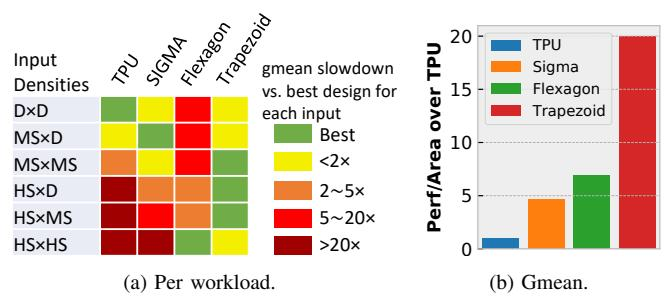

Fig. 2: Performance/area of prior accelerators and Trapezoid on matrix multiplication with different sparsity levels.

data movement is the main bottleneck. Thus, accelerators like OuterSPACE [58], SpArch [81], MatRaptor [64], Gamma [79], Flexagon [50], and Spada [43] focus on implementing *dataflows* (i.e., schedules) that minimize data movement. They spend most area on on-chip storage structures and on hardware to traverse sparse fibers (rows or columns) [66]. Multipliers and adders take less than 5–10% of area, resulting in low peak throughput, so they are inefficient on D/MS matrices. Moreover, HS accelerators are hard to scale up, so they cannot reach the peak throughput of accelerators targeting denser inputs.

Fig. 2a shows the problems of these disjoint designs: it compares three representative accelerators, one of each type: TPU, SIGMA, and Flexagon. Each row reports results for a given combination of input sparsities; the table covers all sparsity combinations (e.g., MS×D is mildly sparse times dense; see Sec. IV for methodology details). All designs are normalized to have the same area, and performance is reported relative to the best design. Fig. 2a shows that each of these accelerators is inefficient on matrices outside its range of targeted sparsities. Trapezoid handles the full range of sparsities: To address the limitations of prior accelerators, we introduce *Trapezoid*, a versatile matrix multiplication accelerator that, for the first time, handles from dense to highly sparse inputs. Fig. 2a shows Trapezoid's performance across the range: while its flexibility sacrifices some performance at the extremes, it performs consistently well across the full range of sparsities. When averaged across all input densities, Fig. 2b shows that Trapezoid's overall performance is substantially better than prior designs.

To achieve this, we design Trapezoid around two key principles and novel contributions. First, to achieve high performance on D and MS inputs, Trapezoid builds on a 2D spatial array, like prior accelerators targeting D and MS inputs. However, we contribute new techniques that *extend their usefulness to a much wider range of MS inputs* at modest area cost. Second, to work well on HS inputs, Trapezoid supports sophisticated dataflows that minimize data movement, but does so in a way that *reuses existing hardware* or requires small modifications.

Concretely, Trapezoid integrates the following contributions:

 We introduce a novel inner-product-based dataflow (called TrIP) that intersects several rows and columns at once to reduce the chance of ineffectual intersections, and exploits reuse in both inputs and outputs. We present a high-throughput organization for this dataflow that extends a spatial array with the novel high-throughput multi-fiber intersection unit, distribution networks for sparse inputs, and a reduction tree for sparse outputs. This design avoids the limitations of prior MS accelerators like SIGMA by achieving high utilization when both inputs are mildly sparse.

• We codesign two memory-efficient Gustavson-based dataflows (called TrGT and TrGS) with hardware extensions to handle HS inputs and combinations of one HS and one MS or D input, respectively. These dataflows enable reusing existing hardware when possible, and require cheap modifications otherwise. Furthermore, we design a multilevel memory hierarchy that achieves high on-chip gather bandwidth needed by these Gustavson-based dataflows with low area consumption. These novel dataflows and hardware support achieve good performance on HS×D and HS×MS that no prior accelerators can obtain, and provide almost the same performance on HS×HS as prior accelerators that focus only on highly sparse inputs.

We evaluate Trapezoid on a range of matrix multiplication workloads with varying levels of sparsity. Trapezoid has gmean  $19.7\times$ ,  $4.3\times$ , and  $2.9\times$  better performance/area than TPU [33, 34], SIGMA [60], and Flexagon [50], the prior state-of-the-art accelerators for matrix multiplication with dense, mildly sparse, and highly sparse matrices, respectively. Trapezoid is also gmean  $2.1\times$  faster than the optimal mix of these prior accelerators for this set of workloads, when both Trapezoid and this optimal mix use the same area.

### II. BACKGROUND AND MOTIVATION

Matrix multiplication computes  $C = A \times B$ , where A is a  $[M \times K]$  matrix, B is a  $[K \times N]$  matrix, and C is a  $[M \times N]$  matrix. Matrix multiplication can be implemented with three nested loops, two that traverse the independent uncontracted dimensions M and N, and one that coiterates the contracted dimension K, which is shared by A and B (we will refer to K as the coiteration dimension). The order of these loops induces a *dataflow*, i.e., a schedule of computation [8, 66].

Fig. 3 shows the three basic matrix multiplication dataflows, which differ by the level of the coiteration loop. **Inner-product** (**IP**) coiterates in the innermost loop, producing an output at a time by reducing a row and column of the input matrices. **Outer-product** (**OP**) coiterates in the outermost loop, producing an

<span id="page-1-1"></span>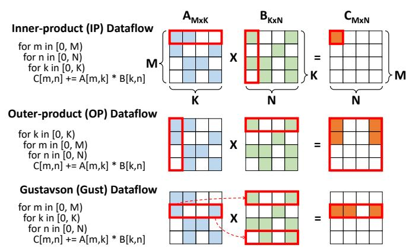

Fig. 3: Basic matrix multiplication dataflows.

<span id="page-2-0"></span>

Fig. 4: TPU 2D spatial architecture and dense IP matrix multiplication dataflow on TPU.

entire *partial result matrix* at a time; K such matrices are then reduced to produce the output. Gustavson coiterates in the middle loop, producing a row of the output at a time.

These basic dataflows have key differences, including the traversal order and level of reuse of each input and output operand, and with sparsity, the frequency and effectiveness of sparsity-handling operations, like intersections and reductions.

Accelerators implement enhanced versions of these dataflows: they often *tile* the computation, creating additional loop levels to improve reuse of operands; *parallelize* it, mapping loop iterations spatially to different processing units; and include a wide range of sparsity-handling mechanisms to skip ineffectual work and capture irregular reuse. Nonetheless, the basic dataflow accelerators build on determines key characteristics, so we refer to them as *\*-based* dataflows (e.g., IP-based).

We now discuss how matrix multiplication changes with sparsity, and review prior accelerators targeting each sparsity level.

# <span id="page-2-1"></span>*A. Spatial arrays for dense matrix multiplication*

Dense matrix multiplication is regular and has plentiful data reuse. Dense accelerators, like the TPU [\[33,](#page-13-12) [34\]](#page-13-10), adopt a 2D spatial array designed to exploit these features. [Fig. 4a](#page-2-0) shows a P × P TPU array, with a grid of multiply-and-accumulate (MAC) units, each connected only to its neighbors.

[Fig. 4b](#page-2-0) shows mapping the dense IP matrix multiplication dataflow to the TPU. The M and K loops are mapped spatially to the vertical (Y) and horizontal (X) dimensions. (assume M and K match the PE array dimensions; if they exceed them, they can be tiled). In this way, each element of A is stationary in a MAC unit. Each cycle, a column of B is fed to the first row of the array, and successive B columns move through the array using the vertical links. Each row of the 2D array performs a dot product between a row of A and a column of B; each PE computes a different partial product, and partial products are accumulated horizontally (along the K dimension), producing a column of C at a time.

This 2D spatial array achieves high data reuse and compute intensity, delivering quadratic compute throughput (P 2 MACs/cycle) with linear communication from the outside (P input and output values/cycle). Communication within the array is local, between adjacent MAC units, and thus cheap. Therefore, most area is spent on compute units.

### <span id="page-2-2"></span>*B. Leveraging mildly sparse (MS) inputs*

Mildly sparse (MS) matrices, with 1-90% nonzeros, are common in domains like deep neural networks (DNN) [\[28\]](#page-13-2). Both

weight and activation matrices can be sparse due to weight pruning and activation functions like ReLU [\[51\]](#page-14-12), but a substantial fraction of nonzeros remains. Exploiting this mild sparsity can bring significant speedups, e.g., if both inputs are 90% sparse, the number of MACs can potentially be reduced by 100×.

The level of sparsity greatly affects the effectiveness of different dataflows: with sparse matrices, the coiteration loop implies an *intersection*, and values produced below the coiteration loop must be *reduced*. IP performs *element-level* intersections and reductions: it intersects the coordinates of each row and column to find the k coordinates where both are nonzero. Those nonzeros are multiplied, then reduced to produce one output element. Element-level reductions are simple (needing just an accumulator), but intersections are frequent (M × N of them) and they become very inefficient as sparsity grows, because matches on k coordinates will be very rare. For example, in [Fig. 3,](#page-1-1) only one element from A's row and B's column results in an effectual intersection; the others are at non-matching coordinates.

OP, by contrast, performs *matrix-level* intersections and reductions: each of the K outer products is a successful intersection if the input A column and B row have *any* nonzero, so unlike IP, there are very few intersections (only K) that are trivial to perform. The tradeoff is that OP reduces K matrices, so reductions are complicated and may cause excessive data movement, e.g., to store and align these partial products.

Finally, Gustavson performs *row-level* intersections and reductions, balancing their cost: each element of A is intersected with a row of B, so there are as many intersections as *nonzeros* in A, and each intersection succeeds if B's row is not empty; and reductions happen on partial output rows.

In general, for MS inputs, IP's intersections can still be made reasonably efficient. For example, if nonzero coordinates are represented using bitvectors (a space-efficient choice with mild sparsity), intersections can be computed cheaply at high throughput, by ANDing bitvectors. If matrices have p = 20% density and coordinates are uniformly distributed, only one out of 1/p<sup>2</sup>=25 intersections yields a match on average, but ANDing 25 bits/cycle is cheap compared to the multiply-accumulate induced by the match. But highly sparse inputs make IP very inefficient, and using another dataflow becomes necessary.

SIGMA [\[60\]](#page-14-5) is an IP-based accelerator that builds on a 2D spatial array. SIGMA achieves quadratic compute with linear inputs and outputs, like dense accelerators, with modest additions. SIGMA packs A's nonzeros, placing them sequentially into each row of PEs. It then streams B columns like in the dense array (Sec. [II-A\)](#page-2-1). Each row of PE computes a few elements of C, as many as rows of A are mapped. The challenge is that B elements need to be routed to matching A nonzeros. This requires all-to-all communication *within each row of PEs*; SIGMA presents an efficient Benes *distribution network* that achieves this with modest overheads, adding about 30% area to a dense array. In addition, partial results of multiple output elements need to be reduced separately; since each A row is placed sequentially, a cheap reduction tree accomplishes this.

SIGMA maintains the high arithmetic intensity and reuse of a 2D spatial array (quadratic operations for a linear amount of inputs and outputs). However, SIGMA works well only with modest sparsity: it exploits one-sided sparsity of A, but not of B in MS×MS, which is fed uncompressed (i.e., including zeros).

Alternatively, DSTC [70] extends a 2D array to accelerate MS×MS using an OP-based dataflow. OP lets DSTC exploit dual-sided sparsity, unlike SIGMA. OP makes it trivial to produce partial products: nonzeros of each column of A and row of B are streamed into the array packed, resulting in full utilization of MAC units. The problem is that each partial product must be streamed out of the 2D array, buffered, and reduced. This sacrifices a key advantage of 2D spatial arrays: quadratic compute now requires quadratic output, instead of linear, so it is not possible to scale to large 2D arrays. Moreover, the merging step requires complex hardware, as nonzeros must be scattered to their correct locations for reduction.

These tradeoffs make IP a more efficient choice for MS inputs; Trapezoid builds on SIGMA with a new IP-based dataflow, TrIP, and hardware that enables dual-sided MS sparsity.

### C. Leveraging highly sparse (HS) inputs

Domains like graph analytics and scientific computing use highly sparse (HS) matrices, with < 1% and often many fewer nonzeros (e.g., 0.0001%).

Multiplying HS matrices causes low arithmetic intensity and reuse, as each input of A and B contributes to one or a few outputs of C. Thus, data movement becomes the key concern.

As we discussed, IP is inefficient for HS inputs because it's dominated by ineffectual intersections, leaving OP and Gustavson. Early HS×HS accelerators OuterSPACE [58] and SpArch [81] are OP-based, but OP's large partial result matrices add data movement. Thus, all recent HS×HS accelerators, including MatRaptor [64], Gamma [79], Flexagon [50], and Spada [43], leverage a Gustavson-based dataflow.

Gustavson has two advantages over OP. First, it greatly reduces the complexity of reductions; in practice, this means worse reuse of B for much better reuse of partial outputs, trading more reads for fewer writes+reads. Second, Gustavson leverages structure in A: in many applications, nearby rows of A have matching nonzeros. This causes repeated accesses to the same rows of B. Gamma [79] uses a special cache, the fibercache, to exploit this reuse, achieving close to compulsory traffic.

Recent accelerators can support multiple dataflows: Flexagon [50] presents a Merge-Reduction Network (MRN) that can be used as a reduction tree when running IP or as a merger (to facilitate reduction) when running Gustavson or OP. Spada [43] proposes a configurable window-based dataflow that acts as IP, Gustavson, or OP depending on window size.

Unfortunately,  $HS \times HS$  accelerators lack the compute throughput and scalability of  $D \times D$  and  $MS \times MS$  accelerators. First, they dedicate most area to caches, buffers, and structures to support HS, like mergers. Second, they use crossbar-based networks between PEs and on-chip storage, which are flexible but sacrifice the scalability of a 2D spatial array.

Trapezoid addresses these limitations by cheaply supporting two Gustavson-based dataflows (TrGT and TrGS) in its 2D spatial array, which retains high throughput. We observe

<span id="page-3-0"></span>

Fig. 5: Trapezoid architecture overview.

<span id="page-3-1"></span>

Fig. 6: PE row microarchitecture.

that flexible interconnects in prior accelerators stem from Gustavson's need to perform gather loads; we introduce a multi-level memory hierarchy that increases gather bandwidth with a small amount of shared storage.

### III. TRAPEZOID ARCHITECTURE

**Overview and supported dataflows:** Fig. 5 shows an overview of Trapezoid's hardware. We build Trapezoid by extending a 2D spatial array (128×128 PEs in our implementation), which excels at dense matrix multiplication and supports the standard IP dense dataflow from Sec. II-A.

To efficiently support MS inputs, Trapezoid implements a new IP-based dataflow, *TrIP*, by extending the spatial array: each row of the array, called the *PE row* and shown in Fig. 6, has a local buffer, a multi-fiber intersection unit (MFIU), two distribution networks, and a merge-reduction tree to support TrIP.

To efficiently support HS inputs, Trapezoid implements two new memory-efficient Gustavson-based dataflows, *TrGT* and *TrGS*, <sup>1</sup> which process sparse rows of *B* temporally (TrG<u>T</u>) or spatially (TrG<u>S</u>). We introduce a multi-level memory hierarchy with row-local buffers and a global cache to handle Gustavson's data movement, and reuse TrIP's hardware extensions as well.

These four dataflows let Trapezoid work well across inputs with all sparsity combinations: the standard IP dataflow handles  $D \times D$ ; TrIP handles  $MS \times D$  and  $MS \times MS$ ; TrGT handles  $HS \times HS$ ; and TrGS handles  $HS \times MS$  and  $HS \times D$ .

<span id="page-3-2"></span><sup>1</sup>To distinguish them easily, we read TrGT as target and TrGS as targus.

<span id="page-4-0"></span>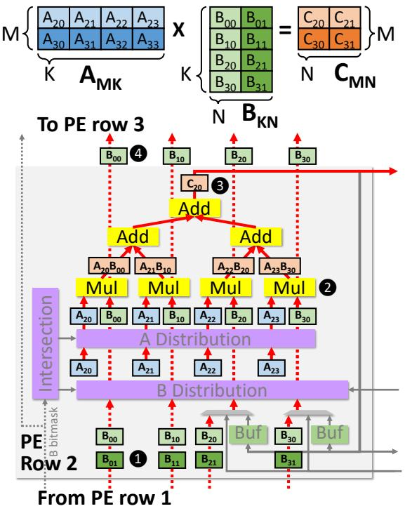

Fig. 7: Example of Trapezoid running IP for D×D.

**Matrix formats:** Trapezoid supports the most efficient formats for matrices of different sparsity levels: compressed sparse row/column (CSR/CSC) formats for HS inputs, where each sparse *fiber* (compressed row or column) is stored as a list of nonzero values and their coordinates; and variants of these formats where the nonzero coordinates are represented using *bitmasks* instead, which are more efficient for MS inputs.

In this section we introduce Trapezoid dataflow by dataflow, presenting detailed examples and introducing the novel hardware components that enable each dataflow.

# A. Dense IP dataflow (for $D \times D$ )

We first explain how Trapezoid runs dense $\times$ dense (D $\times$ D). Fig. 7 shows a walkthrough example of how a 4-multiplier PE row runs D $\times$ D. In this and future examples, all unused hardware blocks are greyed out.

Trapezoid uses a standard IP dataflow for  $D \times D$ , similar to the TPU's (Sec. II-A): each PE row computes the dot product of a row of A and a column of B. Elements of A are held at PEs, and B's columns are streamed vertically. Our only deviation from the TPU is that, instead of reducing partial products through horizontal connections, the *merge-reduction tree* performs these reductions spatially. We adapt Flexagon's merge-reduction network [50] (MRN), and explain its full functionality later. Since this is needed for sparse dataflows, we reuse it for  $D \times D$ .

Fig. 7 shows PE row 2, which holds row 2 of matrix A  $(A_{20}, A_{21}, A_{22}, A_{23})$  in registers. In this example, ① column 0 of B arrives to PE row 2 (from adjacent PE row 1); ② the multipliers compute individual partial products; ③ the reduction tree accumulates partial products and produces a single output element,  $C_{20}$ , which is streamed out of the array; in parallel, 4 column 0 of B is forwarded to the next PE row (3).

<span id="page-4-1"></span>

Fig. 8: Comparison of IP-based dataflows on MS×MS.

#### B. TrIP dataflow (for MS $\times$ MS and MS $\times$ D)

Trapezoid uses a new IP-based dataflow, TrIP, to handle MS inputs. TrIP supports *dual-side sparsity*, i.e., it remains efficient when both inputs are mildly sparse. To achieve high efficiency and reuse even when some intersections are ineffectual, TrIP *intersects a few rows of A and columns of B at a time*. By considering multiple rows and columns, each nonzero of A and B can contribute to *multiple* partial products. This compensates for ineffectual intersections and achieves fine-grained reuse.

To make this concrete, Fig. 8 compares how TPU, SIGMA's IP-based dataflow, and TrIP run the same MS×MS multiplication on a 4-multiplier PE row. The red box indicates the amount of work that is performed by a single PE row per cycle. The TPU processes a single row of A and column of B per cycle; sparsity causes ineffectual work (multiplications where either input is zero) that quickly tanks performance. In this example, A row 0 and B column 0 have a single effectual multiplication (darker color), yielding 25% utilization.

SIGMA improves on the TPU by packing A's sparse rows. In this example, the 4-multiplier PE row can hold A's rows 0 and 1. Every cycle, the PE row receives a column of B and initiates multiplications with the two rows of A. In the example, A rows 0–1 and B column 0 have two effectual multiplications, yielding 50% utilization. This is better than the TPU, but it is still limited by B's sparsity, which SIGMA does not exploit.

Trapezoid's TrIP improves on SIGMA by, in addition to packing A's sparse rows, streaming *multiple columns* of B per cycle when B is sparse. In this example, TrIP maps A's rows 0 and 1 to the PE row (like SIGMA), and streams B's columns 0 and 1. This yields four effectual intersections, using 100% of multipliers even though only 25% of intersections are effectual.

TrIP handles sparsity better than SIGMA, but it also takes more area and complexity: whereas SIGMA distributes B values to A nonzeros in fixed locations, Trapezoid must dynamically find matching nonzeros in both A and B, and distribute these nonzeros to multipliers. The complexity of some of this matching step (specifically, intersections) is quadratic with the number of rows of A and columns of B that are packed/streamed at a time. To limit complexity, we restrict the number of rows of A and columns of B to a maximum of 4 (i.e.,  $4 \times 4 = 16$  fiber intersections), which keeps hardware costs modest.

Since A and B have varying sparsities, streaming as many of B's columns as possible may require computing more partial products than multipliers in a PE row. Trapezoid dynamically adjusts the number of B columns streamed at a time so that all PE rows can process them in one shot, avoiding overflowing.

Fig. 9 shows the loop nest of TrIP dataflow and how it maps to the hardware. We first explain TrIP through an example, then detail the hardware components needed to support it.

```
A = Matrix(shape=[M1,K1,M0,K0])
B = Matrix(shape=[N1,K1,N0,K0])
C = Matrix(shape=[N1,M1,M0,N0])

for n1 = [0, N1):
    for m1 = [0, M1):
    for [n], n_h) = [0, N0).split(dynamic): # stream in groups of B cols for [m1, m_h) = [0, M0).split(static): # spatial Y, PE row for m0 = [m1, m_h): # spatial X, local buf bank, MFIU for n0 = [n_1, n_h): # spatial X, local buf word, MFIU for k0 = [0, K0): # spatial X, adjacent MRN leaf, MFIU C[n1,m1,m0,n0] += A[m1,k1,m0,k0] * B[n1,k1,n0,k0]
```

Fig. 9: Loop nest of TrIP dataflow.

<span id="page-5-1"></span>

Fig. 10: Example of Trapezoid running TrIP for MS×MS.

Walkthrough example: Fig. 10 shows Trapezoid running a similar multiplication to Fig. 7, but with mildly sparse A and B. Because A is sparse, four nonzeros from two rows of A  $(A_{20})$  $A_{22}$ ,  $A_{31}$ ,  $A_{32}$ ) are mapped to the registers in PE row 1. In this example, 11 the PE row first receives two sparse columns of B  $(B_{00}, B_{30}, B_{01}, B_{21})$ ; the intersection unit takes their bitmasks; 2 the intersection unit intersects each B bitmask with the bitmasks of the two rows of A, and finds the matching kcoordinates, which constitute the routing information for the A and B distribution networks; 3 the A and B distribution networks route values of all matching coordinates ( $A_{20}$ - $B_{00}$ ,  $A_{20}$ - $B_{01}$ ,  $A_{22}$ - $B_{21}$ ,  $A_{32}$ - $B_{21}$ ) to multipliers. Note that  $A_{31}$  and  $B_{30}$  are not routed to any of the multipliers because they do not contribute to any effectual computation; however,  $A_{21}$  and  $B_{21}$ are both used *twice*, compensating for this inefficiency. 4 Multipliers generate four partial results that eventually contribute to three final outputs  $(C_{20}, C_{21}, C_{31})$ . In TrIP, the merge-reduction tree is configured into reduction mode. 5 The merge-reduction tree behaves as 3 smaller reduction trees to generate the final outputs  $C_{20}$  (= $A_{20}B_{00}$ ),  $C_{21}$  (= $A_{20}B_{01}+A_{22}B_{21}$ ), and  $C_{31}$  $(=A_{32}B_{21})$ . 6 Final outputs are written to the local buffer (2-

<span id="page-5-2"></span>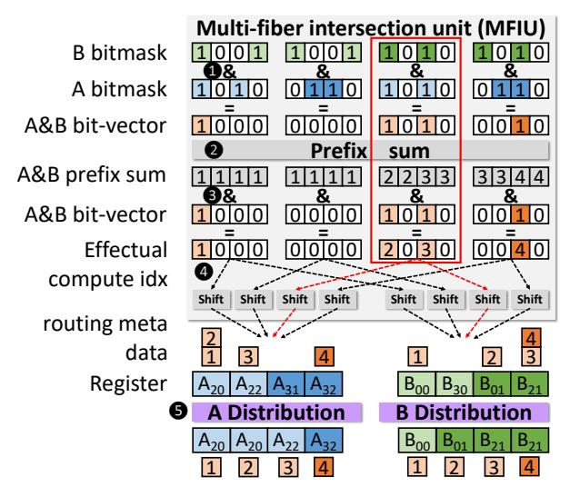

Fig. 11: Example of multi-fiber intersection and distribution.

bank 2-word wide in this example). Because  $C_{20}$  and  $C_{21}$  are contiguous, they are coalesced into one wide write to the same bank. Different banks hold the outputs of different rows; that's why  $C_{31}$  is written to the other bank. To Concurrently with this, B's columns (values and bitmasks) are forwarded to the next PE row, 2.

**Hardware extensions:** As shown in the example, TrIP requires (1) an intersection unit to find matching coordinates, (2) two distribution networks to align matching A and B nonzeros, (3) a merge-reduction tree capable of producing multiple outputs per cycle, and (4) banked buffers to store scattered outputs.

We use SIGMA's distribution network, a Benes network [3], which is non-blocking and has low area overhead. However, Trapezoid has two networks, for A and B, whereas SIGMA has a single one for B. We also adopt Flexagon's merge-reduction tree [50] that can both merge and reduce multiple partial sum clusters in a parallel and non-blocking way; However, we enhance it with a banked local buffer, described later, to achieve higher gather and scatter bandwidth. Our key innovation for TrIP is the multi-fiber intersection unit, which we explain next. Multi-fiber intersection unit (MFIU): Fig. 11 shows the structure of the multi-fiber intersection unit, which consists of hardware to (1) produce all pairwise intersections of A row and B column bitmasks (just AND gates, A&B); (2) compute the cumulative sum of matching bits, using a prefix sum; and (3) shift indices to produce routing metadata for the distribution networks.

Fig. 11 also shows how the intersection unit generates the routing information for the example in Fig. 10. A row and B column bitmasks are intersected (ANDed) pairwise, producing 4 4-bit masks, which in this case have 4 1's; The prefix sum unit (a tree of narrow adders) computes the count of 1's at or below each index; These counts are masked by the intersected bitmasks, keeping only the indices of each effectual computation. For example, focus on the intersection between the first row of A ( $[A_{20}, 0, A_{22}, 0]$ ) and second column of B ( $[B_{01}, 0, B_{21}, 0]$ ), (marked with a red box in Fig. 11). The prefix

<span id="page-6-0"></span>

Fig. 12: Example of shift unit.

sum for the two successful pairs of intersection are 2 ( $A_{20}$ -

 $B_{01}$ ) and 3 ( $A_{22}$ - $B_{21}$ ). Thus,  $A_{20}$ - $B_{01}$  is the second effectual computation and  $A_{22}$ - $B_{21}$  is the third effectual computation, which should be mapped to multipliers 2 and 3. This effectively packs the sparse multi-fiber multiplication into a dense vector multiplication, with elements in increasing coordinate order, so that all partial products that contribute to the same output element are contiguous. 4 The shift unit (described below) shifts these effectual computation indices to the corresponding registers holding the values of A and B. For instance, values  $A_{20}$ and  $B_{01}$  receive index 2. 5 Finally, the A and B distribution networks deliver the values to multipliers using the indices as routing information (this routing is done as in SIGMA [60]). Shift unit: Fig. 12 shows the microarchitecture of the shift unit and an example of its operation. The design is similar to the zero eliminator in SpAtten [68]. It is responsible for shifting the effectual computation index to the corresponding value. In this example, the effectual computation indices of A[1] (5, 6, 7) are shifted to their corresponding registers holding A[1] values (e, g, h). f does not receive an index because after intersection with columns of B, no effectual computation is generated. We start by calculating the zero count of A[1] before each element offline. A K-element input is shifted by  $\log K$  levels, with each bit of the zero count controlling whether to shift the value at this level. At i-th level, if the bit i is 1, the value is shifted left by  $2^i$ . For example, since bit 1 is 1 for index 6, it is shifted left by 2. In this way, each effectual computation index is eventually shifted to the corresponding value starting at position 0. Note

**Dynamic packing of B columns:** The key hardware constraint for choosing the number of columns of B to stream in each cycle is that the number of effectual computation generated by the intersection unit of each PE row should not exceed the number of multipliers (128). Trapezoid makes this choice ahead of time, when columns of B are streamed from off-chip to on-chip. Using the A bitmask and B bitmask, it calculates the number of effectual computations per PE row (using popocount on the

that since rows of A are stored contiguously along registers

in the PE row, the starting location of A[1] is not position 0.

A final right shift using the offset of A[1] aligns the effectual

computation indices to the values.

<span id="page-6-1"></span>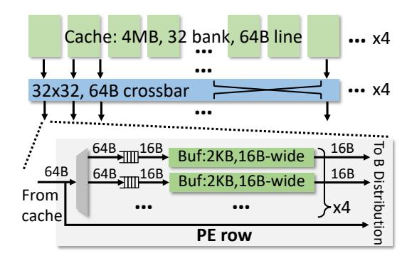

Fig. 13: Multi-level memory hierarchy.

A&B bitvector). Then, the maximum number of effectual computations across all PE rows is produced for every number of columns of B (i.e., 1-4), and Trapezoid chooses the maximum number of B columns so that the number of effectual computations does not exceed the number of multipliers per row.

Reductions and output buffering: After partial products are computed, the merge-reduction tree accumulates them. Each tree node consists of an adder, a comparator, and a few muxes. When configured in merge mode (which is not used in TrIP), comparators in each node are used to forward the smaller of the inputs up the tree; this is used to merge partial output fibers in coordinate order in TrGT/TrGS. TrIP uses the tree in reduction mode, where the adders within each node are used to form reduction trees. Following Flexagon's design, the tree can be sliced into smaller subtrees, each accumulating a contiguous subset of input elements. TrIP configures subtrees so that each subtree produces one element of C.

Since TrIP processes several A rows and B columns per cycle, it produces a larger number of C elements per cycle than SIGMA. We add a banked local buffer to support this output bandwidth. Each subtree writes results directly to the local buffer; in our implementation, the local buffer has 4 banks, each 4 words wide, which suffices to absorb the scatter-output bandwidth of intersecting 4 rows of A and 4 columns of B (i.e. a  $4\times4$  partial result matrix).

### C. TrGT dataflow (for HS×HS)

Trapezoid uses a memory-efficient Gustavson-based dataflow, TrGT (Fig. 14), similar to Gamma [79] and Flexagon's Gustavson mode [50], to handle multiplications of highly sparse inputs. In the Gustavson dataflow, A is accessed element by element and C is produced row by row, but B suffers accesses to non-consecutive rows, and has matrix-level reuse.

Trapezoid leverages caching, a key optimization to reduce B matrix traffic [50, 79]. The key innovation is Trapezoid's multilevel memory hierarchy, which offers the high gather bandwidth needed by Gustavson dataflow in HS×HS while keeping the area overhead low. In this way, Trapezoid can scale up the processing throughput of HS×HS at only modest area cost. **Multi-level memory hierarchy:** Fig. 13 shows Trapezoid's memory hierarchy. Trapezoid's global cache is organized as 4 clusters, each serving 32 PE rows. Each 4 MB cluster has

```
A = Matrix(shape=[M2,M1,M0,K])
B = Matrix(shape=[N1,K,N0])
C = Matrix(shape=[N1,M2,M1,M0,N0])
for n1 = [0, N1):
for m2 = [0, M2)
                                        B tile on-chip
  for m1 = [0, M1): # spatial Y, PE row
                                            C tile on-chip
   for m0 = [0, M0): # spatial Y, PE subrow
    B tmp = Matrix(shape=[K,N0])
    for k = [0, K): # leader follower
    for n0 = [0, N0):
      B_{tmp}[k,n0] = B[n1,k,n0]
    # merger, pipelined with next loop
    B_{tmp} = B_{tmp.transpose}() \# merger [K,N0] -> [N0,K]
    for n0 = [0, N0):
    for k = [0, K): # reduction
    C[n1,m2,m1,m0,n0] += A[m2,m1,m0,k] * B_tmp_t[n1,n0,k]
              Fig. 14: Loop nest of TrGT dataflow.
```

32 banks, and 16-word (64B) lines. A  $32 \times 32$  crossbar connects banks and PE rows. This clustered organization avoids an expensive  $128 \times 128$  all-to-all network between PE rows and caches, but at the same time offers sufficient cache capacity in each cluster (4 MB) to capture irregular reuse in the B matrix.

Each PE row has a 4-bank, 4-word-wide (16B) local buffer (matching the throughput to cache banks). Since the TrIP dataflow uses local buffers holding outputs, we *reuse* them for TrGT, though to hold inputs (rows of B). In this way, the wider 16-word sequential access to the global cache can be translated into several narrower gather accesses (4 gather reads/cycle) to 4 banks of the local buffer, effectively increasing gather bandwidth to the global cache. This hierarchical organization avoids the all-to-all communication overhead of prior HS×HS accelerators, at a modest cost of local buffer and global cache area.

In principle, we could dedicate each PE row to produce a single output row using a row of A, i.e., spatially map M to PE rows. This would let each PE row handle up to 128 nonzeros per row of A, since we have a 128 multipliers and a radix-128 merge-reduction tree. But HS matrices rarely have that many nonzeros per row, so this would leave most of the PE row unused. Since TrIP already has the hardware needed to support up to 4 rows of A, including 4 local buffer banks, and the multi-level memory hierarchy can support 4 gather accesses per cycle, we divide each PE row into 4 PE subrows.

TrGT maps different rows of A to different PE subrows (rather than PE rows), making the spatial M dimension  $4\times$ larger. Fig. 14 shows TrGT's loop nest, which includes this mapping: both the  $M_1$  and  $M_0$  dimensions are mapped spatially (instead of just  $M_1$ ) to hardware. TrGT fetches each row of B temporally, i.e., one element at a time, according to the nonzeros in the A row, and computes the linear combination of these rows of B to produce one C row. The merge-reduction tree is configured into a merge tree to facilitate the linear combination. This offers a similar functionality as a Gamma PE [79]. Depending on the number of nonzeros of A, each PE subrow gets a slice of the PE row resources. Specifically, a PE subrow handling a K-element row of A is allocated K registers (storing A values), K multipliers, 1 buffer bank (storing B rows), K-to-K distribution networks and a radix-K merge tree (by using K-element slices of the 128-element distribution networks and merge-reduction tree).

<span id="page-7-1"></span>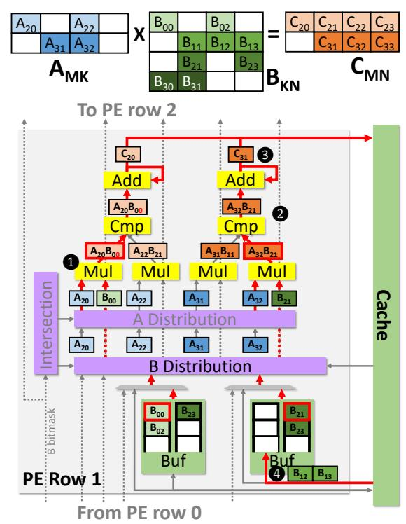

Fig. 15: Example of Trapezoid running TrGT for HS×HS.

Walkthrough example: Fig. 15 shows a 4-multiplier PE row divided in two PE subrows. In this example, the left PE subrow gathers and linearly combines 2 rows of B, B[0]  $(B_{00}, B_{02})$ and B[2]  $(B_{21}, B_{23})$ , to produce row 2 of C  $(C_{20}, C_{21}, C_{22}, C_{23})$ . Each row of B is stored in a FIFO. The two B FIFOs (holding a few head elements of B[0] and B[2]) are implemented using the local buffer; in this mode, each buffer bank offers a read throughput of 1 element/cycle. 1 Elements from each B row are routed to the multiplier holding the corresponding nonzero of A (with the matching k coordinate), and scaled. For example, B[0] is routed to  $A_{20}$ ; the figure shows how  $B_{00}$  is multiplied to produce partial product  $A_{20}B_{00}$ . 2 The merge tree flows partial products in the order of n coordinate, and accumulates those with a matching n coordinate, e.g.,  $A_{32}B_{21}$  and  $A_{31}B_{11}$ produce  $C_{31}$ . 3 Elements of C's row at the output of the merge tree are written to the cache in order. 4 The B FIFO only buffers a few head elements of the row while rest of the row  $(B_{12}, B_{13})$  is obtained from the cache in a wider word fetch (2-word in the example).

# D. TrGS dataflow (for $HS \times MS$ and $HS \times D$ )

While TrGT minimizes traffic, which is the key for HS matrices, it has low peak arithmetic intensity. Our final dataflow, TrGS, is a novel Gustavson-based dataflow that processes rows of B *spatially*. TrGS leverages our spatial fabric's multipliers and cache bandwidth, and is useful for HS×MS and HS×D, which have higher arithmetic intensity than HS×HS.

Fig. 16 shows TrGS's loop nest. TrGS uses a PE row (not subrow) to compute a single row of C, by linearly combining rows of B. TrGS spatially maps A's rows (i.e., the  $M_0$  dimension in Fig. 16) across PE rows. TrGS's key feature is that it also

```
A = Matrix(shape=[M1,M0,K])
B = Matrix(shape=[N2,K,N1,N0])
C = Matrix(shape=[N2,M1,M0,N1,N0])

for n2 = [0, N2):
    for m1 = [0, M1):
```

<span id="page-8-2"></span>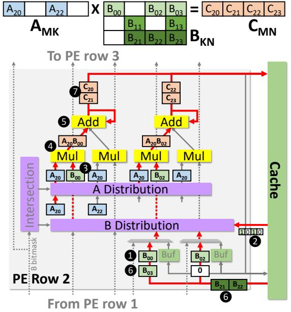

Fig. 17: Example of Trapezoid running TrGS for HS $\times$ MS. spatially maps elements of each row of B (i.e., the  $N_0$  dimension

in Fig. 16) within each PE row. TrGS reuses existing hardware.

Each multiplier is responsible for producing a single element in the final C row; 128 elements of C's row will be produced after merging all the relevant B rows. The 16-word wide cache is able to provide 16 contiguous nonzeros of B per cycle to the PE row; the B distribution network routes these nonzeros to the corresponding multipliers using their n coordinates. In this way, the PE row running TrGS conducts 16 MACs/cycle, which is  $4 \times$  higher than TrGT (1 MAC/cycle/subrow). TrGS works well for HS×MS and HS×D, but not for MS×MS, because it leverages the fact that the B row is MS or D so that we can treat the N dimension as a dense dimension with low overhead. Walkthrough example: Fig. 17 shows a 4-multiplier PE row running TrGS to generate a row of C  $(C_{20}, C_{21}, C_{22}, C_{23})$  with a 2-word wide cache. Every multiplier is responsible for producing one final output element of C's row. According to the k coordinate of the nonzeros in A  $(A_{20}, A_{22})$ , the PE row needs to scale and accumulate B row 0  $(B_{00}, B_{02}, B_{03})$  and B row 2  $(B_{21}, B_{22}, B_{23})$ . The nonzeros of these two rows of B are streamed in from the cache in order. In this example we are currently working on B row 0, so the corresponding A value  $(A_{20})$  is broadcast to all multipliers using the A distribution network. 

• Because the cache is 2-word wide, the first two

nonzeros of B row 0 ( $B_{00}$ ,  $B_{02}$ ) are fetched. 2 The bitmasks of

the two elements are read in from cache and used to route the B distribution network. 3 The B distribution network routes these B values to the corresponding multipliers using their n coordinates:  $B_{00}$  is routed to multiplier 0;  $B_{02}$  is routed to multiplier 2. 4 A and B values are multiplied to produce partial products. 5 The reduction tree accumulates partial products  $(A_{20}B_{00}, A_{20}B_{02})$  with the partial results of  $C_{20}$  and  $C_{22}$ , respectively. 6 Later, the remaining nonzeros of B row 0  $(B_{03})$  and B row 2  $(B_{21}, B_{22}...)$  are fetched in wide 2-word accesses from the cache and accumulated. 7 Finally, when all the accumulation of B row 0 and B row 2 are done, the final result row of C  $(C_{20}, C_{21}, C_{22}, C_{23})$  is written to the cache.

### IV. METHODOLOGY

<span id="page-8-0"></span>**System:** We built a cycle-level simulator to evaluate Trapezoid, using the configuration shown in Table I. This configuration provides 32 TFLOP/s, using 128 PE rows, each with 128 FP32 multipliers and adders, running at 1 GHz. The 17 MB of onchip SRAM is organized as a 16MB cache (4MB/cluster); local buffers take an additional 1 MB. The system has 2TB/s HBM main memory, representative of modern GPUs and TPUs. We model the activities of all hardware components cycle by cycle, including MAC units, merge-reduction tree, distribution networks, multi-fiber intersection unit, local buffers, global cache, and HBM. We model contention and stalls faithfully.

**Baselines:** We compare Trapezoid against three state-of-the-art accelerators designed for matrix multiplication with D, MS, and HS inputs: TPU [33], SIGMA [60], and Flexagon [50]. Since TPU and SIGMA are also designed on top of a 2D spatial array, we size them with the same 128×128 spatial array as Trapezoid and a 16MB global scratchpad. SIGMA is also equipped with the same 1MB local buffer as Trapezoid.

The original Flexagon design has 64 MACs and a 1MB cache, which provide limited compute throughput (this is the case for other HS accelerators). We carefully scale it up to match Trapezoid's area by replicating 67 Flexagon instances without establishing all-to-all connections among instances (otherwise, the crossbar would completely dominate area). The scaled-up Flexagon system has  $67 \times 64$  MACs, and 67 MB of cache.

We model the baselines using the same simulation infrastructure described above. Our simulation results closely follow the performance numbers reported in the original papers.

**Area and energy:** We implement Trapezoid and baseline components in RTL and synthesize them in 45 nm using the FreePDK library [52]. We use CACTI7 [5] to estimate SRAM area in 45 nm. We then scale the area to 16 nm [59]. We present detailed area analysis in Sec. V-A. We obtain component energies using FreePDK15 [6] and Synopsys Design Compiler, and estimate HBM energy from prior work [18, 61].

**Workloads:** We evaluate 128 standalone matrix multiplication workloads (15 D×D, 15 MS×D, 38 MS×MS, 12 HS×D, 36 HS×MS, 12 HS×HS) and 8 DNNs (4 Llama, 2 ResNet, 2 VGG) with widely varying sparsity levels. Table III and Table IV list the matrices we use and their densities.

D and MS combinations use DNN workloads. For  $\mathbf{D} \times \mathbf{D}$ , we select 15 projection layers from the Llama-2-7B [67] large

TABLE I CONFIGURATION AND AREA BREAKDOWN OF TRAPEZOID.

<span id="page-9-0"></span>

| Component                     | Config                                          | $Area(mm^2)$ |
|-------------------------------|-------------------------------------------------|--------------|
| Vector multiplier             | 128× FP32 multiplier                            | 0.17         |
| Merge-reduction tree          | radix-128, FP32 adder                           | 0.13         |
| Distribution network          | 32b 128×128 Benes                               | 0.10         |
| Multi-fiber intersection unit | 4 rows & 4 columns                              | 0.12         |
| Local Buffer                  | 8KB, 4 banks, 16B-wide                          | 0.03         |
| PE row                        |                                                 | 0.54         |
| Compute overall               | 128×PE row                                      | 69.7         |
| Cache                         | 16MB, 128 banks, 16-waset-associative, 64B line | 10.2         |
| NoC                           | 4 64B 32×32 crossbar (cache banks ↔ 32 PE re    | 2.0          |
| Trapezoid Overall             | 1GHz, 128×128 MACs,<br>17MB SRAM, 2TB/s HE      | 81.9         |

# $\begin{tabular}{ll} TABLE & II \\ CONFIGURATION & AND & AREA & OF & THE BASELINE SYSTEMS. \\ \end{tabular}$

<span id="page-9-4"></span>

| Component               | Config Area                                                   | $n(mm^2)$ |
|-------------------------|---------------------------------------------------------------|-----------|
| TPUv3-like [33]         | 1GHz, 128×128 MACs,<br>16MB SRAM, 2TB/s HBM                   | 41.0      |
| SIGMA [60]              | 1GHz, 128×128 MACs,<br>17MB SRAM, 2TB/s HBM                   | 62.3      |
| Scaled-up Flexagon [50] | 1GHz, 67 Flexagon instances, 67×64 MACs, 67MB SRAM, 2TB/s HBM |           |

### TABLE III DNN workloads.

<span id="page-9-2"></span>

| DNN        | weight density | activation density |
|------------|----------------|--------------------|
| Llama2-7b  | 0.2-0.6, 1.0   | 1.0                |
| ResNet-0.2 | 0.11-0.22      | 0.27-0.75          |
| ResNet-0.1 | 0.03-0.12      | 0.30-0.76          |
| VGG-0.32   | 0.27-0.53      | 0.26-0.71          |
| VCC 0.1    | 0.1            | 0.20.0.75          |

TABLE IV HS MATRICES.

<span id="page-9-3"></span>

| Name            | density | rows   | nnz     | name       | density | rows   | nnz     |
|-----------------|---------|--------|---------|------------|---------|--------|---------|
| p2p-Gnutella24  | 9.3e-5  | 26518  | 65369   | sme3Db     | 2.5e-3  | 29067  | 2081063 |
| sx-mathoverflow | 3.9e-4  | 24818  | 239978  | poisson3Da | 1.9e-3  | 13514  | 352762  |
| ca-CondMat      | 3.5e-4  | 23133  | 186936  | wiki-RfA   | 1.5e-3  | 11380  | 188077  |
| Oregon-2        | 3.5e-4  | 11806  | 65460   | ca-AstroPh | 1.1e-3  | 18772  | 396160  |
| email-Enron     | 2.7e-4  | 36692  | 367662  | msc10848   | 1.0e-2  | 10848  | 1229776 |
| opt1            | 8.1e-3  | 15449  | 1930655 | ramage02   | 1.0e-2  | 16830  | 2866352 |
| scircuit        | 3.3e-5  | 170998 | 958936  | cage12     | 1.2e-4  | 130228 | 2032536 |
| gupta2          | 1.1e-3  | 62064  | 4248286 |            |         |        |         |

language model with dense activations. For MS×D, we use a sequence length of 1024 and follow recent work that sparsifies GPT networks [15, 40]: we conduct magnitude-based pruning on the weight matrices of 3 Llama-2-7B [67] projection layers to match the density levels in this recent work: 0.2, 0.3, 0.4, 0.5, 0.6. For MS×MS, we prune ResNet-50 [29] to average weight densities of 0.1 and 0.2 using STR [41], and pick 8 convolution layers per model. We also conduct magnitude-based pruning on VGG-16 [62] to density 0.1 and 0.32 and use all 11 convolution layers. Sparse activations are extracted by running the pruned model on ImageNet [11]. We also evaluate end-to-end performance on these DNNs, pruned to different degrees.

Combinations involving HS inputs use matrices from SuiteS-parse [38]. For  $\mathbf{HS} \times \mathbf{D}$ , we select 12 diverse matrices and multiply them with a randomly generated 1024-column dense B matrix; this is representative of e.g. solvers with multiple right hand sides. For  $\mathbf{HS} \times \mathbf{MS}$ , the same 12 matrices are multiplied

with 3 randomly generated 1024-column sparse B matrices with density 0.2, 0.4, 0.6. For  $\mathbf{HS} \times \mathbf{HS}$ , we evaluate  $A \times A^T$  for the 12 matrices (matching the workload of prior HS accelerators). Tiling: We conduct coordinate-space [32] and occupancy-based tiling [54] on the inputs to maximize data reuse and on-chip buffer utilization similar to prior work [50, 60, 79]. For TrIP, we perform coordinate-space tiling on K and occupancy-based tiling on K and occupancy-based tiling on K and occupancy-based tiling on K and occupancy-based tiling on K and occupancy-based tiling on K and occupancy-based tiling on K and occupancy-based tiling on K and occupancy-based tiling on K and occupancy-based tiling on K.

### V. EVALUATION

### <span id="page-9-1"></span>A. Area

Table I shows the area breakdown of Trapezoid and Table II reports the overall area of the baseline accelerators. Trapezoid is  $81.9 \, \mathrm{mm^2}$  at 16nm, which is  $2.0 \times 100 \, \mathrm{mm^2}$  larger than TPU and  $1.3 \times 100 \, \mathrm{mm^2}$  transportance of the SIGMA at iso-throughput configurations (32 TFLOPs).

Fig. 18 shows the area breakdown of all accelerators. TPU, SIGMA, and Trapezoid dedicate a significant fraction of area to compute to ensure high throughput on dense inputs. The area overhead of

<span id="page-9-5"></span>

Fig. 18: Area breakdown.

Trapezoid over TPU mainly comes from the sparsity handling hardware (distribution network, multi-fiber intersection unit, merge-reduction tree), which occupies half of the PE row area. The additional A distribution network and multi-fiber intersection unit in Trapezoid contributes to a modest 30% area increase over SIGMA but improves performance significantly. Flexagon, on the other hand, spends most of the area on buffers to overcome the memory bottleneck with HS inputs, and therefore cannot offer high performance on denser cases due to the insufficient compute resources. Trapezoid's novel multi-level memory hierarchy design enables the same traffic reduction and high gather bandwidth while keeping total capacity modest.

# B. Overall Performance

Fig. 19 presents the performance/area of all accelerators on all 6 category of workloads: D×D, MS×D, MS×MS, HS×D, HS×MS, and HS×HS. For accelerators supporting multiple dataflows (Trapezoid and Flexagon), we pick the best-performing dataflow for each workload, like [50]; Sec. V-C analyzes dataflow choice. We use performance/area rather than performance to penalize Trapezoid for its higher area over the iso-throughput TPU and SIGMA designs. Within each category, we take the gmean over all workloads and report performance/area normalized to the best design. The overall performance/area is the gmean over the gmean of all categories (this avoids biasing to categories with more inputs).

Trapezoid achieves  $19.7 \times$ ,  $4.3 \times$ , and  $2.9 \times$  better performance/area than TPU, SIGMA, and Flexagon, respectively. From left to right, the workloads become sparser. TPU, designed

<span id="page-10-0"></span>

Fig. 19: Performance/area comparison on matrix multiplication with different sparsity levels (normalized to the best accelerator in each category).

<span id="page-10-2"></span>

Fig. 20: End-to-end performance/area comparison on DNNs with different sparsity levels (normalized to the best accelerator).

for D $\times$ D, is the best on D $\times$ D but tanks on sparser workloads because it cannot exploit any sparsity (e.g., TPU is 4134 $\times$  worse than Trapezoid on the sparsest HS $\times$ HS). SIGMA is optimized for mildly sparse inputs and therefore performs better than TPU on MS $\times$ D and MS $\times$ MS. But it also takes a significant performance hit on HS inputs. Flexagon performs well on HS $\times$ HS and HS $\times$ MS, but on denser inputs, it is far slower than other accelerators due to its limited compute throughput.

By contrast, Trapezoid performs consistently well across workloads despite their vastly different sparsity levels. It is only  $2.0\times$  and  $1.3\times$  away performance/area-wise from the best performing accelerator on D×D (TPU) and MS×D (SIGMA). Because Trapezoid is able to achieve the same peak throughput of TPU in D×D and SIGMA in MS×D, their performance/area difference stems from the area overhead of sparsity handling hardware in Trapezoid. Thanks to the multi-fiber intersection unit, Trapezoid is  $2.1\times$  better than SIGMA on MS×MS. The TrGS dataflow excels at HS×D and HS×MS and achieves  $2.4\times$  and  $2.5\times$  better performance/area than Flexagon. On HS×HS, Trapezoid is only  $1.2\times$  worse than Flexagon.

End-to-end DNN performance: Fig. 20 shows the end-to-end performance per area of running 8 DNN workloads with varying levels of activation and weight sparsity (D×D, MS×D and MS×MS). Llama-1.0 is fully dense, so the TPU is optimal; Trapezoid is only 2.0×/1.3× slower than TPU and SIGMA. The weight-sparsified Llamas (Llama-0.6,0.4,0.2) are dominated by MS×D, so SIGMA is optimal for them; Trapezoid is only 1.3× slower. Finally, the layers in ResNet-50 and VGG-16 leverage both weight and activation sparsity, and are therefore MS×MS workloads. Trapezoid has 1.4-2.9× better performance/area than SIGMA on ResNet-50 and VGG-16, and outperforms the other accelerators further.

**Roofline analysis:** Fig. 21 shows two roofline plots of all accelerators on all workloads. The full plot is shown on the bottom-right corner; the large plot is a zoomed-in region. The memory roofline is 2TB/s and the compute roofline is TPU/SIGMA/Trapezoid's peak throughput (32TFLOPs).

<span id="page-10-3"></span>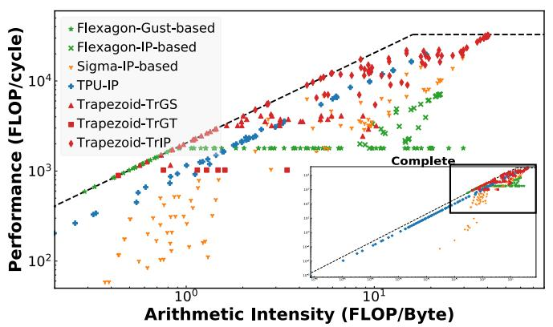

Fig. 21: Log-log roofline of all workloads.

Trapezoid is always on or close to the roofline because its design optimizes for all sparsity levels. For accelerators that can run multiple dataflows (Trapezoid and Flexagon), only the best-performing dataflow per workload is shown. When running workloads with any sparsity, TPU's (+) throughput quickly drops. SIGMA (Y) achieves modest throughput with MS inputs (top right region), but quickly drops far below the roofline on sparser inputs (bottom left region). Flexagon uses its Gustavson-based dataflow with HS inputs (\*), leveraging its cache to improve arithmetic intensity and reach the memory roofline. Its limited gather bandwidth sometime limits throughput (flat line). On denser workloads, Flexagon's IP-based dataflow (X) is far away from the roofline due to its limited peak throughput.

Trapezoid is always close to the roofline across different arithmetic intensities. With high arithmetic intensity  $D\times MS$  inputs (top right corner),  $TrIP(\)$  achieves the highest throughput. When we gradually move left on the plot lowering the arithmetic intensity, the TrGS dataflow ( $\)$ ) takes over and lets Trapezoid comfortably saturate the memory bandwidth. Finally on  $HS\times HS$ ,  $TrGT(\)$ ) performs the best. Thanks to the on-chip cache and Gustavson-based dataflows, Trapezoid is also at or near the roofline for  $HS\times D$ ,  $HS\times MS$ , and  $HS\times HS$ .

Trapezoid outperforms combinations of prior accelerators: Faced with a diverse workload mix, we could combine multiple accelerators to achieve better gmean performance. We study this by finding the optimal accelerator mix for our workload mix. We explore combinations of TPU, SIGMA, and Flexagon that take the same total area as Trapezoid, and process each matrix across all accelerators (this way, each accelerator contributes to performance on all workloads). We find that, for this mix of workloads, the optimal combination is to devote 60% of area to SIGMA and 40% to Flexagon. Still, Trapezoid is gmean  $2.1 \times$  faster than this combination.

### <span id="page-10-1"></span>C. Analysis of representative workloads

We select 3 representative workloads from each category (MS×D, MS×MS, HS×D, HS×MS, HS×HS) and present their results to gain more insights into Trapezoid's efficiency. Fig. 22 shows the performance/area of these 15 workloads normalized to the best-performing accelerator. In addition, for denser workloads (MS×D, MS×MS), which are typically compute-bound,

<span id="page-11-0"></span>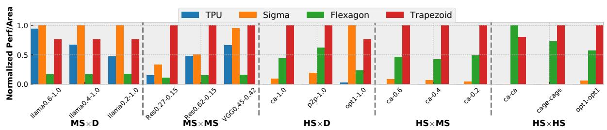

Fig. 22: Performance/area comparison on 15 representative workloads (normalized to the best accelerator).

<span id="page-11-1"></span>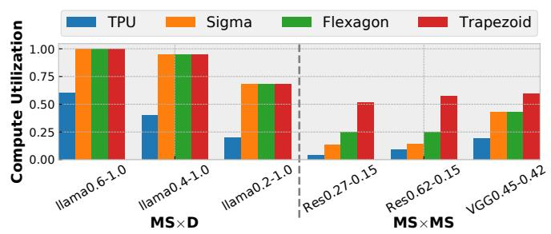

Fig. 23: Compute utilization comparison on 6 denser workloads.

<span id="page-11-2"></span>

Fig. 24: Off-chip memory traffic breakdown comparison on 9 sparser workloads (normalized to SIGMA). P: TPU, S: SIGMA, F: Flexagon, T: Trapezoid.

<span id="page-11-3"></span>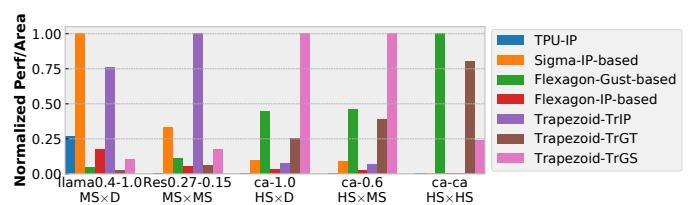

Fig. 25: Performance/area of different dataflows on 5 representative workloads (normalized to the best dataflow).

we plot the compute utilization in Fig. 23. Trapezoid consistently achieves the highest compute utilization in denser workloads. And for sparser workloads (HS×D, HS×MS, HS×HS) which tend to be memory bound, we plot the off-chip traffic breakdown by data type in Fig. 24 (normalized to SIGMA). Trapezoid has the lowest traffic for all sparser workloads.

For MS×D, SIGMA, Flexagon, and Trapezoid all exploit A's sparsity using an IP-based dataflow and achieve high compute utilization. But these accelerators cannot fully exploit the 20% dense A in 11ama0.2-1.0 because they can only pack 4 rows of A. TPU utilization drops as A gets sparser as doing IP densely results a significant amount of ineffectual work.

Trapezoid particularly shines in MS $\times$ MS. It achieves a 13.3 $\times$  utilization gain over TPU in Res0.27-0.15 with 27% dense A and 15% dense B, which translates into 6.5 $\times$  better performance/area. This is because Trapezoid's multi-fiber intersection unit is able to conduct 16 fiber intersections (4 rows of A and 4 columns of B) at once rather than 1 fiber intersec-

tion in TPU. Trapezoid's gain over SIGMA derives from its ability to exploit the additional B sparsity using the multi-fiber intersection unit. Its theoretical  $4\times$  utilization gain is realized in Res0.27-0.15 and Res0.62-0.15, which results in  $3.0\times$  and  $2.0\times$  better performance/area than SIGMA. TrIP's benefits are lower when B is denser: in VGG0.45-0.42, the Trapezoid intersection unit can pack 2 columns of B per cycle at most, achieving  $1.4\times$  higher utilization. Though Flexagon achieves similar utilization to SIGMA, its low peak throughput results in  $6.9\times$  worse performance/area than Trapezoid.

For HS workloads, we pick four representative matrices (ca-CondMat, p2p, opt1, cage12) with varying sparsity degrees and nonzero patterns. In HS×D, Trapezoid achieves  $10.6\times$  and  $5.4\times$  better performance/area than SIGMA on ca and p2p, because it runs TrGS, avoiding the ineffectual work of IP-based SIGMA. Gustavson's dataflow also reduces effectual fetch of B, which can be observed in Fig. 24 as Trapezoid and Flexagon has lower traffic than SIGMA and TPU. opt1 shows different behavior, and SIGMA performs best. Though opt1 has low overall density, its nonzeros appear in dense clusters. SIGMA's IP-based dataflow achieves high throughput in the dense clusters and skips the other regions. Trapezoid's TrIP is close to SIGMA  $(1.3\times$  performance/area away).

In HS $\times$ MS, Trapezoid performs the best on varying density of B matrices, roughly  $2\times$  better than Flexagon owing to our novel TrGS dataflow over Flexagon's TrGT-like dataflow. TrGS can utilize a larger fraction of the spatial array (compared to TrGT) to achieve higher peak throughput.

For HS×HS, Trapezoid achieves similar performance/area as HS×HS-optimized Flexagon. Trapezoid runs TrGS more efficiently on opt1 because of its dense clusters, achieving 1.8× performance/area improvement over Flexagon. Flexagon is more efficient on ca. Because both Trapezoid and Flexagon run a TrGT-like dataflow, Flexagon has higher peak throughput than Trapezoid in TrGT mode. However, their efficiency is flipped on cage, which saturates HBM bandwidth, so Flexagon's smaller cache translates to higher traffic. Finally, both Trapezoid and Flexagon have the lowest traffic in HS×HS.

Finally, Fig. 25 reports the performance/area of individual dataflows (IP- and Gustavson-based) on 5 representative work-loads. For MS inputs, IP-based dataflows outperform Gustavson-based ones. As Sec. II-B described, supporting complex row reductions in Gustavson (and matrix reductions in OP) has higher costs and is thus less desirable than intersections for MS inputs. When the sparsity level increases, i.e. from MS×D to MS×MS, IP-based dataflows (e.g., SIGMA) gradually drop

<span id="page-12-0"></span>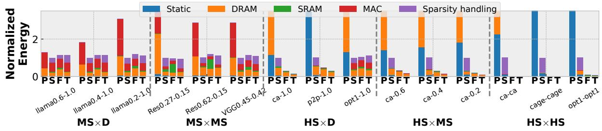

Fig. 26: Energy breakdown comparison on 15 workloads (normalized to SIGMA). P: TPU, S: SIGMA, F: Flexagon, T: Trapezoid.

in performance/area due to increasing ineffectual intersections. On HS inputs, Gustavson-based dataflows (Flexagon, TrGT, TrGS) consistently outperform IP-based dataflows, by avoiding ineffectual intersections and reducing memory traffic.

By looking at individual dataflows, we can also establish comparisons with other HS×HS accelerators beyond Flexagon. Spada [43] would be similar performance as Flexagon, as they have similar compute to memory ratio and support multiple dataflows. We expect Gamma [79] to perform similarly to Flexagon-Gust; MatRaptor [64] would be slower due to the lack of caching [79], and conversely, Trapezoid's memory organization increases effective capacity and reduces traffic.

# D. Energy and Power

Fig. 26 shows the energy breakdown (normalized to SIGMA) on the same 15 representative workloads. In MS×D and MS×MS, Trapezoid only incurs a modest 13% energy overhead over SIGMA on average. Trapezoid is 1.1-2.6× and 2.4-6.8× more energy-efficient than TPU on MS×D and MS×MS by exploiting sparsity. For HS inputs, Trapezoid and Flexagon significantly reduce energy over SIGMA and TPU. TPU suffers from high static energy, and SIGMA's ineffectual IP intersections result in high sparsity-handling energy. On HS inputs, Trapezoid uses gmean  $13.5\times$  and  $1660\times$  less energy than SIGMA and TPU. Trapezoid is even more energy efficient than Flexagon because its multi-level memory hierarchy can hold larger tiles of B, reducing HBM traffic. Across all workloads, Trapezoid achieves gmean  $1697\times$ ,  $20\times$ , and  $3.6\times$  better EDP than TPU, SIGMA, and Flexagon.

Power analysis shows TPU operates at around 100W, consistent with published figures [33, 34]. Trapezoid, with  $2\times$  the area of TPU, consumes 25-191W (average 110W), with HS inputs on the lower end and MS/D inputs on the higher end.

### VI. ADDITIONAL RELATED WORK

Prior work has proposed accelerators for applications domains involving matrix multiplication. In dense/sparse neural networks, accelerators for CNNs [1, 2, 8, 16, 17, 22, 59, 74, 80], transformers [25, 26, 35, 47, 68, 76, 77, 78], point clouds [13, 14, 45] and beyond have been proposed. These focus on the D/MS matrices in neural networks and do not handle HS matrices well. In domains involving HS matrices, such as graph analytics [7, 10, 19, 23, 27, 42, 48, 49, 72, 73, 75] and scientific computing [4, 12, 20, 30, 63, 69], various accelerators have been designed. They devote significant area to memory optimizations due to the low arithmetic intensity of HS matrices.

ExTensor [32] supports operations beyond matrix multiplication, such as tensor contractions. ExTensor can perform tiling and multi-level intersection of coordinate lists to skip ineffectual work, e.g., skipping intersections of tiles that are zero. ExTensor is tailored to HS tensors and, like the HS×HS accelerators above, has limited compute throughput needed by MS and D inputs. Tensaurus [65] codesigns a novel storage format and accelerator for computations that combine sparse and dense tensors.

Another line of work exploits a specific type of sparsity presents in neural networks, structured sparsity, where zeros appear in a structured pattern (e.g. an entire channel) [31]. The NVIDIA Sparse Tensor Core (STC) [56] exploits 2:4 sparsity of weights in DNNs where there are at most 2 nonzeros in a 4-element block. S2TA [46] supports structured sparsity on both weights and activations. HighLight [71] proposes Hierarchical Structured Sparsity (HSS) to represent finer-grain sparsity levels in DNNs and presents cheap hardware support for it. However, structured sparsity is limited to DNNs, degrades accuracy further (so for a given target accuracy, exploiting unstructured sparsity allows sparser matrices), and cannot be applied to other domains where matrices have arbitrary sparsity patterns.

# VII. CONCLUSION

Matrix multiplication is a key kernel in many application domains. However, applications process matrices with orders-of-magnitude variation in their sparsity degree, which induce very different performance characteristics. We have shown that it is possible to design a single accelerator that exploits a wide range of sparsities. Trapezoid extends a 2D spatial array architecture with a novel multi-fiber intersection unit and multi-level memory hierarchy to gracefully handle increasing levels of sparsity at modest area costs. The architecture supports multiple novel dataflows, both inner-product-based (TrIP) and Gustavson-based (TrGT, TrGS), that achieve high throughput while reusing hardware. As a result, Trapezoid's substantially outperforms prior accelerators, which target a specific sparsity range.

## ACKNOWLEDGMENTS

We sincerely thank Maggie Du, Fares Elsabbagh, Axel Feldmann, Courtney Golden, Aleksandar Krastev, Hyun Ryong Lee, Quan Nguyen, Nikola Samardzic, Shabnam Sheikhha, Victor Ying, and the anonymous reviewers for their helpful feedback. This work was supported in part by the Semiconductor Research Corporation under contract 2020-AH-2985, and by the National Science Foundation under grant CCF-2217099.

### REFERENCES

- <span id="page-13-23"></span>[1] J. Albericio, P. Judd, T. Hetherington, T. Aamodt, N. E. Jerger, and A. Moshovos, "Cnvlutin: Ineffectual-neuron-free deep neural network computing," in *Proc. ISCA-43*, 2016.
- <span id="page-13-24"></span>[2] M. Alwani, H. Chen, M. Ferdman, and P. Milder, "Fused-layer CNN accelerators," in *Proc. MICRO-49*, 2016.
- <span id="page-13-14"></span>[3] S. Arora, T. Leighton, and B. Maggs, "On-line algorithms for path selection in a nonblocking network," in *Proceedings of the twenty-second annual ACM symposium on Theory of computing*, 1990, pp. 149–158.
- <span id="page-13-40"></span>[4] B. Asgari, R. Hadidi, T. Krishna, H. Kim, and S. Yalamanchili, "Alrescha: A lightweight reconfigurable sparse-computation accelerator," in *Proc. HPCA-26*, 2020.
- <span id="page-13-15"></span>[5] R. Balasubramonian, A. B. Kahng, N. Muralimanohar, A. Shafiee, and V. Srinivas, "CACTI 7: New tools for interconnect exploration in innovative off-chip memories," *ACM Transactions on Architecture and Code Optimization (TACO)*, vol. 14, no. 2, 2017.
- <span id="page-13-16"></span>[6] K. Bhanushali and W. R. Davis, "FreePDK15: An Open-Source Predictive Process Design Kit for 15nm FinFET Technology," in *Proc. of the 2015 Intl. Symp. on Physical Design (ISPD)*, 2015, p. 165–170.
- <span id="page-13-34"></span>[7] X. Chen, T. Huang, S. Xu, T. Bourgeat, C. Chung, and A. Arvind, "Flexminer: A pattern-aware accelerator for graph pattern mining," in *Proc. ISCA-48*, 2021.
- <span id="page-13-13"></span>[8] Y.-H. Chen, J. Emer, and V. Sze, "Eyeriss: a spatial architecture for energyefficient dataflow for convolutional neural networks," in *Proc. ISCA-43*, 2016.
- <span id="page-13-0"></span>[9] C. Choy, J. Gwak, and S. Savarese, "4d spatio-temporal convnets: Minkowski convolutional neural networks," in *Proceedings of the IEEE/CVF conference on computer vision and pattern recognition*, 2019, pp. 3075–3084.
- <span id="page-13-35"></span>[10] V. Dadu, S. Liu, and T. Nowatzki, "Polygraph: Exposing the value of flexibility for graph processing accelerators," in *Proc. ISCA-48*, 2021.
- <span id="page-13-21"></span>[11] J. Deng, W. Dong, R. Socher, L.-J. Li, K. Li, and L. Fei-Fei, "ImageNet: A large-scale hierarchical image database," in *Proc. CVPR*, 2009.
- <span id="page-13-41"></span>[12] A. Feldmann and D. Sanchez, "Spatula: A hardware accelerator for sparse matrix factorization," in *Proc. MICRO-56*, 2023.
- <span id="page-13-31"></span>[13] Y. Feng, G. Hammonds, Y. Gan, and Y. Zhu, "Crescent: taming memory irregularities for accelerating deep point cloud analytics," in *Proc. ISCA-49*, 2022.
- <span id="page-13-32"></span>[14] Y. Feng, B. Tian, T. Xu, P. Whatmough, and Y. Zhu, "Mesorasi: Architecture support for point cloud analytics via delayed-aggregation," in *Proc. MICRO-53*, 2020.
- <span id="page-13-1"></span>[15] E. Frantar and D. Alistarh, "Sparsegpt: Massive language models can be accurately pruned in one-shot," 2023.
- <span id="page-13-25"></span>[16] M. Gao, J. Pu, X. Yang, M. Horowitz, and C. Kozyrakis, "Tetris: Scalable and efficient neural network acceleration with 3d memory," in *Proc. ASPLOS-XXII*, 2017.
- <span id="page-13-26"></span>[17] M. Gao, X. Yang, J. Pu, M. Horowitz, and C. Kozyrakis, "Tangram: Optimized coarse-grained dataflow for scalable nn accelerators," in *Proc. ASPLOS-XXIV*, 2019.
- <span id="page-13-17"></span>[18] W. Ge, M. Zhao, C. Wu, and J. He, "The design and implementation of ddr phy static low-power optimization strategies," in *Communication Systems and Information Technology*, 2011.
- <span id="page-13-36"></span>[19] T. Geng, A. Li, R. Shi, C. Wu, T. Wang, Y. Li, P. Haghi, A. Tumeo, S. Che, S. Reinhardt *et al.*, "Awb-gcn: A graph convolutional network accelerator with runtime workload rebalancing," in *Proc. MICRO-53*, 2020.
- <span id="page-13-42"></span>[20] G. Gerogiannis, S. Yesil, D. Lenadora, D. Cao, C. Mendis, and J. Torrellas, "Spade: A flexible and scalable accelerator for spmm and sddmm," in *Proc. ISCA-50*, 2023.
- <span id="page-13-5"></span>[21] J. R. Gilbert, S. Reinhardt, and V. B. Shah, "High-performance graph algorithms from parallel sparse matrices," in *International Workshop on Applied Parallel Computing*, 2006.
- <span id="page-13-27"></span>[22] A. Gondimalla, N. Chesnut, M. Thottethodi, and T. Vijaykumar, "SparTen: A sparse tensor accelerator for convolutional neural networks," in *Proc. MICRO-52*, 2019.
- <span id="page-13-37"></span>[23] Z. Gong, H. Ji, Y. Yao, C. W. Fletcher, C. J. Hughes, and J. Torrellas, "Graphite: optimizing graph neural networks on cpus through cooperative software-hardware techniques," in *Proc. ISCA-49*, 2022.
- <span id="page-13-7"></span>[24] H. Goto, K. Endo, M. Suzuki, Y. Sakai, T. Kanao, Y. Hamakawa, R. Hidaka, M. Yamasaki, and K. Tatsumura, "High-performance combinatorial optimization based on classical mechanics," *Science Advances*, vol. 7, no. 6, p. eabe7953, 2021.

- <span id="page-13-28"></span>[25] T. J. Ham, S. J. Jung, S. Kim, Y. H. Oh, Y. Park, Y. Song, J.-H. Park, S. Lee, K. Park, J. W. Lee, and D.-K. Jeong, "A<sup>3</sup> : Accelerating attention mechanisms in neural networks with approximation," in *Proc. HPCA-26*, 2020.
- <span id="page-13-29"></span>[26] T. J. Ham, Y. Lee, S. H. Seo, S. Kim, H. Choi, S. J. Jung, and J. W. Lee, "Elsa: Hardware-software co-design for efficient, lightweight self-attention mechanism in neural networks," in *Proc. ISCA-48*, 2021.
- <span id="page-13-38"></span>[27] T. J. Ham, L. Wu, N. Sundaram, N. Satish, and M. Martonosi, "Graphicionado: A high-performance and energy-efficient accelerator for graph analytics," in *Proc. MICRO-49*, 2016.
- <span id="page-13-2"></span>[28] S. Han, H. Mao, and W. J. Dally, "Deep compression: Compressing deep neural networks with pruning, trained quantization and Huffman coding," in *Proc. ICLR*, 2015.
- <span id="page-13-19"></span>[29] K. He, X. Zhang, S. Ren, and J. Sun, "Deep residual learning for image recognition," in *Proc. CVPR*, 2016.
- <span id="page-13-43"></span>[30] X. He, S. Pal, A. Amarnath, S. Feng, D.-H. Park, A. Rovinski, H. Ye, Y. Chen, R. Dreslinski, and T. Mudge, "Sparse-tpu: Adapting systolic arrays for sparse matrices," in *Proceedings of the 34th ACM international conference on supercomputing*, 2020, pp. 1–12.
- <span id="page-13-44"></span>[31] Y. He, X. Zhang, and J. Sun, "Channel pruning for accelerating very deep neural networks," in *Proc. ICCV*, 2017.
- <span id="page-13-8"></span>[32] K. Hegde, H. Asghari-Moghaddam, M. Pellauer, N. Crago, A. Jaleel, E. Solomonik, J. Emer, and C. W. Fletcher, "ExTensor: An accelerator for sparse tensor algebra," in *Proc. MICRO-52*, 2019.
- <span id="page-13-12"></span>[33] N. P. Jouppi, D. Hyun Yoon, M. Ashcraft, M. Gottscho, T. B. Jablin, G. Kurian, J. Laudon, S. Li, P. Ma, X. Ma, T. Norrie, N. Patil, S. Prasad, C. Young, Z. Zhou, and D. Patterson, "Ten lessons from three generations shaped Google's TPUv4i: Industrial product," in *Proc. ISCA-48*, 2021.
- <span id="page-13-10"></span>[34] N. P. Jouppi, C. Young, N. Patil, D. Patterson, G. Agrawal, R. Bajwa, S. Bates, S. Bhatia, N. Boden, A. Borchers, R. Boyle, P.-l. Cantin, C. Chao, C. Clark, J. Coriell, M. Daley, M. Dau, J. Dean, B. Gelb, T. V. Ghaemmaghami, R. Gottipati, W. Gulland, R. Hagmann, C. R. Ho, D. Hogberg, J. Hu, R. Hundt, D. Hurt, J. Ibarz, A. Jaffey, A. Jaworski, A. Kaplan, H. Khaitan, D. Killebrew, A. Koch, N. Kumar, S. Lacy, J. Laudon, J. Law, D. Le, C. Leary, Z. Liu, K. Lucke, A. Lundin, G. MacKean, A. Maggiore, M. Mahony, K. Miller, R. Nagarajan, R. Narayanaswami, R. Ni, K. Nix, T. Norrie, M. Omernick, N. Penukonda, A. Phelps, J. Ross, M. Ross, A. Salek, E. Samadiani, C. Severn, G. Sizikov, M. Snelham, J. Souter, D. Steinberg, A. Swing, M. Tan, G. Thorson, B. Tian, H. Toma, E. Tuttle, V. Vasudevan, R. Walter, W. Wang, E. Wilcox, and D. H. Yoon, "Indatacenter performance analysis of a tensor processing unit," in *Proc. ISCA-44*, 2017.
- <span id="page-13-30"></span>[35] S.-C. Kao, S. Subramanian, G. Agrawal, A. Yazdanbakhsh, and T. Krishna, "Flat: An optimized dataflow for mitigating attention bottlenecks," in *Proc. ASPLOS-XXVIII*, 2023.
- <span id="page-13-6"></span>[36] J. Kepner, D. Bader, A. Buluc¸, J. Gilbert, T. Mattson, and H. Meyerhenke, "Graphs, matrices, and the GraphBLAS: Seven good reasons," *Procedia Computer Science*, vol. 51, 2015.
- <span id="page-13-4"></span>[37] F. Kjolstad, S. Kamil, S. Chou, D. Lugato, and S. Amarasinghe, "The tensor algebra compiler," in *Proc. OOPSLA*, 2017.
- <span id="page-13-22"></span>[38] S. P. Kolodziej, M. Aznaveh, M. Bullock, J. David, T. A. Davis, M. Henderson, Y. Hu, and R. Sandstrom, "The SuiteSparse matrix collection website interface," *Journal of Open Source Software*, vol. 4, no. 35, 2019.
- <span id="page-13-11"></span>[39] H. T. Kung and C. E. Leiserson, "Systolic arrays (for vlsi)," in *Sparse Matrix Proceedings 1978*, vol. 1. Society for industrial and applied mathematics Philadelphia, PA, USA, 1979, pp. 256–282.
- <span id="page-13-18"></span>[40] E. Kurtic, D. Campos, T. Nguyen, E. Frantar, M. Kurtz, B. Fineran, M. Goin, and D. Alistarh, "The optimal bert surgeon: Scalable and accurate second-order pruning for large language models," *arXiv preprint arXiv:2203.07259*, 2022.
- <span id="page-13-20"></span>[41] A. Kusupati, V. Ramanujan, R. Somani, M. Wortsman, P. Jain, S. Kakade, and A. Farhadi, "Soft threshold weight reparameterization for learnable sparsity," in *Proc. ICML*, 2020.
- <span id="page-13-39"></span>[42] J. Li, A. Louri, A. Karanth, and R. Bunescu, "Gcnax: A flexible and energy-efficient accelerator for graph convolutional neural networks," in *Proc. HPCA-27*, 2021.
- <span id="page-13-9"></span>[43] Z. Li, J. Li, T. Chen, D. Niu, H. Zheng, Y. Xie, and M. Gao, "Spada: Accelerating sparse matrix multiplication with adaptive dataflow," in *Proc. ASPLOS-XXVIII*, 2023.
- <span id="page-13-3"></span>[44] J. Lin, C. Gan, and S. Han, "Tsm: Temporal shift module for efficient video understanding," in *Proceedings of the IEEE/CVF international conference on computer vision*, 2019, pp. 7083–7093.
- <span id="page-13-33"></span>[45] Y. Lin, Z. Zhang, H. Tang, H. Wang, and S. Han, "Pointacc: Efficient point cloud accelerator," in *Proc. MICRO-54*, 2021.

- <span id="page-14-35"></span>[46] Z.-G. Liu, P. N. Whatmough, Y. Zhu, and M. Mattina, "S2ta: Exploiting structured sparsity for energy-efficient mobile cnn acceleration," in *Proc. HPCA-28*, 2022.
- <span id="page-14-22"></span>[47] L. Lu, Y. Jin, H. Bi, Z. Luo, P. Li, T. Wang, and Y. Liang, "Sanger: A co-design framework for enabling sparse attention using reconfigurable architecture," in *Proc. MICRO-54*, 2021.
- <span id="page-14-26"></span>[48] A. Mukkara, N. Beckmann, M. Abeydeera, X. Ma, and D. Sanchez, "Exploiting locality in graph analytics through hardware-accelerated traversal scheduling," in *Proc. MICRO-51*, 2018.
- <span id="page-14-27"></span>[49] A. Mukkara, N. Beckmann, and D. Sanchez, "Phi: Architectural support for synchronization-and bandwidth-efficient commutative scatter updates," in *Proc. MICRO-52*, 2019.
- <span id="page-14-3"></span>[50] F. Munoz-Mart ˜ ´ınez, R. Garg, M. Pellauer, J. L. Abellan, M. E. Acacio, and ´ T. Krishna, "Flexagon: A multi-dataflow sparse-sparse matrix multiplication accelerator for efficient dnn processing," in *Proc. ASPLOS-XXVIII*, 2023.
- <span id="page-14-12"></span>[51] V. Nair and G. E. Hinton, "Rectified linear units improve restricted boltzmann machines," in *Proc. ICML*, 2010.
- <span id="page-14-14"></span>[52] Nangate Inc., "The NanGate 45nm Open Cell Library," [http://www.](http://www.nangate.com/?page_id=2325) [nangate.com/?page](http://www.nangate.com/?page_id=2325) id=2325, 2008.
- <span id="page-14-0"></span>[53] M. Naumov, M. Arsaev, P. Castonguay, J. Cohen, J. Demouth, J. Eaton, S. Layton, N. Markovskiy, I. Reguly, N. Sakharnykh, V. Sellappan, and R. Strzodka, "Amgx: A library for gpu accelerated algebraic multigrid and preconditioned iterative methods," *SIAM Journal on Scientific Computing*, vol. 37, no. 5, pp. S602–S626, 2015.
- <span id="page-14-19"></span>[54] N. Nayak, T. O. Odemuyiwa, S. Ugare, C. Fletcher, M. Pellauer, and J. Emer, "Teaal: A declarative framework for modeling sparse tensor accelerators," in *Proc. MICRO-56*, 2023.
- <span id="page-14-2"></span>[55] NVIDIA, "Nvidia tesla v100 gpu architecture," 2017.
- <span id="page-14-34"></span>[56] NVIDIA, "Nvidia ampere ga102 gpu architecture," 2020.
- <span id="page-14-1"></span>[57] D. P. O'Leary, "The block conjugate gradient algorithm and related methods," *Linear algebra and its applications*, vol. 29, pp. 293–322, 1980.
- <span id="page-14-4"></span>[58] S. Pal, J. Beaumont, D.-H. Park, A. Amarnath, S. Feng, C. Chakrabarti, H.-S. Kim, D. Blaauw, T. Mudge, and R. Dreslinski, "OuterSPACE: An outer product based sparse matrix multiplication accelerator," in *Proc. HPCA-24*, 2018.
- <span id="page-14-15"></span>[59] A. Parashar, M. Rhu, A. Mukkara, A. Puglielli, R. Venkatesan, B. Khailany, J. Emer, S. W. Keckler, and W. J. Dally, "SCNN: An accelerator for compressed-sparse convolutional neural networks," in *Proc. ISCA-44*, 2017.
- <span id="page-14-5"></span>[60] E. Qin, A. Samajdar, H. Kwon, V. Nadella, S. Srinivasan, D. Das, B. Kaul, and T. Krishna, "Sigma: A sparse and irregular gemm accelerator with flexible interconnects for dnn training," in *Proc. HPCA-26*, 2020.
- <span id="page-14-16"></span>[61] Rambus Inc., "White paper: HBM2E and GDDR6: Memory solutions for AI," 2020.
- <span id="page-14-18"></span>[62] K. Simonyan and A. Zisserman, "Very deep convolutional networks for large-scale image recognition," in *Proc. ICLR*, 2015.
- <span id="page-14-31"></span>[63] L. Song, Y. Chi, A. Sohrabizadeh, Y.-k. Choi, J. Lau, and J. Cong, "Sextans: A streaming accelerator for general-purpose sparse-matrix dense-matrix multiplication," in *Proc. FPGA-30*, 2022.
- <span id="page-14-6"></span>[64] N. Srivastava, H. Jin, J. Liu, D. Albonesi, and Z. Zhang, "MatRaptor: A sparse-sparse matrix multiplication accelerator based on row-wise product," in *Proc. MICRO-53*, 2020.
- <span id="page-14-33"></span>[65] N. Srivastava, H. Jin, S. Smith, H. Rong, D. Albonesi, and Z. Zhang, "Tensaurus: A versatile accelerator for mixed sparse-dense tensor computations," in *Proc. HPCA-26*, 2020.
- <span id="page-14-11"></span>[66] V. Sze, Y.-H. Chen, T.-J. Yang, and J. S. Emer, "Efficient processing of deep neural networks," *Synthesis Lectures on Comp. Arch.*, 2020.
- <span id="page-14-17"></span>[67] H. Touvron, L. Martin, K. Stone, P. Albert, A. Almahairi, Y. Babaei, N. Bashlykov, S. Batra, P. Bhargava, S. Bhosale, D. Bikel, L. Blecher, C. C. Ferrer, M. Chen, G. Cucurull, D. Esiobu, J. Fernandes, J. Fu, W. Fu, B. Fuller, C. Gao, V. Goswami, N. Goyal, A. Hartshorn, S. Hosseini, R. Hou, H. Inan, M. Kardas, V. Kerkez, M. Khabsa, I. Kloumann, A. Korenev, P. S. Koura, M.-A. Lachaux, T. Lavril, J. Lee, D. Liskovich, Y. Lu, Y. Mao, X. Martinet, T. Mihaylov, P. Mishra, I. Molybog, Y. Nie, A. Poulton, J. Reizenstein, R. Rungta, K. Saladi, A. Schelten, R. Silva, E. M. Smith, R. Subramanian, X. E. Tan, B. Tang, R. Taylor, A. Williams, J. X. Kuan, P. Xu, Z. Yan, I. Zarov, Y. Zhang, A. Fan, M. Kambadur, S. Narang, A. Rodriguez, R. Stojnic, S. Edunov, and T. Scialom, "Llama 2: Open foundation and fine-tuned chat models," *arXiv preprint arXiv:2307.09288*, 2023.
- <span id="page-14-13"></span>[68] H. Wang, Z. Zhang, and S. Han, "Spatten: Efficient sparse attention architecture with cascade token and head pruning," in *Proc. HPCA-27*, 2021.

- <span id="page-14-32"></span>[69] M. Wang, I. McInerney, B. Stellato, S. Boyd, and H. K.-H. So, "Rsqp: Problem-specific architectural customization for accelerated convex quadratic optimization," in *Proc. ISCA-50*, 2023.
- <span id="page-14-7"></span>[70] Y. Wang, C. Zhang, Z. Xie, C. Guo, Y. Liu, and J. Leng, "Dual-side sparse tensor core," in *Proc. ISCA-48*, 2021.
- <span id="page-14-10"></span>[71] Y. N. Wu, P.-A. Tsai, S. Muralidharan, A. Parashar, V. Sze, and J. S. Emer, "Highlight: Efficient and flexible dnn acceleration with hierarchical structured sparsity," in *Proc. MICRO-56*, 2023.
- <span id="page-14-28"></span>[72] M. Yan, L. Deng, X. Hu, L. Liang, Y. Feng, X. Ye, Z. Zhang, D. Fan, and Y. Xie, "Hygcn: A gcn accelerator with hybrid architecture," in *Proc. HPCA-26*, 2020.
- <span id="page-14-29"></span>[73] Y. Yang, J. S. Emer, and D. Sanchez, "SpZip: Architectural support for effective data compression in irregular applications," in *Proc. ISCA-48*, 2021.
- <span id="page-14-20"></span>[74] Y. Yang, J. S. Emer, and D. Sanchez, "Isosceles: Accelerating sparse cnns through inter-layer pipelining," in *Proc. HPCA-29*, 2023.
- <span id="page-14-30"></span>[75] Y. Yang, Z. Li, Y. Deng, Z. Liu, S. Yin, S. Wei, and L. Liu, "Graphabcd: Scaling out graph analytics with asynchronous block coordinate descent," in *Proc. ISCA-47*, 2020.
- <span id="page-14-23"></span>[76] H. You, Z. Sun, H. Shi, Z. Yu, Y. Zhao, Y. Zhang, C. Li, B. Li, and Y. Lin, "Vitcod: Vision transformer acceleration via dedicated algorithm and accelerator co-design," in *Proc. HPCA-29*, 2023.
- <span id="page-14-24"></span>[77] A. H. Zadeh, I. Edo, O. M. Awad, and A. Moshovos, "Gobo: Quantizing attention-based nlp models for low latency and energy efficient inference," in *Proc. MICRO-53*, 2020.
- <span id="page-14-25"></span>[78] A. H. Zadeh, M. Mahmoud, A. Abdelhadi, and A. Moshovos, "Mokey: enabling narrow fixed-point inference for out-of-the-box floating-point transformer models," in *Proc. ISCA-49*, 2022.
- <span id="page-14-8"></span>[79] G. Zhang, N. Attaluri, J. S. Emer, and D. Sanchez, "Gamma: Leveraging Gustavson's algorithm to accelerate sparse matrix multiplication," in *Proc. ASPLOS-XXVI*, 2021.
- <span id="page-14-21"></span>[80] S. Zhang, Z. Du, L. Zhang, H. Lan, S. Liu, L. Li, Q. Guo, T. Chen, and Y. Chen, "Cambricon-X: An accelerator for sparse neural networks," in *Proc. MICRO-49*, 2016.
- <span id="page-14-9"></span>[81] Z. Zhang, H. Wang, S. Han, and W. J. Dally, "SpArch: Efficient architecture for sparse matrix multiplication," in *Proc. HPCA-26*, 2020.