# VGA: Hardware Accelerator for Scalable Long Sequence Model Inference

Seung Yul Lee *Seoul National University* Seoul, Republic of Korea triomphant1@snu.ac.kr

Hyunseung Lee *Seoul National University* Seoul, Republic of Korea hs lee@snu.ac.kr

Jihoon Hong *Seoul National University* Seoul, Republic of Korea athlon77@snu.ac.kr

SangLyul Cho *Seoul National University* Seoul, Republic of Korea chosanglyul@snu.ac.kr

Jae W. Lee *Seoul National University* Seoul, Republic of Korea jaewlee@snu.ac.kr

*Abstract*—Effectively modeling relationships between distant elements in a long input sequence is an important task that remains challenging to this day. The state-of-the-art models for processing sequential data are self-attention-based transformer models. However, the computational complexity of self-attention is quadratic to the input sequence length, which often becomes the limiting factor in scaling the sequence length. Recently, state space model (SSM)-based global convolution models, which replace attention with convolution, have been found to be effective for modeling long sequences, with a sub-quadratic complexity using Fast Fourier Transform (FFT). However, they show suboptimal performance on data-parallel accelerators like GPU, due to the regions of extremely low compute utilization with memory bandwidth-bound operations. To address this inefficiency, this paper proposes the Vandermonde matrix Generating Accelerator (VGA), a custom accelerator that performs FFT-based convolution in an area/power-efficient manner. VGA introduces Complex number Compute Units (CCUs) to fully utilize the high on-chip SRAM bandwidth, and parameters are generated on the fly to drastically reduce the required SRAM capacity. VGA achieves 76× (48×) higher area (power) efficiency than NVIDIA A100 GPU when executing the global convolution operator of H3, a state-of-the-art SSM-based model.

# I. INTRODUCTION

Long-range contexts are ubiquitous in natural sequences and are widely regarded as the key to achieving human-level perception with artificial intelligence. In natural language modeling, it is required to model discourse-level phenomena such as coreference and anaphora resolution [21], [27], narrative scripts [33] or disambiguation of polysemy [39].

Even though self-attention-based transformers have seen great success at sequence modeling in recent years, they fall short when it comes to modeling long-range context as their computation requirement increases quadratically with the sequence length, making long sequence processing intractable. Fig. 1 shows a recent scaling trend of sequence length with GPT models [3] and the portion of inference time taken by self-attention. Beyond GPT models, context lengths have been further scaled with the recent release of Claude 2.1 (200K) [1] and Gemini 1.5 (1M) [4].

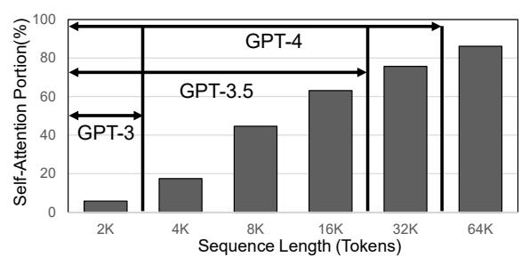

Fig. 1. Portion of self-attention in the end-to-end execution of the GPT-125M model on an A100-40GB GPU using FlashAttention2. Supported token length ranges for GPT-3, GPT-3.5, and GPT-4 are illustrated.

Recently, *State Space Model (SSM)*-based *global convolution models* [34] have emerged as a scalable alternative to self-attention-based models for learning tasks across long input sequences [23], [24], [34]. By conducting convolution instead of self-attention on the inputs, their overall complexity is O(l log l), where l is the input sequence length. This reduced complexity enables model training on very long input sequences, which was infeasible for transformer models. Besides, some models report better metric performance for long sequence datasets. For example, H3 [18], a state-ofthe-art global convolution model, outperforms self-attention models on Long-Range Arena (LRA) benchmarks [47].

The key ingredient to the sub-quadratic complexity of these models is *Fast Fourier Transform (FFT)*. To capture longdistance patterns, it uses a filter whose length matches that of the input sequence. While the complexity of naive convolution operation is O(l 2 ) when the filter is as long as the input, it can be suppressed with the help of FFT. Fourier transform has a useful property that performing convolution with two vectors is equivalent to multiplying the transforms of the 2 vectors in a pointwise manner, and it can be done in O(l log l) complexity using FFT. In fact, most global convolution models that make use of long filters perform convolution using FFT.

An SSM-based global convolution model generates its filters through SSMs, which are used to model the behavior of a system across time. Intuitively, SSMs define the relationship between an input u and an output y of a system through an intermediate vector ⃗x called the state vector. The output is defined as a linear function of the input and the previous state vector, and the state vector is also updated using the input. SSM-based global convolution models focus on a special type of SSM in which ⃗y can be expressed as the convolution of ⃗u with a filter defined by the parameters of the SSM. It is trained to learn the SSM parameters, and conducts convolution on the input using the filter generated using these parameters.

The use of SSMs to generate the filters gives these models a significant advantage over other global convolution models. This is because they can divide a long input sequence into chunks of equal length and perform convolution within each chunk. This offers significant computational benefits, as conducting long sequence FFTs is highly inefficient in modern CPU or GPU architectures due to the memory bandwidthhungry nature of the operation. Chunk-wise convolution incurs an additional computational cost to conduct *state passing*, a process that produces the output chunk using the previous vector and updates the SSM state vector. However, by dividing the input sequence into chunks small enough to fit in SRAM, the benefits of avoiding repeated DRAM accesses, which are inevitable in long sequence FFTs, outweigh the cost of increased computation, reducing the latency by half [18].

Nevertheless, GPU kernels conducting FFTs on lengths that fit in SRAM are still memory bound, yielding very low compute utilization. Furthermore, SSM-based global convolution models include many other memory-intensive operations with little computation. For example, they require multiple pointwise operations such as multiplication of two vectors during convolution, and state passing involves matrix multiplications with highly skewed matrices. Bandwidth-hungry operations can often be sped up through kernel fusion, but the large-sized matrices used in FFT and matrix multiplications necessitate a large SRAM capacity, making it difficult for these models.

One important observation is that all the matrices used have a special feature. Specifically, they are all Vandermonde1 matrices, which means all other columns can be generated by multiplying two columns in an iterative manner. Therefore, instead of storing the entire matrices in memory, it is possible to generate them from the two columns on-the-fly. However, due to the serial nature of generation, it is difficult to utilize the massive parallelism in a GPU to conduct other operations with the matrices while generating the matrices on-the-fly. On the other hand, a custom accelerator can be designed with greater flexibility to fully leverage this property of the matrices.

Therefore, this paper proposes VGA, a specialized coprocessor that accelerates the highly memory-intensive regions of SSM-based global convolution models. The regions of interest (ROI) include FFT-based convolution, matrix multiplication for state passing, and pointwise operations, which yield extremely low compute utilization on a GPU. One

1The complete definition of a Vandermonde matrix also requires all elements of the first row/column to be 1. However, in this paper, we relax this requirement and refer to matrices whose other rows/columns can all be generated from the two rows/columns as Vandermonde matrices.

key innovation of VGA is generating large matrices on-thefly from very small sub-matrices that fit in SRAM, thus reducing the required SRAM capacity by 5× while saving DRAM traffic significantly. As a result, it performs the target operations in an area- and power-efficient manner, achieving a 4.9× speedup over the GPU kernel at 128K sequence with only 6.4% area (76× performance/area) and 10.28% power consumption (48× performance/power) compared to a NVIDIA A100 GPU when evaluated on a state-of-the-art H3 model [18], and a 48.2× speedup over the corresponding selfattention kernel from FlashAttention2 [13]. In summary, this paper makes the following contributions:

- We conduct an in-depth analysis of the emerging SSMbased global convolution models as a scalable alternative to today's self-attention-based models and identify their memory bandwidth and capacity bottlenecks.
- We propose VGA, the first hardware accelerator that targets this important class of emerging workloads. VGA effectively reduces the memory footprint to fit in SRAM by generating required operands on-the-fly using specialized hardware.
- We provide a detailed evaluation of VGA using a cyclelevel simulator as well as RTL written in Chisel. Our evaluation demonstrates substantial performance gains over highly optimized software implementations of both an SSM-based global convolution model [18] and a stateof-the-art self-attention model [13].

# II. BACKGROUND

# *A. Limitations of Self Attention*

Self-attention [48] is a powerful mechanism that dynamically captures the relationships between inputs. Self-attentionbased transformer models have achieved state-of-the-art performance in a wide range of domains, including natural language processing [9], [15], computer vision [16], and scientific domains such as protein 3D structure prediction [32]. For a length-l sequence of d-dimensional input, self-attention first passes the input through three separate fully connected layers to acquire 3 (l × d) dimensional matrices, respectively called Query (Q), Key (K), Value (V ) matrices. Then, Q and K are multiplied to acquire a (l × l) score matrix (S), the rows of which are normalized using the softmax function. Finally, S and V are multiplied to produce the (l × d) attention matrix.

Despite its groundbreaking success, modeling long sequences remains a challenge for self-attention. This is because the computation and memory cost of self-attention increases quadratically with the input sequence length l. Also, selfattention and its approximation variants tend to underperform on tasks where modeling of long-range context is important [47].

# *B. Global Convolution Models*

Convolution is widely used to effectively capture the relationships between inputs within the convolution window, and it has been a crucial component of deep learning models such as Convolutional Neural Networks (CNNs). While previous

Fig. 2. Cooley-Tukey algorithm. (a) Butterfly operations in the Radix-2 algorithm on a length-4 input sequence. Dotted lines represent permutations. (b) Generalized algorithm on a length-6 input sequence.

applications of convolutions were mainly focused on vision tasks, utilizing small window sizes to capture local contexts, recently there has been growing interest in a new type of convolution model designed to handle long sequence inputs.

Instead of using a small, fixed-size filter these global convolution models use a filter whose size matches the length of the input sequence, enabling them to identify global characteristics across the entire input. These models have advantages over self-attention when modeling long-range contexts as they have sub-quadratic compute complexity. Instead of a naive computation of the convolution, which has the same quadratic compute complexity as self-attention, these models leverage the well-known property of the convolution operation that it corresponds to a pointwise multiplication in the frequency domain. Applying FFT to the input sequence and convolution filters, followed by multiplication of the resulting vectors, and finally performing Inverse Fast Fourier Transform (IFFT) efficiently implements global convolution with a complexity of O(l log l). This approach significantly improves the computational efficiency of the convolution process.

Even with a lower computational complexity, these models also demonstrate superior performance in modeling longrange contexts, outperforming self-attention. Notably, S4 [24], S4D [23], SGConv [34], and several others [19], [41], [42] have shown significantly improved results in comparison to self-attention when evaluated using Long-Range Arena (LRA) benchmarks [47]. These benchmarks are specifically designed to assess a model's capability to capture long-range contexts through a series of tasks involving long input sequences. Furthermore, it is noteworthy that some of these models have achieved comparable or even better performance in natural language tasks [18], [42]. For example, when trained on Open-WebText, the difference in perplexity between a Transformer model (20.6) and an SSM model (21.0) of similar size is only 0.4 [18]. These observations underscore the effectiveness and efficiency of the global convolution models in handling longrange dependencies and enhancing contextual understanding. Due to their promise of efficiency and quality, SSMs are being rapidly adopted across a wide variety of applications including, but not limited to, biomedical image segmentation [37], reinforcement learning [14], diffusion models [51], event cameras [55], ECG classification [28], visual representation learning [54] and point clouds [35].

# *C. Cooley-Tukey FFT Algorithm*

The Discrete Fourier Transform (DFT) is a process that converts a vector ⃗u = (u0, u1, ..., uL−1) in the *time domain* to another length-L vector U⃗ = (U0, U1, ..., UL−1) in the *frequency domain*. This transformation is extensively used in diverse fields as it has many useful properties. However, since the computational complexity of transforming ⃗u to U⃗ is O(L 2 ), there are many algorithms that reduce it to O(Llog L). The most popular algorithm is the Radix-2 Cooley-Tukey algorithm which is used when L is a power of 2.

The Radix-2 algorithm is a divide-and-conquer algorithm that recursively divides the input into two sub-vectors of equal length. For example, the length-L vector ⃗u is divided into a vector consisting of the even-indexed elements ⃗e = (u0, u2, ..., uL−2) and a vector consisting of the odd-indexed elements ⃗o = (u1, u3, ..., uL−1). Then, from the DFT results E⃗ and O⃗ of the two sub-vectors, U⃗ can be constructed. Specifically, the relationship between two elements Ui and Ui+L/2 is described in Eq. (1).

The operation of computing Ui and Ui+L/2 from Ei and Oi is commonly known as the *butterfly (BF) operation*, and the value z is a fixed complex number such that z L = 1. The powers of z, z i (i = 0, 1, ..., L − 1), are called *twiddle factors*. To summarize, the length-L vector ⃗u is repeatedly divided log2 L times, and each pair (Ui , Ui+L/2) of U⃗ is constructed through log2 L butterfly operations. Fig. 2(a) shows an example when L = 4. Starting from the input vector on the leftmost column, each element of U⃗ on the rightmost column is acquired through two butterfly operations.

$$BF(E_i, O_i, z^{2i}) = \begin{cases} U_i = E_i + z^{2i} \cdot O_i \\ U_{i+L/2} = E_i - z^{2i} \cdot O_i \end{cases}$$

$$(i = 0, 1, ..., L/2 - 1)$$
(1)

The Cooley-Tukey algorithm has a generalized version applicable to arbitrary integers that can be expressed as a product of two natural numbers [17]. When L is equal to the product of L1 and L2, the algorithm treats ⃗u as a 2D matrix with dimensions (L1 × L2) in row-major form. An example of this is shown in Fig. 2(b) for the case of L1 = 2

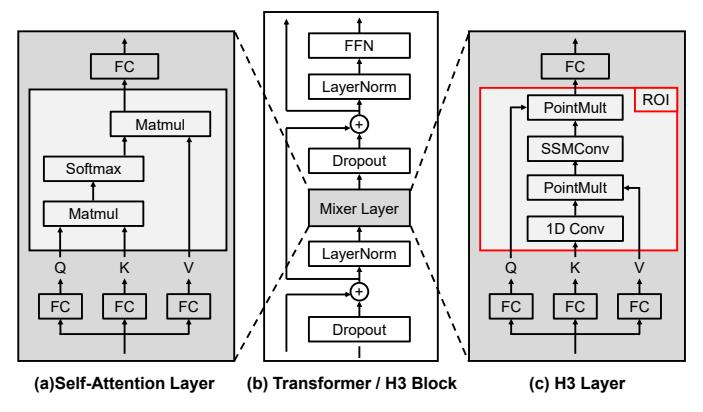

Fig. 3. Interchangeability of self-attention and H3 layers. H3 models replace self-attention with H3 layers within transformer blocks. The red box denotes the target region of interest (ROI) for the accelerator.

and  $L_2=3$ , and it takes 6 steps to compute the FFT. Thirst, an input vector  $\vec{u}$  with a length of 6 is reshaped into a  $2\times 3$  matrix. Second, Fourier transform is conducted independently on each column. The results of each columnwise transformation is denoted as  $(c_0,c_3)$ ,  $(c_1,c_4)$  and  $(c_2,c_5)$ . Third, the result of the FFT is pointwise multiplied with a matrix of twiddle factors called *compensated twiddle factors* (CTFs). Fourth, another round of Fourier transforms are conducted independently on each row. Finally, the DFT of  $\vec{u}$ , denoted as  $\vec{U}$ , is obtained after reshaping into a 1D array.

However, the reduction in computational burden from the Cooley-Tukey algorithm does come at a cost. The Radix-2 algorithm introduces the need to permute the sequence every stage in order to conduct the butterfly operation. Furthermore, the result produced by the algorithm is not in the order of naive DFT, but rather in a shuffled order called *bit-reversal* order. A separate permutation has to be performed in order to recover the original order of DFT. These permutations are expressed as dotted lines in Fig. 2(a). The generalized version, on the other hand, requires both row-wise and column-wise access to the 2D data matrix, thus inevitably leading to inefficient access patterns in modern memory systems.

## D. State Space Model (SSM)-based Global Convolution

Many different approaches exist in global convolution models, and what mainly distinguishes each model is how it generates the filter. One of the most successful approaches builds upon SSMs, a class of models used in the fields of control theory and statistics to model a system that changes over time. A specific class of models called Linear Time Invariant (LTI) SSMs has to be used to generate the convolution filter  $\vec{\mathbf{K}}$  as in Eq. (2). The input vector  $\vec{u}$  and the output vector  $\vec{y}$  are both length-l real vectors, and the initial state vector  $\vec{x}_0$  is a length-m complex vector, where m is a parameter of the SSM.

$$\vec{\mathbf{K}} = (\mathbf{C}\mathbf{A}^{0}\mathbf{B}, \mathbf{C}\mathbf{A}^{1}\mathbf{B}, \cdots, \mathbf{C}\mathbf{A}^{l-1}\mathbf{B})$$

$$y_{i} = \mathbf{C}\mathbf{A}^{i}\vec{x}_{0} + (\vec{\mathbf{K}}*\vec{u})_{i} + \mathbf{D}\vec{u}_{i}$$

$$(\mathbf{A} \in \operatorname{diag}(\mathbb{C}^{m}), \mathbf{B} \in \mathbb{C}^{m \times 1}, \mathbf{C} \in \mathbb{C}^{1 \times m}, \mathbf{D} \in \mathbb{C}^{1 \times 1})$$
(2)

Generally, the parameter matrix A can be non-diagonal, but this leads to costly kernel generation, as computing the

elements  $\mathbf{C}\mathbf{A}^i\mathbf{B}$  of the filter  $\vec{\mathbf{K}}$  requires many matrix multiplications, making it difficult to train the model. Thus, the matrix  $\mathbf{A}$  is constrained to a complex diagonal matrix, as this diagonalization significantly reduces the computational complexity of computing  $\vec{\mathbf{K}}$  from  $O(lm^3)$  to O(lm).

H3 [18] is the state-of-the-art model that incorporates all the techniques explained previously. It exhibits lower perplexity in the WikiText103 [38] dataset compared to models with similar sizes such as GPT-2 and GPT-Neo. The H3 block (Fig. 3) has a similar structure to that of a transformer block mainly composed of an H3 layer and a Feed-Forward Network (FFN), with additional dropout, residual sum, and layer normalization layers in between. The overall structure of an H3 layer is similar to that of a self-attention layer, with the attention operation replaced by the global convolution. Specifically, as shown in Fig. 3, the input  $\vec{x}$  of dimensions  $l \times d$  is fed through 3 different fully connected layers to produce 3 equalsized matrices (Q, K, V). Afterwards, for each of the lengthl column vectors  $\vec{Q}_i$ ,  $\vec{K}_i$ ,  $\vec{V}_i$ , the following operations are conducted. First, a short 1-D convolution is conducted on  $\vec{K}_i$ , and the result is multiplied by  $\vec{V}_i$  in a pointwise manner. Then, an SSM-based global convolution operation (SSMConv) is performed, which is multiplied pointwise with  $\vec{Q_i}$  before the result is passed through the final fully connected layer.

#### E. State Passing

Global convolution models make use of FFTs to reduce the computational complexity of the convolution operation. However, the FFT algorithm reads and updates the entire sequence at each stage, making memory bandwidth a critical factor for its performance. To avoid a DRAM memory bandwidth bottleneck, optimized GPU kernels for FFT aggressively utilize the shared memory of SMs to fit the entire input sequence. The benefit of such optimizations becomes limited as the input sequence gets longer and the entire sequence no longer fits in SRAM, which inevitably generates additional DRAM accesses.

SSM-based models can resolve this problem as they can divide an input sequence  $\vec{u}$  of length  $N(=C\times L)$  into C chunks of length-L vectors  $\vec{u_c}$  (c=0,1,...,C-1), and convolution using FFT can be conducted separately on each chunk with the help of the *state passing algorithm*. As the chunk size can be selected freely to fit within the GPU SRAM capacity, this mechanism greatly reduces DRAM memory access during FFT. This is possible since the elements of  $\vec{K}$  have a recursive relation, all previous chunks can be summarized into a state vector  $\vec{x}_{c-1}$ , and its contribution can be computed separately from the convolution of the current chunk

$$\vec{\mathbf{K}} = \left(\mathbf{C}\mathbf{A}^{0}\mathbf{B}, \mathbf{C}\mathbf{A}^{1}\mathbf{B}, \cdots, \mathbf{C}\mathbf{A}^{L-1}\mathbf{B}\right)$$

$$\vec{x}_{c} = \mathbf{A}^{L}\vec{x}_{c-1} + \mathbf{M}_{ux}\vec{u}_{c}$$

$$\vec{y}_{c} = \mathbf{M}_{xy}\vec{x}_{c-1} + \vec{\mathbf{K}} * \vec{u}_{c} + \mathbf{D}\vec{u}_{c}$$
(3)

Eq. (3) and Fig. 4 illustrate two steps in state passing: 1) updating the state vector to  $\vec{x}_c$  using  $\vec{u}_c$  (State Update),

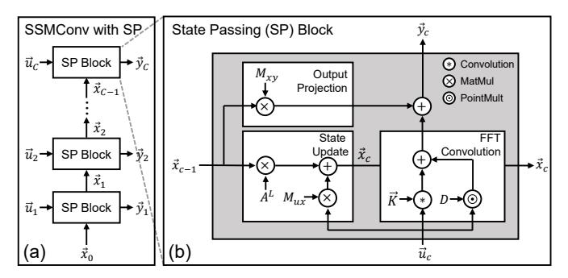

Fig. 4. Detailed diagram of SSMConv with the state passing algorithm. (a) The state vector is passed from the previous State Passing (SP) block to the next SP block. (b) The SP block computation is composed of State Update, Output Projection, FFT convolution, and pointwise operations.

and 2) producing the output chunk  $\vec{y}_c$  by adding the FFT-based convolution output of the corresponding input chunk  $\vec{u}_c$  (FFTConv) to the projection of previous state vector  $\vec{x}_{c-1}$  (Output Projection).

 $\mathbf{M}_{xy}$  and  $\mathbf{M}_{ux}$  are matrices constructed from the parameters  $\mathbf{A}$ ,  $\mathbf{B}$  and  $\mathbf{C}$  as shown in Eq. (4) and Eq. (5). It is worth noting that the two matrices are Vandermonde matrices, which means all rows of  $\mathbf{M}_{xy}$  can be obtained by recursively multiplying the first row with a fixed vector consisting of diagonal elements of  $\mathbf{A}$ . Likewise, all columns of  $\mathbf{M}_{ux}$  can be computed by multiplying the first column with the same fixed vector. This property arises from the recurrent nature of the SSM.

$$\mathbf{M}_{xy} = \begin{pmatrix} \mathbf{C}_{0}\mathbf{A}_{0} & \mathbf{C}_{1}\mathbf{A}_{1} & \cdots & \mathbf{C}_{m-1}\mathbf{A}_{m-1} \\ \mathbf{C}_{0}\mathbf{A}_{0}^{2} & \mathbf{C}_{1}\mathbf{A}_{1}^{2} & \cdots & \mathbf{C}_{m-1}\mathbf{A}_{m-1}^{2} \\ \vdots & \vdots & \ddots & \vdots \\ \mathbf{C}_{0}\mathbf{A}_{0}^{L} & \mathbf{C}_{1}\mathbf{A}_{1}^{L} & \cdots & \mathbf{C}_{m-1}\mathbf{A}_{m-1}^{L} \end{pmatrix}$$

$$\mathbf{M}_{ux} = \begin{pmatrix} \mathbf{A}_{0}^{L-1}\mathbf{B}_{0} & \cdots & \mathbf{A}_{0}\mathbf{B}_{0} & \mathbf{B}_{0} \\ \mathbf{A}_{1}^{L-1}\mathbf{B}_{1} & \cdots & \mathbf{A}_{1}\mathbf{B}_{1} & \mathbf{B}_{1} \\ \vdots & \ddots & \vdots & \vdots \\ \mathbf{A}_{m-1}^{L-1}\mathbf{B}_{m-1} & \cdots & \mathbf{A}_{m-1}\mathbf{B}_{m-1} & \mathbf{B}_{m-1} \end{pmatrix}$$

$$(4)$$

# III. ANALYSIS OF H3 COMPUTATION

## A. H3 Block Runtime Breakdown

The H3 block computation can be divided into three regions: frontend, global convolution operation, and backend. The global convolution operation accounts for the largest portion among the three regions and constitutes the region of interest (ROI) for hardware acceleration. As shown in Fig. 5, the ROI includes the following operations:  $\bigcirc$  (FFT Convolution) computation of convolution using FFT, pointwise multiplication, and IFFT,  $\bigcirc$  (State Passing) the state passing algorithm that multiplies vectors with Vandermonde matrices  $\mathbf{M}_{xy}$  and  $\mathbf{M}_{ux}$  and finally  $\bigcirc$  (Pointwise Add. & Pointwise Mult.) pointwise addition and multiplication. The proportion of each component of the ROI is shown in Fig. 5.

The frontend and backend regions consist of all the remaining operations such as the FC layers in an H3 layer, dropout and layer normalization layers, and the final feedforward-network of the H3 block. These operations are mostly

Fig. 5. Breakdown of ROI region within H3 block computation for sequence length of 128K on an A100-40GB GPU. Model parameters and batch size are identical to the H3-GPT configuration in V-A. FLOPS are normalized by the theoretical max TF-32 FLOPS of SM and Tensor Core. (a) and (b) of State Passing denotes State Update and Output Projection, respectively. 1D Convemploys FFT Convolution due to its kernel length (m=64) falling within the range suitable for FFT Convolution.

compute-intensive and well-suited for execution on conventional data-parallel accelerators, such as GPUs and TPUs.

## B. ROI Breakdown

**FFT Convolution.** *FFT convolution* performs FFT, pointwise multiplication, and IFFT, taking the largest portion of ROI time of around 42%. It is the key operation in both the 1D Conv and SSMConv. Due to the use of state passing, DRAM bandwidth utilization remains low after initial parameters are fetched from DRAM. Although the use of on-chip shared memory improved bandwidth, it still falls short of achieving full compute utilization. Also, frequent barrier operations required for exchanging values between warps further constrain compute utilization.

State Passing. The ⓐ State Update and ⓑ Output Projection operations of the state passing algorithms take up approximately 26% of ROI time, with two operations, batched matrix multiplication using  $\mathbf{M}_{ux}$  and  $\mathbf{M}_{xy}$  and the recursive operations between consecutive hidden states. Due to a particularly small m in the batched matrix multiplication  $(m, L, C \times B)$ , opportunities for data reuse are limited. This reduces the arithmetic intensity and makes these operations memory-bound, leading to underutilized compute resources. This characteristic is more prominent on batched matrix multiplication between  $\mathbf{M}_{ux}$  and  $\vec{u}$  during State Update.

On the other hand, the recursive operations between consecutive hidden states, which are part of  $State\ Update$ , account for only a small portion of the entire state passing process. However, this is only when the number of input chunks is smaller than hundreds. When the number of chunks C is greatly increased (due to smaller L or larger N), this operation can become a major bottleneck of state passing. Thus, it is important to keep the L large enough to suppress C.

**Pointwise Operations.** The ROI region also includes multiple pointwise operations as described in Section II-D. In addition, state passing increases the number of pointwise operations as the output of *Output Projection* also needs to be added to the

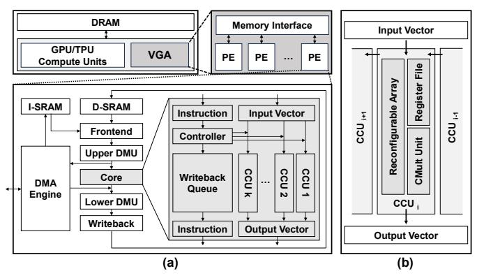

Fig. 6. Overview of VGA. (a) System-level diagram of VGA and architecture of its PE. (b) Diagram of the CCU inside the *core*.

output of the *FFT Convolution* as shown in Fig. 4(b). These pointwise operations are memory-bound, so it is common practice to fuse them into a single kernel. However, an end-to-end fusion of the H3 layer can be restricted due to the amount of shared memory required for each operation. For example, the large memory footprints required by the matrices used in batched matrix multiplication for state passing make the creation of a fully fused kernel a non-trivial task.

#### C. Custom Accelerator Solution

The H3 block can be characterized by two regions with opposing computational characteristics: the FFN/FC region and the SSM-based convolution region. The former is compute-intensive, making it suitable to be executed on compute-centric accelerators such as GPUs and TPUs, that prioritize maximum FLOPS. On the other hand, the FFT-based convolution layers are mostly memory-bound and benefit from wider and larger memory/SRAM. Since each of these regions occupies a size-able portion of the execution time, it is inefficient to conduct computations of both regions within a single architecture.

Therefore, this paper proposes an area/power efficient SSM layer accelerator that completely offloads the ROI. Its design is based on a detailed analysis of the bottleneck of each operation within the ROI. FFT convolution can be accelerated by utilizing sufficient SRAM bandwidth, and batched matrix multiplication benefits from reduced DRAM access. However, simply fusing all operations requires a large SRAM capacity, resulting in poor area/power efficiency. Hence, the accelerator significantly reduces the required memory capacity by dynamically generating the Vandermonde matrices  $\mathbf{M}_{ux}$ ,  $\mathbf{M}_{xy}$ , and the CTF matrix instead of storing the entire matrices in SRAM. To achieve this, the accelerator integrates hardware components capable not only of efficiently computing butterfly operations but also of flexible reconfiguration for generating elements of these Vandermonde matrices.

#### IV. ARCHITECTURE DESIGN

## A. Overview

VGA is designed as a co-processor to operate with host accelerators such as GPUs or TPUs. It is integrated alongside the existing compute units of these accelerators, as shown in Fig. 6(a). VGA comprises a collection of Processing Elements

(PEs), each connected to the host memory system via a memory interface. Each PE consists of data/instruction SRAM (D/I-SRAM), *frontend*, two data manipulation units (DMUs), a *core*, *writeback*, and a DMA engine.

During model inference, the computation of ROI in H3 layers is offloaded from the host accelerator (GPU/TPU) to VGA. It performs SSMConv using the generalized Cooley-Tukey algorithm and the state passing algorithm represented in Eq. (3). The general execution flow of a VGA PE begins with the frontend module fetching and issuing the instruction. Subsequently, data is loaded from D-SRAM to the upper DMU, where it is modified according to the instruction. The modified data is then fed to the core. Upon receiving the instruction, the controller of the *core* sets the mode of each CCU. If the instruction produces an output that needs to be written back to SRAM, it is enqueued into the writeback queue inside the *core*. When a valid output is generated from any CCU, an instruction is dequeued from the writeback queue. The dequeued instruction is then forwarded to the *lower* DMU, which performs the necessary permutations on the output vector. Finally, the transformed output vector is written to SRAM by the writeback module.

## B. Computational Components

**Core.** The *core* in VGA is responsible for all computations. It is constructed on top of a 1D array of *k* identical instances of Complex-number Compute Units (CCUs), along with the controller and writeback queue. Primarily, the *core* functions as an array processor, with each CCU independently processing data in the input vector corresponding to its index. However, in scenarios where multiple CCUs need to communicate to produce a single value, data is transmitted through a unidirectional connection from the rightmost to the leftmost CCU, similar to the communication pattern of a 1D systolic array. The writeback queue is a simple FIFO queue with no reordering of instructions. Since the distance between data-dependent instructions always exceeds the depth of the pipeline in VGA's PEs, the design is free of data hazards.

CCU. A CCU, depicted in Fig. 6(b), serves as the fundamental execution element where actual computations take place. It comprises three main components: the CMult unit, the reconfigurable array, and the register file. The CMult unit, featuring four multipliers and two adders, specializes in multiplying two complex numbers. Conversely, two multipliers and four adders in the reconfigurable array have flexible input and output connections to support various computations. Note that all multipliers and adders in both units operate on FP32 precision. Finally, the register file, capable of holding up to six complex numbers, stores constants used for computations or intermediate values updated over multiple cycles. These include partial sums or elements of Vandermonde matrices generated on-the-fly.

**CCU Modes.** Fig. 7 displays seven fully pipelined modes supported by the CCU, each defining a unique configuration of connections between the internal components. In the *CMult*(M1), Butterfly or *BF*(M3), *Update*(M5), *Residual*(M6),

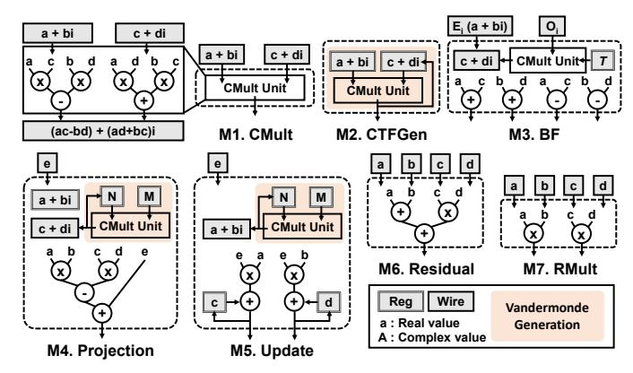

Fig. 7. Seven computation modes supported by CCUs. Colored boxes indicate on-the-fly Vandermonde matrices generation. In *CTFGen*, *Projection*, and *Update* modes, the CTF,  $\mathbf{M}_{xy}$ , and  $\mathbf{M}_{ux}$  matrices are generated, respectively.

and *RMult*(M7) modes, each CCU independently processes the input vector. Conversely, during *CTFGen*(M2) and *Projection*(M4) modes, interaction between CCUs is required.

Between CCU mode transitions, an End-of-Mode (EoM) instruction flushes the pipeline and serves as a synchronization point. When dispatched at the end of a CCU mode, the EoM instruction clears the pipeline by halting further instruction dispatch until it reaches the writeback module.

In the following sections, where the usage of each mode during the ROI computation is explained, the operands of each mode are annotated using the notation from Fig. 7.

## C. Operation Mapping

As depicted in Fig. 5, ROI consists of 1D Conv, SSMConv, and PointMult which can be partitioned into four operations: *FFTConv*, *Output Projection*, *State Update*, and pointwise multiplication. 1D Conv utilizes the *FFTConv*, while SSMConv, as illustrated in Fig. 8(a), is segmented into *FFTConv*, *Output Projection*, and *State Update* operations. The pointwise multiplication in PointMult is executed with *RMult*(M7) mode. **FFTConv**. The FFTConv operation involves a combination of three modes: *CMult*(M1), *CTFGen*(M2), and *BF*(M3). As shown in Fig. 8(b), CCUs perform FFT through a sequence of operations: column-wise FFT (*BF* mode), CTF Multiplication (*CMult/CTFGen* mode), and row-wise FFT (*BF* mode).

Fig. 7 shows the details of BF mode. In the BF mode, the twiddle factor (T) is loaded into the register file before the start of each FFT/IFFT stage and is reused throughout the stage. First, the CMult unit multiplies  $O_i$  by the twiddle factor stored in the register. The resulting output (c+di) and  $E_i$  then undergo the butterfly operation in the adders of the reconfigurable array, producing two complex numbers. Both column- and row-wise FFT/IFFT operations follow a similar procedure, differing only in the D-SRAM access pattern.

To avoid bank conflicts in both row and column access during FFT/IFFT, each SRAM row of input data is circularly rotated by its row index. For example, in an 8-bank SRAM storing 64 elements, the second row (elements 9th to 16th) is rotated by 1, placing the 9th element in the second bank. This strategy places all elements of each row and column across different banks, eliminating bank conflicts.

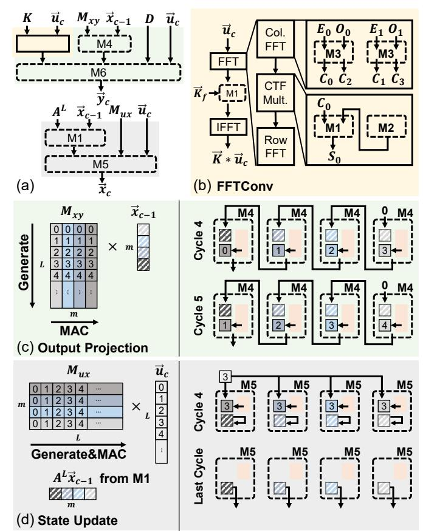

Fig. 8. Operations used for SSMConv execution. (a) Decomposition of Eq. (3) into operations and CCU modes. (b) Breakdown of the *FFTConv* operation. (c) Operation of the *Projection* mode during *Output Projection*. Previous state  $(\vec{x}_{c-1})$  is loaded to each CCU at the start of the *Projection* mode. (d) Operation of the *Update* mode during *State Update*. An element of  $\vec{u}_c$  is broadcast to the CCUs and each CCU updates the state vector.

For CTF multiplication, even-indexed CCUs operate in the *CMult* mode, while odd-indexed CCUs operate in the *CTFGen* mode. CCUs in *CTFGen* mode initially load the first few elements of the CTF matrix (c+di) and the multiplication factor (a+bi). They then generate further CTFs through recurrent multiplications and pass them to the adjacent CCU operating in *CMult* mode, where these CTFs are multiplied with the streamed column-wise FFT results  $(C_i)$ . After the FFT, the pointwise multiplication between the transformed input and the filter in the frequency domain  $(\vec{K_f})$  is carried out in *CMult* mode.

**Output Projection.** The output chunk  $\vec{y}_c$  is produced through two modes: Projection(M4) and Residual(M6). In Projection mode, the  $\mathbf{M}_{xy}$  matrix is multiplied with the previous state vector  $\vec{x}_{c-1}$ , while in Residual mode, outputs from the Projection mode, and the FFTConv operation are added with the scaled input  $D\vec{u}_c$ . Fig. 8(c) illustrates the matrix-vector multiplication in the Projection mode. In this mode, each CCU is assigned a single column of the  $\mathbf{M}_{xy}$  matrix. Initially, a corresponding element from the  $\vec{x}_{c-1}$  (a+bi) along with the first element of the column (N) and its scaling factor (M) are loaded into registers. Over L iterations, each CCU multiplies N by M to generate an element of the column (c+di) and

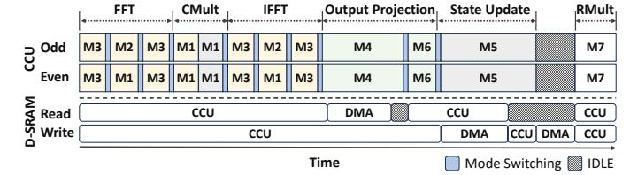

Fig. 9. Timeline of CCU and D-SRAM access during SSMConv followed by real number multiplication (RMult). Colors correspond to those in Fig. 8. Mode switching indicates phases where the pipeline is being flushed by the EoM instruction. IDLE periods in CCUs are mainly due to the exposed DMA time. CMult for FFTConv and State Update is performed back-to-back without mode switching.

then multiplies it by the corresponding element from  $\vec{x}_{c-1}$  to produce a partial sum. This partial sum (e) is then propagated to the adjacent CCU through the unidirectional connection and accumulated. After m accumulations, the CCU writes the result back to SRAM. For correct accumulation, appropriate delays are inserted into each CCU at the start of the mode.

State Update. The previous state vector  $\vec{x}_{c-1}$  is updated to  $\vec{x}_c$  using two modes:  $\mathit{CMult}(M1)$  and  $\mathit{Update}(M5)$ . First, the  $\mathit{CMult}$  mode scales  $\vec{x}_{c-1}$  to  $A^L\vec{x}_{c-1}$ . Then in  $\mathit{Update}$  mode, the  $M_{ux}$  matrix is multiplied by the current input vector  $\vec{u}_c$  and added to  $A^L\vec{x}_{c-1}$ . Fig. 8(d) illustrates the  $\mathit{Update}$  mode. In this mode, each CCU is assigned a single row of the  $M_{xy}$  matrix. As in  $\mathit{Projection}$  mode, the initial element of the row (N) and its scaling factor (M) are loaded into register. Also, accumulation registers (c,d) of CCUs are preset to corresponding elements of  $A^L\vec{x}_{c-1}$ . Over L iterations, each CCU generates an element of the row and multiplies it with the broadcasted element of  $\vec{u}_c$  (e) to produce a partial sum, which is then added to its accumulation register. After the multiplication is completed, results are read from the registers and then written to SRAM.

# D. Other Hardware Components

Frontend and Writeback. The *frontend* module comprises two components: the *issue logic*, responsible for fetching and generating instructions, and the *data logic*, which loads input data from either DRAM or SRAM depending on the issued instruction. The issue logic retrieves loop parameters from the instruction, specifying the repetition of the instruction and how to update the metadata used by the data logic in each iteration. This metadata determines the column and row addresses of D-SRAM accessed by the data logic. Column addresses are selected as a range, specified by the start index and the number of columns to access. The row addresses for selected columns are generated from one of multiple predefined patterns, such as diagonal or strided access, also determined by the metadata.

The *writeback* module resembles the standalone version of the data logic in the *frontend* module, but with a different set of access patterns necessary for SRAM write operations. When storing the output of each CCU, all elements of the output vector are written to different banks in the D-SRAM, avoiding bank conflicts and issues of data consistency.

**Data Manipulation Unit (DMU).** As illustrated in Fig. 6(a), each PE within VGA consists of an *upper* DMU and a

lower DMU. DMUs remove the need for I/O-heavy data formatting operations by utilizing predefined control networks and a shifter. They perform bit-reversal permutation, padding insertion/removal and broadcast operations on the input data of the next module. For the *upper* DMU, the next module is either CCUs or the DMA engine, while for *lower* DMU, it is the *writeback* module.

**DMA Engine.** Each PE has a DMA engine with an I/O width of 64B. The frontend sends DMA instructions to the DMA engine, triggering access to the host memory system. These DMA instructions contain the offset from the base address, while the base addresses are stored inside the DMA engine. As the DMA engine and the *core* share hardware units for accessing D-SRAM, overlapping DMA with computation may cause structural hazards. To alleviate this issue, DMA is scheduled during Projection and Update modes, which have long regions where only the D-SRAM read or write path is active. If a DMA operation lasts longer than these regions, the *frontend* pauses the DMA engine, completes the current computation mode, and then restarts the remaining DMA operations afterward. In such cases, the DMA time is exposed to latency, as shown in Fig. 9. Since there are more data to read from the host accelerator's memory than to write, DMA read (D-SRAM write) time is more likely to be exposed to latency.

## E. System-level Issues

**Instruction Set Architecture.** VGA uses two types of 16B instructions: configuration and executable instructions. Configuration instructions set up TLBs and the addresses required for DMA operations, and alter the global states of the CCU. Executable instructions encode the behavior of each module in a PE. They include information such as D-SRAM addresses, read/write access patterns of input/output data, DMU operations, and CCU modes. These instructions do not include data, as data is passed through separate vector registers.

VGA Initialization. Before the first execution on VGA, the host accelerator must perform initialization. First, it allocates memory regions for data such as Q, K, V, output matrix, instructions, and SSM parameters. The size of each memory region is set to cover sequence lengths up to a predetermined maximum. Next, the page table entries (PTEs) for these regions are retrieved and stored in a reserved memory region that can be directly accessed by VGA. Triggered by a memorymapped register, the DMA engine in each PE populates its TLBs with these PTEs. Each DMA engine can hold up to 32 TLB entries, which covers up to 64MB per PE when using a 2MB page on GPUs. With 128 PEs, VGA can access up to an 8GB memory space. This capacity is sufficient to support sequence lengths of up to 1M, assuming a hidden dimension of h = 768, as the size of weight matrices used in the ROI region is small compared to conventional LLMs. The cost of initialization can be amortized, as initialized memory regions can be reused during inference.

Communication with Host Accelerator. As VGA and the host processor share the main memory, it is used as a ren-

dezvous point for all GPU/TPU and VGA communication, without concurrent memory access by either. GPUs/TPUs use a write-through policy for data pages to send to VGA. When VGA writes its output to the main memory, the GPU/TPU cache invalidates any stale cached copy of the output.

Offloading Workload. The host accelerator offloads the ROI of the H3 layer by sending the input length and layer number to VGA through memory-mapped registers. This information is broadcast to all PEs, triggering the execution of VGA instructions. Each PE signals the completion of computation to the host through its private completion flag register. The workload is parallelized across the hidden dimension (h). Each PE is assigned consecutive  $\frac{h}{\# \text{ of PEs}}$  hidden dimensions and processes input sequences of one hidden dimension at a time. This eliminates the need for synchronization between PEs, as computation on each hidden dimension is independent and PEs write to non-overlapping memory addresses.

## V. EVALUATION

## A. Methodology

**Models and Datasets.** The performance evaluation is conducted on the inference of two models. The first model is a GPT-125M like natural language model taken from the official H3 GitHub repository [18]. This model, referred to as H3-GPT, replaces 12 self-attention blocks in GPT-125M with H3 blocks. Retaining the same hyperparameters as the original repository, H3 blocks use a hidden dimension of h=768 and the SSM state vector dimension of m=64. We evaluate the model on input queries from the WikiText-103 dataset parsed to sequence lengths ranging from 8K to 128K. The second model, denoted as H3-Speech [24], is composed of 6 unidirectional H3 layers and targets raw speech classification on SC10 [50]. Its H3 layers use a configuration of h=128 and m=64. The lack of FFN layers in this model presents opportunities for additional performance gains for VGA.

The evaluation employs the maximum possible power-of-two batch size on each device. Specifically, for H3-GPT and H3-Speech on GPU, batch sizes of 8 and 16 are employed, respectively. On TPU, batch sizes of 2 and 16 are utilized for H3-GPT and H3-Speech, respectively. Note that VGA conducts the *exact* computation of ROI without any approximation. Therefore, the use of VGA does not incur any accuracy drop, and its inference latency is independent of the input data contents.

**GPU Baseline.** All GPU baselines are measured using a single NVIDIA A100-40GB GPU. The self-attention baseline utilizes FlashAttention2 [13], the state-of-the-art conventional self-attention mechanism on GPU. The official GitHub repository of H3 [18] does not provide the implementation of the state passing algorithm. Thus, we faithfully implemented the state passing algorithm without Vandermonde matrix generation, using a custom FFT convolution CUDA kernel from the repository, utilizing it as the baseline for H3.

**TPU Baseline.** In our TPU evaluation, we use a single core of the TPUv3 chip, which is half of a TPUv3 chip.

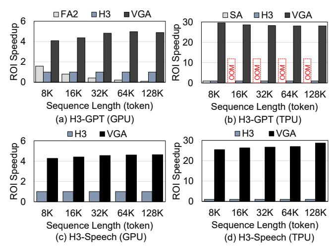

Fig. 10. ROI speedup of two models on GPU and TPU, with respect to the execution of H3 on each platform.

A TPU core is the basic unit of computation for TPUv3. Although sharing a single die, two cores have completely separate DRAM and compute units, and can access each other through an on-chip interconnect router [40]. As there is no publicly available implementation of FlashAttention for TPU, we employ the multi-head attention layer provided by TensorFlow2. However, since this implementation is not as memory-efficient as FlashAttention2, evaluating sequences longer than 8K causes an out-of-memory (OOM) error. For the H3 software baseline, we used a ported version of H3 with the state passing algorithm.

VGA Simulation. For the evaluation of VGA, we simulate the ROI latency using a custom cycle-accurate simulator. The custom simulator is integrated with Ramulator2 [36] to simulate DRAM access latency. This simulation includes both the execution of ROI and the data transfer time between VGA and DRAM. To calculate the inference latency when utilizing VGA, we replaced the ROI latency of the GPU/TPU with that of VGA. In Ramulator2, we configure five 1.2GHz chips (1555GB/s) and two 0.9GHz chips (450GB/s), all each with an 8GB HBM2 chip, for the GPU and TPU, respectively, to match the known DRAM bandwidth of the host accelerator [2], [31]. VGA uses k = 32 CCUs in the core of each PE. In order to conduct 2D-FFT as a square matrix, the length of each input and output chunk l is set to 2048. The number of PEs is selected by analyzing the ROI latency across different numbers of PEs, as shown in Fig. 13. For evaluation, we employ VGA with 128 PEs for the GPU, and with 32 PEs for the TPU.

**Area/Power Comparison.** The RTL implementation of VGA is synthesized using TSMC 40nm technology at a frequency of 1GHz. To compare the area and power consumption of VGA with the GPU and TPU, we scaled VGA down to 7nm [2] and 16nm [30] using the scaling factor equation [46] to match the technology of each accelerator. The area and TDP of a single A100 40GB GPU are set to 826  $mm^2$  and 400 W [2], while for a single TPUv3 core, we used half the area and power of a single chip which is 324  $mm^2$  and 225 W [31].

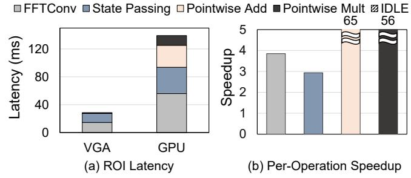

Fig. 11. (a) ROI latency of VGA and GPU. (b) Per-operation speedups of VGA over GPU. H3-GPT with a sequence length of 128K is used for latency measurement

## B. ROI Speedups

Fig. 10 illustrates the relative ROI latency across platforms and models as the sequence length increases. All values are normalized to the latency of the H3 layer with state passing executed on each platform. For FlashAttention2 and self-attention used in GPU and TPU, respectively, we measure the time spent on the matrix multiplication of Q and  $K^{\rm T}$ , the softmax operation to acquire the score matrix S, and the multiplication of S and V.

VGA on GPU. With an increase in input sequence length from 8K to 128K, VGA achieves a 4.89× and 4.63× ROI latency speedup at the 128K sequence length for H3-GPT and H3-Speech models, respectively. Compared to FlashAttention2 on the H3-GPT model, VGA attains a maximum 48.2× speedup at the 128K sequence length. The speedup in ROI gradually increases and then levels off as the sequence length increases. While the latency of the GPU scales relatively linearly with the sequence length, VGA exhibits sub-linear increases in latency at shorter sequence lengths, resulting in an increase in speedup. This is because, in VGA, the latency for loading parameters of the next hidden dimension is noticeable at shorter sequence lengths but becomes negligible at longer sequence lengths.

VGA on TPU. On a TPU, VGA achieves  $28.1 \times$  and  $28.7 \times$  speedup for the ROI latency at the 128K sequence length in the H3-GPT and H3-Speech models, respectively. In the H3-GPT model, self-attention encounters an OOM for sequences longer than 8K. The H3-GPT model exhibits a different trend for ROI speedup as the sequence length increases. Since the batch size is selected for inputs with a sequence length of 128K, only the longer sequence inputs fully utilize the compute resources on the TPU, resulting in a greater ROI speedup at shorter sequence lengths.

VGA ROI Breakdown. A breakdown of the accelerator's ROI latency is as follows: The FFTConv, Output Projection, and State Update operations consume 47%, 21% and 24%, respectively. In the FFTConv operation, FFT/IFFT operations account for 69%, while CTF generation and multiplication with FFT results take 25%. Pointwise multiplication of the filter with FFT results occupies the remaining 6%. In both the Output Projection and State Update operations, the majority of time (100% and 94%, respectively) is spent on matrix-vector multiplications, with minimal time for pointwise operations. VGA maintains an average FLOPS utilization of 78%.

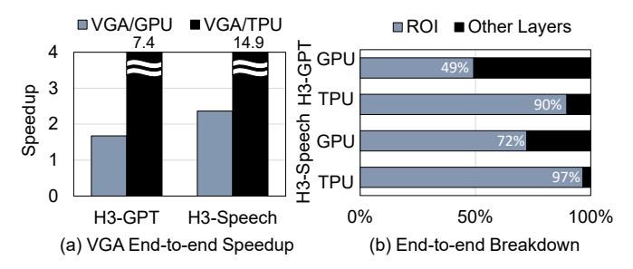

Fig. 12. (a) End-to-end speedup of two models across platforms, normalized to the execution time of H3 on each platform. (b) Portion of ROI in two models across different platforms.

Fig. 11 shows the latency breakdown of H3-GPT with a 128K input sequence length for the the GPU and VGA. FFTconv, state passing, pointwise add and mult are  $3.85 \times$ ,  $2.93 \times$ ,  $65 \times$ , and  $56 \times$  faster in VGA than the GPU. Pointwise operations benefit the most from kernel fusion due to their small amount of compute.

## C. Model Speedups

Fig. 12(a) shows the end-to-end latency of two models across each platform. The latency is normalized with the latency of the H3 model on each platform. The models with FlashAttention2 and self-attention use the same configuration as the H3-GPT model. When the ROI is delegated to the accelerator, the H3-GPT model achieves  $1.7 \times$  and  $7.4 \times$  latency speedup over software at a sequence length of 128K on the GPU and TPU, respectively. In comparison to the model using FlashAttention2 with identical configurations, the combination of H3 block and VGA achieves 8.8× speedup at a sequence length of 128K on the GPU. For the H3-Speech model, there are  $2.4\times$  and  $14.9\times$  latency speedups over software at a sequence length of 128K on the GPU and TPU, respectively. ROI Portion of TPU/GPU. Comparing GPUs to TPUs, the portion of ROI is larger for TPU than for GPU in both models, as seen in Fig. 12(b). This distinction arises from their different architectural focus. GPUs offer greater flexibility, supporting a wide range of operations beyond dense matrix multiplications. In contrast, TPUs prioritize compute-intensive dense matrix multiplications, with less emphasis on operations requiring irregular memory access patterns like FFT or memory-bound operations, such as the pointwise operations within the ROI. Therefore, by offloading the ROI to VGA, TPUs can experience greater performance improvements than GPUs in terms of the model latency.

## D. Source of Efficiency

**Memory Traffic Reduction.** The memory traffic reduction is the key to the latency improvement of VGA. Compared to the H3-GPT model on a GPU with a sequence length of 128K, VGA achieves a memory traffic reduction of 9.7×. This reduction enables greater arithmetic intensity and consequently higher achievable throughput. It is attributed to the fully fused ROI computation, made feasible by the reconfigurability and the on-the-fly Vandermonde matrix generation.

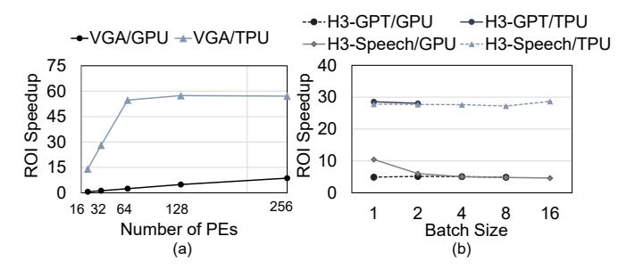

Fig. 13. (a) ROI speedup of the H3-GPT model at a sequence length of 128K across varying numbers of PEs used in VGA, normalized to the ROI latency of H3 on each platform. (b) ROI speedup of the H3-GPT/Speech model at a sequence length of 128K across different batch sizes, normalized to the ROI latency of H3 on each platform.

**SRAM Footprint Reduction.** VGA improves area and power efficiency by minimizing the SRAM footprint for the fully fused kernel through on-the-fly matrix generation. Only 5 rows and columns are needed for generating the entire  $\mathbf{M}_{xy}$  and  $\mathbf{M}_{ux}$  matrices, respectively, with full pipeline efficiency. This reduction in memory footprint results in a 410× decrease compared to using full matrices. Overall, when also considering memory space for input and filter vectors, the total SRAM capacity is reduced by  $5 \times$  compared to storing full matrices. VGA without Matrix Generation. In a hypothetical scenario where the PE design of VGA is altered to store full matrices in SRAM and utilizes CCUs with greater flexibility, the throughput for CTFGen, Projection, and Update modes can be doubled. This enhanced throughput can translate into a 1.4× increase in the ROI speedup over the current PE design, when not accounting for the increased DMA time. Nevertheless, implementing such a configuration is less efficient compared to scaling the number of current PEs in VGA, as this approach incurs a 2.9× increase in area and a 3.9× increase in power due to a larger SRAM requirement.

## E. Sensitivity Studies

Fig. 13(a) illustrates the ROI speedup of the H3-GPT model using VGA, compared to the H3 implementation on different platforms, considering varying numbers of PEs within VGA. As the number of PEs is increased from 16 to 256, the ROI speedup increases from  $0.6 \times$  to  $8.7 \times$  when VGA is used with a GPU. For integration with a GPU, VGA with 128 PEs is chosen, as the linear scaling behavior is lost beyond this point.

In the case of TPU, the latency improvement increases from 14.1× to 57.4×. For TPU usage, VGA with 32 PEs is employed since the end-to-end model speedup improvement diminishes noticeably beyond 32 PEs. The non-linear scaling behavior observed when VGA is used with GPU or TPU is attributed to the DRAM bandwidth constraint.

Fig. 13(b) shows the influence of the batch size on the accelerator's speedup. Overall, ROI speedup remains consistent across batch sizes on both GPU and TPU for both models. The ROI speedup of H3-Speech on the GPU exhibits higher values at small batch sizes but plateaus as the batch size increases.

TABLE I Area and Power Breakdown

| Single PE               |                         |              |                |                         |              |  |  |  |
|-------------------------|-------------------------|--------------|----------------|-------------------------|--------------|--|--|--|
| Components              | Area (mm 2 ) | Power (W) | Components     | Area (mm 2 ) | Power (W) |  |  |  |
| D-SRAM                  | 2.61                    | 1.25         | I-SRAM         | 0.05                    | 0.05         |  |  |  |
| Core (32 CCUs)       | 2.35                    | 0.27         | Others         | 0.14                    | 0.07         |  |  |  |
| DMA Engine              | 0.08                    | 0.01         | Total (40-nm)  | 5.54                    | 1.72         |  |  |  |
| Frontend & Writeback | 0.03                    | 0.01         | Scaled (16-nm) | 1.32                    | 0.59         |  |  |  |
| DMUs                    | 0.28                    | 0.06         | Scaled (7-nm)  | 0.41                    | 0.32         |  |  |  |
| VGA                     |                         |              |                |                         |              |  |  |  |
| 32 PEs (16-nm)          | 42.35                   | 18.92        | 128 PEs (7-nm) | 52.82                   | 41.10        |  |  |  |

TABLE II
SPEEDUP OF CONVOLUTION RELATIVE TO PARALLEL SCAN IN SSM

| SeqLen (tokens) |      |      |      |      |      |
|-----------------|------|------|------|------|------|
| Speedup (times) | 3.38 | 3.37 | 3.19 | 3.23 | 3.34 |

## F. Area/Power Analysis

As shown in Table I, the total area and power consumption of VGA with 128 PEs, scaled to 7nm, amount to 52.82  $mm^2$  and 41.11 W, approximately 6.4% and 10.28% of a single A100 GPU, respectively. Meanwhile, for VGA with 32 PEs scaled to 16nm, the total area and power consumption are 42.35  $mm^2$  and 18.92 W, making up 13.1% and 8.4% of a single TPUv3 core. Further detailed breakdowns for each PE are available in the same table. The primary components occupying the area and power consumption are the SRAM and the core. Other elements, such as the DMA engine, shifters, and control networks, contribute negligibly to the overhead.

# G. Discussion

End-to-end speedup of Hybrid H3 Model on GPU. There is a hybrid H3 model with two of its H3 layers replaced by self-attention layers [18]. This model exhibits higher quality than the H3-only model but suffers from worse latency. As the sequence length increases, the overall execution time in the hybrid model is eventually dominated by the self-attention layer, nullifying the throughput gains of H3-GPT. Thus, the hybrid model is most viable for relatively short sequence lengths, up to 64K, for which the hybrid model has a latency competitive with the H3-only model. In this range, VGA achieves end-to-end speedups of  $1.58 \times$ ,  $1.57 \times$ , and  $1.45 \times$  for sequence lengths of 16K, 32K, and 64K, respectively.

Comparison between Convolution and Parallel Scan. Parallel scan serves as an alternative to FFT convolution in computing SSMConv [22]. While the parallel scan offers model flexibility by eliminating the need for precomputed filters, FFT convolution excels in speed for SSMConv. Table II shows the speedup of FFT convolution with state passing over an optimized parallel scan kernel [22] as the sequence length varies, with  $h=768,\ m=64,$  and a batch size of 8. Across varying sequence lengths, FFT convolution is, on average,  $3.3\times$  faster than the parallel scan.

**Estimation of FlashFFTConv GPU Baseline.** FlashFFT-Conv [20] is a recently introduced GPU kernel for FFT-convolution, utilizing a matrix multiplication-based FFT

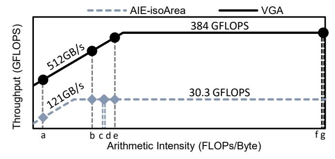

Fig. 14. FP32 roofline of AMD AI engine (AIE) and VGA in an iso-area configuration. Labeled operations are: (a) real multiplication, (b) complex number multiplication, (c,d) *State Update* and *Output Projection* without Vandermonde matrix generation, (e) FFT/IFFT, (f,g) *State Update* and *Output Projection* with Vandermonde matrix generation.

approach to leverage tensor cores. Direct application of FlashFFTConv to the H3 model is challenging as it operates on FP16, whereas our model uses FP32. To estimate its performance impact on the GPU baseline, we replace the time spent on FFT-convolution in the H3 baseline layer (56 ms) of H3-GPT using 128K input sequence, with FlashFFTConv's time for FFT-convolution on an FP16 input sequence of identical length (32 ms). This substitution reduces the time spent on ROI on the GPU from 140 ms to 116 ms, translating to an 18% reduction in ROI speedup for VGA. However, this number serves as the upper bound of speedup reduction, as the FP32 version of FlashFFTConv would halve the FLOPs and double the bandwidth usage.

Comparison with AMD AI Engine. Fig. 14 show an FP32 roofline comparison between the AMD AI Engine (AIE) [7], a Coarse-Grained Reconfigurable Architecture (CGRA) style accelerator platform, and VGA. The number of tiles in the AIE is scaled to match the area of a single PE of VGA. The area of the AIE is estimated from its die photo [5] fabricated in a 7nm process. VGA has 9.45× higher area-normalized throughput, as arithmetic intensity for operations in ROI is mostly between the ridge point of the AIE and VGA. The relative area inefficiency of the AIE architecture is attributed to the overhead of sophisticated inter-tile connections and non-FP32 arithmetic units, whereas VGA's specialization avoids such overhead.

# VI. RELATED WORK

FFT Accelerators. FFT is an important algorithm extensively used in digital signal processing across multiple applications, such as sensor signal processing [45], synthetic aperture radar [8], and digital communication [6]. Therefore, many different custom hardware designs that accelerate variants of FFT, including Cooley-Tukey algorithm, have been proposed [10] [12]. VGA is different from these previous designs as it supports many other complex number operations other than the butterfly operation, and it performs on-the-fly CTF matrix generation through complex number multiplication.

Activation Re-computation. Reducing memory footprint is a popular topic in the deep learning field. Re-computation of layer activations is one of the optimizations widely adopted to conduct model training in a memory-efficient manner [11], [44], [49] to increase the size of training batch or model. To reduce memory footprint, activations required for gradient propagation are recomputed during the backward pass instead of saving them in memory during the forward pass. Similarly, VGA generates the same CTF matrix and the Mxy and Mux matrices every time they are needed instead of storing them in memory, which is made possible by their mathematical properties.

Software Optimization for LLM Inference. There is a rich variety of software efforts aimed at improving LLM inference. While self-attention-specific techniques, such as those in [43], [53], are not applicable to our models, batching optimization techniques during generation [29], [52] can be utilized. However, these works are orthogonal as we primarily focus on summarizing long input sequences instead of generating output tokens.

Other State Space Models. SSM-based global convolution models like LSSL [25] outperform SSM-based RNN variants, but training these SSM-based convolution models is known to be difficult. The recursive multiplication of A incurs a heavy computational overhead during filter generation. In DSS [26], S4 [24], and the subsequent work S4D [23], efficient solutions are proposed to this problem. They introduce techniques such as matrix decomposition and diagonalization for filter generation, drastically reducing its complexity. The H3 model evaluated on VGA is built on S4D that targets natural language processing tasks using an attention-like mechanism. Since the operations conducted in the two models are very similar, VGA can be used to accelerate S4D with little to no additional hardware overhead.

# VII. CONCLUSION

Global convolution models are effective alternatives to transformers for processing long sequences. This work focuses on the H3 model, a state-of-the-art SSM-based global convolution model, analyzing its operations and potential optimizations to enhance inference speed. It concludes that the H3 block's high memory bandwidth usage and low compute utilization highlight the necessity for fully fused execution. This paper proposes VGA, the first custom accelerator targeting global convolution models. By leveraging property of a Vandermonde matrix, VGA shows 76× and 48× improvement of area and power efficiency over A100 GPU, respectively. When integrated with TPU, VGA exhibits an end-to-end latency speedup of up to 14.9×, observed specifically in the H3-Speech model with a sequence length of 128K.

# ACKNOWLEDGMENTS

This work was supported by a research grant from Samsung Advanced Institute of Technology (SAIT), the National Research Foundation of Korea (NRF) grants funded by the Korea Government (MSIT) (RS-2024-00340008 and RS-2024- 00405857). The EDA tool was supported by the IC Design Education Center (IDEC), Korea. Jae W. Lee is the corresponding author.

# REFERENCES

- [1] "Model Card and Evaluations for Claude Models," https://cdn.sanity.io/ files/4zrzovbb/website/5c49cc247484cecf107c699baf29250302e5da70. pdf, accessed: 2024-02-22.
- [2] "NVIDIA A100 Tensor Core GPU Architecture," https: //images.nvidia.com/aem-dam/en-zz/Solutions/data-center/nvidiaampere-architecture-whitepaper.pdf, accessed: 2023-08-05.
- [3] "OpenAI Documentation Models," https://platform.openai.com/docs/ models/overview, accessed: 2023-08-05.
- [4] "Our next-generation model: Gemini 1.5," https://blog.google/ technology/ai/google-gemini-next-generation-model-february-2024, accessed: 2024-02-22.
- [5] S. Ahmad, S. Subramanian, V. Boppana, S. Lakka, F.-H. Ho, T. Knopp, J. Noguera, G. Singh, and R. Wittig, "Xilinx first 7nm device: Versal ai core (vc1902)," in *2019 IEEE Hot Chips 31 Symposium (HCS)*, 2019, pp. 1–28.
- [6] G. Akkad, A. Mansour, B. ElHassan, F. Le Roy, and M. Najem, "Fft radix-2 and radix-4 fpga acceleration techniques using hls and hdl for digital communication systems," in *2018 IEEE international multidisciplinary conference on engineering technology (IMCET)*. IEEE, 2018, pp. 1–5.
- [7] G. Alok, "Architecture apocalypse dream architecture for deep learning inference and compute-versal ai core," *Embedded World*, 2020.
- [8] F. Andersson, R. Moses, and F. Natterer, "Fast fourier methods for synthetic aperture radar imaging," *IEEE Transactions on Aerospace and Electronic Systems*, vol. 48, no. 1, pp. 215–229, 2012.
- [9] T. Brown, B. Mann, N. Ryder, M. Subbiah, J. D. Kaplan, P. Dhariwal, A. Neelakantan, P. Shyam, G. Sastry, A. Askell *et al.*, "Language models are few-shot learners," *Advances in neural information processing systems*, vol. 33, pp. 1877–1901, 2020.
- [10] J. Chen, Y. Lei, Y. Peng, T. He, and Z. Deng, "Configurable floatingpoint fft accelerator on fpga based multiple-rotation cordic," *Chinese Journal of Electronics*, vol. 25, no. 6, pp. 1063–1070, 2016.
- [11] T. Chen, B. Xu, C. Zhang, and C. Guestrin, "Training deep nets with sublinear memory cost," *arXiv preprint arXiv:1604.06174*, 2016.
- [12] X. Chen, Y. Lei, Z. Lu, and S. Chen, "A variable-size fft hardware accelerator based on matrix transposition," *IEEE Transactions on Very Large Scale Integration (VLSI) Systems*, vol. 26, no. 10, pp. 1953–1966, 2018.
- [13] T. Dao, "Flashattention-2: Faster attention with better parallelism and work partitioning," *arXiv preprint arXiv:2307.08691*, 2023.
- [14] S. B. David, I. Zimerman, E. Nachmani, and L. Wolf, "Decision s4: Efficient sequence-based rl via state spaces layers," in *The Eleventh International Conference on Learning Representations*, 2022.
- [15] J. Devlin, M. Chang, K. Lee, and K. Toutanova, "BERT: pre-training of deep bidirectional transformers for language understanding," in *NAACL-HLT (1)*. Association for Computational Linguistics, 2019, pp. 4171– 4186.
- [16] A. Dosovitskiy, L. Beyer, A. Kolesnikov, D. Weissenborn, X. Zhai, T. Unterthiner, M. Dehghani, M. Minderer, G. Heigold, S. Gelly, J. Uszkoreit, and N. Houlsby, "An Image is Worth 16x16 Words: Transformers for Image Recognition at Scale," in *International Conference on Learning Representations*, 2021.
- [17] P. Duhamel and M. Vetterli, "Fast fourier transforms: A tutorial review and a state of the art," *Signal Processing*, vol. 19, no. 4, pp. 259–299, 1990. [Online]. Available: https://www.sciencedirect.com/ science/article/pii/016516849090158U
- [18] D. Y. Fu, T. Dao, K. K. Saab, A. W. Thomas, A. Rudra, and C. Re, "Hungry hungry hippos: Towards language modeling with state space models," in *The Eleventh International Conference on Learning Representations*, 2023.
- [19] D. Y. Fu, E. L. Epstein, E. Nguyen, A. W. Thomas, M. Zhang, T. Dao, A. Rudra, and C. Re, "Simple hardware-efficient long convolutions for sequence modeling," in *ICLR 2023 Workshop on Mathematical and Empirical Understanding of Foundation Models*, 2023. [Online]. Available: https://openreview.net/forum?id=HW66omzl2fw
- [20] D. Y. Fu, H. Kumbong, E. Nguyen, and C. Re, "FlashFFTConv: Efficient ´ Convolutions for Long Sequences with Tensor Cores," *arXiv preprint arXiv:2311.05908*, 2023.
- [21] B. J. Grosz, A. K. Joshi, and S. Weinstein, "Centering: A framework for modelling the local coherence of discourse," *Computational Linguistics*, vol. 21, no. 2, pp. 203–225, 1995.

- [22] A. Gu and T. Dao, "Mamba: Linear-time sequence modeling with selective state spaces," *arXiv preprint arXiv:2312.00752*, 2023.
- [23] A. Gu, K. Goel, A. Gupta, and C. Re, "On the parameterization ´ and initialization of diagonal state space models," *Advances in Neural Information Processing Systems*, vol. 35, pp. 35 971–35 983, 2022.
- [24] A. Gu, K. Goel, and C. Re, "Efficiently modeling long sequences with ´ structured state spaces," in *The International Conference on Learning Representations (ICLR)*, 2022.
- [25] A. Gu, I. Johnson, K. Goel, K. Saab, T. Dao, A. Rudra, and C. Re,´ "Combining recurrent, convolutional, and continuous-time models with linear state space layers," *Advances in neural information processing systems*, vol. 34, pp. 572–585, 2021.
- [26] A. Gupta, A. Gu, and J. Berant, "Diagonal state spaces are as effective as structured state spaces," *Advances in Neural Information Processing Systems*, vol. 35, pp. 22 982–22 994, 2022.
- [27] J. R. Hobbs, "Coherence and coreference," *Cognitive science*, vol. 3, no. 1, pp. 67–90, 1979.
- [28] Z. Huang, L. F. Herbozo Contreras, L. Yu, N. D. Truong, A. Nikpour, and O. Kavehei, "S4d-ecg: A shallow state-of-the-art model for cardiac abnormality classification," *Cardiovascular Engineering and Technology*, pp. 1–12, 2024.
- [29] Y. Jin, C.-F. Wu, D. Brooks, and G.-Y. Wei, "S 3 : Increasing GPU Utilization during Generative Inference for Higher Throughput," *Advances in Neural Information Processing Systems*, vol. 36, 2024.
- [30] N. Jouppi, G. Kurian, S. Li, P. Ma, R. Nagarajan, L. Nai, N. Patil, S. Subramanian, A. Swing, B. Towles *et al.*, "Tpu v4: An optically reconfigurable supercomputer for machine learning with hardware support for embeddings," in *Proceedings of the 50th Annual International Symposium on Computer Architecture*, 2023, pp. 1–14.
- [31] N. P. Jouppi, D. H. Yoon, G. Kurian, S. Li, N. Patil, J. Laudon, C. Young, and D. Patterson, "A domain-specific supercomputer for training deep neural networks," *Communications of the ACM*, vol. 63, no. 7, pp. 67– 78, 2020.
- [32] J. Jumper, R. Evans, A. Pritzel, T. Green, M. Figurnov, O. Ronneberger, K. Tunyasuvunakool, R. Bates, A. Zˇ´ıdek, A. Potapenko *et al.*, "Highly accurate protein structure prediction with alphafold," *Nature*, vol. 596, no. 7873, pp. 583–589, 2021.
- [33] W. Labov and J. Waletzky, "Narrative analysis: Oral versions of personal experience." *Journal of Narrative & Life History*, vol. 7, no. 1-4, pp. 3–38, 1997.
- [34] Y. Li, T. Cai, Y. Zhang, D. Chen, and D. Dey, "What makes convolutional models great on long sequence modeling?" in *The Eleventh International Conference on Learning Representations*, 2023. [Online]. Available: https://openreview.net/forum?id=TGJSPbRpJX-
- [35] J. Liu, R. Yu, Y. Wang, Y. Zheng, T. Deng, W. Ye, and H. Wang, "Point mamba: A novel point cloud backbone based on state space model with octree-based ordering strategy," *arXiv preprint arXiv:2403.06467*, 2024.
- [36] H. Luo, Y. C. Tugrul, F. N. Bostancı, A. Olgun, A. G. Ya ˘ glıkc¸ı, , and ˘ O. Mutlu, "Ramulator 2.0: A Modern, Modular, and Extensible DRAM Simulator," 2023.
- [37] J. Ma, F. Li, and B. Wang, "U-mamba: Enhancing long-range dependency for biomedical image segmentation," *arXiv preprint arXiv:2401.04722*, 2024.
- [38] S. Merity, C. Xiong, J. Bradbury, and R. Socher, "Pointer Sentinel Mixture Models," in *International Conference on Learning Representations*, 2017. [Online]. Available: https://openreview.net/ forum?id=Byj72udxe
- [39] R. Navigli, "Word sense disambiguation: A survey," *ACM computing surveys (CSUR)*, vol. 41, no. 2, pp. 1–69, 2009.
- [40] T. Norrie, N. Patil, D. H. Yoon, G. Kurian, S. Li, J. Laudon, C. Young, N. Jouppi, and D. Patterson, "The design process for google's training chips: Tpuv2 and tpuv3," *IEEE Micro*, vol. 41, no. 2, pp. 56–63, 2021.
- [41] A. Orvieto, S. L. Smith, A. Gu, A. Fernando, C. Gulcehre, R. Pascanu, and S. De, "Resurrecting recurrent neural networks for long sequences," in *Proceedings of the 40th International Conference on Machine Learning*, 2023.
- [42] M. Poli, S. Massaroli, E. Nguyen, D. Y. Fu, T. Dao, S. Baccus, Y. Bengio, S. Ermon, and C. Re, "Hyena hierarchy: Towards larger ´ convolutional language models," in *Proceedings of the 40th International Conference on Machine Learning*, 2023.
- [43] R. Pope, S. Douglas, A. Chowdhery, J. Devlin, J. Bradbury, J. Heek, K. Xiao, S. Agrawal, and J. Dean, "Efficiently scaling transformer inference," *Proceedings of Machine Learning and Systems*, vol. 5, 2023.

- [44] J. Rasley, S. Rajbhandari, O. Ruwase, and Y. He, "Deepspeed: System optimizations enable training deep learning models with over 100 billion parameters," in *Proceedings of the 26th ACM SIGKDD International Conference on Knowledge Discovery & Data Mining*, 2020, pp. 3505– 3506.
- [45] S. Saponara and B. Neri, "Radar sensor signal acquisition and 3d fft processing for smart mobility surveillance systems," in *2016 IEEE Sensors Applications Symposium (SAS)*. IEEE, 2016, pp. 1–6.
- [46] A. Stillmaker and B. Baas, "Scaling equations for the accurate prediction of cmos device performance from 180 nm to 7 nm," *Integration*, vol. 58, pp. 74–81, 2017.
- [47] Y. Tay, M. Dehghani, S. Abnar, Y. Shen, D. Bahri, P. Pham, J. Rao, L. Yang, S. Ruder, and D. Metzler, "Long range arena : A benchmark for efficient transformers," in *International Conference on Learning Representations*, 2021. [Online]. Available: https: //openreview.net/forum?id=qVyeW-grC2k
- [48] A. Vaswani, N. Shazeer, N. Parmar, J. Uszkoreit, L. Jones, A. N. Gomez, Ł. Kaiser, and I. Polosukhin, "Attention is all you need," *Advances in neural information processing systems*, vol. 30, 2017.
- [49] L. Wang, J. Ye, Y. Zhao, W. Wu, A. Li, S. L. Song, Z. Xu, and T. Kraska, "Superneurons: Dynamic gpu memory management for training deep neural networks," in *Proceedings of the 23rd ACM SIGPLAN Symposium on Principles and Practice of Parallel Programming*, ser. PPoPP '18. New York, NY, USA: Association for Computing Machinery, 2018, p. 41–53. [Online]. Available: https://doi.org/10.1145/3178487.3178491
- [50] P. Warden, "Speech commands: A dataset for limited-vocabulary speech recognition," *arXiv preprint arXiv:1804.03209*, 2018.
- [51] J. N. Yan, J. Gu, and A. M. Rush, "Diffusion models without attention," in *Proceedings of the IEEE/CVF Conference on Computer Vision and Pattern Recognition*, 2024, pp. 8239–8249.
- [52] G.-I. Yu, J. S. Jeong, G.-W. Kim, S. Kim, and B.-G. Chun, "Orca: A distributed serving system for {Transformer-Based} generative models," in *16th USENIX Symposium on Operating Systems Design and Implementation (OSDI 22)*, 2022, pp. 521–538.
- [53] M. Zaheer, G. Guruganesh, K. A. Dubey, J. Ainslie, C. Alberti, S. Ontanon, P. Pham, A. Ravula, Q. Wang, L. Yang *et al.*, "Big bird: Transformers for longer sequences," *Advances in neural information processing systems*, vol. 33, pp. 17 283–17 297, 2020.
- [54] L. Zhu, B. Liao, Q. Zhang, X. Wang, W. Liu, and X. Wang, "Vision mamba: Efficient visual representation learning with bidirectional state space model," *arXiv preprint arXiv:2401.09417*, 2024.
- [55] N. Zubic, M. Gehrig, and D. Scaramuzza, "State space models for event cameras," in *Proceedings of the IEEE/CVF Conference on Computer Vision and Pattern Recognition*, 2024, pp. 5819–5828.