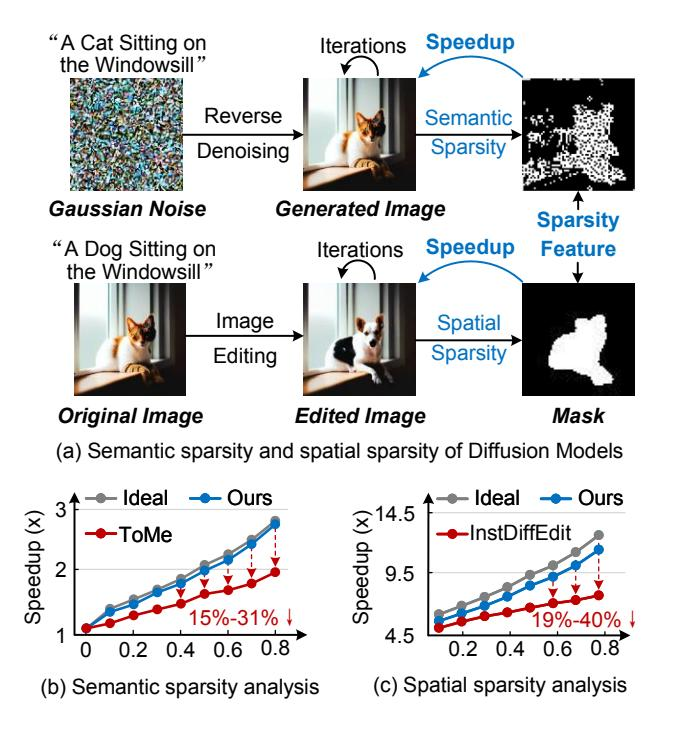
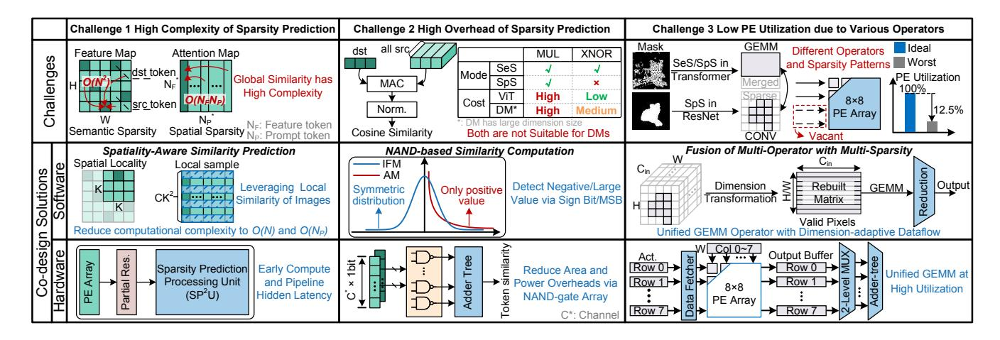
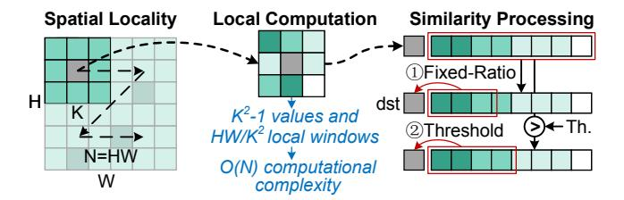
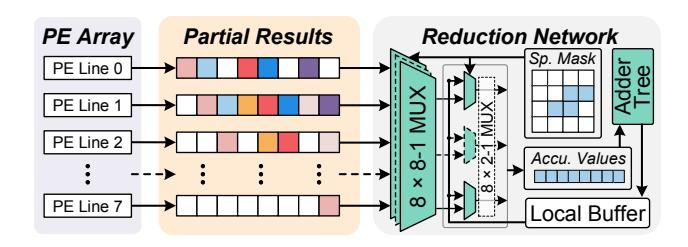
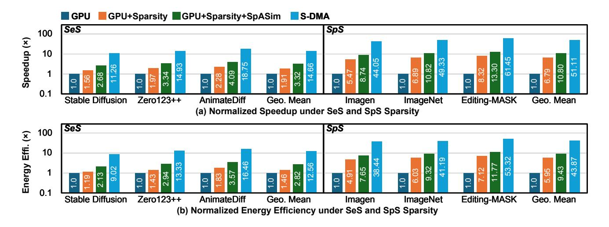

# S-DMA: Sparse Diffusion Models Acceleration via Spatiality-Aware Prediction and Dimension-Adaptive Dataflow

[Zihan Zou](https://orcid.org/0009-0002-1510-1341) Southeast University Nanjing, China zouzihan3@seu.edu.cn

[Peng Zheng](https://orcid.org/0009-0002-0671-615X) Southeast University Nanjing, China zhengpeng0306@outlook.com

[Xinming Yan](https://orcid.org/0009-0001-7661-6165) Southeast University Nanjing, China yanxinming@seu.edu.cn

[Guang Yang](https://orcid.org/0009-0001-0000-1447) Southeast University Nanjing, China 220226083@seu.edu.cn

[Bo Liu](https://orcid.org/0000-0002-0894-1054) Southeast University Nanjing, China liubo\_cnasic@seu.edu.cn

[Shun Zhang](https://orcid.org/0009-0003-1981-9999) Southeast University Nanjing, China zhangshun9320@seu.edu.cn

> [Hao Cai](https://orcid.org/0000-0001-9251-0574) Southeast University Nanjing, China hao.cai@seu.edu.cn

# Abstract

Diffusion Models (DMs) have demonstrated remarkable performance in a variety of image generation tasks. However, their complex architectures and intensive computations result in significant overhead and latency, posing challenges for hardware deployment. To address these issues, researchers have explored the sparsity in DMs to reduce computational workloads, including semantic sparsity in image generation and spatial sparsity in local editing. Unfortunately, existing sparsity prediction methods face critical limitations in deployment: 1) additional prediction overheads offset the benefits of sparsity; 2) convolution and general matrix multiplication (GEMM) exhibit distinct sparsity patterns, which current co-design frameworks struggle to process. In this paper, we introduce S-DMA, a software-hardware co-design framework that unifies efficient sparsity prediction while supporting various sparse operators. First, we propose a spatiality-aware similarity computation method that leverages the local similarity of images, reducing the computational complexity of sparsity prediction from O( 2 ) to O(N). Second, we implement NAND-based similarity for sparsity prediction, which minimizes the computational overheads and ensures adaptability to different sparsity schemes. Finally, a dedicated hardware architecture is designed to efficiently leverage the algorithm optimizations. A NAND-based sparsity prediction processing unit is designed to adaptively handle the sparsity patterns. Additionally, a sparsity-aware reduction network and a dimension-adaptive

Bo Liu is the corresponding author.

Permission to make digital or hard copies of all or part of this work for personal or classroom use is granted without fee provided that copies are not made or distributed for profit or commercial advantage and that copies bear this notice and the full citation on the first page. Copyrights for components of this work owned by others than the author(s) must be honored. Abstracting with credit is permitted. To copy otherwise, or republish, to post on servers or to redistribute to lists, requires prior specific permission and/or a fee. Request permissions from permissions@acm.org.

MICRO '25, Seoul, Republic of Korea

© 2025 Copyright held by the owner/author(s). Publication rights licensed to ACM. ACM ISBN 979-8-4007-1573-0/25/10 <https://doi.org/10.1145/3725843.3756046>

dataflow are employed to support convolution and GEMM with different DM sparsity patterns. Experimental results demonstrate that S-DMA achieves up to 51.11× speedup and 43.87× higher energy efficiency than NVIDIA A100 GPU. Compared to state-of-the-art DM accelerators, S-DMA achieves up to 7.05× speedup and 3.19× higher energy efficiency.

# CCS Concepts

• Computer systems organization → Neural networks; • Hardware → Hardware accelerators.

# Keywords

Diffusion Model, Semantic Sparsity, Spatial Sparsity, Accelerator, Software-Hardware Co-Design, Transformer

### ACM Reference Format:

Zihan Zou, Xinming Yan, Shun Zhang, Peng Zheng, Guang Yang, Hao Cai, and Bo Liu. 2025. S-DMA: Sparse Diffusion Models Acceleration via Spatiality-Aware Prediction and Dimension-Adaptive Dataflow. In 58th IEEE/ACM International Symposium on Microarchitecture (MICRO '25), October 18–22, 2025, Seoul, Republic of Korea. ACM, New York, NY, USA, [13](#page-12-0) pages. <https://doi.org/10.1145/3725843.3756046>

# 1 Introduction

Diffusion Models (DMs) have recently demonstrated outstanding performance across a wide range of image generation tasks, including image synthesis [\[16,](#page-12-1) [40\]](#page-12-2) and text-to-image generation [\[30,](#page-12-3) [34,](#page-12-4) [36\]](#page-12-5). By employing an iterative denoising process and integrating cross-attention mechanisms into the UNet architecture, DMs enable precise alignment between textual prompts and visual content, generating high-quality images. Despite their impressive performance, DMs suffer from substantial computational overheads and high inference latency due to their complex architectures and the intensive use of diverse operators. For example, generating a single image with 50 denoising steps takes nearly 13.9 seconds on an NVIDIA RTX 3090 GPU [\[18\]](#page-12-6). These computational constraints pose significant challenges for the deployment of DMs in latencysensitive or real-time applications.

<span id="page-1-0"></span>

Figure 1: Semantic and spatial sparsity in diffusion models for image generation and editing.

To address these limitations, leveraging inherent sparsity has emerged as a promising strategy to accelerate image generation. As shown in Fig. 1 (a), during the reverse denoising process, adjacent tokens usually exhibit similar features, allowing for token merging (ToMe) [3, 19] to enhance inference speed and this phenomenon is referred to as semantic sparsity (SeS). Additionally, spatial sparsity (SpS) arises during the image editing process [6, 23, 51], where only localized modifications are applied to the images based on input prompts and other areas remain consistent with the original images. However, when state-of-the-art (SOTA) sparsity-aware algorithms [3, 51] are deployed in DMs, their effectiveness is diminished by the additional computational overheads required for sparsity prediction. As illustrated in Fig. 1 (b) and Fig. 1 (c), the improvements achieved by SeS and SpS are constrained, exhibiting a degradation of approximately 15% to 40% compared to the ideal case, which assumes no overhead from the sparse inference algorithm. Moreover, various sparsity schemes lead to distinct sparsity patterns across operators, which constrain the efficiency of previous works and general computing platforms. For instance, AdapTiV [48] accelerates computation based on the SeS inherent in Vision Transformers, but it is not applicable to SpS. Similarly, EXION [13] focuses on the intrinsic sparsity of model parameters rather than SeS or SpS, and as such, it fails to provide further acceleration for conditional DMs. Additionally, several differential computing techniques [10, 20, 21] aim to reduce computational overhead during iterations, yet they do not effectively exploit the sparsity patterns discussed above. Therefore, existing co-design frameworks struggle to process the unique sparsity of DMs, leaving critical challenges to be addressed.

Challenge 1. Current sparsity-aware algorithms impose substantial computational overheads due to their global similaritybased prediction mechanisms. As illustrated in Fig. 2 (top left), SeS prediction methods such as ToMe first partition the input feature map (IFM) tokens into destination (dst) and source (src) sets. Then, pairwise similarities are computed to merge semantically redundant src tokens into their corresponding dst tokens. In SpS prediction, the attention maps (AMs) capture relationships between input prompts and the image to identify regions requiring modification. The similarity between the attention vector of the start token and those of all other tokens must be computed. Both SeS and SpS predictions involve costly similarity computations, with complexities of  $O(N^2)$  and  $O(N_F N_P)$ , respectively. Here, N is the number of feature tokens, while  $N_F$  and  $N_P$  denote the numbers of feature and prompt tokens. These high complexities limit the efficiency gains achievable from sparse acceleration, posing significant challenges in latency-sensitive scenarios.

Challenge 2. Existing sparsity prediction algorithms often incur substantial computational overhead, which undermines the potential benefits of sparsity. As shown in Fig. 2 (top middle), both SeS and SpS predictions rely on cosine similarity, involving costly operations such as multiply-and-accumulate (MAC) and normalization that significantly contribute to inference latency. These computations are typically applied to high-dimensional token embeddings, leading to considerable data movement. Due to the limited on-chip storage, the sparsity prediction process requires frequent off-chip memory accesses, further increasing both latency and energy consumption. Although AdapTiV employs an XNOR-based sign-bit similarity to replace multipliers, this method is unsuitable for DMs. This is because attention maps in DMs contain only non-negative values, which renders sign-bit comparisons ineffective for SpS.

Challenge 3. The U-Net architecture in DMs comprises diverse operators, including convolution and general matrix multiplication (GEMM), each exhibiting distinct sparsity patterns. As illustrated in Fig. 2 (top right), this feature leads to inefficient utilization of processing elements (PEs). Specifically, in transformer blocks, when applying SeS and SpS, the dst and unmerged tokens can be extracted and processed in dense GEMM format. In contrast, convolutional layers in the ResNet blocks inherently perform local computations and can only benefit from SpS. However, due to the irregular and non-uniform nature of sparse feature maps, convolutions suffer from poor data locality and load imbalance, resulting in significantly reduced PE utilization. In extreme cases, the utilization rate can drop to 12.5%, severely limiting acceleration efficiency.

To address the aforementioned challenges, we propose S-DMA, a software-hardware co-design framework. As summarized in Fig. 2, the key contributions of this work are as follows:

 A novel Spatiality-Aware Similarity (SpASim) prediction method is proposed, which exploits the local similarity inherent in DMs. By leveraging a local sampling strategy, SpASim significantly reduces the computational complexities of both SeS and SpS predictions. Specifically, it reduces the computational complexity from O(N²) and O(N<sub>F</sub>N<sub>P</sub>) to O(N) and O(N<sub>P</sub>), respectively, thus enabling efficient sparsity prediction with minimal accuracy degradation.

<span id="page-2-0"></span>

Figure 2: Challenges and co-design solutions for the acceleration of sparse Diffusion Models.

- A NAND-based similarity computation strategy is developed to accelerate sparsity prediction. By replacing expensive multipliers with efficient NAND-gate logic, this method supports both SeS and SpS predictions, substantially reducing latency and computational overheads.
- A fusion strategy for handling multi-operator with multisparsity is introduced to enable a unified GEMM operator in DMs. By applying dimension-adaptive transformation, this approach maps the convolution into a unified GEMM format without additional memory overheads.
- A dedicated hardware accelerator is designed to exploit the proposed algorithm optimizations. This accelerator features a sparsity prediction processing unit (SP<sup>2</sup>U) and a sparsityaware reduction network. SP<sup>2</sup>U applies early computation and pipeline techniques to hide the prediction latency, while minimizing area and power overheads via a NAND-gate array. The reduction network enhances PE utilization by fully leveraging the unified GEMM operator.
- Extensive experimental evaluations across a variety of DM benchmarks demonstrate that S-DMA achieves up to a 51.11× speedup and a 43.87× improvement in energy efficiency compared to the NVIDIA A100 GPU. Moreover, relative to SOTA accelerators, S-DMA delivers up to a 7.05× speedup gain and a 3.19× enhancement in energy efficiency. To the best of our knowledge, S-DMA is the first software-hardware co-design framework specifically tailored for accelerating both semantic and spatial sparsity in DMs.

## 2 Background and Motivation

#### 2.1 Sparse Diffusion Model

Diffusion models are a class of generative neural networks that have demonstrated SOTA performance across a range of tasks, including image synthesis, video generation, and image inpainting [11, 36, 38]. Denoising Diffusion Probabilistic Models (DDPM) serve as the basis of modern diffusion approaches, formulating the generative process as a Markov chain of iterative denoising steps [16]. To accelerate sampling, Denoising Diffusion Implicit Models (DDIM) introduce

a non-Markovian formulation, enabling faster generation while maintaining quality [40]. Latent Diffusion Models (LDM), such as Stable Diffusion [36], further improve sampling efficiency and image quality by operating in a compressed latent space rather than the pixel space, thus reducing computational overheads.

Fig. 3 (a) illustrates the typical reverse denoising process of DMs. An image encoder transforms the input, a clean image or randomly sampled noise, from the pixel space into the latent space. Simultaneously, a text encoder processes user-provided prompts, converting them into token representations that guide the generation process. At each timestep, DM produces a latent representation with incrementally less noise. This iterative denoising continues for numerous steps, with each output serving as the input for the next iteration. Upon completion, the final denoised latent representation is decoded back into the pixel space, yielding the generated image.

Fig. 3 (b) presents the integration of sparse inference in DMs, highlighting semantic and spatial sparsity. On the left, the workflow of sparse transformer blocks is depicted, which is applicable to both SeS and SpS. Due to the frequent presence of unedited or similar visual elements, many tokens can be merged during computation without loss of information. To accommodate the residual connections in transformer blocks, unmerging steps are performed following the attention and MLP layers. This token merging strategy achieves up to a 50% reduction in the token count with negligible impact on accuracy [3, 46]. The right side of Fig. 3 (b) illustrates an additional workflow, particularly relevant to spatial sparsity in image editing tasks. In such scenarios, the user provides an image along with a prompt indicating regions to be edited. Since modifications are typically confined to small regions, the computation exhibits high spatial sparsity. The SpS transformer workflow mirrors that of SeS but can be extended to convolutional operations, allowing computation to be restricted to only the edited regions of the feature map.

## <span id="page-2-1"></span>2.2 Sparsity Prediction of Diffusion Model

In image generation tasks, many regions share similar semantic features, which can be exploited to reduce computational overheads.

<span id="page-3-0"></span>

Figure 3: Overview of Diffusion Model inference and sparsity-aware processing.

Token merging is a widely adopted approach for compressing feature representations by merging tokens with similar semantic content [3, 46, 48]. For each source token  $X_{src}^{(i)} \in \mathbb{R}^{1 \times d}$ , the destination token  $X_{dst}^{(j)} \in \mathbb{R}^{1 \times d}$  with the highest cosine similarity is selected as:

$$D_i^* = \arg\max_{j \in \{1, \dots, M\}} \cos(X_{src}^{(i)}, X_{dst}^{(j)})$$
 (1)

Here,  $X_{src} \in \mathbb{R}^{N \times d}$  denotes the set of N source tokens, and  $X_{dst} \in \mathbb{R}^{M \times d}$  denotes the set of M destination tokens, where d is the embedding dimension. This pairwise similarity search assigns each source token to its most semantically similar destination token for potential merging. Computing all pairwise cosine similarities between N source and M destination tokens incurs a computational complexity of O(NM). In practice, the number of destination tokens M typically scales linearly with the number of source tokens N, making the overall complexity effectively  $O(N^2)$ .

In image editing tasks [6, 23, 51], only specific regions of the image are edited based on user-provided prompts or explicit masks, giving rise to spatial sparsity. This sparsity can be predicted using the attention maps generated by cross-attention layers, which capture the interaction between textual prompts and image tokens. To identify these sparse regions, the similarity values between the starting token and all other tokens are computed to extract the global semantics of the prompt. The prediction process follows:

$$P_{i \in [1,N]} = \begin{cases} 1 & cosine_{i \in [1,N]}(A_i^{\tau}, A_{index}^{\tau}) > \gamma_1, \\ -1 & cosine_{i \in [1,N]}(A_i^{\tau}, A_{index}^{\tau}) < \gamma_2, \\ 0 & others. \end{cases} \tag{2}$$

The equation defines a threshold-based decision rule for sparsity prediction.  $A_i^{\tau}$  denotes the attention map corresponding to the *i-th* prompt word in the cross-attention layer, where  $\tau$  indicates the timestep at which the denoising process begins.  $A_{index}^{\tau}$  represents the attention map of the index token, which fully captures the overall semantics of the prompt. The attention map in the cross-attention layer captures the degree of alignment between the textual prompt and the image, enabling the identification of mismatched

<span id="page-3-1"></span>

Figure 4: Statistical characteristics of activations for semantic and spatial sparsity prediction.

or aligned regions in the prompt. For each attention map  $A_{in}^{\tau}$ , the cosine similarity between  $A_{i}^{\tau}$  and the index attention map  $A_{index}^{\tau}$  is calculated. If the similarity exceeds a positive threshold  $\gamma_1$ , the feature is considered relevant ( $P_i = 1$ ); if it falls below a negative threshold  $\gamma_2$ , the feature is considered irrelevant ( $P_i = -1$ ); otherwise, the feature is marked neutral ( $P_i = 0$ ). This method allows for dynamic feature selection based on similarity, enabling efficient sparse computation. However, the computation complexity is still  $O(N^2)$  with one dimension for prompt tokens and another for image tokens.

**Distribution analysis.** Fig. 4 illustrates the activation distributions and spatial locality characteristics of SeS and SpS, which are evaluated using the Stable Diffusion V2 model [36] on the COCO 2014 dataset [25]. Additional analysis of local similarity across various models and tasks is presented in Section 5. The activation distribution of SeS exhibits approximately symmetric behavior, closely resembling a zero-centered profile. This symmetry enables efficient sparsity prediction using fast cosine similarity-based methods that leverage the sign of the vectors [48]. Since signs of similar vectors show high correlation in both positive and negative elements, signbased computations can significantly reduce the cost of similarity calculation while maintaining high prediction accuracy. In contrast, SpS activations exhibit a long-tail positive distribution due to the nature of attention maps. This deviation from symmetry renders sign-based similarity ineffective for SpS. To address this issue, a new optimization technique is required to handle the distinct sparsity patterns of both SpS and SeS, while maintaining computational efficiency and prediction accuracy. Fig. 4 (b) illustrates the normalized frequency distribution of the distances between src and dst tokens across the dataset, following work [3]. Empirical results indicate that most token pairs with high similarity are located in close spatial proximity, suggesting that global similarity computation may incur unnecessary overheads. This insight motivates the design of a locality-aware sparsity prediction mechanism.

#### 2.3 Workloads of Sparse DM Operators

The primary computational operators in DMs are general matrix multiplication (GEMM) and convolution (CONV), typically arising from transformer and convolutional blocks, respectively. Their core computation patterns can be formulated as Equation 3 and 4. In the GEMM formulation,  $A \in \mathbb{R}^{m \times n}$  and  $B \in \mathbb{R}^{n \times p}$  are input matrices,

<span id="page-4-2"></span>

Figure 5: Spatiality-aware similarity prediction for SeS.

and  $C \in \mathbb{R}^{m \times p}$  is the output matrix. For convolution, x(i, j) denotes the input feature map, w(m, n) represents the convolutional kernel, and C(i, j) denotes the resulting output feature map.

<span id="page-4-0"></span>GEMM: 
$$C_{i,j} = \sum_{k=1}^{n} A(i,k) \cdot B(k,j)$$
 (3)

<span id="page-4-1"></span>CONV: 
$$C_{i,j} = \sum_{m} \sum_{n} x(i+m, j+n) \cdot w(m, n)$$
 (4)

Due to the fundamentally different data reuse and access patterns between GEMM and CONV, designing a unified and efficient dataflow architecture to support both operations remains a key challenge. Furthermore, the introduction of SeS and SpS imposes additional complexity on hardware execution, requiring sparsity-aware support across both operator types. As shown in Fig. 2, SeS leads to irregular matrix shapes and variable token lengths, which significantly reduce PE utilization due to boundary inefficiency. In the case of SpS, two distinct issues arise. First, for GEMM operations, only the tokens identified for modification are extracted and processed, resulting in similar workloads to SeS. Second, SpS in convolution operations leads to partially missing channels in the activation tensor. These dynamic and heterogeneous sparsity patterns introduce substantial variability in workload dimensions, which place considerable pressure on the design of hardware.

## 2.4 Motivation

Sparsity prediction in DM introduces considerable overhead, offsetting the performance gains it aims to deliver. The high overheads of sparsity prediction stem from two key factors: the computational complexity and the lack of efficient general-purpose computational methods. Current sparsity prediction methods fail to effectively exploit the local similarity of the DM feature maps, leading to an  $O(N^2)$  computation complexity. Meanwhile, the advanced efficient similarity computation method is not suitable for SeS and SpS. These limitations motivate us to design a sparsity prediction framework that fully leverages the spatial locality of activation and adapts to different sparsity patterns.

Furthermore, the diversity of operators used in DMs introduces distinct sparsity patterns that limit the efficiency of sparsity methods on general platforms and existing accelerators. Unlike typical sparse computing techniques, which only consider sparsity across the same operator, sparse DMs demand PE arrays capable of handling varied and irregular sparsity patterns. These challenges motivate the need for a flexible hardware architecture and an efficient dataflow, capable of supporting multiple sparsity patterns while maintaining an optimal hardware efficiency.

<span id="page-4-3"></span>

(b) Complexity reduction via local AM sampling and gathering

Figure 6: Spatiality-aware similarity prediction for SpS.

## 3 Algorithm Optimization of S-DMA

This section explores the algorithm optimizations of S-DMA, which primarily consist of three key strategies: 1) The spatiality-aware similarity computation that leverages the local similarity in DMs; 2) A NAND-based similarity computation strategy that utilizes NAND operation to replace multiplication in similarity computation; 3) A dimension-adaptive dataflow that unifies heterogeneous sparsity patterns across different operator types.

#### <span id="page-4-4"></span>3.1 Spatiality-Aware Similarity Computation

As discussed in Section 2.2 and shown in Fig. 4, images generated by DMs exhibit strong locality in semantic sparsity. This indicates that computing global similarity between all pairwise tokens introduces substantially redundant computation. To address this, S-DMA adopts a Spatiality-Aware Similarity (SpASim) computation strategy for sparsity predictions, which restricts similarity evaluation to local regions, significantly reducing computational overheads.

**SpASim for SeS.** Fig. 5 presents the SpASim computation for SeS. The process begins by selecting a local window in the feature map, defined by the hyperparameter K, which constrains the scope of computation and determines the number of tokens involved. Within this window, the local similarity between source and destination tokens is calculated. The resulting similarity scores are then sorted and passed to sparsity prediction mechanisms, such as fixed-ratio selection or threshold-based filtering, to identify candidate token pairs for merging. This localized approach adjusts the computational complexity of SeS prediction from  $O(N^2)$  to O(N).

**SpASim for SpS.** As shown in Fig. 6 (a), in the prediction of SpS, the similarity between cross-attention maps is leveraged to accurately identify the image regions relevant to the given prompts. Observation of the attention maps reveals that only localized comparisons are sufficient for semantic positioning, while global comparisons introduce unnecessary computational overheads. Building on this insight, the SpASim strategy is extended to support SpS prediction through a localized sampling approach. As illustrated in Fig. 6 (b), we uniformly sample nine local windows (in a 3×3 grid) across the attention maps, with each window size determined by the

#### <span id="page-5-0"></span>Algorithm 1 Adaptive K Selection

```
1: Input: X: Activation for similarity computation
          IT: Target IoU Score
 2: Output: K
                                               // Window size K
 3: K = 0
 4: I_C = 0
                 // IoU score between real and approximate mask
 5: S_R = cosine(X)
                                        // Real cosine similarity
 6: MASK_R = MASKGen(S_R)
 7: while I_C < I_T do
     K = K + 1
     S_A = SpASim(K, X)
                                       // Approximate similarity
     MASK_A = MASKGen(S_A)
     I_C = IoU(MASK_R, MASK_A)
12: end while
13: return K
```

hyperparameter K. This design is inspired by common practices in vision models, where  $3\times3$  local receptive fields are widely adopted to balance expressiveness and efficiency [9, 45]. These sampled regions are then gathered for similarity computation. The use of local sampling significantly reduces the computational complexity from  $O(N_FN_P)$  to  $O(N_P)$ , enabling efficient and accurate SpS prediction with minimal overhead.

Algorithm 1 presents an adaptive window size selection strategy for the hyperparameter K, which governs the granularity of similarity approximation in both SeS and SpS. In practical settings, K is determined offline and fixed during inference. Given an input activation X and a target Intersection-over-Union (IoU) threshold  $I_T$ , the algorithm first computes the full-resolution cosine similarity to obtain a reference similarity map  $S_R$ . A ground-truth sparsity mask  $MASK_R$  is then generated from  $S_R$  using a standard mask generator. The algorithm proceeds by iteratively increasing *K* to identify the minimal window size that achieves sufficient approximation quality. In each iteration, approximate similarity  $S_A$  is computed using our proposed SpASim method with the current K, followed by the generation of an approximate mask  $MASK_A$ . The IoU between  $MASK_A$ and the reference mask  $MASK_R$  is then evaluated. Once the IoU exceeds the target threshold  $I_T$ , the corresponding K is returned as the optimal value. In our implementation, the target IoU is set to 0.75, following prior works [25, 35], to ensure sufficient alignment between the approximate and reference sparsity patterns.

#### <span id="page-5-2"></span>3.2 NAND-based Similarity

In SeS and SpS sparsity prediction, cosine similarity is commonly employed to measure the redundancy among tokens and the structural similarity within cross-attention maps, respectively. However, this approach introduces severe latency and hardware overhead due to the required MAC and normalization operations. As discussed in Section 2.2, the activations for sparsity prediction follow an approximately symmetric distribution. Leveraging this observation, we find that detecting negative value pairs alone, rather than computing full cosine similarity, can yield comparable effectiveness for sparsity prediction. In particular, we adopt a simplified approach similar to sign similarity for SeS, where only negative values are used to estimate similarity. For SpS prediction, the non-negative

<span id="page-5-1"></span>

Figure 7: Value-aware NAND-based similarity computation for sparsity prediction.

nature of attention maps limits the effectiveness of sign similarity. Instead, we utilize amplitude-based similarity by comparing the most significant bits (MSBs) of the values. Pairs of elements sharing the same MSB are considered similar, as highly similar vectors tend to exhibit large values in consistent channels.

As illustrated in Fig. 7, this computation can be efficiently implemented using a NAND-gate array that operates in parallel and generates valid results only when both inputs are negative or large (sign bits or MSBs are 1). The resulting outputs are then passed to an adder tree to accumulate the final similarity score, thereby eliminating the need for XNOR gates or even multipliers. Notably, a NAND gate requires only 4 transistors, compared to the 10 transistors typically needed for an XNOR gate. Fig. 7 further illustrates the hardware cost of the proposed NAND-based similarity computation. The results are evaluated at a 28nm technology using a core frequency of 400MHz. Compared to XNOR-based sign similarity, our NAND-based design achieves a 57.1% reduction in area and a 50.1% reduction in power consumption, highlighting the substantial benefits of NAND-based similarity computation.

#### <span id="page-5-3"></span>3.3 Dimension-Adaptive Dataflow

Building upon the challenges discussed above, an optimized dataflow design is required to efficiently support various sparse workloads in DMs. As illustrated in Fig. 8, token-wise permutation can transform sparse GEMM operations into dense formats, enabling more efficient computation. For convolution, the widely-used im2col [41] transformation converts convolutional operations into GEMM format to facilitate hardware acceleration. However, this approach often results in redundant data replication and suboptimal memory utilization. Furthermore, due to the intrinsic differences in sparsity distribution, the transformed GEMM still exhibits irregular sparsity, limiting overall efficiency.

Under the SpS workload, the channel dimension in convolutional layers remains structurally dense. This observation motivates a dimension transformation approach to optimize sparse convolution computations. To address the heterogeneous sparsity patterns in DMs, S-DMA introduces a fusion strategy that unifies both operator types and sparsity formats. As illustrated in Fig. 8, dense tokens within a sparse input feature map (IFM) are extracted and permuted along the channel dimension to form a compact representation. The corresponding convolution kernels are similarly permuted to preserve alignment. This dimension-adaptive transformation effectively reformulates sparse convolution into a structured GEMM operation. Compared to the conventional *im2col* approach, our

<span id="page-6-0"></span>

Figure 8: Unified GEMM with dimension-adaptive dataflow.

method offers three key advantages: (1) a unified GEMM framework for different operators, (2) consistent sparsity patterns across operators, and (3) elimination of additional memory overhead. However, due to fundamental differences in accumulation paths between convolution and GEMM, the output of the transformed convolution does not directly correspond to the final output feature map. To resolve this, a software-hardware co-designed reduction network is proposed to aggregate the associated partial results. The implementation details are further discussed in Sec. 4.4.

#### 4 Architecture Innovation of S-DMA

#### 4.1 Overview

Fig. 9 depicts the overall architecture, which consists of eight primary modules: off-chip DRAM storage, on-chip SRAM storage, a Data Load and Fetch (DLF) unit, a SIMD core, a top controller, a Sparsity Prediction Processing Unit (SP<sup>2</sup>U), a PE array, and a Sparsityaware Reduction Network. At the core of the architecture lies the SP<sup>2</sup>U, which predicts both SeS and SpS using a unified computation unit. This module comprises a NAND-gate array connected to an adder tree and a unified sorting unit capable of executing multiple selection strategies. Meanwhile, it transmits generated mask signals to the sparsity-aware reduction network, which enables dense computation of sparse workloads. To support high-throughput operation, a standard S-DMA is designed to be capable of processing 64×16 MACs in parallel, where each PE integrates 16 multipliers and a dedicated adder tree. The SIMD core handles nonlinear operations, such as normalization and activation functions, that are commonly encountered in modern neural network accelerators [10, 31]. Notably, the sparsity prediction and PE array inference are seamlessly pipelined. This ensures that the sparsity predictor does not introduce performance degradation, avoiding additional latency between sparsity prediction and formal computation.

## 4.2 Sparsity Prediction Processing Unit

To efficiently support the sparsity prediction optimizations proposed in Sections 3.1 and 3.2, we design a dedicated Sparsity Prediction Processing Unit (SP<sup>2</sup>U), as illustrated in Fig. 10. This unit enables hardware-efficient support for both SeS and SpS sparsity predictions. After feature maps and attention maps are generated by the PE array, the corresponding sign bits or most significant bits (MSBs) are buffered and forwarded to a NAND-based similarity engine. This engine comprises 16 groups, each containing 32 NAND

<span id="page-6-1"></span>

Figure 9: Overview of S-DMA accelerator.

<span id="page-6-2"></span>

Figure 10: Architecture of sparsity prediction processing unit.

gates, allowing scalable and highly parallel bit-wise similarity computation. This grouping strategy offers flexibility in adapting to varying feature dimensions and computational parallelism.

The outputs of the NAND-gate array are accumulated by an adder tree to produce approximate similarity scores, which are stored in a local buffer for downstream selection. A sorting-based selection mechanism is employed to support both threshold-based filtering and fixed-ratio (e.g., top-k) sparsity schemes. Given its impact on hardware cost and inference latency, the sorting logic must be carefully designed. Bitonic sorters [2] are widely adopted due to their inherent parallelism and relatively low sorting latency of  $O((\log_2 n)^2)$  cycles, where *n* is the number of elements to be sorted. However, such designs require  $O(n(\log_2 n)^2)$  comparators and a similar order of registers when fully pipelined. To mitigate this, we implement a lightweight direct-insertion sorting mechanism tailored to our prediction pipeline. The sorter consists of ncomparison units, each composed of a register, comparator, and multiplexer. During operation, each unit dynamically determines whether to retain its value, accept the incoming input, or shift data from the previous unit based on descending order priority. This enables progressive in-place sorting of similarity scores over n cycles. Notably, since the PE array produces feature maps and attention maps incrementally, the sorting process is fully overlapped with ongoing matrix computations. Thus, it introduces no additional inference latency. Following sorting, the top-ranked results are selected according to the active sparsity prediction policy, supporting both threshold-based and fixed-ratio selection strategies through a shared reconfigurable selection logic.

<span id="page-7-2"></span>

Figure 11: Sparsity-aware reduction network.

# 4.3 PE Array Design

Fig. [9](#page-6-1) shows the architecture of the S-DMA accelerator, which features a compute-centric 8 × 8 PE array optimized for executing MAC operations under diverse sparsity patterns. The array supports up to 64 × 16 MACs per cycle, leveraging spatial broadcasting to maximize data reuse. Specifically, activation rows are broadcast along the row dimension and weight columns along the column dimension, forming a systolic-like dense computation pattern that achieves high utilization and throughput. Unlike prior sparse matrix accelerators that embed irregularity-handling logic directly into PEs, such as dynamic routing or indexing units, our design deliberately offloads sparsity handling to surrounding modules. Both data preparation (e.g., token extraction and permutation) and partial result aggregation are decoupled from the PE array. This ensures that each PE operates on pre-aligned dense data with a minimal and fully pipelined MAC datapath. By avoiding in-PE routing logic, the architecture maintains high regularity and low design complexity. To further enhance resource efficiency, we adopt a 3D PE microarchitecture that consolidates more multipliers and local accumulation logic within each PE. Instead of scaling the array along the token dimension, which leads to boundary underutilization, we increase intra-PE parallelism. This strategy enables dense highthroughput execution even under fragmented sparsity conditions, while preserving compact area and simplified control.

# <span id="page-7-1"></span>4.4 Sparsity-Aware Reduction Network

Fig. [11](#page-7-2) illustrates the architecture of the sparsity-aware reduction network designed to support our proposed dimension-adaptive dataflow. For SeS, the outputs from the PE array are already aligned with the final output format and can be directly buffered. In contrast, SpS requires additional accumulation due to the dimension-adaptive transformation applied to convolution, as discussed in Section [3.3.](#page-5-3) In this case, partial results across different convolutional steps must be selectively accumulated to reconstruct the final output.

To support this requirement, we design a hierarchical and reusable reduction network capable of accumulating partial results with minimal control overhead. The PE array generates results along eight parallel PE lines, which are first buffered and then routed through eight 8-to-1 multiplexers. These MUXes are dynamically configured based on the sparse masks generated by SP2U, allowing selective forwarding of partial results corresponding to specific output positions. Owing to the inherent sparsity of input feature maps, some PE lines may not produce valid results for certain output channels. To maintain pipeline consistency, random partial results are selected from these invalid PE lines. A second stage of routing employs eight

<span id="page-7-3"></span>Table 1: Power and area breakdown of S-DMA

| Component         | Configuration                           |       | Area (mm2<br>) | Power (mW) |       |  |
|-------------------|-----------------------------------------|-------|----------------|------------|-------|--|
| PE Array          | 8 × 8 × 16 Mul.                         | 0.776 | 46.3%          | 129.65     | 36.5% |  |
| SP2U              | 512× NAND                               | 0.124 | 7.4%           | 19.97      | 5.6%  |  |
| Reduction Network | MUX/Adders                              | 0.076 | 4.5%           | 12.24      | 3.5%  |  |
|                   | 32 KB Temp.                             |       | 33.0%          | 189.62     | 53.4% |  |
| Memory            | 192 KB Act.                             | 0.553 |                |            |       |  |
|                   | 128 KB WB                               |       |                |            |       |  |
| Ctrl & Others     | –                                       | 0.147 | 8.8%           | 3.39       | 1.0%  |  |
| Total             | Area = 1.676 mm2<br>, Power = 354.87 mW |       |                |            |       |  |

2-to-1 multiplexers to further filter invalid or redundant inputs. In this stage, undefined values are replaced with neutral elements (e.g., zeros) or corrected valid data. This two-level selection ensures that only valid partial sums are propagated into the final accumulation stage. The selected values are then fed into a shared adder tree, which performs the final reduction to produce the complete convolution output.

The proposed sparsity-aware reduction network offers several architectural advantages. First, by decoupling accumulation from the PE array, it allows the compute array to operate on fully regular and high-throughput workloads without interruption. Second, the use of masking and hierarchically multiplexing enables flexible support for varying sparsity patterns with minimal hardware cost. Finally, since the accumulation is distributed over time and aligned with the natural latency of convolutional execution, the reduction pipeline can be fully overlapped with PE computation, introducing no additional inference delay.

# <span id="page-7-0"></span>5 Evaluation

# 5.1 Experimental Setup

Software Configuration. Following the evaluation protocols established in prior work [\[46,](#page-12-14) [51\]](#page-12-9), we assess the performance of our approach across three distinct tasks for SeS and three datasets for SpS. To validate the generality of our method, we incorporate two SOTA sparsity prediction methods as baselines [\[3,](#page-11-0) [51\]](#page-12-9) for SeS and SpS. The threshold settings in these baselines are configured with their respective optimal values and are independent of the hyperparameter . Notably, S-DMA algorithm optimizations are broadly compatible with other similar sparsity prediction methods.

For SeS evaluation, we adopt Zero123++ v1.2 [\[38\]](#page-12-13) as the base model for the multi-view diffusion task. Zero123++ is an imageconditioned latent diffusion model designed to synthesize six consistent views from a single input image. We evaluate it on the GSO dataset [\[8\]](#page-11-7), which contains over 1,000 high-quality 3D-scanned objects. To enable comparison with ToMe, we report PSNR and LPIPS [\[50\]](#page-12-20) metrics, measuring perceptual and pixel-level fidelity. In the text-to-video task, we utilize AnimateDiff v3 [\[11\]](#page-11-4) as the backbone model, a SOTA diffusion framework that generates smooth and temporally coherent video sequences from either text prompts or reference frames. We conduct an evaluation on the VBench [\[17\]](#page-12-21) benchmark using semantic alignment and visual quality metrics. For the text-to-image task, we employ Stable Diffusion v2 [\[36\]](#page-12-5) at a

<span id="page-8-0"></span>

| Mo             | dels                             | Zero123++ v1.2              |                  |               | AnimateDiff v3              |                 |                  | Stable-Diffusion v2         |                  |       |                  |       |                  |
|----------------|----------------------------------|-----------------------------|------------------|---------------|-----------------------------|-----------------|------------------|-----------------------------|------------------|-------|------------------|-------|------------------|
| Ta             | asks Image-Conditioned Multiview |                             |                  | Text-to-Video |                             |                 | Text-to-Image    |                             |                  |       |                  |       |                  |
| Dat            | taset GSO                        |                             |                  |               | VBench                      |                 |                  |                             | COCO 2014        |       |                  |       |                  |
| Iterations 50  |                                  |                             |                  | 30            |                             |                 |                  | 50                          |                  |       |                  |       |                  |
| Metrics PSNR↑  |                                  | SNR↑                        | LPIPS↓           |               | Sen                         | Semantic↑ Quali |                  | ıality↑                     | FID↓             |       | CLIP↑            |       |                  |
| Method         |                                  | ToMe                        | +SpASim<br>+NAND | ToMe          | +SpASim<br>+NAND            | ToMe            | +SpASim<br>+NAND | ToMe                        | +SpASim<br>+NAND | ToMe  | +SpASim<br>+NAND | ToMe  | +SpASim<br>+NAND |
|                | 0.50                             | 14.76                       | 14.73            | 0.265         | 0.274                       | 74.71           | 74.68            | 81.64                       | 81.57            | 13.50 | 13.57            | 31.79 | 31.71            |
| Merge          | 0.60                             | 14.71                       | 14.66            | 0.272         | 0.283                       | 74.03           | 73.97            | 81.58                       | 81.49            | 14.81 | 14.89            | 31.80 | 31.69            |
| Ratio          | 0.70                             | 14.18                       | 14.09            | 0.302         | 0.327                       | 72.03           | 71.94            | 81.52                       | 81.41            | 17.46 | 17.58            | 31.78 | 31.68            |
|                | 0.75                             | 13.12                       | 12.97            | 0.349         | 0.378                       | 69.67           | 69.55            | 80.82                       | 80.68            | 20.89 | 21.03            | 31.71 | 31.57            |
| K; Improvement |                                  | K=14; 94% Prediction FLOPs↓ |                  |               | K=13; 95% Prediction FLOPs↓ |                 |                  | K=16; 92% Prediction FLOPs↓ |                  |       |                  |       |                  |
| Matche         | Matched Ratio                    |                             | 89%              |               |                             | 88%             |                  |                             | 91%              |       |                  |       |                  |

Table 2: Semantic sparsity accuracy and computation savings

<span id="page-8-1"></span>Table 3: Spatial sparsity accuracy and computation savings

| Dataset          | et Metrics InstDiff. |       | +SpASim<br>+NAND | Window K;<br>Improvement |  |  |
|------------------|----------------------|-------|------------------|--------------------------|--|--|
| ImagaNat         | LPIPS↓               | 28.6  | 28.9             | K=10;                    |  |  |
| ImageNet         | CSFID↓               | 65.1  | 65.3             | 78% FLOPs↓               |  |  |
|                  | LPIPS↓               | 17.0  | 17.2             | V 12                     |  |  |
| Imagen           | FID↓                 | 55.3  | 55.6             | K=13;<br>63% FLOPs.      |  |  |
|                  | CLIP↑                | 0.249 | 0.246            | 05% FLOFS                |  |  |
| Editing-<br>MASK | IoU↑                 | 56.2  | 55.8             | K=11;<br>73% FLOPs↓      |  |  |

resolution of 768×768. We use the COCO 2014 [25] dataset for quantitative comparison, reporting FID [15] and CLIP [14, 33] scores to assess visual quality and text-image consistency, respectively.

For SpS evaluation, we use Stable Diffusion as the base model and test on the ImageNet [7], Imagen [37], and Editing-MASK [51] datasets. On ImageNet, we compute LPIPS to quantify perceptual changes and CSFID [5] to measure distributional shifts. For Imagen, we evaluate LPIPS, FID [15], and CLIP to assess semantic fidelity and alignment with textual prompts. In Editing-MASK, we calculate IoU to measure the accuracy.

Hardware Configuration. We implement the RTL design of the S-DMA accelerator in Verilog and synthesize it through Synopsys Design Compiler, targeting commercial 28nm CMOS technology. The design operates reliably at 1V and a frequency of 1GHz, with no observed timing issues. On-chip area and power consumption are obtained from Design Compiler and PrimeTime PX, respectively. For external memory power modeling, we use a DDR4 memory model provided by DRAMSim3 [24]. Following the methodology of [4], all accelerators are evaluated under an iso-compute-area constraint. Each is equipped with a 224 KB activation buffer and a 128 KB weight buffer, which are implemented as on-chip SRAM and modeled using CACTI [1]. The on-chip memory configurations are consistent with the standardized single-instance S-DMA setup, as shown in Table 1.

**Hardware Baselines.** To evaluate the performance of S-DMA, we deploy the benchmarks on the general platform NVIDIA A100 GPU, NVIDIA Jetson Orin Nano, and two SOTA accelerators for comparison. The latency and power consumption of GPUs are

evaluated following prior respective works [13, 20, 48]. For the accelerator baselines, we select Cambricon-D [21] and Ditto [20], two representative accelerators that exploit inter-iteration sparsity for DM acceleration. For the comparison with the GPU, we use a set of S-DMA accelerators to extend the throughput, following the same methodology used in previous works [12, 13, 27, 32]. To enable fair comparison with prior SOTA accelerators implemented in different technology nodes, we normalize all designs to a common baseline of 28 nm CMOS at 1.0 V supply voltage. Following standard scaling models [26, 44], the operating frequency is scaled with s, and core power is scaled with  $s/V_{\rm cd}^2$ , where  $s = {\rm Tech}/28 \, {\rm nm}$ .

### 5.2 Algorithm Performance

As shown in Table 2 and Table 3, task-specific values of *K* lead to varying degrees of improvement in sparsity prediction performance. The hyperparameter K, which is determined offline by Algorithm 1, controls the window size for both SeS and SpS predictions. We conduct extensive experiments across multiple diffusion models and datasets to identify optimal values for K, balancing prediction accuracy with computational efficiency. Empirical results show that the optimal values of K are set to 14 for Zero123++, 13 for AnimateDiff, and 16 for Stable Diffusion, resulting in reductions of sparsity prediction computation by 94%, 95%, and 92% FLOPs, respectively. Compared to the matched src and dst tokens identified by the original global similarity, the selected token pairs by the K-based windows cover 89%, 88%, and 91% of them in the corresponding tasks. These results demonstrate the effectiveness of SpASim in balancing accuracy and computational efficiency. For spatial sparsity, we configure K=10 on ImageNet, K=13 on Imagen, and K=11 on Editing-MASK, achieving prediction FLOP reductions of 78%, 63%, and 73%, respectively.

For SeS tasks, we adopt the original ToMe method [3] as the baseline. As shown in Table 2, S-DMA achieves comparable generation quality across various models. For Zero123++, the PSNR drop remains under 1.15%. On AnimateDiff, both semantic consistency and perceptual quality metrics remain effectively unchanged. For Stable Diffusion, our method incurs a marginal FID increase of less than 0.7%, and a CLIP score drop within 0.45%. To evaluate performance on SpS tasks, Table 3 compares the generation quality of S-DMA with InstDiffEdit [51]. On ImageNet, the LPIPS and CSFID scores degrade by only 1.05% and 0.31%, respectively. On Imagen,

<span id="page-9-0"></span>

Figure 12: Speedup and energy efficiency comparison between S-DMA and GPU-based baselines.

all performance drops across LPIPS, FID, and CLIP remain within 1.2%. For editing-mask-based tasks, the IoU score drops by less than 1%, while S-DMA achieves a 73% reduction in sparsity prediction overhead. These results demonstrate that S-DMA maintains high generation fidelity across both SeS and SpS scenarios, with minimal impact on quality metrics and substantial computational savings.

#### 5.3 Architecture Evaluation

Hardware Breakdown. Table 1 summarizes the area and power distribution of the proposed S-DMA accelerator. The design integrates an  $8 \times 8$  PE array, a NAND-based SP<sup>2</sup>U, and a configurable reduction network, occupying a total silicon area of 1.676 mm<sup>2</sup> and consuming 354.87 mW under a 1 GHz clock. Among all components, the PE array accounts for the largest area portion (46.3%) and significant power consumption (36.5%), reflecting its central role in high-throughput dense MAC computation. In contrast, the SP<sup>2</sup>U and the reduction network contribute only 7.4% and 4.5% of the total area, and 5.6% and 3.5% of the power, respectively. Their compact footprint stems from the design emphasis on reusability and configurability across SeS and SpS prediction stages. Memory buffers occupy 33.0% of the area and dominate the power consumption (53.4%). Overall, the results demonstrate that S-DMA achieves an efficient balance between computational throughput and hardware overhead. The lightweight SP<sup>2</sup>U and reduction modules impose minimal resource cost while enabling adaptive sparsity prediction and aggregation, contributing to S-DMA's high energy efficiency.

Comparison with GPU Baselines. Fig. 12 compares S-DMA against three GPU baselines: (1) a standard GPU without sparsity processing, (2) a GPU with conventional sparsity methods, and (3) a GPU further enhanced with our proposed SpASim algorithm. Under SeS workloads, S-DMA achieves 14.66× average speedup over the baseline GPU and further outperforms the GPU+Sparsity and GPU+Sparsity+SpASim configurations by 7.66× and 4.42×, respectively. Correspondingly, energy efficiency is improved by 12.56×, 8.61×, and 4.46× across the same configurations. For SpS

workloads, S-DMA delivers even more significant gains, achieving an average speedup of 51.11× and an energy efficiency gain of 43.87× over the baseline GPU. Compared to GPU+Sparsity and GPU+Sparsity+SpASim setups, S-DMA provides 7.52×/4.73× higher speedup and 7.37×/4.65× better energy efficiency, respectively. Notably, integrating SpASim into GPU-based systems yields tangible improvements in both speed and energy efficiency, validating the effectiveness of the algorithm itself. However, the proposed S-DMA further amplifies these benefits through its co-designed hardware optimizations, achieving significantly higher performance across both SeS and SpS sparsity patterns.

Comparison with SOTA Accelerators. To comprehensively assess S-DMA's performance, we compare it against SOTA diffusion model accelerators, Cambricon-D [21] and Ditto [20], in terms of speedup and energy efficiency. EdgeGPU is adopted as the baseline to reflect deployment scenarios in edge environments. Note that S-DMA is evaluated independently without integrating prior orthogonal acceleration strategies (e.g., differential computing), as the objective is to isolate and highlight the standalone benefits of our sparsity-centric architectural techniques. As shown in Fig. 13, all evaluated accelerators significantly outperform the EdgeGPU baseline across both SeS and SpS workloads due to their customized DM acceleration architectures. However, prior works fall short in fully exploiting the multi-granularity sparsity present in DMs. Under SeS workloads, S-DMA achieves geometric mean speedups of 2.32× and 1.48× over Cambricon-D and Ditto, respectively, delivering the highest performance across all evaluated accelerators. For SpS workloads, the performance gap further widens, with S-DMA offering 7.05× and 4.43× speedups over Cambricon-D and Ditto, respectively. These gains stem from S-DMA's unified support for both SeS and SpS through dimension-adaptive dataflow and efficient sparsity prediction, whereas Cambricon-D and Ditto primarily target inter-step reuse. In terms of energy efficiency, S-DMA also outperforms all competitors across multiple benchmarks. Specifically, under SeS tasks, it achieves 2.32× and 1.28× improvements over Cambricon-D and Ditto, respectively. The advantage becomes

<span id="page-10-0"></span>

Figure 13: Speedup and energy efficiency versus EdgeGPU and SOTA accelerators.

more pronounced in SpS scenarios, with S-DMA delivering  $3.19\times$  and  $1.80\times$  higher energy efficiency. This is attributed to the architecture's ability to jointly exploit sparsity in both computation and memory, whereas prior works lack sparsity co-optimization.

# 5.4 Ablation Study

To evaluate the impact of merging ratios on system performance, we conduct an ablation study by varying the merging ratio r from 0 to 0.6. In the context of SpS, the merging ratio refers to the proportion of pixels that do not require editing, while in SeS, it corresponds to the proportion of features that can be merged based on similarity. As shown in Fig. 14, both speedup and energy efficiency of the S-DMA accelerator improve consistently as the merging ratio increases. When no merging is applied (r = 0), the system operates as a standard accelerator without sparsity, and both speedup and energy efficiency are normalized to 1. With a modest merging ratio of r = 0.3, S-DMA achieves a speedup of  $1.53 \times$  and an energy efficiency improvement of 1.69×. At r = 0.5, the improvements grow to 2.12× speedup and 2.37× energy efficiency. Notably, when the merging ratio reaches 0.6, the S-DMA accelerator achieves a maximum speedup of 2.61× and an energy efficiency gain of 2.90×, demonstrating the significant benefit of the supporting sparsity. These improvements stem from reduced redundant computation and minimized memory access, particularly when larger portions of the input can be merged or skipped due to sparsity.

Fig. 15 presents the ablation study of S-DMA's sparsity prediction pipeline under a fixed sparsity ratio, normalized to the baseline design without SpASim or NAND-based similarity computation. Introducing SpASim yields a  $1.12\times$  speedup and a  $1.10\times$  energy efficiency improvement by selectively eliminating redundant computation based on local similarity. When the NAND-based similarity engine is further used, performance and energy efficiency improve to  $1.22\times$  and  $1.28\times$ , respectively. This is attributed to the hardware-friendly implementation of the NAND-based similarity computation, which leverages low-latency bitwise operations with minimal overhead. Even when SpASim is disabled, representing a

<span id="page-10-1"></span>

Figure 14: Speedup and energy efficiency of S-DMA under different merging ratios.

worst-case scenario with minimal local similarity, the system still benefits from the lightweight NAND-based similarity computation, demonstrating its robustness and low-cost effectiveness. Overall, this ablation confirms that both the SpASim and NAND engine components contribute synergistically to the gains in speedup and energy efficiency.

### 6 Related Work

#### 6.1 Diffusion Models

Since the introduction of Denoising Diffusion Probabilistic Models (DDPM) [16], a wide range of DMs have been developed, achieving SOTA performance across diverse generative tasks [11, 29, 33, 36, 38–40, 47]. In text-to-image generation, models such as Stable Diffusion, Imagen [37], and DALLE-2 [34] synthesize semantically aligned images by progressively denoising latent representations. In the video domain, models like AnimateDiff [11] and LaVie [43] extend the denoising process temporally, using prompts or reference frames as conditions. However, they introduce large parameters and complex computation, limiting their on-device application.

#### 6.2 Diffusion Models Acceleration

A variety of techniques have been proposed to accelerate diffusion model inference [6, 19, 22, 23, 42, 49]. Token merging [3] reduces

<span id="page-11-15"></span>

Figure 15: Ablation study of S-DMA sparsity prediction

redundancy in Transformer blocks by identifying and merging semantically similar tokens within feature maps. SIGE [23] observes that editing tasks often modify only a subset of the input, enabling selective computation. InstDiffEdit [51] introduces a mask generation mechanism based on attention maps in cross-attention layers, effectively identifying spatial regions for editing. DeepCache [28] skips computations in certain deep U-Net layers, leveraging the similarity of intermediate features across adjacent timesteps. While these methods demonstrate strong acceleration performance, they pose significant challenges for efficient deployment on hardware.

## **6.3 Diffusion Model Accelerators**

Recent works have explored specialized software-hardware codesigns to accelerate DM inference by leveraging various forms of inherent features in these models. Cambricon-D [21] focuses exclusively on temporal similarity across consecutive timesteps, utilizing it to enable reduced-precision computation. Exion [13] targets output sparsity through a novel ConMerge mechanism, coupled with a custom architecture optimized for broadcasting both input activations and weights efficiently. Ditto [20] extends this idea by incorporating dynamic value sparsity and bit-width reduction via lightweight logic. However, it does not address semantic or spatial sparsity, which remain critical for unlocking further efficiency gains. In contrast to these designs, our work holistically addresses spatial and semantic sparsity through an integrated prediction-acceleration pipeline, enabling more comprehensive exploitation of the sparsity spectrum in DMs.

#### 7 Conclusion

This paper presents S-DMA, a software-hardware co-design framework for accelerating sparse diffusion models (DMs). To address the overheads of diverse sparsity prediction strategies, we introduce a spatiality-aware sampling method that exploits the intrinsic locality in diffusion processes, reducing the complexity of similarity computation from  $O(N^2)$  to O(N). In parallel, we propose a NAND-based similarity to significantly lower the computational

cost, supporting both semantic and spatial sparsity. A dimension-adaptive dataflow is also developed, enabling efficient handling of both sparse convolution and sparse matrix multiplication within a single framework. Building on these algorithmic insights, we design a dedicated accelerator comprising three key components: a sparsity prediction processing unit, a 3D processing element array, and a sparsity-aware reduction network. Experimental results show that S-DMA delivers up to 51.11× speedup and 43.87× energy efficiency improvement over the NVIDIA A100 GPU. Compared to state-of-the-art DM accelerators, S-DMA achieves up to 7.05× speedup and 3.19× better energy efficiency.

## Acknowledgments

This work was supported by the National Key Research and Development Program of China under Grant 2023YFB4403103.

#### References

- <span id="page-11-13"></span> Rajeev Balasubramonian, Andrew B Kahng, Naveen Muralimanohar, Ali Shafiee, and Vaishnav Srinivas. 2017. CACTI 7: New tools for interconnect exploration in innovative off-chip memories. ACM Transactions on Architecture and Code Optimization (TACO) 14, 2 (2017), 1–25.
- <span id="page-11-6"></span>[2] Kenneth E Batcher. 1968. Sorting networks and their applications. In Proceedings of the April 30–May 2, 1968, spring joint computer conference. 307–314.
- <span id="page-11-0"></span>[3] Daniel Bolya and Judy Hoffman. 2023. Token merging for fast stable diffusion. In Proceedings of the IEEE/CVF conference on computer vision and pattern recognition. 4599–4603.
- <span id="page-11-12"></span>[4] Yuzong Chen, Ahmed F AbouElhamayed, Xilai Dai, Yang Wang, Marta Andronic, George A Constantinides, and Mohamed S Abdelfattah. 2024. BitMoD: Bit-serial Mixture-of-Datatype LLM Acceleration. arXiv preprint arXiv:2411.11745 (2024).
- <span id="page-11-11"></span>[5] Guillaume Couairon, Asya Grechka, Jakob Verbeek, Holger Schwenk, and Matthieu Cord. 2022. Flexit: Towards flexible semantic image translation. In Proceedings of the IEEE/CVF conference on computer vision and pattern recognition. 18270–18279.
- <span id="page-11-1"></span>[6] Guillaume Couairon, Jakob Verbeek, Holger Schwenk, and Matthieu Cord. 2022. Diffedit: Diffusion-based semantic image editing with mask guidance. arXiv preprint arXiv:2210.11427 (2022).
- <span id="page-11-10"></span>[7] Jia Deng, Wei Dong, Richard Socher, Li-Jia Li, Kai Li, and Li Fei-Fei. 2009. Imagenet: A large-scale hierarchical image database. In 2009 IEEE conference on computer vision and pattern recognition. Ieee, 248–255.
- <span id="page-11-7"></span>[8] Laura Downs, Anthony Francis, Nate Koenig, Brandon Kinman, Ryan Hickman, Krista Reymann, Thomas B McHugh, and Vincent Vanhoucke. 2022. Google scanned objects: A high-quality dataset of 3d scanned household items. In 2022 International Conference on Robotics and Automation (ICRA). IEEE, 2553–2560.
- <span id="page-11-5"></span>[9] Hang Gao, Xizhou Zhu, Steve Lin, and Jifeng Dai. 2019. Deformable kernels: Adapting effective receptive fields for object deformation. arXiv preprint arXiv:1910.02940 (2019).
- <span id="page-11-3"></span>[10] Ruiqi Guo, Lei Wang, Xiaofeng Chen, Hao Sun, Zhiheng Yue, Yubin Qin, Huiming Han, Yang Wang, Fengbin Tu, Shaojun Wei, et al. 2024. 20.2 A 28nm 74.34 TFLOPS/W BF16 Heterogenous CIM-Based Accelerator Exploiting Denoising-Similarity for Diffusion Models. In 2024 IEEE International Solid-State Circuits Conference (ISSCC), Vol. 67. IEEE, 362–364.
- <span id="page-11-4"></span>[11] Yuwei Guo, Ceyuan Yang, Anyi Rao, Zhengyang Liang, Yaohui Wang, Yu Qiao, Maneesh Agrawala, Dahua Lin, and Bo Dai. 2023. Animatediff: Animate your personalized text-to-image diffusion models without specific tuning. arXiv preprint arXiv:2307.04725 (2023).
- <span id="page-11-14"></span>[12] Tae Jun Ham, Yejin Lee, Seong Hoon Seo, Soosung Kim, Hyunji Choi, Sung Jun Jung, and Jae W Lee. 2021. ELSA: Hardware-software co-design for efficient, lightweight self-attention mechanism in neural networks. In 2021 ACM/IEEE 48th Annual International Symposium on Computer Architecture (ISCA). IEEE, 692–705.
- <span id="page-11-2"></span>[13] Jaehoon Heo, Adiwena Putra, Jieon Yoon, Sungwoong Yune, Hangyeol Lee, Ji-Hoon Kim, and Joo-Young Kim. 2025. EXION: Exploiting Inter-and Intra-Iteration Output Sparsity for Diffusion Models. In 2025 IEEE International Symposium on High Performance Computer Architecture (HPCA). 324–337. https://doi.org/10. 1109/HPCA61900.2025.00034
- <span id="page-11-9"></span>[14] Jack Hessel, Ari Holtzman, Maxwell Forbes, Ronan Le Bras, and Yejin Choi. 2021. Clipscore: A reference-free evaluation metric for image captioning. arXiv preprint arXiv:2104.08718 (2021).
- <span id="page-11-8"></span>[15] Martin Heusel, Hubert Ramsauer, Thomas Unterthiner, Bernhard Nessler, and Sepp Hochreiter. 2017. Gans trained by a two time-scale update rule converge to a local nash equilibrium. Advances in neural information processing systems 30 (2017).

- <span id="page-12-1"></span><span id="page-12-0"></span>[16] Jonathan Ho, Ajay Jain, and Pieter Abbeel. 2020. Denoising diffusion probabilistic models. Advances in neural information processing systems 33 (2020), 6840–6851.
- <span id="page-12-21"></span>[17] Ziqi Huang, Yinan He, Jiashuo Yu, Fan Zhang, Chenyang Si, Yuming Jiang, Yuanhan Zhang, Tianxing Wu, Qingyang Jin, Nattapol Chanpaisit, et al. 2024. Vbench: Comprehensive benchmark suite for video generative models. In Proceedings of the IEEE/CVF Conference on Computer Vision and Pattern Recognition. 21807– 21818.
- <span id="page-12-6"></span>[18] Yiqi Jing, Meng Wu, Jiaqi Zhou, Yiyang Sun, Yufei Ma, Ru Huang, Tianyu Jia, and Le Ye. 2024. AIG-CIM: A Scalable Chiplet Module with Tri-Gear Heterogeneous Compute-in-Memory for Diffusion Acceleration. In Proceedings of the 61st ACM/IEEE Design Automation Conference. 1–6.
- <span id="page-12-7"></span>[19] Minchul Kim, Shangqian Gao, Yen-Chang Hsu, Yilin Shen, and Hongxia Jin. 2024. Token fusion: Bridging the gap between token pruning and token merging. In Proceedings of the IEEE/CVF Winter Conference on Applications of Computer Vision. 1383–1392.
- <span id="page-12-11"></span>[20] Sungbin Kim, Hyunwuk Lee, Wonho Cho, Mincheol Park, and Won Woo Ro. 2025. Ditto: Accelerating Diffusion Model via Temporal Value Similarity. In 2025 IEEE International Symposium on High Performance Computer Architecture (HPCA). 338–352.<https://doi.org/10.1109/HPCA61900.2025.00035>
- <span id="page-12-12"></span>[21] Weihao Kong, Yifan Hao, Qi Guo, Yongwei Zhao, Xinkai Song, Xiaqing Li, Mo Zou, Zidong Du, Rui Zhang, Chang Liu, et al. 2024. Cambricon-d: Full-network differential acceleration for diffusion models. In 2024 ACM/IEEE 51st Annual International Symposium on Computer Architecture (ISCA). IEEE, 903–914.
- <span id="page-12-32"></span>[22] Lijiang Li, Huixia Li, Xiawu Zheng, Jie Wu, Xuefeng Xiao, Rui Wang, Min Zheng, Xin Pan, Fei Chao, and Rongrong Ji. 2023. Autodiffusion: Training-free optimization of time steps and architectures for automated diffusion model acceleration. In Proceedings of the IEEE/CVF International Conference on Computer Vision. 7105– 7114.
- <span id="page-12-8"></span>[23] Muyang Li, Ji Lin, Chenlin Meng, Stefano Ermon, Song Han, and Jun-Yan Zhu. 2022. Efficient spatially sparse inference for conditional gans and diffusion models. Advances in neural information processing systems 35 (2022), 28858–28873.
- <span id="page-12-24"></span>[24] Shang Li, Zhiyuan Yang, Dhiraj Reddy, Ankur Srivastava, and Bruce Jacob. 2020. DRAMsim3: A cycle-accurate, thermal-capable DRAM simulator. IEEE Computer Architecture Letters 19, 2 (2020), 106–109.
- <span id="page-12-15"></span>[25] Tsung-Yi Lin, Michael Maire, Serge Belongie, James Hays, Pietro Perona, Deva Ramanan, Piotr Dollár, and C Lawrence Zitnick. 2014. Microsoft coco: Common objects in context. In Computer vision–ECCV 2014: 13th European conference, zurich, Switzerland, September 6-12, 2014, proceedings, part v 13. Springer, 740– 755.
- <span id="page-12-27"></span>[26] Leibo Liu, Guiqiang Peng, Pan Wang, Sheng Zhou, Qiushi Wei, Shouyi Yin, and Shaojun Wei. 2020. Energy-and area-efficient recursive-conjugate-gradient-based MMSE detector for massive MIMO systems. IEEE Transactions on Signal Processing 68 (2020), 573–588.
- <span id="page-12-25"></span>[27] Liqiang Lu, Yicheng Jin, Hangrui Bi, Zizhang Luo, Peng Li, Tao Wang, and Yun Liang. 2021. Sanger: A co-design framework for enabling sparse attention using reconfigurable architecture. In MICRO-54: 54th Annual IEEE/ACM International Symposium on Microarchitecture. 977–991.
- <span id="page-12-35"></span>[28] Xinyin Ma, Gongfan Fang, and Xinchao Wang. 2024. Deepcache: Accelerating diffusion models for free. In Proceedings of the IEEE/CVF conference on computer vision and pattern recognition. 15762–15772.
- <span id="page-12-29"></span>[29] Gal Metzer, Elad Richardson, Or Patashnik, Raja Giryes, and Daniel Cohen-Or. 2023. Latent-nerf for shape-guided generation of 3d shapes and textures. In Proceedings of the IEEE/CVF conference on computer vision and pattern recognition. 12663–12673.
- <span id="page-12-3"></span>[30] Alex Nichol, Prafulla Dhariwal, Aditya Ramesh, Pranav Shyam, Pamela Mishkin, Bob McGrew, Ilya Sutskever, and Mark Chen. 2021. Glide: Towards photorealistic image generation and editing with text-guided diffusion models. arXiv preprint arXiv:2112.10741 (2021).
- <span id="page-12-19"></span>[31] Yubin Qin, Yang Wang, Zhiren Zhao, Xiaolong Yang, Yang Zhou, Shaojun Wei, Yang Hu, and Shouyi Yin. 2024. MECLA: Memory-Compute-Efficient LLM Accelerator with Scaling Sub-matrix Partition. In 2024 ACM/IEEE 51st Annual International Symposium on Computer Architecture (ISCA). IEEE, 1032–1047.
- <span id="page-12-26"></span>[32] Zheng Qu, Liu Liu, Fengbin Tu, Zhaodong Chen, Yufei Ding, and Yuan Xie. 2022. Dota: detect and omit weak attentions for scalable transformer acceleration. In Proceedings of the 27th ACM International Conference on Architectural Support for Programming Languages and Operating Systems. 14–26.
- <span id="page-12-22"></span>[33] Alec Radford, Jong Wook Kim, Chris Hallacy, Aditya Ramesh, Gabriel Goh, Sandhini Agarwal, Girish Sastry, Amanda Askell, Pamela Mishkin, Jack Clark, et al. 2021. Learning transferable visual models from natural language supervision. In International conference on machine learning. PmLR, 8748–8763.
- <span id="page-12-4"></span>[34] Aditya Ramesh, Prafulla Dhariwal, Alex Nichol, Casey Chu, and Mark Chen. 2022. Hierarchical text-conditional image generation with clip latents. arXiv preprint arXiv:2204.06125 1, 2 (2022), 3.
- <span id="page-12-17"></span>[35] Hamid Rezatofighi, Nathan Tsoi, JunYoung Gwak, Amir Sadeghian, Ian Reid, and Silvio Savarese. 2019. Generalized intersection over union: A metric and a loss for bounding box regression. In Proceedings of the IEEE/CVF conference on computer vision and pattern recognition. 658–666.

- <span id="page-12-5"></span>[36] Robin Rombach, Andreas Blattmann, Dominik Lorenz, Patrick Esser, and Björn Ommer. 2022. High-resolution image synthesis with latent diffusion models. In Proceedings of the IEEE/CVF conference on computer vision and pattern recognition. 10684–10695.
- <span id="page-12-23"></span>[37] Chitwan Saharia, William Chan, Saurabh Saxena, Lala Li, Jay Whang, Emily L Denton, Kamyar Ghasemipour, Raphael Gontijo Lopes, Burcu Karagol Ayan, Tim Salimans, et al. 2022. Photorealistic text-to-image diffusion models with deep language understanding. Advances in neural information processing systems 35 (2022), 36479–36494.
- <span id="page-12-13"></span>[38] Ruoxi Shi, Hansheng Chen, Zhuoyang Zhang, Minghua Liu, Chao Xu, Xinyue Wei, Linghao Chen, Chong Zeng, and Hao Su. 2023. Zero123++: a single image to consistent multi-view diffusion base model. arXiv preprint arXiv:2310.15110 (2023).
- [39] Uriel Singer, Adam Polyak, Thomas Hayes, Xi Yin, Jie An, Songyang Zhang, Qiyuan Hu, Harry Yang, Oron Ashual, Oran Gafni, et al. 2022. Make-a-video: Text-to-video generation without text-video data. arXiv preprint arXiv:2209.14792 (2022).
- <span id="page-12-2"></span>[40] Jiaming Song, Chenlin Meng, and Stefano Ermon. 2020. Denoising diffusion implicit models. arXiv preprint arXiv:2010.02502 (2020).
- <span id="page-12-18"></span>[41] Haoyu Wang and Chengguang Ma. 2021. An optimization of im2col, an important method of CNNs, based on continuous address access. In 2021 IEEE International Conference on Consumer Electronics and Computer Engineering (ICCECE). 314–320. <https://doi.org/10.1109/ICCECE51280.2021.9342343>
- <span id="page-12-33"></span>[42] Qian Wang, Biao Zhang, Michael Birsak, and Peter Wonka. 2023. Instructedit: Improving automatic masks for diffusion-based image editing with user instructions. arXiv preprint arXiv:2305.18047 (2023).
- <span id="page-12-31"></span>[43] Yaohui Wang, Xinyuan Chen, Xin Ma, Shangchen Zhou, Ziqi Huang, Yi Wang, Ceyuan Yang, Yinan He, Jiashuo Yu, Peiqing Yang, et al. 2024. Lavie: High-quality video generation with cascaded latent diffusion models. International Journal of Computer Vision (2024), 1–20.
- <span id="page-12-28"></span>[44] Yizhi Wang, Jun Lin, and Zhongfeng Wang. 2017. An energy-efficient architecture for binary weight convolutional neural networks. IEEE Transactions on Very Large Scale Integration (VLSI) Systems 26, 2 (2017), 280–293.
- <span id="page-12-16"></span>[45] Yuqing Wang, Shuhuai Ren, Zhijie Lin, Yujin Han, Haoyuan Guo, Zhenheng Yang, Difan Zou, Jiashi Feng, and Xihui Liu. 2025. Parallelized autoregressive visual generation. In Proceedings of the Computer Vision and Pattern Recognition Conference. 12955–12965.
- <span id="page-12-14"></span>[46] Haoyu Wu, Jingyi Xu, Hieu Le, and Dimitris Samaras. 2024. Importance-based Token Merging for Diffusion Models. arXiv preprint arXiv:2411.16720 (2024).
- <span id="page-12-30"></span>[47] Ling Yang, Zhilin Huang, Yang Song, Shenda Hong, Guohao Li, Wentao Zhang, Bin Cui, Bernard Ghanem, and Ming-Hsuan Yang. 2022. Diffusion-based scene graph to image generation with masked contrastive pre-training. arXiv preprint arXiv:2211.11138 (2022).
- <span id="page-12-10"></span>[48] Seungjae Yoo, Hangyeol Kim, and Joo-Young Kim. 2024. AdapTiV: Sign-Similarity Based Image-Adaptive Token Merging for Vision Transformer Acceleration. In 2024 57th IEEE/ACM International Symposium on Microarchitecture (MICRO). IEEE, 64–77.
- <span id="page-12-34"></span>[49] Zihao Yu, Haoyang Li, Fangcheng Fu, Xupeng Miao, and Bin Cui. 2024. Accelerating text-to-image editing via cache-enabled sparse diffusion inference. In Proceedings of the AAAI Conference on Artificial Intelligence, Vol. 38. 16605–16613.
- <span id="page-12-20"></span>[50] Richard Zhang, Phillip Isola, Alexei A Efros, Eli Shechtman, and Oliver Wang. 2018. The unreasonable effectiveness of deep features as a perceptual metric. In Proceedings of the IEEE conference on computer vision and pattern recognition. 586–595.
- <span id="page-12-9"></span>[51] Siyu Zou, Jiji Tang, Yiyi Zhou, Jing He, Chaoyi Zhao, Rongsheng Zhang, Zhipeng Hu, and Xiaoshuai Sun. 2024. Towards efficient diffusion-based image editing with instant attention masks. In Proceedings of the AAAI Conference on Artificial Intelligence, Vol. 38. 7864–7872.