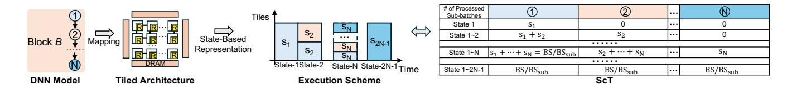
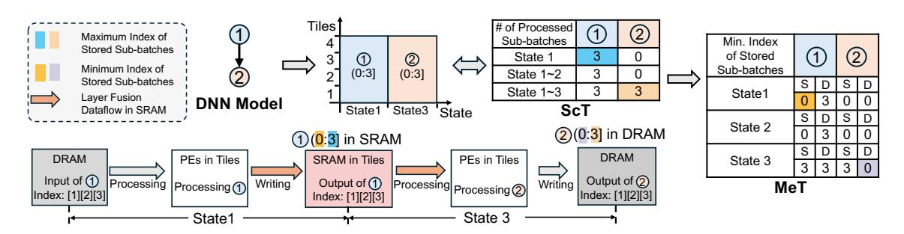
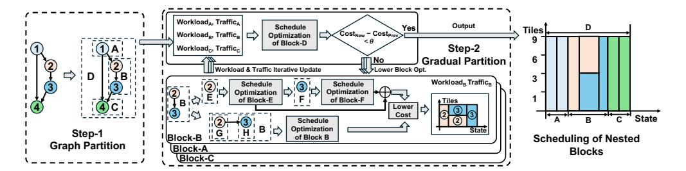
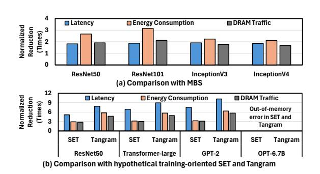
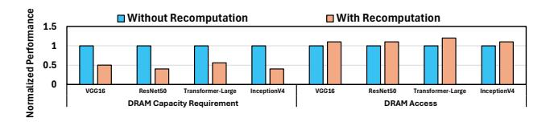

# Crane: Inter-Layer Scheduling Framework for DNN Inference and Training Co-Support on Tiled Architecture

[Yu Gong](https://orcid.org/0000-0001-5465-9044) Electrical and Computer Engineering Rutgers University Piscataway, New Jersey, USA yg430@soe.rutgers.edu

> [Rongjian Liang](https://orcid.org/0000-0001-8626-2359) Nvidia Austin, USA rliang@nvidia.com

[Lingyi Huang](https://orcid.org/0000-0002-8204-4837) Electrical and Computer Engineering Rutgers University Piscataway, USA lingyi.huang@rutgers.edu

[Cheng Yang](https://orcid.org/0000-0002-8087-3367) Electrical and Computer Engineering Rutgers University Piscataway, USA cy411@scarletmail.rutgers.edu

[Haodong Chang](https://orcid.org/0009-0006-9207-2993) Electrical and Computer Engineering Texas A&M University College Station, USA haodong@tamu.edu

[Zhexiang Tang](https://orcid.org/0000-0001-6693-0735) Electrical and Computer Engineering Rutgers University Piscataway, USA zhexiang.tang@rutgers.edu

[Jiang Hu](https://orcid.org/0000-0003-1157-7799) Electrical and Computer Engineering Texas A&M University College Station, USA Computer Science and Engineering Texas A&M University College Station, USA jianghu@tamu.edu

Electrical and Computer Engineering Rutgers University Piscataway, USA bo.yuan@soe.rutgers.edu

[Bo Yuan](https://orcid.org/0000-0002-3978-2930)

# Abstract

Tiled architectures have emerged as a compelling platform for scaling deep neural network (DNN) execution, offering both compute density and communication efficiency. To harness their full potential, effective inter-layer scheduling is crucial for managing operation order, memory behavior, and compute resource coordination. However, current schedulers often fall short due to three persistent issues: incomplete treatment of core design factors, limited flexibility in handling diverse workload structures, and reliance on heuristic search algorithms with poor convergence.

In this work, we trace these limitations to the absence of a unified and expressive scheduling representation. We introduce Crane, a framework that addresses these gaps through a hierarchical tableformat abstraction capable of encoding rich scheduling semantics. Crane supports both inference and training workloads, and reformulates scheduling as a mathematically structured optimization problem, enabling more complete and efficient exploration of the scheduling space. Evaluations show that Crane reduces energydelay product by up to 21.01× and improves scheduling speed by at least 2.82× over state-of-the-art baselines.

# CCS Concepts

• Computer systems organization → Neural networks.

[This work is licensed under a Creative Commons Attribution-NonCommercial 4.0](https://creativecommons.org/licenses/by-nc/4.0) [International License.](https://creativecommons.org/licenses/by-nc/4.0)

MICRO '25, Seoul, Republic of Korea © 2025 Copyright held by the owner/author(s). ACM ISBN 979-8-4007-1573-0/25/10 <https://doi.org/10.1145/3725843.3756023>

# Keywords

Inter-layer Scheduling, Deep Neural Networks, Tiled Architecture

#### ACM Reference Format:

Yu Gong, Lingyi Huang, Haodong Chang, Rongjian Liang, Cheng Yang, Zhexiang Tang, Jiang Hu, and Bo Yuan. 2025. Crane: Inter-Layer Scheduling Framework for DNN Inference and Training Co-Support on Tiled Architecture. In 58th IEEE/ACM International Symposium on Microarchitecture (MICRO '25), October 18–22, 2025, Seoul, Republic of Korea. ACM, New York, NY, USA, [14](#page-13-0) pages.<https://doi.org/10.1145/3725843.3756023>

# 1 Introduction

Deep neural network (DNN) hardware accelerators have been widely adopted in real-world applications for energy-efficient execution. As the computational and storage demands of DNNs continue to grow, tiled architectures—composed of Network-on-Chip (NoC)-connected hardware tiles—have emerged as a scalable and flexible solution for large-scale model processing. In these architectures, each tile typically integrates a processing element (PE) array, a global buffer, and an NoC router, enabling efficient intraand inter-tile communication. This structural design supports highperformance execution and has been widely adopted in both industry [\[17,](#page-13-1) [22,](#page-13-2) [24,](#page-13-3) [35\]](#page-13-4) and academia [\[3,](#page-12-0) [5,](#page-12-1) [8,](#page-12-2) [10,](#page-13-5) [11,](#page-13-6) [16,](#page-13-7) [20,](#page-13-8) [31,](#page-13-9) [36,](#page-13-10) [42\]](#page-13-11).

To fully utilize the computing power and memory capacity of connected hardware tiles, an efficient scheduling scheme—responsible for mapping computational workloads to hardware resources—is critical. DNN scheduling is generally divided into intra-layer and inter-layer scheduling. Intra-layer scheduling focuses on mapping individual layers to one or more hardware tiles and has been extensively studied in the literature [\[7,](#page-12-3) [11,](#page-13-6) [12,](#page-13-12) [28,](#page-13-13) [32,](#page-13-14) [33,](#page-13-15) [37\]](#page-13-16), with a

wide range of solutions and notations proposed. In contrast, interlayer scheduling determines the computation order, memory access patterns, and resource allocation across multiple layers and tiles, aiming to maximize hardware utilization and energy efficiency. As application scenarios diversify and DNN architectures grow increasingly complex, inter-layer scheduling has attracted growing research attention [5, 9, 13, 38, 40].

Despite recent efforts, existing inter-layer schedulers still face several fundamental limitations (Section 2.2). First, with respect to the four key design factors in inter-layer scheduling-namely execution scheme, fusion strategy, recomputation, and batch splitting—even state-of-the-art solutions fail to comprehensively explore all of them, thereby limiting performance. In particular, the lack of integration of recomputation as a core design factor for training optimization significantly constrains the ability of current schedulers to support efficient training. Second, even within the limited scope of design factors they incorporate, existing inter-layer schedulers suffer from restricted scheduling flexibility—such as constrained processing orders for cross-layer sub-batches, support limited to linear chain-structured workloads, or even a complete inability to handle training workloads. Third, the underlying search engines of most existing inter-layer schedulers rely on heuristic approaches, which essentially sample the search space with slow convergence. This leads to incomplete and inefficient exploration, resulting in suboptimal scheduling performance and slower scheduling speed.

To address these limitations, we first analyze and identify their root causes —chiefly, the absence of a proper representation framework. We then distill three essential lessons that such a representation must satisfy: rich expressiveness, topological flexibility, and mathematical structuredness (Section 3.1). Guided by these insights, we propose Crane (Section 4,5,6), a novel inter-layer scheduling framework designed to support both inference and training on tiled architectures. Crane is built upon an efficient table-format hierarchical representation that comprehensively captures key design factors, enables flexible scheduling across diverse workloads, and formulates the scheduling problem as a structured optimization task that can be thoroughly and efficiently solved by mixed-integer linear programming (MILP) solver. Evaluation results (Section 7) show that Crane achieves a 1.13× to 21.01× reduction in energydelay product costs and delivers at least a 2.82× scheduling speedup compared to state-of-the-art solutions.

# 2 Background & Motivation

## 2.1 Inter-layer Scheduling

In general, inter-layer scheduling for tiled architecture is typically structured around the following four components:

1) Execution Scheme. This decision variable defines how the DNN workload consisting of multiple layers is mapped temporally and spatially across multiple computing cores. In general, three execution patterns are commonly adopted in practice: Sequential: Processes the model layer by layer in sequence; therefore, different layers are executed at different time steps, and each layer fully utilizes all the computational resources and on-chip memory; Pipeline: Coordinates several dependent layers to be processed concurrently in a pipelined fashion, sharing the hardware tiles across layers;

| Inter-layer Scheduler | Design Factors    | Search Alg. | Support Training | Search Space (Training)     | Schedule Flexible   |
|--------------------------|----------------------|----------------|---------------------|--------------------------------|------------------------|
| MBS                      | F+B                  | Greedy Slow | Yes Limited      | $O(2^n \log m)$ Sampled     | Yes                    |
| Tangram                  | F+B                  | DP Slow     | Hypothesized        | $O(2^n \log m)$ Thoroughly  | Yes                    |
| Checkmate                | R                    | MILP Fast   | Yes Limited      | $O(n^2)$ Thoroughly         | Batch -level Only   |
| TileFlow                 | E+F+B (Partially) | GA Slow     | No                  | N/A                            | Branchless Only     |
| SET                      | E+F+B                | SA Slow     | Hypothesized        | $O(9.899^n \log m)$ Sampled | Tied to Batch-level |
| Crane                    | E+F+R+B              | MILP Fast   | Yes                 | $O(m^{4n-1}\log m)$ Thoroughly | Yes                    |

Table 1: Comparison of various inter-layer schedulers. Some notes: i) E, F, R and B denote execution scheme, layer fusion, recomputation, and sub-batch splitting, respectively.

- ii) The search spaces is for n-layer model with batch size of m.
- iii) Tangram and SET are not designed for training and do not report any training results. We hypothesize their potential training support by directly applying their inference schedules to the backward pass. iv) DP: Dynamic Programming; GA: Genetic Algorithm; SA: Simulated Annealing; MILP: Mixed-Integer Linear Programming
- v) The resource binding and loop ordering of TileFlow are manually fixed and only loop tiling is explored in [21].

Parallel: Allows multiple layers to be processed simultaneously without needing to account for dependencies among them.

- 2) Fusion Strategy. This is another important design factor that determines how to directly transfer the output data from previous layers to the latter ones without expensive off-chip memory (DRAM) access. As the strategy aims at reducing data movement, fusion [2, 18, 26, 41] is typically considered along with the execution pattern. In the scenario of sequential, the intermediate results are calculated and retained within local hardware tiles; while in the scenario of pipeline, the mapped group of tiles for one layer sends the output data to another tile group allocated for the next layer.
- 3) Recomputation Scheme. This strategy decides the protocol that when and which intermediate results should be temporally discarded and recomputed in the future as needed. By trading additional computation for reduction in storage, the recomputation scheme aims to effectively free up memory capacity a critical advantage in various memory-constrained scenarios. In practice, the most common application of this strategy is in DNN training [4, 15, 19, 39], where DRAM capacity becomes a major bottleneck, especially as memory consumption for activation scales with batch size. Applying recomputation in this context enables the training of larger and more complex models using larger batch sizes without requiring extra hardware resources.
- 4) Batch Splitting Plan. This strategy determines how to partition a batch of data into smaller subsets, which are then processed sequentially to complete the computation for each layer [6, 14, 18, 34]. Batch splitting can be applied in both inference and training scenarios, particularly when memory capacity is insufficient to process an entire batch at once. By dividing the batch into manageable pieces, this approach allows the utilization of limited memory resources while still leveraging batch processing benefits.

#### 2.2 Limitations of Previous Works

Motivated by the critical role of inter-layer scheduling in enabling efficient DNN inference and training, a set of inter-layer schedulers have been proposed in recent years. Table 1 summarizes the most relevant works, highlighting the design factors they explore, the search algorithms they employ, and their target deployment scenarios. Based on this summary, we identify several key limitations:

Challenge #1. Incomplete Exploration of Design Factors. None of the existing works comprehensively and systematically explore all four key design factors. As shown in Table 1, even stateof-the-art inter-layer schedulers such as SET [5] and TileFlow [40] lack support for recomputation schemes (R), resulting in limited or no applicability to training workloads. On the other hand, while Checkmate [15] incorporates recomputation strategies, it does not account for the other design factors (such as E and F) and is incompatible with schedulers like SET due to fundamental differences in search algorithms and representation frameworks. Additionally, Checkmate's exploration is restricted to the batch level rather than the sub-batch level (B), significantly constraining its scheduling granularity and design space. As a result, existing inter-layer scheduling approaches cannot offer efficient, unified solutions particularly for training scenarios. For example, as illustrated in Fig. 1, in ResNet-50 training with a batch size of 64, prior works can only optimize either DRAM data access (e.g., SET) or capacity requirements (e.g., Checkmate), but not both simultaneously.

Challenge #2. Constrained Scheduling Flexibility. Even when optimizing solely for inference scenarios-where recomputation (R) is not required-existing schedulers such as SET and TileFlow, which consider P+F+B, still suffer from limited scheduling flexibility. Specifically, SET enforces that the processing order of sub-batches across layers is strictly tied to the batch-level execution pattern. For example, when the execution scheme for 3sub-batch Layer-A, Layer-B and Layer-C is set to a pipeline pattern, the identified sub-batch-level processing order can only be  $A_1 \rightarrow$  $(A_2, B_1) \rightarrow (A_3, B_2, C_1) \rightarrow (B_3, C_2) \rightarrow C_3$ . Alternative scheduling options, such as  $A_1A_2 \rightarrow (A_3, B_1) \rightarrow (B_2B_3, C_1C_2) \rightarrow C_3$ , are never explored (see Fig. 15(a) for a practical example). Evidently, this rigid constraint significantly narrows the design space and may miss more efficient scheduling solutions. Although TileFlow overcomes the rigid batch-level scheduling constraint by allowing layer partitioning along arbitrary dimensions, it has two key limitations. 1) It is limited to optimizing linear, chain-structured workloads, such as GEMM or convolution chains. This limitation stems from its tile-centric, layer-splitting representation, which cannot model control-flow structures like branches. 2) It cannot support training workloads. Partitioning along non-batch dimensions preserves correctness only in forward propagation; backward propagation-critical for training-requires additional halo exchanges, global reductions, and synchronized statistics.

Challenge #3. Incomplete and Inefficient Search. Most state-of-the-art inter-layer schedulers rely on heuristic search algorithms, leading to both insufficient solution quality and long runtime. This limitation manifests in two ways. 1) Incomplete scheduling space coverage: the search procedures do not comprehensively explore the full scheduling space but instead rely on sampling-based heuristics such as simulated annealing (SET) or genetic algorithms (TileFlow).

Figure 1: Required data access and DRAM capacity for training ResNet-50 with a batch size of 64. While SET and MBS reduce data access through batch splitting (B) and layer fusion (F), the overall DRAM capacity requirement remains high. Checkmate significantly lowers DRAM capacity by introducing recomputation (R), while having high data access. Crane effectively reduces both data access and DRAM capacity through comprehensive optimization strategies.

These methods inherently risk missing globally optimal solutions. 2) Long scheduling duration: due to their stochastic nature, these heuristics converge slowly, resulting in long search times even for moderately sized workloads. For example, scheduling Inception inference with a batch size of 128 on 144 hardware tiles takes over two hours using the SET framework on an AMD EPYC 7402P CPU.

# 3 Crane Preview: Philosophy & Contributions

# 3.1 Lessons Learned: Representation Matters

As outlined in Section 2.2, existing inter-layer schedulers suffer from several critical limitations. Our in-depth analysis reveals that the root cause lies in the lack of a proper representation framework:

Lesson #1. Representation should provide rich expressiveness. For Challenge #1, the reason prior works cannot fully explore all four design factors is that their underlying representations lack the expressiveness needed to support such exploration. For example, automatic exploration of recomputation strategies requires fine-grained tracking of memory consumption across all time steps and layers—something that the resource allocation (RA) tree-based notation used in SET cannot provide.

Lesson #2. Representation should exhibit topological flexibility. For Challenge #2, the inherent topology of the representations used in prior works limits the flexibility of scheduling. For example, the construction process of the ratio-tree in SET inherently enforces repeated execution patterns across the same node, which imposes rigid scheduling constraints. In the case of TileFlow, its tile-centric tree representation works well for simple, linear chains of computation. However, it becomes significantly challenging to construct tile trees that accurately describe more complex computation flows involving multiple fan-in and fan-out structures.

Lesson #3. Representation should support mathematical structuredness. For Challenge #3, the representation fundamentally shapes the form and tractability of the optimization problem. Existing works fail to produce well-structured objectives—they lack essential mathematical properties such as continuity, differentiability, convexity, and linear-discrete structure. As a result, the scheduling problems cannot be formulated for efficient, principled optimization and must instead rely on heuristic, sampling-based search with slow convergence and no guarantee of solution quality.

# 3.2 Key Contributions of Crane: Table-format Hierarchical Representation

Grounded in the representation-centric design philosophy outlined above, the core innovation of Crane lies in developing an effective representation that satisfies the key requirements of expressiveness, flexibility, and mathematical structuredness. More specifically:

**Contribution #1.** First, to address Challenge #2, in Section 4 we identify and generalize a novel hierarchical representation, where the execution scheme at each hierarchical level is modeled as a subset of a pipeline scheme. This hierarchical structure offers sufficient topological flexibility to accommodate diverse scheduling behaviors and is proven to abstract the execution scheme of any model whose computational graph forms a directed acyclic graph (DAG), given sufficient hierarchical depth.

**Contribution #2.** Then, to address Challenge #1, in Section 5.1, 5.2, 5.3 and 5.5, we introduce a table-format notation to capture subbatch execution and memory status at each level of the hierarchy. These tables explicitly record the effects of scheduling decisions on both workload execution and memory usage. As a result, the table-format representation offers sufficient expressiveness to fully describe the detailed impact of all four key design factors.

**Contribution #3.** Finally, to address Challenge #3, in Section 5.4, 5.5 we show that the structured nature of the table-format representation enables the scheduling problem to be formulated as a MILP. The linear constraints and clearly defined decision variables of the table representation allow the use of mature MILP solvers, enabling thorough exploration of the scheduling space with significantly faster convergence compared to heuristic methods.

# 4 Hierarchical Representation of Scheduling

#### 4.1 Intuitive Glance

To efficiently explore the vast scheduling space, we propose a hierarchical representation of the scheduling schemes. The core of this representation is the concept of *Execution State*, which <u>captures the pattern of active layer execution</u> – that is, which layers are simultaneously involved in computation at each processing stage.

Example 1. Take the scheduling of a 2-layer model as an example. As shown in Fig. 2, when the two layers are processed sequentially, the execution involves exactly two distinct States: initially, only Layer-1 is active (State-1), followed by a stage where only Layer-2 is active (State-3). In contrast, when the layers are processed concurrently (i.e., in parallel), the execution involves only a single State – both Layer-1 and Layer-2 are active simultaneously (State-2). Finally, in the case of pipeline processing, the execution progresses through three distinct States, involving Layer-1 alone, then both layers concurrently, and finally Layer-2 alone – that is, all three States (State-1, State-2, and State-3) occur over time.

Notably, from the earlier example, we observe that the pipeline pattern naturally encompasses all *execution states* that also appear in the sequential and parallel patterns. This suggests that *pipeline scheduling may serve as a unifying structure, capable of capturing the full range of active layer configurations encountered across different scheduling strategies.* However, due to the simplicity of the 2-layer model, this observation may not generalize. To further examine its

Figure 2: Derive states of execution scheme from pipeline pattern.

Figure 3: The states of complex execution scheme of a 4-layer model can be derived from pipeline pattern in a hierarchical manner.

validity, we consider a more complex example involving a deeper model with a more intricate sub-batch-level scheduling scheme.

Example 2. As illustrated in Fig. 3, consider a 4-layer model whose scheduling behavior cannot be easily categorized into any single basic pattern. To analyze it, we group Layer-1 through Layer-3 into a single block A, effectively transforming the model into a 2-block structure: block A followed by Layer-4 (treated as a standalone block). At this level of abstraction, the overall schedule clearly follows a pipeline pattern between block A and Layer-4. All execution states involved in this 2-block view correspond to standard pipeline-derived states. Looking inside block A, its internal scheduling consists of four distinct execution states: (1) a state where only Layer-1 is active; (2) a state where Layer-1 and Layer-2 are active concurrently; (3) a state where Layer-2 and Layer-3 are active concurrently; and (4) a state where only Layer-3 is active. When we arrange Layer-1 through Layer-3 in a pure pipeline fashion, we observe five distinct pipeline-derived execution states. Crucially, the four states actually used within block A are all included in this set of five, reinforcing the observation that pipeline-derived execution states are expressive enough to represent even irregular or non-canonical schemes.

Hierarchical Generalization. This hierarchical interpretation naturally extends to deeper models with increasingly complex scheduling behavior. By recursively grouping subsets of layers into higher-level blocks, the overall scheduling can be abstracted into multiple hierarchical levels. While the interaction between blocks at each level may vary in form, we consistently observe that the execution states involved – regardless of complexity – are drawn from, or are subsets of, those generated by canonical pipeline scheduling. This reinforces the role of the pipeline pattern not only as a representational baseline, but as a structural foundation for expressing general inter-layer scheduling schemes.

**Table 2: Notation Description.** 

| Notation                             | Description                                                |  |  |
|--------------------------------------|------------------------------------------------------------|--|--|
| BS                                   | Batch size                                                 |  |  |
| $BS_{sub}$                           | Sub-batch size                                             |  |  |
| $d_{m,j}$                            | Dependency from Layer-m to Layer-j                         |  |  |
| $L^{-}$                              | Total number of layers in the model                        |  |  |
| N                                    | Number of sub-blocks in a composite block                  |  |  |
| $\mathcal{L}$                        | Set of all layers in the model                             |  |  |
| B                                    | A block (basic or composite)                               |  |  |
| $B_i$                                | The i-th sub-block of block B                              |  |  |
| $C_B$                                | Ordered sequence of sub-blocks within block B              |  |  |
| $\mathcal{L}_B$                      | Set of layers contained in block B                         |  |  |
| ${\mathcal H}$                       | Hierarchical block structure over $\mathcal L$             |  |  |
| $\mathcal{S}_B$                      | State index set of block $B: \{1,, 2N - 1\}$               |  |  |
| $\mathcal{J}_i$                      | Sub-blocks active in state-i                               |  |  |
| $s_i$                                | State workload: number of sub-batches processed in state-i |  |  |
| $\mathcal{A}_{B'}$                   | Set of states where sub-block $B'$ is active               |  |  |
| $\mathcal{L}_{\mathcal{J}_{\bm{i}}}$ | Layers active in state-i                                   |  |  |
| $\mathcal{A}_{\ell}$                 | States where layer $\ell$ is active                        |  |  |

**Observation 1.** With sufficient hierarchical abstraction, complex inter-layer scheduling schemes in deep models can be consistently represented by execution states derived from the pipeline pattern. This highlights pipeline scheduling as a unifying structural basis for expressing general execution behavior across all levels in models.

#### 4.2 Formal Notation

We now formalize the core concepts introduced in Section 4.1. **Definition 1** (**Block**). Let  $\mathcal{L} = \{1, 2, ..., L\}$  be the set of all layers in the model. A *block B* is a structural scheduling unit defined recursively as follows:

- (i) B is a basic block if it corresponds directly to a consecutive subset of layers from L, and contains no sub-blocks.
- (ii) B is a **composite block** if it consists of an ordered sequence of sub-blocks  $C_B = \{B_1, B_2, \dots, B_N\}$ , where each  $B_i$  is itself a block (either basic or composite).

The set of layers associated with block B, denoted  $\mathcal{L}_B$ , is defined recursively as:

$$\mathcal{L}_{B} = \begin{cases} \text{the given layer subset,} & \text{if } B \text{ is basic,} \\ \bigcup_{B_{i} \in C_{B}} \mathcal{L}_{B_{i}}, & \text{if } B \text{ is composite.} \end{cases}$$

A block is said to be *top-level* if the associated layer set spans the entire model, i.e.,  $\mathcal{L}_B = \mathcal{L}$ .

**Definition 2 (State).** Let B be a block with an ordered sequence of sub-blocks  $C_B = \{B_1, B_2, \ldots, B_N\}$ , where each  $B_i$  is a block (either basic or composite). The execution of block B proceeds through a set of pipeline-derived execution states, indexed by  $S_B = \{1, 2, \ldots, 2N - 1\}$ .

Each state index  $i \in S_B$  is associated with:

(i) an *involved sub-block set*  $\mathcal{J}_i \subseteq C_B$ , defined as:

$$\mathcal{J}_i = \begin{cases} \{B_1, B_2, \dots, B_i\}, & \text{if } i \leq N, \\ \{B_{i-N+1}, B_{i-N+2}, \dots, B_N\}, & \text{if } i > N; \end{cases}$$

(ii) a non-negative scalar  $s_i \in \mathbb{R}_{\geq 0}$ , called the *state workload*, representing the number of sub-batches processed during State-*i*. These scalars will participate in a later formulation of scheduling constraints.

**Definition 3** (**Involved State Set**). Let *B* be a block with subblock sequence  $C_B = \{B_1, B_2, ..., B_N\}$  and state index set  $S_B = \{1, 2, ..., 2N-1\}$ . The *involved state set* of an entity specifies indices of all states where that entity is active during execution of *B*.

(i) For a sub-block  $B' \in C_B$ , the involved state set is:

$$\mathcal{A}_{B'} = \{ i \in \mathcal{S}_B \mid B' \in \mathcal{J}_i \}.$$

(ii) For a layer  $\ell \in \mathcal{L}_B$ , let  $\mathcal{L}_{\mathcal{J}_i} = \bigcup_{B' \in \mathcal{J}_i} \mathcal{L}_{B'}$  be the set of layers active in state i. The involved state set of layer  $\ell$  is:

$$\mathcal{A}_{\ell} = \{ i \in \mathcal{S}_B \mid \ell \in \mathcal{L}_{\mathcal{T}_i} \}.$$

**Constraint 1** (Computation-Completeness). Let B be a block with state set  $S_B = \{1, 2, ..., 2N - 1\}$ , and let  $s_i \in \mathbb{R}_{\geq 0}$  denote the state workload for each state  $i \in S_B$ . Let  $\mathcal{L}_B$  be the set of all layers contained in block B, and let  $\mathcal{A}_{\ell} \subseteq S_B$  denote the involved state set for layer  $\ell \in \mathcal{L}_B$ .

The state workloads must satisfy the following constraint:

$$\sum_{i \in \mathcal{A}_\ell} s_i = \frac{BS}{BS_{\text{sub}}} \quad \text{for all layers } \ell \in \mathcal{L}_B,$$

where BS is the total batch size and  $BS_{\text{sub}}$  is the sub-batch size. This ensures that each layer processes the full batch exactly once, distributed across the states in which it is active.

Building on the above definitions, we now establish the expressive capacity of the hierarchical scheduling abstraction. Specifically, we prove that any valid inter-layer execution pattern in a model whose computational graph forms a DAG—including architectures with branching and merging structures—can be represented using a hierarchical block composition with pipeline-derived states.

**Theorem 1** (Universality of Hierarchical Block Representation). Any valid inter-layer scheduling behavior of a model with a DAG structure can be represented using a hierarchical block composition equipped with pipeline-derived execution states and associated workloads.

PROOF. Let computational graph of model be a DAG  $G = (\mathcal{L}, E)$ , where  $\mathcal{L}$  is set of layers and E denotes data dependencies. We construct a hierarchical representation by traversing G topologically.

**Step 1:** At every vertex with in-degree or out-degree exceeding one (branching or merging points), we partition G and encapsulate each linear segment (a path of vertices with in-degree and out-degree equal to one) into a *basic block*. Each branching or merging vertex, together with its directly connected linear segments, forms a higher-level *composite block*. Recursively composing these blocks yields the top-level hierarchical block  $B_T$ .

**Step 2:** Consider any composite block consisting of ordered subblocks  $C_B = \{B_1, \ldots, B_N\}$ , with canonical pipeline state set  $S_B = \{1, \ldots, 2N-1\}$ . By assigning  $s_i$ , we can flexibly represent diverse execution schemes—sequential, pipelined, parallel, or combinations thereof. For example, in a *fan-out* scenario (where sub-block  $B_1$ 

produces data consumed by subsequent branches), assigning  $s_1 = s_{N+1} = BS/BS_{\rm sub}$  and setting other  $s_i = 0$  demonstrates parallel execution. In a *fan-in* scenario (where sub-block  $B_N$  merges earlier branches), assigning  $s_{N-1} = s_{2N-1} = BS/BS_{\rm sub}$  captures merging behavior. These examples show workload assignments across state indices can express any valid sub-block execution pattern.

**Step 3:** By recursively applying Steps 1 and 2 across the DAG, both linear and branched structures are covered. As the same hierarchical abstraction and scheduling semantics apply uniformly to basic and composite blocks, the top-level block  $B_{\rm T}$  fully captures the execution behavior of the original model. Hence, all legal inter-layer schedules can be represented via hierarchical block abstraction.  $\Box$ 

Remark 1 (Expressiveness Across DAG-Based Architectures). Architectures such as self-attention layers, ResNet bottlenecks with skip connections, and Inception modules in GoogleNet are all representable as feed-forward DAGs. Therefore, they fall within the scope of Theorem 1 and are fully expressible using the proposed hierarchical block abstraction.

Having established that any valid inter-layer execution behavior can be represented through hierarchical blocks and pipeline-derived states, we now formulate the scheduling problem as a constrained optimization. This formulation captures both structural choices and numerical decisions:

**Problem 1 (Inter-layer Scheduling).** Let  $\mathcal{L} = \{1, 2, \dots, L\}$  be the set of all layers in the model. The inter-layer scheduling problem seeks to jointly determine:

- a hierarchical block structure H, which recursively partitions L into nested blocks; and
- a collection of state workloads  $\{s_i\}_{B \in \mathcal{H}, i \in \mathcal{S}_B}$ , where each  $s_i \in \mathbb{R}_{\geq 0}$  corresponds to a pipeline-derived execution state  $i \in \mathcal{S}_B$  of block B,

so as to minimize the total execution cost:

$$\min_{\mathcal{H}, \{s_i\}} \ C(\mathcal{H}, \{s_i\}) \quad \text{s.t.} \quad \sum_{i \in \mathcal{A}_{\ell}} s_i = \frac{BS}{BS_{\text{sub}}}, \ \forall \ell \in \mathcal{L}$$

Here,  $C(\mathcal{H}, \{s_i\})$  denotes the energy-delay product (EDP) of model execution, and  $\mathcal{A}_{\ell}$  is involved state set of layer  $\ell$ , as defined earlier.

Remark 2 (Addressing Challenge #2: Flexible and General Scheduling). The hierarchical block abstraction, through its pipeline-derived states and flexible workload assignments, supports diverse sub-batch execution patterns—sequential, pipelined, or parallel. It also generalizes across various architectures with branches or skip connections. These capabilities directly address Challenge #2 by broadening the feasible scheduling space.

The formulation above reveals that solving the scheduling problem involves two types of decisions: determining the workload configuration within each block, and selecting the hierarchical organization of blocks across the model. These two components are structurally decoupled – each block's schedule is governed by its local execution states, while the block hierarchy implicitly defines inter-block dependencies. In this paper Section 5 focuses on intra-block scheduling, and Section 6 explores construction and optimization of hierarchical block structure.

## 5 Table-format Intra-Block Scheduling

# 5.1 Representation of Execution Scheme

Recording State Information Using the Scheduling Table. As analyzed above, the execution scheme of a block can be represented through combinations of execution states and their associated workload values  $\{s_i\}$ . To facilitate visibility and manipulation of this execution structure, we introduce a table-based representation, called the *Scheduling Table (ScT)*. This provides a structured and cumulative view of how sub-batch workloads are distributed across execution states and sub-blocks, offering a more intuitive and analyzable form than listing state variables directly.

**Definition 4 (Scheduling Table (ScT)).** For a block B with subblock sequence  $C_B = \{B_1, B_2, \dots, B_N\}$  and pipeline-derived state set  $S_B = \{1, \dots, 2N-1\}$ , the *scheduling table*  $\mathbf{ScT} \in \mathbb{R}^{(2N-1)\times N}$  records the cumulative number of sub-batches processed by each sub-block across states.

- (i) ScT has 2N 1 rows and N columns. Row i corresponds to State-i, and column j corresponds to sub-block  $B_j \in C_B$ .
- (ii) The entry  $ScT_{i,j}$  denotes the total number of sub-batches processed by sub-block  $B_j$  from State-1 through State-i, inclusive.
- (iii) Let  $\mathcal{A}_{B_j} \subseteq \mathcal{S}_B$  denote the involved state set of sub-block  $B_j$ . The cumulative processed sub-batches for  $B_j$  up to State-i is

$$ScT_{i,j} = \sum_{k \in \mathcal{A}_{B_i} \cap \{1,\dots,i\}} s_k.$$

Constraint-Form Equivalence of Definition 5. As illustrated above,  $ScT_{i,j}$  are derived according to Definition 5. To enable integration with our MILP formulation, we now express an equivalent set of constraints - Eqs. 1 through 6 - for computing ScT in a constraint-based format. Eq. 1 ensures that all entries in ScT are non-negative integers. Eqs. 2 and 3 define boundary conditions for execution: Eq. 2 corresponds to the stage range before any subblock  $B_j$  becomes active (i.e.,  $\mathcal{A}_{B_j} \cap \{1, ..., i\} = \emptyset$ ), while Eq. 3 corresponds to the point after  $B_j$  has completed execution (i.e.,  $\mathcal{A}_{B_i} \cap \{1, \ldots, i\} = \mathcal{A}_{B_i}$ ). Eq. 4 enforces the monotonicity of accumulated sub-batch processing for each sub-block. Eq. 5 encodes data dependencies using the binary variable  $d_{m,j} \in \mathcal{D}$ , where  $d_{m,j} = 1$  if sub-block  $B_i$  depends on the output of sub-block  $B_m$ , and  $d_{m,i} = 0$ otherwise. This dependency set  $\mathcal{D}$  is fixed once the model architecture is given, and its inclusion ensures that dependent sub-blocks are not assigned to overlapping states in a parallel pattern. Finally, Eq. 6 describes the cumulative accumulation of sub-batch workloads across states, consistent with the semantics of ScT.

$$ScT_{i,j} \in \mathbb{N} \cup \{0\} \tag{1}$$

$$ScT_{i,j} = 0, \quad i \in [1, ..., j-1]$$
 (2)

$$ScT_{i,j} = BS/BS_{sub}, \quad i \in [N+j-1,...,2N-1]$$
 (3)

$$ScT_{i+1,j} \ge ScT_{i,j} \tag{4}$$

$$ScT_{i,m} \ge ScT_{i,j} + d_{m,j}, \quad i \in [j, \dots, N + j - 2]$$
(5)

$$ScT_{i,j} = s_i + ScT_{i-1,j}, \quad i \in [j, ..., N + j - 2]$$
 (6)

# 5.2 Representation of Fusion Strategy

While determining the state workloads  $\{s_i\}$  and constructing the scheduling table ScT fully specifies the execution scheme of a block, it does not capture memory-related behavior – particularly those associated with *fusion strategies*. These strategies directly affect

Figure 4: State-based representation of execution scheme for mapping multiple layers onto a tiled architecture. The number of hardware tiles allocated to different layers within the same state is proportionally determined based on their computational costs.

Figure 5: Example that how MeT and ScT jointly and implicitly capture the impact of fusion strategy on memory status. The 2-layer model is a top-level block with each layer as a sub-block. In State-1, all 3 sub-batches of Layer-1's input data are transferred from DRAM to PEs for computation. The resulting outputs are then stored in on-chip SRAM, avoiding costly DRAM writes. Consequently, SRAM holds 3 sub-batches of outputs (indexed as 1, 2, 3) for Layer-1, while DRAM stores none. This is reflected in  $ScT_{1,1} = 3$ , indicating that 3 sub-batches are processed in State-1. Meanwhile,  $McT_{1,1}^S = 0$  defines the stored sub-batch range in SRAM as (0:3], and  $McT_{1,1}^D = 3$  defines the DRAM range as (3:3], confirming no data is stored in DRAM. In State-3, the 3 sub-batches stored in SRAM are directly sent to PEs for Layer-2 processing, eliminating DRAM access. After computation, the 3 sub-batches of Layer-2's output data are stored in DRAM, and Layer-1's intermediate results are evicted from SRAM. This is represented by  $McT_{3,2}^S = 0$  and  $ScT_{3,2} = 3$ , defining the sub-batch range of Layer-2's output in DRAM as (0:3]. Additionally,  $McT_{3,2}^S = 3$  indicates no Layer-2's output remains in SRAM (3,3]. Similarly,  $McT_{3,1}^S = McT_{3,1}^D = 3$  confirms that Layer-1's outputs are stored neither in SRAM nor DRAM, precisely describing the final memory state.

memory reuse, data lifetimes, and intermediate storage requirements, which are not encoded in ScT alone.

To model this dimension, we introduce the *Memory Table* MeT, which tracks the *lifetime of intermediate data* in memory. Specifically, MeT captures the allocation and deallocation dynamics of sub-batch-level intermediate results for each execution unit (e.g., layer or sub-block), offering a structured and interpretable view of how fusion affects memory usage. Each fusion decision (the "action") introduces implicit changes to memory behavior (the "impact"), influencing how long intermediate results must be stored and when memory can be released.

**Definition 5** (**Memory Table (MeT)**). For a block with sub-block sequence  $C_B = \{B_1, B_2, \dots, B_N\}$  and state set  $S_B = \{1, \dots, 2N-1\}$ , the *memory table*  $\mathbf{MeT} \in \mathbb{R}^{(2N-1) \times N \times 2}$  tracks the memory status of intermediate data for each block or sub-block across states.

- (i) MeT has 2N-1 rows and N columns, where row i corresponds to State-i, and column j corresponds to block  $B_j \in C_B$ .
- (ii) Each entry  $MeT_{i,j}$  is a tuple  $(MeT_{i,j}^D, MeT_{i,j}^S)$ , where:
  - $MeT_{i,j}^D$  denotes the lower (open) bound of the sub-batch range stored in **DRAM** for sub-block  $B_j$  at State-i;
  - $MeT_{i,j}^{S}$  denotes the lower (open) bound of the sub-batch range stored in **SRAM** for sub-block  $B_i$  at State-*i*.

As defined above, MeT tracks the lower bound of sub-batches stored in memory. Meanwhile,  $ScT_{i,j}$  monitors the number of sub-batches processed for block  $B_j$  from State-1 to State-i, effectively representing the upper (closed) bound of that range. Therefore, ScT and MeT together define the range of sub-batches stored in SRAM and DRAM, denoted as  $(MeT_{i,j}^S, ScT_{i,j}]$  and  $(MeT_{i,j}^D, ScT_{i,j}]$ , respectively. Since the essence of layer fusion is to allocate intermediate data in SRAM to reduce costly DRAM accesses, MeT and ScT jointly capture the impact of fusion on memory behavior.

Construction of MeT. In general, MeT is derived by following the construction rules. Eq. 7 ensures that the lower bounds of the sub-batches stored in memory are non-negative integers. Eq. 9 enforces that these lower bounds cannot exceed the upper bound represented by  $ScT_{i,j}$ , which tracks the number of sub-batches processed. Furthermore, Eq. 8 enforces a non-decreasing order for the lower bounds as the state progresses, reflecting the policy that earlier sub-batches are discarded first when memory (SRAM or DRAM) capacity is insufficient to store all sub-batches. This is based on the observation that newly generated data is more likely to be required by future computations, whereas previously generated sub-batches can be discarded temporarily. When sub-block  $B_i$ depends on the data from sub-block  $B_m$ , Eq. 10 introduces a constraint to ensure that, if the output of sub-block  $B_m$  is required in memory, the necessary data is available in the previous state. Specifically, since  $ScT_{i-1,j}$  represents the upper bound of the sub-batch index processed by sub-block  $B_j$  in State-(i-1), the corresponding lower bound in State-i must be less than or equal to  $MeT_{i-1,m}^S$  and

Figure 6: Recomputation Example. Consider a 2-layer model treated as a top-level block, with each layer as a sub-block. Suppose ScT3,1 =  $ScT_{3,2} = 3$ . After the forward pass, we have  $MeT_{3,1}^D = MeT_{3,2}^D = 2$ , indicating that the sub-batch range stored in DRAM for both Layer-1 and Laver-2 is (2, 3]. In Step 1, these stored activations are used for backward propagation over sub-batch (2, 3], where the loss flows through Layer-2 and then Layer-1. This step involves only the backward pass and aligns with the optimization of ScT and MeT as defined in Eq. 14.In Step 2, recomputation is required for the evicted sub-batch (0,2]. The input data for Layer-1 over this range is fetched from DRAM, and forward recomputation is performed for both layers, followed by the backward pass. This combined forward-backward workload also fits within the scheduling and memory optimization framework of ScT and MeT.

 $\mathbf{MeT}^D_{i-1,m}$ . This ensures that sub-block  $B_m$ 's output is available for sub-block  $B_j$  when needed. Eq. 11 and 12 define the maximum storage capacity for SRAM and DRAM, respectively. In these equations,  $V_i$  represents the size of one sub-batch of sub-block  $B_i$ 's output, and  $ScT_{i,j} - MeT_{i,j}^{S}$  and  $ScT_{i,j} - MeT_{i,j}^{D}$  represent the number of sub-batches stored in SRAM and DRAM, respectively. These constraints ensure that the total data stored in memory does not exceed the available capacity of SRAM  $(Cap^S)$  and DRAM  $(Cap^D)$ .

$$\mathbf{MeT}_{i,j}^{S} \in \mathbb{N} \cup \{0\} \quad \mathbf{MeT}_{i,j}^{D} \in \mathbb{N} \cup \{0\}$$
 (7)

$$MeT_{i,j}^{S} \le MeT_{i+1,j}^{S} \quad MeT_{i,j}^{D} \le MeT_{i+1,j}^{D}$$
(8)

$$MeT_{i,j}^{S} \leq ScT_{i,j} \quad MeT_{i,j}^{D} \leq ScT_{i,j}$$
 (9)

$$\min(\text{MeT}_{i-1,m}^S, \text{MeT}_{i-1,m}^D) \le \text{ScT}_{i-1,j} \quad \text{if} \quad d_{m,j} = 1$$
 (10)

$$\sum_{i} (\operatorname{ScT}_{i,j} - \operatorname{MeT}_{i,j}^{S}) \times V_{i} \le Cap^{S}$$
(11)

$$\sum_{j} (\operatorname{ScT}_{i,j} - \operatorname{MeT}_{i,j}^{S}) \times V_{j} \leq Cap^{S}$$

$$\sum_{i} (\operatorname{ScT}_{i,j} - \operatorname{MeT}_{i,j}^{D}) \times V_{j} \leq Cap^{D}$$
(11)

$$\sum_{j} (\operatorname{ScT}_{i,j} - \operatorname{MeT}_{i,j}^{D}) \times V_{j} \le Cap^{D}$$
(12)

#### Representation of Recomputation Scheme

As analyzed in Section 2.1, recomputation is a critical decision variable in inter-layer scheduling, particularly for DNN training. Next we introduce how to use ScT and MeT to describe the recomputation process during training. In general, determining a recomputation strategy requires answering two key questions.

Question #1 (Where/Which): Which sub-blocks' activations should be discarded and recomputed?

Question #2 (How): How can forward recomputation be coordinated with backward pass in the context of sub-batch-based processing?

Notably, the scheduling space for answering Question #1 is vast. As discussed in Section 2.2, there are approximately 2200 possible checkpoint choices for recomputation in a 4-sub-batch-based ResNet-50. Fortunately, this extensive search space can be effectively integrated into the construction and optimization of ScT and MeT after the forward pass, as these two tables precisely track the sub-batches stored in SRAM and DRAM. In other words, once ScT and MeT are determined, the location and amount of activations to be recomputed are automatically identified.

Answering Question #2 is more challenging due to the interaction between forward recomputation and backward propagation, creating a bi-directional processing flow. To address this, we propose splitting the process into two distinct phases, each of which can be effectively described using ScT and MeT.

Step-1: Backward Pass-only Pre-processing. As illustrated in Fig. 6, after forward propagation, a new pair of ScT and MeT tables are constructed to describe the action of backward propagating the sub-batches currently stored in DRAM. The goal in this phase is to consume as many of the DRAM-stored activations of sub-block  $B_m$  required by sub-block  $B_i$  for the backward pass as possible. No further backward computation can occur in  $B_i$  until forward recomputation in  $B_m$  generates the required data. The benefit of this "pre-processing" arrangement is that it simplifies the data dependency of backward processing in each sub-block from two sources (stored activations and recomputed activations) to a single source (recomputed activations only). This ensures that the recomputation in Step-2 can always be performed prior to the backward computation, allowing ScT and MeT to represent the coupled recomputation and backward pass.

To ensure the success of this arrangement, at the end of forward pass (State-(2N-1)), the amount of stored activation results for sub-block  $B_m$  should be no less than that of sub-block  $B_j$ . This brings a new constraint when constructing MeT for forward pass:

$$MeT_{2N-1,m}^{D,FW} \ge MeT_{2N-1,j}^{D,FW}$$
 if  $d_{m,j} = 1$ . (13)

After optimizing forward-specific  $\mathbf{MeT}$  (denoted as  $\mathbf{MeT}^{FW}$ ) with constraints described in Eq. 7-12 and Eq. 13, ScT for Step-1, denoted as  $ScT^{BW1}$ , can be constructed using the same method as described in Section 5.1, as the processing in Step-1 is also one-directional. Specifically, Eq. 1-6 still serve as the constraints for table construction. The only difference is that Eq. 2 and 3 are replaced by the following constraint, considering the consumption of stored activation incurred by pre-processing (note that the indices of sub-batches in Eq. 14 are offset for consistency with physical meaning of  $ScT_{i,j}$ :

$$\mathbf{ScT}_{i,j}^{BW1} = \begin{cases} \frac{BS}{BS_{\text{Sub}}} - \mathbf{MeT}_{2N-1,j}^{D,FW}, \text{for } i \in [N+j-1,\dots,2N-1] \\ \mathbf{MeT}_{2N-1,j+1-L}^{D,FW} - \mathbf{MeT}_{2N-1,j}^{D,FW}, \text{for } i \in [1,\dots,j-1] \end{cases}$$
(14)

Then, the corresponding MeT (MeT  $^{BW1}$ ) can be derived from  $\mathbf{ScT}^{BW1}$ , constrained by Eq. 7-12.

Step-2: Forward Recomputation-then-Backward Pass. After Step-1, another pair of tables, denoted as  $ScT^{BW2}$  and  $MeT^{BW2}$ . will be constructed. As illustrated in Fig. 6, the two tables in Step-2 consist of 2L layers — the first and last L layers correspond to the recomputation phase and the backward pass phase, respectively. Notably, because in Step-2, recomputation is only performed to recover the previously discarded sub-batches of activation data, Eq. 3 is replaced with the following constraint:

$$ScT_{i,j}^{BW2} = MeT_{2N-1,j}^{D,FW} \quad i \in [N+j-1,\cdots,2N-1],$$
 (15)

where  $\operatorname{MeT}_{2N-1,j}^{D,FW}$  is the index of the first sub-batch of activation stored for sub-block  $B_j$  in State-(2N-1) during forward propagation, minus 1 (to account for the open bound), and equivalently represents the index of the last sub-batch discarded.

# 5.4 Latency & Energy Evaluation

Upon representing the execution scheme, fusion strategy, and recomputation scheme using ScT and MeT, we can construct performance model to evaluate latency and energy for a given scheduling configuration, preparing for scheduling space exploration.

**Latency Evaluation.** The latency performance is modeled based on delays incurred from PE computation and data traffic.

Computation-incurred Latency. At the hardware tile granularity, the computation-incurred latency of each state is determined by the workload and tile utilization. The workload of sub-block  $B_j$  (which could be a single layer or multiple layers within a block) for processing one sub-batch, denoted as Workloadj, is the number of FLOPs required by that sub-block. To evaluate hardware utilization, we follow the method adopted in SET: For  $T_{i,j}$  tiles allocated for sub-block  $B_j$  in State-i, the corresponding utilization ratio  $u_{i,j}$  is calculated by mapping the four dimensions (dimq) of one sub-batch onto the four factors of  $T_{i,j}$  ( $k_{i,j}^1 \times k_{i,j}^2 \times k_{i,j}^3 \times k_{i,j}^4 = T_{i,j}$ ) and calculating the product of utilization across these dimensions:

$$u_{i,j} = \prod_{q=1}^{4} \frac{\dim_q}{\lceil \frac{\dim_q}{k_{i,j}^q} \rceil k_{i,j}^q}.$$
 (16)

Then the computation latency of sub-block  $B_j$  in State-i is as:

$$L_{\text{comp},i,j} = \frac{\text{Workload}_j}{u_{i,j} \times T_{i,j} \times P},$$
(17)

where P denotes the computing power per unit time for each tile. Since computation-incurred latency for a DNN in one state is determined by the bottleneck sub-block in that state (as sub-blocks are processed concurrently within one state), and sub-block execution in different states happens sequentially, the overall computation-incurred latency  $L_{\rm comp}$  for the entire model can be calculated as:

$$L_{\text{comp}} = \sum_{i} s_{i} \times \max_{j} \left( L_{\text{comp},i,j} \right). \tag{18}$$

Note that Eq. 18 describes the latency evaluation for forward propagation. It can be easily extended for backward propagation by including the computation of gradients.

Data Traffic-incurred Latency. From the perspective of a hardware tile, the latency incurred by transferring its required input data consists of three parts: the cost incurred by reading data from DRAM, SRAM, and other hardware tiles. Since the tiled architecture uses NoC as a unified fabric to transfer data, the data traffic-incurred latency can be evaluated as:

$$L_{\text{traffic}} = \sum_{i,j,m} (\text{Dep}_{m,i,j}^C H_C + \text{Dep}_{m,i,j}^S H_S + \text{Dep}_{m,i,j}^D H_D) V_m / BW_N$$

$$+ \text{Dep}_{m,i,j}^D V_m / BW_D,$$
(19)

Figure 7: Overall intra-block exploration and optimization process.

where  $V_m$  is the storage size for one sub-batch of data and the corresponding weight, and  $BW_N$  is the bandwidth of NoC. Here, for data movement from sub-block  $B_m$  to sub-block  $B_j$  in State-i,  $\text{Dep}_{m,i,j}^C$ ,  $\text{Dep}_{m,i,j}^S$ , and  $\text{Dep}_{m,i,j}^D$  represent the amount of data transferred from other hardware tiles, SRAM, and DRAM, respectively. Since ScT and MeT record all the computing and memory statuses for all sub-blocks, the amount of these three types of data transfer can be easily calculated from the two tables. Additionally,  $H_C$ ,  $H_S$ , and  $H_D$  represent the hop counts for transferring these data through NoC, while  $BW_D$  represents the bandwidth of DRAM. The latency for data sourced from DRAM is included in Eq. 19 since it is transferred via NoC but must first be read from the DRAM.

**Energy Evaluation.** Energy costs are evaluated similarly by considering the consumption due to computation and data traffic.

Computation-incurred Energy Consumption. Eq. 20 describes the evaluation model for computation-incurred energy cost  $(E_{\text{comp}})$ . Here,  $E_{\text{comp}}$ , unit is the unit energy consumption for each operation, and  $\frac{s_i \text{Workload}_j}{u_{i,j}}$  represents the equivalent number of FLOPs required for computation, adjusted for the tile utilization.

$$E_{\text{comp}} = E_{\text{comp, unit}} \times \sum_{i,j} \frac{s_i \text{Workload}_j}{u_{i,j}}.$$
 (20)

Data Traffic-incurred Energy Consumption. For the tiled architecture, the energy consumption due to data traffic has two sources: data movement through NoC and from/to DRAM. Eq. 21 describes the evaluation of the total energy cost incurred by transferring data at the tile level. Here,  $E_{\rm NoC,\;unit}$  and  $E_{\rm DRAM,\;unit}$  are the unit energy consumption per hop and access, respectively.

$$E_{\text{traffic}} = \sum_{i,j,m} V_m E_{\text{NoC, unit}} \left( \text{Dep}_{m,i,j}^C H_C + \text{Dep}_{m,i,j}^S H_S + \right.$$

$$\left. \text{Dep}_{m,i,j}^D H_D \right) + V_m E_{\text{DRAM, unit}} \text{Dep}_{m,i,j}^D.$$
(21)

# 5.5 Overall Exploration & Optimization Process

Based on the table-format schedule representations and the modeled cost function for hardware performance, we are now ready to describe the automatic exploration process for inter-layer scheduling. Note that selecting the proper batch splitting plan ( $BS_{\rm sub}$ ), as another important decision factor affecting the overall scheduling scheme, will be integrated into the search process.

Fig. 7 shows the overall exploration for inter-layer scheduling. Given the pre-determined batch size BS by the workload, we first enumerate all its factors as the candidates for  $BS_{\rm sub}$ . Then, for each

possible  $BS_{\mathrm{sub}}$ , the corresponding ScT is built with the constraints described by Eq. 1 - 6. Since all constraints are linear, we can apply piecewise linear approximation and solve the problem using an MILP solver to find the corresponding  $s_i$ 's that minimize the computation-related EDP, a bilinear term that can be linearized via McCormick envelope [25]:

$$\{s_i\}_{\text{opt}} = \arg\min_{\{s_i\}} L_{\text{comp}}^p \times E_{\text{comp}}^q, \tag{22}$$

where p and q are hyper-parameters setting the importance of latency and energy, respectively. With the above-identified  $s_i$ 's, we can specify ScT's and further calculate the corresponding minimized EDP cost for each  $B_{\rm sub}$  candidate. After preserving  $K_1$  possible  $B_{\rm sub}$ 's with the smallest  $K_1$   $L^p_{\rm comp} \times E^q_{\rm comp}$ 's, we further use them and the corresponding  $s_i$ 's to build  $K_1$  MeT's. Again, an MILP solver is applied to minimize the data traffic-related EDP cost:

$$\{\mathbf{MeT}_{i,j}^D, \mathbf{MeT}_{i,j}^S\}_{\mathrm{opt}} = \arg\min_{\{\mathbf{MeT}_{i,j}^D, \mathbf{MeT}_{i,j}^S\}} L_{\mathrm{traffic}}^P \times E_{\mathrm{traffic}}^q. \tag{23}$$

The candidate list for  $B_{\rm sub}$  is then further shrunk by preserving only  $K_2$   $B_{\rm sub}$ 's that correspond to the smallest  $L^p_{\rm traffic} \times E^q_{\rm traffic}$ 's. Note that for the training workload, another round of table construction and  $B_{\rm sub}$  candidate reduction are needed.

Finally, intra-layer scheduling is applied to the remaining  $K_2$  candidates to update total latency and energy consumption after considering the optimization within each hardware tile as follows:

$$L_{\text{Total}} = \max \left( \sum_{i} s_{i} \times \max_{j} \left( L_{\text{comp},i,j} \alpha_{i,j} \right), L_{\text{traffic}} + \sum_{i,j} \beta_{i,j} \right), \tag{24}$$

$$E_{\text{Total}} = E_{\text{comp, unit}} \times \sum_{i,j} \frac{s_i \text{Workload}_j \alpha_{i,j}}{u_{i,j}} + E_{\text{traffic}} + \sum_{i,j} \gamma_{i,j},$$
 (25)

where  $\alpha_{i,j}$  is the factor considering the actual hardware utilization for processing sub-block  $B_j$  in State-i.  $\beta_{i,j}$  and  $\gamma_{i,j}$  are the corresponding data traffic-related latency and energy consumption associated with intra-layer scheduling. Here,  $\alpha_{i,j}$ ,  $\beta_{i,j}$ , and  $\gamma_{i,j}$  are obtained from the intra-layer scheduler. Thanks to the abstraction of hardware tiles in inter-layer scheduling, the existing intra-layer schedulers can be easily applied to our framework as a plug-in.

**Remark** 3 (Addressing Challenge #1: Unified Representation of Core Scheduling Factors). The ScT and MeT table formats, together with sub-batch size selection ( $BS_{\rm sub}$ ), provide a unified and extensible representation of inter-layer scheduling behavior. These tables explicitly record execution states and memory status, which are determined by four design factors (E,P,R,B). This joint representation ensures that all key design factors are consistently captured within a single framework—directly addressing Challenge #1.

Remark 4 (Addressing Challenge #3: Structured and Exhaustive Scheduling via MILP). The table-based formulation using ScT and McT naturally leads to an MILP, which encodes scheduling constraints with high structural regularity. This enables exhaustive exploration of the scheduling space using off-the-shelf MILP solvers, offering both fast convergence and globally optimal solutions for intra-block scheduling—effectively addressing Challenge #3.

# 6 Hierarchical Structure Optimization

After optimizing intra-block scheduling, the next step is to optimize hierarchical block structure. This involves refining the arrangement and organization of blocks to improve the overall scheduling efficiency. To that end, we propose an iterative two-step solution:

**Step-1: Graph Partition.** In this step, the DNN model is partitioned based on the dependency relationships between layers in its computational graph. Specifically, layers are grouped into blocks by examining these dependencies. If layers form a sequential dependency chain, where each layer directly depends on the previous one and only outputs its result to the next, they are combined into a single block. For example, Layer-2 in Fig. 8 solely depends on Layer-1, and Layer-3 solely depends on Layer-2, so Layers-2 and -3 are grouped into Block-B. When a layer or block has multiple dependencies or outputs its results to multiple layers or blocks, a higher-level block is formed to capture these relationships. Additionally, each layer can also function as a single block, enabling flexible sub-batch size optimization. Following these principles, Block-A and Block-C are constructed to contain Layer-1 and Layer-4, respectively, while Block-D is formed by consolidating Block-A, B, and C, thus capturing all inter-block dependencies.

Step-2: Gradual Partition. This step optimizes overall scheduling scheme by incrementally updating and optimizing lower-level blocks. Initially, the workload of each partitioned block is set as the corresponding FLOP counts, without considering tile utilization. Similarly, the initialization of data traffic for each block does not account for impact of potential optimization in lower-level blocks. The optimization process begins with top-level block, for example, Block-D in Fig. 8. From the perspective of Block-D, lower-level blocks (Block-A, B, and C) serve as component layers. We optimize the inter-layer scheduling for Block-D using the process illustrated in Fig. 7, where the cost evaluation is based on the FLOPs and data traffic information of component blocks. After finishing the schedule optimization for Block-D, the newly obtained optimal cost is compared with the initial cost (initially set to zero). If the difference exceeds a pre-set threshold  $\theta$ , the scheduling for Block-A, B, and C will be re-optimized. For each lower-level block, the batch size, allocated hardware tiles, and available SRAM capacity may be updated after optimizing the top-level block. These updated parameters are then used in the schedule optimization for the lower-level block.

As shown in Fig. 8, cost-driven block partitioning process is used to identify optimal block structure for each lower-level block. Consider Block-B as an example. Since it consists of two layers, two possible scenarios are evaluated: (1) Layer-2 and Layer-3 are treated as separate blocks without forming a higher-level block, (2) they form a hierarchical nested block. After optimizing for both cases, block structure with lower cost is selected as optimal structure for these layers. This gradual partitioning is performed for all hierarchical nested block structures until reaching bottom level.

**Iterative Update.** Once the optimization of lower-level blocks is complete, the workload and data traffic for each block are determined and passed back to the higher-level block. Based on this updated information, the scheduling for the higher-level block is re-optimized. This iterative procedure continues until a predefined convergence condition for the top-level block is met.

## 7 Evaluation

#### 7.1 Validation of Cost Evaluator

Crane is implemented in C++ for comprehensive scheduling exploration. To validate its cost model, we compare it to SET, which reports less than 3% deviation from cycle-accurate simulations of

Figure 8: Exploration and optimization process using nested block-based representation. The schedule optimization module refers to Fig. 7.

multi-tile compute and memory access behavior using zsim [30] and DRAMSim2 [29]. Both Crane and SET employ brute-force intralayer scheduling. During validation, individual inter-layer scheduling is disabled and replaced with a common manually configured scheme, and hardware settings match those of SET. We evaluate various DNN models (VGG, ResNet-50, Transformer-Large, Inception-V3) across different batch sizes. Results show Crane achieves 1% deviation from SET and 4% transitive deviation from cycle-accurate simulation baselines, confirming high fidelity of our cost model.

#### 7.2 Evaluation on Inference

**Baseline.** We compare our approach with Tangram and SET by enabling their respective inter-layer scheduling processes. Unlike Crane, which supports both inference and training, these frameworks are designed for inference. To ensure a fair comparison, we disable Crane's exploration and optimization for recomputation and the backward pass, focusing only on inference performance.

Hardware Configuration. For fair comparison, we follow SET by adopting the NVDLA-style architecture as the hardware tile for both 16-tile edge-side and 144-tile cloud-side platforms, operated at 1GHz clock frequency with TSMC 12nm process. Each tile is equipped with P = 1024 int8 MACs and a 1 MB SRAM. The energy consumption for each MAC operation is  $E_{comp,unit} = 0.018 \text{ pJ/op.}$ We adopt a meshed NoC to connect the tiles, with a bandwidth of  $BW_{NoC} = 24$  GB/s, and the unit energy consumption for each hop is  $E_{NoC,unit} = 0.7$  pJ/bit. Following SET, the DRAM bandwidth is set as  $BW_D = 0.5$  GB/TOPs (i.e., 16 GB/s, 144 GB/s for edge-side and cloud-side architecture, respectively), and the corresponding unit energy consumption is  $E_{DRAM,unit} = 7.5 \text{ pJ/bit.}$  DRAM capacity is not constrained here since inference is not sensitive to it. The energy consumption for various register, buffer and SRAM sizes associated with the intra-layer exploration is obtained via ARM Memory Compiler [1]. To explore the search space, we set the hyperparameter in our framework as  $K_1 = [0.5 \times N_{Candidate}],$ and  $K_2 = \lceil 0.2 \times N_{Candidate} \rceil$ , where  $N_{Candidate}$  is the candidate amount of the  $B_{Sub}$ .  $\theta$  is configured as  $2\% \times Cost_{Prev}$ . The parameters p = 1, q = 1 are specified in the cost function.

Workloads & Performance. We benchmark ResNet-50 and GoogleNet on ImageNet, as well as Transformer-Large (12 layers, 16 heads, sequence length 512, hidden dimension 1024), GPT-2 (16 layers, 16 heads, sequence length 1024, hidden dimension 1024), and OPT-6.7B (32 layers, 32 heads, sequence length 2048, hidden dimension 4096) with various batch sizes (*BS*). These models are evaluated as workloads on both edge and cloud-side platforms. Fig. 9 shows the latency and energy performance achieved by the optimal scheduling strategies from schedulers. It is seen that Crane substantially

outperforms Tangram and SET. Compared with Tangram, Crane reduces latency by  $1.70 \times -3.30 \times$ , cuts energy consumption by  $0.84 \times -1.49 \times$ , and lowers EDP by  $1.87 \times -4.20 \times$ . In comparison to SET, Crane achieves latency reductions of  $1.12 \times -3.02 \times$  (averaging  $1.64 \times$ ), decreases energy consumption by  $1.01 \times -1.38 \times$  (averaging  $1.21 \times$ ), and reduces EDP by  $1.13 \times -4.17 \times$  (averaging  $1.84 \times$ ).

**Comparison with TileFlow.** We also evaluate the performance of Crane against TileFlow on a  $4 \times 4$  tiled architecture with a batch size of 64. Fig. 10 shows Crane outperforms TileFlow significantly: for ResNet-50, it achieves 28% lower latency, 39% lower energy consumption, and a 56% reduction in EDP. For BERT-Base, the corresponding reductions are 13%, 17%, and 28%, respectively.

# 7.3 Evaluation on Training

Baseline. To evaluate training performance of Crane, we compare its results with those of MBS [23], an inter-layer scheduling method specialized for DNN training. MBS employs batch-splitting and layer fusion strategies to optimize data traffic and accelerate training on tiled accelerators. Additionally, since SET and Tangram are specifically designed for inference and its source code does not support training workloads, and in particular, it lacks support for recomputation, we estimate the potential performance of a hypothetical training-oriented SET and Tangram by applying the scheduling optimization from inference-only scheduling separately to forward and backward passes. The total estimated cost is then obtained by summing the resulting latency and energy metrics.

**Hardware Configuration.** For fair comparison, we follow the settings of MBS and configure the target computing platform with two tiled systolic array. Each hardware tile features a MAC array size of P=16384 ( $128\times128$ ) and 10 MB of SRAM. For high-bandwidth data movement, the on-chip NoC bandwidth ( $BW_{NoC}$ ) is set to 100 GB/s, with energy consumption of  $E_{NoC,unit}=0.7$  pJ/bit. Additionally, a 32 GB HBM2 off-chip memory provides a bandwidth of  $BW_D=300$  GB/s, consuming  $E_{DRAM,unit}=3.9$  pJ/bit [27]. Our evaluation follows the intra-layer computation scheme proposed in MBS. The search hyper-parameters are configured as  $K_3=\lceil 0.1\times N_{Candidate}\rceil$  and  $K_4=\lceil 0.05\times N_{Candidate}\rceil$ , while other parameters adhere to the configurations in Section 7.2. For the comparison with the hypothetical training-oriented SET, the cloud-side architecture is utilized and the configurations remain the same except DRAM size is set as 128 GB for training procedure.

**Workloads & Performance.** For the training evaluations with MSB, we select the ResNet-50, ResNet-101, Inception-V3, and Inception-V4 models. These models are trained on the ImageNet dataset using a batch size of 256. As illustrated in Fig. 11, the scheduling generated by our framework outperforms MBS's solution with respect to

Figure 9: Performance of inter-layer schedulers for inference workloads. Compared with Tangram, Crane reduces energy-delay product (EDP) by  $1.87 \times - 4.20 \times$  (averaging  $3.03 \times$ ) across all platforms, models, and batch sizes, and by  $1.13 \times - 4.17 \times$  (averaging  $1.84 \times$ ) compared with SET. The average runtime speedup for scheduling achieved by Crane is  $2.82 \times$  and  $156.20 \times$  compared to SET and Tangram, respectively.

Figure 10: Crane achieves 28%, 39%, and 56% reductions over TileFlow in latency, energy and EDP, respectively, on ResNet50. On Bert-Base, Crane delivers 13%, 17%, and 28% reductions in the same metrics.

Figure 11: Performance of inter-layer schedulers for training workload. (a) Crane outperforms MBS with  $1.42\times-2.22\times$  lower DRAM data traffic and  $3.62\times-5.36\times$  lower EDP. (b) Compared to training-oriented SET, Crane reduces DRAM traffic by  $2.76\times-2.97\times$  and EDP by  $11.01\times-21.01\times$ ; against Tangram, the reductions are  $4.81\times-5.72\times$  and  $45.43\times-64.73\times$ , respectively. Notably, SET and Tangram fail to schedule OPT-6.7B due to out-of-memory, while Crane successfully generates a DRAM-feasible schedule.

latency, energy consumption, DRAM data traffic, and total EDP cost per training step, achieving reduction of 1.64×, 2.54×, 1.67×, and 4.18× on average across various models. These advancements are attributed to two primary factors: 1) MBS adopts a layer sequential processing pattern, whereas Crane applies a combination of three patterns for scheduling; and 2) MBS relies on a heuristic approach to determine batch splitting and layer fusion settings, while our framework optimizes all the four design factors of scheduling.

To compare with hypothetical training-oriented SET and Tangram, we select ResNet-50 on ImageNet, Transformer-Large, GPT-2, and OPT-6.7B as models for training evaluation results. The batch size for training is 128. As shown in Fig. 11, Crane reduces latency by  $5.16\times-6.96\times$ , energy consumption by  $2.15\times-3.04\times$ , and DRAM traffic by  $2.76\times-2.97\times$  over SET, achieving  $11.01\times-21.01\times$  lower EDP.

Figure 12: Energy, latency, and EDP of ResNet-50 training under varying sub-batch sizes, with a fixed total batch size of 32. A sub-batch size of 32 (i.e., no batch splitting) results in much higher costs, highlighting the importance of effective batch splitting plan (B).

Figure 13: With recomputation enabled, Crane largely reduces DRAM capacity requirement with minor overhead (Batch size= 64).

Compared to Tangram, Crane reduces latency by 7.86×–10.26×, energy by 5.69×–6.41×, and DRAM traffic by 4.81×–5.72×, leading to 45.43×–64.73× EDP savings. Notably, the hypothetical training-oriented SET and Tangram cannot explore the inter-layer schedule for OPT-6.7B training due to an out-of-memory error. This occurs because the memory consumption for training this model exceeds DRAM capacity, while their searched schedule lacks the ability to explore recomputation opportunities that could reduce memory usage. In contrast, Crane successfully generates an optimized schedule that enables training within the given DRAM budget.

## 7.4 Ablation Study & Analysis

Impact of Batch Splitting (B). As shown in Figure 12, using no batch splitting (i.e., a sub-batch size of 32) results in higher energy, latency, and EDP compared to configurations with smaller sub-batches, demonstrating the effectiveness of batch-level partitioning. Additionally, the results reveal a trade-off between computation and data movement overhead. Smaller sub-batches improve on-chip buffer utilization and allow more aggressive layer fusion, thus reducing memory access cost. However, they also lead to lower PE utilization and repeated loading of weight data, which increases computation overhead. Crane's search process can systematically explore this trade-off to identify an optimal sub-batch configuration.

Figure 14: When exploring execution scheme is enabled, Crane identifies better scheduling solution with reduced latency, energy and EDP. Model inference on cloud architecture with batch size 64.

Figure 15: Tile-Time schedule for Inception inference (Crane vs SET).

**Impact of Recomputation (R).** Fig. 13 shows that enabling recomputation in Crane reduces DRAM capacity requirements by 2.2× on average, with only a modest 0.125× increase in data access overhead. This demonstrates the value of integrating recomputation strategies into the scheduling framework for training efficiency.

**Impact of Execution Scheme (E).** Fig. 14 highlights the importance of exploring execution schemes. With this exploration enabled, Crane achieves average reductions of  $2.6\times$  in latency,  $1.8\times$  in energy, and  $4.7\times$  in EDP compared to the case turning off execution scheme search. These gains stem from mitigating data reloading overheads in sequential scheduling and reducing pipeline bubbles in fully pipelined execution.

**Finer-Grained Sub-batch Optimization Analysis.** We use an inference example of Inception-ResNet-V1 model on edge-sided accelerator with BS=2 and  $BS_{sub}=1$  to demonstrate how the scheduling derived from our framework eliminates bubble overhead, as shown in Fig. 15. Each colored block represents a layer, with the horizontal axis representing the execution time and the vertical axis indicating the allocated tiles for that layer. Unlike SET, which restricts the search space to coarse-grained sub-batch scheduling, Crane expands the space to support flexible mappings across sub-batches of different layers. This broader exploration enables higher hardware performance through finer-grained scheduling.

**Runtime Analysis.** The end-to-end runtime of all frameworks is evaluated on an AMD EPYC 7402P CPU. Compared to SET and Tangram, Crane achieves  $2.82\times$  and  $156.20\times$  speedup, respectively. This substantial gain—despite Crane's larger search space—is enabled by three key factors: (1) For a given  $B_{\rm sub}$ , each block's optimization is formulated as an MILP problem solvable by efficient solvers; (2) The hierarchical search space is effectively pruned by (a) restricting sub-batch exploration to  ${\rm Top-}K_1$ ,  $K_2$  candidates based on  ${\rm Cost_{comp}}$  and  ${\rm Cost_{traffic}}$ , and (b) applying cost-driven block refinement to avoid enumerating poor nested structures; (3) The deterministic, hierarchical refinement process—alternating between

Figure 16: Runtime and EDP cost analysis of  $\theta$  and  $K_2$ . Increasing  $\theta$  and decreasing  $K_2$  reduce runtime but raise cost.

high-level and lower-level blocks—achieves fast convergence, unlike the slower, randomized simulated annealing used in SET.

Sensitivity Analysis. The parameters  $K_1$ – $K_4$  and  $\theta$  affect runtime and scheduling quality:  $K_1$ – $K_4$  control the number of subbatch candidates retained per iteration (impacting per-step runtime), while  $\theta$  sets the total number of iterations. Fig. 16 shows for VGG inference on an edge platform, increasing these values improves scheduling but increases runtime. Notably, the same  $K_1$ – $K_4$  and  $\theta$  are used across all experiments in Section 7.2 and 7.3.

#### 8 Conclusion

We present Crane, a unified inter-layer scheduling framework for tiled architectures that supports both inference and training. By leveraging a hierarchical table-format representation, Crane captures essential design factors, enables flexible scheduling, and transforms scheduling into a structured optimization problem. Experimental results show substantial gains over existing works.

# Acknowledgments

This work was supported in part by the National Science Foundation under Grants CCF-2529764, CCF-2425399 and CCF-2529763, and by a Hans Fischer Senior Fellowship at the Technical University of Munich.

#### References

- [1] [n. d.]. ARM Downloads Beta - Artisan. https://developer.arm.com/downloads-beta/search?term=artisan
- [2] Manoj Alwani, Han Chen, Michael Ferdman, and Peter Milder. 2016. Fused-Layer CNN Accelerators. In 2016 49th Annual IEEE/ACM International Symposium on Microarchitecture (MICRO). IEEE, 1–12.
- [3] Chen Bai, Xuechao Wei, Youwei Zhuo, Yi Cai, Hongzhong Zheng, Bei Yu, and Yuan Xie. 2024. Klotski v2: Improved DNN Model Orchestration Framework for Dataflow Architecture Accelerators. IEEE Transactions on Computer-Aided Design of Integrated Circuits and Systems (2024).
- [4] Olivier Beaumont, Lionel Eyraud-Dubois, and Alena Shilova. 2021. Efficient Combination of Rematerialization and Offloading for Training DNNs. Advances in Neural Information Processing Systems 34 (2021), 23844–23857.
- [5] Jingwei Cai, Yuchen Wei, Zuotong Wu, Sen Peng, and Kaisheng Ma. 2023. Inter-Layer Scheduling Space Definition and Exploration for Tiled Accelerators. In Proceedings of the 50th Annual International Symposium on Computer Architecture.
- [6] Hongzheng Chen, Cody Hao Yu, Shuai Zheng, Zhen Zhang, Zhiru Zhang, and Yida Wang. 2024. Slapo: A Schedule Language for Progressive Optimization of Large Deep Learning Model Training. In Proceedings of the 29th ACM International Conference on Architectural Support for Programming Languages and Operating Systems. Volume 2. 1095–1111.
- [7] Yonggan Fu, Yongan Zhang, Yang Zhang, David Cox, and Yingyan Lin. 2021. Auto-NBA: Efficient and Effective Search over the Joint Space of Networks, Bitwidths, and Accelerators. In *International Conference on Machine Learning*. PMLR, 3505–3517.
- [8] Mingyu Gao, Jing Pu, Xuan Yang, Mark Horowitz, and Christos Kozyrakis. 2017. TETRIS: Scalable and Efficient Neural Network Acceleration with 3D Memory.

- In Proceedings of the Twenty-Second International Conference on Architectural Support for Programming Languages and Operating Systems. 751–764.
- [9] Mingyu Gao, Xuan Yang, Jing Pu, Mark Horowitz, and Christos Kozyrakis. 2019. TANGRAM: Optimized Coarse-Grained Dataflow for Scalable NN Accelerators. In Proceedings of the Twenty-Fourth International Conference on Architectural Support for Programming Languages and Operating Systems. 807–820.
- [10] Raveesh Garg, Hyoukjun Kwon, Eric Qin, Yu-Hsin Chen, Tushar Krishna, and Liangzhen Lai. 2024. PipeOrgan: Efficient Inter-operation Pipelining with Flexible Spatial Organization and Interconnects. arXiv preprint arXiv:2405.01736 (2024).
- [11] Kartik Hegde, Po-An Tsai, Sitao Huang, Vikas Chandra, Angshuman Parashar, and Christopher W Fletcher. 2021. Mind Mappings: Enabling Efficient Algorithm— Accelerator Mapping Space Search. In Proceedings of the 26th ACM International Conference on Architectural Support for Programming Languages and Operating Systems, 943–958.
- [12] Qijing Huang, Minwoo Kang, Grace Dinh, Thomas Norell, Aravind Kalaiah, James Demmel, John Wawrzynek, and Yakun Sophia Shao. 2021. Cosa: Scheduling by Constrained Optimization for Spatial Accelerators. In 2021 ACM/IEEE 48th Annual International Symposium on Computer Architecture (ISCA). IEEE, 554–566.
- [13] Qijing Huang, Po-An Tsai, Joel S Émer, and Angshuman Parashar. 2024. Mind the Gap: Attainable Data Movement and Operational Intensity Bounds for Tensor Algorithms. In 2024 ACM/IEEE 51st Annual International Symposium on Computer Architecture (ISCA). IEEE, 150–166.
- [14] Yanping Huang, Youlong Cheng, Ankur Bapna, Orhan Firat, Dehao Chen, Mia Chen, HyoukJoong Lee, Jiquan Ngiam, Quoc V Le, Yonghui Wu, and Zhifeng Chen. 2019. GPipe: Efficient Training of Giant Neural Networks using Pipeline Parallelism. Advances in neural information processing systems 32 (2019).
   [15] Paras Jain, Ajay Jain, Aniruddha Nrusimha, Amir Gholami, Pieter Abbeel, Joseph
- [15] Paras Jain, Ajay Jain, Aniruddha Nrusimha, Amir Gholami, Pieter Abbeel, Joseph Gonzalez, Kurt Keutzer, and Ion Stoica. 2020. Checkmate: Breaking the Memory Wall with Optimal Tensor Rematerialization. Proceedings of Machine Learning and Systems 2 (2020). 497–511.
- [16] Norman P. Jouppi, Doe Hyun Yoon, Matthew Ashcraft, Mark Gottscho, Thomas B. Jablin, George Kurian, James Laudon, Sheng Li, Peter Ma, Xiaoyu Ma, Thomas Norrie, Nishant Patil, Sushma Prasad, Cliff Young, Zongwei Zhou, and David Patterson. 2021. Ten Lessons From Three Generations Shaped Google's TPUv4i: Industrial Product. In 2021 ACM/IEEE 48th Annual International Symposium on Computer Architecture (ISCA). IEEE, 1–14.
- [17] Norman P. Jouppi, Cliff Young, Nishant Patil, David Patterson, Gaurav Agrawal, Raminder Bajwa, Sarah Bates, Suresh Bhatia, Nan Boden, Al Borchers, Rick Boyle, Pierre-luc Cantin, Clifford Chao, Chris Clark, Jeremy Coriell, Mike Daley, Matt Dau, Jeffrey Dean, Ben Gelb, Tara Vazir Ghaemmaghami, Rajendra Gottipati, William Gulland, Robert Hagmann, C. Richard Ho, Doug Hogberg, John Hu, Robert Hundt, Dan Hurt, Julian Ibarz, Aaron Jaffey, Alek Jaworski, Alexander Kaplan, Harshit Khaitan, Daniel Killebrew, Andy Koch, Naveen Kumar, Steve Lacy, James Laudon, James Law, Diemthu Le, Chris Leary, Zhuyuan Liu, Kyle Lucke, Alan Lundin, Gordon MacKean, Adriana Maggiore, Maire Mahony, Kieran Miller, Rahul Nagarajan, Ravi Narayanaswami, Ray Ni, Kathy Nix, Thomas Norrie, Mark Omernick, Narayana Penukonda, Andy Phelps, Jonathan Ross, Matt Ross, Amir Salek, Emad Samadiani, Chris Severn, Gregory Sizikov, Matthew Snelham, Jed Souter, Dan Steinberg, Andy Swing, Mercedes Tan, Gregory Thorson, Bo Tian, Horia Toma, Erick Tuttle, Vijay Vasudevan, Richard Walter, Walter Wang, Eric Wilcox, and Doe Hyun Yoon. 2017. In-datacenter Performance Analysis of A Tensor Processing Unit. In Proceedings of the 44th annual international symposium on computer architecture. 1-12.
- [18] Sheng-Chun Kao, Xiaoyu Huang, and Tushar Krishna. 2022. DNNFuser: Generative Pre-trained Transformer as a Generalized Mapper for Layer Fusion in DNN Accelerators. arXiv preprint arXiv:2201.11218 (2022).
- [19] Marisa Kirisame, Steven Lyubomirsky, Altan Haan, Jennifer Brennan, Mike He, Jared Roesch, Tianqi Chen, and Zachary Tatlock. 2020. Dynamic Tensor Rematerialization. arXiv preprint arXiv:2006.09616 (2020).
- [20] Hyoukjun Kwon, Prasanth Chatarasi, Michael Pellauer, Angshuman Parashar, Vivek Sarkar, and Tushar Krishna. 2019. Understanding Reuse, Performance, and Hardware Cost of DNN Dataflow: A Data-Centric Approach. In Proceedings of the 52nd Annual IEEE/ACM International Symposium on Microarchitecture. 754–768.
- [21] Yao Liang and Guangyu Sun. 2023. TileFlow: A Fine-Grained Spatial Scheduler for DNN Training. https://github.com/pku-liang/TileFlow. Accessed: 2025-06-20.
- [22] Heng Liao, Jiajin Tu, Jing Xia, Hu Liu, Xiping Zhou, Honghui Yuan, and Yuxing Hu. 2021. Ascend: A Scalable and Unified Architecture for Ubiquitous Deep Neural Network Computing: Industry Track Paper. In 2021 IEEE International Symposium on High-Performance Computer Architecture (HPCA). IEEE, 789–801.
- [23] Sangkug Lym, Armand Behroozi, Wei Wen, Ge Li, Yongkee Kwon, and Mattan Erez. 2019. Mini-Batch Serialization: CNN Training with Inter-layer Data Reuse. Proceedings of Machine Learning and Systems 1 (2019), 264–275.
- [24] Stefano Markidis, Steven Wei Der Chien, Erwin Laure, Ivy Bo Peng, and Jeffrey S Vetter. 2018. Nvidia Tensor Core Programmability, Performance & Precision. In 2018 IEEE international parallel and distributed processing symposium workshops (IPDPSW). IEEE, 522–531.
- [25] Garth P McCormick. 1976. Computability of global solutions to factorable nonconvex programs: Part I—Convex underestimating problems. Mathematical

- programming 10, 1 (1976), 147-175.
- [26] Linyan Mei, Koen Goetschalckx, Arne Symons, and Marian Verhelst. 2023. De-FiNES: Enabling Fast Exploration of the Depth-First Scheduling Space for DNN Accelerators Through Analytical Modeling. In 2023 IEEE International Symposium on High-Performance Computer Architecture (HPCA). IEEE, 570–583.
- [27] Mike O'Connor, Niladrish Chatterjee, Donghyuk Lee, John Wilson, Aditya Agrawal, Stephen W Keckler, and William J Dally. 2017. Fine-Grained DRAM: Energy-Efficient DRAM for Extreme Bandwidth Systems. In Proceedings of the 50th Annual IEEE/ACM International Symposium on Microarchitecture. 41–54.
- [28] Brandon Reagen, José Miguel Hernández-Lobato, Robert Adolf, Michael Gelbart, Paul Whatmough, Gu-Yeon Wei, and David Brooks. 2017. A Case for Efficient Accelerator Design Space Exploration via Bayesian Optimization. In 2017 IEEE/ACM International Symposium on Low Power Electronics and Design (ISLPED). IEEE, 1–6.
- [29] Paul Rosenfeld, Elliott Cooper-Balis, and Bruce Jacob. 2011. DRAMSim2: A cycle accurate memory system simulator. IEEE computer architecture letters 10, 1 (2011), 16–19
- [30] Daniel Sanchez and Christos Kozyrakis. 2013. ZSim: Fast and accurate microarchitectural simulation of thousand-core systems. ACM SIGARCH Computer architecture news 41, 3 (2013), 475–486.
- [31] Yakun Sophia Shao, Jason Clemons, Rangharajan Venkatesan, Brian Zimmer, Matthew Fojtik, Nan Jiang, Ben Keller, Alicia Klinefelter, Nathaniel Pinckney, Priyanka Raina, Stephen G. Tell, Yanqing Zhang, William J. Dally, Joel Emer, C. Thomas Gray, Brucek Khailany, and Stephen W. Keckler. 2019. Simba: Scaling Deep-Learning Inference with Multi-Chip-Module-Based Architecture. In Proceedings of the 52nd Annual IEEE/ACM International Symposium on Microarchitecture. 14–27.
- [32] Jianfeng Song, Rongjian Liang, Yu Gong, Bo Yuan, and Jiang Hu. 2024. DiMO-Sparse: Differentiable Modeling and Optimization of Sparse CNN Dataflow and Hardware Architecture. In 2024 Design, Automation & Test in Europe Conference & Exhibition (DATE). IEEE, 1–6.
- [33] Jianfeng Song, Rongjiang Liang, Bo Yuan, and Jiang Hu. 2024. DiMO-CNN: Deep Learning Toolkit-Accelerated Analytical Modeling and Optimization of CNN Hardware and Dataflow. IEEE Transactions on Computer-Aided Design of Integrated Circuits and Systems (2024).
- [34] Linghao Song, Xuehai Qian, Hai Li, and Yiran Chen. 2017. PipeLayer: A Pipelined Reram-Based Accelerator for Deep Learning. In 2017 IEEE international symposium on high performance computer architecture (HPCA). IEEE, 541–552.
- [35] Jasmina Vasiljevic, Ljubisa Bajic, Davor Capalija, Stanislav Sokorac, Dragoljub Ignjatovic, Lejla Bajic, Milos Trajkovic, Ivan Hamer, Ivan Matosevic, Aleksandar Cejkov, Utku Aydonat, Tony Zhou, Syed Zohaib Gilani, Armond Paiva, Joseph Chu, Djordje Maksimovic, Stephen Alexander Chin, Zahi Moudallal, Akhmed Rakhmati, Sean Nijjar, Almeet Bhullar, Boris Drazic, Charles Lee, James Sun, Kei-Ming Kwong, James Connolly, Miles Dooley, Hassan Farooq, Joy Yu Ting Chen, Matthew Walker, Keivan Dabiri, Kyle Mabee, Rakesh Shaji Lal, Namal Rajatheva, Renjith Retnamma, Shripad Karodi, Daniel Rosen, Emilio Munoz, Andrew Lewycky, Aleksandar Knezevic, Raymond Kim, Allan Rui, Alexander Drouillard, and David Thompson. 2021. Compute Substrate for Software 2.0. IEEE micro 41, 2 (2021), 50–55.
- [36] Ofri Wechsler, Michael Behar, and Bharat Daga. 2019. Spring Hill (NNP-I 1000) Intel's Data Center Inference Chip. In 2019 IEEE Hot Chips 31 Symposium (HCS). IEEE Computer Society, 1–12.
- [37] Yannan Nellie Wu, Po-An Tsai, Angshuman Parashar, Vivienne Sze, and Joel S Emer. 2022. Sparseloop: An analytical Approach to Sparse Tensor Accelerator Modeling. In 2022 55th IEEE/ACM International Symposium on Microarchitecture (MICRO). IEEE, 1377–1395.
- [38] Qingcheng Xiao, Size Zheng, Bingzhe Wu, Pengcheng Xu, Xuehai Qian, and Yun Liang. 2021. HASCO: Towards Agile Hardware and Software Co-design for Tensor Computation. In 2021 ACM/IEEE 48th Annual International Symposium on Computer Architecture (ISCA). IEEE, 1055–1068.
- [39] Jianhao Zhang, Shihan Ma, Peihong Liu, and Jinhui Yuan. 2024. Coop: Memory is not a Commodity. Advances in Neural Information Processing Systems 36 (2024).
- [40] Size Zheng, Siyuan Chen, Siyuan Gao, Liancheng Jia, Guangyu Sun, Runsheng Wang, and Yun Liang. 2023. TileFlow: A Framework for Modeling Fusion Dataflow via Tree-Based Analysis. In Proceedings of the 56th Annual IEEE/ACM International Symposium on Microarchitecture. 1271–1288.
- [41] Shixuan Zheng, Xianjue Zhang, Daoli Ou, Shibin Tang, Leibo Liu, Shaojun Wei, and Shouyi Yin. 2020. Efficient Scheduling of Irregular Network Structures on CNN Accelerators. IEEE Transactions on Computer-Aided Design of Integrated Circuits and Systems 39, 11 (2020), 3408–3419.
- [42] Jinming Zhuang, Zhuoping Yang, Shixin Ji, Heng Huang, Alex K Jones, Jingtong Hu, Yiyu Shi, and Peipei Zhou. 2024. SSR: Spatial Sequential Hybrid Architecture for Latency Throughput Tradeoff in Transformer Acceleration. In Proceedings of the 2024 ACM/SIGDA International Symposium on Field Programmable Gate Arrays. 55–66.