## Pimba: A Processing-in-Memory Acceleration for Post-Transformer Large Language Model Serving

[Wonung Kim](https://orcid.org/0009-0000-1180-0503) KAIST

Daejeon, Republic of Korea wukim@casys.kaist.ac.kr

> [Jinwoo Hwang](https://orcid.org/0009-0008-8498-2502) KAIST

Daejeon, Republic of Korea jwhwang@casys.kaist.ac.kr

[Aziz Huseynov](https://orcid.org/0009-0009-0516-0605) KAIST Daejeon, Republic of Korea aziz@casys.kaist.ac.kr

[Yubin Lee](https://orcid.org/0009-0002-6541-6739) KAIST

Daejeon, Republic of Korea yblee@casys.kaist.ac.kr

[Seongryong Oh](https://orcid.org/0009-0004-6707-0641) KAIST Daejeon, Republic of Korea sroh@casys.kaist.ac.kr

[Woong Gyu Park](https://orcid.org/0009-0002-4106-8039) KAIST

Daejeon, Republic of Korea wgpark@casys.kaist.ac.kr

[Yoonsung Kim](https://orcid.org/0009-0000-2333-292X) KAIST Daejeon, Republic of Korea yskim@casys.kaist.ac.kr

[Jiyong Jung](https://orcid.org/0009-0007-0420-179X) KAIST Daejeon, Republic of Korea jyjung@casys.kaist.ac.kr

[Chang Hyun Park](https://orcid.org/0000-0002-8250-8574) Uppsala University Atlanta, GA, USA chang.hyun.park@it.uu.se

[Divya Mahajan](https://orcid.org/0009-0007-8184-0528) Georgia Institute of Technology Uppsala, Sweden divya.mahajan@gatech.edu

## Abstract

Transformers are the driving force behind today's Large Language Models (LLMs), serving as the foundation for their performance and versatility. Yet, their compute and memory costs grow with sequence length, posing scalability challenges for long-context inferencing. In response, the algorithm community is exploring alternative architectures—such as state space models (SSMs) (e.g., Mamba-2), linear attention, and recurrent neural networks (RNNs)—which we refer to as post-transformers. This shift presents a key challenge: building a serving system that efficiently supports not only emerging post-transformer LLMs but also existing transformer models within a unified framework.

To address this challenge, we analyze the performance characteristics of transformer and post-transformer LLMs. Despite their algorithmic differences, both are largely bounded by memory bandwidth under batched inference—due to attention in transformers and state updates in post-transformers. Inspired by this finding, we propose Pimba, an accelerator solution that aims to address the memory bottleneck by jointly leveraging (1) Processing-in-Memory (PIM) paradigm and (2) LLM quantization. Further analyses suggest two additional insights: (1) state update operations, unlike attention, incur high hardware cost, making per-bank PIM acceleration inefficient, and (2) different low-precision arithmetic methods offer varying accuracy-area tradeoffs, while we identify Microsoft's MX as a Pareto-optimal choice. Building on these insights, we design the

[This work is licensed under a Creative Commons Attribution 4.0 International License.](https://creativecommons.org/licenses/by/4.0) MICRO '25, Seoul, Republic of Korea © 2025 Copyright held by the owner/author(s). ACM ISBN 979-8-4007-1573-0/25/10 <https://doi.org/10.1145/3725843.3756121>

[Jongse Park](https://orcid.org/0000-0002-6629-449X) KAIST Daejeon, Republic of Korea jspark@casys.kaist.ac.kr

architecture of Pimba as an array of State-update Processing Units (SPUs), each shared between two banks to enable interleaved access. Each SPU includes a State-update Processing Engine (SPE) that comprises element-wise multipliers and adders using MX-based quantized arithmetic, enabling efficient execution of state update and attention operations. Our evaluation shows that, compared to LLM-optimized GPU and GPU+PIM systems, Pimba achieves up to 4.1× and 2.1× higher generation throughput, respectively.

## CCS Concepts

• Computer systems organization → Neural networks; Heterogeneous (hybrid) systems.

## Keywords

Processing-in-Memory (PIM); Heterogeneous system; Large Language Model (LLM); Post-Transformer LLM; State Space Model (SSM); Linear Attention; Recurrent Neural Network (RNN)

#### ACM Reference Format:

Wonung Kim, Yubin Lee, Yoonsung Kim, Jinwoo Hwang, Seongryong Oh, Jiyong Jung, Aziz Huseynov, Woong Gyu Park, Chang Hyun Park, Divya Mahajan, and Jongse Park. 2025. Pimba: A Processing-in-Memory Acceleration for Post-Transformer Large Language Model Serving. In 58th IEEE/ACM International Symposium on Microarchitecture (MICRO '25), October 18–22, 2025, Seoul, Republic of Korea. ACM, New York, NY, USA, [16](#page-15-0) pages. <https://doi.org/10.1145/3725843.3756121>

## 1 Introduction

Every industrial and enterprise sector in our society is either actively using Large Language Models (LLMs) or eager to adopt them [\[63,](#page-13-0) [72\]](#page-14-0). LLM's widespread success can be attributed to the effectiveness of their core algorithmic component, transformers [\[74\]](#page-14-1).

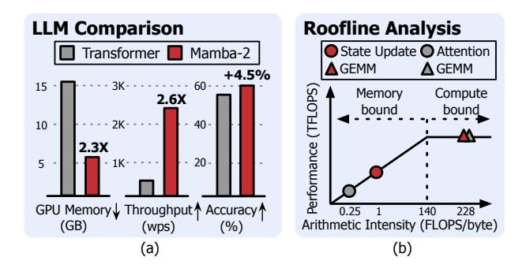

Figure 1: Comparison between 2.7B parameter transformer and Mamba-2. Accuracy results are referenced from [15].

While transformers offer remarkably versatile capabilities and continue to dominate LLMs, their enormous resource demands are a significant concern for LLM providers. Transformer-based LLMs scale quadratically in compute and linearly in memory footprint with sequence length, while emerging applications—such as test time scaling [2, 17, 49, 68], retrieval-augmented generation [11, 39, 42, 66], and multimodal input fusion [1, 3]—are driving demand for longer sequence lengths, recently reaching up to 2 billion tokens in industry-leading models [81]. Moreover, batched inferencing exacerbates these resource demands, forcing hyperscalers to invest billions of dollars in equipping their data centers with hundreds of thousands of costly GPUs, each priced at \$30,000 or more [56].

Recently, the algorithm community has actively explored alternative approaches, including state space models (SSMs), linear attention mechanisms, and recurrent neural networks (RNNs). In this paper, we henceforth refer to LLMs employing these alternative algorithmic techniques as "post-transformer" LLMs. We argue that post-transformer LLMs have the potential to serve as a promising complement to transformer-based LLMs, providing comparable algorithmic capabilities with significantly lower and constant resource demands [9, 15, 21-26, 35, 57-59, 61, 70, 80, 87]. Figure 1(a) presents an empirical evidence that supports our argument. The figure compares the memory usage, throughput, and accuracy of a transformer-based LLM with a post-transformer LLM, Mamba-2, both having a model size of 2.7 billion parameters1. The results show that Mamba-2 requires 2.3× less memory capacity, delivering 2.6× higher throughput than the transformer counterpart, while achieving 4.5% higher accuracy. Despite this considerable potential, the architecture and system community have a limited understanding of the implications of these algorithms, causing LLM providers to hesitate in adopting them for their serving systems.

To this end, this paper sets out to bridge this gap through a comprehensive workload analysis and performance characterization, and to devise a solution that leverages the resulting insights. The first of these insights is that many post-transformer LLMs share a common algorithmic operation, *state update*, which propagates and evolves contextual information across tokens. This commonality offers a promising opportunity for architectural generalization and acceleration. We also discovered that similar to the attention operation in transformer-based LLMs, this state update operation

becomes the performance bottleneck due to its low arithmetic intensity. Figure 1(b) reports the roofline analysis results that the arithmetic intensity of state update operation is  $4 \times$  larger than that of attention, while it is still significantly bandwidth-bound.

Inspired by these insights, we propose PIMBA, an acceleration solution that addresses the memory bandwidth bottleneck by jointly exploiting (1) Processing-in-Memory (PIM) paradigm, and (2) LLM quantization. While prior works have extensively investigated these techniques for transformer-based LLM serving [28, 30, 54, 67, 77, 84, 88], we observe that post-transformer LLMs demonstrate significantly different behaviors, requiring distinct design choices to enable a unified serving system that accommodates the two classes of LLM architectures. Below, we share the empirical insights and their corresponding principles that govern our accelerator design:

- (Principle 1): Maximizing hardware resource sharing for area efficiency: Existing LLM-targeted PIM acceleration methods [27, 28, 40, 54, 67] focus on supporting matrix-vector multiplication (i.e., GEMV) since attention operation consists of a full of GEMVs. However, this approach is unsuitable for post-transformer algorithms since implementing the state update operation in hardware incurs significantly larger area costs due to the variety of primitives in state update operation, such as element-wise multiplication, element-wise addition, and vector dot products. Thus, in designing PIMBA, we aim to exploit the hardware resource sharing for maximizing area efficiency.
- (Principle 2): Achieving both accuracy and area-efficiency from low-precision arithmetic: While quantizing the state in post-transformers can reduce computation cost and memory footprint, it also affects area efficiency. We also discover that, due to the state "update" mechanism, conventional numerical formats cause severe accuracy degradation, rendering them impractical for post-transformers. We carefully explore the accuracy-area tradeoffs and observe that different low-precision arithmetic approaches exhibit different characteristics. We thoroughly perform an empirical study to understand the differences and aim to employ a Pareto-optimal quantization technique for our solution.

Building upon these two principles, we design the Pimba accelerator architecture, which incorporates the following key elements:

State-update Processing Unit (SPU). At the core of PIMBA is the State-update Processing Unit (SPU), which includes a State-update Processing Element (SPE). Deploying an SPE for each bank would incur excessive area costs and reduce memory capacity, rendering this approach impractical under the stringent area constraints of PIM compute units. To address this, PIMBA assigns one SPU to every two banks. The SPU alternates between reading from and writing to the row buffers of different banks, performing computations in an interleaved manner. This design sustains throughput while optimizing area efficiency.

SPE with MX-based quantized arithmetic. Empirical analysis suggests that among various quantization formats, MX8 [16] (requiring an average of 8 bits per value) emerges as a Pareto-optimal choice in the accuracy-efficiency tradeoff, while aligning seamlessly with memory address alignment requirements. This enables area-and power-efficient implementation of SPEs within the constraints of PIM. Consequently, we design custom MX8 vector multipliers and adders, significantly improving resource efficiency.

&lt;sup>1Detailed experimental methodology is presented in Section 6.1

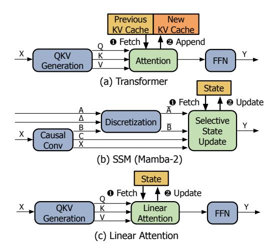

Figure 2: Model architectures of (a) Transformer, (b) Mamba-2 of SSM, and (c) Linear Attention. For simplicity, we focus on the key operations.

End-to-end PIMBA system design. We construct the PIMBA system by jointly leveraging PIMBA accelerators with GPUs, offloading state update and attention operations to PIM, while delegating other tasks to GPUs. PIMBA includes custom DRAM commands and command scheduling techniques to manage state pre-charging and subsequent generative computations. Our PIM accelerator and its interface use a system architecture similar to the existing PIM-based LLM serving systems [28, 54, 55, 67], allowing PIMBA to serve as a "drop-in replacement" in transformer-serving systems adapted to support post-transformer LLMs as well.

To evaluate Pimba's effectiveness, we use four post-transformer LLM models-Mamba-2, GLA, RetNet, and HGRN2 [15, 61, 70, 80]—along with Zamba2, a hybrid transformer-Mamba-2 model [89], and OPT [86], a traditional attention-based model. Our experimental results show that compared to LLM-optimized GPU and GPU+PIM systems, Pimba achieves 14.6× and 6.9× lower latency in state update operations, resulting in up to 4.1× and 2.1× higher throughput, respectively, with minimal area overhead on the memory device. These advantages in both performance and area-efficiency demonstrate that Pimba is an effective PIM-based solution for LLM serving, capable of supporting both transformer and post-transformer models, paving the way toward scalable and cost-efficient deployment of emerging LLM architectures. A full-system simulator for Pimba and the accuracy evaluation code are open-sourced at https://github.com/casys-kaist/pimba.

#### 2 Background

## 2.1 Transformer-based LLMs and their Limitations

**Transformer-based LLMs.** Transformers offer remarkable performance due to their attention mechanism, which enables efficient modeling of inter-token dependencies [18, 48, 50, 73]. Figure 2(a) shows the model architecture for transformer-based LLMs. In the attention mechanism, each token in the input sequence is projected

into three distinct vectors: query (Q), key (K), and value (V). The query and key vectors are used to compute the attention scores by taking the scaled dot product, and the value vectors are used to perform a weighted sum over these scores.

**Limitations.** The auto-regressive nature of LLM requires revisiting all previous tokens, resulting in redundant computation. Key-Value (KV) cache is employed to prevent recomputing previous tokens, but the transformers face the following limitations:

- (1) Memory usage. The KV cache grows linearly with the sequence length. Despite prior work on enhancing memory efficiency [19, 30, 33, 38, 79], the fundamental property of the algorithm is unchanged. This ends up consuming significant amounts of GPU memory and imposing limits on the sequence length or the batch size.
- (2) Latency. The computation of attention layers increases linearly, even with the KV cache, leading to increased latency with longer sequences. In multi-user serving scenarios, typically processed in batches, the difference in compute latency can hinder efficient scheduling [38, 83].

#### 2.2 Post-Transformer LLMs

Recently, alternative architectures including state space models (SSMs) [15, 21–26, 59], linear attention mechanisms [35, 70, 80, 87], and recurrent neural networks (RNNs) [9, 57, 58, 61] have emerged as promising substitutes for transformers. These *post-transformer* models offer comparable capabilities to transformers, while requiring constant resources regardless of sequence length, addressing the fundamental limitations of transformers.

**SSM.** Among the alternatives, state space models (SSMs) have demonstrated their effectiveness, leveraging structured state transitions to efficiently capture long-range dependencies. The state-of-the-art, Mamba-2 [15], achieves leading performance among SSMs through its selection mechanism that efficiently propagates prior token information. Given the prominence of Mamba-2 in language modeling and its adoption in numerous new models [31, 47, 75, 89], this paper focuses on Mamba-2 as a representative of SSMs.

Figure 2(b) illustrates the key operations of Mamba-2. Among these, the selective state update operation is the core in Mamba-2, which operates with H parallel heads, akin to the multi-head attention mechanism in transformers. The inputs to the selective state update include vectors  $\overline{A}$ ,  $\overline{B}$ , C, and X. These are partitioned across the H heads, yielding scalar  $a^h$  and vectors  $\overline{B^h}$ ,  $C^h$ , and  $X^h$  for each head. Each head maintains its own state matrix, which is updated through the following steps at each time step:

- (1) **State decay.** The previous state matrix is decayed by multiplying it with scalar  $a^h$ , decaying the influence of older information.
- (2) Outer product. The outer product of vectors  $\overline{B^h}$  and  $X^h$  is computed, capturing the interactions between these vectors.
- (3) Update. The resulting outer product matrix is added to the decayed state to form the updated state.
- (4) Output. A GEMV operation between the updated then transposed state matrix and vector  $C^h$  produces the output vector.

In this sequence, each head effectively updates its internal state based on inputs, producing outputs that contribute to the model's overall computation.

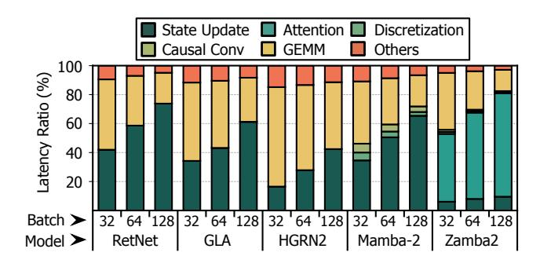

Figure 3: Latency breakdown of operations during generation phase on various SU-LLMs. For RetNet, GLA, HGRN2, and Mamba-2, we use a single generation phase due to their constant-time behavior. For Zamba2, we use (2,048, 2,048) input/output lengths.

**Linear Attention.** One approach is to propose entirely new architectures, such as SSM. Alternatively, modifying the existing attention mechanism offers another way to address the limitations of transformers. Among such approaches, linear attention [35, 70, 80, 87] has garnered significant interest, as it replaces the softmax function in attention with a linear function. Since most linear attention mechanisms use the identity function as the linear function, it can be expressed as Equation 1 and is illustrated in Figure 2(c).

$$LinearAttention(Q, K, V) = Q \cdot (K^{T} \cdot V)$$
 (1)

During the generation phase, the  $K^T \cdot V$  product is used as the state, which is continuously updated. This is a constant-size state that does not grow with sequence length and corresponds to steps (2)-(3) of the selective state update operations in SSMs. Multiplication of the state with Q corresponds to the final step (4). When a scalar decay factor is applied (e.g., RetNet [70]), the linear attention mechanism aligns with the selective state update operation in Mamba-2. Conversely, applying an input-dependent gating mechanism (e.g., GLA [80]) replaces the scalar decay factor with a gating vector, which is broadcast and multiplied element-wise with the state. In short, both RetNet and GLA share the same or very similar state update operation as Mamba-2.

RNN. RNNs are being actively revisited as an alternative to transformers for their linear computational complexity [9, 57, 58, 61]. Among these, HGRN2 [61] introduces a novel architecture by extending the conventional RNN state representation from a one-dimensional to a two-dimensional state using an outer product-based approach. Interestingly, this operation closely resembles step (2) of the selective state updates. The forget gate in HGRN2 functions similarly to the decay mechanism, while it employs a forget gate vector instead of a decaying scalar, akin to GLA.

Combining with attention. Although aforementioned architectures demonstrate strong performance, they often fall short in incontext learning, particularly in recalling previous tokens [75]. This limitation has motivated a body of work [20, 51, 62, 75, 89] exploring hybrid models that combine the efficiency of alternative architectures and the expressiveness of attention. Notably, Nemotron-H [51] and Zamba2 [89] integrate attention layers with Mamba-2

architectures to leverage the complementary strengths of both approaches. By sparsely inserting attention layers, for example, one attention layer per six Mamba-2 layers in Zamba2 [89], these models effectively restore the in-context learning capability of standard Transformers, while maintaining the computational efficiency.

#### 2.3 DRAM and Processing-in-Memory (PIM)

**DRAM architecture.** DRAM is organized hierarchically, starting with channels, each divided into ranks, which are further subdivided into bank groups. Each bank group consists of multiple banks, with each bank storing data in a matrix format. Accessing data from DRAM involves three critical steps: (1) *Row Access*: the sense amplifier of the bank activates the target row. (2) *Column Access*: the specific column within the activated row is selected, and the requested data is read out. (3) *Data Transfer*: the data is transmitted to the host via the data bus of the DRAM channel, where only one bank of the channel can transfer data at a time.

PIM. Processing-in-Memory (PIM) is a realization of the Near-Data Processing (NDP) paradigm, which has branched into various research directions. Among these, industry-leading memory manufacturers focus on in-bank PIM technologies, where each DRAM bank is equipped with small compute logic to overcome the bandwidth constraints of the DRAM channel. These accelerators perform PIM operations during the first two steps of DRAM access, with computation handled by the in-bank logic instead of transferring data over the bus. As DRAM comprises multiple banks, its internal bandwidth is significantly higher than the channel bandwidth, creating opportunities for PIM to leverage. Thus, PIM delivers substantial speedups for memory-bound tasks with low arithmetic intensity.

#### 3 Workload Characterization

#### 3.1 Analysis of Post-Transformer LLMs

Common operational structure. As discussed in Section 2.2, many post-transformer models exhibit a shared structured pattern that is increasingly evident in recent algorithms. We find that we can unify this shared algorithmic commonality across post-transformer models into a single, generalized operation, termed state update. For clarity, we refer to post-transformer models employing this state update as State Update-based LLMs, or SU-LLMs for short. Equation 2 represents the state update operation for a single head.

$$S_t = d_t \odot S_{t-1} + k_t v_t^T$$
  

$$y_t = S_t^T q_t$$
(2)

Here,  $d_t$ ,  $q_t$ , and  $k_t$  are vectors with  $dim_{head}$  dimension, while  $v_t$  is a vector with  $dim_{state}$  dimension. The state is represented as a matrix of  $(dim_{head} \times dim_{state})$  dimensions. First, the  $d_t$  vector is broadcast to match the dimensions of the state matrix, after which an element-wise multiplication is performed to decay the state. This decayed state is then updated by adding the outer product of  $k_t$  and  $v_t$ . The updated state is then multiplied by  $q_t$  using GEMV to produce the output  $y_t$ .

**Performance Analysis.** Figure 3 illustrates the latency breakdown of operations during generation phase across 2.7B parameter SU-LLMs-such as RetNet, GLA, HGRN2, Mamba-2 [15, 61, 70, 80]—along with Zamba2 [89], a 7B parameter hybrid transformer-Mamba-2 model using A100 GPU. Unless otherwise specified, we

Figure 4: Perplexity of SU-LLMs and transformer-based LLMs using the WikTtext-2 [45] dataset when quantized their respective representations to 8-bit formats.

use models with the same parameter count throughout this paper. The results show that state updates dominate latency, despite having fixed memory and compute footprints. In RetNet, as the batch size increases from 32 to 128, the time spent on state updates rises from 41.9% to 73.8%, resulting in a significant bottleneck. This is because state updates are memory-bound and lack parameter reuse across user requests. They read and write the state matrix, while each operation–such as decay, outer product, update, and GEMV–requires FLOPs proportional to the size of the state matrix, resulting in a low operational intensity. Furthermore, each request must independently read, update, and write its own state. Consequently, their latency grows linearly with batch size, rendering state updates a performance bottleneck at large batch sizes.

Another noteworthy observation is that in a hybrid model such as Zamba2, although the number of Mamba-2 layers greatly exceeds that of attention layers (e.g. 6×), attention still represents a substantial fraction of the overall latency–reaching 65.5% at a batch size of 128. This is because, unlike state update operations that exhibit constant latency regardless of sequence length, attention operations scale in latency proportionally to sequence length, making them a dominant bottleneck in long-sequence scenarios. Hence, to effectively accelerate hybrid models, it is critical to optimize not only state update operations but also attention operations.

## 3.2 Quantization Analysis for SU-LLMs

As discussed in Section 3.1, state update operations are memory-bound, leading to significant memory bandwidth pressure. Quantizing the state may offer a promising solution to mitigate this issue by reducing data precision and thus memory bandwidth needs. Although significant research has been dedicated to quantizing the KV cache in transformer-based LLMs [30, 77, 88], the quantization of the state in SU-LLMs has received little attention.

Low precision formats. To address this gap, we explore various low-precision formats for quantizing the state: (1) integer, (2) floating point, and (3) block floating point formats. For the integer format, we use an 8-bit integer with a scaling factor across every 32 elements. For the floating point format, we consider 8-bit variants: e4m3 (4 exponent bits and 3 mantissa bits) and e5m2 (5 exponent bits and 2 mantissa bits). For the block floating point format, we employ MX [16]. Specifically, we employ a variant of MX, called MX8, where groups of 16 values share a common 8-bit exponent, and pairs of values within each group share a 1-bit microexponent to match the bit-width. We also investigate the impact of rounding

Figure 5: (a) Normalized throughput for state updates of various SU-LLMs. (b) Area overhead for two PIM designs.

methods, particularly stochastic rounding, which rounds numbers probabilistically based on their distance from representable values. **Implication of quantization for SU-LLMs.** Figure 4 shows the perplexity of various 2.7B parameter models when their respective representations–state for SU-LLMs and KV cache for transformers–are quantized using the Wikitext-2 [45] dataset. Our results reveal distinct quantization behaviors between these two model types.

Transformer-based LLMs exhibit negligible perplexity increases across all formats, while SU-LLMs exhibit a severe increase in perplexity with floating point formats (e.g. 8,114 for GLA with e4m3). This discrepancy arises from the SU-LLMs' continuous state "update" mechanism. This makes them vulnerable to loss of small values during accumulation due to limited mantissa precision, which is called swamping effect [29, 76]. The 7-bit (int8) and 6-bit (MX8) mantissas provide enough precision to mitigate swamping, whereas the 3-bit and 2-bit mantissas in e4m3 and e5m2 render these formats highly susceptible. This finding aligns with conventional practices in training deep learning models, wherein weights are stored at higher precisions to reduce numerical errors [46]. Another notable observation is that stochastic rounding has a substantial positive impact on SU-LLMs, in contrast to transformer-based LLMs. For example, the perplexity of Mamba-2 in the e5m2 format drops dramatically from 62 to 11.9 when stochastic rounding is applied. In SU-LLMs, stochastic rounding probabilistically preserves smaller magnitude values that would otherwise be lost due to swamping, thereby maintaining more information during state update scenario.

According to the results, employing stochastic rounding on int8 appears optimal for SU-LLMs. However, this strategy might require re-evaluation in area-constrained environments, such as PIM architectures. We will discuss this in further detail in Section 4.2.

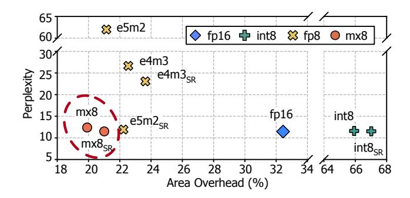

Figure 6: Accuracy-area tradeoff between different low-precision formats on Mamba-2 model with WikiText-2. All compute units take 256-bit-group operands as input.

#### 4 PIM Design Principles

Since state update operations are memory-bound, PIM appears to be a promising solution for acceleration. While prior works have already explored PIM acceleration for transformer-based LLM serving [27, 28, 32, 40], we observe that SU-LLMs have significantly different performance characteristics, necessitating distinct design decisions. In this section, we share our empirical insights and the corresponding principles that govern our accelerator design.

# 4.1 Principle 1: Maximizing Hardware Resource Sharing for Area Efficiency

There are two primary approaches to design PIM for state update acceleration: (1) time-multiplexed PIM and (2) pipelined PIM. The time-multiplexed design only implements basic multiplication and addition units to reduce area overhead, similar to HBM-PIM [40]. The pipelined design maximizes throughput, by implementing the entire sequence of operations in a pipelined manner.

Tradeoff between area and throughput. Figure 5 shows the normalized throughput of state update operations of SU-LLMs on an A100 GPU and the two PIM designs during the generation phase at batch size 128. It also presents the respective area overhead of the two PIM designs. We adopt a per-bank PIM design (each bank equipped with its own processing unit) for both PIM architectures, matching the channel bandwidth to that of the A100. Detailed PIM configurations and simulator/RTL implementation are provided in Section 6.1. While the time-multiplexed design offers a modest 2.8× throughput improvement over the GPU, the pipelined design achieves a more significant 4.3× improvement. Meanwhile, the time-multiplexed design has only 17.8% area overhead, whereas the pipelined design incurs a much larger area overhead of 32.4% (>25%), posing practical deployment challenges. Neither design offers both high throughput and low area overhead.

Achieving both high throughput and area efficiency. We argue that even if the number of processing units in the per-bank pipelined design is halved, the same throughput can still be maintained, thereby achieving both high throughput and area efficiency. Even per-bank pipelined designs cannot fully utilize each processing unit because state updates require both read and write, and row buffers cannot perform both simultaneously. During writes, no input is supplied to the processing unit. With judicious dataflow

design, two banks can share a single processing unit, allowing continuous input from both banks without throughput loss. We call this technique *access interleaving* and detail it in Section 5.2.

## 4.2 Principle 2: Achieving Both Accuracy and Efficiency from Low-Precision Arithmetic

As discussed in Section 3.2, quantizing the state is another promising approach to alleviate the pressure on memory bandwidth during state update operations. To leverage quantization in PIM, we conduct experiments to evaluate the tradeoff between area and accuracy aiming to achieve the best of both.

Tradeoff between area and accuracy. Figure 6 illustrates the area-accuracy tradeoff space for various low-precision formats, evaluated using the Mamba-2 on the Wikitext-2 [45] dataset with a per-bank pipelined PIM design. Detailed RTL implementation methodology is provided in Section 6.1. As described in Section 3.2, fp8 formats suffer from a significant increase in perplexity, while int8 and MX8 achieve perplexity levels comparable to fp16.

However, our analysis suggests that int8 incurs substantial area overhead, while MX8 is significantly more area-efficient. The high area overhead of int8 stems from the need for element-wise addition during state updates, which the scaling-based integer format cannot directly handle. This necessitates dequantization (multiplying each integer element by the scaling factor) and re-quantization (normalizing elements based on the max value), requiring additional arithmetic units and comparison logic. Conversely, MX simplifies operand alignment for addition by sharing the exponent bit within a group, enabling direct operations through simple shifting without dequantization, the details of which will be discussed in Section 5.3.

Additionally, the results show that stochastic rounding imposes minimal area overhead. It requires a Linear Feedback Shift Register (LFSR) for random number generation and a simple addition unit to add these numbers to the mantissa, both of which are areaefficient [60]. We conclude that among the quantized formats, MX8 with stochastic rounding emerges as a Pareto-optimal choice, offering superior area efficiency while maintaining high accuracy.

#### 5 Рімва

#### 5.1 Overview

Building upon the aforementioned principles, we propose Pimba, a PIM-enabled system designed to accelerate state update and attention operations while minimizing PIM area overhead. We first focus on Pimba as a state update operation accelerator, while attention operation acceleration is detailed in Section 5.4. Figure 7 provides a high-level overview of Pimba system.

(1) PIMBA system. PIMBA handles user requests in two phases: prefill and generation. In the prefill phase, all operations, including state updates, run on the GPU, as they can be restructured into compute-intensive forms [15, 70]. In the generation phase, PIMBA offloads the state update and attention operations to the PIM, while other operations remain on the GPU. For the PIM-executed operations, PIMBA transfers operands to PIM registers, computes partial sums, and sends the results back to the GPU for accumulation.

To support heterogeneous execution, PIMBA includes a software stack based on a prior work, HBM-PIM [40]. As in HBM-PIM [40], PIMBA device driver first allocates physically contiguous memory

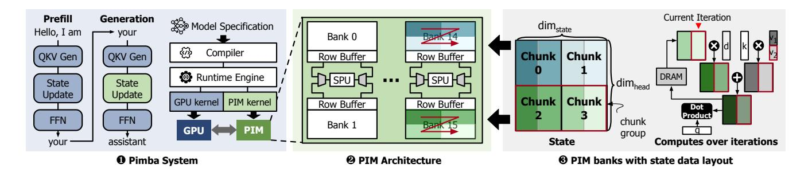

Figure 7: Overview of the proposed PIMBA system.

blocks to facilitate efficient PIM operations. Custom GPU kernels are implemented for each PIMBA operation to issue the necessary PIM commands and compute the addresses of the memory regions involved in the computations. To support this, the GPU programming model (e.g., CUDA) is extended with APIs to issue PIMBA's custom DRAM commands. When GPU kernels are compiled, these APIs are lowered to the corresponding custom DRAM commands. These kernels are then registered as custom operations within highlevel frameworks such as PyTorch [5], allowing users to invoke PIMBA functionality seamlessly through familiar APIs.

(2) PIM architecture. PIMBA aims to accelerate state updates and attention while minimizing PIM area overhead. To achieve its objectives, Pimba introduces two key architectural innovations: (1) PIMBA employs a novel State-update Processing Unit (SPU) that is shared between two memory banks (Section 5.2). Unlike traditional designs where a processing unit can only access one bank at a time for either read or write [40], PIMBA's pipelined design allows simultaneous reading from one bank and writing to the other. This overlapping of read and write operations across two banks enables PIMBA to halve the number of processing units compared to a perbank design, while maintaining the same throughput. (2) Within each SPU, PIMBA integrates an MX-based State-update Processing Engine (SPE) to enable area-efficient and accuracy-preserving computations (Section 5.3). While prior works primarily focus on MX quantization for dot product operations [37], PIMBA introduces a microarchitectural design specifically tailored for MX-based elementwise addition and multiplication.

(3) PIM banks with state data layout. We divide each state column along the  $\dim_{head}$  dimension into sub-chunks based on the DRAM column size. Then, we group sub-chunks across the  $dim_{state}$ dimension to form a chunk that aligns with the DRAM row size, enabling efficient sequential access within each SPU. To further maximize operand reuse across chunks, we organize the chunks into chunk groups and assign each group to a DRAM bank. Chunks within the same group share the operands  $d_t$ ,  $q_t$ , and  $k_t$ , and are placed in consecutive rows of the bank. This arrangement enables the transfer of shared operands to PIMBA once per chunk group, while only the corresponding  $v_t$  vector is transferred per chunk, enhancing data reuse. Once assigned to banks, PIMBA processes sub-chunks sequentially in a pipelined manner by reading consecutive columns within a DRAM row. In the i-th iteration (time unit during which PIMBA processes each sub-chunk), PIMBA utilizes the i-th sub-chunk, the shared  $d_t$ ,  $q_t$ ,  $k_t$  vectors, and the i-th element of the  $v_t$  vector in its computations.

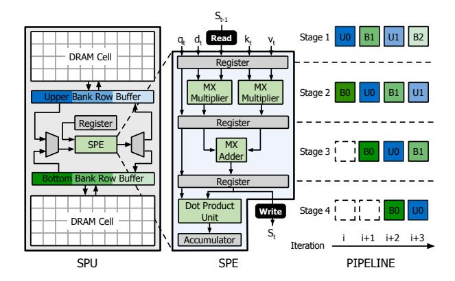

Figure 8: PIMBA accelerator architecture leveraging access interleaving.

#### Hazard-Free SPU with Access Interleaving

We propose the access interleaving technique, which maintains the same throughput as per-bank pipelined designs and reduces area overhead by half. The core idea, as illustrated in Figure 8, is to have two memory banks share a single SPU, which alternates between banks in each iteration, enabling continuous data flow by solving the structural hazard. At a given iteration, SPU reads a sub-chunk from one bank, referred to as the upper bank, to initiate a new computation. Simultaneously, the other bank, referred to as the bottom bank, performs a write operation to store the result of a computation initiated several iterations earlier. This alternating pattern is sustained in the next iteration: the upper bank now completes a prior computation by writing its result, while SPU reads a fresh sub-chunk from the bottom bank to begin another computation. Pipeline. As depicted in Figure 8, PIMBA employs a four-stage pipeline: (1): Fetch the state from DRAM. (2): Compute state decay and the outer product in parallel. (3): Sum the results from Stage 2

to update the state. (4): Perform a dot product between the updated state and  $q_t$  while writing the updated state back to DRAM.

The figure describes the detailed pipelining steps over iteration. Before iteration i, operands are loaded into registers, and chunks in both upper and bottom banks are activated. At iteration i, subchunk U0 from the upper bank is read, while sub-chunk B0 from the bottom bank, which is read in a previous iteration, enters Stage 2. In iteration i + 1, sub-chunk B1 is read from the bottom bank, while U0 and B0 advance to the next stage. At iteration i + 2, U1 is read

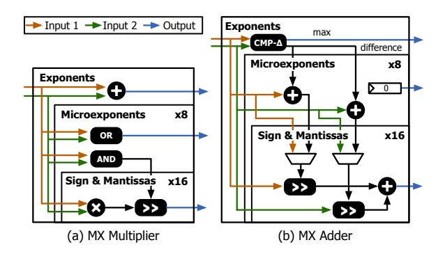

Figure 9: Implementation of MX operations in PIMBA SPE.

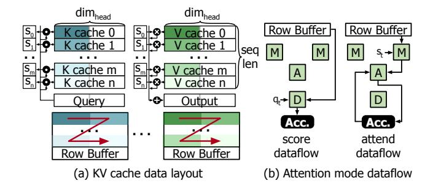

Figure 10: (a) KV cache data layout and (b) attention mode dataflow. M denotes a multipler, A an adder, and D a dot product unit.

from the upper bank, and B0 is written back to the bottom bank. Notably, at this point, U1 is read from the upper bank while B0 is written to the bottom bank, avoiding any conflicts due to the use of separate banks for read and write operations. Similarly, at iteration i+3, B2 is read from the bottom bank while U0 is written back to the upper bank. This interleaving allows continuous, conflict-free processing and ensures full utilization of compute resources, as SPU receives data every iteration.

#### 5.3 Microarchitecture of MX-based SPE

The MX format, initially designed to accelerate GEMM operations, requires specific modifications to support element-wise multiplication and addition. To this end, we design MX Multiplier and MX Adder, specifically customized for state update computations. Each of these computational units operates at three hierarchical levels: (1) one unit to handle the shared exponent at the group level, (2) units to manage the microexponents at the sub-group level, and (3) integer units for each element's sign and mantissa.

MX multiplier. Figure 9(a) illustrates how multiplication is executed with MX. MX Multiplier adds the exponents of the operand groups to compute the resulting group exponent. Similarly, it sums the microexponents within each sub-group. If the sum of the microexponents exceeds the representable range (i.e., results in a value of 2, which cannot be represented with 1 bit), it sets the resulting microexponent to 1, and right-shifts the resulting mantissas of the

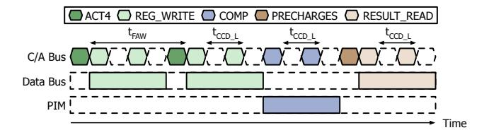

Figure 11: PIMBA command scheduling. For simplicity, we align C/A bus, data bus, and PIM.

elements in that sub-group by one, thus properly adjust the scaling. The sign and mantissa of each element serve as integers, and are multiplied using integer multiplication units.

MX adder. Figure 9(b) illustrates how addition is executed with MX. Addition in MX necessitates an alignment step to ensure operands are scaled correctly. MX Adder first aligns the exponents by comparing the two operand exponents to get their max, which is then used as the resulting exponent. The group with the smaller exponent adjusts its mantissas by right-shifting them based on the difference between the exponents. Additionally, MX Adder further right-shifts the mantissas by their respective microexponents to ensure proper alignment. It, then, adds sign and mantissa of each element using integer addition units. The result of the addition operation always produces a micro-exponent of 0.

## 5.4 Attention Support in PIMBA

Having described how PIMBA accelerates state update operations, we now describe its support for attention operations. Notably, PIMBA reuses its existing logic to efficiently execute attention operations without requiring dedicated hardware extensions. Figure 10(a) illustrates the layout of the key-value (KV) cache for attention in PIMBA. Similar to the state update data layout, we partition each KV cache along the  $dim_{head}$  dimension into sub-chunks sized to match the DRAM column width. These sub-chunks are then grouped into chunks and mapped contiguously within DRAM rows, preserving spatial locality and reducing access overhead.

The attention computation in PIMBA proceeds in two phases: score and attend. In the score phase, PIMBA performs dot products between the query vector and key vectors using its in-pipeline dot product unit as shown in the score dataflow of Figure 10(b). The intermediate results are sent to the GPU, where they are accumulated and passed through a softmax function to produce normalized attention scores. In the attend phase, PIMBA multiplies each attention score with its corresponding value vector and accumulates the results. This phase utilizes PIMBA's multiplier and adder units, as shown in the attend dataflow of Figure 10(b). By leveraging a shared microarchitectural substrate, PIMBA achieves efficient support for both state update and attention operations, demonstrating the versatility of its PIM-based execution model.

#### 5.5 Memory Interface

In designing PIMBA, we extend the standard DRAM interface to enable practical PIM deployment for SU-LLMs. To achieve this, PIMBA (1) adheres to existing DRAM timing constraints to reduce engineering complexity, (2) ensures operations perform predefined functions, aligning with DRAM refresh schemes, (3) extends the

existing DRAM commands to maintain compatibility with current DRAM, and (4) employs an all-bank design, as in prior PIMs [27, 36, 40], to minimize logic overhead. We propose five custom DRAM commands for state update and attention operations.

- **ACT4.** The portion of the state and KV cache being processed must first be activated to the row buffer. Due to power constraints and the *t*FAW timing window for four activations, PIMBA gangs four activations together, similar to previous PIMs [27, 28].
- REG\_WRITE. Before operations, PIMBA receives operands from the host in MX8 format and stores them in the registers using REG\_WRITE command. If the host lacks MX8 support, Quantization Unit can be employed in the host's memory controller, which can be implemented by determining the maximum exponent of incoming values and adjusting their mantissas using shift operations, enabling a very small area implementation.
- **COMP.** With states activated and operands loaded, the host initiates state update/attention operations across all banks using the COMP command. Given that each column read occupies I/O gating, consecutive COMP commands must observe the  $t_{CCD\_L}$  timing constraint [36].
- RESULT\_READ. After computations, the host retrieves results\nusing the RESULT\_READ command. Since COMP involves both
  reads and writes for state update operations, RESULT\_READ
  must follow COMP with tRTP and tWR intervals.
- PRECHARGES. Through state update operations, the row buffer
  of each bank contains updated state values. To store these back\ninto DRAM cells and for the next operations, all banks' row
  buffers are precharged using the PRECHARGES command.

**Command scheduling.** Transferring operands and retrieving results introduce significant overhead, even with operand reuse. To reduce this overhead, PIMBA overlaps data transfer between the host and PIMBA during activation and precharge, minimizing this overhead, as depicted in Figure 11. Specifically, the REG\_WRITE command is inserted into the idle time between ACT4 commands due to the  $t_{FAW}$  timing constraint. Similarly, PRECHARGES takes  $t_{RP}$  time to complete, during which RESULT\_READ is overlapped to reduce the overhead caused by data transmission.

#### 5.6 Intra- and Inter-PIMBA Communication

Intra-PIMBA communication. PIMBA attaches the PIM directly to the GPU's off-chip memory, minimizing communication overhead. Furthermore, all custom commands executed by PIMBA operate with deterministic timing, allowing the GPU to issue multiple PIM commands in sequence without requiring complex synchronization logic, as long as timing constraints are satisfied. Once all PIM operations are completed, the GPU retrieves the results via a RE-SULT\_READ command, which delivers the computed values to the host's execution units through the load queue. Note that due to data dependencies, GPU and PIM operate in a blocked manner. For instance, in the attention operation, the GPU remains blocked until PIMBA completes all score computations. Once completed, the results are transferred to the GPU for the softmax operation, after which PIMBA resumes to perform the attend computation.

**Inter-PIMBA communication.** As LLMs continue to grow in size, a single PIMBA device cannot support large-scale models. PIMBA addresses this problem by leveraging pipeline and tensor parallelism,

Table 1: Specifications of the evaluated HBM.

| HBM Organization                                                                                         |          |  |  |
|----------------------------------------------------------------------------------------------------------|----------|--|--|
| Banks/Bank group                                                                                         | 4        |  |  |
| Bank groups/Pseudo-channel                                                                               | 4        |  |  |
| Memory Bus Frequency                                                                                     | 1.512GHz |  |  |
| PIM Frequency                                                                                            | 378MHz   |  |  |
| HBM Timing Parameters                                                                                    |          |  |  |
| tRP = 14, tRAS = 34, tCCD_S = 2, tCCD_L = 4, tWR = 16 tRTP_S = 4, tRTP_L = 6, tREFI = 3900, tFAW = 30 |          |  |  |

which distributes the model parameters across multiple devices. To enable such model parallelism, Pimba devices exchange intermediate results via high-bandwidth interconnects such as NVLink. With pipeline parallelism, the model is partitioned into sequential blocks, each assigned to a different device, and intermediate results are forwarded to the next Pimba device at block boundaries. With tensor parallelism, the QKVD projection layers are sharded along the output channel dimension, and each device computes partial QKVD vectors. As state update and attention operate per head, each device processes only the heads corresponding to its partial vectors. The outputs are then projected using projection matrices sharded along the input dimension and aggregated across devices via an all-reduce operation. A similar all-reduce is performed after the FFN to complete the block's computation.

#### 6 Evaluation

#### 6.1 Methodology

Models and datasets. We evaluate 2.7B parameter SU-LLMsspecifically RetNet [70], GLA [80], HGRN2 [61], and Mamba-2 [15]as well as Zamba2 [89], a 7B parameter hybrid transformer-Mamba-2 model. For each model family, we selected the largest publicly available pretrained architectures. To provide a baseline with traditional attention-based LLM, we also evaluate 7B parameter OPT [86] model. To quantify the impact of state quantization on model accuracy, we utilize standard benchmarks widely adopted in LLM evaluations: WikiText-2 [45], PIQA [10], Lambda [53], HellaSwag [85], ARC-Easy [14], ARC-Challenge [14], and Winogrande [64]. We use perplexity and accuracy as evaluation metrics for WikiText-2 and the others, respectively. Additionally, to evaluate performance at large scale, we scale the models to 70B parameters. Following established practices [34], we proportionally scale both the number of layers and hidden dimensions to reach approximately 70B parameters. Based on prior findings that increasing state-update head count may degrade perplexity [80], we retain the original number of state-update heads and align both dimhead and dimstate with the number of heads and hidden dimensions.

Baselines. We evaluate PIMBA against several baseline systems: an NVIDIA A100 GPU 80GB (GPU), the same GPU configuration but using int8 state quantization matching PIMBA's bitwidth (GPU+Q), and the GPU system with an HBM-PIM [40] (GPU+PIM). Both PIMBA and GPU+PIM systems adopt 40 HBM2E-based PIM memory modules operating at 1,512MHz, matching the bandwidth of the original A100 GPU memory. Given that SPU has a clock cycle of

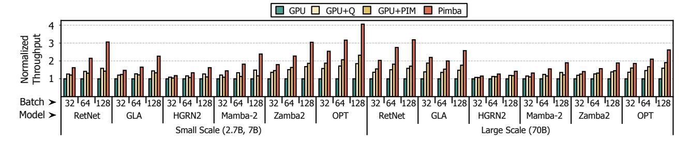

Figure 12: Normalized generation throughput on the baselines and Pimba on various SU-LLMs and an attention-based LLM.

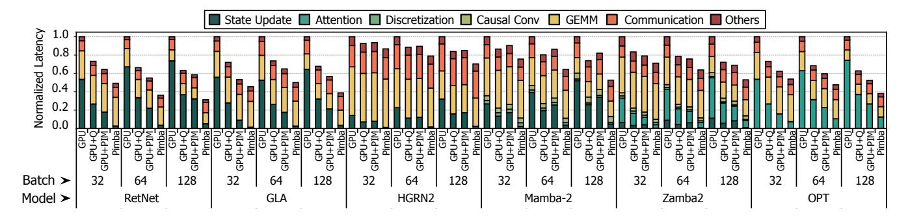

Figure 13: Latency breakdown of large scale SU-LLMs and an attention-based LLM at generation phase with (2,048, 2,048) input/output sequence lengths.

\_ (4 memory bus cycles), its frequency is 378MHz, which is consistent with prior work [\[40\]](#page-13-16). The HBM-PIM is designed using a time-multiplexed design that places a fp16 processing unit spanning two banks without the access interleaving technique of Pimba. This results in an area overhead comparable to that of Pimba PIM.

For small scale models, all evaluated systems utilize a single GPU, as these models comfortably fit within one GPU's memory capacity. For large scale models, all systems employ eight GPUs interconnected through a high-bandwidth network analogous to the NVIDIA DGX A100 system. We use NVLink3 as the interconnect for GPU-to-GPU communication, providing a bandwidth of 600GB/s, and the models are partitioned using tensor parallelism.

Cycle-accurate simulator. We develop an in-house cycle-accurate simulator based on Ramulator2 [\[44\]](#page-13-40) to evaluate the performance and energy efficiency of the PIM subsystem, incorporating existing DRAM timing constraints and refresh schemes. We model other system components including GPUs and NVLink by extending an open source simulator [\[54\]](#page-13-14). We refer to the activation and read energy of HBM from the previous work [\[52\]](#page-13-41). Detailed HBM configurations are presented in Table [1.](#page-8-1)

Area and power. We synthesize Pimba accelerator using Synopsys Design Compiler with the FreePDK 45nm technology node [\[69\]](#page-14-19), scaling area and power values to 10nm using the DeepScaleTool [\[65\]](#page-13-42). The same procedure is applied to the HBM-PIM, with components sourced from the Synopsys DesignWare libraries. Scaling follows methods from prior PIM works, considering that memory processes are 10× less dense than logic processes of the same feature size [\[54\]](#page-13-14). SRAM-based buffers are modeled using CACTI7 [\[8\]](#page-12-11) at 22nm, then scaled to 10nm.

## 6.2 Results

Throughput. Figure [12](#page-9-0) reports the normalized token-generation throughput across various SU-LLMs and an attention-based LLM using (2,048, 2,048) input/output sequence lengths. The GPU+Q system achieves an average of 1.4× higher throughput over the GPU baseline due to halving the state size. Interestingly, GPU+PIM also achieves 1.4× throughput improvement over GPU, matching or occasionally underperforming compared to GPU+Q despite leveraging PIM. This occurs because HBM-PIM employs a time-multiplexed design without Pimba's access interleaving, causing state update operations to span multiple cycles. Consequently, even with PIM, internal bandwidth is underutilized, yielding sub-optimal performance. Furthermore, GPU+PIM processes twice as much data compared to GPU+Q, as it uses fp16 states rather than 8-bit formats. In contrast, Pimba consistently outperforms GPU and GPU+PIM, providing average throughput gains of 1.9× and 1.4× (up to 4.1× and 2.1×), respectively. This superior performance results from efficiently leveraging internal bandwidth through pipelining and access interleaving, alongside the advantages of low-precision state representation.

Latency breakdown. To identify the main contributors to throughput improvements, Figure [13](#page-9-1) presents normalized latency for large scale SU-LLMs and an attention-based LLM during the generation phase. As shown, Pimba reduces state update operation latency by 14.6× and 6.9× compared to GPU and GPU+PIM, respectively, highlighting its efficient handling of state updates. Additionally, the results show greater overall latency reduction for larger batch sizes and models dominated by state update operations. For instance, HGRN2 with a batch size of 32 spends only 14% of its latency on

Model Method Perplexity ↓ Accuracy ↑ (%) WikiText-2 Piqa Lambada HellaSwag ARC-E ARC-C WinoGrande Geomean RetNet GPU 15.83 72.3 44.0 42.0 59.5 25.5 53.1 47.0 Pimba 15.95 72.3 43.7 41.9 59.7 25.8 53.7 47.1 (+0.1) GLA GPU 15.54 71.6 43.8 41.8 59.1 26.7 55.4 47.5 Pimba 15.57 71.5 43.4 41.9 59.1 26.7 55.2 47.4 (–0.1) HGRN2 GPU 14.48 73.1 48.5 44.6 60.7 25.3 54.7 48.6 Pimba 15.09 73.0 48.5 44.8 60.3 25.2 55.0 48.6 (+0.0) Mamba-2 GPU 11.46 76.4 59.6 49.6 69.4 33.2 64.0 56.7 Pimba 11.51 76.3 59.4 49.6 69.3 33.2 63.9 56.6 (–0.1) Zamba2 GPU 5.94 78.9 64.9 63.8 78.9 53.8 77.7 69.0 Pimba 5.96 78.6 64.4 63.7 78.4 53.8 77.1 68.7 (–0.3) OPT GPU 12.29 76.2 63.3 50.5 65.6 30.6 65.1 56.3 Pimba 12.29 76.1 63.2 50.5 65.6 30.3 65.2 56.2 (–0.1)

Table 2: Accuracy evaluation for various small scale SU-LLMs and an attention-based LLM

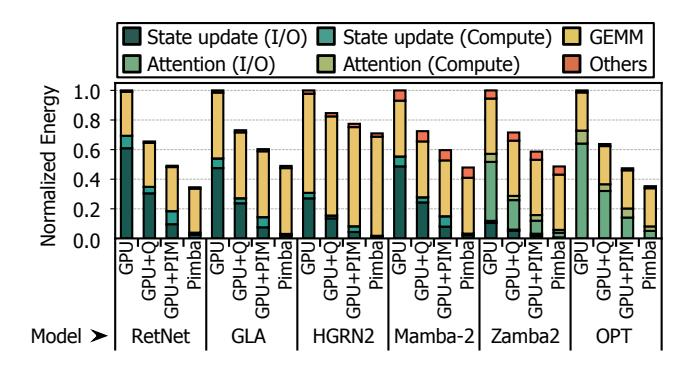

Figure 14: Normalized energy consumption of large scale SU-LLMs and an attention-based LLM at generation phase with batch size 128.

state updates, resulting in a modest 1.2× latency reduction. In contrast, RetNet with a batch size of 128 allocates 74% of its latency to state updates, achieving a substantial 3.2× latency reduction. Moreover, Pimba achieves latency reductions for attention operations by 6.3× and 2.1× compared to GPU and GPU+PIM, respectively, effectively accelerating attention-dominated hybrid models such as Zamba2 and the attention-based OPT. Notably, the latency reduction for attention operations in Pimba is smaller compared to state updates. This is due to attention operations primarily consisting of GEMV computations without requiring write operations, thus limiting the benefits of Pimba's pipelined design and access interleaving. Nevertheless, by employing the MX8 format, Pimba achieves a 2.1× attention latency reduction over GPU+PIM, demonstrating robust performance in hybrid models as well.

Energy consumption. Figure [14](#page-10-0) presents the normalized energy consumption breakdown of large scale SU-LLMs and an attentionbased LLM with a batch size of 128 during the generation phase. The results show that Pimba achieves an average of 2.2× lower energy consumption compared to GPU, demonstrating its costeffectiveness for SU-LLM serving. These improvements stem from

Table 3: Area and power comparison.

| Parameters                     | Pimba  | HBM-PIM |
|--------------------------------|--------|---------|
| Compute area (𝑚𝑚2 )         | 0.053  | 0.042   |
| Buffer area (𝑚𝑚2 )          | 0.039  | 0.039   |
| Total area (𝑚𝑚2 )           | 0.092  | 0.081   |
| Area overhead (%)              | 13.4   | 11.8    |
| Compute power dissipation (mW) | 8.2908 | 6.028   |

reducing the amount of state and KV cache transfer between the GPU and memory while performing state update operations within the PIM itself. Additionally, Pimba exhibits an average of 1.3× lower energy consumption compared to GPU+PIM, attributed to Pimba's use of the MX8 which significantly reduces transfer between the GPU as well as computation time.

Accuracy. Table [2](#page-10-1) summarizes the accuracy results comparing Pimba with the GPU baseline for various small scale SU-LLMs. Experimental results indicate that despite the use of MX8 quantization, Pimba achieves comparable accuracy to the GPU baseline. This is because the use of MX8, which has a high mantissa bit-width, combined with stochastic rounding, significantly mitigates swamping effects during continuous state updates. In conclusion, given the hardware efficiency of MX8, the results affirm that MX8 is an attractive choice to reduce area overhead for implementing SPE, while offering a negligible impact on the LLM accuracy.

Area. To assess the practicality of Pimba, we measure the area and power consumption of Pimba and HBM-PIM. Table [3](#page-10-2) presents the results. For a fair comparison, HBM-PIM is optimized for state update computations by retaining only the essential components while reducing or removing others, such as shrinking internal registers and eliminating specific control logic. As indicated in the table, Pimba adheres to PIM area constraints, with an area overhead of 13.4%, well below the 25% maximum logic ratio recommended by

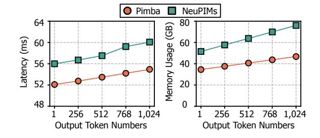

Figure 15: Latency and memory usage of NeuPIMs and Pimba as the number of generated output tokens increases with batch size 128.

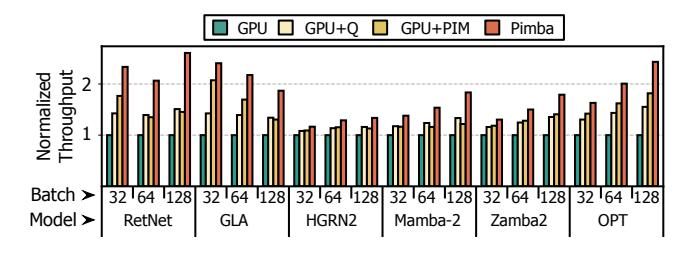

Figure 16: Normalized generation throughput on the baselines and Pimba with NVIDIA H100 GPU settings.

prior work [\[27\]](#page-13-15). Although Pimba incurs an area overhead approximately 1.5% larger than HBM-PIM, this increase is justified by delivering up to a 2.1× throughput improvement over HBM-PIM. Comparison with existing PIM-enabled system. We compare the latency and memory usage of Pimba with NeuPIMs [\[28\]](#page-13-12), a per-bank PIM-based acceleration solution tailored for attention operations. We use the Zamba2 70B model with batch size 128 and (1,024, 1,024) input/output lengths. Both systems use eight A100 GPUs with tensor parallelism. To ensure fairness, we match the timing parameters and the number of HBM stacks across both systems. Figure [15](#page-11-0) demonstrates that Pimba consistently achieves lower latency compared to NeuPIMs. This improvement arises primarily because Pimba efficiently offloads state update operations onto the PIM, a critical capability lacking in NeuPIMs. Moreover, Pimba exhibits latency scaling similar to NeuPIMs as the number of output tokens increases, despite utilizing half the number of processing units, not employing dual row buffers, and foregoing sub-batch interleaving techniques present in NeuPIMs. This is enabled through optimized command scheduling and the adoption of low precision representations for the KV cache. Additionally, Pimba consistently maintains lower memory usage compared to NeuPIMs, further underscoring the effectiveness of employing low precision representations for both state data and KV cache.

General adoption of Pimba. While our initial Pimba is based on the NVIDIA A100 GPU, it can be integrated with any GPU. To demonstrate this general applicability, Figure [16](#page-11-1) presents the normalized throughput of large scale LLMs using both baseline systems and Pimba under the NVIDIA H100 GPU configuration. All systems adopt 40 HBM3-based PIM modules operating at a memory bus frequency of 2.626GHz and an SPU frequency of 657MHz, matching

the memory bandwidth of the H100. They also use NVLink4 for GPU-to-GPU communication, which provides 900GB/s of bandwidth. Under this setting, Pimba exhibits a similar acceleration trend to that observed on the A100, consistently outperforming both the GPU and GPU+PIM baselines by 1.8× and 1.3× on average. These results demonstrate both the applicability and effectiveness of Pimba, regardless of the underlying GPU platform.

## 7 Related Work

Post-transformer accelerators. As post-transformer LLMs gain traction, the architecture community has initiated efforts to accelerate these models. Yoon et al. [\[82\]](#page-14-20) conducts a detailed characterization of the Hungry Hungry Hippos (H3) model, a variant of SSM, and highlights the generation phase as a major bottleneck. VGA [\[41\]](#page-13-43) identifies inefficiencies in Fast Fourier Transform (FFT) operations on GPUs in the H3 model and proposes an FFT-based convolution architecture to address these inefficiencies. MARCA [\[43\]](#page-13-44) focuses on accelerating the Mamba model, the predecessor of the Mamba-2 model, by introducing architectural optimizations for element-wise operations and nonlinear computations used in the model. However their scope is limited to SSM-based models, and even within SSMs, they target specific instances such as the H3 or Mamba models. In contrast, our work represents the first comprehensive analysis of a wide range of post-transformer models. We rigorously examine the computational patterns shared across many post-transformers and propose PIM-based acceleration that is broadly applicable.

PIM-based LLM serving systems. Recently, there has been significant research on PIM-based LLM serving systems [\[4,](#page-12-12) [7,](#page-12-13) [13,](#page-12-14) [27,](#page-13-15) [28,](#page-13-12) [32,](#page-13-33) [40,](#page-13-16) [67\]](#page-14-7). However, these systems predominantly target transformerbased LLMs, focusing on GEMV operations. Furthermore, they provide a limited exploration of integrating quantization techniques into PIM architectures. In contrast, Pimba targets both state update and attention operations for post-transformer LLM acceleration. To address the increased area overhead associated with this versatility, Pimba employs resource sharing and quantization techniques.

Quantization. Quantization techniques have garnered significant attention in both the algorithm and system communities as an effective solution for accelerating LLMs [\[30,](#page-13-13) [77,](#page-14-8) [84,](#page-14-9) [88\]](#page-14-10). Recently, research on quantization for post-transformer models has been actively pursued. Quamba [\[12\]](#page-12-15) and MambaQuant [\[78\]](#page-14-21) propose a technique for quantizing both activations and weights of the Mamba model to 8-bit. However, these works focus exclusively on activation and weight quantization and do not address state quantization, making them orthogonal to our research. Q-Mamba [\[71\]](#page-14-22) proposes Decoupled Scale Quantization, which employs an int8 format with decoupled scales for state quantization in the Mamba model. Although this approach is effective, it necessitates additional arithmetic operations and logic to manage scaling factors, thus limiting its practicality for PIM architectures. On the other hand, our work identifies that MX format [\[16\]](#page-12-7) achieves Pareto optimality in terms of the area-accuracy trade-off for PIM environments, and we incorporate this format into our design.

## 8 Discussion

Improving utilization. The operations in SU-LLM must be executed sequentially, leading to inherent data dependencies. To ensure correct ordering under these dependencies, GPU and PIM in Pimba alternate their execution in a blocked manner. This leads to underutilization of both GPU and PIM resources, degrading overall performance. Recent work, NeuPIMs [\[28\]](#page-13-12), proposes dual row buffers and sub-batch interleaving to address this issue. These techniques enable concurrent read/write operations and PIM command execution, and allow overlapping GPU and PIM execution across two sub-batches, thereby improving utilization. Note that the NeuPIMs techniques are orthogonal to our approach, as they focus primarily on system-level scheduling and architectural modifications to the row buffer design. Integrating such techniques into Pimba could effectively eliminate execution bubbles between GPU and PIM, thereby further improving overall resource utilization.

## 9 Conclusion

This paper presents Pimba, a Processing-in-Memory (PIM) accelerator designed to efficiently serve both transformer and posttransformer LLMs under the increasing demands of long-context, high-throughput inference. Through detailed workload characterization, we identify that state update–a central operation in post-transformer models–shares similar memory bandwidth bottlenecks with attention in transformer-based models, motivating a unified acceleration approach. Pimba addresses these challenges by combining in-memory computation with quantized execution, codesigning its architecture around two key principles: (1) maximizing hardware resource sharing to reduce area cost, and (2) selecting Pareto-optimal quantization formats for efficient and accurate execution. Our evaluation shows that fine-grained access interleaving and MX-based state update engines enable Pimba to deliver significant improvements in throughput and area efficiency. These results suggest Pimba's potential as a practical and generalizable solution for next-generation LLM serving infrastructure.

## Acknowledgments

We thank the anonymous reviewers for their comments and feedback. This work was supported by the Institute of Information & Communications Technology Planning & Evaluation (IITP) (No.RS-2024-00396013, No.2022-0-01037), IITP under the Graduate School of Artificial Intelligence Semiconductor (IITP-2025-RS-2023- 00256472), grant funded by the Korea government (MSIT). This work was also supported by Electronics and Telecommunications Research Institute (ETRI) grant funded by ICT R&D program of MSIT/IITP (No.RS-2025-02305453, Development of distributed inference and model optimization technology for heterogeneous Al semiconductors). The EDA tool was supported by the IC Design Education Center (IDEC), Korea.

## References

- [1] [n. d.]. Hello GPT-4o. [https://openai.com/index/hello-gpt-4o/.](https://openai.com/index/hello-gpt-4o/)
- [2] [n. d.]. Introducing OpenAI o1. [https://openai.com/o1/.](https://openai.com/o1/)
- [3] [n. d.]. The Llama 4 herd: The beginning of a new era of natively multimodal AI innovation. [https://ai.meta.com/blog/llama-4-multimodal-intelligence.](https://ai.meta.com/blog/llama-4-multimodal-intelligence)
- [4] Johnathan Alsop, Shaizeen Aga, Mohamed Ibrahim, Mahzabeen Islam, Andrew Mccrabb, and Nuwan Jayasena. 2024. Inclusive-PIM: Hardware-Software Codesign for Broad Acceleration on Commercial PIM Architectures. [https://arxiv.](https://arxiv.org/abs/2309.07984)

- [org/abs/2309.07984](https://arxiv.org/abs/2309.07984)
- [5] Jason Ansel, Edward Yang, Horace He, Natalia Gimelshein, Animesh Jain, Michael Voznesensky, Bin Bao, Peter Bell, David Berard, Evgeni Burovski, Geeta Chauhan, Anjali Chourdia, Will Constable, Alban Desmaison, Zachary DeVito, Elias Ellison, Will Feng, Jiong Gong, Michael Gschwind, Brian Hirsh, Sherlock Huang, Kshiteej Kalambarkar, Laurent Kirsch, Michael Lazos, Mario Lezcano, Yanbo Liang, Jason Liang, Yinghai Lu, C. K. Luk, Bert Maher, Yunjie Pan, Christian Puhrsch, Matthias Reso, Mark Saroufim, Marcos Yukio Siraichi, Helen Suk, Shunting Zhang, Michael Suo, Phil Tillet, Xu Zhao, Eikan Wang, Keren Zhou, Richard Zou, Xiaodong Wang, Ajit Mathews, William Wen, Gregory Chanan, Peng Wu, and Soumith Chintala. 2024. PyTorch 2: Faster Machine Learning Through Dynamic Python Bytecode Transformation and Graph Compilation. In ASPLOS.
- [6] Astral. [n. d.]. An extremely fast Python package and project manager, written in Rust. [https://docs.astral.sh/uv/.](https://docs.astral.sh/uv/)
- [7] Daehyeon Baek, Soojin Hwang, and Jaehyuk Huh. 2024. pSyncPIM: Partially Synchronous Execution of Sparse Matrix Operations for All-Bank PIM Architectures. In ISCA.
- [8] Rajeev Balasubramonian, Andrew B. Kahng, Naveen Muralimanohar, Ali Shafiee, and Vaishnav Srinivas. 2017. CACTI 7: New Tools for Interconnect Exploration in Innovative Off-Chip Memories. ACM Trans. Archit. Code Optim. 14, 2 (2017).
- [9] Maximilian Beck, Korbinian Pöppel, Markus Spanring, Andreas Auer, Oleksandra Prudnikova, Michael K Kopp, Günter Klambauer, Johannes Brandstetter, and Sepp Hochreiter. 2024. xLSTM: Extended Long Short-Term Memory. In NeurIPS.
- [10] Yonatan Bisk, Rowan Zellers, Ronan Le bras, Jianfeng Gao, and Yejin Choi. 2020. PIQA: Reasoning about Physical Commonsense in Natural Language. Proceedings of the AAAI Conference on Artificial Intelligence 34, 05 (2020), 7432–7439.
- [11] Sebastian Borgeaud, Arthur Mensch, Jordan Hoffmann, Trevor Cai, Eliza Rutherford, Katie Millican, George Bm Van Den Driessche, Jean-Baptiste Lespiau, Bogdan Damoc, Aidan Clark, Diego De Las Casas, Aurelia Guy, Jacob Menick, Roman Ring, Tom Hennigan, Saffron Huang, Loren Maggiore, Chris Jones, Albin Cassirer, Andy Brock, Michela Paganini, Geoffrey Irving, Oriol Vinyals, Simon Osindero, Karen Simonyan, Jack Rae, Erich Elsen, and Laurent Sifre. 2022. Improving Language Models by Retrieving from Trillions of Tokens. In ICML.
- [12] Hung-Yueh Chiang, Chi-Chih Chang, Natalia Frumkin, Kai-Chiang Wu, and Diana Marculescu. 2025. Quamba: A Post-Training Quantization Recipe for Selective State Space Models. In ICLR.
- [13] Jaehong Cho, Minsu Kim, Hyunmin Choi, Guseul Heo, and Jongse Park. 2024. LLMServingSim: A HW/SW Co-Simulation Infrastructure for LLM Inference Serving at Scale. In IISWC.
- [14] Peter Clark, Isaac Cowhey, Oren Etzioni, Tushar Khot, Ashish Sabharwal, Carissa Schoenick, and Oyvind Tafjord. 2018. Think you have Solved Question Answering? Try ARC, the AI2 Reasoning Challenge.<https://arxiv.org/abs/1803.05457>
- [15] Tri Dao and Albert Gu. 2024. Transformers are SSMs: Generalized Models and Efficient Algorithms Through Structured State Space Duality. In ICML.
- [16] Bita Darvish Rouhani, Ritchie Zhao, Venmugil Elango, Rasoul Shafipour, Mathew Hall, Maral Mesmakhosroshahi, Ankit More, Levi Melnick, Maximilian Golub, Girish Varatkar, Lai Shao, Gaurav Kolhe, Dimitry Melts, Jasmine Klar, Renee L'Heureux, Matt Perry, Doug Burger, Eric Chung, Zhaoxia (Summer) Deng, Sam Naghshineh, Jongsoo Park, and Maxim Naumov. 2023. With Shared Microexponents, A Little Shifting Goes a Long Way. In ISCA.
- [17] DeepSeek-AI, Daya Guo, Dejian Yang, Haowei Zhang, Junxiao Song, Ruoyu Zhang, Runxin Xu, Qihao Zhu, Shirong Ma, Peiyi Wang, Xiao Bi, Xiaokang Zhang, Xingkai Yu, Yu Wu, Z. F. Wu, Zhibin Gou, Zhihong Shao, Zhuoshu Li, Ziyi Gao, Aixin Liu, Bing Xue, Bingxuan Wang, Bochao Wu, Bei Feng, Chengda Lu, Chenggang Zhao, Chengqi Deng, Chenyu Zhang, Chong Ruan, Damai Dai, Deli Chen, Dongjie Ji, Erhang Li, Fangyun Lin, Fucong Dai, Fuli Luo, Guangbo Hao, Guanting Chen, Guowei Li, H. Zhang, Han Bao, Hanwei Xu, Haocheng Wang, Honghui Ding, Huajian Xin, Huazuo Gao, Hui Qu, Hui Li, Jianzhong Guo, Jiashi Li, Jiawei Wang, Jingchang Chen, Jingyang Yuan, Junjie Qiu, Junlong Li, J. L. Cai, Jiaqi Ni, Jian Liang, Jin Chen, Kai Dong, Kai Hu, Kaige Gao, Kang Guan, Kexin Huang, Kuai Yu, Lean Wang, Lecong Zhang, Liang Zhao, Litong Wang, Liyue Zhang, Lei Xu, Leyi Xia, Mingchuan Zhang, Minghua Zhang, Minghui Tang, Meng Li, Miaojun Wang, Mingming Li, Ning Tian, Panpan Huang, Peng Zhang, Qiancheng Wang, Qinyu Chen, Qiushi Du, Ruiqi Ge, Ruisong Zhang, Ruizhe Pan, Runji Wang, R. J. Chen, R. L. Jin, Ruyi Chen, Shanghao Lu, Shangyan Zhou, Shanhuang Chen, Shengfeng Ye, Shiyu Wang, Shuiping Yu, Shunfeng Zhou, Shuting Pan, S. S. Li, Shuang Zhou, Shaoqing Wu, Shengfeng Ye, Tao Yun, Tian Pei, Tianyu Sun, T. Wang, Wangding Zeng, Wanjia Zhao, Wen Liu, Wenfeng Liang, Wenjun Gao, Wenqin Yu, Wentao Zhang, W. L. Xiao, Wei An, Xiaodong Liu, Xiaohan Wang, Xiaokang Chen, Xiaotao Nie, Xin Cheng, Xin Liu, Xin Xie, Xingchao Liu, Xinyu Yang, Xinyuan Li, Xuecheng Su, Xuheng Lin, X. Q. Li, Xiangyue Jin, Xiaojin Shen, Xiaosha Chen, Xiaowen Sun, Xiaoxiang Wang, Xinnan Song, Xinyi Zhou, Xianzu Wang, Xinxia Shan, Y. K. Li, Y. Q. Wang, Y. X. Wei, Yang Zhang, Yanhong Xu, Yao Li, Yao Zhao, Yaofeng Sun, Yaohui Wang, Yi Yu, Yichao Zhang, Yifan Shi, Yiliang Xiong, Ying He, Yishi Piao, Yisong Wang, Yixuan Tan, Yiyang Ma, Yiyuan Liu, Yongqiang Guo, Yuan Ou, Yuduan Wang, Yue Gong, Yuheng Zou, Yujia He, Yunfan Xiong, Yuxiang Luo, Yuxiang You, Yuxuan Liu, Yuyang Zhou, Y. X. Zhu, Yanhong Xu, Yanping Huang, Yaohui Li, Yi Zheng,

- Yuchen Zhu, Yunxian Ma, Ying Tang, Yukun Zha, Yuting Yan, Z. Z. Ren, Zehui Ren, Zhangli Sha, Zhe Fu, Zhean Xu, Zhenda Xie, Zhengyan Zhang, Zhewen Hao, Zhicheng Ma, Zhigang Yan, Zhiyu Wu, Zihui Gu, Zijia Zhu, Zijun Liu, Zilin Li, Ziwei Xie, Ziyang Song, Zizheng Pan, Zhen Huang, Zhipeng Xu, Zhongyu Zhang, and Zhen Zhang. 2025. DeepSeek-R1: Incentivizing Reasoning Capability in LLMs via Reinforcement Learning.<https://arxiv.org/abs/2501.12948>
- [18] Jacob Devlin, Ming-Wei Chang, Kenton Lee, and Kristina Toutanova. 2019. BERT: Pre-training of Deep Bidirectional Transformers for Language Understanding. In ACL.
- [19] Shichen Dong, Wen Cheng, Jiayu Qin, and Wei Wang. 2024. QAQ: Quality Adaptive Quantization for LLM KV Cache.<https://arxiv.org/abs/2403.04643>
- [20] Xin Dong, Yonggan Fu, Shizhe Diao, Wonmin Byeon, ZIJIA CHEN, Ameya Sunil Mahabaleshwarkar, Shih-Yang Liu, Matthijs Van keirsbilck, Min-Hung Chen, Yoshi Suhara, Yingyan Celine Lin, Jan Kautz, and Pavlo Molchanov. 2025. Hymba: A Hybrid-head Architecture for Small Language Models. In ICLR.
- [21] Daniel Y. Fu, Tri Dao, Khaled K. Saab, Armin W. Thomas, Atri Rudra, and Christopher Ré. 2023. Hungry Hungry Hippos: Towards Language Modeling with State Space Models. In ICLR.
- [22] Albert Gu and Tri Dao. 2024. Mamba: Linear-Time Sequence Modeling with Selective State Spaces. In COLM.
- [23] Albert Gu, Tri Dao, Stefano Ermon, Atri Rudra, and Christopher Ré. 2020. HiPPO: recurrent memory with optimal polynomial projections. In NeurIPS.
- [24] Albert Gu, Karan Goel, and Christopher Ré. 2022. Efficiently Modeling Long Sequences with Structured State Spaces. In ICLR.
- [25] Albert Gu, Ankit Gupta, Karan Goel, and Christopher Ré. 2024. On the parameterization and initialization of diagonal state space models. In NeurIPS.
- [26] Albert Gu, Isys Johnson, Karan Goel, Khaled Kamal Saab, Tri Dao, Atri Rudra, and Christopher Re. 2021. Combining Recurrent, Convolutional, and Continuous-time Models with Linear State Space Layers. In NeurIPS.
- [27] Mingxuan He, Choungki Song, Ilkon Kim, Chunseok Jeong, Seho Kim, Il Park, Mithuna Thottethodi, and T. N. Vijaykumar. 2020. Newton: A DRAM-maker's Accelerator-in-Memory (AiM) Architecture for Machine Learning. In MICRO.
- [28] Guseul Heo, Sangyeop Lee, Jaehong Cho, Hyunmin Choi, Sanghyeon Lee, Hyungkyu Ham, Gwangsun Kim, Divya Mahajan, and Jongse Park. 2024. Neupims: Npu-pim heterogeneous acceleration for batched llm inferencing. In ASPLOS.
- [29] Nicholas J. Higham. 1993. The Accuracy of Floating Point Summation. SIAM Journal on Scientific Computing 14, 4 (1993), 783–799.
- [30] Coleman Hooper, Sehoon Kim, Hiva Mohammadzadeh, Michael W. Mahoney, Yakun Sophia Shao, Kurt Keutzer, and Amir Gholami. 2024. KVQuant: Towards 10 Million Context Length LLM Inference with KV Cache Quantization. In NeurIPS.
- [31] Wenjun Huang, Jiakai Pan, Jiahao Tang, Yanyu Ding, Yifei Xing, Yuhe Wang, Zhengzhuo Wang, and Jianguo Hu. 2024. ML-Mamba: Efficient Multi-Modal Large Language Model Utilizing Mamba-2.<https://arxiv.org/abs/2407.19832>
- [32] Bongjoon Hyun, Taehun Kim, Dongjae Lee, and Minsoo Rhu. 2024. Pathfinding Future PIM Architectures by Demystifying a Commercial PIM Technology. In HPCA.
- [33] Hao Kang, Qingru Zhang, Souvik Kundu, Geonhwa Jeong, Zaoxing Liu, Tushar Krishna, and Tuo Zhao. 2024. GEAR: An Efficient KV Cache Compression Recipe for Near-Lossless Generative Inference of LLM.<https://arxiv.org/abs/2403.05527>
- [34] Jared Kaplan, Sam McCandlish, Tom Henighan, Tom B. Brown, Benjamin Chess, Rewon Child, Scott Gray, Alec Radford, Jeffrey Wu, and Dario Amodei. 2020. Scaling Laws for Neural Language Models.<https://arxiv.org/abs/2001.08361>
- [35] Angelos Katharopoulos, Apoorv Vyas, Nikolaos Pappas, and François Fleuret. 2020. Transformers are RNNs: Fast Autoregressive Transformers with Linear Attention. In ICML.
- [36] Heesu Kim, Hanmin Park, Taehyun Kim, Kwanheum Cho, Eojin Lee, Soojung Ryu, Hyuk-Jae Lee, Kiyoung Choi, and Jinho Lee. 2021. GradPIM: A Practical Processing-in-DRAM Architecture for Gradient Descent. In HPCA.
- [37] Yoonsung Kim, Changhun Oh, Jinwoo Hwang, Wonung Kim, Seongryong Oh, Yubin Lee, Hardik Sharma, Amir Yazdanbakhsh, and Jongse Park. 2024. DACAPO: Accelerating Continuous Learning in Autonomous Systems for Video Analytics. In ISCA.
- [38] Woosuk Kwon, Zhuohan Li, Siyuan Zhuang, Ying Sheng, Lianmin Zheng, Cody Hao Yu, Joseph Gonzalez, Hao Zhang, and Ion Stoica. 2023. Efficient Memory Management for Large Language Model Serving with PagedAttention. In SOSP.
- [39] Tian Lan, Deng Cai, Yan Wang, Heyan Huang, and Xian-Ling Mao. 2023. Copy is All You Need. In ICLR.
- [40] Sukhan Lee, Shin-haeng Kang, Jaehoon Lee, Hyeonsu Kim, Eojin Lee, Seungwoo Seo, Hosang Yoon, Seungwon Lee, Kyounghwan Lim, Hyunsung Shin, Jinhyun Kim, O Seongil, Anand Iyer, David Wang, Kyomin Sohn, and Nam Sung Kim. 2021. Hardware Architecture and Software Stack for PIM Based on Commercial DRAM Technology : Industrial Product. In ISCA.
- [41] Seung-Yul Lee, Jihoon Hong, Hyunseung Lee, SangLyul Cho, and Jae W. Lee. 2024. VGA: Hardware Accelerator for Scalable Long Sequence Model Inference. In MICRO.
- [42] Patrick Lewis, Ethan Perez, Aleksandra Piktus, Fabio Petroni, Vladimir Karpukhin, Naman Goyal, Heinrich Küttler, Mike Lewis, Wen-tau Yih, Tim Rocktäschel,

- Sebastian Riedel, and Douwe Kiela. 2020. Retrieval-augmented generation for knowledge-intensive NLP tasks. In NeurIPS.
- [43] Jinhao Li, Shan Huang, Jiaming Xu, Jun Liu, Li Ding, Ningyi Xu, and Guohao Dai. 2025. MARCA: Mamba Accelerator with Reconfigurable Architecture. In ICCAD.
- [44] Haocong Luo, Yahya Can Tuğrul, F. Nisa Bostancı, Ataberk Olgun, A. Giray Yağlıkçı, and Onur Mutlu. 2024. Ramulator 2.0: A Modern, Modular, and Extensible DRAM Simulator. IEEE Computer Architecture Letters 23, 1 (2024), 112–116.
- [45] Stephen Merity, Caiming Xiong, James Bradbury, and Richard Socher. 2017. Pointer Sentinel Mixture Models. In ICLR.
- [46] Paulius Micikevicius, Sharan Narang, Jonah Alben, Gregory Diamos, Erich Elsen, David Garcia, Boris Ginsburg, Michael Houston, Oleksii Kuchaiev, Ganesh Venkatesh, and Hao Wu. 2018. Mixed Precision Training. In ICLR.
- [47] Mistral. [n. d.]. Codestral Mamba. [https://mistral.ai/news/codestral-mamba.](https://mistral.ai/news/codestral-mamba)
- [48] MosaicML NLP Team. [n. d.]. MPT-30B. [https://huggingface.co/mosaicml/mpt-](https://huggingface.co/mosaicml/mpt-30b)[30b.](https://huggingface.co/mosaicml/mpt-30b)
- [49] Niklas Muennighoff, Zitong Yang, Weijia Shi, Xiang Lisa Li, Li Fei-Fei, Hannaneh Hajishirzi, Luke Zettlemoyer, Percy Liang, Emmanuel Candes, and Tatsunori Hashimoto. 2025. s1: Simple test-time scaling. In Workshop on Reasoning and Planning for Large Language Models.
- [50] Nvidia. [n. d.]. Megatron-LM. [https://github.com/NVIDIA/Megatron-LM.](https://github.com/NVIDIA/Megatron-LM)
- [51] NVIDIA. [n. d.]. Nemotron-H: A Family of Accurate, Efficient Hybrid Mamba-Transformer Models. [https://research.nvidia.com/labs/adlr/nemotronh/.](https://research.nvidia.com/labs/adlr/nemotronh/)
- [52] Mike O'Connor, Niladrish Chatterjee, Donghyuk Lee, John Wilson, Aditya Agrawal, Stephen W. Keckler, and William J. Dally. 2017. Fine-grained DRAM: energy-efficient DRAM for extreme bandwidth systems. In MICRO.
- [53] Denis Paperno, Germán Kruszewski, Angeliki Lazaridou, Ngoc Quan Pham, Raffaella Bernardi, Sandro Pezzelle, Marco Baroni, Gemma Boleda, and Raquel Fernandez. 2016. The LAMBADA dataset: Word prediction requiring a broad discourse context. In ACL.
- [54] Jaehyun Park, Jaewan Choi, Kwanhee Kyung, Michael Jaemin Kim, Yongsuk Kwon, Nam Sung Kim, and Jung Ho Ahn. 2024. AttAcc! Unleashing the Power of PIM for Batched Transformer-based Generative Model Inference. In ASPLOS.
- [55] Sang-Soo Park, KyungSoo Kim, Jinin So, Jin Jung, Jonggeon Lee, Kyoungwan Woo, Nayeon Kim, Younghyun Lee, Hyungyo Kim, Yongsuk Kwon, Jinhyun Kim, Jieun Lee, YeonGon Cho, Yongmin Tai, Jeonghyeon Cho, Hoyoung Song, Jung Ho Ahn, and Nam Sung Kim. 2024. An LPDDR-based CXL-PNM Platform for TCO-efficient Inference of Transformer-based Large Language Models. In HPCA.
- [56] PCMag. [n. d.]. Zuckerberg's Meta Is Spending Billions to Buy 350,000 Nvidia H100 GPUs. [https://www.pcmag.com/news/zuckerbergs-meta-is-spending](https://www.pcmag.com/news/zuckerbergs-meta-is-spending-billions-to-buy-350000-nvidia-h100-gpus)[billions-to-buy-350000-nvidia-h100-gpus.](https://www.pcmag.com/news/zuckerbergs-meta-is-spending-billions-to-buy-350000-nvidia-h100-gpus)
- [57] Bo Peng, Eric Alcaide, Quentin Anthony, Alon Albalak, Samuel Arcadinho, Stella Biderman, Huanqi Cao, Xin Cheng, Michael Chung, Leon Derczynski, Xingjian Du, Matteo Grella, Kranthi Gv, Xuzheng He, Haowen Hou, Przemyslaw Kazienko, Jan Kocon, Jiaming Kong, Bartłomiej Koptyra, Hayden Lau, Jiaju Lin, Krishna Sri Ipsit Mantri, Ferdinand Mom, Atsushi Saito, Guangyu Song, Xiangru Tang, Johan Wind, Stanisław Woźniak, Zhenyuan Zhang, Qinghua Zhou, Jian Zhu, and Rui-Jie Zhu. 2023. RWKV: Reinventing RNNs for the Transformer Era. In EMNLP.
- [58] Bo Peng, Daniel Goldstein, Quentin Gregory Anthony, Alon Albalak, Eric Alcaide, Stella Biderman, Eugene Cheah, Teddy Ferdinan, Kranthi Kiran GV, Haowen Hou, Satyapriya Krishna, Ronald McClelland Jr., Niklas Muennighoff, Fares Obeid, Atsushi Saito, Guangyu Song, Haoqin Tu, Ruichong Zhang, Bingchen Zhao, Qihang Zhao, Jian Zhu, and Rui-Jie Zhu. 2024. Eagle and Finch: RWKV with Matrix-Valued States and Dynamic Recurrence. In COLM.
- [59] Michael Poli, Stefano Massaroli, Eric Nguyen, Daniel Y. Fu, Tri Dao, Stephen Baccus, Yoshua Bengio, Stefano Ermon, and Christopher Ré. 2023. Hyena hierarchy: towards larger convolutional language models. In ICML.
- [60] Sai Qian Zhang, Bradley McDanel, and H. T. Kung. 2022. FAST: DNN Training Under Variable Precision Block Floating Point with Stochastic Rounding. In HPCA.
- [61] Zhen Qin, Songlin Yang, Weixuan Sun, Xuyang Shen, Dong Li, Weigao Sun, and Yiran Zhong. 2024. HGRN2: Gated Linear RNNs with State Expansion. In COLM.
- [62] Liliang Ren, Yang Liu, Yadong Lu, yelong shen, Chen Liang, and Weizhu Chen. 2025. Samba: Simple Hybrid State Space Models for Efficient Unlimited Context Language Modeling. In ICLR.
- [63] Grand View Research. [n. d.]. Large Language Model Market Trends. [https://www.grandviewresearch.com/industry-analysis/large-language-model](https://www.grandviewresearch.com/industry-analysis/large- language-model-llm-market-report)[llm-market-report](https://www.grandviewresearch.com/industry-analysis/large- language-model-llm-market-report)
- [64] Keisuke Sakaguchi, Ronan Le Bras, Chandra Bhagavatula, and Yejin Choi. 2021. Winogrande: An adversarial winograd schema challenge at scale. Commun. ACM 64, 9 (2021), 99–106.
- [65] Satyabrata Sarangi and Bevan Baas. 2021. DeepScaleTool: A Tool for the Accurate Estimation of Technology Scaling in the Deep-Submicron Era. In ISCAS.
- [66] Timo Schick, Jane Dwivedi-Yu, Roberto Dessi, Roberta Raileanu, Maria Lomeli, Eric Hambro, Luke Zettlemoyer, Nicola Cancedda, and Thomas Scialom. 2023.

- Toolformer: Language Models Can Teach Themselves to Use Tools. In NeurIPS.
  [67] Minseok Seo, Xuan Truong Nguyen, Seok Joong Hwang, Yongkee Kwon, Guhyun Kim, Chanwook Park, Ilkon Kim, Jaehan Park, Jeongbin Kim, Woojae Shin, Jongsoon Won, Haerang Choi, Kyuyoung Kim, Daehan Kwon, Chunseok Jeong, Sangheon Lee, Yongseok Choi, Wooseok Byun, Seungcheol Baek, Hyuk-Jae Lee, and John Kim. 2024. IANUS: Integrated Accelerator based on NPU-PIM Unified Memory System. In ASPLOS.
- [68] Charlie Victor Snell, Jaehoon Lee, Kelvin Xu, and Aviral Kumar. 2025. Scaling LLM Test-Time Compute Optimally Can be More Effective than Scaling Parameters for Reasoning. In ICLR.
- [69] James E. Stine, Ivan Castellanos, Michael Wood, Jeff Henson, Fred Love, W. Rhett Davis, Paul D. Franzon, Michael Bucher, Sunil Basavarajaiah, Julie Oh, and Ravi Jenkal. 2007. FreePDK: An Open-Source Variation-Aware Design Kit. In MSE.
- [70] Yutao Sun, Li Dong, Shaohan Huang, Shuming Ma, Yuqing Xia, Jilong Xue, Jianyong Wang, and Furu Wei. 2023. Retentive Network: A Successor to Transformer for Large Language Models. https://arxiv.org/abs/2307.08621
- [71] Chen Tianqi, Yuanteng Chen, Peisong Wang, Weixiang Xu, Zeyu Zhu, and Jian Cheng. 2025. Q-Mamba: Towards more efficient Mamba models via post-training quantization. In ACL.
- [72] Terry Tolentino. 2024. Large language models: The Complete Guide for 2024.
- [73] Hugo Touvron, Louis Martin, Kevin Stone, Peter Albert, Amjad Almahairi, Yasmine Babaei, Nikolay Bashlykov, Soumya Batra, Prajjwal Bhargava, Shruti Bhosale, Dan Bikel, Lukas Blecher, Cristian Canton Ferrer, Moya Chen, Guillem Cucurull, David Esiobu, Jude Fernandes, Jeremy Fu, Wenyin Fu, Brian Fuller, Cynthia Gao, Vedanuj Goswami, Naman Goyal, Anthony Hartshorn, Saghar Hosseini, Rui Hou, Hakan Inan, Marcin Kardas, Viktor Kerkez, Madian Khabsa, Isabel Kloumann, Artem Korenev, Punit Singh Koura, Marie-Anne Lachaux, Thibaut Lavril, Jenya Lee, Diana Liskovich, Yinghai Lu, Yuning Mao, Xavier Martinet, Todor Mihaylov, Pushkar Mishra, Igor Molybog, Yixin Nie, Andrew Poulton, Jeremy Reizenstein, Rashi Rungta, Kalyan Saladi, Alan Schelten, Ruan Silva, Eric Michael Smith, Ranjan Subramanian, Xiaoqing Ellen Tan, Binh Tang, Ross Taylor, Adina Williams, Jian Xiang Kuan, Puxin Xu, Zheng Yan, Iliyan Zarov, Yuchen Zhang, Angela Fan, Melanie Kambadur, Sharan Narang, Aurelien Rodriguez, Robert Stojnic, Sergey Edunov, and Thomas Scialom. 2023. Llama 2: Open Foundation and Fine-Tuned Chat Models. https://arxiv.org/abs/2307.09288
- [74] Ashish Vaswani, Noam Shazeer, Niki Parmar, Jakob Uszkoreit, Llion Jones, Aidan N. Gomez, Łukasz Kaiser, and Illia Polosukhin. 2017. Attention is all you need. In NeurIPS.
- [75] Roger Waleffe, Wonmin Byeon, Duncan Riach, Brandon Norick, Vijay Korthikanti, Tri Dao, Albert Gu, Ali Hatamizadeh, Sudhakar Singh, Deepak Narayanan, Garvit Kulshreshtha, Vartika Singh, Jared Casper, Jan Kautz, Mohammad Shoeybi, and Bryan Catanzaro. 2024. An Empirical Study of Mamba-based Language Models. https://arxiv.org/abs/2406.07887
- [76] Naigang Wang, Jungwook Choi, Daniel Brand, Chia-Yu Chen, and Kailash Gopalakrishnan. 2018. Training deep neural networks with 8-bit floating point numbers. In *NeurIPS*.
- [77] Guangxuan Xiao, Ji Lin, Mickael Seznec, Hao Wu, Julien Demouth, and Song Han. 2023. Smoothquant: Accurate and efficient post-training quantization for large language models. In ICML.
- [78] Zukang Xu, Yuxuan Yue, Xing Hu, Dawei Yang, Zhihang Yuan, Zixu Jiang, Zhixuan Chen, Jiangyong Yu, XUCHEN, and Sifan Zhou. 2025. MambaQuant: Quantizing the Mamba Family with Variance Aligned Rotation Methods. In ICLR.
- [79] June Yong Yang, Byeongwook Kim, Jeongin Bae, Beomseok Kwon, Gunho Park, Eunho Yang, Se Jung Kwon, and Dongsoo Lee. 2024. No Token Left Behind: Reliable KV Cache Compression via Importance-Aware Mixed Precision Quantization. https://arxiv.org/abs/2402.18096
- [80] Songlin Yang, Bailin Wang, Yikang Shen, Rameswar Panda, and Yoon Kim. 2024. Gated Linear Attention Transformers with Hardware-Efficient Training. In ICML.
- [81] Yiran Ding and Li Lyna Zhang and Chengruidong Zhang and Yuanyuan Xu and Ning Shang and Jiahang Xu and Fan Yang and Mao Yang. 2024. LongRoPE: Extending LLM Context Window Beyond 2 Million Tokens. In ICML.
- [82] D. Yoon, T. Kim, J. W. Lee, and M. Rhu. 5555. A Quantitative Analysis of State Space Model-Based Large Language Model: Study of Hungry Hungry Hippos. IEEE Computer Architecture Letters 01 (5555), 1–4.
- [83] Gyeong-In Yu, Joo Seong Jeong, Geon-Woo Kim, Soojeong Kim, and Byung-Gon Chun. 2022. Orca: A Distributed Serving System for Transformer-Based Generative Models. In OSDI.
- [84] Ali Hadi Zadeh, Mostafa Mahmoud, Ameer Abdelhadi, and Andreas Moshovos. 2022. Mokey: enabling narrow fixed-point inference for out-of-the-box floating-point transformer models. In ISCA.
- [85] Rowan Zellers, Ari Holtzman, Yonatan Bisk, Ali Farhadi, and Yejin Choi. 2019. HellaSwag: Can a Machine Really Finish Your Sentence?. In ACL.
- [86] Susan Zhang, Stephen Roller, Naman Goyal, Mikel Artetxe, Moya Chen, Shuohui Chen, Christopher Dewan, Mona Diab, Xian Li, Xi Victoria Lin, Todor Mihaylov, Myle Ott, Sam Shleifer, Kurt Shuster, Daniel Simig, Punit Singh Koura, Anjali Sridhar, Tianlu Wang, and Luke Zettlemoyer. 2022. OPT: Open Pre-trained Transformer Language Models. https://arxiv.org/abs/2205.01068

- [87] Yu Zhang, Songlin Yang, Ruijie Zhu, Yue Zhang, Leyang Cui, Yiqiao Wang, Bolun Wang, Freda Shi, Bailin Wang, Wei Bi, Peng Zhou, and Guohong Fu. 2024. Gated Slot Attention for Efficient Linear-Time Sequence Modeling. In NeurIPS.
- [88] Yilong Zhao, Chien-Yu Lin, Kan Zhu, Zihao Ye, Lequn Chen, Size Zheng, Luis Ceze, Arvind Krishnamurthy, Tianqi Chen, and Baris Kasikci. 2024. Atom: Low-Bit Quantization for Efficient and Accurate LLM Serving. In MLSys.
- [89] Zyphra. [n. d.]. Zamba2. https://github.com/Zyphra/Zamba2.

### A Artifact Appendix

#### A.1 Abstract

In this work, we present PIMBA, a processing-in-memory acceleration solution for post-transformer large language models. Our artifact includes a full-system simulator for PIMBA as well as accuracy evaluation code. To ensure reproducibility and streamline the experimental workflow, we made two key engineering efforts: (1) The entire codebase relies solely on the modern project manager uv, allowing evaluators to install exactly the same versions of dependencies and build tools with a one-line command; and (2) we provide only two scripts—one to run all experiments and another to generate all figures from the results—to reduce the burden on evaluators. These two engineering efforts collectively enable a streamlined experimental workflow and maximize reproducibility.

Beyond the artifact evaluation, we also document the challenges we encountered while preparing the code and a breif API reference to assist those who wish to extend our codebase. We believe these resources will help those preparing artifact evaluations and aid future research efforts.

#### A.2 Artifact check-list

- Program: uv
- Compilation: gcc
- Model: Our code automatically downloads all required model weights from Hugging Face: RetNet, GLA, HGRN2, Mamba2, Zamba2, OPT, LLaMA
- Data sets: Our code automatically downloads all required datasets from Hugging Face: Wikitext2, Piqa, Lambada, Hellaswag, Arc-easy, Arc-challenge, Winogrande
- Run-time environment: CUDA, x86\_64
- Hardware: An NVIDIA GPU based on the Ampere architecture or newer, equipped with at least 24GB of memory
- Metrics: Perplexity, Accuracy, Throughput
- Output: PDF files for the figures, a CSV file for the table
- How much disk space required (approximately)?: The installation occupies about 100GB in the user's "\$HOME" directory, primarily due to models and datasets stored under "\$HOME/.cache/huggingface".
- How much time is needed to prepare workflow (approximately)?: 10 minutes
- How much time is needed to complete experiments (approximately)?: 15 hours
- Publicly available?: https://github.com/casys-kaist/pimba
- Archived (provide DOI)?: https://doi.org/10.5281/zenodo. 16946084

#### A.3 Description

How to access. Clone our public repository from github:
 \$ git clone https://github.com/casys-kaist/pimba

Hardware dependencies. Evaluators require an NVIDIA GPU based on the Ampere architecture or newer, with at least 24GB of memory (e.g., RTX 3090, RTX 4090, RTX 5090, A6000, A100, etc.). Software dependencies. Evaluators only need gcc and uv; all other required python packages and build tools are installed through uv. uv itself can be installed using the system package manager or via a one-line command provided in the official documentation [\[6\]](#page-12-16).

Models and data sets. During the experiments, our code automatically downloads all required models and datasets.

## A.4 Installation

With the following commands, uv automatically downloads the required dependencies and build tools (e.g., cmake, ninja) in exactly the same versions we used and compiles our project.

\$ uv sync

\$ uv run cmake --preset release

\$ uv run cmake --build build

## A.5 Experiment workflow

Evaluators can run all experiments with a single command:

\$ uv run python scripts/run.py

This command generates two files, "accuracy\_result.yaml" and "performance\_result.yaml", under the "res/" directory, which are then used to reproduce the figures and the table.

## A.6 Evaluation and expected results

Using the result files, evaluators can simply reproduce the figures and the table in the paper by executing the following command:

\$ uv run python scripts/draw.py

This process generates PDF files for the figures and a CSV file for the table in the "summary/" directory. Note that the PDF files do not include axis labels or legends, as we add them using external drawing tools. However, all scales and colors precisely match those in the paper, ensuring no issues arise when comparing values.

We also observed that accuracy may slightly vary with the GPU platform and CUDA version used for evaluation, especially in Table [2.](#page-10-1) However, the key trend we aim to convey in this paper remains consistent: quantization with MX8 has minimal impact on accuracy.