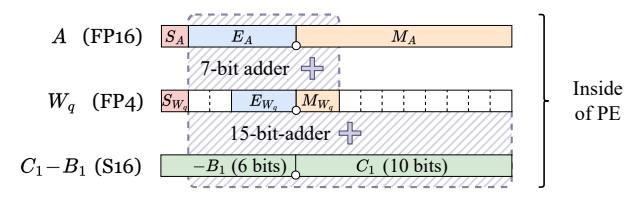
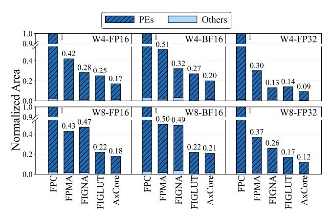
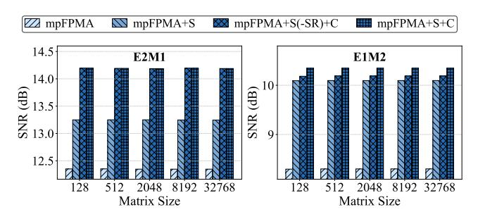
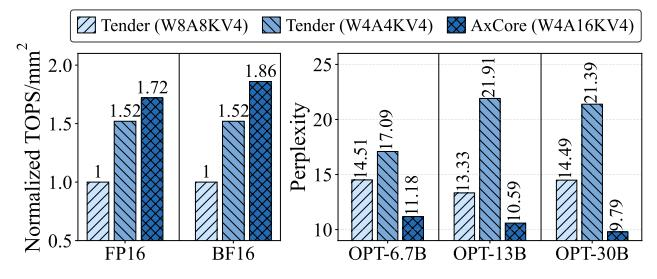

# AxCore: A Quantization-Aware Approximate GEMM Unit for LLM Inference

[Jiaxiang Zou](https://orcid.org/0009-0000-8613-2589)∗ The Hong Kong University of Science and Technology (Guangzhou) Guangzhou, China jiaxiangzou@std.uestc.edu.cn

[Yonghao Chen](https://orcid.org/0009-0008-6273-9894)∗ The Hong Kong University of Science and Technology (Guangzhou) Guangzhou, China ychen433@connect.hkust-gz.edu.cn

[Xingyu Chen](https://orcid.org/0009-0002-6028-0019) The Hong Kong University of Science and Technology (Guangzhou) Guangzhou, China xchen740@connect.hkust-gz.edu.cn

# [Chenxi Xu](https://orcid.org/0009-0001-0405-436X)

The Hong Kong University of Science and Technology (Guangzhou) Guangzhou, China cxu930@connect.hkust-gz.edu.cn

# [Xinyu Chen](https://orcid.org/0000-0003-1951-5015)†

The Hong Kong University of Science and Technology (Guangzhou) Guangzhou, China xinyuchen@hkust-gz.edu.cn

# Abstract

Large Language Models (LLMs) have become foundational to modern natural language processing, yet their immense computational and memory demands pose major obstacles for efficient inference. Transformer-based LLMs rely heavily on floating-point general matrix-matrix multiplication (FP-GEMM), which dominates both compute and bandwidth. In this paper, we introduce Ax-Core, a quantization-aware, approximate GEMM unit that combines weight-only quantization with floating-point multiplication approximation (FPMA) to deliver highly efficient and accurate LLM inference. Unlike traditional GEMM units, AxCore eliminates multipliers entirely, replacing them with low-bit integer additions in a novel systolic array. AxCore features several key innovations: (1) a mixedprecision FPMA-based processing element that supports direct computation on compressed weights and high-precision activations; (2) a lightweight accuracy preservation strategy, including subnormal number handling, error compensation, and format-aware quantization; and (3) a set of systolic array optimizations, including shared correction and normalization logic. Evaluations on opensource LLMs show that AxCore achieves up to 6.3×-12.5× higher compute density than conventional FP GEMM units. Compared to state-of-the-art INT4-based accelerators, FIGLUT and FIGNA, AxCore improves compute density by 53% and 70%, respectively, while also delivering lower perplexity. AxCore is opensourced at: [https://github.com/CLab-HKUST-GZ/micro58-axcore.](https://github.com/CLab-HKUST-GZ/micro58-axcore)

# CCS Concepts

• Computer systems organization → Systolic arrays.

Permission to make digital or hard copies of all or part of this work for personal or classroom use is granted without fee provided that copies are not made or distributed for profit or commercial advantage and that copies bear this notice and the full citation on the first page. Copyrights for components of this work owned by others than the author(s) must be honored. Abstracting with credit is permitted. To copy otherwise, or republish, to post on servers or to redistribute to lists, requires prior specific permission and/or a fee. Request permissions from permissions@acm.org.

MICRO '25, Seoul, Republic of Korea

© 2025 Copyright held by the owner/author(s). Publication rights licensed to ACM. ACM ISBN 979-8-4007-1573-0/25/10

<https://doi.org/10.1145/3725843.3756094>

# Keywords

Large Language Model, Approximate Computing, Weight-only Quantization, Hardware Accelerator

#### ACM Reference Format:

Jiaxiang Zou, Yonghao Chen, Xingyu Chen, Chenxi Xu, and Xinyu Chen. 2025. AxCore: A Quantization-Aware Approximate GEMM Unit for LLM Inference. In 58th IEEE/ACM International Symposium on Microarchitecture (MICRO '25), October 18–22, 2025, Seoul, Republic of Korea. ACM, New York, NY, USA, [15](#page-14-0) pages.<https://doi.org/10.1145/3725843.3756094>

# 1 Introduction

Large language models (LLMs) have revolutionized natural language processing tasks such as language understanding, translation, and generation [\[10,](#page-12-0) [42,](#page-13-0) [48,](#page-13-1) [53\]](#page-13-2). These models comprise multiple stacked transformer layers, containing billions to hundreds of billions of parameters, leading to substantial memory and computational demands. For instance, GPT-3, with 175 billion parameters, requires approximately 350GB of memory in FP16 representation [\[5\]](#page-12-1), far exceeding the capacity of standard hardware accelerators like GPUs [\[7\]](#page-12-2). The core computational bottleneck in LLMs stems from the transformer architecture, where general matrix-matrix multiplication (GEMM) operations dominate both arithmetic throughput and memory bandwidth. These GEMM kernels, typically implemented using floating-point arithmetic (e.g., FP16 or BF16), are hardware expensive, hindering efficient inference.

Quantization has emerged as a key technique to address these challenges by representing high-precision floating-point values with lower-precision data types. In particular, weight-only quantization, which compresses model weights into low-bit formats (e.g., INT4 or FP4) while preserving higher precision activations (e.g., FP16), has been widely adopted for LLM inference [\[12,](#page-12-3) [15,](#page-12-4) [26,](#page-12-5) [29,](#page-12-6) [30,](#page-12-7) [45\]](#page-13-3). This approach is effective because model weights consume significantly more memory than activations, and activations, being dynamic and input-dependent, are difficult to quantize without compromising model accuracy [\[29,](#page-12-6) [30,](#page-12-7) [51\]](#page-13-4). However, such quantization necessitates mixed-precision GEMM (mpGEMM) units, where specialized hardware directly handles high-precision activations with quantized weights, thereby eliminating the explicit dequantization step required by traditional GEMM units and improving both throughput and bandwidth efficiency [\[22,](#page-12-8) [40,](#page-13-5) [43,](#page-13-6) [46,](#page-13-7) [49,](#page-13-8) [50,](#page-13-9) [54\]](#page-13-10).

∗Both authors contributed equally to this research.

†Corresponding author.

- (a) Compute density comparison
- (b) Accuracy comparison

Figure 1: AxCore achieves significantly higher compute density and comparable or better perplexity compared to conventional FP GEMM cores (FPC) and state-of-the-art INT4-based accelerator FIGNA [22].

Meanwhile, floating-point multiplication approximation (FPMA) using integer addition has gained increasing attention for efficient model inference [24, 33, 36]. Mitchell's logarithm approximation [35] suggests that floating-point numbers can be interpreted within a logarithmic number system, while Gustafsson et al. [20] theoretically demonstrate that floating-point multiplication can be replaced with integer additions. This insight reveals that the costly floating-point multipliers in GEMM units can be substituted with simpler integer adders, offering significant resource savings for the intensive computations required by LLMs. While promising, existing FPMA methods are limited to uniform-precision settings and suffer from accuracy loss when applied to deep LLMs, particularly under low-bit quantization, where subnormal values are frequent and error accumulation is non-trivial.

In this paper, we propose **AxCore**, a quantization-aware, approximate mpGEMM unit tailored for LLM inference. AxCore fuses low-bit quantization with FPMA to deliver highly efficient, multiplier-free mix-precision matrix multiplication, while preserving end-to-end model accuracy. It is built upon the following innovations:

- Mixed-Precision FPMA Processing Elements (PEs): AxCore\nextends FPMA to support direct mpGEMM between high-precision
  activations and low-bit quantized weights, which reduces datapath width and PE complexity. The design supports multiple
  floating-point formats concurrently, enabling flexible inference
  across diverse quantization configurations.
- Lightweight Accuracy-Preserving Co-Design: To mitigate the approximation errors inherent in FPMA, AxCore introduces a lightweight software-hardware co-design featuring: (1) online subnormal number conversion for correctness in low-bit formats; (2) online constant-based error compensation; and (3) adaptive format-aware offline quantization.
- Optimized Systolic Array Architecture: AxCore employs a highly efficient systolic array architecture that shares error correction logic and result normalization logic across PEs to reduce hardware resource consumption.

Extensive evaluations show that AxCore delivers superior hardware efficiency and accuracy. As shown in Figure 1, in the W4A16 setting, AxCore achieves up to 6.7× higher compute density than conventional FP GEMM cores and 1.7× over INT4-based design, FIGNA [22]. Despite its approximate design, AxCore maintains competitive or even better perplexity compared to existing solutions.

For instance, on the OPT-30B model, AxCore achieves a perplexity of 9.78, outperforming both FPC (9.82) and FIGNA (9.95). AxCore enables efficient LLM inference by bridging the gap between approximate computing and mpGEMM operations.

## 2 Background

# 2.1 GEMM in LLM Inference

Large Language Models (LLMs) are typically composed of multiple stacked transformer decoder blocks [5, 42, 48, 53], each containing masked self-attention and linear transformation layers. While the attention mechanism offers reasoning capability of transformers, the linear layers, including feed-forward networks and attention projections, dominate the computational workload of LLM inference and contribute the majority of the model parameters [5, 10, 42, 48, 53]. These layers rely heavily on general matrix-matrix multiplication (GEMM) because their core computations are dense linear transformations that map high-dimensional input activations to output activations through large weight matrices.

Figure 2 illustrates the relative number of operations within attention mechanisms and linear layers across various sequence lengths for OPT-175B and LLaMA-3.1-405B. As shown, while the computational proportion of attention increases proportionally with sequence length during LLM inference, GEMM operations in linear layers continue to dominate the computational workload (69% - 99%) at practical sequence lengths (10k–20k tokens) [41]. Notably, during the prefill phase, GEMM is also predominantly used in attention [22], which means that the true computational proportion of GEMM is even larger. This trend highlights that optimizing linear layer GEMM remains critical for improving overall LLM inference efficiency at scale.

Figure 2: Relative proportion of operations (OPs) in attention mechanism and linear layers of OPT-175B and LLaMA-3.1-405B across various sequence lengths with a batch size of 32.

#### 2.2 Weight-only Quantization

To reduce both memory and computational overhead, quantization techniques are widely used in LLM inference. Quantization maps high-precision weights to compact low-bit formats (e.g., INT4 or FP4), significantly shrinking model size and reducing arithmetic bit width. In particular, weight-only quantization is especially practical for LLM inference. Model weights typically consume substantially more memory than activations, making weight quantization highly effective for reducing memory footprint and bandwidth requirements. In contrast, activations are dynamic and input-dependent, and aggressively quantizing them often results in significant accuracy loss [27]. As a result, weight-only quantization—where low-bit weights are combined with higher-precision activations (e.g., FP16

or BF16)—has become the standard in both academic research and industry practice, widely adopted in modern AI hardware accelerators such as GPUs and TPUs [15, 18, 28, 29, 39].

Quantization typically maps a weight w into a lower-bit representation  $w_a$  via a scaling factor s:

$$s = \frac{w_{\text{max}}}{F_{\text{max}}}, \quad w_q = \text{clamp}\left(\text{round}\left(\frac{w}{s}\right), -F_{\text{max}}, F_{\text{max}}\right), \quad (1)$$

where  $F_{\text{max}}$  is the maximum representable value in the target format (e.g., 7 for INT4). The *round* represents the rounding in integer quantization or mapping in floating-point quantization [32, 55]. The *clamp* constrains quantized weights within the representable range  $[F_{min}, F_{max}]$ .

To preserve accuracy under aggressive low-bit quantization, grouped quantization is often applied [15, 29, 55]. This strategy divides weight tensors into smaller groups (e.g., 32 or 128 elements) and assigns each group a dedicated scaling factor (typically in FP16). This fine-grained approach better captures local distributions within each group, reducing quantization error.

#### 2.3 Quantization-Aware GEMM

In LLM inference, GEMM operations involve multiplying large matrices of weights and activations. When executed without quantization, GEMM is performed using full-precision operands (e.g., FP16 × FP16) [5, 29, 42, 48, 53], as illustrated in Figure 3a. With weight-only quantization, there are two common GEMM execution strategies [15, 29, 49, 50]: indirect GEMM (Figure 3b), where quantized weights are first dequantized (i.e., multiplied by a scaling factor) to reconstruct floating-point values before GEMM is performed, and direct mixed-precision GEMM (mpGEMM) (Figure 3c), where GEMM is performed directly between low-bit weights and FP activations, followed by dequantization only on accumulated outputs. Direct mpGEMM is more hardware-efficient because it requires lightweight datapaths of GEMM units and avoids the overhead of per-weight dequantization [22, 40, 43, 46, 49, 50, 54].

(a) Standard GEMM (b) Indirect GEMM (c) Direct mpGEMM Figure 3: Comparison of GEMM computation modes, with 4-bit quantized weights and 16-bit activations.

To reduce the hardware complexity of mpGEMM units, many hardware accelerators adopt uniform quantization formats such as INT4 or INT8 due to their simplicity [22, 40, 54]. For instance, FIGNA [22] uses INT4 quantization and designed INT4-FP16 mp-GEMM units, delivering up to 4 *times* area savings. However, uniform formats distribute values evenly, which does not align well with Gaussian-like distribution of LLM weights [19]. By contrast, non-uniform formats (e.g., FP4, FP8) allocate more representation near zero, showing higher accuracy potential. In this work, we demonstrate that FP-based quantization offers superior accuracy

but also enables more efficient hardware implementation through our proposed AxCore architecture.

# 2.4 FP Multiplication Approximation with Integer Addition (FPMA)

Floating-point (FP) multiplication is a fundamental operation in many applications but remains costly in terms of hardware area due to its complexity. According to the IEEE 754 standard [1], a normalized floating-point (FP) number x is represented as:

$$x = (-1)^{S_x} \cdot 2^{E_x - B} \cdot (1 + M_x), \quad 0 \le M_x < 1,$$
 (2)

where  $S_X$  is the sign bit,  $E_X$  is the exponent represented using  $N_E$  bits (i.e.,  $N_E$  denotes the bit-width of the exponent field), and  $B = 2^{N_E-1}-1$  denotes the bias.  $M_X$  is the mantissa which is encoded using  $N_M$  bits and implicitly assumes a leading one. FP multiplication requires separate computation over sign, exponent, and mantissa, followed by normalization and rounding, leading to notable hardware costs.

To address this inefficiency, Floating-Point Multiplication Approximation (FPMA) [6, 20, 31] replaces expensive multiplication with simpler integer additions. Based on Mitchell's logarithmic approximation [35], FPMA approximates a floating-point number x into the logarithmic domain as:

$$\log_2(|x|) = E_x - B + \log_2(1 + M_x) \approx E_x - B + M_x \tag{3}$$

By linearizing the logarithmic term, the FP multiplication  $r = x \cdot y$  is approximated as:

$$\log_2(|r|) = \log_2(|x \cdot y|) \approx (E_x + M_x) + (E_y + M_y) - 2B$$
 (4)

Since the product r can also be denoted as  $log_2(|r|) \approx E_r + M_r - B$ , it enables the approximate multiplication to be implemented via:

$$R = X + Y - B \tag{5}$$

where  $X = E_x + M_x$ ,  $Y = E_y + M_y$ , and  $R = E_r + M_r$ , which is the binary approximation of the result. All additions are integer operations, eliminating the need for complex multipliers. Notably, the result R is already a standard floating-point value with its exponent and mantissa bits in order, requiring no special reconversion.

While FPMA offers substantial hardware efficiency, it introduces approximation error due to the linearization of the logarithmic term, i.e.,  $\log_2(1+M)\approx M$ . This simplification can lead to accuracy degradation in precision-sensitive models like LLMs. Additionally, FPMA assumes normalized floating-point numbers and is not directly applicable to subnormal numbers, which represent very small values and lack an implicit leading 1 in the mantissa.

# 3 Adopting FPMA for Quantized LLM Inference3.1 Challenges

While FPMA shows a large potential for improving hardware efficiency by replacing FP multipliers with lightweight integer adders, its adoption in quantized LLM inference remains challenging.

Challenge 1: Hardware Support for FPMA-based mpGEMM. Modern LLMs commonly use weight-only quantization, which results in mpGEMM operations, such as computing FP16 activations multiplied by FP4 or INT4 weights. While FPMA can be applied to

indirect GEMM (Figure 3b) by approximating full-precision multiplications after dequantization, this approach negates the efficiency benefits of quantization. To fully exploit low-bit representations, FPMA must support direct mpGEMM (Figure 3c) where weights remain compressed during computation.

However, traditional FPMA methods only support uniform precision (e.g., FP16  $\times$  FP16), and extending them to mpFPMA requires a fundamental redesign of the processing elements (PEs) and datapaths. The challenge lies in aligning operands of different formats, addressing bias mismatches, and maintaining adequate accuracy in integer-based approximation. Moreover, designing efficient mpGEMM units that can handle such mixed-precision integer-based computations with minimal datapath overhead and maximal reuse is non-trivial. Without careful architectural innovations, mpFPMA suffers from excessive datapath width, inefficient format alignment, and redundant correction logic in each PE, limiting its scalability and hardware efficiency.

#### Challenge 2: Preserving Accuracy with Minimal Costs.

FPMA relies on the approximation  $\log_2(1+M)\approx M$ , which introduces systematic error that accumulates across layers in deep models. Figure 4 shows the perplexity degradation when applying FPMA across different sizes of the OPT model. While FP4 introduces moderate accuracy loss compared to full-precision FP16, introducing FPMA leads to noticeably higher perplexity. Note that perplexity difference > 1% usually is considered as significant. This demonstrates that FPMA, when used without proper error compensation, can result in unacceptable performance degradation. Although prior works [31, 33] have introduced error compensation techniques, such as bit-serial correction or additional bias terms, to mitigate FPMA numerical error, these approaches are typically tailored for same-precision FPMA (e.g., FP16 × FP16). They do not generalize to mixed-precision FPMA (mpFPMA), where inputs differ in format and bit-width (e.g., FP16 × FP4).

Additionally, quantization into low-bit FP formats (e.g., FP4) generates a higher proportion of subnormal numbers due to significantly fewer exponent bits. This is because subnormals in low-bit formats can represent relatively large numerical ranges. However, without a hidden leading 1 in their mantissa, subnormals make FPMA mathematically incorrect, leading to significant inaccuracies. As shown in Figure 4, failing to handle subnormals properly in mpF-PMA (naive mpFPMA) leads to further degradation in perplexity, which is an issue largely ignored in existing works.

#### 3.2 Our Solution - AxCore

To address the above challenges, we propose **AxCore**, a quantization-aware, approximate mpGEMM unit that tightly integrates FPMA with low-bit quantization for efficient and accurate LLM inference.

# Feature 1: Efficient mpGEMM Execution via mpFPMA-based Systolic Array Unit.

To tackle the challenge of supporting mixed-precision GEMM with FPMA, AxCore introduces a systolic array of optimized mpFPMA PEs capable of directly computing on compressed low-bit weights and high-precision activations. To reduce datapath width and PE complexity, AxCore applies correction advancing, precomputing correction terms outside the PE and sharing them within rows. Normalization is deferred to a shared unit to reduce per-PE logic,

Figure 4: Perplexity comparison across different OPT model sizes using various computation methods. Activations are in FP16. FPMA and mpFPMA without subnormal handling result in significant accuracy loss.

while FPMA-based dequantization eliminates the need for post-GEMM multipliers.

#### Feature 2: Lightweight Accuracy Preservation Mechanisms.

To address the inherent error introduced by FPMA, AxCore employs a lightweight compensation mechanism designed specifically for mixed-precision settings. This includes precomputed bias and correction terms that stabilize outputs across diverse operand combinations. Crucially, each PE integrates a subnormal number conversion logic, which detects and converts subnormal values to the nearest normalized representations, preventing accuracy degradation caused by malformed mantissa. In addition, AxCore employs adaptive format-aware quantization, dynamically selecting the most suitable FP4 encoding (e.g., E1M2, E2M1, E3M0) per weight group. This fine-grained adaptability further enhances quantization fidelity across layers with varying value distributions. Together, these features enable AxCore to deliver high hardware efficiency while maintaining the accuracy required for LLM inference.

# 4 Accuracy-Preserved mpFPMA for LLM

#### 4.1 Extending FPMA to mpFPMA

To enable efficient mixed-precision general matrix-matrix multiplication (mpGEMM) for quantized LLM inference, we extend Floating-Point Multiplication Approximation (FPMA) to support operands with different precision levels. While the approximation formula remains structurally similar to conventional FPMA, the bit widths, fixed-point alignment, and bias correction must be carefully redesigned. For illustration, we denote  $r = a \times w_q$  as the multiplication between the input activation a in FP16 and the low-bit quantized weight  $w_q$  in FP4.

In mpFPMA, operands are first aligned to a common fixed-point representation to ensure correct addition. Since FP4 contains fewer mantissa bits than FP16, we left-shift (i.e., zero-pad) the FP4 operand's mantissa to match the resolution of FP16. The aligned value is expressed as:

$$Align(w_q) = w_q \ll (Mantissa_{FP16} - Mantissa_{FP4})$$
 (6)

This ensures the radix point aligns across both operands. However, due to differing exponent biases (e.g., 15 for FP16 vs. 1 for FP4 E2M1), a format-aware bias correction term  $B_1$  is needed:

$$B_1 = B_a + B_{w_q} - B_r (7)$$

where  $B_{\rm a}$ ,  $B_{w_q}$  and  $B_{\rm r}$  are the exponent biases of the activation, the quantized weight, and the result, respectively. For typical configurations where the activation and result are both in FP16, this simplifies to  $B_1=B_{w_q}$ . Combining the alignment and bias correction, the approximate result R of the mixed-precision product is:

$$R = A + Align(W_q) - B_1$$
 (8)

To illustrate, consider multiplying an FP4 (E2M1) weight encoded as "0\_01\_1" (representing 1.5) with an FP16 activation of 2. The aligned FP4 becomes "0\_00001\_1000000000", and the bias correction value  $B_1$  corresponds to 1. Adding the two and subtracting the bias yields a final result of 3, accurately approximating  $1.5 \times 2$ .

To improve the numerical fidelity of mpFPMA, especially under quantization noise and approximation error, we introduce a constant compensation term  $C_1$  (details in Section 4.3). The final mpFPMA expression becomes:

$$R = A + Align(W_a) - B_1 + C_1 \tag{9}$$

where R, A, and  $W_q$  are the binary approximation of the result, activations, and weights, respectively. This formulation allows Ax-Core to efficiently and accurately approximate mixed-precision multiplications using only integer additions.

# 4.2 Handling Subnormal Numbers in mpFPMA

As the bit width of floating-point numbers used in quantized LLM inference continues to shrink, particularly with formats like FP4, the handling of subnormal values becomes increasingly critical.

4.2.1 **Problems with Subnormal Numbers**. In floating-point formats, subnormal values are used to represent numbers that are very close to zero, smaller than what can be encoded with the lowest normalized exponent. These values help preserve gradual underflow and allow for finer resolution near zero. A subnormal number has an exponent of 0 and no implicit leading one:

$$x_{\text{sub}} = (-1)^S \cdot 2^{1-B} \cdot M$$
 (10)

with sign bit S, exponent bias B, and mantissa M. Compared to the normalized floating-point number (shown in Equation 2), this removes the "1+" in the mantissa and shifts the exponent range downward. As a result, FPMA approximation no longer holds mathematically due to its reliance on the approximation  $\log_2(1+M) \approx M$ , leading to significant inaccuracies.

Low-bit floating-point formats, such as FP4 or FP8, tend to encounter a much higher proportion of subnormal values compared to higher-precision formats like FP16 or FP32. This arises due to the significantly reduced number of exponent bits. For example, FP4 typically uses only 2 exponent bits, which limits the number of representable exponent values to just four. As a result, the range of normalized numbers is extremely narrow, meaning that many small-magnitude values fall outside this limited normalized range and are encoded as subnormals. While in higher-precision formats subnormals represent extremely rare edge cases with very small magnitudes (often below 10-38 in FP32), in low-bit formats like FP4, subnormals can represent relatively large values, sometimes as high as 0.5. This makes them much more common, particularly

**Table 1: Subnormal Number Conversion Table** 

| M1        |       |               |                   |           |  |  |  |  |
|-----------|-------|---------------|-------------------|-----------|--|--|--|--|
| subnormal | value | normal or 0   |                   | value     |  |  |  |  |
| (0).0     | 0     | $\rightarrow$ | return 0          | 0         |  |  |  |  |
| (0).1     | 0.5   | $\rightarrow$ | (1).0             | 0.5       |  |  |  |  |
| M2        |       |               |                   |           |  |  |  |  |
| subnormal | value |               | normal or 0       | value     |  |  |  |  |
| (0).00    | 0     | $\rightarrow$ | return 0          | 0         |  |  |  |  |
| (0).01    | 0.25  | $\rightarrow$ | (1).00 / return 0 | 0.5↑ / 0↓ |  |  |  |  |
| (0).10    | 0.5   | $\rightarrow$ | (1).00            | 0.5       |  |  |  |  |
| (0).11    | 0.75  | $\rightarrow$ | (1).10            | 0.75      |  |  |  |  |
|           | M3    |               |                   |           |  |  |  |  |
| subnormal | value |               | normal or 0       | value     |  |  |  |  |
| (0).000   | 0     | $\rightarrow$ | return 0          | 0         |  |  |  |  |
| (0).001   | 0.125 | $\rightarrow$ | return 0          | <u>0</u>  |  |  |  |  |
| (0).010   | 0.25  | $\rightarrow$ | (1).000 /return 0 | 0.5↑ / 0↓ |  |  |  |  |
| (0).011   | 0.375 | $\rightarrow$ | (1).000           | 0.5       |  |  |  |  |
| (0).100   | 0.5   | $\rightarrow$ | (1).000           | 0.5       |  |  |  |  |
| (0).101   | 0.625 | $\rightarrow$ | (1).010           | 0.625     |  |  |  |  |
| (0).110   | 0.75  | $\rightarrow$ | (1).100           | 0.75      |  |  |  |  |
| (0).111   | 0.875 | $\rightarrow$ | (1).110           | 0.875     |  |  |  |  |

in quantized weights where small values are frequent. Therefore, subnormals are no longer edge cases in low-bit formats and must be handled carefully in FPMA.

Figure 5: The value represented in subnormal encoding "011" and its equivalent normal encoding "010" in E1M2.

4.2.2 **Subnormal Number Conversion (SNC).** While FPMA support for subnormal values is largely overlooked in existing works, we address this problem by proposing a lightweight subnormal number conversion (SNC) method. We observe that subnormal and normal floating-point encodings can represent values that are numerically close. For instance, as shown in Figure 5, a subnormal value with mantissa "11" in FP4 (E1M2) represents the value  $(-1)^S \cdot 2^{(1-B)} \cdot (0+\frac{1}{2}+\frac{1}{4}) = (-1)^S \cdot 2^{(1-B)} \cdot 0.75$ , according to Equation 10. If we map it to the normalized encoding "10", according to Equation 2, this yields the value  $(-1)^S \cdot 2^{(0-B)} \cdot (1+\frac{1}{2}) = (-1)^S \cdot 2^{(1-B)} \cdot 0.75$ , which is equivalent to the original value in its subnormal form. Therefore, if we convert subnormal inputs to normalized values that are numerically nearest, the mathematical fidelity of FPMA for subnormal values can be preserved.

The conversion relationship between subnormals and normals is presented in Table 1. Because subnormal conversion primarily affects the mantissa, the table organizes the mappings by mantissa bit-width, covering three representative scenarios: M1, M2, and M3. In each case, the first column lists subnormal encodings (with an

Figure 6: Square error distribution of mpFPMA. The x-axis represents activation (FP16) mantissa  $M_a$ , and the y-axis represents weight mantissa  $M_w$  including E3M0, E1M2 and E2M1.

implicit leading zero), while the third column shows the corresponding normalized encodings (with an implicit leading one) that are numerically closest. The second and fourth columns indicate the actual decimal values these encodings represent.

At runtime, AxCore identifies subnormal encodings and replaces them with the nearest valid normalized values based on this predefined mapping. In cases where subnormal values cannot be exactly mapped to a normalized representation, the nearest normalized value is selected. These entries are marked with underlines in the table. Naively rounding all such values in a fixed direction (e.g., always up or down) can introduce systematic bias, which accumulates across matrix multiplications. To mitigate this, AxCore adopts a random selection policy between rounding up ( $\uparrow$ ) and rounding down ( $\downarrow$ ) when approximating subnormals. This strategy ensures that rounding decisions alternate evenly, balancing the accumulated error across large-scale computations.

#### 4.3 Error Compensation for mpFPMA

The approximation used in FPMA (i.e.,  $\log_2(1+M) \approx M$ ) introduces a predictable numerical error, which depends primarily on the mantissa values of the input operands.

4.3.1 Analysis of Error Distribution. To understand and address this, we analyze the error by comparing the approximated result with the exact multiplication result. Figure 6a illustrates the square error distributions for different bit-width mpFPMA configurations. The results reveal a highly non-uniform error distribution that varies across the mantissa space, making it difficult to establish a simple arithmetic relationship between errors and mantissa values for direct compensation [20].

While there are no effective error mitigation techniques specifically designed for mpFPMA, directly extending existing FPMA compensation strategies often incurs substantial overhead. Previous work [31] has used fine-grained compensation strategies by assigning individual compensation values for each  $M_a$ - $M_w$  pair to reduce errors in FP8 formats such as E4M3. However, as precision scales up from E4M3 to E5M10 for activations, the required on-chip storage makes such approaches impractical.

4.3.2 **Mean-Based Constant Compensation**. To overcome these limitations, we propose a constant-based mean compensation strategy that introduces a single, precomputed correction value  $C_1$  to reduce the cumulative approximation error in mpFPMA. This method leverages the observation that the average approximation error

across all possible mantissa combinations provides adequate error correction for LLMs. Figure 6b shows error distribution after applying the proposed compensation. To quantify the approximation error introduced by mpFPMA, we define the element-wise error as  $\varepsilon(m_a, m_w)$ , representing the discrepancy between the exact floating-point product and its approximate counterpart for each mantissa pair. To obtain a single correction value, we average the expected error across all valid mantissa combinations. This yields the format-specific compensation constant  $C_1$ , defined as:

$$C_1 = \frac{1}{2^{N_{M_w}} \cdot 2^{N_{M_a}}} \sum_{m_a, m_w} \varepsilon(m_a, m_w)$$
 (11)

where  $N_{M_w}$  is the bit-width of the weight mantissa, and  $m_a$ ,  $m_w$  denote the sets of representable mantissa values for the activation and weight, respectively.

Therefore, given the number of mantissa bits in the input data format, the error compensation value can be precomputed in a one-time process and applied universally for all models or layers with negligible overhead.

This approach has several practical advantages: it introduces no runtime overhead since compensation values can be precomputed; it requires minimal additional logic; and it generalizes easily across multiple FP format pairs, including FP16  $\times$  FP4, BF16  $\times$  FP4, FP16  $\times$  FP8, etc. Our experiments show that a single constant value per format pair achieves substantial accuracy recovery, making this method both efficient and effective for quantized LLM inference.

### 4.4 Adaptive Format-Aware Quantization

To preserve accuracy under aggressive quantization, we propose a format-aware method that supports multiple low-bit FP formats within a unified framework. This observation stems from the fact that weights within layers of LLMs exhibit increasingly diverse value distributions as the quantization granularity becomes finer [21]. Relying on a single low-bit format (e.g., E2M1) often results in suboptimal quantization when its range or resolution mismatches local data. Our format-aware quantization is novel in two ways: (a) it operates block-wise, allowing finer adaptation to local distributions; and (b) it is co-designed with AxCore's on-the-fly mixed-format processing to assign optimal FP4 formats (e.g., E3M0 for sparse, E1M2 for uniform data) per block. Consistent with NVIDIA's FP4 [38] and LLM-FP4 framework [32], these formats dedicate all bit patterns to encoding valid finite numbers.

4.4.1 **Block-wise Format Selection**. Rather than enforcing a fixed format or tensor-wise format across the model [19, 47], we adopt a block-wise adaptive strategy that selects the optimal FP4 format for each weight block. In the 4-bit quantization case, our approach considers three representative FP4 formats: E3M0 (power-of-two-like), E2M1 (standard), and E1M2 (uniform). Each of these formats provides different trade-offs between dynamic range and granularity, making them more or less suitable depending on the local weight distribution. This format selection is performed using an offline procedure where the weight matrix is first partitioned into blocks of size  $g \times n$ , where g represents the weight group size along the input channels and n denotes the number of output channels per block, with both n and g required to be a multiple of the GEMM array size. Each block contains n weight groups. For each block, we

Figure 7: Weight distribution of the attention output tensor for selected layers in Llama2-7B, illustrating the suitability of different FP4 formats.

evaluate all candidate formats by quantizing the n weight groups and selecting the format that minimizes the mean squared error under the actual input activation distribution using a calibration dataset [16]. This format selection objective is formulated as:

$$Dtype = argmin_{d \in \mathcal{D}} \|A \cdot W^d - A \cdot W\|_2^2$$
 (12)

where  $\mathcal{D}$  denotes the set of candidate FP4 data types E3M0, E2M1, E1M2,  $W^d$  represents the weight tensor after quantization and subsequent dequantization using a specific data type d, W corresponds to unquantized weight tensor, and A represents the activations. This format selection process therefore has a similar overhead to conventional static quantization [28].

Figure 7 visualizes the distribution of weights of attention output tensor in layer 0 and layer 29 of Llama2-7B. Specifically, Layer 0 and Layer 29 exhibit distinct distribution characteristics. In Layer 0, the weight distribution shows sharp peaks suitable for power-of-two-like encoding, and our method selects the FP4 E3M0 format accordingly. In contrast, Layer 29 shows a wider and more uniform distribution, where FP4 E1M2 and E2M1 are more appropriate.

4.4.2 **Integration with FPMA**. We also extend this format-aware quantization to integrate seamlessly with FPMA. Unlike conventional quantization:

$$w_q = \text{clamp}\left(\text{round}\left(\frac{w}{s}\right)\right)$$
 (13)

we redefine quantization and dequantization using FPMA-style approximation:

$$w_q = \text{clamp (round } (w - S + B - C)) \tag{14}$$

$$w_r = w_q + S - B + C_2 (15)$$

Here, S, B, C, and  $C_2$  are precomputed constants representing the binary representation of FP number scale, bias, and format-specific compensation terms, respectively. C represents the compensation applied during quantization, while  $C_2$  denotes the compensation applied during dequantization. Combining Equation 14 and Equation 15 yields:

$$w_r \approx w$$
 (16)

showing that the FPMA compensation values C and  $C_2$  can cancel out, thereby preserving the original value and ensuring correctness.

While conventional floating-point quantization and reconstruction (i.e.,  $w \to w_q \to w_r$ ) introduce numerical drift due to division and multiplication inaccuracies, FPMA-based quantization relies

Figure 8: AxCore systolic spatial array architecture.

only on addition and subtraction, which exhibit less rounding bias and improved numerical consistency.

#### 5 AxCore Architecture

#### 5.1 Overview

In the weight-stationary dataflow of AxCore, quantized low-bit weights (e.g., FP4) are pre-loaded and held stationary within the PEs of each column, while high-precision activations (e.g., FP16) are propagated horizontally across each row. A centralized PreAdd unit pre-computes an intermediate value, T, by applying correction terms to the activation. This is calculated using the formula  $T = A - B_1 + C_1$ , where A is the high-precision activation,  $B_1$  is the exponent bias correction, and  $C_1$  is the format-specific compensation constant. The resulting values are then propagated along the row to minimize logic duplication across PEs.

Inside each PE, AxCore introduces a carefully pipelined microarchitecture. The incoming low-bit weight passes through a dedicated Subnormal Number Conversion (SNC) unit. This module identifies subnormal values and remaps them to nearby normalized representations on a per-format basis. The output of the SNC is unified into a shared internal format (e.g., S1E3M2), allowing downstream logic to remain format-agnostic. This enables support of multiple FP formats (e.g., E3M0, E2M1, E1M2 for FP4) concurrently across the array, which is essential to enable adaptive format-aware quantization. The aligned weight is then summed with the previously computed T using a lightweight integer adder, a simple 2-input addition that replaces traditional multipliers entirely.

Post-processing consists of three stages: Normalization, to adjust the result into standard floating-point format; AxScale, which replaces dequantization multipliers with FPMA-based addition logic for efficient scaling; and Accumulator, which adds scaled partial sums with previously stored values.

## 5.2 mpFPMA Processing Elements

5.2.1 **Overview**. As depicted in Figure 9, each PE is logically composed of two sequential blocks: an Approximate Multiplication (Approx Mult) block and an Accumulation block. The PE receives two primary inputs: the low-bit quantized weight  $W_q$  and the precomputed intermediate value T from the PreAdd unit. The term T is computed externally by the PreAdd unit and propagated across

Figure 9: Architecture of Processing Element in AxCore.

Figure 10: Subnormal Number Conversion (SNC) unit.

all PEs in a row. Upon entering the PE, the quantized weight  $W_q$  is first processed by the SNC unit. This module identifies subnormal values and maps them to the nearest normalized representation. The SNC-processed weight undergoes mantissa alignment. Since the precision of weights is typically lower than that of activations, the weight's mantissa is zero-padded to match the activation's fixedpoint domain. The aligned weight is then added to the term T via a low-bit integer adder, completing the function of the Approx Mult block and yielding the product  $R = T + Align(W_q)$ . The product R is then processed by the Accumulation block, which includes a Guard Unit that checks whether either the activation or weight is zero. If either input is zero, the Guard Unit enforces the output *R* to be zero. The resulting value R is then forwarded to a Partial Floating-Point Adder, which accumulates it with the vertically propagated partial sum  $P_{\text{sum}}$ . This adder, which shares the same width as the activation input, performs accumulation in-place and defers full normalization and rounding to the post-processing stages.

5.2.2 **Subnormal Number Conversion (SNC) module.** The architecture of the SNC unit is presented in Figure 10a, where FP4 is used as the example weight format. SNC unit receives an input quantized weight  $W_q$ , which may be encoded using one of several FP4 subtypes: E1M2, E2M1, or E3M0, as illustrated in Figure 10b. The FormatSe1 signal selects the appropriate format-specific decoder (e.g., M2 Cvt, M1 Cvt), and the input is routed accordingly. Within each decoder block, a small logic table checks for subnormal encodings (e.g., S-0-00) and maps them to nearby normalized values. Since input  $W_q$  may contain both normal and subnormal values, the SNC includes a bypass path for normal entries.

The Zero Flag unit detects all-zero inputs and signals this condition to the downstream Guard unit. Beyond basic zero detection, it also facilitates stochastic rounding for subnormal values that lack exact normalized representations. Since rounding down always

Figure 11: Optimizations for resource sharing across PEs, including advanced correction in PreAdd module and post-poned normalization in Norm module.

results in zero, the Zero Flag is leveraged to control the rounding direction. When a subnormal value requires randomized rounding, the Zero Flag is set using a stochastic bit, sampled from the most significant mantissa bit of the activation. Otherwise, it is determined through conventional zero detection. This mechanism enables alternating rounding directions and reduces bias in repeated approximations.

The converted outputs are all transformed into a unified internal format: S1E3M2. As illustrated in Figure 10b. The reason for choosing S1E3M2 is to provide a common representation that supports all FP4 subtypes simultaneously, enabling adaptive format-aware quantization in AxCore. This design allows each group of weights to flexibly select the most appropriate FP4 encoding format (E1M2, E2M1, or E3M0) during quantization based on distribution characteristics, while still maintaining hardware simplicity during inference.

#### 5.3 Systolic Array Optimizations

5.3.1 **Correction Advancing**. In mixed-precision FPMA (mpF-PMA), the approximate multiplication result is computed as  $R = A + W_q - B_1 + C_1$ , where  $B_1$  and  $C_1$  are bias correction and compensation terms determined solely by the FP formats of the operands. Since these correction values are constant per GEMM row and independent of the weight values  $W_q$ , AxCore extracts their computation from each PE and relocates it into a centralized PreAdd module (shown in Figure 11b). This module computes the shared term  $T = A - B_1 + C_1$  once per row and streams it to all PEs. As a result, each PE only needs to perform a lightweight integer addition  $R = T + \text{Align}(W_q)$ , significantly simplifying its datapath and reducing silicon area.

Figure 12 compares mpFPMA PE designs with and without this technique. In the baseline design (Figure 12a), each PE directly receives the high-precision activation A (e.g., FP16) and the SNC-processed weight  $W_q$  (e.g., FP4). Since the SNC output is expressed in the S1E3M2 format and must be aligned with the FP16 exponent domain, computing  $A+W_q$  requires a 7-bit adder (5 bits from the aligned exponent and a 2 bits from mantissa). To apply correction, a separate 15-bit adder is required to compute  $C_1-B_1$ , which spans both exponent and mantissa fields. The combined term  $C_1-B_1$  can be efficiently viewed as a concatenation of  $-B_1$  and  $C_1$ , because they operate over different bit fields. While functionally effective,

(a) mpFPMA PE without Correction Advancing

(b) mpFPMA PE with Correction Advancing.

Figure 12: Comparison of different designs of mpFPMA.

this double-adder structure requires wide datapaths and substantial logic replication in every PE. In contrast, with Correction Advancing, as depicted in Figure 12b, the activation A is combined with  $-B_1+C_1$  in a 15-bit adder outside the systolic array. The result is a precomputed value T, which is passed along a row of PEs. Each PE then adds T to the aligned  $W_q$  using only a 7-bit adder, which is sufficient for E3M2 weights and FP16 activations (E5M10).

5.3.2 **Normalization Postponing**. Floating-point additions in traditional GEMM architectures typically include in-PE normalization to maintain accuracy. However, this approach introduces significant area and delay due to operations like leading-zero detection (LZD), bit shifting, and rounding. Inspired by [14, 23], AxCore postpones normalization to a shared Norm module outside the PEs, and keeps  $N_{M_a}$  + 2 bit-width mantissa (where  $N_{M_a}$  is the activation mantissa width) to maintain numerical accuracy and additional integer bits needed to prevent overflow. Each PE accumulates partial results without normalization, producing intermediate sums composed of separate fields (sign, exponent, integer, fraction), as shown in Figure 11a. These results are passed to the Norm module, where a pipelined normalization process finalizes the output. This includes components such as Abs, LZD, Cmp, and Round, as shown in Figure 11c. Offloading normalization from each PE to a shared module reduces logic duplication by a factor of n in an  $n \times n$  array, enhancing scalability and energy efficiency.

5.3.3 **FPMA-based Dequantization**. Group-wise quantization requires each output channel to be scaled by a floating-point scaling factor. Rather than using a multiplier, AxCore implements this dequantization using FPMA, forming the basis of the AxScale module. After accumulation, the output  $O_q$  is dequantized as:

$$O = O_q + S - B + C_2 (17)$$

where S is the binary representation of the scale factor, B is the format-specific bias, and  $C_2$  is a compensation constant. This design

Figure 13: Architecture of AxCore-based LLM Accelerator.

reduces the dequantization logic to two integer additions, enabling low-cost scaling in the post-processing pipeline.

#### 5.4 AxCore-Powered LLM Inference Accelerator

Figure 13 illustrates the full system architecture of the AxCorebased LLM inference accelerator. Similar to existing accelerators [22, 40], the design is organized around a tightly integrated GEMM pipeline optimized for quantized models. At the core of the accelerator lies the GEMM Unit (AxCore), structured as a 2D array of processing Tiles, each composed of multiple mpFPMA PEs. To prepare data for computation, a Weight Buffer stores quantized model weights, while a Unified Buffer handles activations and intermediate data. The architecture also includes a Vector Unit, which assists with layer-wise vector operations, and a Control Unit (CTRL) that orchestrates the instruction scheduling and data flow. Data communication with off-chip DRAM is managed through the memory interface linked to the buffers. This modular and systolic-friendly design allows AxCore to efficiently support large-scale transformer inference under low-bit quantization.

# 6 Evaluation

#### 6.1 Experimental Setup

6.1.1 Accuracy Evaluation Setup. We evaluate AxCore and baseline designs on two widely used LLM families: OPT and LLaMA2. All models are quantized to 4-bit using established weight-only quantization methods [12], with group sizes of 128 for OPT and 64 for LLaMA2 [11, 15, 29]. For block-wise adaptive format quantization, a small calibration set from the Pile dataset [16] is used to prevent overfitting. The block size is set to 128 × 64 for OPT and 64 × 64 for LLaMA2. Following prior work [22, 40], we evaluate model performance on WikiText-2 [34] using perplexity (PPL) with a sequence length of 2048, where lower values indicate better accuracy. Additionally, for zero-shot evaluation, we use four benchmark datasets: ARC-e [8], HellaSwag [52], PiQA [4], and Winogrande [2], evaluated via the lm-eval-harness framework [17].

6.1.2 **Hardware Evaluation Setup**. To assess hardware efficiency, we implement AxCore in SpinalHDL [13] and synthesize the generated Verilog RTL using Synopsys Design Compiler with 28nm TSMC technology node. All designs are synthesized under the same target frequency (1GHz) and normalized to deliver equal peak throughput measured in TOPS. For a fair comparison, baseline and AxCore designs share a  $64 \times 64$  systolic array configuration with  $4 \times 64$  systolic array configuration with  $4 \times 64$  systolic array configuration with  $4 \times 64$  systolic array configuration with  $4 \times 64$  systolic array configuration with  $4 \times 64$  systolic array configuration with  $4 \times 64$  systolic array configuration with  $4 \times 64$  systolic array configuration with  $4 \times 64$  systolic array configuration with  $4 \times 64$  systolic array configuration with  $4 \times 64$  systolic array configuration with  $4 \times 64$  systolic array configuration with  $4 \times 64$  systolic array configuration with  $4 \times 64$  systolic array configuration with  $4 \times 64$  systolic array configuration with  $4 \times 64$  systolic array configuration with  $4 \times 64$  systolic array configuration with  $4 \times 64$  systolic array configuration with  $4 \times 64$  systolic array configuration with  $4 \times 64$  systolic array configuration with  $4 \times 64$  systolic array configuration with  $4 \times 64$  systolic array configuration with  $4 \times 64$  systolic array configuration with  $4 \times 64$  systolic array configuration with  $4 \times 64$  systolic array configuration with  $4 \times 64$  systolic array configuration with  $4 \times 64$  systolic array configuration with  $4 \times 64$  systolic array configuration with  $4 \times 64$  systolic array configuration with  $4 \times 64$  systolic array configuration with  $4 \times 64$  systolic array configuration  $4 \times 64$  systolic array configuration  $4 \times 64$  systolic array configuration  $4 \times 64$  systolic array configuration  $4 \times 64$  systolic array configuration  $4 \times 64$  systolic array configuration  $4 \times 64$  systolic array configuration  $4 \times 64$  systolic array configuration  $4 \times 64$  systolic array configuration  $4 \times 64$  sys

Figure 14: Normalized area breakdown of processing element (PE) under different formats.

4 tilings. To explore performance across various precision settings, we define evaluation scenarios spanning combinations of weight types (INT4, FP4, INT8, FP8) and activation formats (FP16, BF16, FP32). We develop a simulator based on the open-source cycle-level simulator DNNWeaver [44] to evaluate performance. The SRAM module's power is simulated using CACTI [37]. All the accelerator designs are configured with identical SRAM sizes.

6.1.3 **Baselines**. We compare AxCore against four representative GEMM accelerator baselines: a floating-point GEMM core (FPC) [22], FPMA, FIGNA [22], FIGLUT [40] and Tender [25]. **FPC**: Uses standard floating-point fused-multiply-add (FMA) units in each PE, with FP32 accumulators, aligning with FIGNA and FIGLUT configurations. **FPMA**: Replaces FP multipliers with original FPMA logic. Use FP16/BF16 adders for FP16/BF16 activations and FP32 adders for FP32 activations for in-PE accumulation. **FIGNA**: A state-of-the-art FP-INT mixed-precision GEMM unit designed for weight-only quantized LLMs. **FIGLUT**: A state-of-the-art LUT-based FP-INT GEMM design for LLMs. **Tender**: A state-of-the-art INT-based non-mix-precision GEMM design for LLMs.

#### 6.2 Area Efficiency

6.2.1 Area Efficiency of mpFPMA PEs. Figure 14 presents the normalized area breakdown of a single PE under six data type configurations. The breakdown includes multiplication logic, addition logic, subnormal number conversion (SNC), and other components. FIGLUT lacks detailed component data, so its area is grouped under "Others." Among all designs, FPC incurs the highest area due to costly floating-point units, while FPMA reduces multiplier area via approximation. AxCore achieves the smallest PE area across all formats, attributed to its mpFPMA design that eliminates multipliers. Compared to FIGLUT, AxCore reduces PE area by up to 34% in the W4-FP32 case, and by 31% and 22% in the W4-FP16 and W4-BF16 configurations, respectively. Compared to FIGNA, AxCore reduces PE area by 32%–39% in 4-bit formats and 43%–56% in 8-bit formats. Notably, the SNC unit in AxCore introduces minimal overhead, accounting for only 3.5% of the total PE area on average.

6.2.2 **Area Efficiency Across GEMM Designs**. Figure 15 presents the normalized area breakdown of the GEMM unit across different designs and data formats. The area breakdown is categorized into two types: the array composed of all PEs, and Others, which consist of various pre-processing and post-processing modules located

Figure 15: Normalized area breakdown of the GEMM unit under six input format configurations, decomposed into the PE array and shared modules (Others).

along the data path for activations. AxCore consistently achieves the lowest area across all settings, outperforming both FIGNA and FIGLUT. In 4-bit weight scenarios, AxCore reduces total area by 31%, 26%, and 34% compared to FIGLUT for W4-FP16, W4-BF16, and W4-FP32, respectively, and by 37%, 36%, and 29% compared to FIGNA. In 8-bit settings, AxCore achieves an average area reduction of 25% over FIGLUT and over 55% compared to FIGNA.

## 6.3 Compute Density

Figure 16 presents the normalized compute density (TOPS/mm²) of the GEMM array across six input format configurations, focusing on the PE array and excluding final accumulation stages. Results are normalized to the conventional FP32 design (FPC). AxCore consistently delivers the highest compute density across all formats due to its compact mpFPMA datapath, multiplier-free design, and centralized correction logic. In the W4-FP16 setting, AxCore achieves a 6.7× improvement over FPC, significantly outperforming FIGNA (4.0×) and FIGLUT (4.3×). In the W4-FP32 setting, AxCore achieves a 12.5× improvement over FPC and outperforms FIGNA and FIGLUT by 1.4× and 1.5×, respectively. Similar trends are observed in other formats: AxCore reaches 5.3× in W4-BF16, and 6.2× in W8-FP16. Even in higher-precision configurations like W8-FP32, AxCore maintains a 10× density gain over FPC.

### 6.4 Energy Efficiency

Figure 17 presents the normalized energy breakdown and TOPS/W of AxCore and baseline accelerators across multiple input data types evaluated on two OPT models (13B and 30B). We measure energy during the decoding phase with a batch size of 32 and an output sequence length of 1, which is aligned with baselines [22, 40]. All designs have been provided with adequate bandwidth. Among all evaluated configurations, AxCore consistently demonstrates superior energy efficiency, achieving the lowest energy consumption and highest TOPS/W. Both FIGNA and FIGLUT show markedly increased energy consumption in 8-bit scenarios: FIGNA's multiplier overhead scales quadratically with computational bit-width, while FIGLUT's bit-serial architecture necessitates extended computation cycles, increasing energy expenditure. On average, AxCore

Figure 16: Normalized compute density (TOPS/mm²) of the GEMM array across six input format configurations.

achieves averaged  $2.2\times$ ,  $1.5\times$ ,  $1.1\times$  and  $1.3\times$  total energy reduction and  $6.4\times$ ,  $3.1\times$ ,  $1.4\times$  and  $2.0\times$  TOPS/W improvement over FPC, FPMA, FIGNA, and FIGLUT, respectively.

### 6.5 Accuracy Evaluation

6.5.1 End-to-end model accuracy. Table 2 compares the perplexity of AxCore against baseline accelerators. It also shows an ablation study of our optimizations: subnormal number conversion (SNC), constant compensation and format-aware quantization. FPMA uses FP4 round-to-nearest quantization; FIGNA is evaluated using GPTQ quantization [15]; and FIGLUT results are from its published paper [40]. All methods employ symmetric quantization, with a group size of 128 for OPT models and 64 for LLaMA 2 models. Since FIGNA and FIGLUT do not quantize the attention layers, the accuracy reflects linear layer quantization. As shown in Table 2, AxCore consistently delivers competitive or superior perplexity across model sizes. For OPT models (2.7B to 30B), AxCore matches or outperforms existing 4-bit accelerator designs, achieving the lowest perplexity in cases such as OPT-6.7B and OPT-13B. Similarly, on LLaMA 2 models (7B and 70B), AxCore maintains accuracy close to FP16 and performs better than FIGNA and FPMA.

6.5.2 **KV** cache quantization. Alongside linear layers, attention mechanisms are key to LLM inference. To support end-to-end inference on AxCore, we quantize the KV cache to 4 bits with a group size of 64 along the accumulation dim. For OPT models, we use E1M2 for the K cache and E3M0 for the V cache; for LLaMA2 models, E2M1 is used for the K cache and E3M0 for the V cache. The state-of-theart integer-only accelerator Tender [25] applies weight-activation quantization with chunking and reordering to deal with outliers in activation and KV cache. The results in Table 2 show that AxCore achieves better accuracy for end-to-end LLM inference compared to Tender. Furthermore, we observe that the choice of data format in KV quantization significantly affects accuracy, making data format calibration for KV cache a valuable future direction.

6.5.3 Accuracy improvement breakdown. Table 2 also highlights how AxCore's design features improve accuracy. Starting from mpFPMA (only use E2M1 format without constant compensation and SNC), we observe higher perplexity (e.g., 11.83 on OPT-6.7B). Adding SNC (mpFPMA+S) reduces perplexity (11.45), showing the benefit of subnormal number conversion. The introduction

Table 2: Perplexity comparison across OPT and LLaMA 2 models. mpFPMA: base mpFPMA; mpFPMA+S: mpFPMA + SNC; mpFPMA+S+C: mpFPMA + SNC + compensation; AxCore: mpFPMA + SNC + compensation + format-aware quantization; AxCore-KV: AxCore + KV cache quantization.

| Method      | Bits W/A/KV | OPT (Perplexity↓) |       |       |       | LLaMA 2    |      |
|-------------|----------------|-------------------|-------|-------|-------|------------|------|
|             |                | 2.7B              | 6.7B  | 13B   | 30B   | 7 <b>B</b> | 70B  |
| FP16        | 16/16/16       | 12.47             | 10.86 | 10.13 | 9.56  | 5.47       | 3.32 |
| INT4        | 4/16/16        | 13.41             | 11.28 | 10.55 | 9.95  | 5.78       | 3.51 |
| FP4         | 4/16/16        | 12.97             | 11.10 | 10.40 | 9.82  | 5.70       | 3.46 |
| FPMA        | 4/16/16        | 13.40             | 11.37 | 10.56 | 9.93  | 5.82       | 3.53 |
| mpFPMA      | 4/16/16        | 13.83             | 11.83 | 10.80 | 9.99  | \          | \    |
| mpFPMA+S    | 4/16/16        | 13.24             | 11.45 | 10.49 | 9.86  | ١          | \    |
| mpFPMA+S+C  | 4/16/16        | 13.12             | 11.14 | 10.25 | 9.74  | \          | \    |
| FIGNA [22]  | 4/16/16        | 12.87             | 11.04 | 10.23 | 9.62  | 5.69       | 3.42 |
| FIGLUT [40] | 4/16/16        | 12.73             | 11.08 | 10.33 | 9.70  | \          | \    |
| AxCore      | 4/16/16        | 12.87             | 11.01 | 10.20 | 9.60  | 5.65       | 3.40 |
| AxCore-KV   | 4/16/4         | \                 | 11.18 | 10.59 | 9.79  | 5.82       | 3.48 |
| Tender [25] | 8/8/4          | \                 | 14.51 | 13.33 | 14.49 | \          | \    |
| Tender [25] | 4/4/4          | \                 | 17.09 | 21.91 | 21.39 | \          | \    |

Table 3: Zero-shot performance on four benchmark datasets. Higher scores indicate better accuracy.

| Model  | Method | Arc-e | Hella. | Piqa  | Wino. | Avg.(↑) |
|--------|--------|-------|--------|-------|-------|---------|
|        | FP16   | 82.03 | 84.13  | 82.86 | 78.61 | 81.91   |
| LLaMA2 | INT4   | 81.31 | 83.37  | 82.37 | 78.37 | 81.36   |
| 70B    | FP4    | 81.99 | 83.50  | 82.59 | 78.37 | 81.61   |
|        | AxCore | 82.11 | 83.79  | 82.59 | 78.61 | 81.78   |
|        | FP16   | 65.36 | 72.31  | 78.18 | 68.35 | 71.05   |
| OPT    | INT4   | 63.97 | 71.43  | 78.24 | 67.40 | 70.26   |
| 30B    | FP4    | 65.03 | 71.63  | 77.97 | 67.01 | 70.41   |
|        | AxCore | 64.86 | 72.08  | 78.07 | 68.03 | 70.76   |

of constant compensation (mpFPMA+S+C) further improves accuracy (11.14). AxCore further combines the two optimizations with format-aware quantization, achieving the best results among 4-bit designs (e.g., 11.01 on OPT-6.7B, 5.65 on LLaMA 2 7B). In addition, applying KV cache quantization (AxCore-KV) introduces minimal accuracy loss (e.g., 11.18 on OPT-6.7B).

6.5.4 Zero-shot performance. We also evaluate AxCore on four standard zero-shot benchmark datasets (ARC-e [8], HellaSwag [52], Piqa [4], and Winogrande [2]), using the lm-eval-harness framework [17]. Table 3 summarizes the results. For the LLaMA2 70B model, AxCore achieves an average accuracy of 81.78%, which is comparable to the FP16 baseline (81.91%) and outperforms both INT4 (81.36%) and FP4 (81.61%) quantization implementations. Across individual benchmarks, AxCore maintains consistent performance. For the OPT 30B model, AxCore attains an average accuracy of 70.76%, which is close to the FP16 baseline (71.05%).

6.5.5 **Numerical accuracy**. We evaluate AxCore's numerical accuracy with Signal-to-Noise Ratio (SNR) as the metric, which is defined as the ratio of exact matrix multiplication power to approximation noise power in decibels [9]. Higher SNR indicates better preservation of both magnitude and direction in the approximate results. We test fan-in values from 128 to 32,768, which are typical

Figure 17: Normalized energy of AxCore and baseline accelerator designs across various data formats and model configurations.

Figure 18: Signal to Noise Ratio (SNR) analysis of AxCore. mpFPMA: base mpFPMA; S: subnormal number conversion (SNC); C: compensation; SR: stochastic rounding.

for LLMs, using uniformly distributed input data. Figure 18 shows that SNC consistently improves SNR across all tested matrix sizes. Combining SNC with compensation provides additional gains. Stochastic rounding offers normal accuracy improvement at negligible cost, though ineffective for E2M1 format as its subnormal numbers can be exactly mapped to normalized representations.

#### 6.6 Comparison with Non-mpGEMM Designs

To demonstrate the advantage of AxCore's mixed-precision design with high-precision activations, we compare it to the integer-only accelerator Tender [25]. As shown in Figure 19, AxCore (W4A16KV4) achieves higher compute density and superior accuracy than Tender's W8A8KV4 and W4A4KV4 configurations. Specifically, AxCore provides 1.72× and 1.86× higher compute density than Tender W8A8KV4 for FP16 and BF16 activations, respectively, and also exceeds Tender's W4A4KV4 density. In terms of accuracy, AxCore consistently delivers lower perplexity across OPT models. For instance, on OPT-30B, AxCore achieves a perplexity of 9.79, compared to 14.49 for Tender W8A8KV4 and 21.39 for Tender W4A4KV4. These results demonstrate that AxCore's weight-only quantization, combined with high-precision activations and FPMA, achieves a better trade-off between efficiency and accuracy.

(a) Compute density comparison

(b) Accuracy comparison

Figure 19: Comparision with integer-based non-mix-precision GEMM accelerator Tender [25].

#### 7 Conclusion

In this paper, we presented AxCore, a quantization-aware approximate GEMM unit that enables efficient mixed-precision matrix multiplication for LLM inference. By combining floating-point multiplication approximation (FPMA) with low-bit floating-point quantization, AxCore eliminates multipliers and significantly simplifies per-PE logic. To the best of our knowledge, AxCore is the first architecture that exploits the potential of FPMA for LLM inference. AxCore integrates a set of lightweight yet effective techniques: subnormal number conversion, mean-based error compensation, and adaptive format-aware quantization. Evaluations show that AxCore achieves up to 12.5× higher compute density over FP baselines and delivers 50% to 70% area savings over INT4 accelerators while achieving lower perplexity. While AxCore processes standard low-bit FP formats, extending it for custom data types [19, 21] or block-based formats [9] remains a valuable future direction.

#### Acknowledgments

This work is supported by National Key Research and Development Program of China (No. 2024YFB4504200) and the Guangzhou-HKUST(GZ) Joint Funding Program (No.2025A03J3568). We also thank the AMD Heterogeneous Accelerated Compute Cluster (HACC) Program [3] for providing access to hardware resources.

# References

- [1] 2019. IEEE Standard for Floating-Point Arithmetic. IEEE Std 754-2019 (Revision of IEEE 754-2008) (2019), 1–84.<https://doi.org/10.1109/IEEESTD.2019.8766229>
- [2] 2019. WinoGrande: An Adversarial Winograd Schema Challenge at Scale.
- [3] AMD Xilinx 2025. Heterogeneous Accelerated Compute Cluster (HACC) at NUS. https://xacchead.d2.comp.nus.edu.sg/.
- [4] Yonatan Bisk, Rowan Zellers, Ronan Le Bras, Jianfeng Gao, and Yejin Choi. 2020. PIQA: Reasoning about Physical Commonsense in Natural Language. In Thirty-Fourth AAAI Conference on Artificial Intelligence.
- [5] Tom B. Brown, Benjamin Mann, Nick Ryder, Melanie Subbiah, Jared Kaplan, Prafulla Dhariwal, Arvind Neelakantan, Pranav Shyam, Girish Sastry, Amanda Askell, Sandhini Agarwal, Ariel Herbert-Voss, Gretchen Krueger, Tom Henighan, Rewon Child, Aditya Ramesh, Daniel M. Ziegler, Jeffrey Wu, Clemens Winter, Christopher Hesse, Mark Chen, Eric Sigler, Mateusz Litwin, Scott Gray, Benjamin Chess, Jack Clark, Christopher Berner, Sam McCandlish, Alec Radford, Ilya Sutskever, and Dario Amodei. 2020. Language Models are Few-Shot Learners. arXiv[:2005.14165](https://arxiv.org/abs/2005.14165) [cs.CL]<https://arxiv.org/abs/2005.14165>
- [6] Yonghao Chen, Jiaxiang Zou, and Xinyu Chen. 2025. April: Accuracy-Improved Floating-Point Approximation For Neural Network Accelerators. In Proceedings of the 62nd ACM/IEEE Design Automation Conference. 1–6.
- [7] Jack Choquette, Wishwesh Gandhi, Olivier Giroux, Nick Stam, and Ronny Krashinsky. 2021. NVIDIA A100 Tensor Core GPU: Performance and Innovation. IEEE Micro 41, 2 (2021), 29–35.<https://doi.org/10.1109/MM.2021.3061394>
- [8] Peter Clark, Isaac Cowhey, Oren Etzioni, Tushar Khot, Ashish Sabharwal, Carissa Schoenick, and Oyvind Tafjord. 2018. Think you have Solved Question Answering? Try ARC, the AI2 Reasoning Challenge. arXiv:1803.05457v1 (2018).
- [9] Bita Darvish Rouhani, Ritchie Zhao, Venmugil Elango, Rasoul Shafipour, Mathew Hall, Maral Mesmakhosroshahi, Ankit More, Levi Melnick, Maximilian Golub, Girish Varatkar, Lai Shao, Gaurav Kolhe, Dimitry Melts, Jasmine Klar, Renee L'Heureux, Matt Perry, Doug Burger, Eric Chung, Zhaoxia (Summer) Deng, Sam Naghshineh, Jongsoo Park, and Maxim Naumov. 2023. With Shared Microexponents, A Little Shifting Goes a Long Way. In Proceedings of the 50th Annual International Symposium on Computer Architecture (Orlando, FL, USA) (ISCA '23). Association for Computing Machinery, New York, NY, USA, Article 83, 13 pages. <https://doi.org/10.1145/3579371.3589351>
- [10] DeepSeek-AI, Aixin Liu, Bei Feng, Bing Xue, Bingxuan Wang, Bochao Wu, Chengda Lu, Chenggang Zhao, Chengqi Deng, Chenyu Zhang, Chong Ruan, Damai Dai, Daya Guo, Dejian Yang, Deli Chen, Dongjie Ji, Erhang Li, Fangyun Lin, Fucong Dai, Fuli Luo, Guangbo Hao, Guanting Chen, Guowei Li, H. Zhang, Han Bao, Hanwei Xu, Haocheng Wang, Haowei Zhang, Honghui Ding, Huajian Xin, Huazuo Gao, Hui Li, Hui Qu, J. L. Cai, Jian Liang, Jianzhong Guo, Jiaqi Ni, Jiashi Li, Jiawei Wang, Jin Chen, Jingchang Chen, Jingyang Yuan, Junjie Qiu, Junlong Li, Junxiao Song, Kai Dong, Kai Hu, Kaige Gao, Kang Guan, Kexin Huang, Kuai Yu, Lean Wang, Lecong Zhang, Lei Xu, Leyi Xia, Liang Zhao, Litong Wang, Liyue Zhang, Meng Li, Miaojun Wang, Mingchuan Zhang, Minghua Zhang, Minghui Tang, Mingming Li, Ning Tian, Panpan Huang, Peiyi Wang, Peng Zhang, Qiancheng Wang, Qihao Zhu, Qinyu Chen, Qiushi Du, R. J. Chen, R. L. Jin, Ruiqi Ge, Ruisong Zhang, Ruizhe Pan, Runji Wang, Runxin Xu, Ruoyu Zhang, Ruyi Chen, S. S. Li, Shanghao Lu, Shangyan Zhou, Shanhuang Chen, Shaoqing Wu, Shengfeng Ye, Shengfeng Ye, Shirong Ma, Shiyu Wang, Shuang Zhou, Shuiping Yu, Shunfeng Zhou, Shuting Pan, T. Wang, Tao Yun, Tian Pei, Tianyu Sun, W. L. Xiao, Wangding Zeng, Wanjia Zhao, Wei An, Wen Liu, Wenfeng Liang, Wenjun Gao, Wenqin Yu, Wentao Zhang, X. Q. Li, Xiangyue Jin, Xianzu Wang, Xiao Bi, Xiaodong Liu, Xiaohan Wang, Xiaojin Shen, Xiaokang Chen, Xiaokang Zhang, Xiaosha Chen, Xiaotao Nie, Xiaowen Sun, Xiaoxiang Wang, Xin Cheng, Xin Liu, Xin Xie, Xingchao Liu, Xingkai Yu, Xinnan Song, Xinxia Shan, Xinyi Zhou, Xinyu Yang, Xinyuan Li, Xuecheng Su, Xuheng Lin, Y. K. Li, Y. Q. Wang, Y. X. Wei, Y. X. Zhu, Yang Zhang, Yanhong Xu, Yanhong Xu, Yanping Huang, Yao Li, Yao Zhao, Yaofeng Sun, Yaohui Li, Yaohui Wang, Yi Yu, Yi Zheng, Yichao Zhang, Yifan Shi, Yiliang Xiong, Ying He, Ying Tang, Yishi Piao, Yisong Wang, Yixuan Tan, Yiyang Ma, Yiyuan Liu, Yongqiang Guo, Yu Wu, Yuan Ou, Yuchen Zhu, Yuduan Wang, Yue Gong, Yuheng Zou, Yujia He, Yukun Zha, Yunfan Xiong, Yunxian Ma, Yuting Yan, Yuxiang Luo, Yuxiang You, Yuxuan Liu, Yuyang Zhou, Z. F. Wu, Z. Z. Ren, Zehui Ren, Zhangli Sha, Zhe Fu, Zhean Xu, Zhen Huang, Zhen Zhang, Zhenda Xie, Zhengyan Zhang, Zhewen Hao, Zhibin Gou, Zhicheng Ma, Zhigang Yan, Zhihong Shao, Zhipeng Xu, Zhiyu Wu, Zhongyu Zhang, Zhuoshu Li, Zihui Gu, Zijia Zhu, Zijun Liu, Zilin Li, Ziwei Xie, Ziyang Song, Ziyi Gao, and Zizheng Pan. 2024. DeepSeek-V3 Technical Report. (dec 2024). arXiv[:2412.19437](https://arxiv.org/abs/2412.19437) <http://arxiv.org/abs/2412.19437>
- [11] Tim Dettmers, Mike Lewis, Younes Belkada, and Luke Zettlemoyer. 2022. LLM.int8(): 8-bit Matrix Multiplication for Transformers at Scale. In Advances in Neural Information Processing Systems, Vol. 35. arXiv[:2208.07339](https://arxiv.org/abs/2208.07339) [http://arxiv.](http://arxiv.org/abs/2208.07339) [org/abs/2208.07339](http://arxiv.org/abs/2208.07339)
- [12] Tim Dettmers and Luke Zettlemoyer. 2023. The case for 4-bit precision: k-bit inference scaling laws. In Proceedings of the 40th International Conference on Machine Learning (Honolulu, Hawaii, USA) (ICML'23). JMLR.org, Article 307, 25 pages.

- [13] Dolu1990. 2017. SpinalHDL : An alternative hardware description language. Chaos Computer Club e.V..<https://doi.org/10.5446/43800>
- [14] Massimiliano Fasi, Nicholas Higham, Mantas Mikaitis, and Srikara Pranesh. 2021. Numerical behavior of NVIDIA tensor cores. PeerJ Computer Science 7 (02 2021), e330.<https://doi.org/10.7717/peerj-cs.330>
- [15] Elias Frantar, Saleh Ashkboos, Torsten Hoefler, and Dan Alistarh. 2023. OPTQ: AC-CURATE POST-TRAINING QUANTIZATION FOR GENERATIVE PRE-TRAINED TRANSFORMERS. In 11th International Conference on Learning Representations, ICLR 2023. arXiv[:2210.17323](https://arxiv.org/abs/2210.17323)<http://arxiv.org/abs/2210.17323>
- [16] Leo Gao, Stella Biderman, Sid Black, Laurence Golding, Travis Hoppe, Charles Foster, Jason Phang, Horace He, Anish Thite, Noa Nabeshima, et al. 2020. The Pile: An 800GB dataset of diverse text for language modeling. arXiv preprint arXiv:2101.00027 (2020).
- [17] Leo Gao, Jonathan Tow, Baber Abbasi, Stella Biderman, Sid Black, Anthony DiPofi, Charles Foster, Laurence Golding, Jeffrey Hsu, Alain Le Noac'h, Haonan Li, Kyle McDonell, Niklas Muennighoff, Chris Ociepa, Jason Phang, Laria Reynolds, Hailey Schoelkopf, Aviya Skowron, Lintang Sutawika, Eric Tang, Anish Thite, Ben Wang, Kevin Wang, and Andy Zou. 2021. A framework for few-shot language model evaluation.<https://doi.org/10.5281/zenodo.5371628>
- [18] Ziyi Guan, Hantao Huang, Yupeng Su, Hong Huang, Ngai Wong, and Hao Yu. 2024. APTQ: Attention-aware Post-Training Mixed-Precision Quantization for Large Language Models. In Proceedings of the 61st ACM/IEEE Design Automation Conference (DAC '24). ACM, 1–6.<https://doi.org/10.1145/3649329.3658498>
- [19] Cong Guo, Chen Zhang, Jingwen Leng, Zihan Liu, Fan Yang, Yunxin Liu, Minyi Guo, and Yuhao Zhu. 2022. ANT: Exploiting Adaptive Numerical Data Type for Low-bit Deep Neural Network Quantization. In Proceedings of the Annual International Symposium on Microarchitecture, MICRO, Vol. 2022-Octob. 1414– 1433.<https://doi.org/10.1109/MICRO56248.2022.00095> arXiv[:2208.14286](https://arxiv.org/abs/2208.14286)
- [20] Oscar Gustafsson and Noah Hellman. 2021. Approximate floating-point operations with integer units by processing in the logarithmic domain. In 2021 IEEE 28th Symposium on Computer Arithmetic (ARITH). IEEE, 45–52.
- [21] Weiming Hu, Haoyan Zhang, Cong Guo, Yu Feng, Renyang Guan, Zhendong Hua, Zihan Liu, Yue Guan, Minyi Guo, and Jingwen Leng. 2025. M-ANT: Efficient Low-bit Group Quantization for LLMs via Mathematically Adaptive Numerical Type. arXiv[:2502.18755](https://arxiv.org/abs/2502.18755) [cs.AR]<https://arxiv.org/abs/2502.18755>
- [22] Jaeyong Jang, Yulhwa Kim, Juheun Lee, and Jae-Joon Kim. 2024. Figna: Integer unit-based accelerator design for fp-int gemm preserving numerical accuracy. In 2024 IEEE International Symposium on High-Performance Computer Architecture (HPCA). IEEE, 760–773.
- [23] Yulhwa Kim, Jaeyong Jang, Jehun Lee, Jihoon Park, Jeonghoon Kim, Byeongwook Kim, Baeseong Park, Se Jung Kwon, Dongsoo Lee, and Jae Joon Kim. 2023. WINNING BOTH THE ACCURACY OF FLOATING POINT ACTIVATION AND THE SIMPLICITY OF INTEGER ARITHMETIC. In 11th International Conference on Learning Representations, ICLR 2023.
- [24] Atli Kosson and Martin Jaggi. 2023. Multiplication-Free Transformer Training via Piecewise Affine Operations. In Advances in Neural Information Processing Systems, Vol. 36. arXiv[:2305.17190](https://arxiv.org/abs/2305.17190)<http://arxiv.org/abs/2305.17190>
- [25] Jungi Lee, Wonbeom Lee, and Jaewoong Sim. 2024. Tender: Accelerating Large Language Models via Tensor Decomposition and Runtime Requantization. In Proceedings of the 51st Annual International Symposium on Computer Architecture.
- [26] Jinhao Li, Jiaming Xu, Shiyao Li, Shan Huang, Jun Liu, Yaoxiu Lian, and Guohao Dai. 2023. Fast and Efficient 2-bit LLM Inference on GPU: 2/4/16-bit in a Weight Matrix with Asynchronous Dequantization. IEEE/ACM International Conference on Computer-Aided Design (ICCAD '24), October 27â•fi31, 2024, New York, NY, USA 1 (2023).<https://doi.org/10.1145/3676536.3676796> arXiv[:2311.16442](https://arxiv.org/abs/2311.16442)
- [27] Shiyao Li, Xuefei Ning, Luning Wang, Tengxuan Liu, Xiangsheng Shi, Shengen Yan, Guohao Dai, Huazhong Yang, and Yu Wang. 2024. Evaluating Quantized Large Language Models. ArXiv abs/2402.18158 (2024). [https://api.semanticscholar.](https://api.semanticscholar.org/CorpusID:268041618) [org/CorpusID:268041618](https://api.semanticscholar.org/CorpusID:268041618)
- [28] Yuhang Li, Ruokai Yin, Donghyun Lee, Shiting Xiao, and Priyadarshini Panda. 2025. GPTAQ: Efficient Finetuning-Free Quantization for Asymmetric Calibration. arXiv preprint arXiv:2504.02692 (2025).
- [29] Ji Lin, Jiaming Tang, Haotian Tang, Shang Yang, Wei-Ming Chen, Wei-Chen Wang, Guangxuan Xiao, Xingyu Dang, Chuang Gan, and Song Han. 2024. AWQ: Activation-aware Weight Quantization for On-Device LLM Compression and Acceleration. In Proceedings of Machine Learning and Systems, P. Gibbons, G. Pekhimenko, and C. De Sa (Eds.), Vol. 6. 87–100. [https://proceedings.mlsys.org/paper\\_files/paper/2024/file/](https://proceedings.mlsys.org/paper_files/paper/2024/file/42a452cbafa9dd64e9ba4aa95cc1ef21-Paper-Conference.pdf) [42a452cbafa9dd64e9ba4aa95cc1ef21-Paper-Conference.pdf](https://proceedings.mlsys.org/paper_files/paper/2024/file/42a452cbafa9dd64e9ba4aa95cc1ef21-Paper-Conference.pdf)
- [30] Yujun Lin, Haotian Tang, Shang Yang, Zhekai Zhang, Guangxuan Xiao, Chuang Gan, and Song Han. 2024. QServe: W4A8KV4 Quantization and System Co-design for Efficient LLM Serving. arXiv[:2405.04532](https://arxiv.org/abs/2405.04532) [cs.CL] [https://arxiv.org/abs/2405.](https://arxiv.org/abs/2405.04532) [04532](https://arxiv.org/abs/2405.04532)
- [31] Theodor Lindberg and Oscar Gustafsson. 2024. On Approximate 8-bit Floating-Point Operations Using Integer Operations. arXiv preprint arXiv:2406.18441 (2024).
- [32] Shih-yang Liu, Zechun Liu, Xijie Huang, Pingcheng Dong, and Kwang-Ting Cheng. 2023. LLM-FP4: 4-Bit Floating-Point Quantized Transformers. In Proceedings of the 2023 Conference on Empirical Methods in Natural Language Processing,

- Houda Bouamor, Juan Pino, and Kalika Bali (Eds.). Association for Computational Linguistics, Singapore, 592–605.<https://doi.org/10.18653/v1/2023.emnlp-main.39>
- [33] Hongyin Luo and Wei Sun. 2024. Addition is all you need for energy-efficient language models. arXiv preprint arXiv:2410.00907 (2024).
- [34] Stephen Merity, Caiming Xiong, James Bradbury, and Richard Socher. 2016. Pointer Sentinel Mixture Models. arXiv[:1609.07843](https://arxiv.org/abs/1609.07843) [cs.CL]
- [35] John N Mitchell. 1962. Computer multiplication and division using binary logarithms. IRE Transactions on Electronic Computers 4 (1962), 512–517.
- [36] Tsuguo Mogami. 2020. Deep Neural Network Training without Multiplications. ArXiv abs/2012.03458 (2020). [https://api.semanticscholar.org/CorpusID:](https://api.semanticscholar.org/CorpusID:227340950) [227340950](https://api.semanticscholar.org/CorpusID:227340950)
- [37] Naveen Muralimanohar, Rajeev Balasubramonian, and Norm Jouppi. 2007. Optimizing NUCA Organizations and Wiring Alternatives for Large Caches with CACTI 6.0. In 40th Annual IEEE/ACM International Symposium on Microarchitecture (MICRO 2007). 3–14.<https://doi.org/10.1109/MICRO.2007.33>
- [38] NVIDIA Corporation. 2024. Accuracy Considerations for the Inference Library. In NVIDIA TensorRT Developer Guide (10.11.0 ed.). NVIDIA. [https://docs.nvidia.com/deeplearning/tensorrt/10.11.0/inference](https://docs.nvidia.com/deeplearning/tensorrt/10.11.0/inference-library/accuracy-considerations.html)[library/accuracy-considerations.html](https://docs.nvidia.com/deeplearning/tensorrt/10.11.0/inference-library/accuracy-considerations.html) Accessed: 2025-06-15.
- [39] NVIDIA Corporation. 2025. NVIDIA TensorRT-LLM: Numerical Precision. [https:](https://nvidia.github.io/TensorRT-LLM/reference/precision.html) [//nvidia.github.io/TensorRT-LLM/reference/precision.html.](https://nvidia.github.io/TensorRT-LLM/reference/precision.html)
- [40] Gunho Park, Hyeokjun Kwon, Jiwoo Kim, Jeongin Bae, Baeseong Park, Dongsoo Lee, and Youngjoo Lee. 2025. FIGLUT: An Energy-Efficient Accelerator Design for FP-INT GEMM Using Look-Up Tables. In 2025 IEEE International Symposium on High Performance Computer Architecture (HPCA). 1098–1111. [https://doi.org/](https://doi.org/10.1109/HPCA61900.2025.00085) [10.1109/HPCA61900.2025.00085](https://doi.org/10.1109/HPCA61900.2025.00085)
- [41] Ruoyu Qin, Zheming Li, Weiran He, Jialei Cui, Feng Ren, Mingxing Zhang, Yongwei Wu, Weimin Zheng, and Xinran Xu. 2025. Mooncake: Trading More Storage for Less Computation — A KVCache-centric Architecture for Serving LLM Chatbot. In 23rd USENIX Conference on File and Storage Technologies (FAST 25). USENIX Association, Santa Clara, CA, 155–170. [https://www.usenix.org/](https://www.usenix.org/conference/fast25/presentation/qin) [conference/fast25/presentation/qin](https://www.usenix.org/conference/fast25/presentation/qin)
- [42] Alec Radford, Jeff Wu, Rewon Child, David Luan, Dario Amodei, and Ilya Sutskever. 2019. Language Models are Unsupervised Multitask Learners. (2019).
- [43] Ori Schweitzer, Uri Weiser, and Freddy Gabbay. 2024. Enhancing DNN Computational Efficiency via Decomposition and Approximation. IEEE Access (2024).
- [44] Hardik Sharma, Jongse Park, Divya Mahajan, Emmanuel Amaro, Joon Kyung Kim, Chenkai Shao, Asit Mishra, and Hadi Esmaeilzadeh. 2016. From high-level deep neural models to FPGAs. In 2016 49th Annual IEEE/ACM International Symposium on Microarchitecture (MICRO). 1–12.<https://doi.org/10.1109/MICRO.2016.7783720>
- [45] Ying Sheng, Lianmin Zheng, Binhang Yuan, Zhuohan Li, Max Ryabinin, Beidi Chen, Percy Liang, Christopher Ré, Ion Stoica, and Ce Zhang. 2023. FlexGen: high-throughput generative inference of large language models with a single GPU. In Proceedings of the 40th International Conference on Machine Learning (Honolulu, Hawaii, USA) (ICML'23). JMLR.org, Article 1288, 23 pages.
- [46] Gil Shomron, Freddy Gabbay, Samer Kurzum, and Uri Weiser. 2021. Post-training sparsity-aware quantization. Advances in Neural Information Processing Systems 34 (2021), 17737–17748.
- [47] Jiaming Tang, Cong Guo, Jingwen Leng, Yunxin Liu, Chen Zhang, Minyi Guo, Weiming Hu, Fan Yang, and Yuhao Zhu. 2023. OliVe: Accelerating Large Language Models via Hardware-friendly Outlier-Victim Pair Quantization. In Proceedings - International Symposium on Computer Architecture. Institute of Electrical and Electronics Engineers Inc., 33–47.<https://doi.org/10.1145/3579371.3589038> arXiv[:2304.07493](https://arxiv.org/abs/2304.07493)
- [48] Hugo Touvron, Thibaut Lavril, Gautier Izacard, Xavier Martinet, Marie-Anne Lachaux, Timothée Lacroix, Baptiste Rozière, Naman Goyal, Eric Hambro, Faisal Azhar, Aurélien Rodriguez, Armand Joulin, Edouard Grave, and Guillaume Lample. 2023. LLaMA: Open and Efficient Foundation Language Models. ArXiv abs/2302.13971 (2023).<https://api.semanticscholar.org/CorpusID:257219404>
- [49] Lei Wang, Lingxiao Ma, Shijie Cao, Quanlu Zhang, Jilong Xue, Yining Shi, Ningxin Zheng, Ziming Miao, Fan Yang, Ting Cao, Yuqing Yang, and Mao Yang. 2024. LADDER: Enabling Efficient Low-Precision Deep Learning Computing through Hardware-aware Tensor Transformation. In Proceedings of the 18th USENIX Symposium on Operating Systems Design and Implementation, OSDI 2024. 307–323. <https://www.usenix.org/conference/osdi24/presentation/wang-lei>
- [50] Jianyu Wei, Shijie Cao, Ting Cao, Lingxiao Ma, Lei Wang, Yanyong Zhang, and Mao Yang. 2024. T-MAC: CPU Renaissance via Table Lookup for Low-Bit LLM Deployment on Edge. (jun 2024). arXiv[:2407.00088](https://arxiv.org/abs/2407.00088) [http://arxiv.org/abs/2407.](http://arxiv.org/abs/2407.00088) [00088](http://arxiv.org/abs/2407.00088)
- [51] Guangxuan Xiao, Ji Lin, Mickael Seznec, Julien Demouth, and Song Han. 2022. SmoothQuant: Accurate and Efficient Post-Training Quantization for Large Language Models. ArXiv abs/2211.10438 (2022). [https://api.semanticscholar.org/](https://api.semanticscholar.org/CorpusID:253708271) [CorpusID:253708271](https://api.semanticscholar.org/CorpusID:253708271)
- [52] Rowan Zellers, Ari Holtzman, Yonatan Bisk, Ali Farhadi, and Yejin Choi. 2019. HellaSwag: Can a Machine Really Finish Your Sentence?. In Proceedings of the 57th Annual Meeting of the Association for Computational Linguistics.
- [53] Susan Zhang, Stephen Roller, Naman Goyal, Mikel Artetxe, Moya Chen, Shuohui Chen, Christopher Dewan, Mona T. Diab, Xian Li, Xi Victoria Lin, Todor

- Mihaylov, Myle Ott, Sam Shleifer, Kurt Shuster, Daniel Simig, Punit Singh Koura, Anjali Sridhar, Tianlu Wang, and Luke Zettlemoyer. 2022. OPT: Open Pretrained Transformer Language Models. ArXiv abs/2205.01068 (2022). [https:](https://api.semanticscholar.org/CorpusID:248496292) [//api.semanticscholar.org/CorpusID:248496292](https://api.semanticscholar.org/CorpusID:248496292)
- [54] Yu Zhang, Mingzi Wang, Lancheng Zou, Wulong Liu, Hui-Ling Zhen, Mingxuan Yuan, and Bei Yu. 2024. MixPE: Quantization and Hardware Co-design for Efficient LLM Inference. arXiv[:2411.16158](https://arxiv.org/abs/2411.16158) [cs.LG] [https://arxiv.org/abs/2411.](https://arxiv.org/abs/2411.16158) [16158](https://arxiv.org/abs/2411.16158)
- [55] Yilong Zhao, Chien-Yu Lin, Kan Zhu, Zihao Ye, Lequn Chen, Size Zheng, Luis Ceze, Arvind Krishnamurthy, Tianqi Chen, and Baris Kasikci. 2023. Atom: Low-bit Quantization for Efficient and Accurate LLM Serving. (oct 2023). arXiv[:2310.19102](https://arxiv.org/abs/2310.19102) <http://arxiv.org/abs/2310.19102>

# A Artifact Appendix

# A.1 Abstract

This artifact contains the necessary components to reproduce the key results of this paper. It includes: (1) The SpinalHDL RTL code for the AxCore hardware design; (2) Evaluation scripts for Large Language Model (LLM) accuracy; (3) A cycle-accurate simulator for end-to-end performance evaluation. These components facilitate the full reproduction of data shown in Table [2,](#page-10-1) Table [3,](#page-10-2) Figure [2](#page-1-1) and Figure [17.](#page-11-0)

# A.2 Artifact check-list (meta-information)

- Compilation: NVCC 12.4, GCC 11.4.0.
- Model: OPT-2.7B, OPT-6.7B, OPT-13B, OPT-30B, LLaMA2-7B, LLaMA2- 70B.
- Data set: WikiText-2, ARC-e, HellaSwag, PiQA, Winogrande, Pile.
- Run-time environment: Ubuntu 22.04.5 LTS, CUDA 12.4, and PyTorh 2.5.1.
- Hardware: A server with an x86 processor and four NVIDIA RTX 6000 Ada GPUs.
- Output: Model perplexity and accuracy, simulator energy and performance.
- How much disk space required (approximately)?: About 270GB.
- How much time is needed to prepare workflow (approximately)?: It takes about 30 minutes to prepare the environment.
- How much time is needed to complete experiments (approximately)?: It takes approximately 230 hours to execute all experiments using the server equipped with GPUs. The most timeconsuming experiment requires about 90 hours and about 550GB cpu memory to finish.
- Publicly available?: Yes.
- Code licenses (if publicly available)?: Not specified.
- Data licenses (if publicly available)?: The datasets are publicly available through their original licensing terms.
- Workflow automation framework used?: Conda, shell scripts.
- Archived (provide DOI)?: [https://doi.org/10.5281/zenodo.16895417.](https://doi.org/10.5281/zenodo.16895417)

# A.3 Description

A.3.1 How to access. We archive the source code at [https://doi.org/](https://doi.org/10.5281/zenodo.16895417) [10.5281/zenodo.16895417.](https://doi.org/10.5281/zenodo.16895417) We recommend you access our GitHub repository<https://github.com/CLab-HKUST-GZ/micro58-axcore> for the latest version.

A.3.2 Hardware dependencies. We evaluate the models with our server equipped with four NVIDIA RTX 6000 Ada GPUs (48GB).

A.3.3 Software dependencies. The experiments rely on the following software components.

- Ubuntu 22.04.5 LTS
- Python 3.9

- • PyTorch 2.5.1
- Conda 25.1.1
- GCC 11.4.0
- CUDA 12.4
- Cacti 7.0

A.3.4 Data sets. We evaluate perplexity on the WikiText-2 dataset. For zero-shot evaluations, we employ a suite of benchmarks, including ARC-e, HellaSwag, PiQA, and Winogrande. Additionally, the Pile dataset is used during the calibration of AxCore to mitigate overfitting.

A.3.5 Models. We evaluate a suite of foundation models from the Hugging Face Hub. For perplexity measurements, we use OPT-2.7B, OPT-6.7B, OPT-13B, OPT-30B, LLaMA2-7B, and LLaMA2-70B. For the zero-shot performance evaluation, we then focus on the two largest models: OPT-30B and LLaMA2-70B.

# A.4 Installation

We have well-documented README files to detail the installation instruction for each experiment at [https://github.com/CLab-](https://github.com/CLab-HKUST-GZ/micro58-axcore)[HKUST-GZ/micro58-axcore.](https://github.com/CLab-HKUST-GZ/micro58-axcore)

# A.5 Experiment workflow

The artifact evaluation is split into three main parts, each designed to reproduce a specific set of results from the paper.

- 1. Functional verification of AxCore hardware:
- (1) Please follow the detailed instructions provided in the file Hardware/AxCore/README.md.
- 2. Evaluation of LLM accuracy (reproduces Table 2 and Table 3):
  - (1) Create the Environment: Set up the Conda environment by following the instructions at [https://github.com/CLab-](https://github.com/CLab-HKUST-GZ/micro58-axcore/tree/main/Software/AxCore)[HKUST-GZ/micro58-axcore/tree/main/Software/AxCore.](https://github.com/CLab-HKUST-GZ/micro58-axcore/tree/main/Software/AxCore)
  - (2) Execute evaluation: Run the corresponding shell script for each table. The script will automatically download the required models and datasets from the Hugging Face Hub (if not cached) and then perform the AxCore evaluation.

## 3. Performance of the AxCore simulator (reproduces Figure 17):

- (1) Create the Environment: Set up the Conda environment as instructed at [https://github.com/CLab-HKUST-GZ/micro58](https://github.com/CLab-HKUST-GZ/micro58-axcore/tree/main/Software/axcore_simulator) [axcore/tree/main/Software/axcore\\_simulator.](https://github.com/CLab-HKUST-GZ/micro58-axcore/tree/main/Software/axcore_simulator)
- (2) Run Simulator and plot results: Execute the provided script to run all simulations. The final plot will be generated as results/fig\_17.pdf.
- 4. Gemm operations percentage (reproduces Figure 2) (optional):
  - (1) Calculate Workload Distribution: Run the profiling script to analyze the computational workload.
  - (2) Generate Visualization: Create the visualization chart. This generates figure2.pdf in the current directory.

# A.6 Evaluation and expected results

Our experiments have three major parts: the evaluation of AxCore hardware design, the evaluation of LLM accuracy and the performance of the AxCore simulator.

- Hardware/AxCore: Contains all components for hardware design and functional verification.
- Software/AxCore: Contains the PyTorch-based framework for LLM accuracy evaluation.
- Software/axcore\_simulator: Contains the cycle-accurate simulator for performance and energy evaluation.
- Profile: Contains the gemm operations percentage of OPT and LLaMA models across various sequence lengths.

To run these experiments, please consult the README.md file in each directory for detailed guidance. For verification, we have included the expected results for Table [2,](#page-10-1) Table [3,](#page-10-2) Figure [2](#page-1-1) and Figure [17](#page-11-0) within these README files.

# A.7 Methodology

Submission, reviewing and badging methodology:

- [https://www.acm.org/publications/policies/artifact-review-an](https://www.acm.org/publications/policies/artifact-review-and-badging-current)d[badging-current](https://www.acm.org/publications/policies/artifact-review-and-badging-current)
- <https://cTuning.org/ae>