# HotTiles: Accelerating SpMM with Heterogeneous Accelerator Architectures

Gerasimos Gerogiannis†‡, Sriram Aananthakrishnan†, Josep Torrellas‡, and Ibrahim Hur† †Intel Corporation ‡University of Illinois at Urbana-Champaign gg24@illinois.edu, sriram.aananthakrishnan@intel.com, torrella@illinois.edu, ibrahim.hur@intel.com

*Abstract*—Sparse Matrix Dense Matrix Multiplication (SpMM) is an important kernel with application across a wide range of domains, including machine learning and linear algebra solvers. In many sparse matrices, the pattern of nonzeros is nonuniform: nonzeros form dense and sparse regions, rather than being uniformly distributed across the whole matrix. We refer to this property as *Intra-Matrix Heterogeneity* (*IMH*). Currently, SpMM accelerator designs do not leverage this heterogeneity. They employ the same processing elements (PEs) for all the regions of a sparse matrix, resulting in suboptimal acceleration.

To address this limitation, we utilize *heterogeneous* SpMM accelerator architectures, which include different types of PEs to exploit IMH. We develop an analytical modeling framework to predict the performance of different types of accelerator PEs taking into account IMH. Furthermore, we present a heuristic for partitioning sparse matrices among heterogeneous PEs. We call our matrix modeling and partitioning method *HotTiles*. To evaluate *HotTiles*, we simulate three different heterogeneous architectures. Each one consists of two types of workers (i.e., PEs): one suited for compute-bound denser regions (*Hot Worker*) and one for memory-bound sparser regions (*Cold Worker*). Our results show that exploiting IMH with *HotTiles* is very effective. Depending on the architecture, heterogeneous execution with *HotTiles* outperforms homogeneous execution using only hot or only cold workers by 9.2-16.8× and 1.4-3.7×, respectively. In addition, *HotTiles* outperforms the best worker type used on a per-matrix basis by 1.3-2.5×. Finally, *HotTiles* outperforms an IMH-unaware heterogeneous execution strategy by 1.4-2.2×.

# I. INTRODUCTION

Sparse Matrix Dense Matrix Multiplication (SpMM) has recently gained a lot of attention due to its wide applicability in a variety of domains, including machine learning [29], [65], Graph Neural Networks (GNNs) [40], [45], [56], [62], drug design [18], environmental analysis [51], and linear algebra solvers [4], [7], [14], [39]. Optimizing SpMM is a challenging task, as the density and pattern of the nonzeros (i.e., the sparsity pattern) in the sparse matrix determine the characteristics of the kernel. For example, SpMM is memory-bound when the sparse matrix has high sparsity, whereas it is computebound in low sparsity scenarios. Given the widespread use of SpMM, a variety of hardware accelerators for SpMM have been proposed [3], [24], [28], [30], [55], [58], [59].

In many sparse matrices, nonzeros form dense and sparse regions, rather than being uniformly distributed across the whole matrix. For example, consider power-law graphs [2]. In such graphs, most of the edges are associated with a small number of nodes. Consequently, the nonzeros in the corresponding sparse adjacency matrix are not uniformly distributed across the whole sparse matrix. We refer to this property as *Intra-Matrix Heterogeneity* (*IMH*).

Currently, accelerator designs do not leverage IMH. Instead, they are built out of homogeneous processing elements (PEs) with identical compute capacity, latency tolerance, and interface to the memory subsystem. Some designs provide flexibility to leverage different sparsity patterns across *different* matrices but are not designed to exploit IMH. For example, the SPADE architecture [24] offers three different flexibility knobs that can be configured on a per-matrix basis. AESPA [54] introduces the concept of heterogeneous subaccelerators that target different levels of sparsity and compression formats. However, AESPA does not map different regions of a given matrix to the subaccelerators that would suit them the most, and thus fails to exploit IMH.

In this work, we argue that combining heterogeneous PEs in a single accelerator and carefully mapping different regions of a matrix to the most appropriate PE type to leverage IMH can substantially improve performance. Hence, we investigate the potential of heterogeneous accelerator architectures to leverage IMH. The denser regions of a sparse matrix are associated with higher arithmetic intensity and, therefore, are more suitable for PEs with higher computing capability. On the other hand, the sparser regions are dominated by memory accesses and, therefore, are more suitable for PEs with higher latency tolerance capabilities. Based on these ideas, we utilize heterogeneous accelerators that incorporate two types of workers (i.e., PEs): *Hot Workers*, which are more appropriate for compute-bound regions (i.e., *hot tiles*), and *Cold Workers*, which are more appropriate for memory-bound regions (i.e., *cold tiles*).

Our approach partitions the sparse matrix between the two types of workers to maximize performance. However, this is not a straightforward task. First, we need a model to estimate the performance of each worker for a given region. Then, we need a method to map each region to the appropriate worker type. Our evaluation shows that using holistic performance models is insufficient, since such models do not account for IMH. In addition, for a fixed collection of hot and cold workers and a set of regions, the problem of optimally scheduling regions to workers requires an exhaustive search over an exponentially large number of possible options [47], [61].

To address these problems, we develop (1) an analytical model that quickly predicts the performance of a worker for a given region, and (2) a heuristic-based technique to partition the matrix among the different worker types to maximize overall performance. First, for each sparse matrix region, we analytically estimate the execution time and number of main memory accesses for each worker type. Then, we apply a lightweight algorithm to partition the matrix among the different worker types in polynomial time. We collectively refer to our IMH-aware modeling and partitioning method as *HotTiles*.

We evaluate *HotTiles* through simulation for three distinct heterogeneous accelerator architectures: (1) a combination of SPADE [24] and Sextans-like [58] PEs integrated into the same die and sharing memory; (2) a combination of SPADE PEs with off-die Sextans-like PEs with enhanced computational capabilities; and (3) Intel's PIUMA architecture for graph analytics [1]. Our results show that the combination of heterogeneous PEs and our IMH-aware modeling and partitioning technique is very effective. Depending on the architecture, heterogeneous execution with *HotTiles* outperforms homogeneous execution using only hot or only cold workers by 9.2-16.8× and 1.4-3.7×, respectively. In addition, *HotTiles* outperforms the best worker type used on a per-matrix basis by 1.3-2.5×. Finally, *HotTiles* outperforms an IMH-unaware heterogeneous execution strategy by 1.4-2.2×.

Overall, this paper's contributions are:

- The proposal of using heterogeneous SpMM accelerators to leverage intra-matrix heterogeneity in sparse matrices.
- An analytical modeling framework to predict the performance of different accelerator PEs that takes into account intra-matrix heterogeneity.
- A heuristic to partition sparse matrices among heterogeneous workers.
- A simulation-based evaluation for three different heterogeneous SpMM accelerator architectures.

### II. BACKGROUND

# A. SpMM Basics

SpMM is the multiplication of a sparse input matrix (in our case square)  $A_{NxN}$  with a dense input matrix  $Din_{NxK}$ . The result is a dense output matrix  $Dout_{NxK}$ . In SpMM, each nonzero of A triggers accesses to full rows of the two dense matrices. The rows of the dense matrices that will be accessed for a given nonzero are determined by the nonzero's row index (r\_id) and column index (c\_id). Figure 1 illustrates this for the nonzero with value=z which has r\_id=3 and c\_id=1. This nonzero triggers the access of the row indexed by 1 (c id of z) in Din and the row indexed by 3 (r\_id of z) in Dout. The dense input row is multiplied by the nonzero value z and accumulated on top of the output row in a SIMD manner as shown in the upper right part of Figure 1. It is evident that the structure of the input sparse matrix is highly correlated with the reuse opportunities for Din and Dout. For example, a denser sub-region of A will have more nonzeros in the same column or row, which will trigger more reuse of the same Din or *Dout* row, respectively.

A generalized version of SpMM (gSpMM) over algebraic semirings is presented by Davis et al. [19]. gSpMM has the

Fig. 1: gSpMM operation.

same memory access pattern as SpMM but can have different arithmetic intensity. Similar to SpMM, dense rows indexed by the r\_id and c\_id are accessed for every nonzero. However, the operations involved differ. The multiplication operation is substituted by the generalized multiplicative monoid  $\otimes$ , while the addition operation is substituted by the generalized additive monoid  $\oplus$ . Depending on the computational cost of these monoids compared to their vanilla versions, the arithmetic intensity of the kernel can increase or decrease. The generalized version of SpMM is an important primitive for GNN applications [63].

## B. Processing Elements Used in SpMM Accelerators

In this section, we give a high-level description of the processing elements (PEs) that we use as building elements for our heterogeneous accelerator architectures.

**SPADE:** The SPADE accelerator [24] has lightweight PEs (Figure 2(a)) that are out-of-order (OoO) non-speculative vector engines. The PEs operate on tiles of the sparse matrix. The SPADE architecture includes three levels of caches and a Bypass Buffer (BBF) that bypasses the cache subsystem. The BBF is used to access the sparse matrix A and, depending on A, potentially the Din and/or Dout dense matrices. The out-of-order PE design overlaps many outstanding memory accesses with computation and allows for latency tolerance and scalability.

Fig. 2: PEs used in our SpMM accelerators.

**Sextans:** Sextans [58] is an accelerator for SpMM that relies on streaming accesses for both the dense and sparse structures. It employs large scratchpads in order to utilize the reuse of dense rows (Figure 2(b)). Similar to SPADE PEs, Sextans executes computations in a SIMD manner and

offers high computational throughput. Since Sextans relies on a scratchpad, full dense tiles should be streamed in and out, regardless of whether all their contents are necessary in a given sparse matrix tile. As explained later in Section III-A, PEs employing scratchpads are more effective for relatively denser sparse matrix regions and less effective for sparser ones.

PIUMA: PIUMA [1] is an architecture designed by Intel to address graph analytics challenges at scale. The PIUMA architecture includes two types of pipelines: Multi-Threaded Pipelines (MTPs) and Single-Threaded Pipelines (STPs). The MTPs are designed to tolerate high memory access latencies through fine-grained round-robin multithreading, whereas the STPs are simple in-order cores designed for single-threaded tasks (Figures 2(c) and (d)). Both STPs and MTPs implement the same custom RISC ISA. In addition to the pipelines, the PIUMA architecture includes scratchpads, DMA engines capable of executing arithmetic operations near memory, collective engines, and atomic engines. In this work, we aim to accelerate SpMM by using the various heterogeneous features of the PIUMA architecture.

#### III. MOTIVATION

In this section, we first motivate the need for heterogeneous PEs when processing heterogeneous sparse matrix regions. We then discuss the pitfalls of Intra-Matrix Heterogeneity (IMH)-unaware performance modeling and partitioning in SpMM accelerator architectures with heterogeneous PEs.

#### A. Heterogeneous PEs for Heterogeneous Matrix Regions

We start with a motivating example of how different worker (i.e., PE) types are more appropriate for different sparse matrix regions. We refer to the workers that are better suited for compute-bound, denser regions as *Hot Workers*, while we refer to the workers that are better suited for highly memory-intensive, sparser regions as *Cold Workers*. We also refer to the tiles that are assigned to the corresponding worker type as *Hot* and *Cold*. The main tasks of an SpMM accelerator worker are reading the appropriate elements of the sparse input, dense input, and dense output; executing the SIMD multiply-accumulate (MAC) operation; and writing back the final dense output elements. Naturally, workers of different types execute and overlap these operations in different ways.

As an example, Figure 3 focuses on the task of reading the dense input (Din). Recall that the nonzero c\_ids index the rows of Din that need to be accessed. The figure includes two workers: Worker 1 (cold), which does not store Din in any fast local memory (FLM), and Worker 2 (hot), which uses a scratchpad. We consider two different 3x3 tiles (T1 and T2) of a sparse matrix. T1 is highly sparse and contains only a single nonzero, while T2 is denser and contains five nonzeros.

Figure 3(a) shows the cold worker processing T1. Since the cold worker does not use any FLM and accesses Din on demand, it only issues a memory access for a single Din row during T1 execution. Figure 3(b) shows the hot worker processing T1. The hot worker is forced to transfer from memory to its scratchpad all three Din rows that might

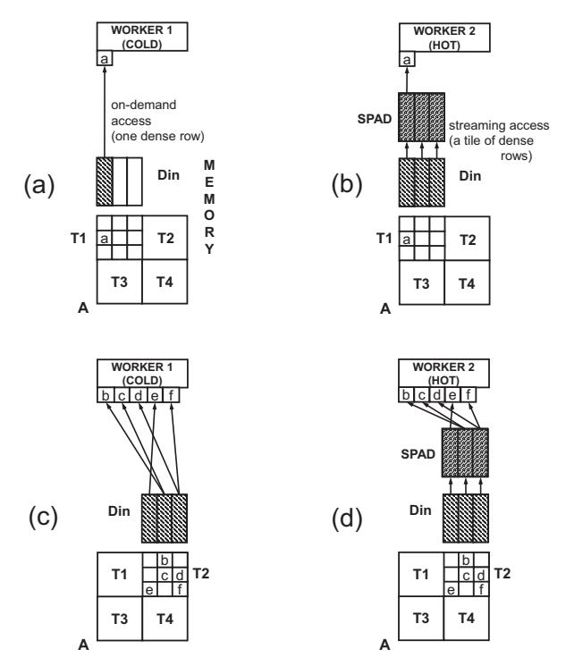

Fig. 3: Number of memory accesses to *Din* for two different sparse matrix tiles and two different worker types.

be accessed during T1 execution. This is because, unlike caches, scratchpads do not include a hardware mechanism for detecting and handling misses. Unfortunately, since only the first Din row is eventually useful, two of the main memory accesses are unnecessary.

Figures 3(c) and 3(d) illustrate the main memory accesses issued by the cold and hot workers, respectively, for the denser tile T2. The cold worker requests one row for every nonzero of the tile. Therefore, it requests a total of five rows from main memory. On the other hand, since the hot worker can reuse data through its scratchpad, it only requests three rows from main memory. Therefore, for T1, the cold worker accesses Din more efficiently than the hot worker while, for T2, the hot worker is better. Thus, we classify T1 as a Cold tile and T2 as a Hot tile.

In practice, accurately predicting which worker type is more suitable for each tile requires taking into account more factors than the number of memory accesses due to the presence of scratchpads. As a second example, consider two workers with scratchpads that have the following differences: (1) the cold worker can overlap memory requests, effectively hiding some of the memory access latency, and (2) the hot worker has higher computational capability. Assuming the same tiles as the ones in Figure 3, there is no difference in the amount of Din memory accesses—both workers access memory three times. For T1, both workers perform three Din memory accesses and one SIMD MAC operation (for nonzero a). For T2, both workers perform three Din memory accesses and five SIMD MAC operations. Thus, one can expect that, for T1, the

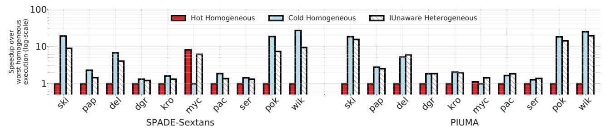

Fig. 4: Comparing the performance of IUnaware and homogeneous execution.

cold worker will do better than the hot one, while for T2, the hot worker will likely do better than the cold one (depending on the relative cost of accessing memory and performing a SIMD MAC).

In fact, determining the appropriate worker for each tile is a much more complex task, since one should also consider the Dout reads and writes, the sparse input reads, and the overlapping of the different operations in each PE. In Section IV, we describe our IMH-aware performance models.

## *B. Pitfalls of IMH-unaware Modeling and Partitioning*

In this section, we discuss a method to model and partition sparse matrices without considering IMH and discuss its pitfalls. We refer to the heterogeneous execution that stems from this modeling and partitioning as *IUnaware*.

We start by estimating the performance when processing the whole matrix by a single worker. We use the Roofline model [66], where the execution time is estimated as the maximum of the computation time and the memory access time. The computation time is the number of GFLOPs needed to process the whole matrix divided by the computational throughput of the worker. The number of GFLOPs needed is determined by the number of nonzeros in the matrix and is not affected by the nonzero distribution. The memory access time is the number of memory bytes accessed divided by the memory bandwidth. To estimate the number of memory bytes accessed, we assume a uniform distribution of nonzeros in the matrix, similar to AESPA [54]. With this model, we compute the predicted execution time with a single hot worker (th) and the predicted execution time with a single cold worker (tc).

We can now partition the processing of the matrix among hot and cold workers as follows. Assume we have Nhw hot workers and Ncw cold workers. If we use only the hot workers operating in parallel, the total execution time of processing the matrix can be approximated as Exhw = th/Nhw; if we use only cold workers, it can be approximated as Excw = tc/Ncw. We would like to use all hot and cold workers working in parallel and assign a fraction of the tiles to each type of worker so that the total execution time is minimized. To find the fraction of tiles to be assigned to each type of worker, we use the technique proposed by Huang et al. [34]. Specifically, the fraction of tiles to be assigned to hot workers is:

$$frac\_tile_{hot} = \frac{Ex_{cw}}{Ex_{cw} + Ex_{hw}}$$
 (1)

Then, we distribute tiles randomly to the two worker types while ensuring that the total fraction of tiles assigned to hot workers satisfies Equation 1. This partitioning scheme, which we call IUnaware, resembles the one used by AESPA [54].

In Figure 4, we compare the heterogeneous execution using the IUnaware method to homogeneous executions, in which the whole matrix is assigned to either hot workers or to cold workers. We use ten matrices from SparseSuite [20] (Table V) with a tile size of 8192x8192, and two different heterogeneous architectures that will be described in Section VI. One of the architectures consists of SPADE (cold) and Sextans (hot) workers; the other consists of PIUMA MTPs (cold) and STPs (hot). For SPADE-Sextans, we use 16 cold workers and a single high-performance hot worker (Ncw=16, Nhw=1), while for PIUMA, Ncw=4 and Nhw=2. For each matrix, we present the speedups over the worst-performing homogeneous execution (hot or cold). Note that, for a given matrix, the three bars correspond to different numbers of workers used.

As shown in Figure 4, IUnaware delivers speedups over the worst-performing homogeneous execution for all the matrices and architectures. However, compared to the best-performing homogeneous execution, the results are unimpressive. Specifically, in PIUMA, IUnaware performs about the same as the best-performing homogeneous execution. Further, in SPADE-Sextans, IUnaware performs significantly worse than the bestperforming homogeneous execution. The reason is that, in SPADE-Sextans, the cold workers already have enough compute power, and execution is mostly limited by memory accesses. Adding hot workers in an IMH-unaware manner as in IUnaware increases the pressure on the memory bandwidth without visibly improving the compute time. The result is an increase in execution time. Overall, our results reveal that heterogeneous execution with IMH-unaware modeling and partitioning is undesirable.

To improve the performance of heterogeneous execution, this paper proposes to assign individual tiles to the most appropriate worker type, using IMH awareness, as presented in Sections IV and V. We call this approach *HotTiles*. To see if HotTiles would generate an assignment of tiles to workers that is significantly different than in IUnaware, we generated Figure 5. The figure shows, for SPADE-Sextans (SP-SE), the tiles assigned to hot workers in black and the tiles assigned to cold workers in white, in IUnaware and in HotTiles. The data corresponds to the coPapersCiteseer (*pap*) matrix (Table V) with an 8192x8192 tile size.

The figure shows that IUnaware and HotTiles assign the tiles very differently. IUnaware assigns tiles in a random manner,

Fig. 5: Assignment of tiles to hot workers (in black) and to cold workers (in white) in IUnaware and HotTiles for the *pap* matrix.

with the only constraint that the fraction of hot tiles satisfies Equation 1. HotTiles, instead, exhibits an obvious pattern: tiles classified as hot do cluster around the diagonal and in the upper left corner. Upon inspection, we find that the pap graph, which represents a paper citation network, forms denser sub-communities around the diagonal. This observation agrees with the findings in [5]. HotTiles realizes that these subcommunities are associated with higher arithmetic intensity and assigns them to hot workers. As a result, the percentage of nonzeros assigned to hot workers changes from 52% in IUnaware to 72% in HotTiles.

# IV. INTRA MATRIX HETEROGENEITY (IMH) AWARE PERFORMANCE MODELING

The goal of an IMH-aware performance modeling methodology is to extract quantitative metrics that will enable us to determine a suitable worker type for each sparse matrix tile. The sparse matrix should be initially partitioned into tiles of a specific size. If one or both of the worker types use scratchpads to store Din and/or Dout, then the tile width and/or height are set to the largest value that does not overflow any of the worker's scratchpads. For example, in Figure 3, the tile width is set to 3 elements, since any larger value would overflow the hot worker's scratchpad. If none of the worker types uses scratchpads for Din, then the tile width is free and can be set to any value; if none of the worker types uses scratchpads for Dout, the tile height can be set to any value. For a free dimension, the IMH-aware modeling and partitioning methodology can be iteratively applied to find the value that is predicted to deliver the maximum performance. For the rest of this work, tile width and tile height will refer to the tiles of the sparse matrix.

After the tile height and width have been defined, we assume that each tile could be executed by a hot or by a cold worker. Then, we predict the tile's execution time and the number of main memory accesses for each worker type. For the execution time, we assume that each worker is operating independently, without any other worker of the same or different type being active. Thus, when we compute the execution time, we ignore memory bandwidth contention. We account for the computation time, the memory access time (ignoring bandwidth contention), and their overlapping. Specifically, we take the maximum of the two times for workers that overlap memory accesses with computation, and the sum of the two times for workers that do not. We estimate the number of main memory accesses separately in order to account for potential memory bandwidth contention when multiple workers are operating in parallel.

## *A. Estimating the Number of Main Memory Accesses*

When predicting the execution time, we must also estimate the number of main memory accesses. Consider a scenario where a worker type is estimated to be much faster for a given tile, but at the cost of significantly more main memory accesses. This may introduce significant pressure on the memory bandwidth, which is a shared resource of the heterogeneous architecture. For accurate prediction of the execution time, this effect should be taken into account.

The number of main memory accesses depends on the worker's fast local memory (FLM), the ordering of nonzeros in the sparse matrix (i.e., row or column ordered), the sparse matrix compression format (e.g., CSR or COO), and the matrix traversal order (i.e., the order in which the elements of the sparse matrices are accessed). Note that it is not necessary that all workers traverse the sparse matrix in a tiled manner. Depending on the traversal order, a worker may not need to finish processing all the nonzeros of a tile before processing nonzeros from another tile. Figure 6 illustrates untiled (Chart a) and tiled (Chart b) traversals of a sparse matrix with rowordered nonzeros. The arrows represent the order in which a worker processes the nonzeros of its assigned tiles. The matrix traversal order directly impacts the number of accesses to main memory and affects the reuse behavior of Din and Dout.

Fig. 6: Untiled and tiled row-ordered sparse matrix traversal.

We consider four main types of data reuse:

Inter-tile: This reuse occurs when the dense rows needed for a tile have already been brought in to fast local memory by a previous tile. For example, consider a worker that stores Dout in its scratchpad. In this case, the Dout rows requested from memory by the first tile of a row panel (Figure 6) are reused by the rest of the tiles of the row panel.

Intra-tile (stream): This reuse occurs when a worker streams a full tile of dense rows into its scratchpad before the nonzeros of the sparse tile are accessed. The reuse of Din by the hot worker of Figure 3(d) falls into this category. For Din, a full dense tile includes tile width rows, while for Dout, it includes tile height rows.

Intra-tile (demand): This reuse occurs through registers or caches. For example, consider a sparse matrix where the nonzeros are row-ordered (Figure 6). When processing a tile, all the nonzeros with the same r id access the same Dout row. Hence, when a nonzero brings a Dout row to registers or caches, the subsequent nonzeros with the same r id can reuse it. As a result, the total number of Dout rows that will be accessed from memory is equal to the number of unique r ids of the nonzeros in the tile (*tile uniq rids*).

None: This case happens when each nonzero ends up bringing from memory a dense row of the corresponding dense matrix. As an example, consider two nonzeros of A in Figure 6(a) with the same c id and in consecutive rows. If, between processing the first and the second of these two nonzeros, there is a large number of nonzeros to process and the worker does not have a large enough FLM, Din rows will not be reused from the FLM.

The upper part of Table I shows, for the different reuse types, the number of dense rows from Din and Dout accessed from main memory during the processing of a tile of the sparse matrix.

TABLE I: Dense rows (upper subtable) and sparse input data items (bottom subtable) accessed from main memory during the processing of a tile under different reuse types and sparse formats. Tile refers to sparse matrix tiles.

| Reuse Type             | Dense Input Rows Accessed From Memory     | Dense Output Rows Accessed From Memory |  |  |
|------------------------|-------------------------------------------------|----------------------------------------------|--|--|
| Inter-tile             | 0                                               | 0                                            |  |  |
| Intra-tile (stream) | tile width                                      | tile height                                  |  |  |
| Intra-tile (demand) | tile uniq cids                                  | tile uniq rids                               |  |  |
| None                   | tile nnzs                                       | tile nnzs                                    |  |  |
| Sparse Format          | Sparse Input Data Items Accessed From Memory |                                              |  |  |
| COO-like               | tile nnzs * 3                                   |                                              |  |  |
| CSR-like               | tile height + tile nnzs * 2                     |                                              |  |  |

The bottom part of Table I shows, for two sparse formats, the number of sparse input data items accessed from main memory during the processing of a tile of the sparse matrix. By data item, we mean, for example, the r id, c id, or val of a nonzero element in a COO-like format. For COO-like formats, 3 ∗ tile nnzs data items are accessed per tile, since each nonzero is represented with an r id, c id, and val. For CSR-like formats, the r ids array is substituted by an array holding the begin offsets of each row in the c ids and vals arrays. Since each tile has tile height rows, a total of 2 ∗ tile nnzs + tile height data items are accessed per tile.

We refer to the total number of bytes accessed from main memory for tile i as bhi or bci, depending on whether the tile is processed by a hot or a cold worker, respectively. Naturally, these bytes are the sum of the bytes from Din, Dout, and A.

## *B. Estimating Execution Time*

To estimate the execution time, we model the time needed for each worker to perform all its five *tasks*: read the sparse input; read the dense input; read the dense output; execute the SIMD multiply-accumulate operation; and write back the dense output. For each nonzero, a SIMD multiply and accumulate operation is performed on rows with K elements (Section II). Thus, the FLOPs associated with each sparse matrix tile are 2 ∗ K ∗ tile nnzs. By dividing these FLOPs by the computational throughput of a given worker, we can get an estimate of the time needed by that worker to perform the computation. To estimate the time needed for the memory accesses, we multiply the number of bytes read/written from main memory in each task by a parameter that we call *visible latency per byte* (vis lat). This parameter captures the latency hiding that a worker type is capable of. Quantifying this parameter analytically is challenging. Hence, we determine it in a data-driven manner by measuring the runtime of homogeneous executions. More details about how vis lat is obtained are given in Section VI-B.

To estimate the final tile execution time, we sum-up the estimated times of the five tasks, while accounting for any overlap of the tasks. For example, for a worker that overlaps all the tasks, the execution time is given by the longest task, while for a worker that does not overlap any task, the execution time is given by the sum of the times of all the tasks. Workers may overlap only some of these tasks.

In summary, the main novelty of our IMH-aware modeling approach over IUnaware is that we model the execution time of each individual tile, while IUnaware only models the execution time of the whole matrix. Modeling at tile granularity enables HotTiles to capture the unique sparsity pattern of the input matrix. This type of modeling requires taking into account the different inter- and intra-tile reuse types of Table I. An additional novelty of HotTiles is the data-driven modeling of memory access latency hiding through the vis lat parameter.

## *C. Modeling Limitations*

In this subsection, we discuss two limitations of our modeling methodology. The first one results from the fact that, without knowing the final assignment of tiles to worker types (which is decided in Section V), it is impossible to determine the reuse types of Din and Dout in certain tiles. To understand this limitation, note that our assignment of tiles to workers in Section V takes all the tiles in a row panel and assigns all the tiles deemed cold to a *single* cold worker, and all the tiles deemed hot to a *single* hot worker. Moreover, the hot worker can reuse state across its tiles without caring about the potentially interleaved cold tiles in the same row panel assigned to the cold worker (and vice-versa).

Keeping this in mind, we give two examples of this limitation. First, consider a worker that streams Dout to its scratchpad and implements a tiled row-ordered traversal (Figure 6(b)). The reuse type for the first tile assigned to it in a row panel is *Intra-tile (stream)*, while the reuse type for the remaining tiles assigned to it from the row panel is *Intertile*. However, without knowing the final assignment of tiles to worker types, it is impossible to determine whether a given tile is the first one of its type in the row panel or not. In our algorithm, we assume maximum reuse and, therefore, assume that a tile is never the first one of its type in the row panel.

In a second example, consider a worker that uses an untiled row-ordered sparse matrix *traversal* such as in Figure 6(a). In

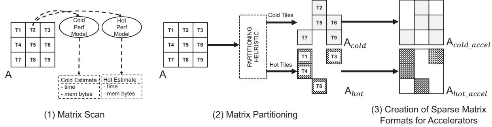

Fig. 7: HotTiles preprocessing steps.

this case, the tile where a nonzero with a given r\_id appears for the first time in the row has *Intra-tile* (*demand*) reuse for *Dout* for this r\_id. All other tiles where a nonzero with this r\_id appears have *Inter-tile* reuse. Again, without knowing the final assignment of tiles to worker types, it is impossible to determine whether a tile is the first one of its type with a nonzero with this r\_id or not. As before, we assume maximum reuse and, therefore, assume that the tile is never the first tile of its type with a nonzero with this r\_id.

In the tile assignment of Section V, we initially use this maximum reuse assumption. After that, when we know the final assignment of tiles to worker types, we readjust the reuse types if needed when predicting the final execution time. It is evident that, since the tile assignment is done based on an imprecise model, the quality of the derived solution is slightly degraded.

The second limitation of our approach is that it disregards any reuse through caches. Caches could help exploit two types of reuse in Table I: Intra-tile (demand) and Inter-tile. However, since caching effects are hard to model analytically, we make this pessimistic assumption.

Despite our assumptions of maximum reuse and no reuse through caches, our evaluation (Section VIII) suggests that our modeling approach has low prediction error in the majority of cases.

# V. Intra Matrix Heterogeneity (IMH) Aware Partitioning

Figure 7 illustrates the preprocessing steps of our IMH-aware modeling and partitioning method, which we call *Hot-Tiles*. First, the matrix tiles are scanned and fed to the cold and hot performance models of Section IV to extract, for each tile and worker type, the estimated execution time and the estimated number of bytes accessed from main memory. Then, a partitioning heuristic is used to split the sparse matrix into cold and hot tiles. Finally, the cold and hot sections of the initial sparse matrix are stored in the appropriate sparse compression format as required by each heterogeneous accelerator. In this section, we focus on the partitioning heuristic.

# A. Optimal Partitioning

Let us call  $th_i$  and  $tc_i$  the estimated times that a hot and a cold worker, respectively, take to execute tile i. Similarly,  $bh_i$  and  $bc_i$  are the estimated number of bytes read/written

from memory if a hot and a cold worker, respectively, execute tile i. Then, the total execution time of all the hot workers processing the hot tiles in parallel  $(th_{total})$  and of all the cold workers processing the cold tiles in parallel  $(tc_{total})$  are:

$$th_{total} = \Sigma_{i \in hot} \frac{th_i}{N_{hw}}$$
  $tc_{total} = \Sigma_{i \in cold} \frac{tc_i}{N_{cw}}$  (2)

and the total number of bytes read/written from memory by all the workers  $(b_{total})$ , all the hot workers  $(bh_{total})$ , and all the cold workers  $(bc_{total})$  are:

$$b_{total} = bh_{total} + bc_{total} = \sum_{i \in hot} bh_i + \sum_{i \in cold} bc_i$$
 (3)

Assuming that hot and cold workers are operating in parallel, and that BW is the total memory bandwidth of the heterogeneous architecture, the optimal partitioning is the solution to the following optimization problem:

$$minimize\{max\{max\{th_{total}, tc_{total}\}, \frac{b_{total}}{BW}\}\} \qquad (4)$$

This optimization problem is not trivial. For example, it cannot be trivially solved by assigning each tile to the worker type that is estimated to be faster. This is because of two factors: (1) the workers operate in parallel and (2) the bandwidth saturation impacts the total runtime.

In addition, in some architectures, there is no mechanism to avoid data races when heterogeneous workers are writing to the same output memory locations. In this case, each worker type must update a private output buffer and the buffers are merged at the end of the execution. This introduces an additional  $t_{merge}$  cost term in the final execution time. This term can be estimated by considering the memory footprint of the output buffers and the system memory bandwidth. In this case, the optimization problem can be expressed as:

$$minimize\{max\{max\{th_{total}, tc_{total}\}, \frac{b_{total}}{BW}\} + t_{merge}\}$$
(5)

We assume a buffer accumulation design such that  $t_{merge}$  does not depend on the data that has been written in each buffer. Hence,  $t_{merge}$  has the same value for all the possible partitionings. With this assumption, the optimal solution for equations 4 and 5 is the same. In addition, for some sparse matrices, the  $t_{merge}$  cost might be too high to justify parallel operation of the heterogeneous workers. Instead, in such cases it might be faster that the workers execute serially, using the

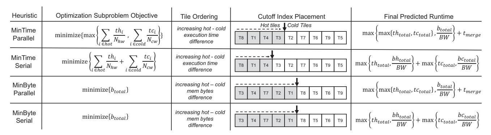

Fig. 8: Optimization subproblems.

same output buffer. In this case, the optimization problem involves minimizing the *minimum* of

$$max\{max\{th_{total}, tc_{total}\}, \frac{b_{total}}{BW}\} + t_{merge}$$
 (6)

and the predicted runtime for the serial operation:

$$max\{th_{total}, \frac{bh_{total}}{BW}\} + max\{tc_{total}, \frac{bc_{total}}{BW}\}$$
 (7)

Thus, the full optimization problem becomes:

$$minimize\{min\{max\{max\{th_{total}, tc_{total}\}, \frac{b_{total}}{BW}\} + t_{merge}, max\{th_{total}, \frac{bh_{total}}{BW}\} + max\{tc_{total}, \frac{bc_{total}}{BW}\}\}\}$$
(8)

# B. Proposed Heuristic Partitioning

In order to find the optimal solution, an exhaustive search over all the possible combinations of hot and cold tiles would be required. This corresponds to  $2^{N_{tiles}}$  combinations, making the complexity of such an approach prohibitive. To solve the problem approximately, we decompose it into four simpler subproblems, each of which has NlogN complexity, as explained later. Each of the subproblems produces a different partitioning. We then compare the predicted runtime of each of the four partitioning decisions and keep the one with the lowest predicted runtime. The four subproblems produce different heuristic-based partitioning decisions (HotTiles heuristics). They aim at either minimizing the execution time assuming that the system has sufficient memory bandwidth (MinTime heuristics) or at minimizing the bytes read/written from main memory (MinByte heuristics). In addition, they either assume that the heterogeneous workers are operating in parallel (Parallel heuristics) or serially (Serial heuristics).

Each heuristic is expected to work best for different system configurations. For example, when one worker type is already able to saturate the memory bandwidth (which is a shared resource of the architecture), the *Serial* heuristics are expected to perform better. This is because bandwidth contention will limit the performance of *Parallel* heuristics, and the benefit of parallel execution will not outweigh the cost of merging the partial output buffers. In addition, in bandwidth-constrained

configurations, the *MinByte* heuristics are expected to perform better than the *MinTime* heuristics since they reduce main memory accesses. Importantly, the effectiveness of each heuristic also depends on the structure of the input sparse matrix. For the same heterogeneous architecture, different heuristics may work best for different sparse matrices. We summarize the four heuristics in Table II.

TABLE II: HotTiles heuristics

| Heuristic        | Minimizes | Worker execution | Effective when memory bandwidth pressure is |
|------------------|-----------|---------------------|---------------------------------------------------|
| MinTime Parallel | time      | parallel            | low                                               |
| MinTime Serial   | time      | serial              | medium                                            |
| MinByte Parallel | bytes     | parallel            | medium                                            |
| MinByte Serial   | bytes     | serial              | high                                              |

We now discuss how we derive the partitioning decisions by solving the four optimization subproblems (Figure 8). All of the optimization subproblems can be easily solved by sorting the tiles and performing a linear pass over the sorted arrays. For the MinTime heuristics, we create an array that is sorted in increasing difference  $th_i - tc_i$ . Hence, tiles estimated to be executed faster by hot workers are placed first in the array. Then, we initialize a pointer to the beginning of the array, which represents the cutoff point between hot and cold tiles. We call this pointer *cutoff index* (Figure 8). We start moving the cutoff index to the right. Every time we move the cutoff index, the partitioning assignment changes and we calculate the new value of the subproblem optimization objective. If the value has decreased, we continue moving the cutoff index. Otherwise, we roll back to the previous position and the algorithm has converged, producing an approximate partitioning solution. Note that the optimization objective is different for the MinTime Parallel and MinTime Serial heuristics.

To estimate the final execution time of the resulting partitioning we use the formulas in the final column of Figure 8. Of course, the formulas are different for *MinTime Parallel* and *MinTime Serial*. Note that although we do not take into account the system bandwidth effect or the merging cost while deciding on the partitioning, we take these factors into account when determining the predicted runtime.

The procedure for the MinByte heuristics is similar. The only differences are: (1) the tiles are initially sorted in in-

(a) SPADE-Sextans

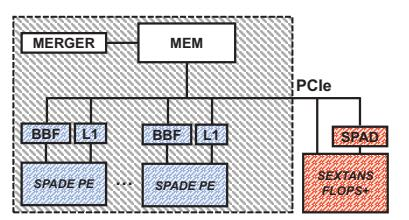

(b) SPADE-Sextans+PCle

(c) PIUMA

Fig. 9: Heterogeneous architectures evaluated.

creasing difference of  $bh_i-bc_i$  and (2) the optimization subproblem objective is different. Again, the final predicted runtime is different between *MinByte Parallel* and *MinByte Serial* heuristics.

Finally, we compare the predicted runtime of all four heuristics and keep the partitioning from the heuristic that produces the lowest runtime. Note that some architectures support special writes that avoid data races when heterogeneous workers perform read-modify-write operations to the same memory location. Then, there is no need for the output buffers, and  $t_{merge}$  is zero. In such cases, it can be shown that, under our model, there is no benefit in serial operation and, therefore, we only consider the MinTime Parallel and MinByte Parallel heuristics. Overall, the complexity of the proposed heuristics is NlogN: the array sorting is known to have NlogN complexity and the cutoff index placement can be completed in linear time.

#### VI. ARCHITECTURES AND FRAMEWORK

# A. Heterogeneous Architectures

In this section, we analyze the three heterogeneous architectures used in our evaluation. They include PEs from the SPADE and Sextans SpMM accelerators, and from PIUMA, which can support SpMM and other kernels. In total, we use four different PE pipelines, with diverse characteristics (e.g., out-of-order, in-order, SIMD, and scalar). Table III describes the PEs, which we call workers. The different workers access sparse and dense structures like in Figure 2.

We evaluate both on-chip and off-chip PEs, as well as different mechanisms to avoid data races. We selected three architectures to emphasize the generality of our approach across multiple settings. Figure 9 illustrates our three heterogeneous architectures. We describe them next.

TABLE III: Heterogeneous workers.

| Worker    | Worker Type | Sparse Format | Din Reuse           | Dout Reuse          |
|-----------|----------------|------------------|------------------------|------------------------|
| SPADE PE  | Cold           | COO-like         | None                   | Inter-tile             |
| Sextans   | Hot            | COO-like         | Intra-tile (stream) | Inter-tile             |
| PIUMA MTP | Cold           | CSR-like         | None                   | Inter-tile             |
| PIUMA STP | Hot            | CSR-like         | Intra-tile (stream) | Intra-tile (demand) |

(a) SPADE-Sextans: SPADE (cold) and Sextans (hot) PEs are integrated in the same die and share the same memory controllers (Figure 9(a)). For simplicity, we do not equip the SPADE PEs with a 3-level cache subsystem as in [24]; we

only include a private L1 and a BBF. The SPADE PEs access the sparse input and dense output through the BBF, while they access the dense input through the L1. The SPADE PEs traverse the sparse matrix using an untiled row-ordered traversal (Figure 6(a)), while Sextans uses a tiled row-ordered traversal (Figure 6(b)). The SPADE PEs and the Sextans PEs can either operate in parallel or serially. To avoid data races when the SPADE and Sextans PEs are operating in parallel, we use two output buffers, one for each worker type. A Merger module is responsible for merging the output buffers at the end of execution. Note that in the serial operation mode, the Merger module is not used. To avoid data races between SPADE PEs, we closely follow the assignment and padding requirements discussed in the SPADE paper. For example, cold tiles in the same row panel are always assigned to the same SPADE PE.

- **(b) SPADE-Sextans+PCIe:** SPADE was proposed as an accelerator that is integrated in the same die as the CPU host. On the other hand, Sextans was proposed as a PCIe-attached accelerator. For our second architecture, we use on-chip SPADE PEs and an off-chip Sextans that accesses main memory through PCIe. We additionally assume that Sextans has enhanced computational throughput compared to the one in SPADE-Sextans.
- (c) PIUMA: This architecture consists of MTPs, STPs, DMA engines, and an Atomic engine, all sharing the same memory subsystem. The cold workers are the MTPs, which are latency tolerant and access memory on-demand. The hot workers are the STPs, which we equip with scratchpads and with DMA engines to increase their ability to exploit memory-level parallelism. The STPs access the sparse input on-demand and issue DMA descriptors for *Din* and *Dout*. *Din* is stored in the scratchpad. The Atomic engine enables MTPs and STPs to perform read-modify-write operations on the same memory location without suffering data races. As a result, the MTPs and STPs always operate in parallel, and we only employ the *MinTime Parallel* and *MinByte Parallel* heuristics (Figure 8).

#### B. Framework Implementation Details

HotTiles is implemented as a framework that is fully integrated into the software pipeline that generates the sparse matrix format for each accelerator. The HotTiles software is executed on the host of the heterogeneous architecture. It reads a sparse matrix from disk in MatrixMarket [12] file format. It then analyzes it and partitions it into hot and cold tiles transparently to the users. Finally, it generates the sparse

matrix formats. These formats, in combination with Din, can be directly accessed by the heterogeneous workers to execute the SpMM kernel. Alternatively, they can be stored for later use—e.g., they can be generated and used during GNN training and then saved and reused during GNN inference.

For the model, the users need to set the following traits of the heterogeneous architecture: the maximum computational throughput of each worker type (in GFLOP/s); the number of workers of each type; the size of the workers' scratchpads; the shared main memory bandwidth (in GB/s); the Din and Dout reuse types and the sparse matrix formats (Table I); and the way that each worker overlaps the SpMM tasks (Section IV-B).

The *visible latency per byte* (vis lat) for each worker type is hard to determine analytically. For this reason, a small number of profiling runs are executed using a set of small test matrices. In each run, only one worker type is used. After these runs, vis lat is automatically determined using a simple search method. The search objective is to minimize the error between the execution times predicted by our framework and the real execution times of the profiling runs. Note that this tuning process only needs to be done once when the *HotTiles* framework is first installed on a particular machine. The derived vis lat values can be reused for SpMM runs with different sparse matrices and thus do not contribute to the preprocessing overhead. In future work, we aim at employing sophisticated search or machine learning techniques (e.g., similar to [38]) to automatically set the values of vis lat and all the other heterogeneous architecture traits.

# VII. METHODOLOGY

# *A. Architectures and simulation*

We evaluate our architectures through simulation. For SPADE-Sextans, we use SST [57] and DRAMSim3 [46]. For PIUMA, we use an in-house simulator based on Sniper [16], [17]. We preprocess the sparse matrices to generate the sparse matrix formats on a dual-socket 48-core Intel Xeon Platinum 8260M CPU [35].

For the SPADE-Sextans archiecture, we test different system scales. We keep the PE frequency and the memory bandwidth constant, but we change: (1) the number of SPADE PEs and (2) the computational throughput and the scratchpad size of Sextans. The memory bandwidth is kept constant to evaluate our approach under different worker to memory bandwidth ratios.

Table IV displays the parameters for the different system scales. We use the system scale 4 as the baseline scale. In all scales, the cache line size is 64 bytes, the PE frequency is 0.8 GHz, and the main memory bandwidth is 205 GB/s. Note that this memory bandwidth is the maximum theoretical value that the memory controllers can provide. The maximum observed bandwidth for the heterogeneous architecture is 161 GB/s at system scale 8. For the SPADE PE out-of-order pipeline, we use the parameters in the original paper. Although SPADE supports different execution strategies, for simplicity, we set the SPADE PEs to execute an untiled sparse matrix traversal (Figure 6(a)), with each PE operating on a chunk of 64 continuous sparse matrix rows at a time. SPADE PEs use an untiled COO format, while Sextans operates on a tiled COO format. Sparse and dense matrix values are stored using single-precision floating point.

TABLE IV: Architectural parameters for different SPADE-Sextans system scales. System scale 4 is the base one.

|                 | SPADE      |                        |                    | Sextans    |                        |                      |
|-----------------|------------|------------------------|--------------------|------------|------------------------|----------------------|
| System Scale | Num PEs | SIMD MACs/ Cycle | L1 Size (kB) | Num PEs | SIMD MACs/ Cycle | SPAD Size (MB) |
| 1               | 4          | 1                      | 32                 | 1          | 5                      | 0.5                  |
| 2               | 8          | 1                      | 32                 | 1          | 10                     | 1                    |
| 4               | 16         | 1                      | 32                 | 1          | 20                     | 2                    |
| 8               | 32         | 1                      | 32                 | 1          | 40                     | 4                    |

For the SPADE-Sextans+PCIe architecture, we assume that Sextans is connected to the on-chip memory bus through PCIe, which has a maximum bandwidth of 32GB/s. We use this architecture to evaluate gSpMM versions with higher arithmetic intensity. As we increase the kernel arithmetic intensity, more SIMD operations are required per nonzero. As a result, the SPADE PEs require more cycles to execute all the arithmetic operations per nonzero. However, we assume that the off-chip Sextans increases its computational power beyond the numbers in Table IV. Specifically, for system scale 4, Sextans can now process 20 nonzeros per cycle, regardless of the arithmetic intensity of the kernel. All the other system parameters are kept the same.

For the PIUMA architecture, we use 4 MTPs and 2 STPs. The STPs use a tiled CSR-like format, while the MTPs use untiled CSR. We choose to store the sparse and dense matrix values using double-precision floating point to show that the method generalizes to various data sizes and types.

# *B. Benchmark Matrices*

We use ten square sparse matrices from SparseSuite [20] as benchmarks. They have 100K to 4.2M rows and 22M to 100M nonzeros (Table V). Most of the matrices (pap, del, kro, myc, pac, ser) are the same or scaled-down versions of the ones used in SPADE [24]. Since the high fidelity of the PIUMA simulator leads to significantly increased simulation times, we replaced 4 of the matrices used in the SPADE paper with smaller ones to decrease the PIUMA simulation time. The 4 new matrices (ski, dgr, pok, wik) are selected so that they represent different application domains than the matrices borrowed from the SPADE paper. We set the number of columns of the dense matrices (K) to 32, similar to prior works [24], [31].

# *C. Heterogeneity Area, Power, and Control Overhead*

Since PIUMA includes heterogeneous PEs by design, Hot-Tiles can be supported without additional hardware overhead. This is not the case for the SPADE-Sextans architecture, where HotTiles adds some overheads associated with combining and controlling different PEs. Specifically, HotTiles needs some control logic to orchestrate the two subaccelerators. Since when the two subaccelerators are operating in parallel they are

TABLE V: Benchmark sparse matrices used.

| Benchmark                    | Short | Domain               | Rows (Mill) | NNZ (Mill) | Density              |
|------------------------------|-------|----------------------|----------------|---------------|----------------------|
| as-Skitter                   | ski   | Internet topology | 1.7            | 22            | 8 * 10 -6 |
| coPapersCiteseer             | pap   | Citation network  | 0.4            | 32            | $2*10^{-4}$          |
| delaunay_n22                 | del   | Geometry problem  | 4.2            | 25            | $1*10^{-6}$          |
| dgreen                       | dgr   | VLSI                 | 1.2            | 27            | $2*10^{-5}$          |
| kron g500-logn19             | kro   | Synthetic graph      | 0.5            | 44            | $2*10^{-4}$          |
| mycielskian17                | myc   | Math.                | 0.1            | 100           | $1*10^{-2}$          |
| packing-500 x100x100-b050 | pac   | Numerical simulation | 2.1            | 35            | 8 * 10 -6 |
| Serena                       | ser   | Environ. science  | 1.4            | 64            | $3*10^{-5}$          |
| soc-Pokec                    | pok   | Social network    | 1.6            | 31            | $1*10^{-5}$          |
| wiki-topcats                 | wik   | Web graph            | 1.8            | 29            | $9*10^{-6}$          |

writing to private output buffers, all that is needed from the new control logic is: (1) to signal the beginning of operation of each PE, (2) to monitor the termination of operation of each PE, and (3) to signal the beginning of operation of the Merger module. This control functionality can be accomplished in software by utilizing the SPADE Control Processing Element (CPE) [24], which is a general-purpose core that can write to memory-mapped registers.

The only additional hardware module that needs to be integrated into the heterogeneous SPADE-Sextans architecture is the Merger module. It includes a SIMD ADD module and some registers. We estimate its area and power using CACTI [9] for the memory structures and the numbers from [22] for the SIMD arithmetic. Similar to the SPADE paper, we scale area and power to 10 nm using the scaling factors from [60]. We compare them to the area and power of a SPADE PE, including PE pipeline, L1 cache, and BBF. Our results suggest that the Merger module has very small overheads. It accounts for less than 20% of the area and power of a single SPADE PE.

#### VIII. EVALUATION

The evaluation is organized in three parts. Subsection VIII-A compares the performance of heterogeneous execution with *HotTiles* against other execution environments. Then, subsection VIII-B investigates the effectiveness of using *HotTiles* for architecture exploration. Finally, subsection VIII-C discusses the preprocessing cost.

# A. Performance Evaluation

We compare the performance of heterogeneous execution with *HotTiles* against: (1) a homogeneous execution using only the cold workers of each architecture (*ColdOnly*); (2) a homogeneous execution using only the hot workers (*HotOnly*); and (3) a heterogeneous execution that partitions tiles based on the *IUnaware* method. Note that IUnaware is very similar to the partitioning technique used in AESPA [54]. We additionally compare against the *BestHomogeneous* baseline, which manually selects the best homogeneous strategy between *HotOnly* and *ColdOnly* on a per-matrix basis.

Figure 10 presents the results for SPADE-Sextans (with system scale 4), while Figure 11 presents the results for PIUMA. The figures show the speedup over the worstperforming homogeneous execution (hot or cold) on a permatrix basis. We observe that HotTiles is very effective. It outperforms practically all the baselines. For SPADE-Sextans, HotTiles provides average speedups of 8.7x, 1.9x, and 2.0x over HotOnly, ColdOnly, and IUnaware, respectively. Although not shown, it also provides average speedups of 1.25x over *BestHomogeneous*. For PIUMA, the speedups are similar: 9.2x, 1.4x, and 1.4x over HotOnly, ColdOnly, and IUnaware, and 1.4x over BestHomogeneous. Note that, typically, HotOnly is the slower homogeneous execution due to the low density of the benchmark sparse matrices. The exception is the myc matrix, which is the densest matrix in our evaluation. For this matrix, hot workers are significantly better than cold ones for SPADE-Sextans, but only slightly better for PIUMA. This is because the hot to cold worker computational throughput ratio in PIUMA is smaller than in SPADE-Sextans.

Fig. 10: Comparison of homogeneous and heterogeneous execution for SPADE-Sextans.

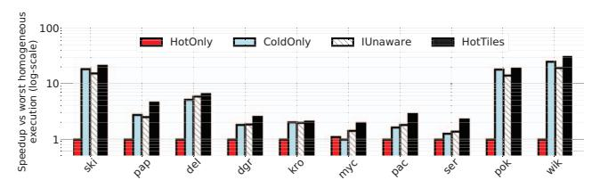

Fig. 11: Comparison of homogeneous and heterogeneous execution for PIUMA.

Table VI displays the absolute simulated runtimes for the SPADE-Sextans architecture. Since the microarchitectural details of PIUMA are proprietary, we do not release the raw execution times in this use-case.

TABLE VI: Runtime in ms for SPADE-Sextans.

| Matrix | HotOnly | ColdOnly | BestHom | IUnaware | HotTiles |
|--------|---------|----------|---------|----------|----------|
| ski    | 369.4   | 19.8     | 19.8    | 42.3     | 18.3     |
| pap    | 42.1    | 18.6     | 18.6    | 29.0     | 8.9      |
| del    | 138.0   | 20.8     | 20.8    | 34.3     | 22.8     |
| dgr    | 46.8    | 35.6     | 35.6    | 38.5     | 23.3     |
| kro    | 61.3    | 37.9     | 37.9    | 46.3     | 37.2     |
| myc    | 13.5    | 108.6    | 13.5    | 17.9     | 14.1     |
| pac    | 37.7    | 20.2     | 20.2    | 27.4     | 12.6     |
| ser    | 38.8    | 27.0     | 27.0    | 29.3     | 23.1     |
| pok    | 539.0   | 29.7     | 29.7    | 75.3     | 29.7     |
| wik    | 642.2   | 24.3     | 24.3    | 70.5     | 22.1     |

Next, we focus on the four *HotTiles* partitioning heuristics. Recall that during the partitioning step, they generate four different partitioning variants. Then, *HotTiles* selects the one that is predicted to take less time. To provide further insight, we tested the four heuristics for different scales of the SPADE-Sextans system (Table IV). Figure 12 compares the *actual* average performance of *HotTiles* to the average performance of the partitioning suggested by each individual heuristic. We present the average speedup with respect to *BestHomogeneous*. For each scale, we also display the system bandwidth utilization averaged across both homogeneous executions (*HotOnly* and *ColdOnly*).

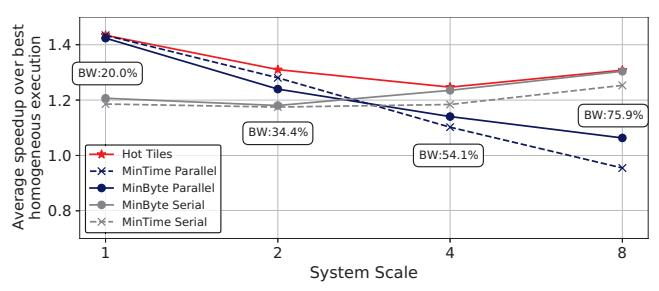

Fig. 12: Average performance of *HotTiles* and the different heuristics for different SPADE-Sextans system scales.

We observe that, for all scales, *HotTiles* outperforms the best of its heuristics. This is because, for a given scale, *HotTiles* chooses different heuristics for different matrices. We see that, for larger scales, where one worker type is typically sufficient to saturate most of the system bandwidth, the *Serial* heuristics perform better than the *Parallel* ones, since they avoid the merging cost. In addition, focusing on the *Parallel* heuristics, we see that, in smaller scales, due to smaller bandwidth pressure, *MinTime Parallel* performs better, while for larger scales, *MinByte Parallel* performs better. Overall, the four heuristics act in a complementary manner, allowing *HotTiles* to produce a high-quality partitioning under different system scenarios. On average across all system scales, *HotTiles* provides speedups of 16.8x, 2.0x, 2.2x, and 1.3x over *HotOnly*, *ColdOnly*, *IUnaware*, and *BestHomogeneous*, respectively.

To provide further insight, Table VII displays different utilization statistics for two different scales of the SPADE-Sextans architecture. All the statistics are geomean values across the 10 matrices. The table displays: the main memory bandwidth utilization; the number of cache lines accessed from memory normalized to the number of nonzeros of each matrix; and the utilization of the computational units of the cold and hot workers (measured in GFLOP/s) for the time period when each worker type is not idle.

Consider first system scale 1. With *HotTiles*, the bandwidth utilization is increased. This is partly because, with *HotTiles*, both hot and cold workers are actively accessing the memory subsystem in parallel. Note that, although this is also the case with *IUnaware*, this baseline fails to increase the bandwidth utilization due to its unsophisticated IMH-unaware matrix partitioning. In addition, with *HotTiles*, redundant main memory accesses are reduced by an effective mapping of tiles to worker types (Figure 3). Also, in *HotTiles*, the utilization of the SIMD units of the SPADE workers slightly drops, since they are mainly assigned the sparser, less arithmetic intense cold tiles.

TABLE VII: Architecture utilization statistics for SPADE-Sextans (geometric mean).

|                                                | System Scale 1 |          |          |          |  |  |
|------------------------------------------------|----------------|----------|----------|----------|--|--|
| Measure                                        | HotOnly        | ColdOnly | IUnaware | HotTiles |  |  |
| Bandwidth Util. (GB/s)                      | 27.96          | 49.68    | 49.04    | 67.41    |  |  |
| Cache Lines Acc. from Memory per Nonzero | 6.78           | 1.59     | 2.27     | 1.47     |  |  |
| SPADE GFLOP/s                                  | 0.00           | 48.72    | 46.49    | 43.52    |  |  |
| Sextans GFLOP/s                                | 6.44           | 0.00     | 4.94     | 51.14    |  |  |
|                                                | System Scale 4 |          |          |          |  |  |
| Measure                                        | HotOnly        | ColdOnly | IUnaware | HotTiles |  |  |
| Bandwidth Util. (GB/s)                      | 82.61          | 132.28   | 127.03   | 124.68   |  |  |
| Cache Lines Acc. from Memory per Nonzero | 3.13           | 1.60     | 1.99     | 1.02     |  |  |
| SPADE GFLOP/s                                  | 0.00           | 129.58   | 102.50   | 85.63    |  |  |
| Sextans GFLOP/s                                | 41.18          | 0.00     | 25.47    | 228.37   |  |  |

However, this drop is compensated by an 8x increase in the utilization of the Sextans workers.

Most of the *HotTiles* results for system scale 4 are similar. However, (1) the geomean bandwidth utilization of *HotTiles* is slightly lower than in the *ColdOnly* and *IUnaware* baselines and (2) the decrease in redundant main memory accesses is more significant. This is because, as shown in Figure 12, for this system scale, the Serial and the MinByte heuristics are preferred. Given the already high bandwidth pressure caused by the larger number of workers at this scale, *HotTiles* smartly trades-off a marginally lower bandwidth utilization for a significant decrease in the memory accesses—reducing overall execution time.

Next, we compare the performance of heterogeneous execution with *HotTiles* against homogeneous architectures that have double the number of hot or cold workers (Figure 13). We use the SPADE-Sextans system scale 4 as our heterogeneous architecture (*HotTiles4*). For the homogeneous architectures, we use only the hot or only the cold workers from system scale 8 (*HotOnly8* and *ColdOnly8*). *HotTiles4* provides an average speedup of 2.9x and 1.6x against *HotOnly8* and *ColdOnly8*, respectively. This reveals that a heterogeneous architecture with both worker types is more effective than a homogeneous architecture with twice the number of workers of one type.

Fig. 13: Speedup of *HotTiles* with system scale 4 over homogeneous execution with system scale 8.

As discussed in Section VII, for the SPADE-Sextans+PCIe architecture, we test gSpMM variants with higher arithmetic intensity (AI). As AI increases, more SIMD operations are required per nonzero. As the AI increases, a SPADE PE requires more cycles to execute all the arithmetic operations for one nonzero. However, as mentioned in Section VII, we assume an enhanced Sextans that increases its computational power proportionally to the number of arithmetic operations per nonzero to keep up with the increased AI. Since we consider a system scale of 4, the enhanced Sextans can now process 20 nonzeros per cycle irrespective of the AI.

Figure 14 displays the speedup of *HotTiles* over *HotOnly* and *ColdOnly* as the number of SIMD operations per nonzero (and thus the AI) increases. We also show the percentage of nonzeros that are assigned to the hot workers. We observe that, at low AIs, most of the nonzeros are assigned to the cold workers, since they provide enough computational throughput to accommodate the low arithmetic intensity. At these AIs, the speedup of HotTiles against HotOnly execution is high, since the low-bandwidth PCIe bus makes data transfer a significant bottleneck, while the speedup against ColdOnly is low, since most of the nonzeros are assigned to the cold workers anyway. As the AI increases, the situation is reversed, as computational time dominates over data transfers. In all cases, HotTiles offers clear benefits. On average across all AIs, HotTiles provides average speedups of 11.9x, 3.7x, and 2.5x over HotOnly, ColdOnly, and BestHomogeneous, respectively.

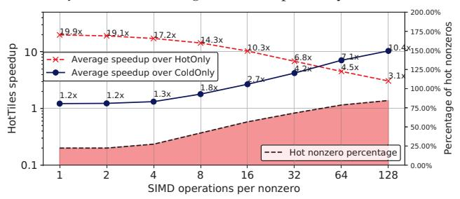

Fig. 14: Performance of *HotTiles* for different gSpMM arithmetic intensities for the SPADE-Sextans+PCIe architecture.

Finally, since most of the matrices of Table V favor the cold workers, we evaluated *HotTiles* on an additional set of matrices from SparseSuite. We selected five denser matrices with a similar number of nonzeros and different application domains than the original ten. They are shown in Table VIII. Figure 15 illustrates the effectiveness of *HotTiles* in this new matrix set for SPADE-Sextans with system scale 1 and system scale 4. From the figure, we see that *HotTiles* is again faster than the other architectures. The average speedups of *HotTiles* across both system scales are 1.5x, 3.8x, and 1.4x over *HotOnly*, *ColdOnly*, and *IUnaware*, respectively. It can be shown that the speedup is 1.5x over *BestHomogeneous*.

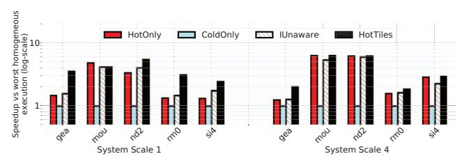

Fig. 15: Comparison of homogeneous and heterogeneous execution of SPADE-Sextans for higher-density sparse matrices.

TABLE VIII: Additional set of higher-density sparse matrices.

| Benchmark       | Short                    | Domain                    | Rows (Mill) | NNZ (Mill) | Density     |
|-----------------|--------------------------|---------------------------|----------------|---------------|-------------|
| gearbox         | gea                      | gea Aerospace engineering |                | 9             | $4*10^{-4}$ |
| mouse_gene      | mou Molecular biology |                           | 0.05           | 29            | $1*10^{-2}$ |
| nd24k           | nd2                      | 2D/3D prblm.              | 0.07           | 29            | $1*10^{-2}$ |
| RM07R           | rm0 Comput. dynamics  |                           | 0.38           | 37            | $3*10^{-4}$ |
| Si41Ge 41H72 | si4                      | Quantum chemistry      | 0.19           | 15            | $4*10^{-4}$ |

# B. Architecture Exploration with HotTiles

In this subsection, we use the performance prediction capabilities of *HotTiles* to explore different heterogeneous architecture alternatives. We focus mostly on the SPADE-Sextans architecture. We examine heterogeneous architectures that have more workers of one type at the expense of fewer workers of the other type. Specifically, we start with our scale 4 SPADE-Sextans architecture in Table IV, which we call 4-4. Then we consider "skewed" SPADE-Sextans architectures, such as 0-8, which includes no cold workers and hot workers with the same parameters as a scale 8 SPADE-Sextans architecture. We focus on skewed architectures where the sum of cold and hot scales equals to 8, namely 0-8, 1-7, 2-6, 3-5, 4-4, 5-3, 6-2, 7-1, and 8-0. We call these architectures *iso-scale*.

We consider two different scenarios. In the first one, we assume that the architecture is not reconfigurable, and want to find which of the 9 iso-scale architectures delivers the highest average performance for our benchmarks. In the second scenario, we assume that the architecture is reconfigurable, and want to find which of the 9 possible configurations delivers the highest performance for each individual benchmark. The first scenario corresponds to an ASIC accelerator, while the second one corresponds, e.g., to an FPGA-based one. In both cases, we use the execution time predictions made by *HotTiles*. For simplicity, we ignore any differences in area or power among the 9 iso-scale architectures. A future, more detailed analysis can compare performance per unit area or unit power.

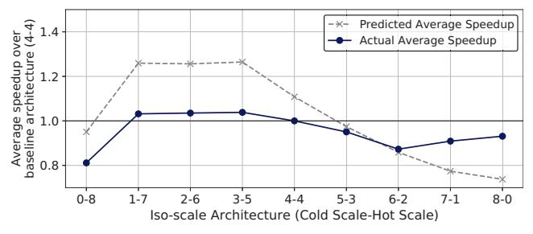

Fig. 16: Predicted and actual average performance of different iso-scale heterogeneous architectures.

We focus first on the first scenario. Figure 16 shows, for each iso-scale architecture, the performance predicted by *HotTiles* and the actual performance. The performance is given as speedup over the base SPADE-Sextans architecture (i.e., 4-4) and is the average across all the benchmarks of

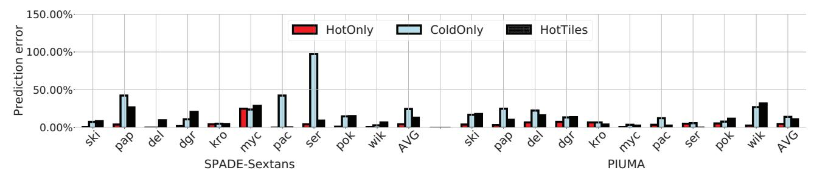

Fig. 17: Error in the predicted execution time of different homogeneous and heterogeneous executions.

Table V. We observe that, although the predicted performance is slightly higher than the actual one for the architectures that are dominated by hot workers, the trends of predicted and actual performance are the same. In the 7-1 and 8- 0 architectures, which are dominated by cold workers, the predicted performance is slightly lower than the actual one. This is because, as explained before, *HotTiles* ignores reuse in caches. Overall, the architecture predicted to perform the best (3-5) is also the one that performs the best.

We now focus on the second scenario, where the heterogeneous architecture is reconfigurable on a per-matrix basis. Table IX displays, for each matrix, the predicted best architecture, its speedup with respect to 4-4, the actual best architecture, its speedup with respect to 4-4, and whether the prediction is correct. We see that *HotTiles* selects the best architecture out of the nine iso-scale alternatives in 50% of the matrices. *HotTiles* predictions have some bias towards using more hot workers than needed. Again, this is due to ignoring caching effects and therefore under-predicting the true capabilities of cold workers. Despite this limitation, we observe that reconfiguring the architecture based on the predictions delivers a 1.23x speedup over the baseline 4-4 architecture. This is an encouraging result, considering that the oracle speedup is 1.33x.

TABLE IX: Predicted and actual best architecture per matrix.

| Matrix | Pred. Best Arch. | Speedup of Pred. Best | Actual Best Arch. | Speedup of Actual Best | Correct Pred? |
|--------|------------------------|-----------------------------|-------------------------|------------------------------|------------------|
| ski    | 3-5                    | 0.95                        | 8-0                     | 1.11                         | N                |
| pap    | 1-7                    | 0.78                        | 4-4                     | 1.00                         | N                |
| del    | 3-5                    | 1.01                        | 8-0                     | 1.28                         | N                |
| dgr    | 1-7                    | 1.59                        | 1-7                     | 1.59                         | Y                |
| kro    | 0-8                    | 1.93                        | 0-8                     | 1.93                         | Y                |
| myc    | 0-8                    | 1.63                        | 0-8                     | 1.63                         | Y                |
| pac    | 2-6                    | 1.16                        | 2-6                     | 1.16                         | Y                |
| ser    | 0-8                    | 1.36                        | 0-8                     | 1.36                         | Y                |
| pok    | 3-5                    | 0.89                        | 8-0                     | 1.14                         | N                |
| wik    | 3-5                    | 0.96                        | 8-0                     | 1.08                         | N                |
| AVG    |                        | 1.23                        |                         | 1.33                         | 50%              |

Finally, Figure 17 shows the error in the execution time predicted by *HotTiles* compared to the actual execution time for SPADE-Sextans and PIUMA. The figure also includes the error in the predictions for the homogeneous executions (*HotOnly* and *ColdOnly*), although we do not directly utilize these predictions. For both SPADE-Sextans and PIUMA, the average error between the predicted and actual execution time is relatively low, at 4.8%, 19.6%, and 12.4% for *HotOnly*, *ColdOnly*, and *HotTiles*, respectively. The highest error occurs for certain matrices (pap, myc, pac, ser) in the *ColdOnly* execution. Upon further investigation, we found that these matrices display significant *Din* reuse through caches. Since our model ignores caching effects, the predicted *ColdOnly* execution time is higher than the actual one. This prediction error is more significant in SPADE-Sextans because the caches of the SPADE PEs are larger than the caches of the PIUMA MTPs. We believe that extending our modeling methodology to account for caching effects can further enhance the effectiveness of *HotTiles* predictions.

# *C. Preprocessing Cost*

*HotTiles* requires the data preprocessing steps shown in Figure 7: matrix scan, matrix partitioning, and creation of the sparse matrix formats for the two worker types. In reality, code generation for homogeneous accelerators such as SPADE or Sextans also needs the third preprocessing step, except that it is for a single worker type. For example, the input matrix may be stored in matrix market file format [12], and should be converted to the specific format that the accelerator operates on. Hence, when we quantify *HotTiles*' preprocessing overhead, in the third step, we only consider the cost of generating the matrix format for one additional worker type.

The *HotTiles* preprocessing overhead is a one-time cost only. For example, it can be incurred once during GNN training and not affect GNN inference later on, or it can be incurred once and amortized across many SpMM iterations.

Figure 18 shows the normalized execution time of the preprocessing operations on a Xeon host for the PIUMA architecture. We break it down into matrix format creation for a homogeneous accelerator (which is not *HotTiles* specific), and the rest of the preprocessing steps listed above, which we call *Hot Tiles Overhead*. On average, *Hot Tiles Overhead* is 73% of the total preprocessing overhead. This means that *HotTiles* has about four times the preprocessing overhead of a homogeneous accelerator. This is a small overhead, which is amortized over many SpMM iterations. We obtain similar numbers for SPADE-Sextans and SPADE-Sextans+PCIe. Finally, note that, in practice, this overhead is dwarfed by the overhead of reading the matrix from disk. If we include reading the matrix from disk in the preprocessing overhead, it can be shown that *Hot Tiles Overhead* increases the preprocessing overhead by only 6% on average.

Fig. 18: Normalized execution time of the preprocessing operations on a Xeon host for the PIUMA architecture.

# IX. RELATED WORK

A. SpMM accelerators: In recent years, many domainspecific systems and accelerators that support SpMM have been proposed [3], [24], [25], [28], [30], [37], [53], [55], [58], [59]. Commonly, they employ homogeneous processing elements, missing opportunities to exploit IMH. For example, Adiletta et al. [3] use the PIUMA MTPs and DMA engines to accelerate SpMM in the context of Graph Convolutional Networks. However, they use PIUMA in a homogeneous mode by disabling the STPs. AESPA [54] is an architecture that consists of heterogeneous subaccelerators that target different levels of sparsity and compression formats. However, that work assumes uniform random sparsity. Therefore, it does not map matrix regions to the subaccelerators that suit them the most and thus fails to exploit IMH. Our *IUnaware* baseline is inspired by that work.

B. Sparse accelerator modeling: Some works present abstractions and models for sparse tensor algebra [33], [50], [67]. In this work, we use a simple analytical model that can accurately predict the performance of different heterogeneous PEs at a tile level. Importantly, our performance estimation method increases the preprocessing time by only a small amount. Extending or incorporating alternative performance models is a valuable research direction.

C. Work partitioning and scheduling for heterogeneous systems: Some works investigate work partitioning and scheduling for heterogeneous systems [10], [27], [32], [36], [44], [47], [64], [69], [70]. These works mainly focus on partitioning dense kernels among different workers or mapping different functions to different workers. In contrast, our work focuses on partitioning sparse kernels for heterogeneous accelerators—a topic that has barely been explored. We show that the partitioning problem in such scenarios is non-trivial and requires taking into account both IMH and the low-level microarchitecture details of the heterogeneous workers.

D. SpMM for general-purpose systems and tiling: Prior art incorporates tiling and other optimizations in order to optimize SpMM on CPUs and/or GPUs [15], [23], [26], [31], [43], [45], [68]. In particular, ASpT [31] partitions the matrix into denser and sparse regions, which are then however assigned to the same homogeneous entities (e.g., CPU cores). Two-Face [11] leverages IMH to minimize the communication in SpMM for distributed CPU systems. Some of these works incorporate reordering [5], [8], [13] to transform the sparse matrix into an equivalent more "favorable" form. As shown by Arai et al. [5], the reordered sparse matrix can have more well-formed dense and sparse regions, leading to more efficient execution. Reordering could also increase the effectiveness of *HotTiles*.

NVIDIA's cuSPARSE [49] supports Block-SpMM [52], an SpMM variant that targets sparse matrices that are partitioned into high-density and completely empty tiles (block-level sparsity). Optimizations for block-level sparsity are also proposed by Demmel et al. [21]. On the contrary, our method does not require the sparse tiles to be completely empty. In fact, we completely eliminate empty tiles during preprocessing.

# X. FUTURE WORK

We broadly categorize future work under two main directions. The first one is the application of *HotTiles* to other heterogeneous architectures and sparse kernels. An interesting additional architecture is a heterogeneous system consisting of CPUs and on-chip accelerators such as the Intel Data Streaming Accelerator (DSA) [42], [48]. In addition, *HotTiles* is applicable to SpMV and SDDMM [41], which exhibit access patterns similar to SpMM. Further, we believe that, with some modifications, our methodology can be extended to more sparse kernels such as SpGEMM [6].

The second direction of future work is the further exploration of the *HotTiles* partitioning space and modeling capabilities. We believe that making the model account for reuse through caches and removing the maximum reuse assumption (Section IV-C) can further enhance the model's accuracy. In addition, accounting for reuse through shared levels of fast local memory such as lower level caches can make *HotTiles* applicable to more heterogeneous architectures. Finally, smart tile sizing in cases where one or both of the sparse tile dimensions are free, and heterogeneity-aware sparse matrix reordering approaches can augment the *HotTiles* partitioning space, leading to further performance improvements.

# XI. CONCLUSION

In many sparse matrices, nonzeros form dense and sparse regions—a property that we call intra-matrix heterogeneity (IMH). To leverage IMH to improve performance, we utilize SpMM accelerator architectures that include different types of PEs. We develop a modeling framework to predict the performance of different PE types, and a heuristic to partition sparse matrices among heterogeneous PEs. We call our modeling and partitioning method *HotTiles*. To evaluate *HotTiles*, we simulate three heterogeneous architectures with computeintensive PEs (*Hot Workers*) and memory-latency tolerant PEs (*Cold Workers*). Heterogeneous execution with *HotTiles* outperforms homogeneous execution using only hot or only cold workers by 9.2-16.8× and 1.4-3.7×, respectively. In addition, *HotTiles* outperforms an IMH-unaware heterogeneous execution strategy by 1.4-2.2×.

# ACKNOWLEDGEMENTS

This work was supported in part by Intel Corporation and ACE, one of the 7 centers in JUMP 2.0, a Semiconductor Research Corporation (SRC) program sponsored by DARPA. The work was done while the first author was an intern at Intel.

## REFERENCES

- [1] S. Aananthakrishnan, S. Abedin, V. Cave, F. Checconi, K. D. Bois, ´ S. Eyerman, J. B. Fryman, W. Heirman, J. Howard, I. Hur, S. Jain, M. M. Landowski, K. Ma, J. A. Nelson, R. Pawlowski, F. Petrini, S. Szkoda, S. Tayal, J. J. Tithi, and Y. Vandriessche, "The Intel Programmable and Integrated Unified Memory Architecture Graph Analytics Processor," *IEEE Micro*, vol. 43, no. 5, pp. 78–87, 2023.
- [2] A. Abou-Rjeili and G. Karypis, "Multilevel algorithms for partitioning power-law graphs," in *Proceedings 20th IEEE International Parallel & Distributed Processing Symposium*. IEEE, 2006, pp. 10–pp.
- [3] M. J. Adiletta, J. J. Tithi, E.-I. Farsarakis, G. Gerogiannis, R. Adolf, R. Benke, S. Kashyap, S. Hsia, K. Lakhotia, F. Petrini, G.-Y. Wei, and D. Brooks, "Characterizing the Scalability of Graph Convolutional Networks on Intel® PIUMA," in *2023 IEEE International Symposium on Performance Analysis of Systems and Software (ISPASS)*, 2023, pp. 168–177.
- [4] H. M. Aktulga, A. Buluc¸, S. Williams, and C. Yang, "Optimizing Sparse Matrix-Multiple Vectors Multiplication for Nuclear Configuration Interaction Calculations," in *2014 IEEE 28th International Parallel and Distributed Processing Symposium*, 2014, pp. 1213–1222.
- [5] J. Arai, H. Shiokawa, T. Yamamuro, M. Onizuka, and S. Iwamura, "Rabbit order: Just-in-time parallel reordering for fast graph analysis," in *2016 IEEE International Parallel and Distributed Processing Symposium (IPDPS)*. IEEE, 2016, pp. 22–31.
- [6] A. Azad, G. Ballard, A. Buluc, J. Demmel, L. Grigori, O. Schwartz, S. Toledo, and S. Williams, "Exploiting multiple levels of parallelism in sparse matrix-matrix multiplication," *SIAM Journal on Scientific Computing*, vol. 38, no. 6, pp. C624–C651, 2016.
- [7] Z. Bai, J. Demmel, J. Dongarra, A. Ruhe, and H. van der Vorst, *Templates for the solution of algebraic eigenvalue problems: a practical guide*. SIAM, 2000.
- [8] V. Balaji, N. C. Crago, A. Jaleel, and S. W. Keckler, "Community-based Matrix Reordering for Sparse Linear Algebra Optimization," in *2023 IEEE International Symposium on Performance Analysis of Systems and Software (ISPASS)*. IEEE, 2023, pp. 214–223.
- [9] R. Balasubramonian, A. B. Kahng, N. Muralimanohar, A. Shafiee, and V. Srinivas, "CACTI 7: New tools for interconnect exploration in innovative off-chip memories," *ACM Transactions on Architecture and Code Optimization (TACO)*, vol. 14, no. 2, pp. 1–25, 2017.
- [10] T. K. Bandara, D. Wijerathne, T. Mitra, and L.-S. Peh, "REVAMP: A Systematic Framework for Heterogeneous CGRA Realization," in *Proceedings of the 27th ACM International Conference on Architectural Support for Programming Languages and Operating Systems*, ser. ASP-LOS '22. New York, NY, USA: Association for Computing Machinery, 2022, p. 918–932.
- [11] C. Block, G. Gerogiannis, C. Mendis, A. Azad, and J. Torrellas, "Two-Face: Combining Collective and One-Sided Communication for Efficient Distributed SpMM," in *Proceedings of the 29th ACM International Conference on Architectural Support for Programming Languages and Operating Systems*, 2024.
- [12] R. F. Boisvert, R. F. Boisvert, and K. A. Remington, *The matrix market exchange formats: Initial design*. Citeseer, 1996, vol. 5935.
- [13] P. Boldi, M. Rosa, M. Santini, and S. Vigna, "Layered label propagation: A multiresolution coordinate-free ordering for compressing social networks," in *Proceedings of the 20th international conference on World Wide Web*, 2011, pp. 587–596.
- [14] A. Buluc¸, T. Mattson, S. McMillan, J. Moreira, and C. Yang, "Design of the GraphBLAS API for C," in *2017 IEEE international parallel and distributed processing symposium workshops (IPDPSW)*. IEEE, 2017, pp. 643–652.
- [15] A. Buluc¸, J. T. Fineman, M. Frigo, J. R. Gilbert, and C. E. Leiserson, "Parallel Sparse Matrix-Vector and Matrix-Transpose-Vector Multiplication Using Compressed Sparse Blocks," in *Proceedings of the Twenty-First Annual Symposium on Parallelism in Algorithms and Architectures*, ser. SPAA '09. New York, NY, USA: Association for Computing Machinery, 2009, p. 233–244.
- [16] T. E. Carlson, W. Heirman, and L. Eeckhout, "Sniper: Exploring the Level of Abstraction for Scalable and Accurate Parallel Multi-Core Simulation," in *Proceedings of 2011 International Conference for High Performance Computing, Networking, Storage and Analysis*, ser. SC '11. New York, NY, USA: Association for Computing Machinery, 2011.

- [17] T. E. Carlson, W. Heirman, S. Eyerman, I. Hur, and L. Eeckhout, "An Evaluation of High-Level Mechanistic Core Models," *ACM Trans. Archit. Code Optim.*, vol. 11, no. 3, aug 2014.
- [18] A. Cherkasov, E. N. Muratov, D. Fourches, A. Varnek, I. I. Baskin, M. Cronin, J. Dearden, P. Gramatica, Y. C. Martin, R. Todeschini, V. Consonni, V. E. Kuz'min, R. Cramer, R. Benigni, C. Yang, J. Rathman, L. Terfloth, J. Gasteiger, A. Richard, and A. Tropsha, "QSAR Modeling: Where Have You Been? Where Are You Going To?" *Journal of Medicinal Chemistry*, vol. 57, no. 12, pp. 4977–5010, 2014.
- [19] T. A. Davis, "Algorithm 1000: SuiteSparse: GraphBLAS: Graph algorithms in the language of sparse linear algebra," *ACM Transactions on Mathematical Software (TOMS)*, vol. 45, no. 4, pp. 1–25, 2019.
- [20] T. A. Davis and Y. Hu, "The University of Florida sparse matrix collection," *ACM Transactions on Mathematical Software (TOMS)*, vol. 38, no. 1, pp. 1–25, 2011.
- [21] J. Demmel, J. Dongarra, V. Eijkhout, E. Fuentes, A. Petitet, R. Vuduc, R. C. Whaley, and K. Yelick, "Self-adapting linear algebra algorithms and software," *Proceedings of the IEEE*, vol. 93, no. 2, pp. 293–312, 2005.
- [22] S. Galal and M. Horowitz, "Energy-efficient floating-point unit design," *IEEE Transactions on computers*, vol. 60, no. 7, pp. 913–922, 2010.
- [23] T. Gale, M. Zaharia, C. Young, and E. Elsen, "Sparse GPU Kernels for Deep Learning," in *SC20: International Conference for High Performance Computing, Networking, Storage and Analysis*, 2020, pp. 1–14.
- [24] G. Gerogiannis, S. Yesil, D. Lenadora, D. Cao, C. Mendis, and J. Torrellas, "SPADE: A Flexible and Scalable Accelerator for SpMM and SDDMM," in *Proceedings of the 50th Annual International Symposium on Computer Architecture*, ser. ISCA '23. New York, NY, USA: Association for Computing Machinery, 2023.
- [25] C. Giannoula, I. Fernandez, J. G. Luna, N. Koziris, G. Goumas, and O. Mutlu, "SparseP: Towards Efficient Sparse Matrix Vector Multiplication on Real Processing-In-Memory Architectures," *Proc. ACM Meas. Anal. Comput. Syst.*, vol. 6, no. 1, feb 2022.
- [26] Z. Gong, H. Ji, Y. Yao, C. W. Fletcher, C. J. Hughes, and J. Torrellas, "Graphite: Optimizing Graph Neural Networks on CPUs through Cooperative Software-Hardware Techniques," in *Proceedings of the 49th Annual International Symposium on Computer Architecture*, ser. ISCA '22. New York, NY, USA: Association for Computing Machinery, 2022, p. 916–931.
- [27] D. Grewe and M. F. O'Boyle, "A static task partitioning approach for heterogeneous systems using OpenCL," in *20th International Conference on Compiler Construction*. Springer, 2011, pp. 286–305.
- [28] S. Han, X. Liu, H. Mao, J. Pu, A. Pedram, M. A. Horowitz, and W. J. Dally, "EIE: Efficient Inference Engine on Compressed Deep Neural Network," in *Proceedings of the 43rd International Symposium on Computer Architecture*, ser. ISCA '16. IEEE Press, 2016, p. 243–254.
- [29] S. Han, H. Mao, and W. J. Dally, "Deep compression: Compressing deep neural networks with pruning, trained quantization and huffman coding," *arXiv preprint arXiv:1510.00149*, 2015.
- [30] K. Hegde, H. Asghari-Moghaddam, M. Pellauer, N. Crago, A. Jaleel, E. Solomonik, J. Emer, and C. W. Fletcher, "ExTensor: An Accelerator for Sparse Tensor Algebra," in *Proceedings of the 52nd Annual IEEE/ACM International Symposium on Microarchitecture*, ser. MICRO '52. New York, NY, USA: Association for Computing Machinery, 2019, p. 319–333.
- [31] C. Hong, A. Sukumaran-Rajam, I. Nisa, K. Singh, and P. Sadayappan, "Adaptive Sparse Tiling for Sparse Matrix Multiplication," in *Proceedings of the 24th Symposium on Principles and Practice of Parallel Programming*, ser. PPoPP '19. New York, NY, USA: Association for Computing Machinery, 2019, p. 300–314.
- [32] K.-C. Hsu and H.-W. Tseng, "Simultaneous and Heterogenous Multithreading," in *Proceedings of the 56th Annual IEEE/ACM International Symposium on Microarchitecture*, ser. MICRO '23. New York, NY, USA: Association for Computing Machinery, 2023, p. 137–152.
- [33] O. Hsu, M. Strange, R. Sharma, J. Won, K. Olukotun, J. S. Emer, M. A. Horowitz, and F. Kjølstad, "The Sparse Abstract Machine," in *Proceedings of the 28th ACM International Conference on Architectural Support for Programming Languages and Operating Systems, Volume 3*, ser. ASPLOS 2023. New York, NY, USA: Association for Computing Machinery, 2023, p. 710–726.
- [34] S. Huang, L.-W. Chang, I. El Hajj, S. Garcia de Gonzalo, J. Gomez- ´ Luna, S. R. Chalamalasetti, M. El-Hadedy, D. Milojicic, O. Mutlu, D. Chen, and W.-m. Hwu, "Analysis and Modeling of Collaborative Execution Strategies for Heterogeneous CPU-FPGA Architectures," in

- *Proceedings of the 2019 ACM/SPEC International Conference on Performance Engineering*, ser. ICPE '19. New York, NY, USA: Association for Computing Machinery, 2019, p. 79–90.
- [35] Intel, "Intel Xeon Platinum 8260 Processor 35.75MB Cache 2.40 GHz Product Specifications," 2019. [Online]. Available: https://ark.intel.com/content/www/us/en/ark/products/192474/ intel-xeon-platinum-8260-processor-35-75m-cache-2-40-ghz.html
- [36] Z. Jia, M. Zaharia, and A. Aiken, "Beyond Data and Model Parallelism for Deep Neural Networks," *Proceedings of Machine Learning and Systems*, vol. 1, pp. 1–13, 2019.
- [37] K. Kanellopoulos, N. Vijaykumar, C. Giannoula, R. Azizi, S. Koppula, N. M. Ghiasi, T. Shahroodi, J. G. Luna, and O. Mutlu, "SMASH: Co-Designing Software Compression and Hardware-Accelerated Indexing for Efficient Sparse Matrix Operations," in *Proceedings of the 52nd Annual IEEE/ACM International Symposium on Microarchitecture*, ser. MICRO '52. New York, NY, USA: Association for Computing Machinery, 2019, p. 600–614.
- [38] S. Kaufman, P. Phothilimthana, Y. Zhou, C. Mendis, S. Roy, A. Sabne, and M. Burrows, "A learned performance model for tensor processing units," *Proceedings of Machine Learning and Systems*, vol. 3, pp. 387– 400, 2021.
- [39] J. Kepner, P. Aaltonen, D. Bader, A. Buluc¸, F. Franchetti, J. Gilbert, D. Hutchison, M. Kumar, A. Lumsdaine, H. Meyerhenke, S. McMillan, C. Yang, J. D. Owens, M. Zalewski, T. Mattson, and J. Moreira, "Mathematical foundations of the GraphBLAS," in *2016 IEEE High Performance Extreme Computing Conference (HPEC)*, 2016, pp. 1–9.
- [40] T. N. Kipf and M. Welling, "Semi-supervised classification with graph convolutional networks," *arXiv preprint arXiv:1609.02907*, 2016.
- [41] F. Kjolstad, S. Kamil, S. Chou, D. Lugato, and S. Amarasinghe, "The tensor algebra compiler," *Proceedings of the ACM on Programming Languages*, vol. 1, no. OOPSLA, pp. 1–29, 2017.
- [42] R. Kuper, I. Jeong, Y. Yuan, J. Hu, R. Wang, N. Ranganathan, and N. S. Kim, "A Quantitative Analysis and Guideline of Data Streaming Accelerator in Intel 4th Gen Xeon Scalable Processors," *arXiv preprint arXiv:2305.02480*, 2023.
- [43] S. E. Kurt, A. Sukumaran-Rajam, F. Rastello, and P. Sadayyapan, "Efficient Tiled Sparse Matrix Multiplication through Matrix Signatures," in *SC20: International Conference for High Performance Computing, Networking, Storage and Analysis*, 2020, pp. 1–14.
- [44] H. Kwon, L. Lai, M. Pellauer, T. Krishna, Y.-H. Chen, and V. Chandra, "Heterogeneous Dataflow Accelerators for Multi-DNN Workloads," in *2021 IEEE International Symposium on High-Performance Computer Architecture (HPCA)*, 2021, pp. 71–83.
- [45] D. Lenadora, V. Sathia, G. Gerogiannis, S. Yesil, J. Torrellas, and C. Mendis, "Input-sensitive dense-sparse primitive compositions for GNN acceleration," *arXiv preprint arXiv:2306.15155*, 2023.
- [46] S. Li, Z. Yang, D. Reddy, A. Srivastava, and B. Jacob, "DRAMsim3: A Cycle-Accurate, Thermal-Capable DRAM Simulator," *IEEE Computer Architecture Letters*, vol. 19, no. 2, pp. 106–109, 2020.
- [47] N. R. Miniskar, F. Liu, A. R. Young, D. Chakraborty, and J. S. Vetter, "A Hierarchical Task Scheduler for Heterogeneous Computing," in *International Conference on High Performance Computing*. Springer, 2021, pp. 57–76.
- [48] N. Nassif, A. O. Munch, C. L. Molnar, G. Pasdast, S. V. Lyer, Z. Yang, O. Mendoza, M. Huddart, S. Venkataraman, S. Kandula *et al.*, "Sapphire Rapids: The next-generation Intel Xeon scalable processor," in *2022 IEEE International Solid-State Circuits Conference (ISSCC)*, vol. 65. IEEE, 2022, pp. 44–46.
- [49] M. Naumov, L. Chien, P. Vandermersch, and U. Kapasi, "cuSPARSE library," in *GPU Technology Conference*, 2010.
- [50] N. Nayak, T. O. Odemuyiwa, S. Ugare, C. Fletcher, M. Pellauer, and J. Emer, "TeAAL: A Declarative Framework for Modeling Sparse Tensor Accelerators," in *Proceedings of the 56th Annual IEEE/ACM International Symposium on Microarchitecture*, ser. MICRO '23. New York, NY, USA: Association for Computing Machinery, 2023, p. 1255–1270.
- [51] M. K. Ng and Z. Zhu, "Sparse matrix computation for air quality forecast data assimilation," *Numerical Algorithms*, vol. 80, pp. 687–707, 2019.
- [52] NVIDIA, "Accelerating Matrix Multiplication with Block Sparse Format and NVIDIA Tensor Cores," 2021. [Online]. Available: https://developer.nvidia.com/blog/accelerating-matrixmultiplication-with-block-sparse-format-and-nvidia-tensor-cores
- [53] M. Orenes-Vera, A. Manocha, J. Balkind, F. Gao, J. L. Aragon, ´ D. Wentzlaff, and M. Martonosi, "Tiny but Mighty: Designing and Realizing Scalable Latency Tolerance for Manycore SoCs," in *Proceedings of the*

- *49th Annual International Symposium on Computer Architecture*, ser. ISCA '22. New York, NY, USA: Association for Computing Machinery, 2022, p. 817–830.
- [54] E. Qin, R. Garg, A. Bambhaniya, M. Pellauer, A. Parashar, S. Rajamanickam, C. Hao, and T. Krishna, "Enabling flexibility for sparse tensor acceleration via heterogeneity," *arXiv preprint arXiv:2201.08916*, 2022.
- [55] E. Qin, A. Samajdar, H. Kwon, V. Nadella, S. Srinivasan, D. Das, B. Kaul, and T. Krishna, "SIGMA: A Sparse and Irregular GEMM Accelerator with Flexible Interconnects for DNN Training," in *2020 IEEE International Symposium on High Performance Computer Architecture (HPCA)*, 2020, pp. 58–70.
- [56] S. Qiu, L. You, and Z. Wang, "Optimizing sparse matrix multiplications for graph neural networks," in *International Workshop on Languages and Compilers for Parallel Computing*. Springer, 2021, pp. 101–117.
- [57] A. F. Rodrigues, K. S. Hemmert, B. W. Barrett, C. Kersey, R. Oldfield, M. Weston, R. Risen, J. Cook, P. Rosenfeld, E. Cooper-Balis, and B. Jacob, "The Structural Simulation Toolkit," *SIGMETRICS Perform. Eval. Rev.*, vol. 38, no. 4, p. 37–42, mar 2011.
- [58] L. Song, Y. Chi, A. Sohrabizadeh, Y.-k. Choi, J. Lau, and J. Cong, "Sextans: A Streaming Accelerator for General-Purpose Sparse-Matrix Dense-Matrix Multiplication," in *Proceedings of the 2022 ACM/SIGDA International Symposium on Field-Programmable Gate Arrays*, ser. FPGA '22. New York, NY, USA: Association for Computing Machinery, 2022, p. 65–77.
- [59] N. Srivastava, H. Jin, S. Smith, H. Rong, D. Albonesi, and Z. Zhang, "Tensaurus: A Versatile Accelerator for Mixed Sparse-Dense Tensor Computations," in *2020 IEEE International Symposium on High Performance Computer Architecture (HPCA)*, 2020, pp. 689–702.
- [60] A. Stillmaker and B. Baas, "Scaling equations for the accurate prediction of CMOS device performance from 180 nm to 7 nm," *Integration*, vol. 58, pp. 74–81, 2017.
- [61] J. D. Ullman, "NP-complete scheduling problems," *Journal of Computer and System sciences*, vol. 10, no. 3, pp. 384–393, 1975.
- [62] P. Velickovi ˇ c, G. Cucurull, A. Casanova, A. Romero, P. Lio, and Y. Ben- ´ gio, "Graph attention networks," *arXiv preprint arXiv:1710.10903*, 2017.
- [63] M. Wang, L. Yu, D. Zheng, Q. Gan, Y. Gai, Z. Ye, M. Li, J. Zhou, Q. Huang, C. Ma, Z. Huang, Q. Guo, H. Zhang, H. Lin, J. Zhao, J. Li, A. J. Smola, and Z. Zhang, "Deep Graph Library: Towards Efficient and Scalable Deep Learning on Graphs," *arXiv preprint arXiv:1909.01315*, 2019.
- [64] S. Wang, Y. Liang, and W. Zhang, "Poly: Efficient heterogeneous system and application management for interactive applications," in *2019 IEEE International Symposium on High Performance Computer Architecture (HPCA)*. IEEE, 2019, pp. 199–210.
- [65] W. Wen, C. Wu, Y. Wang, Y. Chen, and H. Li, "Learning structured sparsity in deep neural networks," *Advances in neural information processing systems*, vol. 29, 2016.
- [66] S. Williams, A. Waterman, and D. Patterson, "Roofline: an insightful visual performance model for multicore architectures," *Communications of the ACM*, vol. 52, no. 4, pp. 65–76, 2009.
- [67] Y. N. Wu, P.-A. Tsai, A. Parashar, V. Sze, and J. S. Emer, "Sparseloop: An analytical approach to sparse tensor accelerator modeling," in *2022 55th IEEE/ACM International Symposium on Microarchitecture (MICRO)*. IEEE, 2022, pp. 1377–1395.
- [68] S. Yesil, J. E. Moreira, and J. Torrellas, "Dense Dynamic Blocks: Optimizing SpMM for Processors with Vector and Matrix Units Using Machine Learning Techniques," in *Proceedings of the 36th ACM International Conference on Supercomputing*, ser. ICS '22. New York, NY, USA: Association for Computing Machinery, 2022.
- [69] S. Zheng, Y. Liang, S. Wang, R. Chen, and K. Sheng, "FlexTensor: An Automatic Schedule Exploration and Optimization Framework for Tensor Computation on Heterogeneous System," in *Proceedings of the Twenty-Fifth International Conference on Architectural Support for Programming Languages and Operating Systems*, ser. ASPLOS '20. New York, NY, USA: Association for Computing Machinery, 2020, p. 859–873.
- [70] L. Zhou, M. H. Samavatian, A. Bacha, S. Majumdar, and R. Teodorescu, "Adaptive Parallel Execution of Deep Neural Networks on Heterogeneous Edge Devices," in *Proceedings of the 4th ACM/IEEE Symposium on Edge Computing*, ser. SEC '19. New York, NY, USA: Association for Computing Machinery, 2019, p. 195–208.