# MCBP: A Memory-Compute Efficient LLM Inference Accelerator Leveraging Bit-Slice-enabled Sparsity and Repetitiveness

[Huizheng Wang](https://orcid.org/0000-0002-9763-8208) School of Integrated Circuits Tsinghua University Beijing, China wanghz22@mails.tsinghua.edu.cn

[Yousheng Long](https://orcid.org/0009-0008-0326-2029) School of Integrated Circuits Tsinghua University Beijing, China longys21@mails.tsinghua.edu.cn

[Yang Wang](https://orcid.org/0000-0002-8293-8881) School of Integrated Circuits Tsinghua University Beijing, China wangyang\_imec@mail.tsinghua.edu.cn

[Zichuan Wang](https://orcid.org/0009-0001-7114-0647) School of Integrated Circuits Tsinghua University Beijing, China wang.zichuan@foxmail.com

[Taiquan Wei](https://orcid.org/0009-0005-3501-3148) School of Integrated Circuits Tsinghua University Beijing, China weitq20@mails.tsinghua.edu.cn

[Chao Li](https://orcid.org/0000-0001-6218-4659) Department of Computer Science and Engineering Shanghai Jiao Tong University Shanghai, China lichao@cs.sjtu.edu.cn

[Zhiheng Yue](https://orcid.org/0000-0003-4084-3478) School of Integrated Circuits Tsinghua University Beijing, China yuezh20@mails.tsinghua.edu.cn

[Jianxun Yang](https://orcid.org/0000-0001-9905-0961) School of Integrated Circuits Tsinghua University Beijing, China jianxunyang@hotmail.com

[Shaojun Wei](https://orcid.org/0000-0001-5117-7920) School of Integrated Circuits Tsinghua University Beijing, China wsj@tsinghua.edu.cn

[Yang Hu](https://orcid.org/0000-0001-6942-4395)∗ School of Integrated Circuits Tsinghua University Beijing, China hu\_yang@tsinghua.edu.cn

[Shouyi Yin](https://orcid.org/0000-0002-8438-8588) School of Integrated Circuits Tsinghua University Beijing, China Shanghai Artificial Intelligence Laboratory Shanghai, China yinsy@tsinghua.edu.cn

# Abstract

Large language models (LLMs) face significant inference latency due to inefficiencies in GEMM operations, weight access, and KV cache access, especially in real-time scenarios. This highlights the need for a versatile compute-memory efficient accelerator. Unfortunately, existing Transformer accelerators struggle to address both aspects simultaneously, as they focus on value-level processing, missing fine-grained opportunities to optimize computation and memory collaboratively. This paper introduces MCBP, a bitgrained compute-memory efficient algorithm-hardware co-design that leverages bit-slice (BS) enabled repetitiveness and sparsity to accelerate LLM inference. MCBP features three key innovations: 1) BS-repetitiveness-enabled computation reduction (BRCR), which eliminates redundant GEMM computations via leveraging redundancy hidden among BS vectors; 2) BS-sparsity-enabled two-state

∗Corresponding author

[This work is licensed under a Creative Commons Attribution 4.0 International License.](https://creativecommons.org/licenses/by/4.0) MICRO '25, Seoul, Republic of Korea © 2025 Copyright held by the owner/author(s). ACM ISBN 979-8-4007-1573-0/25/10

<https://doi.org/10.1145/3725843.3756037>

coding (BSTC), which reduces weight access via exploiting significant sparsity in high-order bit-slice weight; 3) Bit-grained progressive prediction (BGPP), which reduces KV cache access by leveraging early-termination-based bit-grained prediction. These techniques, supported by custom accelerator designs, effectively alleviate the burden in GEMM, weight access, and KV cache access. Extensive experiments on 26 benchmarks show that MCBP achieves 9.43× speed up and 31.1× higher energy efficiency than Nvidia A100 GPU. Compared to SOTA Transformer accelerators, MCBP achieves 35×, 5.2× and 3.2× energy saving than Spatten, FACT and SOFA, respectively.

# Keywords

Transformer accelerator, Bit-serial, Repetition, Sparsity, Latency

#### ACM Reference Format:

Huizheng Wang, Zichuan Wang, Zhiheng Yue, Yousheng Long, Taiquan Wei, Jianxun Yang, Yang Wang, Chao Li, Shaojun Wei, Yang Hu, and Shouyi Yin. 2025. MCBP: A Memory-Compute Efficient LLM Inference Accelerator Leveraging Bit-Slice-enabled Sparsity and Repetitiveness. In 58th IEEE/ACM International Symposium on Microarchitecture (MICRO '25), October 18–22, 2025, Seoul, Republic of Korea. ACM, New York, NY, USA, [17](#page-16-0) pages. [https:](https://doi.org/10.1145/3725843.3756037) [//doi.org/10.1145/3725843.3756037](https://doi.org/10.1145/3725843.3756037)

Figure 1: (a) Key bottleneck breakdown of end-to-end latency for Llama7B (Batch=4) on NVIDIA A100 GPU with TensorRT-LLM. (b) Summary of current Transformer accelerators.

#### 1 Introduction

Large language models (LLMs) are transforming AI with impressive capabilities across tasks, like code generation [10, 65, 76], chatbots [12, 87]. As many LLM-based services rely on real-time interactions [40, 51, 70], inference latency has emerged as a critical performance metric.

LLM inference [84] comprises two stages: prefill and decoding. In the prefill stage, the model processes all input tokens (i.e., prompt) in parallel to generate the first token, while storing intermediate Key/Value (KV) tensors, known as the *KV Cache*. In the subsequent decoding stage, the model generates tokens autoregressively, each iteration requiring access to the full model weights and KV cache.

However, the differing processing characteristics of the prefill and decoding stages, each presenting distinct resource intensities, make end-to-end inference optimization more challenging. Fig. 1 (a) shows an end-to-end latency breakdown for LLaMA-7B under varying prompt lengths, including both the prefill and decoding stages. In this setting, the decoding is fixed at 16 tokens. The major latency contributors are categorized into GEMM computation, weight loading, KV cache loading, and others. The results indicate that all three factors significantly impact end-to-end latency across different prompt conditions. For short prompts (e.g., 1k tokens), weight loading during the decoding stage dominates, accounting for 52.4% of the latency. As prompt length increases, GEMM computation in prefill stage and KV cache loading during decoding emerge as the primary bottlenecks. These trends highlight the need for joint optimization of GEMM computation, weight access, and KV cache access to enhance end-to-end inference efficiency.

As summarized in Fig.1 (b), though numerous Transformer accelerators have been proposed [25, 26, 59, 72, 74, 75, 92, 94, 104, 113], most of them focus on leveraging token sparsity to mitigate the quadratic complexity of attention, which becomes a bottleneck for long inputs. Although this also partially reduces the KV load, their value-level top-k prediction involves redundant computation and memory overhead, leading to inefficiency. In addition, while FACT [72] and Spatten [94] can partially mitigate the GEMM and weight load bottlenecks via mixed-precision computation and head pruning, respectively, they lack a holistic optimization strategy that addresses all performance bottlenecks. These limitations motivate a specialized LLM accelerator capable of jointly optimizing GEMM computation, weight access, and KV cache access.

We conduct an in-depth analysis of the root causes behind computation and memory inefficiencies in LLM inference, identifying that these challenges can be effectively addressed via a co-designed bit-level data storage and computation scheme. As illustrated in Fig. 2 (c), this work takes the first step toward addressing all major LLM bottlenecks through a unified bit-level optimization strategy.

As depicted in Fig. 2 (a), we introduce the "grouped bit-slice (BS)" effect, wherein redundancy among BS vectors can be maximally exploited to reduce computation complexity while minimizing extra overhead. Throughout this paper, for an INT-quantized k-bit vector, it can be decomposed into k individual 1-bit vectors, and referred to as bit-slice vectors for clarity. Assuming that two bit slices of weight vectors are multiplied with a set of INT8 vectors X, resulting in outputs  $Y_0$  and  $Y_1$ . As exemplified in Fig. 2 (a), computing  $Y_0$  and  $Y_1$  with a naïve BS-vector-isolation strategy requires 4 additions, whereas the group BS approach needs at most 2 ADDs, by leveraging the intrinsic repetitiveness among BS vectors.

However, it is non-trivial to harness the newly identified redundancy and sparsity at bit level. The optimal granularity for bit-level processing and data compression must be carefully determined to avoid diminishing returns from control overhead due to overly fine-grained processing. Specifically, we elaborate on three key opportunities and challenges that arise from adopting bit-level processing and data compression:

- a) Unexploited redundancy among BS vectors. Existing designs lack an effective method to exploit redundancy across BS vectors without incurring significant bit-level control overhead. While some prior works [31, 79, 93, 95] have explored leveraging redundancy across convolution channels in CNNs to accelerate computation, such techniques are not applicable to LLMs. This is due to: (1) the relatively small number of channels in CNNs, which eliminates the need for fine-grained granularity control; and (2) the small convolution kernel sizes, which incur small matching overhead for repetitive items. By contrast, the huge matrix sizes in LLMs make it challenging to efficiently identify redundancy across BS vectors in hardware, and highlight the need for a carefully selected grouping granularity to balance efficiency and overhead.
- b) Untapped sparsity resided in BS weight matrix, due to the mismatch between value-level compression and inherent BS level sparsity. This limitation stems from the conventional value-centric memory storage paradigm, which inherently favors value-level compression techniques [28, 29, 110]. While such methods are straightforward and widely adopted, they hinder the full exploitation of the fine-grained sparsity present at the bit-slice level. This underscores the need for a bit-dimensional compression strategy, with consistent data organization across the memory hierarchy.
- c) **Inefficient Top-k prediction mechanism**, due to redundant KV cache access. The widely used top-k mechanism in LLMs alleviates attention complexity by speculating attention sparsity and avoiding trivial token computation [72, 92, 94, 104]. However, current value-based top-k prediction is inefficient, leading to redundant IO traffic, which in turn makes the prediction itself become a bottleneck in latency. A finer-grained top-k mechanism is needed to reduce I/O overhead while maintaining sparsity effectiveness.

To this end, we propose an algorithm-hardware co-design for LLM inference optimization, named MCBP. It features three key designs that correlate to three challenges, as shown in Fig. 2 (b).

Figure 2: Comparison between MCBP and existing works.

1) We propose a BS-repetitiveness-enabled computation reduction (BRCR) strategy for accelerating GEMM. It identifies and reuses repetitive computations between multiple weight-BS vectors by grouping them at an appropriate granularity. This eliminates repetitive operations among grouped vectors while amortizing bit-level control overhead across them.

2) We propose a BS-sparsity-enabled two-state coding (BSTC) for weight de/compression. It strategically employs bit-slice independent encoding to exploit the significant sparsity commonly hidden in high-order bit slices. Meanwhile, we perform a joint exploration of BSTC granularity and BRCR granularity, identifying the optimal granularity configuration for seamless weight decompression and computation that maximizes overall system benefits.

3) We design a bit-grained progressive prediction (BGPP) mechanism, to reduce unnecessary KV cache traffic during the attention sparsity prediction stage. BGPP employs a progressive bit-level filter to incrementally eliminate trivial Keys in each prediction round, enabling early termination to avoid redundant computation and memory access associated with them.

To support the above optimization mechanisms effectively, we design a dedicated accelerator named MCBP: 1) For BRCR, it employs a Content Addressable Memory (CAM) to accelerate the identification for repetitive computations, thus significantly reducing merging latency for repetitive operations. 2) For BSTC, lightweight and customized encoders/decoders are designed to enhance data compression and decompression efficiency. Additionally, it reformulates the data layout in memory to facilitate seamless bit-prioritized computation, thereby reducing data reorder overhead. 3) For BGPP, a bit-grained adaptive threshold-aware clock-gated prediction module is designed to achieve low-power attention sparsity prediction. The MCBP accelerator achieves an average energy efficiency of 22740 GOPS/W, which is 31.1×, 35×, 5.2× and 3.2× higher than A100 GPU, SOTA accelerator Spatten, FACT and SOFA, respectively.

#### 2 Background and Motivation

#### 2.1 Large Language Models (LLMs)

LLMs [4, 9, 85] are based on Transformer architectures [90]. Initially, a length-S sequence is projected into three spaces, termed Query (Q), Key (K) and Value (V), respectively. Next, Q and K are multiplied to generate an attention matrix  $\mathbf{A}$  with  $\mathbb{R}^{S \times S}$ , which represents the correlation of each token pair. The attention matrix is then passed

Figure 3: Top-*k* sparsity prediction for attention acceleration.

through a softmax operation and multiplied with V activation, resulting in a matrix  $\mathbf{O} \in \mathbb{R}^{S \times H}$ , where H denotes hidden dimension. Finally, a feed-forward network generates the output results.

LLM Integer Quantization. Quantization reduces LLMs' compute and memory costs. Early work like Q8-BERT [109] achieves INT8 weight quantization with minimal accuracy loss. In 2022, LLM.int8 [17] scaled INT8 quantization to 175B models with few INT16 outliers. SmoothQuant [101] later enabled lossless 8-bit weight and activation quantization for LLMs with up to 530B. In 2024, Atom [112] implements 8-bit KV cache quantization. Quantization has become a prominent trend for deploying LLMs, supported by frameworks like TensorRT [66]. Thus, optimizing compute and memory access for integer-quantized LLMs is an increasingly critical topic.

# 2.2 Attention Sparsity and Top-k Prediction

The standard attention mechanism in LLMs captures global context correlation via dense attention matrices. However, weak correlations between tokens produce many small attention scores, which are further suppressed by the softmax operation, further pushing them toward zero. This creates opportunities for *attention sparsity*.

To exploit the *attention sparsity* for computation acceleration, the top-k prediction mechanism has been proposed [25]. Fig. 3 illustrates its workflow via a  $1 \times S$  attention example. Typically, it consists of three stages. Firstly, a *Pre-compute stage* estimates the attention matrix with a low-overhead paradigm (e.g., 4 bit MSB). The *Top-k sort stage* then selects the indices of the top-k highest-scoring Keys for each Query. For example, in the estimated attention in Fig. 3, Keys [0, 3] are identified as top-2 candidates for the current Query. Finally, the indices [0, 3] are transferred to *Formal compute stage*, which performs full-precision  $\mathbf{QK}^T$  (8bit), softmax (FP16) and  $\mathbf{PV}$  (8bit), using only these selected Keys and Values (i.e., [0, 3]). The top-k mechanism has been widely adopted in recent accelerators [72, 92, 94, 104] to improve attention efficiency.

# 2.3 Opportunity and Observation at Bit-level

Fig. 4 (a) shows that value-level representation obscures bit-level optimization opportunities. In the 2-bit value matrix, only six elements are zero, and no column vectors are repeated (Repeated column vectors can be used to accelerate GEMM). This is due to bit concatenation, where a k-bit zero requires all k bits to be zero simultaneously. In contrast, decomposing the matrix into two 1-bit slices (MSB and LSB) reveals enhanced sparsity and redundancy. The MSB slice exhibits 14 zeros, yielding a 70% sparsity rate (14/20).

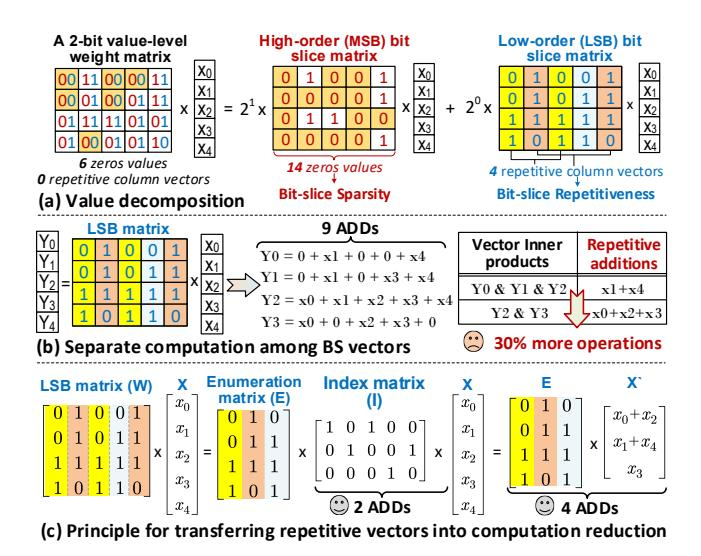

Figure 4: Bit-level sparsity and repetition opportunities.

This aligns with the near-Gaussian distribution of weights [35, 52], where higher-order bits tend to be zero. Additionally, the 1st and 2nd columns in the LSB slice are identical to the 3rd and 5th, respectively, indicating increased repetition after bit-level decomposition. Notably, a 2-bit integer GEMV is functionally equivalent to a shift-and-accumulate operation over the two bit-slice matrices, where the MSB slice is weighted by  $2^1$  and the LSB by  $2^0$ . This demonstrates that bit-level decomposition preserves full compute equivalence while exposing fine-grained sparsity and redundancy. We refer to the above two opportunities as **BS sparsity** and **BS repetitiveness**.

However, directly computing with BS sparsity or repetitive vectors in a naive manner is still inefficient. With the LSB slice matrix in Fig. 4 (a) as an example, Fig. 4 (b) illustrates computing each BS vector independently. This results in redundant operations. Specifically,  $x_1 + x_4$  is calculated three times across  $Y_0$ ,  $Y_1$  and  $Y_2$ , while  $x_0 + x_2 + x_3$  is recalculated twice, leading to a 30% more operations. This inefficiency arises from failing to exploit redundancy across BS vectors. Naturally, this raises a key question: how can we harness such inherent repetitiveness to reduce overall computation?

**Opportunity**: Fig. 4 (c) illustrates an effective computation reduction strategy. First, it transforms the LSB matrix (denoted as W) involving repetitive column vectors into an enumeration matrix (E) and an index matrix (I). Specifically, E stores unique column vectors from W and I records the mapping between each column in W and its corresponding vector in E. For example, the 3rd column of W matches the 1st column of E, so the value of I (1,3) is 1. This transformation rewrites  $W \times X$  as  $E \times I \times X$ . The intermediate result  $X' = I \times X$  requires 2 additions, and  $E \times X'$  requires 4 additions, yielding a 30% reduction compared to the naive computation that demands 9 additions. We refer to this approach as a redundancy elimination strategy based on BS vector grouping. By grouping multiple BS vectors as a group matrix, the strategy identifies and eliminates redundant computations among them. Its effectiveness depends on the **repeated column vectors** within the group matrix: more repetition leads to lower computation.

**Challenges**: Despite its promise, designing an efficient bit-level accelerator for LLM inference remains a challenging task.

**(Challenge 1)** Directly grouping a large number of BS vectors results in low repetition rates among column vectors.

As depicted in Fig. 5 (a), the number of repetitive column vectors in an  $8 \times 8$  BS matrix is significantly smaller than the number of repetitive column vectors after decomposing it into two  $4 \times 8$  submatrices, where we denote 4 as the group size m. This follows from the pigeonhole principle [1]: When the number of holes is less than the number of pigeons, at least one hole will contain more than one pigeon. As m decreases, the number of available "holes" (i.e., at most  $2^m$ ) is reduced, thus the probability of repetitive column vectors increases. Our analysis across five LLMs in Fig. 5(b) reveals that, compared to the vanilla full-size merge, the group-wise merge achieves, on average, a  $5.1 \times$  reduction in computation.

**Key idea.** We decompose the large weight matrix  $\in \mathbb{R}^{H \times H}$  in LLMs into several smaller group matrices of size  $\mathbb{R}^{m \times H}$ , where H is hidden dimension. To support this, we design a CAM-based match unit, which significantly reduces the latency associated with the search process for repetitive column vectors along the H dimension.

**(Challenge 2)** Value-level compression is incompatible with bit-level computation paradigms and obscures BS sparsity.

As shown in Fig. 5 (c), this inefficiency stems from two primary factors: (1) Value-level compression achieves only a 30% sparsity rate (SR), which is 2.5× lower than bit-level sparsity; (2) Value-level formats require bit reordering for bit-level PEs, which incurs additional on-chip overhead. Fig. 5 (d) further show that, across five LLMs, bit sparsity is on average 10.1× higher than value sparsity.

Illustration for the bit reorder: Traditional memory layouts store multi-bit activations contiguously across bits. As a result, when computing the MSB slice, a large number of LSBs are also fetched unnecessarily. To enable bit-slice-based processing, a bit-reordering step is required to extract and reorganize the relevant MSB data into a contiguous MSB slice for input to the processing elements (PEs). We refer to this operation as bit-reorder.

**Illustration for the bit sparsity**: For a k-bit matrix, we first compute the bit sparsity of the bit-slice matrices for each bit position. The overall bit sparsity of the 8-bit matrix is then the average bit sparsity across all bit-slice matrices for each bit position.

**Key idea.** We propose an effective two-state coding scheme operating along the bit-slice dimension, naturally aligned with bit-level computation and eliminating the overhead of data reordering. The coding and computation are associated designed and operates at the same group granularity to ensure global maximum benefits. Lightweight en/decoders are designed to enable greater parallelism and low-power data coding within the same area budget.

(Challenge 3) The current Top-k prediction is coarse-grained and involves redundant computation and memory access.

As depicted in Fig.5 (f), although the top-*k* prediction successfully reduces the overall attention latency by 45%, the bottleneck shifts to the prediction process itself. Therefore, it is imperative to

Figure 5: Challenges and our strategies for applying bit-level computing to computation-memory-efficient LLM inference.

Figure 6: The preparation and execution flow of MCBP.

further optimize the top-k prediction process. Fig.5 (e) illustrates inefficiencies in value-based top-k prediction using an example where the threshold is 75. To identify whether the current Key (0101) belongs to the top-k set, the value-based approach loads the 4bit K entry from HBM and then executes computation for 8bit results. However, we observe that the top 2 bits alone are sufficient to determine that the final result ( $\leq$ 31) will fall below the threshold, making the remaining 2-bit computation and memory access unnecessary.

**Key idea**. We propose a bit-grained progressive prediction with early termination. Attention scores are estimated bit-wise from MSB to LSB. This allows computation and KV cache access to be terminated early once the partial result exceeds the feasible top-k range. As shown in Fig. 5 (g), this reduces KV cache accesses by up to 50% across three scenarios, compared to value-level prediction.

Review of Transformer accelerators. Unfortunately, current Transformer accelerators still struggle with computation and memory access issues, due to their inability to exploit bit-grained opportunities for coordinated optimization. Table 1 summarizes their features. The majority of existing works [25, 26, 59, 75, 104] focus on accelerating attention whose quadratic complexity dominates earlier encoder-based models, like BERT. However, their strategies are less effective for decoder-only LLMs during the autoregressive decoding stage, where performance is severely constrained by memory access. While Energon [113] and SpAtten [94] realize challenges with memory access, their coarse-grained pruning fails to handle fine-grained bit-level optimizations for both linear weights and KV cache. SOFA [92] exhibits compute-memory co-optimization, but is restricted to attention. FACT [72] targets whole model computation reduction but lacks support for fine-grained KV cache and weight loading optimizations. These limitations motivate us to design an

Table 1: Summary for SOTA Transformer Accelerators.

| Accelerator   | GEM       | M        | Memo   | ry access | P & D  | Optimiz. |  |
|---------------|-----------|----------|--------|-----------|--------|----------|--|
| Accelerator   | QKV & FFN | Atten.   | Weight | KV Cache  | stage  | Level    |  |
| $A^{3}[25]$   | ×         | ✓        | ×      | ×         | P only | Value    |  |
| ELSA [26]     | ×         | ✓        | ×      | ×         | P only | Value    |  |
| Sanger[59]    | ×         | ✓        | ×      | ×         | P only | Value    |  |
| DOTA [75]     | ×         | ✓        | ×      | ×         | P only | Value    |  |
| DTATrans[104] | ×         | ✓        | ×      | ×         | P only | Value    |  |
| Energon [113] | ×         | ✓        | ×      | Low       | P only | Value    |  |
| SpAtten[94]   | ✓         | ✓        | ×      | Low       | P & D  | Value    |  |
| SOFA [92]     | ×         | ✓        | ✓      | ×         | P only | Value    |  |
| FACT[72]      | ✓         | ✓        | Low    | ×         | P only | Value    |  |
| MCBP          | /         | <b>'</b> | ~      | <b>/</b>  | P & D  | Bit      |  |

efficient LLM inference accelerator that jointly optimizes GEMM computation, weight access, and KV cache access across both prefill and decoding stages.

# 3 Algorithm Optimizations of MCBP

Based on the three challenges, we propose three corresponding optimization strategies: BRCR, BSTC, and BGPP. Fig. 6 depicts the overall execution flow of MCBP. Model weights are offline-compressed into a bit-level (BL) sparsity format (BSTC, §3.2). During inference, the BL-compressed weights are loaded and decompressed, then sent for GEMM acceleration (BRCR, §3.1), the BL KV cache are on-demand fetched to predict attention sparsity (BGPP, §3.3).

# 3.1 BS-Repetitiveness-enabled Computation Reduction for GEMM (BRCR)

As depicted in Fig.7 (a), the core idea of BRCR is first to decompose an k-bit weight matrix into k bit-slice (BS) matrices. Then, for each BS matrix, it extracts m rows of these matrices and merges them as a *Group matrix*. Thus, it will process m rows each time, instead of all rows. For clarity, we use GEMV to illustrate the acceleration mechanism, which is also effective in GEMM scenarios. Overall, two key steps are required to achieve computation acceleration.

1) Merging repetitive operations. As depicted by Fig. 7 (b), this step first ① identifies repeated entries (i.e., column vectors) in the *Group matrix* G, then ② merge their corresponding activations

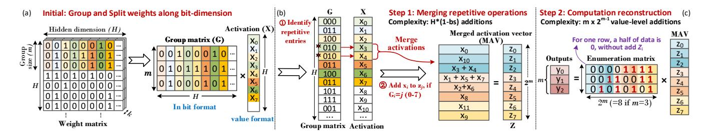

Figure 7: Bit-slice-repetitiveness-enabled computation for GEMM (BRCR).

Figure 8: BS-sparsity-enabled two-state coding (BSTC).

into a *merged activation vector* (MAV), denoted as Z. This is implemented by accumulating each activation into the partial sum of the corresponding entry in Z, based on the value of each column in G (We denote as Grouped index). For example, the 3rd and 4th columns of the group matrix are both 010 (i.e.  $G_3=G_4=2$ ), so their corresponding activations,  $x_3$  and  $x_4$  are added to the entry ( $z_2$ ) of the Z. Notably, for a bit column vector with m elements, there are  $2^m$  possible types. Thus, the MAV has a length of  $2^m$ . Mathematically, this step is equivalent to the I × X in Fig. 4 (c). Notably, non-zero entries in the MAV indicate multiple rows in a weight share the same addition operation. For instance,  $z_3$  (Grouped index is 011) denotes the repetitive additions among rows 1 and 2, while  $z_0$  represents activations multiplied by zero, which can be directly eliminated. With bit sparsity ratio bs, this step consumes at most  $H \times (1 - bs)$  additions, regardless of group size m.

**2) Computation reconstruction.** As depicted in Fig.7 (c), this step is to reconstruct the GEMV results by multiplying the *Enumeration matrix* with the MAV. It is noteworthy that for a Group matrix  $\mathbb{R}^{m \times H}$ , when H is very large, we can reasonably assume that all possible  $2^m$  column vectors will appear. Thus, the Enumeration matrix contain all  $2^m$  distinct column vectors. In this way, each row of the enumeration matrix can contain at most  $2^{m-1}$  ones. Therefore, the computation reconstruction step requires at most  $m \times 2^{m-1}$  additions for reconstructing m-row GEMV.

In summary, for a k-bit, m-row GEMV with bit sparsity ratio  $\tilde{bs}$  and value sparsity vs, where  $\tilde{bs}$  is the average bit sparsity ratio across all ( $\in [1, k]$ ) bit-slice matrices. The total additions required

by BRCR is  $k(H\times(1-\tilde{bs})+m\times2^{m-1})$ . By contrast, existing sparsity-aware bit-serial computing (BSC) [2, 15] consumes  $k(H\times m\times(1-\tilde{bs}))$  additions. And the value-based sparsity scheme consumes  $H\times m\times k\times vs$  additions. For typical LLM models (H~4k,  $\tilde{bs}$ ~0.70, vs~0.07, m=4), BRCR achieves up to 12.1× and 3.8× computation reduction compared to value sparsity and naive BSC.

Verify the existence for redundancy based on pigeonhole principle. Any m-row binary matrix can have at most  $2^m$  types of column vectors. Since LLMs (e.g., Bloom-7B, GPT-3) have hidden dimensions H (4k-12k) far exceeding  $2^m$ , there are abundant opportunities for redundancy in LLMs.

Key Insights: There is a key sweetspot of m that achieves the maximum computation reduction while minimizing reconstruction overhead. For a GEMV with a k-bit weight matrix  $\in \mathbb{R}^{H \times H}$ , the total operations of BRCR are  $kH^2/m \times (1-\bar{bs}) + kH2^{m-1}$ . The group size m introduces an interesting trade-off. If m is too small, it fails to exploit sufficient redundancy between the bit-slice vectors. Conversely, if m is too large, the exponentially increasing reconstruction cost (i.e.,  $2^{m-1}$ ) offsets the benefits of redundancy removal. The DSE for optimal m is provided in §5.2.

# 3.2 BS-Sparsity-enabled two-state Coding (BSTC)

While numerous studies [28, 29, 62, 63, 73] have explored coding techniques for sparse weight compression, they largely focus on value-level sparsity, limiting their effectiveness. In contrast, BSTC exploits the key insight that quantized weights exhibit Gaussian-like distribution [52], thus most non-zero weights own zero bits. To this end, BSTC encodes data at different BS matrices separately, to exploit the high sparsity in high-order bit plane. In addition, the encoding of BS matrices aligns with the computation granularity of BRCR, i.e., group size m, thus avoiding extra data conversion overhead

Fig. 8 (a) illustrates BSTC's design. To exploit bit-0 sparsity in high-order bits (near MSB part), we adopt the sign-magnitude (SM) format for all weights. Given varying sparsity across bit positions, only bit-slice matrices from bits 3-7 are compressed, while bits 1, 2, and 8 remain uncompressed. Despite redundant sparsity in high-order bits, naively encoding would result in irregular data re-assignment for computation, leading to severe overhead. To this end, we employ a *two-state* encoding, which distinguishes only zero data and non-zero data. Zero is encoded as 1'b0, and non-zero is encoded as a (m + 1)-b symbol:  $\{1'b1, m'b \text{ data}\}$ . For instance, in Fig. 8 (a), we have  $\{0000\} \rightarrow \{0\}$  and  $\{0001\} \rightarrow \{10001\}$ , where 1 is

Figure 9: Bit-grained progressive top-k prediction (BGPP).

Figure 10: High-level block diagram for MCBP accelerator.

an indicator that facilitates decoding. In this way, BSTC provides regularity at the bit-column level and achieves lossless compression.

Since BSTC introduces a 1-bit indicator for each non-zero column vector, its applicability must be carefully evaluated; otherwise, the overhead may offset the encoding gains. Fig. 8 (b) illustrates the compression ratio (CR) of BSTC under varying sparsity ratio (SR) as the group size (m) changes. There are some interesting insights: First, an excessively large m may reduce the compression ratio due to fewer co-occurring zeros across data elements within larger groups. Second, when the SR is high, a larger group size *m* tends to yield a higher compression ratio, as it reduces the relative overhead of storing indicators. Last, we can figure that when SR exceeds 65%, BSTC can achieve positive benefits (i.e. CR>1). Further, Fig. 8 (c) analyzes the SR of bit-slice (BS) matrices across different bit positions in Llama7B and Qwen7B. It is observed that the SR for the 3rd to 7th BS matrices all exceed 65%. Thus, we apply BSTC compression to these BS matrices. By contrast, for BS matrices with low SR, such as the 1st BS matrix, no compression is applied

# 3.3 Bit-grained Progressive Prediction (BGPP)

As introduced in §2.2, the core idea of top-k prediction is to estimate the attention matrix with a low-overhead paradigm, then pick up important Key indices. However, even utilizing the low-precision paradigm (e.g. 4bit with MSB only), the value-based strategy still

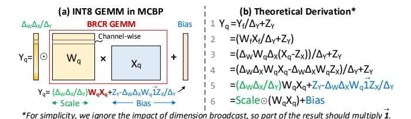

Figure 11: Illustration for quantization process in MCBP.

Figure 12: The tiling strategy for GEMM in MCBP.

causes unnecessary memory access and computation (Fig.5 (c)). Therefore, a more efficient prediction scheme is a must.

BGPP addresses this by leveraging the relative nature of softmax: if an input's gap from the current max exceeds a threshold, its softmax output will be near zero[72]. Thus, the gap (termed *radius*) with the current max value can be used to filter trivial Keys.

We propose a bit-grained progressive filter mechanism to achieve this. *Progressive* means: it performs multiple rounds of filtering, where in each round, incremental filtering is applied based on the Keys (Ks) selected in the previous round. Fig. 9 gives an illustration for this procedure. Assume the initial state consists of 6 Ks (K0-K5). In the first round, we fetch the MSB of all Ks for computation with  $Q_i$  (with 4 bit), and obtain the estimated Max attention value denoted as  $\max(\hat{A}_i^1)$ . Then, based on Eq.(1), a radius-calculated (RS) filter obtains the filtering threshold for the current round. Then, it retains the indices ( $K_{id}$ ) of the Ks (e.g. 1,3,5), whose attention values are greater than this threshold. In the next round, we only fetch the second bit of the  $\{1,3,5\}$ -th Ks from HBM. This process continues for the predetermined number of rounds.

Instead of directly adopting a fixed value as the threshold, for round r, we set the filter threshold of the i-th row as  $\theta_i^r$ :

$$\theta_i^r = \max(\hat{A}_i^r) - \alpha_r \times radius, \ 0 \le \alpha_r \le 1,$$
 (1)

where  $\hat{A}_i^r$  is the estimated attention of the *i*-th row (During *decoding* stage, i=0). Based on our experiments, we empirically set the default radius to 3 and use a parameter  $\alpha_r \in [0, 1]$  to control the threshold. By adjusting  $\alpha_r$ , we can control the pruning ratio in each round.

# 4 Architecture and Hardware Innovation

#### 4.1 Architecture Overview

Fig. 10 illustrates the MCBP architecture (bottom) and its workflow (top) for efficient Transformer inference under attention sparsity (§2.2). The accelerator operates through eight key steps, with numbered markers on the timeline indicating their positions within the overall pipeline. First, the controller sends token indices and bit-slice (BS) weights to the data fetcher, which decodes physical addresses and loads data into on-chip SRAM **1**. The BSTC decoders

Figure 13: The bit-grained computation dataflow of MCBP.

then decompress the weight matrices **②**, forwarding them to the BRCR unit **③**, where a CAM-based module identifies repetitive BS weight entries. These indices are returned to the fetcher, translated into SRAM addresses, and used to fetch corresponding activations back to the BRCR unit **④**. Finally, the computed GEMM results are written back to off-chip DRAM **⑤**.

To efficiently handle dynamic attention sparsity (§2.2) and hide prediction latency, BGPP operates concurrently with the BRCR unit. Its workflow begins by retrieving QK tensors from the data fetcher **6** and performs an initial prediction. The selected indices are then returned to the data fetcher **o** to fetch the required Keys for the next round (as Fig. 9). This process continues iteratively until the preset number of iterations is reached, and the final KV indices are stored in Temp SRAM **3**. In this dedicated dataflow, once computation proceeds to the attention part, the BRCR unit can merely calculate attention scores with those vital KVs, based on these KV indices generated by BGPP. To fully support Transformer computation, MCBP integrates an Auxiliary Processing Unit (APU) that includes an embedding unit for generating input token embeddings via table lookup, a special function unit (SFU) implemented in FP16 using a combination of lookup tables and polynomial approximation [73] to compute non-linear functions such as GELU, softmax, and layer normalization, and a quantizer that handles data conversion between FP16 and INT8. Notably, the concatenation in MHA is performed during data movement.

**Processing of scaling and zero point.** Fig. 11 (a) illustrates the quantization process in MCBP, where weights are quantized using per-channel symmetric quantization, and activations are quantized using per-tensor asymmetric quantization, as [38, 98, 101]. Taking activations as an example, the quantized input activation is computed as  $X_q = X_f / \Delta_x + Z_x$ , where  $\Delta_x$  is the scaling factor and  $Z_x$  is the zero-point offset. Notably,  $\Delta_w$ ,  $\Delta_x$ ,  $\Delta_y$ ,  $Z_x$  and  $Z_y$  can be preknown by the calibration dataset. Based on the derivation in Fig. 11 (b), the final output is expressed as  $Y_q = Scale \odot (W_q X_q) + Bias$ , where the INT GEMM  $(W_q X_q)$  is accelerated by the BRCR unit via

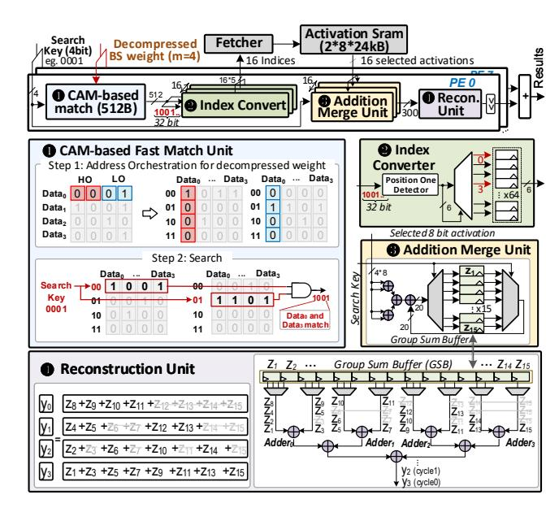

Figure 14: A PE cluster of CAM-based fast-match BRCR unit.

efficient bit-slice processing and shift-accumulation. The results are then processed by the quantizer with the scaling and bias terms.

**Tiling Strategy.** Fig. 12 illustrates the tiling strategy of MCBP and its corresponding loop representation for the output-stationary dataflow. To maximize weight reuse, MCBP stores slices included in the  $T_M \times K$  weight tile into the weight SRAM at once, if possible. Then the BRCR unit assigns a  $T_M \times T_K$  weight tile together with a  $T_K \times T_N$  activation tile to each PE cluster, where 8 PEs concurrently process each bit-slice of the weight tile in parallel. In this work, we set  $T_M = 64$ ,  $T_K = 256$ , and  $T_N = 32$ .

# 4.2 Bit Dataflow of MCBP

To optimize bit-level memory access, we orchestrate the BS weight matrix layout in off-chip HBM. Fig. 13 shows an example using the compressed weight from Fig. 8. Given HBM's read-write characteristics, we prioritize storing the bits along the group size dimension at the same address across all banks. Once filled, allocation moves sequentially to the next address until the entire BS matrix is stored. Before computation, the BS data is loaded into the on-chip weight SRAM. Given the one-row-per-cycle access feature of SRAM banks, we prioritize storing the BS matrix within a single bank. Once the data in the weight SRAM is ready, the sparse BS matrices are sent to the BSTC decoder for decompression. During the process, the controller will check whether decoding is required. BS matrices at the 1st, 2nd, and 8th bit positions are not decoded, as they were not encoded due to their low sparsity (see Fig. 8).

#### 4.3 CAM-based BRCR Unit

The BRCR mechanism requires quickly identifying and consolidating identical elements in the group matrix (§3.1). To this end, we design a content-addressable memory (CAM) based fast match unit, which can identify identical elements in one cycle.

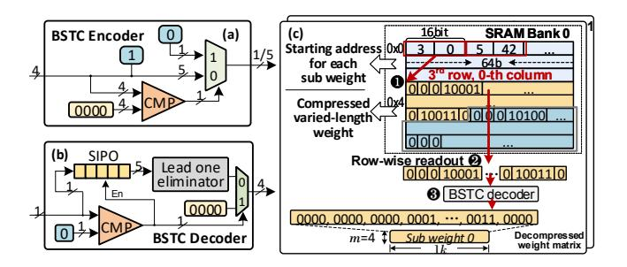

Figure 15: (a)(b) Architectures for lightweight BSTC encoder/decoder. (c) Parallel-friendly segmented data layout.

As depicted in Fig. 14  $\mathbf{0}$ , we adopt a group size m = 4. Initially, each 4-bit column vector of the decoded weights is orchestrated in CAM. Higher-order (HO) two bits and lower-order (LO) two bits of each 4-bit data are managed separately. As two bits correspond to four possible values, four entries are needed to store the orchestrated data. Then, for the search step, if an entry address matches the search key, the content of that entry is set to 1, while the other entries are set to 0. Taking searching 0001 (search key) as an example, the HO two bits read the row at address '00' of the MSB bank, while the LO two bits read the row at address '01' of the LSB bank. Then readout bits from both banks are ANDed to match both high and low 2 bits with the search key. The generated bitmap '1001', indicates  $x_0$  and  $x_3$  match the 0001. The controller enumerates all possible search keys for m=4 (0000 to 1111). If the search key is 4'b0000, the CAM will be clock-gated to save power. The CAM, with a 2-bit matching length as its basic block, is designed to be reconfigured by re-matching the outputs of multiple basic blocks, to support adaptation to different group sizes.

The CAM-generated bitmap identifies activations to be merged and added. Sixteen index converters then translate the bitmap (e.g., 1001) into corresponding activation indices (②). Next, the search key (0001) and the fetched activations  $(x_0, x_3)$  are together sent to the addition merge unit (AMUs) (③). The AMU first adds  $x_0 + x_3$ , then put the psum to the first register  $z_1$ , based on the search key 0001. For more fetched activations, data in one register is read out by the MUX and added to the psum, then the result is written back to the same register in group sum buffer (GSB) by the deMUX.

Next, a reconstruction unit (RU) reorganizes partial sums stored in GSB into correct results. Inspired by the fixed re-construct formula as Fig. 14 (9) left, we design a low-power RU with a fixed data path. *Fixed* means: we bind specific registers to inputs of each adder. By reordering the computation sequence, we extend the data lifecycle in adders. For example, computing  $y_3$  first, followed by  $y_2$  down to  $y_0$ , allows  $Adder\ 3$  to read  $z_{15}$  only once, reducing its switching activity by up to 75%. Given that the reconstruction workload is much lighter than the addition merging, one RU is time-multiplexed to serve 16 AMUs, improving resource utilization.

# 4.4 Lightweight BSTC CODEC and Data Layout

We first design a lightweight encoder-decoder that enhances parallelism within the same area budget. Then, we introduce a segmented interleaved data layout in SRAM to support parallel en/decoding.

Figure 16: Threshold-aware clock-gated BGPP unit.

Fig.15 (a)(b) depicts the lightweight BSTC en/decoder architectures. The encoder comprises a 4 bit comparator (CMP) and a MUX. If the input is non-zero, it adds a 1-bit '1' ahead the MSB and outputs the result; Otherwise, it outputs a 1-bit '0'. The decoder includes a 1-bit CMP, a 5-bit serial-in parallel-out (SIPO) register (for m=4), and a leading one eliminator. When a '0' is detected in the bit stream, it outputs four consecutive 0's. Otherwise, it buffers received bits in the SIPO, which outputs the buffered content once full.

Fig.15 (c) illustrates the segmented weight layout during a decompression process. To enable parallel decoding, the weight matrix is partitioned along the hidden dimension into multiple subweights, each stored independently in separate banks. Given variable compression ratios, the starting address of each sub-weight is recorded. Before decompression, the controller fetches these starting addresses from the address area ①. Based on the retrieved addresses ②, sub-weight data is accessed row-wise and sent to the BSTC decoder ③ for decompression. Each bank has 64 columns and 1024 rows, we use a 6-bit column address and a 10-bit row address to locate the first data of each sub-matrix. One row can store the address of four 1k-length sub-matrices, and three rows suffice to index up to 12 sub-matrices, covering the weight size of most LLMs.

# 4.5 Threshold-aware clock-gated BGPP Unit

Fig. 16 shows the architecture of BGPP unit. First, 16 bit-serial inner product units compute Q (1\*64)  $\times$  K (64\*16), each with a 64-input adder tree. The generated summations are passed to the progressive filter (PF) unit. Next, a threshold updating (TU) module serially identifies the Max and Min values from these data. After completing the statistics for one row of the estimated attention, the TU subtracts the  $\alpha_r \times radius$  from the Max value, which stands for the filter threshold (Eq.(1)). Next, a *clipping* module compares all attention entries with this threshold, then produces a binary mask signal, where "1" signifies the index of Ks eligible to proceed to the subsequent filtering round. After a fixed number of rounds, the final set of key indices is selected. To save power, if the threshold falls below the observed minimum, the clipping module is clock-gated and BGPP immediately proceeds to the next round. Additionally, to enable bit-wise computation under the SM format, we design a sign decision unit (SDU) and place it before the adder tree.

Table 2: Accuracy of Different Language Models with FP16, INT8 and MCBP Optimization (S: Standard, A: Aggressive).

| Model             | LlaMa7B |           |       |       |           | LlaMa13B |       |       |       |           |       | OPT1B3 |           | Bloom1B7 |       | Qwen7B |           |       |           |       |           |       |
|-------------------|---------|-----------|-------|-------|-----------|----------|-------|-------|-------|-----------|-------|--------|-----------|----------|-------|--------|-----------|-------|-----------|-------|-----------|-------|
| Task ‡ | MMLU V  | Wikiling. | MBPP  | Wiki2 | Winogran. | Cola     | MNLI  | SST2  | MMLU  | Wikiling. | MBPP  | Wiki2  | Winogran. | Cola     | MNLI  | SST2   | Wikiling. | MBPP  | Wikiling. | MBPP  | Wikiling. | MBPP  |
| FP16              | 35.1%   | 39.3      | 17.8% | 5.68  | 70.1%     | 80.3%    | 84.6% | 92.5% | 41.2% | 43.3      | 22%   | 5.09   | 74.2%     | 82.5%    | 85.5% | 93.8%  | 36.2      | 12%   | 44.3      | 16%   | 46.6      | 30%   |
| INT8              | 34.7%   | 38.9      | 17.2% | 5.73  | 69.3%     | 80.2%    | 84.4% | 92.5% | 40.9% | 42.7      | 21.6% | 5.13   | 73.7%     | 82.3%    | 85.3% | 93.7%  | 35.9      | 11.6% | 44.1      | 15.7% | 46.4      | 29.2% |
| MCBP (S)          | 34.6%   | 38.8      | 17.1% | 5.75  | 69.2%     | 80.2%    | 84.4% | 92.4% | 40.7% | 42.6      | 21.5% | 5.15   | 73.4%     | 82.3%    | 85.3% | 93.7%  | 35.8      | 11.5% | 44.0      | 15.6% | 46.3      | 29.1% |
| MCBP (A)          | 34.1%   | 38.4      | 16.5% | 5.80  | 68.7%     | 80.0%    | 84.1% | 92.1% | 40.2% | 42.0      | 21.0% | 5.19   | 72.8%     | 82.0%    | 85.1% | 93.4%  | 35.3      | 11.0% | 43.6      | 15.2% | 45.9      | 28.4% |

\* MMLU, WinoGrande, MBPP, Cola, MNLI, SST2 are evaluated by accuracy. Wikitext2 is evaluated by perplexity, where lower is better. Wikilingua is evaluated by ROUGE-1, where higher is better.

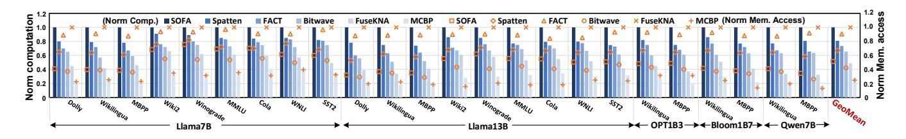

Figure 17: Normalized computation (prefill stage) and memory access (decoding stage) of LLM inference.

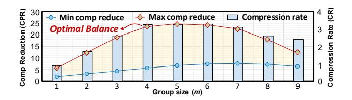

Figure 18: Design space exploration of the optimal group size *m*, for computation reduction and compression rate.

# Baseline BRCR BSTC BGPP 1 0.8 1 0.6 1 0.6 1 0.6 1 0.6 1 0.7 1 0.8 1 0.6 1 0.6 1 0.6 1 0.6 1 0.6 1 0.6 1 0.6 1 0.6 1 0.6 1 0.6 1 0.6 1 0.6 1 0.6 1 0.6 1 0.6 1 0.6 1 0.6 1 0.6 1 0.6 1 0.6 1 0.6 1 0.6 1 0.6 1 0.6 1 0.6 1 0.6 1 0.6 1 0.6 1 0.6 1 0.6 1 0.6 1 0.6 1 0.6 1 0.6 1 0.6 1 0.6 1 0.6 1 0.6 1 0.6 1 0.6 1 0.6 1 0.6 1 0.6 1 0.6 1 0.6 1 0.6 1 0.6 1 0.6 1 0.6 1 0.6 1 0.6 1 0.6 1 0.6 1 0.6 1 0.6 1 0.6 1 0.6 1 0.6 1 0.6 1 0.6 1 0.6 1 0.6 1 0.6 1 0.6 1 0.6 1 0.6 1 0.6 1 0.6 1 0.6 1 0.6 1 0.6 1 0.6 1 0.6 1 0.6 1 0.6 1 0.6 1 0.6 1 0.6 1 0.6 1 0.6 1 0.6 1 0.6 1 0.6 1 0.6 1 0.6 1 0.6 1 0.6 1 0.6 1 0.6 1 0.6 1 0.6 1 0.6 1 0.6 1 0.6 1 0.6 1 0.6 1 0.6 1 0.6 1 0.6 1 0.6 1 0.6 1 0.6 1 0.6 1 0.6 1 0.6 1 0.6 1 0.6 1 0.6 1 0.6 1 0.6 1 0.6 1 0.6 1 0.6 1 0.6 1 0.6 1 0.6 1 0.6 1 0.6 1 0.6 1 0.6 1 0.6 1 0.6 1 0.6 1 0.6 1 0.6 1 0.6 1 0.6 1 0.6 1 0.6 1 0.6 1 0.6 1 0.6 1 0.6 1 0.6 1 0.6 1 0.6 1 0.6 1 0.6 1 0.6 1 0.6 1 0.6 1 0.6 1 0.6 1 0.6 1 0.6 1 0.6 1 0.6 1 0.6 1 0.6 1 0.6 1 0.6 1 0.6 1 0.6 1 0.6 1 0.6 1 0.6 1 0.6 1 0.6 1 0.6 1 0.6 1 0.6 1 0.6 1 0.6 1 0.6 1 0.6 1 0.6 1 0.6 1 0.6 1 0.6 1 0.6 1 0.6 1 0.6 1 0.6 1 0.6 1 0.6 1 0.6 1 0.6 1 0.6 1 0.6 1 0.6 1 0.6 1 0.6 1 0.6 1 0.6 1 0.6 1 0.6 1 0.6 1 0.6 1 0.6 1 0.6 1 0.6 1 0.6 1 0.6 1 0.6 1 0.6 1 0.6 1 0.6 1 0.6 1 0.6 1 0.6 1 0.6 1 0.6 1 0.6 1 0.6 1 0.6 1 0.6 1 0.6 1 0.6 1 0.6 1 0.6 1 0.6 1 0.6 1 0.6 1 0.6 1 0.6 1 0.6 1 0.6 1 0.6 1 0.6 1 0.6 1 0.6 1 0.6 1 0.6 1 0.6 1 0.6 1 0.6 1 0.6 1 0.6 1 0.6 1 0.6 1 0.6 1 0.6 1 0.6 1 0.6 1 0.6 1 0.6 1 0.6 1 0.6 1 0.6 1 0.6 1 0.6 1 0.6 1 0.6 1 0.6 1 0.6 1 0.6 1 0.6 1 0.6 1 0.6 1 0.6 1 0.6 1 0.6 1 0.6 1 0.6 1 0.6 1 0.6 1 0.6 1 0.6 1 0.6 1 0.6 1 0.6 1 0.6 1 0.6 1 0.6 1 0.6 1 0.6 1 0.6 1 0.6 1 0.6 1 0.6 1 0.6 1 0.6 1 0.6 1 0.6 1 0.6 1 0.6 1 0.6 1 0.6 1 0.6 1 0.6 1 0.6 1 0.6

(b) Separate effect of BRCR, BSTC, BGPP

union effect of BRCR BSTC BGPP

Figure 19: Latency reduction for BRCR, BSTC and BGPP.

#### 5 Evaluation

# 5.1 Experimental Setup

Baseline comparisons: We compare MCBP with two SOTA bit accelerators: FuseKNA [103], Bitwave [81], and three Transformer accelerators: Spatten [94], SOFA [92], FACT [72]. For fair comparison, FuseKNA and Bitwave are adapted from convolution to GEMV using im2col. All designs are normalized to a 28nm process and evaluated under identical conditions: PE arrays occupy the same area as MCBP and work in 1GHz, on-chip SRAM is set to 1248kB, and HBM bandwidth is fixed at 512-bit/cycle, with 4 pj/bit [67].

**Benchmarks**: We evaluate MCBP on several LLM models of varying sizes, including Llama7B/13B [88], Qwen7B [6], Bloom1B7 [42] and OPT1B3 [111], across nine tasks. These tasks includes Cola (S=0.25k), MNLI (S=0.5k), SST2 (S=0.25k) from GLUE [91], language modeling (Wikitext-2 (S=2k) [61], Wikilingua (S=2k) [18], Winogrande (S=0.25k) [77]), Multitask Language Understanding (MMLU, S=0.5k) [32], code generation MBPP (S=1k) [5], long context processing dolly (S=8k) [13].

**Quantization Accuracy**. All pre-trained models are sourced from Pytorch [69] and HuggingFace [99]. INT8 baselines derived via post-training quantization, where only the GEMMs are quantized to INT8, while non-linear operators (e.g., softmax) remain in FP16 precision. As shown in Table. 2, **the INT8 baseline incurs less than a** 1% **average accuracy drop from FP16, confirming its validity**. Notably, for reasoning tasks such as MMLU and Winogrande, the accuracy degradation caused by INT8 quantization

is negligible, typically below 0.5%. This observation is consistent with prior works [36], which suggests that classification and reasoning tasks, due to their discrete output space and robustness to quantization noise, exhibit a high tolerance for low precision.

Simulation: We implement the RTL design for MCBP and utilize Synopsys DC on TSMC 28nm CMOS technology to estimate the logic area and power. The CAM cell is designed using Cadence Virtuoso at the schematic level, then integrated with Verilog-based digital peripherals. The power, area, and read/write bandwidth of on-chip SRAM buffers are estimated through CACTI [64]. Off-chip HBM modeling involves simulating row activation and access patterns under various data layouts, capturing HBM's burst behavior. We derive memory latency from Ramulator [41], and estimate IO power following the methodology in [3, 8, 96]. We extract each stage's cycles by simulating the RTL with Verilator [83], and use a custom cycle-level simulator to evaluate end-to-end performance.

**GPU comparison** We run benchmarks on Nvidia A100 with SOTA TensorRT-LLM [66]. To exclude the software overhead, we measure execution time with *cudaEvent*, isolating GPU execution from CPU interference. The GPU is dedicated during tests, and large batch sizes are used to amortize data transfer costs. We employ *nvprof* to exclude non-computational phases. Power is measured via *nvidia-smi*; dynamic power is computed as the difference between active and idle states. Each experiment is run 2k times, discarding the top and bottom 15% before averaging.

# 5.2 Algorithm Performance

**Algorithm settings**: We regard INT8 models as the accuracy baseline, and adjust the value of  $\alpha_r$  in 0.1 increments to evaluate the accuracy and overhead for each benchmark. This yields two MCBP configurations: standard (0% loss), aggressive (1% loss), representing the minimal and maximal performance optimizations, respectively.

**Optimal Group Size.** We determine the optimal group size m by comparing computation reduction (CPR) and compression rate (CR) against dense models. Considering the varying sparsity levels, both the max and min CPRs are reported. Fig. 18 shows that CPR raises from m=1 to m=5, as more weight rows are merged, but declines beyond m=5, due to the exponential growth ( $2^m$ , Fig. 7) in additions required by computation reconstruction. For CR, m=1 results in a CR of less than 1, while m=4 maximizes CR by capturing all-zero columns. Beyond this point, fewer all-zero columns, in turn, negatively impact the CR. Considering the balance CPR and CR, and that 4 is the common divisor of most Transformer hidden dimensions, we select m=4 for this work.

Computation Reduction. Fig. 17 compares the computation reduction of LLM inference across different accelerators. SOFA, which focuses solely on attention and adopts coarse-grained value-level sparsity, yields the lowest reduction and is used as the base-line. Bitwave enhances performance by exploiting bit-level sparsity, achieving a 32% reduction, and outperforming value-sparsity-based accelerators like FACT and Spatten. However, it does not capitalize on bit-repetition. FuseKNA utilizes bit-repetition but fails to exploit attention sparsity, limiting its reduction to 49%. By contrast, MCBP achieves up to 72.4% reduction by exploiting fine-grained bit-repetition, sparsity and attention dynamic sparsity.

Memory Access Reduction. FuseKNA, which only exploits value compression by run-length coding, serves as the baseline. FACT and Spatten utilize IO-intensive top-k to speculate trivial KV tokens, which successfully reduces computation but leading to redundant IO traffic. SOFA exclusively targets KV memory traffic in the attention module via cross-stage tiling, but does not mitigate weight traffic during the decoding stage. Thus, it shows comparable memory reduction to Bitwave in long-sequence tasks (e.g., Dolly, Wikilingua), but performs less effectively with short sequences like Cola. This is because, in short-sequence tasks, the memory bottleneck lies in the weight traffic, which SOFA fails to mitigate. In contrast, MCBP achieves an average memory reduction of 75.8% across both long- and short-sequence tasks, attributed to BSTC and BGPP, which respectively reduce weight and KV cache traffic.

# 5.3 Architecture Evaluation

We first set an ablation study to evaluate the latency reduction of BRCR, BSTC and BGPP against a baseline, which is assumed to be vanilla bit computation + value-level Huffman compression + value-level top-k prediction. Latency is evaluated by mapping various workloads on the MCBP accelerator. As shown in Fig.19 (a), BRCR reduces average latency by 30% over the baseline, by eliminating redundant computation in the prefill stage. Further, BSTC and BGPP achieve a further 44% latency reduction by significantly reducing I/O traffic from weights and KV cache during decoding.

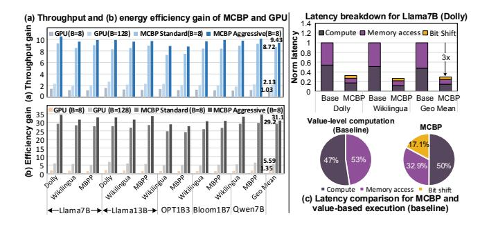

Figure 20: (a) Throughput and (b) energy efficiency gain of MCBP. (c) Breakdown for the overhead of bit shifting.

Fig.20 (c) profiles the latency overhead between typical value level INT8 computation and MCBP (bit-level). Despite a 17% bit-shifting overhead, the overall 3× latency reduction proves that the gain achieved through bit sparsity effectively covers this overhead.

Fig.19 (b) shows the individual contributions of BRCR, BSTC, and BGPP across two LLaMA-7B tasks. For the Dolly long-text summarization task, we maintain a decoding length of 48 tokens and test different schemes with varying prompt lengths. In this case, BRCR delivers the primary speedup, achieving 3.9× and 2.8× latency reduction for 1k and 4k prompts, respectively, while BSTC and BGPP achieve only 1.6× and 1.2× acceleration at 1k prompt. This is because GEMM computation dominates 55% of total latency in prompt-driven long-text summarization, making BRCR the most effective. With 4k prompts, BGPP outperforms BSTC due to increased KV cache memory access. For code generation task MBPP, BRCR only reduces latency by 1.2x, as the serial autoregressive decoding stage dominates latency. With 1k decoding length, BSTC achieves 2.7× latency reduction for weight traffic reduction, and BGPP achieves 1.4× for KV cache reduction. With 4k decoding length, BGPP increases to 2.1×, while BSTC drops to 1.6×.

Throughput Gain: Fig. 20 (a) compares the throughput of MCBP with A100 GPU on all benchmarks with batch sizes of 8 and 128. Given the INT8 compute power of A100 is 624 TOPS, we use 148 MCBP processors (total with 622TOPS@INT8) with data and model parallelism for performance comparison. First, we observe that B=128 provides an average 2.1× throughput gain over B=8, primarily due to amortized memory access. However, this benefit saturates, as a 16× increase in batch size results in only a 2× throughput gain. In contrast, MCBP achieves an 8.72× speedup over A100 with the same batch size. Second, we can see naively applying MCBP's algorithm on GPU yields only 1.03× speed up, as GPUs cannot exploit bit-slice repetition and fine-grained dataflow and progressive sparsity prediction. In contrast, MCBP accelerator achieves 78% average utilization due to its Transformer-oriented workflow, which fully pipelines Parallel BSTC en/decoders, BRCR acceleration, BGPP predictor, leading to nearly 8× higher sparsity utilization than GPU. Overall, MCBP standard and aggressive achieve an average  $8.72 \times /9.43 \times$  inference speed up, respectively.

Fig. 21 (a) gives the throughput gain breakdown, where **software** gain refers to the improvements achieved by directly deploying

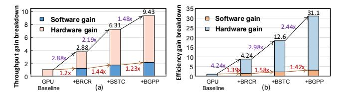

Figure 21: Throughput and energy efficiency gain breakdown.

Table 3: Hardware Configurations of MCBP.

| Main Modules                     | Parameters                                           |  |  |  |  |  |
|----------------------------------|------------------------------------------------------|--|--|--|--|--|
| CAM-based BRCR Unit              | 20 PE Clusters (160 PEs)                             |  |  |  |  |  |
| Processing Element (PE)          | One 512B CAM unit; 16 index converters               |  |  |  |  |  |
| Frocessing Element (FE)          | 16 Add merge units; 1 Reconstruction unit            |  |  |  |  |  |
| BSTC CODEC Unit                  | $20 \times 4$ decoders; $10 \times 4$ encoders       |  |  |  |  |  |
| Clock-gated BGPP Unit            | 64 64-input AND-based Adder-trees                    |  |  |  |  |  |
| Clock-gateu BOI I Ollit          | 4 Clock-gated Progressive Filters                    |  |  |  |  |  |
| <b>Auxiliary Processing Unit</b> | 1 Embedding unit; 1 Special function unit; 1 Quantiz |  |  |  |  |  |
| On chip Buffer                   | 384KB Token SRAM; 768KB Weight SRAM                  |  |  |  |  |  |
| On emp buner                     | 96KB Temp SRAM                                       |  |  |  |  |  |
| Main Memory                      | HBM2, 8×128-bit HBM channels @2GHz, 8GB              |  |  |  |  |  |

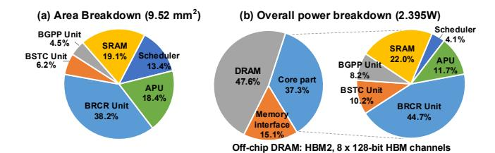

Figure 22: Area/Power of MCBP at TSMC 28nm, 1GHz.

software optimizations on the GPU. Although the bit repetitionleveraged BRCR theoretically reduces computation by 5.7×, practical throughput improves by only 1.2×. This discrepancy arises from the GPU's inefficiency in fine-grained bit-level operations and merging redundant elements, resulting in exposed latency bottlenecks when identifying repetitive elements. After adding the dedicated CAM-based BRCR engine, the performance jumps by 2.88×. Similarly, directly applying bit-sparsity BSTC scheme and bit-prediction BGPP scheme yields only 1.44× and 1.23× gain, as the value-to-bit reorder cost and mismatched computation granularity, which lead to severe underutilization of GPU resources. By contrast, employing tailored engines can further bring 2.19× and 1.48× acceleration effects. Interestingly, although BSTC achieves smaller performance gains (2.19×) than BRCR (2.88×) on ASICs, it yields greater improvements (1.44 $\times$  than 1.2 $\times$ ) on GPUs. This is primarily because BSTC significantly reduces memory access overhead, allowing GPUs, despite lacking dedicated encoding/decoding support, to still benefit from the optimization. A similar trend is observed with BGPP, which reduces memory access through token sparsification, thus enabling performance gains on GPUs as well.

Area, Power and Energy: Table 3 summarizes the hardware configuration of MCBP and Fig. 22 shows its area and power breakdown. Here, we scale up the MCBP accelerator to contain 16 PE clusters to match the HBM I/O interface. The total power includes the

Table 4: Summary and comparison with SOTA works.

|                                 | SpAtten[94] | FACT[72]      | SOFA[92]    | MCBP        |
|---------------------------------|-------------|---------------|-------------|-------------|
| Acceleration for                | Prefill     | Prefill       | Prefill     | P & D       |
| Acceleration for                | (attention) | (whole model) | (attention) | whole model |
| Optimization level ‡ | Value C.    | Value G.C.    | Value C.    | Bit G.W.C.  |
| Technology [nm]                 | 40          | 28            | 28          | 28          |
| Area [mm 2 ]         | 1.55        | 6.03          | 4.29        | 9.52        |
| Throughput [GOPS]               | 360         | 1153          | 24, 423     | 54, 463     |
| Energy Effi. [GOPS/W]           | 382         | 4388          | 7183        | 22,740      |

‡ G: GEMM, W: Weight access. C: KV cache access. And optimizing at the value or bit-level.

core logic, memory interface [44], and external HBM. It has a total area of 9.52 mm² and 2.395W power consumption. Benefted by the lightweight design of BSTC encoders and decoders, CODEC part accounts for merely 6.2% and 10% of area and core part power. Despite average 75.8% reduction in IO traffic, DRAM power still accounts for approximately 48% of total power consumption, due to the autoregressive nature of LLMs. Fig. 20 (b) shows the overall energy-efficiency gain of MCBP over the A100 GPU. On average, MCBP standard/aggressive achieves 29.2×/31.1× greater efficiency than running dense benchmarks on GPU. Compared to naively running algorithm mechanism on GPU, MCBP standard/aggressive realizes 21.6×/23.1× gain. Fig. 21 (b) also shows the efficiency gain breakdown. Software-hardware co-design BRCR, TSBC and BGPP bring 4.24×, 2.98× and 2.44× efficiency gain, respectively.

# 5.4 Comparison with SOTA Accelerators

Fig. 23 compares the throughput and energy of various accelerators during prefill and decoding. Energy is broken down into compute, bit reordering, and off-chip memory. In the prefill stage (Fig. 23(a)), computation consistently accounts for over 30% of total energy across all designs. Bit-reordering overhead is significant in FuseKNA (30%) and BitWave (18%) due to their value- or multi-bit compression schemes, which misalign with bit-serial processing. In contrast, MCBP limits this overhead to 3% via a bit-slice-first encoding strategy. In terms of throughput, for long-sequence tasks like Dolly with high token-level sparsity, traditional Transformer accelerators like SOFA, Spatten, and FACT achieve notable speedup. In this case, MCBP offers a smaller advantage over Energon (3.8×). However, in short-sequence tasks like MBPP, where token sparsity diminishes, bit-level redundancy becomes more exploitable. FuseKNA gains 3.7× speedup via bit-repetition but suffers from high-latency serial matching. In contrast, MCBP achieves the best acceleration, with an average speedup of 6.2×.

In the *decoding* stage (Fig.23 (b)), speedup mainly comes from reduced memory access for weights and KV cache. For long-text tasks like Dolly, where the KV cache size exceeds the weight size, attention optimization in SOFA, Spatten, and FACT yields a 3.7× speedup. Bitwave, optimizing only weights, achieves just 1.3× speedup. As sequence length shortens (e.g., Wikilingua), the KV cache shrinks proportionally, leading to performance degradation in traditional Transformer accelerators. For code generation tasks (MBPP), Bitwave benefits from its weight-centric design. Across all workloads, MCBP achieves the highest performance, averaging 4.8× speedup.

Table 4 summarizes the specifications for SpAtten, FACT, and SOFA. They are the SOTA accelerators that exploit the attention

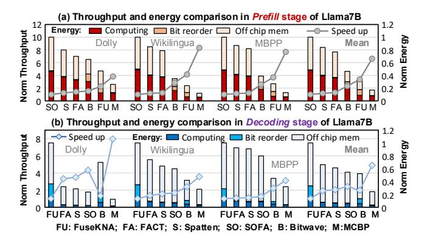

Figure 23: Speedup on Llama7B (a) Prefill (b) Decoding.

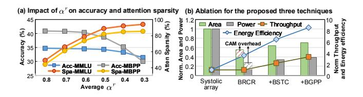

Figure 24: (a) Evaluation of MCBP's optimization impact on inference accuracy. (b) Ablation study of the hardware overhead introduced by the three optimizations.

mechanism to improve the energy efficiency of Transformer inference. Spatten and SOFA are both optimized for the attention. FACT focus on the whole model computation acceleration via top-k token pruning. However, these works are all designed for prefill stage by finding redundancy of attention or linear computation, making them unsuitable for decoding stage in LLM. In addition, their optimizations all remain at value level, missing abundant opportunities at bit level. To the best of our knowledge, MCBP is so far the first work that uses bit-level strategies for LLM inference, reducing both memory and computation effort for both prefill and decoding stages of LLM. The energy efficiency of MCBP (with bitlevel GEMM, weight & KV cache optimizations) is 22740 GOPS/W, which is 35×, 5.2× and 3.2× greater than the three counterparts, with different technology normalized to 28nm for fair comparison. The average energy efficiency is evaluated using the metric from each respective paper. However, SOFA experiences over a 4× efficiency degradation when applied to autoregressive LLMs, as it is tailored for parallel processing of attention and fails to address the memory access bottleneck in LLMs. In contrast, MCBP achieves a 12.8× efficiency gain over SOFA when processing LLMs.

# 6 Discussion

Among the three optimizations in MCBP, BRCR and BSTC are loss-less, since they leverage intrinsic data redundancy and sparsity for acceleration. In contrast, BGPP introduces a hyperparameter  $\alpha^r$  to select vital KVs (a.k.a., attention sparsity, §3.3), which may affect accuracy. Fig. 24 (a) evaluate the impact of  $\alpha^r$  on accuracy and attention sparsity using LLaMA-7B on two tasks: MMLU (reasoning) and MBPP (generation). Overall, a smaller  $\alpha^r$  results in more aggressive pruning, which decreases model accuracy but increases

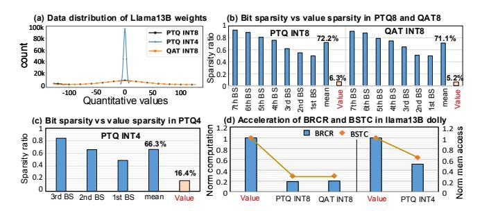

Figure 25: The bit sparsity for diverse quantization scenarios.

sparsity. There are some key observations from Fig. 24 (a): For generation tasks (MBPP), accuracy drops noticeably when  $\alpha^r < 0.6$ . In contrast, for reasoning tasks (MMLU), the model is more tolerant to pruning, with performance degrading significantly only when  $\alpha^r < 0.5$ . This may be because reasoning tasks rely on key tokens for inference, resulting in higher token redundancy. On the other hand, the sparsity gains begin to diminish when  $\alpha^r < 0.5$ , this may be because overly aggressive pruning hurts some critical tokens. Therefore, to strike a well balance between accuracy and sparsity, we set  $\alpha^r$  in the range of 0.5–0.6 in MCBP.

Fig. 24 (b) presents an ablation exploration for BRCR, BSTC and BGPP, in terms of area and energy overhead, using a systolic array (SA) that provides the same throughput as the baseline. Although CAM adds 25% area and 47% power overhead to the BRCR unit, BRCR still reduces overall area and power by 45% and 72%, respectively, while boosting energy efficiency by 3.6×. These gains stem from BRCR's efficient use of bit-level redundancy to eliminate redundant computations (§3.1). Additionally, the integration of CAM enhances pipeline efficiency, contributing to overall performance gains. Building upon this, BSTC applies bit sparsity optimization, achieving a 2.2× throughput gain with only 16% area and 20% energy overhead, driven by significantly reduced memory access. Finally, BGPP achieves a further 1.48× throughput gain with just 9% area and 13% energy overhead, owing to the reduction in attention computation and associated memory access operations.

To explore bit-level sparsity across various quantization strategies, we profile Llama13B's weights under QAT INT8, PTQ INT8, and PTQ INT4, as shown in Fig. 25(a). The weight distributions for QAT and PTQ INT8 are similar, likely due to LLMs' fault tolerance enabling effective INT8 quantization. In contrast, PTQ INT4 exhibits a more concentrated distribution due to its lower bit width.

We compare bit and value sparsity across the three quantization strategies. The 7th BS denotes the highest bit-slice matrix (excluding the sign bit), while the 1st BS stands for the lowest. Fig. 25 (b) shows the average bit sparsity for PTQ and QAT INT8 is about 11× higher than value sparsity. In contrast, PTQ INT4 notably increases value sparsity to  $\sim$  16% (Fig.25(c)), but bit sparsity remains higher at 66% ( $\sim$  4× higher). Fig. 25(d) shows that BRCR reduces computation by 80%, 79.45%, and 51% for PTQ INT8, QAT INT8, and PTQ INT4, respectively, while BSTC cuts memory accesses by 71%, 70.5%, and 41%. These results highlight MCBP's broad effectiveness, driven by the greater prevalence of bit-level sparsity.

Cambricon-C (Cam-C) [11] is a SOTA INT4 accelerator that achieves computational acceleration by efficiently looking up all

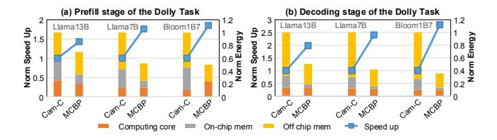

Figure 26: Compared with SOTA INT4 accelerator.

256 product results (INT4×INT4, W4A4), avoiding explicit computation. We reproduce Cam-C with the same PE array area (4.65mm²) and 1248kB of on-chip SRAM as used in MCBP. Considering that W4A4 quantization is too aggressive and typically results in a 4–6% accuracy degradation [34] on modern LLMs, we adopt a more conservative W4A8 quantization for comparisons. Accordingly, we extend Cam-C to support W4A8, while retaining its core optimization technique—Quarter Square Multiplication. Using the QLLM framework [53], we quantize BloomB7, Llama7B/13B to W4A8, ensuring an accuracy loss of less than 1% compared to FP16. We evaluate the performance of Cam-C and MCBP on Dolly dataset of the three models and draw the following three key observations:

First, Cam-C suffers from significant look-up overhead. This is because Cam-C relies on the look-up of all possible results. When the activation is extended to INT8, the cost of look-up increases dramatically, limiting Cam-C's acceleration. This limitation is particularly evident with small models, e.g. Bloom1B7, where valuelevel redundancy cannot be guaranteed as their small hidden sizes. As shown in Fig. 26 (a), compared to Cam-C, MCBP achieves 1.5× speedup and 33% energy savings on LLaMA-13B, and 1.8× speedup with 50% lower energy consumption on Bloom-1B7. This benefits from MCBP maximizes redundancy utilization unexploited at the bit level instead of value level. Second, Cam-C fails to leverage the inherent bit sparsity of INT4 and attention sparsity for memory optimization, leading to poor performance during decoding stage. In contrast, MCBP utilizes BSTC to exploit the sparsity of INT4 and BGPP for KV cache traffic reduction, reducing memory access and achieving an average 2.4× speedup, as depicted in Fig. 26 (b).

Overall, MCBP demonstrates an evident performance advantage over the SOTA INT4 accelerator, thanks to its comprehensive optimization of the LLM inference bottleneck at the bit level.

#### 7 Related Works

Transformer accelerator. Numerous works [7, 19, 20, 22, 25, 26, 33, 46, 50, 54, 59, 72, 74, 75, 80, 92, 94, 97, 104, 106, 113] have been proposed to improve efficiency of Transformer-based LLMs. Given the quadratic complexity of attention in long sequences [90], many focus on accelerating attention via static sliding windows [7, 19, 46, 80, 108] or dynamic top-k prediction [25, 26, 50, 54, 59, 75, 92, 106]. Other works extend token sparsity to linear layers [19, 22, 46, 72, 74, 94, 97, 104, 113]. However, due to the autoregressive nature of LLMs, weight and KV cache memory access dominate latency during the decoding stage—an aspect largely overlooked by prior designs. In contrast, MCBP addresses these bottleneck holistically. In the *prefill* stage, MCBP optimizes computation with bit-slice (BS) repetition, while in the *decoding* stage, it minimizes memory access through bit sparsity and bit-grained early termination.

Value sparsity accelerator. Numerous accelerators [16, 21, 22, 24, 28–30, 39, 45, 49, 55, 56, 60, 62, 63, 71, 82, 86, 89, 100, 102, 107, 108, 110] exploit value sparsity to improve NNs performance. EIE [28] utilizes dynamic input and static weight sparsity to accelerate CNNs and RNNs, while S2TA [56] leverages structured sparsity in weights and activations to accelerate CNNs. Recent efforts [21, 22, 55, 86, 89, 107] have extended this idea to LLMs, e.g., EdgeBERT [86] uses masks to skip zeros in weights to reduce unnecessary computation. However, value sparsity in LLMs is highly limited (Llama13B 6.3%). In contrast, MCBP uses extremely fine-grained bit sparsity, which is average 10.1× higher than value sparsity, bit repetition, and bit prediction to remove redundant memory access.

**Bit-serial computing accelerators**. Prior works [2, 14, 15, 23, 27, 35, 35, 37, 38, 38, 43, 47, 48, 57, 58, 68, 78, 103, 105] accelerates neural networks by exploiting bit-level sparsity within individual BS vector [2, 15, 58, 78, 103] or dynamically reducing bit-width [23, 47, 68, 105]. However, such techniques fall short for LLMs, which are both memory- and computation-intensive. Besides, they often target irregular activation sparsity [15, 78, 103], which doesn't address LLM bottlenecks like weight and KV cache access. In contrast, MCBP eliminates redundancy across BS vectors and uses BS sparsity and fine-grained bit prediction to reduce weight and KV cache memory accesses.

#### 8 Conclusion

We propose MCBP, a software-hardware co-design to accelerate the computation, weight access and KV cache access for LLM inference. Utilizing the bit-level repetition, sparsity and reduced prediction traffic, MCBP achieves 31.1×, 35×, 5.2× and 3.2× energy saving than A100 GPU, SOTA accelerators SpAtten, FACT and SOFA.

# Acknowledgments

This work was supported in part by the National Science and Technology Major Project under Grant 2022ZD0115200; the NSFC under Grant 62125403, and Grant 92164301; Beijing S&T Project Z221100007722023; in part by the project funding for the 2022 Special Project on Industrial Foundation Reconstruction and High Quality Development of Manufacturing Industry CEIEC-2022-ZM02-0245; in part by the Beijing National Research Center for Information Science and Technology; and in part by the Beijing Advanced Innovation Center for Integrated Circuits.

#### References

- [1] Miklós Ajtai. 1994. The complexity of the pigeonhole principle. *Combinatorica* 14 (1994), 417–433.
- [2] Jorge Albericio, Alberto Delmás, Patrick Judd, Sayeh Sharify, Gerard O'Leary, Roman Genov, and Andreas Moshovos. 2017. Bit-pragmatic deep neural network computing. In Proceedings of the 50th annual IEEE/ACM international symposium on microarchitecture. 382–394.
- [3] Renzo Andri, Lukas Cavigelli, Davide Rossi, and Luca Benini. 2016. YodaNN: An ultra-low power convolutional neural network accelerator based on binary weights. In Proceedings of the IEEE Computer Society Annual Symposium on VLSI (ISVLSI). 236–241.
- [4] Rohan Anil, Andrew M Dai, Orhan Firat, Melvin Johnson, Dmitry Lepikhin, Alexandre Passos, Siamak Shakeri, Emanuel Taropa, Paige Bailey, Zhifeng Chen, et al. 2023. Palm 2 technical report. arXiv preprint arXiv:2305.10403 (2023).
- [5] Jacob Austin, Augustus Odena, Maxwell Nye, Maarten Bosma, Henryk Michalewski, David Dohan, Ellen Jiang, Carrie Cai, Michael Terry, Quoc Le, et al. 2021. Program synthesis with large language models. arXiv preprint arXiv:2108.07732 (2021).

- [6] Jinze Bai, Shuai Bai, Yunfei Chu, Zeyu Cui, Kai Dang, Xiaodong Deng, Yang Fan, Wenbin Ge, Yu Han, Fei Huang, Binyuan Hui, Luo Ji, Mei Li, Junyang Lin, Runji Lin, Dayiheng Liu, Gao Liu, Chengqiang Lu, Keming Lu, Jianxin Ma, Rui Men, Xingzhang Ren, Xuancheng Ren, Chuanqi Tan, Sinan Tan, Jianhong Tu, Peng Wang, Shijie Wang, Wei Wang, Shengguang Wu, Benfeng Xu, Jin Xu, An Yang, Hao Yang, Jian Yang, Shusheng Yang, Yang Yao, Bowen Yu, Hongyi Yuan, Zheng Yuan, Jianwei Zhang, Xingxuan Zhang, Yichang Zhang, Zhenru Zhang, Chang Zhou, Jingren Zhou, Xiaohuan Zhou, and Tianhang Zhu. 2023. Qwen technical report. arXiv preprint arXiv:2309.16609 (2023).
- [7] Zhenyu Bai, Pranav Dangi, Huize Li, and Tulika Mitra. 2024. SWAT: Scalable and efficient window attention-based transformers acceleration on FPGAs. In Proceedings of the 61st ACM/IEEE Design Automation Conference. 1–6.
- [8] Lukas Cavigelli and Luca Benini. 2016. Origami: A 803-GOp/s/W convolutional network accelerator. IEEE Transactions on Circuits and Systems for Video Technology 27, 11 (2016), 2461–2475.
- [9] Yupeng Chang, Xu Wang, Jindong Wang, Yuan Wu, Linyi Yang, Kaijie Zhu, Hao Chen, Xiaoyuan Yi, Cunxiang Wang, Yidong Wang, Wei Ye, Yue Zhang, Yi Chang, Philip S. Yu, Qiang Yang, and Xing Xie. 2024. A survey on evaluation of large language models. ACM Transactions on Intelligent Systems and Technology 15, 3 (2024), 1–45.
- [10] Mark Chen, Jerry Tworek, Heewoo Jun, Qiming Yuan, Henrique Ponde De Oliveira Pinto, Jared Kaplan, Harri Edwards, Yuri Burda, Nicholas Joseph, Greg Brockman, Alex Ray, Raul Puri, Gretchen Krueger, Michael Petrov, Heidy Khlaaf, Girish Sastry, Pamela Mishkin, Brooke Chan, Scott Gray, Nick Ryder, Mikhail Pavlov, Alethea Power, Lukasz Kaiser, Mohammad Bavarian, Clemens Winter, Philippe Tillet, Felipe Petroski Such, Dave Cummings, Matthias Plappert, Fotios Chantzis, Elizabeth Barnes, Ariel Herbert-Voss, William Hebgen Guss, Alex Nichol, Alex Paino, Nikolas Tezak, Jie Tang, Igor Babuschkin, Suchir Balaji, Shantanu Jain, William Saunders, Christopher Hesse, Andrew N. Carr, Jan Leike, Josh Achiam, Vedant Misra, Evan Morikawa, Alec Radford, Matthew Knight, Miles Brundage, Mira Murati, Katie Mayer, Peter Welinder, Bob McGrew, Dario Amodei, Sam McCandlish, Ilya Sutskever, and Wojciech Zaremba. 2021. Evaluating large language models trained on code. arXiv preprint arXiv:2107.03374 (2021).
- [11] Yi Chen, Yongwei Zhao, Yifan Hao, Yuanbo Wen, Yuntao Dai, Xiaqing Li, Yang Liu, Rui Zhang, Mo Zou, Xinkai Song, Xing Hu, Zidong Du, Huaping Chen, Qi Guo, and Tianqi Chen. 2024. Cambricon-C: Efficient 4-Bit Matrix Unit via Primitivization. In 2024 57th IEEE/ACM International Symposium on Microarchitecture (MICRO). IEEE, 538–550.
- [12] Wei-Lin Chiang, Zhuohan Li, Zi Lin, Ying Sheng, Zhanghao Wu, Hao Zhang, Lianmin Zheng, Siyuan Zhuang, Yonghao Zhuang, Joseph E Gonzalez, et al. 2023. Vicuna: An open-source chatbot impressing GPT-4 with 90%\* ChatGPT quality. See https://vicuna. lmsys. org (accessed 14 April 2023) 2, 3 (2023), 6.
- [13] Mike Conover, Matt Hayes, Ankit Mathur, Jianwei Xie, Jun Wan, Sam Shah, Ali Ghodsi, Patrick Wendell, Matei Zaharia, and Reynold Xin. 2023. Free Dolly: Introducing the world's first truly open instruction-tuned LLM. Company Blog of Databricks (2023).
- [14] Alberto Delmas, Patrick Judd, Sayeh Sharify, and Andreas Moshovos. 2017. Dynamic stripes: Exploiting the dynamic precision requirements of activation values in neural networks. arXiv preprint arXiv:1706.00504 (2017).
- [15] Alberto Delmas Lascorz, Patrick Judd, Dylan Malone Stuart, Zissis Poulos, Mostafa Mahmoud, Sayeh Sharify, Milos Nikolic, Kevin Siu, and Andreas Moshovos. 2019. Bit-tactical: A software/hardware approach to exploiting value and bit sparsity in neural networks. In Proceedings of the Twenty-Fourth International Conference on Architectural Support for Programming Languages and Operating Systems. 749–763.
- [16] Chunhua Deng, Yang Sui, Siyu Liao, Xuehai Qian, and Bo Yuan. 2021. GoSPA: An energy-efficient high-performance globally optimized sparse convolutional neural network accelerator. In Proceedings of the ACM/IEEE 48th Annual International Symposium on Computer Architecture (ISCA). 1110–1123.
- [17] Tim Dettmers, Mike Lewis, Younes Belkada, and Luke Zettlemoyer. 2022. GPT3.Int8 (): 8-bit matrix multiplication for Transformers at scale. Advances in Neural Information Processing Systems 35 (2022), 30318–30332.
- [18] Claire Cardie Faisal Ladhak, Esin Durmus and Kathleen McKeown. 2020. WikiLingua: A new benchmark dataset for multilingual abstractive summarization. In Findings of EMNLP, 2020.
- [19] Hongxiang Fan, Thomas Chau, Stylianos I Venieris, Royson Lee, Alexandros Kouris, Wayne Luk, Nicholas D Lane, and Mohamed S Abdelfattah. 2022. Adaptable butterfly accelerator for attention-based NNs via hardware and algorithm co-design. In Proceedings of the 55th IEEE/ACM International Symposium on Microarchitecture (MICRO). 599–615.
- [20] Zichen Fan, Qirui Zhang, Pierre Abillama, Sara Shoouri, Changwoo Lee, David Blaauw, Hun-Seok Kim, and Dennis Sylvester. 2023. Taskfusion: An efficient transfer learning architecture with dual delta sparsity for multi-task natural language processing. In Proceedings of the 50th Annual International Symposium on Computer Architecture. 1–14.
- [21] Chao Fang, Shouliang Guo, Wei Wu, Jun Lin, Zhongfeng Wang, Ming Kai Hsu, and Lingzhi Liu. 2022. An efficient hardware accelerator for sparse Transformer

- neural networks. In 2022 IEEE International Symposium on Circuits and Systems (ISCAS). IEEE, 2670–2674.
- [22] Chao Fang, Aojun Zhou, and Zhongfeng Wang. 2022. An algorithm-hardware co-optimized framework for accelerating N:M sparse Transformers. IEEE Transactions on Very Large Scale Integration (VLSI) Systems 30, 11 (2022), 1573–1586.
- [23] Ashish Gondimalla, Noah Chesnut, Mithuna Thottethodi, and TN Vijaykumar. 2019. SparTen: A sparse tensor accelerator for convolutional neural networks. In Proceedings of the 52nd Annual IEEE/ACM International Symposium on Microarchitecture. 151–165.
- [24] Sumanth Gudaparthi, Sarabjeet Singh, Surya Narayanan, Rajeev Balasubramonian, and Visvesh Sathe. 2022. CANDLES: Channel-aware novel dataflowmicroarchitecture co-design for low energy sparse neural network acceleration. In Proceedings of the IEEE International Symposium on high-performance computer architecture (HPCA). 876–891.
- [25] Tae Jun Ham, Sung Jun Jung, Seonghak Kim, Young H Oh, Yeonhong Park, Yoonho Song, Jung-Hun Park, Sanghee Lee, Kyoung Park, Jae W Lee, and Deog-Kyoon Jeong. 2020. A3 : Accelerating attention mechanisms in neural networks with approximation. In Proceedings of the IEEE International Symposium on High Performance Computer Architecture (HPCA). 328–341.
- [26] Tae Jun Ham, Yejin Lee, Seong Hoon Seo, Soosung Kim, Hyunji Choi, Sung Jun Jung, and Jae W Lee. 2021. ELSA: Hardware-software co-design for efficient, lightweight self-attention mechanism in neural networks. In Prceedings of the 48th ACM/IEEE Annual International Symposium on Computer Architecture (ISCA). 692–705.
- [27] Meng Han, Liang Wang, Limin Xiao, Hao Zhang, Tianhao Cai, Jiale Xu, Yibo Wu, Chenhao Zhang, and Xiangrong Xu. 2024. BitNN: A bit-serial accelerator for k-nearest neighbor search in point clouds. In Proceddings of the ACM/IEEE 51st Annual International Symposium on Computer Architecture (ISCA). 1278–1292.
- [28] Song Han, Xingyu Liu, Huizi Mao, Jing Pu, Ardavan Pedram, Mark A Horowitz, and William J Dally. 2016. EIE: Efficient inference engine on compressed deep neural network. ACM SIGARCH Computer Architecture News 44, 3 (2016), 243– 254.
- [29] Song Han, Huizi Mao, and William J Dally. 2015. Deep compression: Compressing deep neural networks with pruning, trained quantization and huffman coding. arXiv preprint arXiv:1510.00149 (2015).
- [30] Edward Hanson, Shiyu Li, Hai'Helen' Li, and Yiran Chen. 2022. Cascading structured pruning: Enabling high data reuse for sparse DNN accelerators. In Proceedings of the 49th Annual International Symposium on Computer Architecture. 522–535.
- [31] Kartik Hegde, Jiyong Yu, Rohit Agrawal, Mengjia Yan, Michael Pellauer, and Christopher Fletcher. 2018. UCNN: Exploiting computational reuse in deep neural networks via weight repetition. In 2018 ACM/IEEE 45th Annual International Symposium on Computer Architecture (ISCA). IEEE, 674–687.
- [32] Dan Hendrycks, Collin Burns, Steven Basart, Andy Zou, Mantas Mazeika, Dawn Song, and Jacob Steinhardt. 2020. Measuring massive multitask language understanding. arXiv preprint arXiv:2009.03300 (2020).
- [33] Seongmin Hong, Seungjae Moon, Junsoo Kim, Sungjae Lee, Minsub Kim, Dongsoo Lee, and Joo-Young Kim. 2022. DFX: A low-latency multi-FPGA appliance for accelerating Transformer-based text generation. In Proceedings of the 55th IEEE/ACM International Symposium on Microarchitecture (MICRO). 616–630.
- [34] Yuxuan Hu, Xiaodong Chen, Cuiping Li, Hong Chen, and Jing Zhang. 2025. QUAD: Quantization and Parameter-Efficient Tuning of LLM with Activation Decomposition. arXiv preprint arXiv:2503.19353 (2025).
- [35] Dongseok Im, Gwangtae Park, Zhiyong Li, Junha Ryu, and Hoi-Jun Yoo. 2023. Sibia: Signed bit-slice architecture for dense dnn acceleration with slice-level sparsity exploitation. In 2023 IEEE International Symposium on High-Performance Computer Architecture (HPCA). IEEE, 69–80.
- [36] Benoit Jacob, Skirmantas Kligys, Bo Chen, Menglong Zhu, Matthew Tang, Andrew Howard, Hartwig Adam, and Dmitry Kalenichenko. 2018. Quantization and Training of Neural Networks for Efficient Integer-Arithmetic-Only Inference. In Proceedings of the IEEE Conference on Computer Vision and Pattern Recognition (CVPR). 2704–2713.
- [37] Patrick Judd, Jorge Albericio, Tayler Hetherington, Tor M Aamodt, and Andreas Moshovos. 2016. Stripes: Bit-serial deep neural network computing. In Proceedings of the 49th Annual IEEE/ACM International Symposium on Microarchitecture (MICRO). 1–12.
- [38] Dongyun Kam, Myeongji Yun, Sunwoo Yoo, Seungwoo Hong, Zhengya Zhang, and Youngjoo Lee. 2024. Panacea: Novel DNN Accelerator using Accuracy-Preserving Asymmetric Quantization and Energy-Saving Bit-Slice Sparsity. arXiv preprint arXiv:2412.10059 (2024).
- [39] Sanghoon Kang, Donghyeon Han, Juhyoung Lee, Dongseok Im, Sangyeob Kim, Soyeon Kim, Junha Ryu, and Hoi-Jun Yoo. 2021. GANPU: An energy-efficient multi-DNN training processor for GANs with speculative dual-sparsity exploitation. IEEE Journal of Solid-State Circuits 56, 9 (2021), 2845–2857.
- [40] Majeed Kazemitabaar, Runlong Ye, Xiaoning Wang, Austin Zachary Henley, Paul Denny, Michelle Craig, and Tovi Grossman. 2024. Codeaid: Evaluating a classroom deployment of an LLM-based programming assistant that balances

- student and educator needs. In Proceedings of the CHI Conference on Human Factors in Computing Systems. 1–20.
- [41] Yoongu Kim, Weikun Yang, and Onur Mutlu. 2015. Ramulator: A fast and extensible DRAM simulator. IEEE Computer architecture letters 15, 1 (2015), 45–49.
- [42] Teven Le Scao, Angela Fan, Christopher Akiki, Ellie Pavlick, Suzana Ilić, Daniel Hesslow, Roman Castagné, Alexandra Sasha Luccioni, François Yvon, Matthias Gallé, et al. 2022. Bloom: A 176B-parameter open-access multilingual language model. arXiv preprint arXiv:2211.05100 (2022).
- [43] Jinmook Lee, Changhyeon Kim, Sanghoon Kang, Dongjoo Shin, Sangyeob Kim, and Hoi-Jun Yoo. 2018. UNPU: A 50.6 TOPS/W unified deep neural network accelerator with 1b-to-16b fully-variable weight bit-precision. In Proceedings of IEEE International Solid-State Circuits Conference-(ISSCC). 218–220.
- [44] Brian Leibowitz, Robert Palmer, John Poulton, Yohan Frans, Simon Li, John Wilson, Michael Bucher, Andrew M Fuller, John Eyles, Marko Aleksic, Trey Greer, and Nhat M Nguyen. 2010. A 4.3 GB/s mobile memory interface with power-efficient bandwidth scaling. IEEE Journal of Solid-State Circuits 45, 4 (2010), 889–898.
- [45] Jonathan S Lew, Yunpeng Liu, Wenyi Gong, Negar Goli, R David Evans, and Tor M Aamodt. 2022. Anticipating and eliminating redundant computations in accelerated sparse training. In Proceedings of the 49th Annual International Symposium on Computer Architecture. 536–551.
- [46] Bingbing Li, Santosh Pandey, Haowen Fang, Yanjun Lyv, Ji Li, Jieyang Chen, Mimi Xie, Lipeng Wan, Hang Liu, and Caiwen Ding. 2020. FTRANS: Energyefficient acceleration of Transformers using FPGA. In Proceedings of the ACM/IEEE International Symposium on Low Power Electronics and Design. 175– 180.
- [47] Gang Li, Weixiang Xu, Zhuoran Song, Naifeng Jing, Jian Cheng, and Xiaoyao Liang. 2022. Ristretto: An atomized processing architecture for sparsitycondensed stream flow in CNN. In Proceedings of the 55th IEEE/ACM International Symposium on Microarchitecture (MICRO). 1434–1450.
- [48] Guoyu Li, Shengyu Ye, Chunyun Chen, Yang Wang, Fan Yang, Ting Cao, Cheng Liu, Mohamed M Sabry, and Mao Yang. 2025. LUT-DLA: Lookup Table as Efficient Extreme Low-Bit Deep Learning Accelerator. arXiv preprint arXiv:2501.10658 (2025).
- [49] Shiyu Li, Edward Hanson, Xuehai Qian, Hai" Helen" Li, and Yiran Chen. 2021. ESCALATE: Boosting the efficiency of sparse CNN accelerator with kernel decomposition. In Proceedings of the 54th Annual IEEE/ACM International Symposium on Microarchitecture. 992–1004.
- [50] Zheng Li, Soroush Ghodrati, Amir Yazdanbakhsh, Hadi Esmaeilzadeh, and Mingu Kang. 2022. Accelerating attention through gradient-based learned runtime pruning. In Proceedings of the 49th Annual International Symposium on Computer Architecture. 902–915.
- [51] Bin Lin, Chen Zhang, Tao Peng, Hanyu Zhao, Wencong Xiao, Minmin Sun, Anmin Liu, Zhipeng Zhang, Lanbo Li, Xiafei Qiu, Li Shen, Zhigang Ji, Tao Xie, Yong Li, and Wei Lin. 2024. Infinite-LLM: Efficient LLM service for long context with distattention and distributed kvcache. arXiv preprint arXiv:2401.02669 (2024).
- [52] Fangxin Liu, Ning Yang, Haomin Li, Zongwu Wang, Zhuoran Song, Songwen Pei, and Li Jiang. 2024. SPARK: Scalable and precision-aware acceleration of neural networks via efficient encoding. In Proceedings of the IEEE International Symposium on High-Performance Computer Architecture (HPCA). 1029–1042.
- [53] Jing Liu, Ruihao Gong, Xiuying Wei, Zhiwei Dong, Jianfei Cai, and Bohan Zhuang. 2023. QLLM: Accurate and efficient low-bitwidth quantization for large language models. arXiv preprint arXiv:2310.08041 (2023).
- [54] Siqin Liu, Prakash Chand Kuve, and Avinash Karanth. 2024. HSCONN: Hardware-Software Co-Optimization of Self-Attention Neural Networks for Large Language Models. In Proceedings of the Great Lakes Symposium on VLSI 2024. 736–741.
- [55] Shiwei Liu, Peizhe Li, Jinshan Zhang, Yunzhengmao Wang, Haozhe Zhu, Wenning Jiang, Shan Tang, Chixiao Chen, Qi Liu, and Ming Liu. 2023. 16.2 A 28nm 53.8 TOPS/W 8b sparse Transformer accelerator with in-memory butterfly zero skipper for unstructured-pruned NN and CIM-based local-attention-reusable engine. In 2023 IEEE International Solid-State Circuits Conference (ISSCC). IEEE, 250–252.
- [56] Zhi-Gang Liu, Paul N Whatmough, Yuhao Zhu, and Matthew Mattina. 2022. S2TA: Exploiting structured sparsity for energy-efficient mobile CNN acceleration. In Proceedings of the IEEE International Symposium on High-Performance Computer Architecture (HPCA). 573–586.
- [57] Yun-Chen Lo and Ren-Shuo Liu. 2023. Bit-serial cache: Exploiting input bit vector repetition to accelerate bit-serial inference. In Proceedings of the 60th ACM/IEEE Design Automation Conference (DAC). 1–6.
- [58] Hang Lu, Liang Chang, Chenglong Li, Zixuan Zhu, Shengjian Lu, Yanhuan Liu, and Mingzhe Zhang. 2021. Distilling bit-level sparsity parallelism for general purpose deep learning acceleration. In MICRO-54: 54th Annual IEEE/ACM International Symposium on Microarchitecture. 963–976.
- [59] Liqiang Lu, Yicheng Jin, Hangrui Bi, Zizhang Luo, Peng Li, Tao Wang, and Yun Liang. 2021. Sanger: A co-design framework for enabling sparse attention

- using reconfigurable architecture. In Proceedings of the 54th Annual IEEE/ACM International Symposium on Microarchitecture. 977–991.
- [60] Mostafa Mahmoud, Isak Edo, Ali Hadi Zadeh, Omar Mohamed Awad, Gennady Pekhimenko, Jorge Albericio, and Andreas Moshovos. 2020. TensorDash: Exploiting sparsity to accelerate deep neural network training. In Proceedings of the 53rd Annual IEEE/ACM International Symposium on Microarchitecture (MICRO). 781–795.
- [61] Stephen Merity, Caiming Xiong, James Bradbury, and Richard Socher. 2016. Pointer sentinel mixture models. In Proceedings of the International Conference on Learning Representations.
- [62] Bert Moons, Roel Uytterhoeven, Wim Dehaene, and Marian Verhelst. 2017. 14.5 Envision: A 0.26-to-10TOPS/W subword-parallel dynamic-voltage-accuracyfrequency-scalable convolutional neural network processor in 28nm FDSOI. In Proceddings of the IEEE International Solid-State Circuits Conference (ISSCC). 246–247.
- [63] Bert Moons and Marian Verhelst. 2016. An energy-efficient precision-scalable ConvNet processor in 40-nm CMOS. IEEE Journal of solid-state Circuits 52, 4 (2016), 903–914.
- [64] Naveen Muralimanohar, Rajeev Balasubramonian, and Norman P Jouppi. 2009. CACTI 6.0: A tool to model large caches. HP laboratories 27 (2009), 28.
- [65] Daye Nam, Andrew Macvean, Vincent Hellendoorn, Bogdan Vasilescu, and Brad Myers. 2024. Using an LLM to help with code understanding. In Proceedings of the IEEE/ACM 46th International Conference on Software Engineering. 1–13.
- [66] Nvidia. 2023. TensorRT-LLM. [https://github.com/NVIDIA/TensorRT-LLM?](https://github.com/NVIDIA/TensorRT-LLM?tab=readme-ov-file) [tab=readme-ov-file.](https://github.com/NVIDIA/TensorRT-LLM?tab=readme-ov-file)
- [67] Mike O'Connor, Niladrish Chatterjee, Donghyuk Lee, John Wilson, Aditya Agrawal, Stephen W Keckler, and William J Dally. 2017. Fine-grained DRAM: Energy-efficient DRAM for extreme bandwidth systems. In Proceedings of the 50th Annual IEEE/ACM International Symposium on Microarchitecture. 41–54.
- [68] Angshuman Parashar, Minsoo Rhu, Anurag Mukkara, Antonio Puglielli, Rangharajan Venkatesan, Brucek Khailany, Joel Emer, Stephen W Keckler, and William J Dally. 2017. SCNN: An accelerator for compressed-sparse convolutional neural networks. ACM SIGARCH computer architecture news 45, 2 (2017), 27–40.
- [69] Adam Paszke, Sam Gross, Soumith Chintala, Gregory Chanan, Edward Yang, Zachary DeVito, Zeming Lin, Alban Desmaison, Luca Antiga, and Adam Lerer. 2017. Automatic differentiation in PyTorch. (2017).
- [70] Pratyush Patel, Esha Choukse, Chaojie Zhang, Aashaka Shah, Íñigo Goiri, Saeed Maleki, and Ricardo Bianchini. 2024. Splitwise: Efficient generative LLM inference using phase splitting. In 2024 ACM/IEEE 51st Annual International Symposium on Computer Architecture (ISCA). IEEE, 118–132.
- [71] Eric Qin, Ananda Samajdar, Hyoukjun Kwon, Vineet Nadella, Sudarshan Srinivasan, Dipankar Das, Bharat Kaul, and Tushar Krishna. 2020. Sigma: A sparse and irregular GEMM accelerator with flexible interconnects for DNN training. In Proceedings of the IEEE International Symposium on High Performance Computer Architecture (HPCA). 58–70.
- [72] Yubin Qin, Yang Wang, Dazheng Deng, Zhiren Zhao, Xiaolong Yang, Leibo Liu, Shaojun Wei, Yang Hu, and Shouyi Yin. 2023. Fact: FFN-attention co-optimized Transformer architecture with eager correlation prediction. In Proceedings of the 50th Annual International Symposium on Computer Architecture. 1–14.
- [73] Yubin Qin, Yang Wang, Jiachen Wang, Zhiwei Lin, Yushu Zhao, Shaojun Wei, Yang Hu, and Shouyi Yin. 2025. 23.8 An 88.36 TOPS/W Bit-Level-Weight-Compressed Large-Language-Model Accelerator with Cluster-Aligned INT-FP-GEMM and Bi-Dimensional Workflow Reformulation. In 2025 IEEE International Solid-State Circuits Conference (ISSCC), Vol. 68. IEEE, 420–422.
- [74] Yubin Qin, Yang Wang, Zhiren Zhao, Xiaolong Yang, Yang Zhou, Shaojun Wei, Yang Hu, and Shouyi Yin. 2024. MECLA: Memory-compute-efficient LLM accelerator with scaling sub-matrix partition. In Proceedings of the 51st ACM/IEEE Annual International Symposium on Computer Architecture (ISCA). 1032–1047.
- [75] Zheng Qu, Liu Liu, Fengbin Tu, Zhaodong Chen, Yufei Ding, and Yuan Xie. 2022. DOTA: Detect and omit weak attentions for scalable Transformer acceleration. In Proceedings of the 27th ACM International Conference on Architectural Support for Programming Languages and Operating Systems. 14–26.
- [76] Baptiste Roziere, Jonas Gehring, Fabian Gloeckle, Sten Sootla, Itai Gat, Xiaoqing Ellen Tan, Yossi Adi, Jingyu Liu, Romain Sauvestre, Tal Remez, et al. 2023. Code LLaMa: Open foundation models for code. arXiv preprint arXiv:2308.12950 (2023).
- [77] Keisuke Sakaguchi, Ronan Le Bras, Chandra Bhagavatula, and Yejin Choi. 2021. Winogrande: An adversarial Winograd schema challenge at scale. Commun. ACM 64, 9 (2021), 99–106.
- [78] Sayeh Sharify, Alberto Delmas Lascorz, Mostafa Mahmoud, Milos Nikolic, Kevin Siu, Dylan Malone Stuart, Zissis Poulos, and Andreas Moshovos. 2019. Laconic deep learning inference acceleration. In Proceedings of the 46th International Symposium on Computer Architecture. 304–317.
- [79] Hardik Sharma, Jongse Park, Naveen Suda, Liangzhen Lai, Benson Chau, Joon Kyung Kim, Vikas Chandra, and Hadi Esmaeilzadeh. 2018. Bit Fusion:

- Bit-level dynamically composable architecture for accelerating deep neural network. In Proceedings of the ACM/IEEE 45th Annual International Symposium on Computer Architecture (ISCA). 764–775.
- [80] Guan Shen, Jieru Zhao, Quan Chen, Jingwen Leng, Chao Li, and Minyi Guo. 2022. SALO: An efficient spatial accelerator enabling hybrid sparse attentionmechanisms for long sequences. In Proceedings of the 59th ACM/IEEE Design Automation Conference. 571–576.
- [81] Man Shi, Vikram Jain, Antony Joseph, Maurice Meijer, and Marian Verhelst. 2024. BitWave: Exploiting Column-Based Bit-Level Sparsity for Deep Learning Acceleration. In Proceedings of IEEE International Symposium on High-Performance Computer Architecture (HPCA). 732–746.
- [82] Jong Hoon Shin, Ali Shafiee, Ardavan Pedram, Hamzah Abdel-Aziz, Ling Li, and Joseph Hassoun. 2022. Griffin: Rethinking sparse optimization for deep learning architectures. In Proceedings of the IEEE International Symposium on High-Performance Computer Architecture (HPCA). 861–875.
- [83] Wilson Snyder. 2004. Verilator and SystemPerl. In North American SystemC Users' Group, Design Automation Conference.
- [84] Benjamin Spector and Chris Re. 2023. Accelerating LLM inference with staged speculative decoding. arXiv preprint arXiv:2308.04623 (2023).
- [85] Salmonn Talebi, Elizabeth Tong, and Mohammad RK Mofrad. 2023. Beyond the Hype: Assessing the Performance, Trustworthiness, and Clinical Suitability of GPT3. 5. arXiv preprint arXiv:2306.15887 (2023).
- [86] Thierry Tambe, Coleman Hooper, Lillian Pentecost, Tianyu Jia, En-Yu Yang, Marco Donato, Victor Sanh, Paul Whatmough, Alexander M Rush, David Brooks, and Gu-Yeon Wei. 2021. Edgebert: Sentence-level energy optimizations for latency-aware multi-task NLP inference. In Proceedings of the 54th Annual IEEE/ACM International Symposium on Microarchitecture. 830–844.
- [87] Rohan Taori, Ishaan Gulrajani, Tianyi Zhang, Yann Dubois, Xuechen Li, Carlos Guestrin, Percy Liang, and Tatsunori B Hashimoto. 2023. Stanford alpaca: An instruction-following llama model. [https://crfm.stanford.edu/2023/03/13/alpaca.](https://crfm.stanford.edu/2023/03/13/alpaca.html) [html.](https://crfm.stanford.edu/2023/03/13/alpaca.html)
- [88] Hugo Touvron, Louis Martin, Kevin Stone, Peter Albert, Amjad Almahairi, Yasmine Babaei, Nikolay Bashlykov, Soumya Batra, Prajjwal Bhargava, Shruti Bhosale, et al. 2023. Llama 2: Open foundation and fine-tuned chat models. arXiv preprint arXiv:2307.09288 (2023).
- [89] Shikhar Tuli and Niraj K Jha. 2023. AccelTran: A sparsity-aware accelerator for dynamic inference with Transformers. IEEE Transactions on Computer-Aided Design of Integrated Circuits and Systems 42, 11 (2023), 4038–4051.
- [90] Ashish Vaswani, Noam Shazeer, Niki Parmar, Jakob Uszkoreit, Llion Jones, Aidan N Gomez, Łukasz Kaiser, and Illia Polosukhin. 2017. Attention is all you need. Advances in neural information processing systems 30 (2017).
- [91] Alex Wang, Amanpreet Singh, Julian Michael, Felix Hill, Omer Levy, and Samuel R Bowman. 2018. GLUE: A multi-task benchmark and analysis platform for natural language understanding. In Proceedings of the International Conference on Learning Representations.
- [92] Huizheng Wang, Jiahao Fang, Xinru Tang, Zhiheng Yue, Jinxi Li, Yubin Qin, Sihan Guan, Qize Yang, Yang Wang, Chao Li, Yang Hu, and Shouyi Yin. 2024. SOFA: A compute-memory optimized sparsity accelerator via cross-stage coordinated tiling. arXiv preprint arXiv:2407.10416 (2024).
- [93] Huizheng Wang, Weihong Xu, Zaichen Zhang, Xiaohu You, and Chuan Zhang. 2021. An efficient stochastic convolution architecture based on fast FIR algorithm. IEEE Transactions on Circuits and Systems II: Express Briefs 69, 3 (2021), 984–988.
- [94] Hanrui Wang, Zhekai Zhang, and Song Han. 2021. SpAtten: Efficient sparse attention architecture with cascade token and head pruning. In Proceedings of the IEEE International Symposium on High-Performance Computer Architecture (HPCA). 97–110.
- [95] Huizheng Wang, Zaichen Zhang, Xiaohu You, and Chuan Zhang. 2018. Lowcomplexity Winograd convolution architecture based on stochastic computing. In 2018 IEEE 23rd International Conference on Digital Signal Processing (DSP). IEEE, 1–5.
- [96] Yizhi Wang, Jun Lin, and Zhongfeng Wang. 2017. An energy-efficient architecture for binary weight convolutional neural networks. IEEE Transactions on Very Large Scale Integration (VLSI) Systems 26, 2 (2017), 280–293.
- [97] Yang Wang, Yubin Qin, Dazheng Deng, Jingchuan Wei, Yang Zhou, Yuanqi Fan, Tianbao Chen, Hao Sun, Leibo Liu, Shaojun Wei, and Shouyi Yin. 2022. An energy-efficient Transformer processor exploiting dynamic weak relevances in global attention. IEEE Journal of Solid-State Circuits 58, 1 (2022), 227–242.
- [98] Xiuying Wei, Yunchen Zhang, Xiangguo Zhang, Ruihao Gong, Shanghang Zhang, Qi Zhang, Fengwei Yu, and Xianglong Liu. 2022. Outlier suppression: Pushing the limit of low-bit transformer language models. Advances in Neural Information Processing Systems 35 (2022), 17402–17414.
- [99] Thomas Wolf, Lysandre Debut, Victor Sanh, Julien Chaumond, Clement Delangue, Anthony Moi, Pierric Cistac, Tim Rault, Rémi Louf, Morgan Funtowicz, Joe Davison, Sam Shleifer, Patrick von Platen, Clara Ma, Yacine Jernite, Julien Plu, Canwen Xu, Teven Le Scao, Sylvain Gugger, Mariama Drame, Quentin Lhoest, and Alexander Rush. 2020. Transformers: State-of-the-art natural language processing. In Proceedings of the Conference on Empirical Methods in Natural

- Language Processing: System Demonstrations. 38–45.
- [100] Yannan Nellie Wu, Po-An Tsai, Saurav Muralidharan, Angshuman Parashar, Vivienne Sze, and Joel Emer. 2023. HighLight: Efficient and flexible DNN acceleration with hierarchical structured sparsity. In Proceedings of the 56th Annual IEEE/ACM International Symposium on Microarchitecture. 1106–1120.
- [101] Guangxuan Xiao, Ji Lin, Mickael Seznec, Hao Wu, Julien Demouth, and Song Han. 2023. Smoothquant: Accurate and efficient post-training quantization for large language models. In International Conference on Machine Learning. PMLR, 38087–38099.
- [102] Dingqing Yang, Amin Ghasemazar, Xiaowei Ren, Maximilian Golub, Guy Lemieux, and Mieszko Lis. 2020. Procrustes: A dataflow and accelerator for sparse deep neural network training. In Proceedings of the 53rd Annual IEEE/ACM International Symposium on Microarchitecture (MICRO). 711–724.
- [103] Jianxun Yang, Zhao Zhang, Zhuangzhi Liu, Jing Zhou, Leibo Liu, Shaojun Wei, and Shouyi Yin. 2021. FuseKNA: Fused kernel convolution based accelerator for deep neural networks. In Proceddings of the IEEE International Symposium on High-Performance Computer Architecture (HPCA). 894–907.
- [104] Tao Yang, Fei Ma, Xiaoling Li, Fangxin Liu, Yilong Zhao, Zhezhi He, and Li Jiang. 2022. DTATrans: Leveraging dynamic token-based quantization with accuracy compensation mechanism for efficient Transformer architecture. IEEE Transactions on Computer-Aided Design of Integrated Circuits and Systems 42, 2 (2022), 509–520.
- [105] Yifan Yang, Joel S Emer, and Daniel Sanchez. 2023. ISOSceles: Accelerating sparse CNNs through inter-layer pipelining. In 2023 IEEE International Symposium on High-Performance Computer Architecture (HPCA). IEEE, 598–610.
- [106] Amir Yazdanbakhsh, Ashkan Moradifirouzabadi, Zheng Li, and Mingu Kang. 2022. Sparse attention acceleration with synergistic in-memory pruning and on-chip recomputation. In Proceedings of the 55th IEEE/ACM International Symposium on Microarchitecture (MICRO). 744–762.
- [107] Eunji Yoo, Gunho Park, Jung Gyu Min, Se Jung Kwon, Baeseong Park, Dongsoo Lee, and Youngjoo Lee. 2023. TF-MVP: Novel sparsity-aware transformer accelerator with mixed-length vector pruning. In 2023 60th ACM/IEEE Design Automation Conference (DAC). IEEE, 1–6.
- [108] Haoran You, Zhanyi Sun, Huihong Shi, Zhongzhi Yu, Yang Zhao, Yongan Zhang, Chaojian Li, Baopu Li, and Yingyan Lin. 2023. ViTCoD: Vision Transformer acceleration via dedicated algorithm and accelerator co-design. In Proceedings of the IEEE International Symposium on High-Performance Computer Architecture (HPCA). 273–286.
- [109] Ofir Zafrir, Guy Boudoukh, Peter Izsak, and Moshe Wasserblat. 2019. Q8BERT: Quantized 8bit BERT. In 2019 Fifth Workshop on Energy Efficient Machine Learning and Cognitive Computing-NeurIPS Edition (EMC2-NIPS). IEEE, 36–39.
- [110] Shijin Zhang, Zidong Du, Lei Zhang, Huiying Lan, Shaoli Liu, Ling Li, Qi Guo, Tianshi Chen, and Yunji Chen. 2016. Cambricon-X: An accelerator for sparse neural networks. In 2016 49th Annual IEEE/ACM International Symposium on Microarchitecture (MICRO). IEEE, 1–12.
- [111] Susan Zhang, Stephen Roller, Naman Goyal, Mikel Artetxe, Moya Chen, Shuohui Chen, Christopher Dewan, Mona Diab, Xian Li, Xi Victoria Lin, Todor Mihaylov, Myle Ott, Sam Shleifer, Kurt Shuster, Daniel Simig, Punit Singh Koura, Anjali Sridhar, Tianlu Wang, and Luke Zettlemoyer. 2022. OPT: Open pre-trained transformer language models. arXiv preprint arXiv:2205.01068 (2022).
- [112] Yilong Zhao, Chien-Yu Lin, Kan Zhu, Zihao Ye, Lequn Chen, Size Zheng, Luis Ceze, Arvind Krishnamurthy, Tianqi Chen, and Baris Kasikci. 2024. Atom: Lowbit quantization for efficient and accurate llm serving. Proceedings of Machine Learning and Systems 6 (2024), 196–209.
- [113] Zhe Zhou, Junlin Liu, Zhenyu Gu, and Guangyu Sun. 2022. Energon: Toward efficient acceleration of Transformers using dynamic sparse attention. IEEE Transactions on Computer-Aided Design of Integrated Circuits and Systems 42, 1 (2022), 136–149.