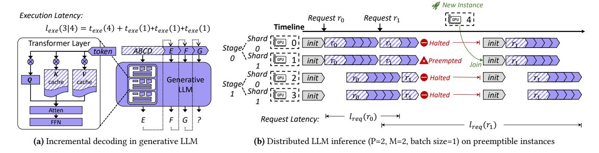
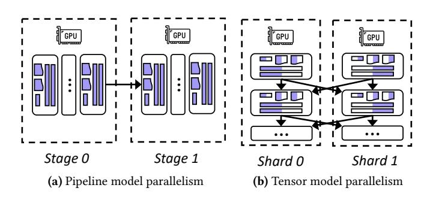
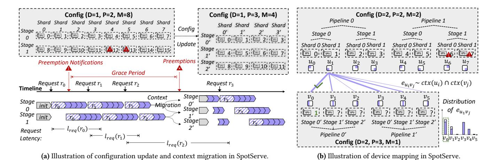
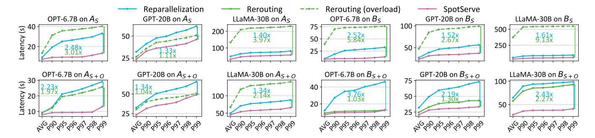
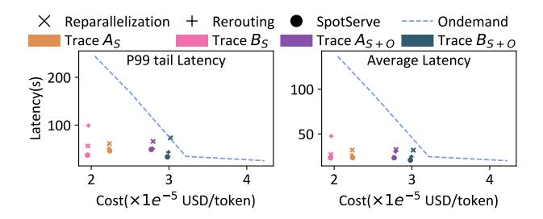
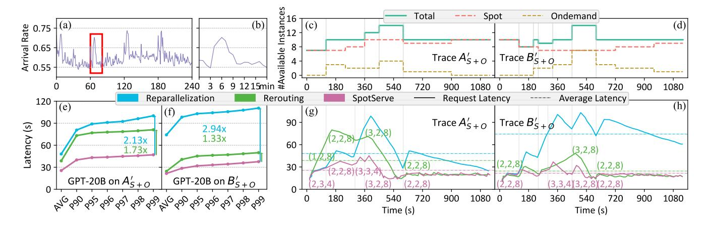
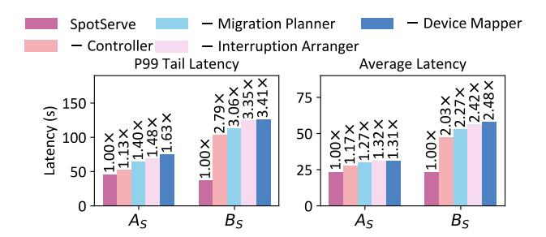

# SpotServe: Serving Generative Large Language Models on Preemptible Instances

# Xupeng Miao\*

Carnegie Mellon University Pittsburgh, PA, USA xupeng@cmu.edu

## Xiaoli Xi

Carnegie Mellon University Pittsburgh, PA, USA xiaolix@andrew.cmu.edu

# Chunan Shi\*

Peking University
Beijing, China
spirited\_away@pku.edu.cn

#### Dahua Lin

The Chinese University of Hong Kong Hong Kong, China dhlin@ie.cuhk.edu.hk

# Zhihao Jia

Carnegie Mellon University Pittsburgh, PA, USA zhihao@cmu.edu

# Jiangfei Duan

The Chinese University of Hong Kong Hong Kong, China dj021@ie.cuhk.edu.hk

#### Bin Cui

Peking University Beijing, China bin.cui@pku.edu.cn

# **Abstract**

The high computational and memory requirements of generative large language models (LLMs) make it challenging to serve them cheaply. This paper aims to reduce the monetary cost for serving LLMs by leveraging preemptible GPU instances on modern clouds, which offer accesses to spare GPU resources at a much cheaper price than regular instances but may be preempted by the cloud provider at any time. Serving LLMs on preemptible instances requires addressing challenges induced by frequent instance preemptions and the necessity of migrating instances to handle the preemptions.

This paper presents SpotServe, the first distributed LLM serving system on preemptible instances. Several key techniques of SpotServe realize fast and reliable serving of generative LLMs on cheap preemptible instances. First, SpotServe dynamically adapts the LLM parallelization configuration for dynamic instance availability and fluctuating workload, while balancing the trade-off among the overall throughput, inference latency and monetary costs. Second, to minimize the cost of migrating instances for dynamic reparallelization, the task of migrating instances is formulated as a bipartite graph matching problem in SpotServe, which uses the Kuhn-Munkres algorithm to identify an optimal migration plan that minimizes communication cost. Finally, to take advantage of

\*Equal contribution.


This work is licensed under a Creative Commons Attribution International

ASPLOS '24, April 27-May 1, 2024, La Jolla, CA, USA © 2024 Copyright held by the owner/author(s). ACM ISBN 979-8-4007-0385-0/24/04.

https://doi.org/10.1145/3620665.3640411

the grace period offered by modern cloud platforms, we introduce stateful inference recovery, a new inference mechanism that commits inference progress at a much finer granularity and allows SpotServe to cheaply resume inference upon preemption. We evaluate SpotServe on real spot instance preemption traces and various popular LLMs and show that SpotServe can reduce the P99 tail latency by 2.4 - 9.1× compared with the best existing LLM serving systems. We also show that SpotServe can leverage the price advantage of preemptive instances, saving 54% monetary cost compared with only using on-demand instances. The code is publicly available at: https://github.com/Hsword/SpotServe.

CCS Concepts: • Computer systems organization  $\rightarrow$  Cloud computing; • Computing methodologies  $\rightarrow$  Artificial intelligence; Parallel computing methodologies.

**Keywords:** large language model serving, preemptible instances, cloud computing

#### **ACM Reference Format:**

Xupeng Miao, Chunan Shi, Jiangfei Duan, Xiaoli Xi, Dahua Lin, Bin Cui, and Zhihao Jia. 2024. SpotServe: Serving Generative Large Language Models on Preemptible Instances. In 29th ACM International Conference on Architectural Support for Programming Languages and Operating Systems, Volume 2 (ASPLOS '24), April 27-May 1, 2024, La Jolla, CA, USA. ACM, New York, NY, USA, 16 pages. https://doi.org/10.1145/3620665.3640411

## 1 Introduction

Large language models (LLMs), such as ChatGPT [13] and GPT-4 [39], have demonstrated remarkable capabilities of creating natural language texts across various application domains, including summarization, instruction following, and question answering [29, 58]. However, the high computational and memory requirements of LLMs make it challenging to efficiently serve them on modern hardware platforms.

To address this challenge, recent work has introduced a variety of approaches [31] to parallelizing LLM inference by partitioning an LLM into multiple sub-models, each of which is deployed on a dedicated device. For example, GPT-3 includes 175 billion parameters and requires more than 16 NVIDIA A100-40GB GPUs to store the model parameters in single-precision floating points, which costs more than \$66 per hour to serve a single inference pipeline on AWS [13]. As the size of LLMs progressively increases, serving them on regular cloud instances becomes prohibitively expensive for most organizations, especially those with limited budgets.

Modern clouds offer a variety of *preemptible* GPU instances (e.g., AWS spot instances and Azure spot VMs [1, 3]), which provides a more affordable approach to serving LLMs. These instances run on spare capacity on modern clouds at a price up to 90% lower than on-demand instances [3]. However, different from on-demand instances, spot instances may be preempted at any time when the capacity is needed by other instances. When a spot instance is preempted, modern cloud platforms generally provide a *grace period* (e.g., 30 seconds for AWS spot instances), which allows the instance to complete running tasks and gracefully stop.

Prior work has introduced several DNN serving systems that leverage spot instances to reduce the monetary cost of DNN inference. Most of these systems (e.g., MArk [57], Cocktail [19]) target small DNN models that can fit on a single spot instance with one or multiple GPUs [23, 56], and handle preemptions using request rerouting [57] or redundant computation [23, 48]. While these approaches can effectively serve small models using data parallelism, they cannot scale to LLMs, serving which requires combining data, tensor model, and pipeline model parallelism [34, 47, 50, 61]. Model parallelism enlarges the minimal inference granularity from a single GPU instance to a group of instances (i.e., an inference pipeline), which requires more efficient methods to handle preemptions than rerouting and redundant computation, since preemptions are no longer independent and each preemption affects all other instances in the same pipeline.

This paper presents SpotServe, the first distributed generative LLM serving system on spot instances. SpotServe parallelizes LLM inference across multiple spot GPU instances by combining data, tensor model, and pipeline model parallelism, and produces identical results as serving the LLM using on-demand instances. Serving LLMs on spot GPU instances requires addressing three main challenges: (1) dynamically reparallelizing LLM inference, (2) cheaply migrating instances, and (3) effectively leveraging grace period. We elaborate on these challenges and the key ideas SpotServe uses to overcome them.

Challenge #1: dynamic reparallelization. Serving LLMs requires parallelizing the model parameters and computations across multiple GPUs using a combination of intraoperator (e.g., data and tensor model [8, 22]) and inter-operator

(e.g., pipeline model [35, 61]) parallelization strategies. The first challenge SpotServe must address is the frequently changing number of available spot instances due to instance preemptions and acquisitions, which requires dynamically adapting the parallelization configuration to achieve optimized LLM serving performance, a problem we called *dynamic reparallelization*.

To address this challenge, SpotServe's parallelization controller dynamically adapts the parallelization strategy for serving LLMs in response to changes in spot-instance availability. SpotServe considers both the inference latency of a parallelization strategy and its serving throughput, and uses a hybrid optimization algorithm to balance the trade-off between throughput and latency. Dynamically reparallelizing LLM inference allows SpotServe to quickly adapt to changes to spot instances' availability and requests' arrival rates.

Challenge #2: instance migration. A second challenge SpotServe must tackle is minimizing the cost of migrating GPU instances for reparallelization. In particular, when transitioning to a different parallelization strategy, SpotServe must reinitialize all spot instances to incorporate new model parameters and establish new communication groups. Prior work on serving small DNN models on spot instances presumed negligible overheads to reinitialize a spot instance [19, 57]. However, we have observed that this assumption is not valid for LLMs, since restarting LLM serving from scratch results in substantial overheads. For example, loading a GPT model with 120 billion parameters from persistent storage takes more than 2 minutes on AWS.

To minimize the migration cost for reparallelization, Spot-Serve opportunistically reuses the model parameters and intermediate results such as key/value cache of an inference request (see Section 2) to minimize inter-instance communication. The task of mapping available spot instances to the device mesh of a parallelization strategy is formalized as a bipartite graph matching problem in SpotServe, which leverages the Kuhn-Munkres (KM) algorithm to identify an optimal device mapping that minimizes the cost of migrating spot instances for reparallelization. In addition, to decide in which order to migrate instances, SpotServe's migration planner leverages the sequential execution order of pipeline stages to overlap instance migration with inference computation.

Challenge #3: grace period. Leveraging the grace period provided by modern clouds presents another challenge as the inference time for LLMs may surpass the grace period, therefore leading to unfinished requests. In existing spot-instance serving systems, these unfinished requests are generally rerouted to other inference pipelines, where the inference computation of these requests is restarted from the beginning. This approach does not efficiently use grace period and results in redundant computations.

To take advantage of grace period, SpotServe leverages the *autoregressive* nature of LLMs and introduces *stateful* inference recovery, which allows inference engines in SpotServe to commit their progresses at the token level, rather than the request level as used in prior work. SpotServe's inference engine uses a *just-in-time* (JIT) arrangement to determine when to migrate the key/value cache of committed tokens to other available instances, which will use the cached results to resume inference.

The above techniques allow SpotServe to significantly outperform existing approaches for serving LLMs on spot instances. We have evaluated SpotServe on real traces and a variety of LLMs and shown that SpotServe reduces the P99 tail latency by 2.4 - 9.1× compared with existing LLM serving systems. In addition, SpotServe can utilize spot instance to reduce the monetary cost for serving LLMs by up to 54% compared with on-demand LLM serving systems while maintaining the same serving latency.

# 2 Background

#### 2.1 Generative LLM Inference

LLMs generally stack several identical Transformer [51] layers, each of which contains multi-head attention mechanisms and feed-forward networks (FFNs), as shown in Figure 1a. Most LLMs adopt the auto-regressive decoding mechanism, leading to an incremental inference process consisting of several iterations. We dive deeper into the iterative process to provide a better understanding of LLM inference. Given a batch of input requests, the corresponding execution latency  $l_{exe}$  is divided into two components in E.q.(1):

$$l_{exe}(S_{out}|S_{in}) = t_{exe}(S_{in}) + \sum_{i=1}^{S_{out}} t_{exe}(S_{in} + i)$$
 (1)

$$\approx t_{exe}(S_{in}) + S_{out} \times t_{exe}(1) \tag{2}$$

where  $t_{exe}$  indicates the LLM's execution time as a function of decoding sequence length,  $S_{in}$  is the length of the prompt tokens provided the user, and  $S_{out}$  is the length of the output tokens generated by the LLM. The first decoding iteration of a request is called its *initial phase*, where the LLM takes all prompt tokens as input, processes them in parallel, and produces the first output token. After that, each *incremental decoding* iteration considers all prompt tokens together with currently generated output tokens as input and generates one additional output token. Figure 1a illustrates an example where an LLM takes "ABCD" as the input sequence (i.e.,  $S_{in} = 4$ ) and generates one output token in each iteration.

Existing generative inference systems (e.g., FasterTransformer [5], Orca [56], SpecInfer [32], vLLM [25]) use a key-value (KV) caching optimization that caches the keys and values of all Transformer layers in GPU device memory. The KV cache avoids recomputing preceding tokens during attention calculation, resulting in an almost constant per-iteration decoding time (i.e.,  $t_{exe}(1)$  in Equation (2) and

Figure 1a). However, as the output sequence grows, the memory requirement of KV cache keeps expanding and can be significant in real workloads (e.g., 1.7 GB per-sequence for LLaMA-13B [25], or several TBs for OPT-175B [44]).

#### 2.2 Distributed Inference of DNNs

Existing distributed DNN serving systems such as NVIDIA Triton [2] generally maintain multiple concurrent inference pipelines, each of which independently serves an inference engine such as FasterTransformer [5] on several GPU devices. An inference server receives input requests, partitions them into small batches, and dispatches them to these inference pipelines. All GPUs of each inference pipeline work collaboratively to perform DNN inference and send the output back to the inference server. For each inference request, its endto-end inference latency  $l_{req}$  is divided into two parts: the scheduling overhead  $l_{sch}$  and the execution latency  $l_{exe}$ . The former is determined by the arrival rate of input requests and the peak serving rate of the inference system. If the arrival rate exceeds the peak serving rate, input requests cannot be processed in time, resulting in an increase of scheduling overhead. In this case, the inference system must improve the serving capability by improving the overall throughput. When the arrival rate is lower than the peak serving rate,  $l_{sch}$ still exists because the requests' arrival intervals can be nonuniform, in which case burst requests introduce scheduling overheads. All GPUs within an inference pipeline parallelize inference computation by combining two categories of parallel paradigms, as illustrated in Figure 2.

Inter-operator parallelism. Pipeline model parallelism [21] is a commonly used inter-operator parallelism strategy, which partitions the operators of a DNN into multiple stages with data dependencies. Figure 2a shows an example of partitioning a multi-layer Transformer model into two stages, each of which has half of the layers. These stages can form a pipeline based on certain pipeline scheduling mechanisms [35, 36].

Intra-operator Parallelism. Tensor model parallelism [45] splits each DNN operator into several shards across the devices. As shown in Figure 2b, the corresponding tensors are also sharded based on certain distributed data layout. The participating devices perform computation in parallel and communicate with others to exchange intermediate results.

Note that both the data dependencies in pipeline model parallelism and the collective communications in tensor model parallelism do not naturally provide fault tolerance. The preemption of a single instance can potentially hang all the other instances in the same inference pipeline. A preemption may also break multiple inference pipelines if these pipelines are supported by different GPUs located on the same preempted instance. This chain crashing problem enlarges the affects of a single instance's preemption from itself to several pipelines. The affected instances are not physically



Figure 1. Illustration of incremental decoding in generative LLM and distributed LLM inference on preemptible instances



Figure 2. Illustration of different model parallelisms

terminated but stay idle until new instances are allocated to establish new inference pipelines.

## 2.3 Preemptible LLM Inference

Recent work has introduced a variety of techniques to handle instance preemptions when using cheap spot instances for DNN computation. For example, Varuna [12] maximizes training throughput by dynamically changing the hybrid data and pipeline parallel configuration after each instance preemption. Bamboo [48] uses a redundancy-based preemption recovery mechanism in pipeline parallel training by replicating each instance's computation on another spot instance. These techniques are designed for distributed DNN training and do not apply to generative LLM serving. Since distributed LLM serving is an important and timely research topic, accompanied by huge emerging demands in practice, it is obvious that serving LLM over spot instances could be a worthwhile attempt. Existing LLM serving systems such as FasterTransformer [5] do not provide preemption handling capability for distributed LLM inference.

Figure 1b illustrates the obstacle of existing systems when serving LLMs on preemptible instances. We show an example of one distributed LLM inference pipeline deployed over 4 instances (one GPU per instance) through the combination of 2-way pipeline model parallelism and 2-way tensor model parallelism. The inference process starts after system

initialization and functions normally for request  $r_0$ . During the incremental decoding process of request  $r_1$ , GPU 1 gets preempted at the timestamp highlighted in red and the other three GPUs have to be halted since the inference pipeline is broken. Due to the preemption, the state of  $r_1$  (i.e., KV cache) is lost. When a new GPU instance is launched, it can join the inference pipeline and these 4 GPUs reinitialize and restart the inference process of  $r_1$ . As a result, the request latency is significantly increased due to preemption.

# 3 SpotServe Design

The increased request inference latency caused by instance preemption is mainly manifested in three aspects. Firstly, once a preemption happens, the entire inference pipeline comes to a halt, which may result in request waiting overhead and/or additional request pending overhead (i.e., rerouting to another inference pipeline). Secondly, after a new instance joins, there are necessary system initialization costs, such as launching the distributed inference engine and loading model parameters. Finally, throughout this process, the overall reduction in system throughput can potentially lead to an accumulation of subsequent incoming requests, thereby amplifying their inference latency.

We develop SpotServe to mitigate the impacts of these issues on the end-to-end inference latency. First, to alleviate the waiting time caused by the integration of new instances, SpotServe facilitates the integration of on-demand instances to ensure swift instance acquisition. Second, to reduce the runtime overhead of system re-initialization, SpotServe introduces an efficient context management mechanism that leverages inter-instance network links to preserve inference progress (in the form of KV cache) and obviate the need for expensive model parameter reloading. Third, to strike a better balance among serving throughput, latency, and monetary cost during node availability fluctuations, SpotServe incorporates a workload-aware adaptive configuration optimization algorithm, which dynamically selects an optimal parallel configuration, enabling real-time dynamic context migration and seamless configuration transitions.


**Figure 3.** An overview of SpotServe.

# 3.1 System Overview

Figure 3 illustrates an overview of SpotServe. The inference server is deployed on a dedicated on-demand CPU instance and hosts a request manager, a meta-context manager, and an instance manager. The *request manager* is responsible for receiving input requests, dynamically partitioning them into batches, assigning these batches to inference instances running on spot GPU instances, collecting generated outputs from the inference instances, and finally sending the results back to users. The *instance manager* interacts with the cloud and receives instance preemption/acquisition notifications.

An *inference engine* is deployed on each spot or on-demand GPU instance to serve LLM inference. Each inference engine includes a *context daemon* that manages the model parameters (i.e., model context) and intermediate activations (i.e., cache context) for different requests inside a certain GPU. The inference engine can access these context information through the proxy provided by the context daemon. If the inference engine has to be interrupted due to the preemption of dependent instances, the context daemon process is still alive, which avoids reloading the context into the GPU when restarting the inference.

When the system's serving capability becomes incompatible with the workload or is about to, the *meta-context manager* manages the adjustment of the parallel configuration by sending instructions for context migration to all GPU

# Algorithm 1 Adaptive configuration optimizer.

```
1: function ConfigOptimizer(N_t, C_t, \alpha_t)
         if \exists C.\phi(C) \geq \alpha_t and cloud has enough instances for C
    then
 3:
              C_{t+1} \leftarrow \arg\min_{C \mid \phi(C) > \alpha_t} l_{req}(C)
 4.
         else
             C_{t+1} \leftarrow \arg\max_{C|N_t} \phi(C)
 5:
         \Delta \leftarrow \#Instances(C_{t+1}) - N_t
 6:
         if \Lambda > 0 then
 7.
 8:
              InstanceManager.alloc(\Delta, ondemand_and_spot)
 9:
10:
              InstanceManager.free(-\Delta, ondemand_first)
         ConfigUpdate(C_t, C_{t+1})
11:
```

instances. The new configurations are proposed by the *parallelization controller* and materialized by the *device mapper* and *migration planner*. Each inference engine also launches an *interruption arranger* to support stateful inference recovery to further reduce inference latency.

For the rest of this paper, we first introduce SpotServe's design, including the parallelization controller in §3.2, device mapper in §3.3, migration planner in §3.4, and interruption arranger in §4. Finally, we introduce SpotServe's implementation in §5 and evaluate its performance in §6.

#### 3.2 Parallelization Controller

SpotServe uses parallel configurations to identify a strategy to parallelize LLM serving across multiple GPU instances. A parallel configuration is represented as a tuple C = (D, P, M, B), where D, P, and M indicate the data, pipeline-model and tensor-model parallelism degrees, and *B* is the maximum mini-batch size. A key difference between SpotServe and existing spot-instance serving systems is that SpotServe can proactively adjust its parallel configuration by leveraging the ahead-of-time notifications provided by the cloud to handle instance preemptions and acquisitions. For each preemption and acquisition notification, SpotServe's parallelization controller opportunistically adjusts the parallelization configuration to improve LLM serving performance. Such reparallelization mechanism is also adaptive for fluctuating inference workload, which has been extensively studied in prior work [57].

Grace period of spot instance. Modern clouds generally offer a grace period (e.g., 30 seconds on Azure [3]) to allow a spot instance to complete running tasks before preempting the instance. Allocating new instance doesn't have a grace period, but initializing inference engine also takes a short period of time (e.g., 2 minutes for launching and initializing in our evaluations), which can be measured in advance and treated as the acquisition grace period in SpotServe.

*Adaptive configuration optimizer.* SpotServe uses an adaptive optimization algorithm to balance the trade-off



**Figure 4.** Figure 4a shows an example of SpotServe changes the parallel configuration from (1,2,8) to (1,3,4) through context migration within the grace period and continues previous decoding progress of request  $r_3$ . Figure 4b shows an example bipartite graph between six available instances (i.e.,  $u_0 \sim u_5$ ) and topology positions in the new configuration (2,3,1). Here we only draw the weighted edges starting from  $u_1$ .

among throughput, latency, and cost. We use two time-varying variables  $C_t$  and  $N_t$  to denote the parallel configuration and the number of available instances at time step t. Note that  $N_t$  considers instances in the grace period, which includes newly allocated instances and excludes instances to be preempted. Let  $\phi(C)$  denote the serving throughput of Spot-Serve with a parallel configuration C and  $\alpha_t$  be the request arrival rate at time step  $t^1$ . Algorithm 1 shows the workflow of the optimizer, which mainly works when the current serving capability is not compatible with  $\alpha_t$  due to changes in instances' availability or serving workload.

Overall, the optimizer minimizes the end-to-end inference latency  $l_{rea}(C)$  while maintaining a throughput higher than  $\alpha_t$  (line 3). Specially, if there are multiple configurations that can achieve similar minimum inference latency, SpotServe selects the configuration with the lowest monetary cost (i.e., using fewest instances). In addition to minimizing  $l_{reg}(C)$ , other targets are also feasible in practice. For example, some SLO-sensitive scenarios (e.g., interactive applications) require a strict latency guarantee, rather than throughput. In that case, we can prioritize meeting the SLO requirement (i.e.,  $l_{reg}(C) \leq l_{SLO}$ ) and then minimize monetary cost if possible. When SpotServe's peak serving throughput can not exceed the request arrival rate  $\alpha_t$  (i.e.,  $\not\equiv C.\phi(C) \geq \alpha_t$ ), SpotServe updates its parallel configuration to maximize the overall serving throughput (line 5). The suggested configuration  $C_{t+1}$  may require more or less instances than before (line 6). Since the allocation of spot instance might not always success, SpotServe also supports optionally allocating ondemand instances to further improve serving throughput. Specifically, the instance manager allocates on-demand and spot instances at the same time (line 8) to avoid the waiting overhead when spot-instance allocation fails. The instance manager is also in charge of releasing the allocated instances (line 10) to alleviate over-provision, where on-demand instances have higher priority due to their costs. To alleviate the impacts of frequent disturbance of instance availability, SpotServe often maintains a few addition instances (e.g., two in our evaluation) as a candidate pool for smoother instance substitution. Finally, SpotServe updates the parallel configuration (line 11), and the interruption arranger (§4) decides when to complete reparallelization, especially for the cases triggered by instance availability changes. This step is still necessary even when  $C_{t+1} = C_t$ , since instance preemptions and acquisitions update instances' memberships.

The optimizer runs online and has negligible overhead (i.e., less than 1s) since the latency estimation of different configurations is done offline in advance. SpotServe's configuration exploration space is much larger than that considered by prior work such as Varuna [12], which only considers data and pipeline parallelism. It is also possible to extend SpotServe to more complicated model-parallel strategies [50, 61], which we leave as future work.

# 3.3 Device Mapper

Given a target configuration  $C_{t+1}$ , a straightforward approach to migrating instances is to restart the inference engines on all current instances and reinitialize all GPU instances from scratch. However, this approach does not leverage the opportunity to reuse the model parameters and KV cache available on existing GPU instances, resulting in unnecessary migration cost and inference delay. As shown in Figure 4a,

 $<sup>^1</sup>$  Since the request arrival rate might change randomly, we estimate  $\alpha_t$  by observing the request arrivals within a short past duration (e.g., 30s).

instead of destroying and rebuilding these contexts, Spot-Serve adopts a more lightweight context migration mechanism that can resume the inference process of interrupted requests without recomputation. As migrating these context information among GPU instances may also increase latency, a key challenge SpotServe must address is mapping the available GPU instances to the logical device mesh identified by the new parallel configuration to maximally reuse previous contexts. We ignore batch size and use (D, P, M) to denote a parallel configuration, where D, P, and M indicate the data, pipeline model, and tensor model parallel degrees. SpotServe binds each GPU instance with a pipeline-stage-shard topology position (d, p, m), which represents the m-th shard  $(1 \le m \le M)$  of the p-th stage  $(1 \le p \le P)$  in the d-th pipeline  $(1 \le d \le D)$ .

To switch between different parallel configurations, Spot-Serve formalizes device mapping as a *bipartite graph matching* problem, and uses the Kuhn-Munkres (KM) algorithm [24] to find an optimal device mapping that minimizes total data transmission during context migration. We next describe SpotServe's bipartite graph matching algorithm.

**Bipartite graph matching.** SpotServe uses a bipartite graph  $\mathcal{G} = (\mathcal{V}_a, \mathcal{V}_t, \mathcal{E})$  to describe device mapping, where each node  $u \in \mathcal{V}_a$  is a GPU device, each node  $v \in \mathcal{V}_t$  represents a pipeline-stage-shard position of the parallel configuration, and a weighted edge  $e_{uv}$  ( $u \in V_a, v \in V_t$ ) indicates the amount of reusable model parameters and key/value cache when mapping GPU u to position v of the parallel configuration. As shown in Figure 4b, given the current state of each GPU's context daemon (i.e., organized as (D = 2, P = 2, M = 2)) and a target parallel configuration (D = 2, P = 3, M = 1), SpotServe builds a complete bipartite graph and computes the edge weight between every (u, v)pair using the size of their intersection contexts. For example,  $u_1$  holds half of the sharded context of the first stage in the first pipeline, and overlaps the most model context with  $v_0$ and  $v_3$  since they are in charge of the first stage of the new pipeline. Suppose the new pipeline 0 inherits the interrupted inference requests from pipeline 0, we may prefer to match  $u_1$  with  $v_0$  as it has more cache context to reuse. SpotServe transforms the optimal device mapping problem to a bipartite graph matching task and uses the KM algorithm to find a maximum-weight match, which maximally reuses the model parameters and KV cache on all available GPU instances and minimizes the total data transmission.

SpotServe also considers the cases when each instance has multiple GPUs with higher inter-GPU bandwidth (e.g., NVLink). We facilitate a hierarchical architecture by conducting a two-step matching (i.e., intra-instance and interinstance) to discover an optimal solution. More details can be found in the appendix [7].

When the new parallel configuration  $C_{t+1}$  handles less concurrent inference requests than the original configuration

# Algorithm 2 Workflow of the SpotServe migration planner.

```
▶ Progressive Migration
 1: function MigrationPlanner(context ctx, plan = [])
        plan.append(<migrate, ctx.cache>)
        O ← Layer migration order from MemOptMigPlanner
 4:
        for layer index i in range(0, #layers) do
 5:
            plan.append(<migrate, ctx.weight[O_i]>)
            p \leftarrow Get pipeline stage index of layer O_i
 6:
            if stage p completes all context migration then
 7:
                plan.append(<start, instances of stage p>)
    ▶ Memory Optimized Migration
 9: function MemOptMigPlanner(maximum buffer size U_{max})
        0 \leftarrow [], X \leftarrow \{\}
        Instance buffer memory usage U \in \{0\}^N
11:
12:
        for layer index i in range (0, \#layers) do
            if (migrate, ctx.weight[i]) doesn't exceed U_{max} then
13:
                 Update buffer memory usage U
14.
15:
                 O.append(i)
16:
                 X.add(i)
17:
        while X is not empty do
18:
19:
            x_{opt} \leftarrow
                 \underset{x \in \mathbf{X}}{\arg\min} \max_{0 \le i \le N-1} \{ \mathbf{U}_i \mid (\mathsf{migrate}, \mathsf{ctx.weight}[x]) \}
20:
            O.append(r_{opt})
21.
            X.remove(x_{opt})
```

 $C_t$  (i.e.,  $D_t \times B_t \ge D_{t+1} \times B_{t+1})^2$ , SpotServe discards part of the cached results to avoid exceeding the memory capacity of the new parallel configuration. To minimize recomputation cost, SpotServe keeps the batches of requests with more decoding progresses (i.e., iterations).

# 3.4 Migration Planner

After mapping all available devices into the logical parallel positions, the next challenge is to determine the exact migration plan to finish the configuration adjustment. A naive approach is to make all instances follow a default tensor transmission order and wait until the contexts of all instances are successfully transferred. This solution has two drawbacks. First, sending all contexts is time-consuming especially for LLMs. To alleviate the context migration overheads, we propose a progressive migration schedule that utilizes the pipeline structure and prioritizes the migration for the first stages of the LLM. This design allows the instances assigned to the first pipeline stages to start serving immediately, which can be potentially overlapped with the following stages' migration. Ideally, the context migration overheads could be reduced to the cost of transferring a single stage's context. Note that we also prioritize the transfer of all layers' cache context considering the interruption fault-tolerance.

<sup>&</sup>lt;sup>2</sup>Recall that in a parallel configuration C = (D, P, M, B), D and B indicate the number of inference pipelines and the batch size of each pipeline, respectively. Therefore,  $D \times B$  is the total number of concurrent requests.

Although this design does not maximize overlapping, it minimizes the possibility of losing LLM decoding progresses.

A second challenge we must address is the memory consumption of the buffer space for context communication. The migration of every context tensor changes the runtime memory usage. Specifically, the sender's memory can be released while the receivers' memory consumption will increase. An improper migration plan may significantly increase the peak memory usage and leads to sub-optimal inference configurations (e.g., splitting the model into more stages) with higher latency. To provide a memory efficient migration plan, we propose to consider the memory usage during the progressive migration process. As shown in Algorithm 2, we start from a naive plan in sequential order of the layer index (line 12), migrates the context of each layer (line 13), and tracks the buffer memory usage of each instance (line 14). The algorithm requires a hyper-parameter  $U_{max}$  to represent the maximum threshold of buffer memory consumption for every instance. We first skip those layers whose context migration exceeds this upper bound (line 17). After that, the algorithm decides an order for the remaining layers by solving a min-max problem (line 19). In particular, it selects the layer whose context migration minimizes the maximum instance buffer memory usage. In this way, the combined layer context migration order has lower memory consumption and is used by the final migration plan (line 3).

# 4 Stateful Inference Recovery

This section introduces SpotServe's *stateful inference recovery*, a new inference mechanism that recovers interrupted inference requests without recomputation. In addition, we discuss SpotServe's mechanism to handle frequent interruptions.

# 4.1 Just-in-time Arrangement

When instance preemption or acquisition notifications trigger reparallelization, SpotServe must decide when to terminate the inference engine and start the context migration for each GPU instance. A conservative approach is to immediately suspend the inference engine to preserve enough time for context migration. However, this approach would interrupt all active requests on the instance. These unfinished requests must be rerouted and restarted on other inference pipelines, resulting in high end-to-end inference latency. An aggressive alternative is to finish all active requests first, which might prevent the instance from finishing migration before preemption.

To address these issues, SpotServe leverages the grace period offered by existing cloud platforms to opportunistically commit inference progress at the token level, which allows an inference request to be interrupted at any incremental decoding iteration. Since SpotServe's context daemon maintains the state (i.e., cache context) of an inference request, the

request can be rerouted to another inference pipeline, which can directly continue its inference using the cached state without recomputing previously generated output tokens.

To determine how many iterations to run during a grace period, SpotServe adopts an *just-in-time* (JIT) arrangement and let the inference engine decide when to stop decoding. Specifically, each spot GPU instance includes an *interruption arranger* that receives a notification when a grace period starts. Based on this notification, the interruption arranger checks the remaining time before feeding a new batch of requests into the inference engine. Suppose a batch of input requests are ready to serve at time t, SpotServe determines the number of the decoding iterations  $S_t$  differently based on the interruption type. For instance preemption, we have  $S_t = \arg\max_{0 \le S \le S_{out}} \{l_{exe}(S \mid C_t) < T^- - T_{mig}\}$ , where  $l_{exe}(S \mid C_t)$  is the execution time to generate S tokens with  $C_t$ ,  $T^-$  is the remaining grace period before preemption, and  $T_{mig}$  is the cost of migrating instances for reparallelization.

For instance acquisition, let  $S_t = \arg\min_{0 \le S \le S_{out}} \{l_{exe}(S \mid C_t) \ge T^+\}$ , where  $T^+$  is the remaining grace period for this acquisition (i.e., initialization). A key difference between these two arrangements is that we maximize the arranged iterations before preemption and minimize that before acquisition. This is because, unlike in-advance preemption handling, a context migration occurs after instance acquisition. Besides, both cases should also guarantee that the arrangement will not increase a request's latency (i.e.,  $T_{mig} < l_{exe}(S_t \mid C_t)$ ). For example, if the remaining time is only sufficient to generate a few tokens, rerouting may work better than migration since it doesn't add context migration overheads, especially when the arrival requests are spare.

#### 4.2 Interruption Fault-tolerance

A remaining issue with SpotServe's stateful inference recovery is that previous arrangements only consider individual interruptions. For multiple consecutive and compact interruptions, their grace periods might overlap with each other and be insufficient to finish the arranged iterations and/or migrate the context. In addition, if we underestimate the migration costs due to unforeseen reasons (e.g., network vibration), the remaining time might also not be enough for the instance to follow the arrangements.

To build a reliable serving system, SpotServe has several fault-tolerance mechanisms to handle these unexpected failures. First, SpotServe manages to delay the acquired instance joining and make the arrangements for prior interruptions feasible. Second, if one instance indeed gets preempted before expected, SpotServe has to give up the cache context and only migrates the model context with the remaining instances. Specially, when all replicas of the same piece of model context are lost due to unexpected failures, the migration can not work and SpotServe has to restart by loading weights locally (e.g., from disk) or from remote cloud storage (e.g., S3) to fetch the required model parameters.

**Table 1.** Overview of LLMs evaluated.

| Model     | Size     | min #GPUs | (P, M) | $l_{exe}(B=1)$ |
|-----------|----------|-----------|--------|----------------|
| OPT-6.7B  | 25.0 GB  | 4         | (1,4)  | 5.447s         |
| GPT-20B   | 74.5 GB  | 12        | (3,4)  | 14.373s        |
| LLaMA-30B | 111.8 GB | 16        | (2,8)  | 17.540s        |

# 5 Implementation

We implemented the inference server of SpotServe in 5.6K LoC in C++ and 2.2K LoC in Python, including three resident processes responsible for the request manger, instance manager, and meta-context manager respectively. The generated migration plan is organized in a JSON format and sent to running instances with a TCP connection. We built SpotServe's inference engine over FasterTransformer [5], a highly optimized Transformer inference framework built on top of CUDA, cuBLAS [16], and C++. We implemented the context daemon and interruption arranger inside the inference engine. Specifically, the memory allocation of model context and cache context in FasterTransformer was replaced by acquiring the corresponding GPU tensors from the context daemon. The context migration operations are implemented by the batched asynchronous NCCL send/recv primitives [6]. The context migration requires additional communication buffer space in GPU memory, which is dynamically allocated and released based on the migration plan. Since the context daemon and FasterTransformer belong to two different processes, SpotServe uses CUDA Inter-Process Communications (IPC)[4] to share the context pointers. To support overlapping in progressive migration, SpotServe uses a mutex lock to each context tensor to block the inference before its migration is finished.

SpotServe includes a cost model and an offline profiler to estimate the required inference latency, system throughput and the context migration overheads in advance. As shown in E.q.(2), SpotServe decomposes the latency and models each component individually. Specifically, SpotServe estimates the cost using piece-wise linear functions of the number of tokens parameterized by other model and hardware configurations, which is similar to concurrent approaches [37]. To make the estimation more accurate, we carefully consider the resource under-utilization affects (i.e., GPU SMs, network and PCIe bandwidth) due to several practical factors (e.g., rarely small batch size, single input token, over-sharded intra-op parallelism, GPU memory accessing, and too small communication data volume) during cost profiling and modeling.

# 6 Evaluation

## 6.1 Experiment Setup

**Baseline.** To our knowledge, SpotServe is the first distributed LLM serving system for spot instances. Therefore,


**Figure 5.** Trace  $A_S$  and  $B_S$  are extracted from real trace, while  $A_{S+O}$  and  $B_{S+O}$  are traces created by Algorithm 1 mixing ondemand instances based on  $A_S$  and  $B_S$ . Each instance has four GPUs.

we build two baseline systems on top of FasterTransformer by generalizing two representative ideas of prior work. The first baseline is request *rerouting*, which dynamically reroutes interrupted requests to other available pipelines when preemption happens. It takes a fixed pre-defined model parallel configuration and adaptively drops/adds inference pipelines. The second baseline performs model *reparallelization*, which changes the parallel configuration like SpotServe but has to restart and reinitialize all instances without context migration. Both of them handle preemption in a reactive manner that interrupts all current requests and recompute them later. They are implemented using the same inference engine as SpotServe to conduct fair comparisons. Redundancy-based approaches, which serve several model replicas at the same time, are not included due to the huge cost of serving LLMs.

*Models.* We evaluate SpotServe on three LLMs at different scales, including OPT-6.7B [60], GPT-20B [40], and LLaMA-30B [49]. Table 1 summarizes the minimum number of GPUs to serve these models and the corresponding model parallel configurations and their single-request execution latencies.

**Setting.** We collect a real 12-hour availability trace using the AWS g4dn spot instances and extract two representative 20-minute segments (i.e.,  $A_S$  and  $B_S$  in Figure 5) with different dynamic behaviors. For reproducible comparisons, we replay these traces on the AWS g4dn.12xlarge instances (4 NVIDIA Tesla T4 GPUs per instance) in our evaluations. We include both stable and fluctuating inference request arrival workloads. For static workloads, considering that different models have different computational requirements, we set different request arrival rates for them (i.e., 1.5, 0.35 and 0.2 requests/s for OPT-6.7B, GPT-20B and LLaMA-30B by default respectively). To simulate the bursty in real workloads [28], we use the Gamma request arrival process with a coefficient of variance (CV) of 6. Moreover, we separately evaluate the system performance under the condition of whether to allow



**Figure 6.** End-to-end serving performance comparison among SpotServe, Reparallelization, and Rerouting. The x-axis shows the average and various tail latencies achieved by different approaches, while the numbers report SpotServe's latency improvement compared to the baselines.



Figure 7. Monetary cost comparison on GPT-20B.

mixing with on-demand instances. To achieve that, we generate two additional traces (i.e.,  $A_{S+O}$  and  $B_{S+O}$  in Figure 5) following Algorithm 1 to opportunistically allocate on-demand instances and mix them up with spot instances. For dynamic workloads, we include a production trace MAF [42] publicly released by Microsoft and discussed in §6.3. In our experiments, we set  $S_{in}$  and  $S_{out}$  to be 512 and 128 respectivey, and select the maximum batch size B from {1,2,4,8}.

## 6.2 Comparison on Stable Workload

End-to-end inference latency. Figure 6 shows the latency performance of all three models on stable workloads. SpotServe outperforms both Rerouting and Reparallelization in terms of all latency metrics on four different traces. Taking the P99 latency as an example, SpotServe outperforms Reparallelization and Rerouting by 1.34-2.43× and 2.14-9.13× respectively on the largest LLaMA-30B model. The improvement mainly comes from three aspects: dynamic reparalleization, efficient proactive migration, and stateful inference recovery.

Compared with Reparallelization, a key advantage of Spot-Serve is its lightweight context migration mechanism. Prior approaches such as Varuna [12] require restarting the system for each reparallelization and their contexts are lost. In addition, reloading all model parameters and recomputing all interrupted requests also incur long tail latency.

Compared with Rerouting which directly drops an entire inference pipeline to handle preemption, SpotServe achieves better resource utilization thanks thanks to the reparalleization and migration optimizations. It also explains why many cases of Rerouting in Figure 6 are overload (i.e., marked with dashed line, representing the system serving capability becomes lower than the request arrival rate and request accumulation happens). Taking GPT-20B as an example, when the instance availability is high ( $\geq 8$  instances), Rerouting supports a configuration of (D = 2, P = 2, M = 8) with minimum inference latency and sufficient system throughput (i.e., larger than 0.35 requests/s). Once an instance is preempted, Rerouting has to drop one inference pipeline and degenerates to (D = 1, P = 2, M = 8), which makes upcoming requests stacked and unable to be served in time. However, SpotServe will serve requests using the parallel configuration (D = 2, P = 3, M = 4) to avoid overload. Spot-Serve may occasionally propose the same configuration as Rerouting but still achieves superior performance because of the KV-cache recovery mechanism. Another observation is that mixing on-demand instances helps alleviate overload due to the faithful instances acquisitions.

Monetary cost. Besides inference latency, we also study their monetary cost to understand whether it is cost-effective to serving LLM using preemptive instances. Figure 7 presents the per-token costs of all baseline systems and their latency on GPT-20B. We also show the results (with the dashed line) of only using on-demand instances, which are more expensive than spot instances (e.g., 3.9 USD/h v.s. 1.9 USD/h for each g4dn.12xlarge instance). As the cost decreases, the latency of on-demand instances exhibits a significant increase since it is unable to meet the required serving capability with fewer on-demand instances. In contrast, serving LLMs on spot instances strikes a better balance between inference latency and monetary cost. SpotServe reduces monetary cost by up to 54% while tolerating a relatively modest increase (i.e., less than 18%) in average latency and 90% reduction in



**Figure 8.** (a) Rescaled MAF trace. (b) The selected trace segment. (c)(d) Two traces based on the fluctuating workload trace. (e)(f) End-to-end serving performance. (g)(h) Per-request latency throughout the traces, and parallel configurations (D,P,M) after each re-parallelization. Note that the configuration of Rparallelization is always consistent with SpotServe.

P99 tail latency. Such cost advantage would be more significant on other instance types with higher ratios between on-demand and spot prices.

Ablation study. Figure 9 shows the P99 tail latency and average latency of GPT-20B on two traces with different Spot-Serve components. We start from SpotServe and gradually disables each system optimization one by one. By removing the parallelization controller, the tail latency increases by 179% on trace  $B_S$ . This is because the parallelization controller suggests switching to a new configuration with higher throughput to handle the stacked requests. If we further disables the migration planner, the tail latency further increases by 1.4× and 3.1× on traces  $A_S$  and  $B_S$  respectively. Note that the migration planner also reduces the minimum number of GPUs to serve GPT-20B from 16 to 12, which enlarges the parallelization controller's exploration space. The interruption arranger also contributes to 29% tail latency reduction on trace  $B_S$  as it transfers the cache context during migration and avoids redundant computation for interrupted requests. Finally, after removing the device mapper, the system degrades to a plain approach that only enables model context maintenance without any other optimizations. On the whole, combining these optimizations reduces the tail latency by 1.61× on trace  $A_S$  and 3.41× on trace  $B_S$  respectively.

## 6.3 Comparison on Fluctuating Workload

To study SpotServe's auto-scaling performance, we replay a piece of the MAF trace [42] and rescale its arrival intensity like prior work [10, 18, 59] to make it compatible with our experimental setup. Figures 8a and 8b show that the selected trace includes fluctuating and bursty workload, which is representative in real-world environments. We enable mixing with on-demand instances in this experiment, and the generated instance availability traces (i.e.,  $A_{S+O}^{'}$  and  $B_{S+O}^{'}$ ) are



**Figure 9.** Ablation study of GPT-20B on traces  $A_S$  and  $B_S$ .

listed in Figures 8c and 8d. The end-to-end inference latency statistics are shown in Figures 8e and 8f. Compared with Reparallelization and Rerouting, SpotServe reduces the P99 tail latency by up to 2.94× and 1.73×, respectively.

**Per-request latency study.** Figures 8g and 8h show the inference latency of individual arrival requests over time for both traces. SpotServe almost always achieves the lowest latency during the whole trace due to its flexible parallel configuration optimization and the lightweight context migration. We take Figure 8h as an example to conduct an in-depth analysis. First, all approaches start with a feasible parallel configuration of (D = 2, P = 2, M = 8) as there are ten spot instances available at t = 0s. Preemption first occurs at t = 120s and t = 240s but the total available instances are still enough to support (D = 2, P = 2, M = 8). Two short concave segments (i.e., 120s-310s, 240s-330s) in the number of available instances are following because the new instance launching and initialization overhead is longer than the 30s grace period. From t = 270s, the increasing arrival rate overwhelms the system processing capacity. After 30s, such overload is detected and both SpotServe and Reparallelization change the parallel configuration to

(D=3, P=3, M=4). The instance acquisition completes at t=450s, so they change to (D=3, P=2, M=8) for lower latency. But Reparallelization is suffering from expensive restarting overheads, resulting in the highest peak latency. Rerouting only changes the number of pipelines and incurs some request waiting overheads. After t=600s, the arrival rate decreasing is detected and on-demand instances start to be released, then both SpotServe and Rerouting turn back to (D=2, P=2, M=8). As a result, SpotServe significantly outperforms the two baselines for the fluctuating workloads.

#### 7 Related Work

**DNN** inference system. The widespread DL applications bring great market values and lead to significant DL serving traffics. Some prior approaches (e.g., Clipper [15], Clockwork [18], Nexus [43], and so on) consider temporal multiplexing and increase the GPU utilization through batching and better scheduling. INFaaS [41] studies the model selection problem when considering multiple models with different inference efficiency or accuracy. Shepherd [59] considers both the resource utilization and the serving system effective throughput and improves the request scheduling. There are also some inference systems take customized GPU kernel optimization for Transformer models, like TurboTransformer [17] and LightSeq [52]. Some recent inference systems (e.g., FasterTransformer [5], Orca [56], DeepSpeed [11], SpecInfer [32], AlpaServe [28]) support LLM inference by leveraging the parallelization techniques from distributed training approaches. Among them, AlpaServe is designed for resource multiplex scenarios and does not show performance superiority in our empirical study on single LLM inference scenarios (i.e., around 3× lower than FasterTransformer C++ version). Almost all of these prior work are designed for dedicated instances and can not tolerate instance preemptions.

**ML Serving over Spot Instance.** Previous approaches have also involved spot instances into ML inference systems. Cocktail [19] leverages cheap spot instances to increase the number of ensembling models and instance preemptions can lead to certain intermittent loss in accuracy. MArk [57] studies the over-provisioning problem in previous auto-scaling systems (e.g., SageMaker) for ML serving and improves the cost-effectiveness by using a SLO-aware resource provision algorithm. It also considers involving spot instances for more cost savings but requires burstable CPU instances to handle the outstanding requests during instance interruptions. More importantly, these systems are mainly designed for traditional ML/DL workloads (e.g., stateless, image/text classification), which are fundamentally different from recent LLM workloads (e.g., stateful, text generation), no matter on per-request inference latency, model parallelization technique or preemption handling complexity. These approaches take a first step to use preemptible instances to serve ML

models and motivate our approach on distributed inference of LLMs.

Serverless Computing and ML Serving. There are some recent approaches [9, 27, 46] applying serverless computing to support ML inference workloads for better cost-effectiveness. However, severless functions are designed to be lightweight with limited computational power, memory and storage, and hard be provisioned with GPUs [14]. And serverless functions cannot directly communicate with each other, which is also necessary to support distributed inference of LLMs. As a result, it works well for small models but can not easily serve LLMs due to the hardware constraints.

#### 8 Limitations and Future Work

We introduce the limitations of our approach and outline avenues of future research in SpotServe. First, the key idea of SpotServe is to proactively handle instance availability changes, which strongly relies on the grace period. Although all cloud providers offer this functionality at present, it is still worth exploring more visionary solutions to improve the system performance, such as the combination with inference workload prediction [59] or instance availability prediction [54]. Second, our approach mainly focuses on single-type GPU instances. It is also possible to integrate heterogeneous instances [14, 30, 33] or even instances from different clouds (e.g., SkyPilot [55]) for monetary advantages. These scenarios also bring new challenges to context migration in SpotServe. Last, our approach currently takes inference latency minimization as the optimization target. As we mentioned in §3.2, it is still meaningful to explore other targets (e.g., strict SLO [20], high throughput [44]) to meet the needs of different inference scenarios. Besides, the exploration space of parallelization configurations can be enlarged to support emerging variants of large models (e.g., mixutreof-experts [26, 38]) in the future. While SpotServe focuses on spot instances, our techniques can easily generalize to other preemptible resources, e.g., resource scheduler may preempt resources for urgent jobs with switching overheads [53]. We believe that our approach inspires a new paradigm for distributed inference on preemptible instances, and the insights gleaned from SpotServe's design can motivate a variety of following-up research along this direction.

#### 9 Conclusion

This paper presents SpotServe, the first distributed LLM serving system on preemptible instances. Several key techniques in SpotServe enable fast and reliable serving of generative LLMs on preemptible instances. First, SpotServe dynamically adapts the parallelization configuration to make the system serving capability compatible with the workload. The configuration optimization considers the trade-offs among throughput, latency and monetary cost. Second, to minimize

the reparallelization overheads, we design the device mapping algorithm and the migration planning mechanism to achieve efficient context migration. Finally, to take advantage of the grace period offered by the cloud provider, we introduce stateful inference recovery, which allows SpotServe to commit inference progress at a much finer granularity. We evaluate SpotServe on real traces and various scales of popular LLMs and show that SpotServe can save 54% monetary cost compared with on-demand instance and reduce the P99 tail latency by 2.4 - 9.1× compared with existing approaches.

# Acknowledgement

We thank the anonymous ASPLOS reviewers and our shepherd, Todd Mytkowicz, for their comments and helpful feedback. This material is based upon work supported by NSF awards CNS-2147909, CNS-2211882, and CNS-2239351, and research awards from Amazon, Cisco, Google, Meta, Oracle, Qualcomm, and Samsung.

## A Artifact

#### A.1 Abstract

This artifact includes codes and scripts for reproducing all experiments in the paper. We also release the collected available trace using the g4dn spot instances in our artifact. To reproduce our experiments, we require twelve network-accessible AWS g4dn.12xlarge instances, each with 4 NVIDIA Tesla T4 GPUs, all of which require CUDA, NCCL, MPI, Python dependencies to be installed. This artifact consists of three components: Global Server (i.e. Inference Server), Params Client (i.e. Context Daemon), and modified FasterTransformer (i.e. Inference Engine). The first component is written in Python, while the other two are in C++. Our provided scripts will automatically launch all of them to perform experiment.

#### A.2 Artifact check-list (meta-information)

- Program: GlobalServer, ParamsClient, FasterTransformer(modified).
- Compilation: CMake.
- Run-time environment: CUDA, NCCL, MPI, Python3.
- Hardware: 12 AWS g4dn.12xlarge instances
- Execution: Inference are performing in GPUs, and the Global Server are managing requests and instances on CPUs.
- Metrics: End-to-end average/tail latency.
- Output: End-to-end latency for each requests, and figures.
- Experiments: End-to-End, Price Comparison, Fluctuating Workload, Ablation Study.
- How much disk space required (approximately)?:
   600GB per instance.
- How much time is needed to prepare workflow (approximately)?: 2 hours to install dependencies, build components and complete configuration.
- How much time is needed to complete experiments (approximately)?: 16 hours.
- Publicly available?: Yes.

- Code licenses (if publicly available)?: The SpotServe artifact is released under the Apache-2.0 License.
- Archived (provide DOI)?: https://doi.org/10.5281/zenodo. 10558752

#### A.3 Description

**A.3.1 How to access.** The artifact is available on Github: https://github.com/Hsword/SpotServe/blob/artifact/README.md, including installation guide and benchmark scripts to reproduce results.

**A.3.2 Hardware dependencies.** We conduct the experiments with twelve AWS g4dn.12xlarge instances, and each is equipped with four NVIDIA Tesla T4 GPUs and x86\_64 CPU. The network bandwidth across instances is 50Gbps.

**A.3.3 Software dependencies.** Following toolkits are required: CUDA ( $\geq 10.2$ ), NCCL ( $\geq 2.10$ ), MPI, and CMake ( $\geq 3.8$ ) is highly recommended for building the components.

#### A.4 Installation

To install the artifact, users need to build ParamsClient and our modified FasterTransformer individually. It is recommended that compile the components on single instance and send them to other nodes by rsync command later (See Experiment workflow).

*Install FasterTransformer.* If dependencies are not satisfied, CMake will report the missing dependencies:

```
cd ./FasterTransformer
mkdir build && cd build
cmake -DSM=75 -DCMAKE_BUILD_TYPE=Release
    -DBUILD_MULTI_GPU=ON ..
make multi_gpu_gpt_example_iter -j 8
```

#### **Install ParamsClient.** Installation command is similar:

```
cd ./ParamsClient
mkdir build && cd build
cmake ..
make -j 8
```

**Preparing Checkpoints.** Since we focus on the end-to-end latency, using randomized checkpoints is acceptable, we provide a python script to randomly generate model checkpoints. To save disk space, the first layer weights are the only generated files, all weights in succeeding layers are linked to the corresponding files of the first layer. Following command will generate checkpoint files for specified model that can be directly used by out system. Available candidates of model\_name are 6.7B, 20B, 30B.

```
cd ./ckpt
python generate_random_gpt_ckpt.py \
    -o <model_name>
```

Configure Environment. Configuration is required:

- ./elastic\_switch/trace/hostfile\_aws\_T4: The IP address of your instances, one entry each line, and at least 12 entries.
- ./elastic\_switch/scripts\_ae/env.sh: Set NIC, path to MPI, and your base directory. See its contents for details.

**Sync Codes and Data.** Make sure that all nodes are accessible to each other, and the Hostfile has been configured. We provide a Python script to automatically send built components and checkpoints (optional) to all the instances. Please set base directory and the IP address where components are built in sync\_code.py, and run following command:

```
python sync_code.py --n 12 --sync-dataset \
    --hostfile elastic-switch/trace/hostnameT4
```

## A.5 Experiment workflow

**Performing Experiments.** We provide shell scripts to generate per-request end-to-end latency, which will be used for plotting figures later. All scripts are located in ./elastic\_switch/scripts\_ae/, please set working directory to ./elastic\_switch/ before running the following scripts. It is not necessary to run all of them before go to next step.

• aws\_e2e.sh will start the end-to-end latency evaluation in §6.2. In the following command, the approach can be one of reparallelization, rerouting, spotserve, and the model\_name should be one of 6.7B, 20B, 30B, while the trace\_name should be one of As, Bs, As+o, Bs+o. Each execution will be corresponding to a single curve in Figure 6:

```
./scripts_ae/aws_e2e.sh <approach> \
          <model_name> <trace_name>
```

• aws\_ondemand.sh will start the monetary cost evaluation in §6.2, generating the dashed blue line in Figure 7. The num\_node can be one of 3, 4, 6, 8, but the dashed line will be plotted only when all of the four experiments have been conducted:

```
./scripts_ae/aws_ondemand.sh <num_node>
```

• aws\_workload.sh will start the fluctuating workload evaluation in §6.3 on specified trace (can be either A or B), where the approach can also be one of reparallelization, rerouting, spotserve:

```
./scripts_ae/aws_workload.sh \
    <approach> <trace_name>
```

• aws\_ablation.sh will start the ablation study evaluation in §6.2 on specified trace (can be either A or B), where the ablation\_level is from 0 to 4, corresponding to the five bars in Figure 9:

```
./scripts_ae/aws_ablation.sh \
     <ablation_level> <trace_name>
```

**Plotting Figures.** All the scripts above only generate the end-to-end latency for each request. To analysis these data and plot figures presented in the paper, we also provide a plot.py together with the scripts:

```
pip install matplotlib seaborn
python ./scripts_ae/plot.py <mode> \
    [-m MODEL] [-t TRACE]
```

This script works even when only part of the experiment has been completed (just ignoring missing results), allowing users to check partial experimental data. Here is the available options for mode:

- e2e Plot the corresponding figure as in Figure 6, both
   -m, -t flags are required to be specified.
- **price** Plot the monetary cost comparison figure as Figure 7, in which the scatters come from aws\_e2e.sh.
- workload-e2e Plot the end-to-end latency figure as Figure 8(e)(f) on the trace specified by -t flag.
- workload-case Plot the per-request latency figure as Figure 8(g)(h) on the trace specified by -t flag.
- **ablation** Plot the ablation study figure as Figure 9.

#### A.6 Evaluation and expected results

The specific results differ on the hardware, bandwidth, and sometimes sensitive to unpredictable GPU/network/batching fluctuations. However, we expect the results users reproduced roughly match the trends as the figures presented in the paper within the same environment. (i.e. Figures 6,7,8,9)

# A.7 Experiment customization

Artifact users can customize the evaluation scripts to test the system performance on other workloads. For example, users can use their own model checkpoints in different volumes, or spot instances traces with different availability changes. Please refer to README.md for detailed instructions.

# A.8 Notes

Occasionally, some processes on certain nodes may not exit even though the evaluation is finished. We provide kill\_all.sh. Running following command to kill all concerning processes after each experiment is highly recommended:

```
./scripts_ae/kill_all.sh 12 \
    ./trace/hostfile_aws_T4
```

#### References

- [1] Amazon EC2 Spot Instances. https://aws.amazon.com/ec2/spot/.
- [2] NVIDIA Triton Inference Server. https://developer.nvidia.com/nvidiatriton-inference-server

- [3] Use Azure Spot Virtual Machines. https://learn.microsoft.com/en-us/azure/virtual-machines/spot-vms.
- [4] CUDA IPC. https://docs.nvidia.com/cuda/cuda-runtime-api/group\_ CUDART DEVICE.html, 2021.
- [5] NVIDIA FasterTransformer. https://github.com/NVIDIA/ FasterTransformer, 2021.
- [6] NVIDIA NCCL. https://developer.nvidia.com/nccl, 2021.
- [7] SpotServe Appendix. https://github.com/Hsword/SpotServe/blob/main/docs/Appendix.pdf, 2024.
- [8] Martín Abadi, Paul Barham, Jianmin Chen, Zhifeng Chen, Andy Davis, Jeffrey Dean, Matthieu Devin, Sanjay Ghemawat, Geoffrey Irving, Michael Isard, Manjunath Kudlur, Josh Levenberg, Rajat Monga, Sherry Moore, Derek G. Murray, Benoit Steiner, Paul Tucker, Vijay Vasudevan, Pete Warden, Martin Wicke, Yuan Yu, and Xiaoqiang Zheng. Tensorflow: A system for large-scale machine learning. In Proceedings of the 12th USENIX Conference on Operating Systems Design and Implementation. OSDI. 2016.
- [9] Ahsan Ali, Riccardo Pinciroli, Feng Yan, and Evgenia Smirni. Batch: Machine learning inference serving on serverless platforms with adaptive batching. In SC20: International Conference for High Performance Computing, Networking, Storage and Analysis, pages 1–15, 2020.
- [10] Ahsan Ali, Riccardo Pinciroli, Feng Yan, and Evgenia Smirni. Optimizing inference serving on serverless platforms. *Proceedings of the VLDB Endowment*, 15(10), 2022.
- [11] Reza Yazdani Aminabadi, Samyam Rajbhandari, Ammar Ahmad Awan, Cheng Li, Du Li, Elton Zheng, Olatunji Ruwase, Shaden Smith, Minjia Zhang, Jeff Rasley, and Yuxiong He. Deepspeed- inference: Enabling efficient inference of transformer models at unprecedented scale. In SC22: International Conference for High Performance Computing, Networking, Storage and Analysis, pages 1–15, 2022.
- [12] Sanjith Athlur, Nitika Saran, Muthian Sivathanu, Ramachandran Ramjee, and Nipun Kwatra. Varuna: scalable, low-cost training of massive deep learning models. In *Proceedings of the Seventeenth European Conference on Computer Systems*, pages 472–487, 2022.
- [13] Tom B. Brown, Benjamin Mann, Nick Ryder, Melanie Subbiah, Jared Kaplan, Prafulla Dhariwal, Arvind Neelakantan, Pranav Shyam, Girish Sastry, Amanda Askell, Sandhini Agarwal, Ariel Herbert-Voss, Gretchen Krueger, Tom Henighan, Rewon Child, Aditya Ramesh, Daniel M. Ziegler, Jeffrey Wu, Clemens Winter, Christopher Hesse, Mark Chen, Eric Sigler, Mateusz Litwin, Scott Gray, Benjamin Chess, Jack Clark, Christopher Berner, Sam McCandlish, Alec Radford, Ilya Sutskever, and Dario Amodei. Language models are few-shot learners,
- [14] Junguk Cho, Diman Zad Tootaghaj, Lianjie Cao, and Puneet Sharma. Sla-driven ml inference framework for clouds with heterogeneous accelerators. In D. Marculescu, Y. Chi, and C. Wu, editors, *Proceedings of Machine Learning and Systems*, volume 4, pages 20–32, 2022.
- [15] Daniel Crankshaw, Xin Wang, Guilio Zhou, Michael J. Franklin, Joseph E. Gonzalez, and Ion Stoica. Clipper: A Low-Latency online prediction serving system. In 14th USENIX Symposium on Networked Systems Design and Implementation (NSDI 17), pages 613–627, Boston, MA, March 2017. USENIX Association.
- [16] Dense Linear Algebra on GPUs. https://developer.nvidia.com/cublas,
- [17] Jiarui Fang, Yang Yu, Chengduo Zhao, and Jie Zhou. Turbotransformers: an efficient GPU serving system for transformer models. In Jaejin Lee and Erez Petrank, editors, PPoPP '21: 26th ACM SIGPLAN Symposium on Principles and Practice of Parallel Programming, Virtual Event, Republic of Korea, February 27- March 3, 2021, pages 389–402. ACM, 2021
- [18] Arpan Gujarati, Reza Karimi, Safya Alzayat, Wei Hao, Antoine Kaufmann, Ymir Vigfusson, and Jonathan Mace. Serving DNNs like clockwork: Performance predictability from the bottom up. In 14th USENIX Symposium on Operating Systems Design and Implementation (OSDI 20), pages 443–462. USENIX Association, November 2020.

- [19] Jashwant Raj Gunasekaran, Cyan Subhra Mishra, Prashanth Thinakaran, Bikash Sharma, Mahmut Taylan Kandemir, and Chita R. Das. Cocktail: A multidimensional optimization for model serving in cloud. In 19th USENIX Symposium on Networked Systems Design and Implementation (NSDI 22), pages 1041–1057, Renton, WA, April 2022. USENIX Association.
- [20] Yitian Hao, Wenqing Wu, Ziyi Zhang, Yuyang Huang, Chen Wang, Jun Duan, and Junchen Jiang. Deft: Slo-driven preemptive scheduling for containerized dnn serving. In Symposium on Networked Systems Design and Implementation, 2023.
- [21] Yanping Huang, Youlong Cheng, Ankur Bapna, Orhan Firat, Dehao Chen, Mia Xu Chen, HyoukJoong Lee, Jiquan Ngiam, Quoc V. Le, Yonghui Wu, and Zhifeng Chen. Gpipe: Efficient training of giant neural networks using pipeline parallelism. In Advances in Neural Information Processing Systems 32: Annual Conference on Neural Information Processing Systems 2019, NeurIPS 2019, December 8-14, 2019, Vancouver, BC, Canada, pages 103–112, 2019.
- [22] Zhihao Jia, Matei Zaharia, and Alex Aiken. Beyond data and model parallelism for deep neural networks. In Proceedings of the 2nd Conference on Systems and Machine Learning, SysML'19, 2019.
- [23] Jack Kosaian, KV Rashmi, and Shivaram Venkataraman. Parity models: erasure-coded resilience for prediction serving systems. In Proceedings of the 27th ACM Symposium on Operating Systems Principles, pages 30–46, 2019
- [24] Harold W Kuhn. The hungarian method for the assignment problem. Naval research logistics quarterly, 2(1-2):83–97, 1955.
- [25] Woosuk Kwon, Zhuohan Li, Siyuan Zhuang, Ying Sheng, Lianmin Zheng, Cody Hao Yu, Joseph Gonzalez, Hao Zhang, and Ion Stoica. Efficient memory management for large language model serving with pagedattention. In Proceedings of the 29th Symposium on Operating Systems Principles, pages 611–626, 2023.
- [26] Dmitry Lepikhin, HyoukJoong Lee, Yuanzhong Xu, Dehao Chen, Orhan Firat, Yanping Huang, Maxim Krikun, Noam Shazeer, and Zhifeng Chen. Gshard: Scaling giant models with conditional computation and automatic sharding. CoRR, abs/2006.16668, 2020.
- [27] Jie Li, Laiping Zhao, Yanan Yang, Kunlin Zhan, and Keqiu Li. Tetris: Memory-efficient serverless inference through tensor sharing. In Jiri Schindler and Noa Zilberman, editors, 2022 USENIX Annual Technical Conference, USENIX ATC 2022, Carlsbad, CA, USA, July 11-13, 2022. USENIX Association, 2022.
- [28] Zhuohan Li, Lianmin Zheng, Yinmin Zhong, Vincent Liu, Ying Sheng, Xin Jin, Yanping Huang, Zhifeng Chen, Hao Zhang, Joseph E. Gonzalez, and Ion Stoica. Alpaserve: Statistical multiplexing with model parallelism for deep learning serving. CoRR, abs/2302.11665, 2023.
- [29] Jiachang Liu, Dinghan Shen, Yizhe Zhang, Bill Dolan, Lawrence Carin, and Weizhu Chen. What makes good in-context examples for gpt-3? arXiv preprint arXiv:2101.06804, 2021.
- [30] Xupeng Miao, Xiaonan Nie, Yingxia Shao, Zhi Yang, Jiawei Jiang, Lingxiao Ma, and Bin Cui. Heterogeneity-aware distributed machine learning training via partial reduce. In Proceedings of the 2021 International Conference on Management of Data, pages 2262–2270, 2021.
- [31] Xupeng Miao, Gabriele Oliaro, Zhihao Zhang, Xinhao Cheng, Hongyi Jin, Tianqi Chen, and Zhihao Jia. Towards efficient generative large language model serving: A survey from algorithms to systems. arXiv preprint arXiv:2312.15234, 2023.
- [32] Xupeng Miao, Gabriele Oliaro, Zhihao Zhang, Xinhao Cheng, Zeyu Wang, Rae Ying Yee Wong, Zhuoming Chen, Daiyaan Arfeen, Reyna Abhyankar, and Zhihao Jia. Specinfer: Accelerating generative llm serving with speculative inference and token tree verification. arXiv preprint arXiv:2305.09781, 2023.
- [33] Xupeng Miao, Yining Shi, Zhi Yang, Bin Cui, and Zhihao Jia. Sdpipe: A semi-decentralized framework for heterogeneity-aware pipeline-parallel training. Proceedings of the VLDB Endowment, 16(9):2354–2363, 2023.

- [34] Xupeng Miao, Yujie Wang, Youhe Jiang, Chunan Shi, Xiaonan Nie, Hailin Zhang, and Bin Cui. Galvatron: Efficient transformer training over multiple gpus using automatic parallelism. *Proc. VLDB Endow.*, 16(3):470–479, 2023.
- [35] Deepak Narayanan, Aaron Harlap, Amar Phanishayee, Vivek Seshadri, Nikhil R. Devanur, Gregory R. Ganger, Phillip B. Gibbons, and Matei Zaharia. Pipedream: Generalized pipeline parallelism for dnn training. In Proceedings of the 27th ACM Symposium on Operating Systems Principles, SOSP '19, page 1–15, New York, NY, USA, 2019. Association for Computing Machinery.
- [36] Deepak Narayanan, Amar Phanishayee, Kaiyu Shi, Xie Chen, and Matei Zaharia. Memory-efficient pipeline-parallel DNN training. In Marina Meila and Tong Zhang, editors, Proceedings of the 38th International Conference on Machine Learning, ICML 2021, 18-24 July 2021, Virtual Event, volume 139 of Proceedings of Machine Learning Research, pages 7937–7947. PMLR, 2021.
- [37] Deepak Narayanan, Keshav Santhanam, Peter Henderson, Rishi Bommasani, Tony Lee, and Percy Liang. Cheaply estimating inference efficiency metrics for autoregressive transformer models. In *Thirty-seventh Conference on Neural Information Processing Systems*, 2023.
- [38] Xiaonan Nie, Xupeng Miao, Zilong Wang, Zichao Yang, Jilong Xue, Lingxiao Ma, Gang Cao, and Bin Cui. Flexmoe: Scaling large-scale sparse pre-trained model training via dynamic device placement. Proceedings of the ACM on Management of Data, 1(1):1–19, 2023.
- [39] OpenAI. Gpt-4 technical report, 2023.
- [40] Alec Radford, Jeffrey Wu, Rewon Child, David Luan, Dario Amodei, Ilya Sutskever, et al. Language models are unsupervised multitask learners. OpenAI blog, 1(8):9, 2019.
- [41] Francisco Romero, Qian Li, Neeraja J. Yadwadkar, and Christos Kozyrakis. INFaaS: Automated model-less inference serving. In 2021 USENIX Annual Technical Conference (USENIX ATC 21), pages 397–411. USENIX Association, July 2021.
- [42] Mohammad Shahrad, Rodrigo Fonseca, Inigo Goiri, Gohar Chaudhry, Paul Batum, Jason Cooke, Eduardo Laureano, Colby Tresness, Mark Russinovich, and Ricardo Bianchini. Serverless in the wild: Characterizing and optimizing the serverless workload at a large cloud provider. In 2020 USENIX Annual Technical Conference (USENIX ATC 20), pages 205–218. USENIX Association, July 2020.
- [43] Haichen Shen, Lequn Chen, Yuchen Jin, Liangyu Zhao, Bingyu Kong, Matthai Philipose, Arvind Krishnamurthy, and Ravi Sundaram. Nexus: A gpu cluster engine for accelerating dnn-based video analysis. In SOSP '19: Proceedings of the 27th ACM Symposium on Operating Systems Principles, pages 322–337, 2019.
- [44] Ying Sheng, Lianmin Zheng, Binhang Yuan, Zhuohan Li, Max Ryabinin, Daniel Y. Fu, Zhiqiang Xie, Beidi Chen, Clark W. Barrett, Joseph E. Gonzalez, Percy Liang, Christopher Ré, Ion Stoica, and Ce Zhang. High-throughput generative inference of large language models with a single GPU. CoRR, abs/2303.06865, 2023.
- [45] Mohammad Shoeybi, Mostofa Patwary, Raul Puri, Patrick LeGresley, Jared Casper, and Bryan Catanzaro. Megatron-lm: Training multibillion parameter language models using model parallelism. CoRR, abs/1909.08053, 2019.
- [46] Vikram Sreekanti, Harikaran Subbaraj, Chenggang Wu, Joseph E. Gonzalez, and Joseph M. Hellerstein. Optimizing prediction serving on low-latency serverless dataflow. CoRR, abs/2007.05832, 2020.
- [47] Jakub M Tarnawski, Deepak Narayanan, and Amar Phanishayee. Piper: Multidimensional planner for dnn parallelization. In Advances in Neural Information Processing Systems, volume 34, pages 24829–24840, 2021
- [48] John Thorpe, Pengzhan Zhao, Jonathan Eyolfson, Yifan Qiao, Zhihao Jia, Minjia Zhang, Ravi Netravali, and Guoqing Harry Xu. Bamboo: Making preemptible instances resilient for affordable training of large dnns. CoRR, abs/2204.12013, 2022.
- [49] Hugo Touvron, Thibaut Lavril, Gautier Izacard, Xavier Martinet, Marie-Anne Lachaux, Timothée Lacroix, Baptiste Rozière, Naman Goyal, Eric

- Hambro, Faisal Azhar, et al. Llama: Open and efficient foundation language models. *arXiv preprint arXiv:2302.13971*, 2023.
- [50] Colin Unger, Zhihao Jia, Wei Wu, Sina Lin, Mandeep Baines, Carlos Efrain Quintero Narvaez, Vinay Ramakrishnaiah, Nirmal Prajapati, Patrick S. McCormick, Jamaludin Mohd-Yusof, Xi Luo, Dheevatsa Mudigere, Jongsoo Park, Misha Smelyanskiy, and Alex Aiken. Unity: Accelerating DNN training through joint optimization of algebraic transformations and parallelization. In 16th USENIX Symposium on Operating Systems Design and Implementation, OSDI 2022, Carlsbad, CA, USA, July 11-13, 2022, pages 267–284. USENIX Association, 2022.
- [51] Ashish Vaswani, Noam Shazeer, Niki Parmar, Jakob Uszkoreit, Llion Jones, Aidan N. Gomez, Lukasz Kaiser, and Illia Polosukhin. Attention is all you need. CoRR, abs/1706.03762, 2017.
- [52] Xiaohui Wang, Ying Xiong, Yang Wei, Mingxuan Wang, and Lei Li. Lightseq: A high performance inference library for transformers. In Young-bum Kim, Yunyao Li, and Owen Rambow, editors, Proceedings of the 2021 Conference of the North American Chapter of the Association for Computational Linguistics: Human Language Technologies: Industry Papers, NAACL-HLT 2021, Online, June 6-11, 2021, pages 113–120. Association for Computational Linguistics, 2021.
- [53] Xiaofeng Wu, Jia Rao, Wei Chen, Hang Huang, Chris Ding, and Heng Huang. Switchflow: preemptive multitasking for deep learning. In Proceedings of the 22nd International Middleware Conference, pages 146–158, 2021.
- [54] Fangkai Yang, Lu Wang, Zhenyu Xu, Jue Zhang, Liqun Li, Bo Qiao, Camille Couturier, Chetan Bansal, Soumya Ram, Si Qin, et al. Snape: Reliable and low-cost computing with mixture of spot and on-demand vms. In Proceedings of the 28th ACM International Conference on Architectural Support for Programming Languages and Operating Systems, Volume 3, pages 631–643, 2023.
- [55] Zongheng Yang, Zhanghao Wu, Michael Luo, Wei-Lin Chiang, Romil Bhardwaj, Woosuk Kwon, Siyuan Zhuang, Frank Sifei Luan, Gautam Mittal, Scott Shenker, and Ion Stoica. SkyPilot: An intercloud broker for sky computing. In 20th USENIX Symposium on Networked Systems Design and Implementation (NSDI 23), pages 437–455, Boston, MA, April 2023. USENIX Association.
- [56] Gyeong-In Yu, Joo Seong Jeong, Geon-Woo Kim, Soojeong Kim, and Byung-Gon Chun. Orca: A distributed serving system for Transformer-Based generative models. In 16th USENIX Symposium on Operating Systems Design and Implementation (OSDI 22), pages 521–538, Carlsbad, CA, July 2022. USENIX Association.
- [57] Chengliang Zhang, Minchen Yu, Wei Wang, and Feng Yan. Mark: Exploiting cloud services for cost-effective, slo-aware machine learning inference serving. In USENIX Annual Technical Conference, pages 1049–1062, 2019.
- [58] Haoyu Zhang, Jianjun Xu, and Ji Wang. Pretraining-based natural language generation for text summarization. arXiv preprint arXiv:1902.09243, 2019.
- [59] Hong Zhang, Yupeng Tang, Anurag Khandelwal, and Ion Stoica. SHEP-HERD: Serving DNNs in the wild. In 20th USENIX Symposium on Networked Systems Design and Implementation (NSDI 23), pages 787–808, Boston, MA, April 2023. USENIX Association.
- [60] Susan Zhang, Stephen Roller, Naman Goyal, Mikel Artetxe, Moya Chen, Shuohui Chen, Christopher Dewan, Mona Diab, Xian Li, Xi Victoria Lin, et al. Opt: Open pre-trained transformer language models. arXiv preprint arXiv:2205.01068, 2022.
- [61] Lianmin Zheng, Zhuohan Li, Hao Zhang, Yonghao Zhuang, Zhifeng Chen, Yanping Huang, Yida Wang, Yuanzhong Xu, Danyang Zhuo, Eric P. Xing, Joseph E. Gonzalez, and Ion Stoica. Alpa: Automating inter- and intra-operator parallelism for distributed deep learning. In Marcos K. Aguilera and Hakim Weatherspoon, editors, 16th USENIX Symposium on Operating Systems Design and Implementation, OSDI 2022, Carlsbad, CA, USA, July 11-13, 2022, pages 559-578. USENIX Association, 2022.