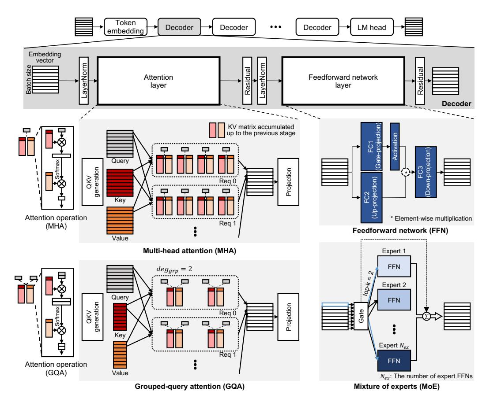
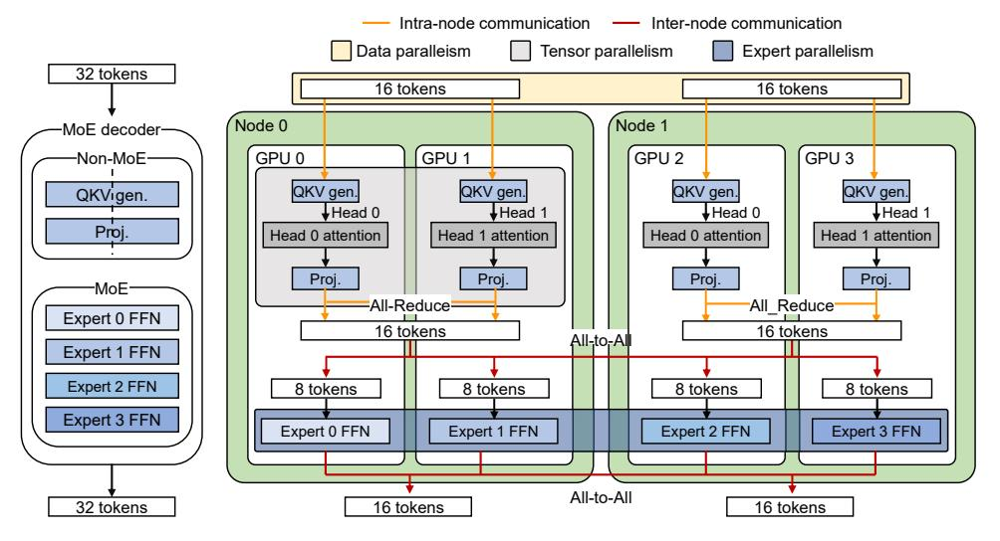
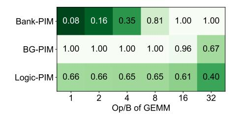
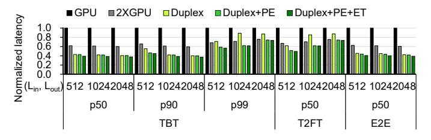
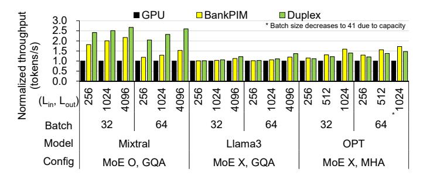
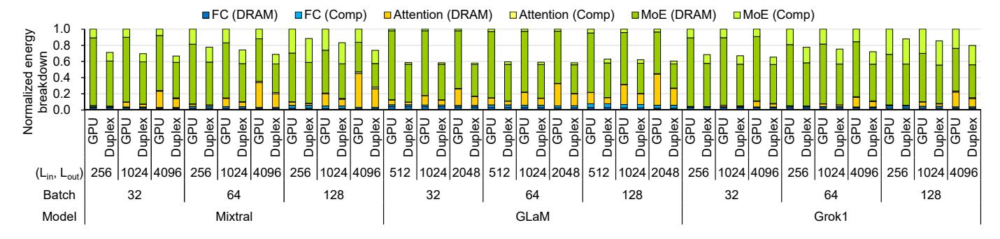

# Duplex: A Device for Large Language Models with Mixture of Experts, Grouped Query Attention, and Continuous Batching

Sungmin Yun: , Kwanhee Kyung: , Juhwan Cho: , Jaewan Choi: , Jongmin Kim: , Byeongho Kim; , Sukhan Lee; , Kyomin Sohn; , Jung Ho Ahn: :*Seoul National University, Seoul, South Korea*, ;*Samsung Electronics, Hwasung, South Korea* {*sungmin.yun, kwanhee5, jfcho2, cjw9202, jongmin.kim, gajh*}*@snu.ac.kr* {*bh1122.kim, sh1026.lee, kyomin.sohn*}*@samsung.com*

*Abstract*—Large language models (LLMs) have emerged due to their capability to generate high-quality content across diverse contexts. To reduce their explosively increasing demands for computing resources, a mixture of experts (MoE) has emerged. The MoE layer enables exploiting a huge number of parameters with less computation. Applying state-of-the-art continuous batching increases throughput; however, it leads to frequent DRAM access in the MoE and attention layers. We observe that conventional computing devices have limitations when processing the MoE and attention layers, which dominate the total execution time and exhibit low arithmetic intensity (Op/B). Processing MoE layers only with devices targeting low-Op/B such as processing-inmemory (PIM) architectures is challenging due to the fluctuating Op/B in the MoE layer caused by continuous batching.

To address these challenges, we propose Duplex, which comprises xPU tailored for high-Op/B and Logic-PIM to effectively perform low-Op/B operation within a single device. Duplex selects the most suitable processor based on the Op/B of each layer within LLMs. As the Op/B of the MoE layer is at least 1 and that of the attention layer has a value of 4–8 for grouped query attention, prior PIM architectures are not efficient, which place processing units inside DRAM dies and only target extremely low-Op/B (under one) operations. Based on recent trends, Logic-PIM adds more through-silicon vias (TSVs) to enable high-bandwidth communication between the DRAM die and the logic die and place powerful processing units on the logic die, which is best suited for handling low-Op/B operations ranging from few to a few dozens. To maximally utilize the xPU and Logic-PIM, we propose expert and attention co-processing. By exploiting proper processing units for MoE and attention layers, Duplex shows up to 2.67ˆ higher throughput and consumes 42.0% less energy compared to GPU systems for LLM inference.

*Index Terms*—large language models, processing-in-memory, mixture of experts, grouped query attention, continuous batching

# I. INTRODUCTION

Large language models (LLMs) such as GPT-3 [\[3\]](#page-13-0) and GPT-4 [\[39\]](#page-14-0) are gaining enormous prominence due to their excellent output quality in a vast range of applications. Increasing the number of model parameters has been a principal strategy to improve the quality of an LLM under the premise that the larger the model is, the better the output quality becomes. However, such a straightforward scaling approach cannot persist due to the computational challenge.

Recently, LLMs have employed a Mixture-of-Experts (MoE) [\[2\]](#page-13-1), [\[11\]](#page-13-2), [\[46\]](#page-14-1) construction on top of existing models as an efficient method to increase the number of model parameters without severely bloating the computational overhead, enabling faster training time than LLM without MoE. The MoE layer replaces the conventional feed-forward network (FFN), mainly composed of matrix-matrix multiplication (GEMM) operations between inputs and trained weights, with a collection of multiple expert FFNs (experts in short) and a gate to choose between experts. In GLaM [\[8\]](#page-13-3), for example, by utilizing only two out of the total 64 experts, the computational load remains equivalent to a 10B model, achieving the effect of using a 143B model.

Adopting continuous batching [\[56\]](#page-14-2) in inferring LLMs with MoE layers introduces new computational challenges. Continuous batching is a state-of-the-art scheduling technique that decomposes each inference request into multiple stages and batches these requests at the stage level in a lockstep manner. It maximizes the utilization of computing resources through fine-grained scheduling, allowing newly arrived requests to participate with minimal queuing delay, thereby increasing throughput. However, this batching strategy also increases the number of experts concurrently used in MoE layers, increasing off-chip memory (DRAM) access for loading the parameters of these experts (e.g., 64 for GLaM). Further, the amount of DRAM access in the attention layers in conventional LLMs also increases when batching is applied [\[40\]](#page-14-3). We observed that the MoE and attention layers, which have low arithmetic intensity (Op/B) in most stages, take most of the inference time on conventional systems such as GPUs, falling utilization of its computing resources under 10%.

However, processing an MoE layer only with devices targeting low-Op/B cannot handle the fluctuation of Op/B in MoE layers by continuous batching. Even if the Op/B of MoE layers stays at low-Op/B in most stages, the arrival of a new request significantly increases the Op/B of an MoE layer due to a large number of tokens corresponding to the input sequence passing through the MoE layer. Processing these layers solely with devices targeting low-Op/B struggle due to insufficient computing power, thereby exacerbating the latency of the MoE layer and deteriorating user experience. In such cases, using devices with high computing power (e.g., GPUs) is preferred.

A recent work [\[40\]](#page-14-3) proposed a heterogeneous system that uses processors targeting low-Op/B to alleviate DRAM bandwidth bottleneck in the attention layer and utilizes GPUs to process other layers. Replicating MoE layers to both devices

Fig. 1. LLM architecture and inference process in a gen stage with batched requests. Attention and FFN layers compose a conventional LLM, whereas GQA and MoE are used in place of these two layers, respectively.

and selecting the devices to process the MoE layers based on the Op/B values may handle the fluctuation of Op/B in MoE layers. However, duplicating the parameters of MoE layers, which account for the majority of the model parameters, is inefficient as it requires more devices due to limited memory capacity. Such systems also restrict the number of batched requests due to the wasted memory capacity than homogeneous systems, consequently reducing the system throughput.

To address the above challenges in the heterogeneous system, we propose Duplex, which integrates xPU, processing units for high-Op/B (e.g., GPU), with Logic-PIM that effectively handles low-Op/B operations in LLM inferences. Prior works [28], [29] have suggested processing-in-memory (PIM) for handling extremely low-Op/B (around 1) operations. As an MoE layer exhibits Op/B greater than one, PIM struggles due to its limited computing power. Further, the introduction of grouped-query attention (GQA), employed in recent models like Llama 2 [51] and Mixtral [23], raises the Op/B of attention layers to 4 to 8, making PIM that embeds most ALUs in DRAM dies inefficient for processing the attention layers. The recent trends of decreasing through-silicon via (TSV) pitches to 22um [49] and implementing a logic die with logic process [25], [42] make us propose Logic-PIM, adding more TSVs internally to the high bandwidth memory (HBM) and incorporating processors on the logic die to exploit increased internal bandwidth with massive processing units.

To enhance the utilization rate of xPU and Logic-PIM, we propose expert and attention co-processing for MoE and attention layers. Going further from processing each layer by one of the xPU and Logic-PIM, this co-processing allows the xPU and Logic-PIM to do finer-grained processing within the MoE layer and attention layer. We propose expert co-processing that processes the experts utilizing both xPU and Logic-PIM by leveraging the fact that each expert may handle a varying number of tokens and by choosing which processing units to process each expert in the MoE layers. We assign experts that process a relatively large number of tokens to xPU and the remaining experts to Logic-PIM, reducing the execution time of the MoE layers. We reduce the execution time of the attention layer using attention co-processing that assigns the attention of each request to both processing units, by assigning high-Op/B attention operations of an input request to xPU, and low-Op/B ones of ongoing requests to Logic-PIM.

By flexibly utilizing proper processing units for each layer based on the Op/B and co-processing optimization, Duplex shows up to  $2.67 \times$  higher throughput,  $2.57 \times$  lower end-to-end latency, and 42.03% less energy consumption for LLM inference compared to the baseline GPU without Logic-PIM.

The key contributions of this paper are as follows:

 Through a detailed analysis, we observe that GPU systems exhibit fundamental limitations in LLM inference due to their lack of support for low-Op/B operations.

Fig. 2. (a) Baseline batching, which performs inference at the request level. (b) Continuous batching, which performs inference at the stage level. T2FT, TBT, and E2E latency values for request 2 are also detailed.

- ' We design Duplex to accelerate MoE and attention layers by housing xPU and Logic-PIM in a single device and selecting the processing units based on the Op/B of each layer.
- ' We propose Logic-PIM, which incorporates dedicated TSVs connecting the DRAM dies to the logic die where processing units are placed, offering enhanced support for low-Op/B (1–32) operations compared to previous PIM architectures.
- ' We propose expert and attention co-processing to increase the utilization of xPU and Logic-PIM.

# II. BACKGROUND

# *A. Structure of Large Language Models (LLMs)*

Most recently proposed LLMs consist of decoders originally introduced for the transformer model [\[52\]](#page-14-7). An LLM features sequentially stacked (connected) decoder blocks with a token embedding layer at the beginning and a language modeling (LM) head layer at the end (see Fig. [1\)](#page-1-0), where a token is the unit of interpretation. Upon receiving an inference request expressed as a sequence of tokens, each token is first transformed into a hidden vector with dimensions ranging from thousands to tens of thousands by the token embedding layer. Hereafter, we refer to the hidden vectors as tokens. The following decoder block comprises a multi-head attention (MHA) layer, a feed-forward network (FFN) layer, and several other layers that are relatively lightweight from a computational perspective.

MHA first generates query (Q), key (K), and value (V) matrices or vectors from the input sequence through fullyconnected (FC) operations. Each of Q, K, and V is partitioned into evenly sized slices, distributed to Nhead heads (Qi , Ki , and Vi for i = 0, 1, ..., Nhead ´1), in which an attention operation is performed. For each head, a Q slice is multiplied with a K slice, softmax is applied, and the result is multiplied with a V slice. Finally, projection, another FC layer, is performed for the concatenated results from the heads. The following FFN layer consists of three FC layers with a gated activation operation (*e.g.*, SiLU [\[23\]](#page-13-6), [\[51\]](#page-14-4)) in between. We assume the use of FP16 format for the data vectors and weights in LLM inference, following conventional practices [\[38\]](#page-14-8), [\[61\]](#page-14-9).

# *B. Mixture of Experts and Grouped-Query Attention*

To further scale the size of LLMs, hyperscalers, such as OpenAI, Google, Meta, and Microsoft, have employed model variants such as mixture of experts (MoE) [\[2\]](#page-13-1), [\[11\]](#page-13-2), [\[23\]](#page-13-6), [\[46\]](#page-14-1), [\[55\]](#page-14-10) and grouped-query attention (GQA) [\[1\]](#page-13-8), [\[23\]](#page-13-6), [\[51\]](#page-14-4), [\[55\]](#page-14-10).

MoE improves the output quality while suppressing the increase in the number of operations. MoE places multiple instances (called experts) of an FFN layer, which already accounts for the majority (about 2 ⁄3) of parameters in non-MoE LLMs. We denote the number of experts in an MoE layer as Nex. A gate placed at the front assigns tokens to different top-k experts; the selected experts are determined based on the input token. Each token passes through topk experts, and the final result of the MoE layer is obtained by the weighted summation of each top-k expert's output. The memory capacity requirement substantially increases to store the Nex expert FFNs, and the bandwidth requirement also increases to access the parameters for the selected expert FFNs. However, the number of operations is almost the same or slightly larger than that of non-MoE LLMs, as each token only passes through top-k experts, not all experts.

GQA allows heads within an attention layer to form groups, each sharing K and V slices. Then, Q slices for the heads in the group can perform attention with a form of general matrixmatrix multiplication (GEMM). The total size of K and V decreases by a factor of deggrp, the number of heads in a group, alleviating the memory bandwidth bottleneck. At its extreme, all the heads in a layer can form a single group, which is referred to as multi-query attention (MQA); however, MQA is known to degrade the output quality compared to GQA [\[1\]](#page-13-8), [\[51\]](#page-14-4). Hence, we do not consider MQA in this paper.

# *C. LLM Inference with Continuous Batching*

LLM inference involves a single prefill (summarization) stage followed by multiple decoding (generation) stages. The former takes the entire input tokens of length Lin, passes them through the model, and generates key and value (KV) matrices as well as the first output token. A sequence of decoding stages follows iteratively; a decoding stage receives a single output token from the previous stage and passes it through the model in a sequential manner. Each decoding stage generates KV vectors for the input token, which are concatenated to the KV matrices, and a new output token. Multiple decoding stages are required to constitute the output response of length Lout.

LLM inference can process multiple requests in a batch to increase serving throughput. Both on the prefill and decoding stages, the FC layers from QKV generation, projection, and FFN layers can be batched to form GEMM operations between the batched input tokens and the weight matrices. However, batching requests is not effective for the attention operation. The attention operation must be performed separately for each request because the unique KV matrices corresponding to the context of each request are used.

To increase serving throughput, continuous batching [\[56\]](#page-14-2) is widely used. It divides each LLM inference into multiple stages and batches the requests at the stage level (see

Fig. 3. Model distribution methodology and operation flow of an LLM in a multi-node/multi-GPU system [46]. For non-expert weights, systems exploit tensor parallelism in the node, and data parallelism across nodes. For expert FFNs, the system allocates each expert FFN to a different GPU.

Fig. 2(b)). This stage-level scheduling can reduce the queuing delay of new requests and the time-to-first token (T2FT), the latency it takes for the first token to be generated upon request arrival. We categorize each stage into the following two types depending on the presence or absence of a prefill stage request. 1) mixed stage: prefill stages of newly added requests are batched with decoding stages of existing requests. 2) decodingonly stage: all requests of a batch are in the decoding stage if there is no new request to be served at the moment a new stage starts. We refer to the latency between two consecutive token generations as token-between-token latency (TBT) and the request handling latency from arrival to completion as end-to-end latency (E2E). In each stage, we refer to the requests performing decoding as decoding sequences and those performing prefill as prefill sequences. Hereafter, batch size is determined by the number of requests in a stage.

## D. High Bandwidth Memory (HBM)

HBM has a 3D-stacked structure with one logic die at the bottom and multiple DRAM dies. The logic die consists of I/O circuitry, memory built-in-self-test, and testing and debugging units [29], [30]. Through silicon vias (TSVs) connect the DRAM dies to the logic die. We focus on 8-hi HBM3, deployed on the latest GPUs (e.g., NVIDIA H100). In HBM3, four DRAM dies form a rank, and each DRAM die has eight pseudo channels. Each pseudo channel is connected to four bank groups of four banks, totalling 16 banks in the rank. The banks share external wires within a single pseudo channel, allowing them to read data from only one bank at a time.

## III. COMPUTATIONAL ANALYSIS

We analyze how MoE-based LLMs with MHA or GQA perform on a multi-GPU system and explore available options to enhance the performance. We follow the data/model/expert parallelism methodologies from [46] for the job distribution among the GPUs. Fig. 3 shows an exemplar model distribution of an LLM with four expert FFNs in the system consisting

of two nodes with two GPUs each. The system uses expert parallelism for the MoE layers, which distributes expert FFNs across the GPUs.1 For the FC layers excluding MoE, the system uses tensor parallelism by partitioning rows or columns of a weight matrix within a node and data parallelism by distributing requests across the nodes.

#### A. Computational Analysis of MoE and Attention Layers

The MoE and attention layers are dominant in both the decoding-only stage and the mixed stage (Fig. 4(a)). Although adopting MoE increases the amount of computation just by k, the number of expert FFNs chosen by a gate (e.g., k=2 [8], [23], [55]), independent requests as a whole are expected to explore most of the expert FFNs in the model ( $N_{ex}$ ); thus, memory access skyrockets to load  $N_{ex}$  expert FFNs, which in turn raises latency. In the case of the attention layer, as shown in prior work [40], the throughput improvement from batching diminishes because each request accompanies its own KV matrices. Therefore, as the sequence length and the batch size increase, the significance of attention layers increases.

MoE and attention layers exhibit low Op/B in the decoding-only stage (see Fig. 4(b)), which severely reduces GPU utilization. Compute utilization becomes lower than 11% for the MoE layer and 2.06% for the attention layer on GPUs. Because the tokens in the batch are distributed among the experts by gate, each expert processes a relatively small number of tokens because k is smaller than  $N_{ex}$ . Still, multiple requests can share the same expert, resulting in the Op/B becoming higher than one. Second, as multiple heads share KV matrices, the attention layer exhibits higher Op/B for GQA (Mixtral) than for MHA (GLaM), but Op/B remains low even with GQA. Unique KV matrices exist for each request and for each head (MHA) or each group (GQA), resulting in a GEMV with a Q vector or a GEMM with a narrow  $deg_{qrp}$ -wide Q matrix,

 $^{1}$ If the number of GPUs ( $N_{\mathrm{GPUs}}$ ) exceeds the number of experts, then each expert is allocated  $\frac{N_{\mathrm{GPUs}}}{N_{\mathrm{ex}}}$  GPUs using tensor parallelism.

Fig. 4. (a) Execution time ratio of each operation in Mixtral [\[23\]](#page-13-6) and GLaM [\[8\]](#page-13-3) varying Lout and batch size while Lin = 2048. Mixtral (GLaM) uses deggrp " 4 p1q for the attention layer and uses 8 (64) experts in the MoE layer with each token selecting the top-2 experts. (b) The roofline graph for each model on GPUs with varying batch sizes (32–128) when Lin = 2048 and Lout = 1024. Details of systems are in Section [VI.](#page-8-0)

where deggrp ranges from four to eight [\[23\]](#page-13-6), [\[51\]](#page-14-4), [\[55\]](#page-14-10). This computation exhibits low Op/B.

The request batch size also significantly impacts the Op/B except for the attention layer, which is performed separately for each request. In particular, utilizing a larger batch size increases the Op/B of the MoE layer as more requests in a batch share the same expert. Nevertheless, for practical batch sizes abiding by the latency limitation imposed by the service level objective (SLO) and memory capacity for KV matrices, the attention and MoE layers stay in the low Op/B region.

In the case of mixed stage, the Op/B of MoE and attention layers increases. A new request added to mixed stage increases the number of tokens that select each expert, increasing the Op/B of the MoE layer. The new request causes numerous tokens, much more than decoding-only stage by Lin, pass through the MoE layer, resulting in a higher number of tokens processed per expert. In the attention layer, the operation for the new request exhibits a high Op/B because Lin Q slices share the same KV matrices for each head.

# *B. Limitations of Heterogeneous Systems*

We discover that most stages in LLM inference with continuous batching are decoding-only stages. This is because each request consists of a single prefill stage and multiple (Lout) decoding stages. Fig. [5\(](#page-5-0)a) shows the ratio of decode-only and mixed stages in Mixtral for various Lin and Lout values in a four-GPU system (detailed in Section [VI\)](#page-8-0). It can be observed that the decoding-only stage is dominant for all cases. Thus, it is important to quickly process the decoding-only stage to reduce the E2E latency and improve serving throughput.

To accelerate the decoding-only stage, it is necessary to speed up the MoE layers and attention operations, which occupy most of the time in the decoding-only stage and have low-Op/B characteristics. Hence, one can design a heterogeneous system (hetero system) [\[40\]](#page-14-3) that includes device nodes with high memory bandwidth and low computing power dedicated to MoE and attention layers alongside conventional GPUs. We suppose such a hetero system consisting of two GPUs and two Logic-PIM (detailed in Section [IV\)](#page-4-1) and compare it with a four-GPU system. We assume that the Logic-PIM processes all MoE layers of all stages and the attention operations of decoding-only stages to avoid MoE weight duplication. This hetero system can reduce the median (p50) TBT and E2E latency as shown in Fig. [5\(](#page-5-0)b).

However, the 90th (p90) and 99th (p99) percentile TBT and median T2FT latency values show significant increases due to the limited computing power of the devices targeting low-Op/B operations. As the MoE layers exhibit high Op/B in the mixed stage, devices with high memory bandwidth but low computing power become severely compute-bound for these layers. As Lin increases, the higher Op/B in the MoE layer leads to increased T2FT and tail latency in TBT, and even in E2E for some cases. TBT and T2FT are critical performance metrics for LLM inference, especially in conversational tasks [\[43\]](#page-14-11), which often involve multiple rounds of dialogues between the user and the chatbot. Because each round is processed as a separate request, Lin continues to increase as the conversation progresses, exacerbating the problem.

To prevent the tail latency from skyrocketing, it is necessary to duplicate the weights of the MoE layers on GPUs with high computing power and process the MoE layer of the mixed stage on these GPUs. However, duplicating the weight of MoE layers, which take the most model weights, is highly inefficient, requiring more devices due to limited memory capacity. Further, such hetero systems limit memory capacity for KV matrices, which increases proportionally to batch size, than homogeneous systems, thereby reducing the maximum batch size and thus hindering system throughput (see Fig. [5\(](#page-5-0)c)).

# IV. DUPLEX: DEVICES FOR EFFICIENT LLM INFERENCE

To address the challenges in the hetero system, we propose Duplex, which configures separate processing units for high-Op/B and low-Op/B operations that share device memories. Appropriate processing units are selected for each operation based on the stage. The low-Op/B unit handles the MoE layers during the decoding-only stage as well as the attention layers of the decoding-only stage and of decoding sequences in the mixed stage. The high-Op/B unit manages the rest. We opt for an HBM-based system to provide high memory bandwidth.

# *A. Implementation of High Op/B Processors*

For high-Op/B operations, conventional accelerators, such as GPUs and TPUs, are eligible candidates for a high Op/B processor. We assume that a popular GPU architecture equipped with HBM serves as a high Op/B processor for

Fig. 5. (a) The ratio of decoding-only stage to mixed stage in Mixtral on a GPU system. (b) The normalized latency of a heterogeneous system compared to a GPU system in Mixtral with a batch size of 32. The GPU system consists of four GPUs, while the heterogeneous system consists of two GPUs and two Logic-PIMs (details in Section IV). (c) The normalized throughput of the heterogeneous system over the GPU system in Mixtral with a batch size of 128.

Fig. 6. Our DRAM die microarchitecture of HBM3 for Logic-PIM. Logic-PIM and xPU can operate simultaneously through independent active paths.

Duplex. Hereafter, we refer to the processor as xPU. Numerous processing units in xPU provide extremely high computational throughput, but the HBM bandwidth is limited due to the physical limitations of the interposer connecting HBM stacks with the main computing die.

# B. Implementation of Low Op/B Processors

The MoE and attention layers, which exhibit low Op/B ranging from 1 to 32, face challenges when performed using the PIM architectures in prior studies [17], [28], [29], [40], which place processing units inside DRAM dies. The banks share external wires within a single pseudo channel, allowing them to read data from only one bank at a time. In contrast, a PIM architecture places an internal computing unit in each bank, where all those can read data from its bank simultaneously, improving effective memory bandwidth. While such PIM architectures are effective for extremely low-Op/B operations (under 1) by exploiting the high internal bandwidth of DRAM dies, their performance is suboptimal for operations in the MoE and attention (GQA) layers. Populating more processing units with these PIM architectures [28], [29] is not cost-effective due to the significant area overhead involved in integrating processing units with DRAM processing technologies. In commercially available PIM devices such as [28], [29], even when the compute-to-memory-bandwidth ratio is one, processing units already occupy 27% and between 20% and 25% of the DRAM die area, respectively.

Considering the required range of Op/B (1 to 32), we design the target architecture for low-Op/B units to achieve 4× the memory bandwidth of conventional HBM, with a compute-to-memory-bandwidth ratio of eight. Because the logic die can leverage the logic process [25], [42], more processing units can be placed on the logic die than on the DRAM die of the same area. However, merely adding processing units to the logic die does not offer any memory bandwidth benefits compared to xPU. We observe a reduction in the TSV pitch in recent HBMs from 50um to 22um [49], which allows quadrupling the number of TSVs with only a 9% area overhead (detailed in Section VII-E). Motivated by this technology trend, we propose Logic-PIM, which increases the internal bandwidth by adding more TSVs and adds processing units to the logic die which can utilize the logic process.

# C. Microarchitecture of Logic-PIM

In designing Logic-PIM, we set two main objectives of minimizing modifications to DRAM and reducing the internal DRAM datapath length to reduce the energy required to read data [37]. In providing  $4\times$  higher memory bandwidth, simply increasing the bandwidth of each bank incurs a significant overhead of quadrupling the prefetch size of the banks and increasing the I/O datapath width by  $4\times$ . This results in a 77% increase in the size of the DRAM banks and necessitates changes to the DRAM bank layout [37].

Instead, we increase the number of banks operating simultaneously without modifying the structure of the DRAM banks. Conventional memory systems share bank I/O and bank group I/O, allowing data to be read from only one bank at a time. We place switches between each bank I/O and separate their paths to enable reading data simultaneously from multiple banks (see Fig. 6). Because reading data from the same bank group takes twice as long (tCCD\_L) as that from different bank groups (tCCD\_S), we simultaneously read from eight banks to achieve 4× higher bandwidth. We divide 16 banks for a single rank and a pseudo channel into upper (colored red in Fig. 6) and lower banks and make each group of eight banks operate as one unit, which we refer to as bank bundle.

We integrate additional TSVs for Logic-PIM in the conventional HBM's power TSV area instead of data TSV area. To

Fig. 7. (a) Top view of Duplex chip, (b) the architecture of Logic-PIM, and (c) the details of processing units.

Fig. 8. The normalized energy-delay-area product (EDAP) of Bank-PIM, BankGroup-PIM, and Logic-PIM by Op/B of FP16 GEMM operation. Weight matrix is (16384×4096). Details about each architecture are in Section VI.

transmit data read from each bank in a bank bundle to the logic die, we must connect the Logic-PIM-path I/O from each bank group to the TSVs. Adding TSVs for Logic-PIM to the existing data TSV area would result in longer datapaths from each bank group, thereby consuming more energy [37]. By placing Logic-PIM TSVs near the areas for power TSVs, we reduce the length of Logic-PIM-path I/O from each bank to TSVs and minimize the wiring overhead.

xPU and Logic-PIM can read data simultaneously using bank bundle parallelism. Logic-PIM sends the same command/address (C/A) to the target bank bundle, thus simultaneously reading data from eight banks. Logic-PIM reads a total of 512 bits from two banks per bank group at intervals defined by tCCD L, which travels to the I/O buffer in the additional TSVs installed, and the data is transferred through the TSV to the logic die. In the case of the xPU path, a simple switch separates it from the Logic-PIM datapath, allowing xPU to read data from the other bank bundles even when Logic-PIM is accessing data. Each pseudo channel comprises four bank bundles, organized into two ranks with two bank bundles per rank, with indices set from one to four. To prevent bank bundle conflicts when simultaneously using Logic-PIM and xPU, we strategically allocate the weights of models and KV matrices considering the index of bank bundles.

#### D. Duplex Architecture

Fig. 7(a) shows the overall design of Duplex. An xPU in the center is responsible for high-Op/B operations. A Logic-PIM (Fig. 7(b)) is connected to a conventional HBM controller to read data for high-Op/B operations, and is also connected

to a Logic-PIM controller, which controls the processing units in Logic-PIM. Unlike HBM controllers, the Logic-PIM controller does not receive data from Logic-PIM. Instead, all computations are performed on the logic die. Thus, only control pins are used to connect Logic-PIM with the controller, resulting in minimal pin overhead.

Logic-PIM consists of a simple DRAM controller for fetching data from HBM, GEMM modules for performing low-Op/B GEMM operations, a buffer, and modules for softmax and activation functions. The Logic-PIM controller sends Logic-PIM the starting addresses of weights and inputs, as well as the dimensions of the GEMM to the operation controller. Upon receiving a compute request from the Logic-PIM controller, the operation controller fetches data via the DRAM controller and performs computations using the GEMM module. The activation module handles the activation in the MoE layers, and the softmax module is used for the attention layer.

#### E. Comparing Duplex with prior PIM architecture

Duplex is more suited for contemporary LLMs than prior PIM architectures that add processing units to DRAM dies. Duplex exhibits a better energy-delay-area product (EDAP) for GEMM operations above 8 Op/B over prior DRAM diebased PIM architectures (see Fig. 8, prior PIM architectures are detailed in Section VI). At Op/B under eight, Bank-PIM, which can utilize the highest memory bandwidth, shows the best EDAP. However, as the Op/B of operations increases, Bank-PIM, with its limited computing power, becomes less efficient compared to Logic-PIM. Although BankGroup-PIM has the same memory bandwidth and computing power as Logic-PIM, it always exhibits a higher (worse) EDAP due to having all its processing units and buffers on the DRAM die, resulting in a larger area overhead than Logic-PIM.

#### V. END-TO-END LLM INFERENCE USING DUPLEX

#### A. Processing MoE and Attention Layers Using Logic-PIM

We propose a method for distributing computations assigned to each device across Logic-PIM stacks. Fig. 9 illustrates how the computations for the MoE and attention layers of decoding sequences are divided into four Logic-PIM stacks. For the expert FFNs in an MoE layer, assigning a different

Fig. 9. MoE and attention layers distributed among HBM stacks in a device. The shades of blue indicate which HBM each chunk of data is stored in.

expert to each Logic-PIM could lead to varying execution times across Logic-PIM due to differences in the number of tokens processed by each expert. We distribute each expert FFN computations across all Logic-PIM for load balancing across Logic-PIM. However, this approach may necessitate inter-Logic-PIM communication to obtain the final results.

To minimize communication, we first distribute the weights for gate-projection and up-projection by slicing them columnwise across all Logic-PIM. Since gated activation is an element-wise operation, it can be performed without additional data movement. Afterward, when computing down-projection, each Logic-PIM ends up holding partial sums of the final output of the expert FFN. Performing an all-reduce operation among the Logic-PIM within the device yields the final result of the expert FFN. This all-reduce operation is processed by an xPU, which reads and processes all the partial sums stored in the memory of each Logic-PIM. We minimize communication overhead by conducting a single all-reduce operation after all expert FFNs have completed their computations, rather than performing it after each expert FFN.

Duplex uses request and head parallelism for attention operations. Because attention operations among different requests have no data dependency, requests can be fully parallelized. As each head operates on separate slices of the Q vector and KV matrices, heads can also be fully parallelized.

#### B. Expert and Attention Co-processing

To increase the utilization of xPU and Logic-PIM, we propose expert and attention co-processing. In LLM inference, the presence of data dependencies between layers makes simultaneous computation in xPU and Logic-PIM challenging. Fig. 10(a) and (b) illustrates a naïve operation flow where only an xPU or Logic-PIM is used at any given time.

One simple way to simultaneously utilize xPU and Logic-PIM is by dividing the workload into two independent mini-batches that have no data dependencies between them (Fig. 10(c)) [17]. These mini-batches enable simultaneous

Fig. 10. Operation flows of Duplex. Comparison of (a)–(d) for the same total batch size (N) with the same capacity of KV cache, considering the total device memory capacity. For convenience, the decoding-only stage is depicted at a larger scale compared to the mixed stage.

operations in xPU and Logic-PIM by alternating between layers, but it has disadvantages. The batching effect is reduced for the FC and MoE layers as these layers operate with half the batch size compared to the baseline method, leading to decreased data reuse. While attention operations are unaffected because each request processes independent values, the FC and MoE layers see no reduction in execution time when their operations are memory-bound, even with a reduced batch size. This can lead to increased latency compared to the baseline. Moreover, processing the same batch size doubles the amount of model parameters being read, resulting in higher DRAM read energy.

We propose expert and attention co-processing to increase the utilization of both processors, while maintaining the batching effect of the FC and MoE layers. Expert FFNs in MoE layers do not have data dependencies between them, enabling simultaneous computation. Because all tokens independently pass through a gate to select experts, the number of tokens processed by each expert can vary. Experts with relatively fewer tokens are processed in Logic-PIM, while the rest are handled in xPU in both decoding-only stage and mixed stage, thus preserving the batching effect of MoE layers while reducing its latency.

Because the number of tokens processed by each expert is determined after passing through gates, selecting which experts to process on each device may incur overhead. Duplex must decide which experts to allocate to either xPU or Logic-PIM based on the time to process each expert with how many tokens are processed with each processing unit. To minimize overhead, Duplex preliminarily estimates and stores the processing times for experts in both xPU and Logic-PIM, depending on the number of processed tokens. At runtime, Duplex uses this lookup table to determine which experts to process in Logic-PIM. First, Duplex calculates the total time to process all experts using only xPU. Then, it progressively assigns the experts with the fewest tokens to Logic-PIM,

aiming to find the best combination for processing experts. Then, xPU sends PIM instructions to Logic-PIM to process the corresponding experts. This lookup table-based decision-making is considerably faster than the actual execution of the expert layer, and its time impact can be considered negligible.

Using expert parallelism may diminish the impact of expert co-processing. With fewer experts processed in each device, the degree to which they can be split between xPU and Logic-PIM is limited, reducing the effectiveness of expert co-processing. Thus, we choose to apply tensor parallelism for MoE layers, splitting each expert across all devices. In the multi-node system, where the bandwidth between nodes is relatively lower than within the same node, we use expert parallelism between nodes and tensor parallelism within nodes.

Second, the mixed stage involves processing attention for both the decoding sequences and the prefilling sequences. As attention operations can be processed individually for each request, the attention of prefilling sequences is handled by the xPU, and that of decoding sequences is processed in Logic-PIM, allowing us to process the attention layer more quickly.

#### C. Memory Allocation and Management

To support co-processing, we divide all the memory space in the device into four sections based on the index of the bank bundle. Each memory space uses bank bundles in all channels. For the expert FFNs, we allocated them one by one across these four memory spaces. During expert co-processing, Duplex processes all the experts within the memory space with either Logic-PIM or xPU, thus preventing any bank bundle conflicts between Logic-PIM and xPU.

For the KV cache used in the decoding sequence, we have alternately allocated it among three of the memory spaces, while the remaining memory space is designated for storing Q, K, and V matrices used in the attention of prefilling sequences, thus enabling attention co-processing. As the K and V matrices used in the prefilling sequences should be cached for the next stages, we need to migrate the K and V matrices to the other bank bundles for the next stage. After the attention operation is finished, xPU moves the K and V matrices to the bank bundle designated to store KV cache. Considering that this migration is performed only once, the overhead is negligible. The parameters for the other layers are used exclusively in xPU and are allocated in any remaining memory spaces.

## VI. EXPERIMENTAL SETUP

We compare Duplex with a baseline NVIDIA H100 GPU [35]. To quantitatively evaluate the performance improvement, we also compare with 2×GPU, a system equipped with twice as many devices. We configured xPU in Duplex to have the specifications equivalent to H100, which replaced HBM3 with our proposed Logic-PIM with no change in memory capacity (16 GB per stack, 8-hi (two ranks) per stack, and 80 GB per device). Logic-PIM gains additional 4× memory bandwidth over conventional HBM3 by adding dedicated TSVs from DRAM dies to a logic die. We incorporated processing units in Logic-PIM to achieve peak FLOPS for 8

TABLE I
MODEL CONFIGURATION USED FOR EVALUATION

| Model                  | Param.              | # layer        | Hidden               | Interm.                 | # head         | $deg_{grp}$                   | $N_{ex}$     | top-k |
|------------------------|---------------------|----------------|----------------------|-------------------------|----------------|-------------------------------|--------------|-------|
| Mixtral   GLaM   Grok1 | 47B 143B 314B | 32 32 64 | 4096 4096 6144 | 14336 16384 32768 | 32 32 48 | 4 (GQA) 1 (MHA) 6 (GQA) | 8 64 8 | 2 2 2 |
| OPT    Llama3       | 66B 70B          | 64 80       | 9216 8192         | 36864 28672          | 72 64       | 1 (MHA) 8 (GQA)            | -            |       |

Op/B (21.3 TFLOPS per Logic-PIM stack). For Bank-PIM, we assume 16× bandwidth than conventional HBM with a peak Op/B of 1, twice as high as HBM-PIM [29]. Bankgroup-PIM has the same memory bandwidth and computing power as Logic-PIM, but processing units are in the DRAM die. Both Bank-PIM and Bankgroup-PIM have softmax and activation units on the logic, similar to Logic-PIM.

To fairly compare the Duplex and GPU, we set the memory capacity of each system to be the same. With eight or fewer devices, we assume they are interconnected using bidirectional 900GB/s NVLink, similar to an HGX system [36]. For configurations with more than eight devices, we assume that each set of eight devices forms a node and that these nodes are interconnected via a system with a 400GB/s Infiniband [13].

We developed a cycle-accurate simulator for modeling systems with Duplex and GPUs using Ramulator [12], [33]. Our simulator is composed of two main components: a serving scheduler and a cluster. To support continuous batching, we implemented a serving scheduler that manages ongoing inference requests. The cluster receives device specifications and system configurations; then, it generates device components. Based on the model distribution methodology, the simulator distributes model weights across these device components. The operation of our simulator proceeds as follows: 1) The serving scheduler generates information about the requests being processed at each stage (e.g. prefilling or decoding of each request and the current sequence length) and sends them to the cluster. 2) Upon receiving the requests, each device component within the cluster executes the assigned operations and results execution times. For Logic-PIM, we have modified the Ramulator, specifically the DRAM controllers and internal DRAM behavior models, to enable simultaneous data reading from all banks in the target bank bundle. We used the timing parameters of HBM3 [21] to simulate memory operations in both Duplex and GPU. For computing units, the timing data is calculated considering the number and the frequency of the computing units. The cluster additionally computes the communication time for data movement between devices considering the latency and bandwidth of the HGX system [36], and based on the execution times received from the device components, calculates the final execution times.

We used Mixtral [23], GLaM [8], Grok1 [55], OPT [61], and Llama3 [34] LLMs for evaluation. Mixtral and Grok1 have a structure with all MoE decoder blocks, while GLaM alternates decoder and MoE decoder blocks. In the MoE layer, Mixtral and Grok1 select two out of eight experts, and GLaM selects two out of 64 experts per token. To evaluate

Fig. 11. The normalized throughput of Mixtral, GLaM, and Grok1 for various ( $L_{in}$ ,  $L_{out}$ ) from (256, 256) to (4096, 4096), and batch sizes (32–128).

Fig. 12. The normalized latency (TBT, T2FT, E2E) of GLaM for various  $(L_{in},\,L_{out})$  from (512, 512) to (2048, 2048) with a batch size of 64.

the performance of Duplex in conventional LLMs without MoE, we also used OPT and Llama3. Mixtral, Grok1, and Llama3 uses GQA, and GLaM and OPT uses MHA. We used FP16 [38], [61] for weight precision. Considering the number of model parameters, we configured the default number of nodes and the number of devices within each node as follows; Mixtral, OPT, Llama3: one node with four devices, GLaM: one node with eight devices, Grok1: two nodes, each with eight devices. Unless specified otherwise, we applied the data and job distribution method described in Section III. For 2×GPU, we first increased the number of devices per node to a maximum of eight and increased the number of nodes. Details of the model configurations are summarized in Table I.

We used synthesized datasets to quantify the performance improvements of Duplex. We sampled the input and output lengths of each request using Gaussian distributions and represented the average of the input and output lengths for the sampled requests. For expert selection, we chose the target experts for each token using a uniform distribution [11]. To evaluate the performance in varying queries per second (QPS) situations, we injected requests into the systems following Poisson distributions [43], [56], [57] in the experiments shown in Fig. 13. Otherwise, we assumed that when the inference of a request is finished, the next request is added to the batch and processed together in the next stage using continuous batching.

To measure area overheads and energy consumption, we synthesized the major components of Duplex devices. We implemented arithmetic units in Verilog and synthesized them using Synopsys Design Compiler with a 7 nm predictive process design kit [6]. We set the operational frequency of arithmetic units of xPU as 1 GHz and Logic-PIM as 650 MHz considering tCCDS of HBM3, which is 1.5 ns. We modified FinCACTI [48] to match the published data of SRAM [4], [20], [22], [24], [50], [54] and used it to model the energy of SRAM-based buffers. We referred to [37] for the activation, read, write, and TSV energy of HBM. We adjusted the area

overhead for processing units and buffers on the DRAM die to 1z-nm DRAM technology [41], [47]. We then scaled the area overhead by factoring in that the DRAM process has  $10 \times 10^{-2}$  larger than the logic process for the same feature size [7].

#### VII. EVALUATION

#### A. Throughput Improvement of Duplex

Duplex shows higher throughput than GPU systems, with even  $2 \times \text{GPU}$  in most cases by efficiently performing low Op/B MoE layers and attention layers using Logic-PIM. Fig. 11 shows the normalized throughput (tokens per second) of Duplex for various batch sizes and  $(L_{in}, L_{out})$  configurations on three models compared to the GPU. To verify the performance enhancement of Duplex, we categorized Duplex into three configurations. Duplex is a device that uses only one of xPU or Logic-PIM at any given time, as shown in Fig. 10(a) and (b). Duplex+PE applies expert and attention co-processing, illustrated in Fig. 10(d). A device that incorporates tensor parallelism for MoE layers, as described in Section V-B, is referred to as Duplex+PE+ET.

Duplex already achieves up to  $2.51\times$  performance improvements compared to the baseline GPU system, even showing the best performance for the  $(L_{in},L_{out})=(4096,4096)$  case of Mixtral. There exist cases that Duplex outperforms the throughput of  $2\times$ GPU as Duplex utilizes greater memory bandwidth than that of  $2\times$ GPU in the low-Op/B operations, which dominates the total execution time.

When only co-processing is applied, we observe an 1.04× on average in throughput compared to Duplex. Because each device processes fewer experts (two in the case of Mixtral and one for Grok1), the benefits of expert co-processing are minimal. While attention co-processing also reduces the latency of mixed stage, it does not significantly improve throughput as decoding-only stage dominates the stages in LLM inference. Duplex+PE+ET enhances the effects of expert co-processing by employing tensor parallelism for experts as well, which increases the number of experts processed on each device, and increases throughput up to 1.36× and 2.67× compared to Duplex and GPU.

In large systems, performance improvements may be limited due to communication overhead between devices and nodes. Grok1 exhibits smaller performance improvements compared to the other models. This is due to Grok1's larger model size, which necessitates using two nodes for LLM inference. Relatively low bandwidth between nodes increases communication

Fig. 13. The normalized latency (TBT, T2FT, E2E) of Duplex, GPU, and  $2\times$ GPU for Mixtral varying queries per second (4 to 16). ( $L_{in}$ ,  $L_{out}$ ) is (4096, 512) and the maximum batch size is 128.

Fig. 14. The normalized throughput of Duplex and Bank-PIM in Mixtral, Llama3, and OPT for various  $(L_{in},\,L_{out})$  from (256, 256) to (4096, 4096) and batch sizes (32–64).

overhead, consequently diminishing the acceleration benefits for the MoE layer and attention layer using Duplex.

#### B. Latency Improvement of Duplex

Duplex significantly reduces the various types of latencies (TBT, T2FT, E2E) over GPU. Fig. 12 shows normalized latencies for  $L_{in}$  and  $L_{out}$  from 512 to 2048 in GLaM with a batch size of 64. On average, Duplex reduces the median TBT value by 58.3% by decreasing the execution times of the MoE layer and attention layer using Logic-PIM compared to GPU. Further, Duplex achieves even lower median TBT latency than 2×GPU. The stage corresponding to the median TBT latency is the decoding-only stage, where the low Op/B MoE and attention layers dominate the execution time. While 2×GPU utilizes twice as many processing units as Duplex to process the high-Op/B FC layer quickly, Duplex can utilize twice the memory bandwidth as 2×GPU for low-Op/B operations using Logic-PIM. By exploiting higher memory bandwidth using Logic-PIM when processing dominant low Op/B operations in the decoding-only stage, Duplex achieves a lower median TBT latency than  $2 \times GPU$ .

Even for median latencies of T2FT and 99th percentile for TBT, which primarily occur in the mixed stage well-suited to GPUs, Duplex+PE+ET achieves competitive latency improvements compared to  $2\times$ GPU. When  $L_{in}$  is 512, Duplex+PE+ET could decrease the 99th percentile of TBT and T2FT latencies up to 16.74% and 26.17% compared to  $2\times$ GPU. The Op/B of the MoE layer in the mixed stage is low enough to be accelerated by Logic-PIM, making the expert and attention co-processing more effective. When  $L_{in}$  is 2048, the Op/B of the MoE layers in the mixed stage increases and the Logic-PIM suffers from processing experts

due to fewer processing units; thus, Duplex+PE+ET shows similar 99th percentile TBT and T2FT with the  $2\times$ GPU. By efficiently handling both decoding-only stage and mixed stage, Duplex+PE+ET reduces E2E latency by an average of 60.20% and 35.38% compared to GPU and  $2\times$ GPU.

To evaluate the performance of Duplex under different serving intensities, we measured the latency of Duplex, GPU, and 2×GPU with varying QPS (see Fig. 13). Duplex always exhibits better median TBT latency than 2×GPU. Because the median TBT latency is generally achieved during the decoding-only stage, Duplex outperforms 2×GPU by exploiting higher memory bandwidth using Logic-PIM compared to  $2\times$ GPU. At low QPS, Duplex outperforms  $2\times$ GPU in the 90th percentile of TBT latency. However, as QPS increases, Duplex shows higher latency compared to  $2\times GPU$ . For high QPS, as the system processes more mixed stages, 2×GPU performs the mixed stage better by utilizing twice as many computing units as Duplex, lowering tail TBT latencies over Duplex. If requests exceed the system's throughput, T2FT latency skyrockets due to the queuing delay. GPU cannot handle requests if more than 9 requests are injected per second. Duplex, which processes the decoding-only stage faster, can handle up to 14 requests per second, nearly equivalent to the capability of 2×GPU. Thus, Duplex always outperforms GPU and demonstrates similar or better performance across various QPS.

#### C. Comparison with Bank-PIM Across Various LLMs

Duplex outperforms Bank-PIM by efficiently accelerating low-Op/B (over 1) operations (see Fig. 14) in LLM with MoE and GQA. Bank-PIM shows up to 2.17× higher throughput than GPU in the batch size of 32 when  $(L_{in}, L_{out})$  is 4096. When the batch size decreases from 64 to 32, the Op/B of the MoE layer is lowered, leading to relatively respectable performance improvements in Bank-PIM. As the batch size increases, the processing units in Bank-PIM struggle with processing the MoE layers due to increased Op/B. Bank-PIM cannot efficiently process MoE layers when the batch size increases, leading to diminished performance gains and showing only 1.18× higher throughput compared to GPU when  $(L_{in}, L_{out})$  is 256 with a batch size of 64. Duplex exploits Logic-PIM equipped with more processing units than Bank-PIM, exhibiting  $2.05 \times$  higher throughput than GPU in the same configuration. As the  $deg_{qrp}$  of Mixtral is 4, Bank-PIM shows similar speedups compared to Duplex in processing the attention layer of decoding sequences, despite having higher

Fig. 15. The normalized energy breakdown of Mixtral, GLaM, and Grok1 for various (Lin, Lout) from (256, 256) to (4096, 4096), and batch sizes (32–128).

Fig. 16. The normalized latency (TBT, T2FT, E2E) of Mixtral for various  $(L_{in}, L_{out})$  from (256, 256) to (4096, 4096) with a batch size of 128. Duplex and Duplex-Split each use a total of 4 Duplex devices. Duplex-Split processes each prefill stage and decoding stage with two Duplex units each.

amplified bandwidth. By providing more adequate memory bandwidth and processing units than Bank-PIM, Duplex shows up to  $1.80 \times$  higher throughput and  $1.49 \times$  higher throughput on average compared to Bank-PIM in Mixtral.

Duplex still achieves acceptable speedups compared to GPU in out-of-target models, such as conventional LLM models without MoE layers. As the attention operations of decoding sequences are low Op/B operations, Duplex shows performance improvement. In Llama3, which uses GQA ( $deg_{grp}$  = 8), Duplex performs better than Bank-PIM. While Duplex can efficiently handle GQA, Bank-PIM suffers from a lack of computing units. In the case of OPT, which utilizes MHA, Bank-PIM performs better than Duplex. Because the Op/B of MHA in the decoding-only stage is extremely low, Bank-PIM processes the attention layer of the decoding-only stage faster than Logic-PIM by utilizing high internal memory bandwidth, leading to higher throughput than Duplex.

# D. Energy Consumption

Duplex reduces energy consumption by up to 33.28%, 42.03%, and 34.59% for Mixtral, GLaM, and Grok1 compared to GPU. Fig. 15 shows normalized energy consumption for generating one token with Duplex and GPU. We can see that most of the energy is consumed in the MoE and attention layers. Duplex reduces off-chip memory access energy in MoE and attention layer by leveraging Logic-PIM. The energy consumed by the attention layer rises as the sequence length increases, Duplex shows better energy efficiency in the long sequence lengths.

In particular, energy efficiency deteriorates in Mixtral and Grok1 compared to GLaM as the batch size increases. While

Duplex reduces latency through co-processing, it consumes more energy by utilizing xPU, which uses more DRAM energy than Logic-PIM. As Mixtral and Grok1 employ fewer experts than GLaM, resulting in a higher Op/B for the MoE layers in Mixtral and Grok1 than in GLaM at the same batch size. Thus, Duplex relies on xPU to process more experts in Mixtral and Grok1 compared to GLaM, leading to relatively lower energy efficiency compared to GPU when the batch size increases.

#### E. Area Overhead

The total overhead for processing units in Duplex for each Logic-PIM stack is 17.80 mm2, which accounts for 14.71% of a 121 mm2 HBM3 logic die [41]. The pitch of TSV was measured at 22 um [49], and the number of TSVs per channel was conservatively scaled by increasing it to four times the number required per channel in conventional HBM3 [49]. The added TSVs account for an area overhead of 10.89 mm2. Each Logic-PIM stack includes 32 GEMM modules, with each module comprising 512 FP16 MACs operating at 650MHz and a 8KB buffer, accounting for 3.02 mm2. Further, Logic-PIM contains two 1MB buffers to store input vectors and temporal results, occupying 2.26 mm2. A softmax unit, which consists of a comparator tree, adders, exponential units, an adder tree, dividers, multipliers, and a total of 128 KB buffers, occupies 1.64 mm2. Considering that the area overhead ranges from 20% to 27% [28], [29], Duplex demonstrates significant performance improvements with a lower area overhead.

# VIII. DISCUSSION

## A. Split Prefill and Decoding Node

Splitwise [43] proposed an LLM inference system by dividing nodes into prefill (prompt) and decoding (token) nodes. Based on the importance of high computing power for the prefill stage and memory bandwidth for the decoding stage, Splitwise suggested a cost-effective system by deploying suitable hardware across prefill and decoding nodes. This approach benefits in low tail latency of TBT compared to non-split systems, as no mixed stages are involved in token generation within the decoding nodes.

However, split systems show lower throughput than nonsplit systems due to the underutilization problems and the wasted memory capacity due to weight duplication (see Fig. 16). The utilization of prefill and decoding nodes varies across batch sizes, input, and output sequence lengths. One of the prefill or decoding nodes would suffer from low utilization unless it targets a specific scenario. For cloud service providers, managing separate devices for prefill and decoding stages and reconfiguring the system to prevent underutilization for each target scenario is highly burdensome. Further, the split approach incurs memory weight duplication, limiting batch size due to wasted memory capacity and thus degrading throughput compared to a non-split system.

# *B. Implications of Expert Skews on Expert Co-processing*

A prior work [\[19\]](#page-13-20) argue that the number of tokens each expert processes can substantially differ. In cases where there are hot experts processing a large number of tokens and cold experts processing a smaller number of tokens, Duplex can efficiently process the MoE layer by flexibly handling experts with both xPU and Logic-PIM, exploiting expert co-processing. However, in ideal cases where each expert processes the same number of tokens, expert co-processing may not be as effective.

# *C. KV Cache Migration and Recomputation*

The generated KV cache size increases in proportion to the batch size and sequence length. With the current trend of increasing sequence length [\[5\]](#page-13-21), the KV cache could lead to a shortage of device memory capacity in a system. PagedAttention [\[27\]](#page-13-22) proposed KV cache migration and recomputation when its capacity exceeds the memory capacity of the GPU system. KV cache migration involves evicting a portion of requests and migrating the KV caches to CPU memory to free up device memory capacity. Once the inference of the ongoing requests are completed and there is available device memory capacity, the system brings the evicted KV caches back to the device memory to resume the inference. In the recomputation method, the KV caches are deleted instead of being migrated. When the inference of evicted requests is resumed, the previous KV caches are recomputed. These methods can be complementarily applied to Duplex.

# IX. RELATED WORK

Most ASIC- and FPGA-based LLM accelerators have focused on quantization or pruning to reduce the size of the model or memory usage. [\[9\]](#page-13-23), [\[10\]](#page-13-24), [\[15\]](#page-13-25), [\[16\]](#page-13-26), [\[31\]](#page-13-27), [\[32\]](#page-13-28), [\[44\]](#page-14-23), [\[45\]](#page-14-24), [\[53\]](#page-14-25), [\[59\]](#page-14-26) focused on the presence of unnecessary values in the attention matrix, which is the result of multiplying the Q and K matrices within the MHA layer of the transformer model. They proposed accelerators that approximate attention operations or prune unnecessary values in the attention matrix through methods such as eager prediction. [\[14\]](#page-13-29), [\[53\]](#page-14-25), [\[58\]](#page-14-27) proposed accelerators that support quantization of the weight or embedding vector of the transformer model. Meanwhile, [\[18\]](#page-13-30), [\[26\]](#page-13-31) proposed accelerators that process the transformer model losslessly. [\[18\]](#page-13-30) proposed a system that distributes processing across multiple FPGAs for low-latency inference of the transformer model and [\[26\]](#page-13-31) proposed a dataflow for the accelerator to improve the efficiency of the attention operation.

Numerous studies have proposed leveraging near-memory processing or PIM to process the transformer model effectively. [\[28\]](#page-13-4), [\[29\]](#page-13-5) introduced commercialized PIM architectures on HBM and GDDR, respectively. They proposed a system and software stack that offloads the GEMV operations of the transformer model to the PIM architecture with in-bank processing units. [\[40\]](#page-14-3) proposed a PIM architecture that efficiently handles attention operations with extremely low-Op/B and high memory capacity requirements on large batch sizes. [\[17\]](#page-13-10) proposed the integration of NPU and PIMs to efficiently handle both GEMM and GEMV. [\[62\]](#page-14-28) proposed an end-to-end accelerator to process the transformer model on PIM.

TOP-PIM [\[60\]](#page-14-29) proposed GPU with PIM stacks, achieving acceleration for memory-intensive workloads through the internal stack bandwidth between the DRAM die and logic die, which is higher than the I/O bandwidth of the HBM stack. However, it did not aim to accelerate LLMs and lacks details of DRAM die architectures. Also, it did not consider concurrently executing GPUs and PIM stacks; thus, the expert and attention co-processing cannot be applied. Despite these works on accelerating LLMs and PIM architectures, to the best of our knowledge, Duplex is the first to accelerate LLMs with MoE and GQA in continuous batching.

# X. CONCLUSION

In this paper, we have proposed Duplex, a device to efficiently accelerate large language models (LLMs). We observed that low-Op/B operations dominate the total execution time in LLMs and that utilizing heterogeneous systems following prior work would result in severe performance degradation. Duplex integrates two types of processing units that share device memories, each designed to efficiently handle high-Op/B and low-Op/B layers in an LLM. Especially, we introduced an alternative processing-in-memory (PIM) microarchitecture, Logic-PIM, that exploits the increased TSV density of contemporary HBM to place powerful processing units on the logic die of an HBM. We proposed expert and attention parallel execution to maximize the utilization of processing units in Duplex. By these means, Duplex shows up to 2.67ˆ higher throughput and 42.03% less energy consumption, achieving 2.07ˆ higher throughput and 28.19% lower energy consumption on average for LLM inference compared to a GPU system using H100.

# ACKNOWLEDGMENT

This work was partly supported by the Samsung Electronics, the National Research Foundation of Korea grant funded by the Korea government (MSIT) (RS-2024-00405857), Institute of Information & communications Technology Planning & Evaluation (IITP) grant funded by MSIT (RS-2024-00402898, RS-2021-II211343), and IITP under the artificial intelligence semiconductor support program funded by MSIT (IITP-2023- RS-2023-00256081). The EDA tool was supported by the IC Design Education Center (IDEC), Korea. The ICT at Seoul National University provides research facilities for this study. Jung Ho Ahn is the corresponding author.

# REFERENCES

- [1] J. Ainslie, J. Lee-Thorp, M. de Jong, Y. Zemlyanskiy, F. Lebron, and S. Sanghai, "GQA: Training Generalized Multi-Query Transformer Models from Multi-Head Checkpoints," in *Proceedings of the 2023 Conference on Empirical Methods in Natural Language Processing*, Singapore, 2023, pp. 4895–4901, doi:10.18653/v1/2023.emnlpmain.298.
- [2] M. Artetxe, S. Bhosale, N. Goyal, T. Mihaylov, M. Ott, S. Shleifer, X. V. Lin, J. Du, S. Iyer, R. Pasunuru, G. Anantharaman, X. Li, S. Chen, H. Akin, M. Baines, L. Martin, X. Zhou, P. S. Koura, B. O'Horo, J. Wang, L. Zettlemoyer, M. Diab, Z. Kozareva, and V. Stoyanov, "Efficient Large Scale Language Modeling with Mixtures of Experts," in *Proceedings of the 2022 Conference on Empirical Methods in Natural Language Processing*, 2022, pp. 11 699–11 732, doi:10.18653/v1/2022.emnlp-main.804.
- [3] T. Brown, B. Mann, N. Ryder, M. Subbiah, J. D. Kaplan, P. Dhariwal, A. Neelakantan, P. Shyam, G. Sastry, A. Askell, S. Agarwal, A. Herbert-Voss, G. Krueger, T. Henighan, R. Child, A. Ramesh, D. Ziegler, J. Wu, C. Winter, C. Hesse, M. Chen, E. Sigler, M. Litwin, S. Gray, B. Chess, J. Clark, C. Berner, S. McCandlish, A. Radford, I. Sutskever, and D. Amodei, "Language Models are Few-Shot Learners," in *NeurIPS*, 2020, pp. 1877–1901, doi:10.5555/3495724.3495883.
- [4] J. Chang, Y. Chen, W. Chan, S. P. Singh, H. Cheng, H. Fujiwara, J. Lin, K. Lin, J. Hung, R. Lee, H. Liao, J. Liaw, Q. Li, C. Lin, M. Chiang, and S. Wu, "A 7nm 256Mb SRAM in High-K Metal-Gate FinFET Technology with Write-Assist Circuitry for Low-VMIN Applications," in *IEEE International Solid-State Circuits Conference*, 2017, pp. 206–207, doi:10.1109/ISSCC.2017.7870333.
- [5] J. Choi, J. Park, K. Kyung, N. S. Kim, and J. Ahn, "Unleashing the Potential of PIM: Accelerating Large Batched Inference of Transformer-Based Generative Models," *IEEE Computer Architecture Letters*, vol. 22, pp. 113–116, 2023, doi:10.1109/LCA.2023.3305386.
- [6] L. T. Clark, V. Vashishtha, L. Shifren, A. Gujja, S. Sinha, B. Cline, C. Ramamurthy, and G. Yeric, "ASAP7: A 7-nm FinFET Predictive Process Design Kit," *Microelectronics Journal*, vol. 53, pp. 105–115, 2016, doi:10.1016/j.mejo.2016.04.006.
- [7] F. Devaux, "The True Processing In Memory Accelerator," in *2019 IEEE Hot Chips 31 Symposium (HCS)*, 2019, doi:10.1109/HOTCHIPS.2019.8875680.
- [8] N. Du, Y. Huang, A. M. Dai, S. Tong, D. Lepikhin, Y. Xu, M. Krikun, Y. Zhou, A. W. Yu, O. Firat, B. Zoph, L. Fedus, M. P. Bosma, Z. Zhou, T. Wang, E. Wang, K. Webster, M. Pellat, K. Robinson, K. Meier-Hellstern, T. Duke, L. Dixon, K. Zhang, Q. Le, Y. Wu, Z. Chen, and C. Cui, "GLaM: Efficient Scaling of Language Models with Mixture-of-Experts," in *Proceedings of the 39th International Conference on Machine Learning*, vol. 162, 2022, pp. 5547–5569. [Online]. Available: <https://proceedings.mlr.press/v162/du22c.html>
- [9] H. Fan, T. Chau, S. I. Venieris, R. Lee, A. Kouris, W. Luk, N. D. Lane, and M. S. Abdelfattah, "Adaptable Butterfly Accelerator for Attention-based NNs via Hardware and Algorithm Co-design," in *MICRO*, 2022, pp. 599–615, doi:10.1109/MICRO56248.2022.00050.
- [10] C. Fang, A. Zhou, and Z. Wang, "An Algorithm–Hardware Co-Optimized Framework for Accelerating N:M Sparse Transformers," *IEEE Transactions on Very Large Scale Integration (VLSI) Systems*, vol. 30, no. 11, pp. 1573–1586, 2022, doi:10.1109/TVLSI.2022.3197282.
- [11] W. Fedus, B. Zoph, and N. Shazeer, "Switch Transformers: Scaling to Trillion Parameter Models with Simple and Efficient Sparsity," *Journal of Machine Learning Research*, vol. 23, no. 120, pp. 1–39, 2022. [Online]. Available: <http://jmlr.org/papers/v23/21-0998.html>
- [12] S. R. Group, "Ramulator 2.0 — GitHub Repository," 2023. [Online]. Available: <https://github.com/CMU-SAFARI/ramulator2>
- [13] P. Grun, "Introduction to infiniband for end users," *White paper, Infini-Band Trade Association*, vol. 55, 2010.
- [14] C. Guo, J. Tang, W. Hu, J. Leng, C. Zhang, F. Yang, Y. Liu, M. Guo, and Y. Zhu, "OliVe: Accelerating Large Language Models via Hardware-Friendly Outlier-Victim Pair Quantization," in *ISCA*, 2023, doi:10.1145/3579371.3589038.
- [15] T. J. Ham, S. J. Jung, S. Kim, Y. H. Oh, Y. Park, Y. Song, J.-H. Park, S. Lee, K. Park, J. W. Lee, and D.-K. Jeong, "A3 : Accelerating Attention Mechanisms in Neural Networks with Approximation," in *HPCA*, 2020, pp. 328–341, doi:10.1109/HPCA47549.2020.00035.
- [16] T. J. Ham, Y. Lee, S. H. Seo, S. Kim, H. Choi, S. J. Jung, and J. W. Lee, "ELSA: Hardware-Software Co-design for Efficient, Lightweight

- Self-Attention Mechanism in Neural Networks," in *ISCA*, 2021, pp. 692–705, doi:10.1109/ISCA52012.2021.00060.
- [17] G. Heo, S. Lee, J. Cho, H. Choi, S. Lee, H. Ham, G. Kim, D. Mahajan, and J. Park, "NeuPIMs: NPU-PIM Heterogeneous Acceleration for Batched LLM Inferencing," in *ASPLOS, Volume 3*, 2024, p. 722–737, doi:10.1145/3620666.3651380.
- [18] S. Hong, S. Moon, J. Kim, S. Lee, M. Kim, D. Lee, and J.-Y. Kim, "DFX: A Low-latency Multi-FPGA Appliance for Accelerating Transformer-based Text Generation," in *MICRO*, 2022, p. 616–630, doi:10.1109/MICRO56248.2022.00051.
- [19] H. Huang, N. Ardalani, A. Sun, L. Ke, H.-H. S. Lee, A. Sridhar, S. Bhosale, C.-J. Wu, and B. Lee, "Towards MoE Deployment: Mitigating Inefficiencies in Mixture-of-Expert (MoE) Inference," 2023," doi:10.48550/arXiv.2303.06182.
- [20] IEEE, "International Roadmap for Devices and Systems: 2018," Tech. Rep., 2018. [Online]. Available: <https://irds.ieee.org/editions/2018/>
- [21] JEDEC, "High Bandwidth Memory DRAM (HBM3)," 2022.
- [22] W. Jeong, S. Maeda, H. Lee, K. Lee, T. Lee, D. Park, B. Kim, J. Do, T. Fukai, D. Kwon, K. Nam, W. Rim, M. Jang, H. Kim, Y. Lee, J. Park, E. Lee, D. Ha, C. Park, H. Cho, S. Jung, and H. Kang, "True 7nm Platform Technology featuring Smallest FinFET and Smallest SRAM cell by EUV, Special Constructs and 3rd Generation Single Diffusion Break," in *IEEE Symposium on VLSI Technology*, 2018, pp. 59–60, doi:10.1109/VLSIT.2018.8510682.
- [23] A. Q. Jiang, A. Sablayrolles, A. Roux, A. Mensch, B. Savary, C. Bamford, D. S. Chaplot, D. de las Casas, E. B. Hanna, F. Bressand, G. Lengyel, G. Bour, G. Lample, L. R. Lavaud, L. Saulnier, M.-A. Lachaux, P. Stock, S. Subramanian, S. Yang, S. Antoniak, T. L. Scao, T. Gervet, T. Lavril, T. Wang, T. Lacroix, and W. E. Sayed, "Mixtral of Experts," 2024," doi:10.48550/arXiv.2401.04088.
- [24] N. P. Jouppi, D. H. Yoon, M. Ashcraft, M. Gottscho, T. B. Jablin, G. Kurian, J. Laudon, S. Li, P. C. Ma, X. Ma, T. Norrie, N. Patil, S. Prasad, C. Young, Z. Zhou, and D. A. Patterson, "Ten Lessons From Three Generations Shaped Google's TPUv4i: Industrial Product," in *ISCA*, 2021, pp. 1–14, doi:10.1109/ISCA52012.2021.00010.
- [25] H. Jun, J. Cho, K. Lee, H.-Y. Son, K. Kim, H. Jin, and K. Kim, "HBM (High Bandwidth Memory) DRAM Technology and Architecture," in *2017 IEEE International Memory Workshop (IMW)*, 2017, pp. 1–4, doi:10.1109/IMW.2017.7939084.
- [26] S.-C. Kao, S. Subramanian, G. Agrawal, A. Yazdanbakhsh, and T. Krishna, "FLAT: An Optimized Dataflow for Mitigating Attention Bottlenecks," in *ASPLOS, Volume 2*, 2023, p. 295–310, doi:10.1145/3575693.3575747.
- [27] W. Kwon, Z. Li, S. Zhuang, Y. Sheng, L. Zheng, C. H. Yu, J. Gonzalez, H. Zhang, and I. Stoica, "Efficient Memory Management for Large Language Model Serving with PagedAttention," in *Proceedings of the 29th Symposium on Operating Systems Principles*, 2023, p. 611–626, doi:10.1145/3600006.3613165.
- [28] S. Lee, K. Kim, S. Oh, J. Park, G. Hong, D. Ka, K. Hwang, J. Park, K. Kang, J. Kim, J. Jeon, N. Kim, Y. Kwon, K. Vladimir, W. Shin, J. Won, M. Lee, H. Joo, H. Choi, J. Lee, D. Ko, Y. Jun, K. Cho, I. Kim, C. Song, C. Jeong, D. Kwon, J. Jang, I. Park, J. Chun, and J. Cho, "A 1ynm 1.25V 8Gb, 16Gb/s/pin GDDR6-based Accelerator-in-Memory supporting 1TFLOPS MAC Operation and Various Activation Functions for Deep-Learning Applications," in *2022 IEEE International Solid-State Circuits Conference*, vol. 65, 2022, pp. 1–3, doi:10.1109/ISSCC42614.2022.9731711.
- [29] S. Lee, S.-h. Kang, J. Lee, H. Kim, E. Lee, S. Seo, H. Yoon, S. Lee, K. Lim, H. Shin, J. Kim, O. Seongil, A. Iyer, D. Wang, K. Sohn, and N. S. Kim, "Hardware Architecture and Software Stack for PIM based on Commercial DRAM Technology: Industrial Product," in *ISCA*, 2021, doi:10.1109/ISCA52012.2021.00013.
- [30] S. Lee, K. Lee, M. Sung, M. Alian, C. Kim, W. Cho, R. Oh, S. O, J. Ahn, and N. S. Kim, "3D-Xpath: High-density Managed DRAM Architecture with Cost-effective Alternative Paths for Memory Transactions," in *PACT*, 2018, doi:10.1145/3243176.3243191.
- [31] Z. Li, S. Ghodrati, A. Yazdanbakhsh, H. Esmaeilzadeh, and M. Kang, "Accelerating Attention through Gradient-Based Learned Runtime Pruning," in *ISCA*, 2022, p. 902–915, doi:10.1145/3470496.3527423.
- [32] L. Lu, Y. Jin, H. Bi, Z. Luo, P. Li, T. Wang, and Y. Liang, "Sanger: A Co-Design Framework for Enabling Sparse Attention using Reconfigurable Architecture," in *MICRO*, 2021, p. 977–991, doi:10.1145/3466752.3480125.

- [33] H. Luo, Y. C. Tugrul, F. N. Bostancı, A. Olgun, A. G. Ya ˘ glıkc¸ı, and ˘ O. Mutlu, "Ramulator 2.0: A Modern, Modular, and Extensible DRAM Simulator," *IEEE Computer Architecture Letters*, vol. 23, no. 1, 2023, doi:10.1109/LCA.2023.3333759.
- [34] Meta, "Llama3," 2024. [Online]. Available: [https://llama.meta.com/](https://llama.meta.com/llama3/) [llama3/](https://llama.meta.com/llama3/)
- [35] NVIDIA, "NVIDIA H100 GPU." [Online]. Available: [https://www.](https://www.nvidia.com/en-us/data-center/h100) [nvidia.com/en-us/data-center/h100](https://www.nvidia.com/en-us/data-center/h100)
- [36] NVIDIA, "NVIDIA HGX Platform." [Online]. Available: [https:](https://www.nvidia.com/en-us/data-center/hgx/) [//www.nvidia.com/en-us/data-center/hgx/](https://www.nvidia.com/en-us/data-center/hgx/)
- [37] M. O'Connor, N. Chatterjee, D. Lee, J. Wilson, A. Agrawal, S. W. Keckler, and W. J. Dally, "Fine-Grained DRAM: Energy-Efficient DRAM for Extreme Bandwidth Systems," in *MICRO*, 2017, p. 41–54, doi:10.1145/3123939.3124545.
- [38] OpenAI, "Techniques for training large neural networks." [Online]. Available: [https://openai.com/research/techniques-for-training](https://openai.com/research/techniques-for-training-large-neural-networks)[large-neural-networks](https://openai.com/research/techniques-for-training-large-neural-networks)
- [39] OpenAI, "GPT-4 Technical Report," 2023.
- [40] J. Park, J. Choi, K. Kyung, M. J. Kim, Y. Kwon, N. S. Kim, and J. Ahn, "AttAcc! Unleashing the Power of PIM for Batched Transformer-based Generative Model Inference," in *ASPLOS, Volume 2*, 2024, p. 103–119, doi:10.1145/3620665.3640422.
- [41] M.-J. Park, J. Lee, K. Cho, J. Park, J. Moon, S.-H. Lee, T.-K. Kim, S. Oh, S. Choi, Y. Choi, H. S. Cho, T. Yun, Y. J. Koo, J.-S. Lee, B.-K. Yoon, Y.-J. Park, S. Oh, C. K. Lee, S.-H. Lee, H.-W. Kim, Y. Ju, S.-K. Lim, K. Y. Lee, S.-H. Lee, W. S. We, S. Kim, S. M. Yang, K. Lee, I.-K. Kim, Y. Jeon, J.-H. Park, J. C. Yun, S. Kim, D.-Y. Lee, S.-H. Oh, J.-H. Shin, Y. Lee, J. Jang, and J. Cho, "A 192-Gb 12-High 896-GB/s HBM3 DRAM With a TSV Auto-Calibration Scheme and Machine-Learning-Based Layout Optimization," *IEEE Journal of Solid-State Circuits*, vol. 58, no. 1, pp. 256–269, 2023, doi:10.1109/JSSC.2022.3193354.
- [42] N. Park, S. Ryu, J. Kung, and J.-J. Kim, "High-throughput Nearmemory Processing on CNNs with 3D HBM-like Memory," *ACM Transactions on Design Automation of Electronic Systems*, vol. 26, no. 6, pp. 1–20, 2021, doi:10.1145/3460971.
- [43] P. Patel, E. Choukse, C. Zhang, A. Shah, ´I. Goiri, S. Maleki, and R. Bianchini, "Splitwise: Efficient Generative LLM Inference Using Phase Splitting," in *ISCA*, 2024, pp. 118–132, doi:10.1109/ISCA59077.2024.00019.
- [44] Y. Qin, Y. Wang, D. Deng, Z. Zhao, X. Yang, L. Liu, S. Wei, Y. Hu, and S. Yin, "FACT: FFN-Attention Co-Optimized Transformer Architecture with Eager Correlation Prediction," in *ISCA*, 2023, doi:10.1145/3579371.3589057.
- [45] Z. Qu, L. Liu, F. Tu, Z. Chen, Y. Ding, and Y. Xie, "DOTA: Detect and Omit Weak Attentions for Scalable Transformer Acceleration," in *ASPLOS*, 2022, p. 14–26, doi:10.1145/3503222.3507738.
- [46] S. Rajbhandari, C. Li, Z. Yao, M. Zhang, R. Y. Aminabadi, A. A. Awan, J. Rasley, and Y. He, "DeepSpeed-MoE: Advancing mixture-of-experts inference and training to power next-generation AI scale," in *Proceedings of the 39th International Conference on Machine Learning*, vol. 162, 17–23 Jul 2022. [Online]. Available: <https://proceedings.mlr.press/v162/rajbhandari22a.html>
- [47] Y. Ryu, S.-G. Ahn, J. H. Lee, J. Park, Y. K. Kim, H. Kim, Y. G. Song, H.-W. Cho, S. Cho, S. H. Song, H. Lee, U. Shin, J. Ahn, J.-M. Ryu, S. Lee, K.-H. Lim, J. Lee, J. H. Park, J.-S. Jeong, S. Joo, D. Cho, S. Y. Kim, M. Lee, H. Kim, M. Kim, J.-S. Kim, J. Kim, H. G. Kang, M.-K. Lee, S.-R. Kim, Y.-C. Kwon, Y. Y. Byun, K. Lee, S. Park, J. Youn, M.-O. Kim, K. Sohn, S.-J. Hwang, and J. Lee, "A 16 GB 1024 GB/s HBM3 DRAM With Source-Synchronized Bus Design and On-Die Error Control Scheme for Enhanced RAS Features," *IEEE Journal of Solid-State Circuits*, vol. 58, no. 4, pp. 1051–1061, 2023, doi:10.1109/JSSC.2022.3232096.
- [48] A. Shafaei, Y. Wang, X. Lin, and M. Pedram, "FinCACTI: Architectural Analysis and Modeling of Caches with Deeply-Scaled FinFET Devices," in *2014 IEEE Computer Society Annual Symposium on VLSI*, 2014, pp. 290–295, doi:10.1109/ISVLSI.2014.94.
- [49] SK hynix, "Advanced Packaging Technology for Beyond Memory," p. 29, 2023. [Online]. Available: [https://www.theise.org/wp](https://www.theise.org/wp-content/uploads/2023/10/Tutorial1-4_%EC%86%90%ED%98%B8%EC%98%81%EC%88%98%EC%84%9D%EB%8B%98_SK%ED%95%98%EC%9D%B4%EB%8B%89%EC%8A%A4.pdf)[content/uploads/2023/10/Tutorial1-4](https://www.theise.org/wp-content/uploads/2023/10/Tutorial1-4_%EC%86%90%ED%98%B8%EC%98%81%EC%88%98%EC%84%9D%EB%8B%98_SK%ED%95%98%EC%9D%B4%EB%8B%89%EC%8A%A4.pdf) %EC%86%90%ED%98%B8%

#### [EC%98%81%EC%88%98%EC%84%9D%EB%8B%98](https://www.theise.org/wp-content/uploads/2023/10/Tutorial1-4_%EC%86%90%ED%98%B8%EC%98%81%EC%88%98%EC%84%9D%EB%8B%98_SK%ED%95%98%EC%9D%B4%EB%8B%89%EC%8A%A4.pdf) SK%ED% [95%98%EC%9D%B4%EB%8B%89%EC%8A%A4.pdf](https://www.theise.org/wp-content/uploads/2023/10/Tutorial1-4_%EC%86%90%ED%98%B8%EC%98%81%EC%88%98%EC%84%9D%EB%8B%98_SK%ED%95%98%EC%9D%B4%EB%8B%89%EC%8A%A4.pdf)

- [50] T. Song, J. Jung, W. Rim, H. Kim, Y. Kim, C. Park, J. Do, S. Park, S. Cho, H. Jung, B. Kwon, H. Choi, J. Choi, and J. S. Yoon, "A 7nm FinFET SRAM Using EUV Lithography with Dual Write-Driver-Assist Circuitry for Low-Voltage Applications," in *IEEE International Solid-State Circuits Conference*, 2018, doi:10.1109/ISSCC.2018.8310252.
- [51] H. Touvron, L. Martin, K. Stone, P. Albert, A. Almahairi, Y. Babaei, N. Bashlykov, S. Batra, P. Bhargava, S. Bhosale, D. Bikel, L. Blecher, C. C. Ferrer, M. Chen, G. Cucurull, D. Esiobu, J. Fernandes, J. Fu, W. Fu, B. Fuller, C. Gao, V. Goswami, N. Goyal, A. Hartshorn, S. Hosseini, R. Hou, H. Inan, M. Kardas, V. Kerkez, M. Khabsa, I. Kloumann, A. Korenev, P. S. Koura, M.-A. Lachaux, T. Lavril, J. Lee, D. Liskovich, Y. Lu, Y. Mao, X. Martinet, T. Mihaylov, P. Mishra, I. Molybog, Y. Nie, A. Poulton, J. Reizenstein, R. Rungta, K. Saladi, A. Schelten, R. Silva, E. M. Smith, R. Subramanian, X. E. Tan, B. Tang, R. Taylor, A. Williams, J. X. Kuan, P. Xu, Z. Yan, I. Zarov, Y. Zhang, A. Fan, M. Kambadur, S. Narang, A. Rodriguez, R. Stojnic, S. Edunov, and T. Scialom, "Llama 2: Open Foundation and Fine-Tuned Chat Models," 2023. [Online]. Available: <https://doi.org/10.48550/arXiv.2307.09288>
- [52] A. Vaswani, N. Shazeer, N. Parmar, J. Uszkoreit, L. Jones, A. N. Gomez, L. u. Kaiser, and I. Polosukhin, "Attention is All you Need," in *NeurIPS*, 2017. [Online]. Available: [https:](https://dl.acm.org/doi/10.5555/3295222.3295349) [//dl.acm.org/doi/10.5555/3295222.3295349](https://dl.acm.org/doi/10.5555/3295222.3295349)
- [53] H. Wang, Z. Zhang, and S. Han, "SpAtten: Efficient Sparse Attention Architecture with Cascade Token and Head Pruning," in *HPCA*, 2021, pp. 97–110, doi:10.1109/HPCA51647.2021.00018.
- [54] S. Wu, C. Lin, M. Chiang, J. Liaw, J. Cheng, S. Yang, C. Tsai, P. Chen, T. Miyashita, C. Chang, V. Chang, K. Pan, J. Chen, Y. Mor, K. Lai, C. Liang, H. Chen, S. Chang, C. Lin, C. Hsieh, R. Tsui, C. Yao, C. Chen, R. Chen, C. Lee, H. Lin, C. Chang, K. Chen, M. Tsai, K. Chen, Y. Ku, and S. Jang, "A 7nm CMOS Platform Technology Featuring 4th Generation FinFET Transistors with a 0.027um2 High Density 6-T SRAM cell for Mobile SoC Applications," in *IEEE International Electron Devices Meeting*, 2016, pp. 2.6.1–2.6.4, doi:10.1109/IEDM.2016.7838333.
- [55] xAI, "grok1." [Online]. Available: <https://github.com/xai-org/grok-1>
- [56] G.-I. Yu, J. S. Jeong, G.-W. Kim, S. Kim, and B.-G. Chun, "ORCA: A Distributed Serving System for Transformer-Based Generative Models," in *16th USENIX Symposium on Operating Systems Design and Implementation*, 2022, pp. 521–538. [Online]. Available: <https://www.usenix.org/conference/osdi22/presentation/yu>
- [57] S. Yun, H. Nam, K. Kyung, J. Park, B. Kim, Y. Kwon, E. Lee, and J. Ahn, "CLAY: CXL-based Scalable NDP Architecture Accelerating Embedding Layers," in *Proceedings of the 38th ACM International Conference on Supercomputing*, 2024, p. 338–351, doi:10.1145/3650200.3656595.
- [58] A. H. Zadeh, I. Edo, O. M. Awad, and A. Moshovos, "GOBO: Quantizing Attention-Based NLP Models for Low Latency and Energy Efficient Inference," in *MICRO*, 2020, pp. 811–824, doi:10.1109/MICRO50266.2020.00071.
- [59] A. H. Zadeh, M. Mahmoud, A. Abdelhadi, and A. Moshovos, "Mokey: Enabling Narrow Fixed-Point Inference for out-of-the-Box Floating-Point Transformer Models," in *ISCA*, 2022, p. 888–901, doi:10.1145/3470496.3527438.
- [60] D. Zhang, N. Jayasena, A. Lyashevsky, J. L. Greathouse, L. Xu, and M. Ignatowski, "TOP-PIM: Throughput-oriented programmable processing in memory," in *Proceedings of the 23rd international symposium on High-performance parallel and distributed computing*, 2014, pp. 85–98, doi:10.1145/2600212.2600213.
- [61] S. Zhang, S. Roller, N. Goyal, M. Artetxe, M. Chen, S. Chen, C. Dewan, M. Diab, X. Li, X. V. Lin, T. Mihaylov, M. Ott, S. Shleifer, K. Shuster, D. Simig, P. S. Koura, A. Sridhar, T. Wang, and L. Zettlemoyer, "OPT: Open Pre-trained Transformer Language Models," 2022. [Online]. Available: <https://doi.org/10.48550/arXiv.2205.01068>
- [62] M. Zhou, W. Xu, J. Kang, and T. Rosing, "TransPIM: A Memory-based Acceleration via Software-Hardware Co-Design for Transformer," in *HPCA*, 2022, doi:10.1109/HPCA53966.2022.00082.