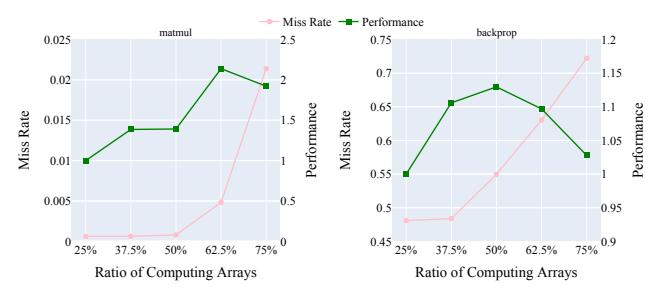
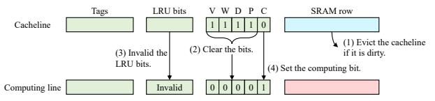
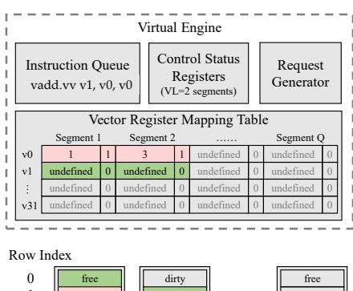
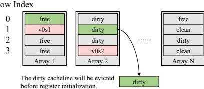
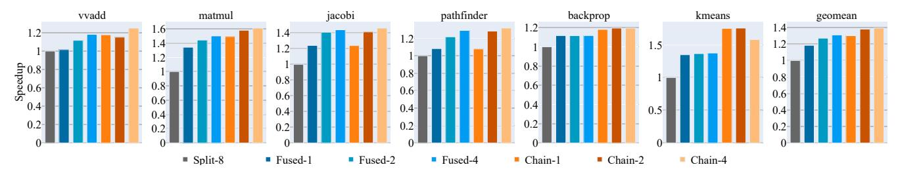
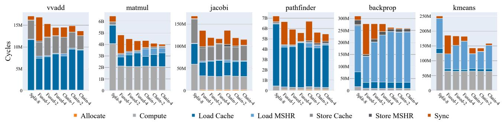
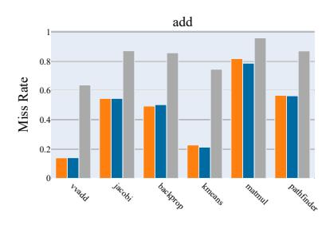
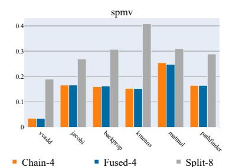
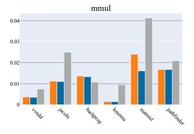
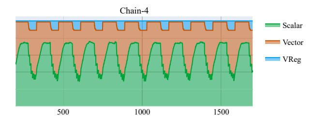

# MagiCache: A Virtual In-Cache Computing Engine

# [Renhao Fan](https://orcid.org/0009-0002-9136-1831)<sup>∗</sup>

Department of Computer Science and Technology, Tsinghua University Beijing, China frh21@mails.tsinghua.edu.cn

# [Yikai Cui](https://orcid.org/0000-0001-6283-8405)<sup>∗</sup>

Department of Computer Science and Technology, Tsinghua University Beijing, China cyk23@mails.tsinghua.edu.cn

## [Weike Li](https://orcid.org/0009-0009-6797-5228)

Department of Computer Science and Technology, Tsinghua University Beijing, China wk-li20@mails.tsinghua.edu.cn

# [Mingyu Wang](https://orcid.org/0000-0003-4006-8870)†

School of Microelectronics Science and Technology, Sun Yat-Sen University Guangzhou, China wangmingyu@mail.sysu.edu.cn

# [Zhaolin Li](https://orcid.org/0009-0001-1131-3024)†

Department of Computer Science and Technology, Beijing National Research Center for Information Science and Technology, Tsinghua University Beijing, China lzl73@tsinghua.edu.cn

### Abstract

The rise of data-parallel applications poses a significant challenge to the energy consumption of computing architectures. In-cache computation is a promising solution for achieving high parallelism and energy efficiency because it can eliminate data movement between the cache and the processor. Existing in-cache computing architectures transform a portion of cache arrays into computing arrays, with all rows of these arrays serving as computing lines. The remaining cache arrays are used as cachelines to store the data required by computing arrays or processors. However, in these array-level in-cache computing architectures, only a few computing lines in each computing array are active at runtime while the others are idle, which incurs severe cache capacity loss and space underutilization. In addition, bursty memory accesses of data-parallel applications also cause significant in-cache data movement latency.

To address these problems, we propose MagiCache, a virtual in-cache computing engine. First, we design a novel cacheline-level in-cache computing architecture in which each cache array can configure some rows as computing lines and the other rows as cachelines with negligible overhead. Second, a virtual engine is further designed on this novel architecture to dynamically allocate different rows of each array as computing lines or cachelines based on runtime computation and storage requirements, thus realizing efficient cacheline-level space management. Finally, we present an instruction chaining technique to overlap the bursty access latency by enabling asynchronous execution of computing arrays. Evaluation results show that MagiCache achieves a 1.19x-1.61x speedup over the state-of-the-art in-cache computing architectures with 6.5 KB of additional storage. Our cacheline-level space

<sup>†</sup>Corresponding authors: Mingyu Wang and Zhaolin Li.


[This work is licensed under a Creative Commons Attribution-NonCommercial-](https://creativecommons.org/licenses/by-nc-nd/4.0)[NoDerivatives 4.0 International License.](https://creativecommons.org/licenses/by-nc-nd/4.0)

ISCA '25, Tokyo, Japan © 2025 Copyright held by the owner/author(s). ACM ISBN 979-8-4007-1261-6/25/06 <https://doi.org/10.1145/3695053.3731113>

management improves cache utilization by 42% and reduces cache miss rate by 10%-40% over various memory access patterns. The instruction chaining technique also reduces the memory access time by 2%-27%.

### CCS Concepts

• Computer systems organization → Single instruction, multiple data.

### Keywords

In-Cache Computation, Vector Processing

#### ACM Reference Format:

Renhao Fan, Yikai Cui, Weike Li, Mingyu Wang, and Zhaolin Li. 2025. MagiCache: A Virtual In-Cache Computing Engine. In Proceedings of the 52nd Annual International Symposium on Computer Architecture (ISCA '25), June 21–25, 2025, Tokyo, Japan. ACM, New York, NY, USA, [13](#page-12-0) pages. [https:](https://doi.org/10.1145/3695053.3731113) [//doi.org/10.1145/3695053.3731113](https://doi.org/10.1145/3695053.3731113)

## 1 Introduction

Recent years have witnessed incredible growth in data-parallel applications, especially neural networks [\[22\]](#page-12-1). These applications are mainly characterized by data-intensive, large-scale matrix or vector computations that require a large number of computations and memory accesses. This poses a huge challenge to the memory bandwidth and power consumption of traditional computing architectures.

In-memory computation (IMC) technology is a promising solution for high-bandwidth and energy-efficient computing. This technology enables computations to be performed directly within the memory and thus eliminates data movement between the memory and the processor. Based on the memory substrates, the common in-memory computations can be categorized into DRAMbased IMC [\[14,](#page-12-2) [16,](#page-12-3) [19,](#page-12-4) [23–](#page-12-5)[25,](#page-12-6) [33,](#page-12-7) [40\]](#page-12-8), RRAM-based IMC [\[6,](#page-12-9) [9,](#page-12-10) [10,](#page-12-11) [26,](#page-12-12) [30,](#page-12-13) [34,](#page-12-14) [36,](#page-12-15) [37\]](#page-12-16), and SRAM-based IMC [\[1–](#page-11-0)[3,](#page-12-17) [11,](#page-12-18) [13,](#page-12-19) [15,](#page-12-20) [35,](#page-12-21) [39\]](#page-12-22). This paper focuses on SRAM-based IMC because it can be fabricated by modern integrated circuit technologies and easily integrated into modern processor architectures.

<sup>∗</sup>These authors contributed equally to this work.

SRAM-based in-memory computation utilizes the bit-line computation technique [\[20,](#page-12-23) [21\]](#page-12-24) and additional peripheral circuits to transform SRAM arrays into parallel computing arrays, which enable logical operations [\[1\]](#page-11-0), integer arithmetic operations [\[11,](#page-12-18) [35,](#page-12-21) [39\]](#page-12-22), and even floating-point operations [\[15\]](#page-12-20) within the SRAM array. By leveraging this technology, the caches of modern processors can be easily transformed into in-cache computing architectures with extremely high parallelism. These architectures convert a portion of SRAM arrays in the cache into in-cache computing arrays, noted as array-level in-cache computing architectures. Specifically, the entire cache space is divided into the storage space and computing space at the granularity of cache arrays. The in-cache computing arrays form the computing space with all their rows used as computing lines, while the conventional SRAM arrays constitute the storage space and remain as the cache to provide data for the processor and computing space. Recent in-cache computing architectures further pre-configure these computing lines as vector or SIMT (single instruction multiple threads) registers to provide programming flexibility. Compared with logic-based computing units, in-cache computing arrays enable parallel computation with low area overhead and energy consumption. They can also access the peer-level storage space with high internal bandwidth.

However, existing array-level architectures suffer from static and coarse-grained pre-configuration schemes, which bring two challenges: (1) Under-utilization of cache space. The arraylevel partition of cache space significantly reduces cache capacity and associativity, which consequently degrades cache performance. Meanwhile, in-cache computing arrays suffer from space underutilization because only a few computing lines are active during execution while the remaining lines are inactive. (2) Bursty incache data movement overhead. Since in-cache computing architectures obtain high parallelism, they are also characterized by bursty parallel memory accesses. Bursty data movement from the storage space to the computing space still leads to high access latency, especially when cache misses frequently occur.

To address these challenges, we propose MagiCache, a virtual incache computing engine. First, we propose a novel cacheline-level in-cache computing architecture that can partition the computing and storage spaces at the granularity of cachelines within SRAM arrays. In this architecture, each array can configure a portion of its rows as computing lines and the remaining rows as cachelines with negligible overhead, thus performing both computation and storage operations. Second, we introduce a virtual engine on top of the physical cache structure to manage in-cache computing resources efficiently. The virtual engine allocates rows of the arrays as computing lines or cachelines at runtime based on application requirements. It further marks computing lines as virtual vector registers and manages the number, length, location, and life cycle of these registers through a cacheline-level space management scheme to maximize the utilization and available capacity of the cache. Finally, we present an instruction chaining technique to mitigate the bursty access bottleneck by allowing asynchronous execution of in-cache computing arrays. It overlaps the latency of computations and memory accesses across different computing arrays and improves the performance of in-cache computation.

We implement a cycle-approximate model of the MagiCache on gem5 [\[5,](#page-12-25) [27\]](#page-12-26) and conduct experiments on six vector applications from Rodinia [\[7\]](#page-12-27) and RiVEC [\[31\]](#page-12-28) benchmark suites. Experimental results show that the MagiCache achieves a 1.19x-1.61x speedup over the state-of-the-art array-level in-cache computing architectures [\[3\]](#page-12-17) with 6.5 KB of additional storage. Our proposed cacheline-level space management scheme significantly improves cache utilization by 42% and reduces cache miss rates by 10%-40% in various memory access patterns. The instruction chaining technique also reduces the average memory access time by 2%-27%.

In summary, this paper makes the following contributions:

- We present the first cacheline-level in-cache computing architecture. By adding indicator bits on tags, our architecture can configure some rows of the cache array as computing lines and the remaining rows of the same array as cachelines, thus transforming cache arrays into fused arrays with both computation and storage capabilities.
- We present a virtual engine for in-cache computing architectures for the first time. It serves as a virtual middle layer that allocates different rows of fused arrays into computing or storage spaces at runtime based on application requirements. It also enables efficient cacheline-level space management by flexibly mapping the computing space into virtual vector registers with variable numbers, lengths, locations, and life cycles, achieving nearly 100% cache utilization.
- We propose an instruction chaining technique to reduce the bursty in-cache data movement latency by enabling asynchronous execution of different computing arrays. With this technique, the accesses are scattered to different cycles to hide the latency of in-cache data movement.
- We demonstrate the effectiveness of the MagiCache through detailed experiments on a set of vector applications. The evaluation results show that our architecture achieves a 1.19x-1.61x speedup over existing in-cache computing architectures with an additional 6.5KB storage overhead.

### 2 Background

### 2.1 SRAM-based In-Memory Computation

The SRAM array includes two-dimensional bit cells connected by horizontal word-lines and vertical bit-lines [\[17\]](#page-12-29). When a wordline is activated, the data in the bit cells flow to the bit-lines and can be read out at the sense amplifiers. SRAM-based IMC utilizes the bit-line computation technology [\[20,](#page-12-23) [21\]](#page-12-24) to implement in-situ computation within SRAM arrays. This technique reports that when two word-lines are simultaneously activated, data in both wordlines will flow to the shared bit-lines and perform logic operations in the analog domain. Then, the sense amplifiers will acquire their AND and NOR values from the bit-lines, as shown in Fig. [1\(](#page-2-0)a). Data corruption of multi-row access can be avoided by lowering the word-line voltage to bias against write voltage at the expense of a slight decrease in operation frequency. Furthermore, arithmetic operations, such as addition and multiplication, can be implemented by adding additional peripheral circuits and latches around the SRAM array, which account for a 10% area overhead [\[11\]](#page-12-18). For example, Fig. [1\(](#page-2-0)b) presents the circuits to generate logic and 1-bit addition operations.

Existing designs explore different data layouts to exploit the potential of SRAM-based IMC. Fig. [1\(](#page-2-0)c) illustrates three data layouts.

<span id="page-2-0"></span>

Figure 1: Overview of SRAM-based In-Memory Computation. (a) Bit-line computation. WL: word-line, SA: sense amplifier, BL/BLB: bit-line (bar). (b) A Peripheral circuit Example. (c) Three data layouts in a simplified 8-column array. Orange and blue rectangles present two 4-bit vectors. Red arrows are word-lines activated simultaneously.

The bit-parallel layout [1, 39] puts all bits of an element on the same word-line in a regular way, while the bit-serial layout [11] locates them on the same bit-line in a transposed manner. The bit-hybrid layout [3] combines bit-serial and bit-parallel layouts by placing the element in a rectangular region. With different peripheral circuit designs, all the data layouts can implement logic and integer arithmetic operations. The bit-serial data layout can even support floating-point operations with a relatively long latency [15]. VRAM [2] provides a detailed comparison of data layouts and demonstrates that bit-parallel has lower latency than bit-serial while bit-serial has higher throughput than bit-parallel. Most existing designs leverage bit-serial or bit-hybrid layouts to achieve high throughput at the cost of additional transpose delay when moving data from/to computing arrays. In contrast, we argue that the bitparallel layout enables cacheline-level runtime management of cache space, which will be further illustrated in Section 3.

#### <span id="page-2-2"></span>2.2 In-Cache Computing Architectures

The development of SRAM-based IMC contributes to the emergence of in-cache computing architectures because modern processors have large amounts of organized SRAM arrays in the caches [8, 18], which are naturally available for in-memory computation. Compute Cache [1] is the first to propose in-cache computation supporting logic, search, compare, and copy operations. Neural Cache [11] proposes the bit-serial layout to implement fixed-point addition, multiplication, and reduction operations on the L3 Cache to accelerate neural network inference. Based on it, Duality Cache [15] further enables floating-point arithmetic operations and implements a GPU-like SIMT programming framework that transforms L3 cache space into SIMT registers. BLADE [35] introduces local bit-lines to isolate data in different word-lines, thus eliminating data corruption without reducing operation frequency. EVE [3] re-configures the in-cache computing arrays into vector

registers and provides a micro-code execution framework to implement RISC-V vector extensions [32]. These works demonstrate the high energy efficiency and internal memory bandwidth of incache computation.

In summary, existing in-cache computing architectures typically divide the cache into two spaces at the granularity of SRAM arrays. Some SRAM arrays are converted to in-cache computing arrays and constitute the computing space. All rows of these computing arrays serve as computing lines under different layouts. Their bit cells employ bit-line computation and specific peripheral circuits to perform required operations. On the other hand, the remaining conventional SRAM arrays form the storage space and maintain the cache functionality with a reduced capacity and associativity. Their rows serve as traditional cachelines to supply data for the computing space and processor. Furthermore, recent works preconfigure the computing space as parallel registers to enable generic parallel programming frameworks. The computing arrays divide their computing lines evenly to parallel registers and work in the same way as lanes in the vector architecture or streaming multiprocessors in the SIMT architecture. For example, Duality Cache allocates several ways of the L3 cache to the computing space, each way containing dozens of SRAM arrays. These arrays are configured as SIMT registers and support a PTX-like ISA [29]. EVE also contributes half of L2 cache arrays as the computing space and configures them as vector registers. The register-based pre-configuration scheme addresses the programming availability problem. However, as the computing space usually has a different data layout and management scheme from traditional cache arrays, it is detached from memory addressing and cannot be accessed through traditional cache behavior. Moreover, the registers in the computing space still have to fetch data from the storage space, which will incur bursty access latency when cache misses occur.

#### <span id="page-2-1"></span>3 Motivation

While existing in-cache computing architectures can address the programming availability problem, they still suffer from static and coarse-grained pre-configuration schemes. Such schemes only support array-level partitioning and lead to severe under-utilization of cache space. The synchronous execution flow of in-cache computing arrays also brings long access latency. To address these two challenges, this paper initiates a virtual engine to manage storage and computing resources efficiently. The following two subsections illustrate our key motivations in detail.

#### 3.1 Cacheline-level Runtime Space Management

There are two reasons for cache space under-utilization. First, existing schemes can only statically divide the two spaces at a fixed ratio before execution. When the fixed configuration does not match the requirements of various applications, the preconfiguration scheme faces performance degradation or waste due to insufficient or excessive resources. For applications with high arithmetic intensity, the computing space requires more computing lines to increase the parallelism. While for applications with low arithmetic intensity, the storage space needs a large capacity to reduce cache misses. Fig. 2 shows the cache miss rates and normalized performance of matmul and backprop under

<span id="page-3-0"></span>

Figure 2: Cache miss rates and normalized performance of different static configurations.

<span id="page-3-1"></span>

Figure 3: Cacheline-Level Space Management. (a) RISC-V vector assembly code of matrix multiplication. (b) Bank layouts of EVE and MagiCache. The computing space and storage space are marked in pink and green. (c) Array layouts of EVE and MagiCache in a simplified 8-column array. v0-v31 and e0-e3 denote vector registers and element indexes.

different static configurations. The x-axis describes the percentage of SRAM arrays in the cache that are used for computation. As the ratio of computing arrays grows, the computing parallelism increases. However, the cache miss rate also increases due to reduced cache capacity. Thus, the performance first ascends and then descends. Different applications require different trade-offs for static configurations. The matmul prefers 62.5%, while the backprop performs best at 50%. Therefore, the expected architecture should exploit dynamic space management to reallocate both spaces at runtime based on the requirements of applications to get the best performance.

Second, existing pre-configuration schemes only support coarsegrained partitioning at the array level. Some SRAM arrays dedicate their total capacity to storage, while others devote all their rows to computing. However, we claim that array-level partitioning performs sub-optimally for both storage and computing spaces. The memory bandwidth of storage space is proportional to the number of storage arrays, and the parallelism of computing space is also proportional to the number of computing arrays. Instead of dividing the two spaces at the array level and obtaining reduced bandwidth and parallelism, we can partition them at a smaller granularity of rows (or cachelines) within each array. In the expected cacheline-level space management scheme, each array becomes a fused array where a portion of its rows serves as cachelines in the storage space and the other portion as computing lines in the computing space, as illustrated in Fig. 3(b). Since all arrays can perform either computing or storage operations, the architecture can provide maximum memory bandwidth or parallelism at different times.

Combined with dynamic allocation, this cacheline-level space management also improves cache utilization. We observe that parallel applications exhibit some locality by frequently using only some architectural registers and hardly consuming all registers. For example, the matrix multiplication vector program in Fig. 3(a) only accesses registers v0 and v1. This means that only some computing lines within the computing array are active. Therefore, there is an opportunity to reuse the idle lines as cachelines at runtime, which increases the available cache capacity and utilization without performance degradation.

Based on the above analysis, the first motivation is to employ a cacheline-level architecture and a corresponding runtime space management scheme. In the proposed MagiCache architecture, all SRAM arrays are fused arrays with some of their rows marked as virtual vector registers and the remaining rows as cachelines. As shown in Fig. 3(c), the array-level configuration scheme in EVE [3] statically distributes the capacity of computing arrays among all the 32 vector registers, and 30 of them are wasted for matrix multiplication. In contrast, our proposed fused array dynamically allocates the actually used vector registers (v0, v1) while the remaining rows are still available as cachelines. Note that our fused array adopts a bit-parallel layout because it has the same layout as cachelines, which facilitates the management and transformation between cachelines and virtual registers. To achieve cacheline-level runtime allocation, a virtual engine is designed on top of the physical cache structure to record which rows in the fused arrays are marked as vector registers or cachelines. The virtual engine is also responsible for the initialization, placement, and release of vector registers.

# 3.2 In-Cache Data Movement Latency Reduction

The second challenge is the bursty in-cache data movement latency between storage space and computing space. One memory instruction of parallel programming frameworks triggers accesses to many elements, which inherently causes bulk accesses and incurs long latency. This problem is deteriorating for in-cache architectures because they obtain much higher parallelism (e.g., millions of threads in Duality Cache and 2048-element vectors in EVE). When bulk accesses encounter cache misses, the latency is dramatically exacerbated by the limited number of miss-status handling registers (MSHR). Duality Cache mitigates the bursty access problem with a very long instruction word (VLIW) architecture that allows different computing arrays to perform different operations. However, the software-implemented solution requires a sophisticated compiler design.

In contrast, we propose a hardware-implemented instruction chaining technique that allows different arrays to execute the same instruction stream asynchronously. By leveraging this technique,

<span id="page-4-2"></span>

Figure 4: The MagiCache Overview. (a) The L2 cache is transformed into MagiCache. (b) The virtual engine controls the execution of vector instructions. (c) The peripheral circuits for one bit-line are shown. Each bit-line has a replica of the circuits.

all fused arrays can perform memory accesses of their own vector register segment at different cycles. Each fused array can also execute subsequent instructions once its own accesses are finished without waiting for all the other arrays. This significantly alleviates the high latency caused by bursty accesses.

## 4 Architecture Design

In this section, we first present an overview of MagiCache (Section [4.1\)](#page-4-0). Then, we introduce the cacheline-level in-cache computing architecture (Section [4.2\)](#page-4-1), the virtual engine for efficient cachelinelevel space management (Section [4.3\)](#page-5-0), and the instruction chaining technique (Section [4.4\)](#page-6-0), respectively. These three components constitute the MagiCache. Finally, we present the impact of MagiCache on cache behavior and functionality in Section [4.5.](#page-7-0)

### <span id="page-4-0"></span>4.1 The MagiCache Overview

Fig. [4](#page-4-2) presents an overview of the MagiCache architecture. We implement MagiCache on the L2 cache and support all 32-bit integer instructions of the RISC-V vector ISA. The scalar core and MagiCache are the front-end and back-end of the vector ISA. When executing a vector instruction, the scalar core decodes the instruction, fetches the required scalar registers, and sends the instruction to the MagiCache back-end through a dedicated port. The MagiCache back-end manages vector registers and executes vector instructions through the proposed virtual engine, which will be discussed in Section [4.3.](#page-5-0) If the instruction does not write back, the scalar core can commit it immediately after sending it to the MagiCache. Otherwise, the core has to wait until MagiCache returns the results.

The fused array design of MagiCache is modified from the computing arrays of EVE [\[3\]](#page-12-17) and Duality Cache [\[15\]](#page-12-20). As shown in Fig. [4\(](#page-4-2)c), the peripheral circuits of each fused array include five layers: logic, add, shift, register, and writeback, which collaborate to perform logic and addition operations. We also add two rows on vanilla SRAM arrays to hold intermediate values of in-cache computation or input scalar values. When executing an instruction, the fused array first obtains the row indexes of both the source

vector registers from the virtual engine. Then, it utilizes the bitline computation technique and peripheral circuits to perform the required operation. In detail, the logic layer generates all logic values from the bit-line, including (n)and, (n)or, and x(n)or. The add and shift layers implement addition and shift operations by configuring carry chains and shift units across bit-lines. The register layer contains one 1-bit register per bit-line to hold the intermediate values of shift operation. It also serves as the line buffer to coalesce read/write operations for vector memory instructions. Finally, the writeback layer selects the correct result and stores it in the destination row.

MagiCache uses a micro-code framework to perform complex operations. Based on the bit-parallel layout, addition and logic operations can be finished in two cycles. The first cycle performs bit-line computation, and the second cycle writes the results back to the array. Vector multiplication consumes about 160 (=32×5) cycles by performing iterative shift and addition. Each fused array contains an array sequencer to hold the row numbers of virtual registers and executes the micro-code programs.

## <span id="page-4-1"></span>4.2 Cacheline-Level In-Cache Computing Architecture

Our proposed in-cache computing architecture enables cachelinelevel partition of the storage and computing spaces. For convenience, we logically combine multiple fused arrays horizontally into a super array so that each row of the super array can accommodate exactly one cacheline. For example, if the fused array is 256×256 and the cacheline size is 512 bits, two arrays are combined into a super array of 256 rows and 512 columns. In the rest of this section, all the "arrays" we refer to are super arrays, and each row of the array is equivalent to one cacheline.

As shown in Fig. [5,](#page-5-1) the tags in MagiCache should contain two additional indicator bits to enable cacheline-level partition. The computing bit indicates whether a cacheline belongs to computing space or storage space. The presence bit is used to solve the cache coherence problem (see Section [4.5\)](#page-7-0). The conversion from cachelines to computing lines has four steps. First, evict the

<span id="page-5-1"></span>

Figure 5: The Conversion from Cachelines to Computing Lines. V(Valid), W(Writeable), D(Dirty), P(Presence), C(Computing).

cacheline if it is valid. It should be written back to the next level cache if it is dirty. Then, all indicator bits except the computing bit are cleared. Next, the corresponding LRU bits are set to invalid so that the replacement policy will not select the cacheline again. Finally, the computing bit is set to 1. The computing lines can also be converted to cachelines by clearing the computing bit and setting the LRU bits as the least recently used cacheline. The computing lines are managed by the virtual engine. The cache controller can neither access nor replace the computing line. From the storage space perspective, the available associativity of the corresponding set is reduced by 1. Based on the cacheline-level conversion, the virtual engine can dynamically switch the roles of each cacheline at runtime for efficient space management.

# <span id="page-5-0"></span>4.3 The Virtual Engine For Efficient Space Management

In MagiCache, the virtual engine receives vector instructions and executes them sequentially. It serves as a virtual middle layer to connect the physical in-cache computing arrays and the vector ISA. Fig. 6 presents the structure of the virtual engine. It consists of an instruction queue, vector control status registers (CSRs), a request generator, and a vector register mapping table. Since incache computing operations consume multiple cycles, a 16-entry instruction queue holds vector instructions to prevent them from blocking the scalar core. The CSRs keep vector information such as effective vector length (vl) and vector element type (vtype). The request generator calculates addresses and generates requests for each element of vector memory instructions. The requests are then sent to the cache controller for memory accesses using standard cache mechanisms: hit and response, or miss and forward to the last-level cache. The vector register mapping table records the mapping information from computing lines to vector registers. It can configure the number, length, location, and life cycle of vector registers at runtime, which enables efficient runtime cache space

In MagiCache, each vector register contains Q segments, and each segment is a computing line. All 32 vector registers map segments with the same index into the same fused array so they can share bit-lines and perform in-cache computations. Segments with different indexes are mapped into different fused arrays so that multiple fused arrays can compute in parallel. Precisely, assuming that MagiCache has a total of N fused arrays, the j-th segments of the 32 vector registers are mapped into the  $(j \mod N)$ -th array. The vector register mapping table records the locations of vector register segments in the fused arrays. It is a two-dimensional table VRMT[i][j] with 32 rows and Q columns. Each table entry consists of two fields: the valid bit and the row index of the array. For example, in Fig. 6, VRMT[v0][1].index = 1

<span id="page-5-2"></span>



Figure 6: The Virtual Engine Overview. v0s1 and v0s2 (pink boxes) indicate the computing lines used as segments 1/2 of register v0. Green boxes indicate v1 segments to be initialized.

and VRMT[v0][2].index = 3 mean that the Array 1 Row 1 and Array 2 Row 3 are used as the first two segments of v0. The other entries in the table have valid bits of zeros, so no cachelines are occupied by these segments.

We can configure the number of segments Q to explore the tradeoff between computational performance and cache capacity. We assume that the size of the fused array is H rows by W columns, where W is also the cacheline size. We define vector register occupancy as the percentage of cache space occupied by vector registers. Then, the formulas for vector length, vector register mapping table size, and maximum occupancy are shown below.

$$Maximum\ Vector\ Length = Q*W\ bits \tag{1}$$

$$Size(VRMT) = 32 * Q * (1 + logH) bits$$
 (2)

$$Maximum\ Occupancy = \frac{32 * Q * W}{N * H * W} \tag{3}$$

As Q increases, the vector length and computational performance will increase. However, the available cache capacity will decrease, which incurs cache misses and long latency. Typically, Q should be a multiple of N (i.e., Q = kN) to ensure that each fused array has the same workload. k denotes the number of computing lines each vector register occupies in each fused array. For a 256-row fused array, the maximum value of k is 4. With k=4, the vector registers consume at most half of the cache space. We will quantitatively explore the impact of different vector lengths in the experiment section.

The virtual engine is responsible for register initialization and release. It adopts a lazy initialization scheme to determine when to allocate vector registers. In other words, vector registers are initialized only when they are actually used by instructions. The effective vector length in the CSRs determines how many segments should be allocated for each vector register. Unused registers and segments are not allocated to save cache space. The RISC-V vector extension uses the configuration instruction vset(i)vl(i) to update the effective vector length. When executing this instruction, the virtual engine will allocate or release relevant segments for each valid register to fit the new vector length. As for the register release,

Algorithm 1: The initialization of vector registers when executing a new vector instruction.

```
1 VRegs = { vs1, vs2, vd };
2 Segments = VectorLength / ElementPerSegment;
3 for vi in VRegs do
4 for j ← 1 to Segments do
5 if VRMT[vi][j].valid == 0 then
6 Array = Arrays[j % N];
7 RowIndex = FindCandidateCacheline(Array);
8 if Array[RowIndex] is dirty then
9 Evict(Array[RowIndex]);
10 convertToComputingLine(Array[RowIndex]);
11 VRMT[vi][j].valid = 1;
12 VMRT[vi][j].index = RowIndex;
```

<span id="page-6-1"></span>we pre-process vector workloads to extract the life cycles of vector registers and determine appropriate locations to release them. The pre-processing algorithm is a standard liveliness analysis algorithm in compiler design [\[28\]](#page-12-35). It can be integrated into the compiler with negligible overhead because the compiler also performs liveliness analysis for register allocation and dead code elimination. Vector register release can be implemented by reusing ()() and setting the effective vector length to zero. These instructions are inserted at the end of the life cycles of vector registers.

Algorithm [1](#page-6-1) shows the workflow of register initialization. First, the virtual engine determines which table entries should be initialized (Lines 1-2). The initialization process is triggered when an instruction uses unallocated vector registers or increases the effective vector length. Fig. [6](#page-5-2) illustrates an example. Here, the first two segments of 1 should be initialized (green color). Then, the allocation policy finds a candidate cacheline for each entry in the corresponding array (Line 7). The candidate cacheline is converted into a vector register segment by manipulating tag bits (Line 10). The cacheline should be evicted if it is dirty (Lines 8-9). Finally, the table entries are filled to complete the initialization (Lines 11-12). The vector register can be released by clearing the table entries and converting the computing lines into cachelines.

In line 7 of the algorithm, an allocation policy finds a candidate cacheline in the array to accommodate the vector register segment. This policy is similar to cache replacement policies, but there are some differences. The cache replacement policy finds a victim from different ways of the same set, usually among 2-16 cachelines. In contrast, our allocation policy looks for a candidate in the fused array with typically 256 cachelines. With such many cachelines, traditional cache replacement policies, such as least-recently-used (LRU) and pseudo-LRU, incur significant hardware overhead, while a simple find-first-available (FFA) policy incurs moderate overhead. FFA starts at a random location, scans all the cachelines circularly, and finds the first free cacheline (with the valid bit as 0) and available cacheline (with the computing bit as 0). FFA selects the free cacheline if it exists. Otherwise, FFA selects the first available cacheline. FFA incurs lower latency and hardware overhead than LRU and pseudo-LRU as it only scans the existing tag states without

<span id="page-6-2"></span>

Figure 7: Space-Time Diagram of Instruction Chaining. In this simplified example, the widths of register allocation and memory access are 1 and 2 due to write buffer and MSHR limits.

introducing or updating additional states. Experimental evaluation shows that FFA incurs less than 1% increase in the overall L2 miss rate, which is acceptable due to its moderate overhead.

In summary, the virtual engine enables cacheline-level runtime cache space management by determining the number, length, location, and life cycle of vector registers allocated for the computing space through the vector register mapping table. Because only a few of the 32 vector registers are used in most applications, our management scheme can save a substantial amount of space and significantly improve the capacity and performance of storage space without sacrificing the performance of computing space.

### <span id="page-6-0"></span>4.4 Instruction Chaining

Data-parallel applications have a wide range of memory accesses that often exceed the cache capacity. As a result, cache misses can occur frequently. MagiCache can support a maximum vector length of 65536 bits, or 2048 32-bit integers. At this length, one unit-stride access corresponds to 128 cachelines. Strided and indexed accesses will fetch much more cachelines. This greatly exceeds the number of misses that a typical L2 cache (usually with 32 MSHRs) can handle. Therefore, vector memory accesses will probably block the cache for a long time until the MSHRs are released.

Fig. [7\(](#page-6-2)a) shows the matrix multiplication application where each iteration contains two vector loads, one multiply-accumulate, and one store. The multiply-accumulate instruction can be executed synchronously in all fused arrays, while the memory instructions must be divided into multiple batches due to the limited number of MSHRs. Therefore, stalls will occur between these batches. Specifically, each fused array will go through three stages when its memory accesses miss in the cache. Before sending its requests, the fused array has to wait for a free MSHR (MSHR stalls). Then, it sends its requests and waits for responses (load/store time). After completing its requests, it still has to wait for all other fused arrays to complete before the instruction can be committed (synchronization stalls).

On the other hand, since each fused array has separate storage and computation resources, the Magicache has the potential for asynchronous execution. Ideally, when one fused array has its source register segments ready, it can start the computation without waiting for other arrays to complete the entire load instruction. Based on this idea, we propose the instruction chaining technique. This technique chains multiple adjacent instructions without conflicts into a group and allows each fused array to execute all instructions within the group independently. Inter-array synchronization is only performed between groups rather than between instructions. Therefore, we can overlap the accesses and computations of different arrays and reduce the synchronization stall time. Fig. [7\(](#page-6-2)b) illustrates how instruction chaining overlaps the latency. In this case, the four instructions are packed into a group.

There are three cases leading to inter-array conflicts. The first is the configuration instructions (vset(i)vl(i)). They change the global vector state, such as the effective vector length. The second is the permutation instructions, such as register gather and slide, which move elements among multiple arrays. The third is the store instructions, whose address ranges are interleaved with other memory instructions. In this case, asynchronous execution may cause data hazards. A hazard-free exception is that two memory instructions have the same address range, i.e., two unit-stride or strided instructions have the same base address and stride. In this case, the address ranges of different arrays are not interleaved, and thus no data hazard occurs. An example is the second and fourth instructions in the matrix multiplication application. When these three conflicts occur, the incoming instructions will be allocated to a new group.

To implement instruction chaining, we extend the instruction issuing logic in the MagiCache and the array sequencers to support the asynchronous execution of different arrays. Also, an instruction can only be retired in MagiCache after all arrays finish this instruction. The virtual engine determines at runtime which instructions can form a conflict-free group. When an instruction arrives, the virtual engine checks to see whether it is a configuration or permutation instruction. It also records the address ranges of all memory instructions for conflict detection. If the incoming instruction does not conflict with instructions in the current group, it can be directly pushed into the queue and incorporated into the current group. Otherwise, a synchronization pseudo-instruction is inserted before the incoming instruction as the group boundary.

### <span id="page-7-0"></span>4.5 Integration with Cache Functionality

Integrating vector registers into computing caches has an impact on the cache structure and functionality. The occupancy of vector registers determines the shrinkage of cache capacity and associativity. However, the lazy initialization scheme minimizes cache capacity loss by only initializing vector register segments that are actually used and not allocating space for unused registers. As for associativity, our register allocation policy prefers to select free lines, which alleviates the loss of available associativity for hotspot sets. We also set a minimum threshold of available associativity for each set. When the available associativity of one set reaches the threshold, the allocation policy will no longer select cachelines of this set, ensuring that each set has sufficient available cachelines.

The MagiCache faces the same cache coherence problem as traditional vector machines, i.e., ensuring that both the scalar accesses in the L1 cache and vector accesses in the L2 cache get the latest data. This problem has been addressed in traditional vector machine designs such as Tarantula [\[12\]](#page-12-36). Specifically, a presence bit is added to the L2 cache tags to declare whether the cacheline is owned by the MagiCache or the scalar core. When vector instructions access a cacheline owned by the scalar core, the L2 cache should send a snoop request upwards to fetch the latest data from the L1 cache and invalidate it. After that, the L2 cache can set the presence bit and serve the request.

In addition, the vector and scalar instructions are executed out of order because vector instructions without writeback do not block the scoreboard, which can lead to consistency problems. For example, in the case of a scalar write after a vector read, the scalar core may perform the write before the slower vector read completes, causing the vector instruction to read the wrong data. We use fence instructions to solve this problem. When the scalar core sees a fence, it has to wait until the MagiCache finishes executing all the existing vector instructions.

### 4.6 OS Integration

MagiCache requires the support of the processor architecture and the operating system (OS) for efficient context switches. When context switches occur, the vector state (such as vector CSRs and vector registers) of the old process is stored in the memory, and the vector state of the new process is restored to MagiCache. MagiCache only initializes used vector registers to improve cache utilization. However, if the OS does not have this information, it will have no choice but to conservatively store and restore all 32 vector registers, eliminating the benefit of lazy initialization.

Therefore, MagiCache should expose the VRMT information to the processor and the OS. First, we add a new 32-bit CSR \_ to record whether the 32 vector registers are initialized. During register initialization and release, the virtual engine sets and clears its corresponding bits. It is read-only for the processor. Second, the context switch procedure should be modified to store/restore only valid vector registers. Specifically, the store procedure first extracts the subset of valid vector registers from \_ and saves the subset to the memory. Then, it stores and releases these valid vector registers. The restore procedure first loads the subset and then restores these valid registers. Note that MagiCache only appends \_ into the vector state. There is no need to store VMRT entries since the old vector registers are stored and released while the new vector registers are re-allocated their space.

### 5 Evaluation Methodology

Circuits Evaluation. A working 128×256 fused sub-array circuit is implemented to demonstrate our idea. We use Cadence Virtuoso to implement the full custom circuit part of the fused array (shown in Fig. [4\(](#page-4-2)c)) and generate corresponding netlists under 1.1V nominal voltage and TSMC 40nm technology. The generated netlists are integrated into the Cadence Spectre simulation environment and simulated at the TT corner and 25°C to measure the energy consumption and latency. We verify the functional correctness of the circuit by injecting multiple sets of random inputs and printing

<span id="page-8-0"></span>Table 1: Energy and area breakdown of the virtual engine.

| Components               | Area( $\mu m^2$ ) | Power (mW) |
|--------------------------|-------------------|------------|
| Instruction Queue        | 5970              | 4.84       |
| Control Status Registers | 246               | 0.31       |
| Request Generator        | 19279             | 19.51      |
| VRMT Control Logic       | 939               | 2.35       |
| Total                    | 26434             | 27.01      |

**Table 2: Simulated Architecture** 

<span id="page-8-1"></span>

|               | Tuble 2. diminiated 1 itemiteetale                                                          |
|---------------|---------------------------------------------------------------------------------------------|
| Processor     | Out-of-order 8-issue, 8-commit RV64GC core with 192-entry ROB and 32-entry load/store queue |
| L1I Cache     | 2-cycle-hit 4-way 32KB with 16 MSHRs                                                        |
| L1D Cache     | 2-cycle-hit 4-way 32KB with 16 MSHRs                                                        |
| L2 SplitCache | 8-cycle-hit 8-way 512KB with 32 MSHRs<br>with half of its ways used as computing arrays     |
| L2 MagiCache  | 8-cycle-hit 8-way 512KB with 32 MSHRs<br>with fused arrays managed by the virtual engine    |
| LLC Cache     | 12-cycle-hit 16-way 8MB with 32 MSHRs                                                       |
| Memory        | Single channel DDR4-2400                                                                    |

<span id="page-8-2"></span>Table 3: Cycles of Arithmetic Instructions in Fused Array

| Instructions (.vv/.vx/.vi) | Cycles  | Instructions (.vv/.vx/.vi) | Cycles |
|----------------------------|---------|----------------------------|--------|
| vadd                       | 2       | vand/vor/vxor              | 2      |
| vsub/vrsub                 | 4       | vmseq/vmsne                | 9-11   |
| vmul/vmacc/vmadd           | 161-164 | vmslt/vmsle                | 5-6    |
| vdiv                       | 360     | vmsgt/vmsge                | 5-11   |
| vrem                       | 263     | vmin/vmax                  | 7-8    |
| vsll/vsrl/vsra             | 91      | vmerge                     | 4      |

the signal waveforms at key nodes. The functional verification encompasses the SRAM array and the peripheral circuits.

Circuit evaluation results show that our proposed fused array incurs 17.7% area overhead compared to vanilla SRAM. Since a standard 256×256 fused array consists of two sub-arrays sharing the same circuits, the area overhead is halved to 8.9%. Bit-line computation consumes 54% more energy than read/write operations. As for the cycle time, while the vanilla SRAM takes 1.0ns for read/write operations, bit-line computation consumes 1.6ns with a 60% additional latency. However, the energy consumption and latency are still lower than reading two rows individually.

We measure the virtual engine's area and energy by writing RTL for the four main modules. We then synthesize the logic circuits using Synopsys Design Compiler on the 28nm TSMC technology, with a target frequency of 1GHz at 0.81V. The energy and area breakdown is shown in Table 1. Note that it only counts the control circuits of the VRMT, while the mapping table is modeled as the SRAM.

**Performance Model.** We implement the MagiCache on a cycle-approximate simulator gem5 [5, 27]. Table 2 shows the configuration of the simulated architecture. We use the O3CPU provided by gem5 as the scalar core. It is an out-of-order 8-issue, 8-commit processor that executes scalar instructions and forwards vector instructions to the MagiCache. The MagiCache is converted from the 512 KB L2 cache. It has 1024 sets and 8 ways, with each way

**Table 4: Evaluated MagiCache Configurations** 

<span id="page-8-3"></span>

| Name    | Number of<br>Fused Arrays | Maximum Vector<br>Length (bits) | Maximum<br>Occupancy |
|---------|---------------------------|---------------------------------|----------------------|
| Split-8 | 16                        | 65536                           | 50%                  |
| Fused-1 | 32                        | 16384                           | 12.5%                |
| Fused-2 | 32                        | 32768                           | 25%                  |
| Fused-4 | 32                        | 65536                           | 50%                  |
| Chain-1 | 32                        | 16384                           | 12.5%                |
| Chain-2 | 32                        | 32768                           | 25%                  |
| Chain-4 | 32                        | 65536                           | 50%                  |
|         |                           |                                 |                      |

**Table 5: Benchmark Configurations** 

<span id="page-8-4"></span>

| Name       | Application<br>Size | Memory Access<br>Patterns | Cross Element<br>Instructions | Masked<br>Instructions |
|------------|---------------------|---------------------------|-------------------------------|------------------------|
| vvadd      | 8192k               | unit-stride               | ×                             | ×                      |
| matmul     | $1024 \times 2048$  | unit-stride               | ×                             | ×                      |
| jacobi-2d  | 2000×2000           | unit-stride               | slide                         | ×                      |
| pathfinder | 10×5000k            | unit-stride               | slide                         | ×                      |
| k-means    | 50000×10            | unit-stride & strided     | ×                             | $\checkmark$           |
| backprop   | 512k                | unit-stride & strided     | reduce                        | ×                      |

including eight 256×256 fused arrays. All the caches use the LRU replacement policy. We use a cycle-accurate micro-code simulator written in C++ to verify the correctness of micro-code programs and measure the cycles of vector arithmetic instructions in each fused array. The cycles of the commonly used arithmetic instructions are shown in Table 3. Based on it, we implement the virtual engine in gem5 [5, 27] and functionally perform these instructions. We assume that it takes one cycle to compute the address for each element of vector memory instructions in Request Generator. We also assume that address translations always hit in the TLB. The FFA allocation policy requires at most 8 cycles to find a candidate computing line in one fused array by scanning 32 consequent cachelines in one cycle, and each array can perform allocations in parallel. Converting a specific cacheline into the other role consumes 2 cycles to set the tag bits and VRMT fields. The cacheline eviction may consume several cycles, but it is not in the critical

We implement the SplitCache derived from EVE [3] as the baseline. The SplitCache employs a static cache space partition scheme to transform half of the cache ways into computing arrays. In SplitCache, all 256 rows of each computing array are equally divided among 32 vector registers, yielding a maximum vector length of 65536 bits. Table 4 shows the various experimental configurations of the MagiCache. The Split-x, Fused-x, and Chain-x represent the SplitCache, the MagiCache without instruction chaining, and the MagiCache with instruction chaining, respectively. The numbers 1, 2, 4, and 8 denote how many rows in each fused/computing array are occupied by each vector register.

Benchmark Setup. We evaluate the performance of MagiCache on various vector applications from Rodinia [7] and RiVEC [31] benchmark suites, including vvadd, matmul, jacobi-2d, pathfinder, k-means, and backprop. The detailed descriptions of these applications are listed in Table 5. In these applications, k-means and backprop require strided accesses, while others only contain unit-stride accesses. These applications are rewritten as 32-bit integer versions and manually vectorized using RISC-V vector intrinsics. They are compiled by LLVM 17 and the RISC-V GNU toolchain. We

<span id="page-9-0"></span>

Figure 8: Overall Performance of different configurations.

<span id="page-9-2"></span>

Figure 9: Execution Breakdown of different configurations.

Table 6: Speedup of MagiCache over SplitCache.

<span id="page-9-1"></span>

| Benchmark | vvadd | matmul | jacobi-2d | pathfinder | backprop | k-means | geomean |
|-----------|-------|--------|-----------|------------|----------|---------|---------|
| Fused-4   | 1.18  | 1.50   | 1.44      | 1.29       | 1.12     | 1.37    | 1.31    |
| Chain-4   | 1.25  | 1.61   | 1.46      | 1.32       | 1.19     | 1.58    | 1.39    |

mark the regions of interest (ROIs) for these applications and record only the statistics of ROIs, which include only vector computing functions and exclude the pre- and post-processing functions of pure scalar instructions. These applications are pre-processed by the liveliness analysis for register release. The inserted release instructions occupy less than 0.5% overhead of the total execution time. Without pre-processing, vector applications may experience performance degradation but still maintain correctness.

#### 6 Results

### 6.1 Performance

Fig. 8 shows the evaluated performance of MagiCache and Split-Cache at different configurations. Table 6 presents the speedup of Fused-4 and Chain-4. The performance and speedup are normalized by Split-8. Chain-4 achieves the best performance with a 1.39x speedup over Split-8 on average. Compared to Split-8, all configurations of MagiCache have significant performance improvement due to higher computational parallelism. In most applications, the performance improves with the occupancy of vector registers. In addition, Chain-x configurations are 10% faster than Fused-x on average due to the instruction chaining technique.

Fig. 9 shows the execution time breakdown of MagiCache for different configurations. The execution time is divided into register allocation, computation, load, store, MSHR stall, and synchronization times. For the Chain-x configurations, the execution times are obtained by counting each fused array individually and then averaging the cycles. The MSHR stall time, load/store time, and synchronization time correspond to the three stages of memory accesses mentioned in Section 4.4. They are also counted for each

<span id="page-9-3"></span>Table 7: Average Usage of MSHR Entries (32 entries in total)

| Benc    | hmark   | vvadd | matmul | jacobi-2d | pathfinder | backprop | k-means | average |
|---------|---------|-------|--------|-----------|------------|----------|---------|---------|
|         | Split-8 | 2.55  | 2.54   | 5.93      | 8.20       | 13.66    | 0.68    | 5.59    |
| Overall | Chain-1 | 3.45  | 3.97   | 8.35      | 11.20      | 13.55    | 0.87    | 6.90    |
| Overall | Chain-2 | 3.78  | 5.78   | 9.50      | 12.47      | 13.50    | 0.89    | 7.65    |
|         | Chain-4 | 3.66  | 7.28   | 10.42     | 13.64      | 13.52    | 0.86    | 8.23    |
|         | Split-8 | 1.52  | 2.52   | 5.70      | 7.59       | 12.14    | 0.52    | 5.00    |
| Vector  | Chain-1 | 2.41  | 3.95   | 7.97      | 10.46      | 12.98    | 0.66    | 6.41    |
| vector  | Chain-2 | 2.74  | 5.75   | 9.15      | 11.74      | 12.94    | 0.68    | 7.17    |
|         | Chain-4 | 2.61  | 7.26   | 10.12     | 12.95      | 12.93    | 0.66    | 7.76    |

fused array and then averaged. Split-8 has twice the computation time of other configurations, which is inversely proportional to the number of computing/fused arrays. Register allocation time is very short because the vector registers are usually allocated only once until the last iteration of each loop. Therefore, our cacheline-level cache space management scheme has negligible time overhead. Synchronization time comes from the inconsistent execution of different fused arrays. The instruction chaining technique can reduce synchronization time by 45.3% on average due to the reduced number of synchronizations required. Meanwhile, synchronization time also decreases as the occupancy increases. The reason is that a single instruction can manipulate more elements with a larger vector length, and the number of dynamic instructions (i.e., the number of synchronizations) will decrease. Finally, load/store time and MSHR stall time increase as vector length grows because packing more requests in one vector memory instruction consumes more MSHRs on average. However, this increase is smaller than the decrease in synchronization time, and the overall memory access time is reduced.

Table 7 shows the average MSHR usage of MagiCache over time. The lower half records the MSHRs occupied by vector memory instructions, while the upper half records the overall MSHR usage, including vector and scalar accesses. It indicates the number of vector elements that can be processed simultaneously when cache misses occur. Compared to Split-8, Chain-4 increases the MSHR usage of vector accesses by 2.76 entries on average. In addition,

<span id="page-10-1"></span>





Figure 10: Miss Rates of Scalar Applications on L2 MagiCache.

the MSHR usage also increases with vector length from Chain-1 to Chain-4. This demonstrates that memory accesses can be accelerated by aggregating more elements into a single vector memory instruction, even with the same computing parallelism. For backprop, Split-8 has a higher overall MSHR usage but a lower vector MSHR usage than the Fused-x configurations. This is because scalar accesses in backprop produce a higher miss rate in Split-8's smaller cache capacity.

We further analyze the impact of different application characteristics on the performance of MagiCache. Backprop and kmeans have essentially the same execution time for different vector lengths due to their strided accesses. They also have considerable MSHR stalls. Compared to unit-stride accesses, elements in strided accesses are scattered in different cachelines and can hardly be coalesced, which results in significantly more memory requests in one memory instruction. For example, a unit-stride access in Fused-1 generates 32 coalesced requests, while a strided access can generate up to 512 requests with a large enough stride. Such many requests prevent the MagiCache from overlapping requests across different fused arrays. Thus, all fused arrays can only work in a near-serial manner. As a result, the total memory access time is essentially fixed with the increase of vector lengths, although the synchronization time and MSHR stall time may change. The MSHR usage of these two applications also remains the same for different vector lengths. In addition, jacobi and pathfinder do not obtain significant performance improvement from the instruction chaining technique because they contain many cross-element slide instructions that cannot be chained. The Chain-1 configurations of these two applications even lose 1% performance compared to Fused-1 because the asynchronous execution of fused arrays causes discontinuous memory accesses and slightly longer access latency.

# 6.2 Cache Utilization on Multi-Application Workloads

In this subsection, we further analyze the impact of the cacheline-level space management scheme on cache utilization. We build a two-core architecture to evaluate multi-application workloads. Two scalar cores have their private L1 caches and share an L2 MagiCache. One core runs vector applications, and the other executes scalar applications. The scalar applications are vector addition(add), matrix multiplication(mmul), and sparse matrix-vector multiplication(spmv) with the same working set size. They feature sequential, strided, and random access patterns, respectively.

Table 8: Cache Utilization of Split-8 and Chain-4

<span id="page-10-0"></span>

| Configurations | vvadd | matmul | jacobi | pathfinder | k-means | backprop | average |
|----------------|-------|--------|--------|------------|---------|----------|---------|
| Split-8        | 53.2% | 56.2%  | 61.4%  | 55.3%      | 56.6%   | 52.4%    | 55.9%   |
| Chain-4        | 98.2% | 96.9%  | 94.8%  | 97.4%      | 96.3%   | 98.8%    | 97.1%   |
| Improvement    | 45.0% | 40.7%  | 33.4%  | 42.1%      | 39.7%   | 46.4%    | 41.2%   |

Table 8 shows the average cache utilization on Split-8 and Chain-4 specifications. These utilization rates are uniformly sampled over time and averaged over various applications. Split-8 statically divides half of the cache space for vector registers. Since vector applications typically use only several registers, Split-8 struggles to achieve a high utilization. In contrast, our cache space management scheme employs a lazy initialization strategy so unused vector register segments do not take up cache space. Therefore, the utilization of Chain-4 is approaching 100%.

The improvement of cache utilization also reduces the miss rates on L2 MagiCache. Fig. 10 presents the miss rates of scalar applications on L2 MagiCache. Compared to Split-8, Chain-4 and Fused-4 significantly reduce the miss rate in most multi-application workloads. MagiCache reduces the average miss rate of add by 36% and spmv by 14%. The L2 miss rate of mmul is close to 0 because strided memory requests frequently miss in L1, hit in L2, and update the LRU timestamp of L2 cachelines. Therefore, mmul's working set resides in L2 and has very low miss rates, while the L2 cachelines of vector applications are frequently replaced. In some applications, the employment of instruction chaining slightly increases the miss rates, but they are still lower than Split-8.

Fig. 11 shows the cache space utilization over time for both Split-8 and Chain-4 configurations. 1500 cycles are sampled from the multi-application workload of vector k-means and scalar mmul. In Split-8, since half of the cache space is occupied by vector registers, the remaining half is struggling to meet the requirements of vector and scalar applications, which results in frequent cache evictions and performance degradation. However, Chain-4 allocates only necessary amounts of cachelines to vector registers, with about 90% available for caching data. It is worth noting that, with the increase in cache utilization, Chain-4 also has performance improvement on both applications. In the same time interval, Chain-4 executes 11 iterations, while Split-8 only executes 9 iterations.

#### 6.3 Energy and Area Analysis

We summarize all the overheads of MagiCache here. Compared to vanilla cache, MagiCache includes extra tag bits and the vector register mapping table as the storage overhead. The control logic overhead consists of peripheral circuits of each fused array and the

<span id="page-11-1"></span>



Figure 11: Cache utilization over time on Split-8 and Chain-4. The cache space is divided into three parts: vector registers (VReg) and the cachelines owned by vector/scalar applications (Vector/Scalar).

virtual engine. As for the computing-line allocation policy, although the pseudo-LRU performs the best, the simpler FFA achieves comparable performance (less than 1% loss) without introducing or updating additional states. Maintaining cacheline coherency incurs performance overhead as it invalidates some cachelines. However, all in-cache computing architectures or vector architectures must pay the same overhead as long as their processing units directly fetch data from L2 or last-level caches.

Based on circuit evaluation results, the bit-line computation operation brings 54% more energy consumption than read/write operations. As bit-line computation accounts for about 17% of all read/write operations in fused arrays, the average power consumption of fused arrays will increase by 9% for the same operation frequency. However, in traditional cache read/write operations, the H-tree network accounts for over 80% of the total energy consumption, while the array consumes less than 20% [4]. The energy efficiency is significantly enhanced since bit-line computation has the source and destination rows in the same fused array and does not go through the H-tree.

The circuit evaluation results show that the fused array incurs 8.9% additional area compared to the vanilla SRAM array. The microprograms executed by the array sequencer can be stored in an 8 KB ROM with 1.6% area. In SplitCache, only half of the cache arrays are computing arrays, so SplitCache incurs 6.0% area overhead over conventional L2 cache. Although we do not consider the control circuits, the baseline SplitCache is more area-efficient than a conventional L2 cache, as Split-8 is 4.81x faster than executing these applications using only scalar cores. The MagiCache further brings 6.5 KB of additional storage, with 4.5 KB for the vector register mapping table and 2 KB for computing bits and coherence bits in L2 tags. The virtual engine's control logic also counts for 1% additional area. Therefore, MagiCache further incurs 6.8% additional area overhead over SplitCache. Our cacheline-level architecture and management scheme can dynamically configure the ratio of the storage and computing spaces, which significantly improves cache utilization and area efficiency.

#### 7 Related Work

The related work of in-cache computing architectures has been discussed in Section 2.2. The under-utilization of the vector registers is also partially addressed by the next-generation vector instruction sets [32, 38]. RISC-V vector extension exploits vector register grouping, which allows multiple adjacent vector registers to be grouped together so that one single instruction can operate on all

of these registers. For example, when the vector length multiplier is four, four vector registers  $v_{4n}$ ,  $v_{4n+1}$ ,  $v_{4n+2}$ , and  $v_{4n+3}$  are combined into a vector register group named  $v_{4n}$ . Thus, the effective vector length and register utilization are enhanced by four times. RISC-V vector extension now supports multipliers of 1, 2, 4, 8. However, this approach can only exponentially extend the register utilization in a coarse-grained manner, resulting in an exponential decrease in the number of vector registers. In contrast, our cacheline-level space management scheme allocates vector registers at the granularity of cachelines to flexibly configure the length of vector registers. Our dynamic allocation strategy ensures that the register utilization reaches nearly 100%, with the unused space used as cachelines.

#### 8 Conclusion

In this paper, we propose MagiCache, a virtual in-cache computing engine, to achieve cacheline-level runtime cache space management. By employing a cacheline-level in-cache computing architecture, MagiCache can fuse both computation and storage capabilities into a unified cache array. Our proposed virtual engine can dynamically configure the roles of each cacheline according to the application requirements, thus improving cache utilization and available capacity. We further present the instruction chaining technique to hide the bursty access latency by enabling asynchronous execution of cache arrays. Experimental results show that MagiCache achieves 1.19x-1.61x performance speedup and 42% cache utilization improvement with a negligible 6.5 KB storage overhead over existing array-level pre-configuration schemes. Our proposed cacheline-level runtime cache space management can be employed in various in-cache computing architectures with different data layouts, peripheral circuits, and programming frameworks to improve computing efficiency and resource utilization.

#### Acknowledgments

This work was supported by Tsinghua-Toyota Joint Research Fund, Open Research Fund Program of Beijing National Research Center for Information Science and Technology, Beijing Science and Technology Plan Project (Z241100004824002), and National Natural Science Foundation of China (NSFC) under Grant 92373103, 62204271.

#### References

<span id="page-11-0"></span> Shaizeen Aga, Supreet Jeloka, Arun Subramaniyan, Satish Narayanasamy, David Blaauw, and Reetuparna Das. 2017. Compute caches. In 2017 IEEE International Symposium on High Performance Computer Architecture (HPCA). IEEE, 481–492.

- <span id="page-12-30"></span><span id="page-12-0"></span>[2] Khalid Al-Hawaj, Olalekan Afuye, Shady Agwa, Alyssa Apsel, and Christopher Batten. 2020. Towards a reconfigurable bit-serial/bit-parallel vector accelerator using in-situ processing-in-sram. In 2020 IEEE International Symposium on Circuits and Systems (ISCAS). IEEE, 1–5.
- <span id="page-12-17"></span>[3] Khalid Al-Hawaj, Tuan Ta, Nick Cebry, Shady Agwa, Olalekan Afuye, Eric Hall, Courtney Golden, Alyssa B Apsel, and Christopher Batten. 2023. EVE: Ephemeral vector engines. In 2023 IEEE International Symposium on High-Performance Computer Architecture (HPCA). IEEE, 691–704.
- <span id="page-12-37"></span>[4] Rajeev Balasubramonian, Norman P Jouppi, and Naveen Muralimanohar. 2011. Multi-core cache hierarchies. Morgan & Claypool Publishers.
- <span id="page-12-25"></span>[5] Nathan Binkert, Bradford Beckmann, Gabriel Black, Steven K Reinhardt, Ali Saidi, Arkaprava Basu, Joel Hestness, Derek R Hower, Tushar Krishna, Somayeh Sardashti, Rathijit Sen, Korey Sewell, Shoaib Muhammad, Nilay Vaish, Mark D Hill, and David A Wood. 2011. The gem5 simulator. ACM SIGARCH computer architecture news 39, 2 (2011), 1–7.
- <span id="page-12-9"></span>[6] Nagadastagiri Challapalle, Sahithi Rampalli, Linghao Song, Nandhini Chandramoorthy, Karthik Swaminathan, John Sampson, Yiran Chen, and Vijaykrishnan Narayanan. 2020. GaaS-X: Graph analytics accelerator supporting sparse data representation using crossbar architectures. In 2020 ACM/IEEE 47th Annual International Symposium on Computer Architecture (ISCA). IEEE, 433–445.
- <span id="page-12-27"></span>[7] Shuai Che, Michael Boyer, Jiayuan Meng, David Tarjan, Jeremy W Sheaffer, Sang-Ha Lee, and Kevin Skadron. 2009. Rodinia: A benchmark suite for heterogeneous computing. In 2009 IEEE international symposium on workload characterization (IISWC). Ieee, 44–54.
- <span id="page-12-31"></span>[8] Wei Chen, Szu-Liang Chen, Siufu Chiu, Raghuraman Ganesan, Venkata Lukka, Wei Wing Mar, and Stefan Rusu. 2013. A 22nm 2.5 MB slice on-die L3 cache for the next generation Xeon® processor. In 2013 Symposium on VLSI Circuits. IEEE, C132–C133.
- <span id="page-12-10"></span>[9] Ming Cheng, Lixue Xia, Zhenhua Zhu, Yi Cai, Yuan Xie, Yu Wang, and Huazhong Yang. 2017. Time: A training-in-memory architecture for memristor-based deep neural networks. In Proceedings of the 54th Annual Design Automation Conference 2017. 1–6.
- <span id="page-12-11"></span>[10] Ping Chi, Shuangchen Li, Cong Xu, Tao Zhang, Jishen Zhao, Yongpan Liu, Yu Wang, and Yuan Xie. 2016. Prime: A novel processing-in-memory architecture for neural network computation in reram-based main memory. ACM SIGARCH Computer Architecture News 44, 3 (2016), 27–39.
- <span id="page-12-18"></span>[11] Charles Eckert, Xiaowei Wang, Jingcheng Wang, Arun Subramaniyan, Ravi Iyer, Dennis Sylvester, David Blaaauw, and Reetuparna Das. 2018. Neural cache: Bitserial in-cache acceleration of deep neural networks. In 2018 ACM/IEEE 45Th annual international symposium on computer architecture (ISCA). IEEE, 383–396.
- <span id="page-12-36"></span>[12] Roger Espasa, Federico Ardanaz, Joel Emer, Stephen Felix, Julio Gago, Roger Gramunt, Isaac Hernandez, Toni Juan, Geoff Lowney, Matthew Mattina, and Andre Seznec. 2002. Tarantula: a vector extension to the alpha architecture. ACM SIGARCH Computer Architecture News 30, 2 (2002), 281–292.
- <span id="page-12-19"></span>[13] Renhao Fan, Yikai Cui, Qilin Chen, Mingyu Wang, Youhui Zhang, Weimin Zheng, and Zhaolin Li. 2023. MAICC: A Lightweight Many-core Architecture with In-Cache Computing for Multi-DNN Parallel Inference. In Proceedings of the 56th Annual IEEE/ACM International Symposium on Microarchitecture. 411–423.
- <span id="page-12-2"></span>[14] Tim Finkbeiner, Glen Hush, Troy Larsen, Perry Lea, John Leidel, and Troy Manning. 2017. In-memory intelligence. IEEE Micro 37, 4 (2017), 30–38.
- <span id="page-12-20"></span>[15] Daichi Fujiki, Scott Mahlke, and Reetuparna Das. 2019. Duality cache for data parallel acceleration. In Proceedings of the 46th International Symposium on Computer Architecture. 397–410.
- <span id="page-12-3"></span>[16] Fei Gao, Georgios Tziantzioulis, and David Wentzlaff. 2019. Computedram: Inmemory compute using off-the-shelf drams. In Proceedings of the 52nd annual IEEE/ACM international symposium on microarchitecture. 100–113.
- <span id="page-12-29"></span>[17] Matthew R Guthaus, James E Stine, Samira Ataei, Brian Chen, Bin Wu, and Mehedi Sarwar. 2016. OpenRAM: An open-source memory compiler. In 2016 IEEE/ACM International Conference on Computer-Aided Design (ICCAD). IEEE, 1–6.
- <span id="page-12-32"></span>[18] Min Huang, Moty Mehalel, Ramesh Arvapalli, and Songnian He. 2013. An energy efficient 32-nm 20-mb shared on-die L3 cache for intel® xeon® processor E5 family. IEEE Journal of Solid-State Circuits 48, 8 (2013), 1954–1962.
- <span id="page-12-4"></span>[19] Mohsen Imani, Saransh Gupta, Yeseong Kim, and Tajana Rosing. 2019. Floatpim: In-memory acceleration of deep neural network training with high precision. In Proceedings of the 46th International Symposium on Computer Architecture. 802–815.
- <span id="page-12-23"></span>[20] Supreet Jeloka, Naveen Bharathwaj Akesh, Dennis Sylvester, and David Blaauw. 2016. A 28 nm configurable memory (TCAM/BCAM/SRAM) using push-rule 6T bit cell enabling logic-in-memory. IEEE Journal of Solid-State Circuits 51, 4 (2016), 1009–1021.
- <span id="page-12-24"></span>[21] Mingu Kang, Eric P Kim, Min-sun Keel, and Naresh R Shanbhag. 2015. Energyefficient and high throughput sparse distributed memory architecture. In 2015 IEEE International Symposium on Circuits and Systems (ISCAS). IEEE, 2505–2508.
- <span id="page-12-1"></span>[22] Yann LeCun, Yoshua Bengio, and Geoffrey Hinton. 2015. Deep learning. nature 521, 7553 (2015), 436–444.
- <span id="page-12-5"></span>[23] Gushu Li, Guohao Dai, Shuangchen Li, Yu Wang, and Yuan Xie. 2018. GraphIA: An in-situ accelerator for large-scale graph processing. In Proceedings of the

- International Symposium on Memory Systems. 79–84.
- [24] Shuangchen Li, Alvin Oliver Glova, Xing Hu, Peng Gu, Dimin Niu, Krishna T Malladi, Hongzhong Zheng, Bob Brennan, and Yuan Xie. 2018. Scope: A stochastic computing engine for dram-based in-situ accelerator. In 2018 51st Annual IEEE/ACM International Symposium on Microarchitecture (MICRO). IEEE, 696–709.
- <span id="page-12-6"></span>[25] Shuangchen Li, Dimin Niu, Krishna T Malladi, Hongzhong Zheng, Bob Brennan, and Yuan Xie. 2017. Drisa: A dram-based reconfigurable in-situ accelerator. In Proceedings of the 50th Annual IEEE/ACM International Symposium on Microarchitecture. 288–301.
- <span id="page-12-12"></span>[26] Weitao Li, Pengfei Xu, Yang Zhao, Haitong Li, Yuan Xie, and Yingyan Lin. 2020. Timely: Pushing data movements and interfaces in pim accelerators towards local and in time domain. In 2020 ACM/IEEE 47th Annual International Symposium on Computer Architecture (ISCA). IEEE, 832–845.
- <span id="page-12-26"></span>[27] Jason Lowe-Power, Abdul Mutaal Ahmad, Ayaz Akram, Mohammad Alian, Rico Amslinger, Matteo Andreozzi, Adrià Armejach, Nils Asmussen, Brad Beckmann, Srikant Bharadwaj, Gabe Black, Gedare Bloom, Bobby R Bruce, Daniel Rodrigues Carvalho, Jeronimo Castrillon, Lizhong Chen, Nicolas Derumigny, Stephan Diestelhorst, Wendy Elsasser, Carlos Escuin, Marjan Fariborz, Amin Farmahini-Farahani, Pouya Fotouhi, Ryan Gambord, Jayneel Gandhi, Dibakar Gope, Thomas Grass, Anthony Gutierrez, Bagus Hanindhito, Andreas Hansson, Swapnil Haria, Austin Harris, Timothy Hayes, Adrian Herrera, Matthew Horsnell, Syed Ali Raza Jafri, Radhika Jagtap, Hanhwi Jang, Reiley Jeyapaul, Timothy M Jones, Matthias Jung, Subash Kannoth, Hamidreza Khaleghzadeh, Yuetsu Kodama, Tushar Krishna, Tommaso Marinelli, Christian Menard, Andrea Mondelli, Miquel Moreto, Tiago Mück, Omar Naji, Krishnendra Nathella, Hoa Nguyen, Nikos Nikoleris, Lena E Olson, Marc Orr, Binh Pham, Pablo Prieto, Trivikram Reddy, Alec Roelke, Mahyar Samani, Andreas Sandberg, Javier Setoain, Boris Shingarov, Matthew D Sinclair, Tuan Ta, Rahul Thakur, Giacomo Travaglini, Michael Upton, Nilay Vaish, Ilias Vougioukas, Willian Wang, Zhengrong Wang, Norbert Wehn, Christian Weis, David A Wood, Hongil Yoon, and Éder F Zulian. 2020. The gem5 simulator: Version 20.0+. arXiv preprint arXiv:2007.03152 (2020).
- <span id="page-12-35"></span>[28] Steven Muchnick. 1997. Advanced compiler design implementation. Morgan kaufmann.
- <span id="page-12-34"></span>[29] NVIDIA. 2018. Parallel Thread Execution ISA. [https://docs.nvidia.com/cuda/](https://docs.nvidia.com/cuda/parallel-thread-execution/index.html) [parallel-thread-execution/index.html](https://docs.nvidia.com/cuda/parallel-thread-execution/index.html)
- <span id="page-12-13"></span>[30] Keni Qiu, Nicholas Jao, Mengying Zhao, Cyan Subhra Mishra, Gulsum Gudukbay, Sethu Jose, Jack Sampson, Mahmut Taylan Kandemir, and Vijaykrishnan Narayanan. 2020. ResiRCA: A resilient energy harvesting ReRAM crossbarbased accelerator for intelligent embedded processors. In 2020 IEEE International Symposium on High Performance Computer Architecture (HPCA). IEEE, 315–327.
- <span id="page-12-28"></span>[31] Cristóbal Ramírez, César Alejandro Hernández, Oscar Palomar, Osman Unsal, Marco Antonio Ramírez, and Adrián Cristal. 2020. A risc-v simulator and benchmark suite for designing and evaluating vector architectures. ACM Transactions on Architecture and Code Optimization (TACO) 17, 4 (2020), 1–30.
- <span id="page-12-33"></span>[32] RISC-V Foundation. 2021. RISC-V Vector Extension 1.0. [https://github.com/](https://github.com/riscv/riscv-v-spec/releases/tag/v1.0) [riscv/riscv-v-spec/releases/tag/v1.0](https://github.com/riscv/riscv-v-spec/releases/tag/v1.0)
- <span id="page-12-7"></span>[33] Vivek Seshadri, Donghyuk Lee, Thomas Mullins, Hasan Hassan, Amirali Boroumand, Jeremie Kim, Michael A Kozuch, Onur Mutlu, Phillip B Gibbons, and Todd C Mowry. 2017. Ambit: In-memory accelerator for bulk bitwise operations using commodity DRAM technology. In Proceedings of the 50th Annual IEEE/ACM International Symposium on Microarchitecture. 273–287.
- <span id="page-12-14"></span>[34] Ali Shafiee, Anirban Nag, Naveen Muralimanohar, Rajeev Balasubramonian, John Paul Strachan, Miao Hu, R Stanley Williams, and Vivek Srikumar. 2016. ISAAC: A convolutional neural network accelerator with in-situ analog arithmetic in crossbars. ACM SIGARCH Computer Architecture News 44, 3 (2016), 14–26.
- <span id="page-12-21"></span>[35] William Andrew Simon, Yasir Mahmood Qureshi, Marco Rios, Alexandre Levisse, Marina Zapater, and David Atienza. 2020. BLADE: An in-cache computing architecture for edge devices. IEEE Trans. Comput. 69, 9 (2020), 1349–1363.
- <span id="page-12-15"></span>[36] Linghao Song, Xuehai Qian, Hai Li, and Yiran Chen. 2017. Pipelayer: A pipelined reram-based accelerator for deep learning. In 2017 IEEE international symposium on high performance computer architecture (HPCA). IEEE, 541–552.
- <span id="page-12-16"></span>[37] Linghao Song, Youwei Zhuo, Xuehai Qian, Hai Li, and Yiran Chen. 2018. GraphR: Accelerating graph processing using ReRAM. In 2018 IEEE International Symposium on High Performance Computer Architecture (HPCA). IEEE, 531–543.
- <span id="page-12-38"></span>[38] Nigel Stephens, Stuart Biles, Matthias Boettcher, Jacob Eapen, Mbou Eyole, Giacomo Gabrielli, Matt Horsnell, Grigorios Magklis, Alejandro Martinez, Nathanael Premillieu, Alastair Reid, Alejandro Rico, Pau Walker, and ARM. 2017. The ARM scalable vector extension. IEEE micro 37, 2 (2017), 26–39.
- <span id="page-12-22"></span>[39] Jingcheng Wang, Xiaowei Wang, Charles Eckert, Arun Subramaniyan, Reetuparna Das, David Blaauw, and Dennis Sylvester. 2019. A 28-nm compute SRAM with bit-serial logic/arithmetic operations for programmable in-memory vector computing. IEEE Journal of Solid-State Circuits 55, 1 (2019), 76–86.
- <span id="page-12-8"></span>[40] Xin Xin, Youtao Zhang, and Jun Yang. 2019. Roc: Dram-based processing with reduced operation cycles. In Proceedings of the 56th Annual Design Automation Conference 2019. 1–6.