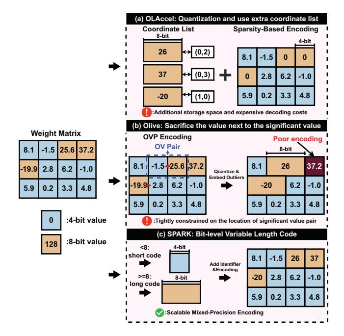
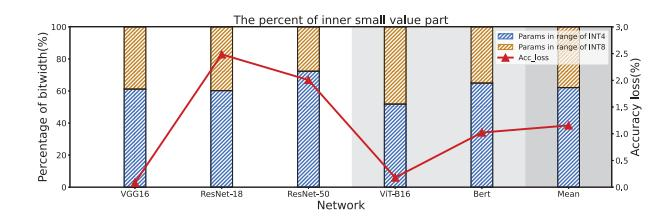
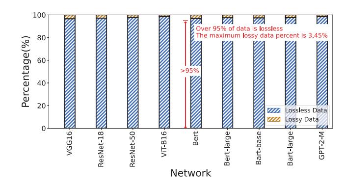
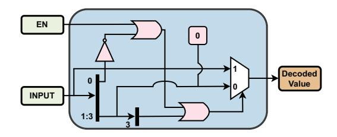
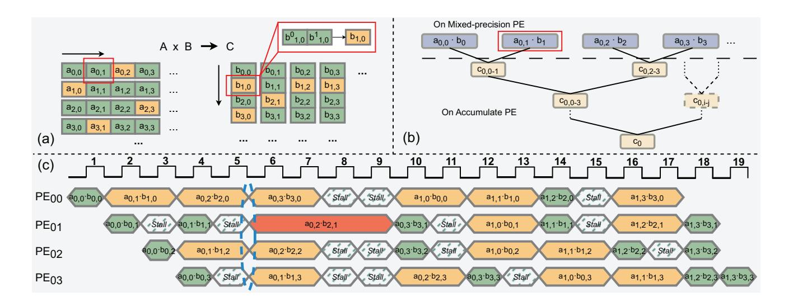
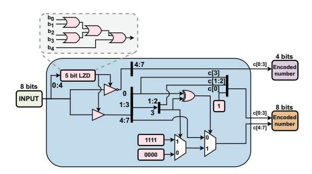
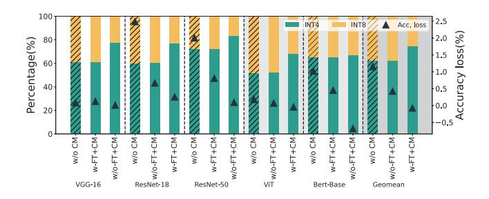
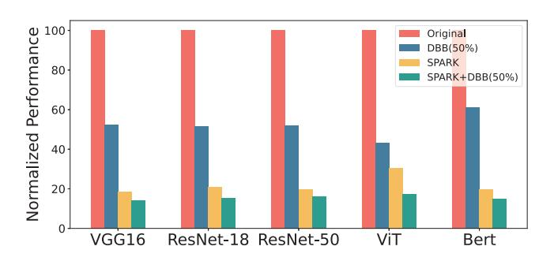

# SPARK: Scalable and Precision-Aware Acceleration of Neural Networks via Efficient Encoding

Fangxin Liu1,2,†, Ning Yang1,2,†, Haomin Li1,2, Zongwu Wang1,2, Zhuoran Song1, Songwen Pei3, and Li Jiang1,2 1. Shanghai Jiao Tong University, 2. Shanghai Qi Zhi Institute, 3. University of Shanghai for Science and Technology

*Abstract*—Deep Neural Networks (DNNs) have demonstrated remarkable success; however, their increasing model size poses a challenge due to the widening gap between model size and hardware capacity. To address this, model compression techniques have been proposed, but existing compression methods struggle to effectively handle the significant parameter variations (activations and weights) within the model. Moreover, current variance-aware encoding solutions for compression introduce complex logic, leading to limited compression benefits and hardware efficiency.

In this context, we present SPARK, a novel algorithm/architecture co-designed solution that utilizes variablelength data representation for local parameter value processing, offering low hardware overhead and high-performance gains. Our key insight is that the high-order part in quantized values are often sparse, allowing us to employ an identity bit to assign the appropriate encoding length, thereby eliminating redundant bitlength footprints. This reduction in data representation based on data characteristics enables a serialized structured data encoding scheme that seamlessly integrates with existing hardware accelerators, such as systolic arrays. We evaluate SPARK-based accelerators against some existing encoding-based accelerator, and our results demonstrate significant improvements. The SPARK-based accelerator achieves up to 4.65× speedup and 74.7% energy reduction, while maintaining superior model accuracy.

# I. INTRODUCTION

Deep Neural Networks (DNNs) have made remarkable strides in recent years, delivering exceptional performance across a multitude of domains [22], [29], [34]. However, the growing complexity and size of DNN models have led to significant challenges in terms of model inference efficiency. Model sizes have been expanding exponentially, with a staggering 15-fold increase every two years [15] [44] [33], surpassing hardware advancements and leading to escalated computational costs for inference tasks. This increasing disjunction between model size and hardware capacity necessitates the development of efficient model compression techniques [23], [25], [40].

Model compression has emerged as a promising approach to mitigate the computational burden imposed by large DNN models. One popular technique is quantization, which uses low-precision data types to compress models and accelerates computation with practical hardware implementations, such as TPU and GPU tensor cores [13] [41]. While existing quantization schemes have demonstrated impressive results for Convolutional Neural Network (CNN)-based models, their effectiveness in attention-based Transformer models is less pronounced. Recent studies [50] [10] have highlighted that attention-based models exhibit greater variations in parameter distributions compared to CNN-based models [21]. Moreover, these models are more sensitive to a small fraction of extreme values [10]. Consequently, the quantization of attention-based models typically demands larger bit widths, such as 8 or 16 bits [43], compared to CNN-based models [2], [24], [39], [45].

The interaction between algorithm and hardware is a ubiquitous trend in the neural network compression domain [6]. Researchers have proposed various software/hardware codesign efforts to handle the parameters in the models. On the algorithmic side, several techniques for compressing DNNs have emerged. For example, outlier suppression [46] [10], which reduces the bit width of quantized data representation by minimizing the variance in the parameter distribution. Additionally, a variety of compression techniques has been explored in the design of DNN accelerators at the cost of a certain accuracy loss. For instance, GOBO [50] and OLAccel [35] use the coordinate list to mark the location of each significant value in the matrix. BiScaled-DNNs [17] leverage the block sparse indices format to store significant value indices. DRQs [39] utilize direct bitmaps for significant values, and OliVe [10] applies tightly bound patterns to the parameters to manually construct significant-sparse value pairs. However, these methods demand complex architectural designs and substantial hardware overhead to cater to the diverse parameter distribution [27].

While the above compression-based coding techniques effectively separate normal values from significant values along the parameter dimension, they miss the opportunity for further power reduction and accuracy improvement: particularly the inherent sparsity of high-order parts in the quantized values. For example, an int8 number can be split into two 4-bit parts, the higher 4 bits (high-order part) and the lower 4 bits (low-order part). Therefore, we are motivated to propose a software/architecture solution capable of handling the inherent sparsity of high-order parts within quantized values, employing a hardware-efficient variable-length data representation.

In this paper, we introduce SPARK, a novel variablelength encoding scheme for representing quantized parameters with a suitable bit width. As depicted in Figure 1, SPARK dynamically tracks the distributions of parameters that are likely to contain crucial information for final inference results. It intelligently adjusts the weight and activation precision for computation to different levels using a 1-bit identifier. Thus, SPARK encoding aligns with the parameter distribution, employing variable-length data representation for different value ranges, with minimal hardware overhead. This enables better neural network accuracy while saving significant storage and computing resources by exploiting the inherent sparsity within quantized values. Each quantized parameter is assigned an appropriate data representation length based on its value range. For instance, as illustrated in Figure 1(c), SPARK represents quantized values within the [0,31] coverage range using 4 bits. By utilizing a 1-bit identifier and a fixed read-in length, the precision of the complete data is adjusted, allowing efficient alignment of 4-bit storage accesses and enabling an efficient variable-precision decoding/encoding process.

We make the following contributions in this paper:

- We introduce a bit-level variable-length encoding scheme called SPARK, which efficiently represents quantized parameters. By leveraging the sparsity of high significant bits, SPARK reduces storage requirements and improves computational efficiency while maintaining model accuracy. The proposed encoding scheme adapts precision based on parameter value ranges, enabling efficient storage access alignment and variable-precision decoding/encoding processes.
- We design an accuracy compensation mechanism that seamlessly integrates into the encoding process.
   This mechanism ensures model accuracy while being hardware-friendly, effectively addressing the challenges associated with encoding-induced accuracy loss.
- We propose an efficient architectural implementation and integration strategy for the SPARK encoding scheme. Through comprehensive evaluations, we demonstrate that SPARK outperforms existing compression-based encoding schemes and hardware accelerators in terms of efficiency and benefits. The proposed architecture showcases superior performance and scalability for model compression in resource-constrained environments.

Our work is significantly different from existing compression frameworks that leverage the pruning and quantization scheme. We exploit the previously neglected flexibility on data representation of quantized values by adopting a novel bit-level, mixed-precision encoding. Specifically, we identify an optimized ratio of the two data type from characterization of parameter distribution, and then assign the different parameters within a layer into the two data representation according to the parameter distributions. Our method is totally perpendicular to, and can be combined with, the existing value-wise compression approaches.

# II. BACKGROUND AND MOTIVATION

#### A. Quantization Schemes

Quantization is an effective technique to compress neural networks by reducing the bitwidth of parameters. According to the coding length, existing quantization scheme can be classified into fixed-length quantization and mixed-precision quantization, where fixed-length quantization can be further classified into uniform and non-uniform quantization.

Fig. 1. Compression-based encoding comparison. Prior quantization works adopt (a) sparsity-based encoding that store significant and normal values separately; (b) quantization-based encoding that sacrifice the normal value to store the significant value. (c) Our proposed SPARK encoding stores significant and normal values together.

a) Uniform quantization: Uniform quantization [48] is the most widely used quantization method. For m-bit uniform scheme, it quantizes the data uniformly to  $2^m$  quantization levels:

$$Q^{FP}(m,\alpha) = \pm \alpha \times \left\{0, \frac{1}{2^{m-1}-1}, \frac{2}{2^{m-1}-1}, \dots, 1\right\}$$
 (1)

where  $\alpha$  is the scaling factor. Then for a 32-bit floating point value w, it is quantized to an m-bit quantized value  $\hat{w}$  by the following equation:

$$\hat{w} = \alpha \cdot h^{-1} \left( \frac{1}{2^m - 1} \operatorname{round} \left( (2^m - 1) \cdot h(\lceil w, \alpha \rfloor) \right) \right)$$
 (2)

where the function h(...) transforms a value into the range [0,1], and  $\lceil w,\alpha \rfloor$  scales w by  $\alpha$ . The quantized values are rounded to  $2^m$  fixed quantized values. This approach allows values to be quantized uniformly without excessive error, such as INT [16].

b) Non-uniform quantization: Non-uniform quantization does not distribute the quantized values uniformly, but rather distributes them more appropriately according to the characteristics of the data. A non-uniform quantization such as power of two quantization [54] [19], which quantizes the values as a sum of multiple power-of-two terms, allows for better fitting of Gaussian-like distributed weights. AdaptiveFloat [42] is another representative work, which performs a floating-point

TABLE I
COMPARISON BETWEEN PROPOSED METHOD SPARK AND SOME OTHER
EXISTING METHODS.

| Method   | Encoding                              | Memory Aligned                  | Data-free |
|----------|---------------------------------------|---------------------------------|-----------|
| OLAccel  | Coordinate list                       | ×                               | ✓         |
| GOBO     | Coordinate list (Only for weights) | ×                               | ✓         |
| BiScaled | Block sparse index                    | Aligned data Unaligned index | ✓         |
| ANT      | Mixed-type quantization               | ✓                               | ×         |
| SPARK    | Variable Length Encoding              | ✓                               | <b>√</b>  |

expansion based on the standard format of IEEE-754 to adaptively reduce quantization errors in Gaussian-like distribution.

c) Mixed-precision quantization: Mixed-precision quantization is a powerful technique that leverages different bitwidths or data types to represent values in Deep Neural Networks (DNNs) [45] [7]. This approach has been demonstrated to better preserve accuracy while using lower bit widths. The reason for this success lies in the fact that the parameters in DNN models exhibit varying importance and sensitiveness to the bit length. For instance, BitFusion [38], a neural network accelerator, implements mixed-precision quantization by allowing layer-wise changes in quantization accuracy through a combination of Multiply-Accumulate (MAC) units. Similarly, ANT [11] employs a mixture of integer, float, and power-oftwo data types for mixed quantization based on data range. However, this data type setup introduces retraining, which is resource-intensive and particularly demanding for complex attention-based models due to substantial memory requirements.

#### B. Compression-based Encoding

Various compression-based designs have emerged due to differences in parameter distributions, as shown in Table I. OLAccel [35] divides tensor values into two regions: outliers and normal values. Outliers are represented with high precision, while normal values are compressed with fewer bits. GOBO [50] employs a list of coordinates to indicate the locations of different data representations, using high-precision (8-bit or 16-bit) quantization for larger data representations. BiScaled DNN [17] quantizes all values with the same bitwidth but different scale factors for alignment, while ANT [11] uses encodings of the same bit-width but different data types for alignment, and utilizes finetuning to ensure precision. Olive [10] imposes a tight constraint on parameter distributions by finding significant values, pruning adjacent parameters, and utilizing the bit-width of pruned values to store larger values. However, these compression-based designs increase hardware complexity as a trade-off for their respective advantages.

# C. Motivation

Quantization is essential for reducing the bitwidth of data in a neural network model. These quantized values can be categorized into lower-order parts (ranging from 0 to 15) and higher-order parts (ranging from 16 to 255). After examining the distribution of neural network weights, it is widely

Fig. 2. The quantized network accuracy and corresponding short code percent. When we use INT8 for these common used network, we can find that the loss of accuracy is generally no more than 2%, and has more than 40% of the values can be converted to short codes.

accepted that a long-tail effect is present, with more weights clustered around the center of the distribution, exhibiting a normal distribution shape [19]. This characteristic persists even after quantization, as demonstrated by the quantified weight distribution of neural networks like ResNet-50 and BERT, where the majority of the data belongs to the central part of the distribution. Interestingly, the observation reveals that high-order parts of the quantized values only account for a small percentage, while low-order ones dominate the entire set of parameters. This finding presents a new opportunity to further exploit the potential of quantized models to improve inference efficiency.

However, previous works have limitations in the applicability of their proposed compression-based architectures. Thus, there is a need for a more hardware-friendly and broadly applicable decoding/encoding method that aligns with the data representation of the parameters. In response to this demand, we propose the SPARK based on the variable-length encoding that leverages the dominance of low-order part among quantized values, leading to align memory accesses and is also compatible with existing accelerators. SPARK pushes the boundaries of quantized model efficiency, unlocking new possibilities for accelerating resource-efficient model inference.

#### III. EFFICIENT CODEC DATA FORMAT

In this section, we introduce our variable-length encoding method, which efficiently distinguishes values while maintaining global alignment. Quantized values in the range of [0,7] are represented using 4 bits, and values beyond [8,255] use 8 bits, maximizing numerical representation space utilization. Additionally, we propose an adaptive accuracy compensation mechanism based on this encoding to counter information loss during coding. This optimized approach enhances efficiency and accuracy in neural network computations.

#### A. Analysis of neural network coding

We visualize in Figure 2 to demonstrate the range percentage of the numerical representations in the neural network models (both the CNN-based model and the attention-based model) after INT8 quantization. The quantization process involves layer-wise INT8 quantization, with quantized values categorized into two intervals: [0, 7] and [8, 255]. These intervals are represented by blue and orange bars, respectively,

in the figure. The folded line in the graph indicates the accuracy loss of the model after INT8 quantization.

An evident observation reveals that approximately 80% of the parameters can be represented by INT4, with only a few requiring INT8 coverage. However, directly quantizing the model to a 4-bit data type poses challenges and results in a substantial accuracy loss (>2%), particularly for attention-based models (over >5%). Therefore, this observation suggests that encoding parameters based on INT8 quantization, while utilizing a narrow range of data representations, can significantly improve storage efficiency while mitigating the accuracy loss associated with direct 4-bit representation.

In summary, our analysis indicates that most of the quantized values in the parameters are in the lower quantization range, but still fill up a uniform data representation of the quantization bit-width due to storage alignment, so we choose the most appropriate data representation to accommodate the values. This motivates us to design hardware-friendly variable-length encoding mechanisms that provide aligned data representations to accelerate the model. In the next section, we present the variable-length encoding design.

## B. Variable-Length Encoding

Main idea. In Section III-A, we observed that small values in a tensor do not require high precision. Therefore, within a quantized model, if we can represent these small values with shorter bitwidth, we can effectively reduce storage and transfer overhead. DNN parameters are Gaussian distributed, with a concentration of major portions in the middle, typically having small values. If we use a fixed-length data type for all elements in the tensor, the Most Significant Bits (MSB) of large values become highly sparse, wasting bit length.

To address this and exploit intra-tensor adaptivity, we introduce a new primitive data type called **SPARK**. SPARK enables scalable and precision-aware coding, tailored to the distribution of parameters. Unlike a naive approach that divides the value range into intervals and assigns fewer bits to intervals with small or large values, our approach starts with a fixed-length and allocates fewer bits for middle-range values (as they do not require high precision) while allocating more bits for large values to preserve their precision.

To mark the boundary between the high-precision and low-precision field, we use the most significant bit as the identifier. While other strategies exist for separating the exponent and mantissa fields, this encoding has the critical advantage of simplicity: the decoder for this encoding only requires a simple leading zero detector as we would show later.

Accuracy Compensation Mechanism. Different from the general compression methods that require to perform the finetuning in the training loop to recover the accuracy loss, SPARK minimizes the information loss through an encoding compensation mechanism. As such, SPARK needs an encoding mechanism to convert the original quantized data, such as INT8, to the low precision SPARK. The software can employ this encoding mechanism to mimic the SPARK behavior without finetuning. Meanwhile, as we target both weight

Fig. 3. Encoding rules of SPARK, which shows different coding rules for different ranges of original values.

and activation encoding, the processing needs to be done dynamically during inference, which requires a lightweight and hardware-efficient encoding mechanism.

Figure 3 details the hardware-efficient SPARK encoding mechanism for each tensor element. SPARK, which maximizes the utilization of the encoding length for information representation by wrapping 1-bit identifiers with numerical information.

As an illustration, consider a model subjected to 8-bit unsigned quantization. For the original 8-bit value  $(b_0, b_1, \ldots, b_7)$ , if it has 0-3 valid bits (i.e., non-zero bits), we can directly encode it to a low-precision allocation without any information loss  $(c_4, c_5, c_6, c_7)$ , where the identifier  $c_4 = 0$  (Case 1 in Figure 3). For the original 8-bit value with 4-8 valid bits, which requires to encode it as a high precision allocation  $(c_0, c_1, \ldots, c_7)$  with  $c_0 = 1$ , we use the first bit  $b_0$  and the fourth bit  $b_3$  as the check bits, and take the XOR result of both as the check result. If the check result equal to 0, the encoded value does not need to be rounded. If the check result is 1, the encoded value needs to be rounded up, with no more than error of 16. As parameters are quantized to INT8 whose range is up to 255, this behavior leads to fewer encoding error ( $\leq 16$ ).

According to SPARK encoding, for large values, identifier  $c_0$  is set to 1, and for small values identifier  $c_0$  is equal to 0. For large values to be encoded, the identifier is not considered as a valid bit, that is, it does not contain numerical information. As such, we design the following rule: 1) If the original value is in the range of [8,127] with the 4-7 valid bits, the identifier is not regarded as the valid bit; 2) If the original value is within the range of [128,255] with up to 8 valid bits, the identifier should be regarded as a valid bit for numerical representation. To be specific, for the quantized data has value range of [8,127] (Case 2 in Figure 3), if  $b_0 = 0$  and  $b_3 = 0$ , then we directly store the original value in  $(c_1, \ldots, c_7)$  and set identifier to 1 in  $c_0$ , leading to no information loss. if  $b_0 = 0$  and  $b_3 = 1$ , then we set  $b_3$  to 0 stored in  $c_3$  and  $(b_4, \ldots, b_7)$  to 1111 stored in  $(c_4, \ldots, c_7)$  to minimize the encoding error. Note that after the

TABLE II
THE VALUE TABLE OF SPARK ENCODING. "x" is 0/1.

| Bits      | SPARK code | Value in Decimal                                                      |   | Error |
|-----------|------------|-----------------------------------------------------------------------|---|-------|
| 0xxx      | 0xxx       | [0, 7]                                                                |   | ×     |
| 0xx0 xxxx | 1xx0 xxxx  | $[8,15] \cup [32,47] \cup [64,79] \cup [96,111]$                      | Ī | ×     |
| 0xx1xxxx  | 1xx0 1111  | 15,47,79,111                                                          | Ī | ✓     |
| 1xx0xxxx  | 1xx1 0000  | 144,176,208,240                                                       | T | ✓     |
| 1xx1xxxx  | 1xx1 xxxx  | $ \mid \ [144, 159] \cup [176, 191] \cup [208, 223] \cup [240, 255] $ | ī | ×     |

above encoding process, the original value  $18_{10}$ , whose binary code is  $00010010_2$  is now rounded to  $15_{10}$ , with  $10001111_2$  in SPARK representation.

For the quantized data has value range of [128, 255] (Case 3 in Figure 3), if  $b_0 = 1$  and  $b_3 = 1$ , then we directly store the original value in  $(c_0, \ldots, c_7)$  without information loss. if  $b_0 = 1$  and  $b_3 = 0$ , then we set  $b_3$  to 1 stored in  $c_3$  and  $(b_4, \ldots, b_7)$  to 0000 stored in  $(c_4, \ldots, c_7)$ . For example, for 8-bit unsigned original value  $170_{10}$ , it has binary code  $10101010_2$ , which is now rounded to  $10110000_2(176_{10})$  in SPARK representation.

The SPARK encoding mechanism is an element-wise function that can be efficiently implemented in both hardware and software. With a model quantized to 8-bit, the basic bit length remains constant at 4. The quantization of weights can be executed offline, while activation quantization requires hardware support. Owing to the simplicity of our encoding mechanism, we can implement it in the hardware by augmenting the hardware's element-wise computation unit, such as the activation unit. Importantly, our SPARK encoding allows for mixed-precision within a tensor, but the tensor is stored in a fixed-length format (i.e., basic bit length). Consequently, the memory accesses of SPARK are aligned and hence efficient.

An Example. To provide a concrete understanding of our design, we refer to the eight-bit data representation example in Figure 3. Without loss of generality, we assume the case of unsigned values that have been scaled with the per-layer granularity of the weights (activations), identical to [20], [32].

Figure 3 shows a eight-bit unsigned binary number using our SPARK encoding, which can represent 8 distinctive binary values with the maximum value of 255. We divide this value range to two intervals corresponding into the high precision and low precision, and highlight the low precision in orange color. The last three bits have the encoded low precision fields of range [0,7]. The last seven bits have the encoded high precision fields of range [0,128]. This bit length allocation scheme is adaptive to the importance of the value, as the small values have the high sparsity in most significant bits and thus allocate the low precisions.

Table II shows the value table for the above 8-bit unsigned code  $(c_0,\ldots,c_7)$ . Each row refers to the divided interval. For example, the SPARK encoded number 10110001 (the large value) with 8 bits, where the identifier is 1 and the value is  $0110001_2$ . As such, its decimal value is  $177_{10}$ . On the other hand, SPARK encode the the small value with the binary encoding of 0101 by 4 bits, where the identifier is 0 and the value is  $101_2$ . As such, its decimal value is  $5_{10}$ . In different

Fig. 4. Lossless and lossy percentage after SPARK encoding. For both traditional CNNs (ResNet,VGG) and Attention-based models (Bert, Bart, GPT-2), more than 95% data is lossless when using SPARK encoding.

cases, depending on the identifier, SPARK encodes the original value differently.

As illustrated in Figure 3, the bit length is segmented into two intervals based on the value magnitude. In our SPARK, the bit representation of low-precision data can be effectively reused for that of high-precision data, guided by the identifier. Additionally, as indicated in Table II, numbers within the ranges [0,15] and  $[32i,32i+15], i \in (1,2,\ldots,7)$  can be fully accommodated within SPARK's data representation. Only a minority of values produces errors, which statistically constitute less than 5% (as shown in Figure 4). This allocation strategy matches closely with the Gaussian-like distribution, ensuring that values more concentrated in the middle range also receive more complete encoding, consequently leading to fewer accumulated errors.

#### C. Hardware-friendly Decoding

**Main Idea.** After the encoding process described earlier, the original values are now represented with condensed bit lengths. To support SPARK decoding, we have developed a hardware-friendly decoding mechanism that transforms these encoded numbers to their decimal forms. This transformation makes the data usable for direct calculations.

Figure 5 illustrates the decoding rules of SPARK. We utilize 4 bits for fixed-length input. Initially, the enable signal is set to 0, indicating whether the numerical value is of high precision or low precision. When the identifier is 0, it signifies that the numerical value is a low-precision representation, and it is directly outputted. Meanwhile, the enable signal remains unchanged. Conversely, when the identifier is 1, it indicates a high-precision representation, and the enable signal is set to 1. We then examine the 4th bit  $(c_3)$ . If  $c_3$  equals 0, we output the last three bits. Conversely, if  $c_3$  equals 1, we include the identifier bit as part of the result. Since the enable signal is 1, the subsequent 4 bits of data are directly exported as part of the high-precision representation, and the enable signal is reset to 0.

**Example Decoding.** Consider two SPARK numbers: 11010010 and 01000011. The former is decoded as 21010,

Fig. 5. Decoding rules of SPARK, where we use the input and enable signal to decode to get the result.

where the preceding high-precision representation is  $1101_2$  (with the 4th bit as 1), and the subsequent high-precision representation is  $0010_2$ . Thus, 11010010 corresponds to  $1101_2 << 4+0010_2 = 210_{10}$ . Similarly, the latter, 01000011, represents two distinct numbers: 4 and 3. In this case, the preceding low-precision representation is  $0100_2$ , and the subsequent low-precision representation is  $0011_2$ . Therefore, 01000011 translates to two numbers, 4 and 3, making it suitable for subsequent calculations. Section IV-B provides more decoder details

# IV. SPARK ARCHITECTURE

This section presents how to integrate SPARK in outputstationary systolic array architecture. We then present the hardware encoder and decoder for the aforementioned SPARK encoding/decoding mechanism. Such a integration enables the reduction of storage overhead while maintaining sustained neural network accuracy by preserving the bit length in lowprecision values. This approach proves to be efficient for quantized DNN parameters, which exhibit varying importance and distribution characteristics.

## A. Architecture Overview

We introduce the integration of the SPARK design into the systolic array architecture, illustrated in Figure 6. The SPARK architecture includes multiple processing element (PE) pages, communicating with memory through a global buffer. Each PE page consists of an input/weight buffer, a mixedprecision PE array, an accumulation unit, encoders/decoders, an output buffer, an activation and pooling unit, and associated control logic. Such a SPARK integrated architecture can be briefly described as follow. The global buffer stores SPARK encoded activations and weights. An im2col/pack engine in each PE page retrieves activations, transforms them, and packs them into activation buffers. It also handles weights, loading and aligning them in the array. A key part in each PE page is the decoder (Section IV-B), decoding operands before entering the systolic array. The PE array efficiently supports mixed-precision calculations (Section IV-C). Partial

Fig. 6. Overview of SPARK architecture.

sums accumulate in output buffers, accommodating variable kernel sizes. After activation and pooling, the outputs go to the encoder (Section IV-D), converting high-precision values to low-precision SPARK encoded numbers, reducing storage and transmission overhead for subsequent layers. Notably, no special hardware is required for off-chip memory accesses as SPARK encoded numbers are decoded before entering the systolic array. This design enhances performance and energy efficiency, which is critical for memory-bound neural network models. Integrating SPARK into the systolic array offers a hardware-efficient and energy-saving solution for neural network computations, advancing mixed-precision quantization and accelerating inference tasks.

#### B. Decoders

To achieve fast SPARK decoding, we designed a SPARK decoder, which is fairly simple to construct and can be easily embedded into existing accelerators. The SPARK decoder is simpler and more area-efficient than those used in other schemes, as it only requires multiplexers, OR gates, and NOT gates. These are well-known hardware components, all of which have lightweight circuits. As shown in Figure 7, the decoder reads in 4 bits and an enable signal per cycle, determining whether the input represents the post part of the

Fig. 7. The 4-bit decoder for SPARK format.

Fig. 9. Matrices A and B multiplication with mixed-precision (a). Adaptive dataflow in SPARK (b). The execution timing for the SPARK dataflow (c).

high-precision value according to the enable signal. When the enable signal is 1, it indicates that the input is the post part of the high-precision value. When the enable signal is 0, if  $c_0$  is 0, the input signifies a low-precision value and the decoder outputs data directly; when  $c_0$  is 1, the decoder assesses whether to include an identifier as numerical bit based on  $c_3$ , subsequently outputting either all four bits or the last three bits. The algorithm is shown in Equation 3. Note that we place the decoders along the borderlines, which can save most decoders. For example, if the PE array size is  $m \times n$ , we only need m+n decoders.

Decode number = 
$$\begin{cases} c_1 c_2 c_3, & ,EN \lor \neg c_0 \lor c_3 = 0 \\ c_0 c_1 c_2 c_3 & ,EN \lor \neg c_0 \lor c_3 = 1 \end{cases}$$
(3)

## C. Mixed-precision Support

In this work, we propose to couple our SPARK with the mixed-precision quantization to achieve the same accuracy of the original high-precision DNN models. According to many prior works, the 8-bit INT is sufficient to maintain the original model accuracy. We explain how our 4-bit Mixed-Precision PE (MPE) design can naturally support 8-bit INT PE.

a) Mixed-Precision PE: After decoding for high-precision and low-precision values, they are all transformed into PE array. To support the decoded mixed-precision computation, we need to add a shifter and an adder for the MAC (multiply and accumulation) unit. As shown in Figure 6 (right), the PE array consists of MPEs capable of mixed-precision computation. In SPARK architecture, the weights and activations will always be quantized into SPARK format, where weights are held into each PE in the array and activations are shifted right and the partial sums are shifted down to the neighboring MPEs every cycle during the MAC process. The leftmost column of MPEs accept new input values (i.e., activations) shifted from the line buffers for every clock cycle.

Fig. 8. PE unit design and calculation paradigm.

Figure 8 illustrates how to adapt the MPE in our variablespeed systolic array. There are two 8-bit registers W and Aholding a weight value and an activation value, respectively. A 16-bit register P store the partial result. In default, the PE is in INT4 mode, whose INT4 MAC is used for the multiplication of a 4-bit weight with a 4-bit activation (Figure 8(a)). On demand, the PE can switch to INT8 mode depending on the identifier generated in the previous SPARK decoding. To be specific, for the multiplication of a 4-bit value with a 8-bit value (Figure 8 (b)), in cycle t, it extracts the higher 4 bits of the high-precision value and the low-precision value from W and A, respectively. The result is then shifted left by 4 and stored into the P register. In cycle t+1, it extracts the lower 4 bits (L) of high-precision value and the higher 4 bits (H) of input value from W and A, respectively for another 4-bit MAC accumulated with the previous product. The result is written into the P register. The behavior in cycle t+2 and t+3 is similar with t and t+1.

*b) Mixed-Precision Dataflow:* Figure 9 depicts the utilization of four 4-bit MPEs to multiply two 8-bit INT numbers.

We fetch a number  $a_{0,1}$  from matrix A, which is then processed in parallel through multiplications with the corresponding row  $b_1$  from matrix B, containing four nonzeros:  $b_{1,0}$ ,  $b_{1,1}$ ,  $b_{1,2}$ , and  $b_{1,3}$ . The process begins by decoding the 8-bit number  $b_{1,0}$  into two numbers in our SPARK representation:  $b_{1,0}^0$  and  $b_{1,0}^1$ . Next, we perform four parallel multiplications for these four numbers, as illustrated in Figure 9 (b), each utilizing a 4-bit MPE. Finally, we sum the results of these four multiplications using accumulate PEs(APE). In summary, our MPE is well-suited for supporting mixed-precision DNN inference. In the subsequent evaluation, we demonstrate that the majority of parameters (up to 83%) can be represented with low precision, while only a fraction of parameters require high precision. This highlights the effectiveness of our approach in efficiently handling mixed-precision computations.

c) Execution Flow for Mixed-Precision: Also, our mixed-precision PE array can skillfully support variable-speed matrix multiplication, meeting the different requirements for low-precision and high-precision values. It works at full speed in INT4 mode, and switches to INT8 computation on demand by inserting stalls. We take four PEs  $PE_{00}$ ,  $PE_{01}$ ,  $PE_{02}$  and  $PE_{03}$  as an example, as seen from Figure 9(c). In the first cycle,  $PE_{00}$  receives the 4bit normally for computation. In the second cycle, since one of the inputs in  $PE_{00}$  is of high precision, it needs two cycles to complete the computation, while  $PE_{01}$  and  $PE_{02}$  continue to compute with low precision. Thus  $PE_{00}$  spends two cycles to complete the MAC computation and  $PE_{01}$  stalls one cycle to match the rate in the systolic array. Such a stall also needs in cycles 4 and 5. At cycle 6, the input to  $PE_{01}$  are both two high precision values, which means that it needs to perform a high precision computation that takes four cycles, so the remaining PEs need to stall for two cycles after completing low precision computation. In our example, the four PEs completed the computation of the eight original INT8s in at most 19 cycles, which illustrates the efficiency of our scheme.

#### D. Encoders

Meanwhile, we designed a SPARK encoder that can quickly encode 8-bit fixed-length codes into SPARK data representation. The encoder for SPARK format, which uses leading-zero detector (LZD), multiplexer and XOR gate, which are

Fig. 10. The encoder for SPARK format

well-known hardware components and both have lightweight implementations. As shown in the Figure 10, for a given 8-bit input, the encoder first inputs its first five bits b[0:4] into a simplified 5-bit leading zero detector and determines the first four bits of the code based on the result. When the leading zero detector outputs 0, which means the first five bits of the previous input are 0, then this input can be encoded as a low-precision value. In this case, we output the last four bits as the result of the code, and discard the first four bits, thus reducing the bit length. Conversely, when the detector yields an output of 1, the code is classified as a high-precision value. In this scenario, the output of the prev part has already been determined as  $c_0c_1c_2c_3=1b_1b_2b_0$ , in accordance with the encoding rules. The formula for the output of the first four bits is given in Equation 4.

And if  $b_0 = 1$ , the encoder needs to check whether the last four bits are rounded or not, which is determined by the result of the XOR between  $b_0$  and  $b_3$ . When the result is 0, the post part is equal to the last four bits of the input; and when the result is 1, the output is changed to a fixed output determined by  $b_3$ . We use the following Equation 5 to generate the the post part. After deciding on the output, the prev part is concatenated with the post part to get the final SPARK encoded number with mixed-precision.

Prev part = 
$$\begin{cases} b_4 b_5 b_6 b_7 & , LZD(b_0 b_1 b_2 b_3 b_4) = 0 \\ 1b_1 b_2 b_0 & , LZD(b_0 b_1 b_2 b_3 b_4) = 1 \end{cases}$$
(4)

Post part = 
$$\begin{cases} b_4 b_5 b_6 b_7 & , & b_0 \oplus b_3 = 0 \\ 1111 & , & b_0 \oplus b_3 = 1 \text{ and } b_3 = 1 \\ 0000 & , & b_0 \oplus b_3 = 1 \text{ and } b_3 = 0 \end{cases}$$
 (5)

# E. Instruction Set Extension

The SPARK encoding scheme does not require the introduction of new data types specifically for multiply-accumulate instructions. Instead, it leverages the existing instruction set architecture, ensuring compatibility and easy integration with the current system design. SPARK encoding mechanism operates with a fixed bit length, allowing for the concatenation of high and low precision values based on encoding rules. Consequently, the original load/store instructions remain applicable and unchanged, maintaining compatibility with the existing system design.

After performing INT-based quantization, the specific type of each layer is determined, enabling the seamless substitution of the original integer-based versions with SPARK-encoded numbers. This approach ensures that the encoding scheme can be readily incorporated into existing systems without requiring extensive modifications.

#### V. EVALUATION

#### A. Methodology

**Benchmark.** We use two representative groups of models, CNNs and attention-based models, including computer vision

TABLE III EVALUATED MODEL, DATASET, AND THEIR ACCURACY.

| Type          | CNN-based |          |          | Attention-based |       |
|---------------|-----------|----------|----------|-----------------|-------|
| Model         | VGG16     | ResNet18 | ResNet50 | ViT             | BERT  |
| Dataset       | ImageNet  |          |          |                 | SST-2 |
| FP-32 Acc.(%) | 71.59     | 69.76    | 76.15    | 84.19           | 90.45 |
| SPARK Acc.(%) | 71.38     | 69.69    | 76.05    | 84.23           | 91.14 |

and natural language processing tasks, as reported in Table III. For CNN models, we evaluate VGG-16, ResNet-18 and ResNet-50 on ImageNet dataset. We use pre-trained network models from Pytorch Model Zoo as the basis for validation on accuracy. The network structure is derived from the model in the torchvision. For attention-based models, we evaluate BERT-Base with the GLUE dataset suite. We also evaluate ViT (vision transformer), which is a recent Transformer-based model and has achieved excellent results for vision tasks.

Baselines. We implement the SPARK encoding framework in PyTorch. We evaluate six baselines compared against SPARK, including: 1) Eyeriss [3], which is a spatial energyefficient dataflow architecture. It uses coarse-grained quantization of INT16 throughout the network. We will use it as the baseline for standard NN accuracy; 2) BitFusion [38], which is an accelerator featured by the composable MAC unit. It employs the model typologies proposed in prior work [9], [37], [39]. If the algorithm permits, it can change quantization at the layer granularity. If a coarse-grained quantization of INT16 is applied throughout the network, it can retain the accuracy as Eyeriss; 3) OLAccel [35], which is a state-ofthe-art accelerator based on the outlier-aware low-precision computation; 4) AdaFloat, which requires an 8-bit float to maintain the original model accuracy; 5) ANT [11], which is a hardware-friendly quantization accelerator that combines power of two data type and INT type for low bit-width; 6) Olive [10], which is outlier-aware quantization accelerator. For comparison, we take part of results as reported in their paper. For models that are not available in their paper, we reproduce their experiments and report the results.

Accelerator Implementation. We implement the ANT decoder, PE and encoder described in Section IV with the Verilog RTL. Meanwhile, we use the 28 *nm* TSMC technology library and Synopsys Design Compiler [5] to study the area and energy of those components that we designed. In addition,

TABLE IV ACCURACY LOSS (%) AND BITWIDTH COMPARISON BETWEEN SPARK AND OTHER DESIGNS WITHOUT FINETUNING.

| Model     | SPARK           | ANT          | BiScaled     |
|-----------|-----------------|--------------|--------------|
| VGG16     | 0.08 (5.33 bit) | 0.71 (6 bit) | 1.66 (6 bit) |
| ResNet50  | 0.81 (5.11 bit) | 0.89 (6 bit) | 5.51 (6 bit) |
| ResNet152 | 0.77 (5.21 bit) | 0.95 (6 bit) | 4.84 (6 bit) |

for a fair comparison, we use the same global buffer capacity (5 MB) and memory bandwidth for all these accelerators and use CACTI [1] to estimate it that can satisfy our design goals. We use DeepScaleTool to scale all designs to the 28 *nm* process for the iso-area comparison. Under 200MHz frequency with 28nm technology library, we verify that the encoder/decoder bandwidth is about 50 GB/s, which is larger than the peak bandwidth requirement (∼25 GB/s) [4] of PE pages. So, SPARK can sustain a non-blocking processing with decoding/encoding support. To evaluate the performance of our proposed SPARK architecture, we develop a cycleaccurate simulator to simulate the PE array with decoders and output accumulation together with the encoder. Meanwhile, the SPARK architecture can be extended to a larger number of PEs under the same area budget.

# *B. Accuracy Results*

For quantized DNN models, we utilize the SPARK encoding described in Section III to reduce the bit length of primitive data types with minimal accuracy loss. From the results in Table III, we observe that almost 4-bit SPARK achieves nearly original accuracy for commonly used vision and language models. On the ImageNet dataset, SPARK exhibits an average accuracy loss of approximately 0.1% against the original FP32 model. Additionally, for attention-based models, SPARK achieves better accuracy (+0.6% accuracy) compared to the original models.

We then compare the accuracy of SPARK against the prior quantization works without finetuning. Table IV shows the 6-bit quantization without finetuning results for ANT and BiScaled, and 5-bit encoding without finetuning for SPARK. This is because ANT and BiScaled achieve speedup with 6-bit is at the cost of about 1% accuracy loss for benchmark, leading to an unacceptable loss of precision if ANT and BiScaled drop to 5-bit. We find that SPARK with 5 bits offers much better accuracy than ANT and BiScaled with 6-bit because SPARK can take advantage of the bit sparsity that naturally appear among the quantized values. As the most values tend to be small and few are large, there are massive sparsity exists in the most significant bits, even on the quantized values.

We also compare the accuracy of SPARK against the prior quantization works on the attention-based model. The results in Table V show the accuracy loss for prior schemes on BERT is around 1% on the presented datasets. We find that SPARK offers much better accuracy with a fewer bitwidth (i.e., 4 bit) than the quantization schemes (e.g., OS, ANT and Olive) because SPARK can exploit intra-value adaptivity with bit sparsity domains, even for quantized values.

To summarize, our SPARK encoding framework pushes the limit of 4-bit quantization to a new state-of-the-art, as it is able to achieve nearly original accuracy for the commonly used models including VGG, ResNet, BERT and VIT on most datasets. Moreover, SPARK provides state-of-the-art mixedaccuracy results on these CNN-based and attention-based models without finetuning. This is because SPARK is essentially a encoding mechanism that aims to unleash the potential of

Fig. 11. Comparison of the normalized latency in different designs.

Fig. 12. Comparison of the normalized energy in different designs.

bit sparsity naturally occurring in the quantized parameter by utilizing efficient coding and decoding. It is worth noting that the prior compression techniques used to reduce the number of data can be applied to SPARK.

#### C. Performance, Energy and Area

Performance. Figure 11 shows the normalized total execution cycles on different accelerators for the six networks. SPARK has the most significant advantage in terms of performance improvement. ANT and OLAccel performs poorly on most models due to the relatively complex coding and decoding mechanisms dealing with different data formats. OliVe, although further optimized for decoding, has a complex encoding process as well as a restricted percentage of outlier pairs, resulting in inferior speedups to our proposed SPARK. Meanwhile, the performance improvement of SPARK is better on attention-based models, increasing with the number of model parameters. On average, SPARK achieves 4.65x, 3.76x and 1.12x speedup value over AdaFloat, OLAccel and ANT, respectively. Specifically, regarding the CNN-based model ResNet-50, our SPARK can achieve up to 80.1% performance improvement because SPARK mostly uses INT4 MACs for insensitive regions with only a limited number of INT8 MACs

TABLE V
ACCURACY LOSS (%) AND BIT WIDTH COMPARISON FOR BERT ON SST-2

DATASET. OS IS OUTLIER SUPPRESSION FOR SHORT.

| Model          | Q8BERT | OS   | Olive | ANT  | SPARK |
|----------------|--------|------|-------|------|-------|
| Acc. loss      | 1.1    | 1.49 | 0.92  | 2.87 | 0.34  |
| Avg. bit-width | 8      | 6    | 4     | 4    | 4.31  |

for significant values. Compared to AdaFloat, since it applies dedicate INT16 MACs for the first layer and separate INT4 MACs for the rest layers, SPARK can achieve 76.3% performance improvement thanks to the larger number of PEs under the same area budget in our scheme. Note that the speedup brought by OLAccel is at the cost of about 5% accuracy loss for ImageNet. For the attention-based model ViT, SPARK also provides 3.3x and 1.16x speedups compared to AdaFloat and ANT, which is brought about by the efficient codec mechanism and parameter transmission.

Energy. Figure 12 compares the normalized energy consumption of different designs for five networks, decomposed into DRAM, global buffer, and processing cores (Core). SPARK shows the lowest energy consumption for both CNN-based and attention-based models. Specifically, for ResNet-50, SPARK consumes 74.7%, 51.5%, 21.2%, 33.7%, 70.0%, and 21.0% less energy compared to Eyeriss, BitFusion, OLAccel, BiScaled, AdaFloat, and ANT, respectively. For ViT, which has a larger parameter size, SPARK consumes 69.9% and 36.3% less energy than AdaFloat and ANT, respectively. This is attributed to the challenge of compressing attention-based models through quantization and pruning. Nevertheless,

TABLE VI Area breakdown for PE array and devices SPARK needed.

| Component | Number | Area(mm 2 ) | Area Ratio(%) |
|-----------|--------|------------------------|---------------|
| Decoder   | 128    | 0.000822               | 0.251         |
| Encoder   | 64     | 0.000856               | 0.261         |
| 4-bit PE  | 4096   | 0.326                  | 99.49         |

TABLE VII THE CORE'S CONFIGURATION AND AREA BREAKDOWN OF SPARK AND OTHER WORK UNDER 28NM PROCESS.

|              | Core                        |        |           |  |  |
|--------------|-----------------------------|--------|-----------|--|--|
| Architecture | Component                   | Number | Area(mm2) |  |  |
|              | 4-bit Decoder(6.42μm2)      | 128    |           |  |  |
| SPARK        | 4-bit PE(79.57 μm2)         | 4096   | 0.327     |  |  |
|              | 4-bit Decoder(60.29μm2 )    | 128    |           |  |  |
| Olive        | 2) 8-bit Decoder(80.18μm | 64     | 0.338     |  |  |
|              | 4-bit PE(79.57 μm2)         | 4096   |           |  |  |
|              | Decoder(4.9μm2)             | 128    |           |  |  |
| ANT          | 4-bit PE(79.57 μm2)         | 4096   | 0.327     |  |  |
| BitFusion    | 4-bit PE                    | 4096   | 0.326     |  |  |
| OLAccel      | 4-bit & 8-bit PE            | 1152   | 0.309     |  |  |
| BiScaled     | 6-bit BPE                   | 2560   | 0.328     |  |  |
| AdaFloat     | 8-bit PE                    | 896    | 0.327     |  |  |
| Eyeriss      | 16-bit PE                   | 168    | 0.309     |  |  |

SPARK maximizes the use of bit sparsity among quantized values, efficiently conducting the majority of computations in the INT4 mode.

The energy reduction against Eyeriss and BitFusion mainly results from the reduced precision on PEs and narrower bitwidth data transferred between DRAM and the global buffer. While OLAccel and Olive consume less energy than BitFusion due to more 4-bit values, it requires an additional outlier controller with significant overhead to manage computation between normal values and outliers. Furthermore, SPARK requires fewer buffer accesses, reduced data transfer, and simpler decoding for output activations and weights compared to ANT. These advantages contribute to its superior energy efficiency across various neural network models.

Area. Table VI shows the area breakdown of SPARKbased systolic array architecture under 28 *nm* process. In this scenario, the 4-bit decoders and 4-bit encoders introduce about 0.25% and 0.26% overhead of the core area, respectively, which is inconsiderable compared to the area of PEs in the array. Considering on-chip memory structures, the overall area overhead would be even smaller.

In addition, we also scale other accelerators to 28 *nm* and compare the accelerator area breakdown in Table VII. Note that we implement all accelerators with a similar area size. We also find SPARK has the lowest area overhead. The small area overhead of our SPARK directly benefits from the carefullydesigned SPARK encoding and decoding.

# *D. SPARK Optimization Analysis*

In this subsection, we evaluate the effectiveness of the optimization settings in SPARK, as discussed in Section III. We focus on analyzing the impact of diverse SPARK settings on the accuracy of DNN models. Figure 13 presents the results, showing the significance of the compensation mechanism (CM) in restoring accuracy to its original values before encoding. Additionally, finetuning plays a crucial role

Fig. 13. Accuracy Loss with different optimization settings. CM, w/-FT and w/o-FT are accuracy compensation mechanism, with finetuning and without finetuning for short, respectively.

in further increasing the proportion of 4-bit types within the models. For our attention-based models, we consider representative examples such as BERT and ViT, which exhibit similar trends to other Transformer models. These models have complex parameter distributions, and directly using a narrow bit length representation (e.g., quantization) for their parameters leads to reduced model accuracy. However, SPARK encoding effectively eliminates sparsity occupying invalid bit lengths that naturally occur in quantized values, resulting in a balanced ratio of various data types. Analyzing the type ratio, we find that attention-based models are more sensitive to the bit length of the data representation compared to CNN models. Nevertheless, after applying SPARK encoding, both CNN and attention models show a similar utilization proportion of 4 bit types. This observation suggests that SPARK effectively leverages bit sparsity within attention models.

## *E. Scalability Analysis*

In this subsection, we study how the model size affect the performance of our SPARK and the potential benefits of combining existing model compression techniques with SPARK.

Sensitivity Analysis. In this evaluation, we aim to explore the relationship between energy efficiency and various model sizes, shedding light on the impact of different model sizes on SPARK. Our findings are summarized in Figure 14, which illustrates how the energy efficiency of models encoded using SPARK increases with varying model sizes. Our analysis encompasses a range of representative examples, including attention-based models like BERT, known for their substantial computational demands. Interestingly, the SPARK encoding architecture directly addresses this computational overhead by processing network parameters to reduce redundant bit-length footprints in the model.

Notably, this encoding approach's benefits extend across models with natural sparsity of high significant bits, making SPARK equally effective in enhancing energy efficiency for models of diverse sizes. Furthermore, our results demonstrate that the improvement in energy efficiency is particularly prominent when applied to models with large-scale parameters, which inherently exhibit higher levels of bit sparsity. In summary, our analysis highlights SPARK's scalability and its consistent ability to enhance energy efficiency. This is particularly noteworthy for attention-based models with larger parameter sizes, where SPARK's benefits truly shine.

Fig. 14. Energy efficiency and accuracy with different model size.

Joint Optimization. SPARK leverages inherent bit-level redundancy in data representations without modifying the memory system, making it orthogonal to existing value-based compression techniques like pruning. Notably, SPARK can be seamlessly integrated with these methods to achieve joint optimization. As an illustration, we refer to the pruning technique known as Density-Bound Block (DBB) sparsity [26], [28], where we set the sparsity rate at 50% for all networks. The combined application of SPARK and pruning techniques is depicted in Figure 15. The results show that SPARK substantially reduces total execution cycles for the five networks, highlighting its compatibility with other compression techniques. Even when the model is compressed, SPARK consistently excels at compressing bit-level redundancy and effectively minimizing computational overhead.

Additionally, Ampere GPU's [31] compute data compression focuses on compressing zero values and similar bytes in DRAM and L2 cache, providing a lossless and general-purpose compression method that operates transparently alongside SPARK.

Fig. 15. Performance for different models with combination of density bound block (DBB) sparsity (50%) and SPARK.

## VI. RELATED WORKS

This section presents related works on DNN acceleration, sparse accelerators, and quantized accelerators.

a) DNN Acceleration: Researchers have proposed various hardware and software solutions to efficiently accelerate DNN models [36] [41]. On the hardware side, the efficient processing of DNNs on specialized devices has attracted sustained attention. These designs are termed DNN accelerators. Traditional DNN accelerators have focused on optimizing hardware architecture to align with the computational flow of DNNs, increase compute parallelism, and minimize memory accesses [14] [52]. For instance, the systolic array [18] utilized in TPUs and other spatial architectures exemplify such efforts. These designs enable localized data reuse within processing elements (PEs), reducing memory access overhead and improving computational efficiency for DNN computations.

On the software side, researchers have introduced several techniques to compress DNNs in recent years, with data quantization [49] [30] [21] and network sparsification [12] [47] [53] being prominent examples. Data quantization involves reducing the number of data bits to compress the original model, while network sparsification focuses on reducing the number of connections or neurons. Both data quantization and network sparsification offer distinct trade-offs in various aspects. The choice of technique depends on the specific application scenario, desired compression ratio, model accuracy requirements, and hardware usability.

- b) Sparse Accelerators: An interesting topic is to combine compression approach with hardware design bring the most benefits for hardware performance, which is usually called software-hardware codesign. For network sparsification, the index overhead and compute/access irregularity are the most challenging issues. Even though the structured sparsification can help, how to maintain accuracy also needs more efforts. To address this challenge, many techniques are proposed to support efficient sparsity exploitation [51] [8].
- c) Quantized Accelerators: The bit length required for data representation in DNN inference is typically  $\geq$  8-bit fixed-point, resulting in negligible accuracy loss. However, in the pursuit of ultra-high execution performance with some accuracy trade-offs, more aggressive low-bit quantization is explored in research, which is the focus of this paper. There are two types of quantized neural networks: fixed bit-width and variable bit-width. In the case of fixed-bitwidth, highprecision (8-bit) multipliers and adders can be easily replaced with low-bitwidth (4-bit) counterparts, while the overall architecture and data flow remain mostly unchanged from before quantization [4], [39]. For extremely low-bit quantization, such as binary/ternary data quantization, costly MAC operations can be implemented using simple XNOR and pop-count logic operations. However, these extremely low-bit quantization designs may not always achieve acceptable accuracy, particularly for large models requiring powerful expressive capabilities or attention-based models with more complex structures.

In the case of variable bitwidth, the motivation is to accommodate varied bitwidth requirements across regions and layers, instead of maintaining a consistent bitwidth throughout. Therefore, providing flexible architectural support for variable bitwidths becomes desirable. BitFusion [38] and DRQ [39]

can support different bitwidth via a spatial and temporal combination of low-bit PEs OLAccel [35] utilizes quantization with 4-bit and 16-bit MACs. ANT [11] are more aggressive and require heavy architectural modifications. Olive [10] is utlier-aware quantization accelerator designs. These designs mainly cater for general network pruning and data quantization. Consequently, their architectures struggle for peak performance because it is difficult to find a perfect fitted quantization algorithm.

In summary, the existing works in the field lack a close interaction between data representation, compression, and hardware, which we believe will be a significant trend for future DNN accelerators. To address this gap, we propose SPARK, which harnesses the inherent bit sparsity in already quantized values. Through efficient encoding and decoding mechanisms, SPARK respects model accuracy while enabling higher performance for accelerators.

# VII. CONCLUSION

In this work, we propose a novel encoding mechanism based on the quantization, which can handle inherent sparsity among quantized values with low hardware overhead and achieve high performance gains. The key insight is to discard the sparsity of high/low-order parts among quantized value and accommodate the origin value in a narrower bit length. The resulting SPARK encoding, conceptualized from this principle, achieves a global equivalence between high and lowprecision values while maintaining local distinguishability. SPARK pushes the limits of quantization to a new level by exploiting the naturally existing high and low-order bit sparsity, as it is able to achieve nearly original accuracy for commonly used CNN-based models and attention-based models. Moreover, our design can be efficiently integrated into existing hardware accelerators such as systolic array. Our evaluation shows that the proposed SPARK scheme outperforms other similar schemes in performance, energy or accuracy.

## ACKNOWLEDGMENTS

We sincerely thank the anonymous reviewers for their insightful suggestions. We also thank Huan Zhou for improving the figures. This work was partially supported by the National Natural Science Foundation of China (Grant No. 61834006, 61975124). Li Jiang is the corresponding author (ljiang cs@sjtu.edu.cn).

## REFERENCES

- [1] R. Balasubramonian *et al.*, "Cacti 7: New tools for interconnect exploration in innovative off-chip memories," *TACO*, 2017.
- [2] S.-E. Chang *et al.*, "Mix and match: A novel fpga-centric deep neural network quantization framework," in *HPCA*. IEEE, 2021.
- [3] Y.-H. Chen *et al.*, "Eyeriss: An energy-efficient reconfigurable accelerator for deep convolutional neural networks," *JSSC*, 2016.
- [4] Y.-H. Chen, T.-J. Yang, J. Emer, and V. Sze, "Eyeriss v2: A flexible accelerator for emerging deep neural networks on mobile devices," *IEEE Journal on Emerging and Selected Topics in Circuits and Systems*, vol. 9, no. 2, pp. 292–308, 2019.
- [5] S. D. Compiler, [Online]. Available: https://www.synopsys.com/support/ training/rtlsynthesis/design-compiler-rtl-synthesis.html, 2019.

- [6] L. Deng *et al.*, "Model compression and hardware acceleration for neural networks: A comprehensive survey," *Proceedings of the IEEE*, vol. 108, no. 4, pp. 485–532, 2020.
- [7] Z. Dong, Z. Yao, A. Gholami, M. W. Mahoney, and K. Keutzer, "Hawq: Hessian aware quantization of neural networks with mixed-precision," in *Proceedings of the IEEE/CVF International Conference on Computer Vision*, 2019, pp. 293–302.
- [8] A. Gondimalla, N. Chesnut, M. Thottethodi, and T. Vijaykumar, "Sparten: A sparse tensor accelerator for convolutional neural networks," in *Proceedings of the 52nd Annual IEEE/ACM International Symposium on Microarchitecture*, 2019, pp. 151–165.
- [9] S. Gudaparthi *et al.*, "Wire-aware architecture and dataflow for cnn accelerators," in *MICRO*, 2019.
- [10] C. Guo, J. Tang, W. Hu, J. Leng, C. Zhang, F. Yang, Y. Liu, M. Guo, and Y. Zhu, "Olive: Accelerating large language models via hardwarefriendly outlier-victim pair quantization," in *Proceedings of the 50th Annual International Symposium on Computer Architecture*, 2023, pp. 1–15.
- [11] C. Guo, C. Zhang, J. Leng, Z. Liu, F. Yang, Y. Liu, M. Guo, and Y. Zhu, "Ant: Exploiting adaptive numerical data type for low-bit deep neural network quantization," in *2022 55th IEEE/ACM International Symposium on Microarchitecture (MICRO)*. IEEE, 2022, pp. 1414– 1433.
- [12] Y. Guo, A. Yao, and Y. Chen, "Dynamic network surgery for efficient dnns," *Advances in neural information processing systems*, vol. 29, 2016.
- [13] S. Han *et al.*, "Deep compression: Compressing deep neural network with pruning, trained quantization and huffman coding," in *ICLR*, 2016.
- [14] C. Hao, X. Zhang, Y. Li, S. Huang, J. Xiong, K. Rupnow, W.-m. Hwu, and D. Chen, "Fpga/dnn co-design: An efficient design methodology for iot intelligence on the edge," in *Proceedings of the 56th Annual Design Automation Conference 2019*, 2019, pp. 1–6.
- [15] K. He *et al.*, "Deep residual learning for image recognition," in *CVPR*, 2016.
- [16] B. Jacob *et al.*, "Quantization and training of neural networks for efficient integer-arithmetic-only inference," in *CVPR*, 2018.
- [17] S. Jain, S. Venkataramani, V. Srinivasan, J. Choi, K. Gopalakrishnan, and L. Chang, "Biscaled-dnn: Quantizing long-tailed datastructures with two scale factors for deep neural networks," in *Proceedings of the 56th Annual Design Automation Conference 2019*, 2019, pp. 1–6.
- [18] H. T. Kung and C. E. Leiserson, "Systolic arrays (for vlsi)," in *Sparse Matrix Proceedings 1978*, vol. 1. Society for industrial and applied mathematics Philadelphia, PA, USA, 1979, pp. 256–282.
- [19] Y. Li *et al.*, "Additive powers-of-two quantization: An efficient nonuniform discretization for neural networks," in *ICLR*, 2020.
- [20] Y. Li, M. Shen, J. Ma, Y. Ren, M. Zhao, Q. Zhang, R. Gong, F. Yu, and J. Yan, "Mqbench: Towards reproducible and deployable model quantization benchmark," *arXiv preprint arXiv:2111.03759*, 2021.
- [21] F. Liu *et al.*, "Improving neural network efficiency via post-training quantization with adaptive floating-point," in *ICCV*, 2021.
- [22] F. Liu, W. Zhao, Y. Chen, Z. Wang, Z. He, R. Yang, Q. Tang, T. Yang, C. Zhuo, and L. Jiang, "Pim-dh: Reram-based processing-in-memory architecture for deep hashing acceleration," in *Proceedings of the 59th ACM/IEEE Design Automation Conference*, 2022, pp. 1087–1092.
- [23] F. Liu, W. Zhao, Y. Chen, Z. Wang, and L. Jiang, "Spikeconverter: An efficient conversion framework zipping the gap between artificial neural networks and spiking neural networks," in *Proceedings of the AAAI Conference on Artificial Intelligence*, vol. 36, no. 2, 2022, pp. 1692–1701.
- [24] F. Liu, W. Zhao, Z. Wang, Y. Chen, Z. He, N. Jing, X. Liang, and L. Jiang, "Ebsp: evolving bit sparsity patterns for hardware-friendly inference of quantized deep neural networks," in *Proceedings of the 59th ACM/IEEE Design Automation Conference*, 2022, pp. 259–264.
- [25] F. Liu, W. Zhao, Z. Wang, Y. Zhao, T. Yang, Y. Chen, and L. Jiang, "Ivq: In-memory acceleration of dnn inference exploiting varied quantization," *IEEE Transactions on Computer-Aided Design of Integrated Circuits and Systems*, vol. 41, no. 12, pp. 5313–5326, 2022.
- [26] Z.-G. Liu, P. N. Whatmough, Y. Zhu, and M. Mattina, "S2ta: Exploiting structured sparsity for energy-efficient mobile cnn acceleration," in *2022 IEEE International Symposium on High-Performance Computer Architecture (HPCA)*. IEEE, 2022, pp. 573–586.
- [27] X. Ma, S. Lin, S. Ye, Z. He, L. Zhang, G. Yuan, S. H. Tan, Z. Li, D. Fan, X. Qian *et al.*, "Non-structured dnn weight pruning—is it beneficial in any platform?" *IEEE transactions on neural networks and learning systems*, vol. 33, no. 9, pp. 4930–4944, 2021.

- [28] J. G. Min, D. Kam, Y. Byun, G. Park, and Y. Lee, "Energy-efficient risc-v-based vector processor for cache-aware structurally-pruned transformers," in *2023 IEEE/ACM International Symposium on Low Power Electronics and Design (ISLPED)*. IEEE, 2023, pp. 1–6.
- [29] G. Montavon, W. Samek, and K.-R. Muller, "Methods for interpreting ¨ and understanding deep neural networks," *Digital signal processing*, vol. 73, pp. 1–15, 2018.
- [30] M. Nagel, M. v. Baalen, T. Blankevoort, and M. Welling, "Datafree quantization through weight equalization and bias correction," in *Proceedings of the IEEE/CVF International Conference on Computer Vision*, 2019, pp. 1325–1334.
- [31] Nvidia, "Nvidia ampere architecture whitepaper," https: //images.nvidia.cn/aem-dam/en-zz/Solutions/data-center/nvidia-amperearchitecture-whitepaper.pdf, 2020.
- [32] NVIDIA, "Tensorrt: A c++ library for high performance inference on nvidia gpus and deep learning accelerators," https://github.com/NVIDIA/ TensorRT, 2021.
- [33] OpenAI, "Gpt-4 technical report," 2023.
- [34] E. Ozen *et al.*, "Evolving complementary sparsity patterns for hardwarefriendly inference of sparse dnns," in *ICCAD*, 2021.
- [35] E. Park *et al.*, "Energy-efficient neural network accelerator based on outlier-aware low-precision computation," in *ISCA*, 2018.
- [36] E. Qin, A. Samajdar, H. Kwon, V. Nadella, S. Srinivasan, D. Das, B. Kaul, and T. Krishna, "Sigma: A sparse and irregular gemm accelerator with flexible interconnects for dnn training," in *2020 IEEE International Symposium on High Performance Computer Architecture (HPCA)*. IEEE, 2020, pp. 58–70.
- [37] S. Sharify *et al.*, "Laconic deep learning inference acceleration," in *ISCA*, ser. ISCA '19, 2019, p. 304–317.
- [38] H. Sharma *et al.*, "Bit fusion: Bit-level dynamically composable architecture for accelerating deep neural network," in *ISCA*, 2018.
- [39] Z. Song *et al.*, *DRQ: Dynamic Region-Based Quantization for Deep Neural Network Acceleration*. IEEE Press, 2020.
- [40] Z. Song, H. Lu, G. Li, L. Jiang, N. Jing, and X. Liang, "Prada: Point cloud recognition acceleration via dynamic approximation," in *2023 Design, Automation & Test in Europe Conference & Exhibition (DATE)*. IEEE, 2023, pp. 1–6.
- [41] Y. Sun and A. M. Kist, "Deep learning on edge tpus," *arXiv preprint arXiv:2108.13732*, 2021.
- [42] T. Tambe, E.-Y. Yang, Z. Wan, Y. Deng, V. J. Reddi, A. Rush, D. Brooks, and G.-Y. Wei, "Algorithm-hardware co-design of adaptive floating-point encodings for resilient deep learning inference," in *2020 57th ACM/IEEE Design Automation Conference (DAC)*. IEEE, 2020, pp. 1–6.
- [43] F. Tu, Z. Wu, Y. Wang, L. Liang, L. Liu, Y. Ding, L. Liu, S. Wei, Y. Xie, and S. Yin, "A 28nm 15.59 μj/token full-digital bitlinetranspose cim-based sparse transformer accelerator with pipeline/parallel reconfigurable modes," in *2022 IEEE International Solid-State Circuits Conference (ISSCC)*, vol. 65. IEEE, 2022, pp. 466–468.
- [44] A. Vaswani, N. Shazeer, N. Parmar, J. Uszkoreit, L. Jones, A. N. Gomez, Ł. Kaiser, and I. Polosukhin, "Attention is all you need," *Advances in neural information processing systems*, vol. 30, 2017.
- [45] K. Wang *et al.*, "Haq: Hardware-aware automated quantization with mixed precision," in *CVPR*, 2019.
- [46] X. Wei, Y. Zhang, X. Zhang, R. Gong, S. Zhang, Q. Zhang, F. Yu, and X. Liu, "Outlier suppression: Pushing the limit of low-bit transformer language models," *Advances in Neural Information Processing Systems*, vol. 35, pp. 17 402–17 414, 2022.
- [47] W. Wen, C. Wu, Y. Wang, Y. Chen, and H. Li, "Learning structured sparsity in deep neural networks," *Advances in neural information processing systems*, vol. 29, 2016.
- [48] B. Widrow, I. Kollar, and M.-C. Liu, "Statistical theory of quantization," *IEEE Transactions on instrumentation and measurement*, vol. 45, no. 2, pp. 353–361, 1996.
- [49] S. Xu, H. Li, B. Zhuang, J. Liu, J. Cao, C. Liang, and M. Tan, "Generative low-bitwidth data free quantization," in *Computer Vision– ECCV 2020: 16th European Conference, Glasgow, UK, August 23–28, 2020, Proceedings, Part XII 16*. Springer, 2020, pp. 1–17.
- [50] A. H. Zadeh, I. Edo, O. M. Awad, and A. Moshovos, "Gobo: Quantizing attention-based nlp models for low latency and energy efficient inference," in *2020 53rd Annual IEEE/ACM International Symposium on Microarchitecture (MICRO)*. IEEE, 2020, pp. 811–824.
- [51] S. Zhang, Z. Du, L. Zhang, H. Lan, S. Liu, L. Li, Q. Guo, T. Chen, and Y. Chen, "Cambricon-x: An accelerator for sparse neural networks," in

- *2016 49th Annual IEEE/ACM International Symposium on Microarchitecture (MICRO)*. IEEE, 2016, pp. 1–12.
- [52] X. Zhang, J. Wang, C. Zhu, Y. Lin, J. Xiong, W.-m. Hwu, and D. Chen, "Dnnbuilder: An automated tool for building high-performance dnn hardware accelerators for fpgas," in *2018 IEEE/ACM International Conference on Computer-Aided Design (ICCAD)*. IEEE, 2018, pp. 1–8.
- [53] A. Zhou, Y. Ma, J. Zhu, J. Liu, Z. Zhang, K. Yuan, W. Sun, and H. Li, "Learning n: m fine-grained structured sparse neural networks from scratch," *arXiv preprint arXiv:2102.04010*, 2021.
- [54] A. Zhou, A. Yao, Y. Guo, L. Xu, and Y. Chen, "Incremental network quantization: Towards lossless cnns with low-precision weights," *arXiv preprint arXiv:1702.03044*, 2017.