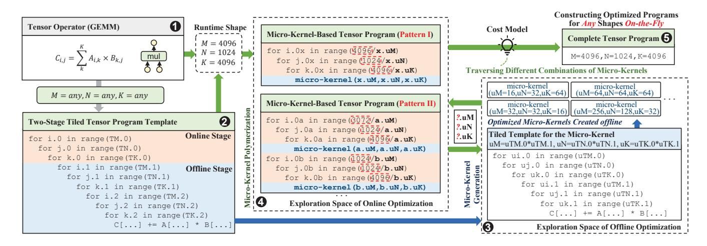
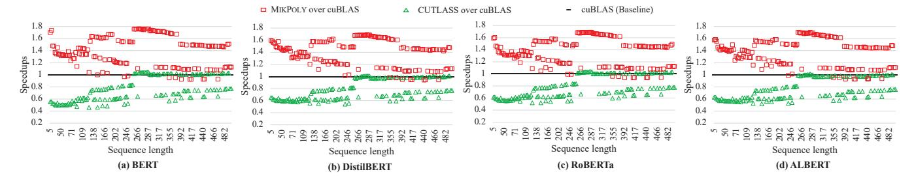
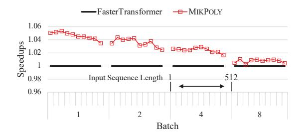
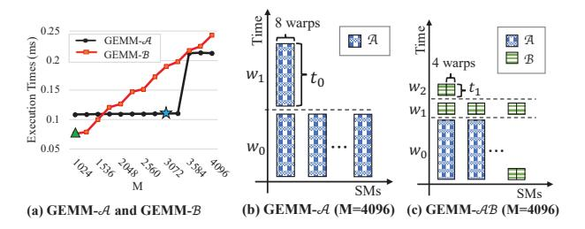

# **Optimizing Dynamic-Shape Neural Networks on Accelerators via On-the-Fly Micro-Kernel Polymerization**

Feng Yu yufeng@ict.ac.cn SKLP, ICT, CAS UCAS Beijing, China

Huimin Cui cuihm@ict.ac.cn SKLP, ICT, CAS UCAS Beijing, China

Guangli Li∗ liguangli@ict.ac.cn SKLP, ICT, CAS UCAS Beijing, China UNSW Sydney, Australia

> Xiaobing Feng fxb@ict.ac.cn SKLP, ICT, CAS UCAS Beijing, China

Jiacheng Zhao zhaojiacheng@ict.ac.cn SKLP, ICT, CAS UCAS Zhongguancun Laboratory Beijing, China

> Jingling Xue j.xue@unsw.edu.au UNSW Sydney, Australia

# **Abstract**

In recent times, dynamic-shape neural networks have gained widespread usage in intelligent applications to address complex tasks, introducing challenges in optimizing tensor programs due to their dynamic nature. As the operators' shapes are determined at runtime in dynamic scenarios, the compilation process becomes expensive, limiting the practicality of existing static-shape tensor compilers. To address the need for effective and efficient optimization of dynamic-shape neural networks, this paper introduces MikPoly, a novel dynamic-shape tensor compiler based on micro-kernel polymerization. MikPoly employs a two-stage optimization approach, dynamically combining multiple statically generated micro-kernels using a lightweight cost model based on the shape of a tensor operator known at runtime. We evaluate the effectiveness of MikPoly by employing popular dynamicshape operators and neural networks on two representative accelerators, namely GPU Tensor Cores and Ascend NPUs. Our experimental results demonstrate that MikPoly effectively optimizes dynamic-shape workloads, yielding an average performance improvement of 1.49× over state-of-the-art vendor libraries.

∗ Corresponding author.


[This work is licensed under a Creative Commons Attribution-](https://creativecommons.org/licenses/by-nc-nd/4.0/)NonCommercial-NoDerivs International 4.0 License. *ASPLOS '24, April 27-May 1, 2024, La Jolla, CA, USA* © 2024 Copyright held by the owner/author(s). ACM ISBN 979-8-4007-0385-0/24/04. https://doi.org/10.1145/3620665.3640390

*CCS Concepts:* • **Software and its engineering** <sup>→</sup> **Compilers**; • **Computing methodologies** → **Neural networks**.

*Keywords:* Tensor Compilers, Deep Learning

#### **ACM Reference Format:**

Feng Yu, Guangli Li, Jiacheng Zhao, Huimin Cui, Xiaobing Feng, and Jingling Xue. 2024. Optimizing Dynamic-Shape Neural Networks on Accelerators via On-the-Fly Micro-Kernel Polymerization . In *29th ACM International Conference on Architectural Support for Programming Languages and Operating Systems, Volume 2 (ASPLOS '24), April 27-May 1, 2024, La Jolla, CA, USA.* ACM, New York, NY, USA, 16 pages. https://doi.org/10.1145/3620665.3640390

# **1 Introduction**

Deep Neural Networks (DNNs) have demonstrated remarkable success across various domains, such as computer vision [20, 25, 46] and natural language processing [5, 10, 56]. In these DNNs, tensor operators (e.g., convolution and matrix multiplication) play a crucial role, and their efficiency is paramount for powering intelligent applications. In addition to traditional static-shape neural networks, which involve tensor computations with fixed-shape input and output, dynamic-shape neural networks are gaining popularity in emerging intelligent applications to address more complex tasks. For instance, BERT [10], a state-of-the-art language model, uses variable input sizes based on the sequence length, leading to tensor operators with varying shapes. Introducing dynamic characteristics in tensor computations brings new challenges for performance optimization in libraries and compilers. Efficiently handling these dynamic computations is vital to unlock the full potential of advanced neural network architectures.

To support high-performance tensor computations, three representative approaches have been proposed:

- Vendor-Provided Hand-Crafted Libraries. Most vendors have provided highly-tuned implementations for neural network operators, e.g., oneDNN [22] on x86 CPUs and cuBLAS [44] on Nvidia GPUs. While a library routine typically includes several hand-crafted operator implementations specially optimized for widely-used shapes, prior studies [58] revealed that a carefully-designed specific operator implementation is hardly suitable for all the shapes, resulting in sub-optimal performance inevitably. For example, we observed that the GEMM routine provided by cuBLAS has significant performance variations for different tensor shapes (262.2 TFLOPS when (M, N, K) = (4096, 4096, 4096) vs. 22.3 TFLOPS when (M, N, K) = (105, 1024, 12544)), even if both shapes are compute-bound), as shown in Figure 1.
- Tensor Compilers for Static-Shape Operators. Most tensor compilers like TensorFlow XLA [29], TVM [7], and TC [55] optimize tensor operators by searching through loop tiling structures within a substantial search space to determine the optimal implementation for a given shape. Nonetheless, these auto-schedulers necessitate prior knowledge of the operator's shape during compilation. This limitation renders it infeasible to optimize tensor operators across all potential shapes in dynamic scenarios due to the high search cost within an extensive search space.
- Tensor Compilers for Dynamic-Shape Operators. Recently, several studies have explored dynamic-shape compilers [49, 65, 70]. One example, DietCode [65], enhances traditional auto-schedulers by refining shape-generic search spaces for optimal operator implementations. However, these dynamic-shape auto-schedulers still rely on predefined shape descriptions and offline code optimization.

Existing methods have utilized auto-schedulers that handle a range of shapes to generate a limited subset of optimized programs offline. However, these auto-schedulers cannot guarantee efficient or even correct execution for shapes outside the pre-defined range, limiting their usability in dynamic scenarios with frequent shape variations. Our approach entails the creation of a set of finely-tuned fixed-size microkernels, each of which represents a tiled loop nest responsible for executing a portion of a tensor operator. These microkernels are generated offline and are dynamically combined on the fly to produce optimized code for any tensor shape encountered during model execution. The key challenge lies in determining an efficient composing strategy and generating optimized code at a very low cost during model execution.

To address this challenge, we present MikPoly, a dynamic-shape tensor compiler founded on Micro-Kernel Polymerization for emerging accelerators handling dynamic-shape neural networks. MikPoly employs a two-stage process, guided by a precise cost model, to obtain an optimized tensor program for a dynamic-shape operator. It employs a program template with innermost *offline loops* (forming a


**Figure 1.** Performance of GEMM with different shapes on the NVIDIA A100 GPU (using cuBLAS).

micro-kernel template) and surrounding *online loops*. In the offline stage, it creates highly-optimized fixed-size micro-kernels (from the micro-kernel template) and develops corresponding performance models. In the online stage, MikPoly examines polymerization patterns to restructure online loops into tensor programs using parameterized micro-kernels. It then evaluates polymerization strategies by instantiating these parameterized micro-kernels with the optimized fixed-size ones obtained offline. MikPoly employs a precise yet lightweight cost model, considering computation, memory, and parallelism, to predict performance across diverse implementations with various polymerization strategies and patterns. This informs the selection of the most efficient final tensor program for the given operator.

This paper makes the following contributions:

- We propose a two-stage approach to generate an optimized tensor program for a dynamic-shape tensor operator on a multi-level accelerator abstraction. This approach decouples the underlying optimization problem into an offline stage, where a set of highly-optimized micro-kernels for some fixed shapes is created, and an online stage, where multiple micro-kernels are polymerized to obtain an optimized program for any known shape at runtime.
- We introduce a precise yet lightweight cost model that facilitates efficient online polymerization. During the offline stage, we model the performance of individual microkernels by concurrently considering computation and memory access behavior. In the online stage, we consider the performance of various program implementations for an operator with different polymerization strategies under various patterns, taking parallelism into account.
- We have implemented MikPoly, a dynamic-shape tensor compiler, and evaluated it on two representative accelerators, GPU Tensor Cores and Ascend NPUs. In the case of GEMM and convolution operators, MikPoly demonstrates average speedups of 1.29× (with a peak of 11.05×) and 1.70× (with a peak of 15.32×) compared to state-of-the-art vendor libraries on GPUs and NPUs, respectively.


Figure 2. Optimizing tensor programs for GEMM by existing static- and dynamic-shape tensor compilers.



Figure 3. Generating an optimized tensor program for GEMM by MikPoly, a two-stage dynamic-shape tensor compiler.

## 2 Background and Motivation

We start by explaining the importance of optimizing dynamicshape operators. We then review current solutions and introduce our approach using GEMM as an illustrative case.

#### 2.1 Dynamic-Shape Neural Networks

Traditional DNNs typically use static model structures, where the shapes of input and output tensors for each operator are fixed, known as static-shape neural networks [49]. However, real-world applications often exhibit dynamic behavior, such as sentences of varying lengths in language modeling, making static-shape neural networks insufficient. To address this limitation, dynamic-shape neural networks have been proposed to support more sophisticated real-world intelligent applications, and we discuss some of their representative scenarios below.

- (1) Dynamic Batch Sizes. The batch size is a crucial parameter in model training, impacting the accuracy of the error gradient estimation, as it represents the number of samples used in one iteration. Larger batch sizes generally lead to faster convergence and improved stability but come with increased computational resource usage [17]. To address this trade-off, researchers have conducted studies [9, 32] exploring dynamic-shape neural networks with dynamic batch sizes. This approach aims to enhance the training process by adapting the batch size during training, offering better optimization and performance for real-world applications.
- (2) Dynamic Image Resolution. In computer vision tasks, images often have varying tensor shapes due to different resolutions. Existing methods [19, 61] resize images to a fixed shape for static-shape DNNs, but this sacrifices original image information, making it challenging to detect small

objects in complex scenarios [6]. To address this, state-ofthe-art models like Faster R-CNN [16] use advanced pooling methods with dynamic-shape input tensors. These models effectively handle varying image shapes, enabling accurate object detection, even for small objects in complex scenes.

**(3) Dynamic Sequence Length.** Popular natural language processing applications, like BERT [10], handle dynamically changing tensor shapes due to varying input sentence lengths [2, 56]. One solution to support variable sequence lengths is to pad all sequences to a predefined maximum length, covering most cases [60]. Optimized padding policies have been proposed in further research [1, 12]. However, the padding approach [65] can result in resource waste when sequences are much smaller than the maximum length.

## **2.2 The State of the Art**

Automatic schedulers, such as TVM [7], have been developed to achieve high-performance tensor programs across different hardware. They utilize a cost model updated with actual hardware measurements to explore shape-specific search spaces, yielding efficient implementations. We illustrate this optimization process using static- and dynamic-shape tensor compilers using GEMM, as depicted in (❶) of Figure 2.

Let us delve into the operation of existing static-shape tensor compilers (❷ to ❺ in Figure 2). Consider GEMM, depicted in (❶), which represents a key operator in deep neural networks. Initially, a naive tensor program with a fixed shape (,,) = (4096, 1024, 4096) is represented by a three-dimensional nested loop (❷). However, this basic version is suboptimal. Leading static-shape tensor compilers like TVM [7] offer a tiled program template for GEMM (❸), using undetermined tile parameters (e.g., TM.0, TN.0, and TK.0). Static-shape tensor compilers engage in an autoscheduling process based on this template, exploring optimal tile sizes within an extensive search space. This process involves tuning various tiled tensor programs (❹). Ultimately, a fine-tuned tensor program (❺) tailored to the specific shape (,,) = (4096, 1024, 4096) is derived, delivering superior performance among the explored tensor program options.

Nonetheless, these static-shape tensor compilers often demand significant time (e.g., 0.33 CPU hours [52]) to generate efficient implementations for operators with predetermined shapes (from ❶ to ❺). This duration is reasonable within static scenarios, as the compilation is conducted offline, and the fine-tuned programs can be recurrently executed during runtime. In dynamic-shape situations, the compilation process is executed online during model execution. Consequently, the time-intensive method employed by static-shape tensor compilers is unsuitable for this context.

Let us explore how existing dynamic-shape tensor compilers [40, 65] work (❻ – ❼ in Figure 2). Consider GEMM in ❶ with a dynamic shape (,,) = (, 1024, 4096). Here, is a dynamic dimension, and its range is specified as [1, 4096]

by a parameter provided by the developer. To generate optimized implementations, developers can use auto-schedulers with a set of representative shapes. While a comprehensive set can enhance performance across various tensor shapes, it also incurs higher compilation costs. To tackle this challenge, DietCode [65] enhances the auto-scheduling process by generating a series of tuned tensor programs (❼), each tailored for a set of shapes instead of just one. During runtime, a suitable pre-compiled tensor program is selected based on the known tensor shape, mitigating costly compilation expenses. Nevertheless, DietCode mandates foreknowledge of the tensor shape range (e.g., ∈ [1, 4096] for ), limiting its scope. A similar limitation applies to Nimble [49].

Existing static- and dynamic-shape compilers optimize tensor operators for specific input ranges, leading to potential performance degradation or runtime errors for outof-range shapes as well as suboptimal performance for inrange shapes (as revealed in Section 5.2.3). To efficiently execute dynamic-shape deep neural networks, an effective mechanism is required to deliver high-performance tensor programs with arbitrary shapes.

#### **2.3 Our Solution**

MikPoly innovates the compilation of dynamic-shape tensor operators through a two-stage program template, depicted in Figure 3. For instance, in GEMM (❶), with an initially unknown shape (,,) at compile-time, we design a program template (❷) that integrates offline loops (in blue) to create a micro-kernel template (❸), accompanied by encompassing online loops (in orange). This configuration empowers the creation of optimized micro-kernels with varying sizes offline. The notion of *micro-kernels* draws inspiration from existing offline optimization strategies [30, 65]. By flexibly reorganizing online loops using diverse polymerization patterns and strategies, we generate a spectrum of on-the-fly GEMM implementations with distinct microkernels. This flexibility enables the selection of the bestperforming GEMM implementation, tailored to the runtimeknown dynamic-shape, leveraging a precise yet lightweight cost model (❹ and ❺).

In the offline stage, MikPoly creates a set of highly optimized fixed-size micro-kernels, together with their performance models, from the micro-kernel template (❸) leveraging auto-schedulers, similar to static-shape compilers.

In the online stage, once GEMM's runtime shape is known (e.g., (,,) = (4096, 1024, 4096)), MikPoly dynamically adapts its program template (❷) into various GEMM implementations. This involves exploring diverse polymerization patterns, depicted as Patterns I and II (❹), and utilizing varied polymerization strategies to instantiate their parameterized micro-kernels from the set of fixed-size micro-kernels generated offline. Pattern I retains the GEMM program template while replacing micro-kernel(x.*uM*, x.*uN*, x.*uK*) with those


Figure 4. Overview of MikPoly.

from the offline stage. Pattern II explores program implementations with two micro-kernels, micro-kernel(a.uM, a.uN, a.uK) and micro-kernel(b.uM, b.uN, b.uK). Ultimately, the optimal tensor program for the known shape (M, N, K) = (4096, 1024, 4096) is selected and executed, determined by an accurate and lightweight cost model ( $\odot$ ). This approach efficiently generates tensor programs for dynamic-shape tensor operators by blending polymerization patterns and strategies with compile-time optimized fixed-size micro-kernels, significantly boosting the performance of dynamic-shape neural networks on emerging accelerators.

## 3 The MikPoly Design

Figure 4 provides an overview of MIKPOLY, comprising two core stages: micro-kernel generation (S1) and micro-kernel polymerization (S2). In MIKPOLY, a target device is modeled through a multi-level accelerator abstraction, where each processing unit is abstractly depicted as a PE (Processing Engine), and its memory hierarchy is represented by  $M_{local}$  and  $M_{alobal}$ .

The initial stage of MikPoly occurs offline, employing a template-driven tuning process to create and enhance microkernels (via its *Auto-Scheduling* component). Consequently, a set of micro-kernels is generated, with each tailored to a specific size. Simultaneously, we develop a *micro-kernel performance model* for each micro-kernel, enabling the second stage to dynamically choose a fitting polymerization strategy online with minimal computational overhead.

The micro-kernel polymerization stage for a tensor operator occurs online when its shape is known. MikPoly reorganizes the operator's program template into different implementations using its *Runtime Polymerization* component, and selects the most efficient one for execution based on a lightweight *polymerization cost model*. The Runtime Polymerization component derives program candidates by matching the operator's template with predefined patterns and then instantiates their parameterized micro-kernels using the fixed-size micro-kernels created offline. This involves

**Table 1.** Abstraction of  $H_{\text{gpu}}$  (A100) and  $H_{\text{npu}}$  (Ascend 910A).

|               | $P_{multi}$   | $M_{\rm local}$                                 | $M_{\rm global}$ |
|---------------|---------------|-------------------------------------------------|------------------|
| $H_{\rm gpu}$ | SMs           | (shared memory, local memory, register)         | (global memory)  |
| $H_{npu}$     | DaVinci Cores | (L1 buffer/unified buffer, L0 buffer, register) | (global memory)  |

exploring available polymerization strategies for the runtime shape heuristically.

#### 3.1 Multi-Level Accelerator Abstraction

MIKPOLY uses a basic multi-level accelerator abstraction for modern hardware platforms [8, 33, 34], denoted as  $H = (P_{\text{multi}}, M_{\text{local}}, M_{\text{global}})$ . This model incorporates multiple processing engines  $(P_{\text{multi}})$ , hierarchical memory including local memory  $(M_{\text{local}})$  within a single processing engine (PE), and global memory  $(M_{\text{global}})$  shared among multiple PEs. This abstraction is widely adopted in contemporary neural network compilers such as Roller [69], ANT [18], and WELDER [50], enhancing efficient accelerator utilization.

This straightforward accelerator abstraction effectively supports the creation of an accurate cost model for performance prediction. For a given tensor program, its parallelism on H relies on  $P_{\rm multi}$ , and its memory access characteristics (exclusive or shared) are governed by  $M_{\rm local}$  and  $M_{\rm global}$ . Whenever feasible,  $M_{\rm local}$  is utilized to store data, thus enhancing memory access efficiency, while  $M_{\rm global}$  allocates its bandwidth equally across PEs. In MikPoly, micro-kernels and their performance models are tailored to the local memory  $M_{\rm local}$ . This hardware abstraction allows MikPoly to seamlessly adapt to different accelerators, like Nvidia GPUs and Huawei NPUs. The representations of Nvidia A100 ( $H_{\rm gpu}$ ) and Ascend 910A ( $H_{\rm npu}$ ) are depicted in Table 1.

## 3.2 Two-Stage Optimization

We detail our approach to creating an optimized tensor program for a dynamic-shape tensor operator, exemplifying it through our motivating GEMM example in Figure 3.

**3.2.1 Decoupled Optimization Space.** For a tensor operator, e.g., GEMM, loop tiling is frequently employed to enhance data reuse within a given memory hierarchy. We denote its tiled *program template* as Q, which encompasses a collection of n-dimensional tiled loops with adjustable tile size parameters. For example, GEMM's program template was examined earlier in ② within Figure 3.

Diverging from conventional tiled program templates utilized in auto-schedulers [7, 66], Q embodies a two-stage structure, comprising  $Q_{\text{offline}}$  and  $Q_{\text{online}}$ . Here,  $Q_{\text{offline}}$  is a set of innermost (offline) loops tailored to exploit  $M_{\text{local}}$ , while  $Q_{\text{online}}$  are the remaining (online) loops optimized for  $M_{\text{global}}$ . These two sets of loop nests are illustrated by the blue and orange regions in ② of Figure 3, respectively.

The core idea of MikPoly is to generate micro-kernels of various sizes from  $Q_{\text{offline}}$  and optimize their performance

offline. This empowers MikPoly to dynamically identify the best polymerization strategy for  $Q_{\rm online}$  based on the operator's known shape at runtime. This approach involves reorganizing  $Q_{\rm online}$  to create diverse micro-kernel combinations, guided by an accurate and lightweight cost model.

**Offline Optimization Space.** We utilize a *micro-kernel tem-plate*, denoted as  $\hat{K}$ , which is derived from the offline loops in  $Q_{\text{offline}}$  and optimized for  $M_{\text{local}}$ . In the case of the GEMM operator shown in Figure 3, its two-stage template (②) results in a micro-kernel template  $\hat{K}$  (depicted at the bottom of ③). Through the use of  $\hat{K}$ , we can generate a set of optimized fixed-size micro-kernels (displayed at the top of ③), along with their performance models, by using existing static-shape auto-schedulers. These micro-kernels and their performance models are then used in the online polymerization process for  $Q_{\text{online}}$ .

Online Optimization Space. We reorganize  $Q_{\text{online}}$  using predefined polymerization patterns to restructure Q into different program implementations for the underlying operator. In the case of GEMM, two polymerization patterns are shown in  $\bullet$  of Figure 3. From each obtained program implementation, we instantiate its parameterized micro-kernels by systematically exploring all potential polymerization strategies (essentially trying all fixed-size micro-kernels derived offline), and finally, we select the best-performing version, completing the process of micro-kernel polymerization for this implementation.

**3.2.2 Optimization Objective.** Given a two-stage program template Q for a tensor operator and a shape known at runtime,  $S_S$  represents the set of all tensor programs explored by MikPoly. The task of identifying the optimal performing program  $S^*$  for Q on a hardware platform H can be defined as an optimization problem:

$$S^* = \underset{S \in S_S}{\operatorname{arg \, min}} \operatorname{Cost}(S, H) \tag{1}$$

Due to significant runtime overhead, evaluating all tensor programs in  $S_S$  on real hardware at runtime is impractical. Instead, we rely on a polymerization cost model that considers factors like parallelism, memory access, and resource utilization to estimate their performance.

#### 3.3 Micro-Kernel Generation

This happens during the offline stage of MikPoly.

**Auto-Tuning Fixed-Size Micro-Kernels.** MIKPOLY generates a collection of fixed-size micro-kernels, denoted  $S_{\tilde{K}}$ , for each given micro-kernel template  $\hat{K}$ . Each micro-kernel  $\tilde{K} \in S_{\tilde{K}}$  is an instantiation of  $\hat{K}$  with a specific size, optimized to efficiently use  $M_{\text{local}}$  on given H. Some fixed-size micro-kernels for GEMM are illustrated in  $\mathfrak{G}$  of Figure 3.

MIKPOLY uses established static-shape auto-schedulers [7, 66] to generate optimized micro-kernels in  $\mathcal{S}_{\tilde{K}}$  for a specific platform. Using three hyper-parameters, namely  $n_{\text{gen}}$ ,  $n_{\text{syn}}$ ,

and  $n_{\text{mik}}$ , we create  $\mathcal{S}_{\tilde{K}}$  in two steps. Initially, we include all micro-kernels, each with the nested loops from  $\hat{K}$  and tile sizes from  $\{16 \times i \mid i \in [1, n_{\text{gen}}]\}$  per dimension. Second, we retain only some high-performing micro-kernels, reducing the optimization space for the micro-kernel polymerization stage. We utilize a tensor program derived directly from the underlying operator, following Pattern I in Figure 3. We generate a set of synthetic test cases using dimension sizes from  $\{2^i \mid i \in [0, n_{\text{syn}}]\}$ . The micro-kernels in  $\mathcal{S}_{\tilde{K}}$  are ranked based on their average performance for these synthetic workloads, and only the Top- $n_{\text{mik}}$  best-performing ones are retained.

In our evaluation (Section 5), we set  $n_{\rm gen}=32$ ,  $n_{\rm syn}=12$ , and  $n_{\rm mik}=40$  for the considered GPU and NPU platforms. These empirical values cover diverse real-world dynamic-shape workloads while minimizing both the offline auto-tuning and the online polymerization overheads.

Micro-Kernel Performance Model. Each micro-kernel  $K \in \mathcal{S}_{\tilde{K}}$  has a performance model created by MIKPOLY to predict its execution cost in a reduction loop on a specific platform H. This is demonstrated using a GEMM program utilizing a micro-kernel K with size (uM, uN, uK), where Kis the reduction loop. The GEMM's shape is represented as  $(M, N, K) = (t_1 \times uM, t_2 \times uN, t_3 \times uK)$ . Typically, the reduction loop (K) is executed on a single PE, while the remaining loops (M and N) are parallelized across multiple PEs. To execute  $t_3$  instances of K in the reduction loop on a single PE while overlapping computation and memory operations, MikPoly employs pipelining techniques [42, 69]. This pipelined task can be divided into three stages: (1) loading data from  $M_{global}$  to  $M_{local}$ ; (2) processing data on  $M_{local}$ using  $\tilde{K}$  on the PE; and (3) writing the results back from  $M_{\text{local}}$  to  $M_{\text{global}}$ . During execution, intermediate results of a pipelined task are stored in  $M_{local}$ , reducing memory access traffic. When a GEMM operator with shape (M, N, K) = $(t_1 \times uM, t_2 \times uN, t_3 \times uK)$  is fully executed,  $t_1 \times t_2$  pipelined tasks (each with  $t_3$  instances of K) are executed in parallel on  $P_{\text{multi}}$ . The cost of executing the entire operator is estimated as the cost of executing  $(t_1 \times t_2)/|P_{\text{multi}}|$  pipelined tasks, each composed of  $t_3$  instances of K, where  $|P_{\text{multi}}|$  indicates the number of PEs in  $P_{\text{multi}}$  on H.

With  $t_1$ ,  $t_2$ , and  $t_3$  determined at runtime based on the specific GEMM shape, the offline stage requires creating a performance model solely for a pipelined task. Let  $g_{\text{predict}}(t, \tilde{K}, H)$  be a piecewise linear function estimating the cost of executing a pipelined task with t instances of  $\tilde{K}$  on platform H. This function is derived by performing experiments, running  $\tilde{K}$  with t from 1 to  $n_{\text{pred}}$  (set at 5120 empirically) on a single PE on H to learn its coefficients. These micro-kernel performance models empower MikPoly to efficiently estimate the performance of executing pipelined tasks on a single PE on H during its online micro-kernel polymerization stage.

| •  |     | 2 |
|----|-----|---|
|    |     | 3 |
| 4  | (5) | 6 |
| 4) | (3) | 7 |

| Pattern | Description | Pattern | Description   |
|---------|-------------|---------|---------------|
| I       | 1234567     | VI      | 123   45   67 |
| II      | 123   4567  | VII     | 1 4 5 2367    |
| Ш       | 145 2367    | VIII    | 1 4 5 236 7   |
| IV      | 145 236 7   | IX      | 1 2 3 45 67   |
| V       | 1 2 3 4567  | -       | -             |

(a) Pattern skeleton

(b) Polymerization patterns

Figure 5. Polymerization patterns used in MikPoly.

#### 3.4 Micro-Kernel Polymerization

**Polymerization Patterns.** For a given program template Q (e.g., GEMM as illustrated in **②** of Figure 3), MikPoly divides the set of online loops in  $Q_{\text{online}}$  into multiple loop nests, guided by predefined polymerization patterns. This division leads to distinct program implementations. Each newly formed loop nest encompasses the same micro-kernel template from O, but handles only a specific region of the original computation within  $Q_{\text{online}}$ . For each program thus obtained, we write  $R_i$  to denote its *i*-th loop nest (region). In the context of GEMM, two such patterns are visualized in Figure 3. To efficiently address common scenarios, we employ a pattern skeleton for the systematic generation of polymerization patterns, shown in Figure 5 (a). This skeleton divides an operator's output into seven blocks, marked as ①-⑦. Derived from this skeleton, each pattern includes multiple regions, with each region encompassing one or more blocks. To minimize online search effort, we categorize similar patterns and retain only the most representative. From evaluations with synthetic workloads, we have finally selected nine unique representative patterns for MikPoly, as depicted in Figure 5 (b). For instance, Pattern-II, featured in Figure 3, splits  $Q_{\text{online}}$  into two sections:  $R_1$  (①-③) and  $R_2$ (4-7), leading to two loop nests for micro-kernel(a.uM, a.uN, a.uK) and micro-kernel(b.uM, b.uN, b.uK).

**Polymerization Strategy.** For each program resulting from a polymerization pattern, MikPoly applies a polymerization strategy to instantiate its parameterized micro-kernels from the set of fixed-size micro-kernels generated offline. If a loop nest  $R_i$  contains a (parameterized) micro-kernel, its instantiation involves replacing it with a micro-kernel  $\tilde{K}_i$  from  $S_{\tilde{K}_i}$ . Moreover, MikPoly utilizes a local padding technique, akin to CUTLASS, to minimize boundary checks and sustain performance. This ensures the availability of micro-kernel combinations with padding for any given shape.

**Polymerization Cost Model.** When assessing the performance of a tensor program *S* on a multi-level accelerator *H*, we employ the following cost model. This model leverages the performance models established for its micro-kernels, while also factoring in parallelism from their concurrent execution:

$$Cost(S, H) = \sum_{(R_i, \tilde{K}_i) \in S} f_{wave}(R_i, \tilde{K}_i, H) \times f_{pipe}(R_i, \tilde{K}_i, H)$$
 (2)

where  $f_{\text{pipe}}$  gives the cost for the pipelined execution of a micro-kernel (a pipelined task), and  $f_{\text{wave}}$  gives the cost for the parallel execution of multiple pipelined tasks. The overall execution cost of a tensor program S is determined by summing up the individual costs associated with executing its regions  $R_i$ , each of which encompasses the micro-kernel  $\tilde{K}_i$ .

The function  $f_{\text{wave}}$  represents the number of waves needed to execute all pipelined tasks in parallel:

$$f_{\text{wave}}(R_i, \tilde{K}_i, H) = \left[ \frac{f_{\text{parallel}}(R_i, \tilde{K}_i)}{|P_{\text{multi}}|} \right]$$
 (3)

where  $f_{\text{parallel}}(R_i, \tilde{K}_i)$  denotes the number of pipelined tasks (as instances of  $\tilde{K}_i$ ) involving non-reduction loops of  $R_i$ .

The function  $f_{pipe}$  is used to estimate the cost of executing a pipelined task:

$$f_{\text{pipe}}(R_i, \tilde{K}_i, H) = g_{\text{predict}}(f_{\text{num}}(R_i, \tilde{K}_i), \tilde{K}_i, H)$$
 (4)

where  $g_{\text{predict}}$  is the performance model (obtained in the offline stage), and  $f_{\text{num}}(R_i, \tilde{K}_i)$  denotes the number of instances of  $\tilde{K}_i$  appearing in a pipelined task within the reduction loop of  $R_i$ .

#### 3.5 Putting it All Together

Algorithm 1 outlines MikPoly's workflow. In the Offline Generation phase, optimized micro-kernels  $\mathcal{S}_{\tilde{K}}$  are generated from a micro-kernel template  $\hat{K}$  using a TVM autoscheduler [7] (line 4). During On-the-Fly Polymerization, for a dynamic shape known at runtime, MikPoly attempts predefined patterns (Figure 5) based on a two-stage template Q. Utilizing heuristics, MikPoly explores polymerization strategies and estimates costs using Equation 2 (lines 9 -12). If the cost of  $(R_i, \tilde{K}_i)$  exceeds the current best strategy's cost, related strategies are skipped, considerably narrowing the search space with minimal runtime overhead (Section 5.3.1). Finally, MikPoly constructs an optimized tensor program  $S^*$  based on the best polymerization strategy (line 13).

#### 4 Implementation

Despite differing architectures between GPUs and NPUs, MIKPOLY's accelerator abstraction uniformly represents both, as demonstrated in Table 1. For micro-kernel generation, we set hyperparameters empirically to choose the micro-kernels to be generated, as detailed in Section 5.4. MIKPOLY employs a static-shape auto-scheduler, i.e., TVM with CUTLASS-based templates for GPUs and manual templates for NPUs to produce fixed-size parameterized micro-kernels. These micro-kernels, compiled into binary files, maintain a constant shape size, treating tensor starting addresses and loop iteration counts as parameters for online determination. During micro-kernel polymerization, MIKPOLY determines a suitable polymerization strategy for the specific runtime input shape and instantiates the selected micro-kernels based on available

#### Algorithm 1 MikPoly's Two-Stage Optimization

```
Input: Q (Two-Stage Program Template) and H (Target Device)
Output: S^* (An Optimized Tensor Program)
  1: function Offline Generation(Q, H)
         Generate \hat{K} from Q_{\text{offline}}
 2:
         S_{\tilde{K}} \leftarrow \text{AutoTune}(\hat{K}, H)
 3:
         \mathcal{S}_{\tilde{K}}^{\kappa} \leftarrow \text{RankAndPrune}(\mathcal{S}_{\tilde{K}})
  4:
         return \mathcal{S}_{\tilde{K}}
 5:
  6: end function
  7: function On-the-Fly Polymerization(Q, S_{\tilde{K}}, H)
         Obtain D as the operator's dynamic-shape
 8:
         for all polymerization patterns do
 9:
              Generate polymerization strategies with D, Q, and S_{\tilde{K}}
10:
              Estimate their costs on H
11:
12:
         end for
         Construct S^* using the best polymerization strategy
13:
         return S*
14:
15: end function
```

runtime data. This process entails adjusting tensor address offsets, incurring minimal overhead mainly via scalar assignments

We have adopted nine patterns (I – IX) for the NPU platform, where manual specification is needed for parallelizing programs across multiple PEs, like DaVinci Cores. To assign micro-kernels to these cores, a max-min static allocation algorithm is employed, enhancing parallel execution and overall performance. In contrast, on GPUs, due to the greater emphasis on minimal runtime overhead, we have limited pattern use to only Patterns I and II. These patterns are selected based on their optimal balance of runtime overhead and operator performance. Additionally, GPUs utilize dynamic allocation through hardware schedulers, which automatically assign thread blocks to SMs.

MIKPOLY efficiently generates fixed-size micro-kernels for tensor operators on GPU and NPU platforms within hours (e.g., approximately 6 hours for GEMM on GPUs) in its offline stage. These micro-kernels, tailored to specific platforms, do not require re-generation for the same operator on the same platform. In the online stage, MIKPOLY dynamically selects an appropriate polymerization strategy and conveys runtime information like offsets to the chosen micro-kernels for dispatch. The main runtime overhead stems from exploring polymerization strategies and estimating their costs, keeping MIKPOLY's runtime overhead minimal.

#### 5 Evaluation

Our objective is to demonstrate that MikPoly effectively optimizes dynamic-shape tensor operators and neural networks on accelerators, outperforming the state of the art. We address the following research questions:

RQ1: Can MikPoly enhance dynamic-shape tensor operators and neural networks on accelerators practically?

**RQ2**: Does MikPoly's cost model effectively support microkernel polymerization in a lightweight manner?

**Table 2.** Specifications for the experimental platforms.

| Platform                 | GPU Server           | NPU Server    |
|--------------------------|----------------------|---------------|
| Operating System         | Ubuntu 18.04         | EulerOS 2.8   |
| ĊPŪ                      | Intel Xeon Gold 6348 | Kunpeng 920   |
| Host Memory              | 256 GB               | 128 GB        |
| Accelerator              | Nvidia A100          | Ascend 910    |
| Processing Engine        | SM                   | Da Vinci Core |
| Tensor Processing Module | Ampere Tensor Core   | Cube Unit     |
| Device Memory            | 80 GB                | 32 GB         |

**Table 3.** Benchmarked GEMM with dynamic shapes.

| Category             | M*            | N*            | <i>K</i> *    | #Test Cases |
|----------------------|---------------|---------------|---------------|-------------|
| DeepBench            | [2, 10752]    | [1, 48000]    | [128, 500000] | 166         |
|                      | [1, 256]      | [1, 256]      | [1, 256]      | 299         |
| Real-World           | [1, 256]      | [1, 256]      | [257, 65536]  | 218         |
| Applications         | [1, 256]      | [257, 1024]   | [1, 65536]    | 232         |
| (Transformer-based   | [1, 256]      | [1025, 65536] | [1, 65536]    | 97          |
| models (e.g., BERT), | [257, 1024]   | [1, 256]      | [1, 65536]    | 64          |
| fully connected      | [257, 1024]   | [257, 65536]  | [1, 65536]    | 87          |
| layers of CNNs       | [1025, 8192]  | [1, 256]      | [1, 65536]    | 65          |
| (e.g., AlexNet))     | [1025, 8192]  | [257, 8192]   | [1, 65536]    | 136         |
|                      | [8193, 65536] | [1, 8192]     | [1, 8192]     | 69          |

**Table 4.** Benchmarked convolution with dynamic shapes.

| Category        | Filter Size | Fmap Size* | Batch Size* | #Test Cases |
|-----------------|-------------|------------|-------------|-------------|
|                 | 11x11       | [64, 640]  |             | 80          |
| AlexNet [25]    | 5x5         | [7, 79]    |             | 80          |
|                 | 3x3         | [3, 39]    |             | 240         |
|                 | 7x7         | [64, 640]  |             | 80          |
|                 | 1x1/3x3     | [16, 160]  |             | 160         |
| GoogLeNet [53]  | 1x1/3x3     | [8, 80]    |             | 880         |
| Googleiver [55] | 1x1/3x3     | [4, 40]    |             | 1760        |
|                 | 3x3         | [2, 40]    |             | 240         |
|                 | 1x1/3x3     | [2, 20]    |             | 720         |
|                 | 1x1/3x3     | [16, 160]  | [1, 128]    | 240         |
|                 | 3x3         | [8, 80]    |             | 240         |
| ResNet [20]     | 1x1/3x3     | [4, 40]    |             | 240         |
|                 | 3x3         | [2, 20]    |             | 80          |
|                 | 3x3         | [64, 640]  | 1           | 77          |
|                 | 3x3         | [32, 320]  |             | 80          |
| VGG [51]        | 3x3         | [16, 160]  |             | 128         |
|                 | 3x3         | [8, 80]    |             | 80          |
|                 | 3x3         | [4, 80]    |             | 80          |

#### 5.1 Experimental Setting

Hardware and Software Platforms. MIKPOLY'S evaluation covers two hardware platforms running Linux-based operating systems: an Nvidia A100 GPU and an Ascend 910 NPU (Table 2). For the GPU platform, we utilize CUTLASS (v2.9), CUDA toolkit (v11.5) with cuBLAS and cuDNN libraries. On the NPU platform, we employ CANN SDK (v5.1.RC1). For the GPU platform, we assess end-to-end performance using PyTorch (v1.11) for CNN models and TurboTransformers (master branch) for language models. On the NPU platform, MindSpore (v1.7) is used for end-to-end model performance on the NPU platform. For fairness, we switch to GEMM for convolution when using libraries, as convolution has multiple implementations such as GEMM, Winograd, and FFT. To ensure accuracy, we warm up experiments and average execution times over 20 runs, reducing interference.

**Benchmarks.** Tables 3 and 4 display the benchmarks used for GEMM and convolution, along with their respective test


**Figure 6.** Speedups on GPUs (normalized to cuBLAS/cuDNN).

cases. Each test case is characterized by a unique shape size. In each operator, a shape dimension marked with/without "\*\*" indicates whether it is dynamic/static. For a dynamic dimension, [min, max] represents its value range.

For GEMM with a dynamic shape (M, N, K), we consider a total of 166 cases from DeepBench [41] and a total of 1267 cases from real-world applications. These include GEMM operators in Transformer-based models such as BERT [10], DistilBERT [48], RoBERTa [35], and ALBERT [26], and fully connected layers in CNNs like AlexNet [25], GoogLeNet [53], ResNet [20], and VGG [51], each with varying input sizes. In transformer-based models, M, N, and K depend on sequence length, hidden dimension size, and number of attention heads. For CNNs' fully connected layers, M, N, and K are determined by batch size, number of output neurons, and number of input neurons. For a dynamic-shape convolution operator, we examine 5485 test cases across representative CNN models. The test case count can rise significantly for commonly-used filter sizes due to expanded input/output channel combinations (e.g., GoogLeNet).

In our end-to-end experiments, we substituted the standard GEMM and convolution operators in the DNN framework from cuBLAS/cuDNN/CANN with those tailored by MIKPOLY, to assess model inference performance. This evaluation involved four language models from HuggingFace [23] (bert-base-uncased, distilbert-base-uncased, roberta-base, albert-xxlarge-v2) and four CNN models from TorchVision [39] (alexnet, googlnet, resnet18, vgg11), focusing on end-to-end dynamic-shape neural network analysis. This encompasses various sequence lengths, batch sizes, and image resolutions. To replicate real-world scenarios, we generate 150 sentences with lengths spanning from 5 to 500 for language models. For CNN models, we utilize 8 batch sizes and 10 resolution sizes. Batch sizes are configured as  $2^n$ , where n varies from 0 to 7, and resolution sizes are set at  $64 \times i$ , where i varies from 1 to 10.

#### 5.2 Performance Results

In this section, we introduce and analyze our results.

# 5.2.1 Optimizing Dynamic-Shape Operators.

MIKPOLY vs. GPU Libraries. Figure 6 shows the speedups of MIKPOLY, CUTLASS, and cuBLAS/cuDNN (normalized to


**Figure 7.** Speedups on NPUs (normalized to CANN).

the baseline cuBLAS/cuDNN) for both GEMM and convolution operators. The x-axis specifies the number of floating-point operations (FLOPs) in the workloads (encompassing all test cases for GEMM from Table 3 and convolution from Table 4), while the y-axis represents the speedups of each approach over the baseline. MIKPOLY effectively optimizes dynamic-shape operators, with an average GEMM speedup of 1.47× (with a maximum of 4.82×) over cuBLAS and an average convolution speedup of 1.98× (with a maximum of 5.38×) over cuDNN. Compared to CUTLASS, MIKPOLY achieves average GEMM and convolution speedups of 3.02× and 1.72×, respectively. Notably, MIKPOLY performs exceptionally well for small shapes, where the "imbalance" phenomenon becomes more pronounced (as discussed in Section 6).

MIKPOLY vs. an NPU Library. Figure 7 depicts the speedups of MIKPOLY over the vendor library CANN (used as the baseline) for the same two operators on NPUs. MIKPOLY demonstrates its effectiveness in optimizing dynamic shape operators on NPUs, outperforming CANN with an average speedup of 1.10× for GEMM and 1.41× for convolution. Due to its ability to alleviate the memory bottleneck, MIKPOLY achieves significant speedups for certain test cases.

#### 5.2.2 Optimizing Dynamic-Shape Model Inference.

Figures 8 and 9 show the end-to-end inference performance of typical language models and CNN models on GPUs, where MikPoly, CUTLASS, and cuBLAS/cuDNN represent the speedups of the three implementation methods (normalized to the cuBLAS/cuDNN baseline). It is important to note that the end-to-end model inference latency for MikPoly encompasses both the operator execution time on the accelerator and the runtime overhead attributed to MikPoly's cost model.

In each model, the x-axis denotes input tensor shapes, and the y-axis shows speedups relative to the baseline. MikPoly achieves average speedups of 1.39×, 1.38×, 1.36×, and 1.37× for BERT, DistilBERT, RoBERTa, and ALBERT, respectively. For AlexNet, GoogLeNet, ResNet, and VGG, MikPoly's average speedups are 1.34×, 1.69×, 1.59×, and 1.22×, respectively. Remarkably, MikPoly consistently outperforms CUTLASS across a wide range of input shapes, even surpassing hand-tuned kernels from this proprietary vendor library in scenarios involving small shapes.

We also evaluated MikPoly on NPUs. Compared to CANN, MikPoly achieves average speedups of 1.30×, 1.19×, 1.32×,



Figure 8. Comparison of end-to-end performance with dynamic sequence lengths (normalized to cuBLAS).


Figure 9. Comparison of end-to-end performance with dynamic batch sizes and image resolutions (normalized to cuDNN).

and 1.38× for AlexNet, GoogLeNet, ResNet, and VGG, respectively. Overall, MikPoly effectively accelerates the endto-end execution of dynamic-shape DNNs.

#### 5.2.3 Comparing MikPoly with the State of the Art.

We compared MIKPOLY with existing dynamic-shape tensor compilers, DietCode [65] and Nimble [49], on GPUs. To ensure a fair evaluation, we excluded Tensor Cores in MIKPOLY for this experiment as DietCode and Nimble support only GPU CUDA Cores. As explained in Section 2, both DietCode and Nimble face limitations in handling arbitrarily-shaped tensors, as they require a supplied range for each dynamic dimension in a shape. This restriction hampers their applicability in scenarios where shapes are not predefined or dynamically vary.

In Figure 10, we present the results obtained from all 1433 test cases indicated in Table 3 for MikPoly, DietCode, Nimble, and CUTLASS. Both Nimble and DietCode were given input ranges for M, N, and K as specified in Table 3. The x-axis represents the FLOPs of these workloads, and the y-axis shows the speedups (normalized to DietCode). On average, MikPoly outperforms DietCode, Nimble, and CUTLASS by  $2.94\times$ ,  $7.54\times$ , and  $3.59\times$ , respectively.

In Table 5, we further examine their end-to-end inference performance for the four language models considered, using input sequence lengths ranging from 5 to 500. We utilize a set of 150 randomly generated lengths within this range for comparison across all four methods. On average, MIKPOLY outperforms DietCode (the best performer among the three compared existing methods) by 1.55×.

DietCode can yield errors or incorrect outcomes when the runtime shape of a tensor operator falls outside its predefined


**Figure 10.** Speedups for GEMM on GPUs (normalized to DietCode).

**Table 5.** End-to-end inference performance on GPUs (normalized to DietCode).

| Method         | BERT  | DistilBERT    | RoBERTa       | ALBERT        | Average |
|----------------|-------|---------------|---------------|---------------|---------|
| DietCode [65]  | 1.00× | 1.00×         | 1.00×         | 1.00×         | 1.00×   |
| Nimble [49]    | 0.25× | 0.26×         | 0.25×         | 0.26×         | 0.25×   |
| CUTLASS        | 0.70× | 0.71×         | $0.71 \times$ | $0.71 \times$ | 0.71×   |
| MikPoly (Ours) | 1.60× | $1.60 \times$ | $1.50 \times$ | $1.51 \times$ | 1.55×   |

shape, leading to *invalid runs* due to issues such as out-of-bounds errors or resource unavailability. Table 6 presents the counts of valid runs for both MikPoly and DietCode during the execution of GEMM, using a total of 8192 dynamic shapes,  $(M, N, K) = (\tau, 3072, 768)$ , where  $\tau$  ranges from 1 to 8192. For DietCode, one of the five input ranges for M was provided, while for MikPoly, M is considered fully dynamic at runtime. Notably, DietCode produces numerous invalid runs, unlike MikPoly, which exhibits zero occurrences of invalid runs. Additionally, as outlined in Table 7, DietCode underperforms compared to MikPoly, even with the utilization of input range information for M across 128 evaluated test cases. The superiority of MikPoly over DietCode in terms of speedup becomes more pronounced as the input range widens. These

**Table 6.** Comparing MIKPOLY with DietCode using GEMM when the runtime size of *M* falls outside its predefined range.

| 8192 Test Cases: $M \in [1, 8192], N = 3072, K = 768$ |                 |          |          |           |           |          |
|-------------------------------------------------------|-----------------|----------|----------|-----------|-----------|----------|
| DietCode                                              | M's Input Range | [1, 128] | [1, 512] | [1, 1024] | [1, 2048] | [1,8192] |
| DietCode                                              | #Valid Runs     | 254      | 572      | 1136      | 2144      | 8192     |
| МікРога                                               | M's Input Range |          |          | N/A       |           |          |
| WIIKI OLI                                             | #Valid Runs     |          |          | 8192      |           |          |

**Table 7.** Speedups of MIKPOLY over DietCode using GEMM when the runtime size of *M* falls with its predefined range.

| 128 Test Cases: $M \in [1, 128], N = 3072, K = 768$ |          |         |           |           |           |
|-----------------------------------------------------|----------|---------|-----------|-----------|-----------|
| DietCode's Input Range for $M$                      | [1, 128] | [1,512] | [1, 1024] | [1, 2048] | [1, 8192] |
| Speedups                                            | 1.68×    | 1.81×   | 1.92×     | 2.25×     | 2.37×     |

**Table 8.** Speedups of GEMM operators in Llama2-13b (normalized to cuBLAS).

| Layer Name | М    | N*        | K    | Speedups |
|------------|------|-----------|------|----------|
| qkv_proj   | 3840 | [1, 4096] | 5120 | 1.09×    |
| o_proj     | 5120 | [1, 4096] | 1280 | 1.24×    |
| ffn up     | 3456 | [1, 4096] | 5120 | 1.21×    |
| ffn down   | 5120 | [1, 4096] | 3456 | 1.08×    |

outcomes further underscore the practical effectiveness of MikPoly's on-the-fly micro-kernel polymerization.

**5.2.4 Applying MikPoly to LLMs.** To assess MikPoly's efficacy in LLM scenarios, we employed Llama2-13b [54] from HuggingFace for evaluating both operator and end-to-end inference performance. The experiments were conducted on a server with four Nvidia A100 GPUs connected via NVLink, under the same software platform setup as described in Section 5.1. Input sequence lengths were set to  $2^i$  (with i ranging from 0 to 9), and batch sizes to  $2^j$  (with j ranging from 0 to 3). We also configured tensor parallelism size to 4 to fully utilize the four GPUs and set the output sequence length to 512, aligning with common practices in LLM systems [21, 31, 57].

We tested four representative GEMM operators in the Llama2-13b model: qkv\_proj, o\_proj, ffn up, and ffn down, across 52 unique test cases with varying shapes. The performance results of these GEMM operators, where N is the dynamic dimension, are detailed in Table 8. In comparison to cuBLAS, MikPoly achieved average speedups of  $1.09\times$ ,  $1.24\times$ ,  $1.21\times$ , and  $1.08\times$  for these operators, respectively.

In evaluating end-to-end model inference, we used Nvidia's FasterTransformer as a baseline, integrating MikPoly's GEMM operators into it. The results, shown in Figure 11, indicate MikPoly's performance with varying input sequence lengths (x-axis) and speedups relative to the baseline (y-axis). MikPoly achieved average speedups of 1.05×, 1.04×, 1.02×, and 1.01× for batch sizes 1, 2, 4, and 8, respectively, demonstrating its effectiveness in optimizing LLMs.



**Figure 11.** End-to-end inference performance of Llama2-13b on GPUs (normalized to FasterTransformer).


**Figure 12.** GEMM performance analysis of MikPoly on GPUs.

#### 5.3 Performance Analysis

We now provide a comprehensive performance analysis of MikPoly using GEMM on GPUs, illustrated in Figure 12.

**5.3.1** Online Polymerization Overhead. In Figure 12(a), we show MikPoly's execution breakdown for GEMM on GPUs, including micro-kernel polymerization costs and execution times of final tensor programs across different shapes. A comparison is made against cuBLAS (baseline) and CUT-LASS. The x-axis denotes various shapes used, while the y-axis presents execution times normalized to cuBLAS. Notably, MikPoly's polymerization cost forms a small fraction of total execution time for each shape, decreasing as shape size increases due to its efficient cost model.

**5.3.2 Cost Model Effectiveness.** In Figure 12(b), we compare three MikPoly variants for GEMM on GPUs using all test cases from Table 3. Additionally, for reference, CUTLASS is included for comparison purposes. MikPoly-Oracle employs an exhaustive search, reporting runtime of optimized tensor programs for shapes, disregarding search cost. MikPoly-Wave considers the number of waves required for executing pipelined tasks (via  $f_{\text{wave}}$  in Section 3), resulting in large-sized micro-kernels. MikPoly-Pipe uses the execution costs of pipelined tasks executed on a single SM (via  $f_{\text{pipe}}$  in Section 3), favoring small-sized micro-kernels. The x-axis indicates the FLOPs in the workloads considered, while the y-axis shows speedups of different methods normalized to MikPoly-Oracle (baseline).


Figure 13. Hyperparameters analysis in MikPoly.


**Figure 14.** Two tensor programs generated by MikPoly for GEMM on GPUs and NPUs using two different polymerization schemes.

On average, the speedups achieved by MikPoly, MikPoly-Wave, and MikPoly-Pipe over MikPoly-Oracle are 0.96×, 0.81×, and 0.72×, respectively. For reference, CUTLASS exhibits an average speedup of 0.45×.

MIKPOLY-WAVE produces large-sized micro-kernels that focus on minimizing the number of waves, while MIKPOLY-PIPE generates small-sized micro-kernels that focus on maximising the performance of a pipelined task. MIKPOLY takes both factors into consideration, outperforming CUTLASS (which lacks the guidance of a cost model).

MIKPOLY-ORACLE, utilizing an oracle cost model, achieves the best performance. However, its search process is excessively time-consuming, making it impractical for real-world applications. Specifically, for a given shape, MIKPOLY-ORACLE takes about 1.6 seconds to find the best polymerization solution, whereas MIKPOLY accomplishes the same task in just about 2 microseconds on average. Remarkably, despite this significant reduction in search time, MIKPOLY delivers nearly identical high-performing programs as MIKPOLY-ORACLE, showcasing the effectiveness of our cost model.

#### 5.4 Hyperparameter Analysis

We conducted sensitivity tests on MikPoly's hyperparameters,  $n_{gen}$ ,  $n_{syn}$ , and  $n_{mik}$ , as outlined in Section 5.1, with results in Figure 13. Each hyperparameter's value range is on the x-axis, and MikPoly's average operator speedups over cuBLAS are on the y-axis. These experimental results highlight a balance between operator performance and polymerization cost, showing performance enhancement up to a saturation point with increasing hyperparameter values. As a result, we set  $n_{gen} = 32$ ,  $n_{syn} = 12$ , and  $n_{mik} = 40$ , as indicated by stars in Figure 13.



**Figure 15.** How MIKPOLY's micro-kernel polymerization mitigates the load-imbalance problem on GPUs (N = 1024 and K = 4096).

Table 9. Performance measurements for GEMM on GPU.

|                   | GEM        | GEMM- $\mathcal{AB}$ |            |
|-------------------|------------|----------------------|------------|
|                   | (M = 3072) | (M = 4096)           | (M = 4096) |
| sm_efficiency (%) | 86.67      | 58.90                | 96.06      |
| elapsed_cycles_sm | 16,186,802 | 31,714,450           | 25,681,910 |
| grid_size         | 96         | 128                  | 352        |

#### 6 Case Studies

We analyze MikPoly's performance using GEMM on GPUs with a test case (M, N, K) = (4096, 1024, 4096), where M signifies the dynamic input sequence length. Figure 14 displays two polymerization strategies applied to GPUs and NPUs, respectively. On GPUs, MikPoly selects a tensor program with two micro-kernels ( $\mathcal{A}$  and  $\mathcal{B}$ ), achieving a speedup of  $1.21\times$  compared to the single micro-kernel program ( $\mathcal{A}$ ). On NPUs, MikPoly utilizes a program comprising four micro-kernels ( $\mathcal{A}$  to  $\mathcal{D}$ ) and achieves a speedup of  $1.12\times$  compared to the single micro-kernel program ( $\mathcal{A}$ ).

Let GEMM- $\mathcal{AB}$  denote the program with two micro-kernels,  $\mathcal{A}$  and  $\mathcal{B}$ ; GEMM- $\mathcal{A}$  as the program with the single micro-kernel  $\mathcal{A}$ ; and GEMM- $\mathcal{B}$  as the program with the single micro-kernel  $\mathcal{B}$ . In Figure 15, we observe that GEMM- $\mathcal{AB}$  can effectively mitigate load imbalance on GPUs, outperforming individual micro-kernels.

In Figure 15(a), the execution times of GEMM- $\mathcal{A}$  and GEMM- $\mathcal{B}$  are given with N = 1024 and K = 4096, while M varies over [1024, 4096] with a stride of 256. As M increases from 3328 to 3584, the execution time of GEMM- $\mathcal{A}$  increases from 0.11 ms to 0.21 ms. Table 9 presents the performance metrics obtained by Nvidia's profiling tools for GEMM- $\mathcal{A}$  (with  $M \in \{3072, 4096\}$ ) and GEMM- $\mathcal{AB}$ (with M = 4096). Notably, sm\_efficiency indicates the percentage of time that at least one warp is active on an SM, elapsed\_cycles\_sm indicates the number of clock cycles elapsed per SM, and grid\_size indicates the number of thread blocks. When M increases from 3072 to 4096, GEMM- $\mathcal A$  experiences a drop in sm\_efficiency from 86.67% to 58.90%, and its elapsed\_cycles\_smincreases by 1.96×. Thus, as the number of thread blocks increases from 96 to 128, GEMM- $\mathcal{A}$  faces a load imbalance problem, while GEMM-ЯВ, obtained by MikPoly through micro-kernel polymerization, exhibits improved hardware utilization.

In Figure 15(b), we reveal the load imbalance in GEMM- $\mathcal{A}$ . Each rectangle's width corresponds to the number of warps, while its height reflects warps' execution time. On the A100 GPU, grids of threads are divided into waves of thread blocks based on available SMs and theoretical occupancy. With 108 SMs and a maximum of 64 warps per SM, GEMM- $\mathcal{A}$  has a theoretical occupancy of 12.5%, yielding only 8 active warps per SM. Thus, a full wave comprises 864 warps. MIKPOLY employs a thread block of 256 threads (8 warps) for  $\mathcal{A}$ , with uM=256, uN=128, and uK=32 (Figure 3). This results in  $(4096\times1024)/(256\times128)=128$  pipelined tasks (Section 3.3) for GEMM- $\mathcal{A}$ . Consequently, GEMM- $\mathcal{A}$  requires  $128\times8=1024$  warps. This necessitates  $\lceil 1024/864 \rceil=2$  waves to complete, with the last wave underutilizing the GPU and significantly impacting its execution time.

In Figure 15(c), we depict the effective mitigation of the load imbalance issue faced by GEMM-A through GEMM-AB. GEMM-AB follows Pattern II (Figure 3), with GEMM- $\mathcal{AB}$ -TOP handling (M, N, K) = (3072, 1024, 4096) using  $\mathcal{A}$ , and GEMM- $\mathcal{AB}$ -BOT addressing (M, N, K) = (1024, 1024, 1024, 1024, 1024, 1024, 1024, 1024, 1024, 1024, 1024, 1024, 1024, 1024, 1024, 1024, 1024, 1024, 1024, 1024, 1024, 1024, 1024, 1024, 1024, 1024, 1024, 1024, 1024, 1024, 1024, 1024, 1024, 1024, 1024, 1024, 1024, 1024, 1024, 1024, 1024, 1024, 1024, 1024, 1024, 1024, 1024, 1024, 1024, 1024, 1024, 1024, 1024, 1024, 1024, 1024, 1024, 1024, 1024, 1024, 1024, 1024, 1024, 1024, 1024, 1024, 1024, 1024, 1024, 1024, 1024, 1024, 1024, 1024, 1024, 1024, 1024, 1024, 1024, 1024, 1024, 1024, 1024, 1024, 1024, 1024, 1024, 1024, 1024, 1024, 1024, 1024, 1024, 1024, 1024, 1024, 1024, 1024, 1024, 1024, 1024, 1024, 1024, 1024, 1024, 1024, 1024, 1024, 1024, 1024, 1024, 1024, 1024, 1024, 1024, 1024, 1024, 1024, 1024, 1024, 1024, 1024, 1024, 1024, 1024, 1024, 1024, 1024, 1024, 1024, 1024, 1024, 1024, 1024, 1024, 1024, 1024, 1024, 1024, 1024, 1024, 1024, 1024, 1024, 1024, 1024, 1024, 1024, 1024, 1024, 1024, 1024, 1024, 1024, 1024, 1024, 1024, 1024, 1024, 1024, 1024, 1024, 1024, 1024, 1024, 1024, 1024, 1024, 1024, 1024, 1024, 1024, 1024, 1024, 1024, 1024, 1024, 1024, 1024, 1024, 1024, 1024, 1024, 1024, 1024, 1024, 1024, 1024, 1024, 1024, 1024, 1024, 1024, 1024, 1024, 1024, 1024, 1024, 1024, 1024, 1024, 1024, 1024, 1024, 1024, 1024, 1024, 1024, 1024, 1024, 1024, 1024, 1024, 1024, 1024, 1024, 1024, 1024, 1024, 1024, 1024, 1024, 1024, 1024, 1024, 1024, 1024, 1024, 1024, 1024, 1024, 1024, 1024, 1024, 1024, 1024, 1024, 1024, 1024, 1024, 1024, 1024, 1024, 1024, 1024, 1024, 1024, 1024, 1024, 1024, 1024, 1024, 1024, 1024, 1024, 1024, 1024, 1024, 1024, 1024, 1024, 1024, 1024, 1024, 1024, 1024, 1024, 1024, 1024, 1024, 1024, 1024, 1024, 1024, 1024, 1024, 1024, 1024, 1024, 1024, 1024, 1024, 1024, 1024, 1024, 1024, 1024, 1024, 1024, 1024, 1024, 1024, 1024, 1024, 1024, 1024, 1024, 1024, 1024, 1024, 1024, 1024, 1024, 1024, 1024, 1024, 1024, 1024, 1024, 1024, 1024, 1024, 1024, 1024, 1024, 1024, 1024, 1024, 1024, 1024, 1024, 1024, 1024, 1024, 1024, 1024, 1024, 1024, 1024, 1024, 1024, 1024, 1024, 14096) using  $\mathcal{B}$ . For GEMM- $\mathcal{AB}$ -TOP, similar to GEMM- $\mathcal{A}$ , a simple analysis indicates it induces  $(3072 \times 1024)/(256 \times$ 128) = 96 pipelined tasks, necessitating 768 warps. GEMM-AB-BOT also maintains a theoretical occupancy of 12.5%, resulting in 8 active warps per SM and a maximum of 864 warps per wave. Concerning  $\mathcal{B}$ , with uM = uN = uK = 64, a thread block of 128 threads (4 warps) is utilized. Hence, GEMM- $\mathcal{AB}$ -BOT generates  $(1024 \times 1024)/(64 \times 64) = 256$ pipelined tasks, requiring 1024 warps. Consequently, GEMM- $\mathcal{AB}$  necessitates  $\lceil (768 + 1024)/864 \rceil = 3$  waves to complete, with the final wave accounting for a fraction  $\frac{t_B}{t_B+2*t_B}$  of the total execution time, where  $t_{\mathcal{A}}$  and  $t_{\mathcal{B}}$  denote the pipelined execution times of  $\mathcal{A}$  and  $\mathcal{B}$ , respectively. When  $t_{\mathcal{A}} > 2 \times t_{\mathcal{B}}$ , GEMM- $\mathcal{AB}$  outperforms GEMM- $\mathcal{A}$  by a factor of  $\frac{2*t_{\mathcal{A}}}{(t_{\mathcal{A}}+2*t_{\mathcal{B}})}$ . The effectiveness of micro-kernel polymerization is evident in sm\_efficiency, as illustrated in Table 9.

#### 7 Discussions

Generality. We have successfully demonstrated that MikPoly can accelerate representative tensor operators such as GEMM and convolution, as well as real-world applications like BERT and ResNet on both GPU and NPU platforms. The framework utilizes a novel two-stage approach to address the performance optimization challenges in dynamic-shape scenarios. This generic framework can be extended to support numerous other operators and accelerators.

Applicability. The speedups achieved by MikPoly may vary across different applications due to the diversity of tensor shapes. We noticed that MikPoly performs exceptionally well for operators with frequently varying input shapes in a relatively large range. Moreover, when certain input shape

ranges are known during compilation, we can enhance performance by generating a more appropriate set of microkernels and refining the cost model for better optimization.

Loop Transformation. Polymerization in this study can be seen as a variant of traditional loop transformation for dynamic shapes. As illustrated in Figures 3 and 4, MikPoly operates in two stages, using a tensor program template with inner offline loops and outer online loops. In polymerization, MikPoly splits the online loop into groups of nested loops, each with a parameterized micro-kernel, pending loop boundaries and micro-kernel selection. With a chosen polymerization strategy, these micro-kernels are finalized, also setting the nested loops' boundaries.

Impact on LLM Systems. MIKPOLY, designed to boost dynamic-shape operator performance, is fully compatible with in-flight batching technology [59], enabling dynamic runtime batch size adjustments. This enhances dynamic-shape GEMM operator efficiency, accelerating LLMs. Future plans involve integrating MIKPOLY with system-level optimizations for further LLM efficiency improvements.

Limitations. Our future work will focus on two main directions to improve our approach. First, we plan to explore the combination of MikPoly with graph-level optimization techniques, such as operator fusion [24], to further enhance performance at the graph level in dynamic-shape scenarios. Second, while our current implementation utilizes a GEMM-based approach for convolution, we recognize the potential benefits of investigating other convolution implementations, such as Winograd [28], which may offer additional performance improvements. We look forward to exploring this area as a part of our future research efforts.

#### 8 Related Work

For static-shape workloads, researchers have achieved success in improving operator performance through techniques such as automatic tuning [7, 13, 45, 66, 67], polyhedral models [4, 55, 64], and analytical modeling [30, 62]. In comparison, MikPoly stands out among prior dynamic-shape autoschedulers [40, 49, 65, 70] as it broadens the optimization space through micro-kernel polymerization and employs a two-stage compilation approach. This enables MikPoly to efficiently support arbitrary-shape high-performance operators at runtime, as comprehensively evaluated in this paper.

Numerous studies focus on graph-level optimizations, including operator fusion [24, 43, 63, 68], co-scheduling [11, 38], and layout selection [3, 36]. In the context of dynamic shape scenarios, DISC [70] uses shape relations instead of shape size for operator fusion criteria. Batching systems employ merge-batch strategies [12] and request concatenation [15, 60] to reduce padding overhead due to varying shapes. At the IR level, MLIR [27] and TensorIR [14] focus on expressiveness and performance optimization, extensible

to support tile-level computational representations. Nimble [49] extends Relay [47] to represent dynamic structures like control and recursion, ensuring performance portability with virtual machines. DietCode [65] employs an enhanced auto-scheduler to generate tensor programs for dynamicshape tensor operators with known shape ranges at compile time. VELTAIR [37] addresses resource contention in multitenant DNN servers through multi-version compilation, creating optimized programs offline and selecting the best one at runtime with a linear model. Conversely, MikPoly targets a different dynamic aspect in DNN systems, concentrating on optimizing programs for dynamic shapes. This allows MikPoly to be smoothly integrated with other techniques, boosting overall neural network performance.

# **9 Conclusion**

This paper presents MikPoly, a novel dynamic-shape tensor compiler that optimizes tensor programs for dynamic-shape tensor operators. The approach involves creating a set of highly optimized fixed-sized micro-kernels offline and then dynamically combining these micro-kernels online via microkernel polymerization based on a lightweight cost model. Experimental results demonstrate the effectiveness of our approach, achieving an average speedup of 1.49× over stateof-the-art vendor libraries on representative accelerators.

# **Acknowledgments**

We thank all the reviewers for their valuable comments. This work was supported in part by the National Key R&D Program of China (2021ZD0110101), the China Postdoctoral Science Foundation (2023M733566), the National Natural Science Foundation of China (62232015, 62090024, 62302479, U23B2020), and the Innovation Funding of ICT, CAS (E361010).

# **References**

- [1] Ashish Agarwal. Static automatic batching in TensorFlow. In Kamalika Chaudhuri and Ruslan Salakhutdinov, editors, *Proceedings of the 36th International Conference on Machine Learning*, volume 97 of *Proceedings of Machine Learning Research*, pages 92–101. PMLR, 09–15 Jun 2019.
- [2] Dario Amodei, Sundaram Ananthanarayanan, Rishita Anubhai, Jingliang Bai, Eric Battenberg, Carl Case, Jared Casper, Bryan Catanzaro, Qiang Cheng, Guoliang Chen, Jie Chen, Jingdong Chen, Zhijie Chen, Mike Chrzanowski, Adam Coates, Greg Diamos, Ke Ding, Niandong Du, Erich Elsen, Jesse Engel, Weiwei Fang, Linxi Fan, Christopher Fougner, Liang Gao, Caixia Gong, Awni Hannun, Tony Han, Lappi Johannes, Bing Jiang, Cai Ju, Billy Jun, Patrick LeGresley, Libby Lin, Junjie Liu, Yang Liu, Weigao Li, Xiangang Li, Dongpeng Ma, Sharan Narang, Andrew Ng, Sherjil Ozair, Yiping Peng, Ryan Prenger, Sheng Qian, Zongfeng Quan, Jonathan Raiman, Vinay Rao, Sanjeev Satheesh, David Seetapun, Shubho Sengupta, Kavya Srinet, Anuroop Sriram, Haiyuan Tang, Liliang Tang, Chong Wang, Jidong Wang, Kaifu Wang, Yi Wang, Zhijian Wang, Zhiqian Wang, Shuang Wu, Likai Wei, Bo Xiao, Wen Xie, Yan Xie, Dani Yogatama, Bin Yuan, Jun Zhan, and Zhenyao Zhu. Deep speech 2 : End-to-end speech recognition in english and mandarin. In Maria Florina Balcan and Kilian Q. Weinberger, editors, *Proceedings of The 33rd International Conference on Machine Learning*, volume 48 of *Proceedings of Machine Learning Research*, pages 173–182, New York, New York, USA, 20–22 Jun 2016. PMLR.

- [3] Andrew Anderson and David Gregg. Optimal dnn primitive selection with partitioned boolean quadratic programming. In *Proceedings of the 2018 International Symposium on Code Generation and Optimization*, CGO 2018, page 340–351, New York, NY, USA, 2018.
- [4] Riyadh Baghdadi, Jessica Ray, Malek Ben Romdhane, Emanuele Del Sozzo, Abdurrahman Akkas, Yunming Zhang, Patricia Suriana, Shoaib Kamil, and Saman Amarasinghe. Tiramisu: A polyhedral compiler for expressing fast and portable code. In *Proceedings of the 2019 IEEE/ACM International Symposium on Code Generation and Optimization*, CGO 2019, page 193–205. IEEE Press, 2019.
- [5] Tom Brown, Benjamin Mann, Nick Ryder, Melanie Subbiah, Jared D Kaplan, Prafulla Dhariwal, Arvind Neelakantan, Pranav Shyam, Girish Sastry, Amanda Askell, Sandhini Agarwal, Ariel Herbert-Voss, Gretchen Krueger, Tom Henighan, Rewon Child, Aditya Ramesh, Daniel Ziegler, Jeffrey Wu, Clemens Winter, Chris Hesse, Mark Chen, Eric Sigler, Mateusz Litwin, Scott Gray, Benjamin Chess, Jack Clark, Christopher Berner, Sam McCandlish, Alec Radford, Ilya Sutskever, and Dario Amodei. Language models are few-shot learners. In H. Larochelle, M. Ranzato, R. Hadsell, M.F. Balcan, and H. Lin, editors, *Advances in Neural Information Processing Systems*, volume 33, pages 1877–1901. Curran Associates, Inc., 2020.
- [6] Chenyi Chen, Ming-Yu Liu, Oncel Tuzel, and Jianxiong Xiao. R-cnn for small object detection. In Shang-Hong Lai, Vincent Lepetit, Ko Nishino, and Yoichi Sato, editors, *Computer Vision – ACCV 2016*, pages 214–230, Cham, 2017. Springer International Publishing.
- [7] Tianqi Chen, Thierry Moreau, Ziheng Jiang, Lianmin Zheng, Eddie Yan, Meghan Cowan, Haichen Shen, Leyuan Wang, Yuwei Hu, Luis Ceze, Carlos Guestrin, and Arvind Krishnamurthy. Tvm: An automated endto-end optimizing compiler for deep learning. In *Proceedings of the 13th USENIX Conference on Operating Systems Design and Implementation*, OSDI'18, page 579–594, USA, 2018. USENIX Association.
- [8] Jack Choquette, Wishwesh Gandhi, Olivier Giroux, Nick Stam, and Ronny Krashinsky. Nvidia a100 tensor core gpu: Performance and innovation. *IEEE Micro*, 41(2):29–35, 2021.
- [9] Aditya Devarakonda, Maxim Naumov, and Michael Garland. Adabatch: Adaptive batch sizes for training deep neural networks. *CoRR*, abs/1712.02029, 2017.
- [10] Jacob Devlin, Ming-Wei Chang, Kenton Lee, and Kristina Toutanova. BERT: Pre-training of deep bidirectional transformers for language understanding. In Jill Burstein, Christy Doran, and Thamar Solorio, editors, *Proceedings of the 2019 Conference of the North American Chapter of the Association for Computational Linguistics: Human Language Technologies, Volume 1 (Long and Short Papers)*, pages 4171–4186, Minneapolis, Minnesota, June 2019.
- [11] Yaoyao Ding, Ligeng Zhu, Zhihao Jia, Gennady Pekhimenko, and Song Han. Ios: Inter-operator scheduler for cnn acceleration. In A. Smola, A. Dimakis, and I. Stoica, editors, *Proceedings of Machine Learning and Systems*, volume 3, pages 167–180, 2021.
- [12] Jiarui Fang, Yang Yu, Chengduo Zhao, and Jie Zhou. Turbotransformers: An efficient gpu serving system for transformer models. In *Proceedings of the 26th ACM SIGPLAN Symposium on Principles and Practice of Parallel Programming*, PPoPP '21, page 389–402, New York, NY, USA, 2021. Association for Computing Machinery.
- [13] Pratik Fegade, Tianqi Chen, Phillip Gibbons, and Todd Mowry. The cora tensor compiler: Compilation for ragged tensors with minimal padding. In D. Marculescu, Y. Chi, and C. Wu, editors, *Proceedings of Machine Learning and Systems*, volume 4, pages 721–747, 2022.
- [14] Siyuan Feng, Bohan Hou, Hongyi Jin, Wuwei Lin, Junru Shao, Ruihang Lai, Zihao Ye, Lianmin Zheng, Cody Hao Yu, Yong Yu, and Tianqi Chen. Tensorir: An abstraction for automatic tensorized program optimization. In *Proceedings of the 28th ACM International Conference on Architectural Support for Programming Languages and Operating Systems, Volume 2*, ASPLOS 2023, page 804–817, New York, NY, USA, 2023. Association for Computing Machinery.

- [15] Boqian Fu, Fahao Chen, Peng Li, and Deze Zeng. Tcb: Accelerating transformer inference services with request concatenation. In *Proceedings of the 51st International Conference on Parallel Processing*, ICPP '22, New York, NY, USA, 2023. Association for Computing Machinery.
- [16] Ross Girshick. Fast r-cnn. In *2015 IEEE International Conference on Computer Vision (ICCV)*, pages 1440–1448, 2015.
- [17] Priya Goyal, Piotr Dollár, Ross B. Girshick, Pieter Noordhuis, Lukasz Wesolowski, Aapo Kyrola, Andrew Tulloch, Yangqing Jia, and Kaiming He. Accurate, large minibatch sgd: Training imagenet in 1 hour. *ArXiv*, abs/1706.02677, 2017.
- [18] Cong Guo, Chen Zhang, Jingwen Leng, Zihan Liu, Fan Yang, Yunxin Liu, Minyi Guo, and Yuhao Zhu. Ant: Exploiting adaptive numerical data type for low-bit deep neural network quantization. In *2022 55th IEEE/ACM International Symposium on Microarchitecture (MICRO)*, pages 1414–1433, 2022.
- [19] Dasol Han, Jaewook Yoo, and Dokwan Oh. Seethroughnet: Resurrection of auxiliary loss by preserving class probability information. In *Proceedings of the IEEE/CVF Conference on Computer Vision and Pattern Recognition (CVPR)*, pages 4463–4472, June 2022.
- [20] Kaiming He, Xiangyu Zhang, Shaoqing Ren, and Jian Sun. Deep residual learning for image recognition. In *Proceedings of the IEEE Conference on Computer Vision and Pattern Recognition (CVPR)*, June 2016.
- [21] Coleman Hooper, Sehoon Kim, Hiva Mohammadzadeh, Hasan Genc, Kurt Keutzer, Amir Gholami, and Sophia Shao. Speed: Speculative pipelined execution for efficient decoding. *arXiv preprint arXiv:2310.12072*, 2023.
- [22] Intel. oneAPI Deep Neural Network Library, Retrieved Dec 3, 2023 from https://github.com/oneapi-src/oneDNN.
- [23] Shashank Mohan Jain. *Hugging Face*, pages 51–67. Apress, Berkeley, CA, 2022.
- [24] Zhihao Jia, Oded Padon, James Thomas, Todd Warszawski, Matei Zaharia, and Alex Aiken. Taso: Optimizing deep learning computation with automatic generation of graph substitutions. In *Proceedings of the 27th ACM Symposium on Operating Systems Principles*, SOSP '19, page 47–62, New York, NY, USA, 2019.
- [25] Alex Krizhevsky, Ilya Sutskever, and Geoffrey E Hinton. Imagenet classification with deep convolutional neural networks. In *Advances in Neural Information Processing Systems*, volume 25. Curran Associates, Inc., 2012.
- [26] Zhenzhong Lan, Mingda Chen, Sebastian Goodman, Kevin Gimpel, Piyush Sharma, and Radu Soricut. Albert: A lite bert for self-supervised learning of language representations. In *International Conference on Learning Representations*, 2020.
- [27] Chris Lattner, Mehdi Amini, Uday Bondhugula, Albert Cohen, Andy Davis, Jacques Pienaar, River Riddle, Tatiana Shpeisman, Nicolas Vasilache, and Oleksandr Zinenko. Mlir: Scaling compiler infrastructure for domain specific computation. In *2021 IEEE/ACM International Symposium on Code Generation and Optimization (CGO)*, pages 2–14. IEEE, 2021.
- [28] Andrew Lavin and Scott Gray. Fast algorithms for convolutional neural networks. In *Proceedings of the IEEE Conference on Computer Vision and Pattern Recognition (CVPR)*, June 2016.
- [29] Chris Leary and Todd Wang. Xla: Tensorflow, compiled. *TensorFlow Dev Summit*, 2017.
- [30] Rui Li, Yufan Xu, Aravind Sukumaran-Rajam, Atanas Rountev, and P. Sadayappan. Analytical characterization and design space exploration for optimization of cnns. In *Proceedings of the 26th ACM International Conference on Architectural Support for Programming Languages and Operating Systems*, ASPLOS '21, page 928–942, New York, NY, USA, 2021. Association for Computing Machinery.
- [31] Shiyao Li, Xuefei Ning, Hong Ke, Tengxuan Liu, Luning Wang, Xiuhong Li, Kai Zhong, Guohao Dai, Huazhong Yang, and Yu Wang. Llm-mq: Mixed-precision quantization for efficient llm deployment. In *The Efficient Natural Language and Speech Processing Workshop with*

- *NeurIPS*, 09 2023.
- [32] Yanghao Li, Naiyan Wang, Jianping Shi, Xiaodi Hou, and Jiaying Liu. Adaptive batch normalization for practical domain adaptation. *Pattern Recognition*, 80:109–117, 2018.
- [33] Heng Liao, Jiajin Tu, Jing Xia, Hu Liu, Xiping Zhou, Honghui Yuan, and Yuxing Hu. Ascend: a scalable and unified architecture for ubiquitous deep neural network computing : Industry track paper. In *2021 IEEE International Symposium on High-Performance Computer Architecture (HPCA)*, pages 789–801, 2021.
- [34] Shaoli Liu, Zidong Du, Jinhua Tao, Dong Han, Tao Luo, Yuan Xie, Yunji Chen, and Tianshi Chen. Cambricon: An instruction set architecture for neural networks. *SIGARCH Comput. Archit. News*, 44(3):393–405, jun 2016.
- [35] Yinhan Liu, Myle Ott, Naman Goyal, Jingfei Du, Mandar Joshi, Danqi Chen, Omer Levy, Mike Lewis, Luke Zettlemoyer, and Veselin Stoyanov. Roberta: A robustly optimized bert pretraining approach, 2019.
- [36] Yizhi Liu, Yao Wang, Ruofei Yu, Mu Li, Vin Sharma, and Yida Wang. Optimizing CNN model inference on CPUs. In *2019 USENIX Annual Technical Conference (USENIX ATC 19)*, pages 1025–1040, Renton, WA, July 2019. USENIX Association.
- [37] Zihan Liu, Jingwen Leng, Zhihui Zhang, Quan Chen, Chao Li, and Minyi Guo. Veltair: Towards high-performance multi-tenant deep learning services via adaptive compilation and scheduling. In *Proceedings of the 27th ACM International Conference on Architectural Support for Programming Languages and Operating Systems*, ASPLOS '22, page 388–401, New York, NY, USA, 2022. Association for Computing Machinery.
- [38] Lingxiao Ma, Zhiqiang Xie, Zhi Yang, Jilong Xue, Youshan Miao, Wei Cui, Wenxiang Hu, Fan Yang, Lintao Zhang, and Lidong Zhou. Rammer: Enabling holistic deep learning compiler optimizations with rTasks. In *14th USENIX Symposium on Operating Systems Design and Implementation (OSDI 20)*, pages 881–897. USENIX Association, November 2020.
- [39] Sébastien Marcel and Yann Rodriguez. Torchvision the machine-vision package of torch. In *Proceedings of the 18th ACM International Conference on Multimedia*, MM '10, page 1485–1488, New York, NY, USA, 2010. Association for Computing Machinery.
- [40] Pengyu Mu, Yi Liu, Rui Wang, Guoxiang Liu, Zhonghao Sun, Hailong Yang, Zhongzhi Luan, and Depei Qian. Haotuner: A hardware adaptive operator auto-tuner for dynamic shape tensor compilers. *IEEE Transactions on Computers*, 72(11):3178–3190, 2023.
- [41] S Narang and G Diamos. Deepbench: Benchmarking deep learning operations on different hardware, 2016.
- [42] Quan M. Nguyen and Daniel Sanchez. Pipette: Improving core utilization on irregular applications through intra-core pipeline parallelism. In *2020 53rd Annual IEEE/ACM International Symposium on Microarchitecture (MICRO)*, pages 596–608, 2020.
- [43] Wei Niu, Jiexiong Guan, Yanzhi Wang, Gagan Agrawal, and Bin Ren. Dnnfusion: Accelerating deep neural networks execution with advanced operator fusion. In *Proceedings of the 42nd ACM SIGPLAN International Conference on Programming Language Design and Implementation*, PLDI 2021, page 883–898, New York, NY, USA, 2021.
- [44] Nvidia. cuBLAS: Basic Linear Algebra on NVIDIA GPUs, Retrieved Dec 3, 2023 from https://developer.nvidia.com/cublas.
- [45] Jonathan Ragan-Kelley, Andrew Adams, Dillon Sharlet, Connelly Barnes, Sylvain Paris, Marc Levoy, Saman Amarasinghe, and Frédo Durand. Halide: Decoupling algorithms from schedules for highperformance image processing. *Commun. ACM*, 61(1):106–115, dec 2017.
- [46] Shaoqing Ren, Kaiming He, Ross Girshick, and Jian Sun. Faster r-cnn: Towards real-time object detection with region proposal networks. In C. Cortes, N. Lawrence, D. Lee, M. Sugiyama, and R. Garnett, editors, *Advances in Neural Information Processing Systems*, volume 28. Curran Associates, Inc., 2015.

- [47] Jared Roesch, Steven Lyubomirsky, Logan Weber, Josh Pollock, Marisa Kirisame, Tianqi Chen, and Zachary Tatlock. Relay: A new ir for machine learning frameworks. In *Proceedings of the 2nd ACM SIG-PLAN International Workshop on Machine Learning and Programming Languages*, MAPL 2018, page 58–68, New York, NY, USA, 2018.
- [48] Victor Sanh, Lysandre Debut, Julien Chaumond, and Thomas Wolf. Distilbert, a distilled version of bert: smaller, faster, cheaper and lighter. *ArXiv*, abs/1910.01108, 2019.
- [49] Haichen Shen, Jared Roesch, Zhi Chen, Wei Chen, Yong Wu, Mu Li, Vin Sharma, Zachary Tatlock, and Yida Wang. Nimble: Efficiently compiling dynamic neural networks for model inference. In A. Smola, A. Dimakis, and I. Stoica, editors, *Proceedings of Machine Learning and Systems*, volume 3, pages 208–222, 2021.
- [50] Yining Shi, Zhi Yang, Jilong Xue, Lingxiao Ma, Yuqing Xia, Ziming Miao, Yuxiao Guo, Fan Yang, and Lidong Zhou. Welder: Scheduling deep learning memory access via tile-graph. In *17th USENIX Symposium on Operating Systems Design and Implementation (OSDI 23)*, pages 701–718, Boston, MA, July 2023. USENIX Association.
- [51] Karen Simonyan and Andrew Zisserman. Very deep convolutional networks for large-scale image recognition. *arXiv preprint arXiv:1409.1556*, 2014.
- [52] PassMark Software. Intel Xeon Platinum 8259CL @2.50GHz, 2020.
- [53] Christian Szegedy, Wei Liu, Yangqing Jia, Pierre Sermanet, Scott Reed, Dragomir Anguelov, Dumitru Erhan, Vincent Vanhoucke, and Andrew Rabinovich. Going deeper with convolutions. In *2015 IEEE Conference on Computer Vision and Pattern Recognition (CVPR)*, pages 1–9, 2015.
- [54] Hugo Touvron, Louis Martin, Kevin Stone, Peter Albert, Amjad Almahairi, Yasmine Babaei, Nikolay Bashlykov, Soumya Batra, Prajjwal Bhargava, Shruti Bhosale, Dan Bikel, Lukas Blecher, Cristian Canton Ferrer, Moya Chen, Guillem Cucurull, David Esiobu, Jude Fernandes, Jeremy Fu, Wenyin Fu, Brian Fuller, Cynthia Gao, Vedanuj Goswami, Naman Goyal, Anthony Hartshorn, Saghar Hosseini, Rui Hou, Hakan Inan, Marcin Kardas, Viktor Kerkez, Madian Khabsa, Isabel Kloumann, Artem Korenev, Punit Singh Koura, Marie-Anne Lachaux, Thibaut Lavril, Jenya Lee, Diana Liskovich, Yinghai Lu, Yuning Mao, Xavier Martinet, Todor Mihaylov, Pushkar Mishra, Igor Molybog, Yixin Nie, Andrew Poulton, Jeremy Reizenstein, Rashi Rungta, Kalyan Saladi, Alan Schelten, Ruan Silva, Eric Michael Smith, Ranjan Subramanian, Xiaoqing Ellen Tan, Binh Tang, Ross Taylor, Adina Williams, Jian Xiang Kuan, Puxin Xu, Zheng Yan, Iliyan Zarov, Yuchen Zhang, Angela Fan, Melanie Kambadur, Sharan Narang, Aurelien Rodriguez, Robert Stojnic, Sergey Edunov, and Thomas Scialom. Llama 2: Open foundation and fine-tuned chat models. *arXiv preprint arXiv:2307.09288*, 2023.
- [55] Nicolas Vasilache, Oleksandr Zinenko, Theodoros Theodoridis, Priya Goyal, Zachary DeVito, William S. Moses, Sven Verdoolaege, Andrew Adams, and Albert Cohen. Tensor comprehensions: Frameworkagnostic high-performance machine learning abstractions. *arXiv preprint arXiv:1802.04730*, 2018.
- [56] Ashish Vaswani, Noam Shazeer, Niki Parmar, Jakob Uszkoreit, Llion Jones, Aidan N. Gomez, Łukasz Kaiser, and Illia Polosukhin. Attention is all you need. In *Proceedings of the 31st International Conference on Neural Information Processing Systems*, NIPS'17, page 6000–6010, Red Hook, NY, USA, 2017. Curran Associates Inc.
- [57] Haojun Xia, Zhen Zheng, Yuchao Li, Donglin Zhuang, Zhongzhu Zhou, Xiafei Qiu, Yong Li, Wei Lin, and Shuaiwen Leon Song. Flash-llm: Enabling cost-effective and highly-efficient large generative model inference with unstructured sparsity. *Proc. VLDB Endow.*, 17(2):211–224, oct 2023.
- [58] Jiarong Xing, Leyuan Wang, Shang Zhang, Jack Chen, Ang Chen, and Yibo Zhu. Bolt: Bridging the gap between auto-tuners and hardwarenative performance. In *Proceedings of Machine Learning and Systems*, volume 4, pages 204–216, 2022.
- [59] Gyeong-In Yu, Joo Seong Jeong, Geon-Woo Kim, Soojeong Kim, and Byung-Gon Chun. Orca: A distributed serving system for Transformer-Based generative models. In *16th USENIX Symposium on Operating*

- *Systems Design and Implementation (OSDI 22)*, pages 521–538, Carlsbad, CA, July 2022. USENIX Association.
- [60] Yujia Zhai, Chengquan Jiang, Leyuan Wang, Xiaoying Jia, Shang Zhang, Zizhong Chen, Xin Liu, and Yibo Zhu. Bytetransformer: A high-performance transformer boosted for variable-length inputs. In *2023 IEEE International Parallel and Distributed Processing Symposium (IPDPS)*, pages 344–355, 2023.
- [61] Jiaqing Zhang, Jie Lei, Weiying Xie, Zhenman Fang, Yunsong Li, and Qian Du. Superyolo: Super resolution assisted object detection in multimodal remote sensing imagery. *IEEE Transactions on Geoscience and Remote Sensing*, 61:1–15, 2023.
- [62] Xiaoyang Zhang, Junmin Xiao, and Guangming Tan. I/o lower bounds for auto-tuning of convolutions in cnns. In *Proceedings of the 26th ACM SIGPLAN Symposium on Principles and Practice of Parallel Programming*, PPoPP '21, page 247–261, New York, NY, USA, 2021.
- [63] Jie Zhao, Xiong Gao, Ruijie Xia, Zhaochuang Zhang, Deshi Chen, Lei Chen, Renwei Zhang, Zhen Geng, Bin Cheng, and Xuefeng Jin. Apollo: Automatic partition-based operator fusion through layer by layer optimization. In D. Marculescu, Y. Chi, and C. Wu, editors, *Proceedings of Machine Learning and Systems*, volume 4, pages 1–19, 2022.
- [64] Jie Zhao, Bojie Li, Wang Nie, Zhen Geng, Renwei Zhang, Xiong Gao, Bin Cheng, Chen Wu, Yun Cheng, Zheng Li, Peng Di, Kun Zhang, and Xuefeng Jin. Akg: Automatic kernel generation for neural processing units using polyhedral transformations. In *Proceedings of the 42nd ACM SIGPLAN International Conference on Programming Language Design and Implementation*, PLDI 2021, page 1233–1248, New York, NY, USA, 2021. Association for Computing Machinery.
- [65] Bojian Zheng, Ziheng Jiang, Cody Hao Yu, Haichen Shen, Joshua Fromm, Yizhi Liu, Yida Wang, Luis Ceze, Tianqi Chen, and Gennady Pekhimenko. Dietcode: Automatic optimization for dynamic tensor programs. In D. Marculescu, Y. Chi, and C. Wu, editors, *Proceedings of Machine Learning and Systems*, volume 4, pages 848–863, 2022.
- [66] Lianmin Zheng, Chengfan Jia, Minmin Sun, Zhao Wu, Cody Hao Yu, Ameer Haj-Ali, Yida Wang, Jun Yang, Danyang Zhuo, Koushik Sen, Joseph E. Gonzalez, and Ion Stoica. Ansor: Generating High-Performance tensor programs for deep learning. In *14th USENIX Symposium on Operating Systems Design and Implementation (OSDI 20)*, pages 863–879. USENIX Association, November 2020.
- [67] Size Zheng, Yun Liang, Shuo Wang, Renze Chen, and Kaiwen Sheng. Flextensor: An automatic schedule exploration and optimization framework for tensor computation on heterogeneous system. In *Proceedings of the Twenty-Fifth International Conference on Architectural Support for Programming Languages and Operating Systems*, ASPLOS '20, page 859–873, New York, NY, USA, 2020.
- [68] Zhen Zheng, Xuanda Yang, Pengzhan Zhao, Guoping Long, Kai Zhu, Feiwen Zhu, Wenyi Zhao, Xiaoyong Liu, Jun Yang, Jidong Zhai, Shuaiwen Leon Song, and Wei Lin. Astitch: Enabling a new multidimensional optimization space for memory-intensive ml training and inference on modern simt architectures. In *Proceedings of the 27th ACM International Conference on Architectural Support for Programming Languages and Operating Systems*, ASPLOS '22, page 359–373, New York, NY, USA, 2022.
- [69] Hongyu Zhu, Ruofan Wu, Yijia Diao, Shanbin Ke, Haoyu Li, Chen Zhang, Jilong Xue, Lingxiao Ma, Yuqing Xia, Wei Cui, Fan Yang, Mao Yang, Lidong Zhou, Asaf Cidon, and Gennady Pekhimenko. ROLLER: Fast and efficient tensor compilation for deep learning. In *16th USENIX Symposium on Operating Systems Design and Implementation (OSDI 22)*, pages 233–248, Carlsbad, CA, July 2022. USENIX Association.
- [70] K. Zhu, W.Y. Zhao, Z. Zheng, T.Y. Guo, P.Z. Zhao, J.J. Bai, J. Yang, X.Y. Liu, L.S. Diao, and W. Lin. Disc: A dynamic shape compiler for machine learning workloads. In *Proceedings of the 1st Workshop on Machine Learning and Systems*, EuroMLSys '21, page 89–95, New York, NY, USA, 2021. Association for Computing Machinery.