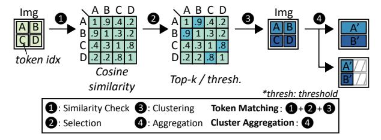
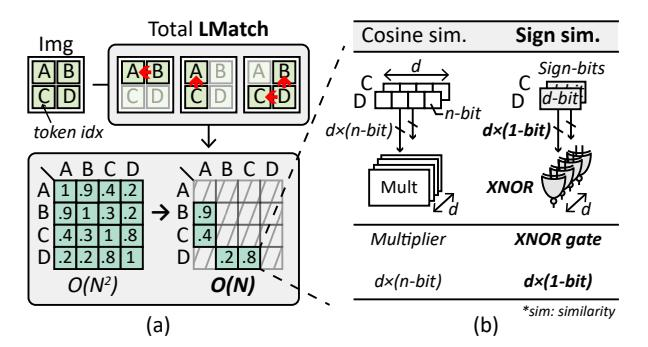
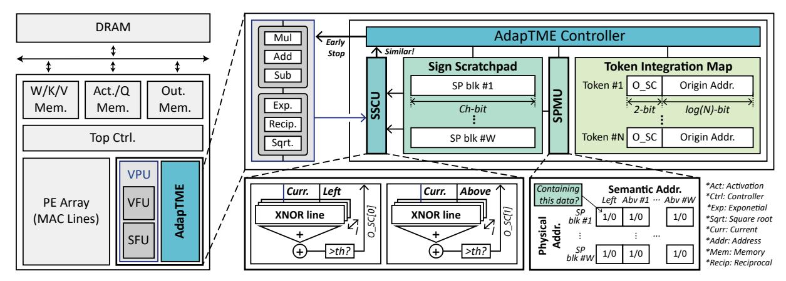
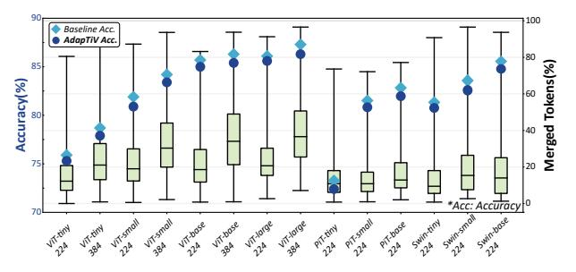
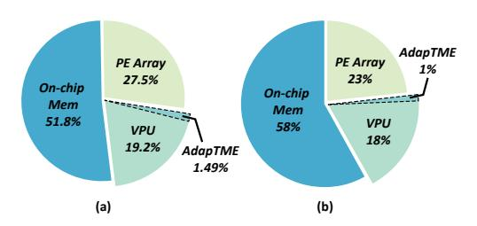
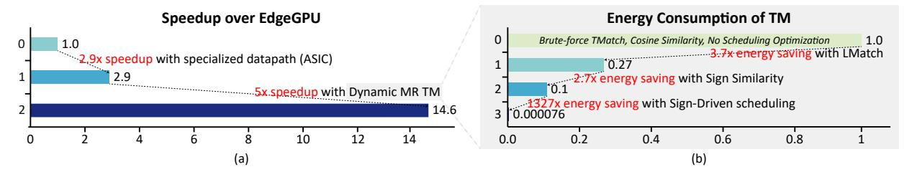
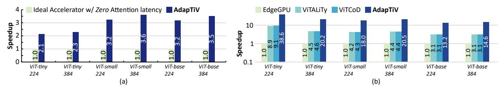

# AdapTiV: Sign-Similarity based Image-Adaptive Token Merging for Vision Transformer Acceleration

Seungjae Yoo\* KAIST Daejeon, South Korea goldenyoo@kaist.ac.kr

Hangyeol Kim\* KAIST Daejeon, South Korea khk070623@kaist.ac.kr

Joo-Young Kim KAIST Daejeon, South Korea jooyoung1203@kaist.ac.kr

*Abstract*—The advent of Vision Transformers (ViT) has set a new performance leap in computer vision by leveraging selfattention mechanisms. However, the computational efficiency of ViTs is limited by the quadratic complexity of self-attention and redundancy among image tokens. To address these issues, token merging strategies have been explored to reduce input size by merging similar tokens. Nonetheless, implementing token merging presents a degradation of latency performance due to its two factors: inefficient computations and fixed merge rate nature. This paper introduces AdapTiV, a novel hardwaresoftware co-designed accelerator that accelerates ViTs through image-adaptive token merging, effectively addressing the aforementioned challenges. Under the design philosophy of reducing the overhead of token merging and concealing its latency within the Layer Normalization (LN) process, AdapTiV incorporates algorithmic innovations such as *Local Matching*, which restricts the search space for token merging, thereby reducing the computational complexity; *Sign Similarity*, which simplifies the calculation of similarity between tokens; and *Dynamic Merge Rate*, which enables image-adaptive token merging. Additionally, the hardware component that supports AdapTiV's algorithms, named the *Adaptive Token Merging Engine*, employs *Sign-Driven Scheduling* to conceal the overhead of token merging effectively. This engine integrates submodules such as a Sign Similarity Computing Unit, which calculates the similarity between tokens using a newly introduced similarity metric; a Sign Scratchpad, which is a lightweight, image-width-sized memory that stores previous tokens; a Sign Scratchpad Managing Unit, which controls the Sign Scratchpad; and a Token Integration Map to facilitate efficient, image-adaptive token merging. Our evaluations demonstrate that AdapTiV achieves, on average, 309.4×, 18.4×, 89.8×, 6.3× speedups and 262.1×, 21.5×, 496.6×, 11.2× improvements in energy efficiency over edge CPUs, edge GPUs, server CPUs, and server GPUs, while maintaining an accuracy loss below 1% without additional training.

# I. INTRODUCTION

In recent years, the realm of Computer Vision (CV) has been revolutionized by the advent of attention-based Transformer architectures [1], marking a significant leap forward in how machines understand and process visual data. This innovation has been primarily driven by integrating the selfattention mechanism, a pivotal component of the Transformer architecture, which has demonstrated an unparalleled ability to capture global contextual relationships within data. Notably, Vision Transformers (ViT) [2] have established new benchmarks, showcasing remarkable performance across a

Fig. 1: Overview of (a) ViT layer, (b) Token merging.

wide range of tasks. However, this efficacy comes at a steep computational cost, primarily due to the self-attention mechanism's quadratic complexity relative to the number of input tokens. This computational overhead introduces a substantial latency bottleneck, which limits the deployment of ViT in latency-sensitive applications (e.g., augmented reality, drone navigation). Consequently, optimizing the latency of ViTs has been the focus of active research [3], [4].

Furthermore, the extensive computational demand of selfattention has prompted researchers to explore various optimization strategies, including efficient transformers [5], [6] and token pruning [7]–[11]. Among these, token merging (TM) [12] emerges as a promising approach, aiming to alleviate the computational burden by reducing the input size by merging similar tokens (Figure 1(b)). Therefore, the original TM work [12] has achieved significant increases in throughput (images per second) by the reduction in the input size that leads to a decrease in the required number of floating point operations (FLOPs). However, it is noteworthy that it does not reduce the latency performance, which is critical for realtime applications. To the best of our knowledge, no study has yet investigated whether TM provides a latency-wise speedup rather than merely enhancing throughput.

To confirm the above, we have implemented state-of-theart TM strategies and measured their throughput and latency performances. Unlike the substantial improvements in throughput, the latency speedups from the existing TM methods fell short of expected improvements, as shown in Figure 2(a).

\*Both authors contributed equally to this work.

Ideally, the speedup should increase proportionally with the token merge rate. However, the actual TM implementations result in a  $3\text{-}10\times$  performance degradation, deviating from the ideal case in which the speedup is perfectly proportional to the reduction in FLOPs. Based on the detailed analysis, we discover the two major factors that hinder an ideal reduction in latency:

- 1) The token merging operation itself involves inefficient computation, causing a long latency. As shown in Figure 2(b), although TM operations account for only 0.03% of the total operations, they constitute 36.8% of the processing time. The latency overhead of TM stems from the inefficiency of numerous vector-wise or element-wise operations (e.g., cosine similarity, argsort, etc.) [11] and dynamic tensor cropping on GPUs during the TM process. Consequently, this significant latency overhead substantially negates the acceleration effect of TM.
- 2) Fixed merge rate (MR) TM misses further speedup opportunities. Various TM approaches consistently merge input tokens at a fixed ratio across each ViT layer, because dynamically changing the input size is unfavored on GPUs, disregarding the variable informational content within each image. As illustrated in Figure 2(c), conventional TM strategies utilize a fixed MR method that incrementally increases the proportion of merged tokens throughout the ViT layers. However, this fixed MR approach fails to capitalize on significant intra-image token similarities—an opportunity that a dynamic MR TM could effectively exploit. Consequently, it misses key latency and energy optimization opportunities.

Against this backdrop, our work introduces a novel hardware-software co-designed accelerator specifically tailored to achieve latency-wise speedups of **ViT** through image**adapt**ive token merging, named AdapTiV. Our contributions are as follows:

- On the algorithmic level, we introduce *Local Matching*, which limits the search space for TM by leveraging the spatial locality in images. Additionally, AdapTiV proposes *Sign Similarity* to simplify the computation of similarity during TM. Together, these strategies significantly reduce the overhead associated with TM. Furthermore, the novel *Dynamic Merge Rate (MR)* strategy dynamically adjusts the merge rate based on the varying informational content of images, thereby enabling imageadaptive TM.
- On the hardware level, we have developed a dedicated hardware accelerator designed to support Adap-TiV's algorithms, thereby enhancing both performance and energy efficiency. This accelerator employs a Sign-Driven scheduling that effectively conceals the latency and DRAM access overhead of TM. The core component, the Adaptive Token Merging Engine, includes several key modules: a Sign Similarity Computing Unit, Sign Scratchpad, Sign Scratchpad Managing Unit, and a Token Integration Map. These modules are thoroughly

Fig. 2: (a) Speedup normalized to vanilla model and proportion of merged tokens (ToMe [12], DPC-KNN [13], K-Medoids [14]). (b) Breakdown of latency and the number of operations with ToMe implementation. (c) The layer-by-layer proportion of merged tokens. (All results are measured on Jetson Orin Nano with ViT base model)

- engineered to facilitate image-adaptive token merging.
- Through extensive evaluations, AdapTiV has been demonstrated to offer significant speedups and energy efficiency while maintaining accuracy across various benchmarks supporting image-adaptive TM. Remarkably, AdapTiV achieves up to 309.4× speedups and 496.6× improvements in energy efficiency on diverse platforms, including edge CPUs, edge GPUs, server CPUs, and server GPUs, while maintaining an accuracy loss below 1% without training.

#### II. BACKGROUND AND MOTIVATION

# A. Vision Transformers (ViT)

Vision Transformers (ViT) represent a groundbreaking shift in the field of computer vision, diverging from traditional Convolutional Neural Networks (CNN) [15], [16] by adopting mechanisms inspired by transformers used in natural language processing [17], [18]. Unlike CNNs, which rely on convolution operations, ViTs decompose an image into a sequence of fixed-size patches—referred to as tokens. These tokens are then processed through multiple layers of the transformer architecture (Figure 1(a)), each featuring multi-head self-attention mechanisms and feed-forward networks. This structure enables ViTs to capture both local and global dependencies among

Fig. 3: Stage breakdown of token merging.

tokens, thus preserving the spatial hierarchy and contextual relationships within an image.

However, in the context of ViT, redundancy emerges as a significant challenge, primarily due to the processing of similar or identical tokens across extensive homogeneous regions within images. Such regions, characterized by minimal variance (e.g., clear skies, monotonous walls, or vast water bodies), introduce computational redundancy since adjacent patches may contribute little to no new information. Processing these redundant tokens through each transformer layer incurs unnecessary computational costs and energy consumption.

#### B. Token Merging

To mitigate the redundancy inherent in ViT, token merging has been proposed as an effective strategy to reduce the computational burden by consolidating similar tokens into a more compact representation. Indeed, the concept of merging tokens is not new; existing clustering methods aimed at reducing token count [13], [14] have already utilized strategies to merge redundant tokens into specific clusters. However, with the introduction of ToMe [12], which began to term the merging scheme as token merging explicitly, numerous studies [19]–[24] have adopted its approach. Therefore, in this paper, the term *token merging* (TM) will specifically refer to the method proposed by ToMe.

As illustrated in Figure 1(a), TM can be applied either before or after the attention block within each layer of the ViT. To further analyze TM, it can be divided into two primary processes: token matching (TMatch) and cluster aggregation (Figure 3). TMatch is a process that calculates the similarity between tokens and clusters them based on these results. After the TMatch process, the actual merging occurs during the cluster aggregation stage, which offers two options: average merge [12], [19], which computes the average across tokens in a cluster to form a single representative token, and prune merge [19], which prunes redundant tokens, leaving one representative token per cluster. In this paper, TM will refer to the prune merge scheme and applied both before and after the attention block.

#### C. Layer Normalization

Within ViT, Layer Normalization (LN) is employed to standardize the features of each token across the model, thereby facilitating stable training and consistent performance across various input distributions. Unlike the original transformer block [1], in ViT, LN is applied both before and after the

Fig. 4: Illustration of (a) Local Matching. (b) Sign similarity.

attention block within each layer (Figure 1(a)). The LN process is governed by the equation:

$$y(x_i) = \gamma_i \frac{x_i - \mu_i}{\sigma_i} + \beta_i$$

where  $\mu_i$  and  $\sigma_i$  represent the mean and standard deviation of the features of token  $x_i$ , respectively, and  $\gamma_i$  and  $\beta_i$  are the scaling and shifting parameters for each token. It is important to note that LN is a token-by-token process, meaning that it is applied individually to each token  $x_i$  with its mean  $\mu_i$  and standard deviation  $\sigma_i$ .

#### D. Motivation

As discussed in Section I, deploying TM introduces significant performance degradation, while the fixed MR limits further speedup opportunities. Therefore, our objective is to design a latency-oriented hardware accelerator that dynamically merges tokens with significantly reduced overhead from TM. As detailed in Section II-C, LN is an essential tokenwise process in ViT, which collects running statistics and requires dynamic token-by-token normalization. Interestingly, TM is also a token-by-token process that operates at the same location as LN.

Therefore, throughout this paper, our *Design Philosophy* is defined as follows:

- Reduce the overhead of TM as much as possible.
- Embed TM with the pre-existing LN.

Consequently, all algorithmic optimizations (Section III) and the hardware architecture (Section IV) of AdapTiV are designed in accordance with this Design Philosophy.

## III. ADAPTIV'S ALGORITHMIC OPTIMIZATION

Our algorithmic optimizations for AdapTiV involve three main strategies. First, we introduce Local Matching (LMatch), which restricts TM candidates to local tokens within the image. This strategic restriction significantly reduces the number of TMatches required, adjusting the computational complexity from  $O(N^2)$  to O(N), where N represents the number of tokens. Second, we introduce Sign Similarity, a simplified similarity metric that streamlines calculations by focusing on sign bits, thereby reducing the computational overhead associated with cosine similarity. Lastly, we propose the Dynamic MR strategy, which dynamically adjusts the number of tokens to

Fig. 5: Distribution of cosine similarity with different TMatch methods on the ImageNet-1K dataset [25].

be merged per layer. This approach effectively achieves image-adaptive TM.

#### A. Local Matching

Prevailing approach [12] to do TMatch is randomly partitioning tokens into two sets and conducting a brute-force search for the most similar token between these sets, leading to a complexity of  $O(N^2)$  as each token is compared with every other token. In contrast, LN is performed individually on each token, meaning the number of LN operations follows O(N). This discrepancy in the complexity levels makes it challenging to hide TM with the existing token-wise process, LN.

To reduce the complexity of TMatch, we hypothesize that tokens nearby are likely to exhibit higher similarity due to the inherent spatial locality in images. Consequently, instead of assessing the similarity across all possible pairs of tokens, we confine our TMatch to neighboring local tokens left and above (Figure 4(a)), a method we term Local Matching (LMatch). This LMatch offers two advantages over the conventional, naive approach:

First, LMatch significantly decreases the number of required TMatch, as shown in Figure 4(a), aligning the complexity with O(N) similar to that of the LN process. This adjustment facilitates a smoother integration with LN, fulfilling the Design Philosophy. Second, LMatch increases the portion of TMatch that leads to merging. Figure 5 illustrates the experimental results of the occurrence frequency of cosine similarity value normalized to each method: brute-force TMatch and LMatch. Although extensive brute-force TMatch finds more similar matches numerically because of its brute-force nature, it does not necessarily lead to a high portion of merging from TMatch. Typically, only a small fraction (9.6%) of TMatch operations exhibit sufficient similarity (>0.75) to contribute to TM, which is considered an effective TMatch. In contrast, LMatch has led to a significant increase in the rate of effective TMatch to 36%, demonstrating that searching for similar tokens locally not only reduces the number of TMatch operations required but also enhances the proportion of effective TMatch.

#### B. Sign similarity

In the process of TM, similarity between tokens is calculated to find the similar tokens. Conventionally, well-known metrics

Fig. 6: Scatter plot between cosine and Sign similarity with ImageNet-1K dataset.

such as cosine similarity have been used [12] for this purpose. However, calculating these similarity values includes vector multiplication and normalization, which is also required for LN operations. Therefore, to meet the Design Philosophy, additional hardware resources are inevitable to run the TM process and LN in parallel. Consequently, a new similarity metric that substantially reduces the additional hardware burden, allowing TM to run parallel with LN, is needed.

Our intuition is that a similarity in the direction of two vectors is associated with a narrower angle between them, thus yielding a higher cosine similarity value. If this hypothesis holds, then merely comparing the direction of two vectors, or more specifically analyzing the sign of each vector element, should suffice to approximate the cosine similarity value. Here, we suggest a new similarity metric called Sign similarity, which indicates the number of vector elements sharing identical signs. Given two *d*-dimensional vectors **a** and **b**, the formula of *Sign similarity* is as follows:

Sign similarity = 
$$\sum_{i=1}^{d} \begin{cases} 1 & \text{if } sign(a_i) = sign(b_i) \\ 0 & \text{otherwise} \end{cases}$$

where,  $sign(a_i)$  and  $sign(b_i)$  denote the sign functions of the i-th element of vectors  ${\bf a}$  and  ${\bf b}$ , respectively. This formula evaluates whether the signs of elements at the same positions in the two vectors match and summarizes the results.

Figure 6 illustrates the results of similarity between tokens using the ImageNet-1K dataset [25]. The numbers at the top-left of the figure show calculated correlation [26], [27] and mutual information [28] values, while the scatter plot depicts the relationship between cosine similarity and Sign similarity. As the cosine similarity value increases, there is a corresponding rise in the number of vector components sharing identical signs, indicating Sign similarity. The calculated correlation between cosine similarity and Sign similarity is 0.95, and the mutual information is also 0.95. These results suggest that while Sign Similarity does not exactly replicate cosine similarity, it can approximate it effectively. Therefore, we propose substituting cosine similarity with Sign similarity during TM to facilitate more lightweight calculations. Utilizing Sign similarity offers two advantages (Figure 4(b)) over the conventional approach of calculating cosine similarity:

First, Sign similarity method simplifies the TMatch process to merely comparing the sign bits. Conventionally, computing

Fig. 7: Illustration of LMatch-based TM that has (a) Dynamic MR, (b) cumulative characteristic.

cosine similarity necessitates a series of *d n*-bit multipliers. However, for Sign similarity, the calculation can be executed using a series of *d 1*-bit *XNOR* gates, significantly reducing the additional hardware overhead of following Design Philosophy. Second, Sign similarity requires only the storage of sign bits, rather than the entire token vectors. While the cosine similarity approach requires storing the complete data of each token for future TMatch, Sign similarity necessitates only the sign bits for each element, thereby substantially decreasing the requisite on-chip memory capacity for TM.

# *C. Dynamic Merge Rate*

To support Dynamic MR, which dynamically adjusts the merge rate of token per layer, we conduct LMatch exclusively with tokens positioned to the left and above the current effective token and iteratively repeat this process for all effective tokens (Figure 7(a)). In this context, an effective token refers to any representative token involved in TM. When prune merging is employed, all tokens within a cluster are pruned except for one representative token. Therefore, we define all representative tokens participating in TM as effective tokens, distinguishing them from those pruned during the merging process. By iteratively applying LMatch to every effective token in the image and immediately clustering based on the similarity results, our method successfully captures imageadaptive similarity patterns. Unlike fixed MR TM, which merges a fixed number of tokens at every layer, our Dynamic MR strategy scans all effective tokens in the image, leveraging the full extent of inherent similarity patterns without being constrained by a predetermined token count. Therefore, the merge rate is totally dependent on the image content. Furthermore, as TM is repeatedly executed across every layer of the ViT, each iteration begins with the results from the previous TM execution (Figure 7(b)). Consequently, it scans all remaining effective tokens and identifies further similarities, thereby cumulatively expanding the merged clusters. This method achieves a higher merge rate, maximizing the potential of TM.

It is important to note that during the Dynamic MR TM, we adhere to our Design Philosophy by iterating over effective tokens from the top-left to the bottom-right. Since LN operates sequentially in a token-by-token manner (from the top-left to the bottom-right), integrating TM with LN requires that all TM operations be confined to tokens that have been processed by LN or are currently being processed. This approach prevents any dependency on unprocessed tokens, thereby maintaining the sequential integrity required for LN. This strategic restriction ensures that TM is now able to be hidden at LN without disrupting the natural flow of LN operations.

# IV. ADAPTIV'S ARCHITECTURE

# *A. Architecture Overview*

To efficiently accelerate ViT inference following the Design Philosophy, we design our novel accelerator, AdapTiV. Figure 8 shows an overview of AdapTiV's architecture that consists of three primary components: PE Array, Vector Processing Unit (VPU), and Adaptive Token Merging Engine (AdapTME).

Vector Processing Unit (VPU). The Vector Function Unit (VFU) within the VPU conducts element-wise vector operations, such as addition, subtraction, and multiplication. The Special Function Unit (SFU) executes non-linear functions via lookup tables and manages special functions necessary for the ViT model, such as exponential and square root. The synergistic operation of the VFU and SFU enables computations such as LN.

PE Array. The PE Array, serving as the core module, handles the general matrix multiply (GEMM) and general matrix-vector multiply (GEMV) operations, which account for most computations within the ViT model. Unlike previous accelerator research focused solely on reducing the load for selfattention mechanism [29], [30], AdapTiV dynamically reduces the number of tokens, resulting in more compact matrices to be processed in every computation across the self-attention and feed-forward network. Consequently, although any general computation unit that supports GEMM and GEMV operation would suffice, our PE array is implemented using multiplier and accumulator (MAC) lines to achieve consistently high core utilization for a substantially flexible number of tokens.

Adaptive Token Merging Engine (AdapTME). The AdapTME is a dedicated HW/SW co-designed module to support TM. To implement our algorithmic optimizations (Section III) with minimal hardware overhead, AdapTME is subdivided into: *Sign Similarity Computing Unit (SSCU)*, which computes the sign similarity between the current effective token and its left and above token. *Sign Scratchpad (SP)*, which stores any previously processed effective tokens that might be used in future LMatch. *Sign Scratchpad Managing Unit (SPMU)*, which manages the SP to avoid any data misses or unnecessary data movements while maintaining a compact image-width size. *Token Integration Map (TIM)*, which records the TM status of the current image. With the use of the TIM, the AdapTME embodies both the dynamic MR and cumulative characteristics of the LMatch (Figure 7). More details of the AdapTME are elaborated in Section IV-D.

# *B. Sign-Driven Scheduling*

For efficient operation of the AdapTiV accelerator, optimized scheduling between the modules inside AdapTiV is

Fig. 8: Architecture overview of AdapTiV.

Fig. 9: A timeline representation of LN and TM process. (a) naive approach, (b) with Sign-Driven scheduling and early stop.

crucial. Especially, the integration of TM in AdapTME and the LN in VPU needs thorough examination to achieve our Design Philosophy. Naive scheduling, as depicted in Figure 9(a), would result in an unconcealable latency overhead of TM, adding the sequential operation to the model inference. To completely hide TM's latency overhead, TM operations must be executed in parallel with LN.

Our observation to enable such parallel execution was that the sign bits needed by the AdapTME are available from the middle of LN. LN computation initiates by calculating the mean of a single token's embedding vector and subtracting the embedding vector by its mean, as equation  $x_i - \mu_i$ . Immediately after the subtraction, the sign bits required for Sign similarity computation can be obtained. Based on this observation, we suggest our novel Sign-Driven scheduling, in which the AdapTME streamingly receives the current effective token's sign bits from the VPU during LN, and operates in parallel with the VPU. As illustrated in Figure 9(b), ① through our Sign-Driven scheduling, the TM operation is embedded in the LN operation, leaving no latency overhead. Also, due to the highly optimized and low-latency nature of our TM process, we observed that LN computations often continue even when the AdapTME finished TM. This overlap presents an opportunity for more latency reduction. Since tokens reported to be similar by the AdapTME are completely disposed of, it is unnecessary to finish their LN operations. ② Therefore, we effectively early stopped the LN operation.

# C. Operation Overview

Before explaining in detail the implementation of the AdapTME (Section IV-D), Figure 10 provides an operational overview of the AdapTME microarchitecture. AdapTME operates in a two-stage manner:

- 1) Similarity Checking (SimCheck) Stage. Following the context and operational flow described in Figure 10, consider that the current effective token's index is 7. 1 At the onset of the SimCheck stage, the SPMU accesses columns corresponding to the semantic addresses of Left and Abv#3. 2 Each SPMU's column contains a single row with an entry value of 1, indicating that the corresponding physical address in the SP holds the required sign bits data. In this scenario, SP blocks inside physical addresses #1 and #3 are streamed to the SSCU. 3 Subsequently, the SSCU begins calculating Sign similarity using the three streams of input data from the SP and VPU. The SimCheck stage concludes when more than one of the O SC signals is triggered to 1, or if neither is activated across all Ch-bits. 4 shows that the Left token exhibits similarity with the current effective token, prompting an early stop of the LN and successful TM.
- 2) Update Stage. Based on the O\_SC results from the SSCU during the SimCheck stage, updates are applied to the TIM, SPMU, and SP. The semantic addresses for the tokens Left and Abv#3 now refer to the same physical address as Abv#1 and Abv#2. This update ensures that token #7's origin address now matches that of its left counterpart, token #1, which has remained at the first physical address of the SP from the start of this layer without movement or duplication, thanks to our novel SPMU implementation. Regarding the SP, no write operations are needed for the current token since it has already been merged. However, token #3 is now deemed to not participate in any further TM, and its associated block at physical address #3 is cleared, making space available for any new effective tokens that may emerge.

If the similarity check concludes that the current token is similar to a previously processed token, an early stop signal

Fig. 10: Operational overview of AdapTME and VPU with Sign-Driven scheduling.

for the ongoing LN operations is sent to the VPU, indicating that the current token should not participate further in the model's computations. Conversely, if the current token is deemed unique and unsuitable for merging, the LN operation will continue to be completed.

By performing this series of processes on a stream of incoming tokens, similar tokens are merged through TM. In contrast, those that are not similar survive to participate in the next ViT backbone operation as input. This dynamic and efficient mechanism ensures that only unique and necessary tokens are processed in subsequent operations, optimizing the computational efficiency and effectiveness of the model.

#### D. Adaptive Token Merging Engine

Throughout the implementation of our algorithmic optimizations (Section III) within the AdapTME module, we discovered numerous opportunities to apply comprehensive hardware optimizations. For each submodule of AdapTME described in Section IV-A, we conducted targeted hardware design and optimization efforts.

Sign Similarity Computing Unit. The SSCU streamingly receives three different tokens' sign bits data: the current effective token, and its left and above tokens. The current effective token's sign bits data is duplicated, each to be compared with the left token and the above token. For each of the two comparisons to be made, the SSCU has XNOR lines and PopCount units to compute the Sign similarity and then accumulate the result. The accumulated scalar values are continuously compared against a threshold to produce a single bit of similarity check output (O\_SC) per comparison. If any O\_SC bit triggers to 1, indicating the current token shall be merged, it is immediately reported to the VPU. This allows the early stop of the LN process and results in reduced input size across the whole ViT model afterward.

**Sign Scratchpad.** Preparing the sign bits of the left and above tokens is the necessary precursor to computing Sign similarity. This would lead to an absurd amount of DRAM accesses assuming there is no dedicated on-chip storage in the AdapTME to keep the previously processed tokens. As each Sign similarity computation would require DRAM read

operation of two entire embedding vectors of left and above tokens, a total of  $2 \times N$  additional tokens should be read, resulting in severe dataflow interruption and energy congestive operation.

Therefore, as Figure 11(a) describes, various design choices were explored to find the most effective way to store the sign bits of the previously processed tokens. A Full SP that stores every previously processed token's sign bits is highly impractical, requiring up to 54KB of SRAM for the ViT-base model, which is almost half the size of the actual weight or input buffer attached to the PE array. However, naively reducing the SP size and evicting data in an inconsiderate manner like First-In-First-Out (FIFO) would result in a data miss. Although the current effective token's left and above tokens are supposed to reside inside the SP, FIFO SP is not aware of the image content and evicts the necessary token's sign bits without caution. Throughout the whole TM process, the potential for multiple misses exists; such occurrences should be avoided.

Such critical problems of naive approaches lead to the development of our lightweight image width-sized SP and unique identification to classify previously processed tokens. Our observation is that only a few tokens among the previously processed tokens have the potential to be used in later Sign similarity computation. Tokens that were already deemed to be not similar to its right or below token no longer have their purpose to reside in the SP due to our effective LMatch scheme (Section III-A). Based on this observation, we suggest a unique identification among the previously processed tokens: only the tokens that still have the potential to expand their cluster in the right and below direction need to be stored in the SP, and such tokens will be referred to as comparison tokens afterward. Furthermore, we logically inspect that the maximum number of such comparison tokens is fixed at all times: W (image width) number of above tokens and a single left token. More inspection led to the conclusion that the left token with a column index of k is essentially equivalent to the above token with a column index of k, refining the physical maximum number of comparison tokens to W.

Our SP is designed to effectively store *comparison tokens* only, keeping its size down to  $W \times Ch$ -bits. For the ViT-base-patch16-224 model that we're using generally throughout the paper, our SP is a compact 1.3KB SRAM. By managing the SP correctly, we could handle naive approaches' issues and avoid any additional DRAM read while maintaining such a minimal size.

Sign Scratchpad Managing Unit. SPMU manages the SP to store *comparison tokens* and optimize further to avoid any data duplication and unnecessary data movements within the SP. We enable such optimizations by introducing a concept of semantic address to comparison tokens, as expressed with an example in Figure 11(b). There are W+1 number of semantic addresses: Left and Abv#1~Abv#W with Abv standing for above. If the column index of the current effective token is k, tokens with a lower row index and tokens of the same row with a lower column index than k are previously processed. Among these, the left token with a column index of k-1 is assigned a semantic address Left. For semantic addresses of Abv#1~Abv#W, the most recently processed tokens with column indexes #1~#W are assigned. Therefore, sign bits of the tokens with semantic addresses of Left and Abv#k need to be ready to operate the LMatch of the current effective token. With this semantic address as the key, SPMU finds the physical location inside the SP where the corresponding sign bits data is residing using a compact bitmap which is of size  $W \times (W+1)$ -bit. For each semantic address column allocated in the bitmap, there exists one corresponding physical address marked with an entry value of 1. This indicates that the data for the sign bits, which the SPMU seeks using the semantic address, is stored at that location.

Note that due to TM, tokens with different semantic addresses might be equivalent when they are included in the same cluster. For example, assuming all the tokens before the current effective token are forming a single cluster, sign bits of every different semantic address would be completely equivalent. Utilizing the previously introduced bitmap, SPMU informs SP to store just one copy of the sign bits data and control the bitmap so that any search of sign bits with semantic address would result in the same physical address of SP.

During LN, we continually update the SPMU and SP based on the TIM. This guarantees **zero** SP data misses, as no *comparison token* is suddenly required; instead, each token is moved into the SP once and alters only the bitmap entries in the SPMU. Also, sign bits of tokens that are confirmed as dissimilar to adjacent right and bottom tokens are evicted from the SP safely.

**Token Integration Map.** Each entry in the token integration map (TIM) consists of O\_SC from the SSCU and the origin address of the token to record the TM status of the corresponding token. The origin address refers to the address of the top-left token in a cluster, which represents the entire cluster. The TIM entry for all tokens within the cluster will share this same origin address. At the start of the ViT inference for an image, TIM is initialized with each entry's O\_SC being 2'b00 and the origin address pointing to itself, meaning no TM has

Fig. 11: (a) Explanation of SP design exploration with an example input. (b) Concept of semantic address.

been done yet. When SSCU reports a similarity, the TIM entry corresponding to the current effective token index is updated. For example, if a token is similar to the one to its left, it will be merged into the same cluster as that left token. Therefore, O\_SC is updated to 2'b10, and the origin address is updated to match the left token's TIM entry. This is all we need to do to form and expand a cluster, significantly differing from prior works that require iterative or complex computations [12]–[14]. We also keep track of the population of each cluster via TIM, which is later used in the Softmax operation of the self-attention layer to maintain model accuracy [12].

#### E. Design Details

Within the design, all the elements are represented using a 16-bit fixed-point format. For the hardware details, our on-chip SRAM buffers have a total of 385KB, with a W/K/V buffer, Activation/Query buffer, and Output buffer, each contributing 128 KB, and the SP contributing only 1 KB. For external memory, we utilized DDR4 2400MHz with a bandwidth of 76.8GB/s to match with the Jetson Orin Nano edge GPU. Our PE Array consists of 16 lanes of 64-element MAC lines. A 64-element configuration has been chosen to match the head dimension of the model, and VPU also operates at a 64element granularity. Inside the AdapTME, the SSCU consists of two lanes of 64-element XNOR lines, each dedicated to left and above TMatch. For later evaluation to compare with server devices, we scaled the number of lanes accordingly. SP block entry's bit-width (Ch) is 1024 bits, 768 bits, 384 bits, and 192 bits for ViT-large, base, small, and tiny models. Also, each model has 224×224 and 384×384 versions regarding the original input's size, having different numbers of input tokens (N) by 196 and 576. Each version's TIM entry's origin address bit-width is 8 bits and 10 bits. For our evaluation, we set hardware implementation according to the ViT-basepatch16-224 model.

## V. EVALUATION

#### A. Workload

To evaluate AdapTiV, we conducted experiments across a range of ViT models. The tested models include ViT Tiny [31], ViT Small, ViT Base, and ViT Large [2], PiT Tiny, PiT Small, PiT Base [32], Swin Tiny, Swin Small, and Swin Base [33]. For the ViT models, we use patch 16, and each is implemented in two versions that vary by input size. For the Swin models, we use patch 4. For each workload, we utilized the timm framework and obtained pre-trained models

from HuggingFace to integrate the AdapTiV algorithm. Each model was evaluated off-the-shelf, meaning no training was conducted. All models were tested using the ImageNet-1K dataset for the image classification task to assess AdapTiV's performance comprehensively.

#### B. Methodology

**Performance.** To evaluate performance, we developed a custom cycle simulator for AdapTiV. Our analysis encompassed a diverse range of hardware platforms as benchmarks, including an edge CPU (6-core ARM Cortex A78AE), an edge GPU (Nvidia Jetson Orin Nano), a server CPU (Intel Xeon Platinum 8452Y), and a server GPU (Nvidia RTX 6000 ADA). Furthermore, AdapTiV's performance was compared against ToMe [12] implementations to compare AdapTiV's imageadaptive TM against the hardware-untailored TM approach. Note that ToMe is only applicable to ViT models; therefore, for PiT and Swin, there are no results for the implementation of ToMe. We also implemented a simulator for the prior ViT accelerators, ViTCoD [34] and ViTALiTy [35], to compare AdapTiV with works that do not focus on TM. Note that we simulate both prior accelerators with the same hardware configurations for fair comparisons. Execution latency on GPU was measured using the CUDA Event API, with additional analyses performed via the Nvidia Nsight [36]. For CPU, we utilized native Python to determine execution latency. For the comparison with server-grade devices, we evaluate forty-five AdapTiV accelerators to match the peak performance of the Nvidia RTX 6000 ADA (91 TFLOPS), as outlined by [29], [30]. However, to ensure a fair and practical comparison, we do not scale the DRAM bandwidth up to forty-five times but instead match it to 960GB/s, as in the Nvidia RTX 6000 ADA.

Area/Power. The AdapTiV accelerator was implemented using SystemVerilog and synthesized with a target frequency of 1 GHz using Synopsys Design Compiler and Samsung's 28nm standard cell library, to measure the area and power for the AdapTiV accelerator. The SRAM on-chip memory was also compiled and synthesized using Samsung's 28nm library. For DRAM, read/write energy metrics were integrated into our simulator using the energy consumption numbers from [37]. For comparative analysis, the power consumption of GPU and CPU was measured using Jetson Power, Nvidia-SMI, and the Linux Performance Analysis tool.

# C. Accuracy Evaluation

Figure 12 illustrates the impact of AdapTiV's algorithmic optimizations on model accuracy, presented alongside a box plot that displays the range of merge rates achieved. Compared to the vanilla baseline, which incorporates no AdapTiV optimizations, AdapTiV maintains an accuracy loss below 1% across all models without additional training or fine-tuning. In addition to preserving near-baseline accuracy, AdapTiV exhibits a significant variation in merge rates, from 0% to 96.5%, demonstrating its robust capability for image-adaptive TM. This variation effectively showcases AdapTiV's ability to handle the diverse similarity patterns inherent in each image

Fig. 12: Accuracy comparison of AdapTiV and the baseline. The box plot shows the dynamic range of AdapTiV's achieved proportion of merged tokens.

without noticeable accuracy loss. It is important to note that all the aforementioned results were achieved without additional training. This enables AdapTiV to be applied directly to off-the-shelf ViT models, which is a substantial advantage for edge applications.

#### D. Performance Evaluation

Figure 13 compares the end-to-end speedups achieved by AdapTiV across various platforms. Compared to edge-grade devices, AdapTiV attains, on average, speedups of  $309.4\times$ ,  $230.9\times$ ,  $18.4\times$  and  $30.7\times$  over edge CPU, edge CPU with ToMe, edge GPU, and edge GPU with ToMe, respectively. When compared against server-grade devices, AdapTiV achieves average speedups of  $89.8\times$ ,  $80.5\times$ ,  $6.3\times$ , and  $9.8\times$  over server CPU, server CPU with ToMe, server GPU, and server GPU with ToMe, respectively.

The results demonstrate that AdapTiV, with its dedicated hardware architecture supporting image-adaptive TM, consistently outperforms the comparative groups across diverse model benchmarks. This remarkable speedup is achieved through AdapTiV's specialized hardware architecture, which optimizes the image-adaptive TM process. By effectively concealing the latency overhead associated with TM, the AdapTiV fully exploits the performance benefits of TM—the reduction in input size—without incurring any latency penalties. In other words, our Design Philosophy has been successfully fulfilled.

One observation is that implementing ToMe yields a slight speedup on CPUs; however, deviations are observed in the GPU context, where specific model benchmarks exhibit reduced speedups when GPU employs ToMe. This phenomenon aligns with the challenges outlined in Section I, suggesting that the TM process is not well-optimized for GPUs due to its inefficient operations and dynamic tensor cropping. Note that our algorithmic optimizations applied to a conventional CPU also induce a  $1.83\times$  speedup while leading to a  $2.5\times$  slowdown for a conventional GPU, implying the need for specialized hardware to support our Design Philosophy.

#### E. Area/Power Evaluation

Figure 13 showcases the comparative analysis of energy efficiency achieved by the AdapTiV accelerator. Against edge-grade devices, AdapTiV secures energy efficiency averaging 262.1×, 192.0×, 21.5×, and 27.7× over edge CPU, edge

Fig. 13: The normalized speedup and energy efficiency (w.r.t Left: EdgeCPU, Right: ServerCPU) achieved by AdapTiV.

Fig. 14: On-chip (a) Area, (b) Power breakdown of AdapTiV.

Fig. 15: Normalized energy consumption breakdown of Adap-TiV. From left to right, the proportion of merged tokens increases.

CPU with ToMe, edge GPU, and edge GPU with ToMe, respectively. Server-grade device comparisons show energy efficiency averaging 496.6× and 11.2× over CPU and GPU, respectively, with ToMe adaptations yielding 441.0× and  $10.5\times$ .

The area distribution of AdapTiV is depicted in Figure 14(a), totaling 2.49 mm2. The breakdown includes on-chip memory accounting for 51.8%, the PE array at 27.5%, the VPU at 19.2%, and the AdapTME occupying a mere 1.49% of the total. The compact area of AdapTME confirms that AdapTiV's hardware architecture, including elements such as SP and SSCU, is optimized for minimal hardware burden while effectively supporting AdapTiV's algorithms.

The power consumption of AdapTiV is detailed in Table I, totaling 11.06W. Figure 14(b) breaks down the on-chip power distribution, showing the shares of on-chip memory (58%), the PE array (23%), the VPU (18%), and AdapTME (1%).

TABLE I: Power Breakdown of AdapTiV

|       | PE Array | VPU   | AdapTME | SRAM  | DRAM  | Overall |
|-------|----------|-------|---------|-------|-------|---------|
| Power | 0.63W    | 0.49W | 0.02W   | 1.59W | 8.32W | 11.06W  |

Notably, the AdapTME constitutes only 1% of the total power usage, evidencing the negligible power overhead of dedicated hardware for image-adaptive TM.

Figure 15 illustrates the energy consumption breakdown of AdapTiV at various token merge rates achieved through image-adaptive TM. The figure highlights that as the attained merge rate increases, the total energy consumption of AdapTiV significantly decreases. This reduction is primarily attributed to decreased DRAM access, a direct consequence of TM, which effectively reduces the input size and, consequently, the amount of DRAM read/write energy required.

#### F. Ablation Study

Figure 16 describes an ablation study that analyzes the sources of AdapTiV's speedup and energy savings in a scheme-by-scheme manner utilizing the ViT Base model.

As shown in Figure 16(a), AdapTiV achieves a  $2.9\times$  end-to-end latency speedup over an edge GPU with its specialized datapath. By implementing dynamic MR TM, we attain an additional  $5\times$  speedup, assuming an 80% merge rate. However, achieving such performance enhancement with TM requires careful implementations, realized through our advanced algorithmic and hardware optimizations. Figure 16(b) illustrates the energy consumption of TM, normalized to a baseline scenario without any optimization schemes. This baseline utilizes brute-force TMatch, cosine similarity, and no scheduling optimization. Our extensive simulations on energy consumption show that this naïve approach results in more than 15% of the end-to-end energy consumption, underscoring the need for AdapTiV to support our Design Philosophy.

To reduce the overhead of TM according to the first term of the Design Philosophy, we first apply LMatch to achieve  $3.7\times$  energy saving in the TM process by reducing the computational complexity from  $O(N^2)$  to O(N). Furthermore, utilizing Sign Similarity results in  $2.7\times$  energy savings due to the reduced amount of data needed for TM and gate-level

Fig. 16: Ablation study of (a) speedup over edge GPU, (b) energy consumption of TM normalized to a scenario of no optimizations applied.

XNOR computation. Lastly, according to the second term of the Design Philosophy, Sign-Driven scheduling effectively conceals all DRAM accesses associated with TM within the existing LN operations, compacting TM to a hardly noticeable process.

# VI. DISCUSSION

# *A. Effect of Image-Adaptive Token Merging*

To illustrate the advantages of image-adaptive TM facilitated by AdapTiV, we conducted a comparative analysis among three configurations: AdapTiV, Vanilla accelerator, and Vanilla accelerator with ideal fixed MR TM scheme assuming that incurs no latency overhead. Here, Vanilla accelerator refers to hardware with identical specifications to AdapTiV but without the algorithmic optimizations. For both the fixed MR TM and AdapTiV, we consider scenarios where each method achieves an 80% token merge rate at the final layer.

Figure 17(a) demonstrates that AdapTiV achieves significant speedup and energy efficiency improvements over both Vanilla accelerator and Vanilla accelerator with fixed MR TM. Notably, AdapTiV excels across most layers, primarily due to its ability to achieve higher merge rates through the imageadaptive TM facilitated by the Dynamic MR strategy. As the graph illustrates, this image-adaptive approach results in a pronounced improvement in speedup and energy efficiency starting from the first layer. This feature substantially contributes to AdapTiV's overall superior performance, achieving speedups of 4.6× and an efficiency increase of 3.6× compared to Vanilla accelerator. These results underscore the effectiveness of AdapTiV's image-adaptive TM strategy.

# *B. Compatibility as a Co-Processor*

AdapTiV, an accelerator designed to enhance the efficiency of image-adaptive TM to accelerate the ViT model, can be operated as a co-processor alongside various hardware devices. To demonstrate AdapTiV's compatibility with diverse hardware environments, we have modified AdapTiV to focus solely on token-wise operations by removing the PE Array, which is responsible for the core ViT backbone computations. The resultant architecture, termed AdapTiV-Lite, is evaluated as a co-processor with two potential hardware platforms for handling ViT backbone computations: an edge CPU and an edge GPU.

Figure 17(b) presents the performance enhancements facilitated by AdapTiV-Lite. When functioning as a co-processor alongside an edge CPU, AdapTiV-Lite achieves an average speedup of 2.95× over the edge CPU alone. This represents a significant improvement not only over the baseline edge CPU performance but also compared to ToMe executed on the same edge CPU. Similarly, with AdapTiV-Lite serving as a co-processor to an edge GPU, an average speedup of 2.65× is observed over the edge GPU's standalone performance. Again, AdapTiV-Lite demonstrates a substantial speedup compared to ToMe on the edge GPU. These results underscore the efficacy of AdapTiV-Lite as a co-processor, seamlessly integrating with conventional hardware devices to accelerate ViT models through efficient image-adaptive TM.

# *C. Comparison with Attention accelerators*

As briefly mentioned in Section IV-A, recent research on various attention accelerators [29], [30] has primarily focused on reducing the computational load of the self-attention mechanism. In contrast, AdapTiV aims to decrease the overall input size through TM, thereby reducing the load across the entire model, not just the self-attention mechanism.

Due to these differing focus areas, directly comparing Adap-TiV with previous attention accelerators is not straightforward. Therefore, we compare AdapTiV against an ideal accelerator, which operates at 100% peak throughput at a 1GHz frequency and possesses the same hardware resources as AdapTiV. This ideal accelerator aims to showcase the theoretical upper bound of performance achievable with AdapTiV's specifications. More importantly, for the ideal accelerator, we assume that the attention mechanism consumes zero latency. Given the variety of methods employed by previous attention accelerators, a detailed comparison would be cumbersome; therefore, we propose a bold comparison by assuming an extreme hypothetical scenario where the attention accelerator completely eliminates the latency associated with the attention process to zero.

Figure 18(a) presents the comparison results. Across the ViT models, AdapTiV achieves speedups ranging from 2.1× to 3.6× over the ideal accelerator, which assumes zero latency for the attention mechanism. This outcome suggests that reducing the overall input size through TM is more effective for lowering latency than solely optimizing the self-attention mechanism, particularly for ViT models that exhibit a high degree of redundant tokens in the input.

# *D. Comparison with ViT accelerators*

To understand the significance of TM and validate the

Fig. 17: Normalized (a) speedup, energy efficiency (w.r.t Vanilla accelerator) (b) speedup (w.r.t. edgeCPU and edgeGPU).

Fig. 18: Speedup normalized to (a) the ideal accelerator with zero latency for attention-mechanism, (b) edgeGPU.

necessity of AdapTiV, we compared it with the prior ViT accelerators, ViTCoD [34] and ViTALiTy [35]. Note that unlike AdapTiV, both accelerators require re-training to achieve the performance reported in their papers. In the case of ViTCoD, an auto-encoder module, and the split-and-conquer algorithm are applied to achieve a sparse attention pattern. For ViTALiTy, the model is modified to use Taylor attention instead of vanilla Softmax attention, reducing the complexity of attention from quadratic to linear. However, AdapTiV, which is an off-theshelf method that does not require training, outperforms the prior ViT accelerators by up to 4.7×, as shown in Figure 18(b). This result demonstrates that for ViT models, other computations such as query, key, value generation (QKV generation) and Feed Forward Network (FFN) are also important and affect the end-to-end latency of the model. This makes AdapTiV, which reduces the input size of the entire model, beneficial not only for attention but also for other computations, leading to much greater effectiveness compared to the prior ViT accelerators.

# VII. RELATED WORKS

Accelerator for Transformer/ViT Model. Various hardware accelerators [38]–[46] have been proposed since the advent of neural networks. Recent developments in hardware accelerators have predominantly targeted the attention mechanism [47]–[53], focusing on optimizing its computational efficiency. However, dedicated hardware accelerators for ViT models are still rare. A few proposed solutions, such as ViTCoD [34], HeatViT [54], and ViTALiTy [35], primarily focus on pruning or refining the attention layer. Consequently, AdapTiV, this work distinguishes itself by pioneering a TM scheme that aims to accelerate ViT by reducing computational load across the entire model.

Token Merging and its variations. Various adaptations of ToMe [12] have been actively explored. For instance,

ToFu [19] is a collaborative effort that combines token pruning and TM, observing that shallow and deep layers benefit differently from each optimization strategy, respectively. Despite numerous studies exploring and optimizing TM, to the best of our knowledge, AdapTiV represents an early attempt to explore the hardware efficiency and implementation of TM.

# VIII. CONCLUSION

In this study, we present AdapTiV, a hardware-software codesigned accelerator for ViTs. This accelerator enhances ViT performance through proposed image-adaptive token merging, effectively addressing the performance degradation challenges associated with TM. Our approach integrates algorithmic optimizations such as LMatch, Sign Similarity, and Dynamic MR with a dedicated hardware module, the AdapTME. This module comprises an SSCU, an SP, an SPMU, and a TIM, all orchestrated via Sign-Driven scheduling. Evaluation across various platforms confirms the feasibility and high efficiency of image-adaptive token merging in optimizing ViTs, suggesting a promising direction for future research in AI accelerators.

# ACKNOWLEDGMENTS

This work was partly supported by the Institute of Information & Communications Technology Planning & Evaluation (IITP) grant funded by the Korea governments(MSIT)(No. 2022-0-01036, Development of Ultra-Performance PIM Processor Soc with PFLOPS-Performance and GByte-Memory) and ITRC (Information Technology Research Center)(IITP-2020-0-01847).

## REFERENCES

[1] A. Vaswani, N. Shazeer, N. Parmar, J. Uszkoreit, L. Jones, A. N. Gomez, Ł. Kaiser, and I. Polosukhin, "Attention is all you need," *Advances in neural information processing systems*, vol. 30, 2017.

- [2] A. Dosovitskiy, L. Beyer, A. Kolesnikov, D. Weissenborn, X. Zhai, T. Unterthiner, M. Dehghani, M. Minderer, G. Heigold, S. Gelly *et al.*, "An image is worth 16x16 words: Transformers for image recognition at scale," *arXiv preprint arXiv:2010.11929*, 2020.
- [3] Y. Li, G. Yuan, Y. Wen, J. Hu, G. Evangelidis, S. Tulyakov, Y. Wang, and J. Ren, "Efficientformer: Vision transformers at mobilenet speed," *Advances in Neural Information Processing Systems*, vol. 35, pp. 12 934– 12 949, 2022.
- [4] S. Mehta and M. Rastegari, "Mobilevit: light-weight, generalpurpose, and mobile-friendly vision transformer," *arXiv preprint arXiv:2110.02178*, 2021.
- [5] K. Choromanski, V. Likhosherstov, D. Dohan, X. Song, A. Gane, T. Sarlos, P. Hawkins, J. Davis, A. Mohiuddin, L. Kaiser *et al.*, "Rethinking attention with performers," *arXiv preprint arXiv:2009.14794*, 2020.
- [6] S. Wang, B. Z. Li, M. Khabsa, H. Fang, and H. Ma, "Linformer: Self-attention with linear complexity," *arXiv preprint arXiv:2006.04768*, 2020.
- [7] Y. Rao, W. Zhao, B. Liu, J. Lu, J. Zhou, and C.-J. Hsieh, "Dynamicvit: Efficient vision transformers with dynamic token sparsification," *Advances in neural information processing systems*, vol. 34, pp. 13 937– 13 949, 2021.
- [8] H. Yin, A. Vahdat, J. M. Alvarez, A. Mallya, J. Kautz, and P. Molchanov, "A-vit: Adaptive tokens for efficient vision transformer," in *Proceedings of the IEEE/CVF Conference on Computer Vision and Pattern Recognition*, 2022, pp. 10 809–10 818.
- [9] L. Meng, H. Li, B.-C. Chen, S. Lan, Z. Wu, Y.-G. Jiang, and S.-N. Lim, "Adavit: Adaptive vision transformers for efficient image recognition," in *Proceedings of the IEEE/CVF Conference on Computer Vision and Pattern Recognition*, 2022, pp. 12 309–12 318.
- [10] Y. Liang, C. Ge, Z. Tong, Y. Song, J. Wang, and P. Xie, "Not all patches are what you need: Expediting vision transformers via token reorganizations," *arXiv preprint arXiv:2202.07800*, 2022.
- [11] Z. Kong, P. Dong, X. Ma, X. Meng, W. Niu, M. Sun, X. Shen, G. Yuan, B. Ren, H. Tang *et al.*, "Spvit: Enabling faster vision transformers via latency-aware soft token pruning," in *European conference on computer vision*. Springer, 2022, pp. 620–640.
- [12] D. Bolya, C.-Y. Fu, X. Dai, P. Zhang, C. Feichtenhofer, and J. Hoffman, "Token merging: Your vit but faster," *arXiv preprint arXiv:2210.09461*, 2022.
- [13] W. Zeng, S. Jin, W. Liu, C. Qian, P. Luo, W. Ouyang, and X. Wang, "Not all tokens are equal: Human-centric visual analysis via token clustering transformer," in *Proceedings of the IEEE/CVF Conference on Computer Vision and Pattern Recognition*, 2022, pp. 11 101–11 111.
- [14] D. Marin, J.-H. R. Chang, A. Ranjan, A. Prabhu, M. Rastegari, and O. Tuzel, "Token pooling in vision transformers for image classification," in *Proceedings of the IEEE/CVF Winter Conference on Applications of Computer Vision*, 2023, pp. 12–21.
- [15] Y. LeCun, L. Bottou, Y. Bengio, and P. Haffner, "Gradient-based learning applied to document recognition," *Proceedings of the IEEE*, vol. 86, no. 11, pp. 2278–2324, 1998.
- [16] A. G. Howard, M. Zhu, B. Chen, D. Kalenichenko, W. Wang, T. Weyand, M. Andreetto, and H. Adam, "Mobilenets: Efficient convolutional neural networks for mobile vision applications," *arXiv preprint arXiv:1704.04861*, 2017.
- [17] J. Devlin, M.-W. Chang, K. Lee, and K. Toutanova, "Bert: Pre-training of deep bidirectional transformers for language understanding," *arXiv preprint arXiv:1810.04805*, 2018.
- [18] A. Radford, J. Wu, R. Child, D. Luan, D. Amodei, I. Sutskever *et al.*, "Language models are unsupervised multitask learners," *OpenAI blog*, vol. 1, no. 8, p. 9, 2019.
- [19] M. Kim, S. Gao, Y.-C. Hsu, Y. Shen, and H. Jin, "Token fusion: Bridging the gap between token pruning and token merging," in *Proceedings of the IEEE/CVF Winter Conference on Applications of Computer Vision*, 2024, pp. 1383–1392.
- [20] D. Bolya and J. Hoffman, "Token merging for fast stable diffusion," in *Proceedings of the IEEE/CVF Conference on Computer Vision and Pattern Recognition*, 2023, pp. 4598–4602.
- [21] J. Wang, S.-Y. Lu, S.-H. Wang, and Y.-D. Zhang, "Ranmerformer: Randomized vision transformer with token merging for brain tumor classification," *Neurocomputing*, vol. 573, p. 127216, 2024.
- [22] M. Bonnaerens and J. Dambre, "Learned thresholds token merging and pruning for vision transformers," *arXiv preprint arXiv:2307.10780*, 2023.

- [23] Z. Feng, J. Xu, L. Ma, and S. Zhang, "Efficient video transformers via spatial-temporal token merging for action recognition," *ACM Transactions on Multimedia Computing, Communications and Applications*, vol. 20, no. 4, pp. 1–21, 2024.
- [24] K.-S. Seol, S.-D. Roh, and K.-S. Chung, "Token merging with class importance score," in *IECON 2023-49th Annual Conference of the IEEE Industrial Electronics Society*. IEEE, 2023, pp. 1–6.
- [25] O. Russakovsky, J. Deng, H. Su, J. Krause, S. Satheesh, S. Ma, Z. Huang, A. Karpathy, A. Khosla, M. Bernstein *et al.*, "Imagenet large scale visual recognition challenge," *International journal of computer vision*, vol. 115, pp. 211–252, 2015.
- [26] K. Pearson, "Notes on regression and inheritance in the case of two parents proceedings of the royal society of london, vol. 58," 1895.
- [27] J. Lee Rodgers and W. A. Nicewander, "Thirteen ways to look at the correlation coefficient," *The American Statistician*, vol. 42, no. 1, pp. 59–66, 1988.
- [28] C. E. Shannon, "A mathematical theory of communication," *The Bell system technical journal*, vol. 27, no. 3, pp. 379–423, 1948.
- [29] T. J. Ham, Y. Lee, S. H. Seo, S. Kim, H. Choi, S. J. Jung, and J. W. Lee, "Elsa: Hardware-software co-design for efficient, lightweight selfattention mechanism in neural networks," in *2021 ACM/IEEE 48th Annual International Symposium on Computer Architecture (ISCA)*. IEEE, 2021, pp. 692–705.
- [30] L. Lu, Y. Jin, H. Bi, Z. Luo, P. Li, T. Wang, and Y. Liang, "Sanger: A co-design framework for enabling sparse attention using reconfigurable architecture," in *MICRO-54: 54th Annual IEEE/ACM International Symposium on Microarchitecture*, 2021, pp. 977–991.
- [31] A. Steiner, A. Kolesnikov, X. Zhai, R. Wightman, J. Uszkoreit, and L. Beyer, "How to train your vit? data, augmentation, and regularization in vision transformers," *arXiv preprint arXiv:2106.10270*, 2021.
- [32] B. Heo, S. Yun, D. Han, S. Chun, J. Choe, and S. J. Oh, "Rethinking spatial dimensions of vision transformers," in *Proceedings of the IEEE/CVF international conference on computer vision*, 2021, pp. 11 936–11 945.
- [33] Z. Liu, Y. Lin, Y. Cao, H. Hu, Y. Wei, Z. Zhang, S. Lin, and B. Guo, "Swin transformer: Hierarchical vision transformer using shifted windows," in *Proceedings of the IEEE/CVF international conference on computer vision*, 2021, pp. 10 012–10 022.
- [34] H. You, Z. Sun, H. Shi, Z. Yu, Y. Zhao, Y. Zhang, C. Li, B. Li, and Y. Lin, "Vitcod: Vision transformer acceleration via dedicated algorithm and accelerator co-design," in *2023 IEEE International Symposium on High-Performance Computer Architecture (HPCA)*. IEEE, 2023, pp. 273–286.
- [35] J. Dass, S. Wu, H. Shi, C. Li, Z. Ye, Z. Wang, and Y. Lin, "Vitality: Unifying low-rank and sparse approximation for vision transformer acceleration with a linear taylor attention," in *2023 IEEE International Symposium on High-Performance Computer Architecture (HPCA)*. IEEE, 2023, pp. 415–428.
- [36] NVIDIA, "NVIDIA Nsight Systems," https://developer.nvidia.com/ nsight-systems, 2024.
- [37] S. Lee, H. Cho, Y. H. Son, Y. Ro, N. S. Kim, and J. H. Ahn, "Leveraging power-performance relationship of energy-efficient modern dram devices," *IEEE Access*, vol. 6, pp. 31 387–31 398, 2018.
- [38] T. Chen, Z. Du, N. Sun, J. Wang, C. Wu, Y. Chen, and O. Temam, "Diannao: A small-footprint high-throughput accelerator for ubiquitous machine-learning," *ACM SIGARCH Computer Architecture News*, vol. 42, no. 1, pp. 269–284, 2014.
- [39] Y.-H. Chen, T. Krishna, J. S. Emer, and V. Sze, "Eyeriss: An energyefficient reconfigurable accelerator for deep convolutional neural networks," *IEEE journal of solid-state circuits*, vol. 52, no. 1, pp. 127–138, 2016.
- [40] Y. Chen, T. Luo, S. Liu, S. Zhang, L. He, J. Wang, L. Li, T. Chen, Z. Xu, N. Sun *et al.*, "Dadiannao: A machine-learning supercomputer," in *2014 47th Annual IEEE/ACM International Symposium on Microarchitecture*. IEEE, 2014, pp. 609–622.
- [41] Z. Du, R. Fasthuber, T. Chen, P. Ienne, L. Li, T. Luo, X. Feng, Y. Chen, and O. Temam, "Shidiannao: Shifting vision processing closer to the sensor," in *Proceedings of the 42nd annual international symposium on computer architecture*, 2015, pp. 92–104.
- [42] N. P. Jouppi, C. Young, N. Patil, D. Patterson, G. Agrawal, R. Bajwa, S. Bates, S. Bhatia, N. Boden, A. Borchers *et al.*, "In-datacenter performance analysis of a tensor processing unit," in *Proceedings of the 44th annual international symposium on computer architecture*, 2017, pp. 1–12.

- [43] S. Han, X. Liu, H. Mao, J. Pu, A. Pedram, M. A. Horowitz, and W. J. Dally, "Eie: Efficient inference engine on compressed deep neural network," *ACM SIGARCH Computer Architecture News*, vol. 44, no. 3, pp. 243–254, 2016.
- [44] Z. Zhang, H. Wang, S. Han, and W. J. Dally, "Sparch: Efficient architecture for sparse matrix multiplication," in *2020 IEEE International Symposium on High Performance Computer Architecture (HPCA)*. IEEE, 2020, pp. 261–274.
- [45] S. Pal, J. Beaumont, D.-H. Park, A. Amarnath, S. Feng, C. Chakrabarti, H.-S. Kim, D. Blaauw, T. Mudge, and R. Dreslinski, "Outerspace: An outer product based sparse matrix multiplication accelerator," in *2018 IEEE International Symposium on High Performance Computer Architecture (HPCA)*. IEEE, 2018, pp. 724–736.
- [46] J. Fowers, K. Ovtcharov, M. Papamichael, T. Massengill, M. Liu, D. Lo, S. Alkalay, M. Haselman, L. Adams, M. Ghandi *et al.*, "A configurable cloud-scale dnn processor for real-time ai," in *2018 ACM/IEEE 45th Annual International Symposium on Computer Architecture (ISCA)*. IEEE, 2018, pp. 1–14.
- [47] T. J. Ham, S. J. Jung, S. Kim, Y. H. Oh, Y. Park, Y. Song, J.-H. Park, S. Lee, K. Park, J. W. Lee *et al.*, "Aˆ 3: Accelerating attention mechanisms in neural networks with approximation," in *2020 IEEE International Symposium on High Performance Computer Architecture (HPCA)*. IEEE, 2020, pp. 328–341.
- [48] S.-C. Kao, S. Subramanian, G. Agrawal, A. Yazdanbakhsh, and T. Krishna, "Flat: An optimized dataflow for mitigating attention bottlenecks," in *Proceedings of the 28th ACM International Conference on Architectural Support for Programming Languages and Operating Systems, Volume 2*, 2023, pp. 295–310.
- [49] Y. Qin, Y. Wang, D. Deng, Z. Zhao, X. Yang, L. Liu, S. Wei, Y. Hu, and S. Yin, "Fact: Ffn-attention co-optimized transformer architecture with eager correlation prediction," in *Proceedings of the 50th Annual International Symposium on Computer Architecture*, 2023, pp. 1–14.
- [50] A. H. Zadeh, I. Edo, O. M. Awad, and A. Moshovos, "Gobo: Quantizing attention-based nlp models for low latency and energy efficient inference," in *2020 53rd Annual IEEE/ACM International Symposium on Microarchitecture (MICRO)*. IEEE, 2020, pp. 811–824.
- [51] T. Tambe, C. Hooper, L. Pentecost, T. Jia, E.-Y. Yang, M. Donato, V. Sanh, P. Whatmough, A. M. Rush, D. Brooks *et al.*, "Edgebert: Sentence-level energy optimizations for latency-aware multi-task nlp inference," in *MICRO-54: 54th Annual IEEE/ACM International Symposium on Microarchitecture*, 2021, pp. 830–844.
- [52] H. Fan, T. Chau, S. I. Venieris, R. Lee, A. Kouris, W. Luk, N. D. Lane, and M. S. Abdelfattah, "Adaptable butterfly accelerator for attention-based nns via hardware and algorithm co-design," in *2022 55th IEEE/ACM International Symposium on Microarchitecture (MICRO)*. IEEE, 2022, pp. 599–615.
- [53] S. Hong, S. Moon, J. Kim, S. Lee, M. Kim, D. Lee, and J.-Y. Kim, "Dfx: A low-latency multi-fpga appliance for accelerating transformer-based text generation," in *2022 55th IEEE/ACM International Symposium on Microarchitecture (MICRO)*. IEEE, 2022, pp. 616–630.
- [54] P. Dong, M. Sun, A. Lu, Y. Xie, K. Liu, Z. Kong, X. Meng, Z. Li, X. Lin, Z. Fang *et al.*, "Heatvit: Hardware-efficient adaptive token pruning for vision transformers," in *2023 IEEE International Symposium on High-Performance Computer Architecture (HPCA)*. IEEE, 2023, pp. 442– 455.