# SOFA: A Compute-Memory Optimized Sparsity Accelerator via Cross-Stage Coordinated Tiling

Huizheng Wang\*, Jiahao Fang\*, Xinru Tang\*, Zhiheng Yue\*, Jinxi Li\*, Yubin Qin\*, Sihan Guan\*, Qinze Yang\*, Yang Wang\*, Chao Li<sup>†</sup>, Yang Hu\*<sup>‡⊠</sup>, Shouyi Yin\*<sup>‡</sup>

\* School of Integrated Circuits, Tsinghua University, Beijing, China, 100084

† School of Computer Science and Engineering, Shanghai Jiao Tong University, Shanghai, China, 200240

‡ Shanghai Artificial Intelligence Laboratory, Shanghai, China, 200433

© Corresponding author, hu\_yang@tsinghua.edu.cn

Abstract—Benefiting from the self-attention mechanism, Transformer models have attained impressive contextual comprehension capabilities for lengthy texts. The requirements of highthroughput inference arise as the large language models (LLMs) become increasingly prevalent, which calls for large-scale token parallel processing (LTPP). However, existing dynamic sparse accelerators struggle to effectively handle LTPP, as they solely focus on separate stage optimization, and with most efforts confined to computational enhancements. By re-examining the endto-end flow of dynamic sparse acceleration, we pinpoint an everoverlooked opportunity that the LTPP can exploit the intrinsic coordination among stages to avoid excessive memory access and redundant computation. Motivated by our observation, we present SOFA, a cross-stage compute-memory efficient algorithmhardware co-design, which is tailored to tackle the challenges posed by LTPP of Transformer inference effectively. We first propose a novel leading zero computing paradigm, which predicts attention sparsity by using log-based add-only operations to avoid the significant overhead of prediction. Then, a distributed sorting and a sorted updating FlashAttention mechanism are proposed with cross-stage coordinated tiling principle, which enables finegrained and lightweight coordination among stages, helping optimize memory access and latency. Further, we propose a SOFA accelerator to support these optimizations efficiently. Extensive experiments on 20 benchmarks show that SOFA achieves  $9.5 \times$ speed up and 71.5× higher energy efficiency than Nvidia A100 GPU. Compared to eight SOTA accelerators, SOFA achieves an average  $15.8 \times$  energy efficiency,  $10.3 \times$  area efficiency and  $9.3 \times$ speed up, respectively.

Index Terms—Transformer, attention, sparsity accelerator, cross-stage tiling, top-k, FlashAttention, software-hardware codesign.

#### I. INTRODUCTION

Remarkable success has been witnessed recently in the development of Transformer architecture [1], for both natural language processing (NLP) [2]–[10] and computer vision (CV) tasks [11]–[19]. The impressive capabilities of Transformers greatly stems from their *self-attention* module, which excels at extracting global context information [20]. Typically, self-attention modules take three matrices as their inputs: namely,  $\mathbf{Q}$  (query),  $\mathbf{K}$  (key) and  $\mathbf{V}$  (value). First, an attention matrix  $\mathbf{A} \in \mathbb{R}^{S \times S}$  is obtained by multiplying  $\mathbf{Q}$  and  $\mathbf{K}$ , where S is sequence length. Next,  $\mathbf{A}$  goes through the softmax function for normalization, then is multiplied by  $\mathbf{V}$  for the final output.

Large language models (LLMs) have driven the transformer architecture to unprecedented levels of complexity


Fig. 1. Transformer memory and computation breakdown for long sequence.

and capability, particularly in handling extended sequence lengths [21]. This evolution places heightened demands on inference capabilities and throughput [22], critically impacting the performance of key transformer components: the attention module, feed-forward network (FFN) module, and the query-key-value (QKV) computations.

Traditionally, in Transformers designed for smaller sequence lengths  $(\leq 2k)$ , the FFN module typically presented the main bottleneck due to its dense computational requirements [23], [24]. However, with recent advancements in processing long text, where sequence lengths can exceed 128,000 characters [25]–[27], the performance bottleneck is shifting from the FFN to the attention module. Our detailed profiling indicates that as sequence lengths surpass 32,000 characters, the attention module becomes the dominant factor affecting inference time, as shown in Fig.1. This shift is primarily because the complexity of the attention mechanism scales quadratically with sequence length, making it increasingly challenging to manage as sequences extend.

Dynamic sparsity (DS) acceleration [23], [28]–[34] have emerged as a promising solution to mitigate the latency issue of self-attention. The key idea is to predict vital Q-K pairs at runtime and calculate attention based on these vital pairs to reduce the inference latency. Typically, it consists of three stages. A pre-compute stage firstly estimates the matrix  $\bf A$  (denoted as  $\bf \hat{\bf A}$ ). Then, a top-k stage picks the vital Q-K pairs. In the subsequent formal computing stage, self-attention is calculated only based on the vital pairs.

The need for high parallelism of dynamic sparsity token processing in the context of LLM inference is increasing,


Fig. 2. Dynamic sparsity challenges for LTPP and SOFA's software and hardware co-design.

especially during the prefill stage. In this stage, entire contexts are processed simultaneously, favoring high token parallelism to enhance efficiency. This scenario is especially meaningful as modern LLM inference often employs separate deployments for the prefill and decode stages [35], [36]. Moreover, the advent of speculative inference [37] can transform decode operations into prefill tasks, further emphasizing the need for efficient large-scale token processing parallelism (LTPP).

However, supporting dynamic sparsity with large-scale token parallel processing would present prohibitive overheads, as shown in Fig. 2. This is because, firstly, current dynamic sparsity acceleration solutions lack efficient prediction schemes to reduce computation complexity. Though calculating selfattention based on vital Q-K pairs can be beneficial in reducing compute and memory consumption, the newly introduced precompute and top-k stages consume non-trivial computational and memory resources when large amounts of tokens are processed, which can even offset the benefits brought by sparsity acceleration methods in some cases. Our characterization depicts that even with 4-bit during the prediction stage and 16bit during the *formal stage*, the power overhead of prediction is already  $1.4\times$  that of formal computing when top-k equals 20%. Unfortunately, the overhead in prediction will further rise sharply with increased parallelism.

Secondly, the processing stages in current dynamic sparsity acceleration are not designed to be partitionable, and miss the opportunity to support fine-grained pipelining, which would enable more efficient processing. The *top-k* sorting must be based on the readiness of a whole row of the Pre-Atten (Â) matrix. In LTPP scenarios, the increased delay in processing each stage accumulates continuously, ultimately resulting in a significant increase in end-to-end latency. This "whole-row-processing" style also increases the amount of intermediate data, resulting in a substantial rise in DRAM access requirements. Fig. 3 shows the memory access time (MAT) of two SOTA Transformer accelerators when scaled to process multiple tokens. The increase in parallelism leads to a sharp rise in off-chip memory access and surging MAT. On average, the MAT ratio rises to 72%, overshadowing computation time


Fig. 3. MAT for SOTA dynamic sparsity accelerators (FACT [23], Energon [34]) with diverse parallelisms.

and becoming the primary bottleneck.

Thirdly, current dynamic sparsity acceleration solutions do not exploit cross-stage coordination, missing the opportunity to reduce the computation complexity of later stages by leveraging guidance extracted from former stages. Although FlashAttention2 (FA-2) already provides a tiling scheme for softmax to reduce memory access overhead, *the decreased memory access comes with surging computations*. This occurs because repeated exponentiation and comparison operations are necessary to refresh the MAX among tiles, ensuring the correctness of the global MAX value. We observe an opportunity to guide FA-2 computation with top-*k* information. These limitations highlight the need for more advanced strategies to manage dynamic sparsity with LTPP effectively.

Our Insights: Motivated by the challenges, we observe an opportunity that breaks down the computation, memory, and latency overheads in each stage by adopting a cross-stage coordinated tiling strategy, thus a stage is decomposed into fine-grained sub-stages. Therefore the process in the following stages doesn't have to wait for the finish of processes in the last stage. The coordination among stages becomes more swift and excessive DRAM memory access could be saved. Notably, it is non-trivial to achieve this goal as we need to figure out effective methods to partition top-k module and efficiently forward the information to formal stages.

We propose an algorithm-hardware co-design for attention optimizations, named SOFA. It features three key designs that correlate to three challenges, as depicted in Fig. 2. First, the

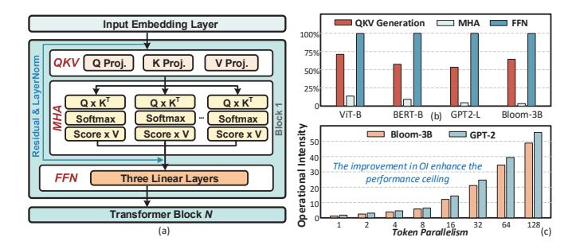

Fig. 4. Basic components of a Transformer model and operation intensity.

computation overhead in *pre-compute* stage is alleviated via a multiplier-free *differential leading zero summation (DLZS)* paradigm, which helps reduce the sparsity prediction overhead of each tile. Second, we propose a *sphere-search-aided distributed sorting (SADS)*, which distributes a long segment into sub-segments to execute individual tiled sorting, while effectively reducing total comparisons. Third, we propose a *sorted-updating FlashAttention (SU-FA)*. It skillfully decouples the *softmax* row-dependence to enable the formal computing stage tiling, while leveraging cross-stage sorting information to reduce computation. In summary, DLZS and SADS together serve as a low-complexity prediction (LP) mechanism to reduce prediction overhead. SADS collaborates with SU-FA, employing fine-grained tiling for sparse acceleration, to optimize memory access and processing latency.

We propose a dedicated accelerator to support the proposed mechanism effectively. Compared to naive implementation, which only has a limited  $19.6\times$  energy saving over Nvidia A100 GPU, SOFA accelerator improves its performance with four novel algorithm-hardware co-designs.

Evaluated on 20 benchmarks, SOFA achieves an average energy efficiency of 7183 GOPS/W, which is  $71.5\times$  and average  $15.8\times$  higher than Nvidia A100 GPU and eight SOTA accelerators, respectively. Overall, SOFA's computational efficiency is  $9.5\times$  higher than that of the GPU A100 and  $11.1\times$  higher than the TPU, respectively. We also conduct comprehensive ablation on GPU to quantify the performance benefits brought by our software mechanism and various hardware components. Evaluations on GPU/TPU show that SOFA's software optimization achieves a  $3.16\times/2.8\times$  speedup, while hardware acceleration delivers a  $3.03\times/3.9\times$  speedup.

#### II. BACKGROUND AND MOTIVATION

#### A. Preliminaries for Transformer

Fig. 4(a) shows a typical Transformer model: an input sequence containing S tokens is transformed into an embedding matrix  $\mathbf{X} \in \mathbb{R}^{S \times H}$ , projected to  $\mathbf{Q}$ ,  $\mathbf{K}$  and  $\mathbf{V}$  spaces, split into A chunks  $\mathbb{R}^{S \times H/A}$ , and processed by multi-head attention (MHA) to generate an attention matrix. The attention matrix, after softmax and multiplication with  $\mathbf{V}$ , resulting in a matrix  $\mathbf{O} \in \mathbb{R}^{S \times (H/A)}$ . Outputs from all heads are concatenated, projected by  $\mathbf{W}_O \in \mathbb{R}^{S \times H}$ , and passed through the FFN with two fully connected layers to generate final outputs.

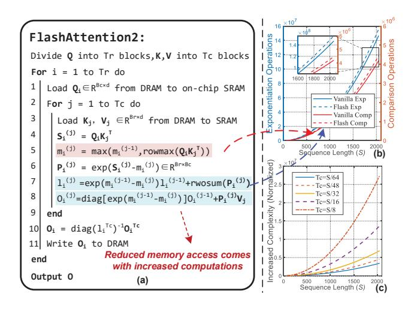

Fig. 5. Process of FlashAttention-2 and its computation overhead.

Computation Properties Analysis. We analyze the operation intensity (OI) [38] for the three parts of a Transformer layer. As shown in Fig. 4(b), MHA exhibits notably lower OI, averaging 15% of the FFN. This means MHA requires more data movement for the same computation FLOPs, due to element-wise operations. Fig. 4(c) further illustrates the relationship between the OI of MHA and the token processing parallelism. We can figure increasing parallelism effectively boosts OI, thus theoretically reducing the demand for data movement under equivalent computational power and PE utilization. This gain is attributed to increased data reuse.

#### B. FlashAttention (FA)

To reduce data movement of attention, Tri Dao et. al proposed FlashAttention (FA) [39] and the improved version FA-2 [40], both of which successfully minimized memory access but greatly increased computational cost. Fig. 5(a) outlines the procedure of FA-2 and Fig. 5(b) compares its exponential operations and comparison complexity with vanilla implementation regarding S. Here we assume the number of tiles  $T_c = S/16$ , i.e., tiling size  $B_c = 16$ . We employ the arithmetic complexity model [41] to normalize the complexity for different operations. As S increases, FA-2 exhibits a notable increase in exponential and comparison operations compared to the vanilla scheme. When S=2048, it demands  $9\times10^6$  more exponential calculations and  $3 \times 10^5$  more comparisons than the vanilla implementation. Fig. 5(c) compares the increased computational load after summing all calculations. The computational complexity of FA-2 soars with the growth of S, and the increased magnitude correlates with  $T_c$ . The larger  $T_c$  leads to a faster increase, due to the repeated calculations among  $T_c$  blocks, as shown in lines 5-8 of Fig. 5(a).

#### C. Sparsity in Attention

Typically, as shown in Fig. 4 (a), the results (a.k.a scores) of  $\mathbf{Q} \times \mathbf{K}^T$  are then processed by a *softmax* operator. Due to the *softmax*'s approximation to the *argmax* operator, most smaller score values become extremely close to zero after passing the

softmax. Therefore, they usually impose a negligible impact on the final results and can be reasonably removed. The key difference between the attention sparsity and the sparsity in DNN/Transformer models lies in that attention sparsity is entirely driven by the input data and requires dynamic evaluation at runtime, whereas model sparsity is based on static weight sparsity, which can be optimized through quantization or structured pruning.

To accelerate *self-attention*, emerging dynamic sparsity accelerations [23], [28]–[31], [33], [34] offer a promising solution. Their key idea is to predict key Q-K pairs at runtime and calculate attention for selected pairs. Typically, their workflow proceeds as Fig. 6. First, a low-precision computational paradigm is employed to predict the attention (*Pre-compute stage*); Next, vital Q-K pairs are filtered out from each row to generate a mask (*Top-k sorting stage*). Finally, based on the mask, the scheduler initiates the *Formal Computing Stage*, typically with higher precision.

# D. Analysis for Large-scale Token Parallel Processing (LTPP)

Despite its promising adaptability, dynamic sparsity incurs additional overhead during inference, due to the *Pre-compute* and *Top-k stages*. As a result, previous works [23], [28], [29], [33], [34] were constrained to processing queries with low parallelism, to minimize the memory and computation overhead. However, as modern LLMs demand significantly longer context than before (GPT4 32k [42], LongLLaMa 256k [43]), the rapid processing of these extended context becomes increasingly crucial [44]. This highlights the necessity for accelerators with LTPP capabilities. However, the current dynamic sparsity attention workflow poses three challenges for LTPP. Illustrated in Fig. 2:

- 1) Supposing processing T tokens in parallel, the precompute and sorting complexity rises to  $\mathcal{O}(TSH)$  and  $\mathcal{O}(TSSk)$ , respectively. Taking Llama-13B  $(T=512,\ k=0.25)$  as an example, the required numbers of comparisons and multiplication would be over  $10^{11}$  and  $10^8$ , respectively. In this case, prediction requires performing over  $2^{11}$  MACs and  $2^{10}$  comparisons, accounting for more than 57% of the total execution latency. Such prohibitive overhead will negate the improvements brought by sparsity.
- 2) As *top-k* sorting and *softmax* is applied row-wise, matrices **Pre-Atten** and **A** must be stored to DRAM first and then loaded by row blocks, thus leading to massive DRAM access. Such extensive memory access would lead to inefficient inference. In 45 nm CMOS technology, the energy cost of a DRAM access (5 to 20 pJ/bit) is two orders of magnitude higher than that of internal cache access (0.1 pJ/bit) [45], while its bandwidth (DDR4 25.6GB/s) is also orders-of-magnitude lower than the SRAM (19TB/s) [39]. A coarse scheme is to enlarge the on-chip SRAM capacity but this would lead to area inefficiency. Taking (T=512, S=2048) for instance, it directly necessitates 5MB SRAM, leading to 5.47 mm<sup>2</sup> footprint under TSMC 28nm technology, which is  $7.4 \times$ ,  $8.9 \times$  of the overall area of SpAtten [33] and ELSA [29], respectively.

 $\label{table I} \textbf{TABLE I} \\ \textbf{SUMMARY FOR SOTA TRANSFORMER ACCELERATORS}.$ 

|               | Optimization |           |     |           |       |  |  |  |
|---------------|--------------|-----------|-----|-----------|-------|--|--|--|
| Accelerator   | C            | ompute    | N   | Cross     |       |  |  |  |
|               | QKV          | Attention | QKV | Attention | Stage |  |  |  |
| $A^{3}[28]$   | ×            | ✓         | ×   | ×         | ×     |  |  |  |
| ELSA [29]     | ×            | ✓         | ×   | ×         | ×     |  |  |  |
| Sanger [30]   | ×            | ✓         | ×   | ×         | X     |  |  |  |
| DOTA [31]     | ×            | ✓         | ×   | ×         | ×     |  |  |  |
| Energon [34]  | ×            | ✓         | ×   | Low       | ×     |  |  |  |
| DTATrans [32] | ×            | ✓         | ×   | ×         | ×     |  |  |  |
| SpAtten [33]  | ✓            | ✓         | ×   | Low       | X     |  |  |  |
| FACT [23]     | <b>√</b>     | ✓         | ×   | ×         | ×     |  |  |  |
| SOFA          | /            | /         | ~   | <b>V</b>  | /     |  |  |  |

3) FlashAttention2 (FA-2) employs a tiling scheme for the *softmax* operation to keep the working set of data in the faster on-chip memory, thus successfully reducing off-chip memory access overhead. However, the benefits come with soaring computation costs, making it unsuitable for dynamic sparsity scenarios in LTPP. As an example, when the tile size is  $B_c=4$  for a sequence length S=1024, FA-2 must frequently compute and compare values across these tiles to ensure correct global results. This leads to a computational load approximately  $1.5\times$  higher than that of a regular implementation without tiling.

We argue that the main bottleneck in extending existing dynamic sparsity methodology towards LTPP lies in information decoupling among stages, thus missing the cross-stage-tiling opportunity. Table I offers an overview of the effectiveness of existing approaches in optimizing Transformer components. Works [28]-[31] focus on reducing pre-computation overhead, such as ELAS [29] using Binary Hash, A<sup>3</sup> [28] employing Greedy search and DOTA [31] using low-rank transformation. However, these methods still cannot address the row dependency of key operators, like topk and softmax, thus still resulting in significant memory access overhead under LTPP. Further, SpAtten [33] and DTATrans [32] involve sorting the cumulative distribution probabilities of tokens, introducing substantial sorting complexity and latency in LTPP scenarios. While SpAtten [33] and Energon [34] realize challenges with extensive memory access, their sparsity strategies fail to handle the severe memory access overhead with the LTPP scenario. In summary, existing works are all limited on individual-stage optimization, thereby overlooking opportunities for cross-stage joint optimizations, making them inadequate for supporting LTPP. This motivates us to propose a cross-stage compute-memory efficient accelerator design, targeting the LTPP scenario.

# III. ALGORITHM OPTIMIZATIONS OF SOFA

Fig. 6 (a) presents an overview of the SOFA algorithm optimizations. First, at the *pre-compute* stage, we propose DLZS, a log-domain computing paradigm to predict  $\hat{\mathbf{A}}$ . Then, exploiting DCE, we introduce SADS, to partition a long sequence into several sub-segments for independent tiled sorting. Next, leveraging the sorting information, a memory-compute efficient attention-computing mechanism (SU-FA) is designed. The SADS and SU-FA enable SOFA to execute a cross-stage


Fig. 6. (a) High-level diagram of the SOFA algorithm optimizations. (b) Tilebased pipelined dataflow (SOFA) vs. standard dataflow.

tiling pipeline dataflow. Compared to the vanilla workflow in Fig. 6(b), the tiling execution makes SOFA require minimal SRAM for storing intermediate results without extra memory access, while the fine-grained pipelined dataflow can reduce inference latency.

# A. Cross-Phase DLZS Sparsity Prediction

Traditional dynamic sparsity entails predicting significant Q-K pairs, then utilizing these important Ks and Vs to execute computations. However, blindly generating unnecessary KV leads to wastage in computation and memory access. To this end, SOFA employs an on-demand computation strategy for KV. As shown in Fig. 7(a), On-demand means: only the required Ks and Vs are generated  $(\mathbf{K}_i = \mathbf{x}_i \mathbf{W}_k, \mathbf{V} = \mathbf{x}_i \mathbf{W}_v)$ , while trivial ones are not computed from the beginning. However, this requires the *pre-compute stage* first to estimate the  $\hat{\mathbf{K}}$ , then utilize it with  $\mathbf{Q}$  to predict  $\hat{\mathbf{A}}$ . Unfortunately, even utilizing low-precision matrix multiplication (e.g. halfprecision with MSBs only) results in considerable power consumption. Therefore, a power and memory-efficient prediction is imperative.

We propose a log-domain multiplication-free strategy, named differential leading zero summation (DLZS). Differential means: For multiplication, it only transforms one operand into the logarithmic domain using the leading zero encoder (LZE), to obtain its leading zero (LZ). Then, based on the LZ, it substitutes the costly multiplication with low-power shift operations on the other operand. Specifically, an INTtype number x can be mathematically expressed as Eq. (1a), where W stands for the bit-width, M represents the mantissa lying [0, 1], and LZ denotes the leading-zero count of x. Accordingly, the corresponding multiplication is derived as Eq. (1b) and approximated as Eq. (1c). Since the bit width Wis fixed for certain operands, we can directly operate  $LZ_{\nu}$  on x, to estimate the magnitude for the product of two numbers. Therefore, incorporating shifting and the sign bit, the results of multiplication can be predicted.

$$x = Sign \times M \times 2^{W - LZ},\tag{1a}$$

$$x = Sign \times M \times 2^{W-LZ},$$
 (1a)  
 
$$x \cdot y = XOR(S_x, S_y) M_x \cdot 2^{(W-LO_x)} M_y \cdot 2^{(W-LO_y)}$$
 (1b)

$$\approx \text{XOR}(S_x, S_y) M_x \cdot 2^{(W - LO_x + W - LO_y)}$$
 (1c)

Its workflow is depicted in Fig. 7(b). As the weights are pre-known and fixed during inference, we pre-convert the  $\mathbf{W}_k$  into LZ format and store it. Then, in the Key prediction phase (1.1), no LZE is required, as the weight  $W_k$  has been converted into LZ format. In the subsequent Attention prediction phase (1.2), to mitigate error accumulation, we convert  $\mathbf{Q}$  into the log domain instead of  $\mathbf{K}$ , then perform shifting and sum operations. Compared to the vanilla leading zero strategy (Fig. 7(c)), the proposed DLZS exhibits three Pros: a) Lower converter overhead; b) Higher accuracy; c) Less memory access.

# B. Sphere-search Aided Distributed Sorting (SADS)

To effectively identify vital tokens in the top-k stage, previous works [33], [34] have tried to explore low-cost sorting algorithms and design corresponding hardware to improve throughput. However, they all fail to consider the data distribution property, thus only achieving limited efficiency and missing opportunities for cross-stage optimization.

As softmax approximates the argmax operation, its results primarily depend on dominant tokens when multiple tokens with prominent amplitudes appear, as denoted in Type-I of Fig. 8(a). Alternatively, there are two potential scenarios for element distribution: a uniform distribution, exemplified by Type-II, and a concentration of slightly larger elements in a specific region, depicted as Type-III. To ascertain their practical distributions in Transformer inference, we conducted a token analysis for BERT/L [3], ViT/B [12], GPT-2 [7] and Llama7B [46] with 4096 rows. The statistical results in Fig. 8(b) reveal that the Type-II distribution predominates across all four models, accounting for over 76\% on average. Type-I occurrence is more frequent in ViT, GPT-2 and Llama, with an average rate of 25%, which may be attributed to image local similarity and the self-autoregressive token generation, respectively. By contrast, the occurrence probability of Type-III is notably low in all models, even approaching nearly 0 in GPT-2 and Llama7B. This is primarily attributed to the extended context, which diminishes the likelihood of a concentration for higher magnitude tokens in a specific region.

Combined, Type-I and Type-II collectively constitute over 95% of the total distribution. Hence, these two types can effectively represent the overall data distribution characteristics of the attention. We observe that the larger values within each region of these two data types can aptly represent the overall larger values. We term this characteristic as the 'Distributed Cluster Effect (DCE)'. Distributed implies that a long segment can be divided into several shorter sub-segments, while Cluster indicates that each sub-segment contains its primary information. Therefore, sorting based on well-segmented partitions is expected to have a negligible impact on holistic performance.

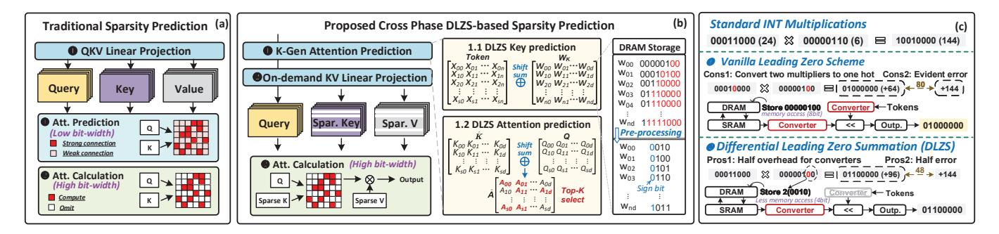

Fig. 7. (a) Traditional sparsity prediction. (b) Cross-phase DLZS sparsity prediction. (c) Comparisons between DLZS and vanilla scheme.

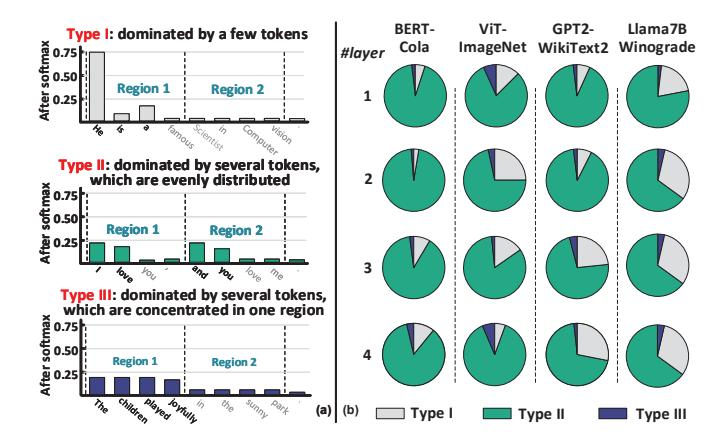

Fig. 8. (a) Three types of attention data distribution. (b) Corresponding proportions in diverse Transformer models.


Fig. 9. (a) Low-complexity SADS sorting algorithm. (b) Scenario 1: Type-I occurs. (c) Scenario 2: Type-II dominates.

To this end, we propose the SADS sorting, which exploits the DCE to reduce complexity in a tiled manner. Initially, as shown in Fig. 9 (a), one row of the attention matrix is divided into n sub-segments (assuming n=4). Next, each sub-segment pick up the top-(k/n), i.e., top-(k/4) values, from its own data. Due to the area constraints of hardware implementation, sorting may necessitate multiple iterations. In each iteration, the Max value from the previous iteration

serves as a benchmark. A feasible range (FR) is obtained by subtracting the spherical radius (R) from the benchmark. Then, the sorting is exclusively performed on the entries within the FR, rather than all entries. Following this, for each sorted set, the largest k/4 elements are collected into FC set, which represents the indices of vital KVs. This set is used to guide the subsequent *Formal Computing Stage*.

Figs. 9 (b)-(c) exemplify why SADS can maintain accuracy with reduced complexity. For Scenario 1, where Type-I distribution occurs, SADS is certain to capture the dominant values, irrespective of which sub-segment they fall into. For Scenario 2, where the majority of the distribution is Type-II, SADS can effectively select all relatively larger values that dominate in the complete row. Given that the values falling on the edges of the top-k are typically smaller, we can reasonably relax the sorting requirements for them. According to our experimental results, with s=1024 and n=4, the average error of the top 25% is only around 3% (Different K indices are considered as errors). Furthermore, the specific number of sub-segments (e.g. tiling size) of each layer is obtained by the DSE in Section III-D.

### C. Sorted-Updating FlashAttention (SU-FA)

The attention is the primary bottleneck in scaling to LTPP scenario, as its memory complexity increases quadratically with the sequence length. To tackle this issue, we propose an attention acceleration mechanism called SU-FA, which is both computationally and memory efficient, by leveraging specific sorting information generated from the *top-k stage*. It also enables cross-stage tiling for the formal-compute stage. Traditionally, addressing overflow in hardware *softmax* implementation requires identifying the Max value in each row [47]. This leads to continual comparison operations in classical FA [39], [40] to refresh the Max value across diverse blocks, which however, results in skyrocketing computational cost as revealed in Fig. 5.

The indices of the top-k values provided by top-k stage allow us to get the potential index of the Max value. A direct but coarse approach is to calculate the Max value based on the potential index and then send it into the FA for computation. However, there are two critical problems: 1) The index of the Max value is not guaranteed to be accurate due to the approximation properties of DLSZ, which could result in

```
m_i^{(j)} = \max(m_i^{(j-1)}, x_i^{(j)}) = x_i^{(j)} \int m_i^{(j)} = \max(m_i^{(j-1)}, x_i^{(j)}) = m_i^{(j-1)}
Additional multiplication
  Proposed compute-memory efficient SU-FA
  Initial: Divide K,V into Tc blocks, each with Bc × H/A
  Parallel for i = 1 to T do
       Load \mathbf{Q}_i \in \mathbb{R}^{1 \times H/A} from DRAM to on-chip SRAM
       for j = 1 to Tc do
                //Scheduler ensure s_i^j[1] is the Max in Block
               \mathbf{s}_{i}^{j} = \mathbf{Q}[i,:]\mathbf{K}^{T}[:,(j-1)B_{c},jB_{c}]
              l_i^{(j)} = l_i^{(j-1)} + \sum_{t=1}^{B_c} e^{\mathbf{s}![t] - \mathbf{s}![1]}
              \mathbf{o}_{i}^{(j)} \! = \! \mathbf{o}_{i}^{(j-1)} + \sum\nolimits_{t=1}^{B_{c}} \! \mathrm{e}^{\mathrm{s}\!i[t] - \mathrm{s}\!i[1]} \mathbf{V}[(j-1)B_{c} + t,:]
4
5
         m_i = \max(s_i^1[1], s_i^2[1], \cdots, s_i^{T_c}[1])
        l_i = l_i^{(1)} e^{s_i^1[1] - m_i} + \dots + l_i^{(T_e)} e^{s_i^{T_e}[1]} -
6
        \mathbf{O}_i = \mathbf{o}_i^{(T_c)}/l_i
                                       //Different Tiles synchronization
```

Fig. 10. (a) Formulas for diverse updating orders. (b) Procedure of SU-FA.

potential overflow; 2) Separately calculating the Max value introduces additional computational and power overhead. To this end, we propose a novel sorted-updating FA. Instead of computing for the Max separately, SU-FA executes either ascend or descend updates during the computation process. Descend updating means first computing Fig. 5(a) line 5 from the index of Max, followed by the index of the 2nd large value, until the k-th value. Ascend updating proceeds in the opposite order. Although at first glance, both of these approaches can effectively eliminate the max comparison (Fig. 5 (a) line5), we found that the benefits vary significantly with different updating orders. Specifically, when executing ascend updating, the line 5-7 can be rewritten as Eq. (1) in Fig. 10(a), where we denote  $\mathbf{S}_{i}^{j}$  as  $x_{i}^{(j)}$  for clarity. Though  $m_{i}^{(j)}$  equals to  $x_{i}^{(j)}$ constantly, it is noteworthy the calculating for  $l_i^{(j)}$  still acquires one exponentiation (Exp), one multiplication (Mul) plus an addition (Add).

By contrast, if descending order is employed, as Eq. (2) in Fig. 10(a), the updating for  $l_i^{(j)}$  merely requires one Exp and one Add. While such benefits may seem minor, the performance gain is substantial when large-scale parallel process long sequences. The procedure for the descending SU-FA is summarized in Fig. 10(b). Compared to the traditional FA and ascending SU-FA, the descending SU-FA on average reduces 25% and 11% complexity, respectively. In subsequent discussions, SU-FA defaults to adopt the descending order. Please note the inaccuracy of the predicted Max is co-optimized by the architecture in Section IV-D.

# D. Design Space Exploration (DSE)

In the SOFA algorithm mechanism, the tiling size, i.e.,  $B_c$  in each layer and top-k form an interesting design space. For larger  $B_c$ , i.e. smaller  $T_c$  ( $S = B_c \times T_c$ ), inference accuracy tends to increase. However, sorting complexity escalates significantly, yet the computation complexity of SU-FA decreases. On the contrary, when  $B_c$  decreases, it will lead to opposite effects. We provide each of the hyperparameters with plenty of options as 1)  $Tc_i$ : 2 – 32, step=2; 2) Top-k:

# Algorithm 1: DSE for SOFA Tiling Size.

```
1 Input: Evaluation function \mathcal{L} and exploration space \Theta;

2 Initial: Max Iter T, sample \mathcal{D}_t = \{R_i, \mathcal{L}(R_i), i=1,...,n\},

Best target function result \mathcal{J} = \infty;

3 while t < T and result does not converge do

4 |R_t \leftarrow \arg \max_{\Theta} \alpha(\Theta, \mathcal{D}_t), \mathcal{J}_{new} \leftarrow \mathcal{L}(R_t);

5 |\mathcal{D}_{t+1} \leftarrow \{\mathcal{D}_t, (R_t, J_{new})\};

6 |\mathcal{GP}_{new} \leftarrow \text{Update}(\mathcal{GP}, \mathcal{D}_{t+1});

7 |\text{if } \mathcal{J}_{new} < \mathcal{J} \text{ then}

8 |\mathcal{J} \leftarrow \text{Update}(J_{new});
```

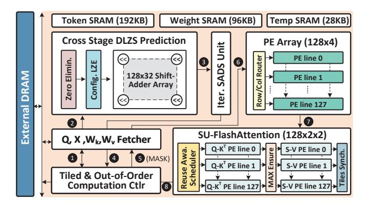

Fig. 11. High-level block diagram for the SOFA accelerator.

5% - 50%, step=5%, to ensure that we can obtain a high-quality solution. However, such space is huge and unaffordable for brute force search. Taking BERT-Base with 12 Transformer layers as an example, we need to search for the optimal choice in a 26-dimensional space consisting over  $10^{15}$  choices. Even though the inference on highly parallel GPU clusters costs less than 1 ms, it will take unbearable time consumption (over  $10^8$  h) using traversal-based grid search for this remarkable design space. To this end, we apply a Bayesian optimization method to execute the search process. The targeted optimization problem (modeled as a Gaussian Process (GP) in Bayesian optimization) is constructed concerning both the accuracy and the computational complexity, which is formalized as Eq. (2).

minimize 
$$\mathcal{L}(R) = \mathcal{L}_{en} + \alpha \times \mathcal{L}_{cmp} + \beta \times \mathcal{L}_{exp},$$
 (2)

$$\mathcal{L}_{cmp} = \sum_{i} (B_{ci} \cdot k) / \sum_{i} (S \cdot k), \tag{3}$$

$$\mathcal{L}_{exp} = \sum_{i} (S/B_{ci}), \tag{4}$$

where R is the hyperparameter vector composed of the k and  $B_{ci}$  of each layer,  $\mathcal{L}_{en}$  is the cross-entropy loss,  $\mathcal{L}_{cmp}$  and  $\mathcal{L}_{exp}$  are the penalty terms for computation overhead, as defined in Eqs. (3) and (4).  $\alpha$  and  $\beta$  are two coefficients to balance the accuracy and performance. The whole searching process is summarized in Alg. 1.

#### IV. ARCHITECTURE AND HARDWARE INNOVATION

Despite substantial algorithmic acceleration, a naive implementation of SOFA faces three challenges. First, LP is crucial in predicting vital tokens. It must ensure high precision

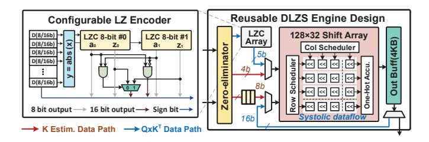

Fig. 12. Architecture for the cross-stage DLZS prediction.

and low power consumption. Additionally, the top-k engine must support variable-length inputs and high throughput within low power overhead, due to the flexible tiling execution and high parallelism of LTPP. Second, specific architecture and datapath designs are needed to support the intra-stage operator-fusion paradigm of SU-FA for enhanced efficiency. Finally, during LTPP execution, the varying requirements of K and V for each query may lead to redundant memory access, thus necessitating a memory-efficient scheduling strategy.

#### A. Architecture Overview

Fig. 11 depicts SOFA's overall architecture, which comprises six main modules: on-chip SRAM storage, a DLZS prediction unit, an iterative SADS unit, a PE array, an SU-FA unit, and a tiled & out-of-order controller. SOFA is designed to process 128 queries in parallel. First, the indices of tokens and corresponding  $W_k$  of a tile produced by the *controller* are sent to data fetcher, which calculates the physical address and fetches data to on-chip SRAM **①**. Then, the *DLZS predictor* starts to estimate matrices K and A with log-based shift and summations **2**. Next, the 128-row **A** is sent to SADS unit, to find out the top-k important Q-K pairs  $\odot$ . Subsequently, the sorting results are sent back to the controller **4**, which generates a top-k mask, then data fetcher reads corresponding data according to the mask **6**. After that, the scheduler controls the *PE array* to generate the necessary Ks and Vs **6**. Later, the generated KVs are sent to the SU-FA unit to execute computememory efficient attention calculations **7**. Finally, the outputs of attention are stored to off-chip DRAM 3.

# B. Reusable and Configurable DLZS Engine

As discussed in Section III-A, the DLZS unit is acquired to predict the  $\hat{\mathbf{K}}$  and  $\hat{\mathbf{A}}$ , respectively. The two phases demand diverse precisions. In the former case, the inputs are 8-bit token and weights, where the weights are pre-converted into LZ format. In contrast, the latter case requires operations with 16-bit precision, as the output of the former is truncated to at most 16 bit. To this end, the LZE is designed as configurable to enable 8 & 16-bit mixed precisions. As depicted in Fig. 12 left, each LZE unit contains two 8-bit leading zero counters (LZCs) [48] connected in series. When the input is 8-bit, the two LZCs work independently. However, when the input becomes 16-bit, the two *all-zero flag a*<sub>0</sub> and  $a_1$  are performed through logic AND, then the corresponding output is employed as a selected signal to pick up 16-bit outputs. The processing flow of DLZS engine is illustrated in Fig. 12 right. First,

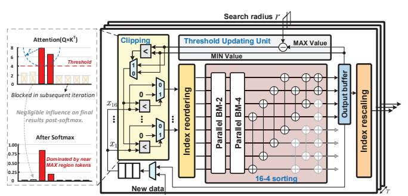

Fig. 13. Architecture for the flexible-input supported SADS engine.

the operands are sent to a zero eliminator module, where calculations with zeros are removed. Next, in the  $\hat{\mathbf{K}}$  prediction phase, 8-bit tokens and 4-bit LZ-format weights are transferred to the  $128 \times 32$  systolic shift array, and  $\hat{\mathbf{K}}$  would be generated and cached in the output buffer. Then, in the A prediction phase, the 16-bit Qs are fed to the 16-bit mode LZC array. The generated 5-bit LZs along with the  $\hat{\mathbf{K}}$  are sent to the shift array again, to produce the final estimated  $\hat{\mathbf{A}}$ .

#### C. High-parallel and Flexible-input Supported SADS Engine

As illustrated in Fig. 6, the tile sizes in SOFA's tiled pipeline mechanism vary across different models and tasks. In other words, the length of the sub-segment that the sorting unit needs to process is flexible. This demands a sorting module that supports flexible inputs with low power overhead and high throughput to avoid bottlenecks. To this end, we design a flexible-input sorting architecture, with the high-parallel bitonic sorting core. Fig. 13 illustrates the SADS engine, which consists of two main modules:

- 1) Sorting Module: The core sorting architecture uses a fully parallel 16-to-4 bitonic sort design [49]. To handle flexible-length inputs, the module receives 12 new inputs each time. combines them with the four largest values from the previous round, and outputs four new sorted values. After all elements are processed, the final results are generated. Throughout this process, we observe an opportunity to further reduce power consumption. Essentially, we only need the top-k values and the top-k values and the top-k value (the top-k), and the order among the k-th Max value is inconsequential. Therefore, we can eliminate redundant comparators without compromising the outcome, as shown in the shaded area in Fig. k-k-k-k-k-k-k-k-k-k-
- 2) Clipping Module: According to the proposed SADS in Section III-B, only elements in the feasible range are picked up and sorted accordingly. To this end, an adaptive clipping mechanism is implemented in this module to perform the filter function. As illustrated in Fig. 13, it first reads the data to be sorted from DLZS unit and the threshold from Threshold Updating (TU), respectively. The threshold is selected as the larger value between the top margin (=Max-r) and the low bound (The current Min value in the output buffer). In the beginning, both the low bound and top margin are set as zero and no values are eliminated. After obtaining the


Fig. 14. The dedicated data flow architecture for the SU-FA mechanism.

temporal sorted results, the *low bound* and *top margin* are updated in TU module. After that, the clipping mechanism is active and the smaller values are blocked in the following iterations. Given the efficiency of hardware implementation, we opt to directly substitute the blocked values with zeros. This approach effectively reduces power consumption from switching activities while maintaining hardware compatibility.

#### D. Successive Updating FlashAttention Engine

While SU-FA can effectively reduce non-linear computations of traditional FA by leveraging the Max value provided by the top-k stage, it still faces a critical precision issue. This is because DLZS inherently is log-domain approximate computing, thus inevitably leading to estimation errors. Hence, hardware support is required to provide runtime assurance for the Max value. However, introducing a dedicated module for dynamic comparison directly would incur huge area overheads. To achieve this, we design a folded auxiliary process (AP) module capable of simultaneously supporting both Max value assurance functionality and synchronization between tiles (line 5-6 in Fig. 10). As depicted in Fig. 14, this module operates in two configuration modes: computation (0) and  $max\ update\ (1)$ . In mode 0, the intermediate value s from the systolic array (SA) 1 is directly subtracted with the Max value cached in Reg, and then fed to the Exp unit. Otherwise, in mode 1, the s is sent into a comparator, compared with the Max cached in Reg, and the Reg's Max value is updated accordingly. Please note Mode 1 is only activated during switching between different tiles or in the first computation phase within the same tile. The tiled computation controller manages the switching between the two modes.

Workflow. The SU-FA engine consists of four main parts: two SAs, an AP module, and an O updating module. First, the 128-row Q vectors are stored in the line buffer. Subsequently, two rows of K vectors corresponding to each Q vector are incrementally fed into SA-1, generating the corresponding s. Then, s is sent into the AP module to perform the corresponding comparison or Exp calculation (Fig. 10 line3, 5, 6), yielding intermediate partial sum results. The partial sum results are then fed into SA-2 and multiplied with the corresponding V vectors. Finally, the resulting output is sent to the O updating module to compute the final outputs (Fig. 10 line 7).

**Reuse-Aware Schedule Scheme (RASS).** Due to dynamic sparsity, different queries select different Ks and Vs, with some

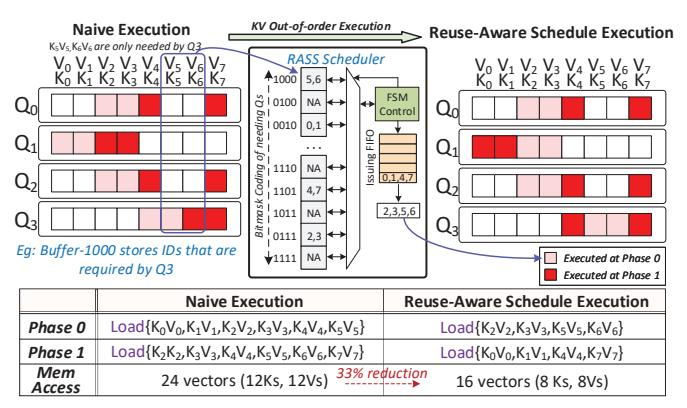

Fig. 15. Comparisons between RASS strategy and vanilla execution.

overlap. Hence, how to effectively reuse K and V between different queries is a crucial challenge, especially in large-scale parallel processing. Based on [31], we design a *reuse-aware schedule scheme (RASS)* with KV out-of-order execution to reduce overall memory access. As shown in Fig 15,  $k_2$  and  $k_3$  are shared among three queries:  $q_0$ ,  $q_1$  and  $q_2$ , making them the top candidates for initial scheduling. Then, RASS seeks out Ks which are exclusively used by the remaining unscheduled query  $q_3$ , i.e.,  $k_5$  and  $k_6$ . As a result,  $k_2$ ,  $k_3$ ,  $k_5$ , and  $k_6$  are packed together for execution in Phase 0. Such greedy search continues until all queries are allocated adequate Ks. As exemplified in Fig 15, compared to the default left-to-right computation order, RASS reduces 33% memory access.

We design a scheduler to implement the RASS. As shown in the middle of Fig. 15, the whole condition statement and control logic are implemented in an FSM controller. Besides, it involves a single-port read-write ID Buffer which is indexed using a bitmask of queries. For example,  $k_5v_5$  and  $k_6v_6$  are exclusively required by query  $q_3$ . Consequently, the pair '5, 6' is stored in buffer-1000. Then the FSM controller accesses the ID Buffer according to the RASS, and dispatches the IDs into the Issuing FIFO in an optimized execution order.

#### V. EVALUATION

#### A. Experimental Setup

We evaluate the soft performance of SOFA with several typical Transformer models and tasks by NVIDIA A100 GPU. For NLP tasks, the BERT-base and BERT-large models [3], are selected and evaluated by eight tasks from GLUE [50] and SQuAD v1.1 [51]. The maximum sequence length for BERT-B/L is 256/256/384/512/512 for MRPC/RTE/SQUAD/STSB/QNLI, respectively. Moreover, for GPT-2 [7], Bloom-1.7B [52], Llama7B/13B [46], language modeling tasks on Wikitext-2 [53], WikiLingua [54], Wiki-raw and Winogrande [55] are evaluated. The maximum length for datasets on evaluated Bloom1.3B/Llama7B/13B is 2k/4k/4k, respectively. For CV tasks, we choose the latest PVT (with 3192 sequence length) [56] for ImageNet-1k classification [57] by fine-tuning the checkpoint of ImageNet-21k. All models are implemented with Pytorch libraries [58] and Huggingface

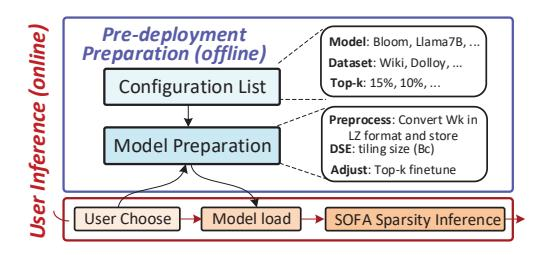

Fig. 16. The preparation and execution flow diagram of SOFA.

Transformer project [59]. For each task, we execute finetuning on NVIDIA A100 GPU after token pruning to recover accuracy.

For hardware evaluation, we performed the RTL design for the SOFA accelerator and utilized Synopsys DC on TSMC 28nm CMOS technology, to estimate the logic parts' area and power consumption. The power, area, and read/write bandwidth of on-chip SRAM buffers are estimated through CACTI [60]. For modeling off-chip DRAM, we utilize Ramulator [61] to simulate the memory behaviors and employ the same method with [62]–[64] to estimate the IO power. According to the synthesized results, the latency of the critical path is less than 1 ns. Then, we assume the running frequency of SOFA is 1 GHz. We extract each stage's actual cycles by simulating the RTL with Verilator [65], based on which a cycle-level simulator is implemented to evaluate end-to-end performance.

For comparisons with GPU, we deploy the benchmarks on the A100 platform using the Pytorch framework. We measure execution time by inserting torch.cuda.synchronize at the start and end points, and then calculate the elapsed time. For power measurement, based on nvidia-smi, we first measure the system's idle power, and then repeatedly run workloads and get the total power. The dynamic power is total power minus idle power. Based on the computational workload, we derive the average throughput and energy efficiency. Similarly, we run the cloud TPU [66], [67] to analyze the performance on diverse commercial hardware.

# B. Algorithm Performance

Fig. 16 illustrates the SOFA flow-diagram, which consists of two phases: *Pre-deployment Preparation (PP)* and *User Inference (UI)*. During the PP phase, the server selects models and corresponding datasets, then preprocesses each model through DSE (Section III-D) and fine-tuning. The processed models are then stored for user selection. In the UI phase, users simply select their desired model, which, once loaded, enables real-time dynamic sparsity inference using SOFA.

1) Algorithm Settings: In DSE objective function (2), the coefficient  $\alpha$  adjusts the proportion of the increased sorting cost, while  $\beta$  controls the proportion of the benefit from reduced exponential operations. Initially, we conducted numerous experiments on BERT/PVT/GPT-2/Bloom/Llama to determine the search range for each hyperparameter. Subsequently, during training, we employed grid search to find the optimal parameter for each model and applied the suc-


Fig. 17. Complexity reduction for the proposed DLZS, SADS and SU-FA.

cessive halving method to accelerate the process. According to our experiments, the  $\alpha/\beta$  is set as 0.24/0.31 (BERT-B/L), 0.2/0.24 (ViT), 0.4/0.42 (GPT-2), 0.53/0.56 (Bloom-1.7B), and 0.58/0.63 (Llama-7B/13B), respectively. We then search for 200 iterations with each learning rate (1e-1, 5e-2, 1e-3) to obtain the optimal tiling setting.

2) Overall Performance: We first set an ablation experiment to evaluate the low-complexity advantages of DLZS, SADS and SU-FA by comparing them with a baseline scheme. The baseline is assumed to utilize 4-bit multiplications in pre-compute stage, vanilla sorting in top-k stage and traditional FA in formal-compute stage. The complexity for different operations is normalized by the arithmetic complexity model [41]. For fairness, each model's loss remains under 2%. As shown in Fig.17, DLZS reduces complexity by 18% on average compared to the baseline. The reduction mainly comes from its multiplier-free computing and half-conversion feature. Further, SADS and SU-FA contribute to an extra 10\% reduction through segmented sorting and simplifying redundant non-linear computations using top-k information. Overall, compared to traditional mechanisms, SOFA's software strategy achieves 28% lower computation complexity under the same token sparsity, making SOFA accelerator effective for handling the LTPP scenario.

To demonstrate the effectiveness of SOFA in detecting token sparsity, Fig. 18 shows the QKV and attention computation reduction, introduced by the SOFA's sparsity prediction (LP). For practicality, we statistically analyzed the reduction in computational workload while ensuring accuracy losses remained below 0%, 1%, and 2% respectively. Different end-to-end metrics are utilized for evaluation, such as F1 score for SQuAD and accuracy for RTE. On average, SOFA's sparsity prediction can reduce the attention+QKV computation by 56.8%/62.6%/67.4% with 0%/1%/2% accuracy loss, respectively. Focusing solely on the attention part, SOFA reduces computation by 81.3%/87.7%/92.6%.

**Discussion on accuracy:** In top-k pruning, there is a hyperparameter k. Lowering k eliminates more QK-pairs, which in turn reduces computation. However, reducing k too aggressively could lead to the exclusion of some relatively important QK-pairs, thus hurting the model's accuracy. Moreover, different datasets exhibit varying features of sparsity due to their distinct data types and tasks. Consequently, in the pre-deployment preparation, the value of k can be modified to optimize the algorithm's exploiting of sparsity to minimize computation while maintaining accuracy. For example,

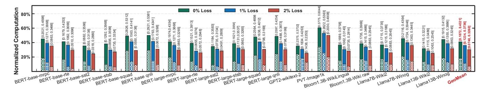

Fig. 18. Computation reduction by LP with diverse loss tolerance. [X, Y] respectively denote the computation reduction for the Atten part and QKV+Atten.

we observed that datasets like SST2 and STS-B, used for sentiment classification or semantic analysis, typically exhibit high sparsity because one or two keywords often indicate sentiment. Therefore, their computation reduction is adjusted to 90% while the accuracy loss is controlled within 1%. In contrast, image datasets generally contain a high amount of key information and have lower data redundancy compared to text classification datasets, resulting in lower sparsity. As a result, their computation reduction is adjusted to 73% with a 1% accuracy loss.

#### C. Architecture Evaluation

Throughput Improvement: Fig. 19 (a) compares the throughput of SOFA with A100 GPU on all benchmarks versus diverse accuracy loss. As can be seen, LP enables 1.08-1.78× of speed up on GPU with its sparsity detection. Unfortunately, the GPU cannot leverage the LP results as it cannot handle high sparsity or fine-grained on-demand KV calculations. Nor can it run the cross-stage DLZS-based prediction efficiently. By contrast, the SOFA exhibits an average 85.2% PE utilization due to its stage-fused fine-grained tiled dataflow, which pipelines crossstage DLZS prediction, SADS sorting, and SU-FA, leading to almost triple sparsity utilization than GPU. Further, the SU-FA engine is tailored to support sparsity attention acceleration with reduced computational complexity. Overall, SOFA achieves  $6.1\times$ ,  $7.2\times$  and  $9.5\times$  inference speed up with 0%/1%/2% accuracy degradation. Fig. 19 (b) further compares the SOFA with LP+traditional FA and LP+FA2 on A100. On average, FA on GPU brings around 1.5× gain, leading to a total  $2.7\times$  speed up combined with LP. By adjusting the loop order to avoid some factor scaling nonlinear computations, FA2 achieved a further  $1.19 \times$  throughput improvement. However, due to the difficulty of fine-grained cross-stage data movement on GPUs and the challenges of optimizing FA1/2 to support fine-grained scheduling and sparse computation, it is difficult to achieve higher improvements. By contrast, SOFA (soft+archi) achieves  $9.5 \times$  gain, which is  $3.01 \times$  greater than vanilla LP+FA2 on GPU. Fig. 20 (a) shows the memory access reduction effectiveness of SOFA. Compared with the baseline with vanilla dynamic sparsity, SOFA with RASS can reduce average 23% memory access. With SU-FA and tiled dataflow, the reduction rises further 79%.

Fig. 21 (a) illustrates the breakdown of throughput improvement achieved by GPU A100 and TPU with the hardware-software mechanism of SOFA. The baseline is executing a

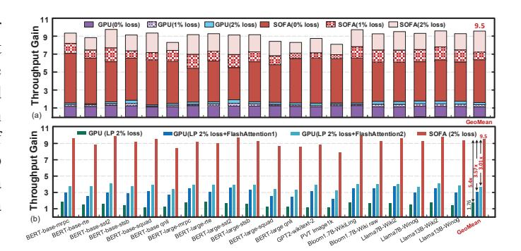

Fig. 19. Throughput gain of SOFA over (a) LP (b) LP+FA-1/2 on A100 GPU.

dense Transformer model on GPU/TPU. With SOFA software optimization, GPU and TPU achieve improvements of  $3.16\times$ and  $2.8\times$ , respectively. However, both of them cannot fully leverage all the benefits of SOFA software. GPU performs better than TPU due to its better ability to handle some of the fine-grained computations and scheduling in SOFA software. Adding SOFA's engines incrementally, we observed significant performance gains. The GPU with the DLZS engine achieves a  $1.65 \times$  speedup due to the systolic data flow improving data reuse, which the GPU's vector engine cannot support. The TPU with the DLZS engine shows an even higher improvement of 1.82× because its limited control instructions are inefficient at handling DLZS's logical branching. Similarly, the SADS engine, with its customized data paths, achieves a  $1.28\times$  improvement on the GPU and  $1.52\times$  on the TPU by quickly and efficiently executing redundant computations. Further, the SU-FA engine improves performance by  $1.26\times$  on the GPU and  $1.1\times$  on the TPU due to its max-assured circuits that avoid inefficient recomputation and data movement caused by log-domain calculation errors. The SU-FA engine employs a systolic array design. Since the GPU's support for systolic arrays is inferior to that of the TPU, it achieves a greater speedup than TPU. Lastly, the RASS unit achieves improvements of  $1.14\times$  on the GPU and  $1.3\times$  on the TPU owing to its customized control unit, which enables more efficient scheduling and data arrangement.

Area, Power and Energy: Table III shows the power and area breakdown of SOFA accelerator. It has a total area of  $5.69 \text{ mm}^2$ , and LP accounts for merely 18% and 15% of area and power. This benefits from the multiplier and converter-free

TABLE II SUMMARY AND COMPARISON WITH SOTA WORKS.

|               | Software Performance  |       |                   | Hardware Performance |      |          |       |       |         |          |                     |                         |         |
|---------------|-----------------------|-------|-------------------|----------------------|------|----------|-------|-------|---------|----------|---------------------|-------------------------|---------|
| Accelerators  | Sparsity <sup>®</sup> | Accu  | Saved             | Tech                 | Freq | Area     | Powe  | r [W] | Throup. | Energy 1 | Effi.® [GOPS/W]     | Area Effi. <sup>®</sup> | Latency |
|               |                       | Loss  | Comp <sup>®</sup> | [nm]                 | [Hz] | $[mm^2]$ | Core  | IO    | [GOPS]  | Core     | Device <sup>†</sup> | [GOPS/mm <sup>2</sup> ] | [ms]    |
| $A^{3}$ [28]  | Unstr                 | 5.3%  | 40%               | 40                   | 1G   | 2.08     | 0.205 | 0.617 | 221     | 1863     | 300                 | 217                     | 622     |
| ELSA [29]     | Unstr                 | 2%    | 73%               | 40                   | 1G   | 1.26     | 0.969 | 0.525 | 1090    | 1944     | 1004                | 1765                    | 252     |
| Sanger [30]   | Str                   | 0%    | 76%               | 55                   | 500M | 16.9     | 2.76  | -     | 2285    | 2342     | -                   | 522                     | 241     |
| DOTA [31]     | Str                   | 0.8%  | 80%               | 22                   | 1G   | 4.44     | 3.02  | -     | 4905    | 817      | -                   | 683                     | 448     |
| Energon [34]  | Unstr                 | 0.9%  | 77%               | 45                   | 1G   | 4.2      | 0.32  | 2.4   | 1153    | 7007     | 450                 | 709                     | 477     |
| DTATrans [32] | Unstr                 | 0.74% | 74%               | 40                   | 1G   | 1.49     | 0.734 | -     | 1304    | 3071     | -                   | 1786                    | 652     |
| SpAtten [33]  | Str                   | 0.9%  | 67%               | 40                   | 1G   | 1.55     | 0.325 | 0.617 | 360     | 1915     | 447                 | 474                     | 382     |
| FACT [23]     | Unstr                 | 0%    | 79%               | 28                   | 500M | 6.03     | 0.337 | -     | 928     | 2754     | -                   | 154                     | 296     |
| SOFA          | Unstr                 | 0%    | 82%               | 28                   | 1G   | 5.69     | 0.95  | 2.45  | 24423   | 25708    | 7183                | 4292                    | 45      |

Unstructured or Structured sparsity. Comp saving = Reduced attention computation - Prediction computation. Device Scaled to 28nm and 1.0V CMOS with  $f \propto 1/s^2$  and power (core)  $\propto (1/s)(1.0/Vdd)^2$ , where s=Tech/28nm [64], [68].

TABLE III AREA AND POWER BREAKDOWN FOR SOFA (CORE PART) AT 1GHZ.

| Modules            | Parameters                                           | Area[mm <sup>2</sup> ] | Power[mW] |  |  |
|--------------------|------------------------------------------------------|------------------------|-----------|--|--|
| DLZS prediction    | 128×32 shift PEs                                     | 0.351                  | 29.05     |  |  |
| DLZS prediction    | 128 LZEs                                             | 0.551                  |           |  |  |
| Iterative SADS     | 128 16-4 sort cores 0.679                            |                        | 112.79    |  |  |
| Tierative 5/1D5    | 128 clipping units                                   | 0.013                  | 112.73    |  |  |
| KV generation      | 128×4 16 bit PEs                                     | 0.875                  | 146.21    |  |  |
|                    | 128×4 16 bit PEs                                     |                        |           |  |  |
| SU-FA module       | 128 EXP units                                        | 3.012                  | 485.12    |  |  |
|                    | 128 DIV units                                        |                        |           |  |  |
|                    | 192KB Token SRAM                                     |                        |           |  |  |
| Memory             | 96KB Weight SRAM                                     | 0.497                  | 170.23    |  |  |
|                    | 28KB Temp SRAM                                       |                        |           |  |  |
| Scheduler & Others | -                                                    | 0.280                  | 6.45      |  |  |
| Off-Chip DRAM      | HBM2, 16× HBM channels @ 2GHz                        |                        |           |  |  |
| Total              | TSMC 28nm: Area=5.69mm <sup>2</sup> , Power=949.85mW |                        |           |  |  |

TABLE IV POWER BREAKDOWN OF SOFA.

|       | Core Part | Memory Interface | DRAM  | Overall |
|-------|-----------|------------------|-------|---------|
| Power | 0.95W     | 0.53W            | 1.92W | 3.40W   |

<sup>&</sup>lt;sup>®</sup> The DRAM and Interface power are estimated with 59.8GB/s.

design in DLZS engine and the low-overhead design of SADS engine. Fig. 20 (b) illustrates the overall energy-efficiency gain of SOFA compared to the A100 GPU. On average, SOFA achieves  $49.8\times$ ,  $57.6\times$ , and  $71.5\times$  greater energy efficiency in comparison to the A100 GPU with 0%, 1% and 2% accuracy loss, respectively. In Fig. 21 (b), we also show the efficiency gain breakdown. DLZS and SADS engines bring  $2.48\times$  and 2.1× efficiency gain, respectively. Further, SU-FA and RASS units together bring about  $3.27 \times$  gain. In Table IV, we list the power overhead consumed by the memory interface [69] and external DRAM.

# D. Comparison with Existing Acclerators

FACT, Sanger, Energon, SpAtten, ELSA and DOTA are SOTA Transformer dynamic sparsity accelerators. However, their designs focus on computational optimization, overlooking that memory access becomes the de facto bottleneck after computational optimization. The head pruning technique in SpAtten can partly alleviate memory access issues, but its efficiency is limited as it fundamentally depends on the


Fig. 20. (a) Memory access reduction of SOFA. (b) Efficiency gain of SOFA over Nyidia A100 GPU.


Fig. 21. (a) Throughput gain of GPU/TPU with SOFA's mechanism (b) Energy efficiency gain of GPU with SOFA's mechanism.

characteristics of the task. On the other hand, although Energon considers a certain computation-to-memory access ratio in its architecture design, it still suffers from inefficiency due to the variability of computational tasks and models. In summary, previous efforts still lack simultaneously optimizing both computation and memory access. When imbalance arises between computation and memory access due to sparsity, it hampers further enhancement of hardware efficiency. SOFA employs a holistic FlashAttention-like scheme to divide all work stages of dynamic sparsity into fine-grained tile manner, and leverages the sort information for cross-stage collaborative optimization. Table II compares the features of software and hardware performance across existing SOTA accelerators. Benefiting from the low complexity of LP mechanism, SOFA achieves the greatest reduction (82%) in computation at the same accuracy loss of 0%. We list their hardware parameters and present a normalized comparison [64], [68] of energy

and area efficiency. Compared to these SOTA accelerators, SOFA achieves a device (core + I/O) energy efficiency of 7183 GOPS/W, representing an average improvement of  $7.2\times$  to  $24\times$ . This improvement stems from the fine-grained data flow achieved through collaborative cross-stage optimization, which effectively reduces off-chip memory accesses. Additionally, SOFA achieves 4292 GOPS/mm² area efficiency, which is  $2.4\times$  to  $27.9\times$  better than the SOTA accelerators. The gain in area efficiency primarily arises from the algorithm-hardware co-optimization for low complexity.

In Table II, we also quantitatively compare the latency of the SOTA accelerators by evaluating them to execute an attention part (137GOPs) of Llma7B. For fairness, all accelerators are scaled to 128 multipliers clocked at 1GHz. For example, the effective throughput of FACT is 928 GOPS in 500MHz with 512 multipliers. Then its execution latency is 2\*137/928=296ms. Compared to the 0% loss accelerators FACT and Sanger, SOFA achieves  $6.6\times$  and  $5,4\times$  latency reduction, respectively. Moreover, SOFA achieves  $8.5\times$  and  $10.6\times$  latency decrease over SpAtten and Energon, respectively. Such reduction in SOFA latency is mainly attributed to the fine-grained tiling execution across stages, as illustrated in Fig.6.

#### VI. RELATED WORKS AND DISCUSSION

Efficient Transformer Accelerator. Numerous studies [23], [28]-[34], [70]-[75] have been proposed to improve the energy efficiency and speed of Transformer inference. However, most of these works focus on attention computation reduction, including static sparsity [75]-[78], dynamic sparsity [23], [28]–[34] and hybrid sparsity [79]. However, when computation is optimized, the memory access would dominate the overall power and time, especially for LTPP scenarios, which these works ignore. By contrast, SOFA optimizes both compute and memory access, thus greatly outperforming previous works. Further, all dynamic sparsity efforts focus on individually optimizing each stage for higher efficiency. Unlike these works, SOFA exhibits a cross-stage holistic optimization. This provides SOFA with an ever-overlooked opportunity for cross-stage tiling, executing a fine-grained tiled dataflow that accelerates inference while reducing off-chip memory access.

Neural network accelerator with sparsity. There are very many ASIC or FPGA accelerators [70], [72], [80]–[98] that leverage sparsity to optimize the performance of neural network inference. There also exist general sparse tensor algebra accelerators [99]-[104] proposed in recent years, which can be used to process sparse FC layers. Recently, works [105]-[107] utilize hierarchical sparsity to construct a comprehensive design space and provide accurate performance metrics, which enable the automatic and optimal design of sparse DNN accelerators. However, most of the works focus on exploiting pre-trained static sparse weights. By contrast, SOFA leverages LP to predict on-the-fly dynamic sparsity. Especially, such sparsity comes from the argmax approximation property of softmax, thus needing to be detected actively. This makes the traditional near-zero-based sparsity methods inapplicable. Through recently some works are config for activation sparsity [108] and both weight and activation sparsity [106], [109], [110], they are all based on the near-zero sparsity, thus failing to the top-k sparsity scene, which is SOFA targets.

Fused operator tiling accelerators. Many works [111]– [118] leverage layer-fusion strategy to optimize the DNN inference performance. Specifically, DNNBuilder [117] and DeFiNES [118] use a depth-first-like layer fusion in CNNs to enhance data reuse via cross-layer tiling, enabled by the weak operator dependencies in CNNs. However, dynamic sparsity of Transformers face bottlenecks due to row dependency in the top-k/softmax operator, restricting dynamic sparsity for long sequences. SOFA addresses this by employing the DCE data distribution property, unlocking the possibility of depthfirst-like execution in Transformer dynamic sparsity for the first time. DeepBurning [119] partitions NN graphs at the inter-operator granularity and executes them in a pipeline fashion. In contrast, SOFA achieves finer-grained execution by dividing within the operator, leading to more efficient SRAM utilization. FLAT [120] fuses the two matmul operators and softmax in attention to reduce off-chip memory access but fails to resolve softmax row dependency. Traditional FlashAttention [39], [40] successfully unlocks the row dependency of softmax but at the expense of surging computation costs. In this aspect, SOFA leverages SU-FA to successfully solve the row dependency in softmax, allowing for finer-grained tiling and reducing SU-FA complexity using top-k sorting information.

#### VII. CONCLUSION

We propose SOFA, a cross-stage compute-memory efficient algorithm-hardware co-design to accelerate dynamic sparsity Transformer inference for LTPP. We introduce a novel log-domain DLZS computing paradigm to estimate Q-K pairs with add-only operation, requiring less converters. To prevent memory access from becoming a bottleneck after sparsity computation optimization, we propose SADS and SU-FA to enable cross-stage tiling for the end-to-end workflow. Leveraging this tiling strategy, SOFA executes a fine-grained pipeline dataflow across diverse stages, effectively mitigating memory access and latency issues. Efficient architecture is designed to support and accelerate the above mechanisms with a memory-efficient reuse-aware schedule. SOFA achieves 71.5× energy saving than Nvidia A100 GPU, and average 15.8× higher energy efficiency than eight SOTA accelerators, respectively.

# ACKNOWLEDGMENT

We would like to thank Mingcong Song, for his valuable suggestions. This work was supported in part by the National Science and Technology Major Project under Grant 2022ZD0115201; the NSFC under Grant 62125403, and Grant 92164301; Beijing S&T Project Z221100007722023; in part by the project funding for the 2022 Special Project on Industrial Foundation Reconstruction and High Quality Development of Manufacturing Industry CEIEC-2022-ZM02-0245; in part by the Beijing National Research Center for Information Science and Technology; and in part by the Beijing Advanced Innovation Center for Integrated Circuits.

# REFERENCES

- [1] Ashish Vaswani, Noam Shazeer, Niki Parmar, Jakob Uszkoreit, Llion Jones, Aidan N Gomez, Łukasz Kaiser, and Illia Polosukhin. attentionis all you need. *Advances in neural information processing systems*, 30, 2017.
- [2] Tom B. Brown, Benjamin Mann, Nick Ryder, Melanie Subbiah, Jared D Kaplan, Prafulla Dhariwal, Arvind Neelakantan, Pranav Shyam, Girish Sastry, Amanda Askell, Sandhini Agarwal, Ariel Herbert-Voss, Gretchen Krueger, Tom Henighan, Rewon Child, Aditya Ramesh, Daniel M. Ziegler, Jeffrey Wu, Clemens Winter, Christopher Hesse, Mark Chen, Eric Sigler, Mateusz Litwin, Scott Gray, Benjamin Chess, Jack Clark, Christopher Berner, Sam McCandlish, Alec Radford, Ilya Sutskever, and Dario Amodei. Language models are few-shot learners. *Advances in neural information processing systems*, 33:1877– 1901, 2020.
- [3] Jacob Devlin, Ming-Wei Chang, Kenton Lee, and Kristina Toutanova. BERT: Pre-training of deep bidirectional Transformers for language understanding. *arXiv preprint arXiv:1810.04805*, 2018.
- [4] Zhenzhong Lan, Mingda Chen, Sebastian Goodman, Kevin Gimpel, Piyush Sharma, and Radu Soricut. Albert: A lite BERT for self-supervised learning of language representations. *arXiv preprint arXiv:1909.11942*, 2019.
- [5] Yinhan Liu, Myle Ott, Naman Goyal, Jingfei Du, Mandar Joshi, Danqi Chen, Omer Levy, Mike Lewis, Luke Zettlemoyer, and Veselin Stoyanov. Roberta: A robustly optimized BERT pretraining approach. *arXiv preprint arXiv:1907.11692*, 2019.
- [6] Alec Radford, Karthik Narasimhan, Tim Salimans, and Ilya Sutskever. Improving language understanding by generative pre-training. 2018.
- [7] Alec Radford, Jeffrey Wu, Rewon Child, David Luan, Dario Amodei, and Ilya Sutskever. Language models are unsupervised multitask learners. *OpenAI blog*, 1(8):9, 2019.
- [8] Colin Raffel, Noam Shazeer, Adam Roberts, Katherine Lee, Sharan Narang, Michael Matena, Yanqi Zhou, Wei Li, and Peter J Liu. Exploring the limits of transfer learning with a unified text-to-text Transformer. *The Journal of Machine Learning Research*, 21(1):5485– 5551, 2020.
- [9] Victor Sanh, Lysandre Debut, Julien Chaumond, and Thomas Wolf. DistilBERT, a distilled version of BERT: Smaller, faster, cheaper and lighter. *arXiv preprint arXiv:1910.01108*, 2019.
- [10] Mohammad Shoeybi, Mostofa Patwary, Raul Puri, Patrick LeGresley, Jared Casper, and Bryan Catanzaro. Megatron-LM: Training multibillion parameter language models using model parallelism. *arXiv preprint arXiv:1909.08053*, 2019.
- [11] Nicolas Carion, Francisco Massa, Gabriel Synnaeve, Nicolas Usunier, Alexander Kirillov, and Sergey Zagoruyko. End-to-end object detection with Transformers. In *Proceedings of the European conference on computer vision*, pages 213–229, 2020.
- [12] Alexey Dosovitskiy, Lucas Beyer, Alexander Kolesnikov, Dirk Weissenborn, Xiaohua Zhai, Thomas Unterthiner, Mostafa Dehghani, Matthias Minderer, Georg Heigold, Sylvain Gelly, Jakob Uszkoreit, and Neil Houlsby. An image is worth 16x16 words: Transformers for image recognition at scale. *arXiv preprint arXiv:2010.11929*, 2020.
- [13] Junnan Li, Dongxu Li, Caiming Xiong, and Steven Hoi. BLIP: Bootstrapping language-image pre-training for unified vision-language understanding and generation. In *Proceedings of the International Conference on Machine Learning*, pages 12888–12900, 2022.
- [14] Ze Liu, Han Hu, Yutong Lin, Zhuliang Yao, Zhenda Xie, Yixuan Wei, Jia Ning, Yue Cao, Zheng Zhang, Li Dong, Furu Wei, and Baining Guo. Swin Transformer V2: Scaling up capacity and resolution. In *Proceedings of the IEEE/CVF conference on computer vision and pattern recognition*, pages 12009–12019, 2022.
- [15] Ze Liu, Yutong Lin, Yue Cao, Han Hu, Yixuan Wei, Zheng Zhang, Stephen Lin, and Baining Guo. Swin Transformer: Hierarchical vision Transformer using shifted windows. In *Proceedings of the IEEE/CVF international conference on computer vision*, pages 10012–10022, 2021.
- [16] Alec Radford, Jong Wook Kim, Chris Hallacy, Aditya Ramesh, Gabriel Goh, Sandhini Agarwal, Girish Sastry, Amanda Askell, Pamela Mishkin, Jack Clark, Gretchen Krueger, and Ilya Sutskever. Learning transferable visual models from natural language supervision. In *Proceedings of the International Conference on Machine Learning*, pages 8748–8763, 2021.

- [17] Robin Rombach, Andreas Blattmann, Dominik Lorenz, Patrick Esser, and Bjorn Ommer. High-resolution image synthesis with latent diffu- ¨ sion models. In *Proceedings of the IEEE/CVF Conference on Computer Vision and Pattern Recognition*, pages 10684–10695, 2022.
- [18] Xiaohua Zhai, Alexander Kolesnikov, Neil Houlsby, and Lucas Beyer. Scaling vision Transformers. In *Proceedings of the IEEE/CVF Conference on Computer Vision and Pattern Recognition*, pages 12104–12113, 2022.
- [19] Xizhou Zhu, Weijie Su, Lewei Lu, Bin Li, Xiaogang Wang, and Jifeng Dai. Deformable DETR: Deformable Transformers for end-to-end object detection. *arXiv preprint arXiv:2010.04159*, 2020.
- [20] Zhanghao Wu, Zhijian Liu, Ji Lin, Yujun Lin, and Song Han. Lite Transformer with long-short range attention. In *Proceedings of the International Conference on Learning Representations*, 2019.
- [21] Claire Cardie Faisal Ladhak, Esin Durmus and Kathleen McKeown. WikiLingua: A new benchmark dataset for multilingual abstractive summarization. In *Findings of EMNLP, 2020*, 2020.
- [22] Shervin Minaee, Tomas Mikolov, Narjes Nikzad, Meysam Chenaghlu, Richard Socher, Xavier Amatriain, and Jianfeng Gao. Large language models: A survey. *arXiv preprint arXiv:2402.06196*, 2024.
- [23] Yubin Qin, Yang Wang, Dazheng Deng, Zhiren Zhao, Xiaolong Yang, Leibo Liu, Shaojun Wei, Yang Hu, and Shouyi Yin. FACT: FFNattention co-optimized Transformer architecture with eager correlation prediction. In *Proceedings of the 50th Annual International Symposium on Computer Architecture*, pages 1–14, 2023.
- [24] Sehoon Kim, Coleman Hooper, Thanakul Wattanawong, Minwoo Kang, Ruohan Yan, Hasan Genc, Grace Dinh, Qijing Huang, Kurt Keutzer, Michael W Mahoney, Yakun Sophia Shao, and Amir Gholami. Full stack optimization of Transformer inference: A survey. *arXiv preprint arXiv:2302.14017*, 2023.
- [25] Tianle Li, Ge Zhang, Quy Duc Do, Xiang Yue, and Wenhu Chen. Longcontext LLMs struggle with long in-context learning. *arXiv preprint arXiv:2404.02060*, 2024.
- [26] Bingyang Wu, Shengyu Liu, Yinmin Zhong, Peng Sun, Xuanzhe Liu, and Xin Jin. LoongServe: Efficiently serving long-context large language models with elastic sequence parallelism. *arXiv preprint arXiv:2404.09526*, 2024.
- [27] Jiaheng Liu, Zhiqi Bai, Yuanxing Zhang, Chenchen Zhang, Yu Zhang, Ge Zhang, Jiakai Wang, Haoran Que, Yukang Chen, Wenbo Su, Tiezheng Ge, Jie Fu, Chen Wenhu, and Bo Zheng. E2-LLM: Efficient and extreme length extension of large language models. *arXiv preprint arXiv:2401.06951*, 2024.
- [28] Tae Jun Ham, Sung Jun Jung, Seonghak Kim, Young H Oh, Yeonhong Park, Yoonho Song, Jung-Hun Park, Sanghee Lee, Kyoung Park, Jae W Lee, and Deog-Kyoon Jeong. A3: Accelerating attention mechanisms in neural networks with approximation. In *Proceedings of the IEEE International Symposium on High Performance Computer Architecture (HPCA)*, pages 328–341, 2020.
- [29] Tae Jun Ham, Yejin Lee, Seong Hoon Seo, Soosung Kim, Hyunji Choi, Sung Jun Jung, and Jae W Lee. ELSA: Hardware-software co-design for efficient, lightweight self-attention mechanism in neural networks. In *Prceedings of the 48th ACM/IEEE Annual International Symposium on Computer Architecture (ISCA)*, pages 692–705, 2021.
- [30] Liqiang Lu, Yicheng Jin, Hangrui Bi, Zizhang Luo, Peng Li, Tao Wang, and Yun Liang. Sanger: A co-design framework for enabling sparse attention using reconfigurable architecture. In *Proceedings of the 54th Annual IEEE/ACM International Symposium on Microarchitecture*, pages 977–991, 2021.
- [31] Zheng Qu, Liu Liu, Fengbin Tu, Zhaodong Chen, Yufei Ding, and Yuan Xie. DOTA: Detect and omit weak attentions for scalable Transformer acceleration. In *Proceedings of the 27th ACM International Conference on Architectural Support for Programming Languages and Operating Systems*, pages 14–26, 2022.
- [32] Tao Yang, Fei Ma, Xiaoling Li, Fangxin Liu, Yilong Zhao, Zhezhi He, and Li Jiang. DTATrans: Leveraging dynamic token-based quantization with accuracy compensation mechanism for efficient Transformer architecture. *IEEE Transactions on Computer-Aided Design of Integrated Circuits and Systems*, 42(2):509–520, 2022.
- [33] Hanrui Wang, Zhekai Zhang, and Song Han. SpAtten: Efficient sparse attention architecture with cascade token and head pruning. In *Proceedings of the IEEE International Symposium on High-Performance Computer Architecture (HPCA)*, pages 97–110, 2021.
- [34] Zhe Zhou, Junlin Liu, Zhenyu Gu, and Guangyu Sun. Energon: Toward efficient acceleration of Transformers using dynamic sparse attention.

- *IEEE Transactions on Computer-Aided Design of Integrated Circuits and Systems*, 42(1):136–149, 2022.
- [35] Yinmin Zhong, Shengyu Liu, Junda Chen, Jianbo Hu, Yibo Zhu, Xuanzhe Liu, Xin Jin, and Hao Zhang. DistServe: Disaggregating prefill and decoding for goodput-optimized large language model serving. *arXiv preprint arXiv:2401.09670*, 2024.
- [36] Pratyush Patel, Esha Choukse, Chaojie Zhang, ´Inigo Goiri, Aashaka ˜ Shah, Saeed Maleki, and Ricardo Bianchini. Splitwise: Efficient generative LLM inference using phase splitting. *arXiv preprint arXiv:2311.18677*, 2023.
- [37] Weilin Zhao, Yuxiang Huang, Xu Han, Chaojun Xiao, Zhiyuan Liu, and Maosong Sun. Ouroboros: Speculative decoding with large model enhanced drafting. *arXiv preprint arXiv:2402.13720*, 2024.
- [38] Samuel Williams, Andrew Waterman, and David Patterson. Roofline: An insightful visual performance model for multicore architectures. *Communications of the ACM*, 52(4):65–76, 2009.
- [39] Tri Dao, Dan Fu, Stefano Ermon, Atri Rudra, and Christopher Re.´ FlashAttention: Fast and memory-efficient exact attention with IOawareness. *Advances in Neural Information Processing Systems*, 35:16344–16359, 2022.
- [40] Tri Dao. FlashAttention-2: Faster attention with better parallelism and work partitioning. *arXiv preprint arXiv:2307.08691*, 2023.
- [41] Richard P Brent and Paul Zimmermann. *Modern computer arithmetic*, volume 18. Cambridge University Press, 2010.
- [42] Josh Achiam, Steven Adler, Sandhini Agarwal, Lama Ahmad, Ilge Akkaya, Florencia Leoni Aleman, Diogo Almeida, Janko Altenschmidt, Sam Altman, Shyamal Anadkat, et al. GPT-4 technical report. *arXiv preprint arXiv:2303.08774*, 2023.
- [43] Szymon Tworkowski, Konrad Staniszewski, Mikołaj Pacek, Yuhuai Wu, Henryk Michalewski, and Piotr Miłos. Focused Transformer: Con- ´ trastive training for context scaling. *Advances in Neural Information Processing Systems*, 36, 2024.
- [44] Christoforos Kachris. A survey on hardware accelerators for large language models. *arXiv preprint arXiv:2401.09890*, 2024.
- [45] Mark Horowitz. Computing's energy problem (and what we can do about it). In *Proceedings of the IEEE international solid-state circuits conference digest of technical papers (ISSCC)*, pages 10–14, 2014.
- [46] Hugo Touvron, Thibaut Lavril, Gautier Izacard, Xavier Martinet, Marie-Anne Lachaux, Timothee Lacroix, Baptiste Rozi ´ ere, Naman ` Goyal, Eric Hambro, Faisal Azhar, Aurelien Rodriguez, Armand Joulin, Edouard Grave, and Guillaume Lample. LLaMa: Open and efficient foundation language models. *arXiv preprint arXiv:2302.13971*, 2023.
- [47] Pierre Blanchard, Desmond J Higham, and Nicholas J Higham. Accurately computing the log-sum-exp and softmax functions. *IMA Journal of Numerical Analysis*, 41(4):2311–2330, 2021.
- [48] Nebojsa Z Milenkovi ˇ c, Vladimir V Stankovi ´ c, and Miljana Lj Mili ´ c.´ Modular design of fast leading zeros counting circuit. *Journal of Electrical Engineering*, 66(6):329–333, 2015.
- [49] Shih-Hsiang Lin, Pei-Yin Chen, and Yu-Ning Lin. Hardware design of low-power high-throughput sorting unit. *IEEE Transactions on Computers*, 66(8):1383–1395, 2017.
- [50] Alex Wang, Amanpreet Singh, Julian Michael, Felix Hill, Omer Levy, and Samuel R Bowman. GLUE: A multi-task benchmark and analysis platform for natural language understanding. In *Proceedings of the International Conference on Learning Representations*, 2018.
- [51] Pranav Rajpurkar, Jian Zhang, Konstantin Lopyrev, and Percy Liang. SQuAD: 100,000+ questions for machine comprehension of text. In *Proceedings of the 2016 Conference on Empirical Methods in Natural Language Processing*, pages 2383–2392, 2016.
- [52] Teven Le Scao, Angela Fan, Christopher Akiki, Ellie Pavlick, Suzana Ilic, Daniel Hesslow, Roman Castagn ´ e, Alexandra Sasha Luccioni, ´ Franc¸ois Yvon, Matthias Galle, et al. Bloom: A 176B-parameter open- ´ access multilingual language model. *arXiv preprint arXiv:2211.05100*, 2022.
- [53] Stephen Merity, Caiming Xiong, James Bradbury, and Richard Socher. Pointer sentinel mixture models. In *Proceedings of the International Conference on Learning Representations*, 2016.
- [54] Faisal Ladhak, Esin Durmus, Claire Cardie, and Kathleen McKeown. WikiLingua: A new benchmark dataset for cross-lingual abstractive summarization. *arXiv preprint arXiv:2010.03093*, 2020.
- [55] Keisuke Sakaguchi, Ronan Le Bras, Chandra Bhagavatula, and Yejin Choi. Winogrande: An adversarial Winograd schema challenge at scale. *Communications of the ACM*, 64(9):99–106, 2021.

- [56] Wenhai Wang, Enze Xie, Xiang Li, Deng-Ping Fan, Kaitao Song, Ding Liang, Tong Lu, Ping Luo, and Ling Shao. Pyramid vision Transformer: A versatile backbone for dense prediction without convolutions. In *Proceedings of the IEEE/CVF international conference on computer vision*, pages 568–578, 2021.
- [57] Jia Deng, Wei Dong, Richard Socher, Li-Jia Li, Kai Li, and Li Fei-Fei. Imagenet: A large-scale hierarchical image database. In *Proceedings of the IEEE Conference on Computer Vision and Pattern Recognition*, pages 248–255, 2009.
- [58] Adam Paszke, Sam Gross, Soumith Chintala, Gregory Chanan, Edward Yang, Zachary DeVito, Zeming Lin, Alban Desmaison, Luca Antiga, and Adam Lerer. Automatic differentiation in PyTorch. 2017.
- [59] Thomas Wolf, Lysandre Debut, Victor Sanh, Julien Chaumond, Clement Delangue, Anthony Moi, Pierric Cistac, Tim Rault, Remi ´ Louf, Morgan Funtowicz, Joe Davison, Sam Shleifer, Patrick von Platen, Clara Ma, Yacine Jernite, Julien Plu, Canwen Xu, Teven Le Scao, Sylvain Gugger, Mariama Drame, Quentin Lhoest, and Alexander Rush. Transformers: State-of-the-art natural language processing. In *Proceedings of the Conference on Empirical Methods in Natural Language Processing: System Demonstrations*, pages 38–45, 2020.
- [60] Naveen Muralimanohar, Rajeev Balasubramonian, and Norman P Jouppi. CACTI 6.0: A tool to model large caches. *HP laboratories*, 27:28, 2009.
- [61] Yoongu Kim, Weikun Yang, and Onur Mutlu. Ramulator: A fast and extensible DRAM simulator. *IEEE Computer architecture letters*, 15(1):45–49, 2015.
- [62] Lukas Cavigelli and Luca Benini. Origami: A 803-GOp/s/W convolutional network accelerator. *IEEE Transactions on Circuits and Systems for Video Technology*, 27(11):2461–2475, 2016.
- [63] Renzo Andri, Lukas Cavigelli, Davide Rossi, and Luca Benini. YodaNN: An ultra-low power convolutional neural network accelerator based on binary weights. In *Proceedings of the IEEE Computer Society Annual Symposium on VLSI (ISVLSI)*, pages 236–241, 2016.
- [64] Yizhi Wang, Jun Lin, and Zhongfeng Wang. An energy-efficient architecture for binary weight convolutional neural networks. *IEEE Transactions on Very Large Scale Integration (VLSI) Systems*, 26(2):280–293, 2017.
- [65] Wilson Snyder. Verilator and SystemPerl. In *North American SystemC Users' Group, Design Automation Conference*, 2004.
- [66] Norman P Jouppi, Cliff Young, Nishant Patil, David Patterson, Gaurav Agrawal, Raminder Bajwa, Sarah Bates, Suresh Bhatia, Nan Boden, Al Borchers, Rick Boyle, Cantin Pierre-luc, Clifford Chao, Chris Clark, Jeremy Coriell, Mike Daley, Matt Dau, Jeffrey Dean, Ben Gelb, Tara Vazir Ghaemmaghami, Rajendra Gottipati, William Gulland, Robert Hagmann, C Richard Ho, Doug Hogberg, John Hu, Robert Hundt, Dan Hurt, Julian Ibarz, Aaron Jaffey, Alek Jaworski, Alexander Kaplan, Harshit Khaitan, Andy Koch, Naveen Kumar, Steve Lacy, James Laudon, James Law, Diemthu Le, Chris Leary, Zhuyuan Liu, Kyle Lucke, Alan Lundin, Gordon MacKean, Adriana Maggiore, Maire Mahony, Kieran Miller, Rahul Nagarajan, Ravi Narayanaswami, Ray Ni, Kathy Nix, Thomas Norrie, Mark Omernick, Narayana Penukonda, Andy Phelps, Jonathan Ross, Matt Ross, Amir Salek, Emad Samadiani, Chris Severn, Gregory Sizikov, Matthew Snelham, Jed Souter, Dan Steinberg, Andy Swing, Mercedes Tan, Gregory Thorson, Bo Tian, Horia Toma, Erick Tuttle, Vijay Vasudevan, Richard Walter, Walter Wang, Eric Wilcox, and Doe Hyun Yoon. In-datacenter performance analysis of a tensor processing unit. In *Proceedings of the 44th annual international symposium on computer architecture*, pages 1–12, 2017.
- [67] Google. Google cloud TPU. https://cloud.google.com/tpu. Accessed: 2024-06-25.
- [68] Leibo Liu, Guiqiang Peng, Pan Wang, Sheng Zhou, Qiushi Wei, Shouyi Yin, and Shaojun Wei. Energy-and area-efficient recursive-conjugategradient-based MMSE detector for massive MIMO systems. *IEEE Transactions on Signal Processing*, 68:573–588, 2020.
- [69] Brian Leibowitz, Robert Palmer, John Poulton, Yohan Frans, Simon Li, John Wilson, Michael Bucher, Andrew M Fuller, John Eyles, Marko Aleksic, Trey Greer, and Nhat M Nguyen. A 4.3 GB/s mobile memory interface with power-efficient bandwidth scaling. *IEEE Journal of Solid-State Circuits*, 45(4):889–898, 2010.
- [70] Chao Fang, Aojun Zhou, and Zhongfeng Wang. An algorithm-hardware co-optimized framework for accelerating N:M sparse Transformers. *IEEE Transactions on Very Large Scale Integration (VLSI) Systems*, 30(11):1573–1586, 2022.

- [71] Seongmin Hong, Seungjae Moon, Junsoo Kim, Sungjae Lee, Minsub Kim, Dongsoo Lee, and Joo-Young Kim. DFX: A low-latency multi-FPGA appliance for accelerating Transformer-based text generation. In *Proceedings of the 55th IEEE/ACM International Symposium on Microarchitecture (MICRO)*, pages 616–630, 2022.
- [72] Zheng Li, Soroush Ghodrati, Amir Yazdanbakhsh, Hadi Esmaeilzadeh, and Mingu Kang. Accelerating attention through gradient-based learned runtime pruning. In *Proceedings of the 49th Annual International Symposium on Computer Architecture*, pages 902–915, 2022.
- [73] Amir Yazdanbakhsh, Ashkan Moradifirouzabadi, Zheng Li, and Mingu Kang. Sparse attention acceleration with synergistic in-memory pruning and on-chip recomputation. In *Proceedings of the 55th IEEE/ACM International Symposium on Microarchitecture (MICRO)*, pages 744– 762, 2022.
- [74] Ali Hadi Zadeh, Isak Edo, Omar Mohamed Awad, and Andreas Moshovos. GOBO: Quantizing attention-based NLP models for low latency and energy efficient inference. In *Proceedings of the 53rd Annual IEEE/ACM International Symposium on Microarchitecture (MICRO)*, pages 811–824, 2020.
- [75] Bingbing Li, Santosh Pandey, Haowen Fang, Yanjun Lyv, Ji Li, Jieyang Chen, Mimi Xie, Lipeng Wan, Hang Liu, and Caiwen Ding. FTRANS: Energy-efficient acceleration of Transformers using FPGA. In *Proceedings of the ACM/IEEE International Symposium on Low Power Electronics and Design*, pages 175–180, 2020.
- [76] Haoran You, Zhanyi Sun, Huihong Shi, Zhongzhi Yu, Yang Zhao, Yongan Zhang, Chaojian Li, Baopu Li, and Yingyan Lin. ViTCoD: Vision Transformer acceleration via dedicated algorithm and accelerator codesign. In *Proceedings of the IEEE International Symposium on High-Performance Computer Architecture (HPCA)*, pages 273–286, 2023.
- [77] Guan Shen, Jieru Zhao, Quan Chen, Jingwen Leng, Chao Li, and Minyi Guo. SALO: An efficient spatial accelerator enabling hybrid sparse attentionmechanisms for long sequences. In *Proceedings of the 59th ACM/IEEE Design Automation Conference*, pages 571–576, 2022.
- [78] Hongxiang Fan, Thomas Chau, Stylianos I Venieris, Royson Lee, Alexandros Kouris, Wayne Luk, Nicholas D Lane, and Mohamed S Abdelfattah. Adaptable butterfly accelerator for attention-based NNs via hardware and algorithm co-design. In *Proceedings of the 55th IEEE/ACM International Symposium on Microarchitecture (MICRO)*, pages 599–615, 2022.
- [79] Jieru Zhao, Pai Zeng, Guan Shen, Quan Chen, and Minyi Guo. Hardware-software co-design enabling static and dynamic sparse attentionmechanisms. *IEEE Transactions on Computer-Aided Design of Integrated Circuits and Systems*, 2024.
- [80] Reza Hojabr, Ali Sedaghati, Amirali Sharifian, Ahmad Khonsari, and Arrvindh Shriraman. SPAGHETTI: Streaming accelerators for highly sparse GEMM on FPGAs. In *Proceedings of the IEEE International Symposium on High-Performance Computer Architecture (HPCA)*, pages 84–96, 2021.
- [81] Ashish Gondimalla, Noah Chesnut, Mithuna Thottethodi, and TN Vijaykumar. SparTen: A sparse tensor accelerator for convolutional neural networks. In *Proceedings of the 52nd Annual IEEE/ACM International Symposium on Microarchitecture*, pages 151–165, 2019.
- [82] Bahar Asgari, Ramyad Hadidi, Tushar Krishna, Hyesoon Kim, and Sudhakar Yalamanchili. ALRESCHA: A lightweight reconfigurable sparse-computation accelerator. In *Proceedings of the IEEE International Symposium on High Performance Computer Architecture (HPCA)*, pages 249–260, 2020.
- [83] Huizheng Wang, Zaichen Zhang, Xiaohu You, and Chuan Zhang. Low-complexity winograd convolution architecture based on stochastic computing. In *Proceedings of the 23rd IEEE International Conference on Digital Signal Processing (DSP)*, pages 1–5, 2018.
- [84] Chunhua Deng, Yang Sui, Siyu Liao, Xuehai Qian, and Bo Yuan. GoSPA: An energy-efficient high-performance globally optimized sparse convolutional neural network accelerator. In *Proceedings of the ACM/IEEE 48th Annual International Symposium on Computer Architecture (ISCA)*, pages 1110–1123, 2021.
- [85] Eric Qin, Ananda Samajdar, Hyoukjun Kwon, Vineet Nadella, Sudarshan Srinivasan, Dipankar Das, Bharat Kaul, and Tushar Krishna. Sigma: A sparse and irregular GEMM accelerator with flexible interconnects for DNN training. In *Proceedings of the IEEE International Symposium on High Performance Computer Architecture (HPCA)*, pages 58–70, 2020.
- [86] Huizheng Wang, Weihong Xu, Zaichen Zhang, Xiaohu You, and Chuan Zhang. An efficient stochastic convolution architecture based on fast

- FIR algorithm. *IEEE Transactions on Circuits and Systems II: Express Briefs*, 69(3):984–988, 2021.
- [87] Sumanth Gudaparthi, Sarabjeet Singh, Surya Narayanan, Rajeev Balasubramonian, and Visvesh Sathe. CANDLES: Channel-aware novel dataflow-microarchitecture co-design for low energy sparse neural network acceleration. In *Proceedings of the IEEE International Symposium on high-performance computer architecture (HPCA)*, pages 876–891, 2022.
- [88] Edward Hanson, Shiyu Li, Hai'Helen' Li, and Yiran Chen. Cascading structured pruning: Enabling high data reuse for sparse DNN accelerators. In *Proceedings of the 49th Annual International Symposium on Computer Architecture*, pages 522–535, 2022.
- [89] Jonathan S Lew, Yunpeng Liu, Wenyi Gong, Negar Goli, R David Evans, and Tor M Aamodt. Anticipating and eliminating redundant computations in accelerated sparse training. In *Proceedings of the 49th Annual International Symposium on Computer Architecture*, pages 536–551, 2022.
- [90] Gang Li, Weixiang Xu, Zhuoran Song, Naifeng Jing, Jian Cheng, and Xiaoyao Liang. Ristretto: An atomized processing architecture for sparsity-condensed stream flow in CNN. In *Proceedings of the 55th IEEE/ACM International Symposium on Microarchitecture (MICRO)*, pages 1434–1450, 2022.
- [91] Shiyu Li, Edward Hanson, Xuehai Qian, Hai" Helen" Li, and Yiran Chen. ESCALATE: Boosting the efficiency of sparse CNN accelerator with kernel decomposition. In *Proceedings of the 54th Annual IEEE/ACM International Symposium on Microarchitecture*, pages 992– 1004, 2021.
- [92] Zhi-Gang Liu, Paul N Whatmough, Yuhao Zhu, and Matthew Mattina. S2TA: Exploiting structured sparsity for energy-efficient mobile CNN acceleration. In *Proceedings of the IEEE International Symposium on High-Performance Computer Architecture (HPCA)*, pages 573–586, 2022.
- [93] Julian Pavon, Ivan Vargas Valdivieso, Adrian Barredo, Joan Marimon, Miquel Moreto, Francesc Moll, Osman Unsal, Mateo Valero, and Adrian Cristal. VIA: A smart scratchpad for vector units with application to sparse matrix computations. In *Proceedings of the IEEE International Symposium on High-Performance Computer Architecture (HPCA)*, pages 921–934, 2021.
- [94] Alexander Rucker, Matthew Vilim, Tian Zhao, Yaqi Zhang, Raghu Prabhakar, and Kunle Olukotun. Capstan: A vector RDA for sparsity. In *Proceedings of the 54th Annual IEEE/ACM International Symposium on Microarchitecture*, pages 1022–1035, 2021.
- [95] Fazle Sadi, Joe Sweeney, Tze Meng Low, James C Hoe, Larry Pileggi, and Franz Franchetti. Efficient SPMV operation for large and highly sparse matrices using scalable multi-way merge parallelization. In *Proceedings of the 52nd Annual IEEE/ACM International Symposium on Microarchitecture*, pages 347–358, 2019.
- [96] Sumit Walia, Bachu Varun Tej, Arpita Kabra, Joydeep Devnath, and Joycee Mekie. Fast and low-power quantized fixed posit high-accuracy DNN implementation. *IEEE Transactions on Very Large Scale Integration (VLSI) Systems*, 30(1):108–111, 2021.
- [97] Dingqing Yang, Amin Ghasemazar, Xiaowei Ren, Maximilian Golub, Guy Lemieux, and Mieszko Lis. Procrustes: A dataflow and accelerator for sparse deep neural network training. In *Proceedings of the 53rd Annual IEEE/ACM International Symposium on Microarchitecture (MICRO)*, pages 711–724, 2020.
- [98] Ashish Gondimalla, Mithuna Thottethodi, and T. N. Vijaykumar. Eureka: Efficient tensor cores for one-sided unstructured sparsity in DNN inference. In *Proceedings of the 56th Annual IEEE/ACM International Symposium on Microarchitecture*, page 324–337, 2023.
- [99] Nitish Srivastava, Hanchen Jin, Jie Liu, David Albonesi, and Zhiru Zhang. MatRaptor: A sparse-sparse matrix multiplication accelerator based on row-wise product. In *Proceedings of the 53rd Annual IEEE/ACM International Symposium on Microarchitecture (MICRO)*, pages 766–780, 2020.
- [100] Mostafa Mahmoud, Isak Edo, Ali Hadi Zadeh, Omar Mohamed Awad, Gennady Pekhimenko, Jorge Albericio, and Andreas Moshovos. TensorDash: Exploiting sparsity to accelerate deep neural network training. In *Proceedings of the 53rd Annual IEEE/ACM International Symposium on Microarchitecture (MICRO)*, pages 781–795, 2020.
- [101] Youngeun Kwon, Yunjae Lee, and Minsoo Rhu. TensorDIMM: A practical near-memory processing architecture for embeddings and tensor operations in deep learning. In *Proceedings of the 52nd Annual*

- *IEEE/ACM International Symposium on Microarchitecture*, pages 740– 753, 2019.
- [102] Kartik Hegde, Hadi Asghari-Moghaddam, Michael Pellauer, Neal Crago, Aamer Jaleel, Edgar Solomonik, Joel Emer, and Christopher W Fletcher. ExTensor: An accelerator for sparse tensor algebra. In *Proceedings of the 52nd Annual IEEE/ACM International Symposium on Microarchitecture*, pages 319–333, 2019.
- [103] Konstantinos Kanellopoulos, Nandita Vijaykumar, Christina Giannoula, Roknoddin Azizi, Skanda Koppula, Nika Mansouri Ghiasi, Taha Shahroodi, Juan Gomez Luna, and Onur Mutlu. SMASH: Codesigning software compression and hardware-accelerated indexing for efficient sparse matrix operations. In *Proceedings of the 52nd annual IEEE/ACM international symposium on microarchitecture*, pages 600– 614, 2019.
- [104] Yuedan Chen, Guoqing Xiao, Fan Wu, Zhuo Tang, and Keqin Li. tpSpMV: A two-phase large-scale sparse matrix-vector multiplication kernel for manycore architectures. *Information Sciences*, 523:279–295, 2020.
- [105] Yannan Nellie Wu, Po-An Tsai, Angshuman Parashar, Vivienne Sze, and Joel S Emer. Sparseloop: An analytical approach to sparse tensor accelerator modeling. In *Proceedings of the 55th Annual IEEE/ACM International Symposium on Microarchitecture (MICRO)*, pages 1377– 1395, 2022.
- [106] Yannan Nellie Wu, Po-An Tsai, Saurav Muralidharan, Angshuman Parashar, Vivienne Sze, and Joel Emer. HighLight: Efficient and flexible DNN acceleration with hierarchical structured sparsity. In *Proceedings of the 56th Annual IEEE/ACM International Symposium on Microarchitecture*, pages 1106–1120, 2023.
- [107] Jong Hoon Shin, Ali Shafiee, Ardavan Pedram, Hamzah Abdel-Aziz, Ling Li, and Joseph Hassoun. Griffin: Rethinking sparse optimization for deep learning architectures. In *Proceedings of the IEEE International Symposium on High-Performance Computer Architecture (HPCA)*, pages 861–875, 2022.
- [108] Jun-Woo Jang, Sehwan Lee, Dongyoung Kim, Hyunsun Park, Ali Shafiee Ardestani, Yeongjae Choi, Channoh Kim, Yoojin Kim, Hyeongseok Yu, Hamzah Abdel-Aziz, Jun-Seok Park, Heonsoo Lee, Dongwoo Lee, Myeong Woo Kim, Hanwoong Jung, Heewoo Nam, Dongguen Lim, Seungwon Lee, Joon-Ho Song, Suknam Kwon, Joseph Hassoun, SukHwan Lim, and Changkyu Choi. Sparsity-aware and reconfigurable NPU architecture for Samsung flagship mobile SoC. In *Proceedings of the 48th Annual ACM/IEEE International Symposium on Computer Architecture (ISCA)*, pages 15–28, 2021.
- [109] Guyue Huang, Zhengyang Wang, Po-An Tsai, Chen Zhang, Yufei Ding, and Yuan Xie. RM-STC: Row-merge dataflow inspired GPU sparse tensor core for energy-efficient sparse acceleration. In *Proceedings of the 56th Annual IEEE/ACM International Symposium on Microarchitecture*, pages 338–352, 2023.
- [110] Yang Wang, Chen Zhang, Zhiqiang Xie, Cong Guo, Yunxin Liu, and Jingwen Leng. Dual-side sparse tensor core. In *Proceedings of the 48th Annual ACM/IEEE International Symposium on Computer Architecture (ISCA)*, pages 1083–1095, 2021.
- [111] Manoj Alwani, Han Chen, Michael Ferdman, and Peter Milder. Fusedlayer CNN accelerators. In *Proceedings of the 49th Annual IEEE/ACM International Symposium on Microarchitecture (MICRO)*, pages 1–12, 2016.
- [112] Koen Goetschalckx and Marian Verhelst. DepFiN: A 12nm, 3.8 TOPs depth-first CNN processor for high Res. image processing. In *Proceedings of the Symposium on VLSI Circuits*, pages 1–2, 2021.
- [113] Dongseok Im, Donghyeon Han, Sungpill Choi, Sanghoon Kang, and Hoi-Jun Yoo. DT-CNN: An energy-efficient dilated and transposed convolutional neural network processor for region of interest based image segmentation. *IEEE Transactions on Circuits and Systems I: Regular Papers*, 67(10):3471–3483, 2020.
- [114] Juhyoung Lee, Dongjoo Shin, Jinsu Lee, Jinmook Lee, Sanghoon Kang, and Hoi-Jun Yoo. A full HD 60 fps CNN super resolution processor with selective caching based layer fusion for mobile devices. In *Proceedings of the Symposium on VLSI Circuits*, pages C302–C303, 2019.
- [115] Feng Min, Haobo Xu, Ying Wang, Yujie Wang, Jiajun Li, Xingqi Zou, Bei Li, and Yinhe Han. Dadu-Eye: A 5.3 TOPS/W, 30 fps/1080p high accuracy stereo vision accelerator. *IEEE Transactions on Circuits and Systems I: Regular Papers*, 68(10):4207–4220, 2021.
- [116] Huiyu Mo, Wenping Zhu, Wenjing Hu, Qiang Li, Ang Li, Shouyi Yin, Shaojun Wei, and Leibo Liu. A 12.1 TOPS/W quantized network

- acceleration processor with effective-weight-based convolution and error-compensation-based prediction. *IEEE Journal of Solid-State Circuits*, 57(5):1542–1557, 2021.
- [117] Xiaofan Zhang, Junsong Wang, Chao Zhu, Yonghua Lin, Jinjun Xiong, Wen-mei Hwu, and Deming Chen. DNNBuilder: An automated tool for building high-performance DNN hardware accelerators for FPGAs. In *Proceedings of the IEEE/ACM International Conference on Computer-Aided Design (ICCAD)*, pages 1–8, 2018.
- [118] Linyan Mei, Koen Goetschalckx, Arne Symons, and Marian Verhelst. DeFinNES: Enabling fast exploration of the depth-first scheduling space for DNN accelerators through analytical modeling. In *Proceedings of the IEEE International Symposium on High-Performance Computer Architecture (HPCA)*, pages 570–583, 2023.
- [119] Xuyi Cai, Ying Wang, Xiaohan Ma, Yinhe Han, and Lei Zhang. DeepBurning-SEG: Generating DNN accelerators of segment-grained pipeline architecture. In *Proceedings of the 55th Annual IEEE/ACM International Symposium on Microarchitecture (MICRO)*, pages 1396– 1413, 2022.
- [120] Sheng-Chun Kao, Suvinay Subramanian, Gaurav Agrawal, Amir Yazdanbakhsh, and Tushar Krishna. FLAT: An optimized dataflow for mitigating attention bottlenecks. In *Proceedings of the 28th ACM International Conference on Architectural Support for Programming Languages and Operating Systems*, pages 295–310, 2023.