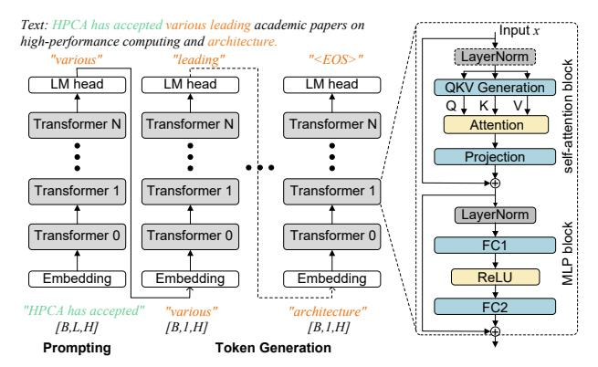
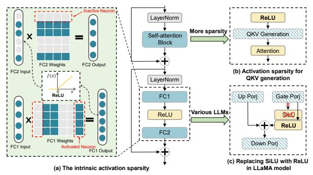
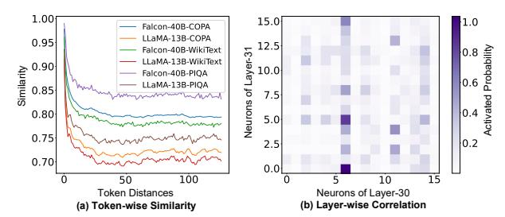
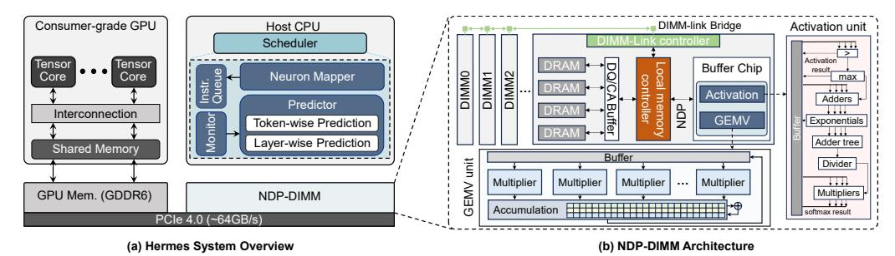
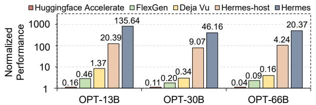
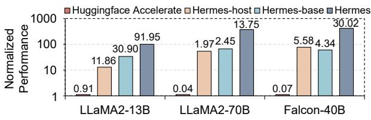
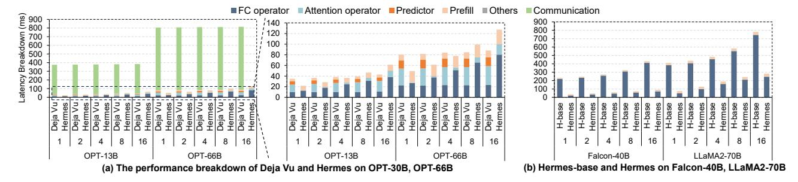
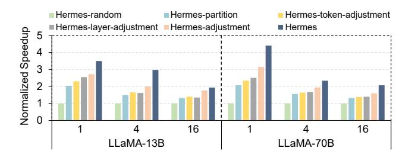
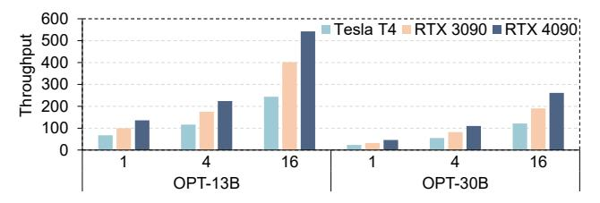
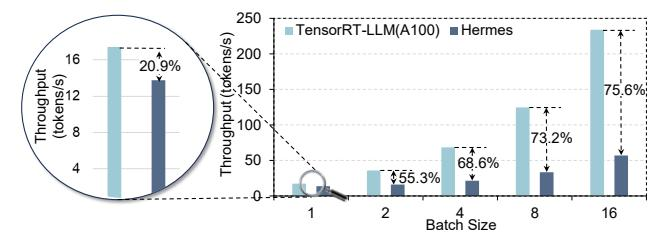

# Make LLM Inference Affordable to Everyone: Augmenting GPU Memory with NDP-DIMM

Lian Liu<sup>1, 2, 3, †</sup>, Shixin Zhao<sup>1, 2, †</sup>, Bing Li<sup>4</sup>, Haimeng Ren<sup>1,5</sup>, Zhaohui Xu<sup>1,5</sup>,

Mengdi Wang<sup>1,2</sup>, Xiaowei Li<sup>1,2,3</sup>, Yinhe Han<sup>1,2</sup>, and Ying Wang<sup>1,2, ⋈</sup>

Institute of Computing Technology, Chinese Academic of Sciences<sup>1</sup>,

University of Chinese Academy of Sciences<sup>2</sup>, Zhongguancun Laboratory<sup>3</sup>,

Institute of Microelectronics, Chinese Academy of Sciences<sup>4</sup>,

School of Information Science and Technology, ShanghaiTech University<sup>5</sup>

{liulian211, zhaoshixin18}@mails.ucas.ac.cn libing2024@ime.ac.cn {renhm2022, xuzhh12022}@shanghaitech.edu.cn

{wangmengdi, lxw, yinhes, wangying2009}@ict.ac.cn

Abstract—The billion-scale Large Language Models (LLMs) necessitate deployment on expensive server-grade GPUs with large-storage HBMs and abundant computation capability. As LLM-assisted services become popular, achieving cost-effective LLM inference on budget-friendly hardware becomes the current trend. This has sparked extensive research into relocating LLM parameters from expensive GPUs to external host memory. However, the restricted bandwidth between the host and GPU memory limits the inference performance of existing solutions.

This work introduces Hermes, a budget-friendly system that leverages the near-data processing units (NDP) within commodity DRAM DIMMs to enhance the performance of a single consumergrade GPU, achieving efficient LLM inference. We recognize that the inherent activation sparsity in LLMs naturally divides weight parameters into two categories, termed "hot" and "cold" neurons, respectively. Hot neurons, which consist of only approximately 20% of all weight parameters, account for 80% of the total computational load. In contrast, cold neurons make up the other 80% of parameters but are responsible for just 20% of the computational workload. Leveraging this observation, we propose a heterogeneous computing strategy: mapping hot neurons to a single computation-efficient GPU without large-capacity HBMs, while offloading cold neurons to NDP-DIMMs, which offer large memory size but limited computation capabilities. In addition, the dynamic nature of activation sparsity necessitates a real-time partition of hot and cold neurons and adaptive remapping of cold neurons across multiple NDP-DIMM modules. To tackle these issues, we introduce a lightweight predictor that ensures optimal real-time neuron partition and adjustment between GPU and NDP-DIMMs. Furthermore, we utilize a window-based online scheduling mechanism to maintain load balance among multiple NDP-DIMM modules. In summary, Hermes facilitates the deployment of LLaMA2-70B on consumer-grade hardware at a rate of 13.75 tokens/s and realizes an average 75.24× speedup over the state-of-the-art offloading-based inference system on popular LLMs.

## I. INTRODUCTION

Large Language Models (LLMs) have gained significant importance and widespread attention. Open-source models like OPT, LLaMA, and Qwen series [1], [57], [63], as well as proprietary models such as GPT-4 and Claude [2], [5], exhibit remarkable performance in a variety of tasks including code


Fig. 1. (a) Existing offloading solutions view host memory as the augmented memory, but cause burdensome data transfer on PCIe. (b) Partitioning the weight matrix in each layer, and utilizing NDP-DIMMs to handle poor computation intensity parts, only introduces negligible data transfer.

generation [9], [18], machine translation [24], [30], and chatbots [19], [42], etc. Nevertheless, extremely powerful LLMs with billions of parameters often require server-grade GPUs with large-capacity HBMs, making them cost-prohibitive for many applications. For example, deploying LLaMA2-70B locally using TensorRT-LLM [41] requires five NVIDIA A100-40GB-SXM4 GPUs, totaling over \$50,000.

To investigate the development of cost-effective LLM inference systems, researchers have shifted their focus to more budget-friendly hardware, such as consumer-grade GPUs. Despite these GPUs' significant computation capability, such as 1321 Tensor TOPS in NVIDIA RTX 4090, they suffer from limited graphic memory size. This limitation renders them unsuitable for deploying LLMs with billions of parameters. To this end, researchers use offloading strategies [23], [45], [50], transferring large portions of LLM parameters to DIMM (Dual-Inline Memory Module)-based host memory. As depicted in Figure 1a, existing offloading solutions view host memory as the augmented memory space for GPUs to enable LLMs, and parameters stored in host memory need to be accessed via PCIe. This results in substantial data transfers on PCIe. However, due to more than  $15 \times$  bandwidth gap between the PCIe and the internal GPU memory, about 99% of the overall LLM runtime in these offloading solutions is attributed to the data transfers on PCIe.

It is essential to minimize the data loading for weight parameters to ease the burden on PCIe. Thus, existing works [34],

<sup>†</sup>Both authors contributed equally to this research

<sup>&</sup>lt;sup>™</sup>Corresponding author

[53], [59] utilize the activation sparsity to reduce the required data loading. Since the activation functions such as ReLU in LLMs can zero out specific activation values, the corresponding parameters that are expected to be computed with these zero activations do not need to be loaded either, as illustrated in Figure 3. According to the activation sparsity, weight parameters in LLMs can be further categorized into hot and cold neurons<sup>1</sup> . Our evaluation indicates that around 20% of neurons, referred to as "hot neurons", are responsible for 80% of the computations, whereas the remaining 80% of neurons, known as "cold neurons", account for only 20% of the computations. This suggests that the computation intensity of hot neurons is 16× higher than that of cold neurons. Consequently, it is natural to store hot neurons in GPU memory and offload cold neurons to host memory to effectively mitigate data loading costs [34]. Despite these optimizations, data transfers on PCIe still dominate the inference procedure, accounting for 90% of the total inference latency of OPT-66B, as they constitute a large part of the total LLM work-set.

According to our observation, the cold neurons offloaded on host memory require large storage but have poor computation intensity. As a result, we are motivated to utilize near-data processing (NDP) units based on DRAM DIMMs to provide the least-required computation capability for cold neurons to avoid their movement. As illustrated in Figure 1b, we can leverage the NDP units and GPU cores to conduct computations for cold and hot neurons, respectively. As the computation results only take a few KBs, the data transfer cost in step 2 is negligible. Note that we use NDP-DIMMs, instead of high-performance but expensive alternatives such as HBM-PIM and AiM [11], [16], [20], [43], as the augmented memory to build the budget-friendly system for local deployment.

Yet, attaining high-performance but affordable LLM inference using a basic NDP-DIMM enhanced GPU system is challenging due to the limited computational resources in NDP-DIMMs. Two primary challenges must be resolved:

- 1. Deciding the optimal neuron partition. First, the criteria for dividing hot and cold neurons between GPU and NDP-DIMMs are crucial for computational efficiency. For instance, if only the least active neurons are predicted as "hot", this will stress the limited GPU memory size. Conversely, allocating frequently activated neurons to the "cold" region will burden the computation-limited NDP-DIMMs with excessive computation. Therefore, determining the optimal neuron partition strategy is essential. However, due to the input-specific nature, the hot/cold neuron partition cannot be completely predetermined. It necessitates an accurate but lightweight online prediction to achieve real-time adjustment for hot/cold neuron partition with minimal migration cost.
- 2. Exploiting the limited computation capability of multiple NDP-DIMMs. In contrast to the provided hundreds of TFLOPS of a single GPU, the computation capability is constrained to hundreds of GFLOPS [6], [14], [26], [68] on

NDP-DIMMs. Consequently, even are used to process the infrequently activated neurons, NDP-DIMMs still bottleneck the inference performance. Thus, it is crucial to fully unleash NDP units for efficient computing. Specifically, as we need to use multiple DIMMs together to support the large-scale LLMs, computational loads on each NDP-DIMM are expected to be balanced. However, due to the dynamics of activated neurons, some NDP-DIMMs are overburdened while others remain underutilized during inference. Therefore, the main challenge is to achieve online scheduling for computational load balance among NDP-DIMMs.

To address the aforementioned challenges, we introduce Hermes, an innovative and budget-friendly inference system that uses NDP-DIMMs to enhance both the memory capacity and processing capability of a single consumer-grade GPU. On one hand, we address the optimal neuron partition in two phases. First, we formalize the problem as an integer linear programming (ILP) issue and employ an offline solver to help determine the optimal partition based on the profiled data. Then, utilizing the distinct distribution patterns of hot and cold neurons, we develop a lightweight online predictor to manage online cold/hot neuron partition. This approach bypasses the expensive MLP-based predictor used in prior studies [52], [54], [59], enabling real-time migration of hot and cold neurons. On the other hand, to address load imbalance issues among multiple NDP-DIMMs, we exploit the token-wise similarity inherent in LLM. In detail, we propose a windowbased online scheduling strategy, which utilizes the neuron activity of adjacent tokens to online remap cold neurons across multiple NDP-DIMMs, achieving load balance.

In a nutshell, our contributions are as follows:

- 1) We propose a novel system, Hermes, which takes advantage of the cold/hot distribution in LLM inference and augments consumer-grade GPU with NDP-DIMMs to achieve high-performance and economic LLM inference.
- 2) We propose a two-step solution to achieve the optimal cold/hot neuron partition for Hermes. We first formulate an ILP problem and utilize an offline solver to find the original optimal partition, and further implement a lightweight online predictor to guide the online migration of hot and cold neurons during LLM inference.
- 3) We develop a window-based online scheduling strategy to achieve load balance among multiple computationlimited NDP-DIMMs, effectively improving the overall hardware utilization.
- 4) Compared to existing offloading-based inference systems FlexGen and Deja Vu, Hermes achieves a speedup of 148.98× and 75.24×, respectively.

# II. BACKGROUND

# *A. LLM Inference & Architecture*

As shown in Figure 2, the inference procedure of transformer-based LLMs comprises two stages: prompting and token generation. During the prompting stage, an input sequence is used to produce keys and values (KV cache)

<sup>1</sup>This paper defines a neuron as a specific row/column in a weight matrix, and neurons will not be activated when associated with zero activations.



Fig. 2. The LLM inference procedure and architecture

for each transformer layer in the LLM, and this is done just once per inference. In the token generation stage, previously generated tokens are used to update the KV cache and generate new tokens incrementally. This stage is executed multiple times, depending on the length of the output sequence. Since token generation accounts for more than 90% of the total runtime [32], this paper primarily focuses on optimizing inference efficiency in token generation.

An LLM has multiple transformer layers, each containing a self-attention and an MLP block. In the self-attention block, input x is projected linearly to produce Q, K and V, processed by the attention operator to yield the attention result, and then computed by the projection layer for the MLP input. The MLP block includes fully connected (FC) layers and nonlinear functions. For example, the OPT model uses two FC layers which are connected by one ReLU activation function.

## B. Activation Sparsity in LLMs

The activation function such as ReLU in the MLP block introduces the intrinsic activation sparsity to LLMs [34], [38], [52]. As shown in Figure 3a, the ReLU function in the MLP block, can turn many activation values to zero, eliminating the need to load and compute these inactive neurons. As the red dashed box shows, a neuron in this paper represents a specific row or column within a weight matrix. For example, due to the ReLU function zeros out the 1st, 4th and 5th input values of the FC2 layer, the corresponding columns and rows in FC1 and FC2 weight matrix will not be activated.

To further achieve activation sparsity on self-attention blocks, programmers insert ReLU functions before QKV generation [38], as illustrated in Figure 3b. For LLMs that do not use ReLU as their activation function, such as LLaMA (SiLU) and Falcon (GELU) [4], [57], recent work has demonstrated that they can also be replaced by ReLU functions [38], [52], as demonstrated in Figure 3c. Previous studies [52], [54], [66] also demonstrated that the activation sparsity within LLMs provides significant sparsity (ranging from 70% to 90%) with negligible accuracy degradation (less than 1%).

## C. Offloading-based LLM Inference Systems

Most existing LLM inference systems [28], [41], [45], [61] require the use of expensive server-grade GPUs, which provide



Fig. 3. The inherent activation sparsity within certain LLMs is further enhanced to achieve higher sparsity across various LLMs.

high-capacity HBM to store the large-scale LLM parameters. This limits their deployment to easily accessible and affordable hardware. Offloading is a viable technique to enable LLM inference on such commodity hardware [23]. For instance, a single consumer-grade GPU can leverage the host memory resources to perform inference of LLaMA2-70B [22], [45].

Existing offloading-based inference systems utilize host memory to extend the storage capacity of the GPU to accommodate LLMs. As long as there is sufficient host memory, this strategy can be used to perform inference on LLMs of various sizes. HuggingFace Accelerate [23] integrates offloading techniques from training systems by automatically mapping and partitioning weights into GPU and host memory respectively, only transferring the necessary parameters during inference. However, the characteristics of LLM inference are quite different from training [10], making it inefficient. To address this issue, FlexGen [50] provides a novel zigzag offloading strategy to maximize the inference throughput within a limited PCIe bandwidth. This zig-zag scheduling strategy integrates multiple tokens into a block and overlaps the weight-loading cost during token processing within one block. For instance, it computes all the tokens in one block (e.g., more than 100 tokens) with the weights in layer i, while prefetching the weights in layer i + 1 simultaneously. The burdensome block computation in one layer effectively overlaps the weight prefetching cost for the next layer, especially for the prefill phase which occupies multiple tokens even with a single batch. However, this method is unsuitable for local deployment scenarios, which only occupy limited batch sizes [21] during token generation. Deja Vu [34] further exploits activation sparsity to perform LLM inference by predicting and loading only the activated neurons, thereby reducing data access and computation overhead. However, since the activated neurons are dynamic and cannot be preloaded into the limited consumer-grade GPU memory, data still need to be loaded from host memory, resulting in inference efficiency being bounded by PCIe bandwidth. Overall, while existing offloading solutions can effectively extend the storage capacity of inference systems to support larger LLMs, the low bandwidth data transfer of PCIe results in poor inference performance.

## III. MOTIVATIONS & CHALLENGES

## A. Why NDP-DIMM Enhanced GPU?

Offloading is essential for LLM inference on low-budget systems with a single consumer-grade GPU. However, as noted in Section II-C, even utilizing activation sparsity to reduce weight parameter access, the PCIe bandwidth remains the bottleneck. Thus, costly data transfers between extended memory and GPU must be minimized. However, simply offloading the corresponding computation of cold neurons on the host CPU [17], [53] can only achieve a limited performance improvement, as the host CPU can only access DRAM with limited improved bandwidth than PCIe (e.g., 89.6 GB/s vs. 64 GB/s). To this end, we choose to employ multiple NDP-DIMMs as the extended memory, as they offer comparable bandwidth and larger storage capacity than a single consumergrade GPU. Need to mention that as a budget-friendly host memory solution, we do not consider high-performance but expensive HBM-PIM and AiM [11], [43] in this study. Given the limited computation capability, only utilizing the processing units in NDP-DIMMs cannot boost the inference efficiency [58]. Consequently, we are motivated to use NDP-DIMMs to enhance GPU for efficient LLM inference.

Our observation indicates that the activation sparsity within LLMs effectively partitions weight parameters into two distinct regions, which are ideally suited to consumer-grade GPU and NDP-DIMMs, respectively. Specifically, activation sparsity in LLMs follows a power-law distribution [53], [59]. About 20% of neurons (hot neurons) account for 80% of computations, while 80% (cold neurons) handle only 20%. Hot neurons, with  $16 \times$  higher computation intensity, fit GPU memory, while cold neurons suit NDP-DIMMs. During inference, GPU can provide high computation capability for hot neurons and NDP-DIMMs enable the cold neurons computation in memory.

## B. Necessity of Hot/Cold Neuron Partition

Hot/cold neuron partition impacts the computational load on GPU/NDP-DIMMs, affecting the inference performance of the heterogeneous system. Due to the input-specific nature of activation sparsity, solely relying on the offline partition is insufficient. Our evaluation on LLaMA2-70B reveals significant dynamics in when the neuron will be activated (hereafter, neuron activity patterns) during inference. Approximately 52% of the initialized hot neurons exhibit varied activity during inference. This variability in neuron behavior results in suboptimal performance with a fixed hot/cold partition, causing a  $1.63 \times$  degradation compared to an oracle (the theoretically optimal partition) scheme. Thus, we must dynamically predict and adjust the hot/cold neuron partition.

However, typical MLP-based predictors [34], [38], [52], [64] for activation sparsity in LLMs are costly. For example, predicting the activated neurons in LLaMA-7B needs perlayer MLP-based predictors, requiring an extra 2GB storage and inducing 10%-25% inference runtime. Fortunately, the inherent locality of activation sparsity leads us to design a lightweight and accurate predictor for efficient online partition



Fig. 4. Distribution patterns for activation sparsity. (a) The adjacent tokens enjoy high similarity on activated neurons for various models and datasets. (b) The activated neurons between consecutive layers are highly correlated.

adjustments. To be specific, we found that activation sparsity in LLM inference shows considerable token-wise similarity and layer-wise correlation, worth exploiting.

- 1) Token-wise Similarity: We analyzed the similarity between tokens to explore the distribution characteristics of activation sparsity. As shown in Figure 4a, we evaluate the tokenwise similarity for LLaMA-13B and Falcon-40B with multiple widely adopted datasets, including COPA [46], Wikitext2 [37] and PIQA [7]. As one can notice, the adjacent tokens have a higher distribution similarity than distant tokens. Specifically, the similarity between adjacent tokens exceeds 90% (95% for Falcon-40B), but drops to 70% once the tokens' distance exceeds 10. This indicates that in context, adjacent tokens often express similar meanings, leading to high similarity in their activity distribution. Additionally, we observe that when the distance between tokens exceeds 25, the distribution similarity almost no longer decreases, indicating that beyond a certain window size, the semantic correlation becomes weak and has less impact on the overall distribution.
- 2) Layer-wise Correlation: We further observed that the distribution of activated neurons in two consecutive layers is highly correlated. As shown in Figure 4b, when the 6th neuron in layer-30 of LLaMA-13B is activated, the probability of neurons 0 and 5 being activated in layer-31 exceeds 90%. This suggests that we can use the results of the preceding layer to predict the distribution of activated neurons in the current layer.

Overall, the token-wise similarity and layer-wise correlation motivate us to design a lightweight online predictor based on historical activation information. According to the prediction results, we can online adjust the hot/cold neurons partition to effectively exploit the processing advantages of the consumergrade GPU and NDP-DIMMs, respectively.

## C. Load Imbalance across Multiple NDP-DIMMs

Due to the storage limitation of a single DIMM, multiple DIMMs are required to store all the neurons (weight parameters) in LLM. Specifically, one DIMM only stores portions of the neurons and the corresponding processing unit can only directly assess neurons in the DIMM with high internal bandwidth. However, due to the input-specific nature of activation sparsity, the computational load on each NDP-DIMM can be diverse. For example, when fixing the cold neuron distribution on multiple DIMMs for LLaMA-13B,

the most overloaded NDP-DIMM will have 1.2-2.5× more computational load than others.

Therefore, we need an online scheduling strategy to remap the cold neuron across DIMMs to achieve load balance. Meanwhile, an efficient data transmission pathway among DIMMs is essential to help adjust the neuron placement. By optimizing neuron computation scheduling, we can minimize data transfers across NDP-DIMMs while ensuring balanced computational loads across DIMMs. This ensures that all parts of the system can maximize their performance.

In summary, the NDP-DIMM enhanced GPU approach effectively addresses the substantial data transfer overhead in offloading processes, providing a promising solution to improve LLM inference efficiency by leveraging the activation sparsity patterns inherent in LLMs.

# IV. HERMES SYSTEM

# *A. System & Architecture Overview*

*1) Architecture:* Figure 5a illustrates the overview of Hermes. Hermes augments consumer-grade GPU with NDP-DIMMs to achieve low-budget, high-performance inference system for LLMs.

Consumer-grade GPU: For LLM inference, we only use one accessible and budget-friendly consumer-grade GPU. Despite limited graphic memory, it has ample computing units, like tensor cores, for high-performance parallel processing. It also features high-speed GDDR memory with superior bandwidth. For instance, the NVIDIA RTX 4090 with 24GB GDDR6 provides 82.6 TFLOPS, 1321 Tensor TOPS, and 936 GB/s bandwidth, making it suitable for LLM inference. Hermes uses a single GPU to efficiently execute hot neurons.

NDP-DIMM: Given that cold neurons are randomly activated, all data stored on each DIMM should be accessible to its own NDP units. Meanwhile, DIMM is required to support the normal data access from GPU for hot neuron transmission. Therefore, as illustrated in Figure 5b, we have chosen the center buffer-based NDP-DIMM design [3], [11], [25], [29], which allows the processing unit to access all data in its own DIMM. The center buffer-based NDP DIMM design also complies with the normal memory access as the newly added units will not influence the memory access function supported by the local memory controller [3], [25]. Here, we detail the microarchitecture of our NDP-DIMM design. To facilitate typical operations in LLMs and potential inter-DIMM data moving, each NDP-DIMM is equipped with GEMV units, activation units, and DIMM-links [68].

*GEMV Unit*: The GEMV unit reads data from the DRAM cell and the center buffer, performing the GEMV computation associated with cold neurons. To support batched inference and fully utilize the bandwidth achievable within the DIMM center buffer, each GEMV unit contains 256 multipliers. Each multiplier is responsible for 128-bit multiplication in a typical bit-serial manner [14], a reduction tree-based accumulator, and a 256 KB buffer. During computation, each multiplier computes eight FP16 values simultaneously, and the accumulator is responsible for the addition of partial sums with data dependencies. The buffer stores the intermediate result generated by LLM layers.

*Activation Unit*: The activation unit is designed to support the necessary non-linear functions, such as softmax and ReLU operation for LLM inference. This unit is composed of 256 FP16 exponentiation units, 256 FP16 addition units, and 256 FP16 multiplication units, in addition to a comparator tree, an adder tree, and a divider.

*DIMM-link*: Due to the input-specific nature of the activated neurons, it is necessary to adjust the neuron mapping in multiple NDP-DIMMs to further ensure the load balance of computation in the DIMMs. Therefore, we adopt DIMM-link [68] to achieve inter-DIMM communication with a bandwidth of 25 GB/s. Each DIMM-link employs bidirectional external data links between DIMMs, facilitating efficient point-to-point data transfers. The DIMM-link controller and bridge enable highspeed neuron redistribution between DIMMs. Compared to relying on the host for inter-DIMM data movement, using DIMM links provides over a 62× speedup for data transfer with negligible hardware overhead. For example, when running OPT-66B, the introduction of DIMM-link effectively reduces the migration overhead for cold neurons from 5.3% of total time to below 0.2% .

Scheduler: During LLM inference, the scheduler in the host CPU redistributes neuron computation tasks to the GPU and NDP-DIMMs. The scheduler primarily comprises two components: a lightweight predictor and a neuron mapper, which are both implemented by software. In addition, the scheduler includes a monitor that gathers runtime information to assist the predictor and an instruction queue that triggers instructions for the GPU and NDP-DIMMs. With the help of the monitor, the lightweight predictor leverages token-wise similarity and layer-wise correlation patterns to accurately predict neuron activity. Based on the prediction results, the neuron mapper assigns hot and cold neurons to DIMMs and GPU memory, respectively, and it also dynamically adjusts the neurons' placement to ensure efficient inference on both the GPU and NDP-DIMMs. The subsequent sections will provide detailed descriptions of these two components.

Programming Interface: We use a standard programming model, PIM-SYCL [27], to compile the heterogeneous platform. Unified memory programming [12], [65] allows data to be transferred implicitly between heterogeneous memory devices, enabling cooperative processing on GPU and NDP-DIMMs. Additionally, Hermes provides a set of extra NDP commands, such as MAC and softmax, to support various operators in LLMs. Taking GEMV computation as an example, the NDP-DIMM computations can be invoked through the memory command interface by sending a series of MAC commands. On the GPU side, the corresponding computations are triggered through APIs like cudaLaunchKernel.

*2) Workflow:* The workflow for LLM inference within the Hermes system is depicted in Figure 6a. Given the significant computational demands, the entire prompting stage is processed on the GPU, adhering to a traditional offloading strategy [50]. During this stage, the host scheduler records



Fig. 5. Overview of our proposed Hermes System. (a) Hermes augments GPU memory with NDP-DIMMs, and utilizes a scheduler to control the inference workflow. (b) Multiple NDP-DIMMs are connected to support LLM inference and inter-DIMM communication.


Fig. 6. Workflow of Hermes system (a) The whole workflow of LLMs inference on the Hermes system. (b) Illustration of computation process for FC layers with activation sparsity. The block with a number in the Mem. means one neuron's weight.

neuron activity for future scheduling optimization. Upon completing the prompting stage, only the selected hot neurons are loaded back into GPU memory. The offline partition of hot and cold neurons will be further detailed in Section IV-B. In the token generation stage, for each transformer layer, the QKV generation is collaboratively completed by GPU and NDP-DIMMs. The output of OKV generation will be collected in the NDP-DIMMs for further attention computation. The memory bandwidth-intensive nature of attention computation [43], [61] makes it ideal for execution on NDP-DIMMs, which benefit from the abundant internal bandwidth. Additionally, transferring attention computation to NDP-DIMMs helps save the limited GPU memory by eliminating the need for storing KV cache. Since the projection layer cannot utilize the activation sparsity, it is handled solely by the computation-efficient GPU. During the projection computation, as the DIMMs are entirely idle, the host takes advantage of this period to dynamically reconfigure the hot/cold partitions and redistribute neurons across DIMMs based on the prediction results, which will be detailed in the Section IV-C and IV-D. Then, similar to the QKV generation, MLP is offloaded to both GPU and NDP-DIMMs. Finally, the output of each transformer layer is reduced in the NDP-DIMMs.

Figure 6b illustrates the computation process for FC layers (for both QKV generation and MLP block) with activation sparsity. Specifically, it includes three steps. After completing the related prediction, the host CPU determines the computa-

TABLE I
TERMINOLOGY FOR THE OFFLINE PARTITION SOLVER.

| Parameters - predetermined or offline profiled |                                                                               |  |
|------------------------------------------------|-------------------------------------------------------------------------------|--|
| L                                              | All layers                                                                    |  |
| N                                              | All neurons                                                                   |  |
| $\mathbb{D}$                                   | All NDP-DIMMs                                                                 |  |
| $f_i$                                          | Activation frequency of neuron i                                              |  |
| $N_l$                                          | Neuron in layer l                                                             |  |
| $M_i$                                          | The memory space required by neuron i                                         |  |
| $T_{sync}$                                     | The time required for one synchronization                                     |  |
| $T_{sync}$ $T_l^j$ $S_j$                       | The time for computing one neuron in layer $l$ on processing $j$              |  |
| $S_{j}$                                        | The storage size for processing unit $j$                                      |  |
| Binary Variables - needed to be solved         |                                                                               |  |
| $x_{il}^j$                                     | Whether neuron $i$ in layer $l$ is placed on processing unit $j$              |  |
|                                                | $x_{il}^{j} = 1$ means the neuron i in layer l is placed on processing unit j |  |

tion allocation for both the GPU and NDP-DIMMs based on the location of the activated neurons. Once the neuron mapping is determined, the host CPU invokes APIs for both the GPU and NDP-DIMMs to load data and perform computation. For example, the host CPU uses "cudaLaunchKernel" to launch GPU kernels for GEMM and GEMV operations. To ensure correctness, the host CPU inserts barriers for the GPU and NDP-DIMMs to synchronize their computations. Once the DIMMs and GPU complete their computations, a merge kernel is invoked on the NDP-DIMMs side to gather the results from both sources. This method is advantageous for two reasons. Firstly, as the GPU generally finishes computation tasks more quickly owing to its superior computation capability, the latency in transferring data from the GPU to DIMMs can be hidden by the DIMMs' computation, thus not penalizing the overall system runtime. Secondly, with the attention computation occurring on NDP-DIMMs, merging the QKV generation outcomes on the NDP-DIMMs side minimizes the additional data transfer overhead.

## B. Offline Neuron Mapping

Since NDP-DIMMs and GPU are responsible for the computational load of the neurons stored in them, the predetermined mapping for each neuron's location greatly influences the inference efficiency. However, due to the huge neuron mapping space (e.g., more than  $2^{1000}$  for LLaMA-7B), solely relying on online mapping solutions is impractical and will contribute to considerable performance degradation. Therefore, in the belief that "hot" and "cold" neurons are partly attributed to the pretrained LLM's nature [52]–[54], [66], we utilize the offline profiled information to deduce the initial offline neuron mapping. It alleviates the adjustment cost of

subsequent online partition and scheduling during inference. Please note that the optimal initial mapping denotes the mapping that can be found during the offline stage, which will be adjusted during runtime.

To determine the optimal location for each neuron that minimizes the inference latency using our heterogeneous system, we formalize the mapping issue as an integer linear programming problem (ILP). In particular, we analyze several factors, including each neuron's activated frequency, computational overhead, memory usage, and synchronization delays, to model the inference performance of the Hermes system. To gather these factors accurately, we test the model on popular datasets such as C4 [44] and Pile [15] with 128 samples, and also employ an execution monitor in the host CPU to record during inference. The notation for solving the optimal offline neuron placement problem is summarized in Table I.

Objective function. The objective of the optimal neuron mapping is to minimize the total inference latency, as shown in Equation 1. Since the execution of each layer involves both GPU and NDP-DIMMs, the total execution time is determined by the longer duration of the GPU and NDP-DIMMs execution times. For NDP-DIMMs, the single-layer execution time is the longest execution time among all DIMM modules, as shown in Equation 2. For the GPU, the single-layer execution time includes both computation time and extra synchronization overhead, while the synchronization overhead includes that of fetching input activation data from the DIMM and sending the computation results back to the DIMM to trigger the merge kernel. Hence, as illustrated in Equation 3, the total GPU execution time also includes twice the single-direction synchronization overhead.

$$\min \sum_{l} \max(T_{GPU-l}, T_{DIMM-l}), \quad \forall l \in \mathbb{L}$$
 (1)

$$T_{DIMM-l} = max(T_{dimm-il}), \quad \forall i \in \mathbb{D}$$
 (2)

$$T_{GPU-l} = T_{compute-GPU-l} + 2 \cdot T_{sync} \tag{3}$$

The computation times for a single layer on both the GPU and NDP-DIMMs depend on the number of activated neurons located in each device. Let  $T_l^{GPU}$  represent the time required to compute a single neuron on the GPU. Consequently, the computation time for a single layer on the GPU is the product of the number of activated neurons in the GPU memory and the time taken to compute each neuron, as illustrated in Equation 4. Similarly, the single-layer computation time for each NDP-DIMM is demonstrated in Equation 5.

$$T_{compute-GPU-l} = T_l^{GPU} \cdot \sum_i f_i \cdot x_{il}^{GPU}, \quad \forall i \in \mathbb{N} \quad (4)$$

$$T_{dimm-jl} = T_l^{DIMM} \cdot \sum_i f_i \cdot x_{il}^{dimm-j}, \quad \forall i \in \mathbb{N} \quad (5)$$

**Constraints.** The offline optimal neuron placement issue must adhere to the conditions listed in Equation 6 and 7, which limit the memory space occupied by neurons not to exceed the available memory size of each DIMM and GPU.


Fig. 7. The predictor design in Hermes. (a) We are motivated to utilize the temporal locality of token generation for prediction. (b) The layer-wise correlation effectively predicts activated neurons.

$$\sum_{l} M_{i} \cdot x_{il}^{GPU} \leq S_{GPU}, \quad \forall l \in \mathbb{L}$$

$$\sum_{l} M_{i} \cdot x_{il}^{dimm-j} \leq S_{dimm-j}, \quad \forall l \in \mathbb{L}$$
(7)

$$\sum_{l} M_{i} \cdot x_{il}^{dimm-j} \le S_{dimm-j}, \quad \forall l \in \mathbb{L}$$
 (7)

Consequently, we employ the open-sourced optimization solver, PulP [55], to determine the optimal offline neuron mapping. Based on our assessment, it takes about 110 seconds to solve for the optimal neuron mapping, making it appropriate for a single offline compilation process. Before LLM inference, we initially transfer relevant hot neurons to GPU memory based on the mapping outcomes and further adjust the mapping during runtime to improve efficiency.

# C. Online Adjustment for Hot/Cold Neuron Partition

Although the optimal offline neuron mapping provides an effective hot/cold partition, the input-specific nature of activation sparsity makes the hot/cold neuron partition change dynamically in practice. Our evaluation indicates that about 52% of the initialized hot neurons exhibit varied activity during inference. Therefore, it is necessary to adjust the hot/cold neuron partition online to improve inference efficiency before neuron computation, which requires an in-advance prediction of the neuron partition. In this section, we leverage the distribution patterns of activation sparsity to create a novel lightweight predictor to guide the online adjustment of the hot/cold neuron partition.

1) Predictor Design: Accurately forecasting activated neurons and the hot/cold neuron partition is crucial for improving inference performance. On one hand, to effectively harness activation sparsity, the Hermes workflow necessitates predetermining the computation loads for both the GPU and NDP-DIMMs. On the other hand, assigning hot neurons to the GPU before computation can fully utilize the GPU's computation capability and ease the burden on NDP-DIMMs. Nevertheless, existing MLP-based predictors [34], [52], [53] incur considerable storage and computation overhead, reducing inference efficiency. To address it, we introduce a lightweight predictor that exploits token-wise similarity and layer-wise correlation (discussed in Section III-B) for accurate predictions.

**Token-wise Prediction.** The token-wise similarity suggests that the distribution of activated neurons is similar among


Fig. 8. Neuron mapper design. (a) The mapper utilizes the information in the neuron state table to adjust the hot/cold neuron partition. (b) Cold neurons are remapped based on the neuron activity within a window.

adjacent tokens. Given that tokens are generated one by one during the token generation stage, token-wise similarity can be considered as a temporal locality of activated neurons. Inspired by well-known branch prediction strategies [36], [51], [60] that also benefit from temporal locality, we propose a novel prediction strategy. As shown in Figure 7a, we establish a neuron state table where each neuron has a 4-bit state, ranging from 0 to 15, used to predict whether the neuron will be activated. After the prefill stage, we initialize each neuron's state based on the activated frequency in the whole prefill stage. Specifically, we divide the distribution of the activated frequency into 16 stages and initialize each state accordingly. For example, if a neuron's activated frequency exceeds 90%, its state is initialized as '15', whereas if the ratio is below 2%, the state is set as '0'.

We update each neuron's state based on the actual activated neurons during each token generation step using a finite state machine. If a neuron is not activated, its state decreases by 1; if it is activated, its state increases by s, which is set to 4 in this paper. The left part of Figure 7a shows that, when neuron 6 is activated, the state is updated from 7 to 11, while the state of neuron 5 is updated from 10 to 9 as it is not activated.

Layer-wise Prediction. Token-wise similarity alone cannot address fluctuations in neuron activity between tokens [64], [66]. Therefore, we further employ layer-wise correlation to improve prediction accuracy. Insights from Section III-B suggest that if neurons with high correlation in the preceding layer are activated, the activated probability for the current neuron is significantly increased. Consequently, we create a neuron correlation table to boost layer-wise prediction. As depicted in Figure 7b, we initially offline sampled the top 2 correlated neurons from the previous layer and documented their relationships in the neuron correlation table.

Finally, we combine the token-wise and layer-wise prediction strategies to achieve accurate prediction for activated neurons during token generation. Specifically, we use  $s_1$  to denote the state in the neuron state table for one neuron, and use  $s_2$  to indicate the activated number of the highly correlated neurons for one neuron. To predict the activation state for such a neuron, we examine the inequation:  $s_1 + \lambda \cdot s_2 > T$ . In this paper, we set  $\lambda$  as 6, and the threshold T as 15. As Figure 7 shows, following the prediction criterion, we finally activate

neurons 3, 6 and 9 for subsequent computation. During context switches, token similarity may vanish, but layer-wise correlation is still available for effective prediction. Conversely, even if correlated neurons are not activated, observing neighboring tokens' activation states still helps achieve accurate prediction. Experimental result shows that the accuracy of our proposed predictor achieves 98% using less than 1MB of memory. For instance, LLaMA-7B occupies 32 layers, with each one having 4K neurons for the self-attention block and 10.5K for the MLP block. In our implementation, only 4-bit data is used to record the corresponding state of each neuron. Consequently, it only costs 232 KB for the neuron state table of LLaMA-7B. We integrate the proposed predictor into the host CPU and store the table values in the last level cache for fast prediction.

2) Online Adjustment guided by Predictor: Given their ample memory capacity, instead of mapping only cold neurons, we store all the weight parameters on DIMMs. Thus, we only need to reload the actual hot neurons onto GPU memory to achieve online adjustment. The neuron state in our proposed predictor effectively represents the activity of each neuron. Specifically, as shown in the Figure 8a, once the neuron state exceeds a certain threshold  $T_h$ , it can be viewed as the hot neuron. In this paper, we set the threshold  $T_h = 10$ . Accordingly, neurons 3, 6, and 9 are identified as hot neurons. We then use the neuron mapper to locate the corresponding hot neuron. As the hot neuron 6 is originally located on the DIMMs, an instruction is issued to copy the corresponding hot neuron to the GPU memory during the projection computation. Meanwhile, the neuron with the lowest state value (neuron 5) stored in GPU memory will be swapped out. Note that, since all neurons are stored in DIMMs, we only need to overwrite the location of the neuron to be swapped out in the GPU memory to achieve neuron swapping. In general, online neuron adjustment between GPU and NDP-DIMMs significantly improves the inference efficiency without inducing additional data transfer overhead.

## D. Online Remapping for Cold Neurons

Due to our implementation of a center buffer-based NDP-DIMM architecture, the total computation delay correlates with the count of activated neurons in each DIMM module. As shown in Equation 2, the total execution duration is constrained by the slowest-performing NDP-DIMM module. Hence, determining the optimal cold neuron assignment to ensure a balanced load across multiple NDP-DIMMs is crucial. Despite using DIMM-link for inter-DIMM communication, the limited bandwidth (25GB/s) cannot afford over-frequent data exchanges between DIMMs. Therefore, we need to achieve a load balance across multiple NDP-DIMMs while minimizing the remapping of cold neurons.

The similarity between tokens inspires us to develop a novel window-based online scheduling method for remapping cold neurons. In particular, we group every five consecutive tokens into a window. Based on our observations, due to the token-wise similarity, once the optimal mapping for cold neurons is identified, the runtime variance among different

## Algorithm 1: Window-based online scheduling

```
Input: neuron mapping C_{j,i}; Activity for neuron i within a window A_i; Number of NDP-DIMM modules J;

1 // Compute the number of activated neurons for NDP-DIMM i.

2 Z_j = \sum_i C_{j,i} \cdot A_i
2 Sort Z with the descending order
3 for int id = 0; id < J/2; id++ do
4 | while Z_{id} \leq Z_{J-id} do
5 | Find the most activated neurons h in NDP-DIMM id
6 | // Remapping the most activated neurons from id to J-id
C_{id,h} = 0; C_{J-id,h} = 1
```

# TABLE II CONFIGURATION DETAILS OF NDP-DIMM

| CONFIGURATION DETAILS OF NDF-DIMM.                                                   |                    |                                             |  |
|--------------------------------------------------------------------------------------|--------------------|---------------------------------------------|--|
| NDP core                                                                             |                    |                                             |  |
| Configuration: 256 multipliers, reduction tree-based accumulator, Buffer size: 256KB |                    |                                             |  |
| One NDP core per DIMM                                                                | Frequency: @ 1 GHz | area overhead: 1.23mm <sup>2</sup> per core |  |
| DIMM Parameters                                                                      |                    |                                             |  |
| DDR4-3200, 32GB/DIMM×8, 2 DIMMs/channel                                              |                    |                                             |  |
| 4 rank/DIMM, 2 bank groups/rank, 4 bank/BG                                           |                    |                                             |  |
| DIMM Timing                                                                          |                    |                                             |  |
| tRC=76, tRCD=24, tCL=24, tRP=24, tBL=4                                               |                    |                                             |  |
| tCCD S=4, tCCD L=8,tRRD S=4, tRRD L=6, tFAW=26                                       |                    |                                             |  |
| DIMM-Link Parameters                                                                 |                    |                                             |  |
| 25Gb/s/Lane, 1.17 pJ/b, 8 × Lanes (25GB/s per Link)                                  |                    |                                             |  |
|                                                                                      |                    |                                             |  |

NDP-DIMMs within a window is under 5%, indicating a balanced assignment. Nevertheless, when surpassing the window size, the performance disparity among different NDP-DIMMs varies from  $1.2 \times$  to  $2.5 \times$ . Consequently, we can leverage the neuron activity within a window to guide the remapping of cold neurons. As shown in Algorithm 1, we initially gather the activated times for each neuron i within a window and calculate the total activated neurons in NDP-DIMM j based on the current neuron mapping  $C_{j,i}$ .  $C_{j,i}$  is a binary matrix that denotes if neuron i is mapped on NDP-DIMM j. We then sort the total activated neurons for NDP-DIMMs within the window and adjust neuron mappings between DIMM pairs accordingly. Specifically, the NDP-DIMM with the largest number of activated neurons is paired with the one that has the fewest activated neurons. Finally, the most activated neurons in the NDP-DIMM pair are remapped to achieve balance. As depicted in Figure 8b, we record the activated neurons within a window into the neuron activity table, and calculate the activity for each NDP-DIMM based on the mapping results. As the count of activated neurons in DIMM-1 exceeds that of DIMM-2, neuron 5 from DIMM-1 is remapped to DIMM-2 for load balance between the two NDP-DIMMs. This strategy offers two advantages: first, the fixed inter-DIMM communication traffic is directed to different bridges to prevent congestion; second, the greedy remapping approach can quickly achieve balance with minimal data transfer.

#### V. EVALUATION

## A. Experimental Setup

1) Hermes System: The proposed Hermes system integrates a single NVIDIA RTX 4090 GPU with 24GB of graphic memory and 330 tensor TOPS (FP16) to process hot neurons. Additionally, we provide 8 NDP-DIMMs, each including 32GB DDR4 memory as the extension of GPU memory. We use PCIe 4.0 to support data interaction between NDP-DIMMs and GPU memory with a bandwidth of 64GB/s. The kernel



Fig. 9. Performance comparison with existing offloading-based systems.



Fig. 10. The effectiveness of activation sparsity and NDP design on Hermes.

performance of the NVIDIA RTX 4090 is measured using NVIDIA Nsight Compute [40]. Furthermore, we develop an in-house simulator by modifying Ramulator 2.0 [35], [48] to evaluate the performance efficiency of NDP-DIMM devices. For the NDP core, we implemented it in RTL and synthesized it using the Synopsys Design Compiler [56] with the TSMC 7nm technology. Table II shows the configuration details of adopted NDP-DIMMs.

- 2) Baseline Systems: We selected several offloading-based inference systems, such as Huggingface Accelerate [22], [23], FlexGen [50], and Deja Vu [34], as the baselines. FlexGen and Deja Vu are restricted to OPT models. Moreover, Deja Vu, initially optimized for LLM activation sparsity within highperformance distributed systems, has been adapted to support offloading-based serving systems. In contrast to Hermes, these methods depend solely on the basic host memory to expand capacity without offering additional computational resources. We also provided a system (Hermes-host) that offloads cold neurons to the host CPU while handling hot neurons on GPU, demonstrating the necessity of NDP-DIMMs. Hermes-host follows the configuration in [53], which equips an Intel i9-13900K processor as the host CPU (providing a maximum bandwidth of 89.6 GB/s), and also uses a single NVIDIA RTX 4090 as the GPU for hot neurons. Additionally, to highlight the significance of activation sparsity in boosting Hermes system efficiency, we also compare Hermes against a straightforward NDP-DIMM extended system (referred to as Hermes-base) that does not leverage activation sparsity in LLMs.
- 3) Workloads: We chose OPT-13B, OPT-30B, OPT-66B [63], LLaMA2-13B, LLaMA2-70B [57], and Falcon-40B [4] as target models. For the OPT series models, we utilized their native ReLU activations to achieve activation sparsity. For the LLaMA2 and Falcon models, we use the open-source models<sup>2</sup> that substituted their original activation functions with ReLU [38], [64]. Furthermore, we added additional ReLU functions before generating QKV to achieve activation sparsity in self-attention blocks. Evaluation results

<sup>&</sup>lt;sup>2</sup>The modified LLMs can be found at https://huggingface.co/SparseLLM, including both LLaMA2 and Falcon models

show that these alterations result in negligible accuracy loss (under 1%). Furthermore, we adopt ChatGPT prompts [39] and Alpaca [47] as the datasets to evaluate the end-to-end performance, following configurations in [53], [59].

*4) Evaluation Metric:* Given our focus on local deployment scenarios, we primarily optimized LLM inference with small batch sizes. We concentrated on the average number of tokens generated per second (tokens/s) to evaluate model inference efficiency. Hereafter, the number above each bar in each figure indicates the end-to-end generation speed (tokens/s). In our experiments, we used batch sizes between 1 and 16, and kept the lengths of both input and output sequences fixed at 128.

# *B. Hermes Performance*

*1) End-to-End Performance:* We begin by evaluating the end-to-end inference performance of Hermes and baseline systems at a batch size of 1, which is commonly used for local deployments [8]. Noting that FlexGen and Deja Vu are limited to support OPT family models, we first compare Hermes against existing offload-based inference systems on OPT models. Additionally, we evaluate the Hermes-host and Hermes-base systems' performance across various LLMs to illustrate the necessity of NDP-DIMMs design and activation sparsity in Hermes, respectively.

Comparison with Offloading-based Systems. Figure 9 presents the end-to-end performances on OPT family models. Compared with the Accelerate and FlexGen systems, Hermes can achieve an average 578.42× and 247.25× speedup, respectively. Hermes is capable of achieving a rate of 20.37 tokens/s for OPT-66B, which substantially surpasses current inference systems. In contrast, Deja Vu only attains an average speedup of 2.12× over FlexGen due to the necessity of loading cold neurons. The frequent data transfer on PCIe compromises the performance improvement of activation sparsity, while the expensive MLP-based predictor used in Deja Vu further diminishes its benefits. Compared to OPT-13B, Hermes achieves greater performance gains on OPT-66B. This is because 80% of the parameters in OPT-13B can be stored in GPU memory, whereas only 15% of parameters in OPT-66B can be stored in GPU memory. This further exacerbates the data transfer overhead between host memory and GPU memory.

Necessity of Activation Sparsity. We further compare Hermes with the Hermes-base system, which only adopts a na¨ıve NDP-DIMM extended system without utilizing activation sparsity, as shown in Figure 10. The Hermes-based system processes the FC layers on the GPU when their parameters are available, switches to NDP-DIMMs when their parameters are stored in those modules, and offloads all attention computations to NDP-DIMMs. This approach leverages the high internal bandwidth of NDP-DIMMs and reduces data transfer between DIMMs and GPU memory. In comparison to Huggingface Accelerate, the Hermes-base system can achieve 53.89× speedup on average, as it greatly reduces the data transfer on PCIe. By effectively leveraging activation sparsity in LLMs, Hermes outperforms the Hermes-base system with average speedups of 5.17×, specifically for large models such

as Falcon-40B and LLaMA2-70B. This is due to when running large models, most layers are offloaded on the computationlimited NDP-DIMMs for the Hermes-base system.

NDP-DIMMs instead of host CPU. Experimental results in Figure 9, 10 demonstrate the necessity of NDP-DIMMs. Hermes achieves 4.79× - 7.75× speedup when compared to Hermes-host. Specifically, the Hermes-host system also utilizes the hot/cold neuron partition, but computes the cold neurons on the host CPU. This approach effectively alleviates the burdensome data loading on PCIe for existing offloadingbased systems. In comparison to Huggingface Accelerate and FlexGen, the Hermes-host system can achieve 62.00× and 44.96× speedup on average, respectively. However, the memory bandwidth on the CPU side is significantly lower than that of NDP-DIMMs, making the Hermes-host system still far less efficient than our proposed Hermes system.

*2) Batching Inference:* We also evaluate the end-to-end performance of Hermes with different batch sizes. As shown in the Figure 11, Hermes demonstrates consistent performance improvement with the batch sizes varying from 1 to 16. Hermes attains average speedups of 148.98× and 75.24× for various batch sizes when compared to FlexGen and Deja Vu, respectively, offering promising support for larger batch sizes. Furthermore, Hermes achieves an average 7.17× speedup over Hermes-host for various batch sizes. As the batch size increases, the performance gap between Hermes-host and Hermes becomes more pronounced. This occurs as the consumergrade GPU with sufficient computation capability is minimally impacted by larger batch sizes, whereas the dynamic loading overhead of cold neurons is closely tied to bandwidth. Consequently, as batch sizes grow, the limited memory bandwidth on the CPU side increasingly affects overall system performance. The performance gap between Hermes and the Hermes-base system is the smallest when the batch size is 2. This is because for Hermes-base, the computation capability of the NDP core can still effectively handle the corresponding computational load, and larger batches can effectively amortize the DRAM cell access overhead as weight parameters are reused by the two batches. At other batch sizes, Hermes demonstrates a significant performance advantage over Hermes-base. First, at a batch size of 1, Hermes can utilize activation sparsity to significantly reduce the number of neurons that need to be activated, thereby lowering data access overhead. Second, as the batch size increases, Hermes is not constrained by the computation capability of NDP-DIMMs due to the presence of activation sparsity.

# *C. Ablation Studies*

To evaluate the scheduling strategies proposed in Section IV, we compare the normalized inference latency on MLP block for different LLMs with various scheduling settings. Specifically, Hermes-random denotes utilizing a random offline mapper to achieve neuron placement, Hermes-partition denotes that it only considers the optimal offline neuron placement, Hermes-adjustment denotes the system that further uses online adjustment for hot/cold neuron partition, and Hermes is


Fig. 11. End-to-end performance on different batch sizes (ranging from 1 to 16). N.P. denotes the model is not supported by the current inference system.



Fig. 12. Evaluating the performance breakdown on Deja Vu, Hermes, and Hermes-base (H-base) on various LLMs with different batch sizes.



Fig. 13. Ablation study on proposed offline and online scheduling strategies.

the one that integrates all the scheduling strategies proposed in Section IV. Furthermore, we also explore when only adopting token-wise prediction or layer-wise prediction to guide the online adjustment of hot/cold partition, denoted as Hermestoken-adjustment and Hermes-layer-adjustment, respectively.

Load Balancing with Multi-level Optimization. Figure 13 shows the contributions of each component in Hermes . Utilizing the offline mapper can effectively identify the frequent hot neurons, reducing the computation cost of NDP-DIMMs. As a result, Hermes-partition can achieve  $1.63 \times$  speedup than Hermes-random. However, the input-specific nature of activation sparsity challenges the offline partition approach. Therefore, further adopting online adjustment for hot/cold partition (Hermes-adjustment) achieves 1.33× performance gains over Hermes-partition. Despite this, the overall execution efficiency is still constrained by the NDP-DIMMs, which possess limited computation capability. Thus, the performance of the resource-constrained NDP-DIMMs can be improved by tackling the load imbalance issues in several NDP-DIMMs. The introduced online remapping method successfully addresses this problem. As a consequence, the fully optimized Hermes system demonstrates a  $1.29 \times$  boost in performance when compared with Hermes-adjustment.

Benefits of Token-wise and Layer-wise Prediction. Compared to Hermes-partition which only considers the optimal offline neuron placement, Hermes-token-adjustment and Hermes-layer-adjustment can achieve  $1.08\times$  and  $1.11\times$  speedup, respectively, demonstrating the benefits of online adjustment. However, token-wise prediction cannot address fluctuations in neuron activity, making it inaccurate for frequent changes in hot/cold neurons. Simultaneously, layer-wise prediction only relies on the static sampled neuron correlation table to guide the online adjustment, inefficient for constant changes of online adjustment. As a result, using token-wise or layer-wise prediction only cannot effectively unleash the benefits of prediction-based online adjustment.

## D. Performance Breakdown

Figure 12 illustrates the performance breakdown of Deja Vu, Hermes-base, and Hermes on various LLMs. It provides detailed insights into the efficiency sources of Hermes.

Figure 12a shows that while Deja Vu benefits from activation sparsity, it still requires loading cold neurons when activated, resulting in communication costs—especially PCIe data transfer—comprising about 89% of the execution time. On the right side of Figure 12a, we disregard the effect of communication on performance. The MLP-based predictor in Deja Vu consumes roughly 18.1% of computation time, further reducing the gains from activation sparsity. Our lightweight predictor, in contrast, contributes less than 0.1% to runtime overhead. Even with communication costs lowered through reusable neurons at large batch sizes, Deja Vu's performance remains inferior to Hermes.

Figure 12b compares Hermes-base and Hermes. Without activation sparsity, Hermes-base incurs higher computation


Fig. 14. Throughput of four typical LLMs with different numbers of NDP-DIMMs. N.P. denotes the model is not supported by current system.



Fig. 15. Throughput of OPT-13B and OPT-30B with various GPUs, including RTX 4090, RTX 3090 and Tesla T4.

costs, especially as batch sizes increase, due to intensive computation on NDP-DIMMs. For example, running LLaMA2-70B offloads over 80% of computation to NDP-DIMMs, leading to a substantial portion of the execution time being occupied by FC computation. In Hermes, token generation takes 66.40% of execution time at batch size 1. After optimizing token generation, the prompting stage becomes the bottleneck, accounting for about 33.01% of the overhead, limiting further inference efficiency improvements.

## E. Sensitivity Studies

1) Sensitivity analysis of the number of DIMMs: Figure 14 illustrates the improvement in LLM throughput as the number of NDP-DIMMs increases. We evaluated four distinct LLM models using a single batch to understand the impact of varying numbers of NDP-DIMMs, while mitigating the effect of limited computation capability. An increase in NDP-DIMMs enhances both memory size and internal bandwidth. Larger memory capacity facilitates the deployment of more extensive models; for instance, deploying Falcon-40B on Hermes necessitates a minimum of four NDP-DIMMs. Additionally, higher internal bandwidth significantly enhances end-to-end performance, addressing the bandwidth limitations that bottleneck current offloading-based systems. However, once sufficient bandwidth is achieved, further increases in the number of NDP-DIMMs do not proportionally boost throughput. For example, LLaMA2-70B exhibits similar throughput with both 8 and 16 NDP-DIMMs. Once the NDP-DIMMs surpass the GPU in performance, additional NDP-DIMMs do not yield further performance gains.

2) Sensitivity analysis of various GPUs: Figure 15 illustrates the significant impact of different GPUs on the end-to-end throughput of LLM execution. We have included two additional consumer-grade GPUs, Tesla T4 and RTX 3090, in our evaluation. Specifically, Tesla T4 offers 16GB of graphic


Fig. 16. Design Space Exploration for NDP-DIMMs with different number of multipliers in each GEMV unit.



Fig. 17. Comparison with TensorRT-LLM on LLaMA2-70B.

memory, 320GB/s memory bandwidth, and 65 tensor TOPS (FP16), whereas RTX 3090 provides almost the same graphic memory and bandwidth as RTX 4090, but with 142 tensor TOPS (FP16). Overall, Hermes with RTX 4090 achieves an average throughput improvement of  $2.02 \times$  and  $1.34 \times$  compared to Hermes with Tesla T4 and RTX 3090, respectively. The data loading cost for RTX 3090 is nearly identical to that of RTX 4090. However, RTX 3090 spends more time on prefill and hot neuron computations due to its weaker computation capability. Tesla T4, with its smaller graphic memory and lower memory bandwidth compared to RTX 3090, is inefficient for data loading. Consequently, the choice of GPU device is crucial for optimizing Hermes performance.

3) Design Space Exploration for NDP-DIMMs: Figure 16 highlights the impact of increasing the number of multipliers within a GEMV unit per DIMM on LLM inference performance, especially with larger batch sizes. We varied the number of multipliers within a GEMV unit from 32 to 512, thereby enhancing computation capability by 16×. For OPT-13B with a batch size of 1, performance stabilizes once 64 multipliers are reached, as further computation capability yields minimal gains. In contrast, with a batch size of 16, performance continuously improves with additional multipliers, achieving up to a 3.86× speedup. This difference arises because memory bandwidth limits performance for smaller batch sizes due to lower arithmetic intensity, while computation capability becomes the bottleneck with larger batch sizes. To optimize the balance between hardware overhead and performance across various batch sizes, we selected 256 multipliers within the GEMV unit per DIMM.

# F. Comparison with High-Performance System

This section discusses the performance gap between our budget-friendly LLM inference system Hermes and state-of-the-art high-performance serving system TensorRT-LLM [41].

We kept the input and output sequence lengths set at 128. To handle LLaMA2-70B with a batch size of 16, TensorRT-LLM requires five NVIDIA A100-40GB-SXM4 GPUs. In contrast, Hermes operates with only one NVIDIA RTX-4090 GPU and affordable NDP-DIMMs. Figure 17 displays the performance comparison between TensorRT-LLM and Hermes. For a batch size of 1, Hermes achieves 79.1% inference efficiency of TensorRT-LLM. Even at a batch size of 16, Hermes retains 24.4% inference efficiency of TensorRT-LLM. Despite this, Hermes is far more economical than TensorRT-LLM, which is equipped with 5 NVIDIA A100-40GB-SMX4 GPUs. Specifically, Hermes only costs approximately \$2,500, whereas TensorRT-LLM requires \$50000 to support LLaMA2- 70B. Hermes provides efficient and low-budget LLM inference for local deployments.

# VI. RELATED WORKS

# *A. LLM Inference with PIM*

Given that LLM inference is primarily memory bandwidthbound, accelerating it with processing in memory (PIM) is a natural choice [31], [62], [69]. AttAcc! [43] utilizes a hybrid architecture of HBM-PIM and xPU (GPU/TPU), offloading the attention computation to HBM-PIM. NeuPIMs [20] and IANUS [49] address the compatibility issue between PIM functionality and regular memory access by adopting dual buffers and incorporating additional control units, respectively. They optimize the design of HBM-PIM to support both processing and memory access simultaneously, utilizing PIM and xPU collaboration for LLM inference acceleration. SpecPIM [32], on the other hand, targets speculative LLM models with a multi-device architecture, where each device includes an xPU and multiple HBM-PIM chips. However, these works are all designed for server-grade devices (such as H100) and rely on expensive HBM-PIM for LLM inference acceleration, making them unsuitable for local deployment with a limited budget.

# *B. LLM Acceleration with Activation Sparsity*

The promising activation sparsity in deep learning models motivates researchers [13], [33], [67] to further improve their inference efficiency, especially for LLMs. Deja Vu [34] utilizes the activation sparsity to reduce the memory access on the unified memory of multiple server-grade GPUs. However, it still requires storing all parameter data in GPU memory, failing to reduce GPU storage overhead. Powerinfer [53] introduces a CPU-GPU hybrid system to achieve activation sparsity-based LLM inference. It stores hot neurons in GPU memory and uses GPU tensor cores for the corresponding computations while offloading cold neurons in CPU memory and utilizing the CPU as a computing unit. However, the CPU-side memory bandwidth is significantly lower than that in the GPU, making CPU-side computation a bottleneck. Overall, existing systems do not fully exploit the advantages of activation sparsity.

# VII. CONCLUSION

In this paper, we propose an innovative and affordable inference system, Hermes, that utilizes NDP-DIMMs to enhance both the memory capacity and processing capability of consumer-grade GPUs. We partition the billion-scale weight parameters within LLMs into hot/cold neurons. Specifically, we map hot neurons to computation-efficient but storagelimited consumer-grade GPUs, while offloading cold neurons to storage-ample but computation-limited NDP-DIMMs, to fully leverage their advantages. To further improve the inference efficiency on Hermes, we propose a lightweight predictor to assist the online partition for hot/cold neurons and adopt window-based online scheduling to achieve load balance across multiple NDP-DIMMs. Compared with existing highperformance inference systems, Hermes can achieve competitive inference efficiency with approximately 5% budget.

# VIII. ACKNOWLEDGMENTS

We sincerely thank the anonymous reviewers for their insightful suggestions. This work was partially supported by the National Key R&D Program of China (Grant No. 2023YFB4404400) and the National Natural Science Foundation of China (Grant No. 62222411, 62204164). Ying Wang is the corresponding author (wangying2009@ict.ac.cn).

## REFERENCES

- [1] Qwen2 technical report. 2024.
- [2] Josh Achiam, Steven Adler, Sandhini Agarwal, Lama Ahmad, Ilge Akkaya, Florencia Leoni Aleman, Diogo Almeida, Janko Altenschmidt, Sam Altman, Shyamal Anadkat, et al. Gpt-4 technical report. *arXiv preprint arXiv:2303.08774*, 2023.
- [3] Mohammad Alian, Seung Won Min, Hadi Asgharimoghaddam, Ashutosh Dhar, Dong Kai Wang, Thomas Roewer, Adam McPadden, Oliver O'Halloran, Deming Chen, Jinjun Xiong, et al. Applicationtransparent near-memory processing architecture with memory channel network. In *2018 51st Annual IEEE/ACM International Symposium on Microarchitecture (MICRO)*, pages 802–814. IEEE, 2018.
- [4] Ebtesam Almazrouei, Hamza Alobeidli, Abdulaziz Alshamsi, Alessandro Cappelli, Ruxandra Cojocaru, Merouane Debbah, ´ Etienne Goffinet, ´ Daniel Hesslow, Julien Launay, Quentin Malartic, et al. The falcon series of open language models. *arXiv preprint arXiv:2311.16867*, 2023.
- [5] Anthropic. Claude 3.5 sonnet, 2024. https://www.anthropic.com/news/ claude-3-5-sonnet.
- [6] Hadi Asghari-Moghaddam, Young Hoon Son, Jung Ho Ahn, and Nam Sung Kim. Chameleon: Versatile and practical near-dram acceleration architecture for large memory systems. In *2016 49th annual IEEE/ACM international symposium on Microarchitecture (MICRO)*, pages 1–13. IEEE, 2016.
- [7] Yonatan Bisk, Rowan Zellers, Jianfeng Gao, Yejin Choi, et al. Piqa: Reasoning about physical commonsense in natural language. In *Proceedings of the AAAI conference on artificial intelligence*, volume 34, pages 7432–7439, 2020.
- [8] Tianle Cai, Yuhong Li, Zhengyang Geng, Hongwu Peng, and Tri Dao. Medusa: Simple framework for accelerating llm generation with multiple decoding heads, 2023.
- [9] Mark Chen, Jerry Tworek, Heewoo Jun, Qiming Yuan, Henrique Ponde De Oliveira Pinto, Jared Kaplan, Harri Edwards, Yuri Burda, Nicholas Joseph, Greg Brockman, et al. Evaluating large language models trained on code. *arXiv preprint arXiv:2107.03374*, 2021.
- [10] Jaehong Cho, Minsu Kim, Hyunmin Choi, Guseul Heo, and Jongse Park. Llmservingsim: A hw/sw co-simulation infrastructure for llm inference serving at scale. *arXiv preprint arXiv:2408.05499*, 2024.
- [11] Jason Cong, Zhenman Fang, Michael Gill, Farnoosh Javadi, and Glenn Reinman. Aim: accelerating computational genomics through scalable and noninvasive accelerator-interposed memory. In *Proceedings of the International Symposium on Memory Systems*, pages 3–14, 2017.

- [12] NVIDIA Corporation. Nvidia unified memory programming. https://docs.nvidia.com/cuda/cuda-c-programming-guide/index.html# um-unified-memory-programming-hd, 2024. Accessed: 2024-10-15.
- [13] Weihao Cui, Zhenhua Han, Lingji Ouyang, Yichuan Wang, Ningxin Zheng, Lingxiao Ma, Yuqing Yang, Fan Yang, Jilong Xue, Lili Qiu, et al. Optimizing dynamic neural networks with brainstorm. In *17th USENIX Symposium on Operating Systems Design and Implementation (OSDI 23)*, pages 797–815, 2023.
- [14] Fabrice Devaux. The true processing in memory accelerator. In *2019 IEEE Hot Chips 31 Symposium (HCS)*, pages 1–24. IEEE Computer Society, 2019.
- [15] Leo Gao, Stella Biderman, Sid Black, Laurence Golding, Travis Hoppe, Charles Foster, Jason Phang, Horace He, Anish Thite, Noa Nabeshima, et al. The pile: An 800gb dataset of diverse text for language modeling. *arXiv preprint arXiv:2101.00027*, 2020.
- [16] Mingyu Gao, Jing Pu, Xuan Yang, Mark Horowitz, and Christos Kozyrakis. Tetris: Scalable and efficient neural network acceleration with 3d memory. In *Proceedings of the Twenty-Second International Conference on Architectural Support for Programming Languages and Operating Systems*, pages 751–764, 2017.
- [17] Georgi Gerganov. ggerganov/llama.cpp: Port of facebook's llama model in c/c++., 2023. https://github.com/ggerganov/llama.cpp.
- [18] Github. Copilot, 2022. https://github.com/features/copilot.
- [19] Google. Bard, 2023. https://gemini.google.com.
- [20] Guseul Heo, Sangyeop Lee, Jaehong Cho, Hyunmin Choi, Sanghyeon Lee, Hyungkyu Ham, Gwangsun Kim, Divya Mahajan, and Jongse Park. Neupims: Npu-pim heterogeneous acceleration for batched llm inferencing. In *Proceedings of the 29th ACM International Conference on Architectural Support for Programming Languages and Operating Systems, Volume 3*, pages 722–737, 2024.
- [21] Ke Hong, Guohao Dai, Jiaming Xu, Qiuli Mao, Xiuhong Li, Jun Liu, Yuhan Dong, Yu Wang, et al. Flashdecoding++: Faster large language model inference with asynchronization, flat gemm optimization, and heuristics. *Proceedings of Machine Learning and Systems*, 6:148–161, 2024.
- [22] HuggingFace. Huggingface accelerate, 2022. https://huggingface.co/ docs/accelerate/index.
- [23] Shashank Mohan Jain. Hugging face. In *Introduction to transformers for NLP: With the hugging face library and models to solve problems*, pages 51–67. Springer, 2022.
- [24] Albert Q Jiang, Alexandre Sablayrolles, Arthur Mensch, Chris Bamford, Devendra Singh Chaplot, Diego de las Casas, Florian Bressand, Gianna Lengyel, Guillaume Lample, Lucile Saulnier, et al. Mistral 7b. *arXiv preprint arXiv:2310.06825*, 2023.
- [25] Liu Ke, Udit Gupta, Benjamin Youngjae Cho, David Brooks, Vikas Chandra, Utku Diril, Amin Firoozshahian, Kim Hazelwood, Bill Jia, Hsien-Hsin S Lee, et al. Recnmp: Accelerating personalized recommendation with near-memory processing. In *2020 ACM/IEEE 47th Annual International Symposium on Computer Architecture (ISCA)*, pages 790– 803. IEEE, 2020.
- [26] Jin Hyun Kim, Shin-haeng Kang, Sukhan Lee, Hyeonsu Kim, Woongjae Song, Yuhwan Ro, Seungwon Lee, David Wang, Hyunsung Shin, Bengseng Phuah, et al. Aquabolt-xl: Samsung hbm2-pim with inmemory processing for ml accelerators and beyond. In *2021 IEEE Hot Chips 33 Symposium (HCS)*, pages 1–26. IEEE, 2021.
- [27] Jin Hyun Kim, Yuhwan Ro, Jinin So, Sukhan Lee, Shin-haeng Kang, YeonGon Cho, Hyeonsu Kim, Byeongho Kim, Kyungsoo Kim, Sangsoo Park, et al. Samsung pim/pnm for transfmer based ai: Energy efficiency on pim/pnm cluster. In *2023 IEEE Hot Chips 35 Symposium (HCS)*, pages 1–31. IEEE Computer Society, 2023.
- [28] Woosuk Kwon, Zhuohan Li, Siyuan Zhuang, Ying Sheng, Lianmin Zheng, Cody Hao Yu, Joseph Gonzalez, Hao Zhang, and Ion Stoica. Efficient memory management for large language model serving with pagedattention. In *Proceedings of the 29th Symposium on Operating Systems Principles*, pages 611–626, 2023.
- [29] Youngeun Kwon, Yunjae Lee, and Minsoo Rhu. Tensordimm: A practical near-memory processing architecture for embeddings and tensor operations in deep learning. In *Proceedings of the 52nd Annual IEEE/ACM International Symposium on Microarchitecture*, pages 740– 753, 2019.
- [30] Teven Le Scao, Angela Fan, Christopher Akiki, Ellie Pavlick, Suzana Ilic, Daniel Hesslow, Roman Castagn ´ e, Alexandra Sasha Luccioni, ´ Franc¸ois Yvon, Matthias Galle, et al. Bloom: A 176b-parameter open- ´ access multilingual language model. 2023.

- [31] Bing Li, Ying Wang, and Yiran Chen. Hitm: High-throughput rerambased pim for multi-modal neural networks. In *Proceedings of the 39th International Conference on Computer-Aided Design*, pages 1–7, 2020.
- [32] Cong Li, Zhe Zhou, Size Zheng, Jiaxi Zhang, Yun Liang, and Guangyu Sun. Specpim: Accelerating speculative inference on pim-enabled system via architecture-dataflow co-exploration. In *Proceedings of the 29th ACM International Conference on Architectural Support for Programming Languages and Operating Systems, Volume 3*, pages 950– 965, 2024.
- [33] Lian Liu, Zhaohui Xu, Yintao He, Ying Wang, Huawei Li, Xiaowei Li, and Yinhe Han. Drift: Leveraging distribution-based dynamic precision quantization for efficient deep neural network acceleration. In *Proceedings of the 61st ACM/IEEE Design Automation Conference*, pages 1–6, 2024.
- [34] Zichang Liu, Jue Wang, Tri Dao, Tianyi Zhou, Binhang Yuan, Zhao Song, Anshumali Shrivastava, Ce Zhang, Yuandong Tian, Christopher Re, et al. Deja vu: Contextual sparsity for efficient llms at inference time. In *International Conference on Machine Learning*, pages 22137– 22176. PMLR, 2023.
- [35] Haocong Luo, Yahya Can Tu, F Nisa Bostancı, Ataberk Olgun, A Giray Ya, Onur Mutlu, et al. Ramulator 2.0: A modern, modular, and extensible dram simulator. *IEEE Computer Architecture Letters*, 2023.
- [36] Scott McFarling. Combining branch predictors. Technical report, Citeseer, 1993.
- [37] Stephen Merity, Caiming Xiong, James Bradbury, and Richard Socher. Pointer sentinel mixture models. In *International Conference on Learning Representations*, 2016.
- [38] Seyed Iman Mirzadeh, Keivan Alizadeh-Vahid, Sachin Mehta, Carlo C del Mundo, Oncel Tuzel, Golnoosh Samei, Mohammad Rastegari, and Mehrdad Farajtabar. Relu strikes back: Exploiting activation sparsity in large language models. In *The Twelfth International Conference on Learning Representations*, 2023.
- [39] MohamedRashad. Chatgpt-prompts, 2023. https://huggingface.co/ datasets/MohamedRashad/ChatGPT-prompts.
- [40] NVIDIA. Nsight compute profilling guide, 2024. https://docs.nvidia. com/nsight-compute/ProfilingGuide/#introduction.
- [41] NVIDIA. Tensorrt-llm, 2024. https://github.com/NVIDIA/TensorRT-LLM.
- [42] OpenAI. Chatgpt, 2023. https://openai.com/index/chatgpt.
- [43] Jaehyun Park, Jaewan Choi, Kwanhee Kyung, Michael Jaemin Kim, Yongsuk Kwon, Nam Sung Kim, and Jung Ho Ahn. Attacc! unleashing the power of pim for batched transformer-based generative model inference. In *Proceedings of the 29th ACM International Conference on Architectural Support for Programming Languages and Operating Systems, Volume 2*, pages 103–119, 2024.
- [44] Colin Raffel, Noam Shazeer, Adam Roberts, Katherine Lee, Sharan Narang, Michael Matena, Yanqi Zhou, Wei Li, and Peter J Liu. Exploring the limits of transfer learning with a unified text-to-text transformer. *Journal of machine learning research*, 21(140):1–67, 2020.
- [45] Jeff Rasley, Samyam Rajbhandari, Olatunji Ruwase, and Yuxiong He. Deepspeed: System optimizations enable training deep learning models with over 100 billion parameters. In *Proceedings of the 26th ACM SIGKDD International Conference on Knowledge Discovery & Data Mining*, pages 3505–3506, 2020.
- [46] Melissa Roemmele, Cosmin Adrian Bejan, and Andrew S Gordon. Choice of plausible alternatives: An evaluation of commonsense causal reasoning. In *2011 AAAI spring symposium series*, 2011.
- [47] Taori Rohan, Gulrajani Ishaan, Zhang Tianyi, Dubois Yann, Li Xuechen, Guestrin Carlos, Liang Percy, and B. Hashimoto Tatsunori. Stanford alpaca: An instruction-following llama model, 2023. https://github.com/ tatsu-lab/stanford alpaca.
- [48] SAFARI Research Group. Ramulator 2.0, 2023. https://github.com/ CMU-SAFARI/ramulator2.
- [49] Minseok Seo, Xuan Truong Nguyen, Seok Joong Hwang, Yongkee Kwon, Guhyun Kim, Chanwook Park, Ilkon Kim, Jaehan Park, Jeongbin Kim, Woojae Shin, et al. Ianus: Integrated accelerator based on npu-pim unified memory system. In *Proceedings of the 29th ACM International Conference on Architectural Support for Programming Languages and Operating Systems, Volume 3*, pages 545–560, 2024.
- [50] Ying Sheng, Lianmin Zheng, Binhang Yuan, Zhuohan Li, Max Ryabinin, Beidi Chen, Percy Liang, Christopher Re, Ion Stoica, and Ce Zhang. ´ Flexgen: High-throughput generative inference of large language models with a single gpu. In *International Conference on Machine Learning*, pages 31094–31116. PMLR, 2023.

- [51] James E. Smith. A study of branch prediction strategies. In *Proceedings of the 8th Annual Symposium on Computer Architecture*, ISCA '81, page 135–148, Washington, DC, USA, 1981. IEEE Computer Society Press.
- [52] Chenyang Song, Xu Han, Zhengyan Zhang, Shengding Hu, Xiyu Shi, Kuai Li, Chen Chen, Zhiyuan Liu, Guangli Li, Tao Yang, et al. Prosparse: Introducing and enhancing intrinsic activation sparsity within large language models. *arXiv preprint arXiv:2402.13516*, 2024.
- [53] Yixin Song, Zeyu Mi, Haotong Xie, and Haibo Chen. Powerinfer: Fast large language model serving with a consumer-grade gpu. *arXiv preprint arXiv:2312.12456*, 2023.
- [54] Yixin Song, Haotong Xie, Zhengyan Zhang, Bo Wen, Li Ma, Zeyu Mi, and Haibo Chen. Turbo sparse: Achieving llm sota performance with minimal activated parameters. *arXiv preprint arXiv:2406.05955*, 2024.
- [55] Stuart, Mitchell and Anita, Kean and Andrew, Mason and Michael, O'Sullivan and Antony, Phillips and Franco, Peschiera. Pulp, 2024. https://coin-or.github.io/pulp/.
- [56] Synopsys. Design compiler. http://www.synopsys.com/Tools/ Implementation/RTLSynthesis/DesignCompiler/Pages.
- [57] Hugo Touvron, Louis Martin, Kevin Stone, Peter Albert, Amjad Almahairi, Yasmine Babaei, Nikolay Bashlykov, Soumya Batra, Prajjwal Bhargava, Shruti Bhosale, et al. Llama 2: Open foundation and finetuned chat models. *arXiv preprint arXiv:2307.09288*, 2023.
- [58] Yuting Wu, Ziyu Wang, and Wei D Lu. Pim gpt a hybrid process in memory accelerator for autoregressive transformers. *npj Unconventional Computing*, 1(1):4, 2024.
- [59] Zhenliang Xue, Yixin Song, Zeyu Mi, Le Chen, Yubin Xia, and Haibo Chen. Powerinfer-2: Fast large language model inference on a smartphone. *arXiv preprint arXiv:2406.06282*, 2024.
- [60] Tse-Yu Yeh and Yale N. Patt. Two-level adaptive training branch prediction. In *Proceedings of the 24th Annual International Symposium on Microarchitecture*, MICRO 24, page 51–61, New York, NY, USA, 1991. Association for Computing Machinery.
- [61] Gyeong-In Yu, Joo Seong Jeong, Geon-Woo Kim, Soojeong Kim, and Byung-Gon Chun. Orca: A distributed serving system for {Transformer-Based} generative models. In *16th USENIX Symposium on Operating Systems Design and Implementation (OSDI 22)*, pages 521–538, 2022.
- [62] Yifeng Zhai, Bing Li, Bonan Yan, and Jing Wang. Star: An efficient softmax engine for attention model with rram crossbar. In *2023 Design, Automation & Test in Europe Conference & Exhibition (DATE)*, pages 1–2. IEEE, 2023.
- [63] Susan Zhang, Stephen Roller, Naman Goyal, Mikel Artetxe, Moya Chen, Shuohui Chen, Christopher Dewan, Mona Diab, Xian Li, Xi Victoria Lin, et al. Opt: Open pre-trained transformer language models. *arXiv preprint arXiv:2205.01068*, 2022.
- [64] Zhengyan Zhang, Yixin Song, Guanghui Yu, Xu Han, Yankai Lin, Chaojun Xiao, Chenyang Song, Zhiyuan Liu, Zeyu Mi, and Maosong Sun. Relu wins: Discovering efficient activation functions for sparse llms. *arXiv preprint arXiv:2402.03804*, 2024.
- [65] Yilong Zhao, Mingyu Gao, Fangxin Liu, Yiwei Hu, Zongwu Wang, Han Lin, Ji Li, He Xian, Hanlin Dong, Tao Yang, et al. Um-pim: Drambased pim with uniform & shared memory space. In *2024 ACM/IEEE 51st Annual International Symposium on Computer Architecture (ISCA)*, pages 644–659. IEEE, 2024.
- [66] Haizhong Zheng, Xiaoyan Bai, Beidi Chen, Fan Lai, and Atul Prakash. Learn to be efficient: Build structured sparsity in large language models. *arXiv preprint arXiv:2402.06126*, 2024.
- [67] Ningxin Zheng, Huiqiang Jiang, Quanlu Zhang, Zhenhua Han, Lingxiao Ma, Yuqing Yang, Fan Yang, Chengruidong Zhang, Lili Qiu, Mao Yang, et al. Pit: Optimization of dynamic sparse deep learning models via permutation invariant transformation. In *Proceedings of the 29th Symposium on Operating Systems Principles*, pages 331–347, 2023.
- [68] Zhe Zhou, Cong Li, Fan Yang, and Guangyu Sun. Dimm-link: Enabling efficient inter-dimm communication for near-memory processing. In *2023 IEEE International Symposium on High-Performance Computer Architecture (HPCA)*, pages 302–316. IEEE, 2023.
- [69] Zhenhua Zhu, Jun Liu, Guohao Dai, Shulin Zeng, Bing Li, Huazhong Yang, and Yu Wang. Processing-in-hierarchical-memory architecture for billion-scale approximate nearest neighbor search. In *2023 60th ACM/IEEE Design Automation Conference (DAC)*, pages 1–6. IEEE, 2023.