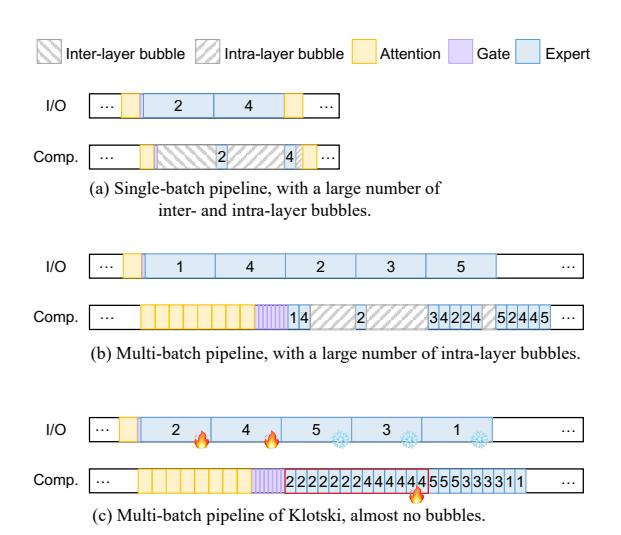
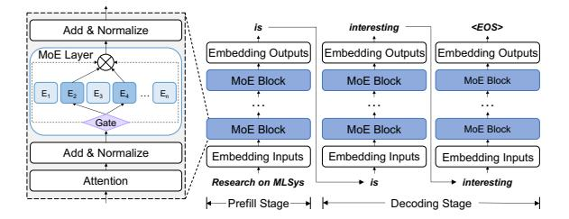
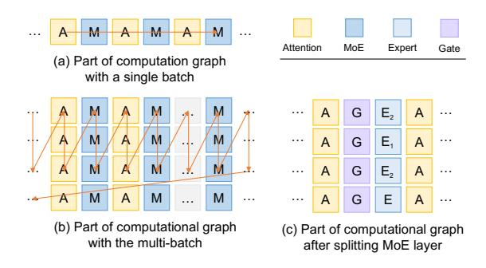
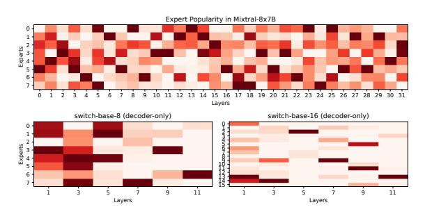
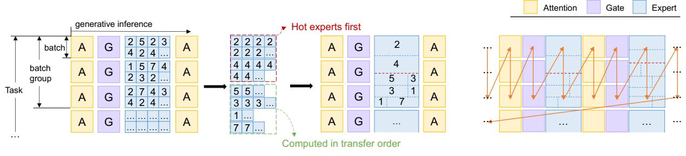
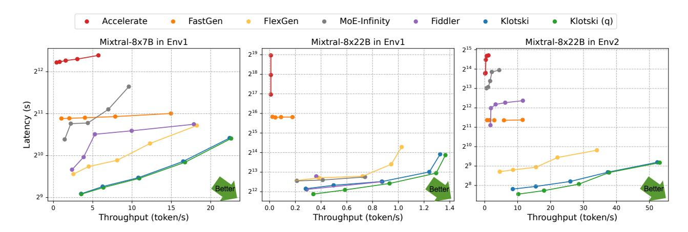
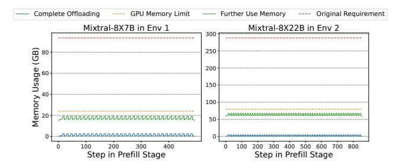
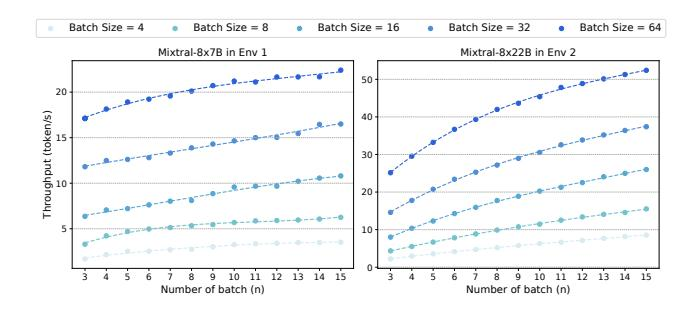
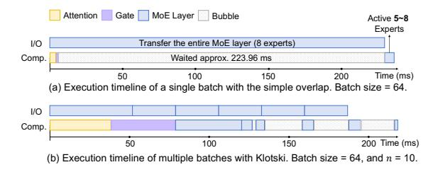

# KLOTSKI: Efficient Mixture-of-Expert Inference via Expert-Aware Multi-Batch Pipeline

Zhiyuan Fang Sun Yat-sen University Zhuhai, China fangzhy27@mail2.sysu.edu.cn

Yufeng Lyu Huawei Technologies Co. Ltd Shenzhen, China Ivyufeng1@huawei.com Yuegui Huang Sun Yat-sen University Guangzhou, China huangyg35@mail3.sysu.edu.cn

Wuhui Chen
Sun Yat-sen University
Zhuhai, China
Peng Cheng Laboratory
Shenzhen, China
chenwuh@mail.sysu.edu.cn

Zicong Hong
Hong Kong University of Science and
Technology
Hong Kong, China
ziconghong@gmail.com

Yue Yu\* Peng Cheng Laboratory Shenzhen, China yuy@pcl.ac.cn

Fan Yu Huawei Technologies Co. Ltd Shenzhen, China fan.yu@huawei.com

### **Abstract**

Mixture of Experts (MoE), with its distinctive sparse structure, enables the scaling of language models up to trillions of parameters without significantly increasing computational costs. However, the substantial parameter size presents a challenge for inference, as the expansion in GPU memory cannot keep pace with the growth in parameters. Although offloading techniques utilise memory from the CPU and disk and parallelise the I/O and computation for efficiency, the computation for each expert in MoE models is often less than the I/O, resulting in numerous bubbles in the pipeline.

Therefore, we propose Klotski, an efficient MoE inference engine that significantly reduces pipeline bubbles through a novel *expert-aware multi-batch pipeline* paradigm. The proposed paradigm uses batch processing to extend the computation time of the current layer to overlap with the loading time of the next layer. Although this idea has been effectively applied to dense models, more batches may activate more experts in the MoE, leading to longer loading times and more bubbles. Thus, unlike traditional approaches, we

Permission to make digital or hard copies of all or part of this work for personal or classroom use is granted without fee provided that copies are not made or distributed for profit or commercial advantage and that copies bear this notice and the full citation on the first page. Copyrights for components of this work owned by others than the author(s) must be honored. Abstracting with credit is permitted. To copy otherwise, or republish, to post on servers or to redistribute to lists, requires prior specific permission and/or a fee. Request permissions from permissions@acm.org. ASPLOS '25, March 30–April 3, 2025, Rotterdam, Netherlands.

© 2025 Copyright held by the owner/author(s). Publication rights licensed to ACM.

ACM ISBN 979-8-4007-1079-7/25/03 https://doi.org/10.1145/3676641.3716261 Zibin Zheng Sun Yat-sen University Zhuhai, China zhzibin@mail.sysu.edu.cn

balance computation and I/O time and minimise bubbles by orchestrating their inference orders based on their heterogeneous computation and I/O requirements and activation patterns under different batch numbers. Moreover, to adapt to different hardware environments and models, we design a constraint-sensitive I/O-compute planner and a correlation-aware expert prefetcher for a schedule that minimises pipeline bubbles. Experimental results demonstrate that Klotski achieves a superior throughput-latency tradeoff compared to state-of-the-art techniques, with throughput improvements of up to 85.12×.

*CCS Concepts:* • Computing methodologies  $\rightarrow$  Natural language generation.

**Keywords:** Mixture-of-Experts, Offloading, LLM Inference.

#### **ACM Reference Format:**

Zhiyuan Fang, Yuegui Huang, Zicong Hong, Yufeng Lyu, Wuhui Chen, Yue Yu, Fan Yu, and Zibin Zheng. 2025. Klotski: Efficient Mixture-of-Expert Inference via Expert-Aware Multi-Batch Pipeline. In Proceedings of the 30th ACM International Conference on Architectural Support for Programming Languages and Operating Systems, Volume 2 (ASPLOS '25), March 30–April 3, 2025, Rotterdam, Netherlands. ACM, New York, NY, USA, 15 pages. https://doi.org/10.1145/3676641.3716261

### 1 Introduction

Owing to the rapid advancement of deep learning, large language models (LLMs) have demonstrated remarkable efficacy across various domains [4, 7, 46]. To facilitate model scalability without escalating the costs associated with training and inference, recent research has introduced sparsely activated

Mixture-of-Experts (MoE) models [10, 33]. MoE models typically replace the Feed-Forward Network (FFN) layers with MoE layers. For each input, only a subset of the parameters (i.e., experts) are sparsely activated for computation, rather than all parameters, significantly reducing computational cost. Current research has demonstrated the superiority of the MoE architecture through extensive experiments [15, 30].

However, due to the skew between model parameter sizes and advances in hardware, MoE-based models, with their massive parameter counts, face more severe memory bottlenecks during inference than other LLMs. For example, DeepSeek-V2 [6], with 236 billion parameters, requires at least seven state-of-the-art (SOTA) GPUs (H100, with 80GB of memory each) for inference. Furthermore, the high cost of memory often makes it difficult to use such large models in more common environments such as personal computers and small servers, limiting the wider adoption of large models [8, 25, 40]. This raises the question of how to deploy MoE models in resource-constrained environments where there is a significant gap between available GPU memory and model parameter sizes.

Offloading is one of the current mainstream solutions for addressing memory optimization during the inference of LLMs [9, 20, 32, 34]. It significantly reduces GPU memory requirements for LLM inference by offloading tensors not needed for the current computation. Applying offloading to MoE models is effective because the experts are sparsely activated, resulting in more parameters that can be offloaded during inference. Recent efforts [9, 43] have proposed offloading strategies tailored for MoE models. Figure 1(a) illustrates the basic paradigm of these methods: prefetching the next layer while computing the current layer to achieve partial overlap of I/O and computation. However, due to the sparse activation of experts, these methods often rely on the accuracy of expert prefetching. For instance, MoE-Infinity [43] performs activation-aware expert prefetching and caching based on expert activation traces. SiDA [8] trains an offline expert predictor in a data-aware manner, achieving a prefetching accuracy of over 90%.

However, significant *inter-layer* and *intra-layer bubbles* (GPU stalls) degrade performance due to the computation and I/O imbalance. Inter-layer bubbles occur because of the imbalance between the attention and expert layers. The large size of experts prevents the computation of the attention layer from sufficiently overlapping with the I/O of the expert layer. In Mixtral-8×7B [19], using an NVIDIA 3090 to process a batch size of 16, the average attention computation is about 2.6 ms, while the single expert transmission time is about 21 ms. Furthermore, when the number of experts selected by the gate exceeds one (as in Mixtral-8×7B and DeepSeekMoE [5], etc.), the I/O overhead for expert transmission multiplies, causing the GPU to wait more frequently. Intra-layer bubbles, on the other hand, result from an imbalance between computation and I/O within the expert layer. In the inference

<span id="page-1-0"></span>

**Figure 1.** Comparison of three kinds of pipeline. We use multiple computations of the current layer to overlap the I/O of the next layer to reduce inter-layer bubbles and adjust the experts' computation order to reduce intra-layer bubbles.

of dense models, the loaded FFN processes all sequences in the batch. However, in MoE models, each activated expert processes only a portion of the sequences in the batch but consume time to transfer multiple FFNs (each expert is an FFN). For instance, processing a token with a single expert in Mixtral-8×7B takes less than 1 ms, which is much less than the transmission delays. This leads to substantial intra-layer bubbles between the computations of multiple experts.

Inspired by related work on dense models [34, 41], a straight-forward approach is to consider the computations of multiple batches simultaneously. This increases the total computation time, thereby allowing for the overlap of the I/O time for the next layer. Specifically, after loading the weights of a layer, they are shared across multiple batches, allowing consecutive computations within the current layer. This provides sufficient time for loading the weights of the subsequent layer, thereby significantly reducing inter-layer bubbles.

Despite this, considering the computations of multiple batches simultaneously also means increasing the diversity of the inputs to the MoE layer. Given the sensitivity of the gating mechanism to data variability [24, 42], the total number of activated experts may increase. As shown in Figure 1(b), in addition to the experts activated in Figure 1(a), experts 5 and 3 are also activated. Although multiple computations in the attention layer can overlap the I/O of some experts, more experts are activated, resulting in more intra-layer bubbles in the pipeline, due to the long I/O time for these experts.

To tackle this challenge, we propose an *expert-aware multi-batch pipeline* paradigm. Specifically, based on current observations [23, 42], there is a phenomenon in MoE inference where a few experts handle the majority of tokens, referred to as *hot experts*. Correspondingly, other experts are termed

cold experts. Considering a large number of tokens across multiple batches, hot experts exhibit high computational demand and low I/O demand, while cold experts exhibit the opposite. By leveraging this complementary relationship, we can overlap the high I/O demand of cold experts with the high computational demand of hot experts, effectively minimizing intra-layer bubbles between experts. As illustrated in [Figure 1\(](#page-1-0)c), we prefetch only the hot experts 2 and 4 and partition the computations of multiple batches by experts rather than by batches. Furthermore, we adjust the computation order of the experts, prioritizing the substantial computations of hot experts 2 and 4, providing more ample time for the transmission of cold experts 5, 3, and 1. This effectively compresses the intra-layer bubbles.

In this paper, based on the above paradigm, we propose Klotski, an MoE-oriented inference engine that can perform high-throughput inference in resource-constrained environments, achieving inference pipeline with near-zero bubble, as shown in [Figure 1\(](#page-1-0)c). To summarize, we make the following contributions:

- We propose an expert-aware multi-batch pipeline paradigm that leverages the high computational demand and low I/O demand of hot experts to orchestrate multibatch computations, aiming to minimize both interlayer and intra-layer bubbles.
- We design a constraint-sensitive IO-compute planner to formulate execution plans for this paradigm in various environments.
- We propose adaptive tensor placement and a correlationaware expert prefetcher, enabling appropriate offloading and prefetching when dealing with different storage resources and MoE models.
- We implement the above strategies in Klotski, an MoE-oriented inference engine, which enables highthroughput inference of MoE with offloading.
- To evaluate Klotski, we compare it with Accelerate [\[13\]](#page-13-15), Deepspeed-FastGen [\[16\]](#page-13-16), FlexGen [\[34\]](#page-14-4), MoE-Infinity [\[43\]](#page-14-5), and Fiddler [\[20\]](#page-13-9). The experimental results demonstrate that Klotski can make inference of MoE more efficiently, and achieve 85.12×, 15.45×, 2.23×, 19.06×, and 9.53× throughput improvement than that of the three aforementioned works, respectively.

# 2 Background and Related Work

# 2.1 MoE Architecture & Inference

Since GShard [\[22\]](#page-13-17) introduced MoE structure into Transformer models, its potential to enhance the performance of large language models has been evident. MoE has gradually become one of the mainstream structures of large language models. Prominent models like GPT-4 [\[1\]](#page-13-18), Gemini 1.5 [\[35\]](#page-14-8), and Mixtral-8×7B all incorporate the MoE structure.

The MoE architecture consists of multiple MoE blocks, each containing an attention layer, an MoE layer, and two

<span id="page-2-0"></span>

Figure 2. Architecture and inference process of MoE models.

normalization layers, as illustrated in [Figure 2.](#page-2-0) The MoE layer comprises a gating network and multiple experts. The gating network is the key feature of the MoE architecture. It uses a softmax function to calculate the routing weights and activates the top-k experts. Existing research [\[23,](#page-13-14) [24,](#page-13-13) [43,](#page-14-5) [44\]](#page-14-9) indicates that the expert activation path of each token can reveal its characteristics, facilitating the prediction of future expert selections. Each expert is an FFN, and experts are sparsely activated, making MoE a feasible approach to training larger models. For each token, the final output of the MoE layer is a weighted sum of the selected experts' outputs.

The MoE inference process, like other LLMs, follows an autoregressive approach [\[36\]](#page-14-10), generating each new token based on the previous ones, as illustrated in [Figure 2.](#page-2-0) This process comprises two stages: prefill and decoding. In the prefill stage, the model processes the entire prompt simultaneously, which often leads to the activation of multiple experts. During the decoding stage, the model uses the previous token generated as input, iteratively generating new tokens until it generates the end-of-sequence (<EOS>) token or the maximum output length limit is reached.

Some recent literature [\[15,](#page-13-3) [23,](#page-13-14) [30,](#page-13-4) [45\]](#page-14-11) has focused on the optimization of MoE. DeepSpeed-MoE [\[30\]](#page-13-4) introduces a specialized MoE architecture called Pyramid-Residual MoE and employs staged knowledge distillation to obtain the Mixtureof-Students. This approach not only accelerates MoE training but also reduces inference latency and cost. Lina [\[23\]](#page-13-14), an extension of DeepSpeed-MoE, prioritizes all-to-all communication during training to enhance bandwidth and uses resource scheduling based on hot experts during inference to balance workload. However, these MoE systems primarily focus on latency-sensitive scenarios and place emphasis on MoE training. Klotski contributed to the memory optimization of MoE and is orthogonal to many of these works.

### 2.2 Offloading in LLM Inference

LLMs often have a large number of parameters, causing severe GPU memory bottlenecks during inference. Common memory optimisation techniques include quantization [\[12,](#page-13-19) [21,](#page-13-20) [38\]](#page-14-12), pruning [\[11,](#page-13-21) [26\]](#page-13-22), sparse attention [\[39,](#page-14-13) [47\]](#page-14-14), etc. Among these, offloading is a particularly effective strategy in resourceconstrained environments. As shown in [Figure 3,](#page-3-0) DRAM and disk often have at least dozens of times more memory than

<span id="page-3-0"></span>

**Figure 3.** Illustration of offloading an LLM in a multi-level storage system. Only a few layers of parameters can be placed in VRAM, and the rest are placed in DRAM and disk. param. refers to parameters.

VRAM. When it is difficult to store all model parameters in VRAM (as in the red line), offloading strategies offload tensors not currently involved in computation to DRAM or disk, freeing up a significant amount of VRAM (as in the black lines). Consequently, offloading strategies allow LLM inference to be performed with extremely small memory footprints. However, because the I/O speed between VRAM and DRAM is slower than the GPU's computing speed, frequent I/O will cause large delays in inference.

Early works [17, 29] proposed leveraging swapping during the training of Deep Neural Networks (DNNs) to reduce GPU memory demands. ZeRO-Offload [32] applied the offloading to the training of Transformer-based LLMs. ZeRO-Infinity [31] extended this approach by incorporating disk as an additional offloading destination. DeepSpeed-Inference [2], which includes the ZeRO-Inference component, applies offloading techniques to the inference, enabling LLM inference in resource-constrained environments. Flex-Gen [34] significantly improves inference throughput by solving linear programming problems within the computational graph. HeteGen [41] leverages heterogeneous parallel computing between CPU and GPU, reducing the need for parameter I/O and achieving better resource allocation. STI [14] maximizes IO/compute resource utilization through model sharding and elastic pipeline planning.

However, most offloading systems mentioned above are designed for dense models and are thus inadequate for supporting MoE inference. Mixtral-offloading [9] identified this limitation earlier and utilized LRU cache and quantization to load a subset of experts, enabling the inference of Mixtral-8×7B on consumer-grade hardware. Fiddler [20] designed CPU-GPU orchestration for MoE models, leveraging the computational power of CPUs to minimize data movement. MoE-Infinity [43] reduced the latency overhead through activation-aware expert prefetching and caching. Even if these works design accurate prefetch strategies or use the CPU to accelerate the inference of MoE, it is still difficult to balance the gap between computation and I/O, resulting in lots of bubbles in the pipeline. In contrast, Klotski minimizes the bubbles in the pipeline by simultaneously arranging the computations of multiple batches and making full use of the computing resources of the GPU.

<span id="page-3-1"></span>**Table 1.** A comparison of the throughput (token/s) improvements when applying the I/O overlap strategy, designed for dense models, to a dense model (OPT) and an MoE model (Switch Transformers, decoder only). The compared results are shown in the same color block. The batch size is 4, and the sequence length is 512.

|           |             | Dense model |          | MoE model      |                 |  |
|-----------|-------------|-------------|----------|----------------|-----------------|--|
| М         | odel        | OPT-1.3B    | OPT-6.7B | switch-base-16 | switch-base-128 |  |
| Mod       | lel Size    | 2.6 GB      | 13.3 GB  | about 2.2 GB   | about 14 GB     |  |
|           | Original    | 14.3        | 3.3      | 13.63          | 2.52            |  |
| Thoughput | + Strategy  | 43.09       | 12.15    | 28.79          | 7.31            |  |
|           | Improvement | 201.33%     | 268.18%  | 111.23%        | 190.08%         |  |

### 3 Motivation

### 3.1 Shortcomings of Existing Work

While MoE brings numerous advantages, it also faces significant challenges related to GPU memory usage due to the large number of experts. According to existing work, the percentage of experts' parameters in Switch Transformers can reach up to 99% [8]. At the same time, these experts are sparsely activated. There is no need to keep them resident in expensive GPU memory. Therefore, the sparse activation feature of MoE makes offloading a highly suitable strategy to address its memory challenges. However, offloading is not a comprehensive solution, and will introduce new issues.

Many existing approaches for MoE focus on improving the accuracy of expert prefetching [8, 9, 18, 20]. However, due to the physical limitation that computation speed generally exceeds I/O speed [14, 34], the I/O time for a single expert is longer than the computation time. Thus, even with 100% accurate prefetching, there would still be substantial pipeline bubbles due to the extended I/O time for experts.

In offloading strategies for dense models, efforts have been made to overlap I/O with computation [14, 34, 41]. One effective method for achieving high-throughput inference is to overlap the I/O of the next layer with multiple computations of the current layer, keeping the GPU almost always in the computation state [34]. We applied this method to the inference of a dense model (OPT) and an MoE model (Switch Transformers) of similar model size, with results shown in Table 1. The results show that the improvement of using this strategy for dense models is significantly higher than for MoE models. This is because it uniformly prefetches the next layer during the computations of the current layer, without considering the special I/O resource demands of the MoE layer, which contains multiple FFNs. Other strategies designed for dense models are the same. Thus, direct application of the existing SOTA method, designed for dense models, to MoE models often results in a loss of performance.

From the above, we know that existing offloading strategies are insufficient for MoE models. There is still a need for

<span id="page-4-0"></span>

**Figure 4.** Construction process of strawman offloading strategy designed for MoE Models. Each row represents a batch.

an efficient offloading strategy that can extremely compress the bubbles in the pipeline for MoE inference.

### <span id="page-4-2"></span>3.2 A Strawman Offloading Strategy for MoE Models

To better adapt the aforementioned I/O overlapping strategy for MoE inference, we propose a strawman offloading strategy, the outline of whose construction process is shown in Figure 4. Two normalization layers are incorporated into the attention and MoE layers, respectively. Then we explain it incrementally from a simple offloading strategy as follows.

Firstly, as shown in Figure 4(a), a simple offloading strategy is executing computations sequentially following the architecture of the MoE model, prefetching parameters of the next layer while computing the current layer. However, due to the slower I/O speed compared to computation speed, eliminating bubbles in the pipeline of a single batch is unfeasible, leading to low inference efficiency.

Consequently, inspired by FlexGen [34], we opted to expand the computational graph to multiple batches, as illustrated in Figure 4(b). After loading the weights of a certain layer, the strawman strategy executes computations of multiple batches while loading the weights of the next layer in parallel, thereby achieving more overlap. Nevertheless, it also presents challenges: the MoE layer, consisting of a gate and several experts, is large, resulting in a long wait for the I/O of the entire layer. Moreover, not all experts are involved in the computation, resulting in unnecessary I/O.

Furthermore, to solve the problem, we partitioned the MoE layer into a gate layer and an expert layer, as depicted in Figure 4(c). During the computations of the attention layer, the strawman strategy only prefetches the weights of the gate and a subset of experts, effectively reducing inter-layer bubbles. Then, after the computations of each gate, we check whether the selected expert has already been selected. If not, we initiate the transfer of the expert. However, we still face two problems: (1) how to determine which and how many experts to prefetch, (2) as illustrated in Figure 7(c), assuming  $E_2$  has already been prefetched during the computations of the attention layer, while  $E_1$  is still undergoing transfer. The order of computations ( $E_2 \rightarrow E_1 \rightarrow E_2$ ) may stall in the second

<span id="page-4-1"></span>

**Figure 5.** The expert heatmaps in Mixtral-8×7B, decoder part of switch-base-8 and switch-base-16. The darker the color, the higher the frequency of selection.

step, while  $E_2$  in the third step could have been computed directly, resulting in unnecessary intra-layer bubbles.

For the problem (1), during MoE inference, there is a phenomenon of hot experts, where a few experts handle the majority of tokens [23, 24]. As shown in Figure 5, we recorded the expert selections for Switch Transformers and Mixtral-8×7B. It is evident that, with a high probability, tokens will be routed to hot experts. Furthermore, K (K equals k in top-k) experts usually cover most of the inputs. For example, during inference with Mixtral-8×7B, which uses the top-2 gate, tokens tend to select experts 1 and 3 in layer 14, with a total ratio of 53.7%. Similar situations can be clearly observed in other layers. Therefore, while performing multiple computations of the attention layer, we prefetch the gate and K experts as hot to reduce inter-layer bubbles.

For the problem (2), the strawman strategy adjusts the computation order of experts, overlaps the I/O of cold experts with the computations of hot experts. Since hot experts handle the majority of tokens across multiple batches, their computation time can provide more time for the transfer of subsequent experts.

Challenges. While the strawman strategy provides a comprehensive offloading approach tailored for MoE models, we encountered several challenges in its practical application. First, experts are data-sensitive [45], meaning that the hot experts may change when the input tokens vary; thus, it is challenging to dynamically identify hot experts. Second, in the actual inference process, the number of experts involved in computations is significantly higher than depicted in Figure 4(c); thus, it is challenging to orchestrate multi-batch expert computations. Third, the hardware environment for model inference is very diverse; thus, it is challenging to provide efficient inference in uncertain hardware environments.

### 4 Overview

To solve the above challenges, we propose Klotski, an inference engine designed for MoE that enables high-throughput MoE inference in resource-constrained environments. We show the system overview of Klotski in Figure 6.

<span id="page-5-0"></span>

**Figure 6.** System overview of KLOTSKI. Comp. refers to Compute, Corr. refers to Correlation, and Infer. refers to Inference. The blue, purple, and yellow graphics represent the expert, gate, and attention layers, respectively. The dotted line in the pipeline indicates that the computations within the curly brackets belong to the expert.

Firstly, during the offline phase, we aggregate heterogeneous memory from GPU, CPU, and disk for model deployment. We adaptively sense the memory limits in the current environment and allocate the MoE model tensors across the heterogeneous memory (①) accordingly. In the online phase, when request batches are inputted (②), the constraint-sensitive I/O-compute planner formulates a pipeline plan based on the current hardware constraints (③). If the MoE model is performed for the first time, the correlation-aware expert prefetcher generates an expert correlation table during the warm-up process to guide expert prefetching.

According to the settings in the pipeline plan, Klotski executes computations following the expert-aware multi-batch pipeline paradigm to achieve an execution pipeline with minimal bubbles (4). During inference, the I/O thread dynamically manages the transfer of tensors across heterogeneous memory (5). The inference thread reads the corresponding tensors from VRAM for computations (6). Additionally, the inference thread continuously updates the expert correlation table to further capture the data tendencies of the task.

# <span id="page-5-3"></span>5 Expert-aware Multi-batch Pipeline Paradigm

We aim to develop a pipeline that minimizes all bubbles to maximize GPU utilization. To achieve this, we propose an expert-aware multi-batch pipeline paradigm, which is designed based on zig-zag block schedule [34]. By considering the computations of multiple batches simultaneously, this paradigm enables weight sharing and orchestrates the multi-batch computational graph around the experts to reduce bubbles. A partial computational graph is illustrated in Figure 7, where each row corresponds to the computations of one batch, and the multiple batches are considered together

as a batch group. Ultimately, this results in a nearly bubble-free pipeline, as shown in Figure 9. In the following, we will detail this paradigm from two perspectives: minimizing inter-layer bubbles and minimizing intra-layer bubbles.

First, minimizing inter-layer bubbles. Inter-layer bubbles primarily occur between the attention layer and the MoE layer. During the computations of multiple batches in the attention layer, Klotski prefetches only the weights of the gate and the hot experts, rather than the entire MoE layer. Because overlapping the I/O for the entire MoE layer is challenging, and Equation 1 must be satisfied.

<span id="page-5-1"></span>
$$n * t_{c\_A} \ge t_{I/O\ MoE} \tag{1}$$

Here, n represents the number of batches in a batch group,  $t_{c\_A}$  denotes the computation time of an attention layer for a batch, and  $t_{I/O\_MoE}$  is the time required to transfer the entire MoE layer. Equation 1 clearly necessitates a large n to hold true, which would introduce a significant amount of KV cache. What's more, due to the nature of sparse activation, some experts may not be activated, even when multiple batches are being processed at the same time. Loading them all into VRAM not only wastes resources but also increases latency. In contrast, only overlapping the I/O for the gate and hot experts is easier and more effective, which just needs to satisfy Equation 2.

<span id="page-5-2"></span>
$$n * t_{c A} \ge t_{I/O G} + K * t_{I/O E}$$
 (2)

Here,  $t_{I/O\_G}$  and  $t_{I/O\_E}$  represent the transfer times for the gate and a single expert, respectively. K equals k, the number of experts selected by the top-k gate, usually 1 or 2. Hot experts are chosen because they are likely engaged in most of the computations (see Figure 5), which provides an opportunity to minimize intra-layer bubbles subsequently. Additionally, during the computations of the gate, no prefetching is done. Instead, it is determined whether each gate-selected expert is a hot expert or one that has already been transferred. If not, the transfer of that expert is initiated immediately.

Second, minimizing intra-layer bubbles. As illustrated in the left panel of Figure 7(a), the sequence of experts shows that hot experts 2 and 4 have already been prefetched, while experts 5 and 3 are still undergoing transfer. Thus, the sequence of computations [2523424...] would result in the GPU stalling at positions 5 and 3, due to the incomplete transfer of data at these locations. However, computations involving experts 2 and 4 could proceed immediately. To reduce such unnecessary delays, we further adjust the order of expert computations across multiple batches, allowing computations involving the same experts to run continuously and prioritizing computations of hot experts. Since hot experts are transferred to GPU memory first and engaged in more computations, this adjustment allows more time for the transfer of experts still being loaded. After the computations for hot experts, the remaining experts compute in the order they are transferred. Additionally, experts that

<span id="page-6-0"></span>

(a) Expert-aware multi-batch computational graph orchestration

(b) Final computational graph example

**Figure 7.** Expert-aware multi-batch computational graph.

```
Algorithm 1: Schedule Algorithm of the Paradigm.
```

<span id="page-6-1"></span>Init: Generate length *l*, number of layers *n\_layer*, number of batches *n\_batch*, hidden state *h*, KV cache *c*. The indices *i*, *j*, *k* indicate that the it is processing the *i*-th token, performing computations at the *j*-th layer for the *k*-th batch.

```
1 for i < l do
      for j < n_layer do
2
         if layers[j] is not Gate then
3
             load(layers[j+1])
4
         if layers[j] is Expert_Layer then
5
             load(c[i][j+1][0])
6
             Experts process all tokens across batches.
             compute(layers[j])
             store(h[i][j])
             load(h[i][j+1][0])
         else
10
             ▶ Non-expert process each batch vertically.
11
             for k < n batch do
12
                 sync(load_cache_stream)
13
                 load(h[i][j][k+1], c[i][j][k+1])
14
                 compute(layers[j][k])
15
                 sync(store_cache_stream)
16
                 store(h[i][j][k], c[i][j][k])
17
         sync(load_weight_stream)
18
```

have completed all computations are offloaded immediately, rather than waiting for the entire layer's computations to finish, to reduce peak GPU memory usage.

Finally, Klotski executes computations according to the computational graph shown in Figure 7(b), sharing the loaded weights across multiple batches. This approach not only reduces the number of I/O operations to approximately 1/n of the original but also overlaps the time for each I/O, resulting in an almost bubble-free pipeline as illustrated in Figure 9

and significantly improving throughput. The algorithm details of this paradigm are formulated in algorithm 1. First, since hot experts are already prefetched during the attention layer, we do not perform prefetching in the gate layer (line 3), instead, the real-time transfer of experts is based on its results. Second, experts process all tokens across batches (line 5), since the computations of the expert layer are divided by experts rather than by batches. Third, the non-expert layer processes each batch sequentially (line 11), prefetching the necessary activations, key-value caches, etc., for the corresponding batch. Additionally, we synchronize the transfers of various streams using the *sync(*) function.

# 6 Tensor Management

### <span id="page-6-2"></span>6.1 Adaptive Tensor Placement

KLOTSKI constructs a multi-level heterogeneous memory space consisting of VRAM, DRAM, and disk to meet the storage demands of MoE models in resource-constrained environments. Then, we propose an adaptive tensor placement, which intelligently allocates tensors based on the available memory resources in the current environment, thereby enhancing the utilization of existing resources.

Firstly, the GPU memory is primarily used to store necessary tensors required for current computations and prefetched tensors. When there is ample free GPU memory available, it can be further utilized to reduce some I/O operations. Specifically, we can choose storage locations for different types of tensors such as expert, gate, attention, KV cache, and activation. Furthermore, support is provided for layer granularity distribution. For example, placing the experts of the first three layers in VRAM, the experts of the next twenty layers in DRAM, and the remaining in disk.

Secondly, inactive tensors can be offloaded to either CPU memory or disk. We prioritize allocating CPU memory to experts. This is because the MoE layer faces the challenge that the experts requested by the gating function cannot be accurately predicted in advance. Therefore, when handling tasks with large batch sizes, it is highly likely that immediate transfers of experts will be needed, necessitating the rapid transfer of the required expert to GPU memory. Considering

the faster transfer bandwidth of CPU memory, which provides quicker response times, we prioritize placing expert parts in CPU memory.

Additionally, when sufficient CPU memory is available, we use  $pin\_memory$  to achieve faster CPU-GPU communication. When CPU memory is insufficient and disk usage is necessary, to reduce the GPU getting tensors from disk, which is slow, we dynamically maintain tensors in the CPU memory. Specifically, we dynamically manage tensors for a fixed number of layers L within the limited CPU memory. As the computation proceeds to layer i, the GPU prefetches tensors for layer i+1 from CPU memory, while the CPU prefetches tensors for layer i+L from the disk and removes tensors for layer i. This strategy effectively utilizes the idle CPU-disk bandwidth, thereby reducing the interaction between GPU and disk.

### 6.2 Correlation-aware Expert Prefetcher

For dense models, the offloading strategies can directly prefetch the next layer. However, it is different for MoE models. Only after completing the computation of the gate can the activated experts be determined, making it challenging to design a unified prefetching strategy.

To address this, Klotski design a correlation-aware expert prefetcher. In § 5, the prefetched experts need to engage in most computations across multiple batches to reduce intralayer bubbles effectively. As illustrated in Figure 5, there are hot experts in the inference of MoE, where a few experts cover the majority of computations. Therefore, the prefetching targets for the MoE layer are the gate and hot experts. Since MoE is data-sensitive and hot experts may vary with different inputs, we establish a data-aware expert correlation table to identify the hot experts that tokens in the current multi-batch tend to select. Specifically, we record the correlations (i.e., frequency relationships) between experts activated by tokens at different layers through pre-run, resulting in a table. During inference, we use this table to determine each token's expert tendency in the current layer based on its selections in the previous *l* layers. The larger the value of *l*, the more accurate the prefetching. This process is illustrated in Figure 8, where each layer has four experts, the gate selects the top-1 expert, and l = 1. For the expert activation path of each token in the multi-batch, we look up the table to determine their expert tendencies in the current layer. We then aggregate the tendencies of all tokens across multiple batches and select the top-K experts for prefetching. K is by default equal to k in top-k because, based on the observation in § 3.2, K experts will generally cover the majority of the token computations.

In addition, the expert correlation table is updated during the inference so that expert prefetching can become more and more accurate, as the table is continuously updated to understand the tasks at hand. To prevent the prefetching

<span id="page-7-0"></span>

| Layer i            |                     | Laye                          | er i+1     |                                         |        |                      |
|--------------------|---------------------|-------------------------------|------------|-----------------------------------------|--------|----------------------|
| Expert             | Expert              | Historical Selected Frequency |            |                                         |        |                      |
|                    | 0                   |                               | 38         |                                         |        |                      |
| 0                  | 1                   |                               | 27         |                                         |        |                      |
| U                  | 2                   |                               | 97         |                                         |        |                      |
|                    | 3                   |                               | 15         |                                         |        |                      |
|                    | 0                   |                               | 66         |                                         |        |                      |
| 1                  | 1                   |                               | 35         |                                         |        |                      |
|                    | 2                   | 41                            |            |                                         |        |                      |
|                    | 3                   |                               | 117        |                                         |        |                      |
|                    |                     |                               |            |                                         |        |                      |
| ********           |                     |                               |            | ,,,,,,,,,,,,,,,,,,,,,,,,,,,,,,,,,,,,,,, |        |                      |
| Batch<br>Act. path | _                   |                               | Batch      |                                         | Expert | Aggregate<br>Results |
| Act. pati          |                     |                               | ► tendency | aggregate                               | 9 _ 1  | 3                    |
| Act. patt          |                     |                               |            |                                         | 2      | 18 🗸                 |
| Act poth           | $\exists \parallel$ |                               | tendency   |                                         | 3      | 9                    |
| Act. path          |                     |                               | teridericy |                                         | 4      | 2                    |

**Figure 8.** An example of the expert correlation table. Each expert layer has four experts. The gate selects the top-1 expert. The correlation path length l is 1.

tendencies of other tasks from influencing current tasks, we refrain from saving the updates to the file.

On the other hand, for non-expert tensors, we adopt a prefetching strategy similar to that used for dense models, where we prefetch the tensor during the computations of the previous layer. This is because non-expert tensors are involved in computation only once during a forward pass and remain inactive at other times.

# 7 Constraint-Sensitive I/O-Compute Planner

**Planning Goal:** To minimize the total time T required to complete tasks under existing resource constraints, achieving an almost bubble-free pipeline as illustrated in Figure 9.

<span id="page-7-1"></span>
$$min \quad T = T_c + T_b$$

$$s.t. \quad M_{usage} < M_{GPU} + M_{CPU} + M_{disk},$$

$$M_{peak \ GPU} < M_{GPU}$$
(3)

The total time T is primarily composed of two parts:  $T_c$ and  $T_b$ , representing the total computation time and the total time occupied by bubbles, respectively.  $T_c$  mainly depends on hardware conditions. Our objective is to minimize  $T_b$  under the constraints of available memory, making it approach zero, as shown in Equation 3. In our system, the reduction of  $T_b$  is primarily influenced by two factors: (1) the placement of the tensors and (2) the batch size and the number of batches included in the batch group, denoted as n. Effective model placement can maximize the utilization of existing storage resources, thereby reducing some of the I/O demands, as considered in § 6.1. The batch size is typically a multiple of 4, leaving limited options for selection. However, determining the value of n is crucial. If n is too large, it will introduce a significant KV cache. Conversely, if *n* is too small, the total computation time for n batches may not overlap effectively with the I/O time of the next layer.

<span id="page-8-0"></span>

Figure 9. Multi-batch pipeline of Кьотsкі

To investigate the value of *n*, our primary focus lies on the inter-layer and intra-layer overlap in each MoE block. In Figure 9, we insert several arrows indicating the points where a specific tensor needs to start computing. These are interpreted as follows: (I) indicates the point where gate computations will begin, (II) marks the start of the computations for hot experts, (III) signifies the beginning of the computations for cold experts, and (IV) denotes the initiation of the next attention layer's computations. These arrows collectively suggest that the corresponding tensor I/O must be completed before these points to ensure that I/O and computation are overlapped. We list the four key positions with the respective inequalities that must be satisfied as follows.

$$\begin{cases} n * t_{c\_A} \ge t_{I/O\_G} & (4) \\ n * (t_{c\_A} + t_{c\_G}) \ge t_{I/O\_G} + K * t_{I/O\_E} & (5) \\ n * (t_{c\_A} + t_{c\_G}) + t_{c\_hot-E} \ge t_{I/O\_G} + (K+1)t_{I/O\_E} & (6) \\ n * (t_{c\_A} + t_{c\_G}) + t_{c\_hot-E} + \sum_{i \in Q}^{Q} t_{c\_E_i} \ge t_{I/O\_G} + (K+len(Q))t_{I/O\_E} + t_{I/O\_A} & (7) \end{cases}$$

where K denotes the number of prefetched hot experts,  $t_{c\_A}$ ,  $t_{c\_G}$ ,  $t_{c\_topk-E}$ ,  $t_{c\_E_i}$ , denote the time to compute attention, gate, hot experts and expert i, respectively,  $t_{I/O\_A}$ ,  $t_{I/O\_G}$ ,  $t_{I/O\_E}$ , denote the time to transfer attention weights, gate weights and weights of a single expert, respectively. The I/O times and computation times vary with hardware, model, and batch size. Additionally, the length of the queue Q of activated experts per layer is not fixed. We determine the length of each layer of Q based on statistical data.

In response to this, our planner operates primarily in two stages: (1) Measurement of the current hardware capability. Before the inference with an MoE model, Klotski measures the computation times and transmission durations of the model's various layers based on their shapes, data types, and other relevant information in the current environment. These results are cached locally. (2) Constraint solving. Klotski applies the measured data to the constraints from the inequality group to determine the optimal value of n. Assuming the final result is  $n \ge x$ , then  $n = \lceil x \rceil$ . At this point, n ensures a pipeline without bubbles. Further increasing n might improve throughput, but the increase will be marginal because the pipeline is already near bubble-free. However, this would introduce a significant burden of massive KV

caches on storage. Therefore, n should be set to the smallest integer that satisfies the inequality group. Additionally, if n becomes excessively large, manual adjustments to the strategy may be necessary. Since n is a positive integer, this process is not challenging.

Subsequently, we examine the potential outcomes of this strategy, considering both the most favorable and the least favorable scenarios. In the optimal scenario, all tokens select hot experts, thereby eliminating the need to consider inequalities (4) and (5). On the other hand, the worst-case scenario emerges when all tokens select cold experts, encompassing all other experts. In such instances, the value of  $t_{c\_hot-E}$  is equal to zero, rendering the prefetching strategy ineffective. Inadequate n may lead to a few intra-layer bubbles. However, intuitively, the probability of encountering such a worst-case scenario is very low.

**Compression** In particular, quantization and sparse attention are particularly well-suited for our work because they not only further reduce memory requirements but also decrease the amount of data transferred between heterogeneous memory, aiding in bubble reduction. Therefore, we incorporated two effective methods as options.

(1) Quantization. Existing knowledge indicates that the experts are highly robust to quantization [21]. They can be quantized to 3 bits without additional training or calibration data. Since the majority of weights in MoE models belong to experts, quantizing the experts can significantly reduce memory requirements and I/O delays with minimal precision loss. Before computation, we dequantize the tensors back to their original precision, further mitigating precision loss.

More specifically, we employ Half-Quadratic Quantization (HQQ) [3]. Quantization and dequantization are primarily achieved using the Equation 8.

<span id="page-8-1"></span>
$$Q_{z,s}(W) = W_q = round(W/s+z), \ Q_{z,s}^{-1}(W_q) = s(W_q-z)$$
 (8)

among them, the zero point z and the scale s are quantization parameters, which are determined through a robust optimization formula like Equation 9.

<span id="page-8-2"></span>
$$\underset{z, s}{\operatorname{argmin}} \left( W - Q_{z,s}^{-1} \left( Q_{z,s}(W) \right) \right) \tag{9}$$

In our study, to strike a balance between accuracy and transmission speed, we opt to preset that quantize both expert and attention tensors to 4 bits, using a group size of 64 and a zero scale group size of 128.

(2) Sparse Attention. In this work, processing multiple batches requires storing a large amount of KV cache. Sparse attention reduces the KV cache size and the cost of transferring it across heterogeneous memory. We incorporate the attention mechanism from StreamingLLM [39], which focuses only on the initial sink tokens and neighboring tokens to achieve effective inference. Additionally, this is optional as there are many models that have sparse strategies natively.

<span id="page-9-0"></span>**Table 2.** Hardware environments for evaluation.

| Hardware  | Environment           | 1      | Environment 2            |        |  |
|-----------|-----------------------|--------|--------------------------|--------|--|
| Ilaiuwaic | Model                 | Memory | Model                    | Memory |  |
| GPU       | NVIDIA RTX 3090       | 24 GB  | NVIDIA H800              | 80 GB  |  |
| CPU       | Intel Xeon Gold 5318Y | 256 GB | Intel Xeon Platinum 8470 | 800GB  |  |
| Disk      | SSD                   | 2T     | SSD                      | 1T     |  |
| PCIe      | 4.0 x 16              |        | 5.0 x 16                 |        |  |
| Disk Read | 1 GB/s                |        | /                        |        |  |

## 8 Implementation

We implement Klotski on top of PyTorch [28] and Hugging Face Transformers [37] with over 3k LOC of Python. Expertaware multi-batch pipeline paradigm is implemented on top of FlexGen [34].

**Expert Correlation Table.** We acquire input data by randomly sampling from wikitext-2 [27]. Subsequently, we conduct inference with a batch size of 8 and a sequence length of 512. Expert selections during the inference are recorded and tabulated in JSON format. The choice of small batches is deliberate to avoid excessively large statistical values, which would render updates to the expert correlation table meaningless. We set the activation path length l=1 because we do not heavily rely on the accuracy of expert prefetching. A larger number of batches in a batch group already allows us to overlap communication and computation. Increasing l would add dimension to path recording, which increases the complexity of the table lookup and memory occupation.

Overlapping Computation and I/O. Klotski achieves I/O-computation overlap by orchestrating four CUDA streams: one for prefetching weights, another for transferring expert weights based on gating network results, a third for prefetching KV cache, and the last for storing new KV cache. Each stream operates asynchronously, executing its designated task independently. When certain data is needed, the corresponding stream will be synchronized.

### 9 Evaluation

### 9.1 Experimental Setup

Hardware. We evaluate Klotski in two different environments, as shown in the Table 2. We don't care about the speed of disk reading in environment 2, because there is enough CPU memory.

**Models and Datasets.** We evaluate Klotski using the open-source MoE models: Mixtral-8×7B and Mixtral-8×22B. They have 46.7B and 141B parameters in bfloat16 precision respectively. We use Mixtral-8×7B and Mixtral-8×22B in environment 1 and use Mixtral-8×22B in environment 2 only. This is because Environment 2 is not considered a resource-constrained environment for Mixtral-8×7B. The inputs are randomly sampled from wikitext-103 [27], which has rich text from various fields. We use batch sizes from 4 to 64, with a sequence input length of 512 and an output sequence length

of 32. We use throughput (generated tokens/generation time) as the metric, where generation time is the total time spent in the prefill and decode phases. We mainly evaluate the throughput of Klotski for different sizes of inputs and compare it with the baselines. The experimental results shown are the average results from multiple trials.

**Baselines.** We use the following five offloading studies as baselines for comparison experiments. Among them, the first three works are designed for the dense model, and the last two works are designed for the MoE model.

- Hugging Face Accelerate [13]: Accelerate supports offloading weights of some layers based on the device map. It's easy to use as a library on Hugging Face Transformers. Hereinafter referred to as Accelerate.
- DeepSpeed-FastGen [16]: It is a version of DeepSpeed ZeRO-Inference after many updates. Hereinafter referred to as FastGen.
- FlexGen [34]: FlexGen is an efficient offloading work for inference of LLM. It's the first to propose that traverse the computational graph column-by-column.
- Fiddler [20]: In addition to utilizing CPU resources, Fiddler uses CPU computing power for inference, minimizing data movement between the CPU and GPU.
- MoE-Infinity [43]: MoE-Infinity reduces the latency overhead associated with offloading experts through activation-aware expert prefetching and caching.

Additionally, FlexGen only supports dense models with the same structure as OPT, while the others natively support Mixtral. We adapt FlexGen to the Mixtral series of MoE models without changing its primary strategies.

### <span id="page-9-1"></span>9.2 End-to-End Throughput

We first evaluate the end-to-end throughput of Klotski and compare it with the baselines, as shown in Figure 10.

We use the maximum n (= 15) from Figure 14 to show a better result than the default computed n. And we use n=10 for Mixtral-8×22B in Environment 1 because the computed n is large, which causes out-of-memory (OOM). We set FlexGen to use the same n as us. Across various scenarios, Klotski consistently outperforms other methods in enhancing MoE inference throughput. Compared to Accelerate, FastGen, FlexGen, MoE-Infinity, and Fiddler, Klotski improves the inference throughput by up to 85.12×, 15.45×, 2.23×, 19.06×, and 9.53×, respectively.

On Mixtral-8×7B, as batch size increases, the time difference between computation and I/O gradually narrows, allowing Accelerate and FastGen to perform well. However, on Mixtral-8×22B, the significantly increased weight transfer leads to a larger time difference between computation and I/O. This ultimately results in throughput that is far inferior to FlexGen and Klotski.

Although FlexGen considers multiple batches and maximizes the use of GPU and CPU memory through tensor

<span id="page-10-0"></span>

**Figure 10.** Throughput comparison between Klotski and baselines in different scenarios. (q) means that quantization and dequantization are used.

<span id="page-10-1"></span>

**Figure 11.** Throughput latency trade-off comparison between Klotski and baselines. The curve closer to the lower right is better. (q) means that quantization and dequantization are used.

slicing, it prefetches the entire MoE layer, requiring a large n to fully overlap computation and I/O. In contrast, Klotski's approach to expert prefetching is more flexible, not only compressing inter-layer bubbles but also avoiding additional I/O. Moreover, Klotski further compresses intra-layer bubbles by rearranging the order of expert computations. Additionally, Klotski considers maximizing both memory utilization and transmission speed. Furthermore, even if we increase the batch size to 128, Klotski can still achieve a 15% ( $\frac{53-46}{46}$ ) throughput improvement over FlexGen.

On the other hand, both Fiddler and MoE-Infinity achieve high throughput in Environment 1. Specifically, Fiddler determines that, in Environment 1, performing certain computations on the CPU can be faster than loading and executing them on the GPU. MoE-Infinity, through its effective prefetching, minimizes unnecessary I/O, further optimizing performance. In contrast, Klotski attain higher throughput by effectively overlapping substantial I/O through multiple computations. This underscores that I/O is a critical factor influencing inference latency in offloading-based inference

systems. Moreover, when running inference in Environment 2, both systems show reduced performance as the increased GPU memory and faster I/O diminish their advantages. In contrast, Klotski orchestrates multi-batch computations to utilize the GPU more efficiently. Additionally, when performing Mixtral-8×22B inference on a single 3090, Fiddler and MoE-Infinity are limited to a maximum batch size of 16, as they only offload experts. Consequently, the extensive KV cache may result in OOM errors when the batch is large. While Klotski supports more parts of the model to be offloaded, making it more widely applicable.

# 9.3 Throughput-Latency Trade-off

We plotted Figure 11 based on the throughput-related experimental results. It demonstrates that Klotski offers a better throughput-latency trade-off for completing the same workload. Under the same time budget constraint, Klotski can achieve more than three times the throughput of Flex-Gen (right plot, where latency equals 29) and outperforms Accelerate, FastGen, MoE-Infinity, and Fiddler.

<span id="page-11-0"></span>

**Figure 12.** GPU memory usage over the prefill. Each step represents one computation of a layer or an expert, i.e. a block in the computation graph as shown in Figure 7.

Furthermore, as observed in both Figure 10 and Figure 11, quantization has a minimal impact on maximum throughput. However, it enables a more optimal throughput-latency trade-off curve. This improvement is due to the reduced data required for transfer between heterogeneous memory after tensor quantization, resulting in shorter I/O times. Consequently, a smaller n can achieve full overlap between computation and I/O. This also prevents the dramatic increase in KV cache size as n grows.

### 9.4 Memory Usage

In Figure 12, we illustrate the GPU memory usage of Klotski during the prefill. The red line represents the minimum memory required for inference, while the orange line indicates the current GPU memory limitation. The blue line shows the memory usage after offloading all tensors, demonstrating that Klotski requires minimal GPU memory to perform MoE inference, reducing memory usage by over 94.1%. However, there is still a significant amount of expensive GPU memory left unused. Thus, we can further utilize these memory resources, as shown by the green line, achieving a memory reduction of 74.5% while maintaining a throughput of approximately 40 tokens/s for Mixtral-8×22B on a single H800. The changes during the decoding phase are essentially a repetition of the prefill phase, so for clarity, we only depict the prefill phase in the figure.

### 9.5 Ablation Study

We use that prefetching the entire MoE layer while computing the current layer in the single batch pipeline as a simple pipeline. Building upon this, we achieve our methodology in three steps, comparing the throughput improvements at each step, as shown in Table 3. Clearly, considering multi-batch computations provides the most significant enhancement, as it shares weights across multiple batches, significantly reducing inter-layer bubbles. At the same time, adjusting the computation order of experts leads to reducing intralayer bubbles, for two main reasons. First, Klotski transfers only hot experts and gate-activated experts, thus avoiding

<span id="page-11-1"></span>**Table 3.** Ablation study of KLOTSKI. The data in the table are throughput (token/s).

| Model                       | Enviro       | <b>Environment 2</b> |               |
|-----------------------------|--------------|----------------------|---------------|
| 110401                      | Mixtral-8×7B | Mixtral-8×22B        | Mixtral-8×22B |
| Simple Pipeline             | 5.721        | 0.01                 | 1.149         |
| + Multi batches             | 18.24        | 0.97                 | 34.07         |
| + Only prefetch hot experts | 19.074       | 1.127                | 44.17         |
| Кьотsкі (+ adjust order)    | 22.414       | 1.325                | 52.85         |
| Кьотѕкі (q)                 | 22.604       | 1.366                | 53.125        |

unnecessary expert transfers. Second, this adjustment prioritises the computation of highly requested experts, thereby allowing more time for cold expert transfers, which takes advantage of the high computational demand of hot experts. Quantization does not significantly impact the maximum throughput, as its primary function is to reduce I/O overhead, enabling the throughput curve to plateau quickly and reducing the need for larger n values.

### 9.6 Prefetch Accuracy

To evaluate the effectiveness of the correlation-aware expert prefetcher, we calculated the accuracy of the prefetched hot experts at each layer, as shown in Figure 13. The green line shows the percentage of prefetched hot experts at each layer that were actually involved in the computations. This result remained consistently at 100%, demonstrating that Klotski does not transfer experts who are not involved in the computations, thus avoiding unnecessary I/O. In contrast, we also evaluated the average accuracy of prefetching experts for a single sequence, which was found to be 42.24%. This comparison shows that processing multiple batches simultaneously can effectively reduce I/O waste. In addition, the blue line represents the accuracy of the selected hot experts, which varies with the data, giving an average accuracy of 58.89%. This suggests that we can accurately predict hot experts in most cases. Furthermore, one of Klotski's advantages is that Klotski does not rely solely on the accuracy of expert prefetching to overlap I/O. Specifically, Klotski takes a more fine-grained approach to overlap computation and I/O between experts, ensuring that even if a prediction is incorrect, it won't have a big impact.

### 9.7 Impacts of *n* and Batch Size

We present detailed end-to-end throughput data, as shown in Figure 14, to simulate different scenarios and analyze the impacts of n and batch size on throughput. Due to the large number of GPU hours required to complete all  $n \times bs$  combinations using Mixtral-8×22B in Environment 1, we have not included it here.

From Figure 14, we observed that when n is small, the throughput is low because the I/O time is much longer than the computation time, causing high latency. At this stage,

<span id="page-12-1"></span>

**Figure 13.** Accuracy of prefetched experts per layer. The green line shows how many prefetched hot experts participated in the computation. The blue line indicates the accuracy that the prefetched hot experts are indeed the hot experts of the layer.

<span id="page-12-0"></span>

**Figure 14.** The impacts of *n* and batch size on throughput.

increasing n primarily achieves more overlap between computation and I/O. As n increases, larger batch sizes lead to a faster increase in throughput since each batch brings multiple sequences into the computations, further facilitating the overlap. When n reaches a sufficiently large value, the slope of the corresponding point on the curve gradually approaches zero, indicating that most of the inter- and intralayer bubbles have been eliminated. At this stage, increasing n mainly serves to share the weights among more batches to reduce the number of I/O operations further.

### 9.8 Bubble Reduction

As shown in Figure 15, we proportionally make a detailed inference pipeline of an MoE block, based on the data from the *profiler* tool. Figure 15(a) presents the inference pipeline of a single batch using methods designed for dense models. These methods load the entire MoE layer, resulting in significant inter-layer bubbles. In addition, the number of active experts often falls below eight, causing unnecessary I/O overhead for inactive experts. In contrast, as shown in Figure 15(b), Klotski eliminates inter-layer gaps between the attention and MoE layers. After gate computation, the hot expert computation starts immediately. However, due to the gap between computation and I/O, it remains challenging to

<span id="page-12-2"></span>

**Figure 15.** Compare the actual pipelines of different methods for performing inference in Environment 1 with Mixtral-8×7B. Simple overlap means prefetching the next layer when executing the current layer. Comp. means computation.

eliminate intra-expert bubbles, even at n=10. By orchestrating expert computations, Klotski overlaps the computation and the I/O between experts, reducing latency. For an identical workload (batch size = 64, number of batches = 10), Klotski completes inference in about 215 ms, compared to approximately 2367 ms using a simple overlap method.

By further increasing n, Klotski can achieve the elimination of intra-expert bubbles within the MoE layer, such as n=15 in § 9.2. However, the massively growing KV cache introduces additional load costs, resulting in new bubbles within multi-batch attention layer computations. We aim to address this in future work by developing a generalized and efficient sparse KV cache strategy for Klotski, which will further improve efficiency and achieve a bubble-free multi-batch inference pipeline.

## 10 Conclusion

We present Klotski, an inference engine designed for MoE models that can perform high-throughput inference in resource-constrained environments. Leveraging the proposed expertaware multi-batch pipeline paradigm, Klotski can significantly reduce the bubbles in the inference pipeline. Extensive experiments demonstrate that Klotski offers a superior throughput-latency trade-off. For instance, running Mixtral-8×22B inference on a single NVIDIA 3090 achieves a throughput of over 1.3 token/s. Across all experimental scenarios, Klotski's throughput can be up to 85.12× greater than that of the existing state-of-the-art.

# Acknowledgments

The work described in this paper was supported by the National Key R&D Program of China under Grant No. 2021ZD0110400, the Major Key Project of Peng Cheng Laboratory PCL2023A09, the National Natural Science Foundation of China (62472459, 62172453), the National Natural Science Foundation of Guangdong province(2022A1515010154), and was sponsored by CAAI-MindSpore Open Fund, developed on OpenI Community (CAAIXSJLJJ 2023 MindSpore 01). Yue Yu is the corresponding author.

# References

- <span id="page-13-18"></span>[1] Josh Achiam, Steven Adler, Sandhini Agarwal, Lama Ahmad, Ilge Akkaya, Florencia Leoni Aleman, Diogo Almeida, Janko Altenschmidt, Sam Altman, Shyamal Anadkat, et al. 2023. Gpt-4 technical report. arXiv preprint arXiv:2303.08774 (2023).
- <span id="page-13-26"></span>[2] Reza Yazdani Aminabadi, Samyam Rajbhandari, Ammar Ahmad Awan, Cheng Li, Du Li, Elton Zheng, Olatunji Ruwase, Shaden Smith, Minjia Zhang, Jeff Rasley, et al. 2022. Deepspeed-inference: enabling efficient inference of transformer models at unprecedented scale. In SC22: International Conference for High Performance Computing, Networking, Storage and Analysis. IEEE, 1–15.
- <span id="page-13-29"></span>[3] Hicham Badri and Appu Shaji. 2023. Half-Quadratic Quantization of Large Machine Learning Models. [https://mobiusml.github.io/hqq\\_](https://mobiusml.github.io/hqq_blog/) [blog/](https://mobiusml.github.io/hqq_blog/)
- <span id="page-13-0"></span>[4] Tom Brown, Benjamin Mann, Nick Ryder, Melanie Subbiah, Jared D Kaplan, Prafulla Dhariwal, Arvind Neelakantan, Pranav Shyam, Girish Sastry, Amanda Askell, et al. 2020. Language models are few-shot learners. Advances in neural information processing systems 33 (2020), 1877–1901.
- <span id="page-13-12"></span>[5] Damai Dai, Chengqi Deng, Chenggang Zhao, RX Xu, Huazuo Gao, Deli Chen, Jiashi Li, Wangding Zeng, Xingkai Yu, Y Wu, et al. 2024. Deepseekmoe: Towards ultimate expert specialization in mixture-ofexperts language models. arXiv preprint arXiv:2401.06066 (2024).
- <span id="page-13-5"></span>[6] DeepSeek-AI. 2024. DeepSeek-V2: A Strong, Economical, and Efficient Mixture-of-Experts Language Model. arXiv[:2405.04434](https://arxiv.org/abs/2405.04434) [cs.CL]
- <span id="page-13-1"></span>[7] Jacob Devlin, Ming-Wei Chang, Kenton Lee, and Kristina Toutanova. 2018. Bert: Pre-training of deep bidirectional transformers for language understanding. arXiv preprint arXiv:1810.04805 (2018).
- <span id="page-13-6"></span>[8] Zhixu Du, Shiyu Li, Yuhao Wu, Xiangyu Jiang, Jingwei Sun, Qilin Zheng, Yongkai Wu, Ang Li, Hai Li, Yiran Chen, et al. 2023. SiDA: Sparsity-Inspired Data-Aware Serving for Efficient and Scalable Large Mixture-of-Experts Models. arXiv preprint arXiv:2310.18859 (2023).
- <span id="page-13-8"></span>[9] Artyom Eliseev and Denis Mazur. 2023. Fast inference of mixtureof-experts language models with offloading. arXiv preprint arXiv:2312.17238 (2023).
- <span id="page-13-2"></span>[10] William Fedus, Barret Zoph, and Noam Shazeer. 2022. Switch transformers: Scaling to trillion parameter models with simple and efficient sparsity. Journal of Machine Learning Research 23, 120 (2022), 1–39.
- <span id="page-13-21"></span>[11] Elias Frantar and Dan Alistarh. 2023. Sparsegpt: Massive language models can be accurately pruned in one-shot. In International Conference on Machine Learning. PMLR, 10323–10337.
- <span id="page-13-19"></span>[12] Elias Frantar, Saleh Ashkboos, Torsten Hoefler, and Dan Alistarh. 2022. Gptq: Accurate post-training quantization for generative pre-trained transformers. arXiv preprint arXiv:2210.17323 (2022).
- <span id="page-13-15"></span>[13] Sylvain Gugger, Lysandre Debut, Thomas Wolf, Philipp Schmid, Zachary Mueller, Sourab Mangrulkar, Marc Sun, and Benjamin Bossan. 2022. Accelerate: Training and inference at scale made simple, efficient and adaptable. <https://github.com/huggingface/accelerate>.
- <span id="page-13-27"></span>[14] Liwei Guo, Wonkyo Choe, and Felix Xiaozhu Lin. 2023. Sti: Turbocharge nlp inference at the edge via elastic pipelining. In Proceedings of the 28th ACM International Conference on Architectural Support for Programming Languages and Operating Systems, Volume 2. 791–803.
- <span id="page-13-3"></span>[15] Jiaao He, Jidong Zhai, Tiago Antunes, Haojie Wang, Fuwen Luo, Shangfeng Shi, and Qin Li. 2022. Fastermoe: modeling and optimizing training of large-scale dynamic pre-trained models. In Proceedings of the 27th ACM SIGPLAN Symposium on Principles and Practice of Parallel Programming. 120–134.
- <span id="page-13-16"></span>[16] Connor Holmes, Masahiro Tanaka, Michael Wyatt, Ammar Ahmad Awan, Jeff Rasley, Samyam Rajbhandari, Reza Yazdani Aminabadi, Heyang Qin, Arash Bakhtiari, Lev Kurilenko, et al. 2024. DeepSpeed-FastGen: High-throughput Text Generation for LLMs via MII and DeepSpeed-Inference. arXiv preprint arXiv:2401.08671 (2024).

- <span id="page-13-23"></span>[17] Chien-Chin Huang, Gu Jin, and Jinyang Li. 2020. Swapadvisor: Pushing deep learning beyond the gpu memory limit via smart swapping. In Proceedings of the Twenty-Fifth International Conference on Architectural Support for Programming Languages and Operating Systems. 1341–1355.
- <span id="page-13-28"></span>[18] Ranggi Hwang, Jianyu Wei, Shijie Cao, Changho Hwang, Xiaohu Tang, Ting Cao, and Mao Yang. 2024. Pre-gated moe: An algorithmsystem co-design for fast and scalable mixture-of-expert inference. In 2024 ACM/IEEE 51st Annual International Symposium on Computer Architecture (ISCA). IEEE, 1018–1031.
- <span id="page-13-11"></span>[19] Albert Q Jiang, Alexandre Sablayrolles, Antoine Roux, Arthur Mensch, Blanche Savary, Chris Bamford, Devendra Singh Chaplot, Diego de las Casas, Emma Bou Hanna, Florian Bressand, et al. 2024. Mixtral of experts. arXiv preprint arXiv:2401.04088 (2024).
- <span id="page-13-9"></span>[20] Keisuke Kamahori, Yile Gu, Kan Zhu, and Baris Kasikci. 2024. Fiddler: CPU-GPU Orchestration for Fast Inference of Mixture-of-Experts Models. arXiv preprint arXiv:2402.07033 (2024).
- <span id="page-13-20"></span>[21] Young Jin Kim, Raffy Fahim, and Hany Hassan Awadalla. 2023. Mixture of Quantized Experts (MoQE): Complementary Effect of Low-bit Quantization and Robustness. arXiv preprint arXiv:2310.02410 (2023).
- <span id="page-13-17"></span>[22] Dmitry Lepikhin, HyoukJoong Lee, Yuanzhong Xu, Dehao Chen, Orhan Firat, Yanping Huang, Maxim Krikun, Noam Shazeer, and Zhifeng Chen. 2020. Gshard: Scaling giant models with conditional computation and automatic sharding. arXiv preprint arXiv:2006.16668 (2020).
- <span id="page-13-14"></span>[23] Jiamin Li, Yimin Jiang, Yibo Zhu, Cong Wang, and Hong Xu. 2023. Accelerating distributed MoE training and inference with lina. In 2023 USENIX Annual Technical Conference (USENIX ATC 23). 945–959.
- <span id="page-13-13"></span>[24] Bin Lin, Zhenyu Tang, Yang Ye, Jiaxi Cui, Bin Zhu, Peng Jin, Junwu Zhang, Munan Ning, and Li Yuan. 2024. Moe-llava: Mixture of experts for large vision-language models. arXiv preprint arXiv:2401.15947 (2024).
- <span id="page-13-7"></span>[25] Hou-I Liu, Marco Galindo, Hongxia Xie, Lai-Kuan Wong, Hong-Han Shuai, Yung-Hui Li, and Wen-Huang Cheng. 2024. Lightweight Deep Learning for Resource-Constrained Environments: A Survey. Comput. Surveys (2024).
- <span id="page-13-22"></span>[26] Xinyin Ma, Gongfan Fang, and Xinchao Wang. 2023. Llm-pruner: On the structural pruning of large language models. Advances in neural information processing systems 36 (2023), 21702–21720.
- <span id="page-13-31"></span>[27] Stephen Merity, Caiming Xiong, James Bradbury, and Richard Socher. 2016. Pointer Sentinel Mixture Models. arXiv[:1609.07843](https://arxiv.org/abs/1609.07843) [cs.CL]
- <span id="page-13-30"></span>[28] Adam Paszke, Sam Gross, Francisco Massa, Adam Lerer, James Bradbury, Gregory Chanan, Trevor Killeen, Zeming Lin, Natalia Gimelshein, Luca Antiga, et al. 2019. Pytorch: An imperative style, highperformance deep learning library. Advances in neural information processing systems 32 (2019).
- <span id="page-13-24"></span>[29] Xuan Peng, Xuanhua Shi, Hulin Dai, Hai Jin, Weiliang Ma, Qian Xiong, Fan Yang, and Xuehai Qian. 2020. Capuchin: Tensor-based gpu memory management for deep learning. In Proceedings of the Twenty-Fifth International Conference on Architectural Support for Programming Languages and Operating Systems. 891–905.
- <span id="page-13-4"></span>[30] Samyam Rajbhandari, Conglong Li, Zhewei Yao, Minjia Zhang, Reza Yazdani Aminabadi, Ammar Ahmad Awan, Jeff Rasley, and Yuxiong He. 2022. Deepspeed-moe: Advancing mixture-of-experts inference and training to power next-generation ai scale. In International conference on machine learning. PMLR, 18332–18346.
- <span id="page-13-25"></span>[31] Samyam Rajbhandari, Olatunji Ruwase, Jeff Rasley, Shaden Smith, and Yuxiong He. 2021. Zero-infinity: Breaking the gpu memory wall for extreme scale deep learning. In Proceedings of the international conference for high performance computing, networking,storage and analysis. 1–14.
- <span id="page-13-10"></span>[32] Jie Ren, Samyam Rajbhandari, Reza Yazdani Aminabadi, Olatunji Ruwase, Shuangyan Yang, Minjia Zhang, Dong Li, and Yuxiong He. 2021. Zero-offload: Democratizing {billion-scale} model training. In 2021 USENIX Annual Technical Conference (USENIX ATC 21). 551– 564.

- <span id="page-14-2"></span><span id="page-14-0"></span>[33] Noam Shazeer, Azalia Mirhoseini, Krzysztof Maziarz, Andy Davis, Quoc Le, Geoffrey Hinton, and Jeff Dean. 2017. Outrageously large neural networks: The sparsely-gated mixture-of-experts layer. arXiv preprint arXiv:1701.06538 (2017).
- <span id="page-14-4"></span>[34] Ying Sheng, Lianmin Zheng, Binhang Yuan, Zhuohan Li, Max Ryabinin, Beidi Chen, Percy Liang, Christopher Ré, Ion Stoica, and Ce Zhang. 2023. Flexgen: High-throughput generative inference of large language models with a single gpu. In International Conference on Machine Learning. PMLR, 31094–31116.
- <span id="page-14-8"></span>[35] Gemini Team, Rohan Anil, Sebastian Borgeaud, Yonghui Wu, Jean-Baptiste Alayrac, Jiahui Yu, Radu Soricut, Johan Schalkwyk, Andrew M Dai, Anja Hauth, et al. 2023. Gemini: a family of highly capable multimodal models. arXiv preprint arXiv:2312.11805 (2023).
- <span id="page-14-10"></span>[36] A Vaswani. 2017. Attention is all you need. Advances in Neural Information Processing Systems (2017).
- <span id="page-14-15"></span>[37] Thomas Wolf, Lysandre Debut, Victor Sanh, Julien Chaumond, Clement Delangue, Anthony Moi, Pierric Cistac, Tim Rault, Rémi Louf, Morgan Funtowicz, et al. 2019. Huggingface's transformers: State-ofthe-art natural language processing. arXiv preprint arXiv:1910.03771 (2019).
- <span id="page-14-12"></span>[38] Guangxuan Xiao, Ji Lin, Mickael Seznec, Hao Wu, Julien Demouth, and Song Han. 2023. Smoothquant: Accurate and efficient post-training quantization for large language models. In International Conference on Machine Learning. PMLR, 38087–38099.
- <span id="page-14-13"></span>[39] Guangxuan Xiao, Yuandong Tian, Beidi Chen, Song Han, and Mike Lewis. 2023. Efficient streaming language models with attention sinks. arXiv preprint arXiv:2309.17453 (2023).
- <span id="page-14-3"></span>[40] Mengwei Xu, Wangsong Yin, Dongqi Cai, Rongjie Yi, Daliang Xu, Qipeng Wang, Bingyang Wu, Yihao Zhao, Chen Yang, Shihe Wang,

- et al. 2024. A survey of resource-efficient llm and multimodal foundation models. arXiv preprint arXiv:2401.08092 (2024).
- <span id="page-14-6"></span>[41] ZHAO XUANLEI, Bin Jia, Haotian Zhou, Ziming Liu, Shenggan Cheng, and Yang You. 2024. HeteGen: Efficient Heterogeneous Parallel Inference for Large Language Models on Resource-Constrained Devices. Proceedings of Machine Learning and Systems 6 (2024), 162–172.
- <span id="page-14-7"></span>[42] Fuzhao Xue, Zian Zheng, Yao Fu, Jinjie Ni, Zangwei Zheng, Wangchunshu Zhou, and Yang You. 2024. Openmoe: An early effort on open mixture-of-experts language models. arXiv preprint arXiv:2402.01739 (2024).
- <span id="page-14-5"></span>[43] Leyang Xue, Yao Fu, Zhan Lu, Luo Mai, and Mahesh Marina. 2024. MoE-Infinity: Activation-Aware Expert Offloading for Efficient MoE Serving. arXiv preprint arXiv:2401.14361 (2024).
- <span id="page-14-9"></span>[44] Zeyue Xue, Guanglu Song, Qiushan Guo, Boxiao Liu, Zhuofan Zong, Yu Liu, and Ping Luo. 2024. Raphael: Text-to-image generation via large mixture of diffusion paths. Advances in Neural Information Processing Systems 36 (2024).
- <span id="page-14-11"></span>[45] Mingshu Zhai, Jiaao He, Zixuan Ma, Zan Zong, Runqing Zhang, and Jidong Zhai. 2023. SmartMoE: Efficiently Training {Sparsely-Activated} Models through Combining Offline and Online Parallelization. In 2023 USENIX Annual Technical Conference (USENIX ATC 23). 961–975.
- <span id="page-14-1"></span>[46] Susan Zhang, Stephen Roller, Naman Goyal, Mikel Artetxe, Moya Chen, Shuohui Chen, Christopher Dewan, Mona Diab, Xian Li, Xi Victoria Lin, et al. 2022. Opt: Open pre-trained transformer language models. arXiv preprint arXiv:2205.01068 (2022).
- <span id="page-14-14"></span>[47] Zhenyu Zhang, Ying Sheng, Tianyi Zhou, Tianlong Chen, Lianmin Zheng, Ruisi Cai, Zhao Song, Yuandong Tian, Christopher Ré, Clark Barrett, et al. 2023. H2o: Heavy-hitter oracle for efficient generative inference of large language models. Advances in Neural Information Processing Systems 36 (2023), 34661–34710.