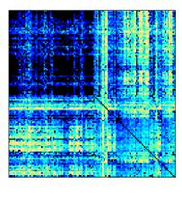
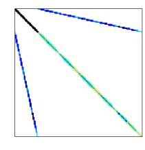
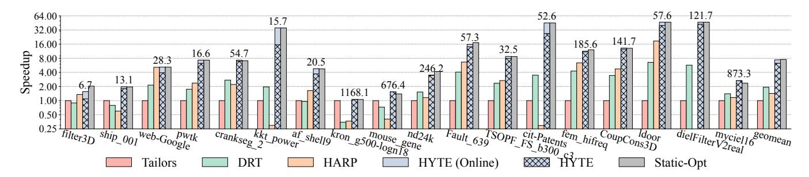
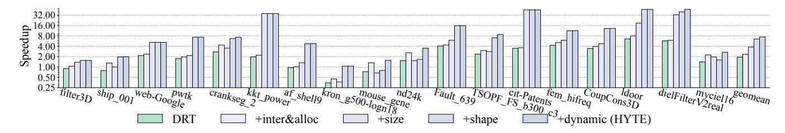
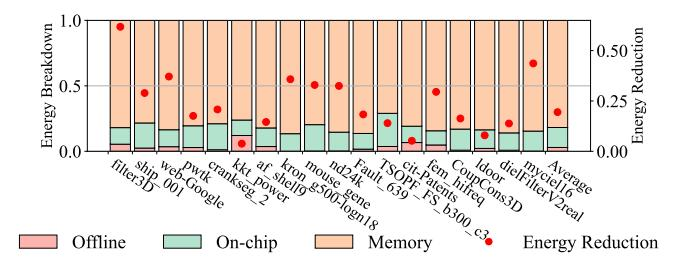
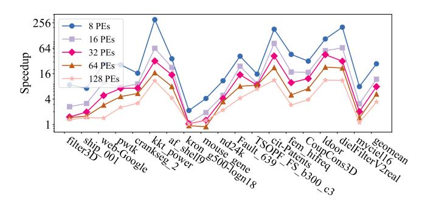
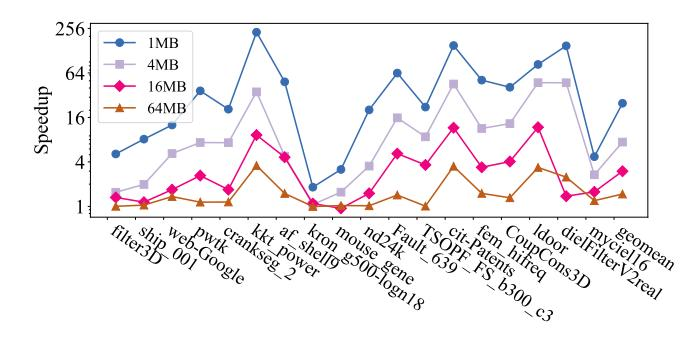

# HYTE: Flexible Tiling for Sparse Accelerators via Hybrid Static-Dynamic Approaches

Xintong Li

Tsinghua University Beijing, China lixt21@mails.tsinghua.edu.cn Zhiyao Li

Tsinghua University Beijing, China lizhiyao19@mails.tsinghua.edu.cn Mingyu Gao

Tsinghua University
Beijing, China
Shanghai Artificial Intelligence Lab
Shanghai, China
Shanghai Qi Zhi Institute
Shanghai, China
gaomy@tsinghua.edu.cn

'25), June 21–25, 2025, Tokyo, Japan. ACM, New York, NY, USA, 14 pages.
https://doi.org/10.1145/3695053.3731044

## Abstract

Specialized hardware accelerators are widely used for sparse tensor computations. For very large tensors that do not fit in on-chip buffers, tiling is a promising solution to improve data reuse on these sparse accelerators. Nevertheless, existing tiling strategies on sparse accelerators are either purely dynamic and suffering from high design complexity, or purely static and using simple heuristics with insufficient adaptivity. In addition, they have not extensively explored the full design space of tiling to identify the optimal schemes, nor have they supported efficient management of the non-negligible metadata needed for tiling. We propose HYTE, a hybrid static-dynamic framework to enable flexible and efficient tiling on sparse accelerators. HYTE relies on a static offline scheduler to first identify a near-optimal initial tiling scheme through effective and lightweight sampling. The tile size and shape, the dimension iteration order across different tiles, and the buffer allocation policies can all be flexibly configured to adapt to the specific data sparsity patterns. Then at runtime, HYTE supports efficient management of the tiling metadata in both the off-chip memory and the on-chip buffer, as well as a technique of dynamic tuning on the tile shape to ensure high buffer utilization in the presence of highly varying local data patterns. Our evaluation shows that HYTE outperforms state-of-the-art sparse tiling strategies by  $3.3 \times$ to 6.2× on average for diverse sparse matrices.

# **CCS** Concepts

- $\bullet \ Computer \ systems \ organization \rightarrow Special \ purpose \ systems;$
- Computing methodologies → Linear algebra algorithms;
   Hardware → Hardware accelerators.

# Keywords

sparse tensor algebra, hardware acceleration, tiling

#### **ACM Reference Format:**

Xintong Li, Zhiyao Li, and Mingyu Gao. 2025. HYTE: Flexible Tiling for Sparse Accelerators via Hybrid Static-Dynamic Approaches. In *Proceedings of the 52nd Annual International Symposium on Computer Architecture (ISCA* 


This work is licensed under a Creative Commons Attribution 4.0 International License. *ISCA '25, Tokyo, Japan*© 2025 Copyright held by the owner/author(s).
ACM ISBN 979-8-4007-1261-6/25/06
https://doi.org/10.1145/3695053.3731044

## 1 Introduction

Sparse tensor data are prominently used in many domains including graph processing, high-performance computing, and machine learning. Due to their irregular data distributions, sparse tensor computations are usually inefficient on general-purpose processors, causing numerous random data accesses with little locality in the memory hierarchy, as well as severe load imbalance among parallel computing cores. Consequently, special-purpose sparse tensor accelerators have been proposed to optimize critical sparse kernels such as sparse-sparse matrix multiplications [4, 12, 14, 17, 20, 22, 24, 26, 31, 40, 41]. These accelerators typically contain an array of multiply-accumulate processing elements and a hierarchy of SRAM buffers. They use dedicated dataflow schemes that correspond to various iteration orders among tensor dimensions, such as Inner Product (IP), Outer Product (OP), and Gustavson's.

For large sparse tensors, the on-chip buffer in the accelerator may be insufficient to fit all data, and there would still be substantial random data accesses to the expensive off-chip memory. In such cases, *tiling* becomes an attractive solution, where the tensor is split into multiple smaller tiles that each fit in the buffer and are maximally reused on-chip before moving to the next tile. However, the irregular distribution of sparse data makes it difficult to identify the optimal tile shapes and sizes. A large tile with many non-zero elements may overflow the SRAM buffer and sacrifice data reuse, while a small tile with few non-zero elements would underutilize the buffer space and lead to many tiles which cause unnecessary refetches of the other operand tensors.

State-of-the-art sparse accelerators try to address this difficulty through either dynamic runtime tiling that flexibly changes the tile size [19, 25], or using static heuristics to slightly overbook the buffer space to improve utilization [38]. Unfortunately, purely dynamic tiling has to limit its tiling decisions to a small number of choices due to high implementation complexity, and purely static tiling is usually less efficient when data sparsity varies significantly. In addition, we find that these prior designs have not thoroughly explored the full design space of tiling. Many of their design parameters, including the tile shape, the inter-tile iteration order, and the relative space of SRAM buffers allocated among different operand tensors, are fixed and sub-optimal, especially when the tensors have diverse sparse patterns. Moreover, the metadata to support tiling,

e.g., the begin and end locations of the compressed non-zero data in a tile, may also become a significant overhead and require careful management by the hardware accelerator.

In this paper, we take a holistic approach to study the tiling strategies of sparse tensor accelerators and propose HYTE, a *hybrid static-dynamic* framework for *flexible and efficient* sparse tiling. HYTE supports a rich set of flexible tiling parameters, including the tile size (number of non-zero elements within a tile), the tile shape (coordinate range along each tensor dimension), the iteration order of dimensions across adjacent tiles, and the SRAM buffer allocation policies. At the static offline phase, HYTE relies on a scheduler to analyze the sparsity patterns of the operand tensors, using *effective yet lightweight sampling* approaches to estimate several key metrics. With the help of a performance model, the scheduler then generates a near-optimal tiling scheme with initial values for the above parameters. Our sampling method is more comprehensive than previous static heuristics [38], and gives more efficient tiling results with only minor offline overheads.

With the initial tiling scheme, the HYTE hardware further applies dynamic tuning, which shrinks or extends the tile size to always ensure maximum buffer utilization even with highly varying local data sparsity patterns. Because the statically scheduled scheme is near-optimal, dynamic tuning can be much simplified. Besides, HYTE efficiently manages the metadata in both the off-chip memory (for inter-tile execution) and the on-chip buffer (for intra-tile execution), and flexibly shares the buffer space between data and metadata to alleviate the metadata complexity.

We evaluate HYTE by comparing it with the state-of-the-art sparse accelerators [19, 25, 38] on a diverse range of sparse datasets. On the representative sparse-sparse matrix multiplication kernel with the Gustavson's hardware dataflow, HYTE is on average 3.3× to 6.2× faster than the baselines, and performs very close to the exhaustively searched static optimal schemes. Most of the benefits are enabled by the flexible tiling parameter choices and the effective static scheduling, while our dynamic features in hardware can also boost performance for certain pathological cases when the static scheduler fails to find a good scheme. We also show the performance gains of HYTE are consistent across various sparse computation kernels and different hardware dataflows. The offline scheduling cost is minor even though it executes on the CPU, thanks to our effective sampling method.

We make the following contributions in this paper.

- We demonstrate that existing sparse accelerators have not extensively explored the full design space of tiling, including the tile size, tile shape, inter-tile iteration order, and buffer allocation policies.
- We propose a static offline scheduler for sparse accelerators, which uses lightweight sampling to adaptively identify nearoptimal tiling schemes for various sparsity patterns.
- We design a hardware architecture for sparse accelerators, which supports dynamic tuning on the tile shape to ensure high buffer utilization, and efficiently manages the tiling metadata in both the off-chip memory and the on-chip buffer.
- We integrate the above techniques into a hybrid static-dynamic framework, which enables flexible and efficient tiling on sparse accelerators, and significantly outperforms previous approaches on diverse sparse matrices.

# 2 Background and Related Work

This section first introduces the basis of sparse tensor computations and hardware accelerators for sparse tensors. Then it focuses on the state-of-the-art tiling strategies in sparse accelerators.

# 2.1 Sparse Tensor Algebra

Tensors are multi-dimensional data arrays, and sparse tensors predominantly consist of elements with zero values. As commonly termed [35], elements in a tensor are referred to as *points* with a tuple of *coordinates*, e.g.,  $X_{i,j,k}$  at (i,j,k) in a 3D tensor X. Following previous studies [25, 38], we use the Einsum notation [8] to articulate operations on sparse tensors. For example, the widely used sparse-sparse matrix multiplication (SpMSpM) between tensors A  $(I \times K)$  and B  $(K \times J)$  is written as  $C_{i,j} = A_{i,k} \times B_{k,j}$  over (I,J,K). Here, k represents a contracted dimension that aggregates values across iterations (i,j,\*) to output  $C_{i,j}$ .

To avoid ineffectual operations on zeros, sparse tensors are often stored in various *compressed formats* like the coordinate (COO) and compressed sparse row/column (CSR/CSC) formats, and their block variants like block CSR. These formats generally organize tensor dimensions into a hierarchical structure with levels consisting of *fibers* [35], which are sequential lists of coordinates and associated non-zero values. The term *position* indicates the actual storage location of a point within these formats, often differing from its coordinates due to the compression of zeros and null pointers.

# 2.2 Sparse Tensor Accelerators

Sparse tensors involve excessive indirect and irregular data accesses that are ill-suited to general-purpose processors. Consequently, specialized hardware accelerators for sparse tensors have been proposed, with substantial optimizations on both the computation dataflow and the data buffer implementation.

**Sparse dataflow.** Similar to the dense scenario [16, 39], the dataflow of sparse accelerators can also be represented as multilevel loop nests iterating over the multi-dimensional space. Considering SpMSpM with three dimensions (i, j, k), there are three mainstream dataflow choices adopted by recent sparse accelerators, namely Inner Product (IP) [4, 12, 31], Outer Product (OP) [14, 26, 41], and Gustavson's (Gust) [17, 20, 40], corresponding to the loop orders (outer  $\triangleright$  inner) of  $i \triangleright j \triangleright k$ ,  $k \triangleright i \triangleright j$ , and  $i \triangleright k \triangleright j$ , respectively. These dataflow schemes exhibit different data reuse friendliness for the three tensors A, B, C, as summarized in Table 1. Specifically, the effectiveness of reuse is contingent on the placement of the irrelevant dimensions, such as k for C, within the loop order. When the irrelevant dimension is at the inner loop, the data can be reused across these iterations, resulting in excellent reusability. Conversely, if the irrelevant dimension is at the outermost level, the whole data are repetitively scanned and would thrash the limited on-chip buffer. Recognizing these tradeoffs, several designs [20, 24] supported multiple dataflows using runtime configurable hardware, aiming to adapt to the diverse sparse patterns of the input tensor.

**Buffer management.** Conventional hardware-managed caches are considered inefficient for specialized accelerators. The approach of explicit decoupled data orchestration (EDDO) [21, 27, 30] thereby emerges as a buffer management idiom tailored for accelerators.

<span id="page-2-0"></span>Table 1: Data reuse tradeoffs of different dataflow schemes for sparse accelerators.

|                 | $\mathrm{IP}(i \triangleright j \triangleright k)$ | $OP(k \triangleright i \triangleright j)$ | Gust $(i \triangleright k \triangleright j)$ |
|-----------------|----------------------------------------------------|-------------------------------------------|----------------------------------------------|
| Reuse $A_{i,k}$ | Good                                               | Good                                      | Good                                         |
| Reuse $B_{k,j}$ | Poor                                               | Good                                      | Poor                                         |
| Reuse $C_{i,j}$ | Good                                               | Poor                                      | Good                                         |

Specifically, EDDO decouples the computation units and the different levels of buffers, and fetches data as far in advance as possible at each buffer level using dedicated address generators. Each buffer is explicitly addressed with an independent address space, avoiding the overheads of cache tags.

Depending on the dataflow, some tensors are accessed in irregular patterns. They should be buffered and reused in the on-chip buffers to reduce expensive accesses to the off-chip memory. Other tensors may exhibit simple streaming patterns with little temporal locality. They only need small buffer space.

# 2.3 Tiling in Sparse Accelerators

To further improve data reuse, tiling becomes a promising technique for sparse accelerators. A tile is a logically continuous sub-space of the full iteration space (I, J, K), representing a subset of the overall computations. The tile shape is defined as its coordinate spread of each dimension, denoted as  $T_i, T_j, T_k$ . The tile size is the number of non-zero points in it. By restricting the tile size to be no larger than the on-chip buffer capacity, we can maximize data reuse within the tile before moving to the next tile. On the other hand, tiling also incurs repetitive accesses to other tensors and/or additional partial result merging cost, and complicates data access patterns. Notably, with most sparse formats, the fibers of a dimension would need to be segmented according to the tile shape, and these *fiber segments* further increase the metadata overheads.

Tiling for sparse tensors typically follows two categories: *coordinate* tiling and *position* tiling [25, 38]. Coordinate tiling divides data with the same coordinate spans along each dimension, which simplifies coordinate matching during the computation as two tiles either have exactly the same coordinate range or do not overlap along a certain dimension. However, the tiles may have different sizes due to the varying local sparsity, causing potential buffer underutilization or overflow. On the other hand, position tiling divides data into tiles with the same size based on the actual data amounts in the specific format, but the resultant unaligned coordinate ranges between tiles are quite challenging to manage.

State-of-the-art tiling techniques for sparse accelerators. Currently, most existing designs adopt coordinate tiling to simplify hardware control. At the same time, they also recognize the inefficiency of mismatched data size and buffer capacity, and introduce more dynamic and flexible tiling strategies [19, 25, 38]. For example, Tailors [38] adopted a speculative strategy to determine the tile size, by pre-sampling the data sparsity and allowing a small portion of tiles (e.g., 10%) to overbook the buffer capacity. On the other hand, DRT [25] and HARP [19] both used dynamic approaches, adjusting the tile size at runtime to fully utilize the buffer even with varying data sparsity characteristics.

Table 2 summarizes the details of these three designs from various perspectives. First, the tile size of Tailors is only statically determined with 10% overbooking, while both DRT and HARP dynamically decide the tile size to fully utilize the buffer capacity based on the current local data sparsity. To construct the tile with a concrete shape along each dimension, Tailors prioritizes expanding along the contracted dimension k in order to maximize the reuse for tensor C, followed by j and i. DRT employs an online greedy algorithm to select the tile shape. It iteratively grows each dimension in the order of *k*, *i*, *j*, until the buffer is fully occupied. Consequently, the tile shape in DRT resembles a cube with similar spans along all dimensions. To facilitate such flexible tiling across all dimensions under a compressed format, DRT needs to first preprocess the original tensor into micro-tiles (of  $32 \times 32$ ), as the smallest unit for tiling. HARP, in contrast, focuses on tiling along i only, which is specialized for its OP dataflow and aims to improve data reuse of tensor C. It segments dimension i into small pseudo-tiles, and dynamically merges them into super-tiles during execution, based on specific buffer usage statistics.

For the processing order between tiles, Tailors goes along dimension j first, while DRT follows ExTensor [12] to go along i first. HARP also goes along i first for inter-tile execution. Finally, these three designs are also equipped with separate dedicated buffers with different capacities for different tensors. DRT and HARP require the tensor tiles to be fully buffered in the corresponding buffers (buffering), while Tailors could additionally support streaming data in and out of a small space when the tiles overflow (streaming).

## <span id="page-2-2"></span>3 Motivation

Despite the above recent efforts making tiling more efficient on sparse accelerators [19, 25, 38], they are still limited in the abilities to fully adapt to various complicated sparse data distributions. In this section, we discuss several critical aspects of sparse tensor tiling that exhibit drastically different optimal decisions in various scenarios, motivating even more flexible approaches.

## <span id="page-2-1"></span>3.1 Tile Parameters

The most critical parameters in tiling are the tile size (number of non-zero points) and shape (coordinate spread along each dimension). Making a tile small enough to fit in the on-chip buffer improves data locality of the current tensor, but it also results in more tiles, requiring repetitive fetches of the other tensors irrelevant to the tiling dimension to multiply with each of these tiles. Figure 1a illustrates the performance impact of tile sizes with different sparse matrices from SuiteSparse [7] doing self-multiplication using the Gust dataflow. We use an on-chip buffer of 16 MB. The horizontal axis lists different tile sizes as the overflow ratios compared to the buffer capacity, e.g., "1" means the tile size is 2× larger than the tile size with no overflow. As shown in the figure, ML\_Laplace achieves the best performance at the tile size without overflow; mouse\_gene excels at a tile size of 2x; and 1door and cit-Patents prefer much larger tile sizes close to no tiling. These different behaviors are due to the diverse data patterns. For example, cit-Patents is quite sparse, with only 4 non-zeros per column on average, indicating limited data reuse opportunities. If applied a large tiling factor beyond 4, the repetitive access cost would outweigh the reuse benefit.

<span id="page-3-0"></span>

|              | Decision            | Tile size                  | Tile shape                               | Inter-tile order   | <b>Buffer allocation</b>                                                               |
|--------------|---------------------|----------------------------|------------------------------------------|--------------------|----------------------------------------------------------------------------------------|
| Tailors [38] | Static              | Fit 90% tiles              | $k \to j \to i$                          | <i>j</i> first     | Unspecified ratios among A, B, C                                                       |
| DRT [25]     | Dynamic             | Exact fit                  | Iteratively $k, i, j$                    | i first            | 5%, 45%, 50% for <i>A</i> , <i>B</i> , <i>C</i>                                        |
| HARP [19]    | Dynamic             | Exact fit                  | i                                        | i first            | 4.5%, 91%, 4.5% for A, B, C                                                            |
| HYTE (ours)  | Static<br>+ dynamic | May overflow if beneficial | Static flexible shaping + dynamic tuning | Flexibly scheduled | Flexibly partitioned among <i>A</i> , <i>B</i> , <i>C</i> + data/metadata coordination |

Table 2: Tiling scheme comparison between state-of-the-art designs and ours.

<span id="page-3-1"></span>


(a) Tile size. Shown as the overflow ratio compared to the buffer capacity. Stars are Tailors' choices.

<span id="page-3-2"></span>(b) Tile shape. A label of "aT,bT" means to tile dimension k by a factor of a and tile j by b.

<span id="page-3-3"></span>(c) Inter-tile order. "i/j/k first" means to put i/j/k at the innermost loop of the inter-tile level.

Figure 1: Impacts of various tiling configuration parameters when processing SpMSpM  $C = A \times B$  on different sparse matrices.

The star mark on each line shows the choice of Tailors [38] with 10% overbook tiles, which is suboptimal for most matrices shown.

Takeaway 1 (tile size): Using tile sizes that match the buffer capacity or follow a fixed overflow ratio is not always optimal, e.g., when repetitive accesses outweigh tiling reuse.

Furthermore, even with the same tile size, the concrete shape of the tile may also significantly affect performance. Figure 1b shows the off-chip memory access amounts with different tile shapes while the tile's coordinate size (product of the two dimensions) remains unchanged. In the almost-diagonal matrix TSOPF\_FS\_b300\_c3, the generated C is relatively small, and thus tiling k and fetching k repetitively would be the best. However in the power-law graph kron\_g500-logn18, k dominates the accesses, favoring only tiling k and fetching k repetitively. Finally, the structured mycielskian16 matrix resides in between, where the best performance is achieved by balancing the tile shape along both dimensions.

Takeaway 2 (tile shape): With the same tile size, the best coordinate spread in each dimension would depend on the specific tensor data patterns.

## 3.2 Control Schemes

Prior designs have used either purely static [38] or purely dynamic [19, 25] approaches to determine their tile sizes and shapes, each with certain drawbacks. Purely static approaches can only optimize for the average case with heuristic parameter choices. For example, the 10% overbooked tiles in Tailors [38] may not always lead to the best performance, as shown in Figure 1a. Purely dynamic tiling, on the other hand, would either require significant metadata overheads to make the data format suitable for tiling (e.g., microtiles [25]), or limit to simple tiling schemes that lose efficiency [19], as discussed in Section 3.1.

Takeaway 3 (static vs. dynamic): Purely static tiling is less optimal while purely dynamic tiling is too expensive. A combination of the two may be desired.

Another critical control scheme is the inter-tile execution order, which affects the reuse of the fetched tiles. Note that this inter-tile order differs from the intra-tile order. The latter is usually designated by the fixed dataflow implemented by a specific hardware chip (Table 1) for computations within a single tile, while the former is across different tiles. Again because of the diverse sizes and sparsity degrees, in different cases we would need to prioritize the reuse of one specific tensor over the others, thus requiring support of different inter-tile orders. In Figure 1c, both matrices use the Gust dataflow and are evenly tiled along each dimension. However, reusing *C* by putting the irrelevant *k* dimension at the innermost (i.e., *k* first) is more critical in the matrix filter 3D, but less beneficial for rail 12586.

Takeaway 4 (inter-tile order): The hardware should support configurable inter-tile orders that could adapt to different tensor data patterns.

# 3.3 Buffer Management

Finally, to realize the flexible tiling schemes and the relevant control as mentioned above, the hardware buffers must be accordingly enhanced. First, because each of the different inter-tile orders mainly buffers one of the three operand tensors and stream the others, the buffer capacity allocation among them should be flexible. Previous designs with rigid capacity partitioning (Table 2) cannot support such diverse requirements. In addition, with dynamic tiling, the metadata size and management cost could be substantial, not only including the original compressed format indexing structure, but also the new metadata associated with tiling (e.g., the begin and

end positions of a tiled fiber segment). Actually, the ratio between metadata and data varies significantly for different matrices, with the mean and variance as 0.27 and 0.51 across our evaluated matrices. Sparse and heavily tiled matrices could have excessive metadata, e.g., up to 3.2× of actual data in kron\_g500-logn18. Dense or mildly tiled matrices, such as nd24k and TSOPF\_FS\_b300\_c3, only incur < 0.02× overheads. Thus it would be more efficient to also use the same buffer to flexibly store and manage the metadata in tandem with the data.

Takeaway 5 (buffer management): The buffer capacity needs to be flexibly allocated and efficiently managed among different tensors as well as between data and metadata.

## 4 HYTE Overview

Based on the key takeaways in Section 3, we propose HYTE, a hybrid static-dynamic framework for flexible and efficient tiling on sparse accelerators. HYTE follows previous work [19, 25, 38] to adopt coordinate tiling and focuses on selecting the best tiling configuration. It is able to support various tiling schemes and identify the best one according to the specific data tensor characteristics and hardware dataflow implementations, therefore enabling fully adaptive execution with high performance and efficiency.

Table 2 compares HYTE with the previous designs. HYTE uses novel hybrid static-dynamic approaches to achieve the above flexibility and efficiency (Takeaway 3). At the static offline phase, HYTE relies on a *lightweight scheduler* to analyze the data patterns and to decide an initial execution scheme. It extensively yet efficiently explores the design space, and determines optimized tile sizes, shapes, and inter-tile orders (Takeaways 1, 2, 4). Notably, it may choose larger tile sizes or even disable tiling if it finds that the data reuse benefit does not justify the repetitive data fetch cost. It will also select the tile shape and the inter-tile order that result in the best overall data reuse based on the tensor size and sparsity information. During such exploration, the unknown information such as the output tensor sparsity is estimated through effective yet lightweight sampling. Moreover, based on the inter-tile reuse analysis, the scheduler also flexibly allocates the buffer space to each tensor to match their reuse requirements, e.g., using most buffer capacity for reused tensor tiles while keeping minimum space for streaming ones (Takeaway 5). Overall, such an initial scheme serves as a reasonably near-optimal schedule for hardware execution.

At the dynamic online phase, the hardware processes each tile one after one following the given inter-tile order, while the data within each tile are fetched to its statically allocated buffer space. Due to the need of flexible tiling schemes, HYTE requires more complex metadata for bookkeeping the storage positions of tiled fiber segments. HYTE enables coordinated management of data and metadata (Takeaway 5) in both the on-chip buffer and the off-chip memory, to facilitate efficient intra-tile and inter-tile execution, respectively. In addition, it also applies dynamic tuning based on the real-time, local data patterns, to ensure maximum buffer utilization. Specifically, the statically determined tile size may underutilize or overflow the buffer when the local data region is sparser or denser than expected. The hardware would dynamically adjust the tile shapes to better match the buffer capacity (Takeaways 1, 2). Such dynamic tuning is implemented with cheap hardware

```
Initial tile shape: T<sub>i</sub>, T<sub>j</sub>, T<sub>k</sub>
Inter-tile order: a permutation of i, j, k
Buffer allocation: S<sub>A</sub>, S<sub>B</sub>, S<sub>C</sub>
```

Figure 2: Initial tiling scheme generated by HYTE scheduler.

counters and simple heuristic rules, in contrast to complex designs in previous work [25]. This is sufficient because the initial scheme is already close to optimal, and the dynamic tuning is only needed in occasional cases to correct the small estimation errors.

Workflow and interface. The offline scheduler of HYTE takes in the information for input tensors A and B, including their formats, sizes, and sparsities (percents of non-zeros). The scheduler internally estimates the information for the result tensor C. The hardware specifications are also provided, such as the intra-tile dataflow (IP/OP/Gust), computation throughput, SRAM buffer capacity, and DRAM bandwidth. We consider the intra-tile dataflow as a fixed hardware setting, because different sparse dataflows require quite different hardware implementations. It is not difficult to extend our scheduler to search for flexible dataflow choices [20, 24].

The scheduler eventually generates an initial tiling scheme as in Figure 2, which is then used to guide the execution on the hardware. The scheme specifies the default tile shape to use (upon which the hardware may further fine-tune), the inter-tile order to traverse the tiles, as well as the allocated buffer capacity for each tensor.

In the subsequent Sections 5 and 6, we introduce the detailed designs of the scheduler (offline phase) and the hardware architecture (online phase) of HYTE, respectively.

# <span id="page-4-1"></span>5 Scheduling Algorithms

The offline scheduler of HYTE aims to determine a relatively optimized initial tiling scheme for the given sparse data. This scheme should include the parameters in Figure 2. Similar to existing schedulers for dense computations [13, 16, 28, 39], the scheduler searches the configuration space of different tile shapes, inter-tile orders, etc., assesses each scheme with a hardware cost model, and identifies the best scheme with the minimum cost (i.e., the best performance).

## **Algorithm 1:** Overall workflow of HYTE scheduler.

```
// Sample and estimate

1 S_I \leftarrow Sample a fraction sp of values from 0 to I;

2 S_J \leftarrow Sample a fraction sp of values from 0 to J;

3 effMAC ← ESTEFFMAC(A, B, S_I, S_J, \text{sp});

4 {nnzCTk}_{T_k=1,2,4,...,K} \leftarrow ESTNNzCTK(A, B, S_I, S_J, \text{sp}, \text{sk});

// Search the tiling scheme with the minimum cost

5 c_{\min} = \infty; s_{\min} = \bot;

6 foreach s in Pruned Tiling Scheme Space() do

7 c \leftarrow CostModel(s, effMAC, nnzCTk_{T_k});

8 c \leftarrow if c < c_{\min} then c_{\min} \leftarrow c; c \in sin c \in sin c \in sin c \in sin c \in sin c \in sin c \in sin c \in sin c \in sin c \in sin c \in sin c \in sin c \in sin c \in sin c \in sin c \in sin c \in sin c \in sin c \in sin c \in sin c \in sin c \in sin c \in sin c \in sin c \in sin c \in sin c \in sin c \in sin c \in sin c \in sin c \in sin c \in sin c \in sin c \in sin c \in sin c \in sin c \in sin c \in sin c \in sin c \in sin c \in sin c \in sin c \in sin c \in sin c \in sin c \in sin c \in sin c \in sin c \in sin c \in sin c \in sin c \in sin c \in sin c \in sin c \in sin c \in sin c \in sin c \in sin c \in sin c \in sin c \in sin c \in sin c \in sin c \in sin c \in sin c \in sin c \in sin c \in sin c \in sin c \in sin c \in sin c \in sin c \in sin c \in sin c \in sin c \in sin c \in sin c \in sin c \in sin c \in sin c \in sin c \in sin c \in sin c \in sin c \in sin c \in sin c \in sin c \in sin c \in sin c \in sin c \in sin c \in sin c \in sin c \in sin c \in sin c \in sin c \in sin c \in sin c \in sin c \in sin c \in sin c \in sin c \in sin c \in sin c \in sin c \in sin c \in sin c \in sin c \in sin c \in sin c \in sin c \in sin c \in sin c \in sin c \in sin c \in sin c \in sin c \in sin c \in sin c \in sin c \in sin c \in sin c \in sin c \in sin c \in sin c \in sin c \in sin c \in sin c \in sin c \in sin c \in sin c \in sin c \in sin c \in sin c \in sin c \in sin c \in sin c \in sin c \in sin c \in sin c \in sin c \in sin c \in sin c \in sin c \in sin c \in sin c \in sin c \in sin c \in sin c \in sin c \in sin c \in sin c \in sin c \in sin c \in sin c \in sin
```

<span id="page-4-6"></span><span id="page-4-5"></span>The overall workflow is summarized in Algorithm 1. The key challenge that the scheduler needs to address is that, unlike the dense case where the computation load and data sizes are all directly known, in the sparse scenario both the required computation

amount and the output tensor size would depend on the input tensors' data distributions as well as their correlation in a complex way. HYTE proposes *effective yet lightweight sampling and estimation methods* (Algorithm 1 Lines 1 to 4; Section 5.1) to derive these required statistics without the need to investigate the full input tensors. We find that such sampling and estimation may introduce 15% on average and up to 43% errors against the cycle-accurate simulation results, mostly occurring in irregular tensors. These inaccuracies can be fixed by the online dynamic fine-tuning phase.

To efficiently explore the search space and reduce the search cost, HYTE leverages several observations to *prune* unnecessary and sub-optimal schemes (Line 6; Section 5.2). The remaining ones are then fed to the hardware cost model (Line 7; Section 5.3) for assessment to determine the best one. We provide several example cases in Section 5.4 to show how the scheduler works.

# <span id="page-5-0"></span>5.1 Sampling and Estimation

To accurately assess the performance of each tiling scheme, we need to know the computation amount and the data sizes. Besides the easily known non-zero sizes of the input tensors, we mainly need to estimate two critical metrics: effMAC as the expected effectual (i.e., non-zero) MAC number, and nnzCTk as the non-zero access traffic size of the output tensor C under each tiling factor  $T_k$  of dimension k when repetitive accesses are accounted for.

Algorithm 2: Estimating effMAC and nnzCTk.

```
1 function ESTEFFMAC(A, B, S_I, S_J, sp):
         sum \leftarrow 0
2
         for k \leftarrow 0 to K do
 3
               szA \leftarrow \text{Number of non-zeros in } A[S_I][k];
 4
               szB \leftarrow \text{Number of non-zeros in } B[k][S_I];
 5
               sum += szA \times szB;
         return \frac{sum}{sp^2}
8 function EstNnzCT\kappa(A, B, S_I, S_J, \text{sp, sk}):
         function EstNnzC(N_k, A, B, S_I, S_I, sp, sk):
               R[N_k] \leftarrow A list of empty min-heaps, each of size sk;
               for k \leftarrow 0 to K do
11
                     t \leftarrow \frac{k}{K/N_L};
12
                     a \leftarrow \text{Non-zero indices of } A[S_I][k] \text{ sorted by } h_1();
13
                     b \leftarrow \text{Non-zero indices of } B[k][S_I] \text{ sorted by } h_2();
14
                     foreach i, j in a, b do
15
                          v \leftarrow (h_1(i) - h_2(j)) \mod 1;
16
                          Add ((i, j), v) to R[t], if not already existing;
17
               R_{\text{all}} \leftarrow \text{Deduplicate} \text{ and merge sort } R[N_k];
18
               v_{sk} \leftarrow The sk-th smallest value in R_{all};
19
               sum \leftarrow \sum |\{v \leq v_{sk}|v \in R[t]\}|;
20
              return \frac{3um}{v_{\rm sk} \cdot {\rm sp}^2}
21
         \mathsf{nnzCTk} \leftarrow [\,];
22
23
           nnzCTk.Append(EstNnzC(K/T_k, A, B, S_I, S_J, sp, sk));
24
         return nnzCTk;
```

Note that both the effectual MACs and the non-zero size of C depend not only on the sparsities of the two inputs A and B, but more importantly also on the correlation between their non-zero distributions. Due to the complex relationship, we adopt sampling-based approaches to efficiently estimate these metrics. We sample a small fraction (denoted as sp) of rows and columns from A and B (Algorithm 1 Lines 1 to 2). If the compressed formats are compatible, e.g., getting rows/columns from CSR/CSC, the sampling is straightforward. If the formats mismatch, e.g., extracting a column from CSR, we sample a set of points uniformly from the entire matrix, and re-group these points into the desired rows/columns.

With the sampled matrices, our estimation methods are summarized in Algorithm 2. For effMAC, we iterate over the contracted dimension k, and multiply the non-zero sizes of the sampled A column and B row pair, to get the MAC number of their outer-product. The total estimated MAC number is the sum scaled by  $\operatorname{sp}^2$ .

To estimate nnzCTk, we borrow from previous techniques [2, 3]. We first consider nnzCTk for  $T_k = K$ , i.e., no tiling. As in Algorithm 2 Lines 15 to 17, for each non-zero element pair A[i][k] and B[k][j] in the sampled matrices, we add (i,j) into a min-heap with the value  $h(i,j) = (h_1(i) - h_2(j))$  mod 1, where  $h_1$  and  $h_2$  are two hash functions to fixed-point numbers, and "mod 1" extracts the fractional part of the result. The same (i,j) pairs for different k are deduplicated in the heap. Then  $\operatorname{nnzCTk}_{T_k=K}$  can be estimated as  $\operatorname{sk}/(v_{\operatorname{sk}} \cdot \operatorname{sp}^2)$ , where  $v_{\operatorname{sk}}$  is the sk-th smallest h(i,j) value.

The estimation of nnzCTk for other values of  $T_k$  can be done similarly as in Algorithm 2. However, naively doing so would incur  $O(\log K)$  invocations of the above procedure (Lines 23 to 24). We apply two optimizations. First, we use the  $v_{\rm sk}$  value obtained in the  $T_k=K$  case to filter out most of the (i,j) pairs, and only process the pairs within the sk-th smallest. These pairs are kept in a queue during the  $T_k=K$  invocation. Second, we only iterate these (i,j) pairs once, to build  $N_{k,\rm max}=4096$  deduplicated heaps  $R[N_{k,\rm max}]$  for  $T_{k,\rm min}=K/N_{k,\rm max}$ . For  $T_{k\times 2}$ , we merge each pair of adjacent heaps of  $T_k$  with deduplication. We do this recursively to calculate nnzCTk for all  $T_k$  values. With these optimizations, the extra cost of estimating for other  $T_k$  values can be reduced to 10% of that for  $T_k=K$  for most matrices.

The above estimation involves two hyperparameters, whose default values are chosen as sp =  $1/\sqrt{N}$  and sk =  $\sqrt{N}$  (where N represents the corresponding dimension I, J, or K), to strike a balance between estimation accuracy and computational cost. This follows the theoretically proved suggestion of sp · sk  $\leq$  1 [2]. The empirical time cost is further evaluated in Section 8.4.

# <span id="page-5-1"></span>5.2 Search Space Pruning

As in Figure 2, the search space consists of three categories of parameters: tile shapes, inter-tile orders, and allocated buffer capacities. Below we analyze the candidate choices for each category and prune the unnecessary ones.

<span id="page-5-6"></span><span id="page-5-5"></span>First, for the tile shapes, we only consider power-of-two sizes along each dimension, resulting in  $\log^3 N$  choices where  $N \sim I$ , J, K. Furthermore, we notice that it is not beneficial to tile the outermost loop of the intra-tile dataflow, e.g., i in Gust and IP, or k in OP (Table 1). This is because data are already sequentially processed along this dimension and tiling it will not affect the access and

computation flow. We hence reduce the space to  $\log^2 N$ . We can do further pruning if a tile shape is smaller than another feasible (i.e., fitting in the buffer size) shape along all dimensions, as it would surely underutilize the buffer capacity.

Second, we note that only the choice of the innermost loop in the inter-tile order affects the inter-tile data reuse characteristics. Recall that given an inter-tile order such as  $i \triangleright j \triangleright k$ , the tensor irrelevant to the innermost k dimension, i.e., C, is reused. Exchanging the order of the outer two loops does not change this result. In summary, we only need to consider 3 instead of all 6 inter-tile orders.

Third, for buffer allocation, we consider both inter-tile reuse and intra-tile reuse. First, the fixed intra-tile dataflow could exhibit a poor access pattern on one tensor (e.g., C for OP in Table 1) that needs to be buffered. We choose to always satisfy this requirement of the hardware dataflow to ensure its efficiency. Second, as described above, the inter-tile order designates one tensor that could enjoy inter-tile reuse and would request buffer space to keep its tile. Consequently, we consider two choices, either only using the buffer for intra-tile reuse, or dividing the buffer space between inter-tile and intra-tile reuse. The first choice adds 1 more case to the 3 inter-tile orders, making it 4 in total. Unbuffered tensors use the streaming mode with minimum space.

In summary, the total search space is no larger than  $4 \times \log^2 N$ , which is just a few hundred different schemes and can be explored in a short time in practice as further shown in Section 8.4.

#### <span id="page-6-0"></span>5.3 Cost Model

For each candidate scheme from Section 5.2, we use a relatively straightforward cost model to evaluate its performance, similar to previous work [13, 16, 28, 39]. The total time is modeled as the total number of tiles (as  $I/T_i \times J/T_j \times K/T_k$ ) multiplied by the per-tile execution time, which is max{PE time, DRAM time, SRAM time}. Here PE time = effMAC/throughput, and DRAM/SRAM time is the total access amounts of all tensors (e.g., nnzCTk for C) divided by the corresponding bandwidth.

It is worth noting that the total DRAM/SRAM access amounts are sometimes non-trivial to calculate. For SRAM, the accesses are affected by both the intra-tile dataflow and the tiling scheme. We assume the tensors are already in the desired sparse formats of the hardware dataflow. First we consider the case without tiling. For example, for OP, the access amounts of matrices A, B, and C are nnzA, nnzB, and effMAC, respectively; and for Gust, they become nnzA, effMAC, and nnzC. Repetitive accesses may be needed, e.g., IP accesses B for I times. Then, if tiling is applied to the irrelevant dimension of a tensor, its SRAM accesses are amplified by the number of tiles, e.g., nnzA  $\times$   $J/T_j$  and nnzB  $\times$   $I/T_i$ . However C needs special treatment because it is generated and accumulated on the fly; the access amount is estimated as nnzCTk in Section 5.1.

The DRAM access amounts need to further consider the buffer allocation and access mode of each tensor. In the streaming mode, the DRAM traffic is equal to the SRAM traffic. In the buffering mode, if the tile size is smaller than the allocated buffer space, the traffic is reduced by the reuse times. Otherwise, the hit rate is the ratio between the two.

Besides the data, we also need to consider the metadata access cost. With the flexible tiling schemes supported in HYTE, we need

<span id="page-6-2"></span>



(a) mouse\_gene

(b) dielFilterV2real

Figure 3: Non-zero distributions of two example matrices that prefer no tiling and extensive tiling, respectively.

to maintain a non-negligible amount of metadata (Section 6.2), e.g., to specify the actual storage positions of the fiber segments in the current tile, which are irregular and differ significantly from the regularly tiled coordinates. When a tile is highly sparse, the metadata overhead can be substantial compared to the data access cost, e.g., reading/writing the begin position of a fiber segment vs. only a few non-zeros in this segment. To account for their accesses, for each tile we calculate how many individual fiber segments it has, e.g., a CSR-format A tile of  $T_i \times T_k$  has  $T_i$  fiber segments. This determines the size of metadata. Their access counts follow those of the corresponding data.

#### <span id="page-6-1"></span>5.4 Case Studies

We illustrate how the HYTE scheduler works on two example matrices: mouse\_gene and dielFilterV2real, whose non-zero distributions are shown in Figure 3. The mouse\_gene matrix has dimensions  $45101 \times 45101$  with 14,506,196 non-zeros, while dielFilterV2real has dimensions  $1157456 \times 1157456$  with 24,848,204 non-zeros.

By sampling sp =  $1/\sqrt{N}$  = 0.005 of mouse\_gene and tracking the top sk =  $\sqrt{N}$  = 212 hash values, we estimate effMAC, nnzCTk $_K$ , nnzCTk $_{K/128}$  as 7,442,882,727, 262,241,518, and 2,084,207,396, respectively, while the actual values are 7,971,580,000, 237,833,954, and 2,065,359,984. For dielFilterV2real, sampling with sp = 0.0009 and sk = 1075 yields the estimated values of 449,092,928, 95,012,185, and 125,005,246, compared to the actual 435,260,000, 105,679,996, and 121,610,583. The errors are only about 5% to 10%.

Notably, with mouse\_gene, nnzC is 18× larger than the non-zero size of the input matrix, and nnzCTk $_{K/128}$  is another 8× larger than nnzC. In contrast, in dielFilterV2real, nnzC is only 4× the input, and nnzCTk $_{K/128}$  approximates nnzC.

After the tiling space exploration, the HYTE scheduler decides not to tile dimension k for mouse\_gene. This is due to its relatively dense distribution and the high nnzC value, which would result in significant redundant accesses to C after tiling (i.e., nnzCTk $_{K/128}$  vs. nnzCTk $_{K}$ ). Conversely, the sparsity and low nnzCTk values of dielFilterV2real favor extensive tiling of k.

Our scheduler is general and can easily discover more patterns. Matrices with similar characteristics to mouse\_gene — such as kron\_g500-logn18, ship\_001, and human\_gene — show similar variance and power-law distribution. Large and structured matrices — like ldoor and fem\_hifreq — perform comparably to dielFilterV2real. Additional patterns are presented in Section 8.1.

<span id="page-7-2"></span>

Figure 4: Hardware architecture of HYTE. The tiling controller and the accessors at each buffer level are newly added.

#### <span id="page-7-0"></span>**6 Hardware Architecture**

This section describes the hardware architecture of HYTE and how it supports flexible tiling. We particularly focus on the management of the metadata of tiling schemes in both the off-chip memory (for inter-tile execution) and the on-chip buffer (for intra-tile execution). We also support dynamic tuning in HYTE to compensate for the estimation errors in the static scheduler.

## 6.1 Overview

Figure 4 illustrates the overall hardware architecture of HYTE. Without loss of generality, we assume a multi-PE accelerator with one level of SRAM buffer and the off-chip DRAM memory, similar to most prior designs [20, 25, 38, 40]. Here in the figure we omit any dedicated units to support a specific intra-tile dataflow, such as index intersectors for IP and partial sum mergers for Gust and OP, since they do not affect our tiling designs at the global buffer level. But we consider their performance impact in the evaluation.

HYTE mainly introduces two new hardware components which are highlighted in Figure 4: the *tiling controller* that controls the overall tiling scheme, and the *accessor* of each tensor (e.g., "A/B/C acc") that is in charge of fetching the tiled fiber segments into the buffer and managing the corresponding metadata. Note that these modifications are only to the logic for buffer control and data access, without altering the PE datapaths.

The high-level workflow is as follows. The global tiling controller first loads the initial tiling scheme statically determined by the offline scheduler. The inter-tile order and the tile shapes are used by the tiling controller to determine which tiles to process next after each inter-tile iteration (Section 6.2). This information is sent to the accessors, who fetch the corresponding tiles of the multiple tensors into the buffer, and manage the buffer space according to the buffer allocation in the offline scheduled scheme (Section 6.3).

Our accessor design is extended from Buffets [30], with the main difference as changing the control and access granularity from a single element to a fiber segment with specified begin/end coordinates. A specific design challenge is to effectively *manage the metadata*, so that with an arbitrary inter-tile order, we can derive the *positions* (i.e., the actual storage locations) of the fiber segments given their begin/end *coordinates* from the tiling controller. Note that previous tiling designs have overlooked this issue, either only supporting tiling along fixed dimensions with simple metadata [19, 38], or relying on expensive preprocessing [25]. Section 6.2 describes how we maintain the necessary metadata in the memory across tiles, while Section 6.3 discusses how the metadata within a tile are managed in coordination with the tensor data.

Finally, HYTE supports *dynamic tuning* of tile shapes at runtime in hardware (Section 6.4), in order to correct the estimation errors of the static scheduler and to better adapt to the local sparse patterns. A few hardware counters are added to the accessor to collect the runtime statistics, and the tiling controller uses such information to dynamically adjust the tile shape using a simple model.

# <span id="page-7-1"></span>6.2 Inter-Tile Management

Following the statically scheduled inter-tile iteration order, the tiling controller tells each accessor which tile to fetch next through the following control signals (Figure 4 top right). (1) Begin\_i, Begin\_j, Begin\_k as the begin coordinates. (2) T\_i, T\_j, T\_k as the current tile shape, which could differ from the statically scheduled one after dynamic tuning. (3) Change\_i, Change\_j, Change\_k, which can take three values: 0 indicates the begin/end coordinates remain the same as the last iteration; 1 means moving to the next segment by increasing the begin/end coordinates by the corresponding T value; and 2 resets to 0. For example, with an inter-tile order of  $i \triangleright j \triangleright k$ , the tiling controller would send 0, 0, 1, until the last innermost iteration that sends 0, 1, 2.

Besides fetching the data fiber segments, the accessor also maintains the necessary metadata, i.e., the positions of the fiber segments. As the accessor fetches the fiber segment, it sequentially increments the position, until encountering a coordinate exceeding the tile boundary. The current position would become the begin position of the next fiber segment. The exact amount of metadata needed to store depends on both the inter-tile order and the compressed format of the tensor. For example, assume the  $i \triangleright j \triangleright k$  inter-tile order and both tensors *A* and *B* are in CSR. As shown in Figure 5(a), A only needs to keep  $T_i$  positions of the current tile, because the iteration direction matches its fiber format. But B would need to keep K positions for the whole tile column. Because HYTE supports flexible inter-tile orders, both cases must be considered. Due to the various demands and the potentially large size (e.g., O(K) for B above), HYTE keeps these metadata in the memory. The cost of reading/writing these metadata from/to memory has been considered in our cost model in Section 5.3. If the cost is too high, HYTE can flexibly and automatically adapt to less aggressive tiling.

# <span id="page-7-3"></span>6.3 Intra-Tile Management

With the specified coordinate ranges and the begin positions, the accessor fetches the fiber segments of the tensor into its statically allocated buffer space. We support two modes for each tensor [38],

<span id="page-8-1"></span>

Figure 5: Example hardware behaviors with  $i \triangleright j \triangleright k$  inter-tile order and Gust dataflow. (a) Current tiles' sparse patterns, and metadata in the memory. (b) Streaming and buffering modes, and coordination of data and metadata in the buffer. (c) Counters for dynamic tuning of tile shapes.

buffering if the tile should be buffered for reuse, or *streaming* otherwise. Figure 5(b) shows the two modes. In this example, we buffer tensor B's tiles while streaming A. We manage the data and metadata in coordination, each growing from one end of the buffer space towards the middle until met. When filling in the data of a fiber segment, the accessor also records its begin location in the buffer as the metadata. For example, in A's buffer, at time 0 and 1 the first fiber segment (a,b) is in, with a metadata 0 denoting its location. The second segment is empty. The third segment c starts at location 2. Similarly for b, e.g., the last segment b is at location 3. The difference between two adjacent metadata entries is the (non-zero) size of the corresponding fiber segment.

For the streaming mode, we follow the Buffets-like circular buffer design [30], with a head and an occupancy register denoting the head of the circular metadata buffer and its size. In Figure 5(b), at time 3 the A buffer is full. Then we evict one fiber segment (i.e., a and b) as well as its metadata at time 4. Now the head moves by 1 and the occupancy reduces by 1, and we have available space to read in the last segment d at time 5.

In the buffering mode, if the tile data exceed the allocated buffer space, e.g., due to a locally dense region, we do not evict previous data since they are expected to be reused. The future data of this tile will just bypass the buffer. This is a result of inaccurate static estimation that misses local sparse pattern variations. We use dynamic tuning in Section 6.4 to alleviate it.

## <span id="page-8-0"></span>6.4 Dynamic Tuning

Due to variations in the distribution of non-zeros across different tiles, the tile that should be buffered may sometimes overflow or underutilize the statically allocated buffer space. We may need to decrease or increase the tile size in these cases, respectively. HYTE applies dynamic tuning for this purpose. The accessor collects a

few runtime statistics and transfers them to the tiling controller, which adjusts the tile shapes based on certain simple rules.

Specifically, when an accessor fetches a tile, e.g., a B tile of shape  $T_k \times T_j$  in Figure 5(c), we use four counters, cnt00, cnt01, cnt10, cnt11, to count the numbers of non-zero elements in the four quadrants of the tile. This gives us a more accurate view of the local non-zero distribution of the accessed tile. We then use these counter values to estimate the buffer hit rates for nine potentially adjusted tile shapes, in which each of the two dimensions can increase by 2×, decrease by 2×, or keep the same spread. That is, the new tile shape  $T_k \times T_j \times T_j \times T_j \times T_j \times T_j \times T_j \times T_j \times T_j \times T_j \times T_j \times T_j \times T_j \times T_j \times T_j \times T_j \times T_j \times T_j \times T_j \times T_j \times T_j \times T_j \times T_j \times T_j \times T_j \times T_j \times T_j \times T_j \times T_j \times T_j \times T_j \times T_j \times T_j \times T_j \times T_j \times T_j \times T_j \times T_j \times T_j \times T_j \times T_j \times T_j \times T_j \times T_j \times T_j \times T_j \times T_j \times T_j \times T_j \times T_j \times T_j \times T_j \times T_j \times T_j \times T_j \times T_j \times T_j \times T_j \times T_j \times T_j \times T_j \times T_j \times T_j \times T_j \times T_j \times T_j \times T_j \times T_j \times T_j \times T_j \times T_j \times T_j \times T_j \times T_j \times T_j \times T_j \times T_j \times T_j \times T_j \times T_j \times T_j \times T_j \times T_j \times T_j \times T_j \times T_j \times T_j \times T_j \times T_j \times T_j \times T_j \times T_j \times T_j \times T_j \times T_j \times T_j \times T_j \times T_j \times T_j \times T_j \times T_j \times T_j \times T_j \times T_j \times T_j \times T_j \times T_j \times T_j \times T_j \times T_j \times T_j \times T_j \times T_j \times T_j \times T_j \times T_j \times T_j \times T_j \times T_j \times T_j \times T_j \times T_j \times T_j \times T_j \times T_j \times T_j \times T_j \times T_j \times T_j \times T_j \times T_j \times T_j \times T_j \times T_j \times T_j \times T_j \times T_j \times T_j \times T_j \times T_j \times T_j \times T_j \times T_j \times T_j \times T_j \times T_j \times T_j \times T_j \times T_j \times T_j \times T_j \times T_j \times T_j \times T_j \times T_j \times T_j \times T_j \times T_j \times T_j \times T_j \times T_j \times T_j \times T_j \times T_j \times T_j \times T_j \times T_j \times T_j \times T_j \times T_j \times T_j \times T_j \times T_j \times T_j \times T_j \times T_j \times T_j \times T_j \times T_j \times T_j \times T_j \times T_j \times T_j \times T_j \times T_j \times T_j \times T_j \times T_j \times T_j \times T_j \times T_j \times T_j \times T_j \times T_j \times T_j \times T_j \times T_j \times T_j \times T_j \times T_j \times T_j \times T_j \times T_j \times T_j \times T_j \times T_j \times T_j \times T_j \times T_j \times T_j \times T_j \times T_j \times T_j \times T_j \times T_j \times T_j \times T_j \times T_j \times T_j \times T_j \times T_j \times T_j \times T_j \times T_j \times T_j \times T_j \times T_j \times T_j \times T_j \times T_j \times T_j \times T_j \times T_j \times T_j \times T_j \times T_j \times T_j \times T_j \times T_j \times T_j \times T_j \times T_j \times T_j \times T_j \times T_j \times T_j \times T_j \times T_j \times T_$ 

$$\frac{T_{k'} \times T_{j'} \times \min(\mathbb{E}[\text{nnz}_{\text{tile}}], \text{bufsize})}{\text{nnz}_{\text{total}}}$$

where nnz<sub>total</sub> is the total tensor size, and nnz<sub>tile</sub> is the number of non-zeros in the adjusted tile, estimated through the counters. For example, the adjusted tile  $T_k' \times T_j' = \frac{T_k}{2} \times 2T_j$  would have nnz<sub>tile</sub> =  $\frac{1}{2} \times (\min(2 \times \text{cnt00} + 2 \times \text{cnt01}, \text{bufsize}) + \min(2 \times \text{cnt10} + 2 \times \text{cnt11}, \text{bufsize}))$ . If the buffer size is larger than the tile size, the hit rate is 100%; otherwise it is the ratio between the two.

Using the dynamic counters is more accurate than the static uniform estimation. Suppose we have a small buffer that can hold only one element. In Figure 5 if we use a tile shape of  $2 \times 2$  for B, each tile contains one element on average, and thus we would assume 100% hits in the static scheduler. However, the actual hit rate is  $\frac{1}{4} \times (\min(3, 1) + \min(0, 1) + \min(0, 1) + \min(1, 1)) = 50\%$ .

We empirically decide that if the best hit rate among the nine shapes is more than 5% better than the existing shape, we will adjust the tile shape. However, this adjustment may not be immediately applied. If the current inter-tile iteration direction is different from the dimension to be adjusted, changing the tile shape would result in misaligned tiles compared to previous ones. Therefore, the adjustment is delayed until the next inter-tile iteration that requires modification of that specific dimension. For example, in Figure 5(a) we are iterating along k in B. Changing  $T_k$  does not affect the intertile iteration, but shrinking or extending  $T_j$  would make the end coordinates of j misaligned, complicating the processing when we start a new j iteration.

# 7 Methodology

We compare HYTE with three previous sparse accelerators that support tiling, namely Tailors [38], DRT [25], and HARP [19]. The characteristics of these four designs are summarized in Table 2. All the designs use the same default hardware configuration, with 32 MAC PEs running at 1 GHz, and a 4 MB global SRAM buffer realized in 32 banks. The off-chip DRAM uses four DDR4 channels with 68 GB/s in total. These configurations mostly follow the prior works [20, 33, 40]. We later assess performance with different PE counts and buffer capacities. We assume the PE array follows the Gust dataflow by default, but also study the performance under other dataflow schemes like IP and OP.

We implement a cycle-accurate simulator in C++ to measure the performance of the above designs when processing different matrix data. Our simulator accurately captures the accesses of individual non-zero matrix elements, in order to reflect the actual

<span id="page-9-2"></span>

Figure 6: Performance comparison among Tailors, DRT, HARP, HYTE (with and without offline time), and static optimal, for SpMSpM with Gust dataflow. The numbers above the bars are the absolute execution time of HYTE in milliseconds.

<span id="page-9-3"></span>

<span id="page-9-1"></span>Figure 7: Memory access breakdown (bars, left y axis) and memory bandwidth (dots, right y axis) for Tailors, DRT, HARP, and HYTE, for SpMSpM with Gust dataflow.

Table 3: Area breakdown of HYTE.

| Component                | Area (mm <sup>2</sup> ) | Area % |
|--------------------------|-------------------------|--------|
| Global tiling controller | 0.08                    | 0.6%   |
| All tensor accessors     | 0.43                    | 3.1%   |
| Global SRAM buffer       | 10.1                    | 73.3%  |
| All PEs                  | 2.8                     | 20.3%  |
| Interconnects            | 0.37                    | 2.7%   |
| Total                    | 13.78                   | 100.0% |

influence of the input data pattern. This is more detailed than previous models [37]. In particular, various key components like the index intersector, index selector, and partial sum merger for the IP, Gust, and OP dataflow schemes are explicitly modeled. The real input sparse matrix is fed to them to determine which data elements are actually accessed and processed in the PEs, and thus affect the compute and memory timing results. The simulator is open-sourced at https://github.com/tsinghua-ideal/HYTE-sim.

In addition, we implement the RTL designs of the key components introduced by HYTE, including the global tiling controller and the tensor accessors. We synthesize them using Synopsys DC on the TSMC 28 nm technology. We use CACTI 7.0 [5] to model the SRAM buffers. The area numbers are listed in Table 3. We see that HYTE incurs minor area cost of 3.7%, where the chip area is dominated by the large SRAM buffer.

Our static scheduler, including the sampling process, runs on an Intel Xeon Gold 6248R processor at 3 GHz, compiled with g++ -03.

We select real-world sparse matrices from the SuiteSparse Matrix Collection [7] as our datasets. These matrices are diverse, with varying densities (from 0.0006% to 0.356%), non-zero sizes (from 1.5M to 25M), and sparsity patterns. Tiling is irrelevant for smaller matrices with our 4MB buffer. For better comparison, we include several matrices used in the baseline papers, e.g., filter3D, web-Google, pwtk, kkt\_power, kron\_g500-logn18, cit-Patents. We mainly evaluate the performance of SpMSpM with self-multiplication of square matrices, i.e.,  $S \times S$ , following prior studies. In addition, we also test several other irregular sparse kernels, including (1)  $F^T \times F$  with a tall-skinny sparse matrix F; (2)  $F \times D$  where D is a random dense matrix, i.e., SpMM; (3)  $F^T \times S$  as one iteration of multi-source breadth-first search (MS-BFS) in graph analytics [1, 6], where S is the graph and F represents the initial source nodes [25].

# 8 Evaluation

In this section, we first compare the overall performance and energy efficiency of HYTE against the baselines. Then we extend the evaluation to other sparse kernels and hardware dataflow schemes. Finally we specifically analyze the static scheduling cost in HYTE.

## <span id="page-9-0"></span>8.1 Overall Performance

Figure 6 compares the three baselines and HYTE. The hardware PE array uses the Gust dataflow, running SpMSpM of  $S \times S$ . We also statically determine the optimal tiling scheme for each matrix and denote it as Static-Opt. Specifically, we exhaustively search the design space of tile sizes, tile shapes, inter-tile orders, and buffer allocation, and choose the scheme with the best performance in our cycle-accurate simulator (not in the HYTE scheduler's cost model).

<span id="page-10-0"></span>

Figure 8: Performance improvements from each design choice in HYTE, for SpMSpM with Gust dataflow.

For HYTE, we include the static scheduling overheads (mainly the sampling and search time; more in Section 8.4) in its end-to-end performance, and also separately report only the online time.

Each of the three baselines shows some advantages on different matrices, but performs poorly on others. For instance, Tailors is the best on kron\_g500-logn18 but the worst on ldoor. On average, DRT outperforms the other two designs, as it dynamically decides tile sizes and also uses balanced tile shapes across all dimensions, helping it avoid extremely poor performance in each matrix.

HYTE achieves significant speedups, on average 3.3× over the best-performing baseline DRT, 4.5× over HARP, and 6.2× over Tailors, *including* the static scheduling cost. If only considering the online phase, the speedups are 3.9×, 5.2×, and 7.4×, respectively. Such significant improvements are because HYTE uses a static-dynamic hybrid method to explore a much larger design space and identify the best tiling scheme tailored to each matrix. Its performance is comparable to Static-Opt, and in some cases even slightly better, particularly on irregular matrices like mouse\_gene and myciel16. This is because dynamic tuning in HYTE uses different tile shapes on different regions of one matrix, while Static-Opt fixes the statically chosen tile shape.

Figure 7 further explains the performance gains of HYTE using the breakdown of memory accesses for each operand tensor in the four designs. The schedules of Tailors result in significant memory accesses for tensor A, while the schedules of HARP lead to higher accesses for B, both because of their rigid tile shape and inter-tile order choices. In contrast, HYTE is able to find optimized tiling schemes that balance among the three tensors and avoid making any one dominant, resulting in lower overall memory access volumes. Figure 7 also shows the memory bandwidth of each design. The three baselines are consistently memory-bound for all matrices. Due to the much reduced memory traffic explained above, HYTE only exhibits high bandwidth usage for very sparse matrices. With relatively dense data, e.g., nd24k, HYTE consumes less memory bandwidth and even becomes compute-bound. Note that lower bandwidth usage in HYTE does not mean lower performance; it is mainly due to reduced data access amounts.

To separate the contribution of each design choice, we start from DRT and incrementally add each technique in Figure 8. By using the best inter-tile order and buffer allocation ("+inter&alloc"), we can focus on reusing the most critical tensor depending on the sparse pattern, and get a 1.20× speedup. Further searching for the tile size and tile shape in the static scheduler ("+size" and "+shape") brings additional 1.63× and 1.72× speedups, respectively, being the major performance benefit sources and matching the observations in Figures 1a and 1b. The static tiling scheme is near-optimal for

<span id="page-10-1"></span>

Figure 9: Energy consumption of HYTE vs. DRT (dots, right y axis), and breakdown into offline scheduling, online on-chip components, and memory accesses (bars, left y axis).

most cases, exactly demonstrating the effectiveness of our offline scheduling approach. Nevertheless, for 9 out of our 18 evaluated matrices, like mouse\_gene and nd24k, dynamic tuning ("+dynamic") is necessary to fix the inaccurate static decision, offering up to 1.9× and on average 1.15× extra speedups.

**Energy.** Figure 9 shows that the energy consumption of HYTE is dominated by the off-chip memory accesses (76% on average). The offline static scheduling on the host CPU consumes only minor energy, similar to the performance results. Here we assume 20 pJ/bit [9, 15, 23] for the memory access, and 8.5 W per core [11, 18] for the host CPU, while the on-chip accelerator consumes 10.55 W. Thanks to memory access savings and execution time improvements, HYTE reduces energy by 81% compared to the baseline DRT.

**Scalability.** Figure 10 shows the speedups of HYTE over Tailors at different accelerator chip sizes. We scale the PE count together with the SRAM buffer capacity as well as the SRAM bank count in this experiment. HYTE achieves 27.4×, 11.8×, 7.4×, 5.2×, and 3.4× average speedups with 8, 16, 32, 64, and 128 PEs, respectively. Smaller buffer sizes with fewer PEs are more affected by the tiling choices. Thus HYTE achieves higher speedups. Nevertheless, even with up to 128 PEs, there is still a 3.4× speedup on average.

Figure 11 instead only changes the SRAM buffer capacity but keeps the same default PE count. HYTE achieves  $24.9\times$ ,  $7.4\times$ ,  $3.0\times$ , and  $1.5\times$  average speedups with 1 MB, 4 MB, 16 MB, and 64 MB buffers, respectively. The speedups are higher for smaller buffers, in which cases tiling decisions are more critical to performance. When using very large buffers, the whole matrix data may fit in the SRAM and do not need tiling at all. We point out that sparse accelerator designs rarely use very large buffers (e.g., > 32 MB), and usually under 10 MB [4, 10, 20, 22, 24, 26, 29, 32–34, 36, 40–42], as large SRAM offers marginal and diminishing returns. For example, the performance/area numbers in HYTE are  $0.25\times$  and  $0.06\times$  under

<span id="page-11-0"></span>

Figure 10: HYTE speedups over Tailors at various chip scales.

<span id="page-11-1"></span>

Figure 11: HYTE speedups over Tailors at various buffer sizes.

 $16\,\mathrm{MB}$  and  $64\,\mathrm{MB}$  buffers compared to  $4\,\mathrm{MB}$ , as the total area grows to  $3.5\times$  and  $11.9\times$  while the speedups are only  $1.13\times$  and  $1.36\times$ . Furthermore, the better tiling strategies in HYTE could make small buffers perform better. The performance ratio between  $1\,\mathrm{MB}$  and  $64\,\mathrm{MB}$  in HYTE is  $1.8\times$ , in contrast to  $31.1\times$  in Tailors.

## 8.2 Results of Different Kernels

In Figure 12 we evaluate other sparse kernels besides square matrix self-multiplication, still under the Gust dataflow. For  $F^T \times F$ , Tailors and HARP both perform poorly because they tile along the wrong dimensions of j and i, respectively, while DRT is slightly better as it uniformly tiles all dimensions. Through static exploration, HYTE finds the correct k dimension, which is the largest one in this kernel, to tile. Overall, HYTE with static scheduling only is  $3.23\times$  faster than Tailors, and dynamic tuning increases it to  $3.68\times$ .

In the SpMM kernel  $F \times D$ , both B and C are dense now. Thus the cost of tiling i and j to redundantly access B and C will be very high, and tiling k is the best. Tailors makes the right choice of dimension this time. HYTE is able to outperform Tailors because the default overflowed tile size of Tailors is sub-optimal. Overflow here means sacrificing the hit rate of the dense matrix B to improve the locality of the sparse matrix A, which is not worthwhile. On average, HYTE is  $1.85 \times$  better than Tailors for this kernel. Since the second matrix is dense and thus evenly distributed, dynamic tuning does not help.

Finally, the MS-BFS kernel  $F^T \times S$  involves a highly sparse matrix A, so only a few B rows are accessed. Not tiling B at all would be the best choice, which HARP satisfies. HYTE also finds this optimal schedule using its static scheduler and performs the same.

<span id="page-11-2"></span>

Figure 12: Performance comparison among Tailors, DRT, HARP, and HYTE (static-only and full), for different sparse kernels  $F^T \times F$ ,  $F \times D$ , and  $F^T \times S$  with Gust dataflow. The x axis shows matrix F in the first two kernels, and matrix S in the last kernel.

<span id="page-11-3"></span>

Figure 13: Performance comparison among Tailors, DRT, HARP, and HYTE, for SpMSpM with OP and IP dataflows.

## 8.3 Results of Different Intra-Tile Dataflows

We further evaluate how HYTE performs on other hardware dataflows in Figure 13. With OP, HYTE achieves an average 1.7× speedup compared to the best baseline. OP is less sensitive to tiling shape choices. This is because with matrix self-multiplication, A and B are the same matrix, and thus the cost of redundantly accessing them is similar. For IP, the overall access pattern is similar to Gust, but with significantly more accesses to matrix B. This makes it more sensitive to very large tile size overflow. HYTE benefits from the tile shape exploration and the dynamic tuning support, and obtains a  $2.7\times$  speedup on average.

<span id="page-12-6"></span>

Figure 14: Offline and online execution time of HYTE. The bars in each group represent the sampling fractions sp =  $0.1, 0.01, 0.001, 1/\sqrt{N}$ , and the baseline DRT.

# <span id="page-12-3"></span>8.4 Static Scheduling Overheads

Finally, we justify the overheads of static scheduling. The sampling and estimation cost, which scales with the sampling ratio sp, contributes to the majority of offline time. So it is crucial to choose a proper sp that is large enough for accurate estimation, and small enough to reduce offline time. Figure 14 shows the offline and online time for different sp values. The offline scheduler runs on one CPU core, including estimating effMAC and nnzCTk as well as the search. The online execution is on the HYTE accelerator.

We see that a small sampling size (e.g., sp = 0.001 for web-google and vsp) can degrade online performance due to inaccurate estimation, while a large sampling size (e.g., sp = 0.1) introduces excessive offline overheads. Our selection of sp =  $1/\sqrt{N}$  can balance the two factors and result in the overall best performance. The ratio of offline to online time is primarily influenced by the matrix sparsity. Extremely sparse matrices like web-google and kkt\_power have higher offline time. On average, the offline phase accounts for 16.2% of the total execution time. This overhead is minor compared to the significant speedups of HYTE over the baseline accelerators.

## 9 Discussion

Tiling controller implementation. The tiling controller mainly takes three responsibilities: (1) orchestrating inter-tile iterations; (2) synchronizing progress among multiple PEs; and (3) supporting dynamic tuning. The first two tasks are needed in any sparse accelerators that support tiling, and commonly implemented in a specific hardware controller [19, 20, 22, 25, 26, 40, 42]. The last one is new in HYTE, but the complexity is minor, mainly involving collecting the counter values from all the accessors and using them to update the new tile shape, which in turn affects the first task. Thus it makes more sense to integrate them in one controller.

Instead of a dedicated hardware unit, we may also use software to control tiling. The controller needs to continuously communicate with other components as described above. Hence using the host CPU may not be desired, due to the long PCIe latency between the accelerator and the CPU, along with the polling/interrupt and context switching costs on the CPU. It is possible to use an embedded core on-chip, which offers more flexibility, but also has larger area/power than a specialized controller.

**Extending to multi-level buffers.** While our evaluation focuses on a single-level global SRAM, HYTE can naturally extend

to multi-level buffer hierarchies. The hardware design can be hierarchically composed. Each level uses its own local accessors and shares the global tiling controller. The scheduler would need to search for more tiling parameters, such as the tile shape of each level. This can be done with our current scheduling algorithm in an iterative way, starting from the outermost level to the innermost.

Scheduling for patterned sparsity. The scheduling process can be further simplified if the input tensors exhibit structured sparsity patterns (e.g., N:M or block-diagonal). With known non-zero distributions, the metrics like effMAC and nnzCTk can be directly derived instead of using sampling. Furthermore, for workloads involving multiple structurally similar tensors, the sampling process can be done only once, or fully offline on representative tensors.

**Limitations.** The offline scheduling in HYTE is mainly limited by the inaccuracy in the sampling methods and the cost model, but Figure 6 shows the statically determined schemes are already close to the optimal. Therefore HYTE's dynamic tuning is designed to be simple and is sufficient in most cases. Nevertheless, more finegrained dynamic adjustment may lead to even better performance.

On the other hand, while most sparse tensors are still memory-bound, HYTE may move certain workloads to compute-bound (Figure 7), so further increasing the PE resources may help in such cases. Several inherent bottlenecks in sparse tensor processing, such as coordinate matching, are orthogonal to HYTE tiling optimizations.

## 10 Conclusions

We propose HYTE, a hybrid static-dynamic framework for flexible tiling on sparse tensor accelerators. HYTE improves upon previous sparse tiling strategies by exploring a comprehensive design space of tiling parameters, including the tile size/shape, inter-tile order, and buffer allocation and management policies. A static scheduler first composes near-optimal schemes offline to identify optimized tiling for specific sparse tensors. The runtime hardware then dynamically tunes the schemes. Overall, HYTE shows significant speedups consistently on different sparse kernels and hardware dataflows.

## Acknowledgments

The authors thank the anonymous reviewers for their valuable suggestions, and the Tsinghua IDEAL group members for constructive discussion. Mingyu Gao is the corresponding author.

#### References

- <span id="page-12-5"></span>Hasan Metin Aktulga, Aydin Buluç, Samuel Williams, and Chao Yang. 2014. Optimizing Sparse Matrix-Multiple Vectors Multiplication for Nuclear Configuration Interaction Calculations. In 28th International Parallel and Distributed Processing Symposium (IPDPS). IEEE, 1213–1222.
- <span id="page-12-1"></span>[2] Rasmus Resen Amossen, Andrea Campagna, and Rasmus Pagh. 2010. Better Size Estimation for Sparse Matrix Products. In 13th International Conference on Approximation, and 14th International Conference on Randomization, and Combinatorial Optimison: Algorithms and Techniques (APPROX/RANDOM). Springer-Verlag, 406—419
- <span id="page-12-2"></span>[3] Pham Nguyen Quang Anh, Rui Fan, and Yonggang Wen. 2016. Balanced Hashing and Efficient GPU Sparse General Matrix-Matrix Multiplication. In 2016 International Conference on Supercomputing (ICS). ACM, Article 36, 12 pages.
- <span id="page-12-0"></span>[4] Daehyeon Baek, Soojin Hwang, Taekyung Heo, Daehoon Kim, and Jaehyuk Huh. 2021. InnerSP: A Memory Efficient Sparse Matrix Multiplication Accelerator with Locality-Aware Inner Product Processing. In 30th International Conference on Parallel Architectures and Compilation Techniques (PACT). IEEE, 116–128.
- <span id="page-12-4"></span>[5] Rajeev Balasubramonian, Andrew B Kahng, Naveen Muralimanohar, Ali Shafiee, and Vaishnav Srinivas. 2017. CACTI 7: New Tools for Interconnect Exploration

- <span id="page-13-0"></span>in Innovative Off-Chip Memories. ACM Transactions on Architecture and Code Optimization (TACO) 14, 2 (2017), 1–25.
- <span id="page-13-26"></span>[6] Aydin Buluç and John R Gilbert. 2012. Parallel Sparse Matrix-Matrix Multiplication and Indexing: Implementation and Experiments. SIAM Journal on Scientific Computing 34, 4 (2012), C170–C191.
- <span id="page-13-21"></span>[7] Timothy A. Davis and Yifan Hu. 2011. The University of Florida Sparse Matrix Collection. ACM Trans. Math. Softw. 38, 1, Article 1 (dec 2011), 25 pages.
- <span id="page-13-15"></span>[8] A. Einstein. 1916. Die Grundlage der Allgemeinen Relativitätstheorie. Annalen der Physik 354, 7 (1916), 769–822.
- <span id="page-13-27"></span>[9] Mingyu Gao and Christos Kozyrakis. 2016. HRL: Efficient and Flexible Reconfigurable Logic for Near-Data Processing. In 2016 International Symposium on High Performance Computer Architecture (HPCA). IEEE, 126–137.
- <span id="page-13-32"></span>[10] Gerasimos Gerogiannis, Sriram Aananthakrishnan, Josep Torrellas, and Ibrahim Hur. 2024. HotTiles: Accelerating SpMM with Heterogeneous Accelerator Architectures. In 2024 International Symposium on High-Performance Computer Architecture (HPCA). IEEE, 1012–1028.
- <span id="page-13-30"></span>[11] Bhavishya Goel, Sally A McKee, Roberto Gioiosa, Karan Singh, Major Bhadauria, and Marco Cesati. 2010. Portable, Scalable, Per-Core Power Estimation for Intelligent Resource Management. In International Conference on Green Computing. IEEE, 135–146.
- <span id="page-13-1"></span>[12] Kartik Hegde, Hadi Asghari-Moghaddam, Michael Pellauer, Neal Crago, Aamer Jaleel, Edgar Solomonik, Joel Emer, and Christopher W Fletcher. 2019. ExTensor: An Accelerator for Sparse Tensor Algebra. In 52nd International Symposium on Microarchitecture (MICRO). 319–333.
- <span id="page-13-22"></span>[13] Kartik Hegde, Po-An Tsai, Sitao Huang, Vikas Chandra, Angshuman Parashar, and Christopher W Fletcher. 2021. Mind Mappings: Enabling Efficient Algorithm-Accelerator Mapping Space Search. In 26th International Conference on Architectural Support for Programming Languages and Operating Systems (ASPLOS). 942–958
- <span id="page-13-2"></span>[14] Reza Hojabr, Ali Sedaghati, Amirali Sharifian, Ahmad Khonsari, and Arrvindh Shriraman. 2021. Spaghetti: Streaming Accelerators for Highly Sparse GEMM on FPGAs. In 2021 International Symposium on High-Performance Computer Architecture (HPCA). IEEE, 84–96.
- <span id="page-13-28"></span>[15] Mark Horowitz. 2014. Computing's Energy Problem (And What We Can Do About It). In 2014 International Solid-State Circuits Conference (ISSCC). IEEE, 10–14.
- <span id="page-13-16"></span>[16] Qijing Huang, Minwoo Kang, Grace Dinh, Thomas Norell, Aravind Kalaiah, James Demmel, John Wawrzynek, and Yakun Sophia Shao. 2021. CoSA: Scheduling by Constrained Optimization for Spatial Accelerators. In 48th International Symposium on Computer Architecture (ISCA). IEEE, 554–566.
- <span id="page-13-3"></span>[17] Ranggi Hwang, Minhoo Kang, Jiwon Lee, Dongyun Kam, Youngjoo Lee, and Minsoo Rhu. 2023. GROW: A Row-Stationary Sparse-Dense GEMM Accelerator for Memory-Efficient Graph Convolutional Neural Networks. In 2023 International Symposium on High-Performance Computer Architecture (HPCA). IEEE, 42–55.
- <span id="page-13-31"></span>[18] Intel. 2020. Intel® Xeon® Gold 6248R Processor. https://www.intel.com/content/ www/us/en/products/sku/199351/intel-xeon-gold-6248r-processor-35-75mcache-3-00-ghz/specifications.html.
- <span id="page-13-11"></span>[19] Jinkwon Kim, Myeongjae Jang, Haejin Nam, and Soontae Kim. 2023. HARP: Hardware-Based Pseudo-Tiling for Sparse Matrix Multiplication Accelerator. In 56th International Symposium on Microarchitecture (MICRO). 1148–1162.
- <span id="page-13-4"></span>[20] Zhiyao Li, Jiaxiang Li, Taijie Chen, Dimin Niu, Hongzhong Zheng, Yuan Xie, and Mingyu Gao. 2023. Spada: Accelerating Sparse Matrix Multiplication with Adaptive Dataflow. In 28th International Conference on Architectural Support for Programming Languages and Operating Systems (ASPLOS). 747–761.
- <span id="page-13-18"></span>[21] Qiaoyi Liu, Jeff Setter, Dillon Huff, Maxwell Strange, Kathleen Feng, Mark Horowitz, Priyanka Raina, and Fredrik Kjolstad. 2023. Unified Buffer: Compiling Image Processing and Machine Learning Applications to Push-Memory Accelerators. ACM Transactions on Architecture and Code Optimization (TACO) 20. 2 (2023), 1–26.
- <span id="page-13-5"></span>[22] Xiaoyang Lu, Boyu Long, Xiaoming Chen, Yinhe Han, and Xian-He Sun. 2024. ACES: Accelerating Sparse Matrix Multiplication with Adaptive Execution Flow and Concurrency-Aware Cache Optimizations. In 29th International Conference on Architectural Support for Programming Languages and Operating Systems (ASPLOS). 71–85.
- <span id="page-13-29"></span>[23] Vikram Sharma Mailthody, Zaid Qureshi, Weixin Liang, Ziyan Feng, Simon Garcia De Gonzalo, Youjie Li, Hubertus Franke, Jinjun Xiong, Jian Huang, and Wen-mei Hwu. 2019. DeepStore: In-Storage Acceleration for Intelligent Queries. In 52nd International Symposium on Microarchitecture (MICRO). 224–238.
- <span id="page-13-6"></span>[24] Francisco Muñoz Martínez, Raveesh Garg, Michael Pellauer, José L. Abellán, Manuel E. Acacio, and Tushar Krishna. 2023. Flexagon: A Multi-Dataflow Sparse-Sparse Matrix Multiplication Accelerator for Efficient DNN Processing. In 28th International Conference on Architectural Support for Programming Languages and Operating Systems (ASPLOS). ACM, 252–265.
- <span id="page-13-12"></span>[25] Toluwanimi O Odemuyiwa, Hadi Asghari-Moghaddam, Michael Pellauer, Kartik Hegde, Po-An Tsai, Neal C Crago, Aamer Jaleel, John D Owens, Edgar Solomonik,

- Joel S Emer, and Christopher W Fletcher. 2023. Accelerating Sparse Data Orchestration via Dynamic Reflexive Tiling. In 28th International Conference on Architectural Support for Programming Languages and Operating Systems (ASP-LOS). 18–32.
- <span id="page-13-7"></span>[26] Subhankar Pal, Jonathan Beaumont, Dong-Hyeon Park, Aporva Amarnath, Siying Feng, Chaitali Chakrabarti, Hun-Seok Kim, David Blaauw, Trevor Mudge, and Ronald Dreslinski. 2018. OuterSPACE: An Outer Product Based Sparse Matrix Multiplication Accelerator. In 2018 International Symposium on High Performance Computer Architecture (HPCA). IEEE, 724–736.
- <span id="page-13-19"></span>[27] Angshuman Parashar, Prasanth Chatarasi, and Po-An Tsai. 2021. Hardware Abstractions for Targeting EDDO Architectures with the Polyhedral Model. In 11th International Workshop on Polyhedral Compilation Techniques (IMPACT).
- <span id="page-13-23"></span>[28] Angshuman Parashar, Priyanka Raina, Yakun Sophia Shao, Yu-Hsin Chen, Victor A Ying, Anurag Mukkara, Rangharajan Venkatesan, Brucek Khailany, Stephen W Keckler, and Joel Emer. 2019. Timeloop: A Systematic Approach to DNN Accelerator Evaluation. In 2019 International Symposium on Performance Analysis of Systems and Software (ISPASS). IEEE, 304–315.
- <span id="page-13-33"></span>[29] Julian Pavon, Ivan Vargas Valdivieso, Adrián Barredo, Joan Marimon, Miquel Moreto, Francesc Moll, Osman Unsal, Mateo Valero, and Adrian Cristal. 2021. VIA: A Smart Scratchpad for Vector Units with Application to Sparse Matrix Computations. In 2021 International Symposium on High-Performance Computer Architecture (HPCA). IEEE, 921–934.
- <span id="page-13-20"></span>[30] Michael Pellauer, Yakun Sophia Shao, Jason Clemons, Neal Crago, Kartik Hegde, Rangharajan Venkatesan, Stephen W Keckler, Christopher W Fletcher, and Joel Emer. 2019. Buffets: An Efficient and Composable Storage Idiom for Explicit Decoupled Data Orchestration. In 24th International Conference on Architectural Support for Programming Languages and Operating Systems (ASPLOS). 137–151.
- <span id="page-13-8"></span>[31] Eric Qin, Ananda Samajdar, Hyoukjun Kwon, Vineet Nadella, Sudarshan Srinivasan, Dipankar Das, Bharat Kaul, and Tushar Krishna. 2020. SIGMA: A Sparse and Irregular GEMM Accelerator with Flexible Interconnects for DNN Training. In 2020 International Symposium on High Performance Computer Architecture (HPCA). IEEE, 58–70.
- <span id="page-13-34"></span>[32] Gengyu Rao, Jingji Chen, Jason Yik, and Xuehai Qian. 2022. SparseCore: Stream ISA and Processor Specialization for Sparse Computation. In 27th International Conference on Architectural Support for Programming Languages and Operating Systems (ASPLOS). 186–199.
- <span id="page-13-24"></span>[33] Nitish Srivastava, Hanchen Jin, Jie Liu, David Albonesi, and Zhiru Zhang. 2020. MatRaptor: A Sparse-Sparse Matrix Multiplication Accelerator Based on Row-Wise Product. In 53rd International Symposium on Microarchitecture (MICRO). IEEE, 766–780.
- <span id="page-13-35"></span>[34] Nitish Srivastava, Hanchen Jin, Shaden Smith, Hongbo Rong, David Albonesi, and Zhiru Zhang. 2020. Tensaurus: A Versatile Accelerator for Mixed Sparse-Dense Tensor Computations. In 2020 International Symposium on High Performance Computer Architecture (HPCA). IEEE, 689–702.
- <span id="page-13-14"></span>[35] Vivienne Sze, Yu-Hsin Chen, Tien-Ju Yang, and Joel S Emer. 2020. Efficient Processing of Deep Neural Networks. Springer.
- <span id="page-13-36"></span>[36] Hanrui Wang, Zhekai Zhang, and Song Han. 2021. SpAtten: Efficient Sparse Attention Architecture with Cascade Token and Head Pruning. In 2021 International Symposium on High-Performance Computer Architecture (HPCA). IEEE, 97–110.
- <span id="page-13-25"></span>[37] Yannan Nellie Wu, Po-An Tsai, Angshuman Parashar, Vivienne Sze, and Joel S Emer. 2022. Sparseloop: An Analytical Approach to Sparse Tensor Accelerator Modeling. In 55th International Symposium on Microarchitecture (MICRO). IEEE, 1377–1395.
- <span id="page-13-13"></span>[38] Zi Yu Xue, Yannan Nellie Wu, Joel S Emer, and Vivienne Sze. 2023. Tailors: Accelerating Sparse Tensor Algebra by Overbooking Buffer Capacity. In 56th International Symposium on Microarchitecture (MICRO). 1347–1363.
- <span id="page-13-17"></span>[39] Xuan Yang, Mingyu Gao, Qiaoyi Liu, Jeff Setter, Jing Pu, Ankita Nayak, Steven Bell, Kaidi Cao, Heonjae Ha, Priyanka Raina, Christos Kozyrakis, and Mark Horowitz. 2020. Interstellar: Using Halide's Scheduling Language to Analyze DNN Accelerators. In 25th International Conference on Architectural Support for Programming Languages and Operating Systems (ASPLOS). ACM, 369–383.
- <span id="page-13-9"></span>[40] Guowei Zhang, Nithya Attaluri, Joel S Emer, and Daniel Sanchez. 2021. GAMMA: Leveraging Gustavson's Algorithm to Accelerate Sparse Matrix Multiplication. In 26th International Conference on Architectural Support for Programming Languages and Operating Systems (ASPLOS). 687–701.
- <span id="page-13-10"></span>[41] Zhekai Zhang, Hanrui Wang, Song Han, and William J Dally. 2020. SpArch: Efficient Architecture for Sparse Matrix Multiplication. In 2020 International Symposium on High Performance Computer Architecture (HPCA). IEEE, 261–274.
- <span id="page-13-37"></span>[42] Kai Zhong, Zhenhua Zhu, Guohao Dai, Hongyi Wang, Xinhao Yang, Haoyu Zhang, Jin Si, Qiuli Mao, Shulin Zeng, Ke Hong, Genghan Zhang, Huazhong Yang, and Yu Wang. 2024. FEASTA: A Flexible and Efficient Accelerator for Sparse Tensor Algebra in Machine Learning. In 29th International Conference on Architectural Support for Programming Languages and Operating Systems (ASPLOS). 349–366.