## MHE-TPE: Multi-Operand High-Radix Encoder for Mixed-Precision Fixed-Point Tensor Processing Engines

[Qizhe Wu](https://orcid.org/0000-0002-4977-5363) USTC Hefei, China wqz1998@mail.ustc.edu.cn

[Zhichen Zeng](https://orcid.org/0009-0005-0023-2367) University of Washington Seattle, USA zczeng@uw.edu

> [Linfeng Tao](https://orcid.org/0000-0002-7001-8893) USTC Hefei, China tlf@mail.ustc.edu.cn

[Letian Zhao](https://orcid.org/0000-0003-0352-8946) USTC Hefei, China zhaolt@mail.ustc.edu.cn

[Jinyi Zhou](https://orcid.org/0009-0007-0685-1817) USTC Hefei, China zjy2017@mail.ustc.edu.cn

[Huawen Liang](https://orcid.org/0000-0003-3196-2942) USTC Hefei, China lhw233@mail.ustc.edu.cn

[Xin Zhang](https://orcid.org/0009-0006-1450-2740) Zbit Semiconductor Shanghai, China zhangxin19961129@163.com

[Wei Yuan](https://orcid.org/0000-0001-9357-5716) USTC Hefei, China yuanwei501240@mail.ustc.edu.cn

> [Xi Jin](https://orcid.org/0009-0005-1109-1328)<sup>∗</sup> USTC Hefei, China jinxi@ustc.edu.cn

[Zhanhe Hu](https://orcid.org/0009-0001-5352-3126) USTC Hefei, China zhanhe\_hu@mail.ustc.edu.cn

[Jiuru Zhu](https://orcid.org/0000-0002-7130-1949) USTC Hefei, China zjr\_030720@mail.ustc.edu.cn

[Zekang Cheng](https://orcid.org/0009-0001-9047-1783) USTC Hefei, China chengzk@mail.ustc.edu.cn

[Xiaotian Wang](https://orcid.org/0000-0002-4024-4013) Raytron Technology Suzhou, China wxtdsg@mail.ustc.edu.cn

## Abstract

Fixed-point general matrix multiplication (GEMM) is pivotal in AI-accelerated computing for data centers and edge devices in GPU and NPU tensor processing engines (TPEs). This work exposes two critical limitations in typical spatial mixed-precision TPEs: ❶ Redundant partial products (PPs) reduction in PE multipliers across temporal and spatial domains in MAC arrays. ❷ Compute density imbalance: when the operand bit-width is reduced by one-half, the throughput of GEMM only doubles, which is half of the theoretical 4× improvement. To address these challenges. First, we design a multi-operand high-radix encoder based on vector inner products, which reduces PPs for vector reduction by half through decoding. Second, we establish a three-stage computational paradigm for TPE's microarchitecture, comprising bit-slice encoding, PPs generation, and PPs reduction, which enables bit-width reconfiguration in unified hardware. Our approach decomposes the mixed-precision mapping process in TPEs into two components: temporal mapping of multi-precision multiplicands and spatial mapping of multipliers,

<sup>∗</sup>Corresponding author.


[This work is licensed under a Creative Commons Attribution 4.0 International License.](https://creativecommons.org/licenses/by/4.0) MICRO '25, Seoul, Republic of Korea © 2025 Copyright held by the owner/author(s). ACM ISBN 979-8-4007-1573-0/25/10 <https://doi.org/10.1145/3725843.3756101>

achieving balanced computational density. Implementation results based on the UMC 22nm process demonstrate that this architecture outperforms other solutions in critical metrics, including the mixed-precision support range (INT2 ∼ INT32 combinations), area efficiency, and energy efficiency.

## CCS Concepts

• Hardware → Arithmetic and datapath circuits.

## Keywords

High-Radix Encoder, Fixed-Point Tensor Processing Engine, Mixed-Precision Computing

#### ACM Reference Format:

Qizhe Wu, Jinyi Zhou, Zhanhe Hu, Zhichen Zeng, Huawen Liang, Jiuru Zhu, Linfeng Tao, Xin Zhang, Zekang Cheng, Letian Zhao, Wei Yuan, Xiaotian Wang, and Xi Jin. 2025. MHE-TPE: Multi-Operand High-Radix Encoder for Mixed-Precision Fixed-Point Tensor Processing Engines. In 58th IEEE/ACM International Symposium on Microarchitecture (MICRO '25), October 18–22, 2025, Seoul, Republic of Korea. ACM, New York, NY, USA, [15](#page-14-0) pages. [https:](https://doi.org/10.1145/3725843.3756101) [//doi.org/10.1145/3725843.3756101](https://doi.org/10.1145/3725843.3756101)

## 1 Introduction

In the field of edge computing AI deployment, fixed-point model inference has become the dominant paradigm in the technological ecosystem [\[13,](#page-13-0) [31,](#page-14-1) [32,](#page-14-2) [51,](#page-14-3) [52\]](#page-14-4). This work identifies systematic computational redundancy in current spatial GEMM architectures

<span id="page-1-0"></span>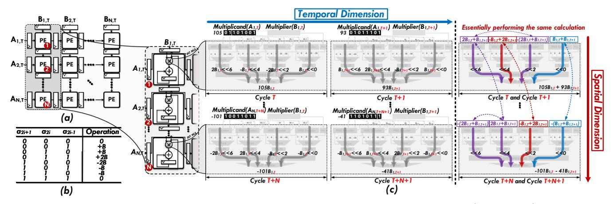

Figure 1: (a) OS systolic array,  $A_{i,T}$  and  $B_{i,T}$  denote the multiplicand and multiplier input to the  $i^{th}$ -row and  $i^{th}$ -column PE at cycle T. (b) MBE truth table, where  $a_i$  represents the i-th binary bit of multiplicand A, and B is the multiplier. (c) Analysis of redundant computations in the PE microarchitecture of the spatial accelerator from temporal and spatial dimensions.

[1, 3, 12, 18, 19, 26, 30, 33, 45] under the data-reuse-oriented design paradigm, manifesting as redundant PPs reduction across both temporal and spatial dimensions within and between processing elements (PEs). We adopt the output stationary (OS) systolic array (shown in Fig. 1(a))[53] as a case study for empirical analysis.

In the design of modern multipliers, the modified Booth encoder (MBE)[35, 42] is typically employed to reduce the number of PPs by half in multiplication [11, 21], and the encoding table is shown in Fig. 1(b). At the temporal dimension within a single PE **microarchitecture**: In Fig. 1(c) during cycle T,  $PE_1$  receives  $A_{1,T}$ (value 105) and generates 4 PPs coefficients {2, -1, -2, 1} with bitweight (bw) factors  $(2^6, 2^4, 2^2, 2^0)$  through MBE. These are summed via compressor tree [46] and full adder to obtain  $105 \times B_{1,T}$ . In cycle T + 1,  $A_{1,T+1}$  (value 93) produces coefficients  $\{1, 2, -1, 1\}$  through MBE conversion, ultimately yielding  $93 \times B_{1,T+1}$ . The accumulator temporally sums these multiplication results across two clock cycles  $(105 \times B_{1,T} + 93 \times B_{1,T+1})$ . Notably, inherent redundancy emerges in the bw coefficient reductions. As shown in Eq. 1 PE<sub>1</sub>, the bw of 2<sup>6</sup> and 2<sup>2</sup> terms show redundancy through inverse-signed identical reductions  $(2B_{1,T}+B_{1,T+1})$ , despite completely independent bit-slice distributions in  $A_{1,T}$  and  $A_{1,T+1}$ .

<span id="page-1-1"></span>
$$PE_{1} \begin{cases} 2^{6} : 2B_{1,T} + B_{1,T+1} \\ 2^{4} : -B_{1,T} + 2B_{1,T+1} \\ 2^{2} : -(2B_{1,T} + B_{1,T+1}) & \dots PE_{N} \end{cases} \begin{cases} 2^{6} : -(2B_{1,T} + B_{1,T+1}) \\ 2^{4} : 2B_{1,T} + B_{1,T+1} \\ 2^{2} : -B_{1,T} + 2B_{1,T+1} \\ 2^{0} : -(B_{1,T} + B_{1,T+1}) \end{cases}$$
(1)

At spatial dimension: This redundant reduction exhibits significant prevalence among column PEs. In Fig. 1(c), within cycles T + N and T + N + 1, the  $PE_1 \sim PE_N$  processes systolic-transmitted  $B_{1,T}$  and  $B_{1,T+1}$ , and all PE generating 4 PPs groups showing high similarity with the reduction patterns in the  $PE_1$  show in Eq. 1, as indicated by identically colored dashed regions in Fig. 1(c).

Crucially, this redundancy at the temporal and spatial dimensions persists systematically across all PE columns, independent of multiplicand A variations, arising from dual mechanisms:

- **1 Temporal causation within PEs:** (1) Discrete mapping in MBE allows equivalent coefficient generation from different bit-slice combinations (e.g.,  $\{0, B, -B\}$  in Fig. 1(b) correspond to two different bit-slice sets). (2) Symmetric MBE coefficient set  $\{-2B, -B, 0, B, 2B\}$  constrains linear combination space, enabling identical computations from different encoding combinations (e.g.,  $2B_{1,T} + B_{1,T+1}$  vs.  $-(2B_{1,T} + B_{1,T+1})$  in  $PE_1$ ).
- **②** Spatial causation across PEs: Systolic propagation of  $B_{1,T}$  and  $B_{1,T+1}$  through all column PEs enforces fixed linear combinations from coefficient set  $\{-2B, -B, 0, B, 2B\}$  under different bw factors. This process, decoupled from A's bit distribution, inherently causes cross-PE redundant reductions.

<span id="page-1-2"></span>

Figure 2: (a) Weight stationary (WS) systolic array (where  $P_{i,T}$  denotes the partial sum input to the i-th column PE at cycle T). (b) Multiplier-adder tree. (c) Bit-serial architecture.

<span id="page-2-0"></span>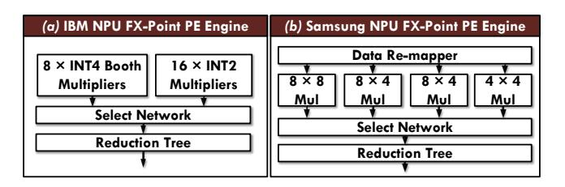

Figure 3: (a) IBM 7-nm NPU fixed-point PE engine [23]. (b) Samsung 4-nm fixed-point PE engine in mobile SoC [36].

<span id="page-2-1"></span>Table 1: Area of fixed-point multipliers across precision levels. 4-RT (8): An 8-bit input reduction tree with 4 inport.

| Component   | A               | rea (μm | <sup>2</sup> ) | MOPS/μm <sup>2</sup> |      |       |  |  |
|-------------|-----------------|---------|----------------|----------------------|------|-------|--|--|
| Component   | Logic DFF Total |         | Total          | INT4                 | INT8 | INT16 |  |  |
| INT 4 MUL   | 23.32           | 23.52   | 46.84          | 21.25                | /    | /     |  |  |
| 4×INT 4 MUL | 93.28           | 94.08   | 247.63         | 16.15                | 4.03 | <1.01 |  |  |
| 4-RT(8)     | 36.75           | 23.52   | 247.03         | 10.13                | 4.03 | <1.01 |  |  |
| INT8 MUL    | 94.86           | 47.04   | 141.9          | /                    | 7.04 | /     |  |  |
| 4×INT8 MUL  | 379.44          | 188.16  | 693.43         | ,                    | 5.76 | 1.44  |  |  |
| 4-RT(16)    | 78.79           | 47.04   | 073.43         | ′                    | 3.76 | 1.44  |  |  |
| INT16 MUL   | 394.54          | 94.57   | 489.11         | /                    | /    | 2.04  |  |  |

Extended analysis reveals this as a fundamental limitation in typical spatial architectures: WS systolic arrays in Fig. 2(a) execute fixed linear combinations like  $P_{1,T}+(A_{1,T-1}B_1+A_{2,T}B_2)$  due to operand stationarity. Multiplier-adder tree in Fig. 2(b) and bit-serial architectures in Fig. 2(c) inherit redundant PPs generation from broadcast/stationary operand mechanisms. The root cause lies in isolated computation inherent to traditional spatial architectures; hardware designs constrained by scalar dataflow paradigms (broadcast, systolic, stationary) fail to implement cross-PE collaboration mechanisms. Under GEMM's high data-reuse scenarios, this leads to tensor-level redundant PPs reduction with corresponding hardware area/energy efficiency losses.

From the perspective of multi-precision computing, existing architectures face dual challenges. First, dynamic reconfiguration inefficiency persists in low-precision multiplier implementations. To support multi-precision (INT4/8/16/32) GEMM, current designs employ low-bit-width multiplier combinations like IBM's NPU in Fig. 3(a), but incur significant hardware overhead. As Table 1 test component on UMC 22 nm under 1GHz constraint shows, INT8 multiplication using four INT4 multipliers with a reduction tree achieves only 57% computational density versus dedicated INT8 multipliers, while INT16 implementations suffer >50% area efficiency loss. Samsung's hybrid design in Fig. 3(b) partially addresses INT8 efficiency through mixed-width multipliers (one INT8 × INT8, two INT8 × INT4, one INT4 × INT4), yet requires full activation of 4 multipliers for INT4 operations and three multipliers with reduction trees for INT8 operations, resulting in suboptimal hardware utilization and energy efficiency. Second, imbalanced compute density scaling undermines mixed-precision throughput matching. Theoretically, INT4×INT4 should deliver 4× density over INT8×INT8 under equivalent area, yet real-world implementations show sublinear scaling: NVIDIA A100 [2] achieves only 2× (INT4: 1248 TOPS

vs INT8: 624 TOPS). This computational density degradation fundamentally constrains mixed-precision acceleration potential.

The main contributions of this paper are reflected as follows:

- (1) In computational principles level, this work proposes a cross-PE dual-operand encoding algorithm suitable for GEMM spatial accelerators. This enables PEs to share vector partial product lookup tables, thereby halving the PPs reduction computation within GEMM.
- (2) In mixed-precision TPE architecture level, we propose a tensor computing framework structured as bit-sliced encoding → vector partial product generation → cross-dimensional reduction. By merging the bit-sliced reduction dimension inherent in the multiplier microarchitecture with the spatial reduction dimension of vector inner products, this unified compute engine achieves operand precision scaling from INT2 to INT32.
- (3) In TPE array scheduling level, we decompose mixed-precision GEMM operand mapping into temporal and spatial domains. And we achieve a balanced compute density scaling for variable-precision inputs. Specifically, halving the bit-width of both input operands yields a 4-fold throughput increase, whereas halving the bit-width of only one operand results in a 2-fold throughput increase.

Table 2: The notation used in the subsequent sections.

| NOTATION                             | DESCRIPTION                                                                |
|--------------------------------------|----------------------------------------------------------------------------|
| $\overline{A_{M\times K}}$           | Matrix A of dimension $M \times K$ .                                       |
| $\overline{A_{m,k}}$                 | The $m$ -th row and $k$ -th column element of                              |
|                                      | $A_{M \times K}$ .                                                         |
| $\overline{L_A}$                     | Bit-width of each element in matrix $A$ .                                  |
| $\overline{(a_i)_{m,k}}$             | The <i>i</i> -th bit of $A_{m,k}$ , where $a_i \in \{0, 1\}, a_{-1} = 0$ . |
| $\overline{A_{m,k}\langle i\rangle}$ | The <i>i</i> -th 3-bit group: $(a_{2i+1}, a_{2i}, a_{2i-1})_{m,k}$ .       |
| $\overline{A_{m,k}[h:l]}$            | Bit slice from $l$ -th bit to $h$ -bit of $A_{m,k}$ .                      |
| $\mathcal{M}(\cdot)$                 | MBE calculation rule for 3-bit input.                                      |

#### 2 Motivation

## 2.1 Computational Redundancy in GEMM for Spatial Architectures

Given a GEMM:  $C_{M\times N}=A_{M\times K}\cdot B_{K\times N}$ , when the  $A_{M\times K}$  adopts the MBE multiplication principle, the computation can be decomposed as:

<span id="page-2-2"></span>
$$C_{m,n} = \sum_{k=0}^{K-1} \sum_{i=0}^{I-1} \mathcal{M}(A_{m,k}\langle i \rangle) B_{k,n} \cdot 2^{2i}, \quad I = \lceil \frac{L_A}{2} \rceil.$$
 (2)

where I indicates the parallel reduction dimension within the multiplier. The MBE encoding function  $\mathcal{M}(\cdot)$  strictly satisfies  $\mathcal{M}(\cdot) \in \{-2, -1, 0, 1, 2\}$  in its codomain. Subsequently, we merge the even and odd terms along the reduction dimension K and restructure Eq. 2 through summation order exchange:

<span id="page-2-3"></span>
$$C_{m,n} = \sum_{k=0}^{K/2-1} \sum_{i=0}^{I-1} \left( \mathcal{M}(A_{m,2k} \langle i \rangle) B_{2k,n} + \mathcal{M}(A_{m,2k+1} \langle i \rangle) B_{2k+1,n} \right) \cdot 2^{2i}.$$
(3)

<span id="page-3-1"></span>

Figure 4: (a) INT4 multiplier. (b) INT8 multiplier.

In Eq. 3, we can analyze the conditions under which redundant partial products occur: since  $B_{k,n}$  is independent of dimension M and solely determined by K, when calculating the n-th column of the output matrix  $C_{m,n}$ , it is possible for different rows or bitslice groups to compute identical or linearly related expressions. Specifically, as illustrated in Eq. 1, even though the multiplicand slices vary across cycles or PEs, the encoded partial products may still reduce to the same value due to the constrained output range of the MBE function  $\mathcal{M}(\cdot)$  and the symmetric structure of the coefficient set  $\{-2, -1, 0, 1, 2\}$ . This observation substantiates Eq. 4, which formally states that for certain pairs (m, i) and (p, j), their vector partial products may satisfy a linear relationship:

<span id="page-3-0"></span>
$$\alpha \left( \mathcal{M}(A_{m,2k} \langle i \rangle) B_{2k,n} + \mathcal{M}(A_{m,2k+1} \langle i \rangle) B_{2k+1,n} \right) = \beta \left( \mathcal{M}(A_{p,2k} \langle j \rangle) B_{2k,n} + \mathcal{M}(A_{p,2k+1} \langle j \rangle) B_{2k+1,n} \right), \alpha, \beta \in \mathbb{Z} \cap [-2,2].$$

$$(4)$$

This equivalence is likely to occur under two scenarios: within the same row across different bit-slice indices  $((m = p) \land (i \neq j))$ , or across different rows for all bit-slice indices  $((m \neq p) \land (\forall j))$ .

This induces redundant computation of partial products in Eq. 3, establishing the theoretical foundation for subsequent hardware optimization of partial product compression. Therefore, for matrix elements residing in consecutive pairs of columns across all rows, redundant partial product accumulation will inevitably occur under different bit-weight slices if their encoded values satisfy the linear relationship in Eq. 4.

# 2.2 Computational Density Imbalance in Mixed-Precision TPE

The construction of multi-precision TPEs using low-precision multipliers inherently creates computational density imbalance. This phenomenon arises from significant microarchitectural differences between low bit-width and high bit-width multipliers.

In the INT4 multiplier shown in Fig. 4(a), the multiplicand is processed through MBE, and the candidate partial product generator (CPPG) generates 2 PPs, which are summed via a single full adder to produce the final multiplication result. In higher-precision implementations like the INT8 multiplier depicted in Fig. 4(b), CPPG produces 4 PPs that undergo reduction through a 4-2 compressor tree [38, 46] or Wallace tree [48] (merging PPs into final sum and carry terms) before getting the multiply result through final summation via a full adder [5, 9, 15]. The compressor tree utilizes 3-input half-adders for multi-operand summation, as half-adders demonstrate lower resource consumption and superior timing characteristics compared to full adders, and enable more efficient area utilization when reducing more than two operands.

<span id="page-3-3"></span>

| $-2(B_{2k}+B_{2k+1})$                   | $-(B_{2k}+B_{2k+1})$                   | B <sub>2k</sub> +B <sub>2k+1</sub>      | 2(B <sub>2k</sub> +B <sub>2k+1</sub> ) |            | $B_{2k}+B_{2k+1}$                   |
|-----------------------------------------|----------------------------------------|-----------------------------------------|----------------------------------------|------------|-------------------------------------|
| -2(B <sub>2k</sub> -B <sub>2k+1</sub> ) | -(B <sub>2k</sub> -B <sub>2k+1</sub> ) | B <sub>2k</sub> -B <sub>2k+1</sub>      | 2(B <sub>2k</sub> -B <sub>2k+1</sub> ) |            | B <sub>2k</sub> -B <sub>2k+1</sub>  |
|                                         |                                        | $-(2B_{2k}+B_{2k+1})$                   | 2B <sub>2k</sub> +B <sub>2k+1</sub>    | <u> </u> - | 2B <sub>2k</sub> +B <sub>2k+1</sub> |
|                                         |                                        | -(B <sub>2k</sub> -2B <sub>2k+1</sub> ) | B <sub>2k</sub> -2B <sub>2k+1</sub>    | ]          | B <sub>2k</sub> -2B <sub>2k+1</sub> |
|                                         |                                        | $-(B_{2k}+2B_{2k+1})$                   | B <sub>2k</sub> +2B <sub>2k+1</sub>    |            | $B_{2k} + 2B_{2k+1}$                |
|                                         |                                        | -(2B <sub>2k</sub> -B <sub>2k+1</sub> ) | 2B <sub>2k</sub> -B <sub>2k+1</sub>    |            | 2B <sub>2k</sub> -B <sub>2k+1</sub> |
| -2B <sub>2k</sub>                       | -B <sub>2k</sub>                       | B <sub>2k</sub>                         | 2B <sub>2k</sub>                       |            | B <sub>2k</sub>                     |
| -2B <sub>2k+1</sub>                     | -B <sub>2k+1</sub>                     | B <sub>2k+1</sub>                       | 2B <sub>2k+1</sub>                     |            | B <sub>2k+1</sub>                   |

Figure 5: Vector Partial Product Lookup Table (VPP LUT). Here, both  $B_{2k}$  and  $B_{2k+1}$  omit the same second dimension n.

<span id="page-3-4"></span>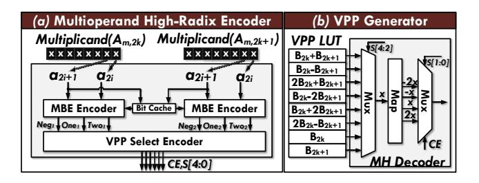

Figure 6: (a) Multi-operand High-radix Encoder (MHE). (b) Vector Partial Product (VPP) generator, composed of VPP LUT and MHD. Here, both  $B_{2k}$  and  $B_{2k+1}$  omit the same second dimension n.

However, employing INT4 multipliers as foundational elements in multi-precision TPEs inevitably leads to computational density mismatch at higher precisions. The fundamental limitation stems from insufficient reduction dimensionality in INT4 multiplier implementations, which prevents the deployment of high-efficiency reduction components, thereby degrading both computational density and energy efficiency in high-precision computations.

## 3 Proposed Architecture

## 3.1 Multi-Operand High-Radix Encoder

The essence of multiplication operations lies in weighted reduction of multipliers with distinct bit weights. Through numerical domain transformation of solution sets, MBE encoding reduces the number of PPs requiring a reduction in multiplication to half the bit length (as shown in Eq. 2), thereby halving the overhead of internal reduction components in multipliers. In spatial computing architectures, the hardware complexity of vector reduction units directly impacts system energy efficiency [6, 28]. This characteristic motivates our fundamental research proposition: in vector reduction, can we achieve a further half compression of reduction elements in vector inner product by establishing a multi-dimensional joint operand encoding strategy?

As derived from Eq. 3, the core mechanism for halving the vector inner product reduction number *K* in GEMM resides in directly obtaining the calculation results of Vector Partial Products (VPP). The mathematical definition of VPP can be expressed as:

<span id="page-3-2"></span>
$$VPP_{m,k}^{n}\langle i\rangle = \mathcal{M}(A_{m,2k}\langle i\rangle)B_{2k,n} + \mathcal{M}(A_{m,2k+1}\langle i\rangle)B_{2k+1,n}.$$
 (5)

It should be noted that VPP also serves as the source of redundant computation in GEMM. In Eq. 5, due to the limited codomain

of the 3-bit window MBE encoding function  $\mathcal{M}(\cdot)$ , its linear combination with  $B_{2k,n}$  and  $B_{2k+1,n}$  exhibits finite-state characteristics. Through algebraic simplification and common term extraction of 24 non-zero states (as illustrated in Fig. 5), we ultimately simplify them to 8 reduced linear combinations:  $\{B_{2k,n}+B_{2k+1,n},\ B_{2k,n}-B_{2k+1,n},\ 2B_{2k,n}+B_{2k+1,n},\ B_{2k,n}-2B_{2k+1,n},\ B_{2k,n}+B_{2k+1,n},\ 2B_{2k,n}-B_{2k+1,n},\ B_{2k,n},\ B_{2k+1,n}\}$ . This set of linear combinations can be naturally organized into a Vector Partial Product Lookup Table (VPP LUT) for ease of reference and reuse in subsequent computation, and we have arrived at the following matrix multiplication algorithm from Eq. 3:

<span id="page-4-0"></span>
$$C_{m,n} = \sum_{k=0}^{K/2-1} \sum_{i=0}^{I-1} \text{VPP}_{m,k}^{n} \langle i \rangle \cdot 2^{2i} = \sum_{k=0}^{K/2-1} \sum_{i=0}^{I-1} \gamma(m,k,i) \text{LUT}_{k}^{n} \cdot 2^{2i}.$$
(6)

Here,  $\gamma(m, k, i) \in \{-2, -1, 0, 1, 2\}$  denotes a scalar coefficient that selects and scales the corresponding linear combination from VPP LUT. Therefore, from a computational perspective in Eq. 6, for a matrix  $\forall m \in M$  and all  $\forall i \in I$ , these 8 linear combinations in VPP LUT can be pre-computed and reused to directly generate VPP $_{m_k}^n\langle i \rangle$ , thereby halving the reduction dimension from K to K/2.

At the hardware level, the VPP LUT is implemented as a dedicated unit. First it reads  $B_{2k,n}$  and  $B_{2k+1,n}$  from memory as primitive inputs, and then use a single adder to serially generate the rest 6 derived terms, and employs data flip-flops (DFFs) for state latching as VPP LUT. The VPP LUT exhibits multi-dimensional sharing characteristics: Reusable across different bit-weights in  $A_{m,k}\langle i \rangle$  and shareable among all row indices m of the  $C_{m,n}$ .

As shown in Fig. 6(b), the VPP LUT and Multi-operand High-radix Decoder (MHD) collectively constitute the VPP generator for dual-operand inner products. Key signals and modules include: 5-bit selection signal S[4:0], zero-value generation chip selection signal CE, and a mapping unit (Map) that expands 8 basic states into 24 valid states through simple signal bit extension and complementary number computation.

Fig. 6(a) illustrates the structural design of the Multi-operand High-radix Encoder (MHE), whose workflow includes: ① synchronous reading of 4-bit slice from dual operands with identical bit weights; ② pre-encoding using dual MBE with 3-bit windows (including 1-bit in previous bit-cache); ③ generation of combinational logic signals (Neg, One, Two); ② final selection signal CE, S[4:0] are generating through VPP Select Encoder. In the tensor computing phase, only selection signals are required for MHD in Fig. 6(b) to generate VPP and used for reduction in GEMM, without the need for a multiplier. Throughout this process, both the MHE and VPP LUT components can be shared in computations along the matrix's M-dimension, thereby minimizing hardware overhead.

The MHE, MHD, and VPP LUT collectively form the foundational module of the MHE-TPE. This design demonstrates notable hardware efficiency advantages: ① enhanced reuse rate of partial computation results; ② encoder-computation decoupling enables control signal broadcasting or pipelining across multiple computing modules, effectively amortizing MHE's logic area overhead to negligible levels; ③ subsequent reduction in hardware overhead through halving the partial product generation.

Table 3: The notation used in 3.2 and 3.3.

| DESCRIPTION                                                        |
|--------------------------------------------------------------------|
| Vector Partial Product Lookup Table, storing 8                     |
| reduced linear combinations of the bs-th 4-bit                     |
| slices of $B_{2k,n}$ and $B_{2k+1,n}$ .                            |
| Selection signals derived from $A_{m,2k}\langle i \rangle$ and     |
| $A_{m,2k+1}\langle i\rangle$ .                                     |
| Vector Partial Product at the bs-th 4-bit slice,                   |
| computed as a LUT-based linear combination of                      |
| $B_{2k,n}$ and $B_{2k+1,n}$ , weighted by the MHE results          |
| of $A_{m,2k}\langle i \rangle$ and $A_{m,2k+1}\langle i \rangle$ . |
| Partial sum at the $bs$ -th 4-bit slice of $C_{m,n}$ .             |
|                                                                    |

<sup>†</sup> In Algorithm 1,  $B \in \mathbb{Z}^{K \times 1}$  is a column vector and the bit-slice index bs is not considered; thus, superscript n and parameter  $\langle bs \rangle$  are omitted in related notations.

```
Algorithm 1: Matrix-Vector Multiplication in MHE-TPE
```

```
Input: Matrix A \in \mathbb{Z}^{M \times K}, Vector B \in \mathbb{Z}^{K \times 1}

Output: Vector C \in \mathbb{Z}^{M \times 1} where C_{M \times 1} = A_{M \times K} \cdot B_{K \times 1}

Preprocessing Phase:
```

## **Computation Phase:**

```
 \begin{aligned} & \textbf{for } i = 0 \textbf{ to } \lceil L_A/2 \rceil - 1 \textbf{ do} \\ & \textbf{ forall } m \in \{0, \dots, M-1\} \textbf{ in parallel } \textbf{ do} \\ & \textbf{ forall } k \in \{0, \dots, \lceil K/2 \rceil - 1\} \textbf{ in parallel } \textbf{ do} \\ & & \lfloor (CE, S)_{m,k} \langle i \rangle \leftarrow \text{MHE}(A_{m,2k}\langle i \rangle, A_{m,2k+1}\langle i \rangle); \\ & & \lfloor \text{VPP}_{m,k} \langle i \rangle \leftarrow \text{MHD}\left((CE, S)_{m,k} \langle i \rangle, \text{LUT}_k\right); \\ & & C_m + = \left(\sum_{k=0}^{\lceil K/2 \rceil - 1} \text{VPP}_{m,k} \langle i \rangle\right) \ll 2i; \end{aligned}
```

#### <span id="page-4-1"></span>3.2 MHE-TPE Architecture

The fundamental restriction in conventional TPEs for mixed-precision computation stems from insufficient reduction dimensions within low-bit-width multipliers [8, 27, 50]. This physical decoupling of multiplication and reduction logic creates dual-dimensional mismatches: spatially in compressor tree compatibility with multiprecision weighted PPs, and temporally in accumulator bit-width adaptation to dynamic precision variations.

For this reason, we propose a three-phase tensor computing paradigm that improves these issues through: (1) temporal multiplicand bit-slice encoding; (2) partial product generation; (3) unified partial product reduction.

This three-stage paradigm eliminates conventional multiplication concepts by decomposing multiplicative operations into partial products, fusing bit-weight reduction within multiplication and vector inner product reduction across temporal or spatial dimensions. The unified reduction components enable consistent computation bit-width and enhanced hardware reusability for multi-precision operations.

3.2.1 Architecture Implementation. The MHE-TPE microarchitecture shown in Fig. 7, for general matrix-vector multiplication (GEMV) features collaborative heterogeneous computing units for matrix  $A \in \mathbb{Z}^{M \times K}$  and vector  $B \in \mathbb{Z}^{K \times 1}$  (note that the dimensions of the

<span id="page-5-0"></span>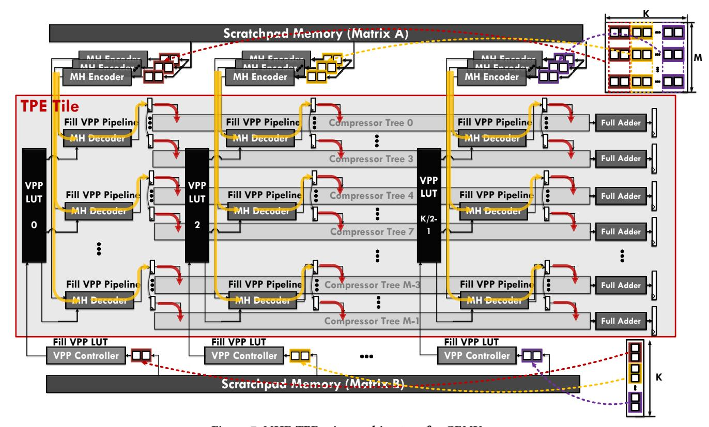

Figure 7: MHE-TPE microarchitecture for GEMV.

matrix here refer to the size of the sub-matrix that the hardware processes at a time).

Four core modules constitute in this architecture:

- K/2 VPP controllers and VPP LUT (depth 8, bit-width L<sub>B</sub>+2, DFF storage)
- (2) K/2 MHD arrays, each comprising M/4 MHD units and sharing one VPP LUT, used for generating VPP to the input register array.
- (3) K/2 MHE arrays, each comprising M/4 MHE units for selection signal generation to corresponding MHD.
- (4) M compressor trees (each with K/2 input ports) perform reduction operations on the PPs stored in the input registers.
- 3.2.2 Computational Workflow (Algorithm 1 and Fig. 7). The process consists of two phases: preprocessing and computation. In the preprocessing phase, vector B is partitioned into K/2 consecutive 2-element subvectors  $B_{2k}$ ,  $B_{2k+1}$ , loaded in parallel to VPP controllers via scratchpad memory, and use a full adder to generate:  $\{B_{2k} + B_{2k+1}, B_{2k} B_{2k+1}, 2B_{2k} + B_{2k+1}, B_{2k} 2B_{2k+1}, B_{2k} + 2B_{2k+1}, 2B_{2k} B_{2k+1}\}$  in 6 clock cycles. Each controller precomputed results are stored in VPP-LUTs, establishing a TPU-like WS dataflow pattern. **Notably, vector B is processed in its full precision, without involving bit-slice (bs) partitioning.**

In the computation phase, matrix A is processed in 2-column groups through temporal iteration of 4-bit dual operands  $A_{m,2k}$  and  $A_{m,2k+1}$  (2-bit each). MHE units encode inputs into selection signals

driving MHD to generate  $M \cdot K/2$  VPPs. Subsequent M compressor trees (each with K/2 input ports) perform reduction operations. For matrix A with INT  $L_A$  precision, a single GEMV operation requires  $\lceil L_A/2 \rceil$  clock cycles.

3.2.3 Component Reusable Optimization. As shown in Fig. 7, given the high degree of logical parallelism demonstrated by the MHE and MHD within the three-stage encoding, decoding, and reduction pipeline, which contributes to their lower logic latency, the multi-operand summation logic in the compressor tree readily emerges as a timing bottleneck. Even with the incorporation of multi-stage pipelining in the reduction tree, it doesn't remain easy to achieve logic latency comparable to that of the MHE and MHD.

To mitigate this limitation, we implement a dual-clock domain design for the TPE pipeline. The fast clock domain ( $4\times$  base frequency) drives the MHE and MHD units, while the slow clock domain (base frequency) drives the compressor trees. This dual-clock domain design enables hardware optimization through temporal multiplexing: employ one MHD operating at a fast clock through 4 cycles to serially fill the input registers of four compressor trees with VPP, and time-interleaved into 4 compressor trees, the input DFFs of the slow clock domain are fed through a single-bit valid cross-clock domain handshake and perform synchronization (yellow to red arrows in Fig.7). When necessary, backpressure is applied to the MHE pipeline. This reduces MHD/MHE units shared by one VPP LUT from M to M/4 while maintaining computational throughput.

<span id="page-6-1"></span>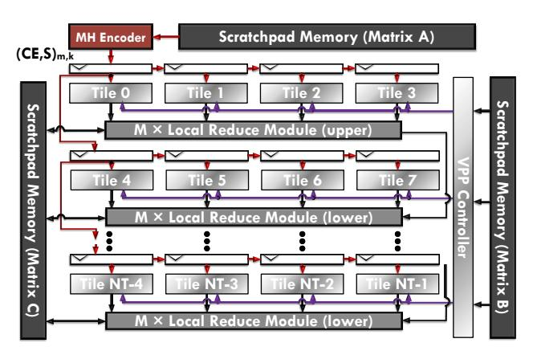

Figure 8: MHE-TPE array, which comprises NT TPE Tiles.

<span id="page-6-3"></span>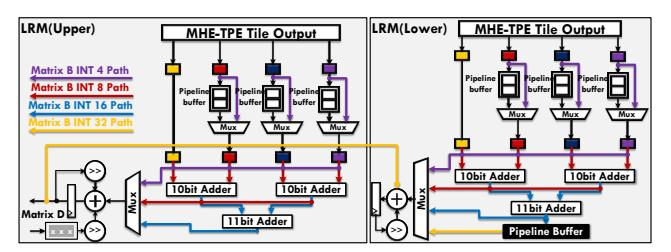

Figure 9: Two types of Local Reduce Module (LRM), when K = 32.

### <span id="page-6-0"></span>3.3 Mixed-Precision MHE-TPE Array

3.3.1 Architecture Implementation. Fig. 8 extends the proposed mixed-precision TPE Tile (depicted as the gray region in Fig. 7) and incorporates spatiotemporal co-mapping to support arbitrary-precision matrix multiplication while ensuring balanced computational density.

Given arbitrary-precision sub-matrices  $A \in \mathbb{Z}^{M \times K}$  and  $B \in \mathbb{Z}^{K \times N}$  where  $N = \lceil \frac{NT \times 4}{L_B} \rceil$ , the control flow adheres to Algorithm 2. Each computational tile derived from the architecture in Fig. 7 by excluding MHE, VPP controller, and scratchpad memory, and the parameters of the TPE Tile are as follows: (1) K/2 VPP LUT with 8-depth and 6-bit width (4-bit  $L_B + 2$ -bit expansion). (2) M compressor trees with K/2 input ports, each port with 6-bit width, and output bit width is  $6 + \lceil log_2(K/2) \rceil$ .

From the perspective of the TPE array, the hardware components include: (1) Total NT TPE Tiles; (2)  $K \cdot M/8$  MHE units generate selection signals (CE,S) computed from Matrix A, synchronized through systolic transmission between row-column tiles; (3) the Local Reduce Module (shown in Fig. 9) is specifically designed for inter-tile reduction operations across multiple computational tiles; (4) the VPP controller pre-computes the column vectors in Matrix B and sequentially fills VPP into the VPP LUT of each TPE Tile.

3.3.2 Spatiotemporal Mapping Methodology. In preprocessing phase, arbitrary-precision Matrix  $B \in \mathbb{Z}^{K \times N}$  undergoes spatial mapping, 4-bit slices are stored in scratchpad memory with dynamic tile allocation, and continuous 4-bit slices are assigned to sequential TPE Tiles. As shown in Fig. 10, different precision cases correspond to

```
Algorithm 2: General Matrix Multiplication with Mixed-
Precision in Multi-Tile MHE-TPE
  Input: Matrix A \in \mathbb{Z}^{M \times K}, Matrix B \in \mathbb{Z}^{K \times N}
  Output: Matrix C \in \mathbb{Z}^{M \times N} where C_{M \times N} = A_{M \times K} \cdot B_{K \times N}
  Preprocessing Phase:
  forall n \in \{0, ..., N-1\} in parallel do
     forall k \in \{0, ..., \lceil K/2 \rceil - 1\} in parallel do
        forall bs \in \{0, ..., \lceil L_B/4 \rceil - 1\} in parallel do
         | LUT_k^n \langle bs \rangle \leftarrow
            ProcessPair(B_{2k,n}[4bs+3:4bs], B_{2k+1,n}[4bs+3:4bs]);
  Computation Phase:
  for i = 0 to [L_A/2] - 1 do
     forall m \in \{0, ..., M-1\} in parallel do
       forall k \in \{0, ..., \lceil K/2 \rceil - 1\} in parallel do
        |(CE, S)_{m,k}\langle i\rangle \leftarrow \text{MHE}(A_{m,2k}\langle i\rangle, A_{m,2k+1}\langle i\rangle);
     forall n \in \{0, ..., N-1\} in parallel do
        forall m \in \{0, ..., M-1\} in parallel do
           forall bs \in \{0, ..., \lceil L_B/4 \rceil - 1\} in parallel do
             forall k \in \{0, ..., \lceil K/2 \rceil - 1\} in parallel do
               |\operatorname{VPP}_{m,k}^{n}\langle i|bs\rangle \leftarrow \operatorname{MHD}\left((CE,S)_{m,k}\langle i\rangle, \operatorname{LUT}_{k}^{n}\langle bs\rangle\right);
             PS_{m,n}\langle bs\rangle + = \left(\sum_{k=0}^{\lceil K/2 \rceil - 1} VPP_{m,k}^{n}\langle i|bs\rangle\right) \ll 2i;
 C_{m,n} + = \sum_{bs=0}^{\lceil L_B/4 \rceil - 1} (PS_{m,n} \langle bs \rangle \ll 4bs);
```

different tile utilization strategies. This enables scalable data partitioning with fine-grained control over tile reuse and parallelism across bit-widths.

For INT4, each tile directly maps one output column of  $B \in \mathbb{Z}^{K \times NT}$ . For INT8, each column of B is distributed across 2 tiles to store the high and low 4-bit fields, and the effective mapping becomes  $B \in \mathbb{Z}^{K \times NT/2}$ . For INT16 and INT32, each column of B spans 4 and 8 TPE Tiles, respectively, resulting in mappings of  $B \in \mathbb{Z}^{K \times NT/4}$  and  $B \in \mathbb{Z}^{K \times NT/8}$ .

In computation phase, arbitrary-precision Matrix  $A \in \mathbb{Z}^{M \times K}$  employs temporal mapping: ① Outer-loop temporal iteration of dual operands  $A_{m,2k}\langle i \rangle$  and  $A_{m,2k+1}\langle i \rangle$  in Algorithm 2. ② Systolic transmission of  $(CE,S)_{m,k}\langle i \rangle$  selection signals requiring  $\lceil L_A/2 \rceil$  cycles for INT  $L_A$  precision (shown in Fig. 10). ③ Partial sum  $\mathrm{PS}_{m,n}\langle bs \rangle + = \left(\sum_{k=0}^{\lceil K/2 \rceil - 1} \mathrm{VPP}_{m,k}^n\langle i | bs \rangle \right) \ll 2i$  and partial results are accumulation in each tile and corresponding LRM.

The computational phase employs a hierarchical reduction mechanism: Within each MHE-TPE tile, a 4-bit sliced Matrix *B* executes GEMV with an arbitrary-precision Matrix *A*. Cross-tile reduction is achieved through the LRM, which performs bit-shifted accumulation of partial results across Matrix *B* slices. This distributed module establishes communication links between every 4 adjacent TPE Tiles, enabling coordinated reduction across 8 TPE Tiles for INT32 precision through LRM upper and LRM lower interconnections.

In the light of the 4-bit positional difference between Matrix B slices mapped across tiles, the LRM utilizes pipeline buffers to align partial product weights during the outermost loop iteration (i = 0 to  $\lceil L_A/2 \rceil - 1$ ). As illustrated by color-coded arrows in Fig. 9, the

<span id="page-7-0"></span>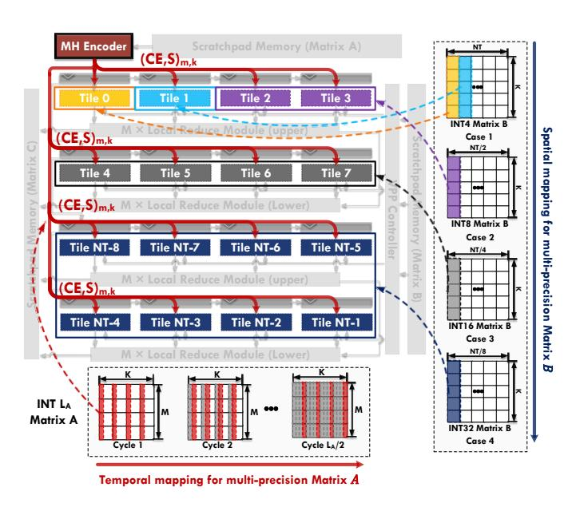

Figure 10: Temporal mapping for multi-precision Matrix A and spatial mapping for multi-precision Matrix B.

accumulation phase implements bit-shifting and summation according to A's bit-slice weights after MHE; ultimately, the operator can be implemented as Matrix  $C = A \cdot B + D$ .

This novel computational paradigm: bit-slice encoding  $\rightarrow$  partial product generation  $\rightarrow$  unified partial product reduction, achieves mixed-precision matrix multiplication through temporal mapping of multi-precision Matrix A and spatial tile-level mapping of multi-precision Matrix B. The architecture demonstrates superior energy efficiency in low-precision regimes by merging reduction dimensions to circumvent the intrinsic limitations of low-bit-precision multipliers. Crucially, precision scaling decouples from compressor tree parameters (determined solely by VPP LUT bit-width): matrix A precision requires only LRM accumulator register bit-width expansion, and Matrix B precision scales through spatial tile allocation in the MHE-TPE array.

The minimal inter-tile communication (simple synchronization, independent computation) ensures excellent architectural scalability. This design eliminates the consumption of reconfigurable data flow with low-bit-width multiplier in traditional architecture while maintaining computational density across precision regimes.

#### 4 Experiments

This section evaluates the proposed architecture through component-level analysis, performance optimization, and scalability assessment. Section 4.1 outlines the experimental methodology, including technology parameters and metrics for area, power, and timing. Section 4.2 analyzes individual components (MHE, MHD, multi-fanout MHD-LUTs (VPP LUT and MHD), compressor trees) and a TPE Tile, focusing on area-power trade-offs under varying fanout (the number of MHDs driven by a single VPP LUT) and LUT counts. Section 4.3 assesses MHE-TPE array performance across configurations

and matrix sizes, optimizing for area/power efficiency and computational density, and explores the scalability of optimized MHE-TPE designs. Section 4.4 evaluates robustness to temperature, voltage, and process variations, benchmarking throughput/efficiency at mixed-precision GEMM. In Sections 4.5 and 4.6, we discussed the factors affecting the utilization of the TPE array under different matrices as well as under practical DNN workloads. Section 4.7 compares the design's computational density and power efficiency with other architectures.

## 4.1 Experimental Setup

We implement our design in RTL and synthesize it using Synopsys Design Compiler [43] with UMC 22nm technology at an operating voltage ranging from 0.66 to 0.81V. Next, we use Synopsys VCS to generate FSDB waveforms based on the provided stimulus signals. These waveforms, along with the optimized netlist, corresponding process corners, and physical libraries, are input into Synopsys PrimeTime PX to evaluate hardware power consumption and timing performance. For placement and routing, as well as for generating GEF and GDS layout files, we utilize Synopsys IC Compiler. Finally, we conduct layout DRC and LVS checks using Synopsys IC Validator and Mentor Calibre to ensure design correctness and manufacturability.

<span id="page-7-1"></span>Table 4: Component performance. MHE and MHD test on 4.0GHz, and others are tested on 1.0GHz.

| Unit     |        | Area (μm² | Power  | Delay |      |
|----------|--------|-----------|--------|-------|------|
| Oiii     | Logic  | DFF       | Total  | (mW)  | (ns) |
| MHE      | 13.91  | 26.46     | 40.37  | 0.11  | 0.15 |
| MHD      | 31.06  | 17.64     | 48.70  | 0.09  | 0.17 |
| LRM(upp) | 190.02 | 232.26    | 422.28 | 0.30  | 0.60 |
| LRM(low) | 222.36 | 338.10    | 560.36 | 0.44  | 0.67 |

#### 4.2 MHE-TPE Performance Analysis

In the subsequent experiments, we first need to analyze the timing of individual MHE and MHD components to ensure that their latency remains below four times that of other components, thereby determining the operating clock frequencies for the compressor, controller, and LRM, and then we need to determine an optimal configuration of the TPE Tile parameter and the MHE-TPE array size, which serves as the tensor computation subarray unit within a tile. Multiple optimally configured MHE-TPEs are then integrated with peripheral circuits to form a complete TPE-Array for multiprecision tensor computations.

The Table 4 analysis of single MHE, MHD, and LRM characteristics reveals critical trade-offs in area, power, and timing efficiency, especially in terms of timing, due to the high parallelism of MHE and MHD, which enables them to operate at high clock frequencies to generate PPs. Other components, such as the compressor tree, LRM, and VPP controller, incorporate half-adders or full-adders that rely on carry-chain propagation, which typically results in higher logic delay and operation at lower frequencies.

The table 5 summarizes the area and power consumption characteristics under different configurations. For example, under 8 MHDs and 16 input port reduction tree configuration, enabling GEMV computations on matrices  $A \in \mathbb{Z}^{32 \times 32}$  and vectors  $B \in \mathbb{Z}^{32 \times 1}$ , and it needs 16 VPP LUT and 32 compressor trees.

<span id="page-8-0"></span>Table 5: Area, power breakdown, computational density, and energy efficiency (for 2-bit × 4-bit GEMV) of MHE-TPE with varying component sizes. The MHD operates under a 4.0 GHz, whereas 1.0 GHz timing specifications bind other components.

| Arı | ay   | Ma | trix Size | Are     | <b>a</b> (μm <sup>2</sup> ) |       | Powe    | er (mW) |        | TODE  | TOPS/mm <sup>2</sup> | TODC/M |
|-----|------|----|-----------|---------|-----------------------------|-------|---------|---------|--------|-------|----------------------|--------|
| MHD | Tree | M  | K         | MHD-LUT | Tree                        | Total | MHD-LUT | Tree    | Total  | TOPS  | 10PS/mm <sup>2</sup> | TOPS/W |
|     | 8    |    | 16        | 1592    | 409                         | 2001  | 1.60    | 0.63    | 2.23   | 0.128 | 63.98                | 57.53  |
| 16  | 16   |    | 32        | 3182    | 785                         | 3967  | 3.19    | 1.21    | 4.40   | 0.256 | 64.53                | 58.18  |
| 1   | 24   | 4  | 48        | 4794    | 1322                        | 6116  | 4.87    | 1.99    | 6.86   | 0.384 | 62.79                | 56.00  |
| 1   | 32   | 4  | 64        | 6384    | 1995                        | 8378  | 6.48    | 2.50    | 8.98   | 0.512 | 61.11                | 57.02  |
|     | 40   |    | 80        | 8003    | 2733                        | 10735 | 8.08    | 3.53    | 11.61  | 0.640 | 59.62                | 55.12  |
|     | 48   |    | 96        | 9588    | 2802                        | 12390 | 9.77    | 4.18    | 13.95  | 0.768 | 61.98                | 55.08  |
|     | 8    |    | 16        | 2363    | 820                         | 3183  | 2.83    | 1.26    | 4.09   | 0.256 | 80.43                | 62.59  |
|     | 16   |    | 32        | 4777    | 1575                        | 6352  | 5.64    | 2.43    | 8.07   | 0.512 | 80.61                | 63.46  |
| 2   | 24   | 8  | 48        | 7159    | 2648                        | 9807  | 8.55    | 4.00    | 12.55  | 0.768 | 78.31                | 61.20  |
|     | 32   | 0  | 64        | 9562    | 3816                        | 13378 | 11.32   | 5.06    | 16.38  | 1.024 | 76.54                | 62.51  |
|     | 40   |    | 80        | 11990   | 5466                        | 17456 | 14.41   | 7.05    | 21.46  | 1.28  | 73.33                | 59.64  |
|     | 48   |    | 96        | 14403   | 5613                        | 20016 | 17.16   | 8.32    | 25.48  | 1.536 | 76.74                | 60.28  |
|     | 8    |    | 16        | 3983    | 1641                        | 5623  | 5.38    | 2.52    | 7.90   | 0.512 | 91.05                | 64.84  |
|     | 16   |    | 32        | 7932    | 3151                        | 11082 | 10.60   | 4.92    | 15.52  | 1.024 | 92.40                | 65.99  |
| 4   | 24   | 16 | 48        | 11969   | 5303                        | 17272 | 16.04   | 8.04    | 24.08  | 1.536 | 88.93                | 63.79  |
| 4   | 32   | 10 | 64        | 16041   | 7683                        | 23724 | 21.58   | 10.02   | 31.60  | 2.048 | 86.33                | 64.81  |
|     | 40   |    | 80        | 20032   | 10968                       | 31000 | 26.94   | 14.07   | 41.01  | 2.56  | 82.58                | 62.42  |
|     | 48   |    | 96        | 24064   | 11210                       | 35273 | 32.37   | 16.71   | 49.08  | 3.072 | 87.09                | 62.59  |
|     | 8    |    | 16        | 7120    | 3275                        | 10394 | 10.30   | 5.03    | 15.33  | 1.024 | 98.51                | 66.79  |
|     | 16   |    | 32        | 14460   | 6325                        | 20785 | 20.79   | 9.79    | 30.58  | 2.048 | 98.53                | 66.97  |
| 8   | 24   | 32 | 48        | 21747   | 10593                       | 32340 | 31.34   | 16.04   | 47.38  | 3.072 | 94.99                | 64.84  |
|     | 32   | 32 | 64        | 29044   | 15417                       | 44461 | 41.60   | 20.07   | 61.67  | 4.096 | 92.13                | 66.41  |
|     | 40   |    | 80        | 36307   | 21927                       | 58234 | 51.93   | 28.18   | 80.11  | 5.12  | 87.92                | 63.91  |
|     | 48   |    | 96        | 43542   | 22427                       | 65970 | 62.81   | 33.39   | 96.20  | 6.144 | 93.13                | 63.87  |
|     | 8    |    | 16        | 8777    | 4090                        | 12867 | 12.85   | 6.29    | 19.14  | 1.28  | 99.48                | 66.89  |
|     | 16   |    | 32        | 17726   | 7906                        | 25632 | 25.80   | 12.18   | 37.98  | 2.56  | 99.87                | 67.41  |
| 10  | 24   | 40 | 48        | 26608   | 13235                       | 39842 | 38.74   | 20.01   | 58.75  | 3.84  | 96.38                | 65.36  |
| 10  | 32   | 10 | 64        | 35523   | 19161                       | 54684 | 51.71   | 25.09   | 76.80  | 5.12  | 93.63                | 64.67  |
|     | 40   |    | 80        | 44207   | 27414                       | 71621 | 64.66   | 35.10   | 99.76  | 6.4   | 89.36                | 64.15  |
|     | 48   |    | 96        | 53211   | 28029                       | 81241 | 77.44   | 41.60   | 119.04 | 7.68  | 94.53                | 64.52  |
|     | 8    |    | 16        | 10377   | 4909                        | 15285 | 15.31   | 7.57    | 22.88  | 1.536 | 100.49               | 67.13  |
|     | 16   |    | 32        | 21043   | 9488                        | 30531 | 31.17   | 14.53   | 45.70  | 3.072 | 100.62               | 67.22  |
| 12  | 24   | 48 | 48        | 31323   | 15896                       | 47219 | 46.18   | 23.90   | 70.08  | 4.608 | 97.59                | 65.75  |
| 12  | 32   | 10 | 64        | 41946   | 22910                       | 64856 | 62.01   | 30.07   | 92.08  | 6.144 | 94.73                | 66.72  |
|     | 40   |    | 80        | 52273   | 32898                       | 85171 | 77.13   | 42.08   | 119.21 | 7.68  | 90.17                | 64.42  |
|     | 48   |    | 96        | 62753   | 33620                       | 96373 | 92.63   | 49.72   | 142.35 | 9.216 | 95.63                | 64.74  |

Computational density improves significantly only when the MHD fanout exceeds 4. Low fanout results in MHD-LUTs dominating the total area, primarily due to DFFs occupying nearly 50% of the MHD-LUT area. Appropriately increase the number of MHD shared resources for each individual VPP LUT will enhances both MHD area efficiency and the compressor tree's area proportion, improving overall efficiency. Computational density and energy efficiency first improve, then decline, and then improve as the compressor tree's reduction dimension increases. For example, with an MHD fanout is 8, computational density rises, dips, and rises again with larger reduction dimensions. This trend stems from the tree's pipeline stages: dimensions 8  $\sim$  16 require 1 stage, 24  $\sim$  32 need 2 stages, and 40  $\sim$  48 demand 3 stages. Adding stages increases register area and power, initially reducing efficiency. Efficiency rebounds

at 48 due to reduced proportion of register overhead (e.g., power rises 18.44 mW from 32 $\rightarrow$ 40, but only 16.09 mW from 40 $\rightarrow$ 48, with smaller tree contributions). Similarly, transitioning 16 $\rightarrow$ 24 adds stages, temporarily lowering efficiency.

The dual-operand encoding and decoding of MHE and MHD allows a reduction dimension of K/2 to achieve equivalent performance to a K-dimensional matrix, effectively halving the tree's area and eliminating extra register/power overhead. Through the experimental data in Table 5, we have identified three configurations exhibiting peak area, and energy efficiency:  $\mathbf{0}$  MHD fanout = 8, tree inport = 16, processing matrix dimension: M = 32, K = 32;  $\mathbf{0}$  MHD fanout = 10, tree inport = 16, processing matrix dimension: M = 40, K = 32;  $\mathbf{0}$  MHD fanout = 12, tree inport = 16, processing matrix dimension: M = 48, K = 32.

<span id="page-9-0"></span>

| Arr | ay    | Matrix Size |    |            | NT   | Area $(\mu m^2)$ |      |         | Power (mW) |      |            |      | TODS                 | TOPS/mm <sup>2</sup> | TOPS/W               |          |
|-----|-------|-------------|----|------------|------|------------------|------|---------|------------|------|------------|------|----------------------|----------------------|----------------------|----------|
| MHD | Tree  | M           | K  | N          | INI  | TPE              | MHE  | LRM     | TOTAL      | TPE  | MHE        | LRM  | TOTAL                | 1013                 | 1013/11111           | TOF 3/ W |
|     |       |             |    | 8/4/2/1    | 8    | 166272           |      | 31443   | 203816     | 245  |            | 24   | 285                  | 16.38                | 80.39                | 57.49    |
|     |       |             |    | 16/8/4/2   | 16   | 332544           |      | 62887   | 402340     | 489  |            | 48   | 563                  | 32.77                | 81.44                | 58.20    |
| 8   | 16    | 32          | 32 | 32/16/8/4  | 32   | 665088           | 5292 | 125774  | 799388     | 979  | 15         | 95   | 1119                 | 65.54                | 81.98                | 58.57    |
|     |       |             |    | 48/24/12/6 | 48   | 997632           |      | 188661  | 1196437    | 1468 |            | 143  | 1676                 | 98.30                | 82.16                | 58.65    |
|     |       |             |    | 64/32/16/8 | 64   | 1330176          |      | 251548  | 1593485    | 1957 |            | 190  | 2227                 | 131.07               | 82.25                | 58.86    |
| Arr | ay    | Matrix Size |    | trix Size  | NT   |                  | Area | a (μm²) |            |      | Power (mW) |      | V)                   | TOPS                 | TOPS/mm <sup>2</sup> | TODS/W   |
| MHD | Tree  | M           | K  | N          | IN I | TPE              | MHE  | LRM     | TOTAL      | TPE  | MHE        | LRM  | TOTAL                | 1013                 | TOPS/IIIII           | 10F3/W   |
|     |       |             |    | 8/4/2/1    | 8    | 205058           |      | 39305   | 251859     | 304  |            | 30   | 356                  | 20.48                | 81.32                | 57.53    |
|     |       |             |    | 16/8/4/2   | 16   | 410115           |      | 78611   | 497100     | 608  |            | 59   | 701                  | 40.96                | 82.40                | 58.43    |
| 10  | 16    | 40          | 32 | 32/16/8/4  | 32   | 820230           | 6617 | 157222  | 987583     | 1215 | 18         | 119  | 1392                 | 81.92                | 82.95                | 58.85    |
|     |       |             |    | 48/24/12/6 | 48   | 1230345          |      | 235833  | 1478066    | 1823 |            | 178  | 2082                 | 122.88               | 83.14                | 59.02    |
|     |       |             |    | 64/32/16/8 | 64   | 1640460          |      | 314444  | 1968549    | 2431 |            | 238  | 2778                 | 163.84               | 83.23                | 58.98    |
| Arr | ay    |             | Ma | trix Size  | NT   | Area (μm²)       |      |         | Power (mW) |      |            | TOPS | TOPS/mm <sup>2</sup> | TODC/M               |                      |          |
| MHD | Tree  | M           | K  | N          | 11/1 | TPE              | MHE  | LRM     | TOTAL      | TPE  | MHE        | LRM  | TOTAL                | 1013                 | 1013/11111           | 1013/W   |
|     |       |             |    | 8/4/2/1    | 8    | 244244           |      | 47166   | 300398     | 366  |            | 36   | 429                  | 24.58                | 81.81                | 57.29    |
|     |       |             |    | 16/8/4/2   | 16   | 488488           |      | 94333   | 592858     | 731  |            | 71   | 846                  | 49.15                | 82.91                | 58.10    |
| 12  | 16 48 | 48          | 32 | 32/16/8/4  | 32   | 976977           | 7937 | 188666  | 1177780    | 1462 | 22         | 143  | 1682                 | 98.30                | 83.47                | 58.44    |
|     |       |             |    | 48/24/12/6 | 48   | 1465465          |      | 283000  | 1762702    | 2194 |            | 214  | 2511                 | 147.46               | 83.65                | 58.72    |
|     |       |             |    | 64/32/16/8 | 64   | 1953953          |      | 377333  | 2347623    | 2925 |            | 285  | 3358                 | 196.61               | 83.75                | 58.55    |

Table 6: Area, power, area and energy efficiency (for 2-bit × 4-bit GEMM) of MHE-TPE array with varying scales.

#### 4.3 MHE-TPE Array Scalability Analysis

In Table 6, we evaluated the scalability of the MHE-TPE array illustrated in Fig. 8 using three optimal configurations to realize a complete MHE-TPE array multi-precision matrix multiplication module. The number of NT primarily influences the dimension Nof matrix  $B \in \mathbb{Z}^{K \times N}$  for four precision levels: INT4, INT8, INT16, and INT32. For example, when NT = 64, the corresponding dimensions N of matrix B are 64, 32, 16, and 8 for INT4, INT8, INT16, and INT32, respectively. In terms of area efficiency, due to the shared nature of the MHE, specifically the broadcast pulsation of encoded values among MHE-TPE units, the area occupied by the MHE is independent of NT. Consequently, as NT increases, the area efficiency improves gradually. However, regarding energy efficiency, for configurations with MHD fanout of 10 and 12 (tree reduction dimension of 16), energy efficiency decreases when NT exceeds 48. This reduction is primarily attributed to the insertion of additional invert buffers required to maintain timing constraints in high fanout conditions, introducing extra power overhead.

Within the overall architecture, the encoded values output by the MHE are propagated systolically across TPE Tiles via FIFOs. Wherein every 8 TPE Tiles communicate through the LRM. Therefore, most TPE units operate relatively independently, ensuring effective scalability up to certain sizes. On the other hand, excessively large matrix dimensions in DNN systems can adversely impact operator utilization. Hence, in this study, the configuration with MHD fanout is 8, tree reduction dimension is 16, and NT equal to 64, corresponding to matrix dimensions  $M=32,\,K=32,$  and N=64/32/16/8, serves as the baseline for subsequent chip layout and mixed-precision matrix multiplication performance evaluation.

#### 4.4 Transistor Process Corners and Throughput

In this section, we evaluate the matrix multiplication performance, area efficiency, and energy efficiency of the MHE-TPE array macro under the configuration MHD = 8, Tree = 16, and NT = 64. The tests cover a wide range of conditions, including multiple operating temperatures ( $-40^{\circ}$ C,  $0^{\circ}$ C,  $25^{\circ}$ C,  $85^{\circ}$ C), operating voltages (0.66 to 0.8 V), process corners (SSG, TT, FFG), and precision modes (4A4B, 8A4B, 8A8B, 16A16B, 16A4B, 16A8B, 32A8B, 32A16B, 32A32B).

<span id="page-9-1"></span>Table 7: MHE-TPE array under different process corners.

| Temp  | V    | Corner | Delay (ns) | Freq      | Power (mW) |
|-------|------|--------|------------|-----------|------------|
|       | 0.72 | SSG    | 0.29       | 3.2G/800M | 1394       |
| -40°C | 0.81 | SSG    | 0.20       | 4.0G/1.0G | 2231       |
| -40 C | 0.66 | FFG    | 0.27       | 3.6G/900M | 1354       |
|       | 0.77 | FFG    | 0.15       | 4.0G/1.0G | 2029       |
|       | 0.72 | SSG    | 0.29       | 3.2G/800M | 1411       |
| 0°C   | 0.81 | SSG    | 0.20       | 4.0G/1.0G | 2256       |
| 0 0   | 0.66 | FFG    | 0.23       | 4.0G/1.0G | 1487       |
|       | 0.77 | FFG    | 0.16       | 4.0G/1.0G | 2504       |
| 25°C  | 0.70 | TT     | 0.23       | 3.8G/950M | 1564       |
| 25 C  | 0.80 | TT     | 0.17       | 4.0G/1.0G | 2227       |
| 85°C  | 0.70 | TT     | 0.21       | 4.0G/1.0G | 1745       |
| 63 C  | 0.80 | TT     | 0.16       | 4.0G/1.0G | 2308       |

As shown in Table 7, transistor mobility degradation at low temperatures impacts the maximum logic path delay. For example, under the SSG process at 0.72 V, the MHE and MHD operate at 3.2 GHz, while the tree and LRM components operate at 800 MHz. Under the FFG process at 0.66 V, the MHE and MHD run at 3.6 GHz, and the tree and LRM reach 900 MHz. At 0°C and 0.72 V, the

<span id="page-10-0"></span>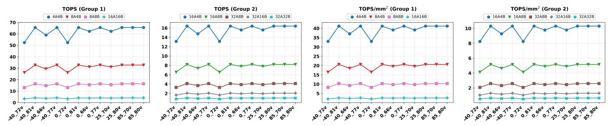

<span id="page-10-1"></span>Figure 11: Mixed-precision throughput and area efficiency under different temperatures and voltages of MHE-TPE array.

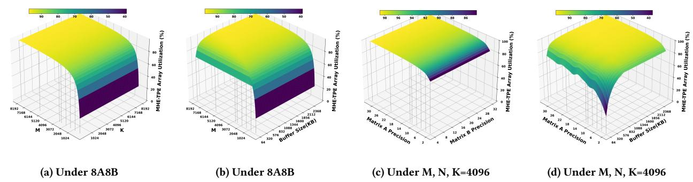

Figure 12: Factors affecting the utilization rate of MHE-TPE array: (a) M and K dimensions of the GEMM; (b) M dimension of the  $A_{M \times K}$  and output buffer size; (c) computational precision of  $A_{M \times K}$  and  $B_{K \times N}$ ; (d) precision of  $A_{M \times K}$  and output buffer size.

system requires frequency scaling to maintain timing constraints. Under undervolting at room temperature (25°C, 0.7 V), the system operates at 3.8 GHz for MHE/MHD and 950 MHz for compressor tree and LRM. At high temperatures (85°C), electron mobility increases, which alleviates timing concerns but raises dynamic power consumption. Therefore, frequency scaling may be required under extremely low or high temperatures to sustain energy efficiency.

As illustrated in Fig. 11, peak performance and computational density are achieved due to the MHE-TPE architecture's fusion of reduction dimensions, ensuring high compute density within each TPE. The precision of Matrix *A*'s scaling is mapped onto the temporal dimension of individual TPEs, while the Matrix *B*'s precision scaling is distributed across the spatial dimensions of different TPE tiles. This enables near-proportional scaling of both performance per unit area and energy efficiency with respect to operand precision.

Across varying temperatures and voltages, the 4A4B mode delivers approximately twice the compute density and energy efficiency of the 8A4B mode, 4 times that of 8A8B, and 16 times that of 16A16B. Similarly, the 16A4B mode offers approximately twice the compute density and energy efficiency of the 16A8B mode, 4 times that of 32A8B, 8 times that of 32A16B, and 16 times that of 32A32B, and for energy efficiency reaches its peak at low temperature and low voltage (0°C, 0.66 V), while area efficiency is maximized at room temperature under high voltage conditions (25°C, 0.8 V).

## 4.5 Factors Affecting Compute Utilization

The MHE-TPE array employs a typical WS dataflow. Its key feature lies in writing sub-matrices of matrix *B* into VPP LUTs to enable

data and computation reuse, thereby reducing operand bandwidth demands and improving computational energy efficiency. Specifically, increasing the reuse duration of sub-matrix *B* within the array effectively reduces computational resource waste caused by VPP LUT loading and pipeline idleness. Fig. 12 illustrates three key factors affecting array utilization:

- Matrix dimensions of computational workload (shown in Fig. 12(a)). When the partial sum output buffer capacity is sufficient, the outer product computation enables complete reuse of matrix B sub-matrices through a single load. This requires traversing the tiled M-dimension of matrix A. Consequently, array utilization increases with the M-dimension. When M > 1920, utilization can exceed 90% of the theoretical compute efficiency. The reduction dimension K, as the outermost loop, does not affect array utilization.
- **②** Output buffer size (shown in Fig. 12(b)). Prolonged reuse of matrix *B* increases on-chip partial sum storage demands, requiring higher *M*-dimension tasks to be further partitioned to reduce storage pressure. However, array utilization saturates when the *M*-dimension reaches a threshold. Thus, a smaller buffer can achieve high utilization (see the yellow region in Fig. 12(b)).
- **9** Matrix precision and output buffer size (shown in Fig. 12(c)(d)). MHE-TPE array supports multiple precisions by traversing different bit weights along the temporal dimension of matrix *A* (referencing Fig. 10). This process shares the same VPP LUTs. Therefore, higher precision for matrix *A* extends the reuse time of matrix *B*, further enhancing array utilization. When matrix *A*'s precision and output buffer size are both increased simultaneously beyond a specific threshold, array utilization can be stably maintained at a high level.

<span id="page-11-0"></span>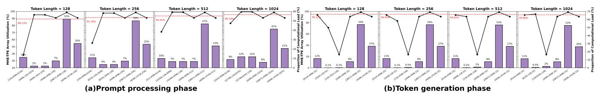

Figure 13: MHE-TPE array utilization under Llama3-8b workload (W4A8KV4) during different processing phase and token length. The bars represent the computational load proportions of operators within a single LlamaDecoderLayer, while the black line showcases the computational array utilization under this operator. The red dotted line represents the average utilization. The x-axis represents the M, K, and M dimensions of GEMM operations for each layer, respectively.

<span id="page-11-1"></span>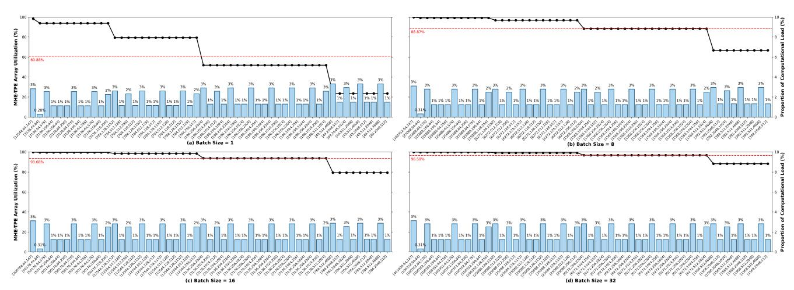

Figure 14: MHE-TPE array utilization under ResNet50. The bars represent the computational load proportions of operators within the total network, while the black line showcases the computational array utilization under this operator. The red dotted line represents the average utilization. The x-axis represents the M, K, and N dimensions of GEMM operations for each layer, respectively.

#### 4.6 Compute Utilization under DNN Models

4.6.1 Under Large Language Models Workload. This study evaluates the utilization efficiency of the MHE-TPE within the LlamaDecoderLayer (comprising LlamaAttention and LlamaMLP modules) on the Llama3-8B model (weight quantization precision W4A8KV4) during both the prompt processing phase (batch size=1) and the token generation phase (batch size=32).

In prompt processing phase: as depicted in Fig. 13(a), when the input sequence length increases from 128 to 1024, the computational load of the attention layer significantly rises from 2% to 12%. This phenomenon arises because the core matrix operation *M*-dimensions in the *QKV* projection layer (first layer) and the attention layer (second and third layers) are proportional to the sequence length. Conversely, in other layers (such as the postattention projection and internal FFN), the sequence length becomes the secondary dimension *N* due to transposition operations, exhibiting a weaker correlation with unit utilization. The computational load of these layers is primarily driven by their high *M*-dimensions, with the expanded dimension (up to 28,672) of the FFN's up-projection layer being particularly prominent. This layer emerges as the highest computational operator within the LlamaDecoderLayer and results in peak MHE-TPE array utilization at this

stage. Consequently, the increase in sequence length effectively enhances the utilization of the corresponding operators by elevating the *M*-dimension in the *QKV* projection layer and the attention layer, raising the array's average utilization from 89.13% to 95.33%.

In token generation phase: as shown in Fig. 13(b), the key difference between this phase and prompt processing lies in the constant sequence length of 1 for the attention layer's matrix Q. To optimize utilization during prompt processing, the attention layer employs the  $V^T(KQ^T)$  dataflow rearrangement technique ( $V^T$  layout). Although the KV cache continuously grows during token generation, the core dimension M of the  $V^T$  remains unchanged, resulting in persistently low utilization during the second stage of attention computation. Given that the computational proportion of the attention layer increases with context expansion, the overall array average utilization exhibits a declining trend.

4.6.2 Under CNN Workload. Fig. 14 displays the variation in MHE-TPE array GEMM operator utilization for the ResNet50 (input size:  $3\times224\times224$ ) under different batch sizes. When the batch size is 1, the network's first 20 layers maintain a high average utilization (>80%). The core mechanism lies in the fact that after the convolution layer undergoes img2col transformation, the M-dimension of the executed core GEMM operator corresponds to the spatial resolution (height  $\times$  width) of the activation map. In the shallow

<span id="page-12-0"></span>

| Architecture MHE-TPE Array§ |                          | MHE-TPE Array§                                                       | Systolic Array (TPU-like)                                            | LUT-TC [32]                       | LUTein [16]       | UNPU [22]                               | Sam. NPU[36]     | RaPiD [47] |
|-----------------------------|--------------------------|----------------------------------------------------------------------|----------------------------------------------------------------------|-----------------------------------|-------------------|-----------------------------------------|------------------|------------|
| Technology(nm)              |                          | UMC 22                                                               | UMC 22                                                               | TSMC 28                           | Samsung 28        | 65                                      | 4                | 7          |
| Supply Voltage (V)          |                          | 0.66~0.81                                                            | 0.66~0.81                                                            | 0.9                               | /                 | 0.63~1.1                                | 0.55~1.0         | 0.55~0.75  |
| Frequency (N                | (Hz)                     | 800~1000                                                             | 500~1000                                                             | 1000                              | 250               | 200                                     | 332~1196         | 1000~1600  |
| TPE Area (mi                | <b>n</b> <sup>2</sup> )† | 1.59 (pre-layout)                                                    | /                                                                    | 0.187                             | 0.2               | 3.55                                    | 1.88             | 1.98       |
| Support                     |                          | A:INT2~32;                                                           | dedicated precision                                                  | A:FP/INT8, FP/INT16;              | Sparse INT4,      | INT1 ~ INT16                            | INT4,8,16        | FP8,16,32, |
| Precision                   | ı                        | B:INT4,8,16,32                                                       | dedicated precision                                                  | B: INT1~INT4                      | 7,10,13           | 111111111111111111111111111111111111111 | /FP16            | INT 2,4    |
|                             | 4A                       | 4B:39.88                                                             | <b>4B:</b> 13.46                                                     | /                                 | /                 | <b>4B:</b> 6.97                         | 4B:23.18         | 4B:40.36   |
| TOPS/W †                    | 8A                       | <b>4B:</b> 19.94; <b>8B:</b> 9.97                                    | <b>4B:</b> 11.64; <b>8B:</b> 6.73                                    | <b>4B:</b> 15.95; <b>8B:</b> 7.97 | 7 <b>B:</b> 1.99  | 8B:3.49                                 | <b>8B:</b> 11.59 | /          |
| 10F3/W 1                    | 16A                      | 4B:9.97; 8B:4.98; 16B:2.49                                           | <b>4B:</b> 10.76; <b>8B:</b> 5.82; <b>16B:</b> 3.44                  | 4B:8.41                           | /                 | 16B:0.1                                 | /                | /          |
|                             | 32A                      | <b>4B:</b> 4.98; <b>8B:</b> 2.49; <b>16B:</b> 1.24; <b>32B:</b> 0.62 | 4B:5.95; 8B:3.52; 16B:1.82; 32B:0.94                                 | /                                 | /                 | /                                       | /                | /          |
|                             | 4A                       | 4B:39.13                                                             | <b>4B</b> :18.76                                                     | /                                 | /                 | 4B:0.4                                  | 4B:20.94         | 4B:52.97   |
| TOPS/mm <sup>2</sup> †      | 8A                       | <b>4B:</b> 19.56; <b>8B:</b> 9.78                                    | <b>4B:</b> 12.67; <b>8B:</b> 9.32                                    | 4B:30.98; 8B:15.48                | 7 <b>B:</b> 4.535 | 8B:0.2                                  | 8B:10.47         | /          |
| 1013/11111                  | 16A                      | <b>4B:</b> 9.78; <b>8B:</b> 4.89; <b>16B:</b> 2.44                   | <b>4B:</b> 8.49; <b>8B:</b> 5.66; <b>16B:</b> 3.17                   | <b>4B:</b> 15.49                  | /                 | 16B:0.1                                 | /                | /          |
|                             | 32A                      | <b>4B:</b> 4.89; <b>8B:</b> 2.44; <b>16B:</b> 1.22; <b>32B:</b> 0.61 | <b>4B:</b> 4.57; <b>8B:</b> 3.01; <b>16B:</b> 1.83; <b>32B:</b> 0.97 | /                                 | /                 | /                                       | /                | /          |

Table 8: Comparison with other architectures.

layers of the network, this dimension is typically large, ensuring the efficient utilization of computational units. However, as the network progressively downsamples layer by layer, the activation map size significantly shrinks, causing the M-dimension to decrease accordingly. Simultaneously, the number of output channels gradually increases (corresponding to the *N*-dimension of GEMM). These inverse variations in dimensions result in a significant decline in utilization dominated by the *M*-dimension within the deeper layers, ultimately yielding an average utilization of only 60.88%. A viable optimization strategy is to employ a transposed dataflow layout for inference in the deeper layers of the network. This approach transforms the number of output channels (originally the N-dimension) into the M-dimension during matrix operations, making it the core computational dimension. The reduction in spatial dimension (originally the M-dimension) is instead converted into the secondary dimension (N-dimension). This dataflow transformation aims to enhance resource utilization under single-batch input scenarios. Empirical results show that when the batch size increases to 32, the full utilization of parallelism among samples within a batch can amplify the average utilization to over 96%.

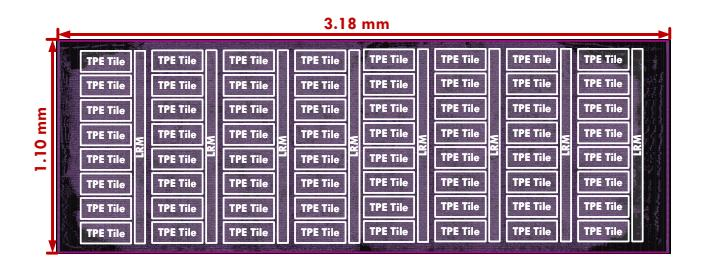

Figure 15: MHE-TPE array macro layout.

#### 4.7 Comparison with Other Architectures

To enable a fair comparison, we adopt the energy and performance results measured under standard conditions (25°C, 0.7 V) as the baseline for evaluating our design against prior work. Table 8 summarizes the comparison across multiple tensor computation architectures in both multi-precision and single-precision settings.

Comparative analysis of dedicated precision systolic arrays versus the MHE-TPE scheme reveals that, regarding area efficiency,

consistent with Table 1 conclusions, the dedicated INT4 array demonstrates merely twice the area efficiency of the INT8 array. Under low-precision hybrid computing modes, the MHE-TPE solution outperforms conventional approaches in both area and energy efficiency. Particularly when matrix *B* precision remains fixed at 4 bits while only increasing matrix *A* precision, MHE-TPE maintains area efficiency comparable to dedicated architectures. However, as the matrix *B* bit-width increases (in configurations like 16A16B, 32A8B, 32A16B, and 32A32B), dedicated architectures exhibit significant advantages in both area efficiency and energy efficiency. This phenomenon originates from the universal design of the MHE-TPE scheme: to support 4-bit weight slicing (matrix *B* bit-slices), its VPP LUT bit-width is constrained within 6 bits.

The LUT-TensorCore [32] employs a lookup-table-based approach, storing the summation results of 4 activation groups, which are then multiplied with 1-bit weights. To build efficient lookup tables, LUT-TensorCore applies post-training quantization (PTQ) to large language models (LLMs) to eliminate zero bits in weights that would otherwise degrade the multiplication result. However, this method has two major limitations. First, it requires software-level coordination, making it unsuitable for general-purpose matrix computations. Second, it lacks flexibility in supporting a wide range of precision configurations. Its heavy reliance on low-bit weight precision means that in high-bit-width scenarios, the number of partial products from 1-bit multiplications increases significantly, degrading both energy and area efficiency.

LUTein [16] utilizes a single-operand lookup table based on 4-bit MBE. The core idea stems from the observation that in DNN workloads, INT8-quantized weights and activations exhibit a high proportion of computation concentrated in 4-bit bit-slices. As such, LUTein performs matrix multiplication using zero-skipping within bit slices, allowing INT4 computations to approximate the area density and energy efficiency of INT8 computations in most cases. However, LUTein depends heavily on the statistical distribution of the input data, limiting its generality. Under dense INT8 multiplication, this can lead to imbalanced compute density across precisions, resulting in a drop in both area and energy efficiency.

UNPU [22] follows a concept similar to LUT-TensorCore. It performs weight-dependent 1-bit serial multiplication using a linear combination of three activation values as the lookup index, followed

 $<sup>\</sup>dagger$  Fixed-point tensor processing engines from chip area and power breakdown.

<sup>§</sup> Power was listed in transistor tt 0.7V process corner at 25 degrees Celsius.

by partial product accumulation. The number of partial accumulations is constrained by the bit width of the weights. UNPU uses 8 lookup tables for the possible multiplication-accumulation outputs. In contrast, the dual-operand encoding in our design also employs 8 lookup tables, but each table effectively computes the multiplication and accumulation of two operands. This results in more than double the throughput under INT8 precision, using the same LUT storage depth.

Samsung's NPU [36] design for mobile SoCs integrates multiple multiplier-width configurations within its fixed-point tensor processing PE, as shown in Fig. 3(b). The PE includes one INT8 unit, two INT8×INT4 units, and one INT4 unit. When executing INT4 tensor computation, all 4 multipliers are activated. When executing INT8 computation, one INT8 and two INT8×INT4 units are activated alongside the reduction tree. While this improves INT8 computation efficiency under multi-precision, it leads to severe hardware underutilization in INT4 computations. For example, executing INT8 multiplication wastes one INT4 multiplier, while INT4 computation leaves three INT8 multipliers idle.

IBM's RaPiD NPU [47] adopts a dedicated hardware parallelism strategy, implementing eight INT4 and sixteen INT2 multipliers in its integer pipeline engine to match operand bit-widths. This design trades area for energy efficiency at fixed precision levels, which makes it difficult to scale to higher or mixed-precision computation.

The OPT4E[52] focuses on INT8 computation with specialized bit-sparse encoding techniques. Compared to these architectures, our multi-precision general-purpose compute design achieves comparable area and energy efficiency to dedicated INT8 MAC-based and sparse bit-encoded architectures. Therefore, our approach demonstrates robust precision scalability while maintaining balanced compute density across various precision levels.

Bitfusion[40] employs a fundamental design based on 1-bit multiplication, constructing high-precision multiplication by configuring 2-bit multiplication units supplemented with shifters. For vector reduction operations, the computational results from multiple calculation modules require shifting and accumulation. However, this approach exhibits two significant limitations: First, it does not encode the multiplicand (e.g., via Booth encoding), resulting in an excessive number of PPs terms (requiring n shifting and accumulation operations for n-bit multiplication). In contrast, MBE can reduce PPs terms to  $\lceil n/2 \rceil$ ; in our optimized solution for GEMM, this can be further reduced to  $[n \times K/4]$ . Consequently, for high-precision, large-bit-width multiplication operations, Bitfusion demonstrates relatively low resource efficiency in calculation module consumption due to the generation of excessive PPs. Second, its reduction logic lacks efficiency. Since this scheme accumulates the shifted outputs of calculation modules, the adder must reserve the maximum bit width required to accommodate the largest shift amount. Conversely, the MHE-TPE adopts a same-bit-weight vector reduction strategy (i.e., parallel reading of vector elements sharing the same bit-weight in matrix A), thereby reducing resource overhead through the reuse of low-bit-width compressor trees.

VecPAC[44] enhances flexibility via a coarse-grained reconfigurable array (CGRA) architecture, but this comes at the cost of additional area overhead from physical interconnects and routing selectors. Furthermore, its highly modularized isolation design constrains the potential for fusion optimization between units (e.g.,

multi-number addition could be fused into half-adders followed by full-adders rather than using full-adder trees).

#### 5 Conclusion

This study begins by analyzing the redundancy in the spatial and temporal reduction dimensions within typical spatial accelerators [4, 7, 10, 12, 14, 16-20, 24-26, 29, 33, 34, 37, 39, 41, 49, 54]. To optimize the resolution of this issue, we propose a high-radix dualoperand encoder to halve the number of PPs in vector inner-product reductions, thereby reducing the area and energy overheads of the accumulation trees. Furthermore, we investigate the issue of imbalanced compute density under mixed-precision configurations in current tensor computation engines. To address this, we introduce a novel computational paradigm based on bit-slice encoding, partial product generation, and accumulation. Our design maps multi-precision computation by projecting the precision of matrix A onto the temporal domain and that of matrix B onto the spatial domain. This enables efficient mixed-precision matrix multiplication and alleviates compute density imbalance in low-precision operations.

#### References

- <span id="page-13-1"></span> 2017. Nvidia tesla v100 gpu architecture white paper. https://images.nvidia.com/ content/volta-architecture/pdf/volta-architecture-whitepaper.pdf.
- <span id="page-13-5"></span>[2] 2020. Nvidia A100 gpu architecture white paper. https://images.nvidia.com/aem-dam/en-zz/Solutions/data-center/nvidia-ampere-architecture-whitepaper.pdf.
- <span id="page-13-2"></span>[3] Syed Asad Alam, Andrew Anderson, Barbara Barabasz, and David Gregg. 2022. Winograd convolution for deep neural networks: Efficient point selection. ACM Transactions on Embedded Computing Systems 21, 6 (2022), 1–28.
- <span id="page-13-12"></span>[4] J. Albericio, P. Judd, A. Delmás, S. Sharify, and A. Moshovos. 2016. Bit-pragmatic Deep Neural Network Computing. arXiv:1610.06920 [cs.LG] https://arxiv.org/abs/1610.06920
- <span id="page-13-6"></span>[5] Orest J Bedrij. 1962. Carry-select adder. IRE Transactions on Electronic Computers 3 (1962), 340–346.
- <span id="page-13-9"></span>[6] Yaniv Blumenfeld, Itay Hubara, and Daniel Soudry. 2024. Towards Cheaper Inference in Deep Networks with Lower Bit-Width Accumulators. arXiv preprint arXiv:2401.14110 (2024).
- <span id="page-13-13"></span>[7] Stephen Cass. 2019. Taking AI to the edge: Google's TPU now comes in a maker-friendly package. IEEE Spectrum 56, 5 (2019), 16–17.
- <span id="page-13-10"></span>[8] Yi Chen, Yongwei Zhao, Yifan Hao, Yuanbo Wen, Yuntao Dai, Xiaqing Li, Yang Liu, Rui Zhang, Mo Zou, Xinkai Song, et al. 2024. Cambricon-C: Efficient 4-Bit Matrix Unit via Primitivization. In 2024 57th IEEE/ACM International Symposium on Microarchitecture (MICRO). IEEE, 538-550.
- <span id="page-13-7"></span>[9] Fu-Chiung Cheng, Stephen H Unger, and Michael Theobald. 2000. Self-timed carry-lookahead adders. IEEE Trans. Comput. 49, 7 (2000), 659–672.
- <span id="page-13-14"></span>[10] Alberto Delmas Lascorz, Patrick Judd, Dylan Malone Stuart, Zissis Poulos, Mostafa Mahmoud, Sayeh Sharify, Milos Nikolic, Kevin Siu, and Andreas Moshovos. 2019. Bit-tactical: A software/hardware approach to exploiting value and bit sparsity in neural networks. In Proceedings of the Twenty-Fourth International Conference on Architectural Support for Programming Languages and Operating Systems. 749–763.
- <span id="page-13-4"></span>[11] Aamir A Farooqui and Vojin G Oklobdzija. 1998. General data-path organization of a MAC unit for VLSI implementation of DSP processors. In 1998 IEEE International Symposium on Circuits and Systems (ISCAS), Vol. 2. IEEE, 260–263.
- <span id="page-13-3"></span>[12] Axel Feldmann and Daniel Sanchez. 2023. Spatula: A hardware accelerator for sparse matrix factorization. In Proceedings of the 56th Annual IEEE/ACM International Symposium on Microarchitecture. 91–104.
- <span id="page-13-0"></span>[13] Amir Gholami, Sehoon Kim, Zhen Dong, Zhewei Yao, Michael W Mahoney, and Kurt Keutzer. 2022. A survey of quantization methods for efficient neural network inference. In Low-power computer vision. Chapman and Hall/CRC, 291–326.
- <span id="page-13-15"></span>[14] Christopher Grimm, Jinseok Lee, and Naveen Verma. 2024. Training Neural Networks With In-Memory-Computing Hardware and Multi-Level Radix-4 Inputs. IEEE Transactions on Circuits and Systems I: Regular Papers (2024).
- <span id="page-13-8"></span>[15] Oscar Gustafsson, Andrew G Dempster, and Lars Wanhammar. 2004. Multiplier blocks using carry-save adders. In 2004 IEEE International Symposium on Circuits and Systems (IEEE Cat. No. 04CH37512), Vol. 2. IEEE, II-473.
- <span id="page-13-11"></span>[16] Dongseok Im and Hoi-Jun Yoo. 2024. Lutein: Dense-sparse bit-slice architecture with radix-4 lut-based slice-tensor processing units. In 2024 IEEE International Symposium on High-Performance Computer Architecture (HPCA). IEEE, 747–759.

- <span id="page-14-0"></span>[17] Zhe Jia, Blake Tillman, Marco Maggioni, and Daniele Paolo Scarpazza. 2019. Dissecting the graphcore ipu architecture via microbenchmarking. arXiv preprint arXiv:1912.03413 (2019).
- <span id="page-14-5"></span>[18] Norm Jouppi, George Kurian, Sheng Li, Peter Ma, Rahul Nagarajan, Lifeng Nai, Nishant Patil, Suvinay Subramanian, Andy Swing, Brian Towles, et al. 2023. Tpu v4: An optically reconfigurable supercomputer for machine learning with hardware support for embeddings. In Proceedings of the 50th Annual International Symposium on Computer Architecture. 1–14.
- <span id="page-14-6"></span>[19] Norman P Jouppi, Cliff Young, Nishant Patil, David Patterson, Gaurav Agrawal, Raminder Bajwa, Sarah Bates, Suresh Bhatia, Nan Boden, Al Borchers, et al. 2017. In-datacenter performance analysis of a tensor processing unit. In Proceedings of the 44th annual international symposium on computer architecture. 1–12.
- <span id="page-14-28"></span>[20] Patrick Judd, Jorge Albericio, Tayler Hetherington, Tor M Aamodt, and Andreas Moshovos. 2016. Stripes: Bit-serial deep neural network computing. In 2016 49th Annual IEEE/ACM International Symposium on Microarchitecture (MICRO). IEEE, 1–12.
- <span id="page-14-14"></span>[21] Shiann-Rong Kuang, Jiun-Ping Wang, and Cang-Yuan Guo. 2009. Modified booth multipliers with a regular partial product array. IEEE Transactions on Circuits and Systems II: Express Briefs 56, 5 (2009), 404–408.
- <span id="page-14-24"></span>[22] Jinmook Lee, Changhyeon Kim, Sanghoon Kang, Dongjoo Shin, Sangyeob Kim, and Hoi-Jun Yoo. 2018. UNPU: An energy-efficient deep neural network accelerator with fully variable weight bit precision. IEEE Journal of Solid-State Circuits 54, 1 (2018), 173–185.
- <span id="page-14-16"></span>[23] Sae Kyu Lee, Ankur Agrawal, Joel Silberman, Matthew Ziegler, Mingu Kang, Swagath Venkataramani, Nianzheng Cao, Bruce Fleischer, Michael Guillorn, Matthew Cohen, et al. 2021. A 7-nm four-core mixed-precision AI chip with 26.2- TFLOPS hybrid-FP8 training, 104.9-TOPS INT4 inference, and workload-aware throttling. IEEE Journal of Solid-State Circuits 57, 1 (2021), 182–197.
- <span id="page-14-29"></span>[24] Gang Li, Weixiang Xu, Zhuoran Song, Naifeng Jing, Jian Cheng, and Xiaoyao Liang. 2022. Ristretto: An atomized processing architecture for sparsitycondensed stream flow in CNN. In 2022 55th IEEE/ACM International Symposium on Microarchitecture (MICRO). IEEE, 1434–1450.
- [25] Jiansong Li and Zihan Jiang. 2020. Performance analysis of cambricon mlu100. In Benchmarking, Measuring, and Optimizing: Second BenchCouncil International Symposium, Bench 2019, Denver, CO, USA, November 14–16, 2019, Revised Selected Papers 2. Springer, 57–66.
- <span id="page-14-7"></span>[26] Heng Liao, Jiajin Tu, Jing Xia, Hu Liu, Xiping Zhou, Honghui Yuan, and Yuxing Hu. 2021. Ascend: a scalable and unified architecture for ubiquitous deep neural network computing: Industry track paper. In 2021 IEEE International Symposium on High-Performance Computer Architecture (HPCA). IEEE, 789–801.
- <span id="page-14-21"></span>[27] Fangxin Liu, Ning Yang, Haomin Li, Zongwu Wang, Zhuoran Song, Songwen Pei, and Li Jiang. 2024. Spark: Scalable and precision-aware acceleration of neural networks via efficient encoding. In 2024 IEEE International Symposium on High-Performance Computer Architecture (HPCA). IEEE, 1029–1042.
- <span id="page-14-20"></span>[28] Yun-Chen Lo and Ren-Shuo Liu. 2023. Bucket getter: A bucket-based processing engine for low-bit block floating point (bfp) dnns. In Proceedings of the 56th Annual IEEE/ACM International Symposium on Microarchitecture. 1002–1015.
- <span id="page-14-30"></span>[29] Hang Lu, Liang Chang, Chenglong Li, Zixuan Zhu, Shengjian Lu, Yanhuan Liu, and Mingzhe Zhang. 2021. Distilling bit-level sparsity parallelism for general purpose deep learning acceleration. In MICRO-54: 54th Annual IEEE/ACM International Symposium on Microarchitecture. 963–976.
- <span id="page-14-8"></span>[30] Wenyan Lu, Guihai Yan, Jiajun Li, Shijun Gong, Yinhe Han, and Xiaowei Li. 2017. Flexflow: A flexible dataflow accelerator architecture for convolutional neural networks. In 2017 IEEE International Symposium on High Performance Computer Architecture (HPCA). IEEE, 553–564.
- <span id="page-14-1"></span>[31] Arnab Neelim Mazumder, Jian Meng, Hasib-Al Rashid, Utteja Kallakuri, Xin Zhang, Jae-Sun Seo, and Tinoosh Mohsenin. 2021. A survey on the optimization of neural network accelerators for micro-ai on-device inference. IEEE Journal on Emerging and Selected Topics in Circuits and Systems 11, 4 (2021), 532–547.
- <span id="page-14-2"></span>[32] Zhiwen Mo, Lei Wang, Jianyu Wei, Zhichen Zeng, Shijie Cao, Lingxiao Ma, Naifeng Jing, Ting Cao, Jilong Xue, Fan Yang, et al. 2024. Lut tensor core: Lookup table enables efficient low-bit llm inference acceleration. arXiv preprint arXiv:2408.06003 (2024).
- <span id="page-14-9"></span>[33] Thomas Norrie, Nishant Patil, Doe Hyun Yoon, George Kurian, Sheng Li, James Laudon, Cliff Young, Norman Jouppi, and David Patterson. 2021. The design process for Google's training chips: TPUv2 and TPUv3. IEEE Micro 41, 2 (2021), 56–63.
- <span id="page-14-31"></span>[34] Yunjie Pan, Jiecao Yu, Andrew Lukefahr, Reetuparna Das, and Scott Mahlke. 2023. BitSET: Bit-serial early termination for computation reduction in convolutional neural networks. ACM Transactions on Embedded Computing Systems 22, 5s (2023), 1–24.
- <span id="page-14-12"></span>[35] Gunho Park, Jaeha Kung, and Youngjoo Lee. 2023. Simplified Compressor and Encoder Designs for Low-Cost Approximate Radix-4 Booth Multiplier. IEEE Transactions on Circuits and Systems II: Express Briefs 70, 3 (2023), 1154–1158.
- <span id="page-14-17"></span>[36] Jun-Seok Park, Changsoo Park, Suknam Kwon, Taeho Jeon, Yesung Kang, Heonsoo Lee, Dongwoo Lee, James Kim, Hyeong-Seok Kim, YoungJong Lee, et al. 2022. A multi-mode 8k-MAC HW-utilization-aware neural processing unit with a unified multi-precision datapath in 4-nm flagship mobile SoC. IEEE Journal of

- Solid-State Circuits 58, 1 (2022), 189–202.
- <span id="page-14-32"></span>[37] Raghu Prabhakar, Sumti Jairath, and Jinuk Luke Shin. 2022. Sambanova sn10 RDU: A 7nm dataflow architecture to accelerate software 2.0. In 2022 IEEE International Solid-State Circuits Conference (ISSCC), Vol. 65. IEEE, 350–352.
- <span id="page-14-18"></span>[38] Mark R Santoro and Mark A Horowitz. 1989. SPIM: a pipelined 64\* 64-bit iterative multiplier. IEEE journal of solid-state circuits 24, 2 (1989), 487–493.
- <span id="page-14-33"></span>[39] Sayeh Sharify, Alberto Delmas Lascorz, Mostafa Mahmoud, Milos Nikolic, Kevin Siu, Dylan Malone Stuart, Zissis Poulos, and Andreas Moshovos. 2019. Laconic deep learning inference acceleration. In Proceedings of the 46th International Symposium on Computer Architecture. 304–317.
- <span id="page-14-26"></span>[40] Hardik Sharma, Jongse Park, Naveen Suda, Liangzhen Lai, Benson Chau, Joon Kyung Kim, Vikas Chandra, and Hadi Esmaeilzadeh. 2018. Bit fusion: bit-level dynamically composable architecture for accelerating deep neural networks. In Proceedings of the 45th Annual International Symposium on Computer Architecture (Los Angeles, California) (ISCA '18). IEEE Press, 764–775. <https://doi.org/10.1109/ISCA.2018.00069>
- <span id="page-14-34"></span>[41] Man Shi, Vikram Jain, Antony Joseph, Maurice Meijer, and Marian Verhelst. 2024. BitWave: Exploiting Column-Based Bit-Level Sparsity for Deep Learning Acceleration. In 2024 IEEE International Symposium on High-Performance Computer Architecture (HPCA). IEEE, 732–746.
- <span id="page-14-13"></span>[42] Jujavarapu Sravana, S. K. Hima Bindhu, K. Sharvani, P. Sai Preethi, Saptarshi Sanyal, Vallabhuni Vijay Vallabhuni Vijay, and Rajeev Ratna Vallabhuni. 2022. Implementation of Spurious Power Suppression based Radix-4 Booth Multiplier using Parallel Prefix Adders. In 2021 4th International Conference on Recent Trends in Computer Science and Technology (ICRTCST). 428–433.
- <span id="page-14-23"></span>[43] Synopsys Inc. 2022. Design Compiler User Guide.
- <span id="page-14-27"></span>[44] Cheng Tan, Deepak Patil, Antonino Tumeo, Gabriel Weisz, Steve Reinhardt, and Jeff Zhang. 2023. Vecpac: A vectorizable and precision-aware cgra. In 2023 IEEE/ACM International Conference on Computer Aided Design (ICCAD). IEEE, 1–9.
- <span id="page-14-10"></span>[45] Fengbin Tu, Shouyi Yin, Peng Ouyang, Shibin Tang, Leibo Liu, and Shaojun Wei. 2017. Deep convolutional neural network architecture with reconfigurable computation patterns. IEEE Transactions on Very Large Scale Integration (VLSI) Systems 25, 8 (2017), 2220–2233.
- <span id="page-14-15"></span>[46] Sreehari Veeramachaneni, Kirthi M Krishna, Lingamneni Avinash, Sreekanth Reddy Puppala, and MB Srinivas. 2007. Novel architectures for high-speed and low-power 3-2, 4-2 and 5-2 compressors. In 20th International Conference on VLSI Design held jointly with 6th International Conference on Embedded Systems (VLSID'07). IEEE, 324–329.
- <span id="page-14-25"></span>[47] Swagath Venkataramani, Vijayalakshmi Srinivasan, Wei Wang, Sanchari Sen, Jintao Zhang, Ankur Agrawal, Monodeep Kar, Shubham Jain, Alberto Mannari, Hoang Tran, et al. 2021. RaPiD: AI accelerator for ultra-low precision training and inference. In 2021 ACM/IEEE 48th Annual International Symposium on Computer Architecture (ISCA). IEEE, 153–166.
- <span id="page-14-19"></span>[48] Christopher S Wallace. 1964. A suggestion for a fast multiplier. IEEE Transactions on electronic Computers 1 (1964), 14–17.
- <span id="page-14-35"></span>[49] Gang Wang, Siqi Cai, Wenjie Li, Dongxu Lyu, and Guanghui He. 2024. BSViT: A Bit-Serial Vision Transformer Accelerator Exploiting Dynamic Patch and Weight Bit-Group Quantization. IEEE Transactions on Circuits and Systems I: Regular Papers (2024).
- <span id="page-14-22"></span>[50] Junbin Wang, Shaoxia Fang, Xi Wang, Jiangsha Ma, Taobo Wang, and Yi Shan. 2021. High-performance mixed-low-precision cnn inference accelerator on fpga. IEEE Micro 41, 4 (2021), 31–38.
- <span id="page-14-3"></span>[51] Qizhe Wu, Yuchen Gui, Zhichen Zeng, Xiaotian Wang, Huawen Liang, and Xi Jin. 2024. EN-T: Optimizing Tensor Computing Engines Performance via Encoder-Based Methodology. In 2024 IEEE 42nd International Conference on Computer Design (ICCD). IEEE, 608–615.
- <span id="page-14-4"></span>[52] Qizhe Wu, Huawen Liang, Yuchen Gui, Zhichen Zeng, Zerong He, Linfeng Tao, Xiaotian Wang, Letian Zhao, Zhaoxi Zeng, Wei Yuan, Wei Wu, and Xi Jin. 2025. Exploring the Performance Improvement of Tensor Processing Engines through Transformation in the Bit-weight Dimension of MACs. In 2025 IEEE International Symposium on High Performance Computer Architecture (HPCA). 685–700.
- <span id="page-14-11"></span>[53] Rui Xu, Sheng Ma, Yang Guo, and Dongsheng Li. 2023. A survey of design and optimization for systolic array-based dnn accelerators. Comput. Surveys 56, 1 (2023), 1–37.
- <span id="page-14-36"></span>[54] Jianxun Yang, Zhao Zhang, Zhuangzhi Liu, Jing Zhou, Leibo Liu, Shaojun Wei, and Shouyi Yin. 2021. Fusekna: Fused kernel convolution based accelerator for deep neural networks. In 2021 IEEE International Symposium on High-Performance Computer Architecture (HPCA). IEEE, 894–907.