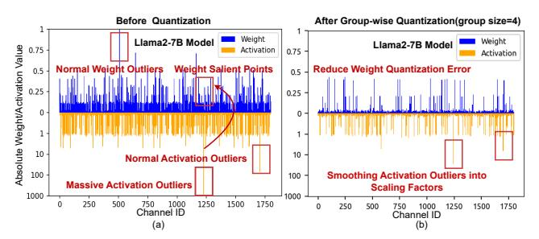
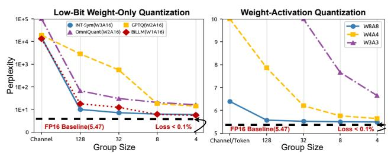
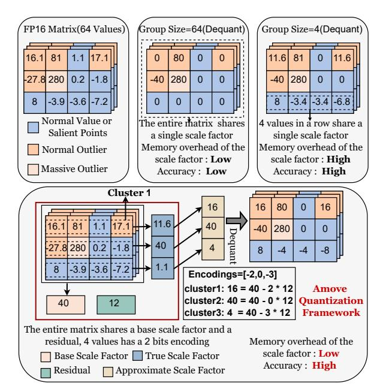
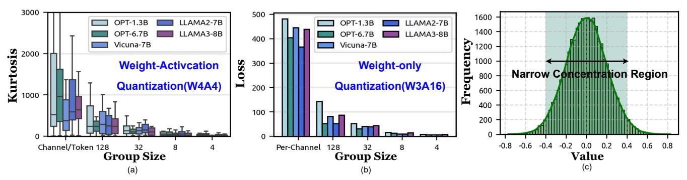
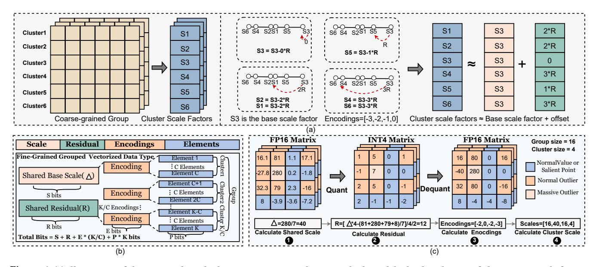
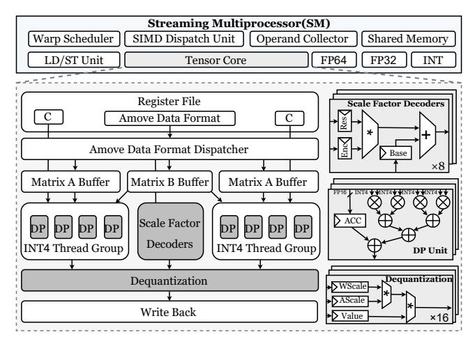
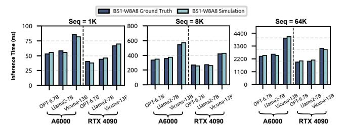
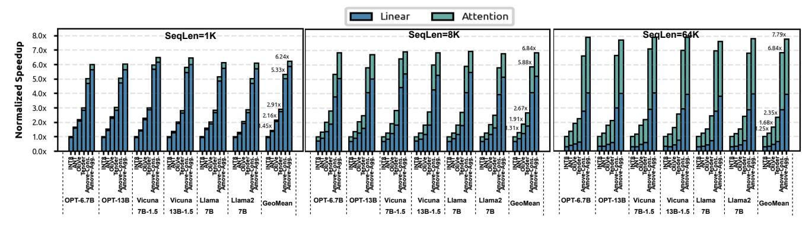
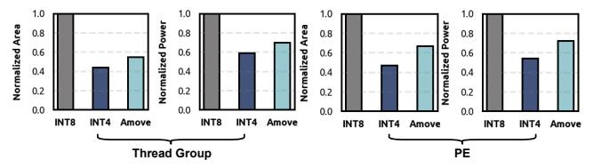
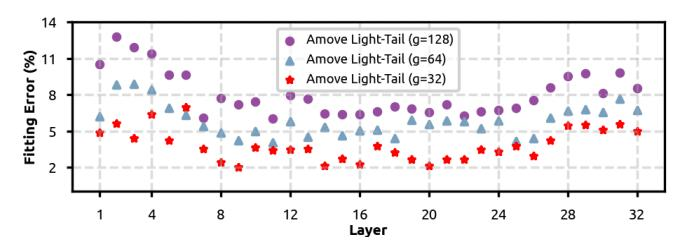

# Amove: Accelerating LLMs through Mitigating Outliers and Salient Points via Fine-Grained Grouped Vectorized Data Type

[Xilong Xie](https://orcid.org/0009-0005-9988-2940) Beihang University Beijing, China xxl1399@buaa.edu.cn

[Meng Han](https://orcid.org/0000-0002-8085-9047) Tsinghua University Beijing, China mhan@mail.tsinghua.edu.cn

[Jinquan Wang](https://orcid.org/0000-0001-6690-8386) Beihang University Beijing, China derekjqwang@buaa.edu.cn

[Liang Wang](https://orcid.org/0000-0002-6112-1928)<sup>∗</sup> Beihang University Beijing, China lwang20@buaa.edu.cn

[Lei Liu](https://orcid.org/0000-0003-4854-7382) Beihang University Beijing, China Liulei2010@buaa.edu.cn

[Zhen Song](https://orcid.org/0000-0002-3099-6078) Beihang University Beijing, China songzhen@buaa.edu.cn

[Limin Xiao](https://orcid.org/0000-0001-9438-9181)<sup>∗</sup> Beihang University Beijing, China xiaolm@buaa.edu.cn

[Xiangrong Xu](https://orcid.org/0000-0001-7650-5169) Beihang University Beijing, China xxr0930@buaa.edu.cn

[Xiaojian Liao](https://orcid.org/0000-0002-7924-9268) Beihang University Beijing, China liaoxj@buaa.edu.cn

# Abstract

The quantization of Large Language Models (LLMs) poses significant challenges due to the heterogeneous nature of feature point distributions in low-bit quantization scenarios, including salient points, normal outliers, and massive outliers. These challenges are particularly pronounced in supporting both weight-only and weight-activation quantization modes, as existing methods often focus on a single mode and fail to address the diverse feature characteristics holistically, resulting in suboptimal model accuracy and hardware efficiency trade-offs.

To tackle these limitations, we introduce Amove, a novel codesign framework that synergistically integrates data type and hardware architecture design for efficient LLM quantization. Our approach is threefold: First, we conduct a comprehensive analysis of quantization granularity and propose a residual approximation mechanism that balances model accuracy and memory overhead under fine-grained quantization. Second, we design a flexible finegrained grouped vectorized data type, enabling seamless support for both weight-activation and low-bit weight-only quantization modes within a unified framework. Third, we implement the hardware architecture of Amove on both GPU tensor core and systolic arraybased architectures. The Amove-enhanced tensor core achieves an average speedup of 2.13× and a 1.70× reduction in energy consumption over the state-of-the-art OliVe design. Furthermore, an Amove-based accelerator achieves up to 2.67× speedup and 1.68× energy reduction over the state-of-the-art accelerator.

<sup>∗</sup>Co-corresponding authors.

Permission to make digital or hard copies of all or part of this work for personal or classroom use is granted without fee provided that copies are not made or distributed for profit or commercial advantage and that copies bear this notice and the full citation on the first page. Copyrights for components of this work owned by others than the author(s) must be honored. Abstracting with credit is permitted. To copy otherwise, or republish, to post on servers or to redistribute to lists, requires prior specific permission and/or a fee. Request permissions from permissions@acm.org.

MICRO '25, Seoul, Republic of Korea

© 2025 Copyright held by the owner/author(s). Publication rights licensed to ACM. ACM ISBN 979-8-4007-1573-0/25/10 <https://doi.org/10.1145/3725843.3756113>

CCS Concepts • Computing methodologies → Neural networks; • Computer systems organization → Data flow architectures.

# Keywords

Large Language Models, Quantization, Fine-Grained Grouped Vectorized Data Type

## ACM Reference Format:

Xilong Xie, Liang Wang, Limin Xiao, Meng Han, Lei Liu, Xiangrong Xu, Jinquan Wang, Zhen Song, and Xiaojian Liao. 2025. Amove: Accelerating LLMs through Mitigating Outliers and Salient Points via Fine-Grained Grouped Vectorized Data Type. In 58th IEEE/ACM International Symposium on Microarchitecture (MICRO '25), October 18–22, 2025, Seoul, Republic of Korea. ACM, New York, NY, USA, [15](#page-14-0) pages[. https://doi.org/10.1145/3725843.3756113](https://doi.org/10.1145/3725843.3756113)

# 1 Introduction

Large Language Models (LLMs) [\[6,](#page-13-0) [73,](#page-14-1) [85\]](#page-14-2) have demonstrated exceptional performance on many natural language processing tasks by leveraging massive parameters to enhance comprehension, generation, and reasoning [\[16,](#page-13-1) [58,](#page-14-3) [75\]](#page-14-4). However, deploying LLMs with billions of parameters presents challenges in resource-constrained edge devices, especially in terms of memory usage and inference speed [\[21\]](#page-13-2). For instance, Llama4 Behemoth [\[72\]](#page-14-5), the recent opensource model with 288 billion parameters, demands 576 GB of storage in FP16, requiring at least 8 A100 GPUs [\[59\]](#page-14-6) (80 GB each) for inference. Even with 8 A100 GPUs, a single forward pass can take several seconds, making real-time inference infeasible for latencysensitive applications [\[11,](#page-13-3) [79\]](#page-14-7). To this end, quantization [\[17,](#page-13-4) [20,](#page-13-5) [39,](#page-13-6) [43,](#page-13-7) [47,](#page-14-8) [67,](#page-14-9) [77\]](#page-14-10) is suggested as one of the most hardware-friendly ways to reduce memory consumption by converting floating-point parameters into low-bit representations and to accelerate LLM inference via efficient matrix multiplication on practical hardware implementations, such as GPU tensor core [\[59,](#page-14-6) [86\]](#page-14-11) and systolic array-based accelerators [\[8,](#page-13-8) [33\]](#page-13-9). Depending on the components being quantized, quantization falls into two modes: weight-only quantization [\[20,](#page-13-5) [47,](#page-14-8) [67\]](#page-14-9), which aggressively compresses model

<span id="page-1-0"></span>

Figure 1: (a) Distribution of feature points of weights and activations in Llama2-7B on the WikiText2 [\[55\]](#page-14-12) dataset for quantization analysis. (b) Distribution of feature points after fine-grained groupwise quantization (group size = 4).

<span id="page-1-1"></span>

Figure 2: Perplexity of Llama2-7B on Wikitext2 [\[55\]](#page-14-12) under different quantization granularity levels. Lower perplexity means better model accuracy. As the group size decreases, the accuracy of both lowbit weight-only quantization methods (e.g., INT-sym [\[29\]](#page-13-10), GPTQ[\[20\]](#page-13-5), OmniQuant [\[67\]](#page-14-9), and BiLLM [\[27\]](#page-13-11)) and weight-activation quantization progressively improves.

weights to extremely low bit-widths (e.g., W3A16, W2A16), and weight–activation quantization [\[46,](#page-14-13) [54,](#page-14-14) [77\]](#page-14-10), which reduces the precision of both weights and activations (e.g., W8A8, W4A4).

Nevertheless, the primary barrier to supporting both low-bit weight-only and weight–activation quantization lies in their different feature points, making it challenging to handle both outliers and salient points [\[27,](#page-13-11) [47\]](#page-14-8) efficiently within a specific framework [\[22,](#page-13-12) [77\]](#page-14-10). Figure [1\(](#page-1-0)a) shows the distribution of salient points and outliers in Llama2-7B [\[72\]](#page-14-5). Outliers, observed in both weights and activations, are typically high-magnitude values that are classified into two categories: normal outliers and massive outliers [\[46\]](#page-14-13). Although both normal and massive outliers deviate from the typical value range, massive outliers exhibit exceptionally larger values than normal outliers. Salient points refer to weight values that are amplified during matrix multiplication due to activation outliers. BitMoD [\[7\]](#page-13-13) and Anda [\[19\]](#page-13-14) enhance the efficiency of low-bit weight-only quantization through data type design informed by model weight analysis. Methods such as GOBO [\[80\]](#page-14-15), Mokey [\[81\]](#page-14-16), ANT [\[23\]](#page-13-15), OliVe [\[22\]](#page-13-12), SPARK [\[49\]](#page-14-17), LNS-LLM [\[24\]](#page-13-16), and M-ANT [\[26\]](#page-13-17) address activation outliers, thereby facilitating accurate and practical weight–activation quantization. Yet, these methods struggle to jointly handle salient points and outliers, limiting their ability to support both low-bit weight-only and weight–activation quantization modes with respect to model accuracy and hardware efficiency.

A key factor underlying this limitation is the quantization granularity, which governs how well outliers and salient points can be preserved [\[26,](#page-13-17) [65\]](#page-14-18). As shown in Figure [1\(](#page-1-0)b), fine-grained groupwise quantization [\[13\]](#page-13-18) can smooth activation outliers into the scale

<span id="page-1-2"></span>

Figure 3: Comparison between the **Amove** quantization framework and group-wise quantization methods.

factors while reducing the overall error in weight-only quantization. Moreover, Figure [2](#page-1-1) shows that decreasing the group size improves the accuracy of low-bit weight-only and weight–activation quantization, even reducing the model error to 0.1% when the group size is 4. However, as the group size decreases, the memory overhead of scale factors increases dramatically [\[26\]](#page-13-17). For example, reducing the group size from 128 to 4 results in a 32× increase in the memory overhead of scale factors. A straightforward approach is to quantize the scale factors, as done in VS-Quant [\[13\]](#page-13-18). Nevertheless, compressing these scale factors to low-bit precision (e.g., 4 bits) can lead to over 50% accuracy degradation, and the 2-order dequantization operation introduces considerable computational overhead [\[42\]](#page-13-19).

Based on the above observations, we propose Amove, a novel data type and architecture co-design framework. Figure [3](#page-1-2) shows the difference between the proposed Amove framework and group-wise quantization methods. In Amove, each coarse-grained group is partitioned into multiple fine-grained clusters, and the scale factor for each cluster is derived from a base scale factor, residual, and corresponding encoding, thereby avoiding storing per-cluster scale factors. For example, the true scale factor of the first cluster in Figure [3](#page-1-2) is 11.6. Using the base scale of the coarsegrained group (40) and subtracting a residual of 12 multiplied by the encoding value 2, the approximate scale factor for this cluster can be computed as 16. Through flexibly configuring the encoding bit-width, group size, and cluster size, this mechanism achieves a favorable trade-off between model accuracy and memory overhead.

To implement Amove, a fine-grained grouped vectorized data type is employed for the residual approximation mechanism. This data type is similar to the Microscaling (MX) [\[65\]](#page-14-18) data format proposed by Microsoft and NVIDIA, which has already been adopted in NVIDIA's latest-generation GPUs [\[56\]](#page-14-19). However, compared to MX, Amove offers more flexible scalability and supports fine-grained

quantization with lower memory overhead. Due to its hardware-friendly and scalable data type, Amove can be seamlessly extended to both tensor core and systolic array, while incurring less than 2% area overhead. Amove leverages data type and architecture codesign that enables accurate 4-bit weight-activation quantization for self-attention and linear layers, achieving enhanced inference efficiency for quantized LLMs compared to existing state-of-the-art quantization architectures [22, 23, 40].

The main contributions of this paper are summarized below:

- We analyze the challenges of fine-grained quantization and adopt a novel residual approximation mechanism to trade off model accuracy and memory overhead.
- We design a flexible customized fine-grained grouped vectorized data type based on the residual approximation mechanism, which supports both weight-activation and low-bit weight-only quantization modes, further improving the accuracy of quantized LLMs.
- We demonstrate that the proposed data type can be easily integrated into existing scalar data types and quantization algorithms, delivering higher model accuracy.
- We implement the Amove architecture on both GPU tensor core and systolic array, and evaluate its performance across multiple LLMs. Amove achieves an average of 2.13× speedup and 1.70× energy reduction compared to the state-of-the-art tensor core design OliVe [22]. Compared to the state-of-the-art accelerator Tender [40], Amove achieves up to 2.67× speedup and 1.68× energy reduction.

# 2 Background

In this section, we introduce quantization granularity in Section 2.1 and data type in Section 2.2. These two key techniques serve as the foundation for the design of our proposed framework.

### <span id="page-2-0"></span>2.1 Quantization Granularity for LLM

Quantization [45, 54, 61] maps high-precision values into discrete levels, with symmetric integer quantization [29] offering better hardware support and efficiency [77]. Specifically, the symmetric integer quantization process can be expressed as:

<span id="page-2-3"></span>
$$\Delta = \frac{max(|\mathbf{X}_f|)}{2^{b-1}-1}; \quad \mathbf{X}_q = \left\lfloor \frac{\mathbf{X}_f}{\Delta} \right\rfloor; \quad \hat{\mathbf{X}} = \mathbf{X}_q \cdot \Delta \tag{1}$$

where b is the bit width,  $\Delta$  is the scale factor,  $\mathbf{X}_f$  is the original floating-point tensor,  $\lfloor \cdot \rfloor$  is the rounding function,  $\mathbf{X}_q$  is the quantized integer value, and  $\hat{\mathbf{X}}$  is the floating-point tensor obtained after dequantization. As shown in Figure 4, quantization has different granularity levels, which significantly impact the accuracy of quantized LLMs [7]. Per-tensor quantization assigns a single scale factor to the entire matrix, while per-token and per-channel quantization improve flexibility by assigning separate scale factors to individual tokens and channels, respectively. A more widely adopted technique is group-wise quantization [13], where the input tensor is divided into fixed-size groups (e.g., 128 or 64 elements per group), each sharing a common scale factor. To further reduce quantization error, cluster-wise quantization [78] refines this strategy by subdividing each group into smaller clusters (e.g., 4 or 8 elements per cluster), allowing for finer-grained representation within each

<span id="page-2-2"></span>

Figure 4: Definition of per-tensor, per-token, per-channel, per-group quantization [77].  $\Delta$  is the scale factor introduced by different quantization granularity levels.

group. Although both group-wise and cluster-wise quantization improve model accuracy through increased granularity, the larger number of scale factors introduces additional memory overhead, which can become a bottleneck in low-bit settings.

Building on this insight, recent studies [7, 14, 19, 24, 26, 65, 78] on LLM quantization have increasingly focused on the impact of quantization granularity on model performance, showing that reducing granularity can often yield better results than simply increasing bit-width [14]. Nevertheless, most existing methods still adopt coarse-grained grouping, primarily due to the reduced memory overhead for scale factors. However, this design choice limits the ability to fully exploit the accuracy benefits of finer-grained quantization. As a result, effectively balancing quantization granularity and memory overhead has emerged as a key challenge in improving the overall performance of quantized LLMs.

# <span id="page-2-1"></span>2.2 Data Type for Quantization

Flexible data types play a key role in bridging the gap between quantization algorithms and hardware efficiency [7, 24, 26, 31, 41, 49, 76]. Properly designed data types align with the precision and dynamic range requirements of quantization while leveraging hardware's computational and memory characteristics [51, 52]. Existing quantization data types [7, 22, 23, 26, 41, 65] can be broadly categorized into scalar and vector types. Scalar data types, such as ANT [23], M-ANT [26], and BitMoD [7], effectively capture diverse data distributions observed at the tensor or channel level. A representative vector data type is the MX data format [65]. Specifically, MX packs k data values into a block that shares a single exponent, normalizing each element in the block using this shared scale. Each element is then represented using either a floating-point number (e.g., MX-FP4) or an integer (e.g., MX-INT8) [14]. Moreover, vectorized data types naturally align with group-wise quantization and remain compatible with scalar formats. Therefore, the novel data type proposed in this work adopts a vectorized design to support both low-bit weight-only and weight-activation quantization modes.

#### 3 Motivation

In this section, through the analysis of fine-grained quantization and an extensive exploration of existing implementations, we have three key observations that motivate the design of the Amove framework.

Observation I: Fine-grained quantization improves accuracy but introduces substantial memory overhead. Fine-grained quantization localizes the impact of outliers and salient points to smaller regions, thereby improving the performance of quantized

<span id="page-3-0"></span>

Figure 5: (a) Kurtosis [41] at different quantization granularity levels on Wikitext2 [55] under weight-activation quantization(W4A4) (b) Dequantization error at different quantization granularity levels on Wikitext2 under low-bits weight-only quantization(W3A16). (c) Light-tailed distribution of scale factors under fine-grained group-wise quantization.

LLMs [26]. For weight–activation quantization, fine-grained group-wise quantization enables outlier smoothing into the scale factors. As these scale factors are applied during dequantization by multiplying with the quantized integers, they expand the dynamic range of the recovered values effectively, thereby providing a better representation of outliers, especially massive outliers. As illustrated in Figure 5(a), the decreasing kurtosis [41, 44] with smaller group sizes reflects successful outlier suppression. In low-bit weight-only quantization, fine-grained quantization schemes mitigate the effects of irregularly distributed salient points and outliers by improving local precision. This leads to reduced reconstruction error, as shown in Figure 5(b), where we measure the quantization loss using the L1 norm between original and dequantized weights:

$$loss = \sum_{i} |\mathbf{W}_{i} - \left\lfloor \frac{\mathbf{W}_{i}}{\Delta} \right\rfloor \cdot \Delta | \tag{2}$$

where  $\mathbf{W}_i$  denotes the original FP16 weights,  $\Delta$  is the scale factor,  $\lfloor \cdot \rceil$  is the rounding function. While effective in preserving accuracy, fine-grained quantization requires storing a large number of pergroup scale factors, resulting in substantial memory overhead.

Motivation I: Residual approximation mechanism leveraging light-tailed scale factor distributions. Under fine-grained group-wise quantization, we observe that the distribution of scale factors exhibits light-tailed characteristics [32], as illustrated in Figure 5(c), which is derived from the weight scale factors of the Llama2-7B model. Moreover, we further observe that this lighttailed characteristic holds across most LLMs, reinforcing its validity as a general assumption. For the few models that do not strictly exhibit this property, we can effectively approximate the less ideal light-tailed distributions by adjusting the grouping granularity of the shared base scale factor and its residuals, thereby maintaining low quantization error. A detailed error analysis is provided in Section 6.4. Notably, a similar trend is observed in VS-Quant [13], where the use of per-vector scale factors results in a concentrated distribution, reducing the need for excessive bit-widths to represent rare extreme values. In the light-tailed distribution, most values cluster around the mean, and extreme values are relatively rare, indicating limited variation within coarse-grained groups. This motivates the residual approximation mechanism: instead of storing a separate scale factor for each fine-grained cluster, we introduce a shared parameter as the base scale factor to represent the central

<span id="page-3-1"></span>Table 1: Comparison of Amove with other quantization data types.

| Quantization Data |            | Quantization         | Precision | Model    | Quantization Mode |     |  |  |
|-------------------|------------|----------------------|-----------|----------|-------------------|-----|--|--|
| Framework         | Type       | Granularity          | Bitwidth  | Accuracy | Low-bit W-only.   | W-A |  |  |
| GOBO [80]         | Scalar     | Token/Channel        | 16        | High     | X                 | /   |  |  |
| Mokey [81]        | Scalar     | Token/Channel        | 4 & 8     | Medium   | X                 | /   |  |  |
| ANT [23]          | Scalar     | Token/Channel        | 4 & 8     | Medium   | X                 | /   |  |  |
| OliVe [22]        | Scalar     | Token/Channel        | 4 & 8     | High     | ×                 | /   |  |  |
| M-ANT [26]        | Scalar     | Group-wise(g=64)     | 4 & 8     | High     | X                 | /   |  |  |
| BitMoD [7]        | Scalar     | Group-wise(g=128)    | 3/4 & 16  | High     | /                 | X   |  |  |
| Anda [19]         | Scalar     | Group-wise(g=32)     | 4 & 16    | High     | /                 | X   |  |  |
| MX [65]           | Vectorized | Group-wise(g=32)     | 4 & 4     | Low      | /                 | ✓   |  |  |
| Amove(Ours)       | Vectorized | Group-wise(g=4/8/16) | 4 & 4     | High     | /                 | /   |  |  |

\*Low-bit W-only represents low-bit weight-only quantization and W-A represents weight-activation quantization.

tendency of the group. Each cluster's specific scale factor can then be approximated by a small residual offset from the base scale factor. Owing to the light-tailed nature of the scale factor distribution, the residuals are generally small. This allows them to be compactly encoded with a few bits, reducing memory overhead while preserving fine-grained scale factor modeling, as detailed in Section 4.1.

Observation II: Existing quantization data types struggle to efficiently handle the distinct feature points arising in lowbit weight-only and weight-activation quantization modes. An effective data type plays a critical role in bridging quantization algorithms with efficient hardware execution while supporting both weight-only and weight-activation quantization modes. However, as shown in Table 1, recent scalar data types typically focus on one specific quantization mode. For example, mixed-precision data types such as ANT [23] and OliVe [22] primarily target outlier handling in activations, with limited support for preserving salient weights. In contrast, BitMoD [7] and Anda [19] focus on weight quantization, lacking mechanisms to protect the widespread outliers in activations. While the MX [65] data format supports both quantization modes via shared scale factor and exponent representations, it incurs notable accuracy degradation.

Motivation II: A unified data type that flexibly supports both weight-only and weight-activation quantization modes. To bridge this gap, we propose a novel vectorized data type based on a residual approximation mechanism. By decoupling shared scale representation from localized variations, the proposed format offers the flexibility needed to support both weight-only and weight-activation quantization modes. In addition, it efficiently captures local scale variations with minimal metadata and effectively

<span id="page-4-2"></span>

Figure 6: (a) Illustration of the proposed residual approximation mechanism, which models the distribution of cluster-wise scale factors using a shared group-wise base scale, a set of residuals, and compact per-cluster encodings. (b) Overview of the proposed fine-grained grouped vectorized data type. (c) A working example of the Amove quantization framework.

mitigates the influence of salient points and outliers. A detailed discussion is provided in Section 4.3.

Observation III: Mixed-precision quantization introduces hardware inefficiencies. By quantizing both weights and activations to low bit widths, the memory footprint and bandwidth requirements are significantly reduced, enabling more efficient execution of compute-intensive operations. To mitigate the accuracy degradation caused by low-bit activation quantization, the state-of-the-art architectures such as ANT [23], OliVe [22], and M-ANT [26] adopt mixed-precision computation (e.g., 4-bit weights and 8-bit activations), as shown in Table 1. However, this 4/8-bit mixed computation scheme introduces additional hardware complexity and limits the reusability and throughput of compute units.

Motivation III: Uniform low-bit quantization via data type and architecture co-design. To overcome the inefficiencies introduced by mixed-precision execution, Amove adopts a co-design of data type and hardware architecture, enabling both weights and activations in attention and linear layers to be uniformly quantized to 4 bits with negligible accuracy degradation. This design supports low-bit matrix multiplication, significantly reducing hardware complexity and enhancing energy efficiency. The effectiveness of this design is validated in both GPU tensor core and accelerator architectures, demonstrating broad applicability and substantial performance benefits. We detail these architectural advantages in Section 5.1 and Section 5.2.

#### 4 Amove Quantization Framework

In this section, we introduce the Amove quantization framework. Section 4.1 introduces the residual approximation mechanism designed to achieve a balance between model accuracy and memory overhead. Section 4.3 describes the proposed fine-grained grouped vectorized data type designed for LLM quantization. Section 4.2

elaborates on the applicability of Amove data type to both low-bit weight-only and weight-activation quantization modes.

## <span id="page-4-0"></span>4.1 Residual Approximation Mechanism

**Overview.** The residual approximation mechanism offers a novel approach to mitigate the memory overhead associated with finegrained group-wise quantization. This design is rooted in the observation that, under fine-grained group-wise quantization, the distribution of scale factors tends to be light-tailed. This statistical characteristic creates an ideal condition for residual-based modeling: when most values lie near the mean, the difference between the actual value and a shared reference (i.e., the base scale) is small and compressible. Hence, rather than storing every scale factor explicitly, we encode only their deviations from a base value using low-bit representations, significantly reducing memory overhead. Figure 6(a) visually depicts the workflow of this mechanism, which is central to the Amove quantization framework. First, a coarsegrained group is divided into multiple fine-grained clusters, each assigned its own scale factor. In particular, the largest among them is selected as the base scale factor, which typically also serves as the scale factor for the entire coarse-grained group. Residuals are then computed based on deviations from this base scale. Finally, a lightweight encoding scheme is employed to work together with the shared residual and the base scale factor to reconstruct the scale factor for each cluster. The flexibility of the mechanism, driven by configurable parameters such as group size, cluster size, and encoding bit-width, allows it to adapt to different quantization granularity levels, achieving a delicate trade-off between improving model accuracy and reducing the memory overhead.

## <span id="page-4-1"></span>4.2 Data Type Adaptation

**Residual Approximation Algorithm.** In the Amove quantization framework, the shared residual plays a critical role in determining

#### Algorithm 1: Residual Approximation Algorithm

```
Input: A coarse-grained group matrix G; Encoding bit-width E;
              Quantization bit-width b; Cluster size C
    Output: Residual R
1 // Step 1: Partition into Clusters
2 Divide G into K clusters \{C_1, C_2, \dots, C_K\}, K = |G|/C;
3 // Step 2: Compute Cluster-wise Scales
4 for i \leftarrow 1 to C do
         // Let X_f^{(i)} denote the data within cluster C_i
         Compute scale factor for cluster C_i as:
           \Delta_i = \frac{\max(|X_f^{(i)}|)}{2^{b-1}-1};
8 // Step 3: Select Base Scale
9 Set base scale \Delta_{base} = \max\{\Delta_1, \ldots, \Delta_C\};
10 // Step 4: Compute Residual
11 if G is activation data then
          Compute residual as:
12
             R = \frac{1}{C \cdot E} \sum_{i=1}^{C} |\Delta_i - \Delta_{\text{base}}|;
13
14
   else
         // G is weight data
15
             R = \frac{1}{C \cdot E} \sum_{i=1}^{C} |\Delta_i - \Delta_{\text{base}}|;
16
             e_i = \left[\frac{\Delta_i - \Delta_{\text{base}}}{R}\right], \text{ where } e_i \in \left[-2^{E-1} - 1, 0\right];
17
         Define search range R \in [M, N] with search step Q;
18
          Construct candidate set:
             \mathcal{R} = \{ R \mid R = M + k \cdot Q, \ k \in \mathbb{Z}, \ M \le R \le N \};
20
21
          Compute optimal residual:
             R = \arg\min_{R \in \mathcal{R}} \sum_{i=1}^{C} (\Delta_i - (\Delta_{\text{base}} - e_i \cdot R))^2;
22
```

Table 2: Comparison of scale factor memory overhead.

23 return R:

<span id="page-5-3"></span>

| Method             | Scale/Residual<br>Bit-Width | Encoding<br>Bit-Width | Group<br>Size | Cluster<br>Size | Scale Factor<br>Avg. Bits |
|--------------------|-----------------------------|-----------------------|---------------|-----------------|---------------------------|
| Group-Wise         | S = 16(FP16)                | -                     | 4             | -               | 16/4 = 4                  |
| MX Format          | S = 8(FP8)                  | -                     | 4             | -               | 8/4 = 2                   |
| Amove-Aggressive   | S = 8(FP8), R = 8(FP8)      | 2                     | 128           | 16              | (8+8)/128+2/16=0.25       |
| Amove-Conservative | S = 8(FP8), R = 8(FP8)      | 2                     | 32            | 4               | (8+8)/32 + 2/4 = 1        |

the offset between cluster scale factors and the base scale factor. To minimize the loss between them, we propose a residual approximation algorithm, as detailed in Algorithm 1. Once fine-grained grouping is performed and the corresponding scale factors are computed, the base scale is selected to serve as a reference for residual calculation. The residual computation strategy differs for activations and weights due to their distinct properties. Weights are static and available before deployment, enabling offline quantization. A localized search within predefined bounds is used to minimize quantization error based on mean squared error (MSE) [10]. In contrast, activations are input-dependent, so we support both offline calibration and online quantization. The offline mode applies the same optimization as for weights, while the online mode addresses potential distribution shifts between calibration and inference. Specifically, activation residuals are computed as the average deviation between cluster-wise and base scale factors, significantly reducing online overhead.

## <span id="page-5-0"></span>4.3 Fine-Grained Grouped Vectorized Data Type

Overview. Built upon the residual approximation mechanism, the proposed Amove data type can be viewed as an extension of the MX data format, offering enhanced support for fine-grained quantization. In contrast to the MX data format, which uses only a shared scale for a group, the proposed format additionally introduces shared residuals and encodings. Figure 6(b) shows its overall structure, which comprises a shared base scale, a shared residual, a set of encodings, and a group of elements. Within this format, the residual and the base scale factor are shared across the entire group, while each cluster is associated with a distinct encoding. Moreover, this data type provides high flexibility and extensibility, as each group can adopt any scalar data type, such as INT4, FP4, or emerging data types like M-ANT [26], which can further improve the accuracy of quantized LLMs across different data types, as further discussed in Section 6.5.

**Quantization Process.** The fine-grained grouped vectorized data type introduces negligible computational overhead, making the quantization process relatively simple and performed according to the following equation:

<span id="page-5-2"></span>
$$S_{c_i} = S_{shared} - R \cdot E_{c_i}; \quad X_q^{c_i} = \left\lfloor \frac{X_{c_i}}{S_{c_i}} \right\rfloor; \quad \hat{X}_{c_i} = X_q^{c_i} \cdot S_{c_i} \quad (3)$$

where  $S_{c_i}$  denotes the scale factor of the i-th cluster, and  $S_{shared}$  is the shared base scale factor, also used as the group quantization scale and computed via Equation 1. R is the residual from the approximation algorithm and  $E_{c_i}$  is the encoding for cluster i.  $X_q^{c_i}$  and  $X_{c_i}$  denote the quantized and original FP16 values of the i-th cluster, respectively;  $\lfloor \cdot \rfloor$  is the rounding function, and  $\hat{X}_{c_i}$  is the dequantized result. The compute flow of the proposed data type aligns with the MX format  $\lfloor 65 \rfloor$ .

Enabling Low-bit Weight-only and Weight-activation Quantization. In weight-activation quantization, both weights and activations are converted into the fine-grained grouped vectorized data type, whereas in low-bit weight-only quantization, only the weights are processed in this format. Specifically, quantization is applied to weights along the channel dimension and activations across the token dimension. We consider two configurations.

- Amove-Aggressive employs FP8 (E4M3) to represent both the shared base scale factor and residual. For linear layers, it uses a group size of 128 and cluster size of 16 with 2-bit encoding, resulting in an average memory overhead of 0.25 bits per value. For attention layers, a smaller group size of 32 and a cluster size of 4 are used; with the same encoding, the overhead increases to 1 bit per value.
- Amove-Conservative uses FP8 (E4M3) for both the shared base scale factor and residual, with 32 values per group and 4 values per cluster for both weights and activations. This configuration is applied to both linear and attention layers. With 2-bit encoding per cluster, it incurs an average memory overhead of 1 bit per value.

The two configurations of the proposed data type adopt different strategies for linear and attention layers, as existing studies [3, 26, 28] have shown that attention layers pose greater challenges for quantization compared to linear layers. The  $QK^{\mathsf{T}}$  operation often produces intermediate results with large dynamic ranges and

<span id="page-6-1"></span>

Figure 7: Illustration of GPU tensor core architecture extended to support the Amove quantization framework.

more outliers, while attention outputs involve multiple weighted aggregations where quantization errors can accumulate and amplify. Thus, more precise encoding is needed for attention layers.

Working Example. Figure 6(c) presents a working example of the Amove quantization framework with a group size of 16 and a cluster size of 4. The process consists of four steps in total. First, the shared scale factor is computed using Equation 1. Then, the shared residual is derived based on the residual approximation algorithm. Next, each cluster's encoding is subsequently calculated using Equation 3, forming the fine-grained grouped vectorized data type. Finally, the scale factor for each cluster is recovered and used in the dequantization process to obtain the output matrix.

**Memory Alignment Design.** Both Amove-Aggressive and Amove-Conservative maintain byte-aligned memory access. For example, when both weights and activations are quantized to 3 bits and stored separately, each group in Amove-Conservative consists of 32 elements. The scale factors are represented using an 8-bit base scale and an 8-bit residual, and the quantized weights occupy  $32 \times 3 = 96$  bits. The group is further divided into 4 clusters, each assigned a 2-bit encoding, totaling  $(32/4) \times 2 = 16$  bits. As a result, the total memory overhead per group is 8 + 8 + 96 + 16 = 128 bits. The same configuration applies to activations. This demonstrates that the proposed format supports byte-aligned memory access regardless of the quantization bit-width.

**Scale Factor Memory Overhead Analysis.** Assuming a group size of K and using FP16 for the scale factor, the average additional memory overhead is 16/K bits per value. The MX data format employs FP8 for the scale factor, reducing the overhead to 8/K bits per value. For the proposed fine-grained grouped vectorized data type, assuming a group size of K, a cluster size of C, bit-widths of R and S for the shared residual and base scale factor respectively, and B bits for the encoding of each cluster, the average additional memory overhead is given by (R+S)/K+B/C. As shown in Table 2, when the group size is set to 4, Amove–Conservative reduces the scale factor memory overhead by  $4\times$  and  $2\times$  compared to group-wise quantization and MX formats, respectively, while Amove–Aggressive achieves reductions of  $16\times$  and  $8\times$ , respectively.

<span id="page-6-2"></span>

Figure 8: Illustration of systolic array architecture extended to support the Amove quantization framework.

#### 5 Amove Architecture

In this section, we provide a detailed description of how Amove can be efficiently integrated into GPU tensor core and accelerator architectures with only minimal hardware modifications.

#### <span id="page-6-0"></span>5.1 GPU Tensor Core

Microarchitecture Overview. With the growing adoption of group-wise quantization schemes, NVIDIA's Blackwell [71] architecture GPUs have incorporated native support for the MX data format [56]. However, the current design offers limited flexibility in supporting fine-grained quantization and scale factor handling. In this work, we present an architectural enhancement of the tensor core to enable precise 4-bit weight–activation quantization while achieving high computational efficiency through a set of hardware optimizations. As shown in Figure 7, we adopt the NVIDIA Ampere tensor core architecture (e.g., A100) [59, 64, 84] as our baseline and illustrate the modified architecture integrated with the Amove framework.

**Execution Pipeline with Residual-Based Scale Factor De**coding. The proposed Amove tensor core architecture employs a structured five-stage pipeline optimized for low-bit matrix computation, integrating the scale factor decoder directly into the execution path. (1) Preload: Input data encoded in the Amove data format undergoes structured unpacking and is loaded into the register file. This stage decomposes the compact representation into base scale, residual offset, encoding index, and quantized values, organizing them for parallel access by subsequent compute and decoding units. (2) **Dispatch:** The quantized data is selectively routed to specialized hardware modules according to the structure of the Amove data type. The base scale, residual, and encodings are sent to scale factor decoders, while the quantized integer elements are dispatched to the DP units to perform matrix multiplications. (3) Computation: Matrix multiplications are executed within the DP units, where each thread group performs parallel multiply-accumulate (MAC) operations on quantized values. Simultaneously, the scale factor decoders reconstruct per-cluster scale factors. (4) Dequantization: The outputs of the matrix computation are combined with the decoded scale factors to produce the final outputs. (5) **Write-back:** The final computed outputs are transferred to off-chip memory.

## <span id="page-7-0"></span>5.2 Systolic Array

**Microarchitecture Overview.** Figure 8 illustrates the enhanced systolic array architecture [8, 33, 34] adopted in Amove, which extends conventional designs to support Amove data types. To enable this, both the weight and activation buffers are redesigned to store the proposed data format and provide sufficient access bandwidth to the compute units. The dispatcher orchestrates the data movement by routing different components of the Amove data type to the appropriate computational paths. Specifically, the shared base scales, residuals, and encodings are distributed to dedicated Group-data Immediate Processing Units (GIPU), while the quantized integer elements are sent to the PEs for matrix multiplication. The computing unit consists of a  $16 \times 16$  systolic array of tiles, where each tile contains four PEs arranged in an output-stationary dataflow [68].

GIPU Design. Each PE tile integrates a GIPU composed of a scale factor decoder and a dequantization unit, which operate following the residual approximation mechanism. Notably, each GIPU is shared across four PEs and supports vectorized dequantization at a group size of 4, which corresponds to the quantization granularity adopted in the Amove data format. The scale factor decoder avoids a LUT-based approach, resulting in lower area overhead. To minimize pipeline stalls, the GIPU operates in a decoupled manner from the main compute datapath, enabling concurrent dequantization and matrix multiplication. Once dequantized, the results are accumulated using FP16 precision to preserve numerical stability.

## 5.3 Overlapped Decoding and Computation

To mitigate the latency overhead associated with scale factor decoding in fine-grained quantization, the Amove tensor core and systolic array adopt a parallel decoding strategy that overlaps scale factor recovery with matrix multiplication. Specifically, during the computation stage, 4-bit quantized values are processed for MAC operations, while dedicated decoders simultaneously decode the scale factors from compact representations of base scales, residuals, and encoding bits. This design hides decoding latency within the compute phase, avoiding pipeline stalls. The regularity of the Amove data type and predictable operand access patterns further enable efficient streaming of scale factors in sync with MAC execution.

## 5.4 Tightly Coupled Per-Group Dequantization

We introduce a tightly coupled per-group dequantization unit into the tensor core and the systolic array, eliminating the impact of conventional global dequantization stages [48]. In traditional groupwise or channel-wise quantization schemes, partial sums must be decoded into floating-point format and transferred to subsequent processing modules after each MAC operation, thereby disrupting dataflow continuity. In contrast, our design enables local scale factor decoding within each PE tile or thread group, followed by immediate dequantization of MAC outputs that are directly converted to floating-point representation for subsequent accumulation. This tightly coupled pathway removes pipeline stages and buffers required by conventional dequantization approaches, achieving

**Table 3: Customized Smma Instruction Format** 

<span id="page-7-1"></span>

| Field        | Description                                                                                   |
|--------------|-----------------------------------------------------------------------------------------------|
| Instruction  | $Smma.\{M\}\{N\}\{K\}.\{A_{dtype}\}\{W_{dtype}\}\{Sf_{dtype}\}\{Acc_{dtype}\}\{O_{dtype}\}\}$ |
| M, N, K      | Matrix dimensions                                                                             |
| $A_{dtype}$  | Activation matrix data type                                                                   |
| $W_{dtype}$  | Weight matrix data type                                                                       |
| $Sf_{dtype}$ | Scale factor data type                                                                        |
| Accdtype     | Accumulation data type                                                                        |
| $O_{dtype}$  | Output matrix data type                                                                       |

higher-throughput data paths while maintaining computational precision. Furthermore, the local dequantization unit is suitable for fused operations (e.g., LayerNorm and activation functions) [7], enabling necessary numerical transformations without writing back full-precision intermediate results.

## 5.5 Lightweight Architectural Extension

The Amove tensor core and systolic array adopt a minimal set of lightweight hardware extensions. In particular, a dedicated scale factor decoder and dequantization unit are integrated into the architecture to support the custom data format, while preserving the original 4-bit multipliers in the datapath. To maintain numerical fidelity during accumulation, only the accumulation registers are upgraded to FP16, providing enhanced dynamic range and precision after dequantization. This design avoids large-scale restructuring of the compute pipeline and ensures maximal reuse of existing computation units, achieving compatibility with fine-grained quantization at negligible area overhead, as detailed in Section 6.3.

## 5.6 Instruction and Programming Model

To enable programming with Amove, we introduce a customized Smma instruction set as an architectural extension to the standard MMA interface on GPUs [12, 69].

 $\mathbf{Smma.}\{M\}\{N\}\{K\}.\{A_{dtype}\}\{W_{dtype}\}\{Sf_{dtype}\}\{Acc_{dtype}\}\{O_{dtype}\}$ Table 3 summarizes the meaning of each instruction field. *M*, *N*, and K specify the matrix dimensions.  $A_{dtype}$  denotes the data type of the activation matrix, while  $W_{dtupe}$  represents the weight format.  $Sf_{dtype}$  indicates the format of the scale factors.  $Acc_{dtype}$ and  $O_{dtype}$  refer to the data types for accumulation and output, respectively. The computation follows the form  $O_{\text{dtype}}[M, N] =$  $\mathcal{D}(A_{\text{dtype}}[M, K] \times W_{\text{dtype}}[K, N], Sf_{\text{dtype}}) + Acc_{\text{dtype}}[M, N], \text{ where}$  $\mathcal{D}(\cdot)$  denotes the residual-based dequantization function. For the compiler, the introduction of the Amove data type and Smma instruction requires awareness of the underlying data layout and instruction semantics. The compiler is responsible for managing quantized operands and scale factors in the Amove format, and for exposing appropriate APIs to the upper layers. The scale factor type  $Sf_{dtype}$  encodes both precision and format, enabling fine-grained control and quantization-aware optimizations during code generation. For the programmer, these complexities are abstracted away. Model definitions remain unchanged, and matrix operations are issued through high-level APIs that are automatically lowered to Smma instructions with data transformations.

<span id="page-8-0"></span>

Figure 9: Evaluation of end-to-end simulator accuracy.

# 6 Evaluation

# 6.1 Experimental Methodology

LLM Benchmarks. To evaluate the accuracy of our Amove quantization framework, we implement it in PyTorch [\[63\]](#page-14-31) and test it on three widely used open-source LLMs: the Llama [\[72\]](#page-14-5), OPT [\[83\]](#page-14-32), and Vicuna [\[9\]](#page-13-32) families. All pretrained LLMs used in our experiments can be accessed via Hugging Face [\[30\]](#page-13-33). To assess the performance of the quantized models, we employ three types of evaluation benchmarks. For generative tasks, we use the Wikitext2 [\[55\]](#page-14-12) and C4 [\[18\]](#page-13-34) datasets, measuring performance with perplexity, where lower perplexity means better model accuracy. For discriminative tasks, we use the Winogrande [\[66\]](#page-14-33) and Piqa [\[2\]](#page-13-35) datasets, evaluating performance based on accuracy, where higher accuracy indicates better model accuracy. Moreover, the MMLU [\[25\]](#page-13-36) benchmark is employed to assess the zero-shot accuracy of the quantized LLMs.

Quantization Baselines. We compare the Amove quantization framework with several existing quantization frameworks under both low-bit weight-only and weight–activation quantization modes, including the following frameworks:

- ANT [\[23\]](#page-13-15) packages multiple data types and selects among them to quantize tensors at channel/token granularity.
- OliVe [\[22\]](#page-13-12) repurposes nearby normal values to encode and retain outliers via an outlier-victim pairing strategy.
- Tender [\[40\]](#page-13-20) partitions activation channels into chunks and reorganizes them into groups such that adjacent groups share scale factors derivable by a simple 1-bit shift.
- INT-Sym [\[29\]](#page-13-10) employs symmetric integer quantization, where each group of 64 values shares an FP16 scale factor, introducing a memory overhead of 0.25 bits per element.
- MX [\[65\]](#page-14-18) assigns an 8-bit metadata value as a shared exponent to each quantization group.

We consider quantization for linear and attention layers. Among the baselines, ANT, OliVe, and Tender adopt channel/token-wise quantization, whereas INT-Sym and MX apply group-wise quantization with an associated scale factor overhead of 0.25 bits per value. In contrast, our Amove framework supports two configurations, Amove-Aggressive and Amove-Conservative, described in Section [4.2.](#page-4-1) For weight–activation quantization, both weights and activations are quantized to 4 bits. ANT, OliVe, Tender, INT-Sym, and MX apply quantization only to linear layers, whereas Amove supports quantization for both linear and attention layers. Specifically, Amove-Aggressive incurs 0.25 bits per value for linear layers and 1 bit for attention layers, whereas Amove-Conservative adopts a uniform 1-bit scale factor overhead. For low-bit weight-only quantization, only linear layers are quantized, with weights quantized to

3-bit or 2-bit precision, while activations remain in FP16. Under this setting, Amove-Aggressive introduces a scale factor overhead of 0.25 bits per value, whereas Amove-Conservative incurs an overhead of 1 bit per value. Residual offsets are determined through a search-based method (Section [4.1\)](#page-4-0) over the range [−1, 1] with a granularity of 0.01.

Beyond co-design efforts, we demonstrate that Amove can be seamlessly integrated into existing software-only quantization optimizations and scalar data types to further reduce memory footprint or improve model performance. We combine Amove with three quantization methods and one scalar data type as follows:

- GPTQ [\[20\]](#page-13-5) introduces a new one-shot weight quantization method based on approximate second-order information.
- AWQ [\[47\]](#page-14-8) uses activation-aware strategies to selectively preserve weights influenced by high activation values.
- OmniQuant [\[67\]](#page-14-9) mitigates the impact of outliers by adaptively tuning the clipping threshold on a per-block basis.
- M-ANT [\[26\]](#page-13-17) proposes a mathematically adaptive numeric type that supports diverse data distributions and enables heterogeneous computability for group-wise quantization.

Hardware Baselines. For a fair comparison, we consider model accuracy with different precision architectures. The INT8 tensor core and INT8 systolic array are used as baseline architectures, while Amove-Aggressive and Amove-Conservative operate under 4-bit precision. As shown in Table [4,](#page-9-0) Amove-Conservative achieves accuracy comparable to W8A8 at 4-bit precision, with an average perplexity deviation of less than 0.5%. ANT is a mixedprecision architecture with adaptive data types, which OliVe extends by incorporating support for outlier–victim pairs. Tender handles outliers by applying a shared scale factor across each chunk. We follow the configurations reported in the original papers, using 4/8-bit precision for ANT and OliVe, and 4-bit precision for Tender. As shown in Tables [4,](#page-9-0) [5,](#page-9-1) and [6,](#page-9-2) these settings result in significantly lower model accuracy than the 4-bit Amove-Aggressive and Amove-Conservative. For GPU tensor cores, we evaluate Amove in comparison with baseline designs including INT8 tensor core, ANT, and OliVe. For accelerators, we compare Amove against the INT8 systolic array, ANT, OliVe, and Tender. Additionally, we evaluate LLM performance under varying sequence lengths (1K, 8K, and 64K) with a batch size of 1 to ensure a comprehensive analysis. For the 1K setting, the input length is set to 256 tokens and the generation length to 768 tokens. For longer sequences (e.g., 8K and 64K), we maintain a 1:3 ratio between input and generation tokens.

Hardware Implementation. As the hardware modifications in Amove primarily target the computational pipeline, we implement the design at the RTL level using Verilog HDL. The implementation encompasses the PE array, weight/input/output buffers of the accelerator, as well as the thread groups, scale factor decoders, and dequantization modules within the tensor core. We use Synopsys Design Compiler [\[38\]](#page-13-37) to synthesize the design under a 45nm technology [\[60\]](#page-14-34) and report area and power results.

Additionally, to enable end-to-end simulation, we adopt two specialized simulators tailored for systolic array and tensor core architectures, respectively. For GPU evaluation, we avoid using Accel-Sim [\[35\]](#page-13-38) due to its prohibitively long simulation time for LLM workloads—for instance, simulating a 10-second task on an

<span id="page-9-0"></span>Table 4: Perplexity (1) results of quantized LLMs on Wikitext2 and C4 datasets under low-bit weight-only and weight-activation quantization modes. W denotes weights, A denotes activations, and S represents the scale factor.

|                   | Model / Gene       | erative Tasks (PPL) |                        | OPT-   | OPT-6.7B OPT-13B |        | Vicuna-7B-1.5 |       | Vicuna-13B-1.5 |        | Llama-7B |        | Llam   | a2-7B  |        |
|-------------------|--------------------|---------------------|------------------------|--------|------------------|--------|---------------|-------|----------------|--------|----------|--------|--------|--------|--------|
| Scheme            | Method             | Linear (W/A/S Bits) | Attention (W/A/S Bits) | Wiki   | C4               | Wiki   | C4            | Wiki  | C4             | Wiki   | C4       | Wiki   | C4     | Wiki   | C4     |
| Base              | FP16               | 16/16/0             | 16/16/0                | 10.86  | 11.74            | 10.13  | 11.19         | 6.78  | 8.55           | 5.95   | 7.78     | 5.68   | 7.08   | 5.47   | 6.97   |
| Dase              | INT8-SmoothQuant   | 8/8/0               | 8/8/0                  | 10.93  | 11.91            | 10.40  | 11.49         | 6.93  | 8.61           | 6.07   | 7.85     | 6.07   | 7.65   | 5.52   | 7.03   |
|                   | ANT                | 4/4/0               | 16/16/0                | 6E+3   | 4E+4             | 9E+3   | 4E+4          | 60.89 | 67.24          | 527.03 | 537.68   | 61.29  | 76.31  | 124.11 | 107.20 |
|                   | OliVe              | 4/4/0               | 16/16/0                | 39.17  | 59.26            | 65.44  | 69.97         | 97.22 | 144.92         | 93.12  | 139.41   | 32.10  | 66.72  | 43.99  | 84.78  |
|                   | Tender             | 4/4/0               | 16/16/0                | 13.58  | 13.72            | 16.79  | 16.38         | 71.66 | 67.86          | 64.83  | 64.11    | 23.86  | 45.21  | 36.47  | 66.13  |
| Weight-Activation | INT-Sym            | 4/4/0.25            | 16/16/0                | 12.00  | 13.86            | 10.95  | 12.15         | 7.92  | 9.73           | 6.68   | 9.19     | 6.69   | 7.90   | 6.60   | 8.24   |
|                   | MX-FP4             | 4/4/0.25            | 16/16/0                | 28.46  | 30.50            | 13.66  | 13.72         | 8.33  | 10.43          | 7.31   | 9.65     | 6.76   | 7.95   | 6.75   | 8.30   |
|                   | Amove-Aggressive   | 4/4/0.25            | 4/4/1                  | 11.34  | 12.46            | 10.73  | 12.06         | 7.39  | 8.91           | 6.41   | 7.84     | 6.28   | 7.55   | 6.11   | 8.23   |
|                   | Amove-Conservative | 4/4/1               | 4/4/1                  | 11.00  | 12.02            | 10.38  | 11.51         | 7.01  | 8.59           | 6.10   | 7.81     | 5.98   | 7.51   | 5.73   | 7.01   |
|                   | ANT                | 3/16/0              | 16/16/0                | 5E+3   | 4E+4             | 4E+3   | 3E+4          | 4E+3  | 1E+5           | 28.75  | 32.18    | 396.08 | 542.60 | 2E+4   | 3E+4   |
|                   | INT-Sym            | 3/16/0.25           | 16/16/0                | 153.83 | 2E+4             | 204.13 | 1E+4          | 9.93  | 13.09          | 7.25   | 9.28     | 8.88   | 12.03  | 7.93   | 10.90  |
|                   | MX-FP3             | 3/16/0.25           | 16/16/0                | 249.30 | 2E+4             | 344.52 | 2E+4          | 11.21 | 15.43          | 8.54   | 10.99    | 9.47   | 12.67  | 8.86   | 12.00  |
|                   | Amove-Aggressive   | 3/16/0.25           | 16/16/0                | 18.21  | 24.36            | 23.37  | 23.87         | 8.14  | 10.13          | 6.78   | 8.44     | 7.12   | 8.76   | 6.73   | 8.50   |
| Weight-Only       | Amove-Conservative | 3/16/1              | 16/16/0                | 11.74  | 12.48            | 11.07  | 11.66         | 7.29  | 8.96           | 6.24   | 7.95     | 6.27   | 7.61   | 6.01   | 7.44   |
| Quantization      | ANT                | 2/16/0              | 16/16/0                | 2E+5   | 3E+6             | 8E+6   | 7E+7          | 1E+6  | 1E+6           | 3E+5   | 3E+5     | 2E+6   | 3E+6   | 1E+6   | 1E+6   |
|                   | INT-Sym            | 2/16/0.25           | 16/16/0                | 2E+4   | 3E+5             | 8E+5   | 4E+7          | 1E+5  | 8E+6           | 5E+4   | 1E+4     | 6E+4   | 5E+5   | 9E+6   | 8E+6   |
|                   | MX-FP2             | 2/16/0.25           | 16/16/0                | 8E+3   | 7E+4             | 5E+4   | 1E+6          | 1E+4  | 1E+4           | 1E+5   | 5E+4     | 2E+4   | 2E+4   | 9E+7   | 3E+4   |
|                   | Amove-Aggressive   | 2/16/0.25           | 16/16/0                | 1E+4   | 8E+3             | 4E+4   | 1E+5          | 1E+3  | 2E+4           | 8E+3   | 8E+3     | 1E+4   | 6E+3   | 5E+4   | 5E+4   |
|                   | Amove-Conservative | 2/16/1              | 16/16/0                | 4E+3   | 3E+3             | 1E+3   | 9E+2          | 18.14 | 20.40          | 10.80  | 13.09    | 16.20  | 18.69  | 13.34  | 16.18  |

\*ANT [23], OliVe [22], and Tender [40] adopt channel/token-level granularity; INT-Sym [29] uses a group size of 64; the MX data format uses a group size of 32 following [65].

<span id="page-9-1"></span>Table 5: Accuracy results  $(\uparrow)$  of quantized LLMs on WinoGrande and Piqa datasets under low-bit weight-only and weight-activation quantization modes.

| Model /           | Discriminative Tasks ( | Accuracy) |           | OPT   | -13B  | Vicuna-7B-1.5 |       | Llama2-7B |       |
|-------------------|------------------------|-----------|-----------|-------|-------|---------------|-------|-----------|-------|
| Scheme            | Method                 | L. Bits   | Att. Bits | Wino  | Piqa  | Wino          | Piqa  | Wino      | Piqa  |
| Base              | FP16                   | 16/16/0   | 16/16/0   | 65.19 | 75.90 | 67.64         | 77.09 | 69.06     | 79.11 |
| Dase              | INT8-SmoothQuant       | 8/8/0     | 8/8/0     | 62.35 | 72.63 | 63.69         | 75.08 | 62.43     | 75.41 |
|                   | ANT                    | 4/4/0     | 16/16/0   | 49.25 | 52.45 | 53.51         | 65.51 | 49.17     | 58.49 |
|                   | OliVe                  | 4/4/0     | 16/16/0   | 52.87 | 57.12 | 53.98         | 67.80 | 51.17     | 59.76 |
| Weight-Activation | INT-Sym                | 4/4/0.25  | 16/16/0   | 63.17 | 74.70 | 61.64         | 75.03 | 63.61     | 77.09 |
| Quantization      | MX-FP4                 | 4/4/0.25  | 16/16/0   | 62.35 | 72.63 | 63.69         | 75.08 | 62.43     | 75.41 |
|                   | Amove-Aggressive       | 4/4/0.25  | 4/4/1     | 63.93 | 75.24 | 64.25         | 75.73 | 63.75     | 77.28 |
|                   | Amove-Conservative     | 4/4/1     | 4/4/1     | 65.04 | 75.68 | 67.25         | 76.39 | 65.04     | 77.80 |
|                   | ANT                    | 3/3/0     | 16/16/0   | 48.07 | 54.13 | 50.99         | 53.48 | 48.54     | 50.60 |
|                   | INT-Sym                | 3/3/0.25  | 16/16/0   | 51.54 | 63.60 | 61.48         | 73.34 | 63.46     | 75.52 |
|                   | MX-FP3                 | 3/3/0.25  | 16/16/0   | 52.49 | 63.28 | 63.30         | 72.09 | 61.88     | 73.67 |
|                   | Amove-Aggressive       | 3/3/0.25  | 16/16/0   | 61.72 | 71.55 | 64.48         | 75.03 | 66.54     | 76.01 |
| Weight-Only       | Amove-Conservative     | 3/3/1     | 16/16/0   | 65.13 | 75.08 | 67.17         | 76.58 | 67.01     | 77.68 |
| Quantization      | ANT                    | 2/2/0     | 16/16/0   | 51.14 | 51.52 | 48.62         | 52.17 | 49.33     | 53.81 |
|                   | INT-Sym                | 2/2/0.25  | 16/16/0   | 50.04 | 52.83 | 51.07         | 52.34 | 49.96     | 53.21 |
|                   | MX-FP2                 | 2/2/0.25  | 16/16/0   | 50.51 | 52.99 | 50.83         | 52.72 | 50.12     | 51.47 |
|                   | Amove-Aggressive       | 2/2/0.25  | 16/16/0   | 51.22 | 53.18 | 50.93         | 54.79 | 51.42     | 53.86 |
|                   | Amove-Conservative     | 2/2/1     | 16/16/0   | 56.99 | 58.71 | 54.30         | 65.29 | 54.85     | 66.00 |

A100 GPU can take up to 579 days and produce over 79TB of trace data [57]. Therefore, we extend [62] TimeLoop to model tensor core behavior inspired by TB-STC [50] and LUT-Tensor Core [57] and extract cycle-level architectural insights such as thread groups, memory access, and data reuse. At the same time, we account for the data transformation overhead introduced by the Amove data type to provide a more accurate estimation of performance impacts. We use the Ramulator [37] and DRAMPower [5] to get the cycle-level evaluation and energy results of DRAM. We use CACTI [70] to obtain the area overhead of the on-chip buffer. Model accuracy is assessed through end-to-end PyTorch-based inference using quantized LLMs. As shown in Figure 9, our simulator achieves a mean absolute percentage error of 4.59% compared to real GPU performance across various configurations on both A6000 and RTX 4090 platforms. For accelerator evaluation, we modify the simulator architecture proposed in BitMoD [7] to support our design. The original BitMoD only supports weight quantization, and we extend it to support the weight-activation quantization mode. DRAM power is evaluated using the DDR4 model provided by DRAMSim3

<span id="page-9-2"></span>Table 6: Zero-shot results ( $\uparrow$ ) on the MMLU benchmark under 4-bit weight-activation quantization.

| Model                  | Method             |       | A **** |        |        |       |
|------------------------|--------------------|-------|--------|--------|--------|-------|
| Model                  | Method             | STEM  | Hums   | Social | Others | Avg.  |
|                        | FP16               | 43.70 | 50.48  | 62.69  | 62.74  | 54.54 |
|                        | ANT                | 23.92 | 23.95  | 23.40  | 24.49  | 23.94 |
| Winner 12D 15          | OliVe              | 31.43 | 28.66  | 27.44  | 26.58  | 28.53 |
| Vicuna-13B-1.5<br>W4A4 | INT-Sym            | 40.36 | 46.38  | 56.58  | 56.23  | 49.89 |
| W4A4                   | MX-FP4             | 38.37 | 44.80  | 55.09  | 54.04  | 48.02 |
|                        | Amove-Aggressive   | 40.92 | 47.67  | 59.86  | 58.64  | 51.77 |
|                        | Amove-Conservative | 43.37 | 48.99  | 62.33  | 61.01  | 53.93 |
|                        | FP16               | 34.10 | 39.34  | 47.71  | 45.99  | 41.79 |
|                        | ANT                | 24.95 | 24.63  | 24.67  | 24.31  | 24.64 |
| Llama2-7B              | OliVe              | 25.78 | 25.34  | 25.54  | 24.98  | 25.41 |
|                        | INT-Sym            | 30.95 | 28.71  | 35.29  | 33.59  | 32.14 |
| W4A4                   | MX-FP4             | 28.13 | 30.50  | 32.63  | 34.48  | 31.44 |
|                        | Amove-Aggressive   | 32.64 | 32.90  | 41.05  | 38.46  | 36.20 |
|                        | Amove-Conservative | 33.33 | 36.32  | 43.55  | 41.46  | 38.6  |

[74]. All accelerator designs are assessed under an equal compute area constraint, each configured with a 256 KB activation buffer and a 256 KB weight buffer, with both buffers modeled via CACTI.

# 6.2 Accuracy Results

PPL Evaluation on Generative Tasks. Perplexity (PPL) [4] is a standard metric for generative language models, where lower values indicate better next-token prediction and thus higher generative quality. We compare the impact of different methods on generative tasks under both low-bit weight-only and weight-activation quantization, as shown in Table 4. For weight-activation quantization, Amove supports full 4-bit quantization for both linear and attention layers, while ANT, OliVe, and Tender only quantize linear layers. Benefiting from fine-grained quantization, Amove-Aggressive and Amove-Conservative achieve lower PPL. For low-bit weight-only quantization, the Amove quantization framework still delivers strong performance. Notably, when weights are reduced to 2 bits, baseline methods exhibit substantial degradation, whereas Amove-Conservative maintains usable accuracy, highlighting its robustness in ultra-low-bit settings.

<span id="page-10-1"></span>

Figure 10: Speedup on GPU tensor core architecture.

<span id="page-10-3"></span>

Figure 11: Speedup of different hardware accelerators.

Accuracy Evaluation on Discriminative Tasks. Table 5 shows the performance of quantized models on discriminative tasks. In the weight-activation quantization and low-bit weight-only quantization, Amove achieves higher accuracy. Amove-Conservative exhibits an average of less than 2% accuracy degradation under 4-bit weight-activation quantization and 3-bit weight-only quantization. Under 2-bit weight-only quantization, some accuracy degradation is observed, but it remains smaller than that of other methods.

Accuracy Evaluation on Zero-Shot Tasks. Table 6 presents the zero-shot performance on the MMLU benchmark under 4-bit weight-activation quantization. Amove-Conservative achieves average accuracy of 53.93% on Vicuna-1.5-13B and 38.67% on Llama2-7B, maintaining performance within 3% of FP16. Amove-Aggressive also delivers strong results, reaching 51.77% and 36.26% respectively, outperforming all baselines.

#### <span id="page-10-0"></span>6.3 GPU and Accelerator Performance

**GPU Performance and Energy.** Figure 10 presents the speedup comparisons of Amove and other quantization methods on GPU tensor core, showing that Amove achieves the best overall performance. On average, Amove-Conservative achieves 4.21×, 2.19×, and 1.69× speedups over INT8, ANT, and OliVe, respectively, while Amove-Aggressive achieves even higher speedups of 5.23×, 2.72×, and 2.13×. Moreover, the performance gains of Amove become more pronounced with increasing input sequence lengths, attributed to the growing dominance of attention computation in the overall runtime for longer inputs. Unlike other methods that quantize

<span id="page-10-2"></span>

Figure 12: (a) Energy consumption breakdown of GPU tensor core architecture. (b) Energy consumption breakdown of different hardware accelerators.

only linear layers, Amove quantizes both linear and attention layers, resulting in significantly higher acceleration under long-context scenarios. Figure 12(a) presents the normalized energy breakdown across different GPU tensor core architectures, decomposed into off-chip memory access, on-chip buffer access, and computation.

<span id="page-11-3"></span>

Figure 13: Normalized area and power of Amove and baseline INT4 thread group and PE.

<span id="page-11-2"></span>Table 7: Area comparison of Amove and baseline INT4 tensor core and INT4 systolic array at 500 MHz.

| Architecture             | Setup            | Area (mm <sup>2</sup> ) |       |       |               |  |  |  |
|--------------------------|------------------|-------------------------|-------|-------|---------------|--|--|--|
| Arcintecture             | Setup            | Buffer                  | Core  | Total | Over Baseline |  |  |  |
| Int4 Tensor Core         | 64 thread groups |                         | 0.269 | 2.585 | -             |  |  |  |
| <b>Amove Tensor Core</b> | 64 thread groups | 256KB, 2.316            | 0.311 | 2.627 | 1.62%         |  |  |  |
| Int4 Systolic Array      | 32 × 32 PEs      | 230KB, 2.316            | 0.163 | 2.479 | -             |  |  |  |
| Amove Systolic Array     | 32 × 32 PEs      |                         | 0.191 | 2.507 | 1.13 %        |  |  |  |

On average, Amove-Conservative reduces energy consumption by  $2.33\times$ ,  $1.71\times$ , and  $1.33\times$  compared to INT8, ANT, and OliVe, respectively. Amove-Aggressive achieves energy reduction up to  $3.03\times$ ,  $2.22\times$ , and  $1.70\times$ . Among the three components, off-chip memory access dominates total energy consumption, and it grows with sequence length due to more frequent DRAM accesses.

**Accelerator Performance and Energy.** Figure 11 compares the performance of Amove against various quantization approaches on the accelerator. Amove consistently achieves the best overall performance across all baselines. On average, Amove–Conservative delivers speedups of  $6.01\times$ ,  $4.51\times$ ,  $3.14\times$ , and  $2.27\times$  over INT8, ANT, OliVe, and Tender, respectively, while Amove–Aggressive achieves greater speedups of  $6.95\times$ ,  $5.22\times$ ,  $3.63\times$ , and  $2.67\times$ . In terms of energy efficiency, Amove–Conservative reduces energy consumption by  $2.27\times$ ,  $1.91\times$ ,  $1.45\times$ , and  $1.18\times$  compared to the same baselines. Amove–Aggressive achieves energy reductions of  $3.23\times$ ,  $2.71\times$ ,  $2.07\times$ , and  $1.68\times$  over INT8, ANT, OliVe, and Tender, respectively.

Area and Power. As shown in Table 7, both the baseline INT4 tensor core and the Amove tensor core are configured with 64 thread groups, while both the baseline and Amove INT4 systolic array adopt a 32×32 PE configuration. To enable fine-grained quantization, the Amove tensor core introduces only a 1.62% area overhead, and the Amove systolic array incurs merely a 1.13% overhead. In addition, as shown in Figure 13, we compare the area and power overhead of Amove's thread groups and PEs under different precision settings, using the INT8 configuration as the baseline. Compared to INT4 thread groups, Amove incurs an 11.7% increase in area and a 12.9% increase in power. For the PE, Amove exhibits a 16.2% increase in area and a 17.1% increase in power relative to the INT4 configuration.

# <span id="page-11-0"></span>6.4 Sensitivity Analysis

Scale Factor Analysis on Different Models. Figure 14 shows the distribution of weight scale factors when different models are quantized to 4 bits. We compute the kurtosis [1, 41] for each model, where a kurtosis value below 3 indicates a tendency toward a light-tailed distribution [15]. For models such as Llama2-7B and OPT-6.7B, the distributions are more light-tailed, allowing the Amove data type to achieve accurate approximation by sharing a residual and base scale across 128 values. In contrast, Bloom-3B exhibits a kurtosis

<span id="page-11-4"></span>

Figure 14: Amove weight scale factor fitting error across multiple LLMs under different residual group sizes, based on the light-tailed distribution assumption.

<span id="page-11-5"></span>

Figure 15: Layer-wise scale factor fitting error of Amove on Wikitext2 in OPT-6.7B, resulting from the light-tailed distribution assumption under different residual group sizes.

greater than 3 due to the presence of more outliers [77]. However, we observe that as the residual group size decreases, our residual approximation mechanism remains effective in modeling distributions that deviate from the ideal light-tailed assumption. This demonstrates that Amove is robust to variations across model families and quantization scenarios, maintaining approximation quality under both favorable and less favorable statistical conditions.

Scale Factor Analysis on Different Layers. Figure 15 presents the layer-wise fitting error of the residual approximation mechanism on the OPT-6.7B model using the Wikitext2 dataset under different residual group sizes. It can be observed that the errors in the early and late layers are slightly higher than those in the middle layers, primarily due to the larger numerical fluctuations in the early and late layers of the model. However, as the residual group size decreases, the overall fitting error gradually reduces. This demonstrates that by flexibly adjusting the residual group granularity, the fitting error can be effectively controlled across different layers, enabling more precise quantization approximation. Moreover, the results suggest that Amove can adapt to heterogeneous layer characteristics, ensuring consistent approximation quality and preserving accuracy across the full depth of the model.

#### <span id="page-11-1"></span>6.5 Integration with Amove

Since Amove introduces a novel vectorized data type tailored for quantization granularity, it can be integrated into existing advanced quantization algorithms. Moreover, it can interoperate with existing advanced scalar formats, leading to enhanced accuracy in quantized LLMs. We validate the compatibility and effectiveness of Amove by integrating it into three representative quantization algorithms—GPTQ [20], AWQ [47], and OmniQuant [67]—and the emerging scalar data type M-ANT [26]. To facilitate integration, Amove is designed as a modular data representation layer that can be seamlessly inserted into existing quantization pipelines without altering their core logic. For example, in GPTQ, AWQ, and Omni-Quant, the scalar-based weight representation is replaced with the

<span id="page-12-0"></span>Table 8: Comparison of Wikitext2 and C4 perplexity results for various software quantization methods and their Amove-integrated counterparts under the same bit-width.

| Model(PPL         | Model(PPL) |       | OPT-1.3B |       | OPT-6.7B |      | Llama-7B |       | a3-8B | - Mean ∧ PPI. |
|-------------------|------------|-------|----------|-------|----------|------|----------|-------|-------|---------------|
| Method            | Avg. Bits  | Wiki  | C4       | Wiki  | C4       | Wiki | C4       | Wiki  | C4    | · Mean AFFL   |
| FP16              | 16         | 14.62 | 14.72    | 10.86 | 11.74    | 5.68 | 7.08     | 6.14  | 8.88  | 0             |
| GPTQ(g=64)        | 3.25       | 18.96 | 15.89    | 11.29 | 12.19    | 6.43 | 8.04     | 7.72  | 12.82 | 1.70          |
| AWQ(g=64)         | 3.25       | 16.79 | 17.30    | 11.54 | 12.94    | 6.55 | 8.25     | 8.73  | 12.80 | 1.90          |
| Omniquant(g=64)   | 3.25       | 15.99 | 16.56    | 11.48 | 12.65    | 6.30 | 7.83     | 10.17 | 13.17 | 1.80          |
| GPTQ + Amove      | 3.25       | 18.32 | 15.81    | 11.20 | 12.17    | 6.31 | 7.94     | 7.63  | 12.33 | 1.50          |
| AWQ + Amove       | 3.25       | 16.53 | 16.75    | 11.36 | 12.69    | 6.57 | 7.92     | 8.61  | 12.04 | 1.59          |
| Omniquant + Amove | 3.25       | 15.89 | 16.34    | 11.44 | 12.56    | 6.16 | 7.77     | 8.64  | 11.62 | 1.34          |

<span id="page-12-1"></span>Table 9: Wikitext2 and C4 perplexity comparison between M-ANT and Amove-integrated counterparts at equal bit widths.

| Model(PPL)    |           | OPT   | OPT-6.7B |       | OPT-13B |      | a-7B | - Mean △ PPL |  |
|---------------|-----------|-------|----------|-------|---------|------|------|--------------|--|
| Method        | Avg. Bits | Wiki  | C4       | Wiki  | C4      | Wiki | C4   | Mean AFFL    |  |
| FP16          | 16        | 10.86 | 11.74    | 10.13 | 11.20   | 5.68 | 7.08 | 0            |  |
| M-ANT(g=64)   | 4.25      | 11.29 | 12.33    | 10.62 | 12.01   | 6.09 | 7.63 | 0.55         |  |
| M-ANT + Amove | 4.25      | 11.14 | 12.26    | 10.45 | 11.90   | 6.06 | 7.52 | 0.44         |  |

Amove vectorized format, accompanied by corresponding adjustments to packing and unpacking procedures. The entire integration is implemented in PyTorch using vectorized operations, avoiding the need for custom CUDA kernels or hardware-specific modifications. This software-only approach ensures broad compatibility with mainstream toolchains and facilitates reproducibility across different quantization frameworks. Moreover, it lowers the barrier for adoption, as developers can directly integrate Amove into existing codebases with minimal changes, while still benefiting from improved accuracy and efficiency.

Orthogonal to Quantization Algorithms. The original versions of GPTQ, AWQ, and OmniQuant support both symmetric and asymmetric quantization modes [7]. For a fair comparison, we configure all three methods to use symmetric quantization, where weights are quantized to 3 bits and activations are kept in FP16 precision. When applying group-wise quantization, all methods adopt a consistent group size of 64 and use FP16 to represent the scale factors, resulting in an average bit-width of 3.25 bits. The integration requires only replacing their scalar weight format with the Amove representation, keeping the overall memory footprint unchanged. Table 8 reports the results after integration. The experiments show that incorporating Amove consistently improves the accuracy of the quantized models under the same average bit-width, achieving approximately a 25% reduction in perplexity on average.

Orthogonal to Quantization Scalar Data Type. M-ANT introduces a scalar data type for LLM quantization. For a fair comparison, we standardize all experimental settings. Since M-ANT primarily targets weight—activation quantization, we apply Amove in the same setting, quantizing both weights and activations to 4 bits. This alignment allows us to directly assess the impact of data type design while controlling for memory overhead. As shown in Table 9, Amove integrates seamlessly with M-ANT and reduces perplexity by over 20% under the same memory overhead.

### 7 Related Work

**LLM Quanzation Algorithms.** Numerous studies [20, 27, 36, 39, 47, 61, 77, 82] have proposed various quantization algorithms aimed at compressing LLMs to extremely low bit-widths for improved inference performance. Among them, methods such as GPTQ [20],

AWQ [47], and FineQ [78] primarily focus on weight compression, while approaches like SmoothQuant [77] and DuQuant [46] support quantization of both weights and activations. In addition, vector quantization techniques [45, 53] have also been explored to better capture correlations across dimensions and further enhance compression efficiency. However, these approaches often rely on complex techniques, which may limit the hardware efficiency. In contrast, Amove serves as an orthogonal optimization framework that emphasizes lightweight design and strong hardware compatibility. It not only integrates seamlessly with existing quantization algorithms but also enhances their effectiveness, thereby improving both inference accuracy and efficiency in practical deployment.

Quantization Data Type and Architecture Co-Design. Several data type and architecture co-design efforts have been proposed to better exploit the performance benefits of quantization. ANT [23] adaptively selects different data types for quantizing weights. OliVe [22] introduces Outlier and Victim Pair encoding to reduce quantization error. Figna [31] leverages hierarchical numeric formats for adaptive precision. Spark [49] introduces interval-based data types for reducing quantization error. M-ANT [26] proposes a mathematically adaptive numeric type that accommodates groupwise quantization. BitMoD [7] introduces fine-grained data type adaptation by using different numerical types to quantize groups of weights (e.g., 128 elements). Anda [19] employs an adaptive data format with group-shared exponent bits and dynamic mantissa bit allocation. Collectively, these works demonstrate a trend toward designing specialized data types that tightly couple algorithmic representation with hardware pathways, highlighting the importance of data type innovation for pushing quantization further. However, most of these designs are tailored for either low-bit weight-only or weight-activation quantization. In contrast, Amove is orthogonal to these designs and can be integrated with them to support both low-bit weight-only and weight-activation quantization modes.

#### 8 Conclusion

We present Amove, a data type and architecture co-design framework for efficient low-bit quantization of LLMs. We introduce a residual approximation mechanism to reduce the memory overhead of fine-grained quantization, enabling accurate low-bit weight-only and weight-activation quantization in a unified design. A fine-grained grouped vectorized data type is proposed to preserve salient points and outliers. Amove enables fully low-bit matrix multiplication and high-performance inference, achieving up to 2.13× speedup and 1.70× energy reduction on GPUs, and up to 2.67× speedup and 1.68× energy reduction on accelerators across multiple LLMs.

## Acknowledgments

We appreciate the valuable feedback and constructive suggestions provided by the anonymous reviewers of MICRO 2025. This work was supported in part by the National Key R&D Program of China under Grant No. 2023YFB4503100; in part by the National Natural Science Foundation of China under Grants 62272026 and 62104014; in part by the Fundamental Research Funds for the Central Universities, China under Grant No. YWF-23-Q-1015; in part by State Key Laboratory of Complex & Critical Software Environment under Grant No. CCSE-2024ZX-10.

# References

- <span id="page-13-42"></span>[1] Mohammad Sadegh Akhondzadeh, Aleksandar Bojchevski, Evangelos Eleftheriou, and Martino Dazzi. 2025. KurTail: Kurtosis-based LLM Quantization. arXiv preprint arXiv:2503.01483 (2025).
- <span id="page-13-35"></span>[2] Yonatan Bisk, Rowan Zellers, Jianfeng Gao, Yejin Choi, et al. 2020. Piqa: Reasoning about physical commonsense in natural language. In Proceedings of the AAAI conference on artificial intelligence, Vol. 34. 7432–7439.
- <span id="page-13-28"></span>[3] Yelysei Bondarenko, Markus Nagel, and Tijmen Blankevoort. 2023. Quantizable transformers: Removing outliers by helping attention heads do nothing. Advances in Neural Information Processing Systems 36 (2023), 75067–75096.
- <span id="page-13-41"></span>[4] Tom Brown, Benjamin Mann, Nick Ryder, Melanie Subbiah, Jared D Kaplan, Prafulla Dhariwal, Arvind Neelakantan, Pranav Shyam, Girish Sastry, Amanda Askell, et al. 2020. Language models are few-shot learners. Advances in neural information processing systems 33 (2020), 1877–1901.
- <span id="page-13-40"></span>[5] Karthik Chandrasekar, Christian Weis, Yonghui Li, Benny Akesson, Norbert Wehn, and Kees Goossens. 2012. DRAMPower: Open-source DRAM power & energy estimation tool. URL: http://www. drampower. info 22 (2012).
- <span id="page-13-0"></span>[6] Yupeng Chang, Xu Wang, Jindong Wang, Yuan Wu, Linyi Yang, Kaijie Zhu, Hao Chen, Xiaoyuan Yi, Cunxiang Wang, Yidong Wang, et al. 2024. A survey on evaluation of large language models. ACM transactions on intelligent systems and technology 15, 3 (2024), 1–45.
- <span id="page-13-13"></span>[7] Yuzong Chen, Ahmed F AbouElhamayed, Xilai Dai, Yang Wang, Marta Andronic, George A Constantinides, and Mohamed S Abdelfattah. 2024. BitMoD: Bit-serial Mixture-of-Datatype LLM Acceleration. arXiv preprint arXiv:2411.11745 (2024).
- <span id="page-13-8"></span>[8] Yu-Hsin Chen, Tushar Krishna, Joel S Emer, and Vivienne Sze. 2016. Eyeriss: An energy-efficient reconfigurable accelerator for deep convolutional neural networks. IEEE journal of solid-state circuits 52, 1 (2016), 127–138.
- <span id="page-13-32"></span>[9] Wei-Lin Chiang, Zhuohan Li, Ziqing Lin, Ying Sheng, Zhanghao Wu, Hao Zhang, Lianmin Zheng, Siyuan Zhuang, Yonghao Zhuang, Joseph E Gonzalez, et al. 2023. Vicuna: An open-source chatbot impressing gpt-4 with 90%\* chatgpt quality. See https://vicuna. lmsys. org (accessed 14 April 2023) 2, 3 (2023), 6.
- <span id="page-13-27"></span>[10] Davide Chicco, Matthijs J Warrens, and Giuseppe Jurman. 2021. The coefficient of determination R-squared is more informative than SMAPE, MAE, MAPE, MSE and RMSE in regression analysis evaluation. Peerj computer science 7 (2021), e623.
- <span id="page-13-3"></span>[11] Aakanksha Chowdhery, Sharan Narang, Jacob Devlin, Maarten Bosma, Gaurav Mishra, Adam Roberts, Paul Barham, Hyung Won Chung, Charles Sutton, Sebastian Gehrmann, et al. 2023. Palm: Scaling language modeling with pathways. Journal of Machine Learning Research 24, 240 (2023), 1–113.
- <span id="page-13-31"></span>[12] Cu Cui. 2024. Acceleration of tensor-product operations with tensor cores. ACM Transactions on Parallel Computing 11, 4 (2024), 1–24.
- <span id="page-13-18"></span>[13] Steve Dai, Rangha Venkatesan, Mark Ren, Brian Zimmer, William Dally, and Brucek Khailany. 2021. Vs-quant: Per-vector scaled quantization for accurate low-precision neural network inference. Proceedings of Machine Learning and Systems 3 (2021), 873–884.
- <span id="page-13-22"></span>[14] Bita Darvish Rouhani, Ritchie Zhao, Venmugil Elango, Rasoul Shafipour, Mathew Hall, Maral Mesmakhosroshahi, Ankit More, Levi Melnick, Maximilian Golub, Girish Varatkar, et al. 2023. With shared microexponents, a little shifting goes a long way. In Proceedings of the 50th Annual International Symposium on Computer Architecture. 1–13.
- <span id="page-13-43"></span>[15] Lawrence T DeCarlo. 1997. On the meaning and use of kurtosis. Psychological methods 2, 3 (1997), 292.
- <span id="page-13-1"></span>[16] Yihe Deng, Pan Lu, Fan Yin, Ziniu Hu, Sheng Shen, Quanquan Gu, James Y Zou, Kai-Wei Chang, and Wei Wang. 2024. Enhancing large vision language models with self-training on image comprehension. Advances in Neural Information Processing Systems 37 (2024), 131369–131397.
- <span id="page-13-4"></span>[17] Tim Dettmers, Mike Lewis, Younes Belkada, and Luke Zettlemoyer. 2022. LLM. int8 (): 8-bit Matrix Multiplication for Transformers at Scale. CoRR abs/2208.07339 (2022).
- <span id="page-13-34"></span>[18] Jesse Dodge, Maarten Sap, Ana Marasović, William Agnew, Gabriel Ilharco, Dirk Groeneveld, Margaret Mitchell, and Matt Gardner. 2021. Documenting large webtext corpora: A case study on the colossal clean crawled corpus. arXiv preprint arXiv:2104.08758 (2021).
- <span id="page-13-14"></span>[19] Chao Fang, Man Shi, Robin Geens, Arne Symons, Zhongfeng Wang, and Marian Verhelst. 2024. Anda: Unlocking Efficient LLM Inference with a Variable-Length Grouped Activation Data Format. arXiv preprint arXiv:2411.15982 (2024).
- <span id="page-13-5"></span>[20] Elias Frantar, Saleh Ashkboos, Torsten Hoefler, and Dan Alistarh. 2022. Gptq: Accurate post-training quantization for generative pre-trained transformers. arXiv preprint arXiv:2210.17323 (2022).
- <span id="page-13-2"></span>[21] Amir Gholami, Zhewei Yao, Sehoon Kim, Coleman Hooper, Michael W Mahoney, and Kurt Keutzer. 2024. AI and memory wall. IEEE Micro (2024).
- <span id="page-13-12"></span>[22] Cong Guo, Jiaming Tang, Weiming Hu, Jingwen Leng, Chen Zhang, Fan Yang, Yunxin Liu, Minyi Guo, and Yuhao Zhu. 2023. Olive: Accelerating large language models via hardware-friendly outlier-victim pair quantization. In Proceedings of the 50th Annual International Symposium on Computer Architecture. 1–15.
- <span id="page-13-15"></span>[23] Cong Guo, Chen Zhang, Jingwen Leng, Zihan Liu, Fan Yang, Yunxin Liu, Minyi Guo, and Yuhao Zhu. 2022. Ant: Exploiting adaptive numerical data type for

- low-bit deep neural network quantization. In 2022 55th IEEE/ACM International Symposium on Microarchitecture (MICRO). IEEE, 1414–1433.
- <span id="page-13-16"></span>[24] Pouya Haghi, Chunshu Wu, Zahra Azad, Yanfei Li, Andrew Gui, Yuchen Hao, Ang Li, and Tony Tong Geng. 2024. Bridging the Gap Between LLMs and LNS with Dynamic Data Format and Architecture Codesign. In 2024 57th IEEE/ACM International Symposium on Microarchitecture (MICRO). IEEE, 1617–1631.
- <span id="page-13-36"></span>[25] Dan Hendrycks, Collin Burns, Steven Basart, Andy Zou, Mantas Mazeika, Dawn Song, and Jacob Steinhardt. 2020. Measuring massive multitask language understanding. arXiv preprint arXiv:2009.03300 (2020).
- <span id="page-13-17"></span>[26] Weiming Hu, Haoyan Zhang, Cong Guo, Yu Feng, Renyang Guan, Zhendong Hua, Zihan Liu, Yue Guan, Minyi Guo, and Jingwen Leng. 2025. M-ANT: Efficient Low-bit Group Quantization for LLMs via Mathematically Adaptive Numerical Type. arXiv preprint arXiv:2502.18755 (2025).
- <span id="page-13-11"></span>[27] Wei Huang, Yangdong Liu, Haotong Qin, Ying Li, Shiming Zhang, Xianglong Liu, Michele Magno, and Xiaojuan Qi. 2024. Billm: Pushing the limit of post-training quantization for llms. arXiv preprint arXiv:2402.04291 (2024).
- <span id="page-13-29"></span>[28] Xijie Huang, Zhiqiang Shen, Pingcheng Dong, and Kwang-Ting Cheng. 2023. Quantization Variation: A New Perspective on Training Transformers with Low-Bit Precision. arXiv preprint arXiv:2307.00331 (2023).
- <span id="page-13-10"></span>[29] Benoit Jacob, Skirmantas Kligys, Bo Chen, Menglong Zhu, Matthew Tang, Andrew Howard, Hartwig Adam, and Dmitry Kalenichenko. 2018. Quantization and training of neural networks for efficient integer-arithmetic-only inference. In Proceedings of the IEEE conference on computer vision and pattern recognition. 2704–2713.
- <span id="page-13-33"></span>[30] Shashank Mohan Jain. 2022. Hugging face. In Introduction to transformers for NLP: With the hugging face library and models to solve problems. Springer, 51–67.
- <span id="page-13-23"></span>[31] Jaeyong Jang, Yulhwa Kim, Juheun Lee, and Jae-Joon Kim. 2024. Figna: Integer unit-based accelerator design for fp-int gemm preserving numerical accuracy. In 2024 IEEE International Symposium on High-Performance Computer Architecture (HPCA). IEEE, 760–773.
- <span id="page-13-26"></span>[32] Chunxu Ji and Amber L Puha. 2025. Heavy traffic scaling limits for shortest remaining processing time queues with light tailed processing time distributions. Queueing Systems 109, 1 (2025), 1–58.
- <span id="page-13-9"></span>[33] Norman P Jouppi, Cliff Young, Nishant Patil, David Patterson, Gaurav Agrawal, Raminder Bajwa, Sarah Bates, Suresh Bhatia, Nan Boden, Al Borchers, et al. 2017. In-datacenter performance analysis of a tensor processing unit. In Proceedings of the 44th annual international symposium on computer architecture. 1–12.
- <span id="page-13-30"></span>[34] Dongyun Kam, Myeongji Yun, Sunwoo Yoo, Seungwoo Hong, Zhengya Zhang, and Youngjoo Lee. 2024. Panacea: Novel DNN Accelerator using Accuracy-Preserving Asymmetric Quantization and Energy-Saving Bit-Slice Sparsity. arXiv preprint arXiv:2412.10059 (2024).
- <span id="page-13-38"></span>[35] Mahmoud Khairy, Zhesheng Shen, Tor M Aamodt, and Timothy G Rogers. 2020. Accel-sim: An extensible simulation framework for validated gpu modeling. In 2020 ACM/IEEE 47th Annual International Symposium on Computer Architecture (ISCA). IEEE, 473–486.
- <span id="page-13-44"></span>[36] Minsu Kim, Seongmin Hong, RyeoWook Ko, Soongyu Choi, Hunjong Lee, Junsoo Kim, Joo-Young Kim, and Jongse Park. 2025. Oaken: Fast and Efficient LLM Serving with Online-Offline Hybrid KV Cache Quantization. In Proceedings of the 52nd Annual International Symposium on Computer Architecture. 482–497.
- <span id="page-13-39"></span>[37] Yoongu Kim, Weikun Yang, and Onur Mutlu. 2015. Ramulator: A fast and extensible DRAM simulator. IEEE Computer architecture letters 15, 1 (2015), 45–49.
- <span id="page-13-37"></span>[38] Pran Kurup and Taher Abbasi. 1997. Logic synthesis using Synopsys®. Springer Science & Business Media.
- <span id="page-13-6"></span>[39] Changhun Lee, Jungyu Jin, Taesu Kim, Hyungjun Kim, and Eunhyeok Park. 2024. Owq: Outlier-aware weight quantization for efficient fine-tuning and inference of large language models. In Proceedings of the AAAI Conference on Artificial Intelligence, Vol. 38. 13355–13364.
- <span id="page-13-20"></span>[40] Jungi Lee, Wonbeom Lee, and Jaewoong Sim. 2024. Tender: Accelerating Large Language Models via Tensor Decomposition and Runtime Requantization. arXiv preprint arXiv:2406.12930 (2024).
- <span id="page-13-24"></span>[41] Janghwan Lee, Jiwoong Park, Jinseok Kim, Yongjik Kim, Jungju Oh, Jinwook Oh, and Jungwook Choi. 2024. AMXFP4: Taming Activation Outliers with Asymmetric Microscaling Floating-Point for 4-bit LLM Inference. arXiv preprint arXiv:2411.09909 (2024).
- <span id="page-13-19"></span>[42] Jinhao Li, Jiaming Xu, Shiyao Li, Shan Huang, Jun Liu, Yaoxiu Lian, and Guohao Dai. 2023. Fast and Efficient 2-bit LLM Inference on GPU: 2/4/16-bit in a Weight Matrix with Asynchronous Dequantization. arXiv preprint arXiv:2311.16442 (2023).
- <span id="page-13-7"></span>[43] Shiyao Li, Xuefei Ning, Ke Hong, Tengxuan Liu, Luning Wang, Xiuhong Li, Kai Zhong, Guohao Dai, Huazhong Yang, and Yu Wang. 2023. Llm-mq: Mixedprecision quantization for efficient llm deployment. In The Efficient Natural Language and Speech Processing Workshop with NeurIPS, Vol. 9.
- <span id="page-13-25"></span>[44] Shiyao Li, Xuefei Ning, Luning Wang, Tengxuan Liu, Xiangsheng Shi, Shengen Yan, Guohao Dai, Huazhong Yang, and Yu Wang. 2024. Evaluating quantized large language models. arXiv preprint arXiv:2402.18158 (2024).
- <span id="page-13-21"></span>[45] Shuaiting Li, Chengxuan Wang, Juncan Deng, Zeyu Wang, Zewen Ye, Zongsheng Wang, Haibin Shen, and Kejie Huang. 2025. Mvq: Towards efficient dnn compression and acceleration with masked vector quantization. In Proceedings of

- <span id="page-14-0"></span>the 30th ACM International Conference on Architectural Support for Programming Languages and Operating Systems, Volume 1. 731–745.
- <span id="page-14-13"></span>[46] Haokun Lin, Haobo Xu, Yichen Wu, Jingzhi Cui, Yingtao Zhang, Linzhan Mou, Linqi Song, Zhenan Sun, and Ying Wei. 2024. Duquant: Distributing outliers via dual transformation makes stronger quantized llms. Advances in Neural Information Processing Systems 37 (2024), 87766–87800.
- <span id="page-14-8"></span>[47] Ji Lin, Jiaming Tang, Haotian Tang, Shang Yang, Wei-Ming Chen, Wei-Chen Wang, Guangxuan Xiao, Xingyu Dang, Chuang Gan, and Song Han. 2024. AWQ: Activation-aware Weight Quantization for On-Device LLM Compression and Acceleration. Proceedings of Machine Learning and Systems 6 (2024), 87–100.
- <span id="page-14-29"></span>[48] Aixin Liu, Bei Feng, Bing Xue, Bingxuan Wang, Bochao Wu, Chengda Lu, Chenggang Zhao, Chengqi Deng, Chenyu Zhang, Chong Ruan, et al. 2024. Deepseek-v3 technical report. arXiv preprint arXiv:2412.19437 (2024).
- <span id="page-14-17"></span>[49] Fangxin Liu, Ning Yang, Haomin Li, Zongwu Wang, Zhuoran Song, Songwen Pei, and Li Jiang. 2024. Spark: Scalable and precision-aware acceleration of neural networks via efficient encoding. In 2024 IEEE International Symposium on High-Performance Computer Architecture (HPCA). IEEE, 1029–1042.
- <span id="page-14-37"></span>[50] Jun Liu, Shulin Zeng, Junbo Zhao, Li Ding, Zeyu Wang, Jinhao Li, Zhenhua Zhu, Xuefei Ning, Chen Zhang, Yu Wang, and Guohao Dai. 2025. TB-STC: Transposable Block-wise N:M Structured Sparse Tensor Core. In 2025 IEEE International Symposium on High Performance Computer Architecture (HPCA). 949–962. <https://doi.org/10.1109/HPCA61900.2025.00075>
- <span id="page-14-23"></span>[51] Lei Liu, Yong Li, Chen Ding, Hao Yang, and Chengyong Wu. 2015. Rethinking memory management in modern operating system: Horizontal, vertical or random? IEEE Trans. Comput. 65, 6 (2015), 1921–1935.
- <span id="page-14-24"></span>[52] Lei Liu, Shengjie Yang, Lu Peng, and Xinyu Li. 2019. Hierarchical hybrid memory management in OS for tiered memory systems. IEEE Transactions on Parallel and Distributed Systems 30, 10 (2019), 2223–2236.
- <span id="page-14-41"></span>[53] Zihan Liu, Xinhao Luo, Junxian Guo, Wentao Ni, Yangjie Zhou, Yue Guan, Cong Guo, Weihao Cui, Yu Feng, Minyi Guo, et al. 2025. VQ-LLM: High-performance Code Generation for Vector Quantization Augmented LLM Inference. In 2025 IEEE International Symposium on High Performance Computer Architecture (HPCA). IEEE, 1496–1509.
- <span id="page-14-14"></span>[54] Yuexiao Ma, Huixia Li, Xiawu Zheng, Feng Ling, Xuefeng Xiao, Rui Wang, Shilei Wen, Fei Chao, and Rongrong Ji. 2024. Affinequant: Affine transformation quantization for large language models. arXiv preprint arXiv:2403.12544 (2024).
- <span id="page-14-12"></span>[55] Stephen Merity, Caiming Xiong, James Bradbury, and Richard Socher. 2016. Pointer sentinel mixture models. arXiv preprint arXiv:1609.07843 (2016).
- <span id="page-14-19"></span>[56] Asit Mishra, Dusan Stosic, and Simon Layton. 2025. Recipes for Pre-training LLMs with MXFP8. arXiv preprint arXiv:2506.08027 (2025).
- <span id="page-14-35"></span>[57] Zhiwen Mo, Lei Wang, Jianyu Wei, Zhichen Zeng, Shijie Cao, Lingxiao Ma, Naifeng Jing, Ting Cao, Jilong Xue, Fan Yang, et al. 2024. Lut tensor core: Lookup table enables efficient low-bit llm inference acceleration. arXiv preprint arXiv:2408.06003 (2024).
- <span id="page-14-3"></span>[58] Jaehyun Nam, Kyuyoung Kim, Seunghyuk Oh, Jihoon Tack, Jaehyung Kim, and Jinwoo Shin. 2024. Optimized feature generation for tabular data via llms with decision tree reasoning. Advances in Neural Information Processing Systems 37 (2024), 92352–92380.
- <span id="page-14-6"></span>[59] NVIDIA NVIDIA. 2020. NVIDIA A100 tensor core GPU architecture. Volume 1.0: Whitepaper, Part 1, 2020 (2020), 82.
- <span id="page-14-34"></span>[60] Carlos HM Oliveira, Matheus T Moreira, Ricardo A Guazzelli, and Ney LV Calazans. 2016. ASCEnD-FreePDK45: An open source standard cell library for asynchronous design. In 2016 IEEE International Conference on Electronics, Circuits and Systems (ICECS). IEEE, 652–655.
- <span id="page-14-20"></span>[61] Jiayi Pan, Chengcan Wang, Kaifu Zheng, Yangguang Li, Zhenyu Wang, and Bin Feng. 2023. Smoothquant+: Accurate and efficient 4-bit post-training weightquantization for llm. arXiv preprint arXiv:2312.03788 (2023).
- <span id="page-14-36"></span>[62] Angshuman Parashar, Priyanka Raina, Yakun Sophia Shao, Yu-Hsin Chen, Victor A Ying, Anurag Mukkara, Rangharajan Venkatesan, Brucek Khailany, Stephen W Keckler, and Joel Emer. 2019. Timeloop: A systematic approach to dnn accelerator evaluation. In 2019 IEEE international symposium on performance analysis of systems and software (ISPASS). IEEE, 304–315.
- <span id="page-14-31"></span>[63] A Paszke. 2019. Pytorch: An imperative style, high-performance deep learning library. arXiv preprint arXiv:1912.01703 (2019).
- <span id="page-14-26"></span>[64] Ram Rangan, Naman Turakhia, and Alexandre Joly. 2020. Countering load-to-use stalls in the NVIDIA turing GPU. IEEE Micro 40, 6 (2020), 59–66.
- <span id="page-14-18"></span>[65] Bita Darvish Rouhani, Ritchie Zhao, Ankit More, Mathew Hall, Alireza Khodamoradi, Summer Deng, Dhruv Choudhary, Marius Cornea, Eric Dellinger, Kristof Denolf, et al. 2023. Microscaling data formats for deep learning. arXiv preprint arXiv:2310.10537 (2023).
- <span id="page-14-33"></span>[66] Keisuke Sakaguchi, Ronan Le Bras, Chandra Bhagavatula, and Yejin Choi. 2021. Winogrande: An adversarial winograd schema challenge at scale. Commun. ACM 64, 9 (2021), 99–106.
- <span id="page-14-9"></span>[67] Wenqi Shao, Mengzhao Chen, Zhaoyang Zhang, Peng Xu, Lirui Zhao, Zhiqian Li, Kaipeng Zhang, Peng Gao, Yu Qiao, and Ping Luo. 2023. Omniquant: Omnidirectionally calibrated quantization for large language models. arXiv preprint arXiv:2308.13137 (2023).

- <span id="page-14-28"></span>[68] Jaehyeong Sim, Somin Lee, and Lee-Sup Kim. 2019. An energy-efficient deep convolutional neural network inference processor with enhanced output stationary dataflow in 65-nm CMOS. IEEE Transactions on Very Large Scale Integration (VLSI) Systems 28, 1 (2019), 87–100.
- <span id="page-14-30"></span>[69] Wei Sun, Ang Li, Tong Geng, Sander Stuijk, and Henk Corporaal. 2022. Dissecting tensor cores via microbenchmarks: Latency, throughput and numeric behaviors. IEEE Transactions on Parallel and Distributed Systems 34, 1 (2022), 246–261.
- <span id="page-14-38"></span>[70] Shyamkumar Thoziyoor, Naveen Muralimanohar, Jung Ho Ahn, and Norman P Jouppi. 2008. CACTI 5.1. Technical Report. Technical Report HPL-2008-20, HP Labs.
- <span id="page-14-25"></span>[71] Ajay Tirumala and Raymond Wong. 2024. Nvidia blackwell platform: Advancing generative ai and accelerated computing. In 2024 IEEE Hot Chips 36 Symposium (HCS). IEEE Computer Society, 1–33.
- <span id="page-14-5"></span>[72] Hugo Touvron, Thibaut Lavril, Gautier Izacard, Xavier Martinet, Marie-Anne Lachaux, Timothée Lacroix, Baptiste Rozière, Naman Goyal, Eric Hambro, Faisal Azhar, et al. 2023. Llama: Open and efficient foundation language models. arXiv preprint arXiv:2302.13971 (2023).
- <span id="page-14-1"></span>[73] A Vaswani. 2017. Attention is all you need. Advances in Neural Information Processing Systems (2017).
- <span id="page-14-39"></span>[74] David Wang, Brinda Ganesh, Nuengwong Tuaycharoen, Kathleen Baynes, Aamer Jaleel, and Bruce Jacob. 2005. Dramsim: a memory system simulator. ACM SIGARCH Computer Architecture News 33, 4 (2005), 100–107.
- <span id="page-14-4"></span>[75] Shirley Wu, Shiyu Zhao, Qian Huang, Kexin Huang, Michihiro Yasunaga, Kaidi Cao, Vassilis Ioannidis, Karthik Subbian, Jure Leskovec, and James Y Zou. 2024. Avatar: Optimizing llm agents for tool usage via contrastive reasoning. Advances in Neural Information Processing Systems 37 (2024), 25981–26010.
- <span id="page-14-22"></span>[76] Haojun Xia, Zhen Zheng, Xiaoxia Wu, Shiyang Chen, Zhewei Yao, Stephen Youn, Arash Bakhtiari, Michael Wyatt, Donglin Zhuang, Zhongzhu Zhou, et al. 2024. Fp6-llm: Efficiently serving large language models through fp6-centric algorithm-system co-design. arXiv preprint arXiv:2401.14112 (2024).
- <span id="page-14-10"></span>[77] Guangxuan Xiao, Ji Lin, Mickael Seznec, Hao Wu, Julien Demouth, and Song Han. 2023. Smoothquant: Accurate and efficient post-training quantization for large language models. In International Conference on Machine Learning. PMLR, 38087–38099.
- <span id="page-14-21"></span>[78] Xilong Xie, Liang Wang, Limin Xiao, Meng Han, Lin Sun, Shuai Zheng, and Xiangrong Xu. 2025. Fineq: Software-hardware co-design for low-bit fine-grained mixed-precision quantization of llms. In 2025 Design, Automation & Test in Europe Conference (DATE). IEEE, 1–7.
- <span id="page-14-7"></span>[79] Zhihang Yuan, Yuzhang Shang, Yang Zhou, Zhen Dong, Zhe Zhou, Chenhao Xue, Bingzhe Wu, Zhikai Li, Qingyi Gu, Yong Jae Lee, et al. 2024. Llm inference unveiled: Survey and roofline model insights. arXiv preprint arXiv:2402.16363 (2024).
- <span id="page-14-15"></span>[80] Ali Hadi Zadeh, Isak Edo, Omar Mohamed Awad, and Andreas Moshovos. 2020. Gobo: Quantizing attention-based nlp models for low latency and energy efficient inference. In 2020 53rd Annual IEEE/ACM International Symposium on Microarchitecture (MICRO). IEEE, 811–824.
- <span id="page-14-16"></span>[81] Ali Hadi Zadeh, Mostafa Mahmoud, Ameer Abdelhadi, and Andreas Moshovos. 2022. Mokey: Enabling narrow fixed-point inference for out-of-the-box floatingpoint transformer models. In Proceedings of the 49th Annual International Symposium on Computer Architecture. 888–901.
- <span id="page-14-40"></span>[82] Chao Zeng, Songwei Liu, Yusheng Xie, Hong Liu, Xiaojian Wang, Miao Wei, Shu Yang, Fangmin Chen, and Xing Mei. 2025. Abq-llm: Arbitrary-bit quantized inference acceleration for large language models. In Proceedings of the AAAI Conference on Artificial Intelligence, Vol. 39. 22299–22307.
- <span id="page-14-32"></span>[83] Susan Zhang, Stephen Roller, Naman Goyal, Mikel Artetxe, Moya Chen, Shuohui Chen, Christopher Dewan, Mona Diab, Xian Li, Xi Victoria Lin, et al. 2022. Opt: Open pre-trained transformer language models. arXiv preprint arXiv:2205.01068 (2022).
- <span id="page-14-27"></span>[84] Haisha Zhao, San Li, Jiaheng Wang, Chunbao Zhou, Jue Wang, Zhikuang Xin, Shunde Li, Zhiqiang Liang, Zhijie Pan, Fang Liu, et al. 2025. Acc-SpMM: Accelerating General-purpose Sparse Matrix-Matrix Multiplication with GPU Tensor Cores. In Proceedings of the 30th ACM SIGPLAN Annual Symposium on Principles and Practice of Parallel Programming. 326–338.
- <span id="page-14-2"></span>[85] Wayne Xin Zhao, Kun Zhou, Junyi Li, Tianyi Tang, Xiaolei Wang, Yupeng Hou, Yingqian Min, Beichen Zhang, Junjie Zhang, Zican Dong, et al. 2023. A survey of large language models. arXiv preprint arXiv:2303.18223 1, 2 (2023).
- <span id="page-14-11"></span>[86] Maohua Zhu, Tao Zhang, Zhenyu Gu, and Yuan Xie. 2019. Sparse tensor core: Algorithm and hardware co-design for vector-wise sparse neural networks on modern gpus. In Proceedings of the 52nd Annual IEEE/ACM International Symposium on Microarchitecture. 359–371.