# AUM: Unleashing the Efficiency Potential of Shared Processors with Accelerator Units for LLM Serving

Xinkai Wang<sup>1</sup> , Chao Li<sup>1</sup> †, Yiming Zhuansun<sup>1</sup> , Jinyang Guo<sup>1</sup> , Xiaofeng Hou<sup>1</sup> , Jing Wang<sup>1</sup> , Luping Wang<sup>2</sup> †, Weigao Chen<sup>2</sup> , Cheng Huang<sup>2</sup> , Guodong Yang<sup>2</sup> , Liping Zhang<sup>2</sup> and Minyi Guo<sup>1</sup> 1. School of Computer Science, Shanghai Jiao Tong University, 2. Alibaba Group, † Corresponding Authors {unbreakablewxk, zsym2019, lazarus, jing618}@sjtu.edu.cn, {lichao, hou-xf, guo-my}@cs.sjtu.edu.cn {chamu.wlp, weigao.cwg, xiaoluo.hc, luren.ygd, liping.z}@alibaba-inc.com

*Abstract*—Generative AI, especially LLM, is driving a fundamental shift in software paradigms, prompting cloud providers to build more efficient serving infrastructures. To meet the computational demands of emerging software, modern CPU processors are integrating Accelerator Units (AU) in the pipeline to accelerate key operations, such as Intel AMX for matrix multiplication. Current practices that dedicate AU-enabled CPU exclusively to LLM serving lead to significant resource waste and inferior efficiency. To this end, sharing AU-enabled CPU with general workloads is necessary to harvest redundant resources and improve platform performance-per-watt. However, perfectly sharing AU can be challenging since they introduce three-dimensional variations: variable usage patterns, compulsory frequency interferences, and dissimilar resource bounds. Existing resource managers are oblivious to complex Accelerator Unit Variations (AUV), resulting in performance and efficiency degradations of up to 50% in shared environments.

Therefore, this paper introduces **AUM**, a novel AU-aware resource manager designed to handle AUV and maximize the efficiency of shared processors. **AUM** has two cooperative components with three stages for three-dimensional AUV. The background profiler characterizes the usage, frequency, and resource information into a discrete model, guiding the runtime controller to analyze usage-aware requirements, select frequency-aware divisions, and make bound-aware resource decisions. Through extensive evaluations on production AU-enabled CPUs, we show that **AUM** improves CPU efficiency by 4.7-8.8% while maintaining high-performance AU applications by reducing SLO violations by 7-11% compared with state-of-the-art resource managers.

# I. INTRODUCTION

Recent advancements in Large Language Models (LLMs), such as GPT [\[62\]](#page-13-0) and LLaMA [\[51\]](#page-13-1), are fundamentally transforming previous software across various domains, from personal assistants [\[100\]](#page-14-0) to search engines [\[54\]](#page-13-2). This paradigm shift imposes immense pressure on cloud providers to develop cost-efficient serving infrastructure capable of handling billions of user queries [\[67\]](#page-13-3). However, the high costs and constrained supply of top-performing accelerators like NVIDIA GPUs [\[61\]](#page-13-4) and self-designed accelerators [\[52\]](#page-13-5) have forced major cloud providers, such as Amazon [\[13\]](#page-12-0), Azure [\[32\]](#page-12-1), and Inspur [\[80\]](#page-14-1), to increasingly leverage ubiquitous generalpurpose CPUs for LLM serving [\[21\]](#page-12-2), [\[36\]](#page-13-6).

To meet the computational demands of AI-driven software, modern general-purpose CPUs are incorporating specialized Accelerator Units (AU) in the execution pipeline, which are

<span id="page-0-1"></span>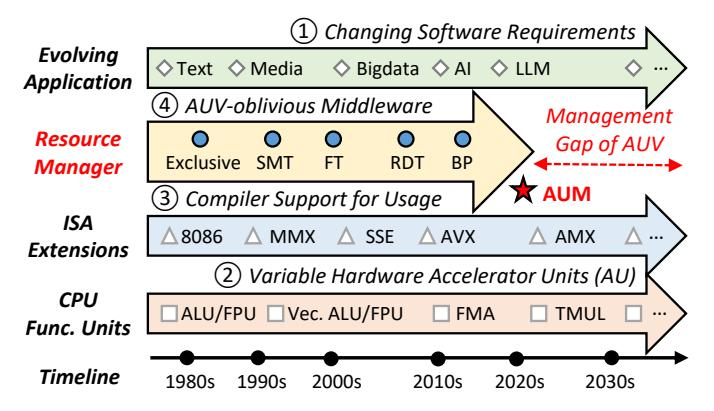

Fig. 1: The management gap between evolving AU and AU variations (AUV)-oblivious resource managers.

designed to accelerate key operations, such as Intel AMX[1](#page-0-0) [\[59\]](#page-13-7) and RISC-V M-extension [\[2\]](#page-12-3) for heavy matrix multiplications in LLM serving [\[37\]](#page-13-8). Enabled by dedicated Instruction Set Architecture (ISA) extensions for every emerging AU [\[24\]](#page-12-4), [\[70\]](#page-13-9), software applications can easily harness AU capabilities to achieve significant performance gains, as shown in Figure [1.](#page-0-1) However, CPU execution becomes more heterogeneous due to newly-designed AU alongside conventional functional units, such as integer ALU and vector units [\[70\]](#page-13-9). To sidestep management complexities and guarantee AU application performance, current industry practice is to utilize AU-enabled CPU exclusively [\[41\]](#page-13-10), [\[80\]](#page-14-1) (i.e., allocating the whole processor to AU applications without sharing), leading to severe resource waste and poor platform efficiency.

Given the inefficiency of exclusive allocation, sharing AUenabled CPU is essential for maximizing platform efficiency, but effective sharing is non-trivial due to variable behaviors of AU at three abstraction layers, which we term Accelerator Unit Variations (AUV). *Variation-1: Variable Usage Pattern.* Software-layer AU utilization is highly dynamic in different applications and operators. For instance, two LLM serving phases (i.e., prefill and decode [\[102\]](#page-14-2)) have distinct AU usages due to different matrix operation dimensions. *Variation-2: Compulsory Frequency Interference.* Variable AU usages

<span id="page-0-0"></span>1 In this paper, we use Intel Advanced Matrix Extension (AMX) for matrix multiplication to represent one of the emerging accelerator units.

cause compulsory system-layer frequency reduction to respect thermal design power (TDP) limits. The dynamic frequency scaling creates unpredictable performance interferences and makes it difficult to guarantee sharing service-level objectives (SLO). *Variation-3: Dissimilar Resource Bound.* AU exhibits microarchitecture-layer resource affinities distinct from traditional functional units. The imbalanced processor frontend and backend resource bounds lead to underutilized hardware components in different cycles. The three-dimensional AUV are challenging for guaranteeing performance and maximizing efficiency in shared environments.

However, conventional resource managers fail to handle AUV for contradictory performance and efficiency objectives. To utilize the redundant resources, CPU platforms incorporate workload-aware mechanisms as shown in Figure 1, including Simultaneous Multi-Threading (SMT) variants, such as Frontend Throttling (FT) [14] and Backend Partition (BP) [50], and resource partitioning mechanisms, such as Intel Resource Director Technology (RDT) [11], [27]. We find that simply applying current AUV-oblivious resource sharing managers is unacceptable since they cannot make precise decisions for variable AU, causing 10-50% AU application performance and CPU efficiency degradations. Therefore, we envision a critical management gap between more variable AU and AUV-oblivious resource managers, failing to maximize AU capability and CPU efficiency.

To bridge this management gap, we propose AUM, a novel AU-aware resource Manager designed to handle AUV and maximize CPU efficiency in shared environments. More specifically, AUM offers higher manageability with two cooperative components, and every component has three stages for three-dimensional AUV. The *Background AU Profiler* synthesizes AUV offline from usage patterns, frequency reductions, and resource bounds to obtain the discrete *AUV Model*. Guided by this model and runtime information, the *Runtime AU Controller* decides the optimal AU configurations online, including usage-aware performance slacks, frequency-aware processor divisions, and collision-aware resource allocations. Overall, AUM selects AU sharing configurations that maximize CPU efficiency and minimize AU performance slowdowns.

To evaluate AUM, we have implemented a prototype and evaluated it with various workloads on three production CPU platforms. Evaluation results show that AUM achieves better CPU performance-per-watt efficiency by up to 8.8% and 4.7% compared with state-of-the-art (SOTA) exclusive AU usages and AUV-oblivious sharing methods, respectively. Meanwhile, it maintains high-performance AU applications by reducing SLO violations by up to 11%. AUM induces negligible management overheads and achieves better total cost of ownership, enabling more efficient general-purpose processor management for the AI era.

In summary, this paper makes the following contributions:

 Analysis: We envision the complex accelerator unit variations and characterize them from three abstraction layers. We show that both AU-exclusive usages and AUV-

<span id="page-1-0"></span>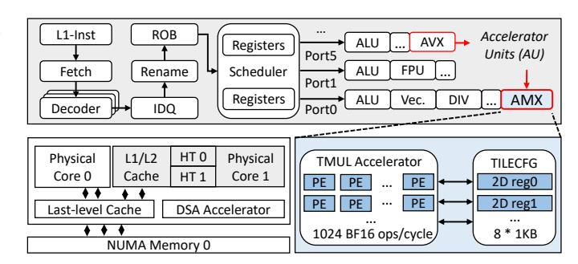

Fig. 2: The block diagram of modern CPU with accelerator units and the implementation of typical AMX.

oblivious sharing resource managers cannot achieve highperformance and efficient processors.

- Design: We introduce AUM, a novel AU-aware resource manager tailored for AU-enabled processors in shared environments. We design two cooperative components to pursue optimal efficiency-performance trade-offs.
- Evaluation: We implement and evaluate AUM thoroughly on production CPU platforms to prove its better performance-per-watt efficiency and performance guarantee compared to SOTA resource managers.

#### II. BACKGROUND

This section introduces current accelerator units and a prevailing AU-accelerated application, LLM serving.

## A. CPU Accelerator Units

To improve the performance of artificial intelligence (AI) applications on CPU platforms, hardware vendors have integrated specialized functional units into recent processors, such as Intel Advanced Matrix Extensions (AMX) [59], ARM Scalable Matrix Extensions (SME) [5], and RISC-V M-extension [2]. They follow the Single-Instruction-Multiple-Data (SIMD) paradigm to accelerate operations like matrix multiplication. Different from dedicated accelerators (e.g., Data Streaming Accelerator, DSA [40]) outside the CPU pipeline, these accelerator units (AU) on every physical core share the instruction flow, microarchitectural resources, and data access path with normal functional units [24]. The layout of modern processors containing Intel AMX and AVX units is shown in Figure 2, which are the targeted AU in this paper with relatively mature software support. Every AMX unit contains an array of eight 2-dimensional registers (TILECFG) with the size of 1KB and a matrix multiply accelerator (TMUL) that performs 1024 ops per cycle with BF16 precision [25]. The matrix multiplications via TMUL compute C[M][N]+=A[M][K]\*B[K][N] with  $M \le 16$  and  $N \le 64$ . AMX is introduced from SPR [59] with BF16 precision and the following generations add support for more data types like FP16 in GNR [28] and FP8 in DMR [31].

### B. AU-accelerated LLM Serving

Large language models (LLM) have shown impressive achievements and great potential in various creative tasks,

<span id="page-2-0"></span>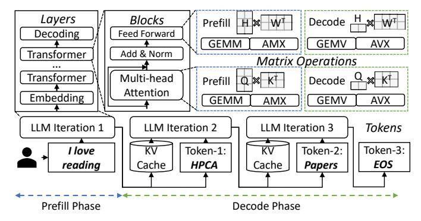

Fig. 3: LLM serving with AU-accelerated matrix operations.

leading the boom of the AI era [51], [62], [99]. Besides once-for-all heavyweight LLM training, optimizing the LLM serving (i.e., inference) efficiency is gaining more attention in both academia and industry [42], [60]. LLM serving contains two phases: (1) The prefill phase processes all tokens of the input prompt simultaneously to generate the first new token. (2) The decode phase uses the previously generated token as input to produce the following tokens one by one until an end-of-sequence (EOS) token is produced [37]. Two phases are relatively independent and have different characteristics [67], [102]. As shown in Figure 3, LLM iteration passes through repeated transformer layers composed of multiple blocks like multi-head attention to generate every subsequent token. The heavy blocks are composed of matrix operations of different sizes, depending on phases, batch sizes, and input lengths [36]. They can be accelerated by AU-enabled CPU [57] but the most efficient AU choices are changing with matrix dimensions [41]. Many LLM serving frameworks are exploring AU utilization to improve serving performance, such as Ktransformer [41] and xFasterTransformer [33].

#### <span id="page-2-1"></span>III. DEFICIENCY OF EXCLUSIVE AU UTILIZATION

AU acceleration of diverse workloads is promising, but current exclusive AU usages fall short compared with GPUs in efficiency, calling for shared deployment to fully unleash the efficiency potential of AU-enabled processors.

#### <span id="page-2-4"></span>A. Characterization Methodology

1) Hardware: In Sections III, IV, V, and VII, we evaluate three commercial off-the-shelf AU-enabled CPU platforms with different memory devices: Intel 4th Sapphire Rapids (SPR) [59] released in 2022, with DDR5 memory and High-Bandwidth Memory (HBM), as well as 6th Granite Rapids (GNR) [28] released in 2024 with Multiplexer Combined Ranks (MCR) memory. The hardware specifications are shown in Table I. The three platforms are equipped with AVX and AMX units in every physical core, and we calculate AU TFLOPS based on their base frequencies. The main difference among GenA, GenB, and GenC is memory configurations, and GenC further improves AU.

<span id="page-2-2"></span>TABLE I: Hardware specifications of evaluated CPUs.

| Platforms GenA             |                 | GenB            | GenC           |  |
|----------------------------|-----------------|-----------------|----------------|--|
| Generation                 | Sapphire Rapids | Sapphire Rapids | Granite Rapids |  |
| CPU                        | Xeon 8475B      | Xeon Max 9468   | Xeon 6982P-C   |  |
| # cores/sockets            | 48 / 2          | 48 / 2          | 120 / 1        |  |
| AU TFLOPS<br>(AVX-512/AMX) | 25.6/206.4      | 25.6/206.4      | 32/344         |  |
| Base Frequency             | 2.7 GHz         | 2.1 GHz         | 2.8 GHz        |  |
| L1-I / core                | 32 KB           | 32 KB           | 64 KB          |  |
| L1-D / core                | 48 KB           | 48 KB           | 48 KB          |  |
| L2 / core                  | 2 MB            | 2 MB            | 2 MB           |  |
| LLC / socket               | 97.5 MB         | 105 MB          | 504 MB         |  |
| Memory                     | DDR5 1TB        | HBM 128GB       | MCR 768GB      |  |
| Memory BW                  | 233.8 GB/s      | 588 GB/s        | 600 GB/s       |  |

<span id="page-2-3"></span>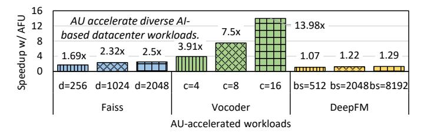

Fig. 4: AU acceleration of three types of AI workloads under different dimension (d), cores (c), and batch sizes (bs). All the results are normalized to AU-disabled GenC performance.

2) Software: To accelerate LLM serving with AU, we use Intel xFasterTransformer (xft) [21] framework with the latest Intel AMX support. We use xft to serve the open-sourced llama2-7b and llama2-13b [51] with BF16 precision and batch size of 16. To study the cascaded yet different serving phases, prefill and decode [67], [102], we mimic them in xft with varying output length. We use Linux perf [19], pmu-tools [38], and pgos [26] tools to characterize LLM and AU behaviors. Meanwhile, we select various metrics widely used in previous studies [56], [102]. The SLO of LLM serving are time-tofirst-token (TTFT) for the prefill phase, indicating the time to generate the first token, and time-per-output-token (TPOT) for the decode phase, indicating the average time taken to generate subsequent tokens. The performance of LLM serving is measured via tokens per second (Throughput), indicating the generated tokens with performance guarantees.

## B. Pros and Cons of Current AU Utilization

Despite LLM serving [57], AU has proven its strengths in diverse AI-based datacenter workloads as shown in Figure 4. Faiss vector search (Faiss) [53], speech vocoder (Vocoder) [23], and deepfm recommendation (DeepFM) [20] are greatly accelerated with AU capabilities under different parameters on the GenC platform. Admittedly, GPU-based datacenters are the main trend in the AI era. But CPU is still worth optimizing for two reasons. Firstly, GPU is inadequate for the booming demand of AI-enabled applications with up to 40% shortage [3], thus utilizing AU to accommodate selective AI workloads could free up the limited GPU for higher-priority workloads such as Azure and AWS [13], [32], [80] and improve cluster sustainability [44]. Secondly, even in a GPU-centric datacenter such as Alibaba Cloud, there are also

<span id="page-3-1"></span>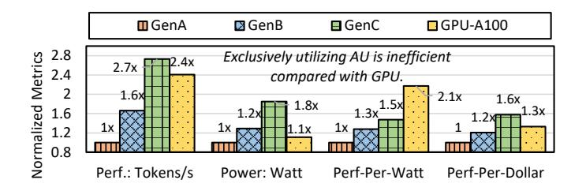

Fig. 5: Inferior performance and efficiency of exclusive AUenabled CPU compared with GPU solutions.

around 50% idle CPU cores with accelerator units that can be better utilized besides its cooperation with GPUs [95]. Current industrial providers concentrate on the AU application performance and allocate the whole CPU exclusively to avoid management complexity and hardware contention [41], [80].

Admittedly, exclusive AU usages without any sharing can maximize its performance, but it causes both low CPU efficiency and waste of redundant hardware resources. Given the enhanced AU on the CPU platform, the improved LLM serving performance is still insufficient compared with highend GPUs like Nvidia A100, as shown in Figure 5. We compare with a single-GPU server driven by FlexGen [57], [73] on performance, power, and cost of the processing units (1 CPU vs. 1 GPU). The absolute performance, power, and cost of GenA are 188 tokens/s, 270 Watt, and \$7200, respectively. We find that GPU is even more efficient considering the power consumption, with a 2.1x better performance-perwatt compared with GenA and 1.4x better than GenC. But the performance-per-cost of single-GPU servers is worse than that of the high-end CPU platforms. The performance gap would be bigger with model parallelism [74] while the power consumption would be significantly higher for multi-GPU servers and larger models (5kW vs. 500W), which are in line with prior efficiency studies [66], [78]. It shows that utilizing AU exclusively is not an efficient alternative to GPUs in large-scale datacenters. Moreover, exclusive AU usages cause a great waste of hardware resources. Applications with variable AU usages have distinct resource demands and leave redundant processor resources underutilized, which requires proper sharing methods to deploy more general applications and improve overall efficiency [11], [101].

Considering the performance pros and efficiency cons of exclusive AU utilization, sharing processors between AU and general workloads is both necessary and worthwhile for more cost-efficient AU-enabled processor management.

## <span id="page-3-0"></span>IV. UNDERSTANDING ACCELERATOR UNIT VARIATIONS

To better utilize and manage the emerging AU, we need to understand their behaviors and differences. This section systematically characterizes LLM serving with the modern AU, Intel AMX, and demonstrates the three-dimensional AUV that hinder the intuitive sharing management.

<span id="page-3-2"></span>TABLE II: Comparison of LLM of different architectures and sizes. BB is backend bound and DB is dram bound. Every value is denoted as percentages of Prefill / Decode phases.

| Model          | Size | Cycle Ratio | $\mu$ op Ratio | BB      | DB      |
|----------------|------|-------------|----------------|---------|---------|
| Phi-3 [83]     | 3.8B | 17.8 / 1.9  | 4.1 / 0.9      | 84 / 89 | 21 / 53 |
| Llama2 [51]    | 7B   | 14.4 / 1.5  | 3.7 / 0.5      | 92 / 96 | 24 / 59 |
| Llama3 [51]    | 8B   | 13.1 / 1.3  | 3.5 / 0.5      | 91 / 96 | 24 / 60 |
| Gemma2 [82]    | 9B   | 13.3 / 1.4  | 3.3 / 0.4      | 92 / 96 | 25 / 62 |
| Llama2 [51]    | 14B  | 10.9 / 1.2  | 2.5 / 0.4      | 94 / 97 | 29 / 68 |
| Qwen3-A3B [84] | 30B  | 18.2 / 2.3  | 4.5 / 1.1      | 82 / 90 | 21 / 51 |

#### <span id="page-3-3"></span>A. Variation-1: Variable Usage Pattern

Firstly, AU is used unequally in applications and operators, laying the foundation of AUV. We analyze the variable AU usage patterns to find the causes and proxies.

1) AU usage analysis in LLM serving: AU is variably utilized in current AI applications. We observe three practical metrics on CPU to characterize AU usage in applications [85]. Firstly, AMX cycle ratio, measured via tma amx busy metric, indicates the proportion of cycles during which AMX is busy with arithmetic operations. We find that AMX usage is varying: the compute-intensive prefill phase (14.4%) is higher than the memory-intensive decode phase (1.5%), and the high-bandwidth platforms (GenB and GenC) are higher. Secondly, AMX µop ratio, measured via tma\_fp\_amx divided by tma\_fp\_arith, shows the proportion of floating-point operations the AMX has finished. We find that FP operations of prefill are mostly finished by AMX (3.7% / 3.8%), but the decode phase uses AMX for FP operations less (0.5% / 1.5%). Thirdly, the avx\_insts metric of the decode phase is higher because the vector-size operations are more efficient using AVX rather than AMX [41], showing different AU choices for varying-size matrix multiplications.

2) Analysis of LLM Architecture: We analyze more LLM of different architectures and sizes: Phi-3-Mini-128K-Instruct of 3.8B size [83], Llama3 of 8B size [51], Gemma2 of 9B size [82], and Owen3-30B-A3B of 30B size and Mixture-of-Experts (MoE) architecture [84]. Also, larger models would be restricted by the CPU memory bandwidth greatly, such that they are more suitable for CPU-GPU hybrid deployment [36], [41]. We mainly study the AU usage patterns and key backend resource bounds of the six models as shown in Table II. We find that smaller models have higher AU usages and MoE architecture is suitable for AU deployment as well. The memory bound is more vital for larger models, but sparse expert activation of the MoE architecture can relieve the memory pressure. We choose the small-size models for the following experiments since they are suitable for CPU-only serving without GPU requirements [30], and larger LLMs behave similarly on AU usage patterns [57].

3) Analysis of AU usage variations: The AU usage differences mainly result from variable operator dimensions. The performance of GEMM operations achieves 40.57 TFLOPS in the prefill phase but 6.87 TFLOPS in the decode phase due to variations in matrix dimensions. Most GEMMs in the prefill phase are  $8192 \times 4096 \times 22016$ , where 8192 denotes

<span id="page-4-0"></span>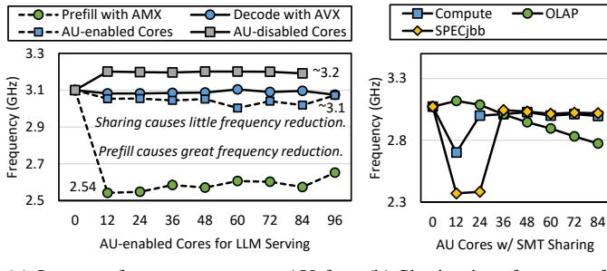

(a) Impact of usage pattern on AU frequency reduction. (b) Sharing interferences affect frequency reduction.

Fig. 6: Variable frequency reduction due to AU utilization.

batch size 16 times input sequence length 512. However, most GEMMs in the decode phase are  $16 \times 4096 \times 22016$  with the performance of 3.87 TFLOPS, where 16 denotes batch size for one output token. Meanwhile, although the request arrival rates for user-facing LLM serving are inherently variable, we find that it affects the AU usage pattern via batch size variations since current LLM serving frameworks always adopt continuous batching techniques [33], [42]. AU usage patterns are stable under certain model, phase, and batch size. Therefore, we choose to profile the variation of different batch sizes to reduce the overhead of profiling varying request arrival rates, and we adaptively tune the configurations at runtime based on SLO and performance slack of different requests, similar to prior works have done [11], [102].

Findings #1: Variable AU usages in applications initialize AUV and requires usage-aware management.

#### <span id="page-4-2"></span>B. Variation-2: Compulsory Frequency Interference

Secondly, variable AU usages incur compulsory frequency reduction, excavating AUV. We analyze the frequency variations and interferences on shared cores.

- 1) Compulsory frequency reduction: Due to the thermal design power limit, physical cores enabling more power-hungry AU trigger automatic frequency reduction, which changes with AU usage. We use the turbostat [45] tool to record the core frequency of GenA with all-core turbo frequency of 3.2 GHz. Figure 6a presents the impact of AU usages on frequency reduction and varies the number of AU cores with (square) and without (circle) power stressors on the remaining physical cores. We have two observations: (1) The prefill phase with more AMX usages causes greater frequency reduction to 2.5 GHz, which is influenced little by the number of AU cores (green circles). The decode phase with more AVX usages reduces frequency slightly to 3.1 GHz (blue circles). (2) The remaining AU-disabled cores experience no cascaded frequency reduction (gray squares). However, the frequency reduction of AU cores running the decode phase is more severe when co-running power stressors (blue squares).
- 2) Complex frequency interference: We find that AU-induced frequency reduction is further affected by sharing interferences, leading to variable cascaded performance degradation. We use all cores for the decode phase and share

<span id="page-4-1"></span>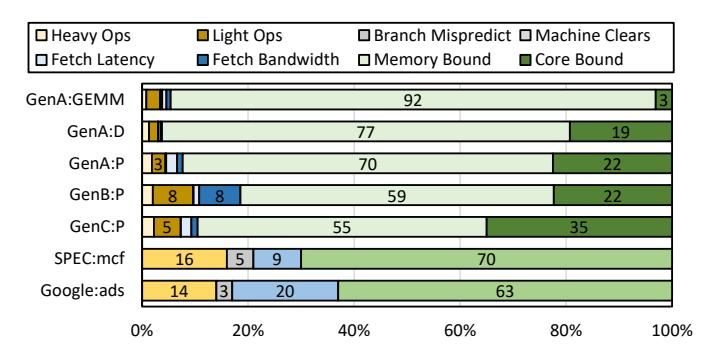

Fig. 7: Comparison of cycle distributions with variable AU usages on evolving platforms. The yellow, gray, blue, and green categories are retiring, bad speculation, frontend bound, and backend bound, respectively.

different numbers of cores with three types of applications: *Compute/OLAP/OLTP* (detailed in Section V-A). Figure 6b presents the average frequency of the shared cores, showing that with increasing sharing pressure, relatively low AU usages in the decode phase also induce more severe and variable frequency reduction. Moreover, the abrupt frequency drops on limited cores (12-24) may be caused by heat accumulation on compute-intensive shared cores, and we observe similar drops in repeated experiments with other applications, which excavates the complexity of frequency interference.

Findings #2: Usage-based frequency reduction worsens AUV, and unstable frequency interference adds difficulties to maximizing the efficiency of AU-enabled processors.

#### <span id="page-4-3"></span>C. Variation-3: Dissimilar Resource Bound

Thirdly, AU presents microarchitectural resource demand different from traditional functional units, changing with variable AU usages. We adopt the top-down methodology [97] to analyze AU resource bounds and further deep dive into key backend bottlenecks.

- 1) Frontend resources are oversupplied.: Frontend resources are responsible for providing  $\mu$ ops for AU execution, and frontend bound means execution stalls at the L1 instruction cache, fetch unit, and decoder components. As shown in Figure 7, we compare applications with variable AU usages with traditional non-AU applications, mcf benchmark from SPECCPU [8], and ads services from Google [35]. Based on CPU cycle distributions, we mainly have three observations: (1) AU frontend bound is significantly less than the general functional units. AU follows the SIMD paradigm with a smaller instruction working set and fewer i-cache misses, leading to lower fetch latency than before [35]  $(5\% \rightarrow 1\%)$ . (2) Increasing AU usages cause similar frontend bound by comparing pure matrix multiplication (GEMM), prefill, and decode on the GenA platform. (3) Higher bandwidth platforms cause greater frontend bound.
- 2) Backend resources are overloaded.: Backend resources are responsible for providing data for AU execution, and backend bound means execution stalls at the execution ports (core bound) and memory access path (memory bound). Despite

<span id="page-5-2"></span>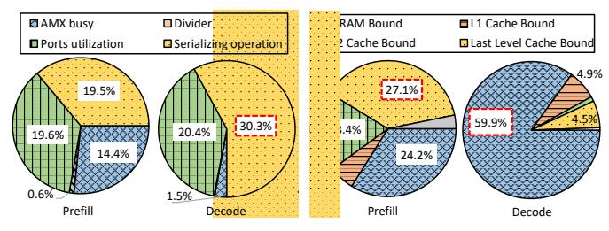

- (a) Core bound breakdown.
- (b) Memory bound breakdown.

Fig. 8: Decomposed AU demands on backend resources.

abundant frontend resources for AU, backend resources are under strain and restrict AU performance, as shown in Figure 7. To investigate the overload causes, we further decompose the backend resource in Figure 8.

Figure 8a breaks down the core bound. We find that the instruction window resources [50] (e.g., reorder buffer) are critical for AU execution due to high serializing operations to guarantee instruction sequences. Meanwhile, the decode phase has higher demands on the instruction window resources with higher serializing ratios. As for more severe memory bound, we break down the memory path (L1 cache, L2 cache, LLC, DRAM) in Figure 8b. We find that for the decode phase, DRAM access has the highest influence, specifically on memory bandwidth rather than memory access latency. For the prefill phase, the memory access path across the cache hierarchy and memory affects AU performance similarly.

**Findings #3:** AU microarchitectural resource bounds are variable and dissimilar from before, complicating AUV and optimal resource sharing decisions.

## V. DEFICIENCY OF AUV-OBLIVIOUS SHARING

<span id="page-5-0"></span>The complex three-dimensional AUV pose new challenges to conventional sharing management. AUV-oblivious sharing based on simultaneous multi-threading (SMT) and resource partitioning (RP) fails to optimize AU-enabled processors for contradictory performance and efficiency goals.

#### <span id="page-5-1"></span>A. Real-world Sharing Scenarios with AU

Workload sharing is a common practice in datacenters to utilize redundant resources and improve overall efficiency [48], [49], [90]. Regarding AU processors, sharing is between AIbased applications with AU and general applications without AU, where AU is not shared for hyperthreads, since AU resources are limited for physical cores. As for sharing priority, LLM serving is considered latency-critical (LC) in this paper and we share it with other best-effort (BE) applications for two reasons. Firstly, LLM applications are mostly user-facing scenarios, leading to its high sensitivity on SLO guarantee. Secondly, it is rare to co-locate many LC workloads in realistic datacenters for better performance guarantee. We select three representative BE applications based on real-world parameters: (1) Memory-intensive online analytical processing (OLAP) uses TPC-H [86] to replay joint queries, evaluated by query throughput. (2) Compute-intensive prime number

<span id="page-5-3"></span>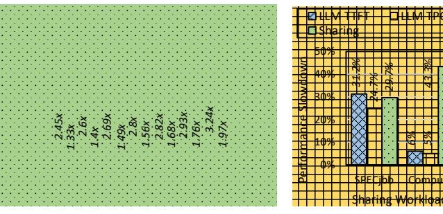

- (a) Impact of sharing pressures on AU and shared applications.
- (b) Impact of shared application types.

Fig. 9: Variable SMT impact on AU sharing performance.

<span id="page-5-4"></span>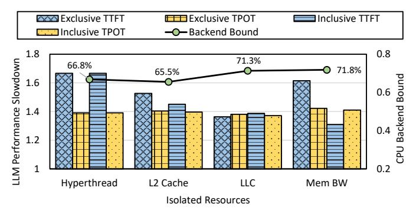

Fig. 10: AUV-oblivious resource sharing impact on AU performance. Exclusive means partitioning the single resource. Inclusive means partitioning all resources on the left.

division (*Compute*) uses sysbench [39] to perform repeated computations, evaluated by event throughput. (3) Complicated Java server (*SPECjbb*) uses SPECjbb 2015 benchmark [75] to perform parallel transactions, evaluated by transaction throughput. The sharing selections are determined before the execution for different AU usage scenarios.

## B. Deficiency of Conventional SMT Sharing

SMT-based sharing methods treat AU applications statically and cause variable performance degradations. Conventional SMT uses redundant processor resources to execute multiple threads on one processor core [101], failing to capture dynamic AU usages and interferences as shown in Figure 9. Figure 9a shows that AU performance degrades by more than 200\% while the co-running OLAP is affected by more than 40%, resulting from severe memory contentions. WE find that the interferences are unstable with variable AU usages but stable with increased sharing pressures. Figure 9b shows that compute-intensive shared application causes less than 10% AU interference, but sharing *Compute* experiences 40% degradation due to compulsory frequency reduction. Therefore, AUVoblivious SMT sharing cannot properly control the variable AU behaviors and performance. Moreover, while SMT sharing is known to create contention-based security vulnerabilities for co-running user threads [17], researchers have proposed effective mitigation and isolation techniques without much

<span id="page-6-0"></span>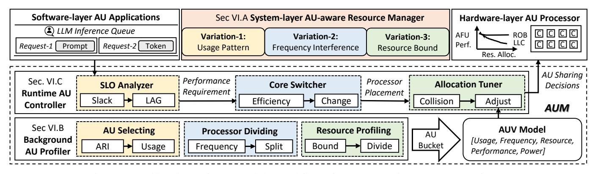

Fig. 11: Considerations of AUV and the workflow of two cooperative components of AUM.

loss of SMT performance [\[81\]](#page-14-17), which lead to the widespread deployment of SMT sharing in production datacenters like ours in this paper.

## *C. Deficiency of Application-aware Resource Partitioning*

More advanced RP methods with application awareness cannot handle AUV and achieve optimal efficiency. RP controls shared resources via identifying application interference and allocating key resources (e.g., multi-level caches, memory bandwidth) separately [\[47\]](#page-13-25). We isolate three key backend resources between AU-accelerated LLM serving and SPECjbb to observe their exclusive and inclusive effects. As shown in Figure [10,](#page-5-4) we partition the L2 cache, LLC, and memory bandwidth based on software preferences [\[11\]](#page-12-6) and normalize LLM serving performance to that under exclusive settings. We find that isolating backend resources separately can slightly relieve AU slowdown, but fails to achieve the optimal decision. Moreover, the critical backend bound is relieved differently by isolating various resources. Therefore, AUV-oblivious resource sharing cannot fully unleash the efficiency potential.

# VI. DESIGN OF AUM

This section describes the design considerations and technical details of AUM. It aims to precisely handle the threedimensional accelerator unit variations and fully unleash the efficiency potential of shared processors.

## *A. Design Considerations and Overview*

Given the deficiency of intuitive sharing managers, cooptimizing the performance and efficiency of AU-enabled CPU must consider the three-dimensional AUV:

- 1) *Variation-1: Usage Pattern.* AU usages are variable in different applications and operators, leading to execution performance variations. We need to select efficient AU usages with lightweight indicators and analyze real-time requirements for the following management.
- 2) *Variation-2: Frequency Interference.* Variable AU usages lead to dynamic frequency reductions, causing cascaded performance fluctuations. We need to divide the processor into regions to avoid frequency interference and adjust the regions to satisfy runtime requirements.

3) *Variation-3: Resource Bound.* Applications in different processor regions exhibit variable resource bounds, experiencing performance fluctuations. We need to study a unified model to guide resource tuning online to precisely harvest resources for optimal CPU efficiency.

To handle the complex AUV, we propose AUM, a novel AU-aware resource manager designed to maximize processor efficiency in shared environments. As shown in Figure [11,](#page-6-0) it focuses on system-layer management to harvest AU unexploited resources for shared applications precisely and flexibly. AUM contains two cooperative components to handle the threedimensional AUV offline and online. The *Background AU Profiler* characterizes and summarizes AUV into an offline reference model to guide the *Runtime AU Controller* for precise resource allocation with consideration of runtime status.

## *B. Background AU Profiler*

To portray the complex AUV, AUM selects three key variation indicators based on the analysis above. Firstly, it judges application AU usage via arithmetic intensity (ARI) to categorize operators. Secondly, it divides the processor into regions with different AU usages to assess frequency reductions. Thirdly, it considers specific AU resource bounds via profiling minimal demands. Overall, the three-dimensional information is summarized into the *AUV Model*.

- *1) Usage-aware AU Selecting:* To capture the variable AU usage in different applications, we use ARI to determine the proper AU for different operators. Based on previous analysis [\[36\]](#page-13-6), [\[37\]](#page-13-8), we can calculate the ARI of underlying operations of AU applications, such as QKV mapping with 6(1/d + 3/BL) −1 in the prefill phase and 6(1/d + 3/B) −1 in the decode phase. With larger model dimension d, batch size B, and input length L, operations with higher ARI have higher AU usages, denoted as UAU . UAU captures the variable AU usages analyzed in Section [IV-A.](#page-3-3)
- *2) Frequency-aware Processor Dividing:* To properly manage the frequency interference, *AU-Man* recognizes the compulsory frequency reduction due to variable AU usage and divides the processor cores into three regions based on Section [IV-B.](#page-4-2) (1) High-AU region C<sup>H</sup> with high AU usages and

<span id="page-7-0"></span>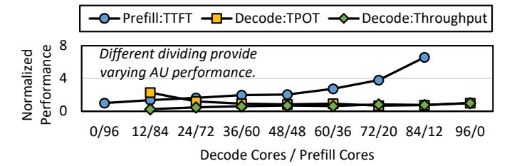

Fig. 12: AU applications vary with processor dividing. All the results are normalized to exclusive performance on all cores.

<span id="page-7-1"></span>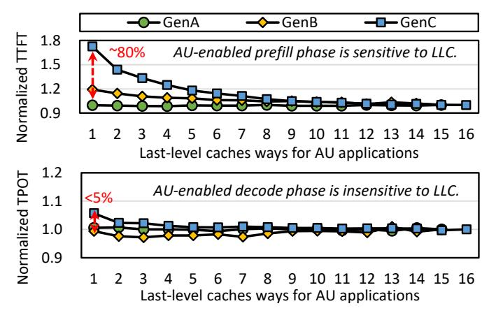

Fig. 13: AU application with different usages varies with last-level cache (LLC) resource allocation. All the results are normalized to performance with all LLC ways.

low frequency  $F_H$ , such as generating prefill tokens. (2) Low-AU region  $C_L$  with low AU usages and moderate frequency  $F_L$ , such as generating decode tokens. (3) None-AU region  $C_N$  with no AU usage and high frequency  $F_N$ , only for shared applications. The  $U_{AU}$  threshold is set based on server-level AU usage distributions. As shown in Figure 12, AU-Man records the AU performance and the frequency lower bounds under different region divisions. The frequency profiles are recorded as processor regions C and frequencies F with  $[C_H, F_H, C_L, F_L, C_N, F_N]$ .

3) Bound-aware Resource Profiling: To capture the distinct resource bounds and provide just the right resources for AU, we record changing resource affinities of variable AU usages based on Section IV-C. For L2-cache and LLC capacity, as well as memory bandwidth, we can profile its variation using resource partitioning interfaces [27], such as Cache Allocation Technology (CAT) for cache ways and Memory Bandwidth Allocation (MBA) for memory bandwidth. As shown in Figure 13, we find that for LLC resources, varying AU usages and underlying platforms induce diverse affinity, showing that we can harvest LLC resources for low-AU operators and high-AU operators on GenA. We can profile the minimal resource demands as a three-tuple  $R_{AU}$ .

Overall, the three-dimensional AU profiles are recorded into a *AUV Model* with consideration of AU application performance and processor power consumption, as shown in

<span id="page-7-2"></span>TABLE III: An example bucket in the AUV Model.

| $U_{AU}$ | $C_{AU}$ | $F_{AU}$ | $R_{L2C}$ | $R_{LLC}$ | $R_{BW}$ | $P^a$ | $P^t$ |
|----------|----------|----------|-----------|-----------|----------|-------|-------|
| High     | 0-11     | 2.1 GHz  | 0-2       | 0-1       | 50%      | 0.42  | 0.31  |
| Low      | 12-15    | 2.8 GHz  | 3-6       | 2-4       | 40%      | 9.12  | 7.19  |
| None     | 16-23    | 3.2 GHz  | 7-15      | 5-15      | 10%      | 13.28 | 9.16  |

Table III. For three frequency regions with variable AU usages, we allocate varying resources and record the performance of high AU application  $P_H$ , low AU application  $P_L$ , and shared application  $P_N$ . To reduce profiling costs, we design the AU Bucket mechanism to discretize the continuous variations. For high/low/none AU usages, we profile three processor divisions with five performance-sensitive resource configurations. For every bucket, we record the 50% average performance  $P^a$ , 90% tail performance  $P^t$ , and processor power consumption  $W_{CPU}$ . The variation profiles guide the runtime AU controller.

#### C. Runtime AU Controller

To perform AU-aware processor management, AUM jointly considers *AUV Model* and runtime information to make adaptive decisions as shown in Algorithm 1. Firstly, it analyzes AU performance to update requirements. Secondly, it selects sharing decisions with maximized processor efficiency. Thirdly, it adjusts unexploited resource harvesting considering AU interference. Overall, the processor resource is properly shared to guarantee AU performance and maximize overall efficiency.

1) Slack-aware SLO Analyzer: To determine the varying AU SLO, AUM computes performance slacks for different AU usages. Firstly, for prefill tokens with high AU usages, better performance improves user satisfaction, so we simply use first-come-first-served (FCFS) to schedule prompts [57]. The runtime SLO for prefill tokens  $SLO_H$  is set as  $d_{TTFT}-t_{wait}$ , where  $d_{TTFT}$  is the TTFT SLO and  $t_{wait}$  is the request waiting time. Secondly, for abundant decode tokens with low AU usages, we track the performance of tokens and adapt to varying request arrival rates at runtime with LAG analysis (a measurement of how far behind the token is compared to an ideal schedule that meets the performance requirements).

We quantify the relationship between the partial execution time at time t of serving request  $i(e_i)$  and its relative deadline, denoted as  $LAG_i$ , as shown in Algorithm 1-Line 3.  $T_i(t)$  is the tokens of request i that have completed by time t. For token  $token \in T_i(t), d_{TPOT}$  is set as the TPOT SLO, and  $e_{token}$  is the recorded execution time for token t, respectively.  $LAG_i$ reflects the real-time status of serving request i and quantifies how far ahead or behind the serving request is compared to the deadline at time t. If every LAG is 0, AU applications are allocated precise resources. The AU application is perfect if every LAG within it is 0, which means all tokens have exactly finished by their deadline so far and AU application does not need more resources. The runtime SLO for decode tokens  $SLO_L$  is set as  $d_{TPOT} + LAG_i$ . Since LAG indicates how far behind (LAG < 0) or ahead (LAG > 0) every AU-accelerated request is, the AU configurations need to be adjusted accordingly for faster and slower execution. AUM obtains the runtime performance requirements in this stage.

Algorithm 1: Workflow of the runtime AU controller.

```
Input: Reference AUV Model M
   Output: AU-aware Resource Sharing Decision
   // Slack-aware SLO analysis
1 SLO_H = d_{TTFT} - t_{wait};
2 SLO_L = d_{TPOT} + LAG_i;
3 LAG_i(token, T_i(t)) = \sum_{token \in T_i(t)} (d_{TPOT} - e_{token});
   // Efficiency-aware Core Switcher
4 E_{CPU} = (\alpha \times P_H + \beta \times P_L + \gamma \times P_N)/W_{CPU};
5 Maximize E_{CPU} s.t. P_H^t < SLO_H and P_L^t < d_{TPOT};
6 U/C/F \leftarrow M(P_H, P_L);
   // Collision-aware Allocation Tuner
7 Continuously monitor AU performance P^m;
8 if P_H^m < SLO_H and P_L^m < SLO_L then
     \delta_{AU} \leftarrow \sum U_{AU} \times SLO/P^m;
      R_{AU} \leftarrow M(P_H^a, P_L^a);
11 end
12 else
      \delta_{AU} \leftarrow \sum U_{AU} \times P^m/SLO;
    R_{AU} \leftarrow M(P_H^t, P_L^t);
15 end
16 if \delta_{AU} > threshold then
  \mid C/F \leftarrow M(\delta_{AU}, P_{AU}, C_{AU}, F_{AU})
18 end
```

- 2) Efficiency-aware Core Switcher: To optimize processor efficiency with varying SLO, we switch processor core configurations with consideration of weighted efficiency. The processor performance-per-watt efficiency  $E_{CPU}$  is computed as the weighted sum of application performance divided by CPU power consumption, as shown in Algorithm 1-Line 4. The prices of application outputs are used to normalize their performance in different regions as  $\alpha$ ,  $\beta$ , and  $\gamma$ . The shared applications are continuously running in the background and their pressures are proportional to the allocated cores  $C_N/F_N$ . For lower management complexity, AUM switches processor cores to different frequency regions to maximize the weighted efficiency and satisfy diverse SLO primarily, as shown in Algorithm 1-Lines 5, 6. The frequency of every region is set as the maximal level below the TDP. Admittedly, finegrained frequency control schemes [66], [77] could further improve processor efficiency via per-core or per-workload power capping. But it would significantly enlarge the optimization space, and our rule-based controller needs to integrate intelligent algorithms to make decisions [103], which leaves as our future work. The processor division and shared application are relatively stable for the resource allocation tuning. AUM decides the processor placement in this stage.
- 3) Collision-aware Allocation Tuner: To avoid dramatic AU performance degradation, AUM tunes resource allocation considering the collision between AU and shared applications. For every control iteration, AUM uses a continuous and lightweight indicator to detect AU application performance like token latency. If the measured AU performance  $P^m$

<span id="page-8-2"></span>TABLE IV: Evaluated AU usage scenarios with different prefill/decode SLOs and average input/output lengths.

| Apps | Dataset        | $d_{TTFT}$ | $d_{TPOT}$ | Input | Output |
|------|----------------|------------|------------|-------|--------|
| cb   | ShareGPT [64]  | 250 ms     | 100 ms     | 755   | 200    |
| сс   | HumanEval [10] | 75 ms      | 150 ms     | 171   | 98     |
| sm   | LongBench [6]  | 1.5 s      | 100 ms     | 1738  | 91     |

guarantees runtime SLO, we can aggressively harvest AU resources for shared applications, using average performance  $P_{AU}^a$  to tune resource allocations. Otherwise, we need to conservatively return resources to AU applications using tail performance  $P_{AU}^t$  to control. Given the varying AU resource affinities, hardware resource that causes minimal AU performance degradation are harvested first. The allocation tuner needs to be refined by considering SLO guarantee of corunning applications under the best-effort LLM serving scenarios. Moreover, we compute the deviation  $\delta_{AU}$  to denote the performance gap and higher AU usages result in greater deviations to be eliminated as shown in Algorithm 1-Lines 9, 13. If the deviation  $\delta_{AU}$  exceeds the threshold, tuning AU resources is not sufficient, and we need to switch the processor division as shown in Algorithm 1-Line 17.

#### VII. EVALUATION OF AU-MAN

<span id="page-8-0"></span>Our evaluation wants to answer three questions: **1.** How does AUM improve CPU overall efficiency? (Section VII-B) **2.** How does AUM guarantee AU application performance given varying requirements? (Section VII-C) **3.** How are the costs and revenues to deploy AUM on AU-enabled CPU? (Sections VII-D and VII-E)

## A. Evaluation Methodology

- 1) Implementations: We implement a prototype of AUM based on xFasterTransformer [21] with two components implemented in Python, acting as a system component. The background profiler records the essential information of newer models with repeated experiments on dedicated nodes. The runtime controller works as a system daemon to monitor the SLO and tune the allocation in production. For hyperparameters of AUM, we select the performance prices  $\alpha$  as 1.8 for high-AU prefill tokens and  $\beta$  as 0.2 for low-AU decode tokens. Different from GPU-based token prices [63], we decide the prices based on CPU time to produce a prefill and decode token.  $\gamma$  for none-AU Compute, OLAP, and SPECibb is set as 1e-3, 1e-6, and 3e-5, respectively. The prices are decided based on CPU time to produce one query on the evaluated platform. These parameters are decided empirically and we conduct a sensitivity experiment to evaluate AUM under different scenarios. We set the derivation  $\delta_{AU}$  threshold as 2 to denote performance collision.
- 2) Workloads: For hardware platforms, AUM experiments are mainly conducted on the SPR platform (GenA) as shown in Table I if not otherwise specified. For evaluated workloads, the evaluated AU applications are LLM serving of llama models [51] similar to Section III-A, and the co-running applications are Compute [39], OLAP [86], and SPECjbb [75]

<span id="page-9-2"></span>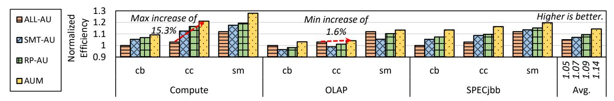

Fig. 14: Comparison of CPU performance-per-watt efficiency with variable AU application scenarios and sharing selections. All the results are normalized to ALL-AU under chatbot scenario. AUM outperforms SOTA sharing baselines by 4.7%.

<span id="page-9-1"></span>TABLE V: Three categories of evaluated baselines.

| Category             | Scheme | Description                       |
|----------------------|--------|-----------------------------------|
| AU-exclusive         | ALL-AU | Utilizing AU CPU without sharing  |
| AUV-oblivious        | SMT-AU | SMT sharing AU CPU                |
| Sharing              | RP-AU  | Partition resources of AU CPU     |
| AU-aware             | AU-UP  | Sharing w/ usage pattern          |
| Resource<br>Managers | AU-FI  | Sharing w/ frequency interference |
|                      | AU-RB  | Sharing w/ resource bound         |
| Managers             | AUM    | Our three-dimensional proposal    |

similar to Section V-A. We evaluate different AU applications use-cases [102] as shown in Table IV (1) ChatGPT-like chatbot (*cb*) [62]; (2) Cursor-like code completion (*cc*) [12]; (3) Summarization (*sm*) [43]. The benchmark selection is similar as previous works [102] and represents datacenter scenarios.

3) Baselines: To understand the performance of AUM, we compare it with three types of baselines as shown in Table V. Firstly, AU-exclusive adopts non-sharing settings and uses the whole AU-enabled processor for LLM serving. Secondly, AUV-oblivious Sharing adopts state-of-the-art resource managers for shared CPU platforms [11], [69]. More specifically, SMT-AU adopts SMT sharing [69] and RP-AU adopts workload-aware resource partitioning [11] for LLM serving and co-located workloads. Thirdly, AU-aware Resource Managers are variants of AUM to investigate the effect of three-dimensional AU awareness.

# <span id="page-9-0"></span>B. Improving CPU Efficiency

We first evaluate AUM in improving CPU efficiency, which is the primary design goal. We compare the performanceper-watt efficiency of the CPU platform when sharing AUaccelerated LLM serving with background co-running applications. As shown in Figure 14, AUM achieves the best efficiency on the CPU platform, resulting from precisely harvesting AU underutilized resources for shared applications. On average, AUM improves 8.8%, 6.7%, and 4.7% efficiency compared with AU-exclusive and AUV-oblivious sharing baselines. More specifically, we have two observations. Firstly, sharing AU needs to select co-running applications carefully. Sharing with memory-intensive applications like OLAP has marginal efficiency improvements under diverse scenarios even with precise allocation. Secondly, CPU achieves better efficiency under the code completion scenario with loose SLO requirements via AUV-aware management.

<span id="page-9-3"></span>

Fig. 15: Comparison of efficiency on three variable hardware platforms when sharing with SPECjbb. All the results are normalized to ALL-AU on GenA platform.

<span id="page-9-4"></span>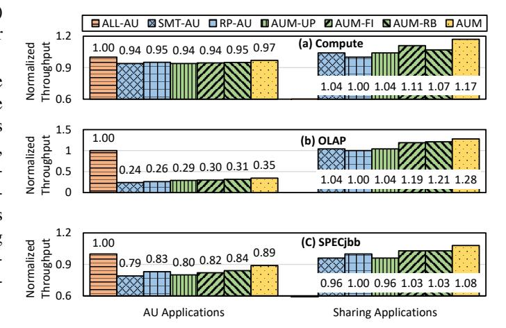

Fig. 16: Comparison of performance of AU and three types of shared applications, averaged of three scenarios. The performance results of AU and shared applications are normalized to ALL-AU and RP-AU, respectively.

Further, we investigate the efficiency on hardware platforms with evolving AU. We choose to share with SPECjbb since it presents complex execution and moderate sharing revenues. As shown in Figure 15, newer CPU platforms show better efficiency under various scenarios due to more powerful AU and memory devices, increasing 1.55x on average for exclusive AU usages. The shared AU usages with AUM have higher rates of efficiency increase (63%, 50%, and 56%) compared to AU-exclusive schemes. On the latest GenC platform, AUM increases efficiency by 19%, 11%, and 17% over AU-exclusive baselines. The higher increase rates over GenA result from more resources for tuning and harvesting.

<span id="page-10-3"></span>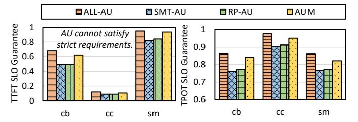

Fig. 17: Comparison of AU application SLO guarantee when sharing with SPECjbb. Left shows the high-AU prefill phase and right shows the low-AU decode phase. AUM shows better performance guarantee than SOTA sharing baselines.

To understand the detailed performance decomposition of AUM on AU and shared applications, we investigate the decomposed performance as shown in Figure 16. The AU-exclusive scheme achieves the best LLM serving performance but zero sharing performance. The AUV-oblivious sharing schemes cause varying slowdowns. As for variants of AUM, AU-UP only optimizes manipulation of AU applications rather than sharing; AU-FI splits the processor to mostly improve sharing performance; and AU-RB enhances traditional resource partitioning for both co-runners.

#### <span id="page-10-0"></span>C. Guaranteeing AU Performance

We next evaluate AUM in guaranteeing AU performance SLOs under different scenarios. CPU efficiency improvements must guarantee the primary AU applications. As shown in Figure 17, AU-Man achieves better SLO guarantee compared with AUV-oblivious sharing methods. We have two observations. Firstly, AU-enabled CPU should be used as prompt machines under specific scenarios [67]. For cc with strict TTFT SLOs, even using AU exclusively for prefill cannot meet the SLO due to a lack of computing units. For sm with loose TTFT SLO, AUM achieves 93.6% SLO guarantee ratio, which is 11% better than AUV-oblivious schemes. Secondly, AUM achieves better SLO guarantees for low-AU decode performance. For the loose cc scenario, sharing CPU merely causes SLO violations. For the strict cb and sm scenarios, harvesting critical memory bandwidth causes SLO violations, but AUM achieves similar TPOT SLO performance with AU-exclusive schemes, which is 7% better than AUV-oblivious sharing methods.

## <span id="page-10-1"></span>D. Detailed Analysis of AUM

More specifically, we investigate AUM resource management decisions of two examples, LLC and memory bandwidth, as shown in Figure 18. Different from static AUV-oblivious sharing allocation that gives more resources to AU applications, AUM considers AUV and adopts more flexible resource allocation based on runtime information. It harvests more LLC resources from AU to shared applications, and harvests the high-affinity memory bandwidth adaptively. Better utilization of hardware resources contributes to improved CPU efficiency.

To evaluate the parameter sensitivity of AUM on efficiency improvements, we change the value of  $\alpha/\beta$  to mimic the

<span id="page-10-4"></span>

Fig. 18: Resource allocation Cumulative Distribution Function (CDF) under SPECjbb and chatbot scenario. AUM manages resources more flexibly for shared applications.

emerging situation where token prices are cheaper and cheaper. Under the default 1.8/0.2 setting, the efficiency with AUM outperforms 7.6% over the *SMT-AU* baseline when sharing *Compute* with cc. For a lower 0.9/0.1 setting, AUM exceeds 9.1% over *SMT-AU* since it allocates more resources to sharing applications with little sacrifice of AU applications for overall efficiency based on the weighted calculation.

The runtime overheads of AUM are critical for realistic deployment. The Background AU Profiler works offline, and it takes around 450 AU-enabled executions to converge and construct the AUV Model, including 3 division ×3 sharing  $\times 5$  configurations  $\times 10$  repetitions. Moreover, the overhead of a single profiling could optimize thousands of processor cores with the same model, thus amortizing the offline resource overheads. The Runtime AU Controller decides resource allocation with one CPU core in less than 1 ms to lookup table, which is negligible compared with 100 ms-scale token SLO. Meanwhile, AUM consumes around 15 MB to store AUV and runtime information, which is also negligible for 256 GB memory capacity. More specifically, for benchmarks with rapidly fluctuating resources like SPECibb, the runtime controller adapts to the resource collisions and decides the most efficient configurations for every iteration. The limitation of AUM is reliance on runtime controlling rather than online learning to continuously complement the AUV model.

#### <span id="page-10-2"></span>E. Total Cost of Ownership Analysis

Cost-effectiveness has become the top factors that drive next-generation system architecture. We briefly discuss the impact of AUM on the total cost of ownership (TCO), including the capital expenditure (CapEx) for hardware acquisition and the operating expenses (OpEx) for hardware execution. For CapEx, according to 1.3x perf-per-dollar of GPU in Figure 5 and 15% improvements with AUM in Figure 14, CPU with AUM achieves 88% performance-per-CapEx compared with GPU solutions. For OpEx, the maintenance and cooling costs are lower for CPU servers but there are more complex factors affecting the TCO [7], such as machine utilization and amortization. But our conclusion is that if we could unleash the full AU efficiency via AUM, the AU-enabled CPU could cede the limited GPUs to critical scenarios or even become a competitive alternative in the GPU-dominant AI era.

#### VIII. DISCUSSION

This section discusses four limitations of AUM and potential optimization directions.

Large-scale cluster scalability: Currently, AUM focuses on machine-level scheduling with better arrangement of all processor cores. However, the extracted AUV are easy to be exploited in scale-out clusters. For sharding workloads across multiple servers, we can analyze the AUV of every processor and adopt load balancing [\[48\]](#page-13-22) to maximize their efficiency separately. The proposed methodology of profilecontrol is applicable to all AU-enabled benchmarks besides LLM serving. It is promising and underway to integrate AUM into cluster-level scheduling for better cluster efficiency.

Adaptability to AU operators: In this paper, AUM focuses on the xFasterTransformer implementation of AU operators based on Intel oneDNN [\[29\]](#page-12-26). Current software developers are exploring AU deeply to support unstructured sparsity [\[1\]](#page-12-27) and memory tiling [\[41\]](#page-13-10). The different implementations and optimizations of AU operators further increase AUV. However, AUM could be manually optimized to high-performance AUenabled operators and adapt itself with the runtime controller.

Hardware topology adaptability: In this paper, AUM focuses on analyzing and sharing AMX-enabled CPU cores for better efficiency while it can be further enhanced under different hardware topologies. For different hardware sharing topologies, AUM can handle the trade-off between singlethreading and multi-threading cores under different scenarios based on adaptive processor efficiency calculation. For emerging AU topologies such as sharing SME among physical cores [\[4\]](#page-12-28), the current assumption that AU is not shared for hyperthreads, as stated in Section [V-A,](#page-5-1) falls short and AUM needs to refine its profiler with a new dimension of contentions on a single AU. For hybrid topologies where CPU AU interacts with dedicated accelerators like GPU and NPU, there are other concurrent works focusing on offloading orchestration and communication optimization, like LIA [\[36\]](#page-13-6) and ktransformer [\[9\]](#page-12-29). Therefore, hybrid topologies are beyond AUM in this paper and are our future works.

Challenges of **AUM** on other ISAs: The integration of AU into modern CPUs is a universal trend for different vendors besides Intel AVX/AMX [\[25\]](#page-12-9), such as ARM SVE/SME [\[5\]](#page-12-8), [\[76\]](#page-14-20) and RISC-V V/M-extension [\[2\]](#page-12-3), [\[71\]](#page-13-30). We focus on Intel in this paper due to its mature software support of its accelerator units [\[33\]](#page-12-12), [\[41\]](#page-13-10). AUM recognizes the unique AUV, and the three-dimensional designs are independent of underlying hardware component implementations, which can be easily applied to more heterogeneous ISA architectures.

# IX. RELATED WORK

Research on hardware asymmetry: Asymmetric hardware is widely studied for accelerating domain-specific tasks. There are three main asymmetries inside the CPU. (1) ISA asymmetry [\[87\]](#page-14-21) via design space exploration [\[88\]](#page-14-22). (2) Processor asymmetry that adopts big.LITTLE architecture [\[65\]](#page-13-31). (3) Unit asymmetry that considers specialized accelerator units within the CPU as AUM does. Prior to AMX usage [\[37\]](#page-13-8), AVX usage is studied and optimized via core specialization [\[16\]](#page-12-30). Meanwhile, many works focus on virtualizing dedicated accelerators outside the CPU cores for more flexible utilization, such as GPU [\[34\]](#page-12-31), [\[98\]](#page-14-23), NPU [\[96\]](#page-14-24), FPGA [\[15\]](#page-12-32), and video accelerators [\[58\]](#page-13-32). Their optimizations are orthogonal to the accelerator units within the CPU pipeline, which is the focus of AUM, but they can further enhance AUM to offer a better sharing infrastructure across CPU and other accelerators.

Research on AU-accelerated systems: LLM serving systems are gaining popularity in both academia and industry [\[42\]](#page-13-13), [\[67\]](#page-13-3), [\[102\]](#page-14-2). Researchers are exploring AU-based LLM serving from memory optimization [\[21\]](#page-12-2), [\[41\]](#page-13-10), [\[93\]](#page-14-25), sparsity [\[1\]](#page-12-27) and CPU-GPU computing [\[36\]](#page-13-6), [\[56\]](#page-13-17). Moreover, AU are exploited to accelerate diverse workloads such as scientific applications [\[22\]](#page-12-33). AUM builds upon these AU-centric optimization to pursue better overall processor efficiency in the shared environments.

Research on CPU sharing: CPU sharing is a common method to harvest spare resources and improve utilization in cloud data centers [\[46\]](#page-13-33), [\[101\]](#page-14-8). SMT sharing [\[49\]](#page-13-23), [\[50\]](#page-13-11) and workload-aware resource partitioning [\[11\]](#page-12-6), [\[92\]](#page-14-26) are discussed above. The intelligent sharing decision models, such as interference prediction [\[48\]](#page-13-22), can further enhance AUM. There are more general works on sharing execution units between cores [\[55\]](#page-13-34), [\[72\]](#page-14-27) but AUM focuses on more varying matrix accelerator unit management in the emerging AI era.

Research on resource harvesting: Resource harvesting denotes identifying and utilizing allocated but temporarily idle resources for higher utilization. These works operate at clusterlevel [\[89\]](#page-14-28), server-level [\[91\]](#page-14-29), [\[94\]](#page-14-30), cycle-level [\[49\]](#page-13-23), [\[79\]](#page-14-31), and device-level [\[68\]](#page-13-35). However, the idle resources in AU-enabled CPU result from its distinct resource demands and are hidden from utilization identifiers [\[18\]](#page-12-34).

# X. CONCLUSION

To meet the AI-driven software shift, CPUs are incorporating variable accelerator units. We show the deficiency of exclusive AU usages and the challenges of sharing AU usages, summarized into three-dimensional accelerator unit variations. Therefore, we propose AUM, a novel AU-aware resource manager designed to handle AU variations and maximize the efficiency of shared processors. Through extensive evaluations, AUM improves processor efficiency by up to 8.8% while maintaining high-performance AU application by reducing SLO violations by up to 11% compared with SOTA methods. AUM enables a more efficient and high-performance CPU infrastructure in the prevailing AI era.

# ACKNOWLEDGEMENTS

We sincerely thank all the anonymous reviewers for their valuable comments that helped us to improve the paper. This work is supported by the National Natural Science Foundation of China (No. U23A6007 and No. U24A20234) and an Alibaba Research Grant. The corresponding authors are Chao Li and Luping Wang.

#### REFERENCES

- <span id="page-12-27"></span>[1] A. F. AbouElhamayed, J. Dotzel, Y. Akhauri, C.-C. Chang, S. Gobriel, J. P. Munoz, V. S. Chua, N. Jain, and M. S. Abdelfattah, "Sparamx: ˜ Accelerating compressed llms token generation on amx-powered cpus," 2025. [Online]. Available:<https://arxiv.org/abs/2502.12444>
- <span id="page-12-3"></span>[2] S. I. C. D. E. D. U. o. C. B. Andrew waterman, Krste Asanovic, "The risc-v instruction set manual: Volume i," *Chapter 9. "M" Standard Extension for Integer Multiplication and Division, Version 2.0*, 2022. [Online]. Available: [https://lists.riscv.org/g/tech-unprivileged/](https://lists.riscv.org/g/tech-unprivileged/attachment/535/0/unpriv-isa-asciidoc.pdf) [attachment/535/0/unpriv-isa-asciidoc.pdf](https://lists.riscv.org/g/tech-unprivileged/attachment/535/0/unpriv-isa-asciidoc.pdf)
- <span id="page-12-17"></span>[3] M. Arik, "The concern around gpu shortages and how these could impact the ai revolution," 2023. [Online]. Available: [https://www.techuk.org/resource/the-concern-around-gpu](https://www.techuk.org/resource/the-concern-around-gpu-shortages-and-how-these-could-impact-the-ai-revolution.html)[shortages-and-how-these-could-impact-the-ai-revolution.html](https://www.techuk.org/resource/the-concern-around-gpu-shortages-and-how-these-could-impact-the-ai-revolution.html)
- <span id="page-12-28"></span>[4] ARM, "The c1-sme2 unit," 2025. [Online]. Available: [https:](https://developer.arm.com/documentation/107831/0102/The-C1-SME2--unit) [//developer.arm.com/documentation/107831/0102/The-C1-SME2--unit](https://developer.arm.com/documentation/107831/0102/The-C1-SME2--unit)
- <span id="page-12-8"></span>[5] ARM, "Sme and sme2," 2025. [Online]. Available: [https://developer.arm.com/documentation/109246/0101/SME-](https://developer.arm.com/documentation/109246/0101/SME-Overview/SME-and-SME2)[Overview/SME-and-SME2](https://developer.arm.com/documentation/109246/0101/SME-Overview/SME-and-SME2)
- <span id="page-12-23"></span>[6] Y. Bai, X. Lv, J. Zhang, H. Lyu, J. Tang, Z. Huang, Z. Du, X. Liu, A. Zeng, L. Hou, Y. Dong, J. Tang, and J. Li, "Longbench: A bilingual, multitask benchmark for long context understanding," 2024. [Online]. Available:<https://arxiv.org/abs/2308.14508>
- <span id="page-12-25"></span>[7] L. A. Barroso, U. Holzle, and P. Ranganathan, ¨ *The datacenter as a computer: Designing warehouse-scale machines*. Springer Nature, 2019.
- <span id="page-12-19"></span>[8] J. Bucek, K.-D. Lange, and J. v. Kistowski, "Spec cpu2017: Next-generation compute benchmark," in *Companion of the 2018 ACM/SPEC International Conference on Performance Engineering (ICPE)*. New York, NY, USA: Association for Computing Machinery, 2018, p. 41–42. [Online]. Available: [https://doi.org/10.1145/3185768.](https://doi.org/10.1145/3185768.3185771) [3185771](https://doi.org/10.1145/3185768.3185771)
- <span id="page-12-29"></span>[9] H. Chen, W. Xie, B. Zhang, J. Tang, J. Wang, J. Dong, S. Chen, Z. Yuan, C. Lin, C. Qiu, Y. Zhu, Q. Ou, J. Liao, X. Chen, Z. Ai, Y. Wu, and M. Zhang, "Ktransformers: Unleashing the full potential of cpu/gpu hybrid inference for moe models," in *Proceedings of the ACM SIGOPS 31st Symposium on Operating Systems Principles*, ser. SOSP '25. New York, NY, USA: Association for Computing Machinery, 2025, p. 1014–1029. [Online]. Available: <https://doi.org/10.1145/3731569.3764843>
- <span id="page-12-22"></span>[10] M. Chen, J. Tworek, H. Jun, Q. Yuan, H. P. de Oliveira Pinto, J. Kaplan, H. Edwards, Y. Burda, N. Joseph, G. Brockman, A. Ray, R. Puri, G. Krueger, M. Petrov, H. Khlaaf, G. Sastry, P. Mishkin, B. Chan, S. Gray, N. Ryder, M. Pavlov, A. Power, L. Kaiser, M. Bavarian, C. Winter, P. Tillet, F. P. Such, D. Cummings, M. Plappert, F. Chantzis, E. Barnes, A. Herbert-Voss, W. H. Guss, A. Nichol, A. Paino, N. Tezak, J. Tang, I. Babuschkin, S. Balaji, S. Jain, W. Saunders, C. Hesse, A. N. Carr, J. Leike, J. Achiam, V. Misra, E. Morikawa, A. Radford, M. Knight, M. Brundage, M. Murati, K. Mayer, P. Welinder, B. McGrew, D. Amodei, S. McCandlish, I. Sutskever, and W. Zaremba, "Evaluating large language models trained on code," 2021. [Online]. Available: <https://arxiv.org/abs/2107.03374>
- <span id="page-12-6"></span>[11] S. Chen, C. Delimitrou, and J. F. Mart´ınez, "Parties: Qosaware resource partitioning for multiple interactive services," in *Proceedings of the Twenty-Fourth International Conference on Architectural Support for Programming Languages and Operating Systems (ASPLOS)*, 2019, p. 107–120. [Online]. Available: [https:](https://doi.org/10.1145/3297858.3304005) [//doi.org/10.1145/3297858.3304005](https://doi.org/10.1145/3297858.3304005)
- <span id="page-12-24"></span>[12] Cursor, "The ai code editor," 2025. [Online]. Available: [https:](https://cursor.com/en) [//cursor.com/en](https://cursor.com/en)
- <span id="page-12-0"></span>[13] V. G. K. Dylan Souvage and A. Kumar, "How aws and intel make llms more accessible and cost-effective with deepseek," 2025. [Online]. Available:<https://lnkd.in/dhPCgcfU>
- <span id="page-12-5"></span>[14] S. Everman and L. Eeckhout, "A memory-level parallelism aware fetch policy for smt processors," in *Proceedings of the 2007 IEEE 13th International Symposium on High Performance Computer Architecture (HPCA)*, 2007, p. 240–249. [Online]. Available: [https:](https://doi.org/10.1109/HPCA.2007.346201) [//doi.org/10.1109/HPCA.2007.346201](https://doi.org/10.1109/HPCA.2007.346201)
- <span id="page-12-32"></span>[15] S. A. Fahmy, K. Vipin, and S. Shreejith, "Virtualized fpga accelerators for efficient cloud computing," in *2015 IEEE 7th International Conference on Cloud Computing Technology and Science (CloudCom)*, 2015, pp. 430–435.

- <span id="page-12-30"></span>[16] M. Gottschlag, P. Machauer, Y. Khalil, and F. Bellosa, "Fair scheduling for avx2 and avx-512 workloads," in *2021 USENIX Annual Technical Conference (USENIX ATC)*, 2021, pp. 745–758. [Online]. Available: <https://www.usenix.org/conference/atc21/presentation/gottschlag>
- <span id="page-12-21"></span>[17] B. Gras, K. Razavi, H. Bos, and C. Giuffrida, "Translation leak-aside buffer: Defeating cache side-channel protections with TLB attacks," in *27th USENIX Security Symposium (USENIX Security 18)*. Baltimore, MD: USENIX Association, Aug. 2018, pp. 955–972. [Online]. Available: [https://www.usenix.org/conference/](https://www.usenix.org/conference/usenixsecurity18/presentation/gras) [usenixsecurity18/presentation/gras](https://www.usenix.org/conference/usenixsecurity18/presentation/gras)
- <span id="page-12-34"></span>[18] B. Gregg, *Systems Performance: Enterprise and the Cloud*, 1st ed. USA: Prentice Hall Press, 2013. [Online]. Available: [https://dl.acm.](https://dl.acm.org/doi/10.5555/2568162) [org/doi/10.5555/2568162](https://dl.acm.org/doi/10.5555/2568162)
- <span id="page-12-13"></span>[19] B. Gregg, "perf examples," 2024. [Online]. Available: [https:](https://www.brendangregg.com/perf.html) [//www.brendangregg.com/perf.html](https://www.brendangregg.com/perf.html)
- <span id="page-12-16"></span>[20] H. Guo, R. Tang, Y. Ye, Z. Li, and X. He, "Deepfm: A factorizationmachine based neural network for ctr prediction," 2017. [Online]. Available:<https://arxiv.org/abs/1703.04247>
- <span id="page-12-2"></span>[21] P. He, S. Zhou, W. Huang, C. Li, D. Wang, B. Guo, C. Meng, S. Gui, W. Yu, and Y. Xie, "Inference performance optimization for large language models on cpus," 2024. [Online]. Available: <https://arxiv.org/abs/2407.07304>
- <span id="page-12-33"></span>[22] A. Heinecke, G. Henry, M. Hutchinson, and H. Pabst, "Libxsmm: accelerating small matrix multiplications by runtime code generation," in *Proceedings of the International Conference for High Performance Computing, Networking, Storage and Analysis (SC)*, 2016. [Online]. Available:<https://doi.org/10.1109/SC.2016.83>
- <span id="page-12-15"></span>[23] R. Huang, F. Chen, Y. Ren, J. Liu, C. Cui, and Z. Zhao, "Multisinger: Fast multi-singer singing voice vocoder with a large-scale corpus," in *Proceedings of the 29th ACM International Conference on Multimedia (MM)*, 2021, p. 3945–3954. [Online]. Available: <https://doi.org/10.1145/3474085.3475437>
- <span id="page-12-4"></span>[24] Intel, "Intel® 64 and ia-32 architectures software developer's manual," *Volume 1 (3A, 3B, 3C & 3D): Basic Architecture, Chapter 18: Programming With Intel® Advanced Matrix Extensions*, 2022. [Online]. Available: [https://www.intel.com/content/www/us/en/](https://www.intel.com/content/www/us/en/developer/articles/technical/intel-sdm.html) [developer/articles/technical/intel-sdm.html](https://www.intel.com/content/www/us/en/developer/articles/technical/intel-sdm.html)
- <span id="page-12-9"></span>[25] Intel, "Intel® architecture instruction set extensions and future features 64 and ia-32 architectures software developer's manual," *Chapter 3: Intel® AMX INSTRUCTION SET REFERENCE*, 2024. [Online]. Available: [https://cdrdv2-public.intel.com/843860/architecture](https://cdrdv2-public.intel.com/843860/architecture-instruction-set-extensions-programming-reference-dec-24.pdf)[instruction-set-extensions-programming-reference-dec-24.pdf](https://cdrdv2-public.intel.com/843860/architecture-instruction-set-extensions-programming-reference-dec-24.pdf)
- <span id="page-12-14"></span>[26] Intel, "Intel® rdt software package," 2024. [Online]. Available: <https://github.com/intel/intel-cmt-cat>
- <span id="page-12-7"></span>[27] Intel, "Intel® resource director technology framework," 2024. [Online]. Available: [https://www.intel.com/content/www/us/en/architecture-and](https://www.intel.com/content/www/us/en/architecture-and-technology/resource-director-technology.html)[technology/resource-director-technology.html](https://www.intel.com/content/www/us/en/architecture-and-technology/resource-director-technology.html)
- <span id="page-12-10"></span>[28] Intel, "Intel unveils future-generation xeon with robust performance and efficiency architectures," 2024. [Online]. Available: [https://newsroom.intel.com/artificial-intelligence/intel-unveils](https://newsroom.intel.com/artificial-intelligence/intel-unveils-future-generation-xeon#gs.ihuopp)[future-generation-xeon#gs.ihuopp](https://newsroom.intel.com/artificial-intelligence/intel-unveils-future-generation-xeon#gs.ihuopp)
- <span id="page-12-26"></span>[29] Intel, "oneapi deep neural network library (onednn)," 2024. [Online]. Available:<https://github.com/uxlfoundation/oneDNN>
- <span id="page-12-18"></span>[30] Intel, "Overview of accelerating ai inference and llm applications with cpus," 2025. [Online]. Available: [https://www.intel.cn/content/dam/](https://www.intel.cn/content/dam/www/central-libraries/cn/zh/documents/2024-09/24-cmf41-overview-of-accelerating-ai-inference-and-llm-applications-with-cpus.pdf) [www/central-libraries/cn/zh/documents/2024-09/24-cmf41-overview](https://www.intel.cn/content/dam/www/central-libraries/cn/zh/documents/2024-09/24-cmf41-overview-of-accelerating-ai-inference-and-llm-applications-with-cpus.pdf)[of-accelerating-ai-inference-and-llm-applications-with-cpus.pdf](https://www.intel.cn/content/dam/www/central-libraries/cn/zh/documents/2024-09/24-cmf41-overview-of-accelerating-ai-inference-and-llm-applications-with-cpus.pdf)
- <span id="page-12-11"></span>[31] Intel, "Support for next generation intel xeon scalable processors," 2025. [Online]. Available: [https://www.intel.com/content/www/us/en/](https://www.intel.com/content/www/us/en/developer/articles/technical/next-gen-performance-gcc-15.html) [developer/articles/technical/next-gen-performance-gcc-15.html](https://www.intel.com/content/www/us/en/developer/articles/technical/next-gen-performance-gcc-15.html)
- <span id="page-12-1"></span>[32] Intel, "Unlock your ai potential with a winning combination," 2025. [Online]. Available: [https://cdrdv2-public.intel.com/862506/azure-dv6](https://cdrdv2-public.intel.com/862506/azure-dv6-ai-benchmarks-business-brief-1.pdf) [ai-benchmarks-business-brief-1.pdf](https://cdrdv2-public.intel.com/862506/azure-dv6-ai-benchmarks-business-brief-1.pdf)
- <span id="page-12-12"></span>[33] Intel, "xfastertransformer," 2025. [Online]. Available: [https://github.](https://github.com/intel/xFasterTransformer) [com/intel/xFasterTransformer](https://github.com/intel/xFasterTransformer)
- <span id="page-12-31"></span>[34] N. Jing, L. Jiang, T. Zhang, C. Li, F. Fan, and X. Liang, "Energyefficient edram-based on-chip storage architecture for gpgpus," *IEEE Transactions on Computers*, vol. 65, no. 1, pp. 122–135, 2016.
- <span id="page-12-20"></span>[35] S. Kanev, J. P. Darago, K. Hazelwood, P. Ranganathan, T. Moseley, G.-Y. Wei, and D. Brooks, "Profiling a warehouse-scale computer," in *Proceedings of the 42nd Annual International Symposium on Computer Architecture (ISCA)*, 2015, p. 158–169. [Online]. Available: <https://doi.org/10.1145/2749469.2750392>

- <span id="page-13-6"></span>[36] H. Kim, N. Wang, Q. Xia, J. Huang, A. Yazdanbakhsh, and N. S. Kim, "Lia: A single-gpu llm inference acceleration with cooperative amx-enabled cpu-gpu computation and cxl offloading," in *Proceedings of the 52nd Annual International Symposium on Computer Architecture (ISCA'25)*, 2025, p. 544–558. [Online]. Available:<https://doi.org/10.1145/3695053.3731092>
- <span id="page-13-8"></span>[37] H. Kim, G. Ye, N. Wang, A. Yazdanbakhsh, and N. S. Kim, "Exploiting intel® advanced matrix extensions (amx) for large language model inference," *IEEE Computer Architecture Letters (CAL)*, 2024. [Online]. Available:<https://doi.org/10.1109/LCA.2024.3397747>
- <span id="page-13-16"></span>[38] A. Kleen, "Intel pmu profiling tools," 2024. [Online]. Available: <https://github.com/andikleen/pmu-tools>
- <span id="page-13-24"></span>[39] A. Kopytov, "sysbench," 2025. [Online]. Available: [https://github.com/](https://github.com/akopytov/sysbench) [akopytov/sysbench](https://github.com/akopytov/sysbench)
- <span id="page-13-12"></span>[40] R. Kuper, I. Jeong, Y. Yuan, R. Wang, N. Ranganathan, N. Rao, J. Hu, S. Kumar, P. Lantz, and N. S. Kim, "A quantitative analysis and guidelines of data streaming accelerator in modern intel xeon scalable processors," in *Proceedings of the 29th ACM International Conference on Architectural Support for Programming Languages and Operating Systems, Volume 2 (ASPLOS)*, 2024, p. 37–54. [Online]. Available:<https://doi.org/10.1145/3620665.3640401>
- <span id="page-13-10"></span>[41] kvcache ai, "Qwen 3 + ktransformers 0.3 (+amx) = ai workstation/pc," 2025. [Online]. Available: [https://github.com/kvcache-ai/ktransformers/blob/main/doc/en/](https://github.com/kvcache-ai/ktransformers/blob/main/doc/en/AMX.md#qwen-3--ktransformers-03-amx--ai-workstationpc) [AMX.md#qwen-3--ktransformers-03-amx--ai-workstationpc](https://github.com/kvcache-ai/ktransformers/blob/main/doc/en/AMX.md#qwen-3--ktransformers-03-amx--ai-workstationpc)
- <span id="page-13-13"></span>[42] W. Kwon, Z. Li, S. Zhuang, Y. Sheng, L. Zheng, C. H. Yu, J. Gonzalez, H. Zhang, and I. Stoica, "Efficient memory management for large language model serving with pagedattention," in *Proceedings of the 29th Symposium on Operating Systems Principles (SOSP)*, 2023, p. 611–626. [Online]. Available: [https:](https://doi.org/10.1145/3600006.3613165) [//doi.org/10.1145/3600006.3613165](https://doi.org/10.1145/3600006.3613165)
- <span id="page-13-28"></span>[43] LangChain, "Summarize text," 2025. [Online]. Available: [https:](https://python.langchain.com/docs/tutorials/summarization/) [//python.langchain.com/docs/tutorials/summarization/](https://python.langchain.com/docs/tutorials/summarization/)
- <span id="page-13-19"></span>[44] Y. Li, Z. Hu, E. Choukse, R. Fonseca, G. E. Suh, and U. Gupta, "Ecoserve: Designing carbon-aware ai inference systems," 2025. [Online]. Available:<https://arxiv.org/abs/2502.05043>
- <span id="page-13-21"></span>[45] Linux, "turbostat - report processor frequency and idle statistics," 2024. [Online]. Available:<https://www.linux.org/docs/man8/turbostat.html>
- <span id="page-13-33"></span>[46] Z. Liu, J. Leng, Z. Zhang, Q. Chen, C. Li, and M. Guo, "Veltair: towards high-performance multi-tenant deep learning services via adaptive compilation and scheduling," in *Proceedings of the 27th ACM International Conference on Architectural Support for Programming Languages and Operating Systems (ASPLOS)*, 2022, p. 388–401. [Online]. Available:<https://doi.org/10.1145/3503222.3507752>
- <span id="page-13-25"></span>[47] D. Lo, L. Cheng, R. Govindaraju, P. Ranganathan, and C. Kozyrakis, "Heracles: improving resource efficiency at scale," in *Proceedings of the 42nd Annual International Symposium on Computer Architecture (ISCA)*, 2015, p. 450–462. [Online]. Available: [https://doi.org/10.1145/](https://doi.org/10.1145/2749469.2749475) [2749469.2749475](https://doi.org/10.1145/2749469.2749475)
- <span id="page-13-22"></span>[48] C. Lu, H. Xu, K. Ye, G. Xu, L. Zhang, G. Yang, and C. Xu, "Understanding and optimizing workloads for unified resource management in large cloud platforms," in *Proceedings of the Eighteenth European Conference on Computer Systems (EuroSys)*, 2023, p. 416–432. [Online]. Available: [https://doi.org/10.](https://doi.org/10.1145/3552326.3587437) [1145/3552326.3587437](https://doi.org/10.1145/3552326.3587437)
- <span id="page-13-23"></span>[49] Z. Luo, S. Son, S. Ratnasamy, and S. Shenker, "Harvesting memorybound cpu stall cycles in software with msh," in *18th USENIX Symposium on Operating Systems Design and Implementation (OSDI)*, 2024, pp. 57–75. [Online]. Available: [https://www.usenix.org/](https://www.usenix.org/conference/osdi24/presentation/luo) [conference/osdi24/presentation/luo](https://www.usenix.org/conference/osdi24/presentation/luo)
- <span id="page-13-11"></span>[50] A. Margaritov, S. Gupta, R. Gonzalez-Alberquilla, and B. Grot, "Stretch: Balancing qos and throughput for colocated server workloads on smt cores," in *2019 IEEE International Symposium on High Performance Computer Architecture (HPCA)*. IEEE, 2019, pp. 15–27. [Online]. Available:<https://doi.org/10.1109/HPCA.2019.00024>
- <span id="page-13-1"></span>[51] Meta, "Introducing llama 3.2," 2024. [Online]. Available: [https:](https://www.llama.com/) [//www.llama.com/](https://www.llama.com/)
- <span id="page-13-5"></span>[52] Meta, "Our next-generation meta training and inference accelerator," 2024. [Online]. Available: [https://ai.meta.com/blog/next-generation](https://ai.meta.com/blog/next-generation-meta-training-inference-accelerator-AI-MTIA/)[meta-training-inference-accelerator-AI-MTIA/](https://ai.meta.com/blog/next-generation-meta-training-inference-accelerator-AI-MTIA/)
- <span id="page-13-18"></span>[53] Meta, "Faiss," 2025. [Online]. Available: [https://github.com/](https://github.com/facebookresearch/faiss) [facebookresearch/faiss](https://github.com/facebookresearch/faiss)

- <span id="page-13-2"></span>[54] Microsoft, "Introducing the new bing. the ai-powered assistant for your search." 2024. [Online]. Available: [https://www.microsoft.com/en](https://www.microsoft.com/en-us/edge/features/the-new-bing?form=MT00D8)[us/edge/features/the-new-bing?form=MT00D8](https://www.microsoft.com/en-us/edge/features/the-new-bing?form=MT00D8)
- <span id="page-13-34"></span>[55] S. Mittal and J. S. Vetter, "A survey of cpu-gpu heterogeneous computing techniques," *ACM Computing Surveys (CSUR)*, vol. 47, no. 4, pp. 1–35, 2015.
- <span id="page-13-17"></span>[56] S. Na, G. Jeong, B. H. Ahn, A. Jezghani, J. Young, C. J. Hughes, T. Krishna, and H. Kim, "Flexinfer: Flexible LLM inference with CPU computations," in *Eighth Conference on Machine Learning and Systems (MLSYS)*, 2025. [Online]. Available: <https://openreview.net/forum?id=sFNRNTduKO>
- <span id="page-13-15"></span>[57] S. Na, G. Jeong, B. H. Ahn, J. Young, T. Krishna, and H. Kim, "Understanding performance implications of llm inference on cpus," in *2024 IEEE International Symposium on Workload Characterization (IISWC)*. IEEE, 2024, pp. 169–180. [Online]. Available:<https://doi.org/10.1109/IISWC63097.2024.00024>
- <span id="page-13-32"></span>[58] N. C. Nachiappan, H. Zhang, J. Ryoo, N. Soundararajan, A. Sivasubramaniam, M. T. Kandemir, R. Iyer, and C. R. Das, "Vip: virtualizing ip chains on handheld platforms," in *Proceedings of the 42nd Annual International Symposium on Computer Architecture*, ser. ISCA '15. New York, NY, USA: Association for Computing Machinery, 2015, p. 655–667. [Online]. Available:<https://doi.org/10.1145/2749469.2750382>
- <span id="page-13-7"></span>[59] N. Nassif, A. O. Munch, C. L. Molnar, G. Pasdast, S. V. Lyer, Z. Yang, O. Mendoza, M. Huddart, S. Venkataraman, S. Kandula, R. Marom, A. M. Kern, B. Bowhill, D. R. Mulvihill, S. Nimmagadda, V. Kalidindi, J. Krause, M. M. Haq, R. Sharma, and K. Duda, "Sapphire rapids: The next-generation intel xeon scalable processor," in *2022 IEEE International Solid-State Circuits Conference (ISSCC)*, vol. 65, 2022, pp. 44–46. [Online]. Available: <https://doi.org/10.1109/ISSCC42614.2022.9731107>
- <span id="page-13-14"></span>[60] Nvidia, "Triton inference server," 2017. [Online]. Available: [https:](https://github.com/triton-inference-server/server) [//github.com/triton-inference-server/server](https://github.com/triton-inference-server/server)
- <span id="page-13-4"></span>[61] Nvidia, "Nvidia h100 tensor core gpu," 2024. [Online]. Available: <https://www.nvidia.com/en-us/data-center/h100/>
- <span id="page-13-0"></span>[62] OpenAI, "Gpt-4," 2024. [Online]. Available: [https://openai.com/index/](https://openai.com/index/gpt-4/) [gpt-4/](https://openai.com/index/gpt-4/)
- <span id="page-13-27"></span>[63] OpenAI, "Api pricing," 2025. [Online]. Available: [https://openai.com/](https://openai.com/api/pricing/) [api/pricing/](https://openai.com/api/pricing/)
- <span id="page-13-26"></span>[64] OpenAI, "Sharegpt," 2025. [Online]. Available:<https://sharegpt.com/>
- <span id="page-13-31"></span>[65] E. L. Padoin, L. L. Pilla, M. Castro, F. Z. Boito, P. O. Alexandre Navaux, and J.-F. Mehaut, "Performance/energy trade-off ´ in scientific computing: the case of arm big. little and intel sandy bridge," *IET Computers & Digital Techniques*, vol. 9, no. 1, pp. 27–35, 2015. [Online]. Available:<https://doi.org/10.1049/iet-cdt.2014.0074>
- <span id="page-13-20"></span>[66] P. Patel, E. Choukse, C. Zhang, I. n. Goiri, B. Warrier, N. Mahalingam, and R. Bianchini, "Characterizing power management opportunities for llms in the cloud," in *Proceedings of the 29th ACM International Conference on Architectural Support for Programming Languages and Operating Systems, Volume 3*, ser. ASPLOS '24. New York, NY, USA: Association for Computing Machinery, 2024, p. 207–222. [Online]. Available:<https://doi.org/10.1145/3620666.3651329>
- <span id="page-13-3"></span>[67] P. Patel, E. Choukse, C. Zhang, A. Shah, I. n. Goiri, S. Maleki, and R. Bianchini, "Splitwise: Efficient generative llm inference using phase splitting," in *Proceedings of the 51st Annual International Symposium on Computer Architecture (ISCA)*, 2025, p. 118–132. [Online]. Available:<https://doi.org/10.1109/ISCA59077.2024.00019>
- <span id="page-13-35"></span>[68] L. Peng, W. Wu, S. Yi, X. Chen, C. Wang, S. Liang, Z. Wang, N. Xiao, Q. Li, M. Zhang, and J. Zhang, "Xharvest: Rethinking high-performance and cost-efficient ssd architecture with cxl-driven harvesting," in *Proceedings of the 52nd Annual International Symposium on Computer Architecture (ISCA)*, 2025, p. 434–449. [Online]. Available:<https://doi.org/10.1145/3695053.3731028>
- <span id="page-13-29"></span>[69] A. Pi, X. Zhou, and C. Xu, "Holmes: Smt interference diagnosis and cpu scheduling for job co-location," in *Proceedings of the 31st International Symposium on High-Performance Parallel and Distributed Computing (HPDC)*, 2022, p. 110–121. [Online]. Available:<https://doi.org/10.1145/3502181.3531464>
- <span id="page-13-9"></span>[70] J. R. Reinders, "Intel® avx-512 instructions," 2017. [Online]. Available: [https://www.intel.com/content/www/us/en/developer/](https://www.intel.com/content/www/us/en/developer/articles/technical/intel-avx-512-instructions.html) [articles/technical/intel-avx-512-instructions.html](https://www.intel.com/content/www/us/en/developer/articles/technical/intel-avx-512-instructions.html)
- <span id="page-13-30"></span>[71] RISC-V, "riscv-v-spec," 2025. [Online]. Available: [https://github.com/](https://github.com/riscvarchive/riscv-v-spec) [riscvarchive/riscv-v-spec](https://github.com/riscvarchive/riscv-v-spec)

- <span id="page-14-27"></span>[72] R. Rodrigues, I. Koren, and S. Kundu, "Performance and power benefits of sharing execution units between a high performance core and a low power core," in *2014 27th International Conference on VLSI Design and 2014 13th International Conference on Embedded Systems*, 2014, pp. 204–209.
- <span id="page-14-5"></span>[73] Y. Sheng, L. Zheng, B. Yuan, Z. Li, M. Ryabinin, B. Chen, P. Liang, C. Re, I. Stoica, and C. Zhang, "Flexgen: high-throughput generative ´ inference of large language models with a single gpu," in *Proceedings of the 40th International Conference on Machine Learning*, ser. ICML'23, 2023.
- <span id="page-14-6"></span>[74] M. Shoeybi, M. Patwary, R. Puri, P. LeGresley, J. Casper, and B. Catanzaro, "Megatron-lm: Training multi-billion parameter language models using model parallelism," 2020. [Online]. Available: <https://arxiv.org/abs/1909.08053>
- <span id="page-14-16"></span>[75] SPEC, "Specjbb 2015," 2024. [Online]. Available: [https://www.spec.](https://www.spec.org/jbb2015/) [org/jbb2015/](https://www.spec.org/jbb2015/)
- <span id="page-14-20"></span>[76] N. Stephens, S. Biles, M. Boettcher, J. Eapen, M. Eyole, G. Gabrielli, M. Horsnell, G. Magklis, A. Martinez, N. Premillieu, A. Reid, A. Rico, and P. Walker, "The arm scalable vector extension," *IEEE Micro*, vol. 37, no. 2, p. 26–39, Mar. 2017. [Online]. Available: <https://doi.org/10.1109/MM.2017.35>
- <span id="page-14-18"></span>[77] J. Stojkovic, P. A. Misra, Goiri, S. Whitlock, E. Choukse, M. Das, C. Bansal, J. Lee, Z. Sun, H. Qiu, R. Zimmermann, S. Samal, B. Warrier, A. Raniwala, and R. Bianchini, "Smartoclock: Workloadand risk-aware overclocking in the cloud," in *2024 ACM/IEEE 51st Annual International Symposium on Computer Architecture (ISCA)*, 2024, pp. 437–451.
- <span id="page-14-7"></span>[78] J. Stojkovic, C. Zhang, I. n. Goiri, E. Choukse, H. Qiu, R. Fonseca, J. Torrellas, and R. Bianchini, *TAPAS: Thermal- and Power-Aware Scheduling for LLM Inference in Cloud Platforms*. New York, NY, USA: Association for Computing Machinery, 2025, p. 1266–1281. [Online]. Available:<https://doi.org/10.1145/3676641.3716025>
- <span id="page-14-31"></span>[79] L. Sun, C. Li, X. Hou, T. Huang, C. Xu, X. Wang, G. Bao, B. Sun, S. Rui, and M. Guo, "Jigsaw: Taming bev-centric perception on dual-soc for autonomous driving," in *2024 IEEE Real-Time Systems Symposium (RTSS)*, 2024, pp. 280–293.
- <span id="page-14-1"></span>[80] I. SYSTEMS, "Ieit systems launches cpu inference servers to accelerate enterprise ai adoption," 2025. [Online]. Available: [https://](https://www.linkedin.com/feed/update/urn:li:activity:7308400653385486336/) [www.linkedin.com/feed/update/urn:li:activity:7308400653385486336/](https://www.linkedin.com/feed/update/urn:li:activity:7308400653385486336/)
- <span id="page-14-17"></span>[81] M. Taram, X. Ren, A. Venkat, and D. Tullsen, "Secsmt: Securing smt processors against contention-based covert channels," in *31st USENIX Security Symposium (USENIX Security 22)*. Boston, MA: USENIX Association, Aug. 2022, pp. 3165–3182. [Online]. Available: [https:](https://www.usenix.org/conference/usenixsecurity22/presentation/taram) [//www.usenix.org/conference/usenixsecurity22/presentation/taram](https://www.usenix.org/conference/usenixsecurity22/presentation/taram)
- <span id="page-14-10"></span>[82] G. Team, "Gemma 2: Improving open language models at a practical size," 2024. [Online]. Available:<https://arxiv.org/abs/2408.00118>
- <span id="page-14-9"></span>[83] P.-. Team, "Phi-3 technical report: A highly capable language model locally on your phone," 2024. [Online]. Available: [https:](https://arxiv.org/abs/2404.14219) [//arxiv.org/abs/2404.14219](https://arxiv.org/abs/2404.14219)
- <span id="page-14-11"></span>[84] Q. Team, "Qwen3," April 2025. [Online]. Available: [https://qwenlm.](https://qwenlm.github.io/blog/qwen3/) [github.io/blog/qwen3/](https://qwenlm.github.io/blog/qwen3/)
- <span id="page-14-12"></span>[85] L. Torvalds, "Perf pmu events on sapphirerapids," 2023. [Online]. Available: [https://github.com/torvalds/linux/blob/master/](https://github.com/torvalds/linux/blob/master/tools/perf/pmu-events/arch/x86/sapphirerapids/spr-metrics.json) [tools/perf/pmu-events/arch/x86/sapphirerapids/spr-metrics.json](https://github.com/torvalds/linux/blob/master/tools/perf/pmu-events/arch/x86/sapphirerapids/spr-metrics.json)
- <span id="page-14-15"></span>[86] TPC, "Tpc-h version 2 and version 3," 2024. [Online]. Available: <https://www.tpc.org/tpch/>
- <span id="page-14-21"></span>[87] A. Venkat, H. Basavaraj, and D. M. Tullsen, "Composite-isa cores: Enabling multi-isa heterogeneity using a single isa," in *2019 IEEE International Symposium on High Performance Computer Architecture (HPCA)*. IEEE, 2019, pp. 42–55. [Online]. Available: <https://doi.org/10.1109/HPCA.2019.00026>
- <span id="page-14-22"></span>[88] A. Venkat and D. M. Tullsen, "Harnessing isa diversity: design of a heterogeneous-isa chip multiprocessor," in *Proceeding of the 41st Annual International Symposium on Computer Architecuture (ISCA)*, 2014, p. 121–132.
- <span id="page-14-28"></span>[89] X. Wang, H. He, Y. Li, C. Li, X. Hou, J. Wang, Q. Chen, J. Leng, M. Guo, and L. Wang, "Not all resources are visible: Exploiting fragmented shadow resources in shared-state scheduler architecture," in *Proceedings of the 2023 ACM Symposium on Cloud Computing (SoCC)*, 2023, p. 109–124. [Online]. Available: <https://doi.org/10.1145/3620678.3624650>
- <span id="page-14-14"></span>[90] X. Wang, X. Hou, C. Li, Y. Li, D. Liu, G. Xu, G. Yang, L. Zhang, Y. Wu, X. Yuan, Q. Chen, and M. Guo, "Exist: Enabling extremely efficient intra-service tracing observability in datacenters,"

- in *Proceedings of the 30th ACM International Conference on Architectural Support for Programming Languages and Operating Systems, Volume 2*, ser. ASPLOS '25. New York, NY, USA: Association for Computing Machinery, 2025, p. 355–372. [Online]. Available:<https://doi.org/10.1145/3676641.3716283>
- <span id="page-14-29"></span>[91] X. Wang, C. Li, L. Sun, Q. Lyu, X. Hou, J. Leng, and M. Guo, "Sheeo: Continuous energy efficiency optimization in autonomous embedded systems," in *2024 IEEE 42nd International Conference on Computer Design (ICCD)*, 2024, pp. 496–503.
- <span id="page-14-26"></span>[92] X. Wang, C. Li, L. Zhang, X. Hou, Q. Chen, and M. Guo, "Exploring efficient microservice level parallelism," in *2022 IEEE International Parallel and Distributed Processing Symposium (IPDPS)*, 2022, pp. 223–233.
- <span id="page-14-25"></span>[93] X. Wang, Y. Zhuansun, C. Li, J. Wang, X. Hou, L. Sun, L. Wang, and M. Guo, "Asymserve: Demystifying and optimizing llm serving efficiency on cpu acceleration units," in *Advanced Parallel Processing Technologies*, C. Li, X. Qian, D. Gizopoulos, and B. Grot, Eds. Singapore: Springer Nature Singapore, 2026, pp. 231–245.
- <span id="page-14-30"></span>[94] Y. Wang, K. Arya, M. Kogias, M. Vanga, A. Bhandari, N. J. Yadwadkar, S. Sen, S. Elnikety, C. Kozyrakis, and R. Bianchini, "Smartharvest: harvesting idle cpus safely and efficiently in the cloud," in *Proceedings of the Sixteenth European Conference on Computer Systems (EuroSys)*, 2021, p. 1–16. [Online]. Available: <https://doi.org/10.1145/3447786.3456225>
- <span id="page-14-4"></span>[95] Q. Weng, W. Xiao, Y. Yu, W. Wang, C. Wang, J. He, Y. Li, L. Zhang, W. Lin, and Y. Ding, "Mlaas in the wild: Workload analysis and scheduling in large-scale heterogeneous gpu clusters," in *19th USENIX Symposium on Networked Systems Design and Implementation (NSDI 22)*. Renton, WA: USENIX Association, Apr. 2022, pp. 945–960. [Online]. Available: [https://www.usenix.org/](https://www.usenix.org/conference/nsdi22/presentation/weng) [conference/nsdi22/presentation/weng](https://www.usenix.org/conference/nsdi22/presentation/weng)
- <span id="page-14-24"></span>[96] Y. Xue, Y. Liu, L. Nai, and J. Huang, "Hardware-assisted virtualization of neural processing units for cloud platforms," in *2024 57th IEEE/ACM International Symposium on Microarchitecture (MICRO)*, 2024, pp. 1–16.
- <span id="page-14-13"></span>[97] A. Yasin, "A top-down method for performance analysis and counters architecture," in *2014 IEEE International Symposium on Performance Analysis of Systems and Software (ISPASS)*. IEEE, 2014, pp. 35–44. [Online]. Available:<https://doi.org/10.1109/ISPASS.2014.6844459>
- <span id="page-14-23"></span>[98] H. Yu, A. M. Peters, A. Akshintala, and C. J. Rossbach, "Ava: Accelerated virtualization of accelerators," in *Proceedings of the Twenty-Fifth International Conference on Architectural Support for Programming Languages and Operating Systems*, ser. ASPLOS '20. New York, NY, USA: Association for Computing Machinery, 2020, p. 807–825. [Online]. Available: [https://doi.org/10.1145/3373376.](https://doi.org/10.1145/3373376.3378466) [3378466](https://doi.org/10.1145/3373376.3378466)
- <span id="page-14-3"></span>[99] L. Zhang, Y. Qian, X. Wang, M. Thakker, D. Wang, J. Yu, H. Wu, Y. Hu, J. Li, Y. Qian, and S. Zhao, "Covomix2: Advancing zero-shot dialogue generation with fully non-autoregressive flow matching," 2025. [Online]. Available:<https://arxiv.org/abs/2506.00885>
- <span id="page-14-0"></span>[100] L. Zhang, Y. Qian, L. Zhou, S. Liu, D. Wang, X. Wang, M. Yousefi, Y. Qian, J. Li, L. He, S. Zhao, and M. Zeng, "Covomix: advancing zeroshot speech generation for human-like multi-talker conversations," in *Proceedings of the 38th International Conference on Neural Information Processing Systems*, ser. NIPS '24. Red Hook, NY, USA: Curran Associates Inc., 2024.
- <span id="page-14-8"></span>[101] Y. Zhang, M. A. Laurenzano, J. Mars, and L. Tang, "Smite: Precise qos prediction on real-system smt processors to improve utilization in warehouse scale computers," in *2014 47th Annual IEEE/ACM International Symposium on Microarchitecture*. IEEE, 2014, pp. 406–418. [Online]. Available:<https://doi.org/10.1109/MICRO.2014.53>
- <span id="page-14-2"></span>[102] Y. Zhong, S. Liu, J. Chen, J. Hu, Y. Zhu, X. Liu, X. Jin, and H. Zhang, "Distserve: Disaggregating prefill and decoding for goodput-optimized large language model serving," in *18th USENIX Symposium on Operating Systems Design and Implementation (OSDI)*, 2024, pp. 193–210. [Online]. Available: [https://www.usenix.org/](https://www.usenix.org/conference/osdi24/presentation/zhong-yinmin) [conference/osdi24/presentation/zhong-yinmin](https://www.usenix.org/conference/osdi24/presentation/zhong-yinmin)
- <span id="page-14-19"></span>[103] L. Zhou, L. N. Bhuyan, and K. K. Ramakrishnan, "Gemini: Learning to manage cpu power for latency-critical search engines," in *2020 53rd Annual IEEE/ACM International Symposium on Microarchitecture (MICRO)*, 2020, pp. 637–349.