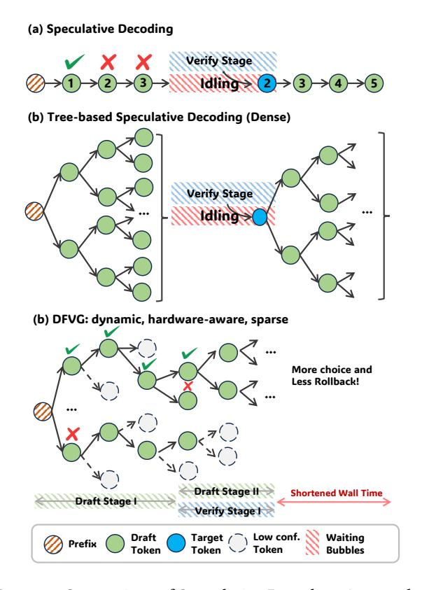
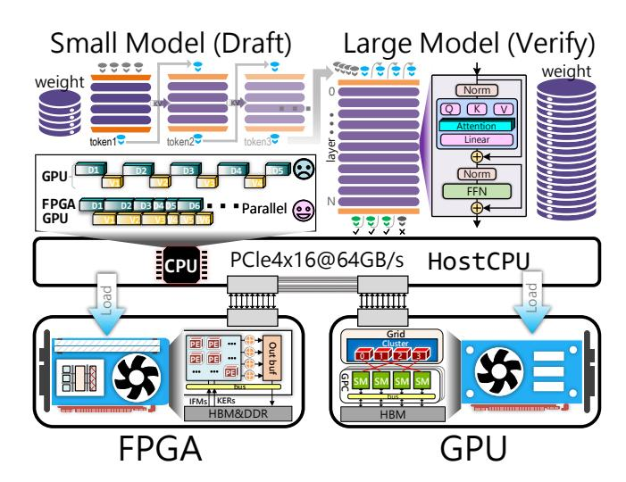
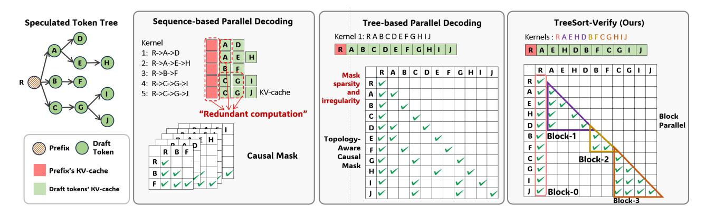
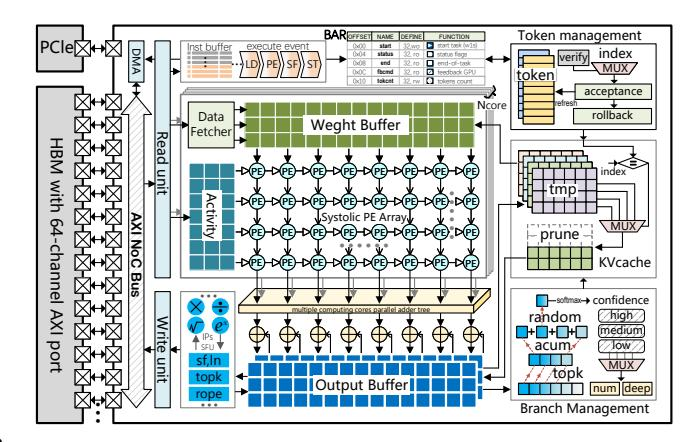
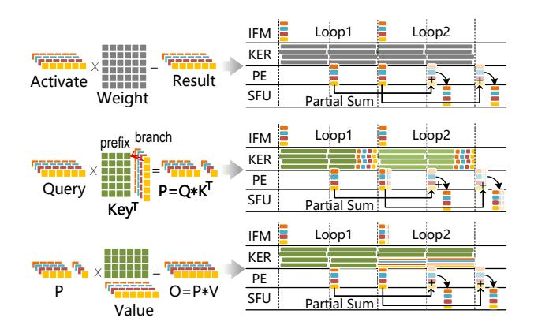
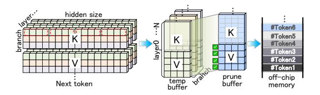
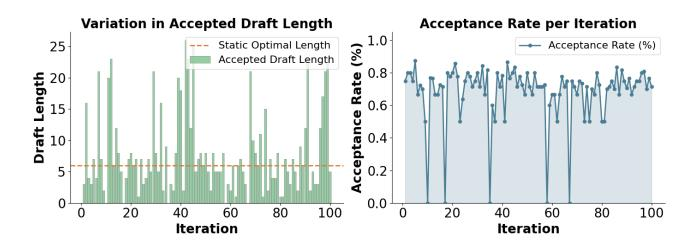
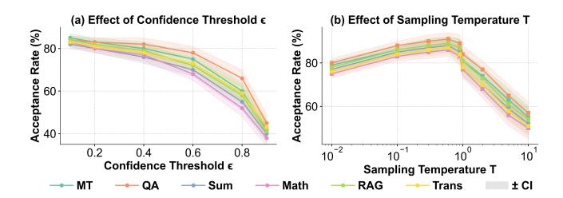
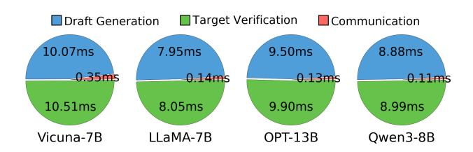
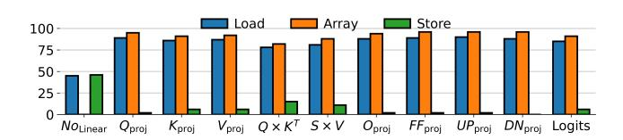

# DFVG: A Heterogeneous Architecture for Speculative Decoding with Draft-on-FPGA and Verify-on-GPU

# [Shaoqiang Lu](https://orcid.org/0009-0002-8624-8666)<sup>∗</sup>

Shanghai Jiao Tong University Shanghai, China Eastern Institute of Technology Ningbo, China lushaoqiang@sjtu.edu.cn

# [Dongge Qin](https://orcid.org/0009-0003-7679-0387)

Southest University Nanjin, China 230238441@seu.edu.cn

# [Qifan Wang](https://orcid.org/0009-0006-8390-5586)

Shanghai Jiao Tong University Shanghai, China Eastern Institute of Technology Ningbo, China wangqifan@sjtu.edu.cn

# [Yangbo Wei](https://orcid.org/0009-0000-3678-8942)<sup>∗</sup>

Shanghai Jiao Tong University Shanghai, China Eastern Institute of Technology Ningbo, China yangforever@sjtu.edu.cn

# [Shiji Gao](https://orcid.org/0009-0006-4777-4777)

Southest University Nanjin, China gsj20010131@163.com

# [Chen Wu](https://orcid.org/0000-0002-9939-8922)†

Ningbo Institute of Digital Twin Ningbo, China Eastern Institute of Technology Ningbo, China cwu@idt.eitech.edu.cn

# [Lei He](https://orcid.org/0000-0002-5266-3805)†

Eastern Institute of Technology Ningbo, China Lei.hexun@gmail.com

# [Junhong Qian](https://orcid.org/0009-0005-1863-5690)

Southest University Nanjin, China 220231834@seu.edu.cn

# [Yizhi Ding](https://orcid.org/0009-0008-6376-3327)

Southest University Nanjin, China 220231830@seu.edu.cn

# [Xiao Shi](https://orcid.org/0000-0003-1152-0055)

Southest University Nanjin, China xshi@seu.edu.cn

# Abstract

Speculative decoding is a promising paradigm that accelerates LLM inference by generating drafts and performing verification. However, such systems still face three major challenges: (1) The imbalance in resource requirements between draft and verification models result in low utilization and energy inefficiency when deployed together. (2) Fixed-pattern token trees produce many candidates but few valid paths, resulting in redundant drafts due to the lack of full leverage of the inherent confidence in dynamic generation. (3) Asynchronous execution with frequent alternation between the two stages suffers from idle waiting and rollback overhead. To address these issues, we propose DFVG, a heterogeneous speculative decoding architecture that offloads draft generation to FPGAs and verification to GPUs, exploiting their complementary strengths. We introduce three key contributions:

<sup>∗</sup>Contributed equally to this work.

<sup>†</sup>Corresponding author.


[This work is licensed under a Creative Commons Attribu-](https://creativecommons.org/licenses/by/4.0)

[tion 4.0 International License.](https://creativecommons.org/licenses/by/4.0)

ASPLOS '26, Pittsburgh, PA, USA © 2026 Copyright held by the owner/author(s). ACM ISBN 979-8-4007-2359-9/2026/03 <https://doi.org/10.1145/3779212.3790153>

(1) Heterogeneous architecture design that partitions speculative decoding into FPGA-based drafting and GPU-based verification, exploiting complementary hardware strengths with an overlap processor for high-throughput execution; (2) Hardware-aware dynamic draft generation that dynamically predicts speculative branches and token lengths based on model confidence while considering hardware parallelism limits; (3) Tightly-coupled heterogeneous pipeline with stagedecoupled scheduling that allocates execution windows between stages, combined with lightweight cross-device alignment and rollback prediction strategies. Comprehensive evaluation on mainstream models (OPT, LLaMA, Qwen) demonstrates DFVG achieves up to 3.26× speedup and 5.8× energy efficiency improvement over existing approaches. The source code at: <https://github.com/ShaoqiangLu/DFVG>

CCS Concepts: • Computer systems organization → Heterogeneous (hybrid) systems; • Hardware → Hardware accelerators; • Computing methodologies → Natural language processing.

Keywords: Speculative Decoding; Heterogeneous Computing; FPGA Acceleration; Software Hardware Co-design

#### ACM Reference Format:

Shaoqiang Lu, Yangbo Wei, Junhong Qian, Dongge Qin, Shiji Gao, Yizhi Ding, Qifan Wang, Chen Wu, Xiao Shi, and Lei He. 2026. DFVG: A Heterogeneous Architecture for Speculative Decoding with <u>Draft-on-FPGA</u> and <u>Verify-on-GPU</u>. In *Proceedings of the 31st ACM International Conference on Architectural Support for Programming Languages and Operating Systems, Volume 2 (ASPLOS '26), March 22–26, 2026, Pittsburgh, PA, USA.* ACM, New York, NY, USA, 16 pages. https://doi.org/10.1145/3779212.3790153

## 1 Introduction

Large Language Models (LLMs) have demonstrated remarkable capabilities across code generation, question answering, and open-ended text generation [1, 8, 16]. However, their reliance on autoregressive decoding—where each token requires a full forward pass—poses severe latency bottlenecks and limits hardware utilization [32, 37]. To address this, speculative decoding has emerged as a promising paradigm where a lightweight draft model generates multiple candidate tokens for parallel verification by the full model, delivering  $2\times-4\times$  speedups while preserving generation quality [26].

Recent efforts to improve speculative decoding span two fronts: algorithmic techniques and system-level optimizations. On the algorithm side, PARD [2] amortizes decoding by drafting multiple tokens per step. Lookahead [6] enables speculative generation without an auxiliary model using masked parallel decoding. EAGLE [11] rethinks the speculative process at the feature level to resolve uncertainty with minimal overhead. On the system side, Specinfer [15] leverages idle GPU resources by embedding the draft model into the offloading pipeline for interleaved execution. Ghidorah [24] distributes tasks across CPU/GPU with dynamic depth adjustment under unified memory. Dovetail [33] places the draft model on GPU and verifier on CPU to reduce bandwidth. AMUSD [14] decouples execution on separate GPUs. SpecPIM [10] co-designs computation and dataflow on PIM hardware to improve throughput and energy efficiency. DuoDec [13] deploys the draft and target models on CPU and GPU respectively, using hardware-aware draft budgeting to reduce generation latency. Table 1 summarizes their key architectural differences.

Despite progress in speculative decoding, existing systems still suffer from several critical challenges that fundamentally limit their efficiency and scalability. (1) Model disparity causes execution imbalance and inefficient hardware **utilization.** There exists a severe load imbalance stemming from the intrinsic heterogeneity between the draft and verify models [38]. The draft model is typically small, latencysensitive, and memory-light, while the verify model is large, compute-intensive, and memory-bandwidth-bound. When both are deployed on a homogeneous hardware substrate (e.g., GPU-only or CPU-only), their conflicting resource requirements lead to underutilization of compute and memory resources. For instance, running both models on a single GPU often causes memory contention and serialized workloads, while using CPU cores leads to poor throughput due to limited compute capability. Frequent switching or co-loading of

<span id="page-1-0"></span>Table 1. Architecture Comparison for Speculative Decoding

| Research       | System       | HW-Aware Dynamic Tree-based Speed |       |        |               |  |
|----------------|--------------|-----------------------------------|-------|--------|---------------|--|
| Work           | Architecture | Decoding                          | Draft | Verify | Up            |  |
| Dovetail [33]  | CPU+GPU      | Х                                 | X     | Х      | 1.43×         |  |
| DuoDec [13]    | GPU+CPU      | ✓                                 | X     | ×      | 1.67×         |  |
| SpecInfer [15] | Multi-GPU    | X                                 | X     | ✓      | $2.40 \times$ |  |
| SpecPIM [10]   | PIM-Enabled  | X                                 | X     | ×      | 1.52×         |  |
| DFVG (Ours)    | FPGA+GPU     | ✓                                 | ✓     | ✓      | 3.26×         |  |

both models into limited on-chip memory also incurs significant loading overhead and cache thrashing, further stalling the decoding pipeline.

(2) Fixed-pattern token trees produce many candidates but few valid paths. Traditional speculative decoding systems employ predefined static branching strategies to construct token trees, failing to dynamically adjust branch counts based on model confidence and hardware resource constraints as shown in Fig. 1. This "one-size-fits-all" approach exhibits fundamental flaws: at high-confidence positions, static schemes cannot increase branches within hardware parallelism limits to fully exploit certainty; conversely, at low-confidence positions, they still generate numerous low-quality candidates according to preset rules, resulting in extremely low verification acceptance rates and potentially exceeding hardware processing capacity, leading to resource contention. The lack of adaptive capability that combines confidence-awareness with hardware-awareness prevents traditional methods from fully leveraging heterogeneous hardware advantages, resulting in low overall resource utilization efficiency of the speculative decoding pipeline.

(3) Decoupled execution and frequent rollbacks create pipeline inefficiencies and communication overhead. Most prior designs adopt a decoupled execution model where draft and verify stages run sequentially or independently without sufficient coordination. This creates two major inefficiencies: First, hardware remains idle during phase transitions—verifiers stall waiting for drafts or drafters finish early and block on feedback, causing pipeline bubbles and throughput loss [35]. Second, rollback is inherent to speculative decoding [3]. When draft tokens are rejected, the system must discard outputs and regenerate from the last accepted prefix, resulting in redundant computation and wasted bandwidth. This overhead is amplified when models operate on separate devices [5] (e.g., CPU↔GPU, FPGA↔GPU), where transfer latency becomes non-negligible. Without finegrained coordination and predictive control, low acceptance rates increase rollback frequency and make the pipeline vulnerable to synchronization delays [29], potentially causing rollback costs to outweigh speculative benefits.

To address these challenges, we propose **DFVG**, a heterogeneous speculative decoding framework that offloads draft generation to FPGA and keeps verification on GPU. As illustrated in Fig. 2, this architecture exploits the complementary strengths of both platforms: low-latency streaming on FPGA

<span id="page-2-0"></span>

Figure 1. Comparison of Speculative Decoding Approaches.

and compute-intensive execution on GPU. We introduce a heterogeneous pipeline scheduler that overlaps execution between devices, and a cross-device alignment mechanism that predicts acceptance and reduces rollback and synchronization overhead. Our contributions are as follows:

- Heterogeneous architecture design: a system that partitions speculative decoding into FPGA-based drafting and GPU-based verification stages, fully exploiting the complementary strengths of the two hardware types. An overlap processor is designed to optimize dataflow and parallelism in the draft phase, achieving high-throughput and energy-efficient inference.
- Hardware-aware dynamic draft: a confidence-driven branching mechanism that dynamically predicts the number of speculative branches and token lengths based on model confidence while considering hardware parallelism limits and memory constraints.
- Tightly-coupled heterogeneous pipeline: a stagedecoupled scheduling module that dynamically allocates execution windows between drafting and verification stages, combined with lightweight cross-device token alignment and accept-rate prediction strategies.
- Comprehensive evaluation: DFVG achieves up to 3.26× speedup and 5.8× energy efficiency improvement on mainstream models (OPT, LLaMA, Qwen) across FPGA-GPU platforms.

<span id="page-2-1"></span>

Figure 2. Overview of the DFVG architecture.

## 2 Background

## 2.1 Theoretical Foundations of Speculative Decoding

Speculative decoding represents an acceleration paradigm specifically designed for the autoregressive generation process of Large Language Models (LLMs) [25, 27]. Traditional autoregressive decoding can only generate one token at a time, requiring a complete forward pass, which leads to severe latency bottlenecks and insufficient hardware utilization. Speculative decoding addresses this problem through a "draft-first, verify-later" strategy. The core insight of this technique lies in the observation that lightweight models' predictions are highly consistent with heavyweight models in most cases, thus enabling the amortization of expensive large model computation overhead through this consistency.

Let the target large model be  $\mathcal{M}_p$  and the draft small model be  $\mathcal{M}_q$ , given a prefix sequence  $X_{1:j} = (x_1, \dots, x_j)$ . In each decoding iteration, the draft model first generates a candidate sequence of length  $\gamma$ :

$$\tilde{X}_{j+1:j+y} = {\tilde{x}_{j+1}, \dots, \tilde{x}_{j+y}} \sim \mathcal{M}_q(\cdot | X_{1:j})$$
 (1)

where the generation probability of each candidate token is  $q(\tilde{x}_{j+i}|X_{1:j+i-1})$ . Subsequently, the target model computes the true probability distributions for all candidate positions through a single forward pass:

$$p(x_{j+i}|X_{1:j+i-1}) (2)$$

## 2.2 Verification and Acceptance Mechanism

The core innovation of speculative decoding lies in its probabilistic acceptance mechanism, which ensures that the final output distribution is completely equivalent to the target model's native autoregressive decoding. For a candidate to-ken  $\tilde{t}_i$ , its acceptance probability is defined as:

$$\alpha_i = \min\left(1, \frac{p(\tilde{t}_i|X_{1:i-1})}{q(\tilde{t}_i|X_{1:i-1})}\right) \tag{3}$$

<span id="page-3-0"></span>

**Figure 3.** Roofline analysis of speculative decoding and model-size combinations.

This formula embodies the concept of importance sampling, correcting the distributional differences between the draft model and target model through probability ratios. When  $\alpha_i < 1$ , it indicates that the target model has lower confidence in this token compared to the draft model, and the token is rejected with probability  $1 - \alpha_i$ .

Furthermore, when token  $\tilde{t}_i$  is rejected, the system needs to resample from a corrected distribution:

$$p'(x_i|X_{1:i-1}) = \operatorname{norm}\left(\max(0, p(x_i|X_{1:i-1}) - q(x_i|X_{1:i-1}))\right) \tag{4}$$

This correction ensures the unbiasedness of the output distribution, making speculative decoding mathematically equivalent to standard autoregressive decoding.

## 2.3 Performance Modeling

The expected speedup of speculative decoding can be precisely modeled through Markov chain theory. Let  $\rho$  be the average acceptance rate and  $c = T_p/T_q$  be the model speed ratio, then the theoretical speedup is:

Speedup = 
$$\frac{c \cdot \gamma}{(1 - \rho) \cdot c \cdot \gamma + c \cdot \rho + 1}$$
 (5)

This formula reveals several important insights:  $\mathbf{0}$  when  $c\gg 1$  and  $\rho$  approaches 1, the speedup approximates  $\gamma$ ;  $\mathbf{0}$  there exists an optimal draft length  $\gamma^*$ , beyond which diminishing returns occur due to decreasing acceptance rates;  $\mathbf{0}$  the quality of the draft model (reflected by  $\rho$ ) is more critical than its absolute speed.

Despite model architectural differences, performance gaps, and occasional rollbacks, real-world systems still achieve  $2-4\times$  speedup without compromising output quality.

## 3 Bottleneck Analysis

To identify the limitations of existing speculative decoding architectures, we conduct a detailed analysis on representative LLM workloads. In this section, we reveal that practical deployments still suffer from Resource utilization imbalance, memory contention, and sequential dependencies between the draft and verification stages, which motivates our proposed heterogeneous design.

<span id="page-3-1"></span>

**Figure 4.** Breakdown of runtime and memory consumption for LLaMA-7B on RTX 4090 GPU [38].

# 3.1 Resource Utilization Imbalance Between Draft and Verify Models

Speculative decoding, which combines a small draft model with a large verify model, naturally exposes distinct resource requirements. The draft model, operating in an autoregressive decoding manner with sequence length reduced to 1, suffers from limited data reuse and thus demands higher bandwidth. By contrast, the verify model executes parallel forward passes over long sequences, resembling a prefill process that requires significant computational capability but relatively modest bandwidth. Moreover, as shown in Fig. 3, the scale difference is substantial: a lightweight model such as LLaMA-160M can be paired with verify models ranging from 7B to 70B parameters, implying that the draft model does not need high-end hardware and may cause resource underutilization. This mismatch results in a resource utilization imbalance, where the draft model leaves certain resources idle while the verify model requires far greater compute capability, memory bandwidth, and parallelism, motivating deployment on heterogeneous devices.

# 3.2 Limitations of Fixed Draft-Generation Low Acceptance and Frequent Rollback

The current approach [18] fails to effectively leverage hardware characteristics to generate more useful drafts. The earlier SpS method follows a "generate-then-verify immediately" paradigm, which forces both sides to wait for each other. As shown in Fig. 4, our profiling of LLaMA-7B on an RTX 4090 GPU reveals that utilization is only 51.72%, and sometimes drops below 10%. Meanwhile, the memory usage of both models remains constantly occupied. Recent works [19, 22] have also proposed tree-based verification, but they neglect hardware resource constraints and blindly generate a large number of drafts. More critically, they fail to exploit the confidence score of each token. As a result, their generated schemes often follow a fixed pattern and incur redundant computation. These limitations motivate us to develop a new parallel strategy.

<span id="page-4-0"></span>

**Figure 5. DFVG** draft-verify decoding with resource-aware constraints. FPGA generates speculative branches subject to depth, branching, and budget limits, and GPU verifies them in parallel, ensuring correctness and efficient utilization of resources.

# 3.3 Asynchronous Two-Stage Execution Pipeline Waiting and Communication Overhead

The asynchronous two-stage execution causes pipeline waiting and additional communication overhead. Since draft generation and verification depend on each other, one stage often stalls while the other is active, leading to low GPU utilization. Meanwhile, frequent synchronization and data transfer further increase communication costs, especially when the draft length grows or the verification stage lags. Profiling on LLaMA-7B with RTX 4090 shows that communication latency can dominate execution time, creating pipeline bubbles and limiting scalability. These limitations motivate us to design a coupled parallel mechanism that overlaps draft generation and verification stages.

#### 3.4 Heterogeneous Acceleration Potential

The asymmetric nature of speculative decoding aligns naturally with a heterogeneous execution model. FPGAs, with low-latency and fine-grained parallelism [12, 30], are well suited for the draft stage, where token generation can be deeply pipelined and customized to exploit [31, 36]. Offloading this stage to FPGA relieves pressure on the GPU, allowing it to concentrate on high-throughput tensor operations for verification. Modern interconnects such as PCIe Gen4 and NVLink further enable fast candidate transfer, while streamlevel scheduling and optimized memory layouts allow drafting, communication, and verification to overlap. Based on these insights, our **DFVG** architecture assigns token drafting to FPGA and verification to GPU, achieving both efficiency and scalability.

# <span id="page-4-1"></span>4 DFVG Algorithm

#### 4.1 Overview

In this section, we present the core algorithmic design of **DFVG**. The overall idea is to realize an efficient and energyfriendly speculative decoding process under the collaboration of heterogeneous hardware, through optimizations in draft generation, branch control, and verification scheduling. Fig. 5, provides an overview of **DFVG**'s speculative decoding. The FPGA draft model generates multiple candidate branches under hardware budget constraints, while the GPU verification model accepts valid tokens and rolls back invalid paths. This pipelined collaboration balances efficiency and correctness within limited resources. After Fig. 5, Alg. 1 summarizes the **DFVG** speculative decoding process, where the FPGA generates branches under resource constraints and the GPU verifies candidates in parallel. This pseudocode provides a step-by-step view of the draft-verify pipeline for later analysis.

#### 4.2 Adaptive Dynamic Allocation for Parallel Tree

**Motivation**: Traditional SpecInfer [15] employs static predefined configurations to construct token trees, which cannot dynamically adjust branching strategies according to the uncertainty of model outputs. To address this limitation, we propose a budget-constrained integer programming approach (ADAPT) that maximizes the performance of speculative decoding under limited computational resources.

**Problem Formulation**: Given a computational budget B and probability distributions of the small model at various positions, our objective is to determine the optimal token tree structure. Let  $x_{i,j,l} \in \{0,1\}$  be a binary decision variable indicating whether to select the l-th token from the vocabulary for branching at the j-th node in the i-th layer. Let  $p_{i,j,l}$  be the probability that selecting the l-th token at the j-th

<span id="page-5-1"></span>

**Figure 6.** Comparison of parallel decoding methods. (a) Speculated token tree. (b) Sequence-based decoding causes redundant computation. (c) Tree-based decoding leads to sparse and irregular masks. (d) Our TreeSort-Verify reorders tokens for block-parallel execution with higher efficiency.

node in the *i*-th layer passes verification by the large model, which we simply take as the confidence of the draft model.

**Optimization Objective**: Our goal is to maximize the expected number of successfully verified tokens:

$$\max \sum_{i=1}^{D} \sum_{j=1}^{N_i} \sum_{l=1}^{V} p_{i,j,l} \cdot x_{i,j,l}$$
 (6)

where D is the maximum speculative depth,  $N_i$  is the number of nodes in the i-th layer, and V is the vocabulary size.

#### **Constraints:**

① The computational budget constraint ensures that the total number of branches does not exceed available resources:

$$\sum_{i=1}^{D} \sum_{j=1}^{N_i} \sum_{l=1}^{V} x_{i,j,l} \le B \tag{7}$$

② Structural constraints limit the number of branches per layer due to hardware parallelism constraints:

$$\sum_{j=1}^{N_i} \sum_{l=1}^{V} x_{i,j,l} \le k_{\max}, \quad \forall i \in \{1, 2, \dots, D\}$$
 (8)

③ The pipeline depth constraint ensures full exploitation of heterogeneous hardware pipeline characteristics. The lower bound of depth D is determined by the computational latency ratio between the draft model (FPGA) and verification model (GPU). Let  $T_{\rm draft}$  be the single-layer draft inference latency on FPGA and  $T_{\rm verify}$  be the verification inference latency on GPU. To achieve computational overlap and maximize resource utilization, the depth lower bound should satisfy:

$$D \ge D_{\min} = \left\lceil \frac{T_{\text{verify}}}{T_{\text{draft}}} \right\rceil \tag{9}$$

# <span id="page-5-0"></span>Algorithm 1 DFVG-based Speculative Decoding

**Require:** Input I, draft model  $M_{draft}$  (FPGA), verify model  $M_{LLM}$  (GPU)

```
Ensure: Output sequence S
 1: S \leftarrow I, Q \leftarrow \emptyset,
                                         idle_{GPU} \leftarrow True
 2: while EOS ∉ S do
            Draft: \mathcal{T} \leftarrow \text{BuildTree}_{ADAPT}(S, M_{\text{draft}})
            Q.\mathsf{push}(\mathcal{T})
 4:
            if idle_{GPU} and depth(\mathcal{T}) \geq D_{min} then
                   Verify:
 6:
                       \mathcal{T} \leftarrow Q.\mathsf{pop}()
 7.
                       \mathcal{T}_{\text{sorted}} \leftarrow \text{PathPacking}(\mathcal{T})
 8:
 9:
                       \mathcal{B} \leftarrow \text{GroupSiblings}(\mathcal{T}_{\text{sorted}})
                       O \leftarrow \text{ParallelBlockAttention}(\mathcal{B})
10:
                       V \leftarrow \text{VerifyTokens}(\mathcal{T}, O)
11:
                       S \leftarrow S \parallel V
            end if
13:
14: end while
15: return S
```

**Solution Strategy**: Considering the NP-hard complexity of integer programming problems and the strict real-time requirements of inference scenarios, we design a temperature-controlled probabilistic sampling greedy approximation algorithm. This algorithm maximizes expected benefits while introducing moderate exploration to avoid local optima caused by overly greedy strategies.

**Path Cumulative Probability Definition**: For any node (i, j) in the token tree selecting token l for branching, let its path from the root node to the current node be  $path(i, j) = \{(0, root), (1, a_1), (2, a_2), \dots, (i, j)\}$ . The cumulative verification probability of extending this path with token l is defined as:

$$P_{\text{cum}}(i,j,l) = p_{i,j,l} \cdot \prod_{(k,a_k) \in \text{path}(i,j), k>0} p_{k,\text{par}(a_k),a_k}$$
 (10)

where  $p_{k,par}(a_k)_{,a_k}$  represents the verification probability of node  $a_k$  at layer k being extended from its parent node. This metric reflects the credibility of the entire speculative path.

**Temperature-Controlled Probabilistic Sampling Mechanism**: To balance exploration and convergence, we adopt a softmax temperature-regulated probabilistic sampling strategy. For the candidate extension set at layer i,  $N_i = \{(i, j, l) : p_{i,j,l} > \tau_i\}$ , we use temperature parameter T for probability normalization:

$$\tilde{P}_{\text{cum}}^{(T)}(i,j,l) = \frac{\exp(P_{\text{cum}}(i,j,l)/T)}{\sum_{(i,j,l)\in\mathcal{N}_i} \exp(P_{\text{cum}}(i,j,l)/T)}$$
(11)

Subsequently, we employ Gumbel sampling for non-repetitive selection:

$$G_{i,j,l} = -\log(-\log(U_{i,j,l})) + \log(\tilde{P}_{\text{cum}}^{(T)}(i,j,l))$$
 (12)

$$S_i = \operatorname{argmax}_{k_i} \{ G_{i,j,l} : (i,j,l) \in \mathcal{N}_i \}$$
 (13)

where  $U_{i,j,l} \sim \text{Uniform}(0,1)$  are independent uniform random variables, and  $k_i = \min(k_{\max}, |\mathcal{N}_i|)$  is the actual number of selections at layer i. The temperature parameter T controls sampling randomness: as  $T \to 0$ , it degenerates to deterministic top-k selection, while larger T tends toward uniform exploration.

**Algorithm Complexity**: The algorithm has time complexity  $O(D \cdot k_{\max} \log k_{\max})$  and space complexity  $O(D \cdot k_{\max})$ . In concrete implementation,  $k_{\max}$  is set to integer multiples of FPGA parallel support numbers (such as 8, 16, 32, etc.).

## 4.3 TreeSort-Verify: Efficient Tree Verification via Path Reordering

Motivation: Traditional tree-based parallel decoding requires maintaining complex topology-aware causal masks for each token sequence, resulting in irregular memory access patterns during attention computation that cannot fully exploit GPU's vectorized computing capabilities. To address this issue, we propose the TreeSort-Verify mechanism, which transforms the causal masks of tree verification into efficient block-diagonal lower triangular matrix forms through intelligent node reordering. Fig. 6, illustrates the comparison between sequence-based decoding, tree-based decoding, and our approach. Unlike sequence-based methods that suffer from redundant KV-cache computation, and tree-based methods that lead to sparse and irregular masks, TreeSort-Verify sorts the speculative token tree and partitions it into parallelizable blocks, significantly improving efficiency.

**Core Reordering Strategy**: TreeSort-Verify reorganizes token sequences for verification using path-packing. Given the node set of the original token tree  $\mathcal{T} = \{t_1, t_2, \ldots, t_n\}$ , we define a reordering function  $\pi : \mathcal{T} \to \{1, 2, \ldots, n\}$  such that for any parent-child node pair  $(t_i, t_j)$ , if  $t_i$  is an ancestor of  $t_j$ , then  $\pi(t_i) < \pi(t_j)$ . The reordered causal mask matrix

<span id="page-6-0"></span>

**Figure 7.** Overall architecture of the Multi Compute Core Overlay Processor deployed on FPGA.

has a block-diagonal lower triangular structure:

$$M_{\text{reordered}}[i, j] = \begin{cases} 1, & \text{if } \pi(t_j) \le \pi(t_i) \text{ and } t_j \in \text{ancestors}(t_i) \\ 0, & \text{otherwise} \end{cases}$$

**Parallel Verification Acceleration**: After TreeSort-Verify reordering, tree attention computation is decomposed into multiple independent block computations. Let the reordered sequence be partitioned into K consecutive blocks  $\{B_1,\ldots,B_K\}$ , then the total attention output can be expressed as:

$$Att_{tree} = \bigoplus_{k=1}^{K} Att_{block}(Q_{B_k}, K_{B_k}, V_{B_k}, M_{B_k})$$
 (15)

where  $\bigoplus$  denotes recombination in original index order, and  $M_{B_k}$  is the standard lower triangular mask for the k-th block. This decomposition enables each block to independently invoke highly optimized cuBLAS GEMM kernels, significantly improving LLM verification computational efficiency.

**Memory-Friendly Verification Pattern**: TreeSort-Verify improves GPU memory locality by reorganizing tokens into consecutive blocks, enabling compact KV-cache storage and reducing bandwidth waste. Its block-diagonal structure supports pipelined parallel execution across GPU SMs, improving overall hardware utilization.

#### 5 DFVG Architecture

#### 5.1 Overview

The overall **DFVG** hardware architecture is illustrated in Fig. 2. It consists of three core components: A small-scale draft model deployed on the FPGA, where a carefully designed multi-core overlay processing engine executes in parallel to explore multiple branches simultaneously and rapidly generate candidate tokens. A large-scale target model running on the GPU, which performs a batch forward pass to compute the confidence scores of candidate tokens and

<span id="page-7-0"></span>

**Figure 8.** Mapping multiple branches to block events increases data reuse to match bandwidth with computation.

makes acceptance decisions for each token. A runtime management on the CPU, which coordinates the token flow and cross-device synchronization to ensure orderly pipeline execution. The system adopts a pipelined parallel execution strategy: while the GPU verifies candidate tokens, the FPGA concurrently generates the next tokens. Tokens are transferred across devices via PCIe interface and exchanged through shared host CPU memory using a ping-pong buffering mechanism, thereby ensuring efficient cross-device data movement and seamless integration of inference.

#### 5.2 Multi Compute Core Overlay Processor

**Motivation**: The draft stage tends to be limited by bandwidth. The underlying reason is that the tokens are generated autoregressively with sequence length reduced to one, where low data reuse leads to light computation, while frequent weight loading becomes the primary limitation. We propose an overlay processor to fully utilize bandwidth and optimize the computation dataflow.

The micro-architecture is shown in Fig. 7. The inference process fully utilizes HBM channels to feed weights and activations into each core, where systolic PE arrays perform the matrix multiplication. The partial sums from the cores are fused in a parallel adder tree and then accumulated over many rounds into the output buffer. A special function unit executes non-linear operations, including softmax, layer normalization, etc. Finally, the results are written back to off-chip memory. Furthermore, for speculative decoding, we design three key components: a KV-cache management module to prune tokens that are not accepted, a dynamic token management module to monitor GPU execution states and switch draft streams, and a branch management module to calculate token confidence scores for deciding the number of drafts to be generated next. These techniques leverage the algorithmic advantages of Section 4 and aware hardware.

**Multi-Branch Mapping:** Using a shared prefix, the draft model generates multiple tokens in parallel. Fig. 8 illustrates

<span id="page-7-2"></span>

**Figure 9.** PE micro-architecture with a multi-weight buffer for branch concatenation and DSP packing two BF16  $\times$  BF16

how these tokens are mapped to block events within our processor. (1) Linear: multiple branches increase weight reuse, boosting PE utilization. (2)  $Q \times K^T$ : First, the shared prefix is reused, and then in the pipeline only the loading address needs to be changed at the end, which allows the PEs to run extra cycles to produce a sequence length of L+1. (3)  $S \times V$ : The additional tokens are reduced back to length L during the accumulation at the last round, alignment with the original sequence. We adopt a ping-pong mechanism:

<span id="page-7-1"></span>
$$KER_{load} = \frac{PE_{Num} \times Data_{width}}{Band_{width}}$$
 (16)

$$IFM_{load} = KER_{load} + CAS \ Latency$$
 (17)

Where, CAS represents the read latency. The scheduling objective is to first ensure the single-cycle computational capability of the PE. Equation 16 indicates that the number of MACs required per cycle determines the amount of weight loading. Furthermore, the multi-cycle PE operation aims for data reuse equal to  $KER_{load}$ . However, due to the presence of CAS latency,  $IFM_{load}$  becomes slightly larger, enabling effective overlap between computation and data loading.

**PE Micro-architecture:** As shown in Fig. 9, the micro-architecture of the PE is designed with two key features. (1) Branch concatenation: parallel speculative branches lead to matrix concatenation, which typically occurs at the last few tokens. To enable fast switching, we introduce multiple weight buffer and additional wires, allowing the PE to select the correct path according to the feeding activations. (2) DSP packing: since BF16 has only 7 mantissa bits, splitting a single DSP is beneficial. This allows each DSP unit to support twice the parallelism while maintaining numerical accuracy, thereby boosting the compute throughput to double.

#### 5.3 Draft Model KV-Cache Management

As shown in Fig. 10, we adopt two methods to efficiently manage the KV-Cache of the draft model. (1) **Candidate buffering and pruning**: for each branch, we allocate an on-chip temporary buffer (temp buffer) to store dynamically generated KVs. The caching process proceeds in the order

<span id="page-8-0"></span>

**Figure 10.** KV Cache Management: Candidate Pruning and Contiguous Allocation.

<span id="page-8-1"></span>

**Figure 11.** Compact pipelined scheduling with overlapping execution of draft and target models.

of K and V, then layer, and finally round. Based on the verifier's decision, we prune the entire branch if necessary, and move the accepted tokens' KV entries into the prune buffer. This mechanism ensures timely cleanup of invalid cache and releases on-chip memory space. (2) **Contiguous allocation**: we maximize the utilization of on-chip RAM to store the KV of accepted tokens, and adopt a block-based accumulation strategy where KVs are stored until a certain amount is reached before being evicted in bulk.

# 5.4 Cross-Device Compact Pipeline Scheduling

Fig. 11, illustrates the pipeline scheduling across devices. The process works as follows: (1) the FPGA first generates candidate tokens, including multiple branches with dynamic lengths; (2) the GPU immediately verifies these candidates, while the FPGA continues generating new drafts; (3) once verification finishes, the GPU sends the decision back to the FPGA, otherwise the FPGA keeps producing; (4) if the FPGA has not finished generating by the time verification ends, the GPU continues forward from the prefix to produce new tokens until the FPGA requests validation; (5) if a token is rejected, the FPGA rolls back, while the GPU simultaneously continues forward from the prefix to generate new tokens. In this way, the FPGA is kept fully utilized, continuously producing drafts even if some are later rejected, while the GPU is never idle, either verifying or forwarding. This achieves a tightly overlapped execution pipeline between devices.

**DFVG** realizes this cross-device pipeline with interrupt-driven coordination and fully asynchronous PCIe communication over a shared CPU memory region. When the FPGA produces new drafts, it writes token IDs and optional logits into a shared host buffer, updates status registers in its BAR space, and raises an interrupt to the CPU; the CPU then triggers DMA so that the GPU fetches the same buffer and

<span id="page-8-2"></span>**Table 2.** Platform configurations of GPU, FPGA and CPU

| Hardware<br>Platform | NVIDIA<br>4090 GPU  | NVIDIA<br>A100 GPU  | AMD<br>U200 FPGA | AMD<br>V80 FPGA | Intel CPU<br>Xeon4310 |
|----------------------|---------------------|---------------------|------------------|-----------------|-----------------------|
| Compute Units        | 512<br>Tensor Cores | 432<br>Tensor Cores | 6480<br>DSP48s   | 10848<br>DSP58s | 2<br>AVX-512          |
| Frequency (MHz)      | 2230                | 1410                | 300              | 300             | 2100                  |
| FP16 PCP (TOPS)      | 330                 | 312                 | 3.3              | 6.5             | 0.26                  |
| SRAM (MB)            | 72                  | 40                  | 43               | 84              | 18                    |
| DRAM (GB)            | 24                  | 80                  | 64               | 32 & 32         | 768                   |
| BW (GB/s)            | 1008                | 1935                | 76               | 51 & 820        | 21                    |
| PCIE (GB/s)          | 64                  | 64                  | 32               | 64              | 64                    |
| Power TDP (W)*       | 450                 | 400                 | 225              | 190             | 120                   |

<sup>\*</sup>TDP vs. runtime power: the V80 FPGA has a 190 W TDP, while the optimized **DFVG** design draws about 75 W during inference, well below the TDP limit.

<span id="page-8-3"></span>**Table 3.** Workload configurations for target and draft models

| Target<br>Model |      |       |    | Draft<br>Model | Hidder<br>Size |      | Num<br>Layers |        |
|-----------------|------|-------|----|----------------|----------------|------|---------------|--------|
| Vicuna-7B       | 4096 | 11008 | 32 | Vicuna-160M    | 768            | 3072 | 12            | 32000  |
| LLaMA-7B        | 1096 | 11008 | 32 | LLaMA-160M     | 768            | 3072 | 12            | 32000  |
| OPT-13B         | 5120 | 20480 | 40 | OPT-125M       | 768            | 3072 | 12            | 50272  |
| Qwen3-8B        | 1094 | 12288 | 36 | Qwen3-0.6B     | 1024           | 3072 | 28            | 151936 |

performs verification, while also evaluating acceptance using Eq. (3). The GPU returns accepted prefixes, and the FPGA detects rollbacks by comparing the returned prefix length with its local sequence, resets its KV cache if necessary, and resumes execution from the verified prefix without stalling the pipeline. Because only compact token information and status metadata are exchanged over PCIe and transfers are fully overlapped with FPGA/GPU computation, these communication and rollback paths are kept off the critical path and do not become a throughput bottleneck in **DFVG**.

#### 6 Evaluation

#### 6.1 Experimental Setup

Implementation. We implement DFVG on a heterogeneous platform with draft models deployed on V80 FPGAs and verification models on GPUs. The FPGA implementation includes a custom micro-architecture designed in Verilog HDL synthesized at 300 MHz, along with an extended compiler supporting communication, dynamic draft configuration, and rollback recovery instructions. The GPU implementation features our TreeSort-Verify framework with unified KV-cache management and multi-GPU synchronization via NCCL. Detailed implementations are provided in the Appendix.

**Platforms.** We combine NVIDIA RTX 4090 and A100 GPUs with AMD U200 and V80 FPGAs, and use an Intel Xeon 4310 as the host CPU. The configuration parameters of the hardware platforms are summarized in Table 2. Unless otherwise noted, all experiments reported in Figs. 12–17 are conducted on a server equipped with an Intel Xeon 4310 CPU, an RTX 4090 GPU, and a Xilinx V80 FPGA.

**Energy Measurement.** Energy is defined as  $E = \bar{P}_{act} \times T$ , where  $\bar{P}_{act}$  is the average on-device runtime power and T

<span id="page-9-0"></span>

**Figure 12.** Dynamic Draft Mechanism with Qwen3-0.6B/Qwen3-8B: Length Distribution and Acceptance Stability.

the end-to-end inference time. FPGA and GPU power are sampled every 1 ms using Xilinx xbutil and nvidia-smi during steady-state inference after a warm-up phase.

Models and Datasets. We use popular open-source LLMs to evaluate our system. Table 3 provides detailed descriptions of the structures of different models, including Vicuna-7B-v1.3 [21], LLaMA-2-7B [23], OPT-13B [34], Qwen3-8B [28], as well as smaller draft models from the same families. In particular, Figs. 12 and 13 use the Qwen3-0.6B / Qwen3-8B draft-target model pair. For datasets, following Spec-Bench [26], we use MT-Bench (MT), Translation (TRAN), Summarization (SUMM), Question answering (QA), Math reasoning (MR), and Retrieval-Augmented Generation (RAG).

**Metrics.** The evaluation metrics mainly include end-to-end speedup, energy efficiency ratio. In addition, we also measure ablation and resource utilization to comprehensively demonstrate the system's advantages. Each experiment is repeated five times under identical thermal and scheduling conditions, and we report averaged results. Both the FPGA draft module and the GPU verifier operate deterministically with fixed top-k and temperature settings.

**Baseline.** All experiments are conducted with sufficient GPUs to ensure fair comparison:

- AR [20]: Autoregressive token-by-token decoding.
- **SpS** [4]: The original speculative decoding with draft generation and immediate sequential verification.
- **DuoDecoding** [13]: A heterogeneous approach that places the draft on CPU and the target on GPU for parallel decoding with preserved quality.
- SpecInfer [15]: A tree-based speculative decoding and verification framework that enables distributed LLM inference across multiple GPUs.
- vLLM [9], LLaMA.cpp [7], and GPT-Fast [17]: Efficient implementations leveraging PagedAttention, pure C/C++, and kernel/operator fusion.

#### 6.2 Algorithm Analysis

To more systematically reveal the efficiency advantages of the dynamic draft mechanism, we present two complementary perspectives in Fig. 12. The accepted draft length distribution shown in the left part of Fig. 12 reflects the highly dynamic nature of the generation process: most iterations

<span id="page-9-1"></span>

Figure 13. Effect of Hyperparameters on Acceptance Rate.

require only short drafts to pass, while a few iterations need longer drafts to achieve sufficient acceptance. This "long-tail" characteristic makes it difficult for static draft length strategies to accommodate both extremes—too short leads to frequent rollbacks, while too long causes computational waste. The right part of Fig. 12 further demonstrates the stable performance of our method in this dynamic environment: even when draft lengths fluctuate significantly across different iterations, the acceptance rate remains consistently high at 75%–85%. These results show that dynamic drafts can adaptively allocate computation over time. They mitigate the inherent mismatch in static strategies, where a fixed budget is used for tokens with highly variable difficulty, and improve overall efficiency without degrading generation quality.

To further validate its robustness, Fig. 13, analyzes two key hyperparameters: the confidence threshold  $\epsilon$  and the sampling temperature T. In the left part of Fig. 13, we observe that as the confidence threshold increases, the acceptance rate gradually decreases across all tasks, which is due to stricter verification criteria allowing fewer drafts to pass. However, it is worth noting that even under relatively high threshold conditions ( $\epsilon \leq 0.6$ ), the acceptance rate still remains above 75%. This indicates that our method achieves a good balance between prudence and efficiency, while being insensitive to moderate variations in confidence calibration, thereby ensuring stable efficiency in practical applications.

In the right part of Fig. 13, we analyze the effect of the sampling temperature T. As the temperature increases, the diversity of model outputs grows, but the deviation from the predicted drafts also increases, leading to a decline in acceptance rate. Nevertheless, the dynamic draft mechanism demonstrates strong resilience: within most practically used temperature ranges ( $T \leq 1$ ), the acceptance rate across different tasks remains stable above 80%. Only under extremely high temperatures does performance degrade significantly due to excessive randomization of outputs.

Rollbacks occur only when draft tokens are rejected by the verifier and are rare in practice. For the Qwen3-0.6B / Qwen3-8B model pair, the token-level acceptance rate remains between 75% and 85%, so rollback overhead accounts for only a small fraction of the total processing time.

In summary, the dynamic draft mechanism exhibits adaptive efficiency advantages in dynamic generation environments and maintains high robustness under variations of key

<span id="page-10-1"></span>

**Figure 14.** End-to-end performance comparison, where AR and SpS [4] denote autoregressive and speculative sampling, respectively. DuoDecoding [13] is a hybrid architecture deployed on a 16-core Intel Xeon CPU and a GPU, while SpecInfer [15] adopts a distributed multi-GPU deployment. For fairness, all experiments are conducted on two RTX 4090 GPUs, and speedup and energy efficiency are reported relative to AR as the baseline, on a wide range of models and six representative datasets.

<span id="page-10-2"></span>

**Figure 15.** Comparison of speedup with different inference frameworks: vLLM [9], LLaMA.cpp [7], and GPT-Fast [17]

<span id="page-10-3"></span>

**Figure 16.** Average per-token wall time distribution between the main stages. Draft and verification are measured independently as they overlap in the parallel execution pipeline.

hyperparameters, highlighting its universality and practical value in large-scale real-world inference scenarios.

#### 6.3 End-to-End Performance

In this section, the "end-to-end" metric refers to the full inference pipeline, from ingesting input token IDs to producing output token IDs. Throughput (tokens/s) is computed as the total number of generated tokens divided by the end-to-end latency, and all reported speedups are measured against baseline systems under this metric. As shown in Fig. 14, our system achieves a latency speedup of  $2.44 \times -3.26 \times$  and an energy efficiency improvement of  $4.33 \times -5.79 \times$ . We analyze the underlying reasons.

<span id="page-10-0"></span>

**Figure 17.** Comparison of acceleration contributions from different optimization techniques.

**Latency Speedup.** We summarize three key observations. First, from the model perspective, Vicuna-7B achieves a 2.44× speedup while Owen3-8B reaches 3.26×, mainly due to alignment gaps between small and large models. By generating more effective drafts through parallel branches, our method significantly improves the acceptance rate. Second, from the dataset perspective, the highest speedup is observed on MTB, since it involves multi-turn dialogues with a large number of generated tokens, allowing the FPGA-deployed drafting mechanism to fully exploit parallelism and reduce latency. Third, from the scaling perspective, while existing methods exhibit a clear drop in speedup when scaling up from Llama-7B to OPT-13B, our method maintains stable acceleration. This robustness stems from the extensive overlap between GPU verification and FPGA-based draft generation, which avoids pipeline idling.

Energy Efficiency. We highlight two key observations. First, due to shorter end-to-end runtime, the total energy consumption is reduced by about 3×. Compared with multi-GPU deployment, where an RTX 4090 reaches an average power consumption of 236W during long executions, our method significantly lowers total energy by reducing redundant computation through efficient algorithms and leveraging FPGA-based parallel draft generation for low-latency execution. Second, the runtime power consumption of the FPGA is extremely low, leading to an additional reduction of about 1.7×. With careful design and resource optimization,

<span id="page-11-0"></span>

Figure 18. Impact of variable factors on tokens per second

the FPGA achieves an average runtime power of only 75W, substantially lower than GPUs and CPUs.

Framework Advantage. As shown in Fig. 15, we observe that existing frameworks obtain about 1.5× speedup mainly through fine-grained optimizations on memory access and operator execution flow. However, this remains insufficient, since as more candidate tokens are generated, the drafts themselves gradually become a burden.

Wall Time Breakdown. We further decompose the measured runtime latency into three stages: draft generation, target verification, and communication overhead. As shown in Fig. 16, the drafting stage accounts for about 92%-96% of the total wall time, while the verification stage contributes around 96%-98%. Communication overhead remains within 1.08%-3.2%, which is negligible compared to the computation itself. This is because our dynamic drafting enables a tightly coupled pipeline that occasionally overlaps, effectively avoiding idle stages. Importantly, the drafting and verification stages run concurrently in a pipelined manner, so their individual wall time portions reported in Fig. 16 do not sum to the end-to-end latency; the pie chart illustrates their relative contribution to the overall computation rather than disjoint serial segments of runtime. This is because our dynamic drafting enables a tightly coupled pipeline that occasionally overlaps, effectively avoiding idle stages. These percentages reflect overlapped execution, not serialized wall time, and therefore do not add up to 100%.

**PCIe Communication. DFVG** uses a PCIe Gen4 ×16 link between the FPGA and GPU. Profiling shows that this PCIe Gen4 ×16 configuration already satisfies **DFVG**'s data-transfer requirements under typical acceptance rates (75%–85%), and the GPU verifier is compute-bound; therefore, upgrading to PCIe Gen5 would have negligible impact on end-to-end throughput or latency.

<span id="page-11-1"></span>

**Figure 19.** Resource utilization and post-implementation layout mapped onto the V80 FPGA.

<span id="page-11-2"></span>

**Figure 20.** Execution efficiency of FPGA operators balances loading and computation in matrix multiplication.

#### 6.4 Ablation Study

**Impact of Incremental Optimizations.** We conduct an incremental ablation study on Qwen3-8B to evaluate acceleration benefits, defined as follows:

- **HW-Branch**: Hardware-aware branching. It dynamically determines the number of branches according to the entropy of each token while considering hardware parallelism to generate as many drafts as possible.
- **TreeSort-Verify**: Sorts the token tree to transform irregular masks into compact block sparsity, reducing redundant attention computation of the target model.
- MCore-Acc: An FPGA-based multi-core accelerator, whose bandwidth is well matched to the computing capability. It optimizes the dataflow and computation pattern of the draft model, mapping multiple branches onto multi-cores for parallel draft generation.
- Pipe-Overlap: Through monitored and scheduled pipelining, the draft and verification are overlapped. Verification forwards new tokens during drafting, and drafting generates the next branches in verification.

The ablation results are shown in Fig. 17. Starting from the baseline, HW-Branch achieves a 2.21× speedup through hardware-aware branching. With Tree-Sort, the efficiency of attention computation is further improved, reaching 2.46×. Introducing MCore-Acc leverages FPGA multi-core parallelism, increasing the speedup to 3.08×. Finally, Pipe-Overlap overlaps drafting and verification to reduce idle cycles, achieving an overall  $3.26\times$  acceleration.

A further evaluation of the impact of various factors on system performance is presented in Fig. 18, where we analyze four aspects: (a) Variable Output Length. As the output length increases, more drafts are generated, yet the FPGA's parallel processing capability enables faster token generation. (b) Variable Batch Size. When the batch size is less than 4, the computational burden is negligible. However, as

it continues to increase, the combined overhead of drafting and verification accumulates, leading to a gradual decline in speed. (c) Variable Model Scale. When the model size is below approximately 14B, the speed remains relatively stable. In contrast, scaling from 32B to 72B causes a sharp increase in computation, resulting in a noticeable drop in throughput. (d) Variable Device Combination. The U200 is limited by bandwidth, yielding lower throughput. The V80, benefiting from HBM, achieves significant improvement, while the A100 demonstrates strong computational power but shows different trade-offs in bandwidth utilization compared with the FPGA. We use the U200 as a non-HBM FPGA baseline to isolate the impact of memory bandwidth: although the V80's HBM can be disabled, contrasting an HBM FPGA (V80) with a conventional DDR-based FPGA (U200) provides a clearer comparison between the two hardware classes.

## 6.5 Resource Utilization

We implemented the Overlay Processing Unit on the V80 FPGA, and the corresponding resource utilization and layout are shown in Fig. [19.](#page-11-1) The design occupies about 89.6% of LUTs and 90.9% of FFs, while consuming 8192 DSP units. In terms of memory, it uses 18 MB of BRAM and 67 MB of URAM (mainly for the KV-cache). PEs consume 55.9% of LUTs to support a two-BF16 packing strategy, thereby enhancing computational capability.. In addition, the system adopts the Xilinx Gen4 x16 PCIe IP, with an overhead of 0.03% LUTs and 12 URAMs, for high-speed CPU communication. The V80 card is compatible with standard CPU server chassis and only requires sufficient airflow for reliable cooling, which facilitates deployment in existing clusters.

The execution efficiency of each operator is shown in Fig. [20.](#page-11-2) In matrix multiplication tasks, both loading and computation reach about 86.2% – 97.5% efficiency, fully utilizing bandwidth and computational resources, mainly due to the increased branch parallelism in the token-by-token draft generation stage. The results confirm that draft generation on FPGA effectively exploits its parallelism advantages.

# 7 Conclusions

We proposed DFVG, demonstrates that speculative decoding can be effectively scaled across different processors: the FPGA handles lightweight, parallelizable drafting tasks, while the GPU focuses on heavy verification. Our experimental evaluation shows that DFVG achieves up to 2.44 × –3.26 × higher token throughput than traditional single-GPU speculative decoders, thanks to the FPGA's ability to pre-generate multiple tokens for batch verification on the GPU. This increased parallelism also brings improved energy efficiency, reducing energy per generated token by approximately 40– 50% compared to GPU-only baselines. Our work opens up promising directions for future research. Scaling to multi-FPGA and multi-GPU configurations is a compelling path, enabling efficient mapping of larger or more complex draft models onto reconfigurable hardware to adapt to evolving LLMs. Integrating faster interconnects (e.g., NVLink or PCIe Gen5) could further smooth the pipeline and reduce communication latency between FPGA and GPU. In addition, exploring multi-branch speculative decoding on DFVG may allow parallel generation of multiple candidate token streams, enhancing acceptance rates. This work takes a promising step toward broader system designs.

# Acknowledgments

This work was supported by Science and Technology Innovation Key R&D Program of Chongqing (CSTB2025TIAD-STX0016), and "Science and Technology Innovation in Yongjiang 2035" Key Technology Project (2024Z283), and Ningbo Key R&D Program (2023Z214), together with research support from BTD Inc (20250X1).

# A Appendix

This appendix provides additional implementation insights and discusses potential future directions for DFVG. We envision extending this work to support multi-round speculative decoding and broader LLM families.

## A.1 Abstract

This artifact contains the implementation of DFVG, a heterogeneous speculative decoding architecture for Large Language Models that leverages FPGA-GPU collaboration. The artifact includes: (1) FPGA-based draft model implementation with custom micro-architecture designed in Verilog HDL, (2) GPU-based verification framework with TreeSort-Verify mechanism, (3) runtime coordination system for cross-device communication, and (4) evaluation scripts and datasets for reproducing the key results demonstrating up to 3.26× speedup and 5.8× energy efficiency improvement over existing approaches.

#### A.2 Artifact check-list (meta-information)

- Algorithm: Speculative decoding, hardware-aware dynamic draft generation, TreeSort-Verify
- Program: DFVG system implementation in Verilog HDL and C++
- Compilation: Xilinx Vivado 2024.1, GCC 9.4.0, CUDA 12.1
- Transformations: Token tree reordering, block-parallel attention computation
- Binary: FPGA bitstream, GPU kernels, host controller executable
- Model: LLaMA-7B, OPT-13B, Qwen3-8B, Vicuna-7B and corresponding draft models
- Data set: MT-Bench, Translation, Summarization, QA, Math reasoning, RAG datasets
- Run-time environment: Ubuntu 20.04, CUDA 12.1, Xilinx Runtime (XRT) 2024.1
- Hardware: AMD V80/U200 FPGA, NVIDIA RTX 4090/A100 GPU, Intel Xeon 4310 CPU

- Run-time state: KV-cache management, cross-device synchronization
- Execution: Heterogeneous pipeline with FPGA draft generation and GPU verification
- Metrics: Latency speedup, energy efficiency, token throughput, acceptance rate
- Output: Performance logs, resource utilization reports, energy consumption data
- Experiments: End-to-end performance, ablation studies, scalability analysis
- How much disk space required (approximately)?: 50GB (models, datasets, logs)
- How much time is needed to prepare workflow (approximately)?: 2-3 hours
- How much time is needed to complete experiments (approximately)?: 8-12 hours
- Publicly available?: Yes, upon paper acceptance
- Code licenses (if publicly available)?: MIT License
- Data licenses (if publicly available)?: Model-specific licenses (Apache 2.0, MIT)
- Workflow automation framework used?: Custom Python scripts with job scheduling
- Archived (provide DOI)?: Will be provided upon acceptance

## A.3 Description

A.3.1 How to access. The source code is at: [https://github.](https://github.com/ShaoqiangLu/DFVG) [com/ShaoqiangLu/DFVG](https://github.com/ShaoqiangLu/DFVG)

## A.3.2 Hardware dependencies.

- FPGA:AMD Versal V80 or U200 FPGA with HBM/DDR memory
- GPU: NVIDIA RTX 4090 or A100 GPU with at least 24GB memory
- CPU: Intel Xeon or equivalent with PCIe Gen4 support
- Memory: At least 64GB system RAM
- Storage: 100GB available disk space for models and datasets
- Connectivity: PCIe Gen4 x16 slots for FPGA-GPU communication

## A.3.3 Software dependencies.

- OS: Ubuntu 20.04 LTS or later
- FPGA Tools: Xilinx Vivado 2024.1, Xilinx Runtime (XRT) 2024.1
- GPU Tools: CUDA 12.1, cuDNN 8.9, NVIDIA Driver 530+
- Compilers: GCC 9.4.0, Python 3.8+
- Libraries: PyTorch 2.0+, Transformers 4.30+, NumPy, NCCL
- Monitoring: NVIDIA-SMI, Xilinx XRT utilities

## A.3.4 Data sets.

- MT-Bench: Multi-turn conversation benchmark
- Translation: WMT translation tasks
- Summarization: CNN/DailyMail, XSum datasets

- Question Answering: SQuAD, Natural Questions
- Math Reasoning: GSM8K, MATH datasets
- RAG: Retrieval-Augmented Generation tasks

#### A.3.5 Models.

- Target Models: LLaMA-7B, OPT-13B, Qwen3-8B, Vicuna-7B
- Draft Models: LLaMA-160M, OPT-125M, Qwen3-0.6B, Vicuna-160M
- Formats: HuggingFace Transformers format, quantized variants

#### A.4 Installation

1. Clone Repository:

git clone https://github.com/ShaoqiangLu/DFVG

2. Install Dependencies:

sudo apt update sudo apt install build-essential cmake pip install -r requirements.txt

3. Setup FPGA Environment:

source /opt/xilinx/xrt/setup.sh export XILINX\_VIVADO=/opt/Xilinx/Vivado/2024.1

4. Build FPGA Bitstream:

cd fpga/ make synthesize make implement

5. Compile GPU Kernels:

cd gpu/ make all

6. Download Models:

python scripts/download\_models.py

## A.5 Experiment workflow

- 1. Environment Setup: Initialize FPGA and GPU devices
- 2. Model Loading: Load target and draft models onto respective devices
- 3. Baseline Measurement: Run autoregressive and standard speculative decoding
- 4. DFVG Evaluation: Execute DFVG with various configurations
- 5. Performance Analysis: Collect latency, throughput, and energy metrics
- 6. Ablation Studies: Evaluate individual component contributions

Example execution:

python scripts/run\_experiments.py --config configs/llama7b.yaml python scripts/collect\_results.py --output results/

#### A.6 Evaluation and expected results

## Key Performance Metrics:

- Latency Speedup: 2.44×–3.26× improvement over autoregressive baseline
- Energy Efficiency: 4.33×–5.79× improvement in energy per token
- Token Throughput: 100-200 tokens/second depending on model size
- Acceptance Rate: 75%-85% for dynamic draft generation
- Resource Utilization: 83% LUT, 79% FF utilization on FPGA

## Expected Output Files:

- performance\_summary.json: Overall speedup and efficiency metrics
- energy\_analysis.csv: Detailed energy consumption breakdown
- ablation\_results.json: Component-wise performance contributions
- resource\_utilization.log: FPGA and GPU resource usage

Reproducibility: Results should be within ±5% of reported values due to hardware variations and thermal conditions.

#### A.7 Experiment customization

## Configuration Parameters:

- Draft Length: Modify configs/draft\_params.yaml
- Batch Size: Adjust BATCH\_SIZE in configuration files
- Model Selection: Change TARGET\_MODEL and DRAFT\_MODEL
- Hardware Mapping: Modify device assignments in device\_config.yaml

## Adding New Models:

python scripts/add\_model.py --target new\_model --draft new\_draft

#### Custom Datasets:

python scripts/prepare\_dataset.py --input custom\_data.json

# A.8 Notes

- FPGA synthesis may take 2-4 hours depending on design complexity
- GPU memory requirements scale with model size and batch size
- Cross-device communication latency depends on PCIe generation and utilization
- Results may vary with different FPGA boards due to timing variations
- Power measurements require external monitoring tools for highest accuracy

## A.9 Hardware Platform and Toolchain

We implement DFVG on a heterogeneous system consisting of Xilinx V80 FPGAs and NVIDIA RTX 4090 GPUs. The FPGA logic is synthesized using Vivado 2022.2, and the runtime communication uses PCIe with custom memory-mapped buffers. The host controller is written in C++ with support for non-blocking draft and verify streams.

#### Token Stream Serialization Format

Tokens generated on FPGA are serialized into a lightweight stream format containing token IDs, timestamps, and confidence scores. Each entry is 16 bytes, with 4 bytes for token ID, 4 for confidence, and 8 for alignment. The stream is transferred via DMA to GPU memory and queued for batch verification.

## C. Future Directions

While DFVG demonstrates the effectiveness of FPGA-GPU cooperation for single-round speculative decoding, future work includes:

- Supporting multi-round speculative decoding by pipelining multiple draft-verify iterations.
- Extending support to other model families such as Mistral, DeepSeek, and Mamba.
- Integrating with LLM agent frameworks (e.g., LangChain) to accelerate reasoning workflows.
- Exploring compiler-level fusion of decoding logic with attention sparsity patterns.

# References

- <span id="page-14-0"></span>[1] Josh Achiam, Steven Adler, Sandhini Agarwal, Lama Ahmad, Ilge Akkaya, Florencia Leoni Aleman, Diogo Almeida, Janko Altenschmidt, Sam Altman, Shyamal Anadkat, et al. 2023. GPT-4 Technical Report. In arXiv preprint arXiv:2303.08774. <https://arxiv.org/abs/2303.08774>
- <span id="page-14-2"></span>[2] Zihao An, Huajun Bai, Ziqiong Liu, Dong Li, and Emad Barsoum. 2025. PARD: Accelerating LLM Inference with Low-Cost Parallel Draft Model Adaptation. In arXiv preprint arXiv:2504.18583. [https:](https://arxiv.org/abs/2504.18583) [//arxiv.org/abs/2504.18583](https://arxiv.org/abs/2504.18583)
- <span id="page-14-4"></span>[3] Anonymous. 2025. SpecBranch: Hybrid Drafting and Rollback-Aware Branch Parallelism. In arXiv preprint arXiv:2506.01979. [https://arxiv.](https://arxiv.org/abs/2506.01979) [org/abs/2506.01979](https://arxiv.org/abs/2506.01979)
- <span id="page-14-6"></span>[4] Charlie Chen, Sebastian Borgeaud, Geoffrey Irving, Jean-Baptiste Lespiau, Laurent Sifre, and John Jumper. 2023. Accelerating Large Language Model Decoding with Speculative Sampling. In arXiv preprint arXiv:2302.01318. <https://arxiv.org/abs/2302.01318>
- <span id="page-14-5"></span>[5] Fahao Chen, Peng Li, Tom H Luan, Zhou Su, and Jing Deng. 2025. SPIN: Accelerating Large Language Model Inference with Heterogeneous Speculative Models. In IEEE INFOCOM 2025-IEEE Conference on Computer Communications. IEEE, 1–10.
- <span id="page-14-3"></span>[6] Yichao Fu, Peter Bailis, Ion Stoica, and Hao Zhang. 2024. Break the Sequential Dependency of LLM Inference Using Lookahead Decoding. In Proceedings of the 41st International Conference on Machine Learning (ICML).
- <span id="page-14-7"></span>[7] Gerganov, Georgi and contributors. 2023. llama.cpp: Inference of LLaMA Model in Pure C/C++. <https://github.com/ggml-org/llama.cpp>.
- <span id="page-14-1"></span>[8] Juyong Jiang, Fan Wang, Jiasi Shen, Sungju Kim, and Sunghun Kim. 2024. A Survey on Large Language Models for Code Generation. In arXiv preprint arXiv:2406.00515. <https://arxiv.org/abs/2406.00515>

- <span id="page-15-29"></span><span id="page-15-0"></span>[9] Woosuk Kwon, Zhuohan Li, Siyuan Zhuang, Ying Sheng, Lianmin Zheng, Cody Hao Yu, Joseph Gonzalez, Hao Zhang, and Ion Stoica. 2023. Efficient Memory Management for Large Language Model Serving with PagedAttention. In Proceedings of the 29th Symposium on Operating Systems Principles (SOSP).
- <span id="page-15-10"></span>[10] Cong Li, Zhe Zhou, Size Zheng, Jiaxi Zhang, Yun Liang, and Guangyu Sun. 2024. SpecPIM: Accelerating Speculative Inference on PIM-Enabled System via Architecture-Dataflow Co-Exploration. In Proceedings of the 29th ACM International Conference on Architectural Support for Programming Languages and Operating Systems (ASPLOS).
- <span id="page-15-5"></span>[11] Yuhui Li, Fangyun Wei, Chao Zhang, and Hongyang Zhang. 2024. EA-GLE: Speculative Sampling Requires Rethinking Feature Uncertainty. In Proceedings of the 41st International Conference on Machine Learning (ICML).
- <span id="page-15-20"></span>[12] Shaoqiang Lu, Tiandong Zhao, Ting-Jung Lin, Rumin Zhang, Chen Wu, and Lei He. 2025. MCoreOPU: An FPGA-based Multi-Core Overlay Processor for Transformer-based Models. In ACM Transactions on Reconfigurable Technology and Systems (TRETS).
- <span id="page-15-11"></span>[13] Kai Lv, Honglin Guo, Qipeng Guo, and Xipeng Qiu. 2025. DuoDecoding: Hardware-aware Heterogeneous Speculative Decoding with Dynamic Multi-Sequence Drafting. In arXiv preprint arXiv:2503.00784. [https:](https://arxiv.org/abs/2503.00784) [//arxiv.org/abs/2503.00784](https://arxiv.org/abs/2503.00784)
- <span id="page-15-9"></span>[14] Bradley McDanel. 2025. AMUSD: Asynchronous Multi-Device Speculative Decoding for LLM Acceleration. In IEEE International Symposium on Circuits and Systems (ISCAS).
- <span id="page-15-6"></span>[15] Xupeng Miao, Gabriele Oliaro, Zhihao Zhang, Xinhao Cheng, Zeyu Wang, Zhengxin Zhang, Rae Ying Yee Wong, Alan Zhu, Lijie Yang, Xiaoxiang Shi, et al. 2024. SpecInfer: Accelerating Large Language Model Serving with Tree-Based Speculative Inference and Verification. In The 29th ACM International Conference on Architectural Support for Programming Languages and Operating Systems (ASPLOS).
- <span id="page-15-1"></span>[16] Shervin Minaee, Tomas Mikolov, Narjes Nikzad, Meysam Chenaghlu, Richard Socher, Xavier Amatriain, and Jianfeng Gao. 2024. Large Language Models: A Survey. In arXiv preprint arXiv:2402.06196. [https:](https://arxiv.org/abs/2402.06196) [//arxiv.org/abs/2402.06196](https://arxiv.org/abs/2402.06196)
- <span id="page-15-30"></span>[17] PyTorch Foundation. 2023. Accelerating Generative AI with PyTorch II: GPT, Fast. <https://pytorch.org/blog/accelerating-generative-ai-2/>.
- <span id="page-15-17"></span>[18] Benjamin S. Spector and Chris Re. 2023. Accelerating LLM Inference with Staged Speculative Decoding. In arXiv preprint arXiv:2308.04623. <https://arxiv.org/abs/2308.04623>
- <span id="page-15-18"></span>[19] Qidong Su, Christina Giannoula, and Gennady Pekhimenko. 2023. The Synergy of Speculative Decoding and Batching in Serving Large Language Models. In arXiv preprint arXiv:2310.18813. [https://arxiv.](https://arxiv.org/abs/2310.18813) [org/abs/2310.18813](https://arxiv.org/abs/2310.18813)
- <span id="page-15-28"></span>[20] Zhiqing Sun, Zhuohan Li, Haoqing Wang, Di He, Zi Lin, and Zhihong Deng. 2019. Fast Structured Decoding for Sequence Models. In Advances in Neural Information Processing Systems (NeurIPS).
- <span id="page-15-24"></span>[21] Vicuna Team. 2023. Vicuna: An Open-source Chatbot Impressing GPT-4 with 90% ChatGPT Quality. In Large Model Systems Organization.
- <span id="page-15-19"></span>[22] Rishabh Tiwari, Haocheng Xi, Aditya Tomar, Coleman R. C. Hooper, Sehoon Kim, Maxwell Horton, Mahyar Najibi, Michael W. Mahoney, Kurt Keutzer, and Amir Gholami. 2025. QuantSpec: Self-Speculative Decoding with Hierarchical Quantized KV Cache. In Proceedings of ICML 2025 (Poster).
- <span id="page-15-25"></span>[23] Hugo Touvron, Louis Martin, Kevin Stone, Peter Albert, Amjad Almahairi, Yasmine Babaei, et al. 2023. Llama 2: Open Foundation and Fine-Tuned Chat Models. In arXiv preprint arXiv:2307.09288. [https:](https://arxiv.org/abs/2307.09288) [//arxiv.org/abs/2307.09288](https://arxiv.org/abs/2307.09288)

- <span id="page-15-7"></span>[24] Jinhui Wei, Ye Huang, Yuhui Zhou, Jiazhi Jiang, Jiangsu Du, and Yutong Lu. 2025. Ghidorah: Fast LLM Inference on Edge with Speculative Decoding and Hetero-Core Parallelism. In arXiv preprint arXiv:2505.23219. <https://arxiv.org/abs/2505.23219>
- <span id="page-15-15"></span>[25] Zhuofan Wen, Shangtong Gui, and Yang Feng. 2024. Speculative Decoding with CTC-based Draft Model for LLM Inference Acceleration. In NeurIPS 2024 Poster. <https://arxiv.org/abs/2412.00061>
- <span id="page-15-4"></span>[26] Heming Xia, Zhe Yang, Qingxiu Dong, Peiyi Wang, Yongqi Li, Tao Ge, Tianyu Liu, Wenjie Li, and Zhifang Sui. 2024. Unlocking Efficiency in Large Language Model Inference: A Comprehensive Survey of Speculative Decoding. In Association for Computational Linguistics (ACL).
- <span id="page-15-16"></span>[27] Minghao Yan, Saurabh Agarwal, and Shivaram Venkataraman. 2024. Decoding Speculative Decoding. In arXiv preprint arXiv:2402.01528. <https://arxiv.org/abs/2402.01528>
- <span id="page-15-27"></span>[28] An Yang, Anfeng Li, Baosong Yang, Beichen Zhang, Binyuan Hui, Bo Zheng, Bowen Yu, Chang Gao, Chengen Huang, Chenxu Lv, et al. 2025. Qwen3 Technical Report. In arXiv preprint arXiv:2505.09388. <https://arxiv.org/abs/2505.09388>
- <span id="page-15-14"></span>[29] Ze Yang, Yihong Jin, and Xinhe Xu. 2024. HADES: Hardware Accelerated Decoding for Efficient Speculation in Large Language Models. In arXiv preprint arXiv:2412.19925. <https://arxiv.org/abs/2412.19925>
- <span id="page-15-21"></span>[30] Yunxuan Yu, Chen Wu, Tiandong Zhao, Kun Wang, and Lei He. 2020. OPU: An FPGA-Based Overlay Processor for Convolutional Neural Networks. In IEEE Transactions on Very Large Scale Integration (VLSI) Systems (TVLSI).
- <span id="page-15-22"></span>[31] Yunxuan Yu, Tiandong Zhao, Kun Wang, and Lei He. 2020. Light-OPU: An FPGA-based Overlay Processor for Lightweight Convolutional Neural Networks. In ACM/SIGDA International Symposium on Field-Programmable Gate Arrays (FPGA).
- <span id="page-15-2"></span>[32] Zhihang Yuan, Yuzhang Shang, Yang Zhou, Zhen Dong, Zhe Zhou, Chenhao Xue, Bingzhe Wu, Zhikai Li, Qingyi Gu, Yong Jae Lee, et al. 2024. LLM Inference Unveiled: Survey and Roofline Model Insights. In arXiv preprint arXiv:2402.16363. <https://arxiv.org/abs/2402.16363>
- <span id="page-15-8"></span>[33] Libo Zhang, Zhaoning Zhang, Baizhou Xu, Songzhu Mei, and Dongsheng Li. 2024. Dovetail: A CPU/GPU Heterogeneous Speculative Decoding for LLM Inference. In arXiv preprint arXiv:2412.18934. [https:](https://arxiv.org/abs/2412.18934) [//arxiv.org/abs/2412.18934](https://arxiv.org/abs/2412.18934)
- <span id="page-15-26"></span>[34] Susan Zhang, Stephen Roller, Naman Goyal, Mikel Artetxe, Moya Chen, Shuohui Chen, Christopher Dewan, Mona Diab, Xian Li, Xi Victoria Lin, et al. 2022. OPT: Open Pre-Trained Transformer Language Models. In arXiv preprint arXiv:2205.01068. <https://arxiv.org/abs/2205.01068>
- <span id="page-15-13"></span>[35] Ziyi Zhang, Ziheng Jiang, Chengquan Jiang, Menghan Yu, Size Zheng, Haibin Lin, Henry Hoffmann, and Xin Liu. 2025. SwiftSpec: Ultra-Low Latency LLM Decoding by Scaling Asynchronous Speculative Decoding. In arXiv preprint arXiv:2506.11309. [https://arxiv.org/abs/](https://arxiv.org/abs/2506.11309) [2506.11309](https://arxiv.org/abs/2506.11309)
- <span id="page-15-23"></span>[36] Tiandong Zhao, Shaoqiang Lu, Chen Wu, and Lei He. 2025. ChatOPU: An FPGA-based Overlay Processor for Large Language Models with Unstructured Sparsity. In IEEE/ACM International Conference on Computer-Aided Design (ICCAD).
- <span id="page-15-3"></span>[37] Zixuan Zhou, Xuefei Ning, Ke Hong, Tianyu Fu, Jiaming Xu, Shiyao Li, Yuming Lou, Luning Wang, Zhihang Yuan, Xiuhong Li, et al. 2024. A Survey on Efficient Inference for Large Language Models. In arXiv preprint arXiv:2404.14294. <https://arxiv.org/abs/2404.14294>
- <span id="page-15-12"></span>[38] Xiangwen Zhuge, Xu Shen, Zeyu Wang, Fan Dang, Xuan Ding, Danyang Li, Yahui Han, Tianxiang Hao, and Zheng Yang. 2025. SpecOffload: Unlocking Latent GPU Capacity for LLM Inference on Resource-Constrained Devices. In arXiv preprint arXiv:2505.10259. <https://arxiv.org/abs/2505.10259>