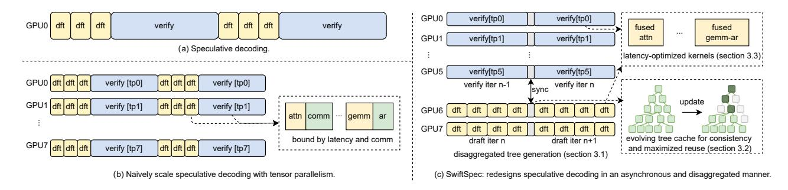
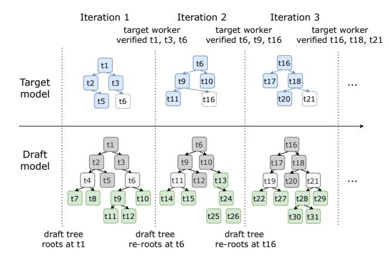
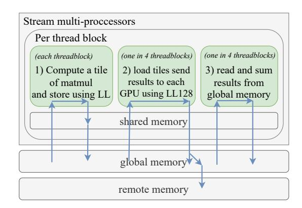
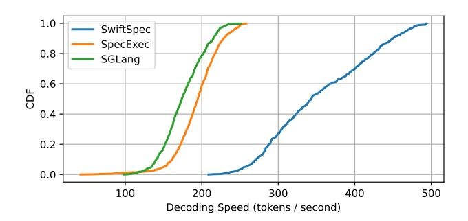
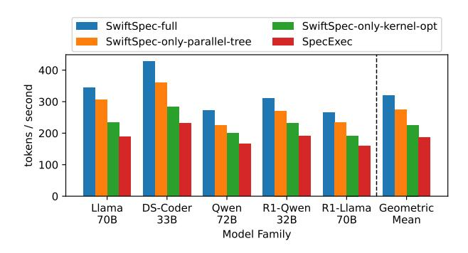

# SwiftSpec: Disaggregated Speculative Decoding and Fused Kernels for Low-Latency LLM Inference

# Ziyi Zhang\*

Bytedance Seed
Bellevue, WA, United States
University of Chicago
Chicago, IL, United States
ziyizhang.zzy@bytedance.com

# Menghan Yu

Bytedance Seed Bellevue, WA, United States alice.yu.mh@gmail.com

# Ziheng Jiang

Bytedance Seed Bellevue, WA, United States ziheng.mlsys@gmail.com

# Chengquan Jiang

Bytedance Seed Bellevue, WA, United States jiangchengquan@bytedance.com

# Size Zheng

Bytedance Seed Beijing, China zheng.size@bytedance.com

#### Haibin Lin

Bytedance Seed Bellevue, WA, United States haibin.lin.cmu@gmail.com

## Xin Liu

Bytedance Seed Bellevue, WA, United States liuxin.ai@bytedance.com

#### **Abstract**

Low-latency, single-request decoding of large language models is critical for interactive systems with tight SLA demands. Prior work reduces latency through speculative decoding (combining a small *draft* model with a larger *target* model), but the draft model remains on the critical path, and communication overhead limits scaling across GPUs due to the small batch size associated with single-request decoding. To address these limitations, this paper introduces SwiftSpec: a system architecture that disaggregates draft and target models across homogeneous GPUs within a single node and utilizes NCCL-low-latency primitives directly to improve the performance of core GEMM and attention kernels. Our implementation includes 3k lines of custom CUDA for fused kernels and an evolving tree cache for KV-cache consistency and maximized reuse between draft and target models. On a single 8×H800 GPU node, SwiftSpec achieves 347 tokens/s for Llama-3-70B-1.3× faster than NVIDIA's own benchmarks on a higher-performance 8×H200 setup-and averages 1.75× faster decoding than state-of-the-art speculative decoding across five model families and six datasets. Specifically, we find that for Llama-3-70B SwiftSpec is significantly faster across all 480 tested queries, showing 1.7×

\*Work partially done at University of Chicago

This work is licensed under a Creative Commons Attribution-NonCommercial-NoDerivatives 4.0 International License.

ASPLOS '26, Pittsburgh, PA, USA.

© 2026 Copyright held by the owner/author(s). ACM ISBN 979-8-4007-2359-9/2026/03 https://doi.org/10.1145/3779212.3790246

# Henry Hoffmann

University of Chicago Chicago, IL, United States hankhoffmann@cs.uchicago.edu

speedup over the best open-source baseline for 95th percentile requests. Code for SwiftSpec will be available at https://github.com/ByteDance-Seed/SwiftSpec

CCS Concepts: • Computer systems organization → Real-time system architecture; Heterogeneous (hybrid) systems; • Computing methodologies → Machine learning.

**Keywords:** large language model serving, speculative decoding, kernel optimization

#### **ACM Reference Format:**

Ziyi Zhang, Ziheng Jiang, Chengquan Jiang, Menghan Yu, Size Zheng, Haibin Lin, Xin Liu, and Henry Hoffmann. 2026. SwiftSpec: Disaggregated Speculative Decoding and Fused Kernels for Low-Latency LLM Inference. In *Proceedings of the 30th ACM International Conference on Architectural Support for Programming Languages and Operating Systems, Volume 2 (ASPLOS '26), March 21–26, 2026, Pittsburgh, PA, USA.* ACM, New York, NY, USA, 15 pages. https://doi.org/10.1145/3779212.3790246

#### 1 Introduction

Interactive coding assistants [5, 13, 17], robotics [47, 52], and AI-augmented search [3, 44] all need low-latency responses from large language models (LLMs). This increasingly means dedicating an entire 8-GPU node to a *single* request. For example, GitHub Copilot meets SLOs by pinning each query to multiple GPUs [10], NVIDIA's Medusa benchmark drives an 8×H200 node at 268 tokens/s for one Llama-3-70B request [31], and ServerlessLLM provisions 8–24 GPUs per request to keep tail latency below 100 ms/token [12]. Robots that use an LLM to reason and plan [36] also benefit from lower pertoken latency. In all these scenarios, it is impractical to batch the current request with other requests as in a centralized, cloud-based LLM server. Therefore, the system processes

**Figure 1.** Speculative decoding overview. (a) Conventional speculative decoding with sequential draft/verify steps. (b) Tensorparallel speculative decoding with reduced latency but communication overhead and GPU underutilization. (c) SwiftSpec: Our approach, combining disaggregated tree generation (§3.1), evolving tree cache (§3.2), and latency-optimized kernels (§3.3).

**Table 1.** Time per inference vs. tensor parallelism when serving Llama3 models using vLLM [19].

|            | # gpus=1 | # gpus=2 | # gpus=4 | # gpus=8 |
|------------|----------|----------|----------|----------|
| Llama3-1B  | 1.58ms   | 1.58ms   | 1.73ms   | 1.72ms   |
| Llama3-3B  | 2.77ms   | 2.61ms   | 2.80ms   | 3.27ms   |
| Llama3-8B  | 4.30ms   | 3.46ms   | 3.50ms   | 3.78ms   |
| Llama3-70B | 24.78ms  | 15.90ms  | 11.86ms  | 11.22ms  |

one request at a time. Given that single-request, full-node deployment is already practiced, the scientific question becomes: what architectural and system bottlenecks limit per-request performance, and how can we redesign multi-GPU runtime and kernels to push single-request latency even lower?

In LLM-serving, there is an inherent trade-off between throughput and latency. This paper studies how to utilize all on-server GPUs to achieve ultra-low latency decoding in single-request scenarios, where existing serving frameworks—designed to maximize throughput—often fall short. From a system architecture viewpoint, understanding the performance bottlenecks of such a single-request regime reveals design principles for future AI acceleration. Specifically, it is challenging to efficiently combine speculative decoding with tensor parallelism.

**Speculative decoding** [2, 4, 20, 28] accelerates single-request LLM inference by splitting the process into two distinct phases: draft and verification. During the draft phase, a small *draft* model rapidly generates a sequence of candidate tokens (and, in some variants, a tree-structured set of candidates). During the subsequent verification phase, a much larger *target* model validates all candidates through batch inference. This process emits multiple tokens at once, reducing decoding latency. Prior work typically treats the draft and verification phases as strictly sequential operations because of their data dependencies [2, 21, 28], as shown in Figure 1(a). This design places the draft phase on the critical path as an additional overhead, preventing speculative decoding from fully realizing its latency-reduction potential.

**Tensor parallelism** [35] reduces decoding latency by scaling computation resources. Tensor parallelism partitions the model weights across multiple GPUs and then aggregates partial results through all-reduce operations. However, a straightforward combination of tensor parallelism with speculative decoding, as shown in Figure 1(b), is ineffective. In speculative decoding, the draft and target models are co-located on the same devices. Because the two models differ greatly in size, applying the same degree of tensorparallelism to both does not produce minimal system latency. The smaller draft model reaches the point of diminishing returns sooner: once its weights are finely sharded, further increasing the tensor-parallelism no longer reduces latency, because other overheads—most notably inter-GPU communication—dominate. Crucially, Table 1 shows that draft and target models have very different GPU-scaling curves, motivating our decision to disaggregate them.

To effectively combine speculative decoding with tensor parallelism, we redesign the speculative decoding process in an asynchronous, disaggregated manner (Figure 1(c)). Rather than co-locate on the same hardware, we dedicate separate GPUs for draft and target models. The draft and target models work in parallel: while the target verifies iteration n-1, the draft produces candidates for iteration n. When a verification iteration is complete, the target synchronizes the validated tokens with the draft and obtains the next set of candidate tokens. Under this design, (1) the draft and target models can be flexibly scaled to different degrees of parallelism, and (2) the dependencies between the two models are decoupled, removing the draft phase from the critical path.

Realizing this design poses three challenges. First, while the target model is validating the current iteration, the draft model must generate candidates for the next iteration. Second, maintaining key-value cache consistency between complex draft models (e.g., tree-structured draft models) and the target model is non-trivial. When tree-based draft generation runs in parallel, newly accepted tokens may force the draft model to discard invalid branches, but the draft and target KV caches should be consistent, and the valid branches

should be preserved to avoid recomputation. Third, hiding communication latency during decoding is challenging under tensor parallelism because it is hard to overlap all-reduce operations with compute operations since they usually remain on the critical path. Furthermore, the GPU kernels are usually optimized for higher throughput and have suboptimal performance under low batch sizes, spending significant time on data movement and kernel launch.

We address these challenges with SwiftSpec, a novel system providing ultra-low latency LLM decoding for singlerequest scenarios (Figure 1(c)). Specifically, SwiftSpec introduces: (a) disaggregated tree generation, which runs the draft and target models on disjoint GPUs, allowing each model to scale according to its own compute requirements. While the target model verifies one batch, the draft model produces future candidate tokens, ensuring high GPU utilization. This requires us to implement (b) Evolving tree cache with synchronization and maximized reuse. After each verification step, SwiftSpec reorganizes both the draft and target models' KV Caches for consistency. For the draft model, we keep the accepted and future tokens consistent with the draft tree, even when some guesses are incorrect. This approach also maximizes reuse of the previously computed KV cache values. (c) Latency-optimized kernels: we reduce synchronization and data transfers, accelerating inference in low-batch scenarios. Using the NVIDIA Collective Communication Library's Low Latency (NCCL LL) protocol, we develop a fused GEMM with all-reduce and an attention operator without any explicit synchronization barriers. We further decrease latency by fusing operations in the Switched Gated Linear Unit (SwiGLU) [34].

We evaluate SwiftSpec using five different model families and six different datasets. SwiftSpec consistently outperforms the baselines, achieving an average of 1.75× decoding speed over the best baseline using 8 H800 GPUs. As a highlight, SwiftSpec serves Llama3-70B with an average decoding speed of 347 output tokens/s, higher than the 268 token/s NVIDIA reports using 8 H200s [31]. SwiftSpec not only improves average speed, but is faster than baselines across the *entire* range of requests when serving Llama-3-70B (thus reducing tail latency and demonstrating performance stability across queries). In summary, our contributions are:

- Identifying scalability challenges of speculative decoding under tensor parallelism.
- Presenting SwiftSpec, which integrates disaggregated tree generation, an evolving tree cache, and latencyoptimized kernels to support speculative decoding in an asynchronous, disaggregated manner.
- Demonstrating, to our knowledge, the first LLM speculative decoder to achieve 300+ tokens/s on a full 8-GPU Nvidia Hopper node for serving single user requests using Llama3-70B model, validating the practical feasibility of such deployment.

# 2 Background and System-level Challenges

# 2.1 Parallelism for LLM Decoding

LLM inference (e.g., [32, 40, 41]) is typically accelerated through model parallelism, which distributes computation across multiple GPUs. The two most common strategies are intra-operator parallelism (such as tensor parallelism, which splits matrix multiplications across GPUs) [35] and inter-operator parallelism (such as pipeline parallelism, which distributes layers across devices) [11, 16].

In single-request serving, tensor parallelism (TP) dominates. Unfortunately, applying TP to speculative execution is challenging because small draft models gain relatively little from TP, while large target models benefit more from increased TP (see Table 1). We synthesise these small-batch constraints and the resulting design opportunities in §2.4.

#### 2.2 GPU Constraints for Low Batch Size

Modern GPUs are often optimized for large-batch throughput workloads. In small-batch inference, e.g., interactive LLM serving, performance suffers due to kernel under-utilization and communication overhead. For transformers, three operators dominate: GEMM, attention [42], and all-reduce.

Unfortunately, small batch size performance is a requirement for single-request serving. While the details are omitted for space, we find that increasing the draft or target model batch size beyond 16 results in minor performance gains (< 5%) because the draft model no longer generates useful tokens and the time spent verifying them is wasted. Under such small batch sizes ( $\le 16$ ), the GEMM, attention, and all-reduce operators exhibit poor efficiency. Some targeted optimizations, such as low-bit quantization [23, 43], reduce communication costs but are not a holistic solution.

Similarly, state-of-the-art LLM serving frameworks have reduced communication costs for small sizes by using the NVIDIA collective communication library (NCCL) all-reduce operator [19, 50]. NCCL-LL offers fine-grain collectives, but prior systems do not fuse them with computation. SwiftSpec instead introduces latency-optimized kernels (§3.3) that (1) combine GEMM and all-reduce operators and (2) combine attention computation and communication to greatly reduce overhead and enable fine-grained communication.

#### 2.3 Tree-based Speculative Decoding

Speculative decoding [20, 27, 28] accelerates large language model inference by employing a smaller, faster draft model to rapidly propose candidate tokens ahead of the main model. The larger target model then verifies these candidates in parallel using a batch inference, accepting those that align with its own probability distribution while discarding incorrect ones. This process allows the system to generate multiple tokens for every single invocation of the computationally expensive target model, significantly reducing overall latency. Prior works denote *average acceptance length* [2, 20, 21] as

|                   |                                      |               |            | SOTA LLM engines |           |
|-------------------|--------------------------------------|---------------|------------|------------------|-----------|
|                   | Feature                              | PipeInfer [1] | PEARL [24] | [30, 31, 37, 50] | SwiftSpec |
| (1) Independent   | Tree-based speculation               | ✓             | Х          | ✓                | ✓         |
| scalability &     | Draft/target on disjoint compute     | ✓             | ✓          | X                | ✓         |
| parallelism       | Flexible draft/target GPU allocation | ×             | ×          | X                | ✓         |
| (2) Consistent    | Fine-grained KV reuse (zero waste)   | ×             | ✓          | ✓                | ✓         |
| KV-cache reuse    | Robust to misprediction (re-rooting) | ×             | ✓          | ✓                | ✓         |
| (3) Small-batch   | GEMM & Atten. fused w/ NCCL-LL       | Х             | Х          | Х                | ✓         |
| kernel efficiency | Fused SwiGLU                         | ×             | ×          | limited          | ✓         |

Table 2. Comparison of SwiftSpec (last column) and prior speculative decoding techniques.

the average number of tokens verified per target inference. Average acceptance length directly impacts the end-to-end latency, as higher lengths reduce the number of target model invocations.

Conventional speculative decoding approaches impose dependencies between the draft and target models. Sequence-based speculative decoding uses a pipeline: running the draft model to generate the next guess while the target model verifies the preceding guess [24, 27?]. z Sequence-based methods, however, typically exhibit lower-quality guesses compared to tree-based approaches [28] where the draft model proposes a tree of candidate tokens and the target model verifies a path through this tree. This approach tends to achieve higher *average acceptance length* since it considers more possible future tokens per output position.

However, tree-based methods impose more system complexity. First, while sequential approaches generate the single most probable next token, it is challenging to concurrently generate tree nodes with high verification probability. Second, KV cache management requires consistency between target-accepted tokens and potentially useful but unverified draft tokens. SwiftSpec addresses these timitations through disaggregated tree generation and an evolving tree cache with maximized reuse (§3.1–3.2).

# 2.4 Key Limitations of Prior Work

This section describes how existing speculative decoding systems fall short in addressing the following key system challenges in single-request serving: (1) independent scalability of draft and target models, (2) KV cache consistency, and (3) kernel under utilization with low batch sizes. Table 2 summarizes the key differences. As shown in the table, SwiftSpec is the only solution that achieves parallel, tree-based speculation, maintaining a consistent KV-cache, and optimizing kernels for small batch size.

Independent scalability and parallelism. Tree-based speculative decoding typically runs the draft and target models sequentially. Therefore, we have to scale both the draft and target models across all GPUs; otherwise, some GPUs will be idle. However, using more GPUs for TP does not necessarily decrease latency. Table 1 diminishinig returns when we increase tensor parallelism. For example, the 70B model benefits from using 4 GPUs instead of 2, while there is no

benefit from using more than 2 GPUs for the smaller models (1B, 3B, 8B). Prior tree-based speculative decoding work (SpecInfer[28], EAGLE [21, 22], SpecExec [37]) fails to address this lack of scalability, while SwiftSpec's disaggregated tree generation does (§3.1).

Consistent KV-cache reuse. Keeping the KV cache consistent between draft trees and the target model is challenging when they run in parallel. For example, PipeInfer [1] uses trees, but if some draft trees are invalidated by the target model, every subsequent draft tree will be discarded, wasting compute and yielding low effective utilization. Our evolving tree cache addresses the need for KV cache consistency with maximized token reuse (§3.2).

Small Batch Kernel Efficiency. Table 3 shows the bandwidth and compute utilization for kernels in a LLama 70B transformer layer executed across 4 GPUs with batch-size 8. The bandwidth utilization for all-reduce refers to NVLink bandwidth, while for the other operators, it is the HBM bandwidth. At this batch size, all operators are communication-intensive, yet the bandwidth utilization is low (< 10%) for the all-reduce and attention operators because the communication volume is small. Therefore, time is mainly spent on synchronization and waiting for the first input.

Some frameworks (vLLM [19], SGLang [50], etc) use the NCCL LL protocol in the all reduce operator when communication volume is low. Still others, such as FlashInfer [46] and FlashAttention [8], optimize individual transformer kernels, but focused on larger batch size (e.g.  $\geq$  32, which is still large for single-request scenarios) While none of the prior works consider fusing low-latency communication with low batch size computation, our latency-optimized kernels realize the opportunity to holistically reduce latency for small batch sizes by organically combining the NCCL LL protocol and the compute pattern of the attention and GEMM operators (§3.3).

## 3 SwiftSpec Design and Architecture

SwiftSpec addresses the bottlenecks of **single-request full-node serving** to reduce *end-to-end* latency. Specifically, we identify the following **challenges and design principles:** 

P1 Asymmetric scaling. Draft and target models scale differently, so we **disaggregate** them (§3.1).

11

**Table 3.** Kernel utilization for a Llama 70B model on 4 GPUs.

| Operators       | Time (in us) | Comp. Util. (%) | Band. Util. (%) |
|-----------------|--------------|-----------------|-----------------|
| QKV projection  | 16.9         | 2.0%            | 18.7%           |
| mask attention  | 18.8         | <0.01%          | 6.5%            |
| O projection    | 10.8         | 2.5%            | 23.3%           |
| all reduce      | 12.0         | < 0.01%         | 8.5%            |
| SwiGLU          | 39.3         | 4.8%            | 44.6%           |
| down projection | 18.1         | 5.2%            | 48.5%           |
| all reduce      | 15.3         | <0.01%          | 6.6%            |

- P2 KV-cache waste. Miss-predicted branches cause expensive recomputation, so we introduce an evolving tree cache that maintains and reuses draft tokens (§3.2).
- P3 Small-batch communication latency. Separate NCCL collectives dominate per-token time; we fuse operations: directly incorporating NCCL-LL into GEMM and attention, while collapsing the SwiGLU operations into one, low-latency kernel (§3.3).

These principles yield the *first* single-node decoder that (1) scales draft and target independently, (2) preserves 100% of computed KV state for tree-based speculation, and (3) merges communication with computation, together producing stateof-the-art performance on an 8 GPU node (§4.6).

#### 3.1 Disaggregated tree generation

Overview. SwiftSpec runs the draft and target models on disjoint GPUs in an asynchronous pipeline. Each iteration overlaps draft-tree expansion with target verification of a selected subtree. The groups exchange only the verified token prefix and the next subtree to verify, while preserving KVcache consistency across rerooting without recomputation.

Because of scaling asymmetry, we disaggregate the draft and target models (**Design Principle** 1, above). Both use tensor parallelism (TP) within their assigned GPUs. This allows both to operate concurrently and removes the draft phase from the critical path. The two groups communicate using NVLink/cross-network interconnect.

**3.1.1 Algorithmic Overview.** Algorithm 1 details the interaction between draft and target models. We define bs as the target model batch size, w as the number of leaves for the draft tree (i.e., the draft model's batch size), *d* as the number of tree expansions in one round. Note that while the external request batch size is 1, the parameters bs and w refer to internal micro-batching (speculative branches) which is controlled by SwiftSpec. Both target and draft GPUs loop until generation ends, synchronizing at each iteration.

#### Draft worker (per iteration).

- 1. **Expand the draft tree:** The draft workers expand the draft tree d times, by running inference on w unexpanded leaves from the tree with the highest probabil-
- 2. **Synchronize:** It then synchronizes with the target worker to get the verified tokens.

generate w, batch size of target model bs if Is\_draft\_worker then while True do for i = 1 to d do 3 Expand the *w* most probable tree leaves; Get verified tokens from the target worker; 5 if target worker signals stop then 6 break: Update KV Cache and draft with verified tokens; 8 while Tree size < bs do Expand the *w* most probable leaves;

**Input:** Depth of tree to generate *d*, width of tree to

Get the most probable draft subtree of size bs; Send it to the target worker to verify; 13 else if Is target worker then

while True do 14 Get draft tokens from the draft tree worker: 15 Verify the draft tokens by batch inference; 16 17 if Reach the end of generation then Send the stop signal to the draft workers; 19 else Send the verified tokens to the draft workers;

- **Algorithm 1:** Disaggregated tree generation algorithm
  - 3. **Re-root and update cache:** Then it re-roots the draft tree by walking down the tree using the path representing the verified tokens and adjusts the KV cache to stay consistent (see next section).
  - 4. Select next subtree: Next, it grows the draft tree (if draft tree does not have sufficient nodes) and selects a sub-tree of size bs.
  - 5. **Send:** Finally, it sends the sub-tree to the target.

The target model gets the draft tokens from the tree and runs batch inferences to calculate the logits. After that, it samples through the logits to generate the tokens and then sends the verified tokens back to the draft worker.

3.1.2 Illustrated Example. Figure 2 shows three iterations. In each, the draft model grows the tree while the target model verifies a subtree. The tree is then re-rooted, and verified tokens are promoted to the KV cache (bs = 4, d = 3, w = 2). At the start, the draft tree is  $t_1, t_2, t_3, t_4, t_5, t_6$ , and the draft workers select the top bs = 4 tokens  $(t_1, t_2, t_3, t_5)$ to give as  $input_1$  to the target workers. During iteration 1, while the draft workers continue growing the tree with 6 new nodes, the target workers run inference on *input*1 and sample  $output_1 = (t_1, t_3, t_6)$ . Then, the draft workers verify that  $(t_1, t_3, t_6)$  is a valid path in the tree and re-root at  $t_6$ . With enough nodes remaining, they choose the next top 4 tokens  $(t_6, t_9, t_{10}, t_{11})$  as *input*2. During iteration 2, the draft workers grow 6 more nodes while the target workers process input2 and produce  $output_2 = (t_6, t_9, t_{16})$ . However,  $t_{16}$  is not yet in

**Figure 2.** Disaggregated tree generation. Target model runs in parallel with the draft model. At the end of each iteration, the draft model re-roots the draft tree and reorganizes the KV-cache based on verified tokens from the target model.

the tree, so the draft workers re-root at  $t_{16}$  and keep growing new nodes  $t_{17}$ ,  $t_{18}$ ,  $t_{19}$ ,  $t_{20}$ ,  $t_{21}$ , giving ( $t_{16}$ ,  $t_{17}$ ,  $t_{18}$ ,  $t_{20}$ ) as  $input_3$ . During iteration 3, a similar process continues, with the draft and target workers running in parallel, growing and verifying tokens as they build out the tree.

**3.1.3 Technical Details.** This section details some practical concerns for implementing the above, including: tree expansion, profile-guided GPU split, batch size selection, and non-square mask support. These details allow the disaggregated scheduler to generalize to any multi-GPU node.

**Maximum-likelihood tree expansion.** We use the logarithm of the softmax probability as the value of each node, and the sum of values from the root to each node as the weight. Thus, a higher weight means a higher probability that a token could be generated under the draft model distribution. We keep the pair (value, node) in a priority queue to get the k most probable leaves in  $O(k \log s)$ , where s is the number of probable leaves to consider.

**GPU** allocation for draft model and target model. Given a node of k GPUs, we will allocate  $x(1 \le x \le k-1)$  GPUs to the target model and (k-x) GPUs to the draft model. To determine which x to use, we profile before serving the queries. We try different xs to find which configuration yields the fastest average decoding speed. We found that if we fix the target model, the optimal x is smaller when we are using a more powerful target model (we analyze this in §4.5).

**Setting the internal batch size.** Larger bs, w will lead to higher acceptance ratio per iteration, but when bs, w get larger and larger, the margin gain on the acceptance ratio will decrease, and total running time will increase. We set bs = 8 and w = 8 empirically to balance the acceptance ratio and running time, based on our analysis in §4.5.

Setting the number of tree expansions d in one round. Before serving inference, we first profile the draft and target model latency. Denote  $t_{target}$  as one round of target model

**Figure 3.** Example of a non-square tree mask during draft tree expansion: yellow nodes are the leaves to expand, and the blue nodes are the existing tree nodes

**Figure 4.** KV cache management of the draft model: each time newly verified tokens get updated, the KV states of the verified tokens will be in the prefix of the KV cache (green), and the KV states of the draft tokens will follow (yellow).

inference, and  $t_{draft}$  as one round of draft tree expansion. Define  $r = \lfloor \frac{t_{target}}{t_{draft}} \rfloor$ . We set d = r or d = r + 1 so that draft tree expansion and the target model verification finish at nearly the same time to maximize parallelism.

Non-square mask support for attention. The attention operator in the target model uses a square mask, since the target model takes a tree each time, and each token will only mask out the attention with those tokens that are not the ancestors within the current input. This is similar to prior work [28]. However, for the draft model, this is not the case. Consider the example in Figure 3 with a current tree of size 6, and we want to calculate the logits of 4 probable leaves, then regarding the tree cache, we only calculate the attention of each leaf with its ancestor on the tree (and also all the data that is in the prefix cache). In this case, we need a mask of at least size (4, 10) to contain all the necessary information. Therefore, we support a non-square mask as input in our attention operator for the draft model.

This approach of disaggregating the draft and target models embodies our first design principle: each model group is provisioned to the knee of its own scaling curve (§2.1, Table 1).

#### 3.2 Evolving Tree Cache

To maintain draft and target model KV-cache consistency (**Design Principle 2**), we reorganize the draft model's cache so that it remains consistent between draft and target. Specifically, we maintain the following:

**KV-cache Invariant.** The *prefix cache* stores KV states for

the verified tokens contiguously, and the *tree cache* stores KV states for the remaining draft-tree nodes contiguously after the prefix. This layout preserves all reusable KV states across re-rooting and avoids recomputation.

**Re-organization of KV cache for verified tokens.** After the target workers sample the tokens, they send the verified tokens to the draft workers. The draft worker then updates the evolving tree cache as follows:

- Walk and re-root: It walks the tree using the verified tokens and re-roots at the last verified token.
- Re-organize KV states: If the last verified token exists in the current draft tree, it reorganizes the KV cache so that only the KV states of the valid subtree nodes remain in the tree cache. If the last verified token is not in the current draft tree, we start a new tree rooted at it.

Critically, even when some of the predicted tokens we send to the target worker are wrong, we can still reuse all the computed KV states in the subtree, avoiding any recomputation.

Figure 4 shows an example. Suppose the sequence  $(t_1, t_3, t_7, t_{10})$  is already verified, the prefix cache is the KV states of those tokens, and the KV states of the draft tree tokens are organized contiguously after the prefix. When we update the verified tokens to be  $(t_1, t_3, t_7, t_{10}, t_{12}, t_{15})$ , we walk down the draft tree using the newly verified tokens  $(t_{12}, t_{15})$ . Then we reach the node  $t_{15}$ , which means the nodes in the subtree,  $t_{17}$ ,  $t_{18}$ , are still useful. Therefore, we move  $t_{12}$ ,  $t_{15}$  to the prefix cache so that it stores the information of the same verified tokens as the target model. Finally, we reorganize the remaining subtree of  $t_{15}$  (i.e.  $t_{17}$ ,  $t_{18}$ ) into the next positions, discarding states that are no longer useful (e.g.  $t_{11}$ ).

If the draft tree does not have enough nodes to send back to the target worker, it expands *bs* nodes immediately using one draft model inference. In either case, the draft tree will have enough nodes to pass to target workers, therefore entering the next iteration, with the KV states synchronized across the draft model, the target model, and the draft tree.

#### 3.3 Latency-optimized Kernels

To reduce the inference time of both draft and target under low batch size (**Design Principle 3**), we design and implement *latency-optimized* operators for all-reduce, masked attention, and SwiGLU. While our design could be applied to any precision, we implement it for the int4 AWQ quantized model. We first introduce the NVIDIA Collective Communication Library's Low Latency (NCCL LL&LL128) protocol, which our work leverages heavily.

NCCL LL&LL128 protocol. SwiftSpec uses these communication primitives to reduce the latency of both inter- and intra-GPU communication. Since both protocols are similar, we use NCCL LL as an example to describe the functionalily.

In the NCCL LL protocol, the storeLL function takes a 64-bit integer *val* and a 32-bit integer flag, splits *val* into

**Figure 5.** Execution flow of fused GEMM all-reduce operator.

two 32-bit integers, and stores them with flag. The loadLL function takes a memory location and a flag. It polls the memory until it matches the expected flag, and then returns the 2 32-bit integers as a 64-bit integer.

Using those two functions, we have a communication scheme without any explicit synchronization. Assume that last time we store some value x as a flag, and this time we use x + 1. The other compute unit will know the data is ready when it sees x + 1, without any additional synchronization.

While LL wastes 50% bandwidth (with 4B data & 4B flag), it offers the flexibility of communicating in 4 byte chunks. In contrast, LL128 only wastes around 5% bandwidth (with 120B data / 8B flag), but it requires the data to be in 128 consecutive bytes of memory. In our latency-optimized kernels, we rely on both primitives to reduce synchronization overhead.

**Fused GEMM with all reduce.** To further reduce the data movement overhead and save the number of synchronization barriers, we fuse each all-reduce operation with the preceding GEMM operation. Figure 5 shows the computation and data flow within one thread block when we run GEMM fused with all reduce. Each thread block has three steps during execution:

- Each threadblock computes a contiguous set of columns and stores them in a global memory using LL.
- Then, one in four threadblocks stages these values and sends them across GPUs using LL128.
- Finally, each GPU waits for these values, aggregates them, and writes the final results to its local memory.

In step 1, SwiftSpec uses LL since a tile is too small and LL128 requires 128B of consecutive memory. In step 2, it uses LL128 to avoid bandwidth waste while maintaining low latency. Since all the data is sent and read using LL/LL128 protocol, there is no explicit synchronization between GPUs.

**Masked attention.** For the mask-attention operators, we fuse the position embedding with the attention calculation. Then, within one GPU, we first split the computation of the single attention head between different thread blocks. After the calculation, the threadblocks aggregate the sum using

the NCCL LL protocol within a single GPU. Similar to our Fused GEMM with all-reduce operators, we add up the results within one attention head without explicit synchronization across thread blocks or extra kernel launches.

**Fused SwiGLU.** This operator is of the form  $SwiGLU(x, W, V, b, c) = \sigma(xW + b) \oplus (xV + c)$ . We implement tile-based matrix multiplication, where each threadblock calculates the same tile of the two matrix multiplications. This avoids loading the input twice from the GPU HBM. Right after we get the output of the tiles, we calculate the sigmoid and dot product before putting the results back to the GPU memory, avoiding unnecessary data movement.

#### 3.4 Implementation Details

SwiftSpec is implemented as  $\sim 3$  K LOC of CUDA/C++ for its fused kernels and  $\sim 4$  K LOC of C++/Python for the tree-based runtime. The latency-optimized kernels are built with CUTLASS [39] and call the storeLL and loadLL primitives directly. Because CUDAGraphs require fixed–shape inputs, we pad every variable-length tree mask to a common tensor of shape  $(w, \max len)$ , so that a single CUDAGraph per draft width  $(w \leq 20)$  suffices for thousands of distinct masks. To support arbitrary assignment of GPUs to draft and target models rather than powers of two (e.g., 2 draft GPUs and 6 target GPUs) , we zero-pad matrix dimensions and attention-head counts so they divide evenly across GPUs, preserving numerical equivalence while retaining kernel efficiency.

# 4 Experimental Evaluation

Our evaluation answers the following questions:

- What is SwiftSpec's performance compared to other speculative decoding systems? (§4.2)
- How much does disaggregated tree generation (with evolving tree cache) improve performance? (§4.3.1)
- How much do latency-optimized kernels improve the end-to-end performance? (§4.3.2)
- How do SwiftSpec's latency-optimized kernels compare to other work on kernel optimization? (§4.4)
- Are our design choices empirically justified? (§4.5)
- Does SwiftSpec compare to industry performance? (§4.6)
- Does SwiftSpec compare to bespoke draft models? (§4.7)

## 4.1 Experimental Setup and Methodology

**Cluster setup** We evaluate SwiftSpec and the baselines on one node with 8×H800 NVIDIA 80GB SXM GPUs connected by NVLink. We use all 8 GPUs to minimize the decoding latency for all of our experiments, except that, in §4.4, we show the performance improvement of our latency-optimized kernels under a subset of these GPUs.

**Models and model configurations** We five different pairs of models (Table 4) from different families, including Llama3

**Table 4.** The set of models in our evaluation.

| Target model                  | Draft model                            |
|-------------------------------|----------------------------------------|
| Llama-3-70b-Instruct          | Llama-3.2-3B, EAGLE-0.99B              |
| deepseek-coder-33b-instruct   | deepseek-coder-1.3b-instruct           |
| Qwen2-72B-Instruct            | Qwen2-1.5B-Instruct, EAGLE-1.05B       |
| DeepSeek-R1-Distill-Qwen-32B  | DeepSeek-R1-Distill-Qwen-1.5B          |
| DeepSeek-R1-Distill-Llama-70B | DeepSeek-R1-Distill-Llama-8B           |
| Llama-3.3-70b-Instruct        | Llama-3.3-instruct EAGLE3 1 |

 $^1{\rm This}$  model is specially trained for the target and only available for Llama-3.3-instruct, so we evaluate it in isolation in §4.7.

**Table 5.** The datasets used in our evaluation.

| Dataset Name           | Brief description              |  |  |
|------------------------|--------------------------------|--|--|
| Alpaca [38]            | human instructions             |  |  |
| GSM8K [7]              | grade school math              |  |  |
| HumanEval [6]          | code generation                |  |  |
| CNN/Daily Mail [29]    | mail content summurization     |  |  |
| Natural Questions [18] | open-domain question answering |  |  |
| MT-Bench [49]          | multi-turn conversation        |  |  |

**Table 6.** Comparison of different baselines attributes.

|          | EAGLE        | smaller draft | draft TP     | tree spec    |
|----------|--------------|---------------|--------------|--------------|
| vLLM     | <b>✓</b>     | ✓             | ×            | ×            |
| SGLang   | $\checkmark$ | ×             | $\checkmark$ | $\checkmark$ |
| TRT-LLM  | $\checkmark$ | ✓             | $\checkmark$ | ×            |
| SpecExec | ×            | $\checkmark$  | $\checkmark$ | $\checkmark$ |

[40], Deepseek-Coder [14], Qwen2 [45], Deepseek R1-Distilled Owen, and Deepseek R1-Distilled Llama [9]. Deepseek-Coder is a series of models that focus on coding, while the rest of the models families have general capabilities. From each model family, we pick a large model as the target model (generally having > 30B parameters) and a small model as the draft model (< 10B). For Llama3 and Qwen2 family, there are also trained EAGLE2 models, so we used those in the baselines, which supports EAGLE-based [21] speculative decoding. While SwiftSpec is applicable to any model precision, to push the absolute limit of decoding speed, we apply 4-bit AWQ quantization with a group size of 128 [23] to all the weights of the transformer layers in each family except the EAGLE models. We keep the BF16 precision for the embedding layers and the LM head operator. Each model uses BF16 to compute the attention and the linear operators (after weight de-quantization). We apply the same quantization to both the baseline and SwiftSpec, and therefore the computation of each single model in our system is equivalent to that of each baseline model.

**Datasets** We evaluate our with six different datasets from different domains. Table 5 shows a brief description of each. We select 80 queries from each data set (480 total) following the same procedure as used in the EAGLE2 paper [21]. Note that we only use the input prompts in each dataset, and we only use it for benchmarking purposes.

**Baseline systems** We compare against the following:

Figure 6. End-to-end single-request decoding speed.

- vLLM [19]: vLLM supports both EAGLE and a smaller model from the same model family as the draft model. However, it only supports sequence-based speculative decoding for both cases. We use version 0.7.2.
- SGLang [50]: SGLang supports the tree-based, EA-GLE2 draft model. Out of the five model families we consider, only two pairs (Llama 70B and Qwen 72B) have a corresponding EAGLE draft model. Thus, we benchmark auto-regressive generation for the other three model families. We use version 0.4.4.post3. While SGLang also supports EAGLE3 [22], the only publicly available modle with EAGLE3 support is LLaMA-3.3-70b-Instruct. Therefore, we compare with EAGLE3 in an isolated study (§4.7).
- TRT-LLM [30]: Under int4-awq precision, TRT-LLM only supports sequence-based speculative decoding with a smaller draft model. We use version 0.17.0.post1.
- SpecExec [37]: We implement the core ideas in Spec-Exec—sequential, tree-based speculative decoding with draft and target models using tensor parallelism across all GPUs and extend it to the models in Table 6. We choose SpecExec as it is faster than similar treebased methods like SpecInfer [28].

Table 6 shows the configurations of speculative decoding that each baseline supports. As shown in later benchmarks, the most competitive baselines are SGLang and SpecExec since they support serial tree-based speculative decoding for EAGLE and a smaller draft, respectively. For each baseline implementation of each model, we run them in an extensive set of configurations and choose the configuration that maximizes the average tokens per second across all the datasets. For our approach and the baselines, we perform greedy decoding i.e. temperature is 0.

#### 4.2 Single-request Decoding Speed

Figure 6 shows the end-to-end decoding speed of all approaches. Because vLLM and TRT-LLM only support sequence-based speculative decoding under int4-awq, their performance is not comparable with SGlang and SpecExec. For the

**Figure 7.** Decoding speed CDF comparing SwiftSpec and the most competitive baselines, SpecExec and SGLang, serving the Llama3-70B model across 480 queries. (to the right is faster)

**Figure 8.** Ablation studies comparing SwiftSpec components.

Llama 70B model and the Qwen 72B model, SGLang does support EAGLE speculative decoding and achieves comparable performance with SpecExec. Figure 6 shows that SwiftSpec consistently outperforms SpecExec (by an average of 1.75×) and SGLang (on average 2.23×), the two most competitive baselines. Figure 7 shows that, while serving Llama-3 70B model, SwiftSpec improves the average decoding speed without sacrificing the tail speed, having at least 1.7x speedup over the two most competitive baselines at the p95 tail. These results confirm that SwiftSpec achieves a substantially higher single request performance than prior work.

#### 4.3 Ablations: Understanding SwiftSpec Speedup

SwiftSpec is built off three key techniques: disaggregated tree generation, evolving tree cache, and fusing operations for low-latency under small batch sizes. We view the first two as inseparable: without the evolving tree cache with synchronization, we get no benefit from running the draft and targets in parallel because the caches quickly desynchronize and the draft model stops producing useful guesses. In this section then, we address the question of how much of SwiftSpec's performance comes from disaggregated tree generation (and evolving tree) and how much comes from the latency-optimized kernels.

To address these questions, we compare three configurations of SwiftSpec to SpecExec (the best prior baseline).

Specifically, we compare SwiftSpec (with all features), SwiftSpeconly-parallel-tree, and SwiftSpec-only-kernel-opt. SwiftSpeconly-parallel-tree uses standard kernels, but disaggregated tree generation and evolving tree cache (§3.1 and §3.2). SwiftSpeconlykernel-opt uses all the latency-optimized kernels (§3.3) but with serial speculative decoding (all GPUs run the draft model, then all run the target). Note that all SwiftSpec configurations and our SpecExec implementation contain our optimized attention kernels since a non-square mask is needed to support our tree expansion algorithm, which is not supported by other works. Figure 8 shows the comparison of all techniques and demonstrates that both disaggregated tree generation and the latency optimized kernels contribute significantly to SwiftSpec's end-to-end performance. We discuss the specifics of each in more detail next.

# **4.3.1** Effect of disaggregated tree generation (with evolving tree cache). Figure 8 shows that SwiftSpec outperforms SwiftSpec-only-kernel-opt by 1.43×, while SwiftSpec-only-parallel-tree outperforms SpecExec by 1.50×.

To better understand the gains due to parallel speculative decoding we look specifically into the Qwen2 model family as an example. We choose this because the optimal configurations (including tree depth d, tree width w, etc) are the same for both parallel and serial tree generation. While the serial version uses 8 GPUs for both models (running the draft and then the target sequentially), the parallel version uses 2 GPUs for the draft model and 6 GPUs for the target model.

Table 7 shows the average acceptance length (average number of successful guesses per target model verification) and the target and draft model inference time under parallel/serial speculative decoding (i.e., SwiftSpec and SwiftSpeconly-kernel-opt). When running parallel tree generation instead of serial speculative decoding, the draft model does not know the result of the concurrent target model verification, and thus it generates some nodes that are not useful after verification. Therefore, the average acceptance length is smaller when we use parallel tree generation. However, due to our maximum-likelihood expansion of the draft tree and the maximized reuse of the KV cache, the average acceptance length is only 9% less than the serial version on average. Furthermore, our draft model inference time decreases from 3.72ms to 3.25ms using only 2 GPUS instead of 8 GPUs saving 79% of the GPU cycles during one round of drafting, and our target model has nearly no slow down using 6 GPUs instead of 8 GPUs (from 10.34ms to 10.48ms), still saving 25% of the GPUs cycles during one round of target verification. As a result, the end-to-end tokens-per-second of Qwen2-72B model increases from 200 to 274 (1.37×) by applying our parallel tree generation and KV cache management scheme.

# **4.3.2 Effect of latency-optimized kernels.** Figure 8 shows that SwiftSpec outperforms SwiftSpec-only-parallel-tree by

**Table 7.** The average acceptance length, model inference time, and decoding speed under parallel and serial tree generation for model Qwen2-72B and draft model Qwen2-1.5B.

|          |                | model time |        | accep | tance le | ength f | or diff | erent d | latasets |
|----------|----------------|------------|--------|-------|----------|---------|---------|---------|----------|
|          | Decoding speed | target     | draft  | ALP   | GSM      | HE      | MT      | QA      | SUM      |
| parallel | 274 tokens/s   | 10.48ms    | 3.25ms | 2.92  | 3.78     | 3.92    | 3.11    | 2.74    | 3.56     |
| serial   | 200 tokens/s   | 10.34ms    | 3.73ms | 3.28  | 4.2      | 4.04    | 3.42    | 3.12    | 3.72     |

an average of 1.16×, and SwiftSpec-only-kernel-opt outperforms SpecExec by 1.21× (on average). Therefore, Swift-Spec's kernel optimizations on fused GEMM-all-reduce and SwiGLU kernel provide end-to-end speedup of at least 16% for both parallel and serial tree generation.

In summary, these ablations show that both disaggregated, parallel tree generation and latency optimal kernels are essential to achieving performance in single-request (and therefore low-batch size) LLM serving. The next section analyzes the effects of individual kernel optimizations in more detail.

## 4.4 Latency-optimized Operator Microbenchmarks

Table 8 shows the individual kernel times of our latencyoptimized kernels and other proposed kernels. We focus on the Llama3 model family as a specific example, but our optimizations generalize to the other model families we benchmark and achieve similar speedup.

Fused GEMM with all reduce Using tensor parallelism, in each Llama3 model layers uses two all-reduce operations: one in the attention block, and one in the MLP block. We fuse each all-reduce operation with the previous GEMM. In contrast, both vllm and TRTLLM use their one-shot all-reduce after the GEMM operations and as separate kernels. We sum up the time spent on two kernels as their total time. As shown in Table 8, our fused GEMM-all-reduce kernel consistently outperforms vllm and TRTLLM on all five model configurations. Our improvement is larger when the compute is lower. Specifically, for the fused GEMM in the attention block, latency is reduced by 23%-43% for all models, while in MLP block latency is reduced by 16%-25% for the smaller models.

Most of these improvements are from reducing latency (e.g., by removing barriers in favor of LL and LL128). However, the changes also improve memory bandwidth. Under Llama 70B across 4 GPUs, for example, the HBM utilization during GEMM with all-reduce in the attention block increases from 4.4% (vLLM) to 6.3% (Ours), and the NVLink utilization increases from 12.2% (vLLM) to 17.6% (Ours).

Attention operator We compare our implementation with two popular attention libraries: FlashAttention (FA) [8] and FlashInfer (FI) [46]. Because FA and FI only support square kernels, this section only investigates square masks, even though SwiftSpec supports a more general, non-square mask. We use BatchPrefillWithPagedKVCacheWrapper in FlashInfer. However, the kernel is not optimized for small numbers of attention heads, and, therefore, performs much

Table 8. Time per kernel of our optimized operator under batch size 8 across different TP configurations in the Llama family.

|             | Fused   | GEMM ( | attn)  | Fused  | GEMM   | (mlp)  |        | SwiGLU |        | Attn, | len(conte | ext)=500 | Attn, le | en(contex | ct)=1000 |
|-------------|---------|--------|--------|--------|--------|--------|--------|--------|--------|-------|-----------|----------|----------|-----------|----------|
|             | Ours    | vllm   | TRT    | Ours   | vllm   | TRT    | Ours   | vllm   | TRT    | Ours  | FI        | FA       | Ours     | FI        | FA       |
| 1B, tp = 4  | 5.9us   | 12.9us | 10.2us | 8.3us  | 18.8us | 11.0us | 5.8us  | 12.3us | 11.5us | 6.3us | 13.6us    | 13.8us   | 6.2us    | 22.8us    | 13.8us   |
| 3B, tp = 4  | 6.4us   | 12.3us | 10.0us | 8.7us  | 17.0us | 10.3us | 7.2us  | 12.5us | 11.8us | 6.2us | 19.1us    | 17.2us   | 8.0us    | 33.4us    | 18.3us   |
| 8B, tp = 4  | 7.7us   | 14.6us | 10.3us | 10.5us | 16.5us | 11.9us | 15.0us | 16.3us | 15us   | 6.4us | 19.4us    | 17.75us  | 8.1us    | 33.4us    | 18.13us  |
| 70B, tp = 4 | 11.72us | 16.9us | 15.5us | 24.3us | 25.4us | 26.1us | 49us   | 36.7us | 31.9us | 9.6us | 19.2us    | 19.0us   | 13.4us   | 33.2us    | 19.1us   |
| 70B, tp = 8 | 13.3us  | 25.7us | 17.2us | 19.9us | 29.5us | 20.7us | 23.6us | 22.5us | 22us   | 6.4us | 18.6us    | 17.8us   | 8.1us    | 32.7us    | 18.2us   |

**Figure 9.** Performance of SwiftSpec using different resource configurations for draft model and target model.

| Models                        | Target | Draft |
|-------------------------------|--------|-------|
| Llama-3-70b-Instruct          | 4      | 4     |
| deepseek-coder-33b-instruct   | 6      | 2     |
| Qwen2-72B-Instruct            | 4      | 4     |
| DeepSeek-R1-Distill-Qwen-32B  | 6      | 2     |
| DeepSeek-R1-Distill-Llama-70B | 4      | 4     |

**Table 9.** Optimal draft/target GPU split ratios across 8 GPUs for different models in SwiftSpec

worse than the other baselines. FA uses kernel <code>flash\_fwd\_splitkv\_kernel</code> to split each kv head across different threadblocks to compute the attention score and sum faster, and then it launches another kernel <code>flash\_fwd\_splitkv\_combine\_kernel</code> to aggregate the results across different threadblocks. In contrast, SwiftSpec fuses those two kernels into one, using the NCCL LL protocol for synchronization, reducing the overhead of both synchronization and kernel launch. Table 8 shows SwiftSpec's kernels consistently save 30% to 56% compared to FA under two representative context lengths, 500 and 1000, across different model configurations. The communication fusion technique also increases HBM utilization. For example, increasing from 6.5% (vLLM) to 14.6% (Ours) for context length 1000 under Llama 70B across 4 GPUs.

**SwiGLU operator** SwiftSpec fuses the four operations in the SwiGLU operator ( $SwiGLU(x, W, V, b, c) = \sigma(xW + b) \oplus (xV + c)$ ) into one, reducing data movement and kernel launches. Both vllm and TRTLLM fuse the dot product with  $\sigma$  activation. vllm also fuses the first two matrix multiplications. Table 8 shows SwiftSpec's SwiGLU optimization outperforms other baselines (reducing latency 39%-50%) when the model is small (1B, 3B). When the model is larger (for the 70B model), TRTLLM and vllm outperform SwiftSpec's kernel since they have more optimized kernels (e.g., a more intricate

layout of weight matrices), while our kernel is based on simple tile-based GEMM and uniform layout.

In summary, this breakdown shows that each of SwiftSpec's kernel optimizations provide state-of-the-art performance for small models, which is essential for draft models in speculative execution. Our kernel optimizations are also largely competitive for larger models, with the exception of SwiGLU.

#### 4.5 Justification of Design choices

Here we investigate key choices in SwiftSpec's setup, including configuration and resource allocations.

Choice about target batch size, draft batch size, depth Section 2.2 argues that increasing the draft model batch size over 8 only marginally increases the average acceptance length. For the target model, there is still an average increase of 24.5% when increasing from 8 to 16. However, for example, if we increase the Llama3-70B batch size from 8 to 16 under TP=4, the inference time will increase from 10.39 ms to 13.25 ms (by 29%). Thus, the increase in average acceptance length does not cover the increase in inference time. Furthermore, reducing the batch size to under 8 does not reduce the inference time (e.g. it takes 10.32ms under batch size 4) since the smallest first input dimension of the matrix multiplication tensor core operation is 8. As a result, we use batch size 8 for both our target model and draft model.

To choose d, the number of tree expansions each round, as reasoned in §3.1, we choose one of the two integers that are closest to the time ratio of a target model inference and one round of draft tree expansion. In the benchmark, for each model pair, we run SwiftSpec using those two different ds based on the draft and target model and choose the configuration with the higher decoding speed.

Draft model and target model resource allocation. Figure 9 illustrates how flexible allocation of GPU resources between draft and target models affects overall decoding performance. Specifically, it shows the performance of each model family when we allocate different numbers of GPUs to the target and draft models. We only consider TP=2,4,6 for the target model since even degree of tensor parallelism is more aligned to the attention operators and matrix multiplications and thus requires less padding. As shown in Table 9, for Deepseek-Coder 33B and Qwen2-72B, we find it best to use TP=6 for the target model and TP=2 for the draft model, and for other models, it is best to use TP=4 for both models since, for those model pairs, giving more compute to a more

**Table 10.** Single-request throughput for Llama-3-70B.

| System               | GPUs   | Spec. Type       | Tokens/s |
|----------------------|--------|------------------|----------|
| SGlang + EAGLE2 [50] | 8×H800 | Tree, sequential | 172      |
| NVIDIA Medusa [31]   | 8×H200 | Tree, sequential | 268      |
| SwiftSpec            | 8×H800 | Tree, disagg.    | 347      |

capable draft model increases the number of tree layers and thus the number of accepted tokens per round.

#### 4.6 Comparison with Industry Results

Table 10 contrasts SwiftSpec with two industrial-level, single-request LLM serving approaches. The first one relies on proprietary NVIDIA software: *Medusa* [31] a tree-based approach evaluated by NVIDIA on an 8× H200 system (which has signicantly more compute and memory capacity than our H800 systems). The second one is *SGLang* [50] v0.4.4.post3 with tree-based speculative decoding (also used above) using a trained EAGLE model. Table 10 shows:

- **SwiftSpec's higher absolute performance.** Swift-Spec delivers **1.3**× the speed of NVIDIA Medusa even though Medusa runs on newer, higher compute, higher memory–bandwidth *H200* GPUs, while we use *H800*.
- The benefits of disaggregation. Both NVIDIA Medusa and SGLang run the draft and target models *sequentially* on the same GPUs, so draft latency lies on the critical path. SwiftSpec's disaggregated approach removes this bottleneck.
- The kernel fusion advantage. Nvidia Medusa relies on TensorRT FP8 kernels but still launches NCCL collectives as separate operations; SGLang uses fused compute or communication operators but does not fuse different types of operators. SwiftSpec's GEMM+AR and attention kernels fuse different types of operators, avoiding one launch and one device barrier per layer.

These comparisons show that SwiftSpec not only outperforms the strongest open-source baselines (§4.2). It also exceeds the best proprietary systems reported to date, despite running on less-capable hardware.

#### 4.7 How does SwiftSpec compare to EAGLE3?

EAGLE3 is the newest method for speculative tree-based execution. It trains draft models for specific target models and thus the LLama3.3-70B-Instruct model is the only large model (>10B) with an EAGLE3 draft model. EAGLE3 trains its draft models to produce higher average acceptance length by using additional features from the target model's internal state. However, due to the stricter data dependency between draft and target, scalability is limited. This limitation is reflected in Table 11, which shows that SwiftSpec has a 1.44x speedup (both on average and at the 95-th percentile) over SGLang+EAGLE3. These results show that *despite EAGLE3's specially trained draft model, SwiftSpec's* disaggregation *keeps* 

**Table 11.** Single-request thruput for Llama-3.3-70B-Instruct.

|                      |             |                          | Т       | okens / s       |
|----------------------|-------------|--------------------------|---------|-----------------|
| System               | <b>GPUs</b> | Draft model              | Average | 95th percentile |
| SGlang + EAGLE3 [50] | 8×H800      | EAGLE3-LLaMA3.3-Instruct | 256     | 186             |
| SwiftSpec            | 8×H800      | Llama-3.2-3B-Instruct    | 369     | 268             |

the draft off the critical path and its kernel fusion reduces perround latency, producing this performance win.

#### 5 Discussion and Limitations

SwiftSpec targets *single-request latency* on a single GPU node guided by the three principles from §3 guide that design. We highlight limitations and outline future work.

- Applicability for lower-end GPUs While we evaluate our work in a high-end 8xH800 node to push the per-token speed boundary, our techniques are generally applicable on lower-end GPUs. For example, if the user is serving speculative decoding on a 2 consumer GPUs (e.g. RTX 3080) within one node, which is not connected by high-speed NVLink, TP through PCIe will have high overhead and thus bad performance. Our disaggregated tree generation and evolving tree cache could help reduce the per-token latency by locating target model and draft model on different GPUs without running TP. Besides, our fused attention kernel and SwiGLU could further reduce the target/draft model inference latency, contributing to a higher end-to-end decoding speed.
- EAGLE-style draft models. EAGLE2&3 [21, 22] take intermediate features from target model as input, creating a tight control dependency. Furthermore, those methods require training a draft model from scratch. In contrast, SwiftSpec's disaggregation (Principle 1) provides better performance in the cases tested (§4.7) with "out-of-box" draft models which are thus easily available. Broader comparison awaits additional releases of EAGLE3 trained draft models.
- Prefill / decode disaggregation & Compute disaggregation Some approaches disaggregate the prefill and decoding phases [33, 51], while some other approaches (e.g. DDiT [15], MegaScale-Infer [53]) balance the compute resources dedicated to different parts within one model. Our disaggregation and KV-cache management (Principle 2) focus on parallel execution of the draft and target models and is therefore complementary to those prior works. Integrating all these techniques would likely produce additional performance gain. [26, 48].
- High-throughput serving. Our fused kernels (Principle 3) are latency-optimized for small models and small batch sizes. In addition to single request serving, they can be useful when system demand is light [25]. For larger batches, communication and launch costs

are amortized so compute dominates, and throughputoriented kernels such as FlashInfer [46] can outperform SwiftSpec (Table 8). A future runtime could switch between SwiftSpec's and a large-batch path while still leveraging the disaggregated scheduler.

**Reproducibility.** Our code, data, and scripts will be released as open source after the anonymous review period.

#### 6 Conclusion

SwiftSpec shows that end-to-end LLM latency can be slashed by jointly applying three ideas: (1) disaggregation of draft and target GPU groups, (2) an evolving tree cache that guarantees KV-cache consistency and maximizes cache reuse, and (3) latency-optimized kernels that fuse NCCL-LL collectives into GEMM and attention, as well as fusing multiple operators in SwiGLU. Across five model families these techniques deliver 1.75× higher decoding speed than the strongest open-source baselines, and push Llama-3-70B to 347 tokens/s on an 8 × H800 node—surpassing NVIDIA Medusa on newer H200 hardware. Because each idea is orthogonal to weight precision and model architecture, we expect SwiftSpec's principles to extend to future speculative decoders that use different precision, new model families, or even more GPUs.

# Acknowledgments

We thank all anonymous ASPLOS reviewers and our shepherd Hao Zhang for their constructive feedback and comments. Ziyi Zhang's and Henry Hoffmann's efforts on this project were partially supported by the National Science Foundation (CCF-2119184 CNS-2313190 CCF-1822949 CNS-1956180)

#### References

- Branden Butler, Sixing Yu, Arya Mazaheri, and Ali Jannesari. 2024.
   PipeInfer: Accelerating LLM Inference using Asynchronous Pipelined
   Speculation. arXiv:2407.11798 [cs.CL] https://arxiv.org/abs/2407.11798
- [2] Tianle Cai, Yuhong Li, Zhengyang Geng, Hongwu Peng, Jason D. Lee, Deming Chen, and Tri Dao. 2024. Medusa: Simple LLM Inference Acceleration Framework with Multiple Decoding Heads. arXiv:2401.10774 [cs.LG] https://arxiv.org/abs/2401.10774
- [3] Kevin Matthe Caramancion. 2024. Large Language Models vs. Search Engines: Evaluating User Preferences Across Varied Information Retrieval Scenarios. arXiv:2401.05761 [cs.IR] https://arxiv.org/abs/2401. 05761
- [4] Charlie Chen, Sebastian Borgeaud, Geoffrey Irving, Jean-Baptiste Lespiau, Laurent Sifre, and John Jumper. 2023. Accelerating Large Language Model Decoding with Speculative Sampling. arXiv:2302.01318 [cs.CL] https://arxiv.org/abs/2302.01318
- [5] Mark Chen, Jerry Tworek, Heewoo Jun, Qiming Yuan, Henrique Ponde de Oliveira Pinto, Jared Kaplan, Harri Edwards, Yuri Burda, Nicholas Joseph, Greg Brockman, Alex Ray, Raul Puri, Gretchen Krueger, Michael Petrov, Heidy Khlaaf, Girish Sastry, Pamela Mishkin, Brooke Chan, Scott Gray, Nick Ryder, Mikhail Pavlov, Alethea Power, Lukasz Kaiser, Mohammad Bavarian, Clemens Winter, Philippe Tillet, Felipe Petroski Such, Dave Cummings, Matthias Plappert, Fotios Chantzis, Elizabeth Barnes, Ariel Herbert-Voss, William Hebgen Guss,

- Alex Nichol, Alex Paino, Nikolas Tezak, Jie Tang, Igor Babuschkin, Suchir Balaji, Shantanu Jain, William Saunders, Christopher Hesse, Andrew N. Carr, Jan Leike, Josh Achiam, Vedant Misra, Evan Morikawa, Alec Radford, Matthew Knight, Miles Brundage, Mira Murati, Katie Mayer, Peter Welinder, Bob McGrew, Dario Amodei, Sam McCandlish, Ilya Sutskever, and Wojciech Zaremba. 2021. Evaluating Large Language Models Trained on Code. arXiv:2107.03374 [cs.LG] https://arxiv.org/abs/2107.03374
- [6] Mark Chen, Jerry Tworek, Heewoo Jun, Qiming Yuan, Henrique Ponde de Oliveira Pinto, Jared Kaplan, Harri Edwards, Yuri Burda, Nicholas Joseph, Greg Brockman, Alex Ray, Raul Puri, Gretchen Krueger, Michael Petrov, Heidy Khlaaf, Girish Sastry, Pamela Mishkin, Brooke Chan, Scott Gray, Nick Ryder, Mikhail Pavlov, Alethea Power, Lukasz Kaiser, Mohammad Bavarian, Clemens Winter, Philippe Tillet, Felipe Petroski Such, Dave Cummings, Matthias Plappert, Fotios Chantzis, Elizabeth Barnes, Ariel Herbert-Voss, William Hebgen Guss, Alex Nichol, Alex Paino, Nikolas Tezak, Jie Tang, Igor Babuschkin, Suchir Balaji, Shantanu Jain, William Saunders, Christopher Hesse, Andrew N. Carr, Jan Leike, Josh Achiam, Vedant Misra, Evan Morikawa, Alec Radford, Matthew Knight, Miles Brundage, Mira Murati, Katie Mayer, Peter Welinder, Bob McGrew, Dario Amodei, Sam McCandlish, Ilya Sutskever, and Wojciech Zaremba. 2021. Evaluating Large Language Models Trained on Code. arXiv:2107.03374 [cs.LG] https: //arxiv.org/abs/2107.03374
- [7] Karl Cobbe, Vineet Kosaraju, Mohammad Bavarian, Mark Chen, Heewoo Jun, Lukasz Kaiser, Matthias Plappert, Jerry Tworek, Jacob Hilton, Reiichiro Nakano, Christopher Hesse, and John Schulman. 2021. Training Verifiers to Solve Math Word Problems. arXiv:2110.14168 [cs.LG] https://arxiv.org/abs/2110.14168
- [8] Tri Dao, Daniel Y. Fu, Stefano Ermon, Atri Rudra, and Christopher Ré. 2022. FlashAttention: Fast and Memory-Efficient Exact Attention with IO-Awareness. arXiv:2205.14135 [cs.LG] https://arxiv.org/abs/2205. 14135
- [9] DeepSeek-AI, Daya Guo, Dejian Yang, Haowei Zhang, Junxiao Song, Ruoyu Zhang, Runxin Xu, Qihao Zhu, Shirong Ma, Peiyi Wang, Xiao Bi, Xiaokang Zhang, Xingkai Yu, Yu Wu, Z. F. Wu, Zhibin Gou, Zhihong Shao, Zhuoshu Li, Ziyi Gao, Aixin Liu, Bing Xue, Bingxuan Wang, Bochao Wu, Bei Feng, Chengda Lu, Chenggang Zhao, Chengqi Deng, Chenyu Zhang, Chong Ruan, Damai Dai, Deli Chen, Dongjie Ji, Erhang Li, Fangyun Lin, Fucong Dai, Fuli Luo, Guangbo Hao, Guanting Chen, Guowei Li, H. Zhang, Han Bao, Hanwei Xu, Haocheng Wang, Honghui Ding, Huajian Xin, Huazuo Gao, Hui Qu, Hui Li, Jianzhong Guo, Jiashi Li, Jiawei Wang, Jingchang Chen, Jingyang Yuan, Junjie Qiu, Junlong Li, J. L. Cai, Jiaqi Ni, Jian Liang, Jin Chen, Kai Dong, Kai Hu, Kaige Gao, Kang Guan, Kexin Huang, Kuai Yu, Lean Wang, Lecong Zhang, Liang Zhao, Litong Wang, Liyue Zhang, Lei Xu, Leyi Xia, Mingchuan Zhang, Minghua Zhang, Minghui Tang, Meng Li, Miaojun Wang, Mingming Li, Ning Tian, Panpan Huang, Peng Zhang, Qiancheng Wang, Qinyu Chen, Qiushi Du, Ruiqi Ge, Ruisong Zhang, Ruizhe Pan, Runji Wang, R. J. Chen, R. L. Jin, Ruyi Chen, Shanghao Lu, Shangyan Zhou, Shanhuang Chen, Shengfeng Ye, Shiyu Wang, Shuiping Yu, Shunfeng Zhou, Shuting Pan, S. S. Li, Shuang Zhou, Shaoqing Wu, Shengfeng Ye, Tao Yun, Tian Pei, Tianyu Sun, T. Wang, Wangding Zeng, Wanjia Zhao, Wen Liu, Wenfeng Liang, Wenjun Gao, Wenqin Yu, Wentao Zhang, W. L. Xiao, Wei An, Xiaodong Liu, Xiaohan Wang, Xiaokang Chen, Xiaotao Nie, Xin Cheng, Xin Liu, Xin Xie, Xingchao Liu, Xinyu Yang, Xinyuan Li, Xuecheng Su, Xuheng Lin, X. Q. Li, Xiangyue Jin, Xiaojin Shen, Xiaosha Chen, Xiaowen Sun, Xiaoxiang Wang, Xinnan Song, Xinyi Zhou, Xianzu Wang, Xinxia Shan, Y. K. Li, Y. Q. Wang, Y. X. Wei, Yang Zhang, Yanhong Xu, Yao Li, Yao Zhao, Yaofeng Sun, Yaohui Wang, Yi Yu, Yichao Zhang, Yifan Shi, Yiliang Xiong, Ying He, Yishi Piao, Yisong Wang, Yixuan Tan, Yiyang Ma, Yiyuan Liu, Yongqiang Guo, Yuan Ou, Yuduan Wang, Yue Gong, Yuheng Zou, Yujia He, Yunfan Xiong, Yuxiang Luo, Yuxiang You, Yuxuan Liu, Yuyang Zhou, Y. X. Zhu, Yanhong Xu, Yanping Huang, Yaohui Li, Yi Zheng, Yuchen Zhu,

- Yunxian Ma, Ying Tang, Yukun Zha, Yuting Yan, Z. Z. Ren, Zehui Ren, Zhangli Sha, Zhe Fu, Zhean Xu, Zhenda Xie, Zhengyan Zhang, Zhewen Hao, Zhicheng Ma, Zhigang Yan, Zhiyu Wu, Zihui Gu, Zijia Zhu, Zijun Liu, Zilin Li, Ziwei Xie, Ziyang Song, Zizheng Pan, Zhen Huang, Zhipeng Xu, Zhongyu Zhang, and Zhen Zhang. 2025. DeepSeek-R1: Incentivizing Reasoning Capability in LLMs via Reinforcement Learning. arXiv:2501.12948 [cs.CL] https://arxiv.org/abs/2501.12948
- [10] GitHub Engineering. 2025. GitHub Copilot – Latency Secrets and Lessons. https://www.youtube.com/watch?v=zemBW3diXIs Talk cites sub– 200 ms completion target; accessed 2025-07-11.
- [11] Shiqing Fan, Yi Rong, Chen Meng, Zongyan Cao, Siyu Wang, Zhen Zheng, Chuan Wu, Guoping Long, Jun Yang, Lixue Xia, Lansong Diao, Xiaoyong Liu, and Wei Lin. 2020. DAPPLE: A Pipelined Data Parallel Approach for Training Large Models. arXiv:2007.01045 [cs.DC] https://arxiv.org/abs/2007.01045
- [12] Yao Fu, Leyang Xue, Yeqi Huang, Andrei-Octavian Brabete, Dmitrii Ustiugov, Yuvraj Patel, and Luo Mai. 2024. ServerlessLLM: low-latency serverless inference for large language models. In Proceedings of the 18th USENIX Conference on Operating Systems Design and Implementation (Santa Clara, CA, USA) (OSDI'24). USENIX Association, USA, Article 8, 19 pages.
- [13] Daya Guo, Canwen Xu, Nan Duan, Jian Yin, and Julian McAuley. 2023. LongCoder: A Long-Range Pre-trained Language Model for Code Completion. arXiv:2306.14893 [cs.SE] https://arxiv.org/abs/2306.14893
- [14] Daya Guo, Qihao Zhu, Dejian Yang, Zhenda Xie, Kai Dong, Wentao Zhang, Guanting Chen, Xiao Bi, Y. Wu, Y. K. Li, Fuli Luo, Yingfei Xiong, and Wenfeng Liang. 2024. DeepSeek-Coder: When the Large Language Model Meets Programming – The Rise of Code Intelligence. arXiv:2401.14196 [cs.SE] https://arxiv.org/abs/2401.14196
- [15] Heyang Huang, Cunchen Hu, Jiaqi Zhu, Ziyuan Gao, Liangliang Xu, Yizhou Shan, Yungang Bao, Sun Ninghui, Tianwei Zhang, and Sa Wang. 2025. DDiT: Dynamic Resource Allocation for Diffusion Transformer Model Serving. arXiv:2506.13497 [cs.DC] https://arxiv.org/abs/2506. 13497
- [16] Yanping Huang, Youlong Cheng, Ankur Bapna, Orhan Firat, Mia Xu Chen, Dehao Chen, HyoukJoong Lee, Jiquan Ngiam, Quoc V. Le, Yonghui Wu, and Zhifeng Chen. 2019. GPipe: Efficient Training of Giant Neural Networks using Pipeline Parallelism. arXiv:1811.06965 [cs.CV] https://arxiv.org/abs/1811.06965
- [17] Maliheh Izadi, Jonathan Katzy, Tim van Dam, Marc Otten, Razvan Mihai Popescu, and Arie van Deursen. 2024. Language Models for Code Completion: A Practical Evaluation. arXiv:2402.16197 [cs.SE] https://arxiv.org/abs/2402.16197
- [18] Tom Kwiatkowski, Jennimaria Palomaki, Olivia Redfield, Michael Collins, Ankur Parikh, Chris Alberti, Danielle Epstein, Illia Polosukhin, Jacob Devlin, Kenton Lee, Kristina Toutanova, Llion Jones, Matthew Kelcey, Ming-Wei Chang, Andrew M. Dai, Jakob Uszkoreit, Quoc Le, and Slav Petrov. 2019. Natural Questions: A Benchmark for Question Answering Research. Transactions of the Association for Computational Linguistics 7 (2019), 452–466. doi:10.1162/tacl\_a\_00276
- [19] Woosuk Kwon, Zhuohan Li, Siyuan Zhuang, Ying Sheng, Lianmin Zheng, Cody Hao Yu, Joseph E. Gonzalez, Hao Zhang, and Ion Stoica. 2023. Efficient Memory Management for Large Language Model Serving with PagedAttention. arXiv:2309.06180 [cs.LG] https://arxiv.org/abs/2309.06180
- [20] Yaniv Leviathan, Matan Kalman, and Yossi Matias. 2023. Fast Inference from Transformers via Speculative Decoding. arXiv:2211.17192 [cs.LG] https://arxiv.org/abs/2211.17192
- [21] Yuhui Li, Fangyun Wei, Chao Zhang, and Hongyang Zhang. 2024. EAGLE-2: Faster Inference of Language Models with Dynamic Draft Trees. arXiv:2406.16858 [cs.CL] https://arxiv.org/abs/2406.16858
- [22] Yuhui Li, Fangyun Wei, Chao Zhang, and Hongyang Zhang. 2025. EAGLE-3: Scaling up Inference Acceleration of Large Language Models via Training-Time Test. arXiv:2503.01840 [cs.CL] https://arxiv.org/abs//2503.01840

- [23] Ji Lin, Jiaming Tang, Haotian Tang, Shang Yang, Wei-Ming Chen, Wei-Chen Wang, Guangxuan Xiao, Xingyu Dang, Chuang Gan, and Song Han. 2024. AWQ: Activation-aware Weight Quantization for LLM Compression and Acceleration. arXiv:2306.00978 [cs.CL] https://arxiv.org/abs/2306.00978
- [24] Tianyu Liu, Yun Li, Qitan Lv, Kai Liu, Jianchen Zhu, and Winston Hu. 2024. Parallel Speculative Decoding with Adaptive Draft Length. arXiv:2408.11850 [cs.CL] https://arxiv.org/abs/2408.11850
- [25] Xiaoxuan Liu, Cade Daniel, Langxiang Hu, Woosuk Kwon, Zhuohan Li, Xiangxi Mo, Alvin Cheung, Zhijie Deng, Ion Stoica, and Hao Zhang. 2024. Optimizing Speculative Decoding for Serving Large Language Models Using Goodput. arXiv:2406.14066 [cs.AI] https://arxiv.org/abs/2406.14066
- [26] Yuhan Liu, Hanchen Li, Yihua Cheng, Siddhant Ray, Yuyang Huang, Qizheng Zhang, Kuntai Du, Jiayi Yao, Shan Lu, Ganesh Ananthanarayanan, Michael Maire, Henry Hoffmann, Ari Holtzman, and Junchen Jiang. 2024. CacheGen: KV Cache Compression and Streaming for Fast Large Language Model Serving. arXiv:2310.07240 [cs.NI] https://arxiv.org/abs/2310.07240
- [27] Bradley McDanel. 2024. AMUSD: Asynchronous Multi-Device Speculative Decoding for LLM Acceleration. arXiv:2410.17375 [cs.CL] https://arxiv.org/abs/2410.17375
- [28] Xupeng Miao, Gabriele Oliaro, Zhihao Zhang, Xinhao Cheng, Zeyu Wang, Zhengxin Zhang, Rae Ying Yee Wong, Alan Zhu, Lijie Yang, Xiaoxiang Shi, Chunan Shi, Zhuoming Chen, Daiyaan Arfeen, Reyna Abhyankar, and Zhihao Jia. 2024. SpecInfer: Accelerating Large Language Model Serving with Tree-based Speculative Inference and Verification. In Proceedings of the 29th ACM International Conference on Architectural Support for Programming Languages and Operating Systems, Volume 3 (ASPLOS '24). ACM. doi:10.1145/3620666.3651335
- [29] Ramesh Nallapati, Bowen Zhou, Cicero Nogueira dos santos, Caglar Gulcehre, and Bing Xiang. 2016. Abstractive Text Summarization Using Sequence-to-Sequence RNNs and Beyond. arXiv:1602.06023 [cs.CL] https://arxiv.org/abs/1602.06023
- [30] Nvidia. [n. d.]. Nvidia/TENSORRT-LLM: A TensorRT Toolbox for Optimized Large Language Model Inference. https://github.com/NVIDIA/TensorRT-LLM.
- [31] NVIDIA. 2024. Low-Latency Inference, Chapter 1: Up to 1.9× Higher Llama-3-70B Performance with Medusa on NVIDIA HGX H200 with NVLink Switch. https://developer.nvidia.com/blog/low-latencyinference-chapter-1-up-to-1-9x-higher-llama-3-1-performancewith-medusa-on-nvidia-hgx-h200-with-nvlink-switch/ Reports 268 tokens/s in 1-request mode; accessed 2025-07-11.
- [32] OpenAI. 2024. GPT-4 Technical Report. arXiv:2303.08774 [cs.CL] https://arxiv.org/abs/2303.08774
- [33] Pratyush Patel, Esha Choukse, Chaojie Zhang, Aashaka Shah, Íñigo Goiri, Saeed Maleki, and Ricardo Bianchini. 2024. Splitwise: Efficient generative LLM inference using phase splitting. arXiv:2311.18677 [cs.AR] https://arxiv.org/abs/2311.18677
- [34] Noam Shazeer. 2020. GLU Variants Improve Transformer. arXiv:2002.05202 [cs.LG] https://arxiv.org/abs/2002.05202
- [35] Mohammad Shoeybi, Mostofa Patwary, Raul Puri, Patrick LeGresley, Jared Casper, and Bryan Catanzaro. 2020. Megatron-LM: Training Multi-Billion Parameter Language Models Using Model Parallelism. arXiv:1909.08053 [cs.CL] https://arxiv.org/abs/1909.08053
- [36] Volker Strobel, Marco Dorigo, and Mario Fritz. 2024. LLM2Swarm: Robot Swarms that Responsively Reason, Plan, and Collaborate through LLMs. arXiv:2410.11387 [cs.RO] https://arxiv.org/abs/2410.11387
- [37] Ruslan Svirschevski, Avner May, Zhuoming Chen, Beidi Chen, Zhihao Jia, and Max Ryabinin. 2025. SpecExec: massively parallel speculative decoding for interactive LLM inference on consumer devices. In Proceedings of the 38th International Conference on Neural Information Processing Systems (Vancouver, BC, Canada) (NIPS '24). Curran Associates Inc., Red Hook, NY, USA, Article 522, 27 pages.

- [38] Tatsu-Lab. [n. d.]. Tatsu-Lab/STANFORD-ALPACA: Code and documentation to train Stanford's alpaca models, and generate the data. [https://github.com/tatsu-lab/stanford\\_alpaca](https://github.com/tatsu-lab/stanford_alpaca).
- [39] Vijay Thakkar, Pradeep Ramani, Cris Cecka, Aniket Shivam, Honghao Lu, Ethan Yan, Jack Kosaian, Mark Hoemmen, Haicheng Wu, Andrew Kerr, Matt Nicely, Duane Merrill, Dustyn Blasig, Fengqi Qiao, Piotr Majcher, Paul Springer, Markus Hohnerbach, Jin Wang, and Manish Gupta. 2023. CUTLASS. <https://github.com/NVIDIA/cutlass>
- [40] Hugo Touvron, Thibaut Lavril, Gautier Izacard, Xavier Martinet, Marie-Anne Lachaux, Timothée Lacroix, Baptiste Rozière, Naman Goyal, Eric Hambro, Faisal Azhar, Aurelien Rodriguez, Armand Joulin, Edouard Grave, and Guillaume Lample. 2023. LLaMA: Open and Efficient Foundation Language Models. arXiv[:2302.13971](https://arxiv.org/abs/2302.13971) [cs.CL] [https://arxiv.](https://arxiv.org/abs/2302.13971) [org/abs/2302.13971](https://arxiv.org/abs/2302.13971)
- [41] Ashish Vaswani, Noam Shazeer, Niki Parmar, Jakob Uszkoreit, Llion Jones, Aidan N. Gomez, Lukasz Kaiser, and Illia Polosukhin. 2023. Attention Is All You Need. arXiv[:1706.03762](https://arxiv.org/abs/1706.03762) [cs.CL] [https://arxiv.org/](https://arxiv.org/abs/1706.03762) [abs/1706.03762](https://arxiv.org/abs/1706.03762)
- [42] Ashish Vaswani, Noam Shazeer, Niki Parmar, Jakob Uszkoreit, Llion Jones, Aidan N. Gomez, Lukasz Kaiser, and Illia Polosukhin. 2023. Attention Is All You Need. arXiv[:1706.03762](https://arxiv.org/abs/1706.03762) [cs.CL] [https://arxiv.org/](https://arxiv.org/abs/1706.03762) [abs/1706.03762](https://arxiv.org/abs/1706.03762)
- [43] Guangxuan Xiao, Ji Lin, Mickael Seznec, Hao Wu, Julien Demouth, and Song Han. 2024. SmoothQuant: Accurate and Efficient Post-Training Quantization for Large Language Models. arXiv[:2211.10438](https://arxiv.org/abs/2211.10438) [cs.CL] <https://arxiv.org/abs/2211.10438>
- [44] Haoyi Xiong, Jiang Bian, Yuchen Li, Xuhong Li, Mengnan Du, Shuaiqiang Wang, Dawei Yin, and Sumi Helal. 2024. When Search Engine Services meet Large Language Models: Visions and Challenges. arXiv[:2407.00128](https://arxiv.org/abs/2407.00128) [cs.IR] <https://arxiv.org/abs/2407.00128>
- [45] An Yang, Baosong Yang, Binyuan Hui, Bo Zheng, Bowen Yu, Chang Zhou, Chengpeng Li, Chengyuan Li, Dayiheng Liu, Fei Huang, Guanting Dong, Haoran Wei, Huan Lin, Jialong Tang, Jialin Wang, Jian Yang, Jianhong Tu, Jianwei Zhang, Jianxin Ma, Jianxin Yang, Jin Xu, Jingren Zhou, Jinze Bai, Jinzheng He, Junyang Lin, Kai Dang, Keming Lu, Keqin Chen, Kexin Yang, Mei Li, Mingfeng Xue, Na Ni, Pei Zhang, Peng Wang, Ru Peng, Rui Men, Ruize Gao, Runji Lin, Shijie Wang, Shuai Bai, Sinan Tan, Tianhang Zhu, Tianhao Li, Tianyu Liu, Wenbin Ge, Xiaodong Deng, Xiaohuan Zhou, Xingzhang Ren, Xinyu Zhang, Xipin Wei, Xuancheng Ren, Xuejing Liu, Yang Fan, Yang Yao, Yichang Zhang, Yu Wan, Yunfei Chu, Yuqiong Liu, Zeyu Cui, Zhenru Zhang, Zhifang Guo, and Zhihao Fan. 2024. Qwen2 Technical Report. arXiv[:2407.10671](https://arxiv.org/abs/2407.10671) [cs.CL] <https://arxiv.org/abs/2407.10671>

- [46] Zihao Ye, Lequn Chen, Ruihang Lai, Wuwei Lin, Yineng Zhang, Stephanie Wang, Tianqi Chen, Baris Kasikci, Vinod Grover, Arvind Krishnamurthy, and Luis Ceze. 2025. FlashInfer: Efficient and Customizable Attention Engine for LLM Inference Serving. In Eighth Conference on Machine Learning and Systems. [https://openreview.net/](https://openreview.net/forum?id=RXPofAsL8F) [forum?id=RXPofAsL8F](https://openreview.net/forum?id=RXPofAsL8F)
- [47] Jiatao Zhang, Lanling Tang, Yufan Song, Qiwei Meng, Haofu Qian, Jun Shao, Wei Song, Shiqiang Zhu, and Jason Gu. 2024. FLTRNN: Faithful Long-Horizon Task Planning for Robotics with Large Language Models. In 2024 IEEE International Conference on Robotics and Automation (ICRA). 6680–6686. doi:[10.1109/ICRA57147.2024.10611663](https://doi.org/10.1109/ICRA57147.2024.10611663)
- [48] Siyan Zhao, Daniel Israel, Guy Van den Broeck, and Aditya Grover. 2024. Prepacking: A Simple Method for Fast Prefilling and Increased Throughput in Large Language Models. arXiv[:2404.09529](https://arxiv.org/abs/2404.09529) [cs.LG] <https://arxiv.org/abs/2404.09529>
- [49] Lianmin Zheng, Wei-Lin Chiang, Ying Sheng, Siyuan Zhuang, Zhanghao Wu, Yonghao Zhuang, Zi Lin, Zhuohan Li, Dacheng Li, Eric P. Xing, Hao Zhang, Joseph E. Gonzalez, and Ion Stoica. 2023. Judging LLM-asa-Judge with MT-Bench and Chatbot Arena. arXiv[:2306.05685](https://arxiv.org/abs/2306.05685) [cs.CL] <https://arxiv.org/abs/2306.05685>
- [50] Lianmin Zheng, Liangsheng Yin, Zhiqiang Xie, Chuyue Sun, Jeff Huang, Cody Hao Yu, Shiyi Cao, Christos Kozyrakis, Ion Stoica, Joseph E. Gonzalez, Clark Barrett, and Ying Sheng. 2024. SGLang: Efficient Execution of Structured Language Model Programs. arXiv[:2312.07104](https://arxiv.org/abs/2312.07104) [cs.AI] <https://arxiv.org/abs/2312.07104>
- [51] Yinmin Zhong, Shengyu Liu, Junda Chen, Jianbo Hu, Yibo Zhu, Xuanzhe Liu, Xin Jin, and Hao Zhang. 2024. DistServe: Disaggregating Prefill and Decoding for Goodput-optimized Large Language Model Serving. In 18th USENIX Symposium on Operating Systems Design and Implementation (OSDI 24). USENIX Association, Santa Clara, CA, 193– 210. [https://www.usenix.org/conference/osdi24/presentation/zhong](https://www.usenix.org/conference/osdi24/presentation/zhong-yinmin)[yinmin](https://www.usenix.org/conference/osdi24/presentation/zhong-yinmin)
- [52] Enshen Zhou, Qi Su, Cheng Chi, Zhizheng Zhang, Zhongyuan Wang, Tiejun Huang, Lu Sheng, and He Wang. 2025. Code-as-Monitor: Constraint-aware Visual Programming for Reactive and Proactive Robotic Failure Detection. arXiv[:2412.04455](https://arxiv.org/abs/2412.04455) [cs.RO] [https://arxiv.org/](https://arxiv.org/abs/2412.04455) [abs/2412.04455](https://arxiv.org/abs/2412.04455)
- [53] Ruidong Zhu, Ziheng Jiang, Chao Jin, Peng Wu, Cesar A. Stuardo, Dongyang Wang, Xinlei Zhang, Huaping Zhou, Haoran Wei, Yang Cheng, Jianzhe Xiao, Xinyi Zhang, Lingjun Liu, Haibin Lin, Li-Wen Chang, Jianxi Ye, Xiao Yu, Xuanzhe Liu, Xin Jin, and Xin Liu. 2025. MegaScale-Infer: Serving Mixture-of-Experts at Scale with Disaggregated Expert Parallelism. arXiv[:2504.02263](https://arxiv.org/abs/2504.02263) [cs.DC] [https://arxiv.org/](https://arxiv.org/abs/2504.02263) [abs/2504.02263](https://arxiv.org/abs/2504.02263)