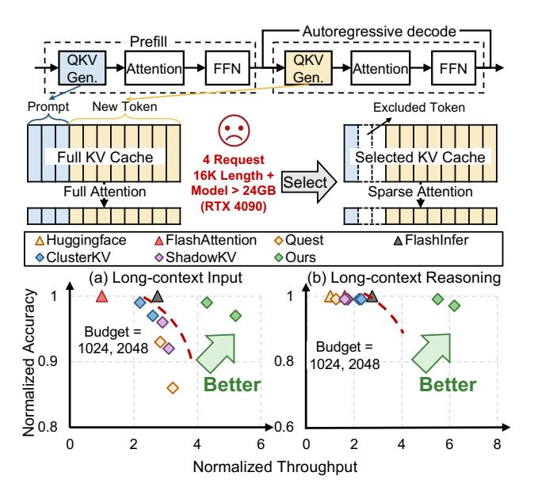
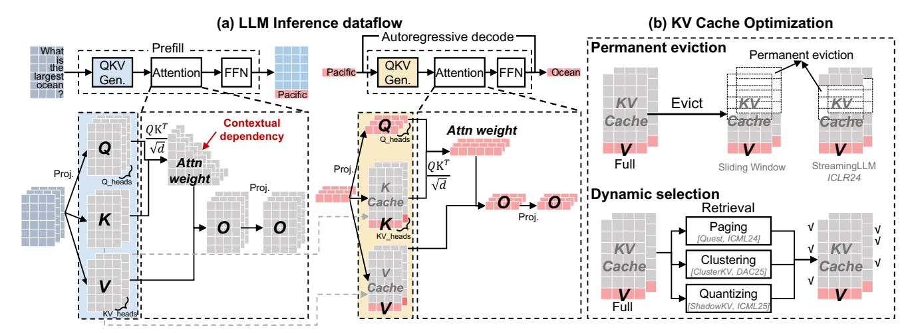
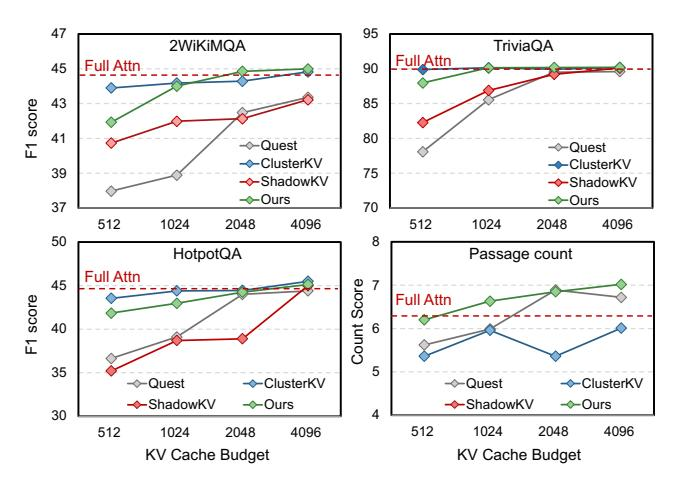
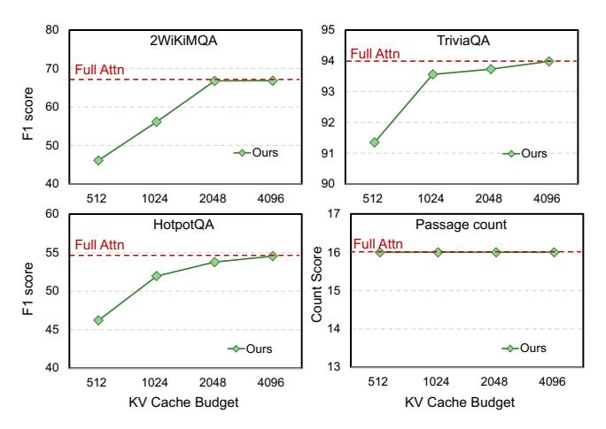
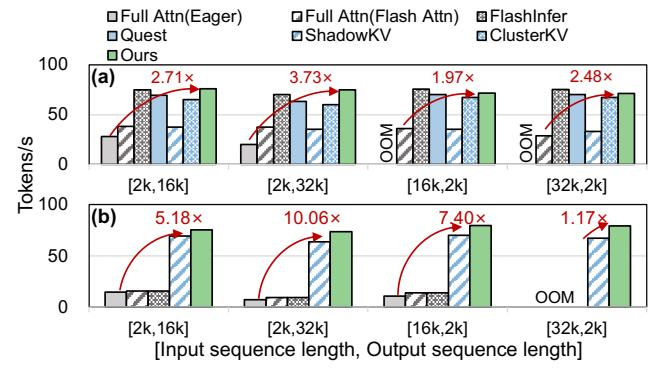
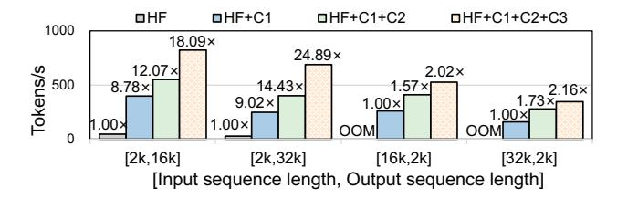

# SpeContext: Enabling Efficient Long-context Reasoning with Speculative Context Sparsity in LLMs

# [Jiaming Xu](https://orcid.org/0009-0000-7000-6537)

jiamingxu@sjtu.edu.cn Shanghai Jiao Tong University; SII Shanghai, China

# [Yongkang Zhou](https://orcid.org/0009-0008-7732-6347)

zeenny.willians@sjtu.edu.cn Shanghai Jiao Tong University; SII Shanghai, China

# [Jiayi Pan](https://orcid.org/0009-0007-0468-4592)

pan\_jiayi@sjtu.edu.cn Shanghai Jiao Tong University; Infinigence-AI Shanghai, China

# [Jiancai Ye](https://orcid.org/0009-0007-6189-3251)

yejiancai@sjtu.edu.cn Shanghai Jiao Tong University Shanghai, China

# [Guohao Dai](https://orcid.org/0000-0003-0849-3252)<sup>∗</sup>

daiguohao@sjtu.edu.cn Shanghai Jiao Tong University; Infinigence-AI; SII Shanghai, China

# [Hanzhen Wang](https://orcid.org/0009-0000-1335-2855)

alex-wang@sjtu.edu.cn Shanghai Jiao Tong University Shanghai, China

# [Yu Wang](https://orcid.org/)

yu-wang@tsinghua.edu.cn Tsinghua University Beijing, China

# Abstract

As test-time scaling in large language model(LLM) reasoning has been proven effective in enhancing the model performance through step-by-step generation, this long-context generation incurs substantial Key-Value(KV) cache, posing a critical bottleneck for practical applications deployment(e.g., Agents). While recent KV cache optimizations perform well in the long-context input scenario, the following problems remain unsolved if directly applied to long-context reasoning. (1) Time-consuming layer-wise retrieval operation. The retrieval operation, which selects the important KV pairs in each layer, brings the synchronization overhead that scales with model depth due to the data dependency, resulting in up to 60% latency overhead. (2) Complete retention of the newly generated KV cache. Existing works designed for long-context input choose to retain the KV pair of newly generated tokens to avoid repeated, time-consuming processing on the KV cache, rendering them ineffective in long-context reasoning. (3) Performance degradation with a tiny increase in sequence length. Existing offloading strategies determined before inference cannot adapt to the increasing sequence length, resulting in > 80% performance degradation with a tiny increase in sequence length.

<sup>∗</sup>Corresponding Author


[This work is licensed under a Creative Commons Attribution-](https://creativecommons.org/licenses/by-nc-nd/4.0)[NonCommercial-NoDerivatives 4.0 International License.](https://creativecommons.org/licenses/by-nc-nd/4.0)

ASPLOS '26, Pittsburgh, PA, USA © 2026 Copyright held by the owner/author(s). ACM ISBN 979-8-4007-2359-9/2026/03 <https://doi.org/10.1145/3779212.3790224>

In this paper, we point out that the objective of the retrieval algorithms is to align with the LLM, which is similar to the objective of knowledge distillation in LLMs. We analyze the similarity in information focus between the distilled language model(DLM) and the original LLM from the perspective of information theory, and thus propose a novel paradigm that leverages a DLM as the retrieval algorithm. Based on the insight, we present SpeContext, an algorithm and system co-design for long-context reasoning. (1) At the algorithm level, SpeContext proposes lightweight retrieval head based on the head-level attention weights of DLM, achieving > 90% parameters reduction by pruning the redundancy. (2) At the system level, SpeContext designs an asynchronous prefetch dataflow via the elastic loading strategy, effectively overlapping KV cache retrieval with the LLM computation. (3) At the compilation level, SpeContext constructs the theoretical memory model and implements an adaptive memory management system to achieve acceleration by maximizing GPU memory utilization. We deploy and evaluate SpeContext in two resource-constrained environments, cloud and edge. Extensive experiments show that, compared with the Huggingface and FlashInfer framework, SpeContext achieves up to 24.89× and 2.19× throughput improvement in cloud and 10.06× and 8.02× speedup in edge with negligible accuracy loss, pushing the Pareto frontier of accuracy and throughput.

CCS Concepts: • Computing methodologies → Natural language generation; Parallel algorithms; • Computer systems organization → Real-time operating systems; • Mathematics of computing → Information theory.

<span id="page-1-0"></span>

**Figure 1.** (a)(b) Pareto frontiers on KV cache selection in long-context input and reasoning scenarios.

*Keywords:* Large Language Models, Long-context Reasoning, Sparse Attention, KV Cache Selection, GPU

#### **ACM Reference Format:**

Jiaming Xu, Jiayi Pan, Hanzhen Wang, Yongkang Zhou, Jiancai Ye, Yu Wang, and Guohao Dai. 2026. SpeContext: Enabling Efficient Long-context Reasoning with Speculative Context Sparsity in LLMs. In Proceedings of the 31st ACM International Conference on Architectural Support for Programming Languages and Operating Systems, Volume 2 (ASPLOS '26), March 22–26, 2026, Pittsburgh, PA, USA. ACM, New York, NY, USA, 16 pages. https://doi.org/10.1145/3779212.3790224

#### <span id="page-1-1"></span>1 Introduction

Generative large language models(LLMs) mark a significant advancement in the pursuit of Artificial General Intelligence(AGI). Their successful application across various domains has greatly contributed to the rapid advancement of numerous downstream tasks (e.g., pharmaceutical [36], finance [25], and ecology [34]), and their remarkable capabilities have attracted widespread attention, spurring the development of a new wave of LLM-based software applications (e.g., AI agents [18]). As the scaling law gradually slows down, the test-time scaling [35] in LLM reasoning is emerging as a powerful tool in enhancing the model capabilities, especially in solving complex problems(e.g., mission planning [13, 18, 52] and mathematical derivation [1]), through step-by-step chain-of-thought generation [19]. Moreover, some latest works point out that as the length of the chainof-thought reasoning increases, the LLM capabilities, especially the mission planning(e.g., 8K reasoning length) and information search(5M search length) in AI agents [52], can be significantly improved.

To effectively support long-context reasoning, LLM providers have enhanced the long-context processing capabilities of their LLMs during pretraining, with context windows of over 100K tokens becoming a common standard (e.g., Kimi K2 with 128K [42] and OpenAI o3 with 200K [14]). Despite these algorithm advances, the computational and memory burden associated with Key-Value(KV) cache still prevents the efficient practical deployment. KV cache is a fundamental component in the LLM, which effectively reduces the computation by reusing past key-value pairs, but introduces significant memory overhead, which is proportional to the context length. Furthermore, during the autoregressive decoding, the generation of each new token requires reading the entire KV cache to compute attention weights, leading to severe latency overhead. For example, in the case of Llama3.1-8B [17] on a NVIDIA RTX 4090 GPU, generating a single token with a 16K context takes twice as long as generating a token with a 1k context, and theoretically generates 2GB of memory footprint for KV cache, which means that for an NVIDIA RTX 4090 GPU, only 3 requests can be processed in parallel at most shown in Figure 1. For the LLM cloud service vendors, the longer response and limited throughput will translate to higher infrastructure costs (e.g., energy and hardware consumption) and suboptimal user experiences [20].

Consequently, many previous works have explored various techniques for KV cache optimization, particularly in resource-constrained environments by reducing the KV cache involved during inference, encompassing algorithm optimization (e.g., permanent eviction [6, 46] and dynamic selection [30, 39, 40] of KV cache), system enhancement (e.g., customized CUDA kernel design [30, 39, 40]). These algorithms establish a paradigm centered on layer-wise retrieval operation during the decoding phase shown in Figure 2(a). LLM inference can be divided into two phases, the prefill and decoding phase detailed in Section 2. Most previous works [30, 39, 40] preprocess KV cache upon completion of the prefill phase, and the corresponding retrieval algorithms retrieve a subset of preprocessed KV cache for each generation during decoding phase.

However, the core trade-off of this paradigm is its departure from mathematical equivalence. By selectively computing attention over a fraction of the context, these methods inherently introduce computational shortcuts that can lead to a degradation in model accuracy. Therefore, as illustrated in Figure 1(a)(b), two Pareto frontiers in long-context input and reasoning scenarios are established, forcing a compromise between inference speed and model accuracy. Despite this paradigm performing well in the long-context input scenario, it still suffers from the following critical limitations during the *decoding* phase if directly applied in the long-context reasoning scenario.

**Challenge-1:** Time-consuming layer-wise retrieval operation. Figure 2(a) shows that the algorithm paradigm needs to perform the retrieval over the KV cache and load the

<span id="page-2-0"></span>

**Figure 2.** Overview of *SpeContext*. (a) Three challenges in existing algorithm paradigm in the long-context reasoning scenario. (b) Key Insight: Distilled language model exhibits similar information focus. (c) Contributions from Section 4 to Section 6

corresponding KV pairs based on the retrieval result before attention computation in each layer, resulting in the sequential dataflow due to data dependency. This serialization introduces substantial synchronization overhead, breaking the natural overlap between computation and memory access in the original pipeline. Furthermore, the retrieval operation is repeated in each layer during decoding, and thus the overhead scales linearly with model depth and quickly becomes bottleneck(up to 60% latency) shown in Figure 2(a).

Challenge-2: Complete retention of the newly generated KV cache. Existing works designed for the long-context input scenario preprocess the KV cache by complex and time-consuming algorithms(e.g., clustering [30] and quantization [39]) during the prefill phase(i.e., the KV cache of the prompt), and only retrieve the preprocessed KV cache and completely retain the newly generated KV pair during the decoding phase to avoid the repeated preprocessing shown in Figure 2(a). With the substantial retrieval overhead in each layer, performance thus degrades greatly in the long-context reasoning scenario, even worse than full attention(i.e., FlashInfer [51]), as shown in Figure 1(b).

Challenge-3: Performance degradation with a tiny increase in sequence length. In resource-constrained environments(e.g., low-end GPU with limited memory in edge and high-end GPU with multi-requests in cloud), KV cache tends to be offloaded to the lower-tier memory (e.g., from GPU HBM to CPU DRAM). However, existing systems determine the offloading strategy that either fully offloading or never offloading (e.g., ClusterKV [30]) before inference. Due to the inference dynamics in LLM reasoning, the predetermined strategy cannot adapt to the increasing sequence length during the autoregressive decoding, resulting in >

<span id="page-2-1"></span>

**Figure 3.** Architecture of *SpeContext*.

80% performance degradation with a tiny increase in sequence length.

In this paper, we point out that the core objective of the retrieval algorithms is to align with the LLM, especially in the information focus, and the retrieval accuracy directly influences the LLM performance(> 10% accuracy gap between Quest [40] and ClusterKV [30] using two different algorithms). Inspired by the objective of alignment in the output distribution in the LLM knowledge distillation [48],

we consider that due to the homology between the distilled LM and the original LLM, the information they focus on (*i.e.*, the important tokens) exhibits a high degree of similarity given the same inputs, and we also analyze this similarity through the mutual information [21] and the data processing inequality [4] in information theory [38]. Therefore, we propose a novel paradigm that leverages a DLM as the retrieval algorithm to efficiently retrieve important information focus shown in Figure 2(b). Based on the insight, we present *SpeContext*, an algorithm and system co-design for speculative context sparsity in long-context reasoning. The contributions of *SpeContext* can be summarized into three levels as follows.

- (1) Lightweight retrieval head design at the algorithm level. Based on the insight mentioned above, we integrate a DLM before the LLM inference shown in Figure 2(c)-C1, and explore the similarity of the focused tokens between the DLM and the original LLM based on the attention weights from two mapping dimensions, head-level and batch-level. Statistical data shows that there exists a higher similarity in the head-level dimension. Therefore, we design a lightweight retrieval head based on the head-level attention weights by pruning the redundant operations in DLM, achieving > 90% parameter reduction.
- (2) Asynchronous prefetch dataflow via elastic loading at the system level. We further point out that, different from the existing works, *SpeContext* selects the important KV pairs before the LLM inference through the lightweight retrieval head, eliminating the data dependency between the KV retrieval and loading during inference. Therefore, we design an asynchronous KV cache prefetch dataflow shown in Figure 2(c)-C2. The dataflow only requires several lines of code about KV positions modification on the original LLM pipeline. Furthermore, we observe that the retrieval results between adjacent token generation are similar, and thus propose an elastic loading strategy into the dataflow, which only loads the different KV pair required by the current generation, successfully reducing data transfer by up to 90%.
- (3) Adaptive memory management at the compilation level. The critical path of LLM inference in resource-constrained environments is dominated by the latency of CPU-GPU data transfer. We develop a theoretical memory overhead model that considers LLM, hardware, and workload to optimize memory usage and inference latency by maximizing the GPU memory utilization. Guided by the model, we propose an adaptive memory management system shown in Figure 2(c)-C3, which adaptively allocates memory to maximize the inference speed with increasing sequence length in LLM reasoning.

The architecture of *SpeContext* is shown in Figure 3. *SpeContext* begins when receiving the inference workload(*e.g.*, requests) processed by the serving system. In the compilation stage, the adaptive memory management system calculates the sequence length thresholds based on the theoretical

model and initializes the memory for the KV cache. During autoregressive inference, the lightweight retrieval head aims to identify critical KV pairs in all KV cache and obtain their indices. These indices are immediately fed to the asynchronous prefetcher for difference calculation, kicking off KV prefetching with elastic loading in parallel with the original LLM inference to enable the overlap of GPU computation and CPU-GPU data transfer.

We deploy and evaluate *SpeContext* in two resource-limited environments, a low-end GPU with limited memory in edge and a high-end GPU with multiple requests in cloud, targeting long-context input and reasoning scenarios. Extensive experiments demonstrate that, compared with the Huggingface and FlashInfer framework, *SpeContext* achieves 24.89× and 2.19× throughput improvement in the cloud environment and 10.06× and 8.02× speedup in the edge environment with negligible accuracy loss, pushing the Pareto frontier of accuracy and throughput for long-context input and reasoning scenarios.

## <span id="page-3-0"></span>2 Background and Related Work

#### 2.1 Large Language Model

Figure 4(a) shows that LLM inference is composed of two phases, *prefill* and *decoding* phase. The *prefill* phase processes the prompt to generate the first token and caches its key-value pairs. Subsequently, the *decoding* phase uses the KV cache to generate the new token autoregressively and appends the new key-value pair to the KV cache. Nowadays, mainstream LLMs select the Transformer decoder [44] as the backbone layer, which primarily includes two modules, the attention mechanism and the feed-forward network(FFN). The attention mechanism requires that the current token generation is solely dependent on previous tokens. The FFN aims to capture deeper features and handle nonlinear relationships.

#### <span id="page-3-2"></span>2.2 KV Cache Optimization

As illustrated in Figure 4(a), to reduce computation, existing LLM inference systems leverage the KV cache to store the keys and values generated from this previous content, but introduce the memory overhead that scales linearly with the context length (*e.g.*, 4GB memory footprint with 32K context in Llama3.1-8B [17]), posing significant challenges in resource-constrained environments.

Owing to the *softmax* operation in attention described in Equation 1, the attention weights exhibit approximate sparsity (*i.e.*, many values are close to zero). Capitalizing on this phenomenon, many techniques emerged to optimize the KV cache, such as permanent eviction and dynamic selection.

<span id="page-3-1"></span>
$$Attn\_weight = softmax(\frac{QK^T}{\sqrt{d}})$$
 (1)

<span id="page-4-0"></span>

Figure 4. (a) Inference dataflow of LLM. (b) Existing works on KV cache optimization.

**Permanent eviction.** Sliding Window [6] is a typical representative of permanent eviction and is still used in some industrial LLM deployments(*e.g.*, Gemma 3 [41]). It retains only a fixed number of the most recent KV pairs(*i.e.*, "window") and evicts the farthest ones as new tokens are generated(*i.e.* "sliding"). While this approach ensures a constant memory for the KV cache, it discards too much historical context, resulting in significant accuracy loss. StreamingLLM [46] represents a notable optimization on this paradigm. It builds on the insight that, due to the nature of the *softmax*, the initial few tokens accumulate a wealth of information, called "attention sink". Therefore, in addition to the sliding window, StreamingLLM perpetually retains these crucial initial KV pairs to improve the model accuracy.

**Dynamic selection.** To address the significant accuracy degradation caused by irreversible information loss in permanent eviction, some works [30, 39, 40] propose the dynamic selection, which retains the entire KV pairs or offloads them to lower-tier memory(e.g., CPU DRAM) in resourceconstrained environments, and retrieves the necessary KV pairs based on the input during inference. In order to minimize the retrieval overhead, most works require preprocessing the KV cache (e.g., paging [40], clustering [30], and quantization [39]). Given the substantial overhead of the preprocessing, most works only preprocess the KV cache of the input prompt after the prefill phase, and only retrieve the preprocessed KV cache during the decoding phase with the retention of newly generated KV pairs. Quest [40] is a representative work in dynamic selection, which partitions the KV cache into pages and creates a page vector by taking the element-wise maximum and minimum values. During retrieval, importance scores are computed only for these page vectors to select the Top-K pages. Subsequently, all KV pairs within the selected pages are loaded for computation. ClusterKV [30] improves upon Quest by employing clustering to categorize the KV cache. It uses the cluster centroids as the cluster vectors for the importance calculation,

leading to a notable accuracy improvement. Similarly, the ShadowKV [39] quantizes the key cache and computes attention between the query and the quantized keys. Based on the results, it selects the important KV pairs for computation. A common characteristic of all these approaches is their reliance on preprocessing the KV cache. This requirement is ill-suited for the long-context reasoning scenario, where the KV cache continuously grows during the *decoding* phase, making repeated preprocessing computationally expensive. In this paper, *SpeContext* aims to achieve the efficient long-context reasoning of LLM through the lightweight retrieval head on raw KV cache without complex preprocessing.

#### <span id="page-4-1"></span>2.3 Knowledge Distillation in LLMs

Knowledge Distillation is a typical technique to address the challenge of deploying the LLMs in some resource-constrained scenarios. Its primary goal is to compress a large "teacher" LLM into a smaller, more efficient "student" LLM while preserving high performance. The student LLM learns to mimic the outputs of the teacher LLM to achieve the alignment of the probability distributions by minizing the Kullback-Leibler Divergence [22] formulated as follows.

<span id="page-4-2"></span>
$$D_{KL}(P_T||P_S) = \sum_{i} P_T(x_i) log(\frac{P_T(x_i)}{P_S(x_i)})$$
 (2)

The  $P_T$  denotes the probability distribution of the teacher LLM, and the  $P_S$  denotes the probability distribution of the student model. Recently, knowledge distillation is further used to accelerate LLM inference through speculative decoding. The EAGLE family [26–28] is a representative work. It leverages a distilled small language model to autoregressively generate draft tokens, which are then fed into the LLM for parallel verification. Since the training objective of the distilled model is to align its output distribution with that of the LLM, the number of tokens passing verification is often greater than one, allowing the LLM to generate multiple tokens in a single forward inference.

#### <span id="page-5-2"></span>3 Motivation

#### <span id="page-5-3"></span>3.1 Two Core Questions of KV Selection

Question: What is the essential objective of retrieval algorithms?

**Answer:** The retrieval algorithms aim to efficiently align with the intrinsic properties on the LLM contextual focus.

Analysis: As mentioned in Section 2.2, permanent eviction strategies [6, 46] are typically informed by coarse-grained statistical and theoretical analysis of the attention mechanism. These works reveal intrinsic, input-agnostic properties of LLMs, such as the consistent focus on local context or specific absolute positions (e.g., the initial tokens [46]), leading to the design of fixed retrieval algorithms that are independent of the input query. In contrast, dynamic selection strategies [30, 39, 40] are based on fine-grained experimental analysis that the focus is highly dynamic and content-dependent. By leveraging the intrinsic properties of LLMs(e.g., representational similarity [30] and low-rank characteristics [39]), these works propose query-aware retrieval algorithms. As illustrated in Figure 2(b), we point out that the core of the retrieval algorithms is to first identify the intrinsic properties of the LLM on the contextual focus, and then align with these properties in an efficient way. The alignment degree between the retrieval algorithm and LLM decides retrieval accuracy, proportional to the model accuracy.

# Question: Why do the existing retrieval algorithms need complex and time-consuming preprocessing?

**Answer:** The primary purpose of preprocessing is to mitigate the computational overhead during retrieval.

**Analysis:** To retrieve the important KV pairs, most existing retrieval algorithms in each layer take matrix multiplication of  $Query \in R^{bsz \times heads \times dim}$  with  $Keys_{candidate} \in R^{dim \times heads \times len_{keys}}$  to get the importance scores, and then select the Top-K candidates for the final computation. Therefore, the retrieval overhead $(O_{tot})$  in a single LLM inference can be defined as follows.

<span id="page-5-0"></span>
$$O_{tot} = layers \times bsz \times heads \times dim \times len_{keys} \times O_{mul}$$
 (3)

As mentioned in Section 2.2, Quest and ClusterKV leverage preprocessing algorithms (e.g., paging and clustering) which select a single vector as the representative of several Keys, to reduce the length of candidate  $keys(len_{keys})$ . ShadowKV reduce the single multiplication overhead( $O_{mul}$ ) by quantizing the key vectors to low bit level. From Equation 3, if without preprocessing, the retrieval overhead is equivalent to the attention weights computation in Equation 1, losing the meaning of KV selection.

#### <span id="page-5-1"></span>3.2 Key Insight and Theoretical Analysis

**Key Insight.** Inspired by the alignment objective of knowledge distillation in LLM and its wide application across various domains(*e.g.*, speculative decoding [26–28] and early

exiting [47]), we consider that the goal of DLM in these works is to generate the probability distribution that resembles the original LLM. From the perspective of information, we intuitively consider that if the probability distribution is nearly the same, the contextual information focus(*i.e.*, the tokens contribute most to the result) in the DLM and the original LLM must be highly similar. Otherwise, any significant information discrepancy would prevent the alignment in the probability distribution.

**Theoretical Analysis.** As mentioned in Section 2.3, the objective of knowledge distillation in LLMs is to minimize the KL divergence of the probability distributions in Equation 2. We consider that this inherently requires the student model to learn the context information extraction strategy similar to that of the teacher model. This insight can be analyzed through mutual information [21] and the data processing inequality [4] in information theory [38]. Mutual information(I(X;Y)) measures the dependence between two variables. For a well-trained teacher model(T), there exists high mutual information between the output probability distribution  $(P_T)$  and the input context(C) (i.e.,  $I(C; P_T)$  is large). This means that the teacher's output is highly dependent on the context and not random guessing. Moreover, the information flow from the context(*C*) through the internal representation( $R_S$ ) of the student model(S) to output probability distribution ( $P_S$ ) forms a Markov chain [32]:

$$C \to R_S \to P_S$$
 (4)

According to the DPI, we can get

$$I(C, P_S) \le I(C, R_S) \tag{5}$$

This indicates that the amount of information about the context contained in the output cannot exceed the information captured by its internal representation. The distillation process drives  $P_S \to P_T$  by minimizing  $D_{KL}(P_T||P_S)$ . Since  $P_T$  has high mutual information with C, a successful distillation will ensure that  $P_S$  also exhibits high mutual information with C, i.e.,  $I(C, P_S) \to I(C; P_T)$ . To achieve a high level of  $I(C, P_S)$ , the DPI dictates that the student model must learn to generate an internal representation( $R_S$ ) that also captures significant contextual information in C, ensuring that  $I(C, R_S) \geq I(C, P_S)$ . Therefore, the student model must extract the contextual information that the teacher model deems important.

Building on the insight and analysis above, we propose a **novel paradigm that leverages the DLM of the original LLM as the retrieval algorithm**. This paradigm can transfer the information focus from the DLM to the original LLM during inference, eliminating layer-wise time-consuming retrieval detailed in Section 1 and complex preprocessing mentioned above, and thus effectively supporting the long-context reasoning scenario.

<span id="page-6-1"></span>

**Figure 5.** (a) We design the lightweight retrieval head by pruning redundancy and adopt the head-level attention weights for selection. (b) $\sim$ (e) The detailed implementations of four attention mechanisms supported by the lightweight retrieval head.

<span id="page-6-2"></span>**Table 1.** Analysis on attention weights with short input.

|        | Budget | gsm8k      | QA         | Humaneval-code |
|--------|--------|------------|------------|----------------|
| Head-  | 32     | 0.74(0.13) | 0.86(0.10) | 0.75(0.13)     |
| Level  | 64     | 0.80(0.10) | 0.91(0.06) | 0.81(0.12)     |
| Batch- | 32     | 0.68(0.15) | 0.72(0.13) | 0.68(0.16)     |
| Level  | 64     | 0.72(0.12) | 0.79(0.10) | 0.75(0.12)     |

#### <span id="page-6-0"></span>4 Lightweight Retrieval Head Design

#### 4.1 Challenge: Time-consuming DLM

Based on the key insight mentioned above, we deploy the DLM before the original LLM to capture globally important tokens shown in Figure 3. In this paper, we utilize the DLM provided by EAGLE-3 [28], which has the complete LM architecture(including *tokenizer*, *embedding* and *LM\_Head*) with a single Transformer decoder layer. As shown in Figure 3, the DLM processes the same inputs as the LLM, and performs complete inference with the full KV cache, resulting in  $\sim 20\%$  additional overhead, especially for the LLM with large vocabulary(e.g.,  $> 1.2 \times 10^5$  tokens in Llama3-8B). Therefore, the key issue is **how to design a lightweight retrieval algorithm based on the DLM** to minimize the overhead.

#### <span id="page-6-4"></span>4.2 Insight and Analysis: Redundant Operation

We further point out that the role of the single-layer DLM is primarily to identify all important tokens in multi-layer LLM, which are often determined by the attention weights. For example, when LLM processes "What is the largest ocean?", the first layer in LLM might focus on "?" with 0.8 attention weight, and the second layer might focus on "What" with 0.9 attention weight, and third layer might focus on "largest" with 0.5 attention weight and "ocean" with 0.4 attention weight. However, the attention distribution of DLM

<span id="page-6-3"></span>Table 2. Analysis on attention weights with long input.

|       | Budget | Longmagpie | HotpotQA   | RepoBench  |
|-------|--------|------------|------------|------------|
| Head- | 512    | 0.89(0.07) | 0.90(0.07) | 0.88(0.09) |
| Level | 1024   | 0.95(0.04) | 0.97(0.02) | 0.92(0.07) |
| Batch | 512    | 0.70(0.09) | 0.79(0.10) | 0.72(0.12) |
| Level | 1024   | 0.73(0.08) | 0.83(0.06) | 0.76(0.10) |
|       |        |            |            |            |

might be "What" with 0.2 attention weight, "is" with 0.1 attention weight, "largest" with 0.25 attention weight, "ocean" with 0.25 attention weight, "?" with 0.2 attention weight. Therefore, we do not expect or require the attention distribution of DLM to be identical to that in any of the LLM's layers, and as illustrated, it would be impossible for it to be. Our objective is to ensure a crucial outcome, "Do the tokens selected by the DLM capture high LLM attention weights?". We conduct experiments on the similarity between the DLM and the original LLM from two mapping dimensions in attention weights, batch-level and head-level in Figure 5(a), and demonstrate the mean and standard deviation of the sum of attention weights for selected tokens across diverse datasets(Math[gsm8k [8]], QA[QA [23], LongBench-HotpotQA [50]], Code[Humaneval-code [7], LongBenchrepobench [31]], Multi-doc[Longmagpie [16], LongBench-HotpotQA [50]]) in Table 1 and Table 2. The batch-level retrieval adopts a coarse-grained approach, retaining a single set of important tokens that apply to all attention heads. In contrast, the head-level retrieval is more fine-grained, retaining different important tokens for each attention head. As illustrated in Figure 5, the head-level retrieval exhibits a higher similarity of the important tokens and higher hit rate of the generated tokens. Therefore, we only need operations related to the calculation of attention weights (e.g., Query and Key generation), while other operations are redundant.

#### 4.3 Approach: Lightweight Retrieval Head

Building on the insight and analysis, we design the light-weight retrieval head based on the DLM. The retrieval head supports three mainstream LLM attention mechanisms (*i.e.*, Multi-Head Attention(MHA), Grouped-Query Attention(GQA), Multi-Query Attention(MQA), and Multi-Head Latent Attention(MLA)). The implementation details are as follows.

Implementation Details. As illustrated in Figure 3, we deploy the retrieval head before the original LLM and process the same input as the LLM. This retrieval head retains the essential components of DLM provided by EAGLE-3 [28], the embedding module and the QK projection weights. Although the original DLM only supports 2k context length, we enable it to process long context using the training-free method provided by YaRN [37]. During the inference, the retrieval head maintains a full Key (K) cache and calculates attention weights after the QK projection. Based on the analysis in Section 4.2, we perform the head-level retrieval of important tokens based on the attention weights and feef the selected tokens into the original LLM inference. The implementation of the head-level retrieval tailored for the different attention mechanisms is as follows.

**Support for MHA.** MHA was once a mainstream attention mechanism adopted by many LLMs(e.g., Llama-2 [43]). The number of heads for Keys(K) and Values(V) is the same as that of Queries(Q) in Figure 4(a). Since the attention mechanism of the retrieval head is the same as that of the original LLM, the retrieval head selects important tokens at the head level based on the attention weights shown in Figure 5(b). The selected tokens are then mapped to the attention computation of the original LLM by using the torch. gather operation to load the important KV cache into different heads.

**Support for GQA.** GQA is introduced to optimize the substantial KV cache overhead of MHA, and most mainstream LLMs(e.g., Llama3 [17] and Qwen3 [49]) have updated to GQA. As illustrated in Figure 5(c), GQA divides the query heads into groups, where all heads in the group share the same KV cache. Consequently, the number of heads in the KV cache is reduced to  $\frac{1}{\alpha}$  of the query heads, where  $\alpha$  is the number of groups. For computational convenience, the KV heads are often repeated  $\alpha$  times before the attention calculation, resulting in attention weights with the same number of heads as the query. This thus creates the mismatch between the attention weights of the retrieval head and the physical KV cache of original LLM in head numbers. To address this, as shown in Figure 5(c), we apply an element-wise maximum operation along the hidden dimension within the same group of heads in the attention weights, to generate the group-level attention weights. We then take the grouplevel attention weights for important token selection and subsequent operations, which are similar to MHA.

**Support for MQA.** MQA divides all heads of the query into a single group, where all heads share the same KV cache.

<span id="page-7-0"></span>

**Figure 6.** (a) The latency of prefetching with different KV budget and a LLM layer inference. (b) Overlap rate of selected tokens in adjacent generation with different KV budget.

Therefore, the implementation of *SpeContext* in MQA is similar to that in GQA shown in Figure 5(d), *i.e.*, *n* is changed to the number of all heads.

**Support for MLA.** MLA is a novel variant of MHA employed in a new series of models(e.g., DeepSeek-V3/R1 [29] and Kimi-K2 [42]). Instead of caching the full Key-Value pairs, MLA caches a lower-dimensional latent representation, denoted as c. During computation, the c is mapped to a higher dimensional space for the attention calculations. Since MLA does not reduce the number of attention heads, our retrieval remains similar to that in MHA. The primary difference lies that only the selected c cache is subjected to the increase in dimension as shown in Figure 5(e).

### <span id="page-7-1"></span>5 Asynchronous Prefetch Dataflow

#### 5.1 Motivation: Data independence

As previously mentioned in Section 1, inference engines will offload the KV cache to lower-tier memory in resource-constrained environments. As illustrated in Figure 7, existing KV cache retrieval works must load the required KV cache based on retrieval results for attention computation in each layer. This design introduces the synchronization and control caused by data dependencies. As mentioned in Section 3.2, the lightweight retrieval head in is deployed before LLM inference and dependent solely on the LLM input. eliminating the data dependency mentioned above. Consequently, we further propose the asynchronous dataflow through multiple CUDA streams, enabling concurrent execution of computation and KV cache prefetching shown in Figure 2(c)-C2.

#### 5.2 Challenge: Heavy Data transfer

However, due to the combination of limited memory bandwidth and the immense computational power of GPUs, a significant imbalance arises. As illustrated in Figure 6(a), for the large KV budget(*i.e.*, self-determined amount of KV cache for loading), the data transfer latency far exceeds the LLM inference latency As a result, in resource-constrained scenarios, the end-to-end inference latency becomes dominated by the I/O for loading the KV cache. Therefore, the key challenge is **how to reduce the data transfer time** (*i.e.*, **minimize the volume of KV cache loaded**) without sacrificing accuracy.

<span id="page-8-1"></span>

**Figure 7.** Elastic loading effectively reduces the KV transfer, making *SpeContext* outperform previous works.

#### 5.3 Insight: Contextual Similarity

Inspired by the contextual similarity explored in early exiting [47] and sparse activation [33], we conduct experiments to explore the relationship of the selected tokens between two adjacent token generation. As illustrated in Figure 6(b), statistical analysis reveals the high overlap(> 80%) in the important token selection between adjacent generation. This implies that for the subsequent generation, only about 20% of the KV cache on GPU requires to be updated. Consequently, we can maintain the accuracy by loading only 20% updating KV cache, effectively reducing the data transfer volume.

#### 5.4 Approach: Elastic Loading

Based on the contextual similarity, we propose the elastic loading strategy and integrate it into the asynchronous dataflow. Its objective is to reuse the KV cache already resident on the GPU from the previous generation and fetch only those not yet present. This strategy can be implemented with minimal code modifications to the existing asynchronous dataflow. The implementation details are as follows. We denote the set of important token indices in last generation as  $S_{last}$ . And we obtain the indices  $S_{now}$  for current generation by the retrieval head. The set of KV cache indices to be updated on GPUs can be calculated by the set difference  $S_{last} - S_{now}$  while the KV cache indices for elastic loading are calculated by  $S_{now} - S_{pre}$ . Because we maintain a fixed KV budget(i.e.,  $|S_{last}| = |S_{now}|$ ), it follows that  $|S_{last} - S_{now}| = |S_{now} - S_{last}|$ . Then  $S_{last}$  needs to be updated by  $S_{now}$ . Practically, we perform in-place updates for the required KV loading through Tensor.copy\_().

<span id="page-8-2"></span>**Table 3.** Symbols mentioned in Section 6 and description.

| Category | Symbol      | Description                         |  |  |  |
|----------|-------------|-------------------------------------|--|--|--|
|          | $M_O$       | Memory size of original LLM         |  |  |  |
|          | $M_D$       | Memory size of DLM                  |  |  |  |
|          | L           | Number of layers in LLM             |  |  |  |
|          | D           | Head dimension in LLM               |  |  |  |
| Model    | H           | Number of KV heads in LLM           |  |  |  |
| Model    | S           | Current sequence length             |  |  |  |
|          | B           | KV cache retrieval budget           |  |  |  |
|          | $L_{CPU}$   | Number of layers of KV cache on CPU |  |  |  |
|          | $L_{GPU}$   | Number of layers of KV cache on GPU |  |  |  |
|          | α           | Groups of attention heads           |  |  |  |
| Hardware | $Mem_{GPU}$ | Size of GPU global memory           |  |  |  |
| Workload | R           | Requests                            |  |  |  |

# <span id="page-8-0"></span>6 Adaptive Memory Management

#### 6.1 Motivation: Performance Degradation

As mentioned in Section 1, most existing works designed for long-context input scenario determines the KV cache management strategy that whether to store the entire cache in GPU HBM or offload it to CPU DRAM before LLM inference. However, unlike the long-context input scenario, the sequence length exhibits is dynamic and unpredictable in the long-context reasoning scenario because the inference termination is completely determined by the LLM itself. Consequently, as shown in Figure 2(a), even a tiny increase in task workload (e.g., the longer context length and more requests) can trigger a complete offload of the entire KV cache to the CPU, leading to > 80% performance degradation.

#### 6.2 Approach: Adaptive Memory Management

**Theoretical Model and Analysis.** Inspired by a series of works on adaptive scheduling for resource allocation [9, 47], we develop a theoretical memory overhead model based on LLM architecture, hardware specifications and inference workload detailed in Table 3, and further propose a novel adaptive memory management system.

During LLM inference, additional memory, called runtime memory, is required to serve as a temporary buffer to store intermediate values (*e.g.*, activations). We checked some references and found that runtime memory typically amounts to around 20% to 30% of the model size [5, 9, 15, 53]. This buffer is dynamically used and released during the LLM inference. As a result, we select 30% of the model size as the runtime memory. As mentioned in Section 4, the decode layer of DLM is consistent with the original LLM architecture and has only one layer, and due to the repeat\_kv operation in GQA or MQA, an additional buffer( $S\alpha HD$ ) must allocated for computation. So the total number of layers in the KV cache is  $(L+1+\alpha)$ . Moreover, Due to the Key and Value with FP16 precision which is 2 byte per value, the coefficient of KV cache is 4. Therefore, we can calculate the total memory

#### <span id="page-9-3"></span>**Algorithm 1** Adaptive memory management in inference

 Input: The sequence length threshold list:  $S^T = [S_0^T, ...S_L^T]$ ,

 Prompt:  $input\_id$ , LLM Layers:  $Layer = [Layer_0, ...Layer_{L-1}]$ .

 1:  $L_{CPU} \leftarrow 0$ ;  $L_{GPU} \leftarrow L$  ▶ Initiate  $L_{CPU}$  and  $L_{GPU}$  

 2:  $S \leftarrow len(input\_id)$  ▶ Initiate Sequence length S 

```
▶ Initiate Sequence length S
 3: while True do
       while S \ge S_{L_{CPU}}^T and L_{CPU} < L do
 4:
          KV\_Cache\_Offload(L - L_{CPU} - 1) \Rightarrow Offload the KV
          cache of Layer_{L-LCPU-1}
          L_{CPU} \leftarrow L_{CPU} + 1
 6:
       end while
 7:
       input id = LLM(input id)
 8:
       S \leftarrow S + 1
 9:
10:
       if stop_id in input_id then
          Break
11:
12:
       end if
13: end while
```

requirements for placing all KV cache the GPU as follows.

<span id="page-9-0"></span>
$$M_{all} = M_{Model} + M_{KV} = 1.3(M_O + M_D) + 4R(L + 1 + \alpha)SHD$$
 (6)

Based on the Equation 6, if we keep all the data on the GPU, we need to make sure that  $M_{all} < Mem_{GPU}$ .

For the resource-constrained environment (e.g., low-end GPU with limited memory (i.e.,  $Mem_{GPU}$  is insufficient) and high-end GPU with multi-requests (i.e.,  $M_{all}$  is too large)), it is necessary to split the KV cache across different memory tiers. Specifically, the KV cache of some layers ( $L_{GPU}$ ) should be stored on the GPU, while the KV cache of others ( $L_{CPU}$ ) are offloaded to the CPU. However, for the layers where the KV cache is offloaded to the CPU, it is still necessary to reserve a small GPU buffer to store KV cache budget (B) loaded from the CPU for the computation. Therefore, the total memory requirements in this case can be calculated as follows:

$$M_{part} = 1.3(M_O + M_D) + 4R[(L_{GPU} + 1 + \alpha)S + (L_{CPU}B)]HD$$
(7)

To maximize the utilization of the GPU memory, the theoretical optimization model thus can be abstracted as follows.

<span id="page-9-1"></span>
$$Max(L_{GPU});$$
  
 $s.t. \ M_{part} \le Mem_{GPU}$  (8)

**6.2.1 Implementation Details.** As mentioned above, the sequence length grows continuously during long-context reasoning. Following the objective of maximizing  $L_{GPU}$  in Equation 8, we propose an adaptive memory management system that progressively offloads the KV cache of each LLM layer to the CPU as the context length increases during reasoning, thereby freeing additional GPU memory to store more KV cache in other layers. Our analysis indicates that during the inference, the primary factor influencing memory overhead is the sequence length. Capitalizing on this, we can pre-calculate the sequence length thresholds in compilation detailed in Algorithm 2. The threshold  $S_0^T$  represents that

<span id="page-9-2"></span>**Algorithm 2** Sequence length threshold calculation in compilation

```
Input: The Symbols in Table 3.

Output: The sequence length threshold list S^T = [S_0^T, ... S_L^T].

1: S_0^T \leftarrow \lfloor \frac{Mem_{GPU} - 1.3 \times (M_O + M_D)}{4 \times R \times H \times D \times (L + 1 + \alpha)} \rfloor \Rightarrow \text{Place all KV cache on GPU}

2: \mathbf{for} \ i \leftarrow 1 \ \text{to} \ L \ \mathbf{do}

3: S_i^T = \lfloor \frac{Mem_{GPU} - 1.3 \times (M_O + M_D) - (i \times B) \times R \times H \times D}{4 \times (L + 1 + \alpha - i) \times R \times H \times D} \rfloor \Rightarrow \text{Place last}
\ni layers of KV cache on GPU

4: \mathbf{end} \ \mathbf{for}

5: \mathbf{return} \ S^T
```

<span id="page-9-4"></span>if we want to place all the KV cache on GPU, the current sequence length(S) must be smaller than  $S_0^T$ . If  $S > S_0^T$ , we need to offload the KV cache of the final layer to CPU for more GPU memory.

During LLM inference, the adaptive memory management system will offload the KV cache of an additional layer to CPU DRAM at the exact time point based on these thresholds to maintain optimal memory usage. Algorithm 1 shows the details of LLM inference with adaptive memory management. For example, if the prompt length is between  $S_2^T$  and  $S_3^T$  at the beginning of LLM inference, the system will offload the KV cache of last two layers(e.g., the 31st and 32nd layer in Llama3-8B) to CPU DRAM and keep the KV cache of the left layers on GPU. As sequence length increases during inference(i.e., line 9 in Algorithm 1) and exceeds  $S_3^T$ , the management system will offload the KV cache of the 30th layer to CPU. With the adaptive memory management, we maximize the utilization of GPU HBM for better performance and convenient deployment.

#### 7 Evaluation

#### 7.1 Environmental Setup

We evaluate the performance of *SpeContext* with various LLMs in two resource-constrained environments, a low-end GPU with limited memory in edge and a high-end GPU with multi-requests in cloud, targeting the long-context input and reasoning scenarios. We compare the performance with several LLM inference engines and some latest works on KV cache optimization in these two environments.

Table 4. Hardware Platforms

<span id="page-9-5"></span>

|     | High-end GPU                            | Low-end GPU                             |
|-----|-----------------------------------------|-----------------------------------------|
| GPU | A800, 80GB HBM<br>CUDA 12.1             | RTX 4060 Laptop<br>8GB GDDR6, CUDA 12.6 |
| CPU | Intel Xeon Platinum 8358<br>1008GB DRAM | Intel i7-13650HX<br>24GB DRAM           |

Hardware Platforms. For the scenario of the high-end GPU with multi-requests in cloud, we choose a workstation with an NVIDIA A100-80GB GPU. For the scenario of the low-end GPU with limited memory in edge, we select the Lenovo Legion Y7000 PC with NVIDIA RTX 4060 Laptop

<span id="page-10-0"></span>

Figure 8. Accuracy in LongBench on Llama3.1-8B.

GPU(8GB) and Intel i7-13650HX CPU. Table [4](#page-9-5) shows the detailed hardware specification.

Baselines. To evaluate the performance, we select the typical LLM framework Huggingface [\[45\]](#page-14-11) and the famous LLM inference fast engine, FlashInfer [\[51\]](#page-14-3), as the baselines for full attention. We also select three latest open-sourced works on KV cache optimization, Quest [\[40\]](#page-13-12), ClusterKV [\[30\]](#page-13-10) and ShadowKV [\[39\]](#page-13-11) as the baselines for sparse attention.

Models and Benchmarks. We select three LLMs, Llama3.1- 8B [\[17\]](#page-13-8), DeepSeek-R1-Distill-Llama-8B [\[29\]](#page-13-25) and Qwen3-8B [\[49\]](#page-14-9) for evaluation in the cloud environment with multiple requests on single GPU. We also select a larger LLM, Llama3.1- 70B [\[17\]](#page-13-8) for evaluation on multi-GPUs in cloud with multiple requests. For the edge environment, we select the Reasoning-Llama-3.2-1B [\[12\]](#page-13-29), which is the reasoning model finetuned on Llama3.2-1B [\[17\]](#page-13-8), due to the limited memory. To evaluate the accuracy of SpeContext in two scenarios mentioned above, we select the four tasks(i.e., 2WiKiMQA, TriviaQA, HotpotQA, and Passage count) from LongBench [\[2\]](#page-12-5) for the longcontext input scenario, the LongWriter benchmark [\[3\]](#page-12-6) for the long-context reasoning scenario and the ultrachat [\[11\]](#page-13-30) dataset for multi-round dialogue scenario.

# 8 Evaluation

#### 8.1 Evaluation on Accuracy

8.1.1 Results in Long-context Input Scenario. Figure [8](#page-10-0) and Figure [9](#page-10-1) shows the accuracy results of four tasks in Long-Bench on Llama3.1-8B and Llama3.1-70B. Different from existing work, which selects tokens in each layer, we only select globally important tokens before each inference. Therefore, when the budget is small (i.e., 512), our accuracy is slightly lower than ClusterKV [\[30\]](#page-13-10). When the budget reaches 1k, SpeContext surpasses the baselines and reaches the accuracy of full attention.

<span id="page-10-2"></span>8.1.2 Results in Long-context Reasoning Scenario. We use OpenAI GPT-4o to score the output generated from

<span id="page-10-1"></span>

Figure 9. Accuracy in LongBench on Llama3.1-70B.

SpeContext and baselines on six dimensions(relevance, accuracy, coherence, clarity, breadth and depth and reading experience). Figure [10](#page-11-0) shows the average scores, and the detailed score is in Table [6](#page-15-1) in Appendix [A.](#page-14-12) During experiments, we find that since Quest, ClusterKV and ShadowKV only preprocess the input and retain the KV pair of the newly generated tokens as mentioned in Section [3,](#page-5-2) the input content, which is only about 100 tokens and less than all the KV budgets, will be completely selected during inference. Therefore, the generated outputs with different KV budgets are the same, resulting in the same scores close to the score of the full attention, but with poor throughput due to the invalid KV optimization. We find that SpeContext might get higher score even than full attention in Figure [10\(](#page-11-0)e.g., Qwen3-8B with 4096 budget), and thus we profile the output of SpeContext and full attention and point out that the full attention suffers from repetition which significantly hurts its score while SpeContext with sparse attention mechanism mitigates this specific issue, obtaining higher score.

<span id="page-10-3"></span>8.1.3 Results in Multi-round dialogue Scenario. For the multi-round dialogue dataset, ultrachat, we evaluate Distill-DeepSeek-Llama3-8B with different KV budgets and use the GPT-4o to score the output on six dimensions(relevance, accuracy, coherence, clarity, breadth and depth and reading experience). The detailed data is shown in Table [7](#page-15-2) in Appendix [A.](#page-14-12)

#### 8.2 Evaluation on Speedup and Throughput

Based on the accuracy evaluation, we select 2048 as the KV budget for the following evaluation. We only select DeepSeek-Distill-Llama-8B and Qwen3-8B for speedup evaluation because Llama3-8B and DeepSeek-Distill-Llama-8B share the same model architecture without impact on speed.

8.2.1 High-end GPU with multiple requests in cloud. We evaluate SpeContext in two cloud cases, single request and multiple requests, because Quest and ClusterKV only support the single request. Figure [11\(](#page-11-1)a) shows the result of

<span id="page-11-2"></span>

| Model                         | [In, Out]                                        | Full Attn(Eager)                                 | Full Attn(Flash Attn)                                                      | Full Attn(FlashInfer)                                                           | ShadowKV                                                                         | Ours                                                                               |
|-------------------------------|--------------------------------------------------|--------------------------------------------------|----------------------------------------------------------------------------|---------------------------------------------------------------------------------|----------------------------------------------------------------------------------|------------------------------------------------------------------------------------|
| DeepSeek-Distill<br>-Llama-8B | [2k, 16k]<br>[2k, 32k]<br>[16k, 2k]<br>[32k, 2k] | 45.57(4, 1.00×)<br>27.74(4, 1.00×)<br>OOM<br>OOM | 145.88(16, 3.20×)<br>87.74(8, 3.16×)<br>87.71(8, 1.00×)<br>46.89(6, 1.00×) | 490.04(16, 10.75×)<br>314.25(8, 11.32×)<br>320.41(8, 3.65×)<br>222.06(8, 4.74×) | 366.74(16, 8.05×)<br>240.47(16, 8.67×)<br>168.06(32, 1.92×)<br>132.07(64, 2.81×) | 824.22(32, 18.09×)<br>690.59(32, 24.89×)<br>526.47(16, 6.02×)<br>346.88(16, 7.40×) |
| Qwen3-8B                      | [2k, 16k]<br>[2k, 32k]<br>[16k, 2k]<br>[32k, 2k] | 33.77(4, 1.00×)<br>19.28(4, 1.00×)<br>OOM<br>OOM | 129.67(16, 3.83×)<br>62.89(8, 3.26×)<br>60.31(8, 1.00×)<br>32.56(6, 1.00×) | 420.12(16, 12.44×)<br>254.92(8, 13.22×)<br>259.28(8, 4.29×)<br>156.92(6, 4.81×) | -<br>-<br>-                                                                      | 592.39(32, 17.54×)<br>424.92(32, 22.03×)<br>336.71(16, 5.58×)<br>210.75(16, 6.47×) |

Table 5. End-to-end throughput (tokens/s) of high-end GPU with multiple requests in cloud.

<span id="page-11-0"></span>

Figure 10. Average score on LongWriter benchmark.

a single request case. *SpeContext* outperforms others in the long-context reasoning scenario because *SpeContext* effectively reduces the KV cache in attention computation during generation and others use time-consuming preprocessing mentioned in Section 3.1, but is slightly slower than FlashInfer in long-context input scenario due to the time-consuming retrieval. The results of another case with multiple requests are shown in Table 5. The grey text is the number of requests and the green text is normalized speedup in throughput compared with full attention using Eager implementation in Huggingface. Experiments show that *SpeContext* achieves up to 24.89× and 2.20× throughput improvement compared with full attention(eager) and state-of-the-art implementation FlashInfer [51].

# **8.2.2** Low-end GPU with limited memory in edge. In the edge scenario, we limit the GPU memory usage to 4GB and compare the performance with full attention(Eagle and Flash Attention [10]) and ShadowKV with the offloading strategy. Figure 11(b) shows that *SpeContext* achieves up to 10.06× and 1.17× speedup compared with full attention(eager) and state-of-the-art implementation ShadowKV [39].

<span id="page-11-1"></span>

**Figure 11.** End-to-end throughput with a single request (a) in the cloud environment (b) in the edge environment.

#### 8.2.3 Multi-GPU with abundant resources in cloud.

We evaluate Llama3.1-70B with pagedKV [24] using 8 A800-SXM 80GB. In common multi-GPU parallelism strategies(tensor parallelism, pipeline parallelism and expert parallelism), the KV cache remains local to each GPU and does not involve GPU transmission via NVLink or PCIE. Our logical elastic loading in Section 5 is highly compatible with them. The additional overhead is only the token index([batchsize, 1, heads, budget]) transmission from the DLM device to other devices. Since the other baselines don't support multi-GPU inference, we achieve 1.74× with multi-requests compared with FlashInfer framework.

#### 8.3 Overhead Evaluation

The overhead in this paper primarily is the memory and training of the retrieval head. As described in Section 4, the retrieval head is obtained through DLM pruning. The weight of the retrieval head for Llama3-8B or Qwen3-8B is only about 60MB. And the K cache is analyzed in Section 6. For the training time, the DLM is provided by EAGLE-3 [28], which only needs 24 hours of training using an RTX 3090 GPU for Llama3-8B or Qwen3-8B as described in its paper.

#### 8.4 Ablation Study

We select the results of the DeepSeek-Distill-Llama-8B in Table 5 for the ablation study shown in Figure 12.

**8.4.1** C1: Lightweight retrieval head. *SpeContext* is developed based on the FlashInfer framework [51]. The speedup

<span id="page-12-7"></span>

**Figure 12.** Ablation study of three contributions.

of C1 mainly comes from two parts, the FlashInfer framework, which provides a better backend, and sparse attention, which enables more parallel requests processing due to lower memory requirements on the GPU.

**8.4.2 C2: Asynchronous prefetch dataflow.** Due to the heavy KV transfer in C1, the inference is bound to the memory access. Therefore, the speedup improvement of asynchronous dataflow with elastic loading in Figure 12 is mainly from the reduction in data volume.

**8.4.3 C3: Adaptive memory management.** Guided by the theoretical model, we aim to place more KV cache on the GPU to minimize the data transfer overhead, achieving speedup improvement in Figure 12 compared with the HuggingFace with complete offloading.

#### 9 Future Work

#### 9.1 DLM Design

In Section 4, we propose to use the DLMs from EAGLE [28]. EAGLE relies on Kullback-Leibler divergence loss  $(L_{KL})$  [54] to align the output distribution between the student model (DLM) and the teacher model (orginal LLM), implicitly guiding the student model to align its contextual focus with the teacher model as illustrated in Section 3. However, we consider that we can make this explicit by adding a new loss( $L_{attn}$ ) as follows in the future work.

$$L = L_{KL} + \alpha L_{attn} \tag{9}$$

$$L_{attn} = -\sum_{i \in I} DLM\_Attn\_weight(i)$$
 (10)

$$I = \bigcup \{idx | idx = TopK(LLM\_Attn\_weight_l), l = 0...L - 1\}$$
 (11)

#### 9.2 Fallback Mechanism

In the future work, to avoid the significant accuracy loss, we consider a confidence-based fallback mechanism. We sum the weights of selected tokens in DLM. If this sum falls below a predefined threshold(*e.g.*, 0.8), we consider this attention is not concentrated on a small set of tokens. Therefore, the fallback mechanism will make LLM revert to the full attention mechanism.

#### 10 Conclusion

In this paper, we analyze the similarity in information focus between the distilled language model(DLM) and the original LLM from the perspective of information theory, and propose a novel paradigm that leverages a DLM as the retrieval algorithm for important information selection. We think the methodology and perspective can be extended to further studies on machine learning architecture and system design considering information retrieval.

Based on the paradigm, we present *SpeContext*, an algorithm and system co-design for speculative context sparsity in long-context reasoning. *SpeContext* proposes three contributions at three levels of algorithm, system and compilation for KV retrieval optimization in long-context reasoning, and aachieves up to 24.89× and 2.19× throughput improvement in cloud and 10.06× and 8.02× speedup in edge with negligible accuracy loss compared with the Huggingface and FlashInfer framework, successfully pushing the Pareto frontier of accuracy and speedup.

## Acknowledgments

This work was sponsored by Shanghai Rising-Star Program (No. 24QB2706200) and the National Natural Science Foundation of China (No. U21B2031, 62325405).

#### References

- <span id="page-12-0"></span> Janice Ahn, Rishu Verma, Renze Lou, Di Liu, Rui Zhang, and Wenpeng Yin. 2024. Large language models for mathematical reasoning: Progresses and challenges. arXiv preprint arXiv:2402.00157 (2024).
- <span id="page-12-5"></span>[2] Yushi Bai, Xin Lv, Jiajie Zhang, Hongchang Lyu, Jiankai Tang, Zhidian Huang, Zhengxiao Du, Xiao Liu, Aohan Zeng, Lei Hou, Yuxiao Dong, Jie Tang, and Juanzi Li. 2024. LongBench: A Bilingual, Multitask Benchmark for Long Context Understanding. In Proceedings of the 62nd Annual Meeting of the Association for Computational Linguistics (Volume 1: Long Papers). Association for Computational Linguistics, Bangkok, Thailand, 3119–3137. doi:10.18653/v1/2024.acl-long.172
- <span id="page-12-6"></span>[3] Yushi Bai, Jiajie Zhang, Xin Lv, Linzhi Zheng, Siqi Zhu, Lei Hou, Yux-iao Dong, Jie Tang, and Juanzi Li. 2024. LongWriter: Unleashing 10,000+ Word Generation from Long Context LLMs. arXiv preprint arXiv:2408.07055 (2024).
- <span id="page-12-2"></span>[4] Normand J Beaudry and Renato Renner. 2011. An intuitive proof of the data processing inequality. arXiv preprint arXiv:1107.0740 (2011).
- <span id="page-12-4"></span>Kyle Bell. 2025. Estimating LLM Inference Memory Requirements.
   [Online]. https://tensorwave.com/blog/estimating-llm-inference-memory-requirements.
- <span id="page-12-1"></span>[6] Iz Beltagy, Matthew E Peters, and Arman Cohan. 2020. Longformer: The long-document transformer. <u>arXiv preprint arXiv:2004.05150</u> (2020).
- <span id="page-12-3"></span>[7] Mark Chen, Jerry Tworek, Heewoo Jun, Qiming Yuan, Henrique Ponde de Oliveira Pinto, Jared Kaplan, Harri Edwards, Yuri Burda, Nicholas Joseph, Greg Brockman, Alex Ray, Raul Puri, Gretchen Krueger, Michael Petrov, Heidy Khlaaf, Girish Sastry, Pamela Mishkin, Brooke Chan, Scott Gray, Nick Ryder, Mikhail Pavlov, Alethea Power, Lukasz Kaiser, Mohammad Bavarian, Clemens Winter, Philippe Tillet, Felipe Petroski Such, Dave Cummings, Matthias Plappert, Fotios Chantzis, Elizabeth Barnes, Ariel Herbert-Voss, William Hebgen Guss, Alex Nichol, Alex Paino, Nikolas Tezak, Jie Tang, Igor Babuschkin,

- Suchir Balaji, Shantanu Jain, William Saunders, Christopher Hesse, Andrew N. Carr, Jan Leike, Josh Achiam, Vedant Misra, Evan Morikawa, Alec Radford, Matthew Knight, Miles Brundage, Mira Murati, Katie Mayer, Peter Welinder, Bob McGrew, Dario Amodei, Sam McCandlish, Ilya Sutskever, and Wojciech Zaremba. 2021. Evaluating Large Language Models Trained on Code. arXiv[:2107.03374](https://arxiv.org/abs/2107.03374) [cs.LG]
- <span id="page-13-20"></span>[8] Karl Cobbe, Vineet Kosaraju, Mohammad Bavarian, Mark Chen, Heewoo Jun, Lukasz Kaiser, Matthias Plappert, Jerry Tworek, Jacob Hilton, Reiichiro Nakano, et al. 2021. Training verifiers to solve math word problems. arXiv preprint arXiv:2110.14168 (2021).
- <span id="page-13-27"></span>[9] Guohao Dai, Ke Hong, Qiuli Mao, Xiuhong Li, Jiaming Xu, Haofeng Huang, Hongtu Xia, Xuefei Ning, Shengen Yan, Yun Liang, et al. 2025. FlashDecoding++Next: High Throughput LLM Inference with Latency and Memory Optimization. IEEE Trans. Comput. (2025).
- <span id="page-13-31"></span>[10] Tri Dao. 2023. Flashattention-2: Faster attention with better parallelism and work partitioning. arXiv preprint arXiv:2307.08691 (2023).
- <span id="page-13-30"></span>[11] Ning Ding, Yulin Chen, Bokai Xu, Yujia Qin, Zhi Zheng, Shengding Hu, Zhiyuan Liu, Maosong Sun, and Bowen Zhou. 2023. Enhancing Chat Language Models by Scaling High-quality Instructional Conversations. arXiv preprint arXiv:2305.14233 (2023).
- <span id="page-13-29"></span>[12] EpistemeAI. 2025. Introducing Reasoning Llama 3.2 1B: The Next Evolution in Conversational AI. [Online]. [https://huggingface.co/](https://huggingface.co/EpistemeAI/Reasoning-Llama-3.2-1B-Instruct-v1.2) [EpistemeAI/Reasoning-Llama-3.2-1B-Instruct-v1.2](https://huggingface.co/EpistemeAI/Reasoning-Llama-3.2-1B-Instruct-v1.2).
- <span id="page-13-5"></span>[13] Mohamed Amine Ferrag, Norbert Tihanyi, and Merouane Debbah. 2025. From llm reasoning to autonomous ai agents: A comprehensive review. arXiv preprint arXiv:2504.19678 (2025).
- <span id="page-13-7"></span>[14] Yuankun Fu. 2024. LLM Inference Sizing and Performance Guidance. [Online]. <https://platform.openai.com/docs/models/o3>.
- <span id="page-13-28"></span>[15] Yuankun Fu. 2024. LLM Inference Sizing and Performance Guidance. [Online]. [https://blogs.vmware.com/cloud-foundation/2024/09/25/llm](https://blogs.vmware.com/cloud-foundation/2024/09/25/llm-inference-sizing-and-performance-guidance/)[inference-sizing-and-performance-guidance/](https://blogs.vmware.com/cloud-foundation/2024/09/25/llm-inference-sizing-and-performance-guidance/).
- <span id="page-13-23"></span>[16] Chaochen Gao, Xing Wu, Zijia Lin, Debing Zhang, and Songlin Hu. 2025. LongMagpie: A Self-synthesis Method for Generating Large-scale Long-context Instructions. arXiv preprint arXiv:2505.17134 (2025).
- <span id="page-13-8"></span>[17] Aaron Grattafiori, Abhimanyu Dubey, Abhinav Jauhri, Abhinav Pandey, Abhishek Kadian, Ahmad Al-Dahle, Aiesha Letman, Akhil Mathur, Alan Schelten, Alex Vaughan, et al. 2024. The llama 3 herd of models. arXiv preprint arXiv:2407.21783 (2024).
- <span id="page-13-3"></span>[18] Taicheng Guo, Xiuying Chen, Yaqi Wang, Ruidi Chang, Shichao Pei, Nitesh V Chawla, Olaf Wiest, and Xiangliang Zhang. 2024. Large language model based multi-agents: A survey of progress and challenges. arXiv preprint arXiv:2402.01680 (2024).
- <span id="page-13-6"></span>[19] Shibo Hao, Yi Gu, Haotian Luo, Tianyang Liu, Xiyan Shao, Xinyuan Wang, Shuhua Xie, Haodi Ma, Adithya Samavedhi, Qiyue Gao, et al. 2024. Llm reasoners: New evaluation, library, and analysis of stepby-step reasoning with large language models. arXiv preprint arXiv:2404.05221 (2024).
- <span id="page-13-9"></span>[20] Ke Hong, Guohao Dai, Jiaming Xu, Qiuli Mao, Xiuhong Li, Jun Liu, Kangdi Chen, Yuhan Dong, and Yu Wang. 2024. Flashdecoding++: Faster large language model inference with asynchronization, flat gemm optimization, and heuristics. Proceedings of Machine Learning and Systems 6 (2024), 148–161.
- <span id="page-13-13"></span>[21] Alexander Kraskov, Harald Stögbauer, and Peter Grassberger. 2004. Estimating mutual information. Physical Review E—Statistical, Nonlinear, and Soft Matter Physics 69, 6 (2004), 066138.
- <span id="page-13-16"></span>[22] Solomon Kullback and Richard A Leibler. 1951. On information and sufficiency. The annals of mathematical statistics 22, 1 (1951), 79–86.
- <span id="page-13-21"></span>[23] Tom Kwiatkowski, Jennimaria Palomaki, Olivia Redfield, Michael Collins, Ankur Parikh, Chris Alberti, Danielle Epstein, Illia Polosukhin, Jacob Devlin, Kenton Lee, et al. 2019. Natural questions: a benchmark for question answering research. Transactions of the Association for Computational Linguistics 7 (2019), 453–466.
- <span id="page-13-32"></span>[24] Woosuk Kwon, Zhuohan Li, Siyuan Zhuang, Ying Sheng, Lianmin Zheng, Cody Hao Yu, Joseph Gonzalez, Hao Zhang, and Ion Stoica.

- 2023. Efficient memory management for large language model serving with pagedattention. In Proceedings of the 29th symposium on operating systems principles. 611–626.
- <span id="page-13-1"></span>[25] Yinheng Li, Shaofei Wang, Han Ding, and Hang Chen. 2023. Large language models in finance: A survey. In Proceedings of the fourth ACM international conference on AI in finance. 374–382.
- <span id="page-13-17"></span>[26] Yuhui Li, Fangyun Wei, Chao Zhang, and Hongyang Zhang. 2024. EAGLE-2: Faster Inference of Language Models with Dynamic Draft Trees. In Proceedings of the 2024 Conference on Empirical Methods in Natural Language Processing. 7421–7432.
- [27] Yuhui Li, Fangyun Wei, Chao Zhang, and Hongyang Zhang. 2024. EA-GLE: speculative sampling requires rethinking feature uncertainty. In Proceedings of the 41st International Conference on Machine Learning. 28935–28948.
- <span id="page-13-18"></span>[28] Yuhui Li, Fangyun Wei, Chao Zhang, and Hongyang Zhang. 2025. Eagle-3: Scaling up inference acceleration of large language models via training-time test. arXiv preprint arXiv:2503.01840 (2025).
- <span id="page-13-25"></span>[29] Aixin Liu, Bei Feng, Bing Xue, Bingxuan Wang, Bochao Wu, Chengda Lu, Chenggang Zhao, Chengqi Deng, Chenyu Zhang, Chong Ruan, et al. 2024. Deepseek-v3 technical report. arXiv preprint arXiv:2412.19437 (2024).
- <span id="page-13-10"></span>[30] Guangda Liu, Chengwei Li, Jieru Zhao, Chenqi Zhang, and Minyi Guo. 2024. Clusterkv: Manipulating llm kv cache in semantic space for recallable compression. arXiv preprint arXiv:2412.03213 (2024).
- <span id="page-13-22"></span>[31] Tianyang Liu, Canwen Xu, and Julian McAuley. 2023. RepoBench: Benchmarking Repository-Level Code Auto-Completion Systems. arXiv[:2306.03091](https://arxiv.org/abs/2306.03091) [cs.CL]
- <span id="page-13-19"></span>[32] Andrei Andreevich Markov. 1906. Rasprostranenie zakona bol'shih chisel na velichiny, zavisyaschie drug ot druga. Izvestiya Fiziko-matematicheskogo obschestva pri Kazanskom universitete 15, 135-156 (1906), 18.
- <span id="page-13-26"></span>[33] Seyed Iman Mirzadeh, Keivan Alizadeh-Vahid, Sachin Mehta, Carlo C del Mundo, Oncel Tuzel, Golnoosh Samei, Mohammad Rastegari, and Mehrdad Farajtabar. [n. d.]. ReLU Strikes Back: Exploiting Activation Sparsity in Large Language Models. In The Twelfth International Conference on Learning Representations.
- <span id="page-13-2"></span>[34] Albert Morera. 2024. Foundation models in shaping the future of ecology. Ecological Informatics 80 (2024), 102545.
- <span id="page-13-4"></span>[35] Niklas Muennighoff, Zitong Yang, Weijia Shi, Xiang Lisa Li, Li Fei-Fei, Hannaneh Hajishirzi, Luke Zettlemoyer, Percy Liang, Emmanuel Candès, and Tatsunori Hashimoto. 2025. s1: Simple test-time scaling. arXiv preprint arXiv:2501.19393 (2025).
- <span id="page-13-0"></span>[36] Soumen Pal, Manojit Bhattacharya, Md Aminul Islam, and Chiranjib Chakraborty. 2023. ChatGPT or LLM in next-generation drug discovery and development: pharmaceutical and biotechnology companies can make use of the artificial intelligence-based device for a faster way of drug discovery and development. International Journal of Surgery 109, 12 (2023), 4382–4384.
- <span id="page-13-24"></span>[37] Bowen Peng, Jeffrey Quesnelle, Honglu Fan, and Enrico Shippole. [n. d.]. YaRN: Efficient Context Window Extension of Large Language Models. In The Twelfth International Conference on Learning Representations.
- <span id="page-13-14"></span>[38] Claude E Shannon. 1948. A mathematical theory of communication. The Bell system technical journal 27, 3 (1948), 379–423.
- <span id="page-13-11"></span>[39] Hanshi Sun, Li-Wen Chang, Wenlei Bao, Size Zheng, Ningxin Zheng, Xin Liu, Harry Dong, Yuejie Chi, and Beidi Chen. 2024. Shadowkv: Kv cache in shadows for high-throughput long-context llm inference. arXiv preprint arXiv:2410.21465 (2024).
- <span id="page-13-12"></span>[40] Jiaming Tang, Yilong Zhao, Kan Zhu, Guangxuan Xiao, Baris Kasikci, and Song Han. 2024. Quest: Query-aware sparsity for efficient longcontext llm inference. arXiv preprint arXiv:2406.10774 (2024).
- <span id="page-13-15"></span>[41] Gemma Team, Aishwarya Kamath, Johan Ferret, Shreya Pathak, Nino Vieillard, Ramona Merhej, Sarah Perrin, Tatiana Matejovicova, Alexandre Ramé, Morgane Rivière, et al. 2025. Gemma 3 technical report. arXiv preprint arXiv:2503.19786 (2025).

- <span id="page-14-1"></span>[42] Kimi Team, Yifan Bai, Yiping Bao, Guanduo Chen, Jiahao Chen, Ningxin Chen, Ruijue Chen, Yanru Chen, Yuankun Chen, Yutian Chen, et al. 2025. Kimi k2: Open agentic intelligence. arXiv preprint arXiv:2507.20534 (2025).
- <span id="page-14-8"></span>[43] Hugo Touvron, Louis Martin, Kevin Stone, Peter Albert, Amjad Almahairi, Yasmine Babaei, Nikolay Bashlykov, Soumya Batra, Prajjwal Bhargava, Shruti Bhosale, et al. 2023. Llama 2: Open foundation and fine-tuned chat models. arXiv preprint arXiv:2307.09288 (2023).
- <span id="page-14-5"></span>[44] Ashish Vaswani, Noam Shazeer, Niki Parmar, Jakob Uszkoreit, Llion Jones, Aidan N Gomez, Łukasz Kaiser, and Illia Polosukhin. 2017. Attention is all you need. Advances in neural information processing systems 30 (2017).
- <span id="page-14-11"></span>[45] Thomas Wolf, Lysandre Debut, Victor Sanh, Julien Chaumond, Clement Delangue, Anthony Moi, Pierric Cistac, Tim Rault, Remi Louf, Morgan Funtowicz, et al. 2020. Transformers: State-ofthe-art natural language processing. In Proceedings of the 2020 conference on empirical methods in natural language processing: system demonstrations. 38–45.
- <span id="page-14-2"></span>[46] Guangxuan Xiao, Yuandong Tian, Beidi Chen, Song Han, and Mike Lewis. 2023. Efficient streaming language models with attention sinks. arXiv preprint arXiv:2309.17453 (2023).
- <span id="page-14-6"></span>[47] Jiaming Xu, Jiayi Pan, Yongkang Zhou, Siming Chen, Jinhao Li, Yaoxiu Lian, Junyi Wu, and Guohao Dai. 2025. Specee: Accelerating large language model inference with speculative early exiting. In Proceedings of the 52nd Annual International Symposium on Computer Architecture. 467–481.
- <span id="page-14-4"></span>[48] Xiaohan Xu, Ming Li, Chongyang Tao, Tao Shen, Reynold Cheng, Jinyang Li, Can Xu, Dacheng Tao, and Tianyi Zhou. 2024. A survey on knowledge distillation of large language models. arXiv preprint arXiv:2402.13116 (2024).
- <span id="page-14-9"></span>[49] An Yang, Anfeng Li, Baosong Yang, Beichen Zhang, Binyuan Hui, Bo Zheng, Bowen Yu, Chang Gao, Chengen Huang, Chenxu Lv, et al. 2025.

- Qwen3 technical report. arXiv preprint arXiv:2505.09388 (2025).
- <span id="page-14-7"></span>[50] Zhilin Yang, Peng Qi, Saizheng Zhang, Yoshua Bengio, William W. Cohen, Ruslan Salakhutdinov, and Christopher D. Manning. 2018. HotpotQA: A Dataset for Diverse, Explainable Multi-hop Question Answering. In Conference on Empirical Methodsin Natural Language Processing (EMNLP).
- <span id="page-14-3"></span>[51] Zihao Ye, Lequn Chen, Ruihang Lai, Wuwei Lin, Yineng Zhang, Stephanie Wang, Tianqi Chen, Baris Kasikci, Vinod Grover, Arvind Krishnamurthy, et al. [n. d.]. FlashInfer: Efficient and Customizable Attention Engine for LLM Inference Serving. In Eighth Conference on Machine Learning and Systems.
- <span id="page-14-0"></span>[52] Weizhi Zhang, Yangning Li, Yuanchen Bei, Junyu Luo, Guancheng Wan, Liangwei Yang, Chenxuan Xie, Yuyao Yang, Wei-Chieh Huang, Chunyu Miao, et al. 2025. From Web Search towards Agentic Deep Research: Incentivizing Search with Reasoning Agents. arXiv preprint arXiv:2506.18959 (2025).
- <span id="page-14-10"></span>[53] Yinmin Zhong, Shengyu Liu, Junda Chen, Jianbo Hu, Yibo Zhu, Xuanzhe Liu, Xin Jin, and Hao Zhang. 2024. {DistServe}: Disaggregating prefill and decoding for goodput-optimized large language model serving. In 18th USENIX Symposium on Operating Systems Design and Implementation (OSDI 24). 193–210.
- <span id="page-14-13"></span>[54] Yongchao Zhou, Kaifeng Lyu, Ankit Singh Rawat, Aditya Krishna Menon, Afshin Rostamizadeh, Sanjiv Kumar, Jean-François Kagy, and Rishabh Agarwal. 2023. Distillspec: Improving speculative decoding via knowledge distillation. arXiv preprint arXiv:2310.08461 (2023).

# <span id="page-14-12"></span>A LongWriter Benchmark

We provide the detailed score on LongWriter Benchmark in Table [6](#page-15-1) to support the description in Section [8.1.2,](#page-10-2) and provide the detailed score on ultrachat dataset in Table [7](#page-15-2) to support the decription in Section [8.1.3.](#page-10-3)

 Table 6. Detailed Accuracy Results on LongWriter Benchmark

<span id="page-15-1"></span><span id="page-15-0"></span>

| Metric    | KV Budget     | Relevance↑ | Accuracy↑ | Coherence ↑ | Clarity↑ | Breadth and Depth↑ | Reading Experience↑ | Average↑ |
|-----------|---------------|------------|-----------|-------------|----------|--------------------|---------------------|----------|
| Llama3-8  | В             |            |           |             |          |                    |                     |          |
| Full      | -             | 3.73       | 4.07      | 2.21        | 2.64     | 2.625              | 1.77                | 2.84     |
| Quest     |               | 3.69       | 3.98      | 2.22        | 2.51     | 2.59               | 1.76                | 2.79     |
| ClusterKV | 1024          | 3.71       | 4.02      | 2.20        | 2.61     | 2.61               | 1.72                | 2.81     |
| ShadowKV  | 1024          | 3.65       | 3.98      | 2.18        | 2.59     | 2.54               | 1.69                | 2.77     |
| Ours      |               | 3.36       | 3.85      | 2.3         | 2.58     | 2.55               | 1.79                | 2.74     |
| Quest     |               | 3.69       | 3.98      | 2.22        | 2.51     | 2.59               | 1.76                | 2.79     |
| ClusterKV | 2048          | 3.71       | 4.02      | 2.20        | 2.61     | 2.61               | 1.72                | 2.81     |
| ShadowKV  | 2010          | 3.65       | 3.98      | 2.18        | 2.59     | 2.54               | 1.69                | 2.77     |
| Ours      |               | 3.49       | 3.86      | 2.33        | 2.73     | 2.78               | 1.94                | 2.86     |
| Quest     |               | 3.69       | 3.98      | 2.22        | 2.51     | 2.59               | 1.76                | 2.79     |
| ClusterKV | 4096          | 3.71       | 4.02      | 2.20        | 2.61     | 2.61               | 1.72                | 2.81     |
| ShadowKV  | 10,0          | 3.65       | 3.98      | 2.18        | 2.59     | 2.54               | 1.69                | 2.77     |
| Ours      |               | 3.67       | 3.7       | 2.56        | 2.79     | 2.72               | 2.25                | 2.95     |
| 1         | Distill-Llamo |            |           |             |          |                    |                     |          |
| Full      | -             | 4.02       | 4.22      | 3.36        | 3.42     | 3.31               | 3.02                | 3.55     |
| Quest     |               | 3.82       | 3.91      | 3.43        | 3.51     | 3.19               | 3.2                 | 3.51     |
| ClusterKV | 1024          | 4.02       | 3.95      | 3.33        | 3.55     | 3.18               | 3.17                | 3.53     |
| ShadowKV  | 1021          | 3.82       | 3.88      | 3.20        | 3.31     | 3.09               | 3.10                | 3.40     |
| Ours      |               | 3.81       | 4.04      | 3.33        | 3.39     | 3.03               | 3.02                | 3.43     |
| Quest     |               | 3.82       | 3.91      | 3.43        | 3.51     | 3.19               | 3.2                 | 3.51     |
| ClusterKV | 2048          | 4.02       | 3.95      | 3.33        | 3.55     | 3.18               | 3.17                | 3.53     |
| ShadowKV  | 2040          | 3.82       | 3.88      | 3.20        | 3.31     | 3.09               | 3.10                | 3.40     |
| Ours      |               | 3.96       | 3.94      | 3.47        | 3.57     | 3.17               | 3.23                | 3.54     |
| Quest     |               | 3.82       | 3.91      | 3.43        | 3.51     | 3.19               | 3.2                 | 3.51     |
| ClusterKV | 4096          | 4.02       | 3.95      | 3.33        | 3.55     | 3.18               | 3.17                | 3.53     |
| ShadowKV  | 4070          | 3.82       | 3.88      | 3.20        | 3.31     | 3.09               | 3.10                | 3.40     |
| Ours      |               | 3.96       | 4.02      | 3.45        | 3.55     | 3.08               | 3.17                | 3.54     |
| Qwen3-8B  | i             | i          | i         |             |          |                    |                     |          |
| Full      | -             | 2.98       | 3.3       | 1.85        | 2.05     | 2.36               | 1.58                | 2.35     |
|           | 1024          | 2.67       | 2.61      | 1.67        | 1.78     | 2.02               | 1.52                | 2.05     |
| Ours      | 2048          | 2.91       | 3.38      | 1.75        | 2.05     | 2.37               | 1.63                | 2.35     |
|           | 4096          | 3.01       | 3.01      | 2.18        | 2.33     | 2.83               | 1.93                | 2.55     |
| Llama3.1- | 70B           |            |           |             |          |                    |                     |          |
| Full      | -             | 4.91       | 4.69      | 4.79        | 4.71     | 4.12               | 4.48                | 4.62     |
|           | 1024          | 5.00       | 4.78      | 4.66        | 4.64     | 3.60               | 4.20                | 4.48     |
| Ours      | 2048          | 4.75       | 4.75      | 4.63        | 4.75     | 3.88               | 4.38                | 4.52     |
|           | 4096          | 5.00       | 5.00      | 4.66        | 4.67     | 3.88               | 4.22                | 4.57     |

 Table 7. Detailed Accuracy Results on Ultrachat Dataset

<span id="page-15-2"></span>

| Metric                    | KV Budget | Relevance ↑ | Accuracy↑ | Coherence ↑ | Clarity↑ | Breadth and Depth↑ | Reading Experience↑ | Average↑ |  |
|---------------------------|-----------|-------------|-----------|-------------|----------|--------------------|---------------------|----------|--|
| DeepSeek-Distill-Llama-8B |           |             |           |             |          |                    |                     |          |  |
| Full                      | -         | 4.76        | 4.60      | 4.24        | 4.00     | 4.35               | 4.05                | 4.60     |  |
|                           | 1024      | 4.21        | 4.05      | 3.75        | 3.79     | 4.0                | 3.40                | 3.90     |  |
| Ours                      | 2048      | 4.75        | 4.35      | 4.03        | 3.75     | 4.22               | 3.80                | 4.20     |  |
|                           | 4096      | 5.00        | 4.19      | 4.21        | 4.25     | 4.55               | 4.22                | 4.41     |  |