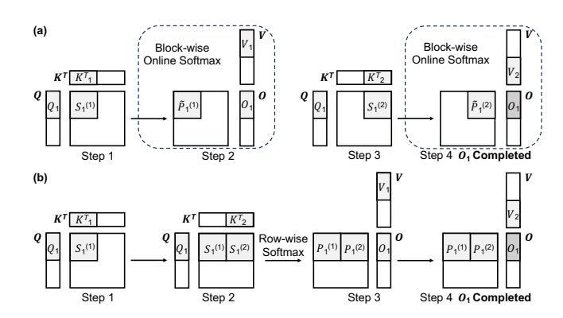
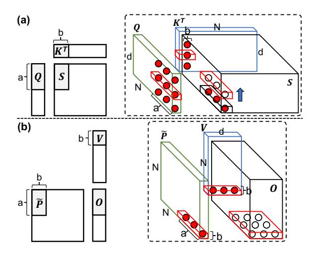
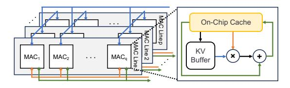
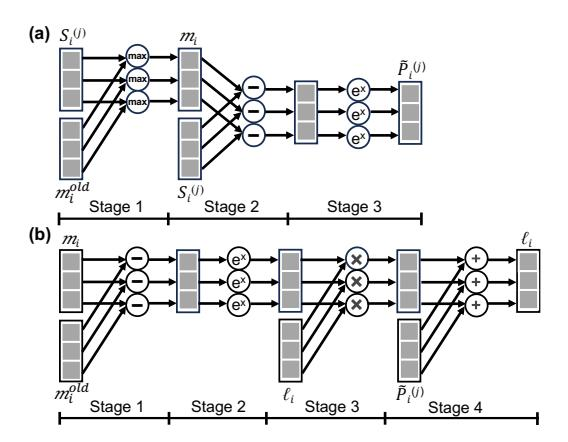
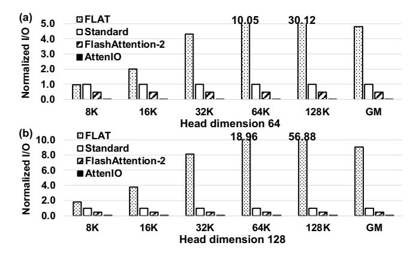
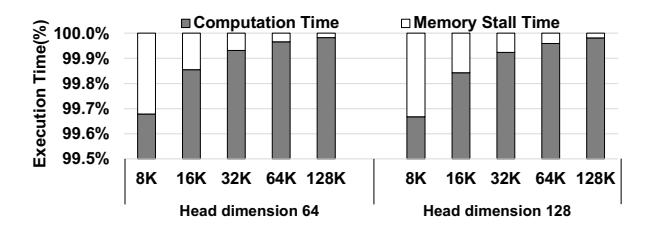
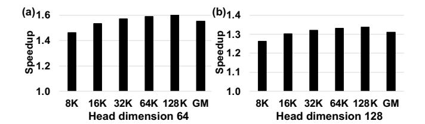

# I/O Analysis is All You Need: An I/O Analysis for Long-Sequence Attention

Xiaoyang Lu<sup>∗</sup> Illinois Institute of Technology Chicago, IL, USA xlu40@illinoistech.edu

Boyu Long<sup>∗</sup> Institute of Computing Technology, Chinese Academy of Sciences University of Chinese Academy of Sciences Beijing, China longboyu21b@ict.ac.cn

Xiaoming Chen† Institute of Computing Technology, Chinese Academy of Sciences Beijing, China chenxiaoming@ict.ac.cn

Yinhe Han†

Institute of Computing Technology, Chinese Academy of Sciences Beijing, China yinhes@ict.ac.cn

Xian-He Sun† Illinois Institute of Technology Chicago, IL, USA sun@illinoistech.edu

# Abstract

As GPUs and other accelerators become increasingly popular, optimizing I/O operations between on-chip and off-chip memory is increasingly critical. I/O analysis, however, is complex, requiring a deep understanding of application dataflow and memory hierarchy. Developing a practical I/O analysis methodology remains a timely challenge. Self-attention is employed extensively in transformer models, but its quadratic memory complexity poses significant challenges to modern memory systems. In this study, we explore how to use I/O analysis to develop optimal solutions for accelerating exact long-sequence self-attention. We first introduce a novel I/O analysis for tall-and-skinny matrix-matrix multiplication, which captures the dominant data movement behavior of long-sequence self-attention. Guided by systematic I/O analysis, we develop AttenIO, an I/O-driven accelerator for exact long-sequence self-attention with three key optimizations: (1) an analytically derived I/O-optimal tiling and scheduling to minimize I/O operations, (2) fine-grained three-level communication-computation overlapping to hide I/O stalls, and (3) parallel execution patterns for efficient softmax. Our evaluation shows that AttenIO achieves a 1.6×- 8.8× speedup over the state-of-the-art solutions. Although AttenIO is designed for self-attention, it also highlights the

<sup>†</sup>Corresponding authors.


[This work is licensed under a Creative Commons Attribution 4.0 Interna](https://creativecommons.org/licenses/by/4.0)[tional License.](https://creativecommons.org/licenses/by/4.0)

ASPLOS '26, Pittsburgh, PA, USA © 2026 Copyright held by the owner/author(s). ACM ISBN 979-8-4007-2359-9/2026/03 <https://doi.org/10.1145/3779212.3790174>

broader potential of I/O analysis as a principled foundation for guiding high-performance I/O optimizations.

CCS Concepts: • Computer systems organization → Architectures.

Keywords: I/O Analysis; Dataflow Optimization; Attention Acceleration; Accelerator Architecture

### ACM Reference Format:

Xiaoyang Lu, Boyu Long, Xiaoming Chen, Yinhe Han, and Xian-He Sun. 2026. I/O Analysis is All You Need: An I/O Analysis for Long-Sequence Attention. In Proceedings of the 31st ACM International Conference on Architectural Support for Programming Languages and Operating Systems, Volume 2 (ASPLOS '26), March 22–26, 2026, Pittsburgh, PA, USA. ACM, New York, NY, USA, [16](#page-15-0) pages. [https:](https://doi.org/10.1145/3779212.3790174) [//doi.org/10.1145/3779212.3790174](https://doi.org/10.1145/3779212.3790174)

# 1 Introduction

The rapid growth of data makes data movement a major factor of system performance [\[49\]](#page-14-0). Data-intensive applications often require frequent and extensive data movement (I/O operations) across the memory hierarchy to retrieve and store data and results [\[35\]](#page-14-1). In many cases, I/O operations dominate execution time, making them a primary performance bottleneck at all levels of a computer system [\[19,](#page-13-0) [31,](#page-14-2) [45–](#page-14-3)[47,](#page-14-4) [65\]](#page-15-1). Transformer-based models, particularly those employing the self-attention mechanism [\[70\]](#page-15-2), are a prime example of this data movement bottleneck.

Self-attention has become a cornerstone of transformerbased models due to its ability to capture complex dependencies among input elements [\[70\]](#page-15-2). Long-sequence selfattention has emerged as a critical component for large language models (LLMs) across diverse applications [\[5,](#page-13-1) [6,](#page-13-2) [15,](#page-13-3) [25,](#page-14-5) [68,](#page-15-3) [69\]](#page-15-4), including multi-turn conversations, long-document analysis [\[7,](#page-13-4) [21,](#page-13-5) [33,](#page-14-6) [34,](#page-14-7) [76\]](#page-15-5), code completion [\[37,](#page-14-8) [43\]](#page-14-9), and

<sup>∗</sup>Both authors contributed equally to this work.

<span id="page-1-0"></span>

Figure 1. Latency breakdown of GPT-3 prefilling on RTX 6000 GPU (batch size 1).

multi-modal understanding [\[9,](#page-13-6) [40,](#page-14-10) [41\]](#page-14-11). With real-world scenarios increasingly requiring the processing of hundreds of thousands of tokens [\[74\]](#page-15-6), long-sequence self-attention has become crucial for capturing and utilizing global context.

However, achieving efficient exact self-attention for long sequences remains challenging because its memory complexity scales quadratically with sequence length [\[14,](#page-13-7) [67\]](#page-15-7). A major bottleneck of long-sequence self-attention is the massive I/O overhead across the memory hierarchy, which significantly impacts performance. Figure [1](#page-1-0) profiles the latency breakdown of GPT-3 model [\[6\]](#page-13-2) inference during the prefilling stage, where all input tokens run through the forward pass of the model to generate the first output token. The results show that exact self-attention accounts for at least 80% of the runtime at sequence lengths beyond 4K, making it the primary bottleneck as sequence length scales. To address these challenges, several approximate selfattention methods have been proposed to reduce I/O overhead, including sparsity-based techniques and lossy approximations [\[3,](#page-13-8) [13,](#page-13-9) [17,](#page-13-10) [33,](#page-14-6) [42,](#page-14-12) [59,](#page-15-8) [62\]](#page-15-9). However, these methods often require extensive fine-tuning, which limits their generalization. Moreover, they are less suitable for scenarios requiring exact self-attention [\[2,](#page-13-11) [56\]](#page-15-10).

To optimize the performance of exact long-sequence selfattention, existing acceleration efforts [\[12,](#page-13-12) [14,](#page-13-7) [32,](#page-14-13) [61\]](#page-15-11) focus on reducing I/O operations between on-chip and off-chip memory. FlashAttention [\[14\]](#page-13-7) and its successors [\[12,](#page-13-12) [61\]](#page-15-11) reduce I/O operations by leveraging tiling and recomputation, breaking attention computation into tiles while recomputing softmax-related values on demand to avoid storing large intermediate matrices. FLAT [\[32\]](#page-14-13) introduces a new dataflow that explores fusion opportunities between different operators and proposes a tiling approach across the fused operator to avoid recomputation and eliminate redundant memory accesses to intermediate results. While both methods aim to reduce I/O operations, neither provides a comprehensive I/O analysis, making exact long-sequence attention an ideal test case for I/O analysis. Without an I/O analysis, the selection of tiling sizes and scheduling strategies remains heuristic and does not adequately consider realistic hardware constraints, thus leading to suboptimal performance.

In this work, we first present a systematic and novel I/O analysis for tall-and-skinny Matrix-Matrix Multiplication (MMM), an important component of exact long-sequence self-attention, explicitly analyzing data movement across the memory hierarchy using the Red-Blue Pebble Game [\[31\]](#page-14-2). By reusing input data and partial output results between subcomputations, we explore the optimal tiling and scheduling strategy that minimizes I/O operations under the capacity constraint of on-chip memory.

Building on this I/O complexity analysis, we next extend our findings to exact long-sequence self-attention and introduce AttenIO, an I/O-driven accelerator that accelerates exact long-sequence attention for serving LLMs. Rather than assembling standard architectural components, AttenIO is a tightly integrated system that realizes the I/O optimizations through coordinated control of tiling, scheduling, three-level overlapping, and parallel execution for softmax. Accordingly, AttenIO incorporates three novel, I/O-driven optimizations: (1) Based on the I/O complexity analysis of tall-and-skinny MMM, we develop an I/O-optimal dataflow for exact longsequence self-attention to minimize I/O operations by carefully selecting tiling sizes and scheduling all attention operations. (2) Once the I/O-optimal dataflow is determined, we introduce a three-level fine-grained communicationcomputation overlapping mechanism for self-attention operations, which effectively reduces I/O stall time and significantly improves processing element (PE) utilization. (3) We observe that the I/O-optimal dataflow not only minimizes I/O operations but also enables parallel patterns within softmax execution. By integrating softmax computations directly into the parallel patterns, AttenIO enables efficient parallel execution, ensuring high computational efficiency.

We evaluate AttenIO against state-of-the-art (SOTA) exact self-attention dataflow baselines: FLAT [\[32\]](#page-14-13), Standard [\[52\]](#page-14-14), and FlashAttention-2 [\[12\]](#page-13-12). AttenIO achieves geometric mean speedups of 8.8× over FLAT, 2.5× over Standard, and 1.6× over FlashAttention-2 across varying sequence lengths. We further validate the practical effectiveness of AttenIO, showing that it accelerates the prefill stage of GPT-3 [\[6\]](#page-13-2) inference by as much as 2.3×. Furthermore, compared to a GPU deploying FlashAttention-3 [\[61\]](#page-15-11), AttenIO achieves up to 3.5× speedup. These results demonstrate that systematic I/O analysis provides a solid foundation for optimizing data-intensive workloads such as long-sequence self-attention and offers a generalizable strategy to mitigate I/O overhead across diverse domains.

We make the following contributions in this paper:

- We extend the Red-Blue Pebble Game to analyze the I/O complexity of tall-and-skinny MMM explicitly considering realistic hardware constraints.
- We introduce an I/O-optimal dataflow with tiling and scheduling strategies for exact long-sequence self-attention,

derived from the tall-and-skinny MMM analysis to minimize I/O operations.

- We develop a three-level communication-computation overlapping mechanism based on our I/O analysis to further reduce I/O stall times.
- We optimize softmax computations by leveraging parallel patterns to enable efficient parallel execution.
- We extensively evaluate AttenIO, demonstrating its superior performance over SOTA approaches across diverse configurations.

### 2 Background

### 2.1 Self-Attention Mechanism

The self-attention mechanism [70] is a fundamental component of transformer-based models, enabling them to capture complex dependencies within the input sequence. Self-attention transforms the input sequence into three matrices: queries (Q), keys (K), and values (V), where Q, K,  $V \in \mathbb{R}^{N \times d}$  with N representing the sequence length and d representing the head dimension. Modern long-sequence LLMs [1, 16] increasingly demand larger sequence lengths, often making N much greater than d ( $N \gg d$ ). As a result, the matrices Q, K, and V are typically tall-and-skinny matrices.

For exact long-sequence self-attention, the key computation involves performing a tall-and-skinny MMM between Q and the transpose of K to obtain the attention scores S:<sup>1</sup>

$$S = QK^T \in \mathbb{R}^{N \times N}.$$

Next, the softmax function is applied independently to each row of *S* to compute the attention weights *P*:

$$P = \operatorname{softmax}(S) \in \mathbb{R}^{N \times N}$$
.

Finally, the output matrix *O* is computed by multiplying *P* with *V*:

$$O = PV \in \mathbb{R}^{N \times d}$$

Self-attention exhibits quadratic memory complexity [14, 60], posing a significant challenge for modern hierarchical memory systems. Due to the limited capacity of on-chip memory, extensive data transfers occur between on-chip and off-chip memory, resulting in substantial I/O overhead. This bottleneck becomes a critical limitation in long-sequence LLM inference during prefilling, where attention processes all input tokens concurrently, dictating time-to-first-token latency [53, 74]. Moreover, the softmax function requires computing the exponential of each score and normalizing by the row-wise sum of these exponentials. This requirement prevents the direct use of general matrix fusion techniques [18, 36, 73], as they cannot guarantee numerically correct softmax results. Thus, minimizing I/O overhead while preserving softmax accuracy remains a challenge for accelerating exact long-sequence self-attention.

<span id="page-2-1"></span>

**Figure 2.** Forward pass dataflows of (a) FlashAttention-2 and FlashAttention-3, and (b) FLAT.

#### 2.2 Advances in Attention Acceleration

**2.2.1 FlashAttention.** FlashAttention [14] is an efficient dataflow for exact long-sequence attention that minimizes I/O operations within the GPU memory hierarchy. During the forward pass, FlashAttention partitions the input matrices (Q, K, V) into smaller blocks, allowing tiled attention computations to be performed on-chip. It employs the online softmax technique [48, 58], recomputing and updating attention outputs without materializing the full attention score matrix. This enables accurate softmax computation while minimizing frequent data transfers.

Figure 2(a) illustrates the forward pass dataflow of Flash-Attention-2 [12] and Flash-Attention-3 [61]. Matrices Q, K, and V are partitioned into smaller blocks  $Q_i$ ,  $K_j$ , and  $V_j$ . For each pair of query and key blocks  $(Q_i, K_j)$ , the attention score block  $S_i^{(j)}$  is computed as:

$$S_i^{(j)} = Q_i K_j^T.$$

A block-wise online softmax is then applied directly without additional data transfers, using intermediate statistics  $m_i$  and  $\ell_i$  to accurately normalize scores with incremental recomputation:

$$\begin{split} m_i^{\text{old}} &= m_i \quad \text{and} \quad m_i = \max(m_i^{\text{old}}, \operatorname{rowmax}(S_i^{(j)})), \\ \tilde{P}_i^{(j)} &= \exp(S_i^{(j)} - m_i), \\ \ell_i &= \exp(m_i^{\text{old}} - m_i)\ell_i + \operatorname{rowsum}(\tilde{P}_i^{(j)}). \end{split}$$

The partial output  $O_i$  is updated by multiplying  $\tilde{P}_i^{(j)}$  with  $V_j$ , aggregating results incrementally with previous partial outputs [22]:

$$O_i = \operatorname{diag}(\exp(m_i^{\operatorname{old}} - m_i))^{-1} O_i + \tilde{P}_i^{(j)} V_j.$$

After all  $K_j$ ,  $V_j$  blocks are processed for a given  $Q_i$ , a final adjustment completes the output:

$$O_i = \operatorname{diag}(\ell_i)^{-1}O_i$$
.

FlashAttention and its successors, based on the online softmax technique, ensure exact softmax computation while enabling memory-efficient block-wise execution. However,

<span id="page-2-0"></span><sup>&</sup>lt;sup>1</sup>For clarity, we omit the typical scaling factor of  $1/\sqrt{d}$  applied to  $QK^T$ .

tiling sizes are chosen heuristically without a systematic analysis linking input dimensions, on-chip memory capacity, and I/O operations. In contrast, AttenIO leverages systematic I/O analysis to guide tiling and scheduling, further minimizing I/O operations for exact long-sequence attention.

2.2.2 FLAT. FLAT [\[32\]](#page-14-13) employs a fundamentally different approach by utilizing a row-granularity dataflow to maintain softmax dependencies. As shown in Figure [2\(](#page-2-1)b), FLAT computes and stores intermediate attention scores on-chip until a complete row batch is fully processed, then applies the row-wise softmax directly on-chip. FLAT fuses row-wise operations to retain intermediate results in on-chip memory, reducing I/O operations while preserving inter-operator dependencies and avoiding recomputation.

However, this intuitive row-granularity dataflow introduces trade-offs. Storing batches of complete rows on-chip limits on-chip memory availability for other operations, often necessitating smaller tile sizes. These smaller tiles increase the number of iterations over the and matrices, resulting in higher I/O overhead. Additionally, smaller tiles can underutilize computational resources (detailed in Section [6\)](#page-9-0). These trade-offs motivate our systematic I/O analysis to optimize exact long-sequence attention.

### 2.3 Challenges and Opportunities

The FlashAttention series [\[12,](#page-13-12) [14,](#page-13-7) [61\]](#page-15-11) and FLAT [\[32\]](#page-14-13) propose dataflows to reduce I/O for exact long-sequence selfattention, but their effectiveness depends heavily on tiling sizes and scheduling. The I/O-optimal dataflow must align with the dimensions of the input matrices and the available on-chip memory. However, existing efforts typically rely on heuristic tuning or empirical exploration without a comprehensive I/O analysis, leading to suboptimal I/O performance under specific hardware and workload constraints. The Red-Blue Pebble Game [\[31\]](#page-14-2) provides a theoretical foundation for analyzing data movement across memory hierarchies and offers insights into data reuse and dependency patterns. It has been successfully applied to optimizing FFT [\[31\]](#page-14-2), matrix multiplication [\[35\]](#page-14-1) and CNN [\[8\]](#page-13-17). Building on this model, we derive an I/O-optimal dataflow that analytically determines tiling and scheduling for exact long-sequence self-attention.

Even when I/O operations are reduced through dataflow optimizations, I/O stalls can still occur due to long-latency off-chip memory accesses. Moreover, computational resources may idle while waiting for data transfers to complete [\[29\]](#page-14-18), leading to suboptimal hardware utilization. Therefore, given a dataflow for long-sequence self-attention, it remains crucial to analyze intra-dataflow dependencies to identify opportunities for fine-grained communication-computation overlapping. We extend our I/O-optimal dataflow analysis

<span id="page-3-0"></span>x0 x1 x2 f(x2 f(x ) <sup>1</sup> f(x ) 0) y0 y1 y2 x0 x1 x2 y0 y1 y2 z0 z1 z2 f(x0,y0) f(x1,y1) f(x2,y2) Map Zip

Figure 3. Two example parallel patterns: Map and Zip.

Element-wise func3on f Element-wise func3on f (mul3-collec3on)

to identify overlapping opportunities between data movement and computation. Such fine-grained communicationcomputation overlapping hides I/O latency and significantly improves computational resource utilization.

Softmax computation introduces another key bottleneck in long-sequence attention due to its row-wise normalization and strict data dependencies. Both FlashAttention and FLAT are constrained by these dependencies and thus struggle to fully exploit parallelism in softmax operations. An I/O-optimal dataflow must not only minimize I/O operations but also enable parallel patterns within softmax execution. Parallel patterns provide structured abstractions that effectively represent a wide range of machine learning computations [\[20,](#page-13-18) [54,](#page-14-19) [55\]](#page-15-15). As illustrated in Figure [3,](#page-3-0) identifying and exploiting parallel patterns such as Map and Zip allows softmax to be decomposed into parallel-friendly, pipelinable units, further improving the performance of long-sequence self-attention.

# 3 I/O-Optimal Dataflow

### 3.1 Preliminary: Red-Blue Pebble Game

The Red-Blue Pebble Game [\[31\]](#page-14-2) is a model designed to estimate the minimum volume of data movement between two levels of memory in a hierarchical memory system. It represents the computational process of an application using a computational directed acyclic graph (CDAG), where each vertex ( ∈ ) represents either a data entry or an operation that generates a data entry. Edges in the CDAG indicate dependencies between data elements. The memory hierarchy consists of a theoretically unlimited slow memory and a fast memory with a limited capacity of elements.

In this model, a red pebble on a CDAG vertex indicates that the associated data entry or computational result is stored in fast memory, while a blue pebble denotes storage in slow memory. Initially, blue pebbles are placed on vertices associated with input data. The model enforces a constraint of red pebbles that can be used concurrently, reflecting the limited capacity of fast memory. A legitimate computation sequence involves manipulating the pebbles to indicate the following: loading data into fast memory (red pebbling), storing data in slow memory (blue pebbling), performing computations (placing red pebbles on vertices dependent on

**Table 1.** Key Notations.

<span id="page-4-0"></span>

| Symbol                                | Meaning                                                             |  |
|---------------------------------------|---------------------------------------------------------------------|--|
| M                                     | Fast memory capacity (elements on-chip)                             |  |
| N, d                                  | Dimensions, with $N \gg d$                                          |  |
| $\mathcal{A},\mathcal{B},\mathcal{C}$ | CDAG subsets for <i>A</i> , <i>B</i> , and partial sums of <i>C</i> |  |
| $V_r$                                 | Subcomputation $r$ (subset of CDAG vertices, $V_r \subseteq C$ )    |  |
| $\Gamma_r$                            | Predecessor set in $C$ with children in $V_r$                       |  |
| $D_r$                                 | Dominator set of $V_r$                                              |  |
| $\alpha_r, \beta_r, \gamma_r$         | Projections of $V_r$ onto $A$ , $B$ , and $C$                       |  |
| $V_{IR,r}, V_{FR,r}$                  | Immediate reuse set and future reuse set used by $V_r$              |  |
| $W_{B,r}$                             | Vertices written back after $V_r$                                   |  |
| a, b                                  | Tiling sizes for $A$ and $B$                                        |  |
| $t_{\alpha}$                          | Number of subcomputations reusing a block of $A$                    |  |
| $\rho_r$                              | Compute-to-I/O ratio of $V_r$                                       |  |
| $T_r$                                 | I/O operations of $V_r$                                             |  |
| h                                     | Number of subcomputations in tall-and-skinny MMM                    |  |
| T                                     | Total I/O operations in tall-and-skinny MMM                         |  |
| $T_{Att}$                             | Total I/O operations in long-sequence attention                     |  |

antecedent vertices with red pebbles), and freeing up memory resources (pebble removal). The sequence concludes when all output vertices are marked with blue pebbles.

The Red-Blue Pebbling Game has been successfully used to derive the I/O complexity of general MMM [35], guiding optimal tiling and scheduling strategies. Consider the matrix multiplication C = AB, where  $A \in \mathbb{R}^{m \times k}$ ,  $B \in \mathbb{R}^{k \times n}$ , and  $C \in \mathbb{R}^{m \times n}$ . Assuming each matrix element is one word and  $M < \min\{mn, mk, nk\}$ , none of these matrices fit into fast memory. The optimal I/O complexity of general MMM is thus proven to be  $O\left(\frac{mnk}{\sqrt{M}}\right)$ .

### 3.2 I/O Optimality of Tall-and-Skinny MMM

We analyze the I/O complexity of tall-and-skinny MMM, a fundamental computation in exact long-sequence self-attention. Consider the matrix multiplication C = AB, where  $A \in \mathbb{R}^{N \times d}$ ,  $B \in \mathbb{R}^{d \times N}$ , and  $C \in \mathbb{R}^{N \times N}$ , with  $N \gg d$ . We assume the onchip fast memory capacity M satisfies d < M < Nd. Our goal is to determine optimal tile sizes for matrices A and B by exploiting data reuse, thereby maximizing the compute-to-I/O ratio and reducing I/O operations between fast (on-chip) and slow (off-chip) memories. For clarity, key notations are summarized explicitly in Table 1.

**Vertices and Edges in CDAG.** To analyze the I/O complexity using the Red-Blue Pebble Game, we represent the computation C = AB by a CDAG G = (V, E). The vertex set V consists of three subsets:  $\mathcal{A}$ ,  $\mathcal{B}$ , and C, corresponding respectively to elements of matrices A, B, and the  $N^2d$  intermediate partial results of matrix C. Each vertex  $v \in V$  is represented by a tuple (F, U), where  $F \in \{\mathcal{A}, \mathcal{B}, C\}$  indicates the subset, and U specifies the coordinates within the corresponding matrix. Specifically, vertices in subsets  $\mathcal{A}$  and  $\mathcal{B}$  have two-dimensional coordinates representing their matrix indices,

while vertices in subset C have three-dimensional coordinates representing partial computations. An element  $C(t_1, t_2)$  of matrix C is computed through a sequence of partial updates as  $C(t_1, t_2, t_3) = C(t_1, t_2, t_3 - 1) + A(t_1, t_3) \times B(t_3, t_2)$ . Therefore, for each vertex  $v = (C, (t_1, t_2, t_3))$  with  $t_3 > 1$ , the corresponding edges in the edge set E are  $((\mathcal{A}, (t_1, t_3)), v), ((\mathcal{B}, (t_3, t_2)), v)$ , and  $((C, (t_1, t_2, t_3 - 1)), v)$ .

Given the tall-and-skinny MMM CDAG G = (V, E), the CDAG can be partitioned into a sequence of subcomputations  $V_1, V_2, \ldots, V_h$ , corresponding to an execution order (scheduling) of the CDAG, satisfying the following conditions:

- 1. **Pairwise disjointness**:  $V_i \cap V_j = \emptyset$ , for all  $i \neq j$ .
- 2. Complete coverage:  $\bigcup_{i=1}^{h} V_i = V$ .
- 3. **No cyclic dependencies**: There exist no cyclic dependencies among the subcomputations.

**Dominator Set.** A dominator set  $D_i$  of a subcomputation  $V_i$  is the set of vertices in V such that every path from any input vertex of G to a vertex in  $V_i$  contains at least one vertex in  $D_i$ . For a given subcomputation  $V_r \subseteq C$ , let its projection onto matrix A be  $\alpha_r = \phi_a(V_r)$ , onto matrix B be  $\beta_r = \phi_b(V_r)$ , and onto matrix C be  $\gamma_r = \phi_c(V_r)$ . We further define  $\Gamma_r \subset C$  as the set of vertices in C that have at least one child in  $V_r$ . Thus, the sets  $\alpha_r$ ,  $\beta_r$ , and  $\Gamma_r$  represent the inputs of  $V_r$  originating respectively from matrices A, B, and the preceding partial results in C. Together, these sets form the minimal dominator set  $D_r$  for subcomputation  $V_r$ :

$$D_r = \alpha_r \cup \beta_r \cup \Gamma_r$$
.

Since the projection of both  $V_r$  and  $\Gamma_r$  onto matrix C equals  $\gamma_r$ , the minimal size of  $D_r$  is computed as:

<span id="page-4-1"></span>
$$|D_r| = |\alpha_r| + |\beta_r| + |\gamma_r|. \tag{1}$$

**Takeaway:**  $|D_r|$  represents the minimal amount of data that must be resident in fast memory to perform the subcomputation  $V_r$ .

**Reuse Set.** Assuming each subcomputation  $V_r \subseteq C$  has equal sizes  $[a \times b \times 1]$ , such that  $|\alpha_r| = a$  and  $|\beta_r| = b$ , the number of computations performed by  $V_r$  is:

<span id="page-4-2"></span>
$$|V_r| = |\alpha_r||\beta_r| = \text{ab.} \tag{2}$$

The total number of subcomputations h can be expressed as:

$$h = \frac{N^2 d}{\mathsf{ab}}.\tag{3}$$

Upon completion of  $V_r$ , red pebbles have three possibilities: they can be immediately reused in the subsequent subcomputation, contributing to the immediate reuse set  $V_{IR,r+1}$  of  $V_{r+1}$ ; they may still hold red pebbles, waiting to be reused by a future subcomputation  $V_u$  (u > r + 1), thus contributing to the future reuse set  $V_{FR,u}$  of  $V_u$ ; or they must be stored back, represented by the set  $W_{B,r}$ , requiring the assignment of blue pebbles.

Consider two successive computations,  $V_r$  and  $V_{r+1}$ . After the subcomputation  $V_r$ , the sets  $\alpha_r$ ,  $\beta_r$ , and  $V_r$  may contain

elements placed with red pebbles. For the dominator set of  $V_{r+1}$ , the size is given by  $|D_{r+1}| = |\alpha_{r+1}| + |\beta_{r+1}| + |\gamma_{r+1}|$ . The immediate reuse set  $V_{IR,r+1}$  is determined by the intersection of these sets, leading to the inequality:

$$|V_{IR,r+1}| \leq |\alpha_r \cap \alpha_{r+1}| + |\beta_r \cap \beta_{r+1}| + |\gamma_r \cap \gamma_{r+1}|.$$

The maximized immediate reuse set  $V_{IR,r+1}$  is achieved only if at most one of the overlapping projections  $\alpha_r \cap \alpha_{r+1}$ ,  $\beta_r \cap \beta_{r+1}$ , or  $\gamma_r \cap \gamma_{r+1}$  is not empty, and only if  $\gamma_r = \gamma_{r+1}$  (the proof is provided in [35]). In this case, the output of  $V_r$  is immediately reused by  $V_{r+1}$ , maximizing the immediate reuse set and eliminating any need to store the outputs of  $V_r$  back to slow memory. Therefore,  $W_{B,r} = \emptyset$ . When this maximum immediate reuse is achieved, we have:

<span id="page-5-0"></span>
$$|V_{IR,r+1}| = |\gamma_r \cap \gamma_{r+1}| = |\gamma_r| = |\gamma_{r+1}|,$$
 (4)

<span id="page-5-1"></span>
$$|W_{B,r}| = |\gamma_r \setminus \gamma_{r+1}| = 0. \tag{5}$$

Besides immediate reuse, which involves output reuse, future reuse refers to the reuse of input data. If  $\alpha_r$  holds red pebbles and they are never removed until they are fully used by  $t_{\alpha}$  subcomputations, then after subcomputation  $V_r$ , the future subcomputation  $V_u$ , where  $\alpha_u = \alpha_r$ , can reuse the red pebbles placed in  $\alpha_r$  directly. Similarly,  $\beta_r$  can also hold red pebbles after  $V_r$  for reuse by further subcomputations. However, there is no single subcomputation  $V_u$  for which both  $\alpha_u = \alpha_r$  and  $\beta_u = \beta_r$ , making it impossible to concurrently reuse  $\alpha_r$  and  $\beta_r$ . Consequently, retaining red pebbles from only one input matrix in fast memory minimizes the consumption of valuable fast memory capacity. Since matrices A and B have the same dimensions, we consider an optimized dataflow that ensures each vertex of matrix A is fully reused by  $t_{\alpha}$  subcomputations. Therefore, each subcomputation requesting  $\alpha_r$  as input contributes  $\frac{|\alpha_r|}{t_\alpha}$  to the loading from matrix A. Assuming  $\alpha_r$  is reused by  $V_u$ , we use  $|V_{FR,u}|$ to reflect the contributions from all other subcomputations except  $V_u$  that request  $\alpha_r$  as input, thus we have:

<span id="page-5-2"></span>
$$|V_{FR,u}| = \left(1 - \frac{1}{t_{\alpha}}\right) |\alpha_r|. \tag{6}$$

**Takeaway:** Immediate reuse reduces I/O by retaining computed results (outputs) in fast memory for immediate use by subsequent subcomputations, whereas future reuse reduces I/O by holding input data in fast memory until they have been fully utilized across multiple subcomputations. Together, maximizing both forms of reuse directly increases the compute-to-I/O ratio.

**Maximized Compute-to-I/O Ratio**. We define the number of computations performed by  $V_r$  for each I/O operation between two levels of memory as the compute-to-I/O ratio. Let  $\rho_r$  represent the maximized compute-to-I/O ratio of  $V_r$  in tall-and-skinny MMM, given by:

$$\rho_r = \frac{|V_r|}{|D_r| - |V_{IR|r}| - |V_{ER|r}| + |W_{R|r}|}.$$
 (7)

<span id="page-5-5"></span>

**Figure 4.** CDAG of a tall-and-skinny MMM with optimized scheduling to minimize I/O operations. Red pebbles indicate data elements resident in on-chip fast memory. The red frame in matrix C delineates the current subcomputation  $V_r$ .

Considering Equations 1, 2, 4, 5, and 6, we have:

<span id="page-5-3"></span>
$$\rho_r = \frac{|\alpha_r||\beta_r|}{\frac{|\alpha_r|}{t_r} + |\beta_r|} = \frac{\mathsf{ab}}{\frac{\mathsf{a}}{t_\alpha} + \mathsf{b}}.\tag{8}$$

We define  $T_r$  as the minimized number of I/O operations required by  $V_r$ . According to Equation 8, we have:

<span id="page-5-4"></span>
$$T_r = \frac{|V_r|}{\rho_r} = \frac{\mathsf{a}}{t_\alpha} + \mathsf{b} \tag{9}$$

Let T denote the total I/O operations across all h subcomputations for tall-and-skinny MMM. Considering Equation 9 and following the definition of the Red-Blue Pebble Game [31], where  $N^2$  final output vertices of matrix C must be placed in blue pebbles and stored back in slow memory, resulting in an additional  $N^2$  additional I/O operations. Thus, the I/O lower bound of tall-and-skinny MMM is expressed as:

<span id="page-5-6"></span>
$$T \ge \sum_{i=1}^{h} T_i + N^2 = \frac{N^2 d}{\mathsf{a}\mathsf{b}} \times \left(\frac{\mathsf{a}}{t_\alpha} + \mathsf{b}\right) + N^2. \tag{10}$$

**Takeaway:** The compute-to-I/O ratio  $\rho_r$  directly measures computational efficiency relative to data movement. Maximizing  $\rho_r$  leads directly to achieving the I/O lower bound for tall-and-skinny MMM.

Attainability of the I/O Lower Bound. Figure 4 depicts a tall-and-skinny MMM scheduling that aligns with the analysis of the I/O lower bound. This scheduling provides a concrete illustration of how immediate and future reuse can be maximized in practice. The tall-and-skinny matrices A and B are tiled into blocks of size  $a \times d$  and  $b \times d$ , respectively. Initially, ad elements of matrix A and bd elements of matrix B are loaded into the on-chip fast memory with red pebbles. To maximize immediate reuse, the entire tall-and-skinny MMM CDAG is partitioned into  $\frac{N^2d}{ab}$  subcomputations. Each subcomputation generates ab partial outputs, ensuring that the outputs of one subcomputation (except the vertices in the top layer) are reused on-chip by the next subcomputation without any I/O operations (1). Upon completing d subcomputations, the final ab outputs of matrix C (the top layer

vertices) are stored back to slow memory, and the next bd elements of the subsequent block of matrix B are loaded into fast memory, while the current block of matrix A remains in fast memory for future reuse in the next d subcomputations (2). After matrix B is fully traversed, indicating that the corresponding block of matrix A has been fully reused by all possible subcomputations. Then, the process continues by loading the next block of matrix A into the fast memory (3) and repeating the steps until all calculations are completed.

To minimize I/O operations in tall-and-skinny MMM, we need to determine the tiling sizes a and b to maximize  $\rho_r$  while considering the capacity constraint of the fast memory. As shown in Figure 4, in order to execute  $V_r$ , at most ad + bd + ab vertices can be placed in red pebbles concurrently. Thus, we have:

maximize 
$$\rho_r = \frac{ab}{\frac{a}{t_{\alpha}} + b}$$
subject to: 
$$ad + bd + ab \le M,$$

$$t_{\alpha} = \frac{N}{b},$$

$$a, b \in \mathbb{N}_+.$$

$$(11)$$

The maximum  $\rho_r$  is achieved with the largest possible a, where  $a = \frac{M-d}{d+1}$  and b = 1. Substituting the optimal tiling sizes a and b into Equation 10 yields the final I/O lower bound of tall-and-skinny MMM:

$$T \ge Nd + \frac{N^2d(d+1)}{M-d} + N^2.$$
 (12)

Thus, excluding the constant  $N^2$  outputs that must be stored back, the optimal I/O complexity for tall-and-skinny MMM is  $O\left(\frac{N^2d^2}{M}\right)$ . Comparing this with the optimal I/O complexity of general MMM [35],  $O\left(\frac{N^2d}{\sqrt{M}}\right)$ , the crossover occurs at  $\sqrt{M}=d$ 

Note that  $\sqrt{M}>d$  always holds in practice, which aligns with modern on-chip memory capacities and the long-sequence self-attention mechanism. Therefore, exploiting both immediate and future reuse is not only theoretically optimal but also practically relevant, and is essential for achieving lower I/O complexity in tall-and-skinny MMMs.

**Takeaway:** Optimal tiling sizes, determined by the fast-memory capacity M, maximize  $\rho_r$  and achieve the I/O lower bound for tall-and-skinny MMM in practice, significantly reducing I/O operations.

### <span id="page-6-1"></span>3.3 Dataflow of Exact Long-Sequence Attention

Inspired by the I/O analysis of tall-and-skinny MMM, we develop an I/O-optimal dataflow for exact long-sequence self-attention that explicitly exploits both immediate and future reuse. Algorithm 1 details the proposed scheduling and tiling strategy. Leveraging block-wise online softmax [48,

```
Algorithm 1 I/O-Optimal Forward Pass Dataflow for Long-Sequence Attention
 Matrices Q, K, V \in \mathbb{R}^{N \times d} in off-chip slow memory, on-chip fast memory of size M.
 1: Set block sizes a = \left\lfloor \frac{M-d}{2d+4} \right\rfloor, b = 1.
 2: Divide Q into x = \left[\frac{N}{a}\right] blocks, of size a \times d each.
 3: Divide K, V into y = \begin{bmatrix} N \\ \overline{b} \end{bmatrix} blocks, of size b \times d each.
 4: for 0 \le i < x do
 5: Initialize O_{\mathbf{t}} = (0) \in \mathbb{R}^{a \times d} and \ell_i, m_i = (0), (-\infty) \in \mathbb{R}^a on-chip
       Load Q_l \in \mathbb{R}^{a \times d} from off-chip slow memory to on-chip fast memory
       for 0 \le j < y do
         Load K_i \in \mathbb{R}^{b \times d} from off-chip slow memory to on-chip fast memory.
          Compute S_i^{(j)} = Q_i K_i^T \in \mathbb{R}^{a \times b}.
          Update m_i^{old} = m_i and update m_i = max (m_i^{old}, rowmax(S_i^{(j)})).
10:
          Compute \tilde{P}_i^{(j)} = exp(S_i^{(j)} - m_i) \in \mathbb{R}^{a \times b}, \ell_i = exp(m_i^{old} - m_i)\ell_i + \text{rowsum}(\tilde{P}_i^{(j)}) \in \mathbb{R}^a.
11:
           Load V_i \in \mathbb{R}^{b \times d} from off-chip slow memory to on-chip fast memory.
          \text{Update } O_i = diag \left(exp \left(m_i^{old} - m_i\right)\right)^{-1} O_i + \tilde{P}_i^{(j)} V_i \in \mathbb{R}^{\mathsf{a} \times d}.
13:
14: end for
```

15: Compute O<sub>i</sub> = diag(l<sub>i</sub>)<sup>-1</sup> O<sub>i</sub>
16: Store O<sub>i</sub> to the off-chip slow memory.

<span id="page-6-0"></span>17: end for

58] enables accurate softmax computations while minimizing I/O operations in attention score computations [14].

**Scheduling.** Initially, we divide the matrices Q, K, and Vinto blocks of size  $a \times d$ ,  $b \times d$ , and  $b \times d$ , respectively (lines 2-3). We then structure the process of self-attention into two key stages related to I/O operations: (1) computation of attention scores (S), and (2) computation of outputs (O). These stages are executed iteratively to process the entire self-attention mechanism. In the first stage, a block of Q (ad elements) (loaded if the previous block of Q cannot be reused) and a block of *K* (b*d* elements) are loaded into fast memory (lines 6 and 8). The multiplication of these two blocks is then performed in d steps, and the partial attention scores (ab elements) from the current step are aggregated immediately with existing partial attention scores in fast memory (if any) on chip, as illustrated in Figure 5(a). These updated scores remain in fast memory for immediate reuse in the next step (line 9). Once the final attention scores  $S_i^{(j)}$  are completed, the process proceeds to applying the online softmax to the corresponding block for P (lines 10-11). The second stage begins after the online softmax computation. The block of  $\tilde{P}$ (ab elements) is used to weight the corresponding block of V. This involves loading bd elements of V into fast memory (line 12). The multiplication between these two blocks is then computed, as shown in Figure 5(b). After computation, ad results are immediately aggregated with existing partial outputs (if any) and kept in fast memory for subsequent updates (line 13).

During execution, the block of Q remains in fast memory for future reuse, while new blocks of K and V are loaded sequentially into fast memory, alternating between the first and second stages. This iterative process continues until all blocks of K and V have been traversed and the current block

<span id="page-7-0"></span>

**Figure 5.** I/O-optimal CDAGs for long-sequence attention (a) computation of attention scores (*S*) with immediate reuse of partial results, and (b) computation of outputs (*O*).

of *Q* has been fully reused. Subsequently, a new block of *Q* is loaded, and the traversal of *K* and *V* is repeated.

**Tiling.** With respect to the total I/O operations described in Algorithm 1, all elements of Q are loaded into fast memory once, accounting for Nd I/O operations. The elements of K and V are loaded into fast memory  $\frac{N}{a}$  times each, contributing to a total of  $2Nd \times \frac{N}{a}$  I/O operations. Additionally, the outputs of O must be written back to slow memory, resulting in Nd I/O operations. Thus, the total number of I/O operations  $T_{Att}$  for exact long-sequence self-attention is:

<span id="page-7-1"></span>
$$T_{Att} = 2Nd\left(1 + \frac{N}{\mathsf{a}}\right). \tag{13}$$

In order to achieve the minimized  $T_{Att}$ , the tiling sizes a and b must be determined by considering the capacity constraint of the fast memory (M). Note that blocks of K and V do not need to be resident in fast memory simultaneously. Therefore, the fast memory must hold at least ad elements of Q, bd elements of K or V, ab elements for storing partial results of S or  $\tilde{P}$  after online softmax, ad elements for storing partial results of O, and intermediate vectors  $m_i^{\text{old}}$ ,  $m_i$ ,  $\ell_i$  for online softmax, totaling 3a elements. Hence, the optimization problem is formulated as:

minimize 
$$T_{Att} = 2Nd\left(1 + \frac{N}{a}\right)$$
  
subject to:  $ad + bd + ab + ad + 3a \le M$  (14)  
 $a, b \in \mathbb{N}_+$ .

The minimum  $T_{Att}$  is achieved by maximizing a, where a =  $\frac{M-d}{2d+4}$  and b = 1. By substituting the optimal tiling sizes a and b into Equation 13, we obtain the optimized I/O operations for exact long-sequence self-attention:

$$T_{Att} = 2Nd + \frac{4N^2d(d+2)}{M-d}. (15)$$

<span id="page-7-2"></span>

Figure 6. Overview of AttenIO.

<span id="page-7-3"></span>

**Figure 7.** Three levels of communication-computation overlapping.

**Takeaway:** The proposed scheduling and tiling strategy for exact long-sequence self-attention achieves the I/O optimality derived from tall-and-skinny MMM analysis, making the results practically achievable.

# 4 AttenIO Architecture

#### 4.1 Overview

Figure 6 presents an overview of AttenIO, an I/O-driven accelerator designed for the exact self-attention mechanism on long input sequences. The key components of AttenIO include a controller, a PE array, an EXP unit, a KV buffer, and an on-chip cache. The controller implements the I/O-optimal dataflow to minimize I/O operations between off-chip memory and the on-chip cache. It also coordinates the execution of computations and data movement to enable three levels of fine-grained communication-computation overlapping during self-attention with online softmax. The KV buffer alternately stores one block of K and V, increasing opportunities for overlap between computation and data movement. The PE array supports both matrix processing and the general arithmetic operations required by softmax. The EXP unit consists of multiple exponential modules [44, 72, 75] that compute the exponentials involved in the softmax function. Moreover, the PE array and EXP unit work together to support parallel patterns in a pipelined fashion, enabling efficient softmax execution. Together, these components enable reduced I/O operations, fine-grained communicationcomputation overlapping, and parallel softmax execution.

### 4.2 Communication-Computation Overlapping

To hide the long-latency of I/O operations and achieve high performance in processing long-sequence attention, AttenIO employs three levels of fine-grained communication-computation overlapping: intra-inner-iteration, inter-inner-iteration, and inter-outer-iteration, as illustrated in Figure 7. To support preloading one block of K or V while the other

<span id="page-8-0"></span>

Figure 8. Organization of the PE array.

block of V or K is used for computations, aligned with the I/O-optimal dataflow, we introduce a KV buffer that alternately stores a single block (d elements) from K and V.

**Intra-Inner-Iteration Overlapping.** This level optimizes operations within a single iteration of the inner loop (iteration of j in Algorithm 1). While the PE array computes  $S_i^{(j)} = Q_i K_j^T$  using  $K_j$  from the KV buffer (line 9), the controller initiates preloading of the next required block of V ( $V_j$ ) into the cache (line 12). Once the computation of  $S_i^{(j)}$  is completed, the preloaded  $V_j$  is immediately moved from the cache to the KV buffer for the following computations. This overlapping ensures that data loading and computation proceed concurrently within the same inner-loop iteration.

**Inter-Inner-Iteration Overlapping.** This level optimizes operations across different iterations of the inner loop (iteration of j in Algorithm 1). During the computations of  $O_i$  in the current iteration j (line 13), the controller preloads the next required block of  $K(K_{j+1})$  into the on-chip cache (line 8). Once the computations involving  $V_j$  are completed, the space in the KV buffer is freed for  $K_{j+1}$ , and the preloaded  $K_{j+1}$  is immediately moved from the cache to the KV buffer. This overlapping reduces I/O stalls between inner-loop iterations.

**Inter-Outer-Iteration Overlapping.** This level focuses on optimizing the operations between different blocks of the outer loop (iteration of i in Algorithm 1). As the PE array performs the final computations of  $O_i = \text{diag}(\ell_i)^{-1}O_i$  for the current block i (line 15), the controller releases the  $Q_i$  and initiates loading of  $Q_{i+1}$  into cache (line 6). This overlapping reduces idle time between outer-loop iterations, thus increasing utilization of the PE array.

## 4.3 PE Array Organization

Figure 8 shows the organization of the PE array, consisting of pq MACs arranged in p MAC lines, each containing q MACs. The PE array primarily computes  $Q_iK_j^T$  and  $\tilde{P}_i^{(j)}V_j$  following our proposed I/O-optimal dataflow (detailed in Section 3.3).

For the computation of  $Q_iK_j^T$ , the PE array performs the operation over d iterative steps. In each step, each MAC computes one element of the ab partial results of  $S_i^{(j)}$ . According to the I/O-optimal dataflow, the optimal value of b is 1, meaning each row of  $K_j^T$  contains only one element. In each step, each MAC fetches a different element from a column of  $Q_i$  from the on-chip cache, while one element from a corresponding row of  $K_j^T$  is fetched from the KV buffer and broadcast across all MACs for multiplications. The products

<span id="page-8-1"></span>

**Figure 9.** Executing online softmax with parallel patterns across pipelined stages: (a) Updating  $m_i$  and computing  $\tilde{P}_i^{(j)}$ , and (b) Updating  $\ell_i$ .

are then accumulated into the existing partial sums of  $S_i^{(j)}$ . This process repeats until all partial results are fully accumulated, yielding the final  $S_i^{(j)}$ . The subsequent computation of  $\tilde{P}_i^{(j)}V_j$  involves multiplying  $\tilde{P}_i^{(j)} \in \mathbb{R}^{a \times 1}$  and  $V_j \in \mathbb{R}^{1 \times d}$ . Each MAC is assigned a different element of  $\tilde{P}_i^{(j)}$ , while in each step, one element of  $V_j$  is fetched from the KV buffer and broadcast across all MACs. This produces a partial results in each step and continues for d steps.

### 4.4 Softmax with Parallel Patterns

By employing the I/O-optimal dataflow, the need for rowwise reductions in softmax computation is eliminated, converting online softmax into a sequence of element-wise operations. This transformation enables parallel patterns, where independent element-wise operations are structured across pipeline stages, thereby improving the overall efficiency of softmax processing. Figure 9 illustrates the execution of online softmax computation with parallel patterns.

In Figure 9(a), three parallel patterns are applied for updating  $m_i$  and then computing  $\tilde{P}_i^{(j)}$ , corresponding to lines 10 and 11 of Algorithm 1. As discussed in Section 3.3, the I/O-optimal dataflow is achieved when b equals 1, resulting in  $S_i^{(j)} \in \mathbb{R}^{a \times 1}$ . This eliminates the need for rowmax( $S_i^{(j)}$ ), as each row contains only a single element, thereby avoiding row-wise traversal and reducing computational overhead. All calculations for updating  $m_i$  and computing  $\tilde{P}_i^{(j)}$  become independent and element-wise. Based on this insight, three parallel patterns are introduced to exploit data-level parallelism: calculating element-wise maximum values between  $m_i^{\text{old}}$  and  $S_i^{(j)}$ ; computing the element-wise difference between  $S_i^{(j)}$  and  $m_i$ ; and calculating the exponential of each element to obtain  $\tilde{P}_i^{(j)}$ .

Figure 9(b) illustrates four parallel patterns for updating  $\ell_i$ , corresponding to line 11 of Algorithm 1. Similar to the

Table 2. Configuration of AttenIO.

<span id="page-9-1"></span>

| Components      | Configuration                                       |
|-----------------|-----------------------------------------------------|
| PE Array        | 64×32 MACs, 1 GHz                                   |
| EXP Unit        | 128 EXP Modules, 1 GHz                              |
| KV Buffer       | 0.25 KB                                             |
| On-Chip Cache   | 512 KB                                              |
| Off-Chip Memory | 128 GB/s, 16 64-bit HBM channels, 8GB/s per channel |

analysis of  $S_i^{(j)}$ , we have  $\tilde{P}_i^{(j)} \in \mathbb{R}^{a \times 1}$ . Therefore, there is no need to traverse all elements of a row in  $\tilde{P}_i^{(j)}$  for processing rowsum( $\tilde{P}_i^{(j)}$ ); all calculations for updating  $\ell_i$  are performed using four element-wise parallel patterns, including: calculating the difference between  $m_i$  and  $m_i^{\text{old}}$ ; computing the exponential of the results from the previous stage; performing multiplication of the exponential results with  $\ell_i$ ; and aggregating the results with  $\tilde{P}_i^{(j)}$  to update  $\ell_i$ .

# 5 Evaluation Methodology

Table 2 presents the detailed hardware configuration of AttenIO. We implement the core components of AttenIO in RTL and synthesize them using Synopsys Design Compiler with the TSMC 22 nm technology standard cell library, operating at a frequency of 1 GHz, to obtain power and area statistics. We use CACTI 7.0 [4] to model the latency, power, and area of the on-chip memory components, including on-chip cache and the KV buffer. Performance is evaluated using a cycle-accurate simulator that integrates detailed models for computation, memory accesses, and dataflow execution. For off-chip memory, all HBM timing parameters are derived from DRAMSim3 [38], assuming an HBM bandwidth of 128 GB/s. The simulator takes hardware configurations and model parameters as input and reports execution time, data movement between on-chip and off-chip memory, PE utilization, and softmax efficiency for performance compari-

We compare AttenIO against three state-of-the-art dataflow baselines: Standard, FLAT [32], and FlashAttention-2 [12]<sup>2</sup>. To ensure fairness, all dataflows are evaluated on the same hardware configuration as AttenIO, summarized in Table 2. Standard follows the default execution flow for exact self-attention [52], while FLAT adopts a row-granularity dataflow [32]. For Standard and FLAT, we tune their tiling sizes using the Red-Blue Pebble Game analysis for general MMM [35], adapting them to different on-chip cache sizes to ensure fair evaluation. FlashAttention-2 employs a blockwise online softmax dataflow. To determine the adaptive tiling sizes, we follow the strategy of FlashAttention [14], which defines the tiling parameters as explicit functions of the available on-chip cache capacity M and head dimension d. Specifically, the row tile size is set to  $B_r = \min(\lceil M/(4d) \rceil, d)$ ,

<span id="page-9-5"></span>

**Figure 10.** Speedup comparison of FLAT, Standard, FlashAttention-2, and AttenIO.

and the column tile size is set to  $B_c = \lceil M/(4d) \rceil$ . We adhere strictly to the original dataflow and tiling strategy, ensuring proper adaptation to the target hardware configuration.

We evaluate sequence lengths (*N*) ranging from 8K to 128K, with a hidden dimension of 2048 and head dimensions (*d*) of 64 and 128. The data precision for all evaluations is FP16.<sup>3</sup> Moreover, to demonstrate the real-world impact, we measure inference latency during the prefilling stage of GPT-3 [6]. Finally, to assess the performance of AttenIO against GPUs, we compare AttenIO with two implementations on an NVIDIA H100 GPU: FlashAttention-2 (optimized by cuDNN [10] specifically for H100 GPUs) and FlashAttention-3 [61]<sup>4</sup>. For a fair comparison, we scale the hardware resources of AttenIO to match the peak throughput of the H100 GPU.

### <span id="page-9-0"></span>6 Experiment Results

### 6.1 Exact Attention Performance

Figure 10 compares AttenIO with the dataflows Standard, FLAT, and FlashAttention-2 under identical hardware configurations, across varying sequence lengths and head dimensions. Speedups are normalized to Standard. We make three major observations. First, AttenIO consistently outperforms all baselines for all configurations. For a head dimension of 64, AttenIO achieves geometric mean speedups of 8.8×, 2.5×, and 1.6× over FLAT, Standard, and FlashAttention-2, respectively. When the head dimension increases to 128, AttenIO achieves speedups of 9.9×, 1.9×, and 1.3×, respectively. Second, FlashAttention-2, which utilizes online softmax and a block-wise dataflow, demonstrates better performance compared to FLAT and Standard. Although both AttenIO and FlashAttention-2 employ online softmax, AttenIO performs better due to its optimized tiling based on comprehensive

<span id="page-9-2"></span><sup>&</sup>lt;sup>2</sup>FlashAttention-3 [61] uses the same forward dataflow as FlashAttention-2; thus, we use FlashAttention-2 as the representative baseline.

<span id="page-9-4"></span><span id="page-9-3"></span> $<sup>^3</sup>$  Our I/O analysis adapts to varying data precision, as precision directly affects the fast memory capacity M, enabling tile sizes to scale accordingly.  $^4$  FlashAttention-3 incorporates hardware-specific optimizations for the NVIDIA Hopper GPU architecture.

<span id="page-10-0"></span>

**Figure 11.** Normalized I/O operations of FLAT, Standard, FlashAttention-2, and AttenIO.

I/O analysis and I/O-driven optimizations. Third, although FLAT employs a row-granularity dataflow and fuses operations involving softmax and MMM, its performance struggles with longer sequence lengths and the larger head dimension, highlighting the limitations of a heuristic dataflow design.

### 6.2 Detailed Analysis

**Data Movement.** To evaluate the effectiveness of the I/O-optimal dataflow of AttenIO, we measure the volume of data movement (in bytes) between the on-chip cache and off-chip memory. Minimizing data movement is critical to improving the efficiency of attention mechanisms. Figure 11 presents the normalized data movement during exact self-attention across various evaluated configurations. We observe that AttenIO consistently incurs significantly lower data movement than the baselines across all evaluated sequence lengths. For a head dimension of 64, FLAT incurs 273.7× more data movement on geometric mean, while Standard and FlashAttention-2 incur 57.0× and 26.8× more, respectively. For a head dimension of 128, FLAT, Standard, and FlashAttention-2 incur 148.8×, 16.4×, and 7.3× more data movement than AttenIO, respectively. The substantial difference in data movement highlights the advantage of using a comprehensive I/O analysis to guide tiling. Unlike the heuristic tiling in FlashAttention-2, AttenIO considers both the input dimensions and the capacity limitations of on-chip cache to guarantee minimal I/O operations. Additionally, we observe that data movement of FLAT increases significantly with larger input sequence lengths and higher head dimensions. Even when the on-chip cache can store several rows of intermediate activations, storing long rows with limited cache capacity reduces data reuse opportunities during MMMs, which increases I/O operations. If the cache cannot hold even a single row, FLAT must offload partial results to off-chip memory, further reducing fusion efficiency.

**6.2.2 Hardware Utilization.** Figure 12(a) presents the geometric mean PE array utilization across all input sequence

<span id="page-10-1"></span>

**Figure 12.** Utilization comparisons: (a) PE utilization, and (b) EXP unit utilization.

<span id="page-10-2"></span>

**Figure 13.** Computation time and memory stall time breakdown of AttenIO.

lengths for AttenIO and the baselines. PE array utilization is defined as the percentage of time the PE array actively performs computations relative to total execution time. AttenIO consistently achieves the highest utilization among all baselines, reaching 82.1% for a head dimension of 64 and 90.3% for 128. The high PE utilization of AttenIO is attributed to its I/O-optimal dataflow, which minimizes I/O operations, and its fine-grained communication-computation overlapping, which further reduces I/O stalls. Figure 12(b) compares the utilization of the EXP unit between FlashAttention-2 and AttenIO, both employing online softmax. For a head dimension of 64, AttenIO achieves a utilization of 19.9%, which is 3.3× higher than FlashAttention-2. For a head dimension of 128, the EXP unit utilization of AttenIO is 11.2%, which is 2.7× higher than FlashAttention-2. AttenIO integrates softmax computations within its parallel patterns, fully utilizing data-level parallelism and enabling more efficient parallel processing. This results in pipelining between the PE array and the EXP unit, leading to a combined PE and EXP unit utilization that exceeds 100%.

Figure 13 presents the breakdown of execution time for AttenIO across different sequence lengths and head dimensions. We separate execution time into computation time, during which at least one of the PE array or the EXP unit is actively executing, and memory stall time. We observe that memory stall time remains consistently below 1% for all evaluated configurations, and decreases further as the sequence length increases. For a head dimension of 64, the memory stall fraction drops from 0.32% at 8K to 0.02% at 128K, while for a head dimension of 128, it decreases from 0.33% to 0.02%. The consistently low stall fraction confirms that AttenIO not only effectively mitigates data movement between the on-chip cache and off-chip memory through

<span id="page-11-0"></span>

Figure 14. Overall speedup comparison of FLAT, Standard, FlashAttention-2, and AttenIO across varying cache sizes.

the I/O-optimal dataflow, but also further hides data movement latency via control mechanisms such as three-level communication-computation overlapping and parallel softmax execution, allowing computation to proceed with minimal interruption. We further compare the energy efficiency of AttenIO and FlashAttention-2. AttenIO achieves average improvements of 1.5× and 1.3× over FlashAttention-2 for head dimensions of 64 and 128, respectively.

### 6.3 Performance with Different Cache Sizes

To understand the generalization capability of AttenIO, Figure [14](#page-11-0) shows the geometric mean speedup of AttenIO and the baselines in executing exact attention across various input sequence lengths for each cache size. AttenIO consistently outperforms the baselines across all cache sizes. Specifically, for a head dimension of 64, AttenIO achieves stable speedups ranging from 2.2× to 2.5×, while the second-best, FlashAttention-2, achieves speedups ranging from 1.4× to 1.5×. For a head dimension of 128, AttenIO achieves speedups ranging from 1.8× to 1.9×, while FlashAttention-2 achieves speedups between 1.2× and 1.5×. These results validate the importance of I/O analysis considering matrix dimensions and hardware constraints, and confirm that communicationcomputation overlapping and parallel softmax execution improve the robustness and efficiency of AttenIO.

# 6.4 Performance with Block-Wise Causal Mask

In auto-regressive language modeling, a causal mask ensures each token attends only to itself and preceding tokens [\[11,](#page-13-21) [77\]](#page-15-18). We implement a block-wise causal mask [\[14\]](#page-13-7), where any block of containing only elements with column indices exceeding row indices can be skipped entirely. Figure [15](#page-11-1) illustrates the performance gains of AttenIO over FlashAttention-2 when a block-wise causal mask is applied. We make three key observations. First, AttenIO consistently outperforms FlashAttention-2 across all sequence lengths and head dimensions. Second, as the input sequence length increases, the

<span id="page-11-1"></span>

Figure 15. Speedup of AttenIO over FlashAttention-2 with a block-wise causal mask.

<span id="page-11-2"></span>

Figure 16. Performance comparison of long-sequence prefilling across different sequence lengths.

performance gain of AttenIO over FlashAttention-2 becomes more pronounced. Third, AttenIO achieves geometric mean speedups of 1.6× and 1.3× over FlashAttention-2 for head dimensions of 64 and 128, respectively. These improvements align with the speedups observed without a causal mask, demonstrating the robustness and generality of AttenIO.

### 6.5 Prefilling Efficiency

We measure the prefilling latency during GPT-3 [\[6\]](#page-13-2) inference, where self-attention is the main bottleneck. Figure [16](#page-11-2) presents the normalized speedup across varying sequence lengths. Across all evaluated sequence lengths, AttenIO exhibits performance gains due to its I/O analysis-guided dataflow and optimizations. At a sequence length of 8K, AttenIO achieves speedups of 2.3×, 1.8×, and 1.3× over FLAT, Standard, and FlashAttention-2, respectively. These results demonstrate that AttenIO effectively reduces prefilling latency, thereby minimizing initial token-generation delays.

### 6.6 Comparison with GPU Implementations

Figure [17](#page-12-0) compares the performance of AttenIO in executing exact attention with SOTA GPU implementations, including cuDNN-optimized FlashAttention-2 and FlashAttention-3. For a head dimension of 64, AttenIO achieves a geometric mean speedup of 3.4× over FlashAttention-2 (cuDNN) and 3.0× over FlashAttention-3. For a head dimension of 128, AttenIO obtains a speedup of 2.4× over both implementations. Overall, these results demonstrate that AttenIO substantially outperforms SOTA GPU-optimized attention methods.

# 6.7 Area and Power

In AttenIO, the area and power breakdown is summarized in Table [3.](#page-12-1) The total area of AttenIO is 3.72 mm<sup>2</sup> , with the PE array occupying the dominant fraction of the chip area.

<span id="page-12-0"></span>

<span id="page-12-1"></span>**Figure 17.** Performance comparison of AttenIO against SOTA GPU implementations.

Table 3. Area and Power of AttenIO.

| Components    | Area (mm²) | Power (mW) |
|---------------|------------|------------|
| PE Array      | 2.44       | 2583.92    |
| EXP Unit      | 0.48       | 485.84     |
| KV Buffer     | 0.01       | 0.65       |
| On-Chip Cache | 0.79       | 162.52     |
| Total         | 3.72       | 3232.93    |

Specifically, the PE array accounts for 65.6% of the total area. In terms of power consumption, AttenIO consumes a total of 3232.93 mW under the evaluated configuration.

### 7 Related Works

During the prefilling phase of LLM inference, the computational complexity of attention scales quadratically with input sequence length. To accelerate attention, several hardware accelerators [23, 24, 39, 44, 57, 63, 64, 64, 71, 78, 80] accelerate attention by exploiting dynamic sparsity. A<sup>3</sup> [23] applies coarse-grained structured sparsity using a ranking mechanism to identify important tokens. SpAtten [71] dynamically prunes attention heads and tokens during execution based on cumulative token and head importance scores, introducing a structured sparsity pattern. ELSA [24] avoids unnecessary computations by approximating the angular similarity between key and query vectors through low-bit quantization and similarity prediction. Sanger [44] quantizes key and query vectors, mapping the score matrix into a sparse representation by zeroing out insignificant scores. DOTA [57] introduces a lightweight detector based on low-rank transformations to identify weak attention connections. These works exploit approximate sparsity to reduce computation and data movement, making them suitable for scenarios tolerant to approximate results. AttenIO, in contrast, targets exact attention acceleration, explicitly addressing the I/O bottleneck without sacrificing quality during LLM serving.

A complementary line of work focuses on accelerating exact attention through improved mapping of computations to

compute resources. FuseMax [50] reinterprets FlashAttention-2 using the *einsum* abstraction and maps it onto spatial arrays to improve computational efficiency. While FuseMax enhances computation utilization, its tiling and scheduling follow those of FlashAttention-2, and thus its I/O behavior remains unchanged. In contrast, AttenIO derives a new I/O-optimal dataflow through systematic I/O analysis, reducing data movement beyond FlashAttention-2. Moreover, the I/O analysis and I/O-driven optimizations in AttenIO complement GPUs [53] and PIM architectures [26, 28, 51, 79].

### 8 Discussion

Throughout this work, our I/O analysis is grounded in the Red-Blue Pebble Game model [31], which captures data movement between a two-level memory hierarchy consisting of a small-and-fast memory and a large-and-slow memory. In this setting, the I/O cost corresponds to load and store operations between these two memory levels, commonly referred to as *vertical I/O*. This abstraction directly aligns with modern accelerator and GPU systems, where a limited-capacity on-chip SRAM serves as the fast memory, and off-chip HBM or DRAM serves as the slow memory. For example, an NVIDIA A100 GPU integrates 40-80 GB of HBM and 192 KB of on-chip SRAM per streaming multiprocessor across 108 SMs [30]. Data movement across this boundary is widely recognized as the primary performance bottleneck in data-intensive and AI workloads, including long-sequence attention [14].

While our analysis focuses on a two-level memory hierarchy, the underlying I/O analysis can be extended to deeper memory hierarchies. In principle, multi-level memory systems can be analyzed recursively in a manner analogous to performance models such as Average Memory Access Time (AMAT) [27] and Concurrent-AMAT (C-AMAT) [66], by applying the I/O analysis layer by layer and treating each adjacent pair of memory levels as a small-and-fast versus large-and-slow hierarchy. Exploring such multi-level extensions in detail is beyond the scope of this paper and is left for future work.

Moreover, the Red-Blue Pebble Game model can also be applied to *horizontal I/O*. In distributed machines with limited memory per node, such transfers correspond to communication operations between nodes [35]. Our analysis can be naturally extended to incorporate horizontal I/O, which represents an important direction for future work as attention workloads increasingly scale across multiple accelerators.

### 9 Conclusions

Given that I/O is a key performance bottleneck in modern accelerators and that long-sequence self-attention incurs particularly high I/O overhead, we propose AttenIO, an accelerator for long-sequence self-attention based on a systematic I/O analysis. AttenIO minimizes I/O operations through

an I/O-optimal dataflow, reduces stalls via communicationcomputation overlapping, and executes softmax using parallel patterns. Comprehensive evaluations show that AttenIO outperforms existing solutions, underscoring that systematic I/O analysis provides a powerful foundation for accelerating long-sequence attention. We believe AttenIO serves as a compelling case study of how hardware-aware I/O analysis can guide the optimization of high-performance systems. Moreover, the I/O analysis-driven optimizations introduced in this study are generalizable and can be extended to other data-intensive applications.

# 10 Acknowledgments

We thank the anonymous reviewers for their helpful feedback. We thank Dr. Jason Liu for valuable discussions on the theoretical aspects of this work. This research was supported in part by the National Science Foundation under Grants CNS-2310422 and CNS-2152497, and by the NSF-supported Chameleon testbed facility. Additional support was provided by the National Natural Science Foundation of China under Grant 62488101.

# References

- <span id="page-13-13"></span>[1] Josh Achiam, Steven Adler, Sandhini Agarwal, Lama Ahmad, Ilge Akkaya, Florencia Leoni Aleman, Diogo Almeida, Janko Altenschmidt, Sam Altman, Shyamal Anadkat, et al. 2023. Gpt-4 technical report. arXiv preprint arXiv:2303.08774 (2023).
- <span id="page-13-11"></span>[2] Muhammad Adnan, Akhil Arunkumar, Gaurav Jain, Prashant Nair, Ilya Soloveychik, and Purushotham Kamath. 2024. Keyformer: Kv cache reduction through key tokens selection for efficient generative inference. Proceedings of Machine Learning and Systems 6 (2024), 114– 127.
- <span id="page-13-8"></span>[3] Joshua Ainslie, James Lee-Thorp, Michiel de Jong, Yury Zemlyanskiy, Federico Lebrón, and Sumit Sanghai. 2023. Gqa: Training generalized multi-query transformer models from multi-head checkpoints. arXiv preprint arXiv:2305.13245 (2023).
- <span id="page-13-19"></span>[4] Rajeev Balasubramonian, Andrew B Kahng, Naveen Muralimanohar, Ali Shafiee, and Vaishnav Srinivas. 2017. CACTI 7: New tools for interconnect exploration in innovative off-chip memories. ACM Transactions on Architecture and Code Optimization (TACO) 14, 2 (2017), 1–25.
- <span id="page-13-1"></span>[5] Rishi Bommasani, Drew A Hudson, Ehsan Adeli, Russ Altman, Simran Arora, Sydney von Arx, Michael S Bernstein, Jeannette Bohg, Antoine Bosselut, Emma Brunskill, et al. 2021. On the opportunities and risks of foundation models. arXiv preprint arXiv:2108.07258 (2021).
- <span id="page-13-2"></span>[6] Tom Brown, Benjamin Mann, Nick Ryder, Melanie Subbiah, Jared D Kaplan, Prafulla Dhariwal, Arvind Neelakantan, Pranav Shyam, Girish Sastry, Amanda Askell, et al. 2020. Language models are few-shot learners. Advances in neural information processing systems 33 (2020), 1877–1901.
- <span id="page-13-4"></span>[7] Tian Cai, Mengjun Shen, Huailiang Peng, Lei Jiang, and Qiong Dai. 2019. Improving transformer with sequential context representations for abstractive text summarization. In CCF International Conference on Natural Language Processing and Chinese Computing. Springer, 512– 524.
- <span id="page-13-17"></span>[8] Xiaoming Chen, Yinhe Han, and Yu Wang. 2020. Communication lower bound in convolution accelerators. In 2020 IEEE International Symposium on High Performance Computer Architecture (HPCA). IEEE, 529–541.

- <span id="page-13-6"></span>[9] Yukang Chen, Fuzhao Xue, Dacheng Li, Qinghao Hu, Ligeng Zhu, Xiuyu Li, Yunhao Fang, Haotian Tang, Shang Yang, Zhijian Liu, et al. 2024. Longvila: Scaling long-context visual language models for long videos. arXiv preprint arXiv:2408.10188 (2024).
- <span id="page-13-20"></span>[10] Sharan Chetlur, Cliff Woolley, Philippe Vandermersch, Jonathan Cohen, John Tran, Bryan Catanzaro, and Evan Shelhamer. 2014. cudnn: Efficient primitives for deep learning. arXiv preprint arXiv:1410.0759 (2014).
- <span id="page-13-21"></span>[11] Rewon Child, Scott Gray, Alec Radford, and Ilya Sutskever. 2019. Generating long sequences with sparse transformers. arXiv preprint arXiv:1904.10509 (2019).
- <span id="page-13-12"></span>[12] Tri Dao. 2023. Flashattention-2: Faster attention with better parallelism and work partitioning. arXiv preprint arXiv:2307.08691 (2023).
- <span id="page-13-9"></span>[13] Tri Dao, Beidi Chen, Kaizhao Liang, Jiaming Yang, Zhao Song, Atri Rudra, and Christopher Re. 2021. Pixelated butterfly: Simple and efficient sparse training for neural network models. arXiv preprint arXiv:2112.00029 (2021).
- <span id="page-13-7"></span>[14] Tri Dao, Dan Fu, Stefano Ermon, Atri Rudra, and Christopher Ré. 2022. Flashattention: Fast and memory-efficient exact attention with io-awareness. Advances in Neural Information Processing Systems 35 (2022), 16344–16359.
- <span id="page-13-3"></span>[15] Jacob Devlin, Ming-Wei Chang, Kenton Lee, and Kristina Toutanova. 2018. BERT: Pre-training of Deep Bidirectional Transformers for Language Understanding. CoRR abs/1810.04805 (2018). arXiv[:1810.04805](https://arxiv.org/abs/1810.04805) <http://arxiv.org/abs/1810.04805>
- <span id="page-13-14"></span>[16] Abhimanyu Dubey, Abhinav Jauhri, Abhinav Pandey, Abhishek Kadian, Ahmad Al-Dahle, Aiesha Letman, Akhil Mathur, Alan Schelten, Amy Yang, Angela Fan, et al. 2024. The llama 3 herd of models. arXiv preprint arXiv:2407.21783 (2024).
- <span id="page-13-10"></span>[17] Chao Fang, Aojun Zhou, and Zhongfeng Wang. 2022. An algorithm– hardware co-optimized framework for accelerating n: M sparse transformers. IEEE Transactions on Very Large Scale Integration (VLSI) Systems 30, 11 (2022), 1573–1586.
- <span id="page-13-15"></span>[18] Raveesh Garg, Eric Qin, Francisco Muñoz-Matrínez, Robert Guirado, Akshay Jain, Sergi Abadal, José L Abellán, Manuel E Acacio, Eduard Alarcón, Sivasankaran Rajamanickam, et al. 2022. Understanding the design-space of sparse/dense multiphase GNN dataflows on spatial accelerators. In 2022 IEEE International Parallel and Distributed Processing Symposium (IPDPS). IEEE, 571–582.
- <span id="page-13-0"></span>[19] Haoran Geng, Xiaoyang Lu, Yuezhi Che, Ziang Tian, Dazhao Cheng, Xian-He Sun, Michael Niemier, and X Sharon Hu. 2025. COSMOS: RL-Enhanced Locality-Aware Counter Cache Optimization for Secure Memory. In Proceedings of the 58th IEEE/ACM International Symposium on Microarchitecture. 1073–1086.
- <span id="page-13-18"></span>[20] Nithin George, HyoukJoong Lee, David Novo, Tiark Rompf, Kevin J Brown, Arvind K Sujeeth, Martin Odersky, Kunle Olukotun, and Paolo Ienne. 2014. Hardware system synthesis from domain-specific languages. In 2014 24th International Conference on Field Programmable Logic and Applications (FPL). IEEE, 1–8.
- <span id="page-13-5"></span>[21] Tanya Goyal and Greg Durrett. 2020. Evaluating factuality in generation with dependency-level entailment. arXiv preprint arXiv:2010.05478 (2020).
- <span id="page-13-16"></span>[22] Jim Gray, Surajit Chaudhuri, Adam Bosworth, Andrew Layman, Don Reichart, Murali Venkatrao, Frank Pellow, and Hamid Pirahesh. 1997. Data cube: A relational aggregation operator generalizing group-by, cross-tab, and sub-totals. Data mining and knowledge discovery 1 (1997), 29–53.
- <span id="page-13-22"></span>[23] Tae Jun Ham, Sung Jun Jung, Seonghak Kim, Young H Oh, Yeonhong Park, Yoonho Song, Jung-Hun Park, Sanghee Lee, Kyoung Park, Jae W Lee, et al. 2020. A<sup>3</sup> : Accelerating attention mechanisms in neural networks with approximation. In 2020 IEEE International Symposium on High Performance Computer Architecture (HPCA). IEEE, 328–341.
- <span id="page-13-23"></span>[24] Tae Jun Ham, Yejin Lee, Seong Hoon Seo, Soosung Kim, Hyunji Choi, Sung Jun Jung, and Jae W Lee. 2021. ELSA: Hardware-software codesign for efficient, lightweight self-attention mechanism in neural

- networks. In 2021 ACM/IEEE 48th Annual International Symposium on Computer Architecture (ISCA). IEEE, 692–705.
- <span id="page-14-5"></span>[25] Xu Han, Zhengyan Zhang, Ning Ding, Yuxian Gu, Xiao Liu, Yuqi Huo, Jiezhong Qiu, Yuan Yao, Ao Zhang, Liang Zhang, et al. 2021. Pretrained models: Past, present and future. AI Open 2 (2021), 225–250.
- <span id="page-14-24"></span>[26] Yintao He, Haiyu Mao, Christina Giannoula, Mohammad Sadrosadati, Juan Gómez-Luna, Huawei Li, Xiaowei Li, Ying Wang, and Onur Mutlu. 2025. Papi: Exploiting dynamic parallelism in large language model decoding with a processing-in-memory-enabled computing system. In Proceedings of the 30th ACM International Conference on Architectural Support for Programming Languages and Operating Systems, Volume 2. 766–782.
- <span id="page-14-28"></span>[27] David A Patterson Hennessy. 2017. Computer Architecture: A Quantitative Approach by John L. Hennessy, David A. Patterson (2017).
- <span id="page-14-25"></span>[28] Guseul Heo, Sangyeop Lee, Jaehong Cho, Hyunmin Choi, Sanghyeon Lee, Hyungkyu Ham, Gwangsun Kim, Divya Mahajan, and Jongse Park. 2024. Neupims: Npu-pim heterogeneous acceleration for batched llm inferencing. In Proceedings of the 29th ACM International Conference on Architectural Support for Programming Languages and Operating Systems, Volume 3. 722–737.
- <span id="page-14-18"></span>[29] Samuel Hsia, Alicia Golden, Bilge Acun, Newsha Ardalani, Zachary DeVito, Gu-Yeon Wei, David Brooks, and Carole-Jean Wu. 2024. MAD-Max Beyond Single-Node: Enabling Large Machine Learning Model Acceleration on Distributed Systems. In 2024 ACM/IEEE 51st Annual International Symposium on Computer Architecture (ISCA). IEEE, 818– 833.
- <span id="page-14-27"></span>[30] Zhe Jia, Marco Maggioni, Benjamin Staiger, and Daniele P Scarpazza. 2018. Dissecting the NVIDIA volta GPU architecture via microbenchmarking. arXiv preprint arXiv:1804.06826 (2018).
- <span id="page-14-2"></span>[31] Hong Jia-Wei and Hsiang-Tsung Kung. 1981. I/O complexity: The red-blue pebble game. In Proceedings of the thirteenth annual ACM symposium on Theory of computing. 326–333.
- <span id="page-14-13"></span>[32] Sheng-Chun Kao, Suvinay Subramanian, Gaurav Agrawal, Amir Yazdanbakhsh, and Tushar Krishna. 2023. Flat: An optimized dataflow for mitigating attention bottlenecks. In Proceedings of the 28th ACM International Conference on Architectural Support for Programming Languages and Operating Systems, Volume 2. 295–310.
- <span id="page-14-6"></span>[33] Nikita Kitaev, Łukasz Kaiser, and Anselm Levskaya. 2020. Reformer: The efficient transformer. arXiv preprint arXiv:2001.04451 (2020).
- <span id="page-14-7"></span>[34] Sandeep Kumar and Arun Solanki. 2023. An abstractive text summarization technique using transformer model with self-attention mechanism. Neural Computing and Applications 35, 25 (2023), 18603– 18622.
- <span id="page-14-1"></span>[35] Grzegorz Kwasniewski, Marko Kabić, Maciej Besta, Joost VandeVondele, Raffaele Solcà, and Torsten Hoefler. 2019. Red-blue pebbling revisited: near optimal parallel matrix-matrix multiplication. In Proceedings of the International Conference for High Performance Computing, Networking, Storage and Analysis. 1–22.
- <span id="page-14-16"></span>[36] Jiajun Li, Ahmed Louri, Avinash Karanth, and Razvan Bunescu. 2021. GCNAX: A flexible and energy-efficient accelerator for graph convolutional neural networks. In 2021 IEEE International Symposium on High-Performance Computer Architecture (HPCA). IEEE, 775–788.
- <span id="page-14-8"></span>[37] Raymond Li, Loubna Ben Allal, Yangtian Zi, Niklas Muennighoff, Denis Kocetkov, Chenghao Mou, Marc Marone, Christopher Akiki, Jia Li, Jenny Chim, et al. 2023. Starcoder: may the source be with you! arXiv preprint arXiv:2305.06161 (2023).
- <span id="page-14-21"></span>[38] Shang Li, Zhiyuan Yang, Dhiraj Reddy, Ankur Srivastava, and Bruce Jacob. 2020. DRAMsim3: A cycle-accurate, thermal-capable DRAM simulator. IEEE Computer Architecture Letters 19, 2 (2020), 106–109.
- <span id="page-14-22"></span>[39] Zheng Li, Soroush Ghodrati, Amir Yazdanbakhsh, Hadi Esmaeilzadeh, and Mingu Kang. 2022. Accelerating attention through gradient-based learned runtime pruning. In Proceedings of the 49th Annual International Symposium on Computer Architecture. 902–915.
- <span id="page-14-10"></span>[40] Ji Lin, Hongxu Yin, Wei Ping, Pavlo Molchanov, Mohammad Shoeybi, and Song Han. 2024. Vila: On pre-training for visual language models.

- In Proceedings of the IEEE/CVF conference on computer vision and pattern recognition. 26689–26699.
- <span id="page-14-11"></span>[41] Haotian Liu, Chunyuan Li, Qingyang Wu, and Yong Jae Lee. 2023. Visual instruction tuning. Advances in neural information processing systems 36 (2023), 34892–34916.
- <span id="page-14-12"></span>[42] Zirui Liu, Jiayi Yuan, Hongye Jin, Shaochen Zhong, Zhaozhuo Xu, Vladimir Braverman, Beidi Chen, and Xia Hu. 2024. Kivi: A tuningfree asymmetric 2bit quantization for kv cache. arXiv preprint arXiv:2402.02750 (2024).
- <span id="page-14-9"></span>[43] Anton Lozhkov, Raymond Li, Loubna Ben Allal, Federico Cassano, Joel Lamy-Poirier, Nouamane Tazi, Ao Tang, Dmytro Pykhtar, Jiawei Liu, Yuxiang Wei, et al. 2024. Starcoder 2 and the stack v2: The next generation. arXiv preprint arXiv:2402.19173 (2024).
- <span id="page-14-20"></span>[44] Liqiang Lu, Yicheng Jin, Hangrui Bi, Zizhang Luo, Peng Li, Tao Wang, and Yun Liang. 2021. Sanger: A co-design framework for enabling sparse attention using reconfigurable architecture. In MICRO-54: 54th Annual IEEE/ACM International Symposium on Microarchitecture. 977– 991.
- <span id="page-14-3"></span>[45] Xiaoyang Lu, Boyu Long, Xiaoming Chen, Yinhe Han, and Xian-He Sun. 2024. ACES: Accelerating Sparse Matrix Multiplication with Adaptive Execution Flow and Concurrency-Aware Cache Optimizations. In Proceedings of the 29th ACM International Conference on Architectural Support for Programming Languages and Operating Systems, Volume 3. 71–85.
- [46] Xiaoyang Lu, Hamed Najafi, Jason Liu, and Xian-He Sun. 2024. CHROME: Concurrency-aware holistic cache management framework with online reinforcement learning. In 2024 IEEE International Symposium on High-Performance Computer Architecture (HPCA). IEEE, 1154– 1167.
- <span id="page-14-4"></span>[47] Xiaoyang Lu, Rujia Wang, and Xian-He Sun. 2023. Care: A concurrency-aware enhanced lightweight cache management framework. In 2023 IEEE International Symposium on High-Performance Computer Architecture (HPCA). IEEE, 1208–1220.
- <span id="page-14-17"></span>[48] Maxim Milakov and Natalia Gimelshein. 2018. Online normalizer calculation for softmax. arXiv preprint arXiv:1805.02867 (2018).
- <span id="page-14-0"></span>[49] Onur Mutlu. 2021. Intelligent architectures for intelligent computing systems. In 2021 Design, Automation & Test in Europe Conference & Exhibition (DATE). IEEE, 318–323.
- <span id="page-14-23"></span>[50] Nandeeka Nayak, Xinrui Wu, Toluwanimi O Odemuyiwa, Michael Pellauer, Joel S Emer, and Christopher W Fletcher. 2024. Fusemax: Leveraging extended einsums to optimize attention accelerator design. In 2024 57th IEEE/ACM International Symposium on Microarchitecture (MICRO). IEEE, 1458–1473.
- <span id="page-14-26"></span>[51] Jaehyun Park, Jaewan Choi, Kwanhee Kyung, Michael Jaemin Kim, Yongsuk Kwon, Nam Sung Kim, and Jung Ho Ahn. 2024. AttAcc! Unleashing the power of PIM for batched transformer-based generative model inference. In Proceedings of the 29th ACM International Conference on Architectural Support for Programming Languages and Operating Systems, Volume 2. 103–119.
- <span id="page-14-14"></span>[52] Adam Paszke, Sam Gross, Francisco Massa, Adam Lerer, James Bradbury, Gregory Chanan, Trevor Killeen, Zeming Lin, Natalia Gimelshein, Luca Antiga, Alban Desmaison, Andreas Kopf, Edward Yang, Zachary DeVito, Martin Raison, Alykhan Tejani, Sasank Chilamkurthy, Benoit Steiner, Lu Fang, Junjie Bai, and Soumith Chintala. 2019. PyTorch: An Imperative Style, High-Performance Deep Learning Library. In Proceedings of the 33rd International Conference on Neural Information Processing Systems. Curran Associates, Inc.
- <span id="page-14-15"></span>[53] Pratyush Patel, Esha Choukse, Chaojie Zhang, Aashaka Shah, Íñigo Goiri, Saeed Maleki, and Ricardo Bianchini. 2024. Splitwise: Efficient generative llm inference using phase splitting. In 2024 ACM/IEEE 51st Annual International Symposium on Computer Architecture (ISCA). IEEE, 118–132.
- <span id="page-14-19"></span>[54] Raghu Prabhakar, David Koeplinger, Kevin J Brown, HyoukJoong Lee, Christopher De Sa, Christos Kozyrakis, and Kunle Olukotun. 2016.

- <span id="page-15-0"></span>Generating configurable hardware from parallel patterns. Acm Sigplan Notices 51, 4 (2016), 651–665.
- <span id="page-15-15"></span>[55] Raghu Prabhakar, Yaqi Zhang, David Koeplinger, Matt Feldman, Tian Zhao, Stefan Hadjis, Ardavan Pedram, Christos Kozyrakis, and Kunle Olukotun. 2017. Plasticine: A reconfigurable architecture for parallel paterns. ACM SIGARCH Computer Architecture News 45, 2 (2017), 389–402.
- <span id="page-15-10"></span>[56] Yunji Qin, Wenqi Lou, Chao Wang, Lei Gong, and Xuehai Zhou. 2024. Enhancing Long Sequence Input Processing in FPGA-Based Transformer Accelerators through Attention Fusion. In Proceedings of the Great Lakes Symposium on VLSI 2024. 599–603.
- <span id="page-15-19"></span>[57] Zheng Qu, Liu Liu, Fengbin Tu, Zhaodong Chen, Yufei Ding, and Yuan Xie. 2022. Dota: detect and omit weak attentions for scalable transformer acceleration. In Proceedings of the 27th ACM International Conference on Architectural Support for Programming Languages and Operating Systems. 14–26.
- <span id="page-15-14"></span>[58] Markus N Rabe and Charles Staats. 2021. Self-attention does not need ( 2 ) memory. arXiv preprint arXiv:2112.05682 (2021).
- <span id="page-15-8"></span>[59] Aurko Roy, Mohammad Saffar, Ashish Vaswani, and David Grangier. 2021. Efficient content-based sparse attention with routing transformers. Transactions of the Association for Computational Linguistics 9 (2021), 53–68.
- <span id="page-15-12"></span>[60] Barna Saha and Christopher Ye. 2024. The I/O Complexity of Attention, or How Optimal is Flash Attention? arXiv preprint arXiv:2402.07443 (2024).
- <span id="page-15-11"></span>[61] Jay Shah, Ganesh Bikshandi, Ying Zhang, Vijay Thakkar, Pradeep Ramani, and Tri Dao. 2024. FlashAttention-3: Fast and Accurate Attention with Asynchrony and Low-precision. arXiv preprint arXiv:2407.08608 (2024).
- <span id="page-15-9"></span>[62] Noam Shazeer. 2019. Fast transformer decoding: One write-head is all you need. arXiv preprint arXiv:1911.02150 (2019).
- <span id="page-15-20"></span>[63] Guan Shen, Jieru Zhao, Quan Chen, Jingwen Leng, Chao Li, and Minyi Guo. 2022. SALO: an efficient spatial accelerator enabling hybrid sparse attention mechanisms for long sequences. In Proceedings of the 59th ACM/IEEE Design Automation Conference. 571–576.
- <span id="page-15-21"></span>[64] Zhuoran Song, Chunyu Qi, Yuanzheng Yao, Peng Zhou, Yanyi Zi, Nan Wang, and Xiaoyao Liang. 2024. TSAcc: An Efficient T empo-S patial Similarity Aware Acc elerator for Attention Acceleration. In Proceedings of the 61st ACM/IEEE Design Automation Conference. 1–6.
- <span id="page-15-1"></span>[65] Xian-He Sun and Xiaoyang Lu. 2023. The memory-bounded speedup model and its impacts in computing. Journal of Computer Science and Technology 38, 1 (2023), 64–79.
- <span id="page-15-26"></span>[66] Xian-He Sun and Dawei Wang. 2013. Concurrent average memory access time. Computer 47, 5 (2013), 74–80.
- <span id="page-15-7"></span>[67] Yi Tay, Mostafa Dehghani, Samira Abnar, Yikang Shen, Dara Bahri, Philip Pham, Jinfeng Rao, Liu Yang, Sebastian Ruder, and Donald Metzler. 2020. Long range arena: A benchmark for efficient transformers. arXiv preprint arXiv:2011.04006 (2020).
- <span id="page-15-3"></span>[68] Gemini Team, Petko Georgiev, Ving Ian Lei, Ryan Burnell, Libin Bai, Anmol Gulati, Garrett Tanzer, Damien Vincent, Zhufeng Pan, Shibo Wang, et al. 2024. Gemini 1.5: Unlocking multimodal understanding

- across millions of tokens of context. arXiv preprint arXiv:2403.05530 (2024).
- <span id="page-15-4"></span>[69] Hugo Touvron, Thibaut Lavril, Gautier Izacard, Xavier Martinet, Marie-Anne Lachaux, Timothée Lacroix, Baptiste Rozière, Naman Goyal, Eric Hambro, Faisal Azhar, et al. 2023. Llama: Open and efficient foundation language models. arXiv preprint arXiv:2302.13971 (2023).
- <span id="page-15-2"></span>[70] Ashish Vaswani, Noam Shazeer, Niki Parmar, Jakob Uszkoreit, Llion Jones, Aidan N Gomez, Łukasz Kaiser, and Illia Polosukhin. 2017. Attention is all you need. Advances in neural information processing systems 30 (2017).
- <span id="page-15-22"></span>[71] Hanrui Wang, Zhekai Zhang, and Song Han. 2021. Spatten: Efficient sparse attention architecture with cascade token and head pruning. In 2021 IEEE International Symposium on High-Performance Computer Architecture (HPCA). IEEE, 97–110.
- <span id="page-15-16"></span>[72] Meiqi Wang, Siyuan Lu, Danyang Zhu, Jun Lin, and Zhongfeng Wang. 2018. A high-speed and low-complexity architecture for softmax function in deep learning. In 2018 IEEE asia pacific conference on circuits and systems (APCCAS). IEEE, 223–226.
- <span id="page-15-13"></span>[73] Mingyu Yan, Lei Deng, Xing Hu, Ling Liang, Yujing Feng, Xiaochun Ye, Zhimin Zhang, Dongrui Fan, and Yuan Xie. 2020. Hygcn: A gcn accelerator with hybrid architecture. In 2020 IEEE International Symposium on High Performance Computer Architecture (HPCA). IEEE, 15–29.
- <span id="page-15-6"></span>[74] Shang Yang, Junxian Guo, Haotian Tang, Qinghao Hu, Guangxuan Xiao, Jiaming Tang, Yujun Lin, Zhijian Liu, Yao Lu, and Song Han. 2025. LServe: Efficient Long-sequence LLM Serving with Unified Sparse Attention. arXiv preprint arXiv:2502.14866 (2025).
- <span id="page-15-17"></span>[75] Haoran You, Zhanyi Sun, Huihong Shi, Zhongzhi Yu, Yang Zhao, Yongan Zhang, Chaojian Li, Baopu Li, and Yingyan Lin. 2023. Vitcod: Vision transformer acceleration via dedicated algorithm and accelerator co-design. In 2023 IEEE International Symposium on High-Performance Computer Architecture (HPCA). IEEE, 273–286.
- <span id="page-15-5"></span>[76] Tianyi Zhang, Faisal Ladhak, Esin Durmus, Percy Liang, Kathleen McKeown, and Tatsunori B Hashimoto. 2024. Benchmarking large language models for news summarization. Transactions of the Association for Computational Linguistics 12 (2024), 39–57.
- <span id="page-15-18"></span>[77] Zhenyu Zhang, Ying Sheng, Tianyi Zhou, Tianlong Chen, Lianmin Zheng, Ruisi Cai, Zhao Song, Yuandong Tian, Christopher Ré, Clark Barrett, et al. 2024. H2o: Heavy-hitter oracle for efficient generative inference of large language models. Advances in Neural Information Processing Systems 36 (2024).
- <span id="page-15-23"></span>[78] Jieru Zhao, Pai Zeng, Guan Shen, Quan Chen, and Minyi Guo. 2024. Hardware-software co-design enabling static and dynamic sparse attention mechanisms. IEEE Transactions on Computer-Aided Design of Integrated Circuits and Systems (2024).
- <span id="page-15-25"></span>[79] Minxuan Zhou, Weihong Xu, Jaeyoung Kang, and Tajana Rosing. 2022. Transpim: A memory-based acceleration via software-hardware codesign for transformer. In 2022 IEEE International Symposium on High-Performance Computer Architecture (HPCA). IEEE, 1071–1085.
- <span id="page-15-24"></span>[80] Zhe Zhou, Junlin Liu, Zhenyu Gu, and Guangyu Sun. 2022. Energon: Toward efficient acceleration of transformers using dynamic sparse attention. IEEE Transactions on Computer-Aided Design of Integrated Circuits and Systems 42, 1 (2022), 136–149.