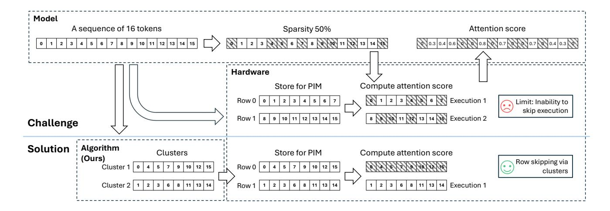
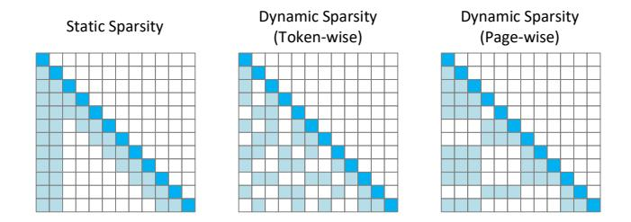
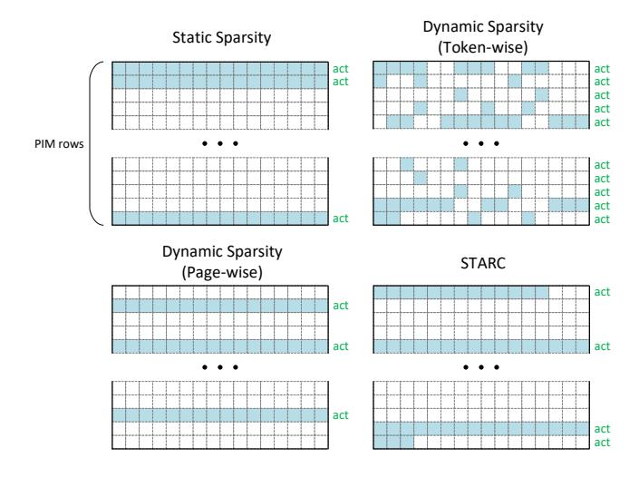
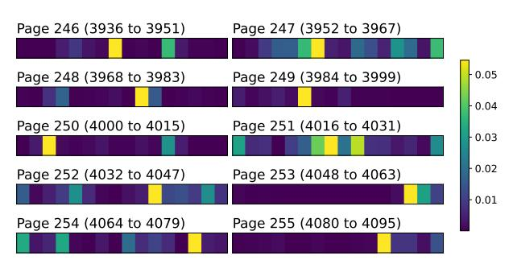
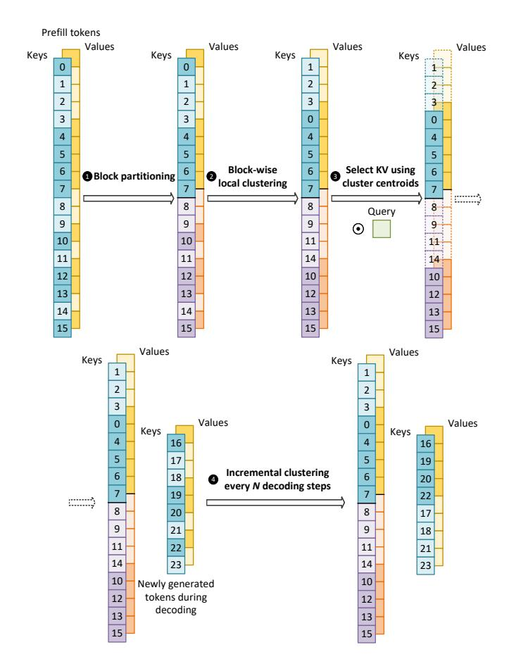
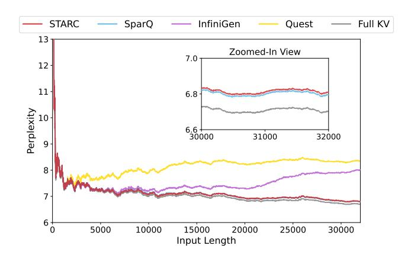
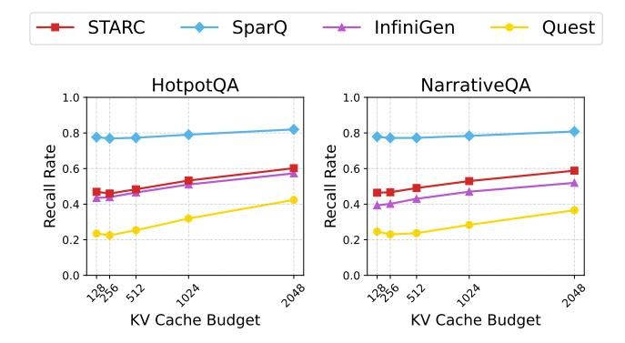

# STARC: Selective Token Access with Remapping and Clustering for Efficient LLM Decoding on PIM Systems

Zehao Fan Rensselaer Polytechnic Institute Troy, NY, USA fanz2@rpi.edu

Zhenyu Liu Rensselaer Polytechnic Institute Troy, NY, USA liuz32@rpi.edu Yunzhen Liu University of Massachusetts, Amherst Amherst, MA, USA yunzhenliu@umass.edu

Yayue Hou Rensselaer Polytechnic Institute Troy, NY, USA houy4@rpi.edu Garrett Gagnon Rensselaer Polytechnic Institute Troy, NY, USA gagnog@rpi.edu

Hadjer Benmeziane IBM Research – Ruschlikon Ruschlikon, Switzerland hadjer.benmeziane@ibm.com

Kaoutar El Maghraoui IBM T. J. Watson Research Center Yorktown Heights, NY, USA kelmaghr@us.ibm.com

#### **Abstract**

Serving large language models (LLMs) places significant pressure on memory systems due to frequent accesses and growing key-value (KV) caches as context lengths increase. Processing-in-memory (PIM) architectures offer high internal bandwidth and near-data compute parallelism, but current designs target dense attention and perform poorly under the irregular access patterns of dynamic KV cache sparsity. To mitigate this limitation, we propose STARC, a sparsityoptimized data mapping scheme for efficient LLM decoding on PIM. STARC clusters semantically similar KV pairs and co-locates them contiguously within PIM banks, enabling retrieval at cluster granularity by matching queries against precomputed centroids. This bridges the gap between finegrained sparse attention and row-level PIM operations, improving utilization while minimizing overhead. On a simulated HBM-PIM system, under constrained KV budgets, STARC achieves up to 78% and 65% reductions in attentionlayer latency and energy over token-wise sparsity methods, and up to 93% and 92% reductions relative to full attention, while preserving model accuracy.

*CCS Concepts:* • Computer systems organization  $\rightarrow$  *Architectures*; • Computing methodologies  $\rightarrow$  Machine learning.

*Keywords:* Processing-in-memory (PIM); Large language model (LLM); Sparse attention; KV clustering; KV cache


This work is licensed under a Creative Commons Attribution 4.0 International License.

ASPLOS '26, Pittsburgh, PA, USA
© 2026 Copyright held by the owner/author(s).
ACM ISBN 979-8-4007-2359-9/2026/03
https://doi.org/10.1145/3779212.3790226

Liu Liu Rensselaer Polytechnic Institute Troy, NY, USA liu.liu@rpi.edu

#### **ACM Reference Format:**

Zehao Fan, Yunzhen Liu, Garrett Gagnon, Zhenyu Liu, Yayue Hou, Hadjer Benmeziane, Kaoutar El Maghraoui, and Liu Liu. 2026. STARC: Selective Token Access with Remapping and Clustering for Efficient LLM Decoding on PIM Systems. In *Proceedings of the 31st ACM International Conference on Architectural Support for Programming Languages and Operating Systems, Volume 2 (ASPLOS '26), March 22–26, 2026, Pittsburgh, PA, USA.* ACM, New York, NY, USA, 17 pages. https://doi.org/10.1145/3779212.3790226

#### 1 Introduction

Large language models (LLMs) have demonstrated exceptional capabilities across a wide range of natural language processing tasks and are increasingly deployed in real-world applications such as interactive chat systems [1, 57, 61], code generation tools [38, 45, 48], and decision support [29, 47, 55]. During decoding, however, LLMs operate auto-regressively, requiring repeated attention over a growing key-value (KV) cache [41]. As context lengths scale, the KV cache expands proportionally, leading to frequent and large memory accesses. Despite high computational throughput, modern GPUs are constrained by limited memory bandwidth, making attention layers predominantly memory-bound [25]. Processingin-memory (PIM) architectures [8, 13, 19, 20, 39] offer a promising solution by alleviating bandwidth bottlenecks and enabling efficient in-memory computation. Recent work has explored heterogeneous designs (e.g., GPU-PIM, NPU-PIM) that offload memory-bound attention layers to PIM while leveraging traditional accelerators (xPUs) for computeintensive feed-forward networks (FFNs) and Query-Key-Value (QKV) generation [15, 40].

However, the trend toward longer contexts continues to impose substantial computation and memory costs, driven by the quadratic complexity of attention. Recent methods alleviate this by introducing **KV cache sparsity** through

<span id="page-1-0"></span>

Figure 1. Enhanced PIM execution efficiency through STARC. Due to the coarse row-level access granularity of PIM, directly applying sparsity to KV caches often fails to skip computation. STARC addresses this by clustering keys and values such that selected tokens are physically co-located, enabling effective computation skipping and realizing the speedup benefits of sparsity on PIM.

selective retrieval or compression, retrieving only a subset of tokens to approximate full attention. While such methods can reduce retrieval by over 90% with minimal accuracy loss, they introduce irregular and dynamic access patterns that traditional PIM designs—optimized for dense, row-level accesses—struggle to support. Most existing PIM-enabled systems largely assume full KV cache attention, leading to underutilization when sparsity is applied. Techniques such as Quest [\[49\]](#page-16-11) address this by retrieving at page granularity, aligning with memory row organization and improving bandwidth efficiency. Yet, page-based layouts remain coarsegrained, often fetching semantically irrelevant tokens, which wastes compute and undermines accuracy. This mismatch between dynamic sparsity and rigid PIM data layouts remains a fundamental barrier to efficient LLM decoding. To address this challenge, we propose STARC, a sparsityoptimized data mapping scheme designed specifically for PIM architectures. The key idea, illustrated in Figure [1,](#page-1-0) is to cluster semantically similar tokens and physically co-locate their KV pairs in memory. Our design aligns sparse attention with PIM's row-level organization.

To overcome the mismatch between dynamic sparsity and rigid PIM layouts, we propose STARC, a sparsity-optimized data mapping scheme for LLM decoding on PIM. STARC clusters semantically similar tokens and co-locates their KV entries contiguously in memory, enabling sparse attention to align with row-level PIM operations. Queries retrieve clusters by matching against precomputed centroids, ensuring most fetched vectors are relevant and improving hardware utilization. By performing lightweight clustering directly within PIM and fixing clusters across decoding steps, STARC

achieves efficient support for sparse attention in LLM serving. This paper makes the following contributions:

- We analyze the challenges of applying KV cache sparsity to PIM-enabled LLM inference and identify the mismatch between dynamic sparse retrieval and rigid row-level PIM data layouts.
- We propose STARC, a novel clustering-based data mapping scheme that co-locates semantically similar KV entries to align sparse attention with PIM bank organization.
- We introduce efficient in-memory designs that directly leverage existing PIM primitives and hardware to implement cosine-based K-means clustering for KV clustering, avoiding additional area overhead while minimizing GPU involvement and exploiting near-data compute.
- We demonstrate that STARC significantly improves throughput, utilization, and energy efficiency over state-of-the-art PIM system baselines while preserving model accuracy under sparse attention. It reduces attention-layer latency and energy by up to 78% and 65% compared to token-wise sparsity, and under a KVcache budget of 1024, achieves up to 93% latency and 92% energy reduction relative to full KV retrieval.

# 2 Background

In this section, we first introduce PIM architectures as a solution to the memory bandwidth bottlenecks that arise during decoding. We then describe sparse attention techniques, which alleviate the growing computational and memory access costs associated with long-context sequences, providing basic understandings of our proposed design.

#### 2.1 PIM for LLM Attention

Transformer-based LLMs [1, 6, 21, 31, 50] perform inference in two stages: **prefill** and **decoding**. In prefill, the entire input sequence (i.e., the user prompt) is processed in parallel to produce the first output token. In decoding, tokens are generated autoregressively, with each new token appended to the sequence and used as input for the next step. This iterative process requires the model to repeatedly read from the KV cache, which stores the key and value vectors projected from all previously generated tokens.

Although modern GPUs offer high FLOPs, attention computation during decoding is typically memory-bound, given its low arithmetic intensity and frequent memory accesses to tokens stored in the KV cache. As context lengths grow to hundreds of thousands of tokens, data transfers between GPU and external memory become a bottleneck. This results in suboptimal resource utilization, as much of computational capacity remains idle while waiting for memory transactions to complete.

<span id="page-2-0"></span>

**Figure 2.** Typical xPU–PIM hybrid system: QKV Generation and Feed-Forward Networks are executed on xPU such as GPU and NPU, while Attention is executed on PIM.

A more detailed examination of the decoder block architecture provides insight into the source of this memory bottleneck. Each decoder block consists of three fundamental components: (1) Query-Key-Value (QKV) generation, which projects the input hidden states into separate query, key, and value vectors; (2) Multi-Head Attention (MHA), where attention weights are computed and applied across multiple heads in parallel; and (3) Feed-Forward Networks (FFNs), which apply independent linear transformations and nonlinear activations to each token embedding. Among these components, the MHA module, particularly during the decoding phase, incurs the highest memory bandwidth demand due to its frequent token access to KV cache.

PIM architectures have emerged as a promising solution to mitigate such memory bandwidth bottlenecks by integrating computation directly within memory systems. Figure 2 illustrates the typical execution partitioning adopted by recent PIM-enabled heterogeneous systems, where memory-bound MHA is offloaded to PIM units, while QKV generation and FFNs remain on xPU compute cores. Attention layers are especially well-suited for PIM acceleration, primarily for two reasons. First, once the KV matrices for a decoding step are

written to the memory arrays, they can be reused repeatedly for subsequent query vectors in the same or following decoding iterations. This reuse pattern allows PIM systems to take full advantage of the high internal bandwidth. Second, MHA operations rely heavily on general matrix-vector multiplication (GEMV) to compute attention scores and outputs. Distributing these computations across parallel memory banks allows the PIM architecture to exploit abundant internal bandwidth while offloading repeated GEMV operations.

#### 2.2 Selective Token Access with Attention Sparsity

Recent studies on attention distributions in LLMs have revealed that attention scores during inference are often highly sparse. In many cases, only a small subset of tokens significantly contributes to the output, while the majority of tokens receive negligible weights. This observation has motivated a range of **sparse attention** techniques that aim to reduce the number of KV pairs accessed during decoding by performing selective retrieval or compression of the KV cache.

To be more specific, in the Transformer architecture, each attention head operates on projected query, key, and value vectors. Let  $q \in \mathbb{R}^{1 \times d_h}$  denote the query vector corresponding to the most recent token in a single head, and let  $K, V \in$  $\mathbb{R}^{L \times d_h}$  represent the cached key and value matrices for the L previous tokens. Here,  $d_h$  denotes the hidden dimension of a single attention head. Sparse attention methods select a subset of  $B \ll L$  KV pairs, typically based on similarity metrics such as dot-product or cosine similarity, yielding the reduced matrices  $K_S$ ,  $V_S \in \mathbb{R}^{B \times d_h}$ . The attention output is then computed as softmax $(qK_S^{\top}/\sqrt{d_h})V_S$ , where  $q \in \mathbb{R}^{1 \times d_h}$ is the query vector. This selective computation significantly reduces both the memory access and the per-step computational cost, while maintaining model quality in many scenarios. Crucially, it also decouples the per-token decoding complexity from the total context length.

<span id="page-2-1"></span>

**Figure 3.** Common attention sparsity patterns.

In practice, sparse attention mechanisms can be broadly categorized into three representative classes, illustrated in Figure 3: Firstly, **static sparsity** restricts each query to attend only to fixed historical token positions or to a fixed-size window of past tokens (e.g., the most recent *B* tokens), independent of content. This type of sparsity typically evicts other tokens and is hardware-friendly, but fails to capture

long-range dependencies. Secondly, token-wise dynamic **sparsity** selects the top-B most relevant tokens for each query dynamically based on similarity scores. It provides finer control over which tokens are attended but introduces irregular access patterns. Lastly, page-wise dynamic sparsity groups the context into fixed-size pages and selects relevant pages rather than individual tokens. Compared with token-wise, this method maintains hardware-friendly access patterns but compromises the effectiveness of per-iteration token access due to the retrieval of irrelevant tokens within a page. In this work, we mainly discuss the latter two sparsity methods. Both are KV cache retrieval methods that preserve the full KV cache without eviction. This focus aligns with our emphasis on model accuracy rather than reducing the KV cache storage footprint, since in our system the KV cache resides in HBM-PIM and does not pressure GPU memory capacity.

#### 3 Motivation

This section motivates our proposed design by analyzing the limitations of existing attention mechanisms on PIM architectures. We first highlight the inefficiencies of dense and token-wise sparsity under PIM's row-level access granularity. We then consider page-wise sparsity, which aligns better with hardware constraints but suffers from low relevance density and reduced attention quality. Finally, we motivate a clustering-based remapping strategy that groups semantically similar tokens into contiguous memory rows, aiming to improve execution efficiency without sacrificing the accuracy of token retrieval.

#### 3.1 Challenges of Attention on Existing PIM Architectures

Prior PIM architectures for attention are designed to work with a fully dense KV cache [14, 15, 24, 40, 59], where all past tokens are retained throughout decoding. However, with the long contexts used by modern LLMs, dense attention places heavy demands not only on internal bandwidth but also on the limited computational capacity of PIM architectures. Specifically, the near-memory logic embedded close to the memory arrays is typically lightweight and optimized for simple row-wise operations. These resources lack the deep pipelining and wide parallelism of traditional GPU compute units, and are constrained by area and energy budgets within the memory die. Moreover, each attention query must access a large number of stored key-value vectors, which are laid out across many memory rows. In PIM architectures, processing even a single token requires activating entire memory rows, since the logic operates at row granularity. When dense attention forces many such activations per query, the system suffers from frequent row switching and high energy costs due to repeated bitline toggling and row precharging.

<span id="page-3-0"></span>

**Figure 4.** Comparison of row activation patterns under different sparse attention methods.

This behavior severely reduces the efficiency of row-parallel execution across memory banks.

Applying sparse attention can potentially alleviate this overhead by accessing only a subset of past tokens. However, applying these methods in current PIM architectures introduces new challenges. A main issue is that token importance changes dynamically during decoding. A token that is unimportant at one step may become crucial later, limiting the effectiveness of static data placement or scheduling strategies in PIM.

These limitations become especially severe under tokenwise sparsity, which requires fine-grained retrieval of tokens. As illustrated in Figure 4, such fine-grained access patterns are poorly aligned with the row-level access granularity of PIM architectures. Each PIM array operates at row granularity: the near-memory logic must activate an entire row, bring all entries onto the bit-lines, and perform computation there. When relevant tokens are scattered across multiple rows, the memory controller is forced to read and process every row individually, leading to substantial over-fetching of irrelevant data and redundant computation.

<span id="page-3-1"></span>

Figure 5. Page-wise retrieval with less important tokens.

#### 3.2 Hardware Efficiency vs. Attention Quality

To reduce the overhead of selecting important tokens during decoding, several recent attention sparsity methods, such as Quest [\[49\]](#page-16-11), adopt a page-wise retrieval strategy. In this approach, tokens are grouped into fixed-size pages, and attention is computed over selected pages rather than individual tokens. Quest estimates the importance of each page by comparing the query vector with the minimal and maximal key vectors of that page, and retrieves only the most relevant ones. This simplifies the sparsity decision process and reduces the complexity of token scoring.

As shown in Figure [4,](#page-3-0) page-wise token access also aligns well with the memory organization of a PIM accelerator. When the page size is a multiple of the physical memory row size, PIM can fetch and process entire rows efficiently. This allows the accelerator to fully utilize internal memory bandwidth and avoid partial-row access overhead. In HBM-PIM architectures, where computation occurs near DRAM banks, this alignment improves data locality and reduces unnecessary data movement.

However, this hardware compatibility comes at the cost of attention quality and model accuracy. Page boundaries are defined purely based on token position, not on token relevance. As a result, selected pages often include many irrelevant tokens. These tokens are still accessed and processed, wasting bank-level bandwidth and compute resources.

We illustrate this issue using attention heatmaps with a context length of 4K in Figure [5,](#page-3-1) where the model used is LLaMA3.1-8B. The example uses Quest's page-wise method with a page size of 16 tokens. In the heatmaps, lighter cells represent tokens with higher attention weights. As shown, most pages contain only one or two important tokens. This inefficiency limits the usefulness of page-wise sparsity, despite its compatibility with PIM architectures.

#### 3.3 Motivation for Remapping and Clustering

To address the limitations of sparse attention on PIM, we propose a remapping strategy that clusters semantically similar key–value vectors and places each cluster in contiguous memory rows. By aligning row-level layout with attention relevance, activating a single row retrieves multiple relevant tokens, reducing redundant row activations and unnecessary computation, as illustrated in Figure [4.](#page-3-0) Compared with conventional sequential mapping, this design increases the usefulness of each row access and enables coarse-grained execution skipping. The approach thus balances hardware and algorithmic needs: PIM architectures benefit from regular row-granular access patterns, while clustering ensures that each accessed row contains semantically important tokens.

# 4 STARC System Architecture

This section details the hardware-algorithm co-design principles of STARC. We begin by introducing the underlying PIM

architecture, which provides massive near-bank parallelism but imposes rigid row-level access constraints. We then describe how STARC leverages this architecture to perform efficient KV clustering directly inside HBM-PIM, thereby eliminating costly GPU offloading and reusing existing PIM primitives and hardware without introducing additional area overhead.

#### <span id="page-4-1"></span>4.1 PIM Architecture Overview

To enable high-throughput execution of attention mechanisms in Transformer-based models, we adopt AttAcc [\[40\]](#page-16-10) as our PIM architecture—a PIM system specifically designed to accelerate the attention layer. As illustrated in Figure [6,](#page-4-0) AttAcc places compute units near each bank within an HBM stack. Specifically, a single HBM channel contains 2 pseudochannels (pCHs), each pCH is divided into 2 ranks, and every rank further breaks down into 4 bank groups, with 4 banks in each group. This results in a total of 64 banks per channel, which can be activated simultaneously to collectively utilize the full channel bandwidth and drive the near-bank compute fabric efficiently.

<span id="page-4-0"></span>

Figure 6. HBM-PIM architecture and KV cache organization.

A key principle of STARC is an architecture–algorithm codesign strategy: we select the number of clusters in K-means such that the arithmetic intensity of clustering matches the hardware-defined tipping point between memory-bound and compute-bound execution. This balance is determined by the architecture of our simulated HBM-PIM system. Each bank hosts a dedicated GEMV compute unit, and each pCH integrates 32 GEMV units. Each GEMV contains 16 FP16 fusedmultiply-add (FMA) pairs operating at 666 MHz. The system includes 40 HBM stacks, each consisting of 16 channels, yielding a total of 40 × 16 = 640 channels and 640 × 2 = 1280 pCHs. With 32 GEMV units per pCH and 2 FMA operations per unit per cycle, the peak compute throughput is:

Peak FLOPs = 
$$32 \times 2 \times 16 \times 1280 \times 666$$
 MHz  
 $\approx 8.7 \times 10^{14}$  FLOPs/s = 873 TFLOPs/s.

$$I^* = \frac{\text{Peak FLOPs}}{\text{Peak Internal BW}} = \frac{873 \text{ TFLOPs/s}}{242 \text{ TB/s}} \approx 4 \text{ FLOPs/Byte.}$$

This arithmetic intensity value serves as a hardware-defined tipping point: workloads with intensity below  $I^*$  are memorybound, while those above are compute-bound. In our algorithm design (Section 5), we exploit this principle by selecting the number of clusters K in K-means such that the arithmetic intensity of the clustering workload matches  $I^*$ .

Additionally, despite HBM-PIM's high throughput, its execution model offers limited flexibility. As illustrated in Figure 6, under our configuration, each DRAM bank row stores 1KB of data. Assuming FP16 precision (2B per element) and an attention head dimension of 128 (as in typical LLaMA-style models), a single key or value vector occupies 256B. To fully utilize the parallelism across banks, each vector is dimension-partitioned across the four banks within a bank group, such that each bank stores a contiguous 64B slice of the vector. Consequently, one row across a bank group can accommodate 16 complete key or value vectors, yielding a row-level block size of blk $_{\rm row}=16$ , meaning that a single row activation accesses 16 complete key or value vectors at once.

#### <span id="page-5-1"></span>4.2 Efficient KV Clustering Implementation on PIM

Although clustering-based remapping can mitigate row-level inefficiencies, performing clustering efficiently on hardware presents additional challenges. During decoding, the QKV generation stage already writes the key and value vectors into HBM. Offloading these vectors to GPUs for clustering would incur substantial transfer overhead across the memory interface, negating the benefits of in-memory data layout optimization. To avoid this bottleneck, we perform KV clustering directly inside HBM-PIM, leveraging AttAcc's nearbank compute fabric to execute the three phases of K-means: normalization, assignment, and update.

Table 1 details the command-level breakdown of cosine-based K-means clustering implemented on PIM. We denote D as the number of vector dimensions and S as the byte size of an FP16 value (two bytes). Each GEMV unit supports 64-way SIMD MACs, so computing a dot product between two D-dimensional vectors requires  $T_D = D/64$  MAC\_AB operations. Following Section 4.1, we use  $blk_{row}$  to denote the number of D-dimensional vectors accommodated in one DRAM row across a bank group. To compare against K centroids, the system requires  $T_K = K/blk_{row}$  such operations. Finally, we denote N, K, and I as the number of samples, clusters, and clustering iterations, respectively. Following

<span id="page-5-0"></span>**Table 1.** Command-level breakdown of cosine-based K-means clustering on PIM. Read/write bytes include only PIM-side memory traffic; host-side scalar operations are excluded.

| Operation                            | Command Count     | MAC         | Read Bytes                      | Write Bytes |  |  |  |  |  |  |  |  |
|--------------------------------------|-------------------|-------------|---------------------------------|-------------|--|--|--|--|--|--|--|--|
| Normalization (per vector)           |                   |             |                                 |             |  |  |  |  |  |  |  |  |
| MAC_AB(self-dot)                     | $T_D$             | D           | DS                              | _           |  |  |  |  |  |  |  |  |
| MVSB(norm)                           | 1                 | 0           | _                               | S           |  |  |  |  |  |  |  |  |
| VNORM(vector/√·)                     | $T_D$             | D           | DS                              | _           |  |  |  |  |  |  |  |  |
| Total / vector                       |                   | 2D          | 2DS                             | S           |  |  |  |  |  |  |  |  |
| Assignment (per iteration)           |                   |             |                                 |             |  |  |  |  |  |  |  |  |
| WRGB(samples)                        | N                 | 0           | _                               | NDS         |  |  |  |  |  |  |  |  |
| MAC_AB                               | $NT_D \times T_K$ | NKD         | samples: NDS,<br>centroids: KDS | _           |  |  |  |  |  |  |  |  |
| MVSB(scores)                         | $NT_K$            | 0           | _                               | NKS         |  |  |  |  |  |  |  |  |
| Host(argmax)                         |                   | _           | NKS                             | only labels |  |  |  |  |  |  |  |  |
| Total / iteration                    |                   | NKD         | (ND + KD + NK)S                 | NDS + NKS   |  |  |  |  |  |  |  |  |
| Update (per iteration)               |                   |             |                                 |             |  |  |  |  |  |  |  |  |
| MVGB(broadcast v <sub>i</sub> )      | N                 | 0           | NDS                             | _           |  |  |  |  |  |  |  |  |
| MAC_AB<br>(accumulation & averaging) | $NT_D$            | (ND + KD)/2 | _                               | _           |  |  |  |  |  |  |  |  |
| WRGB(new $\mu_k$ )                   | 1                 | 0           | _                               | KDS         |  |  |  |  |  |  |  |  |
| Total / iteration                    |                   | (ND + KD)/2 | NDS                             | KDS         |  |  |  |  |  |  |  |  |

prior modeling practice, we approximate one addition, multiplication, or division as half a MAC, since each corresponds to a single FLOP.

**Normalization.** To enable cosine similarity computation, each vector must first be normalized into the form  $v/\|v\|$ . As shown in Table 1, this process begins with a self dotproduct via  $MAC\_AB$ , requiring  $T_D$  commands, D multiplyaccumulate operations, and reading DS bytes from memory. The resulting scalar norm is then transferred into the softmax buffer using MVSB. To avoid host involvement and reduce data transfers across the memory interface, we introduce a fused command VNORM, implemented via a small lookuptable (LUT)-based reciprocal square-root approximation and the scaling datapath, since the  $\frac{1}{\sqrt{\|v\|^2}}$  term used in clustering does not require high precision and can be approximated using a piecewise-defined LUT. Both the LUT lookup and the ensuing multiply-accumulate and scaling operations are native to AttAcc's PIM primitives, and thus neither VNORM nor the clustering control logic introduces new hardware structures or additional area overhead. This step requires another  $T_D$  commands and D operations, reading the vector once more (DS bytes). In total, per-vector normalization entails 2D MACs, 2DS bytes of reads, and S bytes of writes.

**Assignment.** After normalization, each sample must be assigned to its closest centroid. For each of the N samples, we first write the sample vector into the GEMV buffer with a **WRGB** command, incurring NDS bytes of writes. The sample is then compared against all K centroids using  $NT_D \times T_K$  **MAC\_AB** operations, corresponding to NKD MACs. Here, the read volume includes both the sample (NDS bytes) and the centroids (KDS bytes). The resulting similarity scores are dispersed across different row blocks, so they must be gathered into the softmax buffer before the host can perform argmax. This gathering is carried out with **MVSB** commands:

each sample requires  $T_K$  such transfers to collect all K scores, leading to  $NT_K$  commands and NKS bytes of writes in total. Finally, the host performs the argmax across K scores per sample, which involves reading NKS bytes and returning only cluster labels. Overall, the assignment phase per iteration requires NKD MACs, (ND+KD+NK)S bytes of reads, and NDS+NKS bytes of writes.

**Update.** Once assignments are made, cluster centroids must be updated by averaging the vectors assigned to each cluster. To enable accumulation across all centroids, each of the N sample vectors is broadcast to the GEMV buffer across all banks using N **MVGB** commands, corresponding to NDS bytes of reads. Accumulation is then carried out via  $NT_D$  **MAC\_AB** operations. We approximate the operation count as (ND + KD)/2 equivalent MACs, accounting for vector additions and the final scalar divisions when averaging. Because samples are already broadcast into GEMV buffers, no additional read traffic is incurred. Finally, the new centroids  $\mu_k$  are written back to memory with a single **WRGB** command, writing KDS bytes. In total, the update phase per iteration requires (ND + KD)/2 equivalent MACs, NDS bytes of reads, and KDS bytes of writes.

Through this breakdown, Table 1 demonstrates that all three phases of cosine-based K-means can be expressed as compositions of existing PIM commands (MAC\_AB, WRGB, MVSB, MVGB) augmented with one lightweight fused command (VNORM). By carefully mapping normalization, assignment, and update into these command sequences, STARC leverages existing PIM primitives and hardware to achieve inmemory clustering of KV vectors directly within HBM-PIM, eliminating costly GPU offloading and enabling hardware-aware clustering aligned with AttAcc's memory architecture.

#### <span id="page-6-0"></span>5 Algorithm Design

Building upon the STARC framework, we propose an online clustering strategy that incrementally reorganizes the KV cache during decoding. The aim is to balance model accuracy with HBM-PIM's row-level access granularity by grouping semantically similar KV pairs into hardware-aware clusters. While these clusters may not always align exactly with HBM rows, the resulting regularized access pattern effectively reduces row over-fetch and improves bandwidth utilization. The overall procedure is outlined in Algorithm 1.

We begin by quantifying the arithmetic intensity (AI) of cosine K-means, defined as the ratio between floating-point operations (FLOPs) and main-memory traffic in bytes, using the notation (N, K, D, I, S) in Section 4.2.

One-off normalization cost. Each vector undergoes an  $\ell_2$  normalization prior to clustering. Computing the squared norm requires D multiply-add pairs (2D FLOPs), followed by one square root and one reciprocal (host-side scalar operations, excluded from FLOPs). The normalized vector is reconstructed by D scalar multiplications (D FLOPs). Thus,

<span id="page-6-1"></span>

**Figure 7.** Flowchart of the clustering algorithm. We perform incremental clustering on the KV pairs using K-means, meaning that only the newly generated segment of KV pairs is clustered during decoding.

each vector incurs 3D FLOPs and 3DS bytes of traffic. For N + K vectors, this yields

$$FLOPs_{norm} = 3D(N + K)$$
,  $Bytes_{norm} = 3D(N + K)S$ .

Given  $I \gg 1$  and  $N \gg K$ , this one-off cost is amortized and omitted from the per-iteration AI.

Per-iteration cost. Each Lloyd iteration consists of:

(1) Assignment: Each sample is compared with all K centroids via D-dimensional dot products, each requiring 2D FLOPs. Across all N samples and K centroids:

$$FLOPs_{assign} = 2DNK$$
,  $Bytes_{assign} = (N + K)DS$ ,

where the byte count accounts for reading both N samples and K centroids from main memory.

(2) **Update:** Updating centroids involves adding N samples into K cluster sums (ND additions) and scaling each centroid by  $1/n_k$  (KD scalar multiplications/divisions):

$$FLOPs_{update} = ND + KD$$
,  $Bytes_{update} = KDS$ ,

#### <span id="page-7-0"></span>Algorithm 1 Clustering-Based Retrieval during Decoding

**Require:** Prefill KV pairs  $\mathcal{K}_{pre}$ ,  $\mathcal{V}_{pre}$ ; Decoding stream  $\{x_t\}$ ; Block size N; KV cache budget B

```
    // Initial clustering after prefill
    Partition (K<sub>pre</sub>, V<sub>pre</sub>) into non-overlapping blocks of size N
    for each block (K<sub>b</sub>, V<sub>b</sub>) do
    C<sub>b</sub> ← KMeans(K<sub>b</sub>)  
        cosine similarity

    Assign each (k<sub>i</sub>, v<sub>i</sub>) ∈ (K<sub>b</sub>, V<sub>b</sub>) to its cluster in C<sub>b</sub>
    C ← C ∪ C<sub>b</sub>
    end for
    Initialize: K<sub>new</sub> ← Ø, V<sub>new</sub> ← Ø
```

```
8: Initialize: \mathcal{K}_{\text{new}} \leftarrow \emptyset, \mathcal{V}_{\text{new}} \leftarrow \emptyset
 9: for each decoding step t do
10:
              Generate token x_t, compute key k_t and value v_t
              Append k_t to \mathcal{K}_{\text{new}}, v_t to \mathcal{V}_{\text{new}}
11:
              if |\mathcal{K}_{\text{new}}| = N then
12
                     C_{\text{new}} \leftarrow \text{KMeans}(\mathcal{K}_{\text{new}})
                     Assign each (k_i, v_i) \in (\mathcal{K}_{\text{new}}, \mathcal{V}_{\text{new}}) to its cluster
14:
       in C_{\text{new}}
                     C \leftarrow C \cup C_{\text{new}}
15:
                     Reset \mathcal{K}_{\text{new}}, \mathcal{V}_{\text{new}} \leftarrow \emptyset
16:
              end if
17:
```

# 18: // KV retrieval for current step

19: Compute scores  $s_j = q_t^{\mathsf{T}} \mu_j$  for all centroids  $\mu_j \in C$ 

20: Sort clusters by  $s_i$  in descending order

Select top clusters until total token count reaches B

22: Truncate final cluster if needed to fit budget *B* 

23: Include all non-clustered tokens in  $\mathcal{K}_{new}$ ,  $\mathcal{V}_{new}$ 

24: end for

where the byte count corresponds to writing updated centroids back to memory.

**Total per-iteration AI.** The per-iteration arithmetic intensity is therefore

$$\mathrm{AI} = \frac{\mathrm{FLOPs_{assign}} + \mathrm{FLOPs_{update}}}{\mathrm{Bytes_{assign}} + \mathrm{Bytes_{update}}} = \frac{2DNK + ND + KD}{(N+K)DS + KDS}.$$

For  $N \gg K$ , this simplifies to

AI 
$$\approx \frac{2K+1}{S} \xrightarrow{S=2 \text{ B}} K \text{ FLOPs/byte.}$$

Thus, under ideal centroid reuse and negligible host overhead, the algorithm-level AI scales linearly with K for FP16 data. On the hardware side, Section 4.1 established the peak throughput and compute-to-memory tipping point  $I^*$ , yielding Peak FLOPs  $\approx 873$  TFLOPs/s and  $I^* \approx 4$  FLOPs/Byte. Comparing the two results gives a clear co-design rule: choose K so that AI  $\approx I^*$ . Since AI  $\approx K$  under FP16, we set K=4 to ensure the clustering workload operates near the hardware-defined balance point.

Based on this principle, we design a hardware-aware online clustering method that reorganizes the KV cache into contiguous, row-aligned clusters and keeps the clusters fixed after their initial formation, so that each vector is clustered only once. As shown in Figure 7, at the start of decoding, the prefill tokens are divided into non-overlapping blocks of size N  $\bullet$ . We apply cosine K-means with K=4 and random initialization to each block, limiting the number of iterations I to 16 to control runtime **2**. Clustering is applied to keys only, and the corresponding values inherit the same labels. The resulting clusters are stored in contiguous physical locations that match the PIM bank layout. With a PIM row size of  $blk_{row} = 16$  and K=4, we set  $N = K \times blk_{row} = 64$  so that each cluster contains about 16 tokens, aligning the access granularity with the row size and reducing row overfetch and internal data movement. Once these prefill clusters are formed, they remain unchanged to avoid costly reshuffling under row-level access.

During decoding, newly generated tokens are kept in full for attention computation until their number reaches the size N, as they strongly influence the immediate attention distribution. The same as the processing of tokens generated in the prefill stage, every N = 64 decoding steps, we cluster only the most recent 64-token block using the same configuration (K=4, up to 16 iterations), append the resulting clusters, and store them contiguously **4**. Once formed, clusters remain fixed and are never updated. As a result, STARC does not require re-clustering throughout inference, thereby avoiding the costly remapping of clustered KV vectors already stored in memory. This incremental, append-only design not only reduces the clustering overhead but also draws on two observations. First, the distribution of decoding keys gradually diverges from that of the prefill keys (Figure 8), which justifies clustering the two stages separately. Second, key vectors exhibit locality, meaning that adjacent tokens tend to have high cosine similarity. Clustering only the most recent contiguous segment takes advantage of this property, improving clustering quality while keeping the approach suitable for online inference.

<span id="page-7-1"></span>

**Figure 8.** The distributions of key vectors differ significantly between the prefill and decoding stages.

<span id="page-8-0"></span>

|                 |        | Single-Document QA |       | Multi-Document QA |          |         |           | Summarization |           | Few-Shot Learning |          |        | Synthetic |       | Code  |       |       |  |
|-----------------|--------|--------------------|-------|-------------------|----------|---------|-----------|---------------|-----------|-------------------|----------|--------|-----------|-------|-------|-------|-------|--|
| KV Budget: 1024 | NrtvQA | Qasper             | MF-en | HotpotQA          | 2WikiMQA | Musique | GovReport | QMSum         | MultiNews | TREC              | TriviaQA | SAMSum | PCount    | PRe   | Lcc   | RB-P  | Avg.  |  |
| LongChat        |        |                    |       |                   |          |         |           |               |           |                   |          |        |           |       |       |       |       |  |
| Full KV         | 19.51  | 25.98              | 43.80 | 31.94             | 23.20    | 11.38   | 31.77     | 21.66         | 26.06     | 66.00             | 82.00    | 20.79  | 2.00      | 30.00 | 53.86 | 48.68 | 33.66 |  |
| STARC           | 17.55  | 29.44              | 40.92 | 32.32             | 19.29    | 9.73    | 31.22     | 22.08         | 25.01     | 64.00             | 80.80    | 21.82  | 2.00      | 32.00 | 57.16 | 48.82 | 33.38 |  |
| SparQ           | 19.56  | 29.90              | 40.90 | 31.05             | 22.84    | 12.92   | 30.98     | 23.19         | 26.49     | 64.00             | 84.53    | 25.89  | 0.00      | 30.50 | 54.34 | 55.72 | 34.55 |  |
| InfiniGen       | 15.41  | 29.56              | 41.92 | 36.20             | 20.35    | 8.89    | 29.36     | 22.22         | 24.73     | 64.00             | 84.38    | 29.75  | 2.00      | 32.00 | 51.84 | 51.06 | 33.98 |  |
| Quest           | 14.58  | 29.23              | 43.67 | 28.37             | 18.62    | 10.51   | 29.12     | 22.29         | 24.91     | 66.00             | 79.31    | 20.88  | 2.00      | 34.00 | 52.60 | 49.00 | 32.82 |  |
| Mistral         |        |                    |       |                   |          |         |           |               |           |                   |          |        |           |       |       |       |       |  |
| Full KV         | 23.94  | 40.07              | 57.58 | 49.10             | 36.71    | 22.27   | 35.66     | 25.77         | 26.80     | 80.00             | 87.67    | 47.35  | 4.00      | 98.00 | 58.98 | 56.36 | 46.89 |  |
| STARC           | 19.97  | 34.93              | 57.70 | 51.49             | 35.48    | 23.39   | 35.67     | 24.72         | 26.72     | 76.00             | 88.87    | 48.16  | 2.00      | 98.00 | 61.74 | 55.76 | 46.29 |  |
| SparQ           | 29.36  | 40.93              | 53.68 | 51.33             | 37.36    | 27.22   | 34.49     | 25.67         | 27.66     | 74.00             | 88.86    | 47.17  | 5.00      | 99.00 | 60.43 | 62.14 | 47.77 |  |
| InfiniGen       | 23.34  | 37.73              | 57.90 | 51.41             | 39.45    | 19.69   | 35.06     | 24.89         | 26.29     | 76.00             | 85.67    | 47.60  | 2.00      | 98.00 | 59.82 | 59.58 | 46.53 |  |
| Quest           | 22.79  | 30.88              | 52.39 | 47.12             | 38.63    | 18.73   | 33.45     | 24.23         | 27.26     | 66.00             | 88.42    | 44.73  | 8.18      | 92.00 | 60.86 | 57.52 | 44.57 |  |
| Llama-3.1       |        |                    |       |                   |          |         |           |               |           |                   |          |        |           |       |       |       |       |  |
| Full KV         | 27.02  | 13.98              | 28.04 | 18.30             | 17.45    | 13.01   | 35.83     | 23.66         | 25.91     | 74.00             | 89.77    | 44.56  | 3.92      | 97.50 | 63.30 | 55.06 | 39.46 |  |
| STARC           | 31.73  | 13.57              | 28.14 | 20.40             | 18.08    | 11.54   | 35.26     | 23.53         | 25.62     | 72.00             | 88.57    | 44.25  | 5.67      | 98.33 | 64.30 | 54.42 | 39.71 |  |
| SparQ           | 29.53  | 13.83              | 26.97 | 17.64             | 16.85    | 10.27   | 33.95     | 23.79         | 26.73     | 71.00             | 91.47    | 44.20  | 7.12      | 98.21 | 64.19 | 60.44 | 39.76 |  |
| InfiniGen       | 28.80  | 14.15              | 27.88 | 24.27             | 17.79    | 9.75    | 34.15     | 23.31         | 26.59     | 70.00             | 89.81    | 44.05  | 4.67      | 96.00 | 61.98 | 59.02 | 39.51 |  |
| Quest           | 18.66  | 11.75              | 22.96 | 16.90             | 13.52    | 5.46    | 34.22     | 22.12         | 25.87     | 70.00             | 85.60    | 42.94  | 0.80      | 96.27 | 58.90 | 56.08 | 36.38 |  |

Table 2. LongBench results for STARC and baseline sparsity methods (KV cache budget: 1024 tokens).

At inference time, KV retrieval operates at the cluster level. At each decoding step, the current query is compared against all cluster centroids using dot products ➌. Clusters are ranked by the resulting scores, and the top-ranked clusters are retrieved until the KV budget is reached. Because clusters may contain different numbers of KV entries, the last retrieved cluster may be partially truncated to stay within the budget.

# 6 Evaluation

#### 6.1 Evaluation Methodology

Accuracy Evaluation. To evaluate the effectiveness of STARC under long-context scenarios, we consider three representative LLMs: LongChat-7B-v1.5-32K (MHA) [\[28\]](#page-15-12), LLaMA-3.1-8B-Instruct (GQA) [\[6\]](#page-15-8), and Mistral-7B-Instructv0.3 (GQA) [\[21\]](#page-15-9). These models cover both multi-head and grouped-query attention mechanisms, enabling a comprehensive study of STARC across different attention designs. For benchmarking, we use the LongBench benchmark [\[2\]](#page-15-13), consisting of 16 datasets across diverse tasks: multi-document QA (HotpotQA [\[54\]](#page-16-15), 2WikiMQA [\[53\]](#page-16-16), Musique [\[51\]](#page-16-17)), singledocument QA (QASPER [\[5\]](#page-15-14), MultiFieldQA-en, NarrativeQA [\[23\]](#page-15-15)), summarization (GovReport [\[18\]](#page-15-16), QMSum [\[58\]](#page-16-18), Multi-News [\[7\]](#page-15-17)), few-shot learning (TriviaQA [\[22\]](#page-15-18), TREC [\[30\]](#page-16-19), SAMSum [\[11\]](#page-15-19)), synthetic reasoning (PCount, PRe [\[43\]](#page-16-20)), and code completion (Lcc [\[12\]](#page-15-20), RB-P [\[34\]](#page-16-21)). We also present an evaluation on the RULER benchmark [\[17\]](#page-15-21), which is designed to stress-test model robustness under extreme long-context scenarios. In addition, we evaluate on PG-19 [\[42\]](#page-16-22) for language modeling using perplexity as the evaluation metric.

We compare STARC against three recent sparsity methods: Quest [\[49\]](#page-16-11), InfiniGen [\[26\]](#page-15-22), and SparQ [\[44\]](#page-16-23). Each baseline follows the configurations in its original paper (e.g., page size for Quest, partial weights and threshold for InfiniGen, and largest retained components for SparQ). For a fair comparison, we reproduce all methods under the same framework and adopt the Quest setting of using full KV cache in the first two layers, which typically exhibit low sparsity [\[49\]](#page-16-11). Unless otherwise specified, results are reported at a KV cache budget of 1024 tokens, matching the budget used in our performance experiments. Results under other budgets (256, 512, 2048) are provided in the appendix. For STARC, we perform clustering over every 64 consecutive tokens using cosine-based K-means, with the number of clusters fixed at = 4.

Performance on PIM Systems. To investigate how attention sparsity impacts PIM architectures and evaluate the effectiveness of STARC, we adopt the AttAcc simulator [\[40\]](#page-16-10), which extends Ramulator [\[36\]](#page-16-24) to model heterogeneous GPU–PIM systems, and evaluate on a DGX+AttAcc platform where attention kernels are offloaded to PIM units while FC layers remain on GPU. The DGX consists of 8 NVIDIA H100 cores and 40 HBM3 stacks (5.2 Gbps per pin), with a total memory capacity of 1.28 TB. The AttAcc side contains an additional 40 HBM3 stacks, also totaling 1.28 TB. Each DRAM bank integrates one GEMV unit (1P1B configuration), and all arithmetic and buffer components follow the microarchitectural assumptions in AttAcc [\[40\]](#page-16-10).

We configure inference workloads to emphasize longcontext, memory-bound decoding scenarios, with prefill/ decoding sequence pairs of (2K, 16K), (2K, 24K), and (2K, 32K). Batch size is fixed at 16. The evaluated models include

LLaMA-7B, Mistral-7B, and GPT-13B, all at FP16 precision. To highlight trade-offs between accuracy and efficiency, we incorporate STARC's KV clustering overhead into the simulation. Page-wise sparsity is represented by Quest, while token-wise sparsity is represented by SparQ, which achieves the highest accuracy in our experiments. We adopt AttAcc's optimal configuration by enabling both head-level pipelining and feedforward co-processing. All other simulator configurations follow AttAcc defaults.

#### 6.2 Accuracy Evaluation

Results on LongBench. Table 2 presents the results on LongBench datasets under a KV cache budget of 1024. Several consistent trends emerge across models. First, STARC outperforms the page-wise sparsity method Quest in terms of average accuracy across all models. Second, STARC achieves accuracy comparable to token-wise sparsity methods (SparQ and InfiniGen), and on grouped-query attention models (LLaMA-3.1 and Mistral) it achieves the best results among all sparsity methods on many datasets. These results indicate that STARC provides robust accuracy across both MHA and GQA models, while aligning better with PIM hardware.

<span id="page-9-0"></span>

**Figure 9.** Language modeling on PG-19 dataset.

<span id="page-9-1"></span>

Figure 10. Recall rate of important tokens.

Results on RULER. Table 3 reports the results on the RULER benchmark for LLaMA-3.1-8B-Instruct at a context length of 32K. RULER consists of 13 tasks grouped into four categories: Retrieval, Multi-Hop Tracing, Aggregation, and Question Answering. All methods are evaluated under the same KV budget of 1024. Overall, STARC achieves average accuracy close to the full-KV and SparQ baseline, while outperforming InfiniGen. Moreover, STARC outperforms the page-wise sparsity baseline Quest across most tasks. These results further support the robustness of STARC under long-context scenarios.

**Results on Language Modeling.** Figure 9 shows the perplexity of generated tokens on the PG-19 test set across varying input lengths, ranging from 1 to 32,000 tokens, under a fixed KV budget of 1024. STARC outperforms both Quest and InfiniGen, particularly at longer input lengths. Although SparQ slightly outperforms STARC, the gap remains narrow, and STARC consistently tracks closely with the Full-KV baseline.

**Recall Rate of Important Tokens.** Figure 10 reports the recall rate of important tokens on HotpotQA and NarrativeQA. Although STARC does not surpass SparQ, it achieves higher recall than both Quest and InfiniGen across all budgets. This demonstrates that STARC's clustering strategy improves the selection of semantically important tokens, which explains its strong downstream task performance.

#### 6.3 Performance on PIM Systems

We evaluate attention sparsity on PIM systems using three models (LLaMA-7B, GPT-13B, and Mistral-7B) under long-context decoding scenarios with sequence pairs (2k, 16k), (2k, 24k), and (2k, 32k). All methods use a KV cache budget of 1024 tokens.

To assess hardware efficiency, we analyze the attention masks produced by each method at each decoding step and map them to the row-level granularity of the PIM architecture, where each DRAM row activation fetches  $blk_{row}=16$  key/value vectors in parallel. The efficiency thus depends on how well the retrieved tokens align with row boundaries. Page-wise sparsity naturally avoids over-fetching, since each page matches the row size exactly. In contrast, token-wise sparsity often scatters tokens across many rows, leading to additional memory accesses and the processing of irrelevant data. STARC retrieves tokens at the cluster level, so semantically similar tokens are stored in the same or adjacent rows during cluster construction, significantly reducing redundant memory activations.

Figure 11 presents the normalized end-to-end decoding latency (top) and energy (bottom) per token. Each bar is broken down into attention, feed-forward, communication, and miscellaneous costs. The yellow markers show the additional KV clustering overhead of STARC, plotted against the right *y*-axis.

<span id="page-10-0"></span>FWE Niah1 Niah2 Niah3 MKey1 MKey2 MKey3 MValue MQuery VT CWE QA1 QA2 Avg. Full KV 1.0000 1.0000 1.0000 1.0000 1.0000 1.0000 0.9844 1.0000 0.9938 0.1479 0.9444 0.8542 0.5312 0.8812 STARC 1 0000 1 0000 1 0000 1 0000 0.9688 0.9479 0.9688 0.9948 0.9896 0.1729 0.9167 0.8542 0.5312 0.8727 0.8831 SparO 1 0000 1 0000 1 0000 1 0000 1 0000 1 0000 0.9844 1 0000 0.9854 0.2396 0.8854 0.8542 0.5312 InfiniGen 0.9974 0.7882 0.5104 1.0000 0.9896 0.7812 0.9193 0.9542 0.1917 0.8542 0.8419 1.0000 1.0000 0.9583 Quest 0.9792 1.0000 0.8854 1.0000 1.0000 0.2500 0.9609 0.9870 0.8688 0.1115 0.8472 0.8333 0.4792 0.7848 □ СОММ ETC **CLUSTER** ATTN FC

Table 3. RULER results on LLaMA-3.1-8B-Instruct with 32K context length.

<span id="page-10-1"></span>

Figure 11. Normalized end-to-end decoding latency and energy on PIM systems across different models and sequence lengths.

Several consistent trends can be observed across all three models. As the decoding length increases, the attention layer rapidly becomes the dominant contributor to both latency and energy, and the benefits of sparsity grow accordingly. At the level of overall decoding, even token-wise sparsity achieves up to 34% speedup and 47% energy reduction compared to full KV retrieval. STARC further improves efficiency, providing 25%–48% speedup and 34%–56% energy reduction, corresponding to 13%–21% faster execution and 11%–18% lower energy consumption than token-wise methods.

When isolating the attention layer, the improvements are even more pronounced. Relative to full KV retrieval, STARC reduces attention latency by up to 93% and energy by up to 92%. Compared to token-wise sparsity, STARC still achieves up to 78% latency reduction and 65% energy reduction. Importantly, in both latency and energy, STARC approaches the ideal efficiency of page-wise sparsity, while preserving much higher model accuracy.

Notably, these improvements come at virtually no additional cost: the clustering overhead of STARC is negligible. Unlike full or sparse attention where each decoding step

requires past tokens (on the order of  $(L_{\rm in} + L_{\rm out})L_{\rm out}/2$  or  $B \cdot L_{\rm out}$  tokens, respectively), STARC only clusters each token once, resulting in  $L_{\rm in}+L_{\rm out}$  clustering operations in total. This incremental design makes the overhead scale linearly with context length rather than quadratically, which explains why it remains around 0.02% of total decoding latency and energy in long-context settings, as shown by the yellow markers.

Overall, STARC achieves significant reductions in attentionlayer latency and energy relative to token-wise sparsity methods, while providing substantially higher accuracy than page-wise sparsity. These results demonstrate STARC's effectiveness as a hardware-aware sparse attention mechanism tailored for long-context inference on PIM architectures.

#### 7 Related Work

#### 7.1 PIM-enabled LLM Accelerators

PIM has emerged as an effective architectural paradigm to overcome the bandwidth bottlenecks in LLMs, particularly during autoregressive decoding. By placing compute units near memory arrays, PIM boosts bandwidth utilization and

parallelism for memory-intensive workloads. This has motivated many recent efforts to integrate PIM into LLM acceleration pipelines [\[4,](#page-15-23) [14,](#page-15-10) [15,](#page-15-7) [24,](#page-15-11) [40,](#page-16-10) [59\]](#page-16-14).

Hybrid Strategy. To better balance the compute and memory workloads in LLMs, hybrid xPU–PIM designs have been proposed. AttAcc [\[40\]](#page-16-10) maps attention layers to HBM-based PIM while keeping feed-forward computation on GPUs. NeuPIMs [\[15\]](#page-15-7) combines NPUs (for GEMM) and PIMs (for GEMV) with dual-row buffers and sub-batch interleaving to reduce contention. PAPI [\[14\]](#page-15-10) extends this model by dynamically scheduling workloads between GPUs and PIM units based on runtime profiling. IANUS [\[46\]](#page-16-25) further unifies the NPU and PIM memory space, with a dedicated scheduling logic to interleave PIM execution and NPU memory accesses. However, none of these designs account for the irregular memory access patterns introduced by sparse attention.

Optimization for LLM with PIM. Several works optimize LLM inference on PIM architectures [\[24,](#page-15-11) [27,](#page-15-24) [33,](#page-16-26) [37,](#page-16-27) [59\]](#page-16-14). TransPIM [\[59\]](#page-16-14) improves Transformer inference via tokenbased dataflows and lightweight hardware extensions to HBM, yet is still tuned for dense computation. LoL-PIM [\[24\]](#page-15-11) supports long-context LLMs with a distributed PIM design and dynamic memory management, but ignores token relevance. PIM-LLM [\[37\]](#page-16-27) accelerates 1-bit LLMs by using analog PIM crossbars to perform binary projection matrix multiplications and digital systolic arrays to execute 8-bit attention matrix multiplications, yet it still assumes dense, fixed access patterns. Hermes [\[33\]](#page-16-26) leverages near-data processing DIMMs to offload cold neurons in activation-heavy workloads, focusing on activation sparsity rather than attention sparsity and lacking support for fine-grained token selection.

In summary, existing PIM-enabled LLM accelerators largely assume dense attention patterns and fail to address the challenges of sparse attention, such as irregular access and dynamic KV reuse, and fine-grained selection. This results in workload imbalance and poor memory efficiency. In contrast, our work introduces a sparsity-aware co-design of both memory layout and access strategy, enabling efficient execution of sparse attention under PIM architectures.

#### 7.2 Efficient LLM Inference

Sparsity-based methods have been widely explored to reduce the inference cost of LLMs, particularly under long-context scenarios where the KV cache becomes a memory and latency bottleneck.

KV Cache Eviction. Several works propose permanently discarding less important tokens from KV cache to reduce memory footprint. H2O [\[56\]](#page-16-28) and Scissorhands [\[35\]](#page-16-29) rely on ranking tokens by cumulative attention scores or recency, while StreamingLLM [\[52\]](#page-16-30) follows a similar recency-oriented design by retaining a small set of initial tokens as attention sinks together with a fixed sliding window. FastGen [\[9\]](#page-15-25) introduces head-specific strategies for token selection. MorphKV [\[10\]](#page-15-26) improves this by maintaining a fixed-size cache

with correlation-aware updates, mitigating early-token bias. However, this kind of method results in the loss of crucial information, as previously evicted tokens may become relevant again during decoding.

Dynamic Token Access. To avoid permanent loss, another line of work keeps the full KV cache but uses dynamic sparse attention to load only the relevant tokens at runtime. SparQ [\[44\]](#page-16-23) approximates the relevant tokens using querykey projections to reduce memory transfers. InfiniGen [\[26\]](#page-15-22) uses partial attention simulation to predict which tokens to prefetch. RocketKV [\[3\]](#page-15-27) bridges permanent eviction and dynamic selection by first filtering the KV cache through coarse-grained token eviction and then applying fine-grained dynamic fetching. These approaches improve bandwidth efficiency, but ignore the architectural constraints of emerging memory systems like PIM.

Block-Based Optimization. To bridge dynamic token access and hardware efficiency, several works adopt block-level optimization. Quest [\[49\]](#page-16-11) partitions the KV cache into fixedsize pages and selects relevant blocks using query-aware scoring, which aligns better with PIM memory layouts. However, coarse page-level division may fetch irrelevant tokens. To address this, ClusterKV [\[32\]](#page-16-31) and Squeezed Attention [\[16\]](#page-15-28) introduce clustering-based KV retrieval for finer granularity and semantic relevance. SentenceKV [\[60\]](#page-16-32) focuses on semantic clustering during the prefill stage but does not cluster or compress newly generated tokens during decoding. More broadly, these clustering-based methods do not target GPU-PIM systems, as well as the deployment considerations such as data mapping and clustering in PIM.

Our method, STARC, builds on this line of work by jointly designing clustering-based sparsity and a memory-aware layout for PIM systems. This co-design provides a balanced solution that improves both model accuracy and hardware efficiency for long-context inference.

# 8 Conclusion

In this work, we propose STARC, a clustering-based data mapping strategy that enables efficient sparse attention execution on PIM architectures. By co-locating semantically similar KV pairs and remapping them to contiguous memory regions, STARC bridges the gap between dynamic tokenwise sparsity and the rigid row-level access granularity of PIM. This co-design improves both throughput and energy efficiency without compromising model accuracy. Experiments show that STARC achieves up to 78% latency reduction and 65% energy savings on the attention layer compared to token-wise sparsity baselines. We hope that our work inspires further integration of PIM architectures with emerging LLM optimization techniques, ultimately enabling scalable and efficient LLM inference in real-world deployments.

### Acknowledgments

This work was supported in part by RPI-IBM Future of Computing Research Collaboration and the National Science Foundation under Award Number 2442271. We thank the anonymous reviewers for their constructive feedback and our shepherd Jongse Park for guidance throughout the revision process. We also thank Yinan Wang for insightful discussions.

#### **Appendix**

#### A Additional Results

To complement the main evaluation, we present additional LongBench results that examine STARC's effectiveness across a range of KV cache budgets (256, 512, and 2048), beyond the budget of 1024 used in the main results (Table 4, 5). These experiments illustrate how varying the KV cache budget affects model quality when serving long-context LLMs, and how STARC adapts its clustering-based mapping to improve efficiency while preserving model quality.

#### **B** Artifact Appendix

#### B.1 Abstract

This artifact provides a complete workflow to reproduce the key results of STARC, including (1) the implementation of STARC's selective token access with KV remapping and online clustering, (2) evaluation scripts to reproduce accuracy results on LongBench and RULER, and perplexity results on

PG-19, and (3) the simulator setup to reproduce the system-level performance/energy results on GPU-PIM platforms based on the AttAcc simulator (Ramulator-based).

#### B.2 Artifact check-list (meta-information)

- Algorithm: The STARC algorithm, which enables efficient long-context LLM inference by selectively accessing and remapping KV cache entries via online clustering under a fixed KV-cache budget.
- Program: The STARC artifact running public long-context benchmarks: LongBench (16 datasets) and RULER (13 datasets).
- Model: LongChat-7B-v1.5-32K; LLaMA-3.1-8B-Instruct; Mistral-7B-Instruct-v0.3, all of which are publicly available and can be downloaded from Huggingface.
- Dataset: LongBench (16 datasets; e.g., HotpotQA, QASPER, GovReport, etc.); PG-19; RULER (13 datasets; e.g., NIAH Single, Multi-key NIAH, Multi-value NIAH, etc.), all of which are publicly available and can be downloaded from Huggingface.
- Run-time environment: Linux; Python 3.10; CUDA 12.8.
- Hardware: See B.3.2.
- Metrics: LongBench task scores; PG-19 perplexity; RULER task scores; System metrics such as latency and energy.
- Output: Key results of our paper, including LongBench/RULER scores, PG-19 perplexity, and system-level performance and energy metrics with breakdowns.
- Experiments: See B.5
- How much disk space required (approximately)?: Approximately 80 GB in total.
- How much time is needed to prepare workflow (approximately)?: 20 minutes.
- How much time is needed to complete experiments (approximately)?: Excluding the additional results reported in

Table 4. LongBench results for STARC and baseline sparsity methods (KV cache budget: 256 tokens).

<span id="page-12-0"></span>

|           | Single-Document QA |          |       | Multi-Document QA |             |         | Sui     | Summarization  |           |       | Few-Shot Learning |       |          | Synthetic      |       | Code  |        |
|-----------|--------------------|----------|-------|-------------------|-------------|---------|---------|----------------|-----------|-------|-------------------|-------|----------|----------------|-------|-------|--------|
|           | Arr. Pot           | to store |       | Hohodoy           | Formation ? | Masique | Gorpeon | ONSUM<br>ONSUM | MultiNews |       | Privide A         | SAME  | to Count | æ <sup>e</sup> | 207   | 48.p  | A. 80. |
|           |                    |          |       |                   |             |         | KV      | Budget:        | 256       |       |                   |       |          |                |       |       |        |
| LongCha   | at                 |          |       |                   |             |         |         |                |           |       |                   |       |          |                |       |       |        |
| Full KV   | 19.51              | 25.98    | 43.80 | 31.94             | 23.20       | 11.38   | 31.77   | 21.66          | 26.06     | 66.00 | 82.00             | 20.79 | 2.00     | 30.00          | 53.86 | 48.68 | 33.66  |
| STARC     | 18.82              | 28.35    | 34.79 | 34.41             | 18.64       | 8.10    | 30.50   | 21.74          | 24.64     | 62.00 | 81.01             | 24.17 | 2.00     | 32.00          | 55.56 | 45.00 | 32.61  |
| SparQ     | 19.87              | 30.77    | 40.71 | 31.70             | 20.93       | 12.89   | 30.93   | 22.80          | 26.38     | 64.00 | 85.17             | 31.37 | 0.50     | 31.50          | 55.63 | 55.58 | 35.05  |
| InfiniGen | 13.68              | 27.47    | 36.05 | 27.86             | 20.41       | 7.75    | 26.27   | 20.49          | 24.97     | 62.00 | 77.22             | 32.47 | 2.00     | 18.00          | 52.70 | 50.28 | 31.23  |
| Quest     | 10.49              | 26.47    | 34.90 | 20.04             | 24.23       | 12.53   | 21.59   | 20.48          | 25.29     | 56.00 | 63.80             | 22.62 | 2.00     | 28.00          | 47.86 | 38.58 | 28.43  |
| Mistral   |                    |          |       |                   |             |         |         |                |           |       |                   |       |          |                |       |       |        |
| Full KV   | 23.94              | 40.07    | 57.58 | 49.10             | 36.71       | 22.27   | 35.66   | 25.77          | 26.80     | 80.00 | 87.67             | 47.35 | 4.00     | 98.00          | 58.98 | 56.36 | 46.89  |
| STARC     | 20.19              | 35.71    | 56.50 | 44.43             | 45.85       | 20.32   | 34.06   | 24.06          | 26.54     | 68.00 | 87.11             | 48.97 | 6.00     | 88.00          | 61.94 | 57.60 | 45.33  |
| SparQ     | 27.12              | 40.87    | 53.94 | 49.32             | 39.51       | 23.97   | 35.31   | 25.14          | 27.48     | 73.00 | 88.78             | 47.28 | 4.50     | 99.50          | 61.56 | 63.15 | 47.53  |
| InfiniGen | 19.52              | 37.95    | 54.54 | 42.28             | 38.98       | 10.34   | 31.14   | 22.82          | 27.21     | 74.00 | 83.45             | 47.70 | 4.00     | 90.00          | 61.70 | 52.34 | 43.62  |
| Quest     | 16.81              | 30.88    | 36.99 | 35.62             | 27.66       | 10.12   | 29.18   | 21.11          | 26.04     | 66.00 | 78.39             | 37.84 | 4.89     | 83.50          | 57.22 | 43.98 | 37.89  |
| Llama-3.  | .1                 |          |       |                   |             |         |         |                |           |       |                   |       |          |                |       |       |        |
| Full KV   | 27.02              | 13.98    | 28.04 | 18.30             | 17.45       | 13.01   | 35.83   | 23.66          | 25.91     | 74.00 | 89.77             | 44.56 | 3.92     | 97.50          | 63.30 | 55.06 | 39.46  |
| STARC     | 30.84              | 12.91    | 26.42 | 21.88             | 18.34       | 13.48   | 34.96   | 22.18          | 25.46     | 66.00 | 86.71             | 44.94 | 12.00    | 94.33          | 65.52 | 57.32 | 39.58  |
| SparQ     | 29.70              | 12.35    | 26.97 | 17.69             | 15.31       | 11.40   | 33.89   | 23.38          | 27.00     | 70.00 | 92.19             | 44.58 | 6.90     | 97.50          | 64.55 | 60.79 | 39.64  |
| InfiniGen | 21.86              | 16.53    | 29.63 | 21.47             | 17.76       | 5.36    | 32.38   | 22.70          | 25.50     | 68.00 | 86.40             | 44.58 | 7.25     | 96.00          | 67.36 | 55.38 | 38.64  |
| Quest     | 8.68               | 9.90     | 18.18 | 12.19             | 9.48        | 3.02    | 25.33   | 18.36          | 23.50     | 44.00 | 73.23             | 31.53 | 3.55     | 83.00          | 51.90 | 46.52 | 28.90  |

<span id="page-13-0"></span>Table 5. LongBench results for STARC and baseline sparsity methods (KV cache budget: 512 and 2048 tokens).

|                      | Single-Document QA |                |                | Multi-Document QA |                |                |                | Summarization   |                |                | Few-Shot Learning |                | Synthetic    |                | Code           |                |                |
|----------------------|--------------------|----------------|----------------|-------------------|----------------|----------------|----------------|-----------------|----------------|----------------|-------------------|----------------|--------------|----------------|----------------|----------------|----------------|
|                      | NrtvQA             | Qasper         | MF-en          | HotpotQA          | 2WikiMQA       | Musique        | GovReport      | QMSum           | MultiNews      | TREC           | TriviaQA          | SAMSum         | PCount       | PRe            | Lcc            | RB-P           | Avg.           |
|                      |                    |                |                |                   |                |                |                | KV Budget: 512  |                |                |                   |                |              |                |                |                |                |
| LongChat             |                    |                |                |                   |                |                |                |                 |                |                |                   |                |              |                |                |                |                |
| Full KV<br>STARC     | 19.51<br>17.59     | 25.98          | 43.80<br>39.44 | 31.94             | 23.20<br>18.70 | 11.38<br>10.21 | 31.77<br>30.46 | 21.66<br>20.49  | 26.06<br>25.11 | 66.00<br>64.00 | 82.00<br>79.81    | 20.79<br>22.48 | 2.00         | 30.00<br>30.00 | 53.86          | 48.68<br>48.38 | 33.66<br>33.13 |
| SparQ                | 19.20              | 29.86<br>29.18 | 40.81          | 33.92<br>32.27    | 22.30          | 13.43          | 30.81          |                 |                | 64.50          |                   | 29.05          | 2.00<br>0.00 | 30.00          | 57.60<br>55.11 |                | 34.76          |
| InfiniGen            | 16.37              | 25.37          | 38.10          | 28.48             | 18.15          |                | 28.71          | 22.81<br>21.10  | 26.29<br>25.06 | 64.00          | 84.70<br>79.03    |                | 0.00         | 28.00          | 52.60          | 55.70<br>53.42 | 32.74          |
| Quest                | 13.39              | 28.08          | 40.90          | 25.34             |                | 13.52<br>7.59  | 27.82          | 21.48           | 25.39          |                | 76.67             | 31.93<br>21.94 | 0.00         |                | 53.36          | 45.08          | 32.10          |
|                      |                    |                |                |                   | 24.59          |                |                |                 |                | 66.00          |                   |                |              | 36.00          |                |                |                |
| Mistral<br>Full KV   | 23.94              | 40.07          | 57.58          | 49.10             | 36.71          | 22.27          |                |                 | 26.80          |                | 87.67             | 47.35          | 4.00         | 98.00          | 58.98          | 56.36          | 46.89          |
| STARC                | 21.49              | 37.26          |                | 47.18             |                | 23.68          | 35.66<br>34.32 | 25.77<br>23.66  | 26.64          | 80.00<br>74.00 | 87.67             | 48.38          | 4.00         | 94.00          | 62.18          | 58.90          | 46.39          |
| SparQ                |                    |                | 58.73<br>53.70 |                   | 40.15<br>37.75 |                | 34.23          | 25.68           |                | 74.00          |                   | 47.35          | 5.00         |                | 60.72          |                | 47.66          |
| InfiniGen            | 29.00<br>22.76     | 40.09<br>36.82 | 58.67          | 50.43<br>49.17    | 31.64          | 26.49<br>15.34 | 33.80          | 23.87           | 27.50<br>26.51 | 78.00          | 89.07<br>83.67    |                | 2.00         | 99.50<br>96.00 |                | 62.07<br>58.04 | 45.55          |
| Quest                | 18.39              | 33.14          | 45.93          | 41.79             | 33.64          | 18.21          | 32.57          | 22.77           | 26.45          | 64.00          | 84.50             | 49.67<br>41.63 |              | 92.67          | 62.88<br>59.92 | 49.84          | 42.00          |
|                      |                    |                |                |                   |                |                |                |                 |                |                |                   |                | 6.50         |                |                |                |                |
| Llama-3.1<br>Full KV | 27.02              | 13.98          | 28.04          | 18.30             | 17.45          | 13.01          | 35.83          | 23.66           | 25.91          | 74.00          | 89.77             | 44.56          | 3.92         | 97.50          | 63.30          | 55.06          | 39.46          |
| STARC                | 31.78              | 13.06          | 28.77          | 18.49             | 18.58          | 14.24          | 34.33          | 22.65           | 25.80          | 70.00          | 88.57             | 44.26          | 4.67         | 95.83          | 63.56          | 60.08          | 39.67          |
| SparQ                | 30.30              | 13.30          | 26.19          | 17.90             | 16.12          | 10.43          | 34.11          | 23.83           | 27.17          | 70.50          | 91.97             | 43.80          | 8.29         | 98.08          | 64.43          | 61.34          | 39.86          |
| InfiniGen            | 23.36              | 16.90          | 27.18          | 22.17             | 18.30          | 8.76           | 33.69          | 22.79           | 25.85          | 66.00          | 89.90             | 45.10          | 6.67         | 98.07          | 66.46          | 50.72          | 38.87          |
| Quest                | 15.57              | 10.77          | 21.82          | 12.42             | 13.25          | 5.93           | 29.48          | 22.05           | 26.65          | 60.00          | 78.87             | 37.44          | 2.54         | 90.52          | 61.18          | 53.94          | 33.90          |
|                      |                    |                |                |                   |                |                |                |                 |                |                |                   |                |              |                |                |                |                |
| LongChat             |                    |                |                |                   |                |                |                | KV Budget: 2048 |                |                |                   |                |              |                |                |                |                |
| Full KV              | 19.51              | 25.98          | 43.80          | 31.94             | 23.20          | 11.38          | 31.77          | 21.66           | 26.06          | 66.00          | 82.00             | 20.79          | 2.00         | 30.00          | 53.86          | 48.68          | 33.66          |
| STARC                | 17.70              | 28.27          | 41.15          | 33.75             | 23.28          | 11.21          | 30.97          | 23.13           | 26.50          | 63.00          | 81.53             | 20.80          | 1.00         | 31.00          | 54.15          | 50.92          | 33.65          |
| SparQ                | 20.01              | 28.48          | 42.21          | 31.02             | 23.53          | 12.68          | 31.06          | 23.07           | 26.69          | 65.00          | 84.41             | 24.61          | 0.00         | 30.00          | 52.86          | 55.69          | 34.46          |
| InfiniGen            | 15.76              | 30.35          | 40.52          | 31.81             | 20.05          | 9.00           | 29.82          | 22.13           | 26.00          | 62.00          | 81.78             | 25.94          | 0.00         | 36.00          | 57.62          | 50.38          | 33.70          |
| Quest                | 14.93              | 31.48          | 45.33          | 31.60             | 19.70          | 12.93          | 30.83          | 22.07           | 25.61          | 62.00          | 81.33             | 20.35          | 2.00         | 30.00          | 55.68          | 49.92          | 33.49          |
| Mistral              |                    |                |                |                   |                |                |                |                 |                |                |                   |                |              |                |                |                |                |
| Full KV              | 23.94              | 40.07          | 57.58          | 49.10             | 36.71          | 22.27          | 35.66          | 25.77           | 26.80          | 80.00          | 87.67             | 47.35          | 4.00         | 98.00          | 58.98          | 56.36          | 46.89          |
| STARC                | 28.71              | 43.73          | 54.06          | 48.62             | 37.87          | 23.36          | 34.82          | 25.75           | 27.87          | 72.00          | 85.76             | 47.87          | 9.00         | 100.00         | 59.64          | 57.91          | 47.31          |
| SparQ                | 29.58              | 40.25          | 53.37          | 51.01             | 37.94          | 27.22          | 34.45          | 25.68           | 27.76          | 74.50          | 89.06             | 47.01          | 5.00         | 99.00          | 59.76          | 62.04          | 47.73          |
| InfiniGen            | 25.34              | 39.30          | 59.51          | 50.20             | 41.79          | 18.54          | 34.83          | 24.68           | 26.85          | 78.00          | 87.67             | 47.38          | 2.00         | 96.00          | 58.96          | 59.46          | 46.91          |
| Quest                | 23.48              | 40.55          | 58.73          | 48.94             | 37.63          | 25.41          | 32.79          | 24.07           | 27.28          | 70.00          | 88.33             | 47.07          | 6.00         | 98.00          | 57.86          | 60.54          | 46.67          |
| Llama-3.1            |                    |                |                |                   |                |                |                |                 |                |                |                   |                |              |                |                |                |                |
| Full KV              | 27.02              | 13.98          | 28.04          | 18.30             | 17.45          | 13.01          | 35.83          | 23.66           | 25.91          | 74.00          | 89.77             | 44.56          | 3.92         | 97.50          | 63.30          | 55.06          | 39.46          |
| STARC                | 30.61              | 13.88          | 27.94          | 20.85             | 19.62          | 11.53          | 34.56          | 22.75           | 26.30          | 72.00          | 88.57             | 45.54          | 2.92         | 99.00          | 62.66          | 55.54          | 39.64          |
| SparQ                | 29.76              | 13.06          | 26.61          | 17.30             | 16.85          | 11.26          | 34.02          | 23.50           | 26.69          | 71.00          | 91.48             | 43.82          | 6.37         | 98.01          | 63.38          | 59.78          | 39.56          |
| InfiniGen            | 27.98              | 13.33          | 32.01          | 19.49             | 18.79          | 12.86          | 35.45          | 23.10           | 26.66          | 72.00          | 89.81             | 44.63          | 7.00         | 96.67          | 61.12          | 55.74          | 39.79          |
| Quest                | 24.41              | 13.34          | 23.39          | 15.97             | 15.59          | 10.59          | 35.03          | 23.33           | 25.58          | 74.00          | 92.60             | 45.23          | 5.18         | 97.50          | 59.44          | 56.52          | 38.61          |

the appendix, the model accuracy experiments take approximately 12 hours. In addition, the system-level performance experiments take approximately 24 hours.

- Publicly available?: https://doi.org/10.5281/zenodo.18050293
- Code licenses (if publicly available)?: MIT license.

#### B.3 Description

B.3.1 How to access. The STARC algorithm, benchmarks, and scripts are available at GitHub: [EPIC-RPI/STARC](https://github.com/EPIC-RPI/STARC)

#### <span id="page-13-1"></span>B.3.2 Hardware dependencies.

• LLM accuracy evaluation (LongBench / PG-19 / RULER): Compatible with commonly used NVIDIA GPUs. We recommend NVIDIA H100 or L40 with sufficient GPU memory (e.g., at least 48 GB per GPU).

• System-level simulation: CPU-only execution is sufficient. Experiments in the paper were conducted on a dual-socket AMD EPYC 9334 system with 64 CPU cores in total (2×32 cores).

B.3.3 Software dependencies. The software is performed using Python 3.10, and CUDA version 12.8. The dependent Python packages can be found in the pyproject.toml file.

#### B.4 Installation

• Code access. First, please access the code by:

git clone -- recurse - submodules https :// github . com / EPIC - RPI / STARC cd STARC

• Environment setup. To better reproduce the results and avoid potential conflicts, we recommend using Python 3.10 and CUDA 12.8. We provide scripts for the recommended environment setup. Please follow the instructions to create the conda environment and install the STARC packages:

```
conda create -yn STARC python=3.10
conda activate STARC
pip install ninja==1.11.1.1 packaging
pip install -e .
pip install flash-attn==2.3.0
```

• **PIM system simulator setup.** Next is the setup for the PIM system simulator. In this artifact, we mainly build on the AttAcc simulator:

```
cd simulator_starc
git submodule update --init --recursive
```

• Build Ramulator2.

```
bash set_pim_ramulator.sh
cd ramulator2
mkdir build
cd build
cmake ..
```

#### <span id="page-14-0"></span>**B.5** Experiment workflow

This section describes how to reproduce the key results reported in the paper.

**E1:** LongBench accuracy. To reproduce the LongBench accuracy results, please run:

```
cd <Your Path>/STARC/scripts/
sh longbench.sh
```

If you want to evaluate more models, first you can find the corresponding model paths in:

```
STARC/evaluation/LongBench/config/model2path.json
```

By replacing the model name in longbench. sh, you can evaluate STARC under different models reported in the paper.

**E2: PG-19 perplexity.** To reproduce the perplexity results on PG-19, please run:

```
cd <Your Path>/STARC/scripts/
sh ppl_eval.sh
```

# E3: RULER (32K context) on LLaMA-3.1-8B-Instruct. The RULER testing data are already included in the STARC/ruler

The RULER testing data are already included in the STARC/rule directory. To reproduce the RULER results under a 32K context length, please run:

```
cd <Your Path>/STARC/scripts/
sh RULER.sh
```

**E4: GPU-PIM system simulation.** The system-level simulation experiments are conducted using the AttAcc-based simulator. To reproduce the results for *full attention*, please run the following command:

```
python main.py --system dgx-attacc --gpu
  H100 --ngpu 8 --model Mistral-7B \
  --lin 2048 --lout 32000 --batch 16 --pim
  bank \
  --powerlimit --ffopt --pipeopt
```

To reproduce the results for configurations with *sparse attention methods*, please run:

```
python main.py --system dgx-attacc --gpu
H100 --ngpu 8 --model Mistral-7B \
--lin 2048 --lout 32000 --batch 16 --pim
bank \
--powerlimit --ffopt --pipeopt \
--sparsity --kv_budget_table
kv_budget_Mistral_STARC.txt
```

Different sparse attention methods and models use different .txt files specified by the -kv\_budget\_table option. These files are derived from the attention masks produced by each method at each decoding step in real inference tasks (e.g., LongBench), and map them to the row-level granularity of the PIM architecture, where each DRAM row activation fetches 16 key/value vectors in parallel. They define how many memory rows are activated at each decoding step and are used to guide the simulator accordingly. Detailed explanations are provided in the script comments and the GitHub repository README.md.

#### B.6 Evaluation and expected results

- Model accuracy experiments: For LongBench, the evaluation generates a corresponding . jsonl file for each model and each task. These files contain the ground-truth answers and model predictions. The final results are summarized in result.json. For RULER, evaluation results are printed directly to the terminal.
- **PG-19 perplexity:** A log\_PG19.txt file is generated to record the evolution of perplexity during evaluation.
- **Simulation experiments:** The simulator produces an output.csv file that records the breakdown of end-to-end latency and energy consumption.

#### **B.7** Methodology

Submission, reviewing and badging methodology:

- https://www.acm.org/publications/policies/artifact-review [15] Guseul Heo, Sangyeop Lee, Jaehong Cho, Hyunmin Choi, Sanghyeon and-badging-current
   Lee, Hyungkyu Ham, Gwangsun Kim, Divya Mahajan, and Jongse Park.
- https://cTuning.org/ae

#### References

- <span id="page-15-0"></span> Josh Achiam, Steven Adler, Sandhini Agarwal, Lama Ahmad, Ilge Akkaya, Florencia Leoni Aleman, Diogo Almeida, Janko Altenschmidt, Sam Altman, Shyamal Anadkat, et al. 2023. Gpt-4 technical report. arXiv preprint arXiv:2303.08774 (2023).
- <span id="page-15-13"></span>[2] Yushi Bai, Xin Lv, Jiajie Zhang, Hongchang Lyu, Jiankai Tang, Zhidian Huang, Zhengxiao Du, Xiao Liu, Aohan Zeng, Lei Hou, Yuxiao Dong, Jie Tang, and Juanzi Li. 2024. LongBench: A Bilingual, Multitask Benchmark for Long Context Understanding. In Proceedings of the 62nd Annual Meeting of the Association for Computational Linguistics (Volume 1: Long Papers). Association for Computational Linguistics, Bangkok, Thailand, 3119–3137. doi:10.18653/v1/2024.acl-long.172
- <span id="page-15-27"></span>[3] Payman Behnam, Yaosheng Fu, Ritchie Zhao, Po-An Tsai, Zhiding Yu, and Alexey Tumanov. 2025. RocketKV: Accelerating Long-Context LLM Inference via Two-Stage KV Cache Compression. arXiv preprint arXiv:2502.14051 (2025).
- <span id="page-15-23"></span>[4] Benjamin Y Cho, Jeageun Jung, and Mattan Erez. 2021. Accelerating bandwidth-bound deep learning inference with main-memory accelerators. In Proceedings of the International Conference for High Performance Computing, Networking, Storage and Analysis. 1–14.
- <span id="page-15-14"></span>[5] Pradeep Dasigi, Kyle Lo, Iz Beltagy, Arman Cohan, Noah A Smith, and Matt Gardner. 2021. A dataset of information-seeking questions and answers anchored in research papers. arXiv preprint arXiv:2105.03011 (2021).
- <span id="page-15-8"></span>[6] Abhimanyu Dubey, Abhinav Jauhri, Abhinav Pandey, Abhishek Kadian, Ahmad Al-Dahle, Aiesha Letman, Akhil Mathur, Alan Schelten, Amy Yang, Angela Fan, et al. 2024. The llama 3 herd of models. arXiv e-prints (2024), arXiv-2407.
- <span id="page-15-17"></span>[7] Alexander R Fabbri, Irene Li, Tianwei She, Suyi Li, and Dragomir R Radev. 2019. Multi-news: A large-scale multi-document summarization dataset and abstractive hierarchical model. arXiv preprint arXiv:1906.01749 (2019).
- <span id="page-15-3"></span>[8] Fei Gao, Georgios Tziantzioulis, and David Wentzlaff. 2019. Computedram: In-memory compute using off-the-shelf drams. In Proceedings of the 52nd annual IEEE/ACM international symposium on microarchitecture. 100–113
- <span id="page-15-25"></span>[9] Suyu Ge, Yunan Zhang, Liyuan Liu, Minjia Zhang, Jiawei Han, and Jianfeng Gao. 2023. Model tells you what to discard: Adaptive kv cache compression for llms. arXiv preprint arXiv:2310.01801 (2023).
- <span id="page-15-26"></span>[10] Ravi Ghadia, Avinash Kumar, Gaurav Jain, Prashant Nair, and Poulami Das. 2025. Dialogue without limits: Constant-sized kv caches for extended responses in llms. arXiv preprint arXiv:2503.00979 (2025).
- <span id="page-15-19"></span>[11] Bogdan Gliwa, Iwona Mochol, Maciej Biesek, and Aleksander Wawer. 2019. SAMSum corpus: A human-annotated dialogue dataset for abstractive summarization. arXiv preprint arXiv:1911.12237 (2019).
- <span id="page-15-20"></span>[12] Daya Guo, Canwen Xu, Nan Duan, Jian Yin, and Julian McAuley. 2023. Longcoder: A long-range pre-trained language model for code completion. In *International Conference on Machine Learning*. PMLR, 12098–12107.
- <span id="page-15-4"></span>[13] Mingxuan He, Choungki Song, Ilkon Kim, Chunseok Jeong, Seho Kim, Il Park, Mithuna Thottethodi, and TN Vijaykumar. 2020. Newton: A DRAM-maker's accelerator-in-memory (AiM) architecture for machine learning. In 2020 53rd Annual IEEE/ACM International Symposium on Microarchitecture (MICRO). IEEE, 372–385.
- <span id="page-15-10"></span>[14] Yintao He, Haiyu Mao, Christina Giannoula, Mohammad Sadrosadati, Juan Gómez-Luna, Huawei Li, Xiaowei Li, Ying Wang, and Onur Mutlu. 2025. PAPI: Exploiting Dynamic Parallelism in Large Language Model Decoding with a Processing-In-Memory-Enabled Computing System. arXiv preprint arXiv:2502.15470 (2025).

- <span id="page-15-7"></span>[15] Guseul Heo, Sangyeop Lee, Jaehong Cho, Hyunmin Choi, Sanghyeon Lee, Hyungkyu Ham, Gwangsun Kim, Divya Mahajan, and Jongse Park. 2024. Neupims: Npu-pim heterogeneous acceleration for batched llm inferencing. In Proceedings of the 29th ACM International Conference on Architectural Support for Programming Languages and Operating Systems, Volume 3. 722–737.
- <span id="page-15-28"></span>[16] Coleman Hooper, Sehoon Kim, Hiva Mohammadzadeh, Monishwaran Maheswaran, June Paik, Michael W Mahoney, Kurt Keutzer, and Amir Gholami. 2024. Squeezed attention: Accelerating long context length llm inference. arXiv preprint arXiv:2411.09688 (2024).
- <span id="page-15-21"></span>[17] Cheng-Ping Hsieh, Simeng Sun, Samuel Kriman, Shantanu Acharya, Dima Rekesh, Fei Jia, Yang Zhang, and Boris Ginsburg. 2024. RULER: What's the Real Context Size of Your Long-Context Language Models? arXiv preprint arXiv:2404.06654 (2024).
- <span id="page-15-16"></span>[18] Luyang Huang, Shuyang Cao, Nikolaus Parulian, Heng Ji, and Lu Wang. 2021. Efficient attentions for long document summarization. arXiv preprint arXiv:2104.02112 (2021).
- <span id="page-15-5"></span>[19] Bongjoon Hyun, Taehun Kim, Dongjae Lee, and Minsoo Rhu. 2024. Pathfinding future pim architectures by demystifying a commercial pim technology. In 2024 IEEE International Symposium on High-Performance Computer Architecture (HPCA). IEEE, 263–279.
- <span id="page-15-6"></span>[20] Mohsen Imani, Saransh Gupta, Yeseong Kim, and Tajana Rosing. 2019. Floatpim: In-memory acceleration of deep neural network training with high precision. In Proceedings of the 46th International Symposium on Computer Architecture. 802–815.
- <span id="page-15-9"></span>[21] Albert Q. Jiang, Alexandre Sablayrolles, Arthur Mensch, Chris Bamford, Devendra Singh Chaplot, Diego de las Casas, Florian Bressand, Gianna Lengyel, Guillaume Lample, Lucile Saulnier, Lélio Renard Lavaud, Marie-Anne Lachaux, Pierre Stock, Teven Le Scao, Thibaut Lavril, Thomas Wang, Timothée Lacroix, and William El Sayed. 2023. Mistral 7B. arXiv:2310.06825 [cs.CL] https://arxiv.org/abs/2310.06825
- <span id="page-15-18"></span>[22] Mandar Joshi, Eunsol Choi, Daniel S Weld, and Luke Zettlemoyer. 2017. Triviaqa: A large scale distantly supervised challenge dataset for reading comprehension. arXiv preprint arXiv:1705.03551 (2017).
- <span id="page-15-15"></span>[23] Tomáš Kočiskỳ, Jonathan Schwarz, Phil Blunsom, Chris Dyer, Karl Moritz Hermann, Gábor Melis, and Edward Grefenstette. 2018. The narrativeqa reading comprehension challenge. *Transactions of the Association for Computational Linguistics* 6 (2018), 317–328.
- <span id="page-15-11"></span>[24] Hyucksung Kwon, Kyungmo Koo, Janghyeon Kim, Woongkyu Lee, Minjae Lee, Hyungdeok Lee, Yousub Jung, Jaehan Park, Yosub Song, Byeongsu Yang, et al. 2024. LoL-PIM: Long-Context LLM Decoding with Scalable DRAM-PIM System. arXiv preprint arXiv:2412.20166 (2024).
- <span id="page-15-2"></span>[25] Woosuk Kwon, Zhuohan Li, Siyuan Zhuang, Ying Sheng, Lianmin Zheng, Cody Hao Yu, Joseph Gonzalez, Hao Zhang, and Ion Stoica. 2023. Efficient memory management for large language model serving with pagedattention. In Proceedings of the 29th Symposium on Operating Systems Principles. 611–626.
- <span id="page-15-22"></span>[26] Wonbeom Lee, Jungi Lee, Junghwan Seo, and Jaewoong Sim. 2024. {InfiniGen}: Efficient generative inference of large language models with dynamic {KV} cache management. In 18th USENIX Symposium on Operating Systems Design and Implementation (OSDI 24). 155–172.
- <span id="page-15-24"></span>[27] Cong Li, Yihan Yin, Xintong Wu, Jingchen Zhu, Zhutianya Gao, Dimin Niu, Qiang Wu, Xin Si, Yuan Xie, Chen Zhang, et al. 2025. H2-LLM: Hardware-Dataflow Co-Exploration for Heterogeneous Hybrid-Bonding-based Low-Batch LLM Inference. In Proceedings of the 52nd Annual International Symposium on Computer Architecture. 194–210.
- <span id="page-15-12"></span>[28] Dacheng Li, Rulin Shao, Anze Xie, Ying Sheng, Lianmin Zheng, Joseph E. Gonzalez, Ion Stoica, Xuezhe Ma, and Hao Zhang. 2023. How Long Can Open-Source LLMs Truly Promise on Context Length? https://lmsys.org/blog/2023-06-29-longchat
- <span id="page-15-1"></span>[29] Shuang Li, Xavier Puig, Chris Paxton, Yilun Du, Clinton Wang, Linxi Fan, Tao Chen, De-An Huang, Ekin Akyürek, Anima Anandkumar, et al. 2022. Pre-trained language models for interactive decisionmaking. Advances in Neural Information Processing Systems 35 (2022),

- <span id="page-16-0"></span>31199-31212.
- <span id="page-16-19"></span>[30] Xin Li and Dan Roth. 2002. Learning question classifiers. In COLING 2002: The 19th International Conference on Computational Linguistics.
- <span id="page-16-12"></span>[31] Aixin Liu, Bei Feng, Bing Xue, Bingxuan Wang, Bochao Wu, Chengda Lu, Chenggang Zhao, Chengqi Deng, Chenyu Zhang, Chong Ruan, et al. 2024. Deepseek-v3 technical report. arXiv preprint arXiv:2412.19437 (2024).
- <span id="page-16-31"></span>[32] Guangda Liu, Chengwei Li, Jieru Zhao, Chenqi Zhang, and Minyi Guo. 2024. Clusterkv: Manipulating llm kv cache in semantic space for recallable compression. arXiv preprint arXiv:2412.03213 (2024).
- <span id="page-16-26"></span>[33] Lian Liu, Shixin Zhao, Bing Li, Haimeng Ren, Zhaohui Xu, Mengdi Wang, Xiaowei Li, Yinhe Han, and Ying Wang. 2025. Make LLM Inference Affordable to Everyone: Augmenting GPU Memory with NDP-DIMM. In 2025 IEEE International Symposium on High Performance Computer Architecture (HPCA). IEEE, 1751–1765.
- <span id="page-16-21"></span>[34] Tianyang Liu, Canwen Xu, and Julian McAuley. 2023. Repobench: Benchmarking repository-level code auto-completion systems. *arXiv* preprint arXiv:2306.03091 (2023).
- <span id="page-16-29"></span>[35] Zichang Liu, Aditya Desai, Fangshuo Liao, Weitao Wang, Victor Xie, Zhaozhuo Xu, Anastasios Kyrillidis, and Anshumali Shrivastava. 2023. Scissorhands: Exploiting the persistence of importance hypothesis for llm kv cache compression at test time. Advances in Neural Information Processing Systems 36 (2023), 52342–52364.
- <span id="page-16-24"></span>[36] Haocong Luo, Yahya Can Tuğrul, F Nisa Bostancı, Ataberk Olgun, A Giray Yağlıkçı, and Onur Mutlu. 2023. Ramulator 2.0: A modern, modular, and extensible dram simulator. *IEEE Computer Architecture Letters* 23, 1 (2023), 112–116.
- <span id="page-16-27"></span>[37] Jinendra Malekar, Peyton Chandarana, Md Hasibul Amin, Mohammed E Elbitty, and Ramtin Zand. 2025. PIM-LLM: A High-Throughput Hybrid PIM Architecture for 1-bit LLMs. arXiv preprint arXiv:2504.01994 (2025).
- <span id="page-16-3"></span>[38] Daye Nam, Andrew Macvean, Vincent Hellendoorn, Bogdan Vasilescu, and Brad Myers. 2024. Using an Ilm to help with code understanding. In Proceedings of the IEEE/ACM 46th International Conference on Software Engineering. 1–13.
- <span id="page-16-9"></span>[39] Geraldo F Oliveira, Juan Gómez-Luna, Saugata Ghose, Amirali Boroumand, and Onur Mutlu. 2022. Accelerating neural network inference with processing-in-DRAM: from the edge to the cloud. *IEEE Micro* 42, 6 (2022), 25–38.
- <span id="page-16-10"></span>[40] Jaehyun Park, Jaewan Choi, Kwanhee Kyung, Michael Jaemin Kim, Yongsuk Kwon, Nam Sung Kim, and Jung Ho Ahn. 2024. AttAcc! Unleashing the power of PIM for batched transformer-based generative model inference. In Proceedings of the 29th ACM International Conference on Architectural Support for Programming Languages and Operating Systems, Volume 2. 103–119.
- <span id="page-16-8"></span>[41] Reiner Pope, Sholto Douglas, Aakanksha Chowdhery, Jacob Devlin, James Bradbury, Jonathan Heek, Kefan Xiao, Shivani Agrawal, and Jeff Dean. 2023. Efficiently scaling transformer inference. Proceedings of Machine Learning and Systems 5 (2023), 606–624.
- <span id="page-16-22"></span>[42] Jack W Rae, Anna Potapenko, Siddhant M Jayakumar, and Timothy P Lillicrap. 2019. Compressive transformers for long-range sequence modelling. arXiv preprint arXiv:1911.05507 (2019).
- <span id="page-16-20"></span>[43] Colin Raffel, Noam Shazeer, Adam Roberts, Katherine Lee, Sharan Narang, Michael Matena, Yanqi Zhou, Wei Li, and Peter J Liu. 2020. Exploring the limits of transfer learning with a unified text-to-text transformer. Journal of machine learning research 21, 140 (2020), 1–67.
- <span id="page-16-23"></span>[44] Luka Ribar, Ivan Chelombiev, Luke Hudlass-Galley, Charlie Blake, Carlo Luschi, and Douglas Orr. 2023. Sparq attention: Bandwidthefficient llm inference. arXiv preprint arXiv:2312.04985 (2023).
- <span id="page-16-4"></span>[45] Baptiste Roziere, Jonas Gehring, Fabian Gloeckle, Sten Sootla, Itai Gat, Xiaoqing Ellen Tan, Yossi Adi, Jingyu Liu, Tal Remez, Jérémy Rapin, et al. 2023. Code llama: Open foundation models for code. arXiv preprint arXiv:2308.12950 (2023).

- <span id="page-16-25"></span>[46] Minseok Seo, Xuan Truong Nguyen, Seok Joong Hwang, Yongkee Kwon, Guhyun Kim, Chanwook Park, Ilkon Kim, Jaehan Park, Jeongbin Kim, Woojae Shin, et al. 2024. Ianus: Integrated accelerator based on npu-pim unified memory system. In Proceedings of the 29th ACM International Conference on Architectural Support for Programming Languages and Operating Systems, Volume 3, 545–560.
- <span id="page-16-6"></span>[47] Noah Shinn, Federico Cassano, Ashwin Gopinath, Karthik Narasimhan, and Shunyu Yao. 2023. Reflexion: Language agents with verbal reinforcement learning. Advances in Neural Information Processing Systems 36 (2023), 8634–8652.
- <span id="page-16-5"></span>[48] Alexey Svyatkovskiy, Ying Zhao, Shengyu Fu, and Neel Sundaresan. 2019. Pythia: Ai-assisted code completion system. In Proceedings of the 25th ACM SIGKDD international conference on knowledge discovery & data mining. 2727–2735.
- <span id="page-16-11"></span>[49] Jiaming Tang, Yilong Zhao, Kan Zhu, Guangxuan Xiao, Baris Kasikci, and Song Han. 2024. Quest: Query-aware sparsity for efficient longcontext llm inference. arXiv preprint arXiv:2406.10774 (2024).
- <span id="page-16-13"></span>[50] Hugo Touvron, Louis Martin, Kevin Stone, Peter Albert, Amjad Almahairi, Yasmine Babaei, Nikolay Bashlykov, Soumya Batra, Prajjwal Bhargava, Shruti Bhosale, et al. 2023. Llama 2: Open foundation and fine-tuned chat models. arXiv preprint arXiv:2307.09288 (2023).
- <span id="page-16-17"></span>[51] Harsh Trivedi, Niranjan Balasubramanian, Tushar Khot, and Ashish Sabharwal. 2022. MuSiQue: Multihop Questions via Single-hop Question Composition. Transactions of the Association for Computational Linguistics 10 (2022), 539–554.
- <span id="page-16-30"></span>[52] Guangxuan Xiao, Yuandong Tian, Beidi Chen, Song Han, and Mike Lewis. 2023. Efficient streaming language models with attention sinks. arXiv preprint arXiv:2309.17453 (2023).
- <span id="page-16-16"></span>[53] Yi Yang, Wen-tau Yih, and Christopher Meek. 2015. Wikiqa: A challenge dataset for open-domain question answering. In Proceedings of the 2015 conference on empirical methods in natural language processing. 2013–2018.
- <span id="page-16-15"></span>[54] Zhilin Yang, Peng Qi, Saizheng Zhang, Yoshua Bengio, William W Cohen, Ruslan Salakhutdinov, and Christopher D Manning. 2018. HotpotQA: A dataset for diverse, explainable multi-hop question answering. arXiv preprint arXiv:1809.09600 (2018).
- <span id="page-16-7"></span>[55] Shunyu Yao, Dian Yu, Jeffrey Zhao, Izhak Shafran, Tom Griffiths, Yuan Cao, and Karthik Narasimhan. 2023. Tree of thoughts: Deliberate problem solving with large language models. Advances in neural information processing systems 36 (2023), 11809–11822.
- <span id="page-16-28"></span>[56] Zhenyu Zhang, Ying Sheng, Tianyi Zhou, Tianlong Chen, Lianmin Zheng, Ruisi Cai, Zhao Song, Yuandong Tian, Christopher Ré, Clark Barrett, et al. 2023. H2o: Heavy-hitter oracle for efficient generative inference of large language models. Advances in Neural Information Processing Systems 36 (2023), 34661–34710.
- <span id="page-16-1"></span>[57] Lianmin Zheng, Wei-Lin Chiang, Ying Sheng, Tianle Li, Siyuan Zhuang, Zhanghao Wu, Yonghao Zhuang, Zhuohan Li, Zi Lin, Eric P Xing, et al. 2023. Lmsys-chat-1m: A large-scale real-world llm conversation dataset. arXiv preprint arXiv:2309.11998 (2023).
- <span id="page-16-18"></span>[58] Ming Zhong, Da Yin, Tao Yu, Ahmad Zaidi, Mutethia Mutuma, Rahul Jha, Ahmed Hassan Awadallah, Asli Celikyilmaz, Yang Liu, Xipeng Qiu, et al. 2021. QMSum: A new benchmark for query-based multi-domain meeting summarization. arXiv preprint arXiv:2104.05938 (2021).
- <span id="page-16-14"></span>[59] Minxuan Zhou, Weihong Xu, Jaeyoung Kang, and Tajana Rosing. 2022. TransPIM: A memory-based acceleration via software-hardware codesign for transformer. In 2022 IEEE International Symposium on High-Performance Computer Architecture (HPCA). IEEE, 1071–1085.
- <span id="page-16-32"></span>[60] Yuxuan Zhu, Ali Falahati, David H Yang, and Mohammad Mohammadi Amiri. 2025. SentenceKV: Efficient LLM Inference via Sentence-Level Semantic KV Caching. arXiv preprint arXiv:2504.00970 (2025).
- <span id="page-16-2"></span>[61] Yuchen Zhuang, Yue Yu, Kuan Wang, Haotian Sun, and Chao Zhang. 2024. Toolqa: A dataset for llm question answering with external tools. Advances in Neural Information Processing Systems 36 (2024).