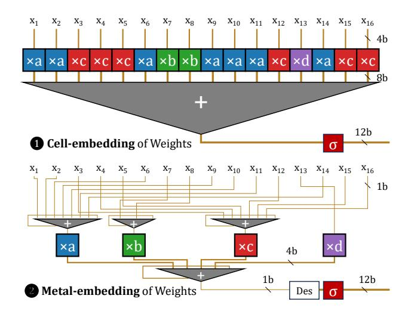
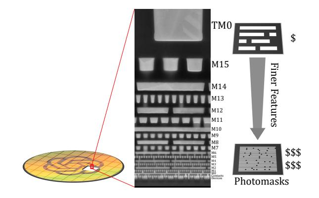
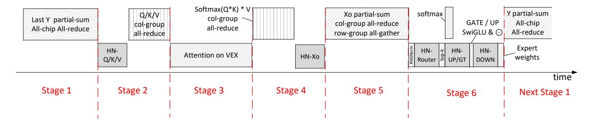
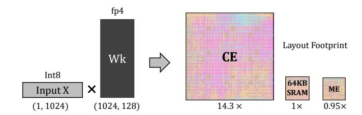
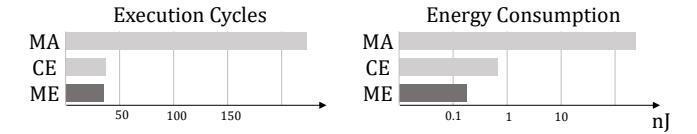
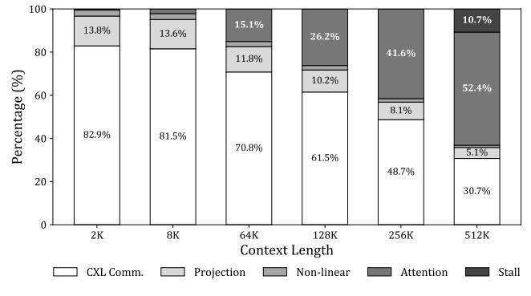

# Hardwired-Neuron Language Processing Units as General-Purpose Cognitive Substrates

### Yang Liu

State Key Lab of Processors, Institute of Computing Technology, Chinese Academy of Sciences Beijing, China University of Chinese Academy of Sciences Beijing, China liuyang22z1@ict.ac.cn

# Yifan Hao

State Key Lab of Processors, Institute of Computing Technology, Chinese Academy of Sciences Beijing, China haoyifan@ict.ac.cn

### Zhangmai Li

State Key Lab of Processors, Institute of Computing Technology, Chinese Academy of Sciences Beijing, China University of Science and Technology of China Hefei, China lizhangmai@mail.ustc.edu.cn

# Zhihong Ma

State Key Lab of Processors, Institute of Computing Technology, Chinese Academy of Sciences Beijing, China University of Chinese Academy of Sciences Beijing, China mazhihong24z@ict.ac.cn

# Yunqi Lu

State Key Lab of Processors, Institute of Computing Technology, Chinese Academy of Sciences Beijing, China University of Chinese Academy of Sciences Beijing, China luyunqi24s@ict.ac.cn

### Yi Chen

State Key Lab of Processors, Institute of Computing Technology, Chinese Academy of Sciences Beijing, China University of Science and Technology of China Hefei, China chen\_yi@mail.ustc.edu.cn

### Zifu Zheng

State Key Lab of Processors, Institute of Computing Technology, Chinese Academy of Sciences Beijing, China University of Chinese Academy of Sciences Beijing, China zhengzifu24s@ict.ac.cn

# Dongchen Jiang

State Key Lab of Processors, Institute of Computing Technology, Chinese Academy of Sciences Beijing, China University of Chinese Academy of Sciences Beijing, China jiangdongchen23s@ict.ac.cn

# Zisheng Liu

State Key Lab of Processors, Institute of Computing Technology, Chinese Academy of Sciences Beijing, China University of Chinese Academy of Sciences Beijing, China liuzisheng24s@ict.ac.cn

### Ximing Liu

State Key Lab of Processors, Institute of Computing Technology, Chinese Academy of Sciences Beijing, China University of Chinese Academy of Sciences Beijing, China liuximing22z@ict.ac.cn

### Yongwei Zhao

State Key Lab of Processors, Institute of Computing Technology, Chinese Academy of Sciences Beijing, China zhaoyongwei@ict.ac.cn

### Weihao Kong

State Key Lab of Processors, Institute of Computing Technology, Chinese Academy of Sciences Beijing, China University of Chinese Academy of Sciences Beijing, China kongweihao21b@ict.ac.cn

### Ruiyang Xia

State Key Lab of Processors, Institute of Computing Technology, Chinese Academy of Sciences Beijing, China University of Chinese Academy of Sciences Beijing, China xiaruiyang@ict.ac.cn

### Zhaoyong Wan

State Key Lab of Processors, Institute of Computing Technology, Chinese Academy of Sciences Beijing, China University of Science and Technology of China Hefei, China wanzhy@mail.ustc.edu.cn

### Hongrui Guo

State Key Lab of Processors, Institute of Computing Technology, Chinese Academy of Sciences Beijing, China University of Chinese Academy of Sciences Beijing, China guohongrui21b@ict.ac.cn

Zhihao Yang Institute of Software, CAS Beijing, China University of Chinese Academy of Sciences Beijing, China yangzhihao2021@iscas.ac.cn

# Mo Zou

State Key Lab of Processors, Institute of Computing Technology, Chinese Academy of Sciences Beijing, China zoumo@ict.ac.cn

### Xing Hu

State Key Lab of Processors, Institute of Computing Technology, Chinese Academy of Sciences Beijing, China huxing@ict.ac.cn

# Qi Guo

State Key Lab of Processors, Institute of Computing Technology, Chinese Academy of Sciences Beijing, China guoqi@ict.ac.cn

### Zhe Wang

State Key Lab of Processors, Institute of Computing Technology, Chinese Academy of Sciences Beijing, China University of Chinese Academy of Sciences Beijing, China

### Rui Zhang

wangzhe24s@ict.ac.cn

State Key Lab of Processors, Institute of Computing Technology, Chinese Academy of Sciences Beijing, China zhangrui@ict.ac.cn

### Zidong Du

State Key Lab of Processors, Institute of Computing Technology, Chinese Academy of Sciences Beijing, China duzidong@ict.ac.cn

### Tianshi Chen

Cambricon Technologies Beijing, China tchen@cambricon.com

### Tianrui Ma

State Key Lab of Processors, Institute of Computing Technology, Chinese Academy of Sciences Beijing, China matianrui@ict.ac.cn

### Ling Li

Institute of Software, CAS Beijing, China liling@iscas.ac.cn

### Zhiwei Xu

State Key Lab of Processors, Institute of Computing Technology, Chinese Academy of Sciences Beijing, China zxu@ict.ac.cn

# Yunji Chen∗

State Key Lab of Processors, Institute of Computing Technology, Chinese Academy of Sciences Beijing, China University of Chinese Academy of Sciences Beijing, China cyj@ict.ac.cn

### Abstract

The rapid advancement of Large Language Models (LLMs) has established language as a core general-purpose cognitive substrate, driving the demand for specialized Language Processing Units (LPUs) tailored for LLM inference. To overcome the growing energy consumption of LLM inference systems, this paper proposes a Hardwired-Neurons Language Processing Unit (HNLPU), which physically hardwires LLM weight parameters into the computational fabric, achieving several orders of magnitude computational efficiency improvement by extreme specialization. However, a significant challenge

∗Corresponding Author

[This work is licensed under a Creative Commons Attribution 4.0 Interna](https://creativecommons.org/licenses/by/4.0)[tional License.](https://creativecommons.org/licenses/by/4.0)

ASPLOS '26, Pittsburgh, PA, USA. © 2026 Copyright held by the owner/author(s). ACM ISBN 979-8-4007-2359-9/2026/03 <https://doi.org/10.1145/3779212.3790169>

still lies in the scale of modern LLMs. A straightforward hardwiring of gpt-oss 120 B would require fabricating photomask sets valued at over 6 billion dollars, rendering this straightforward solution economically impractical.

Addressing this challenge, we propose the novel Metal-Embedding methodology. Instead of embedding weights in a 2D grid of silicon device cells, Metal-Embedding embeds weight parameters into the 3D topology of metal wires. This brings two benefits: (1) a 15× increase in density, and (2) 60 out of 70 photomask layers are homogeneous across chips, including all EUV photomasks. In total, Metal-Embedding reduced the photomask cost by 112×, bringing the Non-Recurring Engineering (NRE) cost of HNLPU into an economically viable range. Experimental results show that HNLPU achieved 249,960 tokens/s (5,555×/85× that of GPU/WSE), 36 tokens/J (1,047×/283× that of GPU/WSE), 13,232 mm2 total die area, \$ 59.46 M–123.5 M estimated NRE at 5 nm technology. Analysis shows that HNLPU achieved 41.7–80.4× improvement in cost-effectiveness and 357× reduction in carbon footprint compared to OpenAI-scale H100 clusters, under an annual weight updating assumption.

CCS Concepts: • Computer systems organization → Neural networks; • Hardware → Hardware accelerators.

Keywords: Large Language Models, Language Processing Unit, Hardwired-Neurons, Metal-Embedding, Sustainable AI

### ACM Reference Format:

Yang Liu, Yi Chen, Yongwei Zhao, Yifan Hao, Zifu Zheng, Weihao Kong, Zhangmai Li, Dongchen Jiang, Ruiyang Xia, Zhihong Ma, Zisheng Liu, Zhaoyong Wan, Yunqi Lu, Ximing Liu, Hongrui Guo, Zhihao Yang, Zhe Wang, Tianrui Ma, Mo Zou, Rui Zhang, Ling Li, Xing Hu, Zidong Du, Zhiwei Xu, Qi Guo, Tianshi Chen, and Yunji Chen. 2026. Hardwired-Neuron Language Processing Units as General-Purpose Cognitive Substrates. In Proceedings of the 30th ACM International Conference on Architectural Support for Programming Languages and Operating Systems, Volume 2 (ASPLOS '26), March 21–26, 2026, Pittsburgh, PA, USA. ACM, New York, NY, USA, [20](#page-19-0) pages. <https://doi.org/10.1145/3779212.3790169>

# 1 Introduction

Current trends in artificial intelligence development indicate that language capabilities serve as the core foundation for constructing advanced cognitive and learning systems. This is exemplified by the rapid advancement of Large Language Models (LLMs), which have achieved technological unification in Natural Language Processing (NLP) [\[5,](#page-14-0) [83,](#page-17-0) [87\]](#page-17-1). By demonstrating human-level performance across diverse downstream tasks, LLMs are expanding their application scope while exhibiting a growing trend toward enhanced generality—enabling a single model to handle multiple tasks that previously required distinct systems.

Driven by widespread adoption despite the heavy hardware overhead of LLMs, there has been a surge in demand for dedicated processors specifically designed for LLM inference, collectively known as Language Processing Units (LPUs). For instance, Groq LPU [\[1,](#page-14-1) [2\]](#page-14-2) and Cerebras WSE [\[48,](#page-16-0) [51\]](#page-16-1) pre-load model weights into on-chip SRAM, while Etched Sohu [\[89\]](#page-17-2) hardens the transformer dataflow into its compute fabric. These LPUs leverage the advanced specialization targeting LLMs, achieving 4 ∼ 20× energy efficiency compared to traditional CPUs, GPUs, and NPUs.

Although LPUs have brought a certain improvement in hardware efficiency, AI infrastructure still suffers from tremendous energy costs. For example, AI datacenters are estimated to occupy 12% of the total electricity capacity in the US by 2028, which is clearly unsustainable [\[62\]](#page-16-2). This is due to the fact that current LPUs and GPUs still see models as dynamically changing data, despite the fact that leading enterprises typically deploy only a single or a few proprietary LLMs. The hundreds of billions of weight parameters are repeatedly fetched during each autoregressive decoding step, consuming the majority of system power.

Figure 1. Hardwired LPU as a general-purpose processor. To the left: AI Infrastructures are originated in the rapidly evolving deep learning which appreciates universality over extreme efficiency. To the right: As LLM develops, the responsibilities of universality are shifting from HW/SW to LLMs. An extremely specialized Hardwired LPU can also be helpful in general tasks.

To fundamentally solve the limitation, we argue for pushing the specialization of LPU to the extreme. By physically hardwiring weight parameters into the LPU fabric, Hardwired LPU can achieve perfect architecture-model matching, zero parameter fetching overhead, and extreme computational efficiency from constants-arithmetic circuits. As one dominant pre-trained LLM can serve as a general-purpose cognitive substrate for a wide variety of tasks, the extreme specialization once considered too inflexible is transforming into a reasonable choice with huge potential benefits (Figure [1\)](#page-2-0).

However, previous attempts on hardwiring would be stopped by the extraordinarily large scale of modern LLM. The most optimistic estimation on hardwiring gpt-oss 120 B [\[65\]](#page-16-3) would require a 176,000 mm2 constant-multiply-and-accumulate units (CMAC) array at 5 nm technology. Unlike previous wafer-scale practices that step a repeated lithographic pattern on the wafer, here the patterns are heterogeneous everywhere, because embedded weight parameters are different everywhere. The photomask sets are valued at over 6 billion dollars, rendering the straightforward implementation of Hardwired LPU economically prohibitive.

An economically viable Hardwired LPU requires a breakthrough in weight-embedding methodology. In this paper, we propose the Metal-Embedding (ME) methodology, achieving multiple orders-of-magnitude reduction on photomask counts required to implement Hardwired LPU. Roughly speaking, instead of embedding weights in the 2D grid of cells (either MAC/CMAC/SRAM/ReRAM cells), ME embeds weights in the 3D topology of metal wires (Figure [6\)](#page-6-0). The benefits of ME are two-fold. First, due to the inherently richer expression of 3D structure, ME reduced the area by an orderof-magnitude (-93.4%) compared with the CMAC grid. Second, these metal wires can be placed at higher metal layers

(M8+), to be cost-efficiently fabricated with trailing-edge optical lithography (193i). As a result, ME keeps photomask homogeneous (shared) across all chips for all layers in Front-End-of-Line (FEOL) and critical layers in Back-End-of-Line (BEOL), including all Extreme Ultraviolet (EUV) photomask in the process. This reduced the total cost on photomask by another order of magnitude: -86.5% for initial tapeout, -92.3% for parameter-only update re-spin.

We evaluate the first Hardwired LPU design HNLPU at 5 nm technology based on post-layout characteristics, and compare with baselines (NVIDIA H100 GPU, Cerebras WSE-3) at the same technology node. Experimental results demonstrate that HNLPU achieved 249,960 tokens/s throughput (5,555× of H100, 85× of WSE-3), 36 tokens/J energy efficiency (1,047× of H100, 283× of WSE-3), at 13,232 mm2 total die area divided into 16 chips. Estimated Non-Recurring Engineering cost (NRE) of HNLPU is \$ 59.46 M–123.5 M for the initial tapeout, \$ 18.53 M–37.06 M for a parameter-only update respin. Under the OpenAI-scale deployment, the 3-Year Total Cost of Ownership (TCO) is lowered by 41.7–80.4× compared to H100 clusters with annual parameter updates under the OpenAI-scale volume, and the total carbon footprint (tCO2e) is lowered by 357×.

This paper makes the following contributions:

- We explored the concept and feasibility of Hardwired LPU for the first time.
- We propose the Metal-Embedding methodology, reduced the photomask cost of Hardwired LPU by two orders of magnitude.
- We detailed the architecture and dataflow of the first Hardwired LPU design, HNLPU. It implemented a gptoss 120 B (FP4) in 13,232 mm2 total die area, achieving unprecedented throughput and energy efficiency.
- We estimated the NRE, TCO, and tCO2e of HNLPU to show its strong economical and environmental advantage for typical cloud serving scenarios.

### 2 Background and Motivation

### 2.1 Hardwired Language Processing Units

In principle, orders-of-magnitude gains in computational efficiency can be achieved by directly fabricating neural network models into hardware. Since the 1980s, hardwired neural networks have been implemented in VLSI [\[31\]](#page-15-0), optical [\[3,](#page-14-3) [90\]](#page-17-3), and printed flexible [\[10,](#page-15-1) [59,](#page-16-4) [66,](#page-16-5) [67,](#page-16-6) [88\]](#page-17-4) circuits. However, the diversity and rapid evolution of neural networks have rendered such hardwired implementations of limited practical value and prone to rapid obsolescence. As a result, instead of hardwired neural networks, general-purpose processors such as GPUs and NPUs have prevailed due to their programmability. Contemporary AI infrastructure and software stacks including programming languages (e.g., CUDA, Triton), libraries (e.g., cuDNN, flash-attn), frameworks (e.g., PyTorch, vLLM) are built on a sweet spot between computational efficiency and architectural generality.

Figure 2. Economic challenges of hardwiring. Considering the cost on photomasks and wafers, the cost on photomasks was amortized by the mass production of GPUs. Hardwiring an LLM incurs too many photomasks and too low volume to amortize the NRE costs.

The rise of large language models (LLMs) has fundamentally altered this landscape. Unlike earlier task-specific neural networks designed for isolated tasks, LLMs function as general-purpose cognitive substrates capable of reasoning, planning, and interacting across a wide range of domains. For the first time in history, we possess a single neural network model that is valuable enough to justify hardwired implementation.

Although technically hardwired (in the sense that its parameter weights are physically immutable), the circuit embodies a new paradigm of the general-purpose processor. We refer to this novel processor paradigm as the Hardwired Language Processing Unit (Hardwired LPU). By leveraging the emergent capabilities of in-context learning and zero-shot reasoning, a hardwired LPU treats natural language prompts as a high-level instruction stream, effectively replacing the traditional binary Instruction Set Architecture (ISA) with a semantic interface. Consequently, the user programs the Hardwired LPU not by altering its models and weights, but by prompting with tokens to perform arbitrary tasks.

In this paper, we demonstrate that a single-node Hardwired LPU can outperform a middle-sized GPU cluster without requiring expensive software support, thus establishing a decisive operational-expenditure (OpEx) advantage over challengers. Therefore, we envision Hardwired LPUs as game-changing platforms for long-term, high-volume deployment, while GPU clusters assume the role of short-cycle model development and evaluation testbeds.

### 2.2 Economic Challenges

A glaring challenge has thwarted all ambitious attempts to hardwire LLMs: LLMs are too large for the current lithographic technology. The practical obstacle lies in the non-recurring engineering (NRE) cost, primarily the cost from photolithographic masks.

In semiconductor technology, chips are fabricated as layered structures defined by photomasks (analogous to stencils). Front-end-of-line (FEOL) processes, which form the device cells (transistors) on the silicon wafer, typically require on the order of 30 mask layers, while back-end-of-line (BEOL) processes, which form the metal interconnect stack, require approximately 40 additional mask layers. At 5 nm technology nodes, a full photomask set is valued at \$30 M, while each processed wafer is valued at approximately \$18,000. As shown in Figure 2, the high NRE cost of photomasks is meant to be amortized with massive production. For example, NVIDIA is estimated manufacturing 20,000 wafers of H100 GPU, then the amortized photomask cost would be \$1,500 per wafer. However, the expected production volume of hardwired LPUs is very low. Due to the extreme computational efficiency, tens of wafers would oversaturate current LLM service demand on the planet, which renders the expensive photomask set for few uses only.

A straightforward implementation would require an extraordinarily large silicon area to embed the weights, and a correspondingly large number of photomask sets. For example, the typical transistor density of high-density 5 nm technology is around 138 MTr/mm². FP4 Constant MAC (CMAC) requires 200+ transistors. This translates GPT-oss 120 B into an ideal area estimation of 176,000 mm² divided into 200+ chips. Due to reticle size limits, this hardwired LPU must be split across 200+ photomask sets. Unlike prior wafer-scale practices, these masks are heterogeneous because each chip is carrying different parts of the model weights. This incurs \$30 M  $\times$  200 = \$6 B NRE costs on photomask making, rendering a straightforward hardwired LPU economically prohibitive.

Compounding this economic infeasibility is the fast LLM development cycles. The prohibitively high NRE is even worse when considering the annual parameter updates and 3-year typical lifespan of production LLMs (e.g., GPT-4). This multiple-orders-of-magnitude cost gap is unlikely to be bridged solely through model compression. Note that the GPT-oss is already FP4 by default. The model size has a concrete lower bound implied by the Kolmogorov complexity of human knowledge representation.

To realize the concept of hardwired LPUs, there must be fundamental breakthroughs in on-die weight embedding methodologies. By co-optimizing with lithographic technology factors, we can achieve multiple orders-of-magnitude reduction in photomask count, eventually clear the path to the economically viable hardwired LPUs.

**Figure 3. Key arithmetic techniques.** To the middle: Combining repeated multipliers via the distributive law. To the right: Using Carry Save Adders (CSA) on bit-serialized inputs to trade time for area.

# 3 Metal-Embedding

We address this economical challenge with the novel *Metal-Embedding* (ME) methodology. There are two key innovations in ME. 1) The *Hardwired-Neuron* (HN) architecture rearranges conventional multiply-accumulate arithmetic units into accumulate-multiply-accumulate, and lifted the embedding of weight parameters from silicon devices into metal interconnections. This enables 2) the *Sea-of-Neurons* architecture – a metal-programmable structured ASIC saving photomasks through a prefabricated array of HNs.

#### 3.1 Hardwired-Neuron Architecture

We demonstrate the step-by-step evolution from the straightforward FP4 multiply-and-accumulate units to Hardwired-Neurons (HN). Several key arithmetic techniques are applied to minimize the required silicon area.

**Basic:** Weight Constancy. Conventional hardwiring (the \$6B scenario) utilizes weight constancy. By fixing the weights, multipliers could be optimized as multiply-by-constant which is several times lower in Boolean complexity. An FP4 multiply-by-constant unit is  $\sim$ 6× smaller than an FP4 multiplier as seen in GPU. Accumulation could also benefit from the weight constancy under the help of optimizing EDA tools.

**Step 1: Distributive Law.** In conventional hardwiring, FP4 weights have 16 unique values, but there are  $2,880^1$  constant multipliers in each neuron. Most of them are repeated. By the distributive law, common multipliers could be extracted and combined. As shown in Figure 3, instead of performing  $ax_1 + ax_2 + \cdots + ax_n$  (to the left), HN performs  $a(x_1 + x_2 + \cdots + x_n)$  (to the middle) which saves multipliers and reduces the width of accumulation.

**Step 2: Bit-serialization.** If input signals  $x_1, x_2, \ldots, x_n$  are in binary format, they could be serialized from the least-significant bit (LSB) to the most-significant bit (MSB) to further simplify the circuit. As shown in Figure 3 (to the right), the single-clock-cycle accumulation could unfold into a multiple-clock-cycle tree of Carry Save Adders [38], trading off speed for minimized area.

&lt;sup>1The hidden size in GPT-oss 120 B.

Figure 4. Hardwired-Neuron architecture. 

A conventional cell-embedding neuron contains 2,880 4b multipliers (16 shown) followed by an 8b×2,880 adder tree, where 2,880 is the hidden size in GPT-oss 120 B; 

With ME, Hardwired-Neurons accept 1b serialized inputs (LSB-first), (1) route the inputs multiplying the same weight value to the same region, (2) perform accumulation (POPCNT) on these input signals, (3) perform actual multiplication with 16 multipliers (4 shown), (4) sum the results with a 4b×16 adder tree. Note how \nis significantly smaller in area than 
to by reducing the number of multipliers and the strength of adders.

HN is an accumulate-multiply-accumulate unit adopting all of the above-mentioned techniques as shown in Figure 4. The main result of the sophisticated combination of these techniques is that HN lifted the embedding of weight parameters from silicon devices into metal interconnections, as the name *Metal-embedding* suggests. Conventional neurons are *Cell-Embedding* (CE, Figure 4 ①), i.e., weight parameters are written into the silicon device cells composed of different constant-multipliers; HNs are *Metal-Embedding* (ME, Figure 4 ②), i.e., the weight parameters are embedded as metal wires. The silicon device cells in HN can be made parameter-independent.

Figure 5 shows the weight embedding process through metal wires step-by-step. For each unique value in FP4, there is an accumulator (POPCNT) in the HN. We denote the accumulators corresponding to each unique weight value with different colors (FP4 has 16 unique values, 4 shown in the schematic: blue for a; green for b; red for c; violet for d). For each input  $x_i$ , the weight w is embedded as a metal wire connecting input  $x_i$  to the accumulator for the value w. For example, as the first term is  $ax_1$ , a metal wire is built connecting  $x_1$  to the blue accumulator (Figure 5  $\blacksquare$ ). Note how the silicon devices are made parameter-independent: changing the weight from a to b would only change the wire

Figure 5. Step-by-step schematic showing how weights are physically embedded in the 3D metal wire topology. HNs are accumulate-multiply-accumulate arithmetic units where each weight parameter is expressed by the source and destination of a metal wire: ①  $ax_1$  by connecting from  $x_1$  to the blue region; ②  $ax_2$  by connecting from  $x_2$  to the blue region; ③  $cx_3$  by connecting from  $x_3$  to the red region; ④  $cx_4$  by connecting from  $x_4$  to the red region.

destination from blue to green, while the whole accumulatemultiply-accumulate arithmetic unit is kept unchanged.

To address the imbalance of weight values, the size of accumulators should be made with sufficient slackness. The accumulators could be implemented as multiple slices and be reconfigurable through metal wires. Unused ports on the accumulators are connected with zero inputs (ground).

Figure 6 **②** provides an intuitive conceptual schematic of ME. The die is split into HNs; each HN is drawn as a  $\searrow$  row in the schematic. Each HN corresponds to an output neuron activation in the model. Each HN is divided into several regions (different coloring in the schematic), where each region represents a unique weight value. For 4b precision models, there are  $2^4 = 16$  unique weight values (4 shown in the schematic). To multiply with a weight, the input neuron activation signal is routed into the corresponding region via metal wires. The model weights are solely embedded within the metal interconnection, expressed by connecting each input signal with corresponding regions.

The key insight here is that, as the metal wire topology is three-dimensional, they could potentially embed information in a much higher density than silicon devices. Current CE

**Figure 6. Conceptual schematic of Metal-Embedding. ©** Conventional design embeds weights in the 2D grid of cells. Metal layers are only for physical design (P&R). **②** Metal-Embedding dramatically increases the density by leveraging the 3D topology structure of metal wires, emulating the axon-dendrite in brains.

methodologies (Figure 6 **1**) fail to recognize metal layers in their architecture design. Metal layers are only considered in physical design (place-and-route, P&R), thus the topology of metal wires does not express any specific information. We view this as a waste of resources. Since silicon devices are the area-limiting factors in the design, routing signals through complex metal wires is virtually free in both area and energy, compared with logic implemented in standard cells. We refer to the novel architecture as *Hardwired-Neurons* because of its structural similarities with biological neurons. Biological neurons in the brains have complex topology of axon-dendrite interconnections in the first place, only then come synaptic weights.

When adopted alone, the HN architecture increases the density of hardwired LLM by an order of magnitude (from 200+ chips to 16 chips). But more importantly, HN concentrates all the parameter-dependent structures into metal wires, which is a prerequisite step towards introducing the *Sea-of-Neurons* architecture.

### 3.2 Sea-of-Neurons Architecture

Up to this point, there are two common concerns to address: **1) The NRE is still high.** Even with significantly reduced area of HN, 16 chips still require 16 full mask sets each valued \$30 M, that is \$480 M. The total NRE still offset most economic interests. **2) What if the weight parameters change?** LLM requires at least annual updates to keep competitive, and there would be unforeseen hotfixes. Do we need another \$480 M for a Hardwired LPU re-spin?

The key to these concerns is to **share and reuse parameterindependent photomasks**. As the silicon devices in HN are

Figure 7. The cross section of chips [76]. Geometric patterns in semiconductor chips are defined by photomasks. Silicon devices and lower metal layers have finer geometric features and thus require much more expensive photomasks to define them.

parameter-independent, we can prefabricate HN arrays with a shared photomask set, then finalize the metal embedding wires with a few additional parameter-dependent photomask layers. By concentrating metal embedding wires into higher level metal layers, the majority of the photomask cost can be saved. The 16 chips could share the same photomask set for the prefabricated HN array, and the photomask set could be reused for future weight update re-spins.

Different layers of photomask in the set are valued differently. Generally speaking, higher levels use cheaper photomasks. As shown in Figure 7, silicon devices and lower metal layers have finer feature dimensions and requires high resolution lithographic patterning which is expensive. For

Figure 8. Sea-of-Neurons Architecture. To the top: All chips share the same prefabricated HN array and 60 layers of photomask, then the embedding metalization (M8-M11) requires additional 10 layers of photomask per chip. To the bottom: The schematic from cross section with opened HN module box, showing devices and local metal wires (M0-M7) inside the HN array that are made homogeneous and masksharing. Note all the critical layers requiring EUV are shared.

example, metal layers at M10–M11 (∼60 nm half-pitch) require Deep Ultraviolet (DUV) single-exposure patterning (193i SE); at M4–M9 (∼40 nm half-pitch), DUV double patterning is required (typically 193i SADP, with some layers modeled as LELE); at M0–M3 (∼20 nm half-pitch), DUV quadruple patterning (193i SAQP) or Extreme Ultraviolet Lithography (EUV SE) is required. FEOL processes making devices and contacts also require expensive EUV or DUV multiple patterning. Top metal layers including M12+ are typically reserved for power delivery networks, clock trees, and I/O peripherals. Therefore, we select M8-M11 (involving 10 layers of DUV photomasks, valued \$ 2.31 M) as the metal-embedding layers.

The integrated circuit design approaches to save photomask costs by semi-custom metalization over a prefabricated array of cells are known as Structured ASIC [\[94\]](#page-17-6), and have emerged throughout history, including gate arrays in the 1970s, sea-of-gates in the 1990s [\[20\]](#page-15-3), Altera HardCopy in the 2000s [\[56\]](#page-16-7), and Intel eASIC N5X in 2020 [\[39\]](#page-15-4). As our approach is prefabricating arrays of neurons instead of gates, we refer to it as the Sea-of-Neurons architecture.

Figure [8](#page-7-0) illustrates the Sea-of-Neurons architecture. Seaof-Neurons is a metal-programmable architecture: Weights are programmed into the architecture with M8-M11 metalization over a prefabricated HN array. As 60 out of 70 mask

Figure 9. The overall architecture of HNLPU system. (a) System-level architecture of HNLPU, featuring a logical 4 × 4 row-column fully-connected fabric to interconnect its 16 modules. (b) Architecture of a single compute module, comprising the core die and HBM.

layers are shared (including all critical layers requiring EUV), the photomask cost is significantly reduced from \$ 480 M to \$ 65 M [2](#page-7-1) . When the weight parameters change, a re-spin requires only \$ 37 M [3](#page-7-2) as the prefabricated HN array is ready.

The Sea-of-Neurons architecture is compatible with standard ASIC design flow and EDA tools. First, complete the P&R of the HN array module under standard cell constraints within M0-M7. The layout of HN is copied to fill the major part of die area, equipped with all SoC peripherals, power grid, and clock tree. Next, the layout is exported to custom tools which read weight parameters and generate TCL scripts to instruct the connection of metal embedding wires. The generated script is integrated into the overall layout within the P&R EDA tool. The resulting complete design is then subjected to design rule checking (DRC) and layout-versusschematic (LVS) verification, with detected rule violations resolved through automated local repair. Finally, parasitic extraction and post-layout simulation is conducted to evaluate functional correctness and timing behavior under realistic physical effects. In our experiments, the layouts successfully completed the sign-off checks showing ample routing density margins in both M0-M7 and M8-M11.

### 4 Architecture

In this section, we introduce the architecture of HNLPU in a top-down manner, as shown in Figure [9,](#page-7-3) including system integration and single chip architecture.

### 4.1 Overview

HNLPU is a complete physical implementation of gpt-oss 120 B and its computational process for inference. HNLPU

2 \$ 27.69 M (the prefabricated HN array) + \$ 2.31 M (M8-M11 metalization per-chip) × 16 (number of chips)

3 \$ 2.31 M (M8-M11 metalization per-chip) × 16 (number of chips)

system directly implements Continuous Batching on hardware to fill its pipeline. The hardware receives token IDs and generates token IDs as outputs, operating without a software stack (OS, runtime, library, compilers, frameworks). This pure hardware implementation offers two benefits: 1) It eliminates the heavy software development and maintenance cost. 2) It eliminates the software turbulence and brings more deterministic and predictable system behavior.

HNLPU distributes the weights across 16 chips interconnected via CXL. Besides the HN array, the chips also implement embedding dictionary lookup, Grouped Query Attention (GQA), Mixture-of-Experts (MoE) routing, Root-Mean-Square Normalization (RMSNorm), Swish-Gated Linear Unit (SwiGLU), and logit sampling. A memory subsystem is implemented for the embedding dictionary and the attention buffer (KV Cache), including SRAM and HBM.

### 4.2 System Integration

Interconnection topology. HNLPU system architecture is built upon a 16-module row-column fully-connected fabric. As conceptually illustrated by the logical topology in Figure [9](#page-7-3)(a), this fabric establishes direct, point-to-point links from each module to all other modules within its row and, simultaneously, to all other modules within its column. This design creates a router-less, low-latency network for efficient collective communication patterns (e.g., All-Reduce). Each compute module is a self-contained unit, equipped with a dedicated HBM for storing the KV Cache and the embedding tables.

Multi-chip group mapping. HNLPU evenly distributes its constituent chips into multiple row- and column- groups, with each row and column containing 4 chips. This grouping strategy enables a parallel mapping of the self-attention and feed-forward network—the most computationally intensive parts of a Transformer block. Specifically,

- 1. For the GQA projection, the projections for all query, key, and value heads are uniformly mapped to their respective column groups.
- 2. For attention score, query-heads are all-reduced within the same column groups, while key- and value- heads are reduced to the chip-(ℓ mod 4), where ℓ denotes the sequence length.
- 3. For the feed-forward network with MoE, all experts are uniformly distributed to all chips, and the input vector broadcasts to all chips. Specifically, each chip is responsible for 8 experts.

This group mapping strategy of HNLPU offers two key advantages. First, by distributing the GQA computation uniformly, the workload is balanced across all chips. This alleviates pressure on key computational resources (e.g., VEX units) and reduces the storage and bandwidth demands on the SRAM and HBM. Second, the independence of the MoE experts enables fully parallel FFN computation, eliminating

the need for data exchange during the projection steps. The detailed execution process and dataflow are further elaborated in Section [5.](#page-9-0)

Physical System Integration. The physical implementation of HNLPU is based on established, industry-validated High-Performance Computing (HPC) integration practices.

Packaging: Each compute module utilizes 2.5D packaging to integrate a large monolithic die with its dedicated HBM stacks (conceptual topology is similar to the NVIDIA Blackwell platform).

Inter-Chip Communication: Direct point-to-point interconnects are established via the CXL 3.0 protocol (on PCIe PHY). This open standard offers low latency (<100 ns) and high bandwidth (128 GB/s per ×16 link), with performance approaching proprietary solutions (e.g., NVIDIA NVLink).

Manufacturing Yield: The modular design enables a "Known-Good-Module" strategy. Each packaged module is tested independently, thus decoupling the final system's assembly yield from the challenging manufacturing yield of the large monolithic dies.

Thermal Management: For high thermal density, a Directto-Chip Liquid Cooling (DLC) solution is employed by mounting a cold plate on each module—an approach validated in compute platforms such as the NVIDIA DGX H100.

### 4.3 Single Chip Architecture

As shown in Figure [9](#page-7-3)(b), each chip in HNLPU is composed of five primary modules. The HN Array and VEX Unit are responsible for the LLM computation, including operations on hardwired weights, attention mechanisms, and nonlinear activation functions. The Attention Buffer serves as the onchip KV Cache. Finally, the Control Unit manages on-chip scheduling and inter-layer pipelining for multi-batch scenarios, while the Interconnect Engine facilitates inter-chip communication.

The HN Array is a dedicated unit for performing computations that involve the fixed and pre-trained weights. As shown in Figure [4.](#page-5-0)❷, we use metal embedding strategy to hardwire all the weights in the LLM onto the chip. Although the HN Array has a large area, its power consumption is remarkably low. This efficiency stems from the high sparsity of circuit activity: only 4 out of 128 experts are active at any given time in the target MoE architecture. For weight matrices (e.g., ) that are partitioned across multiple chips, each HN Array computes a partial sum. This result is then forwarded to the Interconnect Engine for aggregation with corresponding partial sums from other chips.

The Vector Execution Unit (VEX) is responsible for executing vector and matrix operations, including calculating attention scores, applying nonlinear functions (e.g., RMSNorm, SwiGLU, softmax), performing residual additions, and handling output sampling. 1) VEX adopts the FlashAttention

computation flow to calculate attention scores. The hardware implementation consists of GEMV units and nonlinear operators. It fetches queries from the Interconnect Engine and reads keys/value (K/V) pairs from the on-chip Buffer. For each chip, the VEX unit is designed to process 32 cached KV-heads per cycle without stalling. 2) VEX also integrates dedicated nonlinear modules for the efficient computation of RMSNorm, SwiGLU, and softmax operations. Additionally, it includes a vector-aligned adder for residual connections and a specialized unit to perform multinomial sampling.

Attention Buffer. The on-chip 320 MB Attention Buffer comprises 20,000 banks, each with a 16 KB capacity. Every bank features a 1W1R (one-write, one-read) port configuration with a 32-bit access width. The Attention Buffer primarily functions as a KV Cache for the chip's assigned attention groups. It offloads excess KV entries to HBM only when the on-chip capacity is exceeded. This buffer also stores activation vectors for residual connections in the FFN blocks.

Interconnect Engine and Control Unit. The Interconnect Engine and Control Unit on each chip jointly manage all inter-chip communication and data collectives. The communication topology is organized into row-wise and columnwise groups, each with specific supported operations: 1) For row-wise communication, the system supports a *Broadcast* to distribute data (e.g., the activation vector) to all chips within the same row, and a corresponding Reduce operation to aggregate the partial sums computed by each chip in that row. 2) For column-wise communication, the system distributes inputs to chips within a column using either a Scatter operation, which provides each chip with a distinct portion of a vector, or a *Broadcast* operation, which provides all chips with the identical vector. To collect the results, the system supports both Reduce for aggregating partial sums and Gather for concatenating output vectors.

#### 5 Execution Dataflow

In this section, we introduce the multi-chip interconnect dataflow of HNLPU, covering the model-to-chip mapping and the computing process of a Transformer block. In Section 5.1, we provide an overview of HNLPU dataflow. Section 5.2 details our pipelining strategy and batching inference scheduling. Detailed description of the dataflow is presented in Appendix A.

#### 5.1 Dataflow Overview

Figure 10 illustrates the dataflow of HNLPU. Our design is driven by the primary goals of distributing computational load, KV cache memory access, and thermal loads, while minimizing inter-chip data communication.

Processing begins with fetching a token vector of shape (1, 2880) from the High-Bandwidth Memory (HBM) based on the received token index. This vector then traverses through 36 transformer blocks, where self-attention and feed-forward

**Figure 10. Dataflow and mapping of HNLPU.** (I) Overview of dataflow. (II) Query projection. (III) Key and Value projection. (IV&V) Attention score. (VI) Post-attention residual addition. (VII) Router in MoE. (VIII) Up- and Gate-projection. (IX) Down-projection and residual addition.

Figure 11. A six-stage pipeline partitioning diagram for HNLPU dataflow.

network (FFN) computations are performed layer by layer. For the multi-head attention module, we employ a hybrid weight distribution strategy: the  $W_{qkv}$  weight matrix is partitioned column-wise across different chip column groups, while the  $W_o$  weight matrix is partitioned row-wise across the same set of chips. This design allows for parallel, independent computation across different chip columns for the  $W_{qkv}$  operations and across different chip rows for the subsequent  $W_o$  computations, thereby minimizing inter-chip data transfer.

The FFN implementation, which uses a Mixture-of-Experts (MoE) architecture, assigns eight experts to each chip, allowing for entirely independent computation with no inter-chip communication. A key exception to our partitioning strategy is the router weight matrix,  $W_{\rm rout}$ , which is replicated across all chips. This deliberate design trade-off introduces a negligible area overhead—as the router's weights constitute only about 0.01% of the total model weights—but eliminates the communication latency. Once all transformer blocks have been processed, the final output vector is passed through the unembedding layer, and a new token index is calculated through a sampling operation. Detailed description of the dataflow is presented in Appendix A.

#### 5.2 Pipeline and Scheduling

HNLPU employs a nested pipelining strategy to maximize throughput, consisting of both inter-layer and intra-layer pipelining. Since all layer weights are hardwired onto the metal layers, the wiring weights for each layer have their own corresponding computing resources. HNs of each layer can operate simultaneously, which facilitates the straightforward formation of a pipeline between the model layers. Within a layer, we partition the computation into a six-stage pipeline, as shown in Figure 11. Consequently, HNLPU can process up to  $(6 \times \# \text{layer})$  requests simultaneously at peak. For the 36-layers LLM, the maximum batch size can theoretically reach 216.

HNLPU employs the batching strategy similar to Continuous Batching [91]. During the **prefill** phase, there are no dependencies between the input tokens of a sequence. This independence allows for massively parallel processing, with tokens flowing through the pipeline stage-by-stage.

Consequently, HNLPU can process up to 216 tokens concurrently during prefill. Conversely, the **decode** phase is auto-regressive, meaning the generation of each new token is dependent on the completion of the previous one. However, since different sequences are independent, HNLPU can still process up to 216 sequences simultaneously. In summary, HNLPU supports a maximum batch size of 216 sequences. By leveraging Continuous Batching, the system dynamically schedules new sequences into the batch as soon as slots are freed by completed ones, thereby ensuring high throughput.

### 6 Methodology

This section details the methodology used to evaluate proposed HNLPU architecture. We describe our hardware evaluation flow, the system-level modeling for multi-chip design, the model used for performance assessment, and the configurations of all baseline systems.

### 6.1 Hardware and System-Level Evaluation

Hardware Implementation. We implemented the core components of HNLPU architecture, including HN Array, Control Unit, VEX, Interconnection Engine and on-chip Attention Buffer in RTL with Verilog, and verified the correctness of the RTL design using extensive test cases. We followed a standard ASIC design flow to obtain physical characteristics. The design was synthesized using Synopsys Design Compiler and placed-and-routed using Synopsys IC Compiler, on 5 nm technology. Power consumption was analyzed by PrimeTime PX using workload-derived switching activity (SAIF file) to accurately model both static and dynamic power. On-chip SRAMs were generated and analyzed using Memory Compiler on the same technology node.

*Multi-chip System Modeling.* Our proposed HNLPU is a  $4\times4$  multi-chip system interconnected via the CXL 3.0 protocol. We evaluated the inter-chip communication latency and power using CNSim [25], a state-of-the-art open-source analysis framework for multi-chip systems. This framework allows for detailed modeling of the network on package topology, accounting for physical layer (PHY) latency, protocol overhead, and physical routing delays in our design. We also built a cycle-level simulator for single-chip performance

evaluation.

#### 6.2 Model

We selected the OpenAI GPT-oss 120 B model for system-level evaluation. It is a state-of-the-art open-source MoE large language model built on Llama-style architecture. We used 4-bit quantized version of the model and hardwiring the weights in HN Array. HNLPU implementation of the model follows partitioning method, dataflow and mapping strategies detailed in Section 4 and Section 5.

#### 6.3 Baseline Configurations

We conducted two sets of experiments to comprehensively evaluate our architecture against relevant baselines.

Embedding Methodology Comparison. This benchmark compares the performance of a single matrix-vector multiplication:  $1 \times 1024$  input vector with a  $1024 \times 128$  FP4 weight matrix (typical dimension in an LLM attention block) under various embedding methodologies. We compare three designs at 5 nm technology: MAC Array (MA), a 64 KB SRAM companioned with a conventional computing array of 1024 MACs, Cell-Embedding (CE) and Metal-Embedding (ME) as illustrated in Figure 4. Regarding area, we compare CE and ME with the 64 KB SRAM only, excluding the arbitrarily-sized computing array.

**System-Level Performance Comparison.** This experiment compares our full HNLPU architecture against leading commercial systems running the same GPT-OSS 120 B model with a 2K token length, with hyperparameters for each system individually tuned to achieve its optimal throughput.

- 1. **NVIDIA H100**: We conducted direct measurements on a server equipped with H100 (80 GB memory, 3.35 TB/s bandwidth) GPU. The model was deployed via TensorRT-LLM, and the reported figures are averaged over multiple runs
- 2. **Cerebras WSE-3**: The throughput was empirically measured through publicly accessible Cerebras cloud service [8] running the GPT-oss 120 B model. As power measurement on cloud is not practical, we adopted the system power figures reported in [46] instead.
- 3. **HNLPU**: We utilize post-PnR simulations capturing physical layout parasitics and wire delays. This approach provides high-fidelity performance projection, as HNLPU operates on a deterministic Token-In-Token-Out execution model free from software-stack variability.

#### 7 Evaluation

### 7.1 Layout Characteristics

To validate the physical feasibility of HNLPU, we conducted a sign-off-grade implementation flow across representative PVT corners. The design achieves timing closure at 1.0 GHz

Figure 12. Area Comparison.

**Figure 13.** Time and Energy Comparison.

Table 1. Single Chip Hardware Characteristics

|                     | Area (mm²) | %     | Power (W) | %     |
|---------------------|------------|-------|-----------|-------|
| HN Array            | 573.16     | 69.3  | 76.92     | 24.94 |
| VEX                 | 27.87      | 3.4   | 33.09     | 10.73 |
| Control Unit        | 0.02       | 0.0   | < 0.01    | 0.0   |
| Attention Buffer    | 136.11     | 16.5  | 85.73     | 27.80 |
| Interconnect Engine | 37.92      | 4.6   | 49.65     | 16.10 |
| HBM PHY             | 52         | 6.3   | 63        | 20.43 |
| Total               | 827.08     | 100.0 | 308.39    | 100.0 |

under worst-case conditions (SSG, 0.675 V, 125 °C), ensuring robust operation under extreme process variations and voltage drops. The design achieves a congestion-free layout with zero overflow. The routing density on ME layers (M8–M11) remains below 70% (lower than typical accelerators), validating the feasibility of ME strategy. Signal integrity is confirmed by parasitic extraction (avg.  $R=164\,\Omega$ ,  $C=7.8\,\mathrm{fF}$ ), showing manageable coupling effects. Thermal analysis confirms that the power density (avg. 0.3 W/mm², peak 1.4 W/mm²) is well within the cooling limits of 2.5D packaging. Finally, the layout is DRC/LVS clean, and yield estimation based on Murphy's model (defect rate 0.11/cm²) confirms the manufacturability of the design.

Table 1 presents the area and power breakdown of a single chip in HNLPU. The HN Array and the Attention Buffer are the dominant components in terms of both area and power. The chip occupies a total area of 827.08 mm2 and has a power consumption of 308.39 W.

The Attention Buffer sustains 80 TB/s bandwidth and 3-cycle latency under worst-case PVT conditions, confirming sufficient performance margins.

The power density of the HN array is significantly lower than other components due to the sparse circuit activity induced by MoE. Specifically, only 4 out of 128 experts are activated at a time.

**Table 2.** System-Level Performance and Efficiency Comparison for GPT-OSS 120 B Inference

| Metric                                      | HNLPU   | H100  | WSE-3 a |
|---------------------------------------------|---------|-------|--------------------|
| Core Performance                            |         |       |                    |
| Throughput (tokens/s)                       | 249,960 | 45    | 2,940              |
| Physical Characteristics                    |         |       |                    |
| Technology Node                             | 5 nm    | 5 nm  | 5 nm               |
| Total Silicon Area (mm²)                    | 13,232  | 814   | 46,225             |
| System Footprint (Rack Units)               | 4 U     | 1 U   | 16 U               |
| Power & Efficiency                          |         |       |                    |
| Total System Power (kW)                     | 6.9     | 1.3   | 23.0               |
| Energy Efficiency (tokens/kJ)               | 36,226  | 34.6  | 127.8              |
| Area Efficiency (tokens/ $(s \cdot mm^2)$ ) | 18.89   | 0.055 | 0.064              |

&lt;sup>a WSE-3 data is obtained from published reports [9, 46, 58, 85] and calibrated against performance on its public cloud service [8].

#### 7.2 Embedding Methodology Comparison

Figure 12 presents the post-layout area comparison using the SRAM in MA as a base unit. The area of CE/SRAM(MA)/ME is  $14.3 \times /1 \times /0.95 \times$ , respectively, validating the claimed density advantage of ME.

The performance and energy consumption results are illustrated in Figure 13. Both the ME and CE designs demonstrate a dramatic reduction in execution cycles compared to the MA by fully parallelizing the computation. Constrained by the need to fetch weights from SRAM and its limited multiplier array, the MA requires significantly more cycles to complete the same task. The energy reduction of ME is also significant. It consumes the least energy by completely eliminating memory access. While the CE also eliminates power from SRAM access, its massive area leads to substantial leakage power, making it less energy-efficient than ME. The energy consumption of MA is mainly driven by repeated, power-intensive accesses to its SRAM.

In summary, the experimental results demonstrate the comprehensive PPA superiority of the ME design at the operator level. This validates the effectiveness of ME as the fundamental building block for LLM accelerators.

#### 7.3 System-Level Performance Comparison

This section provides a comparison of the system-level performance and efficiency of HNLPU, NVIDIA H100, and Cerebras WSE-3 on GPT-OSS 120 B model, as detailed in Table 2. HNLPU demonstrates orders-of-magnitude advantages in both throughput and energy efficiency, achieving up to 5,555× and 85× throughput, and 1,047× and 283× energy efficiency, respectively. HNLPU's superior performance and efficiency stem from a fundamental architectural redesign that diverges from conventional systems.

First, HNLPU physically hardwires model weights into

**Figure 14. Execution time breakdown across varying context lengths.** The total execution time is decomposed into inter-chip CXL communication, projection, non-linear operations, attention computation and memory access stalls.

the compute fabric. This creates massive, fine-grained parallelism and inherently supports ultra-high throughput inference.

Second, as a direct consequence, this design completely eliminates the need to access weights from the memory hierarchy (e.g., SRAM, DRAM), thus avoiding the immense energy cost of memory access.

Finally, HNLPU operates on a highly optimized, model-specific dataflow, workload partitioning, and pipelining strategy, which contrasts with the instruction-driven paradigm of GPUs. This eliminates the significant overhead from control unit such as instruction decoding, scheduling, and control flow. It ensures that nearly all time, power, and area are dedicated to effective computation.

#### 7.4 Execution Time Analysis

Figure 14 presents the execution time breakdown across varying context lengths. Memory access latency is effectively hidden by the double-buffering mechanism: stalls remain negligible up to 256K tokens, and reach 10.7% at an extreme context length of 512K, where KV cache is loaded from off-chip HBM. In terms of breakdown, the highly optimized computing components expose inter-chip communication as the dominant factor at shorter lengths, while attention computation becomes dominant as the sequence length increases.

### 7.5 Economic Analysis and Carbon Footprint

We present a comprehensive Total Cost of Ownership (TCO) analysis over a three-year lifecycle in Table 3. We compare HNLPU against an equivalently provisioned NVIDIA H100 GPU cluster delivering comparable inference throughput. We consider two representative deployment volumes: a low-volume deployment corresponding to a single HNLPU node, and a high-volume scenario corresponding to an OpenAI-scale deployment [63, 64]. We provide both optimistic and

Parameter Category Low Volume High Volume HNLPU H100 HNLPU H100 System Configuration & Power Number of Systems / GPUs1 1 2,000 50 100,000 Total Datacenter Power (MW) 2 0.010 3.64 0.483 182 Capital Expenditure (CapEx) Node Price3 \$ 59.25 M ∼ 123.3 M \$ 79.99 M \$ 62.83 M ∼ 129.9 M \$ 4,000 M Data Center Infrastructure4 \$ 0.2100 M \$ 54.93 M \$ 10.30 M \$ 2,747 M Total Initial CapEx \$ 59.46 M ∼ 123.5 M \$ 134.9 M \$ 73.13 M ∼ 140.2 M \$ 6,747 M Update Re-spin Cost5 \$ 18.53 M ∼ 37.06 M \$ 0.00 \$ 22.11 M ∼ 43.68 M \$ 0.00 3-Year Operational Expenditure (OpEx) Electricity Cost6 \$ 0.0250 M \$ 9.088 M \$ 1.206 M \$ 454.4 M Maintenance & Support7 \$ 0.0730 M ∼ 0.1353 M \$ 47.24 M \$ 0.3650 M ∼ 0.6765 M \$ 2,362 M 3-Year Total Cost of Ownership (TCO) Static Model (No Updates) \$ 59.56 M ∼ 123.7 M \$ 191.2 M \$ 74.70 M ∼ 142.1 M \$ 9,563 M Dynamic Model (Annual Updates) \$ 96.62 M ∼ 197.8 M \$ 191.2 M \$ 118.9 M ∼ 229.4 M \$ 9,563 M

Table 3. Total Cost of Ownership (TCO) Analysis for LLM Inference over a 3-Year Lifecycle.

All figures are rounded to four significant figures. Appendix [B](#page-18-0) presents the detailed assumptions and source references.

pessimistic estimates to account for the sensitivity of key assumptions. For detailed assumptions and source references, please refer to Appendix [B.](#page-18-0)

In the low-volume scenario, HNLPU reduces the initial capital expenditure (CapEx) by 8.5–55.9% and reduces operational expenditure (OpEx) by a factor of 351.4–574.8×. This OpEx advantage stems from the significantly reduced physical footprint and power consumption. Over a three-year lifecycle, even though HNLPU incurs two annual update re-spins, the TCO remains lower than, or breaks even with, that of an H100 cluster delivering equivalent throughput. For high-volume deployments, HNLPU reduces the initial CapEx, OpEx, and TCO by factors of 48.1–92.3×, 1,496–1,793×, and 41.7–80.4×, respectively. This increased advantage stems from amortizing the NRE costs over multiple sets of HNLPU.

Finally, we estimate the three-year equivalent carbon dioxide emissions. The carbon footprint of HNLPU is 357.2× and 371.7× lower than that of the H100 cluster, with and without annual update re-spins respectively. This is attributed to significant reductions in both hardware manufacturing (embodied carbon) and power consumption (operational carbon).

### 8 Discussion

Sustainable AI Support

Total Emissions (tCO2e) (Static / Dynamic)8

• Inference Volume. Section [7.5](#page-12-2) analyzed low (single node volume) and high (50 nodes, OpenAI-scale) volumes. These volume settings are based on existing businesses. We anticipate that the unprecedented performance of HNLPU will unlock novel LLM application scenarios that were previously infeasible, thereby stimulating further growth in inference volume. As production volume increases, NRE costs are further amortized, amplifying the cost advantages.

• Field-programmable vs Metal-programmable. 1) As the Sea-of-Neurons architecture reduces the weight update re-spin cost to a minor fraction of the TCO, we expect no strong interest towards field-programmable architecture. 2) Introducing area overhead (more chips) to implement dynamic routing would put even more pressure on the dominant bottleneck of the multi-chip interconnection (Figure [14\)](#page-12-1). Advanced interconnection technology (e.g., wafer-scale integration) would put both HNLPU and field-programmable LPU in a stronger position.

102.0 / 106.0 36,600 4,924 / 5,124 1,830,000

• Scalability. We estimate the initial NRE cost on making HNLPU chips for various LLMs other than gpt-oss in Table [4.](#page-13-1) Results suggest that a wide range of model sizes can be deployed within an acceptable budget.

Table 4. Chip NRE prices on various models.

|           | Kimi-K2 [78] | DeepSeek-V3 [52] | QwQ [79] | Llama-3 [23] |
|-----------|--------------|------------------|----------|--------------|
| Param. #  | 1 T          | 671 B            | 32 B     | 8 B          |
| Price/M\$ | 462          | 353              | 69       | 38           |

- Yield and Fault Tolerance. Unlike mass-produced processors, yield is a secondary factor to HNLPU. Assumption of 1% yield implies producing ∼50× more wafers than calculated in Table [3.](#page-13-0) These wafers cost \$ 0.5 M/\$ 22 M in low/high volume CapEx, which are marginal compared to the TCO.
- Model Updates. HNLPU updates are performance steps. There is no task that GPT-5.2 can handle but GPT-5.1 cannot attempt, just as the release of B100 did not render H100 obsolete. The "blue-green" deployment model can be adopted for seamless updates: When a model update is validated on GPU testbeds, new "green" HNLPU can be manufactured

while the "blue" HNLPU continue serving traffic. Estimated turnaround time is 6–8 weeks. The cost is comparable with regular processor re-spins thanks to the Sea-of-Neurons.

• Future works. (1) Enhanced Flexibility on Sea-of-Neurons, enabling hyper-parameter updates with annual re-spin by programmable dataflow; (2) Automated Design and Test, including an automated Hardwired-Neuron Compiler for shortening the delay in the design flow; (3) Extended Application Scenarios, implementing conditional decoding (programmable sampling algorithms), and support of use cases other than generation (sequence scoring, text-embedding, etc.); (4) LoRA for Post-Deployment Updates, adding ∼1% field-programmable HNs at side-channel to accommodate dynamic weights. However, we foresee no significant technical obstacles to implementing these features on the HNLPU.

# 9 Related Works

This work is mostly inspired by the current progress in large language models. The success of GPT-3 has proven that LLMs are few-shot learners [\[5\]](#page-14-0). DeepSeek-V3 [\[95\]](#page-17-12) proved the great benefits from specialization focusing on a single LLM. However, as a software company they have to build upon existing hardware in the market. The mortal computing argument from Hinton [\[37\]](#page-15-9) also partly parallels our vision on extremely specialized LPUs.

The first principle of DNN acceleration has been timemultiplexing hardware neurons and capturing data reuse, a widely held belief since DianNao in 2014 [\[11,](#page-15-10) [12,](#page-15-11) [22,](#page-15-12) [54,](#page-16-13) [92,](#page-17-13) [96,](#page-17-14) [97\]](#page-17-15). However, the data reuse chances are evaporating from modern LLM inference, which only has ∼1 operational intensity in the autoregressive decoding process. Most researchers agree that external memory accesses are the key challenge, while having divergent visions of future. Previous efforts focus on scheduling [\[6,](#page-14-4) [14,](#page-15-13) [57,](#page-16-14) [74,](#page-16-15) [77,](#page-17-16) [91\]](#page-17-8), quantization [\[18,](#page-15-14) [28,](#page-15-15) [47,](#page-16-16) [55,](#page-16-17) [71\]](#page-16-18), sparsity [\[29,](#page-15-16) [84,](#page-17-17) [86,](#page-17-18) [98\]](#page-17-19), speculative decoding [\[49\]](#page-16-19), and revisiting spiking neurons [\[44\]](#page-16-20), but these techniques cannot fundamentally solve the memory access issue. The Process-In-Memory (PIM) architecture has attracted considerable attention owing to its ability to reduce data movement and alleviate external memory accesses [\[32,](#page-15-17) [33,](#page-15-18) [35,](#page-15-19) [36,](#page-15-20) [53,](#page-16-21) [93\]](#page-17-20). However, it cannot fundamentally eliminate the memory accesses required for weight loading, or suffers from high AD/DA overhead.

After the success of LLM, Language Processing Units (LPU) are emerging as the next important processor scheme. Groq released the first commercialized LPU, rebranded from its Tensor Streaming Multiprocessor in 2022 [\[1\]](#page-14-1), which attempts to address the issue by incorporating huge on-chip SRAM. Etched Sohu [\[89\]](#page-17-2) is the most aggressively specialized LPU project that etched Transformer model architecture directly in the fabric. However, these LPUs failed to etch weights, possibly due to the density and cost limitations explained in Section [2.](#page-3-1) Proposed by this paper, we expect that

Metal-Embedding will be the prerequisite technology for the emerging fully-specialized LPU products.

Metal-Embedding shares some underlying techniques with existing architectures: Bespoke ML inference fabrics Primitivization architecture proposed by Cambricon-C [\[13\]](#page-15-21), bespoke machine learning accelerators in printed and flexible electronics [\[10,](#page-15-1) [59,](#page-16-4) [66,](#page-16-5) [88\]](#page-17-4), bit-serial architecture explored by Stripes [\[41\]](#page-16-22), and the prefabricated wafers once emerged as sea-of-gates architecture in 1990s [\[20\]](#page-15-3).

### 10 Conclusions

This paper introduces the Hardwired-Neurons Language Processing Unit (HNLPU), an extremely specialized processor that hardwires LLM weight parameters into its compute fabric. Enabled by a novel Metal-Embedding methodology that encodes weights in the 3D topology of metal wires, the design achieves a 15× density improvement and reduces photomask costs by 112×. The resulting system demonstrates unprecedented efficiency, delivering a 5,555× throughput gain and a 1,047× energy efficiency improvement over H100, establishing an economically viable, sustainable, ultra-highperformance cognitive substrate for general tasks.

### Acknowledgments

This work is partially supported by the National Key R&D Program of China (Grant No.2024YFB4505501), the NSF of China (Grants No.62341411, 62525203, 62222214, U22A2028, 62302478), Strategic Priority Research Program of the Chinese Academy of Sciences (Grants No.XDB0660200, XDB0660201, XDB0660202), CAS Project for Young Scientists in Basic Research (YSBR-029) and Youth Innovation Promotion Association CAS.

### References

- [1] Dennis Abts, Garrin Kimmell, Andrew Ling, John Kim, Matt Boyd, Andrew Bitar, Sahil Parmar, Ibrahim Ahmed, Roberto DiCecco, David Han, et al. 2022. A software-defined tensor streaming multiprocessor for large-scale machine learning. In Proceedings of the 49th Annual Int'l Symp. on Computer Architecture. 567–580.
- [2] Dennis Abts, Jonathan Ross, Jonathan Sparling, Mark Wong-VanHaren, Max Baker, Tom Hawkins, Andrew Bell, John Thompson, Temesghen Kahsai, Garrin Kimmell, et al. 2020. Think fast: A tensor streaming processor (TSP) for accelerating deep learning workloads. In 2020 ACM/IEEE 47th Annual Int'l Symp. on Computer Architecture (ISCA). IEEE, 145–158.
- [3] Yaser S. Abu-Mostafa and Demetri Psaltis. 1987. Optical Neural Computers. Scientific American 256, 3 (1987), 88–95. [http://www.jstor.org/](http://www.jstor.org/stable/24979343) [stable/24979343](http://www.jstor.org/stable/24979343)
- [4] AnySilicon. 2026. The Economics of ASIC. [https://anysilicon.com/the](https://anysilicon.com/the-economics-of-asic/)[economics-of-asic/](https://anysilicon.com/the-economics-of-asic/).
- [5] Tom Brown, Benjamin Mann, Nick Ryder, Melanie Subbiah, Jared D Kaplan, Prafulla Dhariwal, Arvind Neelakantan, Pranav Shyam, Girish Sastry, Amanda Askell, et al. 2020. Language models are few-shot learners. Advances in neural information processing systems 33 (2020), 1877–1901.
- [6] Jingwei Cai, Xuan Wang, Mingyu Gao, Sen Peng, Zijian Zhu, Yuchen

- Wei, Zuotong Wu, and Kaisheng Ma. 2025. Soma: Identifying, exploring, and understanding the dram communication scheduling space for dnn accelerators. In 2025 IEEE Int'l Symp. on High Performance Computer Architecture (HPCA). IEEE, 533–548.
- [7] Center for Security and Emerging Technologies (CSET). 2020. Analysts believe that a single TSMC 5nm wafer costs \$17,000. [https://cset.georgetown.edu/article/analysts-believe-that-a-single](https://cset.georgetown.edu/article/analysts-believe-that-a-single-tsmc-5nm-wafer-costs-17000/)[tsmc-5nm-wafer-costs-17000/](https://cset.georgetown.edu/article/analysts-believe-that-a-single-tsmc-5nm-wafer-costs-17000/).
- [8] Cerebras. 2024. Cerebras Inference. <https://www.cerebras.ai/inference>
- [9] Cerebras. 2024. Cerebras System. <https://www.cerebras.ai/system>
- [10] Srijan Chakraborty. 2024. HASICs: Investigating hyperspecialized ASICs for neural network inference. M.S. thesis. University of Illinois at Urbana-Champaign. <https://hdl.handle.net/2142/125737>
- [11] Tianshi Chen, Zidong Du, Ninghui Sun, Jia Wang, Chengyong Wu, Yunji Chen, and Olivier Temam. 2014. Diannao: A small-footprint high-throughput accelerator for ubiquitous machine-learning. ACM SIGARCH Computer Architecture News 42, 1 (2014), 269–284.
- [12] Yunji Chen, Tao Luo, Shaoli Liu, Shijin Zhang, Liqiang He, Jia Wang, Ling Li, Tianshi Chen, Zhiwei Xu, Ninghui Sun, et al. 2014. Dadiannao: A machine-learning supercomputer. In 2014 47th Annual IEEE/ACM Int'l Symp. on Microarchitecture. IEEE, 609–622.
- [13] Yi Chen, Yongwei Zhao, Yifan Hao, Yuanbo Wen, Yuntao Dai, Xiaqing Li, Yang Liu, Rui Zhang, Mo Zou, Xinkai Song, Xing Hu, Zidong Du, Huaping Chen, Qi Guo, and Tianshi Chen. 2024. Cambricon-C: Efficient 4-Bit Matrix Unit via Primitivization. In Proceedings of the 2024 57th IEEE/ACM Int'l Symp. on Microarchitecture (MICRO '24). IEEE Press, 538–550. doi:[10.1109/MICRO61859.2024.00047](https://doi.org/10.1109/MICRO61859.2024.00047)
- [14] Shenggan Cheng, Shengjie Lin, Lansong Diao, Hao Wu, Siyu Wang, Chang Si, Ziming Liu, Xuanlei Zhao, Jiangsu Du, Wei Lin, et al. 2025. Concerto: Automatic Communication Optimization and Scheduling for Large-Scale Deep Learning. In Proceedings of the 30th ACM Int'l Conf. on Architectural Support for Programming Languages and Operating Systems, Volume 1. 198–213.
- [15] Clarifai. 2025. NVIDIA B200 Vs. H100: Choosing The Right GPU For Your AI Workloads. <https://www.clarifai.com/blog/nvidia-b200-vs-h100>
- [16] Colfax International. 2024. NVIDIA ConnectX-7 InfiniBand Adapter Pricing. [https://www.colfaxdirect.com/store/pc/viewPrd.asp?](https://www.colfaxdirect.com/store/pc/viewPrd.asp?idproduct=4072) [idproduct=4072](https://www.colfaxdirect.com/store/pc/viewPrd.asp?idproduct=4072).
- [17] Cushman & Wakefield. 2025. Data Center Development Cost Guide 2025. [https://cushwake.cld.bz/Data-Center-Development-Cost-](https://cushwake.cld.bz/Data-Center-Development-Cost-Guide-2025/8-9/)[Guide-2025/8-9/](https://cushwake.cld.bz/Data-Center-Development-Cost-Guide-2025/8-9/).
- [18] Bita Darvish Rouhani, Ritchie Zhao, Venmugil Elango, Rasoul Shafipour, Mathew Hall, Maral Mesmakhosroshahi, Ankit More, Levi Melnick, Maximilian Golub, Girish Varatkar, et al. 2023. With shared microexponents, a little shifting goes a long way. In Proceedings of the 50th Annual Int'l Symp. on Computer Architecture. 1–13.
- [19] Jacqueline Davis. 2024. Large data centers are mostly more efficient, analysis confirms. [https://journal.uptimeinstitute.com/large-data](https://journal.uptimeinstitute.com/large-data-centers-are-mostly-more-efficient-analysis-confirms/)[centers-are-mostly-more-efficient-analysis-confirms/](https://journal.uptimeinstitute.com/large-data-centers-are-mostly-more-efficient-analysis-confirms/).
- [20] Manoel E. de Lima and David J. Kinniment. 1995. Sea-of-gates architecture. Microelectronics Journal 26, 5 (1995), 431–440. doi:[10.1016/0026-](https://doi.org/10.1016/0026-2692(95)98945-N) [2692\(95\)98945-N](https://doi.org/10.1016/0026-2692(95)98945-N)
- [21] Depend Electronics. 2024. HBM Market Insight. [https://depend](https://depend-ele.com/hbm-market-insight-2)[ele.com/hbm-market-insight-2](https://depend-ele.com/hbm-market-insight-2).
- [22] Zidong Du, Robert Fasthuber, Tianshi Chen, Paolo Ienne, Ling Li, Tao Luo, Xiaobing Feng, Yunji Chen, and Olivier Temam. 2015. ShiDianNao: Shifting vision processing closer to the sensor. In 2015 ACM/IEEE 42nd Annual Int'l Symp. on Computer Architecture (ISCA). 92–104. [doi:](https://doi.org/10.1145/2749469.2750389)10. [1145/2749469.2750389](https://doi.org/10.1145/2749469.2750389)
- [23] Abhimanyu Dubey, Abhinav Jauhri, Abhinav Pandey, Abhishek Kadian, Ahmad Al-Dahle, Aiesha Letman, Akhil Mathur, Alan Schelten, Amy Yang, Angela Fan, et al. 2024. The llama 3 herd of models. arXiv e-prints (2024), arXiv–2407.
- [24] EEWorld. 2025. SK Hynix's HBM4 price is revealed! 60% higher

- than HBM3E. [https://en.eeworld.com.cn/news/manufacture/eic703292.](https://en.eeworld.com.cn/news/manufacture/eic703292.html) [html](https://en.eeworld.com.cn/news/manufacture/eic703292.html).
- [25] Yinxiao Feng, Yuchen Wei, Dong Xiang, and Kaisheng Ma. 2024. Evaluating chiplet-based large-scale interconnection networks via cycleaccurate packet-parallel simulation. In Proceedings of the 2024 USENIX Conf. on Usenix Annual Technical Conf. (USENIX ATC'24). USENIX Association, Article 45, 17 pages.
- [26] FS.com. 2024. InfiniBand Optical Transceivers. [https://www.fs.com/](https://www.fs.com/products/354385.html) [products/354385.html](https://www.fs.com/products/354385.html).
- [27] FS.com. 2024. QM9700/SN4600-Class InfiniBand Switch. [https://www.](https://www.fs.com/products/194710.html) [fs.com/products/194710.html](https://www.fs.com/products/194710.html).
- [28] Minseong Gil, Dongho Ha, Simla Burcu Harma, Myung Kuk Yoon, Babak Falsafi, Won Woo Ro, and Yunho Oh. 2025. Avant-Garde: Empowering GPUs with Scaled Numeric Formats. In Proceedings of the 52nd Annual Int'l Symp. on Computer Architecture. 153–165.
- [29] Ashish Gondimalla, Mithuna Thottethodi, and TN Vijaykumar. 2023. Eureka: Efficient tensor cores for one-sided unstructured sparsity in dnn inference. In Proceedings of the 56th Annual IEEE/ACM Int'l Symp. on Microarchitecture. 324–337.
- [30] Alexander Graening, Darayus Adil Patel, Giuliano Sisto, Erwan Lenormand, Manu Perumkunnil, Nicolas Pantano, Vinay B.Y. Kumar, Puneet Gupta, and Arindam Mallik. 2024. Cost-Performance Co-Optimization for the Chiplet Era. In 2024 IEEE 26th Electronics Packaging Technology Conf. (EPTC). 40–45. doi:[10.1109/EPTC62800.2024.10909776](https://doi.org/10.1109/EPTC62800.2024.10909776)
- [31] H.P. Graf, L.D. Jackel, and W.E. Hubbard. 1988. VLSI implementation of a neural network model. Computer 21, 3 (1988), 41–49. doi:[10.1109/2.30](https://doi.org/10.1109/2.30)
- [32] Yufeng Gu, Alireza Khadem, Sumanth Umesh, Ning Liang, Xavier Servot, Onur Mutlu, Ravi Iyer, and Reetuparna Das. 2025. PIM is all you need: A CXL-enabled GPU-free system for large language model inference. In Proceedings of the 30th ACM Int'l Conf. on Architectural Support for Programming Languages and Operating Systems, Volume 2. 862–881.
- [33] Hongrui Guo, Yongwei Zhao, Zhangmai Li, Yifan Hao, Chang Liu, Xinkai Song, Xiaqing Li, Zidong Du, Rui Zhang, Qi Guo, Tianshi Chen, and Zhiwei Xu. 2023. Cambricon-U: A Systolic Random Increment Memory Architecture for Unary Computing. In 2023 56th IEEE/ACM Int'l Symp. on Microarchitecture (MICRO). 424–437.
- [34] Udit Gupta, Mariam Elgamal, Gage Hills, Gu-Yeon Wei, Hsien-Hsin S Lee, David Brooks, and Carole-Jean Wu. 2022. ACT: designing sustainable computer systems with an architectural carbon modeling tool. In Proceedings of the 49th Annual Int'l Symp. on Computer Architecture. 784–799.
- [35] Yintao He, Haiyu Mao, Christina Giannoula, Mohammad Sadrosadati, Juan Gómez-Luna, Huawei Li, Xiaowei Li, Ying Wang, and Onur Mutlu. 2025. PAPI: Exploiting Dynamic Parallelism in Large Language Model Decoding with a Processing-In-Memory-Enabled Computing System. In Proceedings of the 30th ACM Int'l Conf. on Architectural Support for Programming Languages and Operating Systems, Volume 2 (ASPLOS '25). ACM, NY, NY, USA, 766–782. doi:[10.1145/3676641.3716009](https://doi.org/10.1145/3676641.3716009)
- [36] Guseul Heo, Sangyeop Lee, Jaehong Cho, Hyunmin Choi, Sanghyeon Lee, Hyungkyu Ham, Gwangsun Kim, Divya Mahajan, and Jongse Park. 2024. Neupims: Npu-pim heterogeneous acceleration for batched llm inferencing. In Proceedings of the 29th ACM Int'l Conf. on Architectural Support for Programming Languages and Operating Systems, Volume 3. 722–737.
- [37] Geoffrey Hinton. 2023. Two Paths to Intelligence. Public Lecture, University of Cambridge (2023).
- [38] Kai Hwang. 1979. Computer Arithmetic: Principles, Architecture and Design. John Wiley & Sons, Inc., USA.
- [39] Intel. 2020. Intel eASIC N5X Product Brief (PB-006). [https:](https://www.intel.com/content/www/us/en/content-details/633246/intel-easic-n5x-product-brief-pb-006.html) [//www.intel.com/content/www/us/en/content-details/633246/intel](https://www.intel.com/content/www/us/en/content-details/633246/intel-easic-n5x-product-brief-pb-006.html)[easic-n5x-product-brief-pb-006.html](https://www.intel.com/content/www/us/en/content-details/633246/intel-easic-n5x-product-brief-pb-006.html).
- [40] Scotten Jones. 2020. LithoVision – Economics in the 3D Era. Semi-Wiki. [https://semiwiki.com/semiconductor-services/techinsights/](https://semiwiki.com/semiconductor-services/techinsights/283426-lithovision-economics-in-the-3d-era/)

#### [283426-lithovision-economics-in-the-3d-era/](https://semiwiki.com/semiconductor-services/techinsights/283426-lithovision-economics-in-the-3d-era/)

- [41] Patrick Judd, Jorge Albericio, Tayler Hetherington, Tor M. Aamodt, and Andreas Moshovos. 2016. Stripes: Bit-serial deep neural network computing. In 2016 49th Annual IEEE/ACM Int'l Symp. on Microarchitecture (MICRO). 1–12. doi:[10.1109/MICRO.2016.7783722](https://doi.org/10.1109/MICRO.2016.7783722)
- [42] Bryan Kasprowicz. 2017. EUV Mask Technology and Economics: Impact of Mask Costs on Patterning Strategy. Presentation at the 2017 Int'l Workshop on EUV Lithography. [https://www.euvlitho.com/](https://www.euvlitho.com/2017/P33.pdf) [2017/P33.pdf](https://www.euvlitho.com/2017/P33.pdf)
- [43] Saif M. Khan and Alexander Mann. 2020. AI Chips: What They Are and Why They Matter. Report. Center for Security and Emerging Technology (CSET). doi:[10.51593/20190014](https://doi.org/10.51593/20190014)
- [44] Sangyeob Kim, Sangjin Kim, Wooyoung Jo, Soyeon Kim, Seongyon Hong, and Hoi-Jun Yoo. 2024. C-Transformer: A 2.6-18.1uJ/Token Homogeneous DNN-Transformer/Spiking-Transformer Processor with Big-Little Network and Implicit Weight Generation for Large Language Models. In 2024 IEEE Int'l Solid-State Circuits Conf. (ISSCC), Vol. 67. 368–370. doi:[10.1109/ISSCC49657.2024.10454330](https://doi.org/10.1109/ISSCC49657.2024.10454330)
- [45] Jonathan Koomey, Kenneth Brill, Pitt Turner, John Stanley, and Bruce Taylor. 2007. A Simple Model for Determining True Total Cost of Ownership for Data Centers. White Paper TUI3011B. Uptime Institute. [https://datacenters.lbl.gov/sites/default/files/%28TUI3011B%](https://datacenters.lbl.gov/sites/default/files/%28TUI3011B%29SimpleModelDetermingTrueTCO.pdf) [29SimpleModelDetermingTrueTCO.pdf](https://datacenters.lbl.gov/sites/default/files/%28TUI3011B%29SimpleModelDetermingTrueTCO.pdf)
- [46] Yudhishthira Kundu, Manroop Kaur, Tripty Wig, Kriti Kumar, Pushpanjali Kumari, Vivek Puri, and Manish Arora. 2025. A Comparison of the Cerebras Wafer-Scale Integration Technology with Nvidia GPU-based Systems for Artificial Intelligence. arXiv[:2503.11698](https://arxiv.org/abs/2503.11698) [cs.AR]
- [47] Alberto Delmas Lascorz, Mostafa Mahmoud, Ali Hadi Zadeh, Milos Nikolic, Kareem Ibrahim, Christina Giannoula, Ameer Abdelhadi, and Andreas Moshovos. 2024. Atalanta: A bit is worth a "thousand" tensor values. In Proceedings of the 29th ACM Int'l Conf. on Architectural Support for Programming Languages and Operating Systems, Volume 2. 85–102.
- [48] Gary Lauterbach. 2021. The path to successful wafer-scale integration: The cerebras story. IEEE Micro 41, 6 (2021), 52–57.
- [49] Yaniv Leviathan, Matan Kalman, and Yossi Matias. 2023. Fast Inference from Transformers via Speculative Decoding. arXiv[:2211.17192](https://arxiv.org/abs/2211.17192) [cs.LG] <https://arxiv.org/abs/2211.17192>
- [50] Yueying Li, Zhanqiu Hu, Esha Choukse, Rodrigo Fonseca, G Edward Suh, and Udit Gupta. 2025. Ecoserve: Designing carbon-aware ai inference systems. arXiv preprint arXiv:2502.05043 (2025).
- [51] Sean Lie. 2023. Cerebras architecture deep dive: First look inside the hardware/software co-design for deep learning. IEEE Micro 43, 3 (2023), 18–30.
- [52] Aixin Liu, Bei Feng, Bing Xue, Bingxuan Wang, Bochao Wu, Chengda Lu, Chenggang Zhao, Chengqi Deng, Chenyu Zhang, Chong Ruan, et al. 2024. Deepseek-v3 technical report. arXiv preprint arXiv:2412.19437 (2024).
- [53] Jiantao Liu, Minxuan Zhou, Yue Pan, Chien-Yi Yang, Lana Josipović, and Tajana Rosing. 2025. OptiPIM: Optimizing Processing-in-Memory Acceleration Using Integer Linear Programming. In Proceedings of the 52nd Annual Int'l Symp. on Computer Architecture. 867–883.
- [54] Shaoli Liu, Zidong Du, Jinhua Tao, Dong Han, Tao Luo, Yuan Xie, Yunji Chen, and Tianshi Chen. 2016. Cambricon: An Instruction Set Architecture for Neural Networks. In 2016 ACM/IEEE 43rd Annual Int'l Symp. on Computer Architecture (ISCA). 393–405. doi:[10.1109/ISCA.](https://doi.org/10.1109/ISCA.2016.42) [2016.42](https://doi.org/10.1109/ISCA.2016.42)
- [55] Zihan Liu, Xinhao Luo, Junxian Guo, Wentao Ni, Yangjie Zhou, Yue Guan, Cong Guo, Weihao Cui, Yu Feng, Minyi Guo, et al. 2025. VQ-LLM: High-performance Code Generation for Vector Quantization Augmented LLM Inference. In 2025 IEEE Int'l Symp. on High Performance Computer Architecture (HPCA). IEEE, 1496–1509.
- [56] Dan Mansur. 2008. Stratix IV FPGA and HardCopy IV ASIC @ 40 nm. In 2008 IEEE Hot Chips 20 Symp. (HCS). 1–22. doi:[10.1109/HOTCHIPS.](https://doi.org/10.1109/HOTCHIPS.2008.7476551)

#### [2008.7476551](https://doi.org/10.1109/HOTCHIPS.2008.7476551)

- [57] Yixuan Mei, Yonghao Zhuang, Xupeng Miao, Juncheng Yang, Zhihao Jia, and Rashmi Vinayak. 2025. Helix: Serving large language models over heterogeneous gpus and network via max-flow. In Proceedings of the 30th ACM Int'l Conf. on Architectural Support for Programming Languages and Operating Systems, Volume 1. 586–602.
- [58] Sebastian Moss. 2025. Cerebras unveils four trillion-transistor giant chip. [https://www.datacenterdynamics.com/en/news/cerebras](https://www.datacenterdynamics.com/en/news/cerebras-unveils-four-trillion-transistor-giant-chip-targets-generative-ai/)[unveils-four-trillion-transistor-giant-chip-targets-generative-ai/](https://www.datacenterdynamics.com/en/news/cerebras-unveils-four-trillion-transistor-giant-chip-targets-generative-ai/)
- [59] Muhammad Husnain Mubarik, Dennis D Weller, Nathaniel Bleier, Matthew Tomei, Jasmin Aghassi-Hagmann, Mehdi B Tahoori, and Rakesh Kumar. 2020. Printed machine learning classifiers. In 2020 53rd Annual IEEE/ACM Int'l Symp. on Microarchitecture (MICRO). IEEE, 73–87.
- [60] Daniel Nenni. 2025. TSMC N5 Process Technology Wiki. [https://semiwiki.com/wikis/industry-wikis/tsmc-n5-process](https://semiwiki.com/wikis/industry-wikis/tsmc-n5-process-technology-5nm-wiki/)[technology-5nm-wiki/](https://semiwiki.com/wikis/industry-wikis/tsmc-n5-process-technology-5nm-wiki/).
- [61] NVIDIA. 2024. NVIDIA AI Enterprise Licensing Guide. [https://docs.nvidia.com/ai-enterprise/planning-resource/licensing](https://docs.nvidia.com/ai-enterprise/planning-resource/licensing-guide/latest/pricing.html)[guide/latest/pricing.html](https://docs.nvidia.com/ai-enterprise/planning-resource/licensing-guide/latest/pricing.html).
- [62] US Department of Energy. 2024. DOE Releases New Report Evaluating Increase in Electricity Demand from Data Centers. (2024). [https://www.energy.gov/articles/doe-releases-new-report](https://www.energy.gov/articles/doe-releases-new-report-evaluating-increase-electricity-demand-data-centers)[evaluating-increase-electricity-demand-data-centers](https://www.energy.gov/articles/doe-releases-new-report-evaluating-increase-electricity-demand-data-centers)
- [63] OpenAI. 2024. OpenAI and NVIDIA Announce Systems Partnership. <https://openai.com/index/openai-nvidia-systems-partnership/>.
- [64] OpenAI. 2024. OpenAI DevDay. <https://openai.com/devday/>.
- [65] OpenAI. 2025. Introducing GPT-OSS. [https://openai.com/index/](https://openai.com/index/introducing-gpt-oss/) [introducing-gpt-oss/](https://openai.com/index/introducing-gpt-oss/).
- [66] Emre Ozer, Jedrzej Kufel, John Biggs, Anjit Rana, Francisco J Rodriguez, Thomas Lee-Clark, Antony Sou, Catherine Ramsdale, Scott White, Suresh Kumar Garlapati, et al. 2023. Malodour classification with low-cost flexible electronics. Nature Communications 14, 1 (2023), 777.
- [67] Emre Ozer, Jedrzej Kufel, James Myers, John Biggs, Gavin Brown, Anjit Rana, Antony Sou, Catherine Ramsdale, and Scott White. 2020. A hardwired machine learning processing engine fabricated with submicron metal-oxide thin-film transistors on a flexible substrate. Nature Electronics 3, 7 (2020), 419–425.
- [68] Chet Palesko, Amy Palesko, and E. Jan Vardaman. [n. d.]. Cost Comparison of 2.5D/3D Packaging to other Packaging Technologies. IMAP-Source Proceedings 2013 ([n. d.]), 429–433. doi:[10.4071/isom-2013-](https://doi.org/10.4071/isom-2013-WA11) [WA11](https://doi.org/10.4071/isom-2013-WA11)
- [69] Dylan Patel. 2022. The Dark Side Of The Semiconductor Design Renaissance – Fixed Costs Soaring Due To Photomask Sets, Verification, and Validation. [https://newsletter.semianalysis.com/p/the-dark-side-of](https://newsletter.semianalysis.com/p/the-dark-side-of-the-semiconductor)[the-semiconductor](https://newsletter.semianalysis.com/p/the-dark-side-of-the-semiconductor)
- [70] Dylan Patel and Gerald Wong. 2023. AI Server Cost Analysis – Memory Is The Biggest Loser. [https://newsletter.semianalysis.com/p/ai-server](https://newsletter.semianalysis.com/p/ai-server-cost-analysis-memory-is)[cost-analysis-memory-is](https://newsletter.semianalysis.com/p/ai-server-cost-analysis-memory-is).
- [71] Yubin Qin, Yang Wang, Jiachen Wang, Zhiwei Lin, Yushu Zhao, Shaojun Wei, Yang Hu, and Shouyi Yin. 2025. 23.8 An 88.36TOPS/W Bit-Level-Weight-Compressed Large-Language-Model Accelerator with Cluster-Aligned INT-FP-GEMM and Bi-Dimensional Workflow Reformulation. In 2025 IEEE Int'l Solid-State Circuits Conf. (ISSCC), Vol. 68. 420–422. doi:[10.1109/ISSCC49661.2025.10904774](https://doi.org/10.1109/ISSCC49661.2025.10904774)
- [72] Neil Rasmussen. n.d.. Determining Total Cost of Ownership for Data Center and Network Room Infrastructure. White Paper 6 (Revision 4). APC by Schneider Electric. [https://www.zones.com/images/pdf/apc\\_](https://www.zones.com/images/pdf/apc_infrastruxure02_wp.pdf) [infrastruxure02\\_wp.pdf](https://www.zones.com/images/pdf/apc_infrastruxure02_wp.pdf)
- [73] Router-Switch.com. 2024. Supermicro GPU Server Solutions. [https:](https://www.router-switch.com/supermicro-servers.html) [//www.router-switch.com/supermicro-servers.html](https://www.router-switch.com/supermicro-servers.html).
- [74] Karthikeyan Sankaralingam, Tony Nowatzki, Vinay Gangadhar, Preyas Shah, Michael Davies, William Galliher, Ziliang Guo, Jitu Khare,

- Deepak Vijay, Poly Palamuttam, et al. 2022. The Mozart reuse exposed dataflow processor for AI and beyond: Industrial product. In *Proceedings of the 49th Annual Int'l Symp. on Computer Architecture*. 978–992
- [75] Glen Scheid. 2023. Economics of Mask. https://www.ebeam.org/docs/economics-of-mask.pdf.
- [76] B. Sell, S. An, J. Armstrong, D. Bahr, B. Bains, R. Bambery, K. Bang, D. Basu, S. Bendapudi, D. Bergstrom, R. Bhandavat, S. Bhowmick, M. Buehler, D. Caselli, S. Cekli, Vrsk. Chaganti, Y. J. Chang, K. Chikkadi, T. Chu, T. Crimmins, G. Darby, C. Ege, P. Elfick, T. Elko-Hansen, S. Fang, C. Gaddam, M. Ghoneim, H. Gomez, S. Govindaraju, Z. Guo, W. Hafez, M. Haran, M. Hattendorf, S. Hu, A. Jain, S. Jaloviar, M. Jang, J. Kameswaran, V. Kapinus, A. Kennedy, S. Klopcic, D. Krishnan, J. Leib, Y.-T. Lin, N. Lindert, G. Liu, O. Loh, Y. Luo, S. Mani, M. Mleczko, S. Mocherla, P. Packan, M. Paik, A. Paliwal, R. Pandey, K. Patankar, L. Pipes, P. Plekhanov, C. Prasad, M. Prince, G. Ramalingam, R. Ramaswamy, J. Riley, J. R. Sanchez Perez, J. Sandford, A. Sathe, F. Shah, H. Shim, S. Subramanian, S. Tandon, M. Tanniru, D. Thakurta, T. Troeger, X. Wang, C. Ward, A. Welsh, S. Wickramaratne, J. Wnuk, S. Q. Xu, P. Yashar, J. Yaung, K. Yoon, and N. Young. 2022. Intel 4 CMOS Technology Featuring Advanced FinFET Transistors optimized for High Density and High-Performance Computing. In 2022 IEEE Symp. on VLSI Technology and Circuits (VLSI Technology and Circuits). 282-283. doi:10.1109/VLSITechnologyandCir46769.2022.9830194
- [77] Jovan Stojkovic, Chaojie Zhang, Íñigo Goiri, Esha Choukse, Haoran Qiu, Rodrigo Fonseca, Josep Torrellas, and Ricardo Bianchini. 2025. Tapas: Thermal-and power-aware scheduling for LLM inference in cloud platforms. In Proceedings of the 30th ACM Int'l Conf. on Architectural Support for Programming Languages and Operating Systems, Volume 2. 1266–1281.
- [78] Kimi Team, Yifan Bai, Yiping Bao, Guanduo Chen, Jiahao Chen, Ningxin Chen, Ruijue Chen, Yanru Chen, Yuankun Chen, Yutian Chen, et al. 2025. Kimi k2: Open agentic intelligence. arXiv preprint arXiv:2507.20534 (2025).
- [79] Qwen Team. 2025. QwQ-32B: Embracing the Power of Reinforcement Learning. https://qwenlm.github.io/blog/qwq-32b/.
- [80] Thinkmate. 2024. SuperServer 821GE-TNHR System Specifications. https://www.thinkmate.com/system/superserver-821ge-tnhr.
- [81] U.S. Energy Information Administration. 2024. Electric Power Monthly: Average Retail Price of Electricity. https://www.eia.gov/electricity/monthly/epm\_table\_grapher.php?t=epmt\_5\_6\_a.
- [82] Vinay Vashishtha and Lawrence T. Clark. 2022. ASAP5: A predictive PDK for the 5nm node. *Microelectronics Journal* 126 (2022), 105481. doi:10.1016/j.mejo.2022.105481
- [83] Ashish Vaswani, Noam Shazeer, Niki Parmar, Jakob Uszkoreit, Llion Jones, Aidan N Gomez, Łukasz Kaiser, and Illia Polosukhin. 2017. Attention is all you need. Advances in neural information processing systems 30 (2017).
- [84] Huizheng Wang, Jiahao Fang, Xinru Tang, Zhiheng Yue, Jinxi Li, Yubin Qin, Sihan Guan, Qinze Yang, Yang Wang, Chao Li, et al. 2024. SOFA: A compute-memory optimized sparsity accelerator via cross-stage coordinated tiling. In 2024 57th IEEE/ACM Int'l Symp. on Microarchitecture (MICRO). IEEE, 1247–1263.
- [85] James Wang. 2024. Cerebras CS-3: the world's fastest and most scalable AI accelerator. https://www.cerebras.ai/blog/cerebras-cs3
- [86] Yang Wang, Yubin Qin, Dazheng Deng, Jingchuan Wei, Yang Zhou, Yuanqi Fan, Tianbao Chen, Hao Sun, Leibo Liu, Shaojun Wei, et al. 2022. A 28nm 27.5 TOPS/W approximate-computing-based transformer processor with asymptotic sparsity speculating and out-of-order computing. In 2022 IEEE Int'l solid-state circuits Conf. (ISSCC), Vol. 65. IEEE, 1–3.
- [87] Jason Wei, Yi Tay, Rishi Bommasani, Colin Raffel, Barret Zoph, Sebastian Borgeaud, Dani Yogatama, Maarten Bosma, Denny Zhou, Donald Metzler, et al. 2022. Emergent abilities of large language models. arXiv

- preprint arXiv:2206.07682 (2022).
- [88] Dennis D Weller, Nathaniel Bleier, Michael Hefenbrock, Jasmin Aghassi-Hagmann, Michael Beigl, Rakesh Kumar, and Mehdi B Tahoori. 2021. Printed stochastic computing neural networks. In 2021 Design, Automation & Test in Europe Conf. & Exhibition (DATE). IEEE, 914–919.
- [89] Wikipedia contributors. 2025. Etched.ai – Sohu (transformer ASIC). https://en.wikipedia.org/wiki/Etched.ai.
- [90] Zhihao Xu, Tiankuang Zhou, Muzhou Ma, ChenChen Deng, Qionghai Dai, and Lu Fang. 2024. Large-scale photonic chiplet Taichi empowers 160-TOPS/W artificial general intelligence. *Science* 384, 6692 (2024), 202–209. doi:10.1126/science.adl1203
- [91] Gyeong-In Yu, Joo Seong Jeong, Geon-Woo Kim, Soojeong Kim, and Byung-Gon Chun. 2022. Orca: A distributed serving system for Transformer-Based generative models. In 16th USENIX Symp. on Operating Systems Design and Implementation (OSDI 22). 521–538.
- [92] Zhongkai Yu, Shengwen Liang, Tianyun Ma, Yunke Cai, Ziyuan Nan, Di Huang, Xinkai Song, Yifan Hao, Jie Zhang, Tian Zhi, Yongwei Zhao, Zidong Du, Xing Hu, Qi Guo, and Tianshi Chen. 2024. Cambricon-LLM: A Chiplet-Based Hybrid Architecture for On-Device Inference of 70B LLM. In 2024 57th IEEE/ACM Int'l Symp. on Microarchitecture (MICRO). 1474–1488. doi:10.1109/MICRO61859.2024.00108
- [93] Zhiheng Yue, Xujiang Xiang, Yang Wang, Ruiqi Guo, Huiming Han, Shaojun Wei, Yang Hu, and Shouyi Yin. 2025. 14.4 A 51.6TFLOPs/W Full-Datapath CIM Macro Approaching Sparsity Bound and <2-30 Loss for Compound AI. In 2025 IEEE Int'l Solid-State Circuits Conf. (ISSCC), Vol. 68. 1–3. doi:10.1109/ISSCC49661.2025.10904702
- [94] Behrooz Zahiri. 2003. Structured ASICs: opportunities and challenges. In Proceedings 21st Int'l Conf. on Computer Design. 404–409. doi:10. 1109/ICCD.2003.1240929
- [95] Chenggang Zhao, Chengqi Deng, Chong Ruan, Damai Dai, Huazuo Gao, Jiashi Li, Liyue Zhang, Panpan Huang, Shangyan Zhou, Shirong Ma, Wenfeng Liang, Ying He, Yuqing Wang, Yuxuan Liu, and Y.X. Wei. 2025. Insights into DeepSeek-V3: Scaling Challenges and Reflections on Hardware for AI Architectures. In Proceedings of the 52nd Annual Int'l Symp. on Computer Architecture (ISCA '25). ACM, NY, NY, USA, 1731–1745. doi:10.1145/3695053.3731412
- [96] Yongwei Zhao, Zidong Du, Qi Guo, Zhiwei Xu, and Yunji Chen. 2023. Rescue to the Curse of universality. Science China Information Sciences 66, 9 (02 Aug 2023), 192102. doi:10.1007/s11432-021-3596-x
- [97] Yongwei Zhao, Chang Liu, Zidong Du, Qi Guo, Xing Hu, Yimin Zhuang, Zhenxing Zhang, Xinkai Song, Wei Li, Xishan Zhang, Ling Li, Zhiwei Xu, and Tianshi Chen. 2021. Cambricon-Q: A Hybrid Architecture for Efficient Training. In 2021 ACM/IEEE 48th Annual Int'l Symp. on Computer Architecture (ISCA). 706–719. doi:10.1109/ISCA52012.2021. 00061
- [98] Youpeng Zhao, Di Wu, and Jun Wang. 2024. Alisa: Accelerating large language model inference via sparsity-aware kv caching. In 2024 ACM/IEEE 51st Annual Int'l Symp. on Computer Architecture (ISCA). IEEE, 1005–1017.
- [99] Yujie Zhao, Yang Zhao, Cheng Wan, and Yingyan Lin. 2024. 3d-carbon: An analytical carbon modeling tool for 3d and 2.5 d integrated circuits. In Proceedings of the 61st ACM/IEEE Design Automation Conf. 1–6.

# A Detailed Dataflow Description

#### A.1 Grouped-Query Attention

Figure 10.(II) illustrates the computation dataflow of the 64 query heads projection. The token activation X in the chip array has shape (1, 2880). The activation X in all chips is split into four equal slices of (1, 720) and each chip takes one of the slices to calculate the partial sum of the query tensor. Each chip contains a private, hard-wired slice of  $W_q$  with

shape (720, 1024) inside the HN array. Therefore the product is generated locally and without any weight fetch. The four partial products are summed by a column-internal reduce operation, yielding a 16-head query vector (1, 1024). The 16 query heads are then reshaped into (2, 8, 64), reflecting the Grouped-Query Attention structure where every 8 query heads correspond to a single KV head.

Figure 10.(III) follows a similar spatial pattern for the key path. Each chip multiplies its (1,720) input slice with its hard-wired  $W_k$  slice (720,128) and emits a partial key vector (1,128). After the column-internal reduction and reshape, the new key head of (2,64) is held in chip# (# =  $\ell$  mod 4, where  $\ell$  is the token's position in the sequence). At this point the data layout is intentionally asymmetric: the query vector is fully replicated across columns, whereas each key vector is unique per chip in the *sequence* dimension, a choice that minimizes the traffic of the subsequent dot-product. The data flow of  $X \cdot W_n$  mirrors that of  $W_k$ .

Figure 10.(IV) shows the computation of attention weight Z in column-i chips. Every chip already has the complete duplicate of the column-i Q heads (2, 8, 64). The key tensor is partitioned horizontally, each chip keeps cached K with shape  $(2, 64, \ell/4)$  in its local KV-cache ( $\ell$  is the current context length). The VEX unit multiplies Q head (2, 8, 64) with K  $(2, 64, \ell/4)$  and produces the local attention weight Z  $(2, 8, \ell/4)$ . Because each chip sees only  $\ell/4$  tokens, a column-wise all-reduce needs to be performed, after which every chip completes the normalization of its local fragment.

Figure 10.(V) completes the attention score. V is tiled exactly like K; each chip reads a V slice  $(2, \ell/4, 64)$  from its KV-cache. The VEX unit multiplies the V  $(2, 8, \ell/4)$  with the local attention weight Z  $(2, 8, \ell/4)$ , and emits the partial-O tensors (2, 8, 64). A column-wise all-reduce needs to perform to add the four partial-O tensors. After that, all chips in column-i contain the 16 heads of the attention score O with the shape (2, 8, 64). Then, the matrix is flattened to the shape (1, 1024) for the multiplication with  $W_o$ .

Figure 10.(VI) depicts the output projection and first residual path. After the attention score computation, each of the four chips in the same column now holds the same, flattened attention score for 16 heads. The  $W_0$  matrix is partitioned row-wise across the column group chips, with each column assigned a weight shape of (1024, 2880) and each individual chip's HN array receiving a (1024, 720). Each chip generates a partial-O of shape (1, 720). These partial-Os are combined via one row-wise all-reduce and one column-wise all-gather to yield the final  $X_0$  of shape (1, 2880) in all chips.

### A.2 Feed-Forward Network with MoE

Figure 10.(VII) shows the experts router stage. After the Group Query Attention computation, all chips in HNLPU contain the complete  $(1,2880)~X_o$  vector. These values are passed through RMSNorm before entering the routing layer.

As  $W_{\rm rout}$  only accounts for about 0.01% of the total weights, we replicated a copy of the router weights on all 16 chips to avoid inter-chip data exchange. After the computation of  $X_{\rm norm} \cdot W_{\rm rout}$ , each chip obtains complete  $X_{\rm rout}$ . Next, top-k and softmax operations are performed. The top-k result is used to generate a masked input tensor, X, with a shape of (128, 1, 2880). In this tensor, the values for the top-k experts are set to those of  $X_{\rm norm}$ , while all others are set to zero. Additionally, the top-k results are normalized with a softmax to obtain the expert weights.

Figure 10.(VIII) shows the up- and gate-projection stage. Following the top-k masking, each chip processes its masked  $X_{\text{mask}}$  tensor, which consists of 8 vectors, each of shape (1, 2880). Among the 128  $X_{\text{mask}}$  (1, 2880) vectors in all chips, only k are non-zero. The weight of  $W_{\rm up}$  is sliced into 16 tiles, with the shape of (8, 2880, 2880) for each chip. Then, the local 8 vectors of  $X_{\text{mask}}$  are multiplied with the sliced weight  $W_{\rm up}$  of eight experts. The 16 chips produce a total  $X_{\rm up}$  tensor of shape (128, 1, 2880). Because each chip stores the complete weight matrices for all experts, this step requires no inter-chip data communication. The gate projection follows the same partitioning:  $X_{\text{mask}}$  is multiplied by the corresponding  $W_{\text{gate}}$  slice, yielding an  $X_G$ , (128, 1, 2880) in total and (8, 1, 2880) for each chip. Applying the SwiGLU activation to  $X_G$  and  $X_{up}$ , and taking the element-wise product, we get the output  $X_t$  for the subsequent down-projection.

Figure 10.IX shows the down-projection and second residual path. Still,  $X_t$  in each chip with the shape of (8, 1, 2880) multiplies its down weight slice  $W_{\rm down}$ , (8, 2880, 2880), to produce a partial  $X_{\rm down}$ , (8, 1, 2880). Next, the expert weights, which were obtained from the previous stage (VII), are multiplied with the corresponding expert outputs to get the weighted output for each expert. Subsequently, an all-chip all-reduce operation is performed to sum the partial results. The shape of  $X_{\rm down}$  in all chips is from (128, 1, 2880) to (1, 2880). The summed  $X_{\rm down}$  is then added to  $X_o$  to yield the final layer output Y (1, 2880).

#### B Notes to Table 3.

1Deployment scale. We define the "Low Volume" scenario as a single HNLPU system. The "High Volume" scenario targets OpenAI-scale throughput (~100 M tokens/s [63, 64]), corresponding to a 50-system HNLPU cluster. To ensure a fair TCO comparison, we normalize hardware counts based on equivalent inference throughput. Under a high-concurrency workload (1K prefill/1K decode, concurrency 50), the average throughput per H100 GPU in a distributed setting is 1.08 K tokens/s [15]. Consequently, given the HNLPU's ~2 M tokens/s throughput under the same workload configuration, we equate one HNLPU system to approximately 2,000 H100 GPUs.

2Facility power modeling / PUE. Facility-level PUE is assumed to be 1.4, consistent with modern hyperscale AI

datacenters [\[19\]](#page-15-23).

Table 5. HNLPU Cost Analysis.

| -                                          | Cost (\$)         |
|--------------------------------------------|-------------------|
| Recurring Cost (\$ / chip)                 |                   |
| Wafer                                      | 629               |
| Package & Test                             | 111 ∼ 185         |
| HBM                                        | 1,920 ∼ 3,840     |
| System Integration                         | 1,900 ∼ 3,800     |
| Non-recurring Cost (\$)                    |                   |
| Photomask                                  |                   |
| Homogeneous Mask                           | 13.85 M ∼ 27.69 M |
| Metal-Embedding Mask                       | 18.46 M ∼ 36.92 M |
| Design & Development                       |                   |
| Architecture                               | 1.87 M ∼ 3.74 M   |
| Verification                               | 9.97 M ∼ 19.93 M  |
| Physical                                   | 4.80 M ∼ 14.41 M  |
| IP                                         | 10.23 M ∼ 20.46 M |
| Total Cost Scenarios (\$)                  |                   |
| Initial Build (Full NRE + Recurring)       |                   |
| 1-HNLPU                                    | 59.25 M ∼ 123.3 M |
| 50-HNLPU                                   | 62.83 M ∼ 129.9 M |
| Re-spin (Metal-Embedding Mask + Recurring) |                   |
| 1-HNLPU                                    | 18.53 M ∼ 37.06 M |
| 50-HNLPU                                   | 22.11 M ∼ 43.68 M |

3Node price of H100 and HNLPU.For H100 price, each NVIDIA HGX H100 platform (8 GPUs/node) costs about \$ 320,000, including server, intra-node networking and 3-year hardware warranty [\[73,](#page-16-23) [80\]](#page-17-21). For HNLPU, we break down the node cost in Table [3](#page-13-0) into recurring cost and non-recurring engineering (NRE) cost in Table [5.](#page-19-1)

Regarding recurring cost, we first estimate the silicon cost. Assuming a cost of \$ 16,988 for a 300 mm 5 nm wafer [\[7,](#page-15-24) [43\]](#page-16-24), Murphy's model (0 = 0.11 def/cm2 ) predicts a 43% yield (∼27 of 62 dies), resulting in ≈ \$629 per good die. Second, packaging and testing are estimated at \$3,000–\$5,000 per wafer to account for 2.5D integration complexity [\[68\]](#page-16-25), resulting in an amortized cost of \$111–\$185 per chip. Third, given an HBM cost of \$10–\$20/GB [\[21,](#page-15-25) [24\]](#page-15-26), the 8-stack configuration (24 GB per stack) amounts to \$1,920–\$3,840 per HNLPU module. Finally, we include system integration costs, covering the chassis, motherboard, cooling, power, and CXL interconnects; these figures align with per-chip costs from established commercial platforms [\[70\]](#page-16-26).

Regarding one-time costs, we distinguish between photomask NRE and design & development expenses. First, we model the photomask NRE using a normalized cost model based on lithography complexity for the 5 nm technology node. To account for the disparity in manufacturing costs, we assign a cost weighting factor of 6× to EUV reticles relative to standard 193i DUV reticles [\[75\]](#page-17-22). Given a typical 5 nm layer stack comprising 12 EUV and 58 DUV layers [\[4,](#page-14-5) [40,](#page-15-27) [60,](#page-16-27) [82\]](#page-17-23), the total mask set value corresponds to 58 + (12 × 6) = 130

normalized DUV units. In HNLPU architecture, the metalembedding configuration requires 10 DUV reticles (VIA7, M8 Mandrel, M8 Cut, VIA8, M9 Mandrel, M9 Cut, VIA9, M10, VIA10, M11); consequently, this variable portion accounts for 7.7% (10/130) of the full mask set, while the remaining 92.3% represents the homogeneous mask cost shared across all variants. Anchoring the absolute 5 nm mask set cost to a range of \$ 15 M (optimistic) to \$ 30 M (pessimistic) [\[30,](#page-15-28) [42,](#page-16-28) [69\]](#page-16-29), we derive a shared homogeneous mask cost of \$ 13.85–\$ 27.69 M. The metal-embedding cost is estimated at \$ 1.15–\$ 2.31 M per variant, amounting to \$ 18.46–\$ 36.92 M in total for 16 chips. Second, for HNLPU design and development costs, we derive our estimates from internal engineering data and design experience.

4Data center infrastructure. We consider two primary capital expenditures: inter-node networking and facility construction. For the H100 cluster baseline, we assume a standard three-tier non-blocking Fat-Tree topology. In terms of hardware composition, the network fabric is built using NVIDIA ConnectX-7 [\[16\]](#page-15-29) network interface cards (NICs) and Quantum-2 (QM9700) InfiniBand switches [\[27\]](#page-15-30), interconnected with corresponding optical transceivers [\[26\]](#page-15-31). Accounting for the NICs, switches, and cabling costs, the estimated network equipment capital expenditure is approximately \$45 K per node. The facility construction cost is modeled as \$12 M per MW of critical IT load [\[17\]](#page-15-32). For HNLPU, we scale the networking cost based on the number of chips, while the construction cost is scaled based on total power consumption.

5Re-spin cost. For H100, changing the model does not require a re-spin; therefore, this cost is zero. For HNLPU, the re-spin cost comprises the Non-Recurring cost for the metalembedding mask, plus the recurring costs for fabricating, packaging, and testing, as listed in Table [5.](#page-19-1)

6Electricity. The electricity cost is calculated based on the industrial electricity price of \$0.095/kWh, representative of major U.S. data center hubs [\[81\]](#page-17-24).

7Maintenance & Support. For H100 clusters, Maintenance & Support includes software licensing and hardware maintenance. Software license fees are calculated based on NVIDIA AI Enterprise pricing guidelines [\[61\]](#page-16-30). Hardware maintenance is conservatively estimated as 5% of hardware CapEx per year [\[45,](#page-16-31) [72\]](#page-16-32). For HNLPU, we model this cost by provisioning spare nodes: one for the low-volume scenario and five for the high-volume scenario.

8CO2 emission. Our carbon emission analysis incorporates both embodied emissions from hardware manufacturing and operational emissions from energy consumption. We estimate the manufacturing emission for a single H100 card or an HNLPU module at 124.9 kgCO2e [\[50,](#page-16-33) [99\]](#page-17-25). The grid carbon intensity is assumed to be 0.38 kgCO2e per kWh [\[34\]](#page-15-33).