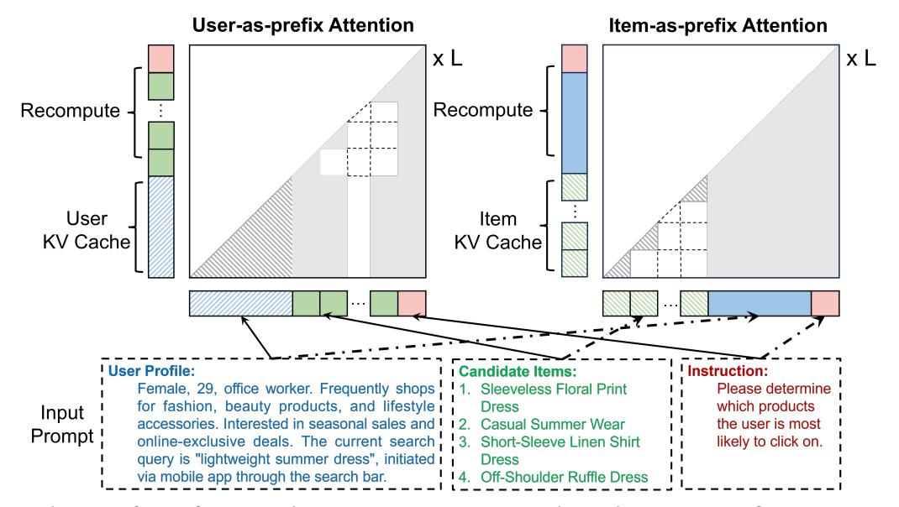
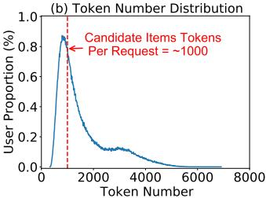
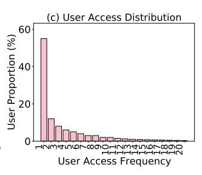
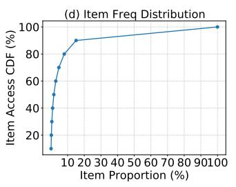
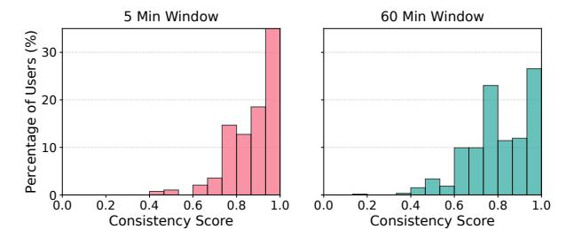
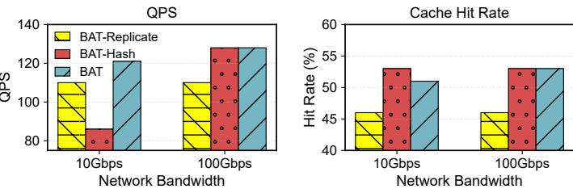
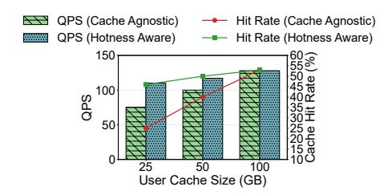

# **BAT: Efficient Generative Recommender Serving with Bipartite Attention**

Jie Sun\*
jiesun@zju.edu.cn
Zhejiang University
Hangzhou, China
Taobao & Tmall Group of
Alibaba
Beijing, China

Shaohang Wang\*
shhwang@connect.hku.hk
Taobao & Tmall Group of
Alibaba
Beijing, China
The University of Hong
Kong
Hong Kong, China

Zimo Zhang\* zzmyouyou@zju.edu.cn Zhejiang University Hangzhou, China Zhengyu Liu liuzhengyu.lzy@taobao.com Taobao & Tmall Group of Alibaba Beijing, China

Yunlong Xu yunlong.xyl@alibabainc.com Taobao & Tmall Group of Alibaba Beijing, China Peng Sun tengming.sp@taobao.com Taobao & Tmall Group of Alibaba Beijing, China Bo Zhao bo.zhao@aalto.fi Aalto University Espoo, Finland Bingsheng He dcsheb@nus.edu.sg National University of Singapore Singapore, Singapore

Fei Wu wufei@zju.edu.cn Zhejiang University Hangzhou, China Zeke Wang wangzeke@zju.edu.cn Zhejiang University Hangzhou, China

#### **Abstract**

Generative Recommenders (GRs) have recently emerged as promising alternatives to traditional Deep Learning Recommendation Models (DLRMs). Despite their potential, GRs remain computationally expensive in inference, exhibiting compute-bound characteristics similar to the prefill stage of Large Language Model (LLM) inference. Prefix caching can reduce redundant computation by reusing previously constructed KV caches. However, the unique properties of GRs, i.e., highly personalized user profiles and real-time item retrieval, make cache reuse across queries challenging, resulting in limited computational savings.

To address these challenges, we present **BAT**, an efficient serving system for GRs. The key observation is that the semantics between user and item tokens are permutation-invariant. Building on this, we propose *Bipartite Attention*, a novel attention mechanism that enables adaptive selection of either the user or the item as the prompt prefix without compromising accuracy, thereby unlocking new opportunities

\*Equal Contribution.

This work is licensed under a Creative Commons Attribution 4.0 International License.

ASPLOS '26, Pittsburgh, PA, USA.
© 2026 Copyright held by the owner/author(s).
ACM ISBN 979-8-4007-2359-9/2026/03
https://doi.org/10.1145/3779212.3790131

for KV cache reuse. We further co-design a disaggregated KV cache pool to proactively manage user-prefix and itemprefix caches as separate components. Since introducing item caches incurs additional memory overhead, we develop a hot-replicated cold-sharded item cache placement strategy that minimizes memory usage and maintains low communication overheads. Finally, we introduce a hotness-aware prompt scheduling strategy to optimize prefix selection under memory constraints. Extensive experiments on multiple recommendation datasets demonstrate that BAT improves serving throughput by up to 1.6× over the conventional user-as-prefix approach, while reducing total computation by up to 58%.

*CCS Concepts:* • Computer systems organization  $\rightarrow$  *Cloud computing;* • Information systems  $\rightarrow$  Online advertising; • Computing methodologies  $\rightarrow$  Machine learning.

**Keywords:** Generative Recommendation; Large Language Models: AI Infrastructure

#### **ACM Reference Format:**

Jie Sun, Shaohang Wang, Zimo Zhang, Zhengyu Liu, Yunlong Xu, Peng Sun, Bo Zhao, Bingsheng He, Fei Wu, and Zeke Wang. 2026. BAT: Efficient Generative Recommender Serving with Bipartite Attention. In *Proceedings of the 30th ACM International Conference on Architectural Support for Programming Languages and Operating Systems, Volume 2 (ASPLOS '26), March 21–26, 2026, Pittsburgh, PA, USA.* ACM, New York, NY, USA, 16 pages. https://doi.org/10.1145/3779212.3790131

# 1 Introduction

Recommendation systems lie at the core of online businesses, serving billions of daily active users and contributing significantly to overall revenue [\[15,](#page-13-0) [47,](#page-14-0) [56\]](#page-14-1). Traditional recommendation pipelines often adopt modular architectures with Deep Learning Recommendation Models (DLRMs) [\[7,](#page-13-1) [8,](#page-13-2) [59,](#page-14-2) [64,](#page-14-3) [68,](#page-14-4) [92\]](#page-15-1) as the foundation of the ranking stage. Despite their success, DLRMs tend to hit a performance plateau as the model capacity increases [\[84,](#page-15-2) [85\]](#page-15-3), primarily due to their limited expressiveness and difficulty in capturing complex high-order user-item interactions.

Recently, generative models such as Large Language Models (LLMs [\[1\]](#page-13-3)) and other Transformer-based models [\[61\]](#page-14-5) have shown remarkable capabilities in zero-shot reasoning and in-context learning. These properties have sparked growing interest in applying generative recommenders (GRs) [\[84\]](#page-15-2) or LLMs [\[11,](#page-13-4) [29,](#page-13-5) [91\]](#page-15-4) to recommendation tasks.[1](#page-1-0) The hypothesis is straightforward yet powerful: since LLM performance scales with compute (i.e., the Scaling Law [\[35\]](#page-13-6)), scaling more computation in recommendations, if managed efficiently, may unlock new revenue opportunities [\[84,](#page-15-2) [85\]](#page-15-3). This paradigm has already shown practical promise. For example, Meta has successfully deployed their GR, HSTU [\[84\]](#page-15-2), in production, achieving a 12.4% improvement in topline metrics. Similar positive results have been reported by other companies [\[3,](#page-13-7) [4,](#page-13-8) [11,](#page-13-4) [22,](#page-13-9) [38,](#page-14-6) [71,](#page-14-7) [93\]](#page-15-5). We have also adopted a languagemodel as GR, i.e., open-sourced pretrained Qwen2-1.5B [\[60\]](#page-14-8) in an online e-commerce ranking scenario, leading to improvements in click-through rate (CTR) due to the LLM's strong capability to understand user preferences.

Despite these breakthroughs, deploying GR as an online recommendation service is still computationally expensive due to its much larger model sizes than traditional DLRMs. For instance, GR can be two orders of magnitude larger than traditional DLRM [\[84\]](#page-15-2). In the ranking stage, GR encodes a user's profile and 100–200 candidate items [\[8,](#page-13-2) [66,](#page-14-9) [84\]](#page-15-2) into tokens and applies self-attention with a causal mask to predict the user preference probabilities of each item. After that, the recommendation system selects the top-k most relevant items to be recommended to the user. This process is similar to the prefill stage in LLM inference [\[13\]](#page-13-10), which is computebound with a long input sequence, e.g., up to 8K tokens [\[16,](#page-13-11) [36,](#page-13-12) [49,](#page-14-10) [87,](#page-15-6) [90\]](#page-15-7). We evaluate the compute latency of small language models from 1B to 7B with input sequence length from 512 to 8K. Given a 100-200ms latency SLO constraint [\[21\]](#page-13-13), we find that the computation latency can easily exceed the limitation even for a single request (see Figure [2](#page-3-0) (a)).

To address this issue, prefix caching is a widely studied approach to minimize the computation costs of LLMs' prefill [\[16,](#page-13-11) [36,](#page-13-12) [49,](#page-14-10) [87\]](#page-15-6) by storing and reusing key-value pairs (KV cache) from the transformer's attention mechanism. Recent

studies [\[16,](#page-13-11) [49\]](#page-14-10) have shown that storing KV cache in the host memory and disks can be more cost-efficient than full recomputation. However, we identify that the prefix caching ratio can be down to 18%, if we naively apply prefix caching to our real advertising GR rank workloads. Specifically, existing common practices, denoted as User-as-prefix attention, organize a input sequence as user profile tokens, candidate item tokens, and system instructions, as shown in Figure [1.](#page-2-1) On the one hand, only user profile tokens can be reused across a single user's multi-turn requests, since strong personalization prevents inter-user cache sharing, while real-time item retrieval generates dynamic and diverse candidate sets, making intra-user item cache sharing ineffective. On the other hand, user cache misses remain high in large-scale advertising environments with user populations on the order of 108 , where a substantial fraction of users are inactive, as illustrated in Figure [2](#page-3-0) (c). In contrast, our trace analysis (Figure [2](#page-3-0) (b) and (d)) shows that item tokens account for more than 33% of all tokens, and popular items are frequently shared across users—yet such opportunities are not exploited by existing methods.

This paper introduces a key insight: user and item semantics in recommendation prompts are permutationinvariant. That is, swapping the order of user and item tokens in the prompt does not affect the context semantics. We empirically validate this observation across multiple datasets and models, as shown in Table [3.](#page-10-0) Building on this insight, we propose Bipartite Attention, a novel algorithm that enables new opportunities for KV cache reuse without compromising accuracy. As illustrated in Figure [1,](#page-2-1) Bipartite Attention introduces an Item-as-prefix alternative to the traditional User-as-prefix attention. To make item prefix caches independent from other tokens, we adjust the position encoding and attention mask of items accordingly. The advantages of Item-as-prefix are threefold: 1) reusing item cache across thousands or even millions of users; 2) requiring only local memory to store all items, e.g., 287 GB vs 430 TB (1M items vs 10M users, see Industry in Table [1\)](#page-8-0); 3) saving more computation for inactive users with fewer tokens.

Building on Bipartite Attention, we develop Bat, an efficient serving system for GRs. Unlike existing LLM/KV cache optimization schemes that passively manage caches under fixed user queries, Bat proactively selects the prefix type and manages KV caches accordingly. However, this design introduces new challenges. First, item caching incurs additional memory capacity overhead. To mitigate this, we propose a hot-replicated cold-sharded item cache placement that reduces memory consumption per machine by pooling memory across local machines through high-speed networks and replicating hot items to avoid IO bottlenecks. Second, users' token lengths and access patterns also follow a skewed distribution, making prefix selection for each request nontrivial. To address this, we design a hotness-aware prompt scheduling strategy that employs a window-based frequency

1 In this paper, we focus on the ranking stage, the core of the recommendation system. See [2](#page-2-0) for the overview of the recommendation system pipeline.

**Figure 1.** The Mechanism of GR Inference with Bipartite Attention. It can select either User-as-prefix attention or Item-as-prefix attention. We omit the other components in L transformer blocks for simplicity. The hidden state of the last token is projected onto a logit space to estimate the user's preference for candidate items. The attention across different items is masked out [84].

estimator and a decision model to schedule requests' attention pattern.

We evaluate BAT across multiple real-world recommendation datasets and industrial workloads. The experimental results demonstrate that BAT improves serving throughput by up to 1.6× over the conventional user-as-prefix approach, while reducing total computation by up to 58%.

This paper makes the following contributions:

- (1) We characterize the new GR serving workload and identify its prefix cache reuse challenges.
- (2) We propose Bipartite Attention, a novel attention mechanism that enables adaptive selection of either the user or the item as the prompt prefix without compromising accuracy, thereby unlocking new opportunities for KV cache reuse.
- (3) We design a disaggregated KV cache pool that proactively manages user-prefix and item-prefix caches based on recommendation systems' characteristics.
- (4) We propose a hot-replicated cold-sharded item cache placement and hotness-aware prompt scheduling strategies to maximize system throughput under memory constraints.

#### 2 Preliminaries

# 2.1 Recommendation System

A typical industrial-scale recommendation system follows a multi-stage pipeline [8, 21, 66] to efficiently process and rank a massive pool of candidate items. This pipeline is generally divided into two main stages: retrieval and ranking [84].

The retrieval stage serves as a coarse filtering process, retrieving a small subset (e.g., hundreds or thousands) of potentially relevant items from a much larger corpus—often

containing millions or billions of items. This stage prioritizes speed and coverage, relying on lightweight models such as collaborative filtering [23], nearest neighbor search [28, 75], or rule-based heuristics [51] to ensure the candidate set retains most of the user-relevant content.

Following the retrieval, the ranking stage re-scores the retrieved items using more expressive and computationally intensive models. These models are designed to capture finegrained user-item interactions and contextual information (e.g., time, location, user behavior history), often leveraging deep learning architectures such as Deep Learning Recommendation Models (DLRMs) [7, 8, 59, 64, 68, 92] or, more recently, Generative Recommenders (GRs) [11, 27, 29, 71, 84]. The ranking stage is typically responsible for producing the final top-k recommendations that the user will see, and thus has a critical impact on key business metrics such as clickthrough rate (CTR) and revenue.

### 2.2 Generative Recommenders (GRs)

In this paper, we focus on applying GRs to the recommendation ranking stage.

**Problem Formulation.** As shown in Figure 1, the generative ranking tasks can be formalized as: Given a user profile token set  $\mathcal{U}$ , a set of candidate items  $I = I_1, I_2, \ldots, I_N$ , where each  $I_i$  represents the tokens of a candidate item i, and instruction tokens Instr, the goal is to predict a ranked list of top-k items from N candidates that best match the user's preferences. N is typically at the hundreds-level [21], e.g., 100. The user profile  $\mathcal{U}$  typically encodes the user's historical interaction data (e.g., clicked or purchased items) and static attributes (e.g., age, gender, location). Each item

**Figure 2.** (a) Latency Comparison: Recompute vs Prefix Cache. Model A: Qwen2-1.5B [60], Model B: Llama3-1B [20], Model C: Qwen2-7B [60]. Recomp and Prefix denote recomputation and loading prefix caching from CPU memory. (b,c,d) The Distribution of User Token Numbers, User Access Frequency, and Item Access Frequency CDF from Our Tracing.

profile  $I_i$  encodes attributes such as title, brand, category, and seller information. The GR model generates a relevance score  $s_i = f(\mathcal{U}, I_i)$  to each item.

**GR Inference.** The inference of GR will stack L Transformer layers to yield the final hidden representation of the last token (or discriminant tokens). The Transformer layer  $\ell$  ( $1 < \ell <= L$ ) consists of a multi-head self-attention followed by a feed-forward network (FFN). We denote the input as a token sequence:  $x_{1:T} = [\mathcal{U}, I_1, \ldots, I_N, Instr]$ . The total length of the sequence is T. Each token  $x_t$  is mapped into its embedding:  $h_t^{(0)} = \mathbf{E}[x_t], 1 \le t \le T$ . These embeddings are processed through L Transformer layers to obtain the hidden representations

$$h_{1:T}^{(L)} = \text{Transformer}(h_{1:T}^{(0)}).$$

Assume that we take the last token as the discriminant token and we use a LLM as the ranking model. *T* is the position of the last token in the sequence. We project its hidden state to vocabulary logits:

$$\mathbf{z} = \mathbf{W}_{\text{out}} h_T^{(L)} \in \mathbb{R}^{|\mathcal{V}|}.$$

For each candidate item  $I_i$  with identifier token  $v_i \in \mathcal{V}$ , its relevance score is given by

$$s_i = \frac{\exp(\mathbf{z}[v_i])}{\sum_{j=1}^N \exp(\mathbf{z}[v_j])}.$$

The final ranked list is obtained as

$$TopK(I) = TopK_{i \in [1,N]} s_i$$
.

#### 3 Motivation

#### 3.1 Characterizing GR Inference

The GR inference process exhibits similar characteristics to the *prefill* phase in LLM inference [13]. As in LLMs, this phase is typically **compute-bound** [16, 36, 49, 87, 90], dominated by dense matrix multiplications across all transformer layers, especially when the input sequence is long.

To demonstrate this, we evaluate three popular LLMs, i.e., Qwen2-1.5B, Qwen-2-7B, and LLama3-1B, with an A100 GPU. From our tracing data, we observe that the user profile token number can be up to 8K (A similar number was reported

by Meta [84]). We vary the input sequence length from 512 to 8192 tokens and profile the compute latency per request (setting batch size to 1), as shown in Figure 2 (a). Given a 100ms latency SLO constraint [21], the computation latency can easily exceed the limitation with long sequences and large models. As recommendation systems will serve tens or hundreds of millions of users daily, we must deploy thousands of GPU machines, which incurs a high monetary cost, severely limiting the cost-efficiency of the GR.

## 3.2 Prefix Caching

Prefix caching has been proven efficient in existing studies to reduce redundant computation by using the previously computed KV cache. Formally, suppose the current input sequence  $x_{1:T}$  shares a prefix of length P with a previously processed sequence, and the corresponding KV cache  $(k_{1:P}, v_{1:P})$  has already been stored. During prefill, we only need to compute the projections for the suffix tokens  $x_{P+1:T}$ :

$$q_{P+1:T}, k_{P+1:T}, v_{P+1:T} = \text{Proj}(x_{P+1:T}),$$

and construct the complete attention context by concatenating cached and newly generated keys and values:

$$k_{1:T} = [k_{1:P}; k_{P+1:T}], \quad v_{1:T} = [v_{1:P}; v_{P+1:T}].$$

The output for the suffix tokens is then computed via standard attention:

$$o_{P+1:T} = Attention(q_{P+1:T}, k_{1:T}, v_{1:T}).$$

Finally, the updated KV cache  $(k_{1:P}, v_{1:P})$  can be stored for future reuse. This optimization with shared prefixes significantly reduces redundant computation in multi-turn or multi-request inference scenarios.

Previous studies have shown that the bandwidth requirement for loading prefix cache is as low as 8GB/s for an 8-A100 machine [49], less than 20GB/s of PCIe 4.0. We compare prefix caching with recomputation on an A100 GPU with PCIe 4.0. Figure 2 (a) reports that prefix caching can be orders of magnitude lower serving latency than recomputation. Therefore, prefix caching opens an opportunity to improve the cost-efficiency of GR serving.

#### 3.3 Challenges of Prefix Caching

We apply prefix caching to our real e-commerce advertising GR ranking workloads. Specifically, we take the user profile tokens, 100× candidate items each with 10 tokens, and a set of system instruction tokens as input sequence. We denote this organization as *User-as-prefix*, as illustrated in Figure 1. We evaluate a Qwen2-1.5B model. We identify that only the user profile tokens can be reused across a single user's multiturn requests, resulting in a cache hit rate as low as 18%. This low reuse stems from the large user base, where many users remain inactive.

- **3.3.1** Which Part of the KV Cache can be Reused? We identify that only the user profile tokens can be reused. The challenges stem from the personalized user preferences and real-time item retrieval.
- (1) Hard Inter-user Cache Sharing due to Personalization. Recommendation systems exhibit strong personalization, because each user's prompt consists of a combination of interaction history and the user's unique profile, which are highly specific and rarely shared across different users. Due to the causal attention mechanism, the item KV cache that depends on the previous user's context can also not be shared across different users.
- (2) Hard Intra-user Item Cache Sharing due to Realtime Item Retrieval. GR inference assembles prompts in an ad-hoc fashion. The candidate item set is determined dynamically by the retrieval module based on real-time user context. And the recommendation system tends to select different items for users in different turns of interactions. Thus, the item KV cache can hardly be shared across different requests of each user.

Therefore, we can only share each user's KV cache across its multi-turn requests with the *User-as-prefix* attention.

- **3.3.2** Why is Sharing Only the User Prefix not Sufficient? Similar to existing LLM systems [36, 49, 62, 87], we can use the local machine's CPU/GPU memory2 to act as the cache of the KV cache. However, due to a large user base where many users remain inactive, we identify that the user cache hit ratio can be down to 18%.
- (1) Large Number of Daily Engaged Users. In large-scale recommendation scenarios, the number of daily engaged users can be as high as  $10^8$ , as observed in our e-commerce advertising workloads and the existing workloads [84]. We identify that the total memory consumption of the user-asprefix cache can reach up to 2.9 PBs, which exceeds the feasible limits of GPU or CPU memory of serving machines. Specifically, consider a transformer model with L layers, H attention heads per layer, and head dimension D. For each token, the KV cache stores both key and value vectors of

shape  $H \times D \times L$ . Using float16 precision, the KV cache size per token is:

KV cache per token =  $2 \times H \times D \times L \times sizeof$  (FP16) Bytes. The total KV cache size for a user prefix with  $T_u$  tokens is  $T_u \times 2HDL \times 2$  bytes. As an example, we take a Qwen2-1.5B model with L=28, H=2, D=128, and average user token number  $T_u=1000$ , so a single user occupies approximately 29MB KV cache. Caching  $10^8$  such user prefixes would require over 2.9 PB of storage, thereby infeasible to store all users' KV cache in local machines.

(2) Large Number of Inactive Users. We collect the users' access frequency on an hourly basis and observe that many inactive users access the system less than two times, as shown in Figure 2 (c). This leads to a high proportion of compulsory cache misses and cache pollution, which, in turn, causes additional capacity misses. Specifically, when a new request arrives, a GR system can look up its local cache. If the prefix matches existing tokens, the prefix cache can be retrieved. Otherwise, GR needs to recompute the prefix tokens and update the KV cache in its cache system, e.g., using LRU replacement [49]. We experiment on an industrial workload (see details in § 6). We observe that the cache hit rate is reduced to 18% and the total computational savings are limited to less than 11% of recomputation. Moreover, as shown in Figure 2 (b), we observe that user tokens follow a long-tail distribution: Many inactive users have fewer than 1K tokens. Among all users, around 33% of the tokens are item tokens and can not be shared.

# 4 Bipartite Attention

To tackle the challenges of prefix caching, we propose Bipartite Attention, a novel algorithm that unlocks new opportunities for KV cache reuse without sacrificing accuracy.

#### 4.1 Insight

Our traces show that the item's access frequency is highly skewed, with its CDF shown in Figure 2 (d). In particular, roughly 90% of accesses focus on the top 10% of hot items. This implies that hot item tokens can be shared across a large number of users, thereby improving the memory utilization of the KV cache. Motivated by this, our key insight is that user and item semantics in recommendation prompts are permutation-invariant. The underlying reason is that the user information and item information can be regarded as an *unordered set*, instead of a *sequence* (the tokens inside each item and user are maintained as sequences). Similar phenomena have been reported by LLM's multiple-choice tasks [43]. We empirically validate this on different datasets and GR models, as shown in Table 3.

#### 4.2 Mechanism

Given a request, Bipartite Attention consists of two alternative GR inference mechanisms: 1) *User-as-prefix* attention, and 2) *Item-as-prefix* attention.

&lt;sup>2Utilizing cheap local/remote storage can achieve a larger cost-effective storage space. However, it might incur harmful access latency [6, 49] and complex IO management. We leave this for our future exploration.

User-as-prefix Attention. In this setting, the input is organized as [U, I1, . . . , I , ]. If enabling prefix caching, the KV cache of user tokens U is pre-computed and cached. During real-time inference, if the prefix cache hits, only the tokens of items and instructions are computed and discarded, as they are hard to share:

$$Attn_{\mathcal{U}\text{-prefix}} = Attn(q_{I,Instr}, k_{I,Instr} \cup k_{\mathcal{U}}, v_{I,Instr} \cup v_{\mathcal{U}}).$$

Item-as-prefix Attention. In this attention, the input is organized as [I1, . . . , I , U, ]. The key-value pairs of items I are pre-computed and cached. In inference, user and instruction queries are attended to their own tokens and the cached item prefix, and finally discarded:

$$\operatorname{Attn}_{I\operatorname{-prefix}} = \operatorname{Attn}(q_{\mathcal{U},\operatorname{Instr}},\ k_{\mathcal{U},\operatorname{Instr}} \cup k_{I},\ v_{\mathcal{U},\operatorname{Instr}} \cup v_{I}).$$

Attention Masks and Position Encoding. We adjust the attention mask and position encoding [\[55\]](#page-14-14) of Bipartite Attention to remove positional bias [\[43\]](#page-14-13), leveraging the inherent independence (to ensure fair comparison) of candidate items in recommendation systems [\[84,](#page-15-2) [92\]](#page-15-1). For example, in Transformer-based architectures, HSTU [\[84\]](#page-15-2) applies an attention mask to prevent cross-attention between items. Following this principle, we apply similar attention masks to both the User-as-prefix and Item-as-prefix settings, as shown in Figure [1.](#page-2-1) In addition, we adjust the position encoding so that all items share the same starting position ID (i.e., the position of their first token). Specifically, in the User-as-prefix case, the starting position of items is set to the length of the user tokens; in the Item-as-prefix case, it is reset to 0 (or optionally after notation tokens such as "Candidate items:"). This design ensures that the tokens of each item remain independent from other items, as well as from subsequent user and instruction tokens. Therefore, we can pre-compute every item's KV cache and store them independently. We will discuss the benefits of this design in § [4.3.](#page-5-0)

Discriminant Tokens. In our current design, the discriminant token that determines the ranking score of all items is the last token in the sequence. Specifically, we calculate the hidden states of this token and project it to a logit, which can be used to identify the probabilities of all items. Additionally, our mechanism can be extended to multiple tokens by applying attention to them, e.g., one discriminant token per item, as in other works [\[29,](#page-13-5) [84\]](#page-15-2).

Extending to HSTU [\[84\]](#page-15-2). Although we mainly focus on the language models as the GR model, we believe the idea of our Bipartite Attention can be extended to other transformer architectures, like a recent popular work, HSTU. LLMs and HSTU share the same fundamental formulation: both model user–item interactions through causal attention and treat recommendation as a next-token prediction problem (i.e., computing logits). Their primary difference lies in how users and items are represented as tokens—whether through language vocabulary, traditional item-embedding tables (HSTU [\[84\]](#page-15-2)), or intermediate representations such as

Semantic ID [\[11,](#page-13-4) [33,](#page-13-19) [50\]](#page-14-15). GR remains an emerging area without a common design paradigm. To our knowledge, many companies are actively exploring different approaches in parallel. We leave the exploration of HSTU-based GR for our future work.

Sensitivity to Base Models. We observe that in certain cases, the Item-as-prefix attention may lead to degraded performance. This phenomenon depends on the base model's ability to distinguish between set semantics and sequence semantics. For instance, in instruction-tuned language models such as Llama3-Instruct [\[20\]](#page-13-17), swapping the prefix results in a noticeable performance drop. In practice, we can select a base model that supports modifying position encodings. Meanwhile, as we will periodically fine-tune a GR model to update its knowledge with new data, we can optionally adjust its position encoding during training without incurring extra training overheads. And at inference time, we can leverage existing position-independent caching (PIC) [\[26,](#page-13-20) [77\]](#page-15-9) algorithm to improve performance, which selectively recomputes some critical tokens to mitigate accuracy degradation.

#### 4.3 Advantages of Item-as-prefix Attention

We demonstrate that there are three advantages of the Itemas-prefix attention over the User-as-prefix attention.

- (1) Enabling KV Cache Sharing Cross-users. In real recommendation scenarios, items are typically exposed to a broad user base rather than being restricted to a single individual. For example, popular items—such as trending products, frequently advertised goods, or widely consumed media content—are naturally recommended to many users, particularly those who share similar preferences [\[23\]](#page-13-14). From the supply side, item providers and advertisers deliberately promote their content to maximize exposure across diverse audiences. These two factors together lead to substantial overlap in item access patterns across users. Consequently, unlike highly personalized user profiles, item tokens exhibit much higher reuse potential. Leveraging this inherent redundancy, we enable item KV cache sharing across different users, thereby improving cache efficiency while reducing redundant computation.
- (2) Storing Item KV Cache with Only Local Memory. In our workload, the item number of a single recommendation scenario can be 1M to 10M. We observe that the average item token number is around 10. Similar numbers can be found in Amazon's datasets [\[24\]](#page-13-21). With a Qwen2-1.5B model, the total item KV cache size is about 287GB to 2.87TB. Many modern servers' CPU memory can be up to 2TB, and overall GPU memory, e.g., 8×H20, can be up to 768GB. With our hotreplicated cold-sharded item cache placement (See [5.2](#page-6-0) for more details), it's feasible to leverage the local machine/cluster's CPU/GPU memory to store item KV cache. In contrast, storing all user KV cache requires PB-scale storage.
- (3) Saving More Tokens for Inactive Users. As shown in Figure [2\(](#page-3-0)b), 36% of users have fewer tokens in their profiles

Figure 3. Overall Architecture of Bat.

than the number of item tokens (e.g., around 1,000 tokens for 100 candidate items). For these users, leveraging the item KV cache yields, on average, a 13.2% higher token reuse rate compared to the user KV cache. Moreover, more than 55% of users access the recommendation system only once per hour. In such cases, the user KV cache often suffers from compulsory misses, whereas item caching can consistently save up to 1,000 tokens per user. Finally, as the number of candidate items and the token length per item increase, the advantages of item caching become even more significant.[3](#page-6-1)

# 5 System Design

# 5.1 Overall Architecture

Building on Bipartite Attention, we develop Bat, an efficient GRs serving system that designs a compute-storage disaggregated KV cache pool to proactively manage user- and item-prefix caches, as illustrated in Figure [3.](#page-6-2) During the offline initialization, Bat will allocate a pooled memory for item cache and use the rest memory for user cache (See details in § [5.2\)](#page-6-0). During the online serving process, Bat relies on a centralized hotness-aware prompt scheduler to decide the attention pattern of each request based on cache hotness and cache indexes queried from a centralized cache meta service (See details in § [5.3\)](#page-7-0). Once a decision is made, the scheduler dispatches the input sequences to inference workers to perform computation, while the cache metadata service initiates the transfer of physical KV caches from cache workers to inference workers.

Hotness-aware Prompt Scheduler. The scheduler takes the ranking requests as inputs. Each request is generated from the retrieval stage in the recommendation pipeline and consists of a user ID and a set of candidate items' IDs. The user profile, item description, and system instructions are pre-encoded into tokens and stored. The scheduler will periodically query a batch of the related users/items' KV cache state, e.g., cache hit/miss and cache hotness, from the cache meta service, which will be used to determine

the prompt order (The strategy is discussed in § [5.3\)](#page-7-0). Once determined, the scheduler concatenates the tokens into a batch of recommendation prompts of multiple requests and distributes them to inference workers in a load-balanced manner [\[49\]](#page-14-10). Meanwhile, it issues cache read requests to the cache metadata service when a prefix hit occurs. When a prefix cache is recomputed by an inference worker, the scheduler also coordinates the corresponding cache write operation in the background.

Inference Worker. Bat launches multiple inference workers, each running on a dedicated GPU. The inference engine is built on top of vLLM [\[36\]](#page-13-12), a state-of-the-art system for serving autoregressive language models. We customize the attention module with our proposed Bipartite Attention mechanism and integrate a high-performance FlashInfer [\[79\]](#page-15-10) backend for optimized execution. Each worker maintains a local replica of the model weights and performs forward passes on the incoming batches. To meet the latency SLA, we enforce a max-batched-tokens limit, e.g., 4000 tokens, with the value determined via offline profiling [\[49\]](#page-14-10). The inference workers can scale out to serve more requests with a data-parallel strategy.

KV Cache Worker. Each KV cache worker manages a pool of paged memory, e.g., CPU memory[4](#page-6-3) and GPU memory. KV entries are stored at user/item granularity: all prefix tokens of a given user or item form one logical entry that is physically organized into fixed-size pages compatible with PagedAttention [\[36\]](#page-13-12). Internally, a KV cache worker maintains a transfer engine supporting network stacks like local DMA and (GPUDirect) RDMA. The KV cache workers can also scale out to increase memory capacity.

Cache Meta Service. The meta service is a logically centralized process that tracks the index and hotness of every user/item KV entry across workers/tiers without holding the physical data. It receives the cache read, write, and check status requests from the prompt scheduler and manages the corresponding memory pages. It coordinates the KV cache workers for the physical KV cache transfer. It also proactively updates entry hotness upon each query.

#### 5.2 Hot-replicated Cold-sharded Item Placement

Compared to user-prefix caching, item caching consumes part of the local memory, reducing space for user caches. To address this, we aggregate multiple machines' memory as the item cache pool. However, recommendation system retrieves items from the entire item corpus, which inevitably introduces inter-node communication. To mitigate this, we exploit the skewed access distribution (see Figure [2](#page-3-0) (d)) and propose a hot-replicated cold-sharded (HRCS) item cache placement strategy. Our goal is to replicate hot items across machines while evenly distributing long-tail items, thereby reducing network overhead and preserving cache efficiency. There are three main steps:

3 In the retrieval stages, the candidate item numbers can be larger than 10K. We leave this as our future work.

4 In this work, we mainly evaluate on CPU memory.

Step 1. Estimating the max allowed KV cache communication ratio through the inter-machine network, as shown in Algorithm 1. To do so, we first profile the available inter-node network bandwidth in an offline process and convert it into token-centric throughput, i.e., B tokens/second. Second, we estimate the prefill computation time t of a specific model given the  $c \times \tau_i$  item tokens as the shared prefix and  $\tau_u$  user tokens as the suffix, where c is the candidate item number and  $\tau_u/\tau_i$  are the average user/item token number of a give dataset. This process can be achieved by a polynomial regression model fitted with offline data [49] due to the regular and deterministic pattern of Transformers. Then we use a hyperparameter  $\alpha$  to indicate the tolerable communication time over computation. Finally, we get the maximum allowed KV cache communication ratio  $R_{\text{max}} = \frac{\alpha \times t \times B \times (N-1)}{c \times S_{\text{item}} \times N}$ , where *N* is the KV cache worker number (assuming the transferred KV cache is evenly distributed among workers).

**Step 2. Calculating the CDF from Item Access Frequency Distribution.** We collect all items' access frequency distribution  $\mathcal{F}$  from a past period, e.g., past one day. Then we sort  $\mathcal{F}$  by descent and add the frequency value to the CDF until we reach the upper limit  $1-R_{\max}$ , which indicates the replication ratio r of the items in each KV cache worker.

**Step 3. Placing KV Cache.** We observe that the tokens of each item, e.g., the description of items' properties, are rarely changed over time. Therefore, we first pre-compute the KV cache for all items and load the items' KV cache on each KV cache worker in an offline process. Specifically, given the replicate ratio r, we select the item KV cache with the highest access frequency to fill into the replicated area for every worker and shard the remaining item KV cache across workers for the first time. During online recommendation, we can replace the KV cache item according to ad hoc hotness in a background process5. For example, there are some burst hotspot that should be recommended to most users. We update these items in the replicate area. Note that there are often new items added to the entire corpus. We add their KV cache by a similar background compute and update strategy.

# 5.3 Hotness-Aware Prompt Scheduler

We propose a hotness-aware prompt scheduler to determine the attention pattern for each request. The key question is:

Given a memory constraint, how to select the attention pattern for each request to maximize the overall system throughput?

**Trade-off: User-as-prefix vs Item-as-prefix.** Given a limited cache budget, our goal is to *minimize the total number of newly computed tokens*, or in other words, *maximize the number of tokens reused from cache.* As Figure 2 (b) shows, the users' history tokens follow a skewed and long-tail distribution. Some active users have more behaviors, such as clicking or purchasing more items, leading to more history tokens to

#### Algorithm 1 HRCS Item Cache Placement

#### 1: Input:

- B: Measured network bandwidth (tokens/sec)
- $\mathcal{F}$ : Item access frequency distribution
- $\tau_u$ : Average user token count
- $\tau_i$ : Average item token count
- $\alpha$ : Communication time threshold ratio
- c: Candidate items per request
- N: KV cache worker number

return r

20: end procedure

- 2: **Output:** Hotspot replication ratio *r*
- 3: procedure ComputeReplicationRatio
- t ← PrefillTime( $τ_u$ ,  $c × τ_i$ )  $\rightharpoonup$  Offline prefill time estimation
- 5:  $T_{\max} \leftarrow \alpha \cdot t$  > Max allowed communication time 6:  $S_{\text{item}} \leftarrow \tau_i$  > Average item size in tokens 7:  $R_{\max} \leftarrow \frac{T_{\max} \times B \times (N-1)}{c \times S_{\text{item}} \times N}$  > Max allowed communication ratio
- Sort  $\mathcal{F}$  in **Descending** order  $\triangleright$  Prepare for CDF scan 8:  $CDF \leftarrow 0$ 9: for  $i \leftarrow 1$  to  $|\mathcal{F}|$  do 10:  $CDF \leftarrow CDF + \mathcal{F}[i]$ 11: if CDF  $\geq 1 - R_{\text{max}}$  then 12:  $r \leftarrow i/|\mathcal{F}|$ ▶ Replication ratio 13: break end if end for Place replicated items on all workers 17: Uniformly partition non-replicated items across workers

encode their behaviors. For example, some users' token numbers are up to 8K, while 100 candidate items have around 1K tokens. For these users, selecting the *User-as-prefix* attention saves more computation than the *Item-as-prefix* attention. However, some inactive users have much fewer tokens, e.g., 800. Selecting *Item-as-prefix* minimizes their computation. Therefore, selecting either *User-as-prefix* or *Item-as-prefix* is not a one-size-fits-all decision.

Cache-agnostic Prompt Scheduling. We observe that it's inefficient to decide the prefix for each request statically, without considering the cache states. For example, a straightforward strategy is to minimize computation greedily. For each request, it compares the number of user tokens and item tokens and selects the one with more tokens as the prefix. We observe that over 70% of requests are scheduled by it to *User-as-prefix* on the books dataset (See Table 1). The inefficiency arises from two aspects: 1) the cache of users with low frequency meets many compulsory misses, and 2) the cache of users with high access frequency could be evicted by the ones with low frequency (although low

 $^5\mathrm{We}$  observe that the access frequency of items changes on an hourly or daily basis.

frequency users' cache can be rejected from admission by advanced cache replacement design, the rejected requests's attention is determined and can not leverage item cache to save computation on time).

Hotness-aware Prompt Scheduling. We propose a hotness-aware prompt scheduling strategy that explicitly considers cache states when selecting prefixes. In scenarios where the GR computation is the primary bottleneck, reducing computational overhead can be regarded as improving throughput. Under this objective, and given the constraint of limited cache capacity, the strategy should prioritize maximizing access frequency per unit of cache space, which suggests allocating cache to the highest-frequency user tokens within a specified time window.

To capture request frequency, we define a sliding-window metric  $f_u$ , which measures how often a user issues requests within a recent time window (e.g., the past W seconds or minutes). While the exact future frequency  $f_u$  is inherently unpredictable, our key insight is that a user's consecutive behaviors tend to exhibit similarity. For instance, if a user intends to purchase a specific item, they are likely to repeat a search within a few minutes of the initial query. In contrast, casual browsing often produces a more stable interaction pattern, such as consecutively viewing multiple pages over a short interval. To empirically validate this observation, we sample and analyze the online traces of thousands of users. For each user, we compute an average similarity score of consecutive sliding-window frequencies using the formula  $\frac{|f_u(t)-f_u(t-\delta)|}{|f_u(t)+f_u(t-\delta)|}$ , where the window sizes W are set to 5 minutes or 60 minutes, and  $\delta$  denotes the interval between windows. A higher value of this formula, approaching 1, indicates greater similarity between the two consecutive frequency windows. Figure 4 shows that most users exhibit consistent behaviors across consecutive time windows. Based on this observation, we approximate a user's current  $f_u$  as a reliable estimate of their near-future request frequency.

Based on the frequency estimation  $f_u$ , we design a hotness-aware greedy policy to decide the user or the item as the prefix. Formally, for a request r with user token length  $\tau_u(r)$  and item token length  $\tau_i(r)$ , the prefix selection rule is:

$$\mathrm{prefix}(r) = \begin{cases} \mathrm{user}, & \tau_u(r) \geq \tau_i(r) \ \land \ f_u(r) > \min_{p \in C_u} f_p, \\ \mathrm{item}, & \mathrm{otherwise}, \end{cases}$$

where  $C_u$  denotes the set of cached user pages, and  $f_p$  represents their estimated frequencies.

Intuitively, when the user tokens are fewer than the item tokens, we directly adopt the *Item-as-prefix* strategy to reuse item caches. When the user tokens are longer, the scheduler queries the cache meta service for the lowest-frequency user pages in  $C_u$ . If the predicted frequency  $f_u(r)$  of the incoming user exceeds that of these pages, the scheduler replaces them with the new user cache (*User-as-prefix*); otherwise, the request falls back to the *Item-as-prefix* strategy.

**Figure 4.** The Consistency of User Access Frequency across Many Time Windows from Our Tracing.

Table 1. Detailed Information of Datasets

| Dataset              | Games | Beauty | Books | Industry |
|----------------------|-------|--------|-------|----------|
| User Num.            | 15K   | 22K    | 510K  | 10M      |
| Item Num.            | 8K    | 12K    | 280K  | 1M       |
| Ave. User Token Num. | 1245  | 2043   | 1586  | 1500     |
| Ave. Item Token Num. | 11    | 18     | 15    | 10       |

Table 2. Model Architecture

| Models                  | Qwen2-1.5B  | Qwen2-7B    | Llama3-1B   |
|-------------------------|-------------|-------------|-------------|
| KV Head Num.            | 2           | 4           | 8           |
| Head Dim.               | 128         | 128         | 64          |
| Layer Num.              | 28          | 28          | 16          |
| KV Cache Size per Token | 28672 Bytes | 57344 Bytes | 32768 Bytes |

Whenever an existing user cache is accessed, the cache meta service *decays* its sliding-window frequency estimate and maintains the statistics asynchronously. Since consecutive user requests usually arrive at the granularity of seconds, such asynchronous updates incur negligible latency.

#### 6 Evaluation

#### 6.1 Experimental Setup

**Testbeds.** The main experiments are conducted on a 4-node cluster from Zhejiang University. Each node has an Intel(R) Xeon(R) Silver 4214 (2×24 threads) CPU @ 2.20GHz, 200 GB memory, one 40GB-A100 GPU connected with PCIe 3.0x16, and 100Gbps network. We deploy one inference worker and one KV cache worker per node. **Production Testbeds.** We also evaluate BAT's scalability on a 16-node production cluster (See section 6.6), where each node has one NVIDIA H20 GPU, an Intel Xeon Platinum 8469C CPU (2 sockets × 48 cores/socket × 2 threads/core), 500 GB host memory, and 200 Gbps network.

**Datasets**. We evaluate on three open source real-world recommendation datasets, *Games*, *Beauty*, and *Books* from Amazon [24], and one synthetic dataset *Industry* generated from our real e-commerce advertising workload. See Table 1. **Production Dataset**. In industry, the full item corpus can reach hundreds of millions. However, recommendation traffic is typically partitioned into multiple scenarios (e.g., channel-specific entrances such as clothing, toys, etc.), each served by

Figure 5. System QPS Comparison across Datasets for Different Models

Figure 6. System Cache Hit Rate Comparison across Datasets for Different Models

dedicated models. In our production practice, the item set per scenario is usually at the million scale. For a 1B-parameter model (e.g., Qwen), this implies a total item KV Cache footprint ranging from ~ 287 GB (1M items) to ~ 2.87 TB (10M items), where average token per item is 10. To examine BAT's scalability with large item corpus (See section 6.6), we vary the number of items of the synthetic *Industry* dataset, denoted as *Industry*-X, where X is the item number. **Unless explicitly specified, the evaluation is done on normal testbed and datasets.** 

**Models.** We evaluate three language models as GRs: Qwen2-1.5B, Qwen2-7B [60], and Llama3-1B [20]. Table 2 details the models. We use FP16 as the data type for KV cache. We mainly focus on the GR ranking task. We apply a linear recurrence-based model as our retrieval model [83].

**Baselines.** We select three prefix-caching-based designs as well as a recomputation-based design as our baselines. For all baselines, we implement the model inference based on vLLM [36] and Flashinfer [79] and leverage CPU memory as an LRU cache to store the KV cache.

- **Recomputation (RE).** RE performs GR serving without prefix caching.
- User-as-prefix (UP). UP performs the *User-as-prefix* attention for all requests. This is the widely adopted approach in existing GR works [11, 27, 29, 84].
- • Item-as-prefix (IP). IP performs the *Item-as-prefix* attention for all requests.

#### 6.2 Overall System Performance

We compare the overall throughput and cache hit rate of BAT with three baselines and four datasets. We randomly sample the users with replacement from the history log of each dataset. For each user, we take their history access frequency as the basis for ad-hoc frequency and randomly sample the intervals between consecutive accesses to simulate realistic request patterns. For each request, we retrieve 100 candidate items to make an input prompt. Since the original user histories in the Games, Beauty, and Books datasets are relatively short, we expand their profile token lengths so that the maximum prompt length approaches 8K tokens. We define the cache hit rate as the ratio of reused prefix tokens to the total number of tokens per prompt. We allocate a fixed size of host memory to store to the KV Cache. The cached token number is determined by both allocated host memory size and each model's hyper-parameter.

Figure 5 and Figure 6 present the overall throughput and cache hit rate, respectively. Compared to RE, BAT achieves up to 58% cache hit rate and improves throughput by as much as  $2.3\times$ , the highest among all baselines. Relative to UP, BAT delivers up to  $1.6\times$  speedup.

When comparing UP and IP, we observe that on the *Beauty*, *Books*, and *Industry* datasets, IP achieves a higher cache hit rate and throughput than UP. This is because IP benefits from better memory utilization and fewer compulsory misses. In contrast, on the *Games* dataset, where the average user access frequency is high, UP outperforms IP.

On the *Industry* dataset, BAT achieves throughput comparable to IP, since the item cache sizes are already large under the given memory constraints, leaving limited space for user

**Table 3.** Performance Comparison of UP and IP Policies across Datasets and Models. Higher values indicate better performance.

| Dataset | Model      | Strategy | Recall@10 | MRR@10 | NDCG@10 | Recall@5 | MRR@5  | NDCG@5 |
|---------|------------|----------|-----------|--------|---------|----------|--------|--------|
| Beauty  | Qwen2-1.5B | UP       | 0.6558    | 0.2912 | 0.3756  | 0.4433   | 0.2627 | 0.3068 |
|         |            | IP       | 0.6827    | 0.2998 | 0.3881  | 0.4505   | 0.2687 | 0.3129 |
|         | Qwen2-7B   | UP       | 0.6509    | 0.2574 | 0.3491  | 0.4262   | 0.2284 | 0.2774 |
|         |            | IP       | 0.6766    | 0.2571 | 0.3555  | 0.4546   | 0.2279 | 0.2841 |
|         | Llama3-1B  | UP       | 0.6365    | 0.2651 | 0.3506  | 0.3824   | 0.2317 | 0.2689 |
|         |            | IP       | 0.6339    | 0.2428 | 0.3331  | 0.3816   | 0.2101 | 0.2525 |
| Games   | Qwen2-1.5B | UP       | 0.6149    | 0.2458 | 0.3310  | 0.3794   | 0.2144 | 0.2549 |
|         |            | IP       | 0.6412    | 0.2531 | 0.3424  | 0.3908   | 0.2200 | 0.2618 |
|         | Qwen2-7B   | UP       | 0.6442    | 0.2574 | 0.3465  | 0.4021   | 0.2256 | 0.2688 |
|         |            | IP       | 0.6392    | 0.2228 | 0.3201  | 0.4017   | 0.1912 | 0.2434 |
|         | Llama3-1B  | UP       | 0.5813    | 0.2263 | 0.3075  | 0.3326   | 0.1941 | 0.2281 |
|         |            | IP       | 0.5846    | 0.2234 | 0.3064  | 0.3422   | 0.1921 | 0.2289 |
| Books   | Qwen2-1.5B | UP       | 0.5756    | 0.1727 | 0.2646  | 0.2802   | 0.1344 | 0.1702 |
|         |            | IP       | 0.5515    | 0.1607 | 0.2496  | 0.2572   | 0.1228 | 0.1558 |
|         | Qwen2-7B   | UP       | 0.6718    | 0.1858 | 0.2998  | 0.4418   | 0.1553 | 0.2257 |
|         |            | IP       | 0.6535    | 0.1830 | 0.2931  | 0.4199   | 0.1524 | 0.2182 |
|         | Llama3-1B  | UP       | 0.6472    | 0.3029 | 0.3818  | 0.4085   | 0.2717 | 0.3053 |
|         |            | IP       | 0.6541    | 0.3009 | 0.3822  | 0.4202   | 0.2704 | 0.3072 |

cache. With additional machines or larger memory capacity, BAT could allocate more space to user cache, thereby achieving higher throughput.

#### 6.3 Accuracy of Bipartite Attention

In this experiment, we evaluate the effectiveness of Bipartite Attention on the ranking scenario, using three widely adopted ranking metrics: recall (Recall@k), mean reciprocal rank (MRR@k), and normalized discounted cumulative gain (NDCG@k) with  $k \in [5, 10]$ . Following the setup of previous work [82], our testing dataset includes only those requests where the ground truth item appears in the top-K list, e.g., top-100, ranked by the retrieval model [83], treating these as post-retrieval candidate items. Table 3 reports the performance comparison of UP and IP attentions.

Table 3 shows that IP maintains similar performance as UP in most cases, indicating that selecting both strategies has an ignorable impact on the recommendation quality. In some cases, IP even achieves higher performance than UP, e.g., Qwen2-1.5B on *Beauty*. However, in some cases, e.g., Qwen2-1.5B on *Books*, IP experiences a slight quality degradation compared to UP due to the modification of position encoding. We can apply existing position-independent [26, 77] caching (PIC) algorithm to further improve IP's performance. For example, we implement PIC like CacheBlend [77] to improve the Qwen2-1.5B IP's Recall@10, MRR@10, and NDCG@10 to 0.5634, 0.1676, and 0.2576 on *Books* dataset, narrowing the gap between IP and UP. We leave more effective PIC algorithm as future exploration.

We have also evaluated UP and IP attention mechanisms with our production workloads and found that both can achieve comparable performance (e.g., in terms of *Recall* and *Page View*).

# 6.4 Impact of Cache Placement and Prompt Scheduling

In this set of experiments, we examine the impact of cache placement and prompt scheduling strategies. We evaluate on the *Books* dataset and Owen2-1.5B model.

Effectiveness of HRCS Item Cache Placement. We first examine the effectiveness of cache placement. We evaluate the throughput and cache hit rate of BAT under two network bandwidth settings: 10Gbps and 100Gbps. The KV cache transfer is enabled by GPUDirect RDMA. For comparison, we implement two baselines: BAT-Replicate and BAT-Hash. In BAT-Replicate, the item cache is fully replicated across all machines, with the remaining memory allocated to user cache. In BAT-Hash, 1/4 of the item cache is stored on each machine, and item updates are distributed in a round-robin manner across four machines. We allocate 150GB host memory per machine for KV cache.

Figure 7 presents the throughput and cache hit rate results. Compared to BAT-Replicate, BAT improves throughput by 10% and 16% under 10Gbps and 100Gbps networks, respectively, due to the availability of larger cache space for user KV caching. BAT-Hash achieves a higher cache hit rate but suffers from significant network communication overhead

Figure 7. Impact of HRCS Item Cache Placement

(around 31% of inference latency), which reduces its throughput to only 78% of BAT-Replicate under the 10Gbps setting. In contrast, BAT selectively replicates only the hottest items, thereby reducing network overhead while maintaining high cache hit rate.

Effectiveness of Hotness-aware Prompt Scheduling. We compare BAT's hotness-aware prompt scheduling with a cache-agnostic baseline. The baseline determines the prefix by comparing the number of user tokens with item tokens and always choosing the larger side as the prefix. We evaluate both throughput and cache hit rate. For fairness, the item cache size is fixed across both systems, while the user cache size is varied from 25GB to 100GB.

As shown in Figure 8, when the user cache is small, the cache-agnostic baseline exhibits significantly lower throughput and cache hit rate than BAT. This is because it naively selects users with long profiles as User-as-prefix, resulting in frequent compulsory and capacity misses. In contrast, BAT strategically selects only high-frequency users for *User-as*prefix and schedules the others to Item-as-prefix, thereby minimizing cache misses and sustaining higher throughput. How these components contribute to overall throughput? Table 4 shows the ablation study following the end-toend configuration in section 6.2. For simplicity, ABC denotes enabling all three proposed techniques: (A) Bipartite Attention, without A uses *User-as-prefix* attention only; (B) HRCS cache placement, without B replicates the item cache across workers (at the 1M scale, where replication causes OOM and we adopt hash sharding instead); and (C) hotness-aware scheduling, without C uses cache-agnostic scheduling. Since B and C are sensitive to the scale of the item cache, we vary the item number (X) of the Books dataset(Books-X) to evaluate their effectiveness at different scales. For Books-280K, the throughput of AB is comparable to that of ABC, as the user cache space is large enough to minimize user cache capacity misses. For Books-1M, AC achieves a comparable throughput to ABC due to near user cache space and low network communication overheads under 100Gbps network. In summary, with A, BAT outperforms traditional UP attention; B is suitable for scenarios with slow networks and large item sizes; and C is beneficial when user cache space is limited.

#### 6.5 Latency

This experiment evaluates the P99 end-to-end serving latency of BAT at varying request rates. Figure 9 illustrates

Figure 8. Impact of Hotness-aware Prompt Scheduling

**Table 4.** Ablation Study (Throughput in QPS). **ABC** denotes enabling three proposed techniques.

| Dataset    | ABC | AB  | AC  | A | None |
|------------|-----|-----|-----|---|------|
| Books-280K | 128 | 128 | 115 |   | 83   |
| Books-1M   | 126 | 106 | 125 |   | 83   |

the latency-throughput curves of BAT and the baseline systems, measured with the Qwen2-1.5B model on the *Industrial* dataset. The curves indicate that latency grows gradually with the request rate until the system reaches a saturation point. Beyond this point, latency increases exponentially as incoming requests exceed the system's maximum serving capacity [36]. Given a 200ms P99 latency SLO, BAT sustains approximately 1.47× and 1.57× higher request rates compared to UP and RE, respectively. These results indicate that BAT can handle significantly more recommendation traffic while reliably meeting the SLO.

#### 6.6 Scalability

In this subsection, we examine BAT to scale along both the *dataset scale* (item corpus size) and the *node number* (serving capacity) on the production testbeds and the *Industrial*-X datasets (See section 6.1), with the same data generation process in 6.2.

Scalability with Dataset Size. First, we evaluate the serving throughput and cache hit rate of BAT across 16 nodes from the production testbeds, scaling the corpus size from 1M to 100M items. The evaluated model is Qwen2-1.5B. As shown in Figure 10, BAT consistently outperforms the baselines as the item number increases. The results on the *Industrial*-100M demonstrate that BAT remains effective when processing the full item corpus from multiple scenarios. Under this configuration, BAT caches approximately 10% of the hottest items and recomputes the remaining items for *Item-as-prefix* attention, while scheduling more requests to *User-as-prefix* attention. In contrast, the IP baseline suffers a more severe drop in cache hit rate due to higher item cache miss.

Scalability of Serving Capacity. We evaluate the serving throughput of BAT when varying node number from 1 to 16, as shown in Figure 11. We evaluate on *Industrial-1M* dataset and Qwen2-1.5B model. The throughput of BAT increases near-linearly from 1 to 16 nodes. This is because request traffic is sharded across many service instances in

**Figure 9.** P99 Latency w.r.t. Request Rate (Req/s)

**Figure 10.** Serving Throughput/Cache Hit w.r.t. Dataset Size

**Figure 11.** Serving Throughput w.r.t. Machine Number

a data-parallel manner, and adding nodes increases serving capacity approximately linearly. Moreover, the HRCS cache placement strategy effectively minimizes the network overhead for communicating item KV Cache.

#### 7 Related Work

**Generative Ranking.** Many works [5, 9–11, 18, 25, 27, 29, 39, 40, 63, 67, 70-73, 82, 84, 88] take generative models to perform ranking tasks. Among them, systems [11, 27, 29, 71, 84] like Onerec [11], HSTU [84], GenRank [27] have been deployed in real large-scale industrial recommendation systems, e.g., Meta, KuaiShou, achieving remarkable online improvement over traditional recommendation paradigms. They take user profiles and candidate items as the input of the generative models, model the user-item interaction with self-attention, and score the user preference. Our GR is also based on this paradigm. Other approaches [5, 34, 72, 73] have also been explored, which use generative models as encoders to learn user and item embeddings separately and apply interaction models, e.g., DLRMs [73], on learned embeddings. Generative Retrieval. Many works [50, 71, 80] utilize generative models in the retrieval stages of the recommendation pipeline. The objective and key user-item interaction paradigm are similar to the ranking stage, but the candidate item number is orders larger, e.g., 10K candidates. We believe our Bipartite Attention will save more computation for larger candidate item sets and leave this as our future work.

**LLM Inference and Prefix Caching.** Recent advancements in LLM serving systems [6, 16, 17, 19, 30, 32, 44, 49, 62, 76, 77, 81, 87, 89] have proposed the prefix caching technique to accelerate LLM inference. These systems mainly focus on general LLM applications like chatbots. They take input prompts as the user-deterministic queries and passively manage the KV cache. In contrast, BAT is the first system that proactively changes input prompt orders and manages KV cache, tailored for recommendation scenarios.

**DLRMs.** Deep learning recommendation models (DLRMs) [7, 8, 59, 64, 68, 92] combine large-scale embedding tables for sparse categorical features with relatively small dense layers for numerical features and final prediction [47]. These models are currently the cores of industry-scale recommender

systems [2, 14, 21, 31, 37, 41, 42, 45–48, 52–54, 56–58, 65, 69, 74, 75, 75, 78, 86] to accelerate training and inference. In contrast, BAT focuses on generative recommendation, a new paradigm with new system-side challenges. Unlike DL-RMs, where embedding lookups are the primary bottleneck, generative recommenders shift the performance bottleneck toward compute-intensive transformer blocks [12, 84].

#### 8 Conclusion

In this paper, we present **BAT**, an efficient GR serving system, based on the key observation that the semantics between user and item tokens are permutation-invariant. We propose Bipartite Attention attention to adaptively select either the user or the item as the prompt prefix without losing accuracy to enhance KV cache reuse. We further co-design a disaggregated KV cache pool to proactively manage userand item-prefix caches separately. To reduce memory overhead, we develop a hot-replicated cold-sharded item cache placement strategy to minimize memory usage by exploiting the skewed access distribution and the availability of fast local networks. Finally, we introduce a hotness-aware prompt scheduling strategy to optimize prefix selection under memory constraints. Extensive experiments on multiple recommendation datasets show that BAT improves serving throughput and reduces overall computation.

#### Acknowledgments

We thank the anonymous ASPLOS reviewers and our shepherd Yang Zhou for their valuable feedback and constructive suggestions that helped improve this paper. The work is supported by the following grants: National Science and Technology Major Project (2022ZD0117000), the Major Project of the Zhejiang Provincial Natural Science Foundation under Grant No. LD26F020002, the National Natural Science Foundation of China under the grant numbers (62472384, 62441236, U24A20326), Starry Night Science Fund of Zhejiang University Shanghai Institute for Advanced Study (SNZJU-SIAS-0010), Research Council of Finland (grant number 362729). This work was also supported by Alibaba Group through Alibaba Innovative Research Program. Zeke Wang and Fei Wu are the corresponding authors.

# References

- [1] Josh Achiam, Steven Adler, Sandhini Agarwal, Lama Ahmad, Ilge Akkaya, Florencia Leoni Aleman, Diogo Almeida, Janko Altenschmidt, Sam Altman, Shyamal Anadkat, et al. 2023. Gpt-4 technical report. In ArXiv (2023).
- [2] Saurabh Agarwal, Chengpo Yan, Ziyi Zhang, and Shivaram Venkataraman. 2023. Bagpipe: Accelerating deep recommendation model training. In SOSP.
- [3] Fedor Borisyuk, Lars Hertel, Ganesh Parameswaran, Gaurav Srivastava, Sudarshan Srinivasa Ramanujam, Borja Ocejo, Peng Du, Andrei Akterskii, Neil Daftary, Shao Tang, et al. 2025. From Features to Transformers: Redefining Ranking for Scalable Impact. In SIGKDD (2025).
- [4] Zheng Chai, Qin Ren, Xijun Xiao, Huizhi Yang, Bo Han, Sijun Zhang, Di Chen, Hui Lu, Wenlin Zhao, Lele Yu, Xionghang Xie, Shiru Ren, Xiang Sun, Yaocheng Tan, Peng Xu, Yuchao Zheng, and Di Wu. 2025. Longer: Scaling up long sequence modeling in industrial recommenders. In Recsys.
- [5] Junyi Chen, Lu Chi, Bingyue Peng, and Zehuan Yuan. 2024. Hllm: Enhancing sequential recommendations via hierarchical large language models for item and user modeling. In ArXiv (2024).
- [6] Weijian Chen, Shuibing He, Haoyang Qu, Ruidong Zhang, Siling Yang, Ping Chen, Yi Zheng, Baoxing Huai, and Gang Chen. 2025. {IMPRESS}: An {Importance-Informed} {Multi-Tier} Prefix {KV} Storage System for Large Language Model Inference. In FAST.
- [7] Heng-Tze Cheng, Levent Koc, Jeremiah Harmsen, Tal Shaked, Tushar Chandra, Hrishi Aradhye, Glen Anderson, Greg Corrado, Wei Chai, Mustafa Ispir, et al. 2016. Wide & deep learning for recommender systems. In DLRS.
- [8] Paul Covington, Jay Adams, and Emre Sargin. 2016. Deep neural networks for youtube recommendations. In RecSys.
- [9] Sunhao Dai, Ninglu Shao, Haiyuan Zhao, Weijie Yu, Zihua Si, Chen Xu, Zhongxiang Sun, Xiao Zhang, and Jun Xu. 2023. Uncovering chatgpt's capabilities in recommender systems. In RecSys.
- [10] Yashar Deldjoo, Zhankui He, Julian McAuley, Anton Korikov, Scott Sanner, Arnau Ramisa, René Vidal, Maheswaran Sathiamoorthy, Atoosa Kasirzadeh, and Silvia Milano. 2024. A review of modern recommender systems using generative models (gen-recsys). In KDD.
- [11] Jiaxin Deng, Shiyao Wang, Kuo Cai, Lejian Ren, Qigen Hu, Weifeng Ding, Qiang Luo, and Guorui Zhou. 2025. Onerec: Unifying retrieve and rank with generative recommender and iterative preference alignment. In ArXiv (2025).
- [12] Yue Dong, Han Li, Shen Li, Nikhil Patel, Xing Liu, Xiaodong Wang, and Chuanhao Zhuge. 2025. Scaling Generative Recommendations with Context Parallelism on Hierarchical Sequential Transducers. In Recsys.
- [13] Kuntai Du, Bowen Wang, Chen Zhang, Yiming Cheng, Qing Lan, Hejian Sang, Yihua Cheng, Jiayi Yao, Xiaoxuan Liu, Yifan Qiao, et al. 2025. PrefillOnly: An Inference Engine for Prefill-only Workloads in Large Language Model Applications. In SOSP (2025).
- [14] Assaf Eisenman, Kiran Kumar Matam, Steven Ingram, Dheevatsa Mudigere, Raghuraman Krishnamoorthi, Krishnakumar Nair, Misha Smelyanskiy, and Murali Annavaram. 2022. {Check-N-Run}: A checkpointing system for training deep learning recommendation models. In NSDI.
- [15] Chantat Eksombatchai, Pranav Jindal, Jerry Zitao Liu, Yuchen Liu, Rahul Sharma, Charles Sugnet, Mark Ulrich, and Jure Leskovec. 2018. Pixie: A system for recommending 3+ billion items to 200+ million users in real-time. In WWW.
- [16] Bin Gao, Zhuomin He, Puru Sharma, Qingxuan Kang, Djordje Jevdjic, Junbo Deng, Xingkun Yang, Zhou Yu, and Pengfei Zuo. 2024. {Cost-Efficient} large language model serving for multi-turn conversations with {CachedAttention}. In USENIX ATC.
- [17] Shiwei Gao, Youmin Chen, and Jiwu Shu. 2025. Fast state restoration in llm serving with hcache. In EuroSys.

- [18] Shijie Geng, Shuchang Liu, Zuohui Fu, Yingqiang Ge, and Yongfeng Zhang. 2022. Recommendation as language processing (rlp): A unified pretrain, personalized prompt & predict paradigm (p5). In RecSys.
- [19] In Gim, Guojun Chen, Seung-seob Lee, Nikhil Sarda, Anurag Khandelwal, and Lin Zhong. 2024. Prompt cache: Modular attention reuse for low-latency inference. In MLSys (2024).
- [20] Aaron Grattafiori, Abhimanyu Dubey, Abhinav Jauhri, Abhinav Pandey, Abhishek Kadian, Ahmad Al-Dahle, Aiesha Letman, Akhil Mathur, Alan Schelten, Alex Vaughan, et al. 2024. The llama 3 herd of models. In ArXiv (2024).
- [21] Udit Gupta, Samuel Hsia, Vikram Saraph, Xiaodong Wang, Brandon Reagen, Gu-Yeon Wei, Hsien-Hsin S Lee, David Brooks, and Carole-Jean Wu. 2020. Deeprecsys: A system for optimizing end-to-end atscale neural recommendation inference. In ISCA.
- [22] Ruidong Han, Bin Yin, Shangyu Chen, He Jiang, Fei Jiang, Xiang Li, Chi Ma, Mincong Huang, Xiaoguang Li, Chunzhen Jing, et al. 2025. Mtgr: Industrial-scale generative recommendation framework in meituan. In CIKM.
- [23] Xiangnan He, Lizi Liao, Hanwang Zhang, Liqiang Nie, Xia Hu, and Tat-Seng Chua. 2017. Neural collaborative filtering. In WWW.
- [24] Yupeng Hou, Jiacheng Li, Zhankui He, An Yan, Xiusi Chen, and Julian McAuley. 2024. Bridging Language and Items for Retrieval and Recommendation. In ArXiv (2024).
- [25] Yupeng Hou, Junjie Zhang, Zihan Lin, Hongyu Lu, Ruobing Xie, Julian McAuley, and Wayne Xin Zhao. 2024. Large language models are zero-shot rankers for recommender systems. In ECIR.
- [26] Junhao Hu, Wenrui Huang, Weidong Wang, Haoyi Wang, Hao Feng, Xusheng Chen, Yizhou Shan, Tao Xie, et al. 2025. EPIC: Efficient Position-Independent Caching for Serving Large Language Models. In ICML.
- [27] Yanhua Huang, Yuqi Chen, Xiong Cao, Rui Yang, Mingliang Qi, Yinghao Zhu, Qingchang Han, Yaowei Liu, Zhaoyu Liu, Xuefeng Yao, et al. 2025. Towards Large-scale Generative Ranking. In ArXiv (2025).
- [28] Herve Jegou, Matthijs Douze, and Cordelia Schmid. 2010. Product quantization for nearest neighbor search. In TPAMI (2010).
- [29] Junguang Jiang, Yanwen Huang, Bin Liu, Xiaoyu Kong, Xinhang Li, Ziru Xu, Han Zhu, Jian Xu, and Bo Zheng. 2025. Large Language Model as Universal Retriever in Industrial-Scale Recommender System. In ArXiv (2025).
- [30] Jiantong Jiang, Peiyu Yang, Rui Zhang, and Feng Liu. 2025. Towards Efficient Large Language Model Serving: A Survey on System-Aware KV Cache Optimization. Authorea Preprints (2025). [http:](http://dx.doi.org/10.36227/techrxiv.176046306.66521015/v1) [//dx.doi.org/10.36227/techrxiv.176046306.66521015/v1](http://dx.doi.org/10.36227/techrxiv.176046306.66521015/v1)
- [31] Wenqi Jiang, Zhenhao He, Shuai Zhang, Kai Zeng, Liang Feng, Jiansong Zhang, Tongxuan Liu, Yong Li, Jingren Zhou, Ce Zhang, et al. 2021. Fleetrec: Large-scale recommendation inference on hybrid gpu-fpga clusters. In KDD.
- [32] Chao Jin, Zili Zhang, Xuanlin Jiang, Fangyue Liu, Xin Liu, Xuanzhe Liu, and Xin Jin. 2024. Ragcache: Efficient knowledge caching for retrieval-augmented generation. In ArXiv (2024).
- [33] Clark Mingxuan Ju, Liam Collins, Leonardo Neves, Bhuvesh Kumar, Louis Yufeng Wang, Tong Zhao, and Neil Shah. 2025. Generative Recommendation with Semantic IDs: A Practitioner's Handbook. In CIKM.
- [34] Wang-Cheng Kang and Julian McAuley. 2018. Self-attentive sequential recommendation. In ICDM.
- [35] Jared Kaplan, Sam McCandlish, Tom Henighan, Tom B Brown, Benjamin Chess, Rewon Child, Scott Gray, Alec Radford, Jeffrey Wu, and Dario Amodei. 2020. Scaling laws for neural language models. In ArXiv (2020).
- [36] Woosuk Kwon, Zhuohan Li, Siyuan Zhuang, Ying Sheng, Lianmin Zheng, Cody Hao Yu, Joseph Gonzalez, Hao Zhang, and Ion Stoica. 2023. Efficient memory management for large language model serving with pagedattention. In SOSP.

- [37] Fan Lai, Wei Zhang, Rui Liu, William Tsai, Xiaohan Wei, Yuxi Hu, Sabin Devkota, Jianyu Huang, Jongsoo Park, Xing Liu, et al. 2023. {AdaEmbed}: Adaptive embedding for {Large-Scale} recommendation models. In OSDI.
- [38] Zida Liang, Changfa Wu, Dunxian Huang, Weiqiang Sun, Ziyang Wang, Yuliang Yan, Jian Wu, Yuning Jiang, Bo Zheng, Ke Chen, Silu Zhu, and Zhang Yu. 2025. Tbgrecall: A generative retrieval model for e-commerce recommendation scenarios. In CIKM.
- [39] Jiayi Liao, Sihang Li, Zhengyi Yang, Jiancan Wu, Yancheng Yuan, Xiang Wang, and Xiangnan He. 2024. Llara: Large language-recommendation assistant. In SIGIR.
- [40] Jianghao Lin, Rong Shan, Chenxu Zhu, Kounianhua Du, Bo Chen, Shigang Quan, Ruiming Tang, Yong Yu, and Weinan Zhang. 2024. Rella: Retrieval-enhanced large language models for lifelong sequential behavior comprehension in recommendation. In WWW.
- [41] Haifeng Liu, Long Zheng, Yu Huang, Chaoqiang Liu, Xiangyu Ye, Jingrui Yuan, Xiaofei Liao, Hai Jin, and Jingling Xue. 2023. Accelerating personalized recommendation with cross-level near-memory processing. In ISCA.
- [42] Kiran Kumar Matam, Hani Ramezani, Fan Wang, Zeliang Chen, Yue Dong, Maomao Ding, Zhiwei Zhao, Zhengyu Zhang, Ellie Wen, and Assaf Eisenman. 2024. {QuickUpdate}: a {Real-Time} personalization system for {Large-Scale} recommendation models. In NSDI.
- [43] Reid McIlroy-Young, Katrina Brown, Conlan Olson, Linjun Zhang, and Cynthia Dwork. 2024. Order-independence without fine tuning. In NeurIPS (2024).
- [44] Xupeng Miao, Gabriele Oliaro, Zhihao Zhang, Xinhao Cheng, Zeyu Wang, Zhengxin Zhang, Rae Ying Yee Wong, Alan Zhu, Lijie Yang, Xiaoxiang Shi, et al. 2024. Specinfer: Accelerating large language model serving with tree-based speculative inference and verification. In ASPLOS.
- [45] Xupeng Miao, Yining Shi, Hailin Zhang, Xin Zhang, Xiaonan Nie, Zhi Yang, and Bin Cui. 2022. HET-GMP: A graph-based system approach to scaling large embedding model training. In SIGMOD.
- [46] Xupeng Miao, Hailin Zhang, Yining Shi, Xiaonan Nie, Zhi Yang, Yangyu Tao, and Bin Cui. 2021. HET: scaling out huge embedding model training via cache-enabled distributed framework. In VLDB (2021).
- [47] Dheevatsa Mudigere, Yuchen Hao, Jianyu Huang, Zhihao Jia, Andrew Tulloch, Srinivas Sridharan, Xing Liu, Mustafa Ozdal, Jade Nie, Jongsoo Park, et al. 2022. Software-hardware co-design for fast and scalable training of deep learning recommendation models. In ISCA.
- [48] Zaifeng Pan, Zhen Zheng, Feng Zhang, Ruofan Wu, Hao Liang, Dalin Wang, Xiafei Qiu, Junjie Bai, Wei Lin, and Xiaoyong Du. 2023. Recom: A compiler approach to accelerating recommendation model inference with massive embedding columns. In ASPLOS.
- [49] Ruoyu Qin, Zheming Li, Weiran He, Jialei Cui, Feng Ren, Mingxing Zhang, Yongwei Wu, Weimin Zheng, and Xinran Xu. 2025. Mooncake: Trading More Storage for Less Computation—A KVCache-centric Architecture for Serving LLM Chatbot. In FAST.
- [50] Shashank Rajput, Nikhil Mehta, Anima Singh, Raghunandan Hulikal Keshavan, Trung Vu, Lukasz Heldt, Lichan Hong, Yi Tay, Vinh Tran, Jonah Samost, et al. 2023. Recommender systems with generative retrieval. In NeurIPS (2023).
- [51] J Ben Schafer, Joseph A Konstan, and John Riedl. 2001. E-commerce recommendation applications. Data mining and knowledge discovery (2001).
- [52] Jixi Shan, Xiuqi Huang, Yang Guo, Hongyue Mao, Ho-Pang Hsu, Hang Cheng, Can Wang, Jun Song, Rui Shi, Xiaofeng Gao, et al. 2025. Primus: Unified Training System for {Large-Scale} Deep Learning Recommendation Models. In USENIX ATC.
- [53] Zuocheng Shi, Jie Sun, Ziyu Song, Mo Sun, Yang Xiao, Fei Wu, and Zeke Wang. 2025. Moment: Co-optimizing Physical Communication

- Topology and Data Placement for Multi-GPU Out-of-core GNN Training. In SC.
- [54] Chijun Sima, Yao Fu, Man-Kit Sit, Liyi Guo, Xuri Gong, Feng Lin, Junyu Wu, Yongsheng Li, Haidong Rong, Pierre-Louis Aublin, et al. 2022. Ekko: A {Large-Scale} deep learning recommender system with {Low-Latency} model update. In OSDI.
- [55] Jianlin Su, Murtadha Ahmed, Yu Lu, Shengfeng Pan, Wen Bo, and Yunfeng Liu. 2024. Roformer: Enhanced transformer with rotary position embedding. Neurocomputing (2024).
- [56] Jie Sun, Zuocheng Shi, Li Su, Wenting Shen, Zeke Wang, Yong Li, Wenyuan Yu, Wei Lin, Fei Wu, Bingsheng He, et al. 2025. Helios: Efficient distributed dynamic graph sampling for online gnn inference. In PPoPP.
- [57] Jie Sun, Li Su, Zuocheng Shi, Wenting Shen, Zeke Wang, Lei Wang, Jie Zhang, Yong Li, Wenyuan Yu, Jingren Zhou, and Fei Wu. 2023. Legion: Automatically pushing the envelope of {Multi-GPU} system for {Billion-Scale} {GNN} training. In USENIX ATC.
- [58] Jie Sun, Mo Sun, Zheng Zhang, Zuocheng Shi, Jun Xie, Zihan Yang, Jie Zhang, Zeke Wang, and Fei Wu. 2025. Hyperion: Co-Optimizing SSD Access and GPU Computation for Cost-Efficient GNN Training. In ICDE.
- [59] Hongyan Tang, Junning Liu, Ming Zhao, and Xudong Gong. 2020. Progressive layered extraction (ple): A novel multi-task learning (mtl) model for personalized recommendations. In RecSys.
- [60] Qwen Team. 2024. Qwen2 technical report. In ArXiv (2024).
- [61] Ashish Vaswani, Noam Shazeer, Niki Parmar, Jakob Uszkoreit, Llion Jones, Aidan N Gomez, Łukasz Kaiser, and Illia Polosukhin. 2017. Attention is all you need. In NeurIPS (2017).
- [62] Jiahao Wang, Jinbo Han, Xingda Wei, Sijie Shen, Dingyan Zhang, Chenguang Fang, Rong Chen, Wenyuan Yu, and Haibo Chen. 2025. KVCache Cache in the Wild: Characterizing and Optimizing KVCache Cache at a Large Cloud Provider. In USENIX ATC (2025).
- [63] Lei Wang and Ee-Peng Lim. 2023. Zero-shot next-item recommendation using large pretrained language models. In ArXiv (2023).
- [64] Ruoxi Wang, Rakesh Shivanna, Derek Cheng, Sagar Jain, Dong Lin, Lichan Hong, and Ed Chi. 2021. Dcn v2: Improved deep & cross network and practical lessons for web-scale learning to rank systems. In WWW.
- [65] Zheng Wang, Yuke Wang, Jiaqi Deng, Da Zheng, Ang Li, and Yufei Ding. 2024. Rap: Resource-aware automated gpu sharing for multi-gpu recommendation model training and input preprocessing. In ASPLOS.
- [66] Zhe Wang, Liqin Zhao, Biye Jiang, Guorui Zhou, Xiaoqiang Zhu, and Kun Gai. 2020. Cold: Towards the next generation of pre-ranking system. In ArXiv (2020).
- [67] Wei Wei, Xubin Ren, Jiabin Tang, Qinyong Wang, Lixin Su, Suqi Cheng, Junfeng Wang, Dawei Yin, and Chao Huang. 2024. Llmrec: Large language models with graph augmentation for recommendation. In WSDM.
- [68] Xue Xia, Pong Eksombatchai, Nikil Pancha, Dhruvil Deven Badani, Po-Wei Wang, Neng Gu, Saurabh Vishwas Joshi, Nazanin Farahpour, Zhiyuan Zhang, and Andrew Zhai. 2023. Transact: Transformer-based realtime user action model for recommendation at pinterest. In KDD.
- [69] Minhui Xie, Youyou Lu, Jiazhen Lin, Qing Wang, Jian Gao, Kai Ren, and Jiwu Shu. 2022. Fleche: an efficient GPU embedding cache for personalized recommendations. In EuroSys.
- [70] Shuyuan Xu, Wenyue Hua, and Yongfeng Zhang. 2024. Openp5: An open-source platform for developing, training, and evaluating llmbased recommender systems. In SIGIR.
- [71] Songpei Xu, Shijia Wang, Da Guo, Xianwen Guo, Qiang Xiao, Fangjian Li, and Chuanjiang Luo. 2025. An Efficient Large Recommendation Model: Towards a Resource-Optimal Scaling Law. In ArXiv (2025).
- [72] Wujiang Xu, Qitian Wu, Zujie Liang, Jiaojiao Han, Xuying Ning, Yunxiao Shi, Wenfang Lin, and Yongfeng Zhang. 2024. SLMRec: Distilling large language models into small for sequential recommendation. In

- ArXiv (2024).
- [73] Bencheng Yan, Shilei Liu, Zhiyuan Zeng, Zihao Wang, Yizhen Zhang, Yujin Yuan, Langming Liu, Jiaqi Liu, Di Wang, Wenbo Su, et al. 2025. Unlocking Scaling Law in Industrial Recommendation Systems with a Three-step Paradigm based Large User Model. In ArXiv (2025).
- [74] Lingyun Yang, Yongchen Wang, Yinghao Yu, Qizhen Weng, Jianbo Dong, Kan Liu, Chi Zhang, Yanyi Zi, Hao Li, Zechao Zhang, et al. 2025. {GPU-Disaggregated} Serving for Deep Learning Recommendation Models at Scale. In NSDI.
- [75] Ziyu Song Bing Tian Jie Sun Jie Zhang Zeke Wang Zonghui Wang Wenzhi Chen Fei Wu Yang Xiao, Mo Sun. 2026. FlashANNS: GPU-Driven Asynchronous I/O Pipelining for Eliminating Storage-Compute Bottlenecks in Billion-Scale Similarity Search. In SIGMOD.
- [76] Jinwei Yao, Kaiqi Chen, Kexun Zhang, Jiaxuan You, Binhang Yuan, Zeke Wang, and Tao. Lin. 2025. DeFT: Decoding with flash tree-attention for efficient tree-structured LLM inference. In ICLR.
- [77] Jiayi Yao, Hanchen Li, Yuhan Liu, Siddhant Ray, Yihua Cheng, Qizheng Zhang, Kuntai Du, Shan Lu, and Junchen Jiang. 2025. CacheBlend: Fast Large Language Model Serving for RAG with Cached Knowledge Fusion. In EuroSys.
- [78] Haojie Ye, Sanketh Vedula, Yuhan Chen, Yichen Yang, Alex Bronstein, Ronald Dreslinski, Trevor Mudge, and Nishil Talati. 2023. Grace: A scalable graph-based approach to accelerating recommendation model inference. In ASPLOS.
- [79] Zihao Ye, Lequn Chen, Ruihang Lai, Wuwei Lin, Yineng Zhang, Stephanie Wang, Tianqi Chen, Baris Kasikci, Vinod Grover, Arvind Krishnamurthy, et al. 2025. Flashinfer: Efficient and customizable attention engine for llm inference serving. In ArXiv (2025).
- [80] Chao Yi, Dian Chen, Gaoyang Guo, Jiakai Tang, Jian Wu, Jing Yu, Sunhao Dai, Wen Chen, Wenjun Yang, Yuning Jiang, et al. 2025. RecGPT Technical Report. In ArXiv (2025).
- [81] Lingfan Yu, Jinkun Lin, and Jinyang Li. 2025. Stateful large language model serving with pensieve. In EuroSys.
- [82] Zhenrui Yue, Sara Rabhi, Gabriel de Souza Pereira Moreira, Dong Wang, and Even Oldridge. 2023. Llamarec: Two-stage recommendation using large language models for ranking. In ArXiv (2023).
- [83] Zhenrui Yue, Yueqi Wang, Zhankui He, Huimin Zeng, Julian McAuley, and Dong Wang. 2024. Linear recurrent units for sequential recommendation. In WSDM.

- [84] Jiaqi Zhai, Lucy Liao, Xing Liu, Yueming Wang, Rui Li, Xuan Cao, Leon Gao, Zhaojie Gong, Fangda Gu, Jiayuan He, et al. 2024. Actions speak louder than words: trillion-parameter sequential transducers for generative recommendations. In ICML.
- [85] Buyun Zhang, Liang Luo, Yuxin Chen, Jade Nie, Xi Liu, Shen Li, Yanli Zhao, Yuchen Hao, Yantao Yao, Ellie Dingqiao Wen, et al. 2024. Wukong: towards a scaling law for large-scale recommendation. In ICML.
- [86] Tianyu Zhang, Kaige Liu, Jack Kosaian, Juncheng Yang, and Rashmi Vinayak. 2023. Efficient fault tolerance for recommendation model training via erasure coding. In VLDB (2023).
- [87] Lianmin Zheng, Liangsheng Yin, Zhiqiang Xie, Chuyue Livia Sun, Jeff Huang, Cody Hao Yu, Shiyi Cao, Christos Kozyrakis, Ion Stoica, Joseph E Gonzalez, et al. 2024. Sglang: Efficient execution of structured language model programs. In NeurIPS (2024).
- [88] Zhi Zheng, Wenshuo Chao, Zhaopeng Qiu, Hengshu Zhu, and Hui Xiong. 2024. Harnessing large language models for text-rich sequential recommendation. In WWW.
- [89] Zhen Zheng, Xin Ji, Taosong Fang, Fanghao Zhou, Chuanjie Liu, and Gang Peng. 2024. Batchllm: Optimizing large batched llm inference with global prefix sharing and throughput-oriented token batching. In ArXiv (2024).
- [90] Yinmin Zhong, Shengyu Liu, Junda Chen, Jianbo Hu, Yibo Zhu, Xuanzhe Liu, Xin Jin, and Hao Zhang. 2024. {DistServe}: Disaggregating prefill and decoding for goodput-optimized large language model serving. In OSDI.
- [91] Guorui Zhou, Honghui Bao, Jiaming Huang, Jiaxin Deng, Jinghao Zhang, Junda She, Kuo Cai, Lejian Ren, Lu Ren, Qiang Luo, et al. 2025. OpenOneRec Technical Report. In Arxiv (2025).
- [92] Guorui Zhou, Xiaoqiang Zhu, Chenru Song, Ying Fan, Han Zhu, Xiao Ma, Yanghui Yan, Junqi Jin, Han Li, and Kun Gai. 2018. Deep interest network for click-through rate prediction. In KDD.
- [93] Jie Zhu, Zhifang Fan, Xiaoxie Zhu, Yuchen Jiang, Hangyu Wang, Xintian Han, Haoran Ding, Xinmin Wang, Wenlin Zhao, Zhen Gong, Huizhi Yang, Zheng Chai, Zhe Chen, Yuchao Zheng, Qiwei Chen, Feng Zhang, Xun Zhou, Peng Xu, Xiao Yang, Di Wu, and Zuotao Liu. 2025. Rankmixer: Scaling up ranking models in industrial recommenders. In CIKM.