# Bullet: Boosting GPU Utilization for LLM Serving via Dynamic Spatial-Temporal Orchestration

# Zejia Lin

Sun Yat-sen University Guangzhou, China linzj39@mail2.sysu.edu.cn

## Zhiguang Chen

Sun Yat-sen University Guangzhou, China chenzhg29@mail.sysu.edu.cn

## Hongxin Xu

Sun Yat-sen University Guangzhou, China xuhx56@mail2.sysu.edu.cn

# Yutong Lu\*

Sun Yat-sen University Guangzhou, China luyutong@mail.sysu.edu.cn

## Guanyi Chen

Sun Yat-sen University Guangzhou, China chengy259@mail2.sysu.edu.cn

# Xianwei Zhang\*

Sun Yat-sen University Guangzhou, China zhangxw79@mail.sysu.edu.cn

## **Abstract**

Modern large language model (LLM) serving systems confront inefficient GPU utilization due to the fundamental mismatch between compute-intensive prefill phase and memorybound decode phase. While current practices attempt to address this by organizing these phases into hybrid batches, such solutions create an inefficient tradeoff that sacrifices either throughput or latency, leaving substantial GPU resources underutilized. For this, we identify two key root causes: 1) the prefill phase suffers from suboptimal compute utilization due to wave quantization and attention bottlenecks, and 2) hybrid batching disproportionately prioritizes latency over throughput, wasting both compute resources and memory bandwidth. To mitigate the issues, we present Bullet, a novel spatial-temporal orchestration system that eliminates these inefficiencies through fine-grained phase coordination. Bullet enables concurrent execution of prefill and decode requests, while dynamically provisioning GPU resources based on real-time performance modeling. By integrating SLO-aware scheduling and adaptive resource allocation, Bullet maximizes GPU utilization without compromising latency targets. Experimental evaluations on real-world workloads demonstrate that Bullet delivers 1.26× average throughput gains (up to 1.55×) over state-of-the-arts, while consistently meeting latency constraints.

CCS Concepts: • Computing methodologies  $\rightarrow$  Natural language processing; • Computer systems organization  $\rightarrow$  Parallel architectures.

 $^* Corresponding \ author.$ 


This work is licensed under a Creative Commons Attribution 4.0 International License.

ASPLOS '26, Pittsburgh, PA, USA
© 2026 Copyright held by the owner/author(s).
ACM ISBN 979-8-4007-2359-9/2026/03
https://doi.org/10.1145/3779212.3790135

Keywords: Large language models; GPU; Inference serving

#### **ACM Reference Format:**

Zejia Lin, Hongxin Xu, Guanyi Chen, Zhiguang Chen, Yutong Lu, and Xianwei Zhang. 2026. Bullet: Boosting GPU Utilization for LLM Serving via Dynamic Spatial-Temporal Orchestration. In Proceedings of the 31st ACM International Conference on Architectural Support for Programming Languages and Operating Systems, Volume 2 (ASPLOS '26), March 22–26, 2026, Pittsburgh, PA, USA. ACM, New York, NY, USA, 17 pages. https://doi.org/10.1145/3779212.3790135

## 1 Introduction

GPUs have become the predominant computing platform for large language model (LLM) services [27, 32, 50], powering a wide range of applications with varying computational and latency demands [1, 38]. As these applications continue to grow in scale and complexity, maximizing GPU utilization has become crucial for elevating service quality [46, 80]. In response, a plethora of systems have been developed to optimize different aspects of LLM serving, such as kernellevel performance [26, 43, 54], scheduling strategies [3, 53, 79], and parallelization techniques [8, 12, 36, 65].

However, the divergent computational characteristics of LLM inference make high GPU resource utilization particularly challenging. In detail, the workflow consists of a computationally intensive *prefill* phase that processes all inputs in parallel, succeeded by a memory-bound *decode* phase that generates tokens sequentially. These two contrasting phases lead to a structural imbalance in the utilization of

<span id="page-0-0"></span>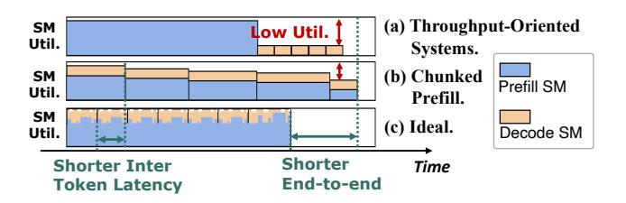

**Figure 1.** Request-level computation of throughput-oriented systems (top), chunked prefill (middle) and ideal (bottom).

computational resources and memory bandwidth. The dynamic nature of workload patterns further exacerbates this imbalance, forcing GPUs to alternate between these complementary resource utilization states. Moreover, the distinct characteristics of the two phases inherently introduce a **throughput-latency tradeoff** [3]. For example, throughput-oriented systems [70] (Figure 1a) prioritize the prefill, which thus increases the size of subsequent decode batches. While this improves throughput, it also penalizes latency, since prefill operations monopolize GPU resources. Therefore, an optimized system necessitates fine-grained control to balance throughput and latency while maintaining high GPU utilization, and is non-trivial to achieve.

Prior attempts have sought to address phase imbalance either by disaggregating prefill and decode across different GPUs [27, 53, 79], or by co-locating them on the same device [19, 43, 60, 78]. Prefill-decode disaggregation, however, require careful tuning of GPU allocations for each phase tailored to specific workload patterns [27], and struggle to reconfigure quickly under fluctuating request loads [79]. Furthermore, they impose heavy demands on high-bandwidth interconnects to support frequent state migration [55], significantly restricting the deployment scenarios of limited inter-node bandwidth or reinforcement learning rollout [57]. In practice, chunked prefill [3] (Figure 1b) has been pervasively adopted in production systems [19, 43, 60, 78]. This method leverages a fixed token budget to combine prefill and decode requests into hybrid batches, with longer sequences being partitioned into chunks to fit within capacity. While tunable chunk sizes provide a degree of latency control, the approach inevitably compromises throughput [3, 54]. Smaller chunk sizes often underutilize GPU capacity, while larger ones negate latency improvements, reflecting the inherent trade-off in balancing throughput and latency.

This paper targets inefficiencies in prefill-decode co-location schemes and reveals the critical hardware underutilization in existing systems through measurements and theory. First, wave quantization [18] and attention inefficiencies remain significant for widely-used chunk sizes (§2.2) despite optimized implementations [26, 48, 69]. Second, the throughput-latency tradeoff in chunked prefill exhibits sub-linear scaling with chunk sizes that prolongs execution time for successive chunks, ultimately incurring cascaded request queuing (§2.3). While spatial sharing has the potential to exploit the natural complementarity between compute-intensive prefill and memory-bound decode phases through concurrent execution (Figure 1c), effective orchestration is required to guarantee service level objectives (SLOs).

To address the suboptimal balance between latency and hardware efficiency, we present Bullet, an LLM serving system that saturates GPU resources through **spatial-temporal orchestration with fine-grained resource provisioning**. Bullet disaggregates prefill and decode in a single GPU, proactively monitors request progress and dynamically

<span id="page-1-0"></span>**Table 1.** Comparison of GPU-sharing LLM serving systems (SBP: SM-budget partitions, RF: re-partition frequency, CAM: contention-aware modeling, SG: scheduling granularity).

| System        | SBP         | RF | CAM          | SG      |
|---------------|-------------|----|--------------|---------|
| MuxServe [29] | Static      | /  | ×            | Request |
| NanoFlow [80] | Static      | /  | ×            | Chunk   |
| Semi-PD [37]  | Dynamic     | s  | $\checkmark$ | Request |
| Drift [25]    | Pre-defined | ms | ×            | Layer   |
| Bullet        | Dynamic     | ms | ✓            | Layer   |

adjusts resource provision to sustain high utilization while satisfying latency requirements. Despite GPU sharing for *independent* workloads with varying latency constraints [13, 35, 59, 63, 75, 76] have been extensively studied, Bullet tackles the unique challenges of co-locating *dependent* prefill and decode with a balance of time-to-first-token (TTFT) and time-per-output-token (TPOT). Table 1 summarizes the key features of GPU-sharing LLM serving systems.

First, an accurate performance model accounting for interphase contention under varying streaming multiprocessor (SM) budgets is critical to achieve optimal resource provisioning. Due to the dynamic batch sizes in LLM serving, the performance model exhibits exponential parameter combinations and non-linear characteristics. Existing general-purpose estimators [13, 59, 76] necessitate extensive profiling to accurately model contention. Meanwhile, LLM-specific ones are simplified as empirical profiling in NanoFlow [80], or queuing model [33] in Semi-PD [37]. In contrast, we quantify resource behavior, including compute, memory and network bandwidth, versus SM budgets. Based on the insights, we propose SM-scaling roofline model (§3.2), achieving high accuracy with few samples and profiling overhead.

Second, designing an efficient scheduler to determine the optimal SM-budget to balance TTFT and TPOT is challenging, particularly when navigating the complex, non-linear relationship between performance and SM budgets. The scheduler must be reactive to system state and request rate fluctuations to rapidly provision SMs. Bullet's SLO-aware scheduler (§3.3) achieves this by monitoring these operational states and dynamically determining the optimal SM partition in a layer-wise fashion.

Third, this fine-grained orchestration and high-frequency SM re-partitioning requires low runtime overhead. The interdependent prefill and decode instances further create unique challenges in both the control and data plane. Bullet addresses this issue by proposing concurrent execution engine (§3.4) that enables asynchronous CPU control flow and GPU execution. The engine incorporates non-intrusive model instrumentation to monitor execution progress and real-time scheduling with microsecond-level overhead. We open source Bullet at https://github.com/zejia-lin/Bullet.

In summary, the paper makes the following contributions:

- We identify the inefficiencies that hinder GPU utilization in existing LLM serving systems while navigating throughput-latency tradeoffs, and systematically analyze opportunities for boosting utilization.
- We establish accurate modeling for spatial-temporal shared phases, and introduce fine-grained control mechanisms for latency-aware resource provisioning.
- We design and implement an LLM serving system to effectively integrate the proposed techniques into readily available frameworks.
- Experimental evaluations on real-world workloads show that Bullet outperforms state-of-the-arts in both latency and throughput while achieving significantly higher GPU utilization.

# 2 Background and Motivation

## 2.1 LLM Computational Workflow

Recent LLMs [32, 50, 68] are mainly built by stacking Transformer blocks [62], with each containing four core components: QKV-projection layer, self-attention computation, Output-projection layer and multi-layer perception (MLP). These components are primarily implemented through general matrix multiplications (GEMMs), with element-wise operations interspersed between layers. Among them, the self-attention specifically operates on query, key, and value matrices produced by the QKV-projection. Its computational efficiency has been significantly enhanced through optimized kernel implementations like FlashAttention [26].

The LLM inference pipeline operates through two distinct computational phases. During the initial prefill phase, the system processes all input tokens in parallel to generate the first output token, with the latency measured as time-to-first-token (TTFT). This compute-intensive stage performs full attention computations across the entire sequence while building the KV cache to store intermediate key-value states. Subsequently, the decode phase generates tokens sequentially, with each iteration consuming only the most recent output token to produce the next. The average iteration latency is termed time-per-output-token (TPOT). Unlike prefill, this memory-bound phase primarily retrieves data from the KV cache and performs relatively lightweight computations for the current token's transformations.

## <span id="page-2-0"></span>2.2 GPU Utilization in LLM Serving

## 2.2.1 Execution Model and Theoretical Performance

**Bound.** Modern GPUs employ a hierarchical architecture with hundreds of streaming multiprocessors (SMs), each containing general-purpose cores and specialized matrix units like Tensor Cores [17]. GPU's grid-block-thread programming model [21] aligns with this architecture, where kernels are organized into grids of thread blocks (TBs) that each manage thousands of cooperating threads. Upon kernel launch, it enters an asynchronous task queue (termed

stream in CUDA[21]) for scheduling. The hardware scheduler retrieves kernels from these queues and dispatches them across SMs, enabling the concurrent kernel execution (CKE) [31, 49, 64] from different streams when required resources are satisfied.

During execution, multiple TBs can reside on the same SM to share its registers, shared memory, and thread slots. The TBs per SM can be obtained via hardware vendor's runtime APIs [4, 21]. The SM executes the warps (32-thread groups) in successive waves to interleave different instructions and maximize hardware utilization. However, if the number of TBs is not evenly divisible by the number of SMs, a workload imbalance situation called wave quantization [18, 44, 77] occurs. Some SMs finish early and remain idle while waiting for others to complete the tail wave. Formally, given a kernel with q TBs, N SMs, and b TBs per SM, the kernel demands  $w = [q/(b \cdot N)]$  waves to complete. In the final wave, the TBs are distributed unevenly due to Most-Room Policy [7, 31], resulting in only  $tail = [q/b - N \cdot (w - 1)]$  SMs active. Therefore, the corresponding ratio of idled SM cycles can be quantified as idle = (N - tail)/(Nw).

GPU kernels typically use power-of-2 grid sizes to match data dimensions, but this conflicts with non-power-of-2 SM counts in GPUs. For example, 108 for Nvidia A100 [16] and 132 for H100 [17]. Therefore, wave quantization remains an open issue [42, 51] across diverse kernels. This inefficiency is particularly pronounced in Transformer's self-attention [26, 62] and small-shaped GEMMs for short input sequences or small *chunked prefill-sizes* (§2.3.1) [3]. Additional underutilization causes arise from memory-bound kernels, such as LLMs' decode phases and element-wise operators, which idle compute resources during frequent memory accesses.

<span id="page-2-2"></span>2.2.2 LLM Kernel Characteristics. We quantify LLM serving efficiency by analyzing execution time (Figure 2a), hardware utilization (Figure 2b,c), and the theoretical waste caused by wave quantization (Table 2). The experiments are conducted on the platform detailed in Section 4.1. While MLP operations achieve up to 92% compute utilization, complete Transformer layers sustain only 70%-76% due to compounding inefficiencies. For shorter sequences, severe wave quantization in GEMMs creates substantial underutilization, as evidenced by the O-proj's measured 49% and 70% utilization, respectively. This result closely agrees with the theoretical bound of 59% and 79% (100%-idle\_ratio in Table 2). Although

<span id="page-2-1"></span>**Table 2.** Theoretical SM idle ratio (%) caused by wave quantization effects, normalized to kernel/layer's execution time.

| Seq. Len. | QKV  | Attn | O    | MLP  | Layer's Total |
|-----------|------|------|------|------|---------------|
| 1024      | 11.1 | 21.0 | 40.7 | 13.0 | 19.4          |
| 2048      | 11.1 | 5.2  | 21.0 | 7.6  | 10.4          |
| 4096      | 11.1 | 5.2  | 5.2  | 7.6  | 9.1           |
| 16384     | 1.9  | 0.2  | 0.2  | 0.4  | 0.5           |

<span id="page-3-2"></span>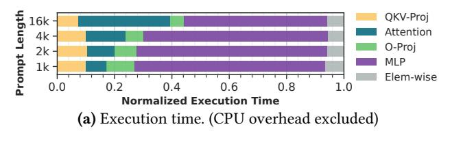

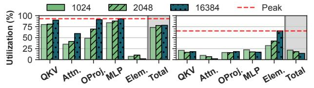

(b) Compute utilization. (c) Memory bandwidth utilization

**Figure 2.** Breakdown of execution time and hardware utilization in the prefill phase of Llama-3.1-8B model on Nvidia A100 GPU. The aggregate utilization per layer remains below peak sustainable capacity (red line).

the results are highly dependent on vendor-implemented libraries [48], wave quantization remains significant for popular chunk sizes. For attention kernels, paged attention mechanism [43] forces the kernel to indirectly access KV cache through indices. Therefore, attention exhibits much lower utilization than GEMM even with optimized implementations [26, 69], which is also observed by recent industrial practices [27, 58]. Together, the effects of wave quantization and attention bottleneck create persistent performance gaps between the theoretical peak and the achieved throughput. These gaps remain substantial regardless of sequence length, inherently constraining overall system efficiency.

2.2.3 GPU Resource Provisioning and Sharing. Naturally, compute- and memory-bound kernels are suitable to co-execute on GPUs, saturating both compute and bandwidth resources [13, 35, 59, 75]. The complementary nature of the prefill and decode phases makes them ideal for such concurrent execution. Since LLM serving systems generally necessitate adherence to service-level objectives (SLOs) of predefined latency requirements [3, 53, 79], predictable and controllable execution time over the two phases is demanded. However, current GPUs lack deterministic concurrent scheduling controls [6, 41, 49], forcing users to carefully provision resources for kernels to achieve reliable overlap [59, 75, 76]. While modern GPUs provide compute resource partitioning through Nvidia's multi-process service (MPS) [22], precise kernel management is still required to ensure effective resource sharing while meeting SLO requirements. Figure 3 demonstrates that prefill scales near-linearly with SM count, while decode exhibits super-linear scaling. This suggests potential throughput gains from concurrent execution with properly balanced SM allocation.

**Takeaway 1**. GPUs remain underutilized even during computeintensive prefill. While co-locating prefill and decode saturates the resources, precise resource provisioning to orchestrate the two phases is demanded.

## <span id="page-3-0"></span>2.3 Biased Throughput-Latency Tradeoff

<span id="page-3-1"></span>**2.3.1** Chunked Prefill Workflow. As shown in Figure 4, chunked prefill [3] achieves low TPOT by leveraging a fixed token budget to concatenate the prefill and decode tokens into a *hybrid batch*, executing in a lockstep fashion (2). Given a chunk size of cs, the hybrid batch is first filled with ds active decode requests first, and allocates the remaining cs - ds tokens to the prefill sequences. Sequences sl exceeding this residual capacity are split into chunks, leaving residual tokens processed in subsequent iterations. Therefore, the prefill completion requires  $N = \lceil sl/(cs - ds) \rceil$  iterations. This forces  $N \cdot (N+1)/2$  times KV cache reloads as each new chunk *must* reprocess previous chunks' cached states.

Due to the lock-step execution of the hybrid batch, a smaller chunk size effectively decreases TPOT at the cost of increased TTFT and degraded system throughput [3], while larger chunks exhibit the opposite effect. Previous works [3, 80] recognize these inherent tradeoffs and propose tuning chunk size based on workload's prefill-to-decode time ratio through manual tuning or automatic searching [2, 11].

<span id="page-3-5"></span>2.3.2 Sub-optimal Hardware Utilization. Despite the throughput-latency tradeoff has been extensively studied, we highlight that such a tradeoff is biased, and the resulting performance degradation remains overlooked. First, as discussed in §2.2.2, chunked prefill typically uses suboptimal chunk sizes below GPU-saturating levels to prioritize low latency. This produces severe wave quantization effects [51], creating GPU bubbles (Figure 4-1). Second, redundant KV

<span id="page-3-3"></span>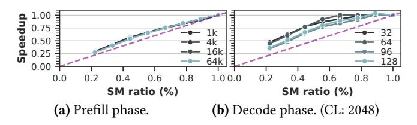

**Figure 3.** Speedup of using partial SMs normalized to using full GPU. (Purple dashed line: linear scale.)

<span id="page-3-4"></span>

**Figure 4.** Kernel-level workflow of existing systems featuring chunked (top) and uncoordinated sharing (bottom). Both suffer from biased throughput-latency tradeoff.

<span id="page-4-0"></span>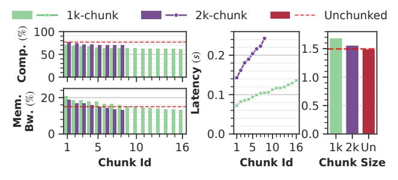

- (a) Hardware utilization.
- (b) Per-chunk and total latency.

**Figure 5.** GPU utilization and latency for 1k and 2k chunk sizes, showing performance degradation compared to the unchunked baseline.

cache reloads required for long sequences significantly prolong attention computation time (③), further reducing GPU utilization. **Third**, these factors collectively inflate TTFT, triggering a cascading congestion effect in which queued requests stall while awaiting prefill completion, degrading overall system throughput.

Figure 5 systematically quantifies the performance degradation of chunked prefill of a 16k-token sequence prefill even without hybrid batching decode requests. For 1k chunk size, a progressive 10% drop in compute efficiency (from 71% to 61%) across successive chunks is witnessed in Figure 5a, which falls substantially below the 77% achievable peak. This under-utilization stems from redundant KV cache reloading in chunked attention, which also causes the final chunk's processing time to be 1.9× that of the initial chunk. Consequently, per-chunk latency scales linearly with chunk counts and increases total prefill latency by 1.13× compared to unchunked execution. While a larger chunk size of 2k partially mitigates utilization drops from -18% to -7%, the average per-chunk latency increases by 1.86×, significantly diminishing the TPOT improvements that motivated chunked prefill. This fundamental tension between maintaining high hardware utilization and minimizing TPOT poses an intractable optimization challenge for chunked prefill.

# **2.3.3 Existing Optimizations.** Despite recent optimizations of chunked prefill, the technique remains intrinsically

<span id="page-4-1"></span>

**Figure 6.** Dynamic spatial-temporal orchestration of concurrently executed prefill and decode tasks.

limited. PodAttention [54] fuses prefill and decode attention kernels to accelerate hybrid-batch attention, yet this operator-specific optimization does not mitigate the fundamental latency penalties imposed by chunking (§2.3.2). Nanoflow [80] designs a fixed-size pipeline that uses CUDA streams to overlap chunked attention and linear layers with careful inter-kernel synchronizations. However, the latency of chunked attention grows by successive chunks, which eventually eliminates the chances of overlapping. Apart from chunked prefill-based approaches, MuxServe [29] (Figure 4) decouples prefill and decode phases into separate processes, leveraging MPS [22] with manually configured, fixed SM quotas to enable spatial sharing. This coarse-grained static partitioning leads to unpredictable latency despite saturating the GPU. Therefore, neither solution fully resolves the throughput-latency tradeoff under varying serving demands.

**Takeaway 2**. Both chunked prefill and uncoordinated spatial sharing exhibit skewed throughput—latency tradeoffs. This urges for a fine-grained yet predictable execution mechanism for optimal LLM serving performance.

### 2.4 Opportunities and Challenges

To address the inefficiencies discussed above, an inter-phase orchestration system is demanded to achieve optimal latency-throughput balance while maximizing GPU utilization, as illustrated in Figure 6.

Concurrent Schedule and Execution. Co-executing prefill and decode eliminates redundant KV-cache reloads and fully utilizes GPU resources, but sustaining latency targets demands real-time request monitoring and kernel scheduling that respond to execution progress and system state. A layer-level, SLO-aware scheduler must tightly control execution advance to avoid inter-phase resource competition. While LLM online serving further requires low-overhead control plane and support for rapid reconfiguration, rendering these challenges non-trivial.

**Optimized Resource Provision.** By carefully partitioning available SM resources, memory-bound decode kernels may efficiently co-execute with compute-intensive prefill kernels. However, LLM's multi-dimensional nature of input parameters and dynamic inter-kernel contention creates a complex optimization space. This necessitates precise latency modeling across varying SM provisions and efficient exploration algorithms to identify optimal configurations.

SLO-aware Rapid Re-configuration. In response to runtime workload dynamics, resource allocation between prefill and decode phases must be re-configured. These frequent adjustments demand near-zero-overhead reconfiguration to maintain efficiency. Although MPS [22] offers context APIs [21] to adjust different SM quotas, it incurs significant memory overhead when applied to LLM serving scenarios due to dynamic inputs. An even more lightweight approach is demanded to maintain for instantaneous switching between optimized resource partitions.

# 3 Design

## 3.1 Overview

Figure 7 illustrates Bullet's workflow for concurrent prefilldecode execution with dynamic and fine-grained resource provisioning, with all components operating at microsecondlevel overhead. Bullet comprises four key components around the scheduling, resource partitioning and execution: performance estimator, SLO-aware task scheduler, resource manager, and concurrent execution engine. The performance estimator (§3.2) **1** first builds an analytical model for the served LLM, augmented with lightweight offline samples. The model provides precise latency predictions across different configurations of co-executing prefill and decode batch sizes under varying resource allocations. At runtime, the SLO-aware task scheduler (§3.3) acts as the central coordinator to enable GPU sharing between prefill and decode tasks via spatialtemporal scheduling. During every layer-wise scheduling cycle, the scheduler **2** proactively retrieves system status from the concurrent execution engine (§3.4), monitoring request progress and 3 evaluating potential SLO violations by performance estimator. Observed statistics are also used to refine the performance estimator online. The scheduler rapidly searches for **4** an optimal resource configuration and scheduling decision that maximizes throughput while ensuring SLO compliance. Computational resource manager is 6 triggered for lightning resource reconfiguration when necessary. Finally, the prefill and decode kernels are 6 launched concurrently on the provisioned SMs. Bullet dynamically balancing the competing demands of TTFT and TPOT maintains high utilization with negligible overhead.

## <span id="page-5-0"></span>3.2 Performance Estimator

<span id="page-5-5"></span>**3.2.1 Problem Formulation.** For a given LLM and hardware, the latency of co-executed prefill and decode is determined by six factors, termed as Execution State (ES): prefill sequence length ( $sl_i$ ), batch size (pbs) and number of allocated SMs (pm), alongside decode context length ( $cl_i$ ), batch size (dbs) and SMs (dm). Enumerating the millions of ES combinations for profiling is infeasible. Therefore, we build a lightweight analytical model with a minimal profile and runtime overhead. First, we propose SM-scaling

<span id="page-5-1"></span>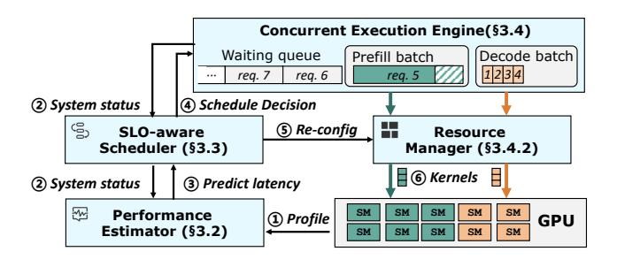

Figure 7. Workflow of Bullet. (Numbers: dataflow order.)

roofline model (SRM) to derive single kernel latency under partitioned SMs without interference. Second, memory-subsystem contention is quantified when concurrent kernels are isolated in distinct SMs. Finally, the model is augmented with minimal sampled data for calibration. At runtime, the model executes within microseconds and continuously refines with online statistics.

**3.2.2 SM-scaling Roofline Model (SRM).** We examine the performance of compute, memory access, and network communication when only  $N_p$  of the SMs are available. Theoretical compute performance scales linearly as  $C_p = C_{peak} \cdot N_p/N$ . Memory and network bandwidth exhibit proportional scaling until reaching inflection points  $N_d$  and  $N_w$ , where the SMs generate sufficient traffic to saturate the respective peak bandwidth  $D_{peak}$  and  $W_{peak}$ . Figure 8a illustrates the throughput of a memory-copy kernel, showing the inflection points of Nvidia A100 and H20 GPUs.

Given a kernel with  $flop_k$  operations and  $mem_k$  bytes of memory transactions, we construct an SM-scaling roofline model (SRM) in Equation 1 to estimate the theoretical latency on  $N_p$  SMs. In the example of Figure 8b, the memory bandwidth inflection point  $N_d = 30$ . When using 54 SMs, the attainable memory bandwidth remains at its peak, maintaining the original roofline slope while lowering the plateau. For 20 SMs, both the slope and plateau decline.

<span id="page-5-3"></span>
$$\begin{cases} T'_{k,p} = flop_k \cdot \min \left( flop_k / mem_k \cdot D_p, C_p \right)^{-1} \\ C_p = C_{peak} \cdot N_p / N; \ D_p = D_{peak} \cdot \min(1, N_p / N_d) \end{cases}$$
 (1)

For each Execution State ES, we compute the arithmetic intensity of every LLM kernel with llm-viewer [72], apply SRM to obtain its baseline latency  $T'_{k,p,ES}$  on Np SMs, and aggregate these values to yield the total LLM latency  $T'_{p,ES}$ . Since practical execution rarely matches the roofline bound, Equation 2 derives a scaling factor for calibrating SRM:

<span id="page-5-4"></span>
$$\alpha_{p,ES} = T_{p,ES}^{\text{measured}} / T_{p,ES}'$$
 (2)

The factor is then extrapolated to unmeasured configurations, since the utilization pattern is near-linear between similar kernel inputs [10, 13, 71]. As shown in Figure 9, only two samples are sufficient to model the decode latencies by varying SMs. This demonstrates effective estimation aligned with kernel characteristics without extensive profiling.

<span id="page-5-2"></span>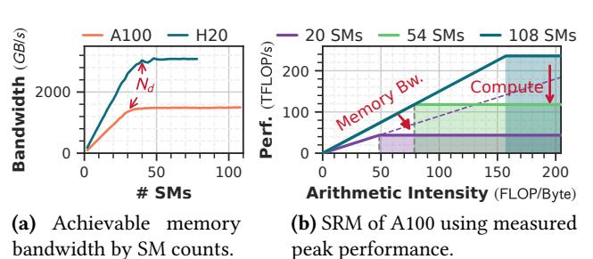

**Figure 8.** Modeling peak performance by number of SMs.

<span id="page-6-1"></span>


**Figure 9.** Calibrating estimated decode latency with only 2 samples.

**Figure 10.** Normalized performance of co-executed upgated and memory copy.

3.2.3 Contention Modeling. When kernels execute on isolated SMs to prevent compute contention, memory subsystem and network contention persist. Identifying each type of contention at kernel-level online is challenging. However, we verify that end-to-end latency remains stable under such interference, even if underlying hardware scheduling and inter-kernel resource competition vary. Extensive evaluation of 7360 concurrent *ES* on A100 (serve Llama3.1-8B [32]) and 8×H20 (serve Qwen3-32B [68]), each repeated for 30 runs, observes that 95% of latency measurements deviate less than ±6.8% from the mean of the respective repeated runs. This tight distribution confirms the stability of end-to-end latency under varying prefill-decode interference patterns, which can be used as a reliable metric for contention modeling.

The worst-case memory subsystem interference can be quantified by co-executing a memory copy kernel on  $N_p$ SMs and an up-gated layer (UG), which is a large-shaped GEMM in LLM, on the residual  $N - N_p$  SMs. This is because prefill and decode kernels typically exhibit lower resource utilization than both UG and memory copy. Figure 10 shows that UG exhibits marginal performance degradation (<8%) when using more than 60% SMs. Therefore, the latency of prefill kernels can be reliably calibrated via Equation 2 with minimal sample size. Conversely, memory-copy throughput decreases as UG sequence lengths grow. To model decode latencies, we measure the attainable bandwidth  $D_{p,sl}$  when concurrently executed with sl-length prefill to update SRM. Equation 2 is then applied for further refinement, since the memory interference pattern scales linearly with kernel utilization characteristics [13, 67].

Inter-phase network contention is low since the traffic scales with either sl or dbs, where dbs is relatively small. The memory subsystem impact of network transfers is inherently lower than memory copy, and prefill-to-decode interference is already accounted for in the end-to-end  $D_{p,sl}$  calibration.

**3.2.4 Profiling and Online Calibration.** During offline profiling, Bullet records compute, memory, and network performance across varying SM counts in a single sweep to construct SRM. It then samples a sparse set of concurrently executed prefill and decode configurations to empirically derive a scaling factor for each sample's end-to-end latency. This avoids time-consuming Nsight Compute [23] profiling

<span id="page-6-2"></span>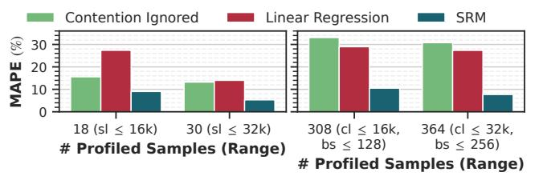

**Figure 11.** Mean absolute relative error (MAPE) of different estimators using diverse numbers of profiled samples and range, validated on 7360 samples.

employed in previous works [13, 59, 76] to precisely model inter-kernel interference. For online prediction, Bullet estimates latency using the SRM and calibrates this initial estimation by interpolating the scaling factor from the premeasured samples. Continuous online data collection for recalibration is straightforward. Leveraging only Equation 2 and linear extrapolation, the runtime overhead for update and prediction is negligible.

Figure 11 validates different estimators profiled using different sample counts and ranges. Employing an established predictor [65] designed for sole-run latency estimation (contention ignored bar) significantly degrades the accuracy of decode latency prediction. This observation is consistent with decode kernels exhibiting higher sensitivity to contention than prefill kernels (Figure 10), underscoring the need for analyzing this inter-phase contention. Furthermore, a linear regression model using the parameters in ES, with quadratic term for pl, proves inaccurate. This failure highlights the highly non-linear relationship among SM budget, contention, and performance. In contrast, SRM maintains high accuracy, even for inputs beyond the sampled range. The mean scaling factor of 1.61, and the profiling overhead remains below one hour. This accuracy-overhead tradeoff is comparable to previous works [13, 59, 74, 76] and enables for reliable real-time scheduling optimization.

#### <span id="page-6-0"></span>3.3 SLO-aware Task Scheduler

**3.3.1 Scheduling Workflow.** Each of the prefill and decode *concurrent execution engine* (§3.4) runs a scheduler autonomously. At every step, the scheduler reads system status from the global metadata buffer (§3.4.1), forecasts latencies with *performance estimator*, and reorders pending requests. Upon detecting potential SLO violations, the scheduler greedily searches for the optimal configuration and invokes *computational resource manager* (§3.4.2) to repartition SMs.

As illustrated in Figure 12, for prefill scheduler, a fixed number of layers is launched per step, and synchronizes for CPU (teal triangle) to make subsequent scheduling decisions. This enables fine-grained control over prefill progress temporally for rapid adaptation to system fluctuations. Conversely, decode scheduler issue kernels as a single CUDA Graph [21] to eliminate the launch overhead of small kernels.

<span id="page-7-2"></span>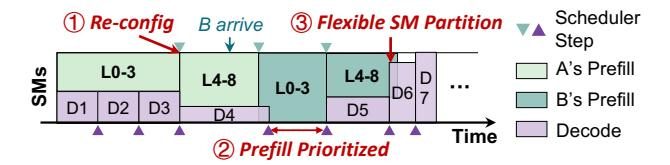

**Figure 12.** Asynchronous scheduler launches layer-wise prefill kernels and step-wise decode graphs, monitoring latencies and dynamically reallocating SMs.

Bullet navigates the *non-linear* SM budget-performance relationship for TTFT-TPOT balance. The primary scheduling objective is to prioritize prefill while respecting decode SLOs, since shorter prefill latency enlarges decode batch size and raises system throughput [3]. During concurrent operation, the decode phase is provisioned with the minimum SM counts that satisfy SLO. As the final prefill layer approaches completion, additional SMs are allocated to the decode phase to facilitate a smooth transition between co-running prefill/decode and decode-only. During reconfiguration, Bullet eliminates inter-phase synchronization by partially sharing SMs between phases rather than idling unused resources. Although a perfect non-overlapping allocation is challenging, layer-wise prefill scheduling confines such compute resource interference to minimal, predictable regions.

## 3.3.2 Request Scheduling and Resource Provisioning.

To facilitate SLO-aware scheduling, Bullet monitors the system state defined as S = (ES, PS, RS), where ES denotes the execution state (§3.2.1), PS the prefill progress, and RS the per-request latency metrics. Prefill state PS comprises the queuing-request set Q, the in-flight request set P, and the executed layer count  $L_{exe}$ . For every request i, arrival time  $a_i$  and decode-start time  $d_i$  are recorded. At time t, the prefill scheduler estimates GPU execution times for all requests in  $P \cup Q$  under current ES, while the decode scheduler predicts next-step latency and updates the corresponding TPOT. These estimations are then written to the global metadata buffer, allowing each scheduler perceive the holistic state.

Algorithm 1 outlines the prefill scheduler, and the decode scheduler follows analogously. The algorithm continuously monitors execution progress and updates latency estimates (lines 2-4). Requests in the waiting queue are reordered by ascending predicted latency (line 5) when the reordering does not violate TTFT SLOs for pending requests. This reduces average TTFT without starvation. To start a new prefill step (line 10-13), requests are batched until reaching arithmetic intensity limits under the current execution state. When provisioning resources, prefill phase is prioritized and provisioned with more SMs unless TPOT is compromised (line 15). In extreme cases of high request load, the decode phase would be temporarily suspended (Figure 12-②) if TPOT SLO is still met. When both SLOs cannot simultaneously be satisfied, indicating the system is beyond maximum capacity, a

<span id="page-7-4"></span>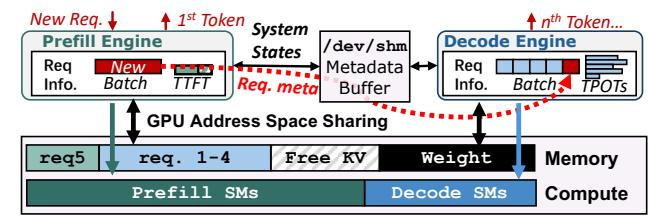

**Figure 13.** Concurrent execution engine with shared KV cache/weight GPU address spaces, exchanging system states and request metadata via OS-managed shared memory.

balanced SM ratio is enforced to limit excessive latency in either phase (line 14).

## <span id="page-7-0"></span>3.4 Concurrent Execution Engine

<span id="page-7-1"></span>**3.4.1 Engine Architecture.** Figure 13 shows the concurrent execution engines for prefill and decode, each residing in a separate process and driven by the corresponding scheduler. Both engines share a CPU buffer and unified GPU memory pool. The CPU buffer is implemented as OS-managed shared memory, storing global system states and employing compact control bits to indicate data availability, thereby enabling low-latency status exchange. For GPU memory management, Bullet employs a dedicated initialization process that allocates model weights and KV cache [43] prior to engine launch. The resulting memory region is shared between

```
Algorithm 1: SLO-aware Scheduling for Prefill
```

```
Input: System state S, TTFT/TPOT SLO \Gamma_p/\Gamma_d
   Output: Next requests & layers to run next_tasks
1 Function Schedule(S):
 2
       ttft \leftarrow \text{EstimateLatency}(S)
       WRITEGLOBALBUFFER(ttft)
 3
       tpot \leftarrow ReadGlobalBuffer()
4
5
       SortByLeastEstimLatency(O)
       if P \neq \emptyset then
6
           satisfy \leftarrow \text{req.ttft} \leq \Gamma_p, \text{req} \in P
 7
            next tasks \leftarrow P
 8
       else
 9
            satisfy \leftarrow P90(ttft) \leq \Gamma_{t}
10
            next \ tasks \leftarrow \emptyset
11
            while ArithInten(next_tasks, S.ES) < peak do
12
                next_tasks.append(Q.pop())
13
       if not satisfy and P90(tpot) > \Gamma_d then
14
            SetBalancedSM(S, ttft, tpot)
15
       else if P90(tpot) \leq \Gamma_d then
16
            ReduceDecodeSM(S, ttft, tpot)
17
       else if P90(tpot) > \Gamma_d then
18
            ReducePrefillSM(S, ttft, tpot)
19
       return next_tasks, L_{exe} + L_{step}
20
```

engines via cudaIpcGet/OpenMemHandle API [21] with no adverse effects as documented. Equivalent facilities, such as AMD's hipIpcOpenMemHandle [4], allow the same design to be deployed on other hardware. Since the address space and metadata are shared, Bullet is fully compatible with existing KV cache and prefix cache optimizations. An atomic lock serializes allocation and deallocation transactions that may be issued concurrently by both engines, ensuring correctness with minimal performance impact.

<span id="page-8-1"></span>**3.4.2** Computational Resource Management. While MPS [22] with CUDA Green Context [20] supports SM partitioning, its memory overhead exceeds 700MB for only 4 static policies in LLM serving [25], rendering it impractical for fine-grained, dynamic control required by Bullet. For flexible, low-overhead SM provisioning, Bullet leverages established SM masking techniques [5, 6]. Specifically, we utilize the libsmctrl\_set\_stream\_mask API to modify the metadata of CUDA stream [21] to constrain all subsequent kernel executions to a specified subset of SMs. Similar interfaces exist on other platforms, exemplified by AMD's hipExtStreamCreateWithCUMask [4], which can be utilized to pre-create multiple streams with masks [56] to mitigate SM partitioning overhead.

Bullet creates a CUDA stream in each *concurrent execution engine* for prefill and decode. Whenever the scheduler issues a repartitioning command, the system immediately invokes the libsmctrl API to reconfigure the corresponding stream, thereby restricting all subsequent kernels to the newly provisioned SMs. This instantaneous configuration (Figure 12-①③), supports rapid adaptation to dynamic system states with flexible SM allocation. Section 4.3.3 validates that this on-demand setting adds only microsecond-level runtime overhead and zero additional memory footprint.

**3.4.3 Execution Workflow.** The prefill engine's execution begins with receiving requests and follows the scheduling workflow in §3.3, retrieving decode-side states from the buffer, such as batch size and TPOTs. Once prefill completes, the request migrates to decode without KV-cache transfer, and only metadata is asynchronously sent to the decode engine via ZeroMQ [73], enabling microsecond overhead. The decode engine receives newly prefilled requests and merges them into the current running batch. Output tokens are directly forwarded to the frontend server, eliminating

**Table 3.** Server configurations for experiments.

<span id="page-8-2"></span>

| GPUs/Node   | #SMs/GPU | Intra-node<br>Bandwidth | Inter-node<br>Bandwidth |  |
|-------------|----------|-------------------------|-------------------------|--|
| 8×A100-80GB | 108      | 20 GB/s                 | N/A                     |  |
| 8×H100      | 132      | 600 GB/s                | N/A                     |  |
| 8×H20       | 78       | 400 GB/s                | 200GB/s                 |  |

any CPU involvement by the prefill engine. Bullet's control plane works independently while proactively communicating through the buffer, unblocking both CPU and GPU execution. This decentralized architecture allows concurrent kernel submissions while eliminating the need for frequent synchronization compared with a centralized architecture. We implement Bullet on top of SGLang [78] v0.4.6 and Py-Torch 2.6.0 with 4100 lines of Python code, and integrate a modified libsmctrl [5] library to optimize GPU resource allocation within the serving engine. The prefill and decode engines are implemented as SGLang's workers, with MPS [22] enabled for spatial sharing. Bullet relies on libraries' heuristics for optimal kernel hyperparameters under varying SM budgets, rather than re-implement and tune custom kernels [80]. These libraries provide highly efficient, optimized implementations, and the profiling already encapsulates the SM budget-kernel performance relationship.

# 4 Experimental Evaluation

## <span id="page-8-0"></span>4.1 Methodology

Models and Platforms. Experiments are conducted on three servers in Table 3 with CUDA 12.4. We evaluate dense model Llama3.1-8B/70B [32] and MoE model Qwen3-235B-A22B-FP8 [68]. All multi-GPU setups use tensor parallelism, which is commonly employed in production deployment [27, 68] and prior studies [3, 43, 80].

**Evaluated Schemes.** We compare Bullet against several state-of-the-art systems of chunked prefill-based optimization: SGLang [78] v0.4.6 (1024/2048-chunk) with FlashInfer [69] v0.2.7, vLLM [43] v0.8.5 (1024-chunk), and Nanoflow [80] (1024-chunk) that employs GPU spatial-sharing for optimization. We also include *xPyD* disaggregated-prefill with SGLang backed by MoonCake [55] in multi-GPU evaluation.

Workloads Three representative datasets are used for evaluation, whose request arrivals follow a Poisson process aligned with previous works [3, 43, 80]. Figure 14 details the cumulative distribution function (CDF) of the datasets' sequence length. The ShareGPT [61] contains real-world conversational data, Azure-Code [53] is a production code

Table 4. Workload latency requirements.

<span id="page-8-4"></span>

|            | ShareGPT | Azure-Code | e arXiv-Sum |  |
|------------|----------|------------|-------------|--|
| norm. TTFT | 3.0 ms   | 1.5 ms     | 1.5 ms      |  |
| TPOT       | 150 ms   | 200 ms     | 175 ms      |  |

<span id="page-8-3"></span>

Figure 14. Workload input/output length CDF.

<span id="page-9-0"></span>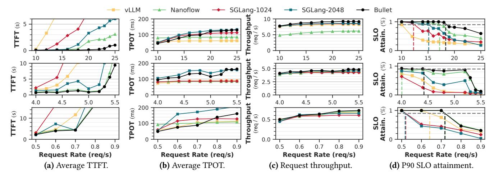

**Figure 15.** Performance comparison of ShareGPT (top row), Azure-Code (middle) and arXiv-Summary (bottom) of Llama3.1-8B on an A100 GPU. Bullet achieves the highest throughput and SLO compliance across all workloads, attributed to remarkably decreased TTFT with modest TPOT increments.

completion trace released by Azure, and arXiv-Summary [15] is long-context summarization.

**Metrics.** We report TTFT, TPOT and throughput. For SLO compliance measurement, we define prefill and decode latency that satisfy both the constraints listed in Table 4, aligning with previous works [65, 79, 80]. Request rate is scaled by the number of GPUs for disaggregated-prefill [65, 79]. Due to the variation in sequence length, we use *normalized input/generation latency* established previously [65, 80] for SLO. We collect hardware metrics using Nsight Systems [24].

#### 4.2 End-to-End Performance

4.2.1 Single GPU Performance. Figure 15 evaluates four baselines and Bullet across three real-world workloads on an A100 GPU using Llama3.1-8B [32]. Bullet demonstrates consistent throughput improvements, achieving 1.09× average and up to 1.20× higher throughput compared to SGLang-1024. Overall, Bullet maintains superior prefill latency enhancement (13.5×) with acceptable TPOT (0.94×) in average through dynamic SM allocation, translating to 1.86× endto-end speedup compared with SGLang-1024. Bullet also achieves a better TTFT-TPOT trade-off over chunked prefill, evidenced by reduced TTFT and TPOT versus SGLang-2048. In contrast, all the chunked prefill-based systems exhibit unacceptable TTFT degradation even in a low request rate. For example, on the ShareGPT workload, with a request rate of 20req/s, the prefill latency ranges from 1.8s (Nanoflow) to 14.9s (vLLM). The key reason is that chunk prefill limits the system's capability to process the prefill phase (§2.3.2) on high load and creates a cascading queuing delay. However, Bullet mitigates such congestion by adaptively adjusting SM partitions, which is further demonstrated in Figure 20.

For tail latency distribution, Figure 15d presents the P90 SLO attainment rate, Figure 16 shows the median and P90

latencies of ShareGPT workload. By eliminating the bottlenecks through SM allocation and adaptive scheduling, Bullet achieves mean TTFT of 0.16s and P90 tail latency of 0.31s, which is 54.9× and 78.5× better to SGLang-1024. The lower prefill latency remarkably translates to larger decode batches that boost overall throughput and SLO compliance (1.49×). Bullet effectively balances the throughputlatency tradeoff that is skewed in chunked prefill systems. While SGLang-2048 demonstrates a 3.20× TTFT improvement and 1.18× higher throughput than SGLang-1024, the 2048 chunk suffers from 0.78× worse TPOT on average, confirming the imbalanced tradeoff inherent in chunked prefill. Bullet breaks this paradigm by simultaneously achieving both lower TTFT  $(4.2\times)$  and better TPOT  $(1.20\times)$  than SGLang-2048 through exploiting GPU utilization via concurrent prefill-decode execution. While Nanoflow achieves 2.37× longer TTFT and 0.86× shorter TPOT than Bullet via static kernel overlapping pipeline, it still suffers from the inherent limitations of chunked prefill that inflate TTFT tail latency. This results in 5.2% lower SLO compliance and 20.0% lower throughput compared to Bullet.

<span id="page-9-1"></span>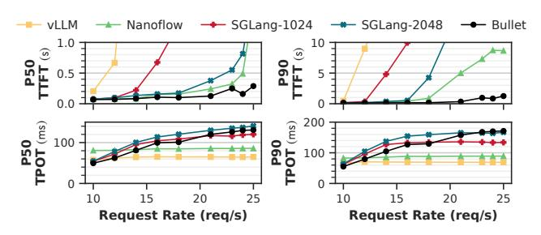

**Figure 16.** Median and P90 latencies of TTFT and TPOT on ShareGPT workload.

<span id="page-10-1"></span>

**Figure 17.** Mean normalized generation latency of Llama3.1-70B served on 8×A100. Bullet sustains higher request rates while remaining within the SLO constraint.

<span id="page-10-2"></span>

**Figure 18.** Mean normalized generation latency of various models across different hardware serving Azure-Code.

**4.2.2 Multi-GPU Performance.** Figure 17 depicts the generation latency of Bullet when Llama3.1-70B is deployed across eight A100 GPUs, with vLLM and SGLang using a chunk size of 2048. On the ShareGPT workload at 3.0 req/s, Bullet achieves a mean latency of 173 ms/token (223 ms/token for P99), whereas vLLM and SGLang attain 207 ms/token and 319 ms/token, respectively. For the Azure-Code dataset, where input lengths are significantly longer, Bullet's advantages is more pronounced, sustaining 203 ms/token at 0.5 req/s. In contrast, vLLM and SGLang already exhibit 213 ms/token and 291 ms/token at a lower rate of 0.3 req/s.

Figure 18 shows that on H100 GPUs, the elevated memory bandwidth mitigates chunked-prefill overhead, yet Bullet continues to outperform SGLang and vLLM. Bullet's concurrent handling of prefill and decode tasks leverages potential overlaps between computation, communication and memory operations with fine-grained SM control between phases. We also demonstrate Bullet's generalization to other LLMs on H20 GPUs. For the highly sparse, FP8-quantized MoE Qwen3-235B-A22B, chunked prefill's inherent lock-step batching impedes both prefill and decode speeds, while 1P1D is insufficient to exploit disaggregated-prefill fully. However, Bullet orchestrates the two phases effectively, achieving comparable performance against the heavy-weight 3P1D deployment. At 4.0 req/s, Bullet delivers 110 ms/token, with 1.4s TTFT and 45ms TPOT, respectively, which are  $17.7\times$ ,  $16.2\times$ , and  $4.2\times$  lower than vLLM.

We further evaluate Bullet on a production cluster serving retrieval-augmented generation (RAG) [45] workloads. As illustrated in Figure 19, Bullet consistently delivers lower TTFT and end-to-end latency compared to both chunked prefill and 6P1D, a small-scale disaggregated-prefill configuration. While large-scale disaggregation of 30P6D achieves superior inter-token and end-to-end latency, Bullet remains

<span id="page-10-3"></span>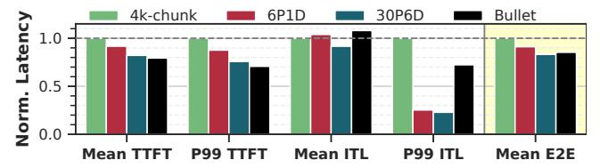

**Figure 19.** Normalized latency on internal production trace.

<span id="page-10-0"></span>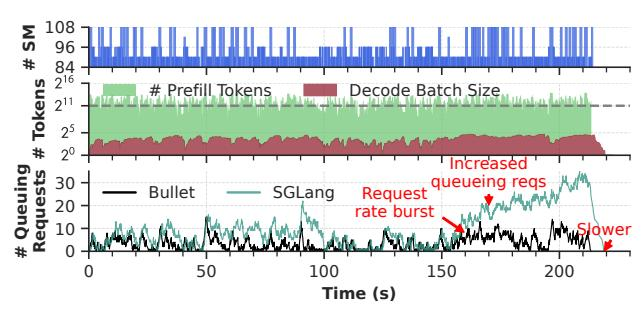

(a) SM allocation for prefill changes dynamically according to system load (top). Concurrently processing tokens/batch size in Bullet (middle). Number of requests waiting for prefill (bottom). Bullet adaptively partitions SMs to avoid request congestion on burst.


**(b)** SGLang's hybrid batch status. Decode requests occupy chunk budget, degrade prefill efficiency, incurring severe queuing time.

**Figure 20.** System serving status of the Azure-Code workload in timeline view (request rate: 5.0 req/s).

highly competitive, offering a more resource-efficient alternative to both chunked prefill and small-scale disaggregated deployments. These results indicate that intra-GPU spatial-temporal orchestration can achieve performance gains previously only accessible through multi-node disaggregation.

#### 4.3 Performance Contribution Analysis

4.3.1 Impact of Dynamic SM Partition. We break down the effectiveness of dynamic resource provisioning in Figure 20 by timeline with the Azure-Code workload (5.0 req/s, Llama3.1-8B). The top row in Figure 20a demonstrates the number of SMs provisioned for the prefill phase, with each bar showing the SM count and duration. On request rate bursts (spikes in Figure 20-bottom), Bullet adaptively sets the number of prefill SMs to use full GPU, and may temporarily delay decode requests. This enables the rapid response to queuing requests, avoiding excessive waiting time. After processing the pending requests, Bullet quickly reconfigures the resources to a balance point for both phases. Instead, chunked prefill-based systems cannot optimize for this scenario, since redundant KV cache accesses inflate prefill speed. Moreover, decode batch shares the token budget with prefill

tokens (Figure 20b), enforcing more iterations to complete a prefill, which further degrades performance. These factors jointly result in  $4.17\times$  longer queuing delay for SGLang-2048. Bullet exempts from the token budget (Figure 20-middle) and orchestrates the two phases with fine-grained resource control to saturate GPU, significantly decreasing both TTFT and TPOT by  $9.15\times$  and  $1.33\times$ , respectively.

**4.3.2 GPU Utilization.** Figure 21 presents hardware utilization measured with Nsight Systems. Despite Bullet introducing increased memory traffic due to independent weight loading during decoupled prefill and decode, this trade-off is advantageous compared to chunked prefill. While chunked prefill idles Tensor Cores during redundant KV cache loading, Bullet maintains their high utilization in concurrent execution. Consequently, Bullet effectively elevates both compute and bandwidth utilization, leading to improved overall performance. From 0s to 27s, when the system concurrently handles prefill and decode requests, Bullet sustains an average of 86.2% active SM cycles, which is 11.2% higher than SGLang. Correspondingly, utilization of Tensor Cores rises by 11.8%, while memory-bandwidth utilization increases by 19.3%. These utilization gains directly reduce the mean end-to-end request latency from 25.8 s to 21.4 s.

<span id="page-11-0"></span>**4.3.3 Overheads.** Table 5 quantifies the CPU overhead of Bullet's key components. Sending and receiving metadata only necessitates serialization and deserialization of Python objects, therefore achieving a mean latency of 0.21ms. The performance prediction module incurs merely  $10.2\mu s$  overhead by simply invoking the analytical model. For GPU resource management, SM masking enables instantaneous reconfiguration with negligible runtime overhead. These designs jointly ensure Bullet's control plane adds minimal latency while enabling fine-grained resource optimization.

## <span id="page-11-5"></span>4.4 Sensitivity Studies

To study the effect of dynamic resource provisioning, we run the workloads under fixed SM configurations for prefill and allow decode to use all SMs, which mimics static sharing systems like MuxServe [29]. The results are reported in Figure 22. The SM-108 configuration (no partitioning) demonstrates severe imbalance in the Azure-Code workload.

<span id="page-11-1"></span>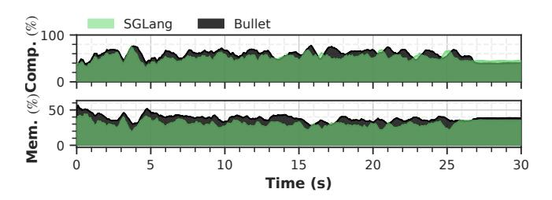

**Figure 21.** Compute and memory bandwidth utilization of a timeslice in ShareGPT workload (20 req/s, Llama3.1-8B).

**Table 5.** Overheads of Bullet's components.

<span id="page-11-2"></span>

|                                       | Mean | Std. | P90  | P99  |
|---------------------------------------|------|------|------|------|
| Metadata Send/Recv (ms)               | 0.21 | 0.44 | 0.89 | 1.54 |
| <b>Performance Predict</b> ( $\mu$ s) | 10.2 | 5.1  | 24.5 | 25.8 |
| <b>Resource Re-config</b> ( $\mu$ s)  | 4.1  | 0.79 | 4.2  | 5.9  |

While achieving low TPOT, SM-108 suffers 1.20× higher TTFT on average and 1.19× worse P90 tail latency compared to Bullet, ultimately reducing throughput and SLO attainment by 13%. Smaller static partitions, like 84 SMs, prove even more problematic, exacerbating latency imbalance with 1.78× worse TTFT even than chunked prefill baselines and reducing throughput by 5.9%. Therefore, there is no optimal fixed SM allocation, as smaller partitions improve TPOT but degrade TTFT and introduce tail latency violations, and vice versa. These results confirm Bullet's dynamic approach, which adaptively orchestrates resources to simultaneously maintain balanced latency targets and maximize throughput.

#### 4.5 Ablation Studies

Figure 23 analyzes the contributions of different components in Bullet by isolating part of the design. Naive: concurrent execution without resource provisioning or scheduling. w/Partition: adds resource provision only. w/Scheduler: Incorporates only request reordering and delayed decode. The Naive design exhibits the expected latency imbalance (§4.4), high TPOT and low TTFT attributed to unpartitioned resource contention. The w/Partition variant improves TPOT for Azure-Code but suffers unacceptable TTFT degradation from its inability to reorder pending requests. Conversely,

<span id="page-11-3"></span>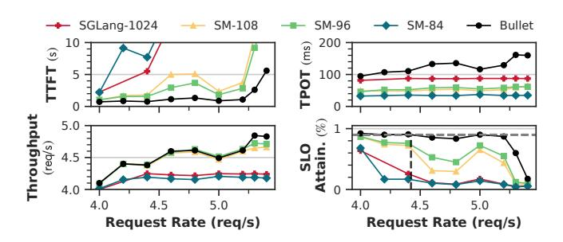

**Figure 22.** Sensitivity study on fixed SM counts for prefill. Static setups cause latency-throughput imbalance: more SMs reduce TTFT but harm TPOT and goodput. Bullet's dynamic SM tuning optimizes both.

<span id="page-11-4"></span>

Figure 23. Ablation study of Bullet.

w/Scheduler maintains comparable latency while reducing Azure-Code TPOT through contention alleviation. Only the complete Bullet design, combining both partitioning and scheduling, achieves balanced latency across all workloads.

#### 4.6 Discussions

While Bullet shows promising improvements, we identify several operational boundaries. First, on low-compute GPUs running dense models, the limited SM budget obliges the decode phase to claim a larger ratio of SMs to saturate memory bandwidth (Figure 8a), slightly tempering concurrentexecution benefits. However, this caveat is immaterial for MoE models, whose lighter compute footprint preserves the full advantage (Figure 18). Second, Bullet's SM isolation policy could be relaxed to partial sharing, yet such exploration is orthogonal to the paper's core contribution of fine-grained spatial-temporal orchestration and can be retrofitted without architectural changes. Third, for specialized architectures like DeepSeek-MLA [27] where disaggregation proves fundamentally advantageous, Bullet's co-located approach may not match dedicated solutions' peak performance. Extending the latency model to cover new attention variants or LoRA adapters [39] is straightforward and left to future work. Bullet's core innovations maintain broad applicability across standard LLM architectures and typical workload distributions while extensible to emerging models.

## 5 Related Works

**LLM Serving Systems.** System-level optimizations for LLM serving have been extensively explored, which can be categorized as prefill-decode co-location and disaggregation. Co-located techniques represented by chunked prefill [3, 80] improve batching efficiency but maintain lockstep prefill and decode phase execution that underutilizes hardware. Disaggregated systems [30, 53, 55, 79] eliminate inter-phase interference but incur costly KV cache migration and load imbalance among prefill-decode instances. Bullet uniquely enables intra-GPU prefill-decode execution, maximizing utilization without overheads while meeting SLOs. Recent intra-GPU sharing proposals for LLM inference remain fundamentally constrained. Nanoflow [80] exploits kernel overlap atop chunked prefill. However, the approach's intrinsic limitations erode gains as sequence lengths increase. MuxServe [29] and Semi-PD [37] rely on static SM allocations, requiring costly engine relaunches for reconfiguration. Drift [25] explores lock-step execution between prefill blocks and decode in gangs using predefined SM partitions. These coarse designs lack the agility required by dynamic workloads. Bullet addresses these shortcomings through adaptive fine-grained resource management, enabling optimal GPU utilization across diverse workloads.

**Concurrent Kernel Execution.** Co-executing kernels with complementary resource demands has been proven to

improve GPU utilization and performance. Spatial-temporal multiplexing techniques [14, 28, 34] typically classify kernels by computational characteristics and latency requirements. These techniques subsequently rely on CUDA streams [21] or the Multi-Process Service (MPS) [22] for kernel submission and execution control. However, these approaches treat the hardware scheduler as a black box, providing limited control [41, 49] over actual execution. While several systems use precise kernel fusion [40, 66] or hardware resource provisioning [13, 59, 63, 75, 76] to enforce predictable scheduling, they focus on co-locating traditional, independent DNN workloads. However, GPU sharing for LLM inference necessitates complex coordination between dependent prefill and decode phases and KV cache management. Bullet distinguishes itself from previous works by fine-grained orchestration of LLM's interdependent phases and layer-level precise resource management.

Kernel Scheduling. Effective scheduling is essential for optimizing concurrent kernel execution. Several general-purpose schedulers [9, 47, 52] automatically resolve kernel dependencies and dispatch kernels into concurrent streams. Latency model-based solutions [13, 59, 75] schedule kernels within latency constraints but rely on excessive offline profiling, which is unsuitable for the dynamic workloads in LLM serving. Although estimating standalone LLM inference latency is well-established [2, 65, 72], the complex interactions between concurrent prefill and decode phases remain unstudied. Existing solutions either rely on simplified models [37] or assume contention-free execution [25]. Bullet addresses this gap by developing a profile-augmented analytical model for performance estimation and refining kernel scheduling mechanisms for LLM serving.

## 6 Conclusion

This paper proposes Bullet to optimize LLM serving through precise GPU resource provisioning. By carefully orchestrating spatial-temporal execution between prefill and decode phases, Bullet effectively saturates wasted GPU resources. At runtime, Bullet employs real-time task progress estimation to optimize scheduling decisions and resource allocation, enabling precise and fine-grained control over layer-level resource quotas. Experimental evaluation confirms consistent latency compliance and substantial throughput gains.

# Acknowledgments

We thank our shepherd, Daniel Wong, and the anonymous reviewers for their constructive and insightful feedback. This work was supported in part by Guangdong S&T Program under Grant No. 2024B0101040005, and by the National Natural Science Foundation of China (NSFC) under grants 62472462 and 62461146204. We also thank the WeChat Group at Tencent for valuable discussions.

# A Artifact Appendix

### A.1 Abstract

Bullet is an LLM serving system that enables intra-GPU prefill-decode disaggregation. Bullet is built on top of SGLang [78] and leverages libsmctrl [5] for SM partitioning. The artifact provides scripts to evaluate Llama3.1-8B [32] on an NVIDIA A100 80GB GPU, serving ShareGPT [61] workload with various request rates.

## A.2 Artifact check-list (meta-information)

- Compilation: CMake 3.17, GCC 10.2.1, CUDA 12.4.
- Model: Llama3.1-8B [32].
- Data set: ShareGPT [61].
- Run-time environment: Debian 5.10.0, CUDA 12.4, Python 3.12.9, PyTorch 2.6.0.
- Hardware: 1 NVIDIA A100 80GB GPU, x86 machine.
- How much disk space required (approximately)?: 20GB.
- How much time is needed to prepare workflow (approximately)?: 10 minutes.
- How much time is needed to complete experiments (approximately)?: 30 minutes.
- Publicly available?: Yes
- Archived (provide DOI)?: 10.5281/zenodo.17937105

## A.3 Description

**A.3.1 How to access.** The source code is available at Github (https://github.com/zejia-lin/BulletServe) and Zenodo (https://doi.org/10.5281/zenodo.17937105).

**A.3.2 Hardware dependencies.** The artifact requires 1 NVIDIA A100 80GB GPU and x86 machine for functional evaluation.

**A.3.3 Software dependencies.** Bullet uses libsmctrl [5] for SM masking, which is included in the csrc/ folder and requires CMake ≥ 3.17 for compilation. Bullet is tested with Python 3.12.9, and lower version may incur unexpected crash. Anaconda and uv is required to create environment and resolve Python dependencies.

**A.3.4 Data sets.** The experiment scripts automatically download the ShareGPT [61] dataset, which is available at https://huggingface.co/datasets/anon8231489123/ShareGPT\_Vicuna unfiltered.

A.3.5 Models. The artifact evaluates Llama3.1-8B [32], which is available at https://huggingface.co/meta-llama/Llama-3.1-8B. Since Hugging Face may require download permissions, users can obtain the model from alternative sources. To reduce setup time, the artifact uses dummy weights, requiring only JSON configuration files to be downloaded.

# A.4 Installation

We use Anaconda to create a Python 3.12.9 environment and uv for package installation. The installation takes several minutes.

cd BulletServe/artifact\_evaluation
bash ./install.sh

## A.5 Experiment workflow

The run\_all.sh script runs the benchmark and plots the figures.

cd BulletServe/artifact\_evaluation
bash ./run\_all.sh

## A.6 Evaluation and expected results

The script saves logs, output JSON result and figures in the results folder. Bullet is expected to achieve lower end-to-end latency compared to SGLang and better TTFT-TPOT balance.

#### References

- <span id="page-13-0"></span>[1] 2022. LlamaIndex. https://github.com/jerryjliu/llama\_index.
- <span id="page-13-6"></span>[2] Amey Agrawal, Nitin Kedia, Jayashree Mohan, Ashish Panwar, Nipun Kwatra, Bhargav S. Gulavani, Ramachandran Ramjee, and Alexey Tumanov. 2024. Vidur: a Large-Scale Simulation Framework For LLM Inference. In *Proceedings of Machine Learning and Systems*, Vol. 6. 351–366. https://proceedings.mlsys.org/paper\_files/paper/2024/file/b74a8de47d2b3c928360e0a011f48351-Paper-Conference.pdf
- <span id="page-13-1"></span>[3] Amey Agrawal, Nitin Kedia, Ashish Panwar, Jayashree Mohan, Nipun Kwatra, Bhargav S. Gulavani, Alexey Tumanov, and Ramachandran Ramjee. 2024. Taming throughput-latency tradeoff in LLM inference with sarathi-serve. In 18th USENIX Symposium on Operating Systems Design and Implementation, OSDI 2024, Santa Clara, CA, USA, July 10-12, 2024. USENIX Association, USA, Article 7, 18 pages. https://www.usenix.org/conference/osdi24/presentation/agrawal
- <span id="page-13-3"></span>[4] AMD. 2025. AMD HIP Runtime API Documentation. https://rocm. docs.amd.com/en/latest/.
- <span id="page-13-8"></span>[5] Joshua Bakita and James H. Anderson. 2023. Hardware Compute Partitioning on NVIDIA GPUs. In 29th IEEE Real-Time and Embedded Technology and Applications Symposium, RTAS 2023, San Antonio, TX, USA, May 9-12, 2023. IEEE, 54-66. doi:10.1109/RTAS58335.2023.00012
- <span id="page-13-5"></span>[6] Joshua Bakita and James H. Anderson. 2024. Demystifying NVIDIA GPU Internals to Enable Reliable GPU Management. In 30th IEEE Real-Time and Embedded Technology and Applications Symposium, RTAS 2024, Hong Kong, May 13-16, 2024. IEEE, 294–305. doi:10.1109/ RTAS61025.2024.00031
- <span id="page-13-4"></span> Joshua Bakita and James H. Anderson. 2025. Hardware Compute Partitioning on NVIDIA GPUs for Composable Systems. In 37th Euromicro Conference on Real-Time Systems, Vol. 335. Schloss Dagstuhl

   Leibniz-Zentrum für Informatik, Dagstuhl, Germany, 21:1–21:25. doi:10.4230/LIPIcs.ECRTS.2025.21
- <span id="page-13-2"></span>[8] Nidhi Bhatia, Ankit More, Ritika Borkar, Tiyasa Mitra, Ramon Matas, Ritchie Zhao, Maximilian Golub, Dheevatsa Mudigere, Brian Pharris, and Bita Darvish Rouhani. 2025. Helix Parallelism: Rethinking Sharding Strategies for Interactive Multi-Million-Token LLM Decoding. arXiv:2507.07120 [cs.DC] https://arxiv.org/abs/2507.07120
- <span id="page-13-9"></span>[9] Chao Chen, Chris Porter, and Santosh Pande. 2022. CASE: a compiler-assisted SchEduling framework for multi-GPU systems. In PPoPP '22: 27th ACM SIGPLAN Symposium on Principles and Practice of Parallel Programming, Seoul, Republic of Korea, April 2 - 6, 2022. ACM, 17-31. doi:10.1145/3503221.3508423
- <span id="page-13-7"></span>[10] Quan Chen, Hailong Yang, Jason Mars, and Lingjia Tang. 2016. Baymax: QoS Awareness and Increased Utilization for Non-Preemptive Accelerators in Warehouse Scale Computers. In *Proceedings of the*

- Twenty-First International Conference on Architectural Support for Programming Languages and Operating Systems, ASPLOS 2016, Atlanta, GA, USA, April 2-6, 2016. ACM, 681–696. doi:10.1145/2872362.2872368
- <span id="page-14-19"></span>[11] Ke Cheng, Zhi Wang, Wen Hu, Tiannuo Yang, Jianguo Li, and Sheng Zhang. 2025. SCOOT: SLO-Oriented Performance Tuning for LLM Inference Engines. In Proceedings of the ACM on Web Conference 2025, WWW 2025, Sydney, NSW, Australia, 28 April 2025- 2 May 2025. ACM, 829–839. doi:10.1145/3696410.3714930
- <span id="page-14-4"></span>[12] Rongxin Cheng, Yuxin Lai, Xingda Wei, Rong Chen, and Haibo Chen. 2025. KunServe: Parameter-centric Memory Management for Efficient Memory Overloading Handling in LLM Serving. arXiv:2412.18169 [cs.DC] https://arxiv.org/abs/2412.18169
- <span id="page-14-11"></span>[13] Seungbeom Choi, Sunho Lee, Yeonjae Kim, Jongse Park, Youngjin Kwon, and Jaehyuk Huh. 2022. Serving Heterogeneous Machine Learning Models on Multi-GPU Servers with Spatio-Temporal Sharing. In Proceedings of the 2022 USENIX Annual Technical Conference, USENIX ATC 2022, Carlsbad, CA, USA, July 11-13, 2022. USENIX Association, 199–216. https://www.usenix.org/conference/atc22/presentation/choiseungbeom
- <span id="page-14-26"></span>[14] Marcus Chow, Ali Jahanshahi, and Daniel Wong. 2023. KRISP: Enabling Kernel-wise RIght-sizing for Spatial Partitioned GPU Inference Servers. In IEEE International Symposium on High-Performance Computer Architecture, HPCA 2023, Montreal, QC, Canada, February 25 - March 1, 2023. IEEE, 624–637. doi:10.1109/HPCA56546.2023.10071121
- <span id="page-14-22"></span>[15] Arman Cohan, Franck Dernoncourt, Doo Soon Kim, Trung Bui, Seokhwan Kim, Walter Chang, and Nazli Goharian. 2018. A Discourse-Aware Attention Model for Abstractive Summarization of Long Documents. In Proceedings of the 2018 Conference of the North American Chapter of the Association for Computational Linguistics: Human Language Technologies, NAACL-HLT, New Orleans, Louisiana, USA, June 1-6, 2018, Volume 2 (Short Papers). Association for Computational Linguistics, 615–621. doi:10.18653/V1/N18-2097
- <span id="page-14-17"></span>[16] Nvidia Corporation. 2021. Nvidia A100 tensor core GPU architecture. https://resources.nvidia.com/en-us-genomics-ep/ampere-architecture-white-paper.
- <span id="page-14-14"></span>[17] NVIDIA Corporation. 2022. NVIDIA H100 Tensor Core GPU Architecture Overview. https://resources.nvidia.com/en-us-tensor-core.
- <span id="page-14-7"></span>[18] NVIDIA Corporation. 2023. NVIDIA Deep Learning Performance. https://docs.nvidia.com/deeplearning/performance/dlperformance-matrix-multiplication/index.html.
- <span id="page-14-6"></span>[19] NVIDIA Corporation. 2023. TensorRT-LLM. https://github.com/ NVIDIA/TensorRT-LLM.
- <span id="page-14-21"></span>[20] NVIDIA Corporation. 2025. CUDA Driver API. https://docs.nvidia. com/cuda/cuda-driver-api/.
- <span id="page-14-15"></span>[21] NVIDIA Corporation. 2025. CUDA Runtime API Documentation. https://docs.nvidia.com/cuda/cuda-runtime-api.
- <span id="page-14-18"></span>[22] NVIDIA Corporation. 2025. Multi-Process Service. https://docs.nvidia.com/deploy/mps/index.html.
- <span id="page-14-20"></span>[23] NVIDIA Corporation. 2025. NVIDIA Nsight Compute. https://developer.nvidia.com/nsight-compute.
- <span id="page-14-23"></span>[24] NVIDIA Corporation. 2025. NVIDIA Nsight Systems. https://developer.nvidia.com/nsight-systems.
- <span id="page-14-10"></span>[25] Weihao Cui, Yukang Chen, Han Zhao, Ziyi Xu, Quan Chen, Xusheng Chen, Yangjie Zhou, Shixuan Sun, and Minyi Guo. 2025. Optimizing SLO-oriented LLM Serving with PD-Multiplexing. arXiv:2504.14489 [cs.OS] https://arxiv.org/abs/2504.14489
- <span id="page-14-3"></span>[26] Tri Dao, Dan Fu, Stefano Ermon, Atri Rudra, and Christopher Ré. 2022. FlashAttention: Fast and Memory-Efficient Exact Attention with IO-Awareness. In Proceedings of the 36th International Conference on Neural Information Processing Systems, Vol. 35. Curran Associates, Inc., 16344–16359. https://proceedings.neurips.cc/paper\_files/paper/2022/ file/67d57c32e20fd0a7a302cb81d36e40d5-Paper-Conference.pdf
- <span id="page-14-0"></span>[27] DeepSeek-AI. 2025. DeepSeek-V3 Technical Report arXiv:2412.19437 [cs.CL] https://arxiv.org/abs/2412.19437

- <span id="page-14-27"></span>[28] Aditya Dhakal, Sameer G. Kulkarni, and K. K. Ramakrishnan. 2020. GSLICE: controlled spatial sharing of GPUs for a scalable inference platform. In SoCC '20: ACM Symposium on Cloud Computing, Virtual Event, USA, October 19-21, 2020. ACM, 492–506. doi:10.1145/3419111.
- <span id="page-14-8"></span>[29] Jiangfei Duan, Runyu Lu, Haojie Duanmu, Xiuhong Li, Xingcheng Zhang, Dahua Lin, Ion Stoica, and Hao Zhang. 2024. MuxServe: Flexible Spatial-Temporal Multiplexing for Multiple LLM Serving. In Forty-first International Conference on Machine Learning, ICML 2024, Vienna, Austria, July 21-27, 2024. https://openreview.net/forum?id=R0SoZvqXyQ
- <span id="page-14-25"></span>[30] Bin Gao, Zhuomin He, Puru Sharma, Qingxuan Kang, Djordje Jevdjic, Junbo Deng, Xingkun Yang, Zhou Yu, and Pengfei Zuo. 2024. Cost-Efficient Large Language Model Serving for Multi-turn Conversations with CachedAttention. In Proceedings of the 2024 USENIX Annual Technical Conference, USENIX ATC 2024, Santa Clara, CA, USA, July 10-12, 2024. USENIX Association, 111–126. https://www.usenix.org/ conference/atc24/presentation/gao-bin-cost
- <span id="page-14-16"></span>[31] Guin Gilman, Samuel S. Ogden, Tian Guo, and Robert J. Walls. 2020. Demystifying the Placement Policies of the NVIDIA GPU Thread Block Scheduler for Concurrent Kernels. SIGMETRICS Perform. Evaluation Rev. 48, 3 (2020), 81–88. doi:10.1145/3453953.3453972
- <span id="page-14-1"></span>[32] Aaron Grattafiori, Abhimanyu Dubey, Abhinav Jauhri, Abhinav Pandey, Abhishek Kadian, Ahmad Al-Dahle, Aiesha Letman, Akhil Mathur, Alan Schelten, Alex Vaughan, et al. 2024. The Llama 3 Herd of Models. arXiv:2407.21783 [cs.AI] https://arxiv.org/abs/2407.21783
- <span id="page-14-13"></span>[33] Donald Gross, John F. Shortle, James M. Thompson, and Carl M. Harris. 2008. Fundamentals of Queueing Theory, Fourth Edition. Wiley. doi:10. 1002/9781118625651
- <span id="page-14-28"></span>[34] Jianfeng Gu, Yichao Zhu, Puxuan Wang, Mohak Chadha, and Michael Gerndt. 2023. FaST-GShare: Enabling Efficient Spatio-Temporal GPU Sharing in Serverless Computing for Deep Learning Inference. In Proceedings of the 52nd International Conference on Parallel Processing, ICPP 2023, Salt Lake City, UT, USA, August 7-10, 2023. ACM, 635–644. doi:10.1145/3605573.3605638
- <span id="page-14-12"></span>[35] Mingcong Han, Hanze Zhang, Rong Chen, and Haibo Chen. 2022. Microsecond-scale Preemption for Concurrent GPU-accelerated DNN Inferences. In 16th USENIX Symposium on Operating Systems Design and Implementation, OSDI 2022, Carlsbad, CA, USA, July 11-13, 2022. USENIX Association, 539–558. https://www.usenix.org/conference/osdi22/presentation/han
- <span id="page-14-5"></span>[36] Mert Hidayetoglu, Aurick Qiao, Michael Wyatt, Jeff Rasley, Yuxiong He, and Samyam Rajbhandari. 2025. Shift Parallelism: Low-Latency, High-Throughput LLM Inference for Dynamic Workloads. arXiv:2509.16495 [cs.DC] https://arxiv.org/abs/2509.16495
- <span id="page-14-9"></span>[37] Ke Hong, Lufang Chen, Zhong Wang, Xiuhong Li, Qiuli Mao, Jianping Ma, Chao Xiong, Guanyu Wu, Buhe Han, Guohao Dai, Yun Liang, and Yu Wang. 2025. semi-PD: Towards Efficient LLM Serving via Phase-Wise Disaggregated Computation and Unified Storage. arXiv:2504.19867 [cs.CL] https://arxiv.org/abs/2504.19867
- <span id="page-14-2"></span>[38] Sirui Hong, Mingchen Zhuge, Jonathan Chen, Xiawu Zheng, Yuheng Cheng, Jinlin Wang, Ceyao Zhang, Zili Wang, Steven Ka Shing Yau, Zijuan Lin, et al. 2024. MetaGPT: Meta Programming for A Multi-Agent Collaborative Framework. In The Twelfth International Conference on Learning Representations, ICLR 2024, Vienna, Austria, May 7-11, 2024. OpenReview.net. https://openreview.net/forum?id=VtmBAGCN7o
- <span id="page-14-24"></span>[39] Edward J. Hu, Yelong Shen, Phillip Wallis, Zeyuan Allen-Zhu, Yuanzhi Li, Shean Wang, Lu Wang, and Weizhu Chen. 2021. LoRA: Low-Rank Adaptation of Large Language Models. arXiv:2106.09685 [cs.CL] https://arxiv.org/abs/2106.09685
- <span id="page-14-29"></span>[40] Xuanteng Huang, Fan Li, Riyang Hu, Jianchang Zhang, Yuan Peng, Yang Zhou, Fangying Chen, and Xianwei Zhang. 2026. FusedRec: Fused Embedding Communication for Distributed Recommendation Training on GPUs. In Proceedings of the AAAI Conference on Artificial Intelligence. AAAI Press. https://openreview.net/forum?id=2FIMMqGVxJ

- <span id="page-15-19"></span>[41] Paras Jain, Xiangxi Mo, Ajay Jain, Harikaran Subbaraj, Rehan Sohail Durrani, Alexey Tumanov, Joseph Gonzalez, and Ion Stoica. 2018. Dynamic Space-Time Scheduling for GPU Inference. arXiv:1901.00041 [cs.DC] https://arxiv.org/abs/1901.00041
- <span id="page-15-16"></span>[42] Abhinav Jangda, Saeed Maleki, Maryam Mehri Dehnavi, Madan Musuvathi, and Olli Saarikivi. 2024. A Framework for Fine-Grained Synchronization of Dependent GPU Kernels. In IEEE/ACM International Symposium on Code Generation and Optimization, CGO 2024, Edinburgh, United Kingdom, March 2-6, 2024. IEEE, 93–105. doi:10.1109/CGO57630.2024.10444873
- <span id="page-15-2"></span>[43] Woosuk Kwon, Zhuohan Li, Siyuan Zhuang, Ying Sheng, Lianmin Zheng, Cody Hao Yu, Joseph Gonzalez, Hao Zhang, and Ion Stoica. 2023. Efficient Memory Management for Large Language Model Serving with PagedAttention. In Proceedings of the 29th Symposium on Operating Systems Principles, SOSP 2023, Koblenz, Germany, October 23-26, 2023. ACM, 611-626. doi:10.1145/3600006.3613165
- <span id="page-15-15"></span>[44] Seonho Lee, Amar Phanishayee, and Divya Mahajan. 2025. Forecasting GPU Performance for Deep Learning Training and Inference. In Proceedings of the 30th ACM International Conference on Architectural Support for Programming Languages and Operating Systems, Volume 1, ASPLOS 2025, Rotterdam, The Netherlands, 30 March 2025 - 3 April 2025. ACM, 493-508. doi:10.1145/3669940.3707265
- <span id="page-15-22"></span>[45] Patrick Lewis, Ethan Perez, Aleksandra Piktus, Fabio Petroni, Vladimir Karpukhin, Naman Goyal, Heinrich Küttler, Mike Lewis, Wen tau Yih, Tim Rocktäschel, Sebastian Riedel, and Douwe Kiela. 2021. Retrieval-Augmented Generation for Knowledge-Intensive NLP Tasks. arXiv:2005.11401 [cs.CL] https://arxiv.org/abs/2005.11401
- <span id="page-15-1"></span>[46] Chaofan Lin, Zhenhua Han, Chengruidong Zhang, Yuqing Yang, Fan Yang, Chen Chen, and Lili Qiu. 2024. Parrot: Efficient Serving of LLM-based Applications with Semantic Variable. In 18th USENIX Symposium on Operating Systems Design and Implementation, OSDI 2024, Santa Clara, CA, USA, July 10-12, 2024. USENIX Association, 929–945. https://www.usenix.org/conference/osdi24/presentation/lin-chaofan
- <span id="page-15-24"></span>[47] Zejia Lin, Zewei Mo, Xuanteng Huang, Xianwei Zhang, and Yutong Lu. 2023. KeSCo: Compiler-based Kernel Scheduling for Multi-task GPU Applications. In 41st IEEE International Conference on Computer Design, ICCD 2023, Washington, DC, USA, November 6-8, 2023. IEEE, 247–254. doi:10.1109/ICCD58817.2023.00046
- <span id="page-15-9"></span>[48] NVIDIA Corporation. 2025. cuBLAS: NVIDIA CUDA Basic Linear Algebra Subroutines. https://developer.nvidia.com/cublas.
- <span id="page-15-13"></span>[49] Ignacio Sañudo Olmedo, Nicola Capodieci, Jorge Luis Martinez, Andrea Marongiu, and Marko Bertogna. 2020. Dissecting the CUDA scheduling hierarchy: a Performance and Predictability Perspective. In IEEE Real-Time and Embedded Technology and Applications Symposium, RTAS 2020, Sydney, Australia, April 21-24, 2020. IEEE, 213-225. doi:10.1109/ RTAS48715.2020.000-5
- <span id="page-15-0"></span>[50] OpenAI. 2024. GPT-4 Technical Report. arXiv:2303.08774 [cs.CL] https://arxiv.org/abs/2303.08774
- <span id="page-15-17"></span>[51] Muhammad Osama, Duane Merrill, Cris Cecka, Michael Garland, and John D Owens. 2023. Stream-K: Work-Centric Parallel Decomposition for Dense Matrix-Matrix Multiplication on the GPU. In Proceedings of the 28th ACM SIGPLAN Annual Symposium on Principles and Practice of Parallel Programming, PPoPP 2023, Montreal, QC, Canada, 25 February 2023 - 1 March 2023. ACM, 429–431. doi:10.1145/3572848.3577479
- <span id="page-15-25"></span>[52] Wenxuan Pan, Zejia Lin, Jiangsu Du, and Xianwei Zhang. 2025. HuntKTm: Hybrid Scheduling and Automatic Management for Efficient Kernel Execution on Modern GPUs. ACM Trans. Archit. Code Optim. 22, 4, Article 161 (Dec. 2025), 26 pages. doi:10.1145/3774652
- <span id="page-15-4"></span>[53] Pratyush Patel, Esha Choukse, Chaojie Zhang, Aashaka Shah, Íñigo Goiri, Saeed Maleki, and Ricardo Bianchini. 2024. Splitwise: Efficient Generative LLM Inference Using Phase Splitting. In 51st ACM/IEEE Annual International Symposium on Computer Architecture, ISCA 2024, Buenos Aires, Argentina, June 29 - July 3, 2024. IEEE, 118–132. doi:10. 1109/ISCA59077.2024.00019

- <span id="page-15-3"></span>[54] Ramya Prabhu, Ajay Nayak, Jayashree Mohan, Ramachandran Ramjee, and Ashish Panwar. 2025. vAttention: Dynamic Memory Management for Serving LLMs without PagedAttention. In Proceedings of the 30th ACM International Conference on Architectural Support for Programming Languages and Operating Systems, Volume 1, ASPLOS 2025, Rotterdam, The Netherlands, 30 March 2025 - 3 April 2025. ACM, 1133–1150. doi:10.1145/3669940.3707256
- <span id="page-15-7"></span>[55] Ruoyu Qin, Zheming Li, Weiran He, Jialei Cui, Feng Ren, Mingxing Zhang, Yongwei Wu, Weimin Zheng, and Xinran Xu. 2025. Mooncake: Trading More Storage for Less Computation - A KVCache-centric Architecture for Serving LLM Chatbot. In 23rd USENIX Conference on File and Storage Technologies, FAST 2025, Santa Clara, CA, February 25-27, 2025. USENIX Association, 155-170. https://www.usenix.org/conference/fast25/presentation/qin
- <span id="page-15-20"></span>[56] Ryan Quach, Yidi Wang, Ali Jahanshahi, Daniel Wong, and Hyoseung Kim. 2025. ECLIP: Energy-efficient and Practical Co-Location of ML Inference on Spatially Partitioned GPUs. In IEEE/ACM International Symposium on Low Power Electronics and Design, ISLPED 2025, Reykjavík, Iceland, August 6-8, 2025. IEEE, 1-7. doi:10.1109/ISLPED65674. 2025.11261793
- <span id="page-15-8"></span>[57] Guangming Sheng, Chi Zhang, Zilingfeng Ye, Xibin Wu, Wang Zhang, Ru Zhang, Yanghua Peng, Haibin Lin, and Chuan Wu. 2025. Hybrid-Flow: A Flexible and Efficient RLHF Framework. In Proceedings of the Twentieth European Conference on Computer Systems, EuroSys 2025, Rotterdam, The Netherlands, 30 March 2025 - 3 April 2025. ACM, 1279–1297. doi:10.1145/3689031.3696075
- <span id="page-15-18"></span>[58] StepFun. 2025. Step-3 is Large yet Affordable: Model-system Codesign for Cost-effective Decoding. arXiv:2507.19427 [cs.LG] https://arxiv.org/abs/2507.19427
- <span id="page-15-10"></span>[59] Foteini Strati, Xianzhe Ma, and Ana Klimovic. 2024. Orion: Interference-aware, Fine-grained GPU Sharing for ML Applications. In Proceedings of the Nineteenth European Conference on Computer Systems, EuroSys 2024, Athens, Greece, April 22-25, 2024. ACM, 1075–1092. doi:10.1145/3627703.3629578
- <span id="page-15-6"></span>[60] DeepSpeed Team. 2025. DeepSpeed-MII: Enabling Low-Latency, High-Throughput Inference. https://github.com/deepspeedai/DeepSpeed-MII
- <span id="page-15-21"></span>[61] ShareGPT Team. 2023. Share your wildest ChatGPT conversations with one click. https://sharegpt.com/
- <span id="page-15-12"></span>[62] Ashish Vaswani, Noam Shazeer, Niki Parmar, Jakob Uszkoreit, Llion Jones, Aidan N. Gomez, Lukasz Kaiser, and Illia Polosukhin. 2017. Attention is All you Need. In Advances in Neural Information Processing Systems 30, December 4-9, 2017, Long Beach, CA, USA. 5998–6008. https://proceedings.neurips.cc/paper/2017/hash/ 3f5ee243547dee91fbd053c1c4a845aa-Abstract.html
- <span id="page-15-11"></span>[63] Jiali Wang, Yankui Wang, Mingcong Han, and Rong Chen. 2025. Colocating ML Inference and Training with Fast GPU Memory Handover. In Proceedings of the 2025 USENIX Annual Technical Conference, USENIX ATC 2025, Boston, MA, USA, July 7-9, 2025. USENIX Association, 1657–1675. https://www.usenix.org/conference/atc25/presentation/wang-jiali
- <span id="page-15-14"></span>[64] Zhenning Wang, Jun Yang, Rami Melhem, Bruce Childers, Youtao Zhang, and Minyi Guo. 2016. Simultaneous Multikernel: Fine-Grained Sharing of GPUs. IEEE Comput. Archit. Lett. 15, 2 (2016), 113–116. doi:10.1109/LCA.2015.2477405
- <span id="page-15-5"></span>[65] Bingyang Wu, Shengyu Liu, Yinmin Zhong, Peng Sun, Xuanzhe Liu, and Xin Jin. 2024. LoongServe: Efficiently Serving Long-Context Large Language Models with Elastic Sequence Parallelism. In Proceedings of the ACM SIGOPS 30th Symposium on Operating Systems Principles, SOSP 2024, Austin, TX, USA, November 4-6, 2024. ACM, 640–654. doi:10. 1145/3694715.3695948
- <span id="page-15-23"></span>[66] Kan Wu, Zejia Lin, Mengyue Xi, Zhongchun Zheng, Wenxuan Pan, Xianwei Zhang, and Yutong Lu. 2025. GoPTX: Fine-grained GPU Kernel Fusion by PTX-level Instruction Flow Weaving. In Proceedings of the 62nd ACM/IEEE Design Automation Conference, DAC 2025, Moscone

- <span id="page-16-0"></span>Center West, San Francisco, CA, USA, June 22, 2025. 1–7. doi:[10.1109/](https://doi.org/10.1109/DAC63849.2025.11132627) [DAC63849.2025.11132627](https://doi.org/10.1109/DAC63849.2025.11132627)
- <span id="page-16-12"></span>[67] Ran Xu, Subrata Mitra, Jason Rahman, Peter Bai, Bowen Zhou, Greg Bronevetsky, and Saurabh Bagchi. 2018. Pythia: Improving Datacenter Utilization via Precise Contention Prediction for Multiple Co-located Workloads. In Proceedings of the 19th International Middleware Conference, Middleware 2018, Rennes, France, December 10-14, 2018. ACM, 146–160. doi:[10.1145/3274808.3274820](https://doi.org/10.1145/3274808.3274820)
- <span id="page-16-8"></span>[68] An Yang, Anfeng Li, Baosong Yang, Beichen Zhang, Binyuan Hui, Bo Zheng, Bowen Yu, Chang Gao, Chengen Huang, Chenxu Lv, et al. 2025. Qwen3 Technical Report. arXiv[:2505.09388](https://arxiv.org/abs/2505.09388) [cs.CL] [https://arxiv.org/](https://arxiv.org/abs/2505.09388) [abs/2505.09388](https://arxiv.org/abs/2505.09388)
- <span id="page-16-5"></span>[69] Zihao Ye, Lequn Chen, Ruihang Lai, Wuwei Lin, Yineng Zhang, Stephanie Wang, Tianqi Chen, Baris Kasikci, Vinod Grover, Arvind Krishnamurthy, and Luis Ceze. 2025. FlashInfer: Efficient and Customizable Attention Engine for LLM Inference Serving. arXiv[:2501.01005](https://arxiv.org/abs/2501.01005) [cs.DC] <https://arxiv.org/abs/2501.01005>
- <span id="page-16-3"></span>[70] Gyeong-In Yu, Joo Seong Jeong, Geon-Woo Kim, Soojeong Kim, and Byung-Gon Chun. 2022. Orca: A Distributed Serving System for Transformer-Based Generative Models. In 16th USENIX Symposium on Operating Systems Design and Implementation, OSDI 2022, Carlsbad, CA, USA, July 11-13, 2022. USENIX Association, 521–538. <https://www.usenix.org/conference/osdi22/presentation/yu>
- <span id="page-16-11"></span>[71] Geoffrey X. Yu, Yubo Gao, Pavel Golikov, and Gennady Pekhimenko. 2021. Habitat: A Runtime-Based Computational Performance Predictor for Deep Neural Network Training. In Proceedings of the 2021 USENIX Annual Technical Conference, USENIX ATC 2021, July 14- 16, 2021. USENIX Association, 503–521. [https://www.usenix.org/](https://www.usenix.org/conference/atc21/presentation/yu) [conference/atc21/presentation/yu](https://www.usenix.org/conference/atc21/presentation/yu)
- <span id="page-16-10"></span>[72] Zhihang Yuan, Yuzhang Shang, Yang Zhou, Zhen Dong, Zhe Zhou, Chenhao Xue, Bingzhe Wu, Zhikai Li, Qingyi Gu, Yong Jae Lee, Yan Yan, Beidi Chen, Guangyu Sun, and Kurt Keutzer. 2024. LLM Inference Unveiled: Survey and Roofline Model Insights. arXiv[:2402.16363](https://arxiv.org/abs/2402.16363) [cs.CL] <https://arxiv.org/abs/2402.16363>
- <span id="page-16-14"></span>[73] ZeroMQ authors. 2025. ZeroMQ: An open-source universal messaging library. <https://zeromq.org/>
- <span id="page-16-13"></span>[74] Hongbin Zhang, Taosheng Wei, Zhenyi Zheng, Jiangsu Du, Zhiguang Chen, and Yutong Lu. 2025. TD-Pipe: Temporally-Disaggregated Pipeline Parallelism Architecture for High-Throughput LLM Inference. In Proceedings of the 54th International Conference on Parallel Processing. Association for Computing Machinery, 689–698. [doi:](https://doi.org/10.1145/3754598.3754621)10.

#### [1145/3754598.3754621](https://doi.org/10.1145/3754598.3754621)

- <span id="page-16-6"></span>[75] Shulai Zhang, Quan Chen, Weihao Cui, Han Zhao, Chunyu Xue, Zhen Zheng, Wei Lin, and Minyi Guo. 2025. Improving GPU Sharing Performance through Adaptive Bubbleless Spatial-Temporal Sharing. In Proceedings of the Twentieth European Conference on Computer Systems, EuroSys 2025, Rotterdam, The Netherlands, 30 March 2025 - 3 April 2025. ACM, 573–588. doi:[10.1145/3689031.3696070](https://doi.org/10.1145/3689031.3696070)
- <span id="page-16-7"></span>[76] Yongkang Zhang, Haoxuan Yu, Chenxia Han, Cheng Wang, Baotong Lu, Yunzhe Li, Zhifeng Jiang, Yang Li, Xiaowen Chu, and Huaicheng Li. 2025. SGDRC: Software-Defined Dynamic Resource Control for Concurrent DNN Inference on NVIDIA GPUs. In Proceedings of the 30th ACM SIGPLAN Annual Symposium on Principles and Practice of Parallel Programming, PPoPP 2025, Las Vegas, NV, USA, March 1-5, 2025. ACM, 267–281. doi:[10.1145/3710848.3710863](https://doi.org/10.1145/3710848.3710863)
- <span id="page-16-9"></span>[77] Zheng Zhang, Hulin Wang, Hongming Xu, Donglin Yang, Xiaobo Zhou, and Dazhao Cheng. 2025. HyTiS: Hybrid Tile Scheduling for GPU GEMM with Enhanced Wave Utilization and Cache Locality. In Proceedings of the International Conference for High Performance Computing, Networking, Storage and Analysis. Association for Computing Machinery, 1604–1618. doi:[10.1145/3712285.3759771](https://doi.org/10.1145/3712285.3759771)
- <span id="page-16-4"></span>[78] Lianmin Zheng, Liangsheng Yin, Zhiqiang Xie, Chuyue Sun, Jeff Huang, Cody Hao Yu, Shiyi Cao, Christos Kozyrakis, Ion Stoica, Joseph E. Gonzalez, Clark Barrett, and Ying Sheng. 2024. SGLang: Efficient Execution of Structured Language Model Programs. In The Thirty-eighth Annual Conference on Neural Information Processing Systems. <https://openreview.net/forum?id=VqkAKQibpq>
- <span id="page-16-2"></span>[79] Yinmin Zhong, Shengyu Liu, Junda Chen, Jianbo Hu, Yibo Zhu, Xuanzhe Liu, Xin Jin, and Hao Zhang. 2024. DistServe: Disaggregating Prefill and Decoding for Goodput-optimized Large Language Model Serving. In 18th USENIX Symposium on Operating Systems Design and Implementation, OSDI 2024, Santa Clara, CA, USA, July 10-12, 2024. USENIX Association, 193–210. [https://www.usenix.org/conference/](https://www.usenix.org/conference/osdi24/presentation/zhong-yinmin) [osdi24/presentation/zhong-yinmin](https://www.usenix.org/conference/osdi24/presentation/zhong-yinmin)
- <span id="page-16-1"></span>[80] Kan Zhu, Yufei Gao, Yilong Zhao, Liangyu Zhao, Gefei Zuo, Yile Gu, Dedong Xie, Zihao Ye, Keisuke Kamahori, Chien-Yu Lin, Ziren Wang, Stephanie Wang, Arvind Krishnamurthy, and Baris Kasikci. 2025. NanoFlow: Towards Optimal Large Language Model Serving Throughput. In 19th USENIX Symposium on Operating Systems Design and Implementation, OSDI 2025, Boston, MA, USA, July 7-9, 2025. USENIX Association, 749–765. [https://www.usenix.org/conference/](https://www.usenix.org/conference/osdi25/presentation/zhu-kan) [osdi25/presentation/zhu-kan](https://www.usenix.org/conference/osdi25/presentation/zhu-kan)