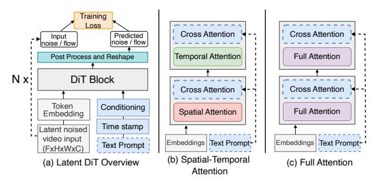
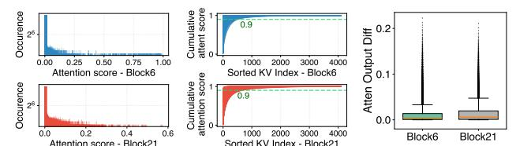
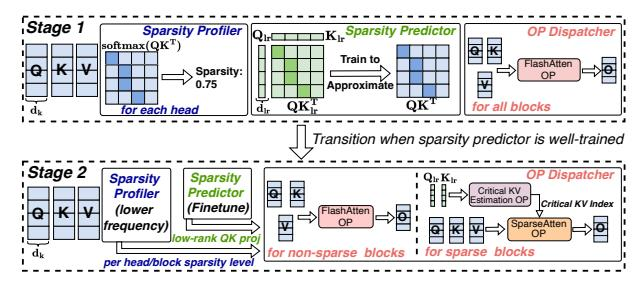
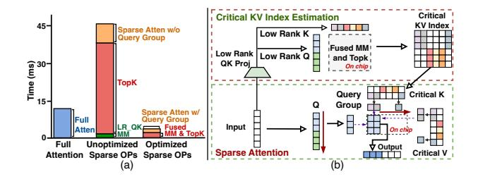
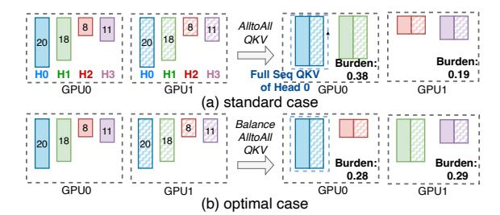
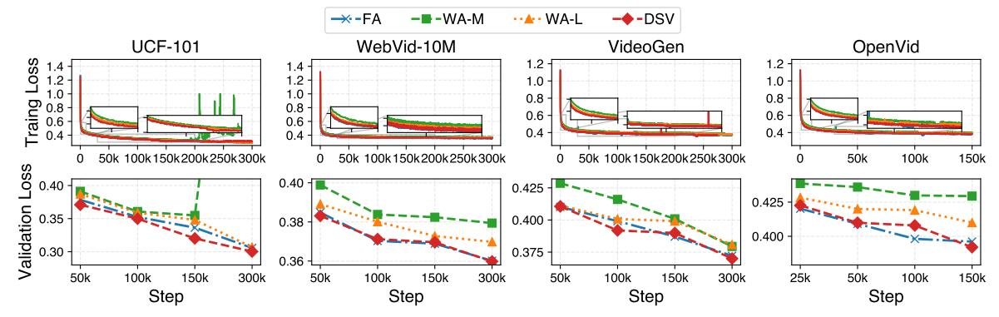
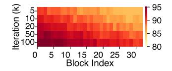
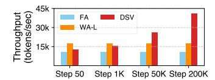
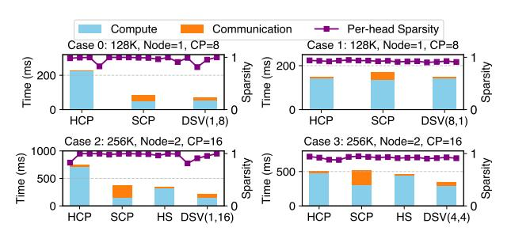
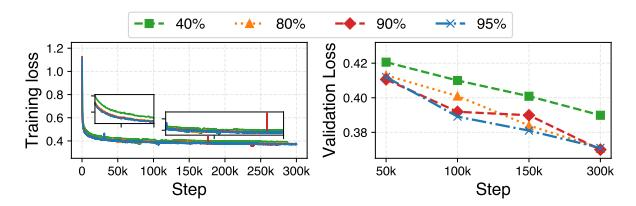

# Dynamic Sparsity in Large-Scale Video [DiT Training](https://www.acm.org/publications/policies/artifact-review-and-badging-current)

# Xin Tan

Computer Science and Engineering The Chinese University of Hong Kong Shatin, Hong Kong xtan22@cse.cuhk.edu.hk

> Xing Chen StepFun Shanghai, China chenxing@stepfun.com

Yibo Zhu StepFun Shanghai, China zhuyibo@stepfun.com

# Yuetao Chen

Computer Science and Engineering The Chinese University of Hong Kong Shatin, Hong Kong ytchen24@cse.cuhk.edu.hk

> Kun Yan StepFun Shanghai, China yankun@stepfun.com

Daxin Jiang StepFun Shanghai, China djiang@stepfun.com

Yimin Jiang Independent Beijing, China jymthu@gmail.com

Nan Duan StepFun Shanghai, China nduan@stepfun.com

# Hong Xu

Computer Science and Engineering The Chinese University of Hong Kong Shatin, Hong Kong hongxu@cuhk.edu.hk

# Abstract

Diffusion Transformers (DiTs) have shown remarkable performance in generating high-quality videos. However, the quadratic complexity of 3D full attention remains a bottleneck in scaling DiT training, especially with high-definition, lengthy videos, where it can consume up to 95% of processing time and demand specialized context parallelism.

This paper introduces DSV to accelerate video DiT training by leveraging the dynamic attention sparsity we empirically observe. DSV uses a two-stage algorithm to capture the dynamic sparsity patterns via low-rank based approximation of the original query and key. It employs custom kernels to efficiently identify critical key-value pairs and compute the sparse attention. To accommodate the new sparsity dimension, DSV adopts a hybrid sparsity-aware context parallelism that re-balances the skewed workload across attention heads and blocks due to sparsity heterogeneity. DSV achieves up to 3.02× higher training throughput, scaling to 128 GPUs and 520k token lengths, while maintaining model quality comparable to full attention schemes.

CCS Concepts: • Computing methodologies→Distributed computing methodologies.

Keywords: Large-scale training; distributed system; parallelism; video generation


[This work is licensed under a Creative Commons Attribution 4.0 Interna](https://creativecommons.org/licenses/by/4.0)[tional License.](https://creativecommons.org/licenses/by/4.0)

ASPLOS '26, Pittsburgh, PA, USA © 2026 Copyright held by the owner/author(s). ACM ISBN 979-8-4007-2165-6/2026/03 <https://doi.org/10.1145/3760250.3762216>

#### ACM Reference Format:

Xin Tan, Yuetao Chen, Yimin Jiang, Xing Chen, Kun Yan, Nan Duan, Yibo Zhu, Daxin Jiang, and Hong Xu. 2026. Dynamic Sparsity in Large-Scale Video DiT Training. In Proceedings of the 31st ACM International Conference on Architectural Support for Programming Languages and Operating Systems, Volume 1 (ASPLOS '26), March 22– 26, 2026, Pittsburgh, PA, USA. ACM, New York, NY, USA, [16](#page-15-0) pages. <https://doi.org/10.1145/3760250.3762216>

# 1 Introduction

Text-to-video generation has experienced significant breakthroughs recently and received widespread interest [\[3,](#page-14-0) [4,](#page-14-1) [13,](#page-14-2) [14,](#page-14-3) [19,](#page-14-4) [36,](#page-14-5) [39,](#page-14-6) [40\]](#page-14-7). Behind these advancements is the Diffusion Transformers (DiTs) [\[9,](#page-14-8) [36,](#page-14-5) [39\]](#page-14-6), which have emerged as stateof-the-art architectures within diffusion-based generative paradigms [\[24,](#page-14-9) [33\]](#page-14-10). These paradigms learn data distributions by progressively adding noise to input samples and training a model to reverse this process. During inference, the model starts with random noise and iteratively denoises it to generate high-quality videos.

In contrast to large language models (LLMs) [\[5,](#page-14-11) [38\]](#page-14-12), which use transformer also but scale to hundreds of billions of parameters, DiTs are smaller, typically under tens of billions of parameters [\[3,](#page-14-0) [7,](#page-14-13) [40,](#page-14-7) [54\]](#page-15-1). While their smaller scale reduces some challenges in training, video DiTs still struggle in processing long, high-resolution video inputs—a growing concern fueled by expanding datasets and applications like film post-production and multi-camera event capture [\[9,](#page-14-8) [40\]](#page-14-7). For example, even with compressed latent video representations from variational autoencoders (VAEs) [\[10\]](#page-14-14), token length for high-definition or long sequences can easily reach hundreds of thousands.

The primary bottleneck lies in the attention module [\[50\]](#page-15-2), which has quadratic time complexity with respect to input length and can consume over 80% of training time (Figure [2\)](#page-2-0). This issue worsens when the latent token length exceeds hundreds of thousands, as a single GPU cannot process the entire sequence in memory. Context parallelism [\[20,](#page-14-15) [22,](#page-14-16) [28,](#page-14-17) [34\]](#page-14-18) addresses this by distributing the input across GPUs for parallel processing, but it introduces additional challenges with inter-device communication.

Fortunately, our empirical observations reveal that attention computations in video DiTs exhibit notable sparsity that may mitigate the attention bottleneck [\[52,](#page-15-3) [58\]](#page-15-4). Attention scores tend to follow a power-law distribution, with a few key-value (KV) pairs dominating the total score. However, unlike some predictable attention patterns observed in LLMs (e.g. attention sinks or window pattern [\[6,](#page-14-19) [52\]](#page-15-3)), we observe that attention sparsity in video DiTs is dynamic: The critical KV positions in video DiTs do not have clear locality or other patterns. The sparsity level and pattern varies not only across blocks but also across attention heads within the same block. Finally, sparsity also intensifies progressively during training. These observations, reported for the first time to our knowledge, show that methods assuming fixed sparsity patterns are ineffective for DiT training, and a dynamic approach is needed to reap attention sparsity effectively.

A natural solution to leverage dynamic sparsity is to compute the attention scores and find critical KV at each attention operation. This entails two problems. First, large-scale training relies on I/O-aware fused kernels for maximum efficiency [\[16,](#page-14-20) [17\]](#page-14-21). Extracting the full attention matrix disrupts these optimizations and causes significant slowdown. Second, even if critical KV pairs are identified, most attention computation (e.g., softmax score) would already be completed, which eliminates most performance benefits. Additionally, current context parallelism [\[28,](#page-14-17) [34\]](#page-14-18) cannot effectively capture the heterogeneous sparsity across attention heads, leading to suboptimal performance.

Based on these insights, we present DSV, a framework that accelerates the video DiT training by exploiting dynamic sparsity patterns in attention while maintaining model quality. The core idea of DSV is to approximate attention scores using distinct predictors for each attention head. This facilitates the identification of critical KV pairs without tearing up the fused attention kernels. Attention can then be computed only on these critical pairs, and context parallelism can be adjusted accordingly to only exchange information for them. Specifically, DSV comprises three key components:

First, DSV employs a two-stage DiT training approach to leverage dynamic sparsity. In the first stage, it trains lowrank predictors to approximate for each attention head independently from the DiT training. Once the predictors are trained, DSV transitions to the second stage: It dynamically assesses the cost-benefit trade-off to activate sparse attention on individual blocks based on their profiled sparsity levels. It then uses the predictors to estimate the critical KV pairs.

Second, to efficiently carry out critical KV estimation, DSV employs an efficient kernel that fuses the approximation (i.e. MatMul) and selection (i.e. top-) operations into a single kernel. The fused kernel updates the top- selection in-situ without storing the full tensor with O (\_<sup>2</sup> ) elements, thus reducing memory footprint and computation cost. Additionally, DSV realizes an efficient sparse attention kernel using query grouping. We leverage the observation that queries of adjacent tokens in the latent space often share a significant portion of critical KV pairs. Their sparse attention computation can then be done together to maximize memory access parallelism and SM utilization.

Third, DSV introduces a sparsity-aware context parallelism (CP) approach. Dynamic sparsity breaks CP's basic assumption that each attention head has uniform computation and communication cost due to heterogeneous sparsity across heads. DSV adopts a hybrid strategy that performs CP in both head and sequence dimensions: sparse HCP adjusts the head assignment according to per-head sparsity levels to balance the computation load across devices, and sparse SCP further reduces communication overhead by exchanging only the critical KV pairs. The optimal hybrid configuration is determined by solving an optimization problem that models the effect of both forms of CP.

We build DSV based on PyTorch FSDP [\[59\]](#page-15-5) and evaluate it on a testbed with up to 128 H800 GPUs using DiT models ranging from 0.8B to 30B parameters. DSV achieves up to 3.02× higher training throughput than baseline for input lengths up to 520k, while also reducing end-to-end latency by up to 3.5×. DSV delivers video quality on par with full attention paradigms as also confirmed by human user study. In summary, our contributions are threefold:

- We systematically analyze attention patterns in video DiT training, revealing the existence of critical KV, their unpredictable distribution, heterogeneous sparsity across heads and blocks, and the dynamic evolution of sparsity levels.
- We propose DSV, a video DiT training framework that leverages dynamic sparsity in attention. DSV integrates adaptive sparse attention computation with specialized kernel and hybrid sparsity-aware context parallelism for optimized performance with multiple devices.
- We comprehensively evaluate the algorithmic performance and system efficiency of DSV across diverse video generation datasets and video DiT sizes. Results show that DSV maintains quality comparable to full attention while significantly improving throughput and speed.

# 2 Background

We start by providing a recap of video DiTs and the general challenges associated with large-scale video DiT training.

# 2.1 Video DiT

Diffusion models have become a leading framework in generative modeling, excelling in image synthesis [\[14,](#page-14-3) [19\]](#page-14-4) and video generation [\[3,](#page-14-0) [4,](#page-14-1) [13,](#page-14-2) [36,](#page-14-5) [39,](#page-14-6) [40\]](#page-14-7). These models corrupt

<span id="page-2-1"></span>

**Figure 1.** Overview of video DiT training. (a) The main input is the video, which is compressed by a VAE (omitted here). The timestamp is used as conditioning, and the text prompt is used as the Key-Value input in the cross-attention module. (b) Interleaved spatial-temporal attention blocks. (c) 3D full attention blocks.

data with noise in a forward process and learn to reconstruct it through a reverse generative process. Among them, DiT has emerged as the de facto backbone [7, 36, 39].

In a typical video DiT training process, a video clip is first encoded by a VAE [7, 10, 39], which compresses and downscales the input into a latent representation. Random noise is added to this latent representation, and the noised latent video-along with any conditioning information (e.g., timestamps or text prompts for text-to-video tasks)-is fed into the DiT model. As shown in Figure 1, the DiT model consists of multiple DiT blocks that process video tokens alongside conditional inputs, guiding video generation during training. At the core of each DiT block are self-attention modules, which employ interleaved spatial and temporal attention or full attention to capture the complex relationships among video tokens across different dimensions. Additionally, cross attention aligns the video with text prompts, ensuring consistency between modalities. The model's output is used to compute the loss, following either a denoising diffusion probabilistic model paradigm [24] or a flow matching paradigm [33, 35].

#### 2.2 Various Self-Attention Paradigms

Self-attention, or multi-head attention, is widely used in natural language processing and computer vision [18, 50] to capture long-range dependencies. Given an input sequence  $H = [h_1, \cdots, h_S]^{\top} \in \mathbb{R}^{S \times d}$ , where S is the sequence length and d the hidden dimension, each attention head maps H to Q, K, and V using learnable projection matrices  $W_Q$ ,  $W_K$ ,  $W_V \in \mathbb{R}^{d \times d_k}$ . The head output is computed as:

$$H' = \operatorname{softmax}\left(\frac{\mathbf{Q}\mathbf{K}^{\top}}{\sqrt{d_k}}\right)\mathbf{V},$$

where  $d_k$  is the dimensionality of each attention head. Ultimately, the outputs from all attention heads are concatenated and combined to produce the final output.

For video DiTs, various attention paradigms have been developed. One approach employs spatial-temporal attention, alternating computations along spatial and temporal dimensions [36]. While computationally efficient, studies

<span id="page-2-0"></span>

**Figure 2.** Time breakdown for self-attention and other operations in different DiTs (left: 1.3B, right: 3B) with various token lengths in forward (FW, left bar) and backward (BW, right bar) computation.

have found it inadequate for capturing detailed information, prompting a shift to full attention paradigms [3, 40, 54].

Full attention computes interactions across all tokens in the 3D temporal-spatial space, outperforming spatial-temporal attention. However, it processes a significant number of tokens, often exceeding 100k-even in latent space (e.g., for a latent input of  $32\times96\times96^1$ , 300k tokens are required). This makes full attention extremely compute-intensive.

#### 2.3 Large-Scale Video DiT Training

The efficiency of large-scale video DiT training is primarily influenced by two key aspects.

**Full attention bottleneck.** In high-resolution, long-video processing, self-attention becomes a major bottleneck due to its  $O(n^2)$  complexity with respect to the number of tokens and the non-causal nature of DiT, where the lengths of Q, K, and V all match the number of video tokens. In contrast, cross-attention is far more efficient, as only Q matches the video token count, while K and V are constrained to the text prompt length (typically under 120 tokens). As shown in Figure 2, self-attention increasingly dominates computation time as the number of video tokens grows. For example, in 1.3B and 3B models with a sequence length of 200K, self-attention accounts for 92% and 93% of forward and backward computation time, respectively. Thus, developing efficient attention mechanisms is critical to alleviating this bottleneck and enabling scalable video DiT training.

**Context parallelism.** Context parallelism (CP) enables longsequence training by dividing sequences into chunks distributed across multiple GPUs. However, self-attention requires inter-device communication to process the entire sequence, with two common paradigms:

• **Sequence-wise CP.** QKV tensors are split into chunks of shape [*B*, *H*, *S*/*N*, *D*], where *B* is the batch size, *H* the number of heads, *S* the sequence length, *N* the number of GPUs, and *D* the head dimensionality. Each GPU processes its local query chunk across all heads, gathering KV from other GPUs to compute attention via block-wise operations [34], often using ring-based communication.

<span id="page-2-2"></span> $<sup>^1</sup>$ Throughout this paper, latent video dimensions (e.g.,  $16\times16\times16$ ) are ordered as frames, height, and width unless otherwise specified.

<span id="page-3-0"></span>

Figure 3. Left: The attention score distribu- Figure 4. The output tion for each query in a histogram. Right: The difference between cumulative distribution function of the sorted attention with full attention scores for each query.

KV and critical KV.

• Head-wise CP. GPUs also initially hold QKV chunks partitioned along the sequence dimension for all heads. After All-to-All operations, each GPU gets complete QKV tensors for a subset of heads, reshaped to [B, H/N, S, D]. GPUs then compute attention outputs independently for their assigned heads. A final All-to-All re-partitions the outputs to restore the original layout [28].

These paradigms have trade-offs in computation efficiency and communication cost [20, 22]. Determining an efficient and optimal parallelism strategy is non-trivial, as it depends on the specific input case and hardware configuration.

## <span id="page-3-4"></span>**Empirical Observations on the Sparsity of** Attention in Video DiT

We conduct an in-depth analysis of the sparsity patterns of attention in video DiT training across various datasets and model sizes, as in §9. Our findings, demonstrated through a case study, validate the rationale behind our system design. The case study focuses on a 2.7B model with an architecture similar to Meta's MovieGen [40], representing a moderate scale for video generation [3, 7, 36]. The model is trained on the WebVid-10M dataset [12] using 8 H100 GPUs with a global batch size of 32 and a latent input size of  $16 \times 16 \times 16$ .

We begin by some definitions. Given a query vector q, let  $S_q = \{(k_i, v_i)\}_{i=1}^n$  denote the set of all n key-value (KV) pairs. The attention score function  $A(q,k_i) = \operatorname{softmax}(q \cdot k_i)$ computes the scaled dot product between q and each key  $k_i$ . The set of *critical KV pairs*  $I_q \subseteq S_q$  is then defined as the subset of pairs  $(k_i, v_i)$  where  $A(q, k_i)$  exceeds the  $\theta$ -percentile threshold of all attention scores. The threshold  $\theta$  can be set by a numerical cutoff or a cumulative sum, such that critical pairs account for 90% of total attention. In this paper, we use a 90% cumulative sum threshold as the default, i.e. the critical KV pairs are the top ones that together represent 90% of total attention. The sparsity of an attention head is then defined as the average proportion of non-critical KV pairs across all queries:  $\mathbb{E}_{q \sim Q} \left[ \frac{|S_q \setminus I_q|}{|S_q|} \right]$ 

Attention sparsity and power-law distribution. We first investigate the distribution of attention scores for each query to demonstrate attention sparsity.

Observation 1: Attention scores in sparse blocks follow a power-law distribution.

<span id="page-3-1"></span>

Figure 5. Distribution of critical KV positions for a query (green) at position (15, 15, 15) in the 3D latent space. The visualized keys are those that yield attention scores exceeding the 90th percentile when attending to the query.

<span id="page-3-2"></span>

Figure 6. Sparsity of different heads across blocks in iteration 80k.

As shown in Figure 3, attention scores of queries in two blocks are highly skewed, with most being small (<0.001) and only a few large (>0.1). Notably, the few top keys dominate, with the top 10% accounting for over 90% of total scores in 95.2% of queries (block 6) and 86.8% (block 21), highlighting the inherent sparsity. Figure 4 further shows that using only the top 10% of KV pairs yields minimal output differences.

The power-law distribution of attention scores suggests that a great portion of attention computation may be pruned without significantly impacting performance. By efficiently identifying critical KV pairs, we can potentially reduce computational costs while maintaining model quality.

Locality of critical KV. A common and simple method to identify critical KV pairs is to rely on locality: a token's query often attends to nearby tokens' keys or specific global keys, enabling the use of window-based patterns or token sinks as in LLM inference [6, 52, 58]. Given the spatio-temporal dependencies in video DiT, we first investigate whether similar locality patterns exist and can be applied in this context.

## <span id="page-3-3"></span>Observation 2: Critical KV pairs do not exhibit locality patterns in video DiT.

In Figure 5, we visualize the critical KV positions in a 3D space for a query. Contrary to expectations, critical KV pairs do not have a specific pattern, unlike those found in LLM inference [6, 52, 58]. More generally across queries, our experiment reveals that only 15.1% of critical KV pairs are within a 5-token radius, while 48.5% are more than 10 tokens away. This suggests that applying fixed patterns to approximate attention would not fare well in video DiT.

<span id="page-3-5"></span>Heterogeneity of sparsity. We further establish the spatial heterogeneity of attention sparsity across different attention blocks and heads within a block, which adds to the difficulty of identifying critical KV pairs.

<span id="page-4-0"></span>

**Figure 7.** The change in sparsity of different **Figure** attention heads during the training process in sparsity transformer blocks. Only two blocks are shown blocks due to space constraints.

# Figure 8. The sparsity of all blocks across different steps.

# Observation 3: Sparsity varies significantly across attention blocks and heads within the same block.

Our analysis reveals that sparsity varies not only across blocks but also among heads within the same block. Figure 6 shows head-level sparsity at iteration 80k, where the first 20 blocks are highly sparse, and latter blocks are less so. The box plot highlights variability within blocks-e.g., in block 2, most heads have 95% sparsity, with outliers at 90% and 80%. Figure 8 confirms diverse sparsity patterns across blocks at different training steps. Besides, as training converges, an arch-shaped sparsity pattern emerges: intermediate blocks become highly sparse, while initial and final blocks go dense.

This disparity aligns with prior studies [30, 32, 50], showing that attention heads capture distinct features, with some focusing on local details and others on global context. Uniform sparsity thresholds are suboptimal: low thresholds cause redundant computation, while high thresholds risk losing critical KV pairs for less sparse heads. Adaptive methods are needed to account for each block's and head's unique sparsity, optimizing efficiency and performance.

**Time-varying sparsity during training.** Continuing from the previous finding, we also observe that attention sparsity varies dynamically in the temporal dimension.

# Observation 4: Sparsity also varies over the course of training before stabilizing.

As illustrated in Figure 7, sparsity of different heads becomes more pronounced as training progresses. For block 24, the average attention sparsity for each head increases from 0.30 to 0.78. Further, Figure 8 shows that across all attention blocks, the median sparsity increases from 0.81 at 50k iterations to 0.92 at 300k iterations. This dynamic evolution of sparsity during training suggests that the strategy for leveraging sparsity should be adjusted dynamically: As the model learns to focus on the most relevant features, the attention mechanism becomes more selective, resulting in increased sparsity [46]. This highlights the importance of dynamic methods that can capture and exploit the evolving sparsity patterns throughout the training process.

Critical KV overlap ratio for adjacent tokens in 3D space. Finally, we demonstrate an interesting phenomenon between queries of adjacent tokens.

<span id="page-4-2"></span>Observation 5: Adjacent tokens have similar critical KV pairs.

<span id="page-4-1"></span>

**Figure 9.** Critical KV pair overlap ratio between four anchor queries (green, at indices 0, 2124, 2220, 4095) with all queries in an attention block. Each subplot shows a 2D projection of the 3D video with rows representing flattened frames.

We quantify this phenomenon by measuring the overlap of critical KV indices across queries. Figure 9 is a case study with four anchor queries (in green), where darker shades indicate higher overlap ratios. Significant overlaps in critical KV indices are observed among adjacent tokens. For tokens within a  $2\times2\times2$  3D cube (shown as a 2D projection), the four anchor queries and their adjacent queries exhibit over 92.4% overlap in critical KV indices. On average, this overlap remains consistent at 80.1% across blocks. This aligns with the intuition that video pixels represent continuous signals, unlike discrete language signals, making adjacent tokens similar. It suggests neighboring queries tend to attend to similar KV pairs (though these KV pairs may not be close to the query as Obs.2 reveals), offering opportunities to optimize attention computation by leveraging the similarity in sparsity patterns among adjacent tokens.

#### 4 DSV Overview

Our empirical findings in §3 uncover inherent sparsity patterns in video DiT attention during training, some of which are different from sparsity in LLM inference for language tasks and have not been previously reported. Due to high sparsity, by computing only the most critical KV pairs, the overall computational burden of full attention can be significantly reduced, leading to more efficient training. Moreover, this reduction in KV computations also lowers communication overhead in large-scale settings, where KV data is frequently exchanged for context parallelism. Together, they highlight the potential for substantial end-to-end speedups by exploiting attention sparsity in video DiT training.

Building on this insight, we now discuss the unique challenges posed by these sparsity patterns and introduce the architecture of our solution, DSV.

#### 4.1 Challenges

Sparsity entails design challenges in three basic aspects of the training system: algorithm, kernel, and parallelism.

• Critical KV identification: Our first major challenge stems from the dynamic and uncertain distribution of critical KV pairs in video DiT training (Obs.2). Any fixed sparse attention pattern becomes impractical when the critical

<span id="page-5-0"></span>

Figure 10. DSV overview.

KV varies dramatically with changing context and/or training steps. While computing the complete attention score matrix (i.e.,  $\operatorname{softmax}(QK^T)$ ) and selecting the  $\operatorname{top-}k$  entries per query fully capture these changing distributions, it does not save any computation of the attention score. Moreover, this would disrupt the fused kernels such as FlashAttention [16, 17] with IO-awareness optimization, limiting the sparsity benefits to only the score-value (AV) computation, ultimately degrading overall performance.

- Efficient sparse attention computation: Even if the attention scores are available for identifying critical KVs, performing top-k selection at scale introduces considerable implementation hurdles. Specifically, the attention score tensor has a shape of [H, S, S], where H is the number of heads and S is the sequence length, which can easily reach up to 100K. Saving such large tensors alone requires excessive GPU memory. Furthermore, following top-k selection, each query might access a very sparse set of KV entries in an irregular and scattered pattern. This irregularity can degrade parallel efficiency especially in memory access and result in low use of SM resources, making it difficult to fully reap the gains from sparsity.
- Re-visiting context parallelism: The last challenge emerges when training with long video sequences that must be distributed across devices. Existing context parallelism (CP), head-wise and sequence-wise, would fail to work efficiently once sparsity is introduced. Head-wise CP can become problematic when certain heads exhibit higher degrees of sparsity than others (Obs.3), creating load imbalances and stragglers. Moreover, standard sequence-wise CP often transfers all KV pairs among devices without considering which ones are critical [34], unnecessarily increasing communication overhead. As a result, we need to overhaul the parallelization strategy to account for the idiosyncrasies due to sparsity.

#### 4.2 DSV Architecture and Workflow

DSV addresses the three challenges with three key designs as summarized in Figure 10.

• Algorithm: Two-stage training with low-rank QKestimation. At the core of DSV lies an efficient low-rank estimation of query and key to approximate the attention score. Two low-rank matrices are trained for each attention module to approximate  $QK^T$  (separate from FlashAttention). These matrices enable identification of critical KV pairs without fully computing attention scores or modifying FlashAttention kernels. DiT training then becomes a two-stage process: in the first stage these low-rank matrices, called *sparsity predictors* hereafter, are continuously learned until their approximation is accurate enough, and all attention is computed in full. Then we enter the second stage: in each step, when the sparsity level exceeds a threshold, we perform sparse attention over the critical KV pairs found by the low-rank estimations.

- Kernel: Critical KV estimation and sparse attention. To overcome the second challenge and maximize the benefits of sparse training, DSV introduces optimized kernels tailored for critical KV estimation and sparse attention. Specifically, a fused kernel calculates the approximate attention scores using learned low-rank matrices and performs top-k selection at the desired sparsity level in a single pass to minimize intermediate memory consumption. Additionally, DSV adopts a sparse attention kernel with query grouping to enhance memory access and computation parallelism, as queries that are close in position often share similar critical KVs as noted in Obs.5.
- Parallelism: Sparsity-aware context parallelism. Lastly, DSV leverages sparsity-aware context parallelism (CP) strategies to dynamically adapt to varying sparsity levels across different attention blocks and heads. It introduces new optimizations for sparse settings, including head-wise workload reallocation for standard head-wise CP and selective KV gathering for seq-wise CP. Further, DSV determines the optimal hybrid parallelism configuration for each attention block based on its head-wise sparsity patterns. By jointly optimizing computational load balancing (mitigating inefficiencies from sparsity-induced workload imbalances) and communication overhead across paradigms, it ensures optimal performance when parallelizing large video inputs.

# 5 Two-Stage Training with Low-Rank Based Sparsity Prediction

We now present DSV's training algorithm design as depicted in Figure 11.

#### 5.1 Sparsity Profiling

We first introduce DSV's profiler as the basic building block for both low-rank based sparsity prediction and two-stage training. The profiler periodically measures the sparsity level of each attention head as defined in  $\S 3$ , by separately computing the softmax of  $QK^T$  without disrupting the normal full attention computation using FlashAttention. To reduce the overhead, random sampling (e.g., by a factor of 16) on query Q is used when examining each head's attention scores. At iteration i, we update the exponential moving average of

<span id="page-6-0"></span>

Figure 11. Two-stage DiT training paradigm.

sparsity level of the current block  $S^i$  with the latest sample  $P^i$ :  $S^i = \alpha P^i + (1 - \alpha)S^{i-1}$ , where  $\alpha$  is the smoothing factor that smooths out fluctuations due to sampling noise. The profiler maintains sparsity level for each attention head and block, which are used to train the low-rank query and key matrices and to determine the use of sparse computation.

#### 5.2 Low-Rank based Sparsity Prediction

For each attention block, we introduce two low-rank trainable matrices,  $W_Q^{\rm lr}$  and  $W_K^{\rm lr}$ , which project the input to  $Q_{\rm lr}$  and  $K_{\rm lr}$  with an inner dimension  $d_{\rm lr}$ ,  $d_{\rm lr} \ll d_k$  (default: 16, an empirical balance between computation efficiency and approximation accuracy ) where  $d_k$  is the inner dimension of original query and key, Q and K. We train  $W_Q^{\rm lr}$  and  $W_K^{\rm lr}$  at each iteration of DiT training such that  $Q_{\rm lr}K_{\rm lr}^T$  can continuously approximate  $QK^T$  from the profiler. Note this predictor training process is independent from the primary computation graph. It ensure accurate approximation of attention patterns with minimal parameters and overhead (<10M for a 3B model).

We train the sparsity predictor for each block using the following loss function:  $0.95 \cdot \text{CosLoss}(Q_{\text{lr}}K_{\text{lr}}^T, QK^T) + 0.05 \cdot \text{NormLoss}(Q_{\text{lr}}K_{\text{lr}}^T, QK^T)$ . The intuition is to encourage the low-rank projections to preserve the relative magnitudes within each row of  $QK^T$  (hence the use of CosLoss), ensuring the most important KV pairs remain distinguishable. At the same time, we include a smaller weight for NormLoss to keep the overall magnitudes close to those of the original  $QK^T$ . During the forward pass, the sparsity predictor computes the approximation loss and immediately updates its parameters, reducing memory consumption by avoiding storage of intermediate  $QK^T$  results. Random sampling on query Q is also used to further rein in the overhead.

#### <span id="page-6-3"></span>5.3 Two-Stage DiT Training

DiT training in DSV proceeds in two distinct stages to ensure effective exploitation of attention sparsity while maintaining model performance.

**Stage 1: Full Training.** In the initial stage, the DiT model undergoes full training without sparse computations. The primary goal is to train the sparsity predictors for each attention block as said before. This stage concludes once the

<span id="page-6-2"></span>

**Figure 12.** (a) Full vs. sparse attention operations (head size: 1, token length: 51200, sparsity: 90%, on H100). (b) Kernel overview in DSV.

average approximation loss across all blocks falls below a defined threshold (default: 0.01). This condition is typically met within 5K iterations, signaling that the sparsity predictors are adequately trained and ready for use. During training, we randomly spot-check critical KV estimates against full-attention ground truth across all blocks, guiding stopping decisions and enabling adaptive threshold adjustment.

Stage 2: Sparse Training. In Stage 2, sparse attention is utilized whenever possible to fully accelerate DiT training. The key here is to determine whether to activate sparse computations, which is precisely what DSV's OP Dispatcher is responsible for. The signal it uses is obviously the sparsity level: the profiler now runs with a lower frequency than that in Stage 1 due to the stabilized sparsity patterns to monitor each block's sparsity level. Then whether or not sparse attention is beneficial given a certain sparsity level hings on two factors, the computation speedup and the memory overhead. Computation speedup includes the gain from sparse attention minus the additional overhead from critical KV estimation using the low-rank sparsity predictor. Memory overhead also arises from the need of storing the critical KV indices. To efficiently navigate this tradeoff, we perform offline experiments to measure at various sparsity levels the corresponding speedups and memory requirements (using our re-designed kernels in §6) for varying video token lengths. Notably, for a given GPU type, this profiling needs to be performed only once and is independent of the dataset or model. Then OP Dispatcher enables sparse attention for a block when (1) the current memory utilization is sufficient for the corresponding memory overhead, and (2) the current sparsity level exceeds the threshold established offline for this setting. This block's low-rank sparsity predictor is used to locate the critical KV pairs, and sparse attention is performed using our optimized kernels.

#### <span id="page-6-1"></span>**6 Efficient Kernels**

This section tackles the challenges of sparse attention implementation, including: (1) critical KV estimation via top-K selection from  $Q_{lr}K_{lr}^T$ , and (2) hardware-aware sparse attention kernels with selected KV pairs.

#### 6.1 Critical KV Estimation with Kernel Fusion

**Memory constraints.** The critical KV estimation involves low-rank matrix multiplication  $Q_{lr}K_{lr}^T$  for approximating  $QK^T$ , followed by a top-k selection operation. They present two major bottlenecks: (1) Storing the entire  $Q_{lr}K_{lr}^T$  demands an excessive memory footprint. When H=16 attention heads and S=100k video tokens are used, the resulting [H,S,S] tensor requires  $\sim$ 320GB memory in BF16. (2) top-k is memory-bound, saturating GPU memory bandwidth for large inputs and significantly reducing overall throughput. In Figure 12, top-k takes longer than full attention, consuming up to 80% of the total naive sparse attention time.

**Kernel fusion.** To reduce memory footprint and data movement overhead, we fuse top-k directly into the low-rank MatMul. Instead of materializing the large result tensor, partial MatMul results are immediately used for incremental top-k updates which is all we need here after all. A custom GPU kernel interleaves these steps, keeping only the top-k entries per query in registers. This reduces the space complexity from  $O(S^2)$  to O(SK) and minimizes data movement between HBM and on-chip registers.

#### 6.2 Sparse Attention with Query Grouping

Implementing sparse attention naively where each query relies on distinct critical KV pairs yields limited speedups (about 1.4× in Figure 12), primarily due to uncoalesced memory access patterns and diminished tensor core utilization. Since each query can fetch disjoint KV entries, data reuse decreases dramatically, hindering parallel efficiency. As noted in Obs.5, adjacent queries in the 3D spatial-temporal domain often share a large portion of critical KV pairs. This allows us to cluster nearby queries into groups based on their proximity in 3D cubes (e.g., 2×2×2 voxels), and share the critical KV indices within a group. We employ an adaptive offline profiling mechanism to accommodate variations in image resolution and frame rates across datasets and balance hardware efficiency. This mechanism determines the largest feasible group size that satisfies the required overlap ratio (e.g., 80%) of critical KV for queries within a group. Profiling is performed offline once for each training dataset and model. The central query in the group is used exclusively as the proxy to identify the shared critical KV pairs (reduce the estimation problem size as well). Then, these queries are processed together for their attention to improve memory access and computation efficiency.

# 7 Hybrid Sparsity-Aware Context Parallelism

Sparsity in attention adds a new dimension to context parallelism (CP). In this section, we first analyze the performance of head-wise and sequence-wise CP in sparse settings with the best tuning. Building upon this, we propose a hybrid

<span id="page-7-0"></span>

**Figure 13.** An example of load imbalance in HCP with four attention heads (different colors). A sequence is split into two chunks (different shades) each held by one GPU. A chunk's length on a head represents its relative computational burden, i.e. 1 minus the sparsity level. A GPU's total burden is the sum of that across all heads it hosts.

sparse CP strategy that computes the best configuration by jointly optimizing both forms of CP for each attention block.

#### 7.1 Modeling Context Parallelism with Sparsity

We consider N GPUs within a CP group, each initially processing a partial sequence and storing the corresponding Q, K, and V chunks with shape [H, S/N, D], where H is the number of heads, S sequence length, and D head dimension.

**7.1.1** *Head-wise CP with Sparsity.* HCP redistributes the attention workload across the head dimension using all-to-all operations. Each GPU transitions from processing a sequence partition across all heads to handling a few heads for the entire sequence. However, the varying sparsity levels across heads introduce additional complexity and inefficiency.

Computation load imbalance. The head-wise split for attention computation, combined with sparsity heterogeneity leads to uneven computational burdens across GPUs as shown in Figure 13. Here, attention heads are distributed uniformly across GPUs, resulting in a significant load imbalance: GPU0 becomes a straggler due to low sparsity levels of its heads. Swapping the head-GPU assignment reduces the end-to-end time by 35.7% with more balanced workloads. This highlights the need for a balanced head-wise reallocation to account for sparsity heterogeneity. The best head allocation scheme within a HCP group can be found by a small combinatorial optimization problem that minimizes the maximum computational burden per GPU. We refer to this minimal per-GPU computation burden as comp<sup>hcp</sup>.

**Communication cost.** We turn to analyze the total communication volume of each GPU in a sparse HCP group. Let  $H_i^r$  represent the final number of heads allocated to GPU i. The training process involves four uneven all-to-all operations (QKV and output) for each GPU, with total cost amounting to:  $comm_i^{hcp} = 3SD \max(H_i^r(N-1)/N, (H-H_i^r)/N) + SD \max((H-H_i^r)/N, H_i^r(N-1)/N)$ .

**Memory cost.** Similar to communication, the memory consumption for *QKV* and output on each GPU of a HCP group

<span id="page-8-0"></span>

**Figure 14.** An example shows redundant communication of SCP in the same setting as in Figure 13. The width of each chunk represents the held KV size for that chunk. For simplicity, only GPU 0 is shown here after the KV gathering; GPU 1 should have a similar situation.

could slightly differ due to the potential uneven head allocation, and is given by:  $mem_i^{hcp} = 4SDH_i^r$ .

**7.1.2 Sequence-wise CP with Sparsity.** SCP does not reallocate the computational burden, as the sparsity level is uniform across queries within each head (§3) and SCP retains partial queries from all heads in each GPU. Instead, it computes the attention output for the local *Q* with both local *KV* and remote *KV* gathered from other GPUs within the same group.

**Communication cost.** In standard SCP a GPU gathers all remote KV tensors, but this is unnecessary in the sparse setting as shown in Figure 14(a). Only the critical KV tensors are needed now, which leads to *selective KV gathering* as in Figure 14(b). Consequently, the actual communication volume is:  $comm_i^{scp} = 2HDS/N \cdot \max(\sum_{j \in N, j \neq i} \alpha_i^j, \sum_{j \in N, j \neq i} \alpha_j^i)$ , where  $\alpha_i^j$  denotes the fraction of KV tensors on GPU j that is needed by GPU i.

**Memory cost.** Similarly, the memory consumption for additional non-local critical KV varies with  $\alpha_i^j$  as well. It can be expressed as:  $mem_i^{scp} = 2HD\sum_{j\in N, j\neq i}(\alpha_i^jS/N)$ .

### 7.2 Hybrid Sparse Context Parallelism

The analysis of optimized HCP and SCP in sparse settings highlights their respective strengths and limitations. HCP has a big impact on each GPU's computation load, while SCP does not. However, the communication overhead for both varies depending on the sparsity pattern.

Naturally, HCP and SCP can be combined with HCP rebalancing the workloads across heads and SCP further splitting them across sequences for certain heads. For example, in an 8-GPU setup with a HCP degree of 4, ranks 0-3 and 4-7 form HCP groups where head-wise reallocation occurs. Each GPU pair across HCP groups (e.g., rank 0 and rank 4) then forms four SCP groups (SCP degree 2), with ranks in each SCP group handling different sequence chunks for the same heads. By flexibly partitioning workloads across both dimensions, the hybrid approach (see Algorithm 1) can potentially achieve an optimal balance of computation and communication under certain sparsity pattern.

#### <span id="page-8-1"></span>Algorithm 1 Hybrid sparsity-aware context parallelism

```
1: function HybridSparseCP(Q, K, V, G_{hcp}, G_{scp})
       ▶ Per-GPU forward workflow
       \rightharpoonup G_{hcp}/G_{scp}: HCP/SCP comm groups of this GPU
 2:
       if |G_{hcp}| > 1 then
           Q, K, V \leftarrow LoadBalanceHCP(Q, K, V, G_{hcp})
 3:
 4:
       if |G_{scp}| > 1 then
           K, V \leftarrow \text{SelectiveCommSCP}(Q, K, V, G_{scp})
 5:
       Output \leftarrow SparseAttn(Q, K, V)
 6:
       ▶ Redistribute output if HCP used
 7:
       if |G_{hcp}| > 1 then
            Output \leftarrow UnevenAlltoAll(output, G_{hcp})
 8:
 9: function LoadBalanceHCP(Q, K, V, Group)
       ▶ Periodically solve optimal head allocation
       plan ← GetLoadBalancePlan(Group,Head_Sparsity)
10.
       \triangleright Reorder QKV by heads for comm layout
        Q, K, V \leftarrow Permute\_and\_Split(Q, K, V, plan)
11:
12:
        Q, K, V \leftarrow UnevenAlltoAll(Q, K, V, Group)
        return Q, K, V
14: function SelectiveCommSCP(Q, K, V, Group)
       ▶ Get global critical KV indices via predictor
15:
        Critical\_KV\_idx \leftarrow Estimate\_with\_Predictor()
       ▶ Exchange indices to decide sends
        KV\_idx\_to\_send \leftarrow UnevenAlltoAll(Critical\_KV\_idx)
16:
       ▶ Prepare, exchange, and merge KV
17:
        KV\_to\_send \leftarrow Prepare\_KV\_to\_send(KV\_idx\_to\_send)
18:
        Gathered_KV \leftarrow UnevenAlltoAll(KV\_to\_send)
        K, V \leftarrow \mathsf{MergeKV}(K, V, Gathered\_KV)
19:
        return K, V
20:
```

**Optimal CP configuration.** To find the best configuration for hybrid CP, we formulate an optimization problem that arrives at the optimal HCP and SCP degrees  $g^h$ ,  $g^s$  for each attention block:

<span id="page-8-4"></span><span id="page-8-3"></span><span id="page-8-2"></span>min 
$$\max_{i} \left( T_{i}^{comm}(g^{h}, g^{s}) + T_{i}^{comp}(g^{h}, g^{s}) \right)$$
  
s.t.  $T_{i}^{comp}(g^{h}, g^{s}) = f_{i}(comp^{hcp}(g^{h})),$  (1)  
 $T_{i}^{comm}(g^{h}, g^{s}) = h_{i}(comm_{i}^{hcp}(g^{h}) + comm_{i}^{scp}(g^{s})),$  (2)  
 $mem_{i} \left( g^{h}, g^{s} \right) = mem_{i}^{hcp}(g^{h}) + mem_{i}^{scp}(g^{s}) \leq M,$  (3)  
 $g^{h} \cdot g^{s} = N, g^{s} \geq 1, 1 \leq g^{h} \leq H.$  (4)

<span id="page-8-5"></span>The objective is to minimize the maximum execution time, including both communication and computation on any GPU given the CP configuration  $g^h, g^s$ . The computation time depends on the minimum per-GPU computation burden  $comp^{hcp}$  found for  $g^h$  in cons. (1), while the communication time is directly determined by the communication volume in cons. (2) (and intra- and inter-node bandwidths which are known). Cons. (3) ensures that memory usage remains within acceptable limits, while (4) imposes restrictions on group sizes: the HCP group size is bounded by the model's

head count, and the product of the HCP and SCP group sizes must equal the total number of GPUs.

To enable accurate modeling and efficient optimization, we fit two regression models to estimate computation and communication times across various sparsity levels and input sizes. During training, we evaluated the necessity of adjusting the CP configuration at intervals (e.g., every 50 iterations), as sparsity levels remained relatively stable over time. The associated operational overhead—including optimization within a limited search space and communication group reconfiguration—can be overlapped with GPU computation and checkpointing, thereby minimizing its impact on training performance. For deployment, we dynamically determine whether to prioritize HCP-first or SCP-first intranode placement based on their estimated communication time under a specific configuration and sparsity pattern.

#### 8 Implementation

DSV is open source at https://github.com/NetX-lab/DSV. We implement DSV on PyTorch's FSDP framework, extending it for tensor and context parallelism. The sparse attention kernel is built with Triton [8], and critical KV estimation in CUDA. DSV provides a non-invasive module that integrates seamlessly with any training framework and model. Its low-rank sparsity prediction is decoupled from the main model training, allowing replication across devices and manual control of computation and gradient synchronization. To reduce GPU memory overhead, we asynchronously offload large critical KV indices to the CPU after attention and prefetch them during the next block's backward pass, if necessary.

#### <span id="page-9-0"></span>9 Evaluation

**Setup.** We evaluate on servers with 8 NVIDIA H800 GPUs connected via NVLinks and 200 Gbps RoCE for cross-node communication. Training is done in BF16 except for gradient reduction and optimizer updates which use FP32.

**Datasets.** We adopt four datasets: the widely used UCF-101 [42] and Webvid-10M [12] by prior work, and the more recent VideoGen [44] and OpenVid [37] that feature high-definition videos with detailed text descriptions.

Models. The model configurations are listed in Table 1. Their architectures, based on DiT blocks with 3D self-attention and cross-attention, are similar to Meta MovieGen [40] and other SOTA models [3, 4]. For video compression, we use Stability-AI's VAE [10] to reduce spatial resolution by 8×8. The CLIP text encoder [1] is used for UCF-101 and WebVid-10M, while the T5-xxl text encoder [11] is applied to VideoGen and Open-Vid. Models are trained with the Adam optimizer (learning rate: 1e-4) and gradient checkpointing [15] is enabled. Flow matching [33], a widely adopted generative modeling approach, is used for its advanced performance [3, 7, 40].

**Baselines.** We compare DSV with the following baselines:

<span id="page-9-1"></span>

| Model | #Layer | #Head | Head size | Activation       | Norm Type          |
|-------|--------|-------|-----------|------------------|--------------------|
| 0.8B  | 28     | 12    | 96        | GeGLU            | AdaLayerNormSingle |
| 2.7B  | 32     | 16    | 128       | GeGLU            | AdaLayerNormSingle |
| 30B   | 42     | 24    | 256       | GeLU-approximate | AdaLayerNormSingle |

Table 1. Model configurations in our evaluation.

- Vanilla full attention (FA). The 3D full attention computation based on FlashAttention-2 [2, 16] is the de facto implementation choice today.
- Window-based attention (WA). A common way to use sparse attention in video models [23, 57] where a query attends to KV pairs in a 3D window centered on itself. We explored WA-Medium (WA-M) with each dimension at 1/3 of the original size, and WA-Large (WA-L) at 2/3 instead.

For context parallelism, we prioritize head-wise CP for baselines due to its superior performance in our testbed. If the CP degree exceeds the number of head, we adopt intranode head-wise CP with inter-node sequence-wise CP.

#### 9.1 Overall Model Quality

We compare DSV's training convergence and model quality with baselines across various configurations. A small 0.8B model is trained on UCF-101 and WebVid-10M with a latent input size of  $16\times16\times16$  (4k tokens), while bigger 2.7B models are trained on VideoGen and OpenVid with latent input of  $32\times32\times32$  (32k tokens) and  $40\times56\times56$  (125k tokens), respectively.

Training and validation loss. Figure 15 compares the training and validation loss trends across different attention mechanisms. These losses reflect model improvement in the flow matching paradigm [40]. DSV exhibits faster convergence and achieves lower final loss values compared to WA-M and WA-L, and is comparable to FA across all datasets and models. Notably, WA-M fails to converge on UCF-101. Moreover, for validation loss, DSV also closely matches FA while outperforming both WA methods.

Video quality. Table 2 presents the video generation quality of DSV compared to other baselines across various datasets and evaluation metrics. Consistent with prior work, we use FVD [45] to quantify differences between generated and original videos, supplemented by VBench [27] which measures quality and semantic coherence through model-based methods.

In terms of FVD, DSV consistently achieves the lowest values or performs comparably to FA, indicating its ability to generate videos that closely resemble the ground truth (FA). In contrast, WA-M consistently exhibits poor performance. Similarly, for semantic and quality scores in VBench, DSV continues to demonstrate superior performance.

**User study.** We also conduct a user study with 30 volunteers, each blindly rating 15 sets of video samples generated by different methods in random order. Table 3 shows that DSV and FA generate videos with better quality to the human

<span id="page-10-0"></span>

Figure 15. Comparison of training loss and validation loss throughout the training process for different methods across four datasets.

<span id="page-10-1"></span>

|          |        | Quality |          |            |  |
|----------|--------|---------|----------|------------|--|
| Dataset  | Method | FVD↓    | Quality↑ | Semantic ↑ |  |
| UCF-101  | WA-M   | 700.98  | 69.18%   | 55.03%     |  |
|          | WA-L   | 520.92  | 70.70%   | 55.84%     |  |
|          | FA     | 440.32  | 71.00%   | 56.23%     |  |
|          | DSV    | 438.02  | 71.08%   | 56.60%     |  |
| WebVid   | WA-M   | 580.12  | 71.10%   | 40.10%     |  |
|          | WA-L   | 530.38  | 73.23%   | 40.56%     |  |
|          | FA     | 409.24  | 73.79%   | 42.56%     |  |
|          | DSV    | 414.56  | 73.66%   | 42.88%     |  |
| VideoGen | WA-M   | 1395.23 | 77.33%   | 53.08%     |  |
|          | WA-L   | 1100.72 | 78.82%   | 53.32%     |  |
|          | FA     | 908.91  | 79.39%   | 55.34%     |  |
|          | DSV    | 834.32  | 79.14%   | 54.99%     |  |
| OpenVid  | WA-M   | 884.15  | 78.78%   | 55.98%     |  |
|          | WA-L   | 826.43  | 79.47%   | 56.51%     |  |
|          | FA     | 838.52  | 79.54%   | 56.07%     |  |
|          | DSV    | 782.22  | 79.63%   | 56.36%     |  |

**Table 2.** Comparison of model quality metrics on four datasets.

|        | 111  | ***** | ***** | DO V |
|--------|------|-------|-------|------|
| Score↑ | 4.25 | 2.89  | 3.81  | 4.57 |
| Table  | 3. N | Vorma | lized | user |
| rating |      |       |       |      |

WA-M WA-I

|         |       |        | Method |       |      |
|---------|-------|--------|--------|-------|------|
| Dataset | Model | Length | FA     | WA-L  | DSV  |
| UCF-101 | 2.7B  | 100k   | 703s   | 389s  | 220s |
| UCF-101 |       | 200k   | 2757s  | 1272s | 810s |
| Webvid  | 30B   | 50k    | 112s   | 63s   | 39s  |
| webviu  |       | 100k   | 396s   | 207s  | 125s |

**Table 4.** Inference latency comparison for 40 sampling steps using CFG [25]. 2.7B model runs on 1 H800 GPU and 30B model runs on 4 H800 GPUs with TP=4.

<span id="page-10-2"></span>

**Figure 16.** Training throughput comparison for 2.7B model with VideoGen (left) and 30B model with OpenVid (right). A tensor parallelism degree of 4 is used to accommodate the 30B model.

eye, significantly outperforming WA methods with WA-M receiving the lowest ratings.

#### 9.2 System Efficiency

We evaluate DSV's efficiency compared to 3D FA and WA-L. We exclude WA-M in the comparison due to its consistently poor performance.

9.2.1 Training. In large-scale training, DSV significantly outperforms vanilla 3D FA and WA in training throughput. On the VideoGen dataset with a 2.7B model, DSV achieves 2.1-3.02× higher throughput over FA and 1.38-1.54× over WA-L on up to 128 GPUs while handling inputs of up to 520k tokens, as in Figure 16. On OpenVid with the 30B model, DSV outperforms FA by 2.06-2.53× and WA-L by 1.37-1.42×. FA suffers from high computational overhead due to its quadratic complexity in spatial and temporal dimensions. WA reduces this overhead by limiting attention to a fixed local

<span id="page-10-3"></span>

**Figure 17.** Critical KV prediction accuracy.


**Figure 18.** Speedup for different sparsity levels of 2.7B model.

window, achieving a fixed sparsity ratio (~70% for WA-L) but fails to identify critical KV pairs. In contrast, DSV dynamically adapts to sparsity patterns across heads, reaching over 95% sparsity in many blocks at later steps. Additionally, DSV's optimized hybrid CP strategies addresses load imbalances and improves efficiency as well.

**9.2.2 Inference.** DSV also elevates inference efficiency via its low-rank sparsity predictors acquired during training and efficient kernel designs. This results in a 2.0-3.5× speedup over FA and a 1.4-2.6× speedup over WA-L, enabling faster inference without performance loss (see Table 4). Note CP is not used in the inference experiments.

#### 9.3 Deep Dive

9.3.1 Critical KV prediction accuracy. We evaluate our sparsity prediction for identifying critical KV pairs in a 2.7B VideoGen-trained model. As shown in Figure 17, the prediction improves during the course of training and achieves over 90% accuracy for most blocks after ~100k iterations. The estimated KV pairs account for over 98% of the total attention score compared to ground truth, as the most critical KV pairs are easily distinguishable. Although certain pairs are harder to identify, they seem to cause minimal effect on model performance.

**9.3.2** *Modeling accuracy for hybrid sparsity-aware CP configuration solving.* Figure 19 demonstrates the accuracy of our computation and communication modeling for sparse CP optimization. The left subfigure evaluates single-GPU computation time for a 2.7B model's attention block at 32K token length, testing varied sparsity levels. For each

<span id="page-11-0"></span>

<span id="page-11-1"></span>**Figure 19.** Modeling accuracy of computation and communication time for sparse CP configuration optimization.



**Figure 20.** Throughput comparison during the training progression of a 2.7B model on 8 GPUs. The global token length is 128K, with DP=1 and CP=8.

target average sparsity, we compare estimated and measured execution times across multiple distribution, achieving <5.3% relative error in 80% of cases. Similarly, the right subfigure assesses communication time accuracy for DSV's hybrid CP configurations on 16 GPUs at 256K global token length across different sparsity levels. It shows consistently low relative errors (typically <8%), with a rare worst-case outlier at 16.4% that has little effect on the overall optimization outcome.

**9.3.3** *Performance with training progression.* We further evaluate the performance of DSV against other baselines at different training stages, characterized by growing global sparsity levels. Note that here we utilize a well-trained sparsity predictor to focus solely on comparing DSV's performance under varying levels of overall sparsity. Specifically, We sample global sparsity from a 2.7B model during VideoGen training and compare end-to-end throughput on 8 GPUs with CP=8 and DP=1. Figure 20 presents the comparison results. In the very early training stages, DSV exhibits lower throughput than WA-L and slightly higher than FA. This is because the global sparsity is low overall, so DSV often falls back to full attention in many blocks, as the computational benefits of sparse attention are insufficient (see §5.3). In contrast, WA-L always applies fixed window-based sparse attention computation across all blocks, regardless of training progression. As training advances, global sparsity increases, and DSV's performance advantage becomes more significant, surpassing both baselines by up to 2.44× at step 50k and 3.81× at step 200k. This acceleration is well aligned with video DiT requirements, where extended training is essential for high-quality generation, and thus the growing sparsity enables DSV to consistently achieve superior throughput over time.

9.3.4 Kernel speedup and overhead breakdown. Figure 21 shows DSV's efficient kernels deliver in total  $2.2-5.7\times$  and  $3.3-4.0\times$  speedups for forward and backward pass, respectively, at 90% sparsity. This shows DSV's efficiency for long

<span id="page-11-2"></span>

Figure 21. DSV's kernel speedup and overhead breakdown at 90% sparsity with varying token lengths.

<span id="page-11-3"></span>

**Figure 22.** Comparison of context parallelism schemes for a 2.7B model, with timings based on the slowest GPU processing the attention operation. Line plots show head sparsity within each sampled block. "HS" combines standard intra-node HCP and internode SCP. DSV (x,y) denotes a sparse HCP degree of x and sparse SCP degree of y.

sequences. Note the forward pass incurs overhead from estimating critical KV pairs and updating predictors. Figure 18 further highlights DSV's speedup at varying sparsity levels for 100K sequences. It achieves over 15× speedup at 98% sparsity compared to FA.

**9.3.5** *Hybrid sparse context parallelism.* We compare DSV's hybrid sparse CP against conventional CP for the 2.7B model with varying sparsity patterns, GPU counts, and sequence lengths. We analyze the end-to-end execution time of a self-attention operation, focusing on the slowest GPU processing time within the CP group while accounting for sparsity disparities sampled from training. Figure 22 shows the results. In cases 0 and 2, significant head sparsity outliers cause severe straggler effects in standard HCP and sparse HCP even after re-balancing. DSV opts to use SCP only in these cases to fully balance the workload and reduce the communication cost via selective KV gathering compared to standard SCP. In case 1, more evenly distributed sparsity allows sparse HCP to slightly outperform standard HCP while reducing communication overhead compared to SCP. In case 3, with moderately uneven sparsity, DSV optimally configures hybrid CP to balance computation, outperforming both HCP and HS, and lowering communication compared to seq-wise CP with its hybrid combination.

<span id="page-12-0"></span>

**Figure 23.** The training and validation loss with different critical KV definition threshold on VideoGen.

**9.3.6** *Threshold for critical KV.* Recall we define critical KV with a fixed threshold, requiring them to contribute 90% of the overall score (§3). Here we analyze DSV's sensitivity to this threshold and find that it works for moderately large thresholds (>80%). A threshold set too low (40%) omits too many critical KV and degrades model performance. The results are shown in Figure 23.

#### 10 Discussion and Future Work

**Finer-grained query-specific sparsity.** We currently use a uniform sparsity level for all queries in an attention head. Exploring query-specific sparsity level may further improve the performance gain but also increase implementation complexity.

Dynamic sparsity on pipeline parallelism. Current video DiTs typically have under 30B parameters [7, 26, 40, 54], and tensor parallelism alone is sufficient. However, as model sizes grow, pipeline parallelism may become necessary, raising load balancing challenges due to dynamic sparsity across different stages. Efficient runtime management and block re-assignment strategies to handle these imbalances are an interesting problem.

**Kernel implementation.** Current Triton-based attention operation has slower backward performance than the CUDA version, as noted in our measurements and prior work [2, 16]. Optimizing with CUDA could improve performance.

Attention sparsity across different model architectures. We primarily evaluate video DiTs with GeGLU or GeLU-Approximate activations. While model architecture and components like activation functions may influence attention weights learning, we observe that attention sparsity consistently persists. Recent studies [51, 57] report similar findings across various activations and models (e.g., SiLU in Hunyuan MMDiT [3], GeLU in Wan and CogVideo [47, 54]). These works achieve high attention sparsity and significant inference speedups by exploiting this property, indicating this attention sparsity stems from redundancy in video data, not from specific model choices. Thanks to its non-intrusive design, DSV can be effectively applied to diverse architectures while maintaining performance.

**Broader application of DSV.** Although our focus is on video DiT training—where long-context challenges are particularly acute—the proposed techniques (trainable sparse attention and sparsity-aware context parallelism) are also

applicable to other domains with sparse, irregular, and long-context workloads, such as GNN computation [49] and sparse LLM training [55].

#### 11 Related Work

Video DiT training and inference. Prior work has explored a variety of attention mechanisms to improve the efficiency and effectiveness of video DiTs. These include approaches such as 3D attention in expert transformers [53], hybrid spatio-temporal and full 3D attention mechanisms [3], and efficiency-oriented designs featuring local attention and token merging [41, 48]. Additionally, linear attention has been utilized to eliminate the quadratic complexity associated with standard attention [60]. In contrast, DSV preserves model integrity by replacing only the attention module, ensuring compatibility with any architecture without structural changes. For inference, studies [31, 43, 56] have optimized computation by reusing cached activations via activation similarities across generation steps, which complements DSV's efficiency gains derived from its inherent sparsity.

Attention sparsity exploration. FlashAttention [16, 17] provides block-level sparse attention but requires static sparsity patterns. Some work on LLMs has focused on sparsity during inference, particularly for long context. Methods like sliding window attention [6], StreamingLLM [52], and Minference [29] optimize efficiency using predefined or profile-based patterns. Besides, some studies explore trainable sparse attention [21, 55], using modules to learn block-level sparsity with training or fine-tuning. Similar techniques have been applied to video DiT inference [51, 57], though they typically impose fixed attention pattern and focus on inference in pre-trained models. In contrast, DSV is the first to adaptively exploit inherent sparse attention patterns for video DiT training while exploring sparse context parallelism.

#### 12 Conclusion

We present DSV, a training acceleration framework leveraging video DiT attention sparsity. DSV employs a two-stage algorithm to enable adaptive sparse computation with specialized kernels. It also integrates hybrid sparsity-aware context parallelism to optimize sparse computation and communication across devices. These jointly yield up to a 3.02× improvement in end-to-end training throughput on our 128-H800 testbed, while maintaining model quality.

#### Acknowledgments

We sincerely thank our shepherd, Di Wu, and the anonymous reviewers for their valuable time and feedback, which greatly improved this paper. This work is supported in part by funding from the Research Grants Council of Hong Kong (14212425, C7004-22G).

# A Artifact Appendix

#### A.1 Abstract

This artifact contains the necessary code, scripts, datasets, and detailed instructions to fully reproduce the main results and findings reported in our paper. It covers attention sparsity trace analysis and efficiency evaluations of video sparse attention and sparsity-aware context parallelism for video diffusion models. It provides ready-to-use efficiency experiment modules and preprocessed sparsity traces, plus step-by-step documentation for installation and reproducing each key experiment and figure.

#### A.2 Artifact Check-list (Meta-information)

- **Compilation:** Most components use Python scripts and do not require compilation. The optimization solver requires compilation with make (C/C++ compiler needed).
- **Binary**: No pre-built binaries are provided; all main experiments use Python scripts. The optimization solver generates a binary upon compilation.
- **Model:** Deep learning models implemented in PyTorch 2.5.0 (with Triton 3.1.0).
- Hardware: Preferably uses NVIDIA H800 or H100 GPUs (at least two recommended for parallelism experiments).
- Operating System: Linux (Ubuntu 22.04 recommended).
- **Dependencies:** Python 3.10, PyTorch 2.5.0, Triton 3.1.0, plus packages in requirements.txt.
- **Publicly available?: Yes.** The code, scripts, and instructions are publicly available.
- **Reproducibility:** Step-by-step instructions are provided to reproduce main results, including attention sparsity trace analysis and efficiency evaluation.

#### A.3 Description

**A.3.1 How to access.** Our artifact is publicly available on GitHub (ae branch): https://github.com/NetX-lab/DSV and is archived at https://doi.org/10.5281/zenodo.16778687.

A.3.2 Hardware dependencies. We recommend using NVIDIA H800 or H100 GPUs (at least two are suggested for parallelism experiments) for full efficiency evaluation. Basic data analysis and computation can be run on any Linux server with compatible CUDA GPUs, but optimal results require the above hardware.

# **A.3.3 Software dependencies.** The main dependencies are:

• Operating System: Linux (Ubuntu 22.04 recommended)

• CUDA: 12.1

• Deep Learning Frameworks:

PyTorch: 2.5.0Triton: 3.1.0Python: 3.11

• Other Python packages: See requirements.txt

#### A.4 Installation and Testing

For detailed installation and testing instructions, please refer to ae.md in the repository.

#### A.5 Methodology

Submission, reviewing and badging methodology:

- https://www.acm.org/publications/policies/artifact-reviewand-badging-current
- https://cTuning.org/ae

#### References

- <span id="page-14-32"></span>[1] 2024. CLIP. https://github.com/openai/CLIP.
- <span id="page-14-35"></span>[2] 2024. FusedAttention. https://triton-lang.org/main/getting-started/ tutorials/06-fused-attention.html.
- <span id="page-14-0"></span>[3] 2024. HunyuanVideo. https://github.com/Tencent/HunyuanVideo.
- <span id="page-14-1"></span>[4] 2024. kling. https://kling.kuaishou.com/.
- <span id="page-14-11"></span>[5] 2024. Llama 3.1. https://ai.meta.com/blog/meta-llama-3-1/.
- <span id="page-14-19"></span>[6] 2024. Mistral-7B. https://mistral.ai/news/announcing-mistral-7b/.
- <span id="page-14-13"></span>[7] 2024. Open-Sora. https://github.com/hpcaitech/Open-Sora.
- <span id="page-14-28"></span>[8] 2024. Openai Triton. https://github.com/triton-lang/triton.
- <span id="page-14-8"></span>[9] 2024. Sora. https://openai.com/sora/.
- <span id="page-14-14"></span>[10] 2024. stabilityai-stable-diffusion-2-1-base. https://huggingface.co/ stabilityai/stable-diffusion-2-1-base/tree/main.
- <span id="page-14-33"></span>[11] 2024. T5\_v1\_1-xxl. https://huggingface.co/google/t5-v1\_1-xxl.
- <span id="page-14-24"></span>[12] Max Bain, Arsha Nagrani, Gül Varol, and Andrew Zisserman. 2021. Frozen in Time: A Joint Video and Image Encoder for End-to-End Retrieval. In Proc. IEEE/CVF ICCV.
- <span id="page-14-2"></span>[13] Fan Bao, Chendong Xiang, Gang Yue, Guande He, Hongzhou Zhu, Kaiwen Zheng, Min Zhao, Shilong Liu, Yaole Wang, and Jun Zhu. 2024. Vidu: a highly consistent, dynamic and skilled text-to-video generator with diffusion models. arXiv preprint arXiv:2405.04233 (2024).
- <span id="page-14-3"></span>[14] Junsong Chen, Jincheng Yu, Chongjian Ge, Lewei Yao, Enze Xie, Yue Wu, Zhongdao Wang, James Kwok, Ping Luo, Huchuan Lu, et al. 2023. Pixartalpha: Fast training of diffusion transformer for photorealistic text-to-image synthesis. arXiv preprint arXiv:2310.00426 (2023).
- <span id="page-14-34"></span>[15] Tianqi Chen, Bing Xu, Chiyuan Zhang, and Carlos Guestrin. 2016. Training deep nets with sublinear memory cost. arXiv preprint arXiv:1604.06174 (2016).
- <span id="page-14-20"></span>[16] Tri Dao. 2023. Flashattention-2: Faster attention with better parallelism and work partitioning. arXiv preprint arXiv:2307.08691 (2023).
- <span id="page-14-21"></span>[17] Tri Dao, Dan Fu, Stefano Ermon, Atri Rudra, and Christopher Ré. 2022. Flashattention: Fast and memory-efficient exact attention with io-awareness. In Advances in Neural Information Processing Systems.
- <span id="page-14-23"></span>[18] Alexey Dosovitskiy. 2020. An image is worth 16x16 words: Transformers for image recognition at scale. arXiv preprint arXiv:2010.11929 (2020).
- <span id="page-14-4"></span>[19] Patrick Esser, Sumith Kulal, Andreas Blattmann, Rahim Entezari, Jonas Müller, Harry Saini, Yam Levi, Dominik Lorenz, Axel Sauer, Frederic Boesel, et al. 2024. Scaling rectified flow transformers for highresolution image synthesis. In *Proc. ICML*.
- <span id="page-14-15"></span>[20] Jiarui Fang and Shangchun Zhao. 2024. Usp: A unified sequence parallelism approach for long context generative ai. arXiv preprint arXiv:2405.07719 (2024).
- <span id="page-14-45"></span>[21] Yizhao Gao, Zhichen Zeng, Dayou Du, Shijie Cao, Hayden Kwok-Hay So, Ting Cao, Fan Yang, and Mao Yang. 2024. Seerattention: Learning intrinsic sparse attention in your llms. arXiv preprint arXiv:2410.13276 (2024).
- <span id="page-14-16"></span>[22] Diandian Gu, Peng Sun, Qinghao Hu, Ting Huang, Xun Chen, Yingtong Xiong, Guoteng Wang, Qiaoling Chen, Shangchun Zhao, Jiarui Fang, et al. 2024. Loongtrain: Efficient training of long-sequence llms with head-context parallelism. arXiv preprint arXiv:2406.18485 (2024).
- <span id="page-14-36"></span>[23] Ali Hassani, Steven Walton, Jiachen Li, Shen Li, and Humphrey Shi. 2023. Neighborhood attention transformer. In Proc. IEEE/CVF CVPR.
- <span id="page-14-9"></span>[24] Jonathan Ho, Ajay Jain, and Pieter Abbeel. 2020. Denoising diffusion probabilistic models. In Proc. NeurIPS.
- <span id="page-14-39"></span>[25] Jonathan Ho and Tim Salimans. 2022. Classifier-free diffusion guidance. arXiv preprint arXiv:2207.12598 (2022).
- <span id="page-14-40"></span>[26] Wenyi Hong, Ming Ding, Wendi Zheng, Xinghan Liu, and Jie Tang. 2022. Cogvideo: Large-scale pretraining for text-to-video generation via transformers. arXiv preprint arXiv:2205.15868 (2022).
- <span id="page-14-38"></span>[27] Ziqi Huang, Yinan He, Jiashuo Yu, Fan Zhang, Chenyang Si, Yuming Jiang, Yuanhan Zhang, Tianxing Wu, Qingyang Jin, Nattapol Chanpaisit, et al. 2024. Vbench: Comprehensive benchmark suite for video generative models. In *Proc. IEEE/CVF CVPR*.

- <span id="page-14-17"></span>[28] Sam Ade Jacobs, Masahiro Tanaka, Chengming Zhang, Minjia Zhang, Shuaiwen Leon Song, Samyam Rajbhandari, and Yuxiong He. 2023. Deepspeed ulysses: System optimizations for enabling training of extreme long sequence transformer models. arXiv preprint arXiv:2309.14509 (2023).
- <span id="page-14-44"></span>[29] Huiqiang Jiang, Yucheng Li, Chengruidong Zhang, Qianhui Wu, Xufang Luo, Surin Ahn, Zhenhua Han, Amir H Abdi, Dongsheng Li, Chin-Yew Lin, et al. 2024. Minference 1.0: Accelerating pre-filling for long-context llms via dynamic sparse attention. arXiv preprint arXiv:2407.02490 (2024).
- <span id="page-14-25"></span>[30] Peng Jin, Bo Zhu, Li Yuan, and Shuicheng Yan. 2024. Moh: Multi-head attention as mixture-of-head attention. arXiv preprint arXiv:2410.11842 (2024).
- <span id="page-14-42"></span>[31] Kumara Kahatapitiya, Haozhe Liu, Sen He, Ding Liu, Menglin Jia, Michael S Ryoo, and Tian Xie. 2024. Adaptive caching for faster video generation with diffusion transformers. arXiv preprint arXiv:2411.02397 (2024).
- <span id="page-14-26"></span>[32] Jian Li, Baosong Yang, Zi-Yi Dou, Xing Wang, Michael R Lyu, and Zhaopeng Tu. 2019. Information aggregation for multi-head attention with routing-by-agreement. arXiv preprint arXiv:1904.03100 (2019).
- <span id="page-14-10"></span>[33] Yaron Lipman, Ricky TQ Chen, Heli Ben-Hamu, Maximilian Nickel, and Matt Le. 2022. Flow matching for generative modeling. arXiv preprint arXiv:2210.02747 (2022).
- <span id="page-14-18"></span>[34] Hao Liu, Matei Zaharia, and Pieter Abbeel. 2023. Ring attention with blockwise transformers for near-infinite context. arXiv preprint arXiv:2310.01889 (2023).
- <span id="page-14-22"></span>[35] Nanye Ma, Mark Goldstein, Michael S Albergo, Nicholas M Boffi, Eric Vanden-Eijnden, and Saining Xie. 2024. Sit: Exploring flow and diffusion-based generative models with scalable interpolant transformers. In Proc. ECCV.
- <span id="page-14-5"></span>[36] Xin Ma, Yaohui Wang, Gengyun Jia, Xinyuan Chen, Ziwei Liu, Yuan-Fang Li, Cunjian Chen, and Yu Qiao. 2024. Latte: Latent diffusion transformer for video generation. arXiv preprint arXiv:2401.03048 (2024).
- <span id="page-14-31"></span>[37] Kepan Nan, Rui Xie, Penghao Zhou, Tiehan Fan, Zhenheng Yang, Zhijie Chen, Xiang Li, Jian Yang, and Ying Tai. 2024. Openvid-1m: A large-scale high-quality dataset for text-to-video generation. arXiv preprint arXiv:2407.02371 (2024).
- <span id="page-14-12"></span>[38] OpenAI. 2023. GPT-4 Technical Report. arXiv preprint arXiv:2303.08774 (2023).
- <span id="page-14-6"></span>[39] William Peebles and Saining Xie. 2023. Scalable diffusion models with transformers. In Proc. IEEE/CVF ICCV.
- <span id="page-14-7"></span>[40] Adam Polyak, Amit Zohar, Andrew Brown, Andros Tjandra, Animesh Sinha, Ann Lee, Apoorv Vyas, Bowen Shi, Chih-Yao Ma, Ching-Yao Chuang, et al. 2024. Movie gen: A cast of media foundation models. arXiv preprint arXiv:2410.13720 (2024).
- <span id="page-14-41"></span>[41] Yifan Pu, Zhuofan Xia, Jiayi Guo, Dongchen Han, Qixiu Li, Duo Li, Yuhui Yuan, Ji Li, Yizeng Han, Shiji Song, et al. 2024. Efficient diffusion transformer with step-wise dynamic attention mediators. In Proc. ECCV.
- <span id="page-14-29"></span>[42] K Soomro. 2012. UCF101: A dataset of 101 human actions classes from videos in the wild. arXiv preprint arXiv:1212.0402 (2012).
- <span id="page-14-43"></span>[43] Xibo Sun, Jiarui Fang, Aoyu Li, and Jinzhe Pan. 2024. Unveiling Redundancy in Diffusion Transformers (DiTs): A Systematic Study. arXiv preprint arXiv:2411.13588 (2024).
- <span id="page-14-30"></span>[44] Zhiyu Tan, Xiaomeng Yang, Luozheng Qin, and Hao Li. 2024. Vidgen-1m: A large-scale dataset for text-to-video generation. arXiv preprint arXiv:2408.02629 (2024).
- <span id="page-14-37"></span>[45] Thomas Unterthiner, Sjoerd Van Steenkiste, Karol Kurach, Raphael Marinier, Marcin Michalski, and Sylvain Gelly. 2018. Towards accurate generative models of video: A new metric & challenges. arXiv preprint arXiv:1812.01717 (2018).
- <span id="page-14-27"></span>[46] Jesse Vig and Yonatan Belinkov. 2019. Analyzing the structure of attention in a transformer language model. arXiv preprint arXiv:1906.04284 (2019).

- <span id="page-15-8"></span><span id="page-15-0"></span>[47] Team Wan, Ang Wang, Baole Ai, Bin Wen, Chaojie Mao, Chen-Wei Xie, Di Chen, Feiwu Yu, Haiming Zhao, Jianxiao Yang, Jianyuan Zeng, Jiayu Wang, Jingfeng Zhang, Jingren Zhou, Jinkai Wang, Jixuan Chen, Kai Zhu, Kang Zhao, Keyu Yan, Lianghua Huang, Mengyang Feng, Ningyi Zhang, Pandeng Li, Pingyu Wu, Ruihang Chu, Ruili Feng, Shiwei Zhang, Siyang Sun, Tao Fang, Tianxing Wang, Tianyi Gui, Tingyu Weng, Tong Shen, Wei Lin, Wei Wang, Wei Wang, Wenmeng Zhou, Wente Wang, Wenting Shen, Wenyuan Yu, Xianzhong Shi, Xiaoming Huang, Xin Xu, Yan Kou, Yangyu Lv, Yifei Li, Yijing Liu, Yiming Wang, Yingya Zhang, Yitong Huang, Yong Li, You Wu, Yu Liu, Yulin Pan, Yun Zheng, Yuntao Hong, Yupeng Shi, Yutong Feng, Zeyinzi Jiang, Zhen Han, Zhi-Fan Wu, and Ziyu Liu. 2025. Wan: Open and Advanced Large-Scale Video Generative Models. arXiv preprint arXiv:2503.20314 (2025).
- <span id="page-15-12"></span>[48] Jing Wang, Ao Ma, Jiasong Feng, Dawei Leng, Yuhui Yin, and Xiaodan Liang. 2024. Qihoo-t2x: An efficiency-focused diffusion transformer via proxy tokens for text-to-any-task. arXiv e-prints (2024).
- <span id="page-15-9"></span>[49] Yuke Wang, Boyuan Feng, Zheng Wang, Guyue Huang, and Yufei Ding. 2023. {TC-GNN}: Bridging sparse {GNN} computation and dense tensor cores on {GPUs}. In Proc. USENIX ATC.
- <span id="page-15-2"></span>[50] A Waswani, N Shazeer, N Parmar, J Uszkoreit, L Jones, A Gomez, L Kaiser, and I Polosukhin. 2017. Attention is all you need. In NIPS.
- <span id="page-15-7"></span>[51] Haocheng Xi, Shuo Yang, Yilong Zhao, Chenfeng Xu, Muyang Li, Xiuyu Li, Yujun Lin, Han Cai, Jintao Zhang, Dacheng Li, et al. 2025. Sparse VideoGen: Accelerating Video Diffusion Transformers with Spatial-Temporal Sparsity. arXiv preprint arXiv:2502.01776 (2025).
- <span id="page-15-3"></span>[52] Guangxuan Xiao, Yuandong Tian, Beidi Chen, Song Han, and Mike Lewis. 2023. Efficient streaming language models with attention sinks. arXiv preprint arXiv:2309.17453 (2023).

- <span id="page-15-11"></span>[53] Jiaqi Xu, Xinyi Zou, Kunzhe Huang, Yunkuo Chen, Bo Liu, MengLi Cheng, Xing Shi, and Jun Huang. 2024. EasyAnimate: A High-Performance Long Video Generation Method based on Transformer Architecture. arXiv preprint arXiv:2405.18991 (2024).
- <span id="page-15-1"></span>[54] Zhuoyi Yang, Jiayan Teng, Wendi Zheng, Ming Ding, Shiyu Huang, Jiazheng Xu, Yuanming Yang, Wenyi Hong, Xiaohan Zhang, Guanyu Feng, et al. 2024. Cogvideox: Text-to-video diffusion models with an expert transformer. arXiv preprint arXiv:2408.06072 (2024).
- <span id="page-15-10"></span>[55] Jingyang Yuan, Huazuo Gao, Damai Dai, Junyu Luo, Liang Zhao, Zhengyan Zhang, Zhenda Xie, YX Wei, Lean Wang, Zhiping Xiao, et al. 2025. Native Sparse Attention: Hardware-Aligned and Natively Trainable Sparse Attention. arXiv preprint arXiv:2502.11089 (2025).
- <span id="page-15-14"></span>[56] Zhihang Yuan, Hanling Zhang, Pu Lu, Xuefei Ning, Linfeng Zhang, Tianchen Zhao, Shengen Yan, Guohao Dai, and Yu Wang. 2024. DiT-FastAttn: Attention Compression for Diffusion Transformer Models. arXiv preprint arXiv:2406.08552 (2024).
- <span id="page-15-6"></span>[57] Peiyuan Zhang, Yongqi Chen, Runlong Su, Hangliang Ding, Ion Stoica, Zhenghong Liu, and Hao Zhang. 2025. Fast Video Generation with Sliding Tile Attention. arXiv preprint arXiv:2502.04507 (2025).
- <span id="page-15-4"></span>[58] Zhenyu Zhang, Ying Sheng, Tianyi Zhou, Tianlong Chen, Lianmin Zheng, Ruisi Cai, Zhao Song, Yuandong Tian, Christopher Ré, Clark Barrett, et al. 2023. H2o: Heavy-hitter oracle for efficient generative inference of large language models. In Proc. NeurIPS.
- <span id="page-15-5"></span>[59] Yanli Zhao, Andrew Gu, Rohan Varma, Liang Luo, Chien-Chin Huang, Min Xu, Less Wright, Hamid Shojanazeri, Myle Ott, Sam Shleifer, et al. 2023. Pytorch fsdp: experiences on scaling fully sharded data parallel. arXiv preprint arXiv:2304.11277 (2023).
- <span id="page-15-13"></span>[60] Lianghui Zhu, Zilong Huang, Bencheng Liao, Jun Hao Liew, Hanshu Yan, Jiashi Feng, and Xinggang Wang. 2025. Dig: Scalable and efficient diffusion models with gated linear attention. In Proc. IEEE/CVF CVPR.