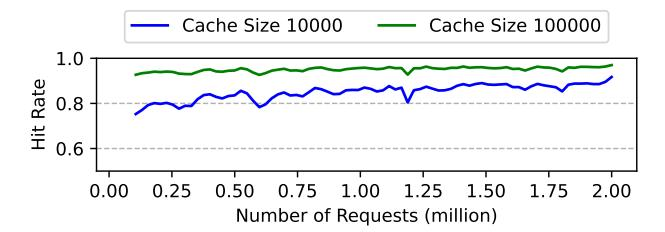
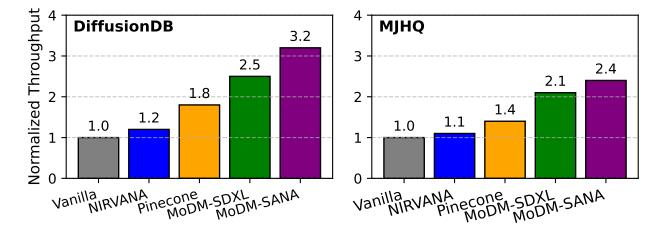
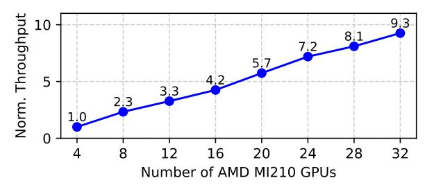
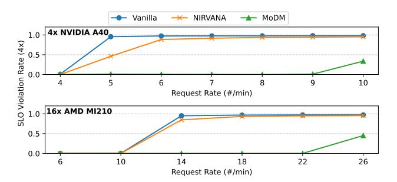
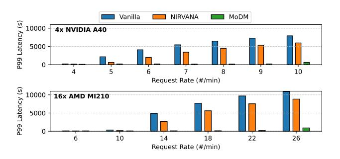
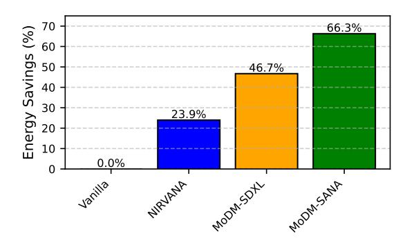

# <span id="page-0-1"></span>MoDM: Efficient Serving for Image Generation via Mixture-of-Diffusion Models

Yuchen Xia University of Michigan Ann Arbor, MI, USA stilex@umich.edu Divyam Sharma University of Michigan Ann Arbor, MI, USA divyams@umich.edu Yichao Yuan University of Michigan Ann Arbor, MI, USA yichaoy@umich.edu

Souvik Kundu Intel Labs Los Angeles, CA, USA souvikk.kundu@intel.com

# Nishil Talati University of Michigan Ann Arbor, MI, USA talatin@umich.edu

#### **Abstract**

Diffusion-based text-to-image generation models trade latency for quality: small models are fast but generate lower quality images, while large models produce better images but are slow. We present MoDM, a novel caching-based serving system for diffusion models that **dynamically** balances latency and quality through a mixture of diffusion models. Unlike prior approaches that rely on model-specific internal features, MoDM caches final images, allowing seamless retrieval and reuse across multiple diffusion model families. This design enables adaptive serving by dynamically balancing latency and image quality: using smaller models for cache-hit requests to reduce latency while reserving larger models for cache-miss requests to maintain quality. Small model image quality is preserved using retrieved cached images. We design a global monitor that optimally allocates GPU resources and balances inference workload, ensuring high throughput while meeting Service-Level Objectives (SLOs) under varying request rates. Our evaluations show that MoDM significantly reduces an average serving time by 2.5× while retaining image quality, making it a practical solution for scalable and resource-efficient model deployment. Code is available at: https://github.com/stsxxx/MoDM.

# CCS Concepts: • Computer systems organization $\rightarrow$ Cloud computing.

Keywords: Model serving; Image generation; Caching

#### **ACM Reference Format:**

Yuchen Xia, Divyam Sharma, Yichao Yuan, Souvik Kundu, and Nishil Talati. 2026. MoDM: Efficient Serving for Image Generation via Mixture-of-Diffusion Models. In Proceedings of the 31st ACM International Conference on Architectural Support for Programming


This work is licensed under a Creative Commons Attribution-NonCommercial 4.0 International License.

ASPLOS '26, Pittsburgh, PA, USA
© 2026 Copyright held by the owner/author(s).
ACM ISBN 979-8-4007-2165-6/2026/03

https://doi.org/10.1145/3760250.3762220

Languages and Operating Systems, Volume 1 (ASPLOS '26), March 22–26, 2026, Pittsburgh, PA, USA. ACM, New York, NY, USA, 20 pages. https://doi.org/10.1145/3760250.3762220

<span id="page-0-0"></span>

**Figure 1.** Overview of MoDM that balances between high image quality and short latency using a mixture of models.

#### 1 Introduction

Diffusion models have revolutionized text-to-image generation, enabling the creation of high-quality, photorealistic images from natural language descriptions. Their success has made them a cornerstone of AI-driven creative tools, powering applications in digital art, content generation, and interactive media. The demand for diffusion models is at an all-time high. Adobe's Firefly service [1] has generated over 2 billion images, while OpenAI's DALL-E 2 [2] has seen similar adoption, alongside an exponential rise in prompt submissions to Stable Diffusion systems, as shown by DiffusionDB [3]. However, each diffusion model inference takes 10s of seconds, making it a computationally expensive task. Meeting this growing demand requires significant improvements in serving system throughput and latency.

An effective way to improve diffusion model performance is through *caching*, which reduces redundant computations and accelerates inference. Prior works have explored various caching techniques [4–11], including latent caching (storing intermediate noisy features), feature caching (storing activations), and image patch caching. While these techniques enhance performance, caching intermediate features has two major limitations. First, it restricts serving to a single model, as cached content is model-specific. Second, relying on just one model limits the potential performance gains, reducing flexibility in optimizing inference.

In this paper, we introduce MoDM, an efficient serving system for text-to-image generation using a mixture of diffusion models. While our work is based on the general idea of caching, MoDM is uniquely designed to achieve three design goals. (1) Diffusion models trade off inference latency and image quality: large models generate high-quality images but are slow, while smaller models are faster but sacrifice quality. MoDM dynamically exploits this trade-off by designing a caching strategy compatible with multiple models to optimize both speed and quality. (2) To maintain high-quality image generation, MoDM implements an advanced retrieval strategy that ensures retrieved cached content closely aligns with new prompts. (3) Finally, MoDM introduces an adaptive serving system that dynamically balances latency and quality based on request rates and system load, ensuring efficient and scalable performance.

Fig. 1 shows the design overview of MoDM. To ensure that the cache content is accessible and relevant for multiple models, we propose to *cache final generated images* in the past, in contrast to caching latent intermediate images in prior work [6]. When a new prompt closely matches a cached image, MoDM retrieves the image, applies controlled noise, and refines it using a smaller model. This approach preserves the quality of the cached image while benefiting from the lower latency of the smaller model. Requests that miss the cache are processed using a large model. This hybrid approach effectively balances latency and image quality by using a *mixture of models*.

Caching final images enables retrieval based on text-to-image similarity, unlike prior works [6] that rely solely on text-to-text similarity by caching intermediate features. Leveraging the CLIP score [12] and image generation examples, we demonstrate that text-to-image similarity retrieval better aligns with user prompts, using it for cache retrieval in MoDM. Building on this, MoDM integrates image caching and a mixture of models into a high-performance diffusion model serving system. The system features a *Request Scheduler* that manages incoming requests, categorizes them into cache hits and misses, retrieves cached images, and maintains cache content over time. Additionally, a *Global Monitor* analyzes request rates and cache hit/miss distributions to dynamically allocate GPU resources, scheduling different models for inference based on workload conditions.

We evaluate the effectiveness of MoDM using both performance (i.e., throughput and tail latency) and image quality (i.e., CLIP [12] and FID [13] scores) metrics. Using the DiffusionDB [3] dataset, we demonstrate that MoDM achieves a 2.5× improvement in inference throughput and 46.7% lower energy consumption, compared to using only a high-quality model, by leveraging Stable Diffusion-3.5-Large as a highquality model and Stable Diffusion-XL as a low-latency model. Additionally, we evaluate tail latency under varying request rates, showing that MoDM sustains significantly higher loads without violating Service Level Objectives (SLOs), outperforming state-of-the-art solutions. Finally, we highlight the versatility of MoDM by serving requests across different model families, including Stable Diffusion [14] and SANA [15]. Unlike SANA that statically reduce inference cost by designing smaller models, MoDM introduces a novel technique that can intelligently and dynamically balance latency and quality by leveraging a mixture of diffusion models. The contributions of MoDM are as follows.

- An optimized cache design and retrieval policy based on final images to accelerate diffusion model inference.
- Generating images by retrieving a cached image, adding noise, and de-noising it with a low-cost model.
- A hybrid serving approach that leverages small and large models to balance latency and image quality.
- MoDM: an end-to-end text-to-image serving system design that dynamically adjusts to load variations, achieving 2.5× performance improvement.

# <span id="page-1-0"></span>2 Background on Diffusion Model Serving2.1 Diffusion Models

Diffusion models [15-17] generate text-prompted images from noise via an iterative de-noising mechanism. These models employ a forward process adds noise over T steps, and a reverse process de-noises the image iteratively. Each de-noising step involves passing the latent representation through the full model, which is computationally expensive, with a typical inference requiring 50 steps [6].

This makes diffusion models slower than non-iterative models like GAN [18] or VAE [19], presenting challenges for real-time and high-throughput applications. Diffusion models are evaluated using several metrics: the Frechet Inception Distance (FID) score [13], which measures image realism and fidelity by comparing generated images to real ones; the CLIPScore [12], which quantifies the alignment between generated images and their corresponding text prompts; the PickScore [20], which leverages a preference-tuned language-vision model to better reflect human judgment of image-text compatibility; and the Inception Score (IS) [21], which evaluates the quality and diversity of generated images based on the confidence and entropy of class predictions from an Inception network. Diffusion models vary in size, with larger models like Stable Diffusion 3.5-Large [14] and

Imagen 3 [22] offering high-quality, detailed images at the cost of longer inference times, while smaller models like Stable Diffusion XL [23] and SANA [15] prioritize speed but sacrifice image fidelity. While previous studies suggest that high-quality image generation requires a large model [6, 14], our work challenges this by using a mixture of small and large models to optimally balance latency and quality.

#### 2.2 Caching to Improve Serving Performance

To reduce the computational overhead of iterative de-noising in diffusion models, several prior works [4-11] optimize inference based on prompt similarities. One notable approach, NIRVANA [6], introduces an approximate caching mechanism that stores intermediate latent representations from previous images. When a new prompt closely matches a cached prompt, NIRVANA retrieves the cached representation and skips several de-noising steps, improving latency. The system caches multiple latent representations to enable flexibility in retrieval, using larger values of k for highly similar prompts. NIRVANA uses text-to-text similarity to guide the retrieval process, comparing the current prompt's text embedding with cached ones to select the most relevant intermediate representation. This approach reduces inference latency by up to 20% while maintaining image quality.

# 3 Challenges of Mixture-of-Models Design

This section explores the challenges and opportunities of using a model mixture to balance the latency-quality trade-off and addresses key research questions for designing an effective caching-based serving system. (1) How can we design a cache that minimizes space usage while being model agnostic? (2) How can we efficiently retrieve cached items to ensure optimal quality of image generation? (3) How can we best balance high image generation quality with low inference latency?

#### <span id="page-2-2"></span>3.1 What to Cache?

Prior work [6] uses latent caching, storing multiple intermediate representations to speed up diffusion model inference. However, it has two main drawbacks: significant storage overhead, with 2.5MB per image due to the need to store multiple latent intermediates (using Stable Diffusion-3.5-Large as an example), compared to 1.4MB for storing only the final image; and model dependence, as latents from one model are incompatible with other models, leading to cache fragmentation and scalability issues in multi-model environments. An alternative is to cache *full images*, which are universally interpretable and model-independent, simplifying cache management and reducing storage costs. This approach eliminates the need for separate latent caches, utilizes compressed formats like PNG and JPEG, and allows the dynamic reintroduction of noise to reconstruct intermediate

<span id="page-2-0"></span>


**Figure 2.** Comparison of CLIPScore and PickScore distributions for retrievals based on text-to-text and text-to-image similarity. Higher is better for both scores.

states, enabling compatibility across different models and improving scalability in large-scale serving systems.

**Insight:** Caching full images reduces storage overhead, eliminates model dependency, and enables broad reuse across different diffusion models.

# <span id="page-2-1"></span>3.2 How to Retrieve Cached Items?

Existing caching methods [6] use text-to-text similarity for cache retrieval, which often leads to incorrect matches due to a lack of visual alignment. These methods focus on text embeddings, which do not guarantee that the retrieved image accurately reflects the user's intent. Additionally, since prior approaches cache only latent representations rather than full images, they cannot leverage text-to-image similarity, further reducing retrieval precision.

Image caching enables retrieval based on text-to-image similarity, significantly improving alignment with the user's request in terms of style, structure, and content. By using CLIP embeddings or similar cross-modal techniques, the system ensures better visual relevance. As shown in Fig. 2, text-to-image retrieval results in higher CLIPScore compared to text-to-text retrieval, indicating stronger visual alignment between the retrieved image and the new request text. To address potential bias from using CLIP for both retrieval and evaluation, we also report PickScore, which similarly favors text-to-image retrieval. Fig. 3 highlights cases where

<span id="page-3-0"></span>

Figure 3. Comparison of image quality using a cached image retrieved through text-to-text and text-to-image similarity.

text similarity does not align well visually, underscoring the importance of cross-modal retrieval for effective caching.

Insight: Text-to-image similarity-based retrieval is superior to text-to-text similarity because it ensures better visual alignment with user intent.

### 3.3 How to Balance Between Latency and Quality?

Using a single diffusion model for inference fails to effectively balance the latency-quality trade-off. In Nirvana, despite a large cache of 1.5 million latents and a cache hit rate over 90%, the system only achieves a 20% reduction in computation, remaining vulnerable to high request bursts and frequent SLO violations (more details in [§7.2\)](#page-10-0). To address this, cachehit requests can be offloaded to a smaller diffusion model, as recent studies suggest that minor refinements can be efficiently handled by lightweight models [\[24,](#page-13-17) [25\]](#page-13-18). Research on diffusion dynamics [\[26,](#page-13-19) [27\]](#page-13-20) shows that early de-noising steps determine structure, while later steps focus on fine details, enabling smaller models to handle cache-hit requests with minimal quality loss. Comparing large and small models reveals that adaptive model selection can reduce computation time while maintaining acceptable quality, offering a promising approach for real-world serving systems. Here, a large model refers to one like Stable Diffusion-3.5-large, while a small model refers to one like SANA.

Insight: Using a mixture of small and large diffusion models optimizes the latency-quality trade-off, ensuring efficient computation while maintaining high image quality.

# 4 **MoDM** Design Overview

This section provides the design goals and overview of the MoDM serving system.

# 4.1 Design Goals

MoDM addresses the challenges of serving diffusion model inference workload with the following Design Goals (DG).

DG#1: Dynamically Balancing Latency and Quality. Building on the trade-off discussed in [§2.1,](#page-1-0) our goal is to achieve inference latency close to a small diffusion model while preserving the image quality of a large model. MoDM accomplishes this by strategically leveraging both small and large models for serving. Unlike prior works that either statically reduce inference costs by designing new models [\[15\]](#page-13-9) or achieve limited gains by skipping a few de-noising steps [\[6\]](#page-13-5), MoDM strives to dynamically optimize the latency-quality trade-off.

DG#2: Compatibility with Multiple Models. Different diffusion models and model families (e.g., Stable Diffusion and SANA) offer distinct trade-offs in terms of latency, quality, and architectural optimizations. Relying on a single model family limits flexibility and may lead to suboptimal performance across diverse request rates. Our design goal is to enable seamless serving across multiple model families, allowing the system to dynamically select the best model for different requests based on latency considerations.

DG#3: Optimized Cache Design and Retrieval. Our caching mechanism is designed to maximize efficiency while maintaining broad compatibility. The key goals include (1) achieving a high cache hit rate with minimal storage overhead, (2) ensuring cached items remain usable across multiple models (DG#2), (3) implementing cache management to prevent over-representation of specific items in future generations, and (4) adopting an accurate retrieval that effectively matches new prompts with cached items.

DG#4: Adaptability to Varying Request Rates. Request rates fluctuate over time [\[3,](#page-13-2) [6\]](#page-13-5), posing challenges for maintaining efficient serving performance. Our system is designed to dynamically adapt to these variations by selectively utilizing different models, ensuring an optimal balance between quality and latency under varying workloads.

### 4.2 System Design Overview

Fig. [4](#page-4-0) presents an overview of the MoDM system architecture, highlighting its key design components. The system takes a text-based user prompt as input and generates an image as output. To optimize real-time text-to-image generation with diffusion models, our approach integrates cacheaware request scheduling and dynamic model selection.

The Request Scheduler manages the flow of incoming image generation requests, ensuring efficient resource utilization. Upon receiving a request, it generates a text embedding using a CLIP model hosted by the scheduler. This embedding is then analyzed to determine if a cached image closely

<span id="page-4-0"></span>

**Figure 4.** Overview of MoDM system design.

matches the request, as detailed in §5.2. If a sufficiently close match is found, the scheduler retrieves the cached image, enabling content reuse and reducing computational overhead. For cache-hit requests, the scheduler dynamically adjusts the number of de-noising steps based on the text-to-image similarity score, resuming the generation process from a later stage with lower computation. If no suitable cached image is identified, the request is marked as a cache miss and undergoes full inference.

To meet **DG#1** and optimize throughput, an underlying design principle in MoDM is to **serve cache-hit requests with a small model** (more details in §5.1), which *reduces latency while maintaining the quality of the generated image through cached content.* **Cache-miss requests are handled by a larger model**, ensuring high image *generation quality* with full inference from scratch. The scheduler directs each request to the appropriate queue: cache-hit requests go to the *cache hit queue*, where a refined image is generated with fewer diffusion steps, while cache-miss requests are sent to the *cache miss queue* for full synthesis. Additionally, to meet **DG#3**, the scheduler manages the cache by storing newly generated images and removing older ones, ensuring efficient memory usage and maintaining content diversity.

The **Global Monitor** continuously tracks request patterns and system load in real time, leveraging data from the request scheduler to optimize model allocation across GPU workers. To meet **DG#4**, a *PID (Proportional-Integral-Derivative) controller* dynamically adjusts GPU allocation based on key metrics such as request rate, cache hit rate, and de-noising step distribution. The system strategically balances between model variants, with larger models handling full inference for high-quality outputs and refinements, while smaller models focus solely on efficient refinements of cached images. By adapting to workload fluctuations, the global monitor ensures optimal resource distribution, preventing resource underutilization while maintaining quality. These design details are discussed in §5.3.

**Table 1.** Notations used in this design.

<span id="page-4-2"></span>

| Symbol               | Description                                                         |
|----------------------|---------------------------------------------------------------------|
| $H_{\rm cache}$      | Cache hit rate in the last monitoring period.                       |
| T                    | Total de-noising steps                                              |
| K                    | Number of de-noising steps skipped                                  |
| P(K = k)             | Fraction of cache-hit requests assigned to refinement step <i>k</i> |
| R                    | Recorded request rate in the last monitoring period                 |
|                      | (requests per minute).                                              |
| $W_{\rm hit}$        | Cache-hit workload.                                                 |
| $W_{\rm miss}$       | Cache-miss workload.                                                |
| N                    | Total number of GPU workers.                                        |
| $P_{\rm small}$      | Profiled throughput of the small model                              |
|                      | (requests per minute per GPU).                                      |
| $P_{\mathrm{large}}$ | Profiled throughput of the large model                              |
|                      | (requests per minute per GPU).                                      |
| $N_{\rm small}$      | Number of allocated small models.                                   |
| $N_{\rm large}$      | Number of allocated large models.                                   |
| $K_p, K_i, K_d$      | PID tuning parameters for dynamic resource allocation.              |

The Workers execute image generation tasks in parallel across multiple GPUs, each hosting a model variant based on the global monitor's allocation and dynamically switching models as needed. While workers running larger models are capable of handling both cache-hit and cache-miss requests, they prioritize cache-miss requests, as these require full inference across all denoising steps and therefore incur significantly higher latency. In contrast, workers running smaller models exclusively process cache-hit requests, focusing on efficient refinement to minimize system-wide latency. This dynamic task assignment and model switching strategy ensures optimal GPU utilization, maintaining high throughput while balancing the image generation quality to meet DG#1 and DG#2.

### 5 MoDM Design Details

In this section, we present the detailed design of MoDM, addressing four key research questions. (1) How to use cached images for generation by applying a subset of de-noising steps with a small model? (2) How to effectively retrieve items from the cache and determine the optimal number of de-noising steps for a given prompt? (3) What is the role of the global monitor in managing GPU resources and model allocation to optimize efficiency under varying load conditions? (4) How does the request scheduler manage the image cache to ensure efficient system performance? The notations used in this section are explained in Table 1.

# <span id="page-4-1"></span>5.1 Generation using Cached Image with Reduced De-Noising Steps

Upon receiving a request, the request scheduler uses the prompt embedding to check for a sufficiently similar image in the cache. If a match is found, MoDM retrieves the image, adds noise to it by a pre-determined amount, and finally uses a diffusion model to de-noise the image for the given prompt. The key idea is to augment with sufficient noise to generate a new image, enabling the system to skip de-noising steps.

Given a query embedding q, the system retrieves the most relevant cached image by computing its cosine similarity with cached image embeddings (§3.2):

$$S(q, I^*) = \frac{q \cdot e_{I^*}}{\|q\| \|e_{I^*}\|} \tag{1}$$

where  $e_{I^*}$  is the embedding of the cached image  $I^*$ , extracted using a pretrained CLIP image encoder. Retrieval is performed only if the similarity score  $S(q, I^*)$  exceeds a predefined threshold  $\tau$ , which is treated as a hyperparameter controlling the trade-off between retrieval precision and recall. Rather than using the retrieved image directly, the system reintroduces noise using the same scaling method as image-to-image diffusion, enabling the image to re-enter the de-noising process at an intermediate timestep. This approach allows for refinement of the retrieved image, ensuring better alignment with the request while preserving computational efficiency. Given a target timestep  $t_k$ , the noisy image  $\tilde{I}$  is generated using the diffusion model's noise schedule:

$$\tilde{I} = \sigma_{t_k} \cdot \epsilon + (1 - \sigma_{t_k}) \cdot I^*, \tag{2}$$

where  $\sigma_{t_k}$  is the noise scaling factor retrieved from the diffusion model's noise schedule sigmas  $[t_k]$ ,  $\epsilon \sim \mathcal{N}(0, I)$  is Gaussian noise sampled from a standard normal distribution, and  $I^*$  is the retrieved image.

The system then runs the diffusion model for the remaining T-k steps, skipping the initial k de-noising iterations. This step refines the retrieved image to match the new request. Since the retrieved image shares high-level features with the target, running only the later de-noising steps allows controlled adjustments to colors, textures, and details without regenerating the image from scratch. By avoiding redundant computation, this method significantly reduces inference cost while preserving high image fidelity.

The choice of k is determined dynamically based on the similarity between the retrieved image and the new request (§5.2). A higher similarity score indicates that the retrieved image closely matches the new prompt, requiring fewer modifications to align with the desired output. In such cases, a larger k is selected to skip more de-noising steps and reduce latency. Conversely, for lower similarity, a smaller k is used to allow more iterative refinement.

With  $H_{\text{cache}}$  to be the cache hit rate with  $C_{\text{gen}}$  denoting the total compute cost for generating a new image from scratch using the large model. Each request requires a total of T de-noising steps with cache hits only requiring T-k steps. The computation saved per cache-hit request, weighted by the distribution of different diffusion steps K, is:

$$C_{\text{saved}} = H_{\text{cache}} \sum_{k=0}^{T} \frac{k}{T} C_{\text{gen}} P(K = k).$$
 (3)

Instead of running the large model for refinement, our system can offload cache-hit refinements to a smaller model, which performs the remaining T - k steps at a significantly

lower cost. Let  $C_{\text{small}}$  denote the compute cost of the small model per step relative to the large model. The total compute savings, considering the distribution of K, is:

$$C_{\text{total\_saved}} = H_{\text{cache}} \sum_{k=0}^{T} P(K=k) \left( \frac{k}{T} C_{\text{gen}} + \frac{T-k}{T} (C_{\text{gen}} - C_{\text{small}}) \right).$$
(4)

Since the small model also performs only the remaining T-k steps, its impact on total compute savings depends on how much cheaper each step is relative to the large model. The larger the gap between  $C_{\rm gen}$  and  $C_{\rm small}$ , the greater the additional efficiency gained by refinement offloading.

#### <span id="page-5-0"></span>5.2 Cache Retrieval and k Selection

Since our system caches full images rather than latents, we can generate intermediate states for any k by applying controlled noise to the cached image. To balance computational efficiency and generation diversity, we restrict k to choose from a discrete set of N values (where N=6 in our case),  $\mathcal{K}=\{5,10,15,20,25,30\}$ . This selection ensures efficient refinement while covering a sufficient range of de-noising steps to maintain high-quality generation. Given that a full generation requires (T=50) de-noising steps, we cap k at 30 to prevent excessive similarity between refined outputs while still achieving significant computational savings.

To ensure that cached image refinements maintain a sufficiently high level of quality, MoDM follows a quality constrained retrieval policy. Specifically, we enforce that the quality of an image generated from a retrieved cached image using a small model must be at least  $\alpha$  times the quality of an image generated from scratch using a large model, where  $\alpha \leq 1$  is the quality degradation factor controlling the allowable trade-off between efficiency and output fidelity:

$$Q_{\text{cache-hit}}(k) \ge \alpha \cdot Q_{\text{full-gen}}.$$
 (5)

We conduct an empirical evaluation to determine appropriate cache hit thresholds  $\tau$  and k selection values. We generate 10000 images from DiffusionDB [3] using a large model and then performed refinements starting at different k steps ( $k \in \{5, 10, 15, 20, 25, 30\}$ ), selecting the most semantically aligned cached image from a cache of 100000 stored images. We set a strict quality constraint of  $\alpha = 0.95$ . While this analysis is inspired by prior work [6], the key difference is that we rely on text-to-image similarity for retrieval based on §3.2 instead of earlier text-to-text similarity attempt.

We present a detailed analysis of these results in Fig. 5a, illustrating the relationship between the similarity score between the query and retrieved image, the selected k, and the final image quality. For a fixed k, as the text-image similarity increases, the final image quality also improves. Furthermore, for the same text-image similarity, a smaller k involves more refinement to the retrieved image, resulting in higher final image quality but lower computational savings. A quality factor greater than 1 is observed when the retrieved images

<span id="page-6-1"></span>

**Figure 5.** (a) Relationship between final image quality and text-image similarity across different k, (b) logic for determining k based on text-to-image similarity.

closely align with the new prompt (*i.e.*, exhibits high text-to-image similarity). In such cases, even partial refinement using a smaller model can further enhances image quality. The figure also marks the quality degradation parameter  $\alpha$ , and for each k, we determine the lowest possible text-image similarity that ensures the final image quality remains above  $\alpha$ , using this value as the cache hit threshold for that specific k. Fig. 5b presents the decision process for determining k based on similarity. This ensures that MoDM maximizes computational savings while maintaining the required image quality.

Cache Threshold Selection. MoDM utilizes text-to-image similarity (CLIPScore) to achieve higher cache utilization while maintaining a stringent quality factor ( $\alpha \ge 0.95$ ) compared to Nirvana's text-to-text similarity-based method for ( $\alpha \geq 0.90$ ). Although NIRVANA applies high thresholds (0.65-0.95) on text-to-text similarity, this measure does not directly account for the perceptual fidelity between the input prompt and generated images. In contrast, CLIP scores explicitly capture semantic alignment between text and images, providing a more accurate representation of the final visual output's relevance to the user's query. Consequently, even with lower numerical thresholds (from 0.25 to 0.3), MoDM achieves better cache utilization by targeting semantically similar images, better matching the user's intent. We evaluate the effectiveness of the proposed threshold heuristic (Fig. 5b) by randomly sampling a new set of 1,000 prompts, distinct from those used during training the heuristic, that result in cache hits. For each prompt, we use our heuristic to determine the number of denoising steps, generate the corresponding image, and assess its quality using the CLIP score. On average, the heuristic-guided images achieve a CLIP score of 28.50, compared to 28.59 from the full large-model pipeline, corresponding to 99.7% of the baseline quality. This not only surpasses our target of 95% quality retention but also demonstrates that our method can significantly reduce the number of denoising iterations, and hence inference cost-with minimal loss in perceptual fidelity.

**Performance of Cache Retrieval.** MoDM performs text-to-image similarity computations on the GPU with minimal

overhead. First, image embeddings require very little memory: storing 100000 image embeddings consumes just 0.29 GB. Second, cosine similarity computation is highly optimized for GPUs, as it involves element-wise normalization and matrix multiplication, both of which are efficient operations. The latency of cache retrieval, therefore, is negligible, taking only 0.05 seconds for 100000 cached images, whereas the de-noising process takes over 10 seconds. This ensures that similarity checks remain lightweight and do not become a bottleneck in cache retrieval.

### <span id="page-6-0"></span>5.3 Resource Management using Global Monitor

A large-scale serving framework must leverage multiple GPUs to efficiently handle high request volumes. Since diffusion models are computationally intensive, a single model running on a single GPU would quickly become a bottleneck under heavy workloads. To achieve high throughput, a serving system distributes requests across multiple GPUs, allowing concurrent execution of multiple inference tasks. MoDM introduces a mixture-of-models design to balance latency and image quality. This necessitates a resource management system that efficiently allocates GPU workers between large and small models to balance request throughput, latency, and quality. In specific we present two operational modes.

- Quality-Optimized Mode: MoDM aims to meet the request rate while maintaining the highest image quality.
- Throughput-Optimized Mode: MoDM maximizes throughput, ensuring the highest number of processed requests while still maintaining acceptable image quality.

**5.3.1 Quality-Optimized Mode.** In this mode, the resource management system dynamically allocates available GPU workers between large and small models to (1) meet the request rate requirement and (2) maintain image quality as high as possible. The system determines the optimal number of large  $N_{\text{large}}$  and small  $N_{\text{small}}$  models based on real-time metrics such as the cache hit rate, the distribution of cachehit refinement steps k, and the request rate R. Each GPU (a worker) can only host one model at a time, imposing

<span id="page-6-2"></span>
$$N_{\text{large}} + N_{\text{small}} \le N.$$
 (6)

The system must also satisfy the following constraints to ensure compliance with the latency objectives.

Cache Miss Throughput Constraint. Since cache-miss requests require full image generation and can only be processed by large models, the aggregate throughput of all large models must be at least the workload required to process cache miss requests at a given request rate.

<span id="page-6-3"></span>
$$N_{\text{large}}P_{\text{large}} \ge W_{\text{miss}} = (1 - H_{\text{cache}})R.$$
 (7)

**Cache Hit Throughput Constraint.** Cache hit requests are processed using either a large or a small model; the amount of work depends on the selected refinement step k.

The effective workload for cache hit requests depends on the portion of requests assigned to different *k*-values:

<span id="page-7-1"></span>
$$W_{\text{hit}} = H_{\text{cache}} R \sum_{k \in \mathcal{K}} P(K = k) \left( 1 - \frac{k}{T} \right). \tag{8}$$

To ensure the system meets this workload demand, the remaining throughput from large (after serving cache-miss requests) and the small models must *together* be at least the cache-hit workload.

<span id="page-7-0"></span>
$$(N_{\text{large}}P_{\text{large}} - W_{\text{miss}}) + N_{\text{small}}P_{\text{small}} \ge W_{\text{hit}}.$$
 (9)

**Optimization Objective.** To maintain the highest possible image quality, we maximize the number of large models  $N_{\text{large}}$ , subject to the constraints in Eqs. (5)–(8):

<span id="page-7-3"></span>
$$\max_{N_{\text{large}}, N_{\text{small}}} N_{\text{large}}, \quad s.t. \quad \text{Constraints (6)-(9)}. \tag{10}$$

5.3.2 Throughput-Optimized Mode. In this mode, all cache miss requests are processed using a large model, while all cache hit requests are processed using a small model. This strategy minimizes the total computational workload by leveraging the efficiency of small models for all refinement tasks. To achieve the highest possible throughput, the system balances the allocation of large and small models based on the ratio of cache-hit and cache-miss workloads. Since all cache-hit requests are processed by a small model, the cache-hit workload should be adjusted to account for the difference in throughput between large and small models. The weighted cache-hit workload is computed as:

$$W_{\rm hit}^{\rm weighted} = \frac{W_{\rm hit}}{P_{\rm small}/P_{\rm large}}.$$
 (11)

Here,  $W_{\text{hit}}$  is calculated in Eq. (8).

The number of large models needed based on workload:

$$N_{\rm large} = \frac{W_{\rm miss}}{W_{\rm hit}^{\rm weighted} + W_{\rm miss}} \times N.$$
 (12)

where N represents the total number of available workers and  $W_{\rm miss}$  is calculated in Eq. (7).

To achieve our design objective, we develop the Global Monitor algorithm (shown in Algorithm 1). The algorithm begins by analyzing request patterns from the previous recording period to compute two key workloads: the cache miss workload, which consists of requests that bypass the cache and must be fully processed by large models, and the cache hit workload, which includes requests that retrieve an image from the cache and require additional refinement.

For quality-optimized mode, the algorithm first computes the minimum number of large models required to meet the cache miss throughput constraint (Eq. 7), ensuring sufficient capacity for full image generation. It then iteratively increases the number of large models while verifying that the combined throughput of the remaining large and small models remains sufficient to handle the cache hit workload

### <span id="page-7-2"></span>Algorithm 1 Global Monitor for Dynamic Model Allocation

**Require:** Number of GPUs N, PID parameters  $(K_p, K_l, K_d)$ , large model throughput  $P_{\text{large}}$ , small model throughput  $P_{\text{small}}$ , total denoising steps T, cache hit rates  $H_{\text{cache}}$ , request rate R, refinement step distribution  $k\_rates$ 

```
Ensure: Dynamic allocation of large and small models to balance request load
       Initialize PIDController with K_p, K_i, K_d
       // Compute cache miss workload miss_workload \leftarrow (1 - H_{\rm cache}) \times R
 3:
        // Compute refinement workload factor
 5:
        For each k, rate in k_rates.items():
          F_{\text{refine}} \leftarrow F_{\text{refine}} + \text{rate} \times \left(1 - \frac{k}{T}\right)
 6:
 7:
        // Compute hit_workload
        hit\_workload \leftarrow H_{cache} \times R \times F_{refine}
 9:
        If Quality-Optimized Mode:
           // Compute minimum number of large models
           num\_large \leftarrow \lceil miss\_workload / P_{large} \rceil
11:
           // Search for the maximum possible number of large models
12:
13:
           While num_large \leq N do
14:
              \texttt{available\_throughput} \leftarrow \texttt{num\_large} \times P_{large} - \texttt{miss\_workload}
                                               +(N-num\_large) \times P_{small}
15:
              If available_throughput ≥ hit_workload then
16:
17:
                 Increase num_large by 1 and continue
18:
                 Decrease num_large by 1 and break
19:
20:
        Else If Throughput-Optimized Mode:
           // Compute weighted cache-hit workload
21:
           \texttt{hit\_workload\_weighted} \leftarrow \texttt{hit\_workload} \times \frac{r_{\text{large}}}{P_{\text{small}}}
22:
           // Compute number of large models based on workload ratio
23:
           num\_large \leftarrow \left(\frac{\texttt{miss\_workload}}{\texttt{hit\_workload\_weighted+miss\_workload}}\right) \times N
24:
25.
        // Apply PID adjustment to current_num_large
        \Delta_{large} \leftarrow PIDController.compute(num_large, current_num_large)
        current_num_large \leftarrow current_num_large + \Delta_{large}
         // Compute final allocations
        N_{\text{large}} \leftarrow \max(1, \min(\texttt{round}(\texttt{current\_num\_large}), N))
30:
        Return
           \texttt{model\_allocation} \leftarrow \texttt{["large"]} \times N_{\text{large}} + \texttt{["small"]} \times (N - N_{\text{large}})
```

(Eq. 9). This process continues until the cache-hit workload constraint is violated, aligning with the optimization objective in Eq. 10.

For throughput-optimized operation, the system first computes the weighted cache hit workload to account for differences in throughput between large and small models. It then balances the allocation of large and small models proportionally to workload demands, ensuring an optimal distribution. This approach enables efficient scaling while preventing resource underutilization.

After obtaining the heuristic-based initial allocation for either mode, the PID controller stabilizes resource distribution by adjusting large model counts in response to real-time demand fluctuations. With carefully tuned parameters ( $K_p = 0.6, K_i = 0.05, K_d = 0.05$ ), it dampens rapid changes, preventing oscillations. This hybrid approach leverages the efficiency of heuristics for quick decision-making while utilizing PID to enforce gradual, stable adjustments, ensuring both responsiveness and robustness in dynamic serving environments.

#### <span id="page-7-4"></span>5.4 Cache Maintenance

To maintain cache relevance, we explore trade-offs between different cache maintenance strategies. While prior work [6] adopts a utility-based approach, we investigate whether a simpler sliding window-based strategy can be equally effective. In this sliding window approach, newly generated images update the cache while the oldest images are discarded, effectively following a FIFO management policy. Our findings indicate that this FIFO-based strategy performs well. Using the DiffusionDB [\[3\]](#page-13-2) production dataset, we analyze the temporal correlation between requests, measuring the time gap between a new request and its corresponding retrieved image. Fig. [15](#page-15-0) (relocated to [§A.1](#page-15-1) due to space limitation) presents this data, revealing that over 90% of cache-hit requests retrieve images cached within four hours of the new request. This aligns with user behavior, as many users iteratively prompt diffusion models with similar text variations to refine generated content. Beyond its quantitative benefits, this policy also helps maintain content diversity in the cache. In contrast, a utility-based cache can lead to high reuse of a small subset of images, biasing future image generations. Based on both qualitative and quantitative analysis, MoDM adopts a simple yet effective FIFO-based cache maintenance.

As inference serving progresses in production, a key design decision is whether to cache only images generated by the large model or to include those generated by both the small and large models. To address this, we evaluate whether caching images produced by the small model maintains image generation quality. [§A.6](#page-16-0) provides a detailed quantitative analysis that compares the quality-performance trade-off of two design choices: caching images generated by (1) a large model only, and (2) both large and small models. Our evaluation shows that caching images generated by both models leads to a marginal drop in generation quality. This design choice, however, improves overall throughput by increasing a cache hit rate. This trade-off allows system designers to prioritize and select design choices in accordance with their overarching objectives.

### <span id="page-8-0"></span>5.5 Model-Agnostic Caching for Flexible Serving

Prior works [\[5](#page-13-21)[–8\]](#page-13-22) improve diffusion model inference using caching but rely on internal, model-specific features (e.g., latent representations, activations, image patches), restricting them to a single model for serving. In contrast, MoDM caches final images based on [§3.1,](#page-2-2) a universal representation compatible across multiple model families. This allows MoDM to serve requests with different diffusion models, dynamically balancing performance and quality to adapt to workload demands, SLOs, and image quality constraints.

# 6 Evaluation Methodology

Implementation and Hardware. We implement MoDM, our inference-serving system, in Python using PyTorch [\[28\]](#page-13-23), with the request scheduler, global monitor, and each worker running in a separate process. Node communication is handled by PyTorch RPC [\[29\]](#page-13-24), enabling efficient distributed deep learning. MoDM is deployed on two hardware configurations: a single server with four NVIDIA A40 GPUs (48GB

memory) and a 16-node cluster, each node equipped with four AMD MI210 GPUs (64GB memory).

Models and Workloads. We evaluate MoDM using four models to demonstrate cross-model compatibility. The large models used in our study includes Stable Diffusion-3.5-Large (SD3.5L) with 8B parameters [\[14\]](#page-13-8) and FLUX.1-dev (FLUX) with 12B parameters [\[30\]](#page-13-25). The small models include Stable Diffusion XL (SDXL) with 3B parameters [\[23\]](#page-13-16) and SANA with 1.6B parameters [\[15\]](#page-13-9). SD3.5L and FLUX are both flow-based models trained using the Flow Matching framework. We also include Stable Diffusion-3.5-Large-Turbo (SD3.5L-Turbo), a distilled variant of the SD3.5L model optimized to generate high-quality images in significantly fewer steps, to compare MoDM against a distilled baseline. All models except SDXL run in BF16 precision, while SDXL uses FP16, following the developers' default recommendations. All models use = 50 denoising steps and generate 1024×1024 images, except SD 3.5-Turbo, which uses 10 steps. For evaluation, we use DiffusionDB [\[3\]](#page-13-2), a real-world production dataset with 2 million images, and MJHQ [\[31\]](#page-13-26), a high-quality dataset of 30k MidJourney-generated images.

Modeling of Request Arrivals. We model the request arrival process as a homogeneous Poisson process with varying rates. We replay the trace of user-submitted prompts from the DiffusionDB dataset in their original arrival order (and in trace order for MJHQ, which lacks timestamp information) to emulate a production environment consistent with the portal deployment of a Stable Diffusion–based model. The image cache operates with the proposed FIFO-based cache management policy that shows a high degree of temporal locality as detailed in Appendix [A.1.](#page-15-1)

System Performance. We use the following metrics.

Maximum Throughput: We compare the highest throughput achieved by different baselines assuming that there enough number of requests to keep the system busy.

Service Level Objective (SLO) Compliance: We analyze the system's ability to meet predefined latency thresholds under varying request rates. Specifically, we evaluate compliance with two SLO requirements: latency within 2× and 4× that of the large model (Stable Diffusion-3.5-Large) inference.

Tail Latency: We measure the 99th percentile latencies to capture the worst-case response times and ensure system stability under load.

Maximum Load: We determine the highest sustainable request rate the system can handle while maintaining acceptable latency and quality of service.

Image Quality. Four metrics are used for quality.

CLIPScore [\[12\]](#page-13-6): Measures the alignment between the generated image and its corresponding prompt, providing an assessment of semantic accuracy.

FID (Fréchet Inception Distance) Score [\[13\]](#page-13-7): Quantifies the similarity between generated and groundtruth images by comparing their feature distributions.

<span id="page-9-0"></span>

Figure 6. Hit rate of MoDM for DiffusionDB.

*IS (Inception Score)* [21]: Evaluates the quality and diversity of generated images by analyzing the confidence and variety of class predictions from an Inception network.

**PickScore** [20]: Estimates human preference alignment by scoring how likely a generated image would be selected over others, trained on pairwise human comparisons.

**<u>Baselines.</u>** We compare against the following baselines.

**Vanilla System**: An inference-serving system where every request is fully processed by the large model (*i.e.*, SD3.5L or FLUX) without leveraging cached images or retrieval mechanisms. This represents a traditional approach to serving diffusion models.

**NIRVANA** [6]: A caching-based diffusion inference system that improves efficiency by reusing previously generated images to reduce redundant computation.

**PINECONE** [32]: Retrieves and serves an image based on the most similar prompt using CLIP text embedding similarity without refinement; if no suitable match is found, it generates the image from scratch.

**Experimental Setup.** Fig. 6 shows the overall hit rate across all 2 million requests from DiffusionDB with two different cache sizes. The hit rate remains consistent across both settings, indicating that conducting experiments on a subset of the dataset provides a generalizable result.

Throughput Experiments: We conduct experiments with 10000 requests from each dataset, using a cache of 10000 images generated by the large model. Unlike latency experiments, these tests focus solely on measuring maximum system throughput, ignoring timestamps. Additionally, we perform a scalability study w.r.t. GPU resources.

Latency and SLO Experiments: To evaluate tail latency and SLO compliance, we use the DiffusionDB dataset, sorting them by arrival time. We assign timestamps to requests using a Poisson distribution under different request rates to study the performance of the system under varying load.

Image Quality Comparison: To assess image quality, we generate 10,000 cached images per dataset in a warm-up phase, then serve another 10,000 requests, retrieving cached images when possible. This experiment runs in throughput-optimized mode, representing the worst-case image quality scenario (§5.3). For FID, we generate four sets of 10,000 images using the large model with identical requests but different seeds, randomly selecting ground truth for comparison.

<span id="page-9-1"></span>

<span id="page-9-2"></span>**Figure 7.** Throughput of different baselines normalized to Vanilla (Stable Diffusion-3.5-Large) on two datasets.


**Figure 8.** Throughput of different baselines normalized to Vanilla (FLUX) on DiffusionDB dataset. Both NIRVANA and MoDM baselines use FLUX as a large model.

With SD3.5L as the large model, we use cache-all for DiffusionDB (cache outputs from both small and large models) and cache-large for MJHQ (store only large-model outputs to preserve throughput while improving quality, §A.5). For experiments using FLUX as the large model, we also employ the cache-large strategy.

### 7 Evaluation Results

We evaluate the performance of MoDM using a variety of metrics including throughput, adaptability to varying request rates, scalability with respect to GPU resources, SLO compliance, and the quality of image generation<sup>1</sup>.

### <span id="page-9-3"></span>7.1 Throughput Evaluation

Fig. 7 presents the normalized throughput of MoDM and several baselines on the DiffusionDB and MJHQ datasets, using a cache size of 10,000 images. Throughput is normalized to the Vanilla baseline (Stable Diffusion-3.5-Large). On the real-world DiffusionDB workload, MoDM achieves a 3.2× improvement with SANA as the small model and 2.5× with SDXL. On MJHQ—a synthetic dataset with less temporal locality—the cache hit rate drops, resulting in reduced speedups (2.4× with SANA and 2.1× with SDXL). The performance gains primarily come from avoiding redundant denoising steps and utilizing smaller models on cache hits. To evaluate generality across different large model baselines, Fig. 8 reports throughput on DiffusionDB normalized to

<sup>&</sup>lt;sup>1</sup>Profiling results may vary across different software stack and configurations. The preliminary results presented here are specific to the evaluation framework used in this study for representative academic purpose.

<span id="page-10-1"></span>

**Figure 9.** Comparison of cache hit rates for NIRVANA and MoDM for the DiffusionDB dataset [3].

FLUX. MoDM continues to outperform all baselines, achieving up to 2.9× speedup with SANA and 2.4× with SDXL as small models. This demonstrates the robustness of our approach under varying model configurations and workload characteristics.

Fig. 9 compares cache hit rates and skipped de-noising steps between NIRVANA and MoDM using DiffusionDB (see §A.5 for the MJHQ dataset). We evaluate MoDM under two configurations: (1) caching only images generated by the large model when a cache miss occurs (MoDM cache-large) and (2) caching both cache-miss images and refined cache-hit images from both small and large models (MoDM cache-all). Cache hit rates are assessed across three cache sizes: 1000, 10000, and 100000.

The results highlight four key insights. First, MoDM achieves higher cache hit rates than NIRVANA. This improvement stems from our sliding window-based cache maintenance policy, which better accommodates similar requests occurring in close temporal proximity (§5.4), and our text-to-image similarity based retrieval policy, which enhances visual alignment with prompts (§3.2). Second, our text-to-image retrieval strategy increases the number of skipped de-noising steps. A higher k value (dark green portion) indicates more skipped steps, leading to substantial computational savings.

Third, caching images from both small and large models further improves cache hit rates. This is expected, as caching all images better serves temporally adjacent requests, whereas caching only large-model-generated images results in missed opportunities. Additionally, as shown in §A.6, caching images generated by the small model does not degrade image quality, justifying this design choice from a quality standpoint. Fourth, a cache size of 100000 is sufficient to achieve a high hit rate of 92.8%. This insight informs our design decision to balance cache size with hit rates while minimizing cache management and retrieval overhead. Notably, this is much smaller than prior work [6].

Fig. 10 illustrates how MoDM handles an increasing request rate, ranging from 6 to 26 requests per minute. This experiment was conducted using 16 MI210s. The vanilla system reaches a maximum throughput of approximately 10 requests per minute, while NIRVANA achieves a 20% improvement. However, as the request rate continues to rise, only MoDM is able to sustain the required throughput. Between

<span id="page-10-2"></span>

Figure 10. System throughput under increasing request

<span id="page-10-3"></span>

Figure 11. Scalability of MoDM with increasing #GPUs.

12 and 22 requests per minute, MoDM uses SDXL as the small model for efficiency. Beyond 22 requests per minute, even SDXL cannot meet demand. To address this, MoDM dynamically switches the small model from SDXL to SANA, further increasing throughput. We also evaluate these systems under fluctuating request rates, as shown in Fig. 17 in the Appendix. MoDM adapts to changes in workload more effectively than baseline systems, maintaining high throughput throughout periods of variability. This adaptive model selection allows MoDM to maintain stable performance by dynamically balancing image quality and latency, effectively handling diverse use cases like varying SLO demands and quality requirements. No prior state-of-the-art work offers such a broad and flexible trade-off between latency and quality.

To evaluate MoDM's scalability, we analyze how throughput improves with respect to GPU resources. Fig. 11 demonstrates super-linear scalability on MI210s, indicating that MoDM effectively utilizes available resources and remains adaptable to larger clusters without bottlenecks. The observed super-linear scalability arises from the fact that, with more GPUs, requests are processed at a faster rate. As a result, within a given time period, a greater number of generated images are added to the cache, leading to a higher cache hit rate. This increased cache efficiency further boosts throughput, reinforcing the benefits of scaling multiple GPUs.

# <span id="page-10-0"></span>7.2 SLO Compliance

Figs. 12 and 13 depict the SLO violation rates across different baselines. We evaluate SLO violations under two conditions: (1) when the generation latency exceeds 2× that of the large

<span id="page-11-0"></span>

**Figure 12.** SLO violation rate (>2× inference latency of Stable Diffusion-3.5 Large) for different request rates.

<span id="page-11-1"></span>

**Figure 13.** SLO violation rate (>4× inference latency of Stable Diffusion-3.5 Large) for different request rates.

model (Stable Diffusion-3.5-Large), as shown in Fig. 12, and (2) when it surpasses 4× the large model's latency, as shown in Fig. 13. Both figures compare SLO violations across varying request loads for two hardware configurations: 4 NVIDIA A40s and 16 AMD MI210s. The results demonstrate MoDM's ability to sustain significantly higher request loads without violating SLO, using the same hardware resources.

At low request rates, all three systems meet SLO requirements with minimal violations. However, as the request rate exceeds 5 requests per minute on A40s and 14 requests per minute on MI210s, SLO violations become predominant in both the vanilla system and NIRVANA. In contrast, MoDM maintains compliance for much higher loads, supporting up to 10 requests per minute on A40s and 22 requests per minute on MI210s under the 2× threshold, and up to 26 requests per minute on MI210s under the 4× threshold. MoDM achieves this by leveraging a combination of large and small models. As shown in Fig. 10, our system adaptively switches to a small diffusion model for inference under high request rates, significantly reducing computational overhead. These results underscore MoDM's superior efficiency in handling high request loads while minimizing SLO violations. §A.2 in appendix expands on these results further showing the 99th percentile tail latency values for different baselines.

# <span id="page-11-4"></span>7.3 Image Quality

Table 2 compares the image generation quality of MoDM with various baselines on the DiffusionDB and MJHQ-30k

<span id="page-11-2"></span>**Table 2.** Image quality on DiffusionDB and MJHQ-30k (Vanilla model: SD3.5L). Higher is better for CLIP, IS, and Pick: lower is better for FID.

|                  | DiffusionDB   |       |       | MJHQ-30k |               |       |       |        |
|------------------|---------------|-------|-------|----------|---------------|-------|-------|--------|
| Baseline         | <b>CLIP</b> ↑ | FID ↓ | IS ↑  | Pick ↑   | <b>CLIP</b> ↑ | FID ↓ | IS ↑  | Pick ↑ |
| Vanilla (SD3.5L) | 28.55         | 6.29  | 15.52 | 21.44    | 28.77         | 5.16  | 25.84 | 21.67  |
| SDXL             | 29.30         | 16.29 | 16.90 | 21.45    | 29.66         | 12.67 | 25.82 | 21.55  |
| SD3.5L-Turbo     | 27.23         | 14.63 | 15.38 | 21.45    | 27.84         | 10.68 | 23.70 | 21.59  |
| SANA             | 28.08         | 19.96 | 12.20 | 20.78    | 28.83         | 16.31 | 21.90 | 21.32  |
| Nirvana          | 28.02         | 9.01  | 15.38 | 21.28    | 28.57         | 5.37  | 25.04 | 21.59  |
| PINECONE         | 25.98         | 14.18 | 15.09 | 20.80    | 27.20         | 6.80  | 25.99 | 21.27  |
| MoDM-SDXL        | 28.70         | 11.85 | 15.27 | 21.00    | 28.79         | 6.87  | 25.46 | 21.33  |
| MoDM-SANA        | 28.01         | 16.96 | 12.67 | 20.79    | 28.82         | 9.96  | 22.25 | 21.28  |

<span id="page-11-3"></span>**Table 3.** Image quality on DiffusionDB (Vanilla model: FLUX). Higher is better for CLIP, IS, and Pick; lower is better for FID.

| Baseline       | CLIP ↑ | FID ↓ | IS ↑  | Pick ↑ |
|----------------|--------|-------|-------|--------|
| Vanilla (FLUX) | 26.82  | 6.02  | 16.69 | 21.29  |
| SDXL           | 29.30  | 17.60 | 16.90 | 21.45  |
| SD3.5L-Turbo   | 27.23  | 15.11 | 15.38 | 21.45  |
| SANA           | 28.08  | 24.37 | 12.20 | 20.78  |
| Nirvana        | 26.01  | 9.07  | 15.44 | 21.06  |
| PINECONE       | 24.37  | 19.41 | 16.08 | 20.63  |
| MoDM-SDXL      | 28.41  | 10.74 | 15.61 | 21.13  |
| MoDM-SANA      | 27.59  | 16.84 | 12.70 | 20.84  |

datasets, using SD3.5L as the vanilla large model. Across both datasets, MoDM achieves CLIP, IS, and Pick scores comparable to the Vanilla baseline and NIRVANA, demonstrating strong semantic alignment, perceptual diversity, and human preference alignment. Importantly, MoDM obtains substantially lower FID scores compared to standalone small or distilled models like SDXL, SD3.5L-Turbo, and SANA, indicating it preserves a high-quality distribution similar to the large model and avoids the occasional distortions and defects typical of small model outputs. In contrast, the PINECONE baseline shows noticeably lower CLIP scores, reflecting weaker imagetext alignment and highlighting the limitations of retrieval-only methods without generative refinement—emphasizing the effectiveness of MoDM's refinement approach.

Separately, Table 3 reports image quality on DiffusionDB with FLUX as the vanilla large model. MoDM balances quality and efficiency, achieving CLIP, IS, and Pick scores close to the strong FLUX baseline while improving upon the FID of standalone small or distilled models, confirming its generalization across large model backbones. Fig. 20 in Appendix shows example outputs, highlighting its high-quality image generation.

# 7.4 Comparison on the Quality-Performance Trade-off Space

To complement our main results, Fig. 14 visualizes the tradeoff space between image generation quality (measured using the FID score) and system throughput for various diffusionbased serving strategies. We plot the inverse throughput (1/Throughput) on the x-axis and FID score on the y-axis:

<span id="page-12-0"></span>

**Figure 14.** Quality-performance trade-off across serving strategies. The large model used is FLUX, and the evaluation is conducted on the DiffusionDB dataset. The default cache size for all systems is 10k unless otherwise specified.

both axes where lower values are desirable. This orientation highlights the dual objective in MoDM of optimizing for faster image generation, maintaining high visual fidelity.

In this figure, we show multiple data points of MoDM by changing various runtime parameters including (1) small model used: SANA, SDXL, and SD3.5L-Turbo), (2) caching strategies: caching images generated by large model only and caching images generated by all models, (3) cache size: 10k images (default) and 5k images, and (4) varying cache hit threshold: 0.25 (default) and 0.26 (i.e., +0.01). The figure highlights *three key takeaways*. First, MoDM offers a flexible configuration that supports pairing any two diffusion models: not only from the same family but also across different families, including distilled variants, enabling a unique and customizable trade-off between output quality and generation performance. Second, MoDM supports runtime adaptivity to system parameters, demonstrating its capability to dynamically adjust and maintain optimal quality-performance balance under varying conditions. Third, within the landscape of state-of-the-art diffusion-based image generation systems, MoDM achieves a system design that resides on the *Pareto frontier*, effectively pushing the boundary of the achievable trade-off between quality and performance.

#### 7.5 Additional Results

Due to page limitation, we include additional results in appendix that includes (1) comparison of 99th percentile tail latency of different baselines: §A.2, (2) throughput comparison across fluctuating request rates: §A.3, (3) comparison of energy consumption of different approaches: §A.4, (4) cache hit rates for the MJHQ dataset: §A.5, and (5) examples of images generated using different baselines: §A.7.

# 8 Related Works

Caching Strategies for Diffusion Models. Caching accelerates diffusion models by avoiding redundant computation. NIRVANA [6] used latent caching but faced model-specific constraints and high storage cost. DeepCache [7] and PatchedServe [5] cached intermediate features or patches.

MoDM innovates by cacheing final images with CLIP embeddings, enabling cross-model compatibility, lower storage use, and semantic alignment via text-image similarity. Unlike SDEdit [33], which regenerates images with guidance, MoDM reuses cached outputs via a PID-driven scheduler to allocate GPU resources and adjust denoising steps. EchoLM [34] maintains a cache of full-model responses and uses cache hits as few-shot prompts to a small LLM for knowledge distillation. MoDM applies an orthogonal approach to diffusion models.

ML optimizations. While techniques like progressive distillation [35], structural pruning [36], quantization [37, 38], and patching [39] are widely used in diffusion models, their single-model, training-focused approach lacks the adaptability to handle real-world workload fluctuations. In contrast, MoDM's mixture-of-models strategy builds on Switch Transformers [40] from language models, adapting them for diffusion to address these challenges. Flow Matching [41] reframes diffusion as a Continuous Normalizing Flow (CNF) trained via vector-field regression on optimal-transport-inspired paths, enabling high-fidelity sampling in under 10 ODE steps. While such advances improve the modeling aspect of the latency–quality trade-off, MoDM focuses on runtime acceleration for any backbone, as demonstrated with SD3.5L, which internally adopts the CNF framework.

Adaptive steps selection and Query-Aware Model Selection. AdaDiff [42] selects adaptive denoising steps based on prompt richness, while other works [43–45] explore early exit, fast sampling, or step-skipping. MoDM instead starts from a cached image and uses dynamic *k*-selection to adjust denoising steps based on CLIP [12] scores and quality constraints. DiffServe [46] selects diffusion models via a cascading light—heavy setup with a discriminator, making it orthogonal to MoDM.

#### 9 Conclusions

This paper introduced MoDM, an efficient serving system for diffusion-based text-to-image generation. MoDM *dynamically balances between inference latency and image quality* by leveraging a *mixture of diffusion models*. The key innovation is its cache-based approach: when a new request closely matches a previously generated image, the system retrieves the cached image, reintroduces noise, and refines/de-noises it using a small model, while cache-miss requests are handled by a large model. By strategically combining small and large models, MoDM achieves over 2× higher throughput, ideal scalability with GPU resources, and superior load handling without violating SLO, all while maintaining image quality comparable to large-model inference at a fraction of the cost.

# 10 Acknowledgments

This work is supported in part by Semiconductor Research Corporation (SRC) as part of the GRC AIHW grant, and AMD AI & HPC Cluster Program.

# References

- <span id="page-13-0"></span>[1] Adobe unleashes new era of creativity for all with the commercial release of generative ai. 2023.
- <span id="page-13-1"></span>[2] Dall-e-2. 2023.
- <span id="page-13-2"></span>[3] Zijie J. Wang, Evan Montoya, David Munechika, Haoyang Yang, Benjamin Hoover, and Duen Horng Chau. DiffusionDB: A large-scale prompt gallery dataset for text-to-image generative models. In Anna Rogers, Jordan Boyd-Graber, and Naoaki Okazaki, editors, Proceedings of the 61st Annual Meeting of the Association for Computational Linguistics (Volume 1: Long Papers), pages 893–911, Toronto, Canada, July 2023. Association for Computational Linguistics.
- <span id="page-13-3"></span>[4] Felix Wimbauer, Bichen Wu, Edgar Schoenfeld, Xiaoliang Dai, Ji Hou, Zijian He, Artsiom Sanakoyeu, Peizhao Zhang, Sam Tsai, Jonas Kohler, et al. Cache me if you can: Accelerating diffusion models through block caching. In Proceedings of the IEEE/CVF Conference on Computer Vision and Pattern Recognition, pages 6211–6220, 2024.
- <span id="page-13-21"></span>[5] Desen Sun, Zepeng Zhao, and Yuke Wang. Patchedserve: A patch management framework for slo-optimized hybrid resolution diffusion serving. arXiv preprint arXiv:2501.09253, 2025.
- <span id="page-13-5"></span>[6] Shubham Agarwal, Subrata Mitra, Sarthak Chakraborty, Srikrishna Karanam, Koyel Mukherjee, and Shiv Kumar Saini. Approximate caching for efficiently serving Text-to-Image diffusion models. In 21st USENIX Symposium on Networked Systems Design and Implementation (NSDI 24), pages 1173–1189, Santa Clara, CA, April 2024. USENIX Association.
- <span id="page-13-28"></span>[7] Xinyin Ma, Gongfan Fang, and Xinchao Wang. Deepcache: Accelerating diffusion models for free. In Proceedings of the IEEE/CVF Conference on Computer Vision and Pattern Recognition (CVPR), pages 15762–15772, June 2024.
- <span id="page-13-22"></span>[8] Xinyin Ma, Gongfan Fang, Michael Bi Mi, and Xinchao Wang. Learning-to-cache: Accelerating diffusion transformer via layer caching. Advances in Neural Information Processing Systems, 37:133282– 133304, 2025.
- [9] Pratheba Selvaraju, Tianyu Ding, Tianyi Chen, Ilya Zharkov, and Luming Liang. Fora: Fast-forward caching in diffusion transformer acceleration. arXiv preprint arXiv:2407.01425, 2024.
- [10] Chang Zou, Evelyn Zhang, Runlin Guo, Haohang Xu, Conghui He, Xuming Hu, and Linfeng Zhang. Accelerating diffusion transformers with dual feature caching. arXiv preprint arXiv:2412.18911, 2024.
- <span id="page-13-4"></span>[11] Chen-Yi Lu, Shubham Agarwal, Md Mehrab Tanjim, Kanak Mahadik, Anup Rao, Subrata Mitra, Shiv Kumar Saini, Saurabh Bagchi, and Somali Chaterji. Recon: Training-free acceleration for text-to-image synthesis with retrieval of concept prompt trajectories. In European Conference on Computer Vision, pages 288–306. Springer, 2024.
- <span id="page-13-6"></span>[12] Jack Hessel, Ari Holtzman, Maxwell Forbes, Ronan Le Bras, and Yejin Choi. CLIPScore: A reference-free evaluation metric for image captioning. In Marie-Francine Moens, Xuanjing Huang, Lucia Specia, and Scott Wen-tau Yih, editors, Proceedings of the 2021 Conference on Empirical Methods in Natural Language Processing, pages 7514–7528, Online and Punta Cana, Dominican Republic, November 2021. Association for Computational Linguistics.
- <span id="page-13-7"></span>[13] Martin Heusel, Hubert Ramsauer, Thomas Unterthiner, Bernhard Nessler, and Sepp Hochreiter. Gans trained by a two time-scale update rule converge to a local nash equilibrium. Advances in neural information processing systems, 30, 2017.
- <span id="page-13-8"></span>[14] Patrick Esser, Sumith Kulal, Andreas Blattmann, Rahim Entezari, Jonas Müller, Harry Saini, Yam Levi, Dominik Lorenz, Axel Sauer, Frederic Boesel, Dustin Podell, Tim Dockhorn, Zion English, Kyle Lacey, Alex Goodwin, Yannik Marek, and Robin Rombach. Scaling rectified flow transformers for high-resolution image synthesis, 2024.
- <span id="page-13-9"></span>[15] Enze Xie, Junsong Chen, Junyu Chen, Han Cai, Haotian Tang, Yujun Lin, Zhekai Zhang, Muyang Li, Ligeng Zhu, Yao Lu, et al. Sana: Efficient high-resolution image synthesis with linear diffusion transformers. arXiv preprint arXiv:2410.10629, 2024.

- [16] Robin Rombach, Andreas Blattmann, Dominik Lorenz, Patrick Esser, and Björn Ommer. High-resolution image synthesis with latent diffusion models, 2021.
- <span id="page-13-10"></span>[17] Chitwan Saharia, William Chan, Saurabh Saxena, Lala Li, Jay Whang, Emily L Denton, Kamyar Ghasemipour, Raphael Gontijo Lopes, Burcu Karagol Ayan, Tim Salimans, et al. Photorealistic text-to-image diffusion models with deep language understanding. Advances in neural information processing systems, 35:36479–36494, 2022.
- <span id="page-13-11"></span>[18] Ian Goodfellow, Jean Pouget-Abadie, Mehdi Mirza, Bing Xu, David Warde-Farley, Sherjil Ozair, Aaron Courville, and Yoshua Bengio. Generative adversarial nets. Advances in neural information processing systems, 27, 2014.
- <span id="page-13-12"></span>[19] Diederik P Kingma, Max Welling, et al. Auto-encoding variational bayes, 2013.
- <span id="page-13-13"></span>[20] Yuval Kirstain, Adam Polyak, Uriel Singer, Shahbuland Matiana, Joe Penna, and Omer Levy. Pick-a-pic: An open dataset of user preferences for text-to-image generation. Advances in Neural Information Processing Systems, 36:36652–36663, 2023.
- <span id="page-13-14"></span>[21] Christian Szegedy, Vincent Vanhoucke, Sergey Ioffe, Jon Shlens, and Zbigniew Wojna. Rethinking the inception architecture for computer vision. In Proceedings of the IEEE conference on computer vision and pattern recognition, pages 2818–2826, 2016.
- <span id="page-13-15"></span>[22] Jason Baldridge, Jakob Bauer, Mukul Bhutani, Nicole Brichtova, Andrew Bunner, Lluis Castrejon, Kelvin Chan, Yichang Chen, Sander Dieleman, Yuqing Du, et al. Imagen 3. arXiv preprint arXiv:2408.07009, 2024.
- <span id="page-13-16"></span>[23] Dustin Podell, Zion English, Kyle Lacey, Andreas Blattmann, Tim Dockhorn, Jonas Müller, Joe Penna, and Robin Rombach. Sdxl: Improving latent diffusion models for high-resolution image synthesis. In The Twelfth International Conference on Learning Representations.
- <span id="page-13-17"></span>[24] Wenhao Li, Xiu Su, Yu Han, Shan You, Tao Huang, and Chang Xu. Adaptive training meets progressive scaling: Elevating efficiency in diffusion models. arXiv preprint arXiv:2312.13307, 2023.
- <span id="page-13-18"></span>[25] Shuai Yang, Yukang Chen, Luozhou Wang, Shu Liu, and Yingcong Chen. Denoising diffusion step-aware models. arXiv preprint arXiv:2310.03337, 2023.
- <span id="page-13-19"></span>[26] Alex Nichol and Prafulla Dhariwal. Understanding the role of noise schedules in diffusion models. arXiv preprint arXiv:2206.00364, 2022.
- <span id="page-13-20"></span>[27] Y. Li et al. Early structure, late refinement: Understanding the progression of denoising in diffusion models. arXiv preprint arXiv:2305.01234, 2023.
- <span id="page-13-23"></span>[28] Jason Ansel, Edward Yang, Horace He, Natalia Gimelshein, Animesh Jain, Michael Voznesensky, Bin Bao, Peter Bell, David Berard, Evgeni Burovski, et al. Pytorch 2: Faster machine learning through dynamic python bytecode transformation and graph compilation. In Proceedings of the 29th ACM International Conference on Architectural Support for Programming Languages and Operating Systems, Volume 2, pages 929– 947, 2024.
- <span id="page-13-24"></span>[29] Pritam Damania, Shen Li, Alban Desmaison, Alisson Azzolini, Brian Vaughan, Edward Yang, Gregory Chanan, Guoqiang Jerry Chen, Hongyi Jia, Howard Huang, et al. Pytorch rpc: Distributed deep learning built on tensor-optimized remote procedure calls. Proceedings of Machine Learning and Systems, 5:219–231, 2023.
- <span id="page-13-25"></span>[30] Black Forest Labs. FLUX.1: Introducing flux1 tools. [https://](https://blackforestlabs.io/flux-1/) [blackforestlabs.io/flux-1/](https://blackforestlabs.io/flux-1/), November 2024. Accessed: 2025-07-22.
- <span id="page-13-26"></span>[31] PlaygroundAI. MJHQ-30K Dataset. 2023.
- <span id="page-13-27"></span>[32] Pinecone. Making stable diffusion faster with intelligent caching. [https:](https://www.pinecone.io/learn/faster-stable-diffusion/) [//www.pinecone.io/learn/faster-stable-diffusion/](https://www.pinecone.io/learn/faster-stable-diffusion/), 2023. Accessed: 2025-07-21.
- <span id="page-13-29"></span>[33] Chenlin Meng, Yutong He, Yang Song, Jiaming Song, Jiajun Wu, Jun-Yan Zhu, and Stefano Ermon. Sdedit: Guided image synthesis and editing with stochastic differential equations. arXiv preprint arXiv:2108.01073, 2021.
- <span id="page-13-30"></span>[34] Yifan Yu, Yu Gan, Lillian Tsai, Nikhil Sarda, Jiaming Shen, Yanqi Zhou, Arvind Krishnamurthy, Fan Lai, Henry M Levy, and David Culler.

- Echolm: Accelerating llm serving with real-time knowledge distillation. arXiv preprint arXiv:2501.12689, 2025.
- <span id="page-14-0"></span>[35] Tim Salimans and Jonathan Ho. Progressive distillation for fast sampling of diffusion models. arXiv preprint arXiv:2202.00512, 2022.
- <span id="page-14-1"></span>[36] Gongfan Fang Xinyin Ma Xinchao Wang. Structural pruning for diffusion models—supplementary materials—.
- <span id="page-14-2"></span>[37] Xiuyu Li, Yijiang Liu, Long Lian, Huanrui Yang, Zhen Dong, Daniel Kang, Shanghang Zhang, and Kurt Keutzer. Q-diffusion: Quantizing diffusion models. In Proceedings of the IEEE/CVF International Conference on Computer Vision, pages 17535–17545, 2023.
- <span id="page-14-3"></span>[38] Yanjing Li, Sheng Xu, Xianbin Cao, Xiao Sun, and Baochang Zhang. Q-dm: An efficient low-bit quantized diffusion model. Advances in neural information processing systems, 36:76680–76691, 2023.
- <span id="page-14-4"></span>[39] Zhendong Wang, Yifan Jiang, Huangjie Zheng, Peihao Wang, Pengcheng He, Zhangyang Wang, Weizhu Chen, Mingyuan Zhou, et al. Patch diffusion: Faster and more data-efficient training of diffusion models. Advances in neural information processing systems, 36:72137–72154, 2023.
- <span id="page-14-5"></span>[40] William Fedus, Barret Zoph, and Noam Shazeer. Switch transformers: Scaling to trillion parameter models with simple and efficient sparsity. Journal of Machine Learning Research, 23(120):1–39, 2022.
- <span id="page-14-6"></span>[41] Yaron Lipman, Ricky TQ Chen, Heli Ben-Hamu, Maximilian Nickel, and Matt Le. Flow matching for generative modeling. arXiv preprint arXiv:2210.02747, 2022.

- <span id="page-14-7"></span>[42] Hui Zhang, Zuxuan Wu, Zhen Xing, Jie Shao, and Yu-Gang Jiang. Adadiff: Adaptive step selection for fast diffusion models. In Toby Walsh, Julie Shah, and Zico Kolter, editors, AAAI-25, Sponsored by the Association for the Advancement of Artificial Intelligence, February 25 - March 4, 2025, Philadelphia, PA, USA, pages 9914–9922. AAAI Press, 2025.
- <span id="page-14-8"></span>[43] Taehong Moon, Moonseok Choi, EungGu Yun, Jongmin Yoon, Gayoung Lee, and Juho Lee. Early exiting for accelerated inference in diffusion models. In ICML 2023 Workshop on Structured Probabilistic Inference {\&} Generative Modeling, 2023.
- [44] Zhifeng Kong and Wei Ping. On fast sampling of diffusion probabilistic models. arXiv preprint arXiv:2106.00132, 2021.
- <span id="page-14-9"></span>[45] Zeyinzi Jiang, Chaojie Mao, Yulin Pan, Zhen Han, and Jingfeng Zhang. Scedit: Efficient and controllable image diffusion generation via skip connection editing. In Proceedings of the IEEE/CVF conference on computer vision and pattern Recognition, pages 8995–9004, 2024.
- <span id="page-14-10"></span>[46] Sohaib Ahmad, Qizheng Yang, Haoliang Wang, Ramesh K. Sitaraman, and Hui Guan. Diffserve: Efficiently serving text-to-image diffusion models with query-aware model scaling. In Eighth Conference on Machine Learning and Systems, 2025.
- <span id="page-14-11"></span>[47] Jie You, Jae-Won Chung, and Mosharaf Chowdhury. Zeus: Understanding and optimizing GPU energy consumption of DNN training. In USENIX NSDI, 2023.

# A Appendix

# <span id="page-15-1"></span>A.1 Timing Analysis Between a New Prompt and its Retrieved Cache Image

<span id="page-15-0"></span>

**Figure 15.** Distriution of time elapsed between new requests and the generation of their retrieved images from the cache.

To evaluate the effectiveness of a simple FIFO-based cache management strategy, we conduct an experiment using the production dataset DiffusionDB [3], which accurately captures the temporal correlation between different prompts. Specifically, we measure the time elapsed between a new prompt that results in a cache hit and the original image generation of its retrieved cached item. Fig. 15 presents the distribution of these time intervals, showing that over 90% of new prompts retrieve images generated within the past four hours. In other words, caching all requests from the last four hours can achieve a high cache hit rate of over 90%, making it feasible to ignore images generated much earlier. This behavior is intuitive, as users often iteratively refine their prompts to better align the generated visual content with their expectations. Based on this quantitative analysis, MoDM adopts a simple yet effective FIFO-based cache maintenance strategy.

#### <span id="page-15-3"></span>A.2 Tail Latency Evaluation

<span id="page-15-6"></span>

**Figure 16.** P99 tail latency for varying request rates.

Fig. 16 demonstrates that MoDM significantly reduces the 99th percentile tail latency compared to the vanilla system and NIRVANA. The upper subfigure compares tail latency using 4 A40s. At 4 requests per minute, all three systems maintain a low tail latency of under 200 seconds. However,

as the request rate increases from 4 to 10 requests per minute, the tail latency of the vanilla system and Nirvana surges past 1000 seconds, making them impractical for real-time serving. In contrast, MoDM can handle significantly higher system loads, supporting up to 10 requests per minute with the given GPU resources. Due to the compute-heavy nature of diffusion model serving, reducing latency beyond this rate requires a substantial increase in GPU resources.

The lower subfigure in Fig. 16 presents tail latency with 16 MI210s. Similarly, both the vanilla system and NIRVANA can only sustain a low tail latency when the request rate does not exceed 10 requests per minute. In contrast, MoDM remains stable at much higher request rates, successfully handling over 20 requests per minute, further demonstrating its robustness and scalability under increasing load.

### <span id="page-15-4"></span>A.3 Throughput Under Fluctuating Request Rates

<span id="page-15-2"></span>

**Figure 17.** Throughput over time under fluctuating request rates.

Fig. 17 illustrates how different systems respond to varying load conditions over time. As the request rate increases and decreases, MoDM consistently adapts to match the demand, achieving higher throughput across both low and high load periods. In contrast, baseline systems such as Vanilla and Nirvana show noticeable lag during peak request intervals, indicating limited scalability. Notably, their throughput remains high during low request rates because they are still draining queued requests from earlier peak periods. These results highlight the effectiveness of our design in maintaining high throughput even under rapidly changing workload patterns.

# <span id="page-15-5"></span>A.4 Energy Savings

We measure the energy consumption of various baselines using Zeus [47], a Python-based energy measurement toolkit. The proposed methods, MoDM-SDXL and MoDM-SANA, are compared against two references: a standard SD3.5-Large (Vanilla) model and Nirvana. Fig. 18 presents the energy savings of different systems relative to the vanilla baseline. Nirvana achieves a modest 23.9% energy improvement, primarily due to skipping de-noising steps. However, these benefits are limited as inference still relies on a single, large

model. In contrast, MoDM significantly enhances energy efficiency: (1) MoDM-SDXL, which utilizes the SDXL model for cache-hit requests, achieves a 46.7% energy savings, and (2) MoDM-SANA, which leverages the smaller SANA-1.6B model for cache-hit requests while maintaining comparable image quality, achieves even greater efficiency, reaching 66.3% energy savings. These results underscore two key insights. First, caching image generations from a large base model effectively reduces redundant computational overhead. Second, using lighter, more efficient downstream diffusion models (e.g., SANA-1.6B) further amplifies energy savings.

<span id="page-16-2"></span>

**Figure 18.** Energy Savings of different baselines normalized to Vanilla (SD3.5L) on DiffusionDB.

# <span id="page-16-1"></span>A.5 Cache Hit Rate Comparison on MJHQ Dataset

<span id="page-16-3"></span>

**Figure 19.** Comparison of cache hit rates for NIRVANA and MoDM for the MJHQ dataset [31]. A cache size of 100k is not shown as the dataset only has 30k prompts.

Fig. 19 compares the cache hit rates of NIRVANA and MoDM on the MJHQ dataset [31]. The figure evaluates hit rates for two cache sizes: 1000 and 10000 images. A cache size of 100000 is not feasible for this dataset, as it contains only 30000 prompts. Unlike DiffusionDB, MJHQ is not a production dataset, meaning there is no strong temporal correlation between requests. Despite this, Fig. 19 demonstrates that MoDM consistently improves cache hit rates compared to NIRVANA.

Interestingly, the results reveal minimal difference between caching only images from the large model and caching all images. This is because the dataset lacks temporal proximity of similar prompts, making the inclusion of all images in the cache less beneficial. Without temporal correlation, caching images generated by a small or a large model provides similar benefits. This suggests that when prompts submitted in close temporal proximity lack significant similarity, caching only images generated by the large model (cache miss requests in MoDM) is sufficient. Nonetheless, MoDM's retrieval and management policies effectively reduce computational overhead, leading to substantial improvements in overall throughput (§7.1).

# <span id="page-16-0"></span>A.6 Effects of Caching Images Generated by the Small Model

<span id="page-16-4"></span>**Table 4.** Image quality on DiffusionDB: caching all vs. caching large model outputs.

| Baseline             | <b>CLIP</b> ↑ | FID ↓ |
|----------------------|---------------|-------|
| Vanilla (SD3.5L)     | 28.55         | 6.29  |
| MoDM-SDXL-cacheall   | 28.70         | 11.85 |
| MoDM-SDXL-cachelarge | 28.78         | 10.67 |

In this section, we evaluate the impact of also caching images generated by the small model, in addition to those from the large model, when serving requests that retrieve previously generated images from the cache. Specifically, we aim to answer the following question: **Does adding small model outputs to the cache preserve the quality of future image generations?** We conduct this evaluation on DiffusionDB by comparing two strategies: caching only images generated by the large model (SD3.5L) and caching all images generated by both the small model (SDXL) and the large model, starting with a warm-up cache of 10k large model images and then serving another 10k requests.

For CLIP score, the results in Table 4 show that caching all images achieves a score of 28.70, which is very close to the 28.78 score obtained when caching only large model outputs. This small difference indicates that adding small model outputs to the cache does not noticeably affect text-image alignment quality. The preserved CLIP score suggests that reusing small model outputs, when they are retrieved from the cache, still provides high-quality guidance for subsequent generations.

Interestingly, the FID metric shows show a marginal difference in generation quality. Caching all images yields a FID of 11.85, compared to 10.67 when caching only large model outputs, indicating a modest increase in divergence from the large model baseline. Caching all images also improves throughput by 2.5× over Vanilla, whereas caching only large model outputs achieves 2.3×. Given this tradeoff between generation quality and throughput, we treat the caching strategy in MoDM as a design space choice, enabling deployments to select the approach that best aligns with their quality-efficiency priorities.

#### <span id="page-17-0"></span>A.7 Examples of Image Generation

Fig. 20 presents examples of images generated using different serving systems: (1) SD3.5L: a large model, Stable Diffusion-3.5-Large (referred to as vanilla in the main text), (2) SDXL: a relatively smaller model, Stable Diffusion-XL, (3) SANA: a small model, SANA-1.6B [15], (4) MoDM-SDXL: the proposed system using SD3.5L as the large model and SDXL as the small model, and (5) MoDM-SANA: the proposed system with SD3.5L as the large model and SANA as the small model. The prompts are selected from both the DiffusionDB [3] and MJHQ [31] datasets, and MoDM utilizes cached images from previous generations to produce new outputs using a small model. The figure illustrates that the image quality of smaller models, SDXL and SANA, is sometimes inferior to that of the larger SD3.5L model. For instance, for the prompt "A woman sitting...", SDXL generates an image with incorrect colors of the sofa and French Bulldog. Similarly, for the prompt "Joy of human...", SANA fails to include a human in the image. In contrast, MoDM maintains image quality by accurately preserving content while benefiting from the reduced latency of small model inference.

### A.8 Frequently Asked Questions (FAQs)

In this section, we clarify a few frequently asked questions about our design choices.

### Q.1. Why does MoDM use small and large models?

**Response:** This approach *balances inference latency and image quality.* We observe that caching images from large models and using them as starting points for small models to serve prompts with similar visual intent yields high-quality results. As detailed in §5.1, this reduces cost with minimal quality loss—and sometimes even surpasses standalone models—while significantly cutting compute and latency. Thus, the proposed mixture-of-models combines the quality of large models with the low latency of small ones.

# Q.2. How does MoDM maintain compatibility with different model families?

**Response:** This is made possible by our caching strategy, which caches *final generated images* rather than intermediate features. Final images are more versatile and recognizable across different models and model families. §5.5 explores model-agnostic caching for serving across multiple model families.

#### O.3. What does MoDM cache?

**Response:** We cache *final generated images*.

# Q.4. Why do we cache final images and not latent intermediate?

**Response:** Final images are directly usable and *model in-dependent*, making them universally compatible across all model families. In contrast, intermediate latents vary between models, limiting serving to a single model.

# Q.5. How is our approach similar or different from speculative decoding in LLMs?

**Response:** Speculative decoding differs from caching-based image generation in MoDM. In speculative decoding, a small draft model predicts tokens for text generation, while a large verification model checks and refines them. In contrast, MoDM does not involve verification by a large model. Instead, each prompt is processed by either the small or large model, depending on cache availability: ensuring efficiency without additional verification overhead.

Q.6. How well do cross-model queries work in MoDM? Response: We demonstrate cross-model compatibility using two model families: Stable Diffusion and SANA. §7 presents overall throughput and how MoDM utilizes different models to handle high request loads. §7.3 evaluates the image quality produced by different model families. §A.7 provides visual examples of images generated using a mix of models from different families.

### Q.7. How are the thresholds on k decided?

**Response:** §5.2 explains how thresholds on k are determined using text-to-image similarity scores, ensuring a high image quality factor of  $\geq 0.95$ .

# Q.8. Where is the main performance benefit of MoDM coming from?

**Response:** The significant performance uplift of MoDM is driven by two key factors: (1) skipping a subset of denoising/refinement steps by leveraging cached items, and (2) utilizing a small model for inference when a cache hit occurs.

# Q.9. Does MoDM always use a small model to serve a requests that hit in the cache?

Response: To maximize system throughput, MoDM defaults to using a small diffusion model for all requests hitting in the cache (throughput-optimized mode, §5.3). Additionally, MoDM offers flexibility for service providers to prioritize image quality by serving cache hits with a large model when request rates are low and SLO requirements allow (quality-optimized mode, §5.3). Fig. 10 illustrates this use-case, showing that when request rates drop below 10 per minute, cache hits can be served by the large model to maximize image quality without violating SLO. However, MoDM can also run in throughput-optimized mode at low request rates if preferred.

# Q.10. How does MoDM maintain image generation diversity?

**Response:** While MoDM generates images that hit in the cache by reusing previously generated outputs—through controlled noise injection and partial denoising—a key design choice is the adoption of a FIFO-based caching strategy. Unlike utility-based policies (*e.g.*, those inspired by CPU hardware caches), the FIFO-based approach ensures automatic eviction of cached images after a fixed time window. This prevents a small set of highly popular cached images from dominating reuse, thereby encouraging diversity in the

cache and maintaining adaptability to evolving input distributions. A quantitative evaluation of generation diversity is a compelling direction for future work.

# B Artifact Appendix

### B.1 Abstract

This artifact accompanies our paper MoDM: Efficient Serving for Image Generation via Mixture-of-Diffusion Models, which introduces MoDM, a novel caching-based serving system for text-to-image diffusion models that balances latency and image quality by dynamically leveraging a mixture of large and small diffusion models.

The artifact provides detailed instructions for environment setup, dataset preparation, and running experiments to reproduce our main results. In particular, we focus on reproducing:

- The throughput comparisons shown in Figure 7, demonstrating MoDM's significant improvements over baseline systems under different workloads.
- The image quality comparisons summarized in Table 2.

By following our artifact, reviewers will be able to replicate our experimental pipeline, observe MoDM's dynamic scheduling of diffusion models, and confirm the throughputquality trade-offs across different datasets.

### B.2 Artifact check-list (meta-information)

- Algorithm: Diffusion-based text-to-image generation
- Program: Python 3
- Compilation: Not required; all components are interpreted
- Models: Stable Diffusion 3.5-Large, Stable Diffusion XL and SANA-1.6B
- Data sets: DiffusionDB and MJHQ-30k
- Run-time environment: Python environment with required libraries (provided via requirements.txt)
- Hardware: 4 or more GPUs with at least 40GB VRAM each
- Run-time state: Initializes with a cache of 10,000 images
- Execution: Processes 1K requests from each dataset to evaluate throughput and image quality
- Metrics: Throughput (reqs/min), CLIPScore, PickScore, Inception Score (IS)
- Output: Generated images under the images directory and throughput reports in text files for each baseline on both datasets
- Experiments: Compare MoDM against baselines on throughput and image quality using the same workload and cached dataset
- Disk space required: 100GB
- Time to prepare workflow: 1 hour
- Time to complete experiments: 16 hours
- Publicly available: Yes
- Code license: MIT License
- Data license: Original datasets (DiffusionDB, MJHQ) follow their respective licenses. Cached images generated by us are released under CC BY 4.0.

- Workflow automation: Manual execution via provided scripts
- DOI: <https://doi.org/10.5281/zenodo.16780780>

# B.3 Description

B.3.1 How to access. The artifact code base can be downloaded from <https://github.com/stsxxx/MoDM.git>.

# B.3.2 Hardware dependencies.

- We conducted our experiments on two systems: a server equipped with an Intel® Xeon® Platinum 8380 CPU and four NVIDIA A40 GPUs (48GB each), and a cluster with 16 nodes, each node containing four AMD MI210 GPUs (64GB each).
- The artifact requires a server equipped with 4 GPUs, each having at least 40GB of memory.

# B.3.3 Software dependencies.

- Ubuntu 22.04 LTS
- Python 3.10
- CUDA 11.8
- PyTorch 2.1.0 compatible with CUDA 11.8

### B.3.4 Data sets.

- DiffusionDB [\[link\]](https://github.com/poloclub/diffusiondb)
- MJHQ-30k [\[link\]](https://huggingface.co/datasets/playgroundai/MJHQ-30K)

# B.3.5 Models.

- Stable Diffusion 3.5 Large [\[link\]](https://huggingface.co/stabilityai/stable-diffusion-3.5-large)
- Stable Diffusion XL [\[link\]](https://huggingface.co/stabilityai/stable-diffusion-xl-base-1.0)
- SANA 1.6B [\[link\]](https://huggingface.co/Efficient-large model/Sana_1600M_1024px_BF16)

We use Hugging Face to download and load these models. Note that Stable Diffusion 3.5 Large is a gated model, and requires users to request and obtain access approval before it can be used.

# B.4 Installation

Download the MoDM code base from [https://github.com/](https://github.com/stsxxx/MoDM.git) [stsxxx/MoDM.git](https://github.com/stsxxx/MoDM.git). Follow the instructions in the README to install all dependencies and to download the dataset metadata, pre-generated cache images, embeddings, and latents.

### B.5 Experiment Workflow

- 1. Install all dependencies.
- 2. Download and prepare the dataset metadata, as well as all pre-computed cached images and latents.
- 3. Run the throughput experiments on MoDM and other baselines.
- 4. Compute the image quality metrics.

### B.6 Evaluation and expected results

After the experiments complete, all generated images will be saved under the images directory. The throughput and image quality results can be found at the end of each corresponding log file (e.g., MoDM\_throughput\_diffusionDB\_sdxl.txt).

<span id="page-19-1"></span><span id="page-19-0"></span>

Figure 20. Generated images for different methods on 8 sample requests. MoDM uses SD3.5L as a large model.