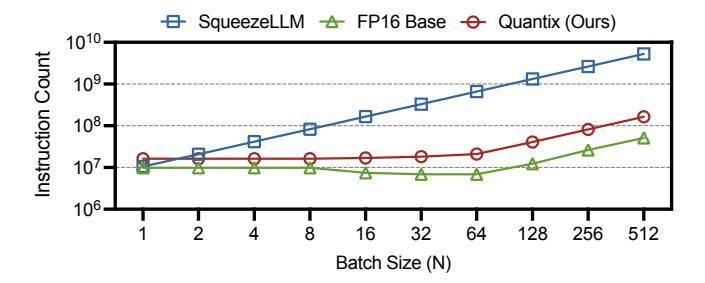
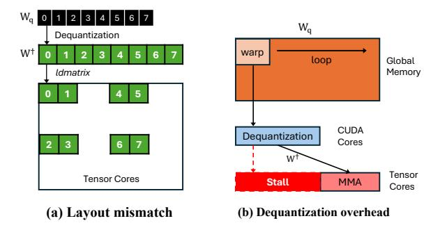
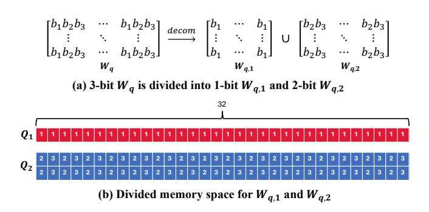
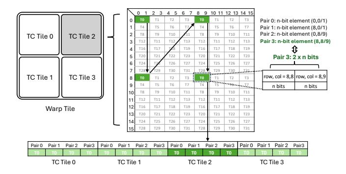
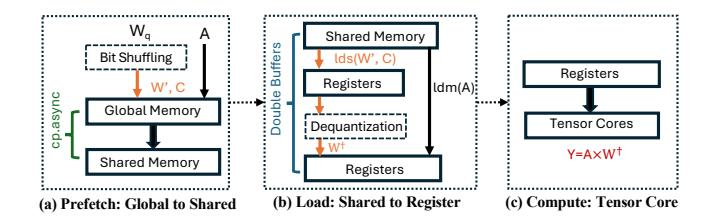
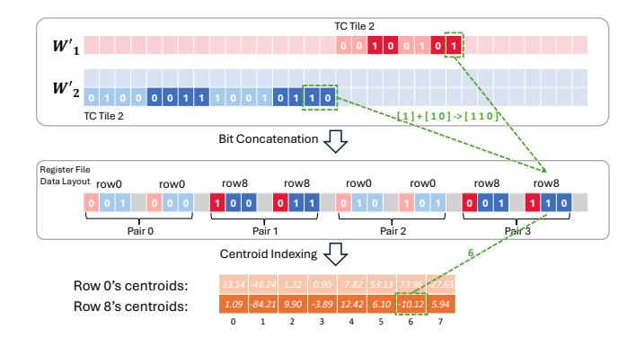
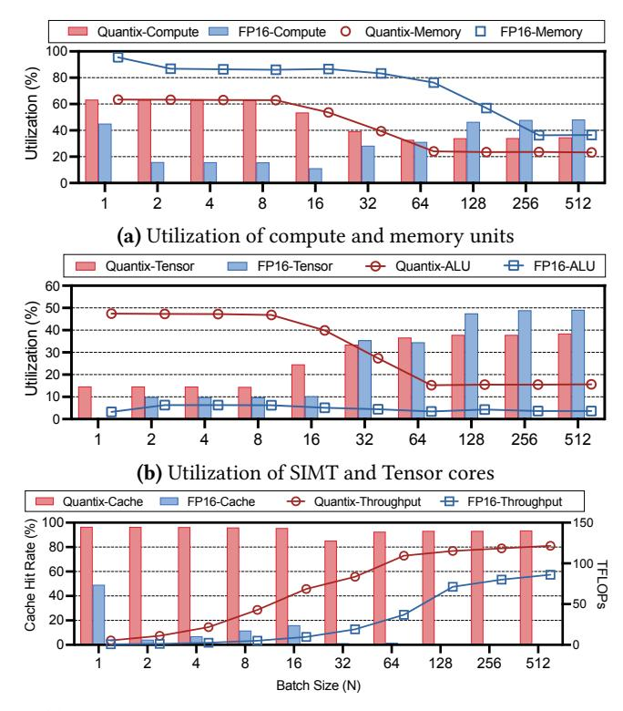
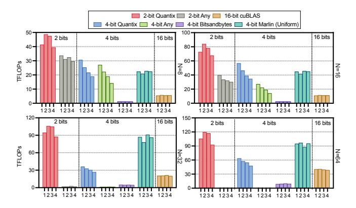
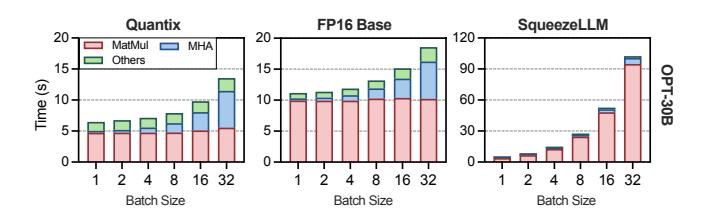
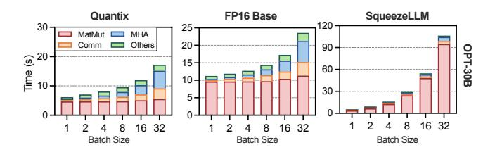

# <span id="page-0-0"></span>High-Throughput Non-uniformly Quantized 3-bit LLM Inference

# [YuAng Chen](https://orcid.org/0000-0002-3392-8388)

Chinese University of Hong Kong China ychen@se.cuhk.edu.hk

# [Wenqi Zeng](https://orcid.org/0000-0002-9770-6522)

Hong Kong University of Science and Technology China wzengad@connect.ust.hk

# [Jeffrey Xu Yu](https://orcid.org/0000-0002-9738-827X)

Hong Kong University of Science and Technology (Guangzhou) China jeffreyxuyu@hkust-gz.edu.cn

# Abstract

While Large Language Models (LLMs) are widely adopted, their massive parameter size constrains practical deployment. A common solution is clustering-based non-uniform quantization, which effectively compresses models to as low as 3 bits per weight while preserving high accuracy. However, instead of accelerating memory-bound LLM inference, the memory reduction paradoxically often causes a significant slowdown due to dequantization overhead and GPU underutilization. To address the issue, we propose Quantix, a framework designed to convert memory savings into inference speedups. Quantix applies two key optimizations: (1) a hardware-aligned bit shuffling scheme for efficient data access, and (2) a fused dequantization-multiplication pipeline that effectively maps workloads on both CUDA and Tensor Cores. Quantix enables high-throughput batched inference, delivering average kernel-level speedups of 4.82× over FP16 cuBLAS and end-to-end speedups of up to 11.46× over stateof-the-art quantization methods on NVIDIA L40 GPUs.

CCS Concepts: • Computing methodologies → Parallel computing methodologies; Natural language processing.

Keywords: Large language model (LLM) inference, GPU programming

#### ACM Reference Format:

YuAng Chen, Wenqi Zeng, and Jeffrey Xu Yu. 2026. High-Throughput Non-uniformly Quantized 3-bit LLM Inference. In Proceedings of the 31st ACM SIGPLAN Annual Symposium on Principles and Practice of Parallel Programming (PPoPP '26), January 31 – February 4, 2026, Sydney, NSW, Australia. ACM, New York, NY, USA, [13](#page-12-0) pages. <https://doi.org/10.1145/3774934.3786423>

# 1 Introduction

Large Language Models (LLMs) have attracted increasing research and industrial attention [\[34,](#page-11-0) [37,](#page-11-1) [43\]](#page-12-1), but their practical


[This work is licensed under a Creative Commons Attribution 4.0 Interna](https://creativecommons.org/licenses/by/4.0)[tional License.](https://creativecommons.org/licenses/by/4.0)

PPoPP '26, Sydney, NSW, Australia © 2026 Copyright held by the owner/author(s). ACM ISBN 979-8-4007-2310-0/2026/01 <https://doi.org/10.1145/3774934.3786423>

deployment is often constrained by their massive size that requires hundreds of gigabytes of memory just to store the model weights [\[36,](#page-11-2) [43\]](#page-12-1). It creates a significant bottleneck in memory bandwidth, which limits inference throughput during auto-regressive generation where weights are repeatedly fetched from memory [\[2,](#page-10-0) [11\]](#page-11-3).

Weight-only quantization is a widely used strategy to address the memory challenge by reducing the numerical precision of model weights from 16-bit floating-point to lower bit-widths [\[7,](#page-11-4) [10,](#page-11-5) [11,](#page-11-3) [24,](#page-11-6) [39,](#page-12-2) [42\]](#page-12-3). Pioneering methods typically adopt uniform quantization [\[3,](#page-10-1) [6,](#page-11-7) [10,](#page-11-5) [11\]](#page-11-3), which maps floating-point (FP) values to low-bit integers (INT) with uniformly spaced intervals. Uniform quantization incurs lightweight computations as the conversion between FP and INT can be efficiently implemented with bitwise intrinsics. Nonetheless, it struggles with accuracy at ultra-low bit-widths.

Recently, non-uniform quantization [\[6,](#page-11-7) [19,](#page-11-8) [33\]](#page-11-9) is developed to deliver high compression while preserving nearlossless model accuracy. Instead of a linear mapping, these approaches use K-means clustering to the weight distribution. Each weight is replaced by a low-bit index W pointing to a shared, full-precision cluster centroid C, such that the reconstructed weight is W† = C[W]. Clustering provides a finer approximation of irregular weight distributions, leading to higher model quality. For example, non-uniform SqueezeLLM reduces the perplexity (a metric where lower scores indicate higher model accuracy) for a 3-bit LLaMA-7B model to 6.32, significantly outperforming the 7.55 offered by the uniform GPTQ [\[19\]](#page-11-8).

However, the non-uniform quantization often introduces a counter-intuitive trade-off: Although compressing weights reduces memory traffic and should benefit memory-bound LLM inference, it instead brings substantial slowdowns (see § [3\)](#page-2-0). These slowdowns arise from the three stages of LLM inference: (1) during offline quantization, sub-byte formats such as 3 bits misalign with GPU data types (32-bit INT), leading to wasted or scattered bits, (2) during online dequantization, reconstructing W† = C[W] requires pointer-based memory accesses that break cache locality and remarkably increases instruction overhead, and (3) during matrix multiplication, execution proceeds token by token as sequential matrix–vector multiplications on CUDA cores, underutilizing the massive parallelism (e.g., Tensor Cores) of modern GPUs.

To address these challenges, we propose Quantix, a highperformance framework for non-uniformly quantized 3-bit LLM inference. We focus on 3-bit quantization as it presents the most significant and unique challenges for efficient hardware execution, requiring novel solutions for bit packing, memory alignment, and cache optimization. Moreover, our analysis of performance challenges and the proposed optimization techniques are broadly applicable and can be effectively extended to other bit-widths (e.g., 2 and 4), which pose fewer but related hardware challenges. Also, we prioritize batched inference, where multiple tokens are generated in parallel, as real-world deployments demand massive throughput (e.g., OpenAI serves millions of tokens per second [15]). Batched inference is particularly challenging, as its higher arithmetic intensity limits the ability to fully overlap computation with reduced memory movement.

Quantix integrates several key optimizations to boost non-uniformly quantized LLM inference. First, it employs offline bit shuffling (§ 4.2) to reorganize the quantized weights ( $\mathbf{W}_q$ ) for aligned and coalesced GPU access. This transformation is lossless w.r.t. the non-uniformly quantized model, because it leaves the cluster centroids (C) unchanged, thereby fully preserving model accuracy. Second, Quantix implements a fused kernel for data prefetching, loading, dequantization and matrix multiplication (§ 4.3), incorporating a hierarchical software pipeline to overlap these steps. Further, dequantization is performed on CUDA cores with in-register optimizations, and parallel matrix—matrix multiplication is accelerated on Tensor Cores, facilitating efficient batched inference.

The performance of Quantix is evaluated on both kernel and model levels, in comparison with state-of-the-art methods, including SqueezeLLM [19], Any-Precision [33], Marlin [11], and Bitsandbytes [6]. At the kernel level, Quantix's 3-bit matrix multiplication achieves an average speedup of 4.82× (up to 8.40×) over the FP16 cuBLAS baseline on an inference-optimized L40 GPU. At the model level, Quantix enables the LLaMA-65B model to be served on a single GPU, which is infeasible with FP16, achieving more than 10× higher throughput than SqueezeLLM.

In summary, our contributions are listed as follows:

- We identify the performance bottlenecks of 3-bit nonuniform quantized LLM inference on GPUs, including inefficient bit-packing, high dequantization overhead, and GPU underutilization.
- We propose Quantix, a high-performance framework that overcomes these issues by integrating hardware-aligned bit shuffling, in-register dequantization and Tensor Coreaccelerated computation within a hierarchical pipeline.
- We demonstrate significant speedups with Quantix at both the kernel and end-to-end model levels, validating its performance and scalability across various bit-widths, LLM models, and GPUs.

#### 2 Background and Related Work

### 2.1 GPU Architecture

NVIDIA GPUs are widely adopted for parallel computing, featuring multiple Streaming Multiprocessors (SMs) that include general-purpose CUDA Cores and specialized Tensor Cores. CUDA Cores handle scalar arithmetic and thread-level logic operations, enabling diverse computations. Tensor Cores [25], on the other hand, are optimized for low-precision dense matrix operations and support matrix multiplication and accumulation (MMA). They deliver significantly higher throughput than CUDA Cores, accelerating deep learning workloads with supported MMA shapes such as  $\langle 16, 16, 16 \rangle$  in FP16 [20, 25].

Despite improvements in compute performance, especially from Tensor Cores, memory bandwidth has lagged behind. Over two decades, peak server FLOPS have increased by  $\sim\!60,\!000\times$ , while DRAM bandwidth has improved by only  $\sim\!100\times[14]$ . This imbalance has caused many low arithmetic intensity workloads to become memory bound, shifting the performance bottleneck from computation to data movement, a phenomenon known as the "memory wall."

#### 2.2 LLM Inference Workload Characteristics

Large Language Models (LLMs) are based on the transformer architecture [37], which consists of stacked layers of multihead self-attention and feed-forward networks (FFNs). Self-attention generates context-aware token embeddings by computing query-key similarities, while FFNs apply nonlinear transformations independently to each token. LLM inference workloads are characterized by two phases with distinct compute and memory behaviors [32]:

In the **prefill phase**, the full input prompt is processed in parallel, making it compute-bound due to large matrix multiplications. Given input activations  $\mathbf{A} \in \mathbb{R}^{N \times K}$  and weights  $\mathbf{W} \in \mathbb{R}^{K \times M}$ , the output  $\mathbf{Y} = \mathbf{A} \times \mathbf{W}$  involves  $N = L \times B$  total tokens, where L is sequence length and B is batch size.

In the **decode phase**, tokens are generated autoregressively, with only one token per sequence processed at each step ( $N = 1 \times B$ ). The smaller workload reduces arithmetic intensity but frequently accesses weights and KV cache, making this phase memory-bound.

#### 2.3 LLM Quantization

Quantization techniques for neural networks fall into two main categories: *Quantization-Aware Training (QAT)* and *Post-Training Quantization (PTQ)*. QAT simulates quantization during training to maintain accuracy [18, 27]. By contrast, PTQ quantizes a pretrained model without retraining [10, 19, 28, 33], making it more practical. Quantization can be applied to *weights* and *activations*. Weight quantization is widely used to reduce model size, while activation quantization is less common due to its dynamic variability [7, 41].

<span id="page-2-1"></span>


Figure 1. Performance comparison between FP16 baseline, 3-bit SqueezeLLM and Quantix for OPT-30B on A100

The value mapping scheme in quantization can be uniform or non-uniform. Uniform quantization uses fixed scale and zero-point to map values to evenly spaced levels [\[18\]](#page-11-15), as in FP6-LLM [\[39\]](#page-12-2), GPTQ [\[10\]](#page-11-5), AWQ [\[24\]](#page-11-6) and SmoothQuant [\[40\]](#page-12-5). With efficient bitwise intrinsics, Marlin [\[11\]](#page-11-3) accelerates LLM inference with uniform 4-bit quantization. Conversely, nonuniform quantization, as adopted by SqueezeLLM [\[19\]](#page-11-8) and Any-Precision LLM [\[33\]](#page-11-9), adapts to data distribution, consistently delivering better accuracy at low bit-widths. Any-Precision LLM improves upon SqueezeLLM by supporting wider bit-widths and enhancing CUDA core utilization. Bitsandbytes [\[6\]](#page-11-7) supports both uniform and non-uniform schemes. Our work focuses on accelerating inference for LLMs that use post-training, weight-only, non-uniform quantization.

Model pruning is another common approach to reduce parameter size by eliminating redundant weights [\[9,](#page-11-18) [17,](#page-11-19) [22,](#page-11-20) [35\]](#page-11-21). Pruning can target either structured blocks [\[4,](#page-10-2) [23\]](#page-11-22) or unstructured individual weights [\[21,](#page-11-23) [22,](#page-11-20) [26\]](#page-11-24). Similar to quantization, the matrix sparsity from pruning often requires careful optimization to translate into actual inference speedups on GPUs [\[12\]](#page-11-25). Since pruning is orthogonal to quantization, the two techniques can be jointly applied to achieve higher model compression and accuracy [\[8,](#page-11-26) [16,](#page-11-27) [19\]](#page-11-8).

# <span id="page-2-0"></span>3 Gaps and Challenges

#### 3.1 The Performance Gaps

Non-uniform quantization effectively reduces memory footprint and is thus expected to accelerate memory-bound LLM inference. However, it often causes a paradoxical slowdown. Fig. [1a](#page-2-1) presents performance for the OPT-30B model on an A100 GPU (batch size 16, token length 128). Under 3-bit quantization, SqueezeLLM exemplifies the trade-off: it achieves a measured memory reduction of 4.07× but increases the latency by 3.01× compared to FP16 baseline. In contrast, Quantix achieves the same memory reduction while delivering a 1.36× speedup, effectively translating memory savings into faster inference

The performance breakdown in Fig. [1b](#page-2-1)-c reveals the source of the performance gap. For FP16 baseline, weight storage and matrix multiplication (matmul) dominate memory (95%) and computing time (72%). Though SqueezeLLM successfully

<span id="page-2-2"></span>

Figure 2. Naive bit packing for 3-bit quantization. Numbers 1-3 in boxes represent bit positions within elements.

reduces weight memory, its inefficient kernels inflate matmul time to 92% of the total. In contrast, Quantix reduces the matmul time cost to just 44%. This comparison highlights that memory savings from quantization do not automatically translate into faster inference. A co-designed compute strategy is required to unlock the potential performance gain.

### <span id="page-2-3"></span>3.2 Challenges in Bit Packing

The use of 3-bit weights presents an architectural challenge because their bit-width does not naturally align with standard 32-bit or 64-bit data types. Fig. [2](#page-2-2) depicts two naive packing schemes that create non-trivial performance penalties.

Padding and Internal Fragmentation: A straightforward strategy is to pack a fixed number of elements into a word and pad the remainder with unused bits. For instance, ten 3-bit elements (30 bits) can be packed into a 32-bit word, leaving 2 bits for padding. While the padding approach simplifies data access, the unused bits within each word, though small, accumulate over large matrices, increasing the model's total memory footprint and the required memory bandwidth during execution.

Spanning and Memory Misalignment: Alternatively, elements can be packed tightly, spanning across word boundaries to maximize memory utilization. For example, 32 3 bit elements fit into three 32-bit words (96 bits). Though the spanning approach eliminates wasted space, it creates memory misalignment, requiring additional logic to access elements spanning multiple words. This disrupts memory coalescing, introduces branching, and leads to inefficient memory utilization and warp divergence, ultimately degrading GPU performance.

## 3.3 Pressure on CUDA Cores

The complex dequantization process of non-uniform schemes places heavy computational pressure on general-purpose CUDA cores. Fig. [3](#page-3-1) quantifies the costs by measuring the instruction counts of SqueezeLLM, the FP16 baseline, and Quantix. SqueezeLLM, which performs both dequantization and matmul on CUDA cores, exhibits a rapidly growing instruction count as the batch size increases. This imposes a substantial and unsustainable computational load on the GPU, explaining its high latency in Fig. [1a](#page-2-1).

<span id="page-3-1"></span>

Figure 3. Instruction count of different methods for a single linear LLM layer sized 21504×7168 from OPT-30B on A100

<span id="page-3-2"></span>

Figure 4. Challenges in utilizing Tensor Cores

In contrast, FP16 baseline maintains low instruction counts, as its operations are natively supported by the hardware without dequantization. Quantix effectively avoids the instruction explosion seen in SqueezeLLM by optimizing the computational pipeline for dequantization and matmul. It keeps the instruction count orders of magnitude lower than SqueezeLLM when ≥ 8, and only slightly higher than FP16 baseline.

## <span id="page-3-3"></span>3.4 Challenges in Utilizing Tensor Cores.

The over-utilization of CUDA cores for dequantization directly leads to the underutilization of the GPU's powerful Tensor Cores. The key to enabling fast LLM inference on modern NVIDIA GPUs lies in effectively utilizing their Tensor Cores [\[20,](#page-11-12) [29,](#page-11-28) [32\]](#page-11-14), which provide significant acceleration for the core matmul operation. However, conventional nonuniform quantization [\[19,](#page-11-8) [33\]](#page-11-9) completely bypasses Tensor Cores and leaves the GPU's highest-throughput units idle for the very operation they are designed to accelerate. The obstacles to leveraging Tensor Cores are rooted in two fundamental, hardware-level challenges:

Layout Mismatch. Tensor Cores do not operate on simple row- or column-major data. They require operands to be loaded from memory into registers in a specific, complex interleaved pattern to function correctly. As shown in Fig. [4a](#page-3-2), directly loading contiguously stored dequantized weights causes them to be scattered incorrectly across the Tensor Core's internal matrix representation. This problem

is exacerbated with 3-bit data, as values are packed across byte boundaries, making it highly complex to efficiently dequantize and simultaneously arrange them into the required interleaved pattern.

Dequantization Overhead. The dequantization of 3-bit weights comprises a long sequence of low-throughput bitwise and type-conversion instructions on CUDA cores due to the complex logic to extract non-power-of-two bit-width values [\[19,](#page-11-8) [33\]](#page-11-9). As shown in Fig. [4b](#page-3-2), the dequantization forms a critical dependency in the execution pipeline. The highthroughput Tensor Cores are left stalled and idle while waiting for the low-throughput dequantization to produce their input. This pipeline bubble effectively serializes the workload, nullifying any potential performance gains.

# 4 Quantix Design

#### 4.1 Design Overview

To overcome the aforementioned challenges, we introduce Quantix, a high-performance framework that accelerate existing advanced low-bit quantization schemes. As visualized in Fig. [5,](#page-4-0) Quantix effectively converts memory savings into inference speedups through two key co-designed components: (1) hardware-aligned bit shuffling, and (2) a highly optimized fused kernel.

First, we leverage the static nature of model weights by applying a one-time, offline weight transformation. Quantix employs a novel hardware-aligned bit shuffling (detailed in [§4.2\)](#page-3-0). This critical pre-processing step reorganizes the packed 3-bit data into a hardware-friendly layout. The goal is to ensure that all memory accesses during the online inference stage are perfectly aligned and coalesced, which is essential for maximizing GPU memory bandwidth.

Second, to exploit the GPU hardware effectively, we design a single fused kernel that combines the dequantization and matrix multiplication stages (detailed in [§4.3\)](#page-5-0). The fused kernel is built to orchestrate the use of both CUDA and Tensor Cores efficiently. It uses in-register dequantization ([§4.3.2\)](#page-5-1) to prepare weights on CUDA Cores while immediately feeding the results to the specialized Tensor Cores for high-throughput matmul. The entire process is managed by a hierarchical software pipeline ([§4.3.3\)](#page-6-0) that overlaps memory transfers, dequantization and computations, effectively hiding latency and maximizing hardware utilization.

#### <span id="page-3-0"></span>4.2 Hardware-Aligned Bit Shuffling

To prepare the quantized weight matrix W for efficient GPU computation, Quantix performs bit shuffling that transforms the layout of the quantized weights (W) without modifying the cluster centroids (C), thereby fully preserving model accuracy. Bit shuffling achieves both coalesced memory access and high storage density, overcoming the respective inefficiencies of naive spanning and padding strategies.

<span id="page-4-0"></span>

Figure 5. Overview of Quantix

The weight bits are shuffled to align with the hardware features via two steps: *bit dividing* and *bit mapping*. Since it is a one-time, offline operation on static model weights, the cost of bit shuffling is negligible as it's amortized over all inference runs.

Step 1: Bit Dividing for Memory Alignment. This step transforms the difficult problem of packing odd-bit data (3-bit) into simpler problems of packing 1-bit and 2-bit data, which align perfectly with native GPU integer types. As shown in Figure 6a, the 3-bit element in the quantized weight matrix  $\mathbf{W}_q$  is divided into two components: a single bit and the remaining two bits. The specific single bit chosen for separation (e.g., the most or least significant bit) is arbitrary, as a consistent inverse mapping is applied during dequantization (see § 4.3.2). These components are then used to populate two new matrices of identical dimensions:  $\mathbf{W}_{q,1}$ , which contains only 1-bit elements, and  $\mathbf{W}_{q,2}$ , which contains 2-bit elements.

The efficacy of bit dividing lies in the subsequent packing process. Since both 1 and 2 are factors of 32 and 64, the elements from the new matrices can be packed perfectly native 32-bit and 64-bit INT. Specifically, 32 elements from  $\mathbf{W}_{q,1}$  precisely occupy a 32-bit word, and 32 elements from  $\mathbf{W}_{q,2}$  exactly fill a 64-bit word. Consequently, bit dividing overcomes the limitations of both naive bit-packing strategies aforementioned in § 3.2. It eliminates the memory fragmentation of padding by perfectly packing elements into standard INTs and avoids the inefficient data access pattern of spanning by ensuring no element crosses a word boundary.

Step 2: Bit mapping for Tensor-Core Alignment. This step addresses the layout mismatch between the logical structure of tiles and the physical memory layout required for Tensor Cores (TCs), a challenge detailed in §3.4. To cope with this challenge, Quantix further maps the packed elements of  $\mathbf{W}_{q,n}$  to align with the data access patterns of Tensor Cores and improve spatial locality.

As depicted in Figure 7b, each warp is first assigned a  $64 \times 64$  tile, which is further divided into sixteen  $16 \times 16$ 

<span id="page-4-1"></span>

**Figure 6.** Bit dividing for memory alignment. Numbers 1-3 in boxes represent bit positions within elements.

<span id="page-4-2"></span>

**Figure 7.** Bit mapping for Tensor Core (TC) alignment. Warp tile consists of 16 TC tiles, showing 4 for clarity.

TC tiles. Within each TC tile, every thread is responsible for 4 pairs of elements. Next, Quantix aligns the data layout to TCs by gathering all elements assigned to a single thread across these 16 tiles into a single contiguous segment. This mapping procedure produces a linear memory space for the warp tile, consisting of 32 contiguous weight segments (denoted as  $\mathbf{W}'_n$ , where n = 1, 2 indicates the bit width), one for each thread. Each segment has a logical size of  $16(tiles) \times 4(pairs) \times 2(elements/pair) \times n(bits/element) =$ 

128n bits. Additionally, the bit mapping step is performed independently on the two matrices  $\mathbf{W}_{q,1}$  and  $\mathbf{W}_{q,2}$  generated in Step 1, organizing their respective INT-packed data into the final contiguous weight segments.

The two-step bit shuffling aligns the data access pattern to GPU's memory system and Tensor Cores. Step 1 ensures word-aligned, coalesced memory accesses. Step 2 allows each thread to retrieve its entire data assignment for the Tensor Cores with a short burst of sequential loads. Furthermore, the large segment sizes facilitate efficient long-vector instructions. For example, the 128-bit  $\mathbf{W}_1'$  weight segment is fetched with a single  $\mathtt{cp.async}$  instruction with 128-bit width, while the 256-bit  $\mathbf{W}_2'$  weight segment utilizes two such instructions. More details in vectorization are discussed in §4.3.

#### <span id="page-5-0"></span>4.3 High-Performance Fused Kernel

**4.3.1 Execution Model.** Quantix's kernel fuses memory access, dequantization, and computation into a hierarchical software pipeline. It hides the latency of data movement and preparation to maximize the utilization of Tensor Cores. The execution model of the fused kernel is outlined in Algo. 1. The kernel first performs a one-time initialization. The initial warp tiles are fetched to shared memory (line 2). A subset of the initial tiles is further loaded to registers and dequantized (line 3) to prepare for the upcoming pipelined execution.

#### **Algorithm 1:** Fused Kernel in Quantix

```
Input: Quantized weights W'_1 (1-bit), W'_2 (2-bit); Activations A;
             Centroids C
   Output: Result matrix Y = A \times Dequant(W'_1, W'_2, C)
1 for each processing unit do in parallel
         // Initialization
         Fetch initial warp tiles to shared memory (smem)
         Load subtile from smem to registers and dequantize weights
         // Main Loop with Hierarchical Pipeline
         for k \leftarrow 0 to Number of K-tiles - 1 do
               // Inter-tile level: Overlap Compute and Memory
               Prefetch \mathbf{W}'_{1,k+1}, \mathbf{W}'_{2,k+1}, \mathbf{A}_{k+1} to shared memory
 5
               // Intra-tile level: Overlap Dequant and Matmul
               for s \leftarrow 1 to Number of subtiles do
                     Load subtile s from shared memory to registers
                     \mathbf{W}_{k.s}^{\dagger} \leftarrow \text{Dequant}(\mathbf{W}_{1,k,s}', \mathbf{W}_{2,k,s}', \mathbf{C}_{k,s})
                     \mathbf{Y}_{k,s-1} \leftarrow \mathrm{Matmul}(\mathbf{Y}_{k,s-1},\mathbf{A}_{k,s-1},\mathbf{W}_{k,s-1}^{\dagger})
               Synchronize and wait for prefetch completion
10
         Store Y back to global memory
11
```

The core of the kernel is organized as a nested loop that drives the hierarchical pipeline (lines 4–10). At inter-tile level, memory transfers are overlapped with computation (line 5-6). At intra-tile level, dequantization on CUDA Cores is overlapped with multiplication on Tensor Cores (line 8-9). The first subtile consumed by Tensor Cores is already prepared during initialization (line 3). The details of the pipeline design are further elaborated in § 4.3.3.

Fig. 8 illustrates the data movement through the GPU memory hierarchy within the fused kernel. 1. The kernel

<span id="page-5-3"></span>

Figure 8. Data movement across memory hierarchy

operates on the hardware-aligned weight layout  $(\mathbf{W}')^1$  organized via bit shuffling. The online execution begins with the Prefetch stage (a), where the kernel issues asynchronous copy instructions  $(\mathbf{cp.async}$  with 128-bit width) to prefetch the weight segments  $(\mathbf{W}')$  and activations  $(\mathbf{A})$  for a future iteration from global memory into on-chip shared memory. The memory transfer runs in the background, overlapping with the computation of the subsequent tiles.

In the Load stage (b), the kernel loads data from shared memory into private registers. FP16 activations A are loaded and formatted for the Tensor Cores via the ldmatrix instruction, while low-bit weight segments W' and their corresponding centroids C are loaded using ld.shared. Next, register-held W' and C are used together to reconstruct the FP16 weight W<sup>†</sup>. The dequantization produces the reconstructed weight directly in registers without writing intermediate results to memory. Finally, in the Compute stage (c), the prepared FP16 activations and the dequantized FP16 weights are consumed by the Tensor Cores to perform matmul. This pipelined data flow ensures that the performant Tensor Cores are constantly supplied with data, minimizing stalls and maximizing hardware utilization.

<span id="page-5-1"></span>**4.3.2 In-Register Dequantization.** To minimize instruction overhead and cache misses, Quantix integrates efficient on-the-fly in-register dequantization into the fused kernel. The dequantization occurs entirely within the GPU's registers after the hardware-aligned weight segments and the centroids have been loaded from shared memory into registers. This process, plotted in Fig. 9, consists of two steps:

First, bit concatenation reconstructs the original 3-bit indices. As shown in the figure, a 1-bit value from a  $W_1'$  segment is concatenated with a corresponding 2-bit value from a  $W_2'$  segment to form a 3-bit index (e.g.,  $[1]+[10]\rightarrow[110]$ ). The concatenation is performed in parallel for 4 pairs of indices within a TC tile. The 8 resulting 3-bit indices are packed into a single 32-bit register. The register layout is specifically designed to interleave data from different matrix rows (e.g., row0, row8) to match the required data access pattern of the Tensor Core, as previously depicted in Fig. 7.

Second, *centroid indexing* uses these reconstructed indices to retrieve the final FP16 values. In x-bit quantization, each row has  $2^x$  cluster centroids (e.g., 8 centroids for 3-bit case).

 $<sup>^{1}</sup>$ The subscript n is omitted for brevity

<span id="page-6-1"></span>

**Figure 9.** In-Register dequantization via bit concatenation and centroid indexing. Numbers in the boxes represent the actual values. 3-bit quantization has 8 centroids per row.

<span id="page-6-2"></span>

**Figure 10.** Hierarchical pipeline with double buffers. Buffer sets are distinguished by colors. 3 subtiles are used for clarity.

Each 3-bit index is used to select a value from its corresponding row-specific centroid set, which is also held in registers. For example, at row 8, the index 110 (binary for 6) is used to retrieve the 7th element (0-indexed) from the centroids.

The extraction of each 3-bit index from the packed register is performed using efficient bitwise operations that avoid conditional branching. For a given register R, the i-th index is isolated by first applying a bitwise right shift ( $\gg$ ) of 3\*i bits to move the target index to the least significant position. Subsequently, a bitwise AND (&) operation with the hexadecimal mask 0x7 (i.e., binary 111) zeroes out all other bits, yielding the final 3-bit value. The entire operation is expressed as:  $q_i = (R \gg (3 \cdot i))\&0x7$ .

In-register dequantization is a key advantage of our kernel, eliminating the instruction overhead of prior methods (see §4.3.2) and enabling high cache efficiency (see §5.3).

<span id="page-6-0"></span>**4.3.3 Hierarchical Software Pipeline.** Quantix's kernel employs a hierarchical software pipeline to overlap data movement, dequantization, and computation. As illustrated in Fig. 10, the pipeline relies on a *two-level double buffering* mechanism to process different data tiles concurrently.

At the inter-tile level, memory transfers are overlapped with computation (dequantization and multiplication) at a coarse granularity. Two shared memory buffers (Smem 0 and Smem 1 in Fig. 10) are used: while one buffer is consumed

by the computing units, the other is simultaneously filled with the next tile.

At the intra-tile level, dequantization and multiplication are overlapped at a finer granularity. Each warp tile is divided into subtiles loaded into register buffers (Reg 0 and Reg 1 in Fig. 10) sequentially. When one register buffer is dequantized on CUDA cores, the other is used by Tensor Cores for multiplication.

This carefully orchestrated pipeline effectively addresses the challenges identified in §3.4 by hiding the latency of data movement and dequantization, and thus maximizing Tensor Cores utilization.

**4.3.4 Parallelization and Vectorization.** The fused kernel further incorporates two core optimizations to fully exploit GPU's parallelism and memory bandwidth.

Split-K for Computing Parallelism. To enhance parallelism and saturate GPU's computational resources, we employ Split-K work decomposition, inspired by NVIDIA's CUTLASS [31]. This technique is widely adopted by conventional GEMM problems where the M and N dimensions are not large. It partitions the matrix multiplication along the K-dimension, dividing the work into several independent slices. Each slice is assigned to a distinct group of thread blocks, which computes a partial sum of the final output matrix. We integrate Split-K into our fused kernel by modifying the main loop in Algo. 1. Each thread block is assigned a specific slice and only iterates over the K-tiles within that slice's boundaries. After all slices are processed in parallel, a final, lightweight reduction kernel is launched to sum the partial results, producing the final output matrix.

Vectorized Memory Access. To maximize memory bandwidth, we leverage wide, vectorized memory instructions. The hardware-aligned data layout is deliberately designed so that the weight segments and centroids from the quantized weight matrices as well as the dense matrices align perfectly with the GPU's 128-bit memory transaction size. Specifically, the data blocks are reinterpreted as the UINT4 vector type (4×32-bit) within the kernel. This allows a full 128-bit chunk of data to be transferred with a single instruction, both for asynchronous global-to-shared memory copies (cp.async) and for shared-to-register loads (1d.shared). The data is cast back to its native type only when it is needed for computation (i.e., the bitwise operations during dequantization). The vectorization significantly maximizes memory bandwidth and minimizes instruction overhead.

#### **5 Evaluation**

Through extensive experiments, we demonstrate that Quantix<sup>2</sup> effectively accelerates quantized LLM inference across

<sup>&</sup>lt;sup>2</sup>https://github.com/yuang-chen/Quantix-PPoPP26

<span id="page-7-1"></span>

Figure 11. Linear layer speedups of 3-bit quantization approaches over unquantized 16-bit cuBLAS.

diverse model sizes, multiple bit-widths, and various hardware platforms, by two sets of experiments: kernel-level (§5.1–5.4) and model-level (§5.5).

#### <span id="page-7-0"></span>5.1 Kernel Benchmark

Settings. To profile kernel performance, we extract weight matrices from the linear layers of the LLaMA [36] and OPT [43] model families and evaluate them across a range of batch sizes N. For a fair comparison, we benchmark 3-bit Quantix against several 3-bit baselines. Specifically, SqueezeLLM [19] and Any-Precision LLM [33] employ non-uniform quantization executed on CUDA cores, whereas GPTQ [10] uses uniform quantization. We also include the unquantized 16-bit cuBLAS implementation as a reference. The majority of results are profiled on the NVIDIA L40 GPU that is specifically built for LLM inference [29], which allows all kernels to reach their peak performance (e.g., Quantix achieves  $1.7 \times$  speedups on L40 over A100).

Results. Fig. 11 presents the performance of Quantix and other approaches, normalized to the 16-bit cuBLAS baseline. On L40 GPU, Quantix achieves an average speedup of 4.82×, 3.93×, 46.07× and 10.25× over the 16-bit cuBLAS baseline, Any-Precision LLM, SqueezeLLM and GPTQ, respectively. Any-Precision LLM achieves high throughput at batch size 8, but their performance drops significantly as the input batch is increased. SqueezeLLM exhibits unsatisfactory performance in all test cases due to inefficient kernel design. GPTQ occasionally outperforms cuBLAS on the L40 at a batch size of 8. However, despite employing simplified uniform (de-)quantization, it remains limited by suboptimal kernel design and fails to exploit GPU resources.

Quantix consistently outperforms across all batch sizes. Its performance peaks at batch sizes of approximately 8–16,

<span id="page-7-2"></span>

**Figure 12.** Relative kernel performance without different optimizations on L40.

then gradually declines as the workload shifts from memory-bound to compute-bound at larger batch sizes (see details in §5.3). Quantix achieves a modest 1.43× speedup for the 5120×5120 matrix, as the matrix is too small to fully utilize GPU resources. We observe lower speedups (e.g., 1.79×, 4.64×, 30.25× and 8.33× over cuBLAS, Any-Precision LLM, SqueezeLLM and GPTQ, respectively) on the A100 GPU, which is commonly used for training. This is because A100's higher memory bandwidth reduces the relative performance advantage of memory-efficient kernels such as Quantix.

#### 5.2 Ablation Study

Fig. 12 presents an ablation study evaluating the performance impact of four optimization components: in-register dequantization, software pipelining, Split-K parallelization, and vectorization. Their performances are normalized to that of the fully optimized version and expressed as percentages.

The results demonstrate that the most critical optimization is in-register dequantization, as its removal causes the most significant slowdown by around 60% of its peak performance. Disabling pipelining reduces performance to approximately 41% of the baseline. Vectorization, which enables efficient 128-bit memory transactions, provides an important 14% performance contribution. Split-*K* improves performance on

<span id="page-8-2"></span>

(c) Cache efficiency (left y-axis) and throughput (right y-axis)

Figure 13. GPU Utilization for a 12,288×12,288 linear layer at different batch sizes on L40.

small matrices by partitioning them into smaller units to increase parallelism and better utilize GPU resources. For large matrices, however, the inherent parallelism is sufficient, making Split- redundant.

# <span id="page-8-0"></span>5.3 Hardware Utilization

To better understand Quantix's performance gains, we analyze GPU hardware utilization for a single 12,288×12,288 linear layer on the L40 GPU using NVIDIA Nsight [\[30\]](#page-11-30).

Compute and Memory. Fig. [13a](#page-8-2) compares the compute and memory utilization of Quantix and the 16-bit cuBLAS baseline. The 16-bit baseline operates in a memory-bound regime for batch sizes up to 32, where its memory utilization exceeds 80%. By contrast, Quantix maintains a much more balanced resource utilization, exhibiting significantly higher compute utilization while keeping memory utilization substantially lower. This demonstrates that Quantix effectively avoids the "memory wall" that limits the baseline and leverages the GPU's compute capabilities more efficiently, especially at smaller batch sizes. However, Quantix's compute utilization does not increase at larger batch sizes due to the overhead of dequantization, as further discussed below.

ALU and Tensor. The compute utilization reported by Nsight aggregates the activity of arithmetic logic units (ALUs),

<span id="page-8-3"></span>

Figure 14. Performance of 2/4-bit quantization for the 4 linear layers of LLaMA-65B on L40.

Tensor Cores, and other functionalities such as branching and load/store operations. To assess actual computing usage, we profile ALU and Tensor Core utilization, as plotted in Fig. [13b.](#page-8-2) Both Quantix and the 16-bit baseline increasingly rely on Tensor Cores as batch size grows. The baseline incurs minimal ALU usage. By contrast, Quantix shows high ALU utilization for small batches (<32) due to dequantization, but then declines for larger batches. This drop is caused by register pressure from in-register dequantization: larger batches require more registers than an SM can provide, causing register spilling and stalling the ALUs.

Cache and Throughput. Fig. [13c](#page-8-2) shows the cache efficiency and overall throughput of Quantix and the 16-bit baseline. Quantix maintains a cache hit rate above 90% across all batch sizes, a key factor contributing to its high throughput. In contrast, the baseline's cache hit rate drops sharply with increasing batch size, falling to nearly 0%. Leveraging its advantages in compute utilization and memory-cache efficiency, Quantix consistently achieves higher throughput than the FP-16 baseline at all batch sizes.

# <span id="page-8-1"></span>5.4 Other Bit Widths

Settings. We evaluate 2-bit and 4-bit variants of Quantix to assess its applicability across different bit widths. These variants are compared against other non-uniform quantization methods, including Any-Precision LLM (Any) [\[33\]](#page-11-9) and Bitsandbytes [\[6\]](#page-11-7). We extend Any to support 2-bit quantization. For 4-bit evaluation, we also include Marlin, a highperformance kernel specifically designed for uniform 4-bit quantization that incurs negligible dequantization overhead. The 16-bit cuBLAS serves as the baseline. All methods are tested on four linear layers of LLaMA-65B : L1: 8192 × 8192, L2: 8192 × 22016, L3: 22016 × 8192 and L4: 43520 × 8192.

Results. Fig. [14](#page-8-3) compares the throughput of various quantization methods. 2-bit Quantix delivers the highest performance at all batch sizes, achieving an average speedup of

<span id="page-9-1"></span>

Figure 15. Throughput of LLM Inference on a A100 GPU

<span id="page-9-3"></span>

**Figure 16.** Breakdown of LLM inference time on a A100. MHA: Multi-Head Attention.

 $5.45\times$  (up to  $8.59\times$ ) over the 16-bit baseline. Quantix's performance scales effectively with precision, as shown by its  $2.15\times$  higher throughput than 4-bit Quantix, indicating that memory savings convert directly into speedups. Compared to other methods, 2-bit Quantix also demonstrates a substantial lead, outperforming 2-bit and 4-bit Any by  $43.78\times$  and  $80.98\times$ , respectively, and 4-bit Marlin by  $1.49\times$ .

As the workload becomes compute-bound at larger batch sizes, the relative speedup from quantization narrows for all methods. The performance of Any collapses at batch sizes of 32 and 64. Only Quantix and Marlin consistently sustain high throughput through the entire range of batch sizes. At larger batch sizes, 4-bit Quantix is outperformed by 4-bit Marlin due to the centroid overhead, which is a trade-off inherent to non-uniform quantization that enables higher accuracy and smaller model size.

#### <span id="page-9-0"></span>5.5 End-to-End Inference

**Settings.** To evaluate Quantix, we integrated our kernel into the HuggingFace Transformers library [38]. We utilized the non-uniform quantization scheme from SqueezeLLM (SqLLM) [19], replacing its default inference backend with

<span id="page-9-2"></span>

Figure 17. Throughput of LLM Inference on two L40s

<span id="page-9-4"></span>

**Figure 18.** Breakdown of LLM inference time on two L40s. MHA: Multi-Head Attention, Comm: Communication.

Quantix for both 3-bit and 4-bit configurations. We compared performance against four baselines: unquantized FP16 (cuBLAS), the original SqLLM kernel, 3-bit GPTQ [10], and 4-bit Marlin [11]. For the uniform quantization baselines (GPTQ and Marlin), we use the AutoGPTQ library [1] for its broad compatibility. We evaluated Vicuna-13B [5], OPT-30B [43], and LLaMA-65B [36] on a single NVIDIA A100 and dual L40 GPUs. We fix the input (prompt) sequence length at 128 tokens and measure token generation throughput (tokens per second), excluding prompt processing time. We vary batch sizes from 1 to 64 and output (generated) sequence lengths ranging from 128 to 1024 tokens. Any-Precision LLM [33] is excluded due to out-of-memory errors during quantization.

**Results.** Fig. 15 and Fig. 17 present the throughput of LLM inference on an A100 GPU and on two L40 GPUs, respectively. The results demonstrate *Quantix effectively translates the memory savings from quantization into inference speedups*. This advantage is most evident in LLaMA-65B (top rows in both figures), which cannot run with standard FP16, where 3-bit Quantix achieves up to 11.46× speedup over SqLLM.

On the A100, 3-bit Quantix delivers average speedups of  $1.20 \times$  over 4-bit Quantix,  $1.35 \times$  over the FP16 baseline,  $2.98 \times$ 

over SqLLM, 2.45× over GPTQ and 1.16× over Marlin. On the dual L40s, these gains increase to 1.39×, 1.64× and 3.27×, 3.30× and 1.29×, respectively. The substantial end-to-end inference speedup is driven by Quantix's acceleration on matmul that dominates the model's runtime.

Quantix consistently outperforms both SqLLM and the FP16 baseline across all configurations. Its performance gains increase with both batch size and model size. SqLLM is competitive at a batch size of 1, but scales poorly as batch grows due to its underlying inefficient matrix-vector kernel. Furthermore, Quantix yields greater speedups on larger models because of the higher proportion of the matmul operation, which is the focus of our optimization.

4-bit Quantix offers higher precision, but it is consistently slower than the 3-bit configuration. The performance drop results from two factors: (1) the increased bit-width consumes more memory bandwidth, and (2) the larger number of centroids (2<sup>4</sup> vs. 2<sup>3</sup> ) imposes higher dequantization overhead. This reflects the inherent trade-off between accuracy and inference throughput in quantization.

Compared to uniform quantization methods like GPTQ and Marlin, 3-bit Quantix maintains a substantial performance advantage in many scenarios. Marlin sometimes achieves higher throughput due to simpler dequantization. However, its advantage diminishes as workload increases with larger batches or more tokens. Furthermore, Marlin and GPTQ exhibit limited scalability. Marlin consumes more memory due to its 4-bit compression, while 3-bit GPTQ uses an inefficient kernel with poor memory management and high runtime memory usage. They encounter out-of-memory errors significantly earlier than Quantix, which efficiently leverages 3-bit quantization to fit larger workloads within limited GPU memory. Additionally, their inefficiency might also stem from the internal implementation overhead of AutoGPTQ.

Fig. [16](#page-9-3) and Fig. [18](#page-9-4) show the breakdown of inference time for the OPT-30B model profiled with NVIDIA Nsight [\[30\]](#page-11-30). The results validate that Quantix effectively addresses the primary performance bottleneck – matmul. SqLLM is dominated by extremely high matmul due to its inefficient kernel design. By contrast, Quantix significantly reduces matmul time compared with the FP16 baseline. Across all batch sizes, the matmul portion is markedly smaller for Quantix, reflecting the efficiency of the proposed fused kernel. This optimization is impactful enough to reshape the overall performance profile: with the matmul bottleneck resolved, other components such as MHA often account for the majority of the runtime in Quantix.

Accuracy. As a compute library accelerating non-uniform quantization schemes (e.g., SqLLM), Quantix inherits the accuracy advantages of the underlying model representation over uniform methods like GPTQ. We evaluate LLaMA2-7B and LLaMA2-13B using WikiText-2 perplexity and 5-shot MMLU accuracy with lm-eval [\[13\]](#page-11-31).

<span id="page-10-5"></span>Table 1. Perplexity on WikiText-2 and five-shot MMLU accuracy.

| Model      | Precision | Method          | PPL ↓ | MMLU ↑ |
|------------|-----------|-----------------|-------|--------|
| LLaMA2-7B  | FP16      | Baseline        | 5.68  | 45.30% |
|            | 4-bit     | Quantix (SqLLM) | 5.79  | 45.20% |
|            | 4-bit     | Marlin (GPTQ)   | 6.01  | 44.90% |
|            | 3-bit     | Quantix (SqLLM) | 6.15  | 42.20% |
|            | 3-bit     | GPTQ            | 7.55  | 40.40% |
| LLaMA2-13B | FP16      | Baseline        | 5.09  | 54.80% |
|            | 4-bit     | Quantix (SqLLM) | 5.19  | 54.70% |
|            | 4-bit     | Marlin (GPTQ)   | 5.36  | 54.50% |
|            | 3-bit     | Quantix (SqLLM) | 5.46  | 53.50% |
|            | 3-bit     | GPTQ            | 6.62  | 51.70% |

Table [1](#page-10-5) demonstrates that Quantix consistently outperforms uniform quantization baselines. The advantage is most significant at 3-bit precision: on LLaMA-7B, Quantix achieves a perplexity of 6.15, whereas GPTQ degrades to 7.55. Similarly, 3-bit Quantix retains 42.20% accuracy on MMLU, substantially surpassing the 40.40% accuracy of 3-bit GPTQ.

# 6 Conclusion

This work introduces a high-performance framework, Quantix, for non-uniform 3-bit LLM inference. It co-designs data layouts and fused kernels, facilitating efficient dequantization and high GPU utilization. Experimental results show Quantix delivers state-of-the-art speed and scalability across various LLMs. Quantix serves as a blueprint for translating the memory savings of future low-bit models into practical inference speedups.

# Acknowledgment

This work is supported by The Research Grants Council of Hong Kong, China, No.14205520.

# References

- <span id="page-10-3"></span>[1] AutoGPTQ Contributors. 2023. AutoGPTQ: An easy-to-use LLM quantization package with user-friendly APIs, based on GPTQ algorithm. <https://github.com/AutoGPTQ/AutoGPTQ>. Accessed: 2025-01-15.
- <span id="page-10-0"></span>[2] Arnav Chavan, Raghav Magazine, Shubham Kushwaha, Mérouane Debbah, and Deepak Gupta. 2024. Faster and lighter llms: A survey on current challenges and way forward. arXiv preprint arXiv:2402.01799 (2024).
- <span id="page-10-1"></span>[3] Jerry Chee, Yaohui Cai, Volodymyr Kuleshov, and Christopher M De Sa. 2023. Quip: 2-bit quantization of large language models with guarantees. Advances in Neural Information Processing Systems 36 (2023), 4396–4429.
- <span id="page-10-2"></span>[4] Zhaodong Chen, Zheng Qu, Yuying Quan, Liu Liu, Yufei Ding, and Yuan Xie. 2023. Dynamic n: M fine-grained structured sparse attention mechanism. In Proceedings of the 28th ACM SIGPLAN Annual Symposium on Principles and Practice of Parallel Programming. 369–379.
- <span id="page-10-4"></span>[5] Wei-Lin Chiang, Zhuohan Li, Ziqing Lin, Ying Sheng, Zhanghao Wu, Hao Zhang, Lianmin Zheng, Siyuan Zhuang, Yonghao Zhuang,

- Joseph E Gonzalez, et al. 2023. Vicuna: An open-source chatbot impressing gpt-4 with 90%\* chatgpt quality. <https://vicuna.lmsys.org>. Accessed: 14 April 2023.
- <span id="page-11-7"></span>[6] Tim Dettmers. 2023. BitsandBytes. [https://github.com/bitsandbytes](https://github.com/bitsandbytes-foundation/bitsandbytes)[foundation/bitsandbytes](https://github.com/bitsandbytes-foundation/bitsandbytes). Accessed: 2025-05-26.
- <span id="page-11-4"></span>[7] Tim Dettmers, Mike Lewis, Younes Belkada, and Luke Zettlemoyer. 2022. LLM.int8(): 8-bit Matrix Multiplication for Transformers at Scale. In Advances in Neural Information Processing Systems 35 (NeurIPS 2022), S. Koyejo, S. Mohamed, A. Agarwal, D. Belgrave, K. Cho, and A. Oh (Eds.). [https://proceedings.neurips.cc/paper\\_files/paper/2022/hash/](https://proceedings.neurips.cc/paper_files/paper/2022/hash/8c4a7160935517e91cfe296b0bb1be8a-Abstract-Conference.html) [8c4a7160935517e91cfe296b0bb1be8a-Abstract-Conference.html](https://proceedings.neurips.cc/paper_files/paper/2022/hash/8c4a7160935517e91cfe296b0bb1be8a-Abstract-Conference.html)
- <span id="page-11-26"></span>[8] Tim Dettmers, Ruslan A Svirschevski, Vage Egiazarian, Denis Kuznedelev, Elias Frantar, Saleh Ashkboos, Alexander Borzunov, Torsten Hoefler, and Dan-Adrian Alistarh. 2024. SpQR: A sparsequantized representation for near-lossless LLM weight compression. In 12th International Conference on Learning Representations.
- <span id="page-11-18"></span>[9] Elias Frantar and Dan Alistarh. 2023. SparseGPT: Massive Language Models Can Be Accurately Pruned in One-Shot. In Proceedings of the 40th International Conference on Machine Learning (Proceedings of Machine Learning Research, Vol. 202). PMLR, 10325–10344.
- <span id="page-11-5"></span>[10] Elias Frantar, Saleh Ashkboos, Torsten Hoefler, and Dan Alistarh. 2023. GPTQ: Accurate Post-Training Quantization for Generative Pre-trained Transformers. In International Conference on Learning Representations (ICLR). <https://openreview.net/forum?id=tcbBPnfwxS>
- <span id="page-11-3"></span>[11] Elias Frantar, Roberto L. Castro, Jiale Chen, Torsten Hoefler, and Dan Alistarh. 2025. MARLIN: Mixed-Precision Auto-Regressive Parallel Inference on Large Language Models. In Proceedings of the 30th ACM SIGPLAN Annual Symposium on Principles and Practice of Parallel Programming (PPoPP '25). ACM, 239–251.
- <span id="page-11-25"></span>[12] Trevor Gale, Matei Zaharia, Cliff Young, and Erich Elsen. 2020. Sparse gpu kernels for deep learning. In SC20: International Conference for High Performance Computing, Networking, Storage and Analysis. IEEE, 1–14.
- <span id="page-11-31"></span>[13] Leo Gao, Jonathan Tow, Baber Abbasi, Stella Biderman, Sid Black, Anthony DiPofi, Charles Foster, Laurence Golding, Jeffrey Hsu, Alain Le Noac'h, Haonan Li, Kyle McDonell, Niklas Muennighoff, Chris Ociepa, Jason Phang, Laria Reynolds, Hailey Schoelkopf, Aviya Skowron, Lintang Sutawika, Eric Tang, Anish Thite, Ben Wang, Kevin Wang, and Andy Zou. 2024. The Language Model Evaluation Harness. doi:[10.5281/zenodo.12608602](https://doi.org/10.5281/zenodo.12608602)
- <span id="page-11-13"></span>[14] Amir Gholami, Zhewei Yao, Sehoon Kim, Coleman Hooper, Michael W Mahoney, and Kurt Keutzer. 2024. AI and memory wall. IEEE Micro (2024).
- <span id="page-11-10"></span>[15] A. Griffin. 2024. ChatGPT creators OpenAI are generating 100 billion words per day, CEO says. [https://www.independent.co.uk/tech/](https://www.independent.co.uk/tech/chatgpt-openai-words-sam-altman-b2494900.html) [chatgpt-openai-words-sam-altman-b2494900.html](https://www.independent.co.uk/tech/chatgpt-openai-words-sam-altman-b2494900.html). Accessed: 2025- 08-30.
- <span id="page-11-27"></span>[16] Jinyang Guo, Jianyu Wu, Zining Wang, Jiaheng Liu, Ge Yang, Yifu Ding, Ruihao Gong, Haotong Qin, and Xianglong Liu. 2024. Compressing large language models by joint sparsification and quantization. In Forty-first International Conference on Machine Learning.
- <span id="page-11-19"></span>[17] Song Han, Huizi Mao, and William J Dally. 2016. Deep compression: Compressing deep neural networks with pruning, trained quantization and huffman coding. In International Conference on Learning Representations (ICLR).
- <span id="page-11-15"></span>[18] Benoit Jacob, Skirmantas Kligys, Bo Chen, Menglong Zhu, Matthew Tang, Andrew Howard, Hartwig Adam, and Dmitry Kalenichenko. 2018. Quantization and training of neural networks for efficient integerarithmetic-only inference. In Proceedings of the IEEE conference on computer vision and pattern recognition. 2704–2713.
- <span id="page-11-8"></span>[19] Sehoon Kim, Coleman Hooper, Amir Gholami, Zhen Dong, Xiuyu Li, Sheng Shen, Michael W Mahoney, and Kurt Keutzer. 2023. Squeezellm: Dense-and-sparse quantization. arXiv preprint arXiv:2306.07629 (2023).

- <span id="page-11-12"></span>[20] Ronny Krashinsky, Olivier Giroux, Stephen Jones, Nick Stam, and Sridhar Ramaswamy. 2020. NVIDIA Ampere Architecture In-Depth. [https://developer.nvidia.com/blog/nvidia-ampere-architecture](https://developer.nvidia.com/blog/nvidia-ampere-architecture-in-depth)[in-depth](https://developer.nvidia.com/blog/nvidia-ampere-architecture-in-depth). Accessed: 2024-01-15.
- <span id="page-11-23"></span>[21] Eldar Kurtic, Denis Kuznedelev, Elias Frantar, Michael Goinv, Shubhra Pandit, Abhinav Agarwalla, Tuan Nguyen, Alexandre Marques, Mark Kurtz, and Dan Alistarh. 2025. Sparse fine-tuning for inference acceleration of large language models. Enhancing LLM Performance: Efficacy, Fine-Tuning, and Inference Techniques 7 (2025), 83.
- <span id="page-11-20"></span>[22] Yann LeCun, John S Denker, and Sara A Solla. 1990. Optimal brain damage. In Advances in Neural Information Processing Systems 2.
- <span id="page-11-22"></span>[23] Hao Li, Asim Kadav, Igor Durdanovic, Hanan Samet, and Hans Peter Graf. 2017. Pruning filters for efficient convnets. In International Conference on Learning Representations (ICLR).
- <span id="page-11-6"></span>[24] Ji Lin, Ruicheng Tang, Haotian Tang, Shang Yang, Jiaming Zhang, and Guangxuan Cui. 2023. AWQ: Activation-aware Weight Quantization for LLM Compression and Acceleration. arXiv preprint arXiv:2306.00978 (2023).
- <span id="page-11-11"></span>[25] Mark Harris Luke Durant, Olivier Giroux and Nick Stam. 2017. Inside Volta: The World's Most Advanced Data Center GPU. [https://www.](https://www.nvidia.com/en-us/data-center/volta-gpu-architecture/) [nvidia.com/en-us/data-center/volta-gpu-architecture/](https://www.nvidia.com/en-us/data-center/volta-gpu-architecture/). Accessed: 2024-05-15.
- <span id="page-11-24"></span>[26] Pavlo Molchanov, Arun Mallya, Stephen Tyree, Iuri Frosio, and Jan Kautz. 2019. Importance estimation for neural network pruning. In Proceedings of the IEEE/CVF conference on computer vision and pattern recognition. 11264–11272.
- <span id="page-11-16"></span>[27] Markus Nagel, Marios Fournarakis, Rana Ali Amjad, Yelysei Wu, STOYAN GKERESTEDJIAN, and Tijmen Blankevoort. 2021. A white paper on neural network quantization. arXiv preprint arXiv:2106.08295 (2021).
- <span id="page-11-17"></span>[28] Markus Nagel, Mart Van Baalen, Tijmen Blankevoort, and Max Welling. 2020. Up or down? adaptive rounding for post-training quantization. In International conference on machine learning. PMLR, 7197–7206.
- <span id="page-11-28"></span>[29] NVIDIA. 2023. L40S GPU for AI and Graphics Performance. [https:](https://www.nvidia.com/en-us/data-center/l40s/ /) [//www.nvidia.com/en-us/data-center/l40s//](https://www.nvidia.com/en-us/data-center/l40s/ /). Accessed: 2025-05-15.
- <span id="page-11-30"></span>[30] NVIDIA. 2023. Nsight Systems. [https://developer.nvidia.com/nsight](https://developer.nvidia.com/nsight-systems)[systems](https://developer.nvidia.com/nsight-systems). Accessed: 2025-05-15.
- <span id="page-11-29"></span>[31] NVIDIA Corporation. 2025. Efficient GEMM in CUDA. [https://docs.](https://docs.nvidia.com/cutlass/media/docs/cpp/efficient_gemm.html) [nvidia.com/cutlass/media/docs/cpp/efficient\\_gemm.html](https://docs.nvidia.com/cutlass/media/docs/cpp/efficient_gemm.html) Accessed: 2025-08-29.
- <span id="page-11-14"></span>[32] NVIDIA Developer Blog. 2023. Mastering LLM Techniques: Inference Optimization. [https://developer.nvidia.com/blog/mastering-llm](https://developer.nvidia.com/blog/mastering-llm-techniques-inference-optimization/)[techniques-inference-optimization/](https://developer.nvidia.com/blog/mastering-llm-techniques-inference-optimization/). Accessed: 2025-05-13.
- <span id="page-11-9"></span>[33] Yeonhong Park, Jake Hyun, Sanglyul Cho, Bonggeun Sim, and Jae W Lee. 2024. Any-Precision LLM: Low-Cost Deployment of Multiple, Different-Sized LLMs. In International Conference on Machine Learning. PMLR, 39682–39701.
- <span id="page-11-0"></span>[34] Alec Radford, Jeffrey Wu, Rewon Child, David Luan, Dario Amodei, Ilya Sutskever, et al. 2019. Language models are unsupervised multitask learners. OpenAI blog 1, 8 (2019), 9.
- <span id="page-11-21"></span>[35] Mingjie Sun, Zhuang Liu, Anna Bair, and J. Zico Kolter. 2023. Wanda: A Simple and Scalable Pruning Method for Large Language Models. In Proceedings of the 40th International Conference on Machine Learning (Proceedings of Machine Learning Research, Vol. 202). PMLR, 32873– 32892.
- <span id="page-11-2"></span>[36] Hugo Touvron, Thibaut Lavril, Gautier Izacard, Xavier Martinet, Marie-Anne Lachaux, Timothée Lacroix, Baptiste Rozière, Naman Goyal, Eric Hambro, Faisal Azhar, et al. 2023. Llama: Open and efficient foundation language models. arXiv preprint arXiv:2302.13971 (2023).
- <span id="page-11-1"></span>[37] Ashish Vaswani, Noam Shazeer, Niki Parmar, Jakob Uszkoreit, Llion Jones, Aidan N Gomez, Łukasz Kaiser, and Illia Polosukhin. 2017. Attention is all you need. Advances in neural information processing systems 30 (2017).

- <span id="page-12-6"></span><span id="page-12-0"></span>[38] Thomas Wolf, Lysandre Debut, Victor Sanh, Julien Chaumond, Clement Delangue, Anthony Moi, Pierric Cistac, Tim Rault, Rémi Louf, Morgan Funtowicz, et al. 2020. Transformers: State-of-the-art natural language processing. In Proceedings of the 2020 conference on empirical methods in natural language processing: system demonstrations. 38–45.
- <span id="page-12-2"></span>[39] Haojun Xia, Zhen Zheng, Xiaoxia Wu, Shiyang Chen, Zhewei Yao, Stephen Youn, Arash Bakhtiari, Michael Wyatt, Donglin Zhuang, Zhongzhu Zhou, et al. 2024. Fp6-llm: Efficiently serving large language models through fp6-centric algorithm-system co-design. arXiv preprint arXiv:2401.14112 (2024).
- <span id="page-12-5"></span>[40] Guangxuan Xiao, Ji Lin, Mickael Seznec, Hao Wu, Julien Demouth, and Song Han. 2023. SmoothQuant: Accurate and Efficient Post-Training Quantization for Large Language Models. In Proceedings of the 40th International Conference on Machine Learning.
- <span id="page-12-4"></span>[41] Zhewei Yao, Zhen Dong, Zhan Zheng, Amir Gholami, Jiachen Yu, Eric Tan, Kurt Keutzer, and Michael W Mahoney. 2022. ZeroQuant: Efficient and Affordable Post-Training Quantization for Large-Scale Transformers. In Advances in Neural Information Processing Systems, Vol. 35. 27168–27183.
- <span id="page-12-3"></span>[42] Zhewei Yao, Xiaoxia Wu, Cheng Li, Stephen Youn, and Yuxiong He. 2023. Zeroquant-v2: Exploring post-training quantization in llms from comprehensive study to low rank compensation. arXiv preprint arXiv:2303.08302 (2023).
- <span id="page-12-1"></span>[43] Susan Zhang, Stephen Roller, Naman Goyal, Mikel Artetxe, Moya Chen, Shuohui Chen, Christopher Dewan, Mona Diab, Xian Li, Xi Victoria Lin, et al. 2022. Opt: Open pre-trained transformer language models. arXiv preprint arXiv:2205.01068 (2022).

Received 2025-08-28; accepted 2025-11-10