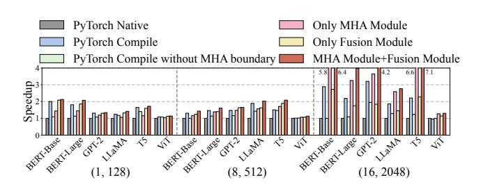
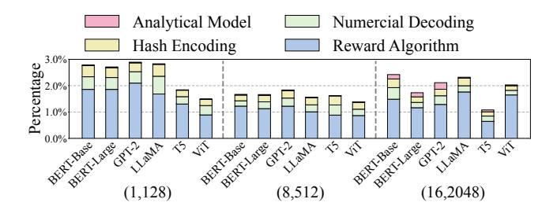

# Accelerating Sparse Transformer Inference on GPU

Wenhao Dai SSSLab, Dept. of CST China University of Petroleum-Beijing Beijing, China wenhao.dai@student.cup.edu.cn

Xinyu Yang School of Computer Science and Engineering Beihang University Beijing, China ltyxy@buaa.edu.cn

Hailong Yang School of Computer Science and Engineering Beihang University Beijing, China hailong.yang@buaa.edu.cn

Haodong Deng SSSLab, Dept. of CST China University of Petroleum-Beijing Beijing, China haodong.deng@student.cup.edu.cn

> Hongyu Liu Baidu Inc. Beijing, China liuhongyu02@baidu.com

Qianwen Cao College of Safety and Ocean Engineering China University of Petroleum-Beijing Beijing, China qwcao@cup.edu.cn

Mengfei Rong SSSLab, Dept. of CST China University of Petroleum-Beijing Beijing, China mengfei.rong@student.cup.edu.cn

Fangxin Liu School of Computer Science Shanghai Jiao Tong University Shanghai, China liufangxin@sjtu.edu.cn

Qingxiao Sun∗ School of Computer Science and Engineering Beihang University Beijing, China qingxiaosun@buaa.edu.cn

# Abstract

Large language models (LLMs) are popular around the world due to their powerful understanding capabilities. As the core component of LLMs, accelerating Transformer through parallelization has gradually become a hot research topic. Mask layers introduce sparsity into Transformer to reduce calculations. However, previous works rarely focus on the performance optimization of sparse Transformer. In addition, current static operator fusion schemes fail to adapt to diverse application scenarios. To address the above problems, we propose STOF, a framework that incorporates optimizations for Sparse Transformer that enables flexible masking and Operator Fusion on GPU. For multi-head attention (MHA) structure, STOF maps the computation to row-wise or blockwise kernels with unique storage formats according to analytical modeling. For downstream operators, STOF maps the fusion scheme to compilation templates and determines the optimal running configuration through two-stage searching.

∗Corresponding author

[This work is licensed under a Creative Commons Attribution 4.0 Interna](https://creativecommons.org/licenses/by/4.0)[tional License.](https://creativecommons.org/licenses/by/4.0)

PPoPP '26, Sydney, NSW, Australia © 2026 Copyright held by the owner/author(s). ACM ISBN 979-8-4007-2310-0/2026/01 <https://doi.org/10.1145/3774934.3786434>

The experimental results show that compared to the stateof-the-art work, STOF achieves maximum speedups of 1.6× in MHA computation and 1.4× in end-to-end inference.

CCS Concepts: • Computing methodologies → Machine learning; • Computer systems organization → Multiple instruction, single data.

Keywords: GPU, Sparse Transformer, Multi-head Attention, Operator Fusion

## ACM Reference Format:

Wenhao Dai, Haodong Deng, Mengfei Rong, Xinyu Yang, Hongyu Liu, Fangxin Liu, Hailong Yang, Qianwen Cao, and Qingxiao Sun. 2026. Accelerating Sparse Transformer Inference on GPU. In Proceedings of the 31st ACM SIGPLAN Annual Symposium on Principles and Practice of Parallel Programming (PPoPP '26), January 31 – February 4, 2026, Sydney, NSW, Australia. ACM, New York, NY, USA, [15](#page-14-0) pages. <https://doi.org/10.1145/3774934.3786434>

# 1 Introduction

Large language models (LLMs) have attracted widespread attention from industry and academia around the world [\[1,](#page-11-0) [9,](#page-11-1) [27\]](#page-12-0). The massive parameters enable LLMs to capture the subtleties of human language [\[45\]](#page-12-1). In addition to general understanding, Transformer is the foundation of LLMs and the core of its powerful capabilities [\[76\]](#page-13-0). A variety of neural networks [\[18,](#page-12-2) [48,](#page-13-1) [49\]](#page-13-2) have evolved based on Transformer, while still retaining its encoding or decoding structure. The tensor operations involved in Transformer have rich parallelism, making it suitable for execution on many-core processors such as GPUs [\[25\]](#page-12-3). This forces the performance optimization

of Transformer for GPU architectures to become an important issue, which can bring huge economic benefits [3].

Multi-head attention (MHA) is the essential building block in the Transformer model, where the attention module calculates the correlation among tokens in the input sequence [61]. The high-performance implementation of MHA fuses all tensor operations into one kernel, efficiently utilizing the memory hierarchy and function units [17, 72]. The novel MHA variants introduce mask layers to reduce the computational volume while maintaining accuracy [13]. The mask layer introduces sparsity to Transformer, and fragmented computation exacerbates the memory bandwidth bottleneck [64]. Furthermore, the explosive growth of masking patterns [6, 71] makes it impractical to manually optimize each MHA variant separately. Although recent approaches [19, 62] have supported a broader range of masking patterns with sparse representation or score modification, they are limited to continuous element distribution or suboptimal performance.

There are still potential optimization opportunities for downstream operators of MHA. Compilation-based operator fusion is adopted to reduce kernel launches and frequent I/O operations [39, 77]. DL frameworks [4, 82] generally only fuse memory-intensive (MI) operators, while compute-intensive (CI) operators are handled separately using vendor libraries. Other studies [41, 54, 79] have further explored the fusion of CI operator and MI operator to complement resource utilization such as memory bandwidth and streaming processors. The latest works [73, 80] focus on the fusion of CI operators and improve performance in small-scale tensor computation with short sequences. However, the above rule-driven operator fusion schemes cannot adapt to diverse model hyperparameters and sequence lengths.

From the above analysis, sparse Transformer optimization faces the following challenges: 1) efficient kernel implementations with flexible representation of masking patterns; 2) adaptive operator fusion with sustained high performance for various computation scales; 3) fast exploration of hierarchical search space with fusion schemes and kernel parameters. We propose the STOF framework, which optimizes sparse Transformer inference through customized MHA kernels and adaptive operator fusion. STOF first determines the kernel implementation for MHA computation according to mask sparsity and sequence length. Then, STOF uses the encoding representation to specify the fusion scheme and maps it to compilation templates. Finally, STOF gradually expands the fusion range and determines the optimal scheme and its parameter setting via two-stage searching.

To the best of our knowledge, STOF is the first system to enable both flexible masking patterns and diverse operator fusion schemes for sparse Transformer scenarios. Specifically, STOF integrates hand-tuned MHA kernels with generative compilation templates, providing a complete stack that establishes broader optimization opportunities. We have

selected typical networks with encoding or decoding structures including BERT [18], GPT [48], LLaMA [60], ViT [21], and T5 [49] to verify the effectiveness of STOF. This paper makes the following contributions1:

- We comprehensively analyze the impact of different masking patterns and inference configurations to expose potential optimization opportunities.
- We propose a unified MHA module that implements row-wise and block-wise kernels with unique storage formats and optimizations. Besides, an analytical model is designed to determine kernel selection.
- We propose an operator fusion module that converts the fusion scheme into compilation templates via numerical decoding. The search engine processes the encoded numerical representation and expands the fusion range based on performance feedback.
- We develop an inference framework STOF that enables flexible masking patterns and determines the optimal operator fusion setting on GPU. The experimental results show that STOF achieves maximum speedups of 1.6× in MHA computation and 1.4× in end-to-end inference compared to the state-of-the-art work.

## 2 Background

#### 2.1 Sparsity in Transformer Models

**2.1.1** Transformer Structure. Transformer [61] is widely recognized, where each encoder or decoder contains multiple multi-head attention (MHA) layers. The key operation of the MHA layer is scaled dot product attention (SDPA), which calculates the dot product of Q and K, scales the result, optionally applies a mask at this stage, then applies the Softmax function to obtain the probabilities (P) and finally calculates the dot product of P and V. Beyond MHA, Transformer includes downstream components: Add retains non-linear transformation information, Norm mitigates internal covariate shift via mean/variance normalization, and the Feed Forward layer comprises chained general matrix multiply (GEMM) operations with activations like GELU or ReLU. These components enable Transformer to handle complex cross-domain tasks while introducing operator characteristics that facilitate fusion-based optimizations.

**Figure 1.** Atomic and compound sparse attention patterns.

 $^1\mathrm{The}$  artifact for this paper is publicly available on Zenodo under DOI [15].

- **2.1.2 Sparse Attention Patterns.** Atomic sparse attention patterns are the building blocks of current popular sparse attention modules [2, 6, 13, 36, 37, 52, 71]. Figure 1 (a)-(d) depict four most common atomic sparse attention patterns. The details are as follows.
  - Causal Attention. To maintain temporal order, the query can access only preceding information, restricting connections to earlier nodes (the colored triangular).
  - Global Attention. Certain "global" nodes serve as central hubs, which receive information from others (the colored rows) and send it back (the colored columns).
  - Sliding Window Attention. Considering the concept of locality, the query only focuses on the neighboring nodes within a defined window size, with its mask matrix presenting a banded pattern (the colored bands).
  - Random Attention. The query block is randomly associated with the preceding and following information.
    By adjusting the filling rate, it has the possibility to discover accidental correlations (the colored blocks).

#### 2.2 Fused Kernel for MHA Structure

Numerous works [7, 17, 19, 25, 43, 62, 64, 66, 72, 73, 80] have explored fusing MHA on GPU. Figure 2 shows a typical workflow of MHA fusion. The DL framework firstly parses the computational graph and captures the MHA sub-graph composed of coarse-grained native operators. Then, MHA fusion can be achieved manually or automatically. However, if the fusion of MHA with a certain mask layer is not supported, the sub-graph will be split into fine-grained meta operators to discover small-scale fusion opportunities.

Figure 2. Kernel fusion for MHA computation.

Early works focus on the manual fusion of dense attention without the mask layer. ByteTransformer [72] adopts hand-written kernels: short sequences store the intermediate matrix entirely in shared memory (SMEM) and registers; longer sequences employ grouped GEMM to ease resource constraint. The customized kernels limit ByteTransformer to a maximum sequence length of 1,024. FlashAttention (FA) series2 becomes the most typical open source implementation. FA [17] partitions the input into blocks and passes the blocks

to SMEM multiple times, gradually performing Softmax reduction. FA2 [16] further partitions the work between warps within one block of attention computation to reduce the read and write of SMEM. However, FA only supports common masking patterns such as causal and sliding window. FlashMask [62] extends FA with column-wise representation to exploit attention sparsity for skipped computations, integrated into PaddlePaddle [40] but unable to represent discrete distributions such as random attention.

For automatic fusion, the captured MHA sub-graph undergoes multi-level intermediate representation (IR) with hardware-independent (e.g., constant folding) and hardware-dependent (e.g., instruction scheduling) optimizations. MC-Fuser [73] and Chimera [80] accelerate MHA via GEMM chain loop scheduling but ignore hardware details like bank conflicts, performing poorly for long sequences. FlexAttention [19] supports arbitrary masks by combining block masks with expression-based descriptions, but it is still constrained to fixed optimizations and achieves sub-optimal performance. SPLAT [28] focuses on bridging the performance gap of regular sparse kernels (R-SDDMM and R-SpMM) under structured sparsity (10%–50% non-zeros), yet this approach forgoes the opportunity to optimize MHA as a whole kernel.

#### 2.3 Hierarchical Space Exploration

The hierarchical framework introduces a huge optimization space, making manual optimization on a case-by-case basis unrealistic. DL compilers [10, 59, 74] automatically explore opportunities across operator and kernel levels, deploying tensor programs on target hardware via IR conversion.

2.3.1 Operator Fusion Opportunities. DL compilers predefine fusion rules that apply only to specific combinations, severely limiting the optimization space. Researchers further classify tensor operators into MI and CI categories for selective fusion. Early works [4, 82] treat CI operators as non-fusion boundaries, fusing only MI operators to reduce off-chip accesses. Others [41, 54] merge the CI operator with adjacent MI operators to balance hardware resource usage. Recent works [73, 80] explore fusing CI chains by decomposing operators into blocks to break dependencies. However, due to GPU resource constraints, we notice that CI chain fusion only benefits on small scales. Moreover, operator categories may shift with tensor dimensions, making category-based fusion schemes potentially suboptimal.

**2.3.2 Search Space Construction.** When fine-tuning the performance of DL models, the search space can be constructed by loop-based or template-based methods. The loop-based methods [35, 77] represent operators as deeply nested loops and optimize the statement execution via loop scheduling. Although hardware-universal, they lag vendor libraries due to ignoring hardware-specific instructions. The template-based methods [11, 67, 69, 81] evolve as a new trend, which

 $^2\mathrm{FA3}$  [53] is only for GPUs with Hopper architecture and later.

uses template primitives as building blocks to assemble complete DL models. The template primitives can map tensor programs to special function units like tensor cores. With hardware knowledge-driven tuning, they match vendor library performance. Bolt [\[67\]](#page-13-17) derives primitives from CUT-LASS [\[44\]](#page-12-14) to support common fused operators. Due to the complex kernel structure of CUTLASS, further expanding the fusion range is too demanding for programmers.

2.3.3 Auto-tuning Techniques. For loop-based construction, rule-based pruning first suppresses search space explosion, yet still amounts of configurations persist. Machine learning-driven cost models are trained online [\[77\]](#page-13-8) or offline [\[78\]](#page-14-5) to predict performance, integrated into heuristic searches (e.g., genetic algorithms) to speed up convergence. However, they all require sufficient runtime statistics. Aggressive techniques [\[4,](#page-11-6) [50\]](#page-13-19) unfold the computation graph sequentially, reducing search ranges from product to sum of operator spaces. But individual tuning without graph context leads to global suboptimal decisions. In contrast, templatebased construction maintains a constrained space aided by analytical models [\[33,](#page-12-15) [34\]](#page-12-16) considering hardware and program details. Nevertheless, changes in the search space caused by operator fusion expansion remains unsolved.

We summarize comparisons of representative works and STOF in Table [1.](#page-3-0) We implement compilation templates via the hardware abstraction of Triton [\[59\]](#page-13-15) and TileLang [\[12\]](#page-11-13). Both of them offer high-level programming interfaces that facilitate the template derivation for a wider fusion range. Then, the two-stage procedure encapsulating the AutoTune module quickly determines high-performance configurations.

Table 1. Comparison of representative works with STOF.

|              |          | Operator Fusion | Hierarchical Search Space |            |               |  |  |  |
|--------------|----------|-----------------|---------------------------|------------|---------------|--|--|--|
| Name         | Category | Expansion       | Construction              | Pruning    | Searching     |  |  |  |
| AStitch [82] | MI-MI    | Yes             | Rule                      | No         | Breadth-First |  |  |  |
| Welder [54]  | CI-MI    | Yes             | Loop                      | No         | Cost Model    |  |  |  |
| Chimera [80] | CI-CI    | No              | Loop                      | No         | Analytical    |  |  |  |
| MCFuser [73] | CI-CI    | No              | Loop                      | Rule       | Analytical    |  |  |  |
| Bolt [67]    | General  | No              | Template                  | No         | Analytical    |  |  |  |
| STOF (ours)  | General  | Yes             | Template                  | Analytical | Reward-based  |  |  |  |

# 3 Motivation

## 3.1 Diverse Features of Masking Patterns

Within the MHA structure, sparse mask blocks part of the data elements, making it easier for the model to "focus" on the critical information. The mask layer is inserted between GEMM and Softmax operations, and the weights of the score matrix corresponding to the mask part are close to 0. Table [2](#page-3-1) lists the features of typical masking patterns with the sequence length (\_) of 1,024. Consistent with previous works [\[13\]](#page-11-4), the band width and global width are set to √︁ \_ (i.e., 32). As seen, all masking patterns except

the causal achieve a sparsity of over 80%, while the sliding window even reaches 93.8%. The above results provide optimization opportunities to skip useless computations.

Table 2. Features of typical masking patterns.

| Masking           | Masking                                                    |            | Element Distribution | Sparsity     |       |  |
|-------------------|------------------------------------------------------------|------------|----------------------|--------------|-------|--|
| Pattern           | Parameters                                                 | Row        | Column               | Type         | Ratio |  |
| Causal            | –                                                          | Continuous | Continuous           | Structured   | 50.0% |  |
| Sliding Window | band width = 32                                            | Continuous | Continuous           | Structured   | 93.8% |  |
| Longformer        | global width = 32 band width = 32                       | Discrete   | Discrete             | Structured   | 88.8% |  |
| Bigbird           | global width = 32 band width = 32 filling rate = 10% | Discrete   | Discrete             | Unstructured | 80.8% |  |

It is difficult for a data structure to represent sparsity features of various masking patterns. To achieve high kernel efficiency, FlashMask [\[62\]](#page-13-7) only supports the cases where the valid elements on the columns are continuous. This is because its data structure consists of four arrays that represent the start and end of two skipped regions. However, the discrete distribution of valid elements involves more skipped regions that cannot be represented. Bigbird integrates random patterns with unstructured sparsity, further complicating the mask representation. For unsupported masking patterns, previous works [\[19,](#page-12-4) [72\]](#page-13-4) fall back to resetting the score matrix by subtraction after GEMM. This approach fails to jointly optimize GEMM and Softmax operations in the fused kernel.

### 3.2 Potential Fusion Opportunities

Transformer structure still remains opportunities for operator fusion unexplored. If we roughly identify the operator types as MI or CI, the operator mixes can be enumerated into three categories. We fuse the operators of Transformer to evaluate the performance, where Bias+Layernorm, GEMM+Layernorm, and GEMM+GEMM represent MI+MI, CI+MI, and CI+CI mixes, respectively. Figure [3](#page-4-0) shows the speedup of the fused operator over the detached operators on NVIDIA RTX 4090 and A100 GPUs, where the x-axis represents the running configurations (detailed in Table [3\)](#page-3-2).

Table 3. The running configurations of fused operators.

| Name  | Batch Size | Sequence Length | Hidden Dimension |  |  |  |
|-------|------------|-----------------|------------------|--|--|--|
| G1/G2 | 1          | 128             | 512/1024         |  |  |  |
| G3/G4 | 1          | 4096            | 512/1024         |  |  |  |
| G5/G6 | 8          | 128             | 512/1024         |  |  |  |
| G7/G8 | 8          | 4096            | 512/1024         |  |  |  |

It can be observed that the effect of operator fusion varies significantly under different cases. For example, the fused GEMM+Layernorm operator achieves a maximum speedup of 16.5× and 39.1× when the hidden dimension is 512. But when the hidden dimension is 1,024, it results in significant

Figure 3. Performance comparison of detached operators and fused operator under different configurations.

Figure 4. Performance comparison of fused operators using parameter settings from individual tuning and post-fusion tuning.

slowdowns in most cases. The fused GEMM+GEMM operator achieves more than 2× speedup on RTX 4090 GPU when batch size and sequence length are 1 and 128, whereas it is inferior to the detached operators under all cases on A100 GPU. The above results indicate that fixed operator fusion schemes cannot adapt to diverse inference scenarios.

#### 3.3 Challenges in Parameter Tuning

The combination of fusion schemes and kernel parameters constructs a hierarchical optimization space, making parameter tuning challenging. This stems from two key insights: 1) the search space of individual operators differs fundamentally from that of the fused operator; 2) the optimal parameter settings for individual and fused operators are inherently distinct. Figure 4 shows the speedup of fused operators using parameter settings from post-fusion tuning over those from individual tuning on NVIDIA RTX 4090 and A100 GPUs. The x-axis represents the experimental configuration consisting of batch size, sequence length and hidden dimension. As seen, directly applying the optimal setting of individual operators to their fused implementation often leads to suboptimal performance. For example, Bias+Layernorm, GEMM+Layernorm, and GEMM+GEMM mixes achieve an average speedup of 2.4×, 10.1×, and 2.2× on A100 GPU, respectively. The results indicate that operator-by-operator sequential tuning is not a viable solution. On the other hand, naive global tuning can be inefficient due to the inconsistent search space.

# 4 Methodology

#### 4.1 Design Overview

We propose STOF, accelerating Sparse Transformer inference with flexible masking patterns and operator fusion schemes on GPU. STOF consists of a *unified MHA module* and an *operator fusion module*. The unified MHA module integrates row-wise and block-wise kernels with different storage formats, each with unique optimizations. The operator fusion

module is embodied as the interaction between the fusion scheme converter and the hierarchical search engine.

Figure 5 illustrates the design overview of STOF. STOF divides the sparse Transformer model into MHA structure and downstream operators. This ensures both the customization of MHA and the flexibility of operator fusion. For MHA structure, STOF maps its calculations directly to GPU kernels with fine-grained optimization. The kernel selector determines the MHA kernel by applying an analytical model that takes hardware specifications into account. For downstream operators, the scheme converter expresses the fusion scheme as a binary array through hash coding upwards and maps it to compilation templates through numerical decoding downwards. The search engine initializes scheme, expands fusion, and samples parameters via analytical modeling, performance feedback, and reward algorithm, respectively.

**Figure 5.** The design overview of STOF.

We have implemented two sets of kernels depending on the data partitioning granularity. The row-wise kernel slices Q into rows to achieve high locality. Moreover, the rowwise kernel applies shuffle within a warp and eliminates the synchronization among warps, improving performance at small input sizes. In contrast, the block-wise kernel is more general with fine-grained block partitioning, where Q, K, and V are partitioned into sub-blocks and put into SMEM to utilize the GPU memory hierarchy. Since row partitioning can be regarded as an extreme case of block partitioning, we elaborate on the block-wise optimizations in Section 4.2.

The main takeaway of STOF is a novel co-design that bridges manual kernel implementation for sparse MHA structure and automatic fusion for dense downstream operators. Specifically, the sparsity in STOF is exclusively handled within the MHA module, where mask-based computation is explicitly managed by customized kernels. All subsequent operators after MHA are dense and executed via template-based fusion, ensuring both high performance and compositional flexibility. Beyond the specific optimizations for Transformer architectures, the core methodology of STOF is readily extensible to emerging LLM architectures. For instance, in Mixture-of-Experts (MoE) models [8], we can accelerate activated experts via specialized kernels while optimizing the routing logic through template-based fusion, potentially supporting dynamic computation paths at minimal cost.

#### 4.2 Unified MHA Kernels

**4.2.1 Sparse Storage Format.** Figure 6 shows the blockwise computation with a sparse storage format that can represent arbitrary mask. Inspired by literature [24, 42], we adopt a two-level storage format combining Block Compressed Sparse Row (BSR) and bitmap, preserving sparsity while enabling structured computation. As shown in Figure 6, we abstract two levels as OuterTile (OT) and InnerTile (IT) to reveal globally skipped blocks and intra-block element distribution, respectively. Each OT is composed of 64 8×8 ITs (only 4 are shown in the figure for clarity). An OT is marked as "full" if all of its ITs are not empty, otherwise "part". For the "full" OTs, the difference between full row ptr[i] and  $full\_row\_ptr[i-1]$  indicates the number of "full" OTs in the *i*-th row. The array full col idx specifies the column indices of "full" OTs. For example, as can be inferred from full row ptr and full col idx arrays in the figure, the column indices of "full" OTs in the 2-nd row are 0 and 2.

For the "part" OTs, there are also two similar arrays including <code>part\_row\_ptr</code> and <code>part\_col\_idx</code>. The <code>part\_col\_idx</code> further points to the corresponding IT with sparse element distribution. Since each IT contains exactly 64 elements, it can be efficiently represented by a single <code>uint64</code> value. Consequently, for each "part" OT, the internal mask information is stored as a <code>bitmap\_mask</code> array consisting of 64 <code>uint64</code> elements. During the processing of the innermost loop, each <code>bitmap\_mask[i]</code> is retrieved to obtain the precise masking pattern. By combining the structures of "full" and "part" OTs,

we obtain *load\_row\_ptr* and *load\_col\_idx* arrays that directly specify the location of non-empty OTs in the mask.

Figure 6. MHA computation with two-level storage format.

**Kernel Implementation.** We cut the input tensor Q into sub-blocks of size (OT\_Size\_M, head\_size) along the seq len dimension, as illustrated in Algorithm 1. Each subblock  $Q_i$  (line 2) corresponds to a Row-Parallel Dimension  $(PD_i)$ , where  $i \in [0, \lceil \frac{seq\_len}{OT\_Size\_M} \rceil)$ . To enhance data locality, for each row processed by  $Q_i$ , K and V are divided into sub-blocks  $K_i^T$  and  $V_j$  of size  $(OT\_Size\_N, head\_size)$ (lines 7-9), where  $j \in [0, \lceil \frac{seq\_len}{OT\_Size\_N} \rceil)$ . The workload of OTs per row is determined by the arrays *load\_row\_ptr* and load\_num (lines 4-6). Under the coarse-grained block of size (OT Size M, OT Size N), only valid OTs that require computation are loaded, while others are skipped. This alleviates bandwidth conflicts by greatly reducing global memory access. The asynchronous copy of  $V_i$  (line 9) allows the GEMM (line 10) to proceed without waiting for the completion of  $V_i$ 's transfer. Furthermore, it eliminates the need for data loading stalls in the subsequent GEMM (line 16). After obtaining  $P_{ij}$ , the presence of any "part" OTs in the current row is checked to determine whether ITs' storage information should be loaded from the uint64 array bitmap\_mask and applied to mask  $S_{ij}$  (lines 11-14). Due to the consistency of  $K_i^T$  and  $V_j$  blocks on the Iteration Dimension  $(ID_j)$ , the skip operation on  $K_i^T$  is also applied to  $V_j$ , thus reducing amounts of calculation and storage. After the Softmax operation,  $S_{ij}$ and the scaling factor  $\alpha$  within the OT are obtained to ensure the correctness of reduction operations (lines 15-16). Finally, the results are written back to HBM (line 18).

We further conduct advanced optimizations on the MHA kernel, primarily based on FA2 [16]. For example, the 8×8 size of ITs not only matches the uint64 size but also aligns with the data granularity operable by Tensor Cores. Notably, OTs are stored in row-major order to accommodate the row-wise

16

17

18

19 end

## Algorithm 1: MHA Kernel with Unified Format

**Input:** flattened tensors on HBM *Q HBM*, *K HBM*, *V HBM*; unified

mask storage structures part\_row\_ptr, part\_col\_idx,  $load\_row\_ptr, load\_col\_idx, bitmap\_mask$ Output: MHA result on HBM result\_HBM  $\begin{array}{lll} & \textbf{1} & \textbf{for } i \; in \; [0, \lceil \frac{seq\_len}{OT\_Size\_M} \rceil) \; \textbf{do} \\ & 2 & | Q_i \leftarrow \text{Load\_from\_HBM}(Q\_HBM_i); \end{array}$  $tmp\_part\_col\_idx, O_i \leftarrow 0;$  $load\_num \leftarrow load\_row\_ptr[i+1] - load\_row\_ptr[i];$  $part\_num \leftarrow part\_row\_ptr[i+1] - part\_row\_ptr[i];$ for kv idx in [0, load num) do  $j \leftarrow load\_col\_idx[load\_row\_ptr[i] + kv\_id];$  $K_i^T \leftarrow \text{Load\_from\_HBM}(K\_HBM_i);$  $V_i \leftarrow \_\_async\_memcpy(Load\_from\_HBM(V\_HBM_i));$  $P_{ij} \leftarrow \text{Compute\_GEMM}(Q_i, K_i^T);$ if tmp part col idx < part num and 11  $j == part\_col\_idx[part\_row\_ptr[i] + tmp\_part\_idx]$ Apply\_Mask( $S_{ij}$ ,  $bitmap\_mask[tmp\_part\_col\_idx]$ ); 12  $tmp\_part\_col\_idx \leftarrow tmp\_part\_col\_idx + 1;$ 13 end 14  $S_{ij}, \alpha \leftarrow Softmax(P_{ij});$ 15

 $O_i \leftarrow O_i \times \alpha + \text{Compute\_GEMM}(S_{ij}, V_j);$ 

result  $HBM \leftarrow Write back to <math>HBM(O_i)$ .

iterative computation of Softmax, whereas ITs are stored in col-major order to enable bank conflict-free accesses. The OT size is determined by considering cache capacity and the number of SMs. During each iteration,  $Q_i$  is kept in registers,  $K_j^T$  and  $V_j$  share a single physical portion of shared memory.

4.2.3 **Kernel Selection.** By comprehensively considering the influence of masking patterns and sequence lengths, we decide whether to apply a row-wise or block-wise kernel for MHA computation. As formulated in Equation 1, we empirically set the coefficient  $\tau$  to 1.2 and calculate the *threshold*. We select row-wise kernel if *threshold* is less than 0, indicating that the ratio of valid OTs (i.e., "full" and "part") is sufficiently low. Note that we use log operation to penalize the extremely sparse situation due to the increase of  $sep\_len$  while the mask width remains unchanged. By doing so, we have limited row-wise kernel to cases where the number of valid OTs is small and the  $sep\_len$  is short. In such cases, centralized row-wise computation of mask elements brings excellent data locality. For other general cases, we apply block-wise kernel to maximize performance.

$$threshold = \frac{load\_row\_ptr[\lceil \frac{seq\_len}{16} \rceil]}{(\lceil \frac{seq\_len}{16} \rceil)^2} - \frac{\tau}{(\log_2\lceil \frac{seq\_len}{16} \rceil)^2} \quad (1$$

#### 4.3 Fusion Scheme Conversion

It is essential to express the fusion scheme appropriately, quantifying the dependencies among vertical operators and identifying the fusion boundaries. Inspired by the high-low voltage levels of digital circuits, we use binary hash codes as the numerical expression of fusion schemes. STOF maps the fused operators to compilation templates so that the

compiler can further add kernel-level optimizations. From the perspective of the computational graph, the captured adjacent nodes are replaced with fused nodes.

**Figure 7.** The workflow of fusion scheme converter.

Figure 7 shows the workflow of the fusion scheme converter in STOF. Take the forward propagation of BERT as an example, STOF traverses the computational graph constructed by the DL framework and extracts subgraphs that conform to the patterns of fusion schemes. Each subgraph is mapped to the target compilation template, which is carefully implemented to achieve optimal performance. Specifically, the templates decompose tensor operations into tiles to maximize data reuse, leverage warp-level primitives for efficient reductions, and apply multi-stage pipelining to overlap memory accesses and computation. Although we customize the compilation template according to the functionality of the fused operator, the graph mapping process is highly flexible. For instance, the template that computes a GEMM chain with CI+CI pattern can also incorporate simple MI operations, such as adding bias element by element (i.e., Bias). On the other hand, the compilation template hides the hardware execution details and only exposes key kernel parameters for performance tuning. For the GEMM chain, the sub-block sizes and the launch configuration (e.g., number of stages) constitute the search space, providing the possibility of further optimization targeting at a specified case.

The fusion scheme is quantized by hash encoding, and the native operators are represented as arrays with a length equal to the number of operators according to the vertical fusion situation. In this way, hash encoding translates abstract fusion patterns into a quantifiable space, a process that establishes a bidirectional mapping consistent with the definition of "hash". We assume that in addition to mapping MHA ([#2-#6]) to the fused kernel, the fusion scheme also specifies three other downstream fused operators including [#7-#9], [#10-#12], and [#13,#14]. The numbers representing the operators in the subgraph are the same, which is similar to the high-low voltage levels of the circuit. For example, the numbers corresponding to the subgraph [#7-#9] are all 1. Besides, the different numbers of adjacent operators refer to the boundary of adjacent subgraphs. Note that the numbers are unrelated to the operator characteristics, they are introduced solely to facilitate the subsequent tuning process. The numerical expression is usually in binary, but it can also be converted to hexadecimal format with a higher compression rate. Intuitively, this expression approach constructs a flexible search space that can represent any fusion scheme. On this basis, we propose a two-stage search mechanism to tune the running configuration during inference.

### 4.4 Search Space Exploration

STOF deploys a search engine featuring scalable fusion boundaries and parameter-tuning capabilities. As depicted in Figure [8,](#page-7-0) the search engine first uses neural hashing and predefined rules to derive an initial fusion scheme. Then, the two-stage procedure is conducted to determine the boundaries of the fused operators and their kernel parameters.

Figure 8. The workflow of hierarchical search engine.

4.4.1 Fusion Scheme Initialization. STOF leverages both pattern discovery and expert knowledge to derive the initial fusion scheme. First, STOF adopts a convolutional subgraph analysis method neural hashing to discover representative subgraphs that frequently appear during the inference, formalized as: () = Fhash (Fconv ()). Here, is the input computational graph structure; Fconv is a convolutional feature extractor that extracts local structural features from the graph . Fhash is a hash mapper, which compresses and discretizes the extracted features into a unique hash fingerprint (). By analyzing the frequency distribution of these fingerprints, STOF can rapidly detect classical subgraph structures across Transformer-based models. Second, STOF uses predefined rules to extract potentially high-performance subgraphs from the identified subgraph structures to form the initial scheme. For example, according to the conclusion in Section [3,](#page-3-3) the GEMM chain is preferentially fused into one segment under smaller batch sizes and sequence lengths.

4.4.2 Two-Stage Tuning Procedure. In the first stage, STOF tends to expand the boundaries of the segments until there is no additional benefit after fusion. Since DL frameworks have implemented the fusion of common MI operators, we mark CI operators and adjust the fusion scheme around them for complementarity. We have restricted that there are

at most two CI operators in each segment, and classified the fusion rules into the following three categories.

- expand: merge existing individual or fused operators to form a new segment without disrupting the structure of other segments, such as the transition from 0 to 1.
- seize: a segment with at least one CI operator preempts an operator from a segment consisting of only MI operators, such as the transition from 1 to 2.
- compete: if two segments compete for an individual operator, the segment with only one CI operator will be extended first, such as the transition from 2 to 3.

Based on the above rules, we apply depth-first search (DFS) to gradually expand the fusion range. In this process, STOF randomly samples a fixed number of parameter settings of the pre-fusion and post-fusion operators, then takes the best setting to compare the performance. If there is a performance gain, STOF will keep the new fusion scheme, otherwise roll back. As long as the scheme has appeared and the performance under specific parameter settings is recorded in the cache, the same attempt will not be made later.

In the second stage, STOF conducts parameter sampling for the determined scheme. Specifically, we fix the total number of configurations during each iteration and retrieve performance data. In the first iteration, STOF ensures the number of sampled settings for each segment is the same. When the highest overall gain is achieved when tuning a segment, STOF rewards it by increasing the sampled settings in the next iteration. Similarly, STOF caches performance data to avoid repeated execution of the same parameter setting.

## 4.5 Implementation Details

We have implemented a system prototype of STOF based on PyTorch [\[4\]](#page-11-6), Triton [\[59\]](#page-13-15) and TileLang [\[12\]](#page-11-13), involving approximately 5,000 LOC of Python and 2,500 LOC of C/CUDA. The block-wise kernel is developed based on FA2 [\[16\]](#page-11-10) with the CuTe structure, but introduces an efficient two-level storage format and corresponding optimizations. Subsequently, the customized MHA kernel is loaded into PyTorch through the torch/cpp\_extension interface, which encapsulates the kernel in the form of a native function. When the MHA kernel is first called, it is just-in-time (JIT) compiled into a shared object file (.so) using the ninja tool, enabling dynamic linking at runtime without repeated compilation.

Regarding the operator fusion module, we find that the Triton- and TileLang-based compilation templates demonstrate performance variance under different fused operators, so we select the implementation that achieves superior performance in each case. We enable the graph capture and replacement by manipulating objects of type fx.GraphModule. Since the overall implementation of STOF is compatible with the torch.compile function, its related compilation optimizations can be reused to maximize performance.

Figure 9. The MHA performance of the methods normalized to that of PyTorch Native on NVIDIA RTX 4090 GPU.

Figure 10. The MHA performance of the methods normalized to that of PyTorch Native on NVIDIA A100 GPU.

#### 5 Evaluation

#### 5.1 Experiment Setup

**5.1.1** Hardware and Software Platforms. We evaluate STOF on two generations of GPUs, including NVIDIA RTX 4090 of Ada model and NVIDIA A100 of Ampere model. The experiments are conducted in the software environment configured with Ubuntu 22.04, CUDA v12.6, and PyTorch 2.7.0. We package Docker containers to quickly migrate the software environment between hardware platforms.

**5.1.2** Comparison Configurations and Methods. We conduct evaluation on both atomic and compound masking patterns including causal, sliding window, Longformer [6], and Bigbird [71]. The sequence length ranges from 128 to 4,096 with a stride of 2×, and the batch size ranges from 1 to 16. For MHA computation, we follow the configuration of BERT-Base. For end-to-end inference, the configuration is set to be consistent with the standard models of BERT [18], GPT2 [48], LLaMA [60], T5 [49] and ViT [22]. We compare STOF with PyTorch Native, PyTorch Compile [4], FlashAttention2 (FA2) [16], FlexAttention [19], ByteTransformer [72], Bolt [67], MCFuser [73], and SPLAT [28]. Note that FlexAttention, FA2, and SPLAT are optimized only for MHA, while PyTorch Compile integrates FA2 for MHA computation. In addition, Bolt has no MHA-specific optimizations and only

appears in the end-to-end evaluation. Since SPLAT is not open source, we reproduce it based on the contents in the paper. We adopt the half precision (FP16) for evaluation, which is commonly used for model inference in industry [3], ensuring a unified comparison across all methods. To minimize machine errors, we perform warm-ups for all experiments and run 100 times to record the average performance.

#### 5.2 MHA Performance

Figure 9 and Figure 10 present the MHA performance of the methods normalized to that of PyTorch Native on RTX 4090 and A100 GPUs. The missing bars are attributed to two reasons: 1) ByteTransformer lacks support for sequence lengths greater than 1,024; 2) MCFuser runs out of memory (OOM) when the input scale is large. As seen, STOF shows consistent superior performance on both GPU platforms. Compared to the state-of-the-art FlexAttention implementation, STOF achieves the average speedups of 1.8× and 1.6× on RTX 4090 and A100 GPUs, respectively. STOF achieves superior performance on sliding window mask because its high sparsity and concentration of valid blocks facilitate computation skipping. Even for causal masks, STOF still achieves a certain speedup over FA2 and FlexAttention under most cases. The reason is that the two-level storage format combining BSR and bitmap further improves on-chip memory locality. In contrast, due

Figure 11. The end-to-end performance of the methods normalized to that of PyTorch Native on RTX 4090 and A100 GPUs.

Table 4. Tuning time of STOF, MCFuser, and Bolt for end-to-end inference on A100 GPU in seconds.

| Input Size  | (1, 128) |        |      |       |      | (8, 512) |        |        |       |       | (16, 2048) |       |        |        |       |       |        |        |
|-------------|----------|--------|------|-------|------|----------|--------|--------|-------|-------|------------|-------|--------|--------|-------|-------|--------|--------|
| Name        | BERT-B   | BERT-L | GPT  | LLaMA | T5   | ViT      | BERT-B | BERT-L | GPT   | LLaMA | T5         | ViT   | BERT-B | BERT-L | GPT   | LLaMA | T5     | ViT    |
| MCFuser     | 51.4     | 52.4   | 49.5 | 48.8  | 71.9 | 100.2    | 91.8   | 132.3  | 100.8 | 110.8 | 239.0      | 437.8 | 660.2  | 1049.7 | 664.4 | 820.6 | 1987.6 | 4264.3 |
| Bolt        | 53.3     | 57.3   | 48.8 | 52.1  | 70.7 | 120.7    | 90.8   | 126.1  | 99.8  | 124.6 | 244.7      | 468.8 | 652.2  | 1067.7 | 738.6 | 837.0 | 1860.8 | 3848.6 |
| STOF (ours) | 23.3     | 22.6   | 23.8 | 29.5  | 43.1 | 93.9     | 40.9   | 55.0   | 40.9  | 43.6  | 80.3       | 99.3  | 99.6   | 225.3  | 122.2 | 264.6 | 388.3  | 412.8  |

to the lack of tensor core support, SPLAT achieves decent performance on RTX 4090 GPU with higher CUDA core ratio, achieving a maximum speedup of 3.6× compared to PyTorch Native; but it lags behind on A100 GPU across all cases.

The above figures illustrate the MHA performance at different input scales in detail. At small scales, STOF achieves relatively better performance than FA2 and FlexAttention under most cases. STOF enables the row-wise kernel, where the use of shuffle operations within the warp incurs extremely low synchronization cost. On the other hand, STOF achieves significant speedup compared to other methods at large input scales. For example, when the setting of (batch size, sequence length) is (16, 4,096), STOF achieves 4.8× and 4.9× speedups over FA2 and FlexAttention on A100 GPU, respectively. This is mainly because the block-wise kernel makes full use of the mask sparsity to skip unnecessary calculations. Besides, the optimizations such as asynchronous data copying and Q register resident serve as the foundation for performance improvement. Note that PyTorch Native, MCFuser, and Byte-Transformer do not natively support sparse masks. The basic approach is to subtract the mask matrix, thus missing the opportunity to reduce the amount of calculation.

#### 5.3 End-to-end Performance

We benchmark five models including BERT-Base, BERT-Large, GPT2, LLaMA, T5 and ViT. Among them, BERT and ViT are encoder-only, GPT2 and LLaMA are decoder-only, whereas T5 contains both encoder and decoder. We adopt the Bigbird mask and conduct experiments under three distinct settings of (batch size, sequence length): (1, 128), (8, 512), and (16, 2,048). Figure 11 presents the end-to-end performance of the methods normalized to that of PyTorch Native on RTX 4090 and A100 GPUs. The missing bars indicate OOM for MC-Fuser or unsupported sequence length for ByteTransformer. As seen, STOF consistently delivers the highest speedups

across the majority of models and settings on both GPU platforms. Even compared to the state-of-the-art PyTorch Compile, STOF achieves an average speedup of 1.3× and 1.4× on RTX 4090 and A100 GPUs, respectively. In addition to customizing the MHA kernel, the performance gain of STOF also comes from operator fusion and parameter tuning.

For the setting (16, 2,048), STOF achieves 1.5×, 1.5×, 1.2×, 1.3×, 1.1×, and 1.2× speedups over PyTorch Compile for the six models on RTX 4090 GPU. A similar trend can be observed on A100 GPU. The results indicate that the advantages of STOF are particularly pronounced for larger input scales. The reason is attributed to the significant reduction in the absolute time of the bottleneck MHA computation. This demonstrates that STOF has the potential to be applied to future GPU generations with larger memory capacity.

## 5.4 Tuning Cost

Table 4 lists the tuning time of STOF, MCFuser, and Bolt for end-to-end inference on A100 GPU in seconds, where BERT-B/L is BERT-Base/Large. Note that PyTorch Native, PyTorch Compile, and ByteTransformer are not included due to the lack of tuning support. As seen, the tuning time of STOF is less than that of MCFuser and Bolt in all cases. This advantage becomes more prominent when the input scale is large. Since the tuning process of operator fusion module in STOF is positively correlated with the input tensor, the tuning cost per iteration increases moderately, but it does not grow linearly with respect to the overall tuning time. For the setting (16, 2,048), STOF is on average  $6.7 \times$  and  $6.9 \times$  faster than MCFuser and Bolt. This is mainly because reward-based sampling enables STOF to find high-performance settings in a shorter time. On the other hand, the caching mechanism ensures that the same parameter setting in each fusion scheme will not be executed repeatedly, which particularly saves tuning time in scenarios with large input scales.

#### 5.5 Ablation Study

Figure 12 presents the speedup of STOF with only unified MHA module or only operator fusion module over PyTorch Native and PyTorch Compile on A100 GPU. For reference, the speedup of STOF with both modules is also shown in the figure. For PyTorch Compile, we also break the MHA boundary, transforming the whole computation graph into low-level meta operators for compilation optimization.

As seen, the operator fusion module contributes more to the performance when the input scale is small. Taking the setting of (1, 128) as an example, the speedup achieved by only fusion module is 19.5% higher than that of only MHA module on average. In fact, the low sequence length and batch size lead to a small computational workload, which is particularly friendly to the fusion of CI operators. However, the contribution of the MHA module exceeds that of fusion module as the input scale increases. For the (16, 2,048) setting, the speedup of only MHA module is 2.0× on average, higher than that of only fusion module. Since MHA computation becomes the bottleneck, the high parallelism of the block-wise kernel is reflected in end-to-end inference. Note that STOF with both modules always achieves the highest speedup, indicating that the optimizations can complement each other. On the other hand, we find that breaking the MHA boundary would compromise these tailored kernel optimizations. The results show that such boundary breaking causes up to 1.5× slowdown compared to preserving it.

**Figure 12.** The speedup of STOF with only MHA module or only fusion module over PyTorch Native on A100 GPU.

#### 5.6 Overhead Analysis

The STOF overhead mainly includes the analysis model, scheme conversion (i.e., hash encoding and numerical decoding), and reward algorithm. The analysis model is reflected in MHA kernel selection and fusion scheme initialization. Figure 13 presents the time breakdown of STOF overhead normalized to the tuning process on A100 GPU. As seen, the time proportion of scheme conversion and reward algorithm is relatively smaller when the input scale is large. This is because these overheads are dominated by the model structure, and a larger input scale will lead to a longer tuning time, thus diluting this proportion. In contrast, the proportion of analytical model increases with the input scale. The primary reason

is that the overhead for analyzing mask blocks increases with longer sequence lengths. Nevertheless, the analysis constitutes at most 0.5% of the total time. Overall, STOF accounts for less than 3% of the total tuning time, making it highly acceptable in the context of model fine-tuning.

**Figure 13.** Time breakdown of the STOF overhead normalized to the tuning process on A100 GPU.

#### 5.7 Discussion

5.7.1 Newer GPU Architectures. In addition to NVIDIA Ampere and Ada architectures, we have conducted preliminary tests on newer hopper architecture (i.e., NVIDIA H20 GPU). The results show that STOF consistently outperforms FA2, achieving up to 1.4× speedup for MHA computation. This proves that kernel optimizations of STOF are universal across GPU architectures. We plan to extend this evaluation to include FA3 for future work.

5.7.2 Longer Sequence Lengths. We explore sequence lengths ranging from 4k to 16k and batch size of 1 on NVIDIA A100 GPU. STOF achieves significant speedups over the SOTA PyTorch Compile, reaching 4.1×, 11.1×, and 16.8× at 4k, 8k, and 16k, respectively. In addition, all baselines except STOF encounter Out-of-Memory (OOM) errors at sequence length of 32k, whereas STOF reaches OOM at 64k. The results indicate that STOF exhibits greater performance improvement for ultra-long sequence lengths, as well as significantly saving GPU memory.

**5.7.3 Dynamic Mask Patterns.** STOF is inherently positioned to support dynamic mask patterns due to its flexible design. For example, MInference [32] could serve as a sophisticated frontend to discover dynamic patterns, with STOF as the execution backend. The main challenge lies in efficiently integrating MInference's offline pattern determination and online index generation into STOF's compilation pipeline with minor overhead. For future work, we plan to extend the analytical model to determine optimal configurations at runtime based on input token sequence.

#### 6 Related Work

Hardware Accelerators for Attention. Recent works have considered the inherent parallelism and memory access patterns to design customized accelerators [5, 23, 26, 29–31,

[38,](#page-12-25) [47,](#page-12-26) [63,](#page-13-20) [70,](#page-13-21) [75,](#page-13-22) [83\]](#page-14-6). ELSA [\[30\]](#page-12-27) utilizes an approximate similarity computation scheme to filter out insignificant relations. ViTCoD [\[70\]](#page-13-21) polarizes attention maps into denser and sparser patterns to reduce data movement. He et al. [\[31\]](#page-12-24) propose a PIM-enabled heterogeneous system that accelerates LLM decoding with a dynamic online scheduler. This work focuses on attention optimizations on GPU, but has the potential to be applied to the emerging accelerators.

Auto-tuning for Scientific Applications. Existing works have designed auto-tuning approaches to handle the complexity of scientific applications [\[14,](#page-11-16) [20,](#page-12-28) [46,](#page-12-29) [51,](#page-13-23) [55](#page-13-24)[–58,](#page-13-25) [65,](#page-13-26) [68\]](#page-13-27). Donggarra et al. [\[20\]](#page-12-28) perform batched calculation self-tuning on GPU for a series of numerically dense linear algebra operators. Randall et al. [\[51\]](#page-13-23) propose a generative method that achieves automatic adjustment based on few-shot transferlearning. Plasticine [\[65\]](#page-13-26) introduces multi-level stencil representations and selects the better fusion strategy of stencil operators with a CNN-GNN-based model. The above works provide references for the implementation of this paper.

# 7 Conclusion

In this paper, we propose STOF, an efficient framework with flexible masking and operator fusion for optimizing sparse Transformer on GPU. First, we propose a unified MHA module that implements row-wise and block-wise kernels with unique storage formats and optimizations. Then, we propose an operator fusion module that enables fusion expansion and parameter tuning as well as mapping the fusion schemes to compilation templates. The experimental results show that STOF outperforms the state-of-the-art works in terms of MHA computation and end-to-end inference. For future work, we plan to extend STOF to support PaddlePaddle[3](#page-11-17) and to incorporate it transparently into the compiler stack.

# Acknowledgements

We sincerely thank our shepherd, Gagan Agrawal, and the anonymous reviewers for their insightful feedback that greatly improved this paper. This work is supported by National Natural Science Foundation of China (Grant No. 62402525, 62322201, U23B2020, 62402526), Beijing Natural Science Foundation (Grant No. 4244086), and CCF-Baidu Open Fund. Qingxiao Sun is the corresponding author.

# References

- [1] Josh Achiam, Steven Adler, Sandhini Agarwal, Lama Ahmad, Ilge Akkaya, Florencia Leoni Aleman, Diogo Almeida, Janko Altenschmidt, Sam Altman, Shyamal Anadkat, et al. 2023. GPT-4 technical report. arXiv preprint arXiv:2303.08774 (2023).
- [2] Muhammad Adnan, Akhil Arunkumar, Gaurav Jain, Prashant Nair, Ilya Soloveychik, and Purushotham Kamath. 2024. Keyformer: KV cache reduction through key tokens selection for efficient generative inference. In Conference on Machine Learning and Systems (MLSys '24).

- [3] Reza Yazdani Aminabadi, Samyam Rajbhandari, Ammar Ahmad Awan, Cheng Li, Du Li, Elton Zheng, Olatunji Ruwase, Shaden Smith, Minjia Zhang, Jeff Rasley, et al. 2022. DeepSpeed Inference: Enabling efficient inference of Transformer models at unprecedented scale. In International Conference on High Performance Computing, Networking, Storage and Analysis (SC '22).
- [4] Jason Ansel, Edward Yang, Horace He, Natalia Gimelshein, Animesh Jain, Michael Voznesensky, Bin Bao, Peter Bell, David Berard, Evgeni Burovski, et al. 2024. PyTorch 2: Faster machine learning through dynamic python bytecode transformation and graph compilation. In International Conference on Architectural Support for Programming Languages and Operating Systems (ASPLOS '24).
- [5] Zhenyu Bai, Pranav Dangi, Huize Li, and Tulika Mitra. 2024. SWAT: Scalable and efficient window attention-based Transformers acceleration on FPGAs. In Design Automation Conference (DAC '24).
- [6] Iz Beltagy, Matthew E Peters, and Arman Cohan. 2020. Longformer: The long-document Transformer. arXiv preprint arXiv:2004.05150 (2020).
- [7] Lefaudeux Benjamin, Massa Francisco, Liskovich Diana, Xiong Wenhan, Caggiano Vittorio, Naren Sean, Xu Min, Hu Jieru, Tintore Marta, Zhang Susan, Labatut Patrick, Haziza Daniel, Wehrstedt Luca, Reizenstein Jeremy, and Sizov Grigory. 2022. xFormers: A modular and hackable Transformer modelling library. [https://github.com/](https://github.com/facebookresearch/xformers) [facebookresearch/xformers](https://github.com/facebookresearch/xformers).
- [8] Weilin Cai, Juyong Jiang, Fan Wang, Jing Tang, Sunghun Kim, and Jiayi Huang. 2025. A survey on mixture of experts in large language models. IEEE Transactions on Knowledge and Data Engineering (2025).
- [9] Yupeng Chang, Xu Wang, Jindong Wang, Yuan Wu, Linyi Yang, Kaijie Zhu, Hao Chen, Xiaoyuan Yi, Cunxiang Wang, Yidong Wang, et al. 2024. A survey on evaluation of large language models. ACM Transactions on Intelligent Systems and Technology 15, 3 (2024), 1–45.
- [10] Tianqi Chen, Thierry Moreau, Ziheng Jiang, Lianmin Zheng, Eddie Yan, Haichen Shen, Meghan Cowan, Leyuan Wang, Yuwei Hu, Luis Ceze, et al. 2018. TVM: An automated end-to-end optimizing compiler for deep learning. In USENIX Symposium on Operating Systems Design and Implementations (OSDI '18).
- [11] Zhaodong Chen, Andrew Kerr, Richard Cai, Jack Kosaian, Haicheng Wu, Yufei Ding, and Yuan Xie. 2024. EVT: Accelerating deep learning training with Epilogue Visitor Tree. In International Conference on Architectural Support for Programming Languages and Operating Systems (ASPLOS '24).
- [12] Yu Cheng, Lei Wang, Yining Shi, Yuqing Xia, Lingxiao Ma, Jilong Xue, Yang Wang, Zhiwen Mo, Feiyang Chen, Fan Yang, et al. 2025. PipeThreader: Software-Defined Pipelining for Efficient DNN Execution. In 19th USENIX Symposium on Operating Systems Design and Implementation (OSDI '25).
- [13] Rewon Child, Scott Gray, Alec Radford, and Ilya Sutskever. 2019. Generating long sequences with sparse Transformers. arXiv preprint arXiv:1904.10509 (2019).
- [14] Younghyun Cho, James W Demmel, Jacob King, Xiaoye S Li, Yang Liu, and Hengrui Luo. 2023. Harnessing the crowd for autotuning high-performance computing applications. In International Parallel & Distributed Processing Symposiumm (IPDPS '23).
- [15] Wenhao Dai. 2025. PPoPP26\_AE\_STOF\_CODE. [https://doi.org/10.](https://doi.org/10.5281/zenodo.17705801) [5281/zenodo.17705801](https://doi.org/10.5281/zenodo.17705801).
- [16] Tri Dao. 2024. FlashAttention-2: Faster Attention with Better Parallelism and Work Partitioning. In International Conference on Learning Representations (ICLR '23).
- [17] Tri Dao, Daniel Y. Fu, Stefano Ermon, Atri Rudra, and Christopher Ré. 2022. FlashAttention: Fast and Memory-Efficient Exact Attention with IO-Awareness. In Advances in Neural Information Processing Systems (NeurIPS '22).

3https://github.com/PaddlePaddle/Paddle

- [18] Jacob Devlin, Ming-Wei Chang, Kenton Lee, and Kristina Toutanova. 2019. BERT: Pre-training of deep bidirectional Transformers for language understanding. In Annual Conference of the North American chapter of the association for computational linguistics: human language technologies.
- [19] Juechu Dong, Boyuan Feng, Driss Guessous, Yanbo Liang, and Horace He. 2024. Flex Attention: A programming model for generating optimized attention kernels. arXiv preprint arXiv:2412.05496 (2024).
- [20] Jack Dongarra, Mark Gates, Jakub Kurzak, Piotr Luszczek, and Yaohung M Tsai. 2018. Autotuning numerical dense linear algebra for batched computation with GPU hardware accelerators. Proc. IEEE 106, 11 (2018), 2040–2055.
- [21] Alexey Dosovitskiy, Lucas Beyer, Alexander Kolesnikov, Dirk Weissenborn, Xiaohua Zhai, Thomas Unterthiner, Mostafa Dehghani, Matthias Minderer, Georg Heigold, Sylvain Gelly, et al. 2020. An image is worth 16x16 words: Transformers for image recognition at scale. arXiv preprint arXiv:2010.11929 (2020).
- [22] Alexey Dosovitskiy, Lucas Beyer, Alexander Kolesnikov, Dirk Weissenborn, Xiaohua Zhai, Thomas Unterthiner, Mostafa Dehghani, Matthias Minderer, Georg Heigold, Sylvain Gelly, et al. 2021. An image is worth 16x16 words: Transformers for image recognition at scale. In International Conference on Learning Representations (ICLR '21).
- [23] Hongxiang Fan, Thomas Chau, Stylianos I Venieris, Royson Lee, Alexandros Kouris, Wayne Luk, Nicholas D Lane, and Mohamed S Abdelfattah. 2022. Adaptable butterfly accelerator for attention-based NNs via hardware and algorithm co-design. In IEEE/ACM International Symposium on Microarchitecture (MICRO '22).
- [24] Ruibo Fan, Xiangrui Yu, Peijie Dong, Zeyu Li, Gu Gong, Qiang Wang, Wei Wang, and Xiaowen Chu. 2025. Spinfer: Leveraging low-level sparsity for efficient large language model inference on gpus. In Proceedings of the Twentieth European Conference on Computer Systems (EuroSys '25).
- [25] Jiarui Fang, Yang Yu, Chengduo Zhao, and Jie Zhou. 2021. TurboTransformers: An efficient GPU serving system for Transformer models. In ACM SIGPLAN Symposium on Principles and Practice of Parallel Programming (PPoPP '21).
- [26] Yufeng Gu, Alireza Khadem, Sumanth Umesh, Ning Liang, Xavier Servot, Onur Mutlu, Ravi Iyer, and Reetuparna Das. 2025. PIM is all you need: A CXL-enabled GPU-free system for large language model inference. In Proceedings of the 30th ACM International Conference on Architectural Support for Programming Languages and Operating Systems (ASPLOS '25).
- [27] Daya Guo, Dejian Yang, Haowei Zhang, Junxiao Song, Ruoyu Zhang, Runxin Xu, Qihao Zhu, Shirong Ma, Peiyi Wang, Xiao Bi, et al. 2025. DeepSeek-R1: Incentivizing reasoning capability in LLMs via reinforcement learning. arXiv preprint arXiv:2501.12948 (2025).
- [28] Ahan Gupta, Yueming Yuan, Devansh Jain, Yuhao Ge, David Aponte, Yanqi Zhou, and Charith Mendis. 2025. SPLAT: A framework for optimised GPU code-generation for SParse reguLar ATtention. In Proceedings of the ACM on Programming Languages (OOPSLA '25).
- [29] Tae Jun Ham, Sung Jun Jung, Seonghak Kim, Young H Oh, Yeonhong Park, Yoonho Song, Jung-Hun Park, Sanghee Lee, Kyoung Park, Jae W Lee, et al. 2020. 3 : Accelerating attention mechanisms in neural networks with approximation. In High Performance Computer Architecture (HPCA '20).
- [30] Tae Jun Ham, Yejin Lee, Seong Hoon Seo, Soosung Kim, Hyunji Choi, Sung Jun Jung, and Jae W Lee. 2021. ELSA: Hardware-software codesign for efficient, lightweight self-attention mechanism in neural networks. In International Symposium on Computer Architecture (ISCA '21).
- [31] Yintao He, Haiyu Mao, Christina Giannoula, Mohammad Sadrosadati, Juan Gómez-Luna, Huawei Li, Xiaowei Li, Ying Wang, and Onur Mutlu. 2025. Papi: Exploiting dynamic parallelism in large language model

- decoding with a processing-in-memory-enabled computing system. In Proceedings of the 30th ACM International Conference on Architectural Support for Programming Languages and Operating Systems (ASPLOS '25).
- [32] Huiqiang Jiang, Yucheng Li, Chengruidong Zhang, Qianhui Wu, Xufang Luo, Surin Ahn, Zhenhua Han, Amir H Abdi, Dongsheng Li, Chin-Yew Lin, et al. 2024. Minference 1.0: Accelerating pre-filling for long-context llms via dynamic sparse attention. In Conference on Neural Information Processing Systems (NeurIPS '24).
- [33] Sheng-Chun Kao, Suvinay Subramanian, Gaurav Agrawal, Amir Yazdanbakhsh, and Tushar Krishna. 2023. FLAT: An optimized dataflow for mitigating attention bottlenecks. In International Conference on Architectural Support for Programming Languages and Operating Systems (ASPLOS '23).
- [34] Chendi Li, Yufan Xu, Sina Mahdipour Saravani, and Ponnuswamy Sadayappan. 2024. Accelerated auto-tuning of GPU kernels for tensor computations. In International Conference on Supercomputing (ICS '24).
- [35] Mingzhen Li, Hailong Yang, Shanjun Zhang, Fengwei Yu, Ruihao Gong, Yi Liu, Zhongzhi Luan, and Depei Qian. 2023. Exploiting subgraph similarities for efficient auto-tuning of tensor programs. In International Conference on Parallel Processing (ICPP '23).
- [36] Tianyang Lin, Yuxin Wang, Xiangyang Liu, and Xipeng Qiu. 2022. A survey of Transformers. AI open 3 (2022), 111–132.
- [37] Zichang Liu, Jue Wang, Tri Dao, Tianyi Zhou, Binhang Yuan, Zhao Song, Anshumali Shrivastava, Ce Zhang, Yuandong Tian, Christopher Re, et al. 2023. Deja Vu: Contextual sparsity for efficient LLMs at inference time. In International Conference on Machine Learning (ICML '23).
- [38] Siyuan Lu, Meiqi Wang, Shuang Liang, Jun Lin, and Zhongfeng Wang. 2020. Hardware accelerator for multi-head attention and positionwise feed-forward in the Transformer. In International System-on-Chip Conference (SOCC '20).
- [39] Lingxiao Ma, Zhiqiang Xie, Zhi Yang, Jilong Xue, Youshan Miao, Wei Cui, Wenxiang Hu, Fan Yang, Lintao Zhang, and Lidong Zhou. 2020. Rammer: Enabling holistic deep learning compiler optimizations with rTasks. In USENIX Symposium on Operating Systems Design and Implementation (OSDI '20).
- [40] Yanjun Ma, Dianhai Yu, Tian Wu, and Haifeng Wang. 2019. PaddlePaddle: An open-source deep learning platform from industrial practice. Frontiers of Data and Computing 1, 1 (2019), 105–115.
- [41] Wei Niu, Jiexiong Guan, Yanzhi Wang, Gagan Agrawal, and Bin Ren. 2021. DNNFusion: Accelerating deep neural networks execution with advanced operator fusion. In International Conference on Programming Language Design and Implementation (PLDI '21).
- [42] Yuyao Niu, Zhengyang Lu, Haonan Ji, Shuhui Song, Zhou Jin, and Weifeng Liu. 2022. TileSpGEMM: A tiled algorithm for parallel sparse general matrix-matrix multiplication on GPUs. In ACM SIGPLAN Symposium on Principles and Practice of Parallel Programming (PPoPP '22).
- [43] NVIDIA. 2022. https://github.com/NVIDIA/FasterTransformer.
- [44] NVIDIA. 2022. https://github.com/NVIDIA/cutlass.
- [45] Long Ouyang, Jeffrey Wu, Xu Jiang, Diogo Almeida, Carroll Wainwright, Pamela Mishkin, Chong Zhang, Sandhini Agarwal, Katarina Slama, Alex Ray, et al. 2022. Training language models to follow instructions with human feedback. In Conference on Neural Information Processing Systems (NeurIPS '22).
- [46] Philip Pfaffe, Tobias Grosser, and Martin Tillmann. 2019. Efficient hierarchical online-autotuning: A case study on polyhedral accelerator mapping. In International Conference on Supercomputing (ICS '19). ACM, 354–366.
- [47] Yubin Qin, Yang Wang, Dazheng Deng, Zhiren Zhao, Xiaolong Yang, Leibo Liu, Shaojun Wei, Yang Hu, and Shouyi Yin. 2023. FACT: FFNattention co-optimized Transformer architecture with eager correlation prediction. In International Symposium on Computer Architecture (ISCA '23).

- [48] Alec Radford, Jeffrey Wu, Rewon Child, David Luan, Dario Amodei, Ilya Sutskever, et al. 2019. Language models are unsupervised multitask learners. OpenAI blog 1, 8 (2019), 9.
- [49] Colin Raffel, Noam Shazeer, Adam Roberts, Katherine Lee, Sharan Narang, ichael MMatena, Yanqi Zhou, Wei Li, and Peter J. Liu. 2020. Exploring the limits of transfer learning with a unified text-to-text Transformer. Journal of Machine Learning Research 21, 140 (2020), 1–67.
- [50] Jonathan Ragan-Kelley, Connelly Barnes, Andrew Adams, Sylvain Paris, Frédo Durand, and Saman Amarasinghe. 2013. Halide: A language and compiler for optimizing parallelism, locality, and recomputation in image processing pipelines. ACM Sigplan Notices 48, 6 (2013), 519–530.
- [51] Thomas Randall, Jaehoon Koo, Brice Videau, Michael Kruse, Xingfu Wu, Paul Hovland, Mary Hall, Rong Ge, and Prasanna Balaprakash. 2023. Transfer-learning-based autotuning using Gaussian copula. In International Conference on Supercomputing (ICS '23).
- [52] Aurko Roy, Mohammad Saffar, Ashish Vaswani, and David Grangier. 2021. Efficient content-based sparse attention with routing Transformers. Transactions of the Association for Computational Linguistics 9 (2021), 53–68.
- [53] Jay Shah, Ganesh Bikshandi, Ying Zhang, Vijay Thakkar, Pradeep Ramani, and Tri Dao. 2024. FlashAttention-3: Fast and accurate attention with asynchrony and low-precision. Advances in Neural Information Processing Systems 37 (2024), 68658–68685.
- [54] Yining Shi, Zhi Yang, Jilong Xue, Lingxiao Ma, Yuqing Xia, Ziming Miao, Yuxiao Guo, Fan Yang, and Lidong Zhou. 2023. Welder: Scheduling deep learning memory access via tile-graph. In USENIX Symposium on Operating Systems Design and Implementations (OSDI '23).
- [55] Qingxiao Sun, Yi Liu, Hailong Yang, Zhonghui Jiang, Xiaoyan Liu, Ming Dun, Zhongzhi Luan, and Depei Qian. 2021. csTuner: Scalable auto-tuning framework for complex stencil computation on GPUs. In IEEE International Conference on Cluster Computing (CLUSTER '21).
- [56] Qingxiao Sun, Yi Liu, Hailong Yang, Zhonghui Jiang, Zhongzhi Luan, and Depei Qian. 2024. Adaptive auto-tuning framework for global exploration of stencil optimization on GPUs. IEEE Transactions on Parallel and Distributed Systems 35, 1 (2024), 20–33.
- [57] Qi Sun, Xinyun Zhang, Hao Geng, Yuxuan Zhao, Yang Bai, Haisheng Zheng, and Bei Yu. 2022. GTuner: Tuning DNN computations on GPU via graph attention network. In Asia and South Pacific Design Automation Conference (ASP-DAC '22).
- [58] Ryan Swann, Muhammad Osama, Karthik Sangaiah, and Jalal Mahmud. 2024. Seer: Predictive runtime kernel selection for irregular problems. In Code Generation and Optimization (CGO '24).
- [59] Philippe Tillet, Hsiang-Tsung Kung, and David Cox. 2019. Triton: An intermediate language and compiler for tiled neural network computationsf. In ACM SIGPLAN International Workshop on Machine Learning and Programming Languages.
- [60] Hugo Touvron, Thibaut Lavril, Gautier Izacard, Xavier Martinet, Marie-Anne Lachaux, Timothée Lacroix, Baptiste Rozière, Naman Goyal, Eric Hambro, Faisal Azhar, et al. 2023. LLaMA: Open and Efficient Foundation Language Models. arXiv preprint arXiv:2302.13971 (2023).
- [61] Ashish Vaswani, Noam Shazeer, Niki Parmar, Jakob Uszkoreit, Llion Jones, Aidan N Gomez, Łukasz Kaiser, and Illia Polosukhin. 2017. Attention is all you need. In Conference on Neural Information Processing Systems (NeurIPS '17).
- [62] Guoxia Wang, Jinle Zeng, Xiyuan Xiao, Siming Wu, Jiabin Yang, Lujing Zheng, Zeyu Chen, Jiang Bian, Dianhai Yu, and Haifeng Wang. 2024. FlashMask: Efficient and Rich Mask Extension of FlashAttention. In International Conference on Learning Representations (ICLR '24).
- [63] Haoran Wang, Haobo Xu, Ying Wang, and Yinhe Han. 2023. CTA: Hardware-software co-design for compressed token attention mechanism. In High Performance Computer Architecture (HPCA '23).

- [64] Hulin Wang, Donglin Yang, Yaqi Xia, Zheng Zhang, Qigang Wang, Jianping Fan, Xiaobo Zhou, and Dazhao Cheng. 2024. Raptor-T: A fused and memory-efficient sparse Transformer for long and variable-length sequences. IEEE Trans. Comput. 73, 7 (2024), 1852–1865.
- [65] Siqi Wang, Hailong Yang, Pengbo Wang, Shaokang Du, Yufan Xu, Qingxiao Sun, Xiaoyan Liu, Xuezhu Wang, Xuning Liang, Zhongzhi Luan, et al. 2025. Accelerating Complex Stencil Computations with Adaptive Fusion Strategy. In Proceedings of the 39th ACM International Conference on Supercomputing (ICS '25). 265–278.
- [66] Xiaohui Wang, Yang Wei, Ying Xiong, Guyue Huang, Xian Qian, Yufei Ding, Mingxuan Wang, and Lei Li. 2022. LightSeq2: Accelerated training for Transformer-based models on GPUs. In International Conference on High Performance Computing, Networking, Storage and Analysis (SC '22).
- [67] Jiarong Xing, Leyuan Wang, Shang Zhang, Jack Chen, Ang Chen, and Yibo Zhu. 2022. Bolt: Bridging the gap between auto-tuners and hardware-native performance. Proceedings of Machine Learning and Systems 4 (2022), 204–216.
- [68] Jiaming Xu, Shan Huang, Jinhao Li, Guyue Huang, Yuan Xie, Yu Wang, and Guohao Dai. 2024. Enabling efficient sparse multiplications on GPUs with heuristic adaptability. IEEE Transactions on Computer-Aided Design of Integrated Circuits and Systems PP (2024), 1–1.
- [69] Zhiying Xu, Jiafan Xu, Hongding Peng, Wei Wang, Xiaoliang Wang, Haoran Wan, Haipeng Dai, Yixu Xu, Hao Cheng, Kun Wang, et al. 2023. ALT: Breaking the wall between data layout and loop optimizations for deep learning compilation. In European Conference on Computer Systems (EuroSys '23).
- [70] Haoran You, Zhanyi Sun, Huihong Shi, Zhongzhi Yu, Yang Zhao, Yongan Zhang, Chaojian Li, Baopu Li, and Yingyan Lin. 2023. ViTCoD: Vision Transformer acceleration via dedicated algorithm and accelerator co-design. In High Performance Computer Architecture (HPCA '23).
- [71] Manzil Zaheer, Guru Guruganesh, Avinava Dubey, Joshua Ainslie, Chris Alberti, Santiago Ontanon, Philip Pham, Anirudh Ravula, Qifan Wang, Li Yang, and Amr Ahmed. 2020. Big Bird: Transformers for longer sequences. In Conference on Neural Information Processing Systems (NeurIPS '20).
- [72] Yujia Zhai, Chengquan Jiang, Leyuan Wang, Xiaoying Jia, Shang Zhang, Zizhong Chen, Xin Liu, and Yibo Zhu. 2023. ByteTransformer: A high-performance Transformer boosted for variable-length inputs. In International Parallel & Distributed Processing Symposium (IPDPS '23).
- [73] Zheng Zhang, Donglin Yang, Xiaobo Zhou, and Dazhao Cheng. 2024. MCFuser: High-performance and rapid fusion of memory-bound compute-intensive operators. In International Conference for High Performance Computing, Networking, Storage and Analysis (SC '24).
- [74] Jie Zhao, Bojie Li, Wang Nie, Zhen Geng, Renwei Zhang, Xiong Gao, Bin Cheng, Chen Wu, Yun Cheng, Zheng Li, et al. 2021. AKG: Automatic kernel generation for neural processing units using polyhedral transformations. In ACM SIGPLAN Conference on Programming Language Design and Implementation (PLDI '21).
- [75] Jieru Zhao, Pai Zeng, Guan Shen, Quan Chen, and Minyi Guo. 2024. Hardware–software co-design enabling static and dynamic sparse attention mechanisms. IEEE Transactions on Computer-Aided Design of Integrated Circuits and Systems 43, 9 (2024), 2783–2796.
- [76] Wayne Xin Zhao, Kun Zhou, Junyi Li, Tianyi Tang, Xiaolei Wang, Yupeng Hou, Yingqian Min, Beichen Zhang, Junjie Zhang, Zican Dong, et al. 2023. A survey of large language models. arXiv preprint arXiv:2303.18223 1, 2 (2023).
- [77] Lianmin Zheng, Chengfan Jia, Minmin Sun, Zhao Wu, Cody Hao Yu, Ameer Haj-Ali, Yida Wang, Jun Yang, Danyang Zhuo, Koushik Sen, et al. 2020. Ansor: Generating high-performance tensor programs for deep learning. In USENIX Symposium on Operating Systems Design and Implementation (OSDI '20).

- [78] Lianmin Zheng, Ruochen Liu, Junru Shao, Tianqi Chen, Joseph E Gonzalez, Ion Stoica, and Ameer Haj Ali. 2021. TenSet: A large-scale program performance dataset for learned tensor compilers. In Conference on Neural Information Processing Systems (NeurIPS '21).
- [79] Size Zheng, Renze Chen, Yicheng Jin, Anjiang Wei, Bingyang Wu, Xiuhong Li, Shengen Yan, and Yun Liang. 2021. NeoFlow: A flexible framework for enabling efficient compilation for high performance DNN training. IEEE Transactions on Parallel and Distributed Systems 33, 11 (2021), 3220–3232.
- [80] Size Zheng, Siyuan Chen, Peidi Song, Renze Chen, Xiuhong Li, Shengen Yan, Dahua Lin, Jingwen Leng, and Yun Liang. 2023. Chimera: An analytical optimizing framework for effective compute-intensive operators fusion. In Proceedings of the 29th IEEE International Symposium on High Performance Computer Architecture (HPCA '23).
- [81] Size Zheng, Yun Liang, Shuo Wang, Renze Chen, and Kaiwen Sheng. 2020. FlexTensor: An automatic schedule exploration and optimization framework for tensor computation on heterogeneous system. In International Conference on Architectural Support for Programming Languages and Operating Systems (ASPLOS '20).
- [82] Zhen Zheng, Xuanda Yang, Pengzhan Zhao, Guoping Long, Kai Zhu, Feiwen Zhu, Wenyi Zhao, Xiaoyong Liu, Jun Yang, Jidong Zhai, et al. 2022. AStitch: Enabling a new multi-dimensional optimization space for memory-intensive ML training and inference on modern SIMT architectures. In International Conference on Architectural Support for Programming Languages and Operating Systems (ASPLOS '18).
- [83] Minxuan Zhou, Weihong Xu, Jaeyoung Kang, and Tajana Rosing. 2022. TransPIM: A memory-based acceleration via software-hardware codesign for Transformer. In High Performance Computer Architecture (HPCA '22).

Received 2025-09-01; accepted 2025-11-10