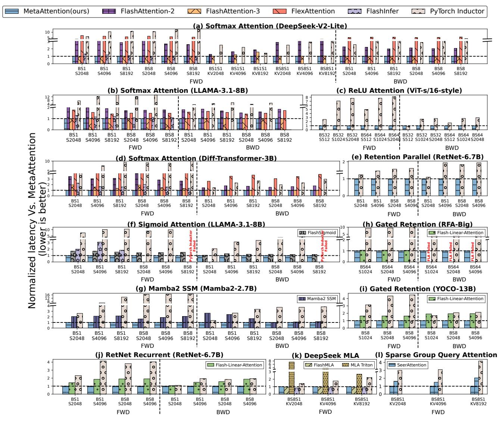
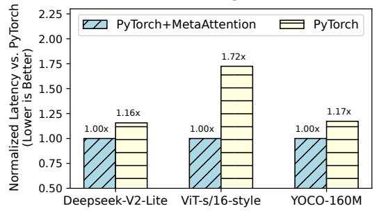
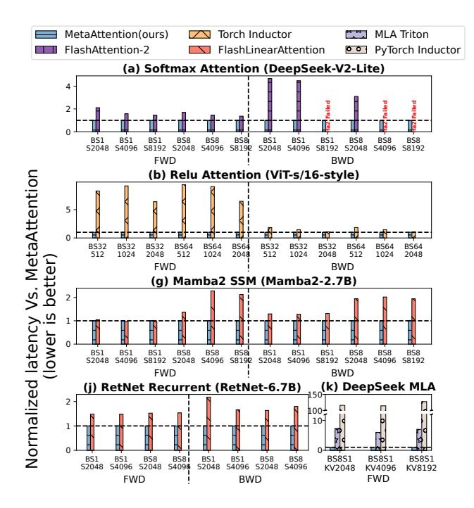

# MetaAttention: A Unified and Performant Attention Framework across Hardware Backends

# [Feiyang Chen](https://orcid.org/0009-0004-0420-0875)

Shanghai Jiao Tong University Shanghai, China chenfeiyang04@sjtu.edu.cn

# [Yuqing Xia](https://orcid.org/0009-0001-4413-5500)

Microsoft Research Beijing, China xiayuqing0622@outlook.com

# [Fan Yang](https://orcid.org/0000-0002-0378-060X)

Microsoft Research Beijing, China fanyang@microsoft.com

# [Mao Yang](https://orcid.org/0009-0009-6455-3898)

Microsoft Research Beijing, China maoyang@microsoft.com

# [Yu Cheng](https://orcid.org/0009-0003-9436-674X)

Peking University Beijing, China ryucheng@outlook.com

# [Ziming Miao](https://orcid.org/0000-0001-7466-2128)

Microsoft Research Beijing, China ziming.miao@microsoft.com

# [Jilong Xue](https://orcid.org/0000-0002-4495-1997)

Microsoft Research Beijing, China xuejilong@gmail.com

# [Xingda Wei](https://orcid.org/0000-0003-4983-6047)

Shanghai Jiao Tong University Shanghai, China wxdwfc@sjtu.edu.cn

# [Lei Wang](https://orcid.org/0009-0006-2313-5348)

Peking University Beijing, China leiwang1999@outlook.com

# [Lingxiao Ma](https://orcid.org/0009-0009-9524-5476)

Microsoft Research Beijing, China xysmlx@gmail.com

# [Zhi Yang](https://orcid.org/0000-0002-8219-4499)

Peking University Beijing, China yangzhi@pku.edu.cn

# [Haibo Chen](https://orcid.org/0000-0002-9720-0361)

Shanghai Jiao Tong University Shanghai, China haibochen@sjtu.edu.cn

# Abstract

Computing attention is the backbone of transformer-based models like large language models. However, the increasing diversity of attention algorithms presents significant challenges for unleashing hardware performance. State-of-theart variants like FlashAttention target a specific attention algorithm or hardware platform, which fail to generalize to other algorithms and platforms.

We present MetaAttention, a framework that automatically derives the optimal implementation of an attention algorithm given a hardware platform. Our key insight is that variants of attention can be abstracted into two operations: relevance scoring and aggregation, complemented by customizable functions and configurations like the input shape. Based on it, we systematically design a cross-backend attention runtime around these operations that generalizes to variants of attention with customizable operators. To unleash the hardware performance, we further propose an IntermediateTensor-based search method to find the optimal tiling strategy and the parallelism scheme according to the attention customization and hardware features. MetaAttention delivers up to a 10.4× speedup for configurations


[This work is licensed under a Creative Commons Attribution 4.0 Interna](https://creativecommons.org/licenses/by/4.0)[tional License.](https://creativecommons.org/licenses/by/4.0)

PPoPP '26, Sydney, NSW, Australia © 2026 Copyright held by the owner/author(s). ACM ISBN 979-8-4007-2310-0/2026/01 <https://doi.org/10.1145/3774934.3786444>

previously unsupported by state-of-the-art systems. Additionally, MetaAttention achieves performance comparable to manually-optimized libraries such as FlashMLA while significantly reducing the amount of code required.

CCS Concepts: • Computing methodologies → Parallel computing methodologies; • Computer systems organization → Parallel architectures.

Keywords: Attention mechanism, GPU acceleration, Kernel optimization, Cross-platform, Large language models

### ACM Reference Format:

Feiyang Chen, Yu Cheng, Lei Wang, Yuqing Xia, Ziming Miao, Lingxiao Ma, Fan Yang, Jilong Xue, Zhi Yang, Mao Yang, Xingda Wei, and Haibo Chen. 2026. MetaAttention: A Unified and Performant Attention Framework across Hardware Backends. In Proceedings of the 31st ACM SIGPLAN Annual Symposium on Principles and Practice of Parallel Programming (PPoPP '26), January 31 – February 4, 2026, Sydney, NSW, Australia. ACM, New York, NY, USA, [13](#page-12-0) pages. <https://doi.org/10.1145/3774934.3786444>

# 1 Introduction

Attention [\[26\]](#page-12-1) is a fundamental mechanism in modern large language models (LLMs), enabling groundbreaking advancements in natural language understanding and related domains. By dynamically weighting interactions across input tokens, attention allows models to capture contextual information between tokens, making it an indispensable component of modern deep learning systems.

Attention mechanisms dominate the computational workload in LLMs, and their proportion continuously increases

with the growing sequence length. This trend underscores the critical importance of optimizing attention for end-toend model training and inference. For instance, attention accounts from 55% to 82% of all computation time in Llama-3.2-3B when the sequence length increases from 2048 to 8192 (Table [1\)](#page-2-0). Such a significant computational burden highlights the necessity of efficient attention mechanisms to ensure optimal performance and scalability of LLMs across various applications and hardware platforms.

However, attention optimization is nontrivial due to high computation and memory demands and often relies on handcrafted kernels. For example, FlashAttention [\[9\]](#page-11-0) employs online softmax, memory-efficient pipelining, and kernel fusion to improve canonical attention; while Mamba2 [\[10\]](#page-11-1), a linear version of attention, utilizes Triton-based [\[25\]](#page-12-2) kernels with chunk-based processing for performance improvement. These handcrafted optimizations are labor-intensive, hardware-specific, and constrained to fixed configurations, thus limiting the adaptability to diverse attention designs and configurations.

Meanwhile, the diversity of attention variants continues to expand, driven by task-specific requirements and innovations, characterized by customized operators or intermediate tensor shapes. For instance, sigmoid attention [\[20\]](#page-11-2) replaces softmax with sigmoid activation for improved efficiency, and linear attention mechanisms, such as Mamba2 [\[10\]](#page-11-1), reformulate computation with selective gating for enhanced efficiency. Sparse attention, such as Seer Attention [\[14\]](#page-11-3), applies masks to previous tokens to reduce computation. Other variants, like DeepSeek MLA [\[11\]](#page-11-4) and RetNet [\[23\]](#page-12-3), deviate further by requiring non-standard tensor dimensions, introducing additional computational challenges. Adapting to this growing diversity requires significant expert effort for kernel customization. For example, implementing a highlyoptimized Multi-head Latent Attention in FlashMLA [\[16\]](#page-11-5) requires over 1,000 lines of CUDA code, involving a complex pipeline across hardware units and a carefully designed onchip data movement strategy.

Furthermore, differences in hardware platforms, such as NVIDIA A100, H100, and AMD MI300X GPUs, complicate the landscape. Hardware differences in tile sizes, memory hierarchies, and pipelining strategies necessitate new implementations, significantly increasing development overheads and limiting scalability. For example, FlashAttention v2 reached 70% of the peak computation throughput on NVIDIA A100, but only achieved 30% on NVIDIA H100. Complex techniques such as register-level pipelining and ping-pong kernel design must be used to achieve peak performance on the NVIDIA H100 [\[21\]](#page-12-4).

To address these challenges, we propose MetaAttention, a unified framework for designing, optimizing, and executing diverse attention mechanisms across hardware platforms. At its core, MetaAttention abstracts attention mechanisms

into two fundamental operations: relevance scoring and aggregation. These operations capture the essence of attention mechanisms, ensuring a consistent yet flexible foundation for diverse designs.

Building on this abstraction, MetaAttention introduces customizable attention templates that fix the core operations of relevance scoring and aggregation while exposing customizable functions for user-defined extensions. These functions allow users to design their attention variants by applying transformations like masking, scaling, or rowwise normalization, enabling seamless adaptation to taskspecific requirements. As shown in Table [3,](#page-8-0) state-of-theart attention mechanisms—including Softmax Attention, Multi-Latent Attention, Sigmoid Attention, Sliding Window Attention, Mamba2, and RetNet—can be represented within our framework. Moreover, recently-proposed mechanisms such as softpick attention [\[39\]](#page-12-5) can also be expressed using MetaAttention, demonstrating its flexibility and future-proof design.

One challenge is how to retain high-performance despite abstraction. State-of-the-art approaches (e.g., FlashAttention [\[8\]](#page-11-6)[\[21\]](#page-12-4), FlashMLA [\[16\]](#page-11-5), and Mamba [\[10\]](#page-11-1)) typically rely on handcrafted kernel implementations that hardcode execution strategies—such as fusion, parallelism, and pipelining—for specific attention mechanisms on particular hardware. In contrast, MetaAttention unifies execution strategies by mapping them to attributes of intermediate tensors. This enables automated optimization through a cross-backend scheduling that dynamically adapts to input configurations and hardware constraints.

We have implemented MetaAttention with 7.3k lines of C++ and Python code and have open-sourced the system to foster further innovations. Evaluation results demonstrate that MetaAttention achieves performance comparable to handcrafted expert-optimized kernels, delivering up to 10.4× speedup for configurations unsupported by existing implementations. Moreover, MetaAttention offers flexibility and simplicity in development by allowing users to define the attention template and customizable functions—eliminating the need to handle hardware-specific execution plans and significantly reducing development effort compared to manually optimized libraries.

# 2 Attention in the Wild

#### 2.1 Attention Mechanisms

The attention mechanism enables LLMs to selectively focus on relevant parts of an input sequence by computing pairwise attention scores between tokens. As shown in the left side of Fig. [1,](#page-2-1) it takes Queries (Q), Keys (K), and Values (V)—projected from input tokens—and follows four stages:

• Embedding: Tokens are mapped to Q, K, V tensors via linear projections.

<span id="page-2-1"></span>

**Fig. 1.** The foundational attention mechanism and its variants: Attention mechanisms are divided into stages such as embedding, interaction, normalization, and composition(left). Attention variants make various changes to these stages(right). For example, Causal Attention modified the interaction stage to apply a mask, which makes the computation flow different. MetaAttention unifies the three stages—Interaction, Normalization, and Composition—and provides a unified framework for customizing attention mechanisms.

- **Interaction:** Pairwise scores are computed via dot products of Q and K.
- Normalization: Scores are normalized using functions like softmax.
- **Composition:** Outputs are generated by combining scores with V, integrating information from relevant tokens into a single output for each token.

The standard attention [26] can be formulated as:

$$Attention(Q, K, V) = softmax(\frac{QK^{T}}{\sqrt{d_{k}}})V$$
 (1)

where  $d_k$  is the last dimension of Q and K.

#### 2.2 Diversity in Attention Mechanisms

Building on the foundational design of attention mechanisms, researchers have introduced numerous variants aimed at improving performance, addressing task-specific requirements, and enhancing computational efficiency. As illustrated on the right side of Fig. 1, these innovations fall into two categories.

**Algorithmic Innovations** enhance accuracy or capabilities. Examples include DiffTransformer [34] (refined interaction/normalization), DeepSeek-MLA [11]/RetNet [23] (higher-dimensional embeddings), and Causal attention [26] (restricted interaction).

Efficiency Innovations reduce the computation/memory of attention. Compact representations (e.g., Mamba [10], RetNet-recurrent [23], Sliding Window Attention [4]) compress past KV states with modified interaction and normalization. Sparse methods (e.g., BigBird [36], SeerAttention [14]) introduce sparsity in the interaction stage to reduce computational and memory demands.

<span id="page-2-0"></span>
 Table 1. Attention proportion in Llama-3.2-3B inference

| Seqlen       | 2K  | 4K  | 6K  | 8K  |
|--------------|-----|-----|-----|-----|
| Llama-3.2-3B | 55% | 70% | 78% | 82% |

#### 2.3 Performance Disparity of Attention Variants

The attention mechanism dominates LLM computation. As shown in Table 1, it accounts for a major portion of Llama-3.2-3B inference.

Handcrafted attention library. High-performance attention mechanisms frequently rely on handcrafted kernel implementations optimized for specific patterns. For example, FlashAttention [21] provides a highly optimized kernel for standard softmax attention by fusing softmax computation and using memory-efficient pipelining. Flash-Linear-Attention [33], a library of hand-written Triton kernel, offers kernels for a variety of linear attention variants.

However, such libraries are inflexible—minor deviations in attention patterns (e.g., DeepSeek V2 and RetNet's atypical input dimensions) break their optimizations. Fig. 2 illustrates the performance disparity across different attention variants. For standard Softmax-Attention, the handcrafted library FlashAttention3 [21] significantly outperforms the native Py-Torch implementation, achieving over 60% FLOPS utilization. In contrast, for less common variants like Gated-RetNet and ReLU-Attention, these libraries exhibit poor performance or provide no support at all.

Additionally, due to limited development resources, these libraries predominantly target top-tier hardware, such as

<span id="page-3-0"></span>

**Fig. 2.** Performance disparity of attention variants.

NVIDIA's H100 and A100 GPUs, and are not easily transferable to alternative platforms like AMD GPUs.

Compiler optimization. To simplify kernel development, automated compilers, such as Torch Inductor [3], TVM [6], FlashTensor [38], Ansor-AF [17], Welder [22], Alcop [15], and TensorRT [1], have emerged. While these tools reduce development effort and adopt techniques like operator fusion to improve efficiency, they struggle to match the performance of handcrafted kernels for attention variants. This limitation arises from their inability to fully understand the semantics of attention computation, as they often treat it as a sequence of discrete and opaque operations. Advanced optimizations, such as transforming softmax into an online softmax [9], are beyond the scope of current compiler capabilities, resulting in suboptimal performance.

Approaches for productivity. To balance performance and development productivity, most-recent approaches (e.g., FlexAttention [12], FlashInfer [35]) predefines the majority of the computation and expose a limited set of parameters for user code injection. Yet, such approaches only offer limited flexibility and remain tied to specific computational patterns, which thus fail to generalize across attention variants such as linear attention or attention with non-conventional shapes.

MetaAttention overcomes these limitations by providing a unified framework for designing and optimizing attention. It provides a programming interface designed for attention that supports both parallel and recurrent attention. It incorporates a structured scheduling approach and targets multiple backends, including NVIDIA and AMD GPUs, ensuring high performance and scalability.

#### 3 Programming with MetaAttention

MetaAttention provides a unified framework for programming diverse attention mechanisms. We first propose a unified attention abstraction. Then we define our programming interface on this abstraction.

#### <span id="page-3-2"></span>3.1 Unifying Attention Abstraction

By examining the native implementation of attention as relevance computing between tokens, we identify two fundamental components common to all attention mechanisms:

• *Relevance Scoring:* This operation forms the core of attention mechanisms, capturing pairwise similarities or

<span id="page-3-1"></span>

**Fig. 3.** MetaAttention overview: The framework begins with attention abstraction and uses the Programming Interface to define Attention Templates. It then generates an optimized scheduling plan, which is forwarded to the attention runtime to produce executable code tailored for the target device.

interactions between input tokens. It is typically realized through inner products or other similarity measures to determine token relationships.

 Aggregation: Using the relevance scores, this operation consolidates contextual information into a representation for each token.

Building on these two fundamental operations, we propose a unified template that encapsulates the diverse spectrum of attention variants shown in Fig. 4. This template consists of relevance scoring and aggregation with customizable functions between them, striking a balance between broad applicability and development flexibility.

#### 3.2 MetaAttention Overview

Based on our attention abstraction, we introduce MetaAttention, a unified framework designed to streamline the design, optimization, and execution of diverse attention mechanisms across hardware platforms. As shown in Fig. 3, MetaAttention begins with attention templates defined by the Programming Interface. These templates retain the core abstractions of attention—relevance scoring and aggregation, outlined in §3.1, while providing customizable functions that allow users to design their own attention variants.

Once customized, MetaAttention generates a scheduling plan for the attention mechanisms based on the scheduling space defined by IntermediateTensor and DeviceConfig. Within this space, MetaAttention applies a two-layer scheduling policy to determine the optimal execution plan, balancing performance and resource utilization. The resulting scheduling plan is then passed to the attention runtime, which instantiates and executes optimized kernels across hardware backends, ensuring efficiency and scalability for diverse configurations.

The following sections delve into the components of this framework, demonstrating how MetaAttention integrates abstraction, optimization, and execution to unify and extend the implementation of attention mechanisms.

#### 3.3 Programming Interface

Defining an attention mechanism using our programming interface involves three components: input tensor shapes, the attention pattern, and customizable functions.

**Attention template and patterns.** As depicted in Fig. 4, the unified template takes Queries(Q), Keys(K), and Values(V) after projection as inputs, maintaining an intermediate variable state and retaining two fixed computations:  $relevance = relevance\_scoring(Q[i], K, state)$  for relevance scoring and state = aggregate(relevance, V, state) for aggregation.

Depending on whether the contextual information from K and V can be compressed into a fixed-size state, we identify two distinct computation patterns in attention: one that computes relevance in parallel over the global KV context, and another that recurrently updates a compressed state and computes relevance based on it.

Accordingly, this unified attention template is instantiated in two computational patterns—parallel and recurrent:

- Parallel Pattern: Attention mechanism requires global context information over the sequence. Thus, relevance scoring and aggregation are implemented as parallel matrix multiplications over the context sequence, with scores = matmul(Query, Key)(where "matmul" denotes matrix multiplication) representing the relevance scoring and state = matmul(scores, Value) representing the aggregation.
- Recurrent Pattern: Attention mechanism iteratively traverses the sequence, storing the context information in a fixed-sized hidden state. Thus, relevance scoring and aggregation are sequentially computed over the hidden state h, with output = matmul(Query, h) and h = h + matmul(Key[i], Value[i]) together capturing the relevance scoring and aggregation, iteratively maintaining compressed states.

By integrating the two instantiated patterns, this unified attention template empowers users to design high-level attention mechanisms while MetaAttention seamlessly handles low-level implementation and hardware-specific optimization, ensuring both efficiency and scalability.

Customizable functions and flexibility. While attention patterns define the structural aspects of attention mechanisms, numerical transformations of intermediate tensors—such as masking operations [26], custom normalization schemes [23], or task-specific adaptations—are equally crucial. These operations typically involve either elementwise transformations or global tensor adjustments.

<span id="page-4-0"></span>**Table 2.** Customizable functions and their functionalities

| Type    | Name                                     | Functionality                              |
|---------|------------------------------------------|--------------------------------------------|
| Mod     | Q_mod, K_mod,<br>V_mod, output_mod       | Scale the input and output tensors         |
| Mod     | scores_mod                               | Apply scale or masking on attention scores |
| RowNorm | scores_rownorm,<br>scores_rownorm_online | Apply normalization on attention scores    |
| Mod     | h_mod                                    | Scaling on compressed hidden state         |

To facilitate such transformations, MetaAttention introduces the *customizable function*, which is defined as a function applied to a tensor and composed of a set of arithmetic operations. These operations include element-wise computations and reductions over the last dimension of the tensor.

As shown in Table 2, customizable functions can be applied to designated intermediate tensors, enabling users to tailor attention variants to specific requirements. For instance, in the parallel pattern, customizable functions can transform attention scores (to compute weights) and states (to produce final outputs). In the recurrent pattern, these weight and state transformations are unified into a single customizable function operating on the hidden state h.

Based on whether they include a reduction operation, customizable functions are divided into two types: modification and row-wise normalization.

The modification function (Mod) supports fine-grained elementwise transformations, including scaling and masking. For example, scaling the query tensor by  $1/\sqrt{d}$  (where d is the last dimension of the query tensor) in standard softmax attention [26] can be achieved using this function. Masking operations, such as applying a sparse mask in sparse attention [14][36][28], can also be implemented by multiplying a bool tensor using this interface.

The row-wise normalization function (RowNorm) enables global adjustments across tensor rows, accommodating a combination of elementwise and row-reduce computations. Examples include applying a row-wise softmax [26] for normalizing attention scores or implementing other numerical stabilization techniques [23].

**Examples.** Our interfaces support a wide range of attention mechanisms shown in Table 3, demonstrating their flexibility and generality.

As shown in Fig. 5, taking attention in RetNet [23] as an example, we first select the Parallel pattern for global context information. Next, we define the input shapes of the queries, keys, and values. Then, we define the customizable functions inserted in the parallel template: score modification for scaling and row-wise score normalization.

**RowNorm online interface.** To enhance performance, the row-wise normalization function can be defined

<span id="page-5-0"></span>

**Fig. 4.** Left: MetaAttention's unified attention template. By instantiating this template, two distinct patterns are produced (Parallel Pattern and Recurrent Pattern). The dashed circle box highlights the operations corresponding to the core components of the attention mechanism in the unified attention template: relevance\_scoring and aggregate. The customizable\_function is user-defined. The customizable\_function encompasses both modification function and row-wise normalization function.

```
pattern: Parallel\ninputs: {Query: Tensor[batch, head, seq_len, 256];
   Key: Tensor[batch, head, seq_len_kv, 256];
   Value: Tensor[batch, head, seq_len_kv, 512]}
customizable_function:
   def scores_Mod(scores):
        return scores * mask
   def scores_RowNorm(scores):
        t = scores.reduceAbssum()
        t = max(t, 1)
        return scores / t
```

**Fig. 5.** Example attention in RetNet [23]. It uses parallel pattern with the customized *Mod* function on scores and RowNorm on scores.

<span id="page-5-2"></span>

**Fig. 6.** Illustration of the RowNorm online interface. The left panel shows the standard row-wise normalization function, while the right panel demonstrates how MetaAttention enables users to implement the same functionality as an online function using the RowNorm online interface.

as an online function, where computations are processed sequentially in blocks along the rows. The term "online" refers to performing row-wise normalization entirely within

```
class scores_RowNorm_Online:
    def online_prologue():
        row_sum_wo_clamp = 0
        row_sum = 0
        return row_sum_wo_clamp, row_sum
    def online_forward(scores, row_sum_wo_clamp_prev,
```

**Fig. 7.** Example of scores\_rownorm in RetNet attention implemented by RowNorm online interface.

on-chip memory, avoiding intermediate writes to global memory [18].

MetaAttention proposes the RowNorm online interface to support general online row-wise normalization, such as online softmax used in FlashAttention [9]. As shown in Fig. 6, this interface includes three main components:

- online\_prologue, which initializes the state variables before entering the online loop.
- online\_forward, which defines computations within each block of rows, updating state variables like row maxima or sums and the scale over the previous block.
- online\_epilogue, which finalizes the computation after the loop.

```
class IntermediateTensor{
    TileShape tile;
    MemoryLocation mem;
    int pipelineStage;
};
```

Fig. 8. IntermediateTensor component

```
class DeviceConfig{
    BaseTileShape basetile;
    List<MemoryCapacity> memoryInfo;
};
```

Fig. 9. DeviceConfig component

Users can leverage this online interface to define online functions like online softmax, broadening the scope of attention mechanisms supported by MetaAttention. Fig. [7](#page-5-3) illustrates the retnet attention RowNorm implementation example employing the online interface.

# 4 MetaAttention Runtime

To retain high performance across various hardware backends and various attention defined using our interface, MetaAttention employs a structured approach to optimize execution performance. First, it utilizes IntermediateTensor components with configurable attributes to model the scheduling space. Concurrently, DeviceConfig components abstract hardware configurations into a unified representation, which constrains the scheduling space. The scheduling policy (Section [4.2\)](#page-7-0) then selects a scheduling plan from this space, which is subsequently dispatched to the attention runtime for kernel execution.

#### 4.1 Scheduling Space

IntermediateTensor. MetaAttention defines IntermediateTensor to represent all transient tensors in device memory during attention computation.

As attention mechanisms fuse multiple operators, they generate numerous intermediate tensors whose placement critically impacts on-chip memory utilization and computational latency. By focusing on intermediate tensors, MetaAttention can systematically deduce the tiling, memory allocation, and pipeline requirements for attention mechanisms.

Key attributes of IntermediateTensor include:

• Tensor tile shape (tile): By dividing tensors into smaller tiles, we can perform operations tile-by-tile and allocate buffers efficiently. Using the computation graph, we propagate the tiling scheme across all operations to infer the tile shapes of , , and other tensors, ensuring an optimal balance between computation and memory.

- Tensor location (mem): Intermediate tensors can be stored in various levels of memory, such as global memory, shared memory, or registers. Each location offers a trade-off between latency, bandwidth, and resource availability.
- Pipeline stage (pipelineStage): Operations involving intermediate tensors are divided into multiple pipeline stages, such as memory copy and computation. The number of stages determines the buffer requirements and scheduling flexibility, enabling overlapping operations to maximize throughput and minimize resource contention.

This component ensures that all elements of the attention mechanism, including inputs, outputs, and intermediate results, are unified under a consistent scheduling strategy.

Take the Parallel Pattern in Fig. [4](#page-5-0) as an example. Intermediate Tensor includes Q, K, scores, V, state, output and the tensor created in customizable\_function. The attributes of these intermediate tensors significantly impact the performance, such as the tile size of Q, K and V influence the balance between the parallelism of computation and the on-chip memory consumption.

DeviceConfig. The DeviceConfig component provides hardware-specific constraints that refine the scheduling space defined by intermediate tensors. It encapsulates attributes such as:

- Base tile shape (basetile): Specifies the optimal tile shape for computations on the target hardware, ensuring alignment with hardware-specific constraints, such as alignment with matrix multiplication computing instruction and memory transaction.
- Memory hierarchy (memoryInfo): Provides details about the available memory tiers (e.g., registers, shared memory, global memory) and their respective capacities, enabling efficient allocation and minimizing contention.

DeviceConfig determines the feasible tiling and memory strategies during scheduling. For instance, the base tile shape ensures hardware-aligned tiling configurations, while memory capacity constraints prevent resource overcommitment. Attention runtime. The attention runtime executes scheduling plans efficiently across heterogeneous hardware backends. Attention runtime takes the scheduling plans as input and instantiate the plans into attention computation kernels tailored to hardware.

To ensure efficiency, attention runtime integrates universal optimization tailored to attention mechanisms. For parallel patterns, the runtime implements online techniques for efficient row-wise normalization, drawing inspiration from FlashAttention's approach [\[9\]](#page-11-0). For recurrent patterns, it employs chunk parallelism techniques [\[32\]](#page-12-13) to maximize hardware utilization and throughput.

Additionally, attention runtime supports multiple implementations tailored to different backends, such as those implemented in TileLang [\[29\]](#page-12-14) and CUTE [\[7\]](#page-11-15). Leveraging a unified scheduling for different backends, MetaAttention can dynamically support all attention across different hardware and different configurations.

#### <span id="page-7-0"></span>4.2 Scheduling Policy

The scheduling plan contains the attributes of IntermediateTensors, including tile size, memory location, and pipeline stages. The scheduling policy generates the execution plan by determining the attributes of all intermediate tensors in attention.

To find an optimized execution plan within the scheduling space, multiple constraints must be considered. First, the combination of fixed computations and customizable functions in attention forms a tile computation graph, which requires adjacent IntermediateTensor instances to share the same tile size. Additionally, different attention patterns and input tensor shapes demand distinct memory placement strategies and pipeline stages to balance latency and on-chip resource utilization.

As illustrated in Fig. [10,](#page-7-1) MetaAttention employs a twolayer scheduling policy to generate the optimal scheduling plans represented by IntermediateTensors. This policy operates at two levels: tile config scheduling and tile resource scheduling. The outer layer, tile config scheduling, explores tile size attributes of intermediate tensors. The inner layer, tile resource scheduling, determines the memory location and pipeline stage attributes for intermediate tensors.

Tile config scheduling. This layer takes as input the attention computation graph (Graph) composed of IntermediateTensor objects and hardware configuration details (DeviceConfig). It enumerates all possible tile sizes for the output tensor and propagates these tile sizes through all intermediate tensors, thereby generating a set of tile graphs (lines [2](#page-7-2)[–3\)](#page-7-3).

For each tile configuration (line [5](#page-7-4) - [6\)](#page-7-5), the policy generates a set of execution plans using the tile resource scheduling layer and evaluates their performance through profiling (line [7](#page-7-6) [-8\)](#page-7-7).

Tile resource scheduling. This layer optimizes the memory location and pipeline stage attributes of intermediate tensors for a given tile configuration. The process begins by initializing all intermediate tensors to the highest available memory tier (e.g., registers) to minimize memory I/O overhead (line [15\)](#page-7-8). The policy then generates candidate plans by enumerating unconfigured attributes—such as pipeline stages—and checks their feasibility against hardware constraints (lines [18–](#page-7-9)[20\)](#page-7-10). If no valid plan is found, the policy iteratively demotes tensors to lower memory tiers and reattempts plan generation (line [24\)](#page-7-11).

```
1 Func TileConfigScheduling(g: Graph, D:DeviceConfig)
2 tiles = EnumerateTiles(g.output_shape, D.basetile)
3 tensor_tile_graphs = PropagateTileGraphs(g, tiles)
4 plans = []
5 for tile_graph in tensor_tile_graphs do
6 plans += TileResourceScheduling(tile_graph,
          D);
7 for plan in plans do
8 if Profile(plan) < best_latency
 9 best_latency = Profile(plan);
10 best_plan = plan;
11 return best_plan;
12 Func TileResourceScheduling(g: TileGraph,
   D:DeviceConfig)
13 tensor_list = GetIntermediateTensors(g);
14 SetTile(tensor_list, g.tiles);
15 SetMem(tensor_list, "L0");
16 tensor_list_sorted = tensor_list.sort(key=lambda t
       :(len(g[t].use_list), size(t.tile)));
17 for tensor_i in tensor_list_sorted do
18 plans =
          EnumerateUnsetAttributes(tensor_list);
19 for plan in plans do
20 if not MeetMemoryConstraint(plan,
             D.memoryInfo)
21 plans.remove(plan);
22 if not plans.isEmpty()
23 return plans;
24 LowerMemLocation(tensor_i.mem)
25 return EmptySet();
```

<span id="page-7-11"></span><span id="page-7-10"></span><span id="page-7-9"></span><span id="page-7-8"></span>Fig. 10. Scheduling algorithm. We employ a two-layer scheduling strategy to generate the execution plan. The first layer, tile configuration scheduling, explores the tile size attributes of intermediate tensors. The second layer, tile resource scheduling, determines the memory allocation and pipeline stage assignments for intermediate tensors.

# 5 Implementation

In this section, we detail the implementation of the MetaAttention frontend and backend, focusing on the end-to-end lowering process that transforms user-defined attention variants into optimized hardware-specific kernels.

Lowering customizable functions. To lower user-defined customizable functions into executable code, MetaAttention first traces the computation into a directed acyclic graph (DAG) of tensors. Each node in the DAG represents a specific computing primitive, which is categorized as either an

elementwise operation (e.g., add, tanh) or a row-reduce operations (e.g., reduceSum, reduceMax). These nodes encapsulate metadata such as tensor shapes and dependencies, and include a grad field to facilitate automatic differentiation. During the lowering process, MetaAttention maps these nodes to optimized hardware-specific implementations: elementwise operations are executed in a SIMT style with register-level or on-chip memory fusion to minimize data movement overhead, while row-reduce operations utilize intra-warp parallel reduction to maximize locality and reduce synchronization costs.

Implementing attention runtime. The attention runtime acts as the orchestration layer that translates an optimized scheduling plan into a complete kernel. We implement a suite of kernel templates for both parallel and recurrent patterns. These templates include operations for moving intermediate tensors between different memory hierarchies—such as from global memory to shared memory, global memory to registers, and shared memory to registers—as well as matrix multiplication with inputs residing in shared memory or registers. Based on the scheduling plan, the attention runtime selects the appropriate template and performs code inlining, where the hardware-mapped customizable functions (traced in the previous stage) are directly fused into the highperformance attention execution loop. This ensures that custom logic incurs zero additional kernel launch overhead and benefits from the same memory-efficient pipelining and hardware-native optimizations as the core attention mechanism.

Mapping to hardware backend. We map our kernel templates to diverse hardware backends by leveraging specialized architectural features to ensure peak performance.

On NVIDIA GPUs, MetaAttention utilizes the Tensor Memory Accelerator (TMA) for asynchronous data loading and Tensor Cores for accelerated matrix-multiplyaccumulate (MMA) operations. These are implemented using two distinct backend frameworks: TileLang [\[29\]](#page-12-14) and CUTE [\[7\]](#page-11-15).

For AMD GPUs, MetaAttention targets modern highperformance accelerators including the MI250 and MI300X. We utilize AMD Matrix Cores for matrix operations and leverage asynchronous copy units to optimize memory transfers. This support is implemented using the TileLang backend.

# 6 Evaluation

# 6.1 Experimental Setup

Hardware platforms. We evaluate MetaAttention on NVIDIA H100 SXM5 (CUDA 12.4, Triton 2.3.1) and AMD Instinct MI250 (ROCm 6.2.4, Triton 3.1.0) GPUs.

Attention workload. We evaluate ten attention mechanisms under realistic configurations: batch sizes of 1 and 8,

<span id="page-8-0"></span>Table 3. The set of attention mechanisms in our microbenchmark. Operators with configuration "seqlen=1" mean the query sequence length is 1, which is often used in LLM inference.

| Operator                       | Configuration                                         | Model                                             |
|--------------------------------|-------------------------------------------------------|---------------------------------------------------|
| Softmax Attention              | head=32, dimqk=128, dimv=128                          | LLAMA-3.1-8B [13]                                 |
| Softmax Attention              | head=16, dimqk=192, dimv=128                          | DeepSeek-V2-lite [11]                             |
| Softmax Attention              | head=12, dimqk=128, dimv=256                          | DiffTransformer<br>3B [34]                        |
| Softmax Attention              | seqlen=1, head=16, dimqk=192,<br>dimv=128             | DeepSeek-V2-lite [11]                             |
| Sigmoid Attention              | head=32, dimqk=128, dimv=128                          | LLAMA-3.1-8B with<br>Attention<br>Sigmoid<br>[20] |
| Relu Attention                 | head=6, dimqk=64, dimv=64                             | ViT-s/16 with Relu At<br>tention [31]             |
| Retention Parallel             | head=32, dimqk=256, dimv=512                          | RetNet-6.7B [23]                                  |
| Mamba2 SSM                     | headv=80, dimqk=128, dimv=64                          | Mamba2-2.7B [10]                                  |
| Retention<br>Recurrent         | head=32, dimqk=256, dimv=512                          | RetNet-6.7B [23]                                  |
| Gated Retention                | head=40, dimqk=256, dimv=256                          | YOCO-13B [24]                                     |
| Gated Retention                | head=16, dimqk=64, dimv=64                            | RFA-Big [19]                                      |
| Multi-head Latent<br>Attention | seqlen=1, head=128, head_kv=1,<br>dimqk=576, dimv=512 | DeepSeek-V3 [16]                                  |
| Sparse GQA                     | seqlen=1, head=32, head_kv=8,<br>dimqk=128, dimv=128  | LLAMA-3.1-8B with<br>SeerAttention [14]           |

and sequence lengths of 2k, 4k, and 8k. Details are listed in Table [3.](#page-8-0)

Baselines. We compare MetaAttention with manually implemented attention libraries, such as FlashAttention2 v2.7.4 [\[8\]](#page-11-6) and FlashAttention3 [\[21\]](#page-12-4) for Softmax attention, FlashSigmoid [\[20\]](#page-11-2) for Sigmoid attention, FLashMLA [\[16\]](#page-11-5) with blockSize=64 for Multi-head Latent Attention, Mamba2 chunk kernel [\[10\]](#page-11-1) for Mamba2 SSM and Flash-Linear-Attention Triton library v0.2.0 [\[33\]](#page-12-8) for gated retention. We also compare with state-of-the-art template-based approaches, such as FlexAttention [\[12\]](#page-11-13) and FlashInfer [\[35\]](#page-12-11) for parallel attention. We use PyTorch [\[2\]](#page-11-18) as a default baseline for attention that does not have a manually-implemented library, such as Retention Parallel [\[23\]](#page-12-3) and ReLUAttention [\[31\]](#page-12-15).

#### 6.2 Attention Performance on NVIDIA H100

Fig. [11](#page-9-0) shows normalized latency relative to MetaAttention across various attention configurations.

Softmax attention. Fig. [11](#page-9-0) (a)(b)(d) shows the performance of MetaAttention and other baselines on Softmax attention from Deepseek-V2-Lite, LLAMA-3.1-8B, and Diff-Transformer-3B. Compared with highly optimized libraries FlashAttention-3, MetaAttention achieves an average speedup of 1.61× on Diff-Transformers-3B forward and achieves comparable performance on LLAMA-3.1-8B and DeepSeek-V2-Lite forward and backward. This improvement stems from MetaAttention's flexible scheduling and attention runtime to support different headdim\_qk and headdim\_v,

<span id="page-9-0"></span>

**Fig. 11.** Performance of attention operators on H100 GPUs. We evaluate across different batch sizes (BS), sequence lengths (S), and key-value cache sequence lengths (KV). "FWD" denotes forward pass, while "BWD" denotes backward pass. Empty columns indicate that the baseline is either unsupported or encountered errors.

instead of padding them to the same dimension. MetaAttention also outperforms other programming-model-based approaches such as FlexAttention and FlashInfer, due to our scheduling over different shapes.

**Customized parallel attention.** Fig. 11 (c)(e)(f) shows the performance of MetaAttention and other baselines on customized parallel attention. Current expert-optimized libraries lack support for them. For example, no fused attention kernel is implemented for ReLU attention, and the fused Sigmoid attention kernel is not optimized for the latest hardware like NVIDIA H100. MetaAttention can obtain significant speedup on these operations, achieving  $3.6\times(1.1\times\sim10.4\times)$  over FlashSigmoid, PyTorch ReLU attention, and PyTorch

retention parallel. In addition, compared with programming-model-based approaches, MetaAttention can support all three customized attention mechanisms, which demonstrates MetaAttention's expressive ability and scalability.

**Recurrent pattern attention.** Fig. 11 (g)(h)(i)(j) represents the recurrent attention operation of Mamba2, RetNet-6.7B, YOCO-13B and RFA-Big. MetaAttention achieves average speedups of 1.66× and 1.78× for forward and backward respectively compared with Flash-Linear-Attention [33], which is an expert-optimized linear attention library.

**Multi-head latent attention.** Fig. 11 (k) shows the performance of MLA. MetaAttention achieves performance comparable to the manually optimized FlashMLA library and a  $4.6\times$  speedup over Triton.

<span id="page-10-0"></span>**Table 4.** Compilation time on NVIDIA H100 GPU and AMD MI250 GPU with batch=1 and seqlen=2048.

| Operator          | Configuration                   | Device | Scheduling Time |
|-------------------|---------------------------------|--------|-----------------|
| Softmax Attention | head=32, dimqk=128,<br>dimv=128 | H100   | 46 seconds      |
| Mamba2 SSM        | headv=80, dimqk=128,<br>dimv=64 | H100   | 82 seconds      |
| Softmax Attention | head=32, dimqk=128,<br>dimv=128 | MI250  | 64 seconds      |
| Mamba2 SSM        | headv=80, dimqk=128,<br>dimv=64 | MI250  | 89 seconds      |

Table 5. Lines of code of attention mechanism.

<span id="page-10-1"></span>

| Operator                    | MetaAttention | Handcrafted Library       |
|-----------------------------|---------------|---------------------------|
| Softmax Attention           | 87 LoC        | 2.7k lines of CUDA [21]   |
| Sigmoid Attention           | 54 LoC        | 1.9k lines of CUDA [20]   |
| Mamba2 SSM                  | 27 LoC        | 3k lines of Triton [10]   |
| Retention Recurrent         | 25 LoC        | 0.4k lines of Triton [33] |
| Gated Retention             | 22 LoC        | 0.4k lines of Triton [33] |
| Multi-head Latent Attention | 90 LoC        | 1.7k lines of CUDA [16]   |

<span id="page-10-2"></span>

Fig. 12. End-to-end inference performance on H100.

**Sparse group query attention.** Fig. 11 (l) represents the sparse group query attention of SeerAttention [14]. We compare MetaAttention with the manually implemented Triton kernel in SeerAttention. The result shows that MetaAttention achieves an average speedup of 1.71×.

#### 6.3 Evaluation on the Compilation Time

As shown in Table 4, benefiting from our efficient scheduling policy, the compilation time of our framework is limited to the minute level, which is significantly shorter than that of traditional deep learning compilers such as Ansor [37].

#### 6.4 Evaluation on Development Effort

As shown in Table 5, users can efficiently implement various attention mechanisms using MetaAttention with significantly reduced development effort compared to handcrafted libraries.

#### 6.5 End-to-end Inference on NVIDIA H100

We evaluate the inference latency of large language models using one NVIDIA H100 GPU. Models are implemented

#### **End-to-end Training Performance**

<span id="page-10-3"></span>

**Fig. 13.** End-to-end training performance on H100.

in Transformers [30] with their attention operators replaced by MetaAttention. We test two parallel-pattern models (Deepseek-V2-Lite and Diff-Transformer-3B) and two recurrent-pattern models (Mamba2-2.7B and YOCO-160M) with 16k input length.

As shown in Fig. 12, MetaAttention achieves an average FP16 speedup of 1.4 $\times$ , attributed to more efficient attention computation. For instance, in Deepseek-V2-Lite, where attention consumes 85% of inference time, our optimized operator reaches 2.2 $\times$  faster speed, leading to an end-to-end improvement of 1.85 $\times$ .

#### 6.6 End-to-end Training on NVIDIA H100

We evaluate MetaAttention in end-to-end training with a sequence length of 8k using TRL [27] on Diff-Transformer-3B, YOCO-160M, and ViT-S/16 with ReLU attention.

Fig. 13 shows an average training speedup of 1.4×. Notably, ViT-S/16 with ReLU attention gains a 1.7× speedup due to the lack of optimized libraries for this attention variant.

#### 6.7 Evaluation on AMD ROCm GPUs

We benchmark a subset of operators on the AMD MI250 GPU, including Softmax Attention, ReLU Attention, Mamba2, and RetNet Recurrent.

As shown in Fig. 14, MetaAttention achieves average speedups of 3.3× (forward) and 2.0× (backward) over baselines, demonstrating its capability for multi-backend support.

#### 7 Conclusion

This paper presented MetaAttention, which addressed the programmability and performance of attention variants by abstracting attention into two core operations, i.e., relevance scoring and aggregation, and introducing customizable templates that combine flexibility with efficiency. With a crossbackend scheduling framework, MetaAttention automated kernel optimizations, achieving up to 10.4× speedups for unsupported configurations.

<span id="page-11-19"></span>

**Fig. 14.** Attention operator performance on MI250 GPUs. We evaluate across different BS(batch size), S(sequence length) and KV(kv cache sequence length). FWD means forward, BWD means backward.

# Acknowledgements

We sincerely thank the anonymous reviewers of PPoPP'26 for their constructive comments and insightful suggestions. This work is supported in part by the Fundamental and Interdisciplinary Disciplines Breakthrough Plan of the Ministry of Education of China (JYB2025XDXM113) and the National Natural Science Foundation of China (No. 62132014). Haibo Chen (haibochen@sjtu.edu.cn) is the corresponding author.

### A Artifact Appendix

MetaAttention is publicly available in https://github.com/SJTU-IPADS/MetaAttention. Our framework is also available as a Zenodo archive[5]: https://doi.org/10.5281/zenodo. 17701680. Detailed instructions are available within the README in the repository.

#### References

- <span id="page-11-12"></span> $[1] \ [n.\,d.]. \ NVIDIA \ TensorRT. \ https://developer.nvidia.com/tensorrt.$
- <span id="page-11-18"></span>[2] [n.d.]. PyTorch. https://pytorch.org/.
- <span id="page-11-8"></span>[3] Jason Ansel, Edward Yang, Horace He, Natalia Gimelshein, Animesh Jain, Michael Voznesensky, Bin Bao, Peter Bell, David Berard, Evgeni Burovski, Geeta Chauhan, Anjali Chourdia, Will Constable, Alban Desmaison, DeVito, et al. 2024. PyTorch 2: Faster Machine Learning Through Dynamic Python Bytecode Transformation and Graph Compilation. In Proceedings of the 29th ACM International Conference on Architectural Support for Programming Languages and Operating Systems, Volume 2 (La Jolla, CA, USA) (ASPLOS '24). Association

- for Computing Machinery, New York, NY, USA, 929–947. https://doi.org/10.1145/3620665.3640366
- <span id="page-11-7"></span>[4] Iz Beltagy, Matthew E. Peters, and Arman Cohan. 2020. Longformer: The Long-Document Transformer. arXiv:2004.05150 [cs.CL] https://arxiv.org/abs/2004.05150
- <span id="page-11-20"></span>[5] Feiyang Chen. 2025. Artifact for: MetaAttention: A Unified and Performant Attention Framework Across Hardware Backends. https://doi.org/10.5281/zenodo.17701680
- <span id="page-11-9"></span>[6] Tianqi Chen, Thierry Moreau, Ziheng Jiang, Lianmin Zheng, Eddie Yan, Haichen Shen, Meghan Cowan, Leyuan Wang, Yuwei Hu, Luis Ceze, Carlos Guestrin, and Arvind Krishnamurthy. 2018. TVM: An Automated End-to-End Optimizing Compiler for Deep Learning. In 13th USENIX Symposium on Operating Systems Design and Implementation (OSDI 18). USENIX Association, Carlsbad, CA, 578–594. https://www.usenix.org/conference/osdi18/presentation/chen
- <span id="page-11-15"></span>[7] NVIDIA Corporation. 2024. CUTLASS: CUDA Templates for Linear Algebra Subroutines. https://github.com/NVIDIA/cutlass.
- <span id="page-11-6"></span>[8] Tri Dao. 2023. Flashattention-2: Faster attention with better parallelism and work partitioning. arXiv preprint arXiv:2307.08691 (2023).
- <span id="page-11-0"></span>[9] Tri Dao, Dan Fu, Stefano Ermon, Atri Rudra, and Christopher Ré. 2022. Flashattention: Fast and memory-efficient exact attention with io-awareness. Advances in Neural Information Processing Systems 35 (2022), 16344–16359.
- <span id="page-11-1"></span>[10] Tri Dao and Albert Gu. 2024. Transformers are SSMs: Generalized models and efficient algorithms through structured state space duality. arXiv preprint arXiv:2405.21060 (2024).
- <span id="page-11-4"></span>[11] DeepSeek-AI, Aixin Liu, Bei Feng, Bin Wang, Bingxuan Wang, Bo Liu, Chenggang Zhao, Chengqi Dengr, Chong Ruan, Damai Dai, Daya Guo, Dejian Yang, Deli Chen, Dongjie Ji, Erhang Li, Fangyun Lin, Fuli Luo, Guangbo Hao, Guanting Chen, Guowei Li, et al. 2024. DeepSeek-V2: A Strong, Economical, and Efficient Mixture-of-Experts Language Model. arXiv:2405.04434 [cs.CL] https://arxiv.org/abs/2405.04434
- <span id="page-11-13"></span>[12] Juechu Dong, Boyuan Feng, Driss Guessous, Yanbo Liang, and Horace He. 2024. Flex Attention: A Programming Model for Generating Optimized Attention Kernels. arXiv:2412.05496 [cs.LG] https://arxiv.org/abs/2412.05496
- <span id="page-11-16"></span>[13] Abhimanyu Dubey, Abhinav Jauhri, Abhinav Pandey, Abhishek Kadian, Ahmad Al-Dahle, Aiesha Letman, Akhil Mathur, Alan Schelten, Amy Yang, Angela Fan, et al. 2024. The llama 3 herd of models. arXiv preprint arXiv:2407.21783 (2024).
- <span id="page-11-3"></span>[14] Yizhao Gao, Zhichen Zeng, Dayou Du, Shijie Cao, Hayden Kwok-Hay So, Ting Cao, Fan Yang, and Mao Yang. 2024. SeerAttention: Learning Intrinsic Sparse Attention in Your LLMs. arXiv:2410.13276 [cs.CL] https://arxiv.org/abs/2410.13276
- <span id="page-11-11"></span>[15] Guyue Huang, Yang Bai, Liu Liu, Yuke Wang, Bei Yu, Yufei Ding, and Yuan Xie. 2023. Alcop: Automatic load-compute pipelining in deep learning compiler for ai-gpus. *Proceedings of Machine Learning and Systems* 5 (2023), 680–694.
- <span id="page-11-5"></span>[16] Shengyu Liu Jiashi Li. 2025. FlashMLA: Efficient MLA decoding kernels. https://github.com/deepseek-ai/FlashMLA.
- <span id="page-11-10"></span>[17] Chendi Li, Yufan Xu, Sina Mahdipour Saravani, and Ponnuswamy Sadayappan. 2024. Accelerated auto-tuning of gpu kernels for tensor computations. In Proceedings of the 38th ACM International Conference on Supercomputing. 549–561.
- <span id="page-11-14"></span>[18] Maxim Milakov and Natalia Gimelshein. 2018. Online normalizer calculation for softmax. arXiv:1805.02867 [cs.PF] https://arxiv.org/ abs/1805.02867
- <span id="page-11-17"></span>[19] Hao Peng, Nikolaos Pappas, Dani Yogatama, Roy Schwartz, Noah A. Smith, and Lingpeng Kong. 2021. Random Feature Attention. arXiv:2103.02143 [cs.CL] https://arxiv.org/abs/2103.02143
- <span id="page-11-2"></span>[20] Jason Ramapuram, Federico Danieli, Eeshan Dhekane, Floris Weers, Dan Busbridge, Pierre Ablin, Tatiana Likhomanenko, Jagrit Digani, Zijin Gu, Amitis Shidani, and Russ Webb. 2024. Theory, Analysis, and Best Practices for Sigmoid Self-Attention. arXiv:2409.04431 [cs.LG]

#### <span id="page-12-0"></span><https://arxiv.org/abs/2409.04431>

- <span id="page-12-4"></span>[21] Jay Shah, Ganesh Bikshandi, Ying Zhang, Vijay Thakkar, Pradeep Ramani, and Tri Dao. 2024. Flashattention-3: Fast and accurate attention with asynchrony and low-precision. Advances in Neural Information Processing Systems 37 (2024), 68658–68685.
- <span id="page-12-10"></span>[22] Yining Shi, Zhi Yang, Jilong Xue, Lingxiao Ma, Yuqing Xia, Ziming Miao, Yuxiao Guo, Fan Yang, and Lidong Zhou. 2023. Welder: Scheduling deep learning memory access via tile-graph. In 17th USENIX Symposium on Operating Systems Design and Implementation (OSDI 23). 701–718.
- <span id="page-12-3"></span>[23] Yutao Sun, Li Dong, Shaohan Huang, Shuming Ma, Yuqing Xia, Jilong Xue, Jianyong Wang, and Furu Wei. 2023. Retentive network: A successor to transformer for large language models. arXiv preprint arXiv:2307.08621 (2023).
- <span id="page-12-16"></span>[24] Yutao Sun, Li Dong, Yi Zhu, Shaohan Huang, Wenhui Wang, Shuming Ma, Quanlu Zhang, Jianyong Wang, and Furu Wei. 2024. You only cache once: Decoder-decoder architectures for language models. Advances in Neural Information Processing Systems 37 (2024), 7339–7361.
- <span id="page-12-2"></span>[25] Philippe Tillet, H. T. Kung, and David Cox. 2019. Triton: An Intermediate Language and Compiler for Tiled Neural Network Computations. Association for Computing Machinery, New York, NY, USA, 10–19. <https://doi.org/10.1145/3315508.3329973>
- <span id="page-12-1"></span>[26] Ashish Vaswani, Noam Shazeer, Niki Parmar, Jakob Uszkoreit, Llion Jones, Aidan N Gomez, Łukasz Kaiser, and Illia Polosukhin. 2017. Attention is all you need. Advances in neural information processing systems 30 (2017).
- <span id="page-12-19"></span>[27] Leandro von Werra, Younes Belkada, Lewis Tunstall, Edward Beeching, Tristan Thrush, Nathan Lambert, Shengyi Huang, Kashif Rasul, and Quentin Gallouédec. 2020. TRL: Transformer Reinforcement Learning. <https://github.com/huggingface/trl>.
- <span id="page-12-12"></span>[28] Hongyu Wang, Shuming Ma, Li Dong, Shaohan Huang, Huaijie Wang, Lingxiao Ma, Fan Yang, Ruiping Wang, Yi Wu, and Furu Wei. 2023. BitNet: Scaling 1-bit Transformers for Large Language Models. arXiv[:2310.11453](https://arxiv.org/abs/2310.11453) [cs.CL] <https://arxiv.org/abs/2310.11453>
- <span id="page-12-14"></span>[29] Lei Wang, Yu Cheng, Yining Shi, Zhengju Tang, Zhiwen Mo, Wenhao Xie, Lingxiao Ma, Yuqing Xia, Jilong Xue, Fan Yang, and Zhi Yang. 2025. TileLang: A Composable Tiled Programming Model for AI Systems. arXiv[:2504.17577](https://arxiv.org/abs/2504.17577) [cs.LG] <https://arxiv.org/abs/2504.17577>
- <span id="page-12-18"></span>[30] Thomas Wolf, Lysandre Debut, Victor Sanh, et al. 2020. Transformers: State-of-the-Art Natural Language Processing. In Proceedings of the 2020 Conference on Empirical Methods in Natural Language Processing: System Demonstrations. Association for Computational Linguistics, Online, 38–45. [https://www.aclweb.org/anthology/2020.emnlp-demos.](https://www.aclweb.org/anthology/2020.emnlp-demos.6) [6](https://www.aclweb.org/anthology/2020.emnlp-demos.6)

<span id="page-12-15"></span>[31] Mitchell Wortsman, Jaehoon Lee, Justin Gilmer, and Simon Kornblith. 2023. Replacing softmax with ReLU in Vision Transformers. arXiv[:2309.08586](https://arxiv.org/abs/2309.08586) [cs.CV] <https://arxiv.org/abs/2309.08586>

.

- <span id="page-12-13"></span>[32] Songlin Yang, Bailin Wang, Yikang Shen, Rameswar Panda, and Yoon Kim. 2024. Gated Linear Attention Transformers with Hardware-Efficient Training. arXiv[:2312.06635](https://arxiv.org/abs/2312.06635) [cs.LG] [https://arxiv.org/abs/](https://arxiv.org/abs/2312.06635) [2312.06635](https://arxiv.org/abs/2312.06635)
- <span id="page-12-8"></span>[33] Songlin Yang and Yu Zhang. 2024. FLA: A Triton-Based Library for Hardware-Efficient Implementations of Linear Attention Mechanism. <https://github.com/fla-org/flash-linear-attention>
- <span id="page-12-6"></span>[34] Tianzhu Ye, Li Dong, Yuqing Xia, Yutao Sun, Yi Zhu, Gao Huang, and Furu Wei. 2024. Differential Transformer. arXiv[:2410.05258v2](https://arxiv.org/abs/2410.05258v2) [cs.CL] <http://arxiv.org/abs/2410.05258v2>
- <span id="page-12-11"></span>[35] Zihao Ye, Lequn Chen, Ruihang Lai, Wuwei Lin, Yineng Zhang, Stephanie Wang, Tianqi Chen, Baris Kasikci, Vinod Grover, Arvind Krishnamurthy, and Luis Ceze. 2025. FlashInfer: Efficient and Customizable Attention Engine for LLM Inference Serving. arXiv[:2501.01005v2](https://arxiv.org/abs/2501.01005v2) [cs.DC] <http://arxiv.org/abs/2501.01005v2>
- <span id="page-12-7"></span>[36] Manzil Zaheer, Guru Guruganesh, Avinava Dubey, Joshua Ainslie, Chris Alberti, Santiago Ontanon, Philip Pham, Anirudh Ravula, Qifan Wang, Li Yang, and Amr Ahmed. 2021. Big Bird: Transformers for Longer Sequences. arXiv[:2007.14062](https://arxiv.org/abs/2007.14062) [cs.LG] [https://arxiv.org/abs/](https://arxiv.org/abs/2007.14062) [2007.14062](https://arxiv.org/abs/2007.14062)
- <span id="page-12-17"></span>[37] Lianmin Zheng, Chengfan Jia, Minmin Sun, Zhao Wu, Cody Hao Yu, Ameer Haj-Ali, Yida Wang, Jun Yang, Danyang Zhuo, Koushik Sen, Joseph E. Gonzalez, and Ion Stoica. 2020. Ansor: Generating High-Performance Tensor Programs for Deep Learning. In 14th USENIX Symposium on Operating Systems Design and Implementation (OSDI 20). USENIX Association, 863–879. [https://www.usenix.org/conference/](https://www.usenix.org/conference/osdi20/presentation/zheng) [osdi20/presentation/zheng](https://www.usenix.org/conference/osdi20/presentation/zheng)
- <span id="page-12-9"></span>[38] Runxin Zhong, Yuyang Jin, Chen Zhang, Kinman Lei, Shuangyu Li, and Jidong Zhai. 2025. FlashTensor: Optimizing Tensor Programs by Leveraging Fine-grained Tensor Property. In Proceedings of the 30th ACM SIGPLAN Annual Symposium on Principles and Practice of Parallel Programming. 183–196.
- <span id="page-12-5"></span>[39] Zayd M. K. Zuhri, Erland Hilman Fuadi, and Alham Fikri Aji. 2025. Softpick: No Attention Sink, No Massive Activations with Rectified Softmax. arXiv[:2504.20966](https://arxiv.org/abs/2504.20966) [cs.LG] <https://arxiv.org/abs/2504.20966>

Received 2025-09-01; accepted 2025-11-10