# ChituDiffusion: A Data-Characteristic-Aware Serving System for Diffusion Models

# Chengzhang Wu\*

Tsinghua University Beijing, China wcz24@mails.tsinghua.edu.cn

### Kezhao Huang

Tsinghua University Beijing, China hkz20@tsinghua.org.cn

## Liyan Zheng\*

Tsinghua University Beijing, China zhengly20@mails.tsinghua.edu.cn

#### Zixuan Ma

Tsinghua University Beijing, China mzx22@mails.tsinghua.edu.cn

## Jidong Zhai

Tsinghua University Beijing, China zhaijidong@tsinghua.edu.cn

### Haojie Wang

Tsinghua University Beijing, China wanghaojie@tsinghua.edu.cn

## Dong Dong

Tsinghua University Beijing, China dongd@tsinghua.edu.cn

#### **Abstract**

Diffusion models have become the dominant approach for generative tasks in images, videos, and other domains. However, diverse data properties in generation requests, which are critical for efficient serving, remain underexploited.

To address this issue, we propose a diffusion model serving system CHITUDIFFUSION. CHITUDIFFUSION leverages the locality of data properties to recompose a diffusion pipeline into subgraphs with shared optimization opportunities, enabling thorough compile-time and runtime co-optimizations. During compilation, CHITUDIFFUSION compiles each subgraph into multiple execution engines optimized for specific data properties. At runtime, heterogeneous requests are elaborately reorganized into fine-grained batching tasks with similar properties and then efficiently executed by matched engines. Evaluation on five diffusion applications shows that CHITUDIFFUSION improves the throughput by up to 2.13×  $(1.58 \times \text{ on average})$  on A100 and  $2.19 \times (1.51 \times \text{ on average})$ on H100 compared with existing frameworks. The code for CHITUDIFFUSION and the production traces have been made open-source at https://github.com/thu-pacman/chitu/tree/ Diffusion.

CCS Concepts: • Computer systems organization  $\rightarrow$  Real-time systems; Parallel architectures; • Computing methodologies  $\rightarrow$  Machine learning; Computer vision.

\*Both authors contributed equally to this research.


This work is licensed under a Creative Commons Attribution 4.0 International License.

PPoPP '26, Sydney, NSW, Australia
© 2026 Copyright held by the owner/author(s).
ACM ISBN 979-8-4007-2310-0/2026/01
https://doi.org/10.1145/3774934.3786424

*Keywords:* Deep learning serving system, Diffusion models, Data-characteristic-aware optimization, Compiler

#### **ACM Reference Format:**

Chengzhang Wu, Liyan Zheng, Haojie Wang, Kezhao Huang, Zixuan Ma, Dong Dong, and Jidong Zhai. 2026. ChituDiffusion: A Data-Characteristic-Aware Serving System for Diffusion Models. In *Proceedings of the 31st ACM SIGPLAN Annual Symposium on Principles and Practice of Parallel Programming (PPoPP '26), January 31 – February 4, 2026, Sydney, NSW, Australia.* ACM, New York, NY, USA, 14 pages. https://doi.org/10.1145/3774934.3786424

#### 1 Introduction

Diffusion models have become a versatile class of generative algorithms across domains, including images [29, 51, 52, 67], videos [11, 16, 28, 30], 3D objects [32, 49], music [27, 43], and proteins [63]. Their flexibility supports applications from text-to-image [51] and text-to-video [11] generation to controllable editing [67], powering products like DALL·E 3 [20], Sora [6], and Firefly [2]. To meet application demands, diffusion pipelines integrate diverse input data and multiple DNNs, leading to high computational cost. Real-world requests further exhibit heterogeneous data properties—such as shared and partially duplicate inputs with varying generation shapes (Figure 1(a))—arising from both applications and user behaviors [62, 64]. Exploiting these properties offers acceleration opportunities beyond the scope of general ML frameworks [7, 48, 58].

Dedicated diffusion model frameworks, e.g., Diffusers [61], offer manually optimized pipelines designed for specific data properties, such as batched requests with identical prompts shown in Figure 1(b). Users can select the corresponding optimized pipeline for efficient executions. However, these manual optimizations address only a narrow subset of potential scenarios due to two challenges.

<span id="page-1-0"></span>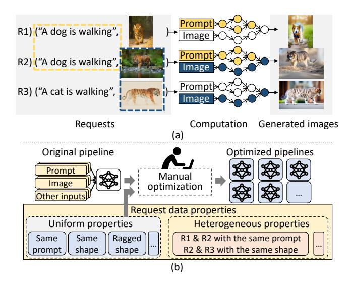

**Figure 1.** (a) Image generation requests with different data properties. Yellow and blue circles represent identical computations and computations with the same generation shape, respectively. (b) Existing diffusion frameworks with manual optimizations for uniform properties but lack support for heterogeneous properties.

1) Diverse input data properties. The complexity of diffusion models means each generation request may involve tens of inputs with independent properties. Since these properties can interact, existing methods must enumerate all possible combinations for optimization. However, the combinatorial explosion across inputs makes exhaustive optimization intractable.

2) Heterogeneous requests. When batching for efficiency, requests often contain heterogeneous and dynamic data properties. As shown in Figure 1(b), different requests may share prompts or generation shapes, creating optimization opportunities. However, existing methods assume uniform properties within a batch, making it difficult to exploit such heterogeneity.

We present Chitudiffusion, a diffusion service system that leverages the data properties exhibiting *locality* across computations. Consecutive operators often share optimization opportunities induced by these properties—e.g., circles with the same color in Figure 1(a). Chitudiffusion decomposes the pipeline into *dGraphs*<sup>1</sup>, which explicitly capture data properties, enabling decoupled handling through codesigned compilation and runtime optimizations. As a result, Chitudiffusion enables a wide range of data-property-aware optimizations beyond existing frameworks, while maintaining a reasonable optimization cost.

In ChituDiffusion, we make the following design decisions.

During static compilation, Chitudiffusion decomposes the pipeline into dGraphs using symbolic variables to represent and propagate input data properties. Each dGraph is compiled into multiple dEngines, each specialized for a uniform property configuration. By reusing dEngines across requests with different properties, Chitudiffusion performs optimizations for diverse input properties while incurring only a small compilation overhead.

At runtime, heterogeneous requests are decomposed into fine-grained dTask (dGraph-level tasks). A dynamic programming based scheduler identifies and batches dTasks with the same properties. These dTasks batches are efficiently processed by corresponding dEngines that have been optimized for uniform data properties. Input and output properties are inferred asynchronously, enabling the overlap of scheduling and execution processes to mitigate scheduling overhead.

Specifically, ChituDiffusion implements two key data-property optimizations to accelerate diffusion pipelines (§2.2): redundancy and dynamic shapes. Redundancy propagation and elimination rules are designed to detect and remove dimension-level redundant computations and memory accesses in tensor algebra. To support batched requests with dynamic shapes (hereafter referred to as *raggedness*), ChituDiffusion applies *raggedness regularization*, transforming dynamic-shape operations into kernel-compatible forms without requiring new ragged kernels.

We evaluate ChituDiffusion on five diverse diffusion applications, covering image and video generation with several widely used model extensions. The evaluation shows that ChituDiffusion achieves a throughput up to 2.13× (1.58× on average) higher than widely-used DNN optimizers and diffusion-specific systems, showing the effectiveness of ChituDiffusion's data-property-aware optimizations on diffusion models.

This paper makes the following contributions:

- We observe the key data characteristics of diffusion model requests for optimizations, which exhibit locality in pipelines.
- We propose recomposed optimizations for pipelines and requests, orchestrating compile-time and runtime optimizations to exploit complex data properties.
- We implement CHITUDIFFUSION, a system for diffusion pipeline optimization, which outperforms the throughput of state-of-the-art frameworks by up to 2.13x.

# 2 Background and Motivation

### 2.1 Diffusion Models

Diffusion models generate data by simulating a denoising process that transforms random noise into a target distribution. Figure 3 illustrates the pipeline of diffusion-based applications such as text-to-image and image-to-image generation. Prompts are first embedded by CLIP [50], then used to guide a U-Net [16] base model that iteratively denoises a latent

<span id="page-1-1"></span> $<sup>^1\</sup>mathrm{The}$  prefix "d" signifies diffusion, data properties, and decomposition.

<span id="page-2-2"></span>

| Prompt                                    | Guidance scale | Shape   |
|-------------------------------------------|----------------|---------|
|                                           | 8              | 512×896 |
| Concept Art of cinematography of Terrence | 1              | 512×896 |
|                                           | 5              | 512×896 |
|                                           | 8              | 512×768 |
|                                           | 8              | 512×832 |

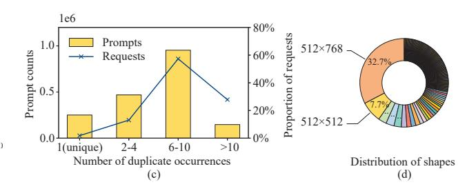

**Figure 2.** (a) The count of inputs of SDXL-based diffusion pipelines. T2I and I2I represent the text-to-image and image-to-image tasks, respectively. Inpainting means image partial repaint in the selected area. Control inputs influence the pipeline control flow, such as iteration counts. (b) Consecutive text-to-image requests in DiffusionDB [62], a request database of an online text-to-image service. (c) Duplicate prompt occurrences in DiffusionDB counting by prompts and requests. (d) Shape distribution of the top 300 popular generative images in Civitai [17], which contain 112 different shapes. Only images with generation settings attached are included.

<span id="page-2-1"></span>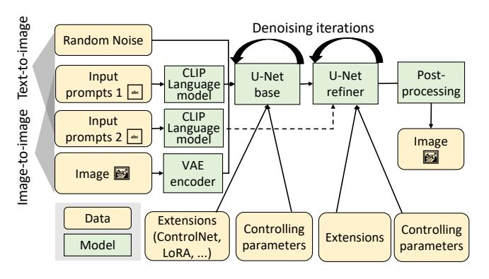

Figure 3. Application pipelines based on the SDXL model.

image initialized from random noise or an input image. A U-Net refiner further enhances the result through additional denoising rounds, and the final latent is decoded into a visible image, optionally followed by super-resolution [24, 25, 54].

While U-Net architectures dominate traditional diffusion models, transformer-based designs are gaining traction. Models such as DiT [46], SD3 [9], Hunyuan series models [40, 57] and FLUX [34, 35] leverage self-attention for improved generation quality, and extensions like DiT-3D [44], DiT-MoE [69], RFDiffusion [63] and TerDiT [42] further adapt this paradigm to 3D modeling, efficient scaling, protein structure prediction and resource-constrained deployment.

#### <span id="page-2-0"></span>2.2 Motivation

Resulting from the distinct computation patterns of diffusion models, their complex structures and unique data properties provide new optimization opportunities.

Complex pipelines with flexible customization. Diffusion models exhibit high flexibility, necessitating numerous configurable inputs such as positive and negative prompts, one or more reference images, guidance strength, plug-and-play extensions, etc. As shown in Figure 2(a), a single diffusion pipeline based on the SDXL model is able to take more than 20 inputs for a generation request.

To meet the requirements of different applications, diffusion pipelines are extensively customized to achieve flexible functionalities. For example, the image-to-image pipeline in Figure 3 extends the basic text-to-image pipeline by incorporating a VAE encoder model to encode input images into latent space. Additionally, application designers and users can apply various extensions, such as ControlNet [67] and LoRA [31], to generate results in different visual effects and artistic styles. Consequently, varied input data across applications offers unique optimization chances, necessitating effective application-specific optimization strategies.

**Diverse Data Characteristics in Requests** Diffusion model serving systems must accommodate requests with diverse data characteristics. These mainly manifest as *correlative requests with partial redundancy* and *variability in generation shapes*, arising from both application and user sides.

On the application side, diffusion models are inherently flexible with numerous input parameters, but deployments often fix certain values for specific use cases. In addition, generation shapes strongly affect output quality [47], such as the posture of individuals in generated images.

From the user side, correlative requests with varied generation shapes are common, as users cannot anticipate input effects without execution. They often submit multiple related requests for grid searches, producing several correlated inputs and manually selecting the best results. Unlike conventional vision tasks, diffusion models cannot simply crop or pad inputs for batching. This workflow, supported by mainstream frameworks [3–5], improves productivity. Figure 2(b–c) shows that most prompts generate more than five correlated requests in a public text-to-image trace.

Figure 2(d) shows that generation shapes are highly diverse: over 30% of requests use 512×768, yet more than 100 distinct shapes appear among the 300 most popular images. Naive batching by identical shapes leaves many requests unbatchable, reducing efficiency. While requests

<span id="page-3-0"></span>

**Figure 4.** Overview of ChituDiffusion.

often share inputs and intermediate results—creating optimization opportunities—batching strategies face inherent trade-offs: kernels for varied shapes enable parallelism but incur overhead for uniform shapes. Consequently, neither approach alone achieves ideal performance.

#### 3 Overview

Figure 4 illustrates the workflow of ChituDiffusion on an image generation pipeline. ChituDiffusion accelerates it in four steps. At compile time, ChituDiffusion optimizes pipelines with the knowledge of application characteristics, i.e., requests probably have identical prompts but varied image resolutions.

- **1. dGraph identification (§4.1):** CHITUDIFFUSION performs symbolic data property analysis to infer potential optimization opportunities, taking application characteristics as the initial input properties. According to the propagating results, diffusion pipelines are recomposed into dGraphs which share the same optimization enabling conditions.
- **2.** Data-property-specialized compilation (§4.2): By inferring possible input data properties for each dGraph, ChituDiffusion compiles it into a series of dEngines, each of which is specially optimized for certain data properties. For example, dEngine 1 is optimized for the scenario where inputs are redundant (§4.2) and ragged (§6.1).

At runtime, ChituDiffusion recomposes user requests into dTasks according to the dGraph-level pipeline.

- **3. dTask scheduling (§5.1):** To efficiently execute requests with heterogeneous data properties, ChituDiffusion leverages dynamic programming to pack dTasks with conforming data properties into a batch, which is dispatched to the matched dEngines for efficient execution. In Figure 4, ChituDiffusion packs four dTasks into two batches to exploit the same prompt and the uniform generation shape.
- **4. Asynchronous property inference (§5.2):** CHITUDIFFUSION infers the data properties of dTask outputs without actual execution. Therefore, CHITUDIFFUSION is able to overlap dTask scheduling with actual execution, avoiding scheduling overhead.

# 4 Compile-Time Optimizations

Due to the large number of inputs associated with diffusion models, directly optimizing a pipeline for all possible scenarios leads to an impractically large number of optimized execution engines. Taking a pipeline with n inputs for example, merely accounting for the presence or absence of tensor dimensional redundancy can yield up to  $2^n$  execution engines, incurring prohibitive optimization costs.

CHITUDIFFUSION'S *compiler* recomposes a pipeline into a set of dGraphs to enable fine-grained optimizations (§4.1) and then compiles each dGraph into multiple dEngines via property-aware optimizations (§4.2).

#### <span id="page-3-1"></span>4.1 Symbolic dGraph Identification

To infer how properties are propagated within the dGraph structure, Chitudiffusion is equipped with a set of symbolic data property propagation rules tailored for tensor operations. For conciseness, this section takes dimensional redundancy as a running example(§2.2). Examples include a batch of requests with partially duplicate inputs (redundancy in the batch dimension) and identical data in gray-scale images (redundancy in the color channel dimension). The method can also be extended to deal with other data properties as well, such as dynamic tensor shapes.

Symbolic property propagation. CHITUDIFFUSION utilizes application characteristics to initialize propagation. Diffusion pipelines are usually tailored to a specific usages, developers have prior knowledge about pipeline inputs. Some inputs usually vary between requests, while certain inputs are intended to be the same for all requests (e.g., a fixed prompt in style transfer or a shared backbone in protein generation). Additionally, there are inputs that may potentially be the same but can only be determined by the incoming request. To deal with the dynamics and complexity of data in diffusion models, ChituDiffusion leverages symbolic data properties to perform analysis. Figure 5(a) shows a simplified example of a image generation task with gray scale image controlnet and LoRAs. CHITUDIFFUSION assigns symbolic variables to the data properties of inputs, notated as  $\alpha$ ,  $\beta$ , and  $\gamma$ . For inputs with a fixed property determined

<span id="page-4-1"></span>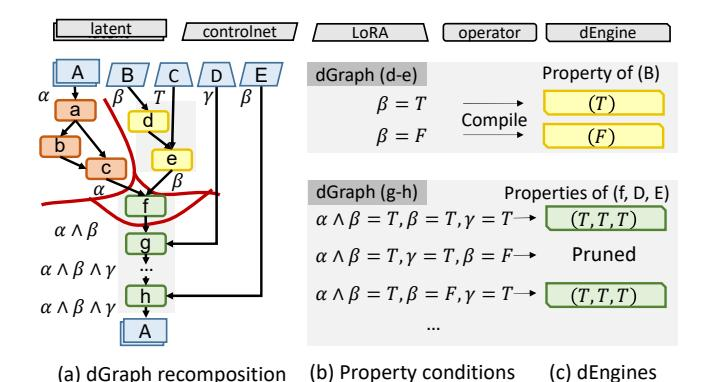

**Figure 5.** (a) Partitioning a DFG into dGraphs according to property expressions.  $\alpha$ ,  $\beta$ , and  $\gamma$  are symbolic property variables. T and F are true and false.  $\wedge$  means logical AND. (b) Property condition expressions of dGraph (g-h). (c) dEngines with input property requirements of dGraph (d-e).

by application characteristics, actual values are provided. In the tensor redundancy propagation, we use a boolean value to represent if a dimension is duplicate, such as T (i.e., true) for input C in Figure 5(a).

To identify various forms of data properties propagated by tensor algebra, ChituDiffusion utilizes symbolic propagation rules. Table 1 presents typical dimension redundancy rules derived from boolean algebra. Due to the complexity of tensor operators, both input and output are represented as vectors, with each element denoting a per-dimension propery. For example, in 2D convolution, if both input tensors exhibit redundant length and width dimensions, the redundancy propagates to the output. To accommodate new operators, ChituDiffusion also supports user-defined propagation rules.

During the propagation, ChituDiffusion maintains symbolic expressions for tensor properties. As illustrated in in Figure 5(a), nodes (a-c) generate outputs with redundancy if tensor A is redundant.

CHITUDIFFUSION takes a whole pipeline as a single data flow graph (DFG) for effective recomposition. In diffusion pipelines, denoising loops enable later updates to affect earlier tensors. To avoid conflicting expressions, CHITUDIFFUSION unrolls initial iterations until loop inputs stabilize, which converges within a few steps since such loops are neither nested nor overlapping.

**dGraph identification.** Based on symbolic propagation, ChituDiffusion partitions the pipeline into dGraphs by grouping consecutive operators with identical output property expressions, as common properties indicate shared optimization opportunities. As shown in Figure 5(a), each operator belongs to a dGraph delineated by red lines.

CHITUDIFFUSION employs output properties as the recompose criterion, since input properties usually enable only operator-specific optimization. For example, node g in

Figure 5(a) can be optimized if  $\alpha \wedge \beta$  or  $\beta$  are redundant, but the condition does not extend beyond this operator. ChituDiffusion considers these fine-grained optimization opportunities during dGraph compilations in §4.2. To avoid scheduling overhead, small dGraphs —such as the single-node f—are merged into subsequent dGraphs during post-processing.

<span id="page-4-2"></span>**Table 1.** Tensor redundancy propagation rules.  $a_i$  and  $b_i$  represent the redundancy properties of i-th dimensions (starting from 1) of the first and second inputs, respectively.  $\land$  means logical AND.

| Category           | Operators [Layout] |             | Output redundancy                                     |  |
|--------------------|--------------------|-------------|-------------------------------------------------------|--|
| Unary elementwise  | ReLU, Tanh [2D]    |             | $[a_1, a_2]$                                          |  |
| Binary elementwise | +, -, ×, ÷ [2D]    |             | $[a_1 \wedge b_1, a_2 \wedge b_2]$                    |  |
| Linear             | Batch Matmul [NHW] |             | $[a_1 \wedge b_1, a_2, b_3]$                          |  |
| Convolution        | Conv2D w           | w/o padding | $\boxed{[a_1,b_1,a_3\wedge a_4\wedge b_3\wedge b_4,}$ |  |
|                    | [NCHW]             |             | $a_3 \wedge a_4 \wedge b_3 \wedge b_4$                |  |
|                    | [MCIIW]            | w/ padding  | $[a_1,b_1,N,N]$                                       |  |

#### <span id="page-4-0"></span>4.2 Data-Property-Specialized Compilation

By analyzing property expressions, ChituDiffusion selectively compiles a dGraph into several execution engines, which are named dEngines. Each dEngine is specially optimized for one specific input data property.

Selective dEngine generation. For each dGraph, CHITUDIFFUSION optimizes dEngines by enumerating potential property expressions of the dGraph inputs. For example, dGraph (d-e) in Figure 5(a) can be optimized when its inputs are redundant. CHITUDIFFUSION identifies its property condition is  $\beta$ , which have two possible values, as shown in Figure 5(b). By optimizing a dGraph under two property conditions, CHITUDIFFUSION generates two dEngines covering all optimization scenarios, and combining suitable dEngines achieves the same effect as monolithic pipeline-level optimization.

Furthermore, as a single dEngine can be reused across diffusion model requests with different data properties, it avoids the expensive cost of monolithic optimization of entire pipelines. However, not all dEngines are necessary, as certain condition combinations are rare or yield limited performance benefits. For instance, the third condition of dGraph (f-h) in Figure 5(c),  $\alpha \wedge \beta = T$ ,  $\gamma = T$ ,  $\beta = F$ , is unsatisfiable since  $\beta$  can not be both redundant and not redundant. Chitudiffusion prunes two categories of dEngines. For conciseness, we discuss a dEngine with condition expressions  $e_1 \wedge e_2$ .

The first is conflicting conditions. If  $e_1 \wedge e_2$  is unsatisfiable for all input properties, the dEngine is never used and thus pruned. Naive enumeration of tensor properties often generates such cases by ignoring constraints from pipeline inputs and application semantics. For example, tensors B and E in

<span id="page-5-1"></span>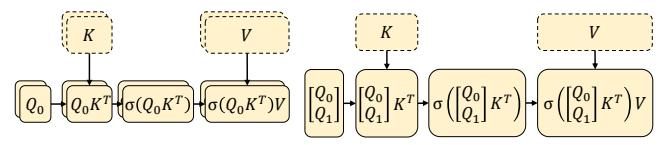

(a) Original with redundant K and V (b) Eliminate redundant memory access

**Figure 6.** Eliminating redundant memory access for the attention operation.  $\sigma$  denotes Softmax. Element-wise operations are omitted.

Figure 5(a) always share the same property, so optimizations assuming them to differ are invalid.

The second is inessential conditions. If a condition  $e_1 \land e_2$  enables only marginal optimizations, ChituDiffusion prunes it to reduce both optimization overhead and runtime scheduling cost. The importance of each condition is determined by its optimization speedup, and those below a threshold (5% in the current implementation) are discarded. For example, the condition  $\alpha \land \beta = T, \gamma = F, \beta = F$  is pruned in dGraph (f–h) because it affects only a single operator. Users may also define more sophisticated pruning criteria, such as leveraging performance models to estimate dEngine speedup.

**Redundancy elimination.** To optimize dGraphs under different inputs automatically, ChituDiffusion adopts the rule-based optimization method.ChituDiffusion is equipped with dimension-level redundant elimination rules tailored for each tensor operator. To eliminates redundant computations by analyzing operator inputs in execution order and applying optimization rules. Redundant dimensions are marked and later restored through broadcasting, ensuring maximal elimination while preserving equivalence.

For redundant memory access, ChituDiffusion utilizes the equivalent transformations of linear algebra to transform them into redundancy-free computations based on existing kernels. Figure 6(a) shows an attention operation with redundant K and V tensors. To optimize it, ChituDiffusion compresses the K and V tensors along the redundant batch dimension and concatenates the Q tensors from different requests into a single one.

#### 5 Runtime Design

At runtime, CHITUDIFFUSION's scheduler dynamically groups dTasks with uniform data properties into batches, dispatches the corresponding pre-compiled dEngines to the *executor*, and asynchronously infers data properties to overlap scheduling with execution (§5.1, §5.2).

## <span id="page-5-0"></span>5.1 Heterogeneous dTask Scheduling

To handle heterogeneous requests efficiently, ChituDiffusion aggregates requests within a scheduling window

### <span id="page-5-3"></span>Algorithm 1 Data-aware execution plan generation.

```
1: Input: dGraph g, dTask pool \mathcal{D}, dEngine library \mathcal{L}
 2: Output: Execution plan &
 3: \mathcal{T} = \{\emptyset : 0\}
                                            ▶ Initialize the map of execution time
 4: \mathcal{E} = \{\emptyset : \emptyset\}
                                           ▶ Initialize the map of execution plans
 5: \mathcal{R} = \text{Unique}(\mathcal{D}[g])
                                          ▶ Unique dTasks of the given dGraph
 6: Search(\mathcal{G}, \mathcal{R})
 7: return \mathcal{E}[\mathcal{R}]
      procedure Search(g, R)
                                                          \triangleright \mathcal{R} is the remaining dTasks
            if \mathcal{R} \in \mathcal{T} then
                  return \mathcal{T}[\mathcal{R}]
                                                                        ▶ Memorized results
11:
12:
            t_{min} = \infty
13:
            for S \in \mathcal{L}[g] do
                                                                     ▶ Enumerate dEngines
14:
                  \mathcal{B} = \text{GetLargestBatch}(\mathcal{R}, \mathcal{S})
                  t_{new} = \text{Search}(g, \mathcal{R} - \mathcal{B}) + \text{EstTime}(g, \mathcal{S})
15:
                  if t_{new} < t_{min} then
16.
17:
                       t_{min} = t_{new}
                        \mathcal{P} = \mathcal{E}[\mathcal{R} - \mathcal{B}] \cup \{(\mathcal{B}, \mathcal{S})\}
                                                                                   ▶ Partial plan
18:
19:
            \mathcal{T}[\mathcal{R}] = t_{min}
                                                                                ▶ Memorization
20:
            \mathcal{E}[\mathcal{R}] = \mathcal{P}
            return t_{min}
21:
```

<span id="page-5-7"></span><span id="page-5-6"></span><span id="page-5-5"></span><span id="page-5-2"></span>

**Figure 7.** Scheduling on dTasks and dEngines of a dGraph. dEngine inputs are non-redundant with uniform shapes at default without annotation.

(parameterized by window size), decomposes them into finegrained dTasks, and stores them in a shared task pool (Figure 7). It then schedules dTasks from different dGraphs independently, following their execution order in the dGraphlevel pipelines.

For dTasks based on the same dGraph, the heterogeneity of data properties carried by user requests provides a large scheduling space. For example, Figure 7 shows four dTasks of the same dGraph, each taking two inputs. We can batch all dTasks and run dEngine  $E_2$ , which is most general but less efficient since data properties are not used. Alternatively, we can execute  $T_1$ ,  $T_2$ , and  $T_3$  with  $E_4$  to exploit the identical prompt, or execute  $T_2$  and  $T_4$  with  $E_1$  to create a batch of uniform shape. Similar trade-offs exist for dTasks with more inputs and diverse data properties.

To determine an efficient batching plan for dTasks, CHITUDIFFUSION employs a dynamic programming approach. Algorithm 1 details this workflow. For each dGraph, CHITUDIFFUSION merges dTasks with identical inputs into a single dTask (Algorithm 1) and broadcasts the results after

<span id="page-6-1"></span>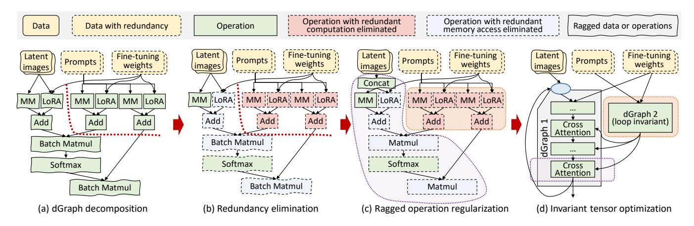

**Figure 8.** Optimizations on the core structure of a SDXL layer. The blue circle in (d) shows the entry of the denoising loop.

execution. Then, CHITUDIFFUSION explores different combinations of batches by enumerating properties required by dEngines (Algorithm 1). For a given property requirement, CHITUDIFFUSION finds the largest batch satisfying it (Algorithm 1).

To avoid duplicate searches, ChituDiffusion always includes the first remaining dTask in the current batch. Since a plain dEngine with the most general requirements always exists, legal plans are guaranteed. Each batch's execution time is estimated using a performance model tailored to its dEngine, and the remaining dTasks are recursively combined into batches in the same manner. After enumerating all dEngines for a given search state, ChituDiffusion records the estimated optimal execution time and batching plan to accelerate subsequent scheduling (Algorithm 1).

Chitudiffusion adopts a lightweight performance model tailored for diffusion models to achieve both efficiency and accuracy. Since compute-intensive operations dominate execution, their costs scale either linearly with input size (e.g., convolution, linear layers) or quadratically (e.g., attention). To capture this behavior, Chitudiffusion applies ordinary least squares regression between input-related metrics and execution time, using a dataset constructed from example inputs of varying sizes and their batch prefixes. For models that involve complex computations such as temporal and spatial attentions in video generation models, Chitudiffusion replaces the total tensor size in the performance model with the corresponding dimension sizes, allowing for a more precise estimation of the execution time.

#### <span id="page-6-0"></span>5.2 Asynchronous Data Property Inference

In ChituDiffusion, the scheduler and executor operate asynchronously to hide decomposition and scheduling overhead, but the absence of data properties for unexecuted dTask inputs poses a key challenge.

To address this problem, CHITUDIFFUSION uses data property expressions in §4.1 to infer data properties for each

dTask. By evaluating output property expressions with real input properties, ChituDiffusion efficiently infers data properties of each dTask output separately.

To infer redundancy across multiple requests, ChituDiffusion develops a tensor *fingerprint* technique to recognize redundant tensors without real execution. For request inputs, ChituDiffusion uses a lightweight hash function to calculate their fingerprint in a time complexity that is linear to the number of elements in tensors. Additionally, applications and users are also able to directly mark duplicate inputs in correlative requests, in which case ChituDiffusion assigns the same unique values to them as fingerprints without hashing.

CHITUDIFFUSION calculates fingerprints on each dGraph in the execution order. Calculating fingerprints operator-by-operator can be time-consuming for complex dGraphs. Since dGraphs perform deterministic computation, their outputs are only dependent on inputs. According to the DFG of a dGraph, CHITUDIFFUSION records which inputs impose influence on outputs for each operator and propagate this information through the data-flow equation. This enables us to directly derive output fingerprints from the input fingerprints. To calculate output fingerprints, CHITUDIFFUSION uses

$$\mathsf{FP}[output_i] = \Phi(\mathsf{FP}_q, \mathsf{FP}[input_{dep_{i,0}}], \dots, \mathsf{FP}[input_{dep_{i,n}}])$$

, where  $\Phi$  is an operand-commutative hash function,  $\mathsf{FP}_g$  is a unique identifier of the current dGraph to distinguish computations of different dGraphs, and  $input_{dep_{i,0}},\ldots,input_{dep_{i,n}}$  have influence on  $output_i$ . Thus, ChituDiffusion can identify redundant dTask inputs by simple fingerprint comparison without actual tensor comparisons.

## 6 Implementation

Figure 8 illustrates how CHITUDIFFUSION applies data-property-aware optimizations to the core SDXL layer. Given requests with ragged image shapes but identical prompts and fine-tuning weights, CHITUDIFFUSION firstly detects two

<span id="page-7-2"></span>

**Figure 9.** Ragged operation regularization.  $\hat{x}$  denote a ragged dimension x. If dimension  $\hat{x}$  is merged with the batch dimension, the new merged dimension is a regular dimension. T/R represents transpose and reshape operators.

dGraphs and optimizes them independently, eliminating redundant computation and memory accesses from shared inputs (Figure 8b). It then applies ragged operation regularization (§6.1) to transform irregular operations into kernel-compatible equivalents (Figure 8c). Finally, Chitudiffusion identifies invariant tensors within the pipeline (§6.2).

## <span id="page-7-0"></span>6.1 Ragged Operation Regularization

To enable data-property-aware optimizations for ragged requests(input with various shapes), ChituDiffusion must both identify dGraphs with common raggedness patterns for compile-time dEngine construction and infer output shapes efficiently at runtime. Building on the symbolic shape propagation, CHITUDIFFUSION represents ragged dimensions as symbolic variables and substitutes actual inputs at runtime to obtain final output shapes. Since Handcrafting ragged kernels for all operators is costly and challenging for existing automatic kernel generators [19, 66], CHITUDIFFUSION employs ragged operation regularization. Operations are classified as data-sharing operations with shared inputs or weights (e.g., convolution, linear layers) and data-independent operations without shared weights (e.g., transpose, reduce). Ragged operations are opportunistically transformed into standard operators and ragged data-independent operations, enabling efficient execution using existing kernel libraries with minimal effort.

Since data-independent operations do not share data across requests in a batch, embarrassingly parallel execution is efficient for each request. Based on existing tiling plans and computing microkernels for regular (non-ragged) operators, Chitudiffusion partitions each request into a set of tiles, which are mapped to GPU thread blocks with a round-robin policy during batched execution.

CHITUDIFFUSION supports ragged data-sharing operations by transforming them into equivalent regular operators with the help of ragged data-independent operations. For instance, a ragged Matmul can be regularized by fusing the batch dimension b and ragged dimension  $\hat{m}$  via transpose and reshape, similar to concatenating matrix heights (Figure 6(b)). Other operations, such as ragged elementwise ops and convolutions, can be handled with transpose and image to column [60] (Figure 9(bc)). These transformations are feasible because shared weights have fixed dimensions, allowing ragged inputs to be flattened across shared data. Chitudiffusion thus applies a set of graph transformation rules to regularize ragged data-sharing operations, supplemented with a few ragged data-independent operations, and can flexibly extend this rule set for new models.

#### <span id="page-7-1"></span>6.2 Invariant Tensor Elimination

Diffusion models contain two types of *invariant tensors*: constants, predetermined by applications, and loop-invariants resulting from iterative denoising.

CHITUDIFFUSION employs a lightweight four-state detection algorithm (constant, loop-invariant, loop-variant, unknown) to identify them. Properties are initialized from tensor definitions and iteratively propagated along operators with a priority hierarchy.

Detected constants are precomputed at compile time, while loop-invariants are hoisted outside loops. ChituDiffusion further supports multi-value constants, allowing selective input fixing to trade off performance and generation diversity.

### 6.3 Extensibility and Architecture Agnosticism

CHITUDIFFUSION achieves architecture-agnostic support for diverse diffusion models—spanning from pure Transformers to mixed Transformer-Convolutional structures—through two core mechanisms:

- Universal Intermediate Representation: By utilizing Data Flow Graphs (DFGs) as a universal IR, ChituDiffusion expresses arbitrary pipelines uniformly. This approach decouples optimization logic from specific neural network layouts, enabling the system to exploit broad optimization opportunities derived from high-level application requirements (§2.2) rather than being limited by architectural specifics.
- Operator-Centric Optimization: CHITUDIFFUSION performs analysis and transformations at the operator level. Its optimization rules target individual computational steps rather than monolithic network blocks. Integrating novel operators requires only minimal, localized effort: (1) defining symbolic propagation rules for data properties, and (2) providing corresponding optimized kernels.

Once these definitions are provided, the ChituDiffusion scheduler automatically orchestrates the rest of the workflow—applying existing optimization rules and compiling the DFG into high-performance *dEngines* without further manual intervention.

<span id="page-8-1"></span>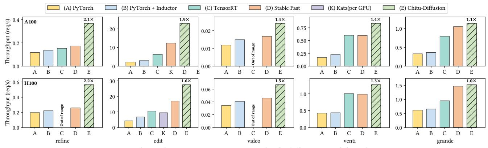

Figure 10. Throughput improvement on multiple diffusion model applications.

#### 7 Evaluation

#### 7.1 Experiment Setup

**CHITUDIFFUSION implementation.** We implement CHITUDIFFUSION based on both C++ and Python, and reuse some components from Diffusers [61], Triton [59], Stable Fast [1], and FlashAttention [21, 22]. Users are able to customize diffusion model pipelines in CHITUDIFFUSION to support various applications. To support ragged batching, we implement four ragged data-independent operation kernels based on Triton and CUDA.

**Platform.** The evaluation was conducted across two server configurations: one equipped with an NVIDIA A100 40GB PCIe GPU and another with an NVIDIA H100 80GB PCIe GPU. Experiments involving UNet-structured models were evaluated using CUDA 12.1. For the DiT series models, the evaluation utilized CUDA 12.8. The open-source release features a comprehensive infrastructure upgrade, now fully supporting and leveraging PyTorch 2.9 for enhanced performance and compatibility.

**Workloads.** We evaluate CHITUDIFFUSION on 5 UNet-based diffusion model applications (Table 2) built upon SD1.5 [51], SDXL [47], and SVD [11]. We also conduct the three evaluations on DiT structure diffusion generation scenarios built upon Hunyuan series modelsl[40, 57] and FLUX[34, 35].

The applications cover image and video synthesis, with or without controlled generation extensions. To emulate real-world usage, we synthesize non-correlated request traces using default settings unless otherwise noted. Prompt distributions and ragged input shapes follow DiffusionDB [62] and Civitai [17] (Figure 2c-d). Each application adopts its default denoising steps, and random seeds are uniformly sampled.

#### 7.2 Throughput Improvement

We evaluate ChituDiffusion against PyTorch v2.1, PyTorch-Inductor v2.1, TensorRT v8.6, and the diffusion-specific framework Stable Fast v1.0 [1], all tuned to saturate GPU throughput. The applications in Table 2 include both correlative

<span id="page-8-0"></span>**Table 2.** Evaluated applications and shapes of generation results. T, I, and V in the type column represent text, image, and video, respectively. The shapes indicate the height and width of the generated images, as well as the frames, height, and width of the generated videos.

| Name       | Type | Brief description                                          | Model and extention                    | Shape         |
|------------|------|------------------------------------------------------------|----------------------------------------|---------------|
| refine     | T2I  | Generate images refined by different prompts               | SDXL, SDXL refiner                     | [1024,1024]   |
| edit       | I2I  | Transfer images into multiple styles                       | SDXL, LoRA,<br>ControlNet              | [512,512]     |
| video      | I2V  | Generate videos from images with different control effects | SVD, ControlNet                        | [14,576,1024] |
| venti      | T2I  | Generate images from texts                                 | SDXL                                   | Ragged        |
| grande     | T2I  | Generate images from texts                                 | SD1.5                                  | Ragged        |
| refine-mix | T2I  | Generate images refined by different prompts               | FLUX.1 S, SDXL refiner                 | [1024,1024]   |
| refine-dit | T2I  | Generate images refined by different prompts               | Hunyuanimage,<br>Hunyuanimage refiner  | [1024,1024]   |
| edit-dit   | T2I  | Generate images with different control stages              | Hunyuan-DiT,<br>Hunyuan-DiT ControlNet | [1024,1024]   |

requests and standard text-to-image services. As shown in Figure 10, ChituDiffusion delivers up to 2.13× speedup (1.58× on average) over the best baseline. For refine, edit, and video, where users issue correlative requests and manually select the best generations for efficient image and video creation [3–5].(e.g., prompt grid search or varying ControlNet periods), baselines process each request independently, missing the awareness of redundancies. TensorRT fails on video due to oversized tensors. By detecting shared inputs, ChituDiffusion eliminates redundant computation, yielding up to 2.2× on H100 and 2.1× on A100.

For venti (SD1.5) and grande (SDXL), which provide standard text-to-image services, redundancy is minimal since requests are independent. Nevertheless, ChituDiffusion still captures optimizations from shared prompts and iteration IDs and the potentially same prompt shown in Figure 4, while effectively batching ragged requests that existing frameworks cannot. The scheduler balancing the efficiency of the uniform-shape dEngines and the larger batch size enabled by the ragged-shape dEngines, which will be further studied in §7.7, yielding 1.4× speedup on venti and 1.1× on

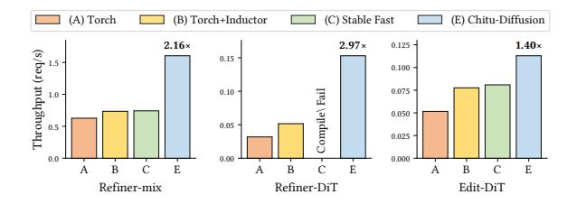

**Figure 11.** Throughput improvement on DiT based diffusion model applications.

grande since SDXL is a much larger model and gains less speedup from batching.

We further evaluate Katz [37], a state-of-the-art diffusion serving system that supports ControlNet-as-a-service, in the edit application. For fairness, we only test ControlNet (since Katz's LoRA serving is mathematically inequivalent). In contrast to Chitudiffusion's single-GPU deployment, we evaluate Katz with 4 H100 GPUs, which is the minimal hardware requirement for Katz to serve a single ControlNet. To fairly compare these two works we normalized the metric as throughput per GPU. As shown in the table, Katz achieves ~0.03s latency per request by serving sequentially, but its throughput per GPU is significantly lower than Chitudiffusion. In the edit scenario, which involves only one iteration with SDXL-Turbo, Katz's multi-GPU communication overhead severely limits its end-to-end throughput.

#### 7.3 Generalization on DiT-based Models

To demonstrate the generality of ChituDiffusion, we extend our data-aware optimization to Diffusion Transformer (DiT) architectures. As ChituDiffusion operates at the operator level rather than relying on specific model topologies, it is inherently architecture-agnostic. DiT components—such as QKV projections, MHSA, and MLPs—are naturally identified as dGraphs within our DFG, allowing the system to decompose and execute common computations across requests efficiently. Figure 12 illustrates the performance on DiT-based applications. ChituDiffusion achieves a 2.2–3.0× speedup in refine scenarios and a 1.4× speedup in edit scenarios.

Specifically, in refine scenarios, while static compilation baselines like stable-fast failed to support the HunyuanImage refiner pipeline due to inflexible compilation rules, Chitudiffusion leveraged the torch.compile backend, gaining a 3.0× speedup through our data-aware dGraph scheduling. In edit scenarios, dealing with DiT-based ControlNets presents challenges due to varying architectural implementations (e.g., FLUX vs. Hunyuan). We evaluated a dynamic scenario where ControlNet is active only during specific iteration stages (controlled by control\_guidance\_start/end in diffusers). Unlike static approaches, Chitudiffusion effectively handles these ragged control flows. While emerging

<span id="page-9-0"></span>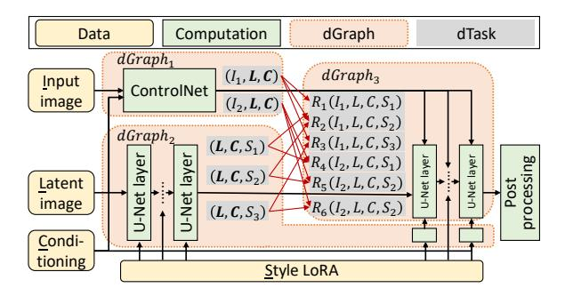

**Figure 12.** Optimizations of application edit. Data *I*, *L*, *C*, *S* in dTasks represent input image, latent image, U-Net conditioning, and style LoRA, respectively. The data marked in bold is redundant across requests.

DiT models introduce complex pipelines and evolving ControlNet support, ChituDiffusion's flexible design allows it to adapt to these new challenges effectively.

#### 7.4 Ablation Study

Application edit provides style transfer services by generating multiple candidate images for each user-input image, preserving object positions but varying visual styles. It leverages SDXL Turbo [55], a variant of SDXL requiring only one denoising step, along with two fine-tuning extensions: ControlNet [67] for spatial control via Canny edges [12], and LoRA for diverse styles. To produce multiple stylized outputs, the application fixes latent noise and U-Net conditioning while applying 16 different LoRA weights.

As shown in Figure 12, Chitudiffusion exploits these characteristics by recomposing the pipeline into 3 dGraphs at compile time, which are then compiled into dEngines. For example, U-Net is partitioned into input-dependent and input-independent layers, where  $dGraph_2$  encapsulates the input-independent computations, enabling reuse across different images and styles.

At compile time, ChituDiffusion decomposes the pipeline into three dGraphs, compiled into dEngines. U-Net is split into input-dependent and input-independent parts, with  $dGraph_2$  containing the latter. At runtime, ChituDiffusion detects only 2 unique dTasks for  $dGraph_1$  and 3 for  $dGraph_2$ , and executes them with data-aware batching to exploit shared inputs (Figure 12). Moreover, invariant tensor elimination identifies  $dGraph_2$  outputs as constant, enabling compile-time caching with multi-value support(§6.2).

Figure 13(a) shows the results of an ablation study. We create a baseline named ChituDiffusion-base by disabling all data-aware optimizations in ChituDiffusion, which achieves comparable performance to the other baseline system. By progressively enabling dTask scheduling, multiversion dEngine compilation, and invariant tensor elimination, the throughput is improved to 1.29×, 1.56×, and

<span id="page-10-1"></span>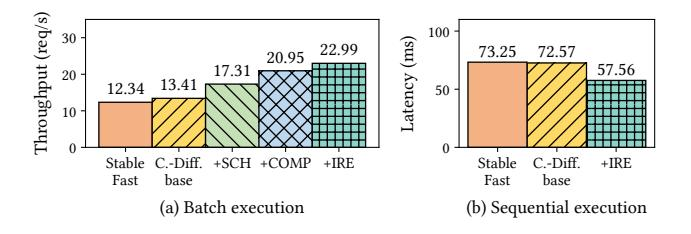

**Figure 13.** Ablation study of application edit. SCH, COMP, and IRE mean dGraph scheduling, dEngine property-aware compilation, and invariant redundancy elimination optimizations, respectively.

1.71×. Figure 13(b) presents the request latency when sequentially serving requests without batching, which disables inter-request optimizations in scheduling and multiversioned dEngines. ChituDiffusion achieves a speedup of 1.3× compared to the best baseline with the help of invariant tensor elimination. This demonstrates that while ChituDiffusion primarily focuses on throughput optimization, its techniques also provide benefits in latency-critical scenarios. ChituDiffusion is also able to achieve consistent speedup over baselines with different batch sizes (§7.6).

#### 7.5 dGraph Recomposition Analysis

To demonstrate dGraph decomposition, Table 3 reports redundancy optimization for SDXL U-Net. Without decomposition, the monolithic strategy produces numerous engines for all input property combinations, incurring high compilation cost. By symbolic property analysis, Chitudiffusion identifies inputs such as time embeddings and prompt conditions to form dGraphs, then optimizes them separately while pruning unsatisfiable cases, significantly reducing overhead. Fine-tuning extensions further exacerbate the problem. As

<span id="page-10-3"></span>**Table 3.** Compilation statistics for SDXL U-Net. The monolithic strategy treats U-Net as a whole with dGraph recomposition disabled.

| Model         | Strategy   | # Inputs | # dGraphs | # Engines | Estimated compilation time |
|---------------|------------|----------|-----------|-----------|----------------------------|
| SDXL UNet     | Monolithic | 4        | 1 (N/A)   | 16        | 16 min                     |
|               | dGraph     | 4        | 3         | 4         | 4 min                      |
| SDXL UNet     | Monolithic | 14       | 1 (N/A)   | 16384     | 11 d                       |
| w\ ControlNet | dGraph     | 14       | 4         | 7         | 7 min                      |

Table 3 shows, enabling ControlNet adds ten inputs to U-Net. The monolithic strategy must enumerate 2<sup>14</sup> input property combinations, leading to prohibitive compilation time. In contrast, ChituDiffusion leverages symbolic analysis to verify that ControlNet inputs share identical optimization conditions, treating them as one and exponentially reducing specialized dEngines, thus mitigating overhead.

<span id="page-10-4"></span>

**Figure 14.** Performance of an edit request under different scheduling window sizes.

<span id="page-10-5"></span>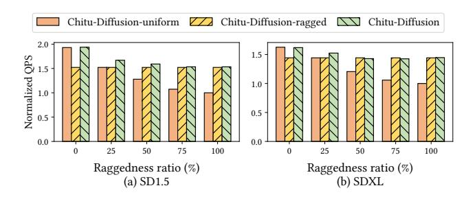

**Figure 15.** Throughput under requests of different raggedness ratios on text-to-image diffusion pipelines.

#### <span id="page-10-2"></span>7.6 Scheduling Window Size and Overhead

Figure 14(a) shows that ChituDiffusion achieves higher performance with larger scheduling windows, as more dTasks are batched into fewer dEngine executions, exposing greater inter-request optimization. Figure 14(b) shows that scheduling cost is under 10% of dEngine runtime due to efficient dynamic programming, and further hidden with larger windows by improved batching and overlap, leaving less than 5% GPU idle time including cold start.

## <span id="page-10-0"></span>7.7 Data-Aware Batching

To show the effectiveness of data-aware batching, we create two baselines without it for ragged requests. ChituDiffusion-uniform only batches uniform-shape requests with uniform dEngines, while ChituDiffusion-ragged always batches all requests with ragged dEngines. Figure 15 shows the evaluation results. At raggedness ratio 0%, ChituDiffusion-uniform outperforms ChituDiffusion-ragged since ragged dEngines have more overhead than regular ones, such as index computation. As raggedness increases, ChituDiffusion-ragged achieves up to 1.5× higher throughput, benefiting from increased parallelism and reduced redundant memory access to model weights.

The baselines are not always optimal. In contrast, Chitudiffusion uses data-aware scheduling to select appropriate dEngines, achieving the best performance across all raggedness ratios. For raggedness from 25% to 50%, Chitudiffusion combines regular and ragged dEngines, yielding up to 10% higher throughput.

Performance model. We evaluate the model on SDXL U-Net dEngines with varied batch sizes between 1 to 16 and shapes between 256 to 768. By profiling 16 samples as inputs for the performance model, it achieves a 0.998 coefficient of determination. A 96-sample evaluation set generated in the same method yields a 0.996 coefficient and an RMSE less than 3, showing high prediction accuracy. As ChituDiffusion usually batches requests to fully utilize hardware, the performance model presents enough ability to estimate execution time for diffusion models, which are majorly composed of compute-intensive DNNs.

# 8 Related Work

Diffusion models and acceleration. Significant advancements in image synthesis like Imagen [\[53\]](#page-13-23) and Stable Diffusion [\[51\]](#page-13-1), as well as in other domains [\[11,](#page-11-0) [27\]](#page-12-5), appear since the denoising diffusion probabilistic model [\[29\]](#page-12-0). Optimizations such as distillation [\[55\]](#page-13-22), quantization [\[39\]](#page-12-20), and caching similar intermediate results [\[8,](#page-11-8) [36\]](#page-12-21), and parallelism techniques [\[36,](#page-12-21) [37\]](#page-12-18) are widely explored. Different from these nonequivalent approximate accelerations, ChituDiffusion focuses on equivalent optimizations and is promising to work with nonequivalent methods simultaneously.

Batching. Efficient batching is widely studied [\[14,](#page-12-22) [41,](#page-12-23) [56,](#page-13-24) [56,](#page-13-24) [70\]](#page-13-25). VELTAIR [\[41\]](#page-12-23) avoids resource interference in batch requests. DVABatch [\[19\]](#page-12-15) flexibly reorganizes requests to process requests with the best batch sizes. Different from the above work, ChituDiffusion focuses on exploiting dynamic data properties, such as redundancy and raggedness, for diffusion models, which can be combined with these techniques.

Data-Property-Aware Optimization Existing work has explored optimization techniques that leverage data properties at different granularities. Redundancy elimination has been extensively studied in general-purpose compilers [\[10,](#page-11-9) [15,](#page-12-24) [23,](#page-12-25) [45,](#page-13-26) [65\]](#page-13-27), primarily for scalar computations. Modern DNN frameworks such as TensorFlow [\[7\]](#page-11-3), PyTorch [\[48\]](#page-13-9), TensorRT [\[58\]](#page-13-10), Stable Fast [\[1\]](#page-11-7), and TVM [\[13\]](#page-12-26) provide performance optimizations for diffusion models but do not exploit fine-grained subrequest-level redundancies. Request-level caching approaches like Clipper [\[18\]](#page-12-27) cannot handle partial redundancies, and KV-cache techniques [\[33,](#page-12-28) [68\]](#page-13-28) designed for auto-regressive models are ineffective for diffusion models using bidirectional attention over full latent tensors.

For ragged computations, specialized kernels for irregularshaped data have been developed, including optimized ragged matrix multiplication on GPUs [\[38\]](#page-12-29) and CoRa, which extends TVM to support ragged Transformers [\[26\]](#page-12-30). These approaches focus on improving execution efficiency for inputs with dynamic or non-uniform shapes.

# 9 Conclusion

We propose ChituDiffusion, a diffusion model serving system recomposing pipelines and requests to exploit data properties. By leveraging the locality of data properties, ChituDiffusion orchestrates compile-time and runtime techniques, ChituDiffusion outperforms existing frameworks by up to 2.19×.

# Acknowledgments

We would like to thank the anonymous reviewers and our shepherd Baolin Li for their insightful comments. We are grateful to Yuyang Chen and Chengyu Shi for their significant contributions to the implementation and maintenance of the ChituDiffusion system. This work is supported by the National Key R&D Program of China under Grant 2023YFB3002002, NSFC for Distinguished Young Scholar under Grant 62225206, National Natural Science Foundation of China under Grants 62532006, U23A6007, Beijing Natural Science Foundation under Grant L242017, and the Strategic Priority Research Program of Chinese Academy of Sciences under Grant XDB0500103. Jidong Zhai is the corresponding author of this paper.

# References

- <span id="page-11-7"></span>[1] 2023. Stable Fast. <https://github.com/chengzeyi/stable-fast>.
- <span id="page-11-2"></span>[2] (Accessed on 05/06/2024). Adobe firefly. [https://www.adobe.com/](https://www.adobe.com/products/firefly.html) [products/firefly.html](https://www.adobe.com/products/firefly.html).
- <span id="page-11-5"></span>[3] (Accessed on 05/06/2024). ComfyUI community manual. [https://blenderneko.github.io/ComfyUI-docs/Interface/Textprompts/](https://blenderneko.github.io/ComfyUI-docs/Interface/Textprompts/#adding-random-choices) [#adding-random-choices](https://blenderneko.github.io/ComfyUI-docs/Interface/Textprompts/#adding-random-choices).
- [4] (Accessed on 05/06/2024). Stable Diffusion Dynamic Prompts extension. <https://github.com/adieyal/sd-dynamic-prompts/tree/main>.
- <span id="page-11-6"></span>[5] (Accessed on 05/06/2024). Stable Diffusion WebUI documentation. [https://github.com/AUTOMATIC1111/stable-diffusion-webui/](https://github.com/AUTOMATIC1111/stable-diffusion-webui/wiki/Features#prompts-from-file-or-textbox) [wiki/Features#prompts-from-file-or-textbox](https://github.com/AUTOMATIC1111/stable-diffusion-webui/wiki/Features#prompts-from-file-or-textbox).
- <span id="page-11-1"></span>[6] (Accessed on 05/06/2024). Video generation models as world simulators. [https://openai.com/index/video-generation-models-as-world](https://openai.com/index/video-generation-models-as-world-simulators/)[simulators/](https://openai.com/index/video-generation-models-as-world-simulators/).
- <span id="page-11-3"></span>[7] Martín Abadi, Paul Barham, Jianmin Chen, Zhifeng Chen, Andy Davis, Jeffrey Dean, Matthieu Devin, Sanjay Ghemawat, Geoffrey Irving, Michael Isard, et al. 2016. Tensorflow: A system for large-scale machine learning. In 12th USENIX symposium on operating systems design and implementation (OSDI 16). 265–283.
- <span id="page-11-8"></span>[8] Shubham Agarwal, Subrata Mitra, Sarthak Chakraborty, Srikrishna Karanam, Koyel Mukherjee, and Shiv Kumar Saini. 2024. Approximate Caching for Efficiently Serving Text-to-Image Diffusion Models. In 21st USENIX Symposium on Networked Systems Design and Implementation (NSDI 24). USENIX Association, Santa Clara, CA, 1173–1189. [https://](https://www.usenix.org/conference/nsdi24/presentation/agarwal-shubham) [www.usenix.org/conference/nsdi24/presentation/agarwal-shubham](https://www.usenix.org/conference/nsdi24/presentation/agarwal-shubham)
- <span id="page-11-4"></span>[9] Stability AI. [n. d.]. Stable Diffusion 3: Multimodal Diffusion with Transformer Architecture. Technical report published by Stability AI, March 2024. [https://stability.ai/news/stable-diffusion-3-research](https://stability.ai/news/stable-diffusion-3-research-paper)[paper](https://stability.ai/news/stable-diffusion-3-research-paper).
- <span id="page-11-9"></span>[10] Joel Auslander, Matthai Philipose, Craig Chambers, Susan J Eggers, and Brian N Bershad. 1996. Fast, effective dynamic compilation. ACM SIGPLAN Notices 31, 5 (1996), 149–159.
- <span id="page-11-0"></span>[11] Andreas Blattmann, Tim Dockhorn, Sumith Kulal, Daniel Mendelevitch, Maciej Kilian, Dominik Lorenz, Yam Levi, Zion English, Vikram Voleti, Adam Letts, et al. 2023. Stable video diffusion: Scaling latent

- video diffusion models to large datasets. arXiv preprint arXiv:2311.15127 (2023).
- <span id="page-12-19"></span>[12] John Canny. 1986. A computational approach to edge detection. IEEE Transactions on pattern analysis and machine intelligence 6 (1986), 679– 698.
- <span id="page-12-26"></span>[13] Tianqi Chen, Thierry Moreau, Ziheng Jiang, Lianmin Zheng, Eddie Q. Yan, Haichen Shen, Meghan Cowan, Leyuan Wang, Yuwei Hu, Luis Ceze, Carlos Guestrin, and Arvind Krishnamurthy. 2018. TVM: An Automated End-to-End Optimizing Compiler for Deep Learning. In 13th USENIX Symposium on Operating Systems Design and Implementation, OSDI 2018, Carlsbad, CA, USA, October 8-10, 2018, Andrea C. Arpaci-Dusseau and Geoff Voelker (Eds.). USENIX Association, 578–594.
- <span id="page-12-22"></span>[14] Seungbeom Choi, Sunho Lee, Yeonjae Kim, Jongse Park, Youngjin Kwon, and Jaehyuk Huh. 2022. Serving heterogeneous machine learning models on Multi-GPU servers with Spatio-Temporal sharing. In 2022 USENIX Annual Technical Conference (USENIX ATC 22). 199– 216.
- <span id="page-12-24"></span>[15] Fred Chow, Sun Chan, Robert Kennedy, Shin-Ming Liu, Raymond Lo, and Peng Tu. 1997. A new algorithm for partial redundancy elimination based on SSA form. ACM Sigplan Notices 32, 5 (1997), 273–286.
- <span id="page-12-1"></span>[16] Özgün Çiçek, Ahmed Abdulkadir, Soeren S Lienkamp, Thomas Brox, and Olaf Ronneberger. 2016. 3D U-Net: learning dense volumetric segmentation from sparse annotation. In Medical Image Computing and Computer-Assisted Intervention–MICCAI 2016: 19th International Conference, Athens, Greece, October 17-21, 2016, Proceedings, Part II 19. Springer, 424–432.
- <span id="page-12-7"></span>[17] civitai 2022. Civitai. <https://github.com/civitai/civitai>.
- <span id="page-12-27"></span>[18] Daniel Crankshaw, Xin Wang, Guilio Zhou, Michael J Franklin, Joseph E Gonzalez, and Ion Stoica. 2017. Clipper: A Low-Latency online prediction serving system. In 14th USENIX Symposium on Networked Systems Design and Implementation (NSDI 17). 613–627.
- <span id="page-12-15"></span>[19] Weihao Cui, Han Zhao, Quan Chen, Hao Wei, Zirui Li, Deze Zeng, Chao Li, and Minyi Guo. 2022. DVABatch: Diversity-aware Multi-Entry Multi-Exit Batching for Efficient Processing of DNN Services on GPUs. In 2022 USENIX Annual Technical Conference. 183–198.
- <span id="page-12-6"></span>[20] DALL-e-3 2023. Improving Image Generation with Better Captions. <https://cdn.openai.com/papers/dall-e-3.pdf>.
- <span id="page-12-16"></span>[21] Tri Dao. 2023. Flashattention-2: Faster attention with better parallelism and work partitioning. arXiv preprint arXiv:2307.08691 (2023).
- <span id="page-12-17"></span>[22] Tri Dao, Daniel Y. Fu, Stefano Ermon, Atri Rudra, and Christopher Ré. 2022. FlashAttention: Fast and Memory-Efficient Exact Attention with IO-Awareness. In Advances in Neural Information Processing Systems.
- <span id="page-12-25"></span>[23] Yufei Ding and Xipeng Shen. 2017. Glore: Generalized loop redundancy elimination upon ler-notation. Proceedings of the ACM on Programming Languages 1, OOPSLA (2017), 1–28.
- <span id="page-12-8"></span>[24] Chao Dong, Chen Change Loy, Kaiming He, and Xiaoou Tang. 2014. Learning a deep convolutional network for image super-resolution. In European conference on computer vision. Springer, 184–199.
- <span id="page-12-9"></span>[25] Chao Dong, Chen Change Loy, and Xiaoou Tang. 2016. Accelerating the super-resolution convolutional neural network. In European conference on computer vision. Springer, 391–407.
- <span id="page-12-30"></span>[26] Pratik Fegade, Tianqi Chen, Phillip Gibbons, and Todd Mowry. 2022. The CoRa tensor compiler: Compilation for ragged tensors with minimal padding. Proceedings of Machine Learning and Systems 4 (2022), 721–747.
- <span id="page-12-5"></span>[27] Seth Forsgren and Hayk Martiros. 2022. Riffusion - Stable diffusion for real-time music generation. (2022). <https://riffusion.com/about>
- <span id="page-12-2"></span>[28] Jonathan Ho, William Chan, Chitwan Saharia, Jay Whang, Ruiqi Gao, Alexey Gritsenko, Diederik P Kingma, Ben Poole, Mohammad Norouzi, David J Fleet, et al. 2022. Imagen video: High definition video generation with diffusion models. arXiv preprint arXiv:2210.02303 (2022).
- <span id="page-12-0"></span>[29] Jonathan Ho, Ajay Jain, and Pieter Abbeel. 2020. Denoising diffusion probabilistic models. Advances in neural information processing systems

- 33 (2020), 6840–6851.
- <span id="page-12-3"></span>[30] Tobias Höppe, Arash Mehrjou, Stefan Bauer, Didrik Nielsen, and Andrea Dittadi. 2022. Diffusion models for video prediction and infilling. arXiv preprint arXiv:2206.07696 (2022).
- <span id="page-12-14"></span>[31] Edward J Hu, Yelong Shen, Phillip Wallis, Zeyuan Allen-Zhu, Yuanzhi Li, Shean Wang, Lu Wang, and Weizhu Chen. 2021. Lora: Low-rank adaptation of large language models. arXiv preprint arXiv:2106.09685 (2021).
- <span id="page-12-4"></span>[32] Animesh Karnewar, Andrea Vedaldi, David Novotny, and Niloy J Mitra. 2023. Holodiffusion: Training a 3D diffusion model using 2D images. In Proceedings of the IEEE/CVF Conference on Computer Vision and Pattern Recognition. 18423–18433.
- <span id="page-12-28"></span>[33] Woosuk Kwon, Zhuohan Li, Siyuan Zhuang, Ying Sheng, Lianmin Zheng, Cody Hao Yu, Joseph Gonzalez, Hao Zhang, and Ion Stoica. 2023. Efficient memory management for large language model serving with pagedattention. In Proceedings of the 29th Symposium on Operating Systems Principles. 611–626.
- <span id="page-12-11"></span>[34] Black Forest Labs. 2024. FLUX. [https://github.com/black-forest-labs/](https://github.com/black-forest-labs/flux) [flux](https://github.com/black-forest-labs/flux).
- <span id="page-12-12"></span>[35] Black Forest Labs, Stephen Batifol, Andreas Blattmann, Frederic Boesel, Saksham Consul, Cyril Diagne, Tim Dockhorn, Jack English, Zion English, Patrick Esser, Sumith Kulal, Kyle Lacey, Yam Levi, Cheng Li, Dominik Lorenz, Jonas Müller, Dustin Podell, Robin Rombach, Harry Saini, Axel Sauer, and Luke Smith. 2025. FLUX.1 Kontext: Flow Matching for In-Context Image Generation and Editing in Latent Space. arXiv[:2506.15742](https://arxiv.org/abs/2506.15742) [cs.GR] <https://arxiv.org/abs/2506.15742>
- <span id="page-12-21"></span>[36] Muyang Li, Tianle Cai, Jiaxin Cao, Qinsheng Zhang, Han Cai, Junjie Bai, Yangqing Jia, Ming-Yu Liu, Kai Li, and Song Han. 2024. DistriFusion: Distributed Parallel Inference for High-Resolution Diffusion Models. In Proceedings of the IEEE/CVF Conference on Computer Vision and Pattern Recognition (CVPR).
- <span id="page-12-18"></span>[37] Suyi Li, Lingyun Yang, Xiaoxiao Jiang, Hanfeng Lu, Dakai An, Zhipeng Di, Weiyi Lu, Jiawei Chen, Kan Liu, Yinghao Yu, Tao Lan, Guodong Yang, Lin Qu, Liping Zhang, and Wei Wang. 2025. Katz: Efficient Workflow Serving for Diffusion Models with Many Adapters. In Proc. USENIX ATC.
- <span id="page-12-29"></span>[38] Xiuhong Li, Yun Liang, Shengen Yan, Liancheng Jia, and Yinghan Li. 2019. A coordinated tiling and batching framework for efficient GEMM on GPUs. In Proceedings of the 24th symposium on principles and practice of parallel programming. 229–241.
- <span id="page-12-20"></span>[39] Xiuyu Li, Yijiang Liu, Long Lian, Huanrui Yang, Zhen Dong, Daniel Kang, Shanghang Zhang, and Kurt Keutzer. 2023. Q-diffusion: Quantizing diffusion models. In Proceedings of the IEEE/CVF International Conference on Computer Vision. 17535–17545.
- <span id="page-12-10"></span>[40] Zhimin Li, Jianwei Zhang, Qin Lin, Jiangfeng Xiong, Yanxin Long, Xinchi Deng, Yingfang Zhang, Xingchao Liu, Minbin Huang, Zedong Xiao, Dayou Chen, Jiajun He, Jiahao Li, Wenyue Li, Chen Zhang, Rongwei Quan, Jianxiang Lu, Jiabin Huang, Xiaoyan Yuan, Xiaoxiao Zheng, Yixuan Li, Jihong Zhang, Chao Zhang, Meng Chen, Jie Liu, Zheng Fang, Weiyan Wang, Jinbao Xue, Yangyu Tao, Jianchen Zhu, Kai Liu, Sihuan Lin, Yifu Sun, Yun Li, Dongdong Wang, Mingtao Chen, Zhichao Hu, Xiao Xiao, Yan Chen, Yuhong Liu, Wei Liu, Di Wang, Yong Yang, Jie Jiang, and Qinglin Lu. 2024. Hunyuan-DiT: A Powerful Multi-Resolution Diffusion Transformer with Fine-Grained Chinese Understanding. arXiv[:2405.08748](https://arxiv.org/abs/2405.08748) [cs.CV]
- <span id="page-12-23"></span>[41] Zihan Liu, Jingwen Leng, Zhihui Zhang, Quan Chen, Chao Li, and Minyi Guo. 2022. VELTAIR: towards high-performance multi-tenant deep learning services via adaptive compilation and scheduling. In Proceedings of the 27th ACM International Conference on Architectural Support for Programming Languages and Operating Systems. 388–401.
- <span id="page-12-13"></span>[42] Xudong Lu, Aojun Zhou, Ziyi Lin, Qi Liu, Yuhui Xu, Renrui Zhang, Yafei Wen, Shuai Ren, Peng Gao, Junchi Yan, and Hongsheng Li. 2024. TerDiT: Ternary Diffusion Models with Transformers. arXiv[:2405.14854](https://arxiv.org/abs/2405.14854) [cs.CV]

- <span id="page-13-5"></span><span id="page-13-0"></span>[43] Gautam Mittal, Jesse Engel, Curtis Hawthorne, and Ian Simon. 2021. Symbolic music generation with diffusion models. arXiv preprint arXiv:2103.16091 (2021).
- <span id="page-13-16"></span>[44] Shentong Mo, Enze Xie, Ruihang Chu, Lewei Yao, Lanqing Hong, Matthias Nießner, and Zhenguo Li. 2023. DiT-3D: Exploring Plain Diffusion Transformers for 3D Shape Generation. arXiv preprint arXiv: 2307.01831 (2023).
- <span id="page-13-26"></span>[45] Etienne Morel and Claude Renvoise. 1979. Global optimization by suppression of partial redundancies. Commun. ACM 22, 2 (1979), 96–103.
- <span id="page-13-14"></span>[46] William Peebles and Saining Xie. 2022. Scalable Diffusion Models with Transformers. arXiv preprint arXiv:2212.09748 (2022).
- <span id="page-13-18"></span>[47] Dustin Podell, Zion English, Kyle Lacey, Andreas Blattmann, Tim Dockhorn, Jonas Müller, Joe Penna, and Robin Rombach. 2024. SDXL: Improving Latent Diffusion Models for High-Resolution Image Synthesis. In The Twelfth International Conference on Learning Representations. <https://openreview.net/forum?id=di52zR8xgf>
- <span id="page-13-9"></span>[48] PyTorch 2017. Tensors and Dynamic neural networks in Python with strong GPU acceleration. <https://pytorch.org>.
- <span id="page-13-4"></span>[49] Guocheng Qian, Jinjie Mai, Abdullah Hamdi, Jian Ren, Aliaksandr Siarohin, Bing Li, Hsin-Ying Lee, Ivan Skorokhodov, Peter Wonka, Sergey Tulyakov, et al. 2023. Magic123: One image to high-quality 3d object generation using both 2d and 3d diffusion priors. arXiv preprint arXiv:2306.17843 (2023).
- <span id="page-13-12"></span>[50] Alec Radford, Jong Wook Kim, Chris Hallacy, Aditya Ramesh, Gabriel Goh, Sandhini Agarwal, Girish Sastry, Amanda Askell, Pamela Mishkin, Jack Clark, Gretchen Krueger, and Ilya Sutskever. 2021. Learning Transferable Visual Models From Natural Language Supervision. arXiv[:2103.00020](https://arxiv.org/abs/2103.00020) [cs.CV]
- <span id="page-13-1"></span>[51] Robin Rombach, Andreas Blattmann, Dominik Lorenz, Patrick Esser, and Björn Ommer. 2022. High-resolution image synthesis with latent diffusion models. In Proceedings of the IEEE/CVF conference on computer vision and pattern recognition. 10684–10695.
- <span id="page-13-2"></span>[52] Chitwan Saharia, William Chan, Huiwen Chang, Chris Lee, Jonathan Ho, Tim Salimans, David Fleet, and Mohammad Norouzi. 2022. Palette: Image-to-image diffusion models. In ACM SIGGRAPH 2022 conference proceedings. 1–10.
- <span id="page-13-23"></span>[53] Chitwan Saharia, William Chan, Saurabh Saxena, Lala Li, Jay Whang, Emily L Denton, Kamyar Ghasemipour, Raphael Gontijo Lopes, Burcu Karagol Ayan, Tim Salimans, et al. 2022. Photorealistic text-to-image diffusion models with deep language understanding. Advances in Neural Information Processing Systems 35 (2022), 36479–36494.
- <span id="page-13-13"></span>[54] Chitwan Saharia, Jonathan Ho, William Chan, Tim Salimans, David J Fleet, and Mohammad Norouzi. 2022. Image super-resolution via iterative refinement. IEEE Transactions on Pattern Analysis and Machine Intelligence 45, 4 (2022), 4713–4726.
- <span id="page-13-22"></span>[55] Axel Sauer, Dominik Lorenz, Andreas Blattmann, and Robin Rombach. 2023. Adversarial diffusion distillation. arXiv preprint arXiv:2311.17042 (2023).
- <span id="page-13-24"></span>[56] Haichen Shen, Lequn Chen, Yuchen Jin, Liangyu Zhao, Bingyu Kong, Matthai Philipose, Arvind Krishnamurthy, and Ravi Sundaram. 2019. Nexus: A GPU cluster engine for accelerating DNN-based video analysis. In Proceedings of the 27th ACM Symposium on Operating

- Systems Principles. 322–337.
- <span id="page-13-15"></span>[57] Tencent Hunyuan Team. 2025. HunyuanImage 2.1: An Efficient Diffusion Model for High-Resolution (2K) Text-to-Image Generation. <https://github.com/Tencent-Hunyuan/HunyuanImage-2.1>.
- <span id="page-13-10"></span>[58] TensorRT 2017. NVIDIA TensorRT: Programmable Inference Accelerator. <https://developer.nvidia.com/tensorrt>.
- <span id="page-13-21"></span>[59] triton 2021. Introducing Triton: Open-source GPU programming for neural networks. <https://openai.com/research/triton>.
- <span id="page-13-20"></span>[60] Aravind Vasudevan, Andrew Anderson, and David Gregg. 2017. Parallel Multi Channel Convolution using General Matrix Multiplication. arXiv[:1704.04428](https://arxiv.org/abs/1704.04428) [cs.CV]
- <span id="page-13-11"></span>[61] Patrick von Platen, Suraj Patil, Anton Lozhkov, Pedro Cuenca, Nathan Lambert, Kashif Rasul, Mishig Davaadorj, and Thomas Wolf. 2022. Diffusers: State-of-the-art diffusion models. [https://github.com/](https://github.com/huggingface/diffusers) [huggingface/diffusers](https://github.com/huggingface/diffusers).
- <span id="page-13-7"></span>[62] Zijie J. Wang, Evan Montoya, David Munechika, Haoyang Yang, Benjamin Hoover, and Duen Horng Chau. 2022. DiffusionDB: A Large-Scale Prompt Gallery Dataset for Text-to-Image Generative Models. arXiv:2210.14896 [cs] (2022). <https://arxiv.org/abs/2210.14896>
- <span id="page-13-6"></span>[63] Joseph L. Watson, David Juergens, Nathaniel R. Bennett, Brian L. Trippe, Jason Yim, Helen E. Eisenach, Woody Ahern, Andrew J. Borst, Robert J. Ragotte, Lukas F. Milles, Basile I. M. Wicky, Nikita Hanikel, Samuel J. Pellock, Alexis Courbet, William Sheffler, Jue Wang, Preetham Venkatesh, Isaac Sappington, Susana Vázquez Torres, Anna Lauko, Valentin De Bortoli, Emile Mathieu, Regina Barzilay, Tommi S. Jaakkola, Frank DiMaio, Minkyung Baek, and David Baker. 2022. Broadly applicable and accurate protein design by integrating structure prediction networks and diffusion generative models. doi:[10.1101/2022.](https://doi.org/10.1101/2022.12.09.519842) [12.09.519842](https://doi.org/10.1101/2022.12.09.519842) Pages: 2022.12.09.519842 Section: New Results.
- <span id="page-13-8"></span>[64] Yutong Xie, Zhaoying Pan, Jinge Ma, Luo Jie, and Qiaozhu Mei. 2023. A prompt log analysis of text-to-image generation systems. In Proceedings of the ACM Web Conference 2023. 3892–3902.
- <span id="page-13-27"></span>[65] Jingling Xue and Qiong Cai. 2006. A lifetime optimal algorithm for speculative PRE. ACM Transactions on Architecture and Code Optimization (TACO) 3, 2 (2006), 115–155.
- <span id="page-13-19"></span>[66] Gyeong-In Yu, Joo Seong Jeong, Geon-Woo Kim, Soojeong Kim, and Byung-Gon Chun. 2022. Orca: A distributed serving system for Transformer-Based generative models. In 16th USENIX Symposium on Operating Systems Design and Implementation (OSDI 22). 521–538.
- <span id="page-13-3"></span>[67] Lvmin Zhang, Anyi Rao, and Maneesh Agrawala. 2023. Adding conditional control to text-to-image diffusion models. In Proceedings of the IEEE/CVF International Conference on Computer Vision. 3836–3847.
- <span id="page-13-28"></span>[68] Lianmin Zheng, Liangsheng Yin, Zhiqiang Xie, Jeff Huang, Chuyue Sun, Cody Hao Yu, Shiyi Cao, Christos Kozyrakis, Ion Stoica, Joseph E Gonzalez, et al. 2023. Efficiently Programming Large Language Models using SGLang. arXiv preprint arXiv:2312.07104 (2023).
- <span id="page-13-17"></span>[69] Changqian Yu Debang Li Jusnshi Huang Zhengcong Fei, Mingyuan Fan. 2024. Scaling Diffusion Transformers to 16 Billion Parameters. arXiv preprint (2024).
- <span id="page-13-25"></span>[70] Zhe Zhou, Xuechao Wei, Jiejing Zhang, and Guangyu Sun. 2022. PetS: A Unified Framework for Parameter-Efficient Transformers Serving. In 2022 USENIX Annual Technical Conference (USENIX ATC 22). 489–504.

Received 2025-09-01; accepted 2025-11-10