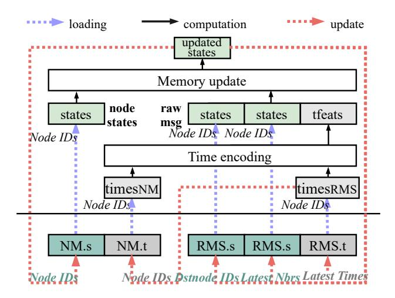
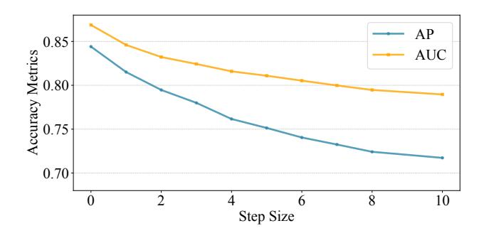
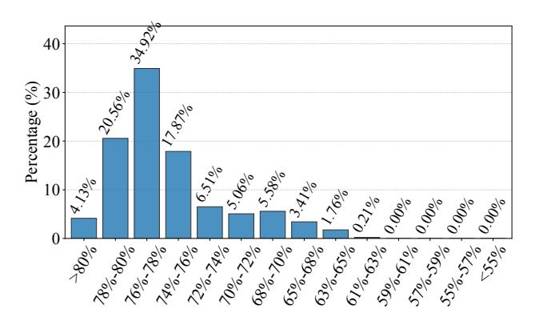
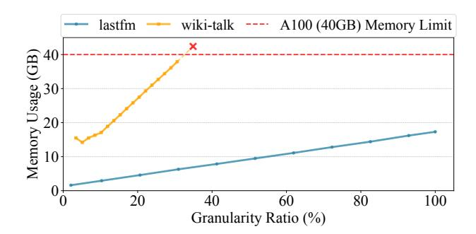
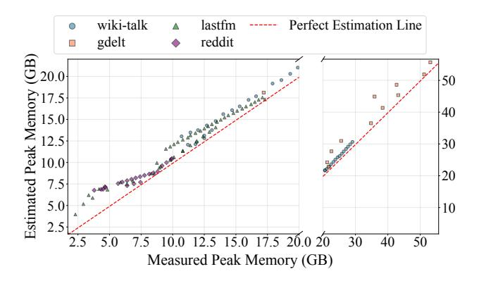

# APERTURE: Algorithm-System Co-optimization for Temporal Graph Network Inference

## [Yiqing Wang](https://orcid.org/0009-0007-8809-824X)

Beihang University State Key Laboratory of Complex & Critical Software Environment Beijing, China yiqingwang@buaa.edu.cn

# [Qingxiao Sun](https://orcid.org/0000-0003-2927-362X)∗

Beihang University Beijing, China qingxiaosun@buaa.edu.cn

## [Hailong Yang](https://orcid.org/0000-0003-1101-7927)

Beihang University State Key Laboratory of Complex & Critical Software Environment Beijing, China hailong.yang@buaa.edu.cn

# [Kejie Ma](https://orcid.org/0009-0002-0393-7627)

Beihang University Beijing, China kejiema@buaa.edu.cn

## [Enze Yu](https://orcid.org/0009-0004-2322-2922)

Beihang University Beijing, China 22371494@buaa.edu.cn

# [Kaige Zhang](https://orcid.org/0009-0000-3261-3483)

Beihang University Beijing, China kaige.zhang@buaa.edu.cn

# [Chenhao Xie](https://orcid.org/0000-0002-1399-0352)

Beihang University Beijing, China fenahuhu@gmail.com

# Abstract

Temporal Graph Networks (TGNs) are widely used to model evolving relationships in dynamic graphs. However, existing inference systems enforce a step-wise paradigm: processing each temporal graph sequentially with a memory update followed by aggregation. We break this dependency by decoupling memory updates from aggregation while preserving prediction accuracy, thereby enabling a global view for fine-grained parallelism control. This design unlocks new optimization opportunities but introduces three system-level challenges: managing intermediate multi-state representations, curbing memory-bound update overheads, and selecting a safe yet efficient aggregation granularity. We present APERTURE, a TGN inference framework that bridges algorithmic semantics and system design. To address the above challenges, APERTURE (1) jointly aggregates temporal states via computation graph transformation, (2) minimizes redundant memory traffic through dependency-aware update reconstruction; (3) selects the optimal granularity by analytically modeling. The experimental results show that APER-TURE achieves up to 59.3× speedup over state-of-the-art baselines without compromising accuracy.

∗Corresponding author.

[This work is licensed under a Creative Commons Attribution 4.0 Interna](https://creativecommons.org/licenses/by/4.0)[tional License.](https://creativecommons.org/licenses/by/4.0)

PPoPP '26, Sydney, NSW, Australia © 2026 Copyright held by the owner/author(s). ACM ISBN 979-8-4007-2310-0/2026/01 <https://doi.org/10.1145/3774934.3786450>

# [Depei Qian](https://orcid.org/0000-0002-5382-1473)

Beihang University Beijing, China depeiq@buaa.edu.cn

CCS Concepts: • Computer systems organization → Neural networks.

Keywords: Temporal Graph Networks, Inference System, Parallel Execution, Memory Efficiency

### ACM Reference Format:

Yiqing Wang, Hailong Yang, Enze Yu, Qingxiao Sun, Kejie Ma, Kaige Zhang, Chenhao Xie, and Depei Qian. 2026. APERTURE: Algorithm-System Co-optimization for Temporal Graph Network Inference. In Proceedings of the 31st ACM SIGPLAN Annual Symposium on Principles and Practice of Parallel Programming (PPoPP '26), January 31 – February 4, 2026, Sydney, NSW, Australia. ACM, New York, NY, USA, [13](#page-12-0) pages. <https://doi.org/10.1145/3774934.3786450>

# 1 Introduction

Graph Neural Networks (GNNs) have emerged as fundamental building blocks across a wide spectrum of domains [\[12,](#page-11-0) [31,](#page-12-1) [37\]](#page-12-2). By combining message passing over graph structures with neural operations, GNNs effectively capture complex dependencies among entities (i.e., graph nodes), thereby enabling accurate predictions in tasks such as node classification and community detection [\[19,](#page-11-1) [32,](#page-12-3) [37\]](#page-12-2). However, most real-world graphs are dynamic, with interactions continuously evolving over time. Static GNNs lack the temporal modeling capability to handle such evolving data.

To support dynamic graphs, Temporal Graph Networks (TGNs) extend static GNNs by transforming the input stream of timestamped interactions into a sequence of temporal graphs [\[18,](#page-11-2) [22,](#page-11-3) [26,](#page-11-4) [36\]](#page-12-4). To capture dependencies across temporal graphs, TGNs maintain a persistent node memory, analogous to the hidden state in recurrent neural networks: after each temporal graph is processed, the node memory is

Figure 1. Comparison between (a) baseline TGN inference paradigm and (b) decoupled TGN inference paradigm. Removing unnecessary sequential dependencies enables memory update restructure and GNN aggregation parallelism.

updated, and the resulting temporal state is propagated stepwise to subsequent graphs, thereby accumulating long-range context [\[1,](#page-11-5) [10,](#page-11-6) [18\]](#page-11-2). Owing to this capability, TGNs have been widely adopted in both academic research [\[6,](#page-11-7) [20,](#page-11-8) [34,](#page-12-5) [39,](#page-12-6) [41,](#page-12-7) [42\]](#page-12-8) and industrial applications, ranging from recommendation platforms [\[21,](#page-11-9) [24\]](#page-11-10) to financial fraud detection [\[4,](#page-11-11) [35\]](#page-12-9) and intelligent transportation systems [\[8,](#page-11-12) [13\]](#page-11-13).

Recent efforts have sought to optimize specific components of TGN inference. TGL [\[41\]](#page-12-7) introduces a temporal graph format to accelerate sampling, while ETC [\[5\]](#page-11-14) reduces input transfers by eliminating redundant accesses and reconstructing layouts on GPUs. TGOpt [\[29\]](#page-12-10) employs deduplication, memoization, and precomputation to cut redundancy in sampling, computation, and loading, and TGLite [\[30\]](#page-12-11) extends TGOpt with additional system-level abstractions. While these systems deliver notable improvements, they all remain bound to the same step-wise processing paradigm, leaving broader opportunities unaddressed.

In this paradigm (Figure [1](#page-1-0) (a)), inference must traverse temporal graphs strictly in chronological order, enforcing two coupled stages: (1) the memory update stage, which refreshes per-node memory with new interactions and produces updated temporal states; and (2) the GNN aggregation stage, which applies message passing over updated states and node features to generate predictions. However, we observe that only memory updates require chronological ordering across temporal graphs. The dependency in Figure [1](#page-1-0) (a), which forces each memory update to wait for the preceding GNN aggregation, is unnecessary for semantic correctness and can be safely removed. This insight motivates us to decouple memory updates from GNN aggregation, as illustrated in Figure [1](#page-1-0) (b), thereby enabling opportunities for restructuring memory updates and parallelizing aggregations that are unattainable under the conventional paradigm.

To exploit these opportunities in practice, the rigid stepwise execution must be broken by transforming the Computation Graph (CG) of TGN so that multiple memory updates

can be deferred and aggregated jointly. However, a naive transformation fails to deliver real performance gains. On one hand, handling multiple temporal states in node memory triggers recurrent GPU memory management overhead. On the other hand, aggregating these temporal states with separate kernels leads to redundant computation and underutilized GPU resources. Challenge 1: how to defer the execution of multiple temporal states with lightweight memory management and efficient aggregation?

After optimizing GNN aggregation, the performance bottleneck shifts to the memory update stage. Prior systems process one temporal graph at a time, where dependencies are implicitly carried through node memory handoffs. When multiple temporal states are retained, these handoffs expose cross-graph dependencies, resulting in redundant global memory reads and writes. In prior step-wise processing paradigm, this overhead remained hidden, as each temporal graph was processed independently. However, when memory updates are organized back-to-back, the limitation becomes evident: updated states are written to global memory, and in the next step, they must be read again for further computation, creating excessive traffic across temporal graphs. Challenge 2: how to support cross-graph state updates without incurring prohibitive global memory traffic from localized node-memory handoffs?

A further difficulty lies in determining the appropriate aggregation granularity, i.e., the number of memory updates accumulated before performing a joint GNN aggregation. From a performance perspective, larger granularity is favorable: it lowers the number of aggregations, reducing computation cost; with fewer aggregations, it also reduces synchronization points between memory updates, reducing coordination overhead. However, larger granularity also prolongs the lifetime of temporal states, raising peak memory consumption and risking oversubscription. Because inference precludes costly autotuning, granularity must be determined ahead of execution with negligible overhead. Challenge 3: how to select an aggregation granularity that maximizes efficiency while guaranteeing memory safety?

To address these challenges, we present APERTURE, an end-to-end TGN inference framework that maximizes performance while ensuring memory safety. APERTURE achieves this by separating memory updates from GNN aggregation and exploiting a global view to restructure updates and parallelize read-only aggregation. For Challenge 1, APERTURE remaps sampled results into a global feature map, and leverages this layout to pre-allocate memory space and eliminate duplicate operations during aggregation. For Challenge 2, APERTURE constructs a state-based DAG in parallel and leverages the global dependency information to optimize memory update execution and reduce memory traffic. For Challenge 3, APERTURE models temporal state lifetimes, using an analytical model to select granularity and a topological traversal to track peak memory usage.

To the best of our knowledge, this is the first work to overcome the inherent limitations of the step-wise TGN paradigm, bridging the gap between algorithmic and systemic optimization. The contributions are as follows1:

- We comprehensively analyze the temporal sensitivity
  of the two stages involved in TGN inference and illustrate the opportunities for parallel execution brought
  about by breaking inherent dependencies.
- We propose three novel modules including CG transformation engine, memory update manager, and aggregation granularity calculator, which reduce redundant operations and global memory accesses while maximizing efficiency under memory constraints.
- We develop a TGN inference framework APERTURE
  that coordinates algorithmic and systemic optimizations to accelerate the entire pipeline without accuracy
  loss. The experimental results show that APERTURE
  achieves a maximum speedup of 59.3× in end-to-end\ninference compared to the state-of-the-art work.

### 2 Background

### 2.1 Temporal Graph Networks

Temporal Graph Networks (TGNs) are designed for link prediction on dynamic graphs, i.e., predicting whether an edge will appear between two nodes at a future timestamp based on their historical interactions. The input is a stream of timestamped edges representing node interactions. To balance temporal ordering with execution parallelism, TGNs process edges in fixed-size groups in chronological order. For each group,  $temporal\ neighbor\ sampling\ constructs\ a\ temporal\ graph$  on the fly by selecting the k latest edges per node before the current interaction, where k limits the number of temporal neighbors. The resulting sequence of temporal graphs preserves temporal structure and serves as input to TGN inference, which consists of two tightly coupled stages: memory update and GNN aggregation.

(1) Memory update: TGN maintains a persistent node memory, represented as a tensor in which each row corresponds to the state vector of a unique node identifier. At each step, node states involved in the current temporal graph are first updated using messages generated in the previous step:

$$s_u = \text{UPDT}(s_u^-, \text{AGGR}(m_{ku}^- \mid k \in N(u)))$$
 (1)

where  $s_u^-$  denotes the state of node u before the update,  $m_{ku}^-$  is the message previously generated from neighbor k to u, and N(u) is the neighbor set of u. AGGR( $\cdot$ ) aggregates the stored messages (by mean or most-recent selection [14, 18, 25]), and UPDT( $\cdot$ ) updates the node state, typically implemented with recurrent units such as RNNs [7, 14] or GRUs [3, 18].

After states are updated, the current interactions generate new messages that will be consumed in the next step. For each interaction in the temporal graph, edge  $e_{uv}$  from node

**Table 1.** Components of a temporal graph.

| Component                                              | Description                                                                                                                                                                |
|--------------------------------------------------------|----------------------------------------------------------------------------------------------------------------------------------------------------------------------------|
| Node IDs Dstnode IDs Latest Nbrs Latest Times | Identifiers for all nodes in the temporal graph. Destination nodes involved in interactions. Latest neighbors of destination nodes. Timestamps of the latest interactions. |

*u* to *v* at time *t* involves the destination nodes *u* and *v*; thus, two messages are produced:

$$m_{uv} = \text{MSG}(s_u, s_v, E_{uv}(t), t - t_u)$$
  

$$m_{vu} = \text{MSG}(s_v, s_u, E_{uv}(t), t - t_v)$$
(2)

where  $MSG(\cdot)$  is a learnable module (e.g., MLP),  $s_u$  and  $s_v$  are the latest states of u and v,  $E_{uv}(t)$  is the edge feature, and (t-t.) encodes the elapsed time since the node's last update.

(2) GNN aggregation: After memory updates, TGNs apply temporal GNN layers to generate embeddings for prediction. Each layer performs message passing with temporal attention, combining the updated node states with node features, edge features, and time encodings on the temporal graph:

$$\zeta_{u}(t) = s_{u}(t) \parallel \Phi(0)$$

$$\zeta_{v}(t) = s_{v}(t) \parallel E_{uv}(t) \parallel \Phi(t - t_{v})$$

$$r_{u}(t) = \operatorname{ATTN}(\zeta_{u}(t), \zeta_{v}(t) \mid v \in N(u, t))$$

$$h_{u}(t) = \operatorname{FFN}(r_{u}(t) \parallel s_{u}(t))$$
(3)

where  $\Phi(\cdot)$  encodes time intervals, ATTN denotes attention-based aggregation [18], and FFN is a feed-forward predictor.

### 2.2 Existing TGN Inference Systems

Existing TGN systems typically implement the inference pipeline in three stages as follows.

- (i) *Sampling*: Construct a temporal graph using temporal neighbor sampling. This stage generates the temporal graph, which serves as the input for the subsequent memory update and aggregation stages. Each temporal graph is composed of the components listed in Table 1, which together provide a structured abstraction for subsequent computations.
- (ii) Memory update: Update node states through NM (Node Memory) and RMS (Raw Message Store), as shown in Figure 2. NM stores node states and timestamps, while RMS stores messages and their corresponding timestamps. During execution, node states are loaded from NM via node IDs. Time features are then computed by encoding times in NM and RMS, both accessed via node IDs. These features are concatenated with messages from RMS (also accessed via node IDs) to form raw messages. Finally, the node states and raw messages are processed together to update the node states.

The updated node states are written back to both NM (via node IDs) and RMS (via dstnode IDs and latest Nbrs). The times from RMS are written back to NM (via node IDs), and the latest Times are written back to RMS (via dstnode IDs).

&lt;sup>1The artifact for this paper is publicly available on Zenodo under DOI [27].

(iii) *GNN aggregation*: Apply temporal attention layers to aggregate the updated node states with features and time encodings, generating link-prediction outputs.

Prior studies mainly target optimizations for the three stages. ETC [5] proposes a three-step data access policy with inter-batch pipeline for reducing redundant data accesses and preload time. TGOpt [29] targets storage and computation redundancies in TGAT [33] inference. These redundancies include intra-batch repeated edge interactions, interbatch duplicate embedding calculations, and repeated timeencoding operations. TGOpt addresses them through three techniques: deduplication, memoization, and precomputation. TGLite [30] extends TGOpt by providing lightweight abstractions and composable operators for programming TGNs. It introduces a set of TBlock based operators such as temporal neighborhood sampling, scatter or segmented computations that can be flexibly composed to build customized inference pipelines. Cascade [2] supports training with large batch sizes by exploiting spatial independence in scattered events. Overall, these approaches still operate within the step-wise paradigm, missing broader opportunities for enhancing parallelism and efficiency.

Numerous works have studied system optimizations for static or snapshot-based GNNs [9, 11, 15–17, 21, 23, 28, 38, 40], but their techniques do not naturally extend to temporal scenarios, where sequential dependencies dominate.

### 2.3 Potential Decoupling Opportunities

Our primary analysis focuses on the semantic correctness of the decoupling between memory updates and GNN aggregation. Specifically, we model TGN inference as discrete steps  $t=1,\ldots,T$ . Let  $S_u^{(t)}$  denote node u's state *after* processing step t (i.e., after memory updates), and let  $Y_u^{(t)}$  be the output embedding used for prediction at step t. A generic TGN step can be written as:

$$S_{u}^{(t)} = \operatorname{Upd}\left(S_{u}^{(t-1)}, \operatorname{MsgAgg}^{\operatorname{upd}}\left(\left\{\left(S_{v}^{(t-1)}, \psi^{\operatorname{upd}}(\Delta t_{vu})\right) \mid v \in \mathcal{N}_{u}^{(t)}\right\}\right)\right), \tag{4}$$

$$Y_{u}^{(t)} = \operatorname{Agg}\left(S_{u}^{(t)}, \operatorname{MsgAgg}^{\operatorname{read}}\left(\left\{\left(S_{v}^{(t)}, \psi^{\operatorname{read}}(\Delta t_{vu})\right) \mid v \in \mathcal{N}_{u}^{(t)}\right\}\right)\right). \tag{5}$$

The decoupling is semantics-preserving under the following sufficient conditions: (C1) Read-only read path - Agg and MsgAggread do not modify  $S^{(t)}$  and do not feed back into Upd; (C2) Deterministic temporal encoding -  $\psi^{\text{read}}(\Delta t)$  depends only on timestamps (independent of execution order/parallelism); (C3) Permutation invariance - MsgAggread is permutation-invariant over the neighbor multiset. Under C1–C3, the evolution of states  $\{S^{(t)}\}$  is fully determined by the update recurrence alone, and the read path at step t is a pure function of the snapshot  $S^{(t)}$  (and timestamps). Therefore, we may execute all memory updates in temporal

Figure 2. Illustration of memory update stage.

order to obtain  $\{S^{(t)}\}$ , and postpone/reorder/parallelize the read-only aggregation as long as it reads the same snapshots, yielding identical  $\{Y^{(t)}\}$  to step-wise execution.

#### 3 Motivation

Decoupling memory updates from GNN aggregation can break the rigid step-wise paradigm in TGN inference systems, opening up system-level optimization opportunities. We make three observations based on profiling the TGN model over the *lastfm* dataset on A100 GPU.

# 3.1 Observation 1: Multi-states aggregation is accuracy-neutral but performance-sensitive

The rigid sequential processing of traditional TGNs limits parallelism and underutilizes hardware. A natural way to improve efficiency is to process multiple temporal graphs together, which we term the *inference step size*. However, as shown in Figure 3, larger step sizes cause significant accuracy degradation due to causal violations: memory updates must follow strict temporal order to ensure correct state evolution.

However, we observe that the dependency forcing each memory update to wait for the preceding GNN aggregation is not semantically necessary. Although memory updates require temporal consistency, GNN aggregation only reads node states without modifying them and is therefore not constrained by temporal order. This insight enables the decoupling of memory updates from aggregation: multiple memory updates can be executed sequentially while preserving temporal semantics, followed by a single GNN aggregation over the resulting states. We refer to this as multi-state aggregation, governed by a granularity parameter  $\Gamma$ . The experimental results confirm that multi-state aggregation preserves model quality (See Section 5.3).

We implement a naive computation graph transformation (*Naive-CG*) that executes  $\Gamma$  memory updates in sequence, materializes the intermediate node states, and then performs

**Figure 3.** Inference accuracy when processing multiple temporal graphs simultaneously. AP and AUC denote Average Precision and Area Under the ROC Curve, respectively.

**Figure 4.** Time breakdown of naive computation graph transformation as the aggregation granularity increases.

a single GNN aggregation over their concatenation. Figure 4 reports the breakdown as  $\Gamma$  increases: GNN aggregation time decreases due to reuse and fewer kernel launches, memory update time remains nearly unchanged, yet the end-to-end time first drops and then grows, eventually exceeding the no-transformation baseline. The inflection is driven by repeated (de)allocations and large-state concatenations, whose overhead scales with  $\Gamma$  and offsets the aggregation gains. These findings suggest that while multi-state aggregation is accuracy-neutral, fully realizing its performance potential requires a careful CG transformation engine.

# 3.2 Observation 2: Localized node-memory updates incur excessive memory access overhead

Figure 5 breaks down the execution time of memory updates, showing that the majority of cost is dominated by *global load/store operations*, while the actual update logic and time encoding account for only a small fraction. This indicates that memory updates are highly *memory-bound*, and reducing redundant global accesses is critical for efficiency.

We further analyze consecutive temporal graphs and measure the overlap in nodes (Node IDs). As shown in Figure 6, a large portion of graphs exhibit high redundancy: over 70% of

Figure 5. Time breakdown of memory update stage.

**Figure 6.** Percentage distribution of repeated nodes across consecutive memory update stages.

graphs have more than 70% repeated nodes between successive updates. This reveals substantial opportunity for *fusing* repeated accesses, motivating techniques that minimize crossgraph traffic and reuse updated states.

# 3.3 Observation 3: Aggregation granularity affects both performance and memory usage

Aggregation granularity  $\Gamma$  is pivotal for inference performance and memory usage. As shown in Figure 7, runtime declines in both *memory update* and *GNN aggregation* stages as  $\Gamma$  increases. In memory update stage, larger  $\Gamma$  reduces inter-aggregation synchronization points, so each node state is updated fewer times across temporal boundaries. In GNN aggregation, larger  $\Gamma$  improves reuse via deduplication, eliminates redundant computation and feature loads, and lowers kernel-launch overhead. The auxiliary overhead remains nearly flat. However, peak GPU memory usage increases with  $\Gamma$ , as shown in Figure 8. For example, *wiki-talk* reaches OOM near  $\Gamma/\Gamma_{max} \approx 0.3$ , whereas *lastfm* sustains larger  $\Gamma$ . This motivates selecting the largest  $\Gamma$  per workload and device that remains within memory capacity.

### 4 Methodology

We present *APERTURE*, a decoupled TGN inference framework that decouples memory update from GNN aggregation and exposes a global state view for fine-grained scheduling. Figure 9 overviews three cooperating modules.

The *CG Transformation Engine* introduces a global feature map to eliminate allocator/concatenation overhead. It

**Figure 7.** Time breakdown vs. granularity Γ on *lastfm*.

**Figure 8.** Peak GPU memory usage vs.  $\Gamma/\Gamma_{max}$  on *wiki-talk* and *lastfm*. The  $\Gamma_{max}$  is the per-sequence upper bound.

first performs remap-dedup-unmap preprocessing for sizing and balanced work, then preassigns per-state slots and builds a block-diagonal adjacency, executing a single zero-redundancy aggregation kernel to remove repeated loads, computation, and kernel launches.

The *Memory Update Manager* re-expresses updates at state granularity and builds a state-based DAG to make producer-consumer relations explicit. It materializes per-state temporal inputs and *recomposes* consecutive levels when dependencies permit, forwarding updated values on-chip to avoid intermediate global memory accesses.

The Aggregation Granularity Calculator analytically models runtime and memory, estimates peak usage via topological traversal of state lifetimes, and selects the granularity that minimizes inference time under the given memory budget.

### 4.1 CG Transformation Engine

**4.1.1 Data Remapping Preprocessing.** *APERTURE* preallocates space for intermediate states, requiring the sizes of all sampling outputs. This prevents overlapping CPU-side sampling with GPU execution; we therefore migrate the entire temporal graph sampling procedure to the GPU. To simplify analysis and scheduling of memory updates, we deduplicate sampled results within current temporal graphs. Sampling is inherently balanced because each temporal graph selects a fixed number of targets with bounded neighbors; deduplication, by contrast, yields variable per-graph sizes,

and per-graph processing reintroduces imbalance. We adopt a *remap-dedup-unmap* pipeline: *remap* assigns offsets via a prefix-sum over preceding graphs to enable inter-temporal-graph deduplication; after deduplication, *unmap* restores the original per-graph partition. This design balances work across thread blocks, eliminates redundant kernel launches, and preserves the boundaries of temporal graphs with negligible overhead.

**4.1.2 Global Feature Map Management.** Building on the deduplicated results, *APERTURE* manages all intermediate data at the granularity of *states*. A state corresponds to the update of a specific node at a particular temporal step, and serves as the basic unit of both memory updates and GNN aggregation. Managing data at this fine granularity avoids redundant storage of unreferenced entries on the GPU.

A state is described by three attributes: (1) node\_id: the original node identifier that the state corresponds to; (2) level\_id: the temporal step index, where  $1 \le level_id \le T$  and T is the total number of temporal graphs in the input sequence; (3) uniq\_id: the position of this state among deduplicated entries at the same level. A state can be referenced in two complementary ways: the pair  $\langle level_id, node_id \rangle$  associates the state with its original graph entity, while the pair  $\langle level_id, uniq_id \rangle$  uniquely determines its storage location in the global structure.

To store states compactly, we organize them into a CSR-style global feature map. Let  $n_{\ell}$  denote the number of distinct states at level  $\ell$ . The prefix sums  $S_{\ell}$  are calculated as:

$$S_{\ell} = \sum_{k=1}^{\ell-1} n_k, \qquad S_1 = 0 \tag{6}$$

so that the storage address of state ⟨level\_id,uniq\_id⟩
(addr) is calculated as:

$$addr = S_{level\ id} + uniq_id$$
 (7)

This design provides two key advantages. First, recurrent GPU memory allocations are eliminated by assigning each state a pre-determined slot in the feature map, producing a compact representation that significantly reduces memory usage compared to baseline  $O(T \times N)$  storage, where T is the number of temporal graphs and N is the total number of node identifiers in the dynamic graph. Second, the  $\langle level_id, uniq_id \rangle$  indexing scheme directly maps each state to its storage location, avoiding repeated scatter-gather operations and facilitating downstream aggregation.

**4.1.3 Zero Redundancy Aggregation.** Instead of launching separate sparse aggregations for temporal graphs, *APER-TURE* constructs a block-diagonal sparse matrix by concatenating their adjacency structures along the diagonal, and multiplies it with the global feature map in one operation. This design offers multiple benefits. First, redundant memory accesses are avoided due to one-time feature loading. Second, repeated kernel launches are eliminated, where *T* 

**Figure 9.** Overview of *APERTURE* design.

small-scale sparse aggregations are replaced with one kernel. Third, both intra- and inter-step redundancies are removed by accessing deduplicated features in the global layout.

### 4.2 Memory Update Management

**4.2.1 State-based DAG Construction.** To feed a *global feature map*, *APERTURE* must recover all state dependencies, otherwise obscured by NM/RMS. We attach a lightweight metadata field parent\_states to each state descriptor to record the *minimal* dependency set for subsequent computations, without changing the canonical references  $\langle level\_id, node\_id \rangle$  and  $\langle level\_id, uniq\_id \rangle$ . Let s be a state with node\_id = v and  $level\_id = \ell$ , the minimal parent set satisfies:

$$\mathsf{parent\_states}(s) \in \begin{cases} \{\langle v, \ell_p \rangle\}, \\ \{\langle v, \ell_p \rangle, \langle u, \ell_p \rangle\} \end{cases} \tag{8}$$

where u is the latest Nbrs (LNid) paired with v when a raw message (v,u) is involved at level  $\ell_p$  ( $\ell_p < l$ ). Intuitively, NM updates always include the state's own node memory v; RMS-involved updates additionally depend on the sibling indexed by LNid.

We materialize only LNid in parent\_states (sentinel if absent); v is implicit from node\_id. We also record a single parent level  $\ell_p$  in parent\_states: the parent(s) are co-level (i.e., share the same level\_id), so one level\_id suffices. This design keeps the dependency DAG lightweight: each state carries O(1) metadata, with at most one explicit parent (its node\_id plus a single parent level\_id), thereby reducing DAG-construction complexity.

**Parallel construction.** As shown in Figure 10, we propose a two-step kernel that builds state dependencies in parallel.

Step 1: Initialize two  $T \times N$  tables. (i) The Nid-level table  $M_{\rm NM}[\ell,v]$  records, for node v and level  $\ell$ , the nearest prior level  $\ell_p \leq \ell$  at which v's NM was updated; entries are initialized to -1 when absent. (ii) The DNid-LNid table  $M_{\rm RMS}[\ell,v]$  stores the latest neighbor u (LNid) paired with destination node v (DNid) at level  $\ell$  for raw-message updates (v,u).

Step 2: Per-state parent lookup (one thread per state). Given a state  $(\ell, v)$ , a thread first queries  $M_{\rm NM}$  along the time axis to obtain the parent level  $\ell_p$  as the nearest non--1 entry for node v (i.e., the most recent NM update of v at or before  $\ell$ ). This yields the first parent  $(\ell_p, v)$ . It then reads u from  $M_{\rm RMS}[\ell_p, v]$ : if u = -1, the state has only the NM parent; otherwise the second parent is  $(\ell_p, u)$ .

*Example.* For the state ( $\ell$ =2, v=0), scanning  $M_{\rm NM}$ [:, 0] backward finds 0 (the value of  $\ell_p$ ), looking up  $M_{\rm RMS}$ [0, 0] returns 2 (the value of u), so the two parents are (0, 0) and (0, 2).

Remark. For small graphs with few nodes, we materialize a per-node prefix fill along levels so that  $M_{\rm NM}[\ell,v]$  already stores  $\ell_p$  for every  $(\ell,v)$ . This optimization removes the backward scan, reducing the complexity of Step 2 to O(1). For large graphs, we keep the on-the-fly scan design to avoid the extra O(TN) preprocessing and storage cost.

**4.2.2 Per-state Timedelta Materialization.** We further materialize per-state temporal inputs to avoid redundant global NM/RMS accesses in memory update stages.

**Computation pattern.** For each state  $s = (\ell, v)$  with parent key  $(\ell_p, v, u)$  in the state DAG, we use the lookup function  $\kappa(\cdot)$  to read the required timestamps:

$$(t_{\text{NM}}, t_{\text{RMS}}) = (\kappa(s, \text{RMS.t}), \kappa(s, \text{LatestTimes})).$$
 (9)

$$\tau(s) = \Phi(t_{\text{RMS}} - t_{\text{NM}}). \tag{10}$$

Therefore,  $\tau(s)$  is a pure function of read-only NM/RMS entries selected by  $\kappa(s)$ , with no cross-state dependence, and its cost is dominated by global-memory access rather than arithmetic.

Same addressing pattern as DAG construction. Both time prefill and DAG construction resolve the same parent key  $\kappa(s)$  via the Nid-level and DNid-LNid tables: (i) *DAG* construction uses  $\kappa(s)$  to emit parent edges  $(\ell_p, v)$  and optionally  $(\ell_p, u)$ ; (ii) *Time prefill* uses  $\kappa(s)$  to fetch both parent timestamps and produces the encoded temporal feature  $\tau(s)$ .

**Parallel materialization.** As shown in Figure 11, we materialize  $\tau(s)$  per state using the same  $\kappa(s)$  as in Section 4.2.1.

Step 1: Initialize two  $T \times N$  time tables. (i) RMS-time  $T_{RMS}$ . Initialize all entries to -1, then set  $T_{RMS}[0, v]$  to the initial

Figure 10. Example of state-based DAG construction. ① Initialize the Nid-level and DNid-LNid tables from local indices. ② Lookup both tables to resolve parent states, producing the global DAG (right). The colors of nodes correspond to their index sources (Nid, LNid) and states in DAG.

timestamps. For  $\ell \geq 1$ , write latest timestamps *only* to entries  $(\ell, v)$  indicated by the DNid-LNid table (i.e., where a pair  $(v, \mathsf{LNid})$  exists at level  $\ell$ ); keep other entries at -1 to be resolved by predecessor lookup at query time. (ii) *NM-time*  $T_{\mathrm{NM}}$ . Initialize all entries to -1, then set  $T_{\mathrm{NM}}[0, v]$  to the initial timestamps. For any  $(\ell, v)$ , obtain  $T_{\mathrm{NM}}[\ell, v]$  by a predecessor lookup in  $T_{\mathrm{RMS}}$ , i.e. scan column v backward along the level axis from  $\ell$  to the nearest non-empty entry (level  $\ell$ ) and set  $T_{\mathrm{RMS}}[\ell', v]$  to  $T_{\mathrm{NM}}[\ell, v]$  (Row 0 provides the initializer, so this lookup always succeeds).

Step 2: Per-state parent lookup (one thread per state). Launch one thread per state as enumerated by the Nid-level table; each thread writes to the orange slots in the figure. For a state ( $\ell$ , v): (1) obtain  $t_{\rm RMS}$  by a predecessor lookup in column v of  $T_{\rm RMS}$ , i.e., take the nearest prior non-empty entry at or before  $\ell$ ; (2) obtain  $t_{\rm NM}$  by the same predecessor rule in  $T_{\rm NM}$  (nearest prior non-empty in column v at or before  $\ell$ ); (3) compute  $\Delta t(s) = t_{\rm RMS} - t_{\rm NM}$  and record it. After all  $\Delta t(s)$  values are produced, run a single encoding pass to obtain  $\tau(s) = \Phi(\Delta t(s))$ . Both predecessor lookups are guaranteed to succeed by construction (row 0 initialization and the NM parent definition), so no case handling is required.

*Example.* For the dark-orange state ( $\ell$ =2, v=1), step (1) finds  $T_{\rm RMS}[2,1]$  empty and backtracks to obtain  $a_1$ ; step (2) reads  $T_{\rm NM}[2,1] = a_1$ ; hence  $\Delta t(s) = a_1 - a_1 = 0$ .

*Remark.* Obtained time features are stored in a contiguous buffer T; each state keeps O(1) metadata, an integer time\_idx(s) pointing to the row  $T[time_idx(s)]$ .

**4.2.3** Cross-level State Recomposition. Leveraging (1) an explicit state-based DAG (*SDAG*) (Section 4.2.1), (2) perstate materialization of temporal inputs (Section 4.2.2), and (3) management of *states* in global feature map across the entire pipeline (Section 4.1.2), we recompose the state operators of adjacent levels into a single kernel execution.

**Figure 11.** Example of timedelta computation. ① Initialize the  $T_{RMS}$ ,  $T_{NM}$  based on DNid-LNid and Nid-level tables. ② Lookup both tables to resolve parent times, producing the timedelta (right). The colors of nodes correspond to their index sources (Nid, LNid) and parent times.

We define the consumers in level  $\ell+1$  that depend on a unique producer in level  $\ell$  as the *composable subset*. To identify this subset, we scan the maintained SDAG in parallel: for each state in  $\ell+1$ , we test whether its parent resides in  $\ell$ ; these checks are independent across states and thus incur negligible overhead. At execution, the kernel (i) directly reuses the materialized temporal inputs for both levels, avoiding extra fetches and remapping; (ii) computes the update at  $\ell$  and forwards the result to  $\ell+1$  via registers or shared memory, avoiding intermediate materialization; and (iii) writes back only the *final* state of  $\ell+1$  to global memory (the intermediate state at  $\ell$  is consumed on-chip and never spilled). This design reduces global-memory round trips and kernel-launch overhead, improving on-chip reuse while meeting temporalordering requirements. For portions that are not directly fusible, we reuse threads that finish early within the fused kernel to perform global-to-global (G2G) data movement, thereby still avoiding an additional kernel launch.

#### 4.3 Aggregation Granularity Calculator

**4.3.1 Problem Formulation.** Let *T* denote the number of temporal steps. We model the total cost as:

$$\min_{\Gamma} T_{\text{MU}}(\Gamma) + T_{\text{AGG}}(\Gamma), \quad \text{s.t. } M_{\text{peak}}(\Gamma) \le M_{\text{max}}, \quad (11)$$

where  $T_{\rm MU}(\Gamma)$  and  $T_{\rm AGG}(\Gamma)$  are the costs of memory update and aggregation,  $M_{\rm peak}(\Gamma)$  is the peak memory usage. We find that the total workload during inference is roughly constant, but increasing  $\Gamma$  improves the locality and parallelism of memory updates and GNN aggregation. Therefore, the inference cost theoretically decreases with increasing  $\Gamma$ , as supported by the experimental results in Section 3.3. Consequently, we set  $\Gamma$  as large as memory budget permits, which motivates the peak memory estimation below.

**4.3.2 Peak Memory Estimation.** Although inference operates in an online fashion, our preprocessing stage provides complete visibility into each temporal graph, including the

deduplicated-node upper bound. This enables a conservative yet accurate estimation of peak GPU memory usage under any given granularity  $\Gamma$ , avoiding costly fallback while still capturing the substantial gains enabled by larger  $\Gamma$ . Users may specify whether to move edge/node features, NM, and RMS to GPU memory. We define:

- $\hat{N}$ : deduplicated-node upper bound per temporal graph;
- $\tilde{N} := (1 + \epsilon)\hat{N}$ : safety-margined node count,  $\epsilon > 0$ ;
- *k*: number of sampled neighbors per node;
- *b*: bytes per feature element;
- dimout, dimtime: dimensions of states, time features.

The worst-case number of nodes and edges under  $\Gamma$  are:

$$\tilde{N}_{\Gamma} = \Gamma \cdot \tilde{N}, \quad E_{\Gamma} = \tilde{N}_{\Gamma} \cdot k$$
 (12)

where k is the sampled fanout per node. We estimate the total peak memory usage as:

$$M_{\text{peak}}(\Gamma) = \underbrace{\tilde{N}_{\Gamma} \cdot \text{dim}_{\text{out}} \cdot b}_{\text{GlobalState}} + \underbrace{\tilde{N}_{\Gamma} \cdot \text{dim}_{\text{time}} \cdot b}_{\text{TimeDelta}} + \underbrace{f_{\text{agg}}(\tilde{N}_{\Gamma}, E_{\Gamma})}_{\text{Aggregation}} + \text{fixed overheads}$$
(13)

where b is the number of bytes per feature element, and  $f_{\rm agg}$  is a model-specific aggregation cost function obtained via static operator graph analysis. The fixed overhead accounts for storage components, node features, edge features, NM, and RMS, that may reside on either CPU or GPU. We determine their contribution to GPU memory by parsing the experiment configuration, which specifies whether each component is moved to device memory.

**4.3.3** Adaptive Granularity Selection. Once preprocessing concludes and prior to graph construction, we determine the aggregation granularity  $\Gamma$  for the subsequent process. By evaluating the  $M_{\rm peak}(\Gamma)$  function with respect to hardware constraints, we select the maximal feasible  $\Gamma$  with negligible runtime overhead. In this way, *APERTURE* supports adaptive granularity selection while remaining robust to allocator variance and workload irregularities.

### 5 Evaluation

### 5.1 Experimental Setup

To validate the effectiveness of *APERTURE*, we conduct comprehensive experiments across diverse workloads.

**Model and Datasets** - We adopt three representative models including TGN [18], TGAT [33] and JODIE [14]. As listed in Table 2, we use standard datasets from [29, 33, 41], where *wiki-talk* and *gdelt* are large-scale.

**Baselines** - We compare *APERTURE* with state-of-theart baseline TGLite [30]. We further compare with two implementations of TGLite: TGLite-CPU and TGLite-GPU. In TGLite-CPU, the node/edge features and state tensors (node

**Table 2.** Graph datasets (*d* denotes feature dimension).

| Dataset          | # Nodes            | # Edges              | max(t)         | $d_v$      | $d_e$      |
|------------------|--------------------|----------------------|----------------|------------|------------|
| lastfm reddit | 1,980 2,601,977 | 1,293,103 672,447 | 1.4e8 2.7e6 | 128 128 | 128 128 |
| wiki             | 9,928              | 157,474              | 2.7e6          | 128        | 128        |
| mooc             | 7,047              | 411,749              | 2.6e6          | 128        | 128        |
| wiki-talk        | 1,140,149          | 7,833,140            | 1.2e9          | 100        | 172        |
| gdelt            | 16,682             | 191,290,882          | 1.8e5          | 128        | 128        |

memory and raw message store) are stored in host memory and fetched on demand. In TGLite-GPU, the above tensors are stored in device memory to avoid H2D transfers. However, on large graphs (e.g., *gdelt*), keeping multiple tensors resident in GPU memory can lead to out-of-memory (OOM) failures. All methods are executed under the same configurations for fair comparison.

**Hardware Configuration** - All experiments run on a server with Intel Xeon Gold 6336Y CPU and NVIDIA A100 GPU (40 GB). To demonstrate hardware portability and memory safety guarantees of *APERTURE*, we also report end-to-end results on a second server with Intel Xeon Gold 6230R CPU and NVIDIA RTX 4090 GPU (24 GB).

Following prior works [2, 5, 18, 29, 30], we split each dataset into train/val/test with a 70/15/15 ratio. We train on the training split and report results on the held-out test split. For small datasets, we process temporal graphs in fixed-size groups of 200; for large datasets, we use 2000. To reduce measurement noise, we repeat each experiment five times and report the mean.

#### 5.2 End-to-End Performance

As shown in Figure 12, *APERTURE* consistently outperforms TGLite across all datasets and models on both A100 and RTX 4090. On A100, it yields an average speedup of 29.19× over TGLite-CPU and 21.15× over TGLite-GPU. On RTX 4090, the average speedup further increases to  $34.53\times$  over TGLite-CPU and  $27.85\times$  over TGLite-GPU.

**Hardware-wise** - we observe larger relative speedups on RTX 4090: memory updates are highly memory-bound, and our global feature map plus a single block-diagonal *zero-redundancy* aggregation reduce redundant global accesses and kernel launches, which disproportionately benefits devices under tighter memory bandwidth pressure.

**Dataset-wise** - the gains align with redundancy profiles. For TGN on *lastfm* and *gdelt*, speedups are especially high: these graphs have many more edges than nodes, so eliminating repeated feature loads and consolidating aggregation removes substantial computation and traffic. For TGAT on *wiki-talk*, we see notably higher gains than those for TGN: aggregation-side redundancy is significantly reduced, whereas TGN still bears memory-update traffic; *wiki-talk* also exhibits tighter memory headroom at larger Γ. For *wiki*,

Figure 12. Performance speedup of APERTURE and TGLite-GPU over that of TGLite-CPU.

**Figure 13.** Runtime breakdown of the components involved in *APERTURE*.

*mooc*, and *reddit*, which are relatively sparser, improvements are more uniform across models and mainly come from kernel consolidation rather than heavy redundancy removal.

### 5.3 Prediction Accuracy

We verify that *APERTURE* preserves model quality by comparing Area under Curve (AUC, threshold-independent classification accuracy) and Average Precision (AP, ranking precision) against baseline systems across all datasets and three models. As shown in Table 3, *APERTURE* attains the same

AUC/AP as TGLite (up to rounding), indicating that decoupling memory updates from GNN aggregation is semantics-preserving and does not alter node-state evolution. Thus, the performance gains incur no loss in predictive quality.

### 5.4 Breakdown Analysis

Figure 13 reports the normalized runtime breakdown across datasets for TGN on A100 GPU. For clarity, we map each runtime stage to the corresponding *APERTURE* components as follows.

Table 3. Prediction accuracy comparison (AP / AUC).

| DT    | System        | AP / AUC               |                        |                        |                        |                        |                        |
|-------|---------------|------------------------|------------------------|------------------------|------------------------|------------------------|------------------------|
| 21    | o y otelli    |                        | wiki-talk              | reddit                 | wiki                   | mooc                   | gdelt                  |
| TGN   |               |                        | 0.96/0.95 0.96/0.95 |                        |                        |                        |                        |
| TGAT  | TGLite Our | 0.73/0.77 0.73/0.77 | 0.89/0.87 0.89/0.87 | 0.99/0.99 0.99/0.99 | 0.95/0.95 0.95/0.95 | 0.98/0.98 0.98/0.98 | 0.98/0.98 0.98/0.98 |
| JODIE | TGLite Our | 0.73/0.79 0.73/0.79 | 0.96/0.95 0.96/0.95 | 0.98/0.99 0.98/0.99 | 0.89/0.93 0.89/0.93 | 0.99/0.99 0.99/0.99 | 0.97/0.97 0.97/0.97 |

- **GA** (GNN Aggregation): *Zero-Redundancy Aggregation* and *Aggregation Granularity Calculator*, which consolidate aggregation into a single kernel to reduce redundant loads, computations, and launches.
- **TE** (Time Encoding): *Per-state Timedelta Materialization*, which precomputes time deltas to avoid repeated timestamp access and improve parallelism.
- MU (Memory Update): State-based DAG Construction, Crosslevel State Recomposition, and Global Feature Map Management, which jointly reduce memory traffic and management overhead across temporal levels.
- **SD** (Sample and Dedup): *Data Remapping Preprocessing*, which remaps and deduplicates sampled graphs on GPU before aggregation.
- LD (Loading): Also reduced by *Zero-Redundancy Aggregation*, which minimizes redundant edge-indexed loads.

The most significant effect of *APERTURE* is that the dominant costs of **GA** and **MU** nearly vanish, dropping to only single-digit percentages across all datasets.

### 5.5 Aggregation Granularity Analysis

**5.5.1 Peak Memory Estimation.** We evaluate the  $M_{\rm peak}(\Gamma)$  function by comparing estimated peak memory usage with measured peaks across datasets on TGN. As shown in Figure 14, the estimator is consistently conservative (upward-biased), with an average relative error of 14.14%, which avoids OOM re-executions in practice while still enabling large feasible Γ for improved performance.

**5.5.2 Performance Difference.** We vary  $\Gamma$  and measure end-to-end inference performance. As shown in Figure 15, increasing  $\Gamma$  consistently reduces runtime, as memory update stage involves fewer inter-aggregation synchronizations, while GNN aggregation stage benefits from higher reuse (deduped features), fewer loads, and fewer kernel launches. The auxiliary overhead remains nearly flat.

### 5.6 Overhead Analysis

We profile three sources of overhead: (i) one-time allocation of the global feature map, (ii) state-based DAG construction (including preparation for temporal-feature computation), and (iii) aggregation-granularity selection. The first and third

Figure 14. Estimated and measured peak memory usage.

Figure 15. Performance varies with aggregation granularity.

Figure 16. Overhead normalized to end-to-end inference.

are negligible, the former is a single contiguous tensor initialization, the latter a lightweight function evaluation. As shown in Figure 16, DAG construction dominates the overhead but remains under 10% of end-to-end time across all workloads. The DAG construction of wiki-talk and gdelt accounts for a larger fraction due to their node-heavy and edge-heavy characteristics, respectively. The DAG construction cost scales with the number of nodes/edges, whereas the inference performance depends mainly on the chosen group size and dataset redundancy.

### 6 Conclusion and Future Work

APERTURE breaks the step-wise TGN inference paradigm by decoupling memory updates from GNN aggregation. It combines global feature map management, dependency-aware update restructuring, and analytical granularity selection to

improve inference efficiency while guaranteeing memory safety. The evaluation results across configurations show end-to-end gains without accuracy loss, indicating that the decoupling methodology paves a promising system optimization road for TGNs. For future work, we plan to support strict QoS online serving by segmented preprocessing and consistent granularity selection with peak memory bound. We also plan to extend APERTURE to multi-GPU execution via partitioned feature maps and DAG-guided updates with boundary exchange.

## Acknowledgments

This work is supported by National Natural Science Foundation of China (No. 62322201, U23B2020, 62402525, U22A2028 and 92373110), the Fundamental Research Funds for the Central Universities (JKF-2025012343648 and JKF-20240598), and State Key Laboratory of Complex & Critical Software Environment (SKLCCSE-2025ZX-04).

# References

- [1] Ke Cheng, Peng Linzhi, Junchen Ye, Leilei Sun, and Bowen Du. 2024. Co-neighbor encoding schema: A light-cost structure encoding method for dynamic link prediction. In Proceedings of the 30th ACM SIGKDD Conference on Knowledge Discovery and Data Mining. 421–432.
- [2] Yue Dai, Xulong Tang, and Youtao Zhang. 2025. Cascade: A Dependency-aware Efficient Training Framework for Temporal Graph Neural Network. In Proceedings of the 30th ACM International Conference on Architectural Support for Programming Languages and Operating Systems, Volume 2. 95–110.
- [3] Rahul Dey and Fathi M Salem. 2017. Gate-variants of gated recurrent unit (GRU) neural networks. In 2017 IEEE 60th international midwest symposium on circuits and systems (MWSCAS). IEEE, 1597–1600.
- [4] Mingjiang Duan, Da He, Tongya Zheng, Lingxiang Jia, Mingli Song, Xinyu Wang, and Zunlei Feng. 2025. Global Attribute-Association Pattern Aggregation for Graph Fraud Detection. In Proceedings of the AAAI Conference on Artificial Intelligence, Vol. 39. 11616–11624.
- [5] Shihong Gao, Yiming Li, Yanyan Shen, Yingxia Shao, and Lei Chen. 2024. Etc: Efficient training of temporal graph neural networks over large-scale dynamic graphs. Proceedings of the VLDB Endowment 17, 5 (2024), 1060–1072.
- [6] Shihong Gao, Yiming Li, Xin Zhang, Yanyan Shen, Yingxia Shao, and Lei Chen. 2024. Simple: Efficient temporal graph neural network training at scale with dynamic data placement. Proceedings of the ACM on Management of Data 2, 3 (2024), 1–25.
- [7] Stephen Grossberg. 2013. Recurrent neural networks. Scholarpedia 8, 2 (2013), 1888.
- [8] Jindong Han, Weijia Zhang, Hao Liu, Tao Tao, Naiqiang Tan, and Hui Xiong. 2024. Bigst: Linear complexity spatio-temporal graph neural network for traffic forecasting on large-scale road networks. Proceedings of the VLDB Endowment 17, 5 (2024), 1081–1090.
- [9] Kezhao Huang, Jidong Zhai, Zhen Zheng, Youngmin Yi, and Xipeng Shen. 2021. Understanding and bridging the gaps in current GNN performance optimizations. In Proceedings of the 26th ACM SIGPLAN Symposium on Principles and Practice of Parallel Programming. 119– 132.
- [10] Shenyang Huang, Farimah Poursafaei, Jacob Danovitch, Matthias Fey, Weihua Hu, Emanuele Rossi, Jure Leskovec, Michael Bronstein, Guillaume Rabusseau, and Reihaneh Rabbany. 2023. Temporal graph benchmark for machine learning on temporal graphs. Advances in Neural Information Processing Systems 36 (2023), 2056–2073.

- [11] Zhihao Jia, Sina Lin, Rex Ying, Jiaxuan You, Jure Leskovec, and Alex Aiken. 2020. Redundancy-free computation for graph neural networks. In Proceedings of the 26th ACM SIGKDD International Conference on Knowledge Discovery & Data Mining. 997–1005.
- [12] Weiwei Jiang, Jiayun Luo, Miao He, and Weixi Gu. 2023. Graph neural network for traffic forecasting: The research progress. ISPRS International Journal of Geo-Information 12, 3 (2023), 100.
- [13] Duc Kieu, Tung Kieu, Peng Han, Bin Yang, Christian S Jensen, and Bac Le. 2024. TEAM: Topological evolution-aware framework for traffic forecasting. Proceedings of the VLDB Endowment 18, 2 (2024), 265–278.
- [14] Srijan Kumar, Xikun Zhang, and Jure Leskovec. 2019. Predicting dynamic embedding trajectory in temporal interaction networks. In Proceedings of the 25th ACM SIGKDD international conference on knowledge discovery & data mining. 1269–1278.
- [15] Fangxin Liu, Shiyuan Huang, Ning Yang, Zongwu Wang, Haomin Li, and Li Jiang. 2025. CROSS: Compiler-Driven Optimization of Sparse DNNs Using Sparse/Dense Computation Kernels. In 2025 IEEE International Symposium on High Performance Computer Architecture (HPCA). IEEE, 963–976.
- [16] Xiaobo Lu, Jianbin Fang, Lin Peng, Chun Huang, Zixiao Yu, and Tiejun Li. 2025. Gator: Accelerating Graph Attention Networks by Jointly Optimizing Attention and Graph Processing. ACM Transactions on Architecture and Code Optimization 22, 2 (2025), 1–24.
- [17] Sudipta Mondal, Susmita Dey Manasi, Kishor Kunal, Ramprasath S, and Sachin S Sapatnekar. 2022. GNNIE: GNN inference engine with load-balancing and graph-specific caching. In Proceedings of the 59th ACM/IEEE Design Automation Conference. 565–570.
- [18] Emanuele Rossi, Ben Chamberlain, Fabrizio Frasca, Davide Eynard, Federico Monti, and Michael Bronstein. 2020. Temporal graph networks for deep learning on dynamic graphs. arXiv preprint arXiv:2006.10637 (2020).
- [19] Oleksandr Shchur and Stephan Günnemann. 2019. Overlapping community detection with graph neural networks. arXiv preprint arXiv:1909.12201 (2019).
- [20] Guangming Sheng, Junwei Su, Chao Huang, and Chuan Wu. 2024. Mspipe: Efficient temporal gnn training via staleness-aware pipeline. In Proceedings of the 30th ACM SIGKDD Conference on Knowledge Discovery and Data Mining. 2651–2662.
- [21] Jie Sun, Zuocheng Shi, Li Su, Wenting Shen, Zeke Wang, Yong Li, Wenyuan Yu, Wei Lin, Fei Wu, Bingsheng He, and Jingren Zhou. 2025. Helios: Efficient distributed dynamic graph sampling for online gnn inference. In Proceedings of the 30th ACM SIGPLAN Annual Symposium on Principles and Practice of Parallel Programming. 2–15.
- [22] Rakshit Trivedi, Mehrdad Farajtabar, Prasenjeet Biswal, and Hongyuan Zha. 2019. Dyrep: Learning representations over dynamic graphs. In International conference on learning representations.
- [23] Chunyang Wang, Desen Sun, and Yuebin Bai. 2023. PiPAD: pipelined and parallel dynamic GNN training on GPUs. In Proceedings of the 28th ACM SIGPLAN Annual Symposium on Principles and Practice of Parallel Programming. 405–418.
- [24] Ruijie Wang, Jingyuan Huang, Yutong Zhang, Jinyang Li, Yufeng Wang, Wanyu Zhao, Shengzhong Liu, Charith Mendis, and Tarek Abdelzaher. 2024. Tgonline: Enhancing temporal graph learning with adaptive online meta-learning. In Proceedings of the 47th International ACM SIGIR Conference on Research and Development in Information Retrieval. 1659–1669.
- [25] Xiaoyun Wang, Minhao Cheng, Joe Eaton, Cho-Jui Hsieh, and Felix Wu. 2018. Attack graph convolutional networks by adding fake nodes. arXiv preprint arXiv:1810.10751 (2018).
- [26] Xuhong Wang, Ding Lyu, Mengjian Li, Yang Xia, Qi Yang, Xinwen Wang, Xinguang Wang, Ping Cui, Yupu Yang, Bowen Sun, and Zhenyu Guo. 2021. Apan: Asynchronous propagation attention network for real-time temporal graph embedding. In Proceedings of the 2021 international conference on management of data. 2628–2638.

- [27] Yiqing Wang. 2025. PPoPP26\_AE\_APERTURE\_CODE. [https://doi.org/](https://doi.org/10.5281/zenodo.17710612) [10.5281/zenodo.17710612](https://doi.org/10.5281/zenodo.17710612)
- [28] Yuke Wang, Boyuan Feng, Gushu Li, Shuangchen Li, Lei Deng, Yuan Xie, and Yufei Ding. 2021. {GNNAdvisor}: An adaptive and efficient runtime system for {GNN} acceleration on {GPUs}. In 15th USENIX symposium on operating systems design and implementation (OSDI 21). 515–531.
- [29] Yufeng Wang and Charith Mendis. 2023. Tgopt: Redundancy-aware optimizations for temporal graph attention networks. In Proceedings of the 28th ACM SIGPLAN Annual Symposium on Principles and Practice of Parallel Programming. 354–368.
- [30] Yufeng Wang and Charith Mendis. 2024. Tglite: A lightweight programming framework for continuous-time temporal graph neural networks. In Proceedings of the 29th ACM International Conference on Architectural Support for Programming Languages and Operating Systems, Volume 2. 1183–1199.
- [31] Shiwen Wu, Fei Sun, Wentao Zhang, Xu Xie, and Bin Cui. 2022. Graph neural networks in recommender systems: a survey. Comput. Surveys 55, 5 (2022), 1–37.
- [32] Zonghan Wu, Shirui Pan, Fengwen Chen, Guodong Long, Chengqi Zhang, and Philip S Yu. 2020. A comprehensive survey on graph neural networks. IEEE transactions on neural networks and learning systems 32, 1 (2020), 4–24.
- [33] Da Xu, Chuanwei Ruan, Evren Korpeoglu, Sushant Kumar, and Kannan Achan. 2020. Inductive representation learning on temporal graphs. arXiv preprint arXiv:2002.07962 (2020).
- [34] Yuanyuan Xu, Wenjie Zhang, Ying Zhang, Maria Orlowska, and Xuemin Lin. 2024. TimeSGN: Scalable and effective temporal graph neural network. In 2024 IEEE 40th International Conference on Data Engineering (ICDE). IEEE, 3297–3310.
- [35] Jie Yang, Rui Zhang, Ziyang Cheng, Dawei Cheng, Guang Yang, and Bo Wang. 2025. Grad: Guided Relation Diffusion Generation for Graph

- Augmentation in Graph Fraud Detection. In Proceedings of the ACM on Web Conference 2025. 5308–5319.
- [36] Jiaxuan You, Tianyu Du, and Jure Leskovec. 2022. ROLAND: graph learning framework for dynamic graphs. In Proceedings of the 28th ACM SIGKDD conference on knowledge discovery and data mining. 2358–2366.
- [37] Muhan Zhang and Yixin Chen. 2018. Link prediction based on graph neural networks. Advances in neural information processing systems 31 (2018).
- [38] Kai Zhong, Shulin Zeng, Wentao Hou, Guohao Dai, Zhenhua Zhu, Xuecang Zhang, Shihai Xiao, Huazhong Yang, and Yu Wang. 2023. CoGNN: An algorithm-hardware co-design approach to accelerate GNN inference with minibatch sampling. IEEE Transactions on Computer-Aided Design of Integrated Circuits and Systems 42, 12 (2023), 4883–4896.
- [39] Yuchen Zhong, Guangming Sheng, Tianzuo Qin, Minjie Wang, Quan Gan, and Chuan Wu. 2023. Gnnflow: A distributed framework for continuous temporal gnn learning on dynamic graphs. arXiv preprint arXiv:2311.17410 (2023).
- [40] Hongkuan Zhou, Ajitesh Srivastava, Hanqing Zeng, Rajgopal Kannan, and Viktor Prasanna. 2021. Accelerating large scale real-time GNN inference using channel pruning. arXiv preprint arXiv:2105.04528 (2021).
- [41] Hongkuan Zhou, Da Zheng, Israt Nisa, Vasileios Ioannidis, Xiang Song, and George Karypis. 2022. TGL: a general framework for temporal GNN training on billion-scale graphs. Proceedings of the VLDB Endowment 15, 8 (2022), 1572–1580.
- [42] Hongkuan Zhou, Da Zheng, Xiang Song, George Karypis, and Viktor Prasanna. 2023. Disttgl: Distributed memory-based temporal graph neural network training. In Proceedings of the International Conference for High Performance Computing, Networking, Storage and Analysis. 1–12.

Received 2025-09-01; accepted 2025-11-10