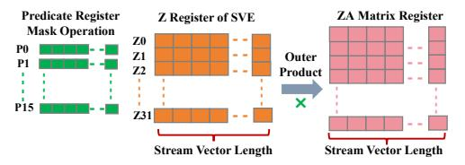
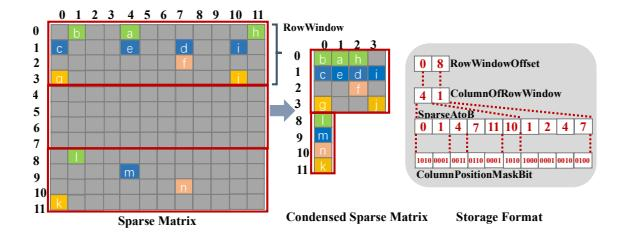
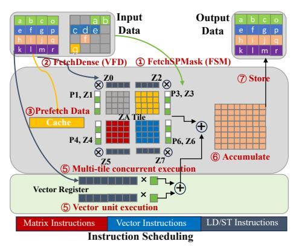
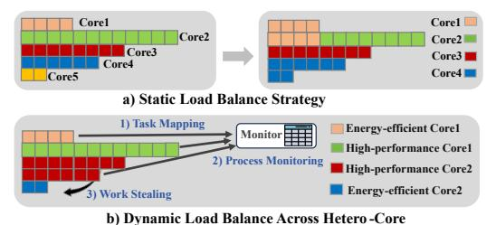
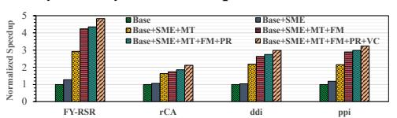
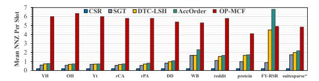
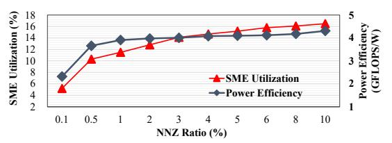

# ASM-SpMM: Unleashing the Potential of Arm SME for Sparse Matrix Multiplication Acceleration

## Jiazhi Jiang

Sun Yat-sen University Guangzhou, China jiangjzh6@mail2.sysu.edu.cn

#### Jinhui Wei

Sun Yat-sen University Guangzhou, China weijh28@mail2.sysu.edu.cn

#### Xijia Yao

Sun Yat-sen University Guangzhou, China yaoxj9@mail2.sysu.edu.cn

## Dan Huang\*

Sun Yat-sen University Guangzhou, China huangd79@mail.sysu.edu.cn

#### Jiayu Chen

Sun Yat-sen University Guangzhou, China chenjy666@mail2.sysu.edu.cn

#### Yutong Lu\*

Sun Yat-sen University Guangzhou, China luyutong@mail.sysu.edu.cn

### **Abstract**

Sparse Matrix—Matrix Multiplication (SpMM) is a core kernel in scientific computing, data analytics, and artificial intelligence, supporting applications such as linear solvers and Graph Neural Networks (GNNs). The Scalable Matrix Extension (SME) in Armv9 introduces dedicated matrix acceleration for ARM CPUs, but exploiting its full potential for SpMM requires architecture-aware optimizations to address irregular sparsity and hardware constraints.

We present ASM-SpMM, a high-performance SpMM library co-designed with ARM SME. ASM-SpMM combines a memory-efficient compression format, an SME-aware kernel optimized for outer-product execution, a hybrid matrix-vector execution strategy, and work-stealing-based dynamic load balancing across heterogeneous cores. Experiments on emerging Armv9 platforms demonstrate up to 7.9× speedup over state-of-the-art SpMM libraries across diverse matrices. A GNN inference case study further shows that ASM-SpMM significantly improves end-to-end performance, highlighting the effectiveness of SME-aware SpMM optimization on ARM CPUs.

CCS Concepts: • Computer systems organization  $\rightarrow$  Parallel architectures.

Keywords: SpMM, ARM SME, SVE, Outer Product

#### **ACM Reference Format:**

Jiazhi Jiang, Xijia Yao, Jiayu Chen, Jinhui Wei, Dan Huang, and Yutong Lu. 2026. ASM-SpMM: Unleashing the Potential of Arm SME for Sparse Matrix Multiplication Acceleration. In *Proceedings of* 

<sup>\*</sup>Corresponding author


This work is licensed under a Creative Commons Attribution 4.0 International License.

PPoPP '26, Sydney, NSW, Australia
© 2026 Copyright held by the owner/author(s).
ACM ISBN 979-8-4007-2310-0/2026/01
https://doi.org/10.1145/3774934.3786422

the 31st ACM SIGPLAN Annual Symposium on Principles and Practice of Parallel Programming (PPoPP '26), January 31 – February 4, 2026, Sydney, NSW, Australia. ACM, New York, NY, USA, 13 pages. https://doi.org/10.1145/3774934.3786422

#### 1 Introduction

General Sparse Matrix-Matrix Multiplication(SpMM) serves as a critical and computationally intensive kernel underpinning a broad spectrum of application domains, including scientific computing, data analytics, and modern artificial intelligence [3, 5, 11]. Its pervasive role extends from the core of linear algebra solvers to large-scale graph analytics and Graph Neural Networks (GNNs) [4, 16]. As such, advancements in SpMM optimization are poised to deliver substantial improvements across diverse applications.

The ARM architecture, long dominant in mobile computing, is rapidly expanding into desktop and high-performance systems [9, 10]. To meet the growing demands of AI workloads, vendors have introduced dedicated matrix acceleration units such as NVIDIA Tensor Cores [14] and Intel AMX [8], delivering substantial performance gains for matrix operations[29]. Following this trend, ARM integrated the Scalable Matrix Extension (SME) into Armv9, offering specialized hardware support for matrix multiplication. Distinct from other matrix units that implement GEMM with inner products, SME adopts the outer product as its building block. This operation takes two input vectors and generates a matrix via elementwise multiplication (Figure 1). With ARM's growing role in performance-critical domains, optimizing SpMM on SME is timely and essential to fully unleash its potential for scientific and AI applications.

<span id="page-0-0"></span>
$$\begin{split} \mathbf{C} &= \mathbf{A} \times \mathbf{B} = \begin{bmatrix} a_{00} & a_{01} \\ a_{10} & a_{11} \end{bmatrix} \begin{bmatrix} b_{00} & b_{01} \\ b_{10} & b_{11} \end{bmatrix} = \begin{bmatrix} a_{00} \\ a_{10} \end{bmatrix} \begin{bmatrix} b_{00} & b_{01} \end{bmatrix} + \begin{bmatrix} a_{01} \\ a_{11} \end{bmatrix} \begin{bmatrix} b_{10} & b_{11} \end{bmatrix} \\ &= \begin{bmatrix} a_{00}b_{00} & a_{00}b_{01} \\ a_{10}b_{00} & a_{10}b_{01} \end{bmatrix} + \begin{bmatrix} a_{01}b_{10} & a_{01}b_{11} \\ a_{11}b_{10} & a_{11}b_{11} \end{bmatrix} = \begin{bmatrix} a_{00}b_{00} + a_{01}b_{10} & a_{00}b_{01} + a_{01}b_{11} \\ a_{10}b_{00} + a_{11}b_{10} & a_{10}b_{01} + a_{11}b_{11} \end{bmatrix} \end{split}$$

Figure 1. Outer-product execution of Matrix Multiplication.

However, fully unleashing SME's potential for SpMM acceleration presents unique challenges. Designed primarily

for dense matrix operations, SME's dense-oriented architecture does not inherently align with irregular structures encountered in sparse matrix computations. Integrating SME with SpMM thus demands careful consideration and innovative solutions. Previous research on GPU-based Tensor Core acceleration for sparse deep learning workloads provides some insights[1, 15, 18, 22, 23, 28]. Nevertheless, ARM SME diverges significantly from other matrix multiplication accelerators (e.g., GPU Tensor Cores) by adopting vector outer-product instructions and a dedicated Z Array (ZA) register, which serves as a large matrix accumulator for highthroughput operations. However, SME currently exposes only low-level primitives without compiler or programming model support, thereby shifting the complexity of kernel construction to the software stack and requiring novel algorithmic and system-level designs.

In this work, we target SpMM optimization for GNN and scientific computing workloads on ARM CPUs with SME. Our analysis reveals four key challenges: inefficient sparse storage, the mismatch between sparsity and SME's dense-oriented outer-product primitives, limited coordination between matrix and vector units, and workload imbalance across heterogeneous cores. To address these issues, we propose ASM-SpMM, which integrates SME-aware kernels, a new sparse compression format, and dynamic scheduling mechanisms tailored to ARM SME.

To the best of our knowledge, ASM-SpMM represents the first effort to accelerate sparse matrix multiplication with ARM SME. We perform comprehensive evaluations of ASM-SpMM using large-scale power-law graph matrices representative of GNN workloads, as well as a wide spectrum of sparse matrices from the SuiteSparse Matrix Collection. Our experimental study includes rigorous comparisons against state-ofthe-art SpMM kernels, including those from the Armadillo library, Eigen library, the ARM Performance library (ArmPL), Cholmod, and MP-SpMM[30] on the Apple M4 ARM processor, and the newly released LX2 ARM processor. The results demonstrate that ASM-SpMM consistently achieves substantial average speedups over these baselines across diverse, real-world sparse matrix benchmarks, highlighting its effectiveness and the potential of architecture-aware optimization for ARM SME. A case study illustrates that ASM-SpMM significantly accelerates end-to-end GNN inference compared to DGL[20] and PyG[2], two widely used GNN frameworks. We summarize our contributions as follows:

- We introduce a novel, memory-efficient sparse matrix compression format tailored to ARM SME's outer-product execution model, enabling efficient use of matrix primitives.
- We implement a highly optimized SME-aware SpMM kernel with specialized outer-product designs that coordinate prefetching, multi-tile parallelism, and pipelined execution to improve register utilization and fully exploit SME's instruction-level parallelism.

- Leveraging instruction-level scheduling, we propose sophisticated hybrid kernel strategies that coordinate SME with vector units on ARM CPUs, thereby unlocking computation performance across heterogeneous resources.
- We propose a dynamic inter-thread work-stealing scheme to achieve load-balanced execution, enabling sparse-aware workload distribution across heterogeneous cores and further improving SpMM scalability on multi-core ARM CPU.

# 2 Background and Motivations

#### 2.1 Sparse Matrix Multiplication

SpMM computes the product of a sparse matrix A of size  $M \times K$  and a dense matrix B of size  $K \times N$ , producing a dense output matrix C of size  $M \times N$ , where C = AB. The sparse matrix A contains NNZ nonzero elements, while both B and C are fully dense. NNZ denotes the total number of nonzero entries in sparse matrix. A substantial body of research have been conducted to improve SpMM performance on CPUs [30], encompassing a variety of optimization techniques such as sparse storage formats, reordering algorithms, parallel strategies, and memory access optimizations. Most existing SpMM optimizations are grounded in exploiting the general-purpose capabilities of modern processors, utilizing multicore architectures in conjunction with vectorized instruction sets such as NEON to accelerate SpMM computations.

#### 2.2 ARM CPU and SME Matrix Unit

The rising computational demands of AI and scientific computing have driven the development of specialized hardware accelerators for matrix operations. Broadly, matrix acceleration architectures follow two paths: (i) dedicated matrix-multiplication units supporting diverse matrix sizes, exemplified by Intel AMX, NVIDIA Tensor Cores, and Google TPUs; and (ii) lightweight vector outer-product units, such as IBM's Math Matrix Accelerator and ARM's Scalable Matrix Extension (SME). ARM CPUs, now pervasive from mobile to servers, are increasingly required to deliver high-performance matrix computation for workloads ranging from edge AI inference to large-scale simulations. This trend underscores the need to embed matrix-centric acceleration directly into general-purpose CPUs.

ARM's Scalable Vector Extension (SVE) introduces variable-length vector registers and vector-length-agnostic programming, providing flexibility and scalability for SIMD work-loads. ARM SME with ARMv9 enhances the CPU architecture's support for matrix operations. SME works with the existing SVE and provides a dedicated two-dimensional matrix register array (ZA) storage and outer product instructions using two SVE Z registers as input vectors, enabling efficient construction of matrix multiplication via outer-product accumulation as shown in Figure 2. The ZA register is architecturally defined for matrix tiles, with supporting instructions for data transfer between registers and memory. Each input

source vector can be independently predicated by its corresponding predicate register. For example, input vector Z0 is predicated by P0, and Z1 is predicated by P1.

<span id="page-2-0"></span>

Figure 2. Registers in SME.

Apple's M4 chip is the frst and currently the only publicly available processor to support SME. This represents a pivotal step toward the mainstream adoption of matrix acceleration on general-purpose CPUs[\[17\]](#page-12-20). Developers can leverage SME's C-level intrinsics to efciently implement matrix operations while abstracting away low-level register management. For instance, data tiles can be loaded from memory into vector registers using intrinsics such as svld1\_f32, and outer product accumulation can be performed with svmopa\_za32\_f32\_m, directly accumulating results into specifed ZA tiles. Results are then written back to memory using store intrinsics such as svst1\_hor\_za32.

Listing 1. SME Intrinsics for Matrix Multiplication.

```
1 svbool_t pg = svptrue_b32();
2 //Load a tile from global memory into a vector register
3 svfloat32_t a_vec = svld1_f32(pg, A_block);
4 svfloat32_t b_vec = svld1_f32(pg, B_block);
5 //Perform outer product and accumulate into ZA[0].
6 svmopa_za32_f32_m(0, pg, pg, a_vec, b_vec);
7 //Store the result from ZA[0] to global memory.
8 svst1_hor_za32(0, row_idx, pg, C_result);
```

# 2.3 Motivations

<sup>1</sup> : Existing storage formats of sparse matrix retain intra-column zeros and impose strict block alignment, limiting the efciency gains achievable on SME architectures. Recent advances in sparse storage compression formats designed for matrix units, such as TCF [\[22\]](#page-12-14) and ME-TCF [\[1,](#page-12-11) [28\]](#page-12-16), condense the sparse matrix into compact, fxed-size tiles to reduce storage overhead, primarily by eliminating columns consisting entirely of zeros (see Figure [3\)](#page-2-1). Compared to traditional sparse compression formats such as CSR, these matrix-unit-oriented designs can substantially enhance SpMM efciency on matrix processing units. However, these designs are fundamentally constrained by the input requirements of Tensor Core architectures, enforcing strict block alignment and left-aligned tiles, with extensive zero-padding to fll incomplete regions (e.g., Column 6 and 7 of TC Block2). By contrast, SME's outer-product execution model operates directly on pairs of input vectors, thereby obviating the need for rigid alignment and padding. More importantly, while formats such as TCF and ME-TCF achieve partial compression by removing empty columns, they do

not support the consolidation of sparsely populated columns that could be further aggregated to maximize compression. For instance, column 0 and column 1 of TC Block1 in Figure [3](#page-2-1) could be consolidated into a single column, as could column 4 and column 5 of TC Block2. By leveraging SME's outerproduct computation model and the fexibility aforded by predicate registers, there remains considerable potential for advanced structural compression strategies and substantial efciency improvements.

<span id="page-2-1"></span>

Figure 3. Condensed sparse matrix format for Tensor Core.

<sup>2</sup> : SpMM kernel lack specialized outer-product designs and sophisticated optimization stacks like traditional implementations, hindering SpMM kernel efciency on SME. Traditional CPU-based SpMM implementations are primarily optimized for vectorized computation paradigms, whereas GPU Tensor Core approaches are inherently designed around inner-product-based calculations[\[1,](#page-12-11) [15,](#page-12-12) [18,](#page-12-13) [22,](#page-12-14) [28\]](#page-12-16). SME, however, utilizes an outer-product computation paradigm, presenting distinct and underexplored optimization opportunities for efcient SpMM kernel design. Moreover, due to substantial diferences in memory hierarchies and cache organizations, GPU-specifc SpMM strategies cannot be directly adapted to ARM platforms. For example, SME's ZA register array enables fexible tile partitioning according to data precision, ofering fne-grained parallelism but increasing kernel scheduling complexity. Consequently, efectively utilizing the Z vector registers and predicate registers within this outer-product framework demands novel optimization strategies that transcend existing CPU- and GPU-oriented methods.

<sup>3</sup> : Efciently orchestrating SME and conventional vector units demands sophisticated instruction scheduling to mitigate resource contention and optimize heterogeneous execution. ARM architectures retain independent vector processing resources, including dedicated Neon computational units and registers, whose aggregate computing capability can be substantial and thus non-negligible (e.g., preliminary experiments indicate that conventional vector units can contribute up to 20–30% of the computational throughput compared to SME units). Our empirical observations further confrm that conventional Neon instructions can be efciently co-issued alongside SME's Matrix Outer Product Add(MOPA) instructions, suggesting the feasibility of efectively accelerating SpMM workloads through heterogeneous collaborative computing. However, despite this promising potential, simultaneous use of SME and conventional vector units inevitably incurs complex issues such as mutual interference, pipeline contention, and non-trivial

task allocation problems across heterogeneous resources. Currently, solutions for coordinating such diverse resources for SpMM, while simultaneously avoiding contention and optimizing task distribution, remain largely unexplored.

<sup>4</sup> : Load imbalance in SpMM is driven by architectural diversity of CPU core and irregular sparsity patterns of matrix, which together create substantial disparities in computational loads among processing units. Load imbalance during SpMM computation refers to the uneven assignment of computational work among processing units. This issue often arises from the irregular distribution of nonzero elements in sparse matrices. In homogeneous environments such as GPUs with identical CUDA cores or streaming multiprocessors, traditional load balancing strategies like static row-wise partitioning are commonly used. For example, the workload may be divided by assigning each processing unit an equal number of matrix rows, or rows with a similar number of nonzero elements. However, ARM CPUs present new challenges due to their inherent heterogeneity. For instance, Apple's M4 chip includes four highpower cores and six power-efcient cores, while the M4 Pro features ten high-power cores and four power-efcient cores. ARM CPUs across diferent vendors can show even greater variation in core confgurations, counts, and performance. This diversity makes static, sparsity-based partition strategies developed for homogeneous systems poorly portable to diverse ARM platforms with varying confgurations.

# 3 Design of ASM-SpMM

#### 3.1 Design Overview

As illustrated in Figure [4,](#page-3-0) ASM-SpMM consists of several tightly integrated modules designed to fully exploit SME's computational capabilities on ARM processors.

❶ The SME-adapted format conversion module frst transforms the input sparse matrix into a compact, SME-friendly representation, ensuring efcient storage and data access patterns that are well suited for outer-product computation. ❷ Next, the load balance module adaptively partitions and distributes computational workloads according to both the sparsity structure of the input and the diverse core characteristics of the underlying processor. This enables fne-grained load balancing across widely diverse cores, signifcantly improving hardware utilization. ❸ At the heart of ASM-SpMM is a highly optimized SpMM kernel specifcally engineered for SME. This kernel adopts a specialized outer-product execution paradigm and leverages advanced techniques such as data prefetching, multi-tile parallelism, and pipelined scheduling of memory operations and computation. These optimizations substantially increase register utilization and allow the kernel to fully harness SME's instruction-level parallelism and architectural strengths. ❹ To further boost system throughput, ASM-SpMM introduces a vector SpMM kernel and enables coordinated execution of SME-accelerated

SpMM kernels alongside conventional vector units. This dynamic resource coordination maximizes overall performance, particularly in heterogeneous computing environments. ❺ Finally, the SME-based sparse matrix computation library is seamlessly integrated into higher-level frameworks such as GNNs, providing transparent, efcient support for a broad spectrum of sparse workloads on ARM platforms.

<span id="page-3-0"></span>

Figure 4. The design overview of ASM-SpMM.

#### 3.2 SME-Adpated Compressed Storage Format

To fully exploit the unique capabilities of ARM SME for SpMM acceleration, we propose OP-MCF (Outer-Productbased Matrix Unit Compression Format), a highly compact, data-afnity storage scheme tailored to SME's outer-product execution model and predicate-driven masking. OP-MCF is designed to overcome the structural inefciencies and rigid block alignment constraints inherent in TCF-like formats, as discussed in our preceding analysis.

<span id="page-3-1"></span>

Figure 5. Design of SME-adapted compression format.

3.2.1 Format Structure. OP-MCF represents the compressed sparse matrix using four specialized arrays, as illustrated in Figure [5.](#page-3-1) ❶ RowWindowOffset records the starting ofset of each row window, with window size matching SME's vector length (e.g., 8 rows for M4's SVL512 in FP64). ❷ ColumnOfRowWindow stores, for each row window, the number of compacted columns generated after format transformation and condensation. ❸ SparseAtoB holds the original column indices of each compacted column, ensuring full traceability to the input sparse matrix. ❹ ColumnPositionMaskBit stores, for each original column in a row window, a bitmask encoding the positions of nonzero elements in original column of the input sparse matrix, thus enabling efcient

masked computation. This layout facilitates high-throughput streaming into SME Z registers as shown in Figure [2,](#page-2-0) substantially reducing memory overhead while supporting fnegrained, predicate-controlled access.

3.2.2 Window-Column Compaction. OP-MCF employs a column-centric compaction strategy within RowWindow, which represents a fundamental shift from the block-oriented approach of TCF and ME-TCF designed for GPU Tensor Cores. In contrast to block-based formats that retain considerable redundancy due to rigid block boundaries and often require zero-padding or the inclusion of empty rows, OP-MCF partitions the matrix into row windows that are precisely aligned with the SME's native vector width, using consecutive rows as the essential processing unit. During the compaction process, all unnecessary empty columns are completely removed, addressing a key inefciency of traditional formats that preserve unused structure for alignment, as shown in Figure [3.](#page-2-1) Within each row window, only columns that are nonempty and structurally compatible are aggregated into a minimal set of storage columns, as illustrated in Figure [5.](#page-3-1) This focused aggregation results in a storage format that is both highly compact and memory-locality-aware, delivering substantial savings in storage overhead and notable improvements in memory access efciency.

3.2.3 Masked Multi-Column Merging. Building on this foundation, OP-MCF introduces intra-window masked multicolumn merging to further enhance storage and computational efciency. This approach leverages the observation that, within a row window, many sparse columns have nonzero elements located at non-overlapping row positions. By systematically analyzing these sparsity patterns, OP-MCF allows such columns to be reordered and merged into a single physical column whenever their nonzero entries do not coincide. Data reordering is achieved through a heuristic sorting–based strategy. Specifcally, columns are frst pre-sorted by sparsity patterns, and then merged iteratively within each row window if their nonzeros does not overlap across rows. This avoids local optima that often occurs in greedy clustering. For each merged column, a compact bitmask is generated, for example, an 8-bit mask for a row window comprising eight rows (for double-precision elements). These bitmasks are stored in the ColumnPositionMaskBit array, accurately indicating the position of each valid nonzero element.

This data layout enables SME to utilize predicate registers to achieve an efcient separation of data movement and computation. All non-overlapping sparse columns within a merged column are thus loaded collectively as a single compressed column, accompanied by the corresponding bitmasks. These masks are streamed into predicate registers, allowing outer-product instruction (svmopa) to be invoked for each mask in turn. Each invocation corresponds to one of the original columns. As a result, OP-MCF achieves a substantial reduction in memory trafc by requiring only a single

data load and a small number of lightweight mask loads for each merged column, while preserving computation correctness and maximizing efciency of SME's predicate-driven execution model. For instance, in the third row window of Figure 2, the number of data loads is reduced from four separate column reads to a single merged column read along with a single 32-bit mask (composed of four 8-bit masks). By decoupling storage layout from rigid block alignment and adopting a fexible, predicate-oriented datafow that aligns with the architectural features of SME, OP-MCF dynamically adapts to the irregularity of real-world sparsity patterns. This design addresses the key limitations articulated in the <sup>1</sup> challenge, enabling improvements in both memory efciency and computation throughput for SME-based SpMM.

#### 3.3 ASM-SpMM Runtime Kernel Optimizations

The SME architecture provides a solid foundation for accelerating SpMM. SME features two-dimensional ZA registers partitioned into tiles, along with input vector Z registers that enable efcient parallel data movement and computation. For example, on processors such as Apple M4, all 32 Z registers are available for fexible operand assignment. This architectural organization calls for SpMM kernel designs that are closely aligned with the underlying hardware. The following sections detail three core optimization principles for ASM-SpMM: matrix-oriented outer product execution, resource-adaptive multi-tile parallelism, and latency-aware pipelining as shown in Algorithm [1](#page-5-0) and Figure [6.](#page-6-0)

3.3.1 Outer-Product-Oriented Execution. ASM-SpMM maximizes hardware utilization by organizing computation around a matrix-oriented outer product pattern that matches SME's architecture. Guided by the compressed storage format, the kernel frst partitions the sparse matrix into row windows, each grouping nonzero elements to align with the vector length (SVL) and hardware-friendly memory access patterns. As shown in Algorithm [1,](#page-5-0) for each window, the algorithm iterates over compressed slots, loading sparse values into Z registers and fetching the corresponding dense fragments from with vectorized loads. Prefetch instructions are inserted for both sparse and dense operands to keep memory pipeline primed. Within each slot, the kernel generates predicate vectors from position masks, ensuring that only valid nonzero elements participate in the outer product. For every sparse-dense vector pair, the kernel computes an outer product and directly accumulates results into the relevant ZA tiles or slices. These computations are statically unrolled across all available tiles and slices to maximize parallelism and saturate SME resources. Once all contributions are accumulated, the results in each ZA tile and slice are written back to their corresponding locations in . This tightly coupled fow between compressed input, computation, and output, as detailed in Algorithm [1,](#page-5-0) delivers both high throughput and efcient resource usage, fully leveraging SME's vector and matrix register capabilities.

3.3.2 Resource-Adaptive Multi-Tile Concurrent Execution. To fully unleash SME's computation throughput, ASM-SpMM dynamically schedules multiple outer-product operations across the available ZA tiles and Z registers, adapting execution to the current workload and hardware constraints. While a naive implementation may process a single tile with two input Z registers (one for sparse, one for dense), this only achieves a fraction of SME's peak FLOPS.

#### Algorithm 1: ASM-SpMM Kernel Pseudo Code

```
Input: Sparse Matrix , Dense Matrix 
 Output: Matrix 
1 blockId ← current sparse block index;
2 slotOfset ← sum of .    before blockId;
3 slotsInBlock ← .   [ ];
4 for  = 0 to  by tileWidth do
5 ClearZA( );
6 slotIdx ← slotOfset;
7 for  = 0 to slotsInBlock −1 do
8 slotData ← .[  ];
9 colMasks ← .[  ];
10 colIndices ← .    [  ];
11 slotIdx ← slotIdx+1;
12 if  + 1 < slotsInBlock then
13 Prefetch(.[  + 1] );
14 Prefetch(.[  + 1] );
15 Prefetch(.    [  + 1] );
16 a ← LoadSparseVector();
17 for each valid column  in slot do
18 maskVec ← GetPredicate( [ ] );
19 col ←   [ ];
20 if next column is valid then
21 PrefetchDense(, nextCol, , 0);
22 . . .
23 PrefetchDense(, nextCol, , 7);
24 bTile0 ← LoadDenseTile(, , , 0);
25 . . .
26 bTile7 ← LoadDenseTile(, , , 7);
27 OuterProductAccum(0, ,  0,  );
28 . . .
29 OuterProductAccum(7, ,  7,  );
30 Store all tiles of 0 to  at correct position;
31 . . .
32 Store all tiles of 7 to  at correct position;
```

ASM-SpMM kernels exploit SME's ability to support several independent matrix operations in parallel. For example, on the Apple M4 processor with double-precision data, each ZA register is partitioned into 8 ZA register tiles, and the kernel can concurrently map up to 8 independent outer products, each consuming two Z registers. This maps to 16 of the input 32 Z registers (2 input vector × 8 tile) used solely for operand streaming, achieving 50% utilization of the input Z register. The remaining Z registers enable further parallelism by subdividing each ZA register tile into slices, so that each tile can be processed by two input streams simultaneously, thus saturating all Z registers and maximizing matrix unit occupancy (lines 24-32 in Algorithm [1\)](#page-5-0).

This strategy is resource-adaptive: when the input data type allows the ZA register to be partitioned into more tiles or register resources are ample, the kernel adjusts concurrency by unrolling computation across more tiles and slices, thereby boosting parallel execution and data throughput. Conversely, when register pressure increases, the kernel reduces the degree of unrolling and processes fewer tiles or slices per cycle. This fexible scheduling ensures efcient utilization of both matrix and vector registers under varying hardware confgurations.

3.3.3 Latency-Hiding Pipeline Organization. Efcient ASM-SpMM execution relies on minimizing memory latency and keeping compute units fully occupied. Since default hardware caching is not well-suited for the irregular access patterns of sparse matrix operations, it is essential to explicitly manage data movement.

ASM-SpMM introduces an explicit prefetching strategy that leverages SME's dedicated prefetch instruction \_svprfw. Rather than relying on hardware to automatically detect access patterns, the kernel strategically inserts prefetch instructions to fetch the next required rows or blocks of the sparse and dense matrices into cache before they are needed (lines 12-24 in Algorithm [1\)](#page-5-0).. For example, during the computation of the current row window, the kernel schedules a prefetch for the next sparse matrix row and the relevant segments of the dense matrix. By aligning these prefetch instructions with the main compute loop, the kernel primes the cache for upcoming accesses, efectively reducing memory access latency. This software-managed prefetching is complemented by a pipeline execution model. While the matrix units are actively computing with the current set of operands, the next set of required data is prefetched from memory to cache in the background. This overlap allows memory transfers and computation to proceed concurrently, minimizing idle cycles and ensuring a continuous fow of data to the compute units. The pipeline is further supported by precomputing all index ofsets for the sparse and dense matrices. These precomputed indices enable the kernel to issue vectorized loads and prefetches with minimal runtime overhead. As a result, as soon as a computation phase completes, the data for the next phase is already resident in cache and immediately available for processing. By combining explicit cache guidance through prefetching with a software-managed pipeline, ASM-SpMM overcomes the limitations of default hardware caching. This approach delivers high sustained throughput for sparse matrix computations, even in the face of irregular memory access patterns and varying sparsity structures.

#### 3.4 Heterogeneous Matrix-Vector Co-Execution

Even after compression, sparse matrices still contain tiles with highly irregular nonzero distributions. SME achieves high throughput on tiles that remain relatively dense after compression, but its utilization drops when operating on low-density or fragmented blocks. In contrast, ARM's vector units (SVE/Neon) provide flexible handling of such irregular fragments, though with lower peak throughput. ASM-SpMM adopts a hybrid kernel that couples SME and vector execution, with fine-grained scheduling to maximize parallelism and memory efficiency.

<span id="page-6-0"></span>

Figure 6. Heterogeneous Matrix-Vector Co-execution.

**3.4.1 Hybrid Micro Kernel Design.** The core idea is to split SpMM computation into SME-dominant and vectorassisted paths within the same kernel as shown in Figure 6. We employ a hardware-aware cost model to ensure that the auxiliary vector path never stalls SME execution. The execution time of vector-processed sparse blocks is estimated using latencies obtained from concurrent SME/SVE microbenchmarks. Since SME outer-product operations exhibit a nearly fixed execution window determined by the ZA tile size and outer-product latency, we enforce an overlap constraint: the aggregate estimated time of the blocks assigned to the vector path fit within this window. To maximize overlap, ASM-SpMM prioritizes the sparsest blocks for vector execution. Once the accumulated vector workload reaches this limit, all remaining blocks are executed on SME. This strategy ensures that vector-side work remains hidden behind SME computation while maintaining stable efficiency.

Dense blocks, typically containing clusters of nonzeros, are mapped to SME outer-product instructions, where each pair of input vectors contributes to ZA tile accumulation. Meanwhile, sparse blocks and irregular row fragments are delegated to SVE/Neon. Instead of computing these separately, ASM-SpMM directly feeds vector results back into SME's ZA registers through outer-product accumulation, effectively using the matrix unit as the final reduction buffer. This in-place accumulation avoids redundant memory traffic: intermediate vector results do not need to be written back to memory before SME consumption. Moreover, by letting vector units handle irregular fragments, SME avoids cycles wasted on padding zeros, sustaining high effective utilization. Compared with a pure SME-only kernel, hybrid micro-kernel

increases instruction-level parallelism by offloading scatter-like operations to vectors, while SME focuses exclusively on compute-heavy dense tiles.

3.4.2 Interleaved Instruction Scheduling. Naive mixing leads to stalls when both units contend for cache bandwidth. To overcome this, ASM-SpMM employs interleaved scheduling, where computation, memory access, and prefetch are pipelined across SME and vector instructions. Specifically, while SME executes outer-product accumulation on the current dense tile, vector instructions are scheduled in parallel to (1) prefetch the next dense row-window into L1 cache and (2) accumulate sparse tails from the current block. This staggered scheduling reduces SME stalls waiting for data, as vector units effectively overlap memory latency with useful computation. Furthermore, partial stores are scattered back incrementally rather than at the end of a tile, smoothing out bandwidth usage and reducing cache pressure. To balance resource usage, ASM-SpMM partitions registers explicitly: ZA arrays are reserved for SME tile accumulation, while Z vector registers act as shared buffers for both vector accumulation and SME input loading. This careful register management reduces spilling overhead and ensures high concurrency between SME and vector units.

#### 3.5 Dynamic Load Balance Across Hetero-Core

SpMM execution on ARM CPUs featuring heterogeneous cores is fundamentally challenged by both irregular sparsity patterns of the input matrix and diverse computational capabilities across the available cores. Static load balancing schemes, as shown in Figure 7, which simply partition nonzero elements among processing units according to precomputed estimates, fail to provide sufficient balance when facing such architectural and data irregularities. To address this challenge, we propose a dynamic load balancing strategy built on adaptive row-window task assignment and real-time work stealing as shown in Figure 7.

3.5.1 Hardware-Aware Task Mapping. At initialization, the sparse matrix is partitioned into a large set of row windows, where each window is a contiguous block of rows, and each core is assigned a starting set of row windows tailored to its compute capabilities. High-performance cores equipped with SME matrix units are preferentially allocated row windows with higher nonzero density, effectively concentrating more computational effort on the most capable hardware. In contrast, energy-efficient cores, typically operating on vector units, are assigned a larger count of lighter windows, each containing fewer nonzero elements. This hardware-aware mapping explicitly aligns the computational demands of each window with the processing strength of the assigned core, maximizing initial workload balance and enabling efficient subsequent rebalancing.

**3.5.2 Progress Monitoring.** As execution advances, disparities in completion rates between cores naturally emerge, driven by both the irregularity of matrix and architectural differences among cores. To mitigate these imbalances, the runtime system maintains a sliding window that continually tracks the progress of all threads. Upon completing their current assignments, threads report back the count of completed and outstanding nonzero elements (or row windows), allowing the scheduler to aggregate information and maintain a running average workload per thread.

<span id="page-7-0"></span>

**Figure 7.** Diagram of a) Static load balance strategy, b) Dynamic load balance across hetero-core scheduling policy.

3.5.3 Work Stealing for Dynamic Rebalancing. Whenever a core exhausts its assigned row windows, it first checks the global queue for unassigned tasks. If no unassigned work remains, the system triggers an inter-core work-stealing phase. Idle threads then identify peers with an above-average outstanding workload, as determined by the scheduler's sliding window. These idle threads steal portions of the remaining tasks, with the size of the transfer dynamically adjusted to move the system toward a balanced state. This mechanism is applied iteratively, ensuring that load is continually redistributed in response to ongoing shifts in both core performance and matrix sparsity. By tightly coupling initial hardware-aware task mapping with adaptive progress monitoring and iterative work stealing, ASM-SpMM achieves high resource utilization and effectively mitigates load imbalance across diverse ARM core configurations.

#### 4 Evaluation

#### 4.1 Experimental Setup

**4.1.1 Testbed.** We conduct most of experiments on the Mac M4 CPU and newly released LX2 ARM processor. Both of these two processor utilizes a 512-bit vector length, processing 8 double-precision floating-point numbers at a time. M4 processor features an up to 10-core CPU, with four performance (P) cores and up to six efficiency (E) cores. M4 only equips with two SME compute units, one for P-core clusters, one for E-core clusters. LX2 processor features an up to 12-core CPU, all the cores are equipped with SME unit. For compilation, we used Clang 16.0.

**4.1.2 Benchmarks.** In addition to the 12 representative real-world matrices presented in Table 3, our evaluation further incorporates a random and diverse selection of 80

matrices from the SuiteSparse collection [12]. To obtain a representative benchmark from the SuiteSparse collection, we select matrices using a stratified sampling strategy that spans three orthogonal dimensions: (1) **problem scale**, covering matrix sizes from small ( $\leq 10^3$ ) to very large  $\geq (10^5)$ ; (2) **matrix shape**, including symmetric and unsymmetric square matrices together with rectangular matrices; and (3) **sparsity level**, covering five NNZ-ratio intervals (< 0.001%, 0.001%–0.1%, 0.1%–1%, 1%–1%, and > 5%), capturing the full range from extremely sparse to moderately dense matrices.

**Table 1.** Dataset statistics for evaluation. (Abbr: abbreviation, AvgL: average NNZ length in each row of dataset). 1:from TC-GNN[22]; 2:from SNAP[13]; 3:from OGB[19]; 4:from DGL[6].

| Name                       | Abbr.   | M&K       | NNZ         | Avg. Row Length |
|----------------------------|---------|-----------|-------------|-----------------|
| YeastH <sup>1</sup>        | YH      | 3,138,114 | 6,487,230   | 2.07            |
| OVCAR-8H <sup>1</sup>      | OH      | 1,889,542 | 3,946,402   | 2.09            |
| Yeast <sup>1</sup>         | Yt      | 1,710,902 | 3,636,546   | 2.13            |
| roadNet-CA <sup>2</sup>    | rCA     | 1,971,281 | 5,533,214   | 2.81            |
| roadNet-PA <sup>2</sup>    | rPA     | 1,090,920 | 3,083,796   | 2.83            |
| $\mathrm{DD}^{1}$          | DD      | 334,925   | 1,686,092   | 5.03            |
| web-BerkStan <sup>2</sup>  | WB      | 685,230   | 7,600,595   | 11.09           |
| PPI <sup>1</sup>           | ppi     | 56,944    | 818,716     | 14.38           |
| FraudYelp-RSR <sup>3</sup> | FY-RSR  | 45,954    | 6,805,486   | 148.09          |
| reddit <sup>4</sup>        | reddit  | 232,965   | 114,848,857 | 492.99          |
| ddi <sup>3</sup>           | ddi     | 4,267     | 2,140,089   | 501.54          |
| protein <sup>3</sup>       | protein | 132,534   | 79,255,038  | 598.00          |

**4.1.3 Baselines.** We compare the overall performance of ASM-SpMM with several state-of-the-art SpMM kernels and libraries on ARM CPUs, including the ARM Performance Library (ArmPL, v24.10), Armadillo (v14.6.0), Cholmod from SuiteSparse[12] (v5.3.3), Eigen(v3.4.0), and MP-SpMM[30]. For end-to-end GNN case studies, we integrate ASM-SpMM into two popular frameworks, PyG(v2.6.1) and DGL(v1.1.2), and evaluate their performance improvement.

<span id="page-7-1"></span>**Table 2.** The percentage represents matrice portion out of the 80 testcases from SuiteSparse.

| Platform | Speedup           | ArmPL | Armadillo | Eigen | Cholmod | MP-SpMM |
|----------|-------------------|-------|-----------|-------|---------|---------|
| LX2      | 1 ~ 2×            | 1.3%  | 1.3%      | 0.0%  | 3.9%    | 2.6%    |
|          | $2 \sim 4 \times$ | 1.3%  | 0.0%      | 0.0%  | 37.7%   | 70.5%   |
|          | $4 \sim 8 \times$ | 16.9% | 1.3%      | 1.3%  | 41.6%   | 23.0%   |
|          | > 8×              | 80.5% | 97.4%     | 98.7% | 16.9%   | 3.9%    |
|          | Geomean           | 9.69  | 16.43     | 19.53 | 4.32    | 2.62    |
| M4       | 1 ~ 2×            | 0.0%  | 0.0%      | 0.0%  | 0.0%    | 2.7%    |
|          | $2 \sim 4 \times$ | 1.3%  | 3.9%      | 1.1%  | 15.6%   | 25.3%   |
|          | $4 \sim 8 \times$ | 6.5%  | 10.4%     | 2.4%  | 28.6%   | 32.0%   |
|          | > 8×              | 92.2% | 85.7%     | 96.5% | 55.8%   | 40.0%   |
|          | Geomean           | 11.81 | 15.12     | 18.62 | 4.78    | 2.94    |

# 4.2 Overall Performance Comparison

We measure average performance under different values of N, the number of columns of matrix B, including 512 and 1024. Figure 8 shows the performance on the M4 processor, with speedups normalized to Cholmod, indicated by the red dashed line. ASM-SpMM consistently achieves the highest speedups across all 12 matrices, delivering gains of  $3.5 \times$  to  $7.9 \times$  over Cholmod. This advantage stems from the fact that

<span id="page-8-0"></span>

**Figure 8.** (a) Speedups on 13 matrices (normalized to Cholmod (red dashed line)). (b) Measured throughputs on 80 matrices from SuiteSparse (sorted by GFLOPS of ASM-SpMM). SuiteSparse\* shows the geomean speedups across SuiteSparse matrices.

ASM-SpMM is the first SpMM library on ARM platforms to exploit the SME compute unit through SME-oriented optimizations, whereas existing libraries rely solely on vector units, limiting their achievable performance.

Beyond the per-matrix trends shown in Figure 8, Table 2 provides distribution-level insights across the selected SuiteSparse testcases. The results indicate that ASM-SpMM achieves consistently large gains over general-purpose libraries, with most matrices falling into the high-speedup region. This reflects the inherent advantage of SME's outer-product execution, which can sustain high compute efficiency once the sparse structure exposes any degree of local density. In contrast, the improvements over sparse-optimized libraries such as Cholmod and MP-SpMM are more balanced. The overall distribution patterns are also similar on both M4 and LX2, demonstrating that the proposed optimizations maintain stable benefits across different Armv9 microarchitectures. M4 exhibits a slightly higher proportion of large speedups due to its stronger SME pipeline, while the general trends remain consistent. This confirms that ASM-SpMM provides portable performance advantages across diverse Arm CPUs.

#### 4.3 Single-Core Breakdown Analysis

**4.3.1 Ablation Study.** To evaluate the effectiveness of individual optimization techniques on the overall performance of ASM-SpMM, we use MP-SpMM without multithreading as the baseline and conduct ablation experiments on the M4 processor with the dense matrix B having 1024 columns, as shown in Figure 9. To evaluate the effectiveness of individual optimization techniques on the overall performance of ASM-SpMM, we use MP-SpMM (which performs best among all the tested open-source implementations as shown in Figure 8) without multithreading as the baseline, and conduct ablation experiments on the M4 processor with the dense matrix B having 1024 columns, as shown in Figure 9. Compared with the baseline, directly applying SME through a naive outer-product-oriented execution achieves only marginal improvements, yielding a speedup of merely 1.04-1.23× over MP-SpMM that relies solely on the vector unit. This indicates that a straightforward adaptation to the SME execution model is insufficient to fully exploit the computational capability of SME units. Introducing the multi-tile concurrent execution (MT) substantially increases

parallelism within the SME unit and provides the first significant performance boost. For instance, the speedup on FY-RSR rises from 1.23× to 2.89×, while on ddi and ppi it improves from around 1.04× to more than 2.1×. This highlights that the fine-grained utilization of SME tiles is crucial for unlocking its compute throughput. Building on MT, applying the SME-adapted compressed storage format (FM) further reduces redundant computations and lowers memory traffic. The speedups increase to 4.23× on FY-RSR. Adding pipeline organization and data prefetching (PR) brings additional but smaller gains, mainly through data access latency hiding and smoothing of memory accesses. Finally, by offloading part of the computation to the vector units, ASM-SpMM further exploits the available compute capacity beyond the SME units alone. On top of the previous optimizations, it delivers an additional improvement of around 5%-10%, demonstrating the benefits of heterogeneous co-execution in utilizing all on-chip resources. Overall, the ablation results reveal a clear progression: naive SME use alone is insufficient, while successive optimizations that integrate tiling, format adaptation, pipeline design, and heterogeneous co-execution are all necessary to fully realize the potential of SME units.

<span id="page-8-1"></span>

**Figure 9.** The ablation study. Base: SpMM without SME acceleration from MP-SpMM; SME: naive SME acceleration; MT: SME with multi-tile concurrent execution; FM: SME-adapted compressed storage format; PR: pipeline and data prefetching; VC: hybrid matrix-vector unit.

4.3.2 Evaluation of Compressed Storage Format. We define mean NNZ per slot as the average number of nonzeros retrieved per memory transaction under SME's outerproduct execution model(similar to MeanNnzTC in [1, 28]). On the M4, a double-precision fetch slot contains 8 elements. This metric reflects both workload reduction (fewer slots for the same NNZ) and data reuse efficiency (multiple nonzeros sharing one transaction). With CSR, only one nonzero is obtained per slot, offering almost no reuse. As shown in Table 10, TensorCore-oriented formats such as SGT, DTC-LSH, and AccOrder improve the mean NNZ per slot to about 0.6

to 2.3, yet remain limited by block alignment and padding of Tensor Core. In contrast, OP-MCF achieves 4 to 6x NNZ per slot across workloads, an order-of-magnitude higher than CSR and three to five times greater than TensorCore-oriented formats. These gains stem from two SME-specific designs: (i) row-window compaction, which eliminates empty columns without padding, and (ii) masked multi-column merging, which fuses sparse, non-overlapping columns with lightweight predicate masks. By moving from isolated nonzeros in CSR or padded blocks in TCF-style formats to dense bundles of useful nonzeros, OP-MCF aligns with SME's outer-product model, thereby reducing memory transactions and sustaining higher throughput.

<span id="page-9-1"></span>

**Figure 10.** Mean NNZ per fetch of different sparse compression formats with the outer-product execution model on ARM SME. CSR is a widely used sparse compression format, while DTC-LSH [1], SGT [22], and AccOrder [28] are improved compression formats designed for Tensor Core.

<span id="page-9-2"></span>

**Figure 11.** Evaluation on effectiveness of optimization techniques within ASM-SpMM runtime kernel

4.3.3 Evaluation of SME Microkernel. We further evaluate the effect of pipeline organization and data prefetching by measuring the last-level cache (LLC) miss rate on the M4 processor using the Perf tool. The results are shown in Figure 11-a. Compared with the version without pipeline and prefetching, ASM-SpMM with these optimizations exhibits a clear reduction in LLC misses, with the miss rate decreasing from values in the range of 30%–61% to 23%–38% across the tested datasets. This corresponds to reductions of roughly 20%–35%. The results demonstrate that pipeline organization and data prefetching are effective in improving memory efficiency, mitigating cache stalls, and thus sustaining higher

throughput in the ASM-SpMM runtime kernel. We also analyze the performance impact of SME's ability to support concurrent tile execution. As shown in Figure 11-b, the ZA matrix can be partitioned into multiple independent tiles, up to 8 tiles for double precision and 4 tiles for single precision. The results show a consistent trend across datasets: moving from 1-tile to multi-tile execution provides substantial speedups. The largest gains are observed on workloads such as protein, FY-RSR, and ppi, which benefit most from increased parallelism in SME due to higher arithmetic intensity. For lighter workloads such as Yt or YH, the improvements plateau beyond 2 tiles.

<span id="page-9-0"></span>**Table 3.** Performance of vector, matrix and hybrid kernel.

| Dataset | Vector-only (GFLOPS) | Matrix-only (GFLOPS) | Hybrid (GFLOPS) | Hybrid/Theory |
|---------|----------------------|----------------------|-----------------|---------------|
| rCA     | 8.45                 | 16.42                | 19.43           | 0.78          |
| FY-RSR  | 11.44                | 49.72                | 55.245          | 0.90          |
| ddi     | 11.85                | 31.82                | 34.62           | 0.79          |
| ppi     | 10.01                | 29.84                | 33.67           | 0.84          |

**4.3.4 Evaluation of Hybrid Kernel.** Table 3 reports the performance of SpMM on vector unit, matrix unit, and the hybrid vector-matrix kernel on the M4 processor. The hybrid kernel consistently outperforms either unit alone, achieving about 8% to 18% speedup over sole matrix unit and much larger gains over sole vector unit. For example, on FY-RSR, the hybrid kernel reaches 55.2 GFLOPS compared with 49.7 GFLOPS on the matrix unit. Nevertheless, the efficiency relative to the ideal aggregate performance remains between 0.78 and 0.90, showing that hybrid execution cannot fully realize the ideal additive performance. The gap mainly arises from contention for resources as well as overheads in workload partitioning. While instruction scheduling alleviates these issues to some extent, it cannot fully eliminate them. Overall, hybrid execution effectively leverages both SME and vector pipelines, but resource contention still limits its ability to reach ideal combined throughput.

<span id="page-9-3"></span>

**Figure 12.** SME utilization and power efficiency.

#### 4.3.5 Hardware Efficiency and Correlation Analysis.

We conducted a micro-benchmark on a single performance core of the M4 processor, sweeping matrix densities from 0.1% to 10% on a fixed 500×500 matrix. This experiment provides empirical evidence of how sparsity impacting SME utilization and energy efficiency. As shown in Figure 12, SME utilization grows steadily with density, rising from 5% at 0.1% to 17% at 10%. This trend indicates that denser blocks provide sufficient arithmetic intensity for OP-MCF forming

effective micro-tiles, reducing indexing overheads and improving pipeline occupancy. Power measurements collected via power metrics tool show a similar trends. Although total package power increases moderately with density, computation throughput grows faster, leading to a rise in energy efficiency from 2.32 GFLOPS/W to 4.31 GFLOPS/W. This demonstrates that SME becomes increasingly efficient as the effective arithmetic intensity increases, allowing compute-bound execution to amortize the static power cost of the core. Overall, the results confirm a clear correlation: higher local density produces higher SME utilization and higher energy efficiency, validating ASM-SpMM's preprocessing strategy for extracting dense compute tiles from sparse matrices.

<span id="page-10-0"></span>

**Figure 13.** Thread scalability evaluation of ASM-SpMM on different datasets on M4 processor and LX2 processor.

#### 4.4 Multi-core Breakdown Analysis

**4.4.1 Scalability Evaluation.** We evaluate the thread scalability of ASM-SpMM on both the M4 and LX2 processors using four datasets, with the matrix dimension fixed to N =1024. As shown in Figure 13, ASM-SpMM achieves nearlinear and even super-linear scalability on LX2. With 12 threads, the performance reaches an 8× to 11× speedup compared with 2 threads. This behavior can be explained by two factors: First, each of the 12 cores on LX2 is equipped with an SME unit, enabling true parallel scaling across all cores. Second, the super-linear effect partly arises from one-time initialization overheads of the threading runtime that are amortized as the number of threads increases. On the M4 processor, the trend is markedly different. Two threads already achieves a 1.4-1.6× improvement over a single thread, but additional threads contribute only modest gains of 4%-8%. The underlying reason lies in the heterogeneous core design of M4 CPU. It has 10 cores in total, including 4 performance (P) cores and 6 efficiency (E) cores, but only two SME compute units. SME is implemented as an independent accelerator, typically shared at the CPU-cluster level. The P-core cluster integrates a larger SME unit, while the E-core cluster contains a smaller one. Once both SME units are occupied, further threads primarily exploit the vector units rather than additional SME capacity, leading to limited incremental speedups. This underscores the robustness of ASM-SpMM in exploiting the full spectrum of compute resources across different processor designs.

# **4.4.2** Effectiveness of Dynamic Workload Balance Design. Figure 14 compares four scheduling strategies on the

M4 processor: no balancing, static allocation by core capacity, static allocation by sparsity, and ASM-SpMM's dynamic balancing. Across 12 datasets, the dynamic strategy consistently achieves the best results. For example, it delivers up to 2.9× speedup on ppi and 1.48× on reddit, with steady gains (1.14–1.46×) on most others. Static schemes bring only limited benefits and sometimes even hurt performance (e.g., Yt, OH), since they cannot adapt to the heterogeneous core configuration of M4 CPU. In contrast, ASM-SpMM's dynamic balancing, which incorporates work stealing, adjusts to runtime conditions and distributes workloads more evenly across the four performance cores and six efficiency cores, yielding 1.04 to 1.9x higher throughput.

<span id="page-10-1"></span>

**Figure 14.** Two static strategies, capability-based assignment that distributes nonzero elements proportionally to each core's peak compute capability and sparsity-based assignment that evenly allocates nonzeros according to matrix sparsity, are compared with dynamic load balancing.

#### 4.5 Case Study: End-to-End GNN Inference

The Graph Convolutional Neural Network (GCN) model[26] and Graph Isomorphism Network(GIN) are two of the most widely used GNN models, consisting of several GraphConv layers. GraphConv layer performs following computation:

$$H_{l+1} = \sigma[(A \times H_l) \times W_l + b_l],$$

where  $\sigma$  denotes the activation function, A is the adjacency matrix, H is the feature matrix, W represents the weight matrix, and b is the bias term. The core operation  $A \times H_l$  corresponds to a sparse matrix—dense matrix multiplication (SpMM). To evaluate the benefits of our proposed ASM-SpMM, we integrate it into PyTorch via the CPU Extension interface and implement both GCN and GIN models, referred to as ASM-GCN and ASM-GIN, respectively. We measure the end-to-end inference time on four representative datasets: ddi, rCA, ppi, and FY-RSR, which were also used in the previous operator-level evaluation. We compare against two widely adopted GNN frameworks, DGL and PyG on the M4 processor. Figure 15 summarizes the results.

Across all datasets and model configurations, ASM-GCN and ASM-GIN consistently achieve substantial reductions in inference time. The degree of acceleration, however, strongly correlates with the proportion of SpMM within the overall computation. For instance, in the GCN model on FY-RSR, SpMM accounts for 33.8% of the total inference time in DGL and 45.0% in PyG, whereas in ASM-GCN the fraction drops to only 7.5%, leading to an end-to-end speedup of 1.3–1.6×.

By contrast, in the GCN model on ddi, SpMM dominates the workload, contributing 77.2% and 84.3% of total runtime in DGL and PyG, respectively. With ASM-SpMM, the SpMM share is reduced to 48.4%, yielding speedups of 2.0–2.9×. For the GCN model on rCA, SpMM is a smaller bottleneck in this dataset. ASM-SpMM lowers the SpMM ratio from 11.9% in DGL and 26.4% in PyG to only 7.4%, thereby achieving slight reduction of overall inference latency by about 1.2×. Comparable conclusions are also observed for GCN and GIN across other datasets, further confirming robustness of ASM-SpMM as an effective acceleration primitive for GNN.

<span id="page-11-0"></span>

**Figure 15.** The end-to-end inference time of GCN and GIN models. "PyG-Other" and "PyG-SpMM" represent execution time of the components in the GNN model, excluding SpMM and the SpMM operation itself, respectively. The sum of these two parts constitutes the total inference time of the model. The same method applies to both DGL and our design.

#### 4.6 Overheads and Portability Analysis

In many practical workloads, SpMM is executed iteratively with the same sparse matrix A, often across thousands of iterations. In such cases, the overhead of ASM-SpMM's format transformation is amortized and becomes negligible. This assumption holds for mainstream sparse computing frameworks (e.g., DGL and PyG) and widely used sparse matrix repositories, including TC-GNN [22], OGB [19], SNAP [13], and SuiteSparse [12], where each sparse matrix can be preprocessed only once and reused across iterations. Consequently, downstream applications such as sparse matrix factorization, GNN inference, and hyper-parameter optimization can fully benefit from ASM-SpMM's performance gains. Similar one-time preprocessing assumptions have also been adopted and validated in prior GPU Tensor Core-oriented SpMM systems, including DTC-SpMM [1], Acc-SpMM [28], and TC-GNN [22], where the transformation cost is shown to be negligible when amortized over repeated executions. We evaluate ASM-SpMM on two ARM processors and observe consistent performance improvements. Most optimizations, including the SME-oriented compressed format, dynamic load balancing, and SME kernels, are portable to other SMEenabled ARM CPUs, as the core computation model remains unchanged. Nevertheless, achieving peak performance on new platforms may require lightweight tuning. For instance, while the multi-tile execution strategy directly applies, tile sizes and resource allocation should be adjusted according to each CPU's configuration.

#### 5 Related Work

SpMM Optimization on GPU Matrix Units: Recent work has optimized SpMM for Tensor Cores by leveraging GPUspecific features. DTC-SpMM [1] and Acc-SpMM [28] exploit data-affinity reordering, warp-level sparsity scheduling, and pipelining, while Flash-LLM [23] and FlashSparse [18] reduce memory traffic through Load-as-Sparse, Compute-as-Dense and swap-and-transpose strategies. SMaT [15] and TC-GNN [22] further optimize shared memory usage and integrate graph operations on Tensor Cores. These approaches fundamentally depend on GPU characteristics such as innerproduct execution, warp-level scheduling, and GPU-centric memory hierarchies. ARM SME adopts an outer-product execution model with CPU-oriented cache and memory designs. Consequently, GPU-oriented techniques are not directly transferable to SME, necessitating SME-specific optimizations tailored to its hardware characteristics.

Optimization on SME Matrix Unit. OpenFFT-SME [25] introduces a specialized outer-product optimization strategy for the Cooley–Tukey FFT algorithm, evaluated on ARM processor simulators. Zhao [29] and Huang [7] proposes a stencil computation algorithm utilizing vector outer products, together with optimizations targeting memory access, execution pipelining, and data reuse. Among prior works leveraging SME matrix units, ASM-SpMM is the first to optimize SpMM using SME acceleration and to provide comprehensive evaluations on both LX2 and Apple M4 CPUs.

Cooperation of Matrix and Vector Units Matrix and vector units are optimized for different computational patterns but can deliver greater performance when used jointly. On NVIDIA GPUs, concurrent execution of Tensor Core and CUDA Core kernels has been demonstrated [27], and recent work such as Jigsaw [24] and HR-SpMM [21] exploits both to accelerate sparse matrix-vector multiplication. To our knowledge, however, such cooperation has not yet been explored on modern CPUs like ASM-SpMM.

#### 6 Conclusion

In this paper, we present ASM-SpMM, a high-performance SpMM library for ARM processors with SME. ASM-SpMM combines sparse format design, optimized micro-kernels, joint exploitation of ARM matrix and vector units, and dynamic load balancing to accelerate SpMM. To our knowledge, this is the first comprehensive study of SpMM on SME, and the first evaluation on both LX2 and Apple M4 CPUs, demonstrating consistent performance gains across architectures. Extensive experiments show substantial speedups over existing SpMM implementations and widely used ARM libraries.

## Acknowledgments

This research is supported supported in part by Guangdong S&T Program under Grant No. 2024B0101040005, supported in part by the Guangxi Key Research and Development Program under Grant GuikeAB25069495.

# <span id="page-12-0"></span>References

- <span id="page-12-11"></span>[1] Ruibo Fan, Wei Wang, and Xiaowen Chu. 2024. Dtc-spmm: Bridging the gap in accelerating general sparse matrix multiplication with tensor cores. In Proceedings of the 29th ACM International Conference on Architectural Support for Programming Languages and Operating Systems, Volume 3. 253–267.
- <span id="page-12-19"></span>[2] Matthias Fey and Jan Eric Lenssen. 2019. Fast graph representation learning with PyTorch Geometric. arXiv preprint arXiv:1903.02428 (2019).
- <span id="page-12-1"></span>[3] Trevor Gale, Matei Zaharia, Clif Young, and Erich Elsen. 2020. Sparse gpu kernels for deep learning. In SC20: International Conference for High Performance Computing, Networking, Storage and Analysis. IEEE, 1–14.
- <span id="page-12-4"></span>[4] Yingxue Gao, Lei Gong, Chao Wang, Teng Wang, Xi Li, and Xuehai Zhou. 2023. Algorithm/hardware co-optimization for sparsity-aware SpMM acceleration of GNNs. IEEE Transactions on Computer-Aided Design of Integrated Circuits and Systems 42, 12 (2023), 4763–4776.
- <span id="page-12-2"></span>[5] Changwan Hong, Aravind Sukumaran-Rajam, Israt Nisa, Kunal Singh, and Ponnuswamy Sadayappan. 2019. Adaptive sparse tiling for sparse matrix multiplication. In Proceedings of the 24th Symposium on Principles and Practice of Parallel Programming. 300–314.
- <span id="page-12-24"></span>[6] Weihua Hu, Matthias Fey, Marinka Zitnik, Yuxiao Dong, Hongyu Ren, Bowen Liu, Michele Catasta, and Jure Leskovec. 2021. Open Graph Benchmark: Datasets for Machine Learning on Graphs. arXiv[:2005.00687](https://arxiv.org/abs/2005.00687) [cs.LG] [htps://arxiv.org/abs/2005.00687](https://arxiv.org/abs/2005.00687)
- <span id="page-12-27"></span>[7] Han Huang, Jiabin Xie, Guangnan Feng, Xianwei Zhang, Dan Huang, Zhiguang Chen, and Yutong Lu. 2025. HStencil: Matrix-Vector Stencil Computation with Interleaved Outer Product and MLA. In Proceedings of the International Conference for High Performance Computing, Networking, Storage and Analysis. 1816–1829.
- <span id="page-12-9"></span>[8] Intel. 2021. Intel® Advanced Matrix Extensions Overview. https://www.intel.com /content/www/us/en/products/docs/acceleratorengines/advanced-matrix extensions/overview.html (2021).
- <span id="page-12-6"></span>[9] Jiazhi Jiang, Jiangsu Du, Dan Huang, Zhiguang Chen, Yutong Lu, and Xiangke Liao. 2023. Full-stack optimizing transformer inference on ARM many-core CPU. IEEE Transactions on Parallel and Distributed Systems 34, 7 (2023), 2221–2235.
- <span id="page-12-7"></span>[10] Jiazhi Jiang, Jiangsu Du, Dan Huang, Dongsheng Li, Jiang Zheng, and Yutong Lu. 2022. Characterizing and optimizing transformer inference on arm many-core processor. In Proceedings of the 51st International Conference on Parallel Processing. 1–11.
- <span id="page-12-3"></span>[11] Peng Jiang, Changwan Hong, and Gagan Agrawal. 2020. A novel data transformation and execution strategy for accelerating sparse matrix multiplication on GPUs. In Proceedings of the 25th ACM SIGPLAN symposium on principles and practice of parallel programming. 376– 388.
- <span id="page-12-21"></span>[12] Scott P Kolodziej, Mohsen Aznaveh, Matthew Bullock, Jarrett David, Timothy A Davis, Matthew Henderson, Yifan Hu, and Read Sandstrom. 2019. The suitesparse matrix collection website interface. Journal of Open Source Software 4, 35 (2019), 1244.
- <span id="page-12-22"></span>[13] Jure Leskovec and Rok Sosic. 2016. SNAP: A General Purpose Network Analysis and Graph Mining Library. arXiv[:1606.07550](https://arxiv.org/abs/1606.07550) [cs.SI] [htps:](https://arxiv.org/abs/1606.07550) [//arxiv.org/abs/1606.07550](https://arxiv.org/abs/1606.07550)
- <span id="page-12-8"></span>[14] Nvidia. 2020. NVIDIA V100 TENSOR CORE GPU. https://www.nvidia.com/enus /data-center/v100/ (2020).
- <span id="page-12-12"></span>[15] Patrik Okanovic, Grzegorz Kwasniewski, Paolo Sylos Labini, Maciej Besta, Flavio Vella, and Torsten Hoefer. 2024. High Performance Unstructured SpMM Computation Using Tensor Cores. In SC24: International Conference for High Performance Computing, Networking, Storage and Analysis. IEEE, 1–14.
- <span id="page-12-5"></span>[16] Hongwu Peng, Xi Xie, Kaustubh Shivdikar, Md Amit Hasan, Jiahui Zhao, Shaoyi Huang, Omer Khan, David Kaeli, and Caiwen Ding. 2024. Maxk-gnn: Extremely fast gpu kernel design for accelerating graph

- neural networks training. In Proceedings of the 29th ACM International Conference on Architectural Support for Programming Languages and Operating Systems, Volume 2. 683–698.
- <span id="page-12-20"></span>[17] Stefan Remke and Alexander Breuer. 2024. Hello SME! Generating Fast Matrix Multiplication Kernels Using the Scalable Matrix Extension. In SC24-W: Workshops of the International Conference for High Performance Computing, Networking, Storage and Analysis. IEEE, 1443–1454.
- <span id="page-12-13"></span>[18] Jinliang Shi, Shigang Li, Youxuan Xu, Rongtian Fu, Xueying Wang, and Tong Wu. 2025. Flashsparse: Minimizing computation redundancy for fast sparse matrix multiplications on tensor cores. In Proceedings of the 30th ACM SIGPLAN Annual Symposium on Principles and Practice of Parallel Programming. 312–325.
- <span id="page-12-23"></span>[19] Minjie Wang, Lingfan Yu, Da Zheng, Quan Gan, Yu Gai, Zihao Ye, Mufei Li, Jinjing Zhou, Qi Huang, Chao Ma, Ziyue Huang, Qipeng Guo, Hao Zhang, Haibin Lin, Junbo Zhao, Jinyang Li, Alexander J. Smola, and Zheng Zhang. 2019. Deep Graph Library: Towards Efcient and Scalable Deep Learning on Graphs. CoRR abs/1909.01315 (2019). arXiv[:1909.01315](https://arxiv.org/abs/1909.01315) [htp://arxiv.org/abs/1909.01315](http://arxiv.org/abs/1909.01315)
- <span id="page-12-18"></span>[20] Minjie Yu Wang. 2019. Deep graph library: Towards efcient and scalable deep learning on graphs. In ICLR workshop on representation learning on graphs and manifolds.
- <span id="page-12-30"></span>[21] Qi Wang, Yaobin Wang, Yi Luo, Rong Luo, and Pingping Tang. 2025. HR-SpMM: Adaptive Row Partitioning and Hybrid Kernel Design for Sparse Matrix Multiplication. In Proceedings of the 39th ACM International Conference on Supercomputing. 161–172.
- <span id="page-12-14"></span>[22] Yuke Wang, Boyuan Feng, Zheng Wang, Guyue Huang, and Yufei Ding. 2023. {TC-GNN}: Bridging sparse {GNN} computation and dense tensor cores on {GPUs}. In 2023 USENIX Annual Technical Conference (USENIX ATC 23). 149–164.
- <span id="page-12-15"></span>[23] Haojun Xia, Zhen Zheng, Yuchao Li, Donglin Zhuang, Zhongzhu Zhou, Xiafei Qiu, Yong Li, Wei Lin, and Shuaiwen Leon Song. 2023. Flash-LLM: Enabling Cost-Efective and Highly-Efcient Large Generative Model Inference with Unstructured Sparsity. Proceedings of the VLDB Endowment 17, 2 (2023), 211–224.
- <span id="page-12-29"></span>[24] Kaige Zhang, Xiaoyan Liu, Hailong Yang, Tianyu Feng, Xinyu Yang, Yi Liu, Zhongzhi Luan, and Depei Qian. 2024. Jigsaw: Accelerating SpMM with Vector Sparsity on Sparse Tensor Core. In Proceedings of the 53rd International Conference on Parallel Processing. 1124–1134.
- <span id="page-12-26"></span>[25] Ruge Zhang, Haipeng Jia, Yunquan Zhang, Baicheng Yan, Penghao Ma, Long Wang, and Wenxuan Zhao. 2024. OpenFFT-SME: An Efcient Outer Product Pattern FFT Library on ARM SME CPUs. In 2024 IEEE International Parallel and Distributed Processing Symposium (IPDPS). IEEE, 938–949.
- <span id="page-12-25"></span>[26] Si Zhang, Hanghang Tong, Jiejun Xu, and Ross Maciejewski. 2019. Graph convolutional networks: a comprehensive review. Computational Social Networks 6, 1 (2019), 1–23.
- <span id="page-12-28"></span>[27] Wei Zhang, Weihao Cui, Kaihua Fu, Quan Chen, Daniel Edward Mawhirter, Bo Wu, Chao Li, and Minyi Guo. 2019. Laius: Towards latency awareness and improved utilization of spatial multitasking accelerators in datacenters. In Proceedings of the ACM international conference on supercomputing. 58–68.
- <span id="page-12-16"></span>[28] Haisha Zhao, San Li, Jiaheng Wang, Chunbao Zhou, Jue Wang, Zhikuang Xin, Shunde Li, Zhiqiang Liang, Zhijie Pan, Fang Liu, et al. 2025. Acc-SpMM: Accelerating General-purpose Sparse Matrix-Matrix Multiplication with GPU Tensor Cores. In Proceedings of the 30th ACM SIGPLAN Annual Symposium on Principles and Practice of Parallel Programming. 326–338.
- <span id="page-12-10"></span>[29] Wenxuan Zhao, Liang Yuan, Baicheng Yan, Penghao Ma, Yunquan Zhang, Long Wang, and Zhe Wang. 2024. Stencil Computation with Vector Outer Product. In Proceedings of the 38th ACM International Conference on Supercomputing. 247–258.
- <span id="page-12-17"></span>[30] Jiang Zheng, Jiazhi Jiang, Jiangsu Du, Dan Huang, and Yutong Lu. 2023. Optimizing massively parallel sparse matrix computing on ARM many-core processor. Parallel Comput. 117 (2023), 103035.