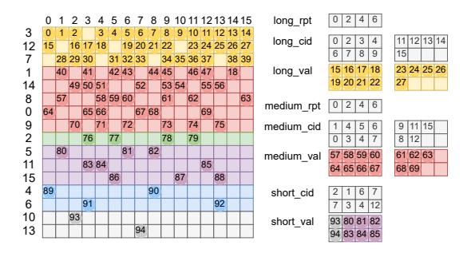
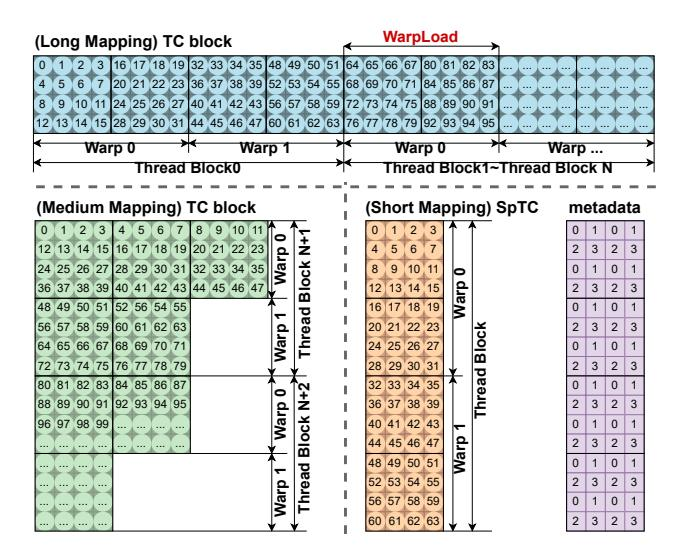
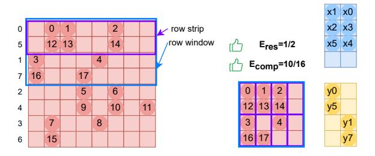
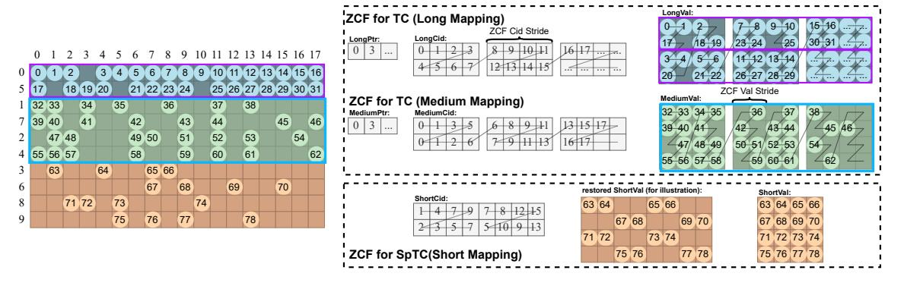
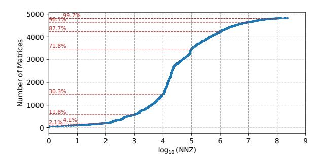
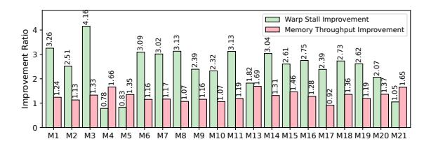
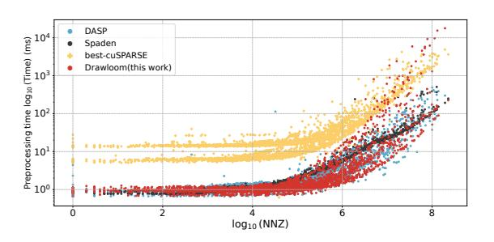
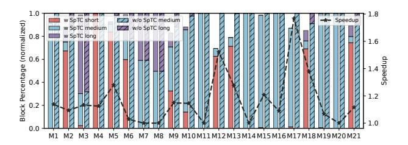

# Exploiting Efficient Mapping and Pipelined Execution for Accelerating SpMV on Tensor Cores

# [Kaige Zhang](https://orcid.org/0009-0000-3261-3483)

Beihang University State Key Laboratory of Complex & Critical Software Environment Beijing, China kaige.zhang@buaa.edu.cn

# [Tianyu Feng](https://orcid.org/0000-0002-4830-5482)

Beihang University Beijing, China ty\_feng@buaa.edu.cn

# [Hailong Yang](https://orcid.org/0000-0003-1101-7927)∗

Beihang University State Key Laboratory of Complex & Critical Software Environment Beijing, China hailong.yang@buaa.edu.cn

# [Yufan Xu](https://orcid.org/0000-0002-7787-6460)

Independent Researcher Cupertino, United States sz.yufanxu@gmail.com

# [Xin You](https://orcid.org/0000-0002-5163-4607)

Beihang University Beijing, China youxin2015@buaa.edu.cn

# [Zhongzhi Luan](https://orcid.org/0000-0002-7186-0556)

Beihang University Beijing, China 07680@buaa.edu.cn

# [Yi Liu](https://orcid.org/0000-0003-1829-2817)

Beihang University Beijing, China yi.liu@buaa.edu.cn

# Abstract

Sparse matrix-vector multiplication (SpMV) is a fundamental operation in scientific computing, machine learning, and graph analytics, demanding efficient execution on modern hardware. Recent advances in hardware accelerators, such as Tensor Cores, have significantly improved the performance of many compute-intensive workloads. However, effectively utilizing Tensor Cores for SpMV remains challenging due to its irregular sparsity patterns and the mismatch between SpMV's computational characteristics and constrained architecture design, leading to suboptimal performance and underutilization of Tensor Cores. In this paper, we systematically analyze the state-of-the-art SpMV optimizations on Tensor Cores, identify key performance bottlenecks, and propose Drawloom, a Tensor-Core-aware framework for SpMV with efficient Tensor Core mapping and optimized pipeline execution. Drawloom leverages a redesigned Tensor Core mapping strategy with a zig-zag chained sparse storage format, as well as a multi-stage register pipeline to better exploit hardware parallelism. Our evaluation on SuiteSparse dataset demonstrates that Drawloom outperforms cuS-PARSE by 2.71×/1.90× (in FP16), 2.95×/2.39× (in FP32), and 2.47×/1.54× (in FP64) on A100 and H100 GPUs, respectively.

∗Corresponding author

[This work is licensed under a Creative Commons Attribution 4.0 Interna](https://creativecommons.org/licenses/by/4.0)[tional License.](https://creativecommons.org/licenses/by/4.0)

PPoPP '26, Sydney, NSW, Australia © 2026 Copyright held by the owner/author(s). ACM ISBN 979-8-4007-2310-0/2026/01 <https://doi.org/10.1145/3774934.3786441>

# [Depei Qian](https://orcid.org/0000-0002-5382-1473)

Beihang University Beijing, China depeiq@buaa.edu.cn

Compared to the state-of-the-art SpMV implementations, Drawloom achieves a performance speedup of 1.26×/1.18× (in FP16) and 1.49×/1.56× (in FP64) on A100 and H100 GPUs, respectively.

CCS Concepts: • Computing methodologies → Parallel algorithms.

Keywords: Sparse matrix-vector multiplication (SpMV), Tensor Cores, GPU, Sparse storage format, Hardware-aware optimization

### ACM Reference Format:

Kaige Zhang, Hailong Yang, Xin You, Tianyu Feng, Yufan Xu, Zhongzhi Luan, Yi Liu, and Depei Qian. 2026. Exploiting Efficient Mapping and Pipelined Execution for Accelerating SpMV on Tensor Cores. In Proceedings of the 31st ACM SIGPLAN Annual Symposium on Principles and Practice of Parallel Programming (PPoPP '26), January 31 – February 4, 2026, Sydney, NSW, Australia. ACM, New York, NY, USA, [14](#page-13-0) pages. <https://doi.org/10.1145/3774934.3786441>

# 1 Introduction

Sparse Matrix-Vector multiplication (SpMV) [\[1,](#page-12-0) [11\]](#page-12-1) serves as a cornerstone in scientific computing, graph analytics, and machine learning workloads [\[38\]](#page-13-1). With the emergence of large-scale sparse datasets (e.g., billion-node graphs [\[14,](#page-12-2) [19,](#page-12-3) [37\]](#page-13-2), FEM simulations [\[12,](#page-12-4) [18,](#page-12-5) [36\]](#page-13-3)), accelerating SpMV on modern GPUs has become critical. Tensor Cores and Sparse Tensor Cores (TCs/SpTCs), specialized for matrix multiplication, have been introduced in NVIDIA GPUs [\[6,](#page-12-6) [30\]](#page-12-7). They are commonly used to accelerate compute-bound kernels such as GEMM and convolution [\[9,](#page-12-8) [15,](#page-12-9) [16,](#page-12-10) [21,](#page-12-11) [39\]](#page-13-4), but their potential for SpMV has been largely overlooked [\[45\]](#page-13-5). In TC computation, input data is evenly distributed among participating threads [\[33\]](#page-12-12), enabling better data reuse and

**Figure 1.** Comparison of SpMV GFlops performance between SpMM-oriented works and DASP across 21 representative matrices. Data points marked with an 'x' indicate runtime errors (e.g., exceeding the GPU shared memory limit).

reducing per-thread memory load compared to CUDA Cores. This is particularly beneficial for memory-bound kernels like SpMV, where memory access dominates execution time [38].

However, fully exploiting TCs/SpTCs for SpMV remains challenging, as it critically depends on maximizing TC utilization. Specifically, achieving high utilization depends on two key factors: (1) TC result efficiency, which measures how effectively the output produced by each Tensor Core operation contributes to meaningful results, and (2) TC computation efficiency, which captures the proportion of nonzero operands participating in actual computation within each TC operation. DASP [22] represents one of the most advanced attempts to leverage TCs for SpMV acceleration, while DASP still faces three key limitations: (1) the matrix multiply-accumulation (MMA) shapes used by DASP are mapped to ALU instructions on CUDA cores rather than actual TC acceleration units on newer GPUs. Additionally, a direct migration of DASP's mapping to newer TCs results in low TC result efficiency; (2) DASP employs rigid sparse formats tied to specific TC shapes, which constrain flexibility and limit performance portability; (3) high memory access latency, coupled with insufficient memory-compute overlap, further degrades overall SpMV performance.

On the other hand, many recent advances in TC acceleration have focused on Sparse Matrix-Matrix Multiplication (SpMM) [8, 20, 34, 44], which multiplies a sparse matrix A with a dense matrix B to produce a dense output matrix C. As SpMV can be viewed as a degenerate case of SpMM where the dense matrix has only a single column, it is natural to consider whether techniques developed for SpMM could be leveraged to improve SpMV performance. Unfortunately, despite such structural similarity, SpMV exhibits distinct computational characteristics that make direct application of SpMM-oriented optimizations inefficient. Specifically, we evaluate the SpMV GFlops performance of SpMM-oriented works (DTC-SpMM [8] and SMaT [34]) compared to DASP on 21 representative matrices from SuiteSparse, as shown in Figure 1. These methods still fail to achieve comparable throughput in SpMV due to the following key differences: (1) Compared to DASP, these methods improve TC result

efficiency but introudce excessive zeros, which severely reduce TC computation efficiency. (2) In SpMM, multiple TC operations can be performed after fetching tiles of matrices *A* and *B*, effectively amortizing memory latency. In contrast, SpMV performs only one TC computation per memory fetch, and accesses to vector *X* are highly irregular and fragmented, unlike the structured, vectorized accesses to *B* in SpMM.

Thus, optimizing SpMV on TCs/SpTCs requires fundamentally new approaches beyond simply adapting SpMM techniques. Specifically, we face the following key challenges: (1) How to design SpMV-specific sparse matrix mappings onto TCs that simultaneously achieve high TC result utilization and high TC computation efficiency? (2) How to construct sparse formats that better leverage GPU-optimized vectorized and asynchronous memory accesses? (3) How to design compute pipelines for SpMV that achieve efficient memory-compute overlap to reduce warp stalls, even when each memory fetch supports only a single TC operation?

To address these unique challenges of SpMV and overcome the limitations of existing approaches (e.g., DASP [22]), we first conduct a thorough analysis of existing SpMV optimizations on TCs, identify two key observations that hinder efficient SpMV acceleration on TCs and SpTCs. Based on these insights, we propose *Drawloom*, an optimized SpMV library that leverages the most efficient TC shapes with multistage pipelines to fully utilize TCs and SpTCs for acceleration. Specifically, this paper makes the following contributions1.

- We propose ArbitWeave, a redesigned tensor core mapping strategy tailored to the unique characteristics of SpMV, enabling the use of arbitrary-shaped high-throughput TCs.
- We propose the Zig-zag Chained Format (ZCF), a sparse storage format designed to enhance memory locality and support GPU-optimized vectorized and asynchronous accesses with two-level load balancing strategy for better TC and SpTC utilization.
- We propose a multi-stage register pipeline with highly optimized kernel design to bridge the gap between tensor core computation and sparse matrix data fetching, enabling efficient SpMV acceleration.
- We implement *Drawloom*, an optimized SpMV library for tensor cores that consistently outperforms cuS-PARSE and other state-of-the-art solutions on A100 and H100 GPUs in FP16, FP32, and FP64. Its effectiveness is validated through comprehensive experiments.

#### 2 Background

### 2.1 Tensor Core and Sparse Tensor Core

Tensor Core (TC) [29] units are optimized for matrix multiply-accumulation (MMA) operations. The shape of a TC, defined by its  $mma\_m \times mma\_n \times mma\_k$  dimensions, has undergone significant changes across GPU generations. As

&lt;sup>1The artifact for this paper is publicly available on Zenodo under DOI [43]

Table 1. Tensor Core shapes supported on different architectures (FP16 or above; V: Volta, A: Ampere, H: Hopper, Sp: with sparse enabled)

| A/B  | Shape                      | Architecture | Sp  |
|------|----------------------------|--------------|-----|
|      | m8n8k4                     | V            | No  |
| FP16 | m16n8k16                   | A/H          | Yes |
|      | m16n8k8                    | A/H          | Yes |
| TF32 | m8n8k4                     | V            | No  |
|      | m16n8k8                    | A/H          | Yes |
|      | m16n8k16                   | A/H          | Yes |
| FP64 | m8n8k4                     | V/A/H        | No  |
|      | m16n8k16                   | H            | No  |
|      | m16n8k8                    | H            | No  |
| FP16 | m64nNk16 (N ∈ [8, 256]) | H(wgmma)     | Yes |
| TF32 | m64nNk8 (N ∈ [8, 256])  | H(wgmma)     | Yes |

shown in Table [1,](#page-2-0) the V100's inaugural TC supports only the m8n8k4 configuration, while the Hopper (H100) architecture now supports flexible shapes ranging from m64n8k16 to m64n256k16 [\[24\]](#page-12-18).

The shape of a TC critically impacts computational efficiency. Microbenchmark studies [\[24,](#page-12-18) [25,](#page-12-19) [35\]](#page-12-20) reveal notable variations in latency and throughput across different configurations. Commonly, larger TC blocks often achieve higher throughput. For example, the m16n8k16 on H100 delivers 494 TFlops with a 24-cycle latency, whereas the m16n8k8 configuration achieves only 368 TFlops at 16 cycles. Optimal TC shapes align with the dimensions of the target computation, enabling parallel processing of larger data chunks per clock cycle and minimizing resource contention. Conversely, mismatched shapes lead to underutilized computational lanes, degrading performance. [2](#page-2-1)

Beyond standard TCs, Sparse Tensor Cores (SpTCs) [\[26,](#page-12-21) [41\]](#page-13-8) represent a pivotal innovation for sparse data processing. These units optimize computations by exploiting sparsity patterns, requiring non-zero elements to adhere to a 2:4 sparsity ratio. Metadata is embedded to track the positions of non-zero elements, enabling halved computation and memory traffic. For instance, a 50% sparse matrix processed via SpTCs achieves near-doubled efficiency compared to dense counterparts. This design is particularly advantageous for large-scale sparse matrices, where reducing redundant operations is critical for performance.

The performance divergence of two types of hardware units and latency variance of TC block choices show the

Figure 2. Sparse matrix reorder and DASP format

importance of kernel design with considering hardware features and emphasize the desire for architecture-aware optimizations in high-performance computing.

#### 2.2 Overview of DASP

DASP [\[22\]](#page-12-13) is currently one of the state-of-the-art methods for accelerating SpMV, leveraging TCs to improve performance. We briefly introduce its implementation and highlight the limitations in Section [3.](#page-2-2)

Sparse Matrix preprocessing and the storage format. As shown in Figure [2,](#page-2-3) DASP starts by reordering the sparse matrix based on the number of non-zero(NNZ) elements in each row. The matrix rows are classified into three categories: long rows(NNZ > 256), medium rows(NNZ > 4), and short rows, with each category having its specialized storage format and computation method. Each of those row categories has its own value array(val) and column ID array(cid), where each non-zero element is paired with its corresponding column ID. There is also a row pointer array(rpt) to facilitate efficient memory access for long and medium rows. DASP further divides medium rows into irregular parts, but we do not show it for simplicity.

Parallel strategy and algorithm routine. DASP applies distinct computation methods to different row categories. Each long row is stored solely in the TC, and the results are first reduced within the warp using shuffle instructions. Afterward, an additional GPU function is called to perform warp-level reduction. Medium rows are grouped in the TC, and the results are written back after coalescing to ensure proper memory access patterns. For short rows, DASP concatenates the two complementary parts to compensate for hardware unit length such as combining the rows with NNZ lengths of 1 and 3 and mapping them to a TC block with \_ = 4. Although they are grouped together in the TC block, the computations are still done separately, which does not reduce the overall TC execution count.

# 3 Motivations

This section presents a performance analysis of state-ofthe-art TC-based SpMV implementation (DASP [\[22\]](#page-12-13)) and highlights the observed performance gaps.

2Notably, legacy TC shapes like m8n8k4, initially designed for V100, exhibit poor efficiency on modern GPUs such as A100 and H100 [\[33\]](#page-12-12). This stems from architectural shifts: newer GPUs no longer support these configurations, forcing compilers to emulate TC operations via ALU instructions.

**Figure 3.** DASP and SpMM mapping strategy (numbers with circle mean nonzeros in the sparse matrix)

**Observation 1: Suboptimal TC shape selection limits hardware utilization.** Although previously discussed, it is important to briefly recall that on newer generation GPUs, the **m8n8k4** TC selected by DASP is executed through ALU operations on CUDA Cores rather than Tensor Cores. This underutilization of Tensor Cores highlights the need for a more systematic analysis of TC usage efficiency in SpMV. To this end, for TC shape of  $m \times n \times k$  we define two key metrics:

• TC result efficiency ( $E_{res}$ ), which measures the proportion of output elements generated by a TC instruction that are actually useful (i.e., contribute to the final vector Y):

$$E_{res} = \frac{\text{# of valid output elements}}{m \times n}$$
 (1)

TC computation efficiency (*Ecomp*), which approximates the proportion of useful computations within a TC operation based solely on the sparsity of matrix *A*. It is defined as:

$$E_{comp} = \frac{\text{# of non-zero elements in } A}{m \times k}$$
 (2)

Figure 3(a) illustrates DASP's current approach for mapping sparse matrices to TCs. DASP uses the smallest TC instruction, m8n8k4 (simplified as m2n2k4 in Figure 3(a) for clarity), to compute SpMV. By compressing non-zero elements per row and placing vector X values into matrix B according to the column indices of non-zero elements in A, DASP produces results Y along the diagonal of the TC output matrix. This mapping achieves relatively good  $E_{res}$  and  $E_{comp}$ .

However, DASP's design is suboptimal for modern GPUs like A100 and H100, which prioritize larger TC blocks (e.g.,

m16n8k16, m: n=2:1). Figure 3(b) demonstrates migrating DASP's approach to m16n8k16 blocks (simplified as m4n2k4). While larger m-dimension increases parallelism, mismatched row-vector interactions (highlighted by dashed boxes) reduce  $E_{res}$  to 1/4, lowering TC utilization.

A naïve alternative, inspired by SpMM optimizations, treats SpMV as a single-column SpMM case (Figure 3(c)). Here, TC block B's first column is populated with partial dense vector X, and results Y appear in the first column of output matrix C. While theoretically achieving higher  $E_{res}$ , sparse regions in the matrix often result in far lower  $E_{comp}$ .

Additionally, NVIDIA Nsight Compute profiling shows that TCs are largely idle during DASP's SpMV kernel execution, while a significant number of CUDA Core instructions are issued. This profiling observation further supports our findings and motivates us to find a better mapping strategy to utilize high-throughput TC shapes available on arbitrary target GPU architecture (e.g., A100, H100).

**Observation 2: Long warp resident cycle.** Existing SpMV (e.g., DASP [22]) exhibits prolonged warp residency due to uncoordinated memory-compute. In DASP [22], each thread independently accesses the elements needed for computation, loading the sparse matrix A from GMEM into REGs (**Fetch Sparse**), then loading the column IDs (**Fetch CID**), and finally using these column IDs to sparsely load values from vector  $X(\textbf{Load}\ X)$  for the subsequent computation (**TC Comp**).

Due to the lack of asynchronous memory access, *fetch sparse*, *fetch CID*, *load X*, and *TC comp* occur sequentially. As a result, when one warp performs data access, it cannot proceed with subsequent operations until the data is fully loaded, relying on the GPU scheduler to schedule available warps. Consequently, the memory utilization in DASP typically ranges from 20% to 60%.

Fortunately, the hardware support for asynchronous memory copy (*async-copy*) introduced with the A100 architecture provides the key enabler for improving memory access. With *async-copy*, data transfers from GMEM to SMEM can be performed asynchronously, allowing for better memory accesses and computations overlapping. This hardware feature allows us to decouple memory staging from computation in more granular stages, paving the way for our multi-stage pipeline design, described in Section 4.4. Specifically, we divide the *fetch CID*, *load X*, and *TC Comp* into multiple pipeline stages. By leveraging this capability, we can achieve improved memory throughput and reduced warp waiting cycles.

### 4 Design of Drawloom

#### 4.1 Design Overview

Figure 4 illustrates the overview of *Drawloom*, which consists of three main components: Computation Mapping with *ArbitWeave*, Sparse Matrix Conversion with *Zig-zag chained* 

**Figure 4.** Overview of Drawloom

**Figure 5.** Kernel design of Drawloom (each threadblock has 2 warps and *WarpLoad* = 2 for simplicity)

*format(ZCF)*, and CUDA Kernel Optimization with *Multi-Stage Pipeline*.

**4.1.1 Computation Mapping with ArbitWeave.** Previous works typically leverage only a single TC shape to accelerate SpMV. In contrast, we take into account the structural characteristics of the sparse matrix and selectively employ both standard TCs and SpTCs, along with three tailored mapping strategies.

Firstly, for different tensor core shapes characterized by  $(mma\_m, mma\_n, mma\_k)$ , we define a structural ratio  $V = mma\_m/mma\_n$ . This ratio represents the relative number of output rows to output columns produced by a tensor core operation. We use V to define the row strip width, i.e., a group of V consecutive rows in the sparse matrix. These row strips become the basic computation unit mapped to either a standard TC or SpTC. By aligning the granularity of computation with the hardware execution shape, we ensure efficient utilization of the matrix-multiply-accumulate (MMA) units with optimal TC result efficiency.

Based on the number of nonzeros in each row strip, we propose the following three mapping strategies to maximize TC computation efficiency. The details about  $T_1$  and  $T_2$  are described in Section 4.1.3:

- Long Mapping: If the number of nonzero elements in a row exceeds a predefined threshold  $T_1$ , the row strip is directly mapped to a TC block.
- Medium Mapping: If the number of nonzeros falls between two thresholds  $T_2$  and  $T_1$ , multiple row strips are grouped and collectively mapped to a TC block.
- Short Mapping: If the number of nonzeros is below *T*2, multiple row strips are grouped and mapped to a SpTC block for more efficient sparse computation.

To our knowledge, Drawloom is the first work realizing simultaneous scheduling of different blocks of a sparse matrix onto both TC and SpTC via *ArbitWeave* mapping strategy. Specifically, by adopting the SpTC mapping strategy, we can effectively store and process irregular data within SpTC, as illustrated in Figure 7. Furthermore, in contrast to DASP, *ArbitWeave* adopted in Drawloom can support mapping to arbitrary TC shapes. Such design significantly improves hardware scalability and utilization compared to DASP's fixed-shape approach.

4.1.2 Sparse Matrix Conversion with Zig-zag chained **format.** To accommodate the ArbitWeave mapping scheme for both TC and SpTC, we design two variants of the zig-zag chained format (ZCF) tailored to their respective requirements. For row strips mapped to TCs (Long Mapping & *Medium Mapping*), we store the values in a contiguous Val array and use a corresponding Cid array to record the column indices of each nonzero element. For row strips mapped to SpTCs(Short Mapping), we compress the value array to meet the sparsity constraints required by SpTCs, achieving up to 50% memory savings compared to the TC format, while the Cid array remains uncompressed according to Short Mapping. This design directly supports SpTC computation, in contrast to DASP, where short rows are stored as Cid and Val arrays but are later accessed and computed using CUDA Cores rather than SpTCs. In addition, for both Long Mapping and Medium Mapping, we use a row\_ptr array, which records the number of TC blocks corresponding to each row strip (or row window), allowing the kernel to correctly index into the compressed data. The detailed structure of the Zig-zag chained format(ZCF) and row\_ptr array will be elaborated in Section 4.3.

**4.1.3 Kernel Design and Optimizations.** Each thread block consists of four warps, and we design a two-level load

balance to effectively address load imbalance issues observed in the SuiteSparse dataset. At the matrix level, we categorize rows based on their number of nonzeros (NNZ) using two thresholds  $T_1$  and  $T_2$ , as shown in Equation 3. As shown in Figure 5, for Medium Mapping and Short Mapping, each warp is assigned to compute one group of TC Blocks. While for Long Mapping, we employ a more sophisticated warp **level** load balancing strategy. Specifically, we distribute the TC Block generated from Long Mapping evenly across all warps to ensure a similar workload. As shown in Figure 5, each warp is assigned to most WarpLoad TC blocks, where WarpLoad denotes the number of TC blocks assigned to each warp in long mapping. It is a tunable parameter, and we set it to 2 in Figure 5. In the kernel execution, each warp writes partial results to intermediate buffers, and a dedicated reduction kernel is launched afterward to aggregate the final output.

$$T_1 = (mma\_m/v) \times mma\_k \times warpload$$

$$T_2 = mma k$$
(3)

Based on our two-level load balancing strategy, the thresholds  $T_1$  and  $T_2$  are determined in Equation 3. Specifically,  $T_2$  is assigned to  $mma\_k$ , with which short rows in the sparse matrix cannot fully utilize a regular TC block and are therefore mapped to the SpTC block using *Short Mapping*. We set the threshold  $T_1$  as  $(mma_m/v) \times mma_k \times warpload$ . Rows with nnz greater than  $T_1$  are classified as long rows and handled by the long-mapping strategy. In this case, such rows generate more than **WarpLoad** TC blocks, which are distributed across multiple warps to achieve load balance.

To improve memory efficiency, we optimize access patterns using vectorized instructions, *async-copy*, and a register-level pipeline. During memory accesses, each thread performs 128-bit vectorized loads to maximize global memory bandwidth. We use *async-copy* to stage TC blocks and sparse indices in shared memory (SMEM), and load the vector *X* using the PTX *LDG* instruction. Due to the irregular and fine-grained nature of accessing *X*, we propose a *multi-stage register pipeline* that leverages multiple register sets to overlap memory latency with TC computation. These optimizations are detailed in Section 4.4.

#### 4.2 Arbitrary MMA Shapes Mapping

**4.2.1 Arbitrary mapping to dense TC.** To flexibly map sparse matrices onto the diverse MMA shapes supported by modern GPUs, we design a Tensor-Core-aware mapping framework called *ArbitWeave*. Figure 6 illustrates *ArbitWeave*'s mapping strategy. *ArbitWeave* designs a novel mapping approach tailored for high-throughput TC shapes (e.g., m4n2k4, with m: n=2:1, v=2). It partitions the sparse matrix into v-width row strips (purple boxes, width = v = 2) and m-width row windows (blue boxes, width = m = 4). Within each strip, columns are compressed

**Figure 6.** Design of TC block mapping strategy (Long Mapping and Medium Mapping), numbers with circle mean nonzeros in the sparse matrix

**Figure 7.** SpTC mapping strategy(Short Mapping), numbers with circle means nonzeros in the sparse matrix

by removing zero-only columns, preserving high  $E_{comp}$  while fully utilizing TC result capacity.

As shown in Figure 6, based on the number of nonzeros in each row, row strips are assigned to either **Long Mapping** (nnz >  $T_1$ ) or **Medium Mapping** ( $T_2 < \text{nnz} \le T_1$ ) to ensure high TC utilization. In both cases, vector X values corresponding to non-zero columns are aligned to the matrix B columns within the TC block. Results Y are aggregated diagonally across the TC output matrix at the row strip granularity.

**4.2.2 Arbitrary mapping to SpTC.** For rows with the number of nonzeros less than threshold  $T_2$ , *ArbitWeave* leverages the Sparse Tensor Cores(SpTC), a dedicated TC introduced to double the computation throughput by skipping zeros. As illustrated in Figure 7(a), rows with up to  $mma_k$  NNZ (e.g., k = 4 for the m4n2k4 SpTC configuration) are directly mapped to SpTC blocks. Specifically, NNZs are grouped into pairs and remapped into a 2:4 sparsity pattern (orange boxes in Figure 7(b)), where each box retains at most two NNZs. The corresponding column indices guide the placement of vector X (**Remapping vector X**) into SpTC's input matrix B, ensuring correct multiplicative mappings. For example, the first row's NNZ (elements '0', '1', '2', and '3') interact with 'x0', 'x2', 'x4', and 'x5' to compute 'y0' without redundancy.

Figure 7(c) illustrates the compressed sparse matrix used for SpTC execution. After applying a 50% compression to the sparse matrix, only the non-zero elements are retained. The accompanying metadata (in purple) encodes the original

Table 2. Zig-zag chained formats

| Mapping                        | Data Structures                                                      |  |  |  |  |  |
|--------------------------------|----------------------------------------------------------------------|--|--|--|--|--|
| Long Mapping Medium Mapping | <pre>longPtr, longCid, longVal mediumPtr, mediumCid, mediumVal</pre> |  |  |  |  |  |
| Short Mapping                  | shortCid, shortVal                                                   |  |  |  |  |  |

position of each non-zero within the orange boxes (from Figure 7(b)) using values 0, 1, 2, or 3. Unlike the column index in *Long Mapping* and *Medium Mapping*, the column index (in gray) here is aligned with the remapped vector X rather than directly corresponding to the original column index of each non-zero element. This distinction enables compatibility with SpTC hardware requirements while maintaining correctness.

#### 4.3 Zig-zag Chained Format

In this section, we describe how the matrix is transformed into the ZCF layout, supporting both TC and SpTC kernel execution. ZCF is built on the row partitioning and load balancing strategies discussed in Section 4.1.2. To facilitate efficient storage and balanced computation, we adopt a two-level load balancing strategy. At the **matrix level**, rows are grouped into three categories: *Long, Medium*, and *Short.* Table 2 shows the categorization, and Equation 3 defines the thresholds. At the **warp level**, Long rows are further split across warps, with an inter-warp reduction to fuse the results.

As illustrated in Figure 8, we employ the *Zig-zag chained format(ZCF)* to store sparse matrices, tailoring the data structures to distinct matrix regions. For the *short* part, mapped to SpTC(simplified as m4n2k4 SpTC), we store non-zero values within row windows in the shortVal array and track their column indices via shortCid for efficient vector *X* access. For *medium* part, mapped to dense TC(simplified as m4n2k4), compresses multiple row strips into TC blocks. Here, mediumVal and mediumCid store NNZ and column indices, respectively, while mediumPtr records the number of TC blocks per row window. For the *long* part, each row strip occupies dedicated TC blocks, with longVal and longCid mirroring the roles of their *medium* counterparts. The longPtr array tracks TC block counts per row strip to guide inter-warp reduction during result aggregation.

We fully utilize the GPU memory hierarchy to guide format design and memory arrangement. To maximize memory bandwidth, we enforce vectorized memory access within TC blocks. As shown by the gray zig-zag chain in Figure 8, contiguous data segments are aligned to a stride length (zcf\_value\_stride), set to 2 for illustration but adjusted to 8 for FP16 or 4 for FP32 and FP64 in practice. This alignment is compatible with the 128-bit memory transactions at the GPU thread level, ensuring memory resource utilization.

#### 4.4 Multi-stage Register Pipeline

Existing SpMV implementations suffer from serialized execution of sparse matrix *A* access (FS), column indices access (FCid), vector *X* indexing (LX), and computation (Comp), causing significant latency. Nsight Compute [32] profiling shows prolonged warp stalls and low memory throughput. To mitigate this, we leverage the async-copy instruction introduced in the A100, which overlaps global-to-shared memory (GMEM-to-SMEM) transfers with computation. As shown in Figure 9(a), inspired by prior SpMM works [8, 46], we adopt a *2-stage pipeline*: FS and FCid are asynchronously copied to SMEM, while subsequent LX and Comp operate from SMEM to enable parallelism between data movement and computation.

However, directly applying 2-stage pipelining to SpMV is challenging. Unlike SpMM, SpMV operates on a single-column vector X, resulting in narrower (e.g., 16-bit for half or 64-bit for double) and more fragmented memory accesses. This, combined with X's random access pattern, limits memory bandwidth utilization. Moreover, each memory access in SpMV typically triggers only one TC operation, whose short latency makes it hard to overlap with async-copy. In contrast, SpMM's larger tiles yield more computation, better hiding memory latency and benefiting from contiguous accesses.

To address these limitations, we propose a multi-stage register pipeline. As shown in Figure 9(b), we define two pipeline parameters: delaySMEM, representing the GMEMto-SMEM transfer delay, and delayREG, governing SMEMto-REG transfers and computation overlap. The pipeline is structured into five phases. During FillSMEM, the sparse matrix A and column indices are asynchronously copied to SMEM buffers. In *FillREG*, vector *X* values are prefetched into registers using SMEM indices, overlapping memory access with prior stages. The Comp phase executes TC block computations using preloaded register data, while the EmptySMEM and EmptyREG phases finalize the remaining computations without additional memory operations. By decoupling memory transfers and computation across multiple stages, this design effectively hides latency and reduces warp stalls. For instance, setting delaySMEM to 1 (as in the 2-stage pipeline) employs double buffering to overlap GMEM-to-SMEM transfers, while delayREG of 2 optimizes register-level prefetching to align with TC execution patterns.

#### 5 Evaluation

### 5.1 Experimental Setup

**Environments.** We evaluate performance on two recent NVIDIA server GPUs: the A100 (Ampere architecture, Compute Capability 8.0, 80GB global memory) and H100 (Hopper architecture, Compute Capability 9.0, 80GB global memory). All code is compiled using NVCC 12.6 with the -O3 optimization flag. Benchmarks are executed 1000 times, and results are averaged to ensure statistical reliability. On the A100

**Figure 8.** Sparse matrix conversion with Zig-zag chained format, numbers with circle mean nonzeros in the sparse matrix. The input sparse matrix is reorderd based on the number of nnz per row, then the matrix is categorized into three parts and stored by *ZCF for TC* and *ZCF for SPTC*.

**Figure 9.** Comparison between (a)2-stage pipeline and our (b)multi-stage register pipeline. FCid: Fecth column indies for vector; LX: Load vector *X*; Comp: TC computation. Numbers indicate calculation order.

platform, the host CPU is an Intel Xeon Gold 6336Y, while the H100 platform is equipped with an Intel Xeon Platinum 8468; the specific CPUs are not essential to our evaluation, as the workload is based on GPUs.

Baselines. We compare Drawloom with the state-of=the-art SpMV implementations on both CUDA Core and Tensor Core for fair comparison. For CUDA Core baselines, we evaluate: (1) cuSPARSE v12.0 [27], NVIDIA's vendor-optimized library, using the default algorithm and CSR format; (2) Fast-Load [13], a memory-optimized SpMV approach using CSC formats (FP64 only); (3) TileSpMV [28]: tile-based SpMV implementation (FP64 only). For Tensor Core baselines, we evaluate: (1) DASP [22], a leading Tensor Core-optimized SpMV framework (FP16/FP64 only); (2) Spaden [4], which leverages bitmap-based sparse formats for efficiency (FP16/FP32 only). These baselines represent diverse optimization strategies, enabling a comprehensive analysis of performance tradeoffs. We additionally evaluate a Best-cuSPARSE baseline by

comparing multiple cuSPARSE-supported formats, including CSR, CSC, BSR, and SELL, and selecting the best-performing one for each matrix.

**Figure 10.** Cumulative frequency distribution (CFD) of sparse matrices over  $\log_{10}(\text{NNZ})$  in the SuiteSparse dataset.

**Datasets.** We evaluate our approach on the SuiteSparse Matrix Collection. Matrices with fewer than 1k nonzeros are removed, as such small sizes offer limited GPU parallelism. In addition, TileSpMV [28] skips GPU kernel launches when the number of rows is smaller than its block size, resulting in unrealistically low runtimes. Therefore, after filtering the above matrices, 4234 matrices remain for evaluation. As shown in Table 3, to ensure representativeness, we further select 21 matrices from prior SpMV studies, covering a wide range of sparsity patterns, dimensions, and application domains. This dual dataset strategy ensures both broad coverage and focused analysis of performance-critical scenarios. The cumulative frequency distribution (CFD) of the matrices' sparsity, measured by  $\log_{10}(\mathrm{NNZ})$ , is illustrated in Figure 10.

#### 5.2 Overall Performance

We compare our approach against cuSPARSE [27], Best cuS-PARSE, FastLoad [13], Spaden [4], DASP [22], and TileSpMV3 across the entire SuiteSparse Matrix Collection. Figure 11

&lt;sup>3TileSpMV only supports CUDA 11, and thus cannot be tested on H100

**Table 3.** 21 representative matrices from the SuiteSparse Matrix Collection and their feature values. nrow denotes the matrix row number. NNZ denotes the nonzero element number.  $NNZ_{max/min}$ ,  $NNZ_{mean}$ , and  $NNZ_{std}$  denote the (maximum/minimum), mean, and standard deviation of the nonzero element number per row.

| Id  | Matrix      | nrow | NNZ   | max/min   | mean   | std     | Id  | Matrix      | nrow | NNZ  | max/min  | mean   | std    |
|-----|-------------|------|-------|-----------|--------|---------|-----|-------------|------|------|----------|--------|--------|
| M1  | pwtk        | 0.2M | 11.6M | 180/2     | 53.39  | 4.74    | M12 | econ_fwd500 | 0.2M | 1.3M | 44/1     | 6.17   | 4.44   |
| M2  | FullChip    | 3.0M | 26.6M | 2312481/1 | 8.91   | 1806.80 | M13 | scircuit    | 0.2M | 1.0M | 353/1    | 5.61   | 4.39   |
| M3  | mip1        | 66K  | 10.4M | 66395/4   | 155.77 | 350.74  | M14 | pdb1HYS     | 36K  | 4.3M | 204/18   | 119.31 | 31.86  |
| M4  | mc2depi     | 0.5M | 2.1M  | 4/2       | 3.99   | 0.08    | M15 | consph      | 83K  | 6.0M | 81/1     | 72.13  | 19.08  |
| M5  | webbase-1M  | 1.0M | 3.1M  | 4700/1    | 3.11   | 25.35   | M16 | cant        | 62K  | 4.0M | 78/1     | 64.17  | 14.06  |
| M6  | circuit5M   | 5.6M | 59.5M | 1290501/1 | 10.71  | 1356.62 | M17 | cop20k_A    | 121K | 2.6M | 81/0     | 21.65  | 13.79  |
| M7  | Si41Ge41H72 | 0.2M | 15.0M | 662/13    | 80.86  | 126.97  | M18 | dc2         | 116K | 0.8M | 114190/1 | 6.56   | 361.50 |
| M8  | Ga41As41H72 | 0.3M | 18.5M | 702/18    | 68.96  | 105.39  | M19 | rma10       | 46K  | 2.4M | 145/4    | 50.69  | 27.78  |
| M9  | in-2004     | 1.4M | 16.9M | 7753/0    | 12.23  | 37.23   | M20 | conf5_4-8x8 | 49K  | 1.9M | 39/39    | 39.00  | 0.00   |
| M10 | eu-2005     | 0.9M | 19.2M | 6985/0    | 22.30  | 29.33   | M21 | ASIC_680k   | 0.7M | 3.9M | 395259/1 | 5.67   | 659.81 |
| M11 | shipsec1    | 140K | 7.8M  | 102/24    | 55.46  | 11.07   |     |             |      |      |          |        |        |

Figure 11. The overall performance of SpMV on A100 and H100, with the reported speedup normalized to cuSPARSE.

illustrates their speedup compared to cuSPARSE under varying NNZ counts (in log scale), with six subplots corresponding to A100/H100 GPUs and FP16/FP32/FP64 precision.

Overall, our approach outperforms all other baselines across the dataset. However, the speedup becomes less pronounced as the NNZ count increases. This is because matrices in this range typically have very large shapes, with nonzero elements sparsely distributed. Such sparsity within large TC blocks reduces the number of nonzeros per block, thereby lowering  $E_{comp}$ .

As shown in Figure 11(a, d) and Figure 12(a, d), in FP16 precision, our method achieves significant performance improvements, outperforming all baselines on the majority of matrices. Specifically, we observe notable speedups over DASP of 84.65% of matrices, 96.14% over cuSPARSE, and 91.35% over Spaden. On average, our approach delivers 1.42×, 2.72×, and 5.16× speedups over DASP, cuSPARSE, and Spaden on A100, and 1.35×, 1.90×, and 9.35× speedups, respectively,

on H100. Compared to DASP, our *ArbitWeave* mapping strategy selects m16n8k16 TCs on A100/H100, eliminating HFMA and HADD2 instructions introduced by m8n8k4 TCs in DASP. *ArbitWeave* maintains comparable  $E_{comp}$  (60.15% vs. 61.20% for DASP on average), and significantly improves  $E_{res}$ , as elaborated in Section 4.2.1. For SpMM, the  $E_{comp}$  is much lower (11.78%), highlighting the advantage of our approach. Compared with Spaden (113us) on 'cop20k\_A', *Drawloom* (FP16) only takes 16.93us. Spaden uses a bitmap to store the positions of non-zero elements in the TC Block and stores the non-zero elements continuously. While this reduces GPU memory overhead, Spaden adds compute overhead because non-zero elements need to be restored based on the bitmap, leading to a high number of LOP3 instructions (typically used for bit-level left/right shift operations).

Under FP16 precision, *Drawloom* can achieve the highest speedup of 1.85× on the M14 matrix among representative matrices, and the highest speedup of 2.99× (on 'Ga3As3H12'

**Figure 12.** Comparison of *Drawloom* with SpMV baselines across three precisions and hardware settings. Dashed lines with markers indicate the percentage of matrices where *Drawloom* is faster in each  $\log_{10}(\text{NNZ})$  group, while boxplots show the distribution of speedups.

**Figure 13.** Comparison of warp stall and memory throughput improvement relative to DASP (A100/FP16)

matrix) among all evaluated matrices. The performance advantage of *Drawloom* can be understood as follows. Compared to DASP, ArbitWeave in *Drawloom* selects the m16n8k16 TC shape on both A100 and H100 GPUs, which better matches the matrix dimensions and computation granularity. Moreover, *Drawloom* maps rows with fewer than 16 nonzero elements to SpTCs. Unlike DASP, which processes these irregular rows solely on CUDA cores, *Drawloom* enhances memory locality and avoids scattered nonzero accesses. Additionally, ZCF in *Drawloom* is more memory-efficient, reducing IMAD instruction count by 67.8%, which are typically used for memory index calculations. This improvement comes from ZCF's enhanced memory locality, which enables vectorized memory accesses, whereas DASP still relies on discrete, non-coalesced accesses.

As shown in Figure 11(b, e), in FP32 precision, our method achieves higher performance on most matrices compared to existing baselines. We achieve speedups over Spaden on 99% of matrices, 92.8% over cuSPARSE, and 58.77% over best-cuSPARSE. The average speedups relative to Spaden, cuS-PARSE, and best-cuSPARSE are 11.5×, 2.9×, and 1.1× on A100 and 12.6×, 2.4×, and 1.1× on H100. The detailed performance comparison and speedups are shown in Figure 12(b,

e). Compared with best-cuSPARSE, our method achieves a maximum speedup of  $5.1\times$  on the 'wiki-Talk' matrix, where best-cuSPARSE selects the SELL format. For this matrix, the non-zero element standard deviation (nnz std) is 99.9, and 95.2% of the data is padded with zeros in SELL format. Our *ArbitWeave* mapping strategy adapts the mapping choice to rows with different nnz, achieving an  $E_{comp}$  of 37.6% and thereby improving Tensor Core block utilization. For matrices with nnz larger than  $10^7$ , only 15.7% of them show performance where Drawloom surpasses best-cuSPARSE on H100. However, Drawloom achieves a 17.4× faster preprocessing time, as shown in Figure 15. This underscores the practical importance of selecting methods based on matrix characteristics.

As shown in Figure 11(c, f) and Figure 12(c, f), in FP64 precision, our method also demonstrates superior performance across most matrices. We achieve speedups over DASP on 85.41% of matrices, 90.93% over cuSPARSE, 82.29% over Fast-Load, and 97.29% over TileSpMV. The average speedups relative to DASP, cuSPARSE, and FastLoad are 1.57×, 2.27×, and  $2.67 \times$  on A100 and  $1.52 \times$ ,  $1.29 \times$ , and  $2.21 \times$  respectively, on H100. The average speedups compared to TileSpMV is 2.72×. Compared with FastLoad (49.34us) on 'cop20k A', Drawloom (FP64) takes (31us). FastLoad uses the CSC format to improve GPU memory access and applies load balancing to avoid thread divergence. However, FastLoad does not utilize Tensor Cores during computation, wasting the GPU's computational acceleration potential. Furthermore, Nsight Compute [32] reports indicate that FastLoad uses a significant number of SHFL instructions (14.9%) for accumulating results between threads.

Our approach generally achieves good performance on matrices with fewer than 16 NNZ per row. For instance, on

Figure 14. Performance comparison of Drawloom using different optimization measures on A100

'south31', 'twotone', and 'ASIC\_100ks', we achieve 1.25×, 1.21×, and 1.18× speedups against DASP, respectively. These results show that our SpTC mapping outperforms dense TC-based methods (e.g., DASP, Spaden) by leveraging sparsity-aware instructions and minimizing zero-padding overhead.

#### 5.3 Evaluation of Multi-stage Register Pipeline

As highlighted in Observation 2, DASP's data access pattern suffers from serialized execution of TC block processing, column index retrieval, and subsequent vector X accesses. These forces warp to idle while awaiting memory operations, resulting in prolonged warp stalls and inefficient memory utilization. To quantify this, we estimate total stall cycles using the product of warp stall cycle per issued instruction and executed instructions, capturing the impact of memory-induced idle periods on warp efficiency. The results, illustrated in Figure 13, demonstrate that our approach achieves superior or comparable memory throughput to DASP across all 21 representative matrices. Notably, 19 matrices exhibit significant warp stall improvements.

However, 'mc2depi' and 'webbase-1' show a slight increase in warp stalls. As detailed in Table 3, these matrices feature extremely sparse rows (average 3.0 NNZ per row). As discussed in Section 5.2, even mapping such rows to SpTCs introduces additional zero-padding, increasing memory traffic and exacerbating stalls. Despite this, our method still outperforms DASP in memory throughput for these matrices, validating the efficiency of our memory access and pipeline design. This suggests that while SpTC-based mapping may amplify stalls in ultra-sparse cases, our optimized data movement mechanisms mitigate overall latency, achieving a favorable balance between computation and memory efficiency.

#### 5.4 Ablation Study

To validate the effectiveness of individual components in our methodology, we conduct an ablation study on the 21 representative matrices selected in Section 5.1. The results, summarized in Figure 14, demonstrate the incremental performance gains from each optimization. We evaluate four kernel variants (V1-V4). V1 serves as the baseline, using m8n8k4 Tensor Cores. V2 enables *ArbitWeave*. V3 incorporates *ZCF* to improve GPU data access efficiency compared to V2 using CSR format. V4 further integrates the *multi-stage* 

register pipeline with tunable parameters delay SMEM and delay REG.

V2 achieves an average 1.56× speedup over V1, with up to 2.4× on 'conf5\_4-8x8', where V2 effectively utilizes Tensor Cores, while V1 falls back to FFMA and HADD2 instructions (30.2% of total), reducing overall instruction count by 58%. V3 improves over V2 by 1.91× on average, achieving 4.02× on 'pdb1HYS'. By replacing CSR-based if-else thread selection with *ZCF* vectorized access, V3 reduces branch instructions by 50% and increases memory bandwidth by 48.3%. V4 outperforms V3 by 1.46× on average, reaching 5.68× on mip1. The *multi-stage register pipeline* overlaps memory access and computation, eliminating warp barriers and boosting L2 bandwidth by 8×, resulting in significant gains.

### 5.5 Preprocessing Overheads

**Figure 15.** Preprocessing costs of SpMV methods

The preprocessing time is shown in Figure 15. Our preprocessing approach outperforms DASP on 72.9% of all SuiteS-parse matrices and surpasses Spaden on 63%. It also outperforms the best-cuSPARSE implementation on 99.4% of the matrices. For a fair comparison, we include the overhead of CSR-to-CSC, CSR-to-BSR, and CSR-to-SELL format conversions as well as our preprocessing for best-cuSPARSE. For CSC and BSR, we use the official cuSPARSE conversion functions, while for SELL, we use the state-of-the-art PETSc [42] library. On average, the preprocessing of our method is 1.35× faster than DASP, 2.39× faster than Spaden, and 12.69× faster than best-cuSPARSE. We notice that while Drawloom achieves only modest speedup over best-cuSPARSE for large nnz matrices, its preprocessing time is 17.4× faster for matrices with nnz larger than  $10^7$ , as discussed in Section 5.2. Therefore, in

practice, selecting preprocessing strategies according to the matrix characteristics remains important. Moreover, since preprocessing is performed only once, its overhead can be amortized across multiple solver iterations, which has been widely accepted in these works [4, 17, 23].

#### 5.6 Ablation Study on Disabling Sparse Tensor Cores

**Figure 16.** Normalized block distribution on short/medium/ long mapping and speedup of *Drawloom* with and without SpTC on A100

We conduct an ablation study by disabling the short mapping in *ArbitWeave*, which normally maps short rows to SpTC blocks. As shown in Figure 16, across the 21 matrices, our method achieves an average speedup of 1.17×. In particular, on matrices M12 and M17, the speedups reach 1.54× and 1.7×, respectively. Taking M12 for example, the matrix contains 6.17 nonzeros per row on average. With the short mapping enabled, *ArbitWeave* maps 12,567 rows to SpTC blocks out of a total of 13,952 TC blocks. In contrast, when the short mapping is disabled, all rows are mapped to regular TC blocks, resulting in a total of 20,094 blocks, an increase of 44%. This demonstrates that the short mapping in *ArbitWeave* effectively assigns irregular short rows to SpTC blocks, reducing the total number of TC computations and improving overall performance.

#### 6 Discussion

Theoretical FLOPs - When evaluating the computational cost of sparse matrix operations on Tensor Cores (TCs), the theoretical FLOPs are commonly estimated from the number of nonzero elements (NNZ) in the matrix, representing the minimum algorithmic work. However, theoretical FLOPs do not capture the discrepancy introduced by TC execution. As sparse matrices often fail to fully occupy TC blocks, the actual number of operations executed by the hardware can exceed the theoretical value.

**TC Computation Efficiency** - To better characterize this effect, we define the TC computation efficiency metric  $(E_{comp})$ .  $E_{comp}$ , while related to matrix density, quantifies how effectively a sparse matrix uses TC blocks during execution. A higher  $E_{comp}$  means denser block occupancy, fewer TC blocks, and fewer TC operations executed. Thus,  $E_{comp}$  more accurately reflects the effective computation cost on TC. Theoretical FLOPs depend only on algorithmic computation (e.g.,

NNZ) and remain unchanged across hardware units, TC mapping strategies, or sparse formats. Moreover,  $E_{comp}$  captures the interaction between sparsity patterns and TC tile shapes, which can be naturally extended to SpMM computations.

#### 7 Related Work

Given the importance of SpMV in scientific computing and deep learning, many studies have optimized its GPU performance. Auto-SpMV [2], WISE [40], and AlphaSparse [7] use auto-tuning and format selection to adapt SpMV execution to specific matrices. FastLoad [13] improves memory access efficiency, and Gao et al. [10] optimize thread configurations per matrix block. However, these methods do not fully exploit Tensor Cores (TCs). Spaden [4] uses a bitmap-based sparse format, while DASP [22] maps SpMV to TCs through reordering and load balancing. Yet, DASP suffers from suboptimal TC shapes and long warp stalls. Drawloom addresses these limitations with ArbitWeave for adaptive TC shape selection and a multi-stage register pipeline that overlaps memory access and computation to improve throughput.

In addition to dense TCs, recent work leverages SpTC 2:4 sparsity for higher performance in matrix computations, mainly in SpMM. cuSparseLt [31] provides kernels for 1:2 and 2:4 structured sparse matrices, while DFSS [5] and VENOM [3] design pruning algorithms and corresponding kernels to exploit SpTC. Directly applying these SpMM approaches to SpMV is inefficient due to its low computation density and irregular memory access. Drawloom is the first to target SpMV with SpTC-aware optimizations, selectively mapping particularly sparse regions to SpTC blocks and minimizing padding zeros. Its register pipeline further decouples access to vector *X*, improving memory-compute overlap and overall performance.

#### 8 Conclusion

In this paper, we propose *Drawloom*, a method supporting arbitrary TC shapes while improving memory-compute overlap. Key components include *ArbitWeave*, *Zig-zag Chained Format*, and a *multi-stage register pipeline*. Evaluations on SuiteSparse matrices with A100 and H100 GPUs show significant speedups over cuSPARSE and state-of-the-art SpMV implementations, highlighting the potential of Tensor Cores for SpMV acceleration.

#### Acknowledgments

This work is supported by National Key Research and Development Program of China (Grant No. 2023YFB3001801), National Natural Science Foundation of China (No. 62322201, U23B2020, U22A2028 and 92373110), the Fundamental Research Funds for the Central Universities (JKF-2025012343648 and JKF-20240598), and State Key Laboratory of Complex & Critical Software Environment (SKLCCSE-2025ZX-04).

# References

- [1] Sergi Abadal, Akshay Jain, Robert Guirado, Jorge López-Alonso, and Eduard Alarcón. 2021. Computing graph neural networks: A survey from algorithms to accelerators. ACM Computing Surveys (CSUR) 54, 9 (2021), 1–38.
- [2] Mina Ashoury, Mohammad Loni, Farshad Khunjush, and Masoud Daneshtalab. 2023. Auto-spmv: Automated optimizing spmv kernels on gpu. arXiv preprint arXiv:2302.05662 (2023).
- [3] Roberto L Castro, Andrei Ivanov, Diego Andrade, Tal Ben-Nun, Basilio B Fraguela, and Torsten Hoefler. 2023. VENOM: A Vectorized N: M Format for Unleashing the Power of Sparse Tensor Cores. In Proceedings of the International Conference for High Performance Computing, Networking, Storage and Analysis. 1–14.
- [4] YuAng Chen and Jeffrey Xu Yu. 2024. Bitmap-Based Sparse Matrix-Vector Multiplication with Tensor Cores. In Proceedings of the 53rd International Conference on Parallel Processing. 1135–1144.
- [5] Zhaodong Chen, Zheng Qu, Yuying Quan, Liu Liu, Yufei Ding, and Yuan Xie. 2023. Dynamic n: M fine-grained structured sparse attention mechanism. In Proceedings of the 28th ACM SIGPLAN Annual Symposium on Principles and Practice of Parallel Programming. 369–379.
- [6] Jack Choquette, Wishwesh Gandhi, Olivier Giroux, Nick Stam, and Ronny Krashinsky. 2021. Nvidia a100 tensor core gpu: Performance and innovation. IEEE Micro 41, 2 (2021), 29–35.
- [7] Zhen Du, Jiajia Li, Yinshan Wang, Xueqi Li, Guangming Tan, and Ninghui Sun. 2022. Alphasparse: Generating high performance spmv codes directly from sparse matrices. In SC22: International Conference for High Performance Computing, Networking, Storage and Analysis. IEEE, 1–15.
- [8] Ruibo Fan, Wei Wang, and Xiaowen Chu. 2024. DTC-SpMM: Bridging the Gap in Accelerating General Sparse Matrix Multiplication with Tensor Cores. In Proceedings of the 29th ACM International Conference on Architectural Support for Programming Languages and Operating Systems, Volume 3. 253–267.
- [9] Boyuan Feng, Yuke Wang, Guoyang Chen, Weifeng Zhang, Yuan Xie, and Yufei Ding. 2021. EGEMM-TC: accelerating scientific computing on tensor cores with extended precision. In Proceedings of the 26th ACM SIGPLAN symposium on principles and practice of parallel programming. 278–291.
- [10] Jianhua Gao, Weixing Ji, Jie Liu, Yizhuo Wang, and Feng Shi. 2024. Revisiting thread configuration of SpMV kernels on GPU: A machine learning based approach. J. Parallel and Distrib. Comput. 185 (2024), 104799.
- [11] Jianhua Gao, Bingjie Liu, Weixing Ji, and Hua Huang. 2024. A systematic literature survey of sparse matrix-vector multiplication. arXiv preprint arXiv:2404.06047 (2024).
- [12] Mohammed Heyouni and Azeddine Essai. 2005. Matrix Krylov subspace methods for linear systems with multiple right-hand sides. Numerical Algorithms 40, 2 (2005), 137–156.
- [13] Jinyu Hu, Huizhang Luo, Hong Jiang, Guoqing Xiao, and Kenli Li. 2024. FastLoad: Speeding Up Data Loading of Both Sparse Matrix and Vector for SpMV on GPUs. IEEE Transactions on Parallel and Distributed Systems (2024).
- [14] Weihua Hu, Matthias Fey, Marinka Zitnik, Yuxiao Dong, Hongyu Ren, Bowen Liu, Michele Catasta, and Jure Leskovec. 2020. Open graph benchmark: Datasets for machine learning on graphs. Advances in neural information processing systems 33 (2020), 22118–22133.
- [15] Zhe Jia, Marco Maggioni, Benjamin Staiger, and Daniele P Scarpazza. 2018. Dissecting the NVIDIA volta GPU architecture via microbenchmarking. arXiv preprint arXiv:1804.06826 (2018).
- [16] Jiazhi Jiang, Dan Huang, Jiangsu Du, Yutong Lu, and Xiangke Liao. 2022. Optimizing small channel 3D convolution on GPU with tensor core. Parallel Comput. 113 (2022), 102954.
- [17] Peng Jiang, Changwan Hong, and Gagan Agrawal. 2020. A novel data transformation and execution strategy for accelerating sparse matrix

- multiplication on GPUs. In Proceedings of the 25th ACM SIGPLAN symposium on principles and practice of parallel programming. 376– 388.
- [18] Scott P Kolodziej, Mohsen Aznaveh, Matthew Bullock, Jarrett David, Timothy A Davis, Matthew Henderson, Yifan Hu, and Read Sandstrom. 2019. The suitesparse matrix collection website interface. Journal of Open Source Software 4, 35 (2019), 1244.
- [19] Jure Leskovec and Rok Sosič. 2016. Snap: A general-purpose network analysis and graph-mining library. ACM Transactions on Intelligent Systems and Technology (TIST) 8, 1 (2016), 1–20.
- [20] Shigang Li, Kazuki Osawa, and Torsten Hoefler. 2022. Efficient quantized sparse matrix operations on tensor cores. In SC22: International Conference for High Performance Computing, Networking, Storage and Analysis. IEEE, 1–15.
- [21] Junhong Liu, Dongxu Yang, and Junjie Lai. 2021. Optimizing winogradbased convolution with tensor cores. In Proceedings of the 50th International Conference on Parallel Processing. 1–10.
- [22] Yuechen Lu and Weifeng Liu. 2023. Dasp: Specific dense matrix multiply-accumulate units accelerated general sparse matrix-vector multiplication. In Proceedings of the International Conference for High Performance Computing, Networking, Storage and Analysis. 1–14.
- [23] Yuechen Lu, Lijie Zeng, Tengcheng Wang, Xu Fu, Wenxuan Li, Helin Cheng, Dechuang Yang, Zhou Jin, Marc Casas, and Weifeng Liu. 2024. Amgt: Algebraic multigrid solver on tensor cores. In SC24: International Conference for High Performance Computing, Networking, Storage and Analysis. IEEE, 1–16.
- [24] Weile Luo, Ruibo Fan, Zeyu Li, Dayou Du, Hongyuan Liu, Qiang Wang, and Xiaowen Chu. 2025. Dissecting the NVIDIA Hopper Architecture through Microbenchmarking and Multiple Level Analysis. arXiv preprint arXiv:2501.12084 (2025).
- [25] Weile Luo, Ruibo Fan, Zeyu Li, Dayou Du, Qiang Wang, and Xiaowen Chu. 2024. Benchmarking and dissecting the nvidia hopper gpu architecture. In 2024 IEEE International Parallel and Distributed Processing Symposium (IPDPS). IEEE, 656–667.
- [26] Asit Mishra, Jorge Albericio Latorre, Jeff Pool, Darko Stosic, Dusan Stosic, Ganesh Venkatesh, Chong Yu, and Paulius Micikevicius. 2021. Accelerating sparse deep neural networks. arXiv preprint arXiv:2104.08378 (2021).
- [27] Maxim Naumov, L Chien, Philippe Vandermersch, and Ujval Kapasi. 2010. Cusparse library. In GPU Technology Conference, Vol. 12.
- [28] Yuyao Niu, Zhengyang Lu, Meichen Dong, Zhou Jin, Weifeng Liu, and Guangming Tan. 2021. Tilespmv: A tiled algorithm for sparse matrixvector multiplication on gpus. In 2021 IEEE International Parallel and Distributed Processing Symposium (IPDPS). IEEE, 68–78.
- [29] NVIDIA. 2017. Programming tensor cores in cuda 9. https://devblogs.nvidia.com/programming-tensor-cores-cuda-9.
- [30] NVIDIA. 2021-1-30. NVIDIA NVIDIA Ampere Architecture Whitepaper. online. <https://www.nvidia.com/en-us/data-center/a100/> Accessed March 30, 2021.
- [31] NVIDIA. 2025. cuSPARSELt: A High-Performance CUDA Library for Sparse Matrix-Matrix Multiplication. https://docs.nvidia.com/cuda/cusparselt/.
- [32] NVIDIA. 2025. NVIDIA Nsight Compute. https://developer.nvidia.com/nsight-compute/.
- [33] NVIDIA. 2025-2-26. NVIDIA Parallel Thread Execution ISA Version 8.7. online. [https://docs.nvidia.com/cuda/parallel-thread-execution/](https://docs.nvidia.com/cuda/parallel-thread-execution/index.html) [index.html](https://docs.nvidia.com/cuda/parallel-thread-execution/index.html) Accessed February 26, 2025.
- [34] Patrik Okanovic, Grzegorz Kwasniewski, Paolo Sylos Labini, Maciej Besta, Flavio Vella, and Torsten Hoefler. 2024. High Performance Unstructured SpMM Computation Using Tensor Cores. In SC24: International Conference for High Performance Computing, Networking, Storage and Analysis. IEEE, 1–14.
- [35] Wei Sun, Ang Li, Tong Geng, Sander Stuijk, and Henk Corporaal. 2022. Dissecting tensor cores via microbenchmarks: Latency, throughput

- and numeric behaviors. IEEE Transactions on Parallel and Distributed Systems 34, 1 (2022), 246–261.
- [36] Francisco Vázquez, Ester M Garzón, and José Jesús Fernández. 2010. A matrix approach to tomographic reconstruction and its implementation on GPUs. Journal of Structural Biology 170, 1 (2010), 146–151.
- [37] Minjie Yu Wang. 2019. Deep graph library: Towards efficient and scalable deep learning on graphs. In ICLR workshop on representation learning on graphs and manifolds.
- [38] Samuel Williams, Andrew Waterman, and David Patterson. 2009. Roofline: an insightful visual performance model for multicore architectures. Commun. ACM 52, 4 (2009), 65–76.
- [39] Da Yan, Wei Wang, and Xiaowen Chu. 2020. Demystifying tensor cores to optimize half-precision matrix multiply. In 2020 IEEE International Parallel and Distributed Processing Symposium (IPDPS). IEEE, 634–643.
- [40] Serif Yesil, Azin Heidarshenas, Adam Morrison, and Josep Torrellas. 2023. Wise: Predicting the performance of sparse matrix vector multiplication with machine learning. In Proceedings of the 28th ACM SIGPLAN Annual Symposium on Principles and Practice of Parallel Programming. 329–341.
- [41] Chen Zhang, Yang Wang, Zhiqiang Xie, Cong Guo, Yunxin Liu, Jingwen Leng, Guangyu Sun, Zhigang Ji, Runsheng Wang, Yuan Xie, et al. 2024. DSTC: Dual-Side Sparsity Tensor Core for DNNs Acceleration

- on Modern GPU Architectures. IEEE Trans. Comput. (2024).
- [42] Hong Zhang, Richard T Mills, Karl Rupp, and Barry F Smith. 2018. Vectorized parallel sparse matrix-vector multiplication in PETSc using AVX-512. In Proceedings of the 47th International Conference on Parallel Processing. 1–10.
- [43] Kaige Zhang. 2025. PPoPP26\_AE\_DRAWLOOM\_CODE. [https://doi.](https://doi.org/10.5281/zenodo.17709956) [org/10.5281/zenodo.17709956](https://doi.org/10.5281/zenodo.17709956). Accessed: 2026-01-06.
- [44] Kaige Zhang, Xiaoyan Liu, Hailong Yang, Tianyu Feng, Xinyu Yang, Yi Liu, Zhongzhi Luan, and Depei Qian. 2024. Jigsaw: Accelerating SpMM with Vector Sparsity on Sparse Tensor Core. In Proceedings of the 53rd International Conference on Parallel Processing. 1124–1134.
- [45] Lingqi Zhang, Jiajun Huang, Sheng Di, Satoshi Matsuoka, and Mohamed Wahib. 2025. Can Tensor Cores Benefit Memory-Bound Kernels?(NO!). In Proceedings of the 17th Workshop on General Purpose Processing Using GPU. 28–34.
- [46] Haisha Zhao, San Li, Jiaheng Wang, Chunbao Zhou, Jue Wang, Zhikuang Xin, Shunde Li, Zhiqiang Liang, Zhijie Pan, Fang Liu, et al. 2025. Acc-SpMM: Accelerating General-purpose Sparse Matrix-Matrix Multiplication with GPU Tensor Cores. arXiv preprint arXiv:2501.09251 (2025).

Received 2025-09-01; accepted 2025-11-10