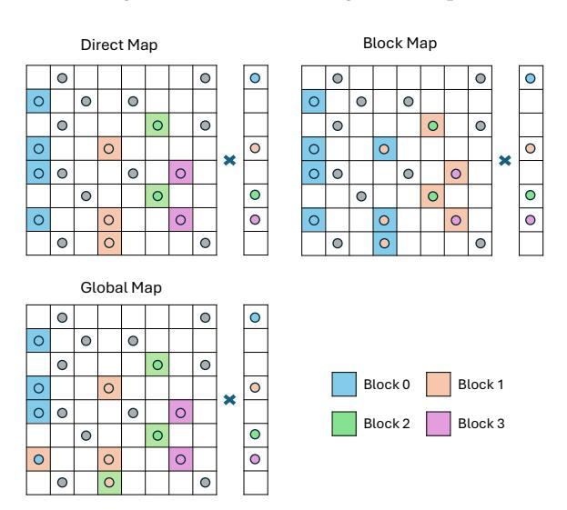

# VDHA: Vector-Driven Hash Aggregation for Sparse Matrix-Sparse Vector Multiplication on GPUs

# Yuchen Li

Department of Computer Science and Technology, Tsinghua University Beijing, China liyuchen24@mails.tsinghua.edu.cn

# Peng Qu

Department of Computer Science and Technology, Beijing National Research Center for Information Science and Technology, Tsinghua University Beijing, China qp2018@mail.tsinghua.edu.cn

### **Abstract**

Sparse matrix-sparse vector multiplication (SpMSpV) is a core primitive in graph analytics and scientific computing, also arising in spiking neural networks for event-driven spike propagation. On GPUs, the performance of the prevalent and efficient SpMSpV paradigm is often bottlenecked by the write-back phase of accumulating non-zero multiply-accumulate results; its many-to-one index scatter pattern causes severe conflicts and poor bandwidth utilization on GPUs. We present VDHA, a GPU-based weighted SpM-SpV kernel that leverages block-private hash tables for local aggregation, substantially reducing write conflicts and improving memory coalescing. To further amplify this benefit, we incorporate column splitting with lightweight reordering to expose more locality, and employ a fetch-computewriteback pipeline to overlap hash computation with memory accesses. Extensive evaluation on over 300 matrices with more than 5 million nonzeros, including web-scale graphs (Konect/LAW) and scientific workloads (SuiteSparse), shows that VDHA consistently outperforms state-of-the-art baselines. On web graphs, it achieves a 1.41× geometric-mean speedup (up to 3.42×), while on SuiteSparse it delivers 1.13× (up to 2.55×). We also provide a lightweight predictive model that identifies matrices favorable to VDHA with 91.3% accuracy.


This work is licensed under a Creative Commons Attribution 4.0 International License.

PPoPP '26, Sydney, NSW, Australia
© 2026 Copyright held by the owner/author(s).
ACM ISBN 979-8-4007-2310-0/2026/01
https://doi.org/10.1145/3774934.3786447

# Zhe Pan

Department of Computer Science and Technology, Tsinghua University Beijing, China pz@mail.tsinghua.edu.cn

# Youhui Zhang

Department of Computer Science and Technology, Beijing National Research Center for Information Science and Technology, Tsinghua University Zhongguancun Laboratory Beijing, China zyh02@mail.tsinghua.edu.cn

CCS Concepts: • Computing methodologies → Shared memory algorithms; • Computer systems organization → Single instruction, multiple data.

Keywords: SpMSpV, sparse matrix, GPU, Hashing, SNN

#### **ACM Reference Format:**

Yuchen Li, Zhe Pan, Peng Qu, and Youhui Zhang. 2026. VDHA: Vector-Driven Hash Aggregation for Sparse Matrix-Sparse Vector Multiplication on GPUs. In *Proceedings of the 31st ACM SIGPLAN Annual Symposium on Principles and Practice of Parallel Programming (PPoPP '26), January 31 – February 4, 2026, Sydney, NSW, Australia.* ACM, New York, NY, USA, 14 pages. https://doi.org/10.1145/3774 934.3786447

# 1 Introduction

The sparse matrix-sparse vector multiplication (SpMSpV) computes  $\mathbf{y} = \mathbf{A}\mathbf{x}$  with both the matrix  $\mathbf{A}$  and the input vector  $\mathbf{x}$  being sparse. SpMSpV is frequently used in machine learning [8] and scientific computing [3, 5, 32, 41]. It also serves as a fundamental primitive in graph analytics, underlying core algorithms such as breadth-first search (BFS), PageRank and personalized PageRank, and it is the algebraic backbone of many graph frameworks including GraphBLAS [15], Gunrock [34], GraphBLAST [39], GraphMat [33].

Beyond these domains, SpMSpV also appears in event-driven workloads such as spiking neural networks (SNNs), where spike delivery can be naturally formulated as sparse matrix-sparse vector multiplication [9]. Moreover, both brain-inspired neural models and real-world graphs (e.g., social networks) are known to exhibit highly clustered, small-world connectivity patterns [35], which create opportunities for exploiting locality in SpMSpV execution.

SpMSpV can be implemented under two execution paradigms: Row-major methods traverse CSR rows and are

naturally aligned with CSR-based SpMV. Some implementations can be regarded as direct extensions of SpMV, obtained by adding value validation [33]. Alternatively, methods such as tileSpMSpV [18] and BerryBees [26] adopt bitmap-compressed frontiers together with masking of visited nodes, and are specifically optimized for unweighted BFS-style traversals. However, for *weighted* SpMSpV, row-major traversal still scans all matrix rows regardless of vector sparsity, and the bitmask cannot avoid loading matrix indices. As a result, row-major methods cannot fully exploit vector sparsity.

Column-major SpMSpV, in contrast, follows a vector-driven paradigm: the computation consists of a *fetch phase*, which gathers matrix columns corresponding to nonzeros in the vector, and a *write-back phase*, which uses column indices to update the result vector, essentially an index-scatter where multiple entries may map to the same position.

On CPUs, representative studies include fgSpMSpV [10], work-efficient SpMSpV [2], and HAM-SpMSpV [37]. On GPUs, prior work has explored different *write-back* methods and kernel selection: graph analytics frameworks (e.g., Gunrock [34]) use atomic instructions to directly handle write conflicts; FastSpMSpV [40] adopts a *sort-reduce* approach to avoid conflicts, and Adaptive SpMSpV [20] selects write-back strategies (atomic vs. sort) based on matrix characteristics, while also adapting load-balancing granularity and switching to row-major SpMSpV or SpMV under dense vectors.

However, we observe that in some cases the two prevalent write-back strategies—atomic updates and sort-based updates—both fail to achieve satisfactory bandwidth utilization: the former suffers from scattered index updates and frequent conflicts, while the latter relies on costly global sorting (see Section 3).

Similar challenges arise in SpGEMM, where hashing has been used effectively to aggregate partial products and eliminate intra-row conflicts [12, 13, 25, 28, 36]. However, SpMSpV lacks the natural row partitioning of SpGEMM: instead of resolving conflicts only within a single row, it must handle all intermediate updates across the matrix. As a result, a hash table can only eliminate a portion of the write conflicts, while the remaining updates still require global atomic writes. This leads to two key questions: whether SpMSpV provides sufficient locality for hash aggregation, and whether the benefit of fewer write conflicts can outweigh the overhead of the hash table.

To address these challenges, we propose a vector-driven hash-aggregation (VDHA) algorithm for *weighted* SpM-SpV (both the matrix and the input vector contain general weights) on GPUs. VDHA reduces write-back conflicts via local aggregation in shared memory, enhances locality through column decomposition with reordering, and reduces hash cost by pipelining computation with memory access. Concretely, we propose **VDHA**:

- Shared-memory hash aggregation. Intermediate results are first accumulated in a shared-memory hash table and flushed only when the table becomes sufficiently full, reducing the write-back conflicts and promoting coalesced writes.
- Short/long-column decomposition with reordering.
   We first classify columns by their length (the number of nonzeros) into short and long categories. Long columns are further split into smaller segments and reordered to improve locality and raise aggregation density, thereby maximizing the benefit of shared-memory accumulation.
- Overlapping memory and computation. We design a
  pipeline that overlaps irregular global memory accesses
  with hash computation, effectively hiding hash computation latency behind memory stalls and making aggregation nearly free.

To systematically evaluate VDHA, we consider two benchmarks. The first consists of over 100 large-scale web graphs from the Konect [19] and LAW [6, 7] collections, which are representative of *graph analytics workloads* where weighted SpMSpV is most critical (e.g., PageRank and Personalized PageRank on web graphs). The second includes over 200 matrices from the SuiteSparse [11] collection, a widely used benchmark that covers diverse domains such as scientific computing, engineering, and optimization. Both benchmarks contain only matrices with at least 5 million nonzeros. Together, these datasets allow us to assess both the practical impact on real graph workloads and the generality across broader application scenarios.

Across four vector sparsity levels (0.01, 0.05, 0.10, 0.20; defined as the fraction of nonzeros in the input vector), VDHA outperforms the *best-of-seven* baselines (including cuSPARSE, two row-major SpMSpV kernels using value validation [30, 31], and the four representative column-major SpMSpV kernels from [20, 34, 40]), achieving geometric-mean speedups of **1.41**× on Konect/LAW (up to **3.42**×) and **1.13**× on SuiteSparse (up to **2.55**×).

**Contributions.** This paper makes the following contributions:

- VDHA algorithm. By enhancing locality and reducing hashing overhead, we realize a practical and efficient hashbased solution for weighted SpMSpV on GPUs
- **Systematic comparison.** We conduct a comprehensive evaluation against SOTA baselines, across over 100 realworld network graphs and over 200 scientific graphs with a wide range of vector sparsities, demonstrating consistent speedups.
- Lightweight Performance Prediction. We provide a lightweight analysis method to quickly assess whether a matrix benefits from VDHA, facilitating its integration into adaptive frameworks.

# 2 Background:

# 2.1 General-Purpose Graphics Processing Units:

**Programming and execution model.** A GPU kernel is launched as a grid of thread blocks (CTAs), each consisting of multiple warps (typically 32 threads). Thread blocks are scheduled onto streaming multiprocessors (SMs), where per-block register and shared-memory usage determine the maximum number of resident warps (occupancy).

*Memory system.* Global memory provides high bandwidth but also long latency (hundreds of cycles). To mitigate this, each SM has a private L1 cache and a configurable partition of on-chip SRAM (*shared memory*) that can serve either as additional cache capacity or as an explicitly managed scratchpad, backed by a large device-wide L2 cache. Equally important is *memory coalescing*: global accesses are issued in cache-line transactions (e.g., 128 B), so contiguous, well-aligned warp accesses are merged into fewer transactions, while scattered addresses fragment into many small ones, wasting bandwidth and exposing latency.

**Latency hiding.** SMs keep many warps resident simultaneously; when one warp stalls on memory, the scheduler issues instructions from another ready warp. This fine-grained multithreading allows latency to be hidden as long as sufficient parallelism and occupancy are maintained.

# 2.2 SpMSpV

SpMSpV can be organized under two paradigms: *matrix-driven* (*row-major*) and *vector-driven* (*column-major*). Figure 1 illustrates the differences in their computation flows and work patterns.

<span id="page-2-0"></span>

**Figure 1.** Comparison of SpMSpV paradigms. (a) Column-major: iterate over nonzero entries of the input vector, fetch columns and accumulate partial products into the output. (b) Row-major: iterate over matrix rows and use a bitmask to skip inactive vector entries.

Matrix-driven SpMSpV approaches iterate over matrix rows (CSR), treating the input vector as dense. Algorithm 1 illustrates this matrix-driven paradigm. In this scheme, each nonzero in a row first checks the corresponding position in a bitmap to confirm whether the vector entry is active(line 6);

if the entry is active, the value is then loaded(lines 7,8). BFS-like unweighted SpMSpV systems such as TileSpMSpV [18] and BerryBees [26] further incorporate an *output mask* to avoid unnecessary updates to inactive result entries, thus reducing redundant work during traversal.

# <span id="page-2-1"></span>Algorithm 1 Matrix-driven SpMSpV (CSR / pull)

**Input:** *A* in CSR: (row\_ptr, indices, values) with *N* rows; dense vector *x* with value array *x* and bitmask *bm*;

**Output:** Result vector *y* 

```
1: for all r \leftarrow 0 to N in parallel do
2: start \leftarrow row\_ptr[r], end \leftarrow row\_ptr[r+1]
3: res \leftarrow 0
4: for j \leftarrow start to end do
5: col \leftarrow indices[j]
6: mask \leftarrow bm[col]
7: if mask then
8: res \leftarrow res \oplus (values[j] \otimes x[col])
9: y[r] \leftarrow res
```

In contrast, the vector-driven paradigm iterates only over the nonzeros of  $\mathbf{x}$ . Algorithm 2 illustrates the vector-driven paradigm of SpMSpV. For each active entry in  $\mathbf{x}$ , the corresponding column of the CSC matrix is fetched (line 4, the fetch step), and the partial products (i.e.,  $mat\_val \otimes v\_val$ ) are generated toward the result vector according to the row indices of the column. These partial results are then written back to  $\mathbf{y}$  (line 7, the write\_back step). Representative column-major SpMSpV approaches include FastSpMSpV [40] and GPU graph frameworks such as Gunrock [34]. Hybrid methods such as Adaptive SpMSpV [20] combine both paradigms depending on vector sparsity.

# <span id="page-2-2"></span>Algorithm 2 Vector-driven SpMSpV (CSC / push)

**Input:** *A* in CSC: (col\_ptr, indices, values); *x* in sparse format: (idx, val); vector length *n* 

**Output:** Result vector *y* 

```
1: for all i \leftarrow 0 to n in parallel do
2: col \leftarrow idx[i], v\_val \leftarrow val[i]
3: start \leftarrow col\_ptr[col], end \leftarrow col\_ptr[col + 1]
4: ind\_list, val\_list = fetch(indices, values, i)
5: for j \leftarrow 0 to len(ind\_list) do
6: ind \leftarrow ind\_list[j], mat\_val \leftarrow val\_list[j]
7: write\_back(y[ind], mat\_val \otimes v\_val)
```

#### Different kinds of work-balance methods (fetch stage).

In the fetch phase, each nonzero in the vector indexes a column of the CSC matrix and loads the corresponding *indices* and *values* into *ind\_list* and *val\_list*. Since column lengths are highly irregular, different load-balancing strategies are used to assign these column workloads to CTAs. We highlight three representative methods:

- (1) Direct-mapped. Each active column is assigned to one CTA, with no prefix-scan overhead. This simple strategy is commonly used in implementations without fine-grained load balancing, such as NaiveSpMSpV [30].
- (2) **Block-mapped.** Multiple short columns are grouped for a CTA, and a block-level prefix scan computes their combined nonzero count, as used in graph frameworks like Gunrock [34].
- (3) Global-mapped. For each nonzero in the input vector, the corresponding column length is first recorded. A global inclusive scan over these column lengths yields the total number of matrix entries to be accessed, which is then evenly partitioned so that each CTA processes a segment of similar size, following methods used in merge-based SpMV [24, 31].



**Figure 2.** Illustration of three load-balancing strategies in fetch step (matrix in CSC format). Cells with the same color represent column segments assigned to the same CTA.

Different kinds of write-back (write-back stage). In column-major SpMSpV, partial products ( $v\_val \otimes m\_val$ ) are accumulated into the output y[ind] during the write-back stage, which naturally leads to many-to-one updates. Several strategies are commonly used to realize this write-back:

- **(1) Atomic write-back.** Directly accumulates each partial product into the output using global atomics.
- **(2) Sort-based write-back.** Buffers (*row*, *val*) pairs, sorts them by row index, and reduces duplicates so that each row is written once, thereby avoiding global atomics.
- (3) Hash-based aggregation. Hash aggregation is a light-weight accumulation strategy widely used in sparse kernels such as hash-based SpGEMM [12, 13, 25, 28, 36]. Instead of emitting every update to global memory, partial products are inserted into a small shared-memory hash table. Each update is stored as a (key, value) pair, where the key is the row index; collisions are resolved using simple schemes such

as linear probing (i.e., probing the next slot until an empty or matching entry is found).

In hash-based SpGEMM, each output column maintains its own small hash table, and its size can be estimated through lightweight precomputation. In contrast, SpMSpV produces a *single* output vector, so all intermediate updates converge to one logical output column. This substantially increases the required aggregation capacity, necessitating a different design from conventional per-column hash accumulators.

#### <span id="page-3-0"></span>3 Motivation

The write-back phase is one of the central bottlenecks of GPU-based SpMSpV. Existing strategies fall into two main categories, both with substantial drawbacks:

Atomic write-back suffers from severe address contention (many-to-one updates) and uncoalesced stores, which prevent effective utilization of global bandwidth. Sort-based write-back requires costly global sorts and large temporary buffers, resulting in prohibitively high overhead.

We benchmarked both strategies on an NVIDIA A100 (peak bandwidth 1555 GB/s). At input sparsity 0.1 on *it-2004*, atomic write-back sustains about 270 GB/s, while sort-and-reduce reaches only 43.3 GB/s during the sorting stage. Under global load balancing, these write-back stages dominate overall runtime: atomic write-back accounts for more than 30% of execution time, whereas sort-based write-back consumes over 70%. As input density increases, the bandwidth of atomic write-back drops further (e.g., 251 GB/s at sparsity 0.2), while sort-based remains nearly constant (~45 GB/s).

These limitations motivate us to explore a hash-based write-back scheme, inspired by hash based SpGEMM methods [12, 13, 25, 28, 36]. However, as noted in Section 1, SpM-SpV lacks SpGEMM's row partitioning: hashing alleviates only local conflicts, with remaining ones still handled by global atomics. Therefore, for hashing to be effective, the matrix must exhibit sufficient locality, and the hash computation must be lightweight enough to offset its overhead.

To examine these conditions, we conduct a case study on the *it-2004* matrix, a large-scale web graph. We analyze its locality, evaluate processing strategies that enhance it, and discuss techniques to amortize the extra cost of hash computation.

# 3.1 Write-back Locality

To quantify the exploitable write-back locality in practice, we introduce two complementary metrics:

**Local overlap ratio**  $\rho(T)$ . With a hash table of capacity T, each partial product either accumulates into an existing entry or inserts a new one; once the table is full, a flush is triggered. Let F(T) denote the total number of flushed entries and N the total number of intermediate products. We define  $\rho(T) = 1 - \frac{F(T)}{N}$ .

Intuitively,  $\rho(T)$  measures the fraction of updates that can be temporally aggregated before being written back. A higher  $\rho(T)$  indicates stronger temporal locality and fewer global write transactions.

**Coalescing factor**  $\gamma$ **.** On GPUs, memory accesses from threads within a warp are merged into aligned memory sections (e.g., 128B). Suppose A denotes the memory bytes to be written back, and M the number of 128 B transactions required to serve the warp-level loads. We define  $\gamma = \frac{A}{M_1 + 128}$ .

Intuitively,  $\gamma$  measures the degree of spatial coalescing: it is the fraction of useful payload bytes within all memory transactions. A higher  $\gamma$  indicates that consecutive threads tend to access consecutive memory locations, leading to fewer wasted bytes per transaction and higher effective bandwidth utilization.

On *it-2004*, we observe that with T=2048,  $\rho$  reaches 51.0%, 35.0%, and 14.8% at vector density = 100%, 10%, and 1%, respectively. Meanwhile,  $\gamma$  reaches 0.744, 0.499, and 0.280.

Taken together,  $\rho$  and  $\gamma$  provide a comprehensive view of locality:  $\rho$  quantifies temporal aggregation, while  $\gamma$  quantifies spatial coalescing.

#### <span id="page-4-0"></span>3.2 Skewed Nonzero Distributions

Many real-world graphs (e.g., social networks) exhibit highly skewed length distributions: a small fraction of columns are extremely long, while the majority remain short. For example, on it-2004 matrix, only 1.4% of its columns ( $\geq$ 256 nonzeros) account for more than 70% of the total nonzeros, with an average length of 1403 compared to the overall mean of just 27.9.

This extreme skew indicates that a small fraction of ultralong columns dominate the workload. Moreover, within each long column, row indices never overlap, meaning that hash aggregation provides no benefit when the column is larger than the hash table size.

Existing SpMSpV kernels address irregular column lengths generally in two ways. A block-mapped strategy assigns equal numbers of columns to each CTA, while global balancing distributes all nonzeros evenly across CTAs using prefix sums and searches. Neither approach exploits the limited locality within long columns, so both fall short of improving hash effectiveness.

Similar skew patterns have also been reported in RoDe [27], which alleviates imbalance by decomposing long rows into smaller segments. Building on this insight, we adopt a **split-and-reorder** strategy. We first split long columns into segments so that each can be processed within a block. In addition, we introduce a lightweight reordering step that aligns neighboring segments to enhance adjacency and improve hash reuse. Short columns are still handled directly with the block-mapped method. This design not only balances the workload across blocks but also strengthens locality, which is crucial for effective hash aggregation.

On *it-2004*, after decomposition and reordering, the local overlap ratio  $\rho(T)$  improves markedly: with T=2048,  $\rho$  reaches 89.8%, 65.3%, and 23.8% at vector densities of 100%, 10%, and 1%, respectively;  $\gamma$  also increases to 2.607, 0.863, and 0.294 in these three cases. Note that  $\gamma$  may exceed 1, as hashing reduces total memory access in write-back; with good memory coalescing, the effective utilization per transaction can be greater than 100%

These results demonstrate that splitting long columns and reordering their segments is effective in enhancing locality, making hash-based aggregation substantially more beneficial than with naive processing. Evaluating on benchmarks shows that the atomic-unit utilization decreases from 22.99% to 12.82% after applying these optimizations, indicating that far fewer global atomic conflicts reach the write-back stage.

# 3.3 Irregular Memory Accesses

The conventional fetch–writeback flow of GPU SpMSpV is dominated by irregular global-memory behavior. On *it-2004*, our NCU profiling shows that the atomic write-back stage accounts for over 45% of stall cycles, and nearly 90% of these stalls are long scoreboard waits on global memory. A long scoreboard wait occurs when a warp is blocked until a pending global-memory load or store completes, meaning that even high occupancy cannot hide the latency of uncoalesced loads and scattered stores.

To address this, we restructure the execution into a three-stage **fetch-compute-writeback** pipeline. Compared with the conventional two-stage design, the additional compute stage performs hash aggregation while the next tile of data is being fetched asynchronously (e.g., via cp.async). In this way, memory latency that would otherwise cause stalls is overlapped with useful hash computation, reducing the apparent cost of aggregation, which includes computing hash indices and resolving collisions within shared memory through linear probing.

This design proves effective in practice. With the additional compute phase, the stall ratio drops from over 45% to about 15%, still dominated by long scoreboard stalls (68.9%), but with significantly fewer total stall cycles. These results confirm that irregular memory latency can be successfully exploited to mask the cost of hashing, making hash-based write-back practical with minimal cost. Consistently, we observe that the fetch–compute–writeback pipeline reduces the hash computation cost from 16.7% to 12.3%.

In summary, through the above analysis, we address the two key questions posed in Section 1. First, vector processing increases graph locality, thereby improving the effectiveness of hash aggregation. Second, the cost of hashing can be largely hidden through pipelining with memory access. Taken together, these results indicate that hash-based aggregation is a promising and practical direction for SpMSpV on modern GPUs.

# 4 Method

We target a vector-driven SpMSpV with the matrix stored in CSC format and a sparse input vector. Figure 3 illustrates our overall workflow: (①) long columns are split into smaller segments, while short columns are directly mapped; (②) large segments are reordered to enhance locality; and (③) all segments are block-mapped to GPU SMs and aggregated in shared memory before flushing.

Based on this workflow, our design consists of two coordinated stages, with an additional pipelined execution scheme to reduce hash computation costs:

- (1) Vector processing. The input vector is scanned to identify active columns, which are classified as short or long. Long columns are further split and reordered, producing segments that are then assigned to GPU blocks.
- (2) Block-level aggregation. Each block processes its assigned segment using a private hash table in shared memory. Partial products are accumulated locally and then flushed in partial order, reducing global write conflicts and improving coalescing efficiency.
- (3) Fetch-compute-writeback pipeline. To exploit the memory stalls observed in atomic write-back, we restructure the execution into a three-stage pipeline. During hash insertions and aggregations on the current tile, asynchronous copy instructions (e.g., cp. async) are issued to fetch the next tile from global memory.

The following subsections provide detailed descriptions of these three stages.

# 4.1 Vector Processing

In a vector-driven SpMSpV, each nonzero (idx, val) in the input vector selects a column c of the CSC-stored matrix A. Its adjacency range is given by offset[c] to offset[c+1], so the column length is simply len = offset[c+1] - offset[c], and the associated vector value is  $x_c$ . We therefore represent this column by a tuple (start, len,  $x_c$ ).

Columns shorter than LEN\_THRES are treated as *small columns*, while longer ones are *long columns*. Each long column is further split into segments of at most SPLIT\_SIZE nonzeros. For the *i*-th segment, the starting position is  $start_i = start + i \cdot \text{SPLIT\_SIZE}$ , and its length is  $len_i = \min(len - i \cdot \text{SPLIT\_SIZE})$ , and the vector value remains  $x_c$ , where i is the segment index. For efficient processing, long-column segments are first aggregated at the CTA level and then appended contiguously to a global queue.

After splitting, the segments from the same column remain consecutive and will be mapped to the same SM. However, these intra-column segments contain disjoint row indices and therefore provide no opportunity for aggregation. In contrast, segments from different columns may share overlapping rows. To expose this cross-column locality, we sort all segments by the row index of their first nonzero, so that segments covering nearby index ranges are placed together. This

increases the likelihood of overlap across adjacent segments and substantially improves the effectiveness of hash-based aggregation, as illustrated in Figure 4.

This reordering is lightweight: it sorts only the segment metadata rather than the nonzeros inside each segment. If the number of segments is S, the sort cost is  $O(S\log S)$  with  $S\sim nnz_{long}/SPLIT\_SIZE$ , which is much smaller than sorting all nonzeros. We do not reorder small columns, since their number can be on the same order as the input vector length, and sorting them would incur disproportionate overhead.

# 4.2 Hash aggregation

After vector processing, column segments are block-mapped to GPU SMs, where each CTA maintains a private shared-memory hash table. The purpose of this table is twofold: (1) Local aggregation — accumulate partial products for identical row indices within the CTA, eliminating intra-block conflicts and producing coalesced writes; (2) Partially ordered flush — the hash table reorganizes scattered row updates into a more sequential layout; entries are written in the bucket order defined by the hash function, which improves spatial locality and reduces memory transactions during flushing.

Unlike SpGEMM, SpMSpV cannot eliminate all conflicts because multiple CTAs inevitably update the same rows. Thus global atomics remain necessary, but local aggregation reduces their frequency substantially. To keep the hash efficient, we employ atomicCAS with linear probing. Unbounded probing may lead to long collision chains and warp divergence; therefore we cap the number of probes by a threshold FALLBACK\_ITER. Once this limit is exceeded, the update falls back to a global atomic operation.

Although these conflicts require atomic instructions when writing back to global memory, they also reduce the relative cost of hash fallback. This allows us to make a better trade-off between probing in the hash table and the fallback strategy.

# <span id="page-5-0"></span>Algorithm 3 Hash-based insertion with fallback

```
1: function Insert(H, ind, val)
 2:
        h \leftarrow \text{hash\_func}(ind) \% TABLE\_SIZE
        cnt \leftarrow 0
        while cnt < FALLBACK ITER do
 4:
            old \leftarrow atomicCAS(\&H.key[h], -1, ind)
            if old == -1 or old == ind then
 6:
 7:
                 UpdateHash(H.val[h], val)
                 return
 8:
            h \leftarrow \text{next\_hash}(h)
 9:
             cnt \leftarrow cnt + 1
11:
        Fallback(ind, val)
```

Alg. 3 illustrates the pseudocode for hash-based insertion, where H is the shared memory hash table and each update is a key-value pair (ind, val). The starting hash position is computed using hash\_func. Each thread attempts

<span id="page-6-0"></span>

**Figure 3.** Overview of the VDHA design. Columns are first classified by length; long columns are split into smaller segments (①) and further reordered to enhance locality (②). Both the reordered long segments and short columns are then block-mapped to GPU SMs for hash aggregation, and the aggregated results are finally written back atomically (③).

to claim the slot via atomicCAS, where -1 denotes an empty entry. If atomicCAS returns -1 or the target index, the insertion succeeds and UpdateHash updates the value. Otherwise, next\_hash continues probing. Once the probe count exceeds FALLBACK\_ITER, the update falls back to a direct global atomic: the pair (ind, val) is added to result[ind] using atomicAdd.

# 4.3 Compute pipeline

To further reduce the cost of hash computation, we implement the fetch-compute-writeback pipeline that overlaps global-memory fetches with local aggregation. The key idea

is to use the stall time of irregular memory accesses to perform hash updates, thereby hiding much of the hashing cost. Algorithm 4 illustrates the execution flow with double buffering. The kernel executes the following steps:

- 1. **Asynchronous fetch.** The next segment of indices and values is fetched from global memory into shared memory using cp.async, which proceeds in the background (line 5).
- 2. **Hash aggregation.** While the next segment is being fetched, threads aggregate the current segment into the shared-memory hash table (line 7).
- 3. **Synchronization and flush.** After the hash computation of the current segment finishes, threads issue cp. async.

<span id="page-7-0"></span>

Figure 4. Column decomposition and reorder. Columns are transposed for visualization: each bar denotes a column segment, where the left edge marks the starting row index and the width indicates its nonzero count. Long columns are split into shorter segments (①) and then reordered by starting row index to improve locality (②).

# <span id="page-7-1"></span>Algorithm 4 Fetch-Compute-Flush pipeline

**Input:** Column segments seg; two shared-memory buffers buf[0], buf[1]; shared-memory hash table H

```
Output: Result vector y
 1: Fetch(seg_0, buf[0])
 2: Sync()
 3: for i = 0 to N_{\text{segs}} do
         if i \neq N_{seqs} - 1 then
 4:
             Fetch(seg_{i+1}, buf[(i+1)\%2])
 5:
         ind, val \leftarrow buf[i\%2]
 6:
         insert(H, ind, val)
 7:
 8:
         Sync()
 9:
         if hash table full or i == N_{seqs} - 1 then
```

Flush(H, y)

10:

wait\_group to ensure that the next segment has been fully loaded into shared memory (line 2,8). Aggregated entries remain in the shared-memory hash table until it approaches capacity, at which point they are flushed to global memory in bulk before processing continues (line 10).

This design enables a steady overlap: while segment t is being computed, segment t+1 is already in fetch, effectively reducing the cost of hash computation.

# 5 Implementation

# 5.1 Hash Table Design and Operations

**Hash function and probing strategy:** We adopt a simple modulo hash (*i*%table\_size), which preserves the low-order bits of indices. Compared with multiplicative hashing,

this design better aligns with locally clustered indices, improving memory coalescing when results are written back to global memory. To reduce collisions, we use linear probing with a fixed stride (h+C)%table\_size instead of the usual (h+1) scheme. This reduces collision probability when nonzeros are locally distributed.

Hash table update policy: If all items belong to the same column in one step (e.g., long-column segment), updates can be performed directly with H\_val[idx] += val, avoiding atomics. Otherwise, atomic operations (atomicAdd) are necessary to ensure correctness.

#### <span id="page-7-2"></span>5.2 Parameter Choices

**Hash table size:** 2048 entries, sufficient for typical CTA aggregation. The difference between  $\rho(2048)$  and  $\rho(4096)$  is minor (for vector densities of 100%, 10%, and 1%,  $\rho(4096)$  is 91.6%, 67.8%, and 26.2%, while  $\rho(2048)$  reaches 89.8%, 65.3%, and 23.8%), a smaller table size facilitates higher occupancy.

**Launch configuration:** On NVIDIA A100 (SM80), each SM provides up to 168 KB shared memory and can schedule up to 64 warps. A 2048-entry hash table consumes 16 KB (4B key + 4B value per entry), and double-buffering requires additional shared memory. Under these constraints, an SM can host about  $\sim$ 8 CTAs concurrently. To ensure full warp utilization, each CTA must contain at least 64/8 = 8 warps, which corresponds to 256 threads per block. This configuration balances occupancy with per-CTA memory demands.

Column splitting and thresholds: SPLIT\_SIZE = 256, ensuring long columns are cut into segments that fit exactly within a block. LEN\_THRES = 128, which ensures that long columns are handled with dedicated CTAs for balanced workload, while avoiding an excessive number of segments that would otherwise increase processing overhead.

# 6 Evaluation

# 6.1 Experimental Setup

We evaluate our method on two categories of datasets:

**SuiteSparse Matrix Collection:** This set includes sparse matrices from diverse domains such as scientific computing, engineering, and optimization. We selected square matrices with more than 5 million nonzeros, resulting in over 200 test cases.

**Web-scale Network Graphs:** We further included large real-world graphs from Konect and LAW. Similarly, we only considered square matrices with more than 5 million nonzeros, yielding over 100 test cases. These datasets primarily represent social networks and web graphs.

To provide a comprehensive evaluation, we compare our method against several representative baselines:

**Row-major SpMV:** We adopt NVIDIA cuSPARSE as the representative implementation.

**Row-major SpMSpV:** Following the Adaptive SpMSpV work [20], we implement value-validation variants on top of

HolaSpMV [31] and NaiveSpMV [30], which are open-source. Each accessed entry of x is checked using a bit mask [33]. Other row-major designs such as tileSpMSpV [18] and Berry-Bees [26] are tailored for unweighted BFS with visited mask and are thus not applicable in our weighted setting.

**Column-major SpMSpV:** We faithfully implement four column-major kernels described in Adaptive-SpMSpV. These cover both atomic and sort-based write-back, each with balanced and unbalanced scheduling variants. For clarity, we refer to them as *BlockSort*, *BlockAtomic*, *GlobalSort*, and *GlobalAtomic* in the following tables and discussion. Among them, *GlobalSort* corresponds to the sort–reduce strategy of FastSpMSpV [40], while *BlockAtomic* closely resembles the atomic-based implementation in Gunrock [34].

Together, these baselines cover both state-of-the-art row-major SpMV (cuSPARSE), row-major SpMSpV, and column-major SpMSpV, ensuring a broad and fair comparison.

All experiments were conducted on a server equipped with an NVIDIA A100 GPU (40GB HBM2e memory) and an AMD EPYC 7742 CPU. We compiled all kernels and baselines with CUDA nvcc 12.5, enabling the -O3 optimization flag. Both our method and baselines were executed in the same software and hardware environment to ensure fairness.

# 6.2 SpMSpV Performance

We evaluate the performance of our method with random input vectors at four sparsity levels (0.01, 0.05, 0.1, and 0.2).

Figure 5 presents results on both **Web-scale graphs** (left) and **SuiteSparse matrices** (right). Each row corresponds to one sparsity level, thus yielding eight subfigures in total.

To summarize across datasets, Table 1 and 2 report the geometric mean (GeoMean) speedup of our method over other baselines on Konect & LAW and SuiteSparse benchmark, as well as the maximum observed speedup and the fraction of cases where our method achieves the best performance.

Across the four sparsity levels (0.01, 0.05, 0.1, 0.2), our method achieves an average speedup of  $1.41\times$  on Konect (up to  $3.42\times$ ) and  $1.13\times$  on SuiteSparse (up to  $2.55\times$ ). While the least favorable cases naturally yield lower gains due to dataset-specific structure, the minimum speedups observed are  $0.57\times$  on Konect and  $0.54\times$  on SuiteSparse. In addition, it attains the best performance in about 90.3% of Konect cases and 59.5% of SuiteSparse cases overall, confirming that the advantage is consistent across sparsity levels. A more fine-grained analysis is provided in Section 6.4.

When examining individual baselines, we find that our advantage over cuSPARSE and row-major SpMSpV methods is more pronounced at low input sparsity. That is because both approaches perform redundant work proportional to the number of matrix nonzeros, which leads to inefficiency when the input vector is sparse. cuSPARSE executes computations insensitive to input sparsity, while row-major methods must traverse the entire matrix and access auxiliary mask

<span id="page-8-0"></span>**Table 1.** Speedup and best fraction on **Konect** and **LAW** datasets.

| Baseline \ Sparsity | 0.01          | 0.05    | 0.10   | 0.20   |
|---------------------|---------------|---------|--------|--------|
| cuSPARSE            | G-mean: 8.93  | 4.24    | 2.85   | 1.91   |
|                     | Max: 33.40    | 8.89    | 5.00   | 7.08   |
| NaiveSpMSpV         | G-mean: 91.66 | 53.07   | 38.90  | 26.93  |
| rvarvespivispv      | Max: 3015.74  | 1464.87 | 990.00 | 658.16 |
| HoloCnMCnV          | G-mean: 7.41  | 3.69    | 2.49   | 1.64   |
| HolaSpMSpV          | Max: 27.05    | 8.43    | 5.01   | 3.01   |
| Dla al-Caut         | G-mean: 8.61  | 8.86    | 8.44   | 8.03   |
| BlockSort           | Max: 56.23    | 53.65   | 37.48  | 35.81  |
| Cl11C1              | G-mean: 4.42  | 4.16    | 4.24   | 4.46   |
| GlobalSort          | Max: 8.25     | 7.33    | 6.91   | 7.94   |
| D11- A +            | G-mean: 5.06  | 5.86    | 5.73   | 5.56   |
| BlockAtomic         | Max: 63.37    | 67.02   | 48.48  | 60.68  |
| GlobalAtomic        | G-mean: 1.47  | 1.48    | 1.53   | 1.63   |
| GiodalAtomic        | Max: 2.85     | 4.46    | 5.35   | 6.11   |
| Best of 7           | G-mean: 1.38  | 1.42    | 1.44   | 1.41   |
| Dest of /           | Max: 2.85     | 3.42    | 3.17   | 2.37   |
| Best%               | 92.9%         | 91.3%   | 90.5%  | 86.5%  |

arrays to validate activity. In contrast, column-major SpM-SpV methods scale more directly with the number of active nonzeros, so our relative speedup against these baselines remains roughly stable across sparsity levels.

We further note that the impact of load balancing differs across strategies. Block-level methods (e.g., BlockAtomic, BlockSort) are sensitive to skewed nonzero distributions: some CTAs receive little work while others are heavily loaded, which explains why our method achieves very high maximum speedups over them. NaiveSpMSpV, which directly maps threads to rows without explicit balancing, suffers even more from workload skew and thus shows particularly poor performance. By contrast, global strategies (GlobalAtomic, GlobalSort) distribute work more evenly across CTAs and therefore avoid such extreme slowdowns.

At the same time, we also observe that the gains vary significantly between web graphs and scientific matrices. To understand this gap, we next analyze how locality metrics affect VDHA's performance and present a lightweight predictive model to estimate whether a matrix benefits from our method.

#### 6.3 Ablation and Sensitivity Studies

We conducted an ablation study and a sensitivity analysis to quantify the contribution of each optimization stage and evaluate parameter choices.

As shown in Table 4, we compare hash, hash+split, and hash+split+reorder, with normalized performance of 0.689×, 0.947×, and 1.000×, respectively. The split step improves

<span id="page-9-0"></span>

**Figure 5.** Efficient performance of our method versus baselines at different sparsity. Efficient performance is defined as *efficient NNZ* divided by runtime, where *efficient NNZ* denotes the number of matrix nonzeros multiplied by the input vector sparsity. Left: web-scale graphs (Konect & LAW). Right: SuiteSparse matrices.

load balance for long columns. Without splitting, the hashonly variant suffers from severe workload skew: threads processing extremely long columns generate disproportionately many intermediate updates, which largely exceed the capacity of the per-CTA hash table and result in poor performance. The reorder step improves the reuse of long-column segments within the hash table. Without reordering, segments from a single long column do not overlap in the hash table, limiting the effectiveness of shared-memory aggregation. Reordering these segments increases cross-column overlap and enhances aggregation efficiency, as discussed in Section 3.2. We then examine the sensitivity of VDHA to the hash-table size and split size. Table 5 reports the normalized performance across all tested configurations. VDHA achieves its best performance at HASH\_TABLE\_SIZE = 2048 and SPLIT\_SIZE = 256, while all tested configurations remain within  $0.8215\times-1.000\times$  of peak performance. This parameter choice balances two factors: (i) providing enough shared-memory capacity to maximize the benefits of aggregation, and (ii) avoiding excessive shared-memory usage that would reduce occupancy, as discussed in Section 5.2.

<span id="page-10-0"></span>Table 2. Speedup and best fraction on SuiteSparse datasets.

| Pagalina \ Cnaugity | 0.01          | 0.05    | 0.10    | 0.20    |
|---------------------|---------------|---------|---------|---------|
| Baseline \ Sparsity | 0.01          | 0.05    | 0.10    | 0.20    |
| CUSPARSE            | G-mean: 6.53  | 3.68    | 2.60    | 1.80    |
| Cu5i AR5L           | Max: 41.61    | 10.47   | 6.27    | 9.54    |
| Noive Cm MCmV       | G-mean: 10.80 | 7.81    | 6.28    | 5.51    |
| NaiveSpMSpV         | Max: 11817.54 | 5613.71 | 3835.80 | 5200.53 |
| ** 1 0 1/0 **       | G-mean: 5.51  | 3.18    | 2.26    | 1.80    |
| HolaSpMSpV          | Max: 31.88    | 9.31    | 6.29    | 10.14   |
| Pl 10 .             | G-mean: 6.41  | 6.05    | 5.84    | 5.71    |
| BlockSort           | Max: 55.39    | 57.59   | 53.56   | 73.18   |
| 01.1.10             | G-mean: 5.41  | 5.13    | 4.50    | 5.24    |
| GlobalSort          | Max: 9.07     | 8.59    | 8.77    | 8.55    |
| D1 1 44             | G-mean: 1.99  | 2.04    | 1.95    | 1.85    |
| BlockAtomic         | Max: 53.94    | 57.67   | 60.35   | 109.23  |
| Cl 1 144            | G-mean: 1.64  | 1.64    | 1.66    | 1.73    |
| GlobalAtomic        | Max: 4.81     | 8.42    | 9.92    | 11.01   |
|                     | G-mean: 1.20  | 1.17    | 1.11    | 1.05    |
| Best of 7           | Max: 2.55     | 2.29    | 2.11    | 2.15    |
| Best%               | 68.9%         | 63.6%   | 56.5%   | 48.8%   |

# <span id="page-10-1"></span>6.4 Performance Characterization and Predictive Modeling

To better understand when VDHA performs well—and why it may underperform on certain matrices—we conduct a matrix-level performance characterization on representative matrices. Based on these observations, we further develop a lightweight predictive model to quickly determine whether or not VDHA is beneficial for a given input. Table 3 summarizes the selected datasets, including their dimensions, number of nonzeros (nnz), and structural characteristics( $\rho$  and  $\gamma$ ).

Impact of Locality and Coalescing. We jointly analyze the role of the local aggregation rate  $\rho$  and the coalescing factor  $\gamma$ . A larger  $\rho$  means more updates can be absorbed into the shared-memory hash table, reducing the number of global writes. At the same time, a larger  $\gamma$  reflects more coalesced memory transactions, lowering bandwidth waste. Together, high  $\rho$  and high  $\gamma$  mean that many updates are aggregated and written back in contiguous sections, which directly translates into higher effective bandwidth.

Table 3 shows representative cases. Web graphs such as it-2004 and sk-2005 exhibit strong temporal locality ( $\rho$ ) and irregular accesses that are greatly improved after reordering (better  $\gamma$ ), leading to substantial speedups.

In contrast, some matrices exhibit near-diagonal nonzero structures, such as *atmosmodl* and *G3\_circuit*. For these matrices, VDHA expansion generates few overlapping updates, resulting in low  $\rho$  and limited improvement in  $\gamma$ . Moreover, when nonzeros are distributed in a highly regular fashion,

our vector processing introduces little benefit but adds overhead, making VDHA less effective. Therefore, our approach is less advantageous on diagonal-like structure.

**Toward Fast Predictors.** While  $\rho$  and  $\gamma$  explain performance behavior well, they are runtime metrics and cannot be obtained without executing the kernel. To enable lightweight prediction, we introduce two simple structural statistics that can be computed directly from the matrix.

We denote the two structural indicators as (i) *bandwidth index B*, defined as the average distance between the topmost and bottommost nonzeros per column in the CSC matrix, and (ii) *variance index V*, defined as the column-wise variance of nonzeros. Together with the number of rows, the total number of nonzeros, and the input vector sparsity, we train a simple decision tree classifier following the methodology of Adaptive SpMSpV [20]. We use 70% of matrices for training and 30% for testing. On the test set, the decision tree achieves **91.3%** accuracy (measured by F1 score).

Furthermore, if we fall back to a naive implementation (BlockAtomic) when the predictor estimates VDHA to be suboptimal, the geometric-mean speedup on the SuiteSparse dataset across all four vector sparsities improves from **1.13**× to **1.16**×. If fallback to the best among all seven baselines (best-of-7), the adaptive scheme further achieves **1.22**× speedup.

Our predictor uses five lightweight structural features (num\_rows, num\_nnzs, vector sparsity, bandwidth index *B*, and variance index *V*) and achieves good accuracy. Adding more features (e.g., Adaptive SpMSpV uses 13 matrix and vector features) may improve accuracy further but increases extraction overhead, presenting a trade-off for future work.

### 7 Related Works

The optimization of SpMSpV has been driven primarily by graph analytics workloads. GPU frameworks such as Gunrock [34], GraphBLAST [39], push-pull library [38], GraphLab [22], MultiGraph [17], Graphpad [1], Ligra [29], and GSwitch [23] incorporate SpMSpV as a core primitive to accelerate fundamental applications including BFS, PageRank, and personalized PageRank. Beyond frameworks, dedicated GPU kernels have also been proposed. Approaches such as TileSpMSpV [18] and BerryBees [26] specifically target unweighted BFS by employing a tiled format with output masking, in which frontier vectors are binary and results are accumulated using atomicOr. BerryBees further exploits bit-level tensor cores on recent GPUs to accelerate these operations.

Other works developed more general-purpose kernels: FastSpMSpV [40] introduced a reduce-based method to avoid atomics via global reducing, while Adaptive SpMSpV [20] selected among multiple kernels (row/col-major, atomic- or

<span id="page-11-2"></span>

| Metric         | it-2004 | sk-2005 | mycielskian19 | inline_1  | delaunay_n24 | roadNet-CA | atmosmodl  | G3_circuit |
|----------------|---------|---------|---------------|-----------|--------------|------------|------------|------------|
| Group          | LAW     | LAW     | Mycielski     | GHS_psdef | DIMACS10     | SNAP       | Bourchtein | AMD        |
| Rows           | 41.2M   | 50.6M   | 393K          | 503K      | 16.7M        | 1.97M      | 1.49M      | 1.59M      |
| NNZs           | 1.15B   | 1.95B   | 903M          | 36.8M     | 101M         | 5.53M      | 10.3M      | 7.66M      |
| (2048)<br>𝜌0.1 | 0.665   | 0.664   | 0.491         | 0.472     | 0.137        | 0.085      | 0.126      | 0.131      |
| 𝛾0.1<br>(2048) | 0.793   | 0.617   | 0.399         | 0.490     | 0.199        | 0.149      | 0.196      | 0.189      |
| Speedup        | 1.69×   | 1.92×   | 1.59×         | 1.74×     | 0.91×        | 0.68×      | 0.65×      | 0.65×      |
| Thumbnail      |         |         |               |           |              |            |            |            |

Table 3. Statistics and locality/coalescing metrics of representative datasets.

<span id="page-11-0"></span>Table 4. Ablation study of individual optimization components. Performance is normalized to the full VDHA pipeline (hash + split + reorder).

| Method                 | Normalized Performance |  |  |
|------------------------|------------------------|--|--|
| Hash only              | 0.689×                 |  |  |
| Hash + split           | 0.947×                 |  |  |
| Hash + split + reorder | 1.000×                 |  |  |

<span id="page-11-1"></span>Table 5. Parameter sensitivity of VDHA under different hash-table and split sizes (normalized average speedup).

|            | Hash-table size |        |        |        |  |
|------------|-----------------|--------|--------|--------|--|
| Split size | 1024            | 2048   | 3072   | 4096   |  |
| 64         | 0.9779          | 0.9346 | 0.8831 | 0.8215 |  |
| 128        | 0.9254          | 0.9449 | 0.9109 | 0.8818 |  |
| 256        | 0.9784          | 1.0000 | 0.9848 | 0.9704 |  |
| 512        | 0.8953          | 0.9225 | 0.9031 | 0.9329 |  |

sort-based, different load-balancing strategies) using heuristics on matrix statistics. These efforts highlight the challenges of avoiding write conflicts and balancing workloads.

On CPUs, related efforts such as HAM-SpMSpV [\[37\]](#page-13-7), workefficient SpMSpV [\[2\]](#page-12-8), and Regu2D-SpMV [\[14\]](#page-12-27) demonstrate efficient sparse computations by leveraging cache locality, vectorization, and work-efficient load balancing.

Besides being studied directly, SpMSpV can also be viewed as a special case of SpMV, SpMM, or SpGEMM. Graph-Mat [\[33\]](#page-13-5) observed that SpMSpV can be implemented on top of SpMV by adding a lightweight bitmask to validate vector entries before reading values, thereby reducing some unnecessary memory accesses. HOLA-SpMV [\[31\]](#page-12-19) and Naive-SpMV [\[30\]](#page-12-18) employ two fundamentally different loadbalancing strategies. HOLA-SpMV uses lightweight global balancing to equalize CTA workloads, whereas Naive-SpMV avoids balancing entirely, incurring no overhead but relying on GPU parallelism to mask imbalance.

RoDe [\[27\]](#page-12-21) highlighted that real-world matrices often exhibit highly skewed nonzero distributions, and addressed this by decomposing matrices into a regular part and a residual part processed separately.

A large body of SpGEMM research has focused on handling the many-to-one write-back of intermediate products. Hash-based methods [\[12,](#page-12-10) [13,](#page-12-11) [25,](#page-12-12) [28,](#page-12-13) [36\]](#page-13-9) use shared-memory hash tables to temporarily store and combine intermediate products before writing them back. Sort-based [\[4,](#page-12-28) [21\]](#page-12-29) or merge-based approaches [\[16\]](#page-12-30) first generate candidate triples and then sort or merge them to accumulate results in order.

# 8 Conclusion

This paper presents VDHA, a GPU-based SpMSpV algorithm targeting the costly write-back problem. VDHA combines long-column decomposition with reordering, sharedmemory hash aggregation, and a fetch–compute–writeback pipeline to improve locality, reduce conflicts, and reduce hash costs. Experiments on over 300 SuiteSparse and web-scale matrices with more than 5 million nonzeros show consistent gains over state-of-the-art baselines, with up to 3.42× speedup (1.41× on average) on web graphs and up to 2.55× (1.13× on average) on scientific matrices. We further propose a lightweight analysis method to predict when VDHA is beneficial, achieving 91.3% accuracy.

# Acknowledgments

This work was supported by the National Natural Science Foundation of China under Grant No. 62250006, the National Key Research and Development Program of China under Grant 2025YFB3003200, The Tsinghua University Initiative Scientific Research Program, under Grant No.2022Z11ZRB002, The Suzhou-Tsinghua Innovation Leadership Program, under Grant No.20222002100, The Jiangsu Provincial Science and Technology Program, Grant No. BE2023005-3.

#### References

- <span id="page-12-24"></span>[1] Michael J Anderson, Narayanan Sundaram, Nadathur Satish, Md Mostofa Ali Patwary, Theodore L Willke, and Pradeep Dubey. 2016. Graphpad: Optimized graph primitives for parallel and distributed platforms. In 2016 IEEE International Parallel and Distributed Processing Symposium (IPDPS). IEEE, 313–322. doi:10.1109/IPDPS.2016.86
- <span id="page-12-8"></span>[2] Ariful Azad and Aydin Buluç. 2017. A work-efficient parallel sparse matrix-sparse vector multiplication algorithm. In 2017 IEEE International Parallel and Distributed Processing Symposium (IPDPS). IEEE, 688–697. doi:10.1109/IPDPS.2017.76
- <span id="page-12-1"></span>[3] Ariful Azad, Mathias Jacquelin, Aydin Buluç, and Esmond G. Ng. 2017. The Reverse Cuthill-McKee Algorithm in Distributed-Memory. In 2017 IEEE International Parallel and Distributed Processing Symposium (IPDPS). 22–31. doi:10.1109/IPDPS.2017.85
- <span id="page-12-28"></span>[4] Nathan Bell and Michael Garland. 2012. Cusp: Generic parallel algorithms for sparse matrix and graph computations. *Version 0.3. 0* 35 (2012).
- <span id="page-12-2"></span>[5] Thierry P. Berger, Julien Francq, Marine Minier, and Gaël Thomas. 2016. Extended Generalized Feistel Networks Using Matrix Representation to Propose a New Lightweight Block Cipher: Lilliput. *IEEE Trans. Comput.* 65, 7 (2016), 2074–2089. doi:10.1109/TC.2015.2468218
- <span id="page-12-15"></span>[6] Paolo Boldi, Marco Rosa, Massimo Santini, and Sebastiano Vigna. 2011. Layered Label Propagation: A MultiResolution Coordinate-Free Ordering for Compressing Social Networks. In *Proceedings of the 20th international conference on World Wide Web*, Sadagopan Srinivasan, Krithi Ramamritham, Arun Kumar, M. P. Ravindra, Elisa Bertino, and Ravi Kumar (Eds.). ACM Press, 587–596. doi:10.1145/1963405.1963488
- <span id="page-12-16"></span>[7] Paolo Boldi and Sebastiano Vigna. 2004. The WebGraph Framework I: Compression Techniques. In Proc. of the Thirteenth International World Wide Web Conference (WWW 2004). ACM Press, Manhattan, USA, 595–601. doi:10.1145/988672.988752
- <span id="page-12-0"></span>[8] Chih-Chung Chang and Chih-Jen Lin. 2011. LIBSVM: A library for support vector machines. ACM Trans. Intell. Syst. Technol. 2, 3, Article 27 (May 2011), 27 pages. doi:10.1145/1961189.1961199
- <span id="page-12-4"></span>[9] Jiajie Chen, Le Yang, and Youhui Zhang. 2022. GaBAN: a generic and flexibly programmable vector neuro-processor on FPGA. In Proceedings of the 59th ACM/IEEE Design Automation Conference (San Francisco, California) (DAC '22). Association for Computing Machinery, New York, NY, USA, 931–936. doi:10.1145/3489517.3530561
- <span id="page-12-7"></span>[10] Yuedan Chen, Guoqing Xiao, Kenli Li, Francesco Piccialli, and Albert Y Zomaya. 2022. fgSpMSpV: A fine-grained parallel SpMSpV framework on HPC platforms. ACM Transactions on Parallel Computing 9, 2 (2022), 1–29. doi:10.1145/3512770
- <span id="page-12-17"></span>[11] Timothy A Davis. 2019. Algorithm 1000: SuiteSparse: GraphBLAS: Graph algorithms in the language of sparse linear algebra. *ACM Transactions on Mathematical Software (TOMS)* 45, 4 (2019), 1–25. doi:10
- <span id="page-12-10"></span>[12] Julien Demouth. 2012. Sparse matrix-matrix multiplication on the gpu. In *Proceedings of the GPU technology conference*, Vol. 3.
- <span id="page-12-11"></span>[13] Zhaoyang Du, Yijin Guan, Tianchan Guan, Dimin Niu, Linyong Huang, Hongzhong Zheng, and Yuan Xie. 2022. OpSparse: a highly optimized framework for sparse general matrix multiplication on GPUs. IEEE Access 10 (2022), 85960–85974. doi:10.1109/ACCESS.2022.3196940
- <span id="page-12-27"></span>[14] Xiang Fei and Youhui Zhang. 2021. Regu2D: Accelerating Vectorization of SpMV on Intel Processors through 2D-partitioning and Regular Arrangement. In Proceedings of the 50th International Conference on Parallel Processing (Lemont, IL, USA) (ICPP '21). Association for Computing Machinery, New York, NY, USA, Article 77, 11 pages. doi:10.1145/3472456.3472479
- <span id="page-12-3"></span>[15] John R Gilbert, Steve Reinhardt, and Viral B Shah. 2006. Highperformance graph algorithms from parallel sparse matrices. In *Inter*national Workshop on Applied Parallel Computing. Springer, 260–269.
- <span id="page-12-30"></span>[16] Felix Gremse, Andreas Hofter, Lars Ole Schwen, Fabian Kiessling, and Uwe Naumann. 2015. GPU-accelerated sparse matrix-matrix

- multiplication by iterative row merging. SIAM Journal on Scientific Computing 37, 1 (2015), C54–C71. doi:10.1137/130948811
- <span id="page-12-23"></span>[17] Changwan Hong, Aravind Sukumaran-Rajam, Jinsung Kim, and P Sadayappan. 2017. MultiGraph: Efficient graph processing on GPUs. In 2017 26th International Conference on Parallel Architectures and Compilation Techniques (PACT). IEEE, 27–40. doi:10.1109/PACT.2017.48
- <span id="page-12-5"></span>[18] Haonan Ji, Huimin Song, Shibo Lu, Zhou Jin, Guangming Tan, and Weifeng Liu. 2023. TileSpMSpV: A Tiled Algorithm for Sparse Matrix-Sparse Vector Multiplication on GPUs. In Proceedings of the 51st International Conference on Parallel Processing (Bordeaux, France) (ICPP '22). Association for Computing Machinery, New York, NY, USA, Article 9, 11 pages. doi:10.1145/3545008.3545028
- <span id="page-12-14"></span>[19] Jérôme Kunegis. 2013. Konect: the koblenz network collection. In Proceedings of the 22nd international conference on world wide web. 1343–1350. doi:10.1145/2487788.2488173
- <span id="page-12-9"></span>[20] Min Li, Yulong Ao, and Chao Yang. 2021. Adaptive SpMV/SpMSpV on GPUs for Input Vectors of Varied Sparsity. IEEE Transactions on Parallel and Distributed Systems 32, 7 (2021), 1842–1853. doi:10.1109/ TPDS.2020.3040150
- <span id="page-12-29"></span>[21] Weifeng Liu and Brian Vinter. 2014. An efficient GPU general sparse matrix-matrix multiplication for irregular data. In 2014 IEEE 28th international parallel and distributed processing symposium. IEEE, 370–381. doi:10.1109/IPDPS.2014.47
- <span id="page-12-22"></span>[22] Yucheng Low, Danny Bickson, Joseph Gonzalez, Carlos Guestrin, Aapo Kyrola, and Joseph M. Hellerstein. 2012. Distributed GraphLab: a framework for machine learning and data mining in the cloud. Proc. VLDB Endow. 5, 8 (April 2012), 716–727. doi:10.14778/2212351.2212354
- <span id="page-12-26"></span>[23] Ke Meng, Jiajia Li, Guangming Tan, and Ninghui Sun. 2019. A pattern based algorithmic autotuner for graph processing on GPUs. In Proceedings of the 24th Symposium on Principles and Practice of Parallel Programming. 201–213. doi:10.1145/3293883.3295716
- <span id="page-12-20"></span>[24] Duane Merrill and Michael Garland. 2016. Merge-based sparse matrix-vector multiplication (spmv) using the csr storage format. Acm Sigplan Notices 51, 8 (2016), 1–2. doi:10.1145/3016078.2851190
- <span id="page-12-12"></span>[25] Yusuke Nagasaka, Akira Nukada, and Satoshi Matsuoka. 2017. High-performance and memory-saving sparse general matrix-matrix multiplication for nvidia pascal gpu. In 2017 46th International Conference on Parallel Processing (ICPP). IEEE, 101–110. doi:10.1109/ICPP.2017.19
- <span id="page-12-6"></span>[26] Yuyao Niu and Marc Casas. 2025. BerryBees: Breadth first search by bit-tensor-cores. In Proceedings of the 30th ACM SIGPLAN Annual Symposium on Principles and Practice of Parallel Programming. 339–354. doi:10.1145/3710848.3710859
- <span id="page-12-21"></span>[27] Meng Pang, Xiang Fei, Peng Qu, Youhui Zhang, and Zhaolin Li. 2024. A row decomposition-based approach for sparse matrix multiplication on GPUs. In Proceedings of the 29th ACM SIGPLAN Annual Symposium on Principles and Practice of Parallel Programming. 377–389. doi:10.114 5/3627535.3638470
- <span id="page-12-13"></span>[28] Mathias Parger, Martin Winter, Daniel Mlakar, and Markus Steinberger. 2020. Speck: Accelerating gpu sparse matrix-matrix multiplication through lightweight analysis. In Proceedings of the 25th ACM SIGPLAN Symposium on Principles and Practice of Parallel Programming. 362–375. doi:10.1145/3332466.3374521
- <span id="page-12-25"></span>[29] Julian Shun and Guy E Blelloch. 2013. Ligra: a lightweight graph processing framework for shared memory. In Proceedings of the 18th ACM SIGPLAN symposium on Principles and practice of parallel programming. 135–146. doi:10.1145/2517327.2442530
- <span id="page-12-18"></span>[30] Markus Steinberger, Andreas Derlery, Rhaleb Zayer, and Hans-Peter Seidel. 2016. How naive is naive SpMV on the GPU?. In 2016 IEEE High Performance Extreme Computing Conference (HPEC). IEEE, 1–8. doi:10.1109/HPEC.2016.7761634
- <span id="page-12-19"></span>[31] Markus Steinberger, Rhaleb Zayer, and Hans-Peter Seidel. 2017. Globally homogeneous, locally adaptive sparse matrix-vector multiplication on the GPU. In *Proceedings of the International Conference on Supercomputing*. 1–11. doi:10.1145/3079079.3079086

- <span id="page-13-1"></span><span id="page-13-0"></span>[32] Liang Sun, Shuiwang Ji, and Jieping Ye. 2009. A least squares formulation for a class of generalized eigenvalue problems in machine learning. In *Proceedings of the 26th Annual International Conference on Machine Learning* (Montreal, Quebec, Canada) (ICML '09). Association for Computing Machinery, New York, NY, USA, 977–984. doi:10.1145/1553374.1553499
- <span id="page-13-5"></span>[33] Narayanan Sundaram, Nadathur Satish, Md Mostofa Ali Patwary, Subramanya R. Dulloor, Michael J. Anderson, Satya Gautam Vadlamudi, Dipankar Das, and Pradeep Dubey. 2015. GraphMat: high performance graph analytics made productive. *Proc. VLDB Endow.* 8, 11 (July 2015), 1214–1225. doi:10.14778/2809974.2809983
- <span id="page-13-3"></span>[34] Yangzihao Wang, Andrew Davidson, Yuechao Pan, Yuduo Wu, Andy Riffel, and John D Owens. 2016. Gunrock: A high-performance graph processing library on the GPU. In Proceedings of the 21st ACM SIGPLAN symposium on principles and practice of parallel programming. 1–12. doi:10.1145/2851141.2851145
- <span id="page-13-6"></span>[35] Duncan J. Watts and Steven H. Strogatz. 1998. Collective dynamics of 'small-world' networks. *Nature* 393, 6684 (01 Jun 1998), 440–442. doi:10.1038/30918
- <span id="page-13-9"></span>[36] Min Wu, Huizhang Luo, Fenfang Li, Yiran Zhang, Zhuo Tang, Kenli Li, Jeff Zhang, and Chubo Liu. 2025. HSMU-SpGEMM: Achieving High Shared Memory Utilization for Parallel Sparse General Matrix-Matrix Multiplication on Modern GPUs. In 2025 IEEE International Symposium on High Performance Computer Architecture (HPCA). IEEE, 1452–1466.

#### doi:10.1109/HPCA61900.2025.00109

- <span id="page-13-7"></span>[37] Lei Xu, Haipeng Jia, Yunquan Zhang, Luhan Wang, and Xianmeng Jiang. 2024. HAM-SpMSpV: an Optimized Parallel Algorithm for Masked Sparse Matrix-Sparse Vector Multiplications on multi-core CPUs. In Proceedings of the 33rd International Symposium on High-Performance Parallel and Distributed Computing (Pisa, Italy) (HPDC '24). Association for Computing Machinery, New York, NY, USA, 160–173. doi:10.1145/3625549.3658680
- <span id="page-13-10"></span>[38] Carl Yang, Aydın Buluç, and John D Owens. 2018. Implementing pushpull efficiently in GraphBLAS. In Proceedings of the 47th International Conference on Parallel Processing. 1–11. doi:10.1145/3225058.3225122
- <span id="page-13-4"></span>[39] Carl Yang, Aydın Buluç, and John D Owens. 2022. GraphBLAST: A high-performance linear algebra-based graph framework on the GPU. ACM Transactions on Mathematical Software (TOMS) 48, 1 (2022), 1–51. doi:10.1145/3466795
- <span id="page-13-8"></span>[40] Carl Yang, Yangzihao Wang, and John D Owens. 2015. Fast sparse matrix and sparse vector multiplication algorithm on the GPU. In 2015 IEEE International Parallel and Distributed Processing Symposium Workshop. IEEE, 841–847. doi:10.1109/IPDPSW.2015.77
- <span id="page-13-2"></span>[41] Alwin Zulehner and Robert Wille. 2019. Matrix-Vector vs. Matrix-Matrix Multiplication: Potential in DD-based Simulation of Quantum Computations. In 2019 Design, Automation & Test in Europe Conference & Exhibition (DATE). 90–95. doi:10.23919/DATE.2019.8714836

Received 2025-09-01; accepted 2025-11-10