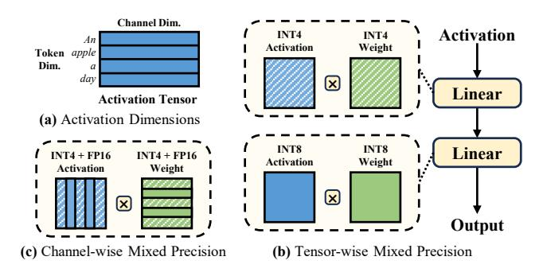
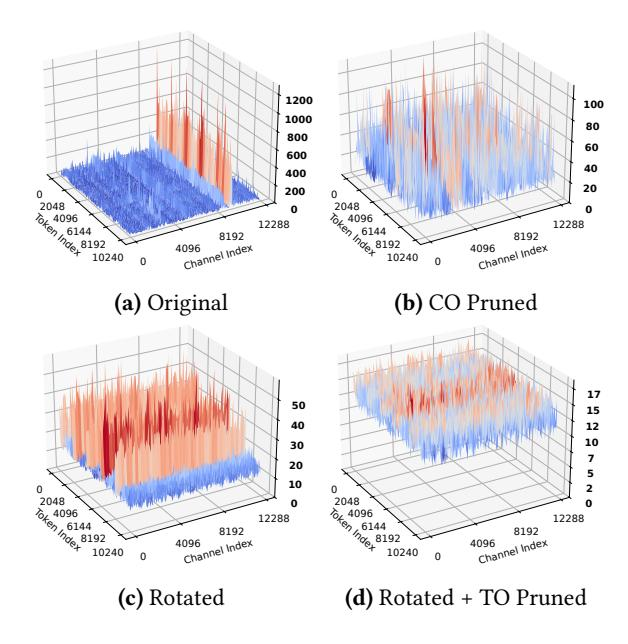
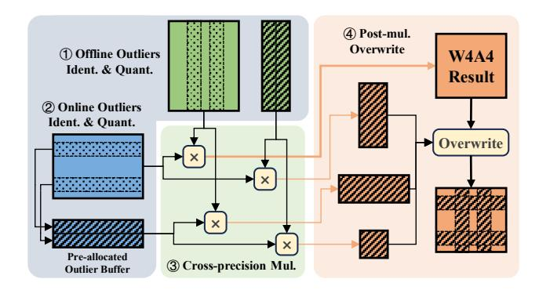
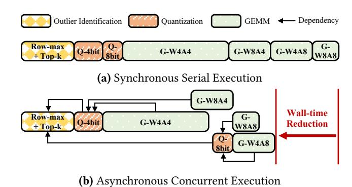
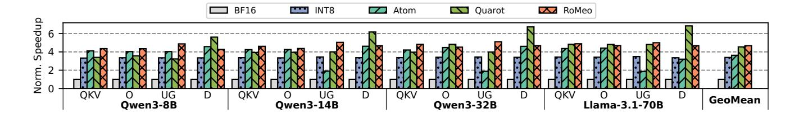
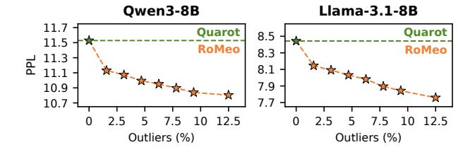

# RoMeo: Mitigating Dual-dimensional Outliers with Rotated Mixed Precision Quantization

[Qihao Zhang](https://orcid.org/0009-0003-2057-3316)

Tsinghua University Beijing, China zqh23@mails.tsinghua.edu.cn

[MingLiang Tang](https://orcid.org/0009-0003-4743-6872) Tsinghua University Beijing, China tml23@mails.tsinghua.edu.cn [Mingshu Zhai](https://orcid.org/0009-0009-7573-2250)

Tsinghua University Beijing, China zhaims22@mails.tsinghua.edu.cn

# [Kinman Lei](https://orcid.org/0009-0006-7633-9010)

Tsinghua University Beijing, China jw-li22@mails.tsinghua.edu.cn

## [Jidong Zhai](https://orcid.org/0000-0002-7656-6428)

Tsinghua University Beijing, China zhaijidong@tsinghua.edu.cn

# Abstract

Mixed precision quantization has been adopted to accelerate large language models (LLMs) serving by leveraging high-throughput low-precision compute units in GPUs while preserving outliers in higher precision to maintain model accuracy. However, existing methods focus on mitigating single-dimensional channel-wise outliers, leading to model accuracy degradation when scaled to 4-bit precision.

In this paper, we present an algorithm-system co-design to effectively handle dual-dimensional outliers across both channel and token dimensions in LLMs. We introduce a novel rotation-based mixed precision quantization algorithm that suppresses and migrates channel-wise outliers to the token dimension. Based on this algorithm, we propose RoMeo, an efficient LLM serving system designed to overcome the unique system challenges posed by sparse computation pattern and dynamic outlier detection inherent in token-wise outlier handling. Extensive evaluations across various LLMs demonstrate that RoMeo improves quantized model accuracy by up to 5.17% compared to state-of-the-art methods QuaRot and MixQ, while maintaining efficiency comparable to uniform precision quantizations, achieving up to 2.10× end-to-end speedup over half-precision baseline. RoMeo is available at <https://github.com/thu-pacman/RoMeo>.

CCS Concepts: • Computing methodologies → Parallel computing methodologies; Natural language processing.

Keywords: Large Language Model, Mixed Precision Quantization, Algorithm-System Co-design

## ACM Reference Format:

Qihao Zhang, MingLiang Tang, Mingshu Zhai, Kinman Lei, and Jidong Zhai. 2026. RoMeo: Mitigating Dual-dimensional Outliers


[This work is licensed under a Creative Commons Attribution 4.0 Interna](https://creativecommons.org/licenses/by/4.0)[tional License.](https://creativecommons.org/licenses/by/4.0)

PPoPP '26, Sydney, NSW, Australia © 2026 Copyright held by the owner/author(s). ACM ISBN 979-8-4007-2310-0/2026/01 <https://doi.org/10.1145/3774934.3786419>

with Rotated Mixed Precision Quantization. In Proceedings of the 31st ACM SIGPLAN Annual Symposium on Principles and Practice of Parallel Programming (PPoPP '26), January 31 – February 4, 2026, Sydney, NSW, Australia. ACM, New York, NY, USA, [15](#page-14-0) pages. <https://doi.org/10.1145/3774934.3786419>

# 1 Introduction

With the rapid evolution of large language models (LLMs), the latest models now comprise tens to hundreds of billions of parameters [\[5,](#page-11-0) [9,](#page-12-0) [12,](#page-12-1) [44\]](#page-14-1), placing severe pressure on GPU memory capacity and serving efficiency.

Quantization [\[15,](#page-12-2) [16,](#page-12-3) [45,](#page-14-2) [50\]](#page-14-3) has emerged as a promising solution for serving these huge models. By compressing tensor representations from high-precision formats (e.g., FP16/BF16) to lower-precision types (e.g., INT8/INT4), it reduces memory footprint and enables the use of low-precision Tensor Core instructions, which offer substantially higher computational throughput on modern GPUs [\[3,](#page-11-1) [24,](#page-13-0) [42\]](#page-13-1).

To enable low bit-width quantization while preserving model accuracy, recent works have prioritized computation for outliers through mixed precision quantization [\[7,](#page-12-4) [10,](#page-12-5) [11,](#page-12-6) [25,](#page-13-2) [48\]](#page-14-4). These methods leverage the activation sparsity property that widely observed in LLMs [\[2,](#page-11-2) [33\]](#page-13-3), where a small fraction of outlier values significantly exceed others in activation. By adaptively allocating higher precision to these error-sensitive regions while maintaining lower precision for majority values, mixed precision quantization achieves improved accuracy without pronounced runtime overhead.

Reducing quantization bit-widths from 8-bit to 4-bit halves memory consumption and doubles computational efficiency for model serving on modern GPUs. Although effective at 8-bit precision, existing mixed precision quantization methods fail to preserve satisfactory accuracy under 4-bit precision due to their incomplete characterization of outliers. While current methods operate along the channel dimension to mitigate outliers in specific embedding positions, our empirical analysis reveals that substantial outliers still persist after channel-wise outliers removal. These remaining outliers do not exhibit channel-wise concentration but

are distributed in a token-wise manner. They cannot be adequately represented within 4-bit data types, resulting in significant quantization error in current channel-wise mixed precision quantization methods.

In this paper, we propose Rotated Token-wise Mixed Precision Quantization (RTMPQ) to address outliers in both channel and token dimensions, thereby improving model accuracy. Instead of directly applying mixed precision quantization to channel dimension, RTMPQ first employs Hadamard rotation to suppress channel-wise outliers. The rotation smooths irregularities across channels and migrates them to the token dimension, where they are subsequently resolved through token-wise mixed precision quantization.

However, efficiently implementing RTMPQ presents great system challenges, as RTMPQ employs mixed precision quantization to address token-wise outliers rather than channelwise ones. Two unique characteristics of token-wise outliers hinder the direct application of existing channel-wise mixed precision quantization techniques:

(1) Non-reduction Dimension Computation. Existing mixed precision methods depend on the mathematical property to decompose matrix multiplication along the reduction dimension, where channel-wise outliers reside. This property allows computations at different precisions to be densified and executed separately. In contrast, token-wise outliers correspond to the non-reduction dimension in matrix multiplication and cannot benefit from this optimization. Consequently, token-wise mixed precision computation must occur in a sparse pattern, introducing challenges for efficient task mapping on GPUs and creating fundamental incompatibilities with Tensor Core instruction requirements. (2) Unpredictable Outlier Distribution. Current mixed precision methods rely on static offline activation analysis to detect channel-wise outliers, which exhibit relatively stable patterns [\[7,](#page-12-4) [43\]](#page-14-5). In contrast, token-wise outliers lack such statistical regularity and follow a significantly more unpredictable distribution. This unpredictability stems from the fact that token-wise outliers arise from specific linguistic features of words or phrases within the input natural language sentences, making their occurrence difficult to forecast. Consequently, identifying these outliers requires dynamic online detection mechanisms, which could introduce nonnegligible runtime overhead.

To address these challenges, we propose RoMeo, a LLM serving system for efficient token-wise mixed precision quantization execution, enabling accurate and performant 4-bit quantization via our RTMPQ algorithm. The core idea is to reorganize dynamic token-wise outliers to facilitate efficient parallel execution with minimal overhead. RoMeo tackles the sparse memory layout of quantized mixed precision data through a lightweight permutation-free approach that restructures data into contiguous and unified precision blocks, enabling dense matrix computation. The

system further employs fine-grained asynchronous execution to parallelize non-dependent tasks in the quantization workflow, effectively hiding quantization operations and improving hardware utilization. Additionally, RoMeo implements highly optimized cross-precision multiplication kernels with software pipelining, alongside efficient fused kernels for online outlier detection and data packing.

RoMeo is evaluated for both accuracy and efficiency across a wide range of LLMs, compared against the uniform precision quantization baseline QuaRot [\[3\]](#page-11-1) and the channel-wise mixed precision quantization baseline MixQ [\[7\]](#page-12-4). Experimental results demonstrate that RoMeo achieves higher accuracy than QuaRot at low outlier ratios, outperforms MixQ under equivalent outlier constraints, and maintains computational efficiency comparable to QuaRot.

Our main contributions can be summarized as follows:

- We conduct an empirical analysis identifying dualdimensional outliers as the fundamental bottleneck in existing mixed precision quantization methods.
- We propose a novel quantization algorithm that addresses outliers in both channel and token dimensions through rotation-based smoothing and tokenwise mixed precision computation.
- We design an efficient permutation-free approach to handle token-wise outlier computation, combining specialized kernel implementation and asynchronous concurrent execution for optimal performance.
- Comprehensive evaluation demonstrates that our system achieves superior model accuracy preservation while delivering competitive speedup compared to state-of-the-art baselines.

## 2 Background

#### 2.1 Quantized Large Language Models

Model quantization reduces the precision of tensor representations from high-precision formats (e.g., FP32, FP16) to low-precision formats (e.g., INT8, INT4), thereby decreasing memory requirements and accelerating computation through specialized low-precision hardware units [\[3,](#page-11-1) [24,](#page-13-0) [43\]](#page-14-5). This paper focuses on joint weight-activation quantization for large language models, which applies quantization to both weights and activations and is widely adopted in data center model serving deployments [\[9\]](#page-12-0).

Quantized model inference introduces two additional processes: an online quantization process that compresses input activation to lower precision, and a dequantization process restores multiplication result to the original precision.

The quantization process typically computes the maximum absolute value of the input activation and scales it to fit the target precision value range. Formally, given input activation tensor and target integer bit-width , the quantized

<span id="page-2-0"></span>

Figure 1. The two dimensions of activation tensor and existing mixed precision quantization methods.

activation is computed as:

$$S_X = \frac{\max(|X|)}{2^{b-1} - 1}, \quad X_Q = round\left[\frac{X}{S_X}\right]$$
 (1)

where is a half-precision scaling factor and [·] denotes rounding to nearest integer.

The quantized activation then undergoes matrix multiplication with offline-quantized weight. The result is subsequently cast back to half-precision and dequantized with scaling factors:

$$Y = S_X \times (X_Q W_Q) \times S_W \tag{2}$$

In practice, quantizations are typically conducted at finer granularity (e.g., per-row for activations and per-column for weights) to better preserve quantized model accuracy. This approach transforms scaling factors into vectors rather than scalars, requiring broadcasted element-wise multiplication during the dequantization process.

#### 2.2 Mixed Precision Quantization

Prior works have established that activations in LLMs typically exhibit long-tailed distributions, wherein a small number of outlier values substantially exceed the magnitude of the majority [\[2,](#page-11-2) [33\]](#page-13-3). Mixed precision quantization leverages this inherent property to strategically assign higher precision formats to critical computational portions while employing lower precision elsewhere. Consequently, these methods achieve superior model accuracy preservation compared to uniform precision quantization.

Before introducing existing mixed precision quantization algorithms, we first clarify the two dimensions of the activation tensor. Input prompts in LLMs are embedded into activation tensors and propagated through the model. As illustrated in Figure [1a](#page-2-0), each input token corresponds to a row within the activation tensor, representing its embedding vector. The channel dimension refers to different positions along the hidden dimension of these embeddings.

Existing mixed precision quantization methods can be categorized based on the dimension along which precision is varied, forming two primary types: tensor-wise and channelwise mixed precision quantization.

Tensor-wise approaches [\[11,](#page-12-6) [39\]](#page-13-4), shown in Figure [1b](#page-2-0), employ coarse-grained mixed precision by assigning different precisions to distinct model modules. While computations in different modules are performed at varying precisions, the precision within each individual tensor remains uniform.

Channel-wise methods [\[7,](#page-12-4) [10,](#page-12-5) [25,](#page-13-2) [48\]](#page-14-4), depicted in Figure [1c](#page-2-0), provide finer granularity by operating on individual channels within tensors. For example, MixQ [\[7\]](#page-12-4) identifies outlier channels through per-channel maximum value measurements, quantizing normal channel values to INT8 while preserving outlier channels in FP16 to better maintain model accuracy. Although channel-wise methods effectively address significant outliers concentrated in specific channels, outliers distributed along the token dimension persist. These remaining token-wise outliers continue to degrade quantization effectiveness, particularly under aggressive 4-bit quantization schemes.

# 3 Algorithm: Rotated Token-wise Mixed Precision Quantization

To better maintain model performance under 4-bit precision, we propose Rotated Token-wise Mixed Precision Quantization (RTMPQ), a novel method addressing dual-dimensional outliers in LLMs. In this section, we first introduce an empirical analysis of activation distribution that identifies why existing channel-wise quantization methods underperform. Then we detail RTMPQ algorithm, which effectively handles the dual-dimensional outliers through rotation and tokenwise mixed precision computation.

#### 3.1 Analysis of Outliers in LLMs

We visualize the activation distribution recorded from the down projection linear module in Qwen3-8B [\[44\]](#page-14-1) model's final layer in Figure [2.](#page-3-0) As shown in Figure [2a,](#page-3-0) the activation distribution exhibits a sparse pattern wherein a small number of extreme values dominate the magnitude scale. These outliers introduce substantial quantization error by distorting the quantization range and inefficiently utilizing the limited bit representation. Consistent with prior works [\[7,](#page-12-4) [10,](#page-12-5) [25\]](#page-13-2), we observe these outliers concentrate in specific channels, termed channel-wise outliers (CO).

Existing channel-wise mixed precision methods leverage this property by separating outlier channels from normal channels for higher precision computations. After we identify and prune the top 256 outlier channels by maximum activation values, the maximum value drops from 1272 to 110 (Figure [2b\)](#page-3-0), enabling effective 8-bit quantization.

However, when scaled to 4-bit quantization, the remaining values still exhibit outliers that unable to be effectively represented within the constrained 4-bit precision, resulting in

<span id="page-3-0"></span>

**Figure 2.** Visualized activation distribution of down projection module from layer 35 in Qwen3-8B model. CO and TO refers to channel-wise outliers and token-wise outliers, respectively. For better visualization, the absolute activations are downsampled using 64×64 max pooling.

<span id="page-3-1"></span>
$$H_4 = \begin{bmatrix} 1 & 1 & 1 & 1 \\ 1 & -1 & 1 & -1 \\ 1 & 1 & -1 & -$$

**Figure 3.** Example of a Hadamard matrix of size 4 and illustration of rotation technique in a quantized LLM linear module. It is notable that Hadamard matrices are orthogonal matrices, and  $HH^T$  equals the identity matrix I.

significant accuracy degradation. These residual outliers cannot be eliminated through channel-wise detection since they originate from specific tokens within the input sequence, which we identify as token-wise outliers.

#### 3.2 RTMPQ Algorithm Design

Rather than applying mixed precision quantization directly to channel-wise outliers, RTMPQ employs a two-step approach to address the dual-dimensional outlier problem.

**Hadamard Rotation.** Inspired by QuaRot [3] and other works [6, 26, 38], RTMPQ first employs Hadamard rotation for channel-wise outlier suppression. As shown in Figure 3, the Hadamard matrix is an orthogonal matrix with elements of either +1 or -1. When multiplied to the activation matrix, it redistributes the values across channels, effectively smoothing extreme values. To maintain mathematical equivalence, a transposed Hadamard rotation to weight matrices is performed during offline preparation.

```
Algorithm 1: Token-wise Mixed Precision Module
   Input: A: FP16 activation tensor of shape (M, K).
            W: FP16 weight tensor of shape (K, N).
   Output: C: FP16 output tensor of shape (M, N).
 1 Function Quant(X, nbits)
       range max \leftarrow 2^{nbits} - 1;
       scale \leftarrow \max(|X|) / range\_max;
       X_Q \leftarrow \text{INT}(X/scale);
       return X_O, scale;
6 Function Forward(A, W)
       C \leftarrow Empty(M, N, FP16);
7
       for i \leftarrow 0 to M do
8
            for j \leftarrow 0 to N do
 9
                V_A, s_A \leftarrow Quant(A[i,:], i \in O_A? 8:4);
10
                V_W, s_W \leftarrow Quant(W[:, j], j \in O_W? 8:4);
11
                C[i, j] \leftarrow (V_A \cdot V_W) \times (s_A \times s_W);
12
       return C;
```

Our empirical study demonstrates the effectiveness of Hadamard rotation. As shown in Figure 2c, the peak activation value after rotation is sharply reduced from 1272 to 58.5, significantly reducing quantization error. Furthermore, the rotated activation exhibits token-wise concentration as the irregularity migrates from the channel dimension to token dimension. This transformation eliminates the need for complex dual-dimensional mixed precision computation.

The additional runtime overhead introduced by rotation remains minimal due to the recursive structure of Hadamard matrices. Multiplication with Hadamard matrices can be efficiently implemented through Fast Walsh-Hadamard Transform within the computational complexity of  $O(mn \log n)$  for  $m \times n$  matrices [1]. This represents negligible overhead compared to the dominant cost of the linear module.

**Token-wise Mixed Precision.** Following Hadamard rotation, outliers now exhibit pure token-wise concentration. RTMPQ then addresses these remaining outliers through token-wise mixed precision quantization.

First, the outlier set  $O_A$  is determined by measuring pertoken maximum activation values. Given a fixed outlier count budget  $k_o$ , RTMPQ performs top-k selection to identify the  $k_o$  tokens with highest activation magnitudes, storing them in set  $O_A$ .

Second, RTMPQ applies INT8 quantization to outlier tokens while using INT4 quantization for remaining tokens, as detailed in Algorithm 1 (lines 10). In addition to the quantized integer representations, corresponding per-token scaling factors are also derived during quantization. These two procedures of outlier identification and mixed precision quantization extend symmetrically to the weight matrix (line 11) and are completed during the offline preparation phase before model serving.

Notably, while weight matrices are typically smoother than activations, the required pre-multiplication by  $H^T$  for weights illustrated in Figure 3 amplifies their non-uniformity, creating an outlier distribution similar to Figure 2c. This necessitates applying the same mixed-precision quantization to the weight matrix as well.

Finally, RTMPQ performs matrix multiplication that naturally accommodates this heterogeneous precision scheme. The algorithm computes dot products between quantized vectors and dequantizes the results using corresponding scaling factors, as detailed in Algorithm 1 (line 12).

Depending on the outlier status, these dot products may be computed in four distinct precision combinations. RTMPQ employs INT32 accumulators for cross-precision multiplication to prevent overflow during accumulation. The reduced sum is subsequently cast back to floating-point precision and dequantized using per-token scaling factors obtained during the quantization process.

By separating token-wise outliers in higher precision, the remaining values are able to be processed more accurately in low bit-width precision. As shown in Figure 2d, the maximum activation value is further reduced from 58.5 to 18.6 after ruling out token-wise outliers.

#### 3.3 Computational Complexity Analysis

Given that INT4 Tensor Cores typically achieve 2× higher throughput than INT8 Tensor Cores, the proportion of INT4 computations becomes crucial for determining RTMPQ's theoretical speedup.

Assume we select  $k_a$  token-wise outliers in the activation matrix and  $k_w$  outliers in the weight matrix. The ratio of pure INT4 computations is given by:

$$\mathcal{P}_{INT4} = \frac{(m - k_a) \times (n - k_w)}{m \times n}$$

where m denotes the number of tokens and n the number of channels. Assume INT8 Tensor Cores deliver  $2 \times$  throughput of FP16 Tensor Cores, the overall theoretical speedup of RTMPQ against original FP16 baseline can be calculated as:

$$\mathcal{S} = \frac{1}{\mathcal{P}_{INT4}/4 + (1-\mathcal{P}_{INT4})/2}$$

For example, if we set m = n = 4096,  $k_a = k_w = 256$ , the ratio of INT4 multiplications is 88%, leading to a theoretical speedup of 3.57×.

## 4 System Challenges

The proposed RTMPQ algorithm demonstrates potential for superior model performance preservation. However, two system challenges prevent the implementation of this theoretical advantage for practical serving speedup.

<span id="page-4-0"></span>

(b) Permuted Mixed Precision GEMM

Thread Block

Workloads

**Figure 4.** Workload partitioning and thread block mapping for non-reduction dimension mixed precision multiplication.

#### 4.1 Sparse and Cross-Precision Computation

Layout W

Permuted

Layout A

The fundamental difference between token-wise and channel-wise mixed precision lies in their computational dimension within matrix multiplication (GEMM). Token-wise mixed precision operates along the non-reduction dimension, while channel-wise method operates along the reduction dimension, which naturally supports computation decomposition.

Therefore, token-wise mixed precision has to face sparse and cross-precision computation, which is hard to be efficiently implemented. To illustrate, we present the workload partitioning of non-reduction dimension mixed precision GEMM in Figure 4a. While the output matrix is divided into 9 tiles for parallel execution on GPU thread blocks, mixed precision causes workload heterogeneity: 8 of the 9 thread blocks must handle mixed data type combinations, requiring conditional branches and limiting Tensor Core efficiency.

One potential solution is to coalesce data of same precision with permutation, as shown in Figure 4b. This approach homogenizes the workload within thread blocks: 4 blocks now compute pure INT4 multiplication, 4 blocks handle either INT4-INT8 or INT8-INT4 multiplications, and 1 block computes pure INT8 multiplication. However, the permutation introduces non-trivial overhead of computing indices and performing in-place swaps, which often outweighs the computational benefits.

#### 4.2 Dynamic Outlier Distribution

Another challenge stems from the distinct origin of tokenwise outliers in LLMs. Channel-wise outliers emerge from the internal model structure and are found to be concentrate at specific positions along the channel dimension. Existing

<span id="page-5-0"></span>

Figure 5. The permutation-free mixed precision computation implementation proposed in RoMeo.

methods leverage offline calibration datasets to identify these channels, simplifying system design.

In contrast, token-wise outliers originate from linguistic characteristics within input sequences, exhibiting dynamic and unpredictable patterns. This nature introduces both challenges for quantized data layout and online outlier detection. Performing real-time detection could incur significant runtime overhead, thereby diminishing overall speedup gains.

## 5 System Optimizations

RoMeo introduces three specialized optimizations to address these challenges and achieve tangible serving speedup.

#### 5.1 Permutation-free Mixed Precision Computation

RoMeo employs a permutation-free approach to densify sparse computation while avoiding heavy permutation operations. As illustrated in Figure [5,](#page-5-0) RoMeo pre-allocates a dedicated outlier buffer whose size is fixed based on the predetermined number of outlier tokens. During quantization, the entire matrix is quantized to INT4, while the embeddings corresponding to outlier tokens are copied and quantized into this outlier buffer in INT8 precision. Since outlier tokens typically constitute only a small fraction of the total, the additional memory overhead remains marginal.

Next, RoMeo performs all four types of cross-precision multiplications between INT4 activations, INT8 outlier activations, and the corresponding weight matrices. Since all individual matrices involved in the computation are now dense and uniform-precision, each GPU thread block is assigned to handle a specific cross-precision computation type. We detail the implementation of this kernel in [§5.2.](#page-5-1)

Notably, in our scheme, outlier tokens are quantized to both INT8 and INT4 precisions and participate in multiple multiplication operations. We tolerate this redundant computation to preserve the contiguous memory layout requirement of Tensor Core instructions.

Finally, we directly overwrite the corresponding positions in the output tensor with higher-precision results computed from outlier tokens. This approach completely avoids permutation overhead while maintaining contiguous memory access patterns, simultaneously resolving the challenge of storing multiple precision data within a single data buffer.

## <span id="page-5-1"></span>5.2 Intra-Kernel Cross-Precision Multiplication with Software Pipelining

The performance of the core GEMM kernel is crucial for overall serving efficiency. RoMeo introduces an efficient separatekernels implementation with software pipelining to support intra-kernel cross-precision multiplication.

Single vs. Multiple Kernels. Mixed precision computation introduces diverse precision operand combinations, presenting a key design decision: whether to employ a single fused kernel or multiple separate kernels for handling different precision combinations in multiplication.

Typically, a fused single-kernel implementation assigns different thread blocks to handle different multiplication types, minimizing kernel launch overhead. Conversely, a separate-kernels implementation launches distinct kernels (e.g., four kernels for four precision combinations), introducing additional launch overhead and potentially suffering from insufficient parallelism due to the tall-and-skinny matrices caused by outlier tokens.

Nevertheless, we opt for a separate-kernels implementation in this work. The primary reason is the distinct computational characteristics and on-chip resource requirements of different multiplication types. For instance, an INT8-INT8 multiplication kernel requires twice shared memory capacity for matrix tile caching compared to an INT4-INT4 kernel under identical tiling parameters. In this configuration, GPU occupancy becomes constrained by shared memory consumption, which subsequently enables the compiler to utilize more registers for instruction-level parallelism without negative side effects.

In contrast, an INT4-INT4 kernel consumes less shared memory, establishing a tradeoff between register usage and GPU occupancy. The compiler may reduce loop unrolling to decrease register usage, trading this for higher occupancy to achieve optimal overall performance. A fused kernel implementation prevent this fine-grained allocation of on-chip resources according to the specific requirements of each computation precision, leading to suboptimal performance.

RoMeo addresses the limitations of launch overhead and underutilization through asynchronous execution, as detailed in [§5.3.](#page-6-0) Our evaluation demonstrates that the separatekernels implementation outperforms the fused alternative when combined with this asynchronous optimization.

Software Pipelining and Type Casting. Achieving high performance for compute-intensive kernels on GPUs requires efficient overlap of memory accesses and computation. RoMeo employs a software pipeline to this end, as outlined

#### **Algorithm 2:** RoMeo Software Pipeline

```
Input: Iter_K: Number of tiles along K dimension. N_{stage}: Number of pipeline stages.
```

```
1 Function MainLoop
       // Pipeline fill
       for i \leftarrow 0 to N_{stage} - 1 do
         cp_async_block(i);
3
       // Steady state
       for i \leftarrow 0 to Iter_K - N_{stage} - 1 do
4
           cp_async_wait(N_{stage} - 1);
           mma_compute(i\%N_{stage});
6
           cp_async_block(i + N_{stage});
       // Pipeline tail
       for i \leftarrow N_{stage} - 1 \text{ to } 0 \text{ do}
8
           cp_async_wait(i);
           mma_compute((Iter_K - 1 - i)%N_{stage});
10
       scale_and_write_out();
```

in Algorithm 2. The kernel's main loop computes the product of submatrices  $A[bid_m \times TM : (bid_m + 1) \times TM, :]$  and  $B[:,bid_n \times TN : (bid_n + 1) \times TN]$ , where  $bid_m$  and  $bid_n$  are thread block indices, and TM and TN are the tiling sizes along the M and N dimensions, respectively. Computation proceeds along the K dimension in  $Iter_K$  tiles.

The pipeline first issues  $N_{stage}$  asynchronous memory copy operations via cp. async PTX instruction to load data from global to shared memory, thereby filling the pipeline. The steady state then starts: each iteration waits for the oldest memory copy to complete, performs matrix multiplication using Tensor Cores mma instructions, and subsequently issues a new asynchronous copy. Finally, the pipeline drains by waiting for all remaining memory operations to complete and performing the corresponding computations.

For computations involving different data types, RoMeo inserts an in-shared-memory type casting phase before performing mma computations. INT4 data is cast to INT8 using two binary arithmetic instructions instead of expensive type conversion instructions. Upon completing all computations, the results are scaled by the per-token scaling factors in registers and written back to global memory.

#### <span id="page-6-0"></span>5.3 Asynchronous Concurrent Execution

Modern GPUs feature over a hundred streaming multiprocessors (SMs) and large Tensor Core instruction shapes to enable massive parallelism. Hardware underutilization occurs when the problem size is insufficient to saturate available resources. Consider the outlier multiplication of a  $256\times4096$  matrix. Using a  $256\times256$  thread block tiling configuration, only 16 thread blocks are launched, leaving most SMs idle.

RoMeo employs an asynchronous concurrent execution strategy to address underutilization while simultaneously

<span id="page-6-2"></span>

**Figure 6.** Illustration of asynchronous execution in RoMeo.

hiding quantization overhead. The approach leverages the observation that several kernels lack serial dependencies. For instance, the four separate multiplication kernels for different precision combinations can execute concurrently. By decomposing activation quantization into two independent tasks, quantizing outlier tokens and quantizing non-outlier tokens, each multiplication kernel depends on exactly one quantization task. This decomposition enables constructing a fine-grained task dependency graph where tasks execute asynchronously across multiple CUDA streams, as shown in Figure 6. RoMeo uses CUDA events to enforce correct execution ordering only where true dependencies exist.

#### 6 Implementation

We implement RoMeo as a PyTorch extension for seamless integration into existing LLM frameworks. The quantized modules are wrapped as PyTorch nn.Module instances, allowing direct replacement of original linear layers. We leverage HadaCore [1] for efficient Hadamard transformations.

At kernel level, we develop fused Triton [37] kernels for outlier identification, quantization and INT4 data packing. we develop mixed precision CUDA kernels with CUT-LASS [35] and expose them to Python through compiled dynamic libraries. For ease of use, RoMeo employs a justin-time (JIT) compilation mechanism that compiles kernels for specific model dimensions during initial execution and caches the compiled binaries for subsequent runs. The system also incorporates auto-tuning for critical hyperparameters based on runtime profiling results, including tiling sizes and the number of pipeline stages.

#### 7 Evaluation

We conduct comprehensive evaluations of RoMeo to assess its effectiveness in both model accuracy preservation and end-to-end performance speedup. Additionally, we perform ablation studies to analyze the contribution of individual technical components.

<span id="page-7-0"></span>**Table 1.** Comparison of baseline quantization methods across key features: Outlier Dimension addressed , Mixed Precision (M.P.), Hadamard Rotation (H.R.), and Quantization Granularity (Quant. Gran.). Tok. and Chan. represent Token and Channel, respectively.

| Method    | Outlier Dim. | M.P.         | H.R.         | Quant. Gran.   |
|-----------|--------------|--------------|--------------|----------------|
| QuaRot    | Chan.        | ×            | <b>√</b>     | per-Tok.Chan.  |
| ~<br>MixQ | Chan.        | ✓            | ×            | per-Tok./Chan. |
| Atom      | Chan.        | $\checkmark$ | ×            | per-Group      |
| RoMeo     | Tok. & Chan. | $\checkmark$ | $\checkmark$ | per-Tok./Chan. |

#### 7.1 Accuracy Evaluation

*Evaluated Models.* We evaluate our RTMPQ algorithm on two series of widely used open-source LLMs: Qwen3 [44] and Llama-3.1 [12]. The Qwen3 series include 8B, 14B, and 32B models, while the Llama-3.1 series include 8B and 70B models, covering a wide range of model sizes.

Evaluated Tasks. We conduct both perplexity evaluation on WikiText2 [28] and zero-shot evaluation on six common downstream tasks, including ARC (Challenge and Easy) [8], HellaSwag (HS) [46], LAMBADA [29], PIQA [4], and Wino-Grande (WG) [31]. Downstream tasks are evaluated using the lm-eval library [14] with a batch size of 32. Perplexity is measured with a batch size of 2 and sequence length of 2048.

Baselines. We evaluate RTMPQ against other state-of-the-art 4-bit quantization methods, including QuaRot [3], MixQ [7] and Atom [48]. QuaRot employs a similar Hadamard transformation for outlier suppression. MixQ applies mixed precision quantization across channels, allocating higher precision to channels containing channel-wise outliers. Atom leverages mixed precision quantization at channel levels similar to MixQ, but performs quantization at a finer group-wise granularity (group size 128). While this can yield potentially higher accuracy, it introduces additional computational overhead.

In Table 1, we compare key features of baselines and RoMeo, highlighting that RoMeo handles dual-outliers in both token and channel dimensions using mixed precision quantization and Hadamard rotation. This enables coarse-grained per-token/channel quantization, leading to better serving efficiency. The choice of quantization granularity is orthogonal to the RTMPQ algorithm, and RoMeo can further improve accuracy by combining with per-group quantization at the cost of efficiency.

The unquantized baseline uses BF16, the default weight type for the evaluated models. We also include INT4 quantization results using trivial round-to-nearest quantization for reference. For RoMeo, we set the token-wise outlier percentage to 5% for both activation and weight tensors. To ensure fair comparison, we configure MixQ to select channel-wise

<span id="page-7-1"></span>**Table 2.** Comparison of measured perplexity on WikiText2 dataset. The lower is better.

| Method |        | Qwen3  | Llama-3.1 |        |        |
|--------|--------|--------|-----------|--------|--------|
| Method | 8B     | 14B    | 32B       | 8B     | 70B    |
| BF16   | 9.72   | 8.65   | 7.61      | 6.24   | 2.81   |
| INT4   | 2.55e4 | 2.25e5 | 2.19e6    | 769.53 | 1.02e4 |
| MixQ   | 14.76  | 12.57  | 12.38     | 10.55  | 17.15  |
| Atom   | 19.04  | 10.68  | 9.78      | 7.62   | 4.25   |
| QuaRot | 11.53  | 9.81   | 8.85      | 8.44   | 5.10   |
| RoMeo  | 10.97  | 9.59   | 8.64      | 7.99   | 4.87   |

outliers from activation tensors online with a percentage of 10% to match RoMeo's sparsity level.

**7.1.1 Perplexity Evaluation.** Table 2 presents the perplexity results of different quantization methods on the Wiki-Text2 dataset. We observe that naive INT4 quantization leads to extremely high perplexity across all models, indicating a severe degradation in model quality. MixQ exhibits significant performance degradation because it only addresses channel-wise outliers in activations, leaving numerous tokenwise outliers unhandled. Although QuaRot achieves better results by suppressing channel-wise outliers through input rotation, it still underperforms compared to RoMeo due to residual token-wise outliers. In contrast, RoMeo achieves superior perplexity across all models by effectively mitigating both token-wise and channel-wise outliers through our proposed RTMPQ algorithm. Atom achieves competitive perplexity on Llama-3.1 models due to its finer-grained, groupwise mixed-precision quantization, but at the cost of higher computational overhead. However, Atom's effectiveness is severely limited on Owen3 models, indicating a lack of scalability across different model architectures.

7.1.2 Downstream Tasks Evaluation. Table 3 presents the zero-shot accuracy results of different quantization methods across six downstream tasks, using the same experimental settings as the perplexity evaluation. RoMeo achieves the highest average accuracy across all Qwen3 models, consistently outperforming existing quantization methods and narrowing the performance gap with the half-precision baseline. On Llama-3.1 models, Atom attains marginally better average accuracy due to its finer-grained quantization approach, but RoMeo still delivers competitive results with substantially lower computational overhead.

By computing merely 5% of outliers in higher precision, RoMeo effectively mitigates quantization error while maintaining computational efficiency, achieving a superior balance between model accuracy and inference performance for practical LLM serving.

Table 3. Comparison of zero-shot accuracy on six downstream tasks. The higher is better.

<span id="page-8-0"></span>

| Model         | Method | ARC-C | ARC-E | HS    | LAMBADA | PIQA  | WG    | Average |
|---------------|--------|-------|-------|-------|---------|-------|-------|---------|
| Qwen3-8B      | BF16   | 56.74 | 80.85 | 74.90 | 64.12   | 77.80 | 68.11 | 70.42   |
|               | INT4   | 26.45 | 26.60 | 26.40 | 0.00    | 51.14 | 51.14 | 36.35   |
|               | MixQ   | 40.27 | 64.18 | 62.55 | 37.45   | 70.67 | 59.91 | 55.84   |
|               | Atom   | 47.18 | 73.65 | 63.44 | 41.41   | 72.25 | 61.56 | 59.92   |
|               | QuaRot | 48.21 | 72.94 | 68.29 | 53.95   | 74.10 | 62.43 | 63.32   |
|               | RoMeo  | 49.66 | 72.85 | 70.43 | 57.91   | 73.34 | 62.27 | 64.41   |
|               | BF16   | 60.32 | 82.95 | 78.82 | 67.82   | 79.87 | 72.53 | 73.72   |
|               | INT4   | 24.83 | 25.55 | 26.16 | 0.02    | 50.05 | 50.43 | 29.51   |
| Qwen3-14B     | MixQ   | 46.93 | 71.04 | 68.24 | 45.53   | 73.39 | 68.43 | 62.26   |
|               | Atom   | 51.79 | 73.23 | 74.02 | 62.47   | 76.93 | 68.90 | 67.89   |
|               | QuaRot | 57.00 | 79.55 | 74.79 | 63.09   | 77.48 | 68.35 | 70.04   |
|               | RoMeo  | 58.11 | 79.63 | 75.66 | 63.81   | 77.80 | 69.93 | 70.82   |
|               | BF16   | 60.84 | 83.25 | 82.59 | 67.13   | 81.94 | 73.40 | 74.86   |
|               | INT4   | 25.94 | 25.76 | 26.12 | 0.00    | 50.05 | 50.75 | 35.72   |
| Qwen3-32B     | MixQ   | 45.31 | 66.16 | 71.48 | 40.93   | 73.23 | 58.09 | 59.20   |
|               | Atom   | 22.70 | 25.08 | 78.81 | 64.56   | 49.51 | 68.90 | 51.59   |
|               | QuaRot | 56.23 | 77.44 | 79.19 | 62.74   | 79.05 | 67.96 | 70.44   |
|               | RoMeo  | 57.59 | 77.95 | 79.59 | 63.87   | 77.42 | 67.56 | 70.66   |
|               | BF16   | 53.67 | 81.23 | 78.84 | 75.33   | 81.23 | 73.56 | 73.98   |
|               | INT4   | 22.95 | 30.98 | 30.34 | 4.35    | 52.50 | 51.54 | 32.11   |
| Llama-3.1-8B  | MixQ   | 42.92 | 69.28 | 69.75 | 57.03   | 75.14 | 67.17 | 63.55   |
|               | Atom   | 49.06 | 74.62 | 74.62 | 70.27   | 78.29 | 70.72 | 69.60   |
|               | QuaRot | 42.32 | 66.84 | 71.91 | 65.13   | 75.03 | 62.04 | 63.88   |
|               | RoMeo  | 48.12 | 75.59 | 74.03 | 68.79   | 77.37 | 68.43 | 68.72   |
| Llama-3.1-70B | BF16   | 64.85 | 86.62 | 84.95 | 78.87   | 84.22 | 78.93 | 79.74   |
|               | INT4   | 26.62 | 25.88 | 26.29 | 0.00    | 50.92 | 48.22 | 35.59   |
|               | MixQ   | 48.12 | 73.19 | 73.70 | 56.18   | 74.32 | 60.06 | 64.26   |
|               | Atom   | 60.92 | 84.51 | 83.04 | 78.07   | 83.03 | 77.74 | 77.89   |
|               | QuaRot | 56.57 | 80.60 | 81.53 | 74.69   | 82.48 | 71.35 | 74.54   |
|               | RoMeo  | 59.56 | 82.79 | 82.52 | 76.32   | 83.03 | 75.85 | 76.68   |

#### 7.2 Efficiency Evaluation

Experimental Setup. We evaluate performance speedup on NVIDIA GeForce RTX 4090 GPUs with 24 GB memory, which provides up to 8× peak INT4 performance over halfprecision. The environment uses Python 3.12, PyTorch 2.8.0, and CUDA 12.8 for kernel compilation and execution.

Methodology. We employ CUDA Graph to capture the target workflow, eliminating kernel launch overhead, memory allocation costs, and PyTorch framework overhead. The captured graph is executed repeatedly without synchronization to ensure continuous GPU execution. The average latency is measured using CUDA events with multiple runs after

warmups. This ensures accurate and stable microsecondlevel latency measurements, particularly essential for small kernels or high-overhead scenarios.

7.2.1 End-to-end Performance. We integrate RoMeo to Transformers [\[41\]](#page-13-12) framework to evaluate its end-to-end acceleration performance. Our evaluation covers Qwen3 model sizes from 8B to 32B parameters, representing a broad spectrum of LLM scales. The experiments are conducted across varying batch sizes with a fixed input sequence length of 128. The outlier percentage in RoMeo is consistently set to 5%, maintaining alignment with our previous accuracy evaluation configuration.

Figure [7](#page-9-0) displays the latencies of a single transformer layer for BF16, QuaRot, and RoMeo, normalized to the BF16

<span id="page-9-0"></span>

**Figure 7.** Normalized layer-level latency on Qwen3 models of different input batch sizes. The number in parentheses indicates the absolute latency of BF16 baseline in milliseconds.

baseline. Absolute latency figures for the BF16 baseline are included in parentheses for reference. We exclude Atom from this comparison due to its significant computational overhead from finer-grained quantization, which results in substantial performance degradation relative to other 4-bit methods, as detailed in §7.2.3. The results demonstrate that RoMeo achieves up to 2.10× end-to-end speedup over the half-precision baseline. Despite the additional computation and challenges introduced by mixed precision quantization, RoMeo delivers performance comparable to the uniform precision baseline QuaRot, highlighting its effectiveness in maximizing hardware utilization and mitigating mixed precision overhead through specialized system designs.

Notably, QuaRot exhibits significant performance degradation on the Qwen3-14B model. This occurs because QuaRot applies Hadamard transformation between heads before the o\_proj layer in the attention module. While this approach works efficiently for Llama-2 series models (evaluated in QuaRot's original paper), Qwen3-14B's 40 attention heads lead to inefficient Hadamard transformation implementation. In contrast, RoMeo applies Hadamard transformation at the heads' hidden dimension, avoiding this issue.

7.2.2 Model Serving Performance. To evaluate the real-world model serving performance of RoMeo, we further integrate it into SGLang [49] (version v0.5.5), a widely adopted LLM serving framework. Our experiments include various sizes of Qwen3 models, ranging from 8B to 32B. For models exceeding the memory capacity of a single GPU, we employ tensor parallelism (TP) to distribute model parameters across multiple GPUs (2 GPUs for the 14B model and 4 GPUs for the 32B model). All evaluations use a fixed input sequence length of 128 and are carried out through SGLang's official offline benchmarking scripts, measuring prefill throughput in tokens per second across varying batch sizes.

The results in Table 4 show that RoMeo achieves a prefill throughput improvement of up to 1.90× over the unquantized baseline when serving the Qwen3-8B model on a single GPU. At small batch sizes, CPU overhead becomes the bottleneck, leading to performance degradation. This can be mitigated by enabling CUDA graphs in the prefill stage. As the

<span id="page-9-2"></span>**Table 4.** Comparison of prefill throughput (tokens per second) on Owen3 models of different input batch sizes.

| Model               | Batch | BF16     | RoMeo    | Speedup |
|---------------------|-------|----------|----------|---------|
|                     | 8     | 10233.07 | 5213.35  | 0.5095  |
| Qwen3-8B<br>(TP=1)  | 16    | 10664.64 | 10282.52 | 0.9642  |
|                     | 32    | 10745.83 | 19815.86 | 1.8441  |
|                     | 64    | 10545.13 | 20073.60 | 1.9036  |
| Qwen3-14B<br>(TP=2) | 8     | 6449.20  | 4021.85  | 0.6236  |
|                     | 16    | 6840.79  | 8060.05  | 1.1782  |
|                     | 32    | 6781.74  | 9148.49  | 1.3490  |
|                     | 64    | 6848.02  | 9064.14  | 1.3236  |
|                     | 8     | 4425.40  | 2581.76  | 0.5834  |
| Qwen3-32B<br>(TP=4) | 16    | 4451.47  | 5210.75  | 1.1706  |
|                     | 32    | 4561.73  | 5598.86  | 1.2274  |
|                     | 64    | 4537.32  | 5473.99  | 1.2064  |

batch size increases, kernel execution dominates the overall latency, allowing RoMeo to fully leverage its computational advantages.

For larger models requiring distributed serving, RoMeo still delivers significant speedups, achieving up to  $1.35\times$  for Qwen3-14B and  $1.23\times$  for Qwen3-32B. The reduced speedup in distributed settings is primarily due to communication overhead from tensor parallelism, which partially offsets the computational gains from quantization. Overall, these results confirm that RoMeo effectively accelerates LLM serving in production environments.

<span id="page-9-1"></span>**7.2.3 Kernel Performance.** Figure 8 presents the performance of the non-reduction dimension mixed precision multiplication kernel in RoMeo across various matrix shapes derived from Qwen3 and Llama-3.1 models. The M dimension of matrix multiplication is fixed to 4096.

We compare RoMeo' mixed precision kernel against four baselines: BF16 (PyTorch's half-precision multiplication implementation), INT8 (INT8 precision multiplication kernel implemented with CUTLASS), Atom (group-wise INT4 mixed precision kernel), and QuaRot (state-of-the-art INT4 multiplication implementation with fused dequantization kernel).

RoMeo achieves a geometric average speedup of 4.68× over BF16 across all matrix shapes, effectively utilizing the GPU's peak INT4 performance. It also consistently outperforms the INT8 baseline (3.39× average speedup). Atom kernels only achieve 3.63× average speedup due to the overhead of finer-grained group-wise quantization.

Compared to QuaRot, which achieves an average speedup of 4.55× over the half-precision baseline, RoMeo delivers comparable performance across most matrix shapes despite computing additional high-precision outliers. As a mixed precision kernel, RoMeo effectively leverages the GPU's low-precision computational capabilities while minimizing the

<span id="page-10-0"></span>

**Figure 8.** Normalized kernel performance on various matrix shapes. QKV, O, UG, and D represents the concatenated q, k, v projection, the output projection, the concatenated up, gate projection, and the down projection linear modules, respectively. These matrix shapes correspond to the actual weight tensors encountered in model serving.

<span id="page-10-1"></span>

**Figure 9.** Layer-level latency breakdown for Qwen3-8B across different batch sizes with progressive optimizations.

overhead of outlier computation through system-level optimizations, acheiving performance comparable to the fully-optimized uniform precision kernel implementations.

#### 7.3 Optimization and Performance Breakdown

Figure 9 shows RoMeo's layer-level latency breakdown of Qwen3-8B across different batch sizes, with five configurations progressively enabled: unified single kernel (U-ker), unified single kernel with pipelining (U-ker + Pipe.), separate kernels (S-ker), separate kernels with pipelining (S-ker + Pipe.), and separate kernels with pipelining and asynchronous execution (S-ker + Pipe. + Async.).

Compared to BF16 baseline, RoMeo introduces three main runtime overheads: Hadamard transformation, outlier identification and quantization, and post-multiplication overwrite. These overheads collectively account for approximately 12% of the baseline latency, while the mixed precision GEMM kernel delivers substantial performance gains that yield net speedup. The simple unified kernel implementation outperforms separate kernels due to reduced kernel launch overhead. Software pipelining improves both configurations by overlapping computation and memory access. However, with

<span id="page-10-2"></span>

**Figure 10.** Scaling the percentage of outliers.

asynchronous execution enabled, the separate-kernels implementation achieves superior performance, better utilizing streaming multiprocessor resources. The benefits of concurrent execution decline at larger batch sizes where individual kernels can already saturate GPU resources.

#### 7.4 Scaling Outliers

Figure 10 shows the perplexity of Qwen3-8B and Llama-3.1-8B models across different outlier percentage levels. We observe that perplexity decreases with increased outlier percentage, confirming that preserving more outliers improves model accuracy. The most significant improvements occur at lower percentages: Qwen3-8B and Llama-3.1-8B show perplexity reductions of 0.40 and 0.29 respectively when increasing outliers from 0% to 1.6%. This demonstrates that a small fraction of outliers has a disproportionate impact on quantization accuracy, which is the core property that RoMeo leverages to achieve high accuracy with minimal additional computational overhead.

#### 8 Related Work

#### 8.1 Quantization Algorithms of LLMs

Weight-only Quantizations. Weight-only LLM quantization methods including GPTQ [13], AWQ [23], QuIP [6], SqueezeLLM [20], and OmniQuant [32] apply low-bit quantization to weights while maintaining activations in higher precision. Although effective for memory reduction in low-batch scenarios, these approaches cannot achieve computational speedup in high-throughput serving settings where computation becomes the bottleneck.

Uniform Precision Weight-activation Quantizations.

SmoothQuant [\[43\]](#page-14-5) enables practical 8-bit weight-activation quantization through channel-wise smoothing. QServe [\[24\]](#page-13-0) and Quant-LLM [\[42\]](#page-13-1) explore sub-8-bit format quantization but still cannot leverage high-throughput 4-bit Tensor Cores of modern GPUs. QuaRot [\[3\]](#page-11-1) proposes rotation-based 4-bit quantization but still exhibits significant accuracy degradation compared to higher-bit methods. Other works including DuQuant [\[22\]](#page-12-12), AffineQuant [\[27\]](#page-13-15), OstQuant [\[19\]](#page-12-13), Spin-Quant [\[26\]](#page-13-5), and FlatQuant [\[34\]](#page-13-16) improve accuracy through optimized rotation matrices. These methods are orthogonal to our RTMPQ algorithm and could be combined for enhanced performance.

#### Mixed Precision Weight-activation Quantizations.

HAQ [\[39\]](#page-13-4) and MxMoE [\[11\]](#page-12-6) explore tensor-wise mixed precision for LLMs. Atom [\[48\]](#page-14-4), LLM.int8() [\[10\]](#page-12-5), and COMET [\[25\]](#page-13-2) propose channel-wise mixed precision methods for finergrained quantization. MixQ [\[7\]](#page-12-4) improves the performance of channel-wise mixed precision quantization by predicting outlier channels. However, these methods overlook tokenwise outliers, limiting their quantization performance.

Hardware-specialized Quantizations. ANT [\[18\]](#page-12-14) proposes a new data type designed for lower quantization error. Olive [\[17\]](#page-12-15) designs novel encoding schemes that sacrifice precision for common values to better represent outliers. While promising for accuracy, these methods require specialized hardware support to realize practical speedups and cannot be directly deployed on existing GPU-based LLM serving infrastructure.

## 8.2 Accelerating Quantized LLM Serving

Prominent LLM serving frameworks, such as vLLM [\[21\]](#page-12-16), SGLang [\[49\]](#page-14-7), and Chitu [\[36\]](#page-13-17), support quantized model by continuously integrating the latest algorithms and optimizations. SqueezeLLM [\[20\]](#page-12-11) and DecDEC [\[30\]](#page-13-18) employ algorithmsystem co-design for weight-only quantization, but cannot accelerate high-throughput serving scenarios. FP6-LLM [\[42\]](#page-13-1), COMET [\[25\]](#page-13-2), MixQ [\[7\]](#page-12-4) and Qserve [\[24\]](#page-13-0) develop specialized systems and kernels for their specific quantization algorithms, which are not directly applicable to our RTMPQ algorithm. Ladder [\[40\]](#page-13-19) and QFactory [\[47\]](#page-14-8) provide compilation frameworks for quantized kernels, but they cannot handle RTMPQ's fine-grained mixed precision pattern.

## 9 Conclusion

We present RoMeo, a LLM serving system that achieves superior model accuracy preservation through a novel Rotated Token-wise Mixed Precision Quantization algorithm. RoMeo introduces a permutation-free mixed precision computation paradigm that integrates software-pipelined cross-precision kernels and fine-grained asynchronous concurrent execution to effectively overcome the challenges of deploying

token-wise mixed precision quantization on GPUs. Extensive evaluations across diverse LLMs and benchmarks demonstrate that RoMeo not only improves quantization accuracy over existing methods but also delivers practical end-to-end speedups, establishing it as an effective solution for accurate and efficient LLM serving.

# Acknowledgments

We would like to thank the anonymous reviewers and our shepherd Dimitrios S. Nikolopoulos for their insightful comments. This work is supported by the National Key R&D Program of China under Grant 2023YFB3001501, NSFC for Distinguished Young Scholar under Grant 62225206, National Natural Science Foundation of China under Grants 62532006, U23A6007, and Beijing Natural Science Foundation under Grant L242017. Jidong Zhai is the corresponding author of this paper.

## Artifact Appendix

RoMeo is an open-source project, publicly accessible at [https:](https://github.com/thu-pacman/RoMeo) [//github.com/thu-pacman/RoMeo](https://github.com/thu-pacman/RoMeo). Detailed reproduction instructions are provided in the repository.

## References

- <span id="page-11-3"></span>[1] Krish Agarwal, Rishi Astra, Adnan Hoque, Mudhakar Srivatsa, Raghu K. Ganti, Less Wright, and Sijia Chen. 2024. HadaCore: Tensor Core Accelerated Hadamard Transform Kernel. CoRR abs/2412.08832 (2024). arXiv[:2412.08832](https://arxiv.org/abs/2412.08832) doi:[10.48550/ARXIV.2412.08832](https://doi.org/10.48550/ARXIV.2412.08832)
- <span id="page-11-2"></span>[2] Yongqi An, Xu Zhao, Tao Yu, Ming Tang, and Jinqiao Wang. 2025. Systematic Outliers in Large Language Models. In The Thirteenth International Conference on Learning Representations, ICLR 2025, Singapore, April 24-28, 2025. OpenReview.net. [https://openreview.net/forum?id=](https://openreview.net/forum?id=rLX7Vyyzus) [rLX7Vyyzus](https://openreview.net/forum?id=rLX7Vyyzus)
- <span id="page-11-1"></span>[3] Saleh Ashkboos, Amirkeivan Mohtashami, Maximilian L. Croci, Bo Li, Pashmina Cameron, Martin Jaggi, Dan Alistarh, Torsten Hoefler, and James Hensman. 2024. QuaRot: Outlier-Free 4-Bit Inference in Rotated LLMs. In Advances in Neural Information Processing Systems 38: Annual Conference on Neural Information Processing Systems 2024, NeurIPS 2024, Vancouver, BC, Canada, December 10 - 15, 2024, Amir Globersons, Lester Mackey, Danielle Belgrave, Angela Fan, Ulrich Paquet, Jakub M. Tomczak, and Cheng Zhang (Eds.). [http://papers.nips.cc/paper\\_files/paper/2024/hash/](http://papers.nips.cc/paper_files/paper/2024/hash/b5b939436789f76f08b9d0da5e81af7c-Abstract-Conference.html) [b5b939436789f76f08b9d0da5e81af7c-Abstract-Conference.html](http://papers.nips.cc/paper_files/paper/2024/hash/b5b939436789f76f08b9d0da5e81af7c-Abstract-Conference.html)
- <span id="page-11-4"></span>[4] Yonatan Bisk, Rowan Zellers, Ronan Le Bras, Jianfeng Gao, and Yejin Choi. 2020. PIQA: Reasoning about Physical Commonsense in Natural Language. In The Thirty-Fourth AAAI Conference on Artificial Intelligence, AAAI 2020, The Thirty-Second Innovative Applications of Artificial Intelligence Conference, IAAI 2020, The Tenth AAAI Symposium on Educational Advances in Artificial Intelligence, EAAI 2020, New York, NY, USA, February 7-12, 2020. AAAI Press, 7432–7439. doi:[10.1609/AAAI.V34I05.6239](https://doi.org/10.1609/AAAI.V34I05.6239)
- <span id="page-11-0"></span>[5] Sébastien Bubeck, Varun Chandrasekaran, Ronen Eldan, Johannes Gehrke, Eric Horvitz, Ece Kamar, Peter Lee, Yin Tat Lee, Yuanzhi Li, Scott M. Lundberg, Harsha Nori, Hamid Palangi, Marco Túlio Ribeiro, and Yi Zhang. 2023. Sparks of Artificial General Intelligence: Early experiments with GPT-4. CoRR abs/2303.12712 (2023). arXiv[:2303.12712](https://arxiv.org/abs/2303.12712) doi:[10.48550/ARXIV.2303.12712](https://doi.org/10.48550/ARXIV.2303.12712)

- <span id="page-12-7"></span>[6] Jerry Chee, Yaohui Cai, Volodymyr Kuleshov, and Christopher De Sa. 2023. QuIP: 2-Bit Quantization of Large Language Models With Guarantees. In Advances in Neural Information Processing Systems 36: Annual Conference on Neural Information Processing Systems 2023, NeurIPS 2023, New Orleans, LA, USA, December 10 - 16, 2023, Alice Oh, Tristan Naumann, Amir Globerson, Kate Saenko, Moritz Hardt, and Sergey Levine (Eds.). [http://papers.nips.cc/paper\\_files/paper/2023/hash/](http://papers.nips.cc/paper_files/paper/2023/hash/0df38cd13520747e1e64e5b123a78ef8-Abstract-Conference.html) [0df38cd13520747e1e64e5b123a78ef8-Abstract-Conference.html](http://papers.nips.cc/paper_files/paper/2023/hash/0df38cd13520747e1e64e5b123a78ef8-Abstract-Conference.html)
- <span id="page-12-4"></span>[7] Yidong Chen, Chen Zhang, Rongchao Dong, Haoyuan Zhang, Yonghua Zhang, Zhonghua Lu, and Jidong Zhai. 2024. MixQ: Taming Dynamic Outliers in Mixed-Precision Quantization by Online Prediction. In Proceedings of the International Conference for High Performance Computing, Networking, Storage, and Analysis, SC 2024, Atlanta, GA, USA, November 17-22, 2024. IEEE, 74. doi:[10.1109/SC41406.2024.00080](https://doi.org/10.1109/SC41406.2024.00080)
- <span id="page-12-8"></span>[8] Peter Clark, Isaac Cowhey, Oren Etzioni, Tushar Khot, Ashish Sabharwal, Carissa Schoenick, and Oyvind Tafjord. 2018. Think you have Solved Question Answering? Try ARC, the AI2 Reasoning Challenge. CoRR abs/1803.05457 (2018). arXiv[:1803.05457](https://arxiv.org/abs/1803.05457) [http://arxiv.org/abs/](http://arxiv.org/abs/1803.05457) [1803.05457](http://arxiv.org/abs/1803.05457)
- <span id="page-12-0"></span>[9] DeepSeek-AI, Aixin Liu, Bei Feng, Bing Xue, Bingxuan Wang, Bochao Wu, Chengda Lu, Chenggang Zhao, Chengqi Deng, Chenyu Zhang, Chong Ruan, Damai Dai, Daya Guo, Dejian Yang, Deli Chen, Dongjie Ji, Erhang Li, Fangyun Lin, Fucong Dai, Fuli Luo, Guangbo Hao, Guanting Chen, Guowei Li, H. Zhang, Han Bao, Hanwei Xu, Haocheng Wang, Haowei Zhang, Honghui Ding, Huajian Xin, Huazuo Gao, Hui Li, Hui Qu, J. L. Cai, Jian Liang, Jianzhong Guo, Jiaqi Ni, Jiashi Li, Jiawei Wang, Jin Chen, Jingchang Chen, Jingyang Yuan, Junjie Qiu, Junlong Li, Junxiao Song, Kai Dong, Kai Hu, Kaige Gao, Kang Guan, Kexin Huang, Kuai Yu, Lean Wang, Lecong Zhang, Lei Xu, Leyi Xia, Liang Zhao, Litong Wang, Liyue Zhang, Meng Li, Miaojun Wang, Mingchuan Zhang, Minghua Zhang, Minghui Tang, Mingming Li, Ning Tian, Panpan Huang, Peiyi Wang, Peng Zhang, Qiancheng Wang, Qihao Zhu, Qinyu Chen, Qiushi Du, R. J. Chen, R. L. Jin, Ruiqi Ge, Ruisong Zhang, Ruizhe Pan, Runji Wang, Runxin Xu, Ruoyu Zhang, Ruyi Chen, S. S. Li, Shanghao Lu, Shangyan Zhou, Shanhuang Chen, Shaoqing Wu, Shengfeng Ye, Shengfeng Ye, Shirong Ma, Shiyu Wang, Shuang Zhou, Shuiping Yu, Shunfeng Zhou, Shuting Pan, T. Wang, Tao Yun, Tian Pei, Tianyu Sun, W. L. Xiao, and Wangding Zeng. 2024. DeepSeek-V3 Technical Report. CoRR abs/2412.19437 (2024). arXiv[:2412.19437](https://arxiv.org/abs/2412.19437) doi:[10.48550/ARXIV.2412.19437](https://doi.org/10.48550/ARXIV.2412.19437)
- <span id="page-12-5"></span>[10] Tim Dettmers, Mike Lewis, Younes Belkada, and Luke Zettlemoyer. 2022. LLM.int8(): 8-bit Matrix Multiplication for Transformers at Scale. CoRR abs/2208.07339 (2022). arXiv[:2208.07339](https://arxiv.org/abs/2208.07339) doi:[10.48550/ARXIV.](https://doi.org/10.48550/ARXIV.2208.07339) [2208.07339](https://doi.org/10.48550/ARXIV.2208.07339)
- <span id="page-12-6"></span>[11] Haojie Duanmu, Xiuhong Li, Zhihang Yuan, Size Zheng, Jiangfei Duan, Xingcheng Zhang, and Dahua Lin. 2025. MxMoE: Mixed-precision Quantization for MoE with Accuracy and Performance Co-Design. CoRR abs/2505.05799 (2025). arXiv[:2505.05799](https://arxiv.org/abs/2505.05799) doi:[10.48550/ARXIV.](https://doi.org/10.48550/ARXIV.2505.05799) [2505.05799](https://doi.org/10.48550/ARXIV.2505.05799)
- <span id="page-12-1"></span>[12] Abhimanyu Dubey, Abhinav Jauhri, Abhinav Pandey, Abhishek Kadian, Ahmad Al-Dahle, Aiesha Letman, Akhil Mathur, Alan Schelten, Amy Yang, Angela Fan, Anirudh Goyal, Anthony Hartshorn, Aobo Yang, Archi Mitra, Archie Sravankumar, Artem Korenev, Arthur Hinsvark, Arun Rao, Aston Zhang, Aurélien Rodriguez, Austen Gregerson, Ava Spataru, Baptiste Rozière, Bethany Biron, Binh Tang, Bobbie Chern, Charlotte Caucheteux, Chaya Nayak, Chloe Bi, Chris Marra, Chris McConnell, Christian Keller, Christophe Touret, Chunyang Wu, Corinne Wong, Cristian Canton Ferrer, Cyrus Nikolaidis, Damien Allonsius, Daniel Song, Danielle Pintz, Danny Livshits, David Esiobu, Dhruv Choudhary, Dhruv Mahajan, Diego Garcia-Olano, Diego Perino, Dieuwke Hupkes, Egor Lakomkin, Ehab AlBadawy, Elina Lobanova, Emily Dinan, Eric Michael Smith, Filip Radenovic, Frank Zhang, Gabriel Synnaeve, Gabrielle Lee, Georgia Lewis Anderson, Graeme Nail, Grégoire Mialon, Guan Pang, Guillem Cucurell, Hailey Nguyen, Hannah Korevaar, Hu Xu, Hugo Touvron, Iliyan Zarov,

- Imanol Arrieta Ibarra, Isabel M. Kloumann, Ishan Misra, Ivan Evtimov, Jade Copet, Jaewon Lee, Jan Geffert, Jana Vranes, Jason Park, Jay Mahadeokar, Jeet Shah, Jelmer van der Linde, Jennifer Billock, Jenny Hong, Jenya Lee, Jeremy Fu, Jianfeng Chi, Jianyu Huang, Jiawen Liu, Jie Wang, Jiecao Yu, Joanna Bitton, Joe Spisak, Jongsoo Park, Joseph Rocca, Joshua Johnstun, Joshua Saxe, Junteng Jia, Kalyan Vasuden Alwala, Kartikeya Upasani, Kate Plawiak, Ke Li, Kenneth Heafield, Kevin Stone, and et al. 2024. The Llama 3 Herd of Models. CoRR abs/2407.21783 (2024). arXiv[:2407.21783](https://arxiv.org/abs/2407.21783) doi:[10.48550/ARXIV.2407.21783](https://doi.org/10.48550/ARXIV.2407.21783)
- <span id="page-12-10"></span>[13] Elias Frantar, Saleh Ashkboos, Torsten Hoefler, and Dan Alistarh. 2022. GPTQ: Accurate Post-Training Quantization for Generative Pretrained Transformers. CoRR abs/2210.17323 (2022). arXiv[:2210.17323](https://arxiv.org/abs/2210.17323) doi:[10.48550/ARXIV.2210.17323](https://doi.org/10.48550/ARXIV.2210.17323)
- <span id="page-12-9"></span>[14] Leo Gao, Jonathan Tow, Baber Abbasi, Stella Biderman, Sid Black, Anthony DiPofi, Charles Foster, Laurence Golding, Jeffrey Hsu, Alain Le Noac'h, Haonan Li, Kyle McDonell, Niklas Muennighoff, Chris Ociepa, Jason Phang, Laria Reynolds, Hailey Schoelkopf, Aviya Skowron, Lintang Sutawika, Eric Tang, Anish Thite, Ben Wang, Kevin Wang, and Andy Zou. 2024. The Language Model Evaluation Harness. doi:[10.5281/zenodo.12608602](https://doi.org/10.5281/zenodo.12608602)
- <span id="page-12-2"></span>[15] Amir Gholami, Sehoon Kim, Zhen Dong, Zhewei Yao, Michael W. Mahoney, and Kurt Keutzer. 2021. A Survey of Quantization Methods for Efficient Neural Network Inference. CoRR abs/2103.13630 (2021). arXiv[:2103.13630](https://arxiv.org/abs/2103.13630) <https://arxiv.org/abs/2103.13630>
- <span id="page-12-3"></span>[16] Ruihao Gong, Yifu Ding, Zining Wang, Chengtao Lv, Xingyu Zheng, Jinyang Du, Haotong Qin, Jinyang Guo, Michele Magno, and Xianglong Liu. 2024. A Survey of Low-bit Large Language Models: Basics, Systems, and Algorithms. CoRR abs/2409.16694 (2024). arXiv[:2409.16694](https://arxiv.org/abs/2409.16694) doi:[10.48550/ARXIV.2409.16694](https://doi.org/10.48550/ARXIV.2409.16694)
- <span id="page-12-15"></span>[17] Cong Guo, Jiaming Tang, Weiming Hu, Jingwen Leng, Chen Zhang, Fan Yang, Yunxin Liu, Minyi Guo, and Yuhao Zhu. 2023. OliVe: Accelerating Large Language Models via Hardware-friendly Outlier-Victim Pair Quantization. In Proceedings of the 50th Annual International Symposium on Computer Architecture, ISCA 2023, Orlando, FL, USA, June 17-21, 2023, Yan Solihin and Mark A. Heinrich (Eds.). ACM, 3:1–3:15. doi:[10.1145/3579371.3589038](https://doi.org/10.1145/3579371.3589038)
- <span id="page-12-14"></span>[18] Cong Guo, Chen Zhang, Jingwen Leng, Zihan Liu, Fan Yang, Yunxin Liu, Minyi Guo, and Yuhao Zhu. 2022. ANT: Exploiting Adaptive Numerical Data Type for Low-bit Deep Neural Network Quantization. In 55th IEEE/ACM International Symposium on Microarchitecture, MICRO 2022, Chicago, IL, USA, October 1-5, 2022. IEEE, 1414–1433. doi:[10.1109/MICRO56248.2022.00095](https://doi.org/10.1109/MICRO56248.2022.00095)
- <span id="page-12-13"></span>[19] Xing Hu, Yuan Cheng, Dawei Yang, Zhixuan Chen, Zukang Xu, Jiangyong Yu, Chen Xu, Zhihang Yuan, Zhe Jiang, and Sifan Zhou. 2025. OSTQuant: Refining Large Language Model Quantization with Orthogonal and Scaling Transformations for Better Distribution Fitting. In The Thirteenth International Conference on Learning Representations, ICLR 2025, Singapore, April 24-28, 2025. OpenReview.net. <https://openreview.net/forum?id=rAcgDBdKnP>
- <span id="page-12-11"></span>[20] Sehoon Kim, Coleman Hooper, Amir Gholami, Zhen Dong, Xiuyu Li, Sheng Shen, Michael W. Mahoney, and Kurt Keutzer. 2024. SqueezeLLM: Dense-and-Sparse Quantization. In Forty-first International Conference on Machine Learning, ICML 2024, Vienna, Austria, July 21-27, 2024. OpenReview.net. [https://openreview.net/forum?id=](https://openreview.net/forum?id=0jpbpFia8m) [0jpbpFia8m](https://openreview.net/forum?id=0jpbpFia8m)
- <span id="page-12-16"></span>[21] Woosuk Kwon, Zhuohan Li, Siyuan Zhuang, Ying Sheng, Lianmin Zheng, Cody Hao Yu, Joseph Gonzalez, Hao Zhang, and Ion Stoica. 2023. Efficient Memory Management for Large Language Model Serving with PagedAttention. In Proceedings of the 29th Symposium on Operating Systems Principles, SOSP 2023, Koblenz, Germany, October 23-26, 2023, Jason Flinn, Margo I. Seltzer, Peter Druschel, Antoine Kaufmann, and Jonathan Mace (Eds.). ACM, 611–626. doi:[10.1145/3600006.3613165](https://doi.org/10.1145/3600006.3613165)
- <span id="page-12-12"></span>[22] Haokun Lin, Haobo Xu, Yichen Wu, Jingzhi Cui, Yingtao Zhang, Linzhan Mou, Linqi Song, Zhenan Sun, and Ying Wei. 2024.

- DuQuant: Distributing Outliers via Dual Transformation Makes Stronger Quantized LLMs. In Advances in Neural Information Processing Systems 38: Annual Conference on Neural Information Processing Systems 2024, NeurIPS 2024, Vancouver, BC, Canada, December 10 - 15, 2024, Amir Globersons, Lester Mackey, Danielle Belgrave, Angela Fan, Ulrich Paquet, Jakub M. Tomczak, and Cheng Zhang (Eds.). [http://papers.nips.cc/paper\\_files/paper/2024/hash/](http://papers.nips.cc/paper_files/paper/2024/hash/9febda1c8344cc5f2d51713964864e93-Abstract-Conference.html) [9febda1c8344cc5f2d51713964864e93-Abstract-Conference.html](http://papers.nips.cc/paper_files/paper/2024/hash/9febda1c8344cc5f2d51713964864e93-Abstract-Conference.html)
- <span id="page-13-13"></span>[23] Ji Lin, Jiaming Tang, Haotian Tang, Shang Yang, Wei-Ming Chen, Wei-Chen Wang, Guangxuan Xiao, Xingyu Dang, Chuang Gan, and Song Han. 2024. AWQ: Activation-aware Weight Quantization for On-Device LLM Compression and Acceleration. In Proceedings of the Seventh Annual Conference on Machine Learning and Systems, MLSys 2024, Santa Clara, CA, USA, May 13-16, 2024, Phillip B. Gibbons, Gennady Pekhimenko, and Christopher De Sa (Eds.). mlsys.org. [https://proceedings.mlsys.org/paper\\_files/paper/2024/hash/](https://proceedings.mlsys.org/paper_files/paper/2024/hash/42a452cbafa9dd64e9ba4aa95cc1ef21-Abstract-Conference.html) [42a452cbafa9dd64e9ba4aa95cc1ef21-Abstract-Conference.html](https://proceedings.mlsys.org/paper_files/paper/2024/hash/42a452cbafa9dd64e9ba4aa95cc1ef21-Abstract-Conference.html)
- <span id="page-13-0"></span>[24] Yujun Lin, Haotian Tang, Shang Yang, Zhekai Zhang, Guangxuan Xiao, Chuang Gan, and Song Han. 2024. QServe: W4A8KV4 Quantization and System Co-design for Efficient LLM Serving. CoRR abs/2405.04532 (2024). arXiv[:2405.04532](https://arxiv.org/abs/2405.04532) doi:[10.48550/ARXIV.2405.04532](https://doi.org/10.48550/ARXIV.2405.04532)
- <span id="page-13-2"></span>[25] Lian Liu, Long Cheng, Haimeng Ren, Zhaohui Xu, Yudong Pan, Mengdi Wang, Xiaowei Li, Yinhe Han, and Ying Wang. 2025. COMET: Towards Practical W4A4KV4 LLMs Serving. In Proceedings of the 30th ACM International Conference on Architectural Support for Programming Languages and Operating Systems, Volume 2, ASPLOS 2025, Rotterdam, Netherlands, 30 March 2025 - 3 April 2025, Lieven Eeckhout, Georgios Smaragdakis, Katai Liang, Adrian Sampson, Martha A. Kim, and Christopher J. Rossbach (Eds.). ACM, 131–146. doi:[10.1145/3676641.](https://doi.org/10.1145/3676641.3716252) [3716252](https://doi.org/10.1145/3676641.3716252)
- <span id="page-13-5"></span>[26] Zechun Liu, Changsheng Zhao, Igor Fedorov, Bilge Soran, Dhruv Choudhary, Raghuraman Krishnamoorthi, Vikas Chandra, Yuandong Tian, and Tijmen Blankevoort. 2025. SpinQuant: LLM Quantization with Learned Rotations. In The Thirteenth International Conference on Learning Representations, ICLR 2025, Singapore, April 24-28, 2025. OpenReview.net. <https://openreview.net/forum?id=ogO6DGE6FZ>
- <span id="page-13-15"></span>[27] Yuexiao Ma, Huixia Li, Xiawu Zheng, Feng Ling, Xuefeng Xiao, Rui Wang, Shilei Wen, Fei Chao, and Rongrong Ji. 2024. AffineQuant: Affine Transformation Quantization for Large Language Models. In The Twelfth International Conference on Learning Representations, ICLR 2024, Vienna, Austria, May 7-11, 2024. OpenReview.net. [https://openreview.](https://openreview.net/forum?id=of2rhALq8l) [net/forum?id=of2rhALq8l](https://openreview.net/forum?id=of2rhALq8l)
- <span id="page-13-9"></span>[28] Stephen Merity, Caiming Xiong, James Bradbury, and Richard Socher. 2017. Pointer Sentinel Mixture Models. In 5th International Conference on Learning Representations, ICLR 2017, Toulon, France, April 24-26, 2017, Conference Track Proceedings. OpenReview.net. [https://openreview.](https://openreview.net/forum?id=Byj72udxe) [net/forum?id=Byj72udxe](https://openreview.net/forum?id=Byj72udxe)
- <span id="page-13-10"></span>[29] Denis Paperno, Germán Kruszewski, Angeliki Lazaridou, Quan Ngoc Pham, Raffaella Bernardi, Sandro Pezzelle, Marco Baroni, Gemma Boleda, and Raquel Fernández. 2016. The LAMBADA dataset: Word prediction requiring a broad discourse context. In Proceedings of the 54th Annual Meeting of the Association for Computational Linguistics, ACL 2016, August 7-12, 2016, Berlin, Germany, Volume 1: Long Papers. The Association for Computer Linguistics. doi:[10.18653/V1/P16-1144](https://doi.org/10.18653/V1/P16-1144)
- <span id="page-13-18"></span>[30] Yeonhong Park, Jake Hyun, Hojoon Kim, and Jae W. Lee. 2025. DecDEC: A Systems Approach to Advancing Low-Bit LLM Quantization. In 19th USENIX Symposium on Operating Systems Design and Implementation, OSDI 2025, Boston, MA, USA, July 7-9, 2025, Lidong Zhou and Yuanyuan Zhou (Eds.). USENIX Association, 803–819. [https://www.usenix.org/](https://www.usenix.org/conference/osdi25/presentation/park-yeonhong) [conference/osdi25/presentation/park-yeonhong](https://www.usenix.org/conference/osdi25/presentation/park-yeonhong)
- <span id="page-13-11"></span>[31] Keisuke Sakaguchi, Ronan Le Bras, Chandra Bhagavatula, and Yejin Choi. 2020. WinoGrande: An Adversarial Winograd Schema Challenge at Scale. In The Thirty-Fourth AAAI Conference on Artificial Intelligence, AAAI 2020, The Thirty-Second Innovative Applications of

- Artificial Intelligence Conference, IAAI 2020, The Tenth AAAI Symposium on Educational Advances in Artificial Intelligence, EAAI 2020, New York, NY, USA, February 7-12, 2020. AAAI Press, 8732–8740. doi:[10.1609/AAAI.V34I05.6399](https://doi.org/10.1609/AAAI.V34I05.6399)
- <span id="page-13-14"></span>[32] Wenqi Shao, Mengzhao Chen, Zhaoyang Zhang, Peng Xu, Lirui Zhao, Zhiqian Li, Kaipeng Zhang, Peng Gao, Yu Qiao, and Ping Luo. 2024. OmniQuant: Omnidirectionally Calibrated Quantization for Large Language Models. In The Twelfth International Conference on Learning Representations, ICLR 2024, Vienna, Austria, May 7-11, 2024. OpenReview.net. <https://openreview.net/forum?id=8Wuvhh0LYW>
- <span id="page-13-3"></span>[33] Mingjie Sun, Xinlei Chen, J. Zico Kolter, and Zhuang Liu. 2024. Massive Activations in Large Language Models. CoRR abs/2402.17762 (2024). arXiv[:2402.17762](https://arxiv.org/abs/2402.17762) doi:[10.48550/ARXIV.2402.17762](https://doi.org/10.48550/ARXIV.2402.17762)
- <span id="page-13-16"></span>[34] Yuxuan Sun, Ruikang Liu, Haoli Bai, Han Bao, Kang Zhao, Yuening Li, Jiaxin Hu, Xianzhi Yu, Lu Hou, Chun Yuan, Xin Jiang, Wulong Liu, and Jun Yao. 2024. FlatQuant: Flatness Matters for LLM Quantization. CoRR abs/2410.09426 (2024). arXiv[:2410.09426](https://arxiv.org/abs/2410.09426) doi:[10.48550/ARXIV.](https://doi.org/10.48550/ARXIV.2410.09426) [2410.09426](https://doi.org/10.48550/ARXIV.2410.09426)
- <span id="page-13-8"></span>[35] Vijay Thakkar, Pradeep Ramani, Cris Cecka, Aniket Shivam, Honghao Lu, Ethan Yan, Jack Kosaian, Mark Hoemmen, Haicheng Wu, Andrew Kerr, Matt Nicely, Duane Merrill, Dustyn Blasig, Fengqi Qiao, Piotr Majcher, Paul Springer, Markus Hohnerbach, Jin Wang, and Manish Gupta. 2023. CUTLASS. <https://github.com/NVIDIA/cutlass>
- <span id="page-13-17"></span>[36] THU-PACMAN. 2025. Chitu: High-performance inference framework for large language models, focusing on efficiency, flexibility, and availability. <https://github.com/thu-pacman/chitu>
- <span id="page-13-7"></span>[37] Philippe Tillet, Hsiang-Tsung Kung, and David D. Cox. 2019. Triton: an intermediate language and compiler for tiled neural network computations. In Proceedings of the 3rd ACM SIGPLAN International Workshop on Machine Learning and Programming Languages, MAPL@PLDI 2019, Phoenix, AZ, USA, June 22, 2019, Tim Mattson, Abdullah Muzahid, and Armando Solar-Lezama (Eds.). ACM, 10–19. doi:[10.1145/3315508.3329973](https://doi.org/10.1145/3315508.3329973)
- <span id="page-13-6"></span>[38] Albert Tseng, Jerry Chee, Qingyao Sun, Volodymyr Kuleshov, and Christopher De Sa. 2024. QuIP#: Even Better LLM Quantization with Hadamard Incoherence and Lattice Codebooks. In Forty-first International Conference on Machine Learning, ICML 2024, Vienna, Austria, July 21-27, 2024. OpenReview.net. [https://openreview.net/forum?id=](https://openreview.net/forum?id=9BrydUVcoe) [9BrydUVcoe](https://openreview.net/forum?id=9BrydUVcoe)
- <span id="page-13-4"></span>[39] Kuan Wang, Zhijian Liu, Yujun Lin, Ji Lin, and Song Han. 2019. HAQ: Hardware-Aware Automated Quantization With Mixed Precision. In IEEE Conference on Computer Vision and Pattern Recognition, CVPR 2019, Long Beach, CA, USA, June 16-20, 2019. Computer Vision Foundation / IEEE, 8612–8620. doi:[10.1109/CVPR.2019.00881](https://doi.org/10.1109/CVPR.2019.00881)
- <span id="page-13-19"></span>[40] Lei Wang, Lingxiao Ma, Shijie Cao, Quanlu Zhang, Jilong Xue, Yining Shi, Ningxin Zheng, Ziming Miao, Fan Yang, Ting Cao, Yuqing Yang, and Mao Yang. 2024. Ladder: Enabling Efficient Low-Precision Deep Learning Computing through Hardware-aware Tensor Transformation. In 18th USENIX Symposium on Operating Systems Design and Implementation, OSDI 2024, Santa Clara, CA, USA, July 10-12, 2024, Ada Gavrilovska and Douglas B. Terry (Eds.). USENIX Association, 307–323. <https://www.usenix.org/conference/osdi24/presentation/wang-lei>
- <span id="page-13-12"></span>[41] Thomas Wolf, Lysandre Debut, Victor Sanh, Julien Chaumond, Clement Delangue, Anthony Moi, Pierric Cistac, Tim Rault, Rémi Louf, Morgan Funtowicz, Joe Davison, Sam Shleifer, Patrick von Platen, Clara Ma, Yacine Jernite, Julien Plu, Canwen Xu, Teven Le Scao, Sylvain Gugger, Mariama Drame, Quentin Lhoest, and Alexander M. Rush. 2020. Transformers: State-of-the-Art Natural Language Processing. In Proceedings of the 2020 Conference on Empirical Methods in Natural Language Processing: System Demonstrations. Association for Computational Linguistics, Online, 38–45. [https://www.aclweb.org/anthology/](https://www.aclweb.org/anthology/2020.emnlp-demos.6) [2020.emnlp-demos.6](https://www.aclweb.org/anthology/2020.emnlp-demos.6)
- <span id="page-13-1"></span>[42] Haojun Xia, Zhen Zheng, Xiaoxia Wu, Shiyang Chen, Zhewei Yao, Stephen Youn, Arash Bakhtiari, Michael Wyatt, Donglin Zhuang, Zhongzhu Zhou, Olatunji Ruwase, Yuxiong He, and Shuaiwen Leon

- <span id="page-14-0"></span>Song. 2024. Quant-LLM: Accelerating the Serving of Large Language Models via FP6-Centric Algorithm-System Co-Design on Modern GPUs. In Proceedings of the 2024 USENIX Annual Technical Conference, USENIX ATC 2024, Santa Clara, CA, USA, July 10-12, 2024, Saurabh Bagchi and Yiying Zhang (Eds.). USENIX Association, 699– 713. <https://www.usenix.org/conference/atc24/presentation/xia>
- <span id="page-14-5"></span>[43] Guangxuan Xiao, Ji Lin, Mickaël Seznec, Hao Wu, Julien Demouth, and Song Han. 2023. SmoothQuant: Accurate and Efficient Post-Training Quantization for Large Language Models. In International Conference on Machine Learning, ICML 2023, 23-29 July 2023, Honolulu, Hawaii, USA (Proceedings of Machine Learning Research, Vol. 202), Andreas Krause, Emma Brunskill, Kyunghyun Cho, Barbara Engelhardt, Sivan Sabato, and Jonathan Scarlett (Eds.). PMLR, 38087–38099. [https://](https://proceedings.mlr.press/v202/xiao23c.html) [proceedings.mlr.press/v202/xiao23c.html](https://proceedings.mlr.press/v202/xiao23c.html)
- <span id="page-14-1"></span>[44] An Yang, Anfeng Li, Baosong Yang, Beichen Zhang, Binyuan Hui, Bo Zheng, Bowen Yu, Chang Gao, Chengen Huang, Chenxu Lv, Chujie Zheng, Dayiheng Liu, Fan Zhou, Fei Huang, Feng Hu, Hao Ge, Haoran Wei, Huan Lin, Jialong Tang, Jian Yang, Jianhong Tu, Jianwei Zhang, Jian Yang, Jiaxi Yang, Jingren Zhou, Jingren Zhou, Junyang Lin, Kai Dang, Keqin Bao, Kexin Yang, Le Yu, Lianghao Deng, Mei Li, Mingfeng Xue, Mingze Li, Pei Zhang, Peng Wang, Qin Zhu, Rui Men, Ruize Gao, Shixuan Liu, Shuang Luo, Tianhao Li, Tianyi Tang, Wenbiao Yin, Xingzhang Ren, Xinyu Wang, Xinyu Zhang, Xuancheng Ren, Yang Fan, Yang Su, Yichang Zhang, Yinger Zhang, Yu Wan, Yuqiong Liu, Zekun Wang, Zeyu Cui, Zhenru Zhang, Zhipeng Zhou, and Zihan Qiu. 2025. Qwen3 Technical Report. CoRR abs/2505.09388 (2025). arXiv[:2505.09388](https://arxiv.org/abs/2505.09388) doi:[10.48550/ARXIV.2505.09388](https://doi.org/10.48550/ARXIV.2505.09388)
- <span id="page-14-2"></span>[45] Zhihang Yuan, Yuzhang Shang, Yang Zhou, Zhen Dong, Zhe Zhou, Chenhao Xue, Bingzhe Wu, Zhikai Li, Qingyi Gu, Yong Jae Lee, Yan Yan, Beidi Chen, Guangyu Sun, and Kurt Keutzer. 2024. LLM Inference Unveiled: Survey and Roofline Model Insights. CoRR abs/2402.16363 (2024). arXiv[:2402.16363](https://arxiv.org/abs/2402.16363) doi:[10.48550/ARXIV.2402.16363](https://doi.org/10.48550/ARXIV.2402.16363)
- <span id="page-14-6"></span>[46] Rowan Zellers, Ari Holtzman, Yonatan Bisk, Ali Farhadi, and Yejin Choi. 2019. HellaSwag: Can a Machine Really Finish Your Sentence?. In

- Proceedings of the 57th Conference of the Association for Computational Linguistics, ACL 2019, Florence, Italy, July 28- August 2, 2019, Volume 1: Long Papers, Anna Korhonen, David R. Traum, and Lluís Màrquez (Eds.). Association for Computational Linguistics, 4791–4800. [doi:](https://doi.org/10.18653/V1/P19-1472)10. [18653/V1/P19-1472](https://doi.org/10.18653/V1/P19-1472)
- <span id="page-14-8"></span>[47] Qihao Zhang, Mingshu Zhai, Rui Sun, and Jidong Zhai. 2025. QFactory: Accelerating Quantized Large Language Model Serving with Qtile Graphs. In Proceedings of the 2025 USENIX Annual Technical Conference, USENIX ATC 2025, Boston, MA, USA, July 7-9, 2025, Deniz Altinbüken and Ryan Stutsman (Eds.). USENIX Association, 631–646. [https://](https://www.usenix.org/conference/atc25/presentation/zhang-qihao) [www.usenix.org/conference/atc25/presentation/zhang-qihao](https://www.usenix.org/conference/atc25/presentation/zhang-qihao)
- <span id="page-14-4"></span>[48] Yilong Zhao, Chien-Yu Lin, Kan Zhu, Zihao Ye, Lequn Chen, Size Zheng, Luis Ceze, Arvind Krishnamurthy, Tianqi Chen, and Baris Kasikci. 2024. Atom: Low-Bit Quantization for Efficient and Accurate LLM Serving. In Proceedings of the Seventh Annual Conference on Machine Learning and Systems, ML-Sys 2024, Santa Clara, CA, USA, May 13-16, 2024, Phillip B. Gibbons, Gennady Pekhimenko, and Christopher De Sa (Eds.). mlsys.org. [https://proceedings.mlsys.org/paper\\_files/paper/2024/hash/](https://proceedings.mlsys.org/paper_files/paper/2024/hash/5edb57c05c81d04beb716ef1d542fe9e-Abstract-Conference.html) [5edb57c05c81d04beb716ef1d542fe9e-Abstract-Conference.html](https://proceedings.mlsys.org/paper_files/paper/2024/hash/5edb57c05c81d04beb716ef1d542fe9e-Abstract-Conference.html)
- <span id="page-14-7"></span>[49] Lianmin Zheng, Liangsheng Yin, Zhiqiang Xie, Chuyue Sun, Jeff Huang, Cody Hao Yu, Shiyi Cao, Christos Kozyrakis, Ion Stoica, Joseph E. Gonzalez, Clark W. Barrett, and Ying Sheng. 2024. SGLang: Efficient Execution of Structured Language Model Programs. In Advances in Neural Information Processing Systems 38: Annual Conference on Neural Information Processing Systems 2024, NeurIPS 2024, Vancouver, BC, Canada, December 10 - 15, 2024, Amir Globersons, Lester Mackey, Danielle Belgrave, Angela Fan, Ulrich Paquet, Jakub M. Tomczak, and Cheng Zhang (Eds.). [http://papers.nips.cc/paper\\_files/paper/2024/hash/](http://papers.nips.cc/paper_files/paper/2024/hash/724be4472168f31ba1c9ac630f15dec8-Abstract-Conference.html) [724be4472168f31ba1c9ac630f15dec8-Abstract-Conference.html](http://papers.nips.cc/paper_files/paper/2024/hash/724be4472168f31ba1c9ac630f15dec8-Abstract-Conference.html)
- <span id="page-14-3"></span>[50] Xunyu Zhu, Jian Li, Yong Liu, Can Ma, and Weiping Wang. 2023. A Survey on Model Compression for Large Language Models. CoRR abs/2308.07633 (2023). arXiv[:2308.07633](https://arxiv.org/abs/2308.07633) doi:[10.48550/ARXIV.2308.](https://doi.org/10.48550/ARXIV.2308.07633) [07633](https://doi.org/10.48550/ARXIV.2308.07633)