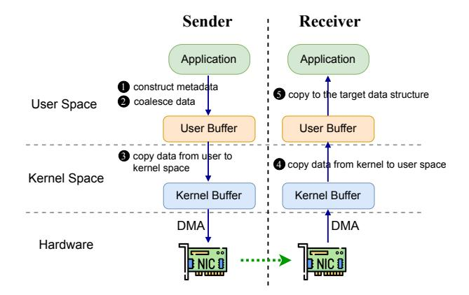
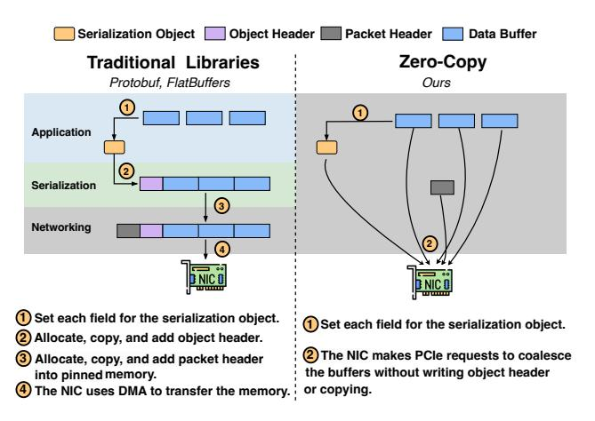
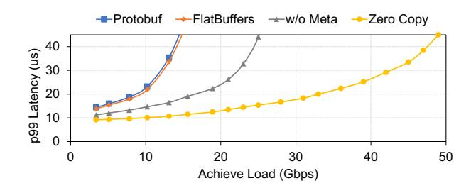
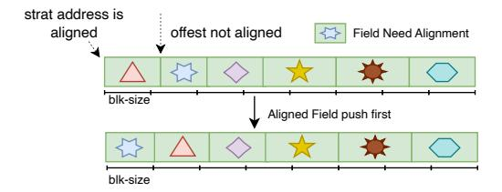
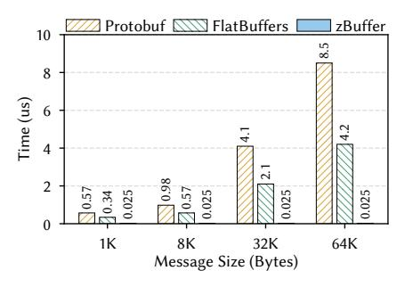
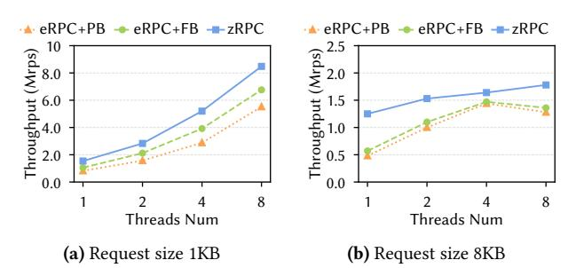
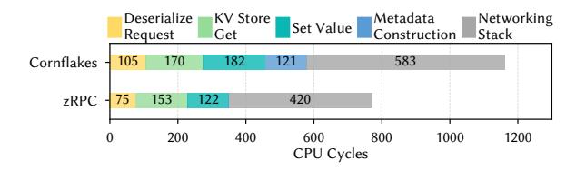

# zBuffer: Zero-Copy and Metadata-Free Serialization for Fast RPC with Scatter-Gather Reflection

# [Xiangyu Liu](https://orcid.org/0009-0000-5770-1818)<sup>∗</sup>

NICE Lab, Xiamen University Xiamen, China Alibaba Cloud Beijing, China xiangyul@stu.xmu.edu.cn

# [Huiba Li](https://orcid.org/0009-0000-1344-6552)<sup>∗</sup>

Alibaba Cloud Beijing, China huiba.lhb@alibaba-inc.com

# [Shun Gai](https://orcid.org/0000-0002-7967-0036)

NICE Lab, Xiamen University Xiamen, China Alibaba Cloud Beijing, China shungai@stu.xmu.edu.cn

# [Youmin Chen](https://orcid.org/0000-0003-4171-4299)†

Shanghai Jiao Tong University Shanghai, China chenyoumin@sjtu.edu.cn

# [Yiming Zhang](https://orcid.org/0000-0001-6450-8485)†

NICE Lab, Shanghai Jiao Tong University Shanghai, China Alibaba Cloud Beijing, China sdiris@gmail.com

## Abstract

This paper presents zBuffer, a zero-copy and metadata-free serialization library for high-performance and low-cost RPCs. At the core of zBuffer is scatter-gather reflection, a novel technique that collaboratively (i) leverages the NIC scattergather hardware feature to offload the costly data coalescing, and (ii) utilizes the static reflection mechanism of modern programming languages to enable type queries on complex data objects without requiring explicit metadata construction. We leverage C++ language features, mainly including template meta-programming and macros, to realize static reflection at compile time. Based on zBuffer, we design a fast RPC system (called zRPC) which eliminates all RPC memory copy overheads not only in (de)serialization but also in network transmission. Extensive evaluation shows that zBuffer/zRPC significantly outperforms state-of-the-art serialization/RPC mechanisms: zBuffer is approximately 7× faster than Cornflakes in serialization for complex data objects; and zRPC reduces 99th percentile latency by 21% and achieves 62% higher throughput than eRPC on the Masstree key-value (KV) store with the YCSB benchmark.

CCS Concepts: • Computing methodologies → Parallel programming languages; • Networks → Programming interfaces.

<sup>†</sup>Yiming Zhang and Youmin Chen are the corresponding authors.


[This work is licensed under a Creative Commons Attribution 4.0 Interna](https://creativecommons.org/licenses/by/4.0)[tional License.](https://creativecommons.org/licenses/by/4.0)

PPoPP '26, Sydney, NSW, Australia © 2026 Copyright held by the owner/author(s). ACM ISBN 979-8-4007-2310-0/2026/01 <https://doi.org/10.1145/3774934.3786426>

Keywords: Zero-Copy, Data Serialization, Reflection

#### ACM Reference Format:

Xiangyu Liu, Huiba Li, Shun Gai, Youmin Chen, and Yiming Zhang. 2026. zBuffer: Zero-Copy and Metadata-Free Serialization for Fast RPC with Scatter-Gather Reflection. In Proceedings of the 31st ACM SIGPLAN Annual Symposium on Principles and Practice of Parallel Programming (PPoPP '26), January 31 – February 4, 2026, Sydney, NSW, Australia. ACM, New York, NY, USA, [13](#page-12-0) pages. [https://doi.](https://doi.org/10.1145/3774934.3786426) [org/10.1145/3774934.3786426](https://doi.org/10.1145/3774934.3786426)

# 1 Introduction

Remote Procedure Calls (RPCs) allow services to invoke functions on remote servers as if they were local calls, offering developers a familiar and straightforward programming model for building distributed applications [\[20,](#page-10-0) [21,](#page-10-1) [45,](#page-11-0) [69,](#page-12-1) [72\]](#page-12-2). RPC libraries (e.g., Apache Thrift [\[16\]](#page-10-2), bRPC [\[18\]](#page-10-3), and gRPC [\[32\]](#page-11-1)) have been widely adopted across various domains such as cloud microservices [\[1,](#page-10-4) [6,](#page-10-5) [33\]](#page-11-2), high-performance computing (HPC) [\[58,](#page-12-3) [63\]](#page-12-4), distributed data stores [\[27,](#page-11-3) [38\]](#page-11-4), network file systems [\[30,](#page-11-5) [60\]](#page-12-5), and large language models (LLMs) [\[25,](#page-11-6) [55\]](#page-11-7).

As recently reported by Google Cloud [\[62\]](#page-12-6), RPC processing occupies a non-negligible ratio (∼7.1%) of CPU cycles across the entire fleet, highlighting the critical role of RPCs in the overall performance of cloud applications. Traditionally, the performance of RPCs has been constrained by the relatively slow network. In modern datacenters, however, round-trip times (RTTs) have dropped to only a few microseconds [\[19,](#page-10-6) [37,](#page-11-8) [56\]](#page-12-7), shifting the performance bottleneck from the network toward the CPU. The overhead of CPU-based memory copies in (de)serialization has become increasingly significant. For example, Google reports that Protobuf serialization alone accounts for 5% of datacenter CPU usage [\[39\]](#page-11-9); and Meta reports that serialization consumes 6.7% of the CPU cycles in its microservices [\[64\]](#page-12-8). As NIC throughput has increased to 800 Gbps [\[23\]](#page-11-10) and is expected to reach 1.6 Tbps

<sup>∗</sup>Xiangyu Liu and Huiba Li are co-primary authors.

soon [\[34\]](#page-11-11), the relatively high cost of CPU processing, especially memory copies, has become a performance bottleneck representing the costly "memory-copy tax" in the cloud.

A typical RPC proceeds as follows. First, the client serializes the function input (i.e., a set of data objects) by copying scattered data of object fields into a contiguous userspace buffer and constructing metadata associated with these object fields (e.g., sizes and offsets). Second, the request message is copied from userspace to kernel-space. Third, the serialized data is transmitted to the server, which then deserializes the message reversely to reconstruct the original objects, invokes the function call, and finally returns a response back. Although modern network dataplane (e.g., DPDK [\[35\]](#page-11-12)/RDMA [\[15\]](#page-10-7)) bypasses the kernel and eliminates user-/kernel-space memory copies, (de)serialization overheads related to RPC memory copies cannot be avoided. Most existing serialization libraries [\[9,](#page-10-8) [16,](#page-10-2) [17,](#page-10-9) [31,](#page-11-13) [67\]](#page-12-9) follow the aforementioned RPC procedure, and thus are highly inefficient for RPCs in modern high-performance networks.

This paper presents zBuffer, a zero-copy, metadata-free serialization library designed to minimize the memory-copy tax. At the core of zBuffer is scatter-gather reflection, a novel technique that integrates hardware offloading and compiletime optimization based on two related observations. First, commercial off-the-shelf (COTS) NICs support scatter-gather (SG) I/O that can efficiently gather/scatter data to/from a contiguous on-device buffer, but this feature is buffer-centric: it moves raw bytes without understanding the object structure (e.g., field identity, ordering, and types). Second, static reflection, commonly used in high-performance libraries [\[2,](#page-10-10) [5,](#page-10-11) [11,](#page-10-12) [29\]](#page-11-14), provides programs the ability to inspect and manipulate its own structure at compile time, offering the missing object-level structure that scatter-gather I/O cannot support.

zBuffer seamlessly integrates static reflection with NIC scatter-gather capabilities, eliminating the overhead traditionally associated with RPC memory copies. To use the NIC scatter-gather mechanism, an application should submit requests to the NIC containing a descriptor table, where each descriptor represents an object field via a pointer and length. Since the receiver lacks knowledge of the message layout, these descriptors (i.e., metadata) must be transmitted alongside the message. With static reflection, the object field order and byte boundaries are determined at compile time, enabling the generation of fixed (de)serialization code paths that embed this metadata. At runtime, serialization follows these compile-time–generated paths to produce a descriptor table, which can be directly submitted to the NIC without additional metadata construction. The NIC then uses scattergather I/O to aggregate non-contiguous fields for transmission. On the receiving side, pre-generated code can similarly reconstruct the object from a contiguous buffer. This implicit encoding, combined with scatter-gather I/O, eliminates the need for both data coalescing and runtime metadata construction. We term this integration scatter-gather reflection.

<span id="page-1-0"></span>

Figure 1. RPC Processing in a Send-Receive Transaction.

We choose C++ for its widespread adoption in both cloud and HPC applications and its robust support for compile-time optimizations [\[4,](#page-10-13) [7,](#page-10-14) [50\]](#page-11-15). However, using C++ to generate arbitrary object description tables at compile time is nontrivial as C++ offers no native reflection. To ensure that the generated (de)serialization paths precisely cover the expected fields, it is necessary to accurately extract each field of the object. However, the diverse and complex data types in applications make automatic field extraction challenging.

To address this challenge, we implement compile-time static reflection in C++ using macros and template metaprogramming. A single annotation macro registers the object field, yielding a deterministic, compile-time enumeration of fields. As each field has fixed memory size, by using sizeof [\[13\]](#page-10-15) operator, we compute stable sizes, offsets, and alignments; a recursive traversal then flattens nested aggregates into a linear field sequence with fixed byte boundaries. Template specialization and type traits select per-type serialization policies and synthesize fixed code paths at compile time, eliminating runtime metadata construction. Moreover, this approach provides the compiler with essential information, enabling it to optimize more effectively, thus achieving high performance with low runtime overhead.

We further design and implement a fast RPC system (called zRPC) by integrating zBuffer with zero-copy packet transmission, which eliminates all RPC memory copy overheads not only in (de)serialization but also in network transmission. Extensive evaluation shows that zBuffer/zRPC significantly outperforms state-of-the-art serialization/RPC mechanisms: zBuffer is ∼7× faster than Cornflakes [\[57\]](#page-12-10) in serialization for complex objects; and zRPC reduces 99th percentile latency by 21% and achieves 62% higher throughput than eRPC [\[37\]](#page-11-8) on the Masstree KV with YCSB.

zBuffer/zRPC has been widely deployed in Alibaba's internal production systems [\[43,](#page-11-16) [44,](#page-11-17) [68\]](#page-12-11). We have also opensourced our TCP edition of zBuffer/zRPC at [https://github.](https://github.com/alibaba/PhotonLibOS/tree/main/rpc) [com/alibaba/PhotonLibOS/tree/main/rpc](https://github.com/alibaba/PhotonLibOS/tree/main/rpc).

<span id="page-2-0"></span>

Figure 2. CPU-based coalescing vs. NIC-based coalescing.

### 2 Background and Motivation

#### 2.1 Remote Procedure Call

Remote Procedure Calls (RPCs) are an important inter-process communication mechanism that enables processes to conduct service calls and invoke procedures in other processes or remote systems as if they were local. In the context of a send-receive operation, the processes related to memory copy are depicted in Fig. 1. On the sender side, an application first constructs the metadata (**1**) and coalesces the data from the structure's scattered memory regions (2). Then, the coalesced data is copies from user-space to kernel-space (3). On the receiver side, when the message is received, the data is first copied from kernel-space to user-space (4). Finally, the data is copied to the structure's memory region and will be handed over to the application for further processing (**6**). A minimum of 4 memory copies are required for a send-receive transaction. Furthermore, a single RPC call involves at least two such transactions (i.e., request and response), resulting in significant overhead.

#### 2.2 Scatter-Gather Data Coalescing

The scatter-gather feature was originally designed for HPC applications, which frequently move large, statically-sized chunks of memory between servers. HPC applications have used scatter-gather to optimize MPI all-to-all communication primitives [28], or provide zero-copy communication over MPI derived data types [61]. Fig. 2 compares CPU-based coalescing and NIC-based scatter-gather coalescing for serialization. Scatter-gather allows the NIC to assemble packets from multiple, non-contiguous memory regions, rather than a single memory region. For instance, given a list of I/O addresses, the popular Mellanox CX-5 [49] NIC makes multiple PCIe requests to coalesce the memory into a single packet. However, although scatter-gather avoids the overhead of coalescing data, the metadata for reconstructing the message object still introduces high serialization overhead, suffered by state-of-the-art scatter-gather coalescing methods [57].

#### 2.3 Analysis of Serialization Overhead

Fig. 3 shows two approaches in serializing and transmitting a message with three non-contiguous fields. The first approach is traditional software serialization libraries like Protobuf [9] and FlatBuffers [31]. **①** The application sets up each field

<span id="page-2-1"></span>

Figure 3. Transmission of three non-contiguous fields.

<span id="page-2-2"></span>

**Figure 4.** 99th percentile (p99) latency as achieved load increases of serialization libraries, without metadata construction and zero-copy.

of the serialization object. ② Add and calculate an object header, which is used to record metadata about the structure, such as field offsets and sizes, then copy the scattered data into a contiguous buffer. ③ Add packet header and copy the buffers into pinned memory to enable the NIC to perform DMA transfers. ④ Finally, the NIC uses DMA to transfer the memory. This approach of serialization incurs high overhead due to two extra copies. We measure an echo application that has 16 concurrent clients sending a simple message (one 1024-byte field) to a single-core server, which deserializes, reserializes, and transmits the data back. Fig. 4 shows the result. With a <36 μs latency constraint, the throughput of zero-copy is 45 Gbps, without metadata construction is 23.4 Gbps, and existing libraries is 13-14 Gbps. Data copies are the significant cost.

To avoid this, we propose a zero-copy serialization library called zBuffer. zBuffer leverages the reflection feature of C++ at compile time and the scatter-gather feature of modern NICs to achieve scatter-gather reflection. This approach implements the "Zero-Copy" method (Fig. 3). With zBuffer, the information for each field is obtained at the time of setting the fields, eliminating the need to construct additional metadata, also eliminating the need to copy the data into a contiguous buffer.

```
struct sg {
  void* sg_base; // Pointer to buffer.
  size_t sg_len; // Length of buffer.
};
struct sg_array {
  uint16_t sg_begin; // index of first valid sg
  uint16_t sg_end; // index of last valid sg
  uint16_t capacity; // valid capacity of sg_array
  sg* sg_a; // sg_array
};
```

Listing 1. The scatter-gather array (sg\_array) structure.

```
// Object Definition
struct Msg: public Message{
  int id;
  string val1;
  string val2;
  PROCESS_FIELDS(val1,val2);
};
class Serializer{
    sg_array sgs;
    template<typename T>
    void serialize(T& x);
};
class Deserializer{
    sg_array sgs;
    template<typename T>
    T* deserialize(void* buf);
};
```

Listing 2. The data structure and API of zBuffer.

# 3 zBuffer Design

#### 3.1 Programming Model

The scatter-gather structure (sg\_array) is the core abstraction of scatter-gather based serialization. As shown in Listing [1,](#page-3-0) sg\_array maintains an array of sg and its begin, end, and capacity. The structure of sg consists of a pointer (sg\_base) that points to a memory buffer of its virtual address and a record of buffer length (sg\_len). An sg is used to represent a contiguous memory buffer, and an sg\_array is used to represent multiple non-contiguous memory buffers. This approach is conceptually similar to the writev [\[14\]](#page-10-16) system call in Linux, which uses an iovec data structure to transmit data. However, in Linux, the kernel still copies the iovec into a contiguous buffer before transmission.

To use zBuffer, a developer defines a data structure schema using the C++ language such as the Msg struct shown in Listing [2.](#page-3-1) We provide separate implementations for common variable-length data types, such as string and array, using a pointer and a length to represent and thus adapt to scatter-gather. The macro PROCESS\_FIELDS specifies the order of fields to be serialized, except that fields requiring alignment are always processed first (see [§3.3\)](#page-5-0). Next, the developer builds and fills the zBuffer object in their code, and uses the Serializer to serialize the object to get the sg\_array, which is then passed to the network stack for

```
template<typename T>
 void process_field(T& x) {
      x.serialize_fields(*d());
 }
 #define PROCESS_FIELDS(...) \
    template<typename AR> \
    void process_fields(AR& ar) { \
        return reduce(ar, __VA_ARGS__); \
 template<typename AR, typename T, typename...Ts>
 void reduce(AR& ar, T& x, Ts&...xs) {
     ar.process_field(x);
     reduce(ar, xs...);
 }
1 Using a variadic macro to accept a list of fields
2 Using a variadic template to recursively process each field
3 Type specialization processing
```

Figure 5. Core logic for zBuffer to realize static reflection.

transmission. After receiving the packet, the developer uses the Deserializer to deserialize the receive buffer back into a pointer-based data structure. Our prototype supports serialization of base integer types, strings, bytes, nested objects, and lists of strings, bytes or nested objects. We use different data types to identify fields that need alignment and those that do not (e.g., aligned\_message and message).

#### 3.2 Scatter-Gather Reflection

- 3.2.1 Static Reflection. zBuffer leverages C++ features such as template metaprogramming and macros to realize compile-time static reflection. The processing code for the fields is generated at compile time, as shown in Fig. [5:](#page-3-2)
- ❶ zBuffer uses the variadic macro VA\_ARGS to receive a list of fields, thereby registering the fields and obtaining type information at compile time. This process is implemented through the PROCESS\_FIELDS macro, which expands into a templated method process\_fields and passes the list of fields to the reduce function. This approach allows the user to register the fields that need to be serialized using the concise syntax PROCESS\_FIELDS without having to write the reflection code manually.
- ❷ Subsequently, variadic templates and recursion are used to expand and process all fields, where x represents the current field and xs represents the remaining fields. This part is implemented by the template function reduce, which recursively calls ar.process\_field(x) to process the current field and then continues with the remaining fields until all fields have been processed. This recursive template expansion occurs entirely at compile time, generating code that is equivalent to directly invoking each field's processing function in sequence.
- ❸ Finally, type specialization is performed. For different field types, the compiler selects the corresponding template

specialization to generate the processing code. zBuffer provides multiple overloads of process\_field such as string and array. This type specialization is entirely determined at compile time, avoiding the runtime overhead associated with type checks and dispatch.

zBuffer does most work at compile time, including type checking, field traversal, and processing logic specialization highly optimized by the compiler. zBuffer realizes static reflection through compile-time techniques without performance penalty suffered by traditional runtime reflection.

**3.2.2 Serializer.** The responsibility of the Serializer is to construct the appropriate  $sg\_array$  to represent the input message, which is eventually passed to the network stack. Leveraging the  $sg\_array$  presented in Listing 1 enables us to capture the entire message without incurring the overhead of copying multiple non-contiguous memory buffers into a single contiguous buffer.

Algorithm 1 shows how zBuffer serializes the message object. During serialization, the Serializer first initializes an empty sg\_array (line 2) and then performs a two-stage field processing on the input object to satisfy the memory alignment requirements. It calls FilterAlignedFields (with flag set to true) to filter out all aligned fields (line 3), and then processes these fields by Message::process\_field (line 4), which internally calls the recursive Message::reduce function (line 13). Then the process\_field function (lines 19-31) is called one by one for each field in order; for each field whose length is not 0, an sg element is created and added to the sg array. The Serializer then calls the same filter function again (with flag set to false) to filter out the unaligned fields and processes them similarly (lines 5-6). After processing all fields, the Serializer creates an sg for the object and finally pushes the sg to the sg array. For nested data, such as trees, the Serializer will perform the same process used for non-nested data at each level. The serialization process does not involve memory copy, just constructing the sg\_array which is eventually passed to the network stack. The NIC coalesces the non-contiguous buffer pointed to by each sg.

**3.2.3 Deserializer.** Deserialization requires that the received payload be correctly turned back into the original data structure. However, objects are sent containing pointers that are only valid in the sender's address space and not in the receiver's. zBuffer's deserialization algorithm overwrites these pointers to point to the correct memory address.

Algorithm 2 describes the deserialization process. The first step is to obtain a pointer to the original message object so that the fields can be correctly recovered based on the information recorded in the message object. Since we are serializing in the specified order, the message object is located at the end of the receive buffer, and we simply create a message pointer to the last message-sized memory at the end of the buffer. The size of this buffer is calculated using

### **Algorithm 1:** Serialize Object into the *sg\_array*

```
procedure serialize(obj)
       sg\_array \leftarrow empty
       // Process aligned fields
       aligned \leftarrow FilterAlignedFields (this, true)
 3
       Message::process_field(obj, aligned)
       // Process non-aligned fields
       non aligned ← FilterAlignedFields (this, false)
 5
       Message::process_field(obj, non_aligned)
       Create a sg_{obj} with sg.base \leftarrow obj.ptr, sg.len \leftarrow obj.len
       sg_array.push_back(sg<sub>obi</sub>)
9 end
procedure Message::process_field(obj, archive)
       // Expand all fields
       Message::reduce(archive, obj.fields...)
12 end
13 procedure Message::reduce(archive, field,
    remain fields)
       // Process current field, call line 19
       archive.process_field(field)
       // Recursively process remaining
15
       if remain_fields \neq \emptyset then
           Message::reduce(archive, remain fields)
16
17
       end
18 end
19 procedure
    FilterAlignedFields::process_field(field)
       if is_aligned_field(field) and flag = true then
20
           Serializer::process_field(field)
21
       else if not is_aligned_field(field) and flag = false then
22
           Serializer::process_field(field)
23
24
       end
25 end
26 procedure Serializer::process_field(field)
       if field.len \neq 0 then
           Create an sg with
            sg.base \leftarrow field.ptr, sg.len \leftarrow field.len
           sg_array.push_back(sg)
       end
31 end
```

the *sizeof* operator [13] for the type of object (line 4). Next, starting at the start of the receive buffer (line 3), we process each field in turn in the same order as it was serialized at. We fix the pointer of each field to the appropriate memory address based on the length of the field stored in the object and the current offset of the receive buffer (line 13). In particular, for integer fields, which are already in the object's memory, we do not need to handle them specifically and can access them directly, for example by using obj.id. The in-place deserialization does not require memory copy.

#### Algorithm 2: Deserialize Object from Buffer

```
procedure deserialize(buffer)
      buffer, len /* receive buffer and buffer length
2
      offset \leftarrow 0
                     /* current offset in the receive
       buffer */
      obj \leftarrow (obj)(buffer + len - sizeof(obj))
      aligned ← FilterAlignedFields (this, true)
5
      Message::process_field(obj, aligned)
      non aligned ← FilterAlignedFields (this, false)
      Message::process_field(obj, non_aligned)
      return obj
10 end
  /* Some procedures are omitted for brevity, as
      they are similar to Algorithm 1
procedure Deserializer::process_field(field)
      if field.len \neq 0 then
12
          field.ptr ← buffer + offset/* fix field pointer
          offset ← offset + field.len /* update offset */
14
      end
16 end
```

<span id="page-5-2"></span>

Figure 6. Example of mem-aligned.

#### <span id="page-5-0"></span>3.3 Optimization for Memory Alignment

Memory alignment is important in many scenarios like direct I/O [54, 66], SIMD instruction [12]. However, the existing serialization library does not optimize for this requirement. As depicted in Fig. 6, after serialization, transmission, and deserialization, although the address of the received buffer is block-size aligned (e.g., using posix\_memalign [8] for aligned memory allocation), the size of the preceding fields is not. As a result, the buffer offset for the field requiring alignment does not meet block-size alignment. Therefore, the field must be copied to aligned memory before being written to disk using direct I/O, which introduces additional memory copy overhead.

We optimize the serialization and deserialization processes to address the potential overhead caused by memory misalignment. We distinguish between buffers that require memory alignment and those that do not. Based on the serialization order specified by the application, the Serializer prioritizes pushing fields that require memory alignment into the

```
void init_layout(sg_array *sgs);
void enqueue_request(sg_array *msg, ...);
```

<span id="page-5-5"></span>**Listing 3.** zRPC Interface for integrating zBuffer.


Figure 7. Message Layout.

<span id="page-5-6"></span>

Figure 8. Dual ring buffer.

sg\_array. During deserialization, after extracting the message itself, we restore the pointers in the same order as the serialization, thus preserving memory alignment.

#### 4 zRPC: zBuffer-Based Fast RPC

#### 4.1 zRPC Interface

Listing 3 presents the essential API function of zRPC for integrating zBuffer. Once serialization is complete, the resulting  $sg\_array$  is passed to the RPC system, which subsequently invokes the init\_layout function to generate the message layout (§4.2). Following this, the enqueue\_request function is called to send the request, during which the  $sg\_array$  is passed to the NIC's DMA engine to initiate DMAs, and the DMA engine then coalesces the memory buffers specified in the  $sg\_array$  for network transmission.

#### <span id="page-5-4"></span>4.2 Message Organization

zRPC realizes network communication through packet transmission. zRPC employs the *sg\_array* structure to represent a complete message. This design is fully compatible with the scatter-gather feature of networking devices and RDMA. The content recorded by *sg\_array* consists of two parts: headers and data. A complete *sg\_array* has at least two *sg*, with one recording the location of the packet header and the other recording the location of the message. When the message size exceeds the maximum transmission unit (MTU), multiple packets need to be sent, one *sg\_array* can still represent the complete message using multiple *sg* to represent the memory buffers of the headers and the data in the message.

However, determining the position of the relevant sg for each packet introduces considerable overhead, especially for messages that require a large number of packets. To address this challenge, we have introduced an indexing mechanism that efficiently locates the appropriate sg within the  $sg\_array$  corresponding to each packet. We use an index array where each entry marks a sub-packet boundary by recording the

containing sg and its intra-sg offset. To send the  $j_{th}$  subpacket, we read entries  $I_j$  and  $I_{j+1}$  to get its start and end, which directly identifies the spanned sgs and their segment offsets. This approach significantly reduces the overhead associated with packet transmission, thus enabling efficient message delivery even for large and complex messages.

Consider the example illustrated in Fig. 7, in which a message is transmitted using four packets. For  $Packet_1$ , comprising  $SGs_1$  and  $Header_1$ , the beginning and end positions of  $SGs_1$  can be easily determined using  $Index_1$  and  $Index_2$ , respectively. Similarly, the position of  $Header_H$  can be quickly located through  $Index_H$ .

#### 4.3 Header-Data Separation

Achieving zero-copy transmission remains challenging, even with kernel-bypass I/O techniques like RDMA, which avoid data copying between user and kernel space. Notably, state-of-the-art RPC frameworks [37] still rely on traditional receive ring buffers that store packet headers and data together. For example, if a field spans two packets, its data is split by a header, so the data need to be copied into a contiguous memory buffer, which incurs additional overhead.

To address this challenge, zRPC design a dual-ring buffer to coordinate the separate transmissions of packet headers and data. As shown in Fig. 8, we allocate two ring buffers, one for packet headers and another for data, which share a common index for lookup and update. Upon packet arrival, the data header and data are stored separately in their respective buffers at the locations indicated by the pointers, so that the data of fields spanning packets are stored continuously in the same ring buffer, thus avoiding memory copying. We use credits per connection for packet-level flow control: limiting the number of packets a client sends in a connection before receiving a reply, thereby ensuring the ring buffer can accommodate all messages.

#### 4.4 Implementation

The implementation of zRPC includes the serialization library (zBuffer) and an eRPC-based networking stack. eRPC [37] leverages the fact that switch buffer capacity far exceeds datacenter bandwidth—delay product (BDP), and realizes zero-copy network transmission in the presence of retransmissions, node failures, and rate limiting. It simply uses a contiguous memory buffer to represent a message, and does not realize serialization. We enhance eRPC to support zRPC's API, message organization, and header-data separation, and integrate it with zBuffer to realize zRPC.

Transport Engines. zRPC uses RDMA send/recv for plain packet I/O instead of RDMA write/read to send messages. This is because packet I/O has better scalability [38]. Our implementation uses the RoCE (RDMA over Converged Ethernet) network protocol, and is implemented based on OFED libibverbs 5.4. To create an RPC service, the developer needs to register request handler functions with unique request

types in RPC servers and clients use these request types when issuing RPCs.

Scatter-Gather DMA. To enable NIC scatter-gather work, the network stack receives sg\_array as input, then takes the sg\_array to fill struct ibv\_sge\* sg\_list, which is used in the RDMA network stack API. Each ibv\_sge represents a NIC-registered buffer, and sg\_list is an array of ibv\_sge. Subsequently, the NIC directly gathers data from scattered buffers referenced in sg\_list onto the wire without copying to contiguous memory. If the number of disjoint memory buffers exceeds the limit of NIC's capability to encapsulate all buffers in one RDMA work request, zRPC coalesces the data into a contiguous memory buffer before transmission. This is because sending a single work request (even with a copy) is faster than sending multiple smaller work requests.

**Header-Data Separation.** To implement header-data separation, we specify two scatter-gather elements sge. The first sge points to the packet header's ring buffer, with its size set to the length of the packet header (72 bytes in zRPC). The second sge points to the data ring buffer, with its size set to the MTU minus the packet header's length. Then, submit the WQE using the RDMA API ibv\_post\_recv. By this method, RDMA will store the packet header and data into the designated buffer when receiving data.

#### 5 Evaluation

We run our experiments on a d6515 [3] CloudLab [26] cluster. Each server has two 32-core AMD EPYC ROME 7452 2.35GHz CPUs, with C-States turned off, running Linux 5.04 with Ubuntu 20.04. These servers are connected by dualport Mellanox ConnectX-5 100 Gbps NICs and a 2x100 Gbps Dell Z9264F-ON switch of which MTU = 4200 bytes (RoCE maximum MTU).

#### 5.1 Serialization Performance

**5.1.1** Comparison to Software-Only Serialization. We start by comparing zBuffer to FlatBuffers and Protobuf, the mainstream software serialization libraries. We use a client to send a serialized message to the server, which deserializes, re-serializes the same payload, and returns it to the client. We use a data structure with a single string field, which captures the minimal overhead for serialization. The results are shown in Fig. 9a, zBuffer only needs to generate the corresponding *sg\_array* in the serialization process and restore the position of a pointer in the deserialization process, so the time required is extremely short (25ns total). In addition, because zBuffer does not involve memory copying, it is insensitive to the size of strings, and the time spent under different sizes of string is almost the same.

On the contrary, FlatBuffers and Protobuf need memory copying, encoding and decoding, and it takes  $0.34 \,\mu s$  for Flatbuffers and  $0.57 \,\mu s$  for Protobuf to serialize and deserialize a 1KB string, which is about  $13.6 \times and 22.8 \times longer$  than that

<span id="page-7-0"></span>


- (a) Comparison to software-only serialization
- <span id="page-7-1"></span>(b) Metadata size for different object types
- <span id="page-7-2"></span>(c) Serialization overhead of different object types

Figure 9. Serialization overhead of different serialization libraries.

<span id="page-7-3"></span>Table 1. Average cycles taken for zBuffer and Cornflakes.

| Type       | Single     | Tree-1     | Tree-3      | Tree-5      |
|------------|------------|------------|-------------|-------------|
| zBuffer    | 57 cycles  | 104 cycles | 218 cycles  | 747 cycles  |
| Cornflakes | 133 cycles | 312 cycles | 1212 cycles | 5271 cycles |

of zBuffer, respectively. The time spent by Flatbuffers and Protobuf increases significantly with the increase of string length, with a length of 64KB, the cost time of Flatbuffers and Protobuf is an astonishing 168× and 340× longer than that of zBuffer, respectively.

5.1.2 Comparison to Scatter-Gather Coalescing. Cornflakes [\[57\]](#page-12-10) is a serialization library that solely uses NIC scatter-gather to coalesce data. It cannot avoid the overhead of metadata construction. In contrast, zRPC eliminates the overhead of not only data coalescing but also metadata construction. We compare zBuffer with Cornflakes to show the advantage of scatter-gather reflection. We adopt various object types: Single (with only a single bytes filed), and different depths of the tree (e.g., Tree-4 represents a binary tree with nested leaf bytes fields of depth 4).

Fig. [9b](#page-7-1) shows the metadata size under different object types (for Cornflakes, metadata is the object header, for zBuffer it is the object itself). We find that as data structures become more complex, the metadata size of Cornflakes is significantly larger than zBuffer. For Tree-5 type, the metadata size of zBuffer is 512 bytes, while Cornflakes requires 1256 bytes, which is about 2.5× larger than zBuffer. The reason for this is that zBuffer can correctly recognize field information by storing only leaf fields, while Cornflakes requires many sub-headers to help get field information.

Fig. [9c](#page-7-2) shows the serialization and deserialization overhead for different object types. Even with the simplest data types Single, zBuffer is 2.3× faster than Cornflakes. For the more complex object type, Tree-5, zBuffer is 7 × faster than Cornflakes. We also measure the overhead by CPU cycles. The results in Table [1](#page-7-3) demonstrate that zBuffer significantly reduces CPU usage compared to Cornflakes, using only 13.8%

of the CPU cycles required by Cornflakes at Tree-5. The reason is that Cornflakes needs to construct object header as metadata when serializing, and need to read object header to parse field information when deserializing, the more complex the data structure, the higher the overhead. However, zBuffer only needs to send the object itself when serializing, and then it can parse the fields correctly from the object without reading extra object header when deserializing. The overhead of doing this is very small.

### 5.2 End-to-End RPC Performance

5.2.1 zRPC vs. eRPC. We first compare zRPC with the state-of-the-art RPC system, eRPC [\[37\]](#page-11-8), through a set of micro benchmarks. We use two machines, one for the client and the other for the server. We use FlatBuffers and Protobuf as the serialization layer on top of eRPC, represented by eRPC + FB and eRPC + PB, respectively. Unless specified, the RPC request has a byte array, and the response is also a byte array. We adjust the RPC size by changing the array length.

Latency. We evaluate zRPC latency by issuing RPC of different sizes. We test the latency of the small message that can be sent with only one packet and the large message that needs to be sent by multiple packets to demonstrate the performance of zRPC with varying numbers of packets. As shown in Fig. [10a,](#page-8-0) zRPC achieves P99 latency of 5.3 µs for 64B RPC size and 6.5 µs for 2KB RPC size, eRPC + FB adds 0.4 µs and eRPC + PB adds 0.8 µs to the round-trip latency for 1KB RPC size. Fig. [10b](#page-8-1) shows the median latency for large RPC that require multiple packets, as the request size gets larger and more packets are required, non-contiguous data segments become more frequent, resulting in additional copy overhead. zRPC speeds up 3.3× and 4.2× for eRPC + FB and ePRC + PB, respectively, for 1MB RPC size.

Throughput. The client and server in our throughput test use a single application thread and keep 16 concurrent RPCs with different request size. Fig. [10c](#page-8-2) shows the RPC throughput with different request size. zRPC achieves 1.68 Mrps with a request size of 512B, compared to 1.45 Mrps for eRPC + FB and 1.21 Mrps for eRPC + PB, outperforming them by

<span id="page-8-0"></span>

<span id="page-8-1"></span>Figure 10. The latency and throughput vary with the size of RPC requests and responses.

<span id="page-8-3"></span>

<span id="page-8-4"></span>Figure 11. Comparison of RPC scalability.

<span id="page-8-5"></span>

**Figure 12.** Benefits of Header-Data Separation.

15.8% and 38.8%, respectively. As the request size increases, the throughput of all the tested solutions decreases due to being limited to the maximum bandwidth of the RDMA network. The performance of eRPC + FB and eRPC + PB drops drastically to 0.2 Mrps and 0.15 Mrps, respectively. This drop is due to the memory copying required in the serialization process of FlatBuffers and Protobuf, as well as additional memory copies needed for large request sizes that require multiple packets to be sent. In contrast, zRPC maintains a performance of 0.4 Mrps, outperforming eRPC + FB by 2× and eRPC + PB by 2.5×.

Scalability. We evaluate the multicore scalability of zRPC by setting the RPC request size to 1KB and 8KB for testing single packet as well as multi-packet scenarios and increasing the number of client threads. Correspondingly, the server use an equal number of threads, with each client thread connecting to a specific server thread and keeping 16 concurrent RPCs. Fig. 11a shows the RPC throughput when scaling from 1 to 8 user threads with a request size of 1KB. All the tested solutions scale well because at this point the memory copy

<span id="page-8-2"></span>overhead of 1KB size data can be hidden before encountering a network bottleneck. However, as shown in Fig. 11b, when the request size of 8KB is larger than an MTU and requires multiple packet transmission, the throughput of eRPC + FB and eRPC + PB will decrease from 4 to 8 threads, only 1.32Mrps, while zRPC's throughput scales by 1.4×, achieves 1.78Mrps which is 34.8% higher. This is because when the message size becomes larger, eRPC + FB and eRPC + PB consume more CPU cycles during transmission, and the CPU can be easily overwhelmed, which degrades the overall performance. While zRPC implements serialization and deserialization with minimal overhead and further avoids memory copy of eRPC during multiple packet transmission by header-data separation.

**Header-Data Separation.** We demonstrate the performance benefits of Header-Data Separation by setting the RPC client thread (s) from 1 to 8 with 8KB request size. As shown in Fig. 12, zRPC's header-data separation design achieves a 34% throughput improvement with a single thread, entirely eliminating the memory copy overhead associated with multi-packet transmission. However, as the number of threads increases, packets from different clients become interleaved, resulting in additional memory copy overhead. At 8 threads, it achieves a 4.7% throughput improvement. If a dedicated ring buffer is allocated for each connection, memory copies can be completely avoided, but this approach does not scale well. Our design where all client threads share the same ring buffer and traffic control is achieved through the mechanism of credits can work well for both one-to-one and one-to-all communication methods and does not bring performance degradation in other cases.

**5.2.2 zRPC vs. Cornflakes RPC.** Cornflakes ships a codesigned networking stack to realize RPC. To compare zRPC and Cornflakes RPC, we build an echo system in which the client sends a serialized data structure, and the server returns it after deserializing and reserializing, without any additional data handling processes. To generate load, we employ a 16-threaded client that sends concurrent requests. Fig. 13a shows the highest throughput achieved for various

<span id="page-9-0"></span>

<span id="page-9-2"></span>

(a) Achieved throughput for various (b) Throughput-latency tradeoff on a object types. (b) Throughput-latency tradeoff on a custom KV, serving CDN workload.

<span id="page-9-1"></span>**Figure 13.** Comparison between zRPC and Cornflakes.

**Table 2.** Latency comparison for replicated PUTs.

|         | <b>Median Latency</b> | P99 Latency |
|---------|-----------------------|-------------|
| zRPC    | 16.2 μs               | 18.9 µs     |
| eRPC+FB | 18.4 μs               | 21.2 μs     |
| eRPC+PB | 20.5 μs               | 25.1 μs     |

object types with a total size of 1KB. Compared to the single object type, Cornflakes' throughput decreases by 69.5% to 0.46 Mrps in Tree-3. In contrast, zRPC experiences only a 15.6% decline, maintaining a throughput of 1.4 Mrps in Tree-3, which is about 204% higher than Cornflakes. As data structure becomes more complex, more CPU cycles are required to construct the metadata and deserialization also needs to read the metadata for subsequent operations. Furthermore, large metadata will also cause additional network transmission overhead. For example, the metadata size of cornflakes for Tree-3 is 296 bytes, which is ~30% of the actual data size (1024 bytes).

#### 5.3 Real Applications

**5.3.1 Raft.** Raft [51] is a consensus algorithm designed to manage a replicated log in a distributed system, ensuring that multiple servers agree on a shared state even in the presence of failures. A leader is elected among candidates to handle requests from clients. We combine zRPC with LibRaft [70], implement a 3-way replicated in-memory keyvalue store and use one client to issue PUT requests. The client randomly generates a 512-byte key and a 1024-byte value. The client then serializes them and sends them to the leader as a PUT request. The leader receives the request, deserializes it, and gets the contents of the key and value. Note that Cornflakes is implemented in Rust, and its network stack API does not support integration with existing Raft implementations (like raft-rs [10]). We therefore exclude Cornflakes from this experiment. Table 2 shows the PUT latency of the client. zRPC reduces 12% and 21% in median latency and 19% and 24% in P99 latency compared to eRPC + FB and eRPC + PB, respectively. The main takeaway is faster consistent replication is achievable in commodity Ethernet datacenters with zRPC.

<span id="page-9-3"></span>

<span id="page-9-4"></span>Figure 14. P99 latency and throughput for masstree GET.

<span id="page-9-5"></span>

**Figure 15.** Breakdown of CPU cycles in Fig. 13b.

**5.3.2 Key-Value Store.** We use the Masstree KV [46] to evaluate zRPC. Masstree is a high-performance in-memory key-value store with μs-scale service times. We use YCSB-C [22] to generate a trace of 1 million 23-24 byte keys with different size values and use it to populate a Masstree server. We run the Masstree server on one machine and run the client on another machine. Both the server and the client use 8 threads, with each client thread using 16 concurrent requests. The test runs for 60 sec. Fig. 14a shows that zRPC reduces P99 latency by 24.2% and 34.8% compared to eRPC + FB and eRPC + PB, respectively, for 16KB value size. Fig. 14b shows that zRPC achieves 61.9% higher throughput than the eRPC + FB and eRPC + PB. Eliminating copies for larger values can allow the KV to more effectively use the CPU cache for smaller values, thus improving performance.

As Cornflakes cannot support Masstree KV, we use Cornflakes's built-in custom KV to compare zRPC with Cornflakes RPC. Keys are strings and values are lists of DMA-safe buffers. We use the Tragen cache trace generator [59] to create synthetic traces consisting of one million objects using the "image" traffic class, which replicates the traffic patterns observed in Akamai's production CDN. Object sizes range from 1KB to 116MB, with an average size of about 20KB. Since the Cornflakes prototype supports only single-frame messages, we divide each object into MTU-sized (4KB) subobjects. Although each client requests a single sub-object, we report throughput based on the entire object received. Fig. 13b shows the latency-throughput curve on the CDN trace workload. zRPC achieves 33.9% higher than Cornflakes on a p99 latency of 32 µs. Fig. 15 breaks down the average cycles for different parts of request handling within the CDN trace, for the achieved load of about 110K objects per second. Note that "set value" refers to assigning values to each

field and generating an object that the networking stack can directly transmit. zRPC eliminates metadata construction, also enables data processing operations to complete faster. zRPC achieves a 33.6% reduction in CPU cycle consumption compared to Cornflakes, comprising 10.4% fewer metadata construction, 14% fewer networking stacks, and 9.2% fewer deserialization and get/set operations combined.

## 6 Discussion and Related Work

zBuffer with other languages and IDLs. The implementation of zBuffer leverages C++ template metaprogramming and macros, a methodology that is widely used in HPC libraries such as CUTLASS [\[48\]](#page-11-24), OpenBLAS [\[50\]](#page-11-15), and Eigen [\[4\]](#page-10-13). C++ compilers can generate zBuffer object code and expose it through a C ABI, enabling cross-language interoperability. To facilitate the conversion of messages from other Interface Description Languages (IDLs) such as Protobuf and Flat-Buffers into the zBuffer message format, it is necessary to implement a program that parses the corresponding schema files (e.g., .proto and .fbs). This program should establish the mapping relationships required for type conversion and extract the relevant definition blocks and field information for the transformation process. Upon performing these steps, developers can then utilize zBuffer to integrate the converted message structures into their applications.

Zero-copy. zIO [\[65\]](#page-12-16) transparently removes application copies by interposing on memmove and memcpy and handling memory safety via page faults. However, zIO mostly studies packet sizes larger than 8000 bytes and if the buffers are unaligned, a memory copy is still needed. In contrast, zRPC benefits for both small and large packet sizes, and can avoid copying from unaligned buffers. Linux proposes a zero-copy API [\[24\]](#page-11-25), but which is not optimized for µs-scale applications. A wide range of kernel-bypass techniques have been proposed to reduce the overhead imposed by kernel software stacks and context switches caused by system calls, while enabling zero-copy access from the application. For instance, DPDK and RDMA [\[15,](#page-10-7) [35\]](#page-11-12) enable applications to directly access NICs bypassing the kernel.

Optimizing serialization. There have been several attempts to optimize serialization through software improvements. Cap'n proto [\[67\]](#page-12-9) reduce serialization overhead by making the in-memory format match the wire-format exactly. Other approaches include utilizing SIMD parallelism for decoding [\[41\]](#page-11-26) and minimizing the cost of type inference in dynamic serialization [\[47\]](#page-11-27). These approaches do not eliminate the fundamental cost of in-memory copies.

Serialization accelerators. Recent works have proposed specialized hardware for RPC serialization [\[36,](#page-11-28) [40,](#page-11-29) [42,](#page-11-30) [52,](#page-11-31) [53,](#page-11-32) [71\]](#page-12-17). For instance, Zerializer [\[71\]](#page-12-17) offloads serialization logic onto the DMA path, while Cereal [\[36\]](#page-11-28) co-designs serialization formats with hardware architectures.

# 7 Conclusion

This paper presents zBuffer, a zero-copy and metadata-free serialization library for high-performance and low-cost RPCs. Based on zBuffer, we design zRPC which eliminates all RPC memory copy overheads. Extensive evaluation shows that the performance of zBuffer/zRPC is significantly higher than that of state-of-the-art serialization/RPC mechanisms.

# Acknowledgments

We thank the anonymous reviewers for their valuable feedback and suggestions. We would also like to express our deepest gratitude and sincere apologies to Rui Du and Windsor Hsu from Alibaba Cloud. They made substantial contributions to the system design and implementation of zBuffer- /zRPC. Although an administrative oversight during submission, combined with procedural constraints, precluded their formal inclusion as co-authors, we explicitly acknowledge that their contributions merited full authorship and consider them pivotal architects of this project. The work is supported by the National Natural Science Foundation of China (grant no. 62441220 and 62202255). Yiming Zhang and Youmin Chen are the corresponding authors.

# References

- <span id="page-10-4"></span>[1] 2025. Adopting Microservices at Netfix. [htps://www.nginx.com/blog/](htps://www.nginx.com/ blog/microservices-at-netflix-architectural-best-practices/) [microservices-at-netflix-architectural-best-practices/](htps://www.nginx.com/ blog/microservices-at-netflix-architectural-best-practices/).
- <span id="page-10-10"></span>[2] 2025. boost-pfr. <https://github.com/boostorg/pfr>.
- <span id="page-10-19"></span>[3] 2025. Cloudlab Hardware. <https://docs.cloudlab.us/hardware.html>.
- <span id="page-10-13"></span>[4] 2025. Eigen. <https://gitlab.com/libeigen/eigen>.
- <span id="page-10-11"></span>[5] 2025. magic\_enum. [https://github.com/Neargye/magic\\_enum](https://github.com/Neargye/magic_enum).
- <span id="page-10-5"></span>[6] 2025. mcrouter. <https://github.com/facebook/mcrouter>.
- <span id="page-10-14"></span>[7] 2025. OpenCL. <https://github.com/KhronosGroup/OpenCL-SDK>.
- <span id="page-10-18"></span>[8] 2025. posix\_memalign(3) - linux man page. [https://linux.die.net/man/](https://linux.die.net/man/3/posix_memalign) [3/posix\\_memalign](https://linux.die.net/man/3/posix_memalign).
- <span id="page-10-8"></span>[9] 2025. Protocol Buffers. <https://protobuf.dev>.
- <span id="page-10-20"></span>[10] 2025. raft-rs. <https://github.com/tikv/raft-rs>.
- <span id="page-10-12"></span>[11] 2025. reflect: C++20 Static Reflection library. [https://github.com/qlibs/](https://github.com/qlibs/reflect) [reflect](https://github.com/qlibs/reflect).
- <span id="page-10-17"></span>[12] 2025. SIMD-intrinsics. [https://www.intel.com/content/www/us/en/]( https://www.intel.com/content/www/us/en/docs/intrinsics-guide/index.html) [docs/intrinsics-guide/index.html]( https://www.intel.com/content/www/us/en/docs/intrinsics-guide/index.html).
- <span id="page-10-15"></span>[13] 2025. sizeof - cppreference. [https://en.cppreference.com/w/cpp/](https://en.cppreference.com/w/cpp/language/sizeof) [language/sizeof](https://en.cppreference.com/w/cpp/language/sizeof).
- <span id="page-10-16"></span>[14] 2025. writev(2) - linux man page. <https://linux.die.net/man/2/writev>.
- <span id="page-10-7"></span>[15] A RDMA Protocol Specification. 2009. [http://www.rdmaconsortium.](http://www.rdmaconsortium.org/) [org/](http://www.rdmaconsortium.org/).
- <span id="page-10-2"></span>[16] Apache. 2017. Apache Thrift. <https://thrift.apache.org>.
- <span id="page-10-9"></span>[17] Apache. 2022. Apache Arrow. <https://arrow.apache.org/>.
- <span id="page-10-3"></span>[18] Baidu. 2025. bRPC. <https://github.com/apache/brpc>.
- <span id="page-10-6"></span>[19] Luiz Barroso, Mike Marty, David Patterson, and Parthasarathy Ranganathan. 2017. Attack of the killer microseconds. Commun. ACM 60, 4 (2017), 48–54.
- <span id="page-10-0"></span>[20] Betsy Beyer, Chris Jones, Jennifer Petoff, and Niall Richard Murphy. 2016. Site reliability engineering: How Google runs production systems. O'Reilly Media, Inc.
- <span id="page-10-1"></span>[21] Betsy Beyer, Niall Richard Murphy, David K Rensin, Kent Kawahara, and Stephen Thorne. 2018. The site reliability workbook: practical ways to implement SRE. O'Reilly Media, Inc.
- <span id="page-10-21"></span>[22] brianfrankcooper. 2025. Ycsb. [https://github.com/brianfrankcooper/](https://github.com/brianfrankcooper/YCSB) [YCSB](https://github.com/brianfrankcooper/YCSB).

- <span id="page-11-10"></span>[23] NVIDIA Corporation. 2024. ConnectX-8 Ethernet Datasheet. [https://resources.nvidia.com/en-us-accelerated-networking](https://resources.nvidia.com/en-us-accelerated-networking-resource-library/connectx-datasheet-c)[resource-library/connectx-datasheet-c](https://resources.nvidia.com/en-us-accelerated-networking-resource-library/connectx-datasheet-c).
- <span id="page-11-25"></span>[24] Willem de Bruijn. 2017. sendmsg copy avoidance with MSG \_ ZERO-COPY. <https://api.semanticscholar.org/CorpusID:189895274>
- <span id="page-11-6"></span>[25] DeepSeek. 2025. deepseek-ai/3FS. [https://github.com/deepseek-ai/](https://github.com/deepseek-ai/3FS) [3FS](https://github.com/deepseek-ai/3FS).
- <span id="page-11-21"></span>[26] Dmitry Duplyakin, Robert Ricci, Aleksander Maricq, Gary Wong, Jonathon Duerig, Eric Eide, Leigh Stoller, Mike Hibler, David Johnson, Kirk Webb, Aditya Akella, Kuangching Wang, Glenn Ricart, Larry Landweber, Chip Elliott, Michael Zink, Emmanuel Cecchet, Snigdhaswin Kar, and Prabodh Mishra. 2019. The Design and Operation of CloudLab. In 2019 USENIX Annual Technical Conference (USENIX ATC 19). USENIX Association, Renton, WA, 1–14. [https:](https://www.usenix.org/conference/atc19/presentation/duplyakin) [//www.usenix.org/conference/atc19/presentation/duplyakin](https://www.usenix.org/conference/atc19/presentation/duplyakin)
- <span id="page-11-3"></span>[27] etcd. 2022. etcd. <https://etcd.io/>.
- <span id="page-11-18"></span>[28] Ana Gainaru, Richard L. Graham, Artem Polyakov, and Gilad Shainer. 2016. Using InfiniBand Hardware Gather-Scatter Capabilities to Optimize MPI All-to-All. In Proceedings of the 23rd European MPI Users' Group Meeting (Edinburgh, United Kingdom) (EuroMPI '16). Association for Computing Machinery, 167–179. doi:[10.1145/2966884.2966918](https://doi.org/10.1145/2966884.2966918)
- <span id="page-11-14"></span>[29] getML. 2025. reflect-cpp. <https://github.com/getml/reflect-cpp>.
- <span id="page-11-5"></span>[30] Gluster. 2022. Gluster. <https://www.gluster.org/>.
- <span id="page-11-13"></span>[31] Google. 2020. Flatbuffers. <https://github.com/google/flatbuffers>.
- <span id="page-11-1"></span>[32] Google. 2025. grpc: A high-performance, open source universal rpc framework. <https://grpc.io>.
- <span id="page-11-2"></span>[33] Xinran He, Junfeng Pan, Ou Jin, Tianbing Xu, Bo Liu, Tao Xu, Yanxin Shi, Antoine Atallah, Ralf Herbrich, Stuart Bowers, et al. 2014. Practical lessons from predicting clicks on ads at facebook. In Proceedings of the eighth international workshop on data mining for online advertising. 1–9.
- <span id="page-11-11"></span>[34] IEEE Standards Association Working Groups. 2023. IEEE P802.3df Defines Architecture Holistically to Achieve 800 Gb/s and 1.6 Tb/s Ethernet. [https://standards.ieee.org/beyond-standards/ieee-p802-3df](https://standards.ieee.org/beyond-standards/ieee-p802-3df-definesa-holistic-architectural-approach/)[definesa-holistic-architectural-approach/](https://standards.ieee.org/beyond-standards/ieee-p802-3df-definesa-holistic-architectural-approach/).
- <span id="page-11-12"></span>[35] Intel. 2014. Data Plane Development Kit. <https://www.dpdk.org/>.
- <span id="page-11-28"></span>[36] Jaeyoung Jang, Sung Jun Jung, Sunmin Jeong, Jun Heo, Hoon Shin, Tae Jun Ham, and Jae W Lee. 2020. A specialized architecture for object serialization with applications to big data analytics. In 2020 ACM/IEEE 47th Annual International Symposium on Computer Architecture (ISCA). IEEE, 322–334.
- <span id="page-11-8"></span>[37] Anuj Kalia, Michael Kaminsky, and David Andersen. 2019. Datacenter RPCs can be General and Fast. In 16th USENIX Symposium on Networked Systems Design and Implementation (NSDI 19). USENIX Association, Boston, MA, 1–16. [https://www.usenix.org/conference/](https://www.usenix.org/conference/nsdi19/presentation/kalia) [nsdi19/presentation/kalia](https://www.usenix.org/conference/nsdi19/presentation/kalia)
- <span id="page-11-4"></span>[38] Anuj Kalia, Michael Kaminsky, and David G. Andersen. 2016. FaSST: Fast, Scalable and Simple Distributed Transactions with Two-Sided (RDMA) Datagram RPCs. In 12th USENIX Symposium on Operating Systems Design and Implementation (OSDI 16). USENIX Association, Savannah, GA, 185–201. [https://www.usenix.org/conference/osdi16/](https://www.usenix.org/conference/osdi16/technical-sessions/presentation/kalia) [technical-sessions/presentation/kalia](https://www.usenix.org/conference/osdi16/technical-sessions/presentation/kalia)
- <span id="page-11-9"></span>[39] Svilen Kanev, Juan Pablo Darago, Kim Hazelwood, Parthasarathy Ranganathan, Tipp Moseley, Gu-Yeon Wei, and David Brooks. 2015. Profiling a warehouse-scale computer. In Proceedings of the 42nd Annual International Symposium on Computer Architecture. 158–169.
- <span id="page-11-29"></span>[40] Sagar Karandikar, Chris Leary, Chris Kennelly, Jerry Zhao, Dinesh Parimi, Borivoje Nikolic, Krste Asanovic, and Parthasarathy Ranganathan. 2021. A hardware accelerator for protocol buffers. In MICRO-54: 54th Annual IEEE/ACM International Symposium on Microarchitecture. 462–478.
- <span id="page-11-26"></span>[41] Geoff Langdale and Daniel Lemire. 2019. Parsing gigabytes of JSON per second. The VLDB Journal 28, 6 (2019), 941–960.

- <span id="page-11-30"></span>[42] Nikita Lazarev, Shaojie Xiang, Neil Adit, Zhiru Zhang, and Christina Delimitrou. 2021. Dagger: efficient and fast RPCs in cloud microservices with near-memory reconfigurable NICs. In Proceedings of the 26th ACM International Conference on Architectural Support for Programming Languages and Operating Systems. 36–51.
- <span id="page-11-16"></span>[43] Huiba Li, Yifan Yuan, Rui Du, Kai Ma, Lanzheng Liu, and Windsor Hsu. 2020. DADI: Block-Level Image Service for Agile and Elastic Application Deployment. In 2020 USENIX Annual Technical Conference (USENIX ATC 20). USENIX Association, 727–740. [https://www.usenix.](https://www.usenix.org/conference/atc20/presentation/li-huiba) [org/conference/atc20/presentation/li-huiba](https://www.usenix.org/conference/atc20/presentation/li-huiba)
- <span id="page-11-17"></span>[44] Qiang Li, Lulu Chen, Xiaoliang Wang, Shuo Huang, Qiao Xiang, Yuanyuan Dong, Wenhui Yao, Minfei Huang, Puyuan Yang, Shanyang Liu, Zhaosheng Zhu, Huayong Wang, Haonan Qiu, Derui Liu, Shaozong Liu, Yujie Zhou, Yaohui Wu, Zhiwu Wu, Shang Gao, Chao Han, Zicheng Luo, Yuchao Shao, Gexiao Tian, Zhongjie Wu, Zheng Cao, Jinbo Wu, Jiwu Shu, Jie Wu, and Jiesheng Wu. 2023. Fisc: A Large-scale Cloud-native-oriented File System. In 21st USENIX Conference on File and Storage Technologies (FAST 23). USENIX Association, Santa Clara, CA, 231–246. [https://www.usenix.org/conference/fast23/](https://www.usenix.org/conference/fast23/presentation/li-qiang-fisc) [presentation/li-qiang-fisc](https://www.usenix.org/conference/fast23/presentation/li-qiang-fisc)
- <span id="page-11-0"></span>[45] Shutian Luo, Huanle Xu, Kejiang Ye, Guoyao Xu, Liping Zhang, Jian He, Guodong Yang, and Chengzhong Xu. 2022. Erms: Efficient resource management for shared microservices with SLA guarantees. In Proceedings of the 28th ACM International Conference on Architectural Support for Programming Languages and Operating Systems, Volume 1. 62–77.
- <span id="page-11-23"></span>[46] Yandong Mao, Eddie Kohler, and Robert Tappan Morris. 2012. Cache craftiness for fast multicore key-value storage. In Proceedings of the 7th ACM european conference on Computer Systems. 183–196.
- <span id="page-11-27"></span>[47] Khanh Nguyen, Lu Fang, Christian Navasca, Guoqing Xu, Brian Demsky, and Shan Lu. 2018. Skyway: Connecting managed heaps in distributed big data systems. ACM SIGPLAN Notices 53, 2 (2018), 56–69.
- <span id="page-11-24"></span>[48] NVIDIA. 2025. CUDA Templates for Linear Algebra Subroutines. <https://github.com/NVIDIA/cutlass>.
- <span id="page-11-19"></span>[49] NVIDIA. 2025. NVIDIA Mellanox ConnectX-5. [https://www.nvidia.](https://www.nvidia.com/en-us/networking/ethernet/connectx-5/) [com/en-us/networking/ethernet/connectx-5/](https://www.nvidia.com/en-us/networking/ethernet/connectx-5/).
- <span id="page-11-15"></span>[50] NVIDIA. 2025. OpenBLAS. [https://github.com/OpenMathLib/](https://github.com/OpenMathLib/OpenBLAS) [OpenBLAS](https://github.com/OpenMathLib/OpenBLAS).
- <span id="page-11-22"></span>[51] Diego Ongaro and John Ousterhout. 2014. In search of an understandable consensus algorithm. In 2014 USENIX annual technical conference (USENIX ATC 14). 305–319.
- <span id="page-11-31"></span>[52] Arash Pourhabibi, Siddharth Gupta, Hussein Kassir, Mark Sutherland, Zilu Tian, Mario Paulo Drumond, Babak Falsafi, and Christoph Koch. 2020. Optimus prime: Accelerating data transformation in servers. In Proceedings of the Twenty-Fifth International Conference on Architectural Support for Programming Languages and Operating Systems. 1203–1216.
- <span id="page-11-32"></span>[53] Arash Pourhabibi, Mark Sutherland, Alexandros Daglis, and Babak Falsafi. 2021. Cerebros: Evading the rpc tax in datacenters. In MICRO-54: 54th Annual IEEE/ACM International Symposium on Microarchitecture. 407–420.
- <span id="page-11-20"></span>[54] Yingjin Qian, Marc-André Vef, Patrick Farrell, Andreas Dilger, Xi Li, Shuichi Ihara, Yinjin Fu, Wei Xue, and Andre Brinkmann. 2024. Combining Buffered I/O and Direct I/O in Distributed File Systems. In 22nd USENIX Conference on File and Storage Technologies (FAST 24). USENIX Association, 17–33. [https://www.usenix.org/conference/](https://www.usenix.org/conference/fast24/presentation/qian) [fast24/presentation/qian](https://www.usenix.org/conference/fast24/presentation/qian)
- <span id="page-11-7"></span>[55] Ruoyu Qin, Zheming Li, Weiran He, Jialei Cui, Feng Ren, Mingxing Zhang, Yongwei Wu, Weimin Zheng, and Xinran Xu. 2025. Mooncake: Trading More Storage for Less Computation — A KVCachecentric Architecture for Serving LLM Chatbot. In 23rd USENIX Conference on File and Storage Technologies (FAST 25). USENIX Association, Santa Clara, CA, 155–170. [https://www.usenix.org/conference/fast25/](https://www.usenix.org/conference/fast25/presentation/qin) [presentation/qin](https://www.usenix.org/conference/fast25/presentation/qin)

- <span id="page-12-7"></span><span id="page-12-0"></span>[56] Deepti Raghavan, Philip Levis, Matei Zaharia, and Irene Zhang. 2021. Breakfast of Champions: Towards Zero-Copy Serialization with NIC Scatter-Gather. In Proceedings of the 18th Workshop on Hot Topics in Operating Systems (HotOS XVIII).
- <span id="page-12-10"></span>[57] Deepti Raghavan, Shreya Ravi, Gina Yuan, Pratiksha Thaker, Sanjari Srivastava, Micah Murray, Pedro Henrique Penna, Amy Ousterhout, Philip Levis, Matei Zaharia, et al. 2023. Cornflakes: Zero-Copy Serialization for Microsecond-Scale Networking. In Proceedings of the 29th Symposium on Operating Systems Principles. 200–215.
- <span id="page-12-3"></span>[58] Robert Ross, George Amvrosiadis, Philip Carns, Charles Cranor, Matthieu Dorier, Kevin Harms, Greg Ganger, Garth Gibson, Samuel Gutierrez, Rob Latham, Bob Robey, Dana Robinson, Bradley Settlemyer, Galen Shipman, Shane Snyder, Jerome Soumagne, and Qing Zheng. 2020. Mochi: Composing Data Services for High-Performance Computing Environments. Journal of Computer Science and Technology 35 (01 2020), 121–144. doi:[10.1007/s11390-020-9802-0](https://doi.org/10.1007/s11390-020-9802-0)
- <span id="page-12-15"></span>[59] Anirudh Sabnis and Ramesh K Sitaraman. 2021. TRAGEN: a synthetic trace generator for realistic cache simulations. In Proceedings of the 21st ACM Internet Measurement Conference. 366–379.
- <span id="page-12-5"></span>[60] Russel Sandberg. 1986. The Sun network file system: Design, implementation and experience. In in Proceedings of the Summer 1986 USENIX Technical Conference and Exhibition.
- <span id="page-12-12"></span>[61] Gopalakrishnan Santhanaraman, Jiesheng Wu, Wei Huang, and Dhabaleswar K. Panda. 2005. Designing Zero-Copy Message Passing Interface Derived Datatype Communication Over Infiniband: Alternative Approaches and Performance Evaluation. 19, 2 (May 2005), 129–142. doi:[10.1177/1094342005054259](https://doi.org/10.1177/1094342005054259)
- <span id="page-12-6"></span>[62] Korakit Seemakhupt, Brent E Stephens, Samira Khan, Sihang Liu, Hassan Wassel, Soheil Hassas Yeganeh, Alex C Snoeren, Arvind Krishnamurthy, David E Culler, and Henry M Levy. 2023. A cloud-scale characterization of remote procedure calls. In Proceedings of the 29th Symposium on Operating Systems Principles. 498–514.
- <span id="page-12-4"></span>[63] Jerome Soumagne, Dries Kimpe, Judicael Zounmevo, Mohamad Chaarawi, Quincey Koziol, Ahmad Afsahi, and Robert Ross. 2013. Mercury: Enabling remote procedure call for high-performance computing. In 2013 IEEE International Conference on Cluster Computing (CLUSTER). 1–8. doi:[10.1109/CLUSTER.2013.6702617](https://doi.org/10.1109/CLUSTER.2013.6702617)

- <span id="page-12-8"></span>[64] Akshitha Sriraman and Abhishek Dhanotia. 2020. Accelerometer: Understanding acceleration opportunities for data center overheads at hyperscale. In Proceedings of the Twenty-Fifth International Conference on Architectural Support for Programming Languages and Operating Systems. 733–750.
- <span id="page-12-16"></span>[65] Timothy Stamler, Deukyeon Hwang, Amanda Raybuck, Wei Zhang, and Simon Peter. 2022. zIO: Accelerating IO-Intensive Applications with Transparent Zero-Copy IO. In 16th USENIX Symposium on Operating Systems Design and Implementation (OSDI 22). USENIX Association, Carlsbad, CA, 431–445. [https://www.usenix.org/conference/osdi22/](https://www.usenix.org/conference/osdi22/presentation/stamler) [presentation/stamler](https://www.usenix.org/conference/osdi22/presentation/stamler)
- <span id="page-12-13"></span>[66] Jörg Thalheim, Harshavardhan Unnibhavi, Christian Priebe, Pramod Bhatotia, and Peter Pietzuch. 2021. rkt-io: a direct I/O stack for shielded execution. In Proceedings of the Sixteenth European Conference on Computer Systems (Online Event, United Kingdom) (EuroSys '21). Association for Computing Machinery, 490–506. doi:[10.1145/3447786.3456255](https://doi.org/10.1145/3447786.3456255)
- <span id="page-12-11"></span><span id="page-12-9"></span>[67] K. Varda. 2020. Cap'n proto. <https://capnproto.org/>.
- [68] Ao Wang, Shuai Chang, Huangshi Tian, Hongqi Wang, Haoran Yang, Huiba Li, Rui Du, and Yue Cheng. 2021. FaaSNet: Scalable and Fast Provisioning of Custom Serverless Container Runtimes at Alibaba Cloud Function Compute. In 2021 USENIX Annual Technical Conference (USENIX ATC 21). USENIX Association, 443–457. [https://www.usenix.](https://www.usenix.org/conference/atc21/presentation/wang-ao) [org/conference/atc21/presentation/wang-ao](https://www.usenix.org/conference/atc21/presentation/wang-ao)
- <span id="page-12-1"></span>[69] Stephanie Wang, Benjamin Hindman, and Ion Stoica. 2021. In reference to RPC: it's time to add distributed memory. In Proceedings of the Workshop on Hot Topics in Operating Systems. 191–198.
- <span id="page-12-14"></span>[70] Willem. 2018. C implementation of the Raft consensus protocol. [https:](https://github.com/willemt/raft) [//github.com/willemt/raft](https://github.com/willemt/raft).
- <span id="page-12-17"></span>[71] Adam Wolnikowski, Stephen Ibanez, Jonathan Stone, Changhoon Kim, Rajit Manohar, and Robert Soulé. 2021. Zerializer: Towards zero-copy serialization. In Proceedings of the Workshop on Hot Topics in Operating Systems. 206–212.
- <span id="page-12-2"></span>[72] Zhizhou Zhang, Murali Krishna Ramanathan, Prithvi Raj, Abhishek Parwal, Timothy Sherwood, and Milind Chabbi. 2022. CRISP: Critical path analysis of Large-Scale microservice architectures. In 2022 USENIX Annual Technical Conference (USENIX ATC 22). 655–672.