# Towards Resource-Efficient Serverless LLM Inference with SLINFER

Chuhao Xu†, Zijun Li†‡, Quan Chen†, Han Zhao†, Xueyan Tang‡, and Minyi Guo† Shanghai Jiao Tong University†, Nanyang Technological University‡ {barrin, lzjzx1122, chen-quan, zhaohan\_miven}@sjtu.edu.cn, asxytang@ntu.edu.sg, myguo@sjtu.edu.cn

Abstract—The rise of LLMs has driven demand for private serverless deployments, characterized by moderate-sized models and infrequent requests. While existing serverless solutions follow exclusive GPU allocation, we take a step back to explore modern platforms and find that: Emerging CPU architectures with built-in accelerators are capable of serving LLMs but remain underutilized, and both CPUs and GPUs can accommodate multiple LLMs simultaneously.

We propose SLINFER, a resource-efficient serverless inference scheme tailored for small- to mid-sized LLMs that enables elastic and on-demand sharing across heterogeneous hardware. SLINFER tackles three fundamental challenges: (1) precise, fine-grained compute resource allocation at token-level to handle fluctuating computational demands; (2) a coordinated and forward-looking memory scaling mechanism to detect out-of-memory hazards and reduce operational overhead; and (3) a dual approach that consolidates fragmented instances through proactive preemption and reactive bin-packing. Experimental results on 4 32-core CPUs and 4 A100 GPUs show that SLINFER improves serving capacity by 47% - 62% through sharing, while further leveraging CPUs boosts this to 86% - 154%.

### I. Introduction

Large Language Models (LLMs) have seen widespread adoption, with many providers (e.g., OpenAI [7], Anthropic [13]). Meanwhile, driven by the need for customization and privacy, individuals and enterprises are increasingly seeking to deploy private models on the cloud [6], [9], offloading the burden of infrastructure management. Consequently, cloud platforms are hosting a large number of LLMs and have turned to serverless approach [8], [10] to maximize serving capacity while meeting service-level objectives (SLOs).

A closer examination of this deployment reveals two key characteristics that closely align with the typical patterns of serverless [34], [61] workloads: (1) small- to mid-sized models dominate in popularity—87% of downloads on HuggingFace are for LLMs no larger than 8B parameters [5]; and (2) invocation patterns are highly variable and infrequent—For instance, LMSYS hosts diverse HuggingFace LLMs, 56% of which receive fewer than 5 requests per hour on average [74].

Given the high resource demands and the stringent SLOs, existing serverless LLM inference solutions [26], [30], [72] allocate exclusive GPUs to each model in an event-driven manner upon request arrival. However, they still struggle to handle the scenario where numerous small-sized LLMs are infrequently invoked. For instance, when using Serverless-LLM [26] to host 64 3B- to 13B-sized LLMs on 4 A100-80GB GPUs, 33% of the requests fail to meet their SLOs due

Fig. 1: Example of normalized resource demand variation for an instance under multi-LLM sharing. LLM2 is fragmented.

to long queuing, despite the average memory utilization per GPU being only 23%. The key issue lies in the scarcity of GPUs relative to the number of models, while the resource over-provisioning makes each model occupy an entire GPU.

Through systematic investigation of modern platforms, we re-examine the deployment characteristics for small- to mid-sized LLMs, revealing two key opportunities. First, clusters have abundant idle CPUs, and utilizing their built-in accelerators (e.g., Intel Advanced Matrix Extensions, AMX [15], [50]) can independently support them while meeting production-grade SLOs. Second, given the low-frequency, serverless-like workload patterns, individual LLMs usually do not fully saturate the entire CPU/GPU, making it practical to colocate multiple LLMs by provisioning resources on demand.

We are therefore motivated to design a serverless LLM inference scheme that embraces hardware-agnostic resource allocation and on-demand, elastic sharing across heterogeneous platforms. However, as illustrated in Figure 1, the dynamic and diverse patterns of per-instance compute and memory demands introduce three fundamental design challenges.

First, computational demand fluctuates sharply during token generation, especially as the first token of each request undergoes the prefill stage [16], [54]. Since instances continuously receive new requests [71], it becomes difficult to allocate just-enough compute resources. Over-provisioning for peak usage leads to wasted resources, while aggressive sharing risks violating SLOs. Furthermore, instances also go through startup and idle phases where compute demand is negligible.

Second, the memory demand per instance varies with the request load. Dynamically managing memory is non-trivial: each instance requires pre-allocated space for the KV-cache [37], and we find that resizing incurs noticeable overhead [72]. More

critically, other memory operations such as model weights loading and unloading are also frequent and sensitive. When multiple instances share a node, arbitrary memory adjustments can easily trigger out-of-memory (OOM) errors.

Third, in a congested shared environment, the vertical scalability of individual instances is often suppressed, resulting in fragmented deployments of the same model. In the example shown in Figure 1, multiple fragmented instances of LLM2 not only incur redundant memory overhead for model weights but also reduce batching opportunities that could have been leveraged by a single consolidated instance. This fragmentation degrades both compute and memory efficiency.

To address these challenges, we closely examine the compute and memory characteristics of LLM inference instances and their implications for resource efficiency. (1) Since compute demand varies at the granularity of tokens, there is potential to provision compute resources dynamically at the same granularity—provided that we can precisely quantify and budget per-instance demand. (2) Given the overhead of memory adjustments and the potential OOM risks, it is important to reconsider the trade-off between utilization and operational cost, while coordinating instances to ensure safe and efficient sharing. (3) Rather than blindly following serverless-style horizontal scaling that leads to fragmented, inefficient instances, identifying or even actively seeking opportunities for vertical scaling can significantly improve efficiency.

Based on above observations, we propose SLINFER, a Serverless LLM Inference scheme achieving the resourceefficient deployment for small- to mid-sized LLMs. SLINFER abstracts heterogeneous hardware into CPU/GPU nodes, decoupling resource management through compute and memory subsystems. The compute subsystem, driven by request headroom, efficiently schedules instances via shadow validation and real-time token-level resource provision. For memory subsystem, it performs watermark-based scaling considering the trade-off, and orchestrates multiple memory adjustments in a controlled and parallel manner to avoid OOM hazards. Lastly, to maintain efficiency, SLINFER introduces a dualapproach consolidator: prioritizing vertical scaling through proactive preemption while employing a bin-packing strategy to eliminate fragmentation.

The main contributions of this paper are as follows.

- Systematic investigation of LLM serving on heterogeneous resources. The identified CPU/GPU sharing opportunities motivate a resource-efficient design.
- Solutions for sharing small- to mid-sized LLMs under serverless paradigm. Based on investigation, we construct guidelines considering unique characteristics of LLM inference procedure and serverless workloads.
- A resource management system with unified hardware abstraction. Based on SLINFER, we implement two subsystems that transparently manage hardware while ensuring efficient and precise on-demand resource sharing.

We evaluate SLINFER with real-world LLM datasets [54] and serverless workloads [61]. Experimental results on 4 32 core CPU nodes and 4 A100-80GB GPU nodes demonstrate that SLINFER improves serving capacity by 47% - 62% through elastic sharing, and leveraging CPU resources further boosts this improvement to 86% - 154%.

# II. RELATED WORK

Heterogeneous serverless computing. Designing serverless systems with heterogeneous hardware [55], [59] offers significant opportunities. Molecule [23] enables serverless computing to run seamlessly across heterogeneous computers, DSCS-Serverless [44] leverages programmable accelerators to unlock the potential of data centers, IceBreaker [60] improves cold-start by mixing heterogeneous instances, and INFaaS [58] reduces costs for serving traditional models by automatically selecting the optimal hardware architecture. In the context of LLM serving, SLINFER also identifies opportunities to leverage heterogeneous hardware effectively.

Traditional and serverless model serving systems. Before the rise of LLM, traditional model serving systems [21], [22], [25], [38], [40]—such as Clockwork [27], Cocktail [28], and SHEPHERD [73]—had introduced numerous optimizations in scheduling and resource management. Among them, BATCH [17], INFless [70], and Dilu [43] explored applying serverless paradigms. However, traditional models differ significantly from LLMs in their resource demands and execution patterns. The latter defines SLOs at token-level and executes in a multi-iteration manner with fluctuating compute/memory demand, necessitating the specialized serving systems.

In response, a wave of LLM-oriented solutions [45], [51], [53], [68], [71] has emerged. vLLM [37] enhances memory efficiency with paged-attention, Llumnix [63] dynamically schedules requests across instances, and SpotServe [46] considers preemptible instances. A series of approaches [16], [35], [54], [75] have been proposed to consider the differences between prefill and decode stages. They primarily focus on highload scenarios with a single LLM. Meanwhile, MuxServe [24] adopts static GPU sharing for multi-LLM serving but relies on predictable workloads, which does not hold in serverless settings with highly dynamic and bursty workloads. Finally, for serverless LLM serving, ServerlessLLM [26], Medusa [72], and ParaServe [42] improve cold-start but still allocate dedicated GPUs to each LLM. SLINFER focuses on resource sharing through elastic allocation and is orthogonal to them.

CPU-assisted LLM inference. Given the scarcity of GPUs, many works [39], [62], [69] explore leveraging CPUs to assist LLM inference. Early systems such as PowerInfer [62] offload infrequently accessed model parameters to the CPU. NEO [32] and FastDecode [29] further offload KV-cache along with the associated attention computations to the CPU, thereby alleviating GPU memory pressure. In these designs, CPUs primarily serve as auxiliary resources, handling lightweight or memory-bound tasks, while GPUs remain the dominant compute devices.

Recently, the emergence of CPUs equipped with matrix acceleration units (e.g., Intel AMX [15], [50]) has reshaped this landscape. LIA [36] demonstrates that AMX-enabled Intel CPUs can deliver matrix multiplication throughput comparable

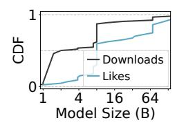

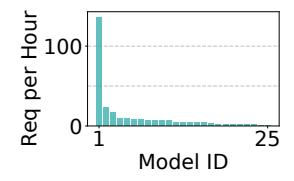

Fig. 2: Popularity of LLMs' size from HuggingFace [5].

Fig. 3: Invocation frequencies of 25 LLMs in LMSYS [74].

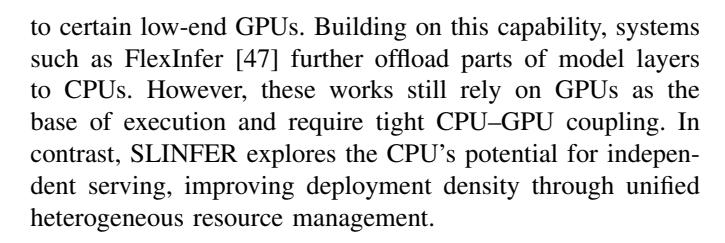

### III. BACKGROUND AND MOTIVATION

### A. LLM Inference Process

In LLM inference, users submit requests containing input tokens, which the inference engine processes iteratively [16], [45], [63], [68]. Each iteration generates one output token, which is streamed back to user in real time.

A request undergoes two stages [53], [54], [75]. The prefill stage occurs during the first iteration, where the engine builds the key-value (KV) cache [14], [37] and generates the first output token. In the decode stage, the engine appends to the KV-cache and generates one token per iteration. To improve concurrency, inference engines adopt continuous batching [71] to dynamically incorporate new requests into ongoing batches.

Interactive LLM serving systems should follow strict Service Level Objectives (SLOs). Two key metrics are Timeto-First-Token (TTFT) and Time-per-Output-Token (TPOT). TTFT is typically constrained to a few seconds [75] and grows with input length, while TPOT should keep up with human reading speed, which is around 250 tokens/min [16].

Once LLM serving meets above SLOs, it can operate as a reliable productivity tool like ChatGPT [7]. Ongoing contributions from open-source communities [64], [65] have further expanded the accessibility and diversity of LLMs.

# B. Small- to Mid-Sized LLMs and Private Deployments

In practice, small- to mid-sized LLMs (e.g., 7B and 13B) have proven effective in addressing most application scenarios, while offering significantly lower operational costs [2], [57]. Meanwhile, increasing demands for customization, coupled with privacy concerns, have driven many users to adopt private deployments. For instance, the developers have created over 1,100 customized variants of Llama-2-7B alone [1]. A closer examination of this trend reveals two key characteristics:

• First, small- to mid-sized models dominate private deployments, as Figure 2 shows. HuggingFace data [5] indicates that models with fewer than 8 billion parameters constitute 60% of user preferences and 87% of total downloads, reflecting practical concerns about cost efficiency.

Fig. 5: GPU memory utilization when serving 128 LLMs with ServerlessLLM.

Second, invocations are infrequent and highly variable [26], [74], as Figure 3 shows. In the most popular multi-LLM dataset, *LMSYS-Chat-1M* [74], most models receive only a handful of requests per hour on average. This stems from private deployments serving limited user base, unlike the high-throughput public APIs [7], [13].

Given the growing demand for private LLM deployments, cloud providers have introduced one-stop hosting solutions [8]–[10], where users simply upload their models while offloading the complexity of infrastructure management.

### C. Problems with Existing Serverless LLM Solutions

To improve serving capacity in private deployments, researchers have begun exploring serverless architecture for orchestrating and managing multiple LLMs on the cloud. Representative systems such as ServerlessLLM [26], Medusa [72], and DeepServe [30] host multiple LLMs within a cluster and dynamically allocate GPUs to each model on demand. Upon receiving a request, the system launches a new model instance on an available GPU if none is currently running. If no GPU is idle, the request is queued for available resources.

However, we observe that existing solutions still struggle to handle large numbers of low-traffic, small- to mid-sized LLMs. Taking ServerlessLLM as a typical example: It enables fast model loading and utilizes vLLM [37] as the internal inference engine. We use it to host a mix of 3B, 7B, and 13B LLMs on four A100-80GB GPUs, following the same setup in § IX-A. As shown in Figure 4, it performs well at small scales. But as the number of LLMs increases, the SLO attainment rate drops sharply as requests heavily queue for limited GPUs.

This situation arises because existing serverless solutions over-provisioning GPU resources for each model: When being allocated the entire GPU memory, each instance utilizes only 23% of it on average, as shown in Figure 5. Moreover, the CPUs are mostly idle, as the computations happens on GPUs.

These observations motivate us to take a step back and reassess the evolving architectures and practical workload scales of small- to mid-sized LLMs. Instead of being constrained by scarce GPUs, alternative hardware like CPUs might offer viable solutions. Moreover, these heterogeneous resources could potentially enable efficient multi-model sharing, rather than being exclusively allocated. To this end, we next conduct a systematic investigation of heterogeneous architectures to explore the sharing opportunities in serverless LLM serving.

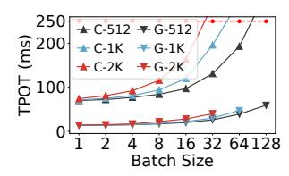

Fig. 7: The TPOT metric under different token length of Llama-2-7B.

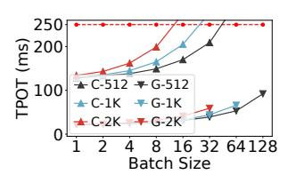

Fig. 8: The TPOT metric under different token length of Llama-2-13B.

Fig. 9: The memory footprint of different models under real-world workloads.

Fig. 10: vLLM's GPU decode throughput and CPU core usage under different batch sizes.

Fig. 11: vLLM's TPOT slowdown under background CPU stress.

# IV. HETEROGENEOUS RESOURCE SHARING

Modern data centers are inherently heterogeneous [19], [33], [49]. Even a GPU cluster is equipped with CPU nodes for preprocessing tasks. Given the reported low CPU utilization on GPU nodes [31], [33] and the emerging CPU architecture [50], it is worth exploring the potential of idle CPU resources.

However, due to the fundamental architectural differences, CPUs typically offer limited parallelism and are well-known to be compute-bound for LLM inference [52], [62]. On the other hand, GPUs are often memory-bound due to their limited memory capacity [29], [63]. Therefore, it is crucial to evaluate the computation latencies in CPUs, and the memory footprints in GPUs to further assess the sharing potential.

### A. CPU Sharing Opportunity

1) Spare CPU Resources: We measured the CPU utilization of state-of-the-art inference engine vLLM [37] when serving Llama-2-7B model on an A100 GPU with a 32-core CPU.

In Figure 10, vLLM's throughput increases with batch size, but never consumes more than one CPU core. To further evaluate vLLM's CPU sensitivity, we launched background CPU stress processes while running it with a batch size of 64. As shown in Figure 11, even with 64 stress processes competing for 32 CPU cores, vLLM suffers only a 4% performance loss. Given that GPU nodes typically feature dozens or even hundreds of CPU cores [67], substantial CPU resources are waiting to be utilized under LLM inference scenarios.

2) CPU Computational Capability: Despite the presence of spare CPU resources, their feasibility for LLM inference remains uncertain due to stringent SLOs and high compute loads. However, it is worth noting that recent CPU architectures have integrated specialized components to accelerate the AI workloads. Starting with 4th-Gen Intel Xeon, Intel introduced Advanced Matrix Extensions (AMX) [15], [50], a dedicated hardware block designed for matrix operations.

"bs" denotes "batch size". Red cells indicate SLO violations.  $\frac{\text{TTFT (ms)}}{\text{CPU}} = \frac{\text{TTFT (ms)}}{256 \text{ 1K}} = \frac{\text{TPOT (ms)}}{\text{1bs-1K}} = \frac{\text{TPOT (ms)}}{\text{1bs-1K}} = \frac{\text{TPOT (ms)}}{\text{1bs-4K}} = \frac{\text{TPOT (ms)}}{\text{1bs-4K}} = \frac{\text{TPOT (ms)}}{\text{1bs-4K}} = \frac{\text{TPOT (ms)}}{\text{1bs-4K}} = \frac{\text{TPOT (ms)}}{\text{1bs-4K}} = \frac{\text{TPOT (ms)}}{\text{1bs-4K}} = \frac{\text{TPOT (ms)}}{\text{1bs-4K}} = \frac{\text{TPOT (ms)}}{\text{1bs-4K}} = \frac{\text{TPOT (ms)}}{\text{1bs-4K}} = \frac{\text{TPOT (ms)}}{\text{1bs-4K}} = \frac{\text{TPOT (ms)}}{\text{1bs-4K}} = \frac{\text{TPOT (ms)}}{\text{1bs-4K}} = \frac{\text{TPOT (ms)}}{\text{1bs-4K}} = \frac{\text{TPOT (ms)}}{\text{1bs-4K}} = \frac{\text{TPOT (ms)}}{\text{1bs-4K}} = \frac{\text{TPOT (ms)}}{\text{1bs-4K}} = \frac{\text{TPOT (ms)}}{\text{1bs-4K}} = \frac{\text{TPOT (ms)}}{\text{1bs-4K}} = \frac{\text{TPOT (ms)}}{\text{1bs-4K}} = \frac{\text{TPOT (ms)}}{\text{1bs-4K}} = \frac{\text{TPOT (ms)}}{\text{1bs-4K}} = \frac{\text{TPOT (ms)}}{\text{1bs-4K}} = \frac{\text{TPOT (ms)}}{\text{1bs-4K}} = \frac{\text{TPOT (ms)}}{\text{1bs-4K}} = \frac{\text{TPOT (ms)}}{\text{1bs-4K}} = \frac{\text{TPOT (ms)}}{\text{1bs-4K}} = \frac{\text{TPOT (ms)}}{\text{1bs-4K}} = \frac{\text{TPOT (ms)}}{\text{1bs-4K}} = \frac{\text{TPOT (ms)}}{\text{1bs-4K}} = \frac{\text{TPOT (ms)}}{\text{1bs-4K}} = \frac{\text{TPOT (ms)}}{\text{1bs-4K}} = \frac{\text{TPOT (ms)}}{\text{1bs-4K}} = \frac{\text{TPOT (ms)}}{\text{1bs-4K}} = \frac{\text{TPOT (ms)}}{\text{1bs-4K}} = \frac{\text{TPOT (ms)}}{\text{1bs-4K}} = \frac{\text{TPOT (ms)}}{\text{1bs-4K}} = \frac{\text{TPOT (ms)}}{\text{1bs-4K}} = \frac{\text{TPOT (ms)}}{\text{1bs-4K}} = \frac{\text{TPOT (ms)}}{\text{1bs-4K}} = \frac{\text{TPOT (ms)}}{\text{1bs-4K}} = \frac{\text{TPOT (ms)}}{\text{1bs-4K}} = \frac{\text{TPOT (ms)}}{\text{1bs-4K}} = \frac{\text{TPOT (ms)}}{\text{1bs-4K}} = \frac{\text{TPOT (ms)}}{\text{1bs-4K}} = \frac{\text{TPOT (ms)}}{\text{1bs-4K}} = \frac{\text{TPOT (ms)}}{\text{1bs-4K}} = \frac{\text{TPOT (ms)}}{\text{1bs-4K}} = \frac{\text{TPOT (ms)}}{\text{1bs-4K}} = \frac{\text{TPOT (ms)}}{\text{1bs-4K}} = \frac{\text{TPOT (ms)}}{\text{1bs-4K}} = \frac{\text{TPOT (ms)}}{\text{1bs-4K}} = \frac{\text{TPOT (ms)}}{\text{1bs-4K}} = \frac{\text{TPOT (ms)}}{\text{1bs-4K}} = \frac{\text{TPOT (ms)}}{\text{1bs-4K}} = \frac{\text{TPOT (ms)}}{\text{1bs-4K}} = \frac{\text{TPOT (ms)}}{\text{1bs-4K}} = \frac{\text{TPOT (ms)}}{\text{1bs-4K}} = \frac{\text{TPOT (ms)}}{\text{1bs-4K}} = \frac{\text{TPOT (ms)}}{\text{1bs-4K}} = \frac{\text{TPOT (ms)}}{\text{1bs-4K}} = \frac{\text{TPOT (ms)}}{\text{1bs-4K}} = \frac{\text{TPOT (ms)}}{\text{1bs-4K}} = \frac{\text{TPOT (ms)}}{\text{1bs-4K}} = \frac{\text{TPOT (ms)}}{\text{1bs-4K}} = \frac{\text{TPOT (m$ 

TABLE I: Llama-2-7B's performance under 3rd- (32-

core@2.7GHz) and 4th-Gen (32-core@3.3GHz) Xeon CPUs.

| CPU     | 11F1 (ms) |      |       | IPOI (ms) |         |        |         |
|---------|-----------|------|-------|-----------|---------|--------|---------|
| CFU     | 256       | 1K   | 4K    | 1bs-1K    | 32bs-1K | 1bs-4K | 32bs-4K |
| 3rd Gen | 1003      | 4113 | 18612 | 100       | 338     | 110    | 697     |
| 4th Gen | 149       | 567  | 2748  | 71        | 196     | 80     | 459     |
| Speedup | 6.7×      | 7.3× | 6.8×  | 1.4×      | 1.7×    | 1.4×   | 1.5×    |
|         |           |      |       |           |         |        |         |

Although using AMX has been shown to provide acceleration [48], detailed latency data under SLO constraints remains underexplored. To benchmark it, we replace vLLM's GPU backend with OpenVINO [11], the state-of-the-art for CPU inference. We use a AMX-equipped 32-core Intel Xeon 6462C CPU, testing three LLMs of varying sizes (Llama-2-7B, Llama-2-13B, and CodeLlama-34B) under different token lengths and batch sizes. Following previous works [16], [75], we set TTFT SLO to min(max(0.5, input\_length/512), 8) s and TPOT SLO to 0.25 s.

Figure 6 presents the TTFT data. The label "C-7B" denotes using CPU with Llama-2-7B. We compare the results with an A100 GPU and the SLO. CPUs can meet the SLOs of 7B and 13B LLMs under short inputs, which cover most usage scenarios—e.g., 97.9% of conversation and 85.9% of coding inputs in the Azure LLM trace are under 4K tokens [54].

We further examine the TPOT data of the 7B and 13B LLMs, which characterizes the per-token latency during decode, as shown in Figure 7 and Figure 8. The label "C-512" denotes using CPU with a token length of 512. We find that the CPU not only meets TPOT SLO with ease but can also utilize batching to improve throughput, similar to GPU. For example, serving 7B LLM on CPU with a token length of 1K, the TPOT for a 4-batch increases by only 14% compared to a 1-batch. We also find that the TPOT also correlates with token length. For instance, serving 13B LLM on CPU with a 32-batch results in a 2X increase in TPOT when the length increases from 512 to 2K, with the latter violating the SLO.

**Limitations and Applicable Scenarios.** Overall, although CPUs offer enhanced capability, they have several limitations: (1) *Dependence on newer hardware.* Older CPUs without specialized matrix acceleration block are generally unsuitable [36]. As shown in Table I, a 32-core 3rd Gen Xeon 8369B

| Fig. 12: CDF of work  |
|-----------------------|
| load concurrency. Leg |
| end same as Fig. 9.   |

| Scenarios 4× 1 | 4   | 3× 1 3 | 2× 1 2    | 1  |
|----------------|-----|-----------|--------------|----|
| C-7B-2K        | -   | 3×2       | 2×9          | 27 |
| C-7B-4K        | -   | 3×1       | 2×4          | 15 |
| G-7B-2K        | 4×6 |           | 3×12 2×26 66 |    |
| G-7B-4K        | 4×3 | 3×6       | 2×13 32      |    |
| G-13B-2K       | -   | -         | 2×7          | 33 |
| G-13B-4K       | -   | -         | 2×3          | 16 |

TABLE II: Aggregated concurrency limits of instances under varying resource specifications.

(without AMX) running Llama-2-7B with 1K inputs results in a TTFT of 4.1 s—far exceeding the SLOs. (2) *Sensitivity to model size and workload.* CPUs can only handle small LLMs (≤13B), short inputs (≤5.6K for a 13B model), and limited batch sizes. (3) *Inability under tight SLOs.* Under a 100 ms TPOT SLO, only 7B or smaller LLMs are feasible, with batch sizes limited to 9 for 1K-length and 3 for 4K-length. At 50 ms, even 7B LLMs become infeasible. Nevertheless, in serverless scenarios with many small- to mid-sized LLMs and infrequent requests, AMX-equipped CPUs present opportunities for resource sharing under moderate SLOs.

# *B. GPU Sharing Opportunity*

An LLM instance's memory footprint primarily consists of model weights and KV-cache. While the weights are fixed, the KV-cache is dynamic with request concurrency and token length. To capture realistic memory usage, we sample token lengths from Azure LLM Trace [54]. Since it lacks multi-LLM invocation patterns, following ServerlessLLM [26], we fire requests based on Azure Serverless Trace [61].

Figure 9 shows the memory usage of the 7B and 13B model under real-world workloads on 4 A100-80GB GPUs. The label "P99, 7B" represents mapping the Llama-2-7B model to the top 1% most frequently invoked function in the Azure Trace. Since each instance occupies 1 GPU, a footprint exceeding 80GB implies that multiple instances are created.

For 7B and 13B LLMs, they need at least 14GB and 26GB of memory, respectively, corresponding to the model weights, regardless of the workload. Under the top 1% workload, memory footprint can peak at 169GB (7B) and 263GB (13B), due to bursts of over 128 concurrent requests (shown in Figure 12), necessitating exclusive use of GPUs. However, even under the top 1%, more than 50% of the time, memory footprint remains below 17GB (7B) and 43GB (13B).

Takeaway. One model's memory footprint remains low in most cases. Given that GPUs like A100 feature 80GB of memory, LLMs can be co-located under serverless workloads.

# *C. Summary and Challenges*

The above explorations reveal opportunities for resource sharing on both CPUs and GPUs. However, straightforward approaches—such as statically assigning a fraction of resources to each model instance—yield negligible improvement in serving capacity. This stems from the inability of small instances to effectively absorb bursty traffic, as large batches typically require full hardware access. For example, as shown in Table II, partitioning a GPU into three smaller instances when serving 7B LLMs achieves only about half the aggregate concurrency limit of a single large instance. Yet in serverless workloads, most requests originate from a few hot functions exhibiting bursty behavior [61]. As shown in Figure 12, the top 1% experiences concurrency levels ranging from 1 to over 128, and alone contributes to 26% of the total requests. This coexistence of burstiness, low frequency, and variability makes static partitioning fundamentally inefficient, which we further evaluate in Sections IX-B, IX-E, and IX-F.

Given the workload characteristics of small- to mid-sized LLMs, elastic and dynamic sharing based on each instance's real-time demand presents a promising approach to maximizing serving capacity. To realize such sharing, we closely examine the compute and memory behaviors of LLM instances and encounter three design challenges (recall Figure 1).

Challenge-1: Timely and precise compute resource allocation. The compute demand of an instance fluctuates sharply at token level. In Section IV-A2, Llama-2-7B running on a 32-core CPU takes 567 ms to generate the first token for a 1024-token input request, while subsequent tokens requires significantly less time (e.g., 71 ms). In addition, the token length and batching behavior introduces further variability. Unlike traditional setups with dedicated resources, *multi-model sharing under serverless scenarios requires the system to precisely budget and allocate compute resources on a pertoken basis, dynamically adjusting to fluctuating demands across concurrent instances to consistently meet SLOs.*

Challenge-2: Efficient and safe memory sharing. A model's memory demand is highly bursty—its peak can reach up to 12× in Figure 9. While dynamic memory resizing is essential for efficiency, we observe that such resizing incurs non-trivial overhead: under widely-used paged attention mechanism [37], changing the KV-cache requires allocating new matrices [56], [72] and migrating already-used cache pages (detailed in Figure 17). Moreover, frequent operations like model loading/unloading coexist with these resizes. When multiple instances co-reside, arbitrary operations can lead to OOM and compromise system stability. *Thus, the system should balance memory utilization and operational cost, constructing a global-orchestrated memory scaling mechanism.*

Challenge-3: Maintaining resource efficiency in shared environments. LLM inference relies on batching to improve compute efficiency, as larger batches yield sub-linear growth in compute cost (see Figure 7). To increase the batch size, an instance needs to scale up its compute and memory resources. However, in a shared setup, these resources may already be occupied by co-located models, forcing the instance to scale out by launching a fragmented replica on another node. This not only leads to scattered batches, but also incurs redundant memory overhead from duplicated model weights. *Therefore, it is essential to proactively identify potential fragmentation issues and assist instances in scaling up.*

Fig. 13: The design architecture of SLINFER.

### V. DESIGN OVERVIEW OF SLINFER

To address the above challenges, we present *SLINFER*, a <u>Serverless LLM Inference</u> scheme designed for small- to mid-sized LLMs in heterogeneous data centers. It transparently leverages diverse hardware and elastically shares resources on demand to maximize serving capacity.

Specifically, SLINFER coordinates multiple LLMs on both CPU and GPU nodes through the compute and memory subsystems, alongside a consolidation module, as shown in Figure 13. SLINFER follows an event-driven approach to deploy multiple instances, where instances are placed using a bin-packing strategy to minimize resource usage. It handles a request's prefill and decode within the same instance: the prefill runs independently, while the decode joins the instance's existing batch. Assuming an LLM already has several instances, we illustrate the components and workflow of SLINFER through a request lifecycle.

When a new request arrives, SLINFER first attempts to assign it to existing instances, prioritizing those on CPU nodes. Since CPU generations differ substantially in performance (see Table I), SLINFER excludes CPUs that lack dedicated matrix-acceleration (e.g., AMX) support. Moreover, as Section IV-A2 shows that CPUs can only serve a limited range of models and workloads, SLINFER profiles CPUs in advance and transparently falls back to GPU instances whenever a CPU cannot meet the request's SLO requirements.

Specifically, to schedule a new request, the compute subsystem performs shadow validation, checking whether a candidate instance can absorb the request without violating the SLOs of other requests on the same node by calculating per-request headroom. Simultaneously, the memory subsystem verifies whether the node has enough available memory to accommodate the request. If both checks succeed, the request is dispatched to the selected instance.

Subsequently, the compute subsystem orchestrates execution at token-level, focusing on request headroom (Challenge 1, see §VI). The memory subsystem employs a watermark-based scaling and a hazard-aware out-of-order operation strategy, ensuring efficient and safe sharing (Challenge 2, see §VII).

If no instance passes the validation, SLINFER introduces a consolidator, which attempts to proactively preempt resources from neighboring instances to avoid launching a new fragmented one, thereby improving overall efficiency (Challenge

Fig. 14: Procedure of token-level scheduling. At each cycle, SLINFER schedules the instance with the shortest *headroom*.

3, see §VIII). If all attempts fail, it falls back to creating a new instance, using the same validation procedure.

Upon request completion, SLINFER scales down the instance's KV-cache via the memory subsystem and reclaims the instance if it stays idle beyond a keep-alive threshold.

### VI. HEADROOM-DRIVEN COMPUTE SUBSYSTEM

### A. Headroom-based Token-level Scheduling

To schedule compute resources at token-level, SLINFER dynamically orchestrates the iterations of multiple instances, as each new token results from a prefill or decode iteration. Specifically, as illustrated in Figure 14, it selects one instance at a time to compute one iteration. Once complete, it moves on to the next instance for another iteration cycle and repeats.

By continuously assigning token-level tasks to instances, the node is full-time utilized without idle periods. However, it is still uncertain which instance should be selected for each scheduling cycle. To minimize SLO violations, SLINFER prioritizes the instance handling the most urgent request.

SLINFER introduces headroom to characterize the degree of urgency. Let  $TTFT_{SLO}$  and  $TPOT_{SLO}$  denote the SLO for TTFT and TPOT. Suppose a request started at time ST, has generated O tokens, and the current time is CT. The headroom of this request, which represents the maximal delay for generating the next token within the SLO, is given by:

$$headroom = ST + TTFT_{SLO} + TPOT_{SLO} \cdot O - CT$$
 (1)

Therefore, at each scheduling cycle, SLINFER selects the instance with the shortest request headroom and assigns it an iteration. In Figure 14, it first selects instance-2. Suppose the  $TPOT_{SLO}$  is 0.25 s and the iteration takes 0.2 s, the headroom then updates to 1.9-0.2+0.25=1.95 s. SLINFER then re-compares the headroom and repeats the process.

### B. Performance Quantification

Since headroom represents the time a request can delay its output, a negative headroom indicates that an SLO violation has occurred. To make sure this does not happen, it is essential to quantify the performance of each model instance, specifically the computation time per iteration under varying loads. Since a prefill iteration is significantly different from a decode iteration, SLINFER characterizes them separately.

Fig. 15: A shadow validation example with three cases.

**Quantify Prefill Time.** As shown in Figure 6, the prefill time is approximately linearly correlated with the input token length. Therefore, SLINFER uses linear interpolation. For a given model, SLINFER collects the TTFT results for an input length samples  $S_L$ . Then, for a new request of length L, it finds the two closest known points and applies the interpolation.

Quantify Decode Time. As evaluated in Figure 7 and Figure 8, the time of decode iteration is correlated with both length and batch size. This is because the computation involves both the attention and the feed-forward network: the former scales with the total token length in the batch, while the latter scales with the batch size. Thus, SLINFER uses these two factors as two dimensions and applies 2D linear interpolation. For a given model, SLINFER generates the batch size samples  $S_B$  and the average token length samples  $S_L$ . For each  $B' \in S_B$  and  $L' \in S_L$ , SLINFER collects the corresponding TPOT results. Then, for a batch size B and average token length L, it finds the four closest points and applies the interpolation.

Considering the hardware heterogeneity, SLINFER quantifies for each hardware type. To reduce sampling overhead, it uses  $2^X$  to generate  $S_L$  and  $S_B$ . If a model's maximum token length is  $L_{\rm max}$  (e.g., 4096) and the maximum batch size is  $B_{\rm max}$  (e.g., 256), SLINFER only needs to collect  $O(\log_{L_{\rm max}} \cdot \log_{B_{\rm max}})$  cases, which amounts to only a few hundred samples that can be completed within minutes, enabling it to quickly adapt to diverse platforms. Lastly, to evaluate the accuracy, we randomly generated 100 workloads with various batch sizes and token lengths. The average relative deviations between the actual TTFT/TPOT and the estimated values were only 5.9% and 3.9%, respectively.

# C. Adding Request via Shadow Validation

Based on quantification, SLINFER can estimate the time of each iteration under various loads, we next focus on how the SLO violation could occur and how to avoid it. Specifically, as shown in Figure 15, when request-5 tries to join instance-3, there are three possible cases: (1) The prefill of the new request (R5-P) is finished too late, making R5's headroom negative with TTFT SLO violation. (2) Existing request (R1-D3) is delayed too late due to the prefill of new request, making R1's headroom negative with TPOT SLO violation. (3) After the new request, the target instance takes longer time to decode (R5-D1, D2), causing the aggregate time for a single decode iteration across all instances in the node to exceed TPOT SLO.

Fig. 16: KV-cache scaling.

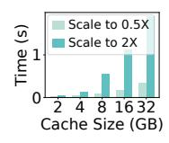

Fig. 17: KV-cache scaling overhead on the GPU.

Therefore, when trying to add a new request to a target instance, SLINFER performs a shadow validation to virtually add and simulate the future compute procedure. This is particularly important because SLINFER prioritizes scheduling requests to compute-bound CPU instances. Considering the runtime fluctuations and the ever-growing token length during decode, SLINFER overestimates each iteration by 10%. Finally, the instance will only accept the request if none of the above cases occur in the simulation. Otherwise, SLINFER will retry the validation on other instances, including creating a new instance to serve the new request.

### VII. HAZARD-AWARE MEMORY SUBSYSTEM

### A. Characterizing Memory Demands

The memory demand of one instance consists of model weights and KV-cache of ongoing requests, while the latter is dynamic and hard to determine since the final output length is hard to know in advance. To avoid memory over-provisioning, SLINFER estimates that each request's final output length is *at least* the average output length  $\bar{O}$  obtained from the historical logs. Additionally, to improve robustness, it introduces a lower bound  $L_{min}$ , which is set to the maximum context length in practice.

Consider a model instance where each token's KV-cache occupies C bytes. If R requests are currently running, with the r-th request having an input length of  $I_r$  and having generated  $O_r$  tokens, assuming requests peak at the same time, the memory requirement of KV-cache is:

$$M_{require} = C \cdot \max(\sum_{r=1}^{R} (I_r + \max(O_r, \bar{O})), L_{min})$$
 (2)

# B. KV-Cache Scaling via Watermark

As the KV-cache demand fluctuates with each received or completed request, SLINFER should dynamically respond by adjusting the allocated memory resource accordingly, rather than statically assigning the entire node memory to a single instance. However, we find that the adjusting procedure incurs non-negligible overhead. As demonstrated in Figure 16, based on the widely adopted paged-attention mechanism [37], scaling it requires re-allocating cache blocks, and copy the original KV-cache from old blocks to new blocks. As evaluated in Figure 17, scaling the original 32GB KV-cache blocks down to 16GB or up to 64GB requires 0.3 s and 1.9 s, respectively.

Given the scaling overhead and the memory underestimation risk, SLINFER adopts an early scale-up and lazy scale-down strategy. Specifically, it utilizes a watermark hyperparameter

Fig. 18: For example, uncoordinated memory scaling can spike usage to 120% (OOM).

Fig. 19: Flowchart of memory scaling operation.

w, which is used to calculate the recommended size of KVcache Mrecommend ← Mrequire · (1 + w%). Suppose the current KV-cache size is Mcur. When adding a new request and the current cache is insufficient (Mcur < Mrequire), SLINFER scales up directly to Mrecommend. This reserves space for upcoming requests and the bursty long outputs, as one long-output request can steal reserved memory from others. When a request completes, SLINFER defers scaling down the KV-cache unless the recommended size falls below the watermark (Mrecommend · (1 + w%) < Mcur). This helps mitigate the ping-pong effect caused by load fluctuations. We set the watermark to 25% and detail its sensitivity in §IX-I5.

# *C. Inter-Instance Scaling Orchestration*

Since each instance dynamically scales its KV-cache while also handling model loading/unloading, multiple instances within a node would simultaneously undergo multiple memory scaling operations, all of which are inherently asynchronous due to their execution latency. To efficiently manage memory adjustments and respond to fluctuations in real time, as illustrated in Figure 19, SLINFER combines optimistic budgeting with pessimistic scheduling, enabling parallel execution of operations while avoiding OOM errors (e.g., Figure 18).

SLINFER maintains an optimistic total memory budget within a node. When handling a scale-down demand, it directly reduces the budget and issues a corresponding operation. This budget update is optimistic because the actual memory release only takes effect once the operation completes. Conversely, for a scale-up demand, it first checks whether the current budget can be increased to fit the needs. If it does, the budget is updated, and an operation is issued.

However, parallel execution introduces hazards, such as a scale-up immediately following a scale-down, which could lead to OOM errors. To avoid such risks, SLINFER employs a pessimistic global memory tracking mechanism to determine when to execute each issued operation. In this scheme, instances undergoing scale-down are accounted for based on their previous memory size. An issued scale-down operation will be executed directly. For a scale-up operation, if pessimistic tracking suggests a risk of OOM, the operation is placed in a reservation station rather than executing immediately. When a scale-down operation completes, it notifies the reservation station, which then reevaluates the risk and attempts to execute any pending operations accordingly.

(a) Fragmented (b) Proactive

(c) Reactive

Fig. 20: (a) By default, A's, B's, or C's new request will create a fragmented instance. (b) To avoid fragment, A's or C's new request can trigger in-place scale-up by *proactively* preempting B's instance. (c) When B holds multiple instances, its small-bs instance is *reactively* reclaimed by prioritizing new requests to large-bs instance. "bs" represents "batch size".

# *D. Intra-Instance Scaling Compromise*

The orchestration mechanism may reject a scale-up demand if there is not enough memory (recall Figure 19). When trying to add a new request to a instance, SLINFER also performs a shadow check on whether the potential scale-up demand can be approved. To fully utilize all available memory, if the shadow check fails, SLINFER will attempt to compromise the scale-up demand, allowing the request to be accepted as long as it can scale up to Mrequire rather than Mrecommend.

Additionally, although we have strengthened the robustness of the estimates for the KV-cache, there is still a possibility of underestimation. In this rare case, SLINFER will attempt to scale up the cache again. If the attempt fails due to the node memory shortage, SLINFER will evict and re-schedule the request with the longest headroom.

# VIII. EFFICIENCY-ORIENTED CONSOLIDATION

In a shared environment, the presence of neighboring instances may block an instance from scaling up to accommodate a new request. Instead, the system is forced to scale out a new, fragmented instance (Figure 20a), leading to degraded compute and memory efficiency. SLINFER performs consolidation to reduce the fragmentation with two strategies.

# *A. Proactive Consolidation with Preemption*

When the scale-up is hindered by neighboring instances, SLINFER allows an instance to preempt them to make room for the new request, as shown in Figure 20b. The requests of the preempted instances are then rescheduled to other nodes.

However, such preemption risks increasing fragmentation by disintegrating already-enlarged neighboring instances. To avoid this, SLINFER only allows an instance to preempt those with smaller batch sizes than itself and prioritizes the smallest one. Additionally, SLINFER also performs shadow validation to ensure preempted requests can still meet their SLOs after rescheduling, allowing preemption only when passed. As a result, even in a crowded environment, a small instance can still hold promise for growing into a larger one without affecting the existing large instances, thereby minimizing fragmentation.

### B. Reactive Consolidation with Bin-Packing

While fragmentation can be minimized proactively, scaling out may still be necessary. To reduce its impact, when multiple instances of the same model exist, SLINFER adopts a bin-packing strategy that preferentially routes new requests to the instance with the largest batch size. On one hand, large-batch instances have more opportunities to grow larger through preemption. On the other hand, small-batch instances are more likely to finish their remaining requests sooner, so avoiding them increases the chances of reclaiming them earlier.

Figure 20c illustrates this behavior. Suppose  $LLM_B$  needs to scale and creates a new instance on Node-2 with batch size bs=3, while an existing instance on Node-1 has bs=2. The Node-1 instance is now considered fragmented. Subsequent requests are preferentially scheduled to Node 2, allowing SLINFER to reclaim the Node-1 instance once its current requests are finished. Since SLINFER features shadow validation with precise token-level scheduling, it can guarantee SLOs while reducing fragmented instances.

### IX. EVALUATION

### A. Experimental Setup

**Testbed.** We use 4 32-core Intel Xeon 6462C @3.3 GHz CPU nodes and 4 NVIDIA A100-80GB GPU nodes, which are logically separated from two physical machines with 2 GPUs each.

**Models.** We use popular LLMs with 16-bit precision of different sizes: Llama-3.2-3B, Llama-2-7B, and Llama-2-13B. As the resource requirement is primarily determined by the model size, same scale models exhibit similar performance. For instance, the TTFT and TPOT (1-batch and 1K-length) of DeepSeek-R1-Distill-Qwen-7B (7.6B) on CPU is 650 ms and 74 ms, while Llama-2-7B (6.7B) is 567 ms and 71 ms.

Workloads and SLOs. The input and output length of each request are sampled from Azure LLM Conversation dataset [54] (depicted in Figure 34). In IIIIIIIIIIIIIIIIIIIIIIIIIIIIIIIIII

**Baselines.** (1) We treat ServerlessLLM [26] as the baseline, denoted as sllm, which only supports GPUs. (2) sllm+c is modified to also support the CPUs. (3) Based on sllm+c, we further extend it to support time-sharing on both CPU and GPU nodes, denoted as sllm+c+s. In this setting, each model instance (except for 13B-sized models on CPU) is allocated only half of the per-node resources.

**Systems Behavior and Fairness.** sllm+c, sllm+c+s, and SLINFER all prioritize the CPU nodes. All models are cached in CPU memory, and the cold-start procedure is similar across all systems, as SLINFER utilizes sllm's loader to

Fig. 21: Azure Trace under different number of models.

enable fast loading. Although sllm's loader has reduced the cold start latency to a few seconds (e.g., 1 second to load a 7B model in our environment), requests that experience cold-start may still violate the TTFT SLO. To address this, we relax the TTFT requirement for such requests by allowing a grace window equal to the cold-start duration. The keep-alive threshold is set to 1 s and all systems use same inference engines: vLLM 0.5.2 and OpenVINO 2024.6.0.

Unlike SLINFER's dynamic decision-making, sllm triggers instance scale-out based on a fixed concurrency limit of 2, which leads to extreme inefficiency. Based on the profiling, we tried our best to conservatively tailor a set of higher concurrency limits for sllm and sllm+c, which are (59, 15, 6) and (160, 32, 16) for the 3B, 7B, and 13B models on CPU and GPU, respectively. As for sllm+c+s, since the compute and memory shortages can easily occur when each instance is provisioned with constrained resources, the corresponding limits are (23, 4, 6) and (71, 12, 4).

### B. End-to-end Experiments

In this section, we present diverse performance metrics of SLINFER under different model sizes and quantities, comparing it with sllm and its variants. Figure 22a shows the results for the 3B-sized cases, where 32, 64, and 128 replica models are generated from Llama-3.2-3B and mapped to the Azure Trace (Figure 21 details the trace). Figure 22b and 22c depict the scenarios for the 7B-sized and the 13B-sized, respectively.

SLINFER uses less resources (Nodes Used) with higher per-node throughput (Decode Speed). When serving 32 3B-sized models in Figure 22a, SLINFER consumes only 3.0 CPUs with 0 GPU, whereas sllm requires 3.2 exclusive GPUs. sllm+c and sllm+c+s can also reduce GPU usage by leveraging CPUs and sharing resources, but it is less effective than SLINFER. Moreover, sllm+c+s can result in negative optimization effects due to the fixed resource partitioning (detailed in §IX-E). For example, when serving 32 7B-sized models in Figure 22b, sllm+c consumes 1.5 GPUs, while sllm+c+s consumes even more (2.0 GPUs), whereas SLINFER uses only 0.9 GPUs.

To further investigate the reasons behind SLINFER's resource savings, we measured the average decode throughput per node. Compared to sllm+c+s, SLINFER achieves higher throughput by 0% - 84% on CPUs and by (-4)% -

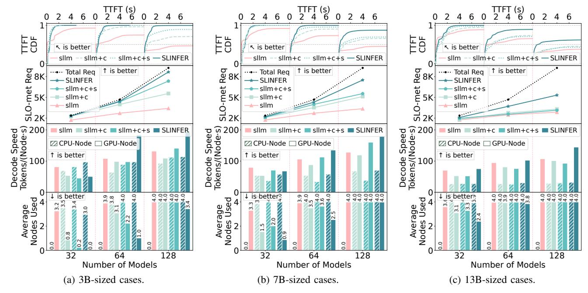

Fig. 22: Diverse performance metrics of each system under different model sizes and quantities.

88% on GPUs. Note that the improvements can be negative since SLINFER uses little GPUs when serving 32 models. The reasons for the improvements are twofold: First, SLINFER can achieve higher batch size (detailed in \$IX-F). Second, sllm and its variants waste the allocated compute resources during instance cold-start and keep-alive, while SLINFER can immediately reassign resources to other instances instead.

Finally, as the number of models increases or model size grows, the resource usage gap among four systems gradually narrows. For example, when serving 128 13B-sized models (Figure 22c), each system exhausts all nodes. This is because, on one hand, the excessive load begins to saturate each system, and on the other hand, larger models diminish the sharing potential of SLINFER (detailed in §IX-E).

SLINFER achieves superior serving capacity (SLO-met Req) with quick response (TTFT CDF). When serving 128 models, it improves the number of SLO-met requests by 86% - 154% compared to sllm, by 47% - 62% compared to sllm+c, and by 18% - 70% compared to sllm+c+s. Meanwhile, it maintains sub-second TTFT for most requests. This demonstrates the effectiveness of SLINFER's shadow validation and memory scaling mechanisms, ensuring that resource sharing does not compromise request SLOs. sllm+c+s does not exhibit significant improvement, as the fixed resource partitioning leads to resource inefficiency (detailed in §IX-F).

Note that sllm instead achieves a lower median TTFT when serving 32 models, since it only utilizes GPUs, whereas SLINFER prioritizes CPUs. Meanwhile, the CDFs of all systems do not always reach 1, as they proactively drop requests whose queuing delays exceed the TTFT SLO under heavy load. When serving 128 models, SLINFER's CDF curves flatten at much higher percentiles compared to sllm and its

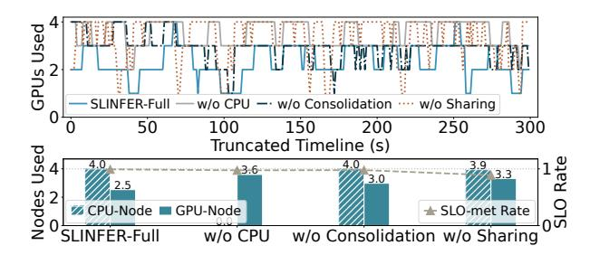

Fig. 23: The resource usage and SLO compliance rate when disabling each component of SLINFER.

variants, indicating SLINFER's superior serving capacity.

### C. Ablation Study

We further study the effectiveness of SLINFER's design. Figure 23 shows the results when disabling each component when serving 64 7B-sized models. Disabling any component results in a increase in GPU resource usage. Notably, after disabling sharing, the SLO compliance rate drops substantially to 89%. This is because sharing is a key factor in increasing deployment density; without it, SLINFER struggles to handle such a large number of models simultaneously.

From the truncated timeline of GPU usage, we observe that after disabling the CPU, GPU usage is consistently high, whereas SLINFER-full rarely exhausts all four GPUs. Additionally, after disabling consolidation, when handling fluctuating loads (at 50 s and 250 s) and after load spikes, the GPU usage is notably higher compared to SLINFER-full. This is because it creates fragmented instances to handle the surge, which cannot be reclaimed promptly.

Fig. 24: CPU scalability.

Fig. 25: GPU efficiency.

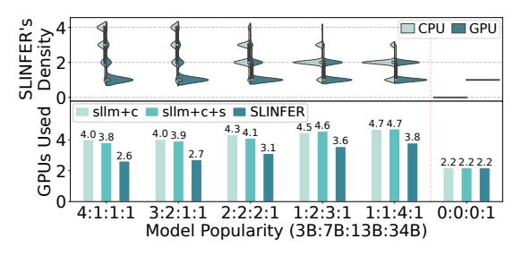

Fig. 26: Performance when various sized models co-exist.

# D. Evaluate CPU Scalability

Having validated the effectiveness of the CPU, we further examine its scalability. In Figure 24, we assume that SLINFER initially has only two GPU nodes and zero CPU nodes, which are insufficient to handle all requests for 64 7B-sized models. As observed, continuously adding CPU nodes gradually increases the system's serving capacity to accommodate all requests. However, the scaling efficiency is lower compared to adding GPU nodes—roughly 3 to 4 CPU nodes are required to match the capacity of a single GPU node. This aligns with expectations, as CPUs have relatively lower compute power.

# E. Mixed Deployment

To reflect real-world scenarios with mixed model sizes, we evaluate SLINFER under mixed-sized workloads, including CodeLlama-34B deployed with tensor parallelism (2 GPUs/instance). To accommodate the increased workload scale, this experiment runs on 4 CPUs and 6 GPUs. The CPU results are omitted as all systems saturate CPU usage.

Figure 26 shows that SLINFER consistently uses fewer GPUs than both sllm+c and sllm+c+s, but its efficiency varies with model popularity. When small models dominate (4:1:1:1), SLINFER can deploy up to four instances per CPU, while reserving GPUs primarily for large models. In contrast, when large models dominate (1:1:4:1), the deployment density drops due to higher resource demands, reducing sharing efficiency. In the extreme case (0:0:0:1), SLINFER falls back to exclusive GPU allocation, similar to sllm+c and sllm+c+s.

We also observe that sllm+c+s performs worse under large models due to static partitioning that severely limits concurrency under high demands. Overall, since most popular models are relatively small [5], SLINFER can achieve significant resource savings in practice.

### F. Investigate GPU Efficiency

Figure 25 presents an analysis of GPU efficiency when serving mixed models (3B, 7B, and 13B) of 2:2:2 ratio. As discussed in §IX-E, SLINFER's behavior for larger models aligns with baselines and is omitted for brevity.

SLINFER achieves near-optimal memory utilization with close to 1. In contrast, sllm and sllm+c+s both exhibit a three-tier memory utilization pattern corresponding to the three model sizes, with most instances using less than half of their allocated memory. This suggests significant over-provision, since they allocate all available memory in a node (or half of the node) to each instance for KV-cache space.

Despite the sparsity of serverless workloads, SLINFER achieves a 74% higher average batch size than sllm, as instance sharing prolongs execution intervals and accumulates more requests. sllm+c+s suffers from lower peak batch sizes due to fixed resource partitioning that limits concurrency.

TABLE III: Performance under prefill-decode disaggregation. Each cell shows results for aggregated PD / disaggregated PD.

| System   | Load (models) | Avg. GPU Usage | SLO Rate (%) |
|----------|---------------|----------------|--------------|
| sllm+c+s | 32            | 2.0 / 3.0      | 99 / 93      |
|          | 64            | 3.6 / 3.9      | 93 / 70      |
|          | 128           | 4.0 / 4.0      | 65 / 35      |
| SLINFER  | 32            | 0.9 / 1.0      | 99 / 99      |
|          | 64            | 2.5 / 2.9      | 99 / 98      |
|          | 128           | 4.0 / 4.0      | 86 / 69      |

# G. Exploring Prefill-Decode Disaggregated Architecture

To minimize resource usage, we co-locate the prefill and decode stages of each request within the same instance. An alternative design, known as prefill-decode (PD) disaggregation [54], launches dedicated instances for each stage per model. Table III shows the performance impact of this approach. The cross-node communication bandwidth is 100 Gbps. We observe that PD disaggregation instead leads to increased resource usage and reduced serving capacity. This is because the prefill stage is short-lived, and infrequent requests result in prefill instances spending 93% of their lifetime on average in cold starts or idle. This finding aligns with DistServe [75], which also argues that PD disaggregation is ill-suited for resource-constrained scenarios.

### H. Scalability and Scheduling Overhead

As shown in Figure 32, we compare the serving capacity under the same workload while varying the number of nodes—from 1 CPU + 1 GPU to 4 CPU + 4 GPU. Across all configurations, SLINFER achieves a higher number of SLOmet requests. With four nodes, SLINFER delivers equivalent performance to sllm+c+s running on eight nodes. Note that performance gains show diminishing returns, as we evaluate SLO-met requests under fixed load with many infrequent and concurrent model invocations. For instance, a single node can serve ten requests from one model, but handling one request each from ten different models requires much more nodes.

GPUs

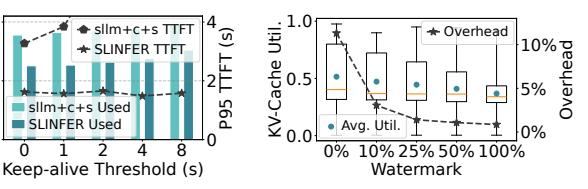

Fig. 27: The resource usage of BurstGPT under different load-levels.

Fig. 28: CPU usage during multimodel colocation.

Fig. 29: Performance under varying numbers of CPU cores.

Fig. 30: Performance under different keep-alive thresholds.

Fig. 31: KV-cache utilization and scaling overhead under different watermarks.

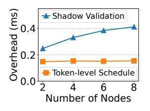

Fig. 32: Performance under different node counts.

Fig. 33: The scheduling overhead of SLINFER.

Fig. 34: Characterization Fig. 35: Eval of different datasets of different LLM datasets. when serving 64 8B-sized models.

We further analyze the scheduling overhead of SLINFER and find that it remains low, as shown in Figure 33. First, when a request arrives, it undergoes shadow validation to select an instance. The time cost slightly increases with the number of nodes, because a heavily loaded model tends to have more instances as the cluster scales, leading shadow validation to probe more candidates. Second, SLINFER dynamically schedules instances at token-level (recall Figure 14). This overhead remains stable regardless of the scales, since this scheduling decision is performed independently on each node.

### I. Sensitivity Analyses

Previously, we used Azure Conversation dataset and Azure Serverless Trace as workloads. Each CPU node was provisioned with 32 cores, the keep-alive threshold was set to 1 second, and SLINFER's KV-cache scaling watermark was set to 25%. In this section, we conduct a series of sensitivity analyses to evaluate how these settings affect system performance.

1) Length Patterns: We further evaluate on the Azure Code [54], HumanEval [20], ShareGPT [3], and Longbench [18] datasets. They are characterized in Figure 34. To support Longbench with up to 32k tokens, we use

Llama-3.1-8B models across all datasets. As shown in Figure 35, SLINFER consistently consumes fewer resources than sllm+c+s. We observe that datasets with longer outputs, such as ShareGPT, consume more resources but achieve higher decode throughput. This is because longer generations provides more batching opportunities. For LongBench, however, CPUs cannot satisfy the long-sequence TTFT SLO, so SLINFER does not prefer CPUs. In comparison, sllm+c+s fully utilizes CPUs but violates 63.4% of SLOs. Overall, CPUs can handle inputs up to 8.4k tokens within the 8s TTFT SLO.

- 2) Invocation Traces: In addition to serverless trace, we also experimented with an LLM trace, BurstGPT [66]. However, the LLM trace represents a centralized single-model invocation pattern, which does not match the multi-model scenarios. To emulate the serverless environments, we distributed all invocations across 64 models following a Pareto distribution. Figure 27 shows system resource utilization under different load levels by sampling various time segments from BurstGPT. SLINFER consistently consumes fewer resources. When the RPS increases to 4, sllm+c+s incurs 7.7% SLO violations, whereas SLINFER maintains only 1.0%.
- 3) CPU Resources: CPU resources may become constrained in shared environments. However, as shown in Figure 28, even when eight model instances are deployed on a single GPU, their total average CPU usage only slightly exceeds one core. This is because each instance takes turns to use the GPU and only keeps the CPU busy-waiting during GPU interactions. Apart from that, tasks such as data preprocessing consume negligible CPU resources (< 0.1 core).

Nevertheless, Figure 29 compares system performance under varying harvested CPU cores. In addition to being used independently, CPU resources can also assist GPU instances, as proposed in NEO [32]. We also compare this approach. Results show that SLINFER consistently achieves the lowest SLOmiss rate across all resource conditions. In contrast, NEO lags behind, as it is primarily optimized for single-instance, high-load scenarios, whereas in serverless multi-model settings, elastic and independent utilization of heterogeneous resources to increase deployment density is the top priority.

4) Keep-alive Threshold: A longer threshold leads to more idle instances and increased resource usage, as shown in Figure 30. Counterintuitively, extending the threshold can even worsen the TTFT, due to: (1) cold-start latency is already low, and (2) prolonged idle instances exacerbates resource contention, leading to requests queuing—particularly

for sllm+c+s. We therefore recommend a short threshold (e.g., 1 s) to balance resource efficiency and user experience.

*5) KV-cache Scaling Watermark:* As shown in Figure 31, setting a watermark is essential since disabling it (set to 0%) causes each instance to spend 11.3% of its lifetime on scaling due to frequent adjustments. Besides, even a low watermark can significantly reduce this overhead, as SLINFER leverages early scale-up to accommodate upcoming requests in a single event and delays scale-down to mitigate short-term fluctuations. Thus, we recommend using a low watermark (e.g., 25%), where scaling overhead is already minimal (1.4%), and the request migration rate due to underestimations is only 0–0.3%. Raising the watermark further provides negligible benefit but lowering KV-cache utilization, leading to memory inefficiency.

# X. DISCUSSION

Impact of Hardware Advancements. SLINFER currently targets small- to mid-sized LLMs. For large models, SLIN-FER falls back to ServerlessLLM [26]'s exclusive allocation approach (recall §IX-E). Besides, current CPUs are still slow for tight SLOs and long inputs—decoding of Llama-3.1-8B takes at least 74 ms, and processing 32k inputs takes 84 s. However, CPU's capabilities are rapidly evolving: the 32-core 4th Gen Xeon we use delivers 105 TFLOPS (BF16) compared to 13 TFLOPS on a 32-core 3rd Gen Xeon, and the latest 96-core 6th Gen [12] reaches 297 TFLOPS. Meanwhile, GPU memory capacity is also increasing. These advancements offer further performance gains and greater model-sharing potential.

Serving Quantized Models. Applying quantization further enhances SLINFER's sharing capacity by reducing the memory footprint of each instance. When serving 32 22B-sized models [4], applying INT4 quantization [41] reduced GPU usage from 3.8 to 2.6. This improvement stems from the fact that the model weights alone consume 44GB, making quantization essential for sharing on a 80GB GPU.

# XI. CONCLUSION

We propose SLINFER, a resource-efficient serverless LLM inference scheme. Motivated by evolving hardware architectures and real-world workload characteristics, SLINFER brings a new solution in the face of GPU scarcity. We consider SLINFER as a first step in applying the serverless paradigm to explore transparent sharing of heterogeneous resources for LLM inference. As hardware continues to advance, more opportunities will emerge.

# ACKNOWLEDGMENT

We thank the anonymous reviewers and our shepherd for their helpful comments and suggestions. This work is partially sponsored by the National Natural Science Foundation of China (62232011, 62302302). Quan Chen is the corresponding author.

# APPENDIX

# *A. Abstract*

Our artifact includes the prototype implementation of SLIN-FER, the modified ServerlessLLM, the modified vLLM, and the experiment workflow based on 4 A100-80GB GPUs and 4 32-core Intel 4th Gen Xeon CPUs. CPUs are optional.

# *B. Artifact check-list (meta-information)*

- Program: ServerlessLLM [26], vLLM [37], SLINFER, and Python.
- Model: Llama-3.2-3B-Instruct, Llama-2-7b-chat-hf, and Llama-2-13b-chat-hf.
- Data set: AzureFunctionsDataset2019 and AzureLLMInferenceDataset2023.
- Run-time environment: Ubuntu 22.04 with CUDA 12.4.
- Hardware: 4 × NVIDIA A100-80GB GPU, 4 × Intel 4th Gen Xeon CPU (32 cores, 3.3 GHz). CPUs are optional.
- Metrics: Resource usage and SLO-met rate.
- Output: JSON files and PDF graphs.
- Experiments: Python scripts.
- How much disk space required (approximately)?: 200GB.
- How much time is needed to prepare workflow (approximately)?: 2 hours.
- How much time is needed to complete experiments (approximately)?: 26 hours (full test), 2 hours (quick test).
- Publicly available?: Yes.
- Archived (provide DOI)?: 10.5281/zenodo.17846442

# *C. Description*

- *1) How to access:* The source code of SLINFER are available and maintained on GitHub. You can visit https: //github.com/BarrinXu/SLINFER for more information. We recommend you to follow the **README.md** in the repository to perform the installation and the evaluation.
- *2) Hardware dependencies:* To simplify the experimental environment as much as possible, SLINFER requires at least one GPU machine equipped with four NVIDIA A100-80GB GPUs. To fully leverage all capabilities of SLINFER (optional), you will also need four CPU machines, each equipped with a 32-core 4th-generation Intel Xeon processor (or newer).
- *3) Software dependencies:* The artifact requires the experiment running Ubuntu 22.04 with Conda and NVCC (version 12.4) installed.
- *4) Data sets:* The Data sets are included in the source code of SLINFER.
- *5) Models:* You need to download the following models from Hugging Face: Llama-3.2-3B-Instruct, Llama-2-7b-chathf, and Llama-2-13b-chat-hf. See README.md for detailed instructions.

# *D. Installation*

We recommend you to follow the **README.md** in the source code to install SLINFER.

- *1) Environment Setup:* On every machine (1 GPU + 4 CPU machines):
- 1. Clone or download the SLINFER project.
- 2. Set the absolute path to the project root as an environment variable:

export PROJECT\_BASE=...

# 3. Create and activate a Conda virtual environment:

• *On GPU machines:*

conda create -n SLINFER-GPU python=3.11 conda activate SLINFER-GPU

• *On CPU machines:*

conda create -n SLINFER-CPU python=3.11 conda activate SLINFER-CPU

All subsequent steps must be performed within the activated Conda environment.

*2) Software Installation:*

# For GPU Machines:

Prerequisite: Ensure NVCC version is 12.4 (higher versions may work but are untested).

# 1. Install ServerlessLLM model loader:

cd \$PROJECT\_BASE/ServerlessLLM\_modify/ sllm\_store rm -rf build pip install .

# 2. Install modified vLLM:

cd \$PROJECT\_BASE/vLLM\_modify pip install -e .

# 3. Install compatible dependencies and plotting tools:

pip install transformers==4.46.3 pip uninstall pyairports -y pip install git+https://github.com/ ozeliger/pyairports.git pip install matplotlib seaborn

# For CPU Machines:

cd \$PROJECT\_BASE/vLLM\_modify pip install -r requirements-build.txt --extra-index-url https://download.pytorch. org/whl/cpu

PIP\_PRE=1 PIP\_EXTRA\_INDEX\_URL="https:// download.pytorch.org/whl/cpu https://storage.openvinotoolkit.org/simple /wheels/nightly/" VLLM\_TARGET\_DEVICE= openvino python -m pip install -v -e .

- *3) Model Preparation:* Download the three models mentioned above from Hugging Face into \$PROJECT\_BASE/huggingface\_models/.
  - *On GPU machine:*

\$PROJECT\_BASE/huggingface\_models/export \_gpu\_models.sh

• *On CPU machine:*

\$PROJECT\_BASE/huggingface\_models/export \_cpu\_models.sh

# *E. Experiment workflow*

*1) Experiment Preparation:*

# 1. Configure Network (Skip for GPU-only)

Edit the following config files to specify IP addresses of your CPU machines:

scheduler/config\_template/pools\_info\_ template\_3B\_4C4G.py → lines 83, 97, 111, 125

scheduler/config\_template/pools\_info\_ template\_7B\_4C4G.py → lines 67, 79, 91, 103 scheduler/config\_template/pools\_info\_ template\_13B\_4C4G.py → lines 59, 70, 81, 92

# 2. Enable NVIDIA MPS on GPU Machine

nvidia-cuda-mps-control -d

# 3. On GPU Machine: Open 7 persistent terminals (e.g., using tmux or screen). In each, activate the Conda

environment and set \$PROJECT\_BASE. *On Window-0 (GPU-0's instances wrapper):* export OM\_NUM\_THREADS=4 cd \$PROJECT\_BASE/SLINFER\_core/tools *On Window-1 (GPU-1's instances wrapper):* (Same as Window-0)

*On Window-2 (GPU-1's instances wrapper):*

(Same as Window-0)

*On Window-3 (GPU-1's instances wrapper):*

(Same as Window-0)

*On Window-loader (ServerlessLLM model loader):*

sllm-store-server --storage\_path \$PROJECT\_BASE/gpu\_models --mem\_pool\_size 64

Please wait until sllm-store-server outputs "Server listening on 0.0.0.0:8073".

*On Window-gateway (root gateway):*

cd \$PROJECT\_BASE/SLINFER\_core/scheduler

*On Window-test (later will run test script):*

cd \$PROJECT\_BASE/SLINFER\_core/tools/test

# 4. CPU Machines: Launch 2 Terminals (Skip for GPUonly). In each, activate the Conda environment and set \$PROJECT\_BASE.

*On Window-0 (CPU's instances wrapper):*

cd \$PROJECT\_BASE/SLINFER\_core/tools

*On Window-dist gateway (CPU's distributed gateway):* cd \$PROJECT\_BASE/SLINFER\_core/scheduler

# *F. Evaluation and expected results*

Three experiments are provided: 3B, 7B, and 13B models (corresponding to Figure 22a, 22b, and 22c).

- *1) Before Each Experiment:* Terminate all running processes:
  - On GPU machine: Ctrl+C in Window-0,1,2,3,gateway
  - On CPU machines: Ctrl+C in Window-0 and Windowdist gateway
  - *2) 3B Model Experiment:*

# 1. Choose config:

*With 4 CPU machines:*

cp \$PROJECT\_BASE/SLINFER\_core/scheduler/ config\_template/pools\_info\_template\_3B\_4C4G .py \$PROJECT\_BASE/SLINFER\_core/scheduler/ config\_template/pools\_info\_template.py *GPU-only:*

cp \$PROJECT\_BASE/SLINFER\_core/scheduler/ config\_template/pools\_info\_template\_3B\_0C4G .py \$PROJECT\_BASE/SLINFER\_core/scheduler/ config\_template/pools\_info\_template.py

# 2. Start GPU instances wrapper (in Window 0–3): *Window-0:*

python vllm\_batch\_starter.py --model llama-3.2-3b --device gpu --worker\_num 8 --port 8000 --gpu 0

# *Window-1:*

python vllm\_batch\_starter.py --model llama-3.2-3b --device gpu --worker\_num 8 --port 8100 --gpu 1

# *Window-2:*

python vllm\_batch\_starter.py --model llama-3.2-3b --device gpu --worker\_num 8 --port 8200 --gpu 2

# *Window-3:*

python vllm\_batch\_starter.py --model llama-3.2-3b --device gpu --worker\_num 8 --port 8300 --gpu 3

Wait about 1 minute for initialization.

# 3. (Skip if GPU-only) On each CPU machine: *Window-0:*

python vllm\_batch\_starter.py --model llama-3.2-3b --device aliyun --worker\_num 4 --port 8000 --cpu\_kv\_gb 16

*Window-dist gateway:*

python dist\_gateway.py --port 7999

Wait about 1 minute for initialization.

# 4. On GPU machine, start root gateway (Windowgateway):

python gateway.py

Wait for "Start-up complete" output (a few minutes).

# 5. On GPU machine, run test in Window-test:

python test\_3B\_extreme\_lite.py (partial test, recommended, lasts 26 minutes)

python test\_3B\_full.py (full test, lasts 396 minutes)

# 6. On GPU machine, Generate plots:

cd \$PROJECT\_BASE/SLINFER\_core/tools/draw python draw.py

The script will ask for GPU number (number of GPU cards), CPU number (number of CPU machines). It will generate a PDF figure and print the file path.

*3) 7B/13B Model Experiment:* The experiment workflow is similar to the 3B model case. Please follow README.md in the source code for detailed instructions.

# REFERENCES

- [1] "meta-llama/llama-2-7b-hf · hugging face," https://huggingface.co/metallama/Llama-2-7b-hf, 2023.
- [2] "Phi-2: The surprising power of small language models microsoft research," https://www.microsoft.com/en-us/research/blog/phi-2 the-surprising-power-of-small-language-models/, 2023.
- [3] "Sharegpt · datasets at hugging face," https://huggingface.co/datasets/ anon8231489123/ShareGPT Vicuna unfiltered, 2023.
- [4] "mistralai/codestral-22b-v0.1 · hugging face," https://huggingface.co/ mistralai/Codestral-22B-v0.1, 2024.
- [5] "Open source ai year in review 2024 a hugging face space by huggingface," https://huggingface.co/spaces/huggingface/open-sourceai-year-in-review-2024?day=2, 2024.

- [6] "Amazon sagemaker," https://cloud.google.com/blog/products/ application-development/run-your-ai-inference-applications-on-cloudrun-with-nvidia-gpus, 2025.
- [7] "Chatgpt openai," https://openai.com/chatgpt/overview/, 2025.
- [8] "Deploy models as serverless apis azure machine learning — microsoft learn," https://learn.microsoft.com/en-us/azure/machinelearning/how-to-deploy-models-serverless, 2025.
- [9] "Host your llms on cloud run google cloud blog," https://aws.amazon. com/sagemaker/, 2025.
- [10] "Inference api (serverless) hugging face," https://huggingface.co/ inference-api/serverless, 2025.
- [11] "Intel® distribution of openvino™ toolkit," https://www.intel.com/ content/www/us/en/developer/tools/openvino-toolkit/overview.html, 2025.
- [12] "Intel® xeon® 6966p-c processor," https://www.intel.com/content/ www/us/en/products/sku/240782/intel-xeon-6966pc-processor-432mcache-3-00-ghz/specifications.html, 2025.
- [13] "Meet claude anthropic," https://www.anthropic.com/claude, 2025.
- [14] "Tensorrt-llm," https://github.com/NVIDIA/TensorRT-LLM, 2025.
- [15] "What is intel® advanced matrix extensions (intel® amx)? intel," https://www.intel.com/content/www/us/en/products/docs/acceleratorengines/what-is-intel-amx.html, 2025.
- [16] A. Agrawal, N. Kedia, A. Panwar, J. Mohan, N. Kwatra, B. S. Gulavani, A. Tumanov, and R. Ramjee, "Taming throughput-latency tradeoff in LLM inference with sarathi-serve," in *18th USENIX Symposium on Operating Systems Design and Implementation, OSDI 2024, Santa Clara, CA, USA, July 10-12, 2024*, A. Gavrilovska and D. B. Terry, Eds. USENIX Association, 2024, pp. 117–134. [Online]. Available: https://www.usenix.org/conference/osdi24/presentation/agrawal
- [17] A. Ali, R. Pinciroli, F. Yan, and E. Smirni, "Batch: machine learning inference serving on serverless platforms with adaptive batching," in *Proceedings of the International Conference for High Performance Computing, Networking, Storage and Analysis, SC 2020, Virtual Event / Atlanta, Georgia, USA, November 9-19, 2020*, C. Cuicchi, I. Qualters, and W. T. Kramer, Eds. IEEE/ACM, 2020, p. 69. [Online]. Available: https://doi.org/10.1109/SC41405.2020.00073
- [18] Y. Bai, X. Lv, J. Zhang, H. Lyu, J. Tang, Z. Huang, Z. Du, X. Liu, A. Zeng, L. Hou, Y. Dong, J. Tang, and J. Li, "Longbench: A bilingual, multitask benchmark for long context understanding," in *Proceedings of the 62nd Annual Meeting of the Association for Computational Linguistics (Volume 1: Long Papers), ACL 2024, Bangkok, Thailand, August 11-16, 2024*, L. Ku, A. Martins, and V. Srikumar, Eds. Association for Computational Linguistics, 2024, pp. 3119–3137. [Online]. Available: https://doi.org/10.18653/v1/2024.acl-long.172
- [19] C. Chen, K. Li, A. Ouyang, Z. Zeng, and K. Li, "Gflink: An in-memory computing architecture on heterogeneous CPU-GPU clusters for big data," *IEEE Trans. Parallel Distributed Syst.*, vol. 29, no. 6, pp. 1275–1288, 2018. [Online]. Available: https://doi.org/10.1109/TPDS.2018.2794343
- [20] M. Chen, J. Tworek, H. Jun, Q. Yuan, H. P. de Oliveira Pinto, J. Kaplan, H. Edwards, Y. Burda, N. Joseph, G. Brockman, A. Ray, R. Puri, G. Krueger, M. Petrov, H. Khlaaf, G. Sastry, P. Mishkin, B. Chan, S. Gray, N. Ryder, M. Pavlov, A. Power, L. Kaiser, M. Bavarian, C. Winter, P. Tillet, F. P. Such, D. Cummings, M. Plappert, F. Chantzis, E. Barnes, A. Herbert-Voss, W. H. Guss, A. Nichol, A. Paino, N. Tezak, J. Tang, I. Babuschkin, S. Balaji, S. Jain, W. Saunders, C. Hesse, A. N. Carr, J. Leike, J. Achiam, V. Misra, E. Morikawa, A. Radford, M. Knight, M. Brundage, M. Murati, K. Mayer, P. Welinder, B. McGrew, D. Amodei, S. McCandlish, I. Sutskever, and W. Zaremba, "Evaluating large language models trained on code," 2021. [Online]. Available: https://arxiv.org/abs/2107.03374
- [21] S. Choi, S. Lee, Y. Kim, J. Park, Y. Kwon, and J. Huh, "Serving heterogeneous machine learning models on multi-gpu servers with spatio-temporal sharing," in *Proceedings of the 2022 USENIX Annual Technical Conference, USENIX ATC 2022, Carlsbad, CA, USA, July 11-13, 2022*, J. Schindler and N. Zilberman, Eds. USENIX Association, 2022, pp. 199–216. [Online]. Available: https://www.usenix.org/conference/atc22/presentation/choi-seungbeom
- [22] D. Crankshaw, X. Wang, G. Zhou, M. J. Franklin, J. E. Gonzalez, and I. Stoica, "Clipper: A low-latency online prediction serving system," in *14th USENIX Symposium on Networked Systems Design and Implementation, NSDI 2017, Boston, MA, USA, March 27-29, 2017*, A. Akella and J. Howell, Eds. USENIX Association, 2017,

- pp. 613–627. [Online]. Available: https://www.usenix.org/conference/ nsdi17/technical-sessions/presentation/crankshaw
- [23] D. Du, Q. Liu, X. Jiang, Y. Xia, B. Zang, and H. Chen, "Serverless computing on heterogeneous computers," in *ASPLOS '22: 27th ACM International Conference on Architectural Support for Programming Languages and Operating Systems, Lausanne, Switzerland, 28 February 2022 - 4 March 2022*, B. Falsafi, M. Ferdman, S. Lu, and T. F. Wenisch, Eds. ACM, 2022, pp. 797–813. [Online]. Available: https://doi.org/10.1145/3503222.3507732
- [24] J. Duan, R. Lu, H. Duanmu, X. Li, X. Zhang, D. Lin, I. Stoica, and H. Zhang, "Muxserve: Flexible spatial-temporal multiplexing for multiple LLM serving," in *Forty-first International Conference on Machine Learning, ICML 2024, Vienna, Austria, July 21-27, 2024*. OpenReview.net, 2024. [Online]. Available: https://openreview. net/forum?id=R0SoZvqXyQ
- [25] J. Fang, Y. Yu, C. Zhao, and J. Zhou, "Turbotransformers: an efficient GPU serving system for transformer models," in *PPoPP '21: 26th ACM SIGPLAN Symposium on Principles and Practice of Parallel Programming, Virtual Event, Republic of Korea, February 27- March 3, 2021*, J. Lee and E. Petrank, Eds. ACM, 2021, pp. 389–402. [Online]. Available: https://doi.org/10.1145/3437801.3441578
- [26] Y. Fu, L. Xue, Y. Huang, A. Brabete, D. Ustiugov, Y. Patel, and L. Mai, "Serverlessllm: Low-latency serverless inference for large language models," in *18th USENIX Symposium on Operating Systems Design and Implementation, OSDI 2024, Santa Clara, CA, USA, July 10-12, 2024*, A. Gavrilovska and D. B. Terry, Eds. USENIX Association, 2024, pp. 135–153. [Online]. Available: https://www.usenix.org/conference/osdi24/presentation/fu
- [27] A. Gujarati, R. Karimi, S. Alzayat, W. Hao, A. Kaufmann, Y. Vigfusson, and J. Mace, "Serving dnns like clockwork: Performance predictability from the bottom up," in *14th USENIX Symposium on Operating Systems Design and Implementation, OSDI 2020, Virtual Event, November 4-6, 2020*. USENIX Association, 2020, pp. 443–462. [Online]. Available: https://www.usenix.org/conference/osdi20/presentation/gujarati
- [28] J. R. Gunasekaran, C. S. Mishra, P. Thinakaran, B. Sharma, M. T. Kandemir, and C. R. Das, "Cocktail: A multidimensional optimization for model serving in cloud," in *19th USENIX Symposium on Networked Systems Design and Implementation, NSDI 2022, Renton, WA, USA, April 4-6, 2022*, A. Phanishayee and V. Sekar, Eds. USENIX Association, 2022, pp. 1041–1057. [Online]. Available: https://www.usenix.org/conference/nsdi22/presentation/gunasekaran
- [29] J. He and J. Zhai, "Fastdecode: High-throughput gpu-efficient LLM serving using heterogeneous pipelines," *CoRR*, vol. abs/2403.11421, 2024. [Online]. Available: https://doi.org/10.48550/arXiv.2403.11421
- [30] J. Hu, J. Xu, Z. Liu, Y. He, Y. Chen, H. Xu, J. Liu, J. Meng, B. Zhang, S. Wan, G. Dan, Z. Dong, Z. Ren, C. Liu, T. Xie, D. Lin, Q. Zhang, Y. Yu, H. Feng, X. Chen, and Y. Shan, "DEEPSERVE: serverless large language model serving at scale," in *Proceedings of the 2025 USENIX Annual Technical Conference, USENIX ATC 2025, Boston, MA, USA, July 7-9, 2025*, D. Altinbuken and R. Stutsman, ¨ Eds. USENIX Association, 2025, pp. 57–72. [Online]. Available: https://www.usenix.org/conference/atc25/presentation/hu-junhao
- [31] M. Jeon, S. Venkataraman, A. Phanishayee, J. Qian, W. Xiao, and F. Yang, "Analysis of large-scale multi-tenant GPU clusters for DNN training workloads," in *Proceedings of the 2019 USENIX Annual Technical Conference, USENIX ATC 2019, Renton, WA, USA, July 10- 12, 2019*, D. Malkhi and D. Tsafrir, Eds. USENIX Association, 2019, pp. 947–960. [Online]. Available: https://www.usenix.org/conference/ atc19/presentation/jeon
- [32] X. Jiang, Y. Zhou, S. Cao, I. Stoica, and M. Yu, "NEO: Saving GPU memory crisis with CPU offloading for online LLM inference," in *Eighth Conference on Machine Learning and Systems*, 2025. [Online]. Available: https://openreview.net/forum?id=umgy9tWBLA
- [33] Y. Jiang, Y. Zhu, C. Lan, B. Yi, Y. Cui, and C. Guo, "A unified architecture for accelerating distributed DNN training in heterogeneous GPU/CPU clusters," in *14th USENIX Symposium on Operating Systems Design and Implementation, OSDI 2020, Virtual Event, November 4-6, 2020*. USENIX Association, 2020, pp. 463–479. [Online]. Available: https://www.usenix.org/conference/osdi20/presentation/jiang
- [34] A. Joosen, A. Hassan, M. Asenov, R. Singh, L. N. Darlow, J. Wang, and A. Barker, "How does it function?: Characterizing long-term trends in production serverless workloads," in *Proceedings of the 2023 ACM Symposium on Cloud Computing, SoCC 2023, Santa Cruz, CA, USA,*

- *30 October 2023 1 November 2023*. ACM, 2023, pp. 443–458. [Online]. Available: https://doi.org/10.1145/3620678.3624783
- [35] A. K. Kamath, R. Prabhu, J. Mohan, S. Peter, R. Ramjee, and A. Panwar, "Pod-attention: Unlocking full prefill-decode overlap for faster LLM inference," *CoRR*, vol. abs/2410.18038, 2024. [Online]. Available: https://doi.org/10.48550/arXiv.2410.18038
- [36] H. Kim, N. Wang, Q. Xia, J. Huang, A. Yazdanbakhsh, and N. S. Kim, "LIA: A single-gpu LLM inference acceleration with cooperative amxenabled CPU-GPU computation and CXL offloading," in *Proceedings of the 52nd Annual International Symposium on Computer Architecture, ISCA 2025, Tokyo, Japan, June 21-25, 2025*. ACM, 2025, pp. 544–558. [Online]. Available: https://doi.org/10.1145/3695053.3731092
- [37] W. Kwon, Z. Li, S. Zhuang, Y. Sheng, L. Zheng, C. H. Yu, J. Gonzalez, H. Zhang, and I. Stoica, "Efficient memory management for large language model serving with pagedattention," in *Proceedings of the 29th Symposium on Operating Systems Principles, SOSP 2023, Koblenz, Germany, October 23-26, 2023*, J. Flinn, M. I. Seltzer, P. Druschel, A. Kaufmann, and J. Mace, Eds. ACM, 2023, pp. 611–626. [Online]. Available: https://doi.org/10.1145/3600006.3613165
- [38] Y. Lee, A. Scolari, B. Chun, M. D. Santambrogio, M. Weimer, and M. Interlandi, "PRETZEL: opening the black box of machine learning prediction serving systems," in *13th USENIX Symposium on Operating Systems Design and Implementation, OSDI 2018, Carlsbad, CA, USA, October 8-10, 2018*, A. C. Arpaci-Dusseau and G. Voelker, Eds. USENIX Association, 2018, pp. 611–626. [Online]. Available: https://www.usenix.org/conference/osdi18/presentation/lee
- [39] S. Li, H. Lu, T. Wu, M. Yu, Q. Weng, X. Chen, Y. Shan, B. Yuan, and W. Wang, "Caraserve: Cpu-assisted and rank-aware lora serving for generative LLM inference," *CoRR*, vol. abs/2401.11240, 2024. [Online]. Available: https://doi.org/10.48550/arXiv.2401.11240
- [40] Z. Li, L. Zheng, Y. Zhong, V. Liu, Y. Sheng, X. Jin, Y. Huang, Z. Chen, H. Zhang, J. E. Gonzalez, and I. Stoica, "Alpaserve: Statistical multiplexing with model parallelism for deep learning serving," in *17th USENIX Symposium on Operating Systems Design and Implementation, OSDI 2023, Boston, MA, USA, July 10-12, 2023*, R. Geambasu and E. Nightingale, Eds. USENIX Association, 2023, pp. 663–679. [Online]. Available: https://www.usenix.org/conference/ osdi23/presentation/li-zhouhan
- [41] J. Lin, J. Tang, H. Tang, S. Yang, W. Chen, W. Wang, G. Xiao, X. Dang, C. Gan, and S. Han, "AWQ: activation-aware weight quantization for on-device LLM compression and acceleration," in *Proceedings of the Seventh Annual Conference on Machine Learning and Systems, MLSys 2024, Santa Clara, CA, USA, May 13-16, 2024*, P. B. Gibbons, G. Pekhimenko, and C. D. Sa, Eds. mlsys.org, 2024. [Online]. Available: https://proceedings.mlsys.org/paper files/paper/2024/ hash/42a452cbafa9dd64e9ba4aa95cc1ef21-Abstract-Conference.html
- [42] C. Lou, S. Qi, C. Jin, D. Nie, H. Yang, X. Liu, and X. Jin, "Towards swift serverless llm cold starts with paraserve," 2025. [Online]. Available: https://arxiv.org/abs/2502.15524
- [43] C. Lv, X. Shi, Z. Lei, J. Huang, W. Tan, X. Zheng, and X. Zhao, "Dilu: Enabling GPU resourcing-on-demand for serverless DL serving via introspective elasticity," in *Proceedings of the 30th ACM International Conference on Architectural Support for Programming Languages and Operating Systems, Volume 1, ASPLOS 2025, Rotterdam, The Netherlands, 30 March 2025 - 3 April 2025*, L. Eeckhout, G. Smaragdakis, K. Liang, A. Sampson, M. A. Kim, and C. J. Rossbach, Eds. ACM, 2025, pp. 311–325. [Online]. Available: https://doi.org/10.1145/3669940.3707251
- [44] R. Mahapatra, S. Ghodrati, B. H. Ahn, S. Kinzer, S. Wang, H. Xu, L. Karthikeyan, H. Sharma, A. Yazdanbakhsh, M. Alian, and H. Esmaeilzadeh, "In-storage domain-specific acceleration for serverless computing," in *Proceedings of the 29th ACM International Conference on Architectural Support for Programming Languages and Operating Systems, Volume 2, ASPLOS 2024, La Jolla, CA, USA, 27 April 2024- 1 May 2024*, R. Gupta, N. B. Abu-Ghazaleh, M. Musuvathi, and D. Tsafrir, Eds. ACM, 2024, pp. 530–548. [Online]. Available: https://doi.org/10.1145/3620665.3640413
- [45] X. Miao, G. Oliaro, Z. Zhang, X. Cheng, Z. Wang, Z. Zhang, R. Y. Y. Wong, A. Zhu, L. Yang, X. Shi, C. Shi, Z. Chen, D. Arfeen, R. Abhyankar, and Z. Jia, "Specinfer: Accelerating large language model serving with tree-based speculative inference and verification," in *Proceedings of the 29th ACM International Conference on Architectural Support for Programming Languages and Operating Systems, Volume 3, ASPLOS 2024, La Jolla, CA, USA, 27 April*

- *2024- 1 May 2024*, R. Gupta, N. B. Abu-Ghazaleh, M. Musuvathi, and D. Tsafrir, Eds. ACM, 2024, pp. 932–949. [Online]. Available: https://doi.org/10.1145/3620666.3651335
- [46] X. Miao, C. Shi, J. Duan, X. Xi, D. Lin, B. Cui, and Z. Jia, "Spotserve: Serving generative large language models on preemptible instances," in *Proceedings of the 29th ACM International Conference on Architectural Support for Programming Languages and Operating Systems, Volume 2, ASPLOS 2024, La Jolla, CA, USA, 27 April 2024- 1 May 2024*, R. Gupta, N. B. Abu-Ghazaleh, M. Musuvathi, and D. Tsafrir, Eds. ACM, 2024, pp. 1112–1127. [Online]. Available: https://doi.org/10.1145/3620665.3640411
- [47] S. Na, G. Jeong, B. H. Ahn, A. Jezghani, J. Young, C. J. Hughes, T. Krishna, and H. Kim, "Flexinfer: Flexible LLM inference with CPU computations," in *Eighth Conference on Machine Learning and Systems*, 2025. [Online]. Available: https://openreview.net/forum?id= sFNRNTduKO
- [48] S. Na, G. Jeong, B. H. Ahn, J. Young, T. Krishna, and H. Kim, "Understanding performance implications of LLM inference on cpus," in *IEEE International Symposium on Workload Characterization, IISWC 2024, Vancouver, BC, Canada, September 15-17, 2024*. IEEE, 2024, pp. 169–180. [Online]. Available: https://doi.org/10.1109/IISWC63097. 2024.00024
- [49] D. Narayanan, K. Santhanam, F. Kazhamiaka, A. Phanishayee, and M. Zaharia, "Heterogeneity-aware cluster scheduling policies for deep learning workloads," in *14th USENIX Symposium on Operating Systems Design and Implementation, OSDI 2020, Virtual Event, November 4-6, 2020*. USENIX Association, 2020, pp. 481– 498. [Online]. Available: https://www.usenix.org/conference/osdi20/ presentation/narayanan-deepak
- [50] N. Nassif, A. O. Munch, C. L. Molnar, G. Pasdast, S. V. Lyer, Z. Yang, O. Mendoza, M. Huddart, S. Venkataraman, S. Kandula, R. Marom, A. M. Kern, W. J. Bowhill, D. R. Mulvihill, S. Nimmagadda, V. Kalidindi, J. Krause, M. M. Haq, R. Sharma, and K. Duda, "Sapphire rapids: The next-generation intel xeon scalable processor," in *IEEE International Solid-State Circuits Conference, ISSCC 2022, San Francisco, CA, USA, February 20-26, 2022*. IEEE, 2022, pp. 44–46. [Online]. Available: https://doi.org/10.1109/ISSCC42614.2022.9731107
- [51] H. Oh, K. Kim, J. Kim, S. Kim, J. Lee, D. Chang, and J. Seo, "Exegpt: Constraint-aware resource scheduling for LLM inference," in *Proceedings of the 29th ACM International Conference on Architectural Support for Programming Languages and Operating Systems, Volume 2, ASPLOS 2024, La Jolla, CA, USA, 27 April 2024- 1 May 2024*, R. Gupta, N. B. Abu-Ghazaleh, M. Musuvathi, and D. Tsafrir, Eds. ACM, 2024, pp. 369–384. [Online]. Available: https://doi.org/10.1145/3620665.3640383
- [52] D. Park and B. Egger, "Improving throughput-oriented LLM inference with CPU computations," in *Proceedings of the 2024 International Conference on Parallel Architectures and Compilation Techniques, PACT 2024, Long Beach, CA, USA, October 14-16, 2024*. ACM, 2024, pp. 233–245. [Online]. Available: https://doi.org/10.1145/3656019.3676949
- [53] P. Patel, E. Choukse, C. Zhang, ´I. Goiri, B. Warrier, N. Mahalingam, and R. Bianchini, "Characterizing power management opportunities for llms in the cloud," in *Proceedings of the 29th ACM International Conference on Architectural Support for Programming Languages and Operating Systems, Volume 3, ASPLOS 2024, La Jolla, CA, USA, 27 April 2024- 1 May 2024*, R. Gupta, N. B. Abu-Ghazaleh, M. Musuvathi, and D. Tsafrir, Eds. ACM, 2024, pp. 207–222. [Online]. Available: https://doi.org/10.1145/3620666.3651329
- [54] P. Patel, E. Choukse, C. Zhang, A. Shah, ´I. Goiri, S. Maleki, and R. Bianchini, "Splitwise: Efficient generative LLM inference using phase splitting," in *51st ACM/IEEE Annual International Symposium on Computer Architecture, ISCA 2024, Buenos Aires, Argentina, June 29 - July 3, 2024*. IEEE, 2024, pp. 118–132. [Online]. Available: https://doi.org/10.1109/ISCA59077.2024.00019
- [55] T. Pfandzelter, A. Dhakal, E. Frachtenberg, S. R. Chalamalasetti, D. Emmot, N. Hogade, R. P. H. Enriquez, G. Rattihalli, D. Bermbach, and D. S. Milojicic, "Kernel-as-a-service: A serverless programming model for heterogeneous hardware accelerators," in *Proceedings of the 24th International Middleware Conference, Middleware 2023, Bologna, Italy, December 11-15, 2023*. ACM, 2023, pp. 192–206. [Online]. Available: https://doi.org/10.1145/3590140.3629115
- [56] R. Prabhu, A. Nayak, J. Mohan, R. Ramjee, and A. Panwar, "vattention: Dynamic memory management for serving llms without pagedattention," in *Proceedings of the 30th ACM International*

- *Conference on Architectural Support for Programming Languages and Operating Systems, Volume 1, ASPLOS 2025, Rotterdam, The Netherlands, 30 March 2025 - 3 April 2025*, L. Eeckhout, G. Smaragdakis, K. Liang, A. Sampson, M. A. Kim, and C. J. Rossbach, Eds. ACM, 2025, pp. 1133–1150. [Online]. Available: https://doi.org/10.1145/3669940.3707256
- [57] M. Riviere, S. Pathak, P. G. Sessa, C. Hardin, S. Bhupatiraju, ` L. Hussenot, T. Mesnard, B. Shahriari, A. Rame, J. Ferret, P. Liu, ´ P. Tafti, A. Friesen, M. Casbon, S. Ramos, R. Kumar, C. L. Lan, S. Jerome, A. Tsitsulin, N. Vieillard, P. Stanczyk, S. Girgin, N. Momchev, M. Hoffman, S. Thakoor, J. Grill, B. Neyshabur, O. Bachem, A. Walton, A. Severyn, A. Parrish, A. Ahmad, A. Hutchison, A. Abdagic, A. Carl, A. Shen, A. Brock, A. Coenen, A. Laforge, A. Paterson, B. Bastian, B. Piot, B. Wu, B. Royal, C. Chen, C. Kumar, C. Perry, C. Welty, C. A. Choquette-Choo, D. Sinopalnikov, D. Weinberger, D. Vijaykumar, D. Rogozinska, D. Herbison, E. Bandy, E. Wang, E. Noland, E. Moreira, E. Senter, E. Eltyshev, F. Visin, G. Rasskin, G. Wei, G. Cameron, G. Martins, H. Hashemi, H. Klimczak-Plucinska, H. Batra, H. Dhand, I. Nardini, J. Mein, J. Zhou, J. Svensson, J. Stanway, J. Chan, J. P. Zhou, J. Carrasqueira, J. Iljazi, J. Becker, J. Fernandez, J. van Amersfoort, J. Gordon, J. Lipschultz, J. Newlan, J. Ji, K. Mohamed, K. Badola, K. Black, K. Millican, K. McDonell, K. Nguyen, K. Sodhia, K. Greene, L. L. Sjosund, L. Usui, L. Sifre, L. Heuermann, L. Lago, and ¨ L. McNealus, "Gemma 2: Improving open language models at a practical size," *CoRR*, vol. abs/2408.00118, 2024. [Online]. Available: https://doi.org/10.48550/arXiv.2408.00118
- [58] F. Romero, Q. Li, N. J. Yadwadkar, and C. Kozyrakis, "Infaas: Automated model-less inference serving," in *Proceedings of the 2021 USENIX Annual Technical Conference, USENIX ATC 2021, July 14-16, 2021*, I. Calciu and G. Kuenning, Eds. USENIX Association, 2021, pp. 397–411. [Online]. Available: https://www.usenix.org/conference/ atc21/presentation/romero
- [59] F. Romero, M. Zhao, N. J. Yadwadkar, and C. Kozyrakis, "Llama: A heterogeneous & serverless framework for auto-tuning video analytics pipelines," in *SoCC '21: ACM Symposium on Cloud Computing, Seattle, WA, USA, November 1 - 4, 2021*, C. Curino, G. Koutrika, and R. Netravali, Eds. ACM, 2021, pp. 1–17. [Online]. Available: https://doi.org/10.1145/3472883.3486972
- [60] R. B. Roy, T. Patel, and D. Tiwari, "Icebreaker: warming serverless functions better with heterogeneity," in *ASPLOS '22: 27th ACM International Conference on Architectural Support for Programming Languages and Operating Systems, Lausanne, Switzerland, 28 February 2022 - 4 March 2022*, B. Falsafi, M. Ferdman, S. Lu, and T. F. Wenisch, Eds. ACM, 2022, pp. 753–767. [Online]. Available: https://doi.org/10.1145/3503222.3507750
- [61] M. Shahrad, R. Fonseca, I. Goiri, G. I. Chaudhry, P. Batum, J. Cooke, E. Laureano, C. Tresness, M. Russinovich, and R. Bianchini, "Serverless in the wild: Characterizing and optimizing the serverless workload at a large cloud provider," in *Proceedings of the 2020 USENIX Annual Technical Conference, USENIX ATC 2020, July 15-17, 2020*, A. Gavrilovska and E. Zadok, Eds. USENIX Association, 2020, pp. 205–218. [Online]. Available: https://www.usenix.org/conference/ atc20/presentation/shahrad
- [62] Y. Song, Z. Mi, H. Xie, and H. Chen, "Powerinfer: Fast large language model serving with a consumer-grade GPU," in *Proceedings of the ACM SIGOPS 30th Symposium on Operating Systems Principles, SOSP 2024, Austin, TX, USA, November 4-6, 2024*, E. Witchel, C. J. Rossbach, A. C. Arpaci-Dusseau, and K. Keeton, Eds. ACM, 2024, pp. 590–606. [Online]. Available: https://doi.org/10.1145/3694715.3695964
- [63] B. Sun, Z. Huang, H. Zhao, W. Xiao, X. Zhang, Y. Li, and W. Lin, "Llumnix: Dynamic scheduling for large language model serving," in *18th USENIX Symposium on Operating Systems Design and Implementation, OSDI 2024, Santa Clara, CA, USA, July 10-12, 2024*, A. Gavrilovska and D. B. Terry, Eds. USENIX Association, 2024, pp. 173–191. [Online]. Available: https://www.usenix.org/conference/ osdi24/presentation/sun-biao
- [64] G. Team, T. Mesnard, C. Hardin, R. Dadashi, S. Bhupatiraju, S. Pathak, L. Sifre, M. Riviere, M. S. Kale, J. Love, P. Tafti, L. Hussenot, P. G. ` Sessa, A. Chowdhery, A. Roberts, A. Barua, A. Botev, A. Castro-Ros, A. Slone, A. Heliou, A. Tacchetti, A. Bulanova, A. Paterson, B. Tsai, ´ B. Shahriari, C. L. Lan, C. A. Choquette-Choo, C. Crepy, D. Cer, D. Ippolito, D. Reid, E. Buchatskaya, E. Ni, E. Noland, G. Yan, G. Tucker, G.-C. Muraru, G. Rozhdestvenskiy, H. Michalewski,

- I. Tenney, I. Grishchenko, J. Austin, J. Keeling, J. Labanowski, J.-B. Lespiau, J. Stanway, J. Brennan, J. Chen, J. Ferret, J. Chiu, J. Mao-Jones, K. Lee, K. Yu, K. Millican, L. L. Sjoesund, L. Lee, L. Dixon, M. Reid, M. Mikuła, M. Wirth, M. Sharman, N. Chinaev, N. Thain, O. Bachem, O. Chang, O. Wahltinez, P. Bailey, P. Michel, P. Yotov, R. Chaabouni, R. Comanescu, R. Jana, R. Anil, R. McIlroy, R. Liu, R. Mullins, S. L. Smith, S. Borgeaud, S. Girgin, S. Douglas, S. Pandya, S. Shakeri, S. De, T. Klimenko, T. Hennigan, V. Feinberg, W. Stokowiec, Y. hui Chen, Z. Ahmed, Z. Gong, T. Warkentin, L. Peran, M. Giang, C. Farabet, O. Vinyals, J. Dean, K. Kavukcuoglu, D. Hassabis, Z. Ghahramani, D. Eck, J. Barral, F. Pereira, E. Collins, A. Joulin, N. Fiedel, E. Senter, A. Andreev, and K. Kenealy, "Gemma: Open models based on gemini research and technology," 2024. [Online]. Available: https://arxiv.org/abs/2403.08295
- [65] H. Touvron, L. Martin, K. Stone, P. Albert, A. Almahairi, Y. Babaei, N. Bashlykov, S. Batra, P. Bhargava, S. Bhosale, D. Bikel, L. Blecher, C. C. Ferrer, M. Chen, G. Cucurull, D. Esiobu, J. Fernandes, J. Fu, W. Fu, B. Fuller, C. Gao, V. Goswami, N. Goyal, A. Hartshorn, S. Hosseini, R. Hou, H. Inan, M. Kardas, V. Kerkez, M. Khabsa, I. Kloumann, A. Korenev, P. S. Koura, M.-A. Lachaux, T. Lavril, J. Lee, D. Liskovich, Y. Lu, Y. Mao, X. Martinet, T. Mihaylov, P. Mishra, I. Molybog, Y. Nie, A. Poulton, J. Reizenstein, R. Rungta, K. Saladi, A. Schelten, R. Silva, E. M. Smith, R. Subramanian, X. E. Tan, B. Tang, R. Taylor, A. Williams, J. X. Kuan, P. Xu, Z. Yan, I. Zarov, Y. Zhang, A. Fan, M. Kambadur, S. Narang, A. Rodriguez, R. Stojnic, S. Edunov, and T. Scialom, "Llama 2: Open foundation and fine-tuned chat models," 2023. [Online]. Available: https://arxiv.org/abs/2307.09288
- [66] Y. Wang, Y. Chen, Z. Li, X. Kang, Y. Fang, Y. Zhou, Y. Zheng, Z. Tang, X. He, R. Guo, X. Wang, Q. Wang, A. C. Zhou, and X. Chu, "Burstgpt: A real-world workload dataset to optimize llm serving systems," in *Proceedings of the 31st ACM SIGKDD Conference on Knowledge Discovery and Data Mining V.2*, ser. KDD '25. New York, NY, USA: Association for Computing Machinery, 2025, p. 5831–5841. [Online]. Available: https://doi.org/10.1145/3711896.3737413
- [67] Q. Weng, W. Xiao, Y. Yu, W. Wang, C. Wang, J. He, Y. Li, L. Zhang, W. Lin, and Y. Ding, "Mlaas in the wild: Workload analysis and scheduling in large-scale heterogeneous GPU clusters," in *19th USENIX Symposium on Networked Systems Design and Implementation, NSDI 2022, Renton, WA, USA, April 4-6, 2022*, A. Phanishayee and V. Sekar, Eds. USENIX Association, 2022, pp. 945–960. [Online]. Available: https://www.usenix.org/conference/nsdi22/presentation/weng
- [68] B. Wu, S. Liu, Y. Zhong, P. Sun, X. Liu, and X. Jin, "Loongserve: Efficiently serving long-context large language models with elastic sequence parallelism," in *Proceedings of the ACM SIGOPS 30th Symposium on Operating Systems Principles, SOSP 2024, Austin, TX, USA, November 4-6, 2024*, E. Witchel, C. J. Rossbach, A. C. Arpaci-Dusseau, and K. Keeton, Eds. ACM, 2024, pp. 640–654. [Online]. Available: https://doi.org/10.1145/3694715.3695948
- [69] Y. Xu, Z. Mao, X. Mo, S. Liu, and I. Stoica, "Pie: Pooling CPU memory for LLM inference," *CoRR*, vol. abs/2411.09317, 2024. [Online]. Available: https://doi.org/10.48550/arXiv.2411.09317
- [70] Y. Yang, L. Zhao, Y. Li, H. Zhang, J. Li, M. Zhao, X. Chen, and K. Li, "Infless: a native serverless system for low-latency, high-throughput inference," in *ASPLOS '22: 27th ACM International Conference on Architectural Support for Programming Languages and Operating Systems, Lausanne, Switzerland, 28 February 2022 - 4 March 2022*, B. Falsafi, M. Ferdman, S. Lu, and T. F. Wenisch, Eds. ACM, 2022, pp. 768–781. [Online]. Available: https://doi.org/10.1145/3503222.3507709
- [71] G. Yu, J. S. Jeong, G. Kim, S. Kim, and B. Chun, "Orca: A distributed serving system for transformer-based generative models," in *16th USENIX Symposium on Operating Systems Design and Implementation, OSDI 2022, Carlsbad, CA, USA, July 11-13, 2022*, M. K. Aguilera and H. Weatherspoon, Eds. USENIX Association, 2022, pp. 521– 538. [Online]. Available: https://www.usenix.org/conference/osdi22/ presentation/yu
- [72] S. Zeng, M. Xie, S. Gao, Y. Chen, and Y. Lu, "Medusa: Accelerating serverless LLM inference with materialization," in *Proceedings of the 30th ACM International Conference on Architectural Support for Programming Languages and Operating Systems, Volume 1, ASPLOS 2025, Rotterdam, The Netherlands, 30 March 2025 - 3 April 2025*, L. Eeckhout, G. Smaragdakis, K. Liang, A. Sampson, M. A. Kim, and C. J. Rossbach, Eds. ACM, 2025, pp. 653–668. [Online]. Available: https://doi.org/10.1145/3669940.3707285

- [73] H. Zhang, Y. Tang, A. Khandelwal, and I. Stoica, "SHEPHERD: serving dnns in the wild," in *20th USENIX Symposium on Networked Systems Design and Implementation, NSDI 2023, Boston, MA, April 17-19, 2023*, M. Balakrishnan and M. Ghobadi, Eds. USENIX Association, 2023, pp. 787–808. [Online]. Available: https://www.usenix.org/conference/nsdi23/presentation/zhang-hong
- [74] L. Zheng, W. Chiang, Y. Sheng, T. Li, S. Zhuang, Z. Wu, Y. Zhuang, Z. Li, Z. Lin, E. P. Xing, J. E. Gonzalez, I. Stoica, and H. Zhang, "Lmsys-chat-1m: A large-scale real-world LLM conversation dataset," in *The Twelfth International Conference on Learning Representations, ICLR 2024, Vienna, Austria, May 7-11, 2024*. OpenReview.net, 2024. [Online]. Available: https://openreview.net/forum?id=BOfDKxfwt0
- [75] Y. Zhong, S. Liu, J. Chen, J. Hu, Y. Zhu, X. Liu, X. Jin, and H. Zhang, "Distserve: Disaggregating prefill and decoding for goodput-optimized large language model serving," in *18th USENIX Symposium on Operating Systems Design and Implementation, OSDI 2024, Santa Clara, CA, USA, July 10-12, 2024*, A. Gavrilovska and D. B. Terry, Eds. USENIX Association, 2024, pp. 193–210. [Online]. Available: https://www.usenix.org/conference/osdi24/presentation/zhong-yinmin