# XY-Serve: End-to-End Versatile Production Serving for Dynamic LLM Workloads

Mingcong Song∗ songmingcong@huawei.com Huawei Technologies Co., Ltd. Beijing, China

Jing Li joy.lijing@huawei.com Huawei Technologies Co., Ltd. Beijing, China

Runqiu Xiao xiaorunqiu@huawei.com Huawei Technologies Co., Ltd. Beijing, China

Shouyi Yin yinsy@tsinghua.edu.cn Tsinghua University, BNRist Beijing, China Shanghai AI Laboratory Shanghai, China

Xinru Tang∗ tangxr23@mails.tsinghua.edu.cn Tsinghua University, BNRist Beijing, China

Wei Wei weiwei17@huawei.com Huawei Technologies Co., Ltd. Beijing, China

Hongjie Si sihongjie@huawei.com Huawei Technologies Co., Ltd. Beijing, China

Yang Hu† hu\_yang@tsinghua.edu.cn Tsinghua University, BNRist Beijing, China

Fengfan Hou houfengfan@huawei.com Huawei Technologies Co., Ltd. Beijing, China

Yipeng Ma mayipeng@huawei.com Huawei Technologies Co., Ltd. Beijing, China

Dingcheng Jiang jdc24@mails.tsinghua.edu.cn Tsinghua University, BNRist Beijing, China

Guoping Long robin3@huawei.com Huawei Technologies Co., Ltd. Beijing, China

# Abstract

Meeting growing demands for low latency and cost efficiency in production-grade large language model (LLM) serving systems requires integrating advanced optimization techniques. However, dynamic and unpredictable input-output lengths of LLM, compounded by these optimizations, exacerbate the issues of workload variability, making it difficult to maintain high efficiency on AI accelerators, especially DSAs with tile-based programming models. To address this challenge, we introduce XY-Serve, a versatile, Ascend NPU native, end-to-end production LLM-serving system. The core idea is an abstraction mechanism that smooths out the workload variability by decomposing computations into unified, hardware-friendly, fine-grained meta primitives. Then, kernels can efficiently execute without concerning the irregularity of workload. After this abstraction mechanism, for Attention, we propose a meta-kernel that computes the basic

∗Both authors contributed equally to this research.

†Corresponding author

[This work is licensed under a Creative Commons Attribution 4.0 Interna](https://creativecommons.org/licenses/by/4.0)[tional License.](https://creativecommons.org/licenses/by/4.0)

ASPLOS '26, Pittsburgh, PA, USA © 2026 Copyright held by the owner/author(s). ACM ISBN 979-8-4007-2165-6/26/03 <https://doi.org/10.1145/3760250.3762228>

pattern of GEMM-Softmax-GEMM with architectural-aware tile sizes. For Linear, we introduce a virtual padding scheme that adapts to dynamic shape changes while using highly efficient GEMM primitives with assorted fixed tile sizes. XY-Serve sits harmoniously with vLLM. Experimental results show up to 95% end-to-end throughput improvement compared with current publicly available baselines on Ascend NPUs. We also set a new performance record for Linear (average 14.6% faster) and Attention (average 21.5% faster) kernels relative to existing libraries. Lastly, we demonstrate the generality of our technologies on GPU platform.

CCS Concepts: • Hardware → Emerging architectures; • Computing methodologies → Parallel algorithms.

Keywords: Inference System; AI Accelerator; Large Language Model;

#### ACM Reference Format:

Mingcong Song, Xinru Tang, Fengfan Hou, Jing Li, Wei Wei, Yipeng Ma, Runqiu Xiao, Hongjie Si, Dingcheng Jiang, Shouyi Yin, Yang Hu, and Guoping Long. 2026. XY-Serve: End-to-End Versatile Production Serving for Dynamic LLM Workloads. In Proceedings of the 31st ACM International Conference on Architectural Support for Programming Languages and Operating Systems, Volume 1 (ASPLOS '26), March 22–26, 2026, Pittsburgh, PA, USA. ACM, New York, NY, USA, [16](#page-15-0) pages. <https://doi.org/10.1145/3760250.3762228>

# 1 Introduction

Large language models (LLMs) [\[53,](#page-15-1) [54\]](#page-15-2) have achieved impressive accuracy and are widely applied in fields like natural language processing [\[26\]](#page-14-0) and computer vision [\[28,](#page-14-1) [32\]](#page-14-2). As shown in Fig. [1\(](#page-1-0)a), LLM inference typically consists of two stages: prefill and decode. During the prefill stage, LLMs process the user's input to generate an initial token, while concurrently caching the key/value (K/V) data for future use. In the decode stage, tokens are generated sequentially in an auto-regressive manner. Despite their impressive performance, LLMs come with significant computational costs and latency. As the model size increases and input sequences become longer, the computational demands grow substantially, making online inference increasingly challenging [\[40\]](#page-14-3).

To address these challenges, a number of optimization techniques have emerged to reduce inference costs and latency, such as Prefix Reusing [\[61\]](#page-15-3). Speculative Decoding [\[27,](#page-14-4) [29,](#page-14-5) [42,](#page-14-6) [43,](#page-14-7) [49,](#page-15-4) [60\]](#page-15-5), and SplitFuse [\[24,](#page-14-8) [25,](#page-14-9) [34\]](#page-14-10). Prefix Reusing enables new queries with matching prefixes to reuse cached K/V data and skip computations for shared segments, thereby improving prefill performance. The adoption of the draft model in Speculative Decoding provides a chance for the target model to generate multiple tokens per step, enhancing key/value cache and model weight reuse, which helps mitigate the memory-bound bottleneck of decode in the draft model. SplitFuse splits long-sequence prefill tokens into smaller chunks and schedules them alongside decode tokens, reducing interruptions to the decode stage.

While these optimizations promise to improve inference efficiency, they also introduce new complexities. For LLM serving of a production system, the key challenge is how to integrate all these optimizations efficiently on AI accelerators given that a friendly SIMT programming model is lacking. We illustrate this issue in Fig. [1\(](#page-1-0)b). Performance already struggles with unpredictable and varying input/output token lengths, these optimizations can further exacerbate the issue.

For example, Prefix Reusing increases the variability in input prompt lengths, as the number of cached prefixes depends on both query history and real-time memory availability. With Speculative Decoding, the decode stage no longer processes one token at a time. Instead, it handles a dynamically varying speculative length of tokens [\[47\]](#page-15-6). This new stage is referred to as the Verify stage [\[3,](#page-13-0) [59\]](#page-15-7). It also transforms the attention mask from a standard causal mask into a more complex, dynamically generated version. Additionally, SplitFuse combines the prefill and decode stages into a single batch, further complicating the management of multiple stages within one batch.

These dynamicities pose significant challenges for LLM computations, particularly in Linear and Attention modules. First, the uncertainty of input lengths leads to arbitrary matrix shapes in Linear operations, complicating optimization

Figure 1. Dynamics of LLM Inference.

efforts aimed at achieving peak computational efficiency. Second, the adoption of these technologies introduces greater diversity in attention shapes and mask structures, weakening the effectiveness of existing attention kernels.

Furthermore, in practical systems, the Prefill (P), Decode (D), and Verify (V) stages may operate independently or in combination. Even in disaggregated deployments, the D node may run both D and V stages simultaneously. If disaggregated deployment [\[35,](#page-14-11) [38,](#page-14-12) [50,](#page-15-8) [62\]](#page-15-9) nodes support dynamic role switching, the hybrid P/D/V combinations issue may also arise during role transitions. Since these stages present varying computational loads during the attention phase, attempting to enumerate and optimize for every possible stage combination becomes a labor-intensive and impractical task.

To tackle the challenges posed by dynamicities, we present XY-Serve, a versatile, Ascend NPU [\[44,](#page-14-13) [45\]](#page-14-14) native, and endto-end production LLM-serving system. The main idea is to introduce an abstraction to bridge the gap between varying high-level workloads and fixed hardware-friendly low-level meta-primitives. Specifically, XY-Serve features a token-wise scheduling mechanism that batches tokens in chunks. Tokens could be from either prefill, verify, or decode stages. Then the token chunks will be processed by three core components: Task Decomposition, Task Reordering, and Meta Kernels.

Task Decomposition is a mechanism to decompose and map dynamic workloads onto hardware-friendly meta primitives. For Attention computations, it unifies the P/D/V stages through dynamic tiling, generating hardware-friendly tilebased computational tasks. Each task computes a basic GEMM-Softmax-GEMM pattern. For Linear computations, it decomposes dynamic-shaped GEMM operations into a small set of basic GEMM primitives with fixed tile sizes without any extra overhead on AI accelerators with tile-based programming models.

After decomposition, Task Reordering reorganizes decomposed tasks and schedules them for hardware processing cores. The goal of reordering is to smooth out varying task

sizes at a fine-grained level, balancing workload on different cores for high execution efficiency. For the Attention module, P/D/V tasks have drastically different granularity; thus, reordering of decomposed tasks is essential to achieve load balance. For the Linear module, task reordering is an effective approach to improve L2 cache locality and mitigate bank conflicts.

With Task Decomposition and Reordering, it is possible to construct efficient kernels for Attention and Linear. For the Attention module, we propose meta kernels to efficiently parallelize computations of GEMM-Softmax-GEMM patterns with different tile sizes, without needing to differentiate which P/D/V stage they originate from. With this decoupling approach, it is feasible to integrate a range of optimizations seamlessly and efficiently, including Prefix Reusing, PageAttention [41], SplitFuse, Speculative Decoding, and FlashAttention [31]. These optimizations work synergistically within our meta kernels, achieving superior performance. Moreover, our Attention meta kernels come with aggressive on-chip Cube Core-Vector Core orchestration pipelines, together with novel schemes to handle various kinds of attention masks dynamically. These low-level techniques minimize off-chip memory accesses and maximize on-chip workload balance and execution efficiency.

For the Linear module, we first design and implement a set of highly efficient meta kernels with fixed tile sizes. To handle arbitrary input shapes dynamically, we employ virtual padding at the on-chip memory level, coupled with selective HBM reads and writes, and do not introduce any actual padding overhead. In other words, our approach allows matrix computations to seamlessly handle dynamic shapes while preserving the performance benefits of fixed-shape optimizations.

Experimental evaluation shows that our attention kernels achieve higher efficiency in production workloads, outperforming current SOTA implementations(torch-npu PFA [19] and IFA [18]) by on average of 21.5%. Our Linear kernels not only support arbitrary matrix shapes but also improve performance by an average 14.6% over existing baselines. In end-to-end evaluation, XY-Serve achieves improvement up to 89% over Ascend-vLLM [21] on publicly available datasets [20] and 95% improvement on our in-house industry workloads. Finally, we conduct a comparative evaluation against GPU-based inference systems. In terms of end-to-end MFU and MBU, XY-Serve performs on par with the best GPU implementations.

# 2 Background

In this section we first characterize the dynamics of LLM inference and then, using Ascend NPU as a concrete example, present an architectural abstraction based on a tile-based programming model.

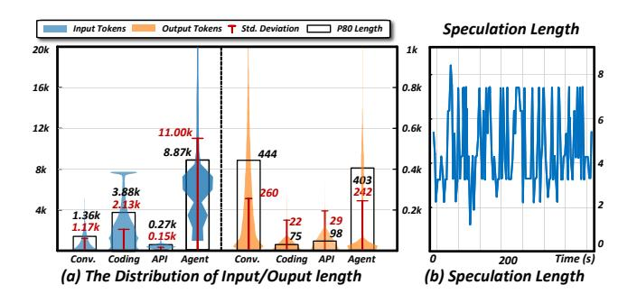

Figure 2. Dynamic Input/Output and Speculation Length.

#### 2.1 Dynamics of LLM Inference

The dynamics of LLMs manifests across multiple dimensions. First, input and output lengths vary widely across requests. Fig. 2(a) presents length distributions collected from widely-adopted open-source benchmarks (Conversation [9], Coding [8] API [10], and Agent [11]). These distributions span broad ranges that differ markedly across scenarios, so a single inference batch often contains both extremely long and very short sequences. Compounding this challenge, Prefix Reusing omits portions of inputs, further increasing length dynamism and unpredictability. Second, speculative decoding introduces an additional verify stage, converting token generation from one-token-per-step to multiple tokens per step. Fig. 2(b) shows a runtime trace from SpecServe [36], where the target model is Llama-3.1-70B-Instruct and the draft model is Llama-3.2-1B-Instruct. The trace reveals temporal fluctuations in speculation length, compounding overall dynamism. These optimizations collectively reshape attention masks into irregular trapezoidal patterns, as illustrated in Fig. 1(b). Within individual inferences, batched inputs of heterogeneous lengths and characteristics pose substantial optimization challenges.

# 2.2 Coarse-grained Tile-based Architecture

**2.2.1 Ascend NPU.** Built on Huawei's DaVinci architecture [44, 45], the Huawei Ascend NPU is a high-performance AI processor. Fig. 3(a) illustrates its structure, which primarily consists of AIC (AI Core) and AIV (AI Vector) components. The AIC, similar to Nvidia's Tensor Core, handles matrix computations, while the AIV is responsible for vector operations. The Memory Transfer Engine (MTE) manages data movement. The computational units and memory access units within the AIC and AIV can operate in parallel to overlap different operations.

2.2.2 Tile-Based Architecture v.s. SIMT. Conventional GPUs are renowned for their CUDA Cores based on SIMT architecture, which employ techniques such as Branch Predication [37] or Warp Compaction [33] to achieve fine-grained control over programs at nearly the single-thread level. As a result, they can avoid performance loss while maintaining

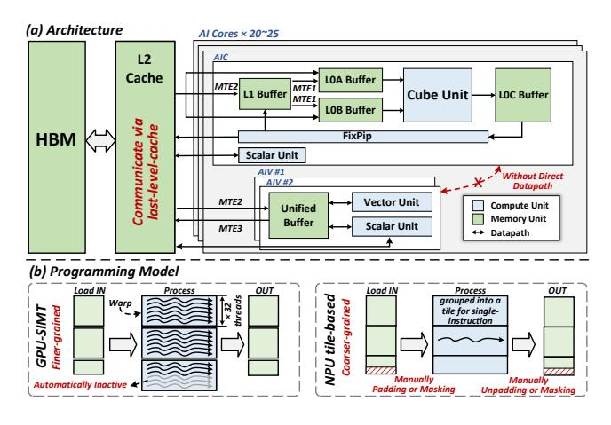

**Figure 3.** (a) The Micro-architecture of Ascend 910B. (b) Comparison of Tiled-based Architecture and SIMT.

programmer-friendly interfaces when dealing with dynamic inputs. In contrast, we focus on Coarse-grained Tile-based Architecture, an abstraction of common AI accelerators, with Ascend NPU as a typical example. These accelerators feature a datapath where a fixed-width tile of data is grouped together and executed by the same operation in a single instruction. This architecture has the potential for higher computation capacity. However, workload dynamism (e.g., dynamic shapes or sparse/memory patterns of input data) complicates programming and degrades performance.

As illustrated in Fig. 3(b), in the SIMT architecture, it is easy to set boundary conditions or patterns for data, with the hardware automatically reorganizing or deactivating unused threads. However, in tile-based architectures, both memory access and computation face challenges when dealing with irregular data patterns. Typical solutions involve complex padding/unpadding or mask operations, which result in additional computation and memory overhead. Consequently, efficiently supporting dynamic workloads on tile-based architectures is a laborious task.

**2.2.3 Abstraction Generality.** This abstraction may also applicable to current GPUs. As GPUs evolve, the Tensor Core has become increasingly important, and Nvidia has introduced a dedicated Tensor Memory Accelerator (TMA), both of which are tile-based units. This trend indicates that GPUs are moving toward a Tile-based Architecture. Recently, Nvidia began to introduce a tile-based programming model to GPUs [13], proving the generality of this hardware abstraction across various accelerators. Therefore, the same issues also exist on current GPUs.

## 3 Challenge

As illustrated in Fig. 4, an LLM serving system with mainstream optimizations can be primitively divided into Linear and P/D/V three types of Attention modules. AI accelerators

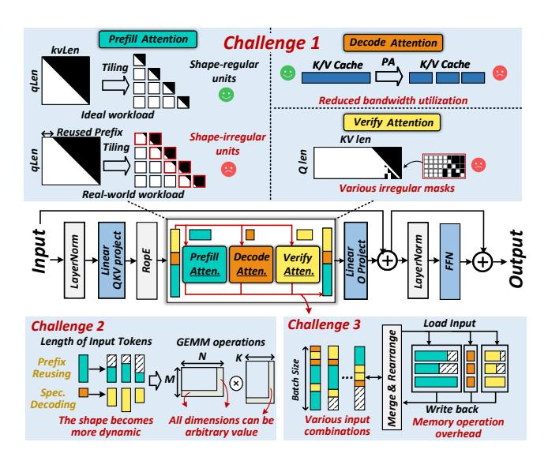

Figure 4. Challenges Posed by Dynamic Workloads.

are already struggling with the dynamic input and output length of LLMs. To make things tougher, the introduction of new technologies further increases the diversity and dynamicity of the workload, leading to MFU and MBU issues of the current NPU kernels, as illustrated in Fig. 5. In this section, we detailed these challenges.

#### 3.1 Diverse Attention

Firstly, for prefill Attention, without any optimizations, the query length equals the key-value length, resulting in a square-shaped Attention score matrix and a triangular mask. This shape is ideal for optimization [46], as it's easy to tile the workload into shape-regular units. The current SOTA torch-npu kernel can efficiently handle it, achieving an MFU of 53%.

However, in real-world scenarios involving prefixes, parts of the key and value are reused from the K/V cache [14, 61], transforming the Attention score shape from a square to a rectangle with arbitrary dimensions. Tiling the Attention score will produce many irregular units, which degrades the performance of the kernel. Specifically, the MFU drops to 47% and 30%, as shown in Fig. 5(a). While the reuse of the K/V cache theoretically reduces computation, the decline in kernel efficiency offsets this benefit, resulting in no meaningful end-to-end performance improvement.

Similarly, Speculative Decoding (SD) [27, 43, 49] reshapes decode Attention to resemble prefill Attention but with a shorter query length. Different SD algorithms generate tokens with varying causal structures, resulting in diverse masks during the verify stage. The irregular pattern of the mask makes it challenging to implement efficient tiling. As a result, torch-npu uses the kernel for prefill Attention equipped with a full mask as a fallback. This fallback prevents verify-specific optimizations, leading to an MBU lower than 30%.

Figure 5. The MFU and MBU of Attention Kernel.

Lastly, unlike Linear, where tokens from different batches can share weights, decode Attention requires each token to have its own independent K/V cache, making reuse impossible. This leads to inherently memory-bounded computations. PagedAttention [41] further fragments the K/V cache access patterns, limiting access to small block-sized portions instead of large contiguous blocks. As illustrated in Fig. 5(c), the MBU decreases as block size becomes small, exacerbating the memory bottleneck of the decode stage.

## 3.2 Dynamic GEMM

GEMM is a core operation in LLMs. Beyond the four GEMM operations in the Linear section, the query-key (QK) and score-value (SV) computations in Attention also rely on GEMM. We summarize all of GEMM operations in Fig. 6(a). The M dimension is tied to the number of tokens. For Linear operations, the dimensions N and K are influenced by hiddenSize, which varies with the architecture of the LLM. For Attention operations, the N and K dimensions are dependent on the token K/V length. The number of tokens in the prefill and verify stages is highly dynamic, and this variability is further amplified by the introduction of Prefix Reusing [14,61], making token lengths even more unpredictable. Consequently, the M, N, and K dimensions in GEMM operations for LLM are all dynamically changing.

Most AI accelerators are typically optimized for specific tile sizes, such as  $16 \times 16$ . Therefore, designing GEMM on AI accelerators to support arbitrary shapes while ensuring high performance is inherently challenging. Irregular shapes complicate parallelism and load balancing, causing inefficiencies in workload distribution across processing units. Moreover, the optimization space for flexible algorithms to adapt to diverse shapes is complex. Additionally, handling boundary conditions for non-uniform matrix sizes introduces overhead, which further affects performance. As shown in Fig.

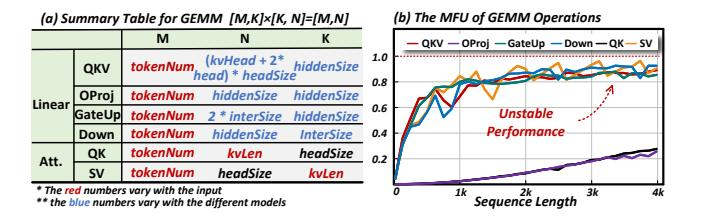

Figure 6. GEMM Operations in LLMs and their MFU.

6(b), employing a general-purpose GEMM kernel (torch-npu 2.1 linear operator [17]) to accommodate all possible results in unstable performance and fails to achieve optimal utilization across all GEMM operations.

# 3.3 Hybird P/D/V Stages

In practical systems, P/D/V stages may exist independently or coexist simultaneously, leading to arbitrary combinations of interleaved P/D/V stages within a given scheduling budget. For Linear operations, tokens from different stages can reuse the same large model weights. Therefore, it is straightforward to group them together and treat them as the left matrix in a GEMM operation. In contrast, handling Attention operations is significantly more complex. Tokens from different stages and batches need to be processed using their respective K/V. As a result, different combinations of P/D/V stages require different optimization methods. Enumerating and tailoring optimizations for each possible combination of stages and batches is highly labor-intensive and impractical.

A common alternative is a batch-by-batch execution, such as selective batching [58], which processes each batch independently by invoking the corresponding Attention kernel. However, this method introduces additional memory overhead from splitting, rearranging, and merging data, which degrades overall system performance. As shown in Fig. 5(d), the memory overhead may account for more than 50%. Furthermore, batch-by-batch processing leads to inefficient utilization of computational resources, further limiting efficiency.

#### 4 Overview of XY-Serve

To address the aforementioned challenges, we developed XY-Serve, a versatile end-to-end production LLM serving system. As illustrated in Fig.7(a), it is built on four key components: Token-wise Scheduling, Dynamic Task Decomposition and Reordering, Meta-Attention, and SmoothGEMM.

#### 4.1 Token-wise Scheduling

When a user's request enters the system, it first passes through the APC (Automatic Prefix Caching) module, which matches the incoming prompt against existing prompts in the K/V cache, enabling token-wise reuse. Any unmatched tokens are added to the scheduling queues. Consequently, the prompt length in the scheduling queues is the user's input length

Figure 7. Overview of XY-Serve.

minus the length of tokens already cached in the K/V cache. Since both the user's input and the cached token lengths are dynamically variable, the prompt lengths in the scheduling queues become even more dynamic. The scheduling queues also include decode and speculative tokens from previous requests awaiting processing.

As shown in Fig. 7(a), the composition of P/D/V stages in the scheduling queues is inherently unpredictable, with token counts for each stage varying arbitrarily and each stage having a distinct historical K/V length. Additionally, the total token count in a chunk may not always match the budgeted length and can fall below the budget under a low system load.

Previous works have proposed scheduling strategies, which execute different stages in a prefill-priority or decode-priority manner [58], or combine tokens from decode and prefill in a single step [24]. However, these strategies only focus on simple combinations of P/D stages. To create a more flexible scheduling strategy that addresses the four levels of dynamism discussed above, our scheduling operates entirely at the granularity of individual tokens, regardless of their origin. It selects a fixed-budget length of tokens from the scheduling queues to form chunks, which may include tokens from prefill, verify, and decode stages. To improve first-token latency, prefill requests are prioritized. If a user's prefill prompt exceeds the budget length, it is split into smaller parts to ensure that each scheduled chunk remains within the budget. To minimize interruptions caused by prefill on decode and maintain a stable Time Between Tokens (TBT), certain slots are reserved for decode and speculative tokens. Consequently, in most batches, there is a mixture of partial decode

or verify tasks. Prefill-only chunks are scheduled when the queue contains no decode or speculative tokens. Therefore, there is no task starvation problem.

# 4.2 Task Decomposition

While token-wise scheduling improves efficiency by reducing bubbles and optimizing resource utilization, the four levels of dynamism it introduces pose significant challenges for execution, especially on AI accelerators with tile-based programming models.

To address these challenges, we propose a dynamic decomposition mechanism that converts dynamic workloads into hardware-friendly, tile-based computational units. Using the Token-Table, each stage is logically decomposed into tile blocks. At the tile level, computation modules can process these blocks in parallel without distinguishing their P/D/V stage origin. Importantly, this tiling decomposition is purely logical, requiring no changes to the physical data layout.

In the following sections, we present a detailed analysis of how tiling decomposition is applied to Attention and Linear.

**4.2.1 Attention Decomposition.** For attention, the Token-Table contains entries for each P/D/V stage, with each entry specifying key attributes, including the *stageID*, the *start position*, the number of *tokenNum*, the historical *kvLen*, and the *tileSize*. As shown in Fig. 7(b), stage-1 (P) is decomposed into three tiling blocks, while stage-2 and stage-4 (D) are each divided into one tiling block, and stage-3 (V) is also decomposed into one tiling block. Each tiling block consists of *headNum* tiling units, resulting in a total of 6 × *headNum* tiling units at the tiling level.

**4.2.2** Linear Decomposition. For Linear operations, since tokens from different stages are concatenated into a single tensor, they needn't be differentiated between stages and can be processed uniformly. In the Token-Table, each Linear operator corresponds to a single entry shown in 7(c). The four primary Linear operations are QKV, OProj, GateUp, and Down. For these operations, the start position is set to 0, indicating that all tokens are processed from the beginning of the concatenated tensor. The tokenNum equals the total number of tokens in the currently scheduled chunk. Tiling is performed on the result matrix of dimensions  $tokenNum \times nLen$ , where each tiling block corresponds to a submatrix of the result. Each tiling block is assigned to a single AI core, allowing different cores to process distinct blocks in parallel. Each Linear operator has its own specific tileSize, determined by the tokenNum and nLen shapes of the operation.

#### 4.3 Task Reordering

After decomposing the dynamic workloads from P/D/V mixed stages into fundamental tile units, it is necessary to reorder these tile units and generate a Task-Table to enhance performance. The Task-Table is responsible for scheduling these tile units onto the hardware, with each entry specifying a *coreID* and the list of tiles assigned to that core. Based on this Task-Table, Attention, and Linear can simply retrieve the corresponding tile units according to their *coreID*. This approach not only maximizes hardware efficiency but also simplifies the design of Attention and Linear kernels.

**4.3.1 Attention Reordering.** After performing dynamic tiling on the various stages, the resulting tiles exhibit varying values for tileSize and kvLen. This variation can lead to load imbalances during parallel processing. To address this, we calculate the computational load of each tile as its area, defined as *tileSize*  $\times$  *kvLen*. For efficient scheduling, the tiles are initially sorted based on their computational load, from largest to smallest. Subsequently, the tiles are allocated to the AI cores in a symmetrical round-robin fashion. As depicted in Fig. 7(b), assuming there are four AI cores, the tile units are assigned in the sequence core-1, core-2, core-3, core-4, core-4, core-3, core-2, core-1, and so forth, repeating this pattern to ensure a balanced and efficient allocation of computational tasks. This approach is designed to quickly obtain a relatively optimal arrangement, without causing significant latency overhead compared to other heuristic algorithms.

This task scheduling information is stored in the Task-Table and passed to the Attention module. The Task-Table guides the Attention module to perform parallel processing efficiently, leveraging both the head and tile dimensions. This mechanism ensures balanced computation across AI cores, maximizing hardware utilization.

**4.3.2 Linear Reordering.** Given that only a limited set of fixed shapes is necessary to be supported, we perform

offline optimization to determine the most efficient task allocation strategies for linear ops. This involves profiling and customizing task allocation for each shape to maximize performance. The optimized strategies are stored for use during execution. During runtime, XY-Serve leverages the Token-Table to identify the current shape and uses this information to retrieve the corresponding pre-optimized Task-Table. The Task-Table is then passed to the Linear module, guiding it to execute tasks in an optimized manner.

#### 5 Meta-Attention

After request scheduling and task assignment, the inputs for the Attention module are organized into unified tiles. However, these tiles are still hybird of PDV tasks, with various shapes and masks. Moreover, the KV Cache layout for these tiles may be either contiguous or consist of discrete blocks. Enumeratively customizing optimizations for all possible inputs is labor-intensive and non-scalable. Therefore, we propose Meta-Attention, where "meta" signifies "unified" and "primitive." It further unifies the mask handling for tiles and the management of the KV Cache. By decomposing the Attention computation into the fundamental operations of GEMM-Softmax-GEMM, it significantly reduces optimization difficulty and is more conducive to push the hardware to its limit.

#### 5.1 Meta-Attention Design

**5.1.1** Handling Token-wise Processing. The core requirement for supporting both Prefix Caching and Chunked Prefill is that the attention module must be capable of handling arbitrary K/V cache lengths and performing token-wise K/V cache reuse. SGLang [61] initially proposed a radix tree to manage the historical K/V cache, with a node hosting a single token, thus achieving token-wise reusing. However, recent work has shown that increasing the node granularity to block-wise can boost decode token throughput by 16% [16]. Moreover, the lack of block-wise token management precludes state-of-the-art optimizations like FlashMLA [4]. Consequently, SGLang is gradually adding support for blockwise token management, which, however, introduces partial matching problems.

As displayed in Fig. 8(a), since they match the K/V cache in block granularity, the partially matched block at the tail will not be reused, causing some recomputation overhead and non-unified management of the K/V Cache, which degrades the performance. In contrast, we maintains block-wise management while achieving token-wise reuse, supporting arbitrary-length matching and optimal throughput.

As illustrated in 8(b), to support a robust token-wise K/V cache reusing, when a mismatch occurs at a particular node, we use a copy-on-write mechanism to create a new block, refresh the new data into this block, and then add the block

**Figure 8.** Token-wise K/V Cache Reuse.

back into the radix tree. If additional new blocks are generated after this mismatch, these blocks are directly inserted as child nodes of the mismatched block in the radix tree.

This mechanism effectively manages both historical and newly generated K/V data, seamlessly merging them using copy-on-write to ensure the continuity of the K/V cache. During the prefill attention process, the corresponding K/V blocks—both historical and newly generated—are read based on the block table. We also track the actual number of tokens in the last block, ensuring accurate token-wise processing.

**5.1.2 Minimizing Mask for Speculative Decoding.** Speculative execution can be classified into two types: sequence-based speculation[27, 43, 49, 60] and tree-based speculation[29, 42]. Sequence-based speculation generates multiple tokens within a single sequence; however, its acceptance rate is generally low. In contrast, tree-based speculative algorithms generate predictions for multiple sequences simultaneously, organizing them in a tree structure. This approach can further improve the acceptance rate of speculation.

Both types require support for arbitrary speculation lengths. Furthermore, due to the complex causal structure of tokens, tree-based speculation employs an irregular mask, which is not well-suited for tile-based programming models. By analyzing the structure of this mask, we can identify regularities that enable efficient processing.

As illustrated in Fig 9, the speculative decoding extends the causal mask of standard prefill  $(qLen \times kvLen)$  by introducing a  $specLen \times (kvLen + specLen)$  region. Within this region, the  $specLen \times kvLen$  is entirely valid, while only the  $specLen \times specLen$  section requires special handling, referred to as the 'Speculative Mask'.

For sequence-based speculation, the speculative mask remains causal, and no additional processing is required, allowing the direct application of our mask-free approach. In tree-based speculation, we generate only the *specLen* × *specLen* part of the mask externally, which is then passed to the kernel and applied to the corresponding attention score matrix.

Our design processes the speculative mask row-by-row, enabling precise control over the start position and length

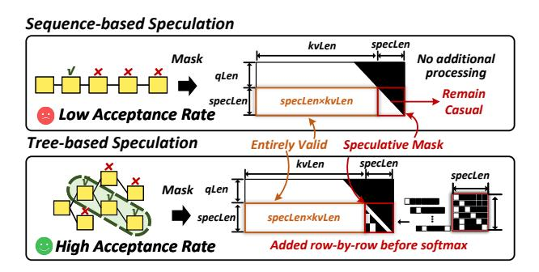

Figure 9. Speculative Decoding Algorithms.

of the mask for each row. This method efficiently supports arbitrary speculation lengths. Once the mask is adjusted, the subsequent computation follows the standard prefill process. Using the speculative mask as a mediator, we can efficiently support a wide range of speculative algorithms.

## 5.2 Meta-Attention Optimizations

**5.2.1 Tile-Based Cube-Vector Orchestration.** Pipelining the execution of Attention is well studied in FlashAttention3 [46] and other works. In this work, we focus on addressing the dynamicity of the workload and selecting the optimal pipelining method based on workload characteristics. Through Task Decomposition and Reordering, along with processing for Mask and K/V cache, the Attention module obtains units that are regular and have balanced loads. As a result, the processor only needs to consider how to execute the current units efficiently.

The key to ensuring optimal Attention performance lies in managing intermediate data transfers exclusively through the L2 cache, thus avoiding the high cost of HBM accesses. For sequences with shorter lengths (*kvLen* is small), splitting along the K/V dimension is unnecessary, as it would introduce additional computation and updates. In such cases, a three-stage pipeline can be effectively utilized. This pipeline overlaps the latency of the softmax operation with the *QK* and *SV* stages, as illustrated in Fig. 10(a).

However, when dealing with extremely long sequences, splitting along the K/V dimension becomes essential due to L2 cache limitations. This necessity introduces an additional computation stage, where the Softmax operation is divided into two distinct steps: Softmax and Update. Consequently, the pipeline expands to four stages:  $QK \rightarrow Softmax \rightarrow SV \rightarrow Update$ , as depicted in Fig. 10(b).

For fully decode-based tasks, we can adopt a new pipeline design, as shown in Fig. 10(c). It optimizes performance further and addresses the memory-bound issue of decode. Since the Query in the decode stage consists of only a single token, the *Query* matrix is reduced to a vector. Consequently, the *QK* and *SV* computations transition from general matrix operations to matrix-vector operations. Executing these operations on cube unit would lead to inefficient utilization of

Figure 10. Pipeline of Meta-Attention.

resources. To address this, we move the *QK* operation to the vector unit and fuse the *QK* and *Softmax* operations into a single operator. This fused operator ensures that the execution time for the vector unit aligns closely with the time required for the cube unit to perform the *SV* operation, effectively balancing the workload. Furthermore, the cube and vector units can simultaneously access the K/V cache data stored in HBM, improving memory bandwidth utilization and further boosting overall performance.

**5.2.2 Pipeline Selection Strategy.** The selection of the pipeline depends on the workload and hardware parameters. For decode-only workloads, the two-stage pipeline is activated as it is decode-dedicated. For mixed workloads with different task types, it is important to ensure that their intermediate data fit in the cache to avoid memory access. The size of intermediate data for each tile is determined by the product of *tileSize* and *seqLen*. When processing *coreNum* tiles simultaneously, we use Eq. (1) as the criterion. If the hardware cache size is greater than  $\alpha$  times the total amount of data across all cores ( $\alpha$  is a tuning parameter), we choose the three-stage pipeline; otherwise, the four-stage pipeline is used to further divide the data.

$$CacheSize > \alpha \times \sum_{i}^{CoreNum} (SeqLen_i \times tileSize_i)$$
 (1)

## 6 SmoothGEMM

As discussed earlier, designing a matrix multiplication operation that supports arbitrary shapes while maintaining high performance across all possible shapes is a significant challenge. To address this, we adopt a memory-compute co-design strategy. Instead of optimizing matrix multiplication for every possible shape, we focus on maximizing performance for fixed shapes. To handle arbitrary shapes effectively, we introduce virtual padding at the on-chip memory level, along with selective read and write mechanisms. This approach allows matrix computations to accommodate a wide range of shapes seamlessly while still benefiting from the performance advantages of fixed-shape optimizations.

**Figure 11.** Handling Arbitrary Shapes of GEMM Operations.

## 6.1 Virtual Padding on the M Dimension

As illustrated in Fig. 11(a), the dimension M in GEMM is intrinsically related to the number of tokens. In the case of Linear GEMM, the M dimension corresponds to the cumulative token count across P/D/V stages, while in Attention GEMM, it is determined by the token count in each stage. In cube-based or tensor-based AI accelerators, matrix computations are typically constrained by a minimum tiling size (e.g.,  $16 \times 16$  for cube cores). A common practice is to pad the M dimension to align with a multiple of the tiling size. However, this dynamic padding introduces non-trivial memory overhead and degrades performance.

To mitigate these issues, we replace the physical padding in global memory with virtual padding on the chip, combined with the selective read and write mechanisms shown in Fig. 11(a). This approach allows for efficient handling of matrices with arbitrary shapes. Specifically, on-chip buffer allocations are made in tiling-size units to fully exploit the hardware's computational potential. During data transfer from global memory to the on-chip buffer, selective read operations copy only the actual, non-padding data. Similarly, selective write operations ensure that only the non-padding outputs are written back to global memory.

Because the virtual padding regions do not interfere with the computational results of the non-padding regions, this approach guarantees the correctness of the matrix computation results. Moreover, by limiting computations to fixed-shape matrix multiplications, we can apply highly customized optimizations for these fixed shapes, achieving both high efficiency and flexibility for dynamic workloads.

#### 6.2 Optimizations for N and K Dimensions

For GEMM ops in Attention, dimensions N and K are tied to the sequence length, which can take arbitrary values. In theory, padding would be required for these dimensions. However, this is naturally handled by the K/V cache's block page structure, which stores and reads data in blocks aligned

| Model       | interSize, hiddenSize | Model              | interSize, hiddenSize | Model              | interSize, hiddenSize |
|-------------|--------------------------|--------------------|--------------------------|--------------------|--------------------------|
| Llama3 8B   | 14336, 4096              | Llama3 70B (TP=8)  | 3584, 1024               | Llama3 405B (TP=8) | 6656, 2048               |
| Qwen2.5 7B  | 18944, 3584              | Qwen2.5 32B (TP=4) | 6912, 1280               | Qwen2.5 72B (TP=8) | 3696, 1024               |
| DeepSeek 7B | 11008, 4096              | DeepSeek 67B (TP=8 | 3) 2752, 1024            | DeepSeek V3 (TP=8) | 2304, 896                |

**Figure 12.** Part of the Mainstream LLM Models' IntermediateSize and HiddenSize (after tensor-parallelism).

to multiples of tile size. As shown in Fig. 11(b), by reading entire blocks, the read length inherently conforms to the required hardware tile size. Furthermore, this padding does not affect the final Attention computation because we explicitly set the values in the padded regions to zero during the Softmax calculation. This ensures that the padded values are effectively excluded from the Attention score. Additionally, since the padded data is reduced during the Attention  $score \times value$  operation, it does not influence the shape of the final output. Therefore, matrix multiplication for arbitrary shapes can be efficiently supported without introducing additional padding overhead for the N and K dimensions.

#### 6.3 Handling Dynamic Shapes

Optimizing GEMM operations for arbitrary shapes has been widely studied, as seen in projects like Triton [52] and CUT-LASS [47]. These approaches make no prior assumptions about the load's characteristics, instead assuming the load could be any value across all dimensions. This leads to defining numerous possible hardware configuration parameters like *tileSize* and *warpNum* and setting different optimization branches for all potential shapes. Generating the optimal kernel is done through online solving or offline tuning, which introduces a complex optimization space and unstable performance.

However, in the Linear module, the GEMM operation's N and K dimensions are determined by model parameters, which are summarized in Fig. 12. These parameters are sufficiently large that even after tensor parallelism (TP), there are still enough tasks to tile, so a larger tileSize can be used. Additionally, these dimensions are typically multiples of the hardware tile size (e.g., 16), eliminating the need for extra padding. Therefore, the GEMM in the Linear part only needs to consider variations in the M dimension, which is restricted to integer multiples of tileSize between 1 and the budget length after virtual padding.

This makes the Linear part's GEMM relatively regular, with the number of cases to consider significantly reduced. This enables customized optimization for these specific shapes, especially for optimizations that are hard to implement statically, such as swizzling [22]. Swizzling improves matrix multiplication performance by changing the task allocation order across AI cores, enhancing L2 cache hit rates. Instead of determining the optimal allocation strategy for swizzling online through complex theoretical formulas, we conduct

offline profiling to explore possible access patterns and identify the most efficient inter-core distribution strategy. Due to the limited number of shapes to handle, this offline tuning is agile and only takes a few minutes.

#### 7 Evaluation

## 7.1 XY-Serve Implementation

We built an Ascend-native inference system based on vLLM [41], leveraging Ascend intrinsic to implement core modules such as SmoothGEMM, Meta-Attention, and other essential operators like normalization, activation, and embedding. These operators were exposed to the Python API via pybind11 [12] and seamlessly replaced the corresponding GPU kernels in vLLM, enabling vLLM to support the Ascend NPU.

To reduce the overhead of frequent Python calls, we offloaded the entire model-forward process to C++, integrating the optimized operators into a single C++ function. This model-forward function is then exposed to vLLM for invocation, ensuring a streamlined and efficient execution path. Additionally, we replaced the native vLLM scheduler with a token-wise scheduling strategy, integrating workload decomposition and computation task reordering to better support dynamic workloads. We redesigned the speculative decoding framework in vLLM, enabling token tree construction and metadata generation for Meta-Attention. These enhancements allow us to implement tree-based speculative decoding algorithms, such as Lookahead Decoding [60], further improving inference performance.

#### 7.2 Performance of Meta-Attention

In this section, we evaluate the performance of the attention kernel under dynamic workloads typically encountered in real-world systems. The comparison targets are Prompt-FlashAttention (PFA) [19] and IncreFlashAttention (IFA) [18] from torch-npu 2.1[7]. We compare their performance in two scenarios: when P/D/V stages are mixed and when they appear individually.

7.2.1 Attention for P/D/V Mixed Batch. We selected recently released benchmarks for two common LLM inference scenarios (Coding[8] and Conversation[9]) from Azure and BurstGPT. After setting the budget length at 4k and running them end-to-end in the XY-Serve system, we analyzed cases with mixed P/D/V stages in one batch. As shown in Fig. 13, we broke down the latency of one Attention layer for different models. In systems with Speculative Decoding enabled, the actual decode stage accounts for a small proportion. Moreover, Meta-Attention delivers an average performance increase of 11% and 26% over the SOTA NPU kernels in the two scenarios. This is firstly attributed to Meta-Attention's own optimization and secondly to Task Reordering, which achieves fast load-balancing with less than 1% latency overhead. In the Conversation scenario, the shorter average input leads to more mixed stages in the same budget

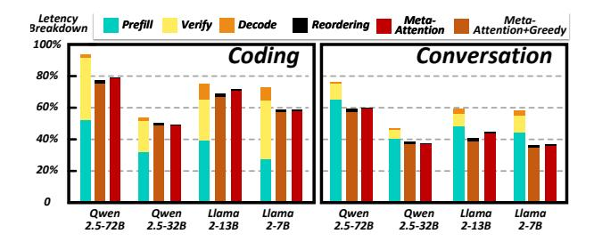

Figure 13. Performance of P/D/V Mixed Batch.

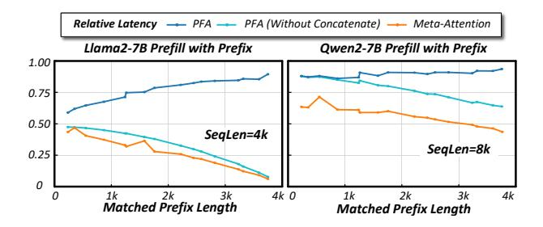

**Figure 14.** Performance of Prefill Attention with Prefix.

length, highlighting Meta-Attention's dynamic workloadhandling ability and resulting in greater performance gains. Furthermore, because the reordering of attention tasks can be designed flexibly, we experimented with replacing the symmetric round-robin policy by a greedy algorithm [56]. This change yields only a marginal improvement, while the extra reordering overhead largely offsets its benefit.

7.2.2 **Prefill Attention with Arbitrary Prefix.** In practical systems, the length of the matched system prefix can vary arbitrarily. Therefore, it is crucial to assess performance under arbitrary-length prefix reuse. To simulate this behavior, we adjust the number of reused tokens for an input prompt, token by token, and evaluate performance under different lengths of system prefix matched. Fig. 14 shows the performance under different system prefix reuse (ranging from 0 to 4k) for 4k and 8k prompt inputs. The results show that as the system prefix increases, the processing time of our metaattention kernel decreases. However, the PFA kernel does not benefit from prefix reuse, primarily because its prefill kernel does not support PagedAttention and only accepts continuous Q, K, and V. When we concatenate the prefix hits from the K/V cache with the new K and V, the concatenation time increases as the reuse length grows, counteracting the benefit of prefix reuse. Even when comparing the computation time of the PFA kernel (excluding the K/V concatenation process), our kernel performs an average of 22.4% better.

**7.2.3 Chunked Prefill with Long Sequences.** For processing long sequences, chunking the sequence into smaller segments is a widely used approach. On the one hand, chunking allows for sequence parallelization by combining it with

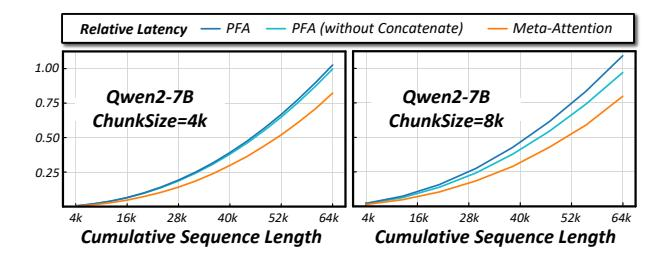

**Figure 15.** Long Sequence Attention with Chunked Prefill.

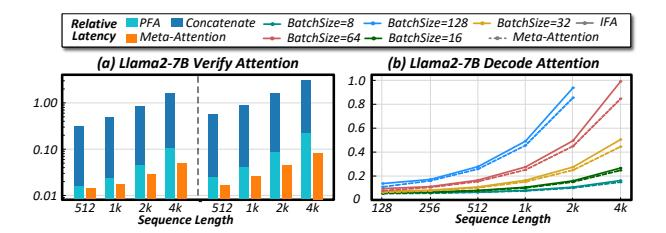

**Figure 16.** Performance of Verify and Decode Attention.

pipeline parallelism [23, 50]. On the other hand, it reduces the impact of prefill on decoding interruptions [24]. The Chunked Prefill method splits long sequences into multiple chunks, processing them sequentially. After processing each chunk, the corresponding keys and values are stored in the K/V cache for reuse by subsequent chunks. Fig. 15 shows the performance of our Chunked Prefill method for long sequences (with chunk sizes set to 4k and 8k and a sequence length of up to 64k). The results demonstrate that our performance surpasses PFA across all sequence lengths. Even when comparing pure computation time with PFA, our kernel shows an improvement up to 22.2%.

**7.2.4 Speculative Decoding.** Next, we evaluate the performance of the verify kernel under different context lengths. We compare the performance with a *batchSize* = 4, *specLen* = 31 and a *batchSize* = 8, *specLen* = 15. Fig. 16(a) shows that, across different context lengths, our kernel consistently outperforms PFA. Furthermore, as the context length increases, the performance improvement becomes increasingly timeconsuming as the historical length grows. Even when excluding this concatenation operation from PFA and comparing only the pure computation time, our kernel still demonstrates an average improvement of 28.6%.

7.2.5 **Decode Performance**. In the decode phase, both the context length and batch size can vary arbitrarily. To flexibly support decoding with arbitrary context lengths, we enable PagedAttention optimization. To evaluate decoding performance under such conditions, we measure performance across different context lengths and batch sizes. Fig. 16 presents the performance of Llama2-7B under varying sequence lengths and batch sizes. The results show that, compared to the IFA kernel, our kernel achieves performance

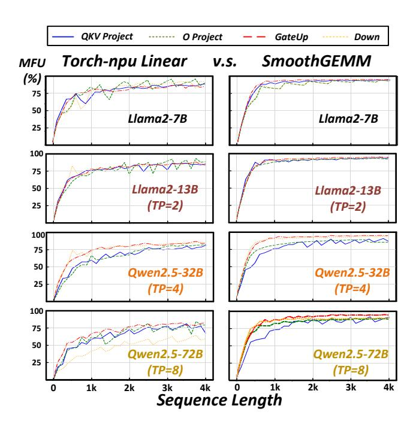

Figure 17. Linear GEMM Performance.

improvements across all combinations of batch size and sequence length, with average 12.9% improvements.

#### 7.3 Performance of SmoothGEMM

In practical systems, the input length from users can vary arbitrarily, ranging from 0 to the maximum length supported by the model. For long sequences, to minimize the impact of prefill on decode and to optimize sequence parallelization, we typically adopt the Chunked Prefill strategy, which imposes a constraint on the maximum chunk length, such as 4k. In real-world scenarios, lengths smaller than the chunk size may also be encountered. To evaluate performance across different conditions, we assess the LLMs with input lengths ranging from 1 to the budget length (4096).

We compare the performance of linear operators (*QKV*, *OProj*, *GateUp*, and *Down*) using shapes derived from different models. As displayed in Fig. 17, the left column shows the performance of torch-npu, while the right column shows that of SmoothGEMM. The results indicate that SmoothGEMM outperforms torch-npu linear by an average of 14.6%, demonstrating superior performance across nearly all tested shapes. Moreover, the performance remains stable, with ideal MFU typically achieved for sequence sizes above 1*k*.

## 7.4 End-to-End Evaluation

**7.4.1 vLLM Nightly Benchmarks.** For end-to-end benchmarking, we use the nightly-benchmarks from the vLLM community [20], with Qwen2-7B as the model. The baseline comparison is against vLLM-npu [21], which supports

vLLM's main optimizations (Chuncked Prefill, PagedAttention, and Prefix Reusing) and has been accepted by the official vLLM. It primarily utilizes GEMM provided by torch-npu and Fused-Attention operators for computation. The test data is divided into three scenarios: ShareGPT, Prefill-heavy, and Decode-heavy.

As shown in Fig. 18, we measure performance under fixed request rates per second (QPS) of 4, 8, 16, and 32 for each test dataset. The following metrics are collected: average Time-to-First-Token (TTFT), average Time-between-Tokens (TBT), and achieved QPS. Even without enabling advanced features such as prefill-chunked-batching and P/D/V fusing, XY-Serve demonstrates a clear performance advantage over the baseline. Specifically, XY-Serve achieves an achieved QPS improvement of up to 79% across various workload types. Additionally, it delivers 64% lower average TTFT and 57% lower average TBT latency. This improvement is primarily attributed to the efficient optimization for operators.

With the dynamic scheduling optimizations of prefill-chunked-batching and PDV fusing enabled, XY-Serve further gains an achieved QPS improvement up to 89% and reduces average TBT latency by 69% across all scenarios. This outcome underscores XY-Serve's strong support for dynamic workloads, effectively benefiting from these enhancements.

When prefill-chunked-batching is enabled, the length of tokens processed in each prefill is effectively maintained at the budgeted length, improving MFU and reducing TTFT under high-pressure conditions. However, enabling P/D/V fusing results in a slight deterioration of TTFT latency in the Decode-heavy scenario under high throughput pressure. In this case, the number of decodes fused with the prefill increases, which slightly impacts the TTFT.

**7.4.2 In-House Industry Workloads.** We also report XY-Serve performance on one of our in-house workloads. The average input length for this workload is 2169 tokens, using a Llama-like 66B model deployed with TP=8. Fig. 19 presents the performance under an 8-concurrent request load.

Compared to Ascend vLLM, without any optimizations, our system achieves an achieved QPS improvement of 16%. When APC is enabled, the performance improvement is further enhanced, reaching 27%. Additionally, we have implemented speculative execution and scheduling optimizations, which are independent of each other. When combined, these optimizations deliver even better results, providing a 95% improvement over the vLLM-APC version.

**7.4.3 Ascend NPUs VS. GPUs.** We compared the end-to-end inference MFU and MBU between XY-Serve running on the 910B and the official vLLM-v0.6.4.post1 on the Nvidia A800. The measurements were taken during the prefill and decode stages of the entire forward pass for the Qwen2-7B and Llama2-7B models at TP=1, across various sequence lengths. As shown in Fig. 20, XY-Serve achieves MFU and

Figure 18. End-to-End Evaluation on Nightly Benchmarks.

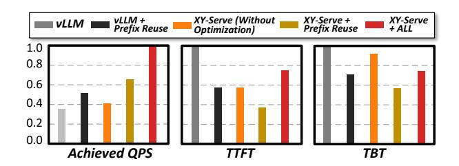

**Figure 19.** End-to-end Evaluation on Industry Benchmark.

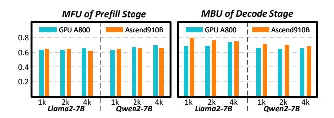

Figure 20. Comparison between Ascend NPUs and GPUs.

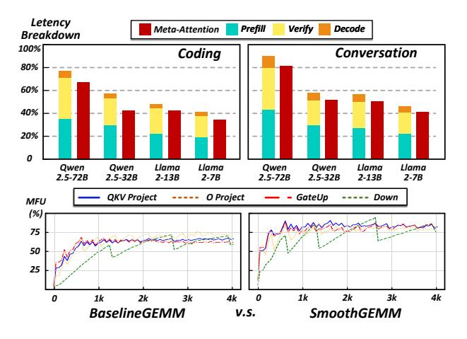

**Figure 21.** Performance of Meta-Attention and SmoothGEMM on GPU platform.

MBU similar to the A800. Notably, in terms of MBU, XY-Serve demonstrates a clear advantage over GPUs, showing an improvement up to 17%.

## 7.5 Technology Generality on GPUs

To demonstrate the generality of the proposed optimizations, we migrate the Meta-Attention and SmoothGEMM modules to the GPU platform using Triton [52] and JIT compiler. The official Triton kernels [6, 15] serve as the baseline. For Meta-Attention, it still handles the mixed PDV tasks in a single kernel with Task Decomposition and Reordering, whereas the baseline processes them separately. For Smooth-GEMM, we retain Virtual-padding, which narrows arbitrary GEMM shapes to a small, fixed set; offline tuning is then applied only to this limited set. The baseline, in contrast, must still cope with all possible shapes. The benchmark of this evaluation is similar of Section 7.2.1 and 7.3. As shown in Fig. 21, Meta-Attention reduces latency by an average of 11% in coding and 15% in conversation relative to the baseline, while SmoothGEMM improves hardware utilization by an average of 18% over the baseline.

## 8 Related Work

**Attention Optimization:** FA1 [31] and FA2 [30] optimize the prefill stage by tiling computations to avoid HBM access, improving performance. FA3 [51] further enhances performance through parallelism between softmax and matrix operations. FastAttention [46] extends FA2 from GPUs to Ascend NPUs, while FlashDecoding [5] improves decoding efficiency for small batches by splitting along the sequence dimension. Recent works [55] further optimize decoding performance by transforming GEMV operations into GEMM operations when sharing prefixes. While these techniques primarily target either the prefill or decode phases, POD-Attention [39] simultaneously optimizes both, maximizing computational power and bandwidth. Our approach addresses dynamic deployment via prefix reuse with speculative algorithms, decomposing workloads into hardwarefriendly meta-primitives that streamline attention design.

Previous work FlashInfer [56] supports various Attention optimizations. However, it only generates kernels for prefill, decode, or verify individually. It lacks support for mixed combinations of them, which are common in real-world inference

scenarios and constitute a primary motivation for our work. Furthermore, it utilizes the CUDA Core to access and manage data for the Tensor Core, with cooperation through shared memory. However, there is no direct datapath between the Vector Core and Cube Core in NPUs. Moreover, the Memory Engine for the Cube Core is not designed to handle dynamic sparse patterns. As a result, it fails in our scenario.

Attention-Mask Mechanism: Some sparse optimization works [\[56,](#page-15-13) [57\]](#page-15-16) treat masked attention as a sparse tensor. However, since they typically focus on general high-sparsity tensors, they adopt online compilation to organize the sparse tensor. In LLMs, masks exhibit low sparsity and are dynamically changing. As a result, the benefits of these approaches may not offset the overhead of online compilation, making them unsuitable for our scenario. By contrast, we employ static decomposition, which avoids online compilation and achieves higher efficiency.

Linear Optimization: Existing techniques like swizzling [\[22\]](#page-14-27), split-k [\[1\]](#page-13-11), and ping-pong [\[2\]](#page-13-12) are commonly used in linear optimization. Our approach shows that supporting specific matrix shapes is sufficient for dynamic LLM workloads. By optimizing these shapes offline using the above techniques, we store the configurations and apply them during online execution to achieve optimal performance.

Serving Systems: Several prior works have addressed the dynamics of modern inference systems. Orca [\[58\]](#page-15-11) tackles output length variability through iteration-level scheduling, while PagedAttention [\[41\]](#page-14-15) optimizes KV cache memory allocation by eliminating waste from fixed-length allocations. There are also some optimizations introduce dynamics to inference: SmartSpec [\[48\]](#page-15-17) dynamically adjusts speculation lengths and modifies P/D ratios within batches. Moreover, it intelligently enables or disables speculation based on workload characteristics and selects appropriate speculation strategies. These optimizations collectively form the motivation of our work. Building upon these advances, we propose a unified request scheduling, KV cache management, and computation kernels. Our approach addresses additional complexities in real-world inference systems while providing a platform that maintains both compatibility and performance across these optimization techniques.

Moreover, the interruption of prefill on decode can increase TBT. Two strategies have been proposed to address this: SplitFuse [\[24,](#page-14-8) [25,](#page-14-9) [34\]](#page-14-10), which divides the Prefill phase into smaller chunks and fuses chunks with decode and disaggregated LLMs [\[35,](#page-14-11) [38,](#page-14-12) [50,](#page-15-8) [62\]](#page-15-9), which separate Prefill and Decode across different machines. XY-Serve supports both two deployments. It also enables seamless transitions between Prefill and Decode roles in disaggregated setups.

# Conclusion

In this work, we introduced XY-Serve, an end-to-end pro[duction serving system designed to tackle the challenges of](https://developer.nvidia.com/blog/introducing-tile-based-programming-in-warp-1-5-0/)

dynamic LLM workloads. It is integrated with task decomposition, task reordering, and meta kernels (Meta-Attention and SmoothGEMM). With its flexibility to handle diverse dynamic workloads, XY-Serve sets a new benchmark for efficiency and adaptability in production-grade LLM inference systems.

# Acknowledgement

We appreciate all the constructive comments from all the anonymous reviewers and shepherd Seonjin Na. This work was supported in part by the National Science and Technology Major Project under Grant 2022ZD0115200; in part by the Northern IC Technology Innovation Center (Beijing) Co., Ltd under Grant QYJS20232801B; in part by the NSFC under Grant 62125403, Grant 92464302, Grant U24B20164 and Grant 92164301; in part by Shanghai Municipal Science and Technology Major Project; in part by the Natural Science Foundation of Jiangsu Province Basic Research Program under Grant BK20243042; in part by the Beijing National Research Center for Information Science and Technology; and in part by the Beijing Advanced Innovation Center for Integrated Circuits.

# References

- [1] [n. d.]. Accelerating Llama3 FP8 Inference with Triton Kernels. [https:](https://pytorch.org/blog/accelerating-llama3/?hss_channel=lcp-78618366/) [//pytorch.org/blog/accelerating-llama3/?hss\\_channel=lcp-78618366/](https://pytorch.org/blog/accelerating-llama3/?hss_channel=lcp-78618366/).
- [2] [n. d.]. Deep Dive on CUTLASS Ping-Pong GEMM Kernel | PyTorch. <https://pytorch.org/blog/cutlass-ping-pong-gemm-kernel/>.
- [3] [n. d.]. Faster Text Generation with Self-Speculative Decoding. [https:](https://huggingface.co/blog/layerskip) [//huggingface.co/blog/layerskip](https://huggingface.co/blog/layerskip).
- [4] [n. d.]. [Feature] integrate FlashMLA · Issue 4384 · sgl-project/sglang github.com. <https://github.com/sgl-project/sglang/issues/4384>. [Accessed 08-07-2025].
- [5] [n. d.]. Flash-Decoding for Long-Context Inference. [https://pytorch.](https://pytorch.org/blog/flash-decoding/) [org/blog/flash-decoding/](https://pytorch.org/blog/flash-decoding/).
- [6] [n. d.]. Fused Attention &x2014; Triton documentation — tritonlang.org. [https://triton-lang.org/main/getting-started/tutorials/06](https://triton-lang.org/main/getting-started/tutorials/06-fused-attention.html) [fused-attention.html](https://triton-lang.org/main/getting-started/tutorials/06-fused-attention.html). [Accessed 14-07-2025].
- [7] [n. d.]. GitHub - Ascend/Pytorch: Ascend PyTorch Adapter (Torch\_npu). Mirror of https://gitee.com/ascend/pytorch. [https:](https://github.com/Ascend/pytorch) [//github.com/Ascend/pytorch](https://github.com/Ascend/pytorch).
- [8] [n. d.]. GitHub - Azure/AzurePublicDataset: Microsoft Azure Traces github.com. <https://github.com/Azure/AzurePublicDataset>. [Accessed 12-03-2025].
- [9] [n. d.]. GitHub - HPMLL/BurstGPT: A ChatGPT(GPT-3.5) & GPT-4 Workload Trace to Optimize LLM Serving Systems — github.com. <https://github.com/HPMLL/BurstGPT>. [Accessed 12-03-2025].
- [10] [n. d.]. GitHub - HPMLL/BurstGPT: A ChatGPT(GPT-3.5) & GPT-4 Workload Trace to Optimize LLM Serving Systems — github.com. <https://github.com/HPMLL/BurstGPT>. [Accessed 27-07-2025].
- [11] [n. d.]. GitHub - kvcache-ai/Mooncake: Mooncake is the serving platform for Kimi, a leading LLM service provided by Moonshot AI. github.com. <https://github.com/kvcache-ai/Mooncake>. [Accessed 26-07-2025].
- [12] [n. d.]. GitHub - Pybind/Pybind11: Seamless Operability between C++11 and Python. <https://github.com/pybind/pybind11>.
- [13] [n. d.]. Introducing Tile-Based Programming in Warp 1.5.0 | NVIDIA Technical Blog — developer.nvidia.com. [https://developer.nvidia.c](https://developer.nvidia.com/blog/introducing-tile-based-programming-in-warp-1-5-0/)

- [om/blog/introducing-tile-based-programming-in-warp-1-5-0/](https://developer.nvidia.com/blog/introducing-tile-based-programming-in-warp-1-5-0/). [Accessed 08-07-2025].
- [14] [n. d.]. Introduction — vLLM. [https://docs.vllm.ai/en/latest/automat](https://docs.vllm.ai/en/latest/automatic_prefix_caching/apc.html) [ic\\_prefix\\_caching/apc.html](https://docs.vllm.ai/en/latest/automatic_prefix_caching/apc.html).
- [15] [n. d.]. Matrix Multiplication &x2014; Triton documentation — tritonlang.org. [https://triton-lang.org/main/getting-started/tutorials/03](https://triton-lang.org/main/getting-started/tutorials/03-matrix-multiplication.html) [matrix-multiplication.html](https://triton-lang.org/main/getting-started/tutorials/03-matrix-multiplication.html). [Accessed 14-07-2025].
- [16] [n. d.]. Support Page Size > 1 for FA3 by hebiao064 · Pull Request 4832 · sgl-project/sglang — github.com. [https://github.com/sgl-project/sg](https://github.com/sgl-project/sglang/pull/4832) [lang/pull/4832](https://github.com/sgl-project/sglang/pull/4832). [Accessed 08-07-2025].
- [17] [n. d.]. Torch.Nn-Native PyTorch APIs-PyTorch2.1-API List-PyTorch Network Model Porting and Training Guide-Model Development (PyTorch)-7.0.0-CANN Commercial Edition-Ascend Documentation-Ascend Community. [https://www.hiascend.com/document/detail/en/](https://www.hiascend.com/document/detail/en/canncommercial/700/modeldevpt/ptmigr/ptaoplist_000006.html) [canncommercial/700/modeldevpt/ptmigr/ptaoplist\\_000006.html](https://www.hiascend.com/document/detail/en/canncommercial/700/modeldevpt/ptmigr/ptaoplist_000006.html).
- [18] [n. d.]. Torch\_npu.Npu\_incre\_flash\_attention. [https:](https://www.hiascend.com/doc_center/source/zh/Pytorch/60RC2/apiref/apilist/ptaoplist_000788.html) [//www.hiascend.com/doc\\_center/source/zh/Pytorch/60RC2/ap](https://www.hiascend.com/doc_center/source/zh/Pytorch/60RC2/apiref/apilist/ptaoplist_000788.html) [iref/apilist/ptaoplist\\_000788.html](https://www.hiascend.com/doc_center/source/zh/Pytorch/60RC2/apiref/apilist/ptaoplist_000788.html).
- [19] [n. d.]. Torch\_npu.Npu\_prompt\_flash\_attention. [https:](https://www.hiascend.com/doc_center/source/zh/CANNCommunityEdition/80RC1alpha001/apiref/fmkadptapi/ptaoplist_000142.html) [//www.hiascend.com/doc\\_center/source/zh/CANNCommunit](https://www.hiascend.com/doc_center/source/zh/CANNCommunityEdition/80RC1alpha001/apiref/fmkadptapi/ptaoplist_000142.html) [yEdition/80RC1alpha001/apiref/fmkadptapi/ptaoplist\\_000142.html](https://www.hiascend.com/doc_center/source/zh/CANNCommunityEdition/80RC1alpha001/apiref/fmkadptapi/ptaoplist_000142.html).
- [20] [n. d.]. vLLM Nightly-Benchmarks. [https://github.com/vllm-project/](https://github.com/vllm-project/vllm/tree/main/.buildkite/nightly-benchmarks) [vllm/tree/main/.buildkite/nightly-benchmarks](https://github.com/vllm-project/vllm/tree/main/.buildkite/nightly-benchmarks).
- [21] [n. d.]. vLLM support for Ascend NPU. [https://github.com/vllm](https://github.com/vllm-project/vllm/pull/8054)[project/vllm/pull/8054](https://github.com/vllm-project/vllm/pull/8054).
- [22] 2020. Optimizing Compute Shaders for L2 Locality Using Thread-Group ID Swizzling. [https://developer.nvidia.com/blog/optimizing](https://developer.nvidia.com/blog/optimizing-compute-shaders-for-l2-locality-using-thread-group-id-swizzling/)[compute-shaders-for-l2-locality-using-thread-group-id-swizzling/](https://developer.nvidia.com/blog/optimizing-compute-shaders-for-l2-locality-using-thread-group-id-swizzling/).
- [23] Amey Agrawal, Junda Chen, Íñigo Goiri, Ramachandran Ramjee, Chaojie Zhang, Alexey Tumanov, and Esha Choukse. 2024. Mnemosyne: Parallelization strategies for efficiently serving multi-million context length llm inference requests without approximations. arXiv preprint arXiv:2409.17264 (2024).
- [24] Amey Agrawal, Nitin Kedia, Ashish Panwar, Jayashree Mohan, Nipun Kwatra, Bhargav Gulavani, Alexey Tumanov, and Ramachandran Ramjee. 2024. Taming Throughput-Latency Tradeoff in LLM Inference with Sarathi-Serve. In 18th USENIX Symposium on Operating Systems Design and Implementation (OSDI 24). 117–134.
- [25] Amey Agrawal, Ashish Panwar, Jayashree Mohan, Nipun Kwatra, Bhargav S Gulavani, and Ramachandran Ramjee. 2023. Sarathi: Efficient llm inference by piggybacking decodes with chunked prefills. arXiv preprint arXiv:2308.16369 (2023).
- [26] Tom B. Brown, Benjamin Mann, Nick Ryder, Melanie Subbiah, Jared Kaplan, Prafulla Dhariwal, Arvind Neelakantan, Pranav Shyam, Girish Sastry, Amanda Askell, Sandhini Agarwal, Ariel Herbert-Voss, Gretchen Krueger, Tom Henighan, Rewon Child, Aditya Ramesh, Daniel M. Ziegler, Jeffrey Wu, Clemens Winter, Christopher Hesse, Mark Chen, Eric Sigler, Mateusz Litwin, Scott Gray, Benjamin Chess, Jack Clark, Christopher Berner, Sam McCandlish, Alec Radford, Ilya Sutskever, and Dario Amodei. 2020. Language models are few-shot learners. In Proceedings of the 34th International Conference on Neural Information Processing Systems (Vancouver, BC, Canada) (NIPS '20). Curran Associates Inc., Red Hook, NY, USA, Article 159, 25 pages.
- [27] Tianle Cai, Yuhong Li, Zhengyang Geng, Hongwu Peng, Jason D Lee, Deming Chen, and Tri Dao. [n. d.]. Medusa: Simple llm inference acceleration framework with multiple decoding heads, 2024. URL https://arxiv.org/abs/2401.10774 ([n. d.]).
- [28] Nicolas Carion, Francisco Massa, Gabriel Synnaeve, Nicolas Usunier, Alexander Kirillov, and Sergey Zagoruyko. 2020. End-to-end object detection with transformers. In European conference on computer vision. Springer, 213–229.
- [29] Charlie Chen, Sebastian Borgeaud, Geoffrey Irving, Jean-Baptiste Lespiau, Laurent Sifre, and John Jumper. 2023. Accelerating large language model decoding with speculative sampling. arXiv preprint

- arXiv:2302.01318 (2023).
- [30] Tri Dao. 2023. Flashattention-2: Faster attention with better parallelism and work partitioning (2023). arXiv preprint arXiv:2307.08691 (2023).
- [31] Tri Dao, Dan Fu, Stefano Ermon, Atri Rudra, and Christopher Ré. 2022. Flashattention: Fast and memory-efficient exact attention with io-awareness. Advances in Neural Information Processing Systems 35 (2022), 16344–16359.
- [32] Alexey Dosovitskiy, Lucas Beyer, Alexander Kolesnikov, Dirk Weissenborn, Xiaohua Zhai, Thomas Unterthiner, Mostafa Dehghani, Matthias Minderer, Georg Heigold, Sylvain Gelly, Jakob Uszkoreit, and Neil Houlsby. 2021. An Image is Worth 16x16 Words: Transformers for Image Recognition at Scale. In International Conference on Learning Representations. <https://openreview.net/forum?id=YicbFdNTTy>
- [33] Wilson W.L. Fung, Ivan Sham, George Yuan, and Tor M. Aamodt. 2007. Dynamic Warp Formation and Scheduling for Efficient GPU Control Flow. In 40th Annual IEEE/ACM International Symposium on Microarchitecture (MICRO 2007). 407–420. doi: [10.1109/MICRO.2007.30](https://doi.org/10.1109/MICRO.2007.30)
- [34] Connor Holmes, Masahiro Tanaka, Michael Wyatt, Ammar Ahmad Awan, Jeff Rasley, Samyam Rajbhandari, Reza Yazdani Aminabadi, Heyang Qin, Arash Bakhtiari, Lev Kurilenko, et al. 2024. Deepspeed-fastgen: High-throughput text generation for llms via mii and deepspeed-inference. arXiv preprint arXiv:2401.08671 (2024).
- [35] Cunchen Hu, Heyang Huang, Liangliang Xu, Xusheng Chen, Jiang Xu, Shuang Chen, Hao Feng, Chenxi Wang, Sa Wang, Yungang Bao, et al. 2024. Inference without interference: Disaggregate llm inference for mixed downstream workloads. arXiv preprint arXiv:2401.11181 (2024).
- [36] Kaiyu Huang, Hao Wu, Zhubo Shi, Han Zou, Minchen Yu, and Qingjiang Shi. 2025. Specserve: Efficient and slo-aware large language model serving with adaptive speculative decoding. arXiv preprint arXiv:2503.05096 (2025).
- [37] Kevin Skadron Jiayuan Meng. [n. d.]. Dynamic Warp Subdivision for Non-Speculative Runahead SIMT Gather. [https://www.nvidia.com/c](https://www.nvidia.com/content/GTC/posters/03_Meng_Dynamic_Warp_Subdivision.pdf) [ontent/GTC/posters/03\\_Meng\\_Dynamic\\_Warp\\_Subdivision.pdf](https://www.nvidia.com/content/GTC/posters/03_Meng_Dynamic_Warp_Subdivision.pdf).
- [38] Yibo Jin, Tao Wang, Huimin Lin, Mingyang Song, Peiyang Li, Yipeng Ma, Yicheng Shan, Zhengfan Yuan, Cailong Li, Yajing Sun, et al. 2024. P/d-serve: Serving disaggregated large language model at scale. arXiv preprint arXiv:2408.08147 (2024).
- [39] Aditya K Kamath, Ramya Prabhu, Jayashree Mohan, Simon Peter, Ramachandran Ramjee, and Ashish Panwar. 2024. POD-Attention: Unlocking Full Prefill-Decode Overlap for Faster LLM Inference. arXiv preprint arXiv:2410.18038 (2024).
- [40] Jared Kaplan, Sam McCandlish, Tom Henighan, Tom B Brown, Benjamin Chess, Rewon Child, Scott Gray, Alec Radford, Jeffrey Wu, and Dario Amodei. 2020. Scaling laws for neural language models. arXiv preprint arXiv:2001.08361 (2020).
- [41] Woosuk Kwon, Zhuohan Li, Siyuan Zhuang, Ying Sheng, Lianmin Zheng, Cody Hao Yu, Joseph Gonzalez, Hao Zhang, and Ion Stoica. 2023. Efficient memory management for large language model serving with pagedattention. In Proceedings of the 29th Symposium on Operating Systems Principles. 611–626.
- [42] Yaniv Leviathan, Matan Kalman, and Yossi Matias. 2023. Fast inference from transformers via speculative decoding. In International Conference on Machine Learning. PMLR, 19274–19286.
- [43] Yuhui Li, Fangyun Wei, Chao Zhang, and Hongyang Zhang. 2024. Eagle: Speculative sampling requires rethinking feature uncertainty. arXiv preprint arXiv:2401.15077 (2024).
- [44] Heng Liao, Jiajin Tu, Jing Xia, Hu Liu, Xiping Zhou, Honghui Yuan, and Yuxing Hu. 2021. Ascend: a scalable and unified architecture for ubiquitous deep neural network computing: Industry track paper. In 2021 IEEE International Symposium on High-Performance Computer Architecture (HPCA). IEEE, 789–801.
- [45] Heng Liao, Jiajin Tu, Jing Xia, and Xiping Zhou. 2019. DaVinci: A scalable architecture for neural network computing. In 2019 IEEE Hot Chips 31 Symposium (HCS). IEEE Computer Society, 1–44.

- [46] Haoran Lin, Xianzhi Yu, Kang Zhao, Lu Hou, Zongyuan Zhan, Stanislav Kamenev, Han Bao, Ting Hu, Mingkai Wang, Qixin Chang, et al. 2024. FastAttention: Extend FlashAttention2 to NPUs and Low-resource GPUs. arXiv preprint arXiv:2410.16663 (2024).
- [47] Xiaoxuan Liu, Cade Daniel, Langxiang Hu, Woosuk Kwon, Zhuohan Li, Xiangxi Mo, Alvin Cheung, Zhijie Deng, Ion Stoica, and Hao Zhang. 2024. Optimizing Speculative Decoding for Serving Large Language Models Using Goodput. arXiv preprint arXiv:2406.14066 (2024).
- [48] Xiaoxuan Liu, Cade Daniel, Langxiang Hu, Woosuk Kwon, Zhuohan Li, Xiangxi Mo, Alvin Cheung, Zhijie Deng, Ion Stoica, and Hao Zhang. 2024. Optimizing Speculative Decoding for Serving Large Language Models Using Goodput. arXiv[:2406.14066](https://arxiv.org/abs/2406.14066) [cs.AI] [https://arxiv.org/ab](https://arxiv.org/abs/2406.14066) [s/2406.14066](https://arxiv.org/abs/2406.14066)
- [49] Xupeng Miao, Gabriele Oliaro, Zhihao Zhang, Xinhao Cheng, Zeyu Wang, Zhengxin Zhang, Rae Ying Yee Wong, Alan Zhu, Lijie Yang, Xiaoxiang Shi, et al. 2024. Specinfer: Accelerating large language model serving with tree-based speculative inference and verification. In Proceedings of the 29th ACM International Conference on Architectural Support for Programming Languages and Operating Systems, Volume 3. 932–949.
- [50] Ruoyu Qin, Zheming Li, Weiran He, Mingxing Zhang, Yongwei Wu, Weimin Zheng, and Xinran Xu. 2024. Mooncake: A kvcache-centric disaggregated architecture for llm serving. arXiv preprint arXiv:2407.00079 (2024).
- [51] Jay Shah, Ganesh Bikshandi, Ying Zhang, Vijay Thakkar, Pradeep Ramani, and Tri Dao. 2024. Flashattention-3: Fast and accurate attention with asynchrony and low-precision. arXiv preprint arXiv:2407.08608 (2024).
- [52] Philippe Tillet, Hsiang-Tsung Kung, and David Cox. 2019. Triton: an intermediate language and compiler for tiled neural network computations. In Proceedings of the 3rd ACM SIGPLAN International Workshop on Machine Learning and Programming Languages. 10–19.
- [53] Hugo Touvron, Louis Martin, Kevin Stone, Peter Albert, Amjad Almahairi, Yasmine Babaei, Nikolay Bashlykov, Soumya Batra, Prajjwal Bhargava, Shruti Bhosale, et al. 2023. Llama 2: Open foundation and fine-tuned chat models. arXiv preprint arXiv:2307.09288 (2023).
- [54] An Yang, Baosong Yang, Binyuan Hui, Bo Zheng, Bowen Yu, Chang Zhou, Chengpeng Li, Chengyuan Li, Dayiheng Liu, Fei Huang, et al. 2024. Qwen2 technical report. arXiv preprint arXiv:2407.10671 (2024).
- [55] Lu Ye, Ze Tao, Yong Huang, and Yang Li. 2024. ChunkAttention: Efficient Self-Attention with Prefix-Aware KV Cache and Two-Phase

- Partition. In Proceedings of the 62nd Annual Meeting of the Association for Computational Linguistics (Volume 1: Long Papers), Lun-Wei Ku, Andre Martins, and Vivek Srikumar (Eds.). Association for Computational Linguistics, Bangkok, Thailand, 11608–11620. [doi:](https://doi.org/10.18653/v1/2024.acl-long.623) [10.18653/v1/2024.acl-long.623](https://doi.org/10.18653/v1/2024.acl-long.623)
- [56] Zihao Ye, Lequn Chen, Ruihang Lai, Wuwei Lin, Yineng Zhang, Stephanie Wang, Tianqi Chen, Baris Kasikci, Vinod Grover, Arvind Krishnamurthy, and Luis Ceze. 2025. FlashInfer: Efficient and Customizable Attention Engine for LLM Inference Serving. In Eighth Conference on Machine Learning and Systems. [https://openreview.net](https://openreview.net/forum?id=RXPofAsL8F) [/forum?id=RXPofAsL8F](https://openreview.net/forum?id=RXPofAsL8F)
- [57] Zihao Ye, Ruihang Lai, Junru Shao, Tianqi Chen, and Luis Ceze. 2023. SparseTIR: Composable Abstractions for Sparse Compilation in Deep Learning. In Proceedings of the 28th ACM International Conference on Architectural Support for Programming Languages and Operating Systems, Volume 3 (Vancouver, BC, Canada) (ASPLOS 2023). Association for Computing Machinery, New York, NY, USA, 660–678. doi: [10.1145/](https://doi.org/10.1145/3582016.3582047) [3582016.3582047](https://doi.org/10.1145/3582016.3582047)
- [58] Gyeong-In Yu, Joo Seong Jeong, Geon-Woo Kim, Soojeong Kim, and Byung-Gon Chun. 2022. Orca: A distributed serving system for Transformer-Based generative models. In 16th USENIX Symposium on Operating Systems Design and Implementation (OSDI 22). 521–538.
- [59] Jun Zhang, Jue Wang, Huan Li, Lidan Shou, Ke Chen, Gang Chen, and Sharad Mehrotra. 2023. Draft & verify: Lossless large language model acceleration via self-speculative decoding. arXiv preprint arXiv:2309.08168 (2023).
- [60] Yao Zhao, Zhitian Xie, Chen Liang, Chenyi Zhuang, and Jinjie Gu. 2024. Lookahead: An inference acceleration framework for large language model with lossless generation accuracy. In Proceedings of the 30th ACM SIGKDD Conference on Knowledge Discovery and Data Mining. 6344–6355.
- [61] Lianmin Zheng, Liangsheng Yin, Zhiqiang Xie, Chuyue Sun, Jeff Huang, Cody Hao Yu, Shiyi Cao, Christos Kozyrakis, Ion Stoica, Joseph E Gonzalez, et al. [n. d.]. Sglang: Efficient execution of structured language model programs, 2024. URL https://arxiv.org/abs/2312.07104 ([n. d.]).
- [62] Yinmin Zhong, Shengyu Liu, Junda Chen, Jianbo Hu, Yibo Zhu, Xuanzhe Liu, Xin Jin, and Hao Zhang. 2024. DistServe: Disaggregating Prefill and Decoding for Goodput-optimized Large Language Model Serving. In 18th USENIX Symposium on Operating Systems Design and Implementation (OSDI 24). 193–210.