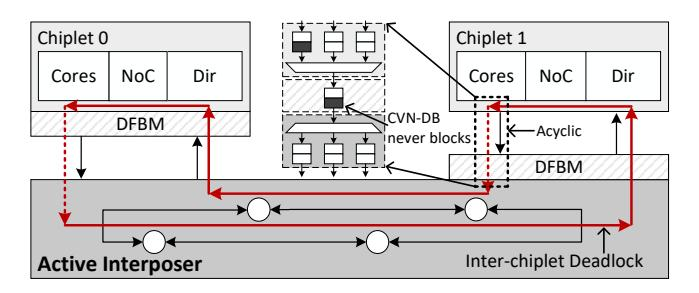
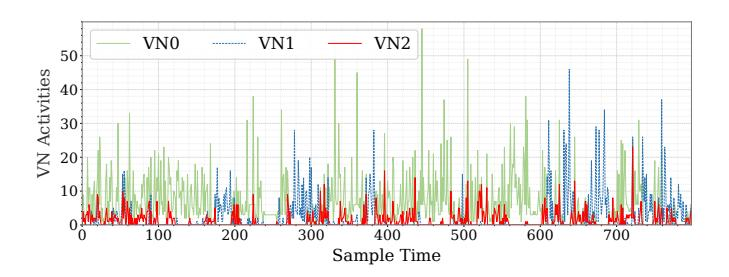
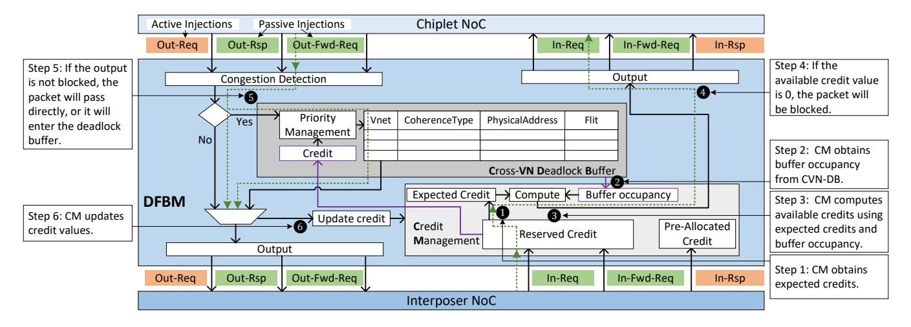
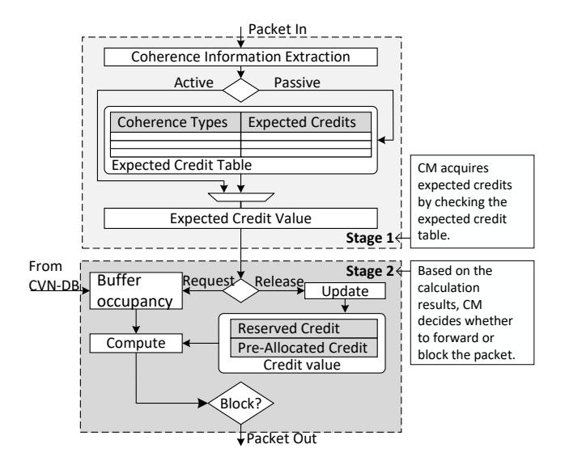
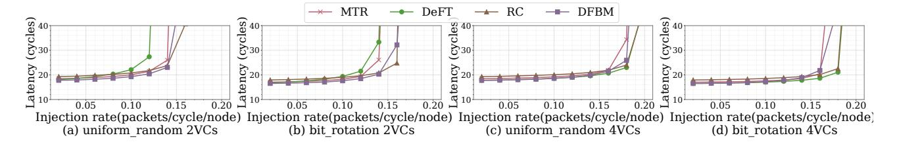
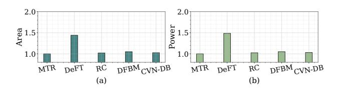
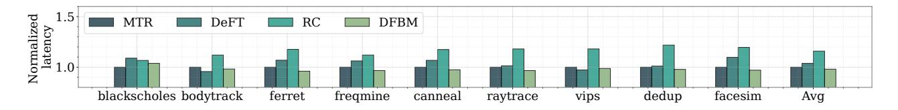
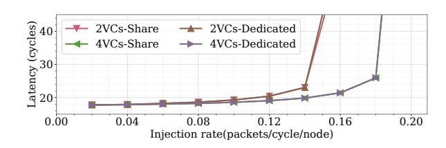
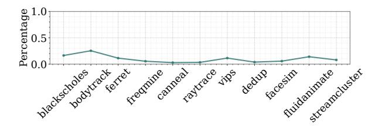

# A Deadlock-Free Bridge Module for Inter-Chiplet Cache-Coherent Communication in an Open Chiplet Ecosystem

Zhiqiang Chen, Wenwen Fu, Yongwen Wang∗ , Hongwei Zhou College of Computer Science and Technology, National University of Defense Technology Key Laboratory of Advanced Microprocessor Chips and Systems {czq20, fuwenwen94, yongwen, zhouhongwei}@nudt.edu.cn

*Abstract*—The envisioned open chiplet ecosystem promises significant reductions in chip design complexity and cost by enabling designers to rapidly assemble standard chiplets from diverse vendors. Constructing such an open chiplet ecosystem requires support from Network-on-Chip (NoC) routing algorithms, as integrating multiple chiplets onto an interposer can potentially lead to inter-chiplet deadlock. Prior work avoids deadlock through methods like turn restrictions, virtual channel isolation, or packet injection control, or recovers from deadlock using mechanisms such as escape channels or bubble flow control. These approaches achieve a favorable balance regarding modularity, performance, and cost. However, they still rely on designers possessing detailed knowledge of the internal NoC architecture within each chiplet. This requirement impedes the development of a truly open ecosystem, as it constrains chiplet interoperability and vendor independence. Addressing this limitation, we propose a Deadlock-Free Bridge Module (DFBM) designed to resolve interchiplet deadlock without relying on the specifics of individual chiplet NoC implementations. The DFBM infers the transmission behavior of inter-chiplet packets by analyzing the dependency relationships among coherence protocol transaction flows. It then employs a packet injection control mechanism to isolate inter- and intra-chiplet packets, thereby preventing deadlock. DFBMs can be seamlessly interconnected between arbitrary chiplets to achieve deadlock-freedom, eliminating the need for modifications to their internal NoC architectures. Experimental results demonstrate that DFBM incurs only 2.5% area overhead, while achieving a performance improvement ranging from 1% to 7%.

*Index Terms*—chiplet, deadlock, coherence, ecosystem

# I. INTRODUCTION

Chiplets have emerged as a feasible technology pathway to sustain Moore's Law scaling, demonstrated by numerous mature commercial products already in the market [36], [35], [26], [27]. While the performance and cost benefits of chiplets are significant, the drive toward establishing an open chiplet ecosystem, enabling seamless interconnectivity and interoperability between chiplets from multiple vendors, promises even greater potential. The Universal Chiplet Interconnect Express (UCIe) standard [8], [16] defines specifications for the die-todie protocol layer, adapter layer, and physical layer, ultimately aiming to create an open chiplet ecosystem enabling universal interoperability between heterogeneous chiplets [28], [22].

∗Corresponding author

However, building such an open ecosystem necessitates not only standardized interfaces but also support from routing algorithms. For instance, even if each chiplet's internal 2D NoC is deadlock-free, the interconnection of multiple chiplets on an interposer creates a 2.5D NoC topology susceptible to inter-chiplet deadlock [42], [25], [41], as illustrated by the bold red arrows in Fig. 1. While deadlock resolution techniques for conventional 2D NoCs [34], [11] must balance critical design constraints such as packet latency, saturation throughput, area overhead, and power consumption, solutions for inter-chiplet deadlock in 2.5D NoCs pose an additional, critical requirement: accommodating the modularity essential for multi-vendor interoperability.

Fig. 1. As depicted by the bold red arrows, integrating multiple chiplets onto an interposer may form cyclic channel dependencies, leading to inter-chiplet deadlock. Acting as a centralized gateway, DFBM prevents such deadlock via packet regulation through an injection control mechanism. Furthermore, it operates as a discrete, plug-and-play bridge module.

Approaches to resolve inter-chiplet deadlock fall into two broad categories: deadlock avoidance and deadlock recovery. Deadlock can be prevented through methods like turn restrictions [42], virtual channel (VC) isolation [39], or packet injection control [25]. Alternatively, deadlock recovery mechanisms detect deadlock states and break cyclic dependencies using techniques such as escape channels [41] or bubble flow control [6]. While existing algorithms achieve an effective compromise among modularity, correctness, performance, and implementation cost, they still require, to some degree, support from and knowledge about the internal NoC design within individual chiplets. The reliance of inter-chiplet deadlock resolution on the specific implementation details of intrachiplet NoCs undermines the design of modular multi-chiplet networks.

First, this dependency increases multi-chiplet integration cost. It often necessitates architectural modifications, such as increasing VC count or adding specialized control logic, placing extra redesign burdens on designers and increasing design verification effort, time-to-market, and manufacturing costs. For instance, Deadlock-Free and Fault-Tolerant Routing (DeFT) [39] requires the chiplet NoC to provide at least two VCs, potentially forcing costly chiplet redesigns to meet this constraint, thereby increasing per-chiplet cost.

Second, this dependency severely complicates multi-chiplet floorplanning, compromising portability. The inherent heterogeneity in chiplet sizes, aspect ratios, and vertical channel densities (TSVs) creates directionally asymmetric communication bandwidth. Optimizing floorplans to exploit this nonuniform resource distribution is consequently critical for maximizing network performance [5], [23]. However, deadlock resolution mechanisms coupled with intra-chiplet NoCs impose additional, often conflicting constraints, such as fixed vertical channel allocations or topological restrictions. For example, the permission network in Remote Cotrol (RC) [25] exemplifies this limitation by mandating specific quantities and physical placements of vertical channels, unavoidably constraining flexible floorplans.

Third, this dependency may undermine chiplet modularity, which is the cornerstone of chiplet standardization [42]. The tight coupling between inter-chiplet deadlock resolution and NoC implementations creates barriers to standardization [18]. It prevents seamless reuse of standard chiplets across heterogeneous multi-chiplet systems, as each new configuration may demand costly internal NoC redesigns to accommodate distinct deadlock constraints.

To overcome these limitations, we propose isolating interchiplet deadlock resolution within a standalone module decoupled from intra-chiplet NoC implementations. This architectural decoupling not only preserves genuine chiplet modularity, which is essential for standardization, but also liberates designers from low-level NoC implementation details, enabling focus on system-level optimization.

Motivated by this vision, our key objectives are to: *first,* decouple inter-chiplet deadlock-freedom from intra-chiplet NoC specifics, enabling the design of a standalone module compatible with flexible integration; *second,* enable direct interconnection of heterogeneous chiplets employing diverse topologies and routing algorithms without modification; *third,* implement a portable deadlock resolution module to facilitate seamless migration across different floorplans or multi-chiplet designs.

To realize these objectives, we introduce the Deadlock-Free Bridge Module (DFBM). The DFBM's core innovation leverages dependency tracking within coherence protocol transaction flows to dynamically infer inter-chiplet packet transmission behavior. This predictive capability forms the basis for regulating packet entry/exit via its integrated injection control mechanism. By rigorously isolating intra-chiplet traffic from inter-chiplet streams at the chiplet-interposer boundary, the DFBM proactively prevents deadlock formation while preserving operational transparency to connected chiplets. As illustrated in Fig. 1, the DFBM achieves deadlock-freedom without modifying intra-chiplet NoCs. It fully decouples interchiplet deadlock resolution from chiplet-internal NoC designs by acting as a standalone bridge module. These features (architectural decoupling and strict modularity) facilitate a truly open chiplet ecosystem.

The primary contributions of this paper are:

- We establish a formal mapping between coherence protocol transaction flows and NoC packet routing dependencies, enabling transmission prediction of inter-chiplet communication without internal NoC knowledge.
- We propose DFBM, a hardware bridge module guaranteeing deadlock-free interconnection between arbitrary chiplets without requiring modifications to their NoCs.
- We propose Cross Virtual Network Deadlock Buffer (CVN-DB), a buffer-sharing mechanism integrated into the DFBM that effectively reduces buffer overhead while preserving performance isolation across VNs.
- We implement a gem5-based multi-chiplet simulator supporting synthetic workloads and full-system evaluation, and a Verilog prototype for area/power analysis.

### II. BACKGROUND AND MOTIVATION

# *A. Chiplet Ecosystem*

Chiplets represent a feasible pathway for sustaining Moore's Law scaling [22], [37], exemplified by commercial deployments such as AMD's MI300 series accelerators [36], [35]. Beyond established area and cost advantages, industry-wide standardization represents a paradigm shift toward vendoragnostic interoperability, which is critical for the open chiplet ecosystem. Chiplet standardization comprises five maturity stages [8], [28], with the ultimate objective of establishing an open ecosystem enabling seamless interoperability between standard chiplets from multiple vendors.

Advanced packaging technologies like TSMC's CoWoS enable multi-chiplet integration onto a shared interposer [15], providing a feasible way toward plug-and-play chiplets [18]. Interposers are functionally classified by their integration of active components: passive interposers comprise only metal wires, and active interposers incorporate transistors [20]. While active interposers incur higher fabrication costs, they significantly enhance routing flexibility and functional integration. Crucially, they leverage mature, low-cost process nodes to consolidate power management, high-speed I/O, and NoC routers. This integration reduces chiplet design complexity, ultimately lowering total system cost [17].

As the interconnection substrate, interposers feature simpler functionality than chiplets, enabling reuse across designs. For instance, SHINSAI [18] demonstrates this paradigm: its reusable active interposer integrates 512MB of on-die SRAM and programmable interconnects capable of adapting to heterogeneous transmission demands (e.g., CPU-to-memory, accelerator-to-CPU). This reusability allows designers to concentrate on core innovations while reinforcing the modularity

Fig. 2. A coherence transaction flow within a directory-based cache coherence protocol. The left part depicts state transitions governed by a finite state machine, while the right part details VN assignments for protocol message classes to prevent protocol deadlock.

essential for a standardized ecosystem. However, interposer reuse necessitates not only standardized die-to-die interfaces (e.g., UCIe) but also deadlock-free NoC routing algorithms [42] [12] [22] to enable safe direct connectivity between arbitrary chiplets.

### *B. Coherence Transaction*

In shared-memory multicore processors, concurrent memory accesses by multiple cores necessitate hardware coherent caches to maintain data coherence. Coherence protocols transparently enforce the ordering of coherence transactions, ensuring cores never observe stale data [7], [30]. The MSI protocol serves as the typical cache coherence implementation, encompasses three stable states (Modified, Shared, Invalid) and several transient states (e.g., IS, IM). Coherence transactions (such as GETS, GETX, and UPGRADE) trigger deterministic state transitions (e.g., I → IS) through a precisely defined state machine. Consequently, the complete protocol specification can be formally derived from exhaustive state transition analysis.

Cache coherence protocols are categorized by their implementation methodology. Snooping-based protocols broadcast coherence messages to all nodes, offering low implementation complexity but exhibiting limited scalability due to broadcast traffic. In contrast, directory-based protocols [29], [30] employ point-to-point message transmission, achieving scalability via directory state tracking while incurring higher request-response latency primarily due to indirection. Given the scalability requirements of multi-chiplet systems, this work focuses exclusively on the directory-based protocol.

A coherence state transition comprises a sequence of coherence transactions, typically initiated by a request and terminated by a response. Fig. 2 depicts transactions and state transitions triggered by a Load operation from the core. Each cache controller implements a finite-state machine (FSM) that governs state transitions based on the current state and incoming transactions. Using Gem5's MESI Two Level protocol [3] as a reference architecture. Processing cores interface directly with private caches. Communication between the cache and directory is transmitted via NoC.

Dependencies exist between coherence transactions (e.g., GetS → Data response) [21]. Protocol-level deadlock arises when dependency cycles form among transactions. To resolve this, distinct VNs are allocated to transactions based on their dependency relationships. As illustrated in Fig. 2, three dedicated VNs ensure protocol-level deadlock prevention. Since transactions map directly to NoC packets, packet routing behaviors may be inferred from transaction dependencies. As Fig. 2 illustrates, when cache controller 0 issues a GetS request at t0, the corresponding Data response will arrive at t1 (t1 > t0). However, runtime variations, including cache line state transitions, directory state updates, and network congestion, introduce non-determinism between transaction and packet routing, necessitating precise modeling for reliable prediction.

### *C. Inter-Chiplet Deadlock Resolution*

Integrating multiple intrinsically deadlock-free chiplets via an interposer may cause inter-chiplet deadlock [12]. Resolving such inter-chiplet deadlock demands evaluation beyond conventional NoC metrics (latency, throughput, area, etc.) [34]. Effective solutions must simultaneously optimize:

- Standardization: Preserving vendor-agnostic chiplet interoperability.
- Integration Overhead: Minimizing design effort required for each added chiplet.
- Portability: Enabling seamless redeployment of chiplets across multi-chiplet systems without vendor-specific reconfiguration.

These metrics are critical for realizing a sustainable chiplet ecosystem and interposer reuse [28], [22], [17], [18]. Standardization guarantees vendor-agnostic interoperability of chiplet interfaces, ensuring seamless communication across heterogeneous chiplet vendors. Integration Overhead quantifies the effort for incorporating a chiplet into a target system, indicating the degree of backward compatibility with existing NoC designs. Portability quantifies the ease with which chiplets can migrate between different floorplans or multi-chiplet systems without redesign.

Existing inter-chiplet deadlock solutions impose significant tradeoffs between performance, implementation complexity, and ecosystem compatibility. Some solutions prevent deadlock using turn restrictions, channel isolation, or injection control. For example, Modular Turn Restriction (MTR) [42] applies turn restrictions at chiplet-interposer boundary routers to break cyclic dependencies. However, this may induce vertical channel load imbalance, and its configuration depends

TABLE I
COMPARISON WITH RELATED DEADLOCK RESOLUTION TECHNIQUES\*

|                    | Modularity | High Resource | Deadlock  | Topology | Low Integration | High        | Chiplet         |
|--------------------|------------|---------------|-----------|----------|-----------------|-------------|-----------------|
|                    |            | Utilization   | Avoidance | Agnostic | Overhead        | Portability | Standardization |
| MTR [42]           | ✓          | Х             | ✓         | Х        | ✓               | Х           | ✓               |
| DeFT [39]          | ✓          | Х             | ✓         | ✓        | Х               | ✓           | ✓               |
| RC [25]            | ✓          | ✓             | ✓         | Х        | Х               | Х           | Х               |
| UPP [41]           | ✓          | ✓             | Х         | ✓        | Х               | ✓           | Х               |
| Steered Bubble [6] | <b>√</b>   | <b>√</b>      | X         | <b>√</b> | <b>√</b>        | ✓           | Х               |
| This work          | <b>√</b>   | <b>√</b>      | ✓         | ✓        | ✓               | ✓           | <b>√</b>        |

\* Some conventional approaches are not listed.

on TSV/interposer wiring layouts, compromising portability. In contrast, DeFT [39] isolates upward/downward traffic via dedicated VCs, requiring at least 2 VCs per virtual network, which increases integration costs. Meanwhile, RC [25] employs dedicated permission networks within chiplets to regulate packet injection. While effective, this approach increases router complexity and creates vendor lock-in through custom control logic.

Solutions like Upward Packet Popup (UPP) [41] and Steered Bubble [6] allow deadlocks to occur initially, then detect deadlock states and recover quickly to minimize performance impact. However, they require non-trivial deadlock detection logic and architectural modifications for escape channels (UPP) or directional bubble routing (Steered Bubble). These modifications increase verification complexity and limit cross-design redeployment.

These techniques necessitate intra-chiplet NoC modifications or detailed internal knowledge, thereby undermining the plug-and-play objectives of the open chiplet ecosystem, as shown in Table I.

Fig. 3. Spatio-temporal distribution patterns across VNs.

#### D. Dependency between VNs

Coherence protocols exhibit strict ordering dependencies between message types (e.g., Request → Forward-Request → Response). Cyclic dependencies within these chains can cause protocol-level deadlock. Conventionally, this is resolved by segregating message classes into distinct VNs, where the minimum VN count equals the length of the longest message dependency chain [21]. Fig. 3 presents spatio-temporal message distribution patterns across VNs at an L1 cache controller port under Gem5's MESI\_Two\_Level protocol, revealing two observations.

Observation 1: Dependency-driven temporal correlation exists between VNs. VN0 and VN2 exhibit synchronized activity fluctuations. Considering they transport different types of coherence transaction messages, this similarity strongly suggests a manifestation of the inherent dependencies between protocol transactions.

Observation 2: VN utilization is asymmetric. The utilization of VN0 is significantly higher than that of VN1 and VN2. VN1/VN2 show intermittent bursts. This asymmetry may stem from protocol-imposed sequentiality. Request generation precedes forward requests, which ultimately trigger responses, thereby creating a throttled pipeline with non-uniform bandwidth demands.

#### III. IMPLEMENTATION

To enable deadlock-free interoperability in the open chiplet ecosystem while preserving vendor independence, we introduce the **D**eadlock-Free **B**ridge **M**odule (DFBM). *First*, it guarantees inter-chiplet deadlock-freedom without requiring modifications to intra-chiplet NoCs; *second*, it achieves zero-intrusive integration, eliminating the need for chiplet-level NoC reconfiguration; *third*, it supports seamless redeployment across heterogeneous multi-chiplet systems, enabling vendoragnostic interoperability.

# A. How DFBM Works?

The DFBM's core innovation leverages causal dependencies within coherence transaction flows to predict packet transmission behaviors between chiplet NoCs and the interposer. This predictive capability directly enables transaction-aware flow control. DFBM further implements credit-based packet injection regulation, dynamically throttling inbound traffic based on interposer buffer occupancy. This ensures sufficient buffering capacity to absorb all inter-chiplet packets even for the worst case, preventing backpressure propagation toward source chiplets. By enforcing strict separation between intrachiplet and inter-chiplet packets through spatial partitioning at chiplet-interposer boundaries, DFBM guarantees persistent channel availability for exit traffic from chiplet NoCs into the interposer, thereby eliminating cyclic dependencies that cause deadlock.

Fig. 4 depicts the DFBM's architecture, comprising two core modules: Credit Management (CM) for transaction-aware flow control and Cross-VN Deadlock Buffer (CVN-DB) for shared

Fig. 4. DFBM operates as a universal deadlock-free bridge between arbitrary homogeneous or heterogeneous chiplets, imposing no constraints on chiplet internal architectures. It comprises two core modules: Credit Management and Cross-VN Deadlock Buffer.

buffering between VNs. The DFBM occupies the interface between chiplet-internal NoCs and the interposer. It interconnects directly with VCs at both interfaces, leveraging existing VC signaling infrastructure without introducing additional control wires. This architectural neutrality enables flexible deployment: DFBMs can be implemented as a standalone bridge module, integrated within chiplets, or fabricated directly on active interposers. Section IV and V detail the implementation principles and microarchitectural specifications of CM and CVN-DB modules. They function independently, with the exception of accessing status information (credit and buffer occupancy) from one another, as Fig. 4 shows.

### *B. Packet Regulation*

The CM regulates bidirectional packet flow through the DFBM using a credit-based allocation mechanism. Its design incorporates the observation that dependency-driven temporal correlation exists between distinct VNs within the on-chip network (*Observation 1*).

Specifically, packets traversing the DFBM can be theoretically categorized into three types based on their coherence transaction: Request (*Req*), Forward-Request (*Fwd-Req*), Response (*Rsp*). We denote the packets flowing from the chiplet into the interposer as: *Out-Req* (Outbound Request), *Out-Fwd-Req* (Outbound Forward-Request), *Out-Rsp* (Outbound Response). Similarly, packets flowing from the interposer into the chiplet are denoted as: *In-Req*, *In-Fwd-Req*, *In-Rsp*. This classification serves to illustrate typical dependencies and may vary depending on specific protocol implementations. From the DFBM's perspective, these six message types can be functionally grouped into three categories based on their origin and purpose.

- Internally Generated Requests: Requests actively initiated by the chiplet itself (*Out-Req*).
- Responses from External Agents: Responses received from other agents requiring no generated response (*In-Rsp*).

• Internally Generated Responses Triggered by External Agents: Packets generated reactively, including responses to incoming requests (*Out-Fwd-Req/Out-Rsp* which are typically triggered by *In-Req* or *In-Fwd-Req*).

Reflecting these distinctions based on origin and dependency, the CM classifies messages injected from chiplet to interposer by initiation behavior.

- Actively Initiated Packets: Represent self-initiated actions, corresponding to internally generated requests (*Out-Req*).
- Passively Generated Packets: Encompass reactive response messages (*Out-Fwd-Req, Out-Rsp*), corresponding to reactions to external agents.

CM infers passively generated packets by analyzing packets originating from external agents. In contrast, actively initiated packets are autonomously generated by processor cores according to their cache state, which is inherently unpredictable due to the dynamic nature of cache operations. To address their distinct resource requirements, the CM has to maintain two independent credit pools.

- Pre-Allocated Credits: Exclusively consumed by actively initiated packets.
- Reserved Credits: Reserved for passively generated packets.

# *C. A Walk-through Example*

As depicted in Fig. 4, the CM prevents deadlock through packet regulation. Step 1 to 4: Upon detecting an incoming *In-Req* packet (potentially triggering a passive injection), the CM checks the available credit count. The CM consults the expected credit table to retrieve required credits (Step 1), checks buffer occupancy in CVN-DB (Step 2), and calculates available credits (Step 3). If the credit count is zero, the packet is blocked to prevent resource exhaustion. Otherwise, the packet proceeds through the CM, and the corresponding credits are consumed (Step 4). Step 5: Over time, the CM receives response packets corresponding to previously processed *In-Req* packets. When the packet reaches the output port, the CM evaluates port availability. If the port is free, the packet is transmitted immediately. If the port is blocked and its blocking time surpasses the threshold, the packet is temporarily queued in the deadlock buffer. However, packets must be enqueued into the deadlock buffer in the order mandated by the priority management unit. **Step 6:** The packet exits, and the CM concurrently updates the credit values.

## D. Deadlock Buffer is Costly

The requirement for the CM to monitor all VCs traversing the DFBM and reserve sufficient space within the deadlock buffer introduces two primary challenges. First, dedicated deadlock buffers inherently incur significant hardware implementation costs [31], [21]. Second, the utilization efficiency of these buffer resources remains suboptimal for two reasons. On the one hand, congestion detection strategies based on thresholds inevitably filter out false positive congestion, reducing the volume of packets actually entering the deadlock buffer. On the other hand, VN designs are intrinsically prone to underutilization due to the static partitioning of resources (Observation 2). Similarly, provisioning separate deadlock buffers for each VN fails to mitigate this fundamental issue, replicating the inefficiency.

To concurrently reduce hardware overhead and enhance buffer utilization efficiency, we propose CVN-DB. It achieves buffer optimization by dynamically coordinating packet admission sequences during contention. By enabling shared deadlock buffers across multiple VNs, CVN-DB eliminates the need for dedicated per-VN buffer allocations. This approach significantly lowers hardware implementation costs compared to per-VN dedicated buffering solutions.

#### E. What DFBM Demands?

The design of DFBM is highly modular and scalable, relying on a small set of essential parameters readily accessible from chiplet vendors. First, analyze the coherence protocol's state machine to extract transaction flows and their inherent dependencies, then construct the expected credit table for the CM. The algorithm for extracting transaction dependencies has been proposed [21]. Its basic idea is performing a depth-first search from a specific coherence transaction. Second, leverage these dependencies to determine VN priorities, then store the results in CVN-DB. Since different chiplets adhere to the same stable cache coherence protocol, this parameter derivation remains consistent, eliminating redundant design effort across implementations. Third, the number of pre-allocated credits is set based on the maximum number of requests the cache controller is configured to issue, whereas the number of reserved credits corresponds to the number of VCs in the NoC.

# F. How to Use DFBM?

DFBM supports two deployment scenarios. *First*, the chiplet supplier integrates DFBM into the chiplet's internal NoC. This enables deadlock-free interconnection with other chiplets

across any interconnect floorplan. Since DFBM is implemented as a standalone module, suppliers save significant development time and engineering labor costs—eliminating the need to redesign tightly integrated chiplet architectures during modifications. *Second*, DFBM acts as a standalone bridging module, inserted by chip designers between target chiplets to enable required deadlock-free connectivity. Here, the chiplet supplier should provide a subset of the configuration parameters mentioned in Section III-E.

#### IV. CREDIT MANAGEMENT

The Credit Management (CM) guarantees deadlock avoidance under worst-case traffic conditions by guaranteeing complete absorption of all packets traversing from chiplets to the interposer. As illustrated in Fig. 5, the CM executes a two-stage process.

Fig. 5. CM implements a two-stage flow control. In stage 1, the CM confirms the expected credit value. In stage 2, admission arbitration is executed based on credits in stage 1.

In the first stage, the Expected Credit Table decodes coherence transaction types and maps them to predefined credit values. In the second stage, an admission arbitration mechanism compares available credits in the deadlock buffer against the expected credit values. Based on this comparison, the CM either grants permission for packet injection or blocks the packet, ensuring NoC resource allocation aligns with predicted traffic demands. The central challenge resides in constructing the expected credit table, which must encode predictive relationships between coherence transaction types and NoC transmission behaviors.

# A. Transaction Model

We employ a straightforward coherence transaction model to characterize the relationships among transactions [21]. All coherence transactions in the protocol constitute the set T. We use a relation  $\stackrel{cause}{\longrightarrow} \subseteq T \times T$ .  $\forall T_a, T_b \in T$ ,  $T_a \stackrel{cause}{\longrightarrow} T_b$  means the

Fig. 6. The coherence transaction flow for the L1 cache request queue. It illustrates how the L1 cache manages incoming requests and processes their corresponding responses.

occurrence of transaction  $T_a$  will be followed by transaction  $T_b$  after a certain interval. For example:

$$GetS \stackrel{cause}{\longrightarrow} Data$$
 (1)

Upon a cache miss during a core Load operation, the requesting cache issues a GetS request packet. This packet routes via the NoC to the relevant directory controller. Two distinct resolution paths exist. When the directory holds valid data, it directly returns a Data response to the source node, as Equation (1) shows. When the directory's state is stale, the directory forwards the request to the current owner cache, which subsequently provides the Data response, as Equation (2) shows.

$$GetS \xrightarrow{cause} Fwd - GetS \xrightarrow{cause} Data$$
 (2)

Every GetS request invariantly generates a corresponding Data response through these protocol mechanisms. According to the protocol state machine, for any coherence transaction  $t_0$ , the set  $R_{t_0}$  composed of all possible consistency transactions that  $t_0$  may lead to can be easily constructed, as shown in Equation (3).

$$R_{t_0} = \{ t \mid t_0 \stackrel{cause}{\longrightarrow} t \} \tag{3}$$

A Walk-through Example: Fig. 6 illustrates the coherence transaction flow for the L1 cache request queue (request-ToL1Cache) under Gem5's MESI\_Two\_Level protocol. The four-stage sequence proceeds as follows: first, a message is dequeued and its protocol message type extracted; second, this type is translated into a controller-recognizable transaction; third, the current cache line state and translated transaction trigger a state transition within the cache controller's FSM; fourth, response messages are generated based on the result of the state transition. Iterating this process for all transactions reveals the complete workflow, as shown in Fig. 6. Consistent with Equation (3), the transaction set for GETS is formally derived as Equation (4).

$$R_{GETS} = \{Data\} \tag{4}$$

### B. Deriving Packet Transmission Behavior

The transaction set  $R_{GETS}$  enables prediction of packet transmission behavior at chiplet NoC boundaries. When transaction GETS appears in RequestToL1Cache at  $t_0$ , a Data response necessarily emerges in ResponseFromL1Cache at  $t_1$  ( $t_1 > t_0$ ). Such deterministic relationships permit inference of response queue from request queue. Systematic analysis of R sets across all coherence transactions establishes correlations between transactions and NoC packet transmission behavior, enabling the construction of the expected credit table.

However, in certain scenarios, protocol non-determinism introduces substantial complexity. Cache line state transitions may trigger variable response counts, ranging from 0 to a protocol-specific maximum K. The same input in a state machine can yield varying state transitions and corresponding actions. For instance, the *Inv* operation may initiate both *Data* and *ACK* simultaneously or either one individually, as Fig. 6 shows.

To address this non-determinism, we propose *dummy packets* that enforce a fixed upper-bound correspondence (K) between requests and responses. This may require protocol modifications to route dummy packets to the DFBM, incurring bandwidth overhead. Quantitative evaluation of this overhead appears in Section VII-D.

#### C. Admission Arbitration

Leveraging the outputs of Stage 1, Stage 2 executes creditbased admission control following these rules.

**Rule 1:** Out-Req messages must be admitted into the CM. As the Out-Req messages injection count is predefined via negotiation with cache controllers during the design phase.

**Rule 2:** In-Rsp messages are unregulated. As they represent terminal coherence transactions with no further downstream dependencies.

For actively initiated packets originating from within the chiplet (Out-Req), the CM pre-negotiates a maximum request number with each managed cache controller during the design phase. When an internal request packet  $P_0$  enters from the chiplet's NoC, the available credit count for its associated

cache controller is decremented by one. Subsequently, when the CM receives the response packet ( *In-Rsp*) corresponding to request P0, the controller's available credit count is incremented by one, completing the credit lifecycle.

Rule 3: *In-Req and In-Fwd-Req messages are only admitted into the CM when available credits exist.*

Rule 4: *Out-Rsp and Out-Fwd-Req messages are unregulated. Because they are subsequent to In-Req and In-Fwd-Req and subject to Rule 3.*

For passively generated responses (*Out-Rsp and Out-Fwd-Req*) triggered by external requests (*In-Req and In-Fwd-Req*), when an external request packet P1 enters the CM destined for the chiplet's NoC, the CM first queries the maximum predicted response count Pmax for this specific transaction. The packet is admitted if and only if the CM maintains sufficient reserved credits to buffer Pmax packets. This conditional admission ensures that all downstream packets recursively triggered by P1 can be fully absorbed by the DFBM, thereby preventing backpressure propagation into the source chiplet.

### *D. Impact on Performance*

Adhering to the aforementioned admission control rules, the CM generally avoids blocking packets, particularly when network load is low and credit is adequate. However, under high network load, the CM may intentionally block packets to prevent resource oversubscription, as congested networks are more prone to deadlock [40]. Furthermore, the isolation of intra- and inter-chiplet packets effectively reduces competition for network resources [43] by segregating traffic domains. This feature of DFBM minimizes the negative impact on packet transmission as much as possible.

# V. CROSS-VN DEADLOCK BUFFER

The CVN-DB enables cross-VN buffer sharing by enforcing prioritized admission ordering. Its core principle leverages inter-VN dependency relationships to assign message priority levels, where messages from higher-priority VNs receive arbitration preference, as illustrated in Fig. 7.

Fig. 7. CVN-DB supports cross-VN buffer sharing. When packets from different VNs compete for the deadlock buffer, higher-priority VN packets are admitted first.

### *A. VN Priority Assignment*

The CVN-DB establishes a strict priority hierarchy (Response > Forward-Request > Request) based on inherent inter-VN dependency chains. During concurrent buffer access contention, messages from higher-priority VNs (e.g., Response VN) receive admission precedence. This prioritization exploits the causal relationship where higher-priority messages (Responses) are exclusively triggered by lower-priority messages (Requests). By prioritizing response draining while temporarily throttling request injection, the system methodically resolves dependency chains directionally. This sequential dependency elimination systematically prevents circular channel dependencies, thereby guaranteeing deadlock avoidance.

Rule 5: *When the deadlock buffer can hold all pending highpriority VN packets and retains free slots, the current VN packet—being lower-priority—is allowed to enter.*

For packets injected from chiplets to the interposer (*Out-Req, Out-Fwd-Req, Out-Rsp*), the CVN-DB enforces prioritybased admission. *Out-Rsp* packets (highest priority) gain immediate buffer access. *Out-Fwd-Req* packets (lower priority) mandate available buffer capacity that exceeds the buffer reserved for *Out-Rsp* responses. *Out-Req* packets follow similar rules. The reserved buffer comprises buffered and inflight packets. To compute the inflight packet count, CVN-DB leverages credit values obtained from the CM.

As illustrated in Fig. 7 for *Out-Fwd-Req* admission, packets are only enqueued in the buffer when the capacity occupied by pending *Out-Rsp* responses leaves sufficient space to accommodate new *Out-Fwd-Req* packets. This mechanism ensures that, even under worst-case traffic scenarios, the CVN-DB retains enough buffer space to absorb these responses without blocking downstream communication.

# *B. Congestion Alleviation*

Beyond reducing the hardware overhead of the DFBM, the CVN-DB further alleviates network congestion through its shared buffer design. Consistent with the observation that positive feedback exists between congestion and deadlock [40]. The CVN-DB suppresses this through its prioritization mechanism, which enforces sequential draining of VNs in dependency order while simultaneously regulating packet injection to prevent resource oversubscription.

### *C. Compared with RC*

While DFBM adheres to RC's packet injection control, beyond the chiplet standardization advantages in Table I, it offers additional performance benefits.

- Implementation Complexity and Robustness: RC mandates chiplet-specific permission networks within the NoC, which elevates failure risks and verification overhead. By contrast, DFBM eliminates intra-chiplet modifications by externalizing control logic.
- Latency Efficiency: RC mandates persistent injection throttling even at near-zero load, incurring fixed latency

- overhead. In comparison, DFBM employs injection control that adjusts throttling according to congestion intensity, preserving near-native latency under light load.
- Resource Optimization: RC mandates dedicated per-VN buffers (rc buffers), while DFBM employs a shared cross-VN deadlock buffer (CVN-DB). The overhead associated with these dedicated buffers significantly affects router area and power dissipation in chiplets.

# *D. The Relationship Between CM and CVN-DB*

The CM enforces deadlock avoidance via credit-based injection control, while the CVN-DB improves buffer utilization efficiency through shared buffering across VNs. They operate independently but exchange limited state information. Specifically, CM retrieves deadlock buffer occupancy from CVN-DB to avoid credit oversubscription, and CVN-DB fetches credit values from CM to sequence packet entry into the deadlock buffer. Collectively, they achieve an optimal balance among correctness, performance, and cost for DFBM operating as a standalone module.

### VI. PROOF OF DEADLOCK-FREEDOM

The Channel Dependency Graph (CDG) C = G(V, E) for an interconnection network I is a directed graph: vertices are network channels, edges show dependencies between them. I is deadlock-free if C has no directed cycles. The DFBM prevents cycles in CDG through the injection control of packets between chiplets and the interposer. Fig. 8 shows CDGs under diverse traffic directions.

Fig. 8. A CDG-based analysis of DFBM's deadlock avoidance methodologies. DFBM ensures unblocked downward channels to avoid CDG cycle formation.

*Proof:* Packets injected from chiplets into the interposer are categorized as either actively initiated packets or passively generated packets.

- Actively initiated packets: as Rule 1 presents, fixed credits are negotiated per request-initiating node, guaranteeing absorption of all initiated request packets.
- Passively generated packets: as Rule 4 presents, incoming external requests are tracked to predict the number of responses, with credits pre-reserved to ensure all passively generated packets are absorbed.

Under worst-case scenarios, DFBM guarantees full absorption of all packets traversing from chiplets to the interposer, thereby eliminating dependencies on chiplet-to-interposer vertical channels.

Fig. 9. A multi-chiplet system employs four chiplets interconnected with a shared interposer via vertical channels. Layout constraints or link faults may lead to unevenly distributed boundary routers.

# VII. EVALUATION

We evaluate the DFBM using Gem5 [3] and Garnet [1], with detailed configuration parameters provided in Table II. As illustrated in Fig. 9, the multi-chiplet system comprises four homogeneous chiplets interfacing with a shared interposer via vertical channels. Both chiplets and the interposer adopt 4×4 mesh topologies with XY routing. DFBM is topologyagnostic. Due to mesh's widespread adoption in prior work, we selected mesh as the baseline topology [42], [39], [25]. Given DFBM's deadlock-avoidance design, we evaluate it against three state-of-the-art solutions: MTR (turn-restriction based), DeFT (virtual channel isolation), and RC (injection control).

TABLE II CONFIGURATION PARAMETER.

| Network configurations     |                                         |  |  |  |
|----------------------------|-----------------------------------------|--|--|--|
| Topology                   | Chiplet: 4x4 mesh; Interposer: 4x4 mesh |  |  |  |
| Routing algorithm          | XY                                      |  |  |  |
| Virtual Network            | 3 VNs, 2 or 4 VCs per VN                |  |  |  |
| Traffic pattern            | Uniform-Random, Transpose, Bit-Rotation |  |  |  |
| Flow control               | virtual cut-through                     |  |  |  |
| Full system configurations |                                         |  |  |  |
| Core                       | x86 out of order cores                  |  |  |  |
| L1 Cache                   | 32KB Instruction, 32KB Data,            |  |  |  |
| L2 Cache                   | 256KB per core, 16-way set associative  |  |  |  |
| Cache coherence            | MESI Two Level                          |  |  |  |
| Benchmark                  | PARSEC [2]                              |  |  |  |

As vertical channels may exhibit non-uniform distribution due to floorplan constraints or link faults [38], [13], we conducted performance evaluations under both conditions. As shown in Fig. 9, the chiplet NoC connects to the interposer NoC via boundary routers. Non-uniform vertical channel distribution may lead to uneven load on boundary routers. Under uniform distribution, four chiplets connect via 16 vertical channels, with distribution matching that of Chiplet 2. Under non-uniform distribution, four chiplets use 12 vertical channels, with distribution matching that of Chiplet 0.

The evaluation framework comprises four parts. *First,* assessing performance under both uniform and non-uniform

Fig. 10. Latency and throughput under varying traffic patterns and VC counts.

Fig. 11. Latency and throughput under non-uniform vertical channel distribution, with varying traffic patterns and VC configurations.

vertical channel distributions using synthetic traffic patterns; *second*, full-system simulation across uniform/non-uniform vertical channel distributions. *third*, Verilog generation via OpenSMART [19] followed by area/power analysis using EDA tools. OpenSMART is a NoC RTL generator in BSV and Chisel. *fourth*, quantifying the impact of architectural parameter variations on DFBM performance and deadlock resolution.

#### A. Synthetic

Fig. 10 illustrates the latency and saturation throughput comparisons under varying traffic patterns (uniform\_random, bit rotation) and VC configurations (2, 4 VCs). Analysis of subfigures (a/c) and (b/d) reveals that increasing the number of VCs consistently enhances saturation throughput across all evaluated algorithms. In high-VC configurations (Figs. 10c-10d), all algorithms exhibit comparable saturation throughput, indicating that the number of vertical channels emerges as the primary throughput bottleneck. Under low-VC conditions (Figs. 10a-10b), DeFT and MTR exhibit degraded throughput due to inherent constraints. DeFT's partitioning of VCs into upward/downward directions reduces effective VC utilization by limiting VC selection flexibility, while MTR's turn restrictions exacerbate load imbalance across vertical channels. In contrast, both RC and DFBM maintain unconstrained VC and vertical channel selection, enabling them to achieve 14% higher saturation throughput than DeFT/MTR under uniform traffic patterns, attributed to their routing flexibility.

Fig. 11 illustrates the latency and throughput characteristics under non-uniform vertical channel distributions (as Fig. 9 shows) across diverse traffic patterns (uniform\_random, bit\_rotation) and VC configurations (2, 4 VCs). Increasing VC count maintains its positive impact on saturation bandwidth (Figs. 11c-d). The combined effect of non-uniform channel distribution and MTR's routing restrictions exacerbates performance degradation. In contrast, both RC and DFBM sustain

superior bandwidth utilization through unconstrained vertical channel selection. However, non-uniform channel distribution increases RC's permission network complexity, which inevitably elevates packet latency in the permission network and propagates to overall packet latency. DFBM mitigates this degradation through the CVN-DB's capacity optimization and allocation mechanism, which effectively minimizes the performance impact of channel asymmetry by balancing buffer allocations.

Fig. 12. Area and power.

#### B. Area and Power

In multi-chiplet systems, where chiplets and the interposer typically employ diverse fabrication processes, the total cost is derived using Equation (5):

$$cost = \frac{1}{Y_{assembly}} \left[ \sum_{i=1}^{N} C_{chiplet} + C_{interposer} + C_{assembly} \right]$$
 (5)

Here,  $Y_{assembly}$  denotes the multi-chiplet packaging yield,  $C_{chiplet}$  represents the chiplet manufacturing cost,  $C_{interposer}$  denotes the interposer manufacturing cost, and  $C_{assembly}$  corresponds to the interposer packaging cost. Interposers generally utilize more mature process technologies than chiplets, leading to reduced production costs. Equation (5) quantifies that offloading chiplet manufacturing costs to the interposer offers economic advantages.

Fig. 12 quantifies the hardware overhead via comparative area and power analysis. MTR imposes only vertical channel

Fig. 13. Latency comparisons under full-system mode with uniform vertical channel distributions.

Fig. 14. Latency comparisons under full-system mode with non-uniform vertical channel distributions.

restrictions, achieving the lowest area overhead. DeFT's requirement for at least 2 VCs incurs 48% greater area than MTR. RC introduces 1.9% area overhead localized within chiplets. Dedicated deadlock buffer per VN for DFBM incurs an area overhead of 5%; adopting CVN-DB can reduce the area overhead to 2.5%. Additionally, DFBM confines its overhead entirely to the cost-efficient interposer, exploiting the latter's manufacturing advantage.

#### C. Full System

Fig. 13 and Fig. 14 present latency comparisons under the PARSEC [2] benchmark suite in full-system mode, evaluating both uniform and non-uniform vertical channel distributions with fixed 2 VCs. System configuration parameters are detailed in Table II. The results demonstrate that DFBM consistently outperforms baseline approaches across all evaluated scenarios. Under uniform channel distributions, DFBM achieves 1-7% latency reduction versus MTR, with an average of 3%. Under non-uniform conditions, DFBM maintains 1-4% latency improvement relative to MTR, with an average of 2%. DFBM exhibits stable performance advantages over DeFT and RC across both channel configurations, confirming its resilience to channel distribution variations.

#### D. Sensitivity Study

Further analysis examines parameter sensitivity within the DFBM.

CVN-DB Capacity: Fig. 15 illustrates the impact of CVN-DB buffer capacity variations on latency and throughput under varying VC configurations (VC=2, 4). For VC=4, adjustments to CVN-DB capacity yield negligible performance effects, indicating that vertical channel throughput constitutes the primary performance bottleneck. Conversely, with VC=2, both latency and throughput exhibit significant improvement as buffer capacity increases. However, these gains diminish sharply once the buffer size reaches a certain threshold. The capacity of the CVN-DB correlates with the number of VCs; otherwise, it may become a performance bottleneck. Critically, strategic co-optimization of VC count and buffer capacity enables

performance to asymptotically approach the theoretical limits achievable with infinite buffer resources.

Fig. 15. The impact of CVN-DB buffer capacity with varying VCs.

Fig. 16. Latency and throughput impact for shared or dedicated buffers.

**Shared vs. Dedicated Buffers:** The shared buffer design of CVN-DB across multiple VNs introduces a potential performance trade-off compared to dedicated per-VN buffers. Fig. 16 quantifies this impact through latency and throughput comparisons under VC=2 and VC=4. Analysis of the results reveals that the shared buffer incurs only marginal performance degradation relative to dedicated buffers. This minimal performance penalty stems from two factors. First,

the CVN-DB primarily constrains the admission ordering of congestion packets into the shared buffer. Second, under normal network conditions, congestion packets constitute a small portion of total network traffic, limiting their impact on overall buffer utilization. Consequently, the shared buffer maintains near-equivalent performance to dedicated designs while significantly reducing hardware overhead.

Fig. 17. Percentage of dummy packets.

**Dummy Packet Overhead:** The DFBM leverages dummy packets to enforce deterministic mapping between coherence transactions and packet transmission behaviors. As quantified in Fig. 17, these auxiliary packets account for a small proportion of total network traffic across diverse benchmark workloads. Furthermore, since dummy packets operate exclusively within the chiplet-DFBM interface, the localized transmission of dummy packets incurs minimal latency impact and imposes only restricted bandwidth competition with normal packets.

#### VIII. RELATED WORK

Deadlock arises when cyclic dependencies form in the Channel Dependency Graph (CDG). Resolution can be broadly categorized as follows.

Deadlock avoidance employs proactive constraints to prevent CDG cycle formation. Dally's theory avoids deadlocks by preventing the formation of cycles in CDG (e.g., XY, West-First [10], Turn Model [14]). Dauto's theory [9] maintains deadlock-free escape channels, providing guaranteed forward paths. Bubble Flow Control [4], [24] reserves fixed buffer slots (bubbles) in ring or torus topologies to prevent exhaustion of channel resources. Deflection [40] reroutes contended packets to free outports, eliminating blocking and thus preventing deadlock.

Deadlock recovery dynamically resolves existing dependency cycles. Mechanisms like SPIN [34], SWAP [32], and DRAIN [31] resolve deadlock by coordinating the movement of packets to change their positions and alter channel dependencies. SEEC [33] and Pitstop [11] construct virtual paths enabling packets to bypass congested regions or reach the destination directly.

There are some 2.5D NoC-specific approaches. MTR [42] prevents inter-chiplet CDG cycles via boundary router turn restrictions, featuring low implementation cost. DeFT [39] isolates upward/downward traffic on distinct VCs, ensuring deadlock freedom with at least 2 VCs. RC [25] employs intrachiplet permission networks to isolate inter- and intra-chiplet packets, thereby eliminating channel dependencies between chiplets and the interposer. UPP [41] creates virtual bypass

paths allowing blocking packets in vertical channels to reach their destination, thereby breaking deadlock. Steered Bubble [6] simultaneously monitors upward and downward channels to identify deadlock cycles. It then injects bubbles into the cycles to break the deadlock.

#### IX. CONCLUSION

We introduce the Deadlock-Free Bridge Module (DFBM), enabling universal deadlock-free interconnection between heterogeneous chiplets in multi-chiplet systems. The DFBM's core contribution resides in its ability to decouple deadlock resolution from chiplet NoC implementation specifics, thereby eliminating the need for modifications to chiplets' internal NoCs while ensuring seamless interoperability. This architectural decoupling achieves three advantages. First, it preserves genuine chiplet NoC modularity essential for a vendor-agnostic ecosystem. Second, it eliminates chiplet NoC redesign costs for deadlock avoidance. Third, it enables seamless integration of chiplets. Furthermore, we propose the CVN-DB, enabling deadlock buffer sharing across multiple VNs, eliminating dedicated per-VN buffer allocations. Evaluation results demonstrate that DFBM delivers 1-7% latency reduction versus state-of-the-art solutions, while incurring 2.5% additional area overhead.

#### X. ACKNOWLEDGEMENT

We thank all anonymous reviewers for their insightful comments and suggestions. This work was supported in part by the TDRCJH program (Grant No. 22-TDRCJH-02-006) and the project funded by the State Key Laboratory of High Performance Computing (Grant No. 202401-04).

#### REFERENCES

- N. Agarwal, T. Krishna, L.-S. Peh, and N. K. Jha, "Garnet: A detailed on-chip network model inside a full-system simulator," in 2009 IEEE International Symposium on Performance Analysis of Systems and Software, 2009, pp. 33–42.
- [2] C. Bienia, S. Kumar, J. P. Singh, and K. Li, "The parsec benchmark suite: Characterization and architectural implications," 2008 International Conference on Parallel Architectures and Compilation Techniques (PACT), pp. 72–81, 2008. [Online]. Available: https://api.semanticscholar.org/CorpusID:10043111
- [3] N. Binkert, B. Beckmann, G. Black, S. K. Reinhardt, A. Saidi, A. Basu, J. Hestness, D. R. Hower, T. Krishna, S. Sardashti, R. Sen, K. Sewell, M. Shoaib, N. Vaish, M. D. Hill, and D. A. Wood, "The gem5 simulator," vol. 39, no. 2, pp. 1–7, aug 2011. [Online]. Available: https://doi.org/10.1145/2024716.2024718
- [4] C. Carrion, R. Beivide, J. Gregorio, and F. Vallejo, "A flow control mechanism to avoid message deadlock in k-ary n-cube networks," in *Proceedings Fourth International Conference on High-Performance Computing*, 1997, pp. 322–329.
- [5] S. Chen, S. Li, Z. Zhuang, S. Zheng, Z. Liang, T.-Y. Ho, B. Yu, and A. L. Sangiovanni-Vincentelli, "Floorplet: Performance-aware floorplan framework for chiplet integration," *IEEE Transactions on Computer-Aided Design of Integrated Circuits and Systems*, vol. 43, no. 6, pp. 1638–1649, 2024.
- [6] Z. Chen, Y. Wang, H. Zhou, and J. Zhang, "Steered bubble: An interposer-based deadlock recovery algorithm for multi-chiplet systems," ACM Trans. Archit. Code Optim., vol. 22, no. 1, Mar. 2025. [Online]. Available: https://doi.org/10.1145/3708543
- [7] B. Choi, R. Komuravelli, H. Sung, R. Smolinski, N. Honarmand, S. V. Adve, V. S. Adve, N. P. Carter, and C.-T. Chou, "Denovo: Rethinking the memory hierarchy for disciplined parallelism," in 2011 International Conference on Parallel Architectures and Compilation Techniques, 2011, pp. 155–166.

- [8] D. Das Sharma, G. Pasdast, Z. Qian, and K. Aygun, "Universal chiplet interconnect express (ucie): An open industry standard for innovations with chiplets at package level," *IEEE Transactions on Components, Packaging and Manufacturing Technology*, vol. 12, no. 9, pp. 1423– 1431, 2022.
- [9] J. Duato, "A new theory of deadlock-free adaptive routing in wormhole networks," *IEEE Transactions on Parallel and Distributed Systems*, vol. 4, no. 12, pp. 1320–1331, 1993.
- [10] M. Ebrahimi and M. Daneshtalab, "Ebda: A new theory on design and verification of deadlock-free interconnection networks," in *2017 ACM/IEEE 44th Annual International Symposium on Computer Architecture (ISCA)*, 2017, pp. 703–715.
- [11] H. Farrokhbakht, H. Kao, K. Hasan, P. V. Gratz, T. Krishna, J. San Miguel, and N. E. Jerger, "Pitstop: Enabling a virtual network free network-on-chip," in *2021 IEEE International Symposium on High-Performance Computer Architecture (HPCA)*, 2021, pp. 682–695.
- [12] Y. Feng, D. Xiang, and K. Ma, "A scalable methodology for designing efficient interconnection network of chiplets," in *2023 IEEE International Symposium on High-Performance Computer Architecture (HPCA)*, 2023, pp. 1059–1071.
- [13] Y. Fu, C. Zhang, W. Song, Q. Chen, H. Chen, M. Zhou, and L. Li, "Optimizing vertical link placement and congestion aware dynamic elevator assignment for partially connected 3d-nocs," *IEEE Transactions on Computer-Aided Design of Integrated Circuits and Systems*, vol. 40, no. 10, pp. 1957–1970, 2021.
- [14] C. Glass and L. Ni, "The turn model for adaptive routing," in *[1992] Proceedings the 19th Annual International Symposium on Computer Architecture*, 1992, pp. 278–287.
- [15] Y.-C. Hu, Y.-M. Liang, H.-P. Hu, C.-Y. Tan, C.-T. Shen, C.-H. Lee, and S. Y. Hou, "Cowos architecture evolution for next generation hpc on 2.5d system in package," in *2023 IEEE 73rd Electronic Components and Technology Conference (ECTC)*, 2023, pp. 1022–1026.
- [16] A. Huynh, K. Stahn, M. Mota, C. de Verteuil, J. Pyon, and R. Movahedinia, "Ucie standard: Enhancing die-to-die connectivity in modern packaging," *IEEE Micro*, vol. 45, no. 1, pp. 26–34, 2025.
- [17] S. Jia, B. Jiao, H. Zhu, C. Chen, Q. Liu, and M. Liu, "Eigen: Enabling efficient 3dic interconnect with heterogeneous dual-layer network-onactive-interposer," in *2025 IEEE International Symposium on High Performance Computer Architecture (HPCA)*, 2025, pp. 1573–1587.
- [18] B. Jiao, H. Zhu, Y. Zeng, Y. Li, J. Liao, S. Jia, M. Tian, Z. Chen, J. Zhu, D. Wen, Y. Wang, Y. Wang, J. Xu, F. Wang, J. Tao, C. Chen, Q. Liu, and M. Liu, "37.4 shinsai: A 586mm2 reusable active tsv interposer with programmable interconnect fabric and 512mb 3d underdeck memory," in *2025 IEEE International Solid-State Circuits Conference (ISSCC)*, vol. 68, 2025, pp. 01–03.
- [19] H. Kwon and T. Krishna, "Opensmart: Single-cycle multi-hop noc generator in bsv and chisel," in *2017 IEEE International Symposium on Performance Analysis of Systems and Software (ISPASS)*, 2017, pp. 195–204.
- [20] F. Li, Y. Wang, Y. Cheng, Y. Wang, Y. Han, H. Li, and X. Li, "Gia: A reusable general interposer architecture for agile chiplet integration," in *2022 IEEE/ACM International Conference On Computer Aided Design (ICCAD)*, 2022, pp. 1–9.
- [21] W. Li, A. Goens, N. Oswald, V. Nagarajan, and D. J. Sorin, "Determining the minimum number of virtual networks for different coherence protocols," in *2024 ACM/IEEE 51st Annual International Symposium on Computer Architecture (ISCA)*, 2024, pp. 182–197.
- [22] Z. Li and D. Wentzlaff, "Lucie: A universal chiplet-interposer design framework for plug-and-play integration," in *2024 57th IEEE/ACM International Symposium on Microarchitecture (MICRO)*, 2024, pp. 423– 436.
- [23] W.-H. Liu, M.-S. Chang, and T.-C. Wang, "Floorplanning and signal assignment for silicon interposer-based 3d ics," in *2014 51st ACM/EDAC/IEEE Design Automation Conference (DAC)*, 2014, pp. 1–6.
- [24] S. Ma, Z. Wang, Z. Liu, and N. E. Jerger, "Leaving one slot empty: Flit bubble flow control for torus cache-coherent nocs," *IEEE Transactions on Computers*, vol. 64, no. 3, pp. 763–777, 2015.
- [25] P. Majumder, S. Kim, J. Huang, K. H. Yum, and E. J. Kim, "Remote control: A simple deadlock avoidance scheme for modular systems-onchip," *IEEE Transactions on Computers*, vol. 70, no. 11, pp. 1928–1941, 2021.
- [26] A. O. Munch, N. Nassif, C. L. Molnar, J. Crop, R. Gammack, C. P. Joshi, G. Zelic, K. Munshi, M. Huang, C. R. Morganti, S. Kandula, and A. Biswas, "2.3 emerald rapids: 5th-generation intel® xeon® scalable

- processors," in *2024 IEEE International Solid-State Circuits Conference (ISSCC)*, vol. 67, 2024, pp. 40–42.
- [27] N. Nassif, A. O. Munch, C. L. Molnar, G. Pasdast, S. V. Lyer, Z. Yang, O. Mendoza, M. Huddart, S. Venkataraman, S. Kandula, R. Marom, A. M. Kern, B. Bowhill, D. R. Mulvihill, S. Nimmagadda, V. Kalidindi, J. Krause, M. M. Haq, R. Sharma, and K. Duda, "Sapphire rapids: The next-generation intel xeon scalable processor," in *2022 IEEE International Solid-State Circuits Conference (ISSCC)*, vol. 65, 2022, pp. 44–46.
- [28] P. Onufryk and S. Choudhary, "Ucie: Standard for an open chiplet ecosystem," *IEEE Micro*, vol. 45, no. 1, pp. 16–25, 2025.
- [29] N. Oswald, V. Nagarajan, and D. J. Sorin, "Protogen: Automatically generating directory cache coherence protocols from atomic specifications," in *2018 ACM/IEEE 45th Annual International Symposium on Computer Architecture (ISCA)*, 2018, pp. 247–260.
- [30] N. Oswald, V. Nagarajan, D. J. Sorin, V. Gavrielatos, T. Olausson, and R. Carr, "Heterogen: Automatic synthesis of heterogeneous cache coherence protocols," in *2022 IEEE International Symposium on High-Performance Computer Architecture (HPCA)*, 2022, pp. 756–771.
- [31] M. Parasar, H. Farrokhbakht, N. Enright Jerger, P. V. Gratz, T. Krishna, and J. San Miguel, "Drain: Deadlock removal for arbitrary irregular networks," in *2020 IEEE International Symposium on High Performance Computer Architecture (HPCA)*, 2020, pp. 447–460.
- [32] M. Parasar, N. E. Jerger, P. V. Gratz, J. S. Miguel, and T. Krishna, "Swap: Synchronized weaving of adjacent packets for network deadlock resolution," in *Proceedings of the 52nd Annual IEEE/ACM International Symposium on Microarchitecture*, ser. MICRO '52. New York, NY, USA: Association for Computing Machinery, 2019, pp. 873–885.
- [33] M. Parasar, N. E. Jerger, P. V. Gratz, J. S. Miguel, and T. Krishna, "Seec: Stochastic escape express channel," in *SC21: International Conference for High Performance Computing, Networking, Storage and Analysis*, 2021, pp. 01–14.
- [34] A. Ramrakhyani, P. V. Gratz, and T. Krishna, "Synchronized progress in interconnection networks (spin): A new theory for deadlock freedom," in *2018 ACM/IEEE 45th Annual International Symposium on Computer Architecture (ISCA)*, 2018, pp. 699–711.
- [35] A. Smith and V. K. Alla, "Amd instinct mi300x: A generative ai accelerator and platform architecture," *IEEE Micro*, vol. 45, no. 3, pp. 41–48, 2025.
- [36] A. Smith, E. Chapman, C. Patel, R. Swaminathan, J. Wuu, T. Huang, W. Jung, A. Kaganov, H. McIntyre, and R. Mangaser, "11.1 amd instincttm mi300 series modular chiplet package – hpc and ai accelerator for exa-class systems," in *2024 IEEE International Solid-State Circuits Conference (ISSCC)*, vol. 67, 2024, pp. 490–492.
- [37] C. C. Sudarshan, N. Matkar, S. Vrudhula, S. S. Sapatnekar, and V. A. Chhabria, "Eco-chip: Estimation of carbon footprint of chipletbased architectures for sustainable vlsi," in *2024 IEEE International Symposium on High-Performance Computer Architecture (HPCA)*, 2024, pp. 671–685.
- [38] E. Taheri, M. Isakov, A. Patooghy, and M. A. Kinsy, "Addressing a new class of reliability threats in 3-d network-on-chips," *IEEE Transactions on Computer-Aided Design of Integrated Circuits and Systems*, vol. 39, no. 7, pp. 1358–1371, 2020.
- [39] E. Taheri, S. Pasricha, and M. Nikdast, "Deft: A deadlock-free and faulttolerant routing algorithm for 2.5d chiplet networks," in *2022 Design, Automation & Test in Europe Conference & Exhibition (DATE)*, 2022, pp. 1047–1052.
- [40] Y. Wu, L. Wang, X. Wang, J. Han, S. Yin, S. Wei, and L. Liu, "A deflection-based deadlock recovery framework to achieve high throughput for faulty nocs," *IEEE Transactions on Computer-Aided Design of Integrated Circuits and Systems*, vol. 40, no. 10, pp. 2170–2183, 2021.
- [41] Y. Wu, L. Wang, X. Wang, J. Han, J. Zhu, H. Jiang, S. Yin, S. Wei, and L. Liu, "Upward packet popup for deadlock freedom in modular chiplet-based systems," in *2022 IEEE International Symposium on High-Performance Computer Architecture (HPCA)*, 2022, pp. 986–1000.
- [42] J. Yin, Z. Lin, O. Kayiran, M. Poremba, M. Shoaib Bin Altaf, N. Enright Jerger, and G. H. Loh, "Modular routing design for chiplet-based systems," in *2018 ACM/IEEE 45th Annual International Symposium on Computer Architecture (ISCA)*, 2018, pp. 726–738.
- [43] X. Zhao, L. Eeckhout, and M. Jahre, "Delegated replies: Alleviating network clogging in heterogeneous architectures," in *2022 IEEE International Symposium on High-Performance Computer Architecture (HPCA)*, 2022, pp. 1014–1028.