# Swift: High-Performance Sparse-Dense Matrix Multiplication on GPUs

Jinyu Hu†, Huizhang Luo†\*, Hong Jiang‡, Marc Casas§, Kenli Li†, and Chubo Liu†

Hunan University†, UT Arlington‡, Barcelona Supercomputing Center§

hujinyu@hnu.edu.cn, luohuizhang@hnu.edu.cn, hong.jiang@uta.edu, marc.casas@bsc.es, lkl@hnu.edu.cn, liuchubo@hnu.edu.cn

Abstract-Sparse-Dense Matrix Multiplication (SpMM) on GPUs has gained significant attention because of its importance in modern applications and the increasing computing power of GPUs in the last decade. Previous SpMM studies have focused on the importance of storage format and load balance for the overall performance of SpMM on GPUs. However, very little attention has been paid to the efficacy of coalesced memory access in improving the efficiency of data loading, which incurs a notable overhead that amounts to an average of more than 32% of the overall performance, according to our experimental observation. Existing state-of-the-art (SOTA) solutions fail to adequately support coalesced memory access of both sparse and dense matrices between the global memory and threads on GPUs. In this paper, we propose an efficient algorithm called Swift.1 that speeds up the loading of both sparse and dense matrices of SpMM on modern GPUs. Leveraging coalesced memory access, Swift achieves high loading efficiency by sorting both the columns of the sparse matrix and elements of the dense matrix based on the number of non-zero elements and balancing the load by handling the regular and irregular parts differently and judiciously. Swift takes the Compressed Sparse Column format as an implementation case study to prove the concept and gain insights. We conduct a comprehensive comparison of Swift with four SOTA solutions: ASpT, cuSPARSE, RoDe, and Sputnik, using the full SuiteSparse Matrix Collection as the workload. The experimental results on RTX 4080s, RTX 3090Ti, A100, and V100 demonstrate that our method outperforms the baselines significantly.

Index Terms—SpMM, Coalesced memory access, GPU

# I. INTRODUCTION

Sparse-Dense Matrix Multiplication (SpMM) is a critical kernel in sparse operations. It plays an important role in many areas such as machine learning, data analytics, and high-performance computing. With the rise of deep learning, the importance of SpMM has become more pronounced. As a fundamental component in deep learning [1]–[3] and graph neural networks [4]–[7], the performance of SpMM directly impacts that of these applications. Therefore, optimizing SpMM across various platforms [8], [9], particularly in Graphics Processing Unit (GPU) [10], has become an important research topic.

GPUs, empowered by their data-parallel processing capabilities, are utilized across diverse application domains [11], [12]. Their exceptional throughput underscores the importance of efficient memory data loading [13]. To achieve high throughput, GPU are equipped with coalesced units that detect continuous

memory access patterns, reducing the number of memory transactions.

Optimizing SpMM on GPUs presents two main challenges: how to efficiently handle sparse matrices and dense matrices respectively? For sparse matrices, the primary bottleneck arises from their inherent characteristics of sparsity and irregular distribution of non-zero elements. To mitigate these issues, various storage formats have been developed to reduce storage requirements and enhance implementation efficiency. The most widely used formats include Compressed Sparse Row (CSR), Compressed Sparse Column (CSC), Coordinate (COO), Diagonal (DIA), and Ellpack (ELL) [14]. Moreover, some simple optimization techniques like tiling and reordering apply to the basic formats [15]. For dense matrices, the most common storage formats include row-major and column-major. In addition to storage format, most research focuses on improving data reuse via techniques like blocking, packing, and other microkernel optimizations [16]. However, the fundamental formats for sparse/dense matrix and simple optimization techniques cannot handle the load imbalance of SpMM among threads on GPUs. The load imbalance is triggered by the irregular distribution of non-zero elements of the sparse matrix.

SOTA methods offer various solutions for accelerating SpMM via improved load balance. RoDe [10] divides the rows of the sparse matrix into a block part (fixed length) and a residual part based on their length. Additionally, RoDe optimizes the sub-block pipeline to enhance performance. ASpT [17] employs an adaptive tiling technique to improve performance. Sputnik [18] leverages vector memory instructions and load balancing techniques to accelerate SpMM. However, these methods, leveraging various formats and optimization techniques, cannot effectively support the coalesced memory access of both sparse and dense matrices simultaneously, as elaborated with an analysis in Section III.

Despite the relevance of memory access coalescence for GPU performance, a reduced amount of work has exploit it to accelerate SpMM on GPU devices. The most relevant previous proposal, GE-SpMM [19], leverages shared memory using the CSR format. It enables coalesced memory access for sparse matrices from device memory to shared memory and dense matrices from device memory to threads in two steps instead of loading them simultaneously. However, since the storage capacity of shared memory is relatively small, the performance benefits of memory access coalescence at the shared memory

<sup>\*</sup>Corresponding author (luohuizhang@hnu.edu.cn)

<sup>&</sup>lt;sup>1</sup>Swift is available at https://github.com/MinttHu/Swift.git

level diminish as the size of the sparse and dense matrices increases.

To mitigate these limitations, this paper introduces Swift, a novel approach to enhance data loading efficiency by achieving highly coalesced memory access for both the sparse and dense matrices of SpMM between global memory and threads on the GPU. Swift uses a coordinated sparsity-based sorting of the columns of the sparse matrix and their corresponding dense matrix columns, combined with a blocking strategy detailed in Section IV. After sparsity-based sorting, the address gap between elements of the dense matrix array accessed by neighborhood threads within a warp is eliminated. Consequently, it can ensure highly coalesced memory access to both the sparse and dense matrices. On top of sparsity-based sorting, Swift uses a blocking strategy, which generates regular (fix-length) and irregular (residual, variable-sized) blocks, to balance the load among threads. The regular blocks are efficiently handled by the GPU warps without incurring load imbalance. For the irregular blocks, Swift uses a batching strategy to gather and allocate them to GPU warps while maintaining load balance.

We evaluate the performance of Swift when running the SpMM product C=AB, where A is a  $M\times K$  sparse matrix and B is a  $K\times N$  dense matrix. We consider the complete SuiteSparse matrix collection [20], both single- and double-precisions, and two different N of values of B. Our experimental results indicate the significant performance improvements offered by Swift over SOTA methods (ASpT [17], cuSPARSE [21], RoDe [10], and Sputnik [18]) across the entire SuiteSparse Matrix Collection on RTX 4080s, 3090Ti, A100, and V100. For example, when N=128, Swift achieves an average speedup of  $1.79\times$ ,  $27.02\times$ ,  $3.62\times$ , and  $6.53\times$ , respectively on RTX 4080s with double-point precision.

This paper makes the following contributions:

- It demonstrates the performance benefits of exploiting coalesced memory access for SpMM on GPUs.
- It introduces Swift, a novel approach that achieves coalesced memory access for both sparse and dense matrices, ensures load balance across threads, and supports efficient segmented summation for SpMM on GPUs.
- It evaluates the performance of Swift considering the complete SuiteSparse matrix collection, and we demonstrate that Swift delivers significant performance speedups with respect to state-of-the-art approaches like ASpT [17], cuSPARSE [20], RoDe [10], and Sputnik [18].

The rest of the paper is organized as follows: Section II presents background information directly related to this work. Section III presents the motivation for the Swift research. Section IV presents the Swift algorithm with its process and implementation details. Section V presents the results of the performance evaluation. Section VI presents the generally related work on SpMM. Section VII concludes this work and discusses future work.

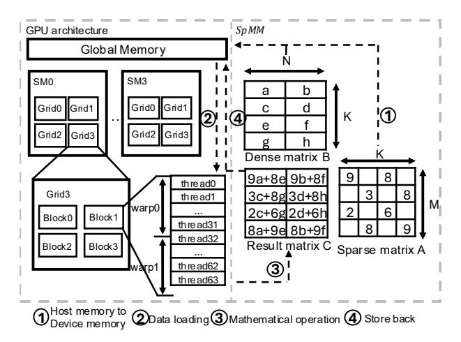

Fig. 1: The illustration of running SpMM on GPUs.

#### II. BACKGROUND

#### A. Sparse-Dense Matrix Multiplication

The importance of the SpMM kernel for a variety of scientific and engineering domains has motivated the development of methods to efficiently run SpMM on GPU devices [18], [22], [23]. Figure 1 illustrates the workflow of executing SpMM on a modern GPU. The process can be divided into four steps. Step 1: Transfer the data of the sparse and dense matrices from the host memory to the device memory. Step 2: Load the data from the global memory to threads. Step 3: Multiply the corresponding elements and add them to the corresponding result matrix. Step 4: Store the result back to the global memory. Algorithm 1 shows an SpMM kernel based on the CSC format. In this algorithm, individual columns of the sparse matrix are processed in parallel (Lines 1-10). Within each column, a for-loop (Lines 3-8) computes the corresponding elements in the dense matrix. The results are then stored back into the result matrix using the appropriate indices.

# Algorithm 1: A pseudocode of parallel CSC SpMM.

```
Input: N:K: colPtr[]: rowIdx[]: value[]: matrixB[]
  Output: matrixC[]
1 for i from 0 to K-1in parallel do
      for j \leftarrow colPtr[i]; j < colPtr[i+1]; j + + do
2
         for jj \leftarrow 0; jj < N; jj + + do
3
             rowIdx = rowIdx[j];
 4
             denseIdx = i * N + jj;
 5
             resultIdx = rowIdx * N + jj;
 6
             matrixC[resultIdx] + =
 7
               value[j] * matrixB[denseIdx];
         end
 8
      end
10 end
```


Fig. 2: The different access models of SpMM on modern GPU. The upper part illustrates the existing SpMMs. The bottom part illustrates an ideal situation of matrix A; None of Scenario 1 to 3 can achieve coalesced memory access to matrix B; They require up to warpSize memory transactions for matrix B; Scenario 4 can achieve coalesced memory access to matrix B. It only requires one memory transaction for matrix B.

#### B. GPU and Coalescing of Memory Accesses

GPU are highly data-parallel many-core processors. A typical GPU architecture comprises multiple stream multiprocessors (SMs), and several layers of the memory hierarchy. Each SM has multiple CUDA cores and a shared memory (L1 cache) [24], [25]. The memory hierarchy layers include but not limited to L1/L2 cache, texture memory, and global memory. From a programming perspective, NVIDIA CUDA provides a 3-level programming model: thread, thread block, and grid. The programmer can define the number of threads in a thread block and the number of blocks in a grid. In CUDA, a warp currently consists of 32 threads (warpSize = 32), and all the threads within a warp must reside within the same SM. This characteristic enables efficient parallel operations within a warp. The grid and block dimensions are exposed to the programmer. Each thread within a block and each block within a grid have the unique identifiers threadId and a blockId, respectively. In addition, each thread within a grid has a unique ID called *globalId*. Similarly, each thread within a warp is identified via a laneId.

Coalescing memory accesses is an optimization technique used in parallel computing systems to optimize the use of memory bandwidth and thus enhance performance [26], [27]. Coalescing memory accesses means that multiple threads access contiguous or closely located memory addresses in a way that these multiple accesses can be served by a few memory requests, instead of issuing a large number of independent memory requests. In the context of GPU, very significant performance improvements can be achieved when neighboring threads within a block or a warp access consecutive memory locations [28], [29]. For example, when an array of data is

stored in the GPU memory and each thread in warp writes to a specific element within the array, the consecutive thread accesses to consecutive elements in the array make it possible for the GPU to combine multiple memory requests into a single memory request.

#### C. Previous Approaches to Accelerate SpMM on GPU devices

A variety of methods have been proposed to accelerate the execution of SpMM on GPU devices. Sputnik uses the Reverse-Offset Memory Alignment (ROMA) approach to enable the use of vector memory instructions on misaligned memory addresses in sparse data structures and thus efficiently handle matrices with low levels of sparsity [18]. ASpT employs adaptive tiling to manage matrix irregularity and data access patterns to improve performance [17]. RoDe utilizes a decomposition technique based on the Compressed-Sparse Row (CSR) format to split rows into block parts (regular) and residual parts (irregular). Additionally, RoDe optimizes the computation pipeline, reducing the impact of synchronization [10]. cuSPARSE is a proprietary library that supports several formats such as CSR and COO, offering stable performance [21].

These previous methods do not exploit memory access coalescence for both sparse and dense matrices when running SpMM. Other approaches like GE-SpMM [19] only achieve coalesced memory access at the shared memory level, but do not coalesce memory accesses when loading the data from global memory to shared memory. Section III describes in detail why existing methods cannot achieve highly coalesced memory access to both sparse and dense matrices from global memory to threads simultaneously.


Fig. 3: Time comparison of with and without coalesced memory access of matrix *B* in the ideal scenario.

# III. MOTIVATION

Most existing SpMM methods typically overlook the impact of coalesced memory access on the dense matrix. Figure 2 highlights the issues with existing SpMM approaches in contrast to an ideal scenario. The upper part of Figure 2 shows two different scenarios distinguished by how the dense matrix *B* is stored (column-major (Scenario 2) vs. row-major (Scenario 1)), while the sparse matrix *A* is stored using the CSR format.

In Scenario 2, when one warp loads four elements in the sparse matrix *A*, the column index of the sparse matrix is not continuous, which produces non-contiguous memory accesses to the dense matrix *B*. For example, when Threads 0-3 of one warp access elements 9, 8, 3, and 8 of matrix *A*, the column index corresponds to 0, 2, 1, and 3. Consequently, the corresponding dense matrix elements for pairwise multiplication are a, e, c, and g, with correspond to columns 0, 2, 1, and 3, respectively. Threads 0-3 within a warp cannot access the dense matrix *B* continuously, failing to achieve coalesced memory access. Similarly, for Scenario 1, the addresses of the corresponding dense matrix elements accessed by Threads 0- 3, *i.e.*, a, e, c, and g, are 0, 4, 2, and 6, respectively, which is even worse than Scenario 2. The same failed coalesced memory accesses happen for Threads 4-7 in both Scenario 2 and Scenario 1.

To assess the impact of coalesced memory access on performance, we consider two additional scenarios (Scenario 3 and Scenario 4) representing the best regular data access patterns for both two input matrices. Scenario 3 and Scenario 4 are represented at the bottom of Figure 2. In the case of Scenario 3, matrix *B* is stored in row-major order, while in the Scenario 4 scenario, matrix *B* is stored in column-major order. Similar to Scenario 1 and Scenario 2, in the case of Scenario 3 the dense matrix elements loaded by Threads 0-3 are a, c, e, and f, which cannot achieve coalesced memory access. However, Scenario 4 achieves coalesced memory accesses for both matrices *A* and *B*. In summary, when threads within one warp load data in Scenario 1 to Scenario 3, they require multiple memory transactions to load *B* while Scenario 4 only requires one memory transaction for matrix *B*.

We run an experiment based on Scenarios 3 and 4 to highlight the performance impact of coalescing memory accesses. Specifically, we consider two dense matrices *A* and *B* with dimensions *M* → *K* and *K* → *N* and we compute the product *A · B* considering two different scenarios. In the


Fig. 4: The performance of SpMM with and without load balance.

first scenario, *B* is stored in row-major, resembling Scenario 3 in Figure 2, while in the second scenario, *B* is stored in column-major, similar as Scenario 4. To define the sizes of the *A* matrices, we consider 300 sparse matrices obtained from the SuiteSparse matrix collection [20], and we use their *M* → *K* dimensions. We set the value of *N* in matrix *B* to 32 and 128. The coefficients of the *A* and *B* matrices are randomly generated. Section V-A provides more details about our experimental setup. Figure 3 shows the scale of the dense matrix *A* in its x-axis, and the performance speedup of using a column-major storage for *B* with respect to a row-major one, *i.e.* the performance speedup of coalescing *B* accesses, in its y-axis. The experimental results in Figure 3 demonstrate that coalesced memory access of matrix *B* can significantly affect performance, by 10.1% (20.7%) on average for *N* = 32 (*N* = 128), and up to 27.8% (42.6%) for *N* = 32 (*N* = 128). As the matrix size increases, the performance difference becomes more pronounced. Based on these observations, Section IV describes an algorithm that achieves highly coalesced memory access for both sparse and dense matrices when computing SpMM. Section V shows that our SpMM algorithm with coalesced memory access achieves 32% (38.1%) average speedup for *N* = 32 (*N* = 128).

In addition to exploring the impact of coalesced memory access on performance, we evaluate the effect of load balance. We synthetically generate two different sparse matrices with the same dimensions (M = 87616 N= 67320 and NNZ = 13734559). The difference is that, in the first sparse matrix, the non-zero elements are evenly distributed across each row (with load balance), whereas in the second sparse matrix, the nonzero elements are unevenly distributed across rows (without load balance). We test SpMM considering these two sparse matrices and multiplying them with dense matrices of varying sizes. Section V-A describes our experimental setup. Figure 4 shows that, as the size of the dense matrix (N) increases, SpMM with balanced load performs increasingly better than SpMM with unbalanced load. The average speedup is 15.0.

# IV. THE SWIFT ALGORITHM

The Swift SpMM algorithm makes it possible for all threads within a warp to trigger mostly continuous accesses to the sparse and dense matrices, and achieve highly coalesced memory access.


Fig. 5: An illustration of Swift sorting and blocking.

#### A. Blocking Strategy of Swift

The blocking strategy of Swift requires sorting the columns of the sparse matrix A in terms of non-zero elements per column, as Figure 5 shows. The dense matrix rows are rearranged according to the column sort of the sparse matrix. The  $l_i$  value represents the number of non-zero elements belonging to column i. Once columns are sorted, Swift groups the sorted sparse matrix into block sets in such a way that the length of each regular block matches the size of a GPU warp. Figure 5 illustrates several block sets. In the Figure, the number of nonzero columns is n, and the non-zero elements per column go from  $l_0$  to  $l_{n-1}$ .  $l_0$  is the height of the first block set layer. Then, every first  $l_0$  element in each column participates in the first block set layer. In case  $l_0$  is too large, Swift uses a maximum block height. Then, the first column i with  $l_i$ greater than  $l_0$  is where the second block set layer begins, and the block set height is  $l_i - l_0$ . Similarly, the third block starts in column j where  $l_j$  is greater than  $(l_i - l_0) + l_0 = l_i$ , that is, its height is  $l_j - l_i$ . Since the block's height depends on the  $l_i$  values, the Swift blocking is determined by the sparsity pattern of A. The block set design ensures load balance among warps and avoids thread divergence.

This blocking strategy generates n/warpSize regular blocks in the first block set layer. If n has a remainder when divided by warpSize, Swift will generate an irregular block and its size is  $(n \ mod \ warpSize) \times l_0$  in the case of the first block layer. Column sorting ensures that there are no zero coefficients mapped within a block.

## B. The Swift Data Structure

We use a column-major data structure to support Swift. The reason is that row-major formats like CSR require additional operations to select non-zero elements belonging to the same column and load them to shared memory. Instead, column-major formats can process the matrix column by column, naturally lending themselves to the Swift design. For the rest of the section, we assume that we build Swift on top of the CSC format and its data structures, without loss of generality. Swift requires extending CSC to support its blocking strategy, which Section IV-A describes, as well as the floating-point computations of SpMM. This extension includes two parts:

the regular part, which accounts for all regular blocks, and the irregular part, which keeps track of all irregular blocks. The regular part consists of six arrays: blkPtr, blkCoIdx, value, rowIdx, positionIdx, and offsetIdx. blkPtr is a pointer that stores the start position of each block in the value and rowIdx arrays. blkCoIdx stores the start column index of each block. positionIdx and offsetIdx will introduce in Section IV-C. Similarly as CSC, if the number of regular blocks is blockNum, the length of blockCoIdx is blockNum, and the length of blkPtr is blockNum + 1. The length of the value, rowIdx, positionIdx, and offsetIdx arrays is blockNum \* warpSize.

For the irregular part, Swift represents the irregular block elements using the CSC format to store them in columns starting from the right of the sorted matrix. As Figure 5 shows that the irregular part of the matrix is typically concentrated on the matrix's right side after sorting, since the sorting phase arranges the sparse matrix in ascending order of non-zero elements per column. Storing the irregular elements from right to left facilitates quick identification of each element's corresponding position during computation.

1) Example of the Swift Data Structure: Figure 6 shows an example of the Swift data structure, assuming that CSC is used as the basic format. On the left hand side plot, we represent the original sparse matrix, which is an excerpt of the jgl009 matrix belonging to the SuiteSparse Collection [20]. For clarity purposes we set the warpSize to 4 and the maximum block height to 1 in this example. We sort the original sparse matrix A into sortedMatrxA in terms of NNZ elements per column in ascending order.

The right hand side plot of Figure 6 indicates how Swift stores the sparse matrix. With respect to the regular part, we use block0 as an example. The first non-empty column of block0 is column 0. Consequently, the first elements of the contiguous four columns starting from column 0 are allocated to block 0. In contrast, block8 starts in column 2 since the two preceding columns (0 and 1) are already represented in previous blocks, and column 2 still has one element left to be represented. The irregular part is represented by the gray-shaded elements in Figure 6. These elements are allocated to the irregular part of the data structure. For example, the elements of the last column not included in the regular part are 5, 9, 3, 8, 4, and 3. These elements and their corresponding row indices are stored in the CSC format, as the bottom right-hand side plot of Figure 6 indicates.

## C. Optimization Strategy of Swift

CSC format has a key drawback: when threads attempt to accumulate multiplication results into the result matrix C (Algorithm 1, Line 7), conflicts can occur, where atomic operations are required. Segment sum [30] is adopted to performance overhead of atomic operations. As illustrated in Figure 6, in the regular case, certain blocks (e.g., block 0) may contain consecutive elements that share the same row index (rowIdx). This enables the use of segment sum, where the block is partitioned into smaller segments based on row

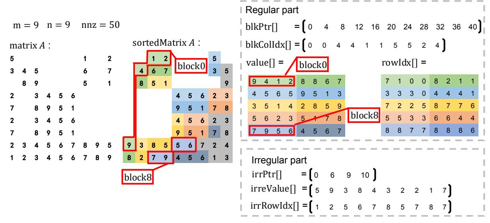

Fig. 6: An example of Swift: The original matrix is a real matrix called *jgl009*.

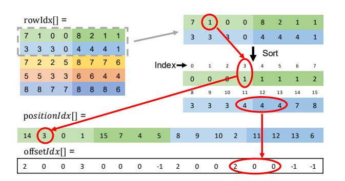

Fig. 7: An illustration of the optimization strategy of Swift.

indices (e.g., block 0 is divided into three segments  $\{9\}$ ,  $\{4\}$ , and  $\{1,2\}$ ). This technique reduces the frequency of atomic operations, thereby alleviating their negative performance impact. We further improved the efficiency of segment sum by handling multiple blocks within a thread block and utilizing shared memory.

Figure 7 illustrates the workflow. Assume that four blocks are assigned to a thread block. The row indices from these four blocks are first sorted together. After sorting, the indices of the sorted rowIdx are stored in a position index array (positionIdx). In addition, the offsetIdx array marks segment boundaries, i.e., ranges of elements that share the same row index. For each segment, the first element stores the number of remaining elements in the segment, while the rest are marked as 0. If a segment contains only one element, its entry in offsetIdx is set to -1.

The multiplication results are stored in shared memory according to the positionIdx array. Next, partial sums for elements with the same row index are accumulated locally in shared memory using the offsetIdx array. Once the local reduction is complete, the final results are written back to the global result matrix via atomic addition, minimizing the frequency of atomic operations and improving overall

performance. Section IV-D provides additional details.

# D. The Swift SpMM Algorithms

The Swift method is composed of two algorithms: the first one computes the SpMM operation concerning the regular blocks of the sparse matrix A, and the second one takes care of the irregular blocks. Algorithm 2 presents the pseudocode of the regular part of the Swift SpMM algorithm. A thread block (configured as 32×8 threads) is assigned to compute 8 blocks of the sparse matrix and the corresponding 32 columns in the dense matrix. Swift allocates three shared memories per thread block:  $rowIdx\_sh$ ,  $val\_offset\_sh$ , and  $val\_sh$ . The variable tid represents the local thread index within the thread block (Line 4), and rid serves as the index into blkPtr, with every 32 threads corresponding to one of the blocks in the regular part. Swift first uses blkPtr and tid to assign each thread a specific value of position (Line 7) and the corresponding column index in the dense matrix (Lines 9–10). Then, the row indices and offset indices are loaded into shared memory (Lines 11-12). The for loop (Lines 13-31) iterates over the 32 assigned columns of the dense matrix. In each iteration, every thread computes a partial multiplication result and stores it into shared memory based on the position information (Lines 14–17). Next, segments with same row indices are identified using the offset array, and their corresponding values are locally reduced the number of atomic operation by adding them together (Lines 19-23). Finally, the accumulated results are written back to the output matrix using atomic add operations to ensure correctness (Lines 25–29).

Algorithm 3 presents the pseudocode of the irregular part of the Swift SpMM algorithm. To properly balance the load, Algorithm 3 divides the columns that are longer than the warpSize into several sub-columns. Mapping one warp to each column belonging to an irregular block brings significant load imbalance, as the example in Figure 6 shows. If the first warp handles the rightmost column of elements of irregular blocks (the last column in sortedMatrxA) and the second

**Algorithm 2:** A pseudocode of parallel Swift SpMM (regular part).

```
Input: M; N; K; blockNum; blkPtr[];
          blkCoIdx[]; value[]; rowIdx[]; matrixB[];
          positionIdx[]; offsetIdx[];
   Output: matrixC[]
1 extern __shared__ rowIdx_sh[];
2 \ extern \_shared\_ \ val\_offset\_sh[];
3 extern \_shared\_val\_sh[];
4 tid \leftarrow threadIdx.y << 5 + threadIdx.x;
5 \ rid \leftarrow blockDim.y * blockIdx.x + threadIdx.y;
\mathbf{6} if rid < blockNum then
      ptr \leftarrow blkPtr[rid] + threadIdx.x;
7
      position \leftarrow positionIdx[ptr];
      colIdxStart \leftarrow blkColIdx[rid];
      dnIndex \leftarrow blockIdx.y << 5;
10
      rowIdx\_sh[tid] \leftarrow rowIdx[ptr];
11
      val\ of\ fset\ sh[tid] \leftarrow of\ fsetIdx[ptr];
12
      for kk \leftarrow 0; kk < 32; kk + + do
13
           dnIdx \leftarrow (dnIndex + kk) * K +
14
            colIdxStart + threadIdx.x;
          dnVal \leftarrow matrixB[dnIdx];
15
          spVal = value[ptr];
16
          val\_sh[position] = spVal * dnVal;
17
           \_syncthreads();
18
          if val\_offset\_sh[tid] > 0 then
19
              for i = 1; i \le val\_offset\_sh[tid]; i + +
20
                  val\_sh[tid] + = val\_sh[tid + i];
21
              end
22
          end
23
             _syncthreads();
24
          if val of fset sh[tid]! = 0 then
25
              rowIndex \leftarrow rowIdx \ sh[tid];
26
              resultIdx \leftarrow
27
               rowIndex + (dnIndex + kk) * M;
              atomicAdd(matrixC[resultIdx], val\_sh[tid]);
28
          end
29
30
            \_syncthreads();
31
      end
32 end
```

warp handles the elements of the second column from the right, the number of irregular elements handled by the two warps is different (6 and 3 for the first and the second warps).

In Algorithm 3, irrNumBlk denotes the total number of irregular blocks, derived by summing the number of columns smaller than the warpSize and the ceiling of the quotient of larger columns divided by the warpSize. For example, in Figure 6, the number of irrNumBlk is 4 (assume warpSize is 4). The colIdxIndex array records whether the block is an independent column (where NNZ is less than warpSize) or a part of a column (where NNZ is greater than warpSize). The

**Algorithm 3:** A pseudocode of parallel Swift SpMM (irregular part).

```
Input: irrNumBlk; colIdxIndex[]; blkStart[]; blkStop[];
           N; K; irrPtr[];
           irrRowIdx[]; irrValue[]; matrixB[];
   Output: matrixC[]
1 \ globalId \leftarrow blockIdx.x * blockDim.x + threadIdx.x;
\textbf{2} \ warpId \leftarrow globalId >> 5;
3 laneId \leftarrow 31 \& threadIdx.x;
4 if warpId < irrNumBlk then
       colIdx \leftarrow colIdxIndex[warpId];
5
       signBit \leftarrow (colIdx >> 31) \& 0x1;
       colIdx\_1 \leftarrow signBit ==
7
        1? colIdx \& 0x7FFFFFFFF: colIdx;
       realColIdx \leftarrow K - colIdx_1 - 1;
8
       start \leftarrow signBit == 1 ? blkStart[warpId] :
        irrPtr[colIdx\_1];
       stop \leftarrow signBit == 1 ? blkStop[warpId] :
10
        irrPtr[colIdx\_1+1];
11
       for i \leftarrow start + laneId; i < stop; i+=32 do
          rowIndex \leftarrow irrRowIdx[i];
12
           spValue \leftarrow irrValue[i];
13
          for j \leftarrow 0; j < N; j + + do
14
              dnIdx \leftarrow j * K + realColIdx;
15
              resultIdx \leftarrow rowIndex * N + j;
16
              atomicAdd(matrixC[resultIdx], spValue \times
17
                matrixB[dnIdx]);
          end
18
19
       end
20 end
```

blkStart and blkStop array records the position of the block (where in the larger column). We use colIdxIndex to get the column index of each irregular block (Lines 5-8). Then we use blkStart, blkStop, and irrPtr array to get the position of each irregular block in irrValue and irrRowIdx (Lines 9-10). The computing part of Algorithm 3 (Lines 11-19) is similar to that of Algorithm 2.

#### V. PERFORMANCE EVALUATION

#### A. Experimental Setup

Our experimental platforms for evaluation of Swift are the NVIDIA GeForce RTX 4080s (default), GeForce RTX 3090Ti, Tesla V100, and A100 GPUs. The consider 2757 sparse matrices from SuiteSparse Matrix Collection [20]. The dense matrix is generated randomly considering two different number of columns (N=32 and N=128). Our evaluation of Swift includes both single (FP32) and double (FP64) precision SpMM algorithms. We compare Swift with four SOTA methods, ASpT [17], cuSPARSE v12.2 kernel [21], RoDe [10], and Sputnik [18]. To compare the performance of these four previous methods and Swift, we report the time they spend running SpMM on the GPU devices.

|  | TABLE I: Overall speedup of Swift over the four SOTA |  |  |  |
|--|------------------------------------------------------|--|--|--|
|  | baselines in terms of the geometric mean of time.    |  |  |  |

| Platform   | Configuration | ASpT | cuSPARSE | RoDe | Sputnik |
|------------|---------------|------|----------|------|---------|
|            | FP64, N=32    | 2.22 | 59.19    | 5.16 | 10.92   |
|            | FP64, N=128   | 1.79 | 27.02    | 3.62 | 6.53    |
| RTX 4080s  | FP32, N=32    | 1.74 | 61.59    | 3.99 | 8.80    |
|            | FP32, N=128   | 1.19 | 28.09    | 2.46 | 4.83    |
|            | FP64, N=32    | 2.43 | 51.35    | 4.96 | 9.89    |
|            | FP64, N=128   | 1.57 | 19.42    | 2.92 | 5.05    |
| RTX 3090Ti | FP32, N=32    | 1.78 | 48.89    | 3.55 | 7.44    |
|            | FP32, N=128   | 1.04 | 19.11    | 1.83 | 3.58    |
|            | FP64, N=32    | 2.79 | 92.82    | 7.41 | 18.38   |
|            | FP64, N=128   | 1.85 | 55.48    | 4.68 | 10.29   |
| A100       | FP32, N=32    | 2.45 | 93.06    | 6.03 | 13.96   |
|            | FP32, N=128   | 1.66 | 51.87    | 3.72 | 8.55    |
|            | FP64, N=32    | 2.51 | 85.35    | 5.82 | 13.92   |
|            | FP64, N=128   | 1.62 | 39.60    | 3.82 | 7.42    |
| V100       | FP32, N=32    | 2.39 | 91.14    | 6.25 | 14.94   |
|            | FP32, N=128   | 1.54 | 46.03    | 3.55 | 7.40    |

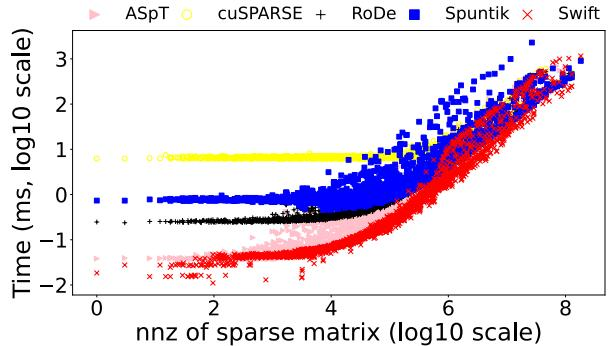

Fig. 8: Time comparison of Swift with SOTA methods on RTX 4080s (FP64, N=128).

# *B. Overall performance*

Figure 8 presents the execution time of Swift and four SOTA methods in the y-axis, and the number of nonzero coefficients (NNZ) of the considered sparse matrix in the xaxis. When the NNZ is less than 10<sup>6</sup>, cuSPARSE shows the lowest performance, but its performance remains relatively stable. Sputnik does not perform well in most configurations. Moreover, when the NNZ comes to 10<sup>7</sup>, Sputnik becomes the slowest method. The performance of RoDe is moderate when the NNZ is less than 10<sup>5</sup>. It only becomes competitive on large NNZ (larger than 10<sup>6</sup>). The performance of ASpT is better than that of the three methods mentioned above.

To investigate why the speedup of Swift over ASpT is smaller than that observed in the other three benchmarks, we partition the original sparse matrix into 32!32 blocks. The ratio of the all-zero-blocks to the total number of blocks is as used as the x-axis of Figure 9 These results show that Swift performs slower than ASpT on 55.14% matrices. The matrices are mainly concentrated in regions with higher ratios. A larger ratio indicates that the nonzero elements are more concentrated in certain regions of the matrix. Since the ASpT algorithm separates the sparse matrix into dense and sparse blocks and applies different computational strategies to each,

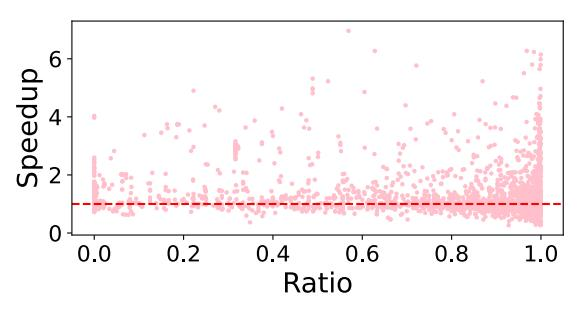

Fig. 9: Speedup of Swift over ASpT with respect to the distribution of sparse matrix nonzeros.


Fig. 10: Speedup of Swift versus cuSPARSE considering dense matrices with different N.

it tends to exhibit an advantage when the nonzero elements of a sparse matrix are concentrated.

Table I shows the speedup of Swift over the four SOTA methods in terms of the geometric mean of time for the two considered GPU systems, *N* = 32 and *N* = 128, and FP32 and FP64. The Swift algorithm achieves better performance than the other four methods, even for the latest ASpT and RoDe. Our experimental campaign reveals that ASpT is faster than RoDe, which is inconsistent with previously published results [10]. This inconsistency comes from the fact that the previous results evaluate RoDe using only 900 matrices, while our evaluation considers 2757 matrices.

*1) Speedup of Swift over cuSPARSE for Different N Values:* We explore the performance of Swift by setting the N in the dense matrix to values that are not multiples of 32. Specifically, we evaluate five different values of N (48, 96, 182, 384, and 768), and compare the geometric mean speedup of Swift relative to cuSPARSE. As shown in the Figure 10, Swift achieves consistently good performance compared to

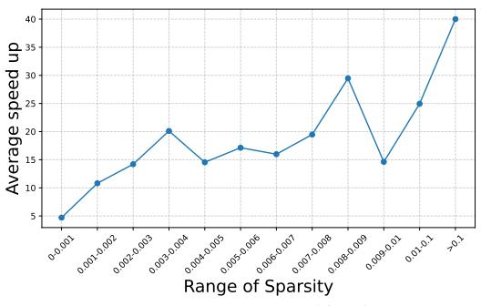

Fig. 11: Average Speedup between Swift with ASpT, Sputnik, RoDe, and cuSPARSE for different sparsity ranges.


(a) Best performing matrix


(b) Worst performing matrix

Fig. 12: Distribution of non-zero elements of the best and the worst performing matrices by Swift.

cuSPARSE across different N values. Further experiments indicate that the speedup of Swift plateaus at 7→ as N increases.

- *2) Speedup of Swift for Different Sparsity Regimes:* We divide our set of sparse matrices into different intervals according to their sparsity (NNZ / (M ! K)). We compute the average speedup of Swift over the SOTA methods within each interval, as shown in Figure 11. The figure reveals that Swift achieves average speedups between 10-30→ for sparsity ranges between 0.001 and 0.01. The considered matrices with sparsity *>* 0*.*1 are relatively small and, therefore, Swift delivers large gains from the coalesced accessed to the L2 GPU cache.
- *3) Impact of Swift on Performance Metrics:* We select 30 representative matrices and analyzed them using NVIDIA's performance profiling tool. Table II shows how Swift achieves better bandwidth utilization, memory coalescing, L2 hit rate, and SM occupancy than Sputnik. In general, our experiments indicate that Swift achieves better results concerning these four performance metrics than all considered previous approaches.

# *C. Statistics of Experimental Data*

We analyze the distribution of the performance rankings of the five considered methods across different configurations. Table III summarizes the distribution of the performance rankings of these methods for all the 2757 considered matrices. The performance of the five methods on each matrix is ranked, with the best performer being labeled best, and so on, and the worst performer labeled worst. For example, in the 3rd column, the value for each method represents the percentage of matrices where that method achieves the best performance. Our evaluation reveals that Swift achieves the best performance on most matrices across the first 3 configurations. In particular, for FP64 and *N* = 32, Swift achieves the best performance in 91.22% of the matrices. However, under the configuration of FP32 and N=128, the performance of Swift does not perform as well as ASpT, Swift only achieves the best performance in 36.67% of the matrices but ASpT achieves 55.14%. Still, Swift obtains a 1.02→ with respect to ASpT, as Table I reports. In each row, the percentages indicate the distribution of the performance ranking of a method. Swift can achieve the best and 2nd best performance in all configurations. Even for the FP32 and *N* = 128 configuration, Swift can achieve the best or second-best performance for more than 80% of the matrices.

TABLE II: Performance Metrics for Swift. Sputnik data appear inside parentheses.

| Matrix         | NNZ      | Memory<br>Bandwidth<br>Utilization(%) | Memory<br>Coalescing(%) | L2<br>Hit Rate(%) | SM Occupancy(%) |
|----------------|----------|---------------------------------------|-------------------------|-------------------|-----------------|
| gridgena       | 512084   | 90.65 (48.31)                         | 70 (62)                 | 94.27 (85.68)     | 93.52 (16.03)   |
| 2D 54019 highK | 996414   | 91.95 (31.38)                         | 77 (77)                 | 97 (86.69)        | 90.97 (16.14)   |
| bcsstk35       | 1450163  | 93.68 (28.68)                         | 85 (66)                 | 93.68 (93.75)     | 92.50 (16.09)   |
| matrix 9       | 2121550  | 91.42 (33.70)                         | 82 (82)                 | 96.05 (85.82)     | 85.93 (16.24)   |
| matrix-new 3   | 2678750  | 88.73 (28.27)                         | 76 (76)                 | 94.87 (84.34)     | 85.88 (15.93)   |
| srb1           | 2962152  | 83.58 (27.54)                         | 98 (79)                 | 98.19 (86.91)     | 81.31 (16.45)   |
| pkustk03       | 3130416  | 87.73 (27.64)                         | 97 (70)                 | 98.16 (89.06)     | 86.77 (16.46)   |
| oilpan         | 3597188  | 90.74 (25.97)                         | 94 (52)                 | 97.94 (90.38)     | 84.40 (15.77)   |
| s3dkt3m2       | 3753461  | 89.48 (27)                            | 93 (78)                 | 97.86 (87.27)     | 85.04 (16.33)   |
| engine         | 4706073  | 87.17 (46.31)                         | 70 (63)                 | 94.62 (82.09)     | 88.53 (16.33)   |
| s3dkq4m2       | 4820891  | 88.29 (27.18)                         | 93 (77)                 | 98.13 (89.63)     | 82.20 (16.36)   |
| pkustk11       | 5217912  | 88.11 (29.93)                         | 94 (79)                 | 98.21 (87.82)     | 84.40 (16.44)   |
| shipsec8       | 6653399  | 91.53 (30.44)                         | 89 (79)                 | 97.76 (87.82)     | 86.97 (16.34)   |
| boneS01        | 6715152  | 93.34 (42.03)                         | 70 (63)                 | 97.14 (85.97)     | 87.17 (16.39)   |
| bmw7st 1       | 7339667  | 87.41 (30.95)                         | 84 (65)                 | 94.36 (86.88)     | 91.43 (16.32)   |
| shipsec1       | 7813404  | 89.57 (32.43)                         | 91 (71)                 | 95.84 (87.94)     | 81.83 (16.53)   |
| ship 003       | 8086034  | 91.74 (34.13)                         | 89 (71)                 | 97.57 (88.03)     | 87.12 (16.51)   |
| m t1           | 9753570  | 86.23 (29.69)                         | 88 (65)                 | 98.20 (91.95)     | 82.47 (16.45)   |
| shipsec5       | 10113096 | 70.20 (30.11)                         | 90 (69)                 | 87.71 (87.2)      | 86.58 (16.43)   |
| x104           | 10167624 | 88.82 (29.79)                         | 91 (65)                 | 97.77 (89.85)     | 80.65 (16.47)   |
| hood           | 10768436 | 84.44 (32.63)                         | 90 (53)                 | 95.36 (82.05)     | 83.07 (16.06)   |
| fcondp2        | 11294316 | 85.85 (27.24)                         | 95 (68)                 | 95.28 (87.46)     | 79.97 (16.47)   |
| fullb          | 11708077 | 78.42 (29.43)                         | 91 (70)                 | 91.01 (85.95)     | 85.95 (16.52)   |
| troll          | 11985111 | 81.02 (29.83)                         | 83 (64)                 | 91.34 (86.70)     | 83.85 (16.34)   |
| BenElechi1     | 13150496 | 81.87 (27.52)                         | 95 (69)                 | 91.38 (88.93)     | 80.39 (16.54)   |
| af 0 k101      | 17550675 | 87.97 (26.59)                         | 92 (52)                 | 92.97 (87.75)     | 81.18 (16.55)   |
| af shell1      | 17588875 | 88.25 (26.94)                         | 91 (52)                 | 94.22 (87.44)     | 80.32 (16.55)   |
| CoupCons3D     | 22322336 | 80.09 (51.65)                         | 83 (82)                 | 91.08 (78.56)     | 84.02 (16.56)   |
| ML Laplace     | 27689972 | 88.65 (33.51)                         | 75 (75)                 | 91.79 (92.61)     | 84.04 (16.59)   |
| inline 1       | 36816342 | 84.44 (67.96)                         | 90 (54)                 | 95.36 (72.64)     | 83.07 (16.51)   |

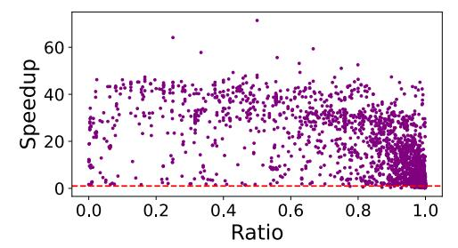

Fig. 13: Relationship between the average speedup of Swift over ASpT, Sputnik, RoDe, and cuSPARSE and the distribution of nonzero elements (N=128).

## *D. Analysis of the Best and Worst Performing Matrices*

We further investigate the impact of the matrix sparse patterns on the performance of Swift. In general, Swift performs its very best when the non-zero elements are evenly distributed. Figure 12a shows the matrix *Journals* where

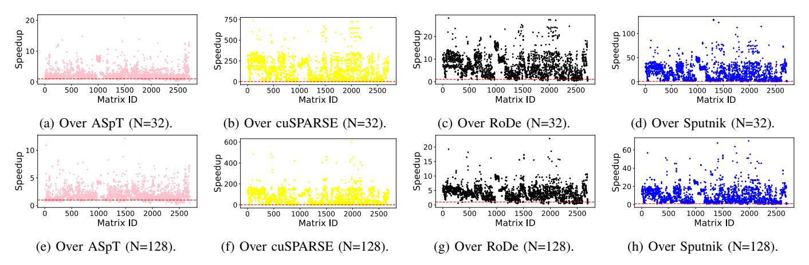

Fig. 14: Speedup of Swift over the four SOTA methods on RTX 4080s (FP64).

TABLE III: Ranking distribution of performance (%).

| Configuration | Methods  | Best  | 2nd best | 3rd best | 4th best | Worst |
|---------------|----------|-------|----------|----------|----------|-------|
|               | Swift    | 91.22 | 2.94     | 3.42     | 2.13     | 0.29  |
|               | ASpT     | 5.84  | 88.57    | 3.45     | 2.13     | 0.01  |
| FP64, N=32    | cuSPARSE | 0.00  | 0.00     | 0.66     | 3.27     | 96.07 |
|               | RoDe     | 2.90  | 7.09     | 84.9     | 5.07     | 0.04  |
|               | Sputnik  | 0.04  | 1.40     | 7.57     | 87.40    | 3.59  |
|               | Swift    | 65.72 | 20.92    | 3.84     | 4.61     | 4.91  |
|               | ASpT     | 27.71 | 63.21    | 5.79     | 3.14     | 0.15  |
| FP64, N=128   | cuSPARSE | 0.00  | 0.44     | 3.10     | 8.38     | 88.08 |
|               | RoDe     | 5.35  | 9.30     | 74.72    | 9.30     | 1.33  |
|               | Sputnik  | 1.22  | 6.13     | 12.55    | 74.57    | 5.53  |
|               | Swift    | 62.92 | 15.11    | 8.25     | 12.80    | 0.92  |
|               | ASpT     | 22.15 | 69.2     | 6.64     | 1.94     | 0.07  |
| FP32, N=32    | cuSPARSE | 0.00  | 0.00     | 1.32     | 2.16     | 96.52 |
|               | RoDe     | 12.69 | 11.44    | 75.61    | 0.26     | 0.00  |
|               | Sputnik  | 2.24  | 4.25     | 8.18     | 82.84    | 2.49  |
|               | Swift    | 36.67 | 45.20    | 9.09     | 7.24     | 1.80  |
|               | ASpT     | 55.14 | 38.96    | 3.90     | 2.00     | 0.00  |
| FP32, N=128   | cuSPARSE | 0.00  | 0.00     | 0.90     | 2.20     | 96.90 |
|               | RoDe     | 7.59  | 12.84    | 78.97    | 0.60     | 0.00  |
|               | Sputnik  | 0.60  | 3.01     | 7.14     | 87.96    | 1.30  |

Swift achieves the best performance, characterized by an even distribution of non-zero elements. This pattern's advantage is that after Swift's sorting and blocking, the elements handled by a warp at a time are distributed across different rows, reducing the impact of atomic operations. In contrast, Figure 12b displays the matrix *cegb2919* with non-zero elements concentrated along the diagonal, and this concentration increases the impact of atomic operations, thereby weakening the performance improvement of Swift.

*1) Analysis Considering the Distribution of Nonzero Elements:* To describe the relationship between the distribution of nonzero elements in sparse matrices and the performance of Swift, all input sparse matrices are partitioned into 32!32 blocks. The ratio of the all-zero-blocks to the total number of blocks is as used as the x-axis of Figure 13, and the average speedup of Swift relative to all other baselines in the y-axis. The higher ratio, the more blocks are empty, implying that the nonzero elements are concentrated within fewer blocks. Conversely, a low ratio implies fewer empty blocks, meaning that the nonzero elements are more evenly distributed across the matrix. Figure 13, indicates that as the nonzero elements of the sparse matrix become are less evenly distributed, the average speedup of Swift over ASpT, Sputnik, RoDe, and cuSPARSE decreases. Therefore, Swift achieves better performance improvements when the nonzero elements are evenly distributed, while its performance slightly declines when the nonzero elements are irregularly distributed.

# *E. One-to-one Performance Comparison between Swift and Individual SOTA Methods*

Figure 14 and Figure 15 show one-to-one comparisons of Swift with the four individual SOTA methods on each matrix. The speedup of Swift over the others is calculated by dividing the execution time of each method by the Swift execution time and represented in the y-axis. The data points above/below 1*.*0 indicate that Swift is better/worse than the compared SOTA method. A horizontal dotted line represents the 1*.*0 threshold. Figures 14a, 14e, 15a, 15e represent the comparisons of Swift with ASpT. In FP64, Swift is faster than ASpT in most matrices. However, Swift does not perform well in some matrices. This phenomenon is more obvious in FP32. The reason is that the pattern of the sparse matrix affects Swift's performance, especially in this configuration. Figures 14b, 14f, 15b, 15f show data comparing Swift with cuSPARSE. Compared to cuSPARSE, Swift demonstrates excellent performance and consistently achieves strong results across various matrices. For both FP64 and FP32, Swift outperforms cuSPARSE.

Figures 14c, 14g, 15c, and 15g are the comparisons of Swift with respect to RoDe. The speedup of Swift over RoDe is comparable to its speedup over ASpT, with both reaching up to around 10→. However, Swift consistently outperforms RoDe on most matrices. Additionally, Swift maintains strong performance relative to RoDe in both FP64 and FP32 precision modes, though its performance in FP32 is slightly lower than in FP64. Figures 14d, 14h, 15d, and 15h display data comparing Swift with Spuntik. The speedup of Swift over Spuntik is generally lower than its speedup over cuSPARSE but higher than its speedup over AsPT and RoDe. Despite this, Swift consistently delivers excellent performance compared

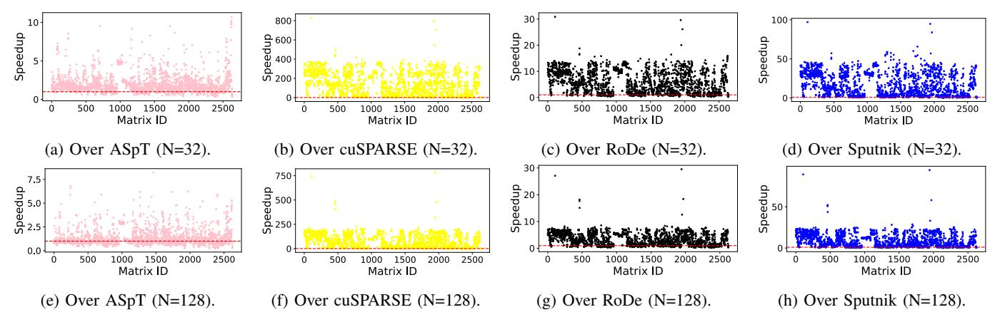

Fig. 15: Speedup of Swift over the four SOTA methods on RTX 4080s (FP32).

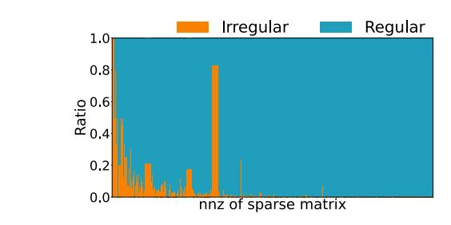

Fig. 16: The proportion of regular and irregular parts.


Fig. 17: Speed up of coalesced memory access over noncoalesced memory access in Swift.

to Spuntik across various floating-point precisions (FP64 and FP32) and dense matrix dimensions (*N* = 32 and *N* = 128).

In summary, the performance of Swift varies when compared to different methods, depending on the scale of the dense matrices and the floating-point precision. However, Swift consistently demonstrates superior overall performance across diverse scenarios.

## *F. Performance Impact of the Different Swift Optimizations*

Swift is based on two main optimizations: It coalesces the memory accesses when computing SpMM for the regular blocks, and reduces the load imbalance across warps when processing the irregular blocks. We show the ratio between the regular and irregular parts in Figure 16 for all considered matrices. These data indicate that in most matrices the regular part dominates. However, there are 14.01% of the matrices that have more than 50% irregular blocks, particularly the smallest matrices of our experimental campaign. Data in Figure 16 indicate that, although the impact of coalesced memory access in the regular part becomes more significant as the matrix size grows, the load balancing technique for the irregular blocks is

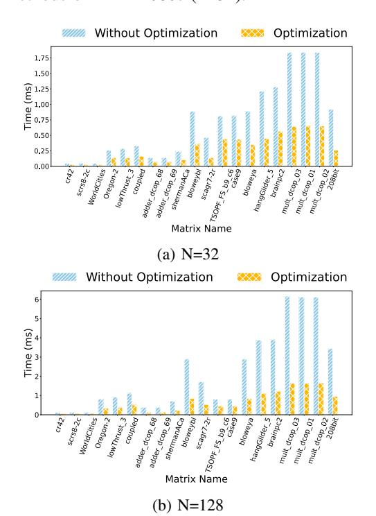

Fig. 18: Swift with and without optimization of irregular part.

relevant for a significant portion of the matrices. Sections V-F1 and V-F2 show the benefits of memory coalescence for regular blocks and load imbalance for irregular ones.

*1) Impact of Coalesced Memory Accesses in the Regular Part:* Similar to Section III, we use the storage structure of dense matrices whether the memory accesses to the dense matrices are coalesced or not. We compare the performance achieved by the highly coalesced memory access patterns of Swift for the regular blocks, where the storage format of dense matrix *B* is column-major, with a non-coalesced memory access scenario using a row-major storage format for matrix *B*. Figure 17 shows this evaluation. The geometric mean speedup achieved by the Swift version that coalesces access to the dense *B* matrix with respect to the one that does not is 1.32→ (1.38→) when *N* = 32 (*N* = 128).

TABLE IV: Memory Bandwidth Utilization.

| Matrix   | NNZ    | ASpT   | cuSPARSE | RoDe   | Sputnik | Swift  |
|----------|--------|--------|----------|--------|---------|--------|
| c-48     | 166080 | 27.35% | 32.44%   | 30.43% | 24.53%  | 69.90% |
| rajat22  | 197264 | 47.11% | 36.38%   | 46.86% | 33.70%  | 69.90% |
| HEP-th   | 342437 | 38.27% | 34.69%   | 32.10% | 26.42%  | 79.35% |
| RFdevice | 365580 | 40.76% | 38.37%   | 52.55% | 37.20%  | 81.45% |
| bundle1  | 770901 | 19.12% | 28.23%   | 29.80% | 27.51%  | 51.91% |

- *2) Impact of Load Balancing in the Irregular Part:* Figure 18 shows the benefits of using the load balancing optimization to process the irregular blocs brings for randomly selected 20 matrices of different sizes. The result in Figure 18 shows that the imbalance of irregular parts can significantly affect the performance. The extent of optimization for the irregular portion varies across different matrices, primarily depending on the distribution of nonzero elements. This distribution significantly influences the proportion of the irregular portion relative to the entire matrix. The average speedup of Swift with irregular part optimization over that without optimization is 2.26→ (2.69→) for *N* = 32 (*N* = 128). The optimization strategy for the irregular portion is overall effective. It cannot achieve coalesced memory access like the regular portion, but the strategy ensures load balancing and efficient utilization of thread resources for the irregular portion.
- *3) GPU Memory Throughput:* We show the memory bandwidth utilization achieved by all the considered approaches for five representative matrices in Table IV. Swift achieves the highest bandwidth utilization. This is attributed to its wellbalanced workload distribution of both regular and irregular parts. Each thread within a thread block is assigned an appropriate amount of work, and the regular part benefits from coalesced memory accesses.

## *G. Preprocessing Overhead*

We compare the preprocessing overhead of Swift with that of other SOTA methods. Figure 19a shows this comparison. When the NNZ is less than 10<sup>5</sup>, the preprocessing overhead incurred by Swift is smaller than ASpT and Sputnik, while comparable to that of RoDe. When the matrix NNZ is larger than 10<sup>5</sup>, the preprocessing time of Swift increases. When NNZ is larger than 10<sup>6</sup>, the Swift overhead is larger than the one Sputnik and RoDe incur and very similar to ASpT. In summary, Swift incurs preprocessing overhead smaller or similar than the one of ASpT, which delivers the best SpMM performance after Swift.

To explain why Swift's preprocessing overhead increases as the number of non-zero elements of the sparse matrix grows, we conduct an in-depth analysis of this overhead. Figure 19b indicates the portion of preprocessing overhead due to sorting and blocking depending on the number of nonzeros of the sparse matrix. For the smallest sparse matrices, the most timeconsuming part is sorting. As the sparse matrix size increases, blocking becomes the most time-consuming part. The reason is that as the matrix size increases, the data operations performed during blocking (e.g., data movement) surpass those required for sorting, causing the weight of time in blocking to increase.


(a) The comparison of preprocessing time.

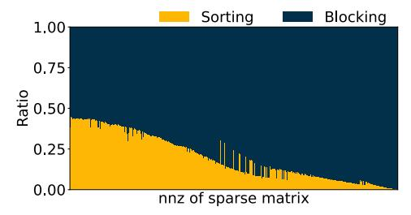

(b) Time proportion of sorting and blocking. Fig. 19: The analysis of preprocessing in Swift.

# VI. RELATED WORK

SpMM has been widely studied, with research focusing on computer architecture [31], [32], data formats [33], [34], and other aspects [35]–[38]. From the architectural perspective, Spade integrates an accelerator with the CPU to reduce data transfers [31], later evolving into HotTile for heterogeneous architectures [32]. Mentor employs a column-wise dataflow and software–hardware co-design to boost performance [39]. SpCache introduces an access pattern–aware cache to reduce bank conflicts [40], while Sparkle targets deep-learning SpMM with a flexible accelerator design [41].

From the data format perspective, researchers often integrate format characteristics with computing platform features. Embark dynamically allocates memory based on CSR and CSC formats, leveraging main and non-volatile memory properties [42]. FastSpMM adopts the ELLPACK format to improve the computation-to-memory ratio [43]. A CSR-based tiling approach enhances SpMM performance by improving tensor core utilization and computational density [44]. EC-SpMM optimizes GPU SpMM kernels [45], while DA-SpMM adaptively tunes GPU execution based on matrix characteristics [46].

# VII. CONCLUSION AND FUTURE WORK

We propose Swift, a novel SpMM algorithm that enhances memory access efficiency for sparse and dense matrices through coalescing. A motivational experiment demonstrates the benefit of coalesced memory access, and a new blocking mechanism is introduced to divide matrices into regular and irregular blocks. Swift employs separate algorithms for these blocks to maximize memory coalescence and load balance. Evaluation shows that Swift outperforms ASpT [17], cuS-PARSE [21], RoDe [10], and Sputnik [18].

## VIII. ACKNOWLEDGMENTS

The authors would like to thank all anonymous reviewers for their insightful comments and suggestions, and all reviewers for evaluating and providing constructive feedback on Swift's artifacts. This work was supported in part by the National Key R&D Program of China (Grant No. 2023YFB3001705); in part by the National Natural Science Foundation of China (Grant No. U21A20461, 62472160, 62572180, 2024JJ7375); in part by the Natural Science Foundation of Hunan Province of China (Grant No. 2024JJ7375) and in part by the Aid Program for Science and Technology Innovative Research Team in Higher Educational Institutions of Hunan Province. This work has also received funding from 'Future of Computing, a Barcelona Supercomputing Center and IBM initiative' (2023) and has been partially supported by the project PID2023-146511NB-I00 funded by the Spanish Ministry of Science, Innovation and Universities MCIU /AEI /10.13039/501100011033 and EU ERDF.

## REFERENCES

- [1] Baoyuan Liu, Min Wang, Hassan Foroosh, Marshall Tappen, and Marianna Pensky. Sparse convolutional neural networks. In *Proceedings of the IEEE conference on computer vision and pattern recognition*, pages 806–814, 2015.
- [2] Andrew S Lan, Andrew E Waters, Christoph Studer, and Richard G Baraniuk. Sparse factor analysis for learning and content analytics. *The Journal of Machine Learning Research*, 15(1):1959–2008, 2014.
- [3] Song Han, Huizi Mao, and William J Dally. Deep compression: Compressing deep neural networks with pruning, trained quantization and huffman coding. *arXiv preprint arXiv:1510.00149*, 2015.
- [4] Zijia Zhang, Yaoming Cai, and Wenyin Gong. Semi-supervised learning with graph convolutional extreme learning machines. *Expert Systems with Applications*, 213:119164, 2023.
- [5] Yingxue Gao, Lei Gong, Chao Wang, Teng Wang, Xi Li, and Xuehai Zhou. Algorithm/hardware co-optimization for sparsity-aware spmm acceleration of gnns. *IEEE Transactions on Computer-Aided Design of Integrated Circuits and Systems*, 42(12):4763–4776, 2023.
- [6] Trevor Gale, Erich Elsen, and Sara Hooker. The state of sparsity in deep neural networks. *arXiv preprint arXiv:1902.09574*, 2019.
- [7] Thomas N Kipf and Max Welling. Semi-supervised classification with graph convolutional networks. *arXiv preprint arXiv:1609.02907*, 2016.
- [8] Shiqing Li, Shuo Huai, and Weichen Liu. An efficient gustavson-based sparse matrix–matrix multiplication accelerator on embedded fpgas. *IEEE Transactions on Computer-Aided Design of Integrated Circuits and Systems*, 42(12):4671–4680, 2023.
- [9] Charles Block, Gerasimos Gerogiannis, Charith Mendis, Ariful Azad, and Josep Torrellas. Two-face: Combining collective and one-sided communication for efficient distributed spmm. In *Proceedings of the 29th ACM International Conference on Architectural Support for Programming Languages and Operating Systems, Volume 2*, pages 1200– 1217, 2024.
- [10] Meng Pang, Xiang Fei, Peng Qu, Youhui Zhang, and Zhaolin Li. A row decomposition-based approach for sparse matrix multiplication on gpus. In *Proceedings of the 29th ACM SIGPLAN Annual Symposium on Principles and Practice of Parallel Programming*, pages 377–389, 2024.
- [11] Isaac Gelado and Michael Garland. Throughput-oriented gpu memory allocation. In *Proceedings of the 24th symposium on principles and practice of parallel programming*, pages 27–37, New York, NY, USA, 2019. Association for Computing Machinery.
- [12] Paulius Micikevicius. Gpu performance analysis and optimization. In *GPU technology conference*, volume 3, 2012.
- [13] Zhaofeng Yan, Yuzhe Lin, Lu Peng, and Weihua Zhang. Harmonia: a high throughput b+ tree for gpus. In *Proceedings of the 24th symposium on principles and practice of parallel programming*, pages 133–144, New York, NY, USA, 2019. Association for Computing Machinery.

- [14] FS Smailbegovic, Georgi N Gaydadjiev, and Stamatis Vassiliadis. Sparse matrix storage format. In *Proceedings of the 16th Annual workshop on circuits, systems and signal processing*, pages 445–448, 2005.
- [15] Changwan Hong, Aravind Sukumaran-Rajam, Bortik Bandyopadhyay, Jinsung Kim, Sureyya Emre Kurt, Israt Nisa, Shivani Sabhlok, ¨ Umit V ¨ C¸ atalyurek, Srinivasan Parthasarathy, and P Sadayappan. Efficient ¨ sparse-matrix multi-vector product on gpus. In *Proceedings of the 27th International Symposium on High-Performance Parallel and Distributed Computing*, pages 66–79, 2018.
- [16] Kartik Lakhotia, Shreyas Singapura, Rajgopal Kannan, and Viktor Prasanna. Recall: Reordered cache aware locality based graph processing. In *2017 IEEE 24th International Conference on High Performance Computing (HiPC)*, pages 273–282. IEEE, 2017.
- [17] Changwan Hong, Aravind Sukumaran-Rajam, Israt Nisa, Kunal Singh, and P Sadayappan. Adaptive sparse tiling for sparse matrix multiplication. In *Proceedings of the 24th Symposium on Principles and Practice of Parallel Programming*, pages 300–314, 2019.
- [18] Trevor Gale, Matei Zaharia, Cliff Young, and Erich Elsen. Sparse gpu kernels for deep learning. In *SC20: International Conference for High Performance Computing, Networking, Storage and Analysis*, pages 1–14. IEEE, 2020.
- [19] Guyue Huang, Guohao Dai, Yu Wang, and Huazhong Yang. Gespmm: General-purpose sparse matrix-matrix multiplication on gpus for graph neural networks. In *SC20: International Conference for High Performance Computing, Networking, Storage and Analysis*, pages 1– 12. IEEE, 2020.
- [20] Timothy A Davis and Yifan Hu. The university of florida sparse matrix collection. *ACM Transactions on Mathematical Software (TOMS)*, 38(1):1–25, 2011.
- [21] Maxim Naumov, L Chien, Philippe Vandermersch, and Ujval Kapasi. Cusparse library. In *GPU Technology Conference*, volume 12, 2010.
- [22] Zhaodong Chen, Zheng Qu, Liu Liu, Yufei Ding, and Yuan Xie. Efficient tensor core-based gpu kernels for structured sparsity under reduced precision. In *Proceedings of the International Conference for High Performance Computing, Networking, Storage and Analysis*, pages 1– 14, 2021.
- [23] Shigang Li, Kazuki Osawa, and Torsten Hoefler. Efficient quantized sparse matrix operations on tensor cores. In *SC22: International Conference for High Performance Computing, Networking, Storage and Analysis*, pages 1–15. IEEE, 2022.
- [24] Jayshree Ghorpade, Jitendra Parande, Madhura Kulkarni, and Amit Bawaskar. Gpgpu processing in cuda architecture. *arXiv preprint arXiv:1202.4347*, 2012.
- [25] Mark Harris. Many-core gpu computing with nvidia cuda. In *Proceedings of the 22nd annual international conference on Supercomputing*, pages 1–1, 2008.
- [26] Naznin Fauzia, Louis-Noel Pouchet, and P Sadayappan. Characterizing ¨ and enhancing global memory data coalescing on gpus. In *2015 IEEE/ACM International Symposium on Code Generation and Optimization (CGO)*, pages 12–22. IEEE, 2015.
- [27] Dae-Hwan Kim. Evaluation of the performance of gpu global memory coalescing. *Evaluation*, 4(4):1–5, 2017.
- [28] Fan Jiang, Chengeng Li, Wei Zhang, and Jiang Xu. Collaborative coalescing of redundant memory access for gpu system. In *2024 29th Asia and South Pacific Design Automation Conference (ASP-DAC)*, pages 195–200. IEEE, 2024.
- [29] Elmira Karimi, Nicolas Bohm Agostini, Shi Dong, and David Kaeli. Vcsr: An efficient gpu memory-aware sparse format. *IEEE Transactions on Parallel and Distributed Systems*, 33(12):3977–3989, 2022.
- [30] Shubhabrata Sengupta, Mark Harris, Yao Zhang, and John D Owens. Scan primitives for gpu computing. 2007.
- [31] Gerasimos Gerogiannis, Serif Yesil, Damitha Lenadora, Dingyuan Cao, Charith Mendis, and Josep Torrellas. Spade: A flexible and scalable accelerator for spmm and sddmm. In *Proceedings of the 50th Annual International Symposium on Computer Architecture*, pages 1–15, 2023.
- [32] Gerasimos Gerogiannis, Sriram Aananthakrishnan, Josep Torrellas, and Ibrahim Hur. Hottiles: Accelerating spmm with heterogeneous accelerator architectures. In *2024 IEEE International Symposium on High-Performance Computer Architecture (HPCA)*, pages 1012–1028. IEEE, 2024.
- [33] Aydin Buluc and John R Gilbert. On the representation and multiplication of hypersparse matrices. In *2008 IEEE International Symposium on Parallel and Distributed Processing*, pages 1–11. IEEE, 2008.

- [34] Joseph L Greathouse and Mayank Daga. Efficient sparse matrixvector multiplication on gpus using the csr storage format. In *SC'14: Proceedings of the International Conference for High Performance Computing, Networking, Storage and Analysis*, pages 769–780. IEEE, 2014.
- [35] Hartwig Anzt, Stanimire Tomov, and Jack J Dongarra. Accelerating the lobpcg method on gpus using a blocked sparse matrix vector product. In *SpringSim (HPS)*, pages 75–82, 2015.
- [36] Aydin Buluc¸, Samuel Williams, Leonid Oliker, and James Demmel. Reduced-bandwidth multithreaded algorithms for sparse matrix-vector multiplication. In *2011 IEEE International Parallel & Distributed Processing Symposium*, pages 721–733. IEEE, 2011.
- [37] George Karypis and Vipin Kumar. A fast and high quality multilevel scheme for partitioning irregular graphs. *SIAM Journal on scientific Computing*, 20(1):359–392, 1998.
- [38] Alberto Magni, Christophe Dubach, and Michael O'Boyle. Automatic optimization of thread-coarsening for graphics processors. In *Proceedings of the 23rd international conference on Parallel architectures and compilation*, pages 455–466, 2014.
- [39] Xiaobo Lu, Jianbin Fang, Lin Peng, Chun Huang, Zidong Du, Yongwei Zhao, and Zheng Wang. Mentor: A memory-efficient sparse-dense matrix multiplication accelerator based on column-wise product. *ACM Transactions on Architecture and Code Optimization*, 21(4):1–25, 2024.
- [40] Yajing Liu, Ruiqi Chen, Shuyang Li, Jing Yang, Shun Li, and Bruno da Silva. Fpga-based sparse matrix multiplication accelerators: From state-of-the-art to future opportunities. *ACM Transactions on Reconfigurable Technology and Systems*, 17(4):1–37, 2024.
- [41] Shiyao Xu, Jingfei Jiang, jinwei Xu, and Xifu Qian. Efficient spmm accelerator for deep learning: Sparkle and its automated generator. *ACM Transactions on Reconfigurable Technology and Systems*, 2024.
- [42] Shakya Jayakody and Jun Wang. Embark: Memory bounded architectural improvement in csr-csc sparse matrix multiplication. In *2023 IEEE 9th International Conference on Collaboration and Internet Computing (CIC)*, pages 8–17. IEEE, 2023.
- [43] Gloria Ortega, Francisco Vazquez, Inmaculada Garc ´ ´ıa, and Ester M Garzon. Fastspmm: An efficient library for sparse matrix matrix product ´ on gpus. *The Computer Journal*, 57(7):968–979, 2014.
- [44] Zeyu Xue, Mei Wen, Zhaoyun Chen, Yang Shi, Minjin Tang, Jianchao Yang, and Zhongdi Luo. Releasing the potential of tensor core for unstructured spmm using tiled-csr format. In *2023 IEEE 41st International Conference on Computer Design (ICCD)*, pages 457–464. IEEE, 2023.
- [45] Junqing Lin, Honghe Zhang, Xiaolong Shi, Jingwei Sun, Xianzhi Yu, Jun Yao, and Guangzhong Sun. Ec-spmm: Efficient compilation of spmm kernel on gpus. In *Proceedings of the 52nd International Conference on Parallel Processing*, pages 21–30, 2023.
- [46] Guohao Dai, Guyue Huang, Shang Yang, Zhongming Yu, Hengrui Zhang, Yufei Ding, Yuan Xie, Huazhong Yang, and Yu Wang. Heuristic adaptability to input dynamics for spmm on gpus. In *Proceedings of the 59th ACM/IEEE Design Automation Conference*, pages 595–600, 2022.

# A. Artifact Appendix

# A.1 Abstract

This section summarizes the artifact evaluation for this work. First, we provide the checklist for this artifact. Next, we describe the directory structure for the code. Finally, the installation, experiment workflow, and evaluation illustrate how to use the artifact to reproduce results and extend the implementation.

#### A.2 Artifact check-list (meta-information)

• Algorithm: Swift • Program: CUDA code • Compilation: NVCC

- Binary: After compilation, an executable file named test will be generated.
- Data set: SuiteSparse Matrix Collection (https://sparse.tamu.edu/).
- Run-time environment: Require isolated server as experiments sensitive to resource contention.
- Hardware: Platform 1: CPU: Intel(R) Core(TM) i9-14900K; GPU: RTX 4080 SUPER Platform 2: CPU: 12th Gen Intel(R) Core(TM) i9-12900K; GPU: RTX 3090Ti; Platform 3: CPU: Intel(R) Xeon(R) Gold 6151 CPU @ 3.00GHz; GPU: Tesla V100 Platform 4: Intel(R) Xeon(R) Gold 5120 CPU @ 2.20GHz; GPU: NVIDIA A100
- Execution: Sole user
- Output: Experiments produce text files. When testing a single matrix, the results can be found in the \$<Swift dir>/src/data folder. For large-scale testing, the results can be found in the various subfolders under \$<Swift dir>/test/.
- How much disk space is required (approximately)?: 250 GB
- How much time is needed to prepare workflow (approximately)?: 1 hour
- How much time is needed to complete experiments (approximately)?: When testing a single matrix: about 1 minute. When testing all matrices in SuiteSparse Matrix Collection: At least 8 hours
- Publicly available?: Yes

# A.3 Description

#### A.3.1 How to access

The code for this paper can be accessed by cloning the public GitHub repository: https://github.com/MinttHu/Swift.git

#### A.3.2 Hardware dependencies

To reproduce the results found in this paper, we suggest using commensurate hardware. This includes an Intel(R) Core(TM) i9- 14900K CPU, and RTX 4080 SUPER GPU. In the absence of this hardware, we suggest using a similar setup, such as a server with a many-core CPU and an NVIDIA GPU with a compute capability of 8.6.

#### A.3.3 Software dependencies

The artifact has been tested on Ubuntu 22.04.4, GCC 9.5.0, and CUDA 12.2. For script execution, the following Python libraries are required: Matplotlib and Numpy.

#### A.3.4 Datasets

Swift currently supports input matrix files with the .mtx extension. All of the matrices we tested can be downloaded from the SuiteSparse Matrix Collection (https://sparse.tamu.edu/).

## A.4 Installation

Download the source code from https://github.com/MinttHu/Swift.git. Download the required software.

#### A.5 Experiment workflow

• Compile:

Modify the CUDA-related sections in the Makefile (lines 13 and 17).

\$./compile.sh

The executable files will be generated in the \$<src> and \$<test> folders.

Run Single test:

1 \$cd <Swift dir>/src

2 \$./test -d 0 <path/to/matrix>.

• Dataset: We provide a downloadable small matrix dataset (26 matrices), which can be quickly downloaded for small-scale testing.

Download Dataset: Download small-scale matrices:

1 \$cd <Swift dir>/Dataset samples

2 \$./Data get.sh.

Download the full matrices dataset:

1 \$cd <Swift dir>/Dataset

2 \$./Data get.sh.

• Compile test: We provide a script to test whether the compilation was successful.

1 \$cd <Swift dir/script>

2 \$./Function test.sh

• After completing the compilation test, we recommend performing a small-scale test before running large-scale experiments.

1 Download \$Dataset samples.

2 Replace \$<path/to/Dataset> with \$<path/to/Dataset samples> in the commands below.

3 Replace \$mtxlist.txt with \$test mtx list.txt in the commands below.

• Obtain original data in Figure 3 (1 hour or more):

1 \$cd <Swift dir/script>

2 ./Run idealCMA.sh <path/to/Dataset> mtxlist.txt

• Obtain original data in Figure 4 (15 minutes, Required download small scales of matrices in directory \$Dataset samples)

1 \$cd <Swift dir/script>

2 \$./Run LoadBalance.sh

• Obtain original data in Figures 8, 14, and 15 (8 hours or more, Required compile and run SOTA methods)

1 \$cd <Swift dir/script>

2 \$./Run FP32.sh <path/to/Dataset> mtxlist.txt

3 \$./Run FP64.sh <path/to/Dataset> mtxlist.txt

• Obtain original data in Figures 9, 11, 13, and Tables 1 and 3 (8 hours or more)

1 \$cd <Swift dir/script>

2 ./Run MTX info.sh <path/to/MTX> mtxlist.txt

• Obtain original data in Figure 10 (More than 48 hours)

1 \$cd <Swift dir/script>

2 \$./Run irregular K.sh <path/to/Dataset> mtxlist.txt

• Obtain original data in Figure 16 (8 hours or more)

1 \$cd <Swift dir/script>

- 2 \$./Run irr regular ratio.sh <path/to/Dataset> mtxlist.txt
- Obtain original data in Figure 17
  - 1 \$cd <Swift dir/script>
- 2 \$./Run CMA compare.sh <path/to/Dataset> mtxlist.txt
- Obtain original data in Figure 18
- 1 \$cd <Swift dir/script>
- 2 \$./Run irr opt.sh <path/to/Dataset> mtxlist.txt
- Obtain original data in Figure 19
  - 1 \$cd <Swift dir/script>
- 2 \$./Run preprocess.sh <path/to/Dataset> mtxlist.txt
- Compile and Obtain original data of SOTA methods: Details in Readme file.

#### A.6 Evaluation and expected results

The original data will be stored in the data folder under the \$<src> directory, as well as in the \$<data> folders of the various subfolders under the \$<test> directory. In addition, the data generated by running the scripts in the \$script folder will also be copied to the corresponding subfolders in \$<Swift dir/FigurePlot>. We have already prepared scripts for processing the raw data and generating plots in each subfolder of \$<Swift dir/FigurePlot>. Data processing and plotting can be performed following the instructions provided in the Readme file in \$<Swift dir/FigurePlot>.