# Uni-STC: Unified Sparse Tensor Core

Haocheng Lian<sup>1</sup> , Qiyue Zhang<sup>1</sup> , Xinran Zhao<sup>1</sup> , Meichen Dong<sup>1</sup> , Yijie Nie<sup>1</sup> , Zhengyi Zhao<sup>1</sup> , Junzhong Shen<sup>2</sup> , Wei Guo<sup>2</sup> , Chun Huang<sup>2</sup> , Bingcai Sui<sup>2</sup> and Weifeng Liu<sup>1</sup>

1. Super Scientific Software Laboratory, Department of CST, China University of Petroleum-Beijing, Beijing, China 2. National University of Defense Technology, Changsha, China

{haocheng.lian, qiyue.zhang, xr.zhao, meichen.dong, yijie.nie, zhengyi.zhao}@student.cup.edu.cn {shenjunzhong, wineer guowei, chunhuang, bingcaisui}@nudt.edu.cn and weifeng.liu@cup.edu.cn

*Abstract*—Modern processors are increasingly adopting tensor cores as key computational units. Compared to existing designs for dense and structured sparsity, recent dual-side sparse tensor cores have evolved to support general sparsity. However, existing methods still face limitations on generality (incomplete sparse kernel support prevents broad applicability) and performance (outer-product/row-row schemes yield unsatisfactory hardware utilisation, data reuse, and energy efficiency).

In this paper, we propose Uni-STC, a unified sparse tensor core that delivers high-performance dataflows for four key sparse kernels: sparse matrix-vector multiplication (SpMV), sparse matrixsparse vector multiplication (SpMSpV), sparse matrix-multiple vector multiplication (SpMM), and sparse general matrix-matrix multiplication (SpGEMM). To efficiently support these diverse sparse workloads, we first introduce BBC, a unified sparse format co-designed with Uni-STC's dataflow. We then design Uni-STC's architecture supporting (1) fine-grained task partitioning to improve resource utilisation, (2) parallel sparse-tile processing to enhance data reuse, and (3) a dynamic network to reduce intermediate data movement and energy consumption. Evaluated across 2893 SuiteSparse and 302 DLMC matrices, Uni-STC demonstrates significant improvements, outperforming the stateof-the-art RM-STC with a 2.21× geomean speedup and 2.96× higher energy efficiency.

# I. INTRODUCTION

In the past decade, tensor cores may be the most innovative data-level parallelism technology on modern processors. Compared to classic vector SIMD units, tensor cores can complete matrix-matrix multiplication (GEMM) far more efficiently in both throughput and energy. Driven by such demand from high performance scientific and AI workloads, modern mainstream GPUs [9], [71], CPUs [4] and TPUs [35], [36] are already equipped with tensor cores of various precisions, sizes, and structured sparsity capabilities.

As sparse matrix computations are one of the major parallel computing patterns [1], designing sparsity-aware architectures received much attention [59], [66], [87]. Domain-specific architectures (DSAs) accelerating sparse computations, as well as sparse tensor cores (STCs) able to replace tensor cores in GPUs (the focus of our work), are representative directions. However, despite these advances, they still face significant limitations in terms of generality and performance.

From the perspective of generality, modern scientific computing and AI applications are exhibiting an increasing demand for diverse sparse computation patterns [25], [53], [56], [69], with the main operations covering combinatorial

TABLE I: A brief comparison of DS-STC [78], [92], RM-STC [30] and Uni-STC (our work proposed in this paper).

| STC                    | Sparse kernel                  | Dataflow                                       | Task of one cycle                                              |
|------------------------|--------------------------------|------------------------------------------------|----------------------------------------------------------------|
| DS-STC                 | SpGEMM                         | Outer-product                                  | Vector mul. vector<br>to update a matrix                       |
| RM-STC                 | SpGEMM                         | Row-row                                        | Scalars mul. vectors<br>to update vectors                      |
| Uni-STC<br>(this work) | SpMV, SpMSpV,<br>SpMM & SpGEMM | Outer-product<br>plus segmented<br>dot-product | A group of parallel<br>vector mul. vector<br>to update scalars |

applications of multiple sparse kernels. Unfortunately, the limited functional support of existing sparsity-aware architectures constrains their use in wider real-world applications.

From the perspective of performance, the existing architectures utilising outer-product [63], [78], [92] and row-row [30], [87], [93] dataflows often adopt coarse task partitioning, which results in suboptimal MAC utilisation. These architectures also continuously transmit intermediate products over large-scale networks, leading to high energy consumption.

Although the goals are explicitly specified, simultaneously improving generality and performance remains challenging. Software-only interface expansion may address generality, but often leaves hardware capabilities underutilised, highlighting the need for hardware-software co-design [64], [66]. First, it is essential to devise a single sparse format that can efficiently support a variety of sparse kernels. Second, a unified architecture must be able to generate fine-grained tasks to utilise hardware resources, schedule tasks in parallel to increase data reuse, and manage data movement to reduce energy consumption. Finally, the architectural design requires rigorous validation using a large number of sparse matrices, various sparse kernels and real-world applications.

In this paper, we propose Uni-STC, a unified sparse tensor core that brings high performance to complete sparse kernels, including sparse matrix-vector multiplication (SpMV), sparse matrix-sparse vector multiplication (SpMSpV), sparse matrixmultiple vector multiplication (SpMM), and sparse general matrix-matrix multiplication (SpGEMM). Uni-STC works on a fundamental sparse format called Bitmap-Bitmap-CSR (BBC) that combines compressed sparse row (CSR) arrays and two-level bitmap information. In addition, Uni-STC includes three newly designed functional units: tile multiply scheduler (TMS), dot-product generator (DPG), and segmented dotproduct unit (SDPU). These units take sparse tiles from the BBC format as input, split and recombine them into small dot-product tasks, schedule them for data reuse, execute the dot-products with fewer data movements, and finally save the output in the BBC format.

Compared to two state-of-the-art STC studies dual-side sparse tensor core (DS-STC) [78], [92] and row-merge sparse tensor core (RM-STC) [30], the Uni-STC emphasizes (1) the support of more complete sparse kernels, (2) the combination of various dataflows for generating fine-grained tasks, and (3) the increase of data-level parallelism in a single cycle. Table I gives a brief comparison of DS-STC, RM-STC and Uni-STC.

We evaluate Uni-STC with all 2,893 SuiteSparse matrices across the four sparse kernels (SpMV, SpMSpV, SpMM, SpGEMM), 302 DLMC matrices for DNN inference, and an Algebraic MultiGrid (AMG) solver for application-level testing. Simulation results show Uni-STC achieves geometric mean speedups of 3.35× and 2.21× over DS-STC and RM-STC at the kernel level, accompanied by energy reductions of 1.97× and 1.27×, leading to energy efficiency gains of 7.05× and 2.96×. Despite an 18% area overhead in its dedicated modules compared to the state-of-the-art RM-STC, Uni-STC retains application-level speedups of 1.43× on DNNs and 1.92× on the AMG solver, enabled by its kernel performance. This work makes the following contributions:

- We propose BBC, a unified format that supports softwarehardware collaborative computing for the four sparse kernels, while reducing storage overhead and mitigating complex hardware decoding.
- We design the Uni-STC architecture to support the four sparse kernels, optimizing resource utilisation, data reuse, and energy efficiency by featuring three novel functional units: TMS, DPG and SDPU.
- We conduct evaluation covering the performance, energy, and area of Uni-STC. Results demonstrate performance improvement and energy reduction over state-of-the-art designs with acceptable area overhead.

# II. BACKGROUND

# *A. CSR and Bitmap Storage Formats*

Sparse matrices typically employ compressed storage formats to save memory and enhance computational throughput. The CSR format is prevalent due to its simplicity and efficient row-wise access to nonzero elements. Alternatively, bitmapbased representations are favoured for smaller matrices, offering a compact layout that facilitates rapid element retrieval. Fig. 1 depicts a 4 × 4 sparse matrix alongside its CSR and bitmap representations, highlighting their distinct storage and indexing mechanisms.

#### *B. Sparse Kernels*

In contrast to dense operations, sparse computations involve a diverse array of operand types, where inputs and outputs vary in both sparsity (dense or sparse) and dimensionality (vector or matrix). Fig. 2 lists these combinations into four fundamental

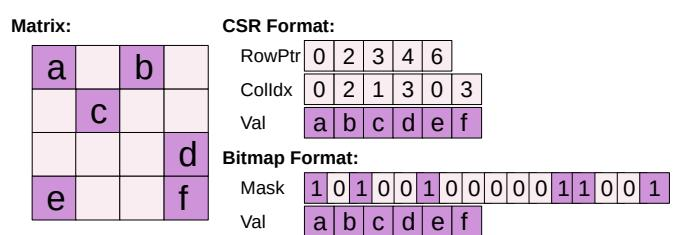

Fig. 1: An example of the CSR and Bitmap formats.

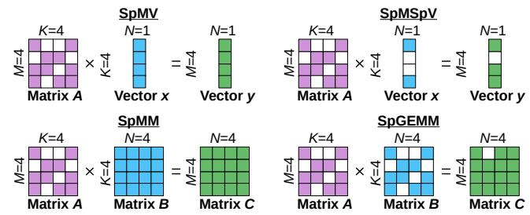

Fig. 2: Sparse kernels SpMV, SpMSpV, SpMM and SpGEMM.


Fig. 3: Three fundamental dataflows for matrix multiplication: dot-product, outer-product and row-row.

TABLE II: Sparse kernels in different applications.

|     | SpMV | SpMSpV | SpMM | SpGEMM |
|-----|------|--------|------|--------|
| GNN |      |        | ✓    | ✓      |
| AMG | ✓    |        |      | ✓      |
| BFS | ✓    | ✓      |      |        |

kernels—SpMV, SpMSpV, SpMM, and SpGEMM—that serve as cornerstones for scientific computing and AI workloads.

#### *C. Dataflows*

Matrix multiplication primarily relies on three fundamental dataflows: (1) the dot-product (DotP) dataflow, which computes a single element of C by multiplying a row of A with a column of B; (2) the outer-product (OutP) dataflow, which updates the whole C by multiplying a column of A with a row of B; and (3) the row-row dataflow, which generates a row of C by scaling rows of B with scalar elements from a row of A. Fig. 3 provides a schematic illustration of these mechanisms.

TABLE III: Task sizes at different levels in STCs (64 MACs).

| Task  | Task        | Task Size $(M \times N \times K)$                             |            |        |                       |  |
|-------|-------------|---------------------------------------------------------------|------------|--------|-----------------------|--|
| Level | Name        | NV-DTC                                                        | DS-STC     | RM-STC | Uni-STC               |  |
|       |             | [60]                                                          | [78], [92] | [30]   | (ours)                |  |
| T1    | MMA         |                                                               | 16×1       | 6×16   |                       |  |
| 11    | instruction | 16×16×16                                                      |            |        |                       |  |
| T2    | Machine     | $8\times8\times4$ $16\times16\times1$ $8\times16\times2$ None |            |        |                       |  |
| 12    | instruction |                                                               |            |        |                       |  |
| Т3    | Tile        | $4\times4\times4$                                             | 8×8×1      | 8×4×2  | $4 \times 4 \times 4$ |  |
| T4    | Vector      | None $1 \times 1 \times 4$                                    |            |        |                       |  |

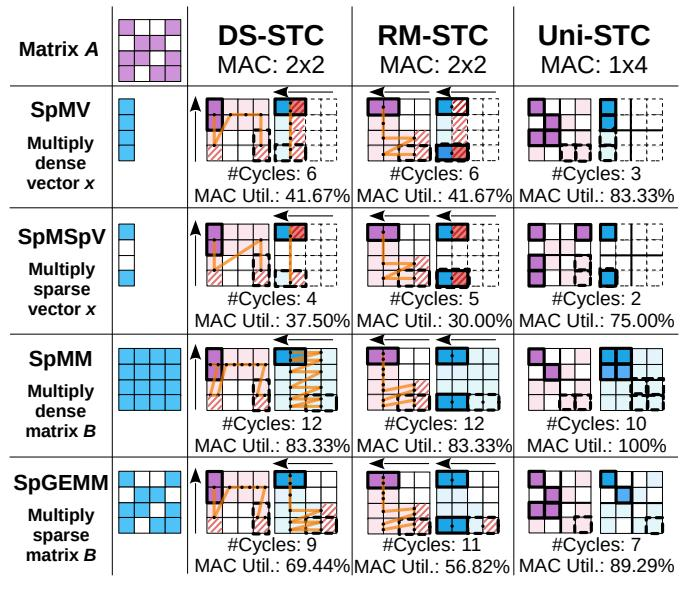

Fig. 4: Schematic dataflow comparison of DS-STC, RM-STC, and Uni-STC across the four kernels, assuming a MAC array size of 4. Solid and dashed black boxes demarcate the data access windows for the first and final execution cycles, respectively; red slashes highlight ineffective memory accesses. For DS-STC and RM-STC, black dots signify accessed elements, while orange lines trace the per-cycle execution trajectory.

## III. MOTIVATION

#### A. Challenge 1: Acceleration of sparse applications

- 1) Demand for generality: As summarized in Table II, real-world applications frequently require a combination of sparse kernels. For instance, Graph Neural Networks (GNNs) [25], [69] use both SpMM and SpGEMM for node information propagation and aggregation. Similarly, Algebraic Multigrid (AMG) solvers [53] and Breadth-First Search (BFS) algorithms [56] depend on multiple sparse kernels for convergence and traversal efficiency. This workload diversity underscores the critical need for accelerators capable of supporting a comprehensive suite of sparse computations.
- 2) Unified data structure: Implementing a unified data structure is a necessary condition for effectively supporting multiple sparse kernels. This structure eliminates costly online format conversions between kernels, supporting a unified dataflow in hardware design to enhance generality. However,


Fig. 5: STCs' SpGEMM performance on eight representative matrices in Table VII ( $C=A^2$ ). This figure shows the results with color-coded blocks, which display the proportion of cycles with varying utilisation rates within the total cycles.

designing such a unified structure is challenging because of the sparse kernels variety and the hardware constraints.

Given the limited generality of existing accelerators, accelerating real-world sparse applications requires a unified framework that integrates a common data structure, software algorithms, and a sparse tensor core.

Understanding the inefficiency of existing STCs requires examining their decomposition of large tasks into multiple layers. As shown in Table III, we organize the computation into a four-level task hierarchy (T1–T4):

- (T1) The matrix multiply-accumulate (MMA) instruction task: A 16(M) × 16(N) × 16(K) matrix multiplication corresponding to a warp MMA (WMMA) instruction on an A100 GPU.
- (T2) Machine instruction task: A task corresponding to a Parallel Thread Execution (PTX) instruction from the compiler, which follows a predefined, multi-cycle execution flow.
- (T3) Tile task: A sub-task generated by partitioning a T2 task based on the STC's per-cycle throughput. For sparse computation, it is designed to support hardwarelevel concatenation.
- (T4) Vector task: A fine-grained task derived from a T3 task, whose length is determined by the STC's ability to merge adjacent intermediate products.

Specifically, fixed-size T2 tasks are well-suited for regular sparsity but struggle with unstructured patterns. The unpredictable locations of nonzeros in such cases lead to inefficient memory accesses and significant throughput degradation. Fig. 4 illustrates how fixed task partitioning can degrade throughput. In each cycle, DS-STC forms an outer-product task from a half-column of A and a half-row of B/x, whereas RM-STC generates multiple 'scalar  $\times$  vector' tasks from two half-row vectors. This rigid selection frequently causes inefficient data accesses (marked by red slashes), resulting in lower MAC utilisation compared to Uni-STC. Our quantitative analysis in Fig. 5 further emphasizes this performance gap. For


Fig. 6: Restrictions of different STC on task concatenation.

real-world matrices, NVIDIA dense tensor core (NV-DTC) offers only limited sparsity support, with MAC utilisation falling below 25% in 84.34% of cycles. Although DS-STC and RM-STC demonstrate higher efficiency than NV-DTC, their utilisation remains suboptimal. We therefore identify two primary challenges to enhancing STC MAC utilisation: task scheduling and task concatenation.

#### B. Challenge 2: Task scheduling

- 1) Inefficiency of data gathering: As shown in Fig. 4, DS-STC and RM-STC achieve transient high MAC utilisation by gathering sparse matrices into dense vectors. However, they suffer from frequent low-utilisation phases (indicated by red slashes in Fig. 4). These phases, stemming from ineffective accesses, lead to 61.68% and 62.78% of cycles operating below 50% utilisation (Fig. 5). Furthermore, because their T3 task dimensions are rigidly tailored to specific sparsity patterns, efficiency degrades significantly when handling diverse real-world patterns, such as long rows in matrix A.
- 2) Insufficient parallelism within STC: The proportion of low-utilisation cycles in DS-STC and RM-STC significantly surpasses the 15.82% baseline achieved in Uni-STC. This stems from their lack of a load-aware task execution mechanism. Given the inherent difficulty in minimizing low-load tasks, a paradigm shift from gathering data to gathering tasks (aggregating multiple low-load tasks) is essential. However, existing architectures lack the workload-aware design necessary to implement this shift, which hinders overall utilisation.

Therefore, it is necessary to bypass T2 task partitioning, integrate task-load awareness into STC, and support parallel task execution.

## C. Challenge 3: Task concatenation

- 1) Coarse Task Granularity: The limited proportion of high-utilisation cycles in DS-STC and RM-STC (approximately 20% in the red region of Fig. 5) stems from their coarse task granularity. Specifically, for tasks in the 50-75% utilisation range (the yellow region), these architectures lack a mechanism to further partition and reorganize them to better fit the MAC array dimensions. Therefore, T3 tasks need to be further broken down.
- 2) Concatenating restrictions: However, as shown in Fig. 6, merely refining task granularity is insufficient to resolve the utilisation bottleneck. DS-STC and RM-STC, employing outer-product and row-row dataflows respectively, adhere to

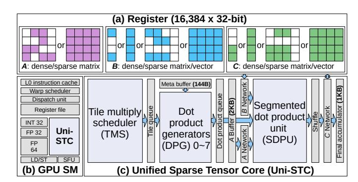

Fig. 7: (a) Uni-STC's supported data types; (b) Uni-STC's position in GPU SM; and (c) Uni-STC's architecture, highlighting three core components: TMS, DPG and SDPU.

rigid 2D or 3D structural layouts (consistent with T3 task definitions in Table III). Such rigidity limits task concatenation flexibility: DS-STC cannot concatenate tasks at different positions along the K-dimension, whereas RM-STC only permits concatenation along the N-dimension. Consequently, even with fine-grained tasks, these spatial constraints prevent efficient packing and leave the hardware underutilised.

Therefore, adopting a least-constrained dot-product method for task refinement offers a more promising solution.

# D. Uni-STC Design Principles

Addressing these challenges, we formulate three design principles for Uni-STC:

- Unify data structure and architecture to support diverse sparse kernels.
- 2) Offload T1 task execution to the STC while augmenting scheduling capabilities.
- 3) Decompose T3 tasks into fine-grained vector tasks to enhance task concatenation efficiency.

#### IV. UNI-STC ARCHITECTURE

As shown in Fig. 7, to overcome the limitations of existing STCs, we propose Uni-STC, a unified architecture designed to replace the original GPU tensor cores and support various sparse kernels. It comprises three functional units: the Tile Multiply Scheduler (TMS), the Dot Product Generator (DPG), and the Segmented Dot Product Unit (SDPU). Operationally, the TMS first decomposes T1 tasks into T3 tasks for the DPGs. The DPGs then subsequently partition these into fine-grained T4 tasks, which are ultimately concatenated and executed by the SDPU.

## A. Task Generation Using TMS and DPG

To support diverse sparse patterns and kernels, Uni-STC's fundamental working unit is the  $4 \times 4 \times 4$  T3 task, derived from the decomposition of a larger  $16 \times 16 \times 16$  T1 task. This design choice is motivated by three key considerations:

(1) Mitigating inefficiency from real-world sparsity: Tasks defined with K=1 (DS-STC) or K=2 (RM-STC) lead to numerous low-utilisation cycles when handling patterns such


Fig. 8: TMS component and its subsequent modules.

TABLE IV: Trade-offs of T3 task sizes on cycle count, the number of DPGs to saturate SDPU, and network scale to route tiles and nonzeros. The  $4 \times 4 \times 4$  size is the best among the three, as it avoids excessive DPG counts and routing overhead.

| Task                  | #Cycles   | #DPGs to      | Network scale to route |                       |  |
|-----------------------|-----------|---------------|------------------------|-----------------------|--|
| size                  | #Cycles   | saturate SDPU | tiles                  | nonzeros              |  |
| $2 \times 2 \times 2$ | 1         | 32-64 (high)  | 64×#DPGs (high)        | $4 \times 4$          |  |
| $4 \times 4 \times 4$ | 1         | 8-16          | 16×#DPGs               | 16 × 16               |  |
| 8 × 8 × 8             | ≥2 (high) | 2-4 (low)     | 4×#DPGs                | $64 \times 64$ (high) |  |

as long rows or long columns (e.g., matrix crankseg\_2 in Fig. 5) or nonzeros concentrated near the diagonal (matrix cant). To achieve stable utilisation across such diverse structures, we adopt a symmetric configuration with M=N=K.

- (2) Facilitating a unified data structure: To meet the unified data structure requirement outlined in Section III-D while avoiding complex hardware decoders, we select symmetric tile dimensions. This symmetry allows both operands to share identical bitmap encoding logic.
- (3) Balancing resource utilisation and timing: Table IV compares the  $4\times4\times4$  configuration with alternative tile sizes. A  $2\times2\times2$  design incurs excessive resource overhead, requiring 32-64 DPGs and a much larger routing network. Conversely, an  $8\times8\times8$  size fails to meet timing constraints ( $\geq2$  cycles), suffers from limited parallelism (2-4 DPGs, denoted as low), and has high routing costs. The chosen  $4\times4\times4$  configuration strikes an balance, avoiding the resource overhead of smaller tiles and the timing violations of larger ones.

During computation, a  $16 \times 16$  matrix block is partitioned into  $16.4 \times 4$  tiles. A two-level bitmap encodes this structure to steer the pipeline: the top-level bitmap (marking tiles) guides the TMS in generating T3 tasks, while the bottom-level bitmap (marking elements) directs the DPG to generate T4 tasks.

- 1) Tile multiply scheduler (TMS) in Fig. 8:
- 2 Task ordering. Task ordering for batched T3 tasks substantially impacts data reuse and energy consumption. For in-


Fig. 9: DPG component and its adjacent modules.

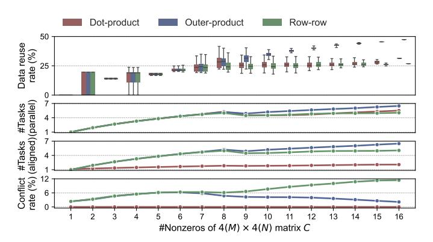

Fig. 10: Comparison of dot-product, outer-product and row-row ordering methods (assuming Uni-STC can complete eight T3 tasks per cycle). The metrics are: (1) data reuse rates for matrices A and B, calculated as  $1 - \frac{\text{Actual Accesses}}{\text{Theoretical Accesses}}$ , (2) average parallel tasks per cycle, (3) average aligned tasks per cycle, and (4) average write conflict rate.

stance, at layer K=0, parallel execution of  $T_{00}, T_{01}, T_{10}, T_{11}$  fetches tiles  $(A_0, A_1, B_0, B_1)$  only once, whereas sequential execution would double read volume. To identify the most effective strategy, we evaluated dot-product, outer-product, and row-row orders based on parallelism, K-dimension alignment, and write conflicts (defined as  $\frac{\#ConflictCycles}{\#TotalCycles}$ ). As shown in Fig. 10, the outer-product strategy is superior, achieving high parallelism (avg. 4.54 tasks), a 47.38% peak reuse rate through effective K-alignment, and low write conflicts (e.g., 6.2% peak at #Nonzeros=6), thereby mitigating bottlenecks.

Additionally, we implement an adaptive intra-layer task ordering mechanism. The system dynamically selects a columnmajor order when nonzero rows outnumber nonzero columns, and a row-major order otherwise, enhancing data reuse across diverse workloads.

3 Task dispatch. The TMS enqueues generated T3 tasks into the Tile queue. In the event of a write conflict (e.g., the T3 task marked by the red box and exclamation mark in Fig. 8), the Tile queue employs round-robin arbitration to stall the conflicting T3 task, forcing the corresponding DPG to wait one cycle before execution.

- 2) Dot-product generators (DPGs): The DPG's workflow begins with a T3 task. First, it applies an outer-product method to the bottom-level bitmaps to generate four intermediate bitmap layers. These layers are then overlaid, creating a map where the 4-bit value at each position encodes the indexmatching results for a sparse vector dot-product.
- Next, the DPG combines this overlaid map with the structural layout of tile C to generate 8-bit T4 task codes. Concurrently, it extracts the required operand vectors from tiles A and B for subsequent concatenation. For instance, in Fig. 9, the value '49' in the orange box signifies the following: the upper nibble '4' denotes the accumulation target (4th nonzero in tile C), while the lower nibble '9' encodes the sparse dot-product pattern (0x1001). Thus, the T4 task '49' corresponds to:  $C_{0,0}[4] += A_{1,0} \times B_{0,3} + A_{1,3} \times B_{3,3}$ .

**4** Multiple T4 tasks from a DPG are filled into the Dotproduct queue in a Z-shaped pattern, as depicted in Fig. 9.

This ordering is critical for minimizing data movement. When vector tasks are concatenated, the required broadcast range for any nonzero is minimized. Specifically: (1) For matrix A, an element is broadcast to a compact group of only  $5 \ (4+1)$  adjacent multipliers, as our scheduling limits its reuse to at most two consecutive vector tasks (length  $\leq 4$ ). (2) For matrix B, the Z-shaped fill order ensures an element is broadcast to a slightly wider range of  $9 \ (4+4+1)$  multipliers, because two tasks requiring the same B data are separated by at most one intervening task. This localized data forwarding is highly efficient; alternative strategies, such as an N-shaped fill order, were tested and found to be inferior for most matrices.

The aforementioned process of task dispatch and vector concatenation relies on simple prefix sums and shift units. These components are commonly employed in prior works [21], [87], and are therefore omitted for brevity.

Uni-STC's default configuration of 8 DPGs is driven by a sensitivity study on Energy Efficiency Density (EED) and alignment with hardware resource budgets. The EED analysis, presented in Fig. 22, shows that increasing the DPG count from 4 to 8 benefits SpMM and SpGEMM, whereas a further increase to 16 yields diminishing returns and introduces higher overheads, particularly for SpMV and SpMSpV. Moreover, the 8-DPG configuration aligns with existing tensor core resource budgets. Because each T3 task is constrained to at most 64 intermediate products, Uni-STC can flexibly scale its precision from 256 MACs@FP16 to 64 MACs@FP64 within the same hardware footprint. This is accomplished while retaining sufficient task concatenation capability to achieve significant performance gains.

## B. Segmented Dot Product Unit (SDPU)

To facilitate parallel execution of multiple T4 tasks, we introduce the SDPU. As illustrated in Fig. 11(a), T4 tasks generated by DPG 0 are compactly concatenated for batched processing within the SDPU. Fig. 11(b) is a merge-forward structure, which dynamically configures any four adjacent multipliers into a complete binary tree. This design yields two key benefits, First, it enables the compact, parallel computation

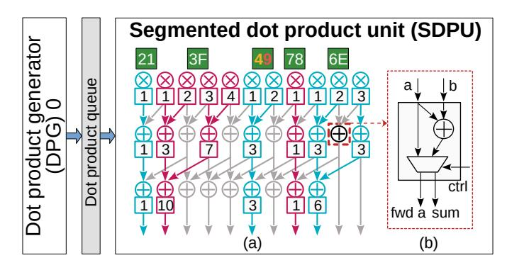

Fig. 11: SDPU component and its preceding modules.


Fig. 12: Internal pipeline and datapath in Uni-STC.

of multiple T4 tasks. Second, it facilitates the pre-merging of up to four partial products before they are written out, which significantly reduces write traffic to the result matrix C.

#### C. Internal Pipeline and Datapath

As shown in Fig. 12, to meet the 1.5 GHz target frequency (A100), Uni-STC implements a three-stage internal pipeline that uses Tile and Dot-product queues to manage task lifecycles, thereby decoupling control and data flows.

- 1) Three-Stage Pipeline: The execution flow, triggered by the issuance of a UWMMA instruction (see Section IV-E), consists of three main stages:
  - Stage 1: Task Generation. Acting as the controller, the TMS fetches the top-level bitmap from the Meta Buffer (144B) and generates T3 tasks, which are dispatched into the Tile queue.
  - Stage 2: Task Concatenation. Eight DPGs operate in parallel, utilising underlying bitmaps to populate the Dotproduct queue with T3 and T4 task codes, as well as network control signals. These signals are used to acquire operands from the Matrix A buffer (2KB) and registers.
  - Stage 3: Execution & Write C. The SDPU pops a batch of merged T4 tasks, performs segmented dot-products, accumulates results in an accumulator buffer (1KB), and updates registers.

Notably, the Tile and Dot-product queues store only control information rather than the numerical values of matrices A and B. This design choice is driven by two factors: first, to minimize the area overhead associated with wide datapaths; and second, to accommodate potential latency, as values may not be available in the registers or buffers during the first two pipeline stages.

*2) Datapath:* Prior studies (e.g., RM-STC [30]) have established that on-chip network scale and data traffic are the primary drivers of energy consumption in STCs. While previous sections have demonstrated how Uni-STC mitigates data traffic—specifically through reuse-aware scheduling in the TMS and partial product pre-merging in the SDPU—the scale of the interconnect remains a critical efficiency bottleneck. Therefore, this section shifts focus to the other factor: optimizing Uni-STC's network scale to reduce energy per bit.

As shown in Fig. 12, Uni-STC employs a two-layer network for data access. The outer layer, controlled by the TMS, uses three dedicated 16 × 8 networks to forward tiles for matrices A, B, and C. For matrix C, since the SDPU output can be directly partitioned, each tile is handled by a dedicated 16 × 16 network, and with 8 DPGs in parallel, this results in an 8 · 16×16 network structure. For matrices A and B, each first passes through a dedicated 4×8 network into the dot product queue. Subsequently, two sets of MUX arrays—64 × 5 for A and 64 × 9 for B—select the corresponding vectors from the queue. This hierarchical network design eliminates the need to implement separate 64×256 networks for matrices A, B, and C, achieving reductions in energy per bit of 7.16×, 5.33×, and 2.83×, respectively.

Additionally, Uni-STC employs a dynamic DPG activation mechanism to optimize energy efficiency. By calculating the prefix sums of intermediate products at the Tile queue head, the TMS determines the number of DPGs required to saturate the SDPU. The control logic then power-gates any redundant DPGs and their associated datapaths—including the input networks for matrices A and B (2 · 8 · 4 × 8) and the output network for matrix C (8·16×16). This selective gating, which assumes wake-up latency is hidden by look-ahead scheduling, enables energy savings of up to 2.83× compared to an alwayson approach (see Section VI-C).

#### *D. BBC Format*

Guided by the design principles from Section III-D, we propose the BBC format, a hierarchical data structure. Its outer layer uses the CSR format to organize submatrices, while its inner layer employs a two-level bitmap to manage elements within each sparse submatrix. Fig. 13 illustrates this format with a downsized 8 × 8 matrix, where each 4 × 4 submatrix is subdivided into four 2 × 2 blocks.

The second-level index of the BBC format, ValPtr Lv2, is provided directly to Uni-STC, enabling the TMS to control the forwarding of corresponding tile data. This design choice is motivated by a trade-off between hardware and software costs. Unlike RM-STC, which requires a hardware decoder consuming 16.67% of the area overhead, BBC enables direct execution. We offload indexing to a one-time software encoding. This approach incurs negligible storage overhead—no more than 0.3% within the BBC format, translating to just 0.015% of the total die area—while eliminating the costly hardware decoder.

Additionally, the two-level bitmap structure can be used directly by TMS without decoding. Converting a 4×4 submatrix

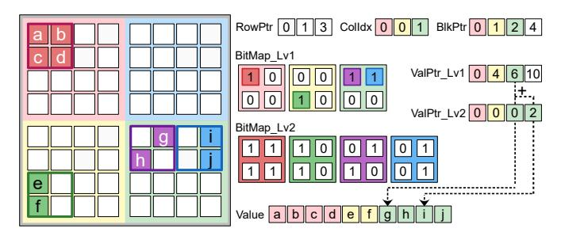

Fig. 13: Downsized BBC format for an 8 × 8 matrix. At the top level, RowPtr and ColIdx use CSR to locate nonzero 4×4 submatrices. The sparsity pattern within these submatrices is then described by a two-level bitmap: BitMap Lv1 identifies which 2×2 blocks contain nonzero elements, and BitMap Lv2 specifies the exact location of the nonzero elements within those blocks. All nonzero elements are stored in the Value array. They are accessed using a two-level pointer where ValPtr Lv1 provides the base address for a 4 × 4 submatrix and ValPtr Lv2 provides the offset for a specific 2 × 2 block.

within the DPG into four row or column vectors accounts for approximately 6.6% of the total area overhead. The primary cost is the one-time offline construction of the BBC format. However, this cost is amortized across multiple invocations and can be entirely eliminated for frequently used matrices by saving and reloading them via implemented file I/O function.

## *E. Hardware Integration with GPU*

To integrate Uni-STC as a coprocessor in the GPU Streaming Multiprocessor (SM) and bypass the T2 task partitioning stage, we require micro-architectural adjustments to the SM in two parts: instruction issue and data interaction.

- (1) Instruction issue: This requires two control logic modifications: updating the instruction decoder to parse Uni-STC's opcodes, and extending the warp scheduler to dispatch the decoded instructions. Both modifications incur negligible area and energy overhead.
- (2) Data interaction: Uni-STC interfaces with core SM components solely via the register file, a design that leverages the high-bandwidth operand collector interfaces of modern SM90+ architectures (e.g., Hopper and Blackwell). For earlier generations like Ampere, however, the register-file ports must be widened to provide the necessary bandwidth: up to 16 FP64 source and 4 FP64 destination operands per thread, per cycle.

With these adjustments, Uni-STC operates as an independent computational unit within the SM. The following subsections detail the instruction set, execution lifecycle and control interaction.

# *F. Instruction Set*

Table V summarizes the Uni-STC instruction set (UWMMA), which follows WMMA semantics and includes the cycle ranges for FP64 operations. Data types are categorized by suffixes: 'i' for 8-bit indexes, 'b' for 16-bit bitmaps, and 'v' for 64-bit values.

TABLE V: Uni-STC@FP64 instruction set (UWMMA).

| Operation |      | Registers per threads         | Cycles |  |
|-----------|------|-------------------------------|--------|--|
|           | Meta | A16b1, A16b2, X16b,           | 1      |  |
| Load      | (MV) | A4b1/A4i1, A4b2/A4i2          |        |  |
|           | Meta | A16b, B16b, C16b,             | 1      |  |
|           | (MM) | A4b/A4i, B4b/B4i, C4b/C4i     |        |  |
|           | A    | Av(0 ∼ 7)                     | 2      |  |
| T3 Task   | MV   | Use meta data saved in buffer | 1∼4    |  |
| Generate  | MM   | Use meta data saved in buffer | 1∼8    |  |
| Calculate | MV   | Av2(0 ∼ 7), Xv, Yv            | 1∼8    |  |
| and Store | MM   | Bv(0 ∼ 7), Cv(0 ∼ 7)          | 1∼64   |  |

To comply with the operand limits of PTX instructions (e.g., the 'mma.sync.aligned.m16n8k16.row.col.f64.f64.f64.f64' variant allows a maximum of 20 FP64 register operands per thread) and better aligns with the properties of sparse kernels, we choose to store both the block values of matrix A and the corresponding block structures within Uni-STC's internal buffers. Integrating the UWMMA instruction set and this data handling approach necessitates compiler modifications.

## *G. Execution Lifecycle and Control Interaction*

Uni-STC executes sparse kernels through a coordinated UWMMA instruction sequence. This lifecycle relies on interaction with the SM and internal state registers to achieve asynchronous task generation and synchronous computation:

- (1) Operand collection. The cycle begins with stc.load instructions. The SM uses the operand collector to fetch numerical data or metadata from the register files and stores them into Uni-STC's internal buffers (Matrix A Buffer or Meta Buffer). This phase is synchronous and memory-bound.
- (2) Asynchronous task generation. Upon issuing a stc.task instruction, the Uni-STC transitions its state register from IDLE to BUSY. This triggers the TMS and DPGs to begin processing metadata and filling the two task queues. This asynchronous process allows the SM to immediately retire the stc.task\_gen instruction and proceed with other work, effectively hiding the task generation latency.
- (3) Synchronized computation. The stc.numeric instruction initiates computation on the SDPU by first checking the flag register:
  - Stall (BUSY): If the flag is BUSY, indicating insufficiently populated task queues, the pipeline stalls.
  - Execute (READY): Once the DPGs populate the queues, the flag transitions to READY. The SDPU then begins execution, consuming T4 tasks, performing segmented dot-products, and accumulating the results.
- (4) Completion. When the batch of T4 tasks is fully processed, the flag returns to IDLE, enabling the results to be written back to the register files.

# Algorithm 1: SpMV/SpMSpV with Uni-STC@FP64

```
1: laneid ← threadIdx.x&31
2: row ← warpRowId[warpid]
3: start ← warpIndex[warpid]
4: end ← warpIndex[warpid + 1]
5: ry ← 0
6: j ← start
7: while j < end do
8: a4b ← load bitmap(laneid)
9: a4i ← load of f set(laneid)
10: rxb ← load bitmapx(laneid)
11: % stc.load.meta mv A16b[j], A16b[j + 1], rxb, a4b, a4i
12: % stc.task gen.mv// TMS and DPG generate T3 and T4 tasks
13: for i ← 0 → 15 do
14: rA[i] ← load value A(A val + a4i, a4b, laneid, i)
15: end for
16: % stc.load.a rA[0 ∼ 7]// Load 16 × 16 block data of matrix A
17: rx ← load value x(laneid)
18: % stc.numeric.mv rA[8 ∼ 15], rx, ry// SDPU execute T4 tasks
19: j+ = 2
20: end while
21: shf l gather(ry)
22: write back(ry, row, laneid)
```

# Algorithm 2: SpMM/SpGEMM with Uni-STC@FP64

```
1: warpid ← threadIdx.x >> 5
2: laneid ← threadIdx.x&31
3: row ← warpRowId[warpid]
4: for j ← Arow ptr[row] → Arow ptr[row + 1] do
5: Acol ← Aci[j]
6: A16b ← A16b ptr[j]
7: Av[8] ← load v(row, Acol, laneid)
8: Abi ← load bi(row, Acol, laneid)
9: % stc.load.a Av[0 ∼ 7]// Load 16 × 16 block data of matrix A
10: for Bj ← Brow ptr[Acol] → Brow ptr[Acol + 1] do
11: Bcol ← Bcol idx[Bj]
12: B16b ← B16b ptr[Bj]
13: if A16b × B16b and bf ind(Bcol) then
14: C16b ← Ccol idx[bf ind result]
15: Bbi ← load bi(Acol, Bcol, laneid)
16: Cbi ← load bi(row, Bcol, laneid)
17: % stc.load.meta mm A16b, B16b, C16b, Abi, Bbi, Cbi
18: % stc.task gen.mm// TMS and DPG generate T3 and T4 tasks
19: Bv[8] ← load v(Acol, Bcol, laneid)
20: Cv[8] ← load v(row, Bcol, laneid)
21: % stc.numeric.mm Bv[0 ∼ 7], Cv[0 ∼ 7]// SDPU execution
22: accumulate c(row, Bcol, laneid, Cv)
23: end if
24: end for
25: end for
```

# V. UNI-STC DATAFLOW

This section details the software-hardware co-design of Uni-STC, focusing on the dataflow from both the software and hardware perspectives.

## *A. Software Dataflow*

Based on the BBC format and the UWMMA instruction set, we design the four sparse kernels at the software level. The implementation of SpMV and SpMSpV is presented in Algorithm 1. During execution, Uni-STC computes the multiplication of two blocks of matrix A and corresponding vectors, accumulating the results in each thread's ry register. Finally, shfl\_gather is used to accumulate the results in the first 16 threads, and then written back to global memory. For SpMM and SpGEMM, detailed in Algorithm 2, the dataflow leverages the first-level CSR structure within the BBC format. This structure facilitates the scheduling of T1 tasks through a rowby-row outer product formulation (Ci<sup>∗</sup>+ = Aik × Bk<sup>∗</sup>).

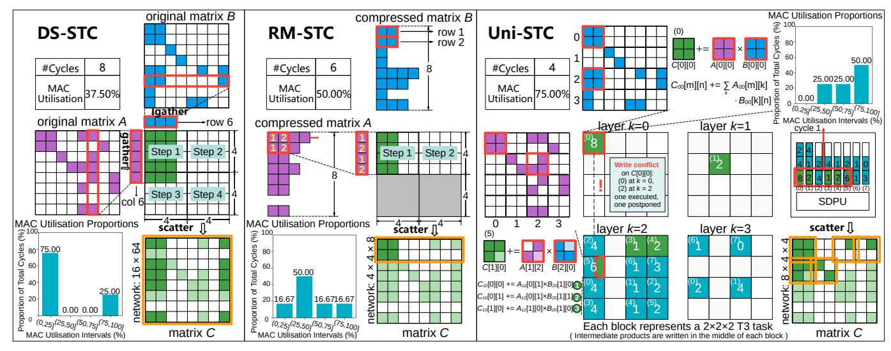

Fig. 14: Comparison of DS-STC, RM-STC and our Uni-STC on a downsized  $8(M) \times 8(N) \times 8(K)$  T1 task.

The 'warpRow', 'warpIndex', and 'warpRowId' variables are used in the preceding algorithms to implement a static load-balancing scheme, which configures the data processing range of each warp.

For dense computations, the structural information of dense vector and matrix is stored in GPU memory (a total of 96B). This information is loaded into registers with a single read operation at the start of the computation.

# B. Hardware Dataflow

The hardware dataflow of an STC is defined by the interplay between its task preparation method and its computational unit architecture, which ultimately dictates performance. To illustrate the resulting differences, we present a case study in Fig. 14 that compares three STCs processing a downsized  $8(M) \times 8(N) \times 8(K)$  T1 task. The comparison focuses on two key stages: task preparation and task execution. For a fair comparison, each STC is equipped with 16 multipliers and their associated adders.

1) Task preparation: The goal of task preparation is to decompose large T1 tasks into smaller T3 tasks compatible with the computational units. DS-STC and RM-STC achieve this using a hybrid software-hardware approach that reduces hardware overhead. As illustrated in Fig. 14, this process begins in software, where the compiler expands a T1 task into intermediate T2 sub-instructions, represented by the redhighlighted box. This stage leverages the GPU front-end's skipping mechanism for coarse-grained sparsity support. Subsequently, in hardware, any T2 task that still exceeds the computational unit's capacity is further subdivided into T3 tasks for sequential execution.

Although this collaborative method reduces hardware overhead, its core limitation is that T2 task splitting is rigidly tied to the computational unit's structure. Within STC, there is a lack of mechanisms to address the load imbalance of T2 tasks caused by irregularity, which typically results in relatively low

MAC utilisation. In contrast, Uni-STC adopts a more flexible strategy. Although it initially divides T1 tasks into fixed-size T3 tasks, it provides a dynamic task fusion mechanism to mitigate load imbalance.

Fig. 14 highlights the four-layer T3 tasks for Uni-STC, where the diagram's notation is interpreted as follows. The number in the center of each block denotes the count of intermediate products, the number in the upper-left corner identifies the assigned DPG, and the green blocks signify multiple T3 tasks that are concurrently executed on the SDPU during the first cycle.

2) Task execution: Achieving effective task fusion is non-trivial. As illustrated in Fig. 14, the approaches in DS-STC and RM-STC suffer from two key inefficiencies related to the MAC array. First, T2 tasks can be too small to fully utilise the array's resources, leading to wasted performance (e.g., RM-STC). Second, even sufficiently large tasks may have shapes that are incompatible with the array, which prevents the concatenation of multiple T3 tasks and thus causes inefficiency (e.g., DS-STC). This architectural challenge is compounded by the complexity of implementing a hardware-based, multi-dimensional knapsack solver on resource-constrained STCs.

Uni-STC addresses these fusion challenges by decomposing T3 tasks into even finer-grained vector dot-product operations (T4 tasks). As shown in Fig. 14, a  $2(M) \times 2(N) \times 2(K)$  T3 task is broken down into  $1(M) \times 1(N) \times 2(K)$  T4 tasks. The concatenation of these vector tasks is accomplished using simple prefix sums and shift units, thereby accelerating computation on the SDPU. Consequently, this approach boosts Uni-STC's utilisation to 75%, a significant improvement over the 50% of RM-STC and 37.5% of DS-STC.

In summary, Uni-STC adopts a software-hardware codesigned dataflow: BBC and UWMMA express and schedule the four kernels in software, while the hardware dataflow (TMS $\rightarrow$ DPG $\rightarrow$ SDPU) enables efficient task preparation and execution to improve utilisation under irregular sparsity.

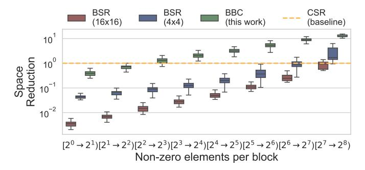

Fig. 15: Space reduction of the three formats BSR  $(4 \times 4)$ , BSR  $(16 \times 16)$  and our BBC over the baseline CSR.

#### VI. EVALUATION

#### A. Experimental Setup

On the dataset side, we evaluate SpMV, SpMSpV, and SpMM using all 2893 matrices from SuiteSparse [10], and SpGEMM ( $C=A^2$ ) using its 2126 square matrices. For DNN inference, we evaluate ResNet-50 and Transformer [74] models using the 302 weight matrices from DLMC [23] at 70% and 98% sparsity. Additionally, input vectors for SpMSpV are randomly generated with 50% sparsity, and the number of columns in matrix B for SpMM is set to 64.

On the software side, we compare our BBC format with the conventional CSR and BSR (with block sizes of  $4\times 4$  and  $16\times 16$ ) to assess the memory efficiency derived from its unique sparse matrix structure.

On the hardware side, we build upon Accel-Sim [38] with added support for asynchronous memory access, integrating our STC simulator to support GAMMA [93], SIGMA [66], Trapezoid [87], NV-DTC [60] (A100's original Tensor Core), DS-STC [78], [92], RM-STC [30], and our work Uni-STC.

To rigorously evaluate the architectural benefits of Uni-STC under configurations '64 MAC@FP64 and 128 MAC@FP32', we establish a fair comparison by aligning the theoretical compute throughput of all designs. To this end, we adopt SIGMA's PE design and scale the MAC arrays of all evaluated architectures, including GAMMA and Trapezoid, accordingly.

We assess three key metrics: performance, energy, and area. Performance is measured using a unified software invocation of a T1 task with dimensions  $16(M) \times 16(N) \times 16(K)$ . Energy consumption is extrapolated from register activity following the Sparseloop methodology [80]. Uni-STC's chip area is analyzed using yosys [79], FreePDK45 [62], and CACTI7 [3].

## B. Data Structure Comparison

Fig. 15 compares the memory overhead of our BBC format against the conventional CSR and BSR (with the block sizes of  $4\times4$  and  $16\times16$ ) across all 3195 test matrices. The memory usage of the BBC format shrinks as the number of nonzeros per block (NnzPB) increases, becoming the most efficient for 2585 matrices (where NnzPB > 3.57) and delivering savings of up to  $15.26\times$  over CSR. Conversely, the BSR format typically requires more storage than CSR.

TABLE VI: Comparison of STCs. MMA instruction task size:  $16 \times 16 \times 16$ , MAC array size: 128@FP32 or 64@FP64.

| STC                 | T3 Task Size (128 or 64 MACs) $(M \times N \times K)$                                                                                       | T4 Task Size $(M \times N \times K)$ |
|---------------------|---------------------------------------------------------------------------------------------------------------------------------------------|--------------------------------------|
| GAMMA [93]          | $16 \times (8 \text{ or } 4) \times 1$                                                                                                      |                                      |
| SIGMA [66]          | $1 \times (8 \text{ or } 4) \times 16$                                                                                                      |                                      |
| Trapezoid [87]      | TrIP: $16 \times (4 \text{ or } 2) \times 2$<br>TrGT: $16 \times 4 \times (2 \text{ or } 1)$<br>TrGS: $8 \times 4 \times (4 \text{ or } 2)$ | Same as T3<br>Task Size              |
| NV-DTC [60]         | $(8 \text{ or } 4) \times 4 \times 4$                                                                                                       |                                      |
| DS-STC [78], [92]   | $8 \times (16 \text{ or } 8) \times 1$                                                                                                      |                                      |
| RM-STC [30]         | $(16 \text{ or } 8) \times 4 \times 2$                                                                                                      |                                      |
| Uni-STC (this work) | $4 \times 4 \times 4$                                                                                                                       | $1 \times 1 \times 4$                |

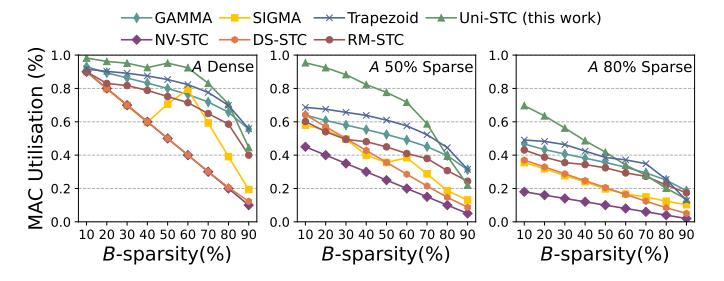

Fig. 16: MAC utilisation for GAMMA, SIGMA, Trapezoid, DS-STC, RM-STC and Uni-STC (128 MAC@FP32).

The one-time format conversion overhead is modest, comparable to the execution time of a few hundred SpMV operations. On a 64-core AMD EPYC 7702 CPU, this conversion takes less than 1000 ms, while on an NVIDIA A100 GPU, the overhead is less than 100 ms. This initial cost can be effectively amortized and becomes negligible in iterative applications such as GNN training and linear solvers.

#### C. Hardware Comparison

Table VI details the configurations of all evaluated STCs. For multi-mode architectures like SIGMA and Trapezoid, we select their best-performing configurations. Since our implementations of GAMMA, SIGMA, and Trapezoid are specifically adapted for a fair throughput comparison, which do not accurately reflect the original designs. As their energy consumption and energy efficiency are both lower than RM-STC, in this section, our analysis against these three architectures focuses solely on performance.

1) Comparison using random matrices: Following the methodology of RM-STC, we first evaluate MAC utilisation using random  $8192 \times 8192$  matrices with varying sparsity.

As shown in Fig. 16, Uni-STC achieves average speedups of  $1.67\times$ ,  $1.73\times$ , and  $1.13\times$  over GAMMA, SIGMA, and Trapezoid, respectively. The performance gain over GAMMA stems from Uni-STC's ability to bypass empty rows, a task difficult for GAMMA's blocking approach. The advantage over SIGMA is due to its effective handling of dual-sided sparsity, whereas SIGMA's modes are either limited to single-sided sparsity or incur high transmission overhead. The speedup

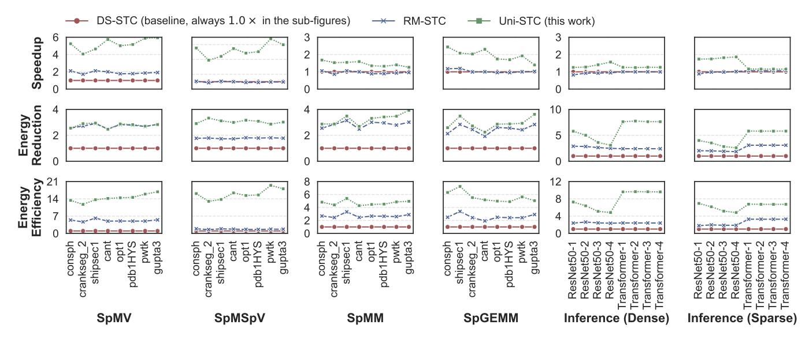

Fig. 17: Comparison of speedup, energy consumption, and energy efficiency of four sparse kernels, as well as ResNet50 and Transformer inference on DS-STC, RM-STC, and Uni-STC. The value after the model name denotes the layer number. Among them, the four sparse kernels use 64 MAC@FP64, and the DNN inference uses 128 MAC@FP32.

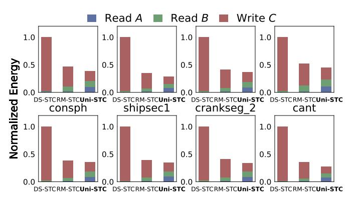

Fig. 18: Energy consumption of I/O (reading A and B, and writing C) in SpGEMM on the eight matrices.

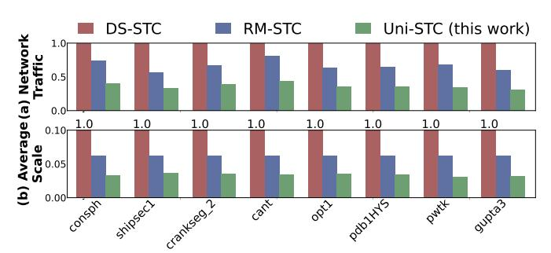

Fig. 19: The data traffic and average network scale when writing matrix C.

against Trapezoid is attributed to Uni-STC's global task scheduling, which avoids the potential load imbalances found in Trapezoid's grouped MAC array design.

Uni-STC also demonstrates superior MAC utilisation compared with NV-DTC, DS-STC, and RM-STC by factors of

TABLE VII: Information of the eight representative matrices. The column #inter-prod/blk represents the average number of intermediate products per T1 task during SpGEMM computation, with a maximum value of  $16 \times 16 \times 16 = 4096$ .

| Matrix A   | n(A) | nnz(A) | plot | nnz(C) | #inter-prod/blk |
|------------|------|--------|------|--------|-----------------|
| consph     | 83K  | 6.0M   |      | 26.5M  | 164.9           |
| shipsec1   | 140K | 7.8M   |      | 24.1M  | 189.5           |
| crankseg_2 | 64K  | 14.1M  |      | 104.6M | 198.5           |
| cant       | 62K  | 4.0M   |      | 17.4M  | 280.2           |
| opt1       | 15K  | 1.9M   |      | 8.2M   | 506.4           |
| pdb1HYS    | 36K  | 4.3M   | X    | 19.6M  | 517.2           |
| pwtk       | 218K | 11.6M  |      | 32.8M  | 548.3           |
| gupta3     | 17K  | 9.3M   |      | 270.9M | 1154.1          |

 $2.89 \times$ ,  $1.89 \times$ , and  $1.39 \times$ , respectively. This superiority stems from its finer-grained task parallelism and stronger sparsity adaptation. In contrast, NV-DTC lacks sparsity adaptation, DS-STC's performance is constrained by dual-sided sparsity, and RM-STC is particularly sensitive to the sparsity of matrix A.

In dense computation scenarios, all DTC/STCs achieve 100% MAC utilisation, but their energy consumption varies. Normalizing to NV-DTC, our Uni-STC achieves a  $0.94\times$  energy reduction, outperforming both DS-STC  $(0.67\times)$  and RM-STC  $(0.83\times)$ . This advantage arises because DS-STC and RM-STC incur additional overhead for data reuse and intermediate transfers. In contrast, Uni-STC activates only two DPGs, preserving a data movement pattern consistent to NV-


Fig. 20: Performance distribution of the three STCs and four kernels on matrices from SuiteSparse. The x-axis denotes the average number of intermediate products per T1 task. Energy efficiency analyses use DS-STC as the baseline, and is calculated as 'speedup  $\times$  energy reduction'.

DTC. The minor additional energy in Uni-STC is attributed to its task scheduling within the TMS and DPG. The break-even point is reached when matrix A is dense and matrix B's sparsity is below 85%, at which point Uni-STC's energy efficiency becomes comparable to that of NV-DTC.

2) Comparison using real world matrices: To further highlight the performance differences among STCs arising from real-world sparse patterns, we select eight matrices from SuiteSparse, as listed in Table VII, to compare the four sparse kernels, and we use DLMC model data to evaluate the inference effects of both dense and sparse weights. Fig. 17 presents the speedup, energy reduction, and energy efficiency of Uni-STC and RM-STC, normalized to DS-STC as the baseline. The results consistently show that Uni-STC's superior performance and lower energy consumption translate to significantly higher overall energy efficiency.

For SpMV and SpMSpV kernels: About performance, (1) In SpMV, the MAC array structures of DS-STC and RM-STC limit their utilisation to below 12.5% and 25%, respectively. In contrast, Uni-STC's fine-grained task parallelism yields speedups of  $5.21\times$  over DS-STC and  $2.74\times$  over RM-STC. (2) In SpMSpV, RM-STC's MAC utilisation drops below 12.5% as the input vector x becomes sparser. Uni-STC uses the SDPU to achieve speedups of  $5.25\times$  and  $5.50\times$ . About energy, (1) For SpMV, Uni-STC reduces energy by  $2.76\times$  compared to DS-STC and  $1.01\times$  compared to RM-STC by reusing vector x data and minimizing intermediate product transfers, delivering average energy efficiency gains of  $14.34\times$  and  $2.77\times$ . (2) For SpMSpV, the energy reduction further improves to  $3.06\times$  and  $1.72\times$ , achieving average energy efficiency gains of  $15.97\times$  and  $9.41\times$ .

For SpMM, SpGEMM, and DNN inference (with convolution treated as SpGEMM), Uni-STC consistently outperforms the baselines. DS-STC exhibits poor energy efficiency due to its coarse-grained partitioning and lack of task parallelism. In comparison, Uni-STC achieves energy efficiency gains of  $1.74\times$ ,  $2.21\times$ ,  $1.37\times$ , and  $1.51\times$  over RM-STC for these four kernels, respectively. About performance, (1) For SpMM and dense DNN inference, Uni-STC's fine-grained partitioning, which leverages sparsity in matrix A, delivers  $1.53\times$  and  $1.35\times$  speedups over RM-STC, which is constrained by a fixed 4-cycle task execution. (2) For SpGEMM and sparse DNN inference, Uni-STC adapts to the sparse distribution to

TABLE VIII: Comparison of performance (P), energy consumption (E), and energy efficiency  $(E \times P)$  of STCs on the SuiteSparse Matrix Collection.

| Compared     |      | SpMV  |      |              | SpMSpV |      |              |
|--------------|------|-------|------|--------------|--------|------|--------------|
| With         |      | P     | E    | $E \times P$ | P      | E    | $E \times P$ |
| DS-STC       | Aver | 3.76  | 2.02 | 7.59         | 4.18   | 3.14 | 12.24        |
| 64 MAC@FP64  | Max  | 16.00 | 5.47 | 27.06        | 28.76  | 6.71 | 192.97       |
| DS-STC       | Aver | 3.58  | 2.79 | 9.89         | 4.18   | 4.28 | 16.71        |
| 128 MAC@FP32 | Max  | 16.00 | 7.41 | 30.79        | 28.76  | 9.15 | 263.08       |
| RM-STC       | Aver | 1.47  | 1.00 | 1.48         | 3.39   | 1.96 | 6.66         |
| 64 MAC@FP64  | Max  | 3.96  | 2.71 | 5.07         | 13.99  | 4.75 | 56.73        |
| RM-STC       | Aver | 1.39  | 1.37 | 1.91         | 3.39   | 2.68 | 9.07         |
| 128 MAC@FP32 | Max  | 3.33  | 3.67 | 6.68         | 13.99  | 6.50 | 77.34        |
|              |      | SpMM  |      |              | SpGEMM |      |              |
|              |      | P     | E    | $E \times P$ | P      | E    | $E \times P$ |
| DS-STC       | Aver | 3.07  | 1.51 | 4.17         | 2.40   | 1.91 | 4.19         |
| 64 MAC@FP64  | Max  | 8.00  | 5.61 | 20.66        | 16.00  | 5.65 | 20.75        |
| DS-STC       | Aver | 2.09  | 1.89 | 3.77         | 2.50   | 2.51 | 5.86         |
| 128 MAC@FP32 | Max  | 8.00  | 6.60 | 15.94        | 16.00  | 7.21 | 34.85        |
| RM-STC       | Aver | 2.52  | 0.77 | 1.84         | 1.45   | 1.35 | 1.86         |
| 64 MAC@FP64  | Max  | 7.15  | 1.80 | 9.19         | 5.20   | 3.59 | 5.03         |
| RM-STC       | Aver | 2.44  | 0.94 | 2.29         | 1.23   | 1.77 | 2.07         |
| 128 MAC@FP32 | Max  | 7.18  | 2.09 | 12.48        | 3.40   | 4.95 | 5.02         |

maintain speedups of  $1.88\times$  and  $1.48\times$ , whereas RM-STC struggles with dual-matrix sparsity. About energy, as illustrated in Fig. 18 and 19, Uni-STC's energy savings are substantial. It reduces the energy for writing matrix C by  $6.5\times$  compared to DS-STC, resulting in lower overall consumption than both DS-STC and RM-STC. This reduction is primarily driven by two factors: a smaller dynamic network scale (a  $2.36\times$  contribution) and reduced data traffic from the SDPU (an additional  $2.75\times$  contribution).

Moreover, the different energy efficiency improvements on ResNet50 and Transformer demonstrate Uni-STC's ability to perceive sparse loads: (1) In ResNet50, because the images are usually sparse after preprocessing, Uni-STC consumes more energy to enable multiple DPG to improve the throughput of SDPU. (2) In Transformer, because the load is relatively dense, Uni-STC activates only a single DPG in most cycles, saving nearly  $2\times$  energy consumption compared to RM-STC.

We extend our comparison to all SuiteSparse matrices for four key kernels. As detailed in Table VIII, Uni-STC consistently achieves higher energy efficiency than the state-of-the-art RM-STC.


Fig. 21: Speedup on AMG compared to DS-STC.

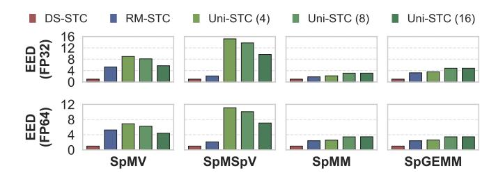

Fig. 22: Comparison of energy efficiency density (EED) normalized to DS-STC.

We measure computational density by calculating the average number of intermediate products contained within each T1 task. Fig. 20 illustrates the performance of the three STCs as a function of this density. For extremely sparse matrices, most T1 tasks complete in a single cycle. Consequently, the MAC utilisation across the three STCs is nearly identical, and Uni-STC conserves energy by activating only a single DPG. As block density increases, Uni-STC activates more DPGs to boost MAC utilisation, yielding higher performance in SpMM and SpGEMM. When matrices become even denser, the MAC utilisation for all STCs approaches saturation, at which point Uni-STC again saves energy by deactivating most DPGs.

# D. Case study: AMG

This experiment adapts an existing AMG solver [14], [53], a key tool in scientific computing, by substituting its original FP64 dense Tensor Core calculations with our STC designs. We then quantitatively evaluate the speedup achieved on the SpMV and SpGEMM kernels, using the DS-STC as the baseline.

As illustrated in Fig. 21, Uni-STC demonstrates superior performance. In contrast, other STCs—while effective on random matrices—are hampered by the irregularity of real-world sparse patterns, such as elements being concentrated on the diagonal or within specific rows and columns. For SpMV, architectural limitations in MAC arrays constrain DS-STC, SIGMA, GAMMA, and RM-STC, impeding effective acceleration. For SpGEMM, the absence of fine-grained task partitioning restricts gains for DS-STC, GAMMA, and RM-STC. Similarly, SIGMA achieves only marginal SpGEMM improvements; despite its focus on data reuse, it suffers from suboptimal MAC utilisation. Finally, although Trapezoid achieves a  $4.15 \times$  SpMV speedup via dot-product acceleration,

TABLE IX: Area breakdown of the core modules in Uni-STC. The percentage represents the total area for a projected deployment of 432 Uni-STCs (4 per SM  $\times$  108 SMs) on an NVIDIA A100 GPU, relative to its 826  $mm^2$  die area.

| Module Name             | Area (mm <sup>2</sup> ) | Percentage (%) |
|-------------------------|-------------------------|----------------|
| Benes & MUX networks    | 0.002                   | 0.1            |
| TMS & DPG               | 0.012                   | 0.6            |
| Extra adders in SDPU    | 0.018                   | 0.94           |
| Meta data buffer (144B) | 0.0005                  | 0.03           |
| Accumulate buffer (1KB) | 0.003                   | 0.15           |
| Matrix A buffer (2KB)   | 0.007                   | 0.3            |
| Total Overhead          | 0.0425                  | 2.12           |

real-world irregularity exacerbates load imbalances across its PE rows, limiting it to a modest  $1.06\times$  speedup for SpGEMM. Conversely, Uni-STC effectively mitigates these irregularities, delivering notable speedups of  $4.84\times$  for SpMV and  $2.46\times$  for SpGEMM.

## E. Energy Efficiency Density

We introduce the Energy Efficiency Density (EED) metric to holistically evaluate Uni-STC and guide the determination of the optimal number of DPGs. This metric quantifies the trade-offs among performance, energy consumption, and area, and is defined as the normalized energy efficiency per area:  $EED = \frac{\text{Speedup} \times \text{Energy Reduction}}{\text{Area Overhead}}. \text{ A higher EED value signifies greater energy efficiency achieved per unit of area.}$ 

Fig. 22 presents a detailed comparative analysis of the EED for the three STCs, revealing that Uni-STC consistently outperforms both DS-STC and RM-STC across the evaluated workloads. The analysis shows contrasting trends as the number of DPGs increases from 4 to 16: the EED for SpMV and SpMSpV gradually decreases, while for SpMM and SpGEMM, it conversely exhibits an upward trend. This tradeoff analysis identifies DPG=8 as an balanced configuration. At this setting, the EED for SpMM and SpGEMM nearly matches that of the DPG=16 configuration, representing a significant 1.37× improvement over DPG=4. Concurrently, the EED reduction for SpMV and SpMSpV is minimal—only 1.1× lower than at DPG=4. Based on this evidence, we establish DPG=8 as the default configuration for Uni-STC.

## F. Area Analysis and Time Budget

We synthesize the Uni-STC@FP64 (configured with 8 DPGs) using Yosys [79] and the FreePDK45 library [62]. Synthesis results indicate that the critical path lies within the "Execution & Write C" stage, which satisfies the 1.5 GHz timing constraint. Regarding area estimation, the buffers in Uni-STC are modeled using CACTI 7 [3] at 45 nm and scaled to 7 nm technology. For logic area, we aggregate the TMS and DPG due to their structural similarities. Furthermore, since the SDPU is derived from the original Tensor Core with additional adders, we only account for its incremental overhead. Table IX details the area breakdown of these specific modules. Ideally, the total area overhead for 432 Uni-STC units is approximately 2.12% of the 826 mm<sup>2</sup> die area of an NVIDIA A100 GPU [60].

#### VII. RELATED WORK

#### *A. Sparse Kernel Acceleration*

Prior works have adopted diverse strategies to accelerate SpMV. On heterogeneous multi-core CPU and GPU platforms, Speculative Segmented Sum [49] achieves higher throughput using speculative computation, CSR5 [47] fosters greater parallelism with tiling, HASpMV [42] leverages heterogeneity-aware formats to improve memory access, TileSpMV [57] promotes data locality through tiled processing, TileSpMSpV [34] uses adaptive kernels on GPUs, and DASP [52] utilises regularized tensor core for acceleration. For HBM-equipped FPGAs, Serpens [72] and Cuper [89] mitigates memory access conflicts through customized dataflows and reordering. In distributed environments, Dist-SpMV Balanced [55] reconciles computation and communication by means of graph partitioning.

To accelerate SpMM, researchers have pursued several optimization directions. The first is data-centric, VEGETA [33] and TB-STC [44] support hybrid sparsity formats, ASADI [41] applies diagonal compression, and Avalanche [6] improves access patterns via data reordering. The second direction optimizes the computation flow, SPADE [20] and HotTiles [19] reduce data transfer and adapt to sparsity, while GROW [31] balances data locality with parallelism. The third direction leverages specific hardware features, Eureka [22] utilises tensor cores, and Leda [88] optimizes dataflows on FPGAs.

For SpGEMM, various approaches have been proposed to improve performance. In hardware architecture and dataflows, OuterSPACE [63] pioneered the outer-product approach. Trapezoid [87] designs specialized dataflows, NeuraChip [69] uses hash-based decoupling, and TaskFusion [16] enhances data sharing. Other targeted improvements include SGCN [90] enhancing format support, HIRAC [67] improving locality, S2TA [50] supporting dual-sided sparsity, and GoSPA [11] applying intersection computation. Pattern-based and tilelevel optimisations represent another significant direction, explored in works such as SPAGHETTI [29], SpArch [94], DRT [61], GAMMA [93], HARP [39], Tailors [84], DS-STC [78], and RM-STC [30]. For sparse ML workloads, many works have investigated adaptive dataflow strategies, including FEATHER [73], Sparseloop [80], Flexagon [59], ACES [51], FEASTA [95], SPADA [43], CANDLES [24], Sparse Tensor Core [96], SparTen [21], and ExTensor [28]. Acceleration on CPUs and GPUs has also been extensively studied. Liu et al. [46], [48] proposed a foundational four-stage framework. HASpGEMM [8] improves load balancing on heterogeneous cores, while GPU-specific works exploit hardware registers [45]. In particular, TileSpGEMM [58] adopts tiled execution to enhance locality and alleviate load imbalance. Furthermore, approaches like IA-SpGEMM [82], [83] focus on input-aware method selection to adapt to matrix sparsity.

Several studies propose a unified design to accelerate multiple kernels. Early efforts combine pairs of sparse kernels, where VIA [65] improves index matching for SpMV and SpMM, and PruneGNN [25] includes units for both SpMM and SpGEMM. Griffin [68] later expands this scope by optimizing resource reuse across dense and sparse matrices. Building on this trend, KAMI [76] unifies dense GEMM with sparse SpMM and SpGEMM, and Siracusa et al. [70] propose a versatile multi-lane architecture.

Bitmap-based compression reduces indexing and bandwidth overhead. This technique is used by SMASH [37] to compress metadata and by Buluc¸ et al. [5] to cut bandwidth. More recent works adapt it for modern hardware, SpInfer [15] and BerryBees [56] design Tensor Core aware encodings, while AmgT [53] uses a bitmap driven format to accelerate both SpMV and SpGEMM.

# *B. Other Sparsity-Aware Optimisation*

Sparsity is also exploited in PIM and ReRAM accelerators. In the PIM domain, early works like GaaS-X [7] optimize data representation for graph SpMV. Subsequent efforts include SpaceA [81], a dedicated SpMV accelerator, and more recently, pSyncPIM [2], which implements partial synchronous execution. Similarly, ReRAM-based approaches have evolved. Yang et al. [86] leverage activation and weight sparsity. Recently, AmgR [14] and ReCG [13] exploit inmemory computation to further improve performance and energy efficiency of sparse linear solvers.

In machine learning (ML) workloads, pruning is widely applied. Foundational works from Han et al. [26] and Yu et al. [91] propose compressed DNN schemes, while SCNN [64] provides an early accelerator for CNNs. Subsequent efforts optimize data handling. Hanson et al. [27] and Lew et al. [40] improve data reuse, Feinberg et al. [17] reorder weights, Jang et al. [32] search nonzeros, and SIGMA [66] constructs reduction trees. Another direction addresses dynamic sparsity, where DPACS [18], SOFA [77], and Sparse-DySta [12] handle various dynamic patterns, and TensorDash [54] leverages input sparsity. Moreover, SpAtten [75] prunes tokens and heads, and HuffDuff [85] enhances mobile sparse accelerator efficiency.

# VIII. CONCLUSION

This paper presents Uni-STC, a unified sparse tensor core accelerating a comprehensive set of sparse kernels. Leveraging the novel BBC format, Uni-STC dynamically generates finegrained tasks, schedules them to improve data reuse, and executes concatenated dot-products. This approach optimizes hardware utilisation while reducing intermediate data movement. Evaluations confirm that Uni-STC delivers significant speedup and energy savings over state-of-the-art designs.

# IX. ACKNOWLEDGMENTS

We are very grateful to all reviewers for their invaluable comments and to the shepherd for the constructive guidance. Weifeng Liu is the corresponding author of this paper. This work is partially supported by the National Natural Science Foundation of China (U23A20301, 62372467 and 62202481). We also thank the researchers at the Beijing Institute of Open Source Chip for our helpful discussions. Finally, we appreciate Xin Shi and Yuxiang Pu for their help in the implementation and verification of the Uni-STC.

#### REFERENCES

- [1] K. Asanovic, R. Bodik, J. Demmel, T. Keaveny, K. Keutzer, J. Kubiatowicz, N. Morgan, D. Patterson, K. Sen, J. Wawrzynek, D. Wessel, and K. Yelick, "A view of the parallel computing landscape," *Communications of the ACM*, 2009.
- [2] D. Baek, S. Hwang, and J. Huh, "psyncpim: Partially synchronous execution of sparse matrix operations for all-bank pim architectures," in *ISCA*, 2024.
- [3] R. Balasubramonian, A. B. Kahng, N. Muralimanohar, A. Shafiee, and V. Srinivas, "Cacti 7: New tools for interconnect exploration in innovative off-chip memories," *TACO*, 2017.
- [4] A. Biswas, "Sapphire rapids," *HCS*, 2021.
- [5] A. Buluc¸, S. Williams, L. Oliker, and J. Demmel, "Reduced-bandwidth multithreaded algorithms for sparse matrix-vector multiplication," in *IPDPS*, 2011.
- [6] G. Byeon, S. Kim, H. Kim, S. Han, J. Kim, P. Nair, T. Kang, and S. Hong, "Avalanche: Optimizing cache utilization via matrix reordering for sparse matrix multiplication accelerator," in *ISCA*, 2025.
- [7] N. Challapalle, S. Rampalli, L. Song, N. Chandramoorthy, K. Swaminathan, J. Sampson, Y. Chen, and V. Narayanan, "Gaas-x: Graph analytics accelerator supporting sparse data representation using crossbar architectures," in *ISCA*, 2020.
- [8] H. Cheng, W. Li, Y. Lu, and W. Liu, "Haspgemm: Heterogeneity-aware sparse general matrix-matrix multiplication on modern asymmetric multicore processors," in *ICPP*, 2023.
- [9] J. Choquette, "Nvidia hopper gpu: Scaling performance," in *HCS*, 2022.
- [10] T. A. Davis and Y. Hu, "The university of florida sparse matrix collection," *ACM Trans. Math. Softw.*, 2011.
- [11] C. Deng, Y. Sui, S. Liao, X. Qian, and B. Yuan, "Gospa: An energyefficient high-performance globally optimized sparse convolutional neural network accelerator," in *ISCA*, 2021.
- [12] H. Fan, S. I. Venieris, A. Kouris, and N. Lane, "Sparse-dysta: Sparsityaware dynamic and static scheduling for sparse multi-dnn workloads," in *MICRO*, 2023.
- [13] M. Fan, X. Cheng, D. Yang, Z. Jin, and W. Liu, "Recg: Reramaccelerated sparse conjugate gradient," in *DAC*, 2024.
- [14] M. Fan, X. Tian, Y. He, J. Li, Y. Duan, X. Hu, Y. Wang, Z. Jin, and W. Liu, "Amgr: Algebraic multigrid accelerated on reram," in *DAC*, 2023.
- [15] R. Fan, X. Yu, P. Dong, Z. Li, G. Gong, Q. Wang, W. Wang, and X. Chu, "Spinfer: Leveraging low-level sparsity for efficient large language model inference on gpus," in *EuroSys*, 2025.
- [16] Z. Fan, Q. Zhang, P. Abillama, S. Shoouri, C. Lee, D. Blaauw, H.- S. Kim, and D. Sylvester, "Taskfusion: An efficient transfer learning architecture with dual delta sparsity for multi-task natural language processing," in *ISCA*, 2023.
- [17] B. Feinberg, B. C. Heyman, D. Mikhailenko, R. Wong, A. C. Ho, and E. Ipek, "Commutative data reordering: A new technique to reduce data movement energy on sparse inference workloads," in *ISCA*, 2020.
- [18] Y. Gao, B. Zhang, X. Qi, and H. K.-H. So, "Dpacs: Hardware accelerated dynamic neural network pruning through algorithm-architecture codesign," in *ASPLOS*, 2023.
- [19] G. Gerogiannis, S. Aananthakrishnan, J. Torrellas, and I. Hur, "Hottiles: Accelerating spmm with heterogeneous accelerator architectures," in *HPCA*, 2024.
- [20] G. Gerogiannis, S. Yesil, D. Lenadora, D. Cao, C. Mendis, and J. Torrellas, "Spade: A flexible and scalable accelerator for spmm and sddmm," in *ISCA*, 2023.
- [21] A. Gondimalla, N. Chesnut, M. Thottethodi, and T. N. Vijaykumar, "Sparten: A sparse tensor accelerator for convolutional neural networks," in *MICRO*, 2019.
- [22] A. Gondimalla, M. Thottethodi, and T. N. Vijaykumar, "Eureka: Efficient tensor cores for one-sided unstructured sparsity in dnn inference," in *MICRO*, 2023.
- [23] Google, "Deep learning matrix collection(dlmc)," 2020. [Online]. Available: https://storage.googleapis.com/sgk-sc2020/dlmc.tar.gz
- [24] S. Gudaparthi, S. Singh, S. Narayanan, R. Balasubramonian, and V. Sathe, "Candles: Channel-aware novel dataflow-microarchitecture codesign for low energy sparse neural network acceleration," in *HPCA*, 2022.
- [25] D. Gurevin, M. Shan, S. Huang, M. A. Hasan, C. Ding, and O. Khan, "Prunegnn: Algorithm-architecture pruning framework for graph neural network acceleration," in *HPCA*, 2024.

- [26] S. Han, X. Liu, H. Mao, J. Pu, A. Pedram, M. A. Horowitz, and W. J. Dally, "Eie: Efficient inference engine on compressed deep neural network," in *ISCA*, 2016.
- [27] E. Hanson, S. Li, H. H. Li, and Y. Chen, "Cascading structured pruning: Enabling high data reuse for sparse dnn accelerators," in *ISCA*, 2022.
- [28] K. Hegde, H. Asghari-Moghaddam, M. Pellauer, N. Crago, A. Jaleel, E. Solomonik, J. Emer, and C. W. Fletcher, "ExTensor: An Accelerator for Sparse Tensor Algebra," in *MICRO*, 2019.
- [29] R. Hojabr, A. Sedaghati, A. Sharifian, A. Khonsari, and A. Shriraman, "Spaghetti: Streaming accelerators for highly sparse gemm on fpgas," in *HPCA*, 2021.
- [30] G. Huang, Z. Wang, P.-A. Tsai, C. Zhang, Y. Ding, and Y. Xie, "Rm-stc: Row-merge dataflow inspired gpu sparse tensor core for energy-efficient sparse acceleration," in *MICRO*, 2023.
- [31] R. Hwang, M. Kang, J. Lee, D. Kam, Y. Lee, and M. Rhu, "Grow: A row-stationary sparse-dense gemm accelerator for memory-efficient graph convolutional neural networks," in *HPCA*, 2023.
- [32] J.-W. Jang, S. Lee, D. Kim, H. Park, A. S. Ardestani, Y. Choi, C. Kim, Y. Kim, H. Yu, H. Abdel-Aziz, J.-S. Park, H. Lee, D. Lee, M. W. Kim, H. Jung, H. Nam, D. Lim, S. Lee, J.-H. Song, S. Kwon, J. Hassoun, S. Lim, and C. Choi, "Sparsity-aware and re-configurable npu architecture for samsung flagship mobile soc," in *ISCA*, 2021.
- [33] G. Jeong, S. Damani, A. R. Bambhaniya, E. Qin, C. J. Hughes, S. Subramoney, H. Kim, and T. Krishna, "Vegeta: Vertically-integrated extensions for sparse/dense gemm tile acceleration on cpus," in *HPCA*, 2023.
- [34] H. Ji, H. Song, S. Lu, Z. Jin, G. Tan, and W. Liu, "Tilespmspv: A tiled algorithm for sparse matrix-sparse vector multiplication on gpus," in *ICPP*, 2023.
- [35] N. P. Jouppi, D. H. Yoon, M. Ashcraft, M. Gottscho, T. B. Jablin, G. Kurian, J. Laudon, S. Li, P. Ma, X. Ma, T. Norrie, N. Patil, S. Prasad, C. Young, Z. Zhou, and D. Patterson, "Ten lessons from three generations shaped google's tpuv4i: Industrial product," in *ISCA*, 2021.
- [36] N. P. Jouppi, C. Young, N. Patil, D. Patterson, G. Agrawal, R. Bajwa, S. Bates, S. Bhatia, N. Boden, A. Borchers, R. Boyle, P. luc Cantin, C. Chao, C. Clark, J. Coriell, M. Daley, M. Dau, J. Dean, B. Gelb, T. V. Ghaemmaghami, R. Gottipati, W. Gulland, R. Hagmann, C. R. Ho, D. Hogberg, J. Hu, R. Hundt, D. Hurt, J. Ibarz, A. Jaffey, A. Jaworski, A. Kaplan, H. Khaitan, D. Killebrew, A. Koch, N. Kumar, S. Lacy, J. Laudon, J. Law, D. Le, C. Leary, Z. Liu, K. Lucke, A. Lundin, G. MacKean, A. Maggiore, M. Mahony, K. Miller, R. Nagarajan, R. Narayanaswami, R. Ni, K. Nix, T. Norrie, M. Omernick, N. Penukonda, A. Phelps, J. Ross, M. Ross, A. Salek, E. Samadiani, C. Severn, G. Sizikov, M. Snelham, J. Souter, D. Steinberg, A. Swing, M. Tan, G. Thorson, B. Tian, H. Toma, E. Tuttle, V. Vasudevan, R. Walter, W. Wang, E. Wilcox, and D. H. Yoon, "In-datacenter performance analysis of a tensor processing unit," in *ISCA*, 2017.
- [37] K. Kanellopoulos, N. Vijaykumar, C. Giannoula, R. Azizi, S. Koppula, N. M. Ghiasi, T. Shahroodi, J. G. Luna, and O. Mutlu, "Smash: Codesigning software compression and hardware-accelerated indexing for efficient sparse matrix operations," in *MICRO*, 2019.
- [38] M. Khairy, Z. Shen, T. M. Aamodt, and T. G. Rogers, "Accel-sim: An extensible simulation framework for validated gpu modeling," in *ISCA*, 2020.
- [39] J. Kim, M. Jang, H. Nam, and S. Kim, "Harp: Hardware-based pseudotiling for sparse matrix multiplication accelerator," in *MICRO*, 2023.
- [40] J. S. Lew, Y. Liu, W. Gong, N. Goli, R. D. Evans, and T. M. Aamodt, "Anticipating and eliminating redundant computations in accelerated sparse training," in *ISCA*, 2022.
- [41] H. Li, Z. Li, Z. Bai, and T. Mitra, "Asadi: Accelerating sparse attention using diagonal-based in-situ computing," in *HPCA*, 2024.
- [42] W. Li, H. Cheng, Z. Lu, Y. Lu, and W. Liu, "Haspmv: Heterogeneityaware sparse matrix-vector multiplication on modern asymmetric multicore processors," in *CLUSTER*, 2023.
- [43] Z. Li, J. Li, T. Chen, D. Niu, H. Zheng, Y. Xie, and M. Gao, "Spada: Accelerating sparse matrix multiplication with adaptive dataflow," in *ASPLOS*, 2023.
- [44] J. Liu, S. Zeng, J. Zhao, L. Ding, Z. Wang, J. Li, Z. Zhu, X. Ning, C. Zhang, Y. Wang, and G. Dai, "Tb-stc: Transposable block-wise n:m structured sparse tensor core," in *HPCA*, 2025.
- [45] J. Liu, X. He, W. Liu, and G. Tan, "Register-aware optimizations for parallel sparse matrix-matrix multiplication," *International Journal of Parallel Programming*, 2019.

- [46] W. Liu and B. Vinter, "An efficient gpu general sparse matrix-matrix multiplication for irregular data," in *IPDPS*, 2014.
- [47] W. Liu and B. Vinter, "Csr5: An efficient storage format for crossplatform sparse matrix-vector multiplication," in *ICS*, 2015.
- [48] W. Liu and B. Vinter, "A framework for general sparse matrix-matrix multiplication on gpus and heterogeneous processors," *Journal of Parallel and Distributed Computing*, 2015.
- [49] W. Liu and B. Vinter, "Speculative segmented sum for sparse matrixvector multiplication on heterogeneous processors," *Parallel Computing*, 2015.
- [50] Z.-G. Liu, P. N. Whatmough, Y. Zhu, and M. Mattina, "S2ta: Exploiting structured sparsity for energy-efficient mobile cnn acceleration," in *HPCA*, 2022.
- [51] X. Lu, B. Long, X. Chen, Y. Han, and X.-H. Sun, "Aces: Accelerating sparse matrix multiplication with adaptive execution flow and concurrency-aware cache optimizations," in *ASPLOS*, 2024.
- [52] Y. Lu and W. Liu, "Dasp: Specific dense matrix multiply-accumulate units accelerated general sparse matrix-vector multiplication," in *SC*, 2023.
- [53] Y. Lu, L. Zeng, T. Wang, X. Fu, W. Li, H. Cheng, D. Yang, Z. Jin, M. Casas, and W. Liu, "Amgt: Algebraic multigrid solver on tensor cores," in *SC*, 2023.
- [54] M. Mahmoud, I. Edo, A. H. Zadeh, O. M. Awad, G. Pekhimenko, J. Albericio, and A. Moshovos, "Tensordash: Exploiting sparsity to accelerate deep neural network training," in *MICRO*, 2020.
- [55] H. Mi, X. Yu, X. Yu, S. Wu, and W. Liu, "Balancing computation and communication in distributed sparse matrix-vector multiplication," in *CCGrid*, 2023.
- [56] Y. Niu and M. Casas, "Berrybees: Breadth first search by bit-tensorcores," in *PPoPP*, 2025.
- [57] Y. Niu, Z. Lu, M. Dong, Z. Jin, W. Liu, and G. Tan, "Tilespmv: A tiled algorithm for sparse matrix-vector multiplication on gpus," in *IPDPS*, 2021.
- [58] Y. Niu, Z. Lu, H. Ji, S. Song, Z. Jin, and W. Liu, "Tilespgemm: A tiled algorithm for parallel sparse general matrix-matrix multiplication on gpus," in *PPoPP*, 2022.
- [59] F. M. noz Mart´ınez, R. Garg, M. Pellauer, J. L. Abellan, M. E. Acacio, ´ and T. Krishna, "Flexagon: A multi-dataflow sparse-sparse matrix multiplication accelerator for efficient dnn processing," in *ASPLOS*, 2023.
- [60] Nvidia, "NVIDIA A100 Tensor Core GPU Architecture," White Paper, 2020. [Online]. Available: https://images.nvidia.com/aem-dam/en-zz/ Solutions/data-center/nvidia-ampere-architecture-whitepaper.pdf
- [61] T. O. Odemuyiwa, H. Asghari-Moghaddam, M. Pellauer, K. Hegde, P.- A. Tsai, N. C. Crago, A. Jaleel, J. D. Owens, E. Solomonik, J. S. Emer, and C. W. Fletcher, "Accelerating sparse data orchestration via dynamic reflexive tiling," in *ASPLOS*, 2023.
- [62] C. Oliveira, M. T. Moreira, R. Guazzelli, and N. L. V. Calazans, "Ascend-freepdk45: An open source standard cell library for asynchronous design," *ICECS*, 2016.
- [63] S. Pal, J. Beaumont, D.-H. Park, A. Amarnath, S. Feng, C. Chakrabarti, H.-S. Kim, D. Blaauw, T. Mudge, and R. Dreslinski, "Outerspace: An outer product based sparse matrix multiplication accelerator," in *HPCA*, 2018.
- [64] A. Parashar, M. Rhu, A. Mukkara, A. Puglielli, R. Venkatesan, B. Khailany, J. Emer, S. W. Keckler, and W. J. Dally, "Scnn: An accelerator for compressed-sparse convolutional neural networks," *ACM SIGARCH Computer Architecture News*, 2017.
- [65] J. Pavon, I. V. Valdivieso, A. Barredo, J. Marimon, M. Moreto, F. Moll, O. Unsal, M. Valero, and A. Cristal, "Via: A smart scratchpad for vector units with application to sparse matrix computations," in *HPCA*, 2021.
- [66] E. Qin, A. Samajdar, H. Kwon, V. Nadella, S. Srinivasan, D. Das, B. Kaul, and T. Krishna, "Sigma: A sparse and irregular gemm accelerator with flexible interconnects for dnn training," in *HPCA*, 2020.
- [67] H. Shabani, A. Singh, B. Youhana, and X. Guo, "Hirac: A hierarchical accelerator with sorting-based packing for spgemms in dnn applications," in *HPCA*, 2023.
- [68] J. H. Shin, A. Shafiee, A. Pedram, H. Abdel-Aziz, L. Li, and J. Hassoun, "Griffin: Rethinking sparse optimization for deep learning architectures," in *HPCA*, 2022.
- [69] K. Shivdikar, N. B. Agostini, M. Jayaweera, G. Jonatan, J. L. Abellan, ´ A. Joshi, J. Kim, and D. Kaeli, "Neurachip: Accelerating gnn computations with a hash-based decoupled spatial accelerator," in *ISCA*, 2024.

- [70] M. Siracusa, V. Soria-Pardos, F. Sgherzi, J. Randall, D. J. Joseph, M. M. Planas, and A. Armejach, "A tensor marshaling unit for sparse tensor algebra on general-purpose processors," in *MICRO*, 2023.
- [71] A. Smith and N. James, "Amd instinct™ mi200 series accelerator and node architectures," *HCS*, 2022.
- [72] L. Song, Y. Chi, L. Guo, and J. Cong, "Serpens: A high bandwidth memory based accelerator for general-purpose sparse matrix-vector multiplication," in *DAC*, 2022.
- [73] J. Tong, A. Itagi, P. Chatarasi, and T. Krishna, "Feather: A reconfigurable accelerator with data reordering support for low-cost on-chip dataflow switching," in *ISCA*, 2024.
- [74] A. Vaswani, N. Shazeer, N. Parmar, J. Uszkoreit, L. Jones, A. N. Gomez, L. Kaiser, and I. Polosukhin, "Attention is all you need," in *NIPS*, 2017.
- [75] H. Wang, Z. Zhang, and S. Han, "Spatten: Efficient sparse attention architecture with cascade token and head pruning," in *HPCA*, 2021.
- [76] H. Wang, Y. Du, S. Li, X. Tian, Q. Sun, and W. Liu, "Kami: Communication-avoiding general matrix multiplication within a single gpu," in *SC*, 2025.
- [77] H. Wang, J. Fang, X. Tang, Z. Yue, J. Li, Y. Qin, S. Guan, Q. Yang, Y. Wang, C. Li, Y. Hu, and S. Yin, "Sofa: A compute-memory optimized sparsity accelerator via cross-stage coordinated tiling," in *MICRO*, 2024.
- [78] Y. Wang, C. Zhang, Z. Xie, C. Guo, Y. Liu, and J. Leng, "Dual-side sparse tensor core," in *ISCA*, 2021.
- [79] C. Wolf, "Yosys open synthesis suite," https://yosyshq.net/yosys/.
- [80] Y. N. Wu, P.-A. Tsai, A. Parashar, V. Sze, and J. S. Emer, "Sparseloop: An analytical approach to sparse tensor accelerator modeling," in *MI-CRO*, 2022.
- [81] X. Xie, Z. Liang, P. Gu, A. Basak, L. Deng, L. Liang, X. Hu, and Y. Xie, "Spacea: Sparse matrix vector multiplication on processing-in-memory accelerator," in *HPCA*, 2021.
- [82] Z. Xie, G. Tan, W. Liu, and N. Sun, "Ia-spgemm: An input-aware autotuning framework for parallel sparse matrix-matrix multiplication," in *ICS*, 2019.
- [83] Z. Xie, G. Tan, W. Liu, and N. Sun, "A pattern-based spgemm library for multi-core and many-core architectures," *TPDS*, 2022.
- [84] Z. Y. Xue, Y. N. Wu, J. S. Emer, and V. Sze, "Tailors: Accelerating sparse tensor algebra by overbooking buffer capacity," in *MICRO*, 2023.
- [85] D. Yang, P. J. Nair, and M. Lis, "Huffduff: Stealing pruned dnns from sparse accelerators," in *ASPLOS*, 2023.
- [86] T.-H. Yang, H.-Y. Cheng, C.-L. Yang, I.-C. Tseng, H.-W. Hu, H.- S. Chang, and H.-P. Li, "Sparse reram engine: joint exploration of activation and weight sparsity in compressed neural networks," in *ISCA*, 2019.
- [87] Y. Yang, J. S. Emer, and D. Sanchez, "Trapezoid: A versatile accelerator for dense and sparse matrix multiplications," in *ISCA*, 2024.
- [88] E. Yi, J. Bai, Y. Nie, D. Niu, Z. Jin, and W. Liu, "Leda: Leveraging tiling dataflow to accelerate spmm on hbm-equipped fpgas for gnns," in *ICCAD*, 2024, pp. 215:1–215:9.
- [89] E. Yi, Y. Duan, Y. Bai, K. Zhao, Z. Jin, and W. Liu, "Cuper: Customized dataflow and perceptual decoding for sparse matrix-vector multiplication on hbm-equipped fpgas," in *DATE*, 2024, pp. 1–6.
- [90] M. Yoo, J. Song, J. Lee, N. Kim, Y. Kim, and J. Lee, "Sgcn: Exploiting compressed-sparse features in deep graph convolutional network accelerators," in *HPCA*, 2023.
- [91] J. Yu, A. Lukefahr, D. Palframan, G. Dasika, R. Das, and S. Mahlke, "Scalpel: Customizing dnn pruning to the underlying hardware parallelism," in *ISCA*, 2017.
- [92] C. Zhang, Y. Wang, Z. Xie, C. Guo, Y. Liu, J. Leng, G. Sun, Z. Ji, R. Wang, Y. Xie, and R. Huang, "Dstc: Dual-side sparsity tensor core for dnns acceleration on modern gpu architectures," *IEEE Transactions on Computers*, 2024.
- [93] G. Zhang, N. Attaluri, J. S. Emer, and D. Sanchez, "Gamma: Leveraging gustavson's algorithm to accelerate sparse matrix multiplication," in *ASPLOS*, 2021.
- [94] Z. Zhang, H. Wang, S. Han, and W. J. Dally, "Sparch: Efficient architecture for sparse matrix multiplication," in *HPCA*, 2020.
- [95] K. Zhong, Z. Zhu, G. Dai, H. Wang, X. Yang, H. Zhang, J. Si, Q. Mao, S. Zeng, K. Hong, G. Zhang, H. Yang, and Y. Wang, "Feasta: A flexible and efficient accelerator for sparse tensor algebra in machine learning," in *ASPLOS*, 2024.
- [96] M. Zhu, T. Zhang, Z. Gu, and Y. Xie, "Sparse tensor core: Algorithm and hardware co-design for vector-wise sparse neural networks on modern gpus," in *MICRO*, 2019.

# A. Artifact Appendix

#### A.1 Abstract

This artifact appendix describes the experimental workflow to reproduce the results presented in the paper "Uni-STC: Unified Sparse Tensro Core" (Paper #313). We provide a containerized environment (Docker) pre-installed with the simulators, scripts, and small-scale datasets. The experiments are categorized into two levels: Fast Verification (approx. 5 hours) for functional validation and Complete Verification (approx. 75 hours) for full reproduction.

#### A.2 Artifact check-list (meta-information)

- Program: Python 3.9, Bash Scripts, C++ Simulators.
- Compilation: GCC 9+, OpenMP 4.5+, OpenCV 4.x.
- Data set: SuiteSparse Matrix Collection (2,800+ matrices) and DLMC.
- Run-time environment: Ubuntu 22.04 LTS (via Docker).
- Hardware: X86-64 CPU, ≥64 GB DRAM.
- Storage: ≥150 GB (Fast Mode) / ≥500 GB (Complete Mode).
- Experiments: Format overhead analysis, Performance comparison, AMG solver, and Energy Efficiency Density.
- Prepare workflow time: 3 hours to download a 40GB Image.
- Execution time: Fast mode: 5 hours; complete mode: 75 hours.
- Publicly available: Yes.
- Workflow automation framework used: Yes.

#### A.3 Description

#### A.3.1 How to access

We provide a persistent artifact package hosted on Google Drive, which includes:

- 1. Docker Image (HPCA-Pap313-AE.tar<sup>1</sup> ): Contains the OS, dependencies, small data set, simulators, and plotting scripts.
- 2. Full Dataset (matrix.7z<sup>2</sup> ): The complete SuiteSparse collection required for complete verification.

#### A.3.2 Hardware dependencies

To fully reproduce the results reported in the paper, we recommend the following hardware configuration:

- Processor: X86-64 CPU with at least 16 cores.
- Memory: Minimum 64 GB DRAM is required to load large matrices in the complete dataset.
- Disk: 100 GB for the docker image and fast verification. 600 GB for the full dataset decompression.ss

#### A.3.3 Software dependencies

The artifact is encapsulated in a Docker container to ensure environment consistency. The host machine requires:

- OS: Linux (Ubuntu 20.04/22.04 recommended).
- Docker Engine: Version ≥ 20.10.

Inside the container, the environment is pre-configured with:

- Compilers: GCC 11.4, CMake 3.22.
- Python Env: Python 3.10 with necessary libraries.
- OpenCV: Version 4.x for image processing.

#### A.4 Installation

#### A.4.1 Deployment

- 1. Download and Decompress. Download HPCA-Pap313-AE.tar from the link<sup>3</sup> .
- 2. Load and Start Container. Load the image into your local Docker registry and launch the container in the background. Note that if you encounter permission errors, please prepend sudo.

```
$ docker load < HPCA-Pap313-AE.tar
# Optional: remove the tar file to save space
$ rm HPCA-Pap313-AE.tar
$ docker run -itd --name HPCA-Pap313 hpca-pap313-ae:v2
```

#### A.4.2 Initialization

Access the container, upgrade python package and execute the initialization script. This script compiles the simulator binaries and checks library integrity.

```
$ docker exec -it HPCA-Pap313 /bin/bash
(container)$ cd /root
# upgrade package and compile
(container)$ pip3 install pip setuptools wheel -U
(container)$ pip3 install quickstart-rhy -U
(container)$ ./init.sh
```

Expected Output: The initialization is successful if the following logs appear:

```
[INFO] Compile ResNet50 (sparse) Succeeded!
[INFO] Compile ResNet50 (dense) Succeeded!
[INFO] Compile Simulator (Scheduler = 8) Succeeded!
```

# A.5 Experiment workflow

We provide a unified automation tool qrun to manage experiments. All commands should be executed in the /root/Sim directory:

```
(container)$ cd /root/Sim
```

*Note on Pre-computed Results.* To enable rapid inspection, we have pre-packaged execution logs and generated figures. This allows the subsequent verification instructions to complete in under 10 minutes.

If you prefer to execute the full simulation from scratch to verify the functional reproduction, please clean the pre-existing data using the following commands:

```
# remove figures and execution logs
(container)$ rm /root/Sim/fig/*
(container)$ cd /root/Sim/dist && rm transformer*.csv
spmv/*.csv spmm/*.csv spmspv/*.csv spgemm/*.csv ai/*
(container)$ cd /root/Sim && rm resnet50/dense/*.csv
reset50/sparse/*.csv
```

<sup>1</sup> https://drive.google.com/file/d/1o\_ pdtPdox7aEdRE2e4GtbEPiMFGpPHCu

<sup>2</sup> https://drive.google.com/file/d/ 1Pp3BBOvU8nGoB12bb4o3wZs41twiXwXM

<sup>3</sup> https://drive.google.com/file/d/1o\_ pdtPdox7aEdRE2e4GtbEPiMFGpPHCu

#### A.5.1 Part 1: Fast Verification (L1)

*Estimated Time:* ∼*5 hours — Storage: No extra storage required.* This mode uses small-scale datasets included in the image to reproduce key figures (Fig. 15–19, 21).

• Task 1.1: Format Overhead (Fig. 15)

```
(container)$ qrun format
```

*Explanation:* Evaluates the storage compression ratio of the BBC format across varying sparsity levels.

• Task 1.2: Hardware Comparison (Fig. 17, 18, 19)

```
(container)$ qrun run-sample
```

*Explanation:* Runs SpMV, SpMSpV, SpMM and SpGEMM kernels on representative matrices. Measures performance and energy.

• Task 1.3: Random SpGEMM Evaluation (Fig. 16)

```
(container)$ qrun spgemm2
```

• Task 1.4: AMG Application (Fig. 21)

```
(container)$ qrun run-amg
```

## A.5.2 Part 2: Complete Verification (L2)

*Estimated Time:* ∼*75 hours — Storage:* ∼*500GB required.* This mode downloads the full SuiteSparse collection<sup>4</sup> to reproduce the remaining distribution figures (Figures 20 and 22).

Step 1: Mount Dataset. Download matrix.7z on your host machine, copy it to the container, and extract it.

```
# On Host Machine
$ docker cp matrix.7z HPCA-Pap313:/root
# On Container
(container)$ cd /root
(container)$ 7zz x matrix.7z
(container)$ mv matrix/* /matrix
```

Step 2: Execution.

• Task 2.1: Full Dataset Distribution (Fig. 20)

```
(container)$ qrun run-all # Takes ~24 hours
```

• Task 2.2: Energy Efficiency Density (Fig. 22)

```
(container)$ qrun eed # Takes ~48 hours
```

# A.6 Evaluation and expected results

Upon completion of the experiments, all generated charts are stored in the container directory /root/Sim/fig/. We provide two methods to inspect these results.

#### A.6.1 Result Inspection

#### Option 1: Export to Host (Recommended)

For the best viewing experience and to facilitate comparison with the paper, we recommend copying all generated figures to host. Execute the following command on your host terminal:

```
$ docker cp HPCA-Pap313:/root/Sim/fig ./uni-stc-results
```

*Explanation:* This will create a folder named uni-stc-results in your current directory containing all generated .png files.

#### Option 2: In-Terminal Preview

For users employing modern terminal emulators capable of image rendering (e.g., Kitty, iTerm2, or Ghostty), you can preview results directly inside the container without exporting.

```
# Inside the container
(container)$ qs icat /root/Sim/fig/15.png
```

#### A.6.2 Detailed Analysis

We outline the specific observations required to validate the artifacts below. Note: The simulator provided in this artifact is a lightweight version extracted from Accel-Sim to facilitate rapid verification. As it excludes power modeling for register I/O, the observed energy savings for Uni-STC may be *higher* than the conservative figures reported in the paper.

- Fig. 15 (Format Overhead): Verify that the BBC format spacereduction (y-axis) *increases* as the density (x-axis) increases.
- Fig. 16 (Random SpGEMM Performance): Uni-STC should demonstrate performance that is *equal to or greater than* other baseline hardwares.
- Fig. 17 & 20 (Overall Performance & Efficiency):
  - Fig. 17 (Representative): Confirm that Uni-STC achieves the highest values in speedup, energy reduction, and area efficiency.
  - Fig. 20 (Full Dataset): Confirm that these performance gains are consistent across the full SuiteSparse collection (2,800+ matrices).
- Fig. 18 (Energy Breakdown): Verify that Uni-STC achieves the *lowest total energy consumption*. Observe that the energy consumption is balanced across the three internal operations (Fetch, Schedule, Compute), showing similar values.
- Fig. 19 (Traffic & Network Scale): Verify that Uni-STC incurs the *lowest data traffic* compared to other architectures. Confirm that Uni-STC supports the required enabled network scale as depicted in the figure.
- Fig. 21 (AMG Solver): Uni-STC should exhibit a higher speedup ratio compared to other baseline hardwares.
- Fig. 22 (Scalability EED): Compare the Energy Efficiency Density (EED) between Uni-STC(8) and Uni-STC(4): For SpMV / SpMSpV, Uni-STC(8) is slightly *lower* than Uni-STC(4). For SpMM / SpGEMM, Uni-STC(8) is *higher* than Uni-STC(4).

#### A.7 Methodology

Submission, reviewing and badging methodology:

- https://www.acm.org/publications/policies/artifa ct-review-and-badging-current
- https://cTuning.org/ae

<sup>4</sup> https://drive.google.com/file/d/ 1Pp3BBOvU8nGoB12bb4o3wZs41twiXwXM