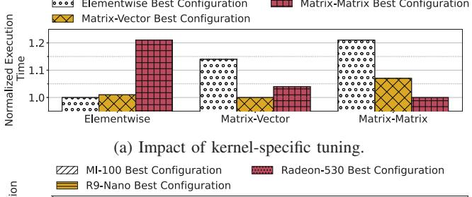
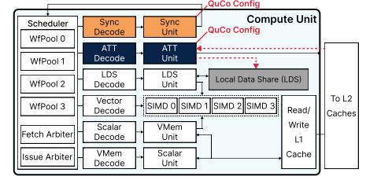
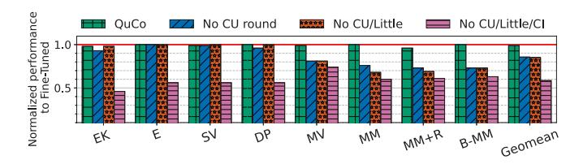
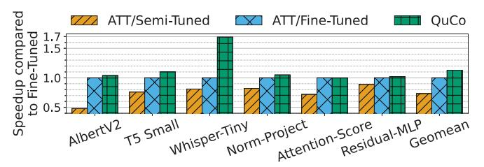
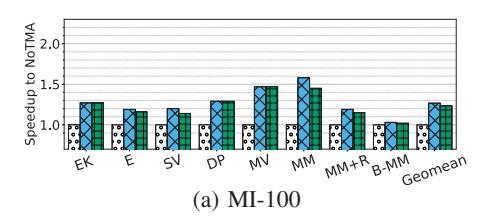
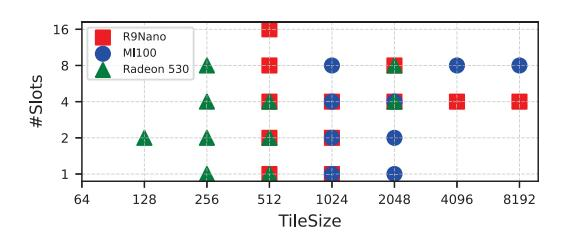

# QuCo: Efficient and Flexible Hardware-Driven Automatic Configuration of Tile Transfers in GPUs

Nicolas Meseguer ´ † Daoxuan Xu‡ Yifan Sun‡ Michael Pellauer∗ Jose L. Abell ´ an´ † Manuel E. Acacio† †Universidad de Murcia, ‡William & Mary, ∗NVIDIA {n.mesegueriborra, jlabellan, meacacio}@um.es, {dxu05, ysun25}@wm.edu, mpellauer@nvidia.com

*Abstract*—The growing complexity and parallelism demands of modern GPU workloads have driven architectural innovations toward *asynchronous tile transfers* (ATTs) to overlap computation and data movement. While ATT units such as the NVIDIA's Tensor Memory Accelerator (TMA) introduce high-throughput memory transfers, programmers must deal with wavefront specialization, select tile sizes, queue slots, and synchronization primitives, all of which are hardware-specific and workloaddependent. Existing GPU libraries fall short—offering limited ATT support and configurability—so developers still resort to manual exploration of this vast parameter space, which is laborious, error-prone, and fundamentally limits performance portability across GPUs.

In this work, we present QuCo (Queue Configurator), a single lightweight hardware unit embedded in the GPU that fully automates the ATT configuration process. Inspired by Blackwell GPU design, QuCo includes a compact RISC-V processor, small memory structures for instructions and data, and a GPU Specification Table (GST) storing key architectural parameters. Using the GST and workload characteristics, along with built-in heuristics, QuCo computes optimal queue configurations at kernel launch. This relieves the programmer of the tedious, time-consuming task of tuning and offline profiling, while simultaneously increasing post-compilation performance portability.

# I. INTRODUCTION AND MOTIVATION

GPUs are the primary compute platform in modern data centers, accelerating diverse, compute-intensive applications such as deep learning, scientific computing, and large-scale analytics [19]. Despite their high memory bandwidth and parallelism, modern GPUs still suffer from underutilization in memory-bound workloads due to latency and transfer bottlenecks [13], [21], [31], [32]. In particular, a prominent source of performance loss is the inefficient overlap of memory operations and computation, leaving GPU resources underutilized and idle [16]. To try to remedy this, some recent GPU designs incorporate support for *asynchronous tile transfers (ATTs)*.

*What are ATTs?* Traditional GPU data movement relies on synchronous load/store instructions issued at cache-line granularity involving a large number of registers (large bank register and scoreboard for tracking dependencies). In contrast, ATTs allow the programmer to specify multidimensional "tiles" of data to be directly moved in bulk between global memory and the on-chip scratchpad without involving vast register usage and costly data dependency tracking, while simultaneously freeing issue slots and increasing energy efficiency. This trend toward ATTs is exemplified by state-of-the-art NVIDIA's Tensor Memory Accelerator (TMA) [6] originally introduced in the Hopper architecture.

*Why are ATTs so important?* ATTs enable fine-grained overlap of data movement with computation, turning what would be idle cycles into useful work and substantially improving utilization on memory-bound kernels. Crago *et al.* [8] demonstrated these benefits across a broad spectrum of domains—including machine learning, graph analytics, genomics, and scientific simulations—showing that any workload can exploit asynchronous transfers to hide memory latency, boost throughput, and achieve more consistent performance on modern GPUs.

*What is the problem with ATTs?* In practice, programming ATTs efficiently is notoriously challenging [47]. On the one hand, different wavefronts<sup>1</sup> must be assigned to specific tasks to improve overlap between memory access and computation [5], [8], [11], [26], technique termed wavefront specialization. Typically, one wavefront issues the ATT requests while the rest perform computation, requiring careful synchronization to guarantee that data is ready in the on-chip scratchpad (Local Data Share or LDS, from now on)—often through custom barriers. On the other hand, workload characteristics such as data reuse, access patterns, and arithmetic intensity vary not only across applications but often within kernels. To simplify this burden, NVIDIA provides a high-level abstraction for the TMA (the *cuda::pipeline*), which wraps producer-consumer wavefronts into reusable queues [34], but developers must still manually tune and manage these descriptors (tile sizes, strides, and LDS destinations) and explicitly specialize kernels at the wavefront level to orchestrate producer (memory-transfer) and consumers (compute) wavefronts. Therefore, although a welltuned ATT program can yield substantial benefits, the mechanism introduces significant complexity, tightly couples code to hardware and makes GPU programming more challenging, less portable, and less maintainable [5].

To illustrate how the achieved performance is both kerneland architecture-specific, we present two motivating experiments (the experimental setup is detailed in Section IV). Figure 1a shows that applying the best configuration of ATTs from one kernel to another can degrade performance by up to 1.2×, underscoring the need for workload-specific tuning. Figure 1b shows similar sensitivity across architectures: using the best ATT setup optimized for one GPU (e.g., R9 Nano) on others (e.g., MI-100, Radeon 530) leads to performance drops of up to 1.4×. These results highlight the paramount importance of

1We use AMD terminology for basic GPU concepts throughout this work.




(b) Impact of platform-specific tuning in a Matrix-Matrix.

Fig. 1: Lack of portability of ATT tuning effort.

adaptive, per-kernel and per-architecture configuration to fully exploit ATT-based workloads.

To bridge the gap between performance, programming effort and flexibility on ATT-supported GPUs, we introduce QuCo (Queue Configurator), a lightweight mechanism that fully automates configuration of ATT in a low-effort, high performance, and portable manner. Specifically, QuCo abstracts the complex, kernel- and architecture-dependent tasks of selecting tile sizes, determining queues configuration, and performing LDS partitioning and allocation. By abstracting these low-level details, QuCo eliminates manual tuning, delivering optimized, workload- and hardware-specific configurations in a single execution and preserving the same post-compilation binary portable across diverse GPU architectures (same family).

*Should QuCo be implemented as hardware or software?* The mechanisms and algorithms we present are agnostic to implementation. While a vendor could deploy QuCo as a software solution (e.g. within the JIT compiler or at library level), we advocate for a lightweight hardware realization: a single module per GPU die. This is for several reasons. Existing libraries (such as CUTLASS [35] or cuBLAS [33]) struggle to keep pace: static, offline-tuned implementations cannot adapt to new workloads or microarchitectures without extensive reengineering, and closed-source "black-box" solutions offer limited configurability. In virtualized or multitenant environments [17], [38], each GPU partition may require its own ATT configuration, exponentially increasing profiling overhead. Additionally, relying solely on a software solution risks exposing proprietary GPU micro-architectural details, something that some manufacturers may be reluctant to do. Finally, software solutions cannot adapt swiftly to DVFS transitions or newly introduced microarchitectural features. Ultimately, while our fundamental contributions are agnostic to this decision, the remainder of this paper focuses on hardware because of these additional benefits.

Specifically, our QuCo hardware solution adds to the GPU

die a single compact RISC-V microcontroller2 along with small on-chip memories for microcode and runtime data, as well as a GPU Specification Table (GST) that stores key architectural parameters. At kernel launch, the RISC-V core executes lightweight firmware to dynamically compute optimal parameters. By performing this computation entirely on-chip and autonomously—without host intervention or exposure of hardware details—QuCo delivers rapid, secure, and portable ATT configuration across evolving GPU architectures.

Overall, our key contributions are as follows:

- We propose QuCo, a dedicated mechanism that fully automates the configuration of ATTs, including tile sizing, slot allocation, and LDS partitioning, eliminating the need for manual tuning.
- We demonstrate that QuCo abstracts the intricate details of ATT configuration and achieves near-optimal performance, matching or outperforming fine-tuned manual configurations, while dramatically reducing programmer effort.
- We evaluate QuCo across multiple GPU architectures, showcasing its portability, queue reuse, and design space complexity to validate its efficiency and adaptability.

# II. BACKGROUND

In traditional GPU kernel designs, operations are highly synchronous, with all wavefronts loading data from global memory into the Local Data Share (LDS) following fixed access patterns. Wavefront specialization [5] improves resource utilization by assigning different roles to wavefronts within a workgroup. This deviates from the standard approach, where all threads execute the same instructions simultaneously. By designating one wavefront for memory transfers and others for computation, wavefront specialization introduces compute heterogeneity but demands precise synchronization to prevent stalls between data movement and execution. Porting kernels to this style requires manually restructuring code, inserting custom barriers, and verifying correctness across hardware variants—an inherently tedious and error-prone process.

Building on the challenges of manual ATT programming, the current state-of-the-art ATT engine is NVIDIA's Tensor Memory Accelerator (TMA) introduced in the H100 [6]. TMA implements the same producer–consumer wavefront specialization and asynchronous global-to-shared memory transfers we target with ATT, but its primary optimization is to feed Tensor Cores with operand tiles. By contrast, our work treats ATT as an orthogonal mechanism—equally applicable to tensor and non-tensor workloads—providing a general framework for any bulk transfer engine.

The ATT is tightly integrated within the Compute Unit, bypassing the L1 cache to directly issue read memory requests to global memory every clock cycle. It generates its own addresses and transfer counts, writing incoming data directly

2This aligns with the trend of GPUs delegating non-compute tasks to dedicated microcontrollers. For example, NVIDIA's Blackwell architecture introduces the AI Management Processor (AMP) [36], [37], a fully programmable RISC-V context scheduler at the front of the GPU pipeline.


Fig. 2: Use of the ATT unit with the Operand Queue library that constitutes the baseline in this work.

to LDS without software-managed synchronization or thread involvement, as illustrated in Figure 2a.

ATT operations are initiated using a copy descriptor—a compact structure that defines the global memory address, and number of elements to transfer. Once triggered by a single thread within a wavefront, ATT hardware takes over, managing address generation, stride calculations, and boundary conditions. This offloads complexity from the programmer, enabling efficient data transfer between global memory and shared memory (LDS).

A key innovation in the ATT mechanism is its synchronization model, which introduces specialized asynchronous barriers to optimize coordination between producer and consumer threads. In particular, ATTs use asynchronous transaction barriers, splitting synchronization into two phases: arrive and wait. Producer threads signal progress by executing a non-blocking arrive command when shared data is ready, allowing them to continue independent work without stalling. Consumer threads issue a wait command when they need the data, blocking until all producers signal arrive. This two-step process allows early threads to use idle cycles for other tasks, avoiding the inefficiencies of busy-wait synchronization.

By using these hardware-accelerated asynchronous barriers and transaction-based synchronization, ATTs enable efficient overlapping of memory transfers and computation, enhancing parallelism and performance. However, fully harnessing its potential still requires direct involvement from the programmer. Mismanaging dependencies, like ordering memory operations incorrectly, can cause race conditions, deadlocks, or incorrect results, complicating debugging. Additionally, configuring ATT descriptors requires detailed knowledge of the underlying data layout and workload, demanding precision in defining parameters such as dimensions and memory strides.

To reduce the programming complexity associated with using ATTs, NVIDIA offers the *cuda::pipeline* API, which enables efficient usage of the TMA for asynchronous memory operations via single- and multi-stage pipelines [34]. Inspired by these abstractions, we implement a high-level interface for managing producer-consumer synchronization tailored to our evaluation framework, which we refer to as *Operand Queues*.

Operand Queues encapsulate the use of ATT descriptors, and are initialized through a queue descriptor containing the key parameters required for asynchronous memory transfers. These include the global memory addresses, tile dimensions, memory strides, and LDS destination. Once configured, Operand Queues autonomously manage the low-level ATT operations, further abstracting the details of data movement.

Notably, state-of-the-art libraries such as CUTLASS3+CuTe and ThunderKittens offer high-level ATT abstractions (TMA pipelines and asynchronous I/O, respectively) that help automate data movement and computation overlap. However, to obtain hardware-specific peak ATT performance, they place the burden on the programmer [47]. As a result, effective use of these libraries still demands a deep understanding of the underlying GPU microarchitecture.

Our Operand Queues implementation is based on a producer-consumer scheme where a dedicated wavefront (producer) loads tiles into the LDS using functions like Push() and synchronizes via Wait\_For\_Push(), while multiple consumer wavefronts access these tiles using Peek() and Pop(), coordinated through asynchronous transaction barriers. Figure 2b summarizes this interaction. Figure 2c shows a detailed timeline of a queue with two slots (slot\_0 and slot\_1), highlighting the interaction between the ATT unit and the producer and consumer wavefronts. It emphasizes how memory transfers are decoupled from computation, allowing tiles to be early loaded and asynchronously consumed, thus improving data availability and overall throughput.

#### III. QuCo Unit

In this section, we introduce the *Queue Configurator* (QuCo) unit, a hardware solution that automates the configuration of any ATT-enabled GPU and makes it completely transparent to the programmer, while ensuring portability. QuCo abstracts away the low-level management of operand queues, tile sizes and LDS partitioning and allocation, providing an architecture-agnostic and performance-aware solution for efficient utilization. Internally, the QuCo unit includes a customized RISC-V microcontroller aimed at executing a lightweight firmware that dynamically computes optimized queue configurations—such as tile sizes and queue slots—based on the particularities of both the target kernel and the GPU architecture.

Figure 3 provides an overview of the GPU architecture, illustrating where the QuCo unit, a single hardware block, resides relative to key components such as the Command Processor (CP), the Asynchronous Compute Engine (ACE), the Compute Units (CUs), and the multi-banked shared L2 cache with its attached DRAM banks. A zoomed-in view of the QuCo unit reveals its internal structure: a lightweight RISC-V microcontroller, the GPU Specification Table (GST) containing essential architectural parameters, and a memory subsystem for microcode and local variables. OuCo is integrated closely with the CP, allowing it to access kernel launch parameters and architectural metadata early, enabling configuration before threads are scheduled for execution. This ensures that all memory operands (e.g., queue descriptors, ATT descriptors, and barrier pointer) are ready in the LDS before compute begins, preventing stalls and enabling seamless kernel execution.

As shown in Figure 4, QuCo acts as a control unit: the programmer specifies the number of operand queues based on the characteristics of the kernel (Figure 4a), and QuCo autonomously configures all low-level parameters—tile sizes, slot counts, LDS allocation, and synchronization barriers—tuned to the kernel's characteristics and the GPU capabilities (Figure 4b). Once initialized, these queues serve as the interface between QuCo and the execution pipeline. As shown in Figure 4c, both the ATT Unit and the Sync Unit within each CU retrieve their configuration directly from the queues set up by QuCo, enabling efficient and autonomous data movement and coordination. As a result, data movement through the ATT queues becomes transparent to the programmer, who is no longer required to manage descriptors, compute offsets, or handle synchronization.

In workloads with multiple kernels having different memory demands, QuCo can reconfigure the LDS layout with minimal overhead by overlapping the reconfiguration time


Fig. 3: Overview of the GPU architecture with the QuCo unit.

with the ongoing kernel's execution, maintaining the benefits of automatic tuning. These reconfigurations involve updating the ATT metadata—descriptor pointers, LDS base addresses, and synchronization barrier indices—which QuCo modifies in place based on the new kernel's needs. Notably, the contents of the operand queues do not need to be erased or reinitialized. Since the queues are pointer-based, resizing them only requires adjusting memory offsets and slot counts, allowing QuCo to dynamically grow or shrink queues without incurring significant data movement or synchronization costs.

A key strength of QuCo is its portability. The embedded RISC-V microcontroller runs firmware that adapts to various GPU configurations without requiring recompilation or manual tuning. This decoupling ensures consistent, optimized performance across different GPU models and future architectures. By centralizing the configuration logic and abstracting hardware-specific details, QuCo hides the complexity of using ATTs while maintaining high efficiency and scalability.

#### A. Microarchitecture

QuCo is implemented using a single compact in-order RISC-V processor supporting the RV32IMF instruction set [39], which includes integer arithmetic and single-precision floating-point operations. This 32-bit ISA proves sufficient for typical ATT-related operations (Section III-B), which involve address arithmetic, offset calculations, and basic multiplication or division instructions for scaling and aligning memory segments. This in-order design follows a simple five-stage pipeline, significantly limiting hardware complexity while retaining enough performance to handle the control logic needed for ATT initialization and reconfiguration.

Upon GPU startup, QuCo fetches its first instruction from an 8 KiB ROM containing compact firmware. This firmware handles accessing architectural parameters, computing optimal queue configurations, and writing the resulting descriptors into LDS memory. Operating independently from the GPU's wavefront scheduling, QuCo uses a 2 KiB local data buffer to store local variables, data structures, and previously computed configurations. The data buffer is addressable via OuCo's

```
✞ ☎ 1 // Init QuCo with CI, WG Size, and #CUs
2 driver.InitQuCo(HIGH, 512, 64)
4 // Register Queues with size, data-type, and vector-
5 driver.RegisterQueue(K, 4, TYPE_STREAMING)
6 driver.RegisterQueue(K, 4, TYPE_STATIONARY)
8 // Launch the Kernel
9 driver.EnqueueLaunchKernel(binary, kernArg)
```



- (a) High-Level Host Code example for a GEMM kernel.
- (b) QuCo dynamically allocates LDS space and sets queue metadata.
- (c) Compute Unit with ATT and LDS configured by QuCo.

Fig. 4: Example of QuCo for two operand queues (Queue 0 and 1) at: (a) software-level (b) queue level; (c) hardware level.

private address space, supporting repeated invocations and persistent metadata.

A key data structure accessible to QuCo is the GPU Specification Table (GST), a 256-byte read-only block populated by the vendor at manufacturing time3. The GST contains essential architectural parameters such as memory latencies, clock frequency, LDS size, number of compute units, and arithmetic throughput (e.g., FP32 fused-multiply-accumulate operations per cycle). During boot, the QuCo's firmware reads these values into local registers and data buffers to initialize the subsequent configuration process.

Once QuCo has gathered the necessary architectural data, it configures the ATT units by calculating optimal tile sizes and queue slots for the number of ATT queues requested by the user (Figure 4a). The LDS is logically partitioned, reserving a small region for metadata and ATT descriptors, with the remaining space allocated to operand queues (Figure 4b). QuCo writes all the required ATT descriptors, tile parameters, and slot pointers to the LDS, making them accessible to the ATT units. After completing the configuration, QuCo signals each ATT unit to load the updated descriptors and begins loading data from main memory to the LDS. This enables seamless operation, where the programmer interacts with the LDS using a queue structure (as introduced in Section II), while the ATT and the Sync Unit handle the low-level and complex asynchronous data movement behind the scenes.

After configuration, QuCo enters an idle state but remains ready for reactivation. In dynamic workloads with multiple kernels, particularly those with heterogeneous memory demands, QuCo can be re-invoked to recompute queue layouts and update descriptors.

Importantly, the RISC-V processor is decoupled from the main compute pipeline, ensuring that configuration tasks do not interfere with wavefront scheduling, memory requests, or execution flow, following the trend of some recent GPUs to offload configuration logic to specialized hardware <sup>4</sup> [37].

# *B. Implemented Configuration Strategy*

The configuration logic executed by the QuCo firmware takes as input both static architectural parameters—retrieved from the GPU Specification Table (GST)—and dynamic workload information such as compute intensity, vector sizes, and the number of queues requested by the user, including their intended usage (streaming or stationary), dimensional length (e.g., K dimension in a matrix), and data type size. Using this information, the QuCo unit, is able to deliver a per-kernel configuration that maximizes memory throughput and computational overlap while respecting architectural constraints. These include LDS capacity, hardware barrier limits, and maximum tile sizes supported by the ATT.

The first step is to determine the optimal tile size (Algorithm 1). QuCo explores tile sizes ranging from a minimum of 64 elements—the cache line size—up to 8,192 elements, a limit based on design-space exploration and bounded by the LDS size specified in the GST. For each candidate tile size, it evaluates a *merit factor*: the ratio of tile processing time to memory transfer time. Processing time is estimated using kernel-specific compute intensity (CI)5—ratio of operations to memory traffic—wavefront utilization, and compute throughput (e.g., MACs per cycle), plus a scheduling roundtrip overhead due to wavefront dispatch limitations (e.g., the scheduler waiting a full roundtrip before issuing the next instruction).

Transfer time is based on memory latency, DRAM bandwidth, ATT latency, and L2 cache behavior; the 2× factor in the cache transfer time models the bidirectional nature of data movement between global memory and LDS—accounting for both read and potential write traffic during tile transfers. All parameters are hardware-specific and retrieved from the GST, ensuring the algorithm is tuned to the target GPU. The *merit factor* effectively models the rate at which tiles are processed versus the rate at which they are fetched, a critical factor in GPU performance (see Algorithm 2 for more details).

In addition to the merit factor, the algorithm computes a *cost function* to evaluate resource usage for transferring a tile, considering latency, bandwidth, and cache-line constraints. The cost function aggregates the memory system costs into a normalized score. It combines tile-dependent latency—estimated

<sup>3</sup>The fact that QuCo is a hardware block implemented within the GPU ensures that data in the GST is not exposed.

<sup>4</sup>To further minimize microarchitectural overhead, QuCo could be embedded as part of existing RISC-V configuration cores, such as the AMP already included in NVIDIA Blackwell.

<sup>5</sup>To avoid confusion with Artificial Intelligence, we deliberately avoid using the acronym AI for Arithmetic Intensity.

#### Algorithm 1: Optimal Tile Size Calculation

```
Input: Range of tile sizes: [min, max], Consumer Wfs, CI, GST
Output: Optimal tile size
Function optimal_tile_size()
    for tile ∈ [min, max] do
```

#### Algorithm 2: Function for calculating the Merit Factor

```
Input: Tile Size, Consumer Wfs, GST, WfPools = 4
Output: Merit Factor
Function evaluate()
     // Step 1: Compute the best-case latency
          time for processing the tile
     bestLatency \leftarrow \frac{\text{TileSize}}{\text{SIMDMulsPerCycle} \times \text{ConsumerWfs}}
     // Step 2: Calculate processing time,
          including scheduling roundtrip overhead
     procTime \leftarrow bestLatency + (bestLatency - 1) \times
       \min(ConsumerWfs-1,WfPools)
     // Step 3: Compute memory transfer latencies
    \begin{array}{l} latencyTotal \leftarrow \text{ATTCycles} + \text{DRAMLatency} + \text{L2Latency} \\ memTransferTime \leftarrow \frac{\text{TileSize} \times \text{ElementSize}}{\text{Bandwidth}} \\ cacheTransferTime \leftarrow 2 \times \frac{\text{TileSize} \times \text{ElementSize}}{\text{CacheLineSize}} \end{array}
     // Step 4: Aggregate memory transfer time
     memTime \leftarrow latencyTotal + memTransferTime +
       cacheTransferTime \\
     // Step 5: Return the merit factor as the
          ratio of processing time to memory time
    return procTime memTime
end
```

as the sum of ATT, DRAM, and L2 latencies divided by the tile size—with two additive penalties: one inversely proportional to DRAM bandwidth and another inversely proportional to cache-line size. This models the relative impact of limited bandwidth and fine-grained cache-line usage on tile transfers.

Together, the merit factor and cost function are combined into a weighted merit score, computed as the product of both values, which determines the suitability of a given tile size. This ensures that the selected tile provides the optimal balance between computational efficiency and memory efficiency.

After iterating over possible tile sizes, the algorithm adjusts for the kernel's CI: scaling up the tile size for low-CI kernels, CI<1 (i.e., *Elementwise* or *Dot-Product*) to improve memory throughput and scaling down for high-CI kernels, CI>4 (i.e., *Matrix-Matrix multiplication*) to balance memory and computation overlap (Section IV describes the complete list of the kernels and benchmarks used in our evaluation). This ensures the tile size aligns with the kernel's characteristics.

After determining the tile size, the QuCo unit computes the optimal number of slots for each queue (Algorithm 3). This step begins by counting the number of streaming and stationary queues, as the allocation strategy prioritizes streaming

#### **Algorithm 3:** Optimal Number of Slots Calculation

```
Input: Streaming and stationary queues, CI, Compute Units
Output: Optimal number of slots for each Queue
Function optimal_num_slots()
    count streaming and stationary queues;
    if there are streaming queues then
        numSlots \leftarrow useLittlesLaw();
        numSlots \leftarrow roundToPowerOfTwo(numSlots);
        numSlots \leftarrow roundBasedOnCUs(numSlots);
        if sufficient space in LDS then
            allocate (streaming queues);
        else
            numSlots \leftarrow useComputeIntensity();
            reduce numSlots if necessary to fit the data;
            allocate(streaming queues);
        end
    end
    if there are stationary queues then
        calculate available space for each stationary queue;
        determine how many slots can fit into the remaining space;
        numSlots \leftarrow roundToPowerOfTwo(numSlots);
        numSlots \leftarrow roundBasedOnCUs(numSlots);
        reduce numSlots if necessary to fit the data;
        allocate (stationary queues);
    end
end
```

queues to maximize performance, while reserving remaining resources for stationary queues.

For streaming queues, QuCo uses a hardware-aware adaptation of Little's Law to balance queue depth with kernel latency and tile throughput. Little's Law provides a relationship between the rate at which items enter a system, the time they spend being processed, and the average number of items, and has been widely applied within the fields of operations management and computer architecture [28]. Using this approach, the ideal number of slots required for a streaming queue is derived directly from the ratio of memory transfer time (i.e., the rate at which tiles are loaded into the LDS by ATT transfers) to the total time needed to compute a tile. This ratio determines the number of slots to ensure the queues are neither underutilized nor overly provisioned (this is calculated by useLittlesLaw() in Algorithm 3).

The number is then further adjusted based on the number of compute units. Specifically, the algorithm reduces the number of tiles when more CUs are active, as higher CU utilization increases pressure on the memory system. This adjustment mitigates memory contention and balances workload distribution, ensuring that queues operate efficiently under varying compute loads.

Subsequently, the last step ensures that the calculated number of slots fits within the available LDS capacity. If the required slots exceed the LDS constraints—due to tile size or memory limitations—an alternative strategy is employed. In this fallback approach, the number of slots is re-evaluated and scaled based on the workload's CI. For low-CI workloads (e.g., *Elementwise*), more slots are allocated to improve memory throughput. For high-CI workloads (e.g., *Matrix-Matrix multiplication*), fewer slots are chosen to reduce memory pressure and better overlap computation and memory accesses. Once

TABLE I: Kernels and benchmarks with their design-space saved by using QuCo.

| Applications (Acronym)                                                               | Description                                                                                                                                                                                            | Dimensions                            | Layers          | # Queues      | # Tiles     | # Slots     | # Combinations                                                                      |
|--------------------------------------------------------------------------------------|--------------------------------------------------------------------------------------------------------------------------------------------------------------------------------------------------------|---------------------------------------|-----------------|---------------|-------------|-------------|-------------------------------------------------------------------------------------|
| ElementwiseK (EK)                                                                    | Operations optimized for high throughput [45]                                                                                                                                                          | 16777216                              | - 1             |               | 5           | 5           | 25                                                                                  |
| Elementwise (E)<br>Sumvectors (SV)<br>Dot-Product (DP)                               | General element-wise operations [45]<br>Vector summation, a basic building block [10]<br>Critical workload linear algebra [10]                                                                         | 16777216<br>2097152                   | -               | 2             | 5           | 5           | 625                                                                                 |
| Matrix-Vector (MV)<br>Matrix-Matrix (MM)<br>MM+Reduction (MM+R)<br>Batched MM (B-MM) | A staple in scientific computing [14], [45]<br>Fundamental for dense linear algebra and ML [14], [45]<br>Fused operation common in attention models [47]<br>Fundamental in inference and batching [47] |                                       | -               | 8+1           | 8           | 5           | $2.6 \times 10^{14}$                                                                |
| AlbertV2<br>T5-Small<br>Whisper Tiny                                                 | Efficient BERT for NLP tasks [24]<br>Text-to-text Transformer [41]<br>Multilingual ASR model [40]                                                                                                      | Transformer<br>(Linear)               | 74<br>96<br>827 | 8+1           | 8           | 5           | $1.92 \times 10^{16}  2.5 \times 10^{16}  2.1 \times 10^{17}$                       |
| Norm-Project<br>Attention-Score<br>Residual-MLP                                      | LayerNorm with channel-wise scaling [7], [46] Attention score computation [9], [20] Projection layer with residual connection [15]                                                                     | $16777216$ $[2048, 2048] \times 2048$ | 2<br>2<br>2     | 2<br>2<br>8+1 | 5<br>5<br>8 | 5<br>5<br>5 | $   \begin{array}{r}     1250 \\     1250 \\     2.5 \times 10^{14}   \end{array} $ |

TABLE II: Specifications of the three different GPUs modeled.

|                                                                             | Property, Amount                                                                                                         |                                                                                                                          |                                                                                                                         |  |  |  |
|-----------------------------------------------------------------------------|--------------------------------------------------------------------------------------------------------------------------|--------------------------------------------------------------------------------------------------------------------------|-------------------------------------------------------------------------------------------------------------------------|--|--|--|
| Parameter                                                                   | R9 Nano                                                                                                                  | MI100                                                                                                                    | Radeon 530                                                                                                              |  |  |  |
| Frequency CUs SIMDs L1V \$ L1I \$ L1S \$ L2 \$ DRAM Mem. Lat. \(^{\alpha}\) | 1.0 GHz<br>64<br>64 Muls/cycle<br>64x16KB 4w<br>16x32KB 4w<br>16x16KB 4w<br>16x256KB 16w<br>8x512MB<br>190, 300, 450 [3] | 1.5 GHz<br>120<br>64 Muls/cycle<br>120x16KB 4w<br>8x32KB 4w<br>8x16KB 4w<br>32x256KB 16w<br>32x1GB<br>100, 250, 300 [12] | 1.0 GHz<br>6<br>64 Muls/cycle<br>6x16KB 4w<br>32KB 4w<br>16KB 4w<br>8x256KB 16w<br>8x256MB<br>80, 200, 400 <sup>β</sup> |  |  |  |

<sup>&</sup>lt;sup>α</sup>L1, L2 (CU roundtrip) and DRAM (CU roundtrip), respectively.

streaming queues have been configured, QuCo proceeds to assign resources to stationary queues using the remaining LDS capacity evenly. This two-stage allocation ensures that latency-sensitive transfers are prioritized.

After computing the optimal tile size and number of slots for each queue, QuCo proceeds to physically allocate and initialize the queues in the LDS. Next to the already allocated space used for ATT metadata, it allocates contiguous blocks for each queue, setting up their corresponding ATT descriptors pointers (see the example in Figure 4b). Each queue includes its tile size, number of slots, and synchronization barriers. These descriptors are written directly into memory regions that are visible to the ATT units, enabling immediate use. By embedding this decision logic directly into the GPU hardware, QuCo transforms what is a complex developer-managed task into a fully autonomous process.

#### IV. EVALUATION METHODOLOGY

#### A. Simulation Environment

We evaluate QuCo using MGPUSim [44], a cycle-accurate GPU simulator calibrated with an AMD R9 Nano (GCN3 ISA), representative of mid-range GPUs. All main results (Section V-B) use this setup, while portability tests cover two additional GPUs: the high-end MI-100 and low-power Radeon 530 (Table II; results in Section V-E). We extended MGPUSim to support ATTs between global memory and LDS, modeling background data movement, operand queue management, and LDS coordination accurately at functional and cycle levels. Despite building upon an AMD platform, our ATT design is architecture-neutral, allowing any GPU with asynchronous

global-to-shared memory transfers to benefit from QuCo's automated configuration. Moreover, performance primarily depends on general GPU characteristics (e.g., bandwidth, compute throughput) rather than ISA-specific features, ensuring broad applicability. The performance trends from our ATT evaluations align closely with results reported for other ATT hardware, such as NVIDIA TMA-enabled GPUs [29], [30], [47], confirming the validity and generality of our approach.

#### B. Linear Algebra Kernels and Benchmarks

We evaluate QuCo and validate our ATT implementation using wavefront-specialized kernels—spanning both fundamental linear-algebra kernels and state-of-the-art workloads [47]—that cover diverse data-access patterns and compute intensities across domains such as machine learning, analytics, genomics, and signal processing (Table I). To compute the CI of each kernel, we calculate the ratio of floating-point operations to global memory traffic without ATT acceleration. This method captures the compute-to-memory balance of each workload without interference from asynchronous transfers. Since CI is an algorithmic property, its value remains constant across architectures and configurations, and it is used by QuCo to classify the kernel, as described in Section III-B.

Workloads range from element-wise operations to dense matrix multiplications, exposing memory- and compute-bound scenarios. Some require precise queue tuning and others test ATT's ability to overlap data movement with computation.

These kernels demand explicit wavefront specialization and fine-grained synchronization support and no existing benchmark suites (e.g., Rodinia, Parboil, Polybench) have yet been adapted or specifically designed to utilize modern asynchronous memory transfers in GPUs, whether in software or via hardware mechanisms like NVIDIA's TMA<sup>6</sup>.

#### V. EXPERIMENTAL RESULTS

To demonstrate QuCo's practical impact, we evaluate full deep learning models and composite kernel blocks built from the linear algebra kernels. These workloads, shown in Table I, reflect modern neural architectures and expose QuCo to complex, layered execution patterns where dynamic

<sup>6</sup>Recent studies on TMA in NVIDIA Hopper [29], [30] rely on microbenchmarks, while [47] evaluates only four kernels, three of which we include.

<sup>&</sup>lt;sup>β</sup> No official documentation; projected from comparable mobile GPUs [27].


Fig. 5: DRAM activity over time for *NoATT/Fine-Tuned* and QuCo.


Fig. 6: Kernel execution normalized to the ideal scenario.

queue reconfiguration is critical. The DNN models—*AlbertV2*, *T5 Small*, and *Whisper-Tiny*—are Transformer-based and memory-intensive, composed largely of matrix operations. We also evaluate three composite workloads: *Norm-Project* (normalization + projection), *Attention-Score* (dot product + activation), and *Residual-MLP* (projection + residual update). These tasks involve multiple operand queues and varying shared memory demands, making them ideal for testing QuCo's ability to adapt tile sizes and queue slots across layers with non-uniform dimensions.

# *A. Design Space*

QuCo addresses the combinatorial complexity of ATTenabled kernels, where selecting tile sizes and queue slot counts across multiple operand queues leads to a vast design space. The number of valid configurations grows exponentially with the number of queues and tuning parameters. Table I summarize the possible configurations for each workload. For our evaluation, we constrain the search space to practical ranges: tile sizes from 64 to 8,192 elements7, and queue slots from 1 to 8. This results in billions to quadrillions of possible combinations. Manually exploring this space would be prohibitively expensive, but QuCo simplifies the process by automatically identifying high-performing configurations in a single pass, eliminating the need for manual tuning.

# *B. Kernels*

For the eight kernels listed in Table I, Figure 6 compares the performance obtained for six execution cases:

7For kernels like *Elementwise* or *Dot-Product*, the tile size range is reduced, yielding 5 discrete options.

i) *NoATT/Non-Tuned*; ii) *NoATT/Fine-Tuned*; iii) *ATT/Non-Tuned*; iv) *ATT/Informed-Tuned*; v) *ATT/Fine-Tuned*; and vi) QuCo. As detailed below, each case represents a different level of optimization and complexity in kernel execution. All the results are normalized to an ideal ATT implementation, where the ATT operates with an unlimited LDS, allowing all data to fit into the LDS and enabling continuous tile loading without LDS constraints (an *ideal-scenario* performance bound).

The first two cases, *NoATT/Non-Tuned* and *NoATT/Fine-Tuned*, evaluate kernels that do not take advantage of the ATT. *NoATT/Non-Tuned* corresponds to a naive implementation, where memory operations and computations are poorly optimized, using small tile sizes, and as a result, issuing more memory requests, leading to suboptimal application performance (see Figure 6). In contrast, *NoATT/Fine-Tuned* is the configuration obtained through extensive design space exploration to optimize kernel parameters—such as tile size and queue slots—resulting in significantly improved performance across all cases, particularly for simpler workloads such as *ElementwiseK* and *Dot-Product*.

Among the ATT-based implementations, *ATT/Non-Tuned* serves as a baseline case where the ATT unit is used without proper tuning of tile sizes and queue slots. This lack of optimization leads to poor performance across all kernels. Without informed parameter selection, tile sizes may be too small to leverage memory bandwidth or too large to fit efficiently into LDS memory, causing stalls. Similarly, the number of queue slots may be insufficient to overlap memory transfers and compute, leading to idle cycles and creating substantial performance gaps compared to the upper bound. While this approach achieves competitive results on lightweight workloads, it struggles with more sensitive kernels that require precise alignment between memory transfers and computation. For example, in *Dot-Product* and *Elementwise*, the lack of tuning not only prevents overlap but can introduce wavefront scheduling stalls or memory contention.

*ATT/Informed-Tuned* incorporates heuristic-based configurations inspired by NVIDIA guidelines, using tile sizes between 64 and 256 elements and queue slots between 2 and 4 (double or quadruple buffering) [30]. This approach delivers strong performance for simpler kernels like *ElementwiseK*, *Elementwise*, *Sumvectors*, and *Dot-Product*, but its performance



Fig. 7: Ablation study showing kernel execution normalized to *ATT/Fine-Tuned*, see Section V-C for details.

for *Matrix-Vector*, *Matrix-Matrix*, *Matrix-Matrix+Reduction* and *Batched-Matrix-Matrix* remains suboptimal due to the increased complexity and resource demands of these workloads.

The *ATT/Fine-Tuned* represents an exhaustive design space exploration for each kernel, identifying the best possible tile and slot configurations through repeated profiling. This approach requires substantial computational effort, with the GPU kernel executed once per configuration, and requiring manual tuning. Obviously, this optimized execution case provides the best performance, particularly for *Matrix-Vector*, *Matrix-Matrix*, *Matrix-Matrix+Reduction* and *Batched-Matrix-Matrix* workloads, since these kernels can now make better use of GPU resources, achieving performance closer to the ideal. However, the complexity of this approach makes it impractical for complex kernels like these four (as shown in Table I, 2.6e+14 kernel launches would be required for *Matrix-Matrix* or *Batched-Matrix-Matrix* workloads). This situation is even worse for real-world applications (e.g., *Whisper Tiny* with 2.1e+17 kernel launches).

In contrast, the ability of the QuCo unit to automatically select values for the configuration parameters of the queues based on architectural characteristics and kernel properties, fully eliminates the need for this impractical exhaustive tuning. As shown in Figure 6, QuCo achieves performance that is slightly below *ATT/Fine-Tuned* but consistently outperforms *NoATT/Fine-Tuned*, *ATT/Non-Tuned*, and *ATT/Informed-Tuned* across all the kernels. Without requiring any manual tuning or host-side intervention, QuCo provides near-optimal configurations with significantly reduced complexity.

For the challenging matrix kernels (*Matrix-Matrix*, *Matrix-Matrix + Reduction* and *Batched-Matrix-Matrix*), all methods—QuCo included—fall significantly short of the ideal performance due to limited data reuse and large working set sizes that exceed the LDS capacity. In this case, the *K* tile dimension cannot fully reside in LDS, requiring frequent re-fetches from global memory and increasing pressure on the L2 cache. This effect is especially pronounced when compared to the theoretical unlimited-LDS baseline, which manages to retain all tile fragments in on-chip memory.

Interestingly, the *Batched-Matrix-Matrix* kernel presents a special case where *ATT/Fine-Tuned* and QuCo slightly outperforms the *NoATT/Fine-Tuned* implementation. We observe this is largely due to the overhead of managing a high number of asynchronous barriers. This behavior is consistent with prior work [47], where the authors report achieving performance



Fig. 8: Speedup over the *ATT/Fine-Tuned* baseline for several DNN models and composite kernel workloads

on par with optimized cuBLAS and Triton implementations. This benchmark serves as a representative case illustrating that while QuCo enables automated configuration, not all workloads benefit equally from the ATT.

To understand the memory-level effects of QuCo's automated configuration, we analyzed DRAM request activity during kernel execution. Figure 5 shows a complete trace of DRAM requests for the kernels. In the *NoATT/Fine-Tuned* case (blue line), memory accesses occur abruptly and irregularly, with idle periods between request spikes. This behavior indicates poor overlap between memory access and computation, as global memory loads are issued synchronously by the kernel.

In contrast, the QuCo-enabled configuration (red line) maintains a consistently high level of DRAM activity throughout execution. As previously discussed, the *Batched-Matrix-Matrix* kernel reflects the synchronization overhead and its impact at the memory level.

This sustained throughput is the result of asynchronous tile transfers using Operand Queues, which are configured and allocated by QuCo, to later load data tiles into the LDS. Because memory and compute are overlapped more effectively, the kernel completes significantly earlier than its no ATT counterpart. This result demonstrates QuCo's ability to exploit the available DRAM bandwidth and better hide memory latency even without programmer intervention.

# *C. Ablation Study*

To further understand the impact of each heuristic used by QuCo, we conducted an ablation study over the linear algebra kernels. Figure 7 compares QuCo against progressively degraded versions of its design, each removing a key heuristic: i) CU-aware slot scaling; ii) Little's Law-based slot sizing; and iii) CI-based tile and slot scaling. All results are normalized to the ATT/Fine-Tuned baseline. For simpler kernels (e.g., *ElementwiseK*, *Elementwise*, *Dot-Product*), removing Little's Law occasionally improves performance due to coincidental alignment between CI-scaling and queue pressure—e.g., 4 slots versus 8. However, for more complex kernels (e.g., *Matrix-Vector*, *Matrix-Matrix*, *Matrix-Matrix + Reduction*, *Batched-Matrix-Matrix*), disabling CU-aware rounding leads to overallocation of slots—4, or even 8 slots instead of 2—causing increased memory contention and reducing performance by up to 25%. Disabling CI scaling further worsens this, as larger


Fig. 9: Layer-wise speedup in the *Whisper-Tiny* model (singular layers) compared to the *ATT/Fine-Tuned* baseline

tiles and excessive slots overload the memory system—e.g., tile sizes of 1024 or 2048 with 4 or 8 slots, compared to 512 with 2 slots—leading to slowdowns of nearly 40% (notably in *Matrix-Matrix* + *Reduction*). See Table III for the optimal configurations selected by QuCo.

#### D. Benchmarks

Figure 8 shows the efficiency of QuCo in the context of the six benchmarks listed in Table I. In particular, we present a performance comparison of three ATT-based implementations: i) *ATT/Semi-Tuned*, where only the first layer is tuned and its ATT configuration is reused for all subsequent layers—a realistic but suboptimal programmer strategy; ii) *ATT/Fine-Tuned*, our baseline for this evaluation, which uses exhaustive per-layer tuning of tile size and queue slots within the subset of the design space we covered to obtain the results for the *ATT/Fine-Tuned* configuration in Figure 8; and iii) QuCo, which automatically configures queues and descriptors for each layer.

As shown, QuCo consistently outperforms all other implementations, highlighting its ability to automatically adapt to heterogeneous layers and varying memory requirements without any programmer intervention. In the full-model benchmarks, QuCo performs comparably to or better than the ATT/Fine-Tuned baseline with an average improvement of up to 1.15×. In some cases, such as AlbertV2 or Whisper-Tiny, the ATT/Semi-Tuned configuration performs notably worse due to insufficient overlap between memory transfers and computation (suboptimal tile sizes and number of slots in the queue), confirming that reuse of early-layer tuning is not robust across a full model execution path.

The benefits of QuCo become more subtle for composite kernels when compared to the *ATT/Fine-Tuned* baseline. Unlike full DNN models with highly heterogeneous layers, these kernels consist of fewer and more uniform layers. As a result, static configurations tend to perform reasonably well, and the performance gap between manual tuning and automatic configuration narrows. Still QuCo dynamically allocates queue slots and tiles based on each layer's properties, consistently matching or slightly outperforming the *ATT/Fine-Tuned* implementation across the full execution range.

Despite QuCo being a fully automated mechanism, it delivers performance consistently comparable to or better than the best manually tuned approach. As reflected in the *Geomean* 

TABLE III: Optimal ATT setup (DSE vs. QuCo) for 3 GPUs.

| Kernel        |                            | Size                  | GPU                            | Fine-Tuned QuCo<br>TileSize/#Slots |                            |
|---------------|----------------------------|-----------------------|--------------------------------|------------------------------------|----------------------------|
| ElementwiseK  | 1 Op. Queue<br>Low C. I.   | 30M<br>16M<br>1.25M   | High-end<br>Mid-end<br>Low-end | 4096/4<br>2048/2<br>2048/4         | 4096/4<br>2048/2<br>2048/8 |
| Elementwise   | 2 Op. Queues<br>Low C. I.  | 30M<br>16M<br>1.25M   | High-end<br>Mid-end<br>Low-end | 4096/2<br>2048/8<br>8192/4         | 4096/4<br>2048/4<br>2048/4 |
| Sumvectors    | 2 Op. Queues<br>Low C. I.  | 30M<br>16M<br>1.25M   | High-end<br>Mid-end<br>Low-end | 4096/2<br>2048/8<br>4096/4         | 4096/4<br>2048/4<br>2048/4 |
| Dot-Product   | 2 Op. Queues<br>Low C. I.  | 2M                    | High-end<br>Mid-end<br>Low-end | 2048/4<br>1024/2<br>1024/4         | 4096/4<br>2048/4<br>2048/4 |
| Matrix-Vector | 9 Op. Queues<br>Low C. I.  | [2K, 2K]<br>2K        | High-end<br>Mid-end<br>Low-end | 512/2<br>512/2<br>512/2            | 1024/2<br>512/4<br>512/2   |
| Matrix-Matrix | 9 Op. Queues<br>High C. I. | [1K, 2K]<br>[2K, 128] | High-end<br>Mid-end<br>Low-end | 512/2<br>512/2<br>512/2            | 1024/2<br>512/4<br>512/2   |
| MM+Reduction  | 9 Op. Queues<br>High C. I. | [1K, 1K]<br>[1K, 4]   | High-end<br>Mid-end<br>Low-end | 512/2<br>512/2<br>512/2            | 512/2<br>512/2<br>256/4    |
| Batched MM    | 9 Op. Queues<br>High C. I. | [1K, 1K]<br>[1K, 4]   | High-end<br>Mid-end<br>Low-end | 512/2<br>512/2<br>512/2            | 512/2<br>512/2<br>256/4    |

column, QuCo achieves the highest average speedup across all benchmarks, underscoring its practicality as a robust and architecture-aware solution for real-world GPU workloads.

To further explore the performance benefits of per-layer or per-kernel queue reconfiguration in QuCo, we conduct an ablation study on the Whisper-Tiny model, analyzing speedups on a layer-by-layer basis across the four different implementations. Although the full model contains over 827 layers, many of them are structurally identical. For this evaluation, we extract the set of unique layer types and evaluate them individually. These layers are not executed sequentially in practice, but are isolated here to understand how QuCo behaves under different configurations and compute patterns. Figure 9 shows the speedup over the ATT/Fine-Tuned baseline. The the x-axis denotes individual layers—both convolutional and fully connected—while the y-axis shows the relative speedup achieved by each configuration. This fine-grained comparison highlights how ATT performance varies depending on layer size, properties, and queue configurations across layers.

Although the *ATT/Fine-Tuned* configuration leverages exhaustive tuning to achieve strong performance across many layers, it is inherently limited by the scope and granularity of the design space explored manually. In practice, evaluating even a modest set of tile sizes and queue slots for each layer results in an overwhelming number of combinations, making per-layer tuning prohibitively expensive. For large models like *Whisper-Tiny*, which consists of hundreds of unique layers, maintaining optimal queue configurations across all of them becomes infeasible without automation.

Additionally, the *ATT/Semi-Tuned* configuration highlights the pitfall of the *one size does not fit all* approach, where a static ATT setup is reused across all the different layers. This fixed configuration, selected early in the tuning process based on initial performance profiling, consists of a tile size of [256] elements with [4] slots. While this configuration performs reasonably well in the first few initial layers *Conv1d-1* or *FC-2*, it significantly degrades in later layers such as *FC-5*, *FC-8* 




Fig. 10: Portability study: same post-compilation QuCo binary on GPUs with different compute and memory specs.

or *FC-12*, where resource demands shift toward either bigger tiles or less occupancy. This behavior reinforces that optimal queue configuration is not only workload-architecture-specific but also layer-specific, and fixed strategies fail to generalize across an entire model.

In contrast, QuCo dynamically reconfigures the queues for each layer based on runtime parameters and architectural constraints, allowing it to navigate a vastly larger design space. As shown in Figure 9, it consistently outperforms both Semi-Tuned and Fine-Tuned approaches, delivering the highest speedup across layers. In deeper, more compute-intensive layers, QuCo demonstrates its ability to identify high-impact configurations. For instance, in *Conv1d-2*, it selects a tile size of [1024] elements and allocates [2] slots—reducing pressure on the memory system and increasing compute throughput while for *FC-3* and *FC-4*, it configures a more conservative tile size of [256] elements with [2] slots—to increase both memory occupancy and compute throughput—outperforming both baselines significantly.

# *E. Portability*

To evaluate the portability of QuCo across a range of GPU hardware platforms, we execute the same set of kernels exact same compiled binary in case of QuCo—presented in Section V-B on three distinct GPU architectures: a high-end GPU (MI-100), a desktop-class GPU (R9 Nano, our baseline), and a mobile-like low-power GPU (Radeon 530) implementing asynchronous tile transfer operations. Details in Table II.

Figure 10 shows the speedup achieved comparing three implementations: the *NoATT/Fine-Tuned* baseline, an *ATT/Fine-Tuned* setup (exhaustively selected for each kernel and device), and QuCo. Despite differences in architectural scale, QuCo consistently delivers near-optimal performance across all platforms without requiring any manual tuning.

On the MI-100 (Figure 10a), the most compute-rich device, QuCo performs within range of the best tuned configuration across all kernels, confirming its ability to scale to large architectures. On the R9 Nano (Figure 10b), our base platform, QuCo again matches *ATT/Fine-Tuned* performance, with nearly identical trends to those reported in Section V-B. Finally, on the resource-constrained Radeon 530 (Figure 10c), QuCo demonstrates a key strength: when compute resources are scarce, the baseline *NoATT* implementation is unable to overlap memory and compute effectively. In contrast, the ATT-based implementations, and especially QuCo, achieve up



Fig. 11: Variance of QuCo parameters in the DNN models and composite kernels for the three GPUs.

to 2× speedup, highlighting the importance of overlapping computation with memory transfers for hiding memory latency under severe resource constraints.

QuCo's ability to deliver optimal or near-optimal configurations without any tuning effort and preserving the same post-compilation binary—regardless of the architecture demonstrates its portability and robustness. The variability of configurations selected by QuCo is illustrated in Table III, where tile sizes and queue slots are shown to differ across kernels and devices, reinforcing that optimal choices are architecture-dependent and validating the need for QuCo's dynamic, on-device configuration strategy.

To further prove QuCo's adaptability to workloads with varying characteristics, in Figure 11 we plot the distribution of the unique combinations selected by QuCo when the DNN models and composite kernels are executed on the three GPUs.

Lastly, to underscore the importance of portability, we highlight two dynamic execution scenarios where QuCo proves especially valuable: dynamic voltage and frequency scaling (DVFS) and multi-tenancy. First, in environments with DVFS, GPU parameters may vary during runtime, breaking assumptions made by statically tuned configurations. Although QuCo performs setup only at kernel launch, it adapts at each invocation, allowing reconfiguration between kernels without intervention. Second, in multi-tenant systems, cloud-shared GPUs or virtually partitioned GPUs, available compute and memory resources may be partitioned or shared across concurrent workloads. High-level libraries typically fail to adjust under these constraints. In contrast, QuCo dynamically infers and adjusts queue configurations based on actual resource availability at runtime, ensuring robust performance without sacrificing portability.


Fig. 12: QuCo-HW VS QuCo-SW over three different scenarios with varying frequency, see Section V-F for details.

# *F. DVFS*

To further prove QuCo's adaptability, we conduct a frequency-aware evaluation of the Whisper-Tiny DNN on the MI100 GPU under three dynamic voltage and frequency scaling (DVFS) scenarios, inspired by prior work [1]. For each scenario, we adjust the operating frequency layer by layer. Each layer is evaluated under two queue configuration policies: QuCo-SW, which always assumes the default GPU frequency (1500 MHz), and QuCo-HW, which adapts to the current GPU frequency when each layer is executed. Results are normalized per layer to the corresponding QuCo-SW baseline scenario.

The first scenario (Decreasing Freq.) explores a monotonic frequency decrease, starting at 1500 MHz and gradually reducing to 900 MHz. This exposes a significant benefit for QuCo-HW in later layers. Interestingly, at FC-5 (1300 MHz), a seemingly minor adjustment—e.g., reducing the tile size from 512 to 256—leads to measurable speedups. QuCo-HW achieves up to 11% performance improvement over its software-based counterpart.

The second one (Decreasing-Increasing Freq.) simulates a U-shaped frequency curve, decreasing from 1500 MHz to 950 MHz by layer 7, then increasing back to 1500 MHz. Here, early and late layers show negligible differences, but layers with intermediate frequency drops (e.g., FC-3,4,5, and 11) benefit from QuCo-HW's adaptive queue sizing. Across all layers, QuCo-HW delivers up to 10% performance improvement compared to QuCo-SW.

The third one (Decreasing-Holding Freq.) decreases the frequency progressively until layer 6, and then, holds it constant at 1000 MHz for the rest of the layers. While the early layers see little change, QuCo-HW consistently improves performance in the later layers by adapting to the sustained low frequency, demonstrating cumulative gains. This results in a speedup of up to 17% compared to QuCo-SW.

Overall, across the three scenarios, performance differences between QuCo-SW and QuCo-HW are negligible in the first few layers, since both operate at the same frequency, and therefore, generate identical queue configuration. Similarly, in many intermediate layers, although the queue configurations may differ, the layers themselves tend to be linear and exhibit low CI, making them less sensitive to tuning. Despite this, QuCo-HW consistently outperforms the static software-based approach in most layers, thanks to its ability to adapt queue configurations dynamically based on the actual operating frequency during execution.

# *G. Incurred Latency, Area and Energy Overhead*

QuCo includes a simple RISC-V microcontroller implementing the RV32IMF instruction set. At the 28 nm FDSOI technology node from ST Microelectronics and operating frequency of 700 MHz, the area estimate for the core is 0.027 mm<sup>2</sup> [42]. As for the memory structures, the combined memory subsystem of QuCo of 8 KiB (firmware)+2 KiB (data)+256-byte GST, occupies a physical footprint of approximately 0.014 mm2, and, according to CACTI, delivers an access latency of 0.37 ns with a dynamic energy cost of 0.0032 nJ per read and 0.0061 nJ per write. Assuming an IPC=1, we estimate QuCo reconfiguration takes 6,300–8,300 cycles—much less than kernel execution time. These results demonstrate that QuCo adds negligible area overhead, latency and energy consumption, making it suitable for integration into modern GPU designs.

# VI. RELATED WORK

Several wavefront scheduling methods have been proposed to optimize GPU performance [8], [22], [23], [25], [31], [43]. Early techniques, such as Loose Round-Robin (LRR) and Greedy Then Oldest (GTO), are widely adopted for intra-group and inter-group wavefront scheduling [22], [23], [25]. However, not a single method uniformly outperforms others across diverse workloads, and scheduling efficiency typically depends on workload characteristics [2] and heavily programmer-dependant. Recent research has tackled wavefront scheduling inefficiencies through innovative approaches. For instance, QoS-aware wavefront scheduling (QAWS) [43] dynamically prioritizes kernels based on Quality-of-Service, significantly reducing response time in simultaneous multi-kernel scenarios without sacrificing overall throughput. Additionally, to mitigate GPU memory latency issues, Snake [31] introduced a chain-based prefetching mechanism that captures stride patterns within and across threads and wavefronts, thereby enhancing memory efficiency and reducing cache contention.

Wavefront specialization is another promising optimization technique mentioned and used in this proposal. Recent works exploring wavefront specialization typically rely on hardware enhancements [4], [8], [18]. Huang et al. [18] adopt an ant colony system algorithm to implement a producer-consumer wavefront model, increasing computational efficiency. Similarly, CudaDMA [4] introduces specialized DMA wavefronts to optimize GPU memory bandwidth by exclusively handling data transfers between shared and global memory. A closely related effort is WASP [8], which proposes compiler and hardware support for automatic wavefront specialization. WASP's techniques are completely orthogonal and complementary to QuCo: while WASP makes wavefront specialization transparent to the programmer, QuCo automates ATT.

Compared to prior solutions, QuCo delivers dynamic, perkernel ATT configuration without requiring compiler changes or invasive hardware redesign, offering low integration effort, and runtime adaptability—all while maintaining transparent usage and low area footprint via its RISC-V microcontroller.

# VII. CONCLUSION

As GPUs become more heterogeneous, programming complexity increases. A key example is asynchronous tile transfers (ATTs) between global and shared memory (e.g., NVIDIA's TMA). Leveraging ATT effectively requires careful producerconsumer coordination and precise configuration based on GPU architecture and kernel behavior. Although frameworks such as NVIDIA's SDK, CUTLASS3+CuTe or ThunderKittens provide useful abstractions, they do not eliminate the burden of manually selecting optimal parameters, wavefront specialization, or fine-grained synchronization barriers.

To address this, we introduce Queue Configurator (QuCo), a novel, lightweight hardware unit embedded in the GPU. At kernel launch, QuCo firmware transparently automates ATT configuration by inferring optimal queue setups from static GPU specification data (GST) provided by the vendor, combined with dynamic kernel features. Our evaluation across multiple GPU platforms and linear algebra kernels shows QuCo achieves performance within 1.04% of expert hand-tuned ATT configurations. Further, for state-of-the-art DNN models and composite kernels—where manual tuning is even less feasible—QuCo consistently outperforms manual attempts, highlighting its potential as a general framework for automated memory-transfer optimization.

# ACKNOWLEDGEMENTS

We would like to thank Neal Crago, Timothy Rogers and the reviewers for their valuable feedback. This work has been funded by the MCIN/AEI/10.13039/501100011033/ and the "ERDF A way of making Europe", EU, under grant PID2022- 136315OB-I00; by MICIU/AEI/10.13039/501100011033 and the "European Union NextGenerationEU/PRTR", under grant RYC2021-031966-I; and partially supported by NSF (US) under award 2246035 and 2402804. Nicolas Meseguer is ´ supported by the FPI 21803/FPI/22 fellowship from Fundacion´ Seneca. ´

# REFERENCES

- [1] G. Ali, M. Side, S. Bhalachandra, T. Dang, A. Sill, and Y. Chen, "Understanding the efficacy of power profiles: A case study of amd instinct mi100 gpu," in *2024 IEEE High Performance Extreme Computing Conference (HPEC)*, 2024, pp. 1–7.
- [2] M. Awatramani, X. Zhu, J. Zambreno, and D. Rover, "Phase aware warp scheduling: Mitigating effects of phase behavior in gpgpu applications," in *2015 International Conference on Parallel Architecture and Compilation (PACT)*. IEEE, 2015, pp. 1–12.
- [3] Y. Bao, Y. Sun, Z. Feric, M. T. Shen, M. Weston, J. L. Abellan, ´ T. Baruah, J. Kim, A. Joshi, and D. Kaeli, "Navisim: A highly accurate gpu simulator for amd rdna gpus," in *Proceedings of the International Conference on Parallel Architectures and Compilation Techniques*, ser. PACT '22. New York, NY, USA: Association for Computing Machinery, 2023, p. 333–345. [Online]. Available: https://doi.org/10.1145/3559009.3569666
- [4] M. Bauer, H. Cook, and B. Khailany, "Cudadma: optimizing gpu memory bandwidth via warp specialization," in *Proceedings of 2011 international conference for high performance computing, networking, storage and analysis*, 2011, pp. 1–11.

- [5] M. Bauer, S. Treichler, and A. Aiken, "Singe: leveraging warp specialization for high performance on gpus," in *Proceedings of the 19th ACM SIGPLAN Symposium on Principles and Practice of Parallel Programming*, ser. PPoPP '14. New York, NY, USA: Association for Computing Machinery, 2014, p. 119–130. [Online]. Available: https://doi.org/10.1145/2555243.2555258
- [6] J. Choquette, "Nvidia hopper h100 gpu: Scaling performance," *IEEE Micro*, vol. 43, no. 3, p. 9–17, May 2023. [Online]. Available: https://doi.org/10.1109/MM.2023.3256796
- [7] R. Chowdhury, F. Silvestri, and F. Vella, "A computational model for tensor core units," 2020. [Online]. Available: https://arxiv.org/abs/1908. 06649
- [8] N. C. Crago, S. Damani, K. Sankaralingam, and S. W. Keckler, "Wasp: Exploiting gpu pipeline parallelism with hardware-accelerated automatic warp specialization," in *2024 IEEE International Symposium on High-Performance Computer Architecture (HPCA)*, 2024, pp. 1–16.
- [9] T. Dao, D. Y. Fu, S. Ermon, A. Rudra, and C. Re, "Flashattention: ´ Fast and memory-efficient exact attention with io-awareness," 2022. [Online]. Available: https://arxiv.org/abs/2205.14135
- [10] J. J. Dongarra, J. Du Croz, S. Hammarling, and I. S. Duff, "A set of level 3 basic linear algebra subprograms," *ACM Transactions on Mathematical Software*, vol. 16, no. 1, pp. 1–17, 1990.
- [11] A. ElTantawy and T. M. Aamodt, "Warp scheduling for fine-grained synchronization," in *2018 IEEE International Symposium on High Performance Computer Architecture (HPCA)*, 2018, pp. 375–388.
- [12] D. Ernst, M. Holzer, G. Hager, M. Knorr, and G. Wellein, "Analytical performance estimation during code generation on modern gpus," *Journal of Parallel and Distributed Computing*, vol. 173, p. 152–167, Mar. 2023. [Online]. Available: http://dx.doi.org/10.1016/j.jpdc.2022. 11.003
- [13] H. Falahati, M. Peyro, H. Amini, M. Taghian, M. Sadrosadati, P. Lotfi-Kamran, and H. Sarbazi-Azad, "Data-aware compression of neural networks," *IEEE Computer Architecture Letters*, vol. 20, no. 2, pp. 94– 97, 2021.
- [14] G. H. Golub and C. F. Van Loan, *Matrix Computations*, 4th ed. Baltimore, Maryland: The Johns Hopkins University Press, 2013.
- [15] K. He, X. Zhang, S. Ren, and J. Sun, "Deep residual learning for image recognition," 2015. [Online]. Available: https://arxiv.org/abs/1512.03385
- [16] P. Hijma, S. Heldens, A. Sclocco, B. van Werkhoven, and H. E. Bal, "Optimization techniques for gpu programming," *ACM Comput. Surv.*, vol. 55, no. 11, Mar. 2023. [Online]. Available: https://doi.org/10.1145/3570638
- [17] C.-H. Hong, I. Spence, and D. S. Nikolopoulos, "Gpu virtualization and scheduling methods: A comprehensive survey," *ACM Comput. Surv.*, vol. 50, no. 3, Jun. 2017. [Online]. Available: https: //doi.org/10.1145/3068281
- [18] Z.-b. Huang, G.-T. Fu, T.-H. Fa, D.-Y. Dong, P. Bai, and C. Xiao, "High performance ant colony system based on gpu warp specialization with a static–dynamic balanced candidate set strategy," *Future Generation Computer Systems*, vol. 125, pp. 136–150, 2021.
- [19] Intel, "Why Data Center GPUs Are Essential to Innovation," https://www.intel.com/content/www/us/en/products/docs/discretegpus/data-center-gpu/what-is-data-center-gpu.html, 2024, [Online; accessed 13-December-2024].
- [20] Z. Jia, O. Padon, J. J. Thomas, T. Warszawski, M. A. Zaharia, and A. Aiken, "Taso: optimizing deep learning computation with automatic generation of graph substitutions," *Proceedings of the 27th ACM Symposium on Operating Systems Principles*, 2019. [Online]. Available: https://api.semanticscholar.org/CorpusID:202726856
- [21] S. Kamil, A. Cheung, S. Itzhaky, and A. Solar-Lezama, "Verified lifting of stencil computations," *SIGPLAN Not.*, vol. 51, no. 6, p. 711–726, Jun. 2016. [Online]. Available: https://doi.org/10.1145/2980983.2908117
- [22] M. Khairy, A. Jain, T. M. Aamodt, and T. G. Rogers, "A detailed model for contemporary gpu memory systems," in *2019 IEEE International Symposium on Performance Analysis of Systems and Software (ISPASS)*. IEEE, 2019, pp. 141–142.
- [23] M. Khairy, Z. Shen, T. M. Aamodt, and T. G. Rogers, "Accel-sim: An extensible simulation framework for validated gpu modeling," in *2020 ACM/IEEE 47th Annual International Symposium on Computer Architecture (ISCA)*. IEEE, 2020, pp. 473–486.
- [24] Z. Lan, M. Chen, S. Goodman, K. Gimpel, P. Sharma, and R. Soricut, "Albert: A lite bert for self-supervised learning of language representations," 2020. [Online]. Available: https://arxiv.org/abs/1909. 11942

- [25] S.-Y. Lee, A. Arunkumar, and C.-J. Wu, "Cawa: Coordinated warp scheduling and cache prioritization for critical warp acceleration of gpgpu workloads," *ACM SIGARCH Computer Architecture News*, vol. 43, no. 3S, pp. 515–527, 2015.
- [26] S.-Y. Lee and C.-J. Wu, "Caws: criticality-aware warp scheduling for gpgpu workloads," in *Proceedings of the 23rd International Conference on Parallel Architectures and Compilation*, ser. PACT '14. New York, NY, USA: Association for Computing Machinery, 2014, p. 175–186. [Online]. Available: https://doi.org/10.1145/2628071.2628107
- [27] R. Liang, T. Cao, J. Wen, M. Wang, Y. Wang, J. Zou, and Y. Liu, "Romou: rapidly generate high-performance tensor kernels for mobile gpus," in *Proceedings of the 28th Annual International Conference on Mobile Computing And Networking*, ser. MobiCom '22. New York, NY, USA: Association for Computing Machinery, 2022, p. 487–500. [Online]. Available: https://doi.org/10.1145/3495243.3517020
- [28] J. D. C. Little, "Little's law as viewed on its 50th anniversary," *Operations Research*, vol. 59, no. 3, p. 536–549, May 2011. [Online]. Available: https://doi.org/10.1287/opre.1110.0940
- [29] W. Luo, R. Fan, Z. Li, D. Du, H. Liu, Q. Wang, and X. Chu, "Dissecting the nvidia hopper architecture through microbenchmarking and multiple level analysis," 2025. [Online]. Available: https: //arxiv.org/abs/2501.12084
- [30] W. Luo, R. Fan, Z. Li, D. Du, Q. Wang, and X. Chu, "Benchmarking and dissecting the nvidia hopper gpu architecture," 2024. [Online]. Available: https://arxiv.org/abs/2402.13499
- [31] S. Mostofi, H. Falahati, N. Mahani, P. Lotfi-Kamran, and H. Sarbazi-Azad, "Snake: A variable-length chain-based prefetching for gpus," in *Proceedings of the 56th Annual IEEE/ACM International Symposium on Microarchitecture*, ser. MICRO '23. New York, NY, USA: Association for Computing Machinery, 2023, p. 728–741. [Online]. Available: https://doi.org/10.1145/3613424.3623782
- [32] N. Nematollahi, M. Sadrosadati, H. Falahati, M. Barkhordar, and H. Sarbazi-Azad, "Neda: Supporting direct inter-core neighbor data exchange in gpus," *IEEE Computer Architecture Letters*, vol. PP, pp. 1–1, 10 2018.
- [33] NVIDIA, "cublas," https://developer.nvidia.com/cublas.
- [34] NVIDIA, "Cuda c++ programming guide. version 12.4," https://docs. nvidia.com/cuda/cuda-c-programming-guide/index.html.
- [35] NVIDIA, "Cutlass," https://github.com/NVIDIA/cutlass.
- [36] NVIDIA, "The engine behind ai factories nvidia blackwell architecture," 2025, accessed: 2025-04-08. [Online]. Available: https:// www.nvidia.com/en-us/data-center/technologies/blackwell-architecture/
- [37] NVIDIA, "Nvidia rtx pro blackwell gpu architecture," 2025, accessed: 2025-04-08. [Online]. Available: https://www.nvidia. com/content/dam/en-zz/Solutions/design-visualization/quadro-productliterature/NVIDIA-RTX-Blackwell-PRO-GPU-Architecture-v1.0.pdf
- [38] M. Pavlidakis, G. Vasiliadis, S. Mavridis, A. Argyros, A. Chazapis, and A. Bilas, "Guardian: Safe gpu sharing in multi-tenant environments," in *Proceedings of the 25th International Middleware Conference*, ser. Middleware '24. New York, NY, USA: Association for Computing Machinery, 2024, p. 313–326. [Online]. Available: https: //doi.org/10.1145/3652892.3700768
- [39] C. Peng, A. Jambek, S. Dass, L. Wah, L. Laudis, A. Yadlapati, G. Udari, and B. Reddy, "Performance evaluation of risc-v microcontroller system on fpga: A study of the neorv32 core," *International Journal of Integrated Engineering*, vol. 16, 04 2024.
- [40] A. Radford, J. W. Kim, T. Xu, G. Brockman, C. McLeavey, and I. Sutskever, "Robust speech recognition via large-scale weak supervision," 2022. [Online]. Available: https://arxiv.org/abs/2212.04356
- [41] C. Raffel, N. Shazeer, A. Roberts, K. Lee, S. Narang, M. Matena, Y. Zhou, W. Li, and P. J. Liu, "Exploring the limits of transfer learning with a unified text-to-text transformer," 2023. [Online]. Available: https://arxiv.org/abs/1910.10683
- [42] S. Rokicki, D. Pala, J. Paturel, and O. Sentieys, "What you simulate is what you synthesize: Designing a processor core from c++ specifications," in *2019 IEEE/ACM International Conference on Computer-Aided Design (ICCAD)*, 2019, pp. 1–8.
- [43] J. Singh, I. S. Olmedo, N. Capodieci, A. Marongiu, and M. Caccamo, "Reconciling qos and concurrency in nvidia gpus via warp-level scheduling," in *2022 Design, Automation & Test in Europe Conference & Exhibition (DATE)*, 2022, pp. 1275–1280.
- [44] Y. Sun, T. Baruah, S. A. Mojumder, S. Dong, X. Gong, S. Treadway, Y. Bao, S. Hance, C. McCardwell, V. Zhao, H. Barclay, A. K. Ziabari, Z. Chen, R. Ubal, J. L. Abellan, J. Kim, A. Joshi, and ´

- D. Kaeli, "Mgpusim: Enabling multi-gpu performance modeling and optimization," in *Proceedings of the 46th International Symposium on Computer Architecture*, ser. ISCA '19. New York, NY, USA: Association for Computing Machinery, 2019, p. 197–209. [Online]. Available: https://doi.org/10.1145/3307650.3322230
- [45] F. G. Van Zee and R. A. van de Geijn, "Blis: A framework for rapidly instantiating blas functionality," *ACM Transactions on Mathematical Software*, vol. 41, no. 3, pp. 1–30, 2015.
- [46] Y. Wu and K. He, "Group normalization," 2018. [Online]. Available: https://arxiv.org/abs/1803.08494
- [47] R. Yadav, M. Garland, A. Aiken, and M. Bauer, "Task-based tensor computations on modern gpus," *Proc. ACM Program. Lang.*, vol. 9, no. PLDI, Jun. 2025. [Online]. Available: https://doi.org/10.1145/3729262