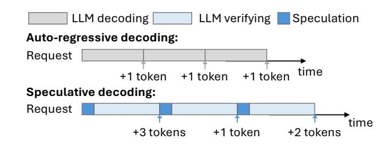
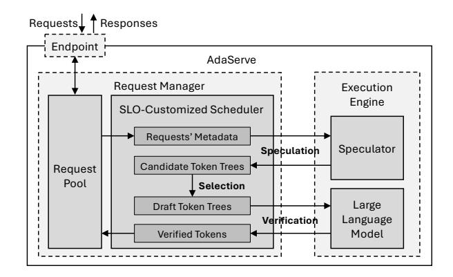
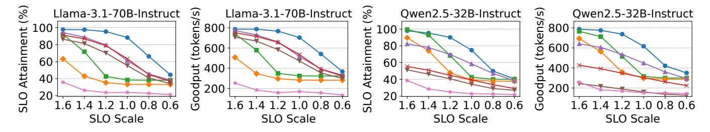
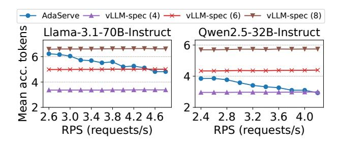
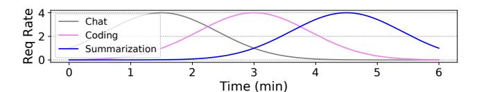
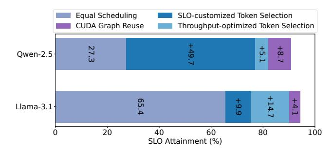

# AdaServe: Accelerating Multi-SLO LLM Serving with SLO-Customized Speculative Decoding

Zikun Li\* Carnegie Mellon University USA

Gabriele Oliaro Carnegie Mellon University USA

Shuhuai Lin Carnegie Mellon University USA

Zhuoming Chen Carnegie Mellon University USA Zhuofu Chen\*† Princeton University USA

Zeyu Wang Carnegie Mellon University USA

April Yang Carnegie Mellon University USA

Yi-Hsiang Lai Amazon Web Services USA Remi Delacourt EPFL Switzerland

Qinghan Chen Carnegie Mellon University USA

Zhihao Zhang Carnegie Mellon University USA

Xinhao Cheng Carnegie Mellon University USA

Xupeng Miao Purdue University USA Zhihao Jia Carnegie Mellon University Amazon Web Services USA

#### **Abstract**

Modern large language model (LLM) applications exhibit diverse service-level objectives (SLOs), from low-latency requirements in interactive coding assistants to more relaxed constraints in data wrangling tasks. Existing LLM serving systems, which rely on uniform batching and scheduling strategies, often fail to meet these heterogeneous SLOs concurrently. We present AdaServe, the first LLM serving system designed to support efficient multi-SLO serving through SLO-customized speculative decoding. AdaServe formulates multi-SLO serving as a constrained optimization problem and introduces a hardware-aware algorithm that constructs a speculation tree tailored to each request's latency target. It features a speculate-select-verify pipeline that enables fine-grained control over decoding speed while maximizing system throughput. AdaServe further adapts to workload variation by dynamically adjusting speculation parameters. Evaluations across diverse workloads show that AdaServe reduces SLO violations by up to 4.3× and improves goodput

 $<sup>^\</sup>dagger \text{Work}$  done during internship at Carnegie Mellon University.


This work is licensed under a Creative Commons Attribution-NonCommercial-NoDerivatives 4.0 International License.

 $EUROSYS~{\it '26}, Edinburgh, Scotland~Uk$ 

© 2026 Copyright held by the owner/author(s). ACM ISBN 979-8-4007-2212-7/26/04 https://doi.org/10.1145/3767295.3769315 by up to 1.9× compared to the best-performing baselines,

highlighting its effectiveness in multi-SLO serving.

CCS Concepts: • Computing methodologies  $\rightarrow$  Artificial intelligence; Parallel computing methodologies; • Information systems  $\rightarrow$  Computing platforms.

**Keywords:** Large Language Model Serving, Speculative Decoding, Generative AI

## **ACM Reference Format:**

Zikun Li, Zhuofu Chen, Remi Delacourt, Gabriele Oliaro, Zeyu Wang, Qinghan Chen, Shuhuai Lin, April Yang, Zhihao Zhang, Zhuoming Chen, Yi-Hsiang Lai, Xinhao Cheng, Xupeng Miao, and Zhihao Jia. 2026. AdaServe: Accelerating Multi-SLO LLM Serving with SLO-Customized Speculative Decoding. In 21st European Conference on Computer Systems (EUROSYS '26), April 27–30, 2026, Edinburgh, Scotland Uk. ACM, New York, NY, USA, 20 pages. https://doi.org/10.1145/3767295.3769315

#### 1 Introduction

Large language models (LLMs) such as ChatGPT, Gemini and Claude have revolutionized various applications including conversational chatbots [2, 11, 15, 41], code generation tools [7, 27, 46], and virtual assistants [12, 53]. Despite these advances, deploying LLMs in real-world settings remains challenging, particularly in ensuring timely and reliable responses under varying operational conditions. Modern industrial LLMs are trained to support an increasingly diverse range of applications. These applications exhibit varying service-level objectives (SLOs), driven by user expectations

1

<sup>\*</sup>Contributed equally.

and operational contexts. For example, LLM-powered chatbots must deliver text responses at rates slightly exceeding human reading speed, approximately 10 tokens per second [4, 29, 60]. In contrast, coding copilots require much faster responses—producing tens of tokens within 400ms—to ensure seamless interactions [10, 51]. Furthermore, emerging applications in complex reasoning [17, 20] and data wrangling [37] can tolerate higher latencies, as they prioritize depth and result quality over immediacy.

The diverse SLOs of various LLM applications present substantial challenges for LLM serving infrastructures. Existing systems typically employ a *uniform* serving strategy, treating incoming requests homogeneously without considering their specific SLOs. State-of-the-art systems like vLLM [22] and TensorRT-LLM [38] leverage *continuous batching* to improve throughput and GPU utilization by batching tokens from different requests [58]. This method schedules execution at the iteration granularity, resulting in uniform per-token latency across batched requests. As shown in Figure 2, existing systems using continuous batching for multi-SLO LLM serving may violate the stringent SLOs.

Enhancing serving systems to deliver smoother and faster user experiences in online inference has become a central focus of recent research, with many works proposing techniques to improve the SLO attainment of continuous batching. For example, Sarathi-Serve [1] introduces chunked-prefill, partitioning long prefill requests into smaller segments to reduce Time-to-First-Token (TTFT). FastServe [54] employs preemptive scheduling to mitigate latency from long sequences. VTC [47] ensures fair scheduling by tracking processed tokens for each service and prioritizing under-served requests. Despite advances in capacity, adaptivity, and fairness, existing approaches lack explicit mechanisms to accommodate concurrent, heterogeneous SLOs and, as shown in Figure 1, consistently fail to prioritize stricter requests.

Optimizing continuous batching alone cannot resolve its structural limitation in multi-SLO serving, as iteration-level scheduling enforces uniform per-token latency. A deeper challenge arises from the inherent tradeoff between latency and throughput: satisfying tight SLOs requires restricting batch sizes, which reduces throughput, increases congestion, and ultimately degrades overall SLO attainment across request categories. For example, vLLM+Priority attempts to address urgent requests by constraining batch sizes and preempting non-urgent requests during decoding, but as shown in Figure 1, this approach further worsens SLO attainment.

High-volume multi-SLO serving requires decoupling serving throughput from per-request latency—a constraint inherent to continuous batching that must be overcome. Achieving this decoupling calls for a new paradigm. *Speculative decoding* (SD) [6, 23, 33], recently proposed in the literature, fully exploits under-utilized hardware resources to speculatively decode future tokens, thereby enabling adaptive control of

<span id="page-1-1"></span>

**Figure 1.** Existing systems cannot efficiently support multi-SLO LLM serving.

<span id="page-1-0"></span>

**Figure 2.** Comparing AdaServe and existing systems with continuous batching.

per-request latency without sacrificing throughput and offering a suitable path toward multi-SLO serving. Specifically, SD predicts multiple output tokens at once during the speculation phase, trading potential inaccuracies for substantial gains in efficiency. This process is followed by a single verification step using the LLM to simultaneously verify the correctness of the output tokens to ensure lossless generation. Unlike continuous batching and its derivatives, which conform to the conventional auto-regressive decoding model with its per-token iterative processing, speculative decoding alternates between speculation and verification phases, potentially producing multiple tokens in one step. This distinct decoding mechanism breaks the intrinsic per-token latency limitations of traditional methods, providing opportunities to dynamically allocate computational resources among batched requests, thereby more effectively meeting the diverse SLO requirements of multiple requests within the same batch.

However, integrating speculative decoding in multi-SLO LLM serving systems presents three key challenges.

Quantifying hardware processing power. Processing power of modern GPUs significantly influences the maximum number of tokens from all requests that can be verified in parallel, therefore impacting the overall throughput of the serving system. This capacity varies with hardware specifications; however, existing SD methods lack designs optimized for high-throughput serving and often overlook this aspect.

Fine-grained control of decoding speed. Existing SD methods generally focus on maximizing decoding speed. However, within the context of multi-SLO serving, the primary objectives are SLO attainment. Instead of maximizing decoding speed for individual requests, it is critical to modulate the decoding rate to use minimal hardware resources while maximally sustaining the SLOs of individual requests, therefore maximizing overall system performance.

Adapting to fluctuating workloads. Existing SD methods typically adopt a static speculation strategy [33], assuming a fixed workload and uniform performance objectives. However, in multi-SLO serving scenarios, the workload of different applications—as well as the distribution of requests with varying SLO requirements—can change significantly over time [49]. These dynamics alter the optimal tradeoff between speculation aggressiveness and speedup in SD.

To address these challenges, we propose AdaServe, the first system designed to support efficient and adaptive multi-SLO LLM serving. AdaServe is hardware-aware, utilizing profiling-based roofline models to quantify the available hardware processing power on different GPU platforms. To fully utilize the hardware capability, we introduce an algorithm that constructs theoretically *optimal* draft token trees for all requests. This algorithm ensures that each request is served at the appropriate decoding speed to meet its individual SLO while maximizing overall system throughput.

Building on this foundation, we propose *SLO-customized* speculative decoding, a practical variant of the optimal algorithm tailored to real-world deployment constraints. SLO-customized speculative decoding uses the speculator to estimate the probability of each token being verified by the LLM and constructs a near-optimal token tree for each request based on these estimates. It adopts a speculate-select-verify pipeline: the speculator first generates a candidate token tree for each request; AdaServe then selects the subset of tokens to verify with the LLM. This decoupling of speculation and selection significantly reduces the overhead of draft model decoding. Finally, AdaServe dynamically tunes the speculation parameters based on the system load, allowing it to smoothly adapt to changes in request distribution and workload intensity over time.

We have conducted extensive evaluations to compare AdaServe with existing LLM serving systems across workloads from diverse services and applications. The results show that AdaServe consistently outperforms all baselines. Specifically, AdaServe achieves up to 4.3× reduction in SLO violation rate and 1.9× higher goodput over the best baseline. Moreover, as the proportion of requests with strict SLOs increases, AdaServe maintains high SLO attainment, achieving up to 1.5× higher SLO satisfaction and 64% higher goodput relative to the best competing system. Finally, when serving requests with strict Time-Per-Output-Token (TPOT) SLO requirements, AdaServe achieves up to 1.38× higher goodput

<span id="page-2-0"></span>

**Figure 3.** Speculative decoding accelerates LLM inference.

<span id="page-2-1"></span>

Figure 4. Draft sequence and draft token tree.

than the best baseline, demonstrating a significant improvement in the latency-throughput tradeoff.

## 2 Background

LLM serving. Most modern LLMs are based on the Transformer architecture and generate tokens in an auto-regressive fashion. In each inference forward pass—referred to as a decoding iteration—the model consumes the entire input sequence and produces a single new token. This newly generated token is then appended to the input sequence for the next iteration. During each decoding iteration, only one token is produced, yet the entire model must be loaded from device memory. This results in memory-bound execution that under-utilizes GPU's compute resources and motivates batching to promote GPU utilization. Current LLM serving systems—such as vLLM [22], TensorRT-LLM [38] and Sarathi-Serve [1]—adopt continuous batching, which allows sequences to enter and leave the batch at each iteration, further increasing GPU utilization.

However, these systems struggle to support multi-SLO serving with both high SLO attainment and throughput due to two key limitations. First, continuous batching treats all requests uniformly, making it difficult to customize service for individual SLOs. Second, strict latency requirements favor small batch sizes, limiting parallelism and GPU utilization. Conversely, increasing batch size improves throughput but sacrifices latency, reducing the ability to meet tight SLOs.

**Speculative decoding.** Speculative decoding (SD) is a technique for accelerating LLM inference by enabling multiple tokens to be generated in a single decoding iteration [6, 23, 33, 55]. It uses a smaller and faster *draft model* to predict multiple candidate tokens for each request. These candidates are then verified in parallel using the full LLM in a single verification iteration [5, 14, 25, 33].

As illustrated in Figure 3, SD consists of two phases: *speculation*, where the drafter proposes token candidates, and *verification*, where the LLM checks their correctness. SD reduces per-token latency by shifting some computation to the smaller model and exploiting the underutilized compute resources of the memory-bound LLM. Verification is performed in parallel and typically incurs minimal additional latency compared to a standard decoding iteration [9].

In SD, the draft is not restricted to a linear token sequence; it can also take the form of a *draft token tree*, as illustrated in Figure 4. Tree-based speculation generalizes sequence-based drafting by offering multiple candidates per position, thereby improving speculation success rates [5, 9, 33]. The root of the draft token tree is the last generated token (or prompt token if no tokens have been generated). Each node in the tree represents a token, and paths from the root correspond to possible continuation sequences [5, 9, 24, 33]. The LLM verifies all tokens in the tree in parallel, and the length of the accepted path determines the decoding speedup achieved in that iteration.

#### <span id="page-3-2"></span>3 Problem Formulation

We now formulate the multi-SLO LLM serving problem. In each decoding iteration, given a batch of requests and the token budget—the total number of tokens to verify in this decoding iteration<sup>1</sup>—the goal of multi-SLO serving is twofold: (1) to meet the various TPOT SLO requirements of different requests in the batch and (2) to maximize the number of tokens accepted by the LLM during verification.

Formally, given a batch of n requests, denoted as  $\{r_1, \ldots, r_n\}$ , and the total token budget B, the goal is to construct n token trees  $\{T_1, \ldots, T_n\}$  for these requests to maximize the expected number of accepted tokens for one decoding iteration, which is expressed as:  $E[\sum_{i=1}^n acc(T_i)] = \sum_{i=1}^n E[acc(T_i)]$ , where acc(T) is a random variable denoting the number of accepted tokens in T by the LLM verification. This optimization is subject to the following constraints:

1. Budget constraint: The total number of nodes across all token trees must not exceed the hardware budget:

$$\sum_{i=1}^{n} |T_i| \le B \tag{1}$$

where  $|T_i|$  denotes the number of tokens in the *i*-th token tree.

2. TPOT constraint: For each request  $r_i$ , the expected number of accepted tokens must satisfy the TPOT requirement:

$$\frac{l_i + t^{spec}}{o_i + acc(T_i)} \le t_i^{TPOT}, \quad \forall i = 1, \dots, n$$
 (2)

where  $l_i$  denotes the current latency of request  $r_i$  starting from the first decoding step,  $o_i$  denotes the current number of tokens decoded in request  $r_i$ ,  $t^{spec}$  denotes the latency of a decoding iteration and,  $t_i^{TPOT}$  denotes the TPOT SLO of request  $r_i$ .

Intuitively, the budget constraint ensures that the computational intensity of LLM verification stays within the available budget, and the TPOT constraint ensures that the SLO requirements of the requests are satisfied after the current decoding iteration. For each request  $r_i$ , we can rewrite the TPOT constraint as:  $acc(T_i) \geq (l_i + t^{spec})/t_i^{TPOT} - o_i$ . To further simplify this constraint, we define  $A(r_i) = (l_i + t^{spec})/t_i^{TPOT} - o_i$ , which denotes the minimum number of tokens that must be accepted for the i-th request in the current decoding iteration to attain its TPOT SLO. With this definition, the TPOT constraint can be simplified as:  $acc(T_i) \geq A(r_i)$ ,  $\forall i = 1, \ldots, n$ . Since the values of the random variable  $acc(T_i)$  is not known during speculation, we relax the TPOT constraint by replacing  $acc(T_i)$  with its expectation. The relaxed constraint is expressed as:

$$E[acc(T_i)] \ge A(r_i), \forall i = 1, \dots, n$$
(3)

This relaxation not only simplifies the constraint but also enables a more compact expression through the following decomposition of  $E[acc(T_i)]$ .

<span id="page-3-1"></span>**Theorem 3.1** (Decomposition of the expected number of accepted tokens).

$$E[acc(T)] = \sum_{v \in T} f(v) \tag{4}$$

where f(v) is the path probability of node  $v \in T$ , defined as the probability in which the LLM accepts the path, which represents a sequence of tokens, from the root node to node v conditioned on the current token sequence of the request.

As proven in prior work [9, 24], Theorem 3.1 allows us to rewrite the relaxed TPOT constraint as:

<span id="page-3-3"></span>
$$\sum_{v \in T_i} f(v) \ge A(r_i), \forall i = 1, \dots, n$$
 (5)

Based on Theorem 3.1, we can reformulate the objective of the problem as

$$\sum_{i=1}^{n} E[acc(T_i)] = \sum_{v \in \bigcup_{i=1}^{n} T_i} f(v)$$
 (6)

<span id="page-3-0"></span><sup>&</sup>lt;sup>1</sup>The total budget is determined based on hardware profiling. AdaServe chooses an optimal budget that balances decoding throughput and latency.

<span id="page-4-1"></span>

**Figure 5.** SLO-customized speculative decoding. In this example, there are two requests in the batch. The budget is 8. In the speculation step, both requests construct a candidate token tree with 3 steps of speculator decoding and beam search where the beam width w=2. During the SLO-customized selection,  $A_{cap}(r_0)=0.6$ , and adding token  $t_1^{(0)}$ , whose approximated path probability is 0.7, to  $T_0$  is enough to attain  $r_0$ 's TPOT SLO. In the same manner, tokens  $t_1^{(1)}$  and  $t_2^{(1)}$  are added to  $T_1$   $(0.5+0.4>0.8=A_{cap}(r_1))$ . This is followed by the throughput-optimized selection with remaining budget 3, where tokens  $t_3^{(0)}$ ,  $t_5^{(0)}$  and  $t_3^{(1)}$  are added to their corresponding draft token trees because they have the largest approximated path probabilities among the remaining tokens. Now, AdaServe finishes the construction of the draft token trees for both requests. The rest of the tokens in the candidate token trees are discarded. Finally, the draft token trees are submitted to the LLM for verification.

## 4 SLO-Customized Serving

Building on the problem formulation in Section 3, this section presents our approach to multi-SLO serving. Section 4.1 introduces an algorithm that computes a globally *optimal* solution. To make this algorithm practical for real-world LLM serving, we address key integration challenges in Section 4.2, along with AdaServe 's strategies for overcoming them. These strategies are realized in a fine-grained speculative decoding pipeline, detailed in Section 4.3.

## <span id="page-4-0"></span>4.1 Optimal Token Tree Construction

We introduce an algorithm that discovers a globally optimal solution to the multi-SLO serving problem, as outlined in Section 3. The algorithm relies on the assumption that the path probability f(v) for any node v in the  $T_{inf}(r)$  of request r is known during the construction of the token trees. Here,  $T_{inf}(r)$  represents the |V|-ary infinite-depth token tree for request r, where |V| is the vocabulary size. Each node within  $T_{inf}(r)$  corresponds to a token, and the path from the root to any node v forms a sequence of tokens. This tree structure captures all possible output token sequences along with their probabilities (i.e. f(v)), which are contingent upon the current token sequence of r.

In practice, the assumption of known path probabilities does not always hold; we address this in Section 4.2. Under this assumption, however, we introduce an iterative greedy algorithm to construct optimal token trees in two steps. In <span id="page-5-1"></span>**Algorithm 1** An algorithm that outputs the optimal solution to the SLO-aware scheduling problem.

```
1: Inputs: requests \{r_1, \ldots, r_n\}, a budget B and f(v) for all v in
     T_{inf}(r_i), \forall i = 1, \ldots, n.
 2: Output: The optimal draft token tree for each request.
                                                    ▶ The set of added nodes.
 3: S<sub>added</sub> ← ∅
 4: for i = 1, ... n do
         Initialize the root of T_i.
 5:
         n_{acc}[i] \leftarrow 1.0
 6:
                        ▶ Step 1: Add nodes toward SLO requirements.
 7: for i = 1, ... n do
         while n_{acc}[i] < A(r_i) do
 8:
              if B \le 0 then
 9:
                   Return INVALID
10:
11:
              v \leftarrow \text{GetTop}(T_{inf}(r_i) - S_{added})
12:
13:
              n_{acc}[i] \leftarrow n_{acc}[i] + f(v)
              S_{added}.\mathsf{Add}(v)
14:
              B \leftarrow B - 1
15:
                                           ▶ Step 2: Add the rest of tokens.
16: while B \ge 0 do
         v \leftarrow \mathsf{GetTop}(\bigcup_{i=1}^n T_{inf}(r_i) - S_{added})
17:
         i \leftarrow \mathsf{GetRegIdx}(v)
18:
         T_i.Add(v)
19:
         S_{added}. Add(v)
20:
         B \leftarrow B - 1.
21:
22: Return \{T_1, ..., T_n\}.
```

the first step, the algorithm grows each request's draft token tree (i.e.,  $T_i$ ) by selecting and inserting the node with the highest f(v) from  $T_{inf}(r)$ . This procedure is repeated until the TPOT constraints (Equation (5)) are satisfied for all requests. If the algorithm determines that the TPOT SLOs cannot be simultaneously met within the given budget, it returns INVALID. In the second step, the algorithm allocates any remaining budget to insert additional high-f(v) nodes from the union of all  $T_{inf}(r_i)$ , where each  $T_{inf}(r_i)$  represents the |V|-ary infinite-depth token tree for request  $r_i$ .

Appendix B shows that a node chosen greedily by this algorithm is always connected to its parent, ensuring that the constructed token trees are valid. The pseudocode for this algorithm is presented in Algorithm 1. A formal proof of the algorithm's optimality is given in Appendix C.

#### <span id="page-5-0"></span>4.2 Challenges

Applying the optimal token tree construction algorithm in practice presents two key challenges. Next, we describe them and the techniques used in AdaServe to address them.

**Challenge 1: unknown path probabilities** f(v). Algorithm 1 assumes that the path probability f(v) for any node  $v \in T_{total}$  is known during token tree construction. However, in practice, these probabilities are not available a priori. They depend on the LLM's verification of all speculated tokens within the token tree and the subsequent computation of

acceptance rates—steps that can only be performed after the token tree has been constructed.

**Solution.** Our key insight is to leverage the logits of the drafter to approximate path probabilities. Specifically, for all  $v \in T_{inf}(r_i)$ , we approximate:

$$\prod_{u \in Path(v)} M_q(u|X, Path(u.parent)) \approx f(v)$$
 (7)

where  $M_q$  denotes the draft model used for speculation, which takes a token sequence as input and outputs a probability distribution over the vocabulary. The function Path(v) denotes the sequence of nodes from the root of the token tree to node v. This observation is supported by prior work [24].

Intuitively, draft models used for speculation are generally trained using the same datasets and with similar objectives as the target LLMs, yielding comparable language modeling capabilities. Moreover, recent studies [25, 61] show that draft models distilled from large models perform well in speculative decoding. Distillation aligns the logits of the draft model with those of the large model, making them well-suited for approximating conditional acceptance probabilities. Consequently, the logits of the draft model are accurate surrogates for estimating f(v) during token tree construction.

Notably, AdaServe is architecture-agnostic to the drafter: any model that produces token-level logits aligned with the verifier's distribution can be used, including smaller models from the same family as the target LLM, knowledge-distilled drafters (e.g., EAGLE [25]), and multi-token prediction (MTP) heads (e.g., DeepSeek-R1 [17]). This flexibility allows AdaServe to leverage a wide range of draft models without being tied to a specific architecture.

Challenge 2: high speculation overhead. In speculative decoding, the draft model generates output tokens in an auto-regressive manner, introducing significant speculation overhead. In Algorithm 1, both construction steps rely on the GetTop operation, which selects the node with the highest path probability from one or multiple token trees. For a single token tree, a straightforward implementation of GetTop maintains a global candidate set containing all nodes whose parents have already been processed by the draft model but which themselves have not yet been decoded. Each candidate node is associated with an approximated path probability.

The candidate set is initialized with the root node of the token tree, assigned a path probability of 1. Algorithm 1 then repeatedly selects the node with the highest path probability from the candidate set and adds it to the token tree. Once a node is decoded by the draft model, its child nodes, along with their approximated path probabilities, are inserted into the candidate set. The second step of Algorithm 1 follows a similar strategy.

However, this approach results in (B - n) draft model decoding steps, where B is the total token budget and n is the number of requests in a batch. Since each new node

addition requires a draft model decoding, and  $B \gg n$  in practical settings, the cumulative speculation overhead becomes prohibitively large.

**Solution.** The inefficiency in Algorithm 1 arises from the interleaving of top-node selection and draft model decoding, where each decoding step processes only one token. To address this issue, we decouple token tree construction into two distinct phases: a *speculation phase* and a *selection phase*.

In the speculation phase, we use parallel decoding to construct a candidate token tree sufficiently large to cover all potential top nodes. In the subsequent selection phase, we identify the highest-probability nodes from the candidate tree to construct the final token trees for LLM verification.

Separating speculation and selection eliminates the inefficiency of interleaved decoding and selection, allowing the draft model to operate more efficiently. The soundness of this method is supported by the following theorem.

<span id="page-6-1"></span>**Theorem 4.1** (Bounding the optimal draft token tree). Let the total token budget be B and let  $T_{opt}$  denote the optimal draft token tree produced by Algorithm 1. Let  $D_{opt} = D(T_{opt})$  be the maximum depth of any node in  $T_{opt}$ .  $T_{opt}$  is guaranteed to be a subtree of a candidate tree  $T_{cand}$  constructed via a  $D_{opt}$ -step beam search with beam width B.

Theorem 4.1 implies that in the speculation phase, a candidate tree containing  $T_{opt}$  can be constructed with only  $D_{opt}$  draft-model decoding steps via beam search. Generalizing this result, the optimal token trees for all requests can be covered using at most  $D_{opt} = \max(D(T_{opt}(r_i)))$ , where i = 1, ..., n denotes the required decoding steps.

Furthermore, if  $\operatorname{argmax}_{i=1}^n(D(T_{opt}(r_i)) = j$ , we can derive:  $D_{opt} = D(T_{opt}(r_j)) \leq |T_{opt}(r_j) - 1| \leq \sum_{i=1}^n |T_{opt}(r_i) - 1| = \sum_{i=1}^n |T_{opt}(r_i)| - n = B - n$ . Equality holds only in rare cases where all but one optimal token tree consist solely of root nodes, while the remaining tree forms a long sequence. In practice, such extreme imbalance is unlikely to occur, and empirically, we observe that  $D_{opt} \ll B - n$ .

Importantly, it is not necessary to include all tokens from  $T_{opt}$ , particularly when doing so would incur high decoding costs. By tuning the beam search depth d and beam width w, AdaServe allows a flexible trade-off between speculation accuracy and decoding overhead. This separation of speculation and selection phases significantly improves the efficiency of speculator decoding by leveraging parallelism. Based on these insights, we propose SLO-customized speculative decoding as the core technique of AdaServe.

#### <span id="page-6-0"></span>4.3 SLO-Customized Speculative Decoding

Each decoding iteration in SLO-customized speculative decoding consists of four steps: speculation, SLO-customized selection, throughput-optimized selection, and verification. This section introduces the design and purpose of each stage. The pseudocode for these steps is presented in Algorithm 2.

Step 1: speculation. In the speculation step, a beam search algorithm is used to construct candidate token trees for each request, as illustrated in Figure 5. Initially, each request's candidate token tree consists solely of a root node, which represents the last generated token or the prompt if no text has yet been generated. The n root tokens for all requests are processed in parallel. In the first decoding step, the draft model processes all root nodes and produces |V| potential child nodes for each node. For each request, the w child nodes with the highest approximated path probabilities  $M_q(v|X, Path(v.parent))$  are selected and added to its candidate token tree.

Starting from the second decoding step, the draft model processes all tokens selected in the previous step— $n \times w$  tokens in total—in parallel. For each request, the draft model generates  $w \times |V|$  potential tokens, and the w with the highest approximated path probabilities are chosen to expand the candidate token tree further. After completing d speculation steps, each request  $r_i$  has an associated candidate token tree  $T_{cand}(r_i)$  with a depth of d, where all layers except the first contain exactly w nodes.

An example is shown in Figure 5, where the draft model performs three decoding steps to construct candidate token trees with a depth of 3 and a beam width of 2. The parameters d and w are dynamically determined based on the system load (see Section 5). Note that sequence-based speculation is a special case of this framework, corresponding to a fixed beam width of w = 1, and is thus naturally supported.

The speculation phase is followed by two selection phases: the SLO-customized token selection and the throughputoptimized token selection.

Step 2: SLO-customized token selection. In this phase, each request selects tokens from its candidate token tree to construct a draft token tree that satisfies its TPOT requirement. According to the TPOT constraint (Equation (5)), the total approximated path probabilities of all nodes in a request's draft token tree must exceed A(r), the minimum number of tokens that must be accepted to attain the SLO.

However, this requirement may not always be feasible. The number of verifiable tokens per request is upper bounded by d+1. If A(r)>d+1, the SLO cannot be fully satisfied within the current iteration. In this case, AdaServe caps the target threshold using  $A_{cap}(r) = \min(A(r), d+1)$ , indicating the maximum attainable progress toward the SLO for require r. For each request r, AdaServe iteratively selects nodes from  $T_{cand}(r_i)$  with the highest approximated path probabilities and adds them to the draft token tree  $T_i$  until the cumulative approximated path probabilities of all tokens in  $T_i$  reach or exceed  $A_{cap}(r_i)$ .

As shown in the SLO-customized selection step of Figure 5, request  $r_0$  requires  $A_{cap}(r_0) = 0.6$ , so only node  $t_1^{(0)}$  is added to  $T_0$ . For request  $r_1$ ,  $t_1^{(1)}$  alone is insufficient, so  $t_2^{(1)}$  is also added to satisfy  $A_{cap}(r_1) = 0.8$ .

When the budget is insufficient to meet all SLOs, AdaServe prioritizes slower requests—those with larger  $A(r_i)$ —by processing them in descending order of their SLO requirement. However, challenges arise when satisfying  $A_{cap}(r_i)$  for request  $r_i$  requires many low-probability nodes, yielding diminishing returns and may deplete the budget disproportionately. In extreme cases, all nodes in  $T_{cand}(r_i)$  may be added to  $T_i$  without meeting the threshold, monopolizing the budget and degrading system-wide performance.

To address this issue, AdaServe enforces a per-request token limit  $n_{max}$  during the SLO-customized selection phase. This constraint prevents excessive allocation to low-probability nodes and ensures more balanced and efficient use of recourses across all requests.

Step 3: throughput-optimized selection. While the first two phases focus on satisfying the SLOs of individual requests, this phase aims to maximize overall system throughput. AdaServe selects the remaining tokens by globally ranking all candidate nodes across requests based on their approximated path probabilities and greedily adding the top-scoring nodes to the draft token trees. This process continues until the overall token budget is exhausted.

As illustrated in the throughput-optimized token selection step of Figure 5, suppose the remaining budget is 3. AdaServe selects the top three nodes— $t_3^{(0)}$ ,  $t_3^{(1)}$ , and  $t_5^{(0)}$ —as they have the highest approximated path probabilities among all remaining candidate nodes, and sequentially adds them to the corresponding draft token trees.

Step 4: verification. In the final step, AdaServe submits the draft token trees for all requests to the LLM, which verifies the correctness of all speculated tokens in parallel. AdaServe adopts a tree-based verification strategy, as introduced in prior work [9, 23, 33, 50], which efficiently verifies multiple speculative paths by leveraging shared prefixes and minimizing redundant computation. This parallel verification step determines which tokens are accepted and enables the system to advance the decoding process accordingly.

## <span id="page-7-1"></span>5 System Design and Optimizations

## 5.1 Overview of AdaServe

Figure 6 presents an overview of AdaServe, which consists of two main components: the *request manager* and the *execution engine*. The request manager maintains a pool of active requests and includes an SLO-customized scheduler that implements SLO-customized speculative decoding. The execution engine is responsible for executing both the draft and target models on GPUs. At the beginning of each speculation iteration, the SLO-customized scheduler retrieves all active requests from the request pool and initiates the speculation phase of SLO-customized speculative decoding by instructing the execution engine to run the draft model for *d* decoding steps. Once the speculation phase completes, the

<span id="page-7-0"></span>**Algorithm 2** SLO-customized speculative decoding: an adaption of Algorithm 1 that addresses real-system challenges.

1: **Inputs:** a small model  $M_q$ , requests  $\{r_1, \ldots, r_n\}$ , a budget B, depth d, beam width w and  $n_{max}$ , the upper limit of tokens added to a request's draft token tree during SLO-customized selection.

```
2: Output: The token tree for each request.
                                                                       ▶ Initialization.
 3: S_{added} \leftarrow \emptyset
                                                        ▶ The set of added nodes.
 4: for i = 1, ... n do
          Initialize the root of T(r_i).
          n_{acc}[i] \leftarrow 1.0
          B \leftarrow B - 1.
                                                         ▶ The speculation phase.
 8: \{T_{cand}(r_1), \dots, T_{cand}(r_n)\} \leftarrow \operatorname{Spec}(M_q, \{r_1, \dots, r_n\}, d, w)
                                                    ▶ SLO-customized selection.
 9: \{r'_1, \ldots, r'_n\} = \text{Sort}(\{r_1, \ldots, r_n\}, \text{key} = A(r))
10: n'_{acc} = Sort(n_{acc}, key = A(r))
11: for i = 1, ... n do
          while n'_{acc}[i] < A_{cap}(r'_i) \wedge |T(r'_i)| < n_{max} \wedge B \ge 0 do
               v \leftarrow \text{GetTop}(T_{cand}(r_i') - S_{added})
13:
               T(r_i').\mathsf{Add}(v)
14:
               n'_{acc}[i] \leftarrow n'_{acc}[i] + M_q(v|X(r'_i), Path(v.parent))
15:
               S_{added}.Add(v)
16:
               B \leftarrow B - 1.
                                           ▶ Throughput-optimized selection.
18: while B \ge 0 do
          v \leftarrow \mathsf{GetTop}(\bigcup_{i=1}^{n} T_{cand}(r_i) - S_{added})
19:
20:
          r \leftarrow \mathsf{GetReq}(v)
21:
          r.T.\mathsf{Add}(v)
22.
          S_{added}.Add(v)
          B \leftarrow B - 1.
24: Return \{T(r_1), \ldots, T(r_n)\}.
```

selection phases are executed to construct draft token trees for all requests. These draft token trees are then submitted to the large language model for verification. After verification, the logits of the nodes in each tree are returned to the SLO-customized scheduler. The scheduler uses these logits to identify the verified tokens for each request, which are then stored back into the request pool for the next iteration or final output assembly.

#### 5.2 System Optimizations

**Adaptive control.** The depth (d) and beam width (w) of the speculation tree directly affect the decoding overhead of the draft model. Larger values of d and w can significantly increase speculation cost, especially under high system load. In practice, the number of active requests n varies over time, and using fixed values for d and w fails to adapt to this dynamic workload.

When many requests are active, the average token budget per request decreases, limiting the viable depth and width of each token tree. In such cases, large *d* and *w* values generate excessive speculative tokens that are likely to be discarded,

<span id="page-8-0"></span>

Figure 6. Overview of AdaServe.

leading to wasted computation. Conversely, when the system load is low, each request can be allocated more tokens. Using small fixed values in these cases limits the potential performance gains from deeper and wider trees.

To address this issue, AdaServe dynamically adjusts and based on the current number of active requests using the following policy at the beginning of each iteration:

$$d = \operatorname{clip}(D_{max}, D_{min}, \lfloor \frac{B_1}{n + c_1} \rfloor - 1)$$
 (8)

$$w = \operatorname{clip}(W_{max}, 1, \lfloor \frac{B_2}{n} \rfloor + c_2)$$
(9)

Here, , , and are predefined bounds for tree depth and width. <sup>1</sup> and <sup>2</sup> denote the total number of tokens allocated per decoding step for the verifier and the speculator, respectively.<sup>1</sup> and <sup>2</sup> are tunable constants, selected via grid search. The clip function constrains its third argument within the specified upper and lower bounds.

Speculation depth has the most significant impact on overhead. The formula for is designed to ensure that the number of speculative tokens remains within the average verification budget per request, minimizing the likelihood of excessive speculative computation being wasted.

GPU optimizations. Enabling efficient multi-SLO serving on GPUs introduces additional challenges. One such challenge involves leveraging CUDA graphs [\[16\]](#page-13-13), which reduce kernel launch overhead by capturing a sequence of GPU kernel executions and their dependencies into a computation graph. This graph can then be replayed efficiently in subsequent iterations. However, reusing a CUDA graph requires that kernel shapes and input dimensions remain identical to those used during the initial capture. AdaServe utilizes CUDA graphs to accelerate draft model decoding. In the speculation phase, decoding steps from the second to the -th step perform the same operations: each of the requests generates tokens, resulting in consistent computation patterns. Furthermore, across iterations with the same number of active requests , the decoding shapes and workloads remain unchanged. This structural regularity allows AdaServe

<span id="page-8-1"></span>

| Model                 | Parallelism | GPUs            |
|-----------------------|-------------|-----------------|
| Llama3.1-70B-Instruct | 4-way TP    | 4<br>× A100 80G |
| Qwen2.5-32B-Instruct  | 2-way TP    | 2<br>× A100 80G |

Table 1. Evaluation setups for different models. "TP" stands for tensor parallelism.

to reuse pre-captured CUDA graphs across multiple steps and iterations, significantly reducing GPU launch overhead.

# 6 Evaluation

## 6.1 Experimental Setup

Implementation and device. We implement AdaServe on top of FlexFlow Serve [\[21\]](#page-14-16), a low-latency, high-throughput LLM serving framework. To further optimize performance, we integrate the batched prefill kernel from FlashInfer [\[57\]](#page-15-6), a high-performance kernel library for LLM serving. This kernel is adapted for both speculation steps and LLM verification. During the implementation of AdaServe, frameworks like vLLM [\[22\]](#page-14-7) and SGLang [\[59\]](#page-15-7) lacked tree attention, but with recent support added, the optimizations in AdaServe can be readily integrated into mainstream systems. All evaluations are performed on a compute node equipped with four NVIDIA A100 80GB GPUs, interconnected via NVLink. The node is powered by an AMD EPYC 7763 CPU with 64 cores (128 threads) and 256 GB of DRAM.

Models. Table [1](#page-8-1) summarizes the models, parallelism strategies, and GPU configurations used in our evaluation. This setup is applied consistently across AdaServe and all baseline systems. For speculative decoding experiments, the draft model is collocated with the base model on one of the GPUs. We use Llama3 [\[13\]](#page-13-14) and Qwen2.5 [\[56\]](#page-15-8) models, as their architectures are representative of modern LLMs. The draft model is the smallest off-the-shelf model from the same family as the base: LLaMA-3.2-1B-Instruct is used for LLaMA 3, and Qwen2.5-0.5B-Instruct for Qwen2.5. No task-specific customization is applied.

Baselines. We compare AdaServe against state-of-the-art LLM serving systems, including vLLM [\[22\]](#page-14-7), Sarathi-Serve [\[1\]](#page-13-8), vLLM augmented with speculative decoding and SpecInfer [\[33\]](#page-14-11). vLLM introduces PagedAttention [\[22\]](#page-14-7), a memory management technique that improves throughput by mitigating fragmentation. Sarathi-Serve [\[1\]](#page-13-8) leverages chunked prefill to jointly batch the prefill and decoding stages across multiple requests, enhancing hardware utilization and reducing per-token latency. We also evaluate speculative decoding baselines built on top of vLLM, which implement efficient sequence-based speculative decoding. We include variants with different speculation lengths, denoted as vLLM-Spec(), where represents the number of speculated tokens. All evaluations use the latest version of vLLM available at the time of submission (v0.8.4). While the above baselines are

<span id="page-9-0"></span>

| Category | Cat. 1                 | Cat. 2  | Cat. 3        |
|----------|------------------------|---------|---------------|
| App      | Coding copilot         | Chatbot | Summarization |
| SLO      | 1.2 × Baseline latency | 50ms    | 150ms         |

**Table 2.** Request categories and their SLOs.

<span id="page-9-1"></span>

**Figure 7.** Request frequency of the real-world trace.

built on general-purpose LLM serving systems (e.g., vLLM), we also compare AdaServe with SpecInfer [33], a state-of-the-art inference engine that natively integrates speculative decoding for low-latency LLM serving.

**Workloads.** We evaluate AdaServe using a mixture of requests from different applications, each with distinct SLO requirements, following prior work [60]. We consider requests from three categories, as summarized in Table 2. For each model, we measure a *baseline latency* when the system load is close to zero, which serves as a reference point for setting TPOT SLOs across different request categories following prior work [28, 60].

For this category, we simulate code completion tasks using prompts from the HumanEval dataset [7], which contains 164 programming problems. The SLO for this category is set to 1.2× the baseline latency, a stringent target that permits a 20% slowdown to support high-throughput serving. This SLO setting aligns with the SLO for latency-sensitive interactive applications in MLPerf v5.0 [45], which specifies 40ms per token for Llama 70B models [35, 36].

The second category includes chatbot requests. To maintain a responsive user experience, chatbots must stream tokens faster than users can consume them. While normal human reading speed is 200-300 words per minute, skimming can occur at 2-4× that rate, translating to a per-token latency requirement of slightly under 50ms [44]. Thus, we adopt 50ms per token as the SLO for this category. We use the Alpaca dataset [52] which contains 52k instruction-following examples to simulate chatbot interactions.

The third category includes tasks with relaxed latency requirements, such as LLM-based summarization, where higher TPOT SLOs are acceptable. We set the SLO to 150ms per token, consistent with prior work and benchmark settings [35, 36, 60]. For this category, we use summarization tasks from the CNN/DailyMail dataset [3], which contains news articles paired with human-written summaries.

We use the timestamps from a real-world trace from previous work, visualized in Figure 7, to generate traces in our evaluation [42]. We truncate and rescale the trace to obtain

traces with different averaged request per second (RPS). For each arriving request, we first sample its category according to a specified probability distribution and then sample a request from the dataset uniformly.

Metrics. We use SLO attainment and goodput as our primary metrics. SLO attainment is the percentage of requests in a workload that meet their SLO. Specifically, a request is considered to fulfill its SLO if its average per-token latency is no greater than the specified TPOT SLO threshold. Goodput is measured as the number of tokens generated per second for requests that successfully attain their SLO. Since AdaServe targets decoding speed SLOs and not prefill latency, we exclude TTFT from our metrics.

#### 6.2 End-to-End Comparison

Changing request arrival rate. We first evaluate the end-to-end performance of AdaServe under increasing request arrival rates by comparing AdaServe's SLO attainment and goodput against those of vLLM, Sarathi-Serve, and vLLM-Spec. The workload consists of 60% category 1 requests, 20% category 2 requests, and 20% category 3 requests. This mix represents a peak load scenario for latency-critical tasks (category 1), while workloads for categories 2 and 3 are lighter, allowing us to assess system performance under stringent task conditions.

As shown in Figure 8 and Figure 9, AdaServe consistently achieves higher SLO attainment and goodput across all models and request rates compared to the baselines, with the performance gap widening as the request rate (RPS) increases. AdaServe improves the SLO attainment by  $2.1\times$  and  $1.6\times$  over the best baseline on the two models, respectively. At the highest RPS, AdaServe reduces the number of unattained requests by  $4.3\times$  and  $3.2\times$ , respectively. In terms of goodput, AdaServe delivers  $1.9\times$  and  $1.7\times$  higher goodput than the best baseline under the two settings.

vLLM and Sarathi-Serve both struggle to meet stringent SLOs. This is primarily due to their reliance on continuous batching, which enforces a uniform TPOT SLO across all requests in a batch. As the request rate increases, the running batch size also increases, leading to higher per-token latency and lower SLO attainment. In contrast, SLO-customized speculative decoding enables AdaServe to dynamically allocate hardware resources based on individual request SLOs, allowing it to prioritize latency-critical requests. This selective prioritization leads to significantly improved SLO attainment and goodput, even with high request arrival rates.

vLLM-Spec outperforms other baselines; however, its performance degrades significantly as the request arrival rate increases. These results highlight the limitations of static speculation methods, which fail to account for diverse SLO requirements and dynamic workload variations. Specifically, vLLM-Spec adopts a fixed speculation strategy that cannot adapt to the applications' latency needs or the system's

<span id="page-10-0"></span>

Figure 8. SLO attainment w.r.t. RPS.


Figure 9. Goodput w.r.t. RPS.

<span id="page-10-1"></span>

Figure 10. SLO attainment and goodput w.r.t. urgent request proportion.

<span id="page-10-2"></span>

Figure 11. SLO attainment and goodput w.r.t. SLO scale.

current workload. When the workload is low, allocating only a small number of speculative tokens results in underutilization of hardware and limited performance gains. Conversely, under high-load conditions with large batch sizes, the static strategy generates too many speculated tokens, leading to high verification overhead and degraded efficiency. In contrast, AdaServe enables fine-grained distribution of hardware resources based on per-request SLOs and dynamically adjusts both the depth and width of the candidate token tree to adapt to workload changes. This adaptivity allows AdaServe to maximally utilize hardware resources, maintaining high efficiency even with large batch sizes.

SpecInfer shows consistently low performance across models and traces. This stems from its use of a static draft tree structure, which shares the same limitations as vLLM-Spec's static sequence-based speculation. In addition, SpecInfer adopts an unlimited token budget without accounting for hardware capacity: each draft token tree contains 23 tokens with no upper limit on the total number of tokens. Most of

these tokens are discarded. This wastes processing power for minimal gain, substantially reducing verification efficiency.

As shown in Figure 8 and Figure 9, AdaServe's SLO attainment also decreases as the request rate increases. This degradation is primarily due to larger batch sizes reducing the average token budget available per request, which limits the effectiveness of speculative decoding. Additionally, higher request arrival rates introduce higher prefilling overhead, making it increasingly challenging to meet SLOs.

Changing application distribution. In this evaluation, we fix the request arrival rate at 4.0 requests per second and vary the proportion of latency-stringent requests. This setup allows us to evaluate how AdaServe performs compared to baseline systems in terms of SLO attainment and goodput under different levels of workload stringency.

As shown in Figure 10, AdaServe consistently outperforms all baselines across varying proportions of latency-stringent requests. AdaServe maintains stable SLO attainment in all scenarios, while the performance of the baseline systems fluctuates significantly with workload distribution. AdaServe reduces the number of SLO violations by up to  $4.3\times$  and  $3.7\times$  compared to the best-performing baseline under the two model settings, respectively. It also achieves up to 30% and 64% higher goodput over the best baseline.

The SLO attainment and goodput of vLLM and Sarathi-Serve drop sharply as the fraction of urgent requests grows. This is because continuous batching systems can only satisfy stringent SLOs with small batch sizes. As the system accumulates more requests, batch sizes grow, increasing latency and causing SLO violations for time-sensitive requests. In contrast, vLLM-Spec and AdaServe exhibit the opposite trend. SD accelerates request processing, helping satisfy tighter SLOs even as the share of urgent requests increases. As a result, their SLO attainment remains steady or even improves under higher stringency. Although built on SD, SpecInfer exhibits the same trend as continuous batching systems due to high speculation overhead and the lack of optimized CUDA kernels and CUDAGraph, preventing it from meeting the SLOs of urgent requests.

Interestingly, both the SLO attainment and goodput of AdaServe and vLLM-Spec increase as the proportion of urgent requests rises. This is because a lower share of urgent requests corresponds to a higher share of category-3 requests (e.g., summarization) with longer contexts, which increases the prefilling overhead. vLLM-Spec, which lacks awareness of individual decoding speeds, cannot effectively mitigate this overhead. In contrast, AdaServe dynamically adapts based on each request's decoding progress and SLO, enabling smarter compute allocation and improved performance in both SLO attainment and throughput.

*Changing SLO-Scale.* In this evaluation, we fix the request rate at 4.0 RPS and set the proportion of urgent requests to 0.6. We then vary the SLO scale of the most urgent request

<span id="page-11-0"></span>

**Figure 12.** Mean accepted tokens per request per verification in speculative decoding.

<span id="page-11-1"></span>

**Figure 13.** Request arrival pattern of the synthetic trace.

relative to the baseline latency to assess each system's ability to meet increasingly strict latency requirements. As shown in Figure 11, all systems experience reduced SLO attainment and goodput as the SLO scale becomes more stringent. However, AdaServe consistently maintains the highest performance across all settings. It achieves up to  $4.61\times$  and  $3.05\times$  lower violation rates, and up to  $1.38\times$  higher goodput than the best baseline across the two evaluated models. Continuous batching-based systems fail to meet SLOs when the scale drops below 1.0, causing their SLO attainment to fall below 40%. While vLLM-Spec supports SLO scales below 1.0, it lacks the ability to prioritize urgent requests, leading to lower SLO attainment compared to AdaServe. SpecInfer struggles with stringent SLOs due to high speculation overhead and the absence of optimized CUDA kernels and CUDAGraph.

#### 6.3 Ablation and Sensitivity Study

Speculation Accuracy. We evaluate the speculation accuracy of AdaServe by measuring the average number of tokens accepted by the LLM per verification step per request. As shown in Figure 12, AdaServe achieves high acceptance rates at low RPS levels, which gradually decrease as RPS increases. This behavior aligns with our adaptive strategy for adjusting the depth and width of the candidate tree: when the workload is light, AdaServe speculates more aggressively to maximize speedup; under heavy load, it adopts a more conservative approach to reduce verification overhead. In contrast, vLLM-Spec employs a static speculation strategy, resulting in a constant average acceptance rate regardless of RPS. However, as shown in Figure 8 and Figure 9, this static approach underperforms, particularly at high RPS, demonstrating the effectiveness of AdaServe 's dynamic adaptation.

<span id="page-12-0"></span>

**Figure 14.** SLO attainment under the synthetic trace.

<span id="page-12-1"></span>

**Figure 15.** Latency breakdown of AdaServe.

<span id="page-12-2"></span>

**Figure 16.** SLO attainment variation as key system components are incrementally added into AdaServe.

Sensitivity to Workload Fluctuations. We evaluate system performance under workload fluctuations using a synthetic trace where different request categories peak at different times. The request arrival patterns are visualized in Figure 13. The SLO attainment is shown in Figure 14. The results highlight the strength of AdaServe in handling bursty traffic from individual applications, consistently achieving higher SLO attainment compared to baseline systems.

Latency Breakdown of SLO-customized speculative decoding. We evaluate the runtime overhead of SLO-customized speculative decoding by measuring the time spent in its three main components: speculation, selection, and verification. Speculation and verification are GPU-intensive, while selection runs on the CPU. Our primary goal is to assess the CPU overhead. As shown in Figure 15, the CPU overhead is minimal—only 0.41% and 0.31% on the two evaluated models—compared to the overall serving time. These results

demonstrate that SLO-customized speculative decoding imposes negligible overhead and is well-suited for integration into speculative decoding-based serving systems.

Breakdown of Performance Gain. We evaluate the contribution of each component in AdaServe. The baseline, Equal Scheduling, distributes the token budget evenly across all requests in the batch without accounting for heterogeneous SLOs. Within each request, the token tree is constructed greedily. As shown in Figure 16, Equal Scheduling yields low SLO attainment. Incorporating SLO awareness through SLO-customized token selection raises SLO attainment to around 80%. Since SLO-customized selection does not fully utilize the token budget, combining it with throughput-optimized token selection further improves attainment. Finally, enabling CUDAGraph reduces kernel launch overhead, better utilizing hardware resources and pushing SLO attainment above 90%. These results demonstrate the effectiveness of the individual components and optimizations in AdaServe.

*Overhead of Small Models.* The speculation phase takes  $\sim 5$ ms per step for Llama-3.2-1B and  $\sim 4$ ms per step for Qwen2.5-0.5B. These small models are lightweight—Llama-3.2-1B uses 2GB of VRAM vs. 140GB for Llama-3.1-70B, and Qwen2.5-0.5B uses 1GB vs. 64GB for Qwen2.5-32B.

#### 7 Related Work

**LLM serving systems.** A wide range of systems have been proposed to enhance the efficiency and scalability of LLM serving [1, 18, 22, 31, 32, 34, 38, 40, 42, 43, 48, 58-60]. Orca [58] introduces continuous batching, allowing new requests to join an ongoing batch without waiting for its completion-a technique now standard in modern serving systems. vLLM [22] identifies GPU memory fragmentation as a key throughput bottleneck and addresses it with PagedAttention, which organizes memory in pages to reduce fragmentation. Several systems optimize the scheduling of the prefill and decode stages [1, 42, 60]. Splitwise [42] and Dist-Serve [60] observe distinct hardware utilization patterns in these stages and propose executing them on separate nodes to better utilize resources. Sarathi-Serve [1], by contrast, notes that prefill is compute-intensive while decode often underutilizes compute resource, and improves efficiency by co-batching requests from both stages. Another optimization is prefix caching, motivated by prompt repetition in multiturn interactions [43, 59]. This technique caches KV states of frequently reused prefixes in GPU memory to reduce latency. These approaches are largely orthogonal and complementary to AdaServe, which focuses on multi-SLO LLM serving—an area that remains underexplored in existing systems.

*Speculative decoding (SD).* A variety of algorithms have been proposed to determine the topology of the token tree in SD. Early approaches [5, 25, 33] use a fixed tree structure

for each iteration. More recent methods [26, 39] enable adaptive tree construction. Sequoia [9] adjusts tree size based on hardware specifications and applies dynamic programming to determine a global tree structure. In contrast, Eagle-2 [24] constructs the tree based on input context: the draft model performs beam search to propose a candidate tree and selects the top-m tokens with the highest global acceptance rates. Unlike prior work, AdaServe addresses both tree construction and the fine-grained allocation of hardware resources across requests with diverse needs. It also dynamically adjusts the speculative configuration under varying workloads.

Recent efforts have explored SD in dynamic online serving settings. SmartSpec [30] adaptively tunes draft sequence lengths based on workload and acceptance rates. SpecServe [19] incorporates service-level objectives (SLOs) into the scheduling process. However, neither supports tree-based decoding or accounts for heterogeneous request demands. A concurrent work [8] addresses the multi-SLO challenge using dynamic programming to schedule SD. In contrast, SLO-customized speculative decoding in AdaServe employs a lower-complexity, tree-based approach that improves performance. To our knowledge, AdaServe is the first to address multi-SLO serving using batched, tree-based SD to intelligently allocate compute resources across diverse requests.

#### 8 Conclusion

To address the growing demand for serving LLM requests with diverse service-level objectives (SLOs), this paper presents AdaServe, the first LLM serving system explicitly designed for multi-SLO serving. We formalize the multi-SLO serving problem and identify key limitations in existing approaches based on continuous batching and conventional speculative decoding. To overcome these challenges, we propose a theoretically optimal algorithm for constructing token trees that balance SLO attainment and system throughput. Building on this foundation, we develop SLO-customized speculative decoding, a practical and efficient solution that incorporates four stages: speculation, SLO-customized selection, throughput-optimized selection, and verification. We implement SLO-customized speculative decoding within AdaServe and evaluate its performance across a range of multi-SLO workloads. Our results show that AdaServe significantly outperforms state-of-the-art LLM serving systems, achieving higher SLO satisfaction and better goodput across diverse application scenarios.

## Acknowledgment

We thank the anonymous reviewers and our shepherd, Cheng Tan, for their valuable feedback and constructive suggestions, which helped improve the paper. This research is supported by NSF awards CNS-2211882 and CNS-2239351, and research awards from Amazon, Cisco, Google, Meta, NVIDIA, Oracle,

Qualcomm, and Samsung. The views and conclusions contained in this document are those of the authors and should not be interpreted as representing the official policies, either expressed or implied, of any sponsoring institution, the U.S. government or any other entity.

#### References

- <span id="page-13-8"></span> Amey Agrawal, Nitin Kedia, Ashish Panwar, Jayashree Mohan, Nipun Kwatra, Bhargav S Gulavani, Alexey Tumanov, and Ramachandran Ramjee. Taming throughput-latency tradeoff in llm inference with sarathi-serve. arXiv preprint arXiv:2403.02310, 2024.
- <span id="page-13-0"></span>[2] Anthropic. Claude 3.5. https://www.anthropic.com/news/claude-3-5sonnet. (Accessed on 10/11/2024).
- <span id="page-13-15"></span>[3] Yushi Bai, Xin Lv, Jiajie Zhang, Hongchang Lyu, Jiankai Tang, Zhidian Huang, Zhengxiao Du, Xiao Liu, Aohan Zeng, Lei Hou, et al. Longbench: A bilingual, multitask benchmark for long context understanding. arXiv preprint arXiv:2308.14508, 2023.
- <span id="page-13-5"></span>[4] Marc Brysbaert. How many words do we read per minute? a review and meta-analysis of reading rate. Journal of memory and language, 109:104047, 2019.
- <span id="page-13-10"></span>[5] Tianle Cai, Yuhong Li, Zhengyang Geng, Hongwu Peng, Jason D Lee, Deming Chen, and Tri Dao. Medusa: Simple Ilm inference acceleration framework with multiple decoding heads. arXiv preprint arXiv:2401.10774, 2024.
- <span id="page-13-9"></span>[6] Charlie Chen, Sebastian Borgeaud, Geoffrey Irving, Jean-Baptiste Lespiau, Laurent Sifre, and John Jumper. Accelerating large language model decoding with speculative sampling. arXiv preprint arXiv:2302.01318, 2023.
- <span id="page-13-3"></span>[7] Mark Chen, Jerry Tworek, Heewoo Jun, Qiming Yuan, Henrique Ponde De Oliveira Pinto, Jared Kaplan, Harri Edwards, Yuri Burda, Nicholas Joseph, Greg Brockman, et al. Evaluating large language models trained on code. arXiv preprint arXiv:2107.03374, 2021.
- <span id="page-13-16"></span>[8] Siyuan Chen, Zhipeng Jia, Samira Khan, Arvind Krishnamurthy, and Phillip B Gibbons. Slos-serve: Optimized serving of multi-slo llms. arXiv preprint arXiv:2504.08784, 2025.
- <span id="page-13-12"></span> Zhuoming Chen, Avner May, Ruslan Svirschevski, Yuhsun Huang, Max Ryabinin, Zhihao Jia, and Beidi Chen. Sequoia: Scalable, robust, and hardware-aware speculative decoding. arXiv preprint arXiv:2402.12374, 2024
- <span id="page-13-6"></span>[10] David Cheney. How github copilot serves 400 million completion requests a day, 2025.
- <span id="page-13-1"></span>[11] Wei-Lin Chiang, Zhuohan Li, Zi Lin, Ying Sheng, Zhanghao Wu, Hao Zhang, Lianmin Zheng, Siyuan Zhuang, Yonghao Zhuang, Joseph E. Gonzalez, Ion Stoica, and Eric P. Xing. Vicuna: An open-source chatbot impressing gpt-4 with 90%\* chatgpt quality, March 2023.
- <span id="page-13-4"></span>[12] Xin Luna Dong, Seungwhan Moon, Yifan Ethan Xu, Kshitiz Malik, and Zhou Yu. Towards next-generation intelligent assistants leveraging llm techniques. In Proceedings of the 29th ACM SIGKDD Conference on Knowledge Discovery and Data Mining, pages 5792–5793, 2023.
- <span id="page-13-14"></span>[13] Abhimanyu Dubey, Abhinav Jauhri, Abhinav Pandey, Abhishek Kadian, Ahmad Al-Dahle, Aiesha Letman, Akhil Mathur, Alan Schelten, Amy Yang, Angela Fan, et al. The llama 3 herd of models. arXiv preprint arXiv:2407.21783, 2024.
- <span id="page-13-11"></span>[14] Yichao Fu, Peter Bailis, Ion Stoica, and Hao Zhang. Break the sequential dependency of llm inference using lookahead decoding. In Forty-first International Conference on Machine Learning.
- <span id="page-13-2"></span>[15] Google DeepMind. Gemini pro. https://deepmind.google/technologies/gemini/pro/. (Accessed on 10/11/2024).
- <span id="page-13-13"></span>[16] Alan Gray. Getting started with cuda graphs, September 2019.
- <span id="page-13-7"></span>[17] Daya Guo, Dejian Yang, Haowei Zhang, Junxiao Song, Ruoyu Zhang, Runxin Xu, Qihao Zhu, Shirong Ma, Peiyi Wang, Xiao Bi, et al. Deepseek-r1: Incentivizing reasoning capability in llms via reinforcement learning. arXiv preprint arXiv:2501.12948, 2025.

- <span id="page-14-24"></span>[18] Connor Holmes, Masahiro Tanaka, Michael Wyatt, Ammar Ahmad Awan, Jeff Rasley, Samyam Rajbhandari, Reza Yazdani Aminabadi, Heyang Qin, Arash Bakhtiari, Lev Kurilenko, et al. Deepspeed-fastgen: High-throughput text generation for llms via mii and deepspeed-inference. arXiv preprint arXiv:2401.08671, 2024.
- <span id="page-14-34"></span>[19] Kaiyu Huang, Hao Wu, Zhubo Shi, Han Zou, Minchen Yu, and Qingjiang Shi. Specserve: Efficient and slo-aware large language model serving with adaptive speculative decoding. arXiv preprint arXiv:2503.05096, 2025.
- <span id="page-14-5"></span>[20] Aaron Jaech, Adam Kalai, Adam Lerer, Adam Richardson, Ahmed El-Kishky, Aiden Low, Alec Helyar, Aleksander Madry, Alex Beutel, Alex Carney, et al. Openai o1 system card. arXiv preprint arXiv:2412.16720, 2024.
- <span id="page-14-16"></span>[21] Zhihao Jia, Matei Zaharia, and Alex Aiken. Beyond data and model parallelism for deep neural networks. In Proceedings of the 2nd Conference on Systems and Machine Learning, SysML'19, 2019.
- <span id="page-14-7"></span>[22] Woosuk Kwon, Zhuohan Li, Siyuan Zhuang, Ying Sheng, Lianmin Zheng, Cody Yu, Joseph E Gonzalez, Hao Zhang, and Ion Stoica. vllm: Easy, fast, and cheap llm serving with pagedattention. See https://vllm.ai/ (accessed 9 August 2023), 2023.
- <span id="page-14-10"></span>[23] Yaniv Leviathan, Matan Kalman, and Yossi Matias. Fast inference from transformers via speculative decoding. arXiv preprint arXiv:2211.17192, 2022.
- <span id="page-14-14"></span>[24] Yuhui Li, Fangyun Wei, Chao Zhang, and Hongyang Zhang. Eagle-2: Faster inference of language models with dynamic draft trees. arXiv preprint arXiv:2406.16858, 2024.
- <span id="page-14-13"></span>[25] Yuhui Li, Fangyun Wei, Chao Zhang, and Hongyang Zhang. Eagle: Speculative sampling requires rethinking feature uncertainty, 2024.
- <span id="page-14-31"></span>[26] Yuhui Li, Fangyun Wei, Chao Zhang, and Hongyang Zhang. Eagle-3: Scaling up inference acceleration of large language models via trainingtime test, 2025.
- <span id="page-14-1"></span>[27] Yujia Li, David Choi, Junyoung Chung, Nate Kushman, Julian Schrittwieser, Rémi Leblond, Tom Eccles, James Keeling, Felix Gimeno, Agustin Dal Lago, et al. Competition-level code generation with alphacode. Science, 378(6624):1092–1097, 2022.
- <span id="page-14-17"></span>[28] Zhuohan Li, Lianmin Zheng, Yinmin Zhong, Vincent Liu, Ying Sheng, Xin Jin, Yanping Huang, Zhifeng Chen, Hao Zhang, Joseph E Gonzalez, et al. {AlpaServe}: Statistical multiplexing with model parallelism for deep learning serving. In 17th USENIX Symposium on Operating Systems Design and Implementation (OSDI 23), pages 663–679, 2023.
- <span id="page-14-3"></span>[29] Jiachen Liu, Zhiyu Wu, Jae-Won Chung, Fan Lai, Myungjin Lee, and Mosharaf Chowdhury. Andes: Defining and enhancing qualityof-experience in llm-based text streaming services. arXiv preprint arXiv:2404.16283. 2024.
- <span id="page-14-33"></span>[30] Xiaoxuan Liu, Cade Daniel, Langxiang Hu, Woosuk Kwon, Zhuohan Li, Xiangxi Mo, Alvin Cheung, Zhijie Deng, Ion Stoica, and Hao Zhang. Optimizing speculative decoding for serving large language models using goodput, 2024.
- <span id="page-14-25"></span>[31] Yixuan Mei, Yonghao Zhuang, Xupeng Miao, Juncheng Yang, Zhihao Jia, and Rashmi Vinayak. Helix: Serving large language models over heterogeneous gpus and network via max-flow. *arXiv preprint arXiv:2406.01566*, 2024.
- <span id="page-14-26"></span>[32] Xupeng Miao, Gabriele Oliaro, Zhihao Zhang, Xinhao Cheng, Hongyi Jin, Tianqi Chen, and Zhihao Jia. Towards efficient generative large language model serving: A survey from algorithms to systems. arXiv preprint arXiv:2312.15234, 2023.
- <span id="page-14-11"></span>[33] Xupeng Miao, Gabriele Oliaro, Zhihao Zhang, Xinhao Cheng, Zeyu Wang, Zhengxin Zhang, Rae Ying Yee Wong, Alan Zhu, Lijie Yang, Xiaoxiang Shi, et al. Specinfer: Accelerating large language model serving with tree-based speculative inference and verification. In Proceedings of the 29th ACM International Conference on Architectural Support for Programming Languages and Operating Systems, Volume 3, pages 932–949, 2024.

- <span id="page-14-27"></span>[34] Xupeng Miao, Chunan Shi, Jiangfei Duan, Xiaoli Xi, Dahua Lin, Bin Cui, and Zhihao Jia. Spotserve: Serving generative large language models on preemptible instances. arXiv preprint arXiv:2311.15566, 2023
- <span id="page-14-19"></span>[35] MLCommons. Mlperf inference: Datacenter, 2025.
- <span id="page-14-20"></span>[36] MLCommons. Mlperf inference v5.0 advances language model capabilities for genai, 2025.
- <span id="page-14-6"></span>[37] Avanika Narayan, Ines Chami, Laurel Orr, Simran Arora, and Christopher Ré. Can foundation models wrangle your data? arXiv preprint arXiv:2205.09911, 2022.
- <span id="page-14-8"></span>[38] NVIDIA. Tensorrt-llm. https://nvidia.github.io/TensorRT-LLM/index. html. (Accessed on 10/11/2024).
- <span id="page-14-32"></span>[39] Gabriele Oliaro, Zhihao Jia, Daniel Campos, and Aurick Qiao. Suffixdecoding: A model-free approach to speeding up large language model inference. 2024.
- <span id="page-14-28"></span>[40] Gabriele Oliaro, Xupeng Miao, Xinhao Cheng, Vineeth Kada, Ruohan Gao, Yingyi Huang, Remi Delacourt, April Yang, Yingcheng Wang, Mengdi Wu, et al. Flexllm: A system for co-serving large language model inference and parameter-efficient finetuning. arXiv preprint arXiv:2402.18789, 2024.
- <span id="page-14-0"></span>[41] OpenAI. Gpt-4o. https://openai.com/index/hello-gpt-4o/. (Accessed on 10/11/2024).
- <span id="page-14-23"></span>[42] Pratyush Patel, Esha Choukse, Chaojie Zhang, Aashaka Shah, Íñigo Goiri, Saeed Maleki, and Ricardo Bianchini. Splitwise: Efficient generative llm inference using phase splitting. In 2024 ACM/IEEE 51st Annual International Symposium on Computer Architecture (ISCA), pages 118– 132. IEEE, 2024.
- <span id="page-14-29"></span>[43] Ruoyu Qin, Zheming Li, Weiran He, Mingxing Zhang, Yongwei Wu, Weimin Zheng, and Xinran Xu. Mooncake: Kimi's kvcache-centric architecture for llm serving. arXiv preprint arXiv:2407.00079, 2024.
- <span id="page-14-21"></span>[44] Keith Rayner, Elizabeth R Schotter, Michael EJ Masson, Mary C Potter, and Rebecca Treiman. So much to read, so little time: How do we read, and can speed reading help? Psychological Science in the Public Interest, 17(1):4–34, 2016.
- <span id="page-14-18"></span>[45] Vijay Janapa Reddi, Christine Cheng, David Kanter, Peter Mattson, Guenther Schmuelling, Carole-Jean Wu, Brian Anderson, Maximilien Breughe, Mark Charlebois, William Chou, et al. Mlperf inference benchmark. In 2020 ACM/IEEE 47th Annual International Symposium on Computer Architecture (ISCA), pages 446–459. IEEE, 2020.
- <span id="page-14-2"></span>[46] Baptiste Roziere, Jonas Gehring, Fabian Gloeckle, Sten Sootla, Itai Gat, Xiaoqing Ellen Tan, Yossi Adi, Jingyu Liu, Romain Sauvestre, Tal Remez, et al. Code llama: Open foundation models for code. arXiv preprint arXiv:2308.12950, 2023.
- <span id="page-14-9"></span>[47] Ying Sheng, Shiyi Cao, Dacheng Li, Banghua Zhu, Zhuohan Li, Danyang Zhuo, Joseph E Gonzalez, and Ion Stoica. Fairness in serving large language models. In 18th USENIX Symposium on Operating Systems Design and Implementation (OSDI 24), pages 965–988, 2024.
- <span id="page-14-30"></span>[48] Ying Sheng, Lianmin Zheng, Binhang Yuan, Zhuohan Li, Max Ryabinin, Daniel Y. Fu, Zhiqiang Xie, Beidi Chen, Clark Barrett, Joseph E. Gonzalez, Percy Liang, Christopher Ré, Ion Stoica, and Ce Zhang. Flexgen: High-throughput generative inference of large language models with a single gpu, 2023.
- <span id="page-14-12"></span>[49] Jovan Stojkovic, Chaojie Zhang, Íñigo Goiri, Josep Torrellas, and Esha Choukse. Dynamollm: Designing llm inference clusters for performance and energy efficiency. arXiv preprint arXiv:2408.00741, 2024.
- <span id="page-14-15"></span>[50] Ziteng Sun, Ananda Theertha Suresh, Jae Hun Ro, Ahmad Beirami, Himanshu Jain, and Felix Yu. Spectr: Fast speculative decoding via optimal transport. Advances in Neural Information Processing Systems, 36, 2024.
- <span id="page-14-4"></span>[51] Maxim Tabachnyk and Stoyan Nikolov. Ml-enhanced code completion improves developer productivity, 2022.
- <span id="page-14-22"></span>[52] Rohan Taori, Ishaan Gulrajani, Tianyi Zhang, Yann Dubois, Xuechen Li, Carlos Guestrin, Percy Liang, and Tatsunori B. Hashimoto. Stanford alpaca: An instruction-following llama model. https://github.com/

- [tatsu-lab/stanford\\_alpaca](https://github.com/tatsu-lab/stanford_alpaca), 2023.
- <span id="page-15-0"></span>[53] Minh Duc Vu, Han Wang, Zhuang Li, Jieshan Chen, Shengdong Zhao, Zhenchang Xing, and Chunyang Chen. Gptvoicetasker: Llm-powered virtual assistant for smartphone. arXiv preprint arXiv:2401.14268, 2024.
- <span id="page-15-3"></span>[54] Bingyang Wu, Yinmin Zhong, Zili Zhang, Shengyu Liu, Fangyue Liu, Yuanhang Sun, Gang Huang, Xuanzhe Liu, and Xin Jin. Fast distributed inference serving for large language models. arXiv preprint arXiv:2305.05920, 2023.
- <span id="page-15-4"></span>[55] Heming Xia, Tao Ge, Si-Qing Chen, Furu Wei, and Zhifang Sui. Speculative decoding: Lossless speedup of autoregressive translation.
- <span id="page-15-8"></span>[56] An Yang, Baosong Yang, Beichen Zhang, Binyuan Hui, Bo Zheng, Bowen Yu, Chengyuan Li, Dayiheng Liu, Fei Huang, Haoran Wei, et al. Qwen2. 5 technical report. arXiv preprint arXiv:2412.15115, 2024.
- <span id="page-15-6"></span>[57] Zihao Ye, Lequn Chen, Ruihang Lai, Yilong Zhao, Size Zheng, Junru Shao, Bohan Hou, Hongyi Jin, Yifei Zuo, Liangsheng Yin, Tianqi Chen, and Luis Ceze. Accelerating self-attentions for llm serving with flashinfer, February 2024.
- <span id="page-15-2"></span>[58] Gyeong-In Yu, Joo Seong Jeong, Geon-Woo Kim, Soojeong Kim, and Byung-Gon Chun. Orca: A distributed serving system for Transformer-Based generative models. In 16th USENIX Symposium on Operating Systems Design and Implementation (OSDI 22), pages 521–538, Carlsbad, CA, July 2022. USENIX Association.
- <span id="page-15-7"></span>[59] Lianmin Zheng, Liangsheng Yin, Zhiqiang Xie, Jeff Huang, Chuyue Sun, Cody Hao Yu, Shiyi Cao, Christos Kozyrakis, Ion Stoica, Joseph E Gonzalez, et al. Efficiently programming large language models using sglang. arXiv preprint arXiv:2312.07104, 2023.
- <span id="page-15-1"></span>[60] Yinmin Zhong, Shengyu Liu, Junda Chen, Jianbo Hu, Yibo Zhu, Xuanzhe Liu, Xin Jin, and Hao Zhang. Distserve: Disaggregating prefill and decoding for goodput-optimized large language model serving. arXiv preprint arXiv:2401.09670, 2024.
- <span id="page-15-5"></span>[61] Yongchao Zhou, Kaifeng Lyu, Ankit Singh Rawat, Aditya Krishna Menon, Afshin Rostamizadeh, Sanjiv Kumar, Jean-François Kagy, and Rishabh Agarwal. Distillspec: Improving speculative decoding via knowledge distillation. arXiv preprint arXiv:2310.08461, 2023.

## A Expected Number of Accepted Tokens

Let  $n_{acc}$  denote the number of accepted tokens in a verification process. Define  $p_i$  as the probability of token i being accepted. The average acceptance rate across the n tokens in the verification batch is given by  $p = \frac{\sum_{i=1}^{n} p_i}{n}$ . We can compute the expected number of accepted tokens as follows:

$$E[n_{acc}] = E[\sum_{i=1}^{n} \mathbf{1}(\text{token i is accepted})]$$
 (10)

$$= \sum_{i=1}^{n} E[\mathbf{1}(\text{token i is accepted})]$$
 (11)

$$=\sum_{i=1}^{n} p_i \tag{12}$$

$$= np \tag{13}$$

The acceptance probability  $p_i$  decreases exponentially with the depth of token i in the speculation tree. Moreover, for tokens sharing the same parent node in the token tree, their acceptance probabilities sum to 1. Consequently, given a fixed number of requests in the batch, increasing the number of tokens n in the verification process leads to a lower average acceptance rate p.

## <span id="page-16-0"></span>**B** Proof for Connectivity

*Proof.* In this proof, we demonstrate that the output nodes of an iterative greedy algorithm selecting nodes with the highest values on a token tree form a valid tree.

Language models assign a probability less than 1 to each token given an input token sequence. Therefore, for any node v in the token tree (except for the root node), we have:

where parent(v) denotes the parent of node v in the token tree.

The iterative greedy algorithm ensures that when a node v is selected, all nodes v' with f(v') > f(v) have already been selected, including parent(v). Consequently, when a node is selected, its parent is guaranteed to have been selected beforehand.

We prove that the selected nodes are connected using induction:

- 1. *Base Case*: The root node is selected first because it has the highest value (f(root) = 1 > f(v)) for all other nodes v).
- 2. *Inductive Step*: Assume that at step n-1, the selected nodes are connected. For a node v at step n, the algorithm ensures that parent(v) is selected before v, f(parent(v)) > f(v). Thus, v is connected to the selected nodes.

By induction, all selected nodes collectively form a valid, connected tree.

# <span id="page-16-1"></span>C Optimality Proof for Algorithm 1

*Proof.* The proof is divided into two main parts:

- If Algorithm 1 returns INVALID, no feasible solution exists.
- 2. If a feasible solution exists, the solution returned by Algorithm 1 is optimal.

Preliminaries and Notation:

- For each request  $r_i$ , we have a token tree  $T_{inf}(r_i)$ .
- Each node v in  $T_{inf}(r_i)$  is associated with a path probability f(v).
- The goal for each request  $r_i$  is to achieve a target path probability  $A(r_i)$  (the SLO).
- We have a total budget B, which is the maximum number of tokens (nodes) that can be selected across all requests.
- We define  $N_i$  as the minimal number of tokens needed to be selected from  $T_{inf}(r_i)$  to achieve  $A(r_i)$ .

<span id="page-16-2"></span>**Lemma C.1** (Minimality in Threshold Attainment). Given a token tree and a threshold  $\tau$ , consider a greedy algorithm that repeatedly selects the node with the highest f(v) not yet chosen, until the sum of f(v) of the chosen nodes meets or exceeds  $\tau$ . Suppose this process stops after selecting n nodes. Then there is no subset of fewer than n nodes from the tree whose sum of f(v) is at least  $\tau$ .

Proof of Lemma C.1: By construction, after selecting n-1 nodes, the greedy algorithm did not meet the threshold  $\tau$ . Therefore, any subset of size less than n cannot meet or exceed  $\tau$ , since the greedy set of n-1 nodes is by definition a best possible subset of that size in terms of cumulative f(v) (no other subset of n-1 nodes can have a greater sum than the greedily chosen n-1). Thus, n is the minimal number of nodes required to surpass the threshold.

Part 1: If Algorithm 1 returns INVALID, no feasible solution exists. Consider running Algorithm 1. For each request  $r_i$ :

- 1. The algorithm attempts to meet  $A(r_i)$  by repeatedly choosing the highest f(v) node from  $T_{inf}(r_i)$  not yet chosen by any request, until  $A(r_i)$  is reached or the budget B is exhausted.
- 2. If at some step i, the algorithm cannot find enough tokens to achieve  $A(r_i)$  (i.e., it runs out of budget before  $A(r_i)$  is met), it returns INVALID.

By Lemma C.1, the minimal tokens needed to achieve  $A(r_i)$  is  $N_i$ . If the algorithm fails at request i, it means it has already allocated tokens to previous requests  $r_1, \ldots, r_{i-1}$  optimally (since it picks the highest probability nodes first). Thus, by the time it considers  $r_i$ , it has spent at least  $N_1 + N_2 + \cdots + N_{i-1}$  tokens. If it cannot fulfill  $A(r_i)$ , it implies  $N_1 + \cdots + N_i > B$ . Therefore, there is no way to allocate B

tokens to meet all  $A(r_1), \ldots, A(r_i)$  simultaneously. Since this reasoning applies for the request where the algorithm fails, if Algorithm 1 returns INVALID, no feasible solution exists.

**Part 2:** If a feasible solution exists, the returned solution is optimal. Now suppose Algorithm 1 completes successfully. It produces a solution S that satisfies  $A(r_i)$  for all i within the budget B. We need to show that if there is any other feasible solution S' that also meets all SLOs, then S is at least as good as S' (i.e., S is optimal).

To prove this, we rely on another lemma about the greedy selection of nodes under a fixed budget.

<span id="page-17-0"></span>**Lemma C.2** (Maximality Under a Fixed Budget). Given a token tree and a budget b, let a greedy algorithm select the top b nodes in terms of f(v) from that tree. This selection maximizes the sum of f(v) over all subsets of size b.

Proof of Lemma C.2: Suppose for contradiction that there is a subset V' of size b whose total sum of f(v) is greater than that of the subset V chosen by the greedy algorithm. Since the greedy algorithm picks the top b nodes, every node in  $V \setminus V'$  must have f(v) greater than or equal to that of any node in  $V' \setminus V$ . By swapping the lower-probability nodes in V' with the higher-probability nodes from V, we form a new subset that has a sum at least as large as V'. But this new subset is precisely V, contradicting the assumption that V' has a strictly greater sum. Thus, V is optimal.

Establishing optimality of the returned solution *S*:

- 1. Define  $N_i$  as the minimal tokens required to achieve  $A(r_i)$  for each request  $r_i$ . Note that  $M_i(S) \ge N_i$  for the solution S returned by the algorithm, where  $M_i(S)$  is the number of tokens allocated to  $r_i$  in S. The same holds for any other feasible solution  $S': M_i(S') \ge N_i$ .
- 2. Suppose there exists a valid solution S' that is better than S. Being "better" might mean it uses fewer tokens or achieves a higher sum of f(v) for the given budget. Consider how S' distributes tokens among requests: there must be some difference in the number of tokens allocated to at least one request, otherwise they are identical solutions.
- 3. Fix a particular distribution of the budget across the requests. For any single token tree  $T_{inf}(r_i)$  and a token count  $M_i$ , by Lemma C.2, the greedy choice of  $M_i$  nodes yields the maximum possible sum of f(v) for that budget on  $r_i$ . Thus, if S' differs from S, but assigns the same number of tokens  $M_i(S')$  to request  $r_i$  as S does, then to improve upon S's solution, S' must choose nodes with a strictly greater total sum of f(v) than S under the same budget  $M_i(S)$ . This is impossible due to Lemma C.2, since S is constructed by a greedy procedure.
- 4. Hence, any improvement in one request's allocation in *S'* would require changing the budget distribution

among requests. However, after ensuring the minimal quotas  $N_i$  for each request (which both S and any feasible S' must respect), the second step of the algorithm in S distributes the remaining tokens globally in a greedy manner. This global greedy step ensures that no other distribution of these "extra" tokens can yield a strictly better sum, since that would contradict the global maximality of the greedy choice.

In other words, if S' tries to reallocate tokens among requests (while still meeting all SLOs), any purported improvement can be dismantled by applying Lemma C.2 within each token tree. Ultimately, this shows that no S' better than S can exist.

#### Conclusion:

- 1. If Algorithm 1 returns INVALID, no feasible solution can exist, since the minimal required tokens to meet the SLOs of the first *i* requests already exceed *B*.
- 2. If a feasible solution exists, the solution returned by Algorithm 1 must be optimal. Any other solution that meets all SLOs cannot be strictly better, due to the maximality properties of the greedy selections both per-request and globally.

Thus, Algorithm 1 is correct and optimal.

# D Artifact Appendix

#### D.1 Abstract

This appendix accompanies the paper AdaServe: Accelerating Multi-SLO LLM Serving with SLO-Customized Speculative Decoding. It describes the software artifact submitted for evaluation. The artifact enables reviewers to reproduce the key experimental results presented in the paper (Figure 8-Figure 15). While the precise hardware configuration used in the original evaluation is not always available, the artifact is designed to produce results that demonstrate the same qualitative trends and support the claims of the paper.

#### **D.2** Getting Started

**D.2.1** How to Access. The artifact is available on GitHub at https://github.com/zikun-li/AdaServe-Artifact-Evaluation and archived on Zenodo at DOI 10.5281/zenodo.17052619.

D.2.2 Hardware dependencies. The experiments require access to modern GPUs with adequate memory capacity. We recommend using either the provided machine (8 × NVIDIA A100-SXM4-40GB GPUs with at least 512 GB RAM) or an equivalent cloud instance (e.g., AWS p4de.24xlarge). All experiments should be executed on x86-64 machines with CUDA 12.4 and Docker configured with the NVIDIA container runtime. The original paper's experiments were conducted on a platform with 4× A100-SXM4-80GB GPUs, which may not always be available. While absolute throughput values differ across hardware, the reproduced experiments follow the same trends.

**D.2.3 Set-Up.** To set up the evaluation environment, reviewers should first clone the artifact repository using:

```
$ git clone -recursive

    https://github.com/zikun-li \
    /AdaServe-Artifact-Evaluation.git
```

Next, the Docker container must be built by running the following command:

```
$ ./docker/build_container.sh
```

Then, the docker container can be started with the following command:

```
$ ./docker/start container.sh
```

After the container is running, reviewers should install the required dependencies and download the Hugging Face models by executing the following command:

```
$ ./docker/setup_adaserve.sh
```

Please note that the above step requires a valid Hugging-Face token for authentication.

Finally, a new terminal can be attached to the running container with

```
$ ./docker/attach_to_container.sh
```

Multiple concurrent terminals may be opened if desired.

**D.2.4 Teardown.** After completing the evaluation, reviewers are requested to clean up the environment by first terminating and removing all containers and associated Docker data using:

```
$ ./docker/cleanup_containers.sh
```

They should then delete the cloned repository and any generated files. These steps ensure that subsequent reviewers have access to a clean evaluation environment.

#### D.3 Evaluation and Expected Results

The artifact reproduces the paper's main evaluation figures. Each script runs a sequence of experiments covering a range of configurations; one configuration typically requires  $\sim 15$  minutes. Results are stored under the results/ directory. Due to the hardware differences described above, exact numerical values may vary, but qualitative trends are preserved.

D.3.1 Figures 8 and 9 (SLO attainment and goodput vs. RPS). To reproduce the results on the Llama models:

```
$ ADASERVE=ON RPS_MIN=2.6 RPS_MAX=4.8

∴ ./exps/fig8,9/run_llama_rps.sh
```

To reproduce the results on the Qwen models:

```
$ ADASERVE=ON RPS_MIN=2.4 RPS_MAX=4.2
```

The parameters RPS\_MIN and RPS\_MAX can be adjusted to cover different ranges of requests per second (RPS). In our evaluation, the minimal RPS is 2.6 and the maximal RPS is 4.8 for LLaMA-3.1-70B-Instruct, while the minimal RPS is 2.4 and the maximal RPS is 4.2 for Qwen2.5-32B-Instruct. The minimal step size is set to 0.2. The results are stored in the directory results/fig8,9/llama/adaserve/and results/fig8,9/qwen/adaserve/.

**D.3.2** Figure 10 (SLO attainment and goodput vs. urgent request proportion). To reproduce the results on the LLaMA models:

```
$ ADASERVE=ON PROP_MIN=0.1 PROP_MAX=0.9

∴ ./exps/fig10/run_llama_prop.sh
```

To reproduce the results on the Qwen models:

```
$ ADASERVE=ON PROP_MIN=0.1 PROP_MAX=0.9

∴ ./exps/fig10/run_qwen_prop.sh
```

The parameters PROP\_MIN and PROP\_MAX can be adjusted to cover different ranges of urgent request proportions. In our evaluation, the minimal proportion is 0.1 and the maximal proportion is 0.9 for both LLaMA-3.1-70B-Instruct and Qwen2.5-32B-Instruct. The minimal step size is set to 0.1. The results are stored in the directories results/fig10/lama/adaserve/ and results/fig10/qwen/adaserve/.

**D.3.3** Figure 11 (SLO attainment and goodput vs. SLO scale). To reproduce the results on the LLaMA models:

```
$ ADASERVE=ON SLO_SCALE_MIN=0.6

→ SLO_SCALE_MAX=1.6 OUTPUT_LENGTH=256

→ ./exps/fig11/run_llama_slo.sh
```

To reproduce the results on the Qwen models:

```
$ ADASERVE=ON SLO_SCALE_MIN=0.6

→ SLO_SCALE_MAX=1.6 OUTPUT_LENGTH=256

→ ./exps/fig11/run_qwen_slo.sh
```

The parameters SLO\_SCALE\_MIN and SLO\_SCALE\_MAX can be adjusted to cover different ranges of SLO scales. In our evaluation, the minimal SLO scale is 0.6 and the maximal

<span id="page-19-0"></span>SLO scale is 1.6 for both LLaMA-3.1-70B-Instruct and Qwen2.5-32B-Instruct. The minimal step size is set to 0.2. The results are stored in the directories results/fig11/llama/adaserve/ and results/fig11/qwen/adaserve/.

**D.3.4** Figure 12 (Speculative accuracy). The data for Figure 12 is collected during the experiments for Figure 8 and Figure 9 and can be found in their corresponding directories. The reported numbers correspond to the line starting with mean\_generated\_tokens\_per\_step at the end of the files.

**D.3.5 Figure 14 (Sensitivity to workload fluctuations).** To reproduce the results on the LLaMA models:

```
$ ADASERVE=ON ./exps/fig14/run_llama_fluc.sh
```

To reproduce the results on the Qwen models:

```
$ ADASERVE=ON ./exps/fig14/run_qwen_fluc.sh
```

The results are stored in the directories results/fig14/llama/adaserve/ and results/fig14/qwen/adaserve/.

**D.3.6 Figure 15 (Latency breakdown).** To reproduce the results on the LLaMA models:

```
$ LLAMA_OVERHEAD=ON
```

To reproduce the results on the Qwen models:

```
$ QWEN_OVERHEAD=ON
```

The results are stored in the directories results/fig15/llama/ and results/fig15/qwen/.