# TokenFlow: Responsive LLM Text Streaming Serving under Request Burst via Preemptive Scheduling

[Junyi Chen](https://orcid.org/0009-0003-7397-6311) Shanghai Jiao Tong University Shanghai, China junyi.chen@sjtu.edu.cn

[Shuochao Yao](https://orcid.org/0000-0001-9710-6116) George Mason University Fairfax, VA, USA shuochao@gmu.edu

[Shengzhong Liu](https://orcid.org/0000-0002-7643-7239)∗ Shanghai Jiao Tong University Shanghai, China shengzhong@sjtu.edu.cn

[Chuheng Du](https://orcid.org/0009-0005-3465-4023) Shanghai Jiao Tong University Shanghai, China dch7723@sjtu.edu.cn

[Dingtian Yan](https://orcid.org/0009-0004-3112-8215) China Telecom Corporation Limited Shanghai Branch Shanghai, China yandt@chinatelecom.cn

[Fan Wu](https://orcid.org/0000-0003-0965-9058) Shanghai Jiao Tong University Shanghai, China fwu@cs.sjtu.edu.cn

[Renyuan Liu](https://orcid.org/0000-0001-9710-6116) George Mason University Fairfax, VA, USA rliu23@gmu.edu

[Jiang Liao](https://orcid.org/0009-0007-2128-3096) China Telecom Corporation Limited Shanghai Branch Shanghai, China liaojiang.sh@chinatelecom.cn

[Guihai Chen](https://orcid.org/0000-0002-6934-1685) Shanghai Jiao Tong University Shanghai, China gchen@cs.sjtu.edu.cn

# Abstract

Real-time LLM interactions demand streamed token generations, where text tokens are progressively generated and delivered to users while balancing two objectives: responsiveness (i.e., low time-to-first-token) and steady generation (i.e., required time-between-tokens). Standard LLM serving systems suffer from the inflexibility caused by non-preemptive request scheduling and reactive memory management, leading to poor resource utilization and low request processing parallelism under request bursts. Therefore, we present TokenFlow, a novel LLM serving system with enhanced text streaming performance via preemptive request scheduling and proactive key-value (KV) cache management. TokenFlow dynamically prioritizes requests based on real-time token buffer occupancy and token consumption rate, while actively transferring KV cache between GPU and CPU memory in the background and overlapping I/O with computation to minimize request preemption overhead. Extensive experiments on Llama3-8B and Qwen2.5-32B across multiple GPUs (RTX 4090, A6000, H200) demonstrate that TokenFlow achieves up to 82.5% higher effective throughput (accounting for actual user consumption) while reducing P99 TTFT by up to 80.2%, without degrading overall token throughput.

∗Shengzhong Liu is the corresponding author.

[This work is licensed under a Creative Commons Attribution 4.0 Interna](https://creativecommons.org/licenses/by/4.0)[tional License.](https://creativecommons.org/licenses/by/4.0)

EUROSYS '26, Edinburgh, Scotland Uk © 2026 Copyright held by the owner/author(s). ACM ISBN 979-8-4007-2212-7/26/04 <https://doi.org/10.1145/3767295.3769328>

CCS Concepts: • Networks → Cloud computing; • Information systems → Data management systems; • Computing methodologies → Natural language processing.

Keywords: LLM Serving, Text Streaming, KV Cache Management, Scheduling Optimization

## ACM Reference Format:

Junyi Chen, Chuheng Du, Renyuan Liu, Shuochao Yao, Dingtian Yan, Jiang Liao, Shengzhong Liu, Fan Wu, and Guihai Chen. 2026. TokenFlow: Responsive LLM Text Streaming Serving under Request Burst via Preemptive Scheduling. In European Conference on Computer Systems (EUROSYS '26), April 27–30, 2026, Edinburgh, Scotland Uk. ACM, New York, NY, USA, [17](#page-16-0) pages. [https://doi.org/10.1145/](https://doi.org/10.1145/3767295.3769328) [3767295.3769328](https://doi.org/10.1145/3767295.3769328)

# 1 Introduction

Recent Large Language Models (LLMs) such as GPT [\[1,](#page-14-0) [6,](#page-14-1) [40\]](#page-15-0), LLaMA [\[17,](#page-14-2) [46\]](#page-15-1), Qwen [\[5,](#page-14-3) [58\]](#page-15-2), and DeepSeek [\[18,](#page-14-4) [27\]](#page-14-5) have demonstrated remarkable capabilities across a wide range of language processing tasks, which have led to a surge in LLM-powered applications, especially those requiring realtime interactions. Examples include AI assistants [\[41,](#page-15-3) [42\]](#page-15-4), intelligent customer service agents for E-commerce [\[55\]](#page-15-5) and finance [\[56\]](#page-15-6), voice-driven assistants [\[47\]](#page-15-7), external tool invocation [\[7\]](#page-14-6), and collaborative productivity tools [\[19,](#page-14-7) [57\]](#page-15-8). As these applications shift from offline batch processing to online real-time interactions, the demand for low-latency and high-throughput LLM serving is growing rapidly.

Unlike traditional machine learning tasks that generate output in a single forward pass, LLM generates and delivers tokens progressively to users, also called text streaming, as the process is analogous to video streaming in content delivery networks: a short initial delay (time-to-first-token) is acceptable, but subsequent tokens should be generated fast

enough to match user consumption speed. An output buffer stores generated but not yet consumed text tokens. This is where we find our key optimization opportunity: because an LLM's generation speed is typically much faster than a user's reading speed, there will inevitably be a surplus of tokens. These extra tokens can be efficiently stored in the output buffer, providing a valuable cushion. By leveraging this buffer, our system gains more opportunities to optimize efficiency and performance. However, this buffer-based approach also presents a critical challenge: If the output buffer becomes empty before new tokens are ready, users experience stalling or visible latency spikes, disrupting the interaction flow. Conversely, aggressive token generations that ignore actual user consumption rates produce unbalanced responses among requests upon request burst: Actively serving requests receive token generations at a rate exceeding user comprehension, while queuing requests experience high TTFT before receiving their first response. Orthogonal to model acceleration, this paper works on maximizing the request process parallelism and optimizing the service responsiveness upon request burst via matching the request token generation rate with its respective user consumption rate.

The core challenge in LLM streaming systems [\[29,](#page-15-9) [30,](#page-15-10) [34,](#page-15-11) [53,](#page-15-12) [60\]](#page-15-13) lies in balancing the two competing objectives: minimizing time-to-first-token (TTFT) for service responsiveness while sustaining low time-between-tokens (TBT) for smooth user comprehension. Standard LLM serving systems fail to optimize both objectives during request bursts: The rigid first-come-first-served (FCSF) scheduling in SGLang [\[66\]](#page-16-1) causes unacceptable queueing delays. Although preemptive scheduling between request reduces queueing delays, its direct application (as in Andes [\[29\]](#page-15-9)) induces frequent request context switches[1](#page-0-0) that interfere with LLM decoding computation and achieve limited resource utilization. Meanwhile, as more requests are served alternatively on the GPU, their KV cache storage can easily overload the limited GPU memory and turn into a memory-bounded problem. Therefore, a novel LLM serving system integrating flexible preemptive request scheduling with effective memory management supporting seamless request preemption-resumption cycles is needed.

We make the analogy between "LLM text streaming" and standard video streaming by establishing the request token buffer model, and seeking to serve each request through a "just-in-time" manner: Match the average token generation rate for each request with its corresponding token consumption rate and dynamically perform preemptive scheduling between requests upon congestion. Specifically, early-arrived requests with high buffer occupancy can be temporarily

switched out to serve later-arrived requests first. Upon request bursts, the reserved GPU computation resources can serve later-arrived requests with lower TTFTs without delaying content consumption for earlier requests. The overall request processing parallelism is therefore improved.

We present TokenFlow, an optimized LLM serving system that transforms scheduling and memory management for text streaming scenarios upon request bursts. Building on SGLang's infrastructure, we introduce a buffer-aware scheduler that dynamically adjusts request priorities based on real-time token buffer states and output rates, enabling intelligent resource allocation without disrupting user experience. Instead of maximizing the overall token generation throughput, which may contain substantial ineffective tokens beyond the user comprehension limit, we shift the scheduling objective to maximize the effective throughput that falls within the user consumption rate. To further handle the memory bottleneck caused by increased request process parallelism, we design a KV cache management module that proactively transfers KV cache entries between GPU memory and CPU memory. To hide memory transfer overhead, it overlaps I/O with computation through background cache preparation and optimized data transfers.

TokenFlow's key innovation lies in transparently coordinated operations between the above two components: The scheduler makes preemption decisions aware of the current I/O load, while the memory manager anticipates scheduling needs to minimize transition overhead. This tight integration allows TokenFlow to leverage the natural buffer opportunities created by generation-consumption rate mismatches, delivering superior streaming efficiency without additional hardware requirements.

We evaluate TokenFlow across multiple scenarios, including BurstGPT [\[49\]](#page-15-14) traces, industrial serving traces, and stress tests on RTX 4090, A6000, and H200 GPUs with models from Llama3-8B to Qwen2.5-32B. The results demonstrate TokenFlow consistently achieves up to 82.5% higher effective throughput (accounting for actual user consumption rates) and reduces time-to-first-token by up to 80.2%, while sustaining comparable overall throughput to state-of-the-art (SOTA) baselines. These advances establish TokenFlow as a robust solution for user-centric LLM streaming, capable of delivering both system efficiency and consistent quality of experience across varying workload patterns and hardware configurations.

Our contributions can be summarized as follows:

- Streaming QoS metric: A synthetic metric balancing token usefulness, TTFT, and rebuffering penalties.
- Buffer-aware scheduling: A novel scheduling algorithm that dynamically prioritizes requests based on their buffer levels and consumption rates, enabling proactive preemption when generation outpaces consumption ([§4\)](#page-5-0).
- Hierarchical memory management: A write-through KV cache system with synchronous chunked writing and

1Context switch here means move the KV cache of evicted requests out of GPU memory and move in the KV cache of selected requests.

TokenFlow: Responsive LLM Text Streaming Serving under Request Burst via Preemptive Scheduling

load-evict overlap, reducing preemption overhead by 20.3% (§5).

 Consistent responsiveness improvement: TokenFlow achieves up to 82.5% improvements in effective throughput and 80.2% in TTFT.

## 2 Background and Motivation

#### 2.1 LLM Inference and KV Cache

Modern LLM inference [4, 20, 23, 25, 43, 44, 66] consists of two distinct phases: (1) the *prefill* phase, where the model processes input prompts of requests to generate initial hidden states; (2) the *decode* phase, where tokens are generated autoregressively. The prefill phase exhibits parallel computation patterns while the decode phase is inherently sequential due to the token-by-token generation nature. To optimize the decode phase, the KV cache mechanism [38] stores attention key-value pairs from previous token generation iterations. By reusing cached KV values instead of recomputing them, the attention computation overhead during generation is significantly reduced, typically achieving a 2-3x speedup in inference throughput. However, this optimization comes at the cost of increasing memory bandwidth consumption as the KV cache grows linearly with sequence length.

#### 2.2 Text-Streaming in LLM Serving

Text-streaming refers to a progressive token generation and delivery process in LLM decoding, which fits extensive application scenarios, including chatbots, real-time translation, and AI-assisted development tools. Text streaming exhibits two key characteristics: (1) Content consumers exhibit diverse token consumption rates, and (2) Token consumption rates are typically lower than the LLM's token generation speed. Analysis across age groups and language backgrounds (Figure 1) reveals significant variations in consumption speed, with both reading and listening modes generally consuming tokens much slower than LLMs generate them. These discrepancies lead to differing system requirements across applications. For example, conversational agents prioritize low initial latency, while real-time captioning requires consistently high generation speed to keep pace with speech. Existing rate-agnostic LLM serving systems cannot accommodate such diverse and nuanced demands.

Despite its opportunities, streaming LLM serving must satisfy stringent performance requirements. Empirical studies [48] reveal that users experience interruptions when generation rates drop below consumption thresholds (e.g., <12 tokens/s for reading), while speed variations that exceed 30% degrade perceived fluency. Furthermore, user engagement suffers when responses are delayed beyond 1.3 seconds. The fundamental challenge stems from simultaneously optimizing two competing objectives: low initial response time and high steady-state generation speed. This creates inherent

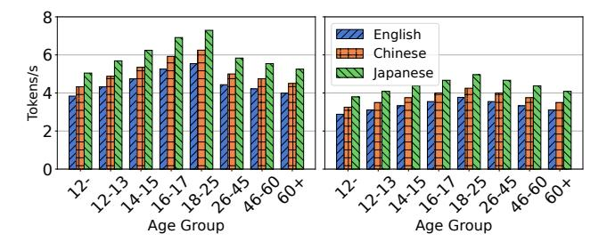

**Figure 1.** We summarize the token consumption speeds for reading (left) and for listening (right), measured across different age groups and language users. The data is derived from calculations based on reading speed data from NIH [31] and information on token counting from OpenAI's blog [35].

resource conflicts, as new requests demand intensive computation during prefill while ongoing streams require stable decode-phase throughput. Existing systems struggle to balance both targets under workload spikes, which are further compounded by scheduling inefficiencies under heterogeneous workloads. Overcoming these limitations necessitates fundamental innovations in resource allocation and scheduling policies within LLM serving systems.

#### 2.3 Resource Scheduling for LLM Text Streaming

Existing LLM serving systems exhibit significant shortcomings when handling text streaming workloads. The prevailing approach adopted by systems relies on first-come-first-served (FCFS) scheduling with priority given to the prefill phase. While this design may optimize for throughput, it remains ill-suited for user-facing interactive applications where latency and smooth token delivery are paramount.

Our micro-benchmark reveals a critical mismatch between text streaming demands and existing LLM scheduling. As demonstrated in Figure 2, request surges create substantial queuing delays that severely degrade user-perceived latency. Real-world trace analysis of SGLang shows peak-load time-to-first-token (TTFT) frequently exceeding 20 seconds, far beyond acceptable user tolerance limits. Paradoxically, while some requests experience excessive queueing delays, active-served requests achieve unnecessarily high generation speeds (averaging 30 tokens/second in our tests). This resource misallocation provides no practical benefit in consideration of practical user token comprehension speed.

The fundamental mismatch stems from limitations in current scheduling mechanisms. First, preemption is used solely as a passive memory management strategy, rather than as a proactive tool for optimizing resource allocation. Second, although excess token generation can create buffers that would allow non-disruptive request eviction, existing methods fail to take advantage of this opportunity. As a result, these systems struggle to adapt dynamically to real-time

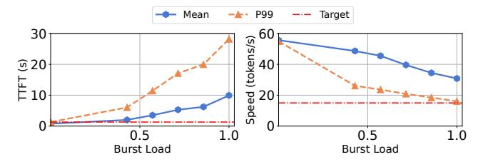

**Figure 2.** Micro-benchmark on SGLang's burst request handling conducted on the single NVIDIA H200 GPU. Left: Timeto-First-Token (TTFT) surges beyond acceptable thresholds (1.3s, red line) under increasing request intensity. Right: Generation speed declines but remains excessively high (2× average reading speed for reference, red line).

demand fluctuations and fall short in leveraging the relationship between generation and consumption rates (*i.e.*, they lack true *buffer-awareness*).

The current evaluation methodology for streaming text generation presents another limitation: it relies heavily on conventional metrics such as throughput, Time-To-First-Token (TTFT), and inter-token latency, each of which captures only a narrow aspect of performance. These metrics focus on isolated system behaviors and fail to reflect the overall user experience. For example, prefill-centric scheduling strategies may optimize throughput but often cause unacceptable increases in TTFT during request surges. This highlights why no single metric can adequately evaluate streaming services in isolation. Recent work like Andes' QoE metric [29] improves user experience evaluation but overlooks system efficiency. An effective framework must balance both user-perceived experience and computational resource utilization for optimal streaming service.

#### 2.4 Hierarchical Memory Management for LLM

Current memory management policies fall short in supporting effective preemption within LLM serving architectures. The core limitation lies in their reactive design: memory offloading is only triggered when GPU utilization reaches a critical threshold. This delayed response incurs significant I/O overhead, shifting the system from compute-bound to I/O-bound. Moreover, memory management operates in isolation from both the scheduling system and the inference engine, leading to poor coordination and suboptimal decisions across the stack. For example, while Andes has shown performance gains through improved scheduling logic, its full potential remains unrealized without co-designed memory management. This lack of integration leads to local optimizations that undermine overall system efficiency. It manifests in three key shortcomings: (1) the memory manager lacks visibility into the scheduler's preemption decisions, forcing it to evict based solely on memory pressure rather than scheduling intent; (2) the inference engine cannot anticipate memory operations, leading to unpredictable runtime latency spikes; and (3) the absence of a unified management

strategy results in redundant or conflicting actions, wasting precious memory bandwidth and compute cycles.

#### 3 Overview and Formulation

#### 3.1 TokenFlow Overview

**System Components.** As shown in Figure 3, TokenFlow introduces a co-designed architecture that tightly integrates a preemptive LLM scheduler with proactive KV cache management. The system's five cooperating components work together to maximize resource utilization while balancing the latency and throughput demands for requests.

- Request Tracker monitors each request's status, including buffer token counts, latency targets, user consumption rates, prompt/response data, token generation timestamps, and resource usage.
- Buffer-aware Request Scheduler accepts real-time metrics and implements the scheduling algorithm(§3.2) to make runtime decisions about request admission, preemption, and resumption.
- Request Offload Manager executes the scheduler's decisions by managing request-level memory operations, evicting requests via a write queue, and restoring them via a loading queue, thus bridging high-level scheduling with low-level execution.
- LLM Executor is built primarily upon SGLang with minimal modifications and performs the actual LLM inference and token generation for active requests.
- Hierarchical KV Cache Manager efficiently manages token-level memory operations across separate CPU and GPU pools. Its specialized writing and loading queues handle token chunks, minimizing I/O overhead while maintaining performance.

**Workflow.** The coordinated workflow is illustrated in Figure 4. Each request undergoes a carefully managed lifecycle in our system. When a client (e.g., chatbot or voice assistant) submits a request, it arrives at the server carrying the streaming speed requirement and maintains a client-side token buffer. The Request Tracker registers the request and begins monitoring its state transitions between waiting (while enqueued or preempted) and active execution phases. The Buffer-aware Scheduler dynamically controls the progress by preempting running requests after preserving their state through coordinated KV cache management or activating waiting requests through admission-resumption iterations after loading their state. During execution, the LLM Executor generates and streams tokens directly to the client's buffer, which then paces delivery according to the given consumption rate, while the system continuously optimizes compute and memory resource allocation among requests to maintain quality-of-service (QoS) guarantees.

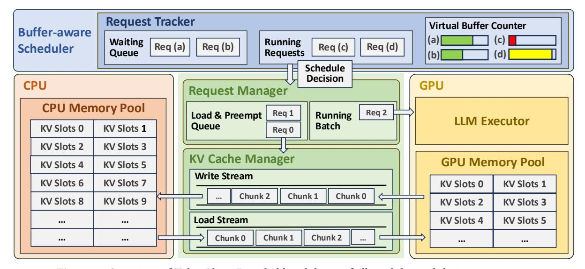

Figure 3. Overview of TokenFlow: Detailed breakdown of all modules and their components.

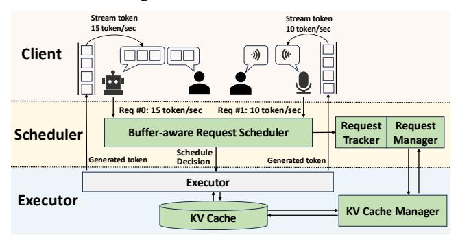

**Figure 4.** High-level workflow of TokenFlow. Modules newly added by TokenFlow are colored green.

#### 3.2 Quality of Text-Streaming Service Metric

Standard throughput metrics (e.g., tokens/second) inadequately measure user experience factors like responsiveness and streaming smoothness. We therefore define a comprehensive **Quality of Service (QoS)** metric that integrates the token utility values, first-token delays, and penalties for playback stalls. Unlike throughput, our QoS metric better reflects actual user experience by evaluating initial delay, delivery consistency, and buffer efficiency, while simultaneously considering system responsiveness and resource utilization. QoS optimization thus achieves a better balance between minimizing initial latency to the first response and maximizing processing efficiency for enhanced text streaming.

Assume the system handles a batch of N requests, where each request i is characterized by:

- Time-to-first-token (TTFT), denoted as  $t_i^{\text{ttft}}$ ,
- A sequence of inter-token latencies  $\{\delta_{i,1}, \delta_{i,2}, \dots, \delta_{i,L_i}\}$ , where  $L_i$  is the number of generated tokens,
- A fixed user reading speed  $r_i$  in tokens/second.

The user starts reading at time  $t_i^{\text{ttft}}$ , consuming one token every  $1/r_i$  seconds, and token j of request i is generated at

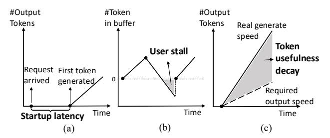

**Figure 5.** Three QoS factors: (a) Startup latency, (b) User stall events, (c) Token usefulness.

time:  $t_{i,j}^{\text{gen}} = t_i^{\text{ttft}} + \sum_{k=1}^{j-1} \delta_{i,k}$ . Let  $B_{i,j}$  denote the size of the output buffer for request i at the moment token j is generated. We assign each token a weight  $w_{i,j} \in [0,1]$  representing its utility, defining this as either the *token utility* or the *token weight*:

$$w_{i,j} = \begin{cases} 1, & \text{if } B_{i,j} \le \tau \\ \max(1 - \alpha \cdot (B_{i,j} - \tau), 0), & \text{if } B_{i,j} > \tau \end{cases}$$
 (1)

where  $\tau$  is the buffer threshold beyond which usability starts to decay, which is related to the total output length of the request, and  $\alpha>0$  is a tunable decay factor. Let Rebuffer denote the total time user i experiences an empty buffer when reading a token, and  $t_i^{\rm ttft}$  denote TTFT of request i. We apply penalties to both quantities, with weight coefficients  $\lambda$  and  $\mu$  reflecting the importance of low latency and uninterrupted experience. Finally, we define the **Quality of Service (QoS)** of the text-streaming LLM serving system as:

$$QoS = \frac{1}{T} \sum_{i=1}^{N} \left( \sum_{j=1}^{L_i} w_{i,j} - \lambda \cdot t_i^{\text{ttft}} - \mu \cdot \text{Rebuffer}_i \right), \quad (2)$$

where T is the overall request process time.

This metric provides a more accurate evaluation of inference scheduling policies and system responsiveness than

raw throughput alone. As shown in Figure 5, the QoS metric accounts for:

- Token usefulness: Only tokens that are timely and within buffer limits contribute fully.
- Startup latency: Delays in first-token generation are penalized.
- **User stall**: Gaps in token availability during playback degrade experience and reduce QoS.

## 3.3 Scheduling Problem Formulation

We first discuss the overall scheduling objective and associated constraints of our methods, and then formally formulate the scheduling problem.

**Objective.** While QoS effectively measures text-streaming quality, it presents practical challenges in online system optimizations. The metric requires complete request traces, including inner-token latencies and rebuffering durations, which are only available after request completion. However, real-world systems must handle dynamic request arrivals with unpredictable characteristics (*i.e.*, arrival times, lengths, and output speeds), making direct QoS optimization during live scheduling infeasible.

To enable practical QoS optimization during online scheduling, we propose a tractable proxy objective that maximizes the expected number of generated effective tokens, those likely to be consumed promptly without exceeding buffer capacity, while penalizing schedules that risk buffer underflows and potential playback stalls. To further refine scheduling decisions at the granularity of individual requests, we define a per-request utility function that balances the value of token generation and the buffer state, then the total utility of selected requests  $\sum \mathcal{U}_i$  is the tractable objective. Given a request i, its utility function is defined as:

$$\mathcal{U}_i = v_i \cdot t - \gamma \cdot \phi(b_i^{\text{rem}}), \tag{3}$$

where t is the allocated execution time for this request in the current scheduling step,  $b_i^{\text{rem}}$  is the number of unread tokens in its output buffer,  $v_i$  is the estimated token value, related to the unread tokens number  $b_i^{\text{rem}}$  in buffer,  $\phi(\cdot)$  is a penalty function that increases when the buffer is too low (risking stall),  $\gamma$  is a tunable regularization coefficient controlling the penalty strength.

**Resource Constraint.** LLM streaming systems face two fundamental constraints: *GPU memory limits* and *batch-size-dependent computational trade-offs*. The first constraint is familiar to LLM scheduling: KV cache memory bounds the number of concurrent requests under service. Each active request occupies fixed memory for context tokens, capping system parallelism. The second constraint is unique to streaming scenarios: batch size *B* critically impacts both performance and scheduling stability. The core challenge is to optimize *B* dynamically, balancing memory use, I/O overhead, and decode throughput while preventing buffer underflows. Unlike

traditional systems with a restricted focus on throughput, streaming introduces delicate dynamics:

- Batch Size vs. I/O Overhead: Significant batch size variations force either (1) new requests allocating fresh KV cache, or (2) reloading evicted requests from the CPU memory. Both incur I/O latency that risks depleting buffers during stalled computation.
- Batch Size vs. Decode Speed: Large batches saturate memory bandwidth, slowing token generation and buffer accumulation, while small batches improve responsiveness but waste GPU computation. This creates tension between preemption flexibility and hardware utilization.

**Problem Formulation.** We formulate LLM request scheduling as an online combinatorial optimization problem that selects request subsets at each interval *t* to maximize utility while respecting hardware constraints, as shown below:

$$\begin{aligned} \max_{x} \quad & \sum_{i \in \mathcal{A}} x_{i} \cdot \left( v_{i}(t - t_{i}^{\text{overhead}}) - \gamma \phi(b_{i}^{\text{pred}}) \right), \\ \text{s.t.} \quad & x_{i} \in \{0, 1\} \quad \forall i \in \mathcal{A}, \\ & \sum_{i} x_{i} \leq B, \\ & \sum_{i} x_{i} l_{i} \leq M \end{aligned}$$

where  $\mathcal{A}$  denotes the set of all active requests at the scheduling moment. Each request  $i \in \mathcal{A}_t$  is associated with a binary variable  $x_i \in \{0, 1\}$ , indicating whether it is scheduled in this step  $(x_i = 1 \text{ if } i \in \mathcal{S}_t)$ . B is the maximum number of concurrent running requests allowed by the system. Each request i has a context length  $l_i$ , which determines its key-value cache memory footprint. M is the total available GPU memory.

The optimization problem also incorporates two key refinements: (1) using the effective execution time  $t - t_i^{\text{overhead}}$ instead of t accounting for context-switch latency of memory operations and (2) employing predicted buffer states  $b_i^{\mathrm{pred}}$  that anticipate token accumulation under system overhead. Here,  $t_i^{\text{overhead}}$  (context switching time) is estimated as  $\min(t_{\mathrm{IO}}, t_{\mathrm{recompute}})$ . In particular,  $t_{\mathrm{IO}}$  is obtained from the memory manager's profiled memory read/write throughput based on execution history, and  $t_{\text{recompute}}$  approximates prefill time using sliding-window-averaged per-token latencies (details given in Section 4). In short, since these estimates are inherently prompt-dependent, we incorporate both historical execution records and characteristics of the user-provided prompt to derive such metrics. These modifications explicitly model the performance impact of memory management and I/O constraints during request processing scheduling.

## 4 Buffer-Aware Request Scheduling

The scheduling problem formulated in the previous section is a combinatorial optimization problem with discrete decisions and nonlinear execution cost, making exact solutions computationally intractable in real-time serving scenarios. TokenFlow: Responsive LLM Text Streaming Serving under Request Burst via Preemptive Scheduling

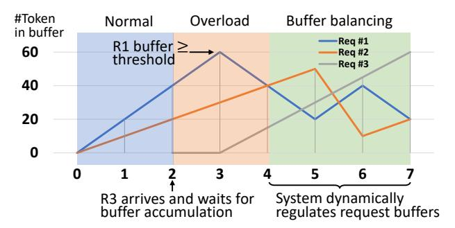

Figure 6. Toy Example of Buffer-Aware Request Scheduling.

To address this, we design a heuristic buffer-aware scheduling algorithm that approximates the original objective by efficiently prioritizing and selecting requests based on their estimated utility and system constraints.

## 4.1 A Motivating Example

As shown in Figure 6, we illustrate the scheduling process with an operational example to demonstrate the scheduler's behavior. Consider a system with a generation capacity of 40 tokens/sec supporting two concurrent requests. Initially, requests R1 (20 tokens/sec) and R2 (30 tokens/sec) arrive at t = 0, both accumulating surplus tokens at the full system rate. When R3 (25 tokens/sec) arrives at t = 2, neither active request has sufficient buffer for preemption, demonstrating buffer-dependent admission control. By t = 3, R1's lower demand results in sufficient buffer growth, enabling its safe preemption: its context is offloaded to the CPU while tokens continue being served from its buffer, allowing R3 to execute. The system maintains seamless service for R1 via its buffer reserves. At t = 5, as R1's buffer nears depletion, the scheduler preempts R2 (now with the largest buffer) to reactivate R1, preventing stalls without sacrificing throughput. Subsequent scheduling decisions similarly balance token reserves across requests, ensuring efficient resource utilization.

Our methodology enables significant system capacity expansion by dynamically prioritizing requests where the utility function of request is maximized, mostly those with smaller buffer sizes. This reveals a key operational insight: Maintaining buffers within an optimal range is crucial to improving QoS. However, practical implementation must account for recomputation and I/O overheads that preclude naive empty-buffer scheduling. Effective deployment requires predictive pre-loading and continuous system monitoring to navigate these constraints while pushing capacity limits.

## 4.2 Two-Step Scheduler Design

As illustrated in Figure 7, the proposed request scheduling algorithm operates in two phases:

**1** Working Set Determination: Selecting the set of requests actively processed by the system.

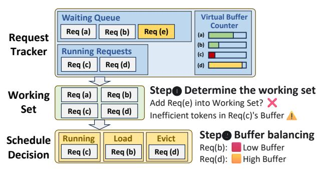

**Figure 7.** Two-step scheduling in TokenFlow: An example workflow showing one complete scheduling cycle of our buffer-aware approach.

**2 Buffer Balancing**: Ensuring equitable buffer allocation across the working set to prevent overflow/underflow.

**4.2.1 Determine the working set.** The working set defines the upper limit for overcommitment scheduling, based on hardware capabilities and request characteristics. During runtime, we dynamically adjust the working set size by monitoring system conditions, including I/O queue length, the token buffer size and the output rate of each request. A new request is admitted into the working set if the buffers of existing requests meet specific criteria (*e.g.*, remaining tokens can be processed within swap/reschedule latency).

The working set size W is determined first by hardware constraints. The static upper bound  $W_{\text{static}}$  is computed as:

$$W_{\text{static}} = \lfloor M/\beta \rfloor,$$
 (4)

where M is the total memory capacity, and  $\beta$  is the estimated per-request memory footprint. During runtime, the working set size W is dynamically adjusted based on the number of currently running requests  $N_{\text{running}}$ . If  $N_{\text{running}} < W_{\text{max}}$ , the working set is scaled down proportionally:

$$W_{\text{scheduled}} = W_{\text{static}} - \lambda \cdot (W_{\text{static}} - N_{\text{running}}),$$
 (5)

where  $W_{\text{static}}$  is the nominal working set size,  $\lambda$  controls the adjustment rate, and W remains unchanged when  $N_{\text{running}} \geq W_{\text{max}}$  to sustain high throughput.

The scheduler employs a time-sliced mechanism operating at fixed intervals  $t_{\rm schedule\_interval}$  to dynamically manage the size of the working set W. This demand-sensitive approach optimizes system efficiency by activating scheduling operations exclusively during stressing periods, characterized by either accumulated pending requests  $Q_{\rm waiting} > 0$  or buffercritical conditions in active requests  $T_i < T_{\rm critical}$ . Otherwise, the system maintains optimal performance through a prefill-first policy that scales scheduling overhead proportionally with actual demand.

During each scheduling iteration, the scheduler evaluates whether to admit pending requests into the working set. A request  $R_i$  gains admission when the working set has available capacity  $W_{\rm current} < W_{\rm scheduled}$  and when its remaining buffer tokens meet the requirement  $b_i^{\rm rem} \geq \mu \cdot r_i \cdot (\tau_{\rm evict} + \tau_{\rm load} + \tau_{\rm load})$ 

 $\tau_{\rm schedule}$ ). Here,  $\mu \geq 1$  serves as a safety factor (buffer conservativeness) to account for operational variability, while  $r_i$  denotes the request's required output rate. This admission policy prevents resource overcommitment while sustaining consistent service quality.

**4.2.2 Buffer balancing inside the working set.** To support more concurrent requests with the given GPU capacity, TokenFlow employs an overcommitment mechanism based on the working set model. When the working set exceeds available GPU memory, requests are transparently offloaded to CPU memory. This necessitates an efficient preemptive scheduling strategy to manage the GPU-CPU memory hierarchy. Our scheduler dynamically assigns a priority to each request based on the utility function:  $\mathcal{U}_i = v_i \cdot t' - \gamma \cdot \phi(b_i^{\text{rem}})$ , which incorporates the following key factors:

**1 Buffer Size** ( $b_i$ ): The token count currently in the request's buffer. A larger buffer suggests the request can tolerate some delay, reducing its immediate processing priority. We model this effect using an exponential decay function:  $\phi(b_i^{\text{rem}}) = e^{-b_i^{\text{rem}}}$ , ensuring that requests with nearly empty buffers receive higher priority to prevent starvation.

**2** Weighted Token Generation Quantity  $(v_i \cdot t')$ : The expected number of tokens generated during the schedule interval, weighted by their likelihood. t' approximates the queuing delay of the request, accounting for its position in the batch processing pipeline. We estimate t' using a moving average instead of computing the exact queuing delay from dynamic scheduling.

To select the optimal subset of requests for execution, we employ a greedy algorithm with a local search strategy. Requests are first sorted by their buffer size ( $\phi(b_i^{\text{rem}})$ ), weighted token generation quantity ( $v_i \cdot t'$ ), and their required output rate  $r_i$ . The greedy algorithm then iteratively selects the highest-priority requests that can fit in the available GPU memory, maximizing immediate utility. While this method efficiently provides an approximate solution, it may overlook marginally better request orderings.

Furthermore, we perform a local search by evaluating adjacent request swaps in the priority queue. For each pair of adjacent requests, we compute the potential utility gain from swapping their order. A swap is applied if it improves overall throughput or fairness without violating memory constraints, ensuring the scheduler explores small perturbations to the greedy solution, further optimizing system performance while keeping low computational overhead.

**4.2.3 Balance recompute and load from CPU memory.** The scheduler dynamically determines whether to reload offloaded requests from CPU memory or recompute them, balancing faster loading speed against potential head-of-line blocking from loading queueing delays. The I/O overhead is:

$$t_{\text{IO}} = t_{\text{evict\_queueing}} + t_{\text{evict}} + t_{\text{load\_queueing}} + t_{\text{load}},$$

where each term corresponds to the queuing/execution phases during data movement between the GPU and CPU memories. At runtime, TokenFlow monitors instantaneous I/O queue lengths and transfer rates via the cache manager.

For prefill and recompute time estimation, TokenFlow evaluates recomputation costs using sliding-window-averaged prefill latencies per token. A request is recomputed if  $t_{\rm IO}$  exceeds its estimated recomputation time, thereby adapting to load contention. Batching recomputation with new prefill requests risks prolonged memory occupancy, as all allocated blocks must be released before batch completion. This serialization delay directly impacts TTFT for subsequent requests. To mitigate memory contention, the system avoids prolonged block retention by batching carefully and dynamically partitions prefill batches based on remaining capacity and priority. It helps latency-sensitive requests bypass batch processing when needed, balancing both throughput and TTFT targets under memory pressure.

## 4.3 Schedulability Analysis

Our scheduler enforces capacity constraints by ensuring the combined token generation rates within the working set W do not exceed the system's current throughput capacity  $\Gamma$ :

$$\sum_{i \in W} r_i \le \Gamma,\tag{6}$$

where  $r_i$  is request i's generation rate. The throughput bound  $\Gamma$  is dynamically estimated using real-time execution metrics, including request lengths and hardware utilization.

When this condition is violated (i.e.,  $\sum r_i > \Gamma$ ), the system gracefully degrades to a *first-come-first-served* (FCFS) policy with memory-aware admission control. In this fallback mode, requests are scheduled by arrival time while keeping the working set within available device memory. Excess requests remain offloaded to CPU memory until resources become available, and no new requests will be admitted.

## 5 Hierarchical Memory Management

As the buffer-aware request scheduler optimizes heterogeneous request serving through request preemption, the KV cache management system must handle more concurrent requests than GPU memory can physically accommodate. This necessitates a hierarchical architecture supporting two fundamental operations: (a) **preempt** to offload KV cache from preempted requests, and (b) **resume** to reload cached data when requests regain execution.

Unlike popular LLM serving frameworks like SGLang, which manage KV cache reactively to optimize GPU throughput for dynamic batching, the key distinction of our approach lies in its proactive design philosophy. Existing systems typically adopt a reactive strategy, initiating data migration only after preemption decisions are made, which incurs substantial latency due to on-demand KV cache transfers. In

TokenFlow : Responsive LLM Text Streaming Serving under Request Burst via Preemptive Scheduling EUROSYS '26, April 27–30, 2026, Edinburgh, Scotland Uk

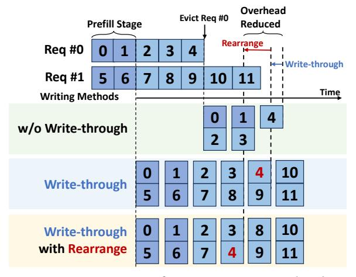

Figure 8. Comparison of Write Strategies: (Top) Conventional write-back approach (slowest); (Middle) Writethrough method with reduced overhead (highlighted in blue); (Bottom) Rearranged write-through with additional optimizations (highlighted in red).

contrast, TokenFlow exploits GPU I/O idle periods to preemptively offload KV caches to CPU memory. As a result, when preemption actually occurs, most of the cache has already been written back, rendering the KV cache offload operation nearly instantaneous.

To further align memory management with our proactive principle, we incorporate a write-through policy, synchronous chunked writing, and overlapped load-evict operations. Together, these techniques ensure efficient and concurrent data transfer, effectively narrowing the speed gap between computation and memory operations.

#### 5.1 Write-Through Policy

We regard GPU memory as a high-speed cache for larger CPU memory, with two data write options: write-through and write-back. Traditional systems use a write-back policy, and KV cache writes are only triggered when the scheduler directs preemption. This approach suits static preemption patterns (e.g., first-come-first-serve or multilevel feedback queues), allowing schedulers to proactively schedule writes and mask I/O latency during computation.

However, in our buffer-aware scheduler, requests may undergo multiple preemption-resumption cycles. Write-back policy becomes suboptimal due to unpredictable write timing and inability to pipeline I/O operations, leading to excessive I/O latency. Empirical measurements reveal that KV cache write speeds surpass amortized generation rates, motivating our adoption of a write-through policy. As shown in Figure [8,](#page-8-0) we continuously synchronize the generated KV cache to host memory, maintaining device-host cache consistency. The write-through policy provides three key advantages: (1) eliminates the need for preemption pattern prediction, (2) fully utilizes PCIe write bandwidth between GPU-CPU

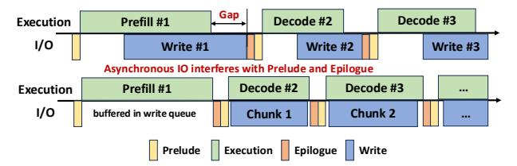

Figure 9. Temporal execution illustration of synchronous chunked writing scheme.

memories, and (3) enables incremental updates – only newly generated KV cache entries require writing to host memory during resuming.

#### 5.2 Synchronous Chunked Writing

Effective offloading systems require overlapped I/O transfers, but traditional solutions prove inadequate in our case. Proactive transfers fail due to unpredictable preemption patterns, while asynchronous transfers create scheduling dependencies – iteration results must complete the transfer before subsequent scheduling decisions.

TokenFlow addresses this through a synchronous chunked writing scheme illustrated in Figure [9](#page-8-1) that guarantees write operations complete within subsequent computation intervals. The mechanism operates as follows: (1) Each iteration buffers the generated KV cache; (2) Pre-iteration phase: Scheduler estimates the next iteration's execution time; (3) The offloading system pulls appropriate data chunks from the write buffer; (4) Launches precisely sized write operations matching the estimated compute duration.

This approach achieves three benefits: (1) eliminates scheduler stalls from I/O completion waits, (2) maximizes PCIe bandwidth utilization through size-optimized transfers, and (3) enables priority-based write ordering. By analyzing scheduler request buffer sizes, TokenFlow prioritizes writes for requests with larger buffers (higher preemption probability), outperforming FIFO approaches as shown in Figure [8.](#page-8-0)

## 5.3 Load-Evict Overlap

Concurrent preemption and resume operations introduce challenges in transfer latency and memory contention. Baseline approaches trade-off between memory buffering (reducing latency) and operation serialization (minimizing memory), but TokenFlow resolves this through load-evict overlap. The write-through policy enables partial memory reclamation during preemption – already synchronized KV cache segments can be immediately evicted. As visualized in Figure [10,](#page-9-0) when preempting Request 0 while resuming Requests 1&2: (1) Eviction of the remaining Request 0 KV cache proceeds concurrently. (2) Chunked loading of Requests 1&2 KV cache overlaps with partial evictions. (3) Memory buffers are dynamically repartitioned during transfer.

Such overlapping reduces both transfer latency and memory fragmentation. Chunked writing allows precise control over transfer sizes, ensuring load-evict operations are

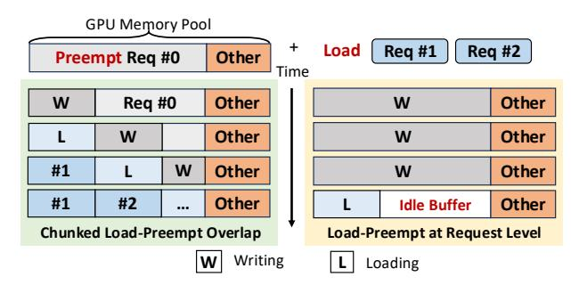

Figure 10. Load-Evict overlap technique in TokenFlow.

complete within scheduler-determined time windows while maintaining memory safety guarantees.

## 6 Implementation

We implement TokenFlow on top of SGLang, a high-performance Python framework for LLM serving, chosen for its modular architecture and efficient execution backend. The system comprises a priority-based scheduler and a hierarchical KV cache manager, both of which are implemented with  $\sim\!4000$  lines of Python code.

**Scheduler:** Our scheduling algorithm works with any inference framework that supports basic preemption but performs best when integrated with our specialized Hierarchical KV Manager. By leveraging SGLang's modular architecture, we replaced its default scheduler with our optimized version and introduced request tracking and management modules to monitor buffer sizes and ensure stable output rates for each request. For benchmarking, we also implemented the Andes in SGLang using a recompute-based preemption approach.

KV Cache Manager: Our hierarchical KV cache manager leverages parallel CUDA streams and Python multithreading to achieve fully overlapped compute and memory operations. The implementation maintains dedicated streams for computation, loading, and eviction, synchronized to maximize PCIe bandwidth utilization. Through dynamic chunk sizing and batched transfers, we continuously synchronize the KV cache between host and device memory while matching computation intervals. A central control thread coordinates these operations using CUDA events, maintaining non-blocking execution that supports dynamic request preemption with minimal overhead.

#### 7 Evaluation

## 7.1 Experimental Setups

**7.1.1** Hardware and Models. To comprehensively evaluate the effectiveness of our approach in various hardware configurations, we performed experiments on multiple GPU platforms, including NVIDIA RTX 4090, A6000, and H200. To demonstrate the versatility of our system, we test on models of varying scales and architectures, including Llama3-8B, Qwen2-7B, and Qwen2.5-32B.

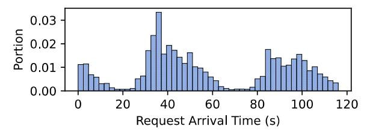

**Figure 11.** The distribution of the real-world trace.

**7.1.2 Datasets.** To evaluate the end-to-end performance, we employ a combination of standard benchmarks and authentic production data. Our assessment utilizes two established datasets: ShareGPT [36] for general performance evaluation through diverse user prompts, and BurstGPT [49] as a specialized benchmark for LLM service analysis. Crucially, we incorporate real operational traces collected directly from production LLM services (distribution shown in Figure 11), providing ground-truth workload patterns and service behaviors observed in actual deployments. Besides, we also use carefully constructed synthetic request distributions that systematically probe various load conditions.

**7.1.3 Evaluation metrics.** To comprehensively assess the performance of our proposed serving system, we employ the following key metrics:

- 1. **TTFT (Time To First Token)**: Measures the latency from when a user submits a request to when the first token is generated. A lower TTFT indicates a more responsive system, crucial for user experience in interactive applications.
- 2. **Throughput**: Refers to the total number of tokens generated per second. This metric reflects the system's overall capacity to deliver output under a given workload.
- 3. **Effective Throughput**: Similar to throughput but inspired by video streaming experience, this metric evaluates real-time streaming performance by applying a timeliness-based weight to each token based on empirical observations of user consumption patterns:
- Tokens are fully counted when the buffer size is below  $\tau_1 = 10\%$  of the total output length, as they are immediately consumable.
- Token contribution decays linearly to zero as the buffer grows from  $\tau_1 = 10\%$  to  $\tau_2 = 20\%$ , reflecting tokens stored to mitigate network or resource fluctuations.
- Tokens beyond  $\tau_2 = 20\%$  are excluded, as they exceed what is useful for a timely user experience.

This yields a more realistic measure of text-streaming Quality of Service (QoS) than conventional throughput.

- **7.1.4 Baselines.** We evaluate our system against three categories of baseline schedulers:
- 1. **SGLang** [66]: Conservative scheduling.
- 2. **SGLang (chunked)**: SGLang with chunked prefill.
- 3. Andes [29]: QoE-aware scheduler for text-streaming SLAs.

TokenFlow: Responsive LLM Text Streaming Serving under Request Burst via Preemptive Scheduling

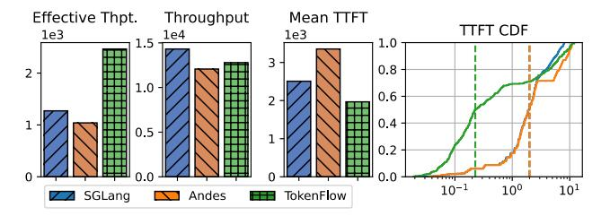

**Figure 12.** End-to-end performance metrics on H200 with Llama 3-8B model.

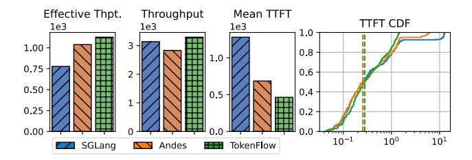

**Figure 13.** End-to-end performance metrics on A6000 with Owen2.5-8B model.

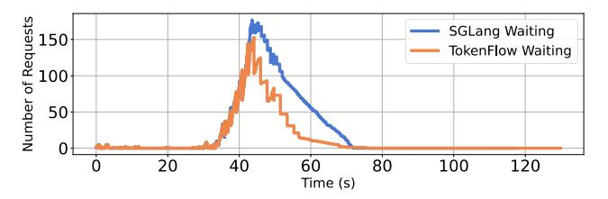

**Figure 14.** Temporal variation of <u>**queued requests**</u> during a representative trace segment.

## 7.2 End-to-end Evaluation in Real-World Traces

To validate TokenFlow's effectiveness under production conditions, we conduct large-scale experiments using two categories of request traces introduced in Section 7.1.2. All experiments are performed on NVIDIA H200 and A6000, paired with two series of models, Llama3 and Qwen2.5.

Effective Throughput and TTFT Improvement. Our experimental results demonstrate significant improvements across all evaluation metrics when comparing TokenFlow to baseline systems (SGLang and Andes) on both BurstGPT and proprietary traces. As shown in Figure 12, Figure 13, TokenFlow achieves an average 52.6% reduction in mean TTFT (up to 88.7% at P50) while increasing effective throughput by 45.1% on A6000 and 37.1% on H200. The results validate that TokenFlow's co-design of scheduling and memory management successfully translates theoretical advantages into measurable improvements across diverse hardware configurations and workload patterns.

**Experimental Validation with Long-term Trace.** To evaluate system scalability, we stress-tested the Qwen2.5-32B model on H200 GPUs using a 20-minute BurustGPT trace while monitoring real-time metrics. As shown in Figures 14 and 15, TokenFlow outperforms baselines under peak load,

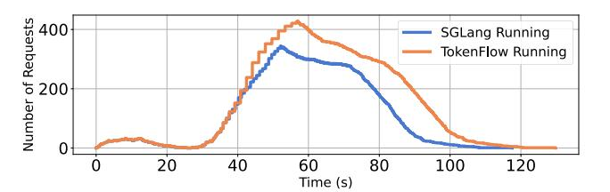

**Figure 15.** Temporal variation of <u>running requests</u> during a representative trace segment.

**Table 1.** Experimental Configurations for Controlled Request Distributions Evaluation.

| Setup | RTX 4090                   | H200                        |
|-------|----------------------------|-----------------------------|
| (a)   | Burst $b = 60$ , SL        | Burst $b = 400$ , SL        |
| (b)   | Burst $b = 80$ , LL        | Burst $b = 200$ , LL        |
| (c)   | Poisson $\lambda = 2$ , SL | Poisson $\lambda = 5$ , SL  |
| (d)   | Poisson $\lambda = 4$ , SL | Poisson $\lambda = 10$ , SL |

with fewer queued requests and higher concurrency. This is enabled by its coordinated design: a buffer-aware scheduler for dynamic prioritization and hierarchical memory management for efficient KV cache swapping.

## 7.3 Controlled Request Distribution Test

We evaluate TokenFlow 's performance using synthetic workloads that reflect real-world patterns from ShareGPT [36], enabling systematic comparison with baseline methods in terms of throughput and latency. Experiments are conducted on NVIDIA H200 (starting with mem-frac=0.3) and RTX 4090 GPUs under two scenarios: (1) Bursty arrivals (burst size b) simulating flash crowds and (2) Poisson-distributed (rate  $\lambda$ ) arrivals modeling typical traffic. Input/output lengths follow normal distributions, with the RTX 4090 using 512/1024-token inputs in average (S/L) and 1024/2048-token outputs in average (S/L), while H200 outputs are scaled 2×. (Here, S denotes "Short" and L denotes "Long" sequence lengths.) Full configurations are provided in Table 1.

Improvement under burst request scenarios. We present effective throughput, raw throughput, mean TTFT, and P99 TTFT across various experiment setups in Figure 16. To-kenFlow outperforms Andes and SGLang across all metrics, achieving: (1) up to 80.2% lower P99 TTFT, (2) up to 48.4% lower mean TTFT, and (3) up to 52.9% higher effective throughput. While Andes shows notable degradation compared to SGLang in throughput, TokenFlow retains similar computational efficiency to SGLang.

These performance gains stem from architectural differences. SGLang's rigid FCFS and prefill-prioritized scheduling struggle with dynamic workloads. Andes improves QoS via quality-aware scheduling but neglects throughput efficiency. In contrast, TokenFlow 's co-design balances user-perceived latency and system throughput through intelligent scheduling and buffer-aware resource management.

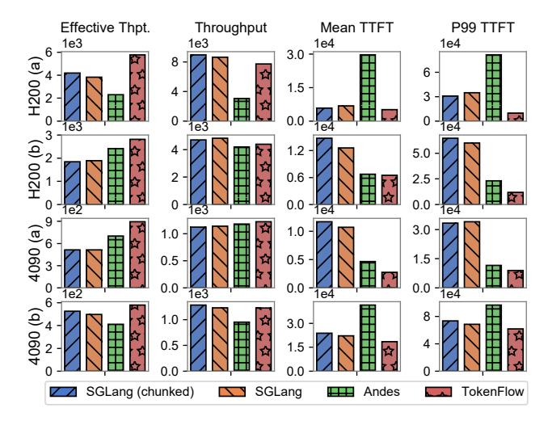

Figure 16. Performance Metrics During Burst Workload.

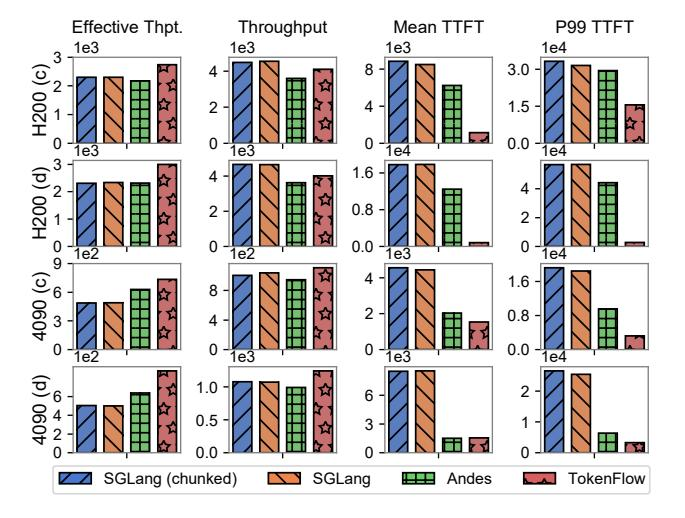

Figure 17. Performance Metrics During Poisson Workload.

Improvement under Poisson-distributed request scenarios. Figure [17](#page-11-1) quantifies system performance under Poisson workloads on four key metrics: effective throughput, raw throughput, mean TTFT, and P99 TTFT. TokenFlow outperforms baselines in all scenarios, notably improving effective throughput by 82.5% (RTX 4090) and reducing TTFT by 53.7% (H200) versus the competitors. Under heavy load, when GPU memory becomes saturated, SGLang suffers from severe queuing delays that drastically increase TTFT, while Andes fails to maintain balanced streaming performance. TokenFlow overcomes these limitations and delivers both low latency and consistent output rates even at peak loads.

## 7.4 Micro Experiments

▶Token Generation Timeline: Our qualitative comparison with SGLang's scheduling in Figure [18](#page-11-2) highlights TokenFlow 's dual advantages: it initiates service earlier while maintaining precise token delivery at required speeds, unlike

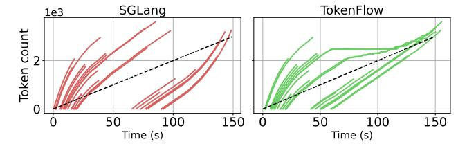

Figure 18. Token generation timelines comparing SGLang (left) and TokenFlow (right). TokenFlow maintains generation speeds consistently above requirements (black line) while achieving lower average TTFT.

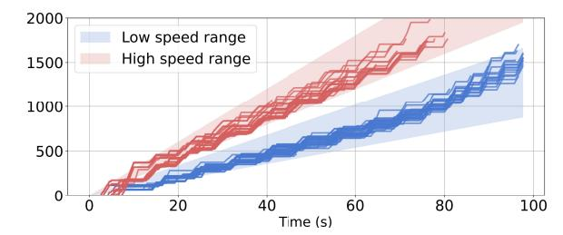

Figure 19. Experiment on multi-rate request scheduling.

SGLang's head-of-line blocking, which forces subsequent requests into prolonged waiting. The timeline analysis demonstrates how TokenFlow 's preemptive scheduling leverages per-request buffers to ensure stable throughput and timely service, generating each token at optimal consumption rates.

- ▶Visualize Preemptive Scheduling: Figure [18](#page-11-2) shows TokenFlow's preemption mechanism: when a request's token buffer reaches a threshold, resources are reallocated to improve throughput. Preempted requests pause (seen as plateaus in timelines) without harming latency, resuming only when buffers near depletion. This ensures guaranteed QoS across concurrent requests.
- ▶Multi-Rate Request Scheduling: In evaluating Token-Flow with a mixed-rate burst workload (40% at 15 tokens/s, 60% at 20 tokens/s), Figure [19](#page-11-3) shows distinct timelines where each request type consistently maintains its target rate within tolerance bands. This automatic rate differentiation emerges from TokenFlow's buffer-aware prioritization - higher-rate requests naturally drain buffers faster, gaining implicit scheduling priority. The system thus supports heterogeneous rates while maintaining strict QoS guarantees without manual configuration.
- ▶Performance Across Diverse Generation Speed: We test workloads with requests at 20, 25, and 30 tokens/s to assess how TokenFlow adapts to varying generation speeds. As shown in Figure [20,](#page-12-0) TokenFlow consistently achieves higher throughput and lower latency than baseline across all speed settings.
- ▶Diverse Hardware Support: TokenFlow scales efficiently across hardware, including Huawei Ascend 910B, maintaining high performance under bursty workloads (Figure [21\)](#page-12-1).

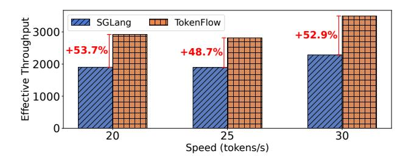

**Figure 20.** Effective throughput gains over different generation speeds.

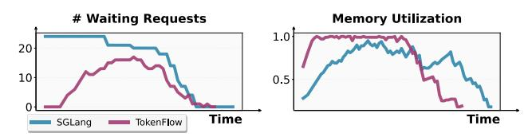

Figure 21. Performance on Huawei Ascend 910B

## 7.5 Hyperparameter Sensitivity

Reschedule Interval. Our study examines how rescheduling interval length ( $\Delta t$ ) impacts system performance through its effects on buffer awareness and scheduling efficiency. As depicted in Figure 22, varying  $\Delta t$  between 0.5-1.5 seconds reveals that shorter intervals marginally improve effective throughput and TTFT. While frequent updates enable better adaptation to dynamic conditions, they also incur scheduling overhead. The optimal interval should therefore balance responsiveness with computational cost, tailored to specific workload patterns and QoS requirements.

Buffer Conservativeness. Our buffer conservativeness parameter controls how aggressively resources are reallocated based on request buffer levels. Experiments with high (20.0) and low (1.0) settings (Figure 23) reveal its critical role in balancing responsiveness and stability: higher values produce cautious, SGLang-like behavior favoring stability, while lower values enable agile workload adaptation at potential stuttering risk. This tunable parameter offers precise control over the responsiveness-stability tradeoff, allowing customization for diverse QoS needs.

#### 7.6 Overhead Quantification and Ablation study

Overhead Analysis. We evaluate the scheduling overhead introduced by our scheduling algorithm and the newly designed request manager. For the scheduling algorithm, the runtime cost increases only marginally, from the negligible  $\sim\!0.07$  ms of SGLang to a still minimal  $\sim\!0.4$  ms. The Request Tracker and Manager, which handle metadata maintenance and priority queue management, contribute negligible overhead relative to the KV cache manager's I/O cycles and the model's forward computation.

**Ablation Study.** We also performed an ablation study to evaluate the individual contributions of each hierarchical memory management submodule, which uses the setting

**Table 2.** Ablation study of TokenFlow.

| TokenFlow | w/o.     | w/o.          | w/o.               |
|-----------|----------|---------------|--------------------|
|           | Offload  | Write-Through | Evict-Load Overlap |
| 66.00 s   | 127.28 s | 82.76 s       | 74.43 s            |

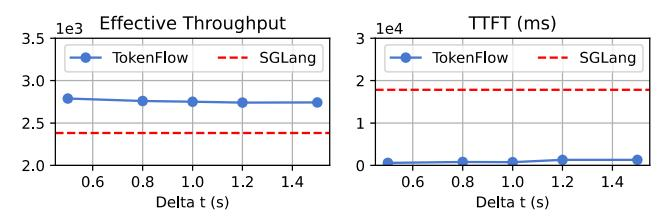

**Figure 22.** Impact of Rescheduling Interval  $\Delta t$  on TTFT and Effective Throughput.

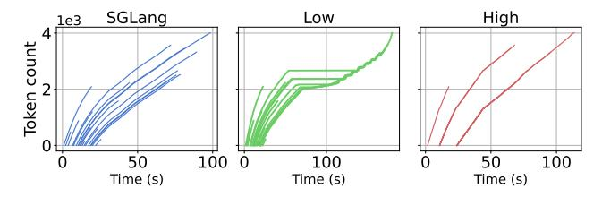

**Figure 23.** Impact of Buffer Conservativeness on Scheduler Behavior. Left: SGLang. Middle and Right: TokenFlow with different buffer conservativeness settings.

4090 (b) as described in Section 7.3. Quantitative results are presented in Table 2. As shown in Table 2, TokenFlow's unique write-through and hierarchical offload design provide the most significant performance gains, demonstrating their critical role in our system's overall improvement.

#### 8 Discussion

Design Advantages over Andes. While Andes primarily emphasizes user-perceived Quality of Experience (QoE), it overlooks the broader perspective of overall inference server performance and resource utilization. In contrast, our system introduces a comprehensive Quality of Service (QoS) metric that unifies latency, throughput, and user experience, thereby offering a more holistic characterization of streaming quality. Furthermore, TokenFlow enhances preemption efficiency through a hierarchical memory manager that tightly cooperates with a two-stage scheduler. The scheduler conveys critical preemption requirements to the memory manager, while the memory manager, in turn, supplies feedback to refine scheduling decisions. This bidirectional interaction enables more effective resource allocation than Andes, which lacks such coordinated mechanisms.

Scaling TokenFlow for Multi-Node and Distributed Systems. Mooncake [39] is a KV-centric LLM serving system that adopts a disaggregated architecture, leveraging RDMA to manage a distributed, multi-layer KV cache across nodes with a focus on throughput at scale. In contrast, TokenFlow follows a different design philosophy: rather than prioritizing

distributed throughput, we emphasize single-node efficiency. TokenFlow employs proactive PCIe-based transfers to optimize the local GPU–CPU memory hierarchy and improve preemption. Although Mooncake is built for cross-node communication, TokenFlow's scheduling and KV management can be extended to multi-node environments by introducing an inter-node cache layer and leveraging our co-designed scheduler to ensure KV consistency across nodes. Furthermore, TokenFlow mitigates PCIe bandwidth contention by adaptively reducing preemption frequency, complementing Mooncake's RDMA-based architecture with optimized local data flow to provide a more holistic solution.

Handles Different Client Types. TokenFlow requires userfacing clients to explicitly specify their desired output rate, which the server then enforces to ensure smooth streaming. For non-user consumers (e.g., LLM agents), we instead employ a reference rate as an indicator of scheduling priority: a larger reference rate signals higher priority, while a smaller value denotes lower priority. In future work, we plan to relax this requirement by allowing the scheduler to infer effective rates from request-level signals such as system load. For example, non-user requests may start at a low rate and accelerate when resources permit, then be throttled again under heavy load. Such adaptive control removes the need for explicit parameters while improving fairness and efficiency across heterogeneous clients.

# 9 Related Work

LLM serving systems. Orca [\[62\]](#page-16-2) batches requests at the iteration level, building on the auto-regressive generation pattern of LLMs. vLLM [\[23\]](#page-14-10) improves LLM throughput by optimizing memory utilization. SGLang [\[66\]](#page-16-1) co-designs the front-end language and the back-end runtime for efficiency. Sarahti-Serve [\[2\]](#page-14-12) introduces a fragmented prefill to reduce the spike latency caused by large initial requests. Splitwise [\[37\]](#page-15-23), DistServe [\[67\]](#page-16-3), and LoongServe [\[50\]](#page-15-24) disaggregate the prefill and decode phases based on their different computation patterns. However, these LLM serving systems overlook the potential to improve request concurrency. Recently, other work has explored different aspects of LLM service: SLOs-Serve [\[8\]](#page-14-13) optimizes multi-SLO service scenarios, and VoltanaLLM [\[63\]](#page-16-4) focuses on energy-efficient LLM service via feedback-driven frequency control.

LLM request scheduling. vLLM [\[23\]](#page-14-10) and SGLang [\[66\]](#page-16-1) adopt FCFS policies and allocate memory in advance. Prefillfirst scheduling is simple but inefficient under dynamic loads. Slice-level scheduling [\[9\]](#page-14-14) offers control over the granularity of scheduling. LightLLM [\[16\]](#page-14-15) uses a Past-Future scheduler to pipeline prefill and generation. Llumnix [\[45\]](#page-15-25) implements request scheduling using live migration across LLM instances. However, these schedulers are not designed for streamed content generation. Andes [\[29\]](#page-15-9) proposes QoE-aware scheduling using a Token Pacer to optimize perceived latency. However, it fails to adapt to buffer size or memory pressure during streaming. More advanced solutions explore hardware-level arbitration, disaggregated prefill/decode clusters, and MoEaware scheduling [\[11,](#page-14-16) [21,](#page-14-17) [22,](#page-14-18) [68\]](#page-16-5), but streaming remains an afterthought.

Memory management for LLM serving. It is the current standard to use KV cache [\[38\]](#page-15-17) in decoding phase. PagedAttention [\[23\]](#page-14-10), RadixAttention [\[66\]](#page-16-1), ChunkAttention [\[61\]](#page-15-26) optimize GPU memory utilization by memory paging and sharing common prefixes between requests. CachedAttention [\[13\]](#page-14-19), FastServe [\[51\]](#page-15-27) and Pensieve [\[64\]](#page-16-6) develop hierarchical KV cache management for multi-turn conversation and request preemption. FlexGen [\[43\]](#page-15-15) DeepSpeed Inference [\[4\]](#page-14-8) and SpInfer [\[12\]](#page-14-20) offload model weights. Request resumption can be accelerated by pipelining and blending multiple pre-computed KV cache chunks [\[14,](#page-14-21) [15,](#page-14-22) [59\]](#page-15-28). Lina [\[24\]](#page-14-23), PowerInfer [\[44\]](#page-15-16), LLM in a flash [\[3\]](#page-14-24) and Samoyeds [\[52\]](#page-15-29) exploit model sparsity to offload inactive weights. KV cache compression techniques [\[10,](#page-14-25) [26,](#page-14-26) [28,](#page-14-27) [32,](#page-15-30) [33,](#page-15-31) [54,](#page-15-32) [65\]](#page-16-7) reduce memory footprint. TokenFlow extends the functionality of the hierarchical KV cache to support an arbitrary preemption pattern.

# 10 Conclusion

We presented TokenFlow, an optimized LLM serving system that significantly enhances LLM text streaming performance through buffer-aware scheduling and hierarchical KV cache management. By dynamically aligning token generation rates with user consumption patterns and proactively managing GPU memory, TokenFlow achieved up to 82.5% higher effective throughput and 80.2% shorter time-to-firsttoken (TTFT). Extensive experiments demonstrated that TokenFlow outperforms state-of-the-art systems across diverse workloads and hardware configurations while sustaining smooth streaming quality. These results establish Token-Flow as a robust and efficient solution for real-time LLM applications.

# Acknowledgments

This work was sponsored in part by the National Key R&D Program of China (No. 2022ZD0119100), in part by China NSF grant No. 62472278, 62025204, 62432007, 62441236, 62332014, and 62332013, and in part by Tencent Rhino Bird Key Research Project. This work was partially supported by SJTU Kunpeng & Ascend Center of Excellence. The authors would like to thank SenseTime for providing computational resources for this work. The opinions, findings, conclusions, and recommendations in this paper are those of the authors and do not necessarily reflect the views of the funding agencies or the government.

# References

- [1] Josh Achiam, Steven Adler, Sandhini Agarwal, Lama Ahmad, Ilge Akkaya, Florencia Leoni Aleman, Diogo Almeida, Janko Altenschmidt, Sam Altman, Shyamal Anadkat, et al. Gpt-4 technical report. arXiv preprint arXiv:2303.08774, 2023.
- [2] Amey Agrawal, Nitin Kedia, Ashish Panwar, Jayashree Mohan, Nipun Kwatra, Bhargav Gulavani, Alexey Tumanov, and Ramachandran Ramjee. Taming throughput-latency tradeoff in llm inference with sarathiserve. In 18th USENIX Symposium on Operating Systems Design and Implementation (OSDI), pages 117–134, 2024.
- [3] Keivan Alizadeh, Seyed Iman Mirzadeh, Dmitry Belenko, S Khatamifard, Minsik Cho, Carlo C Del Mundo, Mohammad Rastegari, and Mehrdad Farajtabar. Llm in a flash: Efficient large language model inference with limited memory. In Proceedings of the 62nd Annual Meeting of the Association for Computational Linguistics (Volume 1: Long Papers) (ACL), pages 12562–12584, 2024.
- [4] Reza Yazdani Aminabadi, Samyam Rajbhandari, Ammar Ahmad Awan, Cheng Li, Du Li, Elton Zheng, Olatunji Ruwase, Shaden Smith, Minjia Zhang, Jeff Rasley, et al. Deepspeed-inference: enabling efficient inference of transformer models at unprecedented scale. In SC22: International Conference for High Performance Computing, Networking, Storage and Analysis, pages 1–15. IEEE, 2022.
- [5] Jinze Bai, Shuai Bai, Yunfei Chu, Zeyu Cui, Kai Dang, Xiaodong Deng, Yang Fan, Wenbin Ge, Yu Han, Fei Huang, et al. Qwen technical report. arXiv preprint arXiv:2309.16609, 2023.
- [6] Tom Brown, Benjamin Mann, Nick Ryder, Melanie Subbiah, Jared D Kaplan, Prafulla Dhariwal, Arvind Neelakantan, Pranav Shyam, Girish Sastry, Amanda Askell, et al. Language models are few-shot learners. Advances in neural information processing systems (NeurIPS), 33:1877– 1901, 2020.
- [7] Junyi Chen, Shihao Bai, Zaijun Wang, Siyu Wu, Chuheng Du, Hailong Yang, Ruihao Gong, Shengzhong Liu, Fan Wu, and Guihai Chen. Pre3 : Enabling deterministic pushdown automata for faster structured LLM generation. In Wanxiang Che, Joyce Nabende, Ekaterina Shutova, and Mohammad Taher Pilehvar, editors, Proceedings of the 63rd Annual Meeting of the Association for Computational Linguistics (Volume 1: Long Papers), pages 11253–11267, Vienna, Austria, July 2025. Association for Computational Linguistics.
- [8] Siyuan Chen, Zhipeng Jia, Samira Khan, Arvind Krishnamurthy, and Phillip B Gibbons. Slos-serve: Optimized serving of multi-slo llms. arXiv preprint arXiv:2504.08784, 2025.
- [9] Ke Cheng, Wen Hu, Zhi Wang, Hongen Peng, Jianguo Li, and Sheng Zhang. Slice-level scheduling for high throughput and load balanced llm serving. arXiv preprint arXiv:2406.13511, 2024.
- [10] Harry Dong, Xinyu Yang, Zhenyu Zhang, Zhangyang Wang, Yuejie Chi, and Beidi Chen. Get more with less: Synthesizing recurrence with kv cache compression for efficient llm inference. arXiv preprint arXiv:2402.09398, 2024.
- [11] Zhixu Du, Shiyu Li, Yuhao Wu, Xiangyu Jiang, Jingwei Sun, Qilin Zheng, Yongkai Wu, Ang Li, Hai Li, and Yiran Chen. Sida: Sparsityinspired data-aware serving for efficient and scalable large mixture-ofexperts models. Proceedings of Machine Learning and Systems, 6:224– 238, 2024.
- [12] Ruibo Fan, Xiangrui Yu, Peijie Dong, Zeyu Li, Gu Gong, Qiang Wang, Wei Wang, and Xiaowen Chu. Spinfer: Leveraging low-level sparsity for efficient large language model inference on gpus. In Proceedings of the Twentieth European Conference on Computer Systems (EuroSys), page 243–260, New York, NY, USA, 2025. Association for Computing Machinery.
- [13] Bin Gao, Zhuomin He, Puru Sharma, Qingxuan Kang, Djordje Jevdjic, Junbo Deng, Xingkun Yang, Zhou Yu, and Pengfei Zuo. Cost-Efficient large language model serving for multi-turn conversations with CachedAttention. In 2024 USENIX Annual Technical Conference (USENIX ATC), pages 111–126, Santa Clara, CA, July 2024. USENIX Association.

- [14] Shiwei Gao, Youmin Chen, and Jiwu Shu. Fast state restoration in llm serving with hcache. In Proceedings of the Twentieth European Conference on Computer Systems (EuroSys), pages 128–143, 2025.
- [15] In Gim, Guojun Chen, Seung-seob Lee, Nikhil Sarda, Anurag Khandelwal, and Lin Zhong. Prompt cache: Modular attention reuse for low-latency inference. Proceedings of Machine Learning and Systems (MLSys), 6:325–338, 2024.
- [16] Ruihao Gong, Shihao Bai, Siyu Wu, Yunqian Fan, Zaijun Wang, Xiuhong Li, Hailong Yang, and Xianglong Liu. Past-future scheduler for llm serving under sla guarantees. In Proceedings of the 30th ACM International Conference on Architectural Support for Programming Languages and Operating Systems, Volume 2, ASPLOS '25, page 798–813, New York, NY, USA, 2025. Association for Computing Machinery.
- [17] Aaron Grattafiori, Abhimanyu Dubey, Abhinav Jauhri, Abhinav Pandey, Abhishek Kadian, Ahmad Al-Dahle, Aiesha Letman, Akhil Mathur, Alan Schelten, Alex Vaughan, et al. The llama 3 herd of models. arXiv preprint arXiv:2407.21783, 2024.
- [18] Daya Guo, Dejian Yang, Haowei Zhang, Junxiao Song, Ruoyu Zhang, Runxin Xu, Qihao Zhu, Shirong Ma, Peiyi Wang, Xiao Bi, et al. Deepseek-r1: Incentivizing reasoning capability in llms via reinforcement learning. arXiv preprint arXiv:2501.12948, 2025.
- [19] Jessica He, Stephanie Houde, Gabriel E. Gonzalez, Darío Andrés Silva Moran, Steven I. Ross, Michael Muller, and Justin D. Weisz. Ai and the future of collaborative work: Group ideation with an llm in a virtual canvas. In Proceedings of the 3rd Annual Meeting of the Symposium on Human-Computer Interaction for Work, CHIWORK '24, New York, NY, USA, 2024. Association for Computing Machinery.
- [20] Ke Hong, Guohao Dai, Jiaming Xu, Qiuli Mao, Xiuhong Li, Jun Liu, Kangdi Chen, Yuhan Dong, and Yu Wang. Flashdecoding++: Faster large language model inference with asynchronization, flat gemm optimization, and heuristics. Proceedings of Machine Learning and Systems (MLSys), 6:148–161, 2024.
- [21] Yibo Jin, Tao Wang, Huimin Lin, Mingyang Song, Peiyang Li, Yipeng Ma, Yicheng Shan, Zhengfan Yuan, Cailong Li, Yajing Sun, et al. P/dserve: Serving disaggregated large language model at scale. arXiv preprint arXiv:2408.08147, 2024.
- [22] Ferdi Kossmann, Bruce Fontaine, Daya Khudia, Michael Cafarella, and Samuel Madden. Is the gpu half-empty or half-full? practical scheduling techniques for llms. arXiv preprint arXiv:2410.17840, 2024.
- [23] Woosuk Kwon, Zhuohan Li, Siyuan Zhuang, Ying Sheng, Lianmin Zheng, Cody Hao Yu, Joseph E. Gonzalez, Hao Zhang, and Ion Stoica. Efficient memory management for large language model serving with pagedattention. In Proceedings of the ACM SIGOPS 29th Symposium on Operating Systems Principles (SOSP), 2023.
- [24] Jiamin Li, Yimin Jiang, Yibo Zhu, Cong Wang, and Hong Xu. Accelerating distributed {MoE} training and inference with lina. In 2023 USENIX Annual Technical Conference (USENIX ATC), pages 945–959, 2023.
- [25] Qingyuan Li, Ran Meng, Yiduo Li, Bo Zhang, Liang Li, Yifan Lu, Xiangxiang Chu, Yerui Sun, and Yuchen Xie. A speed odyssey for deployable quantization of llms. arXiv preprint arXiv:2311.09550, 2023.
- [26] Yuhong Li, Yingbing Huang, Bowen Yang, Bharat Venkitesh, Acyr Locatelli, Hanchen Ye, Tianle Cai, Patrick Lewis, and Deming Chen. Snapkv: Llm knows what you are looking for before generation. Advances in Neural Information Processing Systems (NeurIPS), 37:22947– 22970, 2024.
- [27] Aixin Liu, Bei Feng, Bin Wang, Bingxuan Wang, Bo Liu, Chenggang Zhao, Chengqi Dengr, Chong Ruan, Damai Dai, Daya Guo, et al. Deepseek-v2: A strong, economical, and efficient mixture-of-experts language model. arXiv preprint arXiv:2405.04434, 2024.
- [28] Akide Liu, Jing Liu, Zizheng Pan, Yefei He, Reza Haffari, and Bohan Zhuang. Minicache: Kv cache compression in depth dimension for large language models. Advances in Neural Information Processing Systems (NeurIPS), 37:139997–140031, 2024.

- [29] Jiachen Liu, Jae-Won Chung, Zhiyu Wu, Fan Lai, Myungjin Lee, and Mosharaf Chowdhury. Andes: Defining and enhancing qualityof-experience in llm-based text streaming services. arXiv preprint arXiv:2404.16283, 2024.
- [30] Jiacheng Liu, Wenxing Xu, and Yuanchun Li. Chainstream: A streambased llm agent framework for continuous context sensing and sharing. In Proceedings of the Workshop on Edge and Mobile Foundation Models, EdgeFM '24, page 18–23, New York, NY, USA, 2024. Association for Computing Machinery.
- [31] Rong Liu, Bhavika N Patel, and MiYoung Kwon. Age-related changes in crowding and reading speed. Scientific reports, 7(1):8271, 2017.
- [32] Zichang Liu, Aditya Desai, Fangshuo Liao, Weitao Wang, Victor Xie, Zhaozhuo Xu, Anastasios Kyrillidis, and Anshumali Shrivastava. Scissorhands: Exploiting the persistence of importance hypothesis for llm kv cache compression at test time. Advances in Neural Information Processing Systems, 36:52342–52364, 2023.
- [33] Zirui Liu, Jiayi Yuan, Hongye Jin, Shaochen Zhong, Zhaozhuo Xu, Vladimir Braverman, Beidi Chen, and Xia Hu. Kivi: A tuning-free asymmetric 2bit quantization for kv cache. arXiv preprint arXiv:2402.02750, 2024.
- [34] Hyungjun Oh, Kihong Kim, Jaemin Kim, Sungkyun Kim, Junyeol Lee, Du-seong Chang, and Jiwon Seo. Exegpt: Constraint-aware resource scheduling for llm inference. In Proceedings of the 29th ACM International Conference on Architectural Support for Programming Languages and Operating Systems, Volume 2 (ASPLOS), page 369–384, New York, NY, USA, 2024. Association for Computing Machinery.
- [35] OpenAI. What are tokens and how to count them? [https://help.openai.com/en/articles/4936856-what-are-tokens](https://help.openai.com/en/articles/4936856-what-are-tokens-and-how-to-count-them)[and-how-to-count-them](https://help.openai.com/en/articles/4936856-what-are-tokens-and-how-to-count-them), 2023. Accessed: September 11, 2025.
- [36] OpenAI. Sharegpt, 2025. Accessed: 2025-05-16.
- [37] Pratyush Patel, Esha Choukse, Chaojie Zhang, Aashaka Shah, Íñigo Goiri, Saeed Maleki, and Ricardo Bianchini. Splitwise: Efficient generative llm inference using phase splitting. In 2024 ACM/IEEE 51st Annual International Symposium on Computer Architecture (ISCA), pages 118– 132. IEEE, 2024.
- [38] Reiner Pope, Sholto Douglas, Aakanksha Chowdhery, Jacob Devlin, James Bradbury, Jonathan Heek, Kefan Xiao, Shivani Agrawal, and Jeff Dean. Efficiently scaling transformer inference. Proceedings of Machine Learning and Systems (MLSys), 5:606–624, 2023.
- [39] Ruoyu Qin, Zheming Li, Weiran He, Jialei Cui, Feng Ren, Mingxing Zhang, Yongwei Wu, Weimin Zheng, and Xinran Xu. Mooncake: Trading more storage for less computation—a {KVCache-centric} architecture for serving {LLM} chatbot. In 23rd USENIX Conference on File and Storage Technologies (FAST 25), pages 155–170, 2025.
- [40] Alec Radford, Jeffrey Wu, Rewon Child, David Luan, Dario Amodei, Ilya Sutskever, et al. Language models are unsupervised multitask learners. OpenAI blog, 1(8):9, 2019.
- [41] Eva-Maria Schön, Michael Neumann, Christina Hofmann-Stölting, Ricardo Baeza-Yates, and Maria Rauschenberger. How are ai assistants changing higher education? Frontiers in Computer Science, 5:1208550, 2023.
- [42] Agnia Sergeyuk, Yaroslav Golubev, Timofey Bryksin, and Iftekhar Ahmed. Using ai-based coding assistants in practice: State of affairs, perceptions, and ways forward. Information and Software Technology, 178:107610, 2025.
- [43] Ying Sheng, Lianmin Zheng, Binhang Yuan, Zhuohan Li, Max Ryabinin, Beidi Chen, Percy Liang, Christopher Ré, Ion Stoica, and Ce Zhang. Flexgen: High-throughput generative inference of large language models with a single gpu. In International Conference on Machine Learning (ICML), pages 31094–31116. PMLR, 2023.
- [44] Yixin Song, Zeyu Mi, Haotong Xie, and Haibo Chen. Powerinfer: Fast large language model serving with a consumer-grade gpu. In Proceedings of the ACM SIGOPS 30th Symposium on Operating Systems Principles, pages 590–606, 2024.

- [45] Biao Sun, Ziming Huang, Hanyu Zhao, Wencong Xiao, Xinyi Zhang, Yong Li, and Wei Lin. Llumnix: dynamic scheduling for large language model serving. In Proceedings of the 18th USENIX Conference on Operating Systems Design and Implementation (OSDI), USA, 2024. USENIX Association.
- [46] Hugo Touvron, Thibaut Lavril, Gautier Izacard, Xavier Martinet, Marie-Anne Lachaux, Timothée Lacroix, Baptiste Rozière, Naman Goyal, Eric Hambro, Faisal Azhar, et al. Llama: Open and efficient foundation language models. arXiv preprint arXiv:2302.13971, 2023.
- [47] Ben Wang, Jiqun Liu, Jamshed Karimnazarov, and Nicolas Thompson. Task supportive and personalized human-large language model interaction: A user study. In Proceedings of the 2024 Conference on Human Information Interaction and Retrieval, pages 370–375, 2024.
- [48] Jiayin Wang, Weizhi Ma, Peijie Sun, Min Zhang, and Jian-Yun Nie. Understanding user experience in large language model interactions. arXiv preprint arXiv:2401.08329, 2024.
- [49] Yuxin Wang, Yuhan Chen, Zeyu Li, Xueze Kang, Zhenheng Tang, Xin He, Rui Guo, Xin Wang, Qiang Wang, Amelie Chi Zhou, et al. Burstgpt: A real-world workload dataset to optimize llm serving systems. arXiv preprint arXiv:2401.17644, 2024.
- [50] Bingyang Wu, Shengyu Liu, Yinmin Zhong, Peng Sun, Xuanzhe Liu, and Xin Jin. Loongserve: Efficiently serving long-context large language models with elastic sequence parallelism. In Proceedings of the ACM SIGOPS 30th Symposium on Operating Systems Principles (SOSP), pages 640–654, 2024.
- [51] Bingyang Wu, Yinmin Zhong, Zili Zhang, Shengyu Liu, Fangyue Liu, Yuanhang Sun, Gang Huang, Xuanzhe Liu, and Xin Jin. Fast distributed inference serving for large language models. arXiv preprint arXiv:2305.05920, 2023.
- [52] Chenpeng Wu, Qiqi Gu, Heng Shi, Jianguo Yao, and Haibing Guan. Samoyeds: Accelerating moe models with structured sparsity leveraging sparse tensor cores. In Proceedings of the Twentieth European Conference on Computer Systems (EuroSys), page 293–310, New York, NY, USA, 2025. Association for Computing Machinery.
- [53] Chang Xiao and Brenda Yang. Streaming, fast and slow: Cognitive load-aware streaming for efficient llm serving. arXiv preprint arXiv:2504.17999, 2025.
- [54] Guangxuan Xiao, Yuandong Tian, Beidi Chen, Song Han, and Mike Lewis. Efficient streaming language models with attention sinks. arXiv preprint arXiv:2309.17453, 2023.
- [55] Nan Xiao, Chunlei Fan, Ligang Wang, Ting Tao, and Wenbin Gao. Changes and applications of ai in the customer service industry. In Proceedings of the 2024 7th International Conference on Computer Information Science and Artificial Intelligence, CISAI '24, page 46–56, New York, NY, USA, 2024. Association for Computing Machinery.
- [56] Frank Xing. Designing heterogeneous llm agents for financial sentiment analysis. ACM Trans. Manage. Inf. Syst., 16(1), February 2025.
- [57] Yuhang Xu, Shengzhong Liu, Dong Zhang, Bingheng Yan, Fan Wu, and Guihai Chen. Nova: Real-time agentic vision-language model serving with adaptive cross-stage parallelization, 2025.
- [58] An Yang, Baosong Yang, Beichen Zhang, Binyuan Hui, Bo Zheng, Bowen Yu, Chengyuan Li, Dayiheng Liu, Fei Huang, Haoran Wei, et al. Qwen2. 5 technical report. arXiv preprint arXiv:2412.15115, 2024.
- [59] Jiayi Yao, Hanchen Li, Yuhan Liu, Siddhant Ray, Yihua Cheng, Qizheng Zhang, Kuntai Du, Shan Lu, and Junchen Jiang. Cacheblend: Fast large language model serving for rag with cached knowledge fusion. EuroSys '25, page 94–109, New York, NY, USA, 2025. Association for Computing Machinery.
- [60] Xiaozhe Yao, Qinghao Hu, and Ana Klimovic. Deltazip: Efficient serving of multiple full-model-tuned llms. In Proceedings of the Twentieth European Conference on Computer Systems (EuroSys), pages 110–127, 2025.
- [61] Lu Ye, Ze Tao, Yong Huang, and Yang Li. Chunkattention: Efficient self-attention with prefix-aware kv cache and two-phase partition. arXiv preprint arXiv:2402.15220, 2024.

- [62] Gyeong-In Yu, Joo Seong Jeong, Geon-Woo Kim, Soojeong Kim, and Byung-Gon Chun. Orca: A distributed serving system for Transformer-Based generative models. In 16th USENIX Symposium on Operating Systems Design and Implementation (OSDI), pages 521–538, Carlsbad, CA, July 2022.
- [63] Jiahuan Yu, Aryan Taneja, Junfeng Lin, and Minjia Zhang. Voltanallm: Feedback-driven frequency control and state-space routing for energyefficient llm serving. arXiv preprint arXiv:2509.04827, 2025.
- [64] Lingfan Yu, Jinkun Lin, and Jinyang Li. Stateful large language model serving with pensieve. In Proceedings of the Twentieth European Conference on Computer Systems (EuroSys), pages 144–158, 2025.
- [65] Zhenyu Zhang, Ying Sheng, Tianyi Zhou, Tianlong Chen, Lianmin Zheng, Ruisi Cai, Zhao Song, Yuandong Tian, Christopher Ré, Clark Barrett, et al. H2o: Heavy-hitter oracle for efficient generative inference of large language models. Advances in Neural Information Processing Systems (NeurIPS), 36:34661–34710, 2023.
- [66] Lianmin Zheng, Liangsheng Yin, Zhiqiang Xie, Chuyue Livia Sun, Jeff Huang, Cody Hao Yu, Shiyi Cao, Christos Kozyrakis, Ion Stoica, Joseph E Gonzalez, et al. Sglang: Efficient execution of structured language model programs. Advances in Neural Information Processing Systems (NeurIPS), 37:62557–62583, 2024.
- [67] Yinmin Zhong, Shengyu Liu, Junda Chen, Jianbo Hu, Yibo Zhu, Xuanzhe Liu, Xin Jin, and Hao Zhang. {DistServe}: Disaggregating prefill and decoding for goodput-optimized large language model serving. In 18th USENIX Symposium on Operating Systems Design and Implementation (OSDI), pages 193–210, 2024.
- [68] Kan Zhu, Yufei Gao, Yilong Zhao, Liangyu Zhao, Gefei Zuo, Yile Gu, Dedong Xie, Zihao Ye, Keisuke Kamahori, Chien-Yu Lin, et al. {NanoFlow}: Towards optimal large language model serving throughput. In 19th USENIX Symposium on Operating Systems Design and Implementation (OSDI 25), pages 749–765, 2025.