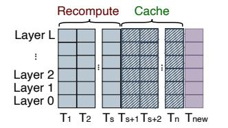
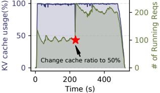
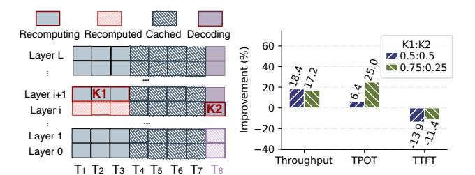
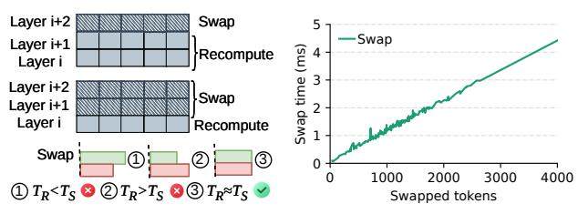
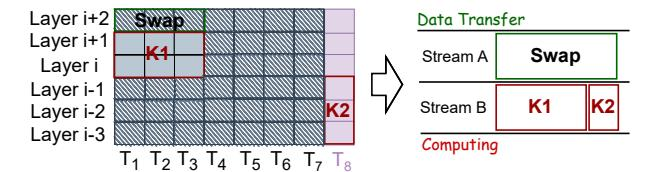
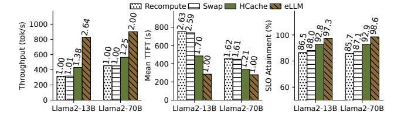
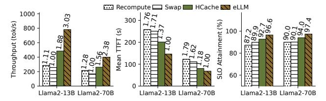
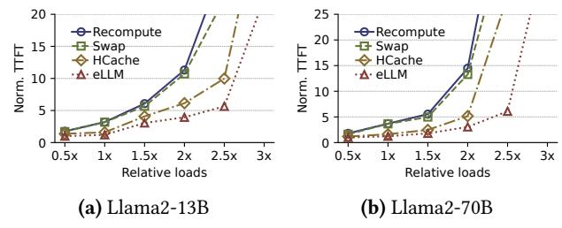
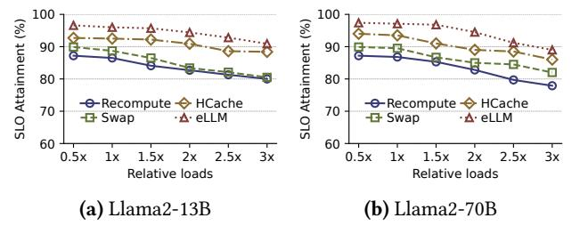

# High Throughput and Low Latency LLM Serving via Adaptive KV Caching

Wenyan Chen∗ University of Macau NTU Singapore wenyan.chen@ntu.edu.sg

Chengzhi Lu NTU Singapore chengzhi.lu@ntu.edu.sg

Huanle Xu† University of Macau huanlexu@um.edu.mo

Kejiang Ye† Shenzhen Institutes of Advanced Technology, CAS kj.ye@siat.ac.cn

Chengzhong Xu University of Macau czxu@um.edu.mo

# Abstract

The substantial memory demands of model weights and keyvalue (KV) caches often lead to severe memory bottlenecks in LLM serving. Existing systems address this by offloading KV caches to host memory and rapidly restoring them on demand before decoding. However, these approaches are too coarse-grained and fail to fully exploit the combined computational and storage capabilities of GPUs.

In this paper, we introduce eLLM, a novel LLM serving system designed to achieve high throughput and low latency through fine-grained KV caching. The core innovation lies in adaptively storing partial tokens with KV caches while dynamically recomputing non-cached tokens in parallel with decoding, thereby balancing memory usage and computational efficiency. This new mechanism enables dual-level optimizations: At the request level, eLLM employs tokenwise caching to adaptively adjust batch sizes and uncached token ratios in real time. At the layer level, eLLM leverages communication-computation overlap and kernel fusion for resource-complementary operations to further enhance throughput and reduce latency. Experiments demonstrate that eLLM achieves 3.03× higher throughput while satisfying strict per-output-token latency SLOs. It also reduces firsttoken latency by 2.63× compared to state-of-the-art systems.

# CCS Concepts: • Computer systems organization → Cloud computing.

Keywords: LLM Serving, Adaptive KV Caching, High throughput, Low Latency

†Corresponding authors.

[This work is licensed under a Creative Commons Attribution 4.0 Interna](https://creativecommons.org/licenses/by/4.0)[tional License.](https://creativecommons.org/licenses/by/4.0)

EUROSYS '26, Edinburgh, Scotland Uk © 2026 Copyright held by the owner/author(s). ACM ISBN 979-8-4007-2212-7/2026/04 <https://doi.org/10.1145/3767295.3803570>

# ACM Reference Format:

Wenyan Chen, Chengzhi Lu, Huanle Xu, Kejiang Ye, and Chengzhong Xu. 2026. High Throughput and Low Latency LLM Serving via Adaptive KV Caching. In 21st European Conference on Computer Systems (EUROSYS '26), April 27–30, 2026, Edinburgh, Scotland Uk. ACM, New York, NY, USA, [16](#page-15-0) pages. <https://doi.org/10.1145/3767295.3803570>

# 1 Introduction

The rapid adoption of large language models (LLMs) has driven a significant increase in the demand for efficient and scalable serving systems. These LLMs, including variants like GPT-4o [\[35\]](#page-14-0), Llama3 [\[3\]](#page-14-1), and DeepSeek [\[25\]](#page-14-2), are frequently updated to meet evolving user needs, driving substantial growth in model size and context lengths. Inference of LLM serving is split into two stages: prefill to process input prompts, and decode to generate subsequent output tokens. Both stages require model weights to reside in GPU memory and generate KV caches for all tokens to avoid redundant computations [\[41,](#page-14-3) [56\]](#page-15-1). However, this mechanism has led to ballooning memory usage, with GPU memory becoming a bottleneck even as GPU streaming multiprocessors (SMs) remain underutilized, which leads to an imbalance between memory and computation resources.

In recent years, researchers have made significant efforts to tackle this issue. Some methods offload KV caches to host or disk storage [\[1,](#page-14-4) [22,](#page-14-5) [28\]](#page-14-6), while others discard KV caches of tokens and recompute them to free up GPU memory [\[22,](#page-14-5) [32,](#page-14-7) [51,](#page-15-2) [53\]](#page-15-3). Although these strategies can alleviate GPU memory pressure to some extent, they often result in suboptimal throughput and latency. For instance, offloading KV caches introduces significant overhead due to PCIe bandwidth limitations, while recomputing tokens can be computationally expensive, especially for long sequences. To mitigate this overhead, HCache [\[12\]](#page-14-8) stores hidden states to enable fast restoration and recompute KV caches for all tokens of an evicted request. In this context, HCache performs KV cache recomputation at a coarse-grained, request-level granularity. Similarly, KVPR [\[18\]](#page-14-9) recomputes KV caches of preempted

∗Wenyan Chen is currently a Research Fellow at NTU Singapore.

requests using the corresponding input activations, which are first transferred from the CPU, while asynchronously transferring the remaining KV caches to the GPU. A fundamental limitation of these fast restoration solutions is that they need to store the entire KV cache during decoding for all ongoing requests, neglecting opportunities to enhance the concurrent request capacity within limited GPU memory.

To fill this gap, we propose a fine-grained adaptive tokenwise caching mechanism that only retains KV states of partial active tokens in GPU memory while dynamically evicting and recomputing other older tokens during decoding. This strategy significantly reduces the memory footprint of KV caches, enabling higher request concurrency. While prior systems like HCache [12] considered token-wise recomputation impractical due to the inefficiency of small-batch GEMM kernels during restoration, our mechanism successfully overcomes this bottleneck. By batching recomputed tokens from all ongoing requests during decoding, we make token-wise recomputation efficient, thereby unlocking the full benefits of fine-grained management. Preliminary experiments (see § 2.3) demonstrate that configuring an appropriate cache ratio under varying system loads improves throughput by 57% with negligible degradation in time-per-output-token (TPOT). To further mitigate the overhead associated with recomputing the partial KV cache, we introduce layer-wise kernel fusion, which combines recomputation of evicted tokens and new token decoding into a single GPU kernel. This eliminates redundant kernel launches and enhances SM utilization, reducing TPOT by 25% (§ 2.4). These optimizations are interdependent: the evicted token ratio dictates thread allocation for fused kernels, while thread allocation inversely impacts caching decisions. Their parallel execution per iteration necessitates co-optimization for peak efficiency.

Building on these insights, we present eLLM, a system engineered to elevate <u>LLM</u> serving performance through joint optimization of adaptive KV caching and kernel fusion. Central to our design is a granular KV cache management mechanism that operates at both token and layer levels. Unlike conventional caching methods used in systems such as vLLM [22], HCache [12], and KVPR [18], which retain full-layer KV states per request as indivisible units during the decoding stage, eLLM selectively caches key-value pairs for individual tokens at specific layers during decoding, enabling flexible caching strategies at finer granularities.

On top of the new caching mechanism, eLLM further implements dual-level optimizations designed to maximize throughput while maintaining compliance with TPOT SLOs (service-level objectives). At the request level, it dynamically adjusts batch sizes and token cache ratios using real-time system metrics and execution states. At the layer level, eLLM reduces recomputation latency through communication-computation overlap techniques for evicted tokens and host-swapped KV states, while optimizing thread allocation for

**Figure 1.** The workflow of LLM serving using KV caches.

fused kernels based on instantaneous computational demands. This closed-loop system continuously refines batch sizes, eviction ratios, and thread assignments, resolving interdependencies between caching and fusion while adapting to fluctuating request patterns and sequence lengths.

We have implemented eLLM on top of vLLM [22] and evaluated its performance using real-world invocation traces from Azure [6] on a 4 A100 GPU cluster. Experimental results demonstrate that eLLM achieves up to 3.03× higher throughput and 2.63× lower latency compared to state-of-the-art systems, while simultaneously delivering up to 15% higher SM utilization. Additionally, it maintains similar performance benefits across diverse request loads, models, and datasets. Key contributions of this paper include:

- ▶ We develop an adaptive token-wise and layer-wise KV caching mechanism that enables fine-grained caching at both token and layer granularities, thereby supporting joint optimization across request and layer levels.
- ▶ We present dual-level optimizations that dynamically adjust batch sizes and uncached token ratios at the request level, and overlap communication-computation overhead with kernel fusion at the layer level, aiming to maximize throughput while maintaining TPOT SLOs.
- ▶ We propose a closed-loop adaptation mechanism that continuously monitors system metrics and per-request execution states. It iteratively refines the batch size, evicted token ratio, and thread allocation, thereby further enhancing LLM serving performance.

# 2 Background and Motivation

#### 2.1 LLM Serving Basics

Transformer-based LLMs. An LLM consists of multiple Transformer layers [43], each containing attention-based and multilayer perceptron (MLP) components. As illustrated in Fig. 1, during inference, the LLM takes a sequence of input tokens (i.e., the prompt) and autoregressively generates subsequent tokens until a stopping condition is met—such as reaching the maximum output length or producing an <EOS>. This generation process can be divided into two distinct phases: the *prefilling* phase and the *decoding* phase.

In the *prefilling* phase, the LLM processes the entire input sequence to compute hidden states for each token. These hidden states are then projected into query (Q), key (K), and value (V) matrices at each layer. These matrices are

(a) Distribution of memory and (b) Trends of KV cache usage computation and number of running requests

**Figure 2.** Distribution of memory and computation metrics for serving Llama2-13B model with 50 req/s on an A100 GPU.

passed through the multi-head attention (MHA) and MLP modules to generate the first output token. Since the full input sequence is known in advance, this phase benefits from highly parallelized matrix-matrix operations, enabling efficient utilization of GPU resources.

In contrast, the *decoding* phase proceeds sequentially, generating one output token per iteration until the stopping criterion is satisfied. In each step, the previously generated token serves as the new input. Each layer computes the Q, K, and V embeddings for this new token, updates the KV cache, and performs multi-head attention by combining the current token's Q embedding with the cached K and V vectors from all previous tokens. This phase primarily involves matrix-vector operations, which generally result in lower SM utilization compared to the prefilling phase.

**KV Caches.** To reduce recomputation overhead, LLMs typically utilize KV caches to store the intermediate key and value tensors for each token. These tensors are crucial for calculating attention scores when generating the next token and are accumulated as more output tokens are produced. The KV caches are computed as:  $K = XW^K$ ,  $V = XW^V$ , where X is the input token embedding, and  $W^K$  and  $W^V$  are the weight matrices for the key and value, respectively. These tensors are often stored in GPU memory to avoid redundant computations during the *decoding* phase; their size grows linearly with the number of generated tokens.

## 2.2 Imbalance between Memory and Computation

Modern accelerators, such as GPUs, are limited by their memory capacity, as integrating a large amount of RAM on these devices remains a significant challenge [33]. When running LLMs on GPUs, memory becomes a critical bottleneck for serving, primarily due to the KV cache storage mechanism [8, 22] and the substantial size of LLM weights, leaving SM resources underutilized.

To demonstrate this point, we conducted experiments using Llama2-13B (MHA) [42] on the ShareGPT dataset, executing it on an A100 GPU with 80GB memory. We analyzed the behavior of various performance metrics. The shaded regions on the upper and right sides of Fig. 2(a) represent the density distribution of GPU computation and memory utilization points, respectively. The results reveal that memory

usage is significantly higher, consistently ranging from 50% to 100% of the GPU's memory capacity. In contrast, computational utilization is relatively low, primarily staying between 0% and 10% of the GPU's computational capacity.

Moreover, as illustrated in Fig. 2(b), the KV cache consumption exhibits rapid growth during initial request scaling, reaching full memory capacity as token generation progresses. Notably, even after numerous requests complete execution and vacate compute resources, the KV cache footprint remains persistently elevated due to the accumulating output tokens of remaining active requests. This reveals a critical resource disparity: While SMs become underutilized as computation demands decrease, the memory subsystem remains fully saturated.

To evaluate whether this imbalance persists across more memory-efficient architectures, we further examine DeepSeek-V2-Lite (16B) [9], which incorporates Multi-Head Latent Attention (MLA) to significantly compress KV cache. Under identical settings, the MLA-based model still yields a median GPU utilization of only 35%, despite reaching 97.4% memory occupancy. This confirms that even with architectural optimizations designed to alleviate memory pressure, the serving process remains fundamentally memory-constrained. Such a persistent disparity prevents GPU computational capabilities from being fully exploited even when SM capacity is available—a core bottleneck that ultimately degrades overall system throughput.

## 2.3 Benefits of Partial Token-wise Caching

To address memory bottlenecks, current research predominantly focuses on an *all-or-nothing* caching strategy for KV caches, in which the KVs of all tokens are either fully preserved or entirely discarded for overloaded requests. This approach generally falls into two categories: (1) swapping the KV caches of all tokens within a request to host memory or storage devices [1, 11, 20, 28] and retrieving them when needed, and (2) discarding the KV caches for an entire request and recomputing them on demand [22, 30, 32]. While simple, these coarse-grained strategies degrade throughput and amplify inference latency under dynamic loads and variable prompt lengths. A fundamental limitation of both methods is their reliance on retaining full KV caches in GPU memory throughout decoding, even with optimizations like fast cache recovery [12], which severely restricts concurrent requests.

Partial token-wise caching presents a fine-grained solution to these challenges. As depicted in Fig. 3(a), this approach dynamically adapts to system load and memory constraints by recomputing KV caches for a targeted subset of tokens (e.g., 40%) at the sequence's start within the same layer during current-token decoding, while only retaining full KV caches for the remaining tokens in GPU memory. Upon decoding the current token at its respective layer, the temporary KV caches for the recomputed tokens are instantly evicted. This achieves two critical advantages: (1) it reclaims

(a) Token-wise caching

(b) Benefit of token-wise caching

**Figure 3.** Illustration of partial token-wise caching. (a) For a prompt of length *n*, the KV caches of the first *s* tokens are evicted from memory during decoding, resulting in a cached token ratio of (n-s)/n; (b) Adjusting the cached ratio based on the system load.

GPU memory to support higher request concurrency during decoding, and (2) it exploits underutilized computational resources-particularly idle SMs-to minimize overhead. Crucially, recomputing early-sequence tokens incurs negligible latency, as attention operations for shorter sequences are inherently efficient. The synergistic result is reduced inference latency, improved throughput, and scalable concurrency. Furthermore, the strategy enables a dynamic trade-off between memory and computation, allowing runtime optimization tailored to fluctuating workloads and hardware states. We demonstrate the advantage of partial token-wise caching in a real-world scenario, as illustrated in Fig. 3(b). Using the same model and GPU setup as described in § 2.2 and the ShareGPT dataset, the request submission follows the original request arrivals from the Azure trace in DynamoLLM [40]. The submitted requests exceeded the memory capacity for the entire first 400 seconds. At the 200-second mark, we apply partial caching (50% cache ratio) to all ongoing requests to alleviate memory pressure. As a result, the number of concurrently executed requests nearly doubles. This higher concurrency reduces request waiting times and optimizes GPU utilization, achieving a TTFT (time to first token) reduction of 48.05% and an SM utilization increase of 8.7%

To further evaluate this hypothesis, we conducted experiments using the same settings as described in § 2.2. As shown in Fig. 4, both output token throughput and TTFT consistently improved Figure with the use of partial token improvement with different caching as fewer KVs were cache ratios.

4. Performance

cached, compared to the pure swapping-based and pure recomputation-based policies. However, TPOT increases as fewer KVs are cached, due to the additional recomputation required. Interestingly, as the cached token ratio increases, there is a point where TPOT becomes almost unaffected while TTFT and throughput performance improve significantly-by up to 57% under the fixed load.

**Insight** #1: Partial token-wise caching improves the concurrency of requests processed in batches, thereby increasing

(a) Kernel fusion illustration

(b) Benefits of kernel fusion

**Figure 5.** (a) Layer-wise kernel fusion: Decoding token  $T_8$  at layer i (kernel K2) requires the KV caches of tokens  $T_1$  to  $T_7$ at the same layer. While the caches for tokens  $T_4$  to  $T_7$  are retained in memory, the remaining caches must be recomputed before decoding the current layer. Simultaneously, the recomputation of KV caches for tokens  $T_1$  to  $T_3$  at the next layer, i + 1 (kernel K1), can be performed in parallel with K2 through kernel fusion. (b) Benefits of kernel fusion.

throughput for serving LLMs and reducing TTFT. Additionally, by strategically optimizing the cache ratio, TPOT performance can be maintained without any degradation.

#### 2.4 Benefits of Layer-wise Kernel Fusion

Adaptive KV caching enables concurrent recomputation of existing tokens' KV caches and decoding of new tokens, leveraging kernel fusion to further optimize inference latency. A prominent implementation of this is vertical kernel fusion [16, 39, 45, 47, 49, 55]. This technique pipelines multiple kernels into a single fused operation, offering two key advantages: (1) it reduces kernel launch overhead by minimizing frequent scheduling, and (2) it eliminates redundant global memory access by retaining intermediate results in registers or shared memory rather than writing and reloading them between kernels. These optimizations collectively reduce both computational and I/O bottlenecks. Complementing this, horizontal kernel fusion [10, 24, 29], executes multiple independent kernels concurrently within a single kernel, dynamically allocating distinct thread groups to each operation. This approach is particularly effective for kernels without data dependencies, optimizing resource use for workloads with heterogeneous computational demands [24].

In most inference scenarios, the SMs may not be fully utilized, creating an ideal scenario for horizontal kernel fusion. By fusing the recomputation kernel (K1 in Fig. 5(a) for tokens  $T_1$  to  $T_3$  of layer i+1) with the decoding kernel (K2 in Fig. 5(a) for a new generating token  $T_8$  of layer i), we can leverage the distinct resource demands of these kernels. Specifically, *K*1 is compute-intensive, while K2 is memory-intensive [37]. This fusion enables the decoding operation for token  $T_8$  to utilize the well-prepared KV caches of tokens  $T_1$  to  $T_7$ , thereby reducing decoding time. As demonstrated in Fig. 5(b), this kernel fusion policy achieves significant performance improvements compared to unfused implementation (evicted token ratio is 40%). Specifically, it achieves up to 18% higher

output token throughput and a 25% reduction in TPOT under different thread allocations (0.5:0.5 and 0.25:0.75) among K1 and K2. Here, the smaller allocation in each ratio (0.5 and 0.25) is assigned to K2, while the larger portion (0.5 and 0.75) is reserved for K1, reflecting K1's greater demand for GPU computational resources. However, the improvement in TTFT is negative, as using horizontal kernel fusion requires sacrificing a layer of memory resource to temporarily store the KV cache generated by K1. This increased memory usage for parallel decoding requests causes delays in TTFT for certain prefilling requests.

Insight #2: Horizontal kernel fusion optimizes GPU resource utilization by merging kernels with complementary resource requirements. By strategically fine-tuning thread allocation across these combined operations, this approach boosts token throughput and reduces TPOT, further enhancing the advantages of adaptive token-wise KV caching.

#### 2.5 Challenges

Although adaptive token-wise caching and efficient kernel fusion can significantly improve the performance of LLM serving, jointly optimizing both throughput and latency [2] remains complex due to the following challenges.

*C*1: *Dynamic optimization under fluctuating request arrivals and sequence generation lengths.* As the request volume increases and sequences grow longer, memory demands for KV caches scale proportionally, while computational costs rise significantly due to the exponential growth in tokens requiring recomputation to free memory under token-wise KV caching. To sustain low token generation latency while maximizing throughput, the token cache ratio must be dynamically adjusted to balance GPU memory usage with computational intensity—posing a complex optimization challenge. Simultaneously, thread allocation in horizontally fused kernels must adapt in real-time to evolving recomputation workloads and decoding complexities as the number and length of active sequences fluctuate.

*C*2: *Interdependence between token-wise caching and kernel fusion.* Token-wise caching and kernel fusion are synergistic yet codependent strategies for optimizing LLM serving efficiency, but their nuanced interactions remain inadequately addressed. For instance, the token caching ratio directly governs KV cache memory overhead, while kernel fusion—despite boosting compute efficiency—imposes added memory costs for storing fused-kernel KV states. Furthermore, the recomputation burden of uncached tokens dictates thread allocation trade-offs between recomputation and decoding kernels. These intertwined dependencies underscore the necessity for joint optimization of caching policies and fused kernel configurations to navigate the memory-compute-latency equilibrium. This interdependence further intensifies the challenge of dynamic optimization.

**Figure 6.** The overall system architecture of eLLM. Comm denotes <u>comm</u>unication and Com represents <u>computing</u> operation, orchestrated at the layer level.

# 3 eLLM Design

To tackle these challenges, we propose eLLM, a system designed to co-optimize token-wise adaptive caching and layerwise kernel fusion in dynamic environments. The goal of eLLM is to maximize token generation throughput while ensuring that the TPOT SLOs for the entire inference process are met. Additionally, by reducing the waiting time for requests, eLLM inherently enhances the TTFT performance.

#### 3.1 System Overview

Fig. 6 presents the architecture of eLLM, a dual-level optimization framework comprising **Request-level** and **Layer-level** mechanisms. At the request level, incoming user inference requests are queued in a pooled buffer, where the *Request Batching* component **①** dynamically determines the optimal batch size to maximize concurrent processing while balancing memory and computational constraints. Simultaneously, the *Token-wise Caching* component **②** allocates a cached-token ratio per request to manage memory footprint. These parameters are iteratively refined to adapt to fluctuating workloads, ensuring efficient resource utilization.

At the layer level, *Comm-Com Overlapping* **3** orchestrates synchronization between uncached-token recomputation and cached-token transfers across host and GPU memory, leveraging dedicated CUDA streams to parallelize communication and computation. Complementing this, *Layer-wise Kernel Fusion* **3** merges recomputation kernels for uncached tokens with decoding kernels, while optimizing thread allocation for diverse computational kernels based on real-time workload demands. This dual-layer strategy minimizes latency by overlapping recomputation with token transfers.

eLLM employs closed-loop adaptation, continuously monitoring system metrics (e.g., memory pressure, request queue status) and per-request execution states (e.g., sequence lengths). By dynamically adjusting batch sizes, cached-token ratios, thread allocations, and kernel fusion strategies, the system maintains high throughput and low latency across varying request loads. This holistic optimization ensures efficient coordination between host-GPU communication and

**Figure 7.** eLLM's new KV management mechanism.

computational workflows, maximizing hardware utilization under dynamic inference conditions.

To facilitate this two-level optimization, eLLM redesigns the KV caching mechanism atop modern GPU memory architecture to support adaptive token caching, caching of specific layers for kernel fusion, and efficient swapping of uncached tokens between host and GPU memory.

# 3.2 Adaptive Token-wise and Layer-wise KV Caching Mechanism

The widely-adopted PagedAttention mechanism in today's mainstream inference engine vLLM [22] efficiently manages KV caches for LLMs by consolidating all tokens in a sequence and their corresponding layers within a single GPU memory block. While effective, this design inherently assumes full caching of both tokens and layers. To address scenarios requiring partial caching—where only specific tokens or layers are adaptively retained—eLLM introduces a new KV cache management mechanism, as illustrated in Fig. 7.

For incoming requests, eLLM implements adaptive token-wise caching, dynamically evicting older tokens from GPU memory while retaining newer ones. During inference, uncached tokens must first be recomputed and concatenated with cached tokens to generate new outputs. This recomputation process requires temporary storage for intermediate layers of uncached tokens to enable fused operations such as recomputation-decoding and host-GPU swapping. However, these transient storage demands fragment the contiguous memory layout of tokens and layers across concurrent requests. As a result, conventional GPU block designs face a significant challenge: storing a small number of layers and tokens within fixed-size blocks leads to severe internal fragmentation, as unused block space cannot be reallocated

to other requests. To resolve this, eLLM introduces a fine-grained, token- and layer-aware memory management mechanism. Unlike vLLM's coarse-grained block design, eLLM partitions GPU memory into smaller units, each dedicated to F consecutive layers (rather than all layers). Each unit is tagged with metadata specifying its layer index. A logical-to-physical mapping table is incorporated to dynamically track these non-contiguous memory regions. The granularity F is critical, eLLM strikes a balance by defaulting F to 4, as analyzed in § 6.5, while allowing user configuration.

To enable efficient address indexing, the map table includes the following fields: seq\_id, token\_id, layer\_id, logical\_block\_id, physical\_block\_id, and #filled. The #filled field tracks the number of tokens stored per block. During inference, the map table allows efficient retrieval of the stored tensor address corresponding to a specific layer, token, and request. Additionally, the host side adopts the same reshaping method for memory blocks, ensuring consistency across the system.

As shown in Fig. 7, we show examples to elucidate the KV caching mechanism. Here, the first four tokens of Requests 1 and 2 are uncached, while the subsequent tokens are stored using KV caches. The block size for token storage is set to 4. For an L-layer model with L=8, the original GPU block dimensions are  $4\times4$ . Given that the layer granularity F is set to 4, the original block table can be reshaped into a logical block table with dimensions  $8\times4$ . The physical block table is similarly reshaped. To recompute uncached tokens for decoding new tokens: In Example A, the *Swap*, *Recompute*, and *Decoding* operations require storing 1, 1, and 2 layers, respectively. This configuration results in blocks containing four layers and four tokens each, utilizing a total of two memory blocks. In Example B, the same operations require 2, 2, and 4 layers, respectively, expanding to four blocks.

# 4 System Optimization

## 4.1 Optimization Framework

The eLLM framework co-optimizes throughput and latency for LLMs deployed on a cluster of N GPUs, each with memory capacity  $M_G$ . During each decoding iteration, when B requests reside in the waiting queue, eLLM dynamically maximizes output token throughput while ensuring TPOT SLOs. This dual-goal optimization is formalized as:

$$\max_{(b,r,\delta)} \frac{b}{T(b,r,\delta)}$$
s.t.  $T(b,r,\delta) + WT_{max} \leq \text{SLO},$ 

$$\sum_{i=1}^{b} 4Lhs_i(1-r) + M_W \leq M_G \cdot N - M_o,$$

$$0 \leq r \leq 1,$$

$$1 \leq b \leq B.$$
(1)

In this formulation, the optimization variables are b, r, and  $\delta$ . The batch size b determines the number of concurrent

requests processed per iteration. The uncached token ratio r specifies how many previous tokens are recomputed, with 1-r representing cached tokens stored via KV states.  $\delta$  governs threads number for recomputation kernel (K1 in Fig. 5(a)) of kernel fusion. Together, these variables influence the latency of processing batch b. We define  $T(b,r,\delta)$  as the total batch processing time, and the objective function maximizes throughput as  $\frac{b}{T(b,r,\delta)}$ .

The first constraint guarantees that the total latency for batch b, including processing and waiting time  $(WT_{max})$ , adheres to the SLO. The second enforces GPU memory limits: cached tokens for b requests  $\sum_{i=1}^{b} 4Lhs_i(1-r)(4$  means K and V caches in half-precision, hence  $2\times 2$  bytes per element), model weights  $(M_W)$ , and memory space for overlapping and kernel fusion  $(M_o)$  must fit within the cluster's total memory  $(M_G \cdot N)$ . Here, L, h, and s denote the number of layers, hidden dimension, and maximum sequence length in the batch, respectively. The remaining constraints ensure that the batch size b does not exceed the number of requests (B) in the waiting queue.

Directly solving this online mixed-integer nonlinear programming problem is computationally prohibitive due to the dynamic nature of the inference process  $(C_1)$  and the interdependencies among variables  $(C_2)$ . To address these challenges, eLLM adopts a dual-level optimization framework. For  $C_1$ , eLLM introduces a request-level optimization strategy (detailed in § 4.2) that dynamically adjusts the batch size (b) and uncached token ratio (r) based on explicit quantification of recomputation and decoding costs. This strategy focuses on optimizing b and r while disregarding the thread configuration variable  $\delta$  to improve optimization efficiency.

For the second challenge  $C_2$ , eLLM incorporates a layer-level optimization strategy (discussed in § 4.3) that optimizes kernel fusion and communication-computation overlap at the layer granularity. This approach enables precise estimation of  $M_0$ , which is then fed back to the request-level optimization. Initially,  $M_0$  is set to the maximum value 40hbsr, but after layer-level refinement, the reduced  $M_0$  frees up memory. This allows the system to iteratively increase the batch size b and decrease the uncached token ratio r, creating a feedback loop that not only enhances system throughput but also resolves the interdependence between token-wise caching decisions and kernel fusion efficiency.

# 4.2 Request-level Optimization

**4.2.1 Inference latency estimation.** It is essential to estimate inference latency as a function of batch size b and the ratio of uncached tokens r. LLM services, which predominantly utilize transformer architectures (as detailed in § 2.1), incur computational costs during both the prefilling and decoding stages. These costs depend on various factors, including model parameters (e.g., the number of layers L, hidden dimension h, and vocabulary size V), sequence length s, and the type of hardware accelerators (e.g., GPUs) employed

for processing. The total floating-point operations (FLOPs) required to process a batch can be determined based on the model's parameters, input prompt length, and batch size b. Since each GPU type has a unique floating-point operations per second (FLOPS) capacity, latency can be approximated by dividing the total FLOPs by the GPU's computational capacity. This relationship provides a practical method to estimate latency for a batch of requests under specific configurations.

When employing adaptive token-wise caching, uncached tokens must be recomputed and concatenated with cached tokens to generate new output tokens. For a request i with request length  $s_i$ , each inference iteration involves two primary stages: prefilling for  $s_i r$  tokens and decoding for a new token with previous cached tokens  $s_i$ . The computational costs can be estimated as follows.

During the recomputation phase (corresponding to the prefilling stage), the FLOPs required for the Attention module are calculated as  $8s_irh^2 + 4s_i^2r^2h$ . For the MLP module, which consists of two linear layers, the total FLOPs amount to  $16s_irh^2$ . Additionally, the final output layer, a linear layer that maps the hidden state to the vocabulary dimension to generate logits for each token, contributes  $2s_irhV$  FLOPs [12, 38]. Consequently, the **recomputation volume** for b requests across all L layers can be expressed as:

$$V_{b,r}^{\text{rec}} = \sum_{i=1}^{b} \left( 24h^2 L s_i r + 4h L s_i^2 r^2 + 2h V s_i r + \epsilon_0 \right). \tag{2}$$

For decoding, the FLOPs for the Attention module differ from those in the prefilling phase, as KV are cached, the FLOPs are  $8h^2 + 4h(s_i + 1)$ . For the MLP and output layers, the FLOPs are  $16h^2$  and  $2s_ihV$ , respectively. Thus, the **decoding volume** for b requests with all L layers can be expressed as:

$$V_{b,r}^{\text{dec}} = \sum_{i=1}^{b} \left( 24h^2L + 4hL(s_i + 1) + 2hVs_i + \epsilon_1 \right).$$
 (3)

In these formulas,  $\epsilon_0$  and  $\epsilon_1$  denote the computational overhead associated with minor operations, such as Layernorm, which are omitted from the theoretical cost models.

Putting everything together, the latency for a batch of requests *b* with uncached token ratio *r* is expressed as:

$$T(b,r) = \frac{1}{\text{FLOPS}} \left( V_{b,r}^{\text{rec}} + V_{b,r}^{\text{dec}} \right). \tag{4}$$

**4.2.2 Batching and token-wise caching.** To efficiently address the optimization problem while incorporating inference latency estimation, we reformulate the objective by transforming the maximization into an equivalent minimization problem. This transformation leverages standard optimization frameworks, facilitating faster convergence during iterative solving. The reformulated, simplified objective is:

$$\min_{(b,r)} \frac{\sum_{i=1}^{b} \left[ 24h^2L(s_ir+1) + 4hL(s_i^2r^2 + s_i + 1) + 2hVs_i(1+r) \right]}{\text{FLOPS} \cdot b}$$

subject to the constraints defined in Eq. (1). eLLM adopts First-Come, First-Served (FCFS) as its default scheduling

(a) Layer-wise overlapping (b) KV cache swap overhead

**Figure 8.** Illustration of the layer-wise recomputation-communication overlap.  $T_R$  and  $T_S$  mean time for recomputation and swapping, respectively in (a).

policy for incoming requests, though its architecture supports seamless integration of alternative scheduling strategies. Under FCFS, the sequence length  $s_i$  for each request is initialized during the prefill phase upon its arrival order and dynamically updated in subsequent decoding iterations. In each decoding iteration, eLLM substitutes the requestspecific information ( $s_i$ , B,  $WT_{max}$ ) from the waiting queue, the model parameters  $(M_W, h, L, V)$ , and the GPU details (FLOPS,  $M_G$ , and N) into Eq. (5). The resulting optimization problem is then efficiently solved using the Sequential Least Squares Programming (SLSQP) solver [14] provided by the Scipy library [44]. The optimized values of b and r are subsequently used in each decoding iteration to update the batched requests via the Request Batching component and manage uncached tokens through the Token-wise Caching component.

## 4.3 Layer-level Optimization

Building on request-level optimizations, eLLM incorporates layer-level optimizations designed to maximize computation-communication overlap and refine thread allocation strategies for fused kernels.

**4.3.1 Layer-wise overlapping.** To fully leverage host memory concurrently, eLLM integrates an offloading mechanism that selectively transfers KV states to host memory while overlapping transfer costs with computation. After the prefill phase, where a request's prompt tokens are processed, the KV caches for all layers of the cached tokens are stored in GPU memory. For uncached tokens (with a ratio of *r*), several layers of their KV states can be temporarily offloaded to host memory and reloaded as needed, while other layers are recomputed directly on the GPU during decoding. This layer-wise overlapping approach enables eLLM to minimize the total communication and computation costs.

Since the costs of recomputation and communication vary based on the number of tokens and layers involved, eLLM dynamically determines the optimal layers for recomputation and swapping between host and GPU memory. As illustrated in Fig. 8(a), eLLM can, for instance, recompute layers i and i + 1 while simultaneously swapping layer i + 2 from host to GPU, or alternatively recompute layer i alone while swapping layers i + 1 and i + 2. However, suboptimal layer

**Figure 9.** Layer-level optimization.

configurations can lead to *time bubbles* during overlapping operations (e.g., ① and ② in Fig. 8(a)). These bubbles occur when significant mismatches between recomputation time ( $T_{Rec}$ ) and swapping time ( $T_{Swap}$ ) result in idle periods. In contrast, well-matched configurations, such as ③ in Fig. 8(a), achieve near-equality between  $T_{Rec}$  and  $T_{Swap}$ , effectively minimizing idle time. Accurate estimation of these latencies is thus critical to optimizing overlap efficiency.

**Swapping Latency.** The profiling results for Llama2-13B on an NVIDIA A100 GPU reveal a linear relationship between swap time and the number of tokens transferred when moving KV caches from GPU to host memory, as shown in Fig. 8(b). Based on this observation, eLLM models the overhead for layer-wise KV cache swapping using the following linear equation parameterized by the number of layers:

$$T_{k,l_1} = (\alpha k + \beta) \cdot l_1/L, \tag{6}$$

where  $l_1$  denotes the number of layers being swapped, k is swapped token number, and parameters  $\alpha$ ,  $\beta$  are pre-profiled constants specific to the LLM and hardware configuration.

**Recomputing Latency.** The recomputation latency is influenced by three critical parameters: the current batch size b, the uncached token ratio r, and the number of layers  $l_2$  requiring recomputation. As analyzed in § 4.2.1, this latency can be quantified as:

$$T_{b,r,l_2} = \frac{1}{\text{FLOPS}} \sum_{i=1}^{b} \left[ \left( 24h^2 s_i r + 4h s_i^2 r^2 \right) \frac{l_2}{L} + 2s_i r h V \right]. \tag{7}$$

By leveraging the latency models presented in Equations (6) and (7), eLLM identifies the optimal layer configurations for recomputation and swapping to minimize overlapping time bubbles. To reduce search overhead and align with the kernel fusion design (detailed in § 4.3.2), recomputation is restricted to at most two layers, and swapping is limited to three layers simultaneously. This constraint yields six feasible configurations. The *Comm-Com Overlapping* algorithm evaluates all valid combinations of layers and selects the configuration that minimizes the discrepancy between swapping latency and recomputation overhead.

**4.3.2 Layer-wise kernel fusion.** To optimize the recomputation of uncached tokens (r), eLLM leverages kernel fusion with the decoding kernel to maximize SM utilization. As illustrated in Fig. 9, this layer-level optimization integrates overlapping policies to accelerate inference. Specifically, eLLM mitigates kernel launch overhead and memory access time between adjacent layers (e.g., Layers i and i+1 in Fig. 9) through vertical fusion. Meanwhile, eLLM integrates horizontal fusion of recomputing and decoding

kernels (e.g., K1 and K2 in Fig. 9) with complementary resource demands. To implement this, additional GPU memory is required to store the KV states of swapping layers  $4hbsrl_1$ , recomputed layers for K1 ( $4hbsrl_2$ ), and decoding layers for K2 ( $4hbsr(l_1 + l_2)$ ), resulting in a total memory consumption of  $8hbsr(l_1 + l_2)$ . The fused kernel executes concurrently with memory swapping operations across two CUDA streams, enabling parallelized memory management and kernel execution.

However, the computational volumes of K1 and K2 exhibit a marked disparity, as they correspond to distinct computational logics. For the NVIDIA GPU architecture, each SM can execute multiple thread blocks in parallel. A grid comprises multiple thread blocks, and a kernel function can launch one or more grids simultaneously. The number of threads per block is pre-configured by the programmer, with a maximum of 1024 threads allocatable per block on the A100 GPU. To address this disparity, eLLM employs kernel fusion to dynamically allocate varying numbers of threads to balance the execution time of K1 and K2. This strategy is inspired by the analysis in § 4.2.1, where the latencies of K1 and K2 are estimated using Equations 2 and 3, respectively. The computational volumes of K1 and K2 can be expressed as:

$$V_{K1} = \sum_{i=1}^{b} \left( 24h^2 l_2 s_i r + 4h l_2 s_i^2 r^2 + 2h V s_i r \right), \tag{8}$$

$$V_{K2} = \sum_{i=1}^{b} \left( 24h^2(l_1 + l_2) + 4h(l_1 + l_2)(s_i + 1) + 2hVs_i \right). \tag{9}$$

The *Threads Allocation* strategy leverages the ratio of  $V_{K1}/V_{K2}$  to dynamically allocate threads to K1 and K2. The total number of threads per block, denoted as  $\mathcal{T}$ , is chosen under the hardware limit (e.g.,  $\mathcal{T} \leq 1024$  on the A100 GPU). Given an allocation of  $\delta$  threads to K1, the remaining  $\mathcal{T} - \delta$  threads are assigned to K2. Additionally, to align with warp granularity—where the NVIDIA warp scheduler dispatches 32 threads per warp at a time [34]—the allocation is adjusted to ensure thread counts are multiples of 32. This ensures efficient utilization of the GPU's parallel execution units while maintaining compatibility with hardware scheduling constraints.

During the request-level optimization, the value of  $M_o$  is initially set to 40hbsr, based on the assumption that the swapping layers are limited to 3 and the recomputing layers are limited to 2. However, once the optimal overlapping configuration and thread allocation are determined,  $M_o$  can be calculated using the formula  $8hbsr(l_1 + l_2)$ , as explained in § 4.3.2. This refined value of  $M_o$  is then utilized to further optimize the batch size and uncached token ratio at the request level, as detailed in § 4.2, thereby enhancing the overall throughput efficiency.

# 5 System Implementation

The eLLM framework is implemented as an extension of vLLM [22], comprising 3,500 lines of Python code and 1,700

**Table 1.** Models and datasets used in the experiments.

| Dataset       |            |     | # Layers | # GPUs | SLO (ms) |
|---------------|------------|-----|----------|--------|----------|
| ShareGPT [36] | Llama2-13B | MHA | 40       | 1 A100 | 50       |
|               | Llama2-70B | GQA | 80       | 4 A100 | 500      |
| L-Eval [5]    | Llama2-13B | MHA | 40       | 1 A100 | 60       |
|               | Llama2-70B | GQA | 80       | 4 A100 | 200      |

lines of CUDA kernel-level optimizations. To maintain backward compatibility, we retain vLLM's core APIs, ensuring seamless integration with third-party LLMs.

Request batching and token-wise caching. eLLM employs real-time request metadata at the start of scheduling. This metadata is fed to a constrained optimization pipeline leveraging SciPy's SLSQP solver, which computes near-optimal batch sizes and uncached-token ratios under current system constraints. These parameters are then propagated to the scheduler to govern concurrent sequence execution limits. Furthermore, each SequenceGroup maintains a dedicated uncached-token ratio variable, which directly controls the partitioning of KV cache blocks between GPU and CPU memory.

Comm-com overlapping. eLLM uses CUDA streams (via torch.cuda.stream) to parallelize computation and communication operations. Specifically, cached token data transfers and uncached token recomputation are executed concurrently via asynchronous CUDA streams. This ensures independent task progression, eliminating synchronization bottlenecks and enabling sustained GPU utilization by overlapping memory-bound and compute-bound operations.

Layer-wise kernel fusion. eLLM precompiles CUDA kernels into shared libraries (.so files) to optimize performance for recomputation and decoding operations. For both kernel types, it generates diverse thread configurations by iterating over 31 values in the range [32, 1024] (with a step size of 32). At runtime, eLLM dynamically selects the optimal .so file based on layer-specific computational requirements, ensuring that thread counts are tuned to align with hardware constraints and workload characteristics.

#### 6 Evaluation

In this section, we present a comprehensive evaluation of eLLM to demonstrate its superiority over the state-of-the-art LLM inference systems through extensive experimentation across diverse workloads and dataset configurations.

## 6.1 Experimental Setup

Hardware and software configurations. We conducted the evaluations on a server equipped with 4 NVIDIA A100 GPUs, each GPU memory capacity is 80GB. Notably, the GPUs utilize PCIe4.0×16 interconnects without NVLink. The inference service is running in a Docker container that leverages CUDA 12.4 and NVIDIA Driver 550.107.02. Additionally, the server is powered by a 96-core Intel Xeon(R) Gold 6342 CPU @2.80GHz processor and 256GB of host memory.

Models and datasets. We evaluated eLLM across four distinct model and dataset configurations, as summarized in Tab. 1. For Llama2-13B, experiments were conducted on a single GPU, while Llama2-70B utilized a tensor parallel (TP) configuration spanning four GPUs. Llama2-13B employs standard MHA, whereas Llama2-70B incorporates Grouped Ouery Attention (GOA) to optimize memory footprint [42]. Evaluating both models allows us to assess eLLM's effectiveness across different attention architectures and varied levels of intrinsic KV memory pressure. We allocated 40GB of host memory for Llama2-13B and 160GB for Llama2-70B to accommodate the swapped KV caches. Our datasets included ShareGPT [36] and the paper assistant subset from L-Eval [5], with the latter comprising long-context dialogues. Specifically, ShareGPT exhibits average input and output lengths of 222 and 1,346, respectively, while L-Eval demonstrates significantly longer contexts, with average input and output lengths of 35,956 and 5,189, respectively.

**Baselines.** eLLM was evaluated against three baselines: 1) vLLM-Recompute [22], which discards all KV caches of preempted requests when GPU memory is full and recomputes them when GPU memory becomes available. 2) vLLM-Swap [22], it swaps the KV caches of preempted requests to host memory when GPU memory is exhausted and restores them to GPU memory when space is available. These two strategies are implemented in vLLM [22]. 3) HCache [12], which is designed to facilitate the faster restoration of multiturn conversations or long-context prompts by storing hidden states of specific layers. We implemented HCache's core functionality in vLLM, recreating its StatePartitionAlgorithm. The fast hidden state restoration works like eLLM's recomputation function, while KV cache swapping between GPU and host during restoration is similar to eLLM's Comm-Com Overlapping. This balances the host-GPU transmission and the computation capability of GPU SMs.

Request generation. Dynamic requests were generated using prompts from the datasets listed in Table 1. We utilized Azure LLM invocation traces of conversation from DynamoLLM [6, 40], which exhibit high temporal variability (average request interval: 22.15ms, standard deviation: 37.49ms). From this dataset, we selected the first 3000 time-interval samples, corresponding to an average request rate of 25 req/s. To align with the different prompt characteristics, we halved the original intervals for ShareGPT (shorter prompts), averaging 50 req/s, and doubled them for L-Eval (longer prompts), averaging 12.5 req/s. Each end-to-end experiment ran for approximately 1.25 hours for ShareGPT and 2.92 hours for L-Eval, including a 2-minute warm-up period and five measurement trials to ensure statistical robustness.

**Metrics.** We evaluated eLLM's performance using TTFT and output token throughput (Throughput) with SLO compliance of TPOT. To ensure fairness, we integrated Eq. (5)

**Figure 10.** The e2e performance of eLLM on ShareGPT. Numbers on each bar in (a)/(b) indicate the throughput improvement/latency reduction of eLLM normalized to the minimum baseline. For (c), the values show the actual SLO attainment.

(r = 0) into *vLLM-Recompute*, *vLLM-Swap*, and *HCache*, allowing them to update the estimated batch size for maximum requests while maintaining SLO requirements for TPOT.

#### 6.2 End-to-End Performance

Token throughput. Our analysis in Fig. 10(a) demonstrates that eLLM achieves significantly higher throughput than baseline methods. Specifically, for Llama2-13B, eLLM outperforms vLLM-Recompute by 2.64× and vLLM-Swap by 2.61×, while delivering a 1.91× improvement over HCache. For the larger Llama2-70B model, eLLM maintains this advantage, achieving 2.0× and 1.6× improvements over vLLM-Recompute/vLLM-Swap and HCache, respectively. These results highlight eLLM's ability to fully exploit GPU memory and computational resources to maximize throughput while adhering to TPOT constraints. The baselines face inherent limitations. vLLM-Recompute and vLLM-Swap prioritize recomputation or host memory-approaches that sacrifice efficiency. HCache improves by caching intermediate hidden states, but only mitigates KV-cache restore overhead and still underperforms eLLM. The gap widens as eLLM combines fine-grained token- and layer-wise optimizations, enabling holistic GPU utilization throughout inference.

TTFT. As output throughput increases, TTFT should theoretically decrease, as higher throughput enables faster request processing and reduces waiting times in the prefilling stage. To validate this, we analyzed TTFT results in Fig. 10(b). The findings demonstrate that eLLM consistently outperforms baselines, achieving up to 2.63× lower TTFT across the two models. For Llama2-13B, eLLM achieves a 2.63× reduction over vLLM-Recompute, 2.59× over vLLM-Swap, and 1.7× over *HCache*. For Llama2-70B, the improvements are 1.62× and 1.61× over vLLM-Recompute and vLLM-Swap, respectively, and 1.21× over HCache. These results highlight eLLM's ability to decrease TTFT while sustaining high throughput. The key reason is eLLM's token-wise caching strategy, which increases concurrent request processing in the queue, directly decreasing prefill waiting times. Moreover, the overlapping and kernel fusion mechanisms in layer-level also reduce the TPOT, leading to a further reduction in TTFT.

**SLO Attainment.** Fig. 10(c) shows each system's SLO compliance. eLLM achieves 97.3% (Llama2-13B) and 98.6% (Llama2-70B) SLO compliance, significantly outperforming

**Figure 11.** The runtime behaviors of eLLM on various systems with Llama2-70B on ShareGPT. The vertical lines represent the average running requests/SM utilization.

*vLLM-Recompute* and *vLLM-Swap*, which exhibit compliance below 88% for both models. While *HCache* demonstrates higher compliance (92.8% for Llama2-13B and 92.9% for Llama2-70B), these values still trail eLLM's results. In terms of throughput efficiency, the average TPOT for *vLLM-Recompute*, *vLLM-Swap*, *HCache*, and eLLM are 63.91, 64.57, 54.54, and 48.39 ms (Llama2-13B), and 680.82, 667.01, 522.2, and 501.74 ms (Llama2-70B), respectively. This data underscores eLLM's dual capability to meet stringent SLO requirements while maintaining superior throughput performance.

**Behaviors of Runtime.** To better understand eLLM's runtime behaviors, we analyzed the distributions of average SM utilization and running requests across all systems on Llama2-70B, as shown in Fig. 11. For running requests, we track the number of current requests at 5-second intervals. Fig. 11(a) presents the density distribution of running requests across different systems. The average number of running requests is 223.16 for *vLLM-Recompute*, 220.94 for *vLLM-Swap*, 240.71 for *HCache*, and 254.64 for eLLM. Furthermore, the maximum number of running requests for eLLM reaches 448, surpassing the other baselines. The reason behind the high number of running requests is that adaptive token-wise and layer-wise caching reduces the memory usage per request. Specifically, the average cached ratio of eLLM is 0.64, resulting in over 36% memory savings.

Regarding SM utilization, we used the nvidia dmon command to trace this metric at 1-second intervals. As shown in Fig. 11(b), when SM utilization exceeds 80%, eLLM achieves the highest density. The average utilization of eLLM is also the highest. Specifically, the average SM utilization for *vLLM-Recompute*, *vLLM-Swap*, *HCache*, and eLLM is 58.65%, 58.20%, 61.20%, and 67.02%, respectively. This represents a significant 15% improvement in SM utilization for eLLM. This enhancement is primarily due to eLLM's optimized processing of higher concurrent requests and its kernel fusion strategy, which efficiently fused memory-sensitive decoding kernels and compute-sensitive recomputing kernels.

**Energy Efficiency.** eLLM achieves high resource utilization, which may lead to increased energy consumption due to the adoption of recomputation during decoding. However, its higher token throughput allows eLLM to deliver greater energy efficiency per generated token. Specifically, eLLM

Figure 12. The end-to-end performance of eLLM on L-Eval.

**Figure 13.** The performance of individual modules in eLLM. The value is normalized by the minimal throughput/TTFT for all systems. w/o KF means disabling *Kernel Fusion*, w/o Overlap denotes disabling *Comm-Com Overlapping*.

achieves 1.43× higher token/watt throughput than *HCache* and 2.21× higher than *vLLM-Swap*. Since both *HCache* and *vLLM-Swap* are offloading strategies using slower memory, these results demonstrate that eLLM is significantly more cost-efficient per watt of power consumed.

Long-context Prompts. To evaluate eLLM's performance on long-context prompts, we used the L-Eval dataset and compared it with baselines, using the real-world loads with intervals doubled from the original Azure trace. Results are shown in Fig. 12, highlighting that eLLM consistently outperforms other methods. In Fig. 12(a), by caching only 0.53 of the prefix length on average, which leads to over 47% memory saving, it achieves up to 3.03× higher throughput than baselines. In Fig. 12(b), eLLM reduces TTFT by 1.79× compared to other baselines. It also maintains a higher SLO attainment rate-96.6% for Llama2-13B and 97.4% for Llama2-70B. In contrast with ShareGPT results in Fig. 10, eLLM's advantages become more pronounced with longer L-Eval prompts. Specifically: compared to vLLM-Recompute, eLLM increases throughput by 2.73× and reduces TTFT by 1.76×. Versus *vLLM-Swap*, it enhances throughput by 3.03× and cuts TTFT by 1.71×. Against HCache, eLLM improves throughput by 1.61× and lowers TTFT by 1.37×. These results confirm eLLM's effectiveness in handling long-context prompts.

# 6.3 Evaluation of Individual Components

**Disable** *Comm-Com Overlapping*. By deactivating the *Comm-Com Overlapping* module, eLLM is forced to delay swapping the next layer's KV caches until the current layer completes recomputation. This sequential approach increases TPOT due to prolonged recomputation times across all layers. Despite this limitation, eLLM maintains superior throughput and TTFT performance compared to baselines while satisfying TTFT SLOs. As depicted in Fig. 13(a),

**Figure 14.** The TTFT performance of eLLM with various loads on L-Eval. The relative load is the load after scaling the original Azure trace data by x times.

throughput improves by  $1.67\times$  for Llama2-13B and  $1.61\times$  for Llama2-70B. Similarly, Fig. 13(b) shows mean TTFT reductions of up to  $1.73\times$  for Llama2-13B and  $1.4\times$  for Llama2-70B. These improvements stem from token-wise caching and layer-wise kernel fusion, which boost concurrency during recomputation and accelerate per-layer decoding latency. The results emphasize the critical role of *Comm-Com Overlapping* in eLLM's design: Its absence causes measurable performance degradation, underscoring its necessity for optimizing throughput and TTFT under TPOT SLO constraints.

**Disable Kernel Fusion**. When Kernel Fusion is disabled, eLLM sequentially recomputes uncached tokens and decodes new tokens for each layer. While this impairs GPU SMs efficiency compared to fused implementations, the retained benefits of request-level optimization and Comm-Com Overlapping still enhance both throughput and TTFT. As illustrated in Fig. 13(a), eLLM without Layer-wise Kernel Fusion (w/o KF) achieves up to 1.85× and 1.83× higher throughput compared to *vLLM-Recompute* and *vLLM-Swap* for both Llama2 models, and 1.34× for Llama2-13B and 1.46× for Llama2-70B improvements over HCache. For TTFT, Fig. 13(b) shows that eLLM w/o KF delivers a 1.96× faster TTFT than baselines. These gains surpass those of eLLM w/o Overlap, demonstrating that Comm-Com Overlapping effectively minimizes execution time when properly configured, particularly through optimizing the layers of recomputation and transferring between host and GPU. Additionally, these results also prove that Layer-wise Kernel Fusion remains critical for fully utilizing SMs to achieve peak performance.

## 6.4 System Stability Under Scaling Loads

To evaluate eLLM's stability under varying load conditions, we scaled the original Azure trace to  $0.5 \times \sim 3.0 \times$  the base request rate (12.5 $\sim$ 75 req/s in 12.5 req/s steps). We then compared eLLM with baselines using long prompts from L-Eval. The load was increased incrementally for each system configuration until a sharp inflection point in the TTFT identified saturation. Throughout the test, no requests were dropped, ensuring all queries waited in the pending queue.

**Request throughput.** As shown in Fig. 14, the TTFT for all systems increases with higher request rates. This increase is initially gradual but becomes sharp once a certain load threshold is reached. For Llama2-70B, eLLM maintains stable

Figure 15. SLO attainment across various loads on L-Eval.

TTFT performance up to a relative load of 2.5×. In contrast, TTFT increases dramatically at only 2× relative load when using HCache, vLLM-Swap, and vLLM-Recompute approaches. This demonstrates that eLLM achieves a 1.25× higher request throughput compared to baselines by fully utilizing both memory and computational resources. Regarding the Llama2-13B model, GPU computational resource saturation under high request rates results in a consistent TTFT knee point at 2× relative load for eLLM and HCache. Although eLLM accommodates a similar number of requests as HCache in a steady state under Llama2-13B model, its partial tokenwise caching mechanism allows it to fit more requests into GPU memory for concurrent decoding. This results in a substantially higher token throughput in the decoding phase, as illustrated in § 6.2. This advantage is further demonstrated by eLLM's lower TTFT compared to HCache, highlighting its superior efficiency under heavy loads.

**Goodput.** Furthermore, eLLM achieves the highest goodput, as illustrated in Fig. 15. Following the definition of goodput in DistServe [56], which is the maximum request rate that satisfies an SLO attainment of at least 90%, eLLM achieves the highest goodput among the evaluated systems. Specifically, under a relative load of 3×, eLLM sustains approximately 90% SLO compliance for Llama2-13B, representing a 1.5× improvement over *HCache* and a 6× improvement over *vLLM-Swap* and *vLLM-Recompute*. For Llama2-70B, eLLM achieves 1.67× the goodput of *HCache* and over 5× that of *vLLM-Swap* and *vLLM-Recompute*. This further demonstrates eLLM's efficiency in handling intensive workloads.

## **6.5** Sensitivity Analysis of Parameter *F*

We conducted a sensitivity analysis of parameter *F* using Llama2-70B. As shown in

| <b>Table 2.</b> Sensitivity of F |       |       |       |  |  |  |
|----------------------------------|-------|-------|-------|--|--|--|
| F                                | 2     | 4     | 8     |  |  |  |
| Memory fragmentation             |       |       |       |  |  |  |
| Map overhead                     | 6.67% | 3.84% | 1.47% |  |  |  |
| Norm. throughput                 | 1.13× | 1.31× | 1.0   |  |  |  |

Tab. 2, the average memory fragmentation rates were 1.18%, 1.38%, and 2.30%, while map access overhead constituted 6.67%, 3.84%, and 1.47% of the average request processing time for F=2, F=4, and F=8, respectively. When F is set to 4, the system maximizes end-to-end token throughput, achieving improvements of 1.14× and 1.31× compared to F=2 and F=8, respectively. These findings indicate that F=4 optimally balances the trade-off between memory efficiency and computational performance.

Memory stability in long-running scenarios. The fragmentation efficiency remains stable over long durations because eLLM manages KV cache in fixed-size blocks, similar to PagedAttention, where freed blocks are returned to a global free list immediately upon request completion, eliminating the need for periodic compaction or garbage collection. The fragmentation in eLLM is strictly bounded: overhead is primarily limited to internal fragmentation within partially filled tail blocks (less than one block per active request), while external fragmentation is mitigated by block-granular reuse. Consequently, long-term execution maintains a stable free-block pool without progressive memory exhaustion, ensuring sustained performance under continuous workloads.

## 6.6 Robustness of Latency Model

The latency models in § 4.2.1 consider only computation and may therefore slightly underestimate latency, as the decoding phase is memory-bandwidth-bound. However, this has a negligible impact on optimizing b and r because: (1) total latency is the sum of recomputation and decoding times, so any decoding-time error affects only a fraction of the overall estimate; (2) b and r jointly determine both latency and GPU-memory usage via their coupling (Eq. (1)), so pinpoint-accurate latency figures are less critical; and (3) selecting b and r is only one ingredient in end-to-end latency optimization, eLLM applies additional techniques that further reduce latency. Because decoding occupies just one segment of the total latency, the model remains effective even in the presence of minor GPU-memory-bandwidth biases.

To validate this robustness, we conducted empirical measurements across heterogeneous GPUs and performed sensitivity analyses. Empirical validation on a V100 GPU with Llama2-13B yields a MAPE (mean absolute percentage error) of 0.13 for T(b,r), confirming the model's accuracy across legacy architectures. Beyond these intrinsic biases, we further investigate eLLM's sensitivity to parameter inaccuracies by perturbing FLOPs and peak bandwidth by  $\pm 20\%$  on an A100 GPU. Even with these significant perturbations, eLLM exhibits minimal performance degradation: a  $\pm 20\%$  overestimation results in a 1.6% throughput decrease and a 5.4% TTFT increase, while a  $\pm 20\%$  underestimation leads to a 1.9% throughput decrease and a 3.4% TTFT increase.

These results indicate that estimation errors merely cause a slight shift in the chosen operating point rather than system instability. For evolving architectures (e.g., NVIDIA H100 or Blackwell-based B200), eLLM remains robust as long as architecture-specific constants are updated. Inaccuracies primarily affect the marginal optimality of the configuration rather than the fundamental applicability of the design, ensuring reliability across rapid hardware generational shifts.

## 6.7 System Overhead

**Request-level overhead.** We evaluated the overhead associated with optimizing b for request batching and r for

**Figure 16.** The system overhead across various models and datasets. 13B and 70B denote Llama2-13B and Llama2-70B.

token-wise caching. As illustrated in Fig. 16(a), all processing overheads across various models and datasets remain under 21 ms, and 90% of them are less than 10 ms. For Llama2-13B, the average overhead on ShareGPT and L-Eval datasets is 4.58 ms and 2.91 ms, respectively. For Llama2-70B, these values increase slightly to 6.04 ms and 3.25 ms. These results demonstrate that eLLM can quickly identify the optimal b and r under dynamic workloads, enhancing the serving efficiency with TPOT SLOs compliance.

Furthermore, eLLM exhibits excellent scalability. When scaling Llama2-70B on ShareGPT from 4 to 8 GPUs and doubling the global batch upper bound from 512 to 1024, the average solving overhead increases only from 6.04 ms to 7.41 ms. This marginal increase indicates that eLLM efficiently handles larger batch sizes and higher degrees of parallelism with negligible computational penalty.

**Layer-level overhead.** Layer-level overhead originates from two primary sources: 1) indexing the layer address of a request's token in the map table and 2) determining the optimal thread configuration for kernel fusion. For the first source, we assessed the overhead associated with querying the map table to retrieve a layer's index. As illustrated in Fig. 16(b), the average latency across all models and datasets is under 0.015 ms, with 90% of measurements below 0.025 ms and a peak of 0.105 ms. This confirms that map-table lookup overhead is negligible. Regarding the second source, the overhead involves calculating the  $V_{K1}$  and  $V_{K2}$  ratio with fixed parameter volumes, which is mostly constant and averages approximately 0.03 ms.

# 7 Generalizability of eLLM

Adaptation to emerging model architectures. eLLM's utility is amplified in Mixture-of-Experts (MoE) models and distributed settings. In MoE architectures like DeepSeek-V2, sparse FFN activation shifts the computational bottleneck toward the attention mechanism. Profiling on a 4×A100 server (TP=4) shows attention consumes 54% of execution time in DeepSeek-V2, vs. 37% in Llama2-70B. While FFN communication is comparable (7.3% vs. 6.5%), the reduced intra-module attention overhead in MoE (6.4% on DeepSeek-V2 vs. 10.0% on Llama2-70B) makes KV-centric optimizations like eLLM even more impactful.

**Execution in distributed environments.** Regarding distributed execution, eLLM's interaction with networking scales with hardware capabilities. With NVLink (scale-up),

higher bandwidth further mitigates bus contention, expanding the feasible region for higher KV-swapping ratios and larger batch sizes. In multi-node deployments (scale-out via Ethernet or InfiniBand), eLLM serves as a critical node-local optimizer. By enhancing per-node memory efficiency and throughput, it prevents intra-node memory bottlenecks from becoming stragglers during synchronized operations, such as pipeline parallelism. Additionally, eLLM is natively compatible with collective-based Sequence Parallelism (SP), as caching and recomputation operate on local GPU shards. However, integrating with Ring-based SP is more complex; the pipeline-driven nature of Ring Attention requires missing KV blocks to be pre-materialized to avoid execution "bubbles." We leave ring-aware prefetching for future work.

Orthogonality to scheduling policies. eLLM operates orthogonally to iteration-level scheduling, such as chunkedprefill. While chunked-prefill mainly improves batching and GPU utilization, it does not directly reduce decode-stage KV residency under long context or high concurrency. eLLM fills this gap by relieving KV memory pressure through finegrained recomputation without architectural changes.

For multi-tenant or priority-based scheduling cases, eLLM can be integrated at the batch-construction phase. For instance, the scheduler can batch requests with compatible SLOs so eLLM optimizes under a consistent latency budget. For priority scheduling, eLLM can favor more caching (less recomputation) for high-priority requests to minimize tail latency when necessary, while using recomputation to maintain throughput for lower-priority tasks.

Compatibility with KV compression and pruning. Finally, eLLM's interaction with compression techniques depends on their impact on attention semantics. It is fully compatible with KV quantization, as these primarily change compute/bandwidth constants while eLLM's cache-vs-recompute mechanism remains the same. In contrast, importance-based token pruning is less compatible because eLLM preserves exact attention semantics by retaining or recomputing missing history, whereas pruning permanently removes tokens and changes the attention context irreversibly. Combining them would require pruning-aware attention or an explicit error budget, which we leave as future work.

# 8 Related Work

Fast restoration from offloading. To address the memory bottleneck in LLM serving, several studies have explored offloading overloaded KV caches to host memory or disk and retrieving them on demand. These approaches can be categorized into three categories: (1) restoring the full KV cache for all tokens of evicted requests [\[4,](#page-14-30) [17,](#page-14-31) [22,](#page-14-5) [38\]](#page-14-25), (2) restoring only a subset of layers for all tokens of evicted requests [\[12,](#page-14-8) [18,](#page-14-9) [19,](#page-14-32) [50\]](#page-15-11), and (3) restoring all layers but only for critical tokens [\[23,](#page-14-33) [53\]](#page-15-3). However, the first two approaches require maintaining the KV cache for all concurrent requests during decoding, while the third approach alleviates host memory access overhead but incurs accuracy degradation. In contrast, eLLM departs from these methods by jointly optimizing at both token and layer granularities and fusing the corresponding kernels, thereby storing only partial KV caches during decoding without sacrificing accuracy.

Accelerate recomputing. Another approach to enhancing performance involves accelerating the recomputation of discarded KV caches [\[7,](#page-14-34) [8,](#page-14-12) [21,](#page-14-35) [31,](#page-14-36) [52\]](#page-15-12). POD-Attention [\[21\]](#page-14-35) is the first kernel designed to efficiently compute attention for hybrid batches that include both prefilling and decoding operations. FlashInfer [\[52\]](#page-15-12) introduces an optimized attention kernel based on shared-prefix techniques. FlashAttention [\[8\]](#page-14-12) fuses all attention's operations into a single kernel with tile-based computation and FlashAttention-2 [\[7\]](#page-14-34) improves it further with better work partitioning and load balancing.

Memory optimization. Memory optimization techniques focus on reducing the memory footprint of LLM serving. For instance, [\[13,](#page-14-37) [26–](#page-14-38)[28,](#page-14-6) [46,](#page-15-13) [48\]](#page-15-14) compress KV caches via low-bit activation. Quant-LLM [\[48\]](#page-15-14) introduces the first full-stack GPU kernel with unified Tensor Core support for 6-bit and arbitrary bit-width quantization. COMET [\[27\]](#page-14-39) proposes a fine-grained mixed-precision scheme that compresses most activations to 4-bit with negligible accuracy loss. Other works such as PromptCache [\[15\]](#page-14-40) and SGLang [\[54\]](#page-15-15) reuse on-chip KV caches for shared tokens across different requests, further reducing memory overhead. These works can be seamlessly integrated into eLLM to achieve additional memory savings.

# 9 Conclusion

This paper presents eLLM, an innovative LLM serving system designed to maximize GPU utilization through an adaptive KV caching mechanism that stores only partial caches during decoding. eLLM applies dual-level optimization: at the request level, it adjusts batch sizes and tokenwise caching using latency quantification models; at the layer level, it enables adaptive kernel fusion and effective communication-computation overlap. These optimizations deliver high throughput and low latency while ensuring TPOT SLO compliance under dynamic request loads.

# 10 Acknowledgement

We thank our shepherd Dr. Xingbo Wu and the anonymous reviewers for their valuable feedback. This work was supported in part by the Science and Technology Development Fund of Macau (0041/2025/RIA1, 0074/2025/AMJ), the Multi-Year Research Grant of University of Macau (MYRG-GRG2024-00255-FST-UMDF, MYRG-GRG2025-00119-FST), the Guangdong Basic and Applied Basic Research Foundation (No. 2023B1515130002), and Alibaba Group through Alibaba Innovative Research Program (48817586).

# References

- [1] Reyna Abhyankar, Zijian He, Vikranth Srivatsa, Hao Zhang, and Yiying Zhang. 2024. APIServe: Efficient API Support for Large-Language Model Inferencing. arXiv preprint arXiv:2402.01869 (2024).
- [2] Amey Agrawal, Nitin Kedia, Ashish Panwar, Jayashree Mohan, Nipun Kwatra, Bhargav Gulavani, Alexey Tumanov, and Ramachandran Ramjee. 2024. Taming Throughput-Latency tradeoff in LLM inference with Sarathi-Serve. In Proceedings of OSDI.
- [3] Meta AI. 2024. Llama3 400B. [https://llama-2.ai/llama-3-400b.](https://llama-2.ai/llama-3-400b)
- [4] Reza Yazdani Aminabadi, Samyam Rajbhandari, Ammar Ahmad Awan, Cheng Li, Du Li, Elton Zheng, Olatunji Ruwase, Shaden Smith, Minjia Zhang, Jeff Rasley, et al. 2022. Deepspeed-inference: enabling efficient inference of transformer models at unprecedented scale. In Proceedings of SC. IEEE.
- [5] Chenxin An, Shansan Gong, Ming Zhong, Xingjian Zhao, Mukai Li, Jun Zhang, Lingpeng Kong, and Xipeng Qiu. 2024. L-Eval: Instituting Standardized Evaluation for Long Context Language Models. In Proceedings of ACL.
- [6] Azure. 2024. Azure LLM inference trace 2024. [https:](https://github.com/Azure/AzurePublicDataset/blob/master/AzureLLMInferenceDataset2024.md) [//github.com/Azure/AzurePublicDataset/blob/master/](https://github.com/Azure/AzurePublicDataset/blob/master/AzureLLMInferenceDataset2024.md) [AzureLLMInferenceDataset2024.md](https://github.com/Azure/AzurePublicDataset/blob/master/AzureLLMInferenceDataset2024.md)
- [7] Tri Dao. 2024. FlashAttention-2: Faster Attention with Better Parallelism and Work Partitioning. In Proceedings of ICLR.
- [8] Tri Dao, Dan Fu, Stefano Ermon, Atri Rudra, and Christopher Re. 2022. FlashAttention: Fast and Memory-Efficient Exact Attention with IO-Awareness. In Proceedings of NeurIPS.
- [9] DeepSeek-AI. 2024. DeepSeek-V2: A Strong, Economical, and Efficient Mixture-of-Experts Language Model. arXiv[:2405.04434](https://arxiv.org/abs/2405.04434) [cs.CL]
- [10] Yaoyao Ding, Ligeng Zhu, Zhihao Jia, Gennady Pekhimenko, and Song Han. 2021. Ios: Inter-operator scheduler for cnn acceleration. In Proceedings of MLSys.
- [11] Bin Gao, Zhuomin He, Puru Sharma, Qingxuan Kang, Djordje Jevdjic, Junbo Deng, Xingkun Yang, Zhou Yu, and Pengfei Zuo. 2024. Cost-Efficient Large Language Model Serving for Multi-turn Conversations with CachedAttention. In Proceedings of ATC.
- [12] Shiwei Gao, Youmin Chen, and Jiwu Shu. 2025. Fast state restoration in LLM serving with hcache. In Proceedings of EuroSys.
- [13] Suyu Ge, Yunan Zhang, Liyuan Liu, Minjia Zhang, Jiawei Han, and Jianfeng Gao. 2024. Model Tells You What to Discard: Adaptive KV Cache Compression for LLMs. In Proceedings of ICLR.
- [14] Philip E Gill and Elizabeth Wong. 2011. Sequential quadratic programming methods. In Mixed integer nonlinear programming. Springer, 147–224.
- [15] In Gim, Guojun Chen, Seung-seob Lee, Nikhil Sarda, Anurag Khandelwal, and Lin Zhong. 2024. Prompt cache: Modular attention reuse for low-latency inference. In Proceedings of MLSys.
- [16] Muyan Hu, Ashwin Venkatram, Shreyashri Biswas, Balamurugan Marimuthu, Bohan Hou, Gabriele Oliaro, Haojie Wang, Liyan Zheng, Xupeng Miao, Jidong Zhai, et al. 2024. Optimal Kernel Orchestration for Tensor Programs with Korch. In Proceedings of ASPLOS.
- [17] Jinwoo Jeong and Jeongseob Ahn. 2025. Accelerating LLM Serving for Multi-turn Dialogues with Efficient Resource Management. In Proceedings of ASPLOS.
- [18] Chaoyi Jiang, Lei Gao, Hossein Entezari Zarch, and Murali Annavaram. 2024. KVPR: Efficient LLM Inference with I/O-Aware KV Cache Partial Recomputation. arXiv preprint arXiv:2411.17089 (2024).
- [19] Xuanlin Jiang, Yang Zhou, Shiyi Cao, Ion Stoica, and Minlan Yu. 2025. Neo: Saving gpu memory crisis with cpu offloading for online llm inference. In Proceedings of MLSys.
- [20] Chao Jin, Zili Zhang, Xuanlin Jiang, Fangyue Liu, Xin Liu, Xuanzhe Liu, and Xin Jin. 2024. RAGCache: Efficient Knowledge Caching for Retrieval-Augmented Generation. arXiv preprint arXiv:2404.12457 (2024).

- [21] Aditya K Kamath, Ramya Prabhu, Jayashree Mohan, Simon Peter, Ramachandran Ramjee, and Ashish Panwar. 2025. Pod-attention: Unlocking full prefill-decode overlap for faster LLM inference. In Proceedings of ASPLOS.
- [22] Woosuk Kwon, Zhuohan Li, Siyuan Zhuang, Ying Sheng, Lianmin Zheng, Cody Hao Yu, Joseph Gonzalez, Hao Zhang, and Ion Stoica. 2023. Efficient Memory Management for Large Language Model Serving with PagedAttention. In Proceedings of SOSP.
- [23] Wonbeom Lee, Jungi Lee, Junghwan Seo, and Jaewoong Sim. 2024. InfiniGen: Efficient generative inference of large language models with dynamic KV cache management. In Proceedings of OSDI.
- [24] Ao Li, Bojian Zheng, Gennady Pekhimenko, and Fan Long. 2022. Automatic horizontal fusion for GPU kernels. In Proceedings of CGO. IEEE.
- [25] Aixin Liu, Bei Feng, Bing Xue, Bingxuan Wang, Bochao Wu, Chengda Lu, Chenggang Zhao, Chengqi Deng, Chenyu Zhang, Chong Ruan, et al. 2024. Deepseek-v3 technical report. arXiv preprint arXiv:2412.19437 (2024).
- [26] Akide Liu, Jing Liu, Zizheng Pan, Yefei He, Reza Haffari, and Bohan Zhuang. 2024. Minicache: Kv cache compression in depth dimension for large language models. Advances in Neural Information Processing Systems 37 (2024), 139997–140031.
- [27] Lian Liu, Long Cheng, Haimeng Ren, Zhaohui Xu, Yudong Pan, Mengdi Wang, Xiaowei Li, Yinhe Han, and Ying Wang. 2025. COMET: Towards Practical W4A4KV4 LLMs Serving. In Proceedings of ASPLOS.
- [28] Yuhan Liu, Hanchen Li, Yihua Cheng, Siddhant Ray, Yuyang Huang, Qizheng Zhang, Kuntai Du, Jiayi Yao, Shan Lu, Ganesh Ananthanarayanan, et al. 2024. Cachegen: Kv cache compression and streaming for fast large language model serving. In Proceedings of ACM SIG-COMM.
- [29] Lingxiao Ma, Zhiqiang Xie, Zhi Yang, Jilong Xue, Youshan Miao, Wei Cui, Wenxiang Hu, Fan Yang, Lintao Zhang, and Lidong Zhou. 2020. Rammer: Enabling holistic deep learning compiler optimizations with rTasks. In Proceedings of OSDI.
- [30] Microsoft. 2024. Deepspeed Inference. [https://www.deepspeed.ai/](https://www.deepspeed.ai/inference/) [inference/](https://www.deepspeed.ai/inference/)
- [31] Seonjin Na, Geonhwa Jeong, Byung Hoon Ahn, Aaron Jezghani, Jeffrey Young, Christopher J. Hughes, Tushar Krishna, and Hyesoon Kim. 2025. FlexInfer: Flexible LLM Inference with CPU Computations. In Proceedings of MLSys.
- [32] NVIDIA. 2024. A TensorRT Toolbox for Optimized Large Language Model Inference. <https://github.com/NVIDIA/TensorRT-LLM>
- [33] NVIDIA. 2024. Why GPU memory size is small? [https://forums.](https://forums.developer.nvidia.com/t/why-gpu-memory-size-is-small/17640) [developer.nvidia.com/t/why-gpu-memory-size-is-small/17640](https://forums.developer.nvidia.com/t/why-gpu-memory-size-is-small/17640)
- [34] NVIDIA. 2025. NVIDIA Developer. [https://developer.nvidia.com/blog/](https://developer.nvidia.com/blog/cuda-refresher-cuda-programming-model) [cuda-refresher-cuda-programming-model.](https://developer.nvidia.com/blog/cuda-refresher-cuda-programming-model)
- [35] OpenAI. 2024. GPT-4o. [https://openai.com/index/hello-gpt-4o/.](https://openai.com/index/hello-gpt-4o/)
- [36] OpenAI. 2025. ShareGPT. [https://huggingface.co/datasets/](https://huggingface.co/datasets/anon8231489123/ShareGPT_Vicuna_unfiltered) [anon8231489123/ShareGPT\\_Vicuna\\_unfiltered](https://huggingface.co/datasets/anon8231489123/ShareGPT_Vicuna_unfiltered)
- [37] Pratyush Patel, Esha Choukse, Chaojie Zhang, Aashaka Shah, Íñigo Goiri, Saeed Maleki, and Ricardo Bianchini. 2024. Splitwise: Efficient generative llm inference using phase splitting. In Proceedings of ISCA. IEEE.
- [38] Ying Sheng, Lianmin Zheng, Binhang Yuan, Zhuohan Li, Max Ryabinin, Beidi Chen, Percy Liang, Christopher Ré, Ion Stoica, and Ce Zhang. 2023. Flexgen: High-throughput generative inference of large language models with a single gpu. In Proceedings of ICML. PMLR.
- [39] Yining Shi, Zhi Yang, Jilong Xue, Lingxiao Ma, Yuqing Xia, Ziming Miao, Yuxiao Guo, Fan Yang, and Lidong Zhou. 2023. Welder: Scheduling deep learning memory access via tile-graph. In Proceedings of OSDI.
- [40] Jovan Stojkovic, Chaojie Zhang, Ínigo Goiri, Josep Torrellas, and Esha Choukse. 2025. DynamoLLM: Designing LLM Inference Clusters for Performance and Energy Efficiency. In Proceedings of HPCA.
- [41] Biao Sun, Ziming Huang, Hanyu Zhao, Wencong Xiao, Xinyi Zhang, Yong Li, and Wei Lin. 2024. Llumnix: Dynamic scheduling for large

- language model serving. In Proceedings of OSDI.
- [42] Hugo Touvron, Thibaut Lavril, Gautier Izacard, Xavier Martinet, Marie-Anne Lachaux, Timothée Lacroix, Baptiste Rozière, Naman Goyal, Eric Hambro, Faisal Azhar, et al. 2023. Llama: Open and efficient foundation language models. arXiv preprint arXiv:2302.13971 (2023).
- [43] A Vaswani. 2017. Attention is all you need. Advances in Neural Information Processing Systems (2017).
- [44] Pauli Virtanen, Ralf Gommers, Travis E Oliphant, Matt Haberland, Tyler Reddy, David Cournapeau, Evgeni Burovski, Pearu Peterson, Warren Weckesser, Jonathan Bright, et al. 2020. SciPy 1.0: fundamental algorithms for scientific computing in Python. Nature methods 17, 3 (2020), 261–272.
- [45] Lei Wang, Lingxiao Ma, Shijie Cao, Quanlu Zhang, Jilong Xue, Yining Shi, Ningxin Zheng, Ziming Miao, Fan Yang, Ting Cao, et al. 2024. Ladder: Enabling Efficient Low-Precision Deep Learning Computing through Hardware-aware Tensor Transformation. In Proceedings of OSDI.
- [46] Chenpeng Wu, Qiqi Gu, Heng Shi, Jianguo Yao, and Haibing Guan. 2025. Samoyeds: Accelerating MoE Models with Structured Sparsity Leveraging Sparse Tensor Cores. In Proceedings of EuroSys.
- [47] Chunwei Xia, Jiacheng Zhao, Qianqi Sun, Zheng Wang, Yuan Wen, Teng Yu, Xiaobing Feng, and Huimin Cui. 2024. Optimizing deep learning inference via global analysis and tensor expressions. In Proceedings of ASPLOS.
- [48] Haojun Xia, Zhen Zheng, Xiaoxia Wu, Shiyang Chen, Zhewei Yao, Stephen Youn, Arash Bakhtiari, Michael Wyatt, Donglin Zhuang, Zhongzhu Zhou, et al. 2024. Quant-LLM: Accelerating the Serving of Large Language Models via FP6-Centric Algorithm-System Co-Design on Modern GPUs. In Proceedings of ATC.

- [49] Jiarong Xing, Leyuan Wang, Shang Zhang, Jack Chen, Ang Chen, and Yibo Zhu. 2022. Bolt: Bridging the gap between auto-tuners and hardware-native performance. Proceedings of MLSys (2022).
- [50] Yi Xiong, Hao Wu, Changxu Shao, Ziqing Wang, Rui Zhang, Yuhong Guo, Junping Zhao, Ke Zhang, and Zhenxuan Pan. 2024. LayerKV: Optimizing Large Language Model Serving with Layer-wise KV Cache Management. arXiv preprint arXiv:2410.00428 (2024).
- [51] Jiayi Yao, Hanchen Li, Yuhan Liu, Siddhant Ray, Yihua Cheng, Qizheng Zhang, Kuntai Du, Shan Lu, and Junchen Jiang. 2025. CacheBlend: Fast Large Language Model Serving for RAG with Cached Knowledge Fusion. In Proceedings of EuroSys.
- [52] Zihao Ye, Lequn Chen, Ruihang Lai, Wuwei Lin, Yineng Zhang, Stephanie Wang, Tianqi Chen, Baris Kasikci, Vinod Grover, Arvind Krishnamurthy, et al. 2025. Flashinfer: Efficient and customizable attention engine for llm inference serving. arXiv preprint arXiv:2501.01005 (2025).
- [53] Lingfan Yu, Jinkun Lin, and Jinyang Li. 2025. Stateful large language model serving with pensieve. In Proceedings of EuroSys.
- [54] Lianmin Zheng, Liangsheng Yin, Zhiqiang Xie, Jeff Huang, Chuyue Sun, Cody\_Hao Yu, Shiyi Cao, Christos Kozyrakis, Ion Stoica, Joseph E Gonzalez, et al. 2023. Efficiently Programming Large Language Models using SGLang. arXiv preprint arXiv:2312.07104 (2023).
- [55] Size Zheng, Siyuan Chen, Peidi Song, Renze Chen, Xiuhong Li, Shengen Yan, Dahua Lin, Jingwen Leng, and Yun Liang. 2023. Chimera: An analytical optimizing framework for effective compute-intensive operators fusion. In Proceedings of HPCA. IEEE.
- [56] Yinmin Zhong, Shengyu Liu, Junda Chen, Jianbo Hu, Yibo Zhu, Xuanzhe Liu, Xin Jin, and Hao Zhang. 2024. DistServe: Disaggregating Prefill and Decoding for Goodput-optimized Large Language Model Serving. In Proceedings of OSDI.